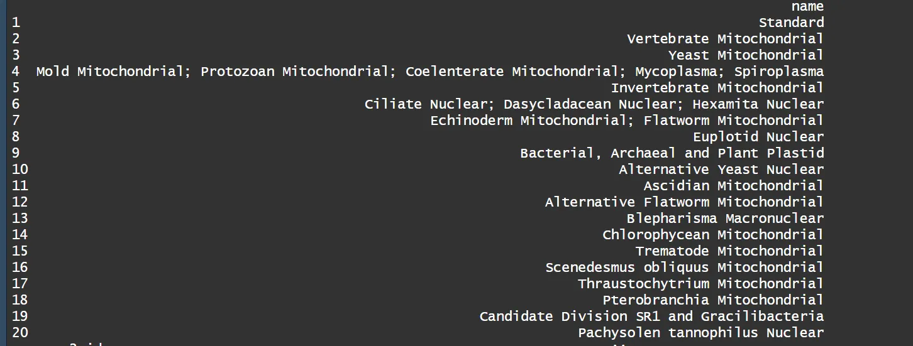
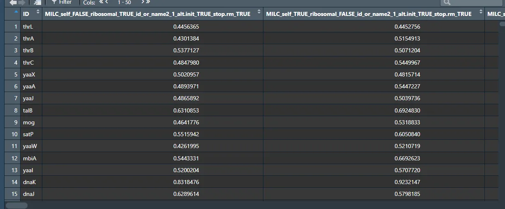
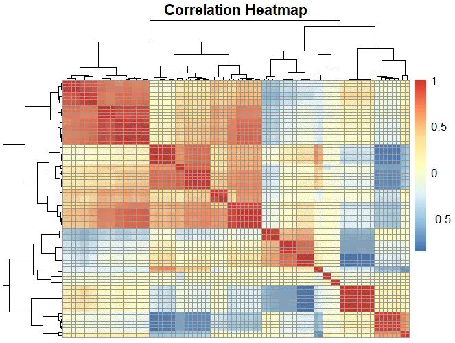

# 1、参数介绍
coRdon可以计算多个有关密码子使用频率的参数，如

- MILC(Measure Independent of Length and Composition):一个相对稳定的统计量,能很好地反映序列长度和组成变化对密码子使用的影响。
- B(Codon bias):计算每个氨基酸密码子相对于高表达基因集的使用偏差,反映翻译优化程度。
- MCB(Maximum Likelihood Codon Bias):最大似然密码子偏好值,尝试最小化少见氨基酸对统计量的影响。
- ENCprime: Modified ENC,允许比较除均匀分布外的其他预期密码子分布。
- ENC(Effective Number of Codons):衡量实际密码子使用偏离均匀使用的程度。
- SCUO(Synonymous Codon Usage Orderliness):基于信息熵理论,反映同义密码子使用的有序性。
- E、CAI、GCB 和 Fop都是用于预测基因相对表达水平的方法,它们基于密码子使用模式的差异来估计基因的翻译效率和表达丰度:
- E():基于密码子偏好统计量B来计算的表达值,通过与参考基因组比较确定高表达基因。
- CAI(Codon Adaptation Index):最常用的方法之一,基于参考表来计算每个密码子的相对使用频率,反映翻译优化程度。
- GCB(Gene Codon Usage Bias):不需要参考基因组,通过迭代法确定高表达基因,并计算每个基因的密码子得分。
- Fop(Frequency of Optimal Codons):计算优化密码子(最可能对应高拷贝数的tRNA)的使用频率,频率高提示翻译效率高。
# 2、初步计算
先导入需要用的包
```python
rm(list = ls())
# devtools::install_local('./coRdon-master.zip')
library(coRdon)
library(Biostrings)
```
一个函数自动化计算所有参数，包含不同种的超参数组合
在coRdon中，对于上述函数，每一个参数都有一个相对因的函数，但我将他们分为了四类：
1、有self，需要计算ribosomal，需要提供subsets（）如MILC, B, MCB, ENCprime
2、没有ribosomal的，如ENC, SCUO
3、无self,需要计算ribosomal,需要提供subsets(), 如MELP, E, CAI, Fop
4、无self，需要提供seed，如GCB
## 2.1一些可以设置的参数
**subsets**:
它可以是一个逻辑向量的命名列表，每个向量的长度都等于 cTobject 的长度，也就是数据集中序列的数量。此外，它也可以是包含 KEGG/eggNOG 注释的字符向量，或者是 codonTable 对象的列表，这些对象的长度可以是任意的。然而，在计算 ENC、SCUO 和 GCB 时不会使用这个参数。可以把他视为参考集。
**ribosomal：**

1. 当参数设为 TRUE 时，会计算CU统计量相对于序列集合中核糖体基因的平均CU值。但在计算ENC和SCUO时，这个参数不会被使用。
2. 对于GCB的计算，如果设为TRUE，则核糖体基因将作为种子用于计算；如果设为FALSE（默认值），则需要明确指定种子。

**id_or_name2:**
可以输入GENETIC_CODE_TABLE查看

**alt.init :**
表示是否使用替代起始密码子。默认值为 TRUE
**stop.rm:**
是否删除终止密码子，默认是False
别的参数详见帮助文档
## 2.2批量计算
从2.1可以看到，这个函数里边有许多较多的可以供调节的超参数，为此，为了不放过这些超参数的影响，我写了一个脚本，通过排列组合能够得到所有的计算结果，并保存为一个data.frame
**fasta_file_path**:表示需要读取的fatsa文件的路径；
**genetic_code**:即函数里边的id_or_name2，表明使用的不同的密码子表，要注意这里必须是一个向量，长度至少为1；
**rm_na_col**:由于使用不同的密码子表，会对结果有一定的影响，可以选择T，F，来选择是否删除NA的列
### 2.2.1、设置subsets
这里我是使用在帮助文档中的一半的输入序列来作为参考序列，具体该怎么设置，待我读了他的原始paper，再来做更新。
```python
halfcT <- codonTable(codonCounts(dna_file)[1:length(dna_file)/2,])
```
### 2.2.2、Calculate_coRdon(1.0)
```python
Calculate_CoRdon <- function(fasta_file_path, genetic_code, rm_na_col){
    require(dplyr)
    dna_file <- readSet(file = fasta_file_path) %>% 
    codonTable(.)
    # dna_file <- K12
    out_data <- data.frame(ID = dna_file@ID)
    params <- list(
        self = c(TRUE, FALSE),
        ribosomal = c(TRUE, FALSE),
        id_or_name2 = genetic_code, 
        alt.init = c(TRUE, FALSE),
stop.rm = c(TRUE, FALSE)
)
halfcT <- codonTable(codonCounts(dna_file)[1:length(dna_file)/2,])
combos <- expand.grid(params)
combos$id_or_name2 <- as.character(combos$id_or_name2)
# 删除self和ribosomal都是FALSE的行
combos <- combos[!(combos$self == FALSE & combos$ribosomal == FALSE),]
# 如果combos中的ribosomal为TRUE，那么self应该为FALSE
combos$self[combos$ribosomal] <- FALSE
# 删除重复行
combos <- combos[!duplicated(combos),]
results <- data.frame(ID = dna_file@KO)
# nrow(combos)
results_list <- list()

# 定义要调用的函数名
functions_1 <- c("MILC", "B", "MCB", "ENCprime")
# 循环调用函数
for (func_name in functions_1) {
for (i in 1:nrow(combos)) {
    # i = 2
    args <- list(dna_file, self = combos$self[i], ribosomal = combos$ribosomal[i], 
                 id_or_name2 = combos$id_or_name2[i], alt.init = combos$alt.init[i], 
stop.rm = combos$stop.rm[i], subsets = list(half = halfcT))

tryCatch({
    if (args$self == TRUE) {
        result <- do.call(func_name, args) %>% as.data.frame() %>% .$self
    } else {
        result <- do.call(func_name, args) %>% as.data.frame() %>% .$half
    }
         # result <- do.call(func_name, args)
         col_name <- paste("self", combos$self[i], "ribosomal", combos$ribosomal[i],
                           "id_or_name2", combos$id_or_name2[i], "alt.init", combos$alt.init[i],
                           "stop.rm", combos$stop.rm[i], sep="_")
         col_name <- paste(func_name, col_name,sep = '_')
         results_list[[col_name]] <- result
         }, error = function(e) {
    cat(paste("Error in", func_name, "at row", col_name, ":", conditionMessage(e), "\n"))
})
}
}
functions_2 <- c('ENC', 'SCUO')
params_2 <- list(
    # self = c(TRUE, FALSE),
    # ribosomal = c(TRUE, FALSE),
    id_or_name2 = genetic_code, 
    alt.init = c(TRUE, FALSE),
stop.rm = c(TRUE, FALSE)
)
combos_2 <- expand.grid(params_2)
combos_2$id_or_name2 <- as.character(combos_2$id_or_name2)
# 删除self和ribosomal都是FALSE的行
# combos_2 <- combos_2[!(combos_2$self == FALSE & combos_2$ribosomal == FALSE),]
# # 如果combos_2中的ribosomal为TRUE，那么self应该为FALSE
# combos_2$self[combos_2$ribosomal] <- FALSE
# 删除重复行
combos_2 <- combos_2[!duplicated(combos_2),]
for (func_name in functions_2) {
# func_name <- 'SCUO'
for (i in 1:nrow(combos_2)) {
    # i <- 1
    args <- list(dna_file,id_or_name2 = combos_2$id_or_name2[i], 
                 alt.init = combos_2$alt.init[i],stop.rm = combos_2$stop.rm[i])

tryCatch({
    result <- do.call(func_name, args)
    col_name <- paste("id_or_name2", combos_2$id_or_name2[i], "alt.init", combos_2$alt.init[i],
                      "stop.rm", combos_2$stop.rm[i], sep="_")
    col_name <- paste(func_name, col_name,sep = '_')
    results_list[[col_name]] <- result
}, error = function(e) {
    cat(paste("Error in", func_name, "at row", col_name, ":", conditionMessage(e), "\n"))
})
}
}
functions_3 <- c('MELP', 'E', 'CAI', 'Fop')
params_3 <- list(
    # self = c(TRUE, FALSE),
    ribosomal = c(TRUE, FALSE),
    id_or_name2 = genetic_code, 
    alt.init = c(TRUE, FALSE),
stop.rm = c(TRUE, FALSE)
)
combos_3 <- expand.grid(params_3)
combos_3$id_or_name2 <- as.character(combos_3$id_or_name2)
# 删除self和ribosomal都是FALSE的行
# combos_3 <- combos_3[!(combos_3$self == FALSE & combos_3$ribosomal == FALSE),]
# 如果combos_3中的ribosomal为TRUE，那么self应该为FALSE
# combos_3$self[combos_3$ribosomal] <- FALSE
# 删除重复行
combos_3 <- combos_3[!duplicated(combos_3),]
for (func_name in functions_3) {
# func_name <- 'MELP'
for (i in 1:nrow(combos_3)) {
    # i <- 1
    args <- list(dna_file, ribosomal = combos_3$ribosomal[i], 
                 subsets = list(half = halfcT),
                 id_or_name2 = combos_3$id_or_name2[i], alt.init = combos_3$alt.init[i], 
stop.rm = combos_3$stop.rm[i])

tryCatch({
    result <- do.call(func_name, args)
    col_name <- paste("ribosomal", combos_3$ribosomal[i],
                      "id_or_name2", combos_3$id_or_name2[i], "alt.init", combos_3$alt.init[i],
                      "stop.rm", combos_3$stop.rm[i], sep="_")
    col_name <- paste(func_name, col_name,sep = '_')
    results_list[[col_name]] <- result
}, error = function(e) {
    cat(paste("Error in", func_name, "at row", col_name, ":", conditionMessage(e), "\n"))
})
}
}

functions_4 <- c('GCB')
params_4 <- list(
    # self = c(TRUE, FALSE),
    ribosomal = c(TRUE, FALSE),
    id_or_name2 = genetic_code, 
    alt.init = c(TRUE, FALSE),
stop.rm = c(TRUE, FALSE)
)
combos_4 <- expand.grid(params_4)
combos_4$id_or_name2 <- as.character(combos_4$id_or_name2)
# 删除self和ribosomal都是FALSE的行
# combos_4 <- combos_4[!(combos_4$self == FALSE & combos_4$ribosomal == FALSE),]
# 如果combos_4中的ribosomal为TRUE，那么self应该为FALSE
# combos_4$self[combos_4$ribosomal] <- FALSE
# 删除重复行
combos_4 <- combos_4[!duplicated(combos_4),]
# 循环调用函数
for (func_name in functions_4) {
for (i in 1:nrow(combos_4)) {
    args <- list(dna_file, ribosomal = combos_4$ribosomal[i], 
                 id_or_name2 = combos_4$id_or_name2[i], alt.init = combos_4$alt.init[i], 
stop.rm = combos_4$stop.rm[i],seed = halfcT)

tryCatch({
    result <- do.call(func_name, args)
    col_name <- paste("ribosomal", combos_4$ribosomal[i],
                      "id_or_name2", combos_4$id_or_name2[i], "alt.init", combos_4$alt.init[i],
                      "stop.rm", combos_4$stop.rm[i], sep="_")
    col_name <- paste(func_name, col_name,sep = '_')
    results_list[[col_name]] <- result
}, error = function(e) {
    cat(paste("Error in", func_name, "at row", col_name, ":", conditionMessage(e), "\n"))
})
}
}
max_length <- max(lengths(results_list))
my_list <- lapply(results_list, function(x) {
                  if(length(x) < max_length) {
                      c(x, rep(NA, max_length - length(x)))
                  } else if(length(x) > max_length) {
                      x[1:max_length]
                  } else {
    x
}
})
# 将列表转换为数据框
col_names_cal_data <- names(my_list)
calculate_data <- data.frame(my_list)
colnames(calculate_data) <- col_names_cal_data
if (rm_na_col == T) {
    cols_with_na <- colSums(is.na(calculate_data)) > 0

# 获取包含NA值的列名
cols_with_na_names <- names(cols_with_na[cols_with_na])
calculate_data <- calculate_data[, !cols_with_na]
}
## 把数据进行合并
out_data <- cbind(out_data, calculate_data)
return(out_data)
}  
```
调用函数计算得到所有的CU参数,这里我使用标准密码子表,使用的不同的参数组合，都反应在colnames上
```python
cal <- Calculate_CoRdon(fasta_file_path = '../wsc/K12.fasta', genetic_code = c('1'),
                        rm_na_col = F)
write.csv(cal, './test_cordon.csv', row.names = F)
```

# 3、做个相关性看看
为了图片的美观，就不显示列名了
```python
cor_matrix <- cor(cal[,2:ncol(cal)], method = "pearson")
library(pheatmap)
pheatmap(cor_matrix,
         main = "Correlation Heatmap",
         xlab = "Variables", ylab = "Variables",
         fontsize_row = 10, fontsize_col = 10, # 设置字体大小
         show_colnames = F, show_rownames = F, # 显示行名和列名
         cluster_rows = TRUE, cluster_cols = TRUE) # 是否对行和列进行聚类

```

不难发现，部分参数之间由于不同的超参数的选择不同，存在一定的相关性，值得进一步探究。
# 4、总结
该函数可能还存在着一定的错误，代码也比较冗长，欢迎测试，有什么问题请及时联系我（zhb2230914997@163.com），方便对函数进行改进。
# 5、参考来源
[coRdon](https://bioconductor.org/packages/devel/bioc/vignettes/coRdon/inst/doc/coRdon.html)
