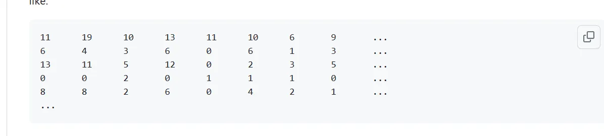

## 1、什么是tAI值
密码子的tAI（tRNA adaptation index）值是一种用于衡量密码子选择偏好的指标。tAI值反映了特定密码子在翻译时被tRNA适配体所识别的概率。这个指标考虑了每个密码子对应的tRNA适配体的丰度。
具体而言，tAI的计算通常基于以下两个因素：

1.  **tRNA适配体丰度：** 衡量每种tRNA适配体在细胞中的相对丰度，不同tRNA适配体的丰度可能影响密码子的选择。 
2.  **密码子的出现频率：** 考虑密码子在基因组中的使用频率，即特定密码子在编码蛋白质时的相对频率。 

tAI的计算公式如下：
$\text{tAI} = \prod_{i=1}^{n} p_i^{f_i}$
其中：

-   $p_i$是第 ( i ) 种tRNA适配体的相对丰度。
-  $f_i$是密码子对应的第 ( i ) 种tRNA适配体的相对频率。
-  $n$ 是tRNA适配体的种类数。

通过计算这个乘积，可以得到一个反映密码子选择偏好的tAI值。较高的tAI值表示密码子更容易被tRNA适配体识别，从而在翻译时更容易被选择使用。
## 2、使用tAI包对其进行计算
首先需要使用perl语言（Linux系统下自带Perl）得到一个文件 ecolik12.m文件， 文件包含了 codonM 脚本的输出：每个 ORF 的密码子频率矩阵。它应该呈现如下形式：
codonM是计算脚本，ecolik12.ffn是DNA的fasta序列， ecolik12.m是输出文件名
```python
perl codonM ecolik12.ffn ecolik12.m
```

是一个稀疏矩阵:
这将加载所需的函数到 R 中。文件 ecolik12.trna 包含了大肠杆菌 K-12 基因组中每种 tRNA 的基因拷贝数。我们需要这些信息来计算 tAI：
```r
eco.trna <- scan("ecolik12.trna")
eco.ws <- get.ws(tRNA=eco.trna, sking=1)
```
然后将perl得到的.m文件导入R中
```r
eco.m <- matrix(scan("ecolik12.m"), ncol=61, byrow=TRUE)
```
在我们的分析中，我们将忽略甲硫氨酸密码子（Methionine codons）（在任何基因组中，区分“起始”甲硫氨酸tRNA基因和正常甲硫氨酸tRNA之间没有自动的方法）：
```r
eco.m <- eco.m[,-33]
```
然后我们就可以轻松计算出tAI值。
```r
eco.tai <- get.tai(eco.m, eco.ws)
hist(eco.tai)
```
## 3、完整脚本
写了一个函数，方便后续使用
```r
rm(list = ls())
library(tAI)
library(ggplot2)
library(dplyr)
library(coRdon)

calculate_tAI <- function(trna_file_path, m_file_path, ffn_file_path) {
  # 从文件读取 tRNA 数据
  eco.trna <- scan(trna_file_path)
  eco.ws <- get.ws(tRNA=eco.trna, sking=1)
  
  # 从文件读取密码子频率矩阵
  eco.m <- matrix(scan(m_file_path), ncol=61, byrow=TRUE)
  eco.m <- eco.m[,-33]  # 删除甲硫氨酸
  
  # 计算 tAI 值
  eco.tai <- get.tai(eco.m, eco.ws)
  
  # 从 DNA 文件读取数据
  dna_file <- readSet(file = ffn_file_path) %>% 
    codonTable(.)
  
  # 存储结果到数据框
  out_data <- data.frame(
    gene_name = dna_file@ID,
    tAI = eco.tai
  )
  
  return(out_data)
}

# 使用函数并返回结果
result_data <- calculate_tAI(trna_file_path = "./ecolik12.trna",
                             m_file_path = "BW25113.m",
                             ffn_file_path = "BW25113_Sequence.fasta")
write.csv(result_data, "./BW25113_tAI.csv", row.names = F)

```
## 4、参考来源
> [https://github.com/mariodosreis/tai](https://github.com/mariodosreis/tai)

