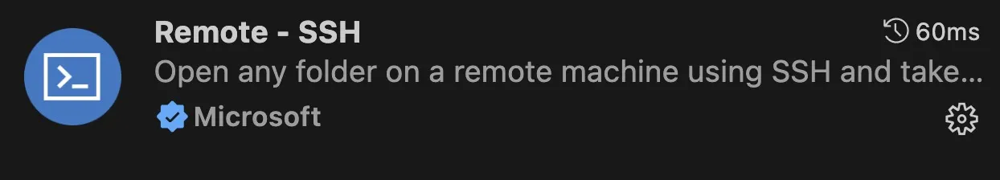
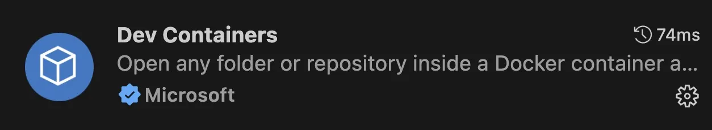
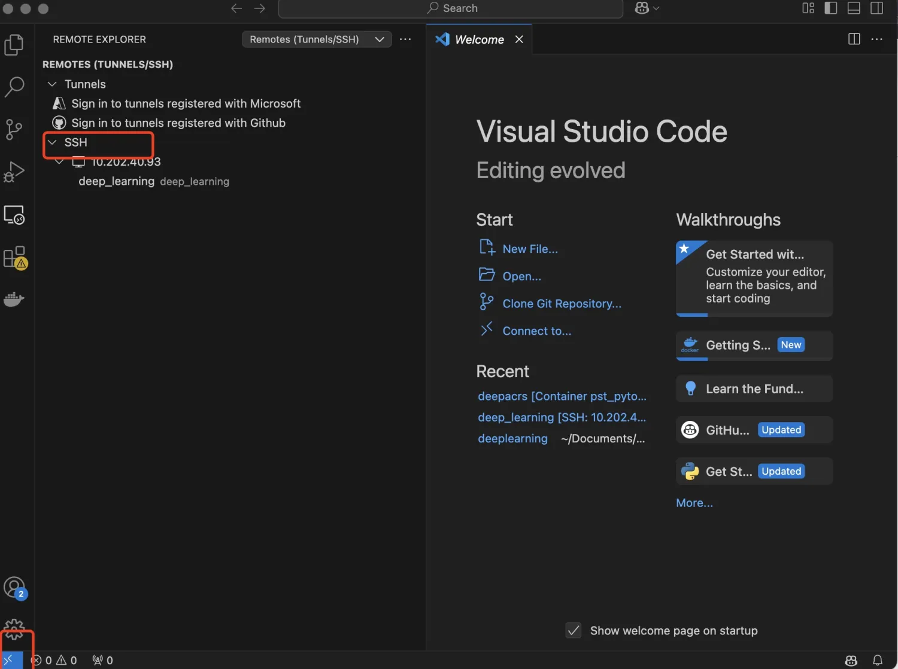
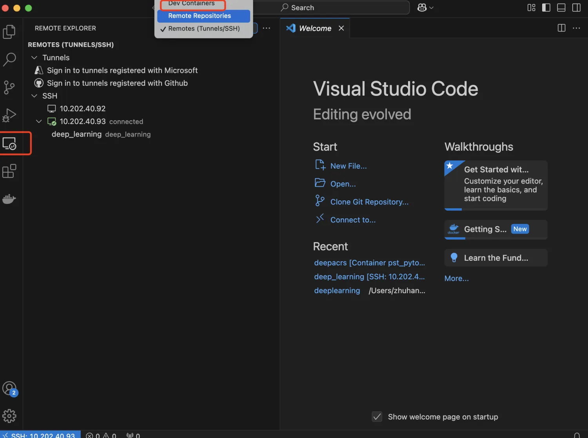

在开发环境中，当我们在使用服务器的时候，遇到需要在 vim 编辑器中修改我们的脚本，但是小幅度修改还 ok，一旦需要对较大的项目进行 debug 的时候，有一个编辑器则更符合我们的开发预期。

---

为此，可以使用以下工具使用 vscode 来连接服务器上的 docker 环境。

---

**插件需求**

**1、Remote SSH**

**2、Dev Contaniers**

## 远程连接到需要的服务器
所需要的插件，就是 remote ssh，在 ssh 里配置需要 link 的服务器地址, 然后进入所需要的连接，输入密码，即可远程连接到所需要的服务器。

## 从服务器中进入 docker 镜像
在插件这儿，选择相对应的 dev containers ,在这里点击所需要的远程连接的 docker 镜像就可以了 cautious 需要 link 的 docker 镜像需要提前已经启动了。 

