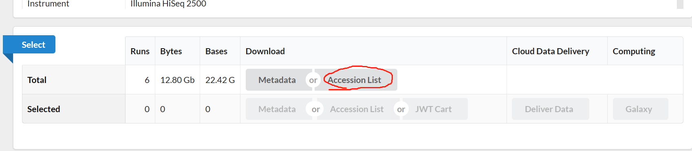

# 单细胞上游分析

## 单细胞测序介绍

**单细胞测序技术**

通过在**单个细胞**水平对转录组或基因组进行扩增并测序，可以研究单个细胞内的基因表达情况，同时解决用组织样本测序无法解决的细胞**异质性**(如在肿瘤组织中，肿块中心的细胞，肿块周围的细胞，淋巴转移灶的细胞，以及远端转移的细胞，其基因组和转录组等遗传信息，是存在差异的。而这种差异，在临床上，可以决定该肿瘤对某种疗法是否有效)难题，让解析单个细胞的行为、机制及其与机体的关系成为了现实。

**测序平台**
**10 X Genomics单细胞转录组测序平台**

利用**微流控**、**油滴包裹**和**Barcode标记**等技术来实现高通量的细胞捕获技术，**能够一次性分离、并标记500–10000个单细胞**，从而获得每个细胞的3’端的转录组信息。具有细胞通量高、建库成本低、捕获周期短等优势。该技术主要用于细胞分型和标记因子的鉴定，从而实现对细胞群体的划分与细胞群体间基因表达差异的检测，此外该技术还可以预测细胞分化与研究发育轨迹，在当下疾病、免疫、肿瘤领域以及组织、器官、发育研究中发挥越来越重要的作用。


## 数据下载

前往GEO数据库，得到目标样本的SRR ID号，本文以GSE117988为例，进行后续分析。

> 1、进入GEO数据库，找到relation中的SRA


> 2、下载为SRR_list文件


send to ==> run selector ==> go
进入如下界面


点击Accession List 进行下载，后上传List文件到服务其中

## 服务器相关软件设置

> 1、sratoolkit和aspera下载


下载数据时我们一般使用sratools中的prefetch,但是直接使用prefetch会速度非常的慢。当我们配上**aspera**时，下载速度就会变快。

```
##下载sraroolkit
cd ~/biosoft
wget https://ftp-trace.ncbi.nlm.nih.gov/sra/sdk/3.0.2/sratoolkit.3.0.2-ubuntu64.tar.gz
tar -zxvf sratoolkit.3.0.2-ubuntu64.tar.gz
echo 'export PATH=/home/data/t070401/biosoft/sratoolkit.3.0.2-ubuntu64/bin:$PATH'>> ~/.bashrc # 写入环境变量中
source ~/.bashrc ## 保存一下
## 查看安装成功没
prefetch -h # 弹出使用说明就是成功了
```

```
# 下载ascp 
cd ~/biosoft
wget http://download.asperasoft.com/download/sw/connect/3.7.4/aspera-connect-3.7.4.147727-linux-64.tar.gz
tar zxvf aspera-connect-3.7.4.147727-linux-64.tar.gz
#安装
bash aspera-connect-3.7.4.147727-linux-64.sh
# 然后cd到根目录下看看是不是存在了.aspera文件夹，有的话表示安装成功
cd && ls -a
# 将aspera软件加入环境变量，并激活
echo 'export PATH=~/.aspera/connect/bin:$PATH' >> ~/.bashrc
source ~/.bashrc
# 最后检查ascp是不是能用了
ascp --help
```

> 2、安装cellranger


cellranger的下载链接具有时效性，可以去10X官网下载

(https://support.10xgenomics.com/single-cell-gene-expression/software/downloads/latest）

```
cd ~/biosoft
wget -O cellranger-7.1.0.tar.gz "https://cf.10xgenomics.com/releases/cell-exp/cellranger-7.1.0.tar.gz?Expires=1681409686&Policy=eyJTdGF0ZW1lbnQiOlt7IlJlc291cmNlIjoiaHR0cHM6Ly9jZi4xMHhnZW5vbWljcy5jb20vcmVsZWFzZXMvY2VsbC1leHAvY2VsbHJhbmdlci03LjEuMC50YXIuZ3oiLCJDb25kaXRpb24iOnsiRGF0ZUxlc3NUaGFuIjp7IkFXUzpFcG9jaFRpbWUiOjE2ODE0MDk2ODZ9fX1dfQ__&Signature=g06lNWAxunjOQbd~LKht32n4RG9K0UpWMGhwF7mVznbn45BAjhA5aNONcNMxIHLh8Rwelgf1LxnLxoFQF4aQb7j5EPKwcTbrgaX8ndlA0vR7zXVkiXroQ0NmEREeyni75QrNbw-~e5UoEFo9EjaKWOQuGOjL4drjDUQoVWJNmi4ONFQkvX6cs-8QJ4uVIaVecVjjWD6JkQWtyGyFiGXHIYUh0aWFrpFkZzh4IURDS8C6dkaBPZV5rYFujuRSBsFtS3NQKF8aiBMqUVk5T43wScm60KN5CNBhfZGsz3K92l3F9~-FnGnmUhwBJHlC4aO2C79k7a6tX0LnM038jAfn4w__&Key-Pair-Id=APKAI7S6A5RYOXBWRPDA"
# 校对一下md5码是否一致
md5sum cellranger-7.1.0.tar.gz
# 解压
tar -zxvf cellranger-7.1.0.tar.gz
echo 'export PATH=/home/data/t070401/biosoft/cellranger-7.1.0/bin:$PATH'>> ~/.bashrc # 写入环境变量中
source ~/.bashrc ## 保存一下
## 查看安装成功没
cellranger -h # 弹出使用说明就是成功了
```

> 3、创建专属conda环境


```
#conda install mamba
## 使用mamba下载包会非常的快
conda create -n 10x
conda activate 10x
mamba install -y -c bioconda aspera-cli bwa samtools bedtools sambamba sra-tools bowtie2 samblaster fasterq-dump
```

> 4、下载参考基因组


```
cd ~/single_cell/10x_refdata
## mm10
nohup wget https://cf.10xgenomics.com/supp/cell-exp/refdata-gex-mm10-2020-A.tar.gz & # 挂nohup & 让他在后台下载

md5sum refdata-gex-mm10-2020-A.tar.gz
#886eeddde8731ffb58552d0bb81f533d refdata-gex-mm10-2020-A.tar.gz
tar -xzvf refdata-gex-mm10-2020-A.tar.gz
####################################################################################################################################################

## hg38
nohup wget https://cf.10xgenomics.com/supp/cell-exp/refdata-gex-GRCh38-2020-A.tar.gz &

md5sum refdata-gex-GRCh38-2020-A.tar.gz
#dfd654de39bff23917471e7fcc7a00cd refdata-gex-GRCh38-2020-A.tar.gz
tar -xzvf refdata-gex-GRCh38-2020-A.tar.gz
```

## 分析流程

### sra数据下载

创建分析所用的文件夹

```
cd ~/single_cell/cellranger

mkdir 1.sra 2.raw_fastq 3.cellranger
```

把下载好的SRR list放入到**1.sra**文件夹下

```
cd ./1.sra
cat SRR_Ac_List.txt |while read id;do (nohup prefetch $id &);done
```

> 1、SRA 转 fastq


常规的SRA转fastq文件，用的是fastq-dump软件，由于该软件是使用单线程，速度非常慢。fasterq-dump可以加快速度，但是可能时版本不匹配，无法正常使用。为此，我们使用**parallel-fastq-dump**进行数据的下载

```
conda activate 10x
pip install parallel-fastq-dump
```

Linux ln（英文全拼：link files）命令是一个非常重要命令，它的功能是为某一个文件在另外一个位置建立一个同步的链接。

当我们需要在不同的目录，用到相同的文件时，我们不需要在每一个需要的目录下都放一个必须相同的文件，我们只要在某个固定的目录，放上该文件，然后在 其它的目录下用ln命令链接（link）它就可以，不必重复的占用磁盘空间。
这里为我们为1.sra文件夹中的数据建立一个到2.fastq的链接

```
cd 2.raw_fastq
ln -s ../1.sra/SRR* ./
```

```
#写一个脚本批量进行转换
vim fastq.sh
cat ../1.sra/SRR_Acc_List.txt | while read id;do (nohup parallel-fastq-dump --gzip --threads 4 --outdir ./  --split-files -s ./$id/$id.sra& );done
```

**--split-files** 该参数可以将sra文件拆分为**3**个文件

**--gzip**  对结果进行压缩

**--threads** 使用多少个线程 这里设置为4

此外这里的`**--split-files**`若换成`**--split-3**`
如果结果发现只有一个文件，说明数据不是双端(第三个文件太大会覆盖前两个)；

如果结果有两个文件，说明是双端文件并且数据质量比较高(没有低质量的reads或者长度小于20bp的reads)；

如果结果有三个文件，说明是双端文件，但是有的数据质量不高，存在trim的结果，第三个文件的名字一般是：<srr_id>.fastq， 而且文件也不大，基本可以忽略。
在cellranger流程中，为了后续分析，我们采用`**--split-files**`。

```
  bash fastq.sh ##!!! 勿忘ps查看一下进程
```


> Run cellranger


先把文件改一下名

```
vim change_name.sh
cat ../1.sra/SRR_Acc_List.txt|while read i;do (mv ${i}_1*.gz ${i}_S1_L001_I1_001.fastq.gz;
mv ${i}_2*.gz ${i}_S1_L001_R1_001.fastq.gz;
mv ${i}_3*.gz ${i}_S1_L001_R2_001.fastq.gz);done

bash change_name.sh
```


然后就是走cellranger啦

```
cd ../3.cellranger
# 同理也可以写一个shell脚本
# 我们的样本是人的，就用这个ch38的参考基因组
vim run_cellranger.sh
ref=/home/data/t070401/single_cell/10x_refdata/refdata-gex-GRCh38-2020-A
cat ../1.sra/SRR_Acc_List.txt|while read id;
do (nohup cellranger count --id=$id \
--transcriptome=$ref \
--fastqs=/home/data/t070401/single_cell/cellranger/2.raw_fastq \
--sample=$id \
--nosecondary \
--localcores=4\
--localmem=30 &);
done

bash run_cellranger.sh
## !! 勿忘ps一下进程
```

最主要的几个参数：

**--id**文件夹的名字

**--transcriptome** 指定参考基因组的路径

**--sample** 指定需要处理的fastq文件的前缀

**--expect-cell** 指定预期的细胞数目，默认参数是3000个

**--localcores** 指定计算的核心数

**--mempercore** 指定内存大小 GB

**--nosecondary** 不需要进行降维聚类（因为后期会用R可视化）

**--chemistry**，默认是自动识别chemistry，但是有些时候识别不出chemistry的时候，需要加入参数特别标明

最后得到结果在**outs文件夹**下


得到的结果就可以用**seurat**读取然后进行下游分析啦。

### 结果解读

**web_summary.html**：**必看**，官方说明 summary HTML file ，包括许多QC指标，预估细胞数，比对率等；

**metrics_summary.csv**：CSV格式数据摘要，可以不看；

**possorted_genome_bam.bam**：比对文件，用于可视化比对的reads和重新创建FASTQ文件，可以不看；

**possorted_genome_bam.bam.bai**：索引文件；

**filtered_gene_bc_matrices**：**是最为重要的一个目录**，下面又包含了 barcodes.tsv.gz、features.tsv.gz、matrix.mtx.gz，是下游Seurat、Scater、Monocle等分析的输入文件，是经过Cell Ranger过滤后构建矩阵所需要的所有文件；

**filtered_feature_bc_matrix.h5**：过滤掉的barcode信息HDF5 format，可以不看；

**raw_feature_bc_matrix**：原始barcode信息，未过滤的可以用于构建矩阵的文件，可以不看；

**raw_feature_bc_matrix.h5**：原始barcode信息HDF5 format，可以不看；

**analysis**：数据分析目录，下面又包含聚类clustering（有graph-based & k-means）、差异分析diffexp、主成分线性降维分析pca、非线性降维tsne，因为我们自己会走Seurat流程，所以不用看；

**molecule_info.h5**：可用于整合多样本，使用cellranger aggr函数；

**cloupe.cloupe**：官方可视化工具Loupe Cell Browser 输入文件，无代码分析的情况下使用，会代码的同学通常用不到。

## 参考来源

[生信随笔](https://mp.weixin.qq.com/s/pQyUieRVXohY1enqjN4lLA)

[生信技能树](https://mp.weixin.qq.com/s?__biz=MzAxMDkxODM1Ng==&mid=2247516508&idx=8&sn=19e51014d81d0119afec56c881e958a8&chksm=9b4bc1e7ac3c48f1588f9d2962b2fefdc62c1b00d3743e601baddb9a28d86c063edc899541d0&mpshare=1&scene=24&srcid=0730tcduHcbcKvJBgTEIOLPi&sharer_sharetime=1659161014672&sharer_shareid=f6246b3462b3610f15c2e3f6a3a18648&key=bec1e9b8e2f7b754cc5bc8c025163a922958d535fabaafea7509e6e6a6e6731059e25713f490b59605852636727013d57b0626d7c147e840999fd7e25b21f2259503c305f9d365a8b01035c69981444c2843fad0f939af5364e29048a6e4ccb4b7d322750c0807ca56750f57435677a2b8266fe4efd1aa4f8730f7dc5045fe10&ascene=1&uin=MjY4Mjc2NjYzMw%3D%3D&devicetype=Windows+11+x64&version=6309001c&lang=zh_CN&countrycode=CN&exportkey=n_ChQIAhIQbKVlX%2BhYz9mWi6zBBYZyexLqAQIE97dBBAEAAAAAAJZJI%2Fj7zfAAAAAOpnltbLcz9gKNyK89dVj0AE7XY%2FMS0RFSpK9TZuwq4KG35vQ00idIy%2FQqEkEFucG1u4%2B%2BNLfS%2BMunGoY4jLX3FBznh6PATnyWtqDB73E%2B6SL%2F9PIkkrT6ZRXgn%2F5%2BIccY6oATCkyewKHJE8j2%2FZQxd0zvQlVYz%2Bd9fffWqIeWwV9FbCpB48RdB9yOUtT4kiLkDffuiYIktTBbqN6qiWW%2BF20WRfrTlaSjWDuHLkgfOt8ZfbWOhdRlAiGO3VlscQZxLwIB%2F%2BFC9iPSXXzKJci7MzTW%2BQ%3D%3D&acctmode=0&pass_ticket=2sRVo5I6KP4xaYBkDjXNc8Q0kW1iy7zlTn5tXWbZ3ABs3nVRXVrTllDaAn3GHzuLTRWy%2BWKAlDl%2FUxiLpIKJSw%3D%3D&wx_header=1&fontgear=2)

[10X GENOMICS](https://support.10xgenomics.com/single-cell-gene-expression/software/downloads/latest)
