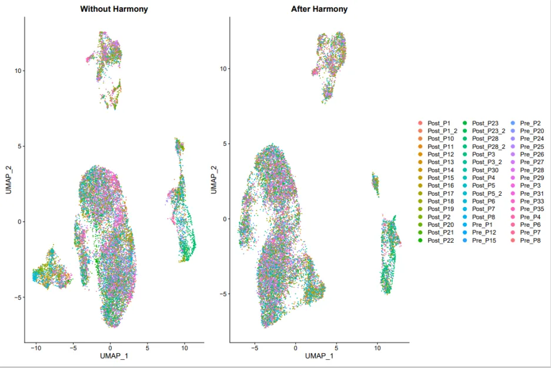

当涉及到转录组分析时，有几种不同的方法可供选择，包括单细胞RNA测序（scRNA-seq）、bulkRNA测序（bulkRNA-seq）以及传统RNA测序（RNA-seq）。 

1. 单细胞RNA测序（scRNA-seq）：
   - 优点：可以捕获单个细胞的基因表达，揭示细胞异质性、亚型、状态等信息。提供高分辨率的细胞级别数据。
   - 缺点：技术复杂，噪声较多，需要更多的样本和细胞来获得统计显著性。数据处理和分析较为挑战。
2. bulkRNA测序（bulkRNA-seq）：
   - 优点：技术相对简单，适用于大规模样本。可以提供整体组织或细胞群体的平均表达水平，适用于分析基因表达差异、通路富集等。
   - 缺点：无法分辨单个细胞的异质性，无法捕获细胞亚型信息。可能掩盖了不同细胞类型之间的差异。
3. 传统RNA测序（RNA-seq）：
   - 优点：广泛应用于研究不同条件下的基因表达变化，包括生物学重复实验、疾病状态等。
   - 缺点：通常是对整个样本进行测序，无法提供单细胞级别的信息。可能掩盖了细胞异质性。

一句话概括就是scRNA-seq是在细胞层面对组织进行测序；bulkRNA-seq则是在组织的层面对样品进行测序，测得的count值可以理解为是一个组织的平均值。
## 00_准备工作
```r
rm(list = ls())
.libPaths(c('/home/data/refdir/Rlib', '/home/data/t070401/R/x86_64-pc-linux-gnu-library/4.2',
            "/usr/local/lib/R/library" ))
library(dplyr)
library(qs)
library(Seurat)
library(stringr)
library(ggplot2)
if(!require(devtools, quietly = T)){
  install.packages('devtools')
  library(devtools)
}
if(!require(harmony, quietly = T)){
  install_github('immunogenomics/harmony')
  library(harmony)
}
library(future)
library(clustree)
plan("multisession", workers = 4)
library(SingleR)
```
### 读取表达矩阵，构建Seurat对象
```r
out_count <- qread('./raw_count/out_count_contain_group.qs')
coln <- str_split(colnames(out_count), '\\*',simplify = T )[, 1]
colnames(out_count) <- coln

scRNA <- CreateSeuratObject(out_count, min.cells = 3, min.features = 300)
table(scRNA@meta.data$orig.ident)
```
### 添加meta信息
```r
meta_data <- qread('./qs_data/meta_data.qs')
head(meta_data)

sum(rownames(scRNA@meta.data) == meta_data$title)
scRNA@meta.data$patient.ID <- meta_data$patient.ID
scRNA@meta.data$treat_statue <- meta_data$treat_statue
scRNA@meta.data$therapy <- meta_data$therapy
qsave(scRNA, './qs_data/1.seu.qs')
```
## 01_初步质控
```r
# 查找到线粒体表达数较多的细胞，并进行过滤
scRNA[['percent.mt']] <- PercentageFeatureSet(scRNA, pattern = '^MT-')
str(scRNA@meta.data)

# 计算红细胞比例
HB.genes <- c("HBA1","HBA2","HBB","HBD","HBE1","HBG1","HBG2","HBM","HBQ1","HBZ")
HB_m <- match(HB.genes, rownames(scRNA@assays$RNA))
HB.genes <- rownames(scRNA@assays$RNA)[HB_m]
HB.genes <- HB.genes[!is.na(HB.genes)]
HB.genes
scRNA[['percent.HB']] <- PercentageFeatureSet(scRNA, features = HB.genes)
head(scRNA@meta.data)
col.num <- length(levels(scRNA@active.ident))
col.num

violin <- VlnPlot(scRNA,
                  features = c("nFeature_RNA", "nCount_RNA", "percent.mt","percent.HB"), 
                  cols =rainbow(col.num), 
                  # pt.size = 0, #不需要显示点，可以设置pt.size = 0
                  ncol = 1, 
                  group.by = "patient.ID") + 
  theme(axis.title.x=element_blank(), axis.text.x=element_blank(), axis.ticks.x=element_blank())
violin
plot1=FeatureScatter(scRNA, feature1 = "nCount_RNA", feature2 = "percent.mt")+
  theme(legend.position = 'none')
plot2=FeatureScatter(scRNA, feature1 = "nCount_RNA", feature2 = "nFeature_RNA")+
  theme(legend.position = 'none')
plot3=FeatureScatter(scRNA, feature1 = "nCount_RNA", feature2 = "percent.HB")
dir.create('./qc')  
setwd('./qc/')
ggsave(violin, file = './pre_post_visual.pdf',width = 10, height = 15, dpi = 300)
p1 <- plot3/plot2/plot3
ggsave(p1, file = './n_count_RNA_nfeature.etc.pdf', width = 10, height = 10, dpi = 300)


# 数据集质控
scRNA_q <- subset(scRNA, subset = nFeature_RNA > 300& nFeature
qsave(scRNA_q, file = './qs_data/quality_control_data.qs')
```
## 02_使用harmony进行取批次效应
```r
scRNA_Harmony <- NormalizeData(scRNA_q)%>%FindVariableFeatures()%>%ScaleData()%>%RunPCA(verbose = F)
scRNA_Harmony <- RunHarmony(scRNA_Harmony, group.by.vars = 'patient.ID')
scRNA_Harmony <- FindNeighbors(scRNA_Harmony, reduction = 'harmony', dims = 1:15)%>%
  FindClusters(resolution = 0.5)
scRNA_Harmony <- RunUMAP(scRNA_Harmony, reduction = 'harmony', dims = 1:16)
scRNA_Harmony <- RunTSNE(scRNA_Harmony, reduction = 'harmony', dims = 1:16)
p1 <- DimPlot(scRNA_Harmony, reduction = 'umap', group.by = 'patient.ID')+ggtitle('After Harmony')
p2 <- DimPlot(scRNA_Harmony, reduction = 'umap', group.by = 'seurat_clusters') + ggtitle('After Harmony')
dir.create('./01_harmony/1_check_batch_effects')
ggsave(p1, file = './01_harmony/1_check_batch_effects/after_harmony.pdf', width = 10, height = 10, dpi = 300)

qsave(scRNA_Harmony, './qs_data/after_harmony.qs')

scRNA_without_harmong <- NormalizeData(scRNA_q)%>%FindVariableFeatures()%>%ScaleData()%>%RunPCA(verbose = F)
scRNA_without_harmong <- FindNeighbors(scRNA_without_harmong, reduction = 'pca', dims = 1:15)%>%
  FindClusters(resolution = 0.5)
scRNA_without_harmong <- RunUMAP(scRNA_without_harmong, reduction = 'pca', dims = 1:16)
scRNA_without_harmong <- RunTSNE(scRNA_without_harmong, reduction = 'pca', dims = 1:16)
p3 <- DimPlot(scRNA_without_harmong, reduction = 'umap', group.by = 'patient.ID')+ggtitle('Without Harmony') + NoLegend()
p4 <- DimPlot(scRNA_without_harmong, reduction = 'umap', group.by = 'seurat_clusters') + ggtitle('Without Harmony') + NoLegend()
qsave(scRNA_without_harmong, './qs_data/withour_harmony.qs')
p3 + p1
p4 + p2
ggsave(p3 + p1, file = './01_harmony/1_check_batch_effects/before_after_harmony(patient.ID).pdf', width = 15, height = 10, dpi = 300)
ggsave(p4 + p2, file = './01_harmony/1_check_batch_effects/before_after_harmony(seurat.clusters).pdf', width = 10, height = 10, dpi = 300)

dir.create('./01_harmony/2_phenomenan_of_treat_and_therapy')
p5 <- DimPlot(scRNA_Harmony, reduction = 'umap', group.by = 'treat_statue')+
  facet_wrap('~treat_statue', nrow = 1) + ggsci::scale_color_lancet()
p6 <- DimPlot(scRNA_Harmony, reduction = 'umap', group.by = 'therapy')+
  facet_wrap('~therapy', nrow = 1) + ggsci::scale_color_lancet()
p5
p6
ggsave(p5, file = './01_harmony/2_phenomenan_of_treat_and_therapy/treat_statue.pdf', width = 10, height = 10, dpi = 300)
ggsave(p6, file = './01_harmony/2_phenomenan_of_treat_and_therapy/therapy.pdf', width = 10, height = 10, dpi = 300)
```
看看去批次效应前和去批次效应后有没有什么区别，从下图可以看到批次效应不是很明显。可能该样本是同一批次测序的，只是取自不同的病人个体，这也在一定程度上说明了病人间的个体差异比较小。

### 查找最适的分辨率
```r
## cluster_Tree查看最佳的分辨率
scRNA_Harmony <- FindClusters(
  object = scRNA_Harmony,
  resolution = c(seq(.1,1.7,0.1))
)
library(clustree)
tree_plot <- clustree(scRNA_Harmony@meta.data, prefix = "RNA_snn_res.")
colnames(scRNA_Harmony@meta.data)
dir.create('./01_harmony/0_cluster_tree')
ggsave(tree_plot, file = './01_harmony/0_cluster_tree/cluster_2_best_resolution.pdf', width = 10, 
       height = 12, dpi = 300)
qsave(scRNA_Harmony, './qs_data/scRNA_harmony_add_res.qs')
```


这样看来还是比较难找到最适合的res,因为我后期还需要进行亚群注释，所以这里就不需要分的特别细，只要在注释的时候能够将免疫细胞亚类划分清楚就行。
## 03_细胞注释
### 寻找高变基因
这里使用了一个循环，来不同的res进行寻找高变基因，并进行了可视化，便于后期注释。
```r
## 划分marker gene
### 非特异性免疫
#### 吞噬细胞==> monocyte(单核细胞)
monocyte_markers <- c('CD14', 'S100A9', 'FCN1')
#### 吞噬细胞==> macrophage(巨噬细胞)
macrophage_markers <- c('CD68', 'CD163', 'CD14', 'LYZ', 'VCAN')
#### NK_cell
NK_markers <- c('CD56', 'GZMB', 'NCAM1', 'GNLY', 'NKG7', 'NCR1')
#### B_cell
B_cell_markers <- c('CD19', 'CD79A', 'MS4A1', 'CD20', 'CD21')
#### γδTcell
γδTcell_markers <- c('TCRγδ', 'CD27', 'CD45RA')

### 特异性免疫
#### T cell
T_cell_markers <- c('CD3D', 'CD3' ,'CD2', 'CD3E', 'CD4', 'CD3G')
#### APC cell
Dendritic_cell_markers <- c('CD1C', 'CD11C', 'ITGAX', 'MHCII','CD80', 'CD86', 'CD40')
# scRNA_Harmony <- qread('./qs_data/scRNA_harmony_add_res.qs')
## 根据不同的res进行注释，然后再挑最合适的res, 亚群注释前不需要分的太细
## 选择res = 0.1
# scRNA_Harmony <- FindNeighbors(scRNA_Harmony, reduction = 'harmony', dims = 1:15)%>%
#   FindClusters(resolution = 0.1)
# dir.create('./02_check_top_markers')
# markers_res_0.1 <- FindAllMarkers(scRNA_Harmony, only.pos = TRUE, 
#                           min.pct = 0.25, logfc.threshold = 0.25) 
# markers_res_0.1 %>% group_by(cluster) %>% top_n(n = 2, wt = avg_log2FC)
# top10_0.1 <- markers_res_0.1 %>% group_by(cluster) %>% top_n(n = 10, wt = avg_log2FC)

# DoHeatmap(scRNA_Harmony, features = top10_0.1$gene[1:10])

# VlnPlot(scRNA_Harmony, features = Tcells_markers,pt.size=0)
# DotPlot(scRNA_Harmony, features = Dendritic_cell_markers) + coord_flip() +FontSize(y.text = 10)

## 循环选择res
first_marker_list <- list(
  monocyte_markers, macrophage_markers, NK_markers, B_cell_markers, γδTcell_markers,
  T_cell_markers, Dendritic_cell_markers
)
names(first_marker_list) <- c('monocyte_markers', 'macrophage_markers', 'NK_markers', 'B_cell_markers', 'γδTcell_markers',
                              'T_cell_markers', 'Dendritic_cell_markers')
library(future)
plan("multisession", workers = 4)
for(res in seq(0.1, 1.5, 0.1)){
  path = paste0('./02_check_top_markers/', paste0('res_', res)) %>% 
    paste0(., '/')
  dir.create(path)
  scRNA_Harmony <- FindNeighbors(scRNA_Harmony, reduction = 'harmony', dims = 1:15)%>%
    FindClusters(resolution = res)
  a <- assign(paste0('markers_res_', res), FindAllMarkers(scRNA_Harmony, only.pos = TRUE, 
                                                    min.pct = 0.25, logfc.threshold = 0.25))
  assign(paste0('top_10_markers_res_', res), a %>% group_by(cluster) %>% top_n(n = 10, wt = avg_log2FC))
  qsave(a, file = paste(path, '.qs', sep = paste0('markers_res_', res)))## 不是top10的
  for(i in names(first_marker_list)){
    vio_plot <- VlnPlot(scRNA_Harmony, features = first_marker_list[[i]], group.by = 'seurat_clusters',
                        pt.size=0, stack=F)
    feature_plot <- FeaturePlot(scRNA_Harmony, features = first_marker_list[[i]], 
                                ncol = 1,
                                min.cutoff = 1, max.cutoff = "q90", reduction ='umap')
    dot_plot <- DotPlot(scRNA_Harmony, features = first_marker_list[[i]]) + coord_flip() +FontSize(y.text = 10)
    
    
    
    ggsave(vio_plot, file = paste(path, paste0('vioplot_check_for_', i), '.pdf'), 
           width = 8, height = 8, dpi = 300)
    ggsave(feature_plot, file = paste(path, paste0('featureplot_check_for_', i), '.pdf'), 
           width = 10, height = 15, dpi = 300)
    ggsave(dot_plot, file = paste(path, paste0('dotplot_check_for_', i), '.pdf'), 
           width = 10, height = 10, dpi = 300)
  }
  print('########################################################################')
  print(paste0(res, 'has done!'))
  print('########################################################################')
}

```
### SingleR注释
```r
### 使用singleR注释
library(SingleR)
load("../main/rdata_list/ref_Human_all.RData")
refdata <- ref_Human_all
testdata <- GetAssayData(scRNA_Harmony, slot="data")
# ?GetAssayData
###把scRNA数据中的seurat_clusters提取出来，注意这里是因子类型的
clusters <- scRNA_Harmony@meta.data$seurat_clusters
###开始用singler分析
cellpred <- SingleR(test = testdata, ref = refdata, labels = refdata$label.main, 
                    method = "cluster", clusters = clusters, 
                    assay.type.test = "logcounts", assay.type.ref = "logcounts")
###制作细胞类型的注释文件
celltype = data.frame(ClusterID=rownames(cellpred), celltype=cellpred$labels, stringsAsFactors = FALSE)
dir.create('./03_cell_anotation')
celltype = data.frame(ClusterID=rownames(cellpred), celltype=cellpred$labels, stringsAsFactors = F) 
scRNA_Harmony@meta.data$singleR =celltype[match(clusters,celltype$ClusterID),'celltype']
DimPlot(scRNA_Harmony, reduction = 'umap', group.by = 'singleR') + ggtitle('res = 1.5')
DimPlot(scRNA_Harmony, reduction = 'umap', group.by = 'RNA_snn_res.1.5', label = T)
```

### 使用手动注释
```r
## 手动注释
new.cluster.ids <- vector('character', length(unique(scRNA_Harmony$seurat_clusters)))
new.cluster.ids[c(9, 13) + 1] <- 'monocyte/macrophage/Dendritic cell'
new.cluster.ids[c(15) + 1] <- 'macrophage cell'
new.cluster.ids[c(6) + 1] <- 'NK cell'
new.cluster.ids[c(12, 14, 16, 17, 19) + 1] <- 'B cell'
new.cluster.ids[c(0, 1, 2, 3, 4, 5, 7, 8, 10, 11, 18) + 1] <- 'T cell'
table(new.cluster.ids)

names(new.cluster.ids) <- levels(scRNA_Harmony)
scRNA_Harmony <- RenameIdents(scRNA_Harmony, new.cluster.ids)
x <- as.data.frame(scRNA_Harmony@active.ident)
scRNA_Harmony@meta.data$celltype <- x$`scRNA_Harmony@active.ident`

qsave(scRNA_Harmony, './qs_data/after_manual_annotate(res=1.5).qs')
```


发现SingleR和手动注释结果差别不大，因为我后续focus的是T细胞。
最终我选择手动注释的结果进行后续分析
### check注释结果
改造原有的热图，对表达值取log(*+1）处理，使结果更加明显
```r
scRNA_Harmony <- qread('./qs_data/after_manual_annotate(res=1.5).qs')
devtools::install_local("~/BuenColors-master.zip")

jdb_color_maps <- qread('./qs_data/jdb_color_maps.qs')
DoHeatmapPlot <- function(object, groupBy, features) {
  require(ComplexHeatmap)
  # (1)获取绘图数据
  plot_data = SeuratObject::FetchData(object = object,
                                      vars = c(features, groupBy), 
                                      slot = 'counts') %>% 
    dplyr::mutate(across(.cols = where(is.numeric), .fns = ~ log(.x + 1))) %>% 
    dplyr::rename(group = as.name(groupBy)) %>% 
    dplyr::arrange(group) %T>% 
    assign(x = 'clusterInfo', value = .$group, envir = .GlobalEnv) %>% 
    dplyr::select(-group) %>% 
    t()
  
  # (2)配色方案：
  # require(BuenColors)
  col = jdb_color_maps[1:length(unique(clusterInfo))]
  names(col) = as.character(unique(clusterInfo))
  
  # (3)列(聚类)注释：
  # HeatmapAnnotation函数增加聚类注释，如条形图，点图，折线图，箱线图，密度图：
  top_anno = HeatmapAnnotation(
    cluster = anno_block(gp = gpar(fill = col), #设置填充色；
                         labels = as.character(unique(clusterInfo)), 
                         labels_gp = gpar(cex = 1.5, 
                                          col = 'white',
                                          family = 'Arial',
                                          rot = 45)))
  
  # (4)行注释：
  # rowAnnotation和anno_mark突出重点基因：
  plot_data = as.data.frame(plot_data) 
  gene_pos = which(rownames(plot_data) %in% features) 
  #which和%in%联用返回目标向量位置；
  plot_data = as.matrix(plot_data)
  
  row_anno = rowAnnotation(mark_gene = anno_mark(at = gene_pos, 
                                                 labels = features))
  
  # (5)绘图：
  Heatmap(
    matrix = plot_data,
    cluster_rows = FALSE,
    cluster_columns = FALSE,
    show_column_names = FALSE,
    show_row_names = FALSE,
    show_heatmap_legend = TRUE,
    column_split = clusterInfo,
    top_annotation = top_anno,
    column_title = NULL,
    right_annotation = row_anno,
    use_raster = FALSE,
    # column_names_rot = 45,  # 将列名旋转45度
    heatmap_legend_param = list(
      title = 'log(count+1)',
      title_position = 'leftcenter-rot')
  )
}
markers <- qread('./02_check_top_markers/res_1.5/markers_res_1.5.qs')
markers %>% group_by(cluster) %>% top_n(n = 2, wt = avg_log2FC)
top10 <- markers %>% group_by(cluster) %>% top_n(n = 10, wt = avg_log2FC)

scRNA_Harmony$celltype <- factor(x=scRNA_Harmony$celltype,
                              levels = c("monocyte/macrophage/Dendritic cell","NK cell",
                                         "B cell","T cell","macrophage cell"))# 调整细胞显示的顺序

p1
pdf(file = './03_cell_anotation/heatmap_to_check.pdf', width = 16, height = 10)
p1 <- DoHeatmapPlot(object = scRNA_Harmony, groupBy = 'celltype', features = unique(unlist(unique(first_marker_list))))
p1
dev.off()
```

可以看到虽然NK细胞和T细胞有一点点粘连，但是问题不大，别的注释的效果较好，可以进后续分析。
## 完整代码
```r
rm(list = ls())
.libPaths(c('/home/data/refdir/Rlib', '/home/data/t070401/R/x86_64-pc-linux-gnu-library/4.2',
            "/usr/local/lib/R/library" ))
library(dplyr)
library(qs)
library(Seurat)
library(stringr)
library(ggplot2)
out_count <- qread('./raw_count/out_count_contain_group.qs')
coln <- str_split(colnames(out_count), '\\*',simplify = T )[, 1]
colnames(out_count) <- coln

scRNA <- CreateSeuratObject(out_count, min.cells = 3, min.features = 300)
table(scRNA@meta.data$orig.ident)
meta_data <- qread('./qs_data/meta_data.qs')
head(meta_data)

sum(rownames(scRNA@meta.data) == meta_data$title)
scRNA@meta.data$patient.ID <- meta_data$patient.ID
scRNA@meta.data$treat_statue <- meta_data$treat_statue
scRNA@meta.data$therapy <- meta_data$therapy
qsave(scRNA, './qs_data/1.seu.qs')

# 查找到线粒体表达数较多的细胞，并进行过滤
scRNA[['percent.mt']] <- PercentageFeatureSet(scRNA, pattern = '^MT-')
str(scRNA@meta.data)

# 计算红细胞比例
HB.genes <- c("HBA1","HBA2","HBB","HBD","HBE1","HBG1","HBG2","HBM","HBQ1","HBZ")
HB_m <- match(HB.genes, rownames(scRNA@assays$RNA))
HB.genes <- rownames(scRNA@assays$RNA)[HB_m]
HB.genes <- HB.genes[!is.na(HB.genes)]
HB.genes
scRNA[['percent.HB']] <- PercentageFeatureSet(scRNA, features = HB.genes)
head(scRNA@meta.data)
col.num <- length(levels(scRNA@active.ident))
col.num

violin <- VlnPlot(scRNA,
                  features = c("nFeature_RNA", "nCount_RNA", "percent.mt","percent.HB"), 
                  cols =rainbow(col.num), 
                  # pt.size = 0, #不需要显示点，可以设置pt.size = 0
                  ncol = 1, 
                  group.by = "patient.ID") + 
  theme(axis.title.x=element_blank(), axis.text.x=element_blank(), axis.ticks.x=element_blank())
violin
plot1=FeatureScatter(scRNA, feature1 = "nCount_RNA", feature2 = "percent.mt")+
  theme(legend.position = 'none')
plot2=FeatureScatter(scRNA, feature1 = "nCount_RNA", feature2 = "nFeature_RNA")+
  theme(legend.position = 'none')
plot3=FeatureScatter(scRNA, feature1 = "nCount_RNA", feature2 = "percent.HB")
dir.create('./qc')  
setwd('./qc/')
ggsave(violin, file = './pre_post_visual.pdf',width = 10, height = 15, dpi = 300)
p1 <- plot3/plot2/plot3
ggsave(p1, file = './n_count_RNA_nfeature.etc.pdf', width = 10, height = 10, dpi = 300)


# 数据集质控
scRNA_q <- subset(scRNA, subset = nFeature_RNA > 300& nFeature_RNA < 7000 & percent.mt < 10 & percent.HB < 3 & nCount_RNA < 100000)
qsave(scRNA_q, file = './qs_data/quality_control_data.qs')

#### 数据整合
if(!require(devtools, quietly = T)){
  install.packages('devtools')
  library(devtools)
}
if(!require(harmony, quietly = T)){
  install_github('immunogenomics/harmony')
  library(harmony)
}
library(future)
plan("multisession", workers = 4)
dir.create('./01_harmony')
scRNA_Harmony <- NormalizeData(scRNA_q)%>%FindVariableFeatures()%>%ScaleData()%>%RunPCA(verbose = F)
scRNA_Harmony <- RunHarmony(scRNA_Harmony, group.by.vars = 'patient.ID')
scRNA_Harmony <- FindNeighbors(scRNA_Harmony, reduction = 'harmony', dims = 1:15)%>%
  FindClusters(resolution = 0.5)
scRNA_Harmony <- RunUMAP(scRNA_Harmony, reduction = 'harmony', dims = 1:16)
scRNA_Harmony <- RunTSNE(scRNA_Harmony, reduction = 'harmony', dims = 1:16)
p1 <- DimPlot(scRNA_Harmony, reduction = 'umap', group.by = 'patient.ID')+ggtitle('After Harmony')
p2 <- DimPlot(scRNA_Harmony, reduction = 'umap', group.by = 'seurat_clusters') + ggtitle('After Harmony')
dir.create('./01_harmony/1_check_batch_effects')
ggsave(p1, file = './01_harmony/1_check_batch_effects/after_harmony.pdf', width = 10, height = 10, dpi = 300)

qsave(scRNA_Harmony, './qs_data/after_harmony.qs')

scRNA_without_harmong <- NormalizeData(scRNA_q)%>%FindVariableFeatures()%>%ScaleData()%>%RunPCA(verbose = F)
scRNA_without_harmong <- FindNeighbors(scRNA_without_harmong, reduction = 'pca', dims = 1:15)%>%
  FindClusters(resolution = 0.5)
scRNA_without_harmong <- RunUMAP(scRNA_without_harmong, reduction = 'pca', dims = 1:16)
scRNA_without_harmong <- RunTSNE(scRNA_without_harmong, reduction = 'pca', dims = 1:16)
p3 <- DimPlot(scRNA_without_harmong, reduction = 'umap', group.by = 'patient.ID')+ggtitle('Without Harmony') + NoLegend()
p4 <- DimPlot(scRNA_without_harmong, reduction = 'umap', group.by = 'seurat_clusters') + ggtitle('Without Harmony') + NoLegend()
qsave(scRNA_without_harmong, './qs_data/withour_harmony.qs')
p3 + p1
p4 + p2
ggsave(p3 + p1, file = './01_harmony/1_check_batch_effects/before_after_harmony(patient.ID).pdf', width = 15, height = 10, dpi = 300)
ggsave(p4 + p2, file = './01_harmony/1_check_batch_effects/before_after_harmony(seurat.clusters).pdf', width = 10, height = 10, dpi = 300)

dir.create('./01_harmony/2_phenomenan_of_treat_and_therapy')
p5 <- DimPlot(scRNA_Harmony, reduction = 'umap', group.by = 'treat_statue')+
  facet_wrap('~treat_statue', nrow = 1) + ggsci::scale_color_lancet()
p6 <- DimPlot(scRNA_Harmony, reduction = 'umap', group.by = 'therapy')+
  facet_wrap('~therapy', nrow = 1) + ggsci::scale_color_lancet()
p5
p6
ggsave(p5, file = './01_harmony/2_phenomenan_of_treat_and_therapy/treat_statue.pdf', width = 10, height = 10, dpi = 300)
ggsave(p6, file = './01_harmony/2_phenomenan_of_treat_and_therapy/therapy.pdf', width = 10, height = 10, dpi = 300)


## cluster_Tree查看最佳的分辨率
scRNA_Harmony <- FindClusters(
  object = scRNA_Harmony,
  resolution = c(seq(.1,1.7,0.1))
)
library(clustree)
tree_plot <- clustree(scRNA_Harmony@meta.data, prefix = "RNA_snn_res.")
colnames(scRNA_Harmony@meta.data)
dir.create('./01_harmony/0_cluster_tree')
ggsave(tree_plot, file = './01_harmony/0_cluster_tree/cluster_2_best_resolution.pdf', width = 10, 
       height = 12, dpi = 300)
qsave(scRNA_Harmony, './qs_data/scRNA_harmony_add_res.qs')
####
## 划分marker gene
### 非特异性免疫
#### 吞噬细胞==> monocyte(单核细胞)
monocyte_markers <- c('CD14', 'S100A9', 'FCN1')
#### 吞噬细胞==> macrophage(巨噬细胞)
macrophage_markers <- c('CD68', 'CD163', 'CD14', 'LYZ', 'VCAN')
#### NK_cell
NK_markers <- c('CD56', 'GZMB', 'NCAM1', 'GNLY', 'NKG7', 'NCR1')
#### B_cell
B_cell_markers <- c('CD19', 'CD79A', 'MS4A1', 'CD20', 'CD21')
#### γδTcell
γδTcell_markers <- c('TCRγδ', 'CD27', 'CD45RA')

### 特异性免疫
#### T cell
T_cell_markers <- c('CD3D', 'CD3' ,'CD2', 'CD3E', 'CD4', 'CD3G')
#### APC cell
Dendritic_cell_markers <- c('CD1C', 'CD11C', 'ITGAX', 'MHCII','CD80', 'CD86', 'CD40')
# scRNA_Harmony <- qread('./qs_data/scRNA_harmony_add_res.qs')
## 根据不同的res进行注释，然后再挑最合适的res, 亚群注释前不需要分的太细
## 选择res = 0.1
scRNA_Harmony <- FindNeighbors(scRNA_Harmony, reduction = 'harmony', dims = 1:15)%>%
  FindClusters(resolution = 0.1)
dir.create('./02_check_top_markers')
markers_res_0.1 <- FindAllMarkers(scRNA_Harmony, only.pos = TRUE, 
                          min.pct = 0.25, logfc.threshold = 0.25) 
markers_res_0.1 %>% group_by(cluster) %>% top_n(n = 2, wt = avg_log2FC)
top10_0.1 <- markers_res_0.1 %>% group_by(cluster) %>% top_n(n = 10, wt = avg_log2FC)

DoHeatmap(scRNA_Harmony, features = top10_0.1$gene[1:10])

VlnPlot(scRNA_Harmony, features = Tcells_markers,pt.size=0)
DotPlot(scRNA_Harmony, features = Dendritic_cell_markers) + coord_flip() +FontSize(y.text = 10)

## 循环选择res
first_marker_list <- list(
  monocyte_markers, macrophage_markers, NK_markers, B_cell_markers, γδTcell_markers,
  T_cell_markers, Dendritic_cell_markers
)
names(first_marker_list) <- c('monocyte_markers', 'macrophage_markers', 'NK_markers', 'B_cell_markers', 'γδTcell_markers',
                              'T_cell_markers', 'Dendritic_cell_markers')
library(future)
plan("multisession", workers = 4)
for(res in seq(0.1, 1.5, 0.1)){
  path = paste0('./02_check_top_markers/', paste0('res_', res)) %>% 
    paste0(., '/')
  dir.create(path)
  scRNA_Harmony <- FindNeighbors(scRNA_Harmony, reduction = 'harmony', dims = 1:15)%>%
    FindClusters(resolution = res)
  a <- assign(paste0('markers_res_', res), FindAllMarkers(scRNA_Harmony, only.pos = TRUE, 
                                                    min.pct = 0.25, logfc.threshold = 0.25))
  assign(paste0('top_10_markers_res_', res), a %>% group_by(cluster) %>% top_n(n = 10, wt = avg_log2FC))
  qsave(a, file = paste(path, '.qs', sep = paste0('markers_res_', res)))## 不是top10的
  for(i in names(first_marker_list)){
    vio_plot <- VlnPlot(scRNA_Harmony, features = first_marker_list[[i]], group.by = 'seurat_clusters',
                        pt.size=0, stack=F)
    feature_plot <- FeaturePlot(scRNA_Harmony, features = first_marker_list[[i]], 
                                ncol = 1,
                                min.cutoff = 1, max.cutoff = "q90", reduction ='umap')
    dot_plot <- DotPlot(scRNA_Harmony, features = first_marker_list[[i]]) + coord_flip() +FontSize(y.text = 10)
    
    
    
    ggsave(vio_plot, file = paste(path, paste0('vioplot_check_for_', i), '.pdf'), 
           width = 8, height = 8, dpi = 300)
    ggsave(feature_plot, file = paste(path, paste0('featureplot_check_for_', i), '.pdf'), 
           width = 10, height = 15, dpi = 300)
    ggsave(dot_plot, file = paste(path, paste0('dotplot_check_for_', i), '.pdf'), 
           width = 10, height = 10, dpi = 300)
  }
  print('########################################################################')
  print(paste0(res, 'has done!'))
  print('########################################################################')
}

### 使用singleR注释
library(SingleR)
load("../main/rdata_list/ref_Human_all.RData")
refdata <- ref_Human_all
testdata <- GetAssayData(scRNA_Harmony, slot="data")
# ?GetAssayData
###把scRNA数据中的seurat_clusters提取出来，注意这里是因子类型的
clusters <- scRNA_Harmony@meta.data$seurat_clusters
###开始用singler分析
cellpred <- SingleR(test = testdata, ref = refdata, labels = refdata$label.main, 
                    method = "cluster", clusters = clusters, 
                    assay.type.test = "logcounts", assay.type.ref = "logcounts")
###制作细胞类型的注释文件
celltype = data.frame(ClusterID=rownames(cellpred), celltype=cellpred$labels, stringsAsFactors = FALSE)
dir.create('./03_cell_anotation')
celltype = data.frame(ClusterID=rownames(cellpred), celltype=cellpred$labels, stringsAsFactors = F) 
scRNA_Harmony@meta.data$singleR =celltype[match(clusters,celltype$ClusterID),'celltype']
DimPlot(scRNA_Harmony, reduction = 'umap', group.by = 'singleR') + ggtitle('res = 1.5')
DimPlot(scRNA_Harmony, reduction = 'umap', group.by = 'RNA_snn_res.1.5', label = T)

## 手动注释
new.cluster.ids <- vector('character', length(unique(scRNA_Harmony$seurat_clusters)))
new.cluster.ids[c(9, 13) + 1] <- 'monocyte/macrophage/Dendritic cell'
new.cluster.ids[c(15) + 1] <- 'macrophage cell'
new.cluster.ids[c(6) + 1] <- 'NK cell'
new.cluster.ids[c(12, 14, 16, 17, 19) + 1] <- 'B cell'
new.cluster.ids[c(0, 1, 2, 3, 4, 5, 7, 8, 10, 11, 18) + 1] <- 'T cell'
table(new.cluster.ids)

names(new.cluster.ids) <- levels(scRNA_Harmony)
scRNA_Harmony <- RenameIdents(scRNA_Harmony, new.cluster.ids)
x <- as.data.frame(scRNA_Harmony@active.ident)
scRNA_Harmony@meta.data$celltype <- x$`scRNA_Harmony@active.ident`

qsave(scRNA_Harmony, './qs_data/after_manual_annotate(res=1.5).qs')

anno_plot <- DimPlot(scRNA_Harmony, reduction = "umap", label = TRUE, pt.size = 1, 
                     group.by = 'singleR') +
  ggsci::scale_color_lancet()+NoLegend()
anno_plot

markers <- FindAllMarkers(scRNA_Harmony, only.pos = TRUE, 
                                  min.pct = 0.25, logfc.threshold = 0.25) 
markers %>% group_by(cluster) %>% top_n(n = 2, wt = avg_log2FC)
top10 <- markers %>% group_by(cluster) %>% top_n(n = 10, wt = avg_log2FC)

DoHeatmap(scRNA_Harmony, features = as.character(unique(top10$gene)),
          group.by = 'celltype',
          assay = 'RNA',
          group.colors = c("#C77CFF","#7CAE00","#00BFC4","#F8766D","#AB82FF","#90EE90","#00CD00","#008B8B"))+
  scale_fill_gradientn(colors = c("navy","white","firebrick3"))
  


scRNA_Harmony <- qread('./qs_data/after_manual_annotate(res=1.5).qs')
devtools::install_local("~/BuenColors-master.zip")

jdb_color_maps <- qread('./qs_data/jdb_color_maps.qs')
DoHeatmapPlot <- function(object, groupBy, features) {
  require(ComplexHeatmap)
  # (1)获取绘图数据
  plot_data = SeuratObject::FetchData(object = object,
                                      vars = c(features, groupBy), 
                                      slot = 'counts') %>% 
    dplyr::mutate(across(.cols = where(is.numeric), .fns = ~ log(.x + 1))) %>% 
    dplyr::rename(group = as.name(groupBy)) %>% 
    dplyr::arrange(group) %T>% 
    assign(x = 'clusterInfo', value = .$group, envir = .GlobalEnv) %>% 
    dplyr::select(-group) %>% 
    t()
  
  # (2)配色方案：
  # require(BuenColors)
  col = jdb_color_maps[1:length(unique(clusterInfo))]
  names(col) = as.character(unique(clusterInfo))
  
  # (3)列(聚类)注释：
  # HeatmapAnnotation函数增加聚类注释，如条形图，点图，折线图，箱线图，密度图：
  top_anno = HeatmapAnnotation(
    cluster = anno_block(gp = gpar(fill = col), #设置填充色；
                         labels = as.character(unique(clusterInfo)), 
                         labels_gp = gpar(cex = 1.5, 
                                          col = 'white',
                                          family = 'Arial',
                                          rot = 45)))
  
  # (4)行注释：
  # rowAnnotation和anno_mark突出重点基因：
  plot_data = as.data.frame(plot_data) 
  gene_pos = which(rownames(plot_data) %in% features) 
  #which和%in%联用返回目标向量位置；
  plot_data = as.matrix(plot_data)
  
  row_anno = rowAnnotation(mark_gene = anno_mark(at = gene_pos, 
                                                 labels = features))
  
  # (5)绘图：
  Heatmap(
    matrix = plot_data,
    cluster_rows = FALSE,
    cluster_columns = FALSE,
    show_column_names = FALSE,
    show_row_names = FALSE,
    show_heatmap_legend = TRUE,
    column_split = clusterInfo,
    top_annotation = top_anno,
    column_title = NULL,
    right_annotation = row_anno,
    use_raster = FALSE,
    # column_names_rot = 45,  # 将列名旋转45度
    heatmap_legend_param = list(
      title = 'log(count+1)',
      title_position = 'leftcenter-rot')
  )
}
markers <- qread('./02_check_top_markers/res_1.5/markers_res_1.5.qs')
markers %>% group_by(cluster) %>% top_n(n = 2, wt = avg_log2FC)
top10 <- markers %>% group_by(cluster) %>% top_n(n = 10, wt = avg_log2FC)

# p1 <- DoHeatmapPlot(object = scRNA_Harmony, groupBy = 'celltype', features = unique(unlist(first_marker_list)))
scRNA_Harmony$celltype <- factor(x=scRNA_Harmony$celltype,
                              levels = c("monocyte/macrophage/Dendritic cell","NK cell",
                                         "B cell","T cell","macrophage cell"))


p1
pdf(file = './03_cell_anotation/heatmap_to_check.pdf', width = 16, height = 10)
p1 <- DoHeatmapPlot(object = scRNA_Harmony, groupBy = 'celltype', features = unique(unlist(unique(first_marker_list))))
p1
dev.off()


```
