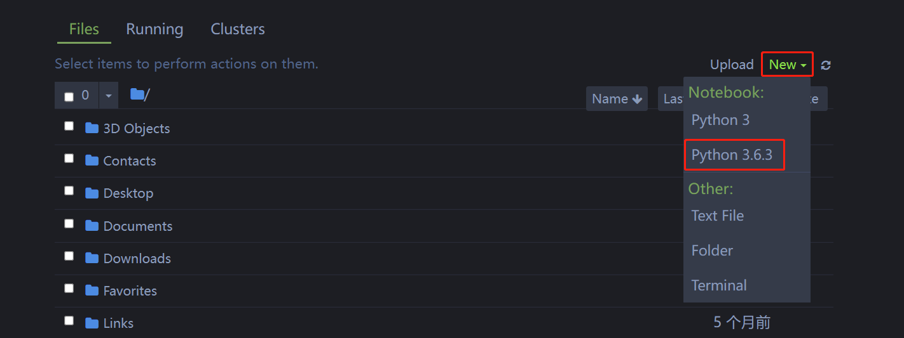
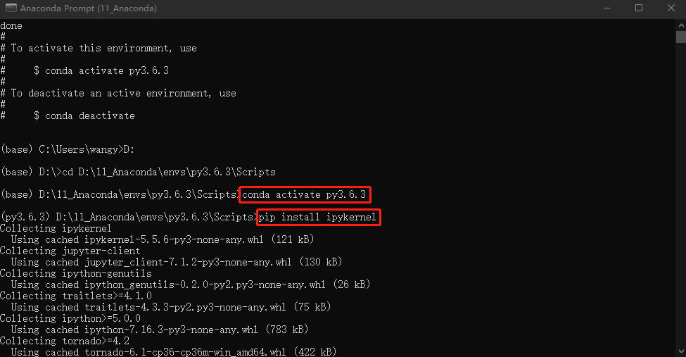

# 1. 安装 Python 版本

① 首先打开 Anaconda 的 Prompt 终端，输入 jupyter kernelspec list，查看已经安装的 python 版本。如下图所示，只有 Anaconda 自带的 python3。



② 输入 conda create --name py3.6.3 python=3.6.3 命令，输入 [y]/n 时输入 y，创建 py3.6.3 虚拟环境，它会安装 python3.6.3 到 anaconda3 的 env 目录下。


③ 首先确保目前盘和要进入的盘一样，输入 cd D:\11_Anaconda\envs\py3.6.3\Scripts 命令，进入 py3.6.3 目录下的 Scripts 文件夹下。


④ 输入 conda activate py3.6.3 激活 py3.6.3环境后，再输入 pip install ipykernel 命令，会在 script 目录下会生成一系列工具，如下图所示。( 注意：当 pip install ipykernel 时，不能挂 VPN。)




⑤ 将 Anaconda 文件夹下的 share/jupyter/kernels 文件夹中已经存在的项目复制一份，重命名为 python3.6.3。


⑥ 打开文件夹中 json 文件，将 Python 3 改为 Python 3.6.3，如下图所示。


⑦ 再次打开 Anaconda 终端，输入 jupyter kernelspec list，可以查看到已成功安上 Python3.6.3 的虚拟环境。


⑤ 再次打开 Jupyter notebook，New 里面有 Python3.6.3 选项。


⑧ 在 Jupyter notebook 中，用 python 代码打印 python 版本。


```python
import sys
print(sys.version)
```

    3.6.3 |Anaconda, Inc.| (default, Nov  8 2017, 15:10:56) [MSC v.1900 64 bit (AMD64)]
    
