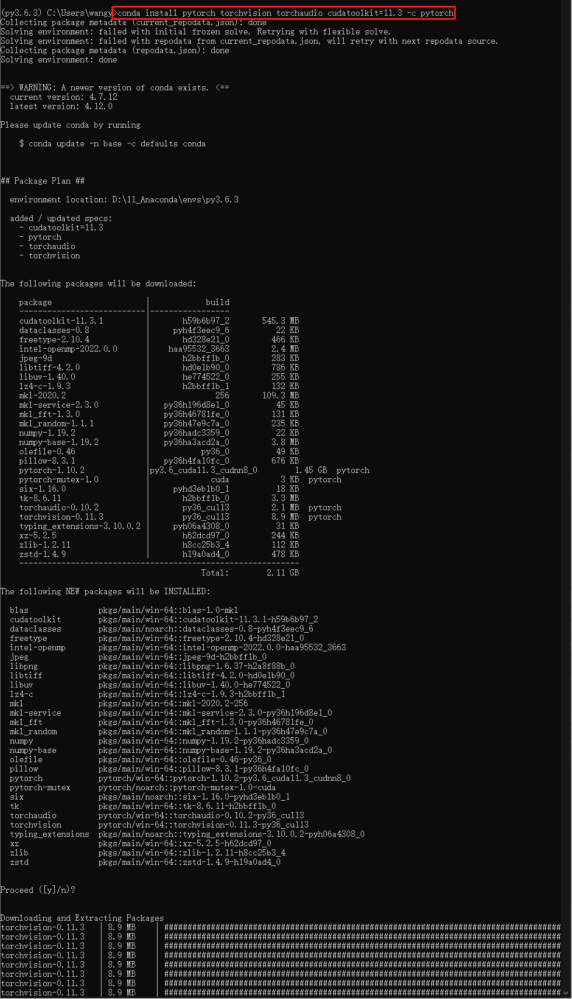

# 1. 安装Anaconda 

① Anaconda相当于一个工具包，安装了Anaconda相当于安装了很多工具。

② 安装Ancaconda去官网安装该软件，像安装微信、暴风影音等常用软件一样。

# 2. 查看显卡驱动

① 在任务管理器中，性能栏中，若GUP能正常显示型号，说明显卡的驱动已经安装了。



② 打开设备管理器，在显示适配器中可以看到自己的计算机的GPU型号。
 - 名称带 NVIDIA 的是独立显卡。


# 3. 安装Pytorch

① 进入Pytorch官网，进入下载Pytorch地方。
 - 选择1.1以上的pytorch以上版本，因为1.1以上版本有tensorboard，可以看到训练过程中的数据，以及看到损失函数的变化，对训练很有帮助。
 - Windows下建议选择Conda，Linux下建议选择Pip。
 - Language根据安装anaconda中安装的语言来确定。
 - CUDA版本根据自己的计算机支持的GPU的型号来决定。
 
② 所有选项选择完后，将命令进行复制。


③ 在Ancaconda Prompt中输入nvidia-smi，可以查看驱动版本。
 - CUDA 9.2 以上只支持驱动版本大于396.26以上的版本，如果驱动版本数小于这个，可以通过电脑管家进行升级。


④ 输入 conda activate，由base环境切换为py3.6.3环境。


⑤ 在命令行输入刚刚复制的命令 conda install pytorch torchvision torchaudio cudatoolkit=11.3 -c pytorch，则在Python3.6.3中安装cuda版本的pytorch。


⑥ cuda版本的pytorch安装完后，在Jupyter notebook中 Python3.6.3版本中，输入以下命令，可以看到cuda版本的pytorch安装成功。


```python
import torch
torch.cuda.is_available()
```


    True


