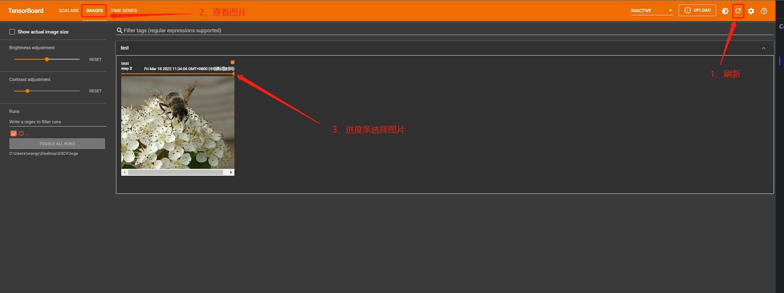

# 1. Tensorboard用途

① Tensorboad 可以用来查看loss是否按照我们预想的变化，或者查看训练到某一步输出的图像是什么样。


```python
# pip install tensorboard
```


```python
from torch.utils.tensorboard import SummaryWriter
help(SummaryWriter)
```

    Help on class SummaryWriter in module torch.utils.tensorboard.writer:
    
    class SummaryWriter(builtins.object)
     |  SummaryWriter(log_dir=None, comment='', purge_step=None, max_queue=10, flush_secs=120, filename_suffix='')
     |  
     |  Writes entries directly to event files in the log_dir to be
     |  consumed by TensorBoard.
     |  
     |  The `SummaryWriter` class provides a high-level API to create an event file
     |  in a given directory and add summaries and events to it. The class updates the
     |  file contents asynchronously. This allows a training program to call methods
     |  to add data to the file directly from the training loop, without slowing down
     |  training.
     |  
     |  Methods defined here:
     |  
     |  __enter__(self)
     |  
     |  __exit__(self, exc_type, exc_val, exc_tb)
     |  
     |  __init__(self, log_dir=None, comment='', purge_step=None, max_queue=10, flush_secs=120, filename_suffix='')
     |      Creates a `SummaryWriter` that will write out events and summaries
     |      to the event file.
     |      
     |      Args:
     |          log_dir (string): Save directory location. Default is
     |            runs/**CURRENT_DATETIME_HOSTNAME**, which changes after each run.
     |            Use hierarchical folder structure to compare
     |            between runs easily. e.g. pass in 'runs/exp1', 'runs/exp2', etc.
     |            for each new experiment to compare across them.
     |          comment (string): Comment log_dir suffix appended to the default
     |            ``log_dir``. If ``log_dir`` is assigned, this argument has no effect.
     |          purge_step (int):
     |            When logging crashes at step :math:`T+X` and restarts at step :math:`T`,
     |            any events whose global_step larger or equal to :math:`T` will be
     |            purged and hidden from TensorBoard.
     |            Note that crashed and resumed experiments should have the same ``log_dir``.
     |          max_queue (int): Size of the queue for pending events and
     |            summaries before one of the 'add' calls forces a flush to disk.
     |            Default is ten items.
     |          flush_secs (int): How often, in seconds, to flush the
     |            pending events and summaries to disk. Default is every two minutes.
     |          filename_suffix (string): Suffix added to all event filenames in
     |            the log_dir directory. More details on filename construction in
     |            tensorboard.summary.writer.event_file_writer.EventFileWriter.
     |      
     |      Examples::
     |      
     |          from torch.utils.tensorboard import SummaryWriter
     |      
     |          # create a summary writer with automatically generated folder name.
     |          writer = SummaryWriter()
     |          # folder location: runs/May04_22-14-54_s-MacBook-Pro.local/
     |      
     |          # create a summary writer using the specified folder name.
     |          writer = SummaryWriter("my_experiment")
     |          # folder location: my_experiment
     |      
     |          # create a summary writer with comment appended.
     |          writer = SummaryWriter(comment="LR_0.1_BATCH_16")
     |          # folder location: runs/May04_22-14-54_s-MacBook-Pro.localLR_0.1_BATCH_16/
     |  
     |  add_audio(self, tag, snd_tensor, global_step=None, sample_rate=44100, walltime=None)
     |      Add audio data to summary.
     |      
     |      Args:
     |          tag (string): Data identifier
     |          snd_tensor (torch.Tensor): Sound data
     |          global_step (int): Global step value to record
     |          sample_rate (int): sample rate in Hz
     |          walltime (float): Optional override default walltime (time.time())
     |            seconds after epoch of event
     |      Shape:
     |          snd_tensor: :math:`(1, L)`. The values should lie between [-1, 1].
     |  
     |  add_custom_scalars(self, layout)
     |      Create special chart by collecting charts tags in 'scalars'. Note that this function can only be called once
     |      for each SummaryWriter() object. Because it only provides metadata to tensorboard, the function can be called
     |      before or after the training loop.
     |      
     |      Args:
     |          layout (dict): {categoryName: *charts*}, where *charts* is also a dictionary
     |            {chartName: *ListOfProperties*}. The first element in *ListOfProperties* is the chart's type
     |            (one of **Multiline** or **Margin**) and the second element should be a list containing the tags
     |            you have used in add_scalar function, which will be collected into the new chart.
     |      
     |      Examples::
     |      
     |          layout = {'Taiwan':{'twse':['Multiline',['twse/0050', 'twse/2330']]},
     |                       'USA':{ 'dow':['Margin',   ['dow/aaa', 'dow/bbb', 'dow/ccc']],
     |                            'nasdaq':['Margin',   ['nasdaq/aaa', 'nasdaq/bbb', 'nasdaq/ccc']]}}
     |      
     |          writer.add_custom_scalars(layout)
     |  
     |  add_custom_scalars_marginchart(self, tags, category='default', title='untitled')
     |      Shorthand for creating marginchart. Similar to ``add_custom_scalars()``, but the only necessary argument
     |      is *tags*, which should have exactly 3 elements.
     |      
     |      Args:
     |          tags (list): list of tags that have been used in ``add_scalar()``
     |      
     |      Examples::
     |      
     |          writer.add_custom_scalars_marginchart(['twse/0050', 'twse/2330', 'twse/2006'])
     |  
     |  add_custom_scalars_multilinechart(self, tags, category='default', title='untitled')
     |      Shorthand for creating multilinechart. Similar to ``add_custom_scalars()``, but the only necessary argument
     |      is *tags*.
     |      
     |      Args:
     |          tags (list): list of tags that have been used in ``add_scalar()``
     |      
     |      Examples::
     |      
     |          writer.add_custom_scalars_multilinechart(['twse/0050', 'twse/2330'])
     |  
     |  add_embedding(self, mat, metadata=None, label_img=None, global_step=None, tag='default', metadata_header=None)
     |      Add embedding projector data to summary.
     |      
     |      Args:
     |          mat (torch.Tensor or numpy.array): A matrix which each row is the feature vector of the data point
     |          metadata (list): A list of labels, each element will be convert to string
     |          label_img (torch.Tensor): Images correspond to each data point
     |          global_step (int): Global step value to record
     |          tag (string): Name for the embedding
     |      Shape:
     |          mat: :math:`(N, D)`, where N is number of data and D is feature dimension
     |      
     |          label_img: :math:`(N, C, H, W)`
     |      
     |      Examples::
     |      
     |          import keyword
     |          import torch
     |          meta = []
     |          while len(meta)<100:
     |              meta = meta+keyword.kwlist # get some strings
     |          meta = meta[:100]
     |      
     |          for i, v in enumerate(meta):
     |              meta[i] = v+str(i)
     |      
     |          label_img = torch.rand(100, 3, 10, 32)
     |          for i in range(100):
     |              label_img[i]*=i/100.0
     |      
     |          writer.add_embedding(torch.randn(100, 5), metadata=meta, label_img=label_img)
     |          writer.add_embedding(torch.randn(100, 5), label_img=label_img)
     |          writer.add_embedding(torch.randn(100, 5), metadata=meta)
     |  
     |  add_figure(self, tag, figure, global_step=None, close=True, walltime=None)
     |      Render matplotlib figure into an image and add it to summary.
     |      
     |      Note that this requires the ``matplotlib`` package.
     |      
     |      Args:
     |          tag (string): Data identifier
     |          figure (matplotlib.pyplot.figure) or list of figures: Figure or a list of figures
     |          global_step (int): Global step value to record
     |          close (bool): Flag to automatically close the figure
     |          walltime (float): Optional override default walltime (time.time())
     |            seconds after epoch of event
     |  
     |  add_graph(self, model, input_to_model=None, verbose=False)
     |      Add graph data to summary.
     |      
     |      Args:
     |          model (torch.nn.Module): Model to draw.
     |          input_to_model (torch.Tensor or list of torch.Tensor): A variable or a tuple of
     |              variables to be fed.
     |          verbose (bool): Whether to print graph structure in console.
     |  
     |  add_histogram(self, tag, values, global_step=None, bins='tensorflow', walltime=None, max_bins=None)
     |      Add histogram to summary.
     |      
     |      Args:
     |          tag (string): Data identifier
     |          values (torch.Tensor, numpy.array, or string/blobname): Values to build histogram
     |          global_step (int): Global step value to record
     |          bins (string): One of {'tensorflow','auto', 'fd', ...}. This determines how the bins are made. You can find
     |            other options in: https://docs.scipy.org/doc/numpy/reference/generated/numpy.histogram.html
     |          walltime (float): Optional override default walltime (time.time())
     |            seconds after epoch of event
     |      
     |      Examples::
     |      
     |          from torch.utils.tensorboard import SummaryWriter
     |          import numpy as np
     |          writer = SummaryWriter()
     |          for i in range(10):
     |              x = np.random.random(1000)
     |              writer.add_histogram('distribution centers', x + i, i)
     |          writer.close()
     |      
     |      Expected result:
     |      
     |      .. image:: _static/img/tensorboard/add_histogram.png
     |         :scale: 50 %
     |  
     |  add_histogram_raw(self, tag, min, max, num, sum, sum_squares, bucket_limits, bucket_counts, global_step=None, walltime=None)
     |      Adds histogram with raw data.
     |      
     |      Args:
     |          tag (string): Data identifier
     |          min (float or int): Min value
     |          max (float or int): Max value
     |          num (int): Number of values
     |          sum (float or int): Sum of all values
     |          sum_squares (float or int): Sum of squares for all values
     |          bucket_limits (torch.Tensor, numpy.array): Upper value per bucket.
     |            The number of elements of it should be the same as `bucket_counts`.
     |          bucket_counts (torch.Tensor, numpy.array): Number of values per bucket
     |          global_step (int): Global step value to record
     |          walltime (float): Optional override default walltime (time.time())
     |            seconds after epoch of event
     |          see: https://github.com/tensorflow/tensorboard/blob/master/tensorboard/plugins/histogram/README.md
     |      
     |      Examples::
     |      
     |          from torch.utils.tensorboard import SummaryWriter
     |          import numpy as np
     |          writer = SummaryWriter()
     |          dummy_data = []
     |          for idx, value in enumerate(range(50)):
     |              dummy_data += [idx + 0.001] * value
     |      
     |          bins = list(range(50+2))
     |          bins = np.array(bins)
     |          values = np.array(dummy_data).astype(float).reshape(-1)
     |          counts, limits = np.histogram(values, bins=bins)
     |          sum_sq = values.dot(values)
     |          writer.add_histogram_raw(
     |              tag='histogram_with_raw_data',
     |              min=values.min(),
     |              max=values.max(),
     |              num=len(values),
     |              sum=values.sum(),
     |              sum_squares=sum_sq,
     |              bucket_limits=limits[1:].tolist(),
     |              bucket_counts=counts.tolist(),
     |              global_step=0)
     |          writer.close()
     |      
     |      Expected result:
     |      
     |      .. image:: _static/img/tensorboard/add_histogram_raw.png
     |         :scale: 50 %
     |  
     |  add_hparams(self, hparam_dict, metric_dict, hparam_domain_discrete=None, run_name=None)
     |      Add a set of hyperparameters to be compared in TensorBoard.
     |      
     |      Args:
     |          hparam_dict (dict): Each key-value pair in the dictionary is the
     |            name of the hyper parameter and it's corresponding value.
     |            The type of the value can be one of `bool`, `string`, `float`,
     |            `int`, or `None`.
     |          metric_dict (dict): Each key-value pair in the dictionary is the
     |            name of the metric and it's corresponding value. Note that the key used
     |            here should be unique in the tensorboard record. Otherwise the value
     |            you added by ``add_scalar`` will be displayed in hparam plugin. In most
     |            cases, this is unwanted.
     |          hparam_domain_discrete: (Optional[Dict[str, List[Any]]]) A dictionary that
     |            contains names of the hyperparameters and all discrete values they can hold
     |          run_name (str): Name of the run, to be included as part of the logdir.
     |            If unspecified, will use current timestamp.
     |      
     |      Examples::
     |      
     |          from torch.utils.tensorboard import SummaryWriter
     |          with SummaryWriter() as w:
     |              for i in range(5):
     |                  w.add_hparams({'lr': 0.1*i, 'bsize': i},
     |                                {'hparam/accuracy': 10*i, 'hparam/loss': 10*i})
     |      
     |      Expected result:
     |      
     |      .. image:: _static/img/tensorboard/add_hparam.png
     |         :scale: 50 %
     |  
     |  add_image(self, tag, img_tensor, global_step=None, walltime=None, dataformats='CHW')
     |      Add image data to summary.
     |      
     |      Note that this requires the ``pillow`` package.
     |      
     |      Args:
     |          tag (string): Data identifier
     |          img_tensor (torch.Tensor, numpy.array, or string/blobname): Image data
     |          global_step (int): Global step value to record
     |          walltime (float): Optional override default walltime (time.time())
     |            seconds after epoch of event
     |      Shape:
     |          img_tensor: Default is :math:`(3, H, W)`. You can use ``torchvision.utils.make_grid()`` to
     |          convert a batch of tensor into 3xHxW format or call ``add_images`` and let us do the job.
     |          Tensor with :math:`(1, H, W)`, :math:`(H, W)`, :math:`(H, W, 3)` is also suitable as long as
     |          corresponding ``dataformats`` argument is passed, e.g. ``CHW``, ``HWC``, ``HW``.
     |      
     |      Examples::
     |      
     |          from torch.utils.tensorboard import SummaryWriter
     |          import numpy as np
     |          img = np.zeros((3, 100, 100))
     |          img[0] = np.arange(0, 10000).reshape(100, 100) / 10000
     |          img[1] = 1 - np.arange(0, 10000).reshape(100, 100) / 10000
     |      
     |          img_HWC = np.zeros((100, 100, 3))
     |          img_HWC[:, :, 0] = np.arange(0, 10000).reshape(100, 100) / 10000
     |          img_HWC[:, :, 1] = 1 - np.arange(0, 10000).reshape(100, 100) / 10000
     |      
     |          writer = SummaryWriter()
     |          writer.add_image('my_image', img, 0)
     |      
     |          # If you have non-default dimension setting, set the dataformats argument.
     |          writer.add_image('my_image_HWC', img_HWC, 0, dataformats='HWC')
     |          writer.close()
     |      
     |      Expected result:
     |      
     |      .. image:: _static/img/tensorboard/add_image.png
     |         :scale: 50 %
     |  
     |  add_image_with_boxes(self, tag, img_tensor, box_tensor, global_step=None, walltime=None, rescale=1, dataformats='CHW', labels=None)
     |      Add image and draw bounding boxes on the image.
     |      
     |      Args:
     |          tag (string): Data identifier
     |          img_tensor (torch.Tensor, numpy.array, or string/blobname): Image data
     |          box_tensor (torch.Tensor, numpy.array, or string/blobname): Box data (for detected objects)
     |            box should be represented as [x1, y1, x2, y2].
     |          global_step (int): Global step value to record
     |          walltime (float): Optional override default walltime (time.time())
     |            seconds after epoch of event
     |          rescale (float): Optional scale override
     |          dataformats (string): Image data format specification of the form
     |            NCHW, NHWC, CHW, HWC, HW, WH, etc.
     |          labels (list of string): The label to be shown for each bounding box.
     |      Shape:
     |          img_tensor: Default is :math:`(3, H, W)`. It can be specified with ``dataformats`` argument.
     |          e.g. CHW or HWC
     |      
     |          box_tensor: (torch.Tensor, numpy.array, or string/blobname): NX4,  where N is the number of
     |          boxes and each 4 elements in a row represents (xmin, ymin, xmax, ymax).
     |  
     |  add_images(self, tag, img_tensor, global_step=None, walltime=None, dataformats='NCHW')
     |      Add batched image data to summary.
     |      
     |      Note that this requires the ``pillow`` package.
     |      
     |      Args:
     |          tag (string): Data identifier
     |          img_tensor (torch.Tensor, numpy.array, or string/blobname): Image data
     |          global_step (int): Global step value to record
     |          walltime (float): Optional override default walltime (time.time())
     |            seconds after epoch of event
     |          dataformats (string): Image data format specification of the form
     |            NCHW, NHWC, CHW, HWC, HW, WH, etc.
     |      Shape:
     |          img_tensor: Default is :math:`(N, 3, H, W)`. If ``dataformats`` is specified, other shape will be
     |          accepted. e.g. NCHW or NHWC.
     |      
     |      Examples::
     |      
     |          from torch.utils.tensorboard import SummaryWriter
     |          import numpy as np
     |      
     |          img_batch = np.zeros((16, 3, 100, 100))
     |          for i in range(16):
     |              img_batch[i, 0] = np.arange(0, 10000).reshape(100, 100) / 10000 / 16 * i
     |              img_batch[i, 1] = (1 - np.arange(0, 10000).reshape(100, 100) / 10000) / 16 * i
     |      
     |          writer = SummaryWriter()
     |          writer.add_images('my_image_batch', img_batch, 0)
     |          writer.close()
     |      
     |      Expected result:
     |      
     |      .. image:: _static/img/tensorboard/add_images.png
     |         :scale: 30 %
     |  
     |  add_mesh(self, tag, vertices, colors=None, faces=None, config_dict=None, global_step=None, walltime=None)
     |      Add meshes or 3D point clouds to TensorBoard. The visualization is based on Three.js,
     |      so it allows users to interact with the rendered object. Besides the basic definitions
     |      such as vertices, faces, users can further provide camera parameter, lighting condition, etc.
     |      Please check https://threejs.org/docs/index.html#manual/en/introduction/Creating-a-scene for
     |      advanced usage.
     |      
     |      Args:
     |          tag (string): Data identifier
     |          vertices (torch.Tensor): List of the 3D coordinates of vertices.
     |          colors (torch.Tensor): Colors for each vertex
     |          faces (torch.Tensor): Indices of vertices within each triangle. (Optional)
     |          config_dict: Dictionary with ThreeJS classes names and configuration.
     |          global_step (int): Global step value to record
     |          walltime (float): Optional override default walltime (time.time())
     |            seconds after epoch of event
     |      
     |      Shape:
     |          vertices: :math:`(B, N, 3)`. (batch, number_of_vertices, channels)
     |      
     |          colors: :math:`(B, N, 3)`. The values should lie in [0, 255] for type `uint8` or [0, 1] for type `float`.
     |      
     |          faces: :math:`(B, N, 3)`. The values should lie in [0, number_of_vertices] for type `uint8`.
     |      
     |      Examples::
     |      
     |          from torch.utils.tensorboard import SummaryWriter
     |          vertices_tensor = torch.as_tensor([
     |              [1, 1, 1],
     |              [-1, -1, 1],
     |              [1, -1, -1],
     |              [-1, 1, -1],
     |          ], dtype=torch.float).unsqueeze(0)
     |          colors_tensor = torch.as_tensor([
     |              [255, 0, 0],
     |              [0, 255, 0],
     |              [0, 0, 255],
     |              [255, 0, 255],
     |          ], dtype=torch.int).unsqueeze(0)
     |          faces_tensor = torch.as_tensor([
     |              [0, 2, 3],
     |              [0, 3, 1],
     |              [0, 1, 2],
     |              [1, 3, 2],
     |          ], dtype=torch.int).unsqueeze(0)
     |      
     |          writer = SummaryWriter()
     |          writer.add_mesh('my_mesh', vertices=vertices_tensor, colors=colors_tensor, faces=faces_tensor)
     |      
     |          writer.close()
     |  
     |  add_onnx_graph(self, prototxt)
     |  
     |  add_pr_curve(self, tag, labels, predictions, global_step=None, num_thresholds=127, weights=None, walltime=None)
     |      Adds precision recall curve.
     |      Plotting a precision-recall curve lets you understand your model's
     |      performance under different threshold settings. With this function,
     |      you provide the ground truth labeling (T/F) and prediction confidence
     |      (usually the output of your model) for each target. The TensorBoard UI
     |      will let you choose the threshold interactively.
     |      
     |      Args:
     |          tag (string): Data identifier
     |          labels (torch.Tensor, numpy.array, or string/blobname):
     |            Ground truth data. Binary label for each element.
     |          predictions (torch.Tensor, numpy.array, or string/blobname):
     |            The probability that an element be classified as true.
     |            Value should be in [0, 1]
     |          global_step (int): Global step value to record
     |          num_thresholds (int): Number of thresholds used to draw the curve.
     |          walltime (float): Optional override default walltime (time.time())
     |            seconds after epoch of event
     |      
     |      Examples::
     |      
     |          from torch.utils.tensorboard import SummaryWriter
     |          import numpy as np
     |          labels = np.random.randint(2, size=100)  # binary label
     |          predictions = np.random.rand(100)
     |          writer = SummaryWriter()
     |          writer.add_pr_curve('pr_curve', labels, predictions, 0)
     |          writer.close()
     |  
     |  add_pr_curve_raw(self, tag, true_positive_counts, false_positive_counts, true_negative_counts, false_negative_counts, precision, recall, global_step=None, num_thresholds=127, weights=None, walltime=None)
     |      Adds precision recall curve with raw data.
     |      
     |      Args:
     |          tag (string): Data identifier
     |          true_positive_counts (torch.Tensor, numpy.array, or string/blobname): true positive counts
     |          false_positive_counts (torch.Tensor, numpy.array, or string/blobname): false positive counts
     |          true_negative_counts (torch.Tensor, numpy.array, or string/blobname): true negative counts
     |          false_negative_counts (torch.Tensor, numpy.array, or string/blobname): false negative counts
     |          precision (torch.Tensor, numpy.array, or string/blobname): precision
     |          recall (torch.Tensor, numpy.array, or string/blobname): recall
     |          global_step (int): Global step value to record
     |          num_thresholds (int): Number of thresholds used to draw the curve.
     |          walltime (float): Optional override default walltime (time.time())
     |            seconds after epoch of event
     |          see: https://github.com/tensorflow/tensorboard/blob/master/tensorboard/plugins/pr_curve/README.md
     |  
     |  add_scalar(self, tag, scalar_value, global_step=None, walltime=None)
     |      Add scalar data to summary.
     |      
     |      Args:
     |          tag (string): Data identifier
     |          scalar_value (float or string/blobname): Value to save
     |          global_step (int): Global step value to record
     |          walltime (float): Optional override default walltime (time.time())
     |            with seconds after epoch of event
     |      
     |      Examples::
     |      
     |          from torch.utils.tensorboard import SummaryWriter
     |          writer = SummaryWriter()
     |          x = range(100)
     |          for i in x:
     |              writer.add_scalar('y=2x', i * 2, i)
     |          writer.close()
     |      
     |      Expected result:
     |      
     |      .. image:: _static/img/tensorboard/add_scalar.png
     |         :scale: 50 %
     |  
     |  add_scalars(self, main_tag, tag_scalar_dict, global_step=None, walltime=None)
     |      Adds many scalar data to summary.
     |      
     |      Args:
     |          main_tag (string): The parent name for the tags
     |          tag_scalar_dict (dict): Key-value pair storing the tag and corresponding values
     |          global_step (int): Global step value to record
     |          walltime (float): Optional override default walltime (time.time())
     |            seconds after epoch of event
     |      
     |      Examples::
     |      
     |          from torch.utils.tensorboard import SummaryWriter
     |          writer = SummaryWriter()
     |          r = 5
     |          for i in range(100):
     |              writer.add_scalars('run_14h', {'xsinx':i*np.sin(i/r),
     |                                              'xcosx':i*np.cos(i/r),
     |                                              'tanx': np.tan(i/r)}, i)
     |          writer.close()
     |          # This call adds three values to the same scalar plot with the tag
     |          # 'run_14h' in TensorBoard's scalar section.
     |      
     |      Expected result:
     |      
     |      .. image:: _static/img/tensorboard/add_scalars.png
     |         :scale: 50 %
     |  
     |  add_text(self, tag, text_string, global_step=None, walltime=None)
     |      Add text data to summary.
     |      
     |      Args:
     |          tag (string): Data identifier
     |          text_string (string): String to save
     |          global_step (int): Global step value to record
     |          walltime (float): Optional override default walltime (time.time())
     |            seconds after epoch of event
     |      Examples::
     |      
     |          writer.add_text('lstm', 'This is an lstm', 0)
     |          writer.add_text('rnn', 'This is an rnn', 10)
     |  
     |  add_video(self, tag, vid_tensor, global_step=None, fps=4, walltime=None)
     |      Add video data to summary.
     |      
     |      Note that this requires the ``moviepy`` package.
     |      
     |      Args:
     |          tag (string): Data identifier
     |          vid_tensor (torch.Tensor): Video data
     |          global_step (int): Global step value to record
     |          fps (float or int): Frames per second
     |          walltime (float): Optional override default walltime (time.time())
     |            seconds after epoch of event
     |      Shape:
     |          vid_tensor: :math:`(N, T, C, H, W)`. The values should lie in [0, 255] for type `uint8` or [0, 1] for type `float`.
     |  
     |  close(self)
     |  
     |  flush(self)
     |      Flushes the event file to disk.
     |      Call this method to make sure that all pending events have been written to
     |      disk.
     |  
     |  get_logdir(self)
     |      Returns the directory where event files will be written.
     |  
     |  ----------------------------------------------------------------------
     |  Data descriptors defined here:
     |  
     |  __dict__
     |      dictionary for instance variables (if defined)
     |  
     |  __weakref__
     |      list of weak references to the object (if defined)
    
    

# 2. Tensorboard 写日志


```python
from torch.utils.tensorboard import SummaryWriter
writer = SummaryWriter("logs") # 创建一个logs文件夹，writer写的文件都在该文件夹下
#writer.add_image()
for i in range(100):
    writer.add_scalar("y=2x",2*i,i)
writer.close()
```




# 3. Tensorboard 读日志

① 在 Anaconda 终端里面，激活py3.6.3环境，再输入 tensorboard --logdir=C:\Users\wangy\Desktop\03CV\logs 命令，将网址赋值浏览器的网址栏，回车，即可查看tensorboard显示日志情况。


② 为避免多人使用端口导致冲突，也可以在后面加上后缀，使得端口独立，tensorboard --logdir=C:\Users\wangy\Desktop\03CV\logs --port=6008


③ 输入网址可得Tensorboard界面。


# 4. Tensorboard 读图片


```python
from torch.utils.tensorboard import SummaryWriter
from PIL import Image
import numpy as np

img_path1 = "Data/FirstTypeData/train/ants/0013035.jpg" 
img_PIL1 = Image.open(img_path1)
img_array1 = np.array(img_PIL1)

img_path2 = "Data/SecondTypeData/train/bees_image/17209602_fe5a5a746f.jpg" 
img_PIL2 = Image.open(img_path2)
img_array2 = np.array(img_PIL2)

writer = SummaryWriter("logs") 
writer.add_image("test",img_array1,1,dataformats="HWC") # 1 表示该图片在第1步
writer.add_image("test",img_array2,2,dataformats="HWC") # 2 表示该图片在第2步                   
writer.close()
```


