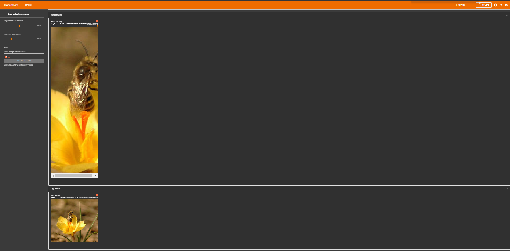

# 1. Transforms用途

① Transforms当成工具箱的话，里面的class就是不同的工具。例如像totensor、resize这些工具。

② Transforms拿一些特定格式的图片，经过Transforms里面的工具，获得我们想要的结果。

# 2. Transforms该如何使用

## 2.1 transforms.Totensor使用


```python
from torchvision import transforms
from PIL import Image

img_path = "Data/FirstTypeData/val/bees/10870992_eebeeb3a12.jpg"
img = Image.open(img_path)  

tensor_trans = transforms.ToTensor()  # 创建 transforms.ToTensor类 的实例化对象
tensor_img = tensor_trans(img)  # 调用 transforms.ToTensor类 的__call__的魔术方法   
print(tensor_img)
```


    ---------------------------------------------------------------------------

    FileNotFoundError                         Traceback (most recent call last)

    Cell In[1], line 5
          2 from PIL import Image
          4 img_path = "Data/FirstTypeData/val/bees/10870992_eebeeb3a12.jpg"
    ----> 5 img = Image.open(img_path)  
          7 tensor_trans = transforms.ToTensor()  # 创建 transforms.ToTensor类 的实例化对象
          8 tensor_img = tensor_trans(img)  # 调用 transforms.ToTensor类 的__call__的魔术方法   
    

    File f:\miniconda\envs\yolov5\lib\site-packages\PIL\Image.py:2975, in open(fp, mode, formats)
       2972     filename = fp
       2974 if filename:
    -> 2975     fp = builtins.open(filename, "rb")
       2976     exclusive_fp = True
       2978 try:
    

    FileNotFoundError: [Errno 2] No such file or directory: 'Data/FirstTypeData/val/bees/10870992_eebeeb3a12.jpg'


    在当前单元格或上一个单元格中执行代码时 Kernel 崩溃。请查看单元格中的代码，以确定故障的可能原因。有关详细信息，请单击 <a href='https://aka.ms/vscodeJupyterKernelCrash'>此处</a>。有关更多详细信息，请查看 Jupyter <a href='command:jupyter.viewOutput'>log</a>。


## 2.2 需要Tensor数据类型原因

① Tensor有一些属性，比如反向传播、梯度等属性，它包装了神经网络需要的一些属性。


```python
from torch.utils.tensorboard import SummaryWriter
from torchvision import transforms
from PIL import Image

import cv2

img_path = "Data/FirstTypeData/val/bees/10870992_eebeeb3a12.jpg"
img = Image.open(img_path)

writer = SummaryWriter("logs") 

tensor_trans = transforms.ToTensor() 
tensor_img = tensor_trans(img)  

writer.add_image("Temsor_img",tensor_img) 
writer.close()
```

② 在 Anaconda 终端里面，激活py3.6.3环境，再输入 tensorboard --logdir=C:\Users\wangy\Desktop\03CV\logs 命令，将网址赋值浏览器的网址栏，回车，即可查看tensorboard显示日志情况。



③ 输入网址可得Tensorboard界面。


# 3. 常见的Transforms工具

① Transforms的工具主要关注他的输入、输出、作用。

## 3.1 \_\_call__魔术方法使用


```python
class Person:
    def __call__(self,name):
        print("__call__ "+"Hello "+name)
        
    def hello(self,name):
        print("hello "+name)
        
person = Person()  # 实例化对象
person("zhangsan") # 调用__call__魔术方法
person.hello("list") # 调用hello方法
```

    __call__ Hello zhangsan
    hello list
    

## 3.2 Normanize归一化


```python
from torch.utils.tensorboard import SummaryWriter
from torchvision import transforms
from PIL import Image
import cv2

img_path = "Data/FirstTypeData/val/bees/10870992_eebeeb3a12.jpg"
img = Image.open(img_path)

writer = SummaryWriter("logs") 


tensor_trans = transforms.ToTensor() 
img_tensor = tensor_trans(img)  

print(img_tensor[0][0][0])
tensor_norm = transforms.Normalize([0.5,0.5,0.5],[0.5,0.5,0.5]) #input[channel]=(input[chnnel]-mean[channel])/std[channel]            
img_norm = tensor_norm(img_tensor)  
print(img_norm[0][0][0])

writer.add_image("img_tensor",img_tensor) 
writer.add_image("img_norm",img_norm) 
writer.close()
```

    tensor(0.5725)
    tensor(0.1451)
    

## 3.3 Resize裁剪

### 3.3.1 Resize裁剪方法一


```python
from torch.utils.tensorboard import SummaryWriter
from torchvision import transforms
from PIL import Image
import cv2

img_path = "Data/FirstTypeData/val/bees/10870992_eebeeb3a12.jpg"
img = Image.open(img_path)
print(img)  # PIL类型的图片原始比例为 500×464

writer = SummaryWriter("logs") 

trans_totensor = transforms.ToTensor() 
img_tensor = trans_totensor(img)  

trans_resize = transforms.Resize((512,512))
# PIL数据类型的 img -> resize -> PIL数据类型的 img_resize
img_resize = trans_resize(img)
# PIL 数据类型的 PIL -> totensor -> img_resize tensor
img_resize = trans_totensor(img_resize)
print(img_resize.size()) # PIL类型的图片原始比例为 3×512×512，3通道

writer.add_image("img_tensor",img_tensor) 
writer.add_image("img_resize",img_resize) 
writer.close()
```

    <PIL.JpegImagePlugin.JpegImageFile image mode=RGB size=500x464 at 0x2C25DF0B320>
    torch.Size([3, 512, 512])
    


### 3.3.2 Resize裁剪方法二


```python
from torch.utils.tensorboard import SummaryWriter
from torchvision import transforms
from PIL import Image
import cv2

img_path = "Data/FirstTypeData/val/bees/10870992_eebeeb3a12.jpg"
img = Image.open(img_path)
print(img)

writer = SummaryWriter("logs") 

tensor_trans = transforms.ToTensor() 
img_tensor = tensor_trans(img)  

# Resize 第二种方式：等比缩放
trans_resize_2 = transforms.Resize(512) # 512/464 = 1.103 551/500 = 1.102
# PIL类型的 Image -> resize -> PIL类型的 Image -> totensor -> tensor类型的 Image
trans_compose = transforms.Compose([trans_resize_2, trans_totensor]) # Compose函数中后面一个参数的输入为前面一个参数的输出   
img_resize_2 = trans_compose(img)
print(img_resize_2.size()) 
writer.add_image("img_tensor",img_tensor) 
writer.add_image("img_resize_2",img_resize_2) 
writer.close()
```

    <PIL.JpegImagePlugin.JpegImageFile image mode=RGB size=500x464 at 0x2C25DF0B6D8>
    torch.Size([3, 512, 551])
    


## 3.4 RandomCrop随即裁剪

### 3.4.1 RandomCrop随即裁剪方式一


```python
from torch.utils.tensorboard import SummaryWriter
from torchvision import transforms
from PIL import Image
import cv2

img_path = "Data/FirstTypeData/val/bees/10870992_eebeeb3a12.jpg"
img = Image.open(img_path)
print(img)

writer = SummaryWriter("logs") 

tensor_trans = transforms.ToTensor() 
img_tensor = tensor_trans(img)  
writer.add_image("img_tensor",img_tensor) 

trans_random = transforms.RandomCrop(312) # 随即裁剪成 312×312 的
trans_compose_2 = transforms.Compose([trans_random,tensor_trans])
for i in range(10):
    img_crop = trans_compose_2(img)
    writer.add_image("RandomCrop",img_crop,i) 
    print(img_crop.size()) 
```

    <PIL.JpegImagePlugin.JpegImageFile image mode=RGB size=500x464 at 0x2C25DF0BAC8>
    torch.Size([3, 312, 312])
    torch.Size([3, 312, 312])
    torch.Size([3, 312, 312])
    torch.Size([3, 312, 312])
    torch.Size([3, 312, 312])
    torch.Size([3, 312, 312])
    torch.Size([3, 312, 312])
    torch.Size([3, 312, 312])
    torch.Size([3, 312, 312])
    torch.Size([3, 312, 312])
    


### 3.4.2 RandomCrop随即裁剪方式二


```python
from torch.utils.tensorboard import SummaryWriter
from torchvision import transforms
from PIL import Image
import cv2

img_path = "Data/FirstTypeData/val/bees/10870992_eebeeb3a12.jpg"
img = Image.open(img_path)

print(img)

writer = SummaryWriter("logs") 

tensor_trans = transforms.ToTensor() 
img_tensor = tensor_trans(img)  
writer.add_image("img_tensor",img_tensor) 

trans_random = transforms.RandomCrop((312,100))  # 指定随即裁剪的宽和高       
trans_compose_2 = transforms.Compose([trans_random,tensor_trans])
for i in range(10):
    img_crop = trans_compose_2(img)
    writer.add_image("RandomCrop",img_crop,i) 
    print(img_crop.size()) 
```

    <PIL.JpegImagePlugin.JpegImageFile image mode=RGB size=500x464 at 0x2C25DF1B390>
    torch.Size([3, 312, 100])
    torch.Size([3, 312, 100])
    torch.Size([3, 312, 100])
    torch.Size([3, 312, 100])
    torch.Size([3, 312, 100])
    torch.Size([3, 312, 100])
    torch.Size([3, 312, 100])
    torch.Size([3, 312, 100])
    torch.Size([3, 312, 100])
    torch.Size([3, 312, 100])
    


