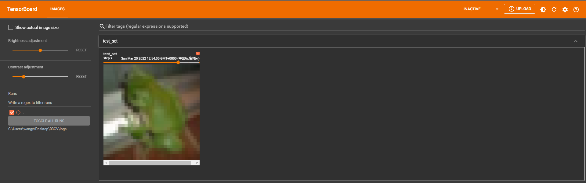

# 1. torchvision数据集介绍

① torchvision中有很多数据集，当我们写代码时指定相应的数据集指定一些参数，它就可以自行下载。

② CIFAR-10数据集包含60000张32×32的彩色图片，一共10个类别，其中50000张训练图片，10000张测试图片。

# 2. torchvision数据集使用

① 在 Anaconda 终端里面，激活py3.6.3环境，再跳转到该项目的路径下。

② 运行python。导入torchvision包，输入train_set = torchvision.datasets.CIFAR10(root="./dataset",train=True,download=True)命令，即下载数据集到到该文件夹下。




```python
import torchvision
help(torchvision.datasets.CIFAR10) 
```

    Help on class CIFAR10 in module torchvision.datasets.cifar:
    
    class CIFAR10(torchvision.datasets.vision.VisionDataset)
     |  CIFAR10(*args, **kwds)
     |  
     |  `CIFAR10 <https://www.cs.toronto.edu/~kriz/cifar.html>`_ Dataset.
     |  
     |  Args:
     |      root (string): Root directory of dataset where directory
     |          ``cifar-10-batches-py`` exists or will be saved to if download is set to True.
     |      train (bool, optional): If True, creates dataset from training set, otherwise
     |          creates from test set.
     |      transform (callable, optional): A function/transform that takes in an PIL image
     |          and returns a transformed version. E.g, ``transforms.RandomCrop``
     |      target_transform (callable, optional): A function/transform that takes in the
     |          target and transforms it.
     |      download (bool, optional): If true, downloads the dataset from the internet and
     |          puts it in root directory. If dataset is already downloaded, it is not
     |          downloaded again.
     |  
     |  Method resolution order:
     |      CIFAR10
     |      torchvision.datasets.vision.VisionDataset
     |      torch.utils.data.dataset.Dataset
     |      typing.Generic
     |      builtins.object
     |  
     |  Methods defined here:
     |  
     |  __getitem__(self, index: int) -> Tuple[Any, Any]
     |      Args:
     |          index (int): Index
     |      
     |      Returns:
     |          tuple: (image, target) where target is index of the target class.
     |  
     |  __init__(self, root: str, train: bool = True, transform: Union[Callable, NoneType] = None, target_transform: Union[Callable, NoneType] = None, download: bool = False) -> None
     |      Initialize self.  See help(type(self)) for accurate signature.
     |  
     |  __len__(self) -> int
     |  
     |  download(self) -> None
     |  
     |  extra_repr(self) -> str
     |  
     |  ----------------------------------------------------------------------
     |  Data and other attributes defined here:
     |  
     |  __parameters__ = ()
     |  
     |  base_folder = 'cifar-10-batches-py'
     |  
     |  filename = 'cifar-10-python.tar.gz'
     |  
     |  meta = {'filename': 'batches.meta', 'key': 'label_names', 'md5': '5ff9...
     |  
     |  test_list = [['test_batch', '40351d587109b95175f43aff81a1287e']]
     |  
     |  tgz_md5 = 'c58f30108f718f92721af3b95e74349a'
     |  
     |  train_list = [['data_batch_1', 'c99cafc152244af753f735de768cd75f'], ['...
     |  
     |  url = 'https://www.cs.toronto.edu/~kriz/cifar-10-python.tar.gz'
     |  
     |  ----------------------------------------------------------------------
     |  Methods inherited from torchvision.datasets.vision.VisionDataset:
     |  
     |  __repr__(self) -> str
     |      Return repr(self).
     |  
     |  ----------------------------------------------------------------------
     |  Methods inherited from torch.utils.data.dataset.Dataset:
     |  
     |  __add__(self, other: 'Dataset[T_co]') -> 'ConcatDataset[T_co]'
     |  
     |  ----------------------------------------------------------------------
     |  Data descriptors inherited from torch.utils.data.dataset.Dataset:
     |  
     |  __dict__
     |      dictionary for instance variables (if defined)
     |  
     |  __weakref__
     |      list of weak references to the object (if defined)
     |  
     |  ----------------------------------------------------------------------
     |  Data and other attributes inherited from torch.utils.data.dataset.Dataset:
     |  
     |  __orig_bases__ = (typing.Generic[+T_co],)
     |  
     |  ----------------------------------------------------------------------
     |  Class methods inherited from typing.Generic:
     |  
     |  __class_getitem__(params) from builtins.type
     |  
     |  __init_subclass__(*args, **kwargs) from builtins.type
     |      This method is called when a class is subclassed.
     |      
     |      The default implementation does nothing. It may be
     |      overridden to extend subclasses.
     |  
     |  ----------------------------------------------------------------------
     |  Static methods inherited from typing.Generic:
     |  
     |  __new__(cls, *args, **kwds)
     |      Create and return a new object.  See help(type) for accurate signature.
    
    

# 3. 查看CIFAR10数据集内容


```python
import torchvision
train_set = torchvision.datasets.CIFAR10(root="./dataset",train=True,download=True) # root为存放数据集的相对路线
test_set = torchvision.datasets.CIFAR10(root="./dataset",train=False,download=True) # train=True是训练集，train=False是测试集  

# print(test_set[0])       # 输出的3是target 
# print(test_set.classes)  # 测试数据集中有多少种

# img, target = test_set[0] # 分别获得图片、target
# print(img)
# print(target)

# print(test_set.classes[target]) # 3号target对应的种类
# img.show()
```

    Files already downloaded and verified
    Files already downloaded and verified
    


```python
print(test_set[0])
print(test_set.class_to_idx)

img, target = test_set[0]
print(img)
print(target)
print(test_set.classes[target])

img.show()
```

    (<PIL.Image.Image image mode=RGB size=32x32 at 0x208E5BA1FA0>, 3)
    {'airplane': 0, 'automobile': 1, 'bird': 2, 'cat': 3, 'deer': 4, 'dog': 5, 'frog': 6, 'horse': 7, 'ship': 8, 'truck': 9}
    <PIL.Image.Image image mode=RGB size=32x32 at 0x208D243DFD0>
    3
    cat
    

# 4. Tensorboard查看内容


```python
import torchvision
from torch.utils.tensorboard import SummaryWriter

dataset_transform = torchvision.transforms.Compose(
    [torchvision.transforms.ToTensor()]
)

train_set = torchvision.datasets.CIFAR10(root="./dataset/", train=True, transform=dataset_transform, download=True)
test_set = torchvision.datasets.CIFAR10(root="./dataset/", train=False, transform=dataset_transform, download=True)

writer = SummaryWriter("./logs/")
for i in range(10):
    img, target = train_set[i]
    writer.add_image("test_set", img, target)
    print(img.size())

writer.close()
```

    Files already downloaded and verified
    Files already downloaded and verified
    torch.Size([3, 32, 32])
    torch.Size([3, 32, 32])
    torch.Size([3, 32, 32])
    torch.Size([3, 32, 32])
    torch.Size([3, 32, 32])
    torch.Size([3, 32, 32])
    torch.Size([3, 32, 32])
    torch.Size([3, 32, 32])
    torch.Size([3, 32, 32])
    torch.Size([3, 32, 32])
    


```python
import torchvision
from torch.utils.tensorboard import SummaryWriter
                                                                                                                                                                                                                                                                                                                      
dataset_transform = torchvision.transforms.Compose([torchvision.transforms.ToTensor()])     
train_set = torchvision.datasets.CIFAR10(root="./dataset",train=True,transform=dataset_transform,download=True) # 将ToTensor应用到数据集中的每一张图片，每一张图片转为Tensor数据类型     
test_set = torchvision.datasets.CIFAR10(root="./dataset",train=False,transform=dataset_transform,download=True)   

writer = SummaryWriter("logs") 
for i in range(10):
    img, target = test_set[i]
    # name = test_set.classes[target]
    writer.add_image("test_set",img,target)
    print(img.size())

writer.close() # 一定要把读写关闭，否则显示不出来图片
```

    Files already downloaded and verified
    Files already downloaded and verified
    torch.Size([3, 32, 32])
    torch.Size([3, 32, 32])
    torch.Size([3, 32, 32])
    torch.Size([3, 32, 32])
    torch.Size([3, 32, 32])
    torch.Size([3, 32, 32])
    torch.Size([3, 32, 32])
    torch.Size([3, 32, 32])
    torch.Size([3, 32, 32])
    torch.Size([3, 32, 32])
    

① 在 Anaconda 终端里面，激活py3.6.3环境，再输入 tensorboard --logdir=C:\Users\wangy\Desktop\03CV\logs 命令，将网址赋值浏览器的网址栏，回车，即可查看tensorboard显示日志情况。


