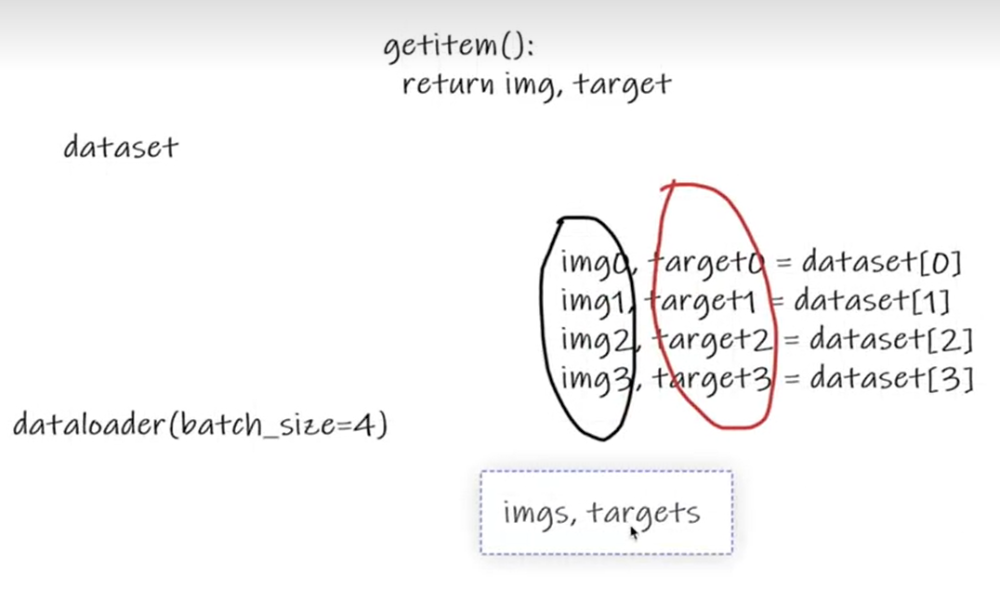

# 1. Dataloader使用

① Dataset只是去告诉我们程序，我们的数据集在什么位置，数据集第一个数据给它一个索引0，它对应的是哪一个数据。

② Dataloader就是把数据加载到神经网络当中，Dataloader所做的事就是每次从Dataset中取数据，至于怎么取，是由Dataloader中的参数决定的。
!


```python
import torchvision
from torch.utils.data import DataLoader

# 准备的测试数据集
test_data = torchvision.datasets.CIFAR10("./dataset",train=False,transform=torchvision.transforms.ToTensor())               
img, target = test_data[0]
print(img.shape)
print(img)

# batch_size=4 使得 img0, target0 = dataset[0]、img1, target1 = dataset[1]、img2, target2 = dataset[2]、img3, target3 = dataset[3]，然后这四个数据作为Dataloader的一个返回      
test_loader = DataLoader(dataset=test_data,batch_size=4,shuffle=True,num_workers=0,drop_last=False)      
# 用for循环取出DataLoader打包好的四个数据
for data in test_loader:
    imgs, targets = data # 每个data都是由4张图片组成，imgs.size 为 [4,3,32,32]，四张32×32图片三通道，targets由四个标签组成             
    print(imgs.shape)
    print(targets)
```

    torch.Size([3, 32, 32])
    tensor([[[0.6196, 0.6235, 0.6471,  ..., 0.5373, 0.4941, 0.4549],
             [0.5961, 0.5922, 0.6235,  ..., 0.5333, 0.4902, 0.4667],
             [0.5922, 0.5922, 0.6196,  ..., 0.5451, 0.5098, 0.4706],
             ...,
             [0.2667, 0.1647, 0.1216,  ..., 0.1490, 0.0510, 0.1569],
             [0.2392, 0.1922, 0.1373,  ..., 0.1020, 0.1137, 0.0784],
             [0.2118, 0.2196, 0.1765,  ..., 0.0941, 0.1333, 0.0824]],
    
            [[0.4392, 0.4353, 0.4549,  ..., 0.3725, 0.3569, 0.3333],
             [0.4392, 0.4314, 0.4471,  ..., 0.3725, 0.3569, 0.3451],
             [0.4314, 0.4275, 0.4353,  ..., 0.3843, 0.3725, 0.3490],
             ...,
             [0.4863, 0.3922, 0.3451,  ..., 0.3804, 0.2510, 0.3333],
             [0.4549, 0.4000, 0.3333,  ..., 0.3216, 0.3216, 0.2510],
             [0.4196, 0.4118, 0.3490,  ..., 0.3020, 0.3294, 0.2627]],
    
            [[0.1922, 0.1843, 0.2000,  ..., 0.1412, 0.1412, 0.1294],
             [0.2000, 0.1569, 0.1765,  ..., 0.1216, 0.1255, 0.1333],
             [0.1843, 0.1294, 0.1412,  ..., 0.1333, 0.1333, 0.1294],
             ...,
             [0.6941, 0.5804, 0.5373,  ..., 0.5725, 0.4235, 0.4980],
             [0.6588, 0.5804, 0.5176,  ..., 0.5098, 0.4941, 0.4196],
             [0.6275, 0.5843, 0.5176,  ..., 0.4863, 0.5059, 0.4314]]])
    torch.Size([4, 3, 32, 32])
    tensor([1, 2, 7, 2])
    torch.Size([4, 3, 32, 32])
    tensor([1, 8, 7, 2])
    torch.Size([4, 3, 32, 32])
    tensor([3, 3, 6, 5])
    torch.Size([4, 3, 32, 32])
    tensor([3, 4, 6, 7])
    torch.Size([4, 3, 32, 32])
    tensor([9, 4, 8, 1])
    torch.Size([4, 3, 32, 32])
    tensor([4, 9, 9, 9])
    torch.Size([4, 3, 32, 32])
    tensor([4, 7, 8, 3])
    torch.Size([4, 3, 32, 32])
    tensor([8, 7, 8, 6])
    torch.Size([4, 3, 32, 32])
    tensor([0, 6, 2, 1])
    torch.Size([4, 3, 32, 32])
    tensor([9, 0, 9, 0])
    torch.Size([4, 3, 32, 32])
    tensor([4, 2, 7, 8])
    torch.Size([4, 3, 32, 32])
    tensor([4, 5, 4, 9])
    torch.Size([4, 3, 32, 32])
    tensor([6, 2, 0, 2])
    torch.Size([4, 3, 32, 32])
    tensor([8, 0, 7, 6])
    torch.Size([4, 3, 32, 32])
    tensor([3, 5, 9, 1])
    torch.Size([4, 3, 32, 32])
    tensor([7, 9, 1, 0])
    torch.Size([4, 3, 32, 32])
    tensor([2, 6, 9, 4])
    torch.Size([4, 3, 32, 32])
    tensor([7, 5, 4, 4])
    torch.Size([4, 3, 32, 32])
    tensor([3, 8, 3, 8])
    torch.Size([4, 3, 32, 32])
    tensor([0, 7, 9, 5])
    torch.Size([4, 3, 32, 32])
    tensor([7, 2, 9, 5])
    torch.Size([4, 3, 32, 32])
    tensor([9, 1, 6, 7])
    torch.Size([4, 3, 32, 32])
    tensor([4, 8, 8, 2])
    torch.Size([4, 3, 32, 32])
    tensor([6, 8, 5, 8])
    torch.Size([4, 3, 32, 32])
    tensor([1, 8, 3, 9])
    torch.Size([4, 3, 32, 32])
    tensor([6, 1, 2, 3])
    torch.Size([4, 3, 32, 32])
    tensor([3, 0, 7, 7])
    torch.Size([4, 3, 32, 32])
    tensor([0, 5, 8, 3])
    torch.Size([4, 3, 32, 32])
    tensor([0, 3, 8, 4])
    torch.Size([4, 3, 32, 32])
    tensor([3, 9, 3, 0])
    torch.Size([4, 3, 32, 32])
    tensor([9, 9, 9, 9])
    torch.Size([4, 3, 32, 32])
    tensor([8, 7, 2, 0])
    torch.Size([4, 3, 32, 32])
    tensor([1, 1, 0, 7])
    torch.Size([4, 3, 32, 32])
    tensor([5, 6, 8, 6])
    torch.Size([4, 3, 32, 32])
    tensor([1, 3, 1, 4])
    torch.Size([4, 3, 32, 32])
    tensor([9, 3, 2, 6])
    torch.Size([4, 3, 32, 32])
    tensor([2, 4, 5, 3])
    torch.Size([4, 3, 32, 32])
    tensor([5, 1, 8, 1])
    torch.Size([4, 3, 32, 32])
    tensor([6, 9, 8, 4])
    torch.Size([4, 3, 32, 32])
    tensor([8, 1, 8, 3])
    torch.Size([4, 3, 32, 32])
    tensor([3, 9, 7, 9])
    torch.Size([4, 3, 32, 32])
    tensor([7, 7, 3, 8])
    torch.Size([4, 3, 32, 32])
    tensor([6, 8, 9, 8])
    torch.Size([4, 3, 32, 32])
    tensor([8, 2, 4, 6])
    torch.Size([4, 3, 32, 32])
    tensor([9, 3, 4, 3])
    torch.Size([4, 3, 32, 32])
    tensor([2, 4, 3, 5])
    torch.Size([4, 3, 32, 32])
    tensor([8, 0, 9, 9])
    torch.Size([4, 3, 32, 32])
    tensor([1, 9, 6, 2])
    torch.Size([4, 3, 32, 32])
    tensor([6, 2, 1, 8])
    torch.Size([4, 3, 32, 32])
    tensor([8, 7, 4, 6])
    torch.Size([4, 3, 32, 32])
    tensor([6, 4, 2, 7])
    torch.Size([4, 3, 32, 32])
    tensor([9, 2, 9, 9])
    torch.Size([4, 3, 32, 32])
    tensor([0, 7, 0, 9])
    torch.Size([4, 3, 32, 32])
    tensor([7, 0, 7, 2])
    torch.Size([4, 3, 32, 32])
    tensor([8, 6, 1, 6])
    torch.Size([4, 3, 32, 32])
    tensor([1, 2, 7, 5])
    torch.Size([4, 3, 32, 32])
    tensor([1, 5, 9, 3])
    torch.Size([4, 3, 32, 32])
    tensor([9, 9, 5, 7])
    torch.Size([4, 3, 32, 32])
    tensor([7, 0, 4, 5])
    torch.Size([4, 3, 32, 32])
    tensor([0, 6, 2, 4])
    torch.Size([4, 3, 32, 32])
    tensor([6, 5, 6, 5])
    torch.Size([4, 3, 32, 32])
    tensor([2, 8, 0, 9])
    torch.Size([4, 3, 32, 32])
    tensor([0, 8, 1, 0])
    torch.Size([4, 3, 32, 32])
    tensor([9, 3, 4, 1])
    torch.Size([4, 3, 32, 32])
    tensor([0, 6, 5, 9])
    torch.Size([4, 3, 32, 32])
    tensor([0, 6, 0, 5])
    torch.Size([4, 3, 32, 32])
    tensor([4, 4, 9, 4])
    torch.Size([4, 3, 32, 32])
    tensor([8, 5, 5, 9])
    torch.Size([4, 3, 32, 32])
    tensor([1, 9, 0, 7])
    torch.Size([4, 3, 32, 32])
    tensor([4, 6, 1, 5])
    torch.Size([4, 3, 32, 32])
    tensor([6, 8, 7, 0])
    torch.Size([4, 3, 32, 32])
    tensor([1, 1, 4, 5])
    torch.Size([4, 3, 32, 32])
    tensor([0, 7, 4, 5])
    torch.Size([4, 3, 32, 32])
    tensor([7, 8, 9, 9])
    torch.Size([4, 3, 32, 32])
    tensor([1, 8, 1, 0])
    torch.Size([4, 3, 32, 32])
    tensor([6, 3, 8, 6])
    torch.Size([4, 3, 32, 32])
    tensor([5, 7, 8, 9])
    torch.Size([4, 3, 32, 32])
    tensor([3, 4, 0, 0])
    torch.Size([4, 3, 32, 32])
    tensor([3, 3, 2, 5])
    torch.Size([4, 3, 32, 32])
    tensor([5, 6, 7, 0])
    torch.Size([4, 3, 32, 32])
    tensor([4, 2, 4, 8])
    torch.Size([4, 3, 32, 32])
    tensor([8, 3, 9, 7])
    torch.Size([4, 3, 32, 32])
    tensor([9, 2, 1, 4])
    torch.Size([4, 3, 32, 32])
    tensor([1, 7, 9, 2])
    torch.Size([4, 3, 32, 32])
    tensor([8, 0, 0, 9])
    torch.Size([4, 3, 32, 32])
    tensor([2, 4, 1, 3])
    torch.Size([4, 3, 32, 32])
    tensor([7, 2, 9, 3])
    torch.Size([4, 3, 32, 32])
    tensor([4, 6, 9, 7])
    torch.Size([4, 3, 32, 32])
    tensor([2, 4, 0, 1])
    torch.Size([4, 3, 32, 32])
    tensor([9, 5, 4, 2])
    torch.Size([4, 3, 32, 32])
    tensor([6, 6, 6, 0])
    torch.Size([4, 3, 32, 32])
    tensor([0, 4, 9, 9])
    torch.Size([4, 3, 32, 32])
    tensor([6, 9, 7, 4])
    torch.Size([4, 3, 32, 32])
    tensor([7, 2, 8, 8])
    torch.Size([4, 3, 32, 32])
    tensor([1, 3, 0, 5])
    torch.Size([4, 3, 32, 32])
    tensor([1, 0, 7, 0])
    torch.Size([4, 3, 32, 32])
    tensor([0, 9, 3, 3])
    torch.Size([4, 3, 32, 32])
    tensor([5, 6, 7, 0])
    torch.Size([4, 3, 32, 32])
    tensor([8, 9, 4, 0])
    torch.Size([4, 3, 32, 32])
    tensor([5, 3, 7, 7])
    torch.Size([4, 3, 32, 32])
    tensor([3, 0, 0, 1])
    torch.Size([4, 3, 32, 32])
    tensor([5, 8, 3, 8])
    torch.Size([4, 3, 32, 32])
    tensor([1, 8, 1, 4])
    torch.Size([4, 3, 32, 32])
    tensor([6, 6, 7, 1])
    torch.Size([4, 3, 32, 32])
    tensor([1, 2, 9, 9])
    torch.Size([4, 3, 32, 32])
    tensor([8, 5, 4, 1])
    torch.Size([4, 3, 32, 32])
    tensor([0, 0, 7, 4])
    torch.Size([4, 3, 32, 32])
    tensor([5, 2, 1, 1])
    torch.Size([4, 3, 32, 32])
    tensor([0, 6, 5, 1])
    torch.Size([4, 3, 32, 32])
    tensor([2, 3, 0, 5])
    torch.Size([4, 3, 32, 32])
    tensor([1, 4, 7, 0])
    torch.Size([4, 3, 32, 32])
    tensor([4, 9, 7, 3])
    torch.Size([4, 3, 32, 32])
    tensor([6, 9, 1, 3])
    torch.Size([4, 3, 32, 32])
    tensor([5, 8, 1, 9])
    torch.Size([4, 3, 32, 32])
    tensor([1, 6, 4, 1])
    torch.Size([4, 3, 32, 32])
    tensor([4, 1, 7, 7])
    torch.Size([4, 3, 32, 32])
    tensor([0, 8, 4, 6])
    torch.Size([4, 3, 32, 32])
    tensor([5, 5, 2, 4])
    torch.Size([4, 3, 32, 32])
    tensor([4, 6, 5, 2])
    torch.Size([4, 3, 32, 32])
    tensor([5, 6, 9, 9])
    torch.Size([4, 3, 32, 32])
    tensor([6, 9, 9, 4])
    torch.Size([4, 3, 32, 32])
    tensor([1, 4, 9, 4])
    torch.Size([4, 3, 32, 32])
    tensor([3, 2, 9, 6])
    torch.Size([4, 3, 32, 32])
    tensor([1, 2, 7, 2])
    torch.Size([4, 3, 32, 32])
    tensor([6, 4, 2, 3])
    torch.Size([4, 3, 32, 32])
    tensor([6, 3, 6, 3])
    torch.Size([4, 3, 32, 32])
    tensor([3, 7, 2, 9])
    torch.Size([4, 3, 32, 32])
    tensor([1, 4, 6, 4])
    torch.Size([4, 3, 32, 32])
    tensor([7, 1, 0, 4])
    torch.Size([4, 3, 32, 32])
    tensor([3, 1, 8, 7])
    torch.Size([4, 3, 32, 32])
    tensor([6, 3, 0, 5])
    torch.Size([4, 3, 32, 32])
    tensor([4, 8, 2, 2])
    torch.Size([4, 3, 32, 32])
    tensor([6, 6, 3, 3])
    torch.Size([4, 3, 32, 32])
    tensor([2, 5, 6, 2])
    torch.Size([4, 3, 32, 32])
    tensor([3, 2, 4, 7])
    torch.Size([4, 3, 32, 32])
    tensor([4, 8, 6, 0])
    torch.Size([4, 3, 32, 32])
    tensor([3, 2, 1, 9])
    torch.Size([4, 3, 32, 32])
    tensor([6, 8, 5, 5])
    torch.Size([4, 3, 32, 32])
    tensor([7, 3, 7, 6])
    torch.Size([4, 3, 32, 32])
    tensor([3, 0, 6, 3])
    torch.Size([4, 3, 32, 32])
    tensor([4, 2, 8, 4])
    torch.Size([4, 3, 32, 32])
    tensor([1, 7, 5, 4])
    torch.Size([4, 3, 32, 32])
    tensor([6, 3, 5, 7])
    torch.Size([4, 3, 32, 32])
    tensor([2, 9, 2, 9])
    torch.Size([4, 3, 32, 32])
    tensor([1, 6, 8, 1])
    torch.Size([4, 3, 32, 32])
    tensor([1, 0, 3, 4])
    torch.Size([4, 3, 32, 32])
    tensor([8, 3, 0, 8])
    torch.Size([4, 3, 32, 32])
    tensor([5, 7, 5, 9])
    torch.Size([4, 3, 32, 32])
    tensor([6, 1, 4, 3])
    torch.Size([4, 3, 32, 32])
    tensor([2, 4, 1, 4])
    torch.Size([4, 3, 32, 32])
    tensor([5, 2, 0, 8])
    torch.Size([4, 3, 32, 32])
    tensor([0, 5, 1, 4])
    torch.Size([4, 3, 32, 32])
    tensor([0, 1, 3, 3])
    torch.Size([4, 3, 32, 32])
    tensor([9, 6, 4, 0])
    torch.Size([4, 3, 32, 32])
    tensor([8, 5, 6, 4])
    torch.Size([4, 3, 32, 32])
    tensor([9, 6, 6, 0])
    torch.Size([4, 3, 32, 32])
    tensor([7, 9, 9, 1])
    torch.Size([4, 3, 32, 32])
    tensor([8, 5, 0, 5])
    torch.Size([4, 3, 32, 32])
    tensor([3, 8, 3, 9])
    torch.Size([4, 3, 32, 32])
    tensor([8, 4, 4, 8])
    torch.Size([4, 3, 32, 32])
    tensor([8, 7, 7, 8])
    torch.Size([4, 3, 32, 32])
    tensor([4, 9, 0, 0])
    torch.Size([4, 3, 32, 32])
    tensor([5, 6, 6, 1])
    torch.Size([4, 3, 32, 32])
    tensor([4, 4, 5, 7])
    torch.Size([4, 3, 32, 32])
    tensor([2, 2, 3, 4])
    torch.Size([4, 3, 32, 32])
    tensor([9, 4, 7, 2])
    torch.Size([4, 3, 32, 32])
    tensor([3, 3, 5, 2])
    torch.Size([4, 3, 32, 32])
    tensor([5, 2, 6, 9])
    torch.Size([4, 3, 32, 32])
    tensor([2, 5, 1, 6])
    torch.Size([4, 3, 32, 32])
    tensor([8, 9, 5, 1])
    torch.Size([4, 3, 32, 32])
    tensor([6, 0, 3, 4])
    torch.Size([4, 3, 32, 32])
    tensor([4, 0, 1, 8])
    torch.Size([4, 3, 32, 32])
    tensor([6, 4, 2, 0])
    torch.Size([4, 3, 32, 32])
    tensor([4, 3, 9, 1])
    torch.Size([4, 3, 32, 32])
    tensor([4, 7, 2, 4])
    torch.Size([4, 3, 32, 32])
    tensor([7, 5, 5, 5])
    torch.Size([4, 3, 32, 32])
    tensor([2, 5, 5, 3])
    torch.Size([4, 3, 32, 32])
    tensor([7, 7, 2, 7])
    torch.Size([4, 3, 32, 32])
    tensor([0, 3, 6, 7])
    torch.Size([4, 3, 32, 32])
    tensor([4, 9, 4, 6])
    torch.Size([4, 3, 32, 32])
    tensor([6, 1, 5, 1])
    torch.Size([4, 3, 32, 32])
    tensor([8, 1, 1, 8])
    torch.Size([4, 3, 32, 32])
    tensor([4, 8, 6, 2])
    torch.Size([4, 3, 32, 32])
    tensor([6, 5, 7, 9])
    torch.Size([4, 3, 32, 32])
    tensor([3, 6, 2, 3])
    torch.Size([4, 3, 32, 32])
    tensor([8, 4, 7, 4])
    torch.Size([4, 3, 32, 32])
    tensor([0, 1, 7, 8])
    torch.Size([4, 3, 32, 32])
    tensor([5, 2, 4, 0])
    torch.Size([4, 3, 32, 32])
    tensor([4, 4, 8, 5])
    torch.Size([4, 3, 32, 32])
    tensor([4, 3, 0, 0])
    torch.Size([4, 3, 32, 32])
    tensor([7, 7, 4, 9])
    torch.Size([4, 3, 32, 32])
    tensor([6, 7, 6, 8])
    torch.Size([4, 3, 32, 32])
    tensor([9, 1, 4, 2])
    torch.Size([4, 3, 32, 32])
    tensor([5, 0, 1, 0])
    torch.Size([4, 3, 32, 32])
    tensor([9, 4, 5, 9])
    torch.Size([4, 3, 32, 32])
    tensor([0, 8, 2, 9])
    torch.Size([4, 3, 32, 32])
    tensor([3, 7, 3, 2])
    torch.Size([4, 3, 32, 32])
    tensor([5, 6, 8, 3])
    torch.Size([4, 3, 32, 32])
    tensor([8, 2, 8, 0])
    torch.Size([4, 3, 32, 32])
    tensor([1, 8, 1, 7])
    torch.Size([4, 3, 32, 32])
    tensor([6, 8, 1, 1])
    torch.Size([4, 3, 32, 32])
    tensor([9, 3, 4, 0])
    torch.Size([4, 3, 32, 32])
    tensor([4, 2, 6, 7])
    torch.Size([4, 3, 32, 32])
    tensor([7, 3, 8, 8])
    torch.Size([4, 3, 32, 32])
    tensor([0, 3, 4, 3])
    torch.Size([4, 3, 32, 32])
    tensor([4, 7, 3, 7])
    torch.Size([4, 3, 32, 32])
    tensor([6, 3, 8, 8])
    torch.Size([4, 3, 32, 32])
    tensor([3, 9, 2, 5])
    torch.Size([4, 3, 32, 32])
    tensor([3, 8, 5, 7])
    torch.Size([4, 3, 32, 32])
    tensor([8, 4, 4, 8])
    torch.Size([4, 3, 32, 32])
    tensor([3, 4, 6, 5])
    torch.Size([4, 3, 32, 32])
    tensor([0, 9, 0, 9])
    torch.Size([4, 3, 32, 32])
    tensor([7, 6, 4, 1])
    torch.Size([4, 3, 32, 32])
    tensor([4, 7, 8, 9])
    torch.Size([4, 3, 32, 32])
    tensor([7, 5, 1, 0])
    torch.Size([4, 3, 32, 32])
    tensor([0, 4, 2, 8])
    torch.Size([4, 3, 32, 32])
    tensor([2, 0, 2, 6])
    torch.Size([4, 3, 32, 32])
    tensor([3, 1, 1, 4])
    torch.Size([4, 3, 32, 32])
    tensor([6, 9, 7, 2])
    torch.Size([4, 3, 32, 32])
    tensor([4, 4, 9, 0])
    torch.Size([4, 3, 32, 32])
    tensor([8, 0, 6, 8])
    torch.Size([4, 3, 32, 32])
    tensor([7, 6, 2, 5])
    torch.Size([4, 3, 32, 32])
    tensor([0, 2, 5, 0])
    torch.Size([4, 3, 32, 32])
    tensor([5, 8, 7, 6])
    torch.Size([4, 3, 32, 32])
    tensor([2, 3, 3, 4])
    torch.Size([4, 3, 32, 32])
    tensor([7, 5, 8, 6])
    torch.Size([4, 3, 32, 32])
    tensor([9, 2, 5, 5])
    torch.Size([4, 3, 32, 32])
    tensor([8, 2, 6, 9])
    torch.Size([4, 3, 32, 32])
    tensor([3, 7, 9, 8])
    torch.Size([4, 3, 32, 32])
    tensor([8, 0, 6, 2])
    torch.Size([4, 3, 32, 32])
    tensor([5, 2, 4, 3])
    torch.Size([4, 3, 32, 32])
    tensor([2, 0, 8, 1])
    torch.Size([4, 3, 32, 32])
    tensor([9, 1, 6, 8])
    torch.Size([4, 3, 32, 32])
    tensor([9, 9, 2, 3])
    torch.Size([4, 3, 32, 32])
    tensor([9, 0, 8, 7])
    torch.Size([4, 3, 32, 32])
    tensor([8, 9, 3, 4])
    torch.Size([4, 3, 32, 32])
    tensor([9, 3, 8, 0])
    torch.Size([4, 3, 32, 32])
    tensor([4, 6, 6, 4])
    torch.Size([4, 3, 32, 32])
    tensor([0, 3, 7, 0])
    torch.Size([4, 3, 32, 32])
    tensor([8, 8, 3, 6])
    torch.Size([4, 3, 32, 32])
    tensor([7, 8, 2, 7])
    torch.Size([4, 3, 32, 32])
    tensor([2, 4, 8, 8])
    torch.Size([4, 3, 32, 32])
    tensor([1, 1, 0, 0])
    torch.Size([4, 3, 32, 32])
    tensor([8, 6, 2, 5])
    torch.Size([4, 3, 32, 32])
    tensor([4, 0, 7, 1])
    torch.Size([4, 3, 32, 32])
    tensor([1, 2, 1, 8])
    torch.Size([4, 3, 32, 32])
    tensor([6, 5, 3, 8])
    torch.Size([4, 3, 32, 32])
    tensor([0, 9, 1, 1])
    torch.Size([4, 3, 32, 32])
    tensor([2, 5, 8, 6])
    torch.Size([4, 3, 32, 32])
    tensor([9, 1, 7, 5])
    torch.Size([4, 3, 32, 32])
    tensor([2, 6, 5, 8])
    torch.Size([4, 3, 32, 32])
    tensor([7, 6, 9, 0])
    torch.Size([4, 3, 32, 32])
    tensor([0, 9, 4, 6])
    torch.Size([4, 3, 32, 32])
    tensor([9, 9, 7, 1])
    torch.Size([4, 3, 32, 32])
    tensor([7, 3, 8, 4])
    torch.Size([4, 3, 32, 32])
    tensor([6, 5, 2, 8])
    torch.Size([4, 3, 32, 32])
    tensor([5, 3, 9, 7])
    torch.Size([4, 3, 32, 32])
    tensor([8, 7, 3, 9])
    torch.Size([4, 3, 32, 32])
    tensor([2, 0, 3, 1])
    torch.Size([4, 3, 32, 32])
    tensor([0, 6, 8, 0])
    torch.Size([4, 3, 32, 32])
    tensor([5, 7, 9, 5])
    torch.Size([4, 3, 32, 32])
    tensor([9, 8, 6, 0])
    torch.Size([4, 3, 32, 32])
    tensor([2, 7, 9, 9])
    torch.Size([4, 3, 32, 32])
    tensor([5, 0, 4, 4])
    torch.Size([4, 3, 32, 32])
    tensor([8, 9, 0, 2])
    torch.Size([4, 3, 32, 32])
    tensor([9, 9, 5, 2])
    torch.Size([4, 3, 32, 32])
    tensor([6, 2, 3, 0])
    torch.Size([4, 3, 32, 32])
    tensor([9, 5, 9, 0])
    torch.Size([4, 3, 32, 32])
    tensor([3, 0, 3, 7])
    torch.Size([4, 3, 32, 32])
    tensor([8, 0, 6, 7])
    torch.Size([4, 3, 32, 32])
    tensor([4, 1, 8, 3])
    torch.Size([4, 3, 32, 32])
    tensor([7, 7, 6, 4])
    torch.Size([4, 3, 32, 32])
    tensor([3, 0, 5, 6])
    torch.Size([4, 3, 32, 32])
    tensor([9, 5, 6, 6])
    torch.Size([4, 3, 32, 32])
    tensor([1, 6, 1, 2])
    torch.Size([4, 3, 32, 32])
    tensor([4, 2, 8, 6])
    torch.Size([4, 3, 32, 32])
    tensor([4, 5, 1, 9])
    torch.Size([4, 3, 32, 32])
    tensor([9, 9, 8, 7])
    torch.Size([4, 3, 32, 32])
    tensor([9, 7, 1, 4])
    torch.Size([4, 3, 32, 32])
    tensor([8, 9, 2, 2])
    torch.Size([4, 3, 32, 32])
    tensor([4, 0, 2, 8])
    torch.Size([4, 3, 32, 32])
    tensor([1, 1, 8, 4])
    torch.Size([4, 3, 32, 32])
    tensor([3, 7, 7, 4])
    torch.Size([4, 3, 32, 32])
    tensor([9, 2, 9, 7])
    torch.Size([4, 3, 32, 32])
    tensor([8, 6, 2, 1])
    torch.Size([4, 3, 32, 32])
    tensor([5, 2, 6, 0])
    torch.Size([4, 3, 32, 32])
    tensor([1, 7, 7, 7])
    torch.Size([4, 3, 32, 32])
    tensor([7, 6, 5, 1])
    torch.Size([4, 3, 32, 32])
    tensor([4, 0, 4, 9])
    torch.Size([4, 3, 32, 32])
    tensor([8, 4, 5, 3])
    torch.Size([4, 3, 32, 32])
    tensor([4, 2, 7, 1])
    torch.Size([4, 3, 32, 32])
    tensor([1, 0, 0, 9])
    torch.Size([4, 3, 32, 32])
    tensor([2, 3, 4, 8])
    torch.Size([4, 3, 32, 32])
    tensor([4, 5, 1, 4])
    torch.Size([4, 3, 32, 32])
    tensor([8, 1, 5, 9])
    torch.Size([4, 3, 32, 32])
    tensor([7, 8, 7, 1])
    torch.Size([4, 3, 32, 32])
    tensor([8, 4, 8, 4])
    torch.Size([4, 3, 32, 32])
    tensor([5, 6, 9, 8])
    torch.Size([4, 3, 32, 32])
    tensor([8, 7, 5, 1])
    torch.Size([4, 3, 32, 32])
    tensor([1, 0, 4, 4])
    torch.Size([4, 3, 32, 32])
    tensor([5, 4, 9, 3])
    torch.Size([4, 3, 32, 32])
    tensor([2, 5, 8, 7])
    torch.Size([4, 3, 32, 32])
    tensor([7, 9, 4, 4])
    torch.Size([4, 3, 32, 32])
    tensor([2, 4, 2, 1])
    torch.Size([4, 3, 32, 32])
    tensor([8, 4, 8, 9])
    torch.Size([4, 3, 32, 32])
    tensor([8, 9, 2, 0])
    torch.Size([4, 3, 32, 32])
    tensor([6, 3, 2, 1])
    torch.Size([4, 3, 32, 32])
    tensor([2, 1, 0, 0])
    torch.Size([4, 3, 32, 32])
    tensor([9, 8, 7, 6])
    torch.Size([4, 3, 32, 32])
    tensor([3, 9, 5, 2])
    torch.Size([4, 3, 32, 32])
    tensor([3, 8, 4, 7])
    torch.Size([4, 3, 32, 32])
    tensor([9, 7, 3, 5])
    torch.Size([4, 3, 32, 32])
    tensor([2, 8, 4, 2])
    torch.Size([4, 3, 32, 32])
    tensor([2, 4, 0, 4])
    torch.Size([4, 3, 32, 32])
    tensor([8, 3, 4, 4])
    torch.Size([4, 3, 32, 32])
    tensor([7, 9, 7, 2])
    torch.Size([4, 3, 32, 32])
    tensor([7, 6, 2, 9])
    torch.Size([4, 3, 32, 32])
    tensor([1, 0, 5, 5])
    torch.Size([4, 3, 32, 32])
    tensor([0, 0, 0, 5])
    torch.Size([4, 3, 32, 32])
    tensor([0, 3, 3, 0])
    torch.Size([4, 3, 32, 32])
    tensor([9, 5, 9, 8])
    torch.Size([4, 3, 32, 32])
    tensor([6, 1, 6, 5])
    torch.Size([4, 3, 32, 32])
    tensor([7, 3, 6, 6])
    torch.Size([4, 3, 32, 32])
    tensor([4, 8, 9, 0])
    torch.Size([4, 3, 32, 32])
    tensor([5, 4, 5, 3])
    torch.Size([4, 3, 32, 32])
    tensor([1, 4, 2, 4])
    torch.Size([4, 3, 32, 32])
    tensor([3, 7, 7, 5])
    torch.Size([4, 3, 32, 32])
    tensor([0, 7, 3, 2])
    torch.Size([4, 3, 32, 32])
    tensor([4, 9, 0, 4])
    torch.Size([4, 3, 32, 32])
    tensor([7, 1, 2, 7])
    torch.Size([4, 3, 32, 32])
    tensor([1, 3, 1, 6])
    torch.Size([4, 3, 32, 32])
    tensor([5, 0, 2, 3])
    torch.Size([4, 3, 32, 32])
    tensor([8, 3, 2, 3])
    torch.Size([4, 3, 32, 32])
    tensor([2, 4, 4, 2])
    torch.Size([4, 3, 32, 32])
    tensor([2, 2, 6, 3])
    torch.Size([4, 3, 32, 32])
    tensor([4, 8, 7, 0])
    torch.Size([4, 3, 32, 32])
    tensor([1, 2, 2, 5])
    torch.Size([4, 3, 32, 32])
    tensor([3, 0, 0, 0])
    torch.Size([4, 3, 32, 32])
    tensor([1, 1, 9, 8])
    torch.Size([4, 3, 32, 32])
    tensor([8, 7, 9, 5])
    torch.Size([4, 3, 32, 32])
    tensor([2, 0, 6, 2])
    torch.Size([4, 3, 32, 32])
    tensor([4, 0, 6, 4])
    torch.Size([4, 3, 32, 32])
    tensor([7, 2, 4, 5])
    torch.Size([4, 3, 32, 32])
    tensor([0, 7, 3, 1])
    torch.Size([4, 3, 32, 32])
    tensor([1, 4, 4, 5])
    torch.Size([4, 3, 32, 32])
    tensor([9, 7, 7, 5])
    torch.Size([4, 3, 32, 32])
    tensor([0, 5, 8, 3])
    torch.Size([4, 3, 32, 32])
    tensor([3, 1, 3, 2])
    torch.Size([4, 3, 32, 32])
    tensor([0, 1, 8, 0])
    torch.Size([4, 3, 32, 32])
    tensor([6, 4, 2, 9])
    torch.Size([4, 3, 32, 32])
    tensor([9, 2, 4, 1])
    torch.Size([4, 3, 32, 32])
    tensor([3, 4, 3, 1])
    torch.Size([4, 3, 32, 32])
    tensor([1, 4, 7, 7])
    torch.Size([4, 3, 32, 32])
    tensor([3, 2, 4, 5])
    torch.Size([4, 3, 32, 32])
    tensor([2, 8, 6, 4])
    torch.Size([4, 3, 32, 32])
    tensor([3, 4, 9, 0])
    torch.Size([4, 3, 32, 32])
    tensor([1, 9, 2, 9])
    torch.Size([4, 3, 32, 32])
    tensor([6, 7, 0, 1])
    torch.Size([4, 3, 32, 32])
    tensor([9, 4, 6, 1])
    torch.Size([4, 3, 32, 32])
    tensor([2, 6, 1, 7])
    torch.Size([4, 3, 32, 32])
    tensor([0, 5, 4, 9])
    torch.Size([4, 3, 32, 32])
    tensor([4, 0, 8, 5])
    torch.Size([4, 3, 32, 32])
    tensor([8, 4, 3, 2])
    torch.Size([4, 3, 32, 32])
    tensor([9, 3, 6, 0])
    torch.Size([4, 3, 32, 32])
    tensor([7, 3, 0, 4])
    torch.Size([4, 3, 32, 32])
    tensor([9, 7, 9, 8])
    torch.Size([4, 3, 32, 32])
    tensor([2, 2, 8, 8])
    torch.Size([4, 3, 32, 32])
    tensor([9, 0, 0, 3])
    torch.Size([4, 3, 32, 32])
    tensor([5, 0, 9, 6])
    torch.Size([4, 3, 32, 32])
    tensor([8, 3, 7, 9])
    torch.Size([4, 3, 32, 32])
    tensor([4, 4, 8, 2])
    torch.Size([4, 3, 32, 32])
    tensor([7, 8, 6, 8])
    torch.Size([4, 3, 32, 32])
    tensor([6, 9, 8, 8])
    torch.Size([4, 3, 32, 32])
    tensor([4, 8, 2, 7])
    torch.Size([4, 3, 32, 32])
    tensor([4, 7, 5, 8])
    torch.Size([4, 3, 32, 32])
    tensor([6, 8, 2, 6])
    torch.Size([4, 3, 32, 32])
    tensor([8, 4, 2, 7])
    torch.Size([4, 3, 32, 32])
    tensor([3, 4, 1, 5])
    torch.Size([4, 3, 32, 32])
    tensor([2, 5, 0, 7])
    torch.Size([4, 3, 32, 32])
    tensor([4, 6, 2, 7])
    torch.Size([4, 3, 32, 32])
    tensor([3, 8, 3, 1])
    torch.Size([4, 3, 32, 32])
    tensor([1, 5, 0, 4])
    torch.Size([4, 3, 32, 32])
    tensor([6, 3, 2, 3])
    torch.Size([4, 3, 32, 32])
    tensor([0, 6, 5, 5])
    torch.Size([4, 3, 32, 32])
    tensor([2, 4, 5, 9])
    torch.Size([4, 3, 32, 32])
    tensor([8, 4, 6, 7])
    torch.Size([4, 3, 32, 32])
    tensor([0, 2, 6, 9])
    torch.Size([4, 3, 32, 32])
    tensor([6, 3, 0, 9])
    torch.Size([4, 3, 32, 32])
    tensor([3, 2, 6, 9])
    torch.Size([4, 3, 32, 32])
    tensor([2, 6, 9, 9])
    torch.Size([4, 3, 32, 32])
    tensor([6, 7, 0, 6])
    torch.Size([4, 3, 32, 32])
    tensor([1, 9, 7, 9])
    torch.Size([4, 3, 32, 32])
    tensor([2, 7, 1, 8])
    torch.Size([4, 3, 32, 32])
    tensor([5, 6, 4, 6])
    torch.Size([4, 3, 32, 32])
    tensor([1, 2, 9, 2])
    torch.Size([4, 3, 32, 32])
    tensor([6, 0, 5, 9])
    torch.Size([4, 3, 32, 32])
    tensor([4, 7, 3, 8])
    torch.Size([4, 3, 32, 32])
    tensor([9, 7, 9, 8])
    torch.Size([4, 3, 32, 32])
    tensor([3, 9, 9, 6])
    torch.Size([4, 3, 32, 32])
    tensor([4, 1, 5, 0])
    torch.Size([4, 3, 32, 32])
    tensor([5, 5, 0, 6])
    torch.Size([4, 3, 32, 32])
    tensor([4, 4, 1, 6])
    torch.Size([4, 3, 32, 32])
    tensor([4, 7, 0, 7])
    torch.Size([4, 3, 32, 32])
    tensor([3, 5, 7, 5])
    torch.Size([4, 3, 32, 32])
    tensor([9, 6, 3, 8])
    torch.Size([4, 3, 32, 32])
    tensor([6, 4, 6, 3])
    torch.Size([4, 3, 32, 32])
    tensor([6, 9, 9, 4])
    torch.Size([4, 3, 32, 32])
    tensor([5, 7, 9, 5])
    torch.Size([4, 3, 32, 32])
    tensor([4, 6, 1, 1])
    torch.Size([4, 3, 32, 32])
    tensor([4, 0, 3, 2])
    torch.Size([4, 3, 32, 32])
    tensor([9, 7, 5, 1])
    torch.Size([4, 3, 32, 32])
    tensor([8, 7, 2, 5])
    torch.Size([4, 3, 32, 32])
    tensor([4, 6, 6, 9])
    torch.Size([4, 3, 32, 32])
    tensor([7, 3, 4, 3])
    torch.Size([4, 3, 32, 32])
    tensor([8, 6, 4, 1])
    torch.Size([4, 3, 32, 32])
    tensor([1, 8, 8, 0])
    torch.Size([4, 3, 32, 32])
    tensor([9, 8, 6, 5])
    torch.Size([4, 3, 32, 32])
    tensor([5, 6, 2, 0])
    torch.Size([4, 3, 32, 32])
    tensor([4, 1, 7, 7])
    torch.Size([4, 3, 32, 32])
    tensor([3, 8, 3, 3])
    torch.Size([4, 3, 32, 32])
    tensor([7, 3, 9, 0])
    torch.Size([4, 3, 32, 32])
    tensor([3, 9, 1, 3])
    torch.Size([4, 3, 32, 32])
    tensor([0, 0, 4, 6])
    torch.Size([4, 3, 32, 32])
    tensor([6, 1, 2, 0])
    torch.Size([4, 3, 32, 32])
    tensor([7, 6, 3, 6])
    torch.Size([4, 3, 32, 32])
    tensor([4, 8, 6, 7])
    torch.Size([4, 3, 32, 32])
    tensor([9, 9, 0, 3])
    torch.Size([4, 3, 32, 32])
    tensor([6, 4, 2, 3])
    torch.Size([4, 3, 32, 32])
    tensor([0, 7, 6, 3])
    torch.Size([4, 3, 32, 32])
    tensor([0, 1, 0, 2])
    torch.Size([4, 3, 32, 32])
    tensor([4, 8, 8, 9])
    torch.Size([4, 3, 32, 32])
    tensor([2, 8, 7, 1])
    torch.Size([4, 3, 32, 32])
    tensor([6, 9, 0, 7])
    torch.Size([4, 3, 32, 32])
    tensor([2, 4, 0, 3])
    torch.Size([4, 3, 32, 32])
    tensor([2, 6, 2, 9])
    torch.Size([4, 3, 32, 32])
    tensor([4, 4, 3, 9])
    torch.Size([4, 3, 32, 32])
    tensor([4, 3, 0, 9])
    torch.Size([4, 3, 32, 32])
    tensor([3, 6, 9, 6])
    torch.Size([4, 3, 32, 32])
    tensor([5, 3, 5, 8])
    torch.Size([4, 3, 32, 32])
    tensor([1, 3, 8, 3])
    torch.Size([4, 3, 32, 32])
    tensor([3, 2, 6, 4])
    torch.Size([4, 3, 32, 32])
    tensor([1, 7, 1, 3])
    torch.Size([4, 3, 32, 32])
    tensor([3, 6, 1, 3])
    torch.Size([4, 3, 32, 32])
    tensor([3, 4, 9, 6])
    torch.Size([4, 3, 32, 32])
    tensor([3, 7, 5, 3])
    torch.Size([4, 3, 32, 32])
    tensor([7, 3, 3, 6])
    torch.Size([4, 3, 32, 32])
    tensor([7, 8, 3, 8])
    torch.Size([4, 3, 32, 32])
    tensor([2, 8, 0, 1])
    torch.Size([4, 3, 32, 32])
    tensor([7, 2, 1, 7])
    torch.Size([4, 3, 32, 32])
    tensor([2, 0, 4, 6])
    torch.Size([4, 3, 32, 32])
    tensor([1, 2, 7, 9])
    torch.Size([4, 3, 32, 32])
    tensor([8, 7, 7, 1])
    torch.Size([4, 3, 32, 32])
    tensor([8, 3, 0, 0])
    torch.Size([4, 3, 32, 32])
    tensor([3, 0, 1, 0])
    torch.Size([4, 3, 32, 32])
    tensor([5, 5, 7, 4])
    torch.Size([4, 3, 32, 32])
    tensor([9, 1, 2, 4])
    torch.Size([4, 3, 32, 32])
    tensor([0, 7, 9, 7])
    torch.Size([4, 3, 32, 32])
    tensor([1, 1, 0, 4])
    torch.Size([4, 3, 32, 32])
    tensor([5, 9, 1, 7])
    torch.Size([4, 3, 32, 32])
    tensor([3, 4, 1, 3])
    torch.Size([4, 3, 32, 32])
    tensor([9, 1, 2, 7])
    torch.Size([4, 3, 32, 32])
    tensor([5, 6, 4, 1])
    torch.Size([4, 3, 32, 32])
    tensor([9, 8, 6, 9])
    torch.Size([4, 3, 32, 32])
    tensor([6, 8, 3, 3])
    torch.Size([4, 3, 32, 32])
    tensor([4, 0, 2, 6])
    torch.Size([4, 3, 32, 32])
    tensor([7, 3, 1, 8])
    torch.Size([4, 3, 32, 32])
    tensor([7, 8, 7, 5])
    torch.Size([4, 3, 32, 32])
    tensor([0, 6, 1, 0])
    torch.Size([4, 3, 32, 32])
    tensor([3, 7, 3, 9])
    torch.Size([4, 3, 32, 32])
    tensor([1, 8, 5, 0])
    torch.Size([4, 3, 32, 32])
    tensor([3, 5, 7, 4])
    torch.Size([4, 3, 32, 32])
    tensor([2, 7, 8, 8])
    torch.Size([4, 3, 32, 32])
    tensor([1, 4, 7, 0])
    torch.Size([4, 3, 32, 32])
    tensor([3, 3, 9, 4])
    torch.Size([4, 3, 32, 32])
    tensor([2, 0, 5, 1])
    torch.Size([4, 3, 32, 32])
    tensor([8, 9, 3, 2])
    torch.Size([4, 3, 32, 32])
    tensor([2, 7, 4, 1])
    torch.Size([4, 3, 32, 32])
    tensor([9, 0, 1, 3])
    torch.Size([4, 3, 32, 32])
    tensor([9, 2, 8, 3])
    torch.Size([4, 3, 32, 32])
    tensor([1, 2, 0, 1])
    torch.Size([4, 3, 32, 32])
    tensor([8, 5, 1, 5])
    torch.Size([4, 3, 32, 32])
    tensor([5, 9, 2, 2])
    torch.Size([4, 3, 32, 32])
    tensor([5, 2, 7, 0])
    torch.Size([4, 3, 32, 32])
    tensor([7, 8, 1, 2])
    torch.Size([4, 3, 32, 32])
    tensor([1, 2, 9, 4])
    torch.Size([4, 3, 32, 32])
    tensor([1, 5, 8, 1])
    torch.Size([4, 3, 32, 32])
    tensor([0, 9, 7, 5])
    torch.Size([4, 3, 32, 32])
    tensor([6, 4, 9, 8])
    torch.Size([4, 3, 32, 32])
    tensor([5, 0, 4, 8])
    torch.Size([4, 3, 32, 32])
    tensor([1, 7, 9, 8])
    torch.Size([4, 3, 32, 32])
    tensor([9, 1, 6, 9])
    torch.Size([4, 3, 32, 32])
    tensor([1, 5, 9, 8])
    torch.Size([4, 3, 32, 32])
    tensor([6, 4, 2, 6])
    torch.Size([4, 3, 32, 32])
    tensor([9, 1, 1, 8])
    torch.Size([4, 3, 32, 32])
    tensor([1, 0, 7, 7])
    torch.Size([4, 3, 32, 32])
    tensor([9, 0, 7, 3])
    torch.Size([4, 3, 32, 32])
    tensor([8, 5, 5, 7])
    torch.Size([4, 3, 32, 32])
    tensor([3, 4, 7, 9])
    torch.Size([4, 3, 32, 32])
    tensor([7, 2, 0, 1])
    torch.Size([4, 3, 32, 32])
    tensor([5, 7, 5, 0])
    torch.Size([4, 3, 32, 32])
    tensor([1, 1, 4, 4])
    torch.Size([4, 3, 32, 32])
    tensor([9, 6, 0, 8])
    torch.Size([4, 3, 32, 32])
    tensor([4, 9, 0, 3])
    torch.Size([4, 3, 32, 32])
    tensor([6, 0, 3, 1])
    torch.Size([4, 3, 32, 32])
    tensor([9, 7, 6, 0])
    torch.Size([4, 3, 32, 32])
    tensor([0, 0, 1, 4])
    torch.Size([4, 3, 32, 32])
    tensor([1, 6, 2, 4])
    torch.Size([4, 3, 32, 32])
    tensor([2, 3, 0, 4])
    torch.Size([4, 3, 32, 32])
    tensor([2, 5, 6, 9])
    torch.Size([4, 3, 32, 32])
    tensor([9, 4, 1, 3])
    torch.Size([4, 3, 32, 32])
    tensor([5, 8, 0, 9])
    torch.Size([4, 3, 32, 32])
    tensor([5, 6, 5, 2])
    torch.Size([4, 3, 32, 32])
    tensor([7, 7, 9, 9])
    torch.Size([4, 3, 32, 32])
    tensor([5, 3, 6, 9])
    torch.Size([4, 3, 32, 32])
    tensor([8, 6, 8, 4])
    torch.Size([4, 3, 32, 32])
    tensor([8, 5, 2, 7])
    torch.Size([4, 3, 32, 32])
    tensor([5, 4, 5, 7])
    torch.Size([4, 3, 32, 32])
    tensor([8, 2, 0, 6])
    torch.Size([4, 3, 32, 32])
    tensor([0, 5, 4, 4])
    torch.Size([4, 3, 32, 32])
    tensor([3, 3, 1, 1])
    torch.Size([4, 3, 32, 32])
    tensor([9, 7, 7, 1])
    torch.Size([4, 3, 32, 32])
    tensor([1, 7, 3, 0])
    torch.Size([4, 3, 32, 32])
    tensor([8, 6, 1, 0])
    torch.Size([4, 3, 32, 32])
    tensor([3, 0, 5, 9])
    torch.Size([4, 3, 32, 32])
    tensor([8, 7, 6, 1])
    torch.Size([4, 3, 32, 32])
    tensor([1, 7, 2, 0])
    torch.Size([4, 3, 32, 32])
    tensor([8, 4, 8, 3])
    torch.Size([4, 3, 32, 32])
    tensor([2, 4, 5, 0])
    torch.Size([4, 3, 32, 32])
    tensor([4, 7, 8, 1])
    torch.Size([4, 3, 32, 32])
    tensor([2, 7, 9, 6])
    torch.Size([4, 3, 32, 32])
    tensor([2, 6, 5, 8])
    torch.Size([4, 3, 32, 32])
    tensor([9, 7, 4, 6])
    torch.Size([4, 3, 32, 32])
    tensor([1, 9, 6, 8])
    torch.Size([4, 3, 32, 32])
    tensor([8, 1, 7, 2])
    torch.Size([4, 3, 32, 32])
    tensor([6, 3, 7, 8])
    torch.Size([4, 3, 32, 32])
    tensor([2, 5, 6, 8])
    torch.Size([4, 3, 32, 32])
    tensor([3, 6, 5, 3])
    torch.Size([4, 3, 32, 32])
    tensor([1, 4, 3, 9])
    torch.Size([4, 3, 32, 32])
    tensor([8, 4, 5, 3])
    torch.Size([4, 3, 32, 32])
    tensor([2, 2, 5, 2])
    torch.Size([4, 3, 32, 32])
    tensor([2, 6, 7, 0])
    torch.Size([4, 3, 32, 32])
    tensor([5, 4, 9, 7])
    torch.Size([4, 3, 32, 32])
    tensor([7, 2, 2, 4])
    torch.Size([4, 3, 32, 32])
    tensor([9, 2, 7, 5])
    torch.Size([4, 3, 32, 32])
    tensor([9, 5, 9, 2])
    torch.Size([4, 3, 32, 32])
    tensor([0, 1, 0, 7])
    torch.Size([4, 3, 32, 32])
    tensor([5, 6, 5, 5])
    torch.Size([4, 3, 32, 32])
    tensor([2, 4, 2, 1])
    torch.Size([4, 3, 32, 32])
    tensor([7, 7, 9, 7])
    torch.Size([4, 3, 32, 32])
    tensor([8, 1, 7, 5])
    torch.Size([4, 3, 32, 32])
    tensor([6, 7, 6, 2])
    torch.Size([4, 3, 32, 32])
    tensor([4, 2, 2, 6])
    torch.Size([4, 3, 32, 32])
    tensor([7, 0, 1, 1])
    torch.Size([4, 3, 32, 32])
    tensor([8, 8, 5, 0])
    torch.Size([4, 3, 32, 32])
    tensor([4, 3, 3, 3])
    torch.Size([4, 3, 32, 32])
    tensor([9, 7, 6, 3])
    torch.Size([4, 3, 32, 32])
    tensor([5, 3, 2, 9])
    torch.Size([4, 3, 32, 32])
    tensor([7, 0, 4, 0])
    torch.Size([4, 3, 32, 32])
    tensor([9, 2, 4, 1])
    torch.Size([4, 3, 32, 32])
    tensor([3, 3, 2, 0])
    torch.Size([4, 3, 32, 32])
    tensor([4, 1, 1, 0])
    torch.Size([4, 3, 32, 32])
    tensor([9, 2, 2, 8])
    torch.Size([4, 3, 32, 32])
    tensor([0, 3, 2, 5])
    torch.Size([4, 3, 32, 32])
    tensor([6, 2, 3, 5])
    torch.Size([4, 3, 32, 32])
    tensor([9, 5, 7, 9])
    torch.Size([4, 3, 32, 32])
    tensor([3, 5, 0, 2])
    torch.Size([4, 3, 32, 32])
    tensor([8, 2, 6, 6])
    torch.Size([4, 3, 32, 32])
    tensor([1, 9, 2, 5])
    torch.Size([4, 3, 32, 32])
    tensor([1, 9, 5, 6])
    torch.Size([4, 3, 32, 32])
    tensor([3, 9, 5, 0])
    torch.Size([4, 3, 32, 32])
    tensor([5, 9, 0, 8])
    torch.Size([4, 3, 32, 32])
    tensor([7, 4, 9, 4])
    torch.Size([4, 3, 32, 32])
    tensor([4, 9, 9, 9])
    torch.Size([4, 3, 32, 32])
    tensor([7, 0, 1, 3])
    torch.Size([4, 3, 32, 32])
    tensor([2, 9, 8, 7])
    torch.Size([4, 3, 32, 32])
    tensor([8, 5, 8, 1])
    torch.Size([4, 3, 32, 32])
    tensor([3, 3, 6, 1])
    torch.Size([4, 3, 32, 32])
    tensor([7, 1, 3, 4])
    torch.Size([4, 3, 32, 32])
    tensor([0, 1, 9, 5])
    torch.Size([4, 3, 32, 32])
    tensor([5, 0, 5, 8])
    torch.Size([4, 3, 32, 32])
    tensor([5, 6, 7, 1])
    torch.Size([4, 3, 32, 32])
    tensor([5, 8, 0, 5])
    torch.Size([4, 3, 32, 32])
    tensor([6, 5, 3, 9])
    torch.Size([4, 3, 32, 32])
    tensor([8, 0, 2, 4])
    torch.Size([4, 3, 32, 32])
    tensor([5, 7, 3, 7])
    torch.Size([4, 3, 32, 32])
    tensor([1, 0, 7, 6])
    torch.Size([4, 3, 32, 32])
    tensor([0, 3, 8, 7])
    torch.Size([4, 3, 32, 32])
    tensor([4, 6, 2, 2])
    torch.Size([4, 3, 32, 32])
    tensor([2, 4, 2, 9])
    torch.Size([4, 3, 32, 32])
    tensor([6, 0, 9, 2])
    torch.Size([4, 3, 32, 32])
    tensor([1, 0, 9, 6])
    torch.Size([4, 3, 32, 32])
    tensor([5, 6, 9, 3])
    torch.Size([4, 3, 32, 32])
    tensor([3, 0, 2, 2])
    torch.Size([4, 3, 32, 32])
    tensor([6, 7, 4, 3])
    torch.Size([4, 3, 32, 32])
    tensor([7, 7, 9, 8])
    torch.Size([4, 3, 32, 32])
    tensor([0, 1, 3, 6])
    torch.Size([4, 3, 32, 32])
    tensor([3, 5, 7, 0])
    torch.Size([4, 3, 32, 32])
    tensor([7, 1, 1, 5])
    torch.Size([4, 3, 32, 32])
    tensor([5, 5, 5, 0])
    torch.Size([4, 3, 32, 32])
    tensor([2, 1, 5, 5])
    torch.Size([4, 3, 32, 32])
    tensor([5, 3, 8, 6])
    torch.Size([4, 3, 32, 32])
    tensor([7, 1, 6, 0])
    torch.Size([4, 3, 32, 32])
    tensor([9, 7, 0, 3])
    torch.Size([4, 3, 32, 32])
    tensor([1, 4, 2, 6])
    torch.Size([4, 3, 32, 32])
    tensor([4, 1, 8, 8])
    torch.Size([4, 3, 32, 32])
    tensor([4, 2, 3, 2])
    torch.Size([4, 3, 32, 32])
    tensor([4, 7, 1, 8])
    torch.Size([4, 3, 32, 32])
    tensor([8, 5, 6, 0])
    torch.Size([4, 3, 32, 32])
    tensor([1, 1, 8, 9])
    torch.Size([4, 3, 32, 32])
    tensor([3, 6, 2, 5])
    torch.Size([4, 3, 32, 32])
    tensor([5, 7, 1, 5])
    torch.Size([4, 3, 32, 32])
    tensor([1, 7, 2, 4])
    torch.Size([4, 3, 32, 32])
    tensor([5, 2, 1, 2])
    torch.Size([4, 3, 32, 32])
    tensor([8, 4, 3, 5])
    torch.Size([4, 3, 32, 32])
    tensor([5, 0, 7, 5])
    torch.Size([4, 3, 32, 32])
    tensor([8, 3, 5, 3])
    torch.Size([4, 3, 32, 32])
    tensor([2, 3, 5, 3])
    torch.Size([4, 3, 32, 32])
    tensor([8, 4, 0, 8])
    torch.Size([4, 3, 32, 32])
    tensor([1, 3, 7, 4])
    torch.Size([4, 3, 32, 32])
    tensor([6, 5, 4, 0])
    torch.Size([4, 3, 32, 32])
    tensor([9, 7, 6, 7])
    torch.Size([4, 3, 32, 32])
    tensor([6, 1, 9, 0])
    torch.Size([4, 3, 32, 32])
    tensor([9, 5, 1, 6])
    torch.Size([4, 3, 32, 32])
    tensor([1, 8, 4, 5])
    torch.Size([4, 3, 32, 32])
    tensor([5, 0, 9, 3])
    torch.Size([4, 3, 32, 32])
    tensor([9, 9, 2, 2])
    torch.Size([4, 3, 32, 32])
    tensor([1, 0, 4, 2])
    torch.Size([4, 3, 32, 32])
    tensor([9, 4, 6, 9])
    torch.Size([4, 3, 32, 32])
    tensor([9, 9, 7, 7])
    torch.Size([4, 3, 32, 32])
    tensor([0, 9, 0, 5])
    torch.Size([4, 3, 32, 32])
    tensor([2, 3, 8, 1])
    torch.Size([4, 3, 32, 32])
    tensor([7, 0, 9, 5])
    torch.Size([4, 3, 32, 32])
    tensor([8, 5, 9, 4])
    torch.Size([4, 3, 32, 32])
    tensor([6, 2, 4, 8])
    torch.Size([4, 3, 32, 32])
    tensor([5, 7, 0, 9])
    torch.Size([4, 3, 32, 32])
    tensor([1, 5, 7, 1])
    torch.Size([4, 3, 32, 32])
    tensor([9, 2, 5, 7])
    torch.Size([4, 3, 32, 32])
    tensor([4, 7, 9, 9])
    torch.Size([4, 3, 32, 32])
    tensor([2, 6, 6, 5])
    torch.Size([4, 3, 32, 32])
    tensor([6, 0, 9, 1])
    torch.Size([4, 3, 32, 32])
    tensor([8, 4, 1, 7])
    torch.Size([4, 3, 32, 32])
    tensor([0, 7, 5, 9])
    torch.Size([4, 3, 32, 32])
    tensor([7, 3, 3, 1])
    torch.Size([4, 3, 32, 32])
    tensor([5, 2, 7, 8])
    torch.Size([4, 3, 32, 32])
    tensor([0, 9, 1, 9])
    torch.Size([4, 3, 32, 32])
    tensor([5, 1, 3, 7])
    torch.Size([4, 3, 32, 32])
    tensor([1, 5, 4, 9])
    torch.Size([4, 3, 32, 32])
    tensor([1, 2, 4, 6])
    torch.Size([4, 3, 32, 32])
    tensor([4, 8, 6, 9])
    torch.Size([4, 3, 32, 32])
    tensor([8, 2, 2, 5])
    torch.Size([4, 3, 32, 32])
    tensor([5, 2, 1, 8])
    torch.Size([4, 3, 32, 32])
    tensor([2, 9, 2, 8])
    torch.Size([4, 3, 32, 32])
    tensor([9, 1, 3, 4])
    torch.Size([4, 3, 32, 32])
    tensor([9, 4, 0, 4])
    torch.Size([4, 3, 32, 32])
    tensor([6, 3, 4, 5])
    torch.Size([4, 3, 32, 32])
    tensor([8, 3, 8, 5])
    torch.Size([4, 3, 32, 32])
    tensor([4, 3, 4, 3])
    torch.Size([4, 3, 32, 32])
    tensor([0, 3, 3, 9])
    torch.Size([4, 3, 32, 32])
    tensor([9, 1, 2, 4])
    torch.Size([4, 3, 32, 32])
    tensor([8, 7, 3, 2])
    torch.Size([4, 3, 32, 32])
    tensor([9, 1, 5, 0])
    torch.Size([4, 3, 32, 32])
    tensor([6, 6, 6, 1])
    torch.Size([4, 3, 32, 32])
    tensor([2, 2, 2, 7])
    torch.Size([4, 3, 32, 32])
    tensor([4, 1, 4, 0])
    torch.Size([4, 3, 32, 32])
    tensor([4, 4, 4, 1])
    torch.Size([4, 3, 32, 32])
    tensor([1, 7, 3, 7])
    torch.Size([4, 3, 32, 32])
    tensor([4, 4, 7, 0])
    torch.Size([4, 3, 32, 32])
    tensor([2, 0, 0, 3])
    torch.Size([4, 3, 32, 32])
    tensor([5, 8, 5, 3])
    torch.Size([4, 3, 32, 32])
    tensor([0, 3, 6, 3])
    torch.Size([4, 3, 32, 32])
    tensor([1, 2, 9, 6])
    torch.Size([4, 3, 32, 32])
    tensor([5, 7, 0, 4])
    torch.Size([4, 3, 32, 32])
    tensor([3, 7, 6, 6])
    torch.Size([4, 3, 32, 32])
    tensor([2, 1, 0, 7])
    torch.Size([4, 3, 32, 32])
    tensor([3, 3, 0, 2])
    torch.Size([4, 3, 32, 32])
    tensor([6, 0, 3, 5])
    torch.Size([4, 3, 32, 32])
    tensor([6, 6, 1, 4])
    torch.Size([4, 3, 32, 32])
    tensor([5, 0, 8, 7])
    torch.Size([4, 3, 32, 32])
    tensor([2, 2, 9, 5])
    torch.Size([4, 3, 32, 32])
    tensor([5, 2, 2, 1])
    torch.Size([4, 3, 32, 32])
    tensor([8, 8, 0, 6])
    torch.Size([4, 3, 32, 32])
    tensor([3, 8, 2, 0])
    torch.Size([4, 3, 32, 32])
    tensor([1, 6, 7, 3])
    torch.Size([4, 3, 32, 32])
    tensor([5, 9, 4, 1])
    torch.Size([4, 3, 32, 32])
    tensor([2, 3, 1, 5])
    torch.Size([4, 3, 32, 32])
    tensor([2, 9, 7, 8])
    torch.Size([4, 3, 32, 32])
    tensor([2, 4, 0, 7])
    torch.Size([4, 3, 32, 32])
    tensor([6, 9, 0, 8])
    torch.Size([4, 3, 32, 32])
    tensor([4, 8, 0, 5])
    torch.Size([4, 3, 32, 32])
    tensor([3, 6, 9, 9])
    torch.Size([4, 3, 32, 32])
    tensor([0, 3, 7, 6])
    torch.Size([4, 3, 32, 32])
    tensor([7, 0, 3, 6])
    torch.Size([4, 3, 32, 32])
    tensor([0, 1, 3, 8])
    torch.Size([4, 3, 32, 32])
    tensor([3, 7, 0, 0])
    torch.Size([4, 3, 32, 32])
    tensor([7, 4, 7, 7])
    torch.Size([4, 3, 32, 32])
    tensor([7, 1, 4, 1])
    torch.Size([4, 3, 32, 32])
    tensor([9, 5, 6, 4])
    torch.Size([4, 3, 32, 32])
    tensor([2, 1, 8, 9])
    torch.Size([4, 3, 32, 32])
    tensor([1, 5, 8, 8])
    torch.Size([4, 3, 32, 32])
    tensor([4, 1, 6, 5])
    torch.Size([4, 3, 32, 32])
    tensor([8, 7, 2, 0])
    torch.Size([4, 3, 32, 32])
    tensor([9, 3, 4, 0])
    torch.Size([4, 3, 32, 32])
    tensor([4, 0, 4, 2])
    torch.Size([4, 3, 32, 32])
    tensor([3, 9, 6, 3])
    torch.Size([4, 3, 32, 32])
    tensor([0, 7, 8, 8])
    torch.Size([4, 3, 32, 32])
    tensor([1, 6, 9, 2])
    torch.Size([4, 3, 32, 32])
    tensor([9, 5, 7, 8])
    torch.Size([4, 3, 32, 32])
    tensor([5, 0, 5, 3])
    torch.Size([4, 3, 32, 32])
    tensor([9, 7, 4, 1])
    torch.Size([4, 3, 32, 32])
    tensor([8, 3, 4, 3])
    torch.Size([4, 3, 32, 32])
    tensor([9, 3, 3, 6])
    torch.Size([4, 3, 32, 32])
    tensor([8, 3, 6, 0])
    torch.Size([4, 3, 32, 32])
    tensor([3, 5, 3, 6])
    torch.Size([4, 3, 32, 32])
    tensor([0, 6, 5, 1])
    torch.Size([4, 3, 32, 32])
    tensor([3, 9, 7, 7])
    torch.Size([4, 3, 32, 32])
    tensor([8, 7, 6, 1])
    torch.Size([4, 3, 32, 32])
    tensor([9, 5, 4, 8])
    torch.Size([4, 3, 32, 32])
    tensor([9, 0, 7, 3])
    torch.Size([4, 3, 32, 32])
    tensor([6, 4, 3, 5])
    torch.Size([4, 3, 32, 32])
    tensor([4, 9, 2, 9])
    torch.Size([4, 3, 32, 32])
    tensor([4, 8, 2, 2])
    torch.Size([4, 3, 32, 32])
    tensor([7, 7, 6, 0])
    torch.Size([4, 3, 32, 32])
    tensor([5, 2, 9, 2])
    torch.Size([4, 3, 32, 32])
    tensor([0, 8, 0, 2])
    torch.Size([4, 3, 32, 32])
    tensor([8, 7, 1, 5])
    torch.Size([4, 3, 32, 32])
    tensor([7, 6, 1, 2])
    torch.Size([4, 3, 32, 32])
    tensor([3, 1, 7, 8])
    torch.Size([4, 3, 32, 32])
    tensor([4, 2, 6, 2])
    torch.Size([4, 3, 32, 32])
    tensor([7, 8, 3, 4])
    torch.Size([4, 3, 32, 32])
    tensor([0, 6, 9, 2])
    torch.Size([4, 3, 32, 32])
    tensor([5, 5, 8, 1])
    torch.Size([4, 3, 32, 32])
    tensor([4, 8, 7, 3])
    torch.Size([4, 3, 32, 32])
    tensor([9, 4, 7, 3])
    torch.Size([4, 3, 32, 32])
    tensor([0, 0, 7, 9])
    torch.Size([4, 3, 32, 32])
    tensor([4, 3, 7, 5])
    torch.Size([4, 3, 32, 32])
    tensor([6, 0, 2, 3])
    torch.Size([4, 3, 32, 32])
    tensor([1, 7, 8, 9])
    torch.Size([4, 3, 32, 32])
    tensor([9, 1, 7, 1])
    torch.Size([4, 3, 32, 32])
    tensor([2, 8, 9, 7])
    torch.Size([4, 3, 32, 32])
    tensor([5, 3, 4, 8])
    torch.Size([4, 3, 32, 32])
    tensor([1, 6, 7, 2])
    torch.Size([4, 3, 32, 32])
    tensor([8, 3, 8, 9])
    torch.Size([4, 3, 32, 32])
    tensor([1, 6, 2, 9])
    torch.Size([4, 3, 32, 32])
    tensor([0, 3, 9, 6])
    torch.Size([4, 3, 32, 32])
    tensor([8, 2, 3, 1])
    torch.Size([4, 3, 32, 32])
    tensor([3, 4, 0, 0])
    torch.Size([4, 3, 32, 32])
    tensor([1, 9, 5, 3])
    torch.Size([4, 3, 32, 32])
    tensor([9, 0, 1, 5])
    torch.Size([4, 3, 32, 32])
    tensor([8, 1, 9, 5])
    torch.Size([4, 3, 32, 32])
    tensor([1, 1, 5, 3])
    torch.Size([4, 3, 32, 32])
    tensor([1, 0, 6, 6])
    torch.Size([4, 3, 32, 32])
    tensor([7, 4, 0, 0])
    torch.Size([4, 3, 32, 32])
    tensor([5, 7, 6, 2])
    torch.Size([4, 3, 32, 32])
    tensor([1, 6, 1, 8])
    torch.Size([4, 3, 32, 32])
    tensor([3, 8, 0, 0])
    torch.Size([4, 3, 32, 32])
    tensor([9, 8, 8, 9])
    torch.Size([4, 3, 32, 32])
    tensor([0, 7, 8, 3])
    torch.Size([4, 3, 32, 32])
    tensor([7, 2, 2, 8])
    torch.Size([4, 3, 32, 32])
    tensor([7, 7, 0, 9])
    torch.Size([4, 3, 32, 32])
    tensor([9, 0, 1, 4])
    torch.Size([4, 3, 32, 32])
    tensor([9, 6, 1, 7])
    torch.Size([4, 3, 32, 32])
    tensor([2, 7, 1, 2])
    torch.Size([4, 3, 32, 32])
    tensor([1, 1, 5, 1])
    torch.Size([4, 3, 32, 32])
    tensor([2, 7, 4, 6])
    torch.Size([4, 3, 32, 32])
    tensor([2, 0, 4, 9])
    torch.Size([4, 3, 32, 32])
    tensor([1, 1, 5, 4])
    torch.Size([4, 3, 32, 32])
    tensor([2, 9, 3, 1])
    torch.Size([4, 3, 32, 32])
    tensor([3, 4, 4, 9])
    torch.Size([4, 3, 32, 32])
    tensor([5, 7, 0, 0])
    torch.Size([4, 3, 32, 32])
    tensor([4, 4, 8, 1])
    torch.Size([4, 3, 32, 32])
    tensor([3, 8, 6, 8])
    torch.Size([4, 3, 32, 32])
    tensor([4, 9, 2, 9])
    torch.Size([4, 3, 32, 32])
    tensor([0, 1, 4, 3])
    torch.Size([4, 3, 32, 32])
    tensor([9, 0, 8, 3])
    torch.Size([4, 3, 32, 32])
    tensor([0, 6, 8, 2])
    torch.Size([4, 3, 32, 32])
    tensor([5, 7, 5, 6])
    torch.Size([4, 3, 32, 32])
    tensor([7, 1, 1, 6])
    torch.Size([4, 3, 32, 32])
    tensor([2, 2, 3, 3])
    torch.Size([4, 3, 32, 32])
    tensor([0, 7, 2, 0])
    torch.Size([4, 3, 32, 32])
    tensor([5, 7, 9, 5])
    torch.Size([4, 3, 32, 32])
    tensor([9, 1, 8, 4])
    torch.Size([4, 3, 32, 32])
    tensor([5, 0, 0, 2])
    torch.Size([4, 3, 32, 32])
    tensor([5, 5, 1, 6])
    torch.Size([4, 3, 32, 32])
    tensor([4, 5, 1, 8])
    torch.Size([4, 3, 32, 32])
    tensor([4, 0, 1, 8])
    torch.Size([4, 3, 32, 32])
    tensor([8, 2, 0, 9])
    torch.Size([4, 3, 32, 32])
    tensor([8, 3, 3, 9])
    torch.Size([4, 3, 32, 32])
    tensor([7, 9, 1, 4])
    torch.Size([4, 3, 32, 32])
    tensor([1, 8, 7, 2])
    torch.Size([4, 3, 32, 32])
    tensor([7, 2, 4, 4])
    torch.Size([4, 3, 32, 32])
    tensor([8, 7, 7, 1])
    torch.Size([4, 3, 32, 32])
    tensor([2, 9, 4, 5])
    torch.Size([4, 3, 32, 32])
    tensor([1, 6, 1, 2])
    torch.Size([4, 3, 32, 32])
    tensor([8, 8, 4, 9])
    torch.Size([4, 3, 32, 32])
    tensor([8, 6, 9, 7])
    torch.Size([4, 3, 32, 32])
    tensor([7, 4, 1, 6])
    torch.Size([4, 3, 32, 32])
    tensor([3, 9, 0, 3])
    torch.Size([4, 3, 32, 32])
    tensor([9, 4, 3, 4])
    torch.Size([4, 3, 32, 32])
    tensor([6, 6, 8, 3])
    torch.Size([4, 3, 32, 32])
    tensor([8, 8, 7, 6])
    torch.Size([4, 3, 32, 32])
    tensor([2, 2, 0, 0])
    torch.Size([4, 3, 32, 32])
    tensor([2, 5, 6, 1])
    torch.Size([4, 3, 32, 32])
    tensor([9, 2, 4, 2])
    torch.Size([4, 3, 32, 32])
    tensor([7, 8, 7, 2])
    torch.Size([4, 3, 32, 32])
    tensor([7, 2, 0, 3])
    torch.Size([4, 3, 32, 32])
    tensor([0, 9, 1, 8])
    torch.Size([4, 3, 32, 32])
    tensor([7, 5, 6, 0])
    torch.Size([4, 3, 32, 32])
    tensor([7, 4, 1, 9])
    torch.Size([4, 3, 32, 32])
    tensor([5, 2, 9, 1])
    torch.Size([4, 3, 32, 32])
    tensor([3, 7, 8, 5])
    torch.Size([4, 3, 32, 32])
    tensor([3, 3, 3, 5])
    torch.Size([4, 3, 32, 32])
    tensor([9, 8, 4, 7])
    torch.Size([4, 3, 32, 32])
    tensor([4, 9, 8, 0])
    torch.Size([4, 3, 32, 32])
    tensor([3, 6, 8, 1])
    torch.Size([4, 3, 32, 32])
    tensor([9, 4, 6, 6])
    torch.Size([4, 3, 32, 32])
    tensor([7, 1, 2, 3])
    torch.Size([4, 3, 32, 32])
    tensor([1, 9, 3, 0])
    torch.Size([4, 3, 32, 32])
    tensor([9, 0, 6, 5])
    torch.Size([4, 3, 32, 32])
    tensor([2, 2, 1, 8])
    torch.Size([4, 3, 32, 32])
    tensor([7, 3, 5, 1])
    torch.Size([4, 3, 32, 32])
    tensor([9, 6, 1, 8])
    torch.Size([4, 3, 32, 32])
    tensor([6, 3, 0, 1])
    torch.Size([4, 3, 32, 32])
    tensor([4, 7, 5, 8])
    torch.Size([4, 3, 32, 32])
    tensor([1, 7, 9, 0])
    torch.Size([4, 3, 32, 32])
    tensor([3, 3, 7, 9])
    torch.Size([4, 3, 32, 32])
    tensor([6, 7, 1, 6])
    torch.Size([4, 3, 32, 32])
    tensor([3, 9, 0, 6])
    torch.Size([4, 3, 32, 32])
    tensor([9, 1, 5, 2])
    torch.Size([4, 3, 32, 32])
    tensor([8, 1, 3, 0])
    torch.Size([4, 3, 32, 32])
    tensor([5, 6, 0, 1])
    torch.Size([4, 3, 32, 32])
    tensor([5, 6, 0, 2])
    torch.Size([4, 3, 32, 32])
    tensor([5, 4, 5, 7])
    torch.Size([4, 3, 32, 32])
    tensor([8, 8, 2, 1])
    torch.Size([4, 3, 32, 32])
    tensor([0, 7, 6, 8])
    torch.Size([4, 3, 32, 32])
    tensor([7, 5, 2, 2])
    torch.Size([4, 3, 32, 32])
    tensor([9, 0, 1, 9])
    torch.Size([4, 3, 32, 32])
    tensor([0, 9, 8, 5])
    torch.Size([4, 3, 32, 32])
    tensor([7, 0, 9, 1])
    torch.Size([4, 3, 32, 32])
    tensor([3, 9, 9, 9])
    torch.Size([4, 3, 32, 32])
    tensor([2, 4, 6, 9])
    torch.Size([4, 3, 32, 32])
    tensor([6, 8, 2, 8])
    torch.Size([4, 3, 32, 32])
    tensor([6, 5, 8, 8])
    torch.Size([4, 3, 32, 32])
    tensor([1, 9, 1, 0])
    torch.Size([4, 3, 32, 32])
    tensor([7, 9, 6, 9])
    torch.Size([4, 3, 32, 32])
    tensor([4, 5, 8, 5])
    torch.Size([4, 3, 32, 32])
    tensor([4, 2, 3, 2])
    torch.Size([4, 3, 32, 32])
    tensor([1, 3, 0, 3])
    torch.Size([4, 3, 32, 32])
    tensor([9, 2, 6, 4])
    torch.Size([4, 3, 32, 32])
    tensor([1, 5, 6, 3])
    torch.Size([4, 3, 32, 32])
    tensor([6, 9, 3, 3])
    torch.Size([4, 3, 32, 32])
    tensor([1, 3, 0, 7])
    torch.Size([4, 3, 32, 32])
    tensor([4, 8, 5, 6])
    torch.Size([4, 3, 32, 32])
    tensor([1, 8, 9, 1])
    torch.Size([4, 3, 32, 32])
    tensor([9, 2, 2, 6])
    torch.Size([4, 3, 32, 32])
    tensor([0, 6, 3, 9])
    torch.Size([4, 3, 32, 32])
    tensor([3, 3, 9, 4])
    torch.Size([4, 3, 32, 32])
    tensor([1, 1, 3, 1])
    torch.Size([4, 3, 32, 32])
    tensor([2, 8, 1, 2])
    torch.Size([4, 3, 32, 32])
    tensor([7, 8, 3, 5])
    torch.Size([4, 3, 32, 32])
    tensor([1, 0, 9, 5])
    torch.Size([4, 3, 32, 32])
    tensor([7, 4, 9, 8])
    torch.Size([4, 3, 32, 32])
    tensor([3, 0, 6, 8])
    torch.Size([4, 3, 32, 32])
    tensor([4, 0, 6, 6])
    torch.Size([4, 3, 32, 32])
    tensor([9, 0, 8, 8])
    torch.Size([4, 3, 32, 32])
    tensor([1, 6, 4, 4])
    torch.Size([4, 3, 32, 32])
    tensor([6, 2, 0, 3])
    torch.Size([4, 3, 32, 32])
    tensor([2, 3, 8, 1])
    torch.Size([4, 3, 32, 32])
    tensor([0, 7, 9, 5])
    torch.Size([4, 3, 32, 32])
    tensor([0, 0, 6, 0])
    torch.Size([4, 3, 32, 32])
    tensor([5, 4, 4, 0])
    torch.Size([4, 3, 32, 32])
    tensor([0, 3, 8, 0])
    torch.Size([4, 3, 32, 32])
    tensor([1, 5, 0, 1])
    torch.Size([4, 3, 32, 32])
    tensor([0, 4, 2, 1])
    torch.Size([4, 3, 32, 32])
    tensor([7, 3, 0, 0])
    torch.Size([4, 3, 32, 32])
    tensor([3, 7, 9, 8])
    torch.Size([4, 3, 32, 32])
    tensor([3, 5, 3, 2])
    torch.Size([4, 3, 32, 32])
    tensor([2, 8, 4, 9])
    torch.Size([4, 3, 32, 32])
    tensor([0, 9, 3, 8])
    torch.Size([4, 3, 32, 32])
    tensor([6, 9, 1, 6])
    torch.Size([4, 3, 32, 32])
    tensor([3, 9, 7, 9])
    torch.Size([4, 3, 32, 32])
    tensor([0, 5, 0, 4])
    torch.Size([4, 3, 32, 32])
    tensor([0, 9, 0, 9])
    torch.Size([4, 3, 32, 32])
    tensor([9, 9, 6, 2])
    torch.Size([4, 3, 32, 32])
    tensor([2, 0, 3, 1])
    torch.Size([4, 3, 32, 32])
    tensor([6, 5, 2, 9])
    torch.Size([4, 3, 32, 32])
    tensor([5, 2, 0, 0])
    torch.Size([4, 3, 32, 32])
    tensor([9, 4, 6, 8])
    torch.Size([4, 3, 32, 32])
    tensor([4, 2, 6, 1])
    torch.Size([4, 3, 32, 32])
    tensor([0, 8, 3, 2])
    torch.Size([4, 3, 32, 32])
    tensor([0, 3, 3, 4])
    torch.Size([4, 3, 32, 32])
    tensor([8, 4, 5, 8])
    torch.Size([4, 3, 32, 32])
    tensor([0, 0, 6, 1])
    torch.Size([4, 3, 32, 32])
    tensor([7, 3, 1, 3])
    torch.Size([4, 3, 32, 32])
    tensor([9, 2, 5, 1])
    torch.Size([4, 3, 32, 32])
    tensor([6, 6, 5, 0])
    torch.Size([4, 3, 32, 32])
    tensor([9, 3, 5, 5])
    torch.Size([4, 3, 32, 32])
    tensor([5, 8, 2, 6])
    torch.Size([4, 3, 32, 32])
    tensor([4, 0, 8, 8])
    torch.Size([4, 3, 32, 32])
    tensor([8, 6, 5, 5])
    torch.Size([4, 3, 32, 32])
    tensor([7, 4, 4, 5])
    torch.Size([4, 3, 32, 32])
    tensor([9, 5, 4, 3])
    torch.Size([4, 3, 32, 32])
    tensor([7, 4, 5, 1])
    torch.Size([4, 3, 32, 32])
    tensor([3, 8, 7, 0])
    torch.Size([4, 3, 32, 32])
    tensor([9, 3, 8, 7])
    torch.Size([4, 3, 32, 32])
    tensor([5, 7, 5, 3])
    torch.Size([4, 3, 32, 32])
    tensor([6, 4, 2, 2])
    torch.Size([4, 3, 32, 32])
    tensor([4, 9, 9, 3])
    torch.Size([4, 3, 32, 32])
    tensor([4, 9, 2, 8])
    torch.Size([4, 3, 32, 32])
    tensor([2, 6, 5, 6])
    torch.Size([4, 3, 32, 32])
    tensor([4, 5, 7, 1])
    torch.Size([4, 3, 32, 32])
    tensor([0, 6, 7, 3])
    torch.Size([4, 3, 32, 32])
    tensor([4, 8, 8, 9])
    torch.Size([4, 3, 32, 32])
    tensor([3, 8, 3, 1])
    torch.Size([4, 3, 32, 32])
    tensor([2, 7, 6, 2])
    torch.Size([4, 3, 32, 32])
    tensor([5, 2, 1, 6])
    torch.Size([4, 3, 32, 32])
    tensor([7, 8, 8, 5])
    torch.Size([4, 3, 32, 32])
    tensor([0, 0, 0, 0])
    torch.Size([4, 3, 32, 32])
    tensor([8, 9, 5, 3])
    torch.Size([4, 3, 32, 32])
    tensor([0, 8, 1, 0])
    torch.Size([4, 3, 32, 32])
    tensor([8, 9, 7, 0])
    torch.Size([4, 3, 32, 32])
    tensor([6, 7, 8, 7])
    torch.Size([4, 3, 32, 32])
    tensor([0, 0, 8, 9])
    torch.Size([4, 3, 32, 32])
    tensor([9, 5, 9, 3])
    torch.Size([4, 3, 32, 32])
    tensor([0, 2, 5, 2])
    torch.Size([4, 3, 32, 32])
    tensor([8, 8, 2, 1])
    torch.Size([4, 3, 32, 32])
    tensor([1, 5, 7, 6])
    torch.Size([4, 3, 32, 32])
    tensor([8, 1, 1, 4])
    torch.Size([4, 3, 32, 32])
    tensor([2, 1, 6, 4])
    torch.Size([4, 3, 32, 32])
    tensor([5, 1, 3, 7])
    torch.Size([4, 3, 32, 32])
    tensor([3, 6, 9, 9])
    torch.Size([4, 3, 32, 32])
    tensor([4, 3, 8, 9])
    torch.Size([4, 3, 32, 32])
    tensor([3, 5, 8, 2])
    torch.Size([4, 3, 32, 32])
    tensor([8, 3, 3, 0])
    torch.Size([4, 3, 32, 32])
    tensor([1, 1, 1, 5])
    torch.Size([4, 3, 32, 32])
    tensor([7, 6, 0, 5])
    torch.Size([4, 3, 32, 32])
    tensor([5, 0, 1, 0])
    torch.Size([4, 3, 32, 32])
    tensor([9, 2, 9, 8])
    torch.Size([4, 3, 32, 32])
    tensor([3, 6, 4, 1])
    torch.Size([4, 3, 32, 32])
    tensor([1, 2, 1, 0])
    torch.Size([4, 3, 32, 32])
    tensor([5, 6, 1, 9])
    torch.Size([4, 3, 32, 32])
    tensor([7, 0, 3, 3])
    torch.Size([4, 3, 32, 32])
    tensor([0, 0, 3, 0])
    torch.Size([4, 3, 32, 32])
    tensor([4, 8, 0, 4])
    torch.Size([4, 3, 32, 32])
    tensor([0, 9, 4, 7])
    torch.Size([4, 3, 32, 32])
    tensor([4, 0, 3, 5])
    torch.Size([4, 3, 32, 32])
    tensor([2, 0, 6, 0])
    torch.Size([4, 3, 32, 32])
    tensor([5, 5, 8, 2])
    torch.Size([4, 3, 32, 32])
    tensor([6, 6, 8, 8])
    torch.Size([4, 3, 32, 32])
    tensor([8, 6, 7, 1])
    torch.Size([4, 3, 32, 32])
    tensor([4, 0, 6, 8])
    torch.Size([4, 3, 32, 32])
    tensor([9, 7, 3, 6])
    torch.Size([4, 3, 32, 32])
    tensor([5, 9, 3, 5])
    torch.Size([4, 3, 32, 32])
    tensor([0, 3, 2, 9])
    torch.Size([4, 3, 32, 32])
    tensor([3, 0, 3, 7])
    torch.Size([4, 3, 32, 32])
    tensor([7, 4, 1, 2])
    torch.Size([4, 3, 32, 32])
    tensor([9, 8, 3, 1])
    torch.Size([4, 3, 32, 32])
    tensor([9, 9, 0, 8])
    torch.Size([4, 3, 32, 32])
    tensor([6, 1, 8, 1])
    torch.Size([4, 3, 32, 32])
    tensor([7, 0, 1, 9])
    torch.Size([4, 3, 32, 32])
    tensor([6, 1, 1, 8])
    torch.Size([4, 3, 32, 32])
    tensor([5, 3, 1, 0])
    torch.Size([4, 3, 32, 32])
    tensor([6, 6, 7, 1])
    torch.Size([4, 3, 32, 32])
    tensor([5, 6, 0, 1])
    torch.Size([4, 3, 32, 32])
    tensor([8, 1, 2, 5])
    torch.Size([4, 3, 32, 32])
    tensor([9, 7, 5, 9])
    torch.Size([4, 3, 32, 32])
    tensor([1, 7, 5, 3])
    torch.Size([4, 3, 32, 32])
    tensor([0, 0, 3, 9])
    torch.Size([4, 3, 32, 32])
    tensor([6, 4, 5, 0])
    torch.Size([4, 3, 32, 32])
    tensor([7, 5, 5, 5])
    torch.Size([4, 3, 32, 32])
    tensor([5, 7, 3, 4])
    torch.Size([4, 3, 32, 32])
    tensor([6, 7, 8, 5])
    torch.Size([4, 3, 32, 32])
    tensor([1, 3, 2, 1])
    torch.Size([4, 3, 32, 32])
    tensor([1, 4, 2, 1])
    torch.Size([4, 3, 32, 32])
    tensor([4, 6, 2, 6])
    torch.Size([4, 3, 32, 32])
    tensor([3, 0, 1, 4])
    torch.Size([4, 3, 32, 32])
    tensor([3, 2, 4, 4])
    torch.Size([4, 3, 32, 32])
    tensor([1, 9, 4, 6])
    torch.Size([4, 3, 32, 32])
    tensor([1, 6, 3, 7])
    torch.Size([4, 3, 32, 32])
    tensor([4, 5, 3, 8])
    torch.Size([4, 3, 32, 32])
    tensor([2, 2, 9, 6])
    torch.Size([4, 3, 32, 32])
    tensor([0, 4, 9, 0])
    torch.Size([4, 3, 32, 32])
    tensor([6, 8, 5, 2])
    torch.Size([4, 3, 32, 32])
    tensor([3, 3, 6, 0])
    torch.Size([4, 3, 32, 32])
    tensor([1, 5, 3, 7])
    torch.Size([4, 3, 32, 32])
    tensor([7, 8, 6, 5])
    torch.Size([4, 3, 32, 32])
    tensor([0, 1, 8, 7])
    torch.Size([4, 3, 32, 32])
    tensor([4, 7, 4, 4])
    torch.Size([4, 3, 32, 32])
    tensor([2, 1, 3, 3])
    torch.Size([4, 3, 32, 32])
    tensor([8, 6, 0, 4])
    torch.Size([4, 3, 32, 32])
    tensor([9, 0, 4, 7])
    torch.Size([4, 3, 32, 32])
    tensor([2, 7, 3, 0])
    torch.Size([4, 3, 32, 32])
    tensor([5, 5, 3, 8])
    torch.Size([4, 3, 32, 32])
    tensor([8, 1, 7, 5])
    torch.Size([4, 3, 32, 32])
    tensor([0, 6, 5, 1])
    torch.Size([4, 3, 32, 32])
    tensor([3, 1, 7, 8])
    torch.Size([4, 3, 32, 32])
    tensor([2, 8, 6, 9])
    torch.Size([4, 3, 32, 32])
    tensor([7, 8, 7, 7])
    torch.Size([4, 3, 32, 32])
    tensor([7, 3, 5, 8])
    torch.Size([4, 3, 32, 32])
    tensor([1, 1, 3, 5])
    torch.Size([4, 3, 32, 32])
    tensor([1, 4, 2, 6])
    torch.Size([4, 3, 32, 32])
    tensor([0, 5, 5, 6])
    torch.Size([4, 3, 32, 32])
    tensor([2, 5, 5, 4])
    torch.Size([4, 3, 32, 32])
    tensor([0, 0, 2, 4])
    torch.Size([4, 3, 32, 32])
    tensor([8, 7, 2, 6])
    torch.Size([4, 3, 32, 32])
    tensor([6, 6, 6, 0])
    torch.Size([4, 3, 32, 32])
    tensor([9, 8, 5, 3])
    torch.Size([4, 3, 32, 32])
    tensor([2, 3, 8, 8])
    torch.Size([4, 3, 32, 32])
    tensor([1, 1, 6, 2])
    torch.Size([4, 3, 32, 32])
    tensor([0, 6, 9, 7])
    torch.Size([4, 3, 32, 32])
    tensor([8, 1, 4, 6])
    torch.Size([4, 3, 32, 32])
    tensor([4, 4, 1, 9])
    torch.Size([4, 3, 32, 32])
    tensor([4, 9, 8, 4])
    torch.Size([4, 3, 32, 32])
    tensor([6, 7, 7, 6])
    torch.Size([4, 3, 32, 32])
    tensor([4, 0, 1, 4])
    torch.Size([4, 3, 32, 32])
    tensor([7, 4, 0, 3])
    torch.Size([4, 3, 32, 32])
    tensor([8, 7, 6, 1])
    torch.Size([4, 3, 32, 32])
    tensor([5, 6, 5, 3])
    torch.Size([4, 3, 32, 32])
    tensor([5, 0, 6, 2])
    torch.Size([4, 3, 32, 32])
    tensor([0, 7, 3, 5])
    torch.Size([4, 3, 32, 32])
    tensor([4, 7, 5, 2])
    torch.Size([4, 3, 32, 32])
    tensor([9, 4, 9, 2])
    torch.Size([4, 3, 32, 32])
    tensor([9, 1, 4, 1])
    torch.Size([4, 3, 32, 32])
    tensor([0, 5, 3, 6])
    torch.Size([4, 3, 32, 32])
    tensor([0, 7, 8, 6])
    torch.Size([4, 3, 32, 32])
    tensor([9, 1, 6, 5])
    torch.Size([4, 3, 32, 32])
    tensor([8, 0, 7, 8])
    torch.Size([4, 3, 32, 32])
    tensor([5, 8, 9, 8])
    torch.Size([4, 3, 32, 32])
    tensor([3, 4, 4, 8])
    torch.Size([4, 3, 32, 32])
    tensor([2, 3, 6, 6])
    torch.Size([4, 3, 32, 32])
    tensor([6, 6, 9, 6])
    torch.Size([4, 3, 32, 32])
    tensor([2, 1, 3, 4])
    torch.Size([4, 3, 32, 32])
    tensor([2, 4, 3, 1])
    torch.Size([4, 3, 32, 32])
    tensor([1, 2, 8, 4])
    torch.Size([4, 3, 32, 32])
    tensor([1, 2, 8, 9])
    torch.Size([4, 3, 32, 32])
    tensor([9, 0, 9, 4])
    torch.Size([4, 3, 32, 32])
    tensor([0, 1, 0, 0])
    torch.Size([4, 3, 32, 32])
    tensor([4, 3, 1, 1])
    torch.Size([4, 3, 32, 32])
    tensor([2, 5, 1, 2])
    torch.Size([4, 3, 32, 32])
    tensor([1, 5, 7, 6])
    torch.Size([4, 3, 32, 32])
    tensor([7, 7, 6, 8])
    torch.Size([4, 3, 32, 32])
    tensor([2, 9, 7, 5])
    torch.Size([4, 3, 32, 32])
    tensor([8, 2, 2, 6])
    torch.Size([4, 3, 32, 32])
    tensor([7, 0, 9, 3])
    torch.Size([4, 3, 32, 32])
    tensor([2, 4, 2, 7])
    torch.Size([4, 3, 32, 32])
    tensor([1, 5, 6, 5])
    torch.Size([4, 3, 32, 32])
    tensor([1, 4, 2, 0])
    torch.Size([4, 3, 32, 32])
    tensor([4, 4, 1, 7])
    torch.Size([4, 3, 32, 32])
    tensor([0, 7, 0, 8])
    torch.Size([4, 3, 32, 32])
    tensor([7, 7, 4, 1])
    torch.Size([4, 3, 32, 32])
    tensor([9, 1, 3, 5])
    torch.Size([4, 3, 32, 32])
    tensor([9, 0, 8, 1])
    torch.Size([4, 3, 32, 32])
    tensor([2, 8, 4, 4])
    torch.Size([4, 3, 32, 32])
    tensor([0, 5, 7, 7])
    torch.Size([4, 3, 32, 32])
    tensor([7, 4, 7, 7])
    torch.Size([4, 3, 32, 32])
    tensor([3, 0, 4, 2])
    torch.Size([4, 3, 32, 32])
    tensor([4, 0, 8, 6])
    torch.Size([4, 3, 32, 32])
    tensor([9, 4, 6, 9])
    torch.Size([4, 3, 32, 32])
    tensor([7, 4, 3, 0])
    torch.Size([4, 3, 32, 32])
    tensor([0, 4, 2, 9])
    torch.Size([4, 3, 32, 32])
    tensor([5, 9, 6, 4])
    torch.Size([4, 3, 32, 32])
    tensor([3, 9, 1, 6])
    torch.Size([4, 3, 32, 32])
    tensor([2, 6, 2, 1])
    torch.Size([4, 3, 32, 32])
    tensor([4, 8, 4, 8])
    torch.Size([4, 3, 32, 32])
    tensor([5, 7, 9, 8])
    torch.Size([4, 3, 32, 32])
    tensor([7, 6, 9, 2])
    torch.Size([4, 3, 32, 32])
    tensor([7, 3, 3, 6])
    torch.Size([4, 3, 32, 32])
    tensor([6, 6, 8, 4])
    torch.Size([4, 3, 32, 32])
    tensor([5, 5, 8, 7])
    torch.Size([4, 3, 32, 32])
    tensor([8, 6, 3, 7])
    torch.Size([4, 3, 32, 32])
    tensor([1, 1, 6, 5])
    torch.Size([4, 3, 32, 32])
    tensor([2, 1, 6, 8])
    torch.Size([4, 3, 32, 32])
    tensor([6, 3, 3, 6])
    torch.Size([4, 3, 32, 32])
    tensor([6, 8, 3, 4])
    torch.Size([4, 3, 32, 32])
    tensor([1, 4, 3, 4])
    torch.Size([4, 3, 32, 32])
    tensor([8, 8, 9, 2])
    torch.Size([4, 3, 32, 32])
    tensor([4, 1, 9, 9])
    torch.Size([4, 3, 32, 32])
    tensor([4, 5, 3, 3])
    torch.Size([4, 3, 32, 32])
    tensor([5, 9, 4, 8])
    torch.Size([4, 3, 32, 32])
    tensor([8, 0, 9, 5])
    torch.Size([4, 3, 32, 32])
    tensor([7, 2, 5, 3])
    torch.Size([4, 3, 32, 32])
    tensor([8, 3, 1, 3])
    torch.Size([4, 3, 32, 32])
    tensor([4, 6, 8, 9])
    torch.Size([4, 3, 32, 32])
    tensor([2, 2, 4, 6])
    torch.Size([4, 3, 32, 32])
    tensor([6, 9, 7, 4])
    torch.Size([4, 3, 32, 32])
    tensor([4, 3, 1, 9])
    torch.Size([4, 3, 32, 32])
    tensor([1, 4, 6, 3])
    torch.Size([4, 3, 32, 32])
    tensor([3, 4, 0, 9])
    torch.Size([4, 3, 32, 32])
    tensor([7, 2, 0, 3])
    torch.Size([4, 3, 32, 32])
    tensor([9, 3, 6, 8])
    torch.Size([4, 3, 32, 32])
    tensor([7, 3, 4, 5])
    torch.Size([4, 3, 32, 32])
    tensor([4, 8, 0, 1])
    torch.Size([4, 3, 32, 32])
    tensor([9, 6, 2, 4])
    torch.Size([4, 3, 32, 32])
    tensor([8, 8, 2, 7])
    torch.Size([4, 3, 32, 32])
    tensor([0, 2, 9, 3])
    torch.Size([4, 3, 32, 32])
    tensor([4, 2, 2, 2])
    torch.Size([4, 3, 32, 32])
    tensor([6, 1, 4, 3])
    torch.Size([4, 3, 32, 32])
    tensor([7, 5, 1, 7])
    torch.Size([4, 3, 32, 32])
    tensor([2, 8, 1, 4])
    torch.Size([4, 3, 32, 32])
    tensor([3, 3, 0, 6])
    torch.Size([4, 3, 32, 32])
    tensor([9, 3, 4, 5])
    torch.Size([4, 3, 32, 32])
    tensor([5, 0, 9, 0])
    torch.Size([4, 3, 32, 32])
    tensor([2, 0, 1, 0])
    torch.Size([4, 3, 32, 32])
    tensor([9, 9, 4, 2])
    torch.Size([4, 3, 32, 32])
    tensor([6, 3, 0, 4])
    torch.Size([4, 3, 32, 32])
    tensor([4, 2, 1, 4])
    torch.Size([4, 3, 32, 32])
    tensor([8, 4, 1, 4])
    torch.Size([4, 3, 32, 32])
    tensor([0, 6, 4, 1])
    torch.Size([4, 3, 32, 32])
    tensor([2, 9, 9, 7])
    torch.Size([4, 3, 32, 32])
    tensor([4, 3, 4, 5])
    torch.Size([4, 3, 32, 32])
    tensor([2, 0, 7, 0])
    torch.Size([4, 3, 32, 32])
    tensor([8, 1, 3, 3])
    torch.Size([4, 3, 32, 32])
    tensor([3, 1, 0, 0])
    torch.Size([4, 3, 32, 32])
    tensor([9, 9, 5, 1])
    torch.Size([4, 3, 32, 32])
    tensor([4, 7, 8, 6])
    torch.Size([4, 3, 32, 32])
    tensor([2, 3, 3, 7])
    torch.Size([4, 3, 32, 32])
    tensor([8, 3, 4, 9])
    torch.Size([4, 3, 32, 32])
    tensor([3, 3, 5, 4])
    torch.Size([4, 3, 32, 32])
    tensor([2, 9, 5, 5])
    torch.Size([4, 3, 32, 32])
    tensor([9, 4, 9, 9])
    torch.Size([4, 3, 32, 32])
    tensor([0, 3, 7, 4])
    torch.Size([4, 3, 32, 32])
    tensor([2, 7, 8, 3])
    torch.Size([4, 3, 32, 32])
    tensor([0, 6, 9, 3])
    torch.Size([4, 3, 32, 32])
    tensor([2, 9, 4, 7])
    torch.Size([4, 3, 32, 32])
    tensor([9, 5, 5, 1])
    torch.Size([4, 3, 32, 32])
    tensor([0, 0, 3, 6])
    torch.Size([4, 3, 32, 32])
    tensor([1, 6, 1, 9])
    torch.Size([4, 3, 32, 32])
    tensor([0, 7, 2, 0])
    torch.Size([4, 3, 32, 32])
    tensor([4, 8, 4, 5])
    torch.Size([4, 3, 32, 32])
    tensor([4, 4, 1, 9])
    torch.Size([4, 3, 32, 32])
    tensor([8, 0, 4, 0])
    torch.Size([4, 3, 32, 32])
    tensor([9, 5, 6, 5])
    torch.Size([4, 3, 32, 32])
    tensor([9, 7, 1, 5])
    torch.Size([4, 3, 32, 32])
    tensor([4, 7, 7, 1])
    torch.Size([4, 3, 32, 32])
    tensor([1, 4, 9, 6])
    torch.Size([4, 3, 32, 32])
    tensor([4, 8, 0, 4])
    torch.Size([4, 3, 32, 32])
    tensor([7, 5, 0, 5])
    torch.Size([4, 3, 32, 32])
    tensor([8, 7, 0, 4])
    torch.Size([4, 3, 32, 32])
    tensor([4, 2, 5, 6])
    torch.Size([4, 3, 32, 32])
    tensor([9, 8, 3, 2])
    torch.Size([4, 3, 32, 32])
    tensor([3, 3, 2, 9])
    torch.Size([4, 3, 32, 32])
    tensor([9, 8, 6, 1])
    torch.Size([4, 3, 32, 32])
    tensor([0, 7, 6, 0])
    torch.Size([4, 3, 32, 32])
    tensor([1, 9, 0, 1])
    torch.Size([4, 3, 32, 32])
    tensor([7, 5, 4, 7])
    torch.Size([4, 3, 32, 32])
    tensor([8, 7, 8, 0])
    torch.Size([4, 3, 32, 32])
    tensor([9, 1, 0, 1])
    torch.Size([4, 3, 32, 32])
    tensor([5, 0, 0, 3])
    torch.Size([4, 3, 32, 32])
    tensor([0, 9, 3, 6])
    torch.Size([4, 3, 32, 32])
    tensor([2, 7, 5, 5])
    torch.Size([4, 3, 32, 32])
    tensor([5, 4, 1, 5])
    torch.Size([4, 3, 32, 32])
    tensor([1, 7, 4, 3])
    torch.Size([4, 3, 32, 32])
    tensor([4, 5, 2, 4])
    torch.Size([4, 3, 32, 32])
    tensor([3, 9, 3, 4])
    torch.Size([4, 3, 32, 32])
    tensor([6, 9, 0, 7])
    torch.Size([4, 3, 32, 32])
    tensor([1, 5, 1, 3])
    torch.Size([4, 3, 32, 32])
    tensor([5, 7, 2, 0])
    torch.Size([4, 3, 32, 32])
    tensor([2, 6, 4, 3])
    torch.Size([4, 3, 32, 32])
    tensor([0, 5, 6, 9])
    torch.Size([4, 3, 32, 32])
    tensor([6, 2, 4, 6])
    torch.Size([4, 3, 32, 32])
    tensor([6, 4, 7, 3])
    torch.Size([4, 3, 32, 32])
    tensor([9, 3, 7, 7])
    torch.Size([4, 3, 32, 32])
    tensor([5, 7, 3, 6])
    torch.Size([4, 3, 32, 32])
    tensor([0, 5, 8, 6])
    torch.Size([4, 3, 32, 32])
    tensor([8, 9, 1, 8])
    torch.Size([4, 3, 32, 32])
    tensor([7, 0, 1, 2])
    torch.Size([4, 3, 32, 32])
    tensor([9, 5, 6, 0])
    torch.Size([4, 3, 32, 32])
    tensor([9, 0, 2, 6])
    torch.Size([4, 3, 32, 32])
    tensor([1, 8, 3, 5])
    torch.Size([4, 3, 32, 32])
    tensor([0, 2, 6, 3])
    torch.Size([4, 3, 32, 32])
    tensor([7, 0, 9, 8])
    torch.Size([4, 3, 32, 32])
    tensor([2, 5, 5, 0])
    torch.Size([4, 3, 32, 32])
    tensor([3, 9, 8, 5])
    torch.Size([4, 3, 32, 32])
    tensor([5, 0, 7, 9])
    torch.Size([4, 3, 32, 32])
    tensor([0, 8, 3, 4])
    torch.Size([4, 3, 32, 32])
    tensor([6, 5, 9, 5])
    torch.Size([4, 3, 32, 32])
    tensor([7, 8, 2, 7])
    torch.Size([4, 3, 32, 32])
    tensor([4, 8, 3, 0])
    torch.Size([4, 3, 32, 32])
    tensor([1, 2, 0, 0])
    torch.Size([4, 3, 32, 32])
    tensor([1, 7, 9, 9])
    torch.Size([4, 3, 32, 32])
    tensor([5, 9, 1, 5])
    torch.Size([4, 3, 32, 32])
    tensor([1, 8, 7, 7])
    torch.Size([4, 3, 32, 32])
    tensor([8, 2, 1, 1])
    torch.Size([4, 3, 32, 32])
    tensor([2, 5, 3, 1])
    torch.Size([4, 3, 32, 32])
    tensor([7, 2, 2, 3])
    torch.Size([4, 3, 32, 32])
    tensor([9, 3, 7, 8])
    torch.Size([4, 3, 32, 32])
    tensor([1, 7, 7, 7])
    torch.Size([4, 3, 32, 32])
    tensor([0, 3, 7, 8])
    torch.Size([4, 3, 32, 32])
    tensor([7, 1, 4, 9])
    torch.Size([4, 3, 32, 32])
    tensor([8, 1, 8, 7])
    torch.Size([4, 3, 32, 32])
    tensor([2, 6, 5, 3])
    torch.Size([4, 3, 32, 32])
    tensor([0, 0, 7, 1])
    torch.Size([4, 3, 32, 32])
    tensor([8, 0, 0, 0])
    torch.Size([4, 3, 32, 32])
    tensor([5, 1, 9, 8])
    torch.Size([4, 3, 32, 32])
    tensor([5, 9, 1, 9])
    torch.Size([4, 3, 32, 32])
    tensor([8, 5, 2, 5])
    torch.Size([4, 3, 32, 32])
    tensor([3, 4, 4, 3])
    torch.Size([4, 3, 32, 32])
    tensor([9, 5, 8, 4])
    torch.Size([4, 3, 32, 32])
    tensor([7, 3, 0, 5])
    torch.Size([4, 3, 32, 32])
    tensor([9, 3, 4, 7])
    torch.Size([4, 3, 32, 32])
    tensor([1, 9, 6, 2])
    torch.Size([4, 3, 32, 32])
    tensor([3, 8, 2, 1])
    torch.Size([4, 3, 32, 32])
    tensor([0, 3, 8, 3])
    torch.Size([4, 3, 32, 32])
    tensor([0, 5, 6, 3])
    torch.Size([4, 3, 32, 32])
    tensor([7, 1, 9, 4])
    torch.Size([4, 3, 32, 32])
    tensor([1, 7, 9, 0])
    torch.Size([4, 3, 32, 32])
    tensor([7, 6, 1, 0])
    torch.Size([4, 3, 32, 32])
    tensor([6, 7, 7, 5])
    torch.Size([4, 3, 32, 32])
    tensor([5, 1, 9, 6])
    torch.Size([4, 3, 32, 32])
    tensor([8, 5, 8, 0])
    torch.Size([4, 3, 32, 32])
    tensor([8, 9, 4, 9])
    torch.Size([4, 3, 32, 32])
    tensor([0, 9, 5, 4])
    torch.Size([4, 3, 32, 32])
    tensor([6, 0, 9, 6])
    torch.Size([4, 3, 32, 32])
    tensor([5, 3, 7, 8])
    torch.Size([4, 3, 32, 32])
    tensor([9, 8, 2, 9])
    torch.Size([4, 3, 32, 32])
    tensor([4, 0, 9, 8])
    torch.Size([4, 3, 32, 32])
    tensor([9, 5, 7, 8])
    torch.Size([4, 3, 32, 32])
    tensor([7, 6, 9, 1])
    torch.Size([4, 3, 32, 32])
    tensor([8, 3, 3, 9])
    torch.Size([4, 3, 32, 32])
    tensor([2, 8, 6, 3])
    torch.Size([4, 3, 32, 32])
    tensor([4, 6, 1, 7])
    torch.Size([4, 3, 32, 32])
    tensor([5, 2, 8, 6])
    torch.Size([4, 3, 32, 32])
    tensor([8, 7, 9, 3])
    torch.Size([4, 3, 32, 32])
    tensor([1, 0, 9, 0])
    torch.Size([4, 3, 32, 32])
    tensor([4, 7, 3, 3])
    torch.Size([4, 3, 32, 32])
    tensor([4, 4, 1, 7])
    torch.Size([4, 3, 32, 32])
    tensor([8, 5, 3, 6])
    torch.Size([4, 3, 32, 32])
    tensor([8, 0, 9, 9])
    torch.Size([4, 3, 32, 32])
    tensor([9, 7, 5, 7])
    torch.Size([4, 3, 32, 32])
    tensor([8, 6, 5, 0])
    torch.Size([4, 3, 32, 32])
    tensor([5, 1, 6, 1])
    torch.Size([4, 3, 32, 32])
    tensor([9, 9, 9, 3])
    torch.Size([4, 3, 32, 32])
    tensor([2, 8, 6, 3])
    torch.Size([4, 3, 32, 32])
    tensor([1, 6, 1, 4])
    torch.Size([4, 3, 32, 32])
    tensor([9, 2, 7, 3])
    torch.Size([4, 3, 32, 32])
    tensor([5, 3, 8, 8])
    torch.Size([4, 3, 32, 32])
    tensor([1, 3, 4, 4])
    torch.Size([4, 3, 32, 32])
    tensor([8, 5, 1, 6])
    torch.Size([4, 3, 32, 32])
    tensor([7, 9, 4, 9])
    torch.Size([4, 3, 32, 32])
    tensor([8, 4, 4, 1])
    torch.Size([4, 3, 32, 32])
    tensor([7, 5, 9, 6])
    torch.Size([4, 3, 32, 32])
    tensor([2, 5, 2, 7])
    torch.Size([4, 3, 32, 32])
    tensor([3, 6, 8, 3])
    torch.Size([4, 3, 32, 32])
    tensor([1, 3, 7, 9])
    torch.Size([4, 3, 32, 32])
    tensor([2, 9, 8, 6])
    torch.Size([4, 3, 32, 32])
    tensor([5, 3, 0, 9])
    torch.Size([4, 3, 32, 32])
    tensor([6, 3, 2, 0])
    torch.Size([4, 3, 32, 32])
    tensor([0, 7, 5, 3])
    torch.Size([4, 3, 32, 32])
    tensor([1, 8, 1, 7])
    torch.Size([4, 3, 32, 32])
    tensor([9, 0, 0, 4])
    torch.Size([4, 3, 32, 32])
    tensor([2, 5, 5, 4])
    torch.Size([4, 3, 32, 32])
    tensor([7, 7, 6, 9])
    torch.Size([4, 3, 32, 32])
    tensor([9, 2, 8, 0])
    torch.Size([4, 3, 32, 32])
    tensor([4, 6, 0, 3])
    torch.Size([4, 3, 32, 32])
    tensor([2, 0, 8, 6])
    torch.Size([4, 3, 32, 32])
    tensor([0, 0, 3, 6])
    torch.Size([4, 3, 32, 32])
    tensor([9, 8, 1, 5])
    torch.Size([4, 3, 32, 32])
    tensor([4, 6, 4, 4])
    torch.Size([4, 3, 32, 32])
    tensor([2, 1, 4, 8])
    torch.Size([4, 3, 32, 32])
    tensor([5, 5, 3, 1])
    torch.Size([4, 3, 32, 32])
    tensor([2, 1, 3, 2])
    torch.Size([4, 3, 32, 32])
    tensor([1, 1, 0, 4])
    torch.Size([4, 3, 32, 32])
    tensor([2, 7, 0, 3])
    torch.Size([4, 3, 32, 32])
    tensor([8, 6, 3, 8])
    torch.Size([4, 3, 32, 32])
    tensor([9, 6, 9, 4])
    torch.Size([4, 3, 32, 32])
    tensor([9, 2, 8, 6])
    torch.Size([4, 3, 32, 32])
    tensor([4, 1, 2, 4])
    torch.Size([4, 3, 32, 32])
    tensor([4, 4, 3, 0])
    torch.Size([4, 3, 32, 32])
    tensor([5, 6, 1, 1])
    torch.Size([4, 3, 32, 32])
    tensor([4, 7, 5, 2])
    torch.Size([4, 3, 32, 32])
    tensor([6, 3, 7, 7])
    torch.Size([4, 3, 32, 32])
    tensor([0, 0, 6, 7])
    torch.Size([4, 3, 32, 32])
    tensor([7, 9, 5, 7])
    torch.Size([4, 3, 32, 32])
    tensor([7, 5, 7, 5])
    torch.Size([4, 3, 32, 32])
    tensor([2, 1, 5, 9])
    torch.Size([4, 3, 32, 32])
    tensor([8, 3, 8, 4])
    torch.Size([4, 3, 32, 32])
    tensor([4, 5, 2, 6])
    torch.Size([4, 3, 32, 32])
    tensor([5, 8, 9, 8])
    torch.Size([4, 3, 32, 32])
    tensor([0, 7, 8, 5])
    torch.Size([4, 3, 32, 32])
    tensor([6, 8, 7, 8])
    torch.Size([4, 3, 32, 32])
    tensor([0, 6, 6, 0])
    torch.Size([4, 3, 32, 32])
    tensor([5, 8, 3, 0])
    torch.Size([4, 3, 32, 32])
    tensor([8, 4, 4, 5])
    torch.Size([4, 3, 32, 32])
    tensor([0, 4, 1, 0])
    torch.Size([4, 3, 32, 32])
    tensor([5, 6, 3, 3])
    torch.Size([4, 3, 32, 32])
    tensor([9, 5, 7, 0])
    torch.Size([4, 3, 32, 32])
    tensor([4, 5, 0, 3])
    torch.Size([4, 3, 32, 32])
    tensor([0, 2, 6, 3])
    torch.Size([4, 3, 32, 32])
    tensor([7, 7, 4, 3])
    torch.Size([4, 3, 32, 32])
    tensor([4, 4, 9, 8])
    torch.Size([4, 3, 32, 32])
    tensor([4, 7, 1, 1])
    torch.Size([4, 3, 32, 32])
    tensor([7, 2, 7, 6])
    torch.Size([4, 3, 32, 32])
    tensor([5, 4, 8, 3])
    torch.Size([4, 3, 32, 32])
    tensor([5, 4, 7, 8])
    torch.Size([4, 3, 32, 32])
    tensor([4, 7, 5, 1])
    torch.Size([4, 3, 32, 32])
    tensor([0, 0, 7, 8])
    torch.Size([4, 3, 32, 32])
    tensor([9, 3, 7, 0])
    torch.Size([4, 3, 32, 32])
    tensor([4, 8, 0, 0])
    torch.Size([4, 3, 32, 32])
    tensor([5, 7, 9, 5])
    torch.Size([4, 3, 32, 32])
    tensor([3, 7, 0, 6])
    torch.Size([4, 3, 32, 32])
    tensor([9, 9, 4, 6])
    torch.Size([4, 3, 32, 32])
    tensor([1, 6, 3, 4])
    torch.Size([4, 3, 32, 32])
    tensor([2, 4, 6, 3])
    torch.Size([4, 3, 32, 32])
    tensor([8, 9, 2, 6])
    torch.Size([4, 3, 32, 32])
    tensor([4, 4, 3, 5])
    torch.Size([4, 3, 32, 32])
    tensor([7, 3, 7, 5])
    torch.Size([4, 3, 32, 32])
    tensor([5, 9, 5, 4])
    torch.Size([4, 3, 32, 32])
    tensor([3, 9, 3, 7])
    torch.Size([4, 3, 32, 32])
    tensor([8, 6, 2, 1])
    torch.Size([4, 3, 32, 32])
    tensor([6, 0, 2, 4])
    torch.Size([4, 3, 32, 32])
    tensor([8, 0, 7, 2])
    torch.Size([4, 3, 32, 32])
    tensor([7, 8, 2, 8])
    torch.Size([4, 3, 32, 32])
    tensor([5, 6, 7, 8])
    torch.Size([4, 3, 32, 32])
    tensor([2, 5, 5, 4])
    torch.Size([4, 3, 32, 32])
    tensor([2, 2, 1, 2])
    torch.Size([4, 3, 32, 32])
    tensor([1, 4, 5, 9])
    torch.Size([4, 3, 32, 32])
    tensor([1, 0, 8, 9])
    torch.Size([4, 3, 32, 32])
    tensor([7, 4, 4, 6])
    torch.Size([4, 3, 32, 32])
    tensor([6, 1, 5, 4])
    torch.Size([4, 3, 32, 32])
    tensor([5, 8, 6, 2])
    torch.Size([4, 3, 32, 32])
    tensor([6, 0, 4, 5])
    torch.Size([4, 3, 32, 32])
    tensor([5, 6, 8, 6])
    torch.Size([4, 3, 32, 32])
    tensor([5, 6, 2, 5])
    torch.Size([4, 3, 32, 32])
    tensor([0, 6, 0, 0])
    torch.Size([4, 3, 32, 32])
    tensor([2, 4, 7, 7])
    torch.Size([4, 3, 32, 32])
    tensor([1, 1, 8, 8])
    torch.Size([4, 3, 32, 32])
    tensor([6, 5, 2, 3])
    torch.Size([4, 3, 32, 32])
    tensor([3, 6, 3, 2])
    torch.Size([4, 3, 32, 32])
    tensor([8, 0, 0, 3])
    torch.Size([4, 3, 32, 32])
    tensor([5, 4, 6, 0])
    torch.Size([4, 3, 32, 32])
    tensor([3, 8, 1, 9])
    torch.Size([4, 3, 32, 32])
    tensor([2, 4, 4, 8])
    torch.Size([4, 3, 32, 32])
    tensor([3, 3, 5, 4])
    torch.Size([4, 3, 32, 32])
    tensor([9, 3, 0, 3])
    torch.Size([4, 3, 32, 32])
    tensor([1, 3, 8, 6])
    torch.Size([4, 3, 32, 32])
    tensor([3, 6, 1, 1])
    torch.Size([4, 3, 32, 32])
    tensor([6, 9, 8, 4])
    torch.Size([4, 3, 32, 32])
    tensor([2, 8, 5, 1])
    torch.Size([4, 3, 32, 32])
    tensor([6, 9, 9, 0])
    torch.Size([4, 3, 32, 32])
    tensor([4, 0, 8, 7])
    torch.Size([4, 3, 32, 32])
    tensor([8, 0, 9, 4])
    torch.Size([4, 3, 32, 32])
    tensor([2, 8, 9, 8])
    torch.Size([4, 3, 32, 32])
    tensor([7, 4, 0, 0])
    torch.Size([4, 3, 32, 32])
    tensor([3, 8, 6, 9])
    torch.Size([4, 3, 32, 32])
    tensor([5, 5, 7, 3])
    torch.Size([4, 3, 32, 32])
    tensor([3, 0, 0, 2])
    torch.Size([4, 3, 32, 32])
    tensor([2, 0, 9, 3])
    torch.Size([4, 3, 32, 32])
    tensor([7, 6, 8, 8])
    torch.Size([4, 3, 32, 32])
    tensor([0, 1, 2, 3])
    torch.Size([4, 3, 32, 32])
    tensor([3, 1, 6, 8])
    torch.Size([4, 3, 32, 32])
    tensor([1, 3, 8, 8])
    torch.Size([4, 3, 32, 32])
    tensor([3, 2, 0, 8])
    torch.Size([4, 3, 32, 32])
    tensor([7, 4, 3, 2])
    torch.Size([4, 3, 32, 32])
    tensor([0, 2, 0, 3])
    torch.Size([4, 3, 32, 32])
    tensor([8, 4, 9, 3])
    torch.Size([4, 3, 32, 32])
    tensor([5, 6, 1, 2])
    torch.Size([4, 3, 32, 32])
    tensor([0, 1, 4, 7])
    torch.Size([4, 3, 32, 32])
    tensor([5, 6, 6, 3])
    torch.Size([4, 3, 32, 32])
    tensor([2, 9, 6, 4])
    torch.Size([4, 3, 32, 32])
    tensor([5, 5, 2, 8])
    torch.Size([4, 3, 32, 32])
    tensor([7, 6, 4, 3])
    torch.Size([4, 3, 32, 32])
    tensor([2, 9, 0, 4])
    torch.Size([4, 3, 32, 32])
    tensor([4, 0, 9, 0])
    torch.Size([4, 3, 32, 32])
    tensor([1, 4, 5, 9])
    torch.Size([4, 3, 32, 32])
    tensor([6, 4, 3, 4])
    torch.Size([4, 3, 32, 32])
    tensor([8, 1, 5, 7])
    torch.Size([4, 3, 32, 32])
    tensor([0, 5, 4, 9])
    torch.Size([4, 3, 32, 32])
    tensor([2, 7, 1, 8])
    torch.Size([4, 3, 32, 32])
    tensor([8, 8, 9, 9])
    torch.Size([4, 3, 32, 32])
    tensor([3, 3, 4, 0])
    torch.Size([4, 3, 32, 32])
    tensor([8, 3, 7, 9])
    torch.Size([4, 3, 32, 32])
    tensor([7, 3, 3, 3])
    torch.Size([4, 3, 32, 32])
    tensor([2, 5, 2, 2])
    torch.Size([4, 3, 32, 32])
    tensor([9, 5, 0, 6])
    torch.Size([4, 3, 32, 32])
    tensor([2, 2, 1, 1])
    torch.Size([4, 3, 32, 32])
    tensor([8, 9, 9, 1])
    torch.Size([4, 3, 32, 32])
    tensor([2, 6, 4, 7])
    torch.Size([4, 3, 32, 32])
    tensor([3, 5, 2, 2])
    torch.Size([4, 3, 32, 32])
    tensor([3, 2, 1, 5])
    torch.Size([4, 3, 32, 32])
    tensor([8, 0, 8, 7])
    torch.Size([4, 3, 32, 32])
    tensor([6, 8, 4, 3])
    torch.Size([4, 3, 32, 32])
    tensor([6, 8, 1, 9])
    torch.Size([4, 3, 32, 32])
    tensor([2, 5, 1, 1])
    torch.Size([4, 3, 32, 32])
    tensor([6, 4, 6, 9])
    torch.Size([4, 3, 32, 32])
    tensor([7, 0, 9, 7])
    torch.Size([4, 3, 32, 32])
    tensor([2, 4, 2, 2])
    torch.Size([4, 3, 32, 32])
    tensor([7, 4, 2, 3])
    torch.Size([4, 3, 32, 32])
    tensor([0, 8, 2, 3])
    torch.Size([4, 3, 32, 32])
    tensor([6, 8, 0, 3])
    torch.Size([4, 3, 32, 32])
    tensor([6, 1, 7, 1])
    torch.Size([4, 3, 32, 32])
    tensor([1, 7, 8, 0])
    torch.Size([4, 3, 32, 32])
    tensor([6, 7, 3, 6])
    torch.Size([4, 3, 32, 32])
    tensor([5, 7, 7, 7])
    torch.Size([4, 3, 32, 32])
    tensor([4, 7, 9, 6])
    torch.Size([4, 3, 32, 32])
    tensor([8, 7, 3, 5])
    torch.Size([4, 3, 32, 32])
    tensor([8, 7, 1, 2])
    torch.Size([4, 3, 32, 32])
    tensor([5, 0, 6, 8])
    torch.Size([4, 3, 32, 32])
    tensor([4, 6, 7, 9])
    torch.Size([4, 3, 32, 32])
    tensor([1, 0, 2, 0])
    torch.Size([4, 3, 32, 32])
    tensor([8, 0, 2, 1])
    torch.Size([4, 3, 32, 32])
    tensor([9, 9, 1, 5])
    torch.Size([4, 3, 32, 32])
    tensor([2, 0, 6, 7])
    torch.Size([4, 3, 32, 32])
    tensor([2, 5, 3, 7])
    torch.Size([4, 3, 32, 32])
    tensor([1, 0, 7, 1])
    torch.Size([4, 3, 32, 32])
    tensor([5, 0, 7, 5])
    torch.Size([4, 3, 32, 32])
    tensor([2, 1, 1, 9])
    torch.Size([4, 3, 32, 32])
    tensor([8, 1, 1, 8])
    torch.Size([4, 3, 32, 32])
    tensor([0, 1, 0, 2])
    torch.Size([4, 3, 32, 32])
    tensor([7, 4, 5, 2])
    torch.Size([4, 3, 32, 32])
    tensor([7, 3, 9, 7])
    torch.Size([4, 3, 32, 32])
    tensor([5, 7, 6, 7])
    torch.Size([4, 3, 32, 32])
    tensor([0, 7, 4, 8])
    torch.Size([4, 3, 32, 32])
    tensor([1, 1, 3, 1])
    torch.Size([4, 3, 32, 32])
    tensor([7, 1, 4, 3])
    torch.Size([4, 3, 32, 32])
    tensor([5, 9, 1, 0])
    torch.Size([4, 3, 32, 32])
    tensor([7, 7, 7, 9])
    torch.Size([4, 3, 32, 32])
    tensor([6, 1, 9, 5])
    torch.Size([4, 3, 32, 32])
    tensor([3, 2, 3, 9])
    torch.Size([4, 3, 32, 32])
    tensor([1, 1, 3, 0])
    torch.Size([4, 3, 32, 32])
    tensor([5, 1, 5, 5])
    torch.Size([4, 3, 32, 32])
    tensor([5, 8, 4, 9])
    torch.Size([4, 3, 32, 32])
    tensor([9, 2, 7, 2])
    torch.Size([4, 3, 32, 32])
    tensor([5, 8, 5, 2])
    torch.Size([4, 3, 32, 32])
    tensor([6, 8, 2, 4])
    torch.Size([4, 3, 32, 32])
    tensor([2, 6, 0, 4])
    torch.Size([4, 3, 32, 32])
    tensor([8, 8, 4, 5])
    torch.Size([4, 3, 32, 32])
    tensor([7, 6, 7, 1])
    torch.Size([4, 3, 32, 32])
    tensor([3, 1, 2, 2])
    torch.Size([4, 3, 32, 32])
    tensor([2, 7, 4, 0])
    torch.Size([4, 3, 32, 32])
    tensor([6, 4, 5, 9])
    torch.Size([4, 3, 32, 32])
    tensor([6, 1, 5, 0])
    torch.Size([4, 3, 32, 32])
    tensor([5, 3, 5, 0])
    torch.Size([4, 3, 32, 32])
    tensor([5, 5, 8, 7])
    torch.Size([4, 3, 32, 32])
    tensor([1, 5, 1, 4])
    torch.Size([4, 3, 32, 32])
    tensor([6, 1, 9, 0])
    torch.Size([4, 3, 32, 32])
    tensor([9, 5, 4, 7])
    torch.Size([4, 3, 32, 32])
    tensor([0, 9, 4, 0])
    torch.Size([4, 3, 32, 32])
    tensor([3, 2, 3, 6])
    torch.Size([4, 3, 32, 32])
    tensor([1, 5, 0, 5])
    torch.Size([4, 3, 32, 32])
    tensor([8, 8, 5, 1])
    torch.Size([4, 3, 32, 32])
    tensor([7, 7, 4, 2])
    torch.Size([4, 3, 32, 32])
    tensor([8, 0, 2, 0])
    torch.Size([4, 3, 32, 32])
    tensor([2, 3, 7, 3])
    torch.Size([4, 3, 32, 32])
    tensor([6, 4, 3, 9])
    torch.Size([4, 3, 32, 32])
    tensor([3, 4, 3, 6])
    torch.Size([4, 3, 32, 32])
    tensor([2, 4, 9, 9])
    torch.Size([4, 3, 32, 32])
    tensor([8, 9, 2, 3])
    torch.Size([4, 3, 32, 32])
    tensor([9, 0, 9, 6])
    torch.Size([4, 3, 32, 32])
    tensor([1, 4, 4, 5])
    torch.Size([4, 3, 32, 32])
    tensor([8, 3, 5, 2])
    torch.Size([4, 3, 32, 32])
    tensor([0, 4, 7, 3])
    torch.Size([4, 3, 32, 32])
    tensor([0, 6, 0, 3])
    torch.Size([4, 3, 32, 32])
    tensor([7, 4, 0, 5])
    torch.Size([4, 3, 32, 32])
    tensor([1, 4, 3, 6])
    torch.Size([4, 3, 32, 32])
    tensor([6, 0, 9, 4])
    torch.Size([4, 3, 32, 32])
    tensor([5, 0, 7, 7])
    torch.Size([4, 3, 32, 32])
    tensor([9, 6, 6, 9])
    torch.Size([4, 3, 32, 32])
    tensor([7, 4, 7, 9])
    torch.Size([4, 3, 32, 32])
    tensor([1, 3, 4, 7])
    torch.Size([4, 3, 32, 32])
    tensor([0, 3, 7, 9])
    torch.Size([4, 3, 32, 32])
    tensor([9, 3, 6, 5])
    torch.Size([4, 3, 32, 32])
    tensor([6, 8, 3, 0])
    torch.Size([4, 3, 32, 32])
    tensor([6, 6, 5, 2])
    torch.Size([4, 3, 32, 32])
    tensor([7, 0, 9, 2])
    torch.Size([4, 3, 32, 32])
    tensor([8, 3, 8, 2])
    torch.Size([4, 3, 32, 32])
    tensor([7, 2, 4, 1])
    torch.Size([4, 3, 32, 32])
    tensor([3, 8, 3, 6])
    torch.Size([4, 3, 32, 32])
    tensor([5, 9, 9, 1])
    torch.Size([4, 3, 32, 32])
    tensor([5, 3, 2, 2])
    torch.Size([4, 3, 32, 32])
    tensor([3, 5, 2, 9])
    torch.Size([4, 3, 32, 32])
    tensor([2, 4, 9, 9])
    torch.Size([4, 3, 32, 32])
    tensor([7, 0, 0, 2])
    torch.Size([4, 3, 32, 32])
    tensor([1, 2, 6, 6])
    torch.Size([4, 3, 32, 32])
    tensor([0, 4, 8, 3])
    torch.Size([4, 3, 32, 32])
    tensor([8, 2, 5, 8])
    torch.Size([4, 3, 32, 32])
    tensor([3, 5, 8, 3])
    torch.Size([4, 3, 32, 32])
    tensor([3, 4, 6, 4])
    torch.Size([4, 3, 32, 32])
    tensor([5, 0, 4, 9])
    torch.Size([4, 3, 32, 32])
    tensor([6, 6, 5, 0])
    torch.Size([4, 3, 32, 32])
    tensor([6, 1, 2, 5])
    torch.Size([4, 3, 32, 32])
    tensor([8, 5, 4, 5])
    torch.Size([4, 3, 32, 32])
    tensor([1, 4, 2, 0])
    torch.Size([4, 3, 32, 32])
    tensor([6, 6, 9, 4])
    torch.Size([4, 3, 32, 32])
    tensor([4, 8, 9, 8])
    torch.Size([4, 3, 32, 32])
    tensor([4, 0, 2, 2])
    torch.Size([4, 3, 32, 32])
    tensor([1, 4, 2, 5])
    torch.Size([4, 3, 32, 32])
    tensor([1, 5, 5, 9])
    torch.Size([4, 3, 32, 32])
    tensor([1, 5, 6, 1])
    torch.Size([4, 3, 32, 32])
    tensor([7, 2, 0, 7])
    torch.Size([4, 3, 32, 32])
    tensor([0, 1, 9, 1])
    torch.Size([4, 3, 32, 32])
    tensor([4, 3, 1, 9])
    torch.Size([4, 3, 32, 32])
    tensor([9, 3, 9, 0])
    torch.Size([4, 3, 32, 32])
    tensor([5, 2, 7, 0])
    torch.Size([4, 3, 32, 32])
    tensor([3, 3, 0, 3])
    torch.Size([4, 3, 32, 32])
    tensor([1, 7, 5, 9])
    torch.Size([4, 3, 32, 32])
    tensor([5, 7, 6, 7])
    torch.Size([4, 3, 32, 32])
    tensor([6, 3, 7, 6])
    torch.Size([4, 3, 32, 32])
    tensor([3, 5, 5, 9])
    torch.Size([4, 3, 32, 32])
    tensor([5, 0, 0, 6])
    torch.Size([4, 3, 32, 32])
    tensor([2, 0, 1, 8])
    torch.Size([4, 3, 32, 32])
    tensor([8, 4, 1, 5])
    torch.Size([4, 3, 32, 32])
    tensor([2, 7, 4, 6])
    torch.Size([4, 3, 32, 32])
    tensor([7, 3, 4, 4])
    torch.Size([4, 3, 32, 32])
    tensor([3, 7, 0, 4])
    torch.Size([4, 3, 32, 32])
    tensor([9, 5, 3, 8])
    torch.Size([4, 3, 32, 32])
    tensor([0, 0, 9, 8])
    torch.Size([4, 3, 32, 32])
    tensor([8, 5, 1, 6])
    torch.Size([4, 3, 32, 32])
    tensor([4, 6, 7, 7])
    torch.Size([4, 3, 32, 32])
    tensor([3, 4, 0, 6])
    torch.Size([4, 3, 32, 32])
    tensor([0, 6, 1, 7])
    torch.Size([4, 3, 32, 32])
    tensor([6, 4, 7, 7])
    torch.Size([4, 3, 32, 32])
    tensor([8, 2, 0, 5])
    torch.Size([4, 3, 32, 32])
    tensor([3, 4, 4, 2])
    torch.Size([4, 3, 32, 32])
    tensor([9, 1, 5, 1])
    torch.Size([4, 3, 32, 32])
    tensor([0, 3, 9, 8])
    torch.Size([4, 3, 32, 32])
    tensor([2, 3, 1, 3])
    torch.Size([4, 3, 32, 32])
    tensor([9, 4, 6, 2])
    torch.Size([4, 3, 32, 32])
    tensor([8, 4, 9, 4])
    torch.Size([4, 3, 32, 32])
    tensor([8, 4, 8, 1])
    torch.Size([4, 3, 32, 32])
    tensor([0, 1, 7, 6])
    torch.Size([4, 3, 32, 32])
    tensor([7, 0, 5, 8])
    torch.Size([4, 3, 32, 32])
    tensor([4, 6, 2, 7])
    torch.Size([4, 3, 32, 32])
    tensor([2, 7, 9, 8])
    torch.Size([4, 3, 32, 32])
    tensor([1, 7, 4, 5])
    torch.Size([4, 3, 32, 32])
    tensor([8, 4, 1, 1])
    torch.Size([4, 3, 32, 32])
    tensor([3, 1, 2, 4])
    torch.Size([4, 3, 32, 32])
    tensor([6, 5, 2, 2])
    torch.Size([4, 3, 32, 32])
    tensor([3, 5, 0, 1])
    torch.Size([4, 3, 32, 32])
    tensor([9, 5, 9, 7])
    torch.Size([4, 3, 32, 32])
    tensor([9, 1, 3, 2])
    torch.Size([4, 3, 32, 32])
    tensor([9, 6, 1, 3])
    torch.Size([4, 3, 32, 32])
    tensor([0, 5, 4, 9])
    torch.Size([4, 3, 32, 32])
    tensor([3, 1, 8, 9])
    torch.Size([4, 3, 32, 32])
    tensor([2, 6, 0, 7])
    torch.Size([4, 3, 32, 32])
    tensor([8, 9, 8, 4])
    torch.Size([4, 3, 32, 32])
    tensor([6, 3, 8, 8])
    torch.Size([4, 3, 32, 32])
    tensor([5, 2, 6, 3])
    torch.Size([4, 3, 32, 32])
    tensor([8, 4, 9, 1])
    torch.Size([4, 3, 32, 32])
    tensor([8, 7, 2, 8])
    torch.Size([4, 3, 32, 32])
    tensor([9, 8, 8, 5])
    torch.Size([4, 3, 32, 32])
    tensor([2, 3, 0, 5])
    torch.Size([4, 3, 32, 32])
    tensor([6, 6, 5, 4])
    torch.Size([4, 3, 32, 32])
    tensor([2, 3, 5, 6])
    torch.Size([4, 3, 32, 32])
    tensor([9, 7, 5, 4])
    torch.Size([4, 3, 32, 32])
    tensor([3, 9, 3, 8])
    torch.Size([4, 3, 32, 32])
    tensor([4, 1, 0, 4])
    torch.Size([4, 3, 32, 32])
    tensor([2, 6, 8, 1])
    torch.Size([4, 3, 32, 32])
    tensor([4, 0, 9, 1])
    torch.Size([4, 3, 32, 32])
    tensor([6, 8, 2, 1])
    torch.Size([4, 3, 32, 32])
    tensor([3, 3, 2, 2])
    torch.Size([4, 3, 32, 32])
    tensor([0, 1, 8, 8])
    torch.Size([4, 3, 32, 32])
    tensor([7, 1, 4, 5])
    torch.Size([4, 3, 32, 32])
    tensor([4, 3, 8, 7])
    torch.Size([4, 3, 32, 32])
    tensor([3, 6, 2, 2])
    torch.Size([4, 3, 32, 32])
    tensor([7, 3, 1, 2])
    torch.Size([4, 3, 32, 32])
    tensor([8, 1, 2, 3])
    torch.Size([4, 3, 32, 32])
    tensor([4, 1, 9, 0])
    torch.Size([4, 3, 32, 32])
    tensor([8, 9, 9, 9])
    torch.Size([4, 3, 32, 32])
    tensor([1, 4, 2, 3])
    torch.Size([4, 3, 32, 32])
    tensor([4, 7, 9, 8])
    torch.Size([4, 3, 32, 32])
    tensor([0, 7, 7, 2])
    torch.Size([4, 3, 32, 32])
    tensor([3, 4, 0, 3])
    torch.Size([4, 3, 32, 32])
    tensor([9, 4, 9, 8])
    torch.Size([4, 3, 32, 32])
    tensor([2, 2, 1, 3])
    torch.Size([4, 3, 32, 32])
    tensor([2, 2, 9, 2])
    torch.Size([4, 3, 32, 32])
    tensor([9, 4, 9, 2])
    torch.Size([4, 3, 32, 32])
    tensor([7, 2, 2, 7])
    torch.Size([4, 3, 32, 32])
    tensor([0, 4, 6, 8])
    torch.Size([4, 3, 32, 32])
    tensor([6, 7, 2, 7])
    torch.Size([4, 3, 32, 32])
    tensor([2, 9, 3, 8])
    torch.Size([4, 3, 32, 32])
    tensor([7, 3, 0, 4])
    torch.Size([4, 3, 32, 32])
    tensor([1, 3, 8, 3])
    torch.Size([4, 3, 32, 32])
    tensor([1, 9, 6, 3])
    torch.Size([4, 3, 32, 32])
    tensor([4, 2, 5, 9])
    torch.Size([4, 3, 32, 32])
    tensor([3, 2, 9, 7])
    torch.Size([4, 3, 32, 32])
    tensor([7, 1, 1, 0])
    torch.Size([4, 3, 32, 32])
    tensor([8, 8, 6, 2])
    torch.Size([4, 3, 32, 32])
    tensor([3, 5, 6, 6])
    torch.Size([4, 3, 32, 32])
    tensor([1, 1, 4, 5])
    torch.Size([4, 3, 32, 32])
    tensor([3, 3, 2, 7])
    torch.Size([4, 3, 32, 32])
    tensor([4, 2, 6, 9])
    torch.Size([4, 3, 32, 32])
    tensor([6, 7, 2, 9])
    torch.Size([4, 3, 32, 32])
    tensor([6, 9, 7, 8])
    torch.Size([4, 3, 32, 32])
    tensor([8, 2, 2, 7])
    torch.Size([4, 3, 32, 32])
    tensor([3, 3, 4, 0])
    torch.Size([4, 3, 32, 32])
    tensor([7, 3, 3, 0])
    torch.Size([4, 3, 32, 32])
    tensor([7, 9, 8, 2])
    torch.Size([4, 3, 32, 32])
    tensor([0, 9, 9, 7])
    torch.Size([4, 3, 32, 32])
    tensor([0, 4, 6, 0])
    torch.Size([4, 3, 32, 32])
    tensor([6, 9, 5, 0])
    torch.Size([4, 3, 32, 32])
    tensor([3, 6, 4, 5])
    torch.Size([4, 3, 32, 32])
    tensor([1, 5, 5, 3])
    torch.Size([4, 3, 32, 32])
    tensor([6, 3, 6, 0])
    torch.Size([4, 3, 32, 32])
    tensor([3, 6, 8, 5])
    torch.Size([4, 3, 32, 32])
    tensor([1, 9, 6, 7])
    torch.Size([4, 3, 32, 32])
    tensor([0, 5, 3, 5])
    torch.Size([4, 3, 32, 32])
    tensor([2, 2, 8, 2])
    torch.Size([4, 3, 32, 32])
    tensor([6, 1, 9, 7])
    torch.Size([4, 3, 32, 32])
    tensor([7, 3, 9, 8])
    torch.Size([4, 3, 32, 32])
    tensor([5, 7, 5, 0])
    torch.Size([4, 3, 32, 32])
    tensor([5, 0, 5, 2])
    torch.Size([4, 3, 32, 32])
    tensor([8, 5, 5, 8])
    torch.Size([4, 3, 32, 32])
    tensor([8, 2, 8, 6])
    torch.Size([4, 3, 32, 32])
    tensor([2, 4, 5, 7])
    torch.Size([4, 3, 32, 32])
    tensor([5, 5, 7, 4])
    torch.Size([4, 3, 32, 32])
    tensor([2, 2, 1, 7])
    torch.Size([4, 3, 32, 32])
    tensor([2, 5, 8, 5])
    torch.Size([4, 3, 32, 32])
    tensor([1, 6, 5, 9])
    torch.Size([4, 3, 32, 32])
    tensor([0, 7, 5, 0])
    torch.Size([4, 3, 32, 32])
    tensor([6, 3, 8, 0])
    torch.Size([4, 3, 32, 32])
    tensor([4, 3, 8, 6])
    torch.Size([4, 3, 32, 32])
    tensor([6, 8, 7, 4])
    torch.Size([4, 3, 32, 32])
    tensor([3, 5, 6, 3])
    torch.Size([4, 3, 32, 32])
    tensor([5, 6, 6, 0])
    torch.Size([4, 3, 32, 32])
    tensor([7, 6, 4, 1])
    torch.Size([4, 3, 32, 32])
    tensor([3, 1, 2, 2])
    torch.Size([4, 3, 32, 32])
    tensor([9, 5, 5, 9])
    torch.Size([4, 3, 32, 32])
    tensor([9, 1, 6, 6])
    torch.Size([4, 3, 32, 32])
    tensor([5, 4, 4, 7])
    torch.Size([4, 3, 32, 32])
    tensor([4, 1, 5, 7])
    torch.Size([4, 3, 32, 32])
    tensor([0, 5, 2, 1])
    torch.Size([4, 3, 32, 32])
    tensor([0, 9, 5, 5])
    torch.Size([4, 3, 32, 32])
    tensor([2, 4, 6, 5])
    torch.Size([4, 3, 32, 32])
    tensor([4, 5, 0, 0])
    torch.Size([4, 3, 32, 32])
    tensor([8, 7, 0, 3])
    torch.Size([4, 3, 32, 32])
    tensor([0, 8, 6, 1])
    torch.Size([4, 3, 32, 32])
    tensor([4, 0, 5, 0])
    torch.Size([4, 3, 32, 32])
    tensor([4, 6, 5, 1])
    torch.Size([4, 3, 32, 32])
    tensor([7, 0, 1, 8])
    torch.Size([4, 3, 32, 32])
    tensor([1, 6, 6, 3])
    torch.Size([4, 3, 32, 32])
    tensor([6, 3, 0, 6])
    torch.Size([4, 3, 32, 32])
    tensor([0, 2, 3, 5])
    torch.Size([4, 3, 32, 32])
    tensor([5, 7, 2, 1])
    torch.Size([4, 3, 32, 32])
    tensor([6, 5, 5, 5])
    torch.Size([4, 3, 32, 32])
    tensor([6, 7, 5, 1])
    torch.Size([4, 3, 32, 32])
    tensor([8, 7, 5, 7])
    torch.Size([4, 3, 32, 32])
    tensor([1, 7, 2, 5])
    torch.Size([4, 3, 32, 32])
    tensor([0, 8, 1, 1])
    torch.Size([4, 3, 32, 32])
    tensor([7, 5, 0, 5])
    torch.Size([4, 3, 32, 32])
    tensor([8, 9, 8, 2])
    torch.Size([4, 3, 32, 32])
    tensor([3, 7, 1, 4])
    torch.Size([4, 3, 32, 32])
    tensor([5, 1, 1, 5])
    torch.Size([4, 3, 32, 32])
    tensor([0, 6, 0, 8])
    torch.Size([4, 3, 32, 32])
    tensor([0, 5, 0, 2])
    torch.Size([4, 3, 32, 32])
    tensor([5, 2, 7, 8])
    torch.Size([4, 3, 32, 32])
    tensor([2, 3, 5, 3])
    torch.Size([4, 3, 32, 32])
    tensor([4, 0, 0, 2])
    torch.Size([4, 3, 32, 32])
    tensor([9, 5, 5, 8])
    torch.Size([4, 3, 32, 32])
    tensor([4, 3, 8, 2])
    torch.Size([4, 3, 32, 32])
    tensor([6, 9, 1, 3])
    torch.Size([4, 3, 32, 32])
    tensor([0, 9, 2, 9])
    torch.Size([4, 3, 32, 32])
    tensor([5, 7, 3, 3])
    torch.Size([4, 3, 32, 32])
    tensor([7, 4, 9, 4])
    torch.Size([4, 3, 32, 32])
    tensor([5, 3, 8, 0])
    torch.Size([4, 3, 32, 32])
    tensor([3, 3, 4, 2])
    torch.Size([4, 3, 32, 32])
    tensor([3, 4, 0, 7])
    torch.Size([4, 3, 32, 32])
    tensor([7, 0, 0, 5])
    torch.Size([4, 3, 32, 32])
    tensor([7, 8, 3, 8])
    torch.Size([4, 3, 32, 32])
    tensor([0, 9, 0, 8])
    torch.Size([4, 3, 32, 32])
    tensor([3, 9, 4, 5])
    torch.Size([4, 3, 32, 32])
    tensor([9, 1, 9, 9])
    torch.Size([4, 3, 32, 32])
    tensor([8, 6, 7, 0])
    torch.Size([4, 3, 32, 32])
    tensor([7, 7, 9, 6])
    torch.Size([4, 3, 32, 32])
    tensor([4, 5, 9, 3])
    torch.Size([4, 3, 32, 32])
    tensor([8, 6, 3, 4])
    torch.Size([4, 3, 32, 32])
    tensor([2, 6, 8, 2])
    torch.Size([4, 3, 32, 32])
    tensor([9, 9, 8, 1])
    torch.Size([4, 3, 32, 32])
    tensor([6, 4, 4, 6])
    torch.Size([4, 3, 32, 32])
    tensor([7, 7, 7, 1])
    torch.Size([4, 3, 32, 32])
    tensor([8, 8, 0, 2])
    torch.Size([4, 3, 32, 32])
    tensor([6, 1, 2, 1])
    torch.Size([4, 3, 32, 32])
    tensor([9, 3, 7, 3])
    torch.Size([4, 3, 32, 32])
    tensor([0, 2, 5, 4])
    torch.Size([4, 3, 32, 32])
    tensor([7, 6, 8, 1])
    torch.Size([4, 3, 32, 32])
    tensor([0, 2, 7, 1])
    torch.Size([4, 3, 32, 32])
    tensor([0, 5, 5, 6])
    torch.Size([4, 3, 32, 32])
    tensor([1, 2, 3, 4])
    torch.Size([4, 3, 32, 32])
    tensor([9, 1, 9, 0])
    torch.Size([4, 3, 32, 32])
    tensor([8, 6, 0, 7])
    torch.Size([4, 3, 32, 32])
    tensor([3, 4, 2, 1])
    torch.Size([4, 3, 32, 32])
    tensor([2, 0, 9, 3])
    torch.Size([4, 3, 32, 32])
    tensor([0, 2, 2, 9])
    torch.Size([4, 3, 32, 32])
    tensor([5, 6, 9, 1])
    torch.Size([4, 3, 32, 32])
    tensor([0, 9, 2, 0])
    torch.Size([4, 3, 32, 32])
    tensor([2, 6, 6, 9])
    torch.Size([4, 3, 32, 32])
    tensor([7, 2, 6, 6])
    torch.Size([4, 3, 32, 32])
    tensor([4, 3, 0, 2])
    torch.Size([4, 3, 32, 32])
    tensor([9, 4, 7, 8])
    torch.Size([4, 3, 32, 32])
    tensor([3, 4, 0, 6])
    torch.Size([4, 3, 32, 32])
    tensor([9, 3, 8, 1])
    torch.Size([4, 3, 32, 32])
    tensor([9, 9, 6, 1])
    torch.Size([4, 3, 32, 32])
    tensor([2, 7, 1, 7])
    torch.Size([4, 3, 32, 32])
    tensor([4, 1, 7, 9])
    torch.Size([4, 3, 32, 32])
    tensor([3, 2, 2, 5])
    torch.Size([4, 3, 32, 32])
    tensor([1, 7, 3, 3])
    torch.Size([4, 3, 32, 32])
    tensor([2, 0, 6, 5])
    torch.Size([4, 3, 32, 32])
    tensor([8, 7, 1, 3])
    torch.Size([4, 3, 32, 32])
    tensor([0, 7, 8, 6])
    torch.Size([4, 3, 32, 32])
    tensor([6, 2, 9, 6])
    torch.Size([4, 3, 32, 32])
    tensor([0, 3, 6, 8])
    torch.Size([4, 3, 32, 32])
    tensor([0, 9, 9, 5])
    torch.Size([4, 3, 32, 32])
    tensor([8, 0, 5, 0])
    torch.Size([4, 3, 32, 32])
    tensor([1, 2, 9, 2])
    torch.Size([4, 3, 32, 32])
    tensor([8, 9, 1, 6])
    torch.Size([4, 3, 32, 32])
    tensor([8, 9, 9, 1])
    torch.Size([4, 3, 32, 32])
    tensor([7, 4, 2, 6])
    torch.Size([4, 3, 32, 32])
    tensor([7, 4, 4, 9])
    torch.Size([4, 3, 32, 32])
    tensor([8, 9, 5, 4])
    torch.Size([4, 3, 32, 32])
    tensor([4, 7, 5, 7])
    torch.Size([4, 3, 32, 32])
    tensor([1, 3, 2, 1])
    torch.Size([4, 3, 32, 32])
    tensor([3, 3, 1, 8])
    torch.Size([4, 3, 32, 32])
    tensor([4, 9, 5, 2])
    torch.Size([4, 3, 32, 32])
    tensor([2, 0, 2, 1])
    torch.Size([4, 3, 32, 32])
    tensor([8, 8, 4, 0])
    torch.Size([4, 3, 32, 32])
    tensor([4, 5, 5, 1])
    torch.Size([4, 3, 32, 32])
    tensor([9, 5, 6, 9])
    torch.Size([4, 3, 32, 32])
    tensor([3, 6, 7, 1])
    torch.Size([4, 3, 32, 32])
    tensor([3, 6, 3, 7])
    torch.Size([4, 3, 32, 32])
    tensor([0, 7, 1, 6])
    torch.Size([4, 3, 32, 32])
    tensor([2, 7, 8, 9])
    torch.Size([4, 3, 32, 32])
    tensor([9, 5, 8, 9])
    torch.Size([4, 3, 32, 32])
    tensor([2, 2, 5, 0])
    torch.Size([4, 3, 32, 32])
    tensor([6, 4, 3, 2])
    torch.Size([4, 3, 32, 32])
    tensor([2, 8, 3, 5])
    torch.Size([4, 3, 32, 32])
    tensor([4, 9, 4, 6])
    torch.Size([4, 3, 32, 32])
    tensor([5, 5, 7, 5])
    torch.Size([4, 3, 32, 32])
    tensor([5, 0, 1, 4])
    torch.Size([4, 3, 32, 32])
    tensor([2, 4, 2, 0])
    torch.Size([4, 3, 32, 32])
    tensor([6, 7, 3, 2])
    torch.Size([4, 3, 32, 32])
    tensor([6, 1, 7, 5])
    torch.Size([4, 3, 32, 32])
    tensor([4, 5, 4, 0])
    torch.Size([4, 3, 32, 32])
    tensor([5, 3, 7, 9])
    torch.Size([4, 3, 32, 32])
    tensor([7, 1, 6, 1])
    torch.Size([4, 3, 32, 32])
    tensor([2, 7, 7, 2])
    torch.Size([4, 3, 32, 32])
    tensor([6, 0, 5, 5])
    torch.Size([4, 3, 32, 32])
    tensor([7, 3, 2, 5])
    torch.Size([4, 3, 32, 32])
    tensor([9, 7, 7, 6])
    torch.Size([4, 3, 32, 32])
    tensor([4, 9, 1, 0])
    torch.Size([4, 3, 32, 32])
    tensor([6, 1, 0, 0])
    torch.Size([4, 3, 32, 32])
    tensor([6, 1, 6, 5])
    torch.Size([4, 3, 32, 32])
    tensor([6, 0, 8, 2])
    torch.Size([4, 3, 32, 32])
    tensor([5, 9, 0, 4])
    torch.Size([4, 3, 32, 32])
    tensor([3, 8, 4, 1])
    torch.Size([4, 3, 32, 32])
    tensor([0, 1, 8, 9])
    torch.Size([4, 3, 32, 32])
    tensor([6, 2, 3, 8])
    torch.Size([4, 3, 32, 32])
    tensor([4, 1, 8, 2])
    torch.Size([4, 3, 32, 32])
    tensor([4, 5, 2, 3])
    torch.Size([4, 3, 32, 32])
    tensor([4, 8, 8, 2])
    torch.Size([4, 3, 32, 32])
    tensor([6, 6, 8, 7])
    torch.Size([4, 3, 32, 32])
    tensor([7, 1, 5, 3])
    torch.Size([4, 3, 32, 32])
    tensor([9, 3, 8, 8])
    torch.Size([4, 3, 32, 32])
    tensor([1, 9, 6, 0])
    torch.Size([4, 3, 32, 32])
    tensor([5, 9, 4, 3])
    torch.Size([4, 3, 32, 32])
    tensor([2, 1, 6, 0])
    torch.Size([4, 3, 32, 32])
    tensor([2, 0, 6, 9])
    torch.Size([4, 3, 32, 32])
    tensor([6, 6, 6, 6])
    torch.Size([4, 3, 32, 32])
    tensor([2, 0, 1, 5])
    torch.Size([4, 3, 32, 32])
    tensor([8, 9, 4, 6])
    torch.Size([4, 3, 32, 32])
    tensor([0, 2, 4, 9])
    torch.Size([4, 3, 32, 32])
    tensor([8, 4, 8, 7])
    torch.Size([4, 3, 32, 32])
    tensor([8, 9, 8, 6])
    torch.Size([4, 3, 32, 32])
    tensor([5, 8, 5, 9])
    torch.Size([4, 3, 32, 32])
    tensor([6, 5, 6, 6])
    torch.Size([4, 3, 32, 32])
    tensor([1, 1, 0, 6])
    torch.Size([4, 3, 32, 32])
    tensor([4, 3, 7, 6])
    torch.Size([4, 3, 32, 32])
    tensor([6, 6, 3, 5])
    torch.Size([4, 3, 32, 32])
    tensor([4, 4, 9, 7])
    torch.Size([4, 3, 32, 32])
    tensor([8, 2, 3, 3])
    torch.Size([4, 3, 32, 32])
    tensor([2, 5, 7, 2])
    torch.Size([4, 3, 32, 32])
    tensor([7, 6, 3, 2])
    torch.Size([4, 3, 32, 32])
    tensor([6, 2, 2, 3])
    torch.Size([4, 3, 32, 32])
    tensor([5, 4, 9, 1])
    torch.Size([4, 3, 32, 32])
    tensor([6, 9, 2, 7])
    torch.Size([4, 3, 32, 32])
    tensor([8, 7, 4, 1])
    torch.Size([4, 3, 32, 32])
    tensor([5, 0, 9, 5])
    torch.Size([4, 3, 32, 32])
    tensor([3, 5, 2, 4])
    torch.Size([4, 3, 32, 32])
    tensor([0, 6, 8, 7])
    torch.Size([4, 3, 32, 32])
    tensor([0, 8, 9, 7])
    torch.Size([4, 3, 32, 32])
    tensor([1, 3, 7, 8])
    torch.Size([4, 3, 32, 32])
    tensor([9, 2, 5, 6])
    torch.Size([4, 3, 32, 32])
    tensor([0, 2, 8, 0])
    torch.Size([4, 3, 32, 32])
    tensor([1, 1, 8, 5])
    torch.Size([4, 3, 32, 32])
    tensor([7, 0, 2, 7])
    torch.Size([4, 3, 32, 32])
    tensor([0, 3, 2, 2])
    torch.Size([4, 3, 32, 32])
    tensor([2, 4, 9, 1])
    torch.Size([4, 3, 32, 32])
    tensor([0, 0, 1, 7])
    torch.Size([4, 3, 32, 32])
    tensor([9, 9, 8, 2])
    torch.Size([4, 3, 32, 32])
    tensor([3, 8, 1, 2])
    torch.Size([4, 3, 32, 32])
    tensor([6, 8, 0, 4])
    torch.Size([4, 3, 32, 32])
    tensor([7, 4, 6, 7])
    torch.Size([4, 3, 32, 32])
    tensor([5, 2, 4, 1])
    torch.Size([4, 3, 32, 32])
    tensor([3, 9, 8, 9])
    torch.Size([4, 3, 32, 32])
    tensor([6, 2, 0, 5])
    torch.Size([4, 3, 32, 32])
    tensor([9, 4, 5, 3])
    torch.Size([4, 3, 32, 32])
    tensor([0, 2, 5, 6])
    torch.Size([4, 3, 32, 32])
    tensor([7, 3, 9, 6])
    torch.Size([4, 3, 32, 32])
    tensor([4, 9, 9, 1])
    torch.Size([4, 3, 32, 32])
    tensor([1, 4, 4, 4])
    torch.Size([4, 3, 32, 32])
    tensor([6, 3, 3, 0])
    torch.Size([4, 3, 32, 32])
    tensor([6, 0, 5, 1])
    torch.Size([4, 3, 32, 32])
    tensor([0, 7, 1, 8])
    torch.Size([4, 3, 32, 32])
    tensor([2, 6, 2, 1])
    torch.Size([4, 3, 32, 32])
    tensor([3, 7, 7, 7])
    torch.Size([4, 3, 32, 32])
    tensor([5, 0, 5, 1])
    torch.Size([4, 3, 32, 32])
    tensor([0, 5, 9, 2])
    torch.Size([4, 3, 32, 32])
    tensor([4, 9, 2, 2])
    torch.Size([4, 3, 32, 32])
    tensor([3, 2, 1, 2])
    torch.Size([4, 3, 32, 32])
    tensor([2, 3, 3, 9])
    torch.Size([4, 3, 32, 32])
    tensor([5, 6, 5, 8])
    torch.Size([4, 3, 32, 32])
    tensor([5, 7, 4, 5])
    torch.Size([4, 3, 32, 32])
    tensor([1, 6, 5, 3])
    torch.Size([4, 3, 32, 32])
    tensor([2, 3, 3, 8])
    torch.Size([4, 3, 32, 32])
    tensor([0, 7, 7, 7])
    torch.Size([4, 3, 32, 32])
    tensor([3, 7, 2, 1])
    torch.Size([4, 3, 32, 32])
    tensor([3, 8, 6, 4])
    torch.Size([4, 3, 32, 32])
    tensor([9, 7, 5, 9])
    torch.Size([4, 3, 32, 32])
    tensor([9, 4, 5, 2])
    torch.Size([4, 3, 32, 32])
    tensor([9, 8, 5, 5])
    torch.Size([4, 3, 32, 32])
    tensor([5, 4, 4, 8])
    torch.Size([4, 3, 32, 32])
    tensor([6, 5, 9, 5])
    torch.Size([4, 3, 32, 32])
    tensor([9, 3, 7, 2])
    torch.Size([4, 3, 32, 32])
    tensor([1, 3, 4, 1])
    torch.Size([4, 3, 32, 32])
    tensor([6, 2, 0, 5])
    torch.Size([4, 3, 32, 32])
    tensor([7, 2, 1, 4])
    torch.Size([4, 3, 32, 32])
    tensor([1, 3, 1, 1])
    torch.Size([4, 3, 32, 32])
    tensor([7, 2, 4, 5])
    torch.Size([4, 3, 32, 32])
    tensor([2, 4, 6, 4])
    torch.Size([4, 3, 32, 32])
    tensor([5, 0, 1, 3])
    torch.Size([4, 3, 32, 32])
    tensor([6, 1, 9, 3])
    torch.Size([4, 3, 32, 32])
    tensor([8, 7, 3, 5])
    torch.Size([4, 3, 32, 32])
    tensor([1, 0, 8, 4])
    torch.Size([4, 3, 32, 32])
    tensor([7, 3, 5, 1])
    torch.Size([4, 3, 32, 32])
    tensor([2, 8, 2, 7])
    torch.Size([4, 3, 32, 32])
    tensor([1, 1, 9, 1])
    torch.Size([4, 3, 32, 32])
    tensor([7, 7, 5, 5])
    torch.Size([4, 3, 32, 32])
    tensor([6, 5, 7, 9])
    torch.Size([4, 3, 32, 32])
    tensor([4, 3, 7, 4])
    torch.Size([4, 3, 32, 32])
    tensor([8, 0, 2, 5])
    torch.Size([4, 3, 32, 32])
    tensor([6, 5, 4, 7])
    torch.Size([4, 3, 32, 32])
    tensor([5, 3, 6, 7])
    torch.Size([4, 3, 32, 32])
    tensor([7, 4, 9, 3])
    torch.Size([4, 3, 32, 32])
    tensor([7, 4, 2, 6])
    torch.Size([4, 3, 32, 32])
    tensor([4, 7, 3, 0])
    torch.Size([4, 3, 32, 32])
    tensor([0, 9, 4, 4])
    torch.Size([4, 3, 32, 32])
    tensor([6, 2, 2, 0])
    torch.Size([4, 3, 32, 32])
    tensor([2, 0, 0, 7])
    torch.Size([4, 3, 32, 32])
    tensor([9, 7, 1, 1])
    torch.Size([4, 3, 32, 32])
    tensor([4, 8, 1, 8])
    torch.Size([4, 3, 32, 32])
    tensor([5, 1, 9, 5])
    torch.Size([4, 3, 32, 32])
    tensor([4, 8, 9, 2])
    torch.Size([4, 3, 32, 32])
    tensor([9, 0, 6, 6])
    torch.Size([4, 3, 32, 32])
    tensor([7, 4, 1, 1])
    torch.Size([4, 3, 32, 32])
    tensor([2, 6, 3, 0])
    torch.Size([4, 3, 32, 32])
    tensor([1, 8, 5, 6])
    torch.Size([4, 3, 32, 32])
    tensor([6, 2, 1, 9])
    torch.Size([4, 3, 32, 32])
    tensor([0, 9, 9, 0])
    torch.Size([4, 3, 32, 32])
    tensor([4, 2, 7, 0])
    torch.Size([4, 3, 32, 32])
    tensor([3, 6, 9, 1])
    torch.Size([4, 3, 32, 32])
    tensor([1, 7, 3, 3])
    torch.Size([4, 3, 32, 32])
    tensor([9, 2, 1, 7])
    torch.Size([4, 3, 32, 32])
    tensor([5, 7, 8, 7])
    torch.Size([4, 3, 32, 32])
    tensor([5, 9, 8, 4])
    torch.Size([4, 3, 32, 32])
    tensor([2, 9, 0, 3])
    torch.Size([4, 3, 32, 32])
    tensor([2, 5, 4, 9])
    torch.Size([4, 3, 32, 32])
    tensor([7, 7, 0, 2])
    torch.Size([4, 3, 32, 32])
    tensor([3, 2, 6, 1])
    torch.Size([4, 3, 32, 32])
    tensor([7, 2, 3, 7])
    torch.Size([4, 3, 32, 32])
    tensor([8, 5, 5, 6])
    torch.Size([4, 3, 32, 32])
    tensor([2, 0, 6, 0])
    torch.Size([4, 3, 32, 32])
    tensor([6, 8, 0, 9])
    torch.Size([4, 3, 32, 32])
    tensor([5, 1, 7, 3])
    torch.Size([4, 3, 32, 32])
    tensor([8, 9, 2, 3])
    torch.Size([4, 3, 32, 32])
    tensor([3, 8, 6, 9])
    torch.Size([4, 3, 32, 32])
    tensor([5, 9, 2, 1])
    torch.Size([4, 3, 32, 32])
    tensor([8, 1, 4, 7])
    torch.Size([4, 3, 32, 32])
    tensor([9, 3, 4, 3])
    torch.Size([4, 3, 32, 32])
    tensor([5, 4, 0, 7])
    torch.Size([4, 3, 32, 32])
    tensor([9, 0, 4, 5])
    torch.Size([4, 3, 32, 32])
    tensor([8, 8, 6, 3])
    torch.Size([4, 3, 32, 32])
    tensor([7, 5, 5, 2])
    torch.Size([4, 3, 32, 32])
    tensor([0, 7, 2, 1])
    torch.Size([4, 3, 32, 32])
    tensor([1, 5, 6, 7])
    torch.Size([4, 3, 32, 32])
    tensor([3, 5, 0, 8])
    torch.Size([4, 3, 32, 32])
    tensor([1, 1, 9, 7])
    torch.Size([4, 3, 32, 32])
    tensor([5, 6, 7, 3])
    torch.Size([4, 3, 32, 32])
    tensor([6, 5, 6, 0])
    torch.Size([4, 3, 32, 32])
    tensor([8, 0, 6, 9])
    torch.Size([4, 3, 32, 32])
    tensor([5, 2, 8, 6])
    torch.Size([4, 3, 32, 32])
    tensor([3, 1, 7, 1])
    torch.Size([4, 3, 32, 32])
    tensor([7, 6, 2, 4])
    torch.Size([4, 3, 32, 32])
    tensor([2, 8, 5, 5])
    torch.Size([4, 3, 32, 32])
    tensor([0, 0, 3, 9])
    torch.Size([4, 3, 32, 32])
    tensor([7, 5, 8, 6])
    torch.Size([4, 3, 32, 32])
    tensor([5, 6, 2, 5])
    torch.Size([4, 3, 32, 32])
    tensor([6, 0, 7, 6])
    torch.Size([4, 3, 32, 32])
    tensor([7, 9, 1, 8])
    torch.Size([4, 3, 32, 32])
    tensor([8, 3, 2, 2])
    torch.Size([4, 3, 32, 32])
    tensor([3, 3, 2, 9])
    torch.Size([4, 3, 32, 32])
    tensor([3, 4, 5, 6])
    torch.Size([4, 3, 32, 32])
    tensor([6, 9, 2, 4])
    torch.Size([4, 3, 32, 32])
    tensor([8, 4, 1, 1])
    torch.Size([4, 3, 32, 32])
    tensor([4, 3, 4, 6])
    torch.Size([4, 3, 32, 32])
    tensor([2, 0, 1, 3])
    torch.Size([4, 3, 32, 32])
    tensor([6, 0, 1, 8])
    torch.Size([4, 3, 32, 32])
    tensor([9, 6, 3, 6])
    torch.Size([4, 3, 32, 32])
    tensor([0, 0, 4, 7])
    torch.Size([4, 3, 32, 32])
    tensor([9, 5, 6, 9])
    torch.Size([4, 3, 32, 32])
    tensor([3, 7, 8, 0])
    torch.Size([4, 3, 32, 32])
    tensor([6, 1, 5, 4])
    torch.Size([4, 3, 32, 32])
    tensor([1, 6, 6, 9])
    torch.Size([4, 3, 32, 32])
    tensor([4, 0, 0, 1])
    torch.Size([4, 3, 32, 32])
    tensor([5, 2, 7, 4])
    torch.Size([4, 3, 32, 32])
    tensor([0, 8, 4, 5])
    torch.Size([4, 3, 32, 32])
    tensor([3, 4, 5, 9])
    torch.Size([4, 3, 32, 32])
    tensor([1, 0, 2, 7])
    torch.Size([4, 3, 32, 32])
    tensor([9, 8, 6, 7])
    torch.Size([4, 3, 32, 32])
    tensor([1, 3, 8, 7])
    torch.Size([4, 3, 32, 32])
    tensor([5, 7, 9, 3])
    torch.Size([4, 3, 32, 32])
    tensor([8, 7, 4, 1])
    torch.Size([4, 3, 32, 32])
    tensor([8, 1, 2, 7])
    torch.Size([4, 3, 32, 32])
    tensor([3, 3, 6, 0])
    torch.Size([4, 3, 32, 32])
    tensor([1, 2, 7, 2])
    torch.Size([4, 3, 32, 32])
    tensor([4, 1, 7, 4])
    torch.Size([4, 3, 32, 32])
    tensor([5, 2, 6, 6])
    torch.Size([4, 3, 32, 32])
    tensor([7, 1, 5, 2])
    torch.Size([4, 3, 32, 32])
    tensor([7, 6, 5, 2])
    torch.Size([4, 3, 32, 32])
    tensor([8, 7, 8, 6])
    torch.Size([4, 3, 32, 32])
    tensor([9, 9, 5, 8])
    torch.Size([4, 3, 32, 32])
    tensor([2, 0, 4, 8])
    torch.Size([4, 3, 32, 32])
    tensor([6, 5, 7, 8])
    torch.Size([4, 3, 32, 32])
    tensor([1, 3, 7, 8])
    torch.Size([4, 3, 32, 32])
    tensor([2, 2, 7, 5])
    torch.Size([4, 3, 32, 32])
    tensor([5, 7, 1, 3])
    torch.Size([4, 3, 32, 32])
    tensor([6, 7, 2, 1])
    torch.Size([4, 3, 32, 32])
    tensor([1, 4, 8, 6])
    torch.Size([4, 3, 32, 32])
    tensor([1, 0, 1, 1])
    torch.Size([4, 3, 32, 32])
    tensor([3, 1, 9, 5])
    torch.Size([4, 3, 32, 32])
    tensor([3, 5, 6, 8])
    torch.Size([4, 3, 32, 32])
    tensor([5, 7, 8, 3])
    torch.Size([4, 3, 32, 32])
    tensor([8, 3, 6, 3])
    torch.Size([4, 3, 32, 32])
    tensor([9, 4, 8, 4])
    torch.Size([4, 3, 32, 32])
    tensor([3, 9, 4, 6])
    torch.Size([4, 3, 32, 32])
    tensor([4, 5, 9, 4])
    torch.Size([4, 3, 32, 32])
    tensor([9, 7, 1, 7])
    torch.Size([4, 3, 32, 32])
    tensor([4, 5, 8, 7])
    torch.Size([4, 3, 32, 32])
    tensor([1, 9, 8, 5])
    torch.Size([4, 3, 32, 32])
    tensor([9, 4, 3, 6])
    torch.Size([4, 3, 32, 32])
    tensor([3, 6, 1, 3])
    torch.Size([4, 3, 32, 32])
    tensor([3, 2, 1, 8])
    torch.Size([4, 3, 32, 32])
    tensor([8, 1, 8, 3])
    torch.Size([4, 3, 32, 32])
    tensor([4, 0, 0, 1])
    torch.Size([4, 3, 32, 32])
    tensor([2, 0, 0, 5])
    torch.Size([4, 3, 32, 32])
    tensor([9, 6, 0, 7])
    torch.Size([4, 3, 32, 32])
    tensor([6, 3, 2, 0])
    torch.Size([4, 3, 32, 32])
    tensor([6, 1, 6, 2])
    torch.Size([4, 3, 32, 32])
    tensor([4, 1, 0, 2])
    torch.Size([4, 3, 32, 32])
    tensor([0, 4, 0, 4])
    torch.Size([4, 3, 32, 32])
    tensor([8, 1, 6, 6])
    torch.Size([4, 3, 32, 32])
    tensor([3, 3, 9, 0])
    torch.Size([4, 3, 32, 32])
    tensor([6, 8, 2, 5])
    torch.Size([4, 3, 32, 32])
    tensor([1, 0, 0, 2])
    torch.Size([4, 3, 32, 32])
    tensor([1, 6, 7, 6])
    torch.Size([4, 3, 32, 32])
    tensor([5, 8, 5, 2])
    torch.Size([4, 3, 32, 32])
    tensor([0, 7, 1, 5])
    torch.Size([4, 3, 32, 32])
    tensor([3, 1, 4, 7])
    torch.Size([4, 3, 32, 32])
    tensor([9, 9, 4, 3])
    torch.Size([4, 3, 32, 32])
    tensor([4, 8, 1, 8])
    torch.Size([4, 3, 32, 32])
    tensor([6, 2, 1, 3])
    torch.Size([4, 3, 32, 32])
    tensor([6, 7, 8, 6])
    torch.Size([4, 3, 32, 32])
    tensor([3, 7, 3, 4])
    torch.Size([4, 3, 32, 32])
    tensor([4, 4, 9, 3])
    torch.Size([4, 3, 32, 32])
    tensor([0, 5, 2, 0])
    torch.Size([4, 3, 32, 32])
    tensor([6, 6, 9, 2])
    torch.Size([4, 3, 32, 32])
    tensor([9, 0, 9, 8])
    torch.Size([4, 3, 32, 32])
    tensor([6, 2, 4, 4])
    torch.Size([4, 3, 32, 32])
    tensor([9, 4, 4, 8])
    torch.Size([4, 3, 32, 32])
    tensor([1, 7, 6, 4])
    torch.Size([4, 3, 32, 32])
    tensor([0, 5, 6, 8])
    torch.Size([4, 3, 32, 32])
    tensor([9, 5, 0, 2])
    torch.Size([4, 3, 32, 32])
    tensor([7, 7, 3, 7])
    torch.Size([4, 3, 32, 32])
    tensor([4, 3, 1, 1])
    torch.Size([4, 3, 32, 32])
    tensor([3, 0, 6, 7])
    torch.Size([4, 3, 32, 32])
    tensor([3, 6, 5, 2])
    torch.Size([4, 3, 32, 32])
    tensor([4, 3, 7, 1])
    torch.Size([4, 3, 32, 32])
    tensor([7, 4, 9, 2])
    torch.Size([4, 3, 32, 32])
    tensor([0, 0, 4, 2])
    torch.Size([4, 3, 32, 32])
    tensor([7, 9, 4, 4])
    torch.Size([4, 3, 32, 32])
    tensor([9, 6, 8, 0])
    torch.Size([4, 3, 32, 32])
    tensor([2, 2, 4, 6])
    torch.Size([4, 3, 32, 32])
    tensor([9, 0, 2, 5])
    torch.Size([4, 3, 32, 32])
    tensor([8, 1, 7, 1])
    torch.Size([4, 3, 32, 32])
    tensor([3, 6, 4, 9])
    torch.Size([4, 3, 32, 32])
    tensor([2, 7, 4, 8])
    torch.Size([4, 3, 32, 32])
    tensor([0, 5, 7, 6])
    torch.Size([4, 3, 32, 32])
    tensor([2, 7, 7, 6])
    torch.Size([4, 3, 32, 32])
    tensor([5, 3, 6, 7])
    torch.Size([4, 3, 32, 32])
    tensor([2, 2, 3, 4])
    torch.Size([4, 3, 32, 32])
    tensor([7, 4, 4, 1])
    torch.Size([4, 3, 32, 32])
    tensor([6, 3, 1, 5])
    torch.Size([4, 3, 32, 32])
    tensor([3, 8, 8, 2])
    torch.Size([4, 3, 32, 32])
    tensor([9, 7, 8, 2])
    torch.Size([4, 3, 32, 32])
    tensor([9, 3, 5, 9])
    torch.Size([4, 3, 32, 32])
    tensor([1, 1, 4, 5])
    torch.Size([4, 3, 32, 32])
    tensor([0, 4, 9, 5])
    torch.Size([4, 3, 32, 32])
    tensor([6, 1, 3, 8])
    torch.Size([4, 3, 32, 32])
    tensor([5, 2, 6, 4])
    torch.Size([4, 3, 32, 32])
    tensor([3, 7, 5, 5])
    torch.Size([4, 3, 32, 32])
    tensor([5, 7, 3, 2])
    torch.Size([4, 3, 32, 32])
    tensor([4, 1, 0, 3])
    torch.Size([4, 3, 32, 32])
    tensor([8, 2, 1, 3])
    torch.Size([4, 3, 32, 32])
    tensor([3, 1, 1, 0])
    torch.Size([4, 3, 32, 32])
    tensor([2, 3, 5, 9])
    torch.Size([4, 3, 32, 32])
    tensor([3, 3, 6, 6])
    torch.Size([4, 3, 32, 32])
    tensor([2, 7, 1, 7])
    torch.Size([4, 3, 32, 32])
    tensor([8, 9, 3, 0])
    torch.Size([4, 3, 32, 32])
    tensor([2, 6, 9, 2])
    torch.Size([4, 3, 32, 32])
    tensor([1, 7, 6, 2])
    torch.Size([4, 3, 32, 32])
    tensor([6, 7, 3, 2])
    torch.Size([4, 3, 32, 32])
    tensor([7, 0, 1, 2])
    torch.Size([4, 3, 32, 32])
    tensor([3, 8, 8, 3])
    torch.Size([4, 3, 32, 32])
    tensor([7, 8, 4, 9])
    torch.Size([4, 3, 32, 32])
    tensor([4, 6, 4, 0])
    torch.Size([4, 3, 32, 32])
    tensor([6, 7, 5, 7])
    torch.Size([4, 3, 32, 32])
    tensor([7, 8, 7, 3])
    torch.Size([4, 3, 32, 32])
    tensor([9, 6, 9, 7])
    torch.Size([4, 3, 32, 32])
    tensor([7, 6, 4, 8])
    torch.Size([4, 3, 32, 32])
    tensor([0, 7, 5, 8])
    torch.Size([4, 3, 32, 32])
    tensor([9, 1, 4, 8])
    torch.Size([4, 3, 32, 32])
    tensor([7, 9, 2, 8])
    torch.Size([4, 3, 32, 32])
    tensor([1, 7, 8, 2])
    torch.Size([4, 3, 32, 32])
    tensor([6, 9, 4, 8])
    torch.Size([4, 3, 32, 32])
    tensor([6, 7, 1, 6])
    torch.Size([4, 3, 32, 32])
    tensor([4, 9, 4, 6])
    torch.Size([4, 3, 32, 32])
    tensor([3, 2, 4, 7])
    torch.Size([4, 3, 32, 32])
    tensor([7, 3, 8, 5])
    torch.Size([4, 3, 32, 32])
    tensor([6, 8, 8, 5])
    torch.Size([4, 3, 32, 32])
    tensor([9, 6, 2, 4])
    torch.Size([4, 3, 32, 32])
    tensor([9, 6, 2, 6])
    torch.Size([4, 3, 32, 32])
    tensor([3, 1, 6, 6])
    torch.Size([4, 3, 32, 32])
    tensor([1, 1, 9, 0])
    torch.Size([4, 3, 32, 32])
    tensor([9, 7, 4, 2])
    torch.Size([4, 3, 32, 32])
    tensor([2, 2, 8, 8])
    torch.Size([4, 3, 32, 32])
    tensor([9, 0, 4, 7])
    torch.Size([4, 3, 32, 32])
    tensor([0, 7, 8, 8])
    torch.Size([4, 3, 32, 32])
    tensor([1, 1, 4, 1])
    torch.Size([4, 3, 32, 32])
    tensor([5, 8, 3, 5])
    torch.Size([4, 3, 32, 32])
    tensor([0, 9, 1, 9])
    torch.Size([4, 3, 32, 32])
    tensor([4, 8, 5, 3])
    torch.Size([4, 3, 32, 32])
    tensor([0, 3, 9, 5])
    torch.Size([4, 3, 32, 32])
    tensor([9, 7, 6, 1])
    torch.Size([4, 3, 32, 32])
    tensor([7, 0, 0, 1])
    torch.Size([4, 3, 32, 32])
    tensor([1, 9, 3, 5])
    torch.Size([4, 3, 32, 32])
    tensor([8, 4, 2, 2])
    torch.Size([4, 3, 32, 32])
    tensor([8, 2, 3, 5])
    torch.Size([4, 3, 32, 32])
    tensor([6, 1, 9, 6])
    torch.Size([4, 3, 32, 32])
    tensor([4, 6, 1, 1])
    torch.Size([4, 3, 32, 32])
    tensor([6, 2, 5, 3])
    torch.Size([4, 3, 32, 32])
    tensor([4, 9, 8, 1])
    torch.Size([4, 3, 32, 32])
    tensor([0, 6, 8, 6])
    torch.Size([4, 3, 32, 32])
    tensor([3, 1, 4, 1])
    torch.Size([4, 3, 32, 32])
    tensor([7, 8, 0, 4])
    torch.Size([4, 3, 32, 32])
    tensor([5, 0, 7, 0])
    torch.Size([4, 3, 32, 32])
    tensor([8, 1, 3, 4])
    torch.Size([4, 3, 32, 32])
    tensor([0, 0, 2, 1])
    torch.Size([4, 3, 32, 32])
    tensor([8, 4, 5, 8])
    torch.Size([4, 3, 32, 32])
    tensor([1, 5, 6, 4])
    torch.Size([4, 3, 32, 32])
    tensor([2, 0, 0, 6])
    torch.Size([4, 3, 32, 32])
    tensor([2, 8, 7, 9])
    torch.Size([4, 3, 32, 32])
    tensor([1, 1, 2, 7])
    torch.Size([4, 3, 32, 32])
    tensor([2, 7, 3, 9])
    torch.Size([4, 3, 32, 32])
    tensor([6, 5, 8, 4])
    torch.Size([4, 3, 32, 32])
    tensor([5, 3, 8, 6])
    torch.Size([4, 3, 32, 32])
    tensor([6, 1, 9, 4])
    torch.Size([4, 3, 32, 32])
    tensor([4, 4, 2, 1])
    torch.Size([4, 3, 32, 32])
    tensor([3, 2, 2, 3])
    torch.Size([4, 3, 32, 32])
    tensor([5, 2, 6, 4])
    torch.Size([4, 3, 32, 32])
    tensor([2, 5, 7, 6])
    torch.Size([4, 3, 32, 32])
    tensor([0, 6, 5, 6])
    torch.Size([4, 3, 32, 32])
    tensor([8, 9, 2, 8])
    torch.Size([4, 3, 32, 32])
    tensor([4, 2, 4, 7])
    torch.Size([4, 3, 32, 32])
    tensor([7, 5, 8, 3])
    torch.Size([4, 3, 32, 32])
    tensor([0, 0, 6, 0])
    torch.Size([4, 3, 32, 32])
    tensor([1, 8, 5, 7])
    torch.Size([4, 3, 32, 32])
    tensor([5, 7, 8, 8])
    torch.Size([4, 3, 32, 32])
    tensor([8, 0, 5, 3])
    torch.Size([4, 3, 32, 32])
    tensor([2, 1, 4, 2])
    torch.Size([4, 3, 32, 32])
    tensor([6, 3, 0, 1])
    torch.Size([4, 3, 32, 32])
    tensor([4, 9, 0, 8])
    torch.Size([4, 3, 32, 32])
    tensor([1, 8, 8, 5])
    torch.Size([4, 3, 32, 32])
    tensor([6, 2, 5, 2])
    torch.Size([4, 3, 32, 32])
    tensor([5, 2, 2, 0])
    torch.Size([4, 3, 32, 32])
    tensor([9, 6, 2, 3])
    torch.Size([4, 3, 32, 32])
    tensor([4, 7, 7, 8])
    torch.Size([4, 3, 32, 32])
    tensor([9, 1, 5, 9])
    torch.Size([4, 3, 32, 32])
    tensor([5, 3, 8, 8])
    torch.Size([4, 3, 32, 32])
    tensor([2, 5, 6, 6])
    torch.Size([4, 3, 32, 32])
    tensor([1, 0, 9, 7])
    torch.Size([4, 3, 32, 32])
    tensor([3, 0, 3, 4])
    torch.Size([4, 3, 32, 32])
    tensor([9, 0, 3, 5])
    torch.Size([4, 3, 32, 32])
    tensor([8, 8, 8, 0])
    torch.Size([4, 3, 32, 32])
    tensor([1, 8, 7, 1])
    torch.Size([4, 3, 32, 32])
    tensor([9, 1, 3, 6])
    torch.Size([4, 3, 32, 32])
    tensor([0, 3, 8, 5])
    torch.Size([4, 3, 32, 32])
    tensor([6, 7, 3, 9])
    torch.Size([4, 3, 32, 32])
    tensor([6, 4, 0, 1])
    torch.Size([4, 3, 32, 32])
    tensor([8, 3, 5, 6])
    torch.Size([4, 3, 32, 32])
    tensor([4, 6, 2, 1])
    torch.Size([4, 3, 32, 32])
    tensor([6, 5, 1, 6])
    torch.Size([4, 3, 32, 32])
    tensor([5, 3, 9, 7])
    torch.Size([4, 3, 32, 32])
    tensor([4, 5, 3, 2])
    torch.Size([4, 3, 32, 32])
    tensor([8, 1, 1, 2])
    torch.Size([4, 3, 32, 32])
    tensor([7, 2, 3, 2])
    torch.Size([4, 3, 32, 32])
    tensor([7, 2, 5, 8])
    torch.Size([4, 3, 32, 32])
    tensor([9, 5, 8, 6])
    torch.Size([4, 3, 32, 32])
    tensor([1, 3, 4, 2])
    torch.Size([4, 3, 32, 32])
    tensor([0, 2, 1, 5])
    torch.Size([4, 3, 32, 32])
    tensor([7, 2, 5, 3])
    torch.Size([4, 3, 32, 32])
    tensor([5, 0, 3, 4])
    torch.Size([4, 3, 32, 32])
    tensor([0, 2, 4, 2])
    torch.Size([4, 3, 32, 32])
    tensor([0, 2, 1, 4])
    torch.Size([4, 3, 32, 32])
    tensor([3, 0, 3, 0])
    torch.Size([4, 3, 32, 32])
    tensor([2, 9, 9, 4])
    torch.Size([4, 3, 32, 32])
    tensor([8, 0, 4, 0])
    torch.Size([4, 3, 32, 32])
    tensor([8, 7, 9, 6])
    torch.Size([4, 3, 32, 32])
    tensor([4, 4, 8, 1])
    torch.Size([4, 3, 32, 32])
    tensor([9, 8, 7, 3])
    torch.Size([4, 3, 32, 32])
    tensor([9, 7, 8, 9])
    torch.Size([4, 3, 32, 32])
    tensor([3, 6, 9, 1])
    torch.Size([4, 3, 32, 32])
    tensor([1, 4, 8, 7])
    torch.Size([4, 3, 32, 32])
    tensor([4, 9, 1, 1])
    torch.Size([4, 3, 32, 32])
    tensor([3, 5, 6, 3])
    torch.Size([4, 3, 32, 32])
    tensor([3, 6, 9, 3])
    torch.Size([4, 3, 32, 32])
    tensor([8, 8, 2, 2])
    torch.Size([4, 3, 32, 32])
    tensor([4, 7, 4, 5])
    torch.Size([4, 3, 32, 32])
    tensor([7, 5, 0, 4])
    torch.Size([4, 3, 32, 32])
    tensor([9, 0, 8, 3])
    torch.Size([4, 3, 32, 32])
    tensor([4, 3, 4, 6])
    torch.Size([4, 3, 32, 32])
    tensor([7, 9, 8, 9])
    torch.Size([4, 3, 32, 32])
    tensor([0, 1, 8, 9])
    torch.Size([4, 3, 32, 32])
    tensor([8, 4, 6, 4])
    torch.Size([4, 3, 32, 32])
    tensor([8, 4, 1, 3])
    torch.Size([4, 3, 32, 32])
    tensor([4, 6, 6, 2])
    torch.Size([4, 3, 32, 32])
    tensor([5, 6, 6, 6])
    torch.Size([4, 3, 32, 32])
    tensor([2, 5, 0, 7])
    torch.Size([4, 3, 32, 32])
    tensor([0, 3, 7, 5])
    torch.Size([4, 3, 32, 32])
    tensor([0, 8, 2, 3])
    torch.Size([4, 3, 32, 32])
    tensor([1, 7, 8, 0])
    torch.Size([4, 3, 32, 32])
    tensor([2, 1, 2, 1])
    torch.Size([4, 3, 32, 32])
    tensor([3, 5, 3, 2])
    torch.Size([4, 3, 32, 32])
    tensor([7, 1, 8, 4])
    torch.Size([4, 3, 32, 32])
    tensor([6, 6, 9, 7])
    torch.Size([4, 3, 32, 32])
    tensor([4, 8, 6, 5])
    torch.Size([4, 3, 32, 32])
    tensor([5, 8, 2, 9])
    torch.Size([4, 3, 32, 32])
    tensor([0, 8, 8, 7])
    torch.Size([4, 3, 32, 32])
    tensor([9, 8, 5, 8])
    torch.Size([4, 3, 32, 32])
    tensor([2, 3, 1, 1])
    torch.Size([4, 3, 32, 32])
    tensor([7, 1, 9, 9])
    torch.Size([4, 3, 32, 32])
    tensor([4, 9, 9, 3])
    torch.Size([4, 3, 32, 32])
    tensor([0, 0, 2, 3])
    torch.Size([4, 3, 32, 32])
    tensor([5, 5, 7, 4])
    torch.Size([4, 3, 32, 32])
    tensor([1, 7, 5, 0])
    torch.Size([4, 3, 32, 32])
    tensor([1, 8, 7, 4])
    torch.Size([4, 3, 32, 32])
    tensor([5, 0, 3, 7])
    torch.Size([4, 3, 32, 32])
    tensor([3, 8, 5, 8])
    torch.Size([4, 3, 32, 32])
    tensor([3, 6, 2, 8])
    torch.Size([4, 3, 32, 32])
    tensor([1, 3, 6, 4])
    torch.Size([4, 3, 32, 32])
    tensor([3, 5, 8, 9])
    torch.Size([4, 3, 32, 32])
    tensor([5, 5, 0, 4])
    torch.Size([4, 3, 32, 32])
    tensor([3, 2, 7, 8])
    torch.Size([4, 3, 32, 32])
    tensor([2, 9, 7, 7])
    torch.Size([4, 3, 32, 32])
    tensor([2, 3, 7, 7])
    torch.Size([4, 3, 32, 32])
    tensor([8, 2, 6, 8])
    torch.Size([4, 3, 32, 32])
    tensor([5, 2, 6, 8])
    torch.Size([4, 3, 32, 32])
    tensor([0, 6, 1, 0])
    torch.Size([4, 3, 32, 32])
    tensor([9, 8, 3, 5])
    torch.Size([4, 3, 32, 32])
    tensor([1, 9, 7, 0])
    torch.Size([4, 3, 32, 32])
    tensor([1, 1, 1, 1])
    torch.Size([4, 3, 32, 32])
    tensor([4, 3, 5, 7])
    torch.Size([4, 3, 32, 32])
    tensor([4, 6, 1, 1])
    torch.Size([4, 3, 32, 32])
    tensor([5, 4, 7, 5])
    torch.Size([4, 3, 32, 32])
    tensor([3, 2, 0, 5])
    torch.Size([4, 3, 32, 32])
    tensor([1, 8, 7, 4])
    torch.Size([4, 3, 32, 32])
    tensor([0, 5, 7, 1])
    torch.Size([4, 3, 32, 32])
    tensor([6, 9, 2, 1])
    torch.Size([4, 3, 32, 32])
    tensor([6, 6, 6, 5])
    torch.Size([4, 3, 32, 32])
    tensor([3, 2, 3, 1])
    torch.Size([4, 3, 32, 32])
    tensor([2, 6, 3, 2])
    torch.Size([4, 3, 32, 32])
    tensor([0, 8, 4, 1])
    torch.Size([4, 3, 32, 32])
    tensor([3, 8, 7, 5])
    torch.Size([4, 3, 32, 32])
    tensor([6, 9, 6, 6])
    torch.Size([4, 3, 32, 32])
    tensor([8, 3, 8, 8])
    torch.Size([4, 3, 32, 32])
    tensor([2, 6, 2, 3])
    torch.Size([4, 3, 32, 32])
    tensor([6, 7, 8, 6])
    torch.Size([4, 3, 32, 32])
    tensor([8, 3, 7, 6])
    torch.Size([4, 3, 32, 32])
    tensor([4, 7, 0, 6])
    torch.Size([4, 3, 32, 32])
    tensor([0, 1, 7, 6])
    torch.Size([4, 3, 32, 32])
    tensor([6, 0, 2, 6])
    torch.Size([4, 3, 32, 32])
    tensor([5, 8, 5, 5])
    torch.Size([4, 3, 32, 32])
    tensor([5, 2, 8, 1])
    torch.Size([4, 3, 32, 32])
    tensor([6, 3, 0, 2])
    torch.Size([4, 3, 32, 32])
    tensor([5, 2, 1, 3])
    torch.Size([4, 3, 32, 32])
    tensor([3, 7, 8, 1])
    torch.Size([4, 3, 32, 32])
    tensor([8, 6, 2, 7])
    torch.Size([4, 3, 32, 32])
    tensor([5, 6, 5, 0])
    torch.Size([4, 3, 32, 32])
    tensor([0, 2, 5, 0])
    torch.Size([4, 3, 32, 32])
    tensor([0, 7, 5, 1])
    torch.Size([4, 3, 32, 32])
    tensor([9, 7, 0, 2])
    torch.Size([4, 3, 32, 32])
    tensor([4, 9, 2, 3])
    torch.Size([4, 3, 32, 32])
    tensor([4, 2, 1, 9])
    torch.Size([4, 3, 32, 32])
    tensor([2, 0, 6, 2])
    torch.Size([4, 3, 32, 32])
    tensor([4, 8, 6, 0])
    torch.Size([4, 3, 32, 32])
    tensor([9, 2, 5, 0])
    torch.Size([4, 3, 32, 32])
    tensor([8, 8, 7, 6])
    torch.Size([4, 3, 32, 32])
    tensor([9, 0, 4, 6])
    torch.Size([4, 3, 32, 32])
    tensor([5, 0, 7, 2])
    torch.Size([4, 3, 32, 32])
    tensor([3, 1, 1, 6])
    torch.Size([4, 3, 32, 32])
    tensor([4, 0, 0, 2])
    torch.Size([4, 3, 32, 32])
    tensor([2, 1, 9, 5])
    torch.Size([4, 3, 32, 32])
    tensor([2, 7, 8, 8])
    torch.Size([4, 3, 32, 32])
    tensor([6, 0, 6, 4])
    torch.Size([4, 3, 32, 32])
    tensor([9, 4, 1, 0])
    torch.Size([4, 3, 32, 32])
    tensor([5, 5, 9, 8])
    torch.Size([4, 3, 32, 32])
    tensor([6, 2, 1, 1])
    torch.Size([4, 3, 32, 32])
    tensor([5, 4, 0, 8])
    torch.Size([4, 3, 32, 32])
    tensor([2, 8, 3, 9])
    torch.Size([4, 3, 32, 32])
    tensor([4, 0, 9, 5])
    torch.Size([4, 3, 32, 32])
    tensor([5, 8, 0, 0])
    torch.Size([4, 3, 32, 32])
    tensor([0, 6, 3, 1])
    torch.Size([4, 3, 32, 32])
    tensor([5, 5, 8, 6])
    torch.Size([4, 3, 32, 32])
    tensor([2, 5, 9, 5])
    torch.Size([4, 3, 32, 32])
    tensor([0, 1, 4, 6])
    torch.Size([4, 3, 32, 32])
    tensor([9, 2, 1, 9])
    torch.Size([4, 3, 32, 32])
    tensor([1, 4, 4, 1])
    torch.Size([4, 3, 32, 32])
    tensor([4, 4, 8, 8])
    torch.Size([4, 3, 32, 32])
    tensor([9, 3, 6, 0])
    torch.Size([4, 3, 32, 32])
    tensor([4, 2, 3, 4])
    torch.Size([4, 3, 32, 32])
    tensor([7, 2, 2, 2])
    torch.Size([4, 3, 32, 32])
    tensor([0, 5, 4, 1])
    torch.Size([4, 3, 32, 32])
    tensor([7, 4, 2, 6])
    torch.Size([4, 3, 32, 32])
    tensor([4, 9, 9, 3])
    torch.Size([4, 3, 32, 32])
    tensor([5, 5, 2, 1])
    torch.Size([4, 3, 32, 32])
    tensor([4, 1, 9, 9])
    torch.Size([4, 3, 32, 32])
    tensor([7, 9, 4, 7])
    torch.Size([4, 3, 32, 32])
    tensor([9, 8, 8, 2])
    torch.Size([4, 3, 32, 32])
    tensor([9, 5, 7, 8])
    torch.Size([4, 3, 32, 32])
    tensor([5, 6, 2, 1])
    torch.Size([4, 3, 32, 32])
    tensor([2, 3, 2, 8])
    torch.Size([4, 3, 32, 32])
    tensor([6, 4, 0, 3])
    torch.Size([4, 3, 32, 32])
    tensor([1, 9, 2, 0])
    torch.Size([4, 3, 32, 32])
    tensor([0, 2, 6, 9])
    torch.Size([4, 3, 32, 32])
    tensor([2, 3, 8, 3])
    torch.Size([4, 3, 32, 32])
    tensor([1, 2, 0, 4])
    torch.Size([4, 3, 32, 32])
    tensor([6, 0, 5, 1])
    torch.Size([4, 3, 32, 32])
    tensor([7, 2, 0, 6])
    torch.Size([4, 3, 32, 32])
    tensor([5, 6, 5, 9])
    torch.Size([4, 3, 32, 32])
    tensor([6, 8, 7, 9])
    torch.Size([4, 3, 32, 32])
    tensor([9, 2, 8, 8])
    torch.Size([4, 3, 32, 32])
    tensor([5, 2, 8, 5])
    torch.Size([4, 3, 32, 32])
    tensor([3, 6, 7, 2])
    torch.Size([4, 3, 32, 32])
    tensor([9, 5, 1, 0])
    torch.Size([4, 3, 32, 32])
    tensor([6, 7, 0, 4])
    torch.Size([4, 3, 32, 32])
    tensor([5, 5, 7, 9])
    torch.Size([4, 3, 32, 32])
    tensor([8, 2, 0, 2])
    torch.Size([4, 3, 32, 32])
    tensor([1, 8, 8, 2])
    torch.Size([4, 3, 32, 32])
    tensor([8, 8, 3, 8])
    torch.Size([4, 3, 32, 32])
    tensor([2, 6, 8, 2])
    torch.Size([4, 3, 32, 32])
    tensor([8, 9, 4, 2])
    torch.Size([4, 3, 32, 32])
    tensor([6, 1, 1, 6])
    torch.Size([4, 3, 32, 32])
    tensor([4, 1, 6, 8])
    torch.Size([4, 3, 32, 32])
    tensor([0, 8, 7, 2])
    torch.Size([4, 3, 32, 32])
    tensor([1, 1, 3, 1])
    torch.Size([4, 3, 32, 32])
    tensor([4, 0, 4, 5])
    torch.Size([4, 3, 32, 32])
    tensor([2, 2, 5, 0])
    torch.Size([4, 3, 32, 32])
    tensor([7, 1, 7, 8])
    torch.Size([4, 3, 32, 32])
    tensor([1, 6, 3, 2])
    torch.Size([4, 3, 32, 32])
    tensor([2, 4, 3, 6])
    torch.Size([4, 3, 32, 32])
    tensor([0, 2, 8, 1])
    torch.Size([4, 3, 32, 32])
    tensor([1, 2, 3, 3])
    torch.Size([4, 3, 32, 32])
    tensor([1, 6, 5, 6])
    torch.Size([4, 3, 32, 32])
    tensor([4, 5, 6, 4])
    torch.Size([4, 3, 32, 32])
    tensor([6, 3, 2, 7])
    torch.Size([4, 3, 32, 32])
    tensor([4, 7, 1, 8])
    torch.Size([4, 3, 32, 32])
    tensor([0, 7, 2, 6])
    torch.Size([4, 3, 32, 32])
    tensor([1, 3, 2, 3])
    torch.Size([4, 3, 32, 32])
    tensor([3, 4, 4, 2])
    torch.Size([4, 3, 32, 32])
    tensor([3, 4, 6, 5])
    torch.Size([4, 3, 32, 32])
    tensor([0, 0, 9, 1])
    torch.Size([4, 3, 32, 32])
    tensor([5, 1, 0, 6])
    torch.Size([4, 3, 32, 32])
    tensor([0, 2, 4, 2])
    torch.Size([4, 3, 32, 32])
    tensor([5, 8, 4, 8])
    torch.Size([4, 3, 32, 32])
    tensor([1, 5, 6, 1])
    torch.Size([4, 3, 32, 32])
    tensor([4, 1, 2, 3])
    torch.Size([4, 3, 32, 32])
    tensor([3, 6, 6, 4])
    torch.Size([4, 3, 32, 32])
    tensor([1, 1, 9, 9])
    torch.Size([4, 3, 32, 32])
    tensor([6, 1, 8, 6])
    torch.Size([4, 3, 32, 32])
    tensor([1, 4, 4, 1])
    torch.Size([4, 3, 32, 32])
    tensor([0, 2, 7, 9])
    torch.Size([4, 3, 32, 32])
    tensor([6, 2, 7, 0])
    torch.Size([4, 3, 32, 32])
    tensor([5, 3, 2, 7])
    torch.Size([4, 3, 32, 32])
    tensor([3, 1, 9, 7])
    torch.Size([4, 3, 32, 32])
    tensor([9, 1, 7, 1])
    torch.Size([4, 3, 32, 32])
    tensor([7, 7, 5, 8])
    torch.Size([4, 3, 32, 32])
    tensor([2, 3, 4, 8])
    torch.Size([4, 3, 32, 32])
    tensor([1, 4, 5, 7])
    torch.Size([4, 3, 32, 32])
    tensor([8, 0, 5, 9])
    torch.Size([4, 3, 32, 32])
    tensor([7, 0, 1, 3])
    torch.Size([4, 3, 32, 32])
    tensor([8, 4, 1, 3])
    torch.Size([4, 3, 32, 32])
    tensor([0, 8, 6, 5])
    torch.Size([4, 3, 32, 32])
    tensor([4, 8, 2, 1])
    torch.Size([4, 3, 32, 32])
    tensor([8, 7, 5, 2])
    torch.Size([4, 3, 32, 32])
    tensor([7, 0, 5, 8])
    torch.Size([4, 3, 32, 32])
    tensor([3, 0, 6, 6])
    torch.Size([4, 3, 32, 32])
    tensor([5, 4, 0, 1])
    torch.Size([4, 3, 32, 32])
    tensor([6, 7, 8, 2])
    torch.Size([4, 3, 32, 32])
    tensor([0, 1, 2, 9])
    torch.Size([4, 3, 32, 32])
    tensor([0, 2, 5, 7])
    torch.Size([4, 3, 32, 32])
    tensor([6, 7, 8, 6])
    torch.Size([4, 3, 32, 32])
    tensor([7, 8, 2, 7])
    torch.Size([4, 3, 32, 32])
    tensor([5, 3, 6, 9])
    torch.Size([4, 3, 32, 32])
    tensor([6, 3, 8, 4])
    torch.Size([4, 3, 32, 32])
    tensor([4, 3, 1, 4])
    torch.Size([4, 3, 32, 32])
    tensor([4, 2, 7, 6])
    torch.Size([4, 3, 32, 32])
    tensor([7, 2, 5, 8])
    torch.Size([4, 3, 32, 32])
    tensor([2, 9, 4, 7])
    torch.Size([4, 3, 32, 32])
    tensor([0, 4, 9, 8])
    torch.Size([4, 3, 32, 32])
    tensor([2, 9, 4, 5])
    torch.Size([4, 3, 32, 32])
    tensor([1, 9, 0, 8])
    torch.Size([4, 3, 32, 32])
    tensor([5, 3, 7, 2])
    torch.Size([4, 3, 32, 32])
    tensor([8, 8, 8, 0])
    torch.Size([4, 3, 32, 32])
    tensor([7, 5, 9, 6])
    torch.Size([4, 3, 32, 32])
    tensor([4, 5, 1, 0])
    torch.Size([4, 3, 32, 32])
    tensor([3, 5, 4, 1])
    torch.Size([4, 3, 32, 32])
    tensor([4, 1, 7, 1])
    torch.Size([4, 3, 32, 32])
    tensor([5, 6, 2, 0])
    torch.Size([4, 3, 32, 32])
    tensor([9, 6, 8, 7])
    torch.Size([4, 3, 32, 32])
    tensor([5, 1, 3, 1])
    torch.Size([4, 3, 32, 32])
    tensor([5, 5, 9, 3])
    torch.Size([4, 3, 32, 32])
    tensor([9, 0, 5, 9])
    torch.Size([4, 3, 32, 32])
    tensor([6, 0, 1, 2])
    torch.Size([4, 3, 32, 32])
    tensor([9, 7, 7, 1])
    torch.Size([4, 3, 32, 32])
    tensor([0, 3, 7, 4])
    torch.Size([4, 3, 32, 32])
    tensor([6, 5, 6, 0])
    torch.Size([4, 3, 32, 32])
    tensor([1, 0, 3, 1])
    torch.Size([4, 3, 32, 32])
    tensor([5, 7, 4, 0])
    torch.Size([4, 3, 32, 32])
    tensor([5, 2, 6, 5])
    torch.Size([4, 3, 32, 32])
    tensor([2, 3, 0, 8])
    torch.Size([4, 3, 32, 32])
    tensor([7, 9, 4, 3])
    torch.Size([4, 3, 32, 32])
    tensor([1, 3, 1, 2])
    torch.Size([4, 3, 32, 32])
    tensor([5, 4, 9, 4])
    torch.Size([4, 3, 32, 32])
    tensor([1, 8, 5, 8])
    torch.Size([4, 3, 32, 32])
    tensor([6, 8, 6, 5])
    torch.Size([4, 3, 32, 32])
    tensor([9, 1, 9, 6])
    torch.Size([4, 3, 32, 32])
    tensor([8, 0, 0, 0])
    torch.Size([4, 3, 32, 32])
    tensor([7, 5, 4, 8])
    torch.Size([4, 3, 32, 32])
    tensor([6, 0, 8, 6])
    torch.Size([4, 3, 32, 32])
    tensor([0, 9, 0, 5])
    torch.Size([4, 3, 32, 32])
    tensor([2, 1, 4, 3])
    torch.Size([4, 3, 32, 32])
    tensor([5, 4, 1, 5])
    torch.Size([4, 3, 32, 32])
    tensor([6, 3, 3, 8])
    torch.Size([4, 3, 32, 32])
    tensor([6, 2, 2, 7])
    torch.Size([4, 3, 32, 32])
    tensor([3, 0, 6, 1])
    torch.Size([4, 3, 32, 32])
    tensor([8, 4, 9, 2])
    torch.Size([4, 3, 32, 32])
    tensor([1, 2, 0, 5])
    torch.Size([4, 3, 32, 32])
    tensor([7, 2, 3, 0])
    torch.Size([4, 3, 32, 32])
    tensor([7, 9, 7, 6])
    torch.Size([4, 3, 32, 32])
    tensor([0, 2, 2, 6])
    torch.Size([4, 3, 32, 32])
    tensor([7, 3, 5, 6])
    torch.Size([4, 3, 32, 32])
    tensor([2, 8, 5, 9])
    torch.Size([4, 3, 32, 32])
    tensor([9, 9, 3, 6])
    torch.Size([4, 3, 32, 32])
    tensor([3, 0, 6, 4])
    torch.Size([4, 3, 32, 32])
    tensor([8, 9, 9, 0])
    torch.Size([4, 3, 32, 32])
    tensor([7, 0, 8, 0])
    torch.Size([4, 3, 32, 32])
    tensor([5, 7, 6, 6])
    torch.Size([4, 3, 32, 32])
    tensor([1, 8, 8, 6])
    torch.Size([4, 3, 32, 32])
    tensor([6, 3, 2, 2])
    torch.Size([4, 3, 32, 32])
    tensor([5, 9, 4, 4])
    torch.Size([4, 3, 32, 32])
    tensor([6, 2, 8, 5])
    torch.Size([4, 3, 32, 32])
    tensor([1, 6, 8, 4])
    torch.Size([4, 3, 32, 32])
    tensor([8, 0, 0, 7])
    torch.Size([4, 3, 32, 32])
    tensor([3, 3, 2, 7])
    torch.Size([4, 3, 32, 32])
    tensor([0, 7, 6, 3])
    torch.Size([4, 3, 32, 32])
    tensor([0, 9, 9, 4])
    torch.Size([4, 3, 32, 32])
    tensor([7, 6, 1, 6])
    torch.Size([4, 3, 32, 32])
    tensor([8, 4, 0, 1])
    torch.Size([4, 3, 32, 32])
    tensor([6, 2, 3, 6])
    torch.Size([4, 3, 32, 32])
    tensor([7, 5, 2, 2])
    torch.Size([4, 3, 32, 32])
    tensor([6, 5, 2, 3])
    torch.Size([4, 3, 32, 32])
    tensor([7, 7, 5, 7])
    torch.Size([4, 3, 32, 32])
    tensor([0, 3, 9, 5])
    torch.Size([4, 3, 32, 32])
    tensor([4, 0, 3, 3])
    torch.Size([4, 3, 32, 32])
    tensor([6, 1, 4, 1])
    torch.Size([4, 3, 32, 32])
    tensor([5, 1, 8, 1])
    torch.Size([4, 3, 32, 32])
    tensor([5, 5, 0, 2])
    torch.Size([4, 3, 32, 32])
    tensor([2, 6, 9, 9])
    torch.Size([4, 3, 32, 32])
    tensor([0, 4, 8, 3])
    torch.Size([4, 3, 32, 32])
    tensor([8, 2, 5, 9])
    torch.Size([4, 3, 32, 32])
    tensor([1, 8, 3, 1])
    torch.Size([4, 3, 32, 32])
    tensor([7, 9, 1, 8])
    torch.Size([4, 3, 32, 32])
    tensor([2, 5, 1, 2])
    torch.Size([4, 3, 32, 32])
    tensor([0, 7, 2, 4])
    torch.Size([4, 3, 32, 32])
    tensor([6, 0, 4, 4])
    torch.Size([4, 3, 32, 32])
    tensor([1, 0, 7, 7])
    torch.Size([4, 3, 32, 32])
    tensor([6, 1, 0, 4])
    torch.Size([4, 3, 32, 32])
    tensor([7, 4, 1, 4])
    torch.Size([4, 3, 32, 32])
    tensor([2, 9, 4, 6])
    torch.Size([4, 3, 32, 32])
    tensor([3, 0, 6, 8])
    torch.Size([4, 3, 32, 32])
    tensor([7, 5, 2, 8])
    torch.Size([4, 3, 32, 32])
    tensor([0, 2, 7, 0])
    torch.Size([4, 3, 32, 32])
    tensor([8, 3, 4, 7])
    torch.Size([4, 3, 32, 32])
    tensor([6, 4, 6, 0])
    torch.Size([4, 3, 32, 32])
    tensor([5, 3, 0, 2])
    torch.Size([4, 3, 32, 32])
    tensor([2, 7, 6, 7])
    torch.Size([4, 3, 32, 32])
    tensor([2, 0, 4, 0])
    torch.Size([4, 3, 32, 32])
    tensor([5, 0, 4, 5])
    torch.Size([4, 3, 32, 32])
    tensor([5, 7, 9, 0])
    torch.Size([4, 3, 32, 32])
    tensor([2, 8, 3, 4])
    torch.Size([4, 3, 32, 32])
    tensor([3, 1, 2, 8])
    torch.Size([4, 3, 32, 32])
    tensor([7, 4, 6, 5])
    torch.Size([4, 3, 32, 32])
    tensor([6, 5, 8, 6])
    torch.Size([4, 3, 32, 32])
    tensor([5, 3, 7, 3])
    torch.Size([4, 3, 32, 32])
    tensor([4, 2, 6, 3])
    torch.Size([4, 3, 32, 32])
    tensor([2, 8, 9, 8])
    torch.Size([4, 3, 32, 32])
    tensor([3, 5, 1, 2])
    torch.Size([4, 3, 32, 32])
    tensor([8, 2, 8, 0])
    torch.Size([4, 3, 32, 32])
    tensor([9, 8, 8, 1])
    torch.Size([4, 3, 32, 32])
    tensor([6, 4, 3, 0])
    torch.Size([4, 3, 32, 32])
    tensor([4, 5, 4, 0])
    torch.Size([4, 3, 32, 32])
    tensor([2, 8, 1, 6])
    torch.Size([4, 3, 32, 32])
    tensor([8, 1, 6, 1])
    torch.Size([4, 3, 32, 32])
    tensor([7, 5, 0, 6])
    torch.Size([4, 3, 32, 32])
    tensor([8, 3, 2, 9])
    torch.Size([4, 3, 32, 32])
    tensor([3, 8, 5, 5])
    torch.Size([4, 3, 32, 32])
    tensor([7, 6, 5, 8])
    torch.Size([4, 3, 32, 32])
    tensor([0, 2, 7, 0])
    torch.Size([4, 3, 32, 32])
    tensor([5, 4, 0, 9])
    torch.Size([4, 3, 32, 32])
    tensor([8, 5, 6, 9])
    torch.Size([4, 3, 32, 32])
    tensor([5, 8, 3, 9])
    torch.Size([4, 3, 32, 32])
    tensor([2, 9, 6, 3])
    torch.Size([4, 3, 32, 32])
    tensor([7, 2, 2, 8])
    torch.Size([4, 3, 32, 32])
    tensor([9, 8, 9, 9])
    torch.Size([4, 3, 32, 32])
    tensor([5, 2, 8, 4])
    torch.Size([4, 3, 32, 32])
    tensor([9, 9, 7, 7])
    torch.Size([4, 3, 32, 32])
    tensor([5, 9, 3, 0])
    torch.Size([4, 3, 32, 32])
    tensor([9, 6, 9, 0])
    torch.Size([4, 3, 32, 32])
    tensor([9, 3, 9, 4])
    torch.Size([4, 3, 32, 32])
    tensor([7, 9, 0, 5])
    torch.Size([4, 3, 32, 32])
    tensor([7, 5, 4, 6])
    torch.Size([4, 3, 32, 32])
    tensor([9, 5, 5, 5])
    torch.Size([4, 3, 32, 32])
    tensor([0, 7, 8, 6])
    torch.Size([4, 3, 32, 32])
    tensor([6, 0, 8, 8])
    torch.Size([4, 3, 32, 32])
    tensor([9, 7, 2, 5])
    torch.Size([4, 3, 32, 32])
    tensor([3, 1, 3, 5])
    torch.Size([4, 3, 32, 32])
    tensor([7, 1, 1, 6])
    torch.Size([4, 3, 32, 32])
    tensor([5, 2, 7, 1])
    torch.Size([4, 3, 32, 32])
    tensor([1, 7, 5, 4])
    torch.Size([4, 3, 32, 32])
    tensor([1, 2, 2, 2])
    torch.Size([4, 3, 32, 32])
    tensor([9, 4, 1, 8])
    torch.Size([4, 3, 32, 32])
    tensor([1, 3, 9, 4])
    torch.Size([4, 3, 32, 32])
    tensor([8, 4, 2, 7])
    torch.Size([4, 3, 32, 32])
    tensor([8, 8, 6, 4])
    torch.Size([4, 3, 32, 32])
    tensor([3, 3, 0, 9])
    torch.Size([4, 3, 32, 32])
    tensor([6, 4, 6, 9])
    torch.Size([4, 3, 32, 32])
    tensor([6, 4, 9, 9])
    torch.Size([4, 3, 32, 32])
    tensor([9, 9, 3, 8])
    torch.Size([4, 3, 32, 32])
    tensor([7, 4, 5, 6])
    torch.Size([4, 3, 32, 32])
    tensor([0, 1, 5, 2])
    torch.Size([4, 3, 32, 32])
    tensor([0, 8, 8, 7])
    torch.Size([4, 3, 32, 32])
    tensor([2, 5, 9, 4])
    torch.Size([4, 3, 32, 32])
    tensor([7, 9, 1, 3])
    torch.Size([4, 3, 32, 32])
    tensor([1, 7, 3, 2])
    torch.Size([4, 3, 32, 32])
    tensor([0, 3, 0, 0])
    torch.Size([4, 3, 32, 32])
    tensor([3, 0, 6, 9])
    torch.Size([4, 3, 32, 32])
    tensor([5, 6, 0, 3])
    torch.Size([4, 3, 32, 32])
    tensor([8, 1, 6, 5])
    torch.Size([4, 3, 32, 32])
    tensor([8, 8, 1, 8])
    torch.Size([4, 3, 32, 32])
    tensor([1, 5, 4, 7])
    torch.Size([4, 3, 32, 32])
    tensor([2, 1, 9, 6])
    torch.Size([4, 3, 32, 32])
    tensor([3, 3, 0, 9])
    torch.Size([4, 3, 32, 32])
    tensor([8, 5, 6, 8])
    torch.Size([4, 3, 32, 32])
    tensor([0, 8, 1, 9])
    torch.Size([4, 3, 32, 32])
    tensor([4, 0, 3, 4])
    torch.Size([4, 3, 32, 32])
    tensor([5, 7, 4, 6])
    torch.Size([4, 3, 32, 32])
    tensor([0, 4, 9, 4])
    torch.Size([4, 3, 32, 32])
    tensor([9, 6, 3, 1])
    torch.Size([4, 3, 32, 32])
    tensor([4, 9, 6, 3])
    torch.Size([4, 3, 32, 32])
    tensor([3, 3, 2, 9])
    torch.Size([4, 3, 32, 32])
    tensor([3, 9, 9, 2])
    torch.Size([4, 3, 32, 32])
    tensor([5, 3, 0, 0])
    torch.Size([4, 3, 32, 32])
    tensor([7, 6, 2, 9])
    torch.Size([4, 3, 32, 32])
    tensor([8, 0, 5, 9])
    torch.Size([4, 3, 32, 32])
    tensor([6, 0, 5, 8])
    torch.Size([4, 3, 32, 32])
    tensor([0, 0, 4, 4])
    torch.Size([4, 3, 32, 32])
    tensor([7, 8, 1, 5])
    torch.Size([4, 3, 32, 32])
    tensor([3, 8, 9, 2])
    torch.Size([4, 3, 32, 32])
    tensor([7, 1, 5, 9])
    torch.Size([4, 3, 32, 32])
    tensor([5, 8, 2, 0])
    torch.Size([4, 3, 32, 32])
    tensor([6, 8, 9, 1])
    torch.Size([4, 3, 32, 32])
    tensor([2, 3, 1, 5])
    torch.Size([4, 3, 32, 32])
    tensor([2, 2, 2, 5])
    torch.Size([4, 3, 32, 32])
    tensor([6, 4, 2, 7])
    torch.Size([4, 3, 32, 32])
    tensor([1, 4, 2, 4])
    

# 2. Tensorboard展示


```python
import torchvision
from torch.utils.data import DataLoader
from torch.utils.tensorboard import SummaryWriter

test_data = torchvision.datasets.CIFAR10("./dataset/", train = False, transform = torchvision.transforms.ToTensor())

test_loader = DataLoader(dataset=test_data, batch_size=64, shuffle=True, num_workers=0, drop_last=False)

writer = SummaryWriter("./logs/DataLoader")
step = 0
for data in test_loader:
    imgs, targets = data 
    writer.add_images("test_data", imgs, step)
    step = step + 1

writer.close()
```


```python
import torchvision
from torch.utils.data import DataLoader
from torch.utils.tensorboard import SummaryWriter

# 准备的测试数据集
test_data = torchvision.datasets.CIFAR10("./dataset",train=False,transform=torchvision.transforms.ToTensor())               
# batch_size=4 使得 img0, target0 = dataset[0]、img1, target1 = dataset[1]、img2, target2 = dataset[2]、img3, target3 = dataset[3]，然后这四个数据作为Dataloader的一个返回      
test_loader = DataLoader(dataset=test_data,batch_size=64,shuffle=True,num_workers=0,drop_last=False)      
# 用for循环取出DataLoader打包好的四个数据
writer = SummaryWriter("logs")
step = 0
for data in test_loader:
    imgs, targets = data # 每个data都是由4张图片组成，imgs.size 为 [4,3,32,32]，四张32×32图片三通道，targets由四个标签组成             
    writer.add_images("test_data",imgs,step)
    step = step + 1
    
writer.close()
```

① 在 Anaconda 终端里面，激活py3.6.3环境，再输入 tensorboard --logdir=C:\Users\wangy\Desktop\03CV\logs 命令，将网址赋值浏览器的网址栏，回车，即可查看tensorboard显示日志情况。


# 3. Dataloader多轮次


```python
test_data = torchvision.datasets.CIFAR10(root="./dataset/", train=False, transform=torchvision.transforms.ToTensor())

test_loader = DataLoader(dataset=test_data, batch_size=64, shuffle=True, num_workers=0, drop_last=False)
writer = SummaryWriter("logs/DataLoader/")
for epoch in range(0):
    step = 0
    for data in test_loader:
        imgs, targets = data
        writer.add_images("Epoch {}".format(epoch), imgs, step)
        step = step + 1
writer.close()
```


```python
import torchvision
from torch.utils.data import DataLoader
from torch.utils.tensorboard import SummaryWriter

# 准备的测试数据集
test_data = torchvision.datasets.CIFAR10("./dataset",train=False,transform=torchvision.transforms.ToTensor())               
# batch_size=4 使得 img0, target0 = dataset[0]、img1, target1 = dataset[1]、img2, target2 = dataset[2]、img3, target3 = dataset[3]，然后这四个数据作为Dataloader的一个返回      
test_loader = DataLoader(dataset=test_data,batch_size=64,shuffle=True,num_workers=0,drop_last=True)      
# 用for循环取出DataLoader打包好的四个数据
writer = SummaryWriter("logs/DataLoader/")
for epoch in range(2):
    step = 0
    for data in test_loader:
        imgs, targets = data # 每个data都是由4张图片组成，imgs.size 为 [4,3,32,32]，四张32×32图片三通道，targets由四个标签组成             
        writer.add_images("Epoch：{}".format(epoch),imgs,step)
        step = step + 1
    
writer.close()
```


