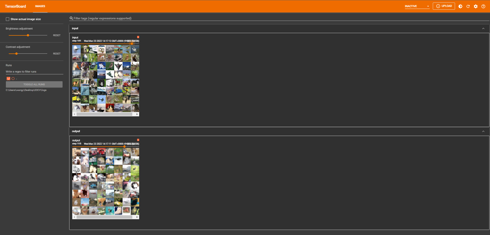

# 1. 池化层原理

① 最大池化层有时也被称为下采样。

② dilation为空洞卷积，如下图所示。

③ Ceil_model为当超出区域时，只取最左上角的值。

④ 池化使得数据由5 * 5 变为3 * 3,甚至1 * 1的，这样导致计算的参数会大大减小。例如1080P的电影经过池化的转为720P的电影、或360P的电影后，同样的网速下，视频更为不卡。


# 2. 池化层处理数据


```python
from torch import nn
import torch

input = torch.tensor([[1,2,0,3,1],
                     [0,1,2,3,1],
                     [1,2,1,0,0],
                     [5,2,3,1,1],
                     [2,1,0,1,1]], dtype=torch.float32)
input = torch.reshape(input, (-1, 1, 5, 5))
print("input shape {}".format(input.shape))

class Tudui(nn.Module):
    def __init__(self):
        super(Tudui, self).__init__()
        self.maxpool1 = MaxPool2d(kernel_size=3, ceil_mode=True)

    def forward(self, input):
        output = self.maxpool1(input)
        return  output

tudui = Tudui()
output = tudui(input)
print("output shape {}".format(output.shape))

```

    input shape torch.Size([1, 1, 5, 5])
    output shape torch.Size([1, 1, 2, 2])
    

# 3. 池化层处理图片


```python
import torch
import torchvision
from torch.utils.data import DataLoader
from torch.utils.tensorboard import SummaryWriter

dataset = torchvision.datasets.CIFAR10(root="./dataset", transform=torchvision.transforms.ToTensor(), train=False,
                                       download=True)
dataloader = DataLoader(dataset=dataset, shuffle=True, batch_size=64)

class Tudui(nn.Module):
    def __init__(self):
        super(Tudui, self).__init__()
        self.maxpool1 = MaxPool2d(kernel_size=3, ceil_mode=True)

    def forward(self, input):
        output = self.maxpool1(input)
        return output

tudui = Tudui()
writer = SummaryWriter(log_dir="./logs/Maxpool")
step = 0
for data in dataloader:
    imgs, targets = data
    writer.add_images("raw", imgs, step)
    writer.add_images("maxpool", tudui(imgs), step)
    step = step + 1
writer.close()
```

    Files already downloaded and verified
    

① 在 Anaconda 终端里面，激活py3.6.3环境，再输入 tensorboard --logdir=C:\Users\wangy\Desktop\03CV\logs 命令，将网址赋值浏览器的网址栏，回车，即可查看tensorboard显示日志情况。




