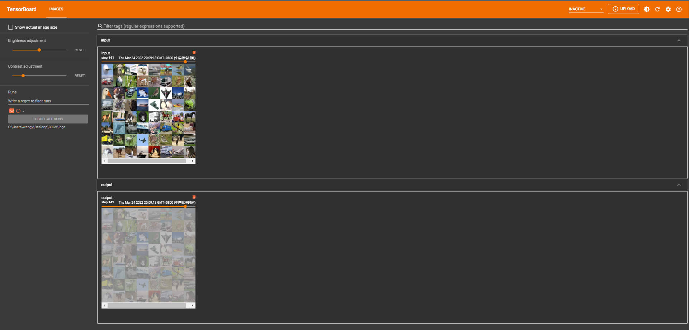

# 1. 非线性激活

① inplace为原地替换，若为True，则变量的值被替换。若为False，则会创建一个新变量，将函数处理后的值赋值给新变量，原始变量的值没有修改。


```python
import torch
from torch import nn

class Tudui(nn.Module):
    def __init__(self):
        super(Tudui, self).__init__()
        self.relu1 = nn.ReLU()

    def forward(self, input):
        input = self.relu1(input)
        return input

tudui = Tudui()
input = torch.tensor([1, -6, 1])
output = tudui(input)
print("input {}".format(input))
print("output {}".format(output))
```

    input tensor([ 1, -6,  1])
    output tensor([1, 0, 1])
    


```python
import torch
from torch import nn
from torch.nn import ReLU

input = torch.tensor([[1,-0.5],
                      [-1,3]])
input = torch.reshape(input,(-1,1,2,2))
print(input.shape)

class Tudui(nn.Module):
    def __init__(self):
        super(Tudui, self).__init__()
        self.relu1 = ReLU()
        
    def forward(self, input):
        output = self.relu1(input)
        return output
    
tudui = Tudui()
output = tudui(input)
print(output)
```

    torch.Size([1, 1, 2, 2])
    tensor([[[[1., 0.],
              [0., 3.]]]])
    

# 2. Tensorboard显示


```python
import torch
import torchvision
from torch import nn
from torch.utils.data import DataLoader
from torch.utils.tensorboard import SummaryWriter


dataset = torchvision.datasets.CIFAR10(root="./dataset", train=False, transform=torchvision.transforms.ToTensor(),
                                       download=True)
dataloader = DataLoader(dataset=dataset, shuffle=True, batch_size=64)
#
# for data in dataloader:
#     imgs, _ = data
#     print(imgs.shape) # [64, 3, 32, 32]
class Tudui(nn.Module):
    def __init__(self):
        super(Tudui, self).__init__()
        self.conv1 = nn.Conv2d(in_channels=3, out_channels=6, kernel_size=3, padding=1, stride=1)
        self.relu1 = nn.ReLU()
        self.sigmoid1 = nn.Sigmoid()

    def forward(self, input):
        x = self.conv1(input)
        x = self.relu1(x)
        x = self.sigmoid1(x)
        return x

tudui = Tudui()
# print(tudui)
writer = SummaryWriter("logs/sigmoid")
step = 0
for data in dataloader:
    imgs, targets = data
    writer.add_images("raw", imgs, step)
    output = tudui(imgs)    # [64, 6, 32, 32]
    output = torch.reshape(output, (-1, 3, 32, 32))
    writer.add_images("new", output, step)
    step = step + 1

writer.close()
    # print(output.shape)

```

    Files already downloaded and verified
    


```python
import torch
import torchvision
from torch import nn 
from torch.nn import ReLU
from torch.nn import Sigmoid
from torch.utils.data import DataLoader
from torch.utils.tensorboard import SummaryWriter

dataset = torchvision.datasets.CIFAR10("./dataset",train=False,transform=torchvision.transforms.ToTensor(),download=True)       
dataloader = DataLoader(dataset, batch_size=64)

class Tudui(nn.Module):
    def __init__(self):
        super(Tudui, self).__init__()
        self.relu1 = ReLU()
        self.sigmoid1 = Sigmoid()
        
    def forward(self, input):
        output = self.sigmoid1(input)
        return output

tudui = Tudui()
writer = SummaryWriter("logs")
step = 0

for data in dataloader:
    imgs, targets = data
    writer.add_images("input", imgs, step)
    output = tudui(imgs)
    writer.add_images("output", output, step)
    step = step + 1
```

    Files already downloaded and verified
    

① 在 Anaconda 终端里面，激活py3.6.3环境，再输入 tensorboard --logdir=C:\Users\wangy\Desktop\03CV\logs 命令，将网址赋值浏览器的网址栏，回车，即可查看tensorboard显示日志情况。




