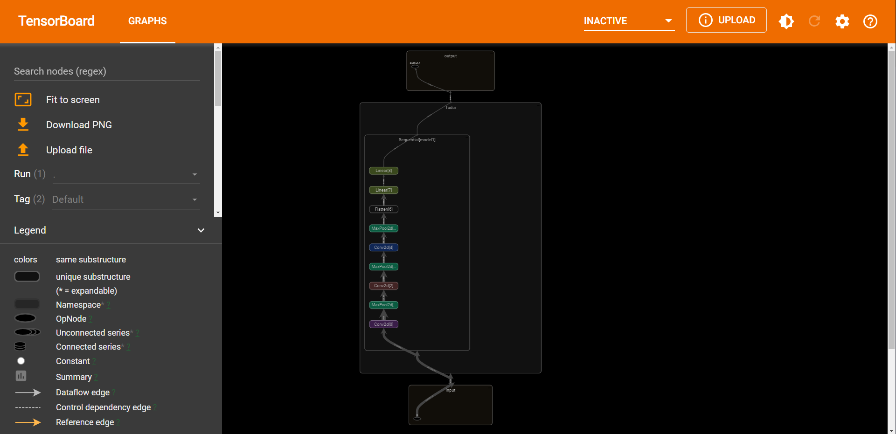

# 1. 神经网络

① 把网络结构放在Sequential里面，好处就是代码写起来比较简介、易懂。

② 可以根据神经网络每层的尺寸，根据下图的公式计算出神经网络中的参数。




# 2. 搭建神经网络


```python
import torch
import torchvision
from torch import nn 
from torch.nn import Conv2d, MaxPool2d, Flatten, Linear

class Tudui(nn.Module):
    def __init__(self):
        super(Tudui, self).__init__()
        self.conv1 = Conv2d(3,32,5,padding=2)
        self.maxpool1 = MaxPool2d(2)
        self.cov2 = Conv2d(32,32,5,padding=2)
        self.maxpool2 = MaxPool2d(2)
        self.conv3 = Conv2d(32,64,5,padding=2)
        self.maxpool3 = MaxPool2d(2)
        self.flatten = Flatten()
        self.linear1 = Linear(1024,64)
        self.Linear2 = Linear(64,10)
        
    def forward(self, x):
        x = self.conv1(x)
        x = self.maxpool1(x)
        x = self.conv2(x)
        x = self.maxpool2(x)
        x = self.conv3(x)
        x = self.maxpool3(x)
        x = self.flatten(x)
        x = self.linear1(x)
        x = self.Linear2(x)
        return x

tudui = Tudui()
print(tudui)
```

    Tudui(
      (conv1): Conv2d(3, 32, kernel_size=(5, 5), stride=(1, 1), padding=(2, 2))
      (maxpool1): MaxPool2d(kernel_size=2, stride=2, padding=0, dilation=1, ceil_mode=False)
      (cov2): Conv2d(32, 32, kernel_size=(5, 5), stride=(1, 1), padding=(2, 2))
      (maxpool2): MaxPool2d(kernel_size=2, stride=2, padding=0, dilation=1, ceil_mode=False)
      (conv3): Conv2d(32, 64, kernel_size=(5, 5), stride=(1, 1), padding=(2, 2))
      (maxpool3): MaxPool2d(kernel_size=2, stride=2, padding=0, dilation=1, ceil_mode=False)
      (flatten): Flatten(start_dim=1, end_dim=-1)
      (linear1): Linear(in_features=1024, out_features=64, bias=True)
      (Linear2): Linear(in_features=64, out_features=10, bias=True)
    )
    

# 3. 神经网络输入数据


```python
import torch
import torchvision
from torch import nn 
from torch.nn import Conv2d, MaxPool2d, Flatten, Linear

class Tudui(nn.Module):
    def __init__(self):
        super(Tudui, self).__init__()
        self.conv1 = Conv2d(3,32,5,padding=2)
        self.maxpool1 = MaxPool2d(2)
        self.conv2 = Conv2d(32,32,5,padding=2)
        self.maxpool2 = MaxPool2d(2)
        self.conv3 = Conv2d(32,64,5,padding=2)
        self.maxpool3 = MaxPool2d(2)
        self.flatten = Flatten()
        self.linear1 = Linear(1024,64)
        self.Linear2 = Linear(64,10)
        
    def forward(self, x):
        x = self.conv1(x)
        x = self.maxpool1(x)
        x = self.conv2(x)
        x = self.maxpool2(x)
        x = self.conv3(x)
        x = self.maxpool3(x)
        x = self.flatten(x)
        x = self.linear1(x)
        x = self.Linear2(x)
        return x

tudui = Tudui()
input = torch.ones((64,3,32,32))
output = tudui(input)
print(output.shape)
```

    torch.Size([64, 10])
    

# 4. Sequential神经网络


```python
import torch
import torchvision
from torch import nn
from torch.nn import MaxPool2d, Conv2d, Linear, Flatten

dataset = torchvision.datasets.CIFAR10(root="./dataset", train=False, transform=torchvision.transforms.ToTensor(),
                                       download=False)
dataloader = torch.utils.data.DataLoader(dataset, shuffle=True, batch_size=64)

class Tudui(nn.Module):
    def __init__(self):
        super(Tudui, self).__init__()
        self.model1 = nn.Sequential(
            Conv2d(in_channels=3, out_channels=32, kernel_size=5, padding=2),
            MaxPool2d(kernel_size=2),
            Conv2d(in_channels=32, out_channels=32, kernel_size=5, padding=2),
            MaxPool2d(kernel_size=2),
            Flatten(),
            Linear(in_features=2048, out_features=64),
            Linear(in_features=64, out_features=10)
        )

    def forward(self, x):
        x = self.model1(x)
        return x

tudui = Tudui()

for data in dataloader:
    imgs, targets = data
    output = tudui(imgs)
    # print("output shape {}".format(output.shape))
    print("output is {}".format(output))


```

    output is tensor([[-2.3615e-02,  1.8250e-03, -7.8551e-02,  1.2691e-01, -1.5526e-01,
              7.7614e-02, -6.8493e-02,  4.0825e-02,  9.0246e-02,  3.9827e-02],
            [-6.1182e-02,  7.0736e-03, -8.9508e-02,  1.0367e-01, -8.7010e-02,
              5.1265e-02, -2.7388e-03,  9.1466e-03, -2.2674e-02,  3.0224e-02],
            [-6.4400e-02, -3.6798e-03, -9.4247e-02,  1.1550e-01, -1.0292e-01,
              2.2583e-02, -2.1646e-02, -8.4335e-03,  1.4409e-02,  2.1647e-02],
            [ 1.5610e-02,  3.1449e-04, -9.5202e-02,  1.0084e-01, -1.2478e-01,
              7.0675e-02, -5.9286e-02,  2.5851e-02,  4.0245e-02,  6.1655e-02],
            [-4.6673e-02, -9.7266e-03, -6.9526e-02,  1.2682e-01, -1.1653e-01,
              7.1982e-02, -5.3568e-02,  1.7379e-02,  6.2401e-02,  4.7139e-02],
            [-4.1664e-02, -1.1452e-02, -5.1683e-02,  1.3005e-01, -1.2339e-01,
              9.6499e-03, -8.0074e-02,  6.5803e-02,  6.9826e-02,  1.9303e-02],
            [-3.4755e-02, -4.4054e-02, -6.2755e-02,  1.0650e-01, -1.3098e-01,
              5.0111e-02, -7.4378e-02, -4.0802e-02, -3.1260e-02,  4.4909e-02],
            [-1.3223e-02, -2.0264e-02, -9.4805e-02,  1.4009e-01, -1.4072e-01,
              5.7015e-02, -5.9366e-02, -6.8289e-03,  5.6033e-02,  6.1831e-02],
            [-7.5300e-02, -2.9962e-02, -5.7633e-02,  1.2907e-01, -1.2816e-01,
              1.5127e-02, -6.4247e-02, -1.7496e-02,  3.7334e-03,  4.1407e-02],
            [-2.3666e-02, -9.8894e-03, -5.6945e-02,  1.3378e-01, -1.4308e-01,
              3.1430e-02, -8.6617e-02,  3.9363e-02,  4.1120e-02,  5.3902e-02],
            [-1.4798e-02, -7.1488e-03, -8.2792e-02,  1.1393e-01, -1.3065e-01,
              4.1990e-02, -6.7315e-02,  1.7343e-02,  4.9975e-02,  2.7557e-02],
            [-2.8248e-02, -9.9576e-03, -8.0721e-02,  1.3636e-01, -1.4339e-01,
              3.8339e-02, -6.2476e-02,  2.5220e-02,  5.7065e-02,  3.1379e-02],
            [-7.0002e-02,  1.9104e-02, -9.6102e-02,  1.4530e-01, -8.5652e-02,
              9.0018e-02,  2.0184e-02,  3.1397e-02,  3.4451e-03,  2.4169e-02],
            [-5.3675e-02, -1.2565e-02, -6.4912e-02,  1.4213e-01, -1.3661e-01,
              5.7003e-02, -6.1474e-02,  5.2025e-02,  4.4845e-02,  5.2094e-02],
            [-9.5288e-02, -2.9256e-03, -6.3647e-02,  1.2873e-01, -1.1294e-01,
              6.5400e-02, -6.2999e-03,  2.4702e-02, -1.3582e-02,  3.9842e-02],
            [-5.7253e-02,  3.8234e-03, -9.7886e-02,  1.2850e-01, -1.0765e-01,
              4.6879e-02, -1.5504e-02,  6.3958e-03,  3.7386e-03,  2.0155e-02],
            [-3.8005e-02,  9.9999e-04, -9.5126e-02,  1.1605e-01, -9.9510e-02,
              9.4036e-03, -4.8355e-02,  4.0768e-03,  2.7601e-02,  1.5325e-02],
            [-1.5584e-02, -2.3432e-02, -5.9569e-02,  1.6696e-01, -1.4426e-01,
              1.8599e-02, -1.0751e-01,  2.5691e-02,  2.3649e-02,  5.0499e-02],
            [-7.8040e-03, -3.1917e-02, -9.3790e-02,  1.3450e-01, -1.2356e-01,
              1.2086e-02, -7.0096e-02,  1.5479e-02,  2.5654e-02, -6.4263e-03],
            [-4.2162e-02, -3.0667e-02, -9.3001e-02,  1.1821e-01, -1.2764e-01,
              3.8395e-02, -5.2159e-02, -1.9626e-02,  1.0861e-02,  3.1258e-02],
            [-1.9780e-02, -3.8435e-04, -6.4193e-02,  1.3056e-01, -1.5289e-01,
              8.6184e-02, -2.8410e-02,  1.1764e-02,  6.7643e-02,  8.2983e-02],
            [-5.2773e-02,  5.8871e-03, -1.0690e-01,  1.0912e-01, -7.8524e-02,
              3.3645e-02, -2.6665e-02, -2.1264e-03,  3.5745e-02,  5.4903e-05],
            [-5.3793e-02,  2.6279e-03, -6.3686e-02,  1.3576e-01, -1.3113e-01,
              4.9796e-02, -4.9896e-02,  2.4388e-02,  2.1727e-02,  4.7059e-02],
            [ 2.2799e-04, -3.6371e-03, -9.6604e-02,  1.2646e-01, -1.3482e-01,
              4.1129e-02, -6.0263e-02,  1.7525e-03,  5.7424e-02,  2.1721e-02],
            [-7.4307e-02, -2.0304e-02, -9.4244e-02,  1.0157e-01, -9.3050e-02,
              1.9982e-02,  1.4244e-03, -1.4214e-02, -4.3063e-02,  2.8154e-02],
            [-4.1353e-02, -2.1676e-03, -8.0401e-02,  1.1395e-01, -9.6345e-02,
              1.0295e-02, -3.5654e-02,  1.6936e-02,  1.4784e-02,  3.7693e-02],
            [-5.3108e-02,  2.9761e-03, -8.8528e-02,  1.1426e-01, -1.1037e-01,
              7.6206e-02, -9.3686e-03,  1.1555e-02,  1.7274e-02,  4.5665e-02],
            [-4.5105e-02,  1.9513e-02, -6.8260e-02,  9.8222e-02, -1.1694e-01,
              9.9301e-02, -1.0400e-02,  4.5562e-02,  5.6156e-02,  9.8495e-02],
            [-6.9877e-02,  6.3312e-03, -8.5599e-02,  1.1048e-01, -9.0688e-02,
              5.7754e-02, -2.5171e-03,  1.0758e-02, -2.3661e-02,  4.3083e-02],
            [-5.9384e-02,  7.3605e-04, -5.1319e-02,  1.2200e-01, -1.3301e-01,
              2.2527e-02, -6.4096e-02,  2.0918e-02,  3.6655e-02,  4.4539e-02],
            [ 1.0336e-02, -3.2013e-02, -4.1449e-02,  1.2199e-01, -1.8572e-01,
              5.9653e-02, -1.1291e-01,  3.6900e-02,  1.1096e-01,  8.3072e-02],
            [-7.9116e-02, -1.3616e-02, -8.8112e-02,  9.7858e-02, -9.0502e-02,
              4.3219e-02, -3.0628e-02,  1.0607e-02,  1.7241e-02,  1.9210e-02],
            [-4.2547e-02,  1.4505e-02, -9.3859e-02,  1.1234e-01, -1.5127e-01,
              4.0333e-02, -6.0704e-02,  3.7587e-02,  1.0553e-01,  7.5193e-02],
            [ 3.2890e-02, -1.1473e-02, -6.4170e-02,  1.3770e-01, -1.7194e-01,
              2.4003e-03, -1.2616e-01,  2.3754e-02,  1.4159e-01,  2.8525e-02],
            [-4.3070e-03,  7.4132e-04, -1.1588e-01,  1.3319e-01, -1.0016e-01,
              6.2998e-02, -2.7203e-02,  2.1123e-02,  3.8526e-02,  3.0377e-02],
            [-2.6196e-02, -7.4863e-03, -7.1357e-02,  1.3534e-01, -1.5458e-01,
              2.4679e-02, -7.7664e-02,  1.4389e-02,  5.8542e-02,  5.9445e-02],
            [-7.0221e-02, -1.5888e-02, -3.7366e-02,  7.1467e-02, -1.5059e-01,
              1.0658e-03, -8.4952e-02,  1.3381e-02,  8.5288e-03,  6.1961e-02],
            [-7.2554e-02, -1.4130e-02, -8.6299e-02,  1.0370e-01, -8.9900e-02,
              6.5269e-02,  1.1490e-02,  3.6128e-02, -1.8944e-02,  5.1369e-02],
            [-4.6528e-02,  3.1540e-04, -8.3351e-02,  1.3788e-01, -1.4122e-01,
              5.4197e-02, -5.9223e-02,  1.1399e-02,  3.3112e-02,  3.4940e-02],
            [-5.6136e-02, -1.7781e-02, -9.3526e-02,  1.3945e-01, -1.1470e-01,
              6.0145e-02, -8.3547e-03, -1.3112e-02, -1.8558e-03, -2.3190e-03],
            [-7.0860e-02, -4.8134e-03, -7.2432e-02,  1.1727e-01, -1.1366e-01,
              3.0761e-02, -3.0471e-02, -2.3686e-02, -1.8740e-02,  4.6468e-02],
            [-4.0819e-02, -7.0537e-03, -9.8158e-02,  1.0776e-01, -1.2250e-01,
              1.8186e-02, -5.3161e-02,  2.0710e-02,  2.8961e-02,  3.8512e-02],
            [-4.5672e-02, -5.2776e-02, -8.5304e-02,  1.1047e-01, -1.2507e-01,
              3.4772e-02, -5.3520e-02, -3.0086e-02, -2.5309e-02,  4.0357e-02],
            [ 1.8747e-03, -1.2271e-02, -6.6618e-02,  1.2992e-01, -1.6625e-01,
              3.3430e-02, -1.1483e-01,  3.1296e-02,  1.0192e-01,  4.2795e-02],
            [-4.1783e-02, -1.7836e-02, -5.0829e-02,  1.3556e-01, -1.6577e-01,
              3.2344e-02, -1.0459e-01,  2.0434e-02,  6.8270e-02,  3.1450e-02],
            [-2.7503e-02, -1.2992e-02, -7.0351e-02,  1.3401e-01, -1.4173e-01,
              3.9915e-02, -5.0505e-02,  2.6135e-02,  3.6766e-02,  3.2178e-02],
            [-7.2584e-02, -4.5547e-02, -4.6548e-02,  9.7393e-02, -1.2752e-01,
              7.4835e-02, -4.4088e-02, -6.1300e-03,  5.8323e-02,  3.6059e-02],
            [-4.7841e-02,  3.3392e-03, -4.4590e-02,  1.3841e-01, -1.1356e-01,
              3.8561e-02, -4.0708e-02,  8.5809e-03,  2.3774e-02,  3.3308e-02],
            [-3.7696e-02, -7.2928e-03, -8.4875e-02,  9.9994e-02, -1.0863e-01,
              5.4534e-02, -3.5170e-02,  2.0363e-02,  1.6977e-02,  5.5492e-02],
            [-4.5441e-02, -2.0799e-02, -5.2572e-02,  1.2355e-01, -1.4230e-01,
              2.8047e-02, -7.1577e-02,  3.5649e-02,  3.6925e-02,  3.2124e-02],
            [-1.7192e-02, -7.4935e-03, -8.6443e-02,  1.1857e-01, -1.1042e-01,
              6.9302e-02, -4.6578e-02,  3.1787e-02,  2.3118e-02,  6.8480e-02],
            [-7.0082e-02,  1.7739e-03, -7.3155e-02,  1.1367e-01, -1.2026e-01,
              4.5055e-02, -4.9076e-02,  2.6385e-02,  1.8727e-02,  2.2943e-02],
            [-1.6301e-02, -7.8896e-03, -7.7346e-02,  1.1155e-01, -1.3790e-01,
              4.1550e-02, -8.0114e-02,  2.1943e-02,  4.8703e-02,  6.4513e-02],
            [-3.5971e-02, -7.5133e-03, -6.9455e-02,  1.1012e-01, -1.3869e-01,
              4.3932e-02, -6.9878e-02,  2.4907e-02,  5.3119e-02,  4.1208e-02],
            [-1.6986e-02, -2.5996e-02, -6.9294e-02,  1.0568e-01, -1.3901e-01,
              1.3198e-03, -1.1303e-01,  4.7393e-03,  1.2941e-01,  3.2106e-02],
            [-6.7890e-02, -6.5649e-03, -6.5851e-02,  1.4036e-01, -1.1302e-01,
             -2.4363e-02, -7.4180e-02, -2.0661e-02,  2.7968e-02, -2.3933e-02],
            [-1.2204e-03, -2.7933e-02, -1.6114e-01,  1.6136e-01, -7.8734e-02,
             -6.2795e-03, -2.5899e-02, -4.2182e-02, -2.1026e-02, -2.9459e-02],
            [-3.8823e-02,  1.1573e-02, -6.7227e-02,  1.3061e-01, -1.2088e-01,
              3.9839e-02, -3.4606e-02,  1.0478e-02,  3.9676e-02,  4.3093e-02],
            [-6.5854e-02,  3.8803e-03, -4.1160e-02,  1.6040e-01, -1.3805e-01,
              5.7103e-02, -4.5153e-02,  1.4298e-02,  7.3263e-02,  5.7349e-02],
            [-4.6866e-02, -5.1631e-02, -7.2332e-02,  1.3644e-01, -1.3193e-01,
             -1.9418e-04, -1.0241e-01, -1.6400e-02, -2.8736e-02,  1.0323e-02],
            [-4.0617e-02,  1.6285e-03, -8.5676e-02,  1.0748e-01, -1.2412e-01,
              6.4405e-02, -5.2963e-02,  7.3182e-03,  3.7644e-02,  5.1876e-02],
            [-3.5717e-02, -3.3270e-03, -7.2937e-02,  1.2173e-01, -1.0499e-01,
              3.2307e-02, -6.8859e-02,  1.2477e-02,  2.4989e-02,  3.3591e-02],
            [-7.3010e-02, -1.8299e-02, -6.0515e-02,  1.1862e-01, -1.1703e-01,
              4.7759e-02, -3.7457e-02, -2.8958e-02, -2.2176e-02,  2.6583e-02],
            [-2.9753e-02, -1.5972e-02, -6.4001e-02,  1.1483e-01, -1.1549e-01,
              6.2850e-02, -5.8441e-02,  1.3931e-02,  3.2057e-02,  2.8651e-02]],
           grad_fn=<AddmmBackward>)
    output is tensor([[-4.7398e-02, -1.1309e-02, -7.4044e-02,  1.1302e-01, -1.3328e-01,
              3.5848e-02, -5.4265e-02,  2.0749e-02,  2.0069e-02,  2.2057e-02],
            [-6.7815e-02,  3.3837e-02, -6.5425e-02,  1.1104e-01, -1.0327e-01,
              7.4544e-02, -6.4879e-04,  2.0691e-02,  2.0254e-02,  4.6374e-02],
            [-6.0335e-02, -4.2719e-02, -8.4978e-02,  1.2141e-01, -1.2913e-01,
              1.7510e-02, -8.2481e-02,  3.3006e-02,  4.3995e-03,  3.5876e-02],
            [-4.3635e-02,  4.5917e-03, -4.8063e-02,  5.2709e-02, -1.0516e-01,
              3.2265e-02, -4.8177e-02,  2.1187e-02,  1.9437e-02,  9.2307e-02],
            [-3.1431e-02, -2.0747e-03, -6.1969e-02,  7.5407e-02, -1.4066e-01,
             -1.9062e-02, -1.1545e-01, -4.2117e-02,  7.1261e-02,  4.0969e-02],
            [-6.0823e-02, -2.5206e-02, -7.3578e-02,  7.6934e-02, -1.3461e-01,
              7.2250e-02, -6.4396e-02,  3.1516e-02,  3.6806e-02,  7.2099e-02],
            [-4.6422e-02, -3.8501e-03, -1.0546e-01,  1.2237e-01, -1.0372e-01,
              6.3652e-02, -2.8218e-02,  4.2488e-03,  3.2400e-02,  2.9348e-02],
            [-5.2666e-02,  1.6764e-02, -7.2109e-02,  1.1464e-01, -1.1756e-01,
              6.3130e-02, -4.1540e-02,  1.5678e-02,  1.0756e-02,  5.6350e-02],
            [-4.9287e-02, -1.5795e-02, -8.9394e-02,  8.0870e-02, -9.0198e-02,
              5.0821e-02, -3.4355e-02,  3.9153e-02,  1.7960e-02,  7.0281e-02],
            [ 6.7330e-03, -1.9674e-02, -7.7350e-02,  1.4598e-01, -1.6910e-01,
              3.2269e-02, -1.0405e-01,  2.5208e-02,  9.1950e-02,  3.6595e-02],
            [-6.6010e-02, -2.2454e-03, -7.3368e-02,  1.1664e-01, -7.5045e-02,
              6.0311e-04, -5.4600e-02, -5.0638e-03,  3.7728e-02,  8.4286e-03],
            [-5.0731e-02,  1.2301e-02, -6.0387e-02,  1.2386e-01, -1.2474e-01,
              5.8382e-02, -2.3449e-02,  1.5545e-02,  3.3585e-02,  4.6152e-02],
            [-9.4216e-02,  1.4587e-02, -7.1592e-02,  9.8836e-02, -9.3613e-02,
              4.2981e-02, -5.1219e-03,  2.8798e-02, -3.6390e-02,  4.3396e-02],
            [-4.9139e-02, -1.1048e-02, -5.4688e-02,  1.0588e-01, -1.3110e-01,
              3.6941e-02, -7.5481e-02,  1.7360e-02,  9.6263e-03,  6.0635e-02],
            [-1.9292e-02, -7.7706e-04, -1.0320e-01,  1.0920e-01, -3.5690e-02,
             -1.1439e-02, -2.3439e-02,  2.7355e-02,  5.5292e-02, -7.6860e-03],
            [-3.7799e-02, -4.7202e-03, -7.1941e-02,  1.1794e-01, -1.4716e-01,
             -2.9849e-03, -7.3439e-02, -1.9002e-02,  1.6358e-02,  4.0180e-02],
            [-3.3555e-03, -1.9884e-02, -9.2464e-02,  1.1985e-01, -1.0743e-01,
              1.1887e-01, -1.1896e-02, -8.2703e-03,  4.7354e-02,  5.0334e-02],
            [ 9.1159e-03, -1.4349e-02, -7.5142e-02,  1.0684e-01, -1.2138e-01,
              2.4329e-02, -8.8933e-02,  1.7180e-02,  1.0405e-01,  4.8730e-02],
            [-1.4454e-02, -3.9187e-03, -7.8258e-02,  1.4524e-01, -1.1866e-01,
              2.7861e-02, -8.8888e-02,  4.0972e-02,  6.5536e-02,  2.8853e-02],
            [-6.1545e-02,  1.4227e-02, -8.3447e-02,  1.3379e-01, -1.0267e-01,
              5.4831e-02, -2.1424e-02,  2.0825e-02,  1.4282e-02,  4.0087e-02],
            [-1.8707e-02,  4.1872e-03, -8.1545e-02,  1.3404e-01, -1.3705e-01,
              9.0328e-02, -4.3128e-02,  3.6450e-02,  8.1877e-02,  5.8287e-02],
            [-2.0661e-02, -2.4701e-02, -1.1272e-01,  9.1308e-02, -1.0598e-01,
              6.9174e-02, -1.7035e-02,  2.0903e-02, -3.4032e-04,  6.0264e-02],
            [-9.2080e-02, -1.6686e-02, -7.3626e-02,  1.1459e-01, -1.1249e-01,
              1.8255e-02, -5.6894e-02, -1.1810e-02,  2.1373e-03,  1.6246e-02],
            [-1.5902e-02, -2.3979e-02, -8.0537e-02,  1.2287e-01, -1.2591e-01,
              3.1714e-02, -8.4838e-02,  1.0785e-02,  1.6992e-02,  6.8018e-03],
            [-4.3602e-02,  8.8285e-03, -8.6414e-02,  1.4188e-01, -9.7700e-02,
              3.8128e-02, -2.2074e-02, -9.1016e-04, -1.9347e-02,  3.5030e-03],
            [-2.2622e-02, -1.1031e-02, -7.2293e-02,  1.2790e-01, -1.5085e-01,
              2.5902e-02, -8.6171e-02,  2.1090e-02,  5.6348e-02,  7.6305e-03],
            [ 3.7497e-04, -4.4311e-03, -9.8889e-02,  1.1083e-01, -1.3988e-01,
              4.8837e-02, -5.9593e-02,  2.4916e-02,  8.3245e-02,  5.1723e-02],
            [-5.9119e-02, -1.1911e-02, -8.3523e-02,  1.1195e-01, -1.1060e-01,
              5.3578e-02, -4.2865e-02, -2.7321e-03,  9.2785e-03,  2.0664e-02],
            [-4.7394e-02,  4.0887e-03, -2.5903e-02,  1.0777e-01, -1.7540e-01,
              7.9097e-02, -9.6139e-02,  6.8062e-02,  8.3870e-02,  9.9421e-02],
            [-1.8827e-02, -1.8222e-02, -8.6471e-02,  1.1198e-01, -1.5658e-01,
              7.6490e-02, -8.5462e-02,  1.9196e-02,  8.2606e-02,  4.7137e-02],
            [-4.0040e-02, -9.5927e-03, -8.0398e-02,  1.1093e-01, -1.2553e-01,
              5.1711e-02, -5.2293e-02,  2.7378e-03,  1.4371e-02,  4.3957e-02],
            [-1.8472e-03, -1.4115e-02, -1.1007e-01,  7.6787e-02, -9.0114e-02,
              5.8991e-02, -1.7028e-02, -1.5308e-02,  4.6333e-02,  6.8463e-02],
            [ 1.6625e-02, -1.7715e-02, -6.5924e-02,  1.2047e-01, -1.7453e-01,
              4.9725e-02, -1.0049e-01,  3.6245e-02,  8.8919e-02,  5.3662e-02],
            [-2.0567e-02, -2.4607e-02, -9.9620e-02,  1.3509e-01, -9.8639e-02,
              4.2231e-02, -3.1171e-02,  3.6062e-03,  9.3214e-03,  1.8296e-02],
            [ 6.1829e-03, -7.7936e-03, -7.2019e-02,  1.4366e-01, -1.6116e-01,
              9.6557e-02, -1.0446e-01,  2.8388e-02,  8.0136e-02,  6.5088e-02],
            [-7.2437e-03,  1.3195e-02, -1.1107e-01,  1.3426e-01, -1.1068e-01,
              4.2462e-02, -3.1200e-02,  2.8868e-02,  3.4624e-02,  6.4586e-02],
            [-3.8494e-02, -2.6882e-03, -8.7710e-02,  1.0125e-01, -1.1374e-01,
              7.7200e-02, -3.3882e-02,  1.5076e-02,  5.8512e-03,  5.3551e-02],
            [-7.7049e-02, -9.8440e-04, -5.5987e-02,  1.2480e-01, -1.3013e-01,
              5.3773e-02, -5.8412e-02,  2.9360e-02,  3.5363e-02,  5.1373e-02],
            [-6.9050e-02,  1.6886e-02, -7.4572e-02,  1.3911e-01, -9.8243e-02,
              9.5876e-02, -4.8902e-03,  1.7934e-02,  1.9345e-03,  5.1601e-02],
            [-2.8776e-03,  1.6326e-03, -8.6762e-02,  1.5548e-01, -1.2830e-01,
              7.3965e-02, -5.7787e-02,  2.9379e-02,  5.5126e-02,  7.4346e-02],
            [-3.7134e-03, -9.3604e-03, -7.7570e-02,  1.1750e-01, -1.7258e-01,
              5.9434e-02, -9.1917e-02,  2.3665e-02,  8.8256e-02,  5.1782e-02],
            [-3.9215e-02, -5.6499e-02, -7.7584e-02,  1.4584e-01, -1.7603e-01,
             -2.5141e-02, -1.0312e-01, -2.7695e-02,  5.1465e-02, -1.7463e-02],
            [-3.1455e-02,  4.9771e-03, -8.2983e-02,  1.4630e-01, -1.1841e-01,
              1.0854e-02, -7.1258e-02,  1.0148e-02,  6.1329e-02, -6.3145e-03],
            [-3.5055e-02, -8.4986e-03, -7.1319e-02,  1.5269e-01, -1.3085e-01,
              3.3231e-02, -6.5312e-02,  3.3254e-02,  3.4936e-02,  5.9310e-02],
            [-4.3802e-02, -1.9151e-02, -4.9692e-02,  1.4769e-01, -1.2006e-01,
              8.0906e-02, -6.3825e-02,  1.2650e-04,  1.9328e-02,  1.4557e-02],
            [-7.2743e-02, -1.9041e-02, -7.7990e-02,  1.3210e-01, -8.5405e-02,
              3.3710e-02, -1.0495e-02,  1.7148e-03,  8.6218e-03,  3.3398e-02],
            [-3.3003e-02, -3.6509e-02, -1.0484e-01,  8.6634e-02, -1.4382e-01,
              1.9515e-02, -6.7482e-02,  2.4001e-02,  4.0771e-02, -1.0804e-03],
            [-6.2208e-02, -2.8844e-02, -1.0873e-01,  1.5294e-01, -7.4841e-02,
              4.9063e-02, -2.1157e-02, -2.2018e-02,  3.8852e-02,  2.0509e-02],
            [-2.9066e-02, -4.9783e-02, -1.1815e-01,  1.0267e-01, -1.0177e-01,
             -1.2713e-02, -5.5105e-02, -3.4132e-02,  5.8523e-03, -8.7365e-03],
            [-7.3317e-02, -2.5048e-02, -3.8581e-02,  1.0048e-01, -1.4792e-01,
              2.8778e-02, -6.9997e-02, -1.4668e-02,  2.1050e-02,  4.5417e-02],
            [-3.8399e-02, -5.5008e-03, -7.9537e-02,  1.2671e-01, -1.3502e-01,
              7.7447e-02, -4.6477e-02,  3.9730e-02,  4.6406e-02,  4.5006e-02],
            [ 3.8357e-02, -5.9298e-02, -7.4589e-02,  1.3155e-01, -2.0124e-01,
              3.0700e-02, -1.4726e-01,  3.2874e-02,  8.6846e-02,  3.7213e-02],
            [-1.1261e-02, -1.9650e-02, -8.8555e-02,  1.0775e-01, -1.6145e-01,
             -5.0781e-02, -1.1931e-01, -4.0306e-02,  2.7131e-02,  4.4737e-03],
            [ 1.3225e-02, -8.4979e-03, -1.0788e-01,  1.4984e-01, -1.3057e-01,
              4.7022e-02, -9.5215e-02,  3.2345e-02,  1.0095e-01,  3.2153e-02],
            [-5.3421e-02, -2.8029e-03, -1.1102e-01,  8.3273e-02, -7.7955e-02,
              7.0627e-02, -3.1076e-04, -9.2333e-04, -2.2846e-02,  4.3045e-02],
            [-1.6075e-02,  4.7031e-03, -7.9045e-02,  1.1452e-01, -1.2435e-01,
              2.1105e-02, -6.5967e-02,  3.2464e-02,  4.3828e-02,  2.2102e-02],
            [-3.0090e-02,  2.1187e-03, -9.3093e-02,  1.0895e-01, -1.5893e-01,
              6.1091e-02, -7.0378e-02,  2.8375e-03,  6.9200e-02,  5.1744e-02],
            [ 2.1595e-03, -1.5264e-02, -5.9129e-02,  8.9362e-02, -1.4709e-01,
              7.9894e-03, -1.1275e-01,  2.7430e-02,  8.5176e-03,  4.5600e-02],
            [-3.4809e-02,  9.1408e-03, -6.2512e-02,  1.4408e-01, -1.5037e-01,
              7.7775e-02, -4.7671e-02,  2.4376e-02,  6.0980e-02,  4.1768e-02],
            [-5.4916e-02, -1.4523e-02, -1.0534e-01,  1.0120e-01, -1.1336e-01,
              3.2766e-02, -3.7338e-02, -7.0962e-03,  3.9782e-03,  7.6963e-03],
            [-1.6401e-02, -3.6555e-02, -8.2202e-02,  1.1785e-01, -1.2002e-01,
              4.5548e-03, -9.7708e-02, -1.0294e-02,  4.6439e-02,  9.8656e-03],
            [-2.6519e-02, -1.9221e-02, -5.0982e-02,  1.4488e-01, -1.6782e-01,
              6.9038e-03, -1.1677e-01,  1.3428e-02,  6.0932e-02,  3.0360e-02],
            [-4.5532e-03,  1.4406e-02, -7.2770e-02,  1.1865e-01, -1.2865e-01,
              8.2824e-02, -5.7534e-02,  4.0544e-02,  6.1857e-02,  8.0355e-02],
            [-1.9149e-02, -1.2989e-02, -9.0123e-02,  1.1716e-01, -1.3807e-01,
              3.3315e-02, -6.0683e-02,  1.0907e-02,  2.6953e-02,  2.2711e-02]],
           grad_fn=<AddmmBackward>)
    output is tensor([[-8.4058e-02, -6.0017e-03, -6.0104e-02,  8.7489e-02, -1.1325e-01,
              5.3505e-02, -5.0755e-02,  2.4402e-02,  2.2095e-02,  5.1331e-02],
            [-2.1538e-02, -4.6976e-05, -8.2995e-02,  1.3278e-01, -1.4091e-01,
             -7.8362e-03, -6.8438e-02,  2.1544e-02,  3.3574e-02,  2.6594e-02],
            [-4.6364e-02, -1.1884e-03, -9.2950e-02,  8.6849e-02, -9.6842e-02,
              5.4458e-02, -1.3815e-02, -3.8306e-03, -4.7104e-03,  2.3170e-02],
            [-6.8015e-04, -9.3658e-03, -6.2826e-02,  1.5993e-01, -1.9672e-01,
              4.2119e-02, -1.1685e-01,  5.0934e-02,  1.0860e-01,  4.9207e-02],
            [-5.1008e-02,  1.1868e-02, -9.2481e-02,  1.0913e-01, -1.0637e-01,
              6.2672e-02, -2.0937e-02,  1.6179e-02,  3.1075e-03,  3.9316e-02],
            [-2.0905e-02, -3.3732e-02, -5.7249e-02,  1.3208e-01, -1.7572e-01,
              2.3848e-02, -1.0264e-01, -1.7282e-03,  7.8196e-02,  1.6407e-02],
            [ 1.6071e-02, -2.1787e-02, -9.6649e-02,  1.3427e-01, -1.5950e-01,
             -1.0109e-02, -1.0694e-01,  1.8173e-02,  1.1322e-01,  8.1962e-03],
            [-2.0158e-02, -8.0854e-03, -8.7496e-02,  1.2133e-01, -1.2747e-01,
              5.2359e-02, -5.7798e-02,  2.7988e-02,  3.1355e-02,  6.6036e-02],
            [-5.6517e-02,  1.2030e-02, -5.8047e-02,  1.0679e-01, -1.3084e-01,
              5.9240e-02, -5.3621e-02,  2.0588e-02,  4.7814e-02,  4.1962e-02],
            [-8.3399e-02, -2.9666e-03, -9.5511e-02,  1.0670e-01, -1.1100e-01,
              4.8240e-02, -2.7878e-02, -8.2905e-04, -2.9384e-03,  3.8780e-02],
            [-3.8139e-02,  2.2924e-02, -8.1127e-02,  1.4476e-01, -1.3370e-01,
              7.6462e-02, -5.3976e-02,  3.8029e-02,  5.4795e-02,  1.1582e-01],
            [-7.7883e-02, -6.5181e-03, -5.8124e-02,  8.5551e-02, -1.4221e-01,
              3.6475e-02, -6.3575e-02,  6.7969e-03,  1.5400e-02,  6.9427e-02],
            [-4.9248e-02, -1.3957e-02, -9.5601e-02,  1.4412e-01, -8.3818e-02,
              5.1318e-02, -9.7626e-03,  1.5133e-02, -9.0786e-03,  5.8621e-02],
            [-6.3050e-02, -1.1321e-02, -6.1667e-02,  1.4054e-01, -9.4374e-02,
              5.0832e-02, -4.1642e-02,  2.8157e-03,  2.4677e-02,  2.9497e-02],
            [-1.9889e-02, -2.1057e-02, -8.9219e-02,  1.1623e-01, -1.3054e-01,
              1.5937e-02, -7.2332e-02,  1.7049e-02,  4.2317e-02,  1.4043e-02],
            [-3.5927e-02, -2.7735e-03, -9.9786e-02,  1.1194e-01, -1.4192e-01,
              1.0246e-01, -3.3690e-02,  9.2755e-03,  6.2896e-02,  5.6014e-02],
            [-4.9372e-02,  7.3477e-03, -7.2596e-02,  1.2220e-01, -1.4136e-01,
              9.0712e-02, -1.5689e-02,  2.0326e-02,  1.8247e-02,  8.1751e-02],
            [ 8.3443e-04, -9.2532e-03, -1.0056e-01,  1.3045e-01, -1.1539e-01,
              2.9747e-02, -5.2077e-02,  1.7243e-02,  3.5155e-02,  2.1849e-02],
            [-2.0671e-02,  1.1726e-02, -1.0907e-01,  1.1116e-01, -6.3931e-02,
              1.0396e-01,  7.0652e-03,  2.4583e-02,  2.7057e-03,  6.3755e-02],
            [-6.3911e-03, -1.5818e-02, -5.8952e-02,  1.0008e-01, -1.4061e-01,
              3.3740e-02, -8.2970e-02,  4.4792e-02,  5.4815e-02,  6.5674e-02],
            [ 1.3135e-02, -2.6913e-02, -5.5290e-02,  1.4757e-01, -1.9683e-01,
              7.6994e-03, -1.4640e-01,  3.7745e-02,  1.1876e-01,  1.3639e-02],
            [ 8.3819e-03, -2.5522e-02, -8.4242e-02,  2.0177e-01, -1.6980e-01,
              1.2489e-02, -1.2109e-01,  9.3884e-03,  1.1976e-01, -1.8025e-02],
            [-4.3803e-02, -1.4129e-02, -7.9061e-02,  1.2163e-01, -1.2697e-01,
              4.3784e-02, -4.8837e-02,  2.0160e-02,  1.8053e-02,  3.6784e-02],
            [-2.8690e-02, -8.7553e-03, -5.5624e-02,  1.4303e-01, -1.3363e-01,
              6.5442e-02, -6.1303e-02,  2.1914e-02,  4.1822e-02,  6.3115e-02],
            [-4.2686e-02,  4.9106e-04, -5.8302e-02,  5.6366e-02, -1.4084e-01,
              3.1196e-02, -7.8839e-02,  2.3774e-02,  4.4186e-02,  6.3571e-02],
            [-5.9182e-02, -8.6600e-03, -8.6003e-02,  9.7972e-02, -1.1000e-01,
              1.5568e-03, -4.7088e-02, -1.8803e-02,  2.9754e-02, -9.7904e-03],
            [-4.0978e-02,  1.0920e-02, -9.0287e-02,  1.1229e-01, -9.7365e-02,
              5.9233e-02, -2.8129e-02,  8.3495e-03,  1.6157e-02,  3.3089e-02],
            [-7.3333e-02, -2.0062e-02, -9.2419e-02,  8.5804e-02, -1.1988e-01,
              3.4832e-02, -4.8320e-02,  2.5341e-02, -1.9105e-02,  6.4604e-02],
            [-7.5326e-02, -2.5017e-02, -5.9656e-02,  1.4134e-01, -1.3014e-01,
              3.5538e-03, -8.6376e-02,  7.4912e-03,  3.2565e-02,  9.8510e-03],
            [-9.6306e-02,  2.4292e-02, -7.3897e-02,  7.4140e-02, -6.8570e-02,
              6.2299e-02,  1.2852e-02,  2.7425e-03, -3.7278e-02,  4.2812e-02],
            [-5.3870e-02,  7.3626e-03, -9.8511e-02,  1.3837e-01, -1.0345e-01,
              3.2126e-02, -2.2750e-02,  1.3652e-02,  1.3596e-02,  2.9603e-02],
            [-4.8683e-02, -1.3148e-02, -4.8186e-02,  1.2905e-01, -1.3206e-01,
              4.5642e-02, -6.8696e-02, -2.6267e-02,  4.3792e-02,  2.7797e-02],
            [-7.2913e-03, -3.0398e-06, -8.6359e-02,  1.3145e-01, -1.4597e-01,
              4.4589e-02, -8.4423e-02, -1.4893e-03,  8.2983e-02,  2.9322e-02],
            [-2.4124e-02, -5.7764e-02, -4.9035e-02,  1.4830e-01, -1.6899e-01,
             -1.5862e-02, -1.4132e-01,  2.4658e-02,  1.4238e-01,  2.9723e-02],
            [-1.1354e-02, -1.4735e-02, -4.8917e-02,  1.4595e-01, -1.1118e-01,
              6.2380e-02, -7.0648e-02,  5.1949e-03,  6.4986e-02,  6.1864e-02],
            [-5.0109e-02, -1.3777e-02, -8.1542e-02,  1.1415e-01, -1.2220e-01,
              5.8912e-02, -3.7322e-02,  2.2079e-02,  2.2191e-02,  3.3631e-02],
            [ 5.0364e-03, -1.4706e-02, -4.8444e-02,  1.8864e-01, -1.8669e-01,
              6.4911e-02, -1.1632e-01,  5.8002e-02,  1.3018e-01,  4.0701e-02],
            [-2.0315e-02, -1.2053e-02, -8.1407e-02,  1.4279e-01, -1.4751e-01,
              7.6488e-02, -5.7886e-02,  4.4513e-02,  4.4427e-02,  7.6261e-02],
            [ 1.3411e-02, -1.5749e-02, -1.2677e-01,  9.9763e-02, -1.2323e-01,
              5.5096e-02, -8.7210e-02,  1.3629e-02,  5.2398e-02,  1.1174e-02],
            [-6.2463e-02,  8.6983e-03, -8.7885e-02,  9.4650e-02, -9.8401e-02,
              8.4020e-02, -1.9913e-03,  1.2879e-02, -1.1687e-02,  4.7338e-02],
            [-3.9382e-02, -8.4980e-03, -5.7802e-02,  8.9749e-02, -1.3562e-01,
              3.4040e-03, -1.0097e-01,  2.7110e-02,  8.7469e-02,  5.1175e-02],
            [-8.0770e-04, -6.7809e-03, -6.6506e-02,  1.4138e-01, -1.5641e-01,
              3.3437e-02, -9.3800e-02,  2.2893e-02,  7.9631e-02,  2.8002e-02],
            [ 3.9882e-03, -2.1449e-02, -5.3603e-02,  1.7676e-01, -1.7974e-01,
             -2.9615e-03, -1.4349e-01,  3.6537e-02,  9.8328e-02,  4.9897e-02],
            [-6.2638e-03, -1.7473e-02, -6.9200e-02,  1.3176e-01, -1.4965e-01,
              1.3426e-02, -1.0624e-01, -2.8300e-04,  6.9245e-02,  5.0979e-02],
            [-6.1127e-02,  2.6435e-03, -7.7648e-02,  1.3714e-01, -1.3681e-01,
              1.0155e-01, -1.4347e-02,  3.1713e-02,  4.1019e-02,  5.7250e-02],
            [-3.8896e-02, -5.5384e-04, -7.3185e-02,  1.4491e-01, -1.4063e-01,
              8.0977e-02, -4.5785e-02,  2.1525e-02,  2.9697e-02,  5.9810e-02],
            [-1.1083e-01,  7.8184e-03, -4.4091e-02,  1.0529e-01, -9.8844e-02,
              5.2710e-02, -5.1969e-03, -9.3514e-03, -2.3390e-02,  5.1887e-02],
            [-6.0814e-02, -8.1781e-04, -8.2050e-02,  8.9679e-02, -1.1545e-01,
              4.1421e-02, -4.0938e-02,  7.0384e-03,  4.1617e-04,  3.2225e-02],
            [-5.0513e-02,  1.3233e-02, -3.2849e-02,  1.4308e-01, -1.5114e-01,
              2.5264e-02, -7.7738e-02,  1.0806e-02,  6.1125e-02,  4.0817e-02],
            [-4.8977e-02, -1.0037e-02, -9.2391e-02,  1.1939e-01, -1.1443e-01,
              2.5574e-02, -4.6336e-02,  3.6713e-03,  2.0170e-02,  3.9121e-02],
            [-5.9378e-02,  3.4177e-03, -9.1014e-02,  9.7467e-02, -9.6957e-02,
              8.1000e-02, -2.0684e-02,  2.8292e-03, -1.8846e-02,  5.1173e-02],
            [-7.5236e-02, -2.4751e-03, -6.5178e-02,  7.5829e-02, -1.0506e-01,
              5.8829e-02, -3.6620e-02,  1.4503e-02, -7.6634e-03,  6.2139e-02],
            [-3.6314e-02,  1.7574e-03, -8.1775e-02,  1.0430e-01, -1.2069e-01,
              1.3358e-01,  4.5838e-03,  4.7698e-02,  6.6976e-02,  1.0042e-01],
            [-3.5074e-02, -3.6088e-02, -6.6528e-02,  1.4021e-01, -1.5842e-01,
              8.6523e-02, -5.1708e-02,  1.7387e-02,  4.1879e-02,  4.7374e-02],
            [-1.0503e-01,  6.4795e-03, -7.7184e-02,  1.0236e-01, -8.2119e-02,
              3.4535e-02, -1.0611e-02,  4.2111e-04, -4.5017e-02,  1.9303e-02],
            [-3.6777e-02,  1.2363e-02, -9.9541e-02,  1.1740e-01, -1.0739e-01,
              6.3002e-02, -4.3763e-04, -7.0122e-03, -5.6899e-03,  2.3095e-02],
            [-4.2575e-02, -9.1847e-04, -7.5416e-02,  1.0061e-01, -1.0276e-01,
              7.4076e-02, -5.6124e-02,  2.0364e-02,  3.3111e-02,  5.6972e-02],
            [-5.1732e-02,  4.7005e-03, -4.4333e-02,  1.4500e-01, -1.5293e-01,
              8.5778e-02, -5.5573e-02,  2.5689e-02,  8.7465e-02,  7.6713e-02],
            [-6.6586e-02,  4.0539e-03, -8.2257e-02,  1.1443e-01, -8.5043e-02,
              7.1405e-02, -4.9662e-03,  1.8516e-02, -1.0275e-02,  4.4578e-02],
            [-2.6186e-02, -2.8815e-02, -2.5514e-02,  8.2741e-02, -1.7331e-01,
              1.0538e-02, -1.3685e-01,  2.6192e-02,  6.9645e-02,  7.1369e-02],
            [-9.1477e-02, -5.4169e-03, -6.5975e-02,  1.1073e-01, -1.0570e-01,
              6.5737e-02, -1.9287e-02,  1.8824e-02,  9.5820e-03,  5.3966e-02],
            [-4.6062e-02,  2.0884e-03, -8.7377e-02,  1.2679e-01, -1.0601e-01,
              3.8609e-02, -4.8082e-02,  1.3201e-02,  4.4708e-02,  1.8575e-02],
            [-6.7669e-02,  1.1962e-02, -4.9411e-02,  1.0865e-01, -1.1731e-01,
              2.3236e-02, -2.7831e-02, -2.1590e-02, -8.5563e-03,  3.3887e-02],
            [ 2.3869e-02, -2.4948e-02, -5.8233e-02,  1.3114e-01, -2.0630e-01,
              1.0396e-02, -1.6581e-01,  1.4894e-02,  1.3447e-01,  5.7009e-02]],
           grad_fn=<AddmmBackward>)
    output is tensor([[-4.4604e-02, -7.5065e-03, -1.0173e-01,  1.0945e-01, -1.2974e-01,
              7.4130e-02,  1.2317e-04,  1.5891e-02,  3.6280e-02,  5.4280e-02],
            [-1.3707e-02, -3.8843e-02, -4.9163e-02,  1.3202e-01, -1.1604e-01,
             -4.5806e-02, -1.1297e-01, -4.0606e-02,  6.3996e-02, -2.8953e-02],
            [-6.5903e-02, -1.1293e-02, -6.1145e-02,  1.1512e-01, -1.1563e-01,
              6.7903e-02, -5.1284e-02,  2.7203e-02,  3.2094e-02,  4.7944e-02],
            [-3.9666e-02, -2.0712e-02, -6.9106e-02,  1.0672e-01, -1.2197e-01,
              3.1198e-02, -7.3250e-02,  1.5164e-03,  4.7670e-02,  3.4678e-02],
            [-8.5810e-02,  1.6854e-02, -3.0884e-02,  1.2554e-01, -1.2776e-01,
              7.2656e-03, -6.2021e-02,  3.0543e-02,  6.5810e-02,  4.8192e-02],
            [-3.1660e-02, -2.4147e-02, -7.4185e-02,  1.2609e-01, -1.0168e-01,
              4.0583e-02, -5.8363e-02, -1.2293e-02,  5.8922e-02,  2.0586e-02],
            [-3.5036e-02, -4.1561e-03, -1.1685e-01,  1.4846e-01, -9.1288e-02,
              1.8021e-02, -2.7971e-02,  3.9842e-03,  2.0169e-02,  5.4319e-03],
            [-3.0370e-02, -1.5435e-02, -8.5602e-02,  1.4090e-01, -1.4140e-01,
              6.9147e-02, -4.5141e-02,  1.4988e-02,  4.0358e-02,  3.4327e-02],
            [-5.9526e-02, -4.4995e-03, -8.4845e-02,  1.2690e-01, -1.0775e-01,
              6.3721e-02, -2.0185e-02,  8.4938e-04,  1.8684e-02,  3.6381e-02],
            [-6.6395e-02,  2.1632e-02, -9.1902e-02,  1.1652e-01, -8.4143e-02,
              7.3760e-02,  1.2115e-02,  8.7678e-03,  1.6986e-02,  3.4190e-02],
            [-6.9367e-02,  1.5096e-02, -5.1439e-02,  9.1548e-02, -1.1715e-01,
              3.2582e-02, -4.8793e-02,  1.2300e-02,  8.5782e-03,  4.3850e-02],
            [ 4.9161e-03,  1.5849e-02, -6.7152e-02,  1.2013e-01, -1.6498e-01,
              5.7497e-02, -9.7718e-02,  2.5735e-02,  1.0709e-01,  8.5725e-02],
            [-4.3823e-02, -1.0346e-02, -9.9072e-02,  1.0419e-01, -1.3725e-01,
              4.3367e-02, -6.4399e-02,  2.1084e-02,  5.2302e-02,  4.3570e-02],
            [-2.4195e-04, -2.6963e-02, -1.3030e-01,  1.0965e-01, -9.9021e-02,
              4.1862e-02, -4.6218e-02,  3.6388e-03,  6.1780e-02, -6.2059e-03],
            [ 2.9063e-03, -6.2198e-03, -5.7197e-02,  1.6430e-01, -1.7430e-01,
              6.3368e-02, -1.0780e-01,  5.8822e-02,  1.1221e-01,  5.3489e-02],
            [ 8.7552e-03,  1.7302e-02, -9.4644e-02,  1.2269e-01, -9.1953e-02,
              4.5230e-02, -4.9802e-02,  2.1512e-02,  8.1448e-02,  4.6714e-02],
            [-6.5594e-02, -1.5013e-02, -7.0984e-02,  1.6328e-01, -1.0702e-01,
              6.5690e-02, -2.2091e-02, -3.4895e-03, -6.4464e-04,  1.6082e-02],
            [-1.6385e-02, -2.6822e-02, -9.1414e-02,  1.8476e-01, -1.3884e-01,
             -2.3041e-03, -8.9181e-02, -1.7629e-02,  7.5785e-03, -1.9266e-02],
            [ 1.7277e-02, -4.7533e-03, -5.7332e-02,  1.1914e-01, -1.3205e-01,
              2.5989e-02, -8.8545e-02,  4.2316e-02,  4.9319e-02,  9.0308e-02],
            [-3.2374e-02, -4.2432e-02, -5.8964e-02,  1.3504e-01, -1.4109e-01,
              2.8234e-02, -1.0689e-01,  1.5443e-02,  3.2396e-02,  4.0561e-02],
            [-2.3429e-02, -2.7120e-03, -8.4878e-02,  1.1127e-01, -9.4875e-02,
              7.4356e-02, -1.7205e-02,  8.2784e-03,  1.3217e-02,  4.1147e-02],
            [-4.0710e-02, -1.2893e-02, -8.3859e-02,  8.2654e-02, -1.0792e-01,
              6.5935e-02, -2.2412e-02,  1.7641e-02,  3.2453e-02,  4.5445e-02],
            [-3.3875e-02, -6.4005e-02, -3.1124e-02,  1.4298e-01, -1.8878e-01,
              4.3321e-02, -1.3256e-01,  7.3813e-03,  7.6364e-02,  1.4117e-02],
            [-6.7397e-02,  1.7225e-02, -9.8367e-02,  1.0035e-01, -8.2226e-02,
              5.4690e-02, -3.6300e-03,  2.6384e-02,  2.7934e-02,  1.8673e-02],
            [ 2.3666e-04, -1.1164e-02, -9.2012e-02,  1.3768e-01, -1.3409e-01,
              9.5142e-03, -5.6377e-02,  2.3121e-02,  8.1039e-02,  2.5849e-02],
            [-4.9201e-02,  7.9888e-03, -6.7613e-02,  1.2197e-01, -1.1430e-01,
              9.3436e-02, -5.9411e-03,  2.2604e-02,  1.1876e-02,  8.9192e-02],
            [-6.3067e-02, -1.3226e-02, -3.9411e-02,  1.1559e-01, -2.2972e-01,
              5.0560e-02, -1.2096e-01,  5.5946e-02,  1.1874e-01,  1.3290e-01],
            [-3.8417e-02, -1.2876e-02, -1.0230e-01,  1.0875e-01, -1.0833e-01,
             -3.1361e-02, -5.2619e-02, -1.1682e-02,  3.2288e-02,  5.7744e-03],
            [-6.0728e-02, -2.5443e-02, -6.6679e-02,  1.5090e-01, -1.3465e-01,
              6.4528e-03, -6.0303e-02, -3.2657e-02,  3.2156e-03,  7.0172e-03],
            [-1.6494e-02, -2.2440e-03, -7.0908e-02,  1.6075e-01, -1.6547e-01,
              9.2330e-02, -5.4662e-02,  4.9543e-02,  6.8972e-02,  6.4713e-02],
            [-4.1177e-02, -8.3100e-03, -7.4739e-02,  1.3285e-01, -1.5970e-01,
              4.6769e-02, -7.4090e-02,  2.9153e-02,  4.8384e-02,  3.8244e-02],
            [-7.9444e-02,  4.6412e-03, -9.1987e-02,  1.0617e-01, -9.2169e-02,
              8.0228e-02,  3.6053e-02,  3.1950e-02, -1.3125e-02,  5.0511e-02],
            [-4.8001e-02, -1.6023e-02, -7.5469e-02,  1.0795e-01, -1.1140e-01,
              6.1144e-02, -1.0247e-02, -8.7903e-04,  2.8236e-02,  2.0768e-02],
            [ 1.1395e-02, -5.4253e-03, -8.8110e-02,  1.3861e-01, -1.5181e-01,
              3.4541e-02, -8.7801e-02,  3.4487e-03,  7.5644e-02,  4.2313e-02],
            [-4.6702e-02, -3.3925e-02, -8.2794e-02,  1.1500e-01, -1.2705e-01,
              5.2855e-02, -6.2784e-02,  3.8901e-02,  2.8010e-02,  2.4471e-02],
            [-5.2776e-02, -9.7991e-03, -7.1507e-02,  1.1763e-01, -1.1869e-01,
              3.8036e-02, -4.1239e-02,  3.0907e-02,  2.1084e-02,  3.3049e-02],
            [-3.5211e-02,  1.4324e-02, -8.4605e-02,  1.6053e-01, -1.2785e-01,
              8.3946e-02, -3.6188e-02,  4.7142e-02,  5.4365e-02,  5.6133e-02],
            [-4.6311e-02, -8.5112e-03, -7.4677e-02,  1.0123e-01, -1.3394e-01,
             -1.4965e-02, -7.3358e-02, -1.4535e-03,  2.3933e-02,  2.5896e-02],
            [-4.9136e-02, -7.8275e-03, -9.5510e-02,  1.5228e-01, -1.0018e-01,
              5.3417e-02, -9.6143e-03,  3.4624e-02,  1.0671e-02,  4.3284e-03],
            [-3.0758e-02, -6.8425e-03, -7.8826e-02,  1.4619e-01, -1.1735e-01,
              6.7877e-02, -4.9341e-02,  2.6461e-02,  5.4415e-02,  5.7473e-02],
            [-5.4906e-02,  4.2750e-03, -1.0412e-01,  1.4593e-01, -7.4060e-02,
              4.9898e-02, -7.9969e-04,  8.1971e-03,  8.1148e-03,  4.7496e-02],
            [-7.7487e-02, -3.9464e-03, -9.0852e-02,  1.1929e-01, -9.1043e-02,
              1.8217e-02, -2.7863e-02,  1.8410e-03,  3.1609e-04,  2.5364e-02],
            [-4.3108e-02, -2.6244e-02, -9.4269e-02,  1.2117e-01, -1.1872e-01,
              1.1184e-01, -4.2728e-02,  3.8578e-02,  5.6166e-02,  6.2631e-02],
            [-1.4934e-03, -2.6944e-02, -4.8227e-02,  1.0928e-01, -1.6449e-01,
              5.5102e-02, -9.8044e-02, -3.2716e-03,  4.7543e-02,  3.6699e-02],
            [-4.8558e-02, -3.8951e-03, -4.8708e-02,  1.4813e-01, -1.0734e-01,
             -1.1744e-02, -6.5547e-02, -1.6047e-02,  4.2423e-02, -1.3802e-02],
            [ 2.4539e-02,  5.3287e-03, -1.0259e-01,  7.4709e-02, -1.4235e-01,
              7.7214e-02, -8.1584e-02,  4.1826e-02,  8.8860e-02,  6.2586e-02],
            [-5.9357e-02, -2.6928e-03, -8.7817e-02,  1.1801e-01, -1.1794e-01,
              6.8980e-02, -1.2786e-02, -1.6937e-02, -1.4117e-02,  2.6205e-02],
            [-1.4073e-02, -3.7237e-03, -4.8736e-02,  1.5701e-01, -1.4972e-01,
              3.2158e-02, -1.1732e-01,  3.8929e-02,  1.2470e-01,  1.5533e-02],
            [-6.9303e-02, -3.8545e-03, -8.4136e-02,  1.1835e-01, -7.9129e-02,
              6.8948e-02,  1.4665e-02,  4.8390e-02,  1.9036e-02,  3.6878e-02],
            [-5.8900e-02, -2.2042e-02, -1.4696e-01,  1.2354e-01, -5.5903e-02,
              6.3221e-02,  2.5575e-02, -1.1822e-02, -2.7680e-02,  1.5321e-02],
            [-5.2833e-02, -6.4156e-03, -1.0888e-01,  1.2770e-01, -1.1311e-01,
              4.1904e-02, -3.4258e-02,  2.1672e-02,  4.6429e-03, -1.4873e-02],
            [-6.5063e-02, -1.4614e-02, -7.5800e-02,  7.0718e-02, -1.0799e-01,
              7.6406e-02, -2.3178e-02,  3.3205e-02,  1.2859e-02,  6.7990e-02],
            [-4.8182e-03, -2.5007e-03, -1.1835e-01,  8.5723e-02, -1.2009e-01,
              7.0934e-02, -4.8246e-02, -2.4820e-03,  2.2831e-02,  4.1246e-02],
            [-6.6920e-02,  4.7420e-03, -8.1027e-02,  9.4758e-02, -1.2697e-01,
              5.7873e-02, -3.0062e-02, -1.1745e-02,  3.3214e-02,  3.4216e-02],
            [ 2.3444e-02, -2.0637e-02, -7.2292e-02,  1.2253e-01, -1.4073e-01,
              5.6113e-02, -6.6117e-02,  1.6076e-02,  5.6125e-02,  7.9822e-02],
            [-6.2532e-02,  2.2998e-02, -7.2383e-02,  1.1180e-01, -1.0452e-01,
              5.9709e-02, -3.9652e-02, -7.9513e-03,  3.9592e-02,  3.3860e-02],
            [-5.2541e-02, -1.8125e-02, -1.3214e-01,  1.0800e-01, -7.3779e-02,
              1.8772e-02, -2.0675e-02, -2.2100e-02,  9.1470e-03,  1.2291e-02],
            [-1.2102e-02, -7.5227e-03, -9.3214e-02,  1.2028e-01, -1.4603e-01,
              4.4107e-02, -7.3441e-02,  2.4069e-02,  5.9101e-02,  3.8955e-02],
            [-4.3178e-02, -1.4607e-02, -7.4247e-02,  1.2199e-01, -1.1828e-01,
             -6.4084e-03, -7.6143e-02,  1.0912e-02,  2.0574e-02,  2.4470e-02],
            [-7.9665e-02,  4.8224e-03, -7.2691e-02,  9.1634e-02, -1.0541e-01,
              4.5014e-02, -1.8536e-02, -3.2119e-02, -3.6051e-02,  2.0566e-02],
            [-5.2708e-02,  1.9814e-03, -7.0734e-02,  8.9252e-02, -1.1305e-01,
              5.3898e-02, -3.8603e-02,  3.2161e-02, -4.2911e-03,  5.3847e-02],
            [-2.6724e-02, -4.3343e-03, -8.5649e-02,  1.0759e-01, -1.3698e-01,
              5.3598e-02, -5.8955e-02,  3.0678e-02,  4.8025e-02,  3.9505e-02],
            [-3.0556e-02, -3.3180e-02, -1.3351e-01,  1.3549e-01, -7.2250e-02,
              1.7954e-02, -1.1696e-02, -2.0264e-02, -2.4614e-02, -1.2026e-02],
            [-1.6069e-02, -2.9238e-03, -7.2234e-02,  1.6150e-01, -1.1219e-01,
              3.5751e-02, -6.5012e-02,  3.1200e-02,  6.8350e-02,  3.1516e-02]],
           grad_fn=<AddmmBackward>)
    output is tensor([[-1.7552e-02,  1.2251e-02, -6.8708e-02,  1.7154e-01, -1.4430e-01,
              7.3190e-02, -5.8018e-02,  2.7655e-02,  9.2196e-02,  5.0304e-02],
            [-5.5557e-02, -7.6123e-03, -7.2907e-02,  1.1906e-01, -1.3799e-01,
              1.5091e-02, -6.4686e-02, -3.0858e-03,  1.5553e-02,  2.7075e-02],
            [-6.4440e-02,  1.6420e-03, -5.7616e-02,  1.2510e-01, -9.3313e-02,
              1.6204e-02, -5.2323e-02,  4.4543e-03,  7.8839e-03,  4.6841e-02],
            [ 4.9955e-03, -1.4674e-02, -7.5897e-02,  1.6344e-01, -1.7518e-01,
              6.2362e-02, -8.3907e-02,  1.5244e-02,  8.9097e-02,  4.0650e-02],
            [-5.2795e-02, -7.9167e-03, -9.6967e-02,  1.1528e-01, -1.1721e-01,
              7.4338e-02, -1.4911e-03,  7.2553e-04, -3.9043e-03,  4.8900e-02],
            [-5.5975e-02, -1.4544e-02, -8.9985e-02,  1.3254e-01, -1.3793e-01,
              3.7562e-02, -7.9559e-02,  3.4676e-03,  1.0540e-02,  2.4716e-03],
            [-8.1934e-02, -5.9537e-03, -6.7674e-02,  1.0119e-01, -1.1304e-01,
              4.1296e-02, -3.4035e-02,  1.4005e-02, -2.6249e-03,  6.1334e-02],
            [-1.5142e-02,  7.3547e-03, -6.5661e-02,  1.5176e-01, -1.2744e-01,
              5.4253e-02, -6.2657e-02,  5.0988e-02,  1.0303e-01,  2.1072e-02],
            [-1.1661e-01,  3.2296e-03, -6.3345e-02,  1.2215e-01, -1.1310e-01,
              6.3965e-02,  2.8123e-04, -1.5754e-02, -1.2302e-02,  5.3686e-02],
            [-4.7797e-02,  4.3815e-04, -9.0351e-02,  1.0595e-01, -9.4620e-02,
              6.9749e-02, -1.6554e-03,  8.9691e-03,  4.1441e-03,  3.4852e-02],
            [-5.9065e-03, -1.3472e-02, -1.0314e-01,  1.1013e-01, -1.2963e-01,
              5.5178e-02, -4.9440e-02,  2.1027e-02,  4.3672e-02,  3.9726e-02],
            [-2.1970e-02, -1.4182e-02, -5.4532e-02,  1.2114e-01, -1.5735e-01,
              4.2698e-02, -7.7204e-02, -6.7518e-03,  2.9340e-02,  5.8393e-02],
            [-2.0599e-02, -1.0052e-02, -6.9657e-02,  1.3860e-01, -1.3333e-01,
              3.2020e-02, -8.0817e-02,  4.4396e-02,  4.8390e-02,  3.5397e-02],
            [-1.6589e-02, -2.1483e-02, -6.9281e-02,  1.1362e-01, -1.3511e-01,
              4.7158e-02, -7.8558e-02,  9.7568e-03,  4.2025e-02,  2.9205e-02],
            [-3.4636e-02, -2.2463e-02, -5.6830e-02,  1.1624e-01, -1.2550e-01,
              3.1775e-02, -8.0566e-02,  9.8759e-03,  4.5006e-02,  1.8231e-02],
            [-4.0110e-02, -5.3348e-02, -1.2633e-01,  8.0367e-02, -1.1072e-01,
              1.2322e-02, -7.3601e-02, -1.7772e-02,  3.9936e-03,  2.8460e-02],
            [ 9.6693e-03, -8.4951e-03, -4.9222e-02,  1.2538e-01, -1.3271e-01,
              1.2693e-02, -9.7151e-02,  6.2886e-02,  7.8108e-02,  1.7118e-02],
            [-1.2566e-03, -3.6479e-02, -9.4322e-02,  1.4955e-01, -1.4536e-01,
              3.6658e-02, -7.0829e-02,  2.7166e-02,  4.8242e-02,  3.2418e-02],
            [ 1.0884e-02, -9.9021e-03, -9.3351e-02,  1.5683e-01, -1.5339e-01,
              6.3558e-02, -7.9710e-02,  4.0999e-02,  9.2350e-02,  5.6297e-02],
            [-2.2320e-02,  6.5436e-03, -9.5805e-02,  1.0623e-01, -1.0894e-01,
              7.2005e-02, -2.3564e-02,  2.0882e-02,  2.9378e-02,  5.1535e-02],
            [-7.5427e-02, -5.7692e-03, -1.0192e-01,  1.1919e-01, -7.5664e-02,
              8.5446e-02,  3.7940e-02, -1.0391e-04, -5.1819e-02,  1.6464e-02],
            [-4.3188e-02, -3.0233e-02, -5.6778e-02,  1.3871e-01, -1.3421e-01,
              3.2007e-02, -9.1285e-02,  4.3101e-02,  6.5098e-02,  5.0241e-02],
            [-2.3425e-02, -3.1414e-02, -8.3398e-02,  1.5473e-01, -1.2146e-01,
              3.9904e-02, -4.9582e-02,  3.1291e-02,  3.3024e-02,  4.0935e-02],
            [-6.2467e-02, -4.6271e-03, -3.3857e-02,  1.0257e-01, -1.3321e-01,
              4.5674e-02, -6.3441e-02,  4.4236e-02,  2.5924e-02,  5.4350e-02],
            [ 2.7583e-02,  7.9889e-03, -6.3685e-02,  1.2282e-01, -1.3300e-01,
              3.5573e-02, -8.9301e-02, -2.1323e-02,  7.3649e-02,  4.9982e-02],
            [-3.6922e-02, -3.8936e-03, -8.5542e-02,  1.2213e-01, -1.3625e-01,
              5.1238e-02, -4.1857e-02,  2.3989e-02,  2.3030e-02,  5.5472e-02],
            [-4.8699e-02,  7.2747e-03, -2.3496e-02,  9.1977e-02, -1.5891e-01,
              7.9395e-02, -6.7394e-02,  5.0145e-02,  7.1440e-02,  1.1026e-01],
            [-1.2217e-02,  4.4487e-03, -6.4653e-02,  1.3015e-01, -1.2141e-01,
              3.8454e-02, -6.5980e-02,  2.6290e-02,  3.5301e-02,  4.7473e-02],
            [ 1.4408e-02, -1.2416e-02, -1.0396e-01,  1.6249e-01, -1.2451e-01,
              1.1132e-02, -5.9066e-02,  1.3063e-02,  6.1010e-02,  1.4224e-02],
            [-1.5036e-02,  9.2984e-03, -9.8425e-02,  9.4797e-02, -1.1639e-01,
              3.0785e-02, -5.3429e-02,  7.4044e-03,  7.7553e-02,  1.6457e-02],
            [ 1.1535e-02, -3.2157e-02, -7.4307e-02,  1.2541e-01, -1.3932e-01,
              1.6584e-02, -1.1332e-01,  2.1466e-02,  9.8672e-02,  1.6266e-02],
            [-5.2929e-02, -1.5774e-02, -7.5835e-02,  1.2183e-01, -1.5997e-01,
              6.0171e-02, -7.1880e-02,  2.1113e-02,  7.6597e-02,  8.9281e-02],
            [-5.7867e-02, -1.2685e-02, -1.1549e-01,  1.0120e-01, -7.6188e-02,
             -2.8491e-03, -1.0310e-02,  4.4552e-02, -2.8541e-02, -1.2960e-02],
            [-1.5183e-02, -2.8350e-02, -9.0376e-02,  1.1248e-01, -1.4022e-01,
              3.3384e-02, -7.2521e-02,  5.9015e-03,  4.6047e-02,  5.9446e-02],
            [-4.9620e-02, -2.2376e-02, -1.0472e-01,  1.6616e-01, -1.3435e-01,
              2.9516e-02, -3.6417e-02, -1.1624e-02,  1.2940e-02, -3.5468e-03],
            [-3.0701e-02, -4.6425e-03, -8.0783e-02,  1.2527e-01, -1.3756e-01,
              3.6126e-02, -6.3754e-02,  1.3331e-02,  3.8546e-02,  1.9899e-02],
            [-3.1099e-02, -2.3275e-02, -1.3018e-01,  1.1544e-01, -9.7539e-02,
              2.5656e-02, -1.2411e-02, -2.3751e-02,  2.1022e-03, -3.6106e-03],
            [-7.3106e-02,  2.8897e-04, -4.8109e-02,  1.3930e-01, -1.3539e-01,
              6.2604e-02, -4.4964e-02,  3.1547e-03,  2.8393e-02,  5.3283e-02],
            [-5.0820e-02,  3.1199e-02, -9.3510e-02,  1.0710e-01, -6.6815e-02,
              6.1854e-02, -3.6578e-03,  2.8403e-03,  1.3436e-02,  6.2638e-02],
            [-3.1690e-02, -3.6611e-02, -6.4986e-02,  6.2855e-02, -9.3781e-02,
              3.1359e-02, -8.2545e-02, -1.0489e-02,  6.6641e-02,  4.3962e-02],
            [-3.2840e-02, -7.4567e-04, -7.9630e-02,  8.8043e-02, -1.2363e-01,
              8.8207e-02, -3.8607e-02,  3.6100e-02,  4.3629e-02,  7.9355e-02],
            [-3.6719e-02, -8.3346e-03, -7.2015e-02,  1.3170e-01, -1.4572e-01,
              5.0170e-02, -6.1832e-02, -8.9627e-03,  5.1438e-02,  1.2948e-02],
            [-4.6733e-02,  6.1162e-03, -7.2949e-02,  8.9471e-02, -1.2315e-01,
              6.7147e-02, -5.6759e-02,  3.8558e-02,  3.0813e-02,  7.6465e-02],
            [-4.9781e-03,  7.5532e-03, -7.7903e-02,  1.6719e-01, -1.5216e-01,
              1.2690e-01, -5.7902e-02,  7.8033e-02,  1.1673e-01,  7.7329e-02],
            [-7.2313e-03, -1.1282e-02, -1.0211e-01,  1.2579e-01, -1.0004e-01,
              5.6580e-02, -3.1636e-02,  5.9571e-04,  5.2823e-02,  3.0422e-02],
            [-9.0403e-03,  2.9420e-03, -7.0755e-02,  1.4994e-01, -1.4704e-01,
              5.9153e-02, -7.0823e-02,  5.9470e-02,  8.1032e-02,  6.3015e-02],
            [ 7.9942e-03, -9.1428e-03, -7.6452e-02,  1.3495e-01, -1.7371e-01,
              1.5166e-02, -1.1845e-01,  3.1476e-02,  8.4383e-02,  5.3650e-02],
            [-4.6024e-02, -4.0258e-03, -1.0367e-01,  1.0561e-01, -8.8520e-02,
              4.6931e-02, -9.5269e-03, -1.2014e-02,  1.6147e-02,  3.2221e-02],
            [-4.1964e-02, -8.6491e-03, -6.0611e-02,  1.0917e-01, -1.4525e-01,
              8.6513e-02, -7.0954e-02,  2.4020e-02,  8.8431e-02,  3.8827e-02],
            [ 1.2636e-02, -6.4880e-02, -8.1760e-02,  1.2203e-01, -1.3723e-01,
             -1.0753e-02, -9.0685e-02, -4.7858e-03,  2.1249e-02,  2.5321e-02],
            [-1.7606e-02,  6.3795e-03, -1.3663e-01,  1.3839e-01, -5.5342e-02,
              8.1657e-02,  1.6278e-02,  3.6146e-02,  2.2981e-03,  4.9660e-02],
            [-1.8082e-02, -1.4756e-02, -1.1108e-01,  9.6603e-02, -1.4005e-01,
              6.7145e-02, -4.7992e-02, -6.6233e-03,  2.8892e-02,  4.8949e-02],
            [-2.0108e-02, -3.9617e-02, -1.0063e-01,  8.4955e-02, -9.9813e-02,
              2.4099e-02, -6.2554e-02,  8.7775e-03,  2.9559e-02,  4.3745e-02],
            [-8.2453e-02,  1.0902e-02, -6.0526e-02,  1.1513e-01, -1.0378e-01,
             -2.4378e-02, -6.9019e-02, -1.8541e-02,  1.9076e-02, -6.0998e-03],
            [-1.8770e-02, -2.9995e-04, -8.0338e-02,  1.1604e-01, -1.0486e-01,
              4.8000e-02, -2.1586e-02,  2.3847e-02,  2.8899e-02,  2.6292e-02],
            [ 1.4638e-02, -7.8010e-03, -6.5597e-02,  1.4835e-01, -1.9424e-01,
             -1.7306e-02, -1.4188e-01,  4.9544e-03,  1.1727e-01,  4.6431e-02],
            [-1.3030e-02, -8.1732e-03, -1.1144e-01,  1.2285e-01, -1.2649e-01,
              7.8182e-02, -3.3402e-02,  2.7500e-02,  4.3008e-02,  2.2889e-02],
            [-2.4861e-02, -1.1622e-02, -9.2917e-02,  1.0174e-01, -1.2657e-01,
              6.3862e-02, -3.6613e-02,  2.4689e-02,  5.5075e-02,  6.9643e-02],
            [ 2.4094e-03, -6.2458e-04, -9.4214e-02,  1.5625e-01, -1.3466e-01,
              6.7911e-02, -6.1308e-02,  2.1430e-02,  7.7944e-02,  5.0258e-02],
            [-6.2005e-02, -1.9372e-02, -1.0077e-01,  1.1989e-01, -8.8648e-02,
              7.4362e-02,  1.0644e-02,  3.2266e-02, -3.1698e-02,  3.9730e-02],
            [-6.6859e-02, -1.7392e-02, -6.2428e-02,  1.3882e-01, -1.4062e-01,
              1.3882e-02, -5.8359e-02, -3.9501e-02,  8.2331e-03,  3.8933e-02],
            [ 6.6134e-03, -2.6658e-02, -5.2209e-02,  1.1142e-01, -1.7539e-01,
              6.9131e-02, -1.2001e-01,  4.2383e-02,  1.0732e-01,  7.5234e-02],
            [-2.7728e-02, -7.9211e-03, -7.9277e-02,  1.2894e-01, -1.3554e-01,
              3.0973e-02, -6.6159e-02,  1.0729e-02,  3.4093e-02,  3.6060e-02],
            [-4.2295e-02, -1.3625e-02, -7.6499e-02,  1.2291e-01, -1.1151e-01,
              3.1079e-02, -5.2875e-02,  8.4885e-04,  3.5507e-02,  4.1843e-02]],
           grad_fn=<AddmmBackward>)
    output is tensor([[-3.7296e-02, -3.2347e-02, -7.3195e-02,  1.1018e-01, -1.1258e-01,
              2.7066e-02, -7.0457e-02,  6.9874e-03,  3.8333e-02,  3.9767e-02],
            [-5.3310e-02, -3.6572e-02, -7.8219e-02,  1.2170e-01, -1.2098e-01,
              2.1420e-02, -8.1466e-02,  5.7015e-03,  1.7299e-02,  1.8079e-02],
            [-4.2283e-02, -1.2687e-02, -8.1014e-02,  1.3944e-01, -1.0611e-01,
              4.5644e-02, -5.7991e-02,  1.0474e-02,  2.3033e-02,  3.8294e-02],
            [ 6.2194e-03, -2.2597e-02, -2.9695e-02,  1.8995e-01, -2.0419e-01,
              4.5888e-02, -1.2956e-01,  3.6240e-02,  8.8931e-02,  3.8292e-02],
            [-7.4776e-02, -2.5337e-02, -4.2699e-02,  7.5091e-02, -1.1659e-01,
              7.6041e-02, -4.7047e-02,  4.4154e-02,  6.0312e-02,  8.6339e-02],
            [-4.9254e-02,  1.4934e-03, -8.0879e-02,  1.1243e-01, -1.0718e-01,
              2.3559e-02, -5.6488e-02, -2.1430e-02,  1.7978e-02,  5.7766e-02],
            [-8.8106e-04, -4.4905e-02, -6.6241e-02,  1.6241e-01, -1.8058e-01,
              1.8687e-02, -1.4234e-01,  5.6638e-02,  8.8154e-02,  5.2586e-02],
            [-3.0703e-02, -1.5268e-02, -5.9428e-02,  1.4490e-01, -1.4880e-01,
              2.8856e-02, -1.1340e-01,  3.6866e-02,  7.6006e-02,  3.1121e-02],
            [-6.0135e-02,  2.9829e-03, -9.2018e-02,  1.0617e-01, -1.1792e-01,
              5.3251e-02,  1.2226e-04, -1.8323e-02, -3.0092e-02,  3.4151e-02],
            [-6.0934e-02, -3.1097e-03, -6.6996e-02,  7.0394e-02, -1.0417e-01,
              8.1542e-02, -1.5170e-02,  1.5443e-02,  1.5459e-02,  5.4662e-02],
            [ 2.1907e-02, -1.8641e-02, -6.9370e-02,  1.0069e-01, -1.6683e-01,
              3.4792e-02, -1.3410e-01,  6.0913e-03,  1.1494e-01,  7.3789e-02],
            [-6.7801e-02, -3.7784e-03, -2.0538e-02,  1.4259e-01, -1.6857e-01,
              1.0574e-01, -7.5639e-02,  3.4715e-02,  5.9252e-02,  6.8691e-02],
            [-1.3199e-02, -1.8270e-02, -8.3572e-02,  1.2902e-01, -9.8454e-02,
              4.4833e-03, -7.0829e-02, -1.7893e-02,  3.9537e-02,  1.6357e-02],
            [-7.7034e-02, -4.8910e-03, -3.5195e-02,  1.0841e-01, -1.0776e-01,
              1.3463e-02, -8.8574e-02,  2.2191e-02,  2.1760e-02,  5.3301e-02],
            [-6.7710e-02,  1.2731e-02, -9.2724e-02,  8.7633e-02, -1.0568e-01,
              7.2660e-02, -2.3106e-02,  5.9899e-03, -8.1257e-03,  5.8009e-02],
            [-2.2012e-02, -2.4520e-02, -1.2653e-01,  1.0637e-01, -1.0895e-01,
              3.8977e-02, -5.5796e-02,  3.7882e-03,  4.6708e-02,  3.8415e-02],
            [-2.4113e-02, -1.6484e-03, -5.5614e-02,  1.2262e-01, -1.4466e-01,
              4.9641e-02, -6.2407e-02,  3.3937e-02,  6.7855e-02,  3.6598e-02],
            [-5.5645e-02,  1.1711e-02, -8.5747e-02,  8.6136e-02, -1.0343e-01,
              7.0488e-02, -2.4792e-02,  2.3337e-02,  3.2989e-02,  4.5187e-02],
            [-7.1518e-02,  3.9718e-02, -9.7840e-02,  1.0484e-01, -8.1041e-02,
              1.2780e-01,  4.3054e-02,  2.7675e-02,  1.5078e-02,  7.7191e-02],
            [-4.5484e-02, -6.4383e-03, -8.0136e-02,  1.1165e-01, -1.2621e-01,
              3.6607e-02, -4.8876e-02,  7.3237e-04,  3.4057e-02,  2.4679e-02],
            [-4.1277e-02, -2.1016e-02, -7.3513e-02,  1.3010e-01, -1.5046e-01,
              7.2592e-02, -4.4183e-02,  1.7123e-02,  4.7203e-02,  6.0938e-02],
            [-4.5947e-02, -9.0868e-03, -1.1930e-01,  1.0288e-01, -1.1891e-01,
              9.3641e-02, -8.7958e-03,  1.5832e-02, -1.4235e-02,  4.2162e-02],
            [-5.5317e-02,  4.4649e-03, -1.2322e-01,  7.4749e-02, -5.3858e-02,
              4.1739e-02, -1.1654e-02,  9.1213e-03, -2.1894e-02,  5.4859e-02],
            [ 2.6320e-02, -2.5332e-02, -5.0557e-02,  1.6577e-01, -1.8861e-01,
              2.5058e-02, -1.4874e-01,  4.7812e-02,  1.5472e-01,  3.8906e-02],
            [-4.1159e-02, -1.9002e-03, -7.3735e-02,  1.0203e-01, -1.2814e-01,
              8.7372e-02, -3.6829e-02,  6.2078e-03,  1.7134e-02,  5.4065e-02],
            [-1.7264e-02, -2.0873e-02, -1.1791e-01,  9.6867e-02, -1.4459e-01,
              6.2244e-02, -7.0430e-02, -8.3529e-03,  4.0100e-02,  6.1865e-02],
            [-1.5303e-02, -2.3608e-02, -1.2249e-01,  1.0554e-01, -1.0274e-01,
             -5.6961e-03, -3.3995e-02,  2.1421e-02,  3.2128e-02,  1.8474e-02],
            [-5.1834e-02, -1.2227e-02, -7.6952e-02,  1.1714e-01, -1.0081e-01,
              3.8665e-02, -4.9511e-02,  1.1320e-03,  2.5829e-02,  5.4303e-02],
            [-1.3833e-02, -1.1443e-02, -8.5076e-02,  1.6046e-01, -1.4962e-01,
              4.4019e-02, -8.4874e-02,  3.0932e-02,  8.8707e-02,  2.3856e-02],
            [-3.3974e-02, -2.4414e-02, -9.2836e-02,  9.7047e-02, -9.6106e-02,
              3.9445e-02, -7.0977e-02,  1.1649e-02,  5.0056e-02,  4.6069e-02],
            [-8.1012e-02, -8.3725e-03, -4.1290e-02,  1.0075e-01, -1.3512e-01,
              7.5422e-02, -5.4018e-02,  2.9912e-02,  6.9975e-02,  5.0716e-02],
            [-7.1948e-02, -9.9664e-03, -5.1274e-02,  1.1174e-01, -1.4720e-01,
              7.6203e-02, -7.3736e-02,  1.8034e-02,  6.8593e-02,  5.2649e-02],
            [-4.9880e-02, -1.2252e-02, -8.7186e-02,  1.4729e-01, -6.9009e-02,
              1.5452e-02, -3.8092e-03,  4.7162e-03, -2.4940e-02, -4.8540e-03],
            [-4.1234e-03, -2.4569e-02, -7.3462e-02,  1.4083e-01, -1.4834e-01,
              4.1971e-03, -9.3422e-02, -6.0410e-03,  5.2986e-02, -8.8831e-03],
            [-2.5270e-02, -2.3010e-02, -7.2402e-02,  1.1540e-01, -1.2733e-01,
              4.1552e-02, -4.6689e-02, -7.1303e-03,  4.5292e-02,  5.2452e-02],
            [-2.2227e-02, -2.1015e-02, -9.4080e-02,  1.4753e-01, -1.3472e-01,
              4.9504e-02, -6.3105e-02, -2.1184e-02,  4.0443e-02,  3.2138e-02],
            [-2.4348e-02,  4.5934e-03, -9.0199e-02,  1.5467e-01, -1.4805e-01,
              7.1370e-02, -4.5811e-02,  4.2015e-02,  5.4754e-02,  4.8342e-02],
            [-2.1538e-02,  5.5015e-03, -7.3005e-02,  1.2187e-01, -1.2348e-01,
              3.1993e-02, -8.1805e-02,  2.0900e-02,  5.4742e-02,  1.7672e-02],
            [-5.6461e-02, -1.2560e-02, -4.1122e-02,  1.1177e-01, -1.1795e-01,
             -1.0139e-02, -1.0475e-01,  2.5224e-02,  5.8832e-02,  3.2560e-02],
            [-4.1454e-02,  1.1382e-02, -8.0926e-02,  1.0285e-01, -1.2055e-01,
              5.8850e-02, -2.3234e-02,  2.5403e-02,  2.6553e-02,  4.4041e-02],
            [-1.0003e-02, -8.9247e-03, -7.1000e-02,  1.2845e-01, -9.2577e-02,
              6.2660e-02, -5.2772e-02, -4.7991e-02,  2.1633e-02,  2.1591e-02],
            [ 1.6516e-02, -3.8398e-02, -4.4153e-02,  1.1934e-01, -1.8688e-01,
              2.8563e-02, -1.2638e-01,  3.7393e-02,  1.0338e-01,  3.9272e-02],
            [-5.2552e-02, -2.2451e-02, -9.1746e-02,  9.5083e-02, -8.0187e-02,
              9.7352e-03, -3.2132e-02, -7.3264e-03,  1.8135e-02,  5.0276e-02],
            [-2.4962e-02,  7.3295e-03, -1.7634e-02,  1.1682e-01, -1.4493e-01,
              3.9346e-02, -9.9759e-02,  6.9178e-02,  7.2969e-02,  7.0032e-02],
            [-2.6532e-02, -9.3257e-03, -8.5532e-02,  1.4088e-01, -1.6554e-01,
              9.4374e-02, -6.6352e-02, -2.4102e-04,  4.2431e-02,  5.0207e-02],
            [-4.0773e-02, -2.0819e-02, -9.3892e-02,  1.1937e-01, -1.1672e-01,
              2.5961e-02, -5.3913e-02, -3.4044e-03,  3.8105e-02, -7.0323e-04],
            [-6.4943e-03, -4.8194e-03, -5.8510e-02,  1.3710e-01, -1.4074e-01,
              3.0326e-02, -1.0021e-01,  3.7799e-02,  6.4419e-02,  4.7918e-02],
            [-2.6302e-02, -2.4882e-02, -6.6948e-02,  1.5096e-01, -1.2967e-01,
             -7.4158e-03, -1.1629e-01, -1.0932e-02,  5.3194e-02,  2.2997e-02],
            [-4.3496e-02, -3.9979e-03, -5.8762e-02,  9.6033e-02, -1.2752e-01,
              2.8461e-02, -5.9093e-02,  8.5996e-03,  3.0157e-02,  3.2546e-02],
            [-1.0565e-02, -3.8124e-03, -6.6115e-02,  1.4063e-01, -1.7896e-01,
              2.9940e-03, -1.4769e-01,  5.4433e-02,  1.0363e-01,  3.1067e-02],
            [ 8.4151e-04, -1.9627e-02, -6.8980e-02,  1.2801e-01, -1.6992e-01,
              3.6789e-02, -1.1097e-01,  2.4080e-02,  1.0493e-01,  3.9082e-02],
            [-8.7684e-03,  4.7366e-03, -7.6240e-02,  1.4127e-01, -1.5328e-01,
              5.0100e-02, -8.5198e-02,  4.2714e-02,  9.1189e-02,  5.2109e-02],
            [-8.7764e-02, -2.8171e-02, -8.7387e-02,  1.2120e-01, -9.6263e-02,
              7.1093e-02,  1.5753e-02,  2.7071e-02, -3.5416e-02,  3.2719e-02],
            [-4.9496e-02,  2.1662e-03, -7.9378e-02,  1.2008e-01, -1.1849e-01,
              4.6577e-02, -4.7649e-02,  2.7038e-02,  2.9124e-02,  3.5736e-02],
            [-2.0319e-02, -2.3899e-03, -6.1285e-02,  1.4147e-01, -1.2257e-01,
              5.6440e-02, -7.1507e-02,  8.6394e-03,  3.7536e-02,  3.7055e-02],
            [-2.9711e-03,  3.8143e-03, -8.1231e-02,  1.2581e-01, -1.6029e-01,
              3.9764e-02, -8.8268e-02,  1.8087e-02,  1.0656e-01,  3.2770e-02],
            [-2.2744e-02, -1.8631e-02, -6.9635e-02,  1.0189e-01, -1.3275e-01,
              2.5374e-02, -8.1047e-02,  1.7721e-02,  3.1550e-02,  2.3009e-02],
            [-4.6377e-02, -3.9577e-03, -8.5934e-02,  1.3017e-01, -1.2312e-01,
              6.8789e-02, -2.3760e-02,  1.7636e-02,  3.0526e-02,  2.9985e-02],
            [-7.4084e-02,  2.2810e-02, -1.0332e-01,  9.6894e-02, -7.0121e-02,
              1.0230e-01,  3.7884e-02,  1.5263e-02, -3.9586e-02,  6.3314e-02],
            [-6.0982e-02, -3.3269e-02, -7.3648e-02,  1.1967e-01, -1.5494e-01,
              6.0121e-02, -6.7134e-02, -7.7267e-03,  3.6927e-02,  3.6716e-02],
            [ 1.0363e-02, -1.9868e-02, -7.2937e-02,  1.3909e-01, -1.5066e-01,
              2.8028e-02, -1.2216e-01,  2.7895e-02,  7.9322e-02,  3.9468e-02],
            [-5.1110e-02,  9.6336e-03, -7.2092e-02,  1.2296e-01, -1.0478e-01,
             -3.1063e-02, -7.5306e-02, -5.9635e-04,  4.2596e-03, -5.6732e-03],
            [-7.2520e-02, -2.9986e-02, -8.8729e-02,  1.1218e-01, -9.5305e-02,
              2.7729e-02, -4.2971e-02,  1.9040e-03,  3.1757e-02, -3.7342e-03],
            [-1.0689e-01,  1.9809e-02, -7.5145e-02,  8.8074e-02, -9.0596e-02,
              7.1534e-02,  2.2077e-02,  1.1600e-04, -8.2313e-02,  5.9690e-02]],
           grad_fn=<AddmmBackward>)
    output is tensor([[-2.0461e-02,  6.1364e-03, -8.4840e-02,  1.0085e-01, -7.6649e-02,
              3.7839e-02, -2.9914e-02, -2.8254e-02,  1.8005e-02,  2.6576e-02],
            [-2.3066e-02, -8.3533e-03, -8.0745e-02,  1.4296e-01, -1.5611e-01,
              9.6581e-02, -7.3717e-02,  2.8661e-02,  3.6947e-02,  9.2443e-02],
            [-1.3382e-01, -3.0508e-02, -8.1708e-02,  1.4313e-01, -8.4977e-02,
              6.3662e-02,  2.5992e-02, -1.0932e-02, -4.2595e-02,  1.3990e-02],
            [-4.1812e-02, -4.7080e-03, -7.5112e-02,  1.0261e-01, -1.2470e-01,
              1.5219e-02, -6.0024e-02,  7.0480e-03,  3.1876e-02,  4.3407e-02],
            [ 8.8824e-03, -3.5845e-02, -9.4697e-02,  1.4409e-01, -1.6457e-01,
              7.1771e-03, -1.1624e-01,  4.0675e-02,  1.0995e-01,  3.9453e-03],
            [-6.2454e-02,  5.5625e-03, -6.5776e-02,  1.0100e-01, -1.2081e-01,
              3.9181e-02, -4.4973e-02,  2.3567e-03, -9.2022e-03,  5.8492e-02],
            [-1.8974e-02, -3.0228e-02, -1.0074e-01,  1.1998e-01, -1.1576e-01,
              3.7398e-02, -4.1614e-02,  7.3392e-03,  1.8526e-02,  1.8249e-02],
            [-5.7002e-02,  1.3361e-02, -1.0479e-01,  1.1406e-01, -4.8063e-02,
              5.7196e-02,  4.2845e-02, -1.9977e-02, -6.3212e-02,  1.6344e-02],
            [ 1.7459e-02, -3.3864e-02, -6.4139e-02,  9.6879e-02, -1.6716e-01,
              1.6878e-02, -1.5295e-01,  2.7664e-02,  1.0723e-01,  4.8713e-02],
            [-2.5474e-02, -1.5116e-02, -9.0766e-02,  1.1238e-01, -1.2972e-01,
              3.3803e-02, -5.8517e-02,  1.7913e-03,  3.1089e-02,  4.3355e-02],
            [-1.9099e-02,  3.7094e-03, -6.8312e-02,  1.2878e-01, -1.3141e-01,
              3.0064e-02, -8.6750e-02, -1.0022e-02,  6.6651e-02,  3.9603e-02],
            [ 3.0083e-02,  1.3494e-02, -7.0799e-02,  1.0123e-01, -1.6601e-01,
              5.3672e-02, -1.0574e-01,  1.0750e-02,  1.2387e-01,  5.1929e-02],
            [-3.4521e-02, -1.5360e-02, -5.5555e-02,  1.3634e-01, -1.7277e-01,
              6.2564e-02, -9.8883e-02, -1.0027e-02,  8.2909e-02,  3.7937e-02],
            [-1.0310e-02, -3.7501e-02, -5.7249e-02,  1.5832e-01, -1.7346e-01,
              1.1231e-02, -1.0910e-01,  1.9137e-02,  9.5940e-02,  2.0501e-02],
            [-5.6294e-02,  1.1900e-02, -1.1621e-01,  1.1729e-01, -6.8617e-02,
              5.7224e-02,  1.7649e-02,  6.5907e-03, -3.7105e-02,  6.0124e-02],
            [-3.6442e-02,  1.7136e-02, -1.2894e-01,  1.1021e-01, -8.2480e-02,
              6.0399e-02, -4.2941e-02, -1.3896e-02, -5.1113e-03,  4.2702e-02],
            [-2.8156e-02, -2.9006e-02, -1.1333e-01,  1.2247e-01, -1.2063e-01,
              4.8357e-02, -3.8340e-02,  2.9455e-02,  5.0129e-02,  1.8475e-02],
            [-5.3114e-02, -2.1463e-02, -5.9392e-02,  1.1919e-01, -1.3731e-01,
              4.2749e-02, -7.6006e-02,  2.0515e-02,  6.8597e-02,  4.2624e-02],
            [-3.6314e-02, -4.6713e-03, -7.9410e-02,  1.2365e-01, -1.4106e-01,
              3.6180e-02, -6.3227e-02,  2.8043e-02,  5.4519e-02,  4.6269e-02],
            [-1.4653e-02, -4.2165e-02, -6.5206e-02,  1.4193e-01, -1.5307e-01,
              7.2645e-02, -8.7149e-02, -5.4091e-03,  3.3618e-02,  2.0598e-02],
            [ 4.2729e-02, -4.0421e-02, -6.4975e-02,  1.2370e-01, -1.7972e-01,
              2.1980e-02, -1.4273e-01,  2.4051e-02,  1.0387e-01,  5.5702e-02],
            [-3.2154e-02,  1.2803e-02, -6.7654e-02,  1.4828e-01, -1.4800e-01,
              6.1010e-02, -5.9345e-02,  4.2173e-02,  6.2815e-02,  5.2235e-02],
            [-3.0518e-02, -1.3705e-02, -9.0889e-02,  1.3932e-01, -9.5251e-02,
              1.7821e-02, -3.2604e-02, -9.0028e-03, -4.7450e-03, -1.0320e-02],
            [-3.5307e-02, -4.6491e-02, -8.2651e-02,  9.5398e-02, -1.1618e-01,
             -4.7038e-03, -7.0925e-02, -3.9565e-02, -2.6080e-02, -2.3824e-02],
            [-6.3462e-02,  4.4298e-03, -9.1675e-02,  1.0667e-01, -1.0177e-01,
              7.2374e-02, -6.4192e-03,  1.2781e-02, -2.9688e-03,  3.9699e-02],
            [-4.1827e-02, -3.0677e-02, -5.1640e-02,  1.1294e-01, -1.2394e-01,
              5.1475e-02, -6.2865e-02,  7.8062e-04,  5.5854e-02,  4.4177e-02],
            [-4.1816e-02, -2.1442e-02, -9.9645e-02,  1.2123e-01, -1.2339e-01,
              1.8931e-02, -6.2532e-02,  5.5259e-03,  3.2037e-03,  2.2477e-02],
            [-4.1188e-02,  3.5300e-03, -1.0010e-01,  1.3331e-01, -1.1328e-01,
              4.2348e-02, -3.3705e-02,  7.2812e-03,  2.5933e-02,  1.4598e-02],
            [-6.5072e-03, -8.5124e-03, -5.2850e-02,  1.3795e-01, -1.5291e-01,
              5.9533e-02, -7.3051e-02, -6.3354e-04,  3.9181e-02,  7.3108e-02],
            [-3.1957e-02,  2.1610e-02, -8.7419e-02,  1.2170e-01, -1.2139e-01,
              5.4848e-02, -2.6557e-02,  2.3941e-02,  5.1377e-02,  4.7167e-02],
            [-6.2185e-02, -2.8160e-03, -9.1585e-02,  1.1563e-01, -9.6614e-02,
              5.2484e-02, -1.8637e-02, -1.8194e-02, -1.0244e-02,  2.4708e-02],
            [-6.9624e-02,  1.8102e-02, -5.6187e-02,  1.3245e-01, -8.0819e-02,
              4.2446e-02, -9.0752e-03,  2.2034e-02,  4.5633e-02,  6.8512e-02],
            [-5.7217e-02,  1.5925e-02, -8.1511e-02,  1.2163e-01, -9.0126e-02,
              4.9546e-02, -1.5865e-02,  1.4150e-02,  1.8716e-02,  4.2756e-02],
            [-4.0852e-02, -1.7629e-02, -6.7603e-02,  1.2481e-01, -1.4611e-01,
              9.6654e-02, -8.4326e-02,  1.5270e-02,  7.3485e-02,  3.9055e-02],
            [-5.1858e-02, -4.2822e-02, -1.1734e-01,  6.9337e-02, -8.8784e-02,
              4.9560e-03, -7.3520e-02,  1.4700e-02, -1.0918e-02,  1.4753e-02],
            [-1.7912e-02, -6.1689e-03, -7.1836e-02,  1.4911e-01, -1.5791e-01,
              7.8614e-02, -6.6961e-02,  5.1801e-02,  8.1250e-02,  5.1247e-02],
            [-6.0203e-02, -1.0088e-02, -8.3939e-02,  9.7049e-02, -1.0063e-01,
              7.1926e-02, -2.2601e-02,  2.1060e-02,  4.4350e-02,  5.5305e-02],
            [-4.6005e-02, -2.3317e-02, -8.0456e-02,  1.1003e-01, -1.4018e-01,
              4.1833e-02, -1.2327e-01,  4.2544e-03,  4.6140e-02,  7.2208e-03],
            [-2.0369e-02, -5.2748e-03, -1.0696e-01,  1.0224e-01, -1.1807e-01,
              3.2054e-02, -5.2616e-02,  4.0399e-03,  1.3779e-02,  6.6622e-02],
            [-2.3021e-02, -2.1339e-02, -7.3220e-02,  1.2461e-01, -1.5336e-01,
              1.8578e-02, -9.9971e-02, -9.3629e-03,  4.5944e-02, -6.5587e-04],
            [-4.9868e-02,  1.3898e-02, -9.4144e-02,  8.3871e-02, -8.5382e-02,
              6.7527e-02, -2.1464e-03, -6.3376e-03,  5.7470e-03,  1.0019e-01],
            [-5.2920e-02, -8.6044e-03, -8.0169e-02,  1.1084e-01, -1.0024e-01,
              5.9960e-02, -2.2009e-02,  1.9774e-02, -7.0055e-03,  4.7232e-02],
            [-5.3107e-02, -1.3346e-03, -7.3036e-02,  1.2571e-01, -1.3002e-01,
              4.9123e-02, -3.7682e-02, -2.0754e-04,  3.3955e-02,  3.2903e-02],
            [-8.7560e-02, -7.6938e-04, -7.4955e-02,  1.1185e-01, -1.0482e-01,
              4.5190e-02, -1.5670e-02,  1.7894e-02, -2.6093e-03,  6.7339e-02],
            [-3.7370e-02, -1.4242e-02, -9.4673e-02,  1.4335e-01, -1.3057e-01,
              3.1547e-02, -3.3307e-02, -1.7597e-03,  5.7810e-02,  2.7742e-02],
            [-4.4470e-02,  9.2732e-03, -8.8002e-02,  1.1594e-01, -1.0530e-01,
              6.1901e-02, -2.2089e-02,  1.0056e-02,  7.3552e-05,  4.1200e-02],
            [-5.4970e-02,  1.1709e-02, -9.4221e-02,  1.3561e-01, -7.8489e-02,
              6.6015e-02,  6.9280e-03,  6.6260e-03,  1.8446e-02,  3.0794e-02],
            [-5.3216e-02,  7.1188e-03, -1.1420e-01,  1.2283e-01, -8.7337e-02,
              5.6598e-02,  1.6471e-02, -7.3139e-05, -3.1479e-02,  2.4810e-02],
            [-3.9986e-02,  1.6088e-02, -7.1544e-02,  1.4240e-01, -1.3266e-01,
              8.5573e-02, -2.0539e-02,  4.6953e-02,  5.0611e-02,  1.1098e-01],
            [-5.1727e-02, -1.5036e-02, -8.1493e-02,  1.8976e-01, -1.3756e-01,
              3.4268e-02, -7.3054e-02,  7.8223e-03,  1.1298e-01,  3.3089e-02],
            [-4.1209e-02, -2.0390e-02, -6.8522e-02,  1.8252e-01, -1.5330e-01,
              3.0257e-02, -7.4711e-02,  4.1625e-02,  4.2936e-02,  1.7249e-02],
            [-2.6040e-02, -1.3710e-03, -7.7495e-02,  1.3797e-01, -1.2848e-01,
              1.5338e-02, -7.8326e-02,  6.7073e-03,  5.5801e-02,  4.0488e-02],
            [-6.3369e-02,  1.4679e-02, -5.5342e-02,  1.1838e-01, -1.2006e-01,
             -1.2348e-02, -8.6410e-02,  1.3913e-02,  5.3833e-02,  1.3007e-02],
            [-6.5835e-02, -5.3912e-03, -5.7798e-02,  1.2258e-01, -1.3352e-01,
              2.4259e-02, -7.1295e-02,  1.9360e-03,  1.9094e-02,  5.6158e-02],
            [-1.4276e-02,  1.2745e-02, -5.7403e-02,  9.8210e-02, -1.5329e-01,
              3.1026e-02, -9.1420e-02,  3.3486e-02,  8.9530e-02,  7.6080e-02],
            [-4.9669e-02, -2.7161e-02, -3.0359e-02,  1.5450e-01, -1.4733e-01,
              5.7146e-02, -6.6973e-02,  1.2008e-02,  4.6139e-02,  1.6977e-02],
            [-4.6635e-02, -5.9059e-03, -8.4817e-02,  1.1963e-01, -1.0519e-01,
              3.5733e-02, -3.6100e-02, -6.9317e-03,  1.5743e-02,  1.9085e-02],
            [ 2.6269e-02,  1.1162e-02, -8.1789e-02,  1.0558e-01, -1.1374e-01,
              4.4796e-02, -4.6688e-02,  1.0151e-02,  6.8902e-02,  5.2844e-02],
            [ 1.1997e-03, -2.0029e-02, -1.0119e-01,  1.6093e-01, -1.4180e-01,
              2.7214e-02, -7.0143e-02,  2.3057e-02,  8.6435e-02, -1.7855e-02],
            [-1.6633e-02, -1.1493e-02, -5.3595e-02,  1.6242e-01, -2.0007e-01,
              5.5483e-02, -1.1012e-01,  5.5648e-02,  1.2664e-01,  5.0484e-02],
            [-6.1422e-02, -3.7991e-03, -9.0238e-02,  1.1498e-01, -1.1987e-01,
              3.6134e-02, -3.6179e-02,  1.1891e-02,  9.5487e-03,  2.9404e-02],
            [-5.0700e-02, -1.1335e-02, -6.9472e-02,  1.4957e-01, -1.4541e-01,
              5.2392e-02, -4.9992e-02,  2.0177e-02,  2.8106e-02,  4.4760e-02],
            [-5.8229e-02,  4.6905e-03, -6.1285e-02,  1.1574e-01, -1.2795e-01,
              4.3056e-02, -6.9706e-02,  2.9681e-02,  2.6271e-02,  9.4457e-02],
            [-1.1238e-02, -3.0111e-02, -7.7560e-02,  1.7278e-01, -1.6183e-01,
              2.1980e-02, -1.0784e-01,  2.3826e-02,  9.1374e-02,  3.1649e-02]],
           grad_fn=<AddmmBackward>)
    output is tensor([[-4.6766e-02,  1.4404e-03, -6.1306e-02,  1.2643e-01, -1.3546e-01,
              7.9360e-02, -2.5258e-02,  5.1062e-03,  3.9021e-02,  6.2057e-02],
            [-6.6575e-02,  1.1453e-02, -8.7612e-02,  8.2349e-02, -7.6785e-02,
              8.3525e-02,  8.4550e-03,  8.6119e-03, -6.8820e-03,  5.1891e-02],
            [-3.5884e-03, -1.9801e-02, -4.9069e-02,  1.1972e-01, -1.8593e-01,
              2.3130e-02, -1.3693e-01,  7.4023e-03,  8.6578e-02,  6.3476e-02],
            [ 6.3918e-03, -2.8984e-02, -7.5969e-02,  1.1900e-01, -1.3246e-01,
              4.7181e-02, -7.8845e-02,  2.7177e-02,  5.7271e-02,  2.6326e-02],
            [ 7.9858e-04, -2.5659e-02, -9.7171e-02,  1.4568e-01, -1.1083e-01,
              3.6672e-03, -7.8013e-02, -2.0195e-03,  4.6167e-02, -1.3439e-02],
            [-2.0212e-02, -2.3737e-02, -8.7454e-02,  1.3146e-01, -1.5072e-01,
              3.2874e-02, -4.3188e-02, -2.0057e-02,  3.9950e-02,  2.8354e-02],
            [-6.9684e-02,  3.7397e-03, -6.3463e-02,  1.2967e-01, -1.3147e-01,
              4.5326e-02, -5.9716e-02,  2.7691e-02,  3.2443e-02,  3.9324e-02],
            [-6.0562e-02, -3.3847e-03, -9.5126e-02,  1.0355e-01, -7.5841e-02,
              4.4265e-02, -1.2664e-02, -1.9951e-02,  6.2290e-03,  2.2373e-04],
            [-3.8733e-02, -2.1718e-02, -8.7293e-02,  1.6213e-01, -9.7945e-02,
              4.8381e-02, -3.9158e-02,  4.2927e-03,  2.1225e-02, -5.7784e-03],
            [-9.2002e-02, -1.7698e-02, -9.9073e-02,  9.3050e-02, -8.3262e-02,
              7.8417e-02,  1.8499e-02, -1.1908e-02, -5.0983e-02,  3.2120e-02],
            [-1.7886e-02,  1.0158e-02, -9.4923e-02,  1.0624e-01, -1.2368e-01,
              4.5704e-02, -6.2254e-02,  1.6104e-02,  5.0019e-02,  5.9779e-02],
            [-2.9231e-03, -3.7982e-03, -9.3371e-02,  1.3115e-01, -1.6119e-01,
              1.0624e-01, -6.5364e-02,  6.5538e-02,  7.7417e-02,  9.7080e-02],
            [-1.6603e-02, -2.5524e-03, -5.8456e-02,  1.3739e-01, -1.3803e-01,
              5.3347e-02, -7.4667e-02,  2.9188e-02,  5.3666e-02,  4.9259e-02],
            [-8.3875e-02,  1.4517e-02, -6.6362e-02,  1.4404e-01, -9.9304e-02,
              9.3618e-02, -1.8098e-02,  1.6516e-02,  2.4666e-02,  5.2459e-02],
            [-2.6087e-02, -3.3311e-02, -5.3021e-02,  1.5255e-01, -1.1106e-01,
              4.6466e-02, -5.2797e-02, -5.4014e-04,  6.8537e-02,  2.1954e-02],
            [-7.6281e-02,  1.0743e-02, -7.6285e-02,  1.2446e-01, -8.6979e-02,
              7.3866e-02,  9.6706e-03,  1.6487e-02, -3.4312e-02,  4.3753e-02],
            [-4.6019e-02, -1.5088e-02, -4.1225e-02,  1.0095e-01, -1.3248e-01,
              6.5768e-02, -6.2497e-02,  9.5570e-03,  5.1557e-02,  5.8581e-02],
            [-6.9570e-02, -2.7071e-02, -7.8267e-02,  1.1430e-01, -1.1320e-01,
              3.7471e-02, -4.9409e-02,  1.0378e-03, -1.5658e-02,  2.3261e-02],
            [-1.8722e-02, -3.1392e-02, -1.0432e-01,  2.6251e-02, -1.1975e-01,
              5.0421e-02, -4.7062e-02,  3.6538e-02,  4.3492e-02,  1.1087e-01],
            [-2.0774e-02,  1.0407e-02, -6.8421e-02,  1.2603e-01, -1.3769e-01,
              9.1108e-03, -1.1087e-01,  1.3733e-02,  6.7321e-02,  3.4663e-02],
            [-2.8864e-02, -7.3645e-03, -6.5446e-02,  1.2957e-01, -1.4254e-01,
              7.6087e-02, -4.7656e-02,  2.1672e-02,  6.3801e-02,  6.5211e-02],
            [-3.2906e-02, -3.5251e-03, -5.8491e-02,  1.0615e-01, -1.3239e-01,
              3.2715e-02, -4.3791e-02,  1.2365e-02,  7.8425e-02,  4.4167e-02],
            [-4.2032e-02, -6.8023e-03, -9.0061e-02,  9.3940e-02, -7.7082e-02,
              7.8908e-02,  8.5989e-03,  3.0107e-02, -2.5351e-02,  4.3813e-02],
            [ 1.3115e-03,  3.2656e-03, -9.0676e-02,  9.8926e-02, -1.2678e-01,
              6.3799e-02, -5.6369e-02,  2.0227e-02,  2.6321e-02,  6.9854e-02],
            [-7.4136e-02,  5.3497e-03, -9.3808e-02,  1.1357e-01, -9.6622e-02,
              7.6122e-02, -1.5629e-02,  1.5065e-02, -3.5695e-02,  5.8854e-02],
            [ 1.6389e-02, -4.2681e-02, -5.4490e-02,  1.7590e-01, -1.9798e-01,
             -6.3046e-03, -1.4079e-01,  3.4122e-02,  1.0045e-01,  3.8815e-02],
            [-5.5172e-02, -1.0784e-02, -6.4344e-02,  1.1495e-01, -1.2575e-01,
              4.5840e-02, -6.0250e-02,  3.0878e-02,  1.1394e-02,  2.3917e-02],
            [-7.1730e-02, -1.3081e-02, -6.1446e-02,  1.1124e-01, -9.7457e-02,
              1.6286e-02, -7.1512e-02,  1.8010e-02, -1.6825e-02,  3.9658e-02],
            [-3.1908e-02,  5.7942e-03, -5.8765e-02,  8.4514e-02, -1.4405e-01,
              7.0366e-02, -7.9991e-02,  4.6648e-02,  6.2654e-02,  8.3265e-02],
            [ 5.5708e-03,  3.3198e-03, -6.6556e-02,  1.2315e-01, -1.3483e-01,
              8.8146e-02, -3.4295e-02,  2.0589e-02,  8.2726e-02,  1.1281e-01],
            [-4.8898e-02, -8.2531e-03, -5.8464e-02,  1.3281e-01, -1.3914e-01,
              7.4755e-02, -4.5639e-02,  1.6609e-02,  5.0618e-02,  4.5904e-02],
            [-3.8785e-02,  2.4201e-02, -4.1598e-02,  1.0627e-01, -1.2642e-01,
              7.0891e-02, -6.2741e-02,  2.7753e-02,  8.6945e-02,  4.7846e-02],
            [-5.0254e-02, -1.5014e-03, -7.1662e-02,  1.3075e-01, -1.2340e-01,
              7.4752e-02, -3.7444e-02,  2.8374e-02,  2.9503e-02,  5.1439e-02],
            [-6.9999e-02,  3.6507e-03, -1.1120e-01,  9.4829e-02, -9.1325e-02,
              7.4556e-02, -6.3795e-03, -2.3045e-03, -3.0755e-03,  2.6013e-02],
            [ 4.3936e-05,  2.4019e-03, -9.5917e-02,  1.4600e-01, -1.5516e-01,
              4.9678e-02, -6.3800e-02,  3.4880e-02,  7.5243e-02,  4.2388e-02],
            [-5.2596e-03, -1.7484e-02, -8.1116e-02,  1.0608e-01, -1.5205e-01,
             -1.8796e-02, -1.0875e-01,  6.1789e-03,  4.1578e-02, -7.7106e-03],
            [ 3.1800e-02,  2.7999e-04, -8.4933e-02,  1.4820e-01, -1.5441e-01,
              8.0279e-02, -7.9242e-02,  4.4632e-02,  1.1054e-01,  7.1408e-02],
            [-8.6690e-02,  5.9765e-03, -7.9502e-02,  9.0292e-02, -6.6730e-02,
              4.0056e-02, -2.5375e-03, -1.3048e-02, -3.9820e-02,  4.3263e-02],
            [ 3.4078e-02, -3.8778e-02, -6.4446e-02,  1.3084e-01, -1.8603e-01,
              3.5457e-05, -1.7165e-01,  8.1256e-03,  9.8405e-02,  3.8346e-02],
            [-6.7589e-02, -4.1868e-03, -8.8195e-02,  1.1947e-01, -1.0499e-01,
              5.2691e-02, -1.9317e-02,  7.6347e-03,  1.3291e-02,  1.3326e-02],
            [-1.5238e-02, -1.1528e-02, -9.6044e-02,  1.0225e-01, -1.1836e-01,
              5.3578e-03, -7.8122e-02,  4.5231e-03,  1.0314e-02,  1.0504e-02],
            [-7.0441e-02, -6.0689e-03, -9.5107e-02,  1.1184e-01, -9.4990e-02,
              6.2870e-02, -8.1571e-03, -1.3043e-02, -4.0994e-02,  1.6383e-02],
            [-1.8323e-02,  4.3873e-03, -5.0779e-02,  1.0574e-01, -1.4899e-01,
              3.9057e-02, -1.1011e-01,  1.9865e-02,  6.1430e-02,  1.5765e-02],
            [-3.3339e-02,  7.0669e-03, -7.3604e-02,  1.2772e-01, -1.1645e-01,
              7.0628e-02, -4.2411e-02,  2.5733e-02,  5.1597e-02,  5.9889e-02],
            [-3.4375e-02,  7.1986e-03, -5.4656e-02,  1.3590e-01, -1.1259e-01,
              7.7796e-02, -3.4263e-02,  1.6419e-04,  1.0838e-02,  3.7936e-02],
            [-6.6469e-02, -5.4621e-02, -5.8908e-02,  1.3370e-01, -1.4638e-01,
              2.0171e-02, -7.6592e-02, -2.4926e-02, -5.0225e-03, -1.3916e-02],
            [-4.4786e-02, -1.0137e-02, -6.7591e-02,  1.4519e-01, -1.1631e-01,
              1.7144e-02, -3.7416e-02,  8.2233e-03,  3.3278e-03,  1.1898e-02],
            [-4.6062e-02, -2.1003e-02, -7.9637e-02,  1.5158e-01, -1.0971e-01,
              1.0133e-01, -2.3038e-02,  4.0051e-02,  2.0830e-02,  5.9774e-02],
            [-7.0748e-02, -1.8903e-03, -7.8316e-02,  1.3501e-01, -9.5384e-02,
              7.2379e-02, -2.8025e-02,  2.9560e-02,  2.4831e-02,  4.3728e-02],
            [-3.8989e-02, -1.9534e-02, -9.3190e-02,  1.3795e-01, -1.0335e-01,
              6.2234e-02, -3.3572e-02,  1.2020e-02,  3.3128e-02,  2.6883e-02],
            [-6.1187e-02,  9.3639e-04, -9.1018e-02,  9.3711e-02, -1.2036e-01,
              4.0386e-02, -5.7494e-03,  1.0999e-02,  6.4418e-03,  3.8363e-02],
            [-3.1057e-02, -1.5843e-02, -1.0004e-01,  9.8920e-02, -1.4175e-01,
              3.2690e-02, -5.3626e-02,  1.4568e-02,  3.8036e-02,  3.4779e-02],
            [-6.5296e-02, -3.1539e-02, -7.3662e-02,  1.0715e-01, -1.0132e-01,
              4.1603e-02, -5.3504e-02, -2.3962e-02,  2.1035e-02,  2.7461e-02],
            [-9.8266e-02,  8.2098e-03, -7.0280e-02,  1.2688e-01, -9.6098e-02,
              6.6577e-02,  4.9140e-04, -2.0064e-03, -2.6452e-03,  3.7113e-02],
            [-1.2383e-01, -2.5448e-02, -4.2153e-02,  9.4973e-02, -1.2818e-01,
              9.1279e-02, -4.9500e-02,  2.1313e-02, -4.0072e-03,  1.0346e-01],
            [-2.4590e-02, -2.1110e-02, -1.0495e-01,  1.3370e-01, -1.0438e-01,
              3.0254e-02, -6.9877e-02,  3.4174e-02,  4.5203e-02, -4.8506e-03],
            [-7.4228e-02,  1.6219e-02, -5.9148e-02,  8.4566e-02, -1.0385e-01,
              4.1609e-02, -4.4130e-02,  1.1368e-02,  1.1818e-02,  5.9488e-02],
            [-6.8295e-02, -1.6932e-02, -6.4512e-02,  9.6909e-02, -1.2701e-01,
              3.1207e-02, -7.4604e-02, -1.9997e-02, -5.8179e-04,  1.1939e-02],
            [-1.6296e-02,  2.0741e-02, -9.4781e-02,  8.5169e-02, -1.1580e-01,
              7.3599e-02, -4.2887e-02,  2.1792e-02,  6.9451e-02,  6.8843e-02],
            [-8.0323e-02, -6.2236e-03, -3.9793e-02,  1.6364e-01, -1.3089e-01,
              8.9008e-02, -5.2613e-02,  1.1752e-02,  3.6513e-02,  9.0229e-02],
            [-6.4435e-02,  1.3063e-03, -6.2097e-02,  8.9795e-02, -1.2281e-01,
              5.6830e-02, -4.4082e-02,  4.6329e-02,  2.8875e-02,  5.2624e-02],
            [-6.2196e-02, -1.1406e-02, -8.3915e-02,  9.4821e-02, -1.2735e-01,
              1.9616e-02, -5.1848e-02, -2.2410e-02,  1.7358e-02,  2.6967e-02],
            [ 5.2760e-03, -7.3972e-03, -8.5961e-02,  1.4214e-01, -1.6189e-01,
              5.1019e-02, -1.0426e-01,  3.2035e-02,  9.3372e-02,  2.6696e-02],
            [-5.2967e-02,  5.0463e-03, -6.9491e-02,  9.0307e-02, -1.1737e-01,
              1.1174e-02, -7.3810e-02,  1.4971e-02,  9.1333e-02,  5.8643e-02]],
           grad_fn=<AddmmBackward>)
    output is tensor([[-7.1223e-02,  4.3875e-03, -8.1770e-02,  1.0815e-01, -1.0810e-01,
              6.5392e-02, -3.2664e-02,  3.1285e-02,  3.4247e-02,  5.6517e-02],
            [ 2.5644e-03, -1.5321e-02, -6.7164e-02,  1.5183e-01, -1.6153e-01,
              2.6184e-02, -1.1705e-01,  1.5197e-02,  7.4889e-02,  5.4716e-02],
            [-3.1510e-02, -1.2100e-02, -3.2668e-02,  1.1499e-01, -1.5093e-01,
              7.1472e-02, -8.7630e-02,  3.0291e-02,  6.7934e-02,  6.0237e-02],
            [-4.0019e-02,  8.0812e-03, -7.6731e-02,  9.9088e-02, -9.8695e-02,
              5.6376e-02, -2.3958e-02,  1.7302e-03,  2.9277e-02,  5.4888e-02],
            [-1.5626e-02, -3.4155e-02, -8.9660e-02,  1.1704e-01, -1.3594e-01,
              1.4091e-02, -9.3395e-02,  9.5108e-03,  4.9642e-02,  1.8664e-02],
            [-5.0846e-02, -3.6422e-03, -8.6339e-02,  9.5477e-02, -1.1537e-01,
              7.1126e-02, -4.2303e-02,  1.0386e-02, -4.4427e-03,  7.9976e-02],
            [-3.9733e-02, -1.1505e-02, -9.0442e-02,  1.4809e-01, -1.0680e-01,
              7.3514e-02, -5.0520e-02,  1.6571e-02,  4.0739e-02,  7.5982e-02],
            [-4.9887e-02,  3.0715e-02, -4.3165e-02,  1.3679e-01, -1.4021e-01,
              8.7810e-02, -4.5891e-02,  5.5601e-02,  6.3540e-02,  8.3999e-02],
            [ 2.7206e-02, -2.2996e-02, -7.7738e-02,  1.5609e-01, -1.8571e-01,
              2.0716e-02, -1.4029e-01,  3.1006e-02,  1.3768e-01,  3.1110e-02],
            [-7.5011e-03,  3.0878e-02, -8.2220e-02,  1.1643e-01, -1.0718e-01,
              7.6038e-02, -1.8629e-02,  4.0413e-02,  7.1185e-02,  7.2156e-02],
            [-3.3067e-02,  4.9297e-04, -1.1556e-01,  1.1149e-01, -1.0317e-01,
              3.7077e-02, -3.7703e-02,  5.7476e-03,  5.9074e-02,  2.4703e-02],
            [-1.0923e-01, -7.0349e-03, -4.1647e-02,  1.3058e-01, -1.1890e-01,
              6.4328e-02, -1.4882e-02, -4.0211e-02, -3.8589e-02,  3.5956e-02],
            [-5.7265e-02,  4.9147e-03, -8.8362e-02,  1.2266e-01, -9.6308e-02,
              1.0888e-01,  1.9310e-02,  6.8981e-03, -1.3763e-02,  6.0151e-02],
            [-1.7021e-02, -3.4710e-02, -4.2667e-02,  1.2505e-01, -1.6394e-01,
              2.4231e-02, -1.4787e-01,  1.4315e-02,  7.3844e-02,  2.8915e-02],
            [-2.9350e-02,  2.8595e-03, -8.8676e-02,  1.5052e-01, -1.1409e-01,
              4.5583e-02, -7.6307e-02,  1.2927e-02,  3.9422e-02,  4.7175e-02],
            [ 1.0986e-03, -1.0093e-02, -5.2760e-02,  1.3399e-01, -1.5564e-01,
              4.8820e-02, -1.0015e-01,  4.6033e-02,  8.9368e-02,  4.2875e-02],
            [-7.1303e-02, -4.3473e-03, -6.2234e-02,  1.1453e-01, -1.0619e-01,
              6.4250e-02, -3.1073e-02,  3.6895e-02, -2.6146e-02,  8.0771e-02],
            [-2.3792e-02, -7.3237e-03, -7.0978e-02,  1.4524e-01, -1.4385e-01,
              9.0962e-02, -5.9621e-02,  3.4506e-02,  3.3661e-02,  7.6034e-02],
            [-4.4993e-02, -3.7423e-02, -3.6665e-02,  1.5108e-01, -1.4175e-01,
              8.1679e-03, -9.9205e-02,  2.4842e-02,  3.7769e-02,  3.4035e-02],
            [-5.5930e-02, -1.4379e-02, -9.7119e-02,  1.0431e-01, -1.0897e-01,
              7.0373e-02, -1.7945e-02,  1.7995e-02,  1.0419e-02,  3.8132e-02],
            [-8.2824e-03, -1.3846e-02, -7.3599e-02,  1.6570e-01, -1.5759e-01,
              7.8049e-02, -8.3354e-02,  1.5107e-02,  5.1016e-02,  6.0971e-02],
            [-1.3932e-02, -1.4647e-02, -8.0050e-02,  1.4267e-01, -1.2061e-01,
              1.0886e-02, -8.9662e-02, -1.9949e-02,  3.4659e-02, -1.9364e-02],
            [-4.7510e-02, -2.6447e-03, -9.4969e-02,  1.2979e-01, -7.8754e-02,
              3.4785e-02, -3.6138e-02,  3.5249e-03,  1.9940e-02,  3.4730e-03],
            [-2.7701e-02, -2.1245e-02, -8.2554e-02,  1.0904e-01, -1.5863e-01,
             -3.3497e-02, -1.2431e-01, -3.5917e-02,  6.7271e-02, -1.3393e-03],
            [-3.3674e-02, -5.4890e-03, -1.0026e-01,  1.4015e-01, -1.1171e-01,
              6.5949e-02, -4.5864e-02, -8.2808e-03,  5.8375e-02,  6.0763e-02],
            [-5.4789e-02,  4.0993e-03, -6.1095e-02,  1.2493e-01, -1.0591e-01,
              7.1326e-02, -1.7924e-02,  7.7915e-03,  6.5268e-03,  5.2439e-02],
            [-8.0683e-02,  1.3566e-02, -1.0639e-01,  1.3252e-01, -8.2567e-02,
              5.7927e-02,  2.5247e-02, -4.6737e-03, -3.6468e-02,  3.9851e-02],
            [-4.8120e-02,  5.2617e-03, -5.6748e-02,  1.0301e-01, -1.2424e-01,
              5.4262e-02, -7.2355e-02,  2.0454e-02,  8.2156e-02,  5.0050e-02],
            [-1.1297e-02, -3.8859e-02, -9.3536e-02,  1.5165e-01, -1.1529e-01,
              2.8032e-03, -4.8021e-02,  1.8749e-02,  2.5511e-02, -3.9839e-02],
            [-3.6688e-03,  6.2206e-03, -1.0407e-01,  1.6383e-01, -1.1708e-01,
              8.2304e-02, -4.4382e-02,  5.0950e-02,  7.1849e-02,  4.2284e-02],
            [-3.2899e-02,  1.9135e-02, -9.7577e-02,  1.0585e-01, -1.2314e-01,
              9.6995e-02, -3.0388e-02,  6.2762e-02,  8.2816e-02,  5.9824e-02],
            [-3.2658e-02, -2.9084e-02, -5.4385e-02,  9.0161e-02, -1.3900e-01,
              6.8359e-02, -6.2317e-02, -3.0399e-03,  5.9717e-02,  6.0125e-02],
            [-3.8313e-02,  7.4059e-03, -8.2508e-02,  1.0113e-01, -1.2831e-01,
              5.0212e-02, -5.5457e-02,  3.5983e-02,  3.9223e-02,  4.6980e-02],
            [-5.2746e-02,  1.0442e-02, -7.8032e-02,  9.9853e-02, -1.1051e-01,
              6.0449e-02, -1.7029e-02,  2.7326e-02,  1.3157e-02,  4.5437e-02],
            [-3.8429e-02, -2.5075e-02, -4.9080e-02,  1.1907e-01, -1.5490e-01,
              7.6663e-02, -6.3147e-02, -1.6996e-02,  3.6680e-02,  6.0061e-02],
            [-7.9116e-02,  6.0231e-03, -4.0772e-02,  9.2642e-02, -1.6706e-01,
              6.2605e-02, -8.6581e-02, -9.2330e-03,  6.5361e-02,  5.4351e-02],
            [-2.8618e-03,  2.9110e-02, -1.1828e-01,  1.0120e-01, -8.1292e-02,
              7.6402e-02,  5.6703e-03,  3.5481e-02,  3.7874e-02,  7.6247e-02],
            [-1.1879e-02, -1.2446e-02, -7.1094e-02,  1.4517e-01, -1.6075e-01,
              5.5336e-02, -7.4853e-02,  4.1674e-02,  8.7351e-02,  4.0732e-02],
            [-7.6004e-02, -3.0266e-02, -5.9471e-02,  1.2938e-01, -1.5425e-01,
              2.6565e-02, -4.9127e-02, -2.2128e-02, -1.4083e-02,  1.9414e-03],
            [-6.2208e-02,  5.3758e-03, -5.9498e-02,  1.1780e-01, -1.0500e-01,
              3.0939e-02, -3.6522e-02,  1.3540e-02,  1.4333e-02,  2.1899e-02],
            [-7.7087e-02, -1.9665e-02, -3.2063e-02,  1.1923e-01, -1.4316e-01,
              2.0785e-02, -1.1964e-01,  2.7589e-02,  1.8864e-02,  7.5793e-02],
            [ 2.5497e-02, -3.4219e-02, -8.0839e-02,  1.6557e-01, -1.5637e-01,
              1.2807e-02, -1.2495e-01, -2.3605e-02,  9.2056e-02,  1.0781e-02],
            [ 1.8964e-02, -5.4709e-03, -8.4089e-02,  9.2087e-02, -1.7179e-01,
              7.7039e-02, -1.1534e-01,  8.1892e-03,  1.2375e-01,  6.5964e-02],
            [-4.9614e-02, -8.5189e-03, -9.4930e-02,  1.0738e-01, -7.6820e-02,
              4.4661e-02, -2.8539e-02,  1.2349e-02,  1.2119e-02,  3.3909e-02],
            [-4.7230e-02,  9.9533e-04, -8.7588e-02,  1.0735e-01, -8.7967e-02,
              6.1918e-02, -1.8850e-02,  3.0961e-02,  2.6201e-02,  6.4187e-02],
            [-4.7355e-02, -3.4374e-03, -1.1366e-01,  1.0043e-01, -1.1791e-01,
              5.8734e-02, -4.2062e-02,  1.4186e-02,  3.5616e-03,  3.1531e-02],
            [-4.1711e-02, -1.3147e-03, -1.1853e-01,  1.0395e-01, -8.5010e-02,
              4.0718e-02,  3.7014e-03, -2.3289e-02, -3.6859e-02,  2.9992e-02],
            [-1.3910e-02, -6.0224e-02, -2.7571e-02,  1.1754e-01, -1.4143e-01,
              3.4050e-02, -8.6468e-02, -3.4413e-02,  1.6589e-02,  6.1454e-02],
            [-5.6926e-02, -3.4495e-03, -8.5917e-02,  1.1147e-01, -7.9265e-02,
              7.4776e-02,  6.1869e-03, -2.3133e-02,  3.6349e-03,  6.3971e-02],
            [-1.6798e-02,  2.2323e-02, -8.6632e-02,  1.3693e-01, -9.8579e-02,
              5.7795e-02, -3.6197e-02,  3.0957e-02,  6.7238e-02,  3.2546e-02],
            [-4.7617e-02,  1.6635e-02, -1.0281e-01,  9.4442e-02, -1.0575e-01,
              1.0030e-01, -1.8284e-02,  3.4082e-02,  4.5712e-02,  9.1352e-02],
            [-9.2812e-02,  4.0165e-03, -3.4574e-02,  1.5824e-01, -1.3223e-01,
              8.8666e-03, -6.2113e-02,  1.1486e-02,  1.8357e-02, -1.8338e-02],
            [-4.3512e-02,  1.2926e-02, -1.0823e-01,  1.3813e-01, -1.2010e-01,
              4.0968e-02, -1.4357e-02, -3.9281e-02,  8.9295e-03,  6.8714e-02],
            [ 4.0561e-02, -2.4974e-02, -5.9113e-02,  1.4581e-01, -1.7528e-01,
             -3.1373e-03, -1.5627e-01,  1.9267e-02,  1.4364e-01,  1.0254e-02],
            [-6.0741e-02,  1.3229e-02, -8.1474e-02,  1.6007e-01, -9.9538e-02,
              1.6648e-02, -3.0244e-02,  1.6118e-02,  3.1027e-02, -1.1119e-04],
            [-1.7164e-02,  7.9694e-04, -5.7879e-02,  1.6453e-01, -1.5182e-01,
              7.1170e-02, -9.4264e-02,  5.7524e-02,  7.8564e-02,  5.9934e-02],
            [ 7.4407e-03, -3.5014e-02, -6.6167e-02,  1.0569e-01, -1.5531e-01,
              6.8534e-03, -1.0908e-01,  3.1324e-02,  7.3680e-02,  3.4080e-02],
            [-1.6630e-02, -2.1861e-02, -1.3978e-01,  1.1575e-01, -9.6756e-02,
              2.2837e-02, -3.4529e-02, -1.9270e-02,  3.0438e-02,  2.2087e-02],
            [-4.3703e-02,  3.3525e-04, -8.7931e-02,  1.0940e-01, -1.0357e-01,
              4.2782e-02, -2.9669e-02,  2.0882e-03,  1.7571e-02,  2.1180e-02],
            [-1.9651e-02,  4.5300e-04, -9.5625e-02,  1.0786e-01, -1.4381e-01,
              3.6401e-02, -4.2573e-02,  1.9766e-02,  5.7928e-02,  5.4488e-02],
            [-5.4001e-02, -1.3805e-03, -5.2858e-02,  1.1461e-01, -8.7476e-02,
              3.2590e-02, -5.6672e-02, -2.1622e-02,  4.9910e-03,  3.6346e-02],
            [ 7.6258e-03, -4.3573e-02, -1.1018e-01,  1.2497e-01, -1.4998e-01,
              3.5175e-02, -9.3903e-02,  1.8482e-02,  8.4953e-02,  6.0302e-02],
            [-1.1600e-03, -1.3209e-02, -6.3445e-02,  1.2826e-01, -1.5855e-01,
              5.0892e-02, -1.1232e-01,  3.0239e-03,  8.5562e-02,  8.0315e-02],
            [-8.1182e-02, -9.8426e-03, -9.4976e-02,  1.1000e-01, -7.9868e-02,
              1.9522e-02, -1.9668e-02, -4.2982e-02, -5.9058e-02,  6.1037e-03]],
           grad_fn=<AddmmBackward>)
    output is tensor([[-0.0631, -0.0079, -0.0709,  0.1315, -0.1102,  0.0786, -0.0161,  0.0293,
              0.0193,  0.0386],
            [-0.0652,  0.0053, -0.0853,  0.0976, -0.1112,  0.0783, -0.0143,  0.0114,
             -0.0095,  0.0547],
            [-0.0789, -0.0263, -0.0798,  0.1507, -0.1139,  0.0163, -0.0344, -0.0106,
             -0.0009, -0.0019],
            [ 0.0096, -0.0087, -0.0810,  0.1433, -0.1629,  0.0373, -0.1161,  0.0173,
              0.0954,  0.0308],
            [-0.0589, -0.0085, -0.0632,  0.1438, -0.1060,  0.0432, -0.0337,  0.0293,
              0.0529,  0.0484],
            [-0.0645,  0.0036, -0.0647,  0.1263, -0.1470,  0.0437, -0.0553,  0.0097,
              0.0250,  0.0487],
            [-0.0538, -0.0165, -0.0988,  0.1384, -0.1187,  0.0648, -0.0369,  0.0260,
              0.0350,  0.0500],
            [-0.0502, -0.0310, -0.0931,  0.1116, -0.1013,  0.0423, -0.0198, -0.0119,
             -0.0182,  0.0507],
            [-0.0319, -0.0044, -0.0685,  0.1523, -0.1533,  0.0506, -0.0618,  0.0505,
              0.0674,  0.0389],
            [-0.0938, -0.0108, -0.0596,  0.1007, -0.1252, -0.0038, -0.0652,  0.0110,
             -0.0032,  0.0020],
            [-0.1105,  0.0041, -0.0465,  0.0831, -0.1358,  0.0019, -0.0607,  0.0035,
              0.0211,  0.0741],
            [-0.0444,  0.0130, -0.0876,  0.0937, -0.1042,  0.0635, -0.0081,  0.0151,
              0.0412,  0.0426],
            [-0.0332, -0.0019, -0.0851,  0.1341, -0.1159,  0.0506, -0.0524,  0.0019,
              0.0301,  0.0206],
            [-0.0499, -0.0432, -0.0663,  0.1031, -0.1115,  0.0345, -0.0479,  0.0050,
              0.0347, -0.0035],
            [-0.0341, -0.0332, -0.0782,  0.0980, -0.1148,  0.0105, -0.0852, -0.0099,
              0.0490,  0.0382],
            [-0.0239, -0.0103, -0.0731,  0.1383, -0.1432,  0.0609, -0.0588,  0.0271,
              0.0529,  0.0632],
            [-0.0968,  0.0047, -0.0937,  0.0866, -0.0582,  0.0929,  0.0448,  0.0282,
             -0.0631,  0.0547],
            [-0.0525, -0.0182, -0.0779,  0.1289, -0.1105, -0.0135, -0.0654, -0.0081,
              0.0130,  0.0138],
            [-0.0328,  0.0092, -0.0656,  0.1580, -0.1058,  0.0522, -0.0249, -0.0050,
              0.0090,  0.0669],
            [-0.0715, -0.0073, -0.0824,  0.1151, -0.1226,  0.0189, -0.0424,  0.0077,
              0.0049,  0.0208],
            [-0.0662, -0.0276, -0.0947,  0.1190, -0.1112,  0.0785, -0.0047,  0.0267,
             -0.0466,  0.0344],
            [-0.0412, -0.0268, -0.0659,  0.1322, -0.1225,  0.0621, -0.0446,  0.0129,
              0.0324,  0.0448],
            [-0.0524, -0.0041, -0.0539,  0.0752, -0.1103, -0.0097, -0.0939, -0.0008,
              0.0202,  0.0507],
            [-0.0476, -0.0087, -0.0613,  0.1135, -0.1446,  0.0267, -0.0654,  0.0116,
              0.0717,  0.0394],
            [-0.0005, -0.0085, -0.0845,  0.1707, -0.1673,  0.0035, -0.0954,  0.0430,
              0.1115,  0.0130],
            [-0.0746, -0.0041, -0.0669,  0.1187, -0.1103, -0.0166, -0.0800,  0.0052,
              0.0376,  0.0125],
            [-0.0173, -0.0475, -0.1291,  0.1383, -0.1196,  0.0859, -0.0125, -0.0185,
              0.0200,  0.0418],
            [-0.0213, -0.0146, -0.0652,  0.1007, -0.1637,  0.0950, -0.0450,  0.0097,
              0.0367,  0.0957],
            [-0.0217, -0.0065, -0.0902,  0.1216, -0.1268,  0.0735, -0.0472,  0.0217,
              0.0333,  0.0345],
            [-0.0272,  0.0062, -0.0891,  0.1431, -0.1106,  0.0125, -0.0424, -0.0030,
              0.0209,  0.0277],
            [-0.0258, -0.0056, -0.0619,  0.0951, -0.1606,  0.0476, -0.0665,  0.0233,
              0.0570,  0.0676],
            [-0.0872,  0.0043, -0.0677,  0.1000, -0.1089,  0.0412, -0.0063,  0.0039,
              0.0129,  0.0382],
            [-0.0581,  0.0004, -0.0649,  0.1386, -0.1175,  0.0754, -0.0385,  0.0165,
              0.0085,  0.0608],
            [-0.0545, -0.0078, -0.0938,  0.1278, -0.1045,  0.0504, -0.0245,  0.0119,
             -0.0012,  0.0171],
            [-0.0100,  0.0189, -0.0719,  0.0963, -0.1229,  0.0873, -0.0487,  0.0455,
              0.0805,  0.0569],
            [-0.0477, -0.0191, -0.1069,  0.1568, -0.1021,  0.0193, -0.0355, -0.0004,
              0.0514,  0.0147],
            [-0.0647,  0.0144, -0.0850,  0.1221, -0.1112,  0.0614, -0.0267,  0.0188,
              0.0118,  0.0405],
            [-0.0156, -0.0021, -0.0956,  0.1387, -0.1229,  0.0813, -0.0197,  0.0482,
              0.0598,  0.0654],
            [-0.0710, -0.0025, -0.0769,  0.1335, -0.1062,  0.0392, -0.0195,  0.0029,
             -0.0162,  0.0276],
            [-0.0512,  0.0066, -0.0651,  0.1190, -0.1294,  0.0389, -0.0508,  0.0090,
              0.0359,  0.0447],
            [-0.0154, -0.0194, -0.0680,  0.1109, -0.1581,  0.0248, -0.0807,  0.0309,
              0.1022,  0.0455],
            [-0.0627, -0.0150, -0.0774,  0.0933, -0.0849,  0.0485, -0.0340, -0.0049,
              0.0110,  0.0260],
            [-0.0698, -0.0209, -0.0755,  0.1001, -0.1309,  0.0168, -0.0648, -0.0334,
              0.0576,  0.0438],
            [-0.0589,  0.0037, -0.0736,  0.1427, -0.0979,  0.0438, -0.0257,  0.0190,
             -0.0110,  0.0614],
            [-0.0299, -0.0419, -0.0839,  0.1204, -0.1264,  0.0152, -0.0327, -0.0140,
              0.0039, -0.0190],
            [-0.0850, -0.0051, -0.0845,  0.1021, -0.0860,  0.0543, -0.0070,  0.0010,
             -0.0028,  0.0260],
            [-0.0952,  0.0116, -0.0631,  0.0868, -0.0947,  0.0487, -0.0215,  0.0032,
             -0.0182,  0.0339],
            [ 0.0196, -0.0333, -0.0583,  0.1997, -0.1691,  0.0216, -0.1300,  0.0223,
              0.0952,  0.0208],
            [-0.0025, -0.0338, -0.0626,  0.1702, -0.1559,  0.0218, -0.1246,  0.0233,
              0.0703,  0.0288],
            [-0.0059,  0.0010, -0.0665,  0.1195, -0.1657,  0.1018, -0.0890,  0.0478,
              0.0986,  0.0872],
            [-0.0478, -0.0025, -0.0194,  0.1115, -0.1569,  0.0112, -0.1142,  0.0193,
              0.1101,  0.0368],
            [-0.0230, -0.0273, -0.0705,  0.1339, -0.1496,  0.0314, -0.0786,  0.0254,
              0.0480,  0.0784],
            [-0.0021,  0.0050, -0.0974,  0.1244, -0.1382,  0.0829, -0.0377,  0.0223,
              0.0747,  0.0742],
            [-0.0236, -0.0083, -0.0992,  0.1344, -0.1000,  0.0474, -0.0365,  0.0179,
              0.0424,  0.0175],
            [-0.0330, -0.0040, -0.0921,  0.1549, -0.0621,  0.0241, -0.0181,  0.0134,
              0.0235, -0.0177],
            [-0.0460, -0.0061, -0.0810,  0.0479, -0.1077,  0.0904,  0.0013,  0.0314,
              0.0211,  0.0761],
            [-0.0399, -0.0193, -0.0770,  0.1621, -0.1186,  0.0618, -0.0432,  0.0072,
              0.0382,  0.0174],
            [-0.0009,  0.0063, -0.0869,  0.0936, -0.1465,  0.0580, -0.0898,  0.0445,
              0.0713,  0.0684],
            [ 0.0145, -0.0409, -0.0676,  0.1464, -0.1749, -0.0352, -0.1550,  0.0189,
              0.1267, -0.0257],
            [-0.0727, -0.0080, -0.0932,  0.1132, -0.0996,  0.0656, -0.0201,  0.0075,
             -0.0254,  0.0468],
            [-0.0052,  0.0035, -0.0646,  0.1506, -0.1544,  0.0804, -0.0669,  0.0483,
              0.0662,  0.0671],
            [-0.0290, -0.0201, -0.0781,  0.1549, -0.1442,  0.0611, -0.0432,  0.0215,
              0.0337,  0.0720],
            [-0.0069,  0.0268, -0.0927,  0.1264, -0.1092,  0.0972, -0.0094,  0.0446,
              0.0791,  0.0761],
            [ 0.0117, -0.0208, -0.0643,  0.1661, -0.1938,  0.0491, -0.1215,  0.0465,
              0.1180,  0.0490]], grad_fn=<AddmmBackward>)
    output is tensor([[-9.8854e-02,  1.5802e-02, -7.8465e-02,  8.9535e-02, -7.4880e-02,
              8.1289e-02,  1.9839e-02,  5.9842e-03, -3.0295e-02,  6.1083e-02],
            [-2.3284e-02,  4.8499e-02, -5.1528e-02,  9.0728e-02, -9.9882e-02,
              6.7471e-02, -5.1362e-02,  2.7144e-02,  6.6937e-02,  8.7437e-02],
            [-7.6592e-03, -4.2608e-02, -6.3321e-02,  9.6962e-02, -1.4975e-01,
              3.5338e-02, -1.0418e-01, -2.2953e-02,  7.7545e-02,  5.0994e-02],
            [ 1.4909e-02, -1.6544e-02, -5.8337e-02,  1.8332e-01, -1.4111e-01,
              4.2683e-02, -9.5986e-02,  3.6393e-02,  8.5509e-02,  7.5828e-02],
            [-3.0257e-02,  9.6958e-05, -9.9492e-02,  1.1230e-01, -1.1799e-01,
              3.4459e-02, -2.1763e-02, -5.4217e-03,  1.6065e-02,  3.7012e-02],
            [-2.6617e-02,  5.2368e-03, -6.8735e-02,  1.6460e-01, -1.6236e-01,
              9.5659e-02, -5.4278e-02,  2.7541e-02,  5.5589e-02,  5.9303e-02],
            [-7.6588e-02, -3.7726e-03, -7.4057e-02,  1.1380e-01, -8.9657e-02,
              4.4402e-02, -3.8365e-03,  3.6061e-03, -1.1347e-02,  3.3934e-02],
            [ 3.8475e-02, -4.1330e-02, -7.7001e-02,  1.7337e-01, -1.6683e-01,
             -1.6859e-02, -1.3634e-01,  3.9662e-02,  1.3649e-01, -1.0750e-02],
            [ 1.1198e-02,  5.7530e-03, -8.1488e-02,  1.5128e-01, -1.3369e-01,
              8.1577e-02, -7.3567e-02,  4.2150e-02,  1.0806e-01,  5.6549e-02],
            [-7.1104e-02, -2.0108e-02, -4.8450e-02,  1.2725e-01, -1.3365e-01,
              2.4876e-02, -1.0670e-01, -2.2629e-02,  2.0065e-02,  2.0409e-02],
            [-5.1397e-02, -1.3103e-02, -7.0049e-02,  1.1944e-01, -1.2883e-01,
              1.9980e-02, -7.6248e-02,  1.4592e-02,  1.1832e-02,  3.3697e-02],
            [-6.5778e-02,  6.6350e-03, -9.1953e-02,  1.1594e-01, -9.9048e-02,
              6.2797e-02, -3.1743e-02,  5.2072e-04,  4.0824e-02,  4.5833e-02],
            [ 1.3659e-02, -8.6258e-03, -8.9385e-02,  1.7685e-01, -1.2528e-01,
              1.0415e-02, -9.5067e-02, -2.7394e-03,  8.4796e-02,  3.8601e-02],
            [-1.4489e-02,  2.0774e-02, -7.5087e-02,  1.0963e-01, -1.2097e-01,
              4.4244e-02, -5.6327e-02,  2.7662e-02,  4.7782e-02,  7.2410e-02],
            [-2.0691e-02, -4.3241e-02, -7.7395e-02,  1.6916e-01, -1.3583e-01,
              1.5032e-02, -1.0586e-01,  6.9436e-03,  6.2732e-02,  3.0932e-02],
            [-7.9162e-02, -2.1425e-02, -3.0389e-02,  1.0396e-01, -1.0890e-01,
              1.7542e-02, -4.6554e-02, -1.9032e-02,  2.2082e-02,  5.0392e-02],
            [-1.0027e-02, -2.3519e-02, -7.1269e-02,  1.4361e-01, -1.2892e-01,
              8.7302e-02, -6.2694e-02,  3.5475e-02,  5.5197e-02,  2.2996e-02],
            [-2.6065e-02,  6.9394e-03, -6.4952e-02,  1.1392e-01, -1.3312e-01,
              7.3573e-02, -5.4659e-02,  2.1112e-02,  3.4683e-02,  6.4163e-02],
            [-5.4641e-04, -1.4671e-02, -5.1657e-02,  1.0853e-01, -1.8709e-01,
              5.5110e-02, -9.0715e-02,  2.8185e-02,  1.0969e-01,  6.2863e-02],
            [ 5.3196e-02,  9.1739e-04, -6.2131e-02,  1.3826e-01, -2.0496e-01,
             -1.1764e-02, -1.6739e-01,  2.8286e-02,  1.7011e-01,  5.3086e-02],
            [-5.4110e-02, -1.6579e-02, -5.6794e-02,  1.3005e-01, -1.1936e-01,
              5.2064e-02, -7.3909e-02,  2.2983e-02,  4.9415e-02,  3.2415e-02],
            [-3.0570e-02, -1.7108e-02, -8.3016e-02,  1.2382e-01, -1.0140e-01,
              5.6694e-02, -6.9337e-02,  3.4228e-02,  4.1480e-02, -1.3104e-02],
            [-2.6724e-02,  5.8241e-03, -7.3541e-02,  1.0309e-01, -1.3296e-01,
              6.7391e-02, -6.8623e-02,  2.2446e-02,  3.3091e-02,  3.3334e-02],
            [-4.6887e-02, -3.1980e-03, -3.1576e-02,  1.4714e-01, -1.3291e-01,
              6.7734e-02, -4.2700e-02,  2.0553e-02,  1.6925e-02,  7.7542e-02],
            [-4.2761e-02, -9.0644e-03, -7.8787e-02,  1.3636e-01, -1.2230e-01,
              9.3916e-02, -2.2155e-02,  1.3616e-02,  2.4410e-02,  5.5112e-02],
            [-7.8174e-02,  1.6729e-02, -6.5743e-02,  9.0954e-02, -9.6976e-02,
              6.9484e-02, -1.4812e-02,  1.2225e-02, -5.7973e-03,  3.5811e-02],
            [ 3.5711e-02, -1.6945e-02, -4.2867e-02,  9.9211e-02, -2.0297e-01,
              3.4468e-02, -1.8615e-01,  4.7590e-02,  1.5709e-01,  7.1931e-02],
            [-5.2752e-02, -1.2500e-02, -5.3041e-02,  1.3406e-01, -1.3205e-01,
              7.2691e-02, -5.6137e-02,  2.2506e-02,  4.1554e-02,  6.8232e-02],
            [ 1.2619e-02, -2.6105e-02, -6.1422e-02,  1.1491e-01, -1.5234e-01,
              2.7980e-02, -1.0742e-01,  2.0479e-02,  8.7302e-02,  2.9807e-02],
            [-2.5617e-02, -4.6250e-03, -7.6793e-02,  1.2693e-01, -1.3290e-01,
              3.6819e-02, -7.1367e-02,  2.4332e-02,  5.5850e-02,  3.8296e-02],
            [-2.8614e-02, -5.8006e-03, -6.9273e-02,  1.3111e-01, -1.0974e-01,
              8.4533e-02, -2.8497e-02,  2.2655e-02,  4.8659e-02,  4.6285e-02],
            [-4.7382e-02,  1.2989e-02, -1.1588e-01,  1.0165e-01, -1.1252e-01,
              4.8084e-02, -5.5711e-02, -5.8589e-03,  5.8254e-02,  2.0081e-02],
            [ 1.6369e-03, -1.4778e-02, -5.7461e-02,  1.4128e-01, -1.6124e-01,
              1.8275e-02, -1.1140e-01,  7.3466e-03,  7.3589e-02,  4.0567e-02],
            [-2.3854e-02,  2.1755e-02, -5.1898e-02,  1.2992e-01, -1.2482e-01,
              8.5728e-02, -5.1879e-02,  2.6268e-02,  5.5135e-02,  8.9287e-02],
            [ 7.4193e-03, -2.3213e-02, -6.9096e-02,  1.3648e-01, -1.6069e-01,
              2.2978e-02, -1.1700e-01,  4.5549e-02,  6.8447e-02,  2.6918e-02],
            [-6.3088e-02,  1.0402e-02, -3.2536e-02,  1.1813e-01, -1.1051e-01,
              6.3742e-02, -4.3025e-02,  7.0097e-03,  1.0329e-01,  8.2266e-02],
            [ 5.0698e-03, -8.7249e-03, -5.4639e-02,  1.1944e-01, -1.7749e-01,
              4.4985e-02, -1.0354e-01,  2.7753e-02,  1.1475e-01,  5.0837e-02],
            [-6.3600e-02, -1.6434e-03, -8.6982e-02,  1.1669e-01, -1.1752e-01,
              5.9679e-02, -2.5718e-02,  2.3096e-03, -8.7912e-03,  3.2233e-02],
            [-9.4107e-02, -6.1447e-03, -7.4142e-02,  1.1531e-01, -7.3748e-02,
              1.0783e-01,  2.0956e-02, -3.0882e-03, -1.9557e-02,  5.0960e-02],
            [-8.3141e-02,  1.7087e-02, -1.6039e-02,  9.6494e-02, -1.4106e-01,
              7.4285e-02, -4.9694e-02,  3.5627e-02,  5.5235e-02,  7.8749e-02],
            [-7.9152e-03,  6.7935e-03, -8.2432e-02,  1.4744e-01, -1.5345e-01,
              2.7301e-02, -1.0063e-01,  3.7037e-02,  8.7314e-02,  8.1653e-02],
            [-4.0201e-02, -1.2182e-02, -9.2948e-02,  9.6862e-02, -1.5363e-01,
              7.6855e-02, -5.2160e-02,  3.1963e-02,  5.0457e-02,  3.9652e-02],
            [-4.6404e-02, -1.3706e-02, -5.4004e-02,  1.2727e-01, -1.6859e-01,
             -3.3104e-02, -1.3462e-01,  2.7192e-03,  3.1633e-02,  2.6933e-02],
            [-3.9272e-02, -8.2748e-03, -8.4959e-02,  1.1982e-01, -1.3429e-01,
              7.1362e-02, -2.5574e-02, -4.8836e-03,  5.7735e-02,  4.4971e-02],
            [-4.0264e-02, -2.5027e-02, -4.6296e-02,  1.3184e-01, -1.3725e-01,
              1.4826e-02, -1.0948e-01, -9.4379e-03,  5.3754e-02,  2.0683e-02],
            [-4.5326e-02,  7.1774e-03, -6.6744e-02,  1.1878e-01, -1.0110e-01,
              6.6792e-02, -3.8972e-02,  2.5840e-02,  1.7346e-02,  6.7013e-02],
            [-5.2889e-02, -3.7953e-03, -9.3405e-02,  1.2317e-01, -6.3039e-02,
              2.2711e-02, -2.4155e-02,  1.9342e-02,  3.4560e-02,  5.2774e-02],
            [-1.3940e-02,  2.4115e-02, -4.1012e-02,  1.2884e-01, -1.3771e-01,
              9.7252e-02, -7.2510e-02,  7.0175e-02,  8.8437e-02,  8.9010e-02],
            [-2.9013e-02, -1.0474e-03, -8.7615e-02,  1.2282e-01, -1.0218e-01,
              2.1119e-02, -6.9289e-02, -2.2090e-02,  6.2402e-02,  4.3119e-02],
            [-1.5354e-02,  1.6771e-02, -8.0001e-02,  1.2885e-01, -1.1731e-01,
              9.9929e-02, -3.0150e-02,  3.9261e-02,  1.0223e-01,  8.4060e-02],
            [-1.0438e-01,  2.3267e-02, -9.9653e-02,  9.0399e-02, -7.9625e-02,
              5.1266e-02,  2.2846e-02, -3.1460e-03, -8.3703e-02,  5.0688e-02],
            [-5.2521e-02, -2.2832e-02, -7.2259e-02,  1.2521e-01, -1.2160e-01,
              2.3684e-02, -6.4906e-02, -1.2205e-03,  2.1180e-02,  1.1684e-02],
            [-3.5643e-02, -1.1050e-02, -7.6813e-02,  1.4271e-01, -1.3180e-01,
              7.5588e-02, -3.7170e-02,  5.7161e-03,  4.1584e-02,  2.5656e-02],
            [-2.3713e-02, -2.6565e-03, -9.8477e-02,  1.4080e-01, -9.1970e-02,
              8.2417e-02,  1.0728e-02, -9.5255e-03, -2.7316e-03,  4.6193e-02],
            [-1.9708e-02, -5.2326e-02, -2.3168e-02,  1.2933e-01, -1.8089e-01,
              2.9102e-02, -1.5054e-01, -2.4739e-03,  7.9955e-02,  4.0480e-02],
            [-3.9854e-02, -2.4386e-02, -8.4513e-02,  1.2950e-01, -1.4481e-01,
              2.2319e-02, -9.1409e-02, -1.0269e-02,  4.8389e-02,  1.3127e-02],
            [-2.9855e-02,  8.6292e-03, -8.0666e-02,  1.1897e-01, -8.6621e-02,
              5.0569e-02, -4.0164e-02,  2.7970e-02,  3.4047e-02,  5.2605e-02],
            [-5.4514e-02, -1.9355e-03, -5.8567e-02,  1.0846e-01, -1.2406e-01,
              2.5839e-03, -6.5021e-02, -1.2051e-02, -7.9578e-04,  4.7760e-02],
            [-2.0429e-02, -1.1360e-02, -1.2357e-01,  1.0532e-01, -9.3998e-02,
              7.0699e-02, -1.2009e-02, -1.5189e-02,  1.9744e-02,  2.7761e-02],
            [-5.0537e-02, -4.2490e-03, -7.5010e-02,  1.5327e-01, -1.4511e-01,
              5.8444e-02, -6.1274e-02,  4.2390e-02,  3.3248e-02,  4.8766e-02],
            [-3.5423e-02,  2.4293e-02, -6.9382e-02,  1.0651e-01, -1.1168e-01,
              4.8951e-02, -4.2385e-02,  3.5367e-02,  2.6244e-02,  5.8048e-02],
            [-5.4734e-02, -6.7054e-03, -6.1464e-02,  1.1486e-01, -1.0560e-01,
              7.7943e-02, -2.6448e-02,  4.4771e-02,  4.3284e-02,  5.5220e-02],
            [-7.5039e-02,  1.9744e-06, -6.0720e-02,  1.1601e-01, -1.2985e-01,
              4.6514e-02, -6.1268e-02,  2.5590e-02,  2.6590e-03,  3.5384e-02],
            [-2.0313e-02, -7.9891e-03, -7.4613e-02,  1.3308e-01, -1.3799e-01,
              4.2127e-02, -7.8473e-02,  2.8669e-02,  6.2017e-02, -2.1622e-03]],
           grad_fn=<AddmmBackward>)
    output is tensor([[-4.2868e-02,  1.3192e-02, -6.7337e-02,  1.2763e-01, -1.2952e-01,
              5.2699e-02, -5.9242e-02,  2.0601e-02,  2.6717e-02,  5.3259e-02],
            [-3.8115e-02, -9.1171e-03, -7.5841e-02,  1.1638e-01, -1.5460e-01,
              5.6361e-02, -9.2486e-02,  2.3562e-02,  6.6752e-02,  3.8500e-02],
            [-2.4680e-02, -9.5333e-03, -8.8226e-02,  1.4981e-01, -1.0661e-01,
              7.7280e-02,  8.4676e-03,  2.6577e-02,  8.4815e-03,  4.8133e-02],
            [-8.8075e-02,  3.5324e-03, -9.1500e-02,  1.0055e-01, -6.5753e-02,
              7.9733e-02,  1.6894e-02,  2.7828e-02, -2.6925e-02,  4.2809e-02],
            [-5.6253e-02,  5.6118e-03, -1.2025e-01,  1.3650e-01, -8.4177e-02,
              4.8416e-02,  1.2754e-02,  2.6874e-03, -1.3185e-02, -1.2350e-02],
            [-5.8585e-02,  5.1000e-03, -8.4206e-02,  8.9838e-02, -8.9549e-02,
              5.0812e-02, -4.0592e-02, -1.4087e-02,  1.3214e-02,  3.5155e-02],
            [-1.6059e-02, -2.2380e-02, -4.4546e-02,  1.3510e-01, -1.4388e-01,
             -4.1630e-04, -1.3127e-01,  3.3050e-02,  9.1015e-02,  5.9230e-02],
            [ 2.7259e-02,  1.3245e-02, -1.1325e-01,  1.2743e-01, -1.3690e-01,
              4.6397e-02, -4.6581e-02, -8.0981e-03,  7.4458e-02,  4.2642e-02],
            [ 3.3963e-03, -1.4945e-04, -5.6834e-02,  1.6792e-01, -1.5340e-01,
              5.8011e-02, -8.3462e-02,  2.4336e-02,  1.1353e-01,  6.1617e-02],
            [-6.6946e-02, -2.8550e-02, -6.2463e-02,  1.1447e-01, -1.5212e-01,
              5.3354e-02, -8.8535e-02,  1.7817e-02,  4.5999e-02,  3.3850e-02],
            [-1.4381e-02, -1.4496e-03, -9.1244e-02,  1.3557e-01, -1.2121e-01,
              8.0045e-02, -3.7569e-02,  2.9160e-02,  5.8856e-02,  4.6110e-02],
            [-3.5215e-02,  7.3925e-03, -7.6272e-02,  9.7103e-02, -1.0803e-01,
              3.9726e-02, -6.7839e-02,  3.5118e-02,  4.1049e-02,  5.9001e-02],
            [-3.6905e-02, -7.8367e-03, -4.1144e-02,  9.1318e-02, -1.6654e-01,
              6.7517e-02, -9.6665e-02, -7.8556e-03,  3.9103e-02,  6.9443e-02],
            [-1.3559e-02, -4.4797e-02, -4.9956e-02,  1.7026e-01, -1.2830e-01,
              1.7770e-02, -9.5885e-02, -8.8972e-03,  4.9953e-02, -8.4338e-03],
            [-6.0777e-02,  3.6576e-03, -8.4914e-02,  1.0136e-01, -7.6415e-02,
              3.7729e-02, -3.0462e-02,  3.9231e-03, -2.0371e-02,  5.4459e-02],
            [-2.4688e-02, -8.4987e-04, -7.2797e-02,  1.0449e-01, -1.3446e-01,
              4.7370e-02, -6.5899e-02,  2.7236e-02,  6.5667e-02,  4.5142e-02],
            [ 3.1304e-02, -3.3096e-02, -6.7397e-02,  1.7076e-01, -1.7422e-01,
              1.5863e-02, -1.3485e-01,  3.2081e-02,  1.0332e-01,  3.3716e-02],
            [-4.8828e-02, -1.2015e-02, -8.8025e-02,  1.2698e-01, -1.2054e-01,
              2.5695e-02, -4.7339e-02,  1.4215e-02,  1.3601e-02,  7.7276e-03],
            [-1.6701e-02, -1.9558e-02, -4.9305e-02,  1.3691e-01, -1.5406e-01,
              2.4257e-02, -1.1331e-01,  2.8652e-02,  6.9307e-02,  4.2876e-02],
            [-3.9075e-02, -3.4595e-02, -6.4964e-02,  1.1397e-01, -1.3492e-01,
              1.4331e-02, -9.7312e-02, -2.1901e-02,  8.8880e-03, -1.3505e-02],
            [-4.3721e-02, -1.8101e-02, -9.1156e-02,  1.2229e-01, -1.2580e-01,
              2.3467e-02, -4.9507e-02, -3.3735e-03, -7.8396e-03,  1.2156e-02],
            [-4.3493e-02, -8.3604e-03, -3.8464e-02,  1.3770e-01, -1.6103e-01,
              8.6638e-02, -8.5131e-02,  5.0704e-02,  6.3340e-02,  8.5945e-02],
            [-6.0015e-02, -1.7145e-02, -8.2579e-02,  1.3844e-01, -1.2982e-01,
              3.7761e-02, -5.9498e-02,  2.8912e-02,  1.8376e-02,  4.2620e-02],
            [-5.1589e-02,  6.3317e-03, -8.6288e-02,  9.8976e-02, -1.0275e-01,
              1.8890e-02, -5.7885e-02,  3.6602e-02,  7.9296e-02,  2.3338e-02],
            [-4.3919e-02, -1.7651e-02, -6.8384e-02,  1.4107e-01, -1.1516e-01,
              1.1174e-01, -4.7968e-02,  4.0095e-02,  7.1348e-02,  5.9214e-02],
            [ 3.2790e-05, -1.3026e-02, -7.2569e-02,  1.1923e-01, -1.3383e-01,
              2.5969e-02, -9.8824e-02,  1.8639e-02,  7.9689e-02,  3.8723e-02],
            [ 3.5957e-02, -1.0445e-02, -4.3687e-02,  9.8832e-02, -1.6532e-01,
              1.6369e-02, -1.6954e-01, -6.9038e-03,  1.3745e-01,  5.4709e-02],
            [-8.1853e-02,  4.8601e-04, -3.6343e-02,  7.5681e-02, -1.3998e-01,
              5.5675e-02, -4.7008e-02,  3.3720e-02,  3.5255e-02,  2.6375e-02],
            [-9.7488e-02, -9.7705e-03, -3.8655e-02,  1.3581e-01, -1.0763e-01,
              6.0128e-02,  1.3502e-02, -2.9501e-02, -4.2940e-02,  3.3466e-02],
            [ 7.2024e-03, -1.9212e-02, -6.5882e-02,  1.5850e-01, -1.6806e-01,
              1.6386e-02, -1.2424e-01,  4.3807e-02,  9.9820e-02,  4.2648e-02],
            [-3.6457e-02,  2.9546e-03, -9.0485e-02,  1.1071e-01, -9.8978e-02,
              5.3472e-02, -1.4118e-02,  1.1867e-02,  9.4001e-03,  5.5269e-02],
            [-1.2881e-02,  1.1666e-02, -9.1409e-02,  8.7808e-02, -9.7535e-02,
              6.3610e-02, -6.7017e-02,  1.3847e-02,  5.8086e-02,  3.5271e-02],
            [-4.3353e-02, -5.2039e-03, -8.5572e-02,  1.1359e-01, -9.4072e-02,
              3.8473e-02, -3.4142e-02,  6.5229e-03,  6.6382e-03,  3.1519e-02],
            [-7.3088e-02,  3.2841e-03, -6.7619e-02,  1.1584e-01, -9.5012e-02,
              7.5722e-02, -3.1591e-03,  1.4859e-02, -1.2533e-02,  6.9477e-02],
            [-6.7722e-02,  7.6270e-03, -1.0383e-01,  1.2380e-01, -9.5857e-02,
              7.3495e-02,  1.9770e-02,  2.2529e-02, -9.4528e-03,  1.6566e-02],
            [-2.2044e-02, -4.0668e-03, -7.4885e-02,  1.1444e-01, -1.0522e-01,
              4.3093e-02, -4.4509e-02,  3.2945e-02, -4.8878e-03, -8.2265e-03],
            [-5.1753e-02,  1.0674e-02, -8.7379e-02,  1.1685e-01, -9.4519e-02,
              5.9616e-02,  3.4795e-03,  9.9567e-03, -1.1079e-02,  4.6626e-02],
            [-4.5962e-02, -1.5252e-02, -5.8162e-02,  1.4150e-01, -1.5921e-01,
              3.4349e-03, -9.2426e-02,  2.0955e-02,  2.5544e-02,  6.9899e-02],
            [-3.4273e-02,  1.0924e-02, -7.7673e-02,  1.3747e-01, -1.0287e-01,
              3.3326e-02, -5.6983e-02, -8.3615e-03,  8.3542e-02,  5.8800e-02],
            [-1.1519e-01, -2.6808e-02, -6.3808e-02,  8.9749e-02, -8.8989e-02,
              3.4168e-02, -5.5654e-04, -2.8701e-02, -7.0382e-02,  1.5883e-02],
            [-1.3398e-02,  2.3148e-03, -5.9368e-02,  1.3154e-01, -1.4566e-01,
              6.7534e-02, -5.2833e-02,  3.9046e-03,  9.7993e-02,  6.5141e-02],
            [-6.7037e-02,  4.7965e-03, -6.7562e-02,  7.5043e-02, -1.0407e-01,
              6.5809e-02, -1.4082e-02,  2.0695e-02, -1.7844e-02,  6.8279e-02],
            [-5.9522e-02, -1.2657e-02, -7.5539e-02,  1.2778e-01, -1.0560e-01,
              2.5575e-03, -6.6353e-02, -1.5073e-02,  7.9999e-03,  1.4785e-02],
            [-2.1372e-02, -4.3837e-03, -4.8500e-02,  1.0183e-01, -1.9160e-01,
              6.1594e-02, -1.3698e-01,  2.2983e-02,  1.0758e-01,  7.9113e-02],
            [-4.0712e-02, -2.1523e-02, -4.6408e-02,  1.2940e-01, -1.4395e-01,
              3.4373e-02, -6.9702e-02, -2.2668e-02,  7.0242e-02,  1.6439e-02],
            [-3.8694e-02, -3.2811e-02, -5.6206e-02,  1.0235e-01, -1.3772e-01,
              2.5338e-02, -1.0161e-01,  2.1065e-02,  5.1624e-03,  3.4857e-02],
            [-4.3542e-02,  4.0621e-03, -7.2803e-02,  1.5095e-01, -1.3319e-01,
              4.1070e-02, -4.3087e-02,  5.7631e-03,  2.9218e-02,  4.5458e-02],
            [ 2.9634e-02, -2.7149e-02, -7.9532e-02,  1.2470e-01, -1.8523e-01,
             -1.9913e-02, -1.5414e-01, -1.0204e-02,  1.1707e-01, -1.0579e-02],
            [-3.9954e-02,  1.0483e-02, -7.7806e-02,  1.1812e-01, -1.1875e-01,
              5.5341e-02, -4.8118e-02,  1.3694e-02,  2.2887e-02,  4.1041e-02],
            [-4.1076e-02, -4.0496e-03, -7.2508e-02,  1.1949e-01, -9.8216e-02,
             -3.5249e-02, -7.2734e-02, -1.3467e-03,  1.3241e-02,  8.0840e-03],
            [-2.9074e-02,  2.4268e-03, -6.1547e-02,  1.4805e-01, -1.6506e-01,
              2.4330e-02, -9.7294e-02,  3.3692e-02,  4.4190e-02,  7.7314e-02],
            [-2.6505e-02, -6.3379e-04, -7.2954e-02,  1.0211e-01, -1.1975e-01,
              3.9819e-02, -5.6563e-02, -2.8840e-02,  2.3807e-02,  4.9383e-02],
            [-5.1932e-02, -5.5518e-03, -5.2120e-02,  1.0641e-01, -1.2904e-01,
              6.6406e-02, -7.6095e-02,  1.5125e-02,  2.9818e-02,  6.1041e-02],
            [-1.2876e-02, -2.0786e-02, -1.0302e-01,  9.8529e-02, -1.2278e-01,
              1.6308e-02, -4.5111e-02, -3.3870e-02, -1.4830e-02,  2.7620e-02],
            [-3.2489e-03,  1.1604e-03, -6.3621e-02,  1.5803e-01, -1.5914e-01,
              6.3278e-02, -9.3015e-02,  4.2281e-02,  1.0433e-01,  4.2521e-02],
            [-5.2260e-03, -6.4040e-03, -8.8098e-02,  1.5276e-01, -1.4068e-01,
              4.4608e-02, -6.4498e-02,  2.6146e-02,  4.9637e-02,  2.2978e-02],
            [ 6.6552e-03, -1.0082e-02, -5.4956e-02,  1.0867e-01, -1.4949e-01,
              3.0628e-02, -5.1729e-02,  1.9070e-02,  6.4306e-02,  4.0910e-02],
            [ 1.9610e-05, -4.2632e-02, -7.7111e-02,  1.1763e-01, -1.2429e-01,
              4.3282e-02, -8.6019e-02,  8.3832e-05,  4.4711e-02,  1.9530e-02],
            [-2.6192e-02, -2.9159e-02, -9.6185e-02,  1.1845e-01, -1.0046e-01,
              1.8060e-02, -6.2128e-02, -4.1245e-02,  3.5088e-02, -1.6559e-02],
            [-2.5695e-02, -1.1127e-02, -5.5483e-02,  1.6230e-01, -1.4025e-01,
              3.7755e-02, -8.0109e-02,  3.1369e-02,  5.7008e-02,  5.5065e-02],
            [ 3.0204e-02, -4.2184e-02, -8.3736e-02,  2.1217e-01, -1.7006e-01,
              1.8424e-02, -9.9174e-02,  4.5931e-02,  8.4018e-02,  1.7163e-03],
            [ 2.2498e-02, -2.7468e-02, -9.2678e-02,  1.3089e-01, -1.5260e-01,
              8.7840e-02, -6.4407e-02,  2.5897e-02,  1.1675e-01,  7.2705e-02],
            [-2.5745e-02, -8.2801e-03, -6.5581e-02,  1.3969e-01, -1.1591e-01,
              6.1593e-02, -3.8124e-02, -4.5453e-03,  3.2459e-02,  3.2052e-02],
            [-2.8744e-03, -1.8499e-02, -8.4864e-02,  1.2656e-01, -1.2784e-01,
              4.5473e-02, -5.5406e-02,  2.1555e-02,  7.1301e-02,  6.2381e-03]],
           grad_fn=<AddmmBackward>)
    output is tensor([[-2.0724e-02, -2.1420e-02, -9.0713e-02,  1.1515e-01, -1.3835e-01,
              2.4225e-02, -8.2385e-02, -2.8107e-03,  1.1107e-02,  1.9815e-02],
            [-6.4036e-02,  2.6733e-05, -1.0601e-01,  1.3672e-01, -1.1544e-01,
              1.8739e-02, -4.8349e-02,  2.8695e-02,  4.1325e-04,  3.0906e-02],
            [-4.0911e-02, -1.6972e-02, -1.0094e-01,  1.6681e-01, -1.0121e-01,
              5.3716e-02,  4.3163e-03, -3.6824e-02, -1.2688e-02,  1.2368e-02],
            [-6.2299e-02,  7.9320e-03, -8.9208e-02,  1.2019e-01, -8.3019e-02,
              6.4541e-02, -1.7043e-04,  1.4275e-03, -8.0214e-03,  3.5194e-02],
            [-4.3683e-02, -8.6668e-03, -9.2554e-02,  1.1306e-01, -1.1769e-01,
              3.2667e-02, -5.3011e-02, -6.6432e-03,  8.1904e-03,  6.1243e-03],
            [-7.6002e-02,  2.3115e-02, -9.3405e-02,  1.1273e-01, -9.3871e-02,
              7.6251e-02,  1.0000e-02,  2.2582e-02, -1.7942e-02,  3.4939e-02],
            [-6.3616e-03, -1.6182e-02, -7.3258e-02,  1.4649e-01, -1.5041e-01,
              2.2875e-02, -9.7411e-02,  3.3814e-02,  7.1815e-02,  5.3928e-02],
            [-3.2256e-02, -9.5120e-03, -6.2162e-02,  8.8000e-02, -1.5732e-01,
              5.3407e-02, -6.6790e-02,  2.0067e-02,  3.4749e-02,  6.1209e-02],
            [-7.1294e-02,  7.2403e-03, -3.8074e-02,  6.4446e-02, -1.4804e-01,
              3.0270e-02, -7.0354e-02, -1.9197e-02,  5.0961e-02,  7.1732e-02],
            [-4.0820e-02, -1.0226e-02, -7.5951e-02,  1.2163e-01, -1.3592e-01,
              3.2282e-02, -6.2593e-02,  1.1341e-03,  1.9435e-02,  3.2291e-02],
            [-4.6146e-02,  1.4773e-02, -5.4158e-02,  1.1432e-01, -1.2187e-01,
              1.5796e-02, -6.4898e-02,  3.4343e-02,  7.3400e-02,  3.6165e-02],
            [-1.6578e-02, -2.4222e-02, -5.1953e-02,  1.3644e-01, -1.4405e-01,
              1.7894e-02, -9.9653e-02,  1.9141e-02,  3.6581e-02,  5.2673e-02],
            [-2.5898e-02,  6.5913e-03, -7.3399e-02,  9.4946e-02, -1.4032e-01,
              4.0510e-02, -6.7849e-02,  2.5526e-02,  6.5441e-02,  4.9406e-02],
            [-4.9827e-02, -1.0103e-02, -9.2442e-02,  1.5050e-01, -1.2222e-01,
              5.4423e-02, -4.0576e-02,  1.0940e-02,  1.3337e-02,  3.0354e-02],
            [-7.2483e-02,  1.2492e-02, -6.4558e-02,  1.0103e-01, -1.3472e-01,
              6.4736e-02, -4.6921e-02,  1.8332e-02,  3.7829e-02,  4.2080e-02],
            [-3.4970e-02, -4.6132e-02, -8.6209e-02,  1.4232e-01, -1.1038e-01,
              5.6302e-02, -7.1299e-02,  5.0393e-03,  3.7007e-02,  4.1465e-02],
            [-1.6365e-02, -2.7066e-02, -9.4717e-02,  1.5495e-01, -1.2729e-01,
             -2.3954e-02, -8.9446e-02, -3.2721e-03,  4.4868e-02,  5.1458e-03],
            [-2.6466e-02,  3.2032e-03, -7.8889e-02,  1.2480e-01, -1.4786e-01,
              7.4106e-02, -5.5006e-02,  7.5334e-03,  4.3611e-02,  4.8395e-02],
            [ 2.3837e-02, -8.8691e-03, -5.3437e-02,  1.3459e-01, -1.5041e-01,
              3.8222e-02, -1.2313e-01,  2.0545e-02,  1.1588e-01,  4.9337e-02],
            [ 1.6387e-02, -1.0523e-02, -1.0150e-01,  1.4362e-01, -1.6951e-01,
              4.3801e-02, -1.0119e-01,  5.5763e-02,  1.2675e-01,  4.5649e-02],
            [-3.5831e-02,  4.8388e-03, -7.4338e-02,  1.0693e-01, -1.4371e-01,
              2.5710e-02, -6.7323e-02, -3.1716e-03,  2.8442e-02,  1.1282e-02],
            [ 1.2144e-02,  1.2980e-02, -1.0181e-01,  9.5135e-02, -1.2692e-01,
              6.3647e-02, -1.5525e-02,  2.6476e-02,  8.8199e-02,  6.4970e-02],
            [ 6.5591e-03, -3.6442e-02, -3.9980e-02,  1.2545e-01, -1.6846e-01,
              3.4527e-02, -1.2822e-01,  3.0864e-02,  9.7511e-02,  2.9046e-02],
            [-6.5877e-02, -1.0349e-02, -7.1099e-02,  1.2913e-01, -1.0908e-01,
              6.3786e-02, -3.3843e-02, -3.2196e-03, -4.2621e-02,  2.1936e-02],
            [-6.4585e-02,  9.5645e-03, -6.8373e-02,  1.0015e-01, -1.4418e-01,
              9.8986e-02, -2.2711e-02,  3.3041e-02,  2.8128e-02,  8.2967e-02],
            [-5.3487e-03, -2.0474e-03, -9.0315e-02,  8.7848e-02, -1.2433e-01,
              9.7929e-02, -4.9686e-02,  5.8760e-02,  7.2840e-02,  1.0853e-01],
            [-3.8069e-02, -7.6350e-03, -7.3656e-02,  1.2873e-01, -1.2522e-01,
              4.7346e-02, -5.5766e-02,  1.3627e-02,  1.2298e-02,  5.5229e-02],
            [-2.8796e-02, -1.3194e-03, -8.5322e-02,  9.6992e-02, -1.0941e-01,
              3.8126e-02, -5.1620e-02,  2.3916e-02,  2.4536e-02,  2.5995e-02],
            [-3.9103e-02, -1.9096e-02, -8.0529e-02,  1.1641e-01, -1.2720e-01,
              1.7862e-02, -6.7457e-02,  8.5864e-03,  2.9613e-02,  1.3170e-02],
            [-7.6940e-02, -1.1108e-02, -4.7267e-02,  1.1969e-01, -1.4027e-01,
              7.0849e-02, -3.9866e-02,  3.9290e-02,  9.5206e-03,  6.9558e-02],
            [-6.2760e-02, -1.1771e-02, -5.6084e-02,  1.2534e-01, -1.2939e-01,
              9.3768e-02, -3.2338e-02,  2.6895e-02,  4.2118e-02,  5.0268e-02],
            [-5.9432e-02, -2.6903e-02, -7.1335e-02,  1.1626e-01, -1.2988e-01,
              8.5455e-02, -5.9930e-02,  2.2158e-02,  4.6153e-02,  2.1812e-02],
            [-2.3117e-02, -1.7088e-02, -8.4336e-02,  1.3222e-01, -1.2455e-01,
              4.9786e-02, -4.9328e-02,  1.1803e-02,  4.9992e-02,  2.1829e-02],
            [-7.1437e-02, -2.8639e-02, -6.4695e-02,  1.4836e-01, -6.7676e-02,
             -4.0120e-02, -5.5231e-02, -5.3258e-02, -7.9406e-03, -3.3431e-02],
            [-5.1831e-02, -1.8926e-02, -5.9413e-02,  1.3680e-01, -1.5463e-01,
              7.5443e-02, -4.4803e-02,  1.0122e-02, -8.9872e-03,  5.8960e-02],
            [-5.1138e-02, -1.8714e-02, -8.0138e-02,  8.8317e-02, -1.5064e-01,
              8.0499e-02, -7.4509e-02,  2.9194e-02,  4.3133e-02,  8.1857e-02],
            [-7.0216e-02, -5.5603e-03, -9.1723e-02,  9.0423e-02, -1.2146e-01,
              8.4074e-02, -3.6672e-03,  3.8495e-02,  3.7181e-02,  6.5918e-02],
            [-5.3007e-02, -6.1409e-04, -8.3710e-02,  8.2416e-02, -1.0231e-01,
              5.8351e-02, -4.5235e-02,  3.1884e-03,  3.1228e-02,  3.8813e-02],
            [-5.1433e-02,  1.0279e-02, -8.3463e-02,  1.3321e-01, -1.0419e-01,
              2.2153e-02, -3.5533e-02,  3.6870e-03,  3.6556e-02,  1.1938e-02],
            [-3.5567e-02,  1.3921e-03, -8.2930e-02,  9.3264e-02, -1.2506e-01,
              4.9042e-02, -5.1173e-02,  1.1758e-02,  4.5620e-02,  6.0253e-02],
            [-5.4201e-02,  7.9336e-03, -6.6004e-02,  8.2448e-02, -1.1903e-01,
              4.3520e-02, -4.1478e-02, -5.8875e-03, -1.6876e-02,  6.2094e-02],
            [-8.2584e-02, -7.4849e-03, -3.0324e-02,  1.1453e-01, -1.3490e-01,
              5.8941e-02, -9.1915e-02,  3.2761e-02,  8.3594e-02,  7.3131e-02],
            [-2.6925e-02, -6.9850e-03, -6.6253e-02,  1.3852e-01, -1.4092e-01,
              1.3337e-02, -9.5395e-02,  1.5145e-02,  8.0783e-02,  2.6274e-02],
            [-6.8688e-02, -3.2846e-02, -9.5499e-02,  1.2442e-01, -1.3358e-01,
              4.3742e-02, -6.1464e-02,  2.1651e-02, -1.5927e-02,  3.2689e-02],
            [-8.8761e-02, -4.6627e-02, -5.2343e-02,  1.0951e-01, -1.8313e-01,
              1.4022e-02, -1.0212e-01, -1.2006e-02,  7.1653e-02,  3.7280e-02],
            [-4.2380e-03, -1.4906e-02, -7.9081e-02,  1.6581e-01, -1.1831e-01,
              2.7935e-02, -7.3289e-02, -4.6205e-04,  3.5505e-02, -2.2648e-03],
            [-1.3288e-02, -1.0346e-02, -8.0548e-02,  1.2611e-01, -1.4588e-01,
              3.6514e-02, -7.0910e-02,  1.9521e-02,  7.7411e-02,  2.8634e-02],
            [ 1.4725e-02, -1.8811e-02, -9.2640e-02,  1.2197e-01, -1.5538e-01,
              1.5208e-02, -1.0637e-01,  9.7943e-03,  7.4817e-02,  3.4944e-02],
            [ 7.3962e-02, -3.1538e-02, -6.4961e-02,  1.0787e-01, -2.0705e-01,
              5.7490e-03, -1.7683e-01,  2.8273e-03,  1.1215e-01,  3.6078e-02],
            [-6.5849e-02, -8.9941e-03, -7.8784e-02,  1.0250e-01, -1.3006e-01,
              6.7915e-02, -6.2652e-02,  4.5667e-03,  9.9965e-03,  6.1730e-02],
            [-1.2474e-02,  1.7722e-02, -8.8761e-02,  1.3595e-01, -1.2540e-01,
              5.0082e-02, -6.0767e-02,  3.5936e-02,  8.4390e-02,  4.8836e-02],
            [-3.0495e-02, -2.6251e-03, -9.4405e-02,  7.5083e-02, -1.1356e-01,
              3.3805e-02, -4.1204e-02, -1.0062e-02,  3.5738e-02,  5.4304e-02],
            [-3.2125e-02, -1.6969e-02, -5.1980e-02,  1.3634e-01, -1.4815e-01,
              1.8688e-02, -8.0572e-02,  4.9610e-02,  8.3540e-02,  2.2927e-02],
            [-1.8910e-02, -6.5268e-03, -7.6037e-02,  1.3876e-01, -1.5807e-01,
              1.1089e-02, -8.9560e-02,  1.1260e-02,  9.0992e-02,  3.2656e-02],
            [ 1.2722e-02, -4.6624e-02, -4.9467e-02,  1.3247e-01, -1.7438e-01,
              3.6511e-02, -1.3277e-01,  1.6403e-03,  7.8019e-02,  4.1922e-02],
            [-3.8955e-02,  6.3698e-03, -8.6195e-02,  1.3446e-01, -1.1305e-01,
              6.2701e-02, -1.9008e-02,  1.7646e-02,  2.4224e-02,  3.8543e-02],
            [-5.2355e-02, -5.8949e-03, -8.5210e-02,  1.3304e-01, -1.1316e-01,
              8.8127e-03, -5.2883e-02, -4.7530e-03,  3.4579e-02, -1.5136e-02],
            [-4.2931e-02,  6.8012e-03, -8.5744e-02,  1.1524e-01, -1.2716e-01,
              2.5959e-02, -4.2021e-02,  1.1077e-02,  6.2536e-02, -2.2613e-03],
            [-4.6766e-02, -1.1551e-02, -8.9502e-02,  1.1487e-01, -1.2150e-01,
              3.9129e-02, -3.7519e-02,  6.5156e-03,  4.0986e-02,  5.1336e-02],
            [-4.4901e-02, -4.5205e-02, -4.5569e-02,  1.5946e-01, -1.7421e-01,
              3.0274e-02, -1.1761e-01,  1.8500e-02,  3.7849e-02,  9.4830e-02],
            [-5.6578e-02,  1.1530e-02, -6.0459e-02,  1.0854e-01, -1.0567e-01,
              6.8272e-02, -1.7197e-02,  1.4915e-02,  1.0793e-02,  5.3756e-02],
            [-5.3308e-02, -4.1645e-04, -1.1519e-01,  7.9646e-02, -9.2181e-02,
              6.8622e-02, -9.8632e-03,  2.7708e-02,  4.9104e-02,  2.7131e-02],
            [-6.4853e-02, -2.0223e-03, -5.7030e-02,  1.0729e-01, -1.3228e-01,
              7.0896e-02, -4.3244e-02,  9.5297e-03,  6.2449e-02,  4.7521e-02],
            [-2.2730e-02, -1.2672e-02, -7.5661e-02,  1.8338e-01, -1.4112e-01,
              1.0312e-01, -2.7965e-02,  3.0666e-02,  4.7969e-02,  7.0546e-02]],
           grad_fn=<AddmmBackward>)
    output is tensor([[ 1.3925e-02,  3.4791e-02, -6.3905e-02,  1.0218e-01, -1.3399e-01,
              4.9164e-02, -8.5262e-02,  2.2183e-02,  9.9658e-02,  8.8225e-02],
            [-5.5173e-02,  2.0357e-02, -7.7993e-02,  1.1078e-01, -1.0204e-01,
              8.0898e-02, -1.4738e-03,  4.1482e-02,  5.2321e-02,  5.6761e-02],
            [-8.7642e-02, -3.5899e-03, -5.4257e-02,  1.1938e-01, -1.0768e-01,
              4.7408e-02, -2.9011e-02, -2.6510e-02, -2.6949e-03,  4.4424e-02],
            [-5.9687e-02, -9.3401e-04, -6.6483e-02,  1.0950e-01, -1.2569e-01,
              2.9848e-02, -6.1180e-02, -1.9371e-03,  4.8647e-02,  3.7762e-02],
            [-7.3805e-02, -2.1455e-02, -6.3901e-02,  1.0376e-01, -1.0194e-01,
              4.5144e-02, -2.7847e-02,  1.4342e-02, -1.5346e-02,  3.2348e-02],
            [-3.2318e-02, -2.8622e-02, -4.5892e-02,  1.2224e-01, -1.6353e-01,
              3.9612e-02, -1.1629e-01,  3.5249e-02,  3.8163e-02,  2.9442e-02],
            [ 2.6584e-02,  3.1223e-03, -7.6957e-02,  1.6080e-01, -1.4667e-01,
              7.7133e-02, -7.0406e-02,  3.8250e-02,  9.2939e-02,  8.0085e-02],
            [-5.9885e-02, -1.3117e-02, -7.8746e-02,  1.4273e-01, -1.1476e-01,
              6.1572e-02, -2.3894e-02,  4.1568e-03,  3.4008e-02,  2.8466e-02],
            [-7.8260e-03,  2.3230e-03, -7.6048e-02,  1.4318e-01, -1.4905e-01,
              3.6494e-02, -7.8248e-02,  2.8640e-02,  6.6798e-02,  3.0876e-02],
            [-2.3482e-02, -5.3430e-03, -6.5916e-02,  1.3326e-01, -1.3741e-01,
              1.1197e-02, -7.2156e-02,  3.4385e-02,  5.5914e-02,  4.3956e-03],
            [-1.9590e-02, -1.7553e-02, -3.8390e-02,  1.6420e-01, -1.6114e-01,
              8.5645e-02, -1.0075e-01,  4.5611e-02,  7.3578e-02,  6.6239e-02],
            [-3.3550e-02, -1.8246e-02, -9.3418e-02,  1.0817e-01, -1.2447e-01,
              3.1285e-03, -7.8446e-02, -4.2159e-02,  5.3132e-02,  3.3708e-02],
            [-4.5520e-02, -2.2052e-02, -7.1324e-02,  1.1785e-01, -1.3353e-01,
              3.6857e-02, -5.2780e-02,  1.3167e-02,  1.1896e-03,  1.6313e-02],
            [-4.9326e-02, -4.0108e-03, -7.9109e-02,  1.1767e-01, -1.0987e-01,
              5.0388e-02, -3.8915e-02, -1.8663e-02,  1.9674e-02,  2.4361e-02],
            [-2.9546e-02, -4.1033e-02, -5.9471e-02,  1.0124e-01, -1.6204e-01,
             -1.0009e-02, -1.3871e-01, -3.9146e-03,  4.2589e-02,  2.3789e-02],
            [-5.2459e-02,  6.5769e-03, -7.6180e-02,  1.0289e-01, -1.1680e-01,
              4.5828e-02, -4.1049e-02,  3.1513e-03,  1.3349e-02,  3.9285e-02],
            [-1.6195e-02, -5.2041e-02, -1.0142e-01,  1.9503e-01, -1.2547e-01,
              1.9783e-02, -6.6439e-02,  1.8384e-02,  7.0545e-02, -2.1378e-02],
            [ 1.9857e-02, -6.6836e-02, -6.9111e-02,  1.0867e-01, -1.6293e-01,
             -3.4084e-02, -1.2573e-01, -2.3641e-02,  5.8231e-02, -6.7655e-03],
            [-1.3997e-02, -3.2646e-02, -1.2394e-01,  1.0758e-01, -1.2055e-01,
             -1.8107e-03, -7.1679e-02, -2.5923e-02,  4.5557e-02,  3.8359e-02],
            [-4.7260e-02, -2.0416e-02, -3.7602e-02,  8.7386e-02, -1.3751e-01,
              3.1124e-02, -9.3144e-02,  3.1268e-02,  6.1181e-02,  5.0672e-02],
            [-3.7314e-02, -7.3508e-03, -9.0291e-02,  1.0745e-01, -1.0284e-01,
              1.0199e-01, -2.8418e-02,  1.9103e-02,  2.5705e-02,  1.0460e-01],
            [-8.6063e-02, -1.2481e-02, -7.8619e-02,  1.0016e-01, -8.5682e-02,
              2.4023e-02, -1.9421e-02, -2.8648e-02, -3.7882e-02,  2.0772e-02],
            [-6.4362e-02, -3.8833e-03, -7.1258e-02,  1.1942e-01, -1.3061e-01,
              2.5857e-02, -6.8696e-02,  5.5690e-03,  5.2181e-02,  3.4581e-02],
            [-1.2152e-02, -8.0114e-03, -8.5767e-02,  1.9170e-01, -1.2963e-01,
              5.8242e-02, -3.3166e-02,  7.1553e-03,  4.2974e-02,  3.5192e-02],
            [-4.6503e-02, -1.8338e-02, -1.0895e-01,  1.2131e-01, -1.2226e-01,
              3.0544e-02, -3.8232e-02, -1.5375e-04,  2.2099e-02,  2.8836e-02],
            [-6.6623e-02, -2.7888e-02, -5.0050e-02,  7.8757e-02, -1.4217e-01,
              3.5485e-02, -1.0531e-01,  1.3211e-02,  2.6184e-02,  4.7208e-02],
            [-1.9273e-02, -8.0575e-03, -9.5924e-02,  1.2303e-01, -1.2267e-01,
              4.0836e-02, -5.0823e-02, -6.0321e-04,  1.9831e-02,  2.7860e-02],
            [-4.6086e-02,  7.1143e-03, -5.3243e-02,  1.4213e-01, -1.4022e-01,
              6.1226e-02, -6.0647e-02,  1.8227e-02,  5.1672e-02,  4.3705e-02],
            [-6.7485e-03, -1.1817e-03, -8.6230e-02,  1.4874e-01, -1.1757e-01,
              3.3075e-02, -5.2924e-02, -2.6936e-03,  5.1042e-02,  2.7085e-02],
            [-5.5503e-02, -1.7603e-02, -7.8434e-02,  1.1702e-01, -1.2124e-01,
              1.3989e-02, -4.5522e-02,  1.5728e-02,  2.9484e-02,  4.4906e-02],
            [-8.4169e-03, -8.0325e-03, -9.2402e-02,  1.1263e-01, -1.3680e-01,
              1.7496e-02, -7.3337e-02,  3.9426e-03,  7.2947e-02,  2.6559e-02],
            [-9.3116e-02,  1.9449e-02, -9.7894e-02,  1.0575e-01, -7.1018e-02,
              7.0898e-02,  3.4181e-02, -4.9250e-03, -5.5516e-02,  2.3925e-02],
            [-3.2996e-02, -7.6455e-03, -1.0622e-01,  1.1542e-01, -1.1469e-01,
              1.4604e-02, -3.9161e-02, -1.1094e-02,  2.6924e-02,  2.7133e-04],
            [-8.7374e-02, -6.7481e-03, -6.4160e-02,  1.5381e-01, -1.0010e-01,
             -3.9431e-04, -3.2135e-02, -1.4113e-02, -2.7718e-02, -2.0551e-02],
            [-5.2071e-02, -3.8871e-03, -8.9119e-02,  1.3608e-01, -7.7691e-02,
              9.5407e-03, -4.3641e-02,  9.8090e-03,  4.1007e-02,  3.7551e-02],
            [ 1.3441e-02, -3.1288e-02, -6.9802e-02,  1.4179e-01, -1.6334e-01,
              1.7586e-02, -1.1383e-01,  2.6019e-02,  7.4603e-02,  2.3134e-02],
            [-9.6066e-03,  1.0300e-02, -8.4053e-02,  8.7130e-02, -1.2157e-01,
              5.4334e-02, -4.7993e-02,  3.2453e-02,  8.4384e-02,  5.6743e-02],
            [-8.1939e-02,  2.2723e-03, -5.4051e-02,  4.6689e-02, -1.1557e-01,
              9.6227e-02, -4.7136e-02,  3.5456e-02,  8.4831e-02,  1.0687e-01],
            [-6.6898e-02, -1.0801e-02, -6.1164e-02,  9.8062e-02, -1.1703e-01,
              1.4382e-02, -5.2651e-02,  2.8148e-02,  4.2094e-02,  1.2048e-02],
            [-1.2377e-02, -1.5501e-02, -8.6324e-02,  1.2787e-01, -1.4500e-01,
              2.7846e-02, -7.6005e-02,  1.4286e-02,  5.8290e-02,  2.1395e-02],
            [-5.5774e-02, -1.1721e-02, -9.1369e-02,  1.1257e-01, -9.2286e-02,
              5.6657e-02, -1.1781e-02,  9.7599e-03, -3.5534e-04,  1.8064e-02],
            [-6.7563e-02, -5.6736e-03, -9.5070e-02,  9.4132e-02, -1.1304e-01,
             -1.1338e-02, -6.5920e-02,  8.4919e-03,  2.2435e-02,  2.7850e-03],
            [-1.1493e-02,  1.6506e-02, -9.3096e-02,  1.2799e-01, -1.3723e-01,
              6.5952e-02, -4.9495e-02,  3.3862e-02,  1.1273e-01,  6.9278e-02],
            [-9.0327e-02, -1.9287e-02, -4.8346e-02,  1.5688e-01, -1.3390e-01,
              8.2581e-02, -1.0014e-02,  2.6102e-02,  1.7818e-02,  6.1247e-02],
            [-9.1423e-02,  1.2113e-02, -9.1698e-02,  9.0791e-02, -7.0407e-02,
              6.4065e-02,  1.4472e-02,  2.1714e-02, -4.1161e-02,  3.7615e-02],
            [-2.2696e-03,  5.9699e-03, -7.7035e-02,  9.9421e-02, -1.2491e-01,
             -2.1972e-02, -8.9750e-02,  2.4768e-02,  5.8747e-02,  4.9016e-02],
            [-4.5416e-02, -1.1339e-02, -9.2660e-02,  1.1321e-01, -1.2150e-01,
              4.5143e-02, -5.0289e-02,  2.5114e-02,  1.5918e-02,  2.7740e-02],
            [-3.7204e-02, -2.8984e-02, -9.2221e-02,  1.0414e-01, -1.1306e-01,
              3.4154e-02, -3.9963e-02,  1.9945e-02,  8.5985e-04,  4.1604e-02],
            [ 4.5980e-02, -4.1141e-02,  1.0471e-03,  1.9800e-01, -1.9325e-01,
              3.0363e-02, -1.4920e-01,  1.5671e-02,  1.2642e-01,  3.8768e-02],
            [ 1.1592e-02, -2.8555e-03, -5.3086e-02,  1.7162e-01, -1.4720e-01,
              5.3025e-02, -6.4903e-02,  2.2469e-02,  8.6219e-02,  5.2750e-02],
            [-6.4265e-02, -5.2370e-03, -1.2969e-01,  1.1170e-01, -8.7844e-02,
              5.2592e-02,  3.9102e-02, -1.0542e-02, -3.7088e-02, -1.9406e-02],
            [-5.7166e-02, -1.1650e-02, -5.6860e-02,  1.1025e-01, -1.1978e-01,
              5.5782e-03, -7.7033e-02,  1.1119e-03,  1.5316e-02,  1.5310e-02],
            [-4.9357e-02,  2.2758e-02, -8.2619e-02,  1.0980e-01, -1.0527e-01,
              4.9142e-02, -2.9702e-02,  7.2400e-03,  4.3991e-02,  5.8684e-02],
            [-2.7574e-02,  1.5512e-02, -1.0973e-01,  9.6439e-02, -1.0357e-01,
              5.1516e-02, -3.0681e-02,  3.1450e-02,  1.8982e-02,  5.3401e-02],
            [-5.9571e-02, -1.0151e-03, -2.9992e-02,  5.2843e-02, -1.2307e-01,
              7.7256e-02, -4.4693e-02,  1.9319e-02,  3.1924e-02,  4.2904e-02],
            [-4.4332e-02,  1.4704e-02, -1.0279e-01,  1.1879e-01, -1.0101e-01,
              9.0814e-02, -1.4781e-02,  2.5871e-02,  3.5560e-02,  5.4218e-02],
            [-5.2287e-02,  1.5141e-04, -6.1893e-02,  1.4091e-01, -1.2910e-01,
              6.1022e-02, -3.7343e-02,  2.9554e-02,  2.8084e-02,  3.5846e-02],
            [ 4.3396e-02, -2.9548e-02, -8.2826e-02,  9.2465e-02, -1.8147e-01,
              3.4755e-02, -1.6516e-01,  6.7661e-02,  1.3483e-01,  5.6551e-02],
            [-7.0888e-02,  9.8985e-03, -6.4132e-02,  1.2895e-01, -1.1431e-01,
              6.5140e-02, -3.3687e-02,  1.8237e-02,  1.5477e-02,  3.0195e-02],
            [-5.6010e-02, -3.4252e-02, -8.3910e-02,  1.7909e-01, -1.3611e-01,
              1.8259e-02, -7.7171e-02, -1.8701e-02,  2.7275e-02,  3.8568e-03],
            [-7.8492e-02, -3.3866e-02, -5.8343e-02,  1.2796e-01, -1.1281e-01,
              2.6402e-02, -5.5957e-02,  5.7703e-03, -2.5467e-02,  3.0768e-02],
            [-5.8526e-02,  1.5989e-02, -8.1177e-02,  7.4293e-02, -9.0706e-02,
              1.9333e-02, -7.0870e-02,  4.7328e-02,  5.9781e-02,  4.3940e-02],
            [-2.9610e-02, -1.3704e-02, -8.3153e-02,  1.1559e-01, -1.4004e-01,
              2.9979e-02, -6.6556e-02,  2.8591e-02,  4.6593e-02,  2.3054e-02],
            [-6.3792e-03, -1.0701e-02, -7.6040e-02,  1.2172e-01, -1.5609e-01,
              4.5637e-02, -9.0604e-02,  7.3095e-03,  6.6620e-02,  3.5567e-02]],
           grad_fn=<AddmmBackward>)
    output is tensor([[-4.7896e-02, -2.0379e-02, -6.6143e-02,  1.1557e-01, -1.3415e-01,
              1.0705e-02, -7.0140e-02,  5.8041e-03,  3.2768e-02,  1.3320e-02],
            [-9.9421e-03, -9.0865e-03, -8.2187e-02,  1.4579e-01, -1.5418e-01,
              3.8547e-02, -8.0031e-02,  1.4226e-02,  6.2703e-02,  8.8924e-04],
            [-2.7202e-02,  1.2905e-03, -5.2627e-02,  1.5091e-01, -1.5214e-01,
              3.9120e-02, -6.3175e-02,  6.6885e-03,  8.5691e-02,  5.4632e-02],
            [-6.3924e-02,  8.3528e-04, -6.9495e-02,  5.4377e-02, -1.1380e-01,
              4.8943e-02, -5.3659e-02,  2.1523e-02,  6.9156e-04,  4.8083e-02],
            [-6.0319e-02, -6.8603e-03, -8.6706e-02,  1.3539e-01, -1.0510e-01,
              4.0602e-02, -2.6948e-02,  1.5344e-02, -1.2934e-02,  2.5870e-02],
            [-9.6638e-02,  1.6602e-02, -1.0405e-01,  1.0336e-01, -6.1999e-02,
              9.8350e-02,  5.2616e-02,  7.9182e-03, -6.2867e-02,  4.2347e-02],
            [-3.2820e-02, -1.3280e-02, -6.1645e-02,  1.5614e-01, -1.5631e-01,
              5.4144e-02, -8.6410e-02,  4.0287e-02,  6.3574e-02,  4.3833e-02],
            [-3.5759e-02, -1.1862e-02, -5.7912e-02,  1.1511e-01, -1.3134e-01,
              5.7609e-02, -6.8644e-02,  4.2004e-02,  1.6062e-02,  9.3578e-02],
            [-8.3189e-02,  1.1421e-02, -9.4587e-02,  8.7112e-02, -8.7268e-02,
              5.8940e-02,  1.3927e-02, -2.8268e-03, -3.9412e-02,  5.1018e-02],
            [-1.7122e-02,  8.7464e-03, -9.9849e-02,  1.2320e-01, -1.2643e-01,
              8.4088e-02, -2.5818e-02,  3.2273e-02,  2.0799e-02,  8.1760e-02],
            [-3.9214e-03, -2.0633e-02, -1.1176e-01,  1.2941e-01, -1.1014e-01,
              2.8988e-04, -6.3051e-02, -2.8462e-02,  3.0449e-02, -3.0872e-03],
            [-9.7386e-02, -4.5844e-03, -6.0751e-02,  1.0658e-01, -1.0256e-01,
              4.6236e-02, -3.7150e-02,  1.7153e-02, -3.2096e-03,  4.0241e-02],
            [-2.8948e-02, -3.8290e-04, -8.1651e-02,  1.3143e-01, -1.2985e-01,
              8.7273e-03, -6.9437e-02,  2.8086e-03,  4.9992e-02,  5.4065e-03],
            [-5.7076e-02,  4.3110e-03, -8.5540e-02,  8.0071e-02, -1.1312e-01,
              6.6806e-02, -1.7160e-02,  3.4049e-02,  2.2446e-02,  6.9935e-02],
            [-8.3154e-02,  8.2487e-03, -5.4311e-02,  1.0377e-01, -1.0447e-01,
              2.9946e-02, -4.9283e-02,  3.9859e-02,  1.8185e-02,  2.8340e-03],
            [-7.0205e-02,  1.4672e-03, -4.6308e-02,  8.6998e-02, -1.1830e-01,
              9.7661e-02, -3.0124e-02,  1.3235e-02,  2.5588e-02,  9.3652e-02],
            [-1.7423e-02,  2.6348e-02, -6.4143e-02,  1.4234e-01, -1.3858e-01,
              1.7674e-02, -9.2967e-02,  8.2116e-03,  8.3908e-02,  2.4584e-02],
            [ 6.9872e-03, -1.2740e-03, -4.1434e-02,  1.6734e-01, -1.8001e-01,
              2.7302e-02, -1.3770e-01,  5.6256e-02,  1.3525e-01,  4.2348e-02],
            [-2.4706e-02, -1.4107e-03, -7.7092e-02,  1.1034e-01, -1.1781e-01,
              6.8210e-02, -3.0847e-02,  2.1565e-02,  4.7772e-02,  4.1953e-02],
            [ 1.0600e-03, -3.4986e-02, -1.1150e-01,  1.0079e-01, -1.2030e-01,
              2.5944e-02, -5.6056e-02,  4.3803e-03, -7.3038e-03,  3.4591e-02],
            [-1.1937e-02, -3.2260e-02, -6.0715e-02,  1.5828e-01, -1.6562e-01,
              5.4164e-02, -9.8072e-02,  2.5383e-02,  8.9930e-02,  6.4455e-02],
            [-5.7703e-02, -5.0343e-03, -4.5087e-02,  1.5099e-01, -1.6049e-01,
              9.9799e-02, -6.8809e-02,  5.0146e-02,  7.0245e-02,  6.5366e-02],
            [-9.9717e-03, -5.7427e-03, -4.2777e-02,  1.1196e-01, -1.3929e-01,
              3.8369e-02, -8.4825e-02,  2.9497e-02,  8.1249e-02,  7.2434e-02],
            [-1.9579e-02, -8.0505e-03, -8.6502e-02,  1.3790e-01, -1.2958e-01,
              5.0098e-02, -5.8809e-02,  2.3950e-02,  8.4095e-02,  4.6784e-02],
            [-9.3388e-03, -3.3175e-02, -1.0179e-01,  1.2944e-01, -1.2740e-01,
              3.2265e-02, -7.2686e-02,  2.4892e-02,  4.6765e-02,  1.4739e-02],
            [ 3.7618e-02, -3.0044e-02, -1.2867e-01,  1.3384e-01, -1.1013e-01,
             -3.1200e-02, -6.9910e-02, -2.4314e-02,  5.8034e-02, -3.9842e-02],
            [-8.4643e-03, -7.4107e-03, -7.0751e-02,  1.4406e-01, -1.4373e-01,
              3.9078e-02, -8.1099e-02,  4.9217e-02,  9.4036e-02,  3.5738e-02],
            [-1.6931e-02, -5.2563e-02, -9.3098e-02,  1.3487e-01, -1.1956e-01,
              1.0296e-02, -9.7106e-02,  3.9329e-03,  4.5405e-02, -2.0815e-02],
            [ 1.1490e-02, -1.4226e-02, -7.7609e-02,  1.3277e-01, -1.3881e-01,
              1.7527e-02, -9.8395e-02,  2.6455e-02,  8.9611e-02,  2.4902e-02],
            [-2.8493e-02,  4.7329e-03, -7.8505e-02,  7.6019e-02, -1.0911e-01,
              8.3224e-02, -2.3264e-02,  3.2192e-02,  5.1377e-02,  8.4634e-02],
            [-5.5505e-02, -4.8241e-03, -1.1155e-01,  1.1229e-01, -1.0263e-01,
              4.7875e-02, -7.5996e-03,  2.3689e-03,  3.5536e-02,  1.3692e-02],
            [-4.2183e-02, -3.6532e-02, -3.4018e-02,  1.3770e-01, -1.6827e-01,
              4.1949e-02, -1.2053e-01,  2.8056e-02,  6.4991e-02,  3.1671e-02],
            [-7.6830e-02, -6.7512e-03, -6.3090e-02,  1.1265e-01, -1.0815e-01,
              7.2175e-02, -1.5560e-02,  4.8049e-03, -1.7976e-02,  3.0051e-02],
            [-9.1894e-02, -3.0599e-03, -9.0283e-02,  1.1273e-01, -8.0258e-02,
              8.1443e-02,  2.6885e-02, -4.2850e-03, -6.2160e-02,  2.8252e-02],
            [ 4.7441e-04,  1.1632e-02, -7.4722e-02,  1.5959e-01, -1.5280e-01,
              9.2805e-02, -6.2614e-02,  7.5407e-02,  9.3022e-02,  7.8311e-02],
            [-4.7828e-02, -5.1218e-03, -1.1476e-01,  9.2534e-02, -7.1151e-02,
              8.6942e-02,  1.9190e-02,  2.9958e-02, -3.9128e-02,  3.9259e-02],
            [-3.1681e-02, -1.2357e-02, -9.1861e-02,  1.0803e-01, -1.2959e-01,
              2.8907e-02, -5.7882e-02,  4.8047e-03,  2.9420e-02,  3.1455e-02],
            [-2.0713e-02, -5.6091e-02, -7.0334e-02,  9.4908e-02, -1.7730e-01,
              1.3843e-02, -1.0624e-01, -1.4356e-02,  4.0214e-02,  2.5815e-02],
            [-6.3168e-02,  4.8232e-03, -8.5890e-02,  9.1176e-02, -7.8643e-02,
              7.5655e-02,  1.0125e-03,  1.2939e-02, -2.3476e-02,  3.4459e-02],
            [-6.7735e-02, -1.6960e-02, -4.7077e-02,  1.6510e-01, -1.2553e-01,
              7.5410e-02, -4.9209e-02,  1.8109e-02,  3.1710e-02,  4.1962e-02],
            [-1.2351e-02, -1.8704e-02, -8.6741e-02,  1.3445e-01, -1.4256e-01,
              3.2912e-02, -9.5360e-02,  8.7957e-03,  7.2800e-02,  2.3567e-02],
            [-5.9502e-02, -1.4409e-02, -8.8447e-02,  1.3383e-01, -1.3773e-01,
              8.8702e-02, -3.7076e-02,  4.6912e-02,  6.1715e-02,  2.8920e-02],
            [-4.6109e-02, -3.5321e-02, -4.1794e-02,  1.9084e-01, -1.6113e-01,
              1.3374e-02, -1.1077e-01,  3.0088e-02,  7.2442e-03,  4.4170e-02],
            [-2.8955e-02, -2.8154e-02, -8.7391e-02,  1.0267e-01, -1.0577e-01,
              2.8364e-02, -5.7044e-02, -2.8415e-02,  1.6580e-02,  2.2694e-02],
            [-6.4780e-02, -5.0572e-02, -1.1210e-01,  1.2996e-01, -1.1393e-01,
              2.5682e-02, -2.4148e-02, -9.9380e-03, -7.4879e-03,  1.8888e-02],
            [-7.1551e-02,  4.4194e-03, -9.7773e-02,  1.3477e-01, -9.1397e-02,
              7.2361e-02,  7.6281e-04,  1.7187e-02, -2.4747e-02,  4.5942e-02],
            [-7.5095e-02, -7.0936e-03, -7.7040e-02,  1.0476e-01, -1.0701e-01,
              4.7007e-02, -2.3094e-02,  3.8878e-03, -4.4322e-03,  1.1155e-02],
            [-6.1562e-02, -1.8313e-03, -9.0675e-02,  9.8340e-02, -1.0256e-01,
              1.4415e-02, -3.8055e-02,  1.3358e-02, -5.3630e-03,  3.7398e-02],
            [-4.8195e-02,  9.9186e-05, -5.2048e-02,  1.4049e-01, -1.4829e-01,
              3.9883e-02, -8.1485e-02, -1.0014e-02,  3.5477e-02,  2.2231e-02],
            [-5.0140e-02, -2.1745e-02, -8.0457e-02,  1.0255e-01, -1.2230e-01,
              6.0619e-02, -4.8952e-02,  3.1143e-02, -3.3971e-02,  3.8303e-02],
            [-5.4847e-02, -5.4263e-03, -7.3891e-02,  1.5285e-01, -1.2808e-01,
              3.8533e-02, -4.8823e-02,  3.4568e-02,  2.3840e-02,  4.4081e-02],
            [-5.2111e-02, -6.6842e-03, -8.5008e-02,  6.9451e-02, -1.1943e-01,
              6.4055e-02, -1.9196e-02, -1.9814e-02, -2.4399e-03,  4.1560e-02],
            [-4.1136e-02, -1.1758e-02, -6.3951e-02,  1.1286e-01, -1.5025e-01,
              5.9940e-02, -7.7066e-02,  8.0229e-03,  5.0006e-02,  3.1927e-02],
            [-1.0220e-01,  8.9781e-03, -5.1607e-02,  1.1319e-01, -1.3131e-01,
              6.0010e-02, -4.6042e-02,  2.7323e-02,  7.2596e-02,  4.6710e-02],
            [-2.8854e-02,  2.7456e-02, -1.0233e-01,  1.1167e-01, -9.2457e-02,
              8.9418e-02, -1.0349e-02,  4.0463e-02,  5.7674e-02,  5.6515e-02],
            [-2.4905e-02, -1.6621e-02, -8.5459e-02,  1.0247e-01, -1.3746e-01,
              6.4392e-02, -5.5052e-02,  2.9897e-02,  3.4162e-02,  3.0491e-02],
            [ 2.3251e-02, -4.8577e-02, -1.0114e-01,  1.5685e-01, -1.3184e-01,
              5.3431e-02, -8.2347e-02,  5.0353e-03,  5.0766e-02,  1.3402e-02],
            [-2.0760e-02,  6.5112e-03, -6.8391e-02,  1.4398e-01, -1.4398e-01,
              5.2278e-02, -8.6013e-02,  4.3452e-02,  7.6009e-02,  4.3791e-02],
            [-2.8548e-02, -4.5172e-03, -5.9272e-02,  1.4711e-01, -1.2293e-01,
              6.5618e-02, -4.2778e-02, -1.2397e-02, -8.6873e-03,  1.0897e-02],
            [-8.4090e-02, -1.9119e-02, -8.4565e-02,  9.2592e-02, -1.3918e-01,
              1.3381e-02, -7.5507e-02, -2.1655e-02, -1.3346e-02,  3.1615e-02],
            [-1.4509e-02,  4.9088e-03, -8.2360e-02,  1.5406e-01, -1.2419e-01,
             -3.7626e-02, -7.1402e-02,  4.7281e-03,  9.5401e-02,  4.1692e-03],
            [-2.4738e-02, -2.1829e-03, -7.5111e-02,  1.1941e-01, -1.3580e-01,
              5.1928e-02, -4.9232e-02,  1.2333e-02,  5.5215e-02,  5.4454e-02],
            [-2.6280e-02,  9.6479e-03, -9.6600e-02,  1.2370e-01, -1.1282e-01,
              7.3528e-02, -2.1454e-02,  3.4529e-02,  3.1303e-02,  6.2794e-02],
            [-5.2428e-02,  8.3239e-04, -6.8490e-02,  1.0896e-01, -8.8424e-02,
              4.9424e-02, -1.2971e-02, -4.7132e-03, -1.6124e-03,  1.9573e-02]],
           grad_fn=<AddmmBackward>)
    output is tensor([[-2.9744e-02, -1.8991e-02, -8.5336e-02,  1.2646e-01, -1.4658e-01,
              4.5963e-02, -7.4124e-02,  2.6661e-02,  5.4258e-02,  7.0668e-03],
            [-5.5890e-02, -1.6507e-03, -8.6391e-02,  9.6419e-02, -8.4273e-02,
              4.9453e-02, -3.4497e-02,  1.7455e-03,  5.7412e-03,  2.6138e-02],
            [-4.5098e-02,  1.6779e-02, -8.9012e-02,  1.2157e-01, -1.0277e-01,
              5.8466e-02, -1.1897e-02,  1.7953e-02,  8.9969e-03,  3.0475e-02],
            [-4.1340e-02, -3.7091e-02, -7.0295e-02,  1.3774e-01, -1.3881e-01,
              4.4240e-02, -8.9993e-02, -7.9696e-04,  4.5528e-02, -9.6368e-03],
            [-2.5732e-02, -2.5273e-02, -8.2041e-02,  1.2664e-01, -1.2689e-01,
              2.8557e-02, -6.0142e-02,  3.9227e-03,  2.6024e-02,  2.2664e-02],
            [ 2.9434e-02, -1.8328e-02, -6.0339e-02,  1.4058e-01, -1.7406e-01,
             -4.9742e-02, -1.8662e-01, -2.9414e-03,  1.0531e-01, -6.7219e-03],
            [-6.1949e-02, -2.6585e-03, -7.8272e-02,  1.2152e-01, -9.4596e-02,
              4.4153e-02, -1.7162e-02,  5.3589e-03,  3.0152e-03,  2.5385e-02],
            [-2.4983e-02, -3.8069e-03, -1.0281e-01,  1.0628e-01, -1.0151e-01,
              6.2855e-02, -2.4705e-02,  2.6869e-02,  3.7602e-02,  4.7131e-02],
            [-7.2596e-02, -2.4584e-02, -6.3686e-02,  1.1539e-01, -1.4134e-01,
              9.2323e-02, -5.0433e-02, -1.3566e-02,  1.3179e-02,  6.4888e-02],
            [ 5.5528e-02, -1.5113e-02, -6.9917e-02,  1.1376e-01, -1.9353e-01,
             -4.7706e-03, -1.7058e-01,  2.6213e-02,  1.5289e-01,  5.3024e-02],
            [-3.7781e-02,  2.7428e-02, -9.6482e-02,  4.4154e-02, -1.1211e-01,
              5.3048e-02, -5.7889e-02,  1.1189e-02,  4.1230e-02,  7.3641e-02],
            [-5.2970e-02, -2.0745e-04, -1.0170e-01,  1.4434e-01, -1.2091e-01,
              4.8852e-02, -2.5358e-02, -1.6003e-02,  1.6139e-02,  2.4893e-02],
            [-1.1385e-02, -3.6135e-02, -1.3246e-02,  1.5030e-01, -1.9164e-01,
              2.5408e-02, -1.4920e-01,  1.5469e-02,  1.4220e-01,  2.5774e-02],
            [-5.8828e-02,  8.7305e-03, -8.8963e-02,  9.2884e-02, -1.2770e-01,
              6.1905e-02, -6.1416e-02,  9.7176e-03,  3.6904e-02,  4.9678e-02],
            [-4.0947e-02, -4.3535e-02, -7.5670e-02,  1.0795e-01, -1.4381e-01,
              3.5487e-02, -6.5308e-02, -2.0530e-02,  6.0707e-02,  2.2739e-02],
            [ 2.5621e-03, -1.5610e-02, -7.7436e-02,  1.2526e-01, -1.3515e-01,
              9.2906e-02, -6.8468e-02,  5.8329e-02,  8.7981e-02,  1.1775e-01],
            [-3.6979e-02, -4.1570e-02, -6.4269e-02,  1.3310e-01, -1.7058e-01,
              5.3797e-02, -1.2804e-01,  1.1773e-02,  8.0924e-02,  6.8461e-02],
            [-4.3615e-02,  1.3981e-02, -6.9075e-02,  7.6203e-02, -1.1074e-01,
              3.0284e-02, -2.9711e-02, -2.4459e-02,  1.1794e-02,  6.1070e-02],
            [-4.1440e-02, -1.2199e-02, -9.8536e-02,  1.0728e-01, -8.2333e-02,
              2.0982e-02, -5.1944e-02, -2.4574e-02,  1.9220e-02,  3.5842e-02],
            [-3.8590e-02, -3.1293e-03, -8.6732e-02,  1.1677e-01, -1.2345e-01,
              6.8832e-02, -4.5980e-02,  1.2986e-02,  2.6943e-02,  4.0219e-02],
            [-3.8145e-02, -8.2623e-03, -7.8181e-02,  1.1119e-01, -1.2026e-01,
              4.9710e-02, -4.8505e-02,  2.9858e-02,  3.7979e-02,  3.7204e-02],
            [-3.5524e-02, -3.5461e-02, -8.6750e-02,  1.5994e-01, -1.3167e-01,
              2.4315e-02, -5.2363e-02,  1.1877e-03,  5.6741e-02, -7.5206e-03],
            [-2.1083e-02,  2.8990e-04, -1.0776e-01,  1.0444e-01, -1.1687e-01,
              4.8816e-02, -5.4824e-02, -7.0551e-03,  4.6329e-02,  4.6435e-02],
            [-4.3211e-02, -4.2113e-02, -6.1991e-02,  9.0611e-02, -1.6003e-01,
             -1.5799e-02, -8.2581e-02,  4.5906e-02,  4.8155e-02,  4.7806e-02],
            [-3.6143e-02,  1.0200e-02, -7.0498e-02,  1.0961e-01, -1.1960e-01,
              6.5535e-02, -3.5429e-02,  4.5962e-02,  6.2319e-02,  6.7752e-02],
            [ 6.5528e-03, -7.8005e-03, -7.6373e-02,  1.8197e-01, -1.8073e-01,
              4.9950e-02, -1.0988e-01,  2.5871e-02,  7.9346e-02,  9.8904e-03],
            [-7.2896e-02, -7.7990e-03, -7.1683e-02,  1.1107e-01, -1.2211e-01,
              4.3932e-02, -4.0388e-02,  1.1281e-02,  2.7996e-02,  1.4038e-02],
            [-3.1450e-02,  8.8123e-03, -6.3033e-02,  1.1516e-01, -1.0001e-01,
              2.5264e-02, -5.0710e-02,  2.4741e-03,  1.9912e-02,  1.5337e-02],
            [-3.3924e-02,  9.0616e-04, -5.9932e-02,  1.2596e-01, -1.4438e-01,
              6.4207e-02, -7.1600e-02,  6.9309e-03,  4.3323e-02,  5.0614e-02],
            [-3.6639e-02,  2.0166e-03, -8.8579e-02,  1.0766e-01, -1.2866e-01,
              4.4716e-02, -4.9129e-02,  1.9719e-02,  3.9174e-02,  3.3414e-02],
            [-1.1913e-02, -9.4495e-03, -6.6456e-02,  1.5975e-01, -1.2012e-01,
              2.1768e-02, -5.8052e-02,  2.6800e-02,  4.8708e-02,  2.0319e-02],
            [-3.9510e-02, -3.5373e-03, -1.0240e-01,  1.3011e-01, -1.2695e-01,
              8.2995e-02, -1.6718e-02,  3.2473e-02,  1.7435e-02,  5.5305e-02],
            [-6.0449e-02,  2.5751e-02, -7.1486e-02,  1.1039e-01, -7.8692e-02,
              7.8387e-02, -5.6189e-03,  3.9140e-02,  3.5855e-03,  5.3276e-02],
            [-4.1304e-02,  1.5183e-02, -7.1548e-02,  1.2794e-01, -1.2442e-01,
              5.5630e-02, -4.3616e-02,  2.2224e-02,  3.9268e-02,  5.2494e-02],
            [-2.5169e-02, -1.6356e-02, -7.6531e-02,  1.1521e-01, -1.4206e-01,
              3.3223e-02, -8.0837e-02,  7.3073e-03,  4.9106e-02,  4.2874e-02],
            [ 1.3726e-03, -1.4878e-02, -7.1853e-02,  1.6398e-01, -1.7669e-01,
              3.3256e-02, -1.0744e-01,  3.3923e-02,  1.0267e-01,  3.1055e-02],
            [-5.7257e-02,  8.4007e-03, -8.5369e-02,  1.1231e-01, -1.0147e-01,
              8.1230e-02,  2.4583e-03,  2.0059e-02,  2.8322e-02,  9.1217e-03],
            [-3.8173e-02, -3.3713e-02, -7.2195e-02,  1.8700e-01, -1.7429e-01,
              2.0047e-02, -9.7504e-02,  3.1165e-02,  9.5249e-02,  4.1974e-02],
            [-4.5669e-02, -2.8911e-02, -8.9060e-02,  1.5164e-01, -8.3817e-02,
              3.8007e-02, -2.4948e-02,  6.2316e-03,  1.2043e-02, -1.1864e-02],
            [ 1.3818e-02, -2.5109e-03, -8.3177e-02,  9.8118e-02, -1.7330e-01,
              4.5646e-02, -1.0362e-01,  3.0625e-02,  5.9922e-02,  9.2039e-02],
            [ 3.4428e-02, -4.3530e-05, -5.2931e-02,  1.3969e-01, -2.0921e-01,
              3.0385e-02, -1.5958e-01,  4.9091e-02,  1.1146e-01,  1.0276e-01],
            [-3.2132e-02, -4.5304e-02, -1.0998e-01,  9.7981e-02, -1.5746e-01,
              2.5196e-02, -1.2840e-01,  9.1246e-03,  1.1446e-01,  7.1789e-04],
            [-3.0580e-02, -1.5756e-03, -6.4498e-02,  1.1986e-01, -1.2541e-01,
              3.9002e-02, -7.5463e-02,  3.4138e-02,  8.1510e-02,  7.8993e-02],
            [-9.6659e-03, -1.2659e-02, -7.8097e-02,  1.3818e-01, -1.4892e-01,
              7.0443e-02, -5.3142e-02,  3.4333e-02,  5.2395e-02,  7.3157e-02],
            [-2.0930e-02, -7.8674e-03, -1.3388e-01,  9.5804e-02, -1.1602e-01,
              4.5555e-02, -2.3573e-02, -1.7984e-02,  2.6886e-02,  3.5982e-02],
            [-4.3866e-02, -2.9366e-03, -7.2003e-02,  1.2634e-01, -1.2853e-01,
              4.4704e-02, -4.4145e-02, -7.8262e-03,  3.9231e-02,  2.8463e-02],
            [-7.7450e-04, -2.4237e-02, -8.4396e-02,  1.2883e-01, -1.5079e-01,
              3.2390e-02, -8.6737e-02,  1.2921e-02,  4.7939e-02,  3.9420e-02],
            [-6.7845e-02,  8.0001e-03, -8.1962e-02,  9.6024e-02, -9.6354e-02,
              6.4166e-02,  2.1566e-03,  1.5116e-02,  1.4597e-03,  3.8023e-02],
            [-4.7713e-02,  1.9362e-02, -6.8445e-02,  1.3972e-01, -1.0446e-01,
              6.8984e-02, -3.5347e-02,  9.5275e-03,  1.6656e-02,  6.1631e-02],
            [-4.5104e-02, -1.3632e-02, -8.4338e-02,  1.4013e-01, -1.1940e-01,
              3.2704e-02, -4.6108e-02,  7.1671e-03,  3.2790e-02,  1.0533e-02],
            [-1.8523e-02,  2.3711e-03, -1.1149e-01,  1.0040e-01, -1.1205e-01,
              6.3536e-02, -3.8439e-02,  3.1078e-02,  5.4285e-02,  5.5806e-02],
            [-7.8333e-02, -1.7312e-02, -8.1241e-02,  1.1627e-01, -1.0152e-01,
              6.6813e-02, -7.3365e-04,  1.1604e-02, -2.6258e-02,  3.2311e-02],
            [-3.8281e-02, -1.7321e-02, -9.1871e-02,  9.4837e-02, -1.1660e-01,
              2.2196e-02, -4.7065e-02,  2.8498e-02,  2.1693e-02,  3.1114e-02],
            [-4.2433e-02, -9.6684e-03, -8.0984e-02,  1.1720e-01, -1.1619e-01,
              1.8237e-02, -5.8891e-02,  1.3606e-03,  1.8400e-02,  3.3569e-02],
            [-2.6888e-02, -7.5020e-03, -6.5280e-02,  1.5453e-01, -1.2795e-01,
              1.7403e-02, -7.4617e-02, -5.0336e-03,  6.7127e-02, -1.2430e-02],
            [-5.4945e-02,  1.4496e-02, -8.8528e-02,  1.0176e-01, -1.0455e-01,
              5.7043e-02, -3.3741e-02,  3.5516e-02,  1.8124e-02,  2.0137e-02],
            [-3.4515e-02, -5.1538e-03, -4.1202e-02,  1.2517e-01, -1.5003e-01,
              8.7460e-02, -6.6569e-02,  1.8420e-02,  8.5819e-02,  5.6614e-02],
            [-1.2046e-02, -1.2505e-02, -1.0266e-01,  1.0705e-01, -1.3333e-01,
              3.0725e-02, -6.9134e-02, -7.1997e-03,  3.2923e-02,  1.2667e-02],
            [-4.8261e-02, -8.9206e-03, -5.6218e-02,  9.1465e-02, -1.0732e-01,
              3.8027e-02, -5.4065e-02,  6.9707e-03,  4.5244e-02,  4.0905e-02],
            [-6.5291e-02, -2.2085e-03, -7.8826e-02,  5.8215e-02, -1.1501e-01,
              4.9958e-02, -4.5998e-03,  2.2911e-02, -6.1153e-03,  6.4786e-02],
            [-7.1849e-03, -1.7282e-02, -7.6535e-02,  1.0548e-01, -1.2677e-01,
              4.3012e-02, -6.4827e-02,  1.3389e-02,  4.4123e-02,  5.0826e-02],
            [-4.5412e-02,  1.1228e-03, -6.3941e-02,  1.1157e-01, -1.2860e-01,
              2.3098e-02, -5.7842e-02, -1.3610e-02,  3.4014e-02,  2.6095e-02],
            [ 3.9922e-03, -2.0797e-02, -5.1195e-02,  1.3259e-01, -1.4683e-01,
             -1.2875e-02, -1.4382e-01,  1.6668e-02,  6.3613e-02,  2.8437e-02],
            [-4.5188e-02, -3.1240e-03, -8.3006e-02,  1.0503e-01, -1.2986e-01,
              6.6730e-02, -6.1146e-02,  2.7612e-02,  2.4158e-02,  3.9496e-02]],
           grad_fn=<AddmmBackward>)
    output is tensor([[-7.7318e-02, -1.3650e-02, -6.6438e-02,  1.2069e-01, -1.1064e-01,
              3.8353e-02, -2.5373e-02, -2.3741e-02, -2.4055e-02,  2.5419e-02],
            [-5.9700e-02,  1.7806e-02, -6.0476e-02,  9.0929e-02, -9.9222e-02,
              4.9170e-02, -3.0954e-02, -1.4596e-03,  8.1202e-03,  6.8059e-02],
            [-6.7037e-02, -1.7933e-02, -6.8800e-02,  1.1414e-01, -1.0965e-01,
             -2.3557e-02, -7.6072e-02, -2.5241e-02,  4.5879e-03,  5.2279e-03],
            [-5.4632e-02, -4.8934e-03, -1.1072e-01,  1.3140e-01, -9.4058e-02,
              2.8842e-02, -2.5963e-02, -1.2261e-02,  8.0736e-03,  1.1952e-02],
            [-2.8740e-02,  9.3981e-04, -7.7696e-02,  9.7153e-02, -1.4384e-01,
              5.0102e-02, -7.5049e-02,  1.4285e-02,  6.0915e-02,  4.7275e-02],
            [-6.8930e-02, -1.9146e-02, -7.0221e-02,  1.2105e-01, -1.1944e-01,
              3.6373e-02, -5.2852e-02, -1.5617e-02, -5.9387e-03, -1.0734e-02],
            [ 7.4094e-04, -3.9469e-02, -7.8761e-02,  1.1535e-01, -1.8670e-01,
              2.6499e-02, -1.1870e-01,  2.0755e-02,  7.3684e-02,  3.1262e-02],
            [-7.4370e-02, -1.2019e-02, -8.3989e-02,  1.0850e-01, -8.3558e-02,
              8.8778e-02,  8.3233e-03,  8.9283e-03, -2.9706e-02,  5.8736e-02],
            [-1.5655e-02, -1.8324e-03, -8.3343e-02,  1.3438e-01, -1.4040e-01,
              5.8078e-02, -7.6721e-02,  2.1218e-02,  8.2991e-02,  3.5640e-02],
            [ 1.9099e-04, -2.6907e-02, -9.4257e-02,  1.2164e-01, -1.2374e-01,
              5.2640e-02, -5.1442e-02, -3.4403e-02,  4.8180e-02,  3.0314e-02],
            [-6.8184e-02, -8.4861e-03, -5.6521e-02,  1.4441e-01, -1.3816e-01,
              8.5361e-03, -3.7788e-02, -1.0984e-02,  8.1261e-03,  3.5986e-02],
            [-7.3582e-02,  5.7244e-03, -4.4701e-02,  1.2403e-01, -9.4032e-02,
              7.6079e-02, -2.5102e-02,  1.2514e-02,  8.6169e-03,  3.1152e-02],
            [-2.6714e-02, -1.3580e-02, -7.0566e-02,  1.0858e-01, -1.4113e-01,
              4.1102e-02, -6.9217e-02, -2.4939e-03,  5.4571e-02,  4.2674e-02],
            [-3.1699e-02, -3.1602e-03, -1.0587e-01,  1.0781e-01, -1.1217e-01,
              8.0474e-02, -2.0073e-02,  8.3810e-03,  1.1139e-02,  4.1047e-02],
            [-4.3508e-02,  8.8053e-03, -4.8424e-02,  1.1468e-01, -1.3691e-01,
              1.0339e-01, -5.5092e-02,  4.2724e-02,  5.2904e-02,  9.4519e-02],
            [-3.0336e-02, -7.7777e-03, -8.0570e-02,  1.2898e-01, -1.1488e-01,
              1.2390e-02, -6.1613e-02,  1.9117e-02,  4.8120e-02,  4.1246e-02],
            [-6.5759e-02, -1.1491e-02, -7.4302e-02,  1.2873e-01, -1.1779e-01,
             -1.0065e-02, -3.1878e-02, -2.9077e-02,  1.9058e-02,  2.9769e-02],
            [-4.1682e-02,  4.8328e-03, -7.5283e-02,  9.9749e-02, -1.2820e-01,
              2.4261e-02, -7.4850e-02,  3.7110e-03,  7.1417e-02,  2.8331e-02],
            [-6.7817e-02, -2.3522e-02, -4.6381e-02,  1.0621e-01, -1.2109e-01,
              8.1156e-02, -4.8129e-02, -4.2811e-03,  5.4048e-02,  4.9264e-02],
            [-1.2725e-02, -1.0024e-02, -5.8976e-02,  1.4208e-01, -1.4847e-01,
              2.5048e-02, -1.0105e-01,  2.9939e-02,  3.6085e-02,  4.1067e-02],
            [-1.9966e-02, -4.4243e-03, -6.5799e-02,  1.6155e-01, -1.5204e-01,
              4.0563e-02, -6.5899e-02,  4.8395e-02,  7.6540e-02,  7.1047e-02],
            [-6.7800e-02, -1.7887e-03, -7.9945e-02,  1.3629e-01, -1.0214e-01,
              1.7219e-02, -2.8240e-02, -1.9380e-02,  2.8944e-03,  9.1972e-04],
            [-3.4505e-02, -8.2896e-03, -6.4476e-02,  1.6255e-01, -1.7057e-01,
              5.4872e-02, -8.0118e-02,  4.2153e-03,  4.7447e-02,  4.4280e-02],
            [-6.9146e-02,  5.0157e-03, -4.9239e-02,  1.1700e-01, -1.4540e-01,
              1.1229e-01, -2.6315e-02,  4.9206e-02,  4.7559e-02,  9.3265e-02],
            [-5.3685e-02,  1.8486e-03, -7.8621e-02,  1.1607e-01, -1.1192e-01,
              5.1435e-02, -2.9404e-02,  7.8766e-03,  2.5923e-02,  4.4347e-02],
            [-2.5766e-02, -3.1234e-02, -8.9549e-02,  9.4063e-02, -1.0321e-01,
             -4.2658e-02, -8.3141e-02,  8.1613e-03,  3.3726e-02, -5.2242e-03],
            [-2.6241e-02, -1.6170e-02, -9.8073e-02,  1.0663e-01, -1.4340e-01,
              6.3808e-02, -5.8809e-02, -1.0728e-02,  4.0577e-02,  4.6221e-02],
            [-1.3319e-02, -2.2760e-02, -1.0694e-01,  1.5814e-01, -1.0599e-01,
              2.0670e-02, -7.4673e-02, -1.6018e-02,  3.0806e-02,  2.1366e-03],
            [-3.3409e-02,  7.3931e-03, -4.5308e-02,  1.5902e-01, -1.4506e-01,
              9.6421e-02, -5.5245e-02,  5.0139e-02,  5.3744e-02,  7.3150e-02],
            [-1.8894e-02, -3.9311e-03, -8.8032e-02,  1.0923e-01, -1.2794e-01,
              4.3799e-02, -6.4399e-02,  1.1947e-02,  3.6925e-02,  3.5436e-02],
            [ 2.5488e-02, -3.5495e-03, -7.1365e-02,  1.7319e-01, -1.9301e-01,
              8.5639e-02, -7.4669e-02,  6.0069e-02,  1.3920e-01,  7.1788e-02],
            [-3.7416e-02, -4.8729e-03, -9.7451e-02,  1.5013e-01, -1.2004e-01,
              6.6263e-02, -3.3832e-02, -6.0642e-03,  3.4904e-02,  4.5472e-02],
            [-2.2613e-02,  1.5135e-02, -6.2668e-02,  1.4059e-01, -1.4236e-01,
              4.7837e-02, -7.0892e-02,  4.2293e-02,  6.2779e-02,  5.5731e-02],
            [-9.5386e-03,  2.5395e-03, -6.3964e-02,  1.4948e-01, -1.5055e-01,
              2.8795e-02, -1.0146e-01,  2.8859e-02,  8.7007e-02,  5.6919e-02],
            [-4.3130e-02, -5.5122e-03, -9.6141e-02,  1.1412e-01, -1.3210e-01,
              4.7467e-02, -5.3221e-02,  1.4399e-02,  9.3309e-03,  2.1356e-02],
            [-5.1629e-02, -2.6369e-02, -5.9537e-02,  1.1736e-01, -1.4573e-01,
              5.5926e-02, -7.8782e-02,  1.3153e-02,  6.5793e-02,  4.3701e-02],
            [-6.6730e-02,  1.1667e-02, -8.2301e-02,  1.1228e-01, -1.1815e-01,
              5.8602e-02, -3.9268e-02,  2.1064e-02,  2.5966e-02,  4.8572e-02],
            [-3.6549e-02, -3.5227e-04, -8.8624e-02,  9.2545e-02, -1.2488e-01,
              3.2318e-02, -5.3445e-02,  1.4506e-02,  4.3729e-02,  5.6794e-02],
            [-3.1491e-02, -1.1957e-02, -8.1137e-02,  1.2717e-01, -1.4084e-01,
              6.6205e-02, -5.4154e-02,  1.9702e-02,  5.4651e-02,  5.1728e-02],
            [-2.3341e-02, -4.8791e-03, -7.8850e-02,  1.2152e-01, -1.2039e-01,
              4.2374e-02, -5.8316e-02,  1.4893e-02,  3.9143e-02,  2.5246e-02],
            [-2.1571e-02,  6.0328e-03, -1.1131e-01,  1.3459e-01, -1.0206e-01,
              9.1777e-02,  3.4927e-03,  2.8435e-02,  1.2331e-02,  6.8800e-02],
            [-3.8018e-02, -2.1980e-03, -4.3988e-02,  9.1061e-02, -1.0845e-01,
              4.2660e-02, -6.2762e-02, -4.5505e-03,  1.6028e-02,  8.9489e-02],
            [-5.4891e-02, -6.1279e-03, -1.1842e-01,  1.0149e-01, -9.4013e-02,
              1.1366e-01,  2.0270e-02, -4.1286e-03, -9.2022e-03,  7.1134e-03],
            [-1.5953e-02, -5.3486e-03, -9.1323e-02,  9.5740e-02, -1.0332e-01,
              6.5847e-02, -1.9498e-02,  9.1576e-03,  8.3584e-02,  4.8389e-02],
            [-6.1268e-02, -2.3679e-03, -7.2687e-02,  1.2433e-01, -1.3655e-01,
              7.9162e-02, -1.8769e-02,  4.6477e-02,  5.9925e-02,  7.5052e-02],
            [-7.7617e-04, -3.8909e-02, -1.1284e-01,  1.2344e-01, -1.4942e-01,
             -6.6439e-03, -1.0283e-01, -2.1586e-02,  4.5763e-02,  8.3294e-04],
            [-7.5628e-02,  5.1114e-03, -5.6921e-02,  9.9668e-02, -1.2180e-01,
              5.3565e-02, -3.9276e-02,  9.4989e-03, -2.6222e-02,  5.2803e-02],
            [ 4.1800e-02, -3.7258e-02, -6.6900e-02,  1.0145e-01, -1.8190e-01,
              2.8847e-02, -1.4035e-01,  4.2205e-02,  9.7299e-02,  4.0575e-02],
            [-3.2736e-02, -1.1087e-02, -9.2760e-02,  1.0572e-01, -1.3509e-01,
              5.2899e-02, -4.9222e-02,  6.1025e-04,  2.0510e-02,  2.9827e-02],
            [-4.8981e-02, -1.3083e-02, -6.4555e-02,  9.3075e-02, -1.0176e-01,
              1.5032e-02, -4.3570e-02, -1.1747e-02,  8.5584e-03,  2.9945e-02],
            [-2.4009e-02, -2.6298e-02, -5.6961e-02,  1.3809e-01, -1.4276e-01,
              1.3166e-02, -1.0854e-01, -1.4494e-02,  6.8955e-02,  2.2175e-02],
            [-7.5877e-03, -2.5814e-02, -7.0910e-02,  1.4188e-01, -1.4373e-01,
              1.0335e-02, -8.9769e-02,  1.6313e-03,  6.9128e-02,  2.8486e-02],
            [-3.8497e-02,  8.2860e-03, -8.7977e-02,  1.4906e-01, -1.0643e-01,
              9.0825e-02, -2.8791e-03,  4.9769e-03,  2.4824e-02,  4.1619e-02],
            [-1.5606e-02, -9.5972e-03, -7.7477e-02,  1.2967e-01, -1.5555e-01,
              4.9550e-02, -7.9223e-02,  2.3355e-02,  5.9998e-02,  4.4924e-02],
            [-4.5710e-02, -5.9164e-03, -8.4549e-02,  1.0198e-01, -1.1178e-01,
              4.6348e-02, -3.3453e-02,  3.1569e-02,  1.6017e-02,  3.4692e-02],
            [-5.5757e-02, -9.5759e-03, -5.4647e-02,  1.0954e-01, -1.4389e-01,
              3.6629e-02, -6.5233e-02,  2.5925e-02,  1.4473e-02,  5.7848e-02],
            [-7.2196e-02,  3.9347e-03, -8.6731e-02,  1.0523e-01, -1.1411e-01,
              3.3112e-02, -5.3937e-02,  1.2112e-02,  9.2443e-03,  4.4003e-02],
            [ 8.2439e-03,  4.1706e-03, -4.7238e-02,  1.1904e-01, -1.6280e-01,
              7.5852e-04, -1.2432e-01,  2.6898e-02,  1.2460e-01,  6.7868e-02],
            [-3.2750e-02, -3.7733e-03, -1.1607e-01,  1.2396e-01, -1.3747e-01,
              5.0767e-02, -2.6828e-02, -3.3387e-03,  1.9465e-02,  3.4497e-02],
            [-4.4703e-02,  7.0424e-03, -8.5343e-02,  1.4955e-01, -1.2507e-01,
              6.5142e-02, -2.6946e-02, -8.1764e-03, -2.1711e-03,  6.2221e-02],
            [-9.0810e-03, -4.2640e-02, -1.0144e-01,  8.9503e-02, -1.1206e-01,
              2.9468e-02, -5.5367e-02, -2.1874e-03,  1.8047e-02,  3.4504e-02],
            [-5.9754e-02, -5.1083e-04, -8.1286e-02,  8.6488e-02, -1.0186e-01,
              4.6567e-02, -4.3061e-02, -5.6431e-03, -2.0970e-02,  4.4365e-02],
            [-5.0680e-02, -8.2165e-03, -8.0464e-02,  1.1371e-01, -1.1797e-01,
              4.2744e-02, -4.5639e-02, -9.5781e-03,  2.2624e-02,  3.7435e-02],
            [-4.9941e-02,  3.4612e-03, -9.3063e-02,  9.4945e-02, -9.8357e-02,
              4.5377e-02, -2.3553e-02,  8.0419e-03,  9.2773e-03,  3.1285e-02]],
           grad_fn=<AddmmBackward>)
    output is tensor([[ 0.0101, -0.0195, -0.0871,  0.1714, -0.1073, -0.0066, -0.0840,  0.0226,
              0.0670,  0.0194],
            [-0.0526,  0.0063, -0.1038,  0.1266, -0.0898,  0.0541, -0.0107, -0.0008,
             -0.0029,  0.0296],
            [-0.0420, -0.0246, -0.1032,  0.1383, -0.0939,  0.0230, -0.0510,  0.0317,
              0.0233,  0.0269],
            [-0.0413, -0.0158, -0.0471,  0.1381, -0.1184, -0.0578, -0.1092, -0.0098,
              0.0281, -0.0413],
            [-0.0187,  0.0032, -0.0687,  0.1460, -0.1314,  0.0438, -0.0674,  0.0373,
              0.0546,  0.0319],
            [-0.0611, -0.0110, -0.0419,  0.1168, -0.1118, -0.0082, -0.0808,  0.0297,
              0.0458, -0.0038],
            [-0.0186,  0.0017, -0.0656,  0.1427, -0.1505,  0.0620, -0.0542,  0.0310,
              0.0888,  0.0795],
            [ 0.0229, -0.0236, -0.0531,  0.1341, -0.1781,  0.0507, -0.1584,  0.0450,
              0.0992,  0.0887],
            [ 0.0098, -0.0007, -0.0540,  0.1258, -0.1311,  0.0213, -0.0786,  0.0529,
              0.0782,  0.0216],
            [-0.0321, -0.0246, -0.0460,  0.1607, -0.1565, -0.0379, -0.1389, -0.0030,
              0.0505,  0.0142],
            [-0.0749,  0.0054, -0.0838,  0.1336, -0.0901,  0.0573, -0.0168,  0.0165,
              0.0120,  0.0476],
            [-0.0679,  0.0093, -0.0840,  0.1111, -0.0896,  0.0788, -0.0091, -0.0030,
             -0.0192,  0.0367],
            [-0.0217, -0.0008, -0.0772,  0.1659, -0.1344,  0.0787, -0.0381,  0.0347,
              0.0563,  0.0654],
            [ 0.0032, -0.0324, -0.0665,  0.1555, -0.1849,  0.0080, -0.1423,  0.0240,
              0.1037,  0.0170],
            [ 0.0007, -0.0117, -0.0623,  0.1712, -0.1583,  0.0550, -0.0823,  0.0291,
              0.0948,  0.0700],
            [-0.0220, -0.0097, -0.0848,  0.1285, -0.1132,  0.0558, -0.0419,  0.0149,
              0.0249,  0.0223],
            [-0.0644, -0.0117, -0.0604,  0.0947, -0.1119,  0.0307, -0.0414,  0.0014,
             -0.0074,  0.0270],
            [-0.0185, -0.0289, -0.0739,  0.1511, -0.1677,  0.0491, -0.0803,  0.0238,
              0.0752,  0.0319],
            [-0.0070, -0.0328, -0.0782,  0.1317, -0.1316,  0.0213, -0.0811,  0.0186,
             -0.0162,  0.0218],
            [-0.0482, -0.0010, -0.0809,  0.1205, -0.1289,  0.0378, -0.0460,  0.0176,
              0.0251,  0.0287],
            [-0.0625,  0.0122, -0.0784,  0.0990, -0.1086,  0.0689, -0.0087, -0.0032,
             -0.0093,  0.0590],
            [ 0.0195, -0.0238, -0.0492,  0.1551, -0.1815, -0.0090, -0.1614,  0.0142,
              0.1078,  0.0525],
            [-0.0425, -0.0215, -0.1112,  0.0871, -0.1225,  0.0068, -0.0432, -0.0028,
             -0.0107,  0.0160],
            [ 0.0228, -0.0327, -0.0533,  0.1357, -0.1775,  0.0085, -0.1451,  0.0605,
              0.1345,  0.0556],
            [-0.0360, -0.0050, -0.0880,  0.1133, -0.1282,  0.0647, -0.0395,  0.0524,
              0.0495,  0.0510],
            [ 0.0011, -0.0066, -0.0877,  0.1166, -0.0914,  0.0305, -0.0583,  0.0133,
              0.0367,  0.0446],
            [-0.0358, -0.0150, -0.0770,  0.1266, -0.1057,  0.0336, -0.0261,  0.0131,
              0.0137,  0.0063],
            [-0.0140, -0.0207, -0.0774,  0.1368, -0.1360,  0.0359, -0.0845,  0.0246,
              0.0534,  0.0334],
            [-0.0605,  0.0052, -0.0308,  0.1117, -0.1372,  0.0203, -0.0889, -0.0130,
              0.0476,  0.0513],
            [-0.0770, -0.0068, -0.0745,  0.0919, -0.1264,  0.0323, -0.0375, -0.0011,
              0.0093,  0.0190],
            [ 0.0138, -0.0194, -0.0727,  0.1263, -0.1573,  0.0305, -0.1200,  0.0369,
              0.1162,  0.0297],
            [-0.0416,  0.0003, -0.1283,  0.1217, -0.0893,  0.0564, -0.0103, -0.0007,
              0.0330,  0.0333],
            [-0.0112, -0.0149, -0.0642,  0.1397, -0.1474,  0.0100, -0.1126,  0.0170,
              0.0592,  0.0336],
            [-0.0502, -0.0292, -0.0276,  0.1269, -0.1483,  0.0296, -0.0947,  0.0044,
              0.0428,  0.0042],
            [-0.0269, -0.0060, -0.0731,  0.1335, -0.1325,  0.0455, -0.0616,  0.0190,
              0.0668,  0.0146],
            [-0.0270, -0.0559, -0.0997,  0.1596, -0.1016,  0.0223, -0.0711, -0.0063,
              0.0385,  0.0093],
            [ 0.0080, -0.0693, -0.0913,  0.1303, -0.1355,  0.0161, -0.1016, -0.0390,
              0.0925, -0.0009],
            [-0.0228,  0.0214, -0.0858,  0.1471, -0.1108,  0.0668, -0.0567, -0.0020,
              0.0795,  0.0363],
            [-0.0364, -0.0314, -0.0926,  0.1208, -0.1339,  0.0798, -0.0125, -0.0112,
              0.0404,  0.0575],
            [-0.0308, -0.0306, -0.0752,  0.1103, -0.1416,  0.0334, -0.1198,  0.0055,
              0.0317,  0.0556],
            [-0.0593,  0.0043, -0.0639,  0.1661, -0.1280,  0.0827, -0.0013,  0.0136,
              0.0276,  0.0208],
            [-0.0513, -0.0024, -0.1038,  0.1405, -0.0825,  0.0672,  0.0043,  0.0042,
             -0.0193,  0.0089],
            [-0.0669, -0.0123, -0.0446,  0.1433, -0.1149,  0.0148, -0.0503, -0.0289,
              0.0254,  0.0249],
            [-0.0403,  0.0204, -0.0650,  0.0827, -0.1040,  0.0747, -0.0318,  0.0170,
              0.0203,  0.0516],
            [-0.0112, -0.0148, -0.0730,  0.1614, -0.1855,  0.0496, -0.1143,  0.0181,
              0.1112,  0.0227],
            [-0.0497, -0.0294, -0.1024,  0.1043, -0.0958,  0.0503, -0.0178, -0.0410,
             -0.0324,  0.0374],
            [-0.0156, -0.0123, -0.0770,  0.1593, -0.1445,  0.0609, -0.0598,  0.0186,
              0.0651,  0.0267],
            [-0.0220, -0.0111, -0.0829,  0.1157, -0.0998,  0.0607, -0.0250,  0.0287,
             -0.0054,  0.0308],
            [-0.0272, -0.0205, -0.0783,  0.1063, -0.1182,  0.0536, -0.0695, -0.0271,
              0.0496, -0.0011],
            [-0.0652,  0.0119, -0.0984,  0.1048, -0.0910,  0.0461, -0.0100,  0.0079,
              0.0030,  0.0272],
            [-0.0386,  0.0065, -0.0788,  0.1430, -0.1303,  0.0875, -0.0205,  0.0116,
              0.0438,  0.0694],
            [-0.0651,  0.0121, -0.0547,  0.1085, -0.1039,  0.0403, -0.0422,  0.0261,
              0.0625,  0.0587],
            [-0.0133, -0.0308, -0.0877,  0.1257, -0.1571,  0.0216, -0.0821, -0.0176,
              0.0249,  0.0114],
            [-0.0537, -0.0105, -0.0479,  0.1200, -0.1357,  0.0778, -0.0523,  0.0160,
              0.0546,  0.0614],
            [-0.0451, -0.0072, -0.0433,  0.1387, -0.1315,  0.0200, -0.1037,  0.0498,
              0.0601,  0.0274],
            [-0.0337,  0.0065, -0.0766,  0.1363, -0.1231,  0.0923, -0.0187,  0.0407,
              0.0339,  0.0711],
            [-0.0619, -0.0377, -0.0899,  0.1185, -0.1278,  0.0292, -0.0604,  0.0193,
             -0.0007,  0.0153],
            [-0.0451, -0.0085, -0.0725,  0.1423, -0.1268,  0.0532, -0.0457,  0.0324,
              0.0042,  0.0410],
            [-0.0222, -0.0076, -0.0816,  0.1296, -0.1313,  0.0545, -0.0421,  0.0361,
              0.0651,  0.0829],
            [-0.0563, -0.0527, -0.0544,  0.1471, -0.1397,  0.0724, -0.0470,  0.0161,
              0.0239,  0.0466],
            [-0.0046, -0.0028, -0.1102,  0.1204, -0.1053,  0.0782, -0.0101,  0.0245,
              0.0270,  0.0550],
            [-0.0288, -0.0152, -0.0599,  0.1445, -0.1255,  0.0669, -0.0498,  0.0051,
              0.0122,  0.0072],
            [-0.0811, -0.0104, -0.0412,  0.1246, -0.1362,  0.0488, -0.0542,  0.0027,
              0.0222,  0.0343],
            [-0.0822, -0.0318, -0.0465,  0.1051, -0.1364,  0.0317, -0.0665, -0.0083,
              0.0202,  0.0392]], grad_fn=<AddmmBackward>)
    output is tensor([[ 0.0010, -0.0062, -0.0863,  0.1178, -0.1181,  0.0339, -0.0556,  0.0130,
              0.0770,  0.0361],
            [-0.0838,  0.0323, -0.0592,  0.0887, -0.1090,  0.0183, -0.0065, -0.0030,
             -0.0186,  0.0315],
            [-0.0033, -0.0187, -0.0876,  0.1267, -0.1391,  0.0378, -0.0748,  0.0105,
              0.0439,  0.0272],
            [ 0.0222, -0.0078, -0.0734,  0.1129, -0.1732, -0.0084, -0.1567,  0.0291,
              0.1173,  0.0133],
            [ 0.0062,  0.0191, -0.0623,  0.0749, -0.1384,  0.0058, -0.0924,  0.0528,
              0.0500,  0.0249],
            [-0.0241, -0.0264, -0.0782,  0.1324, -0.1200,  0.0676, -0.0664,  0.0255,
              0.0421,  0.0365],
            [-0.0433, -0.0054, -0.0952,  0.1169, -0.0972,  0.0398, -0.0398, -0.0004,
              0.0168,  0.0284],
            [-0.0587,  0.0066, -0.0564,  0.1456, -0.1419,  0.1051, -0.0301,  0.0131,
              0.0086,  0.0947],
            [-0.0164,  0.0114, -0.0602,  0.1467, -0.1311,  0.0333, -0.0573,  0.0259,
              0.0702,  0.0371],
            [-0.0288, -0.0068, -0.1184,  0.1261, -0.1100,  0.0657, -0.0091, -0.0148,
             -0.0017,  0.0545],
            [-0.0408, -0.0474, -0.0763,  0.1562, -0.1352,  0.0880, -0.0567,  0.0213,
              0.0262,  0.0234],
            [-0.0235, -0.0297, -0.1149,  0.1300, -0.0813,  0.0123, -0.0292,  0.0207,
             -0.0246,  0.0187],
            [-0.0993, -0.0053, -0.0360,  0.1031, -0.1437, -0.0243, -0.1052, -0.0174,
              0.0258, -0.0184],
            [-0.0547, -0.0225, -0.0647,  0.1266, -0.1116,  0.0134, -0.0625,  0.0252,
              0.0255,  0.0233],
            [-0.0087, -0.0260, -0.0909,  0.0901, -0.1134,  0.0779, -0.0563,  0.0179,
              0.0307,  0.0574],
            [-0.0451, -0.0040, -0.0568,  0.1318, -0.1265,  0.0027, -0.0963, -0.0035,
              0.0773,  0.0087],
            [-0.0372, -0.0194, -0.0729,  0.1419, -0.1335,  0.0367, -0.0711,  0.0109,
              0.0534,  0.0253],
            [ 0.0010, -0.0436, -0.0731,  0.1033, -0.1665, -0.0132, -0.1685,  0.0026,
              0.0962,  0.0285],
            [-0.0176, -0.0065, -0.0668,  0.1199, -0.1452,  0.0315, -0.0946,  0.0208,
              0.0612,  0.0230],
            [-0.0461, -0.0203, -0.0590,  0.1058, -0.1248,  0.0371, -0.0512,  0.0090,
              0.0517,  0.0459],
            [ 0.0072, -0.0377, -0.0853,  0.1323, -0.1481,  0.0547, -0.0906,  0.0379,
              0.0334,  0.0301],
            [-0.0652,  0.0023, -0.0862,  0.1359, -0.1007,  0.0703,  0.0002,  0.0105,
             -0.0158,  0.0222],
            [-0.0180, -0.0133, -0.0648,  0.1371, -0.1372,  0.0148, -0.0845, -0.0122,
              0.0569,  0.0248],
            [-0.0136, -0.0148, -0.1019,  0.1321, -0.1297, -0.0014, -0.0698, -0.0137,
              0.0774, -0.0163],
            [-0.0587,  0.0042, -0.0570,  0.1071, -0.1330,  0.0575, -0.0530,  0.0366,
              0.0467,  0.0724],
            [-0.0385, -0.0147, -0.0505,  0.0914, -0.1883,  0.0825, -0.0961,  0.0011,
              0.0821,  0.0776],
            [-0.0210,  0.0179, -0.0991,  0.1342, -0.1027,  0.0687, -0.0265,  0.0591,
              0.0410,  0.0537],
            [-0.0533,  0.0053, -0.0959,  0.1205, -0.0901,  0.0390, -0.0098,  0.0128,
             -0.0094,  0.0078],
            [-0.0428,  0.0019, -0.0781,  0.1227, -0.1373,  0.0452, -0.0544,  0.0219,
              0.0388,  0.0346],
            [-0.0549, -0.0390, -0.0719,  0.1358, -0.1210,  0.0146, -0.0679, -0.0008,
              0.0447,  0.0304],
            [-0.0654,  0.0119, -0.0960,  0.1133, -0.0921,  0.0599,  0.0028,  0.0043,
             -0.0095,  0.0283],
            [-0.0664, -0.0220, -0.0691,  0.0914, -0.0934,  0.0304, -0.0369,  0.0038,
             -0.0437,  0.0401],
            [-0.0291,  0.0047, -0.0782,  0.1436, -0.1096,  0.0901, -0.0197,  0.0116,
              0.0247,  0.0636],
            [-0.0824, -0.0400, -0.0906,  0.1479, -0.1070,  0.0315, -0.0057, -0.0016,
             -0.0105,  0.0308],
            [ 0.0108, -0.0199, -0.0875,  0.1104, -0.1438,  0.0400, -0.0986,  0.0354,
              0.0596,  0.0487],
            [-0.0507,  0.0130, -0.0829,  0.1091, -0.1189,  0.0587, -0.0350, -0.0079,
              0.0221,  0.0500],
            [-0.0699, -0.0192, -0.0722,  0.1524, -0.0935,  0.0399, -0.0100,  0.0088,
             -0.0175, -0.0206],
            [-0.0450, -0.0122, -0.0919,  0.0890, -0.1220,  0.0380, -0.0575,  0.0003,
              0.0336,  0.0306],
            [-0.0260, -0.0029, -0.0648,  0.1124, -0.1209,  0.0597, -0.0659,  0.0016,
              0.0517,  0.0449],
            [-0.0371, -0.0011, -0.0792,  0.1809, -0.1037,  0.0841, -0.0288,  0.0353,
              0.0356,  0.0347],
            [-0.0348, -0.0034, -0.0615,  0.1144, -0.1382,  0.0628, -0.0474,  0.0319,
              0.0808,  0.0557],
            [-0.0389, -0.0328, -0.0875,  0.1234, -0.1558,  0.0112, -0.0791,  0.0247,
              0.0299, -0.0153],
            [ 0.0083, -0.0106, -0.0712,  0.1461, -0.1449,  0.0136, -0.0857,  0.0327,
              0.0560,  0.0347],
            [-0.0692, -0.0034, -0.0371,  0.1054, -0.1361,  0.0640, -0.0620,  0.0488,
              0.0395,  0.0538],
            [-0.0355, -0.0049, -0.0768,  0.1091, -0.1584,  0.0805, -0.0649,  0.0217,
              0.0504,  0.0248],
            [-0.0295, -0.0180, -0.0626,  0.1027, -0.1549,  0.0574, -0.0743, -0.0257,
              0.0064,  0.0642],
            [-0.0397,  0.0097, -0.0776,  0.1145, -0.1337,  0.0497, -0.0472,  0.0067,
              0.0304,  0.0348],
            [-0.0157,  0.0167, -0.0900,  0.0800, -0.1166,  0.0985, -0.0225,  0.0437,
              0.0778,  0.0766],
            [-0.0529, -0.0037, -0.0929,  0.0942, -0.1049,  0.0177, -0.0480,  0.0075,
              0.0049,  0.0163],
            [ 0.0144, -0.0107, -0.0638,  0.1396, -0.1520,  0.0845, -0.0534,  0.0219,
              0.0719,  0.0573],
            [-0.0329, -0.0083, -0.0612,  0.1204, -0.1198,  0.0104, -0.0558,  0.0094,
              0.0422,  0.0162],
            [-0.0288, -0.0188, -0.1144,  0.1162, -0.1070,  0.0420, -0.0305, -0.0011,
              0.0238,  0.0110],
            [-0.0331, -0.0167, -0.1187,  0.0827, -0.0962,  0.0498, -0.0066,  0.0090,
              0.0086,  0.0311],
            [-0.0376, -0.0045, -0.0729,  0.1213, -0.1292,  0.0392, -0.0378, -0.0208,
              0.0132,  0.0214],
            [ 0.0005, -0.0124, -0.0793,  0.1332, -0.1545,  0.0390, -0.0842,  0.0167,
              0.0602,  0.0426],
            [-0.0503, -0.0121, -0.0741,  0.1470, -0.0947,  0.0315, -0.0464, -0.0090,
              0.0036,  0.0130],
            [-0.0653, -0.0142, -0.0758,  0.1102, -0.1313,  0.0628, -0.0521,  0.0074,
              0.0193,  0.0289],
            [-0.0442, -0.0225, -0.0743,  0.1176, -0.1418,  0.0489, -0.0555,  0.0343,
              0.0258,  0.0520],
            [ 0.0070, -0.0038, -0.0799,  0.1561, -0.1452,  0.0220, -0.0803,  0.0362,
              0.0843,  0.0347],
            [-0.0077,  0.0014, -0.0883,  0.1333, -0.1235,  0.1050, -0.0310,  0.0266,
              0.0751,  0.0576],
            [-0.0277, -0.0172, -0.0703,  0.1242, -0.1436,  0.0255, -0.0903,  0.0275,
              0.0419,  0.0487],
            [-0.0357, -0.0161, -0.0604,  0.1709, -0.1432,  0.0914, -0.0388,  0.0183,
              0.0238,  0.0392],
            [-0.0569, -0.0539, -0.0476,  0.1554, -0.1382,  0.0390, -0.0581,  0.0009,
              0.0116, -0.0016],
            [-0.0655,  0.0022, -0.0951,  0.1305, -0.1199,  0.0499, -0.0472, -0.0102,
              0.0289,  0.0287]], grad_fn=<AddmmBackward>)
    output is tensor([[-3.7298e-02, -1.9428e-02, -7.6521e-02,  1.1387e-01, -1.6733e-01,
              3.1053e-02, -1.0792e-01,  2.4945e-02,  8.9476e-02,  4.2749e-02],
            [-7.3894e-02,  6.5163e-05, -8.7304e-02,  1.2384e-01, -7.3063e-02,
              3.1372e-02, -9.8276e-03, -6.0452e-03,  1.4334e-02,  2.5138e-02],
            [-3.6339e-02, -3.5144e-02, -4.4513e-02,  1.5687e-01, -1.8143e-01,
              6.3649e-02, -6.9604e-02, -1.4992e-02,  7.9329e-02,  7.0207e-02],
            [-3.2502e-02,  1.2466e-02, -5.1165e-02,  1.3480e-01, -1.1656e-01,
              5.1880e-02, -5.1912e-02,  2.7827e-02,  6.2610e-02,  3.2400e-02],
            [-5.4307e-02,  9.9744e-03, -5.1175e-02,  1.0323e-01, -1.1660e-01,
              8.8025e-02, -4.5360e-02,  4.7932e-02,  3.2383e-02,  6.4145e-02],
            [-6.5206e-02, -9.0573e-03, -6.3374e-02,  1.0515e-01, -1.1209e-01,
             -1.6110e-03, -6.6334e-02, -5.5822e-03,  1.0749e-03, -7.9400e-03],
            [-4.8994e-02, -3.6891e-04, -6.8057e-02,  1.2415e-01, -1.2903e-01,
              5.1307e-02, -5.6803e-02,  1.7046e-02,  2.3226e-02,  5.3204e-02],
            [-5.9939e-02, -4.4104e-03, -6.1779e-02,  8.0747e-02, -1.1294e-01,
              4.6115e-02, -2.7356e-02,  7.8258e-03,  4.8167e-02,  6.6083e-02],
            [-2.1339e-02, -2.6654e-02, -8.7044e-02,  1.2948e-01, -1.5152e-01,
              1.5537e-02, -1.1875e-01,  1.5421e-02,  4.6674e-02,  7.4626e-03],
            [-2.2296e-02, -1.5860e-03, -6.0643e-02,  1.3721e-01, -1.4589e-01,
              4.7386e-02, -5.1300e-02,  2.1937e-02,  8.4033e-02,  4.3418e-02],
            [-3.4879e-02, -2.6776e-02, -8.2145e-02,  1.0879e-01, -1.5785e-01,
              5.4146e-03, -9.1078e-02,  1.8410e-02,  4.8883e-02,  1.9663e-02],
            [-3.4808e-02, -5.8196e-04, -6.8527e-02,  1.3407e-01, -1.3425e-01,
              5.1206e-02, -6.8912e-02,  2.1748e-02,  4.4719e-02,  4.0288e-02],
            [-7.9406e-03, -4.3077e-02, -5.4086e-02,  1.3876e-01, -1.3271e-01,
              2.9601e-02, -1.0754e-01,  4.4651e-02,  7.1027e-02,  5.4094e-02],
            [ 7.2186e-04, -2.1232e-02, -1.0185e-01,  7.6041e-02, -1.3849e-01,
              3.7842e-02, -7.0366e-02, -1.0649e-02,  8.4398e-02,  6.7127e-02],
            [-5.8132e-02, -4.3651e-03, -8.9341e-02,  1.1838e-01, -1.0895e-01,
              4.2859e-02, -4.5282e-02,  1.5022e-03,  3.4832e-03,  2.6796e-02],
            [-3.7708e-02,  2.5602e-02, -6.9530e-02,  1.1878e-01, -9.9667e-02,
              6.3389e-02, -4.0549e-02,  4.8043e-02,  4.5506e-02,  8.8894e-02],
            [-2.2267e-02, -9.3069e-05, -1.1045e-01,  6.2854e-02, -8.1199e-02,
              7.5446e-02, -4.9314e-03,  1.6820e-02,  1.4253e-03,  5.8786e-02],
            [-2.9134e-02, -3.9790e-02, -6.1216e-02,  1.1063e-01, -1.2719e-01,
              5.7038e-02, -5.3886e-02,  1.3491e-02,  1.5319e-02,  3.2405e-02],
            [-5.7117e-02,  8.5095e-04, -8.2399e-02,  1.2307e-01, -1.1987e-01,
              3.5550e-02, -3.7493e-02,  1.2439e-02,  3.9664e-02,  3.3983e-02],
            [-4.9895e-02,  5.2773e-03, -8.4466e-02,  1.1644e-01, -1.1306e-01,
              5.6390e-02, -2.8803e-02,  1.3006e-02,  1.0448e-02,  2.9825e-02],
            [-1.3734e-02, -1.4730e-02, -7.5716e-02,  1.5373e-01, -1.3718e-01,
              4.7094e-02, -6.4884e-02,  3.7898e-02,  5.9313e-02,  4.2839e-02],
            [-5.6796e-03, -6.7170e-03, -6.9802e-02,  1.0679e-01, -1.2641e-01,
              4.2382e-02, -6.4809e-02,  2.6363e-02,  5.0016e-02,  4.8221e-02],
            [-7.9447e-02,  7.8355e-03, -9.9591e-02,  1.2383e-01, -8.0344e-02,
              7.5359e-02,  1.9339e-02,  2.6612e-03, -1.4544e-02,  2.1598e-02],
            [-5.5753e-02,  2.3054e-02, -7.3813e-02,  1.0263e-01, -8.6789e-02,
              4.4200e-02, -1.3876e-02,  9.6085e-03,  4.3664e-02,  4.3189e-02],
            [-3.3158e-02, -4.0866e-02, -1.0151e-01,  1.2249e-01, -9.2717e-02,
              5.3861e-02, -1.4288e-02, -4.6866e-03, -2.0265e-02,  2.7415e-02],
            [-7.0303e-02, -2.3041e-03, -6.2303e-02,  1.1979e-01, -1.2385e-01,
              3.7950e-02, -7.3750e-02, -1.1702e-02,  5.0078e-02,  1.8209e-02],
            [-4.8618e-02,  6.4775e-03, -6.9958e-02,  1.0278e-01, -1.0032e-01,
              5.6306e-02, -2.8422e-02,  4.0842e-03,  2.7536e-02,  5.9546e-02],
            [-2.2817e-02, -2.9294e-03, -3.7931e-02,  9.8783e-02, -1.6861e-01,
              4.9243e-02, -9.2566e-02,  1.0848e-02,  4.5954e-02,  3.2997e-02],
            [-2.2374e-02, -1.9133e-02, -7.7019e-02,  1.5312e-01, -1.4922e-01,
              7.4861e-02, -6.9506e-02,  5.3393e-02,  3.9395e-02,  3.6018e-02],
            [-3.8796e-02, -2.5853e-02, -7.5877e-02,  1.5548e-01, -1.3948e-01,
              4.6258e-02, -5.5551e-02,  1.6358e-02,  5.9648e-02,  2.8675e-02],
            [-5.1421e-02,  1.7996e-02, -8.1289e-02,  9.3529e-02, -1.1850e-01,
              5.9452e-02, -3.7107e-02, -3.9276e-03,  5.7030e-03,  7.7890e-02],
            [-2.9960e-02, -1.6006e-02, -7.4270e-02,  1.1685e-01, -1.4170e-01,
              1.2902e-02, -1.0583e-01, -4.0205e-03,  7.0287e-02,  1.0814e-02],
            [-5.6900e-02,  3.7770e-03, -7.3644e-02,  9.7539e-02, -1.1073e-01,
              3.2830e-02, -3.9491e-02,  1.6546e-03,  2.0191e-02,  4.1074e-02],
            [-3.2404e-02, -3.5897e-02, -7.0979e-02,  1.6278e-01, -1.7123e-01,
              6.7825e-02, -9.6761e-02,  2.9053e-02,  6.1781e-02,  3.4999e-02],
            [ 1.7630e-02, -2.4119e-02, -5.0850e-02,  1.5215e-01, -1.3203e-01,
              7.3212e-03, -8.5007e-02,  2.0739e-02,  7.5828e-02,  3.0630e-02],
            [-8.0383e-03, -2.3253e-04, -7.3686e-02,  1.5374e-01, -1.3009e-01,
              3.9349e-02, -6.2376e-02,  1.0068e-02,  4.2194e-02,  4.5069e-02],
            [-6.7761e-02,  4.8345e-03, -9.1688e-02,  1.1473e-01, -9.0849e-02,
              7.2172e-02, -5.7993e-03,  6.6999e-03, -2.2349e-02,  4.2447e-02],
            [ 3.7892e-02, -7.1344e-03, -7.2942e-02,  1.6000e-01, -1.1439e-01,
              3.6061e-02, -6.9334e-02,  1.1691e-02,  9.2806e-02,  5.0914e-02],
            [-7.4477e-02, -7.3151e-03, -6.2227e-02,  1.3639e-01, -1.1579e-01,
              4.0210e-02, -5.0788e-02,  1.2796e-02,  3.8489e-02,  3.1646e-02],
            [-4.7437e-02, -6.3307e-03, -9.1153e-02,  1.0776e-01, -8.1769e-02,
              3.7906e-02, -1.9308e-02,  1.8731e-02,  3.5488e-04,  2.9832e-02],
            [-6.0971e-02,  1.2858e-02, -9.0899e-02,  1.2932e-01, -6.0830e-02,
              8.7693e-02,  4.5496e-02, -5.2129e-03, -1.4233e-02,  4.8840e-02],
            [-3.1143e-02,  2.9612e-03, -7.0281e-02,  1.2960e-01, -1.1044e-01,
              7.8217e-02, -3.9124e-02,  5.0146e-02,  2.5121e-02,  8.8672e-02],
            [ 1.5915e-02, -5.0081e-03, -8.2573e-02,  1.5650e-01, -1.5973e-01,
              4.5995e-02, -1.0722e-01,  3.4107e-02,  1.1668e-01,  3.8981e-02],
            [-5.6677e-02, -1.7660e-03, -6.6268e-02,  1.1432e-01, -1.2439e-01,
              4.5479e-02, -5.9338e-02,  3.1909e-02,  2.9007e-02,  6.0865e-02],
            [-1.3773e-02, -2.2709e-02, -7.8578e-02,  1.0387e-01, -1.5977e-01,
              5.6121e-03, -9.7164e-02, -1.5633e-02,  5.0068e-02,  3.2920e-02],
            [-4.5070e-02, -1.4897e-02, -5.9871e-02,  8.9163e-02, -1.2260e-01,
              7.5072e-02, -5.2143e-02, -9.3630e-03,  5.2702e-03,  6.8916e-02],
            [ 1.1829e-02, -2.5281e-02, -7.1789e-02,  1.5535e-01, -1.7811e-01,
              4.2814e-02, -1.1110e-01,  3.3985e-02,  9.2085e-02,  3.3110e-02],
            [-2.0944e-02,  1.2696e-02, -7.2866e-02,  9.2789e-02, -1.2675e-01,
              5.9554e-02, -3.9688e-02,  6.4606e-03,  5.3895e-02,  9.7221e-02],
            [-6.7552e-02, -1.7187e-02, -8.5516e-02,  1.4424e-01, -9.6345e-02,
              8.3076e-03, -4.3235e-02, -2.7679e-02,  2.8079e-02, -7.1407e-03],
            [-6.1803e-03, -1.4429e-02, -1.2161e-01,  9.4717e-02, -1.0630e-01,
              3.1532e-02, -3.7494e-02,  6.5185e-04,  4.5923e-03,  3.4327e-02],
            [-1.1158e-02, -2.8546e-02, -6.9310e-02,  1.7447e-01, -1.5882e-01,
              3.8177e-03, -1.1326e-01,  3.6329e-02,  6.1231e-02,  3.3822e-02],
            [ 1.5873e-03, -1.2267e-02, -1.1101e-01,  1.3671e-01, -9.5338e-02,
              4.6603e-02, -3.0882e-02,  1.4471e-02,  4.3278e-02,  1.8870e-02],
            [-5.4619e-02,  1.7519e-03, -8.4292e-02,  1.3151e-01, -1.0671e-01,
              2.8342e-02, -2.1978e-02,  7.0633e-03,  7.2310e-03,  1.9071e-02],
            [-5.0459e-02,  2.2399e-02, -7.0187e-02,  7.9687e-02, -9.4587e-02,
              3.6053e-02, -5.2726e-02,  1.0295e-03,  8.7866e-02,  6.2652e-02],
            [-4.5684e-02,  2.2092e-02, -6.9983e-02,  8.2999e-02, -9.6523e-02,
              4.2071e-02, -3.7998e-02,  4.7199e-02,  3.0880e-02,  6.9784e-02],
            [-5.4038e-02,  8.6383e-03, -8.6781e-02,  1.1492e-01, -1.1210e-01,
              5.6378e-02, -2.9318e-02,  2.3672e-04, -1.0221e-02,  2.2889e-02],
            [-3.3417e-02, -4.8366e-02, -4.0253e-02,  1.4910e-01, -1.6216e-01,
              2.5127e-02, -1.0867e-01,  5.2181e-03,  4.0632e-02,  5.7880e-02],
            [-3.7123e-02,  4.2859e-03, -5.7836e-02,  1.1540e-01, -1.4853e-01,
              4.5755e-02, -6.9434e-02,  1.9601e-02,  3.1702e-02,  5.1361e-02],
            [-5.4548e-02, -4.4546e-02, -6.6062e-02,  1.7934e-01, -1.6298e-01,
              4.6201e-02, -8.6370e-02,  8.3602e-03,  7.0669e-02, -1.4429e-02],
            [-5.2063e-02,  4.1937e-03, -8.3682e-02,  1.1514e-01, -1.0929e-01,
              5.8683e-02, -2.8554e-02,  1.6320e-02,  1.4048e-02,  4.2414e-02],
            [-5.3414e-03,  1.3219e-02, -1.1919e-01,  1.1517e-01, -6.6963e-02,
              6.0911e-02,  4.7714e-03,  2.0159e-02,  4.4093e-02,  1.2005e-02],
            [-1.6755e-02,  1.5062e-02, -5.0313e-02,  1.3493e-01, -1.5319e-01,
              8.9462e-02, -5.1672e-02,  4.0506e-02,  9.0102e-02,  9.1374e-02],
            [-8.0468e-02,  1.3409e-03, -6.0952e-02,  6.9940e-02, -1.2069e-01,
              8.2001e-02, -3.4445e-02,  3.1219e-02, -1.1778e-02,  8.4515e-02],
            [-4.1948e-02,  1.4301e-02, -1.0134e-01,  1.0836e-01, -9.4465e-02,
              6.0664e-02, -1.7771e-02,  1.1062e-02,  3.3256e-02,  4.4633e-02]],
           grad_fn=<AddmmBackward>)
    output is tensor([[-6.1467e-02, -2.4932e-02, -9.0099e-02,  9.1710e-02, -1.1731e-01,
              4.2195e-02, -4.0771e-02, -5.5547e-03,  2.5136e-02,  3.7947e-02],
            [-8.2666e-04, -1.9612e-02, -6.0640e-02,  1.3440e-01, -1.4838e-01,
             -2.9292e-02, -1.0940e-01,  1.2407e-02,  1.1380e-01, -1.1626e-02],
            [-4.1226e-02,  1.8556e-02, -7.9227e-02,  1.2877e-01, -1.1344e-01,
              3.8084e-02, -3.9106e-02,  1.1971e-02,  4.4659e-02,  3.3660e-02],
            [-2.9395e-02, -1.8206e-02, -5.4401e-02,  1.0614e-01, -1.2594e-01,
              7.3553e-02, -2.2951e-02, -1.0003e-02,  2.5592e-02,  3.5919e-02],
            [-1.3598e-02, -2.5444e-02, -9.6731e-02,  1.3223e-01, -1.2632e-01,
              3.3633e-02, -6.7965e-02,  5.5537e-02,  6.3682e-02,  2.9118e-02],
            [-7.5721e-02, -1.0341e-02, -2.3909e-02,  1.2509e-01, -1.8831e-01,
              2.0746e-02, -1.2300e-01,  5.2830e-02,  6.8014e-02,  2.8268e-02],
            [-4.8327e-02, -4.8375e-03, -4.7943e-02,  1.2275e-01, -1.1665e-01,
              4.9668e-02, -6.7399e-02, -1.0411e-02,  7.1845e-02,  3.7431e-02],
            [-1.0458e-02, -7.8727e-04, -7.8907e-02,  1.7544e-01, -1.4966e-01,
             -1.7473e-02, -9.1883e-02,  1.0853e-02,  6.7170e-02,  3.1511e-02],
            [-6.8376e-02, -3.0996e-04, -8.3225e-02,  8.7897e-02, -1.1591e-01,
              7.2151e-02, -3.5090e-02,  3.9363e-02,  3.5921e-02,  6.0784e-02],
            [-8.1604e-03, -1.0111e-02, -8.1745e-02,  1.5163e-01, -1.4675e-01,
              7.8227e-02, -5.6798e-02,  2.8047e-02,  5.4346e-02,  5.4475e-02],
            [-5.0080e-02,  1.2108e-02, -8.7326e-02,  1.2270e-01, -9.4352e-02,
              5.5905e-02, -2.0971e-02,  1.0069e-02,  3.3744e-03,  3.5658e-02],
            [-8.2479e-02,  9.3685e-03, -5.0307e-02,  8.0497e-02, -9.2519e-02,
              9.1711e-02, -2.6228e-02,  1.3365e-02,  4.7786e-02,  9.8368e-02],
            [-2.1235e-02,  3.2061e-03, -8.1111e-02,  1.2198e-01, -1.2741e-01,
              5.9077e-02, -5.9308e-02,  2.9462e-02,  2.2348e-02,  5.2420e-02],
            [-2.7006e-02, -3.2068e-02, -9.0076e-02,  1.0399e-01, -1.0299e-01,
             -1.8731e-03, -4.3551e-02,  1.2329e-03,  6.0492e-03, -1.6751e-02],
            [-3.2586e-03, -4.1479e-03, -8.2475e-02,  1.1211e-01, -1.5881e-01,
              5.0691e-02, -1.0556e-01, -3.5557e-03,  6.7148e-02,  7.4836e-02],
            [-8.2806e-02,  1.4188e-03, -7.1564e-02,  1.2973e-01, -9.9964e-02,
              9.9080e-02,  6.3279e-04,  2.5340e-02,  6.3648e-03,  3.8742e-02],
            [-5.5627e-02, -1.4175e-02, -9.9596e-02,  1.3166e-01, -1.0911e-01,
              2.8247e-02, -4.5947e-02,  1.1081e-02,  9.0679e-03, -1.1232e-03],
            [ 3.1959e-03, -1.9573e-02, -7.7274e-02,  1.4034e-01, -1.7026e-01,
              2.2609e-02, -1.0685e-01,  2.8814e-02,  9.3771e-02,  5.5772e-03],
            [-4.5691e-02,  6.9511e-03, -1.1467e-01,  1.1971e-01, -9.5805e-02,
              9.8179e-02, -1.0390e-03,  2.0325e-03, -8.4576e-03,  6.3869e-02],
            [-2.8774e-02, -1.8559e-02, -9.4316e-02,  1.3504e-01, -1.2282e-01,
              1.4002e-02, -5.5831e-02,  2.5350e-02,  2.1941e-02,  2.1437e-02],
            [-6.8901e-02,  7.7173e-03, -9.2894e-02,  1.1439e-01, -9.1129e-02,
              6.4145e-02, -9.7299e-03,  1.6977e-02,  1.2331e-02,  4.9429e-02],
            [-4.8267e-02,  1.5430e-02, -9.9535e-02,  1.1080e-01, -1.0422e-01,
              6.3675e-02, -5.5134e-07,  2.1851e-02, -7.0213e-03,  4.4300e-02],
            [-3.7727e-02, -2.7111e-03, -6.8204e-02,  1.0544e-01, -1.1127e-01,
              5.6279e-02, -5.7630e-02, -4.8874e-05,  7.2912e-02,  5.7756e-02],
            [-1.9858e-02,  1.5506e-03, -3.5092e-02,  1.2222e-01, -1.8077e-01,
              5.7559e-02, -1.0031e-01,  4.4619e-02,  7.6374e-02,  5.7344e-02],
            [-4.8348e-02,  1.1780e-02, -6.3189e-02,  1.2902e-01, -1.2775e-01,
              6.6415e-02, -5.4356e-02,  2.3732e-02,  4.1266e-02,  5.0100e-02],
            [-7.2738e-02,  1.5614e-02, -9.1775e-02,  8.5725e-02, -8.5819e-02,
              3.8043e-02, -1.4227e-02, -9.3011e-03,  1.1724e-02,  3.5633e-02],
            [-5.1560e-02, -2.3672e-03, -5.8728e-02,  9.9617e-02, -1.4151e-01,
              1.1125e-02, -8.2007e-02,  2.7965e-04,  6.6713e-02,  1.8959e-02],
            [-2.9472e-02, -2.2989e-02, -3.8354e-02,  1.8412e-01, -1.5143e-01,
              1.9022e-03, -1.0335e-01,  4.6301e-03,  5.8769e-02,  1.3107e-02],
            [-1.3050e-02, -5.1268e-03, -1.1967e-01,  1.4298e-01, -1.2159e-01,
              4.5438e-02, -4.4532e-02,  8.4894e-03,  2.2574e-02,  3.5309e-02],
            [-2.5287e-02,  3.3342e-02, -7.4647e-02,  1.1142e-01, -1.3657e-01,
              6.8151e-02, -6.9703e-02,  4.2106e-02,  9.7561e-02,  5.0633e-02],
            [-5.0872e-02,  1.2444e-02, -1.1139e-01,  1.2332e-01, -6.8426e-02,
              2.7274e-02, -1.7929e-02,  3.4501e-02,  5.7748e-02,  4.9365e-02],
            [-2.5296e-02, -4.5908e-02, -1.0365e-01,  1.6190e-01, -1.0151e-01,
              1.4923e-02, -4.0882e-02,  1.9859e-02,  3.6817e-02, -1.5906e-02],
            [ 2.2431e-02, -1.8454e-02, -7.9116e-02,  1.6949e-01, -1.7893e-01,
              1.0507e-02, -1.3083e-01,  1.7879e-02,  9.6378e-02, -5.7121e-03],
            [-7.1649e-02, -8.2164e-03, -7.8060e-02,  1.0951e-01, -1.3099e-01,
              3.6104e-03, -5.4157e-02, -1.9380e-02,  5.5994e-03, -1.5425e-03],
            [-2.1952e-02, -2.2043e-02, -5.8257e-02,  1.2096e-01, -1.7894e-01,
              9.7583e-03, -1.1634e-01, -2.0202e-03,  6.6958e-02,  4.3075e-02],
            [-2.6433e-02, -5.5827e-02, -1.1802e-01,  1.4815e-01, -1.0252e-01,
              2.3871e-02, -5.1709e-02,  4.6185e-03,  5.6589e-02, -3.5114e-03],
            [-4.7690e-02, -1.9425e-04, -3.2232e-02,  8.2894e-02, -1.2219e-01,
             -2.7393e-02, -9.1748e-02,  2.4306e-02,  2.9624e-02,  1.2958e-02],
            [-5.1831e-02,  2.8541e-02, -1.1501e-01,  8.0264e-02, -8.8149e-02,
              5.1404e-02,  1.3728e-03,  4.0353e-02,  2.4350e-02,  6.7970e-02],
            [-4.5884e-02,  1.0829e-02, -7.8761e-02,  1.2453e-01, -1.0977e-01,
              6.5218e-02, -2.8475e-02,  9.7622e-03,  2.2215e-02,  4.2448e-02],
            [-2.1193e-02, -1.1807e-02, -6.9716e-02,  1.2492e-01, -1.4742e-01,
              3.1457e-02, -7.3950e-02,  3.8865e-02,  6.2644e-02,  3.5511e-02],
            [-7.0160e-02, -4.7522e-03, -8.1276e-02,  1.0003e-01, -9.0969e-02,
              4.4401e-02, -1.0469e-02, -5.6056e-03, -1.1399e-02,  3.8314e-02],
            [ 1.8198e-02, -4.3473e-03, -8.4400e-02,  1.7822e-01, -1.5144e-01,
              3.4770e-02, -9.2538e-02,  3.3699e-02,  9.7399e-02,  3.0250e-02],
            [-6.8323e-02,  1.6476e-02, -1.0293e-01,  1.0505e-01, -1.0228e-01,
              7.9013e-02,  5.5087e-03,  6.8031e-03, -1.2958e-02,  5.7197e-02],
            [ 1.8137e-02, -7.1401e-03, -8.1407e-02,  1.4795e-01, -1.4450e-01,
              1.5673e-02, -1.1578e-01,  4.4458e-03,  8.4866e-02,  1.3781e-02],
            [-2.4654e-02,  9.2710e-04, -6.1433e-02,  1.2997e-01, -1.5020e-01,
              2.8195e-02, -8.8502e-02,  1.9173e-02,  6.8469e-02,  5.4978e-02],
            [ 8.2535e-04, -2.6954e-02, -7.3100e-02,  1.6476e-01, -1.7826e-01,
              5.5271e-02, -1.0549e-01,  2.3709e-02,  6.2091e-02,  6.0970e-02],
            [-1.2943e-02, -5.4738e-03, -7.8717e-02,  1.4180e-01, -1.4019e-01,
              5.6031e-02, -6.4381e-02,  4.2963e-02,  5.2941e-02,  6.0648e-02],
            [-2.5277e-02,  2.2502e-02, -6.6088e-02,  1.3080e-01, -1.3685e-01,
              8.0172e-02, -6.4617e-02,  5.3973e-02,  7.8125e-02,  6.9231e-02],
            [-4.0933e-02, -2.0581e-02, -8.5709e-02,  1.4612e-01, -1.3034e-01,
              4.3217e-02, -6.2517e-02,  1.1929e-02,  1.7286e-02,  1.2765e-02],
            [-5.3669e-02, -5.0061e-02, -6.8934e-02,  1.0363e-01, -1.5827e-01,
              3.3636e-02, -9.1576e-02,  1.4824e-02,  4.5432e-02,  2.5795e-02],
            [-3.0018e-02,  2.3788e-03, -8.7816e-02,  1.2292e-01, -1.1179e-01,
              6.2470e-02, -4.1457e-02,  1.8179e-02,  5.3569e-02,  2.6288e-02],
            [-2.6132e-03, -2.6669e-02, -6.6105e-02,  1.3550e-01, -1.5501e-01,
              1.1951e-02, -1.1177e-01, -1.4603e-03,  8.5942e-02,  1.2712e-02],
            [-4.0007e-02, -8.9454e-04, -5.9906e-02,  1.3293e-01, -1.2876e-01,
              5.4031e-02, -6.4124e-02,  1.2758e-02,  5.4456e-02,  4.2477e-02],
            [ 2.1929e-02,  9.9810e-03, -9.1113e-02,  1.4745e-01, -1.4468e-01,
              5.0429e-02, -9.0529e-02,  4.6818e-02,  1.2351e-01,  6.2010e-02],
            [-2.8931e-02, -2.6096e-02, -6.0639e-02,  1.0441e-01, -1.6854e-01,
              6.3826e-02, -9.3650e-02, -1.6559e-02,  3.6813e-02,  7.0547e-02],
            [-1.6454e-02, -2.3184e-03, -6.7427e-02,  1.0413e-01, -9.4089e-02,
              9.8145e-02, -4.5504e-02,  1.4160e-02,  2.8148e-02,  5.5776e-02],
            [-5.6558e-02, -1.2777e-02, -5.9314e-02,  1.5304e-01, -1.3869e-01,
              5.4842e-02, -4.3578e-02,  3.8798e-02,  5.8498e-02,  8.4672e-03],
            [-2.5220e-02, -2.3405e-02, -7.8707e-02,  9.7066e-02, -1.6568e-01,
              8.1846e-02, -7.5353e-02,  7.2509e-03,  8.8971e-02,  4.9161e-02],
            [-6.8191e-02, -7.7454e-03, -4.0994e-02,  1.1173e-01, -8.7928e-02,
              4.5402e-02, -5.3535e-02, -1.5584e-02,  1.3219e-03,  4.8994e-02],
            [-9.8387e-02, -4.4158e-03, -8.8064e-02,  1.1966e-01, -9.1678e-02,
              8.2250e-02,  1.1103e-02,  2.3640e-02, -4.8288e-02,  2.9854e-02],
            [ 3.4229e-02, -4.7285e-02, -7.8923e-02,  1.2227e-01, -1.5192e-01,
             -4.6156e-03, -1.2690e-01,  1.2171e-02,  4.8356e-02,  1.8882e-02],
            [-3.4796e-03, -4.4776e-02, -6.1945e-02,  1.2868e-01, -1.6472e-01,
              3.3471e-02, -6.8524e-02,  2.1067e-03,  6.2755e-02,  3.8799e-02],
            [-2.7425e-02,  7.3142e-03, -9.2683e-02,  1.1760e-01, -1.1423e-01,
              5.2390e-02, -3.9088e-02,  2.8917e-02,  3.4687e-02,  4.3710e-02],
            [-4.1718e-02, -1.8855e-02, -5.6608e-02,  1.4081e-01, -1.6390e-01,
              8.4325e-02, -7.1440e-02,  4.3544e-02,  4.1034e-02,  7.7622e-02]],
           grad_fn=<AddmmBackward>)
    output is tensor([[-0.0105, -0.0108, -0.0762,  0.1433, -0.1623,  0.0369, -0.0982,  0.0462,
              0.0732,  0.0519],
            [ 0.0034,  0.0005, -0.0946,  0.1334, -0.1150,  0.0412, -0.0423,  0.0357,
              0.0761,  0.0193],
            [-0.0261, -0.0588, -0.0886,  0.1059, -0.1153,  0.0427, -0.0295,  0.0059,
              0.0393,  0.0382],
            [-0.0806, -0.0246, -0.0596,  0.0983, -0.1419,  0.0688, -0.0762,  0.0058,
              0.0166,  0.0828],
            [-0.0125, -0.0040, -0.0853,  0.1357, -0.1176,  0.0713, -0.0677,  0.0524,
              0.0622,  0.0648],
            [-0.0848, -0.0146, -0.0627,  0.1293, -0.1233,  0.0591, -0.0404, -0.0081,
              0.0051,  0.0260],
            [-0.1026, -0.0071, -0.0671,  0.0817, -0.1143,  0.0102, -0.0548, -0.0052,
             -0.0096,  0.0216],
            [-0.0660, -0.0167, -0.0207,  0.1376, -0.1544,  0.0280, -0.0896,  0.0372,
              0.0686,  0.0331],
            [ 0.0095, -0.0283, -0.0935,  0.1175, -0.1260, -0.0104, -0.0774, -0.0359,
              0.0386,  0.0151],
            [-0.0183, -0.0375, -0.0563,  0.1187, -0.1039,  0.0507, -0.0645,  0.0058,
              0.0358,  0.0237],
            [ 0.0018, -0.0150, -0.0784,  0.1256, -0.1234,  0.0317, -0.0935,  0.0140,
              0.0349,  0.0225],
            [-0.0090, -0.0050, -0.0918,  0.1375, -0.1278,  0.0397, -0.0557,  0.0157,
              0.0464,  0.0249],
            [-0.0365,  0.0035, -0.0792,  0.1014, -0.1353,  0.0572, -0.0547,  0.0101,
              0.0265,  0.0489],
            [-0.0216, -0.0038, -0.1285,  0.1181, -0.0857,  0.0283, -0.0153, -0.0231,
              0.0371,  0.0041],
            [-0.0453,  0.0007, -0.0687,  0.1258, -0.1174,  0.0564, -0.0186,  0.0330,
              0.0322,  0.0165],
            [-0.0461,  0.0048, -0.0862,  0.1036, -0.1164,  0.0620, -0.0201,  0.0112,
              0.0018,  0.0353],
            [ 0.0677, -0.0400, -0.0473,  0.1524, -0.1981, -0.0150, -0.1845, -0.0036,
              0.1055,  0.0386],
            [ 0.0114, -0.0298, -0.0479,  0.1227, -0.2007,  0.0291, -0.1554,  0.0365,
              0.1361,  0.0334],
            [ 0.0199, -0.0209, -0.1056,  0.1514, -0.1416,  0.0402, -0.0728,  0.0379,
              0.0980,  0.0427],
            [ 0.0024, -0.0067, -0.1189,  0.0899, -0.1446,  0.0585, -0.0644,  0.0209,
              0.0832,  0.0717],
            [-0.0187, -0.0183, -0.0755,  0.1236, -0.1411,  0.0469, -0.0914,  0.0113,
              0.0609,  0.0226],
            [-0.0139, -0.0128, -0.0957,  0.1231, -0.1370,  0.0676, -0.0650,  0.0017,
              0.0457,  0.0518],
            [-0.0908,  0.0200, -0.1016,  0.1080, -0.0710,  0.0488,  0.0174,  0.0183,
             -0.0422,  0.0176],
            [-0.0270,  0.0167, -0.0822,  0.1337, -0.1200,  0.0978, -0.0243,  0.0439,
              0.0698,  0.0493],
            [-0.0621,  0.0067, -0.0740,  0.0536, -0.1045,  0.0311, -0.0432,  0.0205,
             -0.0186,  0.0382],
            [-0.0262, -0.0077, -0.0644,  0.0911, -0.1524,  0.1158, -0.0745,  0.0511,
              0.1156,  0.1250],
            [-0.0850, -0.0176, -0.0455,  0.1034, -0.1391,  0.0593, -0.0662,  0.0106,
              0.0219,  0.0923],
            [-0.0441, -0.0027, -0.0665,  0.1401, -0.1129,  0.0573, -0.0377,  0.0092,
              0.0204,  0.0344],
            [ 0.0205, -0.0241, -0.0763,  0.1405, -0.1528, -0.0577, -0.1218, -0.0434,
              0.1129, -0.0185],
            [-0.0435, -0.0078, -0.0973,  0.0635, -0.1307,  0.0890, -0.0492,  0.0301,
              0.0381,  0.0881],
            [ 0.0027, -0.0288, -0.0930,  0.1341, -0.1505,  0.0300, -0.0995,  0.0152,
              0.0797,  0.0214],
            [ 0.0134, -0.0101, -0.0927,  0.1101, -0.1554,  0.0114, -0.1009,  0.0184,
              0.0840,  0.0363],
            [ 0.0107, -0.0332, -0.1244,  0.1451, -0.1067, -0.0462, -0.0715, -0.0336,
             -0.0050, -0.0199],
            [-0.0457,  0.0043, -0.0724,  0.0767, -0.1370,  0.0555, -0.0657,  0.0036,
              0.0427,  0.0416],
            [-0.0282,  0.0143, -0.0823,  0.1277, -0.1214,  0.0592, -0.0355,  0.0214,
              0.0501,  0.0569],
            [-0.0087, -0.0312, -0.0791,  0.1390, -0.1315,  0.0551, -0.1008,  0.0403,
              0.0854,  0.0350],
            [-0.0532,  0.0152, -0.0951,  0.1071, -0.0720,  0.0780,  0.0174,  0.0229,
             -0.0182,  0.0420],
            [-0.0065, -0.0326, -0.0509,  0.1375, -0.2019,  0.0406, -0.1398,  0.0377,
              0.0981,  0.0471],
            [-0.0616, -0.0018, -0.0946,  0.1005, -0.1018,  0.0594, -0.0386,  0.0294,
              0.0674,  0.0274],
            [-0.0420,  0.0139, -0.0671,  0.0888, -0.1069,  0.0588, -0.0604,  0.0015,
              0.0481,  0.0357],
            [ 0.0146, -0.0171, -0.0563,  0.1272, -0.1781, -0.0079, -0.1438,  0.0509,
              0.1202,  0.0303],
            [-0.0841,  0.0208, -0.0554,  0.1060, -0.1170,  0.0896, -0.0169, -0.0116,
              0.0323,  0.0586],
            [-0.0487,  0.0003, -0.0570,  0.1684, -0.1574,  0.0688, -0.0683,  0.0512,
              0.0342,  0.1144],
            [-0.0326,  0.0081, -0.0856,  0.1447, -0.1352,  0.0546, -0.0535,  0.0474,
              0.0800,  0.0380],
            [-0.0502,  0.0067, -0.0607,  0.1036, -0.1224,  0.0493, -0.0641,  0.0099,
              0.0759,  0.0253],
            [-0.0662, -0.0003, -0.0725,  0.1103, -0.1291,  0.0470, -0.0617,  0.0080,
              0.0320,  0.0379],
            [-0.0265, -0.0026, -0.0557,  0.1273, -0.1447,  0.0346, -0.0810,  0.0294,
              0.0754,  0.0478],
            [-0.0513, -0.0274, -0.0388,  0.1058, -0.1706,  0.1021, -0.0944,  0.0268,
              0.0252,  0.0816],
            [-0.0642,  0.0022, -0.0907,  0.1254, -0.1127,  0.0251, -0.0434,  0.0104,
              0.0501, -0.0091],
            [-0.0397, -0.0298, -0.0859,  0.1050, -0.1583,  0.0350, -0.0731,  0.0005,
             -0.0036,  0.0534],
            [ 0.0029, -0.0014, -0.0379,  0.1408, -0.1414,  0.0289, -0.1283,  0.0075,
              0.0869,  0.0501],
            [ 0.0373, -0.0341, -0.0540,  0.1800, -0.2156,  0.0198, -0.1860,  0.0305,
              0.1570,  0.0328],
            [ 0.0022, -0.0382, -0.0551,  0.1415, -0.1405,  0.0400, -0.0861,  0.0010,
              0.0290,  0.0084],
            [-0.0047, -0.0402, -0.0453,  0.1797, -0.1586, -0.0164, -0.0888,  0.0139,
              0.0883, -0.0140],
            [-0.0556,  0.0077, -0.0830,  0.1094, -0.0741,  0.0463, -0.0200, -0.0035,
              0.0106,  0.0458],
            [-0.0393, -0.0273, -0.1116,  0.0912, -0.0990, -0.0028, -0.0743, -0.0171,
              0.0080, -0.0036],
            [-0.0143, -0.0119, -0.0878,  0.1375, -0.1194,  0.0592, -0.0401, -0.0111,
              0.0497,  0.0387],
            [-0.0673, -0.0205, -0.0769,  0.1226, -0.0929, -0.0148, -0.0624, -0.0254,
             -0.0094, -0.0316],
            [ 0.0163, -0.0219, -0.0890,  0.1633, -0.1532,  0.0028, -0.1006,  0.0319,
              0.0914,  0.0219],
            [-0.0754,  0.0097, -0.0998,  0.1158, -0.0825,  0.0681,  0.0172,  0.0055,
             -0.0311,  0.0276],
            [-0.0412, -0.0190, -0.0576,  0.1367, -0.0985,  0.0616, -0.0450,  0.0235,
              0.0135,  0.0349],
            [-0.0182, -0.0009, -0.0971,  0.1157, -0.1281,  0.0071, -0.0388,  0.0038,
              0.0460,  0.0311],
            [-0.0178, -0.0376, -0.0783,  0.1314, -0.1281,  0.0751, -0.0574,  0.0112,
              0.0533,  0.0365],
            [-0.0922, -0.0158, -0.0430,  0.1028, -0.1078, -0.0107, -0.0804, -0.0045,
             -0.0090,  0.0136]], grad_fn=<AddmmBackward>)
    output is tensor([[-3.3840e-02, -1.7723e-02, -7.9682e-02,  7.6201e-02, -1.3208e-01,
              3.9270e-02, -3.9712e-02,  1.2707e-02,  3.6652e-02,  5.9171e-02],
            [-6.2326e-02,  3.1073e-02, -4.3404e-02,  1.2224e-01, -1.2675e-01,
              9.0778e-02, -5.0548e-02,  6.7833e-02,  5.2961e-02,  7.4206e-02],
            [-3.6695e-02, -1.7974e-02, -7.2863e-02,  1.0749e-01, -1.0105e-01,
              3.2667e-02, -5.7652e-02, -2.2801e-03,  4.8137e-02,  3.5228e-02],
            [-4.4451e-02, -2.9350e-02, -5.4818e-02,  1.1307e-01, -1.0733e-01,
              2.3518e-02, -8.6020e-02,  4.7238e-02,  5.9218e-02,  5.4092e-02],
            [ 6.6571e-03,  7.9423e-03, -7.3270e-02,  1.0227e-01, -1.4749e-01,
              2.8903e-02, -8.0380e-02,  1.3394e-02,  5.8513e-02,  7.3471e-02],
            [-5.9478e-03, -1.9902e-02, -5.7493e-02,  1.6059e-01, -1.8714e-01,
              4.6500e-02, -1.1907e-01,  3.0118e-02,  8.1707e-02,  5.4847e-02],
            [-3.3110e-02,  4.3019e-03, -1.1082e-01,  1.2423e-01, -1.1322e-01,
              8.4833e-02, -1.9177e-02,  4.7034e-02,  5.0034e-02,  6.8433e-02],
            [-2.1954e-02, -5.6944e-03, -9.7829e-02,  8.9356e-02, -1.0054e-01,
              4.8085e-02, -4.5514e-02,  1.7331e-02,  2.5661e-02,  5.8939e-02],
            [-4.3200e-02,  1.5475e-03, -8.9364e-02,  1.2496e-01, -9.5075e-02,
              6.5219e-02, -2.4409e-02,  1.0873e-02,  2.4053e-02,  2.5998e-02],
            [ 3.7253e-03, -6.1718e-02, -5.9736e-02,  1.4038e-01, -1.2880e-01,
             -1.8035e-03, -1.2151e-01,  1.5497e-02,  1.9598e-02,  1.8626e-02],
            [-7.7481e-02,  3.9724e-03, -9.5370e-02,  1.2306e-01, -1.1431e-01,
              4.7470e-02, -1.2991e-02,  9.8395e-03,  1.0155e-02,  6.6904e-03],
            [-4.5827e-02, -1.2209e-02, -9.4662e-02,  1.3518e-01, -9.6358e-02,
              2.6692e-02, -4.6079e-02, -6.5334e-03,  4.9154e-02,  2.8012e-02],
            [-1.8071e-02, -2.4309e-02, -2.7333e-02,  1.7686e-01, -1.6992e-01,
              3.9779e-02, -8.5807e-02,  2.0839e-02,  1.0809e-01,  1.5045e-02],
            [-6.8128e-02, -6.5278e-03, -6.9800e-02,  1.4208e-01, -1.2495e-01,
              1.0400e-01, -1.8247e-02, -1.9211e-03,  2.6757e-02,  5.8626e-02],
            [-6.2795e-02,  3.4108e-02, -6.4216e-02,  6.4587e-02, -9.5373e-02,
              9.8686e-02, -3.1441e-02,  3.1960e-02,  2.9448e-02,  1.0847e-01],
            [-3.6718e-02,  1.6784e-02, -5.5730e-02,  1.3974e-01, -1.2981e-01,
              8.4176e-02, -5.6657e-02,  3.0151e-02,  6.2229e-02,  6.5654e-02],
            [-8.8706e-02,  1.4180e-02, -8.3213e-02,  9.3628e-02, -9.7508e-02,
              6.4497e-02,  3.9961e-05,  5.4696e-03, -1.5845e-02,  4.7539e-02],
            [-4.3640e-02,  6.3552e-03, -9.7693e-02,  1.0188e-01, -7.3444e-02,
              2.3719e-02, -3.0345e-02, -2.6332e-03,  4.1165e-02,  3.4092e-02],
            [-2.7499e-02, -1.5608e-02, -1.0168e-01,  1.2316e-01, -1.1721e-01,
              5.7688e-02, -3.2539e-02,  4.3273e-02,  4.5219e-02,  4.4708e-02],
            [-1.9526e-02, -2.8539e-02, -8.4405e-02,  1.3041e-01, -1.3306e-01,
              4.5627e-02, -3.6798e-02,  1.7294e-02,  1.3394e-02,  6.7813e-03],
            [-1.9736e-02, -1.1527e-03, -7.7725e-02,  1.0993e-01, -1.2545e-01,
              2.4539e-02, -5.4400e-02, -1.5332e-04,  3.6898e-02,  2.8312e-02],
            [-4.4892e-02, -2.0212e-02, -7.1032e-02,  1.1683e-01, -1.2957e-01,
              1.8968e-02, -7.6818e-02,  1.5071e-02,  2.0635e-02,  1.6442e-02],
            [-2.0330e-02,  9.4325e-04, -6.6803e-02,  1.2337e-01, -1.5463e-01,
              1.2805e-02, -9.2839e-02,  1.9718e-02,  4.2464e-02,  3.8838e-02],
            [-2.9186e-02, -9.2901e-03, -7.7267e-02,  8.7281e-02, -1.3253e-01,
              9.1202e-02, -1.2594e-02, -1.1943e-02,  2.9029e-02,  6.9467e-02],
            [-9.3749e-02,  2.3372e-02, -6.3602e-02,  1.1570e-01, -9.2763e-02,
              2.4649e-02, -1.9493e-02,  1.3339e-02, -5.8761e-04,  2.7129e-02],
            [-2.6161e-03, -2.4815e-02, -1.0082e-01,  1.2290e-01, -1.4278e-01,
              3.7074e-02, -7.5329e-02,  1.8010e-02,  5.6053e-02,  2.2917e-02],
            [-4.3373e-02, -1.1220e-02, -9.0636e-02,  1.1323e-01, -1.1730e-01,
              6.8884e-02, -3.8415e-02, -2.0997e-03,  1.6193e-02,  2.8623e-02],
            [ 5.0817e-02, -8.5958e-03, -9.0890e-02,  1.4209e-01, -1.2636e-01,
              3.2946e-02, -9.2180e-02,  3.5061e-02,  6.8918e-02,  1.2190e-02],
            [ 5.3477e-03, -2.8599e-02, -6.3075e-02,  1.4013e-01, -1.5860e-01,
              2.6196e-02, -1.0166e-01,  4.1851e-02,  8.9287e-02,  5.4472e-02],
            [-5.0952e-02, -6.8826e-03, -6.9211e-02,  1.2438e-01, -1.3977e-01,
              3.1319e-02, -6.7736e-02, -1.3917e-02,  5.0455e-02, -4.0403e-03],
            [-3.7456e-02, -3.0722e-02, -5.4308e-02,  1.3692e-01, -1.5898e-01,
              8.5582e-02, -6.3193e-02, -1.4348e-02,  3.6577e-02,  1.2942e-02],
            [-3.9969e-02, -1.2094e-02, -8.7134e-02,  1.1001e-01, -8.2915e-02,
              5.8268e-02, -2.5742e-02,  2.2459e-02, -2.2865e-02,  3.6487e-02],
            [-1.3081e-03,  7.4507e-03, -1.0194e-01,  1.2635e-01, -1.2780e-01,
              3.2552e-02, -5.5742e-02,  2.1028e-02,  7.7570e-02,  2.5416e-02],
            [-4.2061e-02,  1.0592e-02, -5.3589e-02,  1.0620e-01, -1.4005e-01,
              9.6519e-02, -4.2444e-02,  2.4874e-02,  8.5943e-02,  7.8428e-02],
            [-4.1431e-02,  1.4462e-02, -6.6795e-02,  1.1404e-01, -1.3313e-01,
              4.9561e-02, -4.1833e-02,  2.6694e-02,  4.6309e-02,  4.5905e-02],
            [-3.5523e-02, -3.6610e-02, -5.9703e-02,  8.9269e-02, -1.4928e-01,
             -1.1405e-02, -9.4108e-02, -2.6318e-02,  8.3824e-03,  2.3467e-03],
            [-4.8950e-02,  1.9084e-03, -9.4836e-02,  1.1381e-01, -1.0169e-01,
              5.4758e-02, -2.8731e-02,  1.6775e-02, -3.9838e-03,  1.1036e-02],
            [-3.6391e-02, -2.4703e-02, -3.5119e-02,  1.2524e-01, -1.5713e-01,
             -4.1556e-02, -1.7602e-01, -1.0825e-03,  8.3570e-02, -1.6654e-02],
            [-4.3876e-02,  2.4163e-03, -8.4976e-02,  1.0413e-01, -1.2530e-01,
              7.9602e-02, -4.6568e-02,  9.7472e-03,  4.9907e-02,  6.9629e-02],
            [-7.9978e-02, -1.3700e-02, -7.9205e-02,  1.3373e-01, -8.3358e-02,
              5.9569e-02,  1.2681e-02,  2.9475e-02, -2.9675e-02,  3.7002e-02],
            [-3.1645e-02,  1.5643e-02, -7.7174e-02,  1.3499e-01, -1.2779e-01,
              8.6030e-02, -3.7693e-02,  4.9620e-02,  3.9467e-02,  6.0503e-02],
            [ 2.3816e-02, -1.3584e-02, -9.7869e-02,  1.4420e-01, -1.5511e-01,
              7.4303e-02, -6.1609e-02,  3.4638e-02,  7.9069e-02,  4.1718e-02],
            [-3.4909e-02, -7.9630e-03, -6.2833e-02,  1.2221e-01, -1.2822e-01,
              2.3193e-02, -7.3317e-02, -1.3526e-02,  5.6121e-02,  5.6384e-02],
            [-4.2671e-03, -1.6910e-02, -6.6763e-02,  1.5797e-01, -1.5984e-01,
             -2.0877e-02, -1.2032e-01,  1.9313e-02,  1.1076e-01, -1.9494e-03],
            [-2.0911e-02, -2.1150e-02, -7.9746e-02,  1.4320e-01, -1.0230e-01,
              2.0811e-02, -3.2632e-02, -1.6459e-02,  2.4531e-02,  4.4402e-03],
            [-3.9217e-02, -1.4939e-02, -7.4142e-02,  1.3000e-01, -1.4276e-01,
              3.9536e-02, -7.6562e-02,  6.1988e-03,  5.4313e-02,  3.6733e-02],
            [-6.0114e-02, -1.4535e-02, -3.7894e-02,  1.2580e-01, -1.8298e-01,
              8.1688e-02, -7.6668e-02,  2.0490e-02,  6.9167e-02,  4.9826e-02],
            [-5.3736e-03, -2.4027e-02, -5.4990e-02,  1.6432e-01, -1.5308e-01,
             -1.1507e-03, -1.1349e-01,  9.9145e-03,  9.7388e-02,  7.0846e-03],
            [-4.8485e-02, -3.1794e-02, -5.1440e-02,  1.1724e-01, -1.2387e-01,
              6.0566e-02, -3.9286e-02, -1.4830e-02,  2.2240e-02,  5.6776e-02],
            [-2.7909e-02, -1.4981e-02, -7.3355e-02,  1.1263e-01, -1.2521e-01,
              4.7889e-02, -6.3843e-02,  7.1172e-03,  5.7326e-02,  3.6192e-02],
            [-7.0820e-02, -4.2368e-03, -7.9185e-02,  1.2656e-01, -1.0918e-01,
              4.8819e-02, -2.8475e-02,  4.0213e-03, -1.2103e-02,  3.6762e-02],
            [-2.9112e-02, -2.5359e-02, -1.0129e-01,  1.4305e-01, -1.4007e-01,
              5.9045e-02, -3.6615e-02, -9.7402e-03,  1.8611e-02,  3.2290e-02],
            [-3.1933e-02,  2.0099e-02, -7.9249e-02,  1.2915e-01, -1.2819e-01,
              1.1367e-01, -2.0215e-02,  6.9310e-02,  9.2740e-02,  8.8323e-02],
            [-5.9479e-02, -2.8822e-03, -6.5720e-02,  1.2269e-01, -1.3105e-01,
              2.7370e-02, -6.5927e-02,  1.5010e-02,  1.1062e-02,  3.2061e-02],
            [-7.2183e-02,  7.7146e-03, -9.4678e-02,  1.0098e-01, -8.7273e-02,
              6.5297e-02,  2.3303e-02,  4.7632e-03, -2.4890e-02,  3.7493e-02],
            [-3.9793e-02, -1.5656e-02, -9.1759e-02,  1.2770e-01, -1.1110e-01,
              7.7280e-02,  8.6836e-04, -4.7809e-03, -1.9274e-02,  6.4528e-02],
            [-3.3626e-02, -1.2897e-02, -3.0127e-02,  8.7742e-02, -1.4708e-01,
              4.7850e-02, -8.7169e-02,  1.5592e-02,  5.0075e-02,  4.3153e-02],
            [-6.2360e-02,  9.6248e-03, -8.6930e-02,  1.1760e-01, -1.0347e-01,
              5.8338e-02, -3.5976e-03,  2.1042e-02, -1.5360e-02,  2.7504e-02],
            [-3.3990e-03,  3.9999e-03, -6.4525e-02,  1.5868e-01, -1.4987e-01,
              6.0690e-02, -9.2010e-02,  5.6013e-02,  1.0930e-01,  5.4412e-02],
            [-4.6687e-02, -2.0928e-02, -6.2667e-02,  1.1101e-01, -1.3758e-01,
              7.5016e-02, -5.5718e-02,  3.4280e-02,  2.9478e-02,  3.9394e-02],
            [-9.2340e-02,  2.1421e-03, -7.7164e-02,  1.1623e-01, -1.3516e-01,
              4.9424e-02, -3.7582e-02, -4.7224e-03,  1.6784e-02,  4.0464e-02],
            [-3.2145e-02, -1.1235e-02, -6.3596e-02,  1.1301e-01, -1.6587e-01,
              5.9618e-02, -9.1817e-02,  3.9673e-03,  8.8917e-02,  4.7484e-02],
            [-4.5359e-02, -1.4024e-02, -9.1031e-02,  1.4808e-01, -1.0704e-01,
              3.8618e-02, -2.7786e-02,  1.5172e-02,  1.0651e-02, -3.6621e-03],
            [-5.5404e-02,  3.5937e-03, -7.9471e-02,  1.1370e-01, -1.3849e-01,
              4.4995e-02, -4.1278e-02,  1.5421e-02,  2.0647e-02,  3.2832e-02]],
           grad_fn=<AddmmBackward>)
    output is tensor([[-0.0418, -0.0105, -0.1013,  0.1311, -0.0960,  0.0282, -0.0296,  0.0026,
              0.0132,  0.0152],
            [-0.0216,  0.0125, -0.0453,  0.0594, -0.1265,  0.0481, -0.0615,  0.0116,
              0.0364,  0.0721],
            [ 0.0124, -0.0039, -0.0911,  0.1359, -0.1280,  0.0462, -0.0685,  0.0165,
              0.0757,  0.0309],
            [-0.0084,  0.0017, -0.0536,  0.1185, -0.1715,  0.0259, -0.1013,  0.0250,
              0.1174,  0.0509],
            [-0.0609,  0.0004, -0.0992,  0.1046, -0.0878,  0.0284, -0.0265,  0.0058,
              0.0254,  0.0064],
            [-0.0199, -0.0024, -0.0774,  0.1244, -0.1414,  0.0840, -0.0699,  0.0290,
              0.0673,  0.0868],
            [-0.0478, -0.0152, -0.0440,  0.0987, -0.1207,  0.0045, -0.0917,  0.0315,
              0.0548,  0.0552],
            [-0.0517, -0.0104, -0.0856,  0.1131, -0.0983,  0.0264, -0.0195,  0.0011,
             -0.0079,  0.0104],
            [-0.0682, -0.0209, -0.0841,  0.1082, -0.1068,  0.0531, -0.0306,  0.0117,
              0.0236,  0.0348],
            [-0.0618, -0.0197, -0.0770,  0.0901, -0.1158,  0.0468, -0.0672,  0.0437,
              0.0360,  0.0712],
            [-0.0273, -0.0014, -0.0798,  0.1266, -0.1276,  0.0486, -0.0553,  0.0208,
              0.0441,  0.0221],
            [-0.0551, -0.0230, -0.0714,  0.1278, -0.1220,  0.0302, -0.0593,  0.0159,
             -0.0144,  0.0250],
            [-0.0460,  0.0115, -0.0658,  0.1184, -0.1095,  0.0684, -0.0192,  0.0413,
              0.0304,  0.0596],
            [-0.1010, -0.0066, -0.0852,  0.1466, -0.0746,  0.0564,  0.0072, -0.0094,
             -0.0372,  0.0159],
            [-0.0868,  0.0129, -0.0632,  0.1190, -0.0898,  0.0665,  0.0141, -0.0063,
             -0.0297,  0.0332],
            [-0.0388, -0.0092, -0.1006,  0.1461, -0.1161,  0.0773, -0.0158,  0.0079,
              0.0015,  0.0372],
            [ 0.0075, -0.0129, -0.0879,  0.1460, -0.1497,  0.0254, -0.0877,  0.0411,
              0.0718,  0.0581],
            [ 0.0329, -0.0157, -0.0845,  0.1152, -0.1680,  0.0213, -0.1382, -0.0022,
              0.1024,  0.0414],
            [-0.0380, -0.0069, -0.0908,  0.1331, -0.1140,  0.0248, -0.0444,  0.0168,
              0.0309,  0.0173],
            [-0.0367, -0.0150, -0.0559,  0.1314, -0.1537,  0.0436, -0.1014, -0.0140,
              0.0342,  0.0136],
            [-0.0663,  0.0090, -0.0752,  0.1178, -0.0985,  0.0604, -0.0219,  0.0302,
              0.0036,  0.0420],
            [-0.0706,  0.0079, -0.0887,  0.1176, -0.0826,  0.0705,  0.0097,  0.0158,
             -0.0525,  0.0364],
            [ 0.0011, -0.0006, -0.0704,  0.1240, -0.1143,  0.0320, -0.0478,  0.0105,
              0.0543,  0.0420],
            [-0.0548, -0.0091, -0.0648,  0.1354, -0.1247,  0.0701, -0.0663,  0.0079,
              0.0512,  0.0656],
            [ 0.0014, -0.0373, -0.0908,  0.1606, -0.1609, -0.0123, -0.1455,  0.0214,
              0.1092,  0.0270],
            [-0.0194, -0.0209, -0.1127,  0.1423, -0.1107, -0.0081, -0.0592, -0.0070,
              0.0116,  0.0060],
            [-0.0624,  0.0039, -0.0629,  0.1133, -0.1060,  0.0520, -0.0199,  0.0177,
              0.0129,  0.0067],
            [-0.0138, -0.0064, -0.0676,  0.1658, -0.1680,  0.0682, -0.0802,  0.0540,
              0.0896,  0.0549],
            [-0.0417, -0.0272, -0.0950,  0.1062, -0.1161,  0.0535, -0.0465,  0.0170,
              0.0083,  0.0420],
            [-0.0762, -0.0372, -0.0435,  0.1196, -0.1497, -0.0020, -0.1141,  0.0332,
              0.0267,  0.0229],
            [-0.0268, -0.0051, -0.0715,  0.1243, -0.1137,  0.0542, -0.0520, -0.0007,
              0.0249,  0.0532],
            [-0.0474, -0.0031, -0.0671,  0.0756, -0.1293,  0.0559, -0.0536,  0.0284,
              0.0419,  0.0515],
            [ 0.0022,  0.0006, -0.0692,  0.1358, -0.1506,  0.0685, -0.0764,  0.0199,
              0.0752,  0.0336],
            [-0.0258, -0.0064, -0.0700,  0.1537, -0.1548,  0.0615, -0.0491,  0.0126,
              0.0661,  0.0544],
            [-0.0064, -0.0381, -0.0785,  0.1202, -0.1524,  0.0280, -0.1103,  0.0056,
              0.0069,  0.0472],
            [-0.0824, -0.0304, -0.0427,  0.1140, -0.1320,  0.0429, -0.0833,  0.0353,
              0.0249,  0.0550],
            [-0.0110, -0.0205, -0.0882,  0.1249, -0.1180, -0.0119, -0.1047, -0.0154,
              0.0607,  0.0084],
            [ 0.0135,  0.0061, -0.0751,  0.1077, -0.1487,  0.0424, -0.0677,  0.0327,
              0.0874,  0.0811],
            [-0.0089, -0.0030, -0.0765,  0.1229, -0.1598,  0.0214, -0.0979, -0.0021,
              0.0614,  0.0457],
            [-0.0245, -0.0339, -0.0624,  0.1349, -0.1677,  0.0271, -0.1207,  0.0651,
              0.0752,  0.0550],
            [-0.0148, -0.0194, -0.0692,  0.1342, -0.1512,  0.0183, -0.0802,  0.0289,
              0.0735,  0.0426],
            [-0.0352, -0.0358, -0.0817,  0.1156, -0.0946,  0.0526, -0.0332,  0.0013,
              0.0565,  0.0148],
            [-0.0164, -0.0298, -0.0584,  0.1244, -0.1527,  0.0385, -0.1028,  0.0200,
              0.0683,  0.0350],
            [-0.0663, -0.0149, -0.0623,  0.1254, -0.1218,  0.0250, -0.0383,  0.0077,
              0.0086,  0.0014],
            [-0.0941, -0.0093, -0.0581,  0.1307, -0.1096,  0.0016, -0.0564, -0.0280,
             -0.0043,  0.0518],
            [ 0.0010, -0.0068, -0.0623,  0.1670, -0.1800,  0.0792, -0.0784,  0.0343,
              0.0886,  0.0474],
            [-0.0353, -0.0162, -0.0522,  0.1588, -0.1521,  0.0440, -0.1122,  0.0087,
              0.1068,  0.0568],
            [-0.0318, -0.0174, -0.0933,  0.1458, -0.1109,  0.0376, -0.0674,  0.0139,
              0.0440,  0.0149],
            [-0.0619, -0.0117, -0.0867,  0.1199, -0.1089,  0.0593, -0.0397,  0.0039,
              0.0205,  0.0553],
            [-0.0517, -0.0028, -0.0788,  0.1384, -0.0924,  0.0758, -0.0119,  0.0215,
              0.0086,  0.0488],
            [-0.0344, -0.0059, -0.0816,  0.1219, -0.1377,  0.0701, -0.0384,  0.0204,
              0.0456,  0.0481],
            [-0.0306,  0.0108, -0.0827,  0.1311, -0.1094,  0.0182, -0.0656,  0.0133,
              0.0694,  0.0311],
            [-0.0303, -0.0198, -0.0972,  0.1197, -0.1121,  0.0228, -0.0444, -0.0132,
             -0.0111,  0.0238],
            [-0.0248, -0.0035, -0.0802,  0.0881, -0.1213,  0.0583, -0.0331,  0.0093,
             -0.0062,  0.0528],
            [-0.0395, -0.0049, -0.0912,  0.1591, -0.1212,  0.0347, -0.0471,  0.0159,
              0.0246,  0.0198],
            [-0.0681, -0.0056, -0.0659,  0.1298, -0.1189,  0.1072, -0.0104,  0.0158,
             -0.0118,  0.0366],
            [-0.0403,  0.0031, -0.0727,  0.1320, -0.1240,  0.0611, -0.0451,  0.0327,
              0.0570,  0.0271],
            [-0.0320, -0.0291, -0.0817,  0.1176, -0.1343,  0.0676, -0.0505,  0.0083,
              0.0434,  0.0425],
            [-0.0420, -0.0179, -0.1054,  0.1190, -0.1141,  0.0522, -0.0208,  0.0058,
              0.0139,  0.0234],
            [-0.0430, -0.0055, -0.0746,  0.1175, -0.1323,  0.0160, -0.0608, -0.0016,
              0.0315,  0.0205],
            [-0.0704,  0.0132, -0.0922,  0.0814, -0.0992,  0.0628, -0.0244,  0.0013,
             -0.0094,  0.0456],
            [ 0.0005, -0.0225, -0.0720,  0.1310, -0.1593,  0.0027, -0.1214,  0.0139,
              0.0757,  0.0143],
            [ 0.0013, -0.0261, -0.0787,  0.1707, -0.1547,  0.0649, -0.0645,  0.0143,
              0.0682,  0.0416],
            [-0.0148, -0.0140, -0.0849,  0.1259, -0.1362,  0.0588, -0.0545,  0.0212,
              0.0502,  0.0408]], grad_fn=<AddmmBackward>)
    output is tensor([[-4.4159e-02,  1.9935e-02, -8.7210e-02,  1.1279e-01, -8.5735e-02,
              7.4182e-02, -5.7850e-03,  2.7311e-02,  3.0341e-02,  5.8344e-02],
            [ 9.5358e-03, -3.5282e-02, -9.6835e-02,  1.0641e-01, -1.4451e-01,
              3.0383e-02, -1.0191e-01,  2.1578e-02,  7.1530e-02,  2.2704e-02],
            [ 1.5057e-02,  5.4222e-03, -5.9629e-02,  1.0549e-01, -1.4688e-01,
              3.2442e-02, -1.0569e-01,  4.2285e-02,  1.1081e-01,  5.3971e-02],
            [-4.9415e-03, -3.9421e-02, -1.1198e-01,  1.2595e-01, -8.6106e-02,
              3.7014e-02, -2.9514e-02, -2.4133e-02, -1.0211e-02,  3.5607e-02],
            [-6.0516e-02,  1.6789e-03, -8.5108e-02,  1.3201e-01, -1.1193e-01,
              7.8295e-02, -2.6265e-02,  1.4306e-02,  1.7945e-03,  3.9627e-02],
            [-1.7418e-02, -7.4326e-03, -8.8456e-02,  1.3117e-01, -1.1510e-01,
              2.2181e-02, -7.1530e-02,  1.0123e-03,  4.9467e-02,  2.1141e-02],
            [-3.1727e-02,  1.4854e-02, -5.6330e-02,  1.2868e-01, -1.1991e-01,
              3.5801e-02, -7.0370e-02,  2.8606e-02,  8.9842e-02,  7.1710e-02],
            [-3.4346e-02, -1.8897e-02, -5.5222e-02,  1.1202e-01, -1.3541e-01,
              3.0460e-02, -9.5846e-02,  2.1672e-02,  6.9349e-02,  4.1617e-02],
            [-6.1944e-02,  2.0063e-03, -8.8558e-02,  9.9220e-02, -1.0368e-01,
              6.0179e-02, -1.0245e-02,  1.6644e-02, -2.4370e-03,  3.6007e-02],
            [-4.7140e-02, -5.3596e-03, -8.8552e-02,  1.2201e-01, -1.1665e-01,
              4.8769e-02, -4.1523e-02, -5.5497e-04,  3.0024e-02,  2.2212e-02],
            [-2.6316e-02,  2.5851e-03, -6.6572e-02,  1.2565e-01, -1.0429e-01,
              3.4574e-02, -4.8841e-02,  1.2312e-02,  3.6920e-02,  1.4064e-02],
            [-1.9532e-02, -1.3568e-02, -3.7834e-02,  1.3390e-01, -1.6772e-01,
              1.6181e-02, -8.3782e-02,  2.0183e-02,  1.6599e-01,  7.6919e-02],
            [-3.7674e-02, -1.1282e-02, -1.1146e-01,  1.2163e-01, -8.4172e-02,
              1.4219e-02, -2.2692e-02, -2.8217e-02,  5.5070e-04,  2.0334e-02],
            [ 2.7722e-02, -3.1218e-03, -8.1363e-02,  1.6074e-01, -1.6527e-01,
              4.8254e-02, -1.0229e-01,  4.4503e-02,  9.1599e-02,  6.1451e-02],
            [-6.5780e-03, -1.2050e-02, -7.5729e-02,  1.0860e-01, -1.5996e-01,
             -1.2791e-02, -1.0546e-01,  3.1860e-02,  8.1471e-02,  2.4054e-02],
            [-4.4819e-02, -1.9912e-03, -9.4591e-02,  1.2903e-01, -1.1153e-01,
              3.6541e-02, -2.4575e-02,  1.4570e-02,  3.6550e-03,  3.1496e-02],
            [-4.5420e-02, -7.4987e-03, -8.4483e-02,  1.5194e-01, -1.3190e-01,
              5.8713e-02, -4.5836e-02,  6.1267e-03,  2.3180e-02,  2.5483e-02],
            [-2.3748e-02,  4.9217e-03, -7.2304e-02,  1.0152e-01, -9.8303e-02,
              5.9748e-02, -4.1582e-02,  5.0325e-02,  2.7235e-02,  7.1660e-02],
            [ 3.1803e-02, -1.0534e-02, -7.1067e-02,  1.4183e-01, -1.1945e-01,
              5.2524e-02, -5.7753e-02,  2.4340e-02,  6.3562e-02,  6.4121e-02],
            [-5.6777e-03, -2.3921e-02, -9.1091e-02,  1.2593e-01, -1.4472e-01,
              2.1989e-02, -8.5906e-02,  3.5523e-02,  5.5080e-02,  2.5215e-02],
            [-4.0639e-02, -1.5777e-02, -8.6780e-02,  1.3203e-01, -1.1602e-01,
              4.0136e-02, -4.0773e-02,  5.6367e-03,  2.6638e-02,  3.0886e-02],
            [-3.4069e-02, -8.7050e-03, -3.6182e-02,  1.7858e-01, -1.5494e-01,
              1.7081e-02, -1.0612e-01, -4.9053e-03,  7.9209e-02,  1.7988e-02],
            [-3.6121e-02,  6.1080e-04, -3.2168e-02,  1.5880e-01, -1.8187e-01,
              6.6452e-02, -6.8853e-02, -5.4663e-03,  6.1225e-02,  5.7360e-02],
            [-6.5603e-03, -1.9114e-02, -1.0736e-01,  1.4079e-01, -1.0937e-01,
              6.0436e-02, -4.0104e-02,  2.7193e-02,  2.9755e-02,  3.7949e-02],
            [-3.3614e-02,  1.3868e-02, -9.6030e-02,  1.1831e-01, -1.0721e-01,
              7.5957e-02, -6.1301e-03,  3.8558e-02,  2.9273e-02,  5.1556e-02],
            [-3.0410e-02, -1.3285e-02, -6.4116e-02,  1.1066e-01, -1.1025e-01,
              7.8660e-02, -2.9388e-02,  2.1696e-02,  3.7584e-02,  4.2715e-02],
            [ 6.4270e-03,  4.9293e-03, -9.0523e-02,  1.5181e-01, -1.3421e-01,
              3.6162e-02, -7.9671e-02,  2.2583e-02,  9.7018e-02,  3.0844e-02],
            [-4.4400e-02, -1.5439e-02, -7.1070e-02,  1.4155e-01, -1.4238e-01,
              5.9069e-02, -6.7034e-02,  3.2040e-02,  1.2052e-02,  5.0511e-02],
            [-2.2538e-02, -2.9385e-02, -8.8438e-02,  1.4215e-01, -1.2288e-01,
              2.6644e-02, -2.4409e-02,  2.7544e-03,  3.4279e-02,  3.5044e-02],
            [-3.5580e-02, -1.9735e-02, -9.5180e-02,  1.1787e-01, -1.1261e-01,
              4.1278e-02, -2.8918e-02,  2.2847e-02,  1.7684e-02,  4.7899e-02],
            [-6.5018e-02,  1.2726e-03, -8.2187e-02,  9.0361e-02, -9.8272e-02,
              1.4711e-02, -5.1960e-02,  3.3600e-02,  3.4205e-02,  2.4129e-02],
            [-9.7894e-02, -4.5093e-03, -1.1723e-01,  8.2600e-02, -8.6253e-02,
              5.1520e-02, -2.5239e-03, -8.6952e-04, -2.9374e-02,  6.7519e-02],
            [ 5.9188e-03, -4.2853e-02, -5.3131e-02,  8.1782e-02, -1.4777e-01,
              6.8485e-02, -8.3501e-02, -1.8431e-03,  5.2983e-02,  7.6760e-02],
            [-5.3887e-02, -1.1208e-02, -6.9587e-02,  1.4015e-01, -1.0752e-01,
              3.8220e-03, -5.2300e-02, -3.3417e-03,  4.5937e-02, -1.2823e-02],
            [-5.6200e-02, -1.6214e-02, -6.3262e-02,  1.0832e-01, -9.6381e-02,
              5.5802e-02, -5.1722e-02, -8.7176e-03,  9.7704e-03,  1.3256e-02],
            [-8.3105e-02,  6.8024e-03, -8.1584e-02,  1.0578e-01, -8.4218e-02,
              4.6953e-02,  2.7829e-03,  2.3087e-02, -7.5646e-05,  2.5233e-02],
            [-5.2368e-02, -1.1651e-02, -5.7489e-02,  1.1515e-01, -1.3647e-01,
              8.6719e-02, -4.2274e-02,  4.6592e-02,  3.7170e-02,  5.1269e-02],
            [-4.0899e-02,  9.8624e-04, -7.8704e-02,  1.3019e-01, -1.4282e-01,
              1.1501e-01, -4.4786e-02,  2.6905e-02,  6.7910e-02,  8.3656e-02],
            [-3.9733e-02, -2.4462e-02, -9.7185e-02,  1.7663e-01, -1.1959e-01,
              1.7014e-02, -4.9950e-02,  2.7632e-04,  1.6909e-02,  6.0968e-03],
            [-7.1935e-02, -1.3765e-02, -3.2247e-02,  8.4982e-02, -1.5666e-01,
              3.7368e-02, -7.8977e-02,  5.5392e-02,  1.4641e-02,  4.2451e-02],
            [-5.0698e-02,  1.4837e-02, -6.7620e-02,  9.5416e-02, -1.1425e-01,
              4.1390e-02, -4.8716e-02,  2.7444e-02,  4.7829e-02,  7.7351e-02],
            [-3.4816e-02, -3.2942e-02, -9.0911e-02,  1.6093e-01, -1.1711e-01,
              5.7349e-02, -4.6846e-02, -2.2901e-02, -2.1126e-02,  3.7592e-02],
            [-5.6071e-02, -8.8098e-03, -7.8916e-02,  1.0636e-01, -9.6029e-02,
              5.7843e-02, -1.9495e-02,  8.1221e-03, -3.8900e-03,  2.0334e-02],
            [-5.8104e-02, -4.9904e-03, -7.6532e-02,  7.9403e-02, -1.1699e-01,
              6.3870e-02, -2.1673e-02, -6.2089e-04,  3.8698e-03,  4.8035e-02],
            [-1.7790e-02, -3.4236e-02, -1.0274e-01,  1.5270e-01, -1.4458e-01,
              2.7811e-02, -7.6471e-02,  1.1456e-02,  6.6237e-02,  4.3771e-04],
            [ 2.8420e-02, -2.5732e-02, -7.5478e-02,  1.3672e-01, -2.0765e-01,
              3.4116e-02, -1.4747e-01,  4.6764e-02,  1.2563e-01,  5.9445e-02],
            [-2.5533e-02,  7.2711e-03, -7.0907e-02,  1.2239e-01, -1.4062e-01,
              6.5630e-03, -9.0835e-02,  1.9960e-02,  5.4302e-02,  3.7271e-02],
            [-5.6577e-02, -2.5951e-02, -7.8701e-02,  1.3728e-01, -9.1455e-02,
              2.6424e-02, -4.2702e-02,  1.7802e-02,  1.2680e-02,  1.9783e-02],
            [-2.7260e-02,  1.7625e-03, -8.6964e-02,  1.0404e-01, -1.1928e-01,
              4.0390e-02, -4.8950e-02,  4.5379e-04,  1.5138e-02,  2.9483e-02],
            [-2.0983e-02, -1.8872e-02, -6.4355e-02,  1.2546e-01, -1.3657e-01,
              4.7619e-02, -6.4652e-02,  2.4974e-02,  6.1551e-02,  2.4694e-02],
            [-5.6707e-02, -2.9376e-02, -3.9865e-02,  1.4935e-01, -1.4388e-01,
              4.5853e-02, -9.3759e-02,  2.9612e-02,  4.2916e-02,  8.0799e-02],
            [-4.9842e-02, -1.1272e-02, -7.6133e-02,  8.6191e-02, -1.2369e-01,
              3.6316e-02, -7.3310e-02,  2.7779e-02,  7.4731e-03,  5.1084e-02],
            [-3.0447e-02, -2.4820e-02, -1.0105e-01,  1.3671e-01, -8.1396e-02,
              2.2781e-02, -2.4752e-02,  6.2406e-03, -1.2270e-02, -4.4123e-03],
            [-1.3839e-02, -3.1108e-02, -1.2097e-01,  8.7279e-02, -9.9405e-02,
              1.1968e-02, -4.8299e-02, -1.5610e-02,  3.2302e-02,  3.7806e-02],
            [-3.1841e-02, -6.7519e-04, -9.2074e-02,  9.9874e-02, -9.1450e-02,
              4.9938e-02, -3.2355e-02,  1.1108e-02,  2.3354e-02,  4.4946e-02],
            [-4.6004e-02,  8.4895e-03, -6.7198e-02,  1.0736e-01, -1.4381e-01,
              5.6288e-02, -7.1368e-02,  1.8077e-02,  6.9867e-02,  5.8292e-02],
            [-2.5900e-02, -1.0584e-02, -6.5836e-02,  1.5683e-01, -1.1364e-01,
             -1.0394e-02, -8.7053e-02,  1.6518e-02,  3.0863e-02,  1.2273e-02],
            [-1.6477e-02, -2.4249e-02, -5.2963e-02,  1.3760e-01, -1.6730e-01,
              6.8647e-02, -6.1674e-02,  6.7187e-02,  6.2639e-02,  7.1130e-02],
            [-1.3414e-02,  2.8861e-03, -1.1407e-01,  1.1830e-01, -9.1779e-02,
              3.3483e-02, -4.0465e-02, -3.5942e-03,  4.0305e-02,  1.7307e-02],
            [-2.6759e-02, -2.0199e-02, -9.6904e-02,  1.3575e-01, -1.1021e-01,
              2.0509e-02, -6.8762e-02,  6.8591e-03,  5.9662e-02,  1.1732e-02],
            [ 7.7613e-04, -1.9648e-02, -4.9187e-02,  1.7287e-01, -1.6549e-01,
              1.3664e-02, -1.4427e-01,  3.1712e-02,  1.0986e-01,  4.0738e-02],
            [-6.4656e-02,  2.6159e-03, -9.3055e-02,  1.2955e-01, -1.0193e-01,
              3.4676e-02, -1.6153e-02,  7.4849e-03,  1.9125e-02,  2.7671e-03],
            [-6.3383e-02, -8.6046e-03, -8.5751e-02,  1.1842e-01, -1.1486e-01,
              6.1915e-02, -4.9172e-02, -1.8351e-02,  1.8970e-03,  6.1068e-02],
            [ 1.1066e-02, -2.4185e-02, -6.8704e-02,  1.3736e-01, -1.2080e-01,
              5.4462e-03, -1.1182e-01,  5.5540e-02,  8.4305e-02,  2.2869e-02]],
           grad_fn=<AddmmBackward>)
    output is tensor([[-4.1961e-02,  7.4336e-03, -7.2281e-02,  1.2922e-01, -1.1291e-01,
              3.9683e-02, -4.7668e-02,  2.8478e-02,  2.9524e-02,  4.7286e-02],
            [-6.6701e-02,  3.2967e-03, -6.8699e-02,  1.2583e-01, -1.2348e-01,
              3.1008e-02, -4.0829e-02,  3.6377e-04,  2.9651e-02,  3.1697e-02],
            [-8.5463e-04, -1.2845e-02, -7.6657e-02,  1.4430e-01, -1.2028e-01,
              6.9659e-02, -6.1432e-02,  3.9259e-02,  8.4855e-02,  6.2835e-02],
            [-4.5739e-02, -5.1888e-03, -6.8279e-02,  1.2649e-01, -1.2361e-01,
              6.3130e-02, -4.8179e-02,  9.0618e-03,  3.9372e-02,  6.0988e-02],
            [ 1.9784e-02, -3.4297e-02, -7.1130e-02,  1.5085e-01, -1.6406e-01,
              2.0843e-03, -1.4912e-01,  2.7062e-02,  1.1661e-01,  2.3086e-02],
            [ 2.1708e-03, -8.8973e-03, -9.2036e-02,  1.1449e-01, -1.3042e-01,
              4.5314e-02, -6.6283e-02,  2.8969e-02,  6.8640e-02,  3.9249e-02],
            [-1.8595e-02, -1.5807e-02, -6.8332e-02,  1.4401e-01, -1.6331e-01,
              2.0666e-02, -9.3938e-02,  2.7561e-02,  8.5879e-02,  1.5732e-02],
            [-8.5669e-02,  2.0692e-02, -6.0706e-02,  1.0424e-01, -8.4456e-02,
              8.3841e-02,  2.0058e-02, -2.3612e-02, -8.8635e-03,  5.0148e-02],
            [-4.1545e-02, -1.6493e-02, -1.0590e-01,  1.4324e-01, -1.0858e-01,
              3.4685e-02, -3.4143e-02, -1.9089e-02,  2.6507e-03,  1.8173e-02],
            [-3.3682e-02, -1.9112e-02, -8.9706e-02,  9.7246e-02, -1.0213e-01,
              6.2877e-02, -1.9485e-02, -3.4017e-04, -2.5959e-03,  4.3027e-02],
            [-4.2453e-02, -4.9174e-02, -8.3935e-02,  1.1297e-01, -1.3612e-01,
             -3.4417e-02, -9.3263e-02, -2.9298e-02, -5.9508e-03, -1.7678e-02],
            [-7.3266e-02, -3.5487e-02, -4.1247e-02,  9.8645e-02, -1.4259e-01,
              3.7855e-02, -9.6392e-02,  2.9357e-02,  4.3981e-02,  4.9076e-02],
            [-8.8317e-02,  4.0872e-03, -9.3343e-02,  1.0383e-01, -9.0627e-02,
              6.7779e-02,  1.6048e-02,  1.1445e-02, -5.3253e-02,  4.6645e-02],
            [ 1.3108e-02, -2.8869e-02, -7.8083e-02,  1.2334e-01, -1.4775e-01,
              3.1430e-02, -1.1687e-01,  3.4823e-02,  8.5533e-02,  4.4244e-02],
            [-3.2422e-02, -8.9974e-03, -9.6568e-02,  1.2137e-01, -1.3924e-01,
              3.5263e-02, -5.4730e-02,  1.5692e-02,  3.1675e-02,  3.3032e-02],
            [-1.8876e-02,  1.9160e-03, -7.3719e-02,  1.2376e-01, -1.4318e-01,
              5.6988e-02, -8.3795e-02,  2.3400e-02,  6.2115e-02,  7.7190e-02],
            [-5.5213e-02, -5.7803e-03, -6.2293e-02,  1.0024e-01, -1.0856e-01,
              2.2848e-02, -5.8834e-02,  1.8876e-02,  2.3205e-02,  3.3628e-02],
            [-1.0794e-02,  8.6313e-03, -7.5070e-02,  7.3197e-02, -1.2747e-01,
              7.1880e-02, -3.9802e-02,  3.4967e-02,  4.8187e-02,  7.2471e-02],
            [-6.7667e-02, -8.7579e-03, -1.0086e-01,  1.3738e-01, -9.2494e-02,
              5.6987e-02, -2.9261e-03, -5.3080e-03, -1.1811e-02,  4.5057e-02],
            [-3.8896e-02, -4.3290e-03, -1.0261e-01,  1.1555e-01, -1.0940e-01,
              4.4953e-02, -1.6668e-02,  1.6956e-02,  9.4569e-03,  3.9236e-02],
            [-9.9084e-02,  8.2901e-03, -9.8029e-02,  1.1180e-01, -7.0049e-02,
              8.0266e-02,  3.3993e-02,  1.2275e-02, -7.2297e-02,  4.9035e-02],
            [-6.7492e-02, -3.2816e-03, -8.4156e-02,  1.4289e-01, -9.7688e-02,
              5.2576e-02, -1.2837e-02,  5.1960e-03, -4.3600e-03,  1.3016e-02],
            [-6.5738e-02,  1.3170e-03, -9.4741e-02,  1.2047e-01, -1.2149e-01,
              8.6425e-02, -3.1967e-02,  3.7659e-02,  4.4380e-02,  8.5176e-02],
            [-1.6431e-02, -2.5573e-03, -8.2777e-02,  1.5503e-01, -1.3583e-01,
              1.0029e-01, -4.2686e-02,  3.2286e-02,  5.9738e-02,  5.5333e-02],
            [-5.5912e-02,  3.7901e-03, -1.1406e-01,  7.9037e-02, -9.8823e-02,
              5.0400e-02, -1.7119e-02,  1.0927e-02, -2.2164e-02,  4.1198e-02],
            [-4.2983e-02, -2.8028e-03, -9.8046e-02,  8.7057e-02, -9.7819e-02,
              7.3961e-02, -1.3194e-02,  8.8756e-04,  2.4278e-02,  4.8226e-02],
            [ 3.6583e-02, -1.2347e-02, -9.1667e-02,  1.2753e-01, -1.7347e-01,
              6.5593e-02, -8.2794e-02,  3.2495e-02,  9.3064e-02,  4.9571e-02],
            [-1.2033e-02, -7.5888e-03, -7.5347e-02,  1.0275e-01, -1.4483e-01,
              3.8659e-02, -1.0141e-01,  2.5011e-02,  7.8431e-02,  3.7646e-02],
            [-3.9196e-02, -1.7999e-02, -8.7966e-02,  1.1161e-01, -9.6258e-02,
              4.9080e-02, -5.0078e-02, -2.4445e-03,  4.4388e-02,  6.6603e-02],
            [-3.1783e-02,  2.1647e-03, -1.1340e-01,  1.3580e-01, -9.3256e-02,
              5.0272e-02, -3.8446e-02,  2.5125e-02,  4.2871e-02,  5.2801e-03],
            [-5.2379e-02, -3.5409e-02, -5.5084e-02,  1.5280e-01, -1.3602e-01,
              6.7758e-02, -6.6940e-02,  4.0495e-02,  2.2149e-02,  3.7861e-02],
            [-3.2305e-02, -1.4857e-02, -6.9290e-02,  1.0403e-01, -1.1459e-01,
              4.9015e-02, -3.5741e-02, -2.0235e-02,  2.3131e-02,  5.4551e-02],
            [-2.6039e-02, -2.1425e-02, -9.3615e-02,  1.1521e-01, -1.3520e-01,
              3.2154e-02, -5.7994e-02,  3.6730e-05,  2.5754e-02,  3.2571e-02],
            [ 3.6341e-02, -3.3240e-02, -6.5030e-02,  1.4260e-01, -1.6577e-01,
             -7.5805e-03, -1.4903e-01,  1.9214e-02,  1.0339e-01,  6.0607e-02],
            [ 5.2171e-02, -5.4900e-02, -6.9089e-02,  1.4263e-01, -1.9123e-01,
              2.1588e-03, -1.8607e-01,  3.3803e-02,  1.4465e-01, -9.5895e-03],
            [-4.8001e-02,  1.2998e-02, -7.9118e-02,  1.0493e-01, -1.1908e-01,
              4.8387e-02, -5.0773e-02,  5.3562e-03,  2.7763e-02,  5.9919e-02],
            [-2.9259e-02, -1.7452e-02, -5.4502e-02,  1.2815e-01, -1.5390e-01,
              7.9032e-03, -1.1042e-01,  1.3667e-02,  5.2729e-02,  4.4601e-02],
            [-9.1010e-02,  9.0888e-03, -7.9418e-02,  1.0062e-01, -8.8256e-02,
              6.1850e-02,  3.8018e-03,  5.7111e-03, -1.5533e-02,  4.2699e-02],
            [-6.6750e-02,  6.2870e-03, -8.8236e-02,  1.3723e-01, -1.2970e-01,
              8.2711e-02, -1.0447e-02,  1.7627e-02,  2.2636e-02,  4.9292e-02],
            [-2.1413e-02, -7.2996e-03, -1.0243e-01,  1.0571e-01, -1.2538e-01,
              3.3355e-02, -5.3230e-02,  3.2702e-03,  2.0396e-02,  2.1480e-02],
            [ 2.1728e-02, -9.3422e-03, -8.8317e-02,  1.4535e-01, -1.3541e-01,
              6.2559e-02, -6.7840e-02,  4.7920e-02,  7.5235e-02,  2.9971e-02],
            [-3.4267e-02,  2.6102e-03, -6.3210e-02,  1.0543e-01, -1.5334e-01,
              4.3053e-02, -7.6041e-02,  4.0135e-02,  6.0667e-02,  5.2190e-02],
            [-8.2044e-02, -1.7011e-02, -4.9582e-02,  1.2563e-01, -1.2007e-01,
              4.5354e-02, -4.4392e-02,  2.0549e-02,  1.5318e-03,  2.7670e-02],
            [-5.3444e-02, -1.9048e-02, -8.2687e-02,  1.2981e-01, -1.0509e-01,
              3.1984e-02, -5.0252e-02, -2.7280e-03,  3.1725e-02,  3.5005e-02],
            [-1.0380e-01, -5.0295e-02, -9.8502e-02,  1.1254e-01, -1.2042e-01,
              3.9756e-02, -5.1163e-02,  1.6467e-02,  8.1835e-04,  7.4820e-03],
            [ 8.5870e-03,  5.1816e-03, -3.4827e-02,  1.0403e-01, -1.9157e-01,
              2.0274e-02, -1.4728e-01,  4.4506e-02,  1.3505e-01,  6.8152e-02],
            [-8.6702e-02, -7.5651e-03, -7.6546e-02,  1.1939e-01, -1.2693e-01,
             -8.8892e-03, -3.8377e-02,  1.0748e-02,  3.5750e-02,  2.7253e-02],
            [-5.9186e-02, -1.7257e-02, -9.1633e-02,  1.2760e-01, -1.1343e-01,
              3.9417e-02, -3.2526e-02,  1.3548e-02, -1.1453e-02,  3.0325e-02],
            [-2.7673e-02, -1.0222e-02, -5.7444e-02,  1.5459e-01, -1.6544e-01,
              3.8557e-02, -8.3405e-02,  1.5709e-02,  8.0549e-02,  4.2658e-02],
            [-2.4128e-02, -2.4742e-03, -7.6472e-02,  1.2265e-01, -1.2111e-01,
              4.0999e-02, -4.8982e-02,  8.8419e-03,  4.2596e-02,  2.7095e-02],
            [-1.4018e-02, -5.4740e-03, -9.7332e-02,  1.4043e-01, -1.1352e-01,
              1.7304e-02, -6.1804e-02,  1.0041e-02,  3.3128e-02,  1.0039e-02],
            [-6.7570e-02, -8.8740e-04, -6.1805e-02,  8.8957e-02, -1.1692e-01,
              5.5507e-02, -3.3156e-02, -1.1512e-02,  4.6386e-02,  4.2650e-02],
            [-9.4980e-02, -2.7633e-02, -7.7529e-02,  1.3073e-01, -1.2448e-01,
              2.4593e-02,  1.4031e-02,  1.4658e-02, -6.5790e-03,  4.6022e-02],
            [-4.1662e-02,  5.7331e-03, -1.0762e-01,  1.2746e-01, -7.8748e-02,
              6.3313e-02, -4.5167e-03,  3.4912e-03, -3.1899e-03,  4.6886e-02],
            [-1.5263e-02, -1.6110e-02, -6.8972e-02,  1.2411e-01, -1.4297e-01,
              1.7945e-02, -9.6706e-02,  1.4025e-02,  5.4029e-02,  3.3004e-02],
            [-6.6335e-02,  8.6421e-03, -6.3909e-02,  7.6979e-02, -1.3008e-01,
              8.3395e-02, -3.8126e-02,  5.2258e-02,  6.5326e-02,  1.1278e-01],
            [-6.4162e-02,  1.5924e-02, -1.2389e-01,  8.1135e-02, -1.6134e-01,
              6.2053e-02, -7.6921e-02, -1.7828e-02,  7.7912e-02,  4.4204e-02],
            [-2.5525e-02, -6.7441e-04, -7.2464e-02,  1.1048e-01, -1.4721e-01,
              4.1068e-02, -7.0864e-02,  4.4032e-02,  6.5431e-02,  3.1955e-02],
            [-4.3078e-03,  2.3353e-03, -7.0969e-02,  1.0721e-01, -1.3558e-01,
              2.1190e-03, -1.1545e-01,  1.8152e-02,  1.2080e-01,  2.9220e-02],
            [-4.8071e-02, -2.8967e-03, -1.0741e-01,  1.0798e-01, -9.4775e-02,
              6.7846e-02, -1.7307e-02, -1.0205e-02,  2.0556e-02,  2.5579e-02],
            [-4.5259e-02, -2.4215e-02, -7.5450e-02,  1.4557e-01, -1.3658e-01,
              2.7596e-02, -4.6063e-02, -4.3815e-03,  7.2769e-03, -1.7892e-03],
            [-5.8224e-02, -1.9131e-02, -5.5563e-02,  1.3073e-01, -1.2074e-01,
              4.2025e-03, -6.0304e-02, -9.8784e-03, -2.5588e-03,  2.7662e-02],
            [-4.8931e-02, -2.9888e-02, -4.9852e-02,  1.2029e-01, -1.2767e-01,
              2.3493e-02, -6.7344e-02,  1.4102e-02,  3.1776e-03,  3.0155e-02],
            [-8.6293e-02, -1.7836e-02, -8.1601e-02,  1.1711e-01, -1.0658e-01,
              6.9757e-02, -2.2252e-02,  2.7218e-02,  1.2233e-02,  5.0839e-02]],
           grad_fn=<AddmmBackward>)
    output is tensor([[-5.4794e-02, -2.6544e-02, -8.3410e-02,  9.8730e-02, -1.1600e-01,
             -5.6607e-03, -7.5507e-02, -1.3544e-02,  9.7499e-03,  2.8177e-03],
            [ 1.6575e-02, -3.2218e-02, -7.4961e-02,  1.3573e-01, -1.8566e-01,
             -1.1447e-02, -1.7054e-01,  2.0473e-02,  1.1496e-01,  1.4158e-02],
            [-3.2383e-02, -5.2029e-02, -1.0290e-01,  1.4004e-01, -1.3564e-01,
              6.1866e-03, -7.6163e-02, -2.1736e-02,  4.3482e-02,  2.8359e-03],
            [-3.0659e-02, -1.3090e-02, -6.6354e-02,  1.0100e-01, -1.2840e-01,
              6.7353e-02, -5.5976e-02,  8.7601e-03,  4.4050e-02,  3.1253e-02],
            [-4.5137e-02,  3.0856e-03, -6.6206e-02,  1.2531e-01, -1.3141e-01,
              6.4590e-02, -6.7053e-02,  1.5280e-02,  7.2053e-02,  5.5766e-02],
            [-6.6092e-02,  3.4942e-03, -6.2403e-02,  1.0809e-01, -1.3660e-01,
              4.6201e-02, -5.0892e-02,  1.4818e-02,  3.3801e-02,  5.3135e-02],
            [-4.0937e-02, -5.1697e-03, -4.7565e-02,  1.7552e-01, -1.5067e-01,
              5.1460e-02, -8.7331e-02,  4.1998e-02,  5.0599e-02,  3.8917e-02],
            [-4.4264e-02,  5.4462e-03, -9.6424e-02,  1.3254e-01, -1.0316e-01,
              7.0606e-02,  1.1132e-03,  2.5514e-02,  1.6630e-02,  3.4245e-02],
            [ 1.4399e-02, -4.8811e-02, -7.6189e-02,  1.3086e-01, -1.7592e-01,
             -1.7374e-02, -1.7683e-01,  2.6759e-02,  9.2998e-02,  4.3773e-02],
            [ 7.2394e-03, -8.6837e-03, -4.2762e-02,  1.8485e-01, -2.1085e-01,
              8.1783e-02, -1.1865e-01,  3.1817e-02,  1.2505e-01,  6.4727e-02],
            [-3.9701e-02, -1.1721e-02, -7.3356e-02,  1.0438e-01, -1.6066e-01,
             -1.6790e-02, -8.7475e-02, -5.3895e-03,  3.4442e-02,  4.3361e-02],
            [-5.2727e-02,  5.6765e-03, -5.6979e-02,  9.6200e-02, -1.2332e-01,
              5.5800e-02, -4.8233e-02,  7.4383e-03,  3.7079e-02,  4.0101e-02],
            [-2.3278e-02, -2.7775e-02, -6.2034e-02,  1.2388e-01, -1.2354e-01,
              8.9124e-02, -6.5420e-02,  5.1210e-02,  2.8250e-02,  5.9959e-02],
            [-1.8419e-02, -5.9294e-03, -6.8657e-02,  1.0706e-01, -1.4487e-01,
              7.9268e-02, -7.0681e-02,  7.8120e-02,  7.2275e-02,  6.0694e-02],
            [-8.5142e-03, -3.4897e-02, -7.8820e-02,  1.4745e-01, -1.6378e-01,
              5.3623e-02, -6.5477e-02,  1.8983e-02,  4.6308e-02,  4.1897e-02],
            [-1.4408e-02, -2.5372e-02, -3.8493e-02,  1.5352e-01, -1.7562e-01,
              5.7837e-02, -9.4891e-02,  2.4303e-02,  9.4256e-02,  4.6719e-02],
            [-1.7003e-02,  1.0695e-02, -2.9138e-02,  9.5729e-02, -1.6606e-01,
              1.1421e-01, -6.2834e-02,  8.1031e-02,  9.9335e-02,  1.0788e-01],
            [-6.6091e-02,  5.3393e-03, -3.1224e-02,  1.4863e-01, -1.1718e-01,
              4.6577e-02, -4.3550e-02,  2.1954e-02,  4.9706e-02,  1.2352e-02],
            [-4.3474e-02, -1.2363e-02, -1.0019e-01,  1.1860e-01, -1.1091e-01,
              3.3695e-02, -5.6755e-02, -2.4049e-02,  4.3308e-03,  4.7289e-02],
            [-3.8043e-02, -6.3353e-03, -8.7737e-02,  1.2154e-01, -9.9196e-02,
              3.9346e-02, -7.2725e-03, -3.8738e-02, -1.6700e-03,  9.4900e-03],
            [-6.3851e-03, -2.1593e-02, -8.9093e-02,  1.4020e-01, -1.2316e-01,
             -8.5942e-03, -1.0209e-01, -2.3597e-02,  3.2990e-02, -3.7097e-02],
            [-5.6656e-02, -1.3045e-03, -9.5031e-02,  1.2517e-01, -1.1949e-01,
              6.2541e-02, -1.7201e-02,  1.5097e-02, -3.3063e-02,  7.9586e-02],
            [-5.6446e-03, -3.1806e-02, -1.1144e-01,  9.4517e-02, -1.0200e-01,
              6.9614e-02, -5.1959e-02,  4.2854e-02,  2.2706e-02,  4.0341e-02],
            [-3.0694e-02, -2.4991e-02, -4.9365e-02,  1.5593e-01, -1.5439e-01,
              5.9726e-02, -5.9498e-02,  4.1334e-03,  3.6654e-02,  4.9626e-02],
            [-7.0465e-02, -2.5163e-03, -6.7212e-02,  9.7101e-02, -1.2485e-01,
              5.7625e-02, -5.9502e-02,  2.4444e-02,  9.1442e-03,  7.9156e-02],
            [ 2.8089e-02, -2.3384e-02, -8.0695e-02,  1.4910e-01, -1.5190e-01,
              1.5274e-02, -1.0297e-01, -2.4042e-02,  8.5131e-02, -1.0666e-03],
            [-5.6520e-02, -1.9248e-02, -9.5835e-02,  1.1130e-01, -1.0947e-01,
             -9.2837e-03, -5.4096e-02, -3.5058e-02,  1.0876e-02, -1.4521e-02],
            [ 6.7423e-03, -1.4938e-02, -3.4159e-02,  1.3468e-01, -1.8511e-01,
              4.4267e-02, -1.5535e-01,  3.9135e-02,  9.8176e-02,  7.0449e-02],
            [ 8.6918e-03, -1.9039e-02, -8.2039e-02,  1.2522e-01, -1.2385e-01,
             -2.9500e-03, -7.5322e-02, -9.5825e-03,  3.1690e-02,  1.7924e-02],
            [-8.7662e-03, -2.1646e-02, -7.9721e-02,  1.0252e-01, -1.3345e-01,
              2.4486e-02, -7.9449e-02,  9.3924e-03,  2.1870e-02,  4.5382e-02],
            [-6.7165e-02,  3.7406e-03, -6.4222e-02,  9.9355e-02, -1.1315e-01,
              2.5905e-02, -6.4334e-02,  7.2263e-03,  3.0346e-02,  5.0135e-02],
            [-6.8596e-02, -2.4741e-02, -5.6424e-02,  1.4057e-01, -1.0728e-01,
              5.6436e-02, -3.7394e-02,  7.2325e-03, -6.0537e-04,  8.9238e-03],
            [-8.3997e-02, -1.4059e-02, -8.2948e-02,  1.0897e-01, -1.0169e-01,
              2.7190e-02, -3.2272e-02, -1.1420e-03, -2.6156e-02,  2.0892e-02],
            [-1.6113e-02, -3.5391e-03, -1.0672e-01,  1.0616e-01, -8.4591e-02,
              3.6512e-03, -3.2882e-02,  8.7139e-03, -1.0817e-02,  3.2493e-02],
            [-1.0217e-01, -1.1318e-02, -6.0378e-02,  1.4661e-01, -8.0205e-02,
              4.8529e-02,  1.2639e-02,  2.4002e-03, -3.5833e-02,  2.8685e-02],
            [-3.0745e-02, -2.7797e-02, -8.2872e-02,  1.5866e-01, -1.4196e-01,
              5.2885e-02, -7.4817e-02, -1.4683e-02,  4.6468e-02, -8.0934e-04],
            [-3.3817e-02, -9.5332e-03, -7.4324e-02,  1.1535e-01, -1.3714e-01,
              2.9467e-02, -7.9006e-02,  2.4557e-02,  5.3256e-02,  2.2501e-02],
            [-6.9386e-03, -6.8541e-03, -8.9996e-02,  1.0576e-01, -1.2812e-01,
              4.5055e-02, -5.8332e-02,  9.1874e-04,  6.7486e-02,  1.0245e-02],
            [ 1.4054e-02, -2.4662e-02, -5.0054e-02,  1.6405e-01, -2.0986e-01,
             -1.0964e-02, -1.6107e-01,  3.8499e-02,  1.2399e-01,  2.4590e-02],
            [-6.5614e-02,  3.6841e-02, -7.7009e-02,  9.7500e-02, -9.2583e-02,
              3.3644e-02, -5.3930e-02,  2.4146e-02,  1.7715e-02,  6.1042e-02],
            [-4.7324e-02, -6.9583e-03, -8.4175e-02,  1.2750e-01, -1.1296e-01,
              1.5207e-02, -5.5066e-02,  1.1001e-02, -6.3840e-03,  1.5068e-02],
            [-1.1397e-03, -5.3484e-02, -7.0139e-02,  1.7812e-01, -1.4489e-01,
             -1.0170e-02, -1.2182e-01,  8.7719e-03,  4.7603e-02, -2.5641e-02],
            [-2.0644e-02, -2.9197e-02, -8.9985e-02,  1.0612e-01, -1.0348e-01,
              2.1901e-02, -5.7614e-02, -1.4188e-02,  9.7026e-03,  3.5742e-02],
            [-1.3686e-02, -3.4277e-03, -7.4785e-02,  1.2830e-01, -1.4179e-01,
              5.8171e-02, -6.5382e-02,  2.8057e-03,  8.5952e-02,  5.6387e-02],
            [-8.0632e-02,  1.7848e-02, -9.9972e-02,  8.9793e-02, -9.5115e-02,
              5.2223e-02,  7.5654e-03,  2.6842e-02, -3.8184e-02,  5.3855e-02],
            [-2.8392e-02, -2.1592e-02, -7.5334e-02,  1.5026e-01, -1.6037e-01,
              7.1214e-02, -8.8137e-02,  3.1956e-02,  8.4860e-02,  3.5575e-02],
            [-1.8376e-02, -7.8060e-03, -1.0844e-01,  1.1068e-01, -1.2613e-01,
              4.7805e-02, -6.0935e-02,  1.9131e-02,  3.1200e-02,  3.9692e-02],
            [-4.6594e-02, -2.0021e-04, -6.9554e-02,  1.3140e-01, -1.1524e-01,
              3.2684e-02, -2.9553e-02, -9.2054e-03,  3.4265e-02,  2.2488e-02],
            [-5.4584e-02,  1.8104e-02, -5.4632e-02,  9.3123e-02, -1.0115e-01,
              8.6561e-02, -1.7365e-02,  7.6652e-03, -2.5512e-03,  6.7277e-02],
            [-1.0518e-02,  8.0056e-03, -9.4203e-02,  1.3541e-01, -1.2958e-01,
              5.2528e-02, -5.4460e-02,  3.4885e-02,  7.5724e-02,  4.3278e-02],
            [-3.1765e-02, -2.4253e-02, -1.1359e-01,  1.1405e-01, -9.9946e-02,
              3.1123e-02, -4.0594e-02,  1.0816e-02,  4.3184e-02,  3.0989e-02],
            [ 3.0012e-02, -3.5394e-02, -4.1533e-02,  1.2582e-01, -1.7691e-01,
              3.0258e-02, -1.1356e-01,  2.1459e-02,  8.1111e-02,  5.5971e-02],
            [-2.7225e-02, -2.5622e-02, -9.4813e-02,  1.0987e-01, -1.1204e-01,
              3.7880e-02, -5.9660e-02,  3.2399e-02,  4.5755e-02,  5.1775e-02],
            [-1.7232e-02, -1.3664e-02, -1.0311e-01,  1.2820e-01, -1.1981e-01,
              7.6207e-02, -2.3971e-02,  3.6785e-02,  3.3626e-02,  6.6841e-02],
            [-2.2456e-02, -3.3761e-02, -9.8712e-02,  1.4419e-01, -1.2744e-01,
              4.3126e-02, -5.3466e-02,  1.2717e-02,  3.6748e-02,  3.9395e-02],
            [ 3.7237e-03, -1.1724e-03, -5.1045e-02,  1.1259e-01, -1.7090e-01,
              5.4123e-02, -1.2485e-01,  1.4226e-02,  1.2034e-01,  5.0760e-02],
            [-2.1144e-02, -1.7496e-02, -2.1071e-02,  1.6809e-01, -1.6643e-01,
              1.7976e-02, -1.1054e-01,  4.9728e-02,  8.8701e-02,  6.1938e-02],
            [-4.2184e-02, -6.7425e-03, -6.5553e-02,  8.7339e-02, -1.3656e-01,
              1.0828e-01,  1.4210e-03,  2.3617e-02,  1.8769e-02,  1.1668e-01],
            [ 1.4257e-02, -4.1982e-03, -1.0157e-01,  1.4301e-01, -1.1022e-01,
              1.0364e-01, -5.9458e-02,  5.5400e-02,  1.0623e-01,  6.4022e-02],
            [-2.3116e-02,  6.9358e-03, -1.0246e-01,  9.5205e-02, -7.7898e-02,
              7.1824e-02,  1.0144e-02,  1.3253e-02,  2.5037e-02,  4.6006e-02],
            [-5.5917e-02, -9.6486e-03, -7.8529e-02,  1.0438e-01, -1.4523e-01,
              8.2573e-02, -6.3922e-02,  2.0147e-02,  4.8251e-02,  6.0216e-02],
            [-4.6290e-02, -1.4006e-02, -4.4505e-02,  1.4982e-01, -1.3854e-01,
              6.0715e-02, -3.4458e-02,  2.8645e-02,  3.8059e-02,  1.3180e-02],
            [-2.7883e-02, -3.8457e-03, -6.9723e-02,  1.2163e-01, -1.2442e-01,
              4.3320e-02, -5.4430e-02,  1.1817e-02,  2.1250e-02,  4.5377e-02],
            [-3.8739e-02, -2.3223e-02, -9.3927e-02,  1.2892e-01, -1.2546e-01,
              4.0220e-02, -4.5178e-02, -1.4264e-02,  2.7972e-02,  2.4474e-03]],
           grad_fn=<AddmmBackward>)
    output is tensor([[-1.8368e-03, -1.3225e-02, -5.7425e-02,  9.9365e-02, -1.5355e-01,
              3.7244e-02, -1.0684e-01,  1.6215e-02,  6.6872e-02,  3.2505e-02],
            [-2.2126e-02, -5.6466e-03, -8.2587e-02,  1.1301e-01, -1.2849e-01,
              5.6229e-02, -6.3709e-02,  2.3556e-02,  8.0487e-02,  3.1856e-02],
            [-3.0153e-02, -2.5030e-02, -6.5005e-02,  1.3082e-01, -1.5000e-01,
              2.8751e-02, -7.8927e-02,  4.1332e-02,  3.1620e-02,  2.0620e-02],
            [-6.9685e-02, -2.4005e-02, -9.1519e-02,  1.2202e-01, -1.0303e-01,
              3.4833e-02, -2.3743e-02,  1.2210e-02, -9.1747e-03,  1.8624e-02],
            [-4.1598e-02,  8.0400e-03, -8.5947e-02,  1.1677e-01, -1.2531e-01,
             -3.7860e-03, -7.2424e-02,  8.2243e-03,  3.8030e-02,  2.4962e-02],
            [-6.8486e-02, -7.0877e-03, -8.5880e-02,  1.1084e-01, -1.1184e-01,
              5.3172e-02, -1.1535e-02,  1.8976e-02,  2.6499e-02,  2.5820e-02],
            [-4.2315e-02, -5.2754e-03, -8.8713e-02,  1.2756e-01, -8.3494e-02,
              3.4686e-02, -1.0575e-02,  3.4706e-03,  7.7353e-03,  7.3154e-03],
            [-4.7533e-02, -2.3808e-02, -8.7751e-02,  1.0560e-01, -1.0369e-01,
              4.2370e-02, -4.6095e-02,  7.1561e-03,  8.4230e-03,  2.7249e-02],
            [ 3.0120e-02, -1.9409e-02, -7.4131e-02,  1.7685e-01, -1.5152e-01,
              3.8816e-02, -1.0407e-01,  2.5138e-02,  1.0388e-01,  1.5942e-02],
            [-2.8704e-02, -2.9039e-02, -1.1755e-01,  1.3035e-01, -7.3723e-02,
              7.8629e-02,  3.0655e-02,  4.2073e-02, -5.7696e-03,  2.8854e-02],
            [-3.1691e-02, -5.4642e-03, -7.0684e-02,  1.1281e-01, -1.5355e-01,
              2.6620e-02, -8.4109e-02,  8.0275e-03,  5.1596e-02,  1.6462e-02],
            [-4.8393e-02,  8.6190e-03, -8.0201e-02,  1.0910e-01, -1.1050e-01,
              6.1817e-02, -3.9593e-02,  2.3689e-02,  2.3913e-02,  4.6257e-02],
            [-2.9196e-02, -5.3668e-02, -2.6439e-02,  1.4505e-01, -2.0563e-01,
             -9.9048e-03, -1.3976e-01,  4.6396e-03,  7.3385e-02, -3.3194e-03],
            [-2.8428e-03, -1.1663e-02, -6.9619e-02,  1.6174e-01, -1.6823e-01,
              1.4791e-02, -1.0227e-01,  1.6152e-02,  6.4202e-02,  4.4888e-02],
            [-4.6666e-02, -9.9895e-03, -8.7941e-02,  1.4284e-01, -1.0542e-01,
              2.9977e-02, -3.8290e-02,  2.7628e-02,  2.7927e-02,  3.1969e-02],
            [-4.9351e-02, -2.1622e-02, -6.1289e-02,  1.4889e-01, -1.4050e-01,
              4.2425e-02, -6.9948e-02,  3.6458e-02,  9.3954e-03,  9.3055e-03],
            [-2.0118e-02, -2.8093e-02, -4.1955e-02,  1.0845e-01, -1.5417e-01,
              1.0064e-01, -8.2878e-02,  2.1310e-02,  7.9499e-02,  1.1245e-01],
            [-1.7698e-02, -1.2341e-02, -7.0854e-02,  1.1561e-01, -1.5008e-01,
              9.6267e-02, -6.8185e-02,  4.3353e-02,  1.0809e-01,  8.5246e-02],
            [-5.5215e-02,  2.4547e-03, -5.3553e-02,  1.8523e-01, -1.4965e-01,
              7.4847e-02, -5.8894e-02,  5.2538e-02,  8.7090e-02,  4.7503e-02],
            [-4.4768e-02, -8.7103e-03, -4.6993e-02,  9.8347e-02, -1.3680e-01,
              4.3484e-02, -7.9891e-02, -6.2866e-04,  2.1795e-02,  6.2920e-02],
            [-6.2920e-02, -1.8860e-02, -6.2312e-02,  9.2707e-02, -1.1476e-01,
              3.1432e-02, -2.4571e-02,  1.9989e-02, -1.7181e-02,  3.5901e-02],
            [-3.2138e-02, -1.1075e-02, -8.7226e-02,  1.3679e-01, -1.0024e-01,
              5.2614e-02, -3.4061e-02,  1.9126e-02,  4.7746e-02,  2.2444e-02],
            [-6.2148e-02,  6.9936e-03, -9.1922e-02,  1.0863e-01, -9.7083e-02,
              7.3872e-02, -8.6920e-03,  1.0628e-02, -1.8727e-02,  4.9568e-02],
            [-4.3653e-02, -1.4412e-02, -9.6868e-02,  1.3183e-01, -9.9090e-02,
              3.4464e-02, -2.8182e-02,  1.9943e-02,  2.0486e-02,  3.0108e-02],
            [-2.9410e-02, -4.1252e-03, -2.0286e-02,  1.6172e-01, -1.6867e-01,
              8.7331e-02, -6.2934e-02,  2.3855e-02,  9.4775e-02,  4.1113e-02],
            [-5.5786e-02, -2.1294e-02, -6.4247e-02,  1.3685e-01, -1.2922e-01,
              7.3982e-02, -3.2918e-02,  3.4817e-02,  1.2931e-02,  5.8086e-02],
            [-1.3819e-02, -5.9536e-03, -7.5742e-02,  1.2463e-01, -1.5473e-01,
              6.2871e-02, -7.9190e-02,  2.3345e-02,  6.9373e-02,  3.4911e-02],
            [ 2.0170e-02, -3.4235e-02, -8.0478e-02,  1.1177e-01, -1.2711e-01,
              4.7754e-02, -1.0638e-01,  1.2379e-02,  4.2257e-02,  4.4561e-02],
            [-3.8441e-02, -2.1641e-03, -7.1247e-02,  1.2975e-01, -1.3166e-01,
              6.2456e-02, -4.7783e-02,  3.9743e-02,  3.8225e-02,  2.9748e-02],
            [-4.8089e-02, -1.9389e-02, -6.1645e-02,  9.9756e-02, -1.2668e-01,
             -2.3218e-02, -1.0085e-01, -1.2583e-03,  4.5293e-02,  1.9163e-02],
            [-2.8193e-02, -5.9448e-03, -8.3492e-02,  1.2207e-01, -1.1283e-01,
              2.4875e-02, -4.2853e-02,  2.4633e-02,  3.2532e-02,  2.9572e-02],
            [-1.0134e-01, -4.7932e-03, -9.0950e-02,  1.1391e-01, -9.2926e-02,
              8.0204e-02,  4.7592e-02,  1.7142e-04, -5.8799e-02,  2.4290e-02],
            [-1.3482e-02, -1.2493e-02, -7.0619e-02,  1.3363e-01, -1.6180e-01,
              3.4536e-02, -9.9427e-02,  2.1075e-02,  6.0069e-02,  3.8648e-02],
            [-1.3833e-02, -3.5867e-03, -7.9574e-02,  1.5727e-01, -1.0017e-01,
              2.8978e-02, -6.3372e-02,  2.8633e-02,  5.0433e-02,  2.0713e-02],
            [-3.3161e-02,  3.0850e-03, -6.7129e-02,  1.1272e-01, -1.3048e-01,
              9.8625e-02, -2.3694e-02,  2.9633e-02,  1.1685e-03,  6.5770e-02],
            [-4.4557e-02, -2.0677e-02, -8.9578e-02,  1.1393e-01, -1.1136e-01,
             -8.8093e-03, -9.4602e-02, -2.7397e-02,  7.7716e-02, -2.0646e-02],
            [-5.3535e-02, -2.8632e-02, -7.9866e-02,  1.0705e-01, -1.2839e-01,
              2.3498e-02, -7.3759e-02,  1.2818e-03,  6.7106e-02,  3.6864e-02],
            [-6.8350e-02, -4.1654e-03, -8.5095e-02,  1.4168e-01, -9.1429e-02,
              5.0170e-02, -1.5913e-02, -4.4915e-02, -3.5147e-02, -1.5555e-02],
            [-3.2451e-03, -2.9768e-02, -5.0467e-02,  1.2996e-01, -1.6936e-01,
              1.3210e-02, -1.0820e-01,  2.1589e-02,  4.8725e-02,  4.8698e-02],
            [-5.0507e-03, -7.2593e-03, -9.0059e-02,  1.4789e-01, -1.4694e-01,
              8.8656e-02, -5.5781e-02,  4.2627e-02,  9.9826e-02,  7.2128e-02],
            [-6.6064e-02,  8.9203e-03, -4.4380e-02,  1.2575e-01, -1.4198e-01,
              3.6349e-02, -6.3552e-02, -2.8653e-02,  4.4847e-02,  3.0943e-02],
            [-5.5642e-02, -6.3028e-03, -6.6753e-02,  6.2686e-02, -8.9080e-02,
              2.5131e-02, -4.7881e-02, -3.4543e-03, -4.4149e-02,  1.3419e-02],
            [-6.2909e-02, -2.1811e-02, -6.8232e-02,  9.1453e-02, -1.5706e-01,
              7.5310e-02, -8.2907e-02,  5.6256e-02,  3.9387e-02,  7.0027e-02],
            [-2.7500e-02, -7.1579e-03, -9.5572e-02,  1.3694e-01, -9.9544e-02,
              1.5216e-02, -4.1447e-02,  3.0612e-03,  9.4314e-03,  4.4102e-03],
            [-1.9893e-02, -8.1268e-03, -9.0845e-02,  1.3151e-01, -1.3713e-01,
              6.4323e-02, -3.9655e-02, -7.7179e-03,  1.1603e-02,  3.6501e-02],
            [-6.4179e-02,  1.7509e-02, -6.9997e-02,  7.7651e-02, -1.1201e-01,
              6.7178e-02, -9.6771e-03,  2.6762e-02,  3.1636e-03,  6.1591e-02],
            [-2.4925e-02, -1.9836e-02, -6.7506e-02,  1.4403e-01, -1.4799e-01,
              6.2283e-02, -8.0609e-02,  1.6480e-02,  5.4583e-02,  2.4263e-02],
            [-1.0033e-02,  2.4306e-02, -9.1016e-02,  1.1519e-01, -1.1849e-01,
              5.7648e-02, -4.3544e-02,  1.9104e-02,  7.2044e-02,  6.5072e-02],
            [-3.8497e-02, -1.1750e-02, -5.7702e-02,  1.0997e-01, -1.0963e-01,
              1.3147e-03, -8.3540e-02, -8.1716e-03,  3.8145e-02, -2.3165e-02],
            [-5.7733e-02,  7.3994e-03, -9.8975e-02,  1.0277e-01, -9.6819e-02,
              7.0992e-02,  1.3808e-02,  3.3031e-04, -1.1071e-03,  3.2076e-02],
            [-1.2548e-02, -1.1963e-02, -1.1786e-01,  1.6159e-01, -9.1401e-02,
              9.7473e-02,  1.4105e-02,  3.1157e-02,  1.8669e-02,  7.4998e-02],
            [-3.4028e-02,  3.2096e-03, -7.5112e-02,  1.5281e-01, -1.3145e-01,
              1.1019e-02, -8.7070e-02,  1.1076e-02,  4.9740e-02,  1.4495e-02],
            [ 2.8551e-03, -1.8503e-02, -7.6853e-02,  9.7914e-02, -1.5065e-01,
              8.6876e-02, -5.7476e-02,  3.0203e-02,  7.2118e-02,  6.0627e-02],
            [-3.2311e-02,  1.7679e-02, -7.4706e-02,  9.1637e-02, -1.3501e-01,
              2.7565e-02, -6.9715e-02,  2.9987e-02,  6.5909e-02,  5.4169e-02],
            [-3.1765e-02, -1.5097e-02, -8.0796e-02,  1.0147e-01, -1.5252e-01,
              3.0622e-02, -8.4117e-02,  2.8319e-03,  2.2653e-02,  1.0165e-02],
            [-2.0564e-02,  1.6780e-02, -8.0039e-03,  1.3299e-01, -1.8293e-01,
              6.3602e-02, -1.2539e-01,  3.5380e-02,  9.9143e-02,  8.5332e-02],
            [-7.5689e-02,  2.4470e-02, -7.0750e-02,  9.5152e-02, -9.1784e-02,
              6.3301e-02,  2.9425e-03, -1.0396e-02,  4.1252e-03,  4.0222e-02],
            [ 3.3872e-02, -3.8773e-02, -1.0036e-01,  1.4536e-01, -1.6906e-01,
              3.2992e-02, -1.1429e-01,  3.3184e-02,  5.7693e-02,  6.4323e-03],
            [ 9.6439e-03, -7.1742e-03, -6.7235e-02,  1.0732e-01, -1.5582e-01,
              2.8586e-02, -9.8000e-02,  4.3494e-02,  8.3726e-02,  3.6683e-02],
            [-6.3047e-03, -1.4265e-02, -1.0354e-01,  9.2333e-02, -1.3134e-01,
              5.7267e-02, -5.3604e-02,  2.9871e-02,  2.6277e-02,  3.5020e-02],
            [-4.5367e-02, -7.9476e-03, -8.0472e-02,  1.0865e-01, -1.0030e-01,
              5.5064e-02, -1.0664e-02, -3.5943e-03, -2.8421e-04,  5.0156e-02],
            [ 1.2707e-02, -7.0956e-03, -9.3716e-02,  1.4714e-01, -1.3635e-01,
              9.3212e-02, -4.6678e-02,  5.5146e-02,  7.8645e-02,  7.1980e-02],
            [-8.1392e-02, -1.5003e-02, -4.9153e-02,  9.8424e-02, -1.2929e-01,
              1.8829e-02, -6.3218e-02, -3.3038e-03,  2.3890e-02,  2.3801e-02],
            [-1.4674e-02, -3.2811e-02, -5.7655e-02,  1.6745e-01, -1.6558e-01,
              7.2573e-02, -7.9969e-02,  4.8119e-03,  5.9581e-02,  2.9286e-02]],
           grad_fn=<AddmmBackward>)
    output is tensor([[-4.5427e-02, -1.2470e-02, -8.0100e-02,  1.0147e-01, -1.1036e-01,
              1.0055e-02, -6.7895e-02,  2.1764e-02,  4.8575e-02,  4.0350e-02],
            [-1.6997e-02, -2.8744e-03, -8.9922e-02,  1.2489e-01, -1.3093e-01,
              3.8674e-02, -6.1460e-02,  1.0865e-02,  5.4463e-02,  2.4725e-02],
            [-3.6444e-02,  1.4110e-02, -8.1125e-02,  1.2715e-01, -1.1859e-01,
              4.3304e-02, -5.3698e-02,  2.5723e-03,  7.0797e-02,  2.0886e-02],
            [-4.0471e-02, -6.3558e-04, -7.8873e-02,  1.2834e-01, -9.6590e-02,
              5.7811e-02, -2.9842e-02,  5.6519e-03,  2.4406e-03,  5.1772e-02],
            [ 1.5079e-02,  7.2879e-03, -1.2297e-01,  1.4006e-01, -1.0743e-01,
              7.9686e-02, -9.9196e-03,  1.7745e-02,  5.5955e-02,  8.6079e-03],
            [-2.7997e-02,  6.6889e-03, -4.4164e-02,  1.3285e-01, -1.5079e-01,
              8.3534e-03, -1.0483e-01, -1.8120e-02,  8.1953e-02,  5.6642e-02],
            [-4.1371e-02, -2.2317e-02, -8.8636e-02,  1.3561e-01, -1.1299e-01,
              6.1966e-03, -4.8174e-02,  7.7923e-03,  2.3008e-02, -3.7619e-04],
            [ 1.2246e-02, -1.8999e-02, -3.7748e-02,  1.5391e-01, -1.8350e-01,
              5.6215e-02, -9.8223e-02,  6.5037e-02,  1.1615e-01,  8.0921e-02],
            [-9.8666e-02, -4.3898e-03, -4.1375e-02,  7.8578e-02, -1.0705e-01,
              4.3571e-02, -6.1079e-02, -3.5896e-03,  6.5176e-03,  3.0682e-02],
            [-4.8204e-02, -1.4312e-02, -6.7792e-02,  8.5752e-02, -1.4474e-01,
              9.3699e-02, -5.9514e-02,  4.8558e-02,  5.8059e-02,  5.3210e-02],
            [-9.8485e-02, -4.6211e-02, -7.7582e-02,  1.0588e-01, -9.6941e-02,
              3.7027e-02, -3.3966e-02,  1.6526e-02, -3.1538e-02, -2.4222e-02],
            [-2.6794e-02, -1.5966e-02, -6.0740e-02,  1.1384e-01, -1.3328e-01,
              3.7660e-02, -8.9683e-02,  1.1763e-02,  3.7048e-02,  3.2106e-02],
            [-2.2780e-02,  6.2960e-03, -5.4368e-02,  1.1604e-01, -1.6262e-01,
              5.4409e-02, -8.9266e-02,  3.7578e-02,  1.1673e-01,  9.1032e-02],
            [-6.5723e-02, -2.7523e-02, -8.7444e-02,  1.2978e-01, -1.3763e-01,
              8.8913e-02, -1.6582e-02,  1.9949e-02,  8.3610e-03,  8.3516e-02],
            [-5.0988e-02, -2.4484e-02, -8.2912e-02,  1.2510e-01, -1.2601e-01,
              1.4426e-02, -5.9383e-02, -3.7305e-03,  3.2445e-02,  1.6855e-03],
            [-4.5494e-02,  2.1711e-02, -9.6756e-02,  1.1879e-01, -9.0042e-02,
              5.4931e-02, -1.5314e-02,  2.4525e-02,  1.7749e-02,  2.8724e-02],
            [-3.0003e-02, -2.7726e-03, -8.6301e-02,  1.1645e-01, -1.2675e-01,
              4.2441e-02, -4.1017e-02,  2.6395e-02,  3.9949e-02,  1.6429e-02],
            [ 1.3985e-03,  2.7386e-03, -8.0795e-02,  1.2770e-01, -1.3778e-01,
              2.8194e-02, -9.4702e-02, -1.2976e-03,  4.8750e-02,  5.6562e-02],
            [-2.0636e-03, -1.6765e-02, -7.1175e-02,  1.4859e-01, -1.1439e-01,
              3.2465e-02, -5.2739e-02,  3.6190e-02,  8.2712e-02,  1.5226e-02],
            [-3.6323e-02, -2.3745e-03, -6.6717e-02,  1.1257e-01, -1.3118e-01,
              3.7873e-02, -6.3493e-02,  9.4394e-03,  3.1622e-02,  2.6117e-02],
            [-3.7541e-03, -1.1916e-02, -7.0327e-02,  1.5587e-01, -1.6580e-01,
              4.7627e-02, -8.5664e-02,  2.5374e-02,  6.5793e-02,  2.7461e-02],
            [-7.5819e-02, -3.1343e-03, -7.1938e-02,  1.1396e-01, -1.1640e-01,
              6.5027e-02, -1.5803e-02,  6.0299e-03,  1.3230e-02,  3.7295e-02],
            [-1.1007e-02, -4.8685e-02, -9.2722e-02,  1.2522e-01, -1.3530e-01,
              2.0483e-02, -6.4958e-02,  3.4777e-03,  4.5901e-02, -3.3726e-03],
            [-2.8405e-02, -5.0564e-03, -9.0409e-02,  1.3824e-01, -1.2790e-01,
              8.9146e-02, -4.9288e-02,  3.9933e-02,  7.4767e-02,  6.3746e-02],
            [ 5.0854e-03,  5.9116e-03, -8.6080e-02,  1.4334e-01, -1.4935e-01,
              6.3599e-02, -5.3256e-02,  3.9806e-02,  7.9435e-02,  6.0550e-02],
            [-7.3890e-02,  1.1153e-02, -6.0919e-02,  1.0583e-01, -1.2759e-01,
              1.3715e-01, -4.4453e-04,  4.7869e-02,  2.3743e-02,  9.6661e-02],
            [-2.5340e-02, -1.1699e-02, -7.0205e-02,  1.2553e-01, -1.8729e-01,
              2.6897e-02, -1.1318e-01,  1.9278e-02,  9.9547e-02,  2.4849e-02],
            [-5.0708e-02,  2.1938e-02, -9.8866e-02,  1.0027e-01, -7.8564e-02,
              1.0036e-01,  1.7870e-02,  2.2629e-02,  9.5297e-04,  4.9502e-02],
            [-8.0280e-03, -2.1871e-02, -7.8875e-02,  1.2521e-01, -1.5619e-01,
              3.9391e-02, -7.0109e-02,  2.4800e-02,  8.7878e-02,  5.3910e-02],
            [-1.4925e-02, -2.7046e-02, -6.4121e-02,  1.5286e-01, -1.6098e-01,
              2.1767e-02, -1.0977e-01,  2.9022e-02,  5.8523e-02,  4.3729e-02],
            [-3.5785e-02, -2.8420e-02, -9.8837e-02,  6.8888e-02, -1.2596e-01,
              4.9648e-02, -3.7677e-02, -3.3977e-02, -3.0786e-02,  4.4806e-02],
            [-2.8734e-02, -3.5284e-02, -6.8896e-02,  1.1002e-01, -1.0598e-01,
              3.2604e-02, -5.8637e-02, -8.4703e-03,  6.2503e-02,  3.9619e-03],
            [-3.0116e-03, -3.0800e-02, -1.0762e-01,  1.0552e-01, -1.0583e-01,
              1.3151e-02, -5.6989e-02, -2.1939e-02,  1.3804e-02,  5.3500e-02],
            [-6.5556e-02,  1.9427e-02, -9.1237e-02,  8.9966e-02, -9.2518e-02,
              7.8868e-02, -2.2538e-02,  1.9879e-02,  5.8649e-03,  4.8585e-02],
            [-5.2366e-02, -2.4526e-02, -4.9539e-02,  1.0891e-01, -1.4297e-01,
             -2.4636e-03, -9.9433e-02, -4.4277e-03,  3.6921e-02,  3.2013e-02],
            [ 3.0544e-03, -2.0802e-03, -7.7865e-02,  1.3474e-01, -1.5273e-01,
              8.9058e-02, -7.1610e-02,  4.9400e-02,  1.2162e-01,  5.5938e-02],
            [-5.2441e-02, -5.4238e-03, -9.2593e-02,  1.0695e-01, -1.1779e-01,
              4.8737e-02, -2.5426e-02, -1.1111e-02, -1.1846e-02,  1.7126e-03],
            [-4.4640e-02,  7.9940e-03, -8.9737e-02,  1.0884e-01, -1.2659e-01,
              8.0649e-02, -2.1890e-02,  3.8533e-02,  2.6537e-02,  6.6050e-02],
            [-5.5254e-02, -1.6284e-02, -5.2046e-02,  1.0918e-01, -1.3800e-01,
              6.2937e-02, -6.1389e-02,  2.2647e-02,  3.7006e-02,  5.4514e-02],
            [-1.1774e-02,  7.7247e-03, -6.7633e-02,  7.2259e-02, -1.1842e-01,
              5.3525e-02, -6.4079e-02,  4.0151e-02,  5.3436e-02,  8.1289e-02],
            [-2.6331e-02,  1.3881e-03, -7.8101e-02,  1.1601e-01, -1.5874e-01,
              1.0165e-01, -5.6928e-02,  5.7286e-02,  8.7086e-02,  6.3708e-02],
            [-7.7462e-02, -7.7101e-03, -3.6634e-02,  1.4800e-01, -1.2307e-01,
             -4.4141e-03, -8.4230e-02,  1.9227e-02,  4.2815e-02,  1.2730e-02],
            [-4.8333e-02,  8.4348e-03, -8.7260e-02,  1.1281e-01, -1.2010e-01,
              3.4200e-02, -4.1801e-02,  1.3368e-02,  2.1329e-02,  2.5117e-02],
            [ 6.1537e-04, -3.2243e-02, -4.9755e-02,  1.4296e-01, -1.4487e-01,
              3.8287e-02, -1.0775e-01,  1.5613e-02,  4.6864e-02,  5.0787e-03],
            [-2.9139e-02, -2.9699e-02, -4.4872e-02,  1.5445e-01, -1.5191e-01,
              1.4194e-04, -1.2161e-01,  1.6773e-02,  7.6993e-02,  2.8341e-02],
            [-8.4256e-04,  2.8149e-03, -1.0006e-01,  1.1504e-01, -1.1995e-01,
              1.1621e-02, -4.2856e-02,  2.4280e-03,  3.0722e-02,  1.3055e-02],
            [-7.1837e-02, -2.4340e-02, -5.3232e-02,  8.0493e-02, -1.2340e-01,
              7.7086e-02, -6.5732e-02,  5.2159e-02,  1.8514e-02,  7.4139e-02],
            [-1.3443e-02, -3.4180e-02, -8.5067e-02,  1.4657e-01, -1.1045e-01,
              3.7618e-02, -3.7558e-02, -1.8249e-02,  6.6183e-03, -6.9882e-03],
            [-2.7718e-02, -8.4376e-03, -8.4475e-02,  9.1899e-02, -9.1180e-02,
              1.0286e-01, -1.1251e-02,  4.7537e-02,  5.5949e-02,  8.3385e-02],
            [-2.8977e-02, -4.4013e-03, -9.0912e-02,  1.0734e-01, -1.1329e-01,
              5.1982e-02, -3.5099e-02, -4.7134e-03,  3.3399e-02,  2.9505e-02],
            [-7.3169e-02, -3.6759e-02, -8.2449e-02,  1.6204e-01, -7.9163e-02,
              5.9640e-02, -3.2760e-02,  9.1539e-03, -1.4057e-02,  2.6921e-02],
            [-5.7632e-02,  2.1118e-02, -6.1397e-02,  1.1811e-01, -1.1468e-01,
              9.4381e-02, -3.5548e-02,  4.3991e-02,  3.5575e-02,  5.4290e-02],
            [-9.1535e-02, -1.2676e-02, -7.0729e-02,  1.1491e-01, -8.2831e-02,
              1.4736e-02, -3.3595e-02,  2.7806e-02, -9.3502e-03,  5.7216e-02],
            [-3.7547e-02, -2.3772e-02, -6.4597e-02,  1.5792e-01, -1.4189e-01,
              3.4891e-02, -6.3204e-02, -1.3481e-02,  5.7764e-02,  2.5337e-02],
            [-4.4563e-02,  1.3429e-02, -7.7565e-02,  1.0335e-01, -1.2596e-01,
              6.6876e-02, -4.9459e-02,  2.6183e-02,  5.5252e-02,  5.0501e-02],
            [-8.7952e-02,  3.2899e-02, -6.8409e-02,  1.0512e-01, -7.5426e-02,
              3.9499e-02, -9.0126e-03,  1.7904e-03, -2.3571e-02,  3.5363e-02],
            [-3.8922e-02,  7.3748e-03, -6.4458e-02,  1.1616e-01, -1.3718e-01,
              3.5223e-02, -5.3309e-02,  1.5311e-03,  2.1217e-02,  4.3732e-02],
            [ 1.3010e-03,  1.2600e-02, -7.4415e-02,  9.8257e-02, -1.4836e-01,
              7.2684e-02, -6.3431e-02,  1.5497e-02,  5.5102e-02,  9.2853e-02],
            [-6.2630e-02, -7.2989e-04, -6.6281e-02,  1.3450e-01, -1.1151e-01,
              4.3946e-02, -2.2631e-02,  1.8482e-02,  4.0575e-02,  3.8589e-02],
            [-4.0522e-02, -1.2233e-02, -8.7433e-02,  1.2030e-01, -1.3031e-01,
              6.0018e-02, -6.5658e-02,  2.7434e-02,  5.1925e-02,  4.6368e-02],
            [-9.0266e-02, -2.9050e-02, -4.8861e-02,  1.1292e-01, -1.2892e-01,
              5.4642e-02, -7.2602e-02, -3.2811e-02, -1.1368e-02,  3.1808e-02],
            [ 9.6820e-04, -2.8329e-03, -9.8962e-02,  7.9076e-02, -1.4461e-01,
              5.3192e-02, -4.6798e-02,  1.5843e-02,  6.0383e-02,  6.5530e-02],
            [-6.4909e-02, -2.5430e-02, -1.0198e-01,  1.0993e-01, -1.2669e-01,
              5.2851e-02, -3.8666e-02,  1.1396e-02,  1.2306e-02,  1.3667e-02],
            [-3.4077e-02, -3.3034e-02, -7.7174e-02,  1.4642e-01, -1.2226e-01,
              3.6859e-02, -6.1981e-02,  1.2491e-02,  4.5634e-02,  4.7315e-03]],
           grad_fn=<AddmmBackward>)
    output is tensor([[-2.2576e-02, -1.0446e-03, -8.8249e-02,  9.4295e-02, -1.4153e-01,
              5.0012e-02, -5.8141e-02, -1.3411e-02,  3.4131e-02,  3.7869e-02],
            [-2.7354e-02, -4.5133e-02, -1.1846e-01,  1.5903e-01, -1.2410e-01,
             -2.4054e-02, -4.7647e-02, -2.8467e-02,  1.5021e-02, -5.7493e-02],
            [-6.4903e-03, -1.4814e-02, -5.5296e-02,  1.3106e-01, -1.6767e-01,
              4.5574e-02, -1.1655e-01,  5.0863e-02,  1.0010e-01,  4.5681e-02],
            [-3.8133e-02, -1.0261e-02, -7.6899e-02,  1.3095e-01, -1.3800e-01,
              1.1373e-02, -8.1280e-02,  1.2850e-03,  6.7408e-03,  5.5517e-02],
            [-5.6315e-02, -2.7940e-03, -7.1098e-02,  1.2272e-01, -1.0724e-01,
              3.9115e-02, -4.1675e-02,  1.5300e-02, -3.9384e-03,  2.1326e-02],
            [-5.5057e-02,  2.2377e-02, -7.6880e-02,  1.0173e-01, -1.1541e-01,
              8.1660e-02, -2.7338e-02,  1.7157e-02,  2.1290e-02,  6.4676e-02],
            [-4.0470e-02, -5.7104e-04, -1.0035e-01,  1.1818e-01, -9.4874e-02,
             -4.5359e-03, -6.0837e-02,  2.4704e-02,  1.9151e-02,  2.4727e-02],
            [-6.7499e-02,  4.2166e-03, -2.5459e-02,  1.1339e-01, -1.3087e-01,
              1.5133e-02, -9.1388e-02,  4.8744e-03,  2.7606e-02,  7.0238e-02],
            [ 1.7779e-02, -3.9111e-02, -6.2341e-02,  1.2674e-01, -1.7963e-01,
              4.8526e-03, -1.4259e-01,  3.7546e-02,  1.3681e-01,  2.3592e-02],
            [ 3.1234e-02, -2.0362e-02, -6.7141e-02,  1.2843e-01, -1.6892e-01,
              4.0381e-02, -1.3382e-01,  1.4797e-02,  9.2111e-02,  4.8505e-02],
            [-7.1834e-03, -1.1994e-02, -5.0631e-02,  1.6085e-01, -1.7641e-01,
              3.6039e-02, -1.3027e-01,  3.9233e-02,  9.1414e-02,  6.2126e-02],
            [-7.2624e-02,  2.8155e-03, -7.0043e-02,  1.3163e-01, -1.1178e-01,
              5.1767e-02, -4.5037e-02,  1.4668e-02,  2.0889e-02,  3.6604e-02],
            [-2.9266e-02, -2.2995e-02, -8.5433e-02,  1.0566e-01, -8.7053e-02,
              1.2427e-02, -3.4706e-02,  9.2074e-03, -4.2965e-03,  2.7238e-02],
            [-4.6984e-02, -8.0453e-03, -7.3656e-02,  1.1241e-01, -8.7652e-02,
              4.0843e-02, -3.6304e-02,  8.4541e-03,  1.0736e-03,  2.0994e-02],
            [-5.2606e-02, -3.8340e-03, -6.4387e-02,  1.3079e-01, -1.5130e-01,
              5.5381e-02, -6.8222e-02, -7.3809e-03,  2.0518e-02,  2.8414e-02],
            [-8.8960e-02, -7.5636e-03, -9.0415e-02,  8.2352e-02, -1.0206e-01,
              1.4075e-03, -3.9530e-02, -1.2001e-02, -1.3169e-02,  1.3564e-02],
            [-1.4194e-02, -2.0686e-02, -6.7852e-02,  1.1748e-01, -1.1971e-01,
              1.0424e-02, -9.5903e-02,  8.7567e-04,  4.2761e-02,  4.4264e-02],
            [ 3.6633e-02, -2.5769e-02, -8.9444e-02,  1.3595e-01, -1.5639e-01,
              4.3474e-02, -1.1290e-01,  2.3875e-03,  1.0542e-01,  5.3000e-02],
            [-2.2773e-02, -8.5140e-03, -9.4366e-02,  8.4224e-02, -1.4276e-01,
              1.6863e-02, -7.0259e-02, -3.6782e-04,  6.7100e-02,  4.5453e-02],
            [ 6.8495e-03, -6.1634e-03, -1.1831e-01,  1.4429e-01, -1.0162e-01,
              5.3112e-02, -4.2051e-02,  3.7723e-03,  3.2075e-02,  4.0849e-02],
            [-6.4070e-02,  8.5847e-03, -5.4122e-02,  1.1221e-01, -1.1988e-01,
              7.8605e-02, -3.6756e-02,  3.2231e-02,  4.6783e-02,  7.0184e-02],
            [-6.6933e-02,  2.4409e-02, -9.8237e-02,  1.2612e-01, -1.0090e-01,
              8.0616e-02,  1.0012e-02,  6.1096e-04,  5.3570e-03,  2.9774e-02],
            [-1.9673e-02, -4.0021e-02, -7.3895e-02,  1.0779e-01, -1.3721e-01,
              1.5293e-02, -9.4661e-02,  4.1221e-02,  1.7713e-02,  2.3401e-02],
            [-3.0432e-02, -5.2936e-02, -3.3139e-02,  1.2227e-01, -1.8811e-01,
              5.3349e-02, -1.2764e-01,  3.5315e-02,  1.0713e-01,  4.7150e-02],
            [-6.0458e-02,  2.9345e-03, -5.0214e-02,  1.0007e-01, -1.4796e-01,
              8.3704e-02, -2.3543e-02,  1.7551e-02,  1.0033e-03,  4.5034e-02],
            [-2.1793e-02, -1.2255e-02, -8.4661e-02,  1.0419e-01, -1.4073e-01,
              4.0717e-02, -5.5838e-02,  3.6133e-02,  6.1869e-02,  3.8894e-02],
            [-3.7001e-02,  1.5983e-02, -7.0198e-02,  7.7943e-02, -1.2638e-01,
              6.7543e-02, -3.9311e-02,  3.1863e-02,  4.0805e-02,  7.1489e-02],
            [-2.2309e-02,  3.3036e-03, -7.7425e-02,  1.1704e-01, -1.3531e-01,
              6.0084e-02, -6.0361e-02,  2.1120e-02,  5.1116e-02,  3.8082e-02],
            [-1.8846e-02, -3.8247e-02, -1.0003e-01,  1.2642e-01, -1.4113e-01,
              1.4010e-02, -6.7649e-02, -2.7670e-02,  5.6281e-02,  2.2766e-02],
            [-4.6472e-02,  1.1504e-02, -8.7190e-02,  9.4457e-02, -1.3397e-01,
              5.7843e-02, -6.0258e-02,  2.5982e-02,  3.5575e-02,  5.3278e-02],
            [-6.8805e-02,  1.3825e-02, -3.9389e-02,  1.2948e-01, -1.5896e-01,
              9.4581e-02, -7.6994e-02,  4.8265e-02,  5.6578e-02,  7.7749e-02],
            [-5.8442e-02, -3.9885e-02, -7.1250e-02,  1.4404e-01, -1.2627e-01,
             -4.0915e-02, -9.1610e-02, -1.8827e-02,  1.2084e-02, -3.2212e-02],
            [-5.4264e-02,  2.3375e-03, -5.3428e-02,  1.5170e-01, -1.6653e-01,
              3.3282e-02, -6.1174e-02, -4.6391e-02,  4.1876e-02,  3.4337e-02],
            [-5.8756e-02, -6.5197e-03, -4.4096e-02,  9.2878e-02, -1.3471e-01,
              6.7743e-02, -3.5199e-02,  3.4884e-02,  4.5176e-02,  6.4377e-02],
            [-3.7683e-02,  3.9360e-03, -8.1899e-02,  1.0221e-01, -1.0879e-01,
              7.2633e-02, -3.6617e-02,  8.8400e-03,  3.2106e-02,  5.8501e-02],
            [ 1.8955e-02, -5.4159e-03, -4.3481e-02,  1.5250e-01, -1.7100e-01,
              1.3898e-02, -1.7965e-01,  3.7500e-02,  1.4744e-01,  1.3078e-02],
            [-6.1139e-02, -1.8736e-02, -7.5855e-02,  1.3843e-01, -1.2098e-01,
              7.1652e-02, -5.1927e-02,  3.6813e-02,  2.2737e-02,  3.9302e-02],
            [ 1.6391e-02, -2.3965e-02, -6.5192e-02,  3.7658e-02, -1.2624e-01,
             -7.5046e-03, -1.1388e-01, -7.0648e-03,  6.5607e-02,  6.2799e-02],
            [-5.7549e-02, -4.9039e-03, -8.9558e-02,  1.2538e-01, -9.8381e-02,
              7.0063e-02, -2.4199e-02,  2.0279e-02,  1.9435e-02,  3.8325e-02],
            [-5.4924e-02, -2.3828e-02, -5.8278e-02,  1.4261e-01, -1.3331e-01,
              5.9776e-02, -7.3572e-02,  2.4437e-02,  1.4616e-02,  2.2793e-02],
            [-1.9938e-02, -1.2150e-02, -8.3726e-02,  1.4210e-01, -1.4589e-01,
              4.1706e-02, -7.2798e-02,  1.6781e-02,  3.1065e-02,  3.6373e-02],
            [-2.6869e-02, -3.7933e-02, -9.2222e-02,  1.2610e-01, -1.3823e-01,
             -2.8564e-02, -1.2583e-01,  1.0608e-02,  6.5082e-02,  4.7863e-02],
            [-7.7612e-02, -3.5327e-03, -9.3454e-02,  1.2885e-01, -9.3319e-02,
              4.7102e-02, -1.2545e-02,  3.1619e-03, -5.2045e-03,  1.6601e-02],
            [-7.5976e-03, -6.3380e-03, -6.1665e-02,  1.2209e-01, -1.3378e-01,
              5.5093e-02, -8.0510e-02,  7.0453e-04,  5.6622e-02,  3.0476e-02],
            [-7.1174e-02, -2.5879e-02, -6.0875e-02,  1.1189e-01, -1.5736e-01,
              4.8256e-02, -7.2811e-02,  1.1659e-02,  1.6774e-02,  3.1671e-02],
            [-4.2912e-02, -1.6623e-02, -9.7849e-02,  1.2459e-01, -1.1814e-01,
              3.7842e-02, -4.1684e-02, -2.6091e-05,  3.0723e-02,  6.8347e-03],
            [-5.5250e-02, -2.0187e-02, -8.3167e-02,  1.5348e-01, -1.1800e-01,
              4.3783e-02, -4.7951e-02,  1.7269e-02,  1.2812e-02,  1.0936e-02],
            [-3.1722e-02,  5.3240e-03, -7.7566e-02,  1.3436e-01, -1.3185e-01,
              3.9423e-02, -6.7217e-02,  1.4871e-02,  4.2742e-02,  1.5127e-02],
            [ 9.7701e-03, -9.8541e-03, -9.4302e-02,  1.3944e-01, -1.5058e-01,
              3.3108e-02, -6.4001e-02,  3.1948e-02,  7.7991e-02,  1.3892e-02],
            [-4.8680e-02,  3.9512e-03, -8.3497e-02,  1.1819e-01, -1.2184e-01,
              3.2670e-02, -3.1800e-02, -2.8724e-03,  1.9980e-02,  1.8988e-02],
            [-8.6860e-02,  1.8920e-02, -8.3801e-02,  6.6980e-02, -9.6983e-02,
              5.4734e-02, -1.0952e-02,  2.8640e-02, -7.1699e-03,  4.3299e-02],
            [ 5.8944e-02, -6.5473e-02, -7.1605e-02,  1.5676e-01, -1.4923e-01,
             -7.8044e-03, -1.5113e-01,  4.0728e-03,  1.1164e-01, -2.0903e-02],
            [-7.2645e-02, -1.4043e-02, -7.8265e-02,  1.1380e-01, -9.1679e-02,
              4.5367e-02, -1.9586e-02,  2.1567e-03,  2.1081e-02,  4.0320e-02],
            [-5.3666e-02,  8.0490e-03, -5.8560e-02,  1.3522e-01, -1.2508e-01,
              7.4091e-02, -4.2407e-02,  2.8510e-02,  2.4047e-02,  4.2377e-02],
            [-4.6827e-05, -3.4694e-02, -5.9846e-02,  1.4983e-01, -1.5745e-01,
             -6.8758e-03, -1.4281e-01,  2.7526e-02,  8.2456e-02,  3.7881e-02],
            [-1.7472e-02, -4.6925e-02, -5.3965e-02,  1.1946e-01, -1.6664e-01,
              2.5130e-03, -1.2425e-01,  4.4884e-02,  6.0416e-02,  9.7017e-03],
            [-1.4130e-02, -5.4123e-02, -1.0373e-01,  1.3997e-01, -1.5451e-01,
             -1.6012e-02, -1.0241e-01, -1.1014e-02,  1.1770e-02, -2.8564e-03],
            [-6.1481e-03, -6.4600e-02, -5.1033e-02,  1.2703e-01, -2.1029e-01,
              3.3038e-02, -1.5616e-01,  1.4946e-02,  1.0535e-01,  6.9406e-02],
            [-4.1703e-02,  9.9879e-03, -1.0768e-01,  9.9605e-02, -1.0262e-01,
              5.0044e-02, -1.2017e-02, -1.5275e-02,  1.7877e-02,  3.3523e-02],
            [ 4.1221e-03, -2.7765e-02, -7.2151e-02,  1.4169e-01, -1.5608e-01,
              2.4329e-02, -1.0864e-01,  3.6348e-02,  7.5409e-02,  5.2086e-02],
            [-7.6107e-02,  7.8378e-03, -1.0016e-01,  1.0578e-01, -6.7236e-02,
              7.0027e-02,  7.6671e-03, -4.7399e-03,  1.3680e-02,  4.2686e-02],
            [-4.1156e-02, -4.9164e-03, -1.0029e-01,  1.1192e-01, -1.0991e-01,
              4.5202e-02, -3.8281e-02,  1.3311e-02,  9.8391e-03,  3.7614e-02],
            [ 6.1529e-03, -3.2942e-02, -7.2086e-02,  1.1667e-01, -1.5854e-01,
              2.0911e-02, -1.1420e-01,  3.0346e-02,  7.9460e-02,  1.5807e-02],
            [-5.9649e-02, -2.8155e-02, -5.1576e-02,  1.4221e-01, -1.4914e-01,
              3.7400e-02, -9.1063e-02,  2.4590e-02,  4.2986e-02, -5.1814e-03]],
           grad_fn=<AddmmBackward>)
    output is tensor([[-1.2232e-02, -1.6317e-02, -7.2639e-02,  1.3425e-01, -1.3033e-01,
              8.7552e-02, -3.0159e-02, -5.4587e-03,  1.1506e-02,  7.0708e-02],
            [ 3.3352e-03, -8.3670e-03, -6.7585e-02,  1.8600e-01, -1.7042e-01,
              8.9966e-02, -7.1222e-02,  5.1557e-02,  9.5779e-02,  5.4863e-02],
            [-6.5162e-02, -3.5402e-03, -3.8341e-02,  8.9086e-02, -1.3731e-01,
              7.4188e-02, -5.7362e-02,  9.2032e-03,  5.2157e-02,  3.3267e-02],
            [ 6.4960e-03, -6.7111e-03, -9.2600e-02,  8.7337e-02, -1.6379e-01,
              4.5813e-02, -7.4993e-02, -2.9130e-04,  5.1921e-02,  4.0396e-02],
            [-3.4688e-02,  1.0393e-02, -6.8216e-02,  1.5232e-01, -1.2618e-01,
              6.2585e-02, -5.8222e-02,  1.1137e-02,  9.2591e-02,  1.7458e-02],
            [-5.2890e-02, -3.6789e-03, -1.0422e-01,  1.3251e-01, -1.0167e-01,
              7.4475e-02,  2.2566e-02, -5.8322e-03, -8.8216e-03,  3.7867e-02],
            [-9.0690e-02,  8.5356e-03, -6.7957e-02,  8.2118e-02, -7.2892e-02,
              2.4730e-02,  1.8500e-05, -3.9481e-03, -2.9962e-02,  5.6984e-02],
            [-6.1125e-02,  1.7859e-02, -8.5817e-02,  1.2400e-01, -1.1258e-01,
              4.5216e-02, -9.7474e-03,  1.6262e-03,  3.0290e-02,  1.6145e-02],
            [-5.2266e-02, -1.5282e-02, -5.0333e-02,  1.5069e-01, -1.4518e-01,
              6.7087e-02, -6.7446e-02,  1.8112e-02,  6.5603e-03,  4.1048e-02],
            [ 2.9063e-03, -9.8030e-03, -7.4291e-02,  1.0245e-01, -1.5735e-01,
              7.4963e-03, -1.2035e-01,  1.1476e-02,  7.1660e-02,  5.8496e-02],
            [-2.7559e-02, -9.9806e-03, -7.7708e-02,  8.9317e-02, -1.2306e-01,
              2.7634e-02, -7.9056e-02, -5.9595e-03,  4.5714e-02,  2.6438e-02],
            [-3.5266e-02, -1.8252e-03, -9.6979e-02,  1.0998e-01, -1.0627e-01,
              4.6664e-02, -1.9950e-02,  5.7269e-03,  4.6486e-02,  3.7033e-02],
            [-2.5508e-02, -1.8757e-02, -6.6091e-02,  1.6359e-01, -1.2017e-01,
              3.5052e-02, -6.3063e-02,  2.0419e-02,  4.1981e-02,  3.7955e-02],
            [ 1.0306e-02,  2.5220e-02, -4.6316e-02,  1.3659e-01, -1.6965e-01,
              3.6785e-03, -1.3474e-01,  4.3166e-02,  1.3745e-01,  5.9954e-02],
            [-1.0632e-02, -8.2751e-03, -3.3683e-02,  1.3823e-01, -1.6617e-01,
              1.7405e-02, -1.1467e-01,  5.6685e-03,  5.1516e-02,  5.8715e-02],
            [-3.4495e-02, -9.6628e-04, -7.2260e-02,  1.1957e-01, -1.3203e-01,
              1.9813e-02, -7.9201e-02,  1.0176e-02,  3.7450e-02,  4.1150e-02],
            [ 5.3855e-03, -2.2989e-02, -7.2551e-02,  1.4027e-01, -1.4002e-01,
              4.0205e-02, -8.6222e-02, -4.4553e-03,  7.4317e-02,  4.6086e-02],
            [-5.1221e-02,  1.2447e-02, -6.5709e-02,  1.0023e-01, -1.2032e-01,
              6.2605e-02, -5.0753e-02,  2.0677e-02,  3.2309e-02,  3.0273e-02],
            [-7.5315e-02, -8.5355e-03, -6.9139e-02,  1.1499e-01, -1.2163e-01,
              5.1895e-02, -2.2010e-02,  4.7094e-03, -1.4955e-02,  2.3648e-02],
            [-4.3602e-02,  1.6145e-02, -9.9017e-02,  1.0429e-01, -8.7449e-02,
              1.1246e-01,  9.7204e-03,  5.0450e-02,  3.3197e-02,  5.4285e-02],
            [-2.1527e-02, -9.4323e-03, -8.6156e-02,  1.1290e-01, -1.3529e-01,
             -7.4724e-03, -9.1979e-02,  5.3161e-03,  3.2217e-02,  3.2935e-03],
            [-7.0140e-02, -2.0206e-03, -6.3924e-02,  1.3427e-01, -1.2006e-01,
              5.4147e-02, -3.3440e-02, -5.7799e-03, -2.5245e-02,  5.3014e-02],
            [-4.9115e-02, -2.8168e-02, -6.0670e-02,  1.7016e-01, -1.1991e-01,
              7.5728e-02, -5.0054e-02,  1.4861e-02,  6.7705e-02,  3.4747e-02],
            [-6.3782e-02,  3.8176e-03, -1.1330e-01,  1.1403e-01, -1.0373e-01,
              3.0339e-02, -3.0577e-02,  4.6077e-03,  5.0694e-02,  2.4081e-02],
            [-5.1016e-02, -3.2577e-02, -9.6515e-02,  1.1613e-01, -8.7211e-02,
              5.6333e-02, -1.2607e-02, -3.2493e-02, -1.6962e-02, -1.0216e-03],
            [-1.1284e-01, -2.3975e-02, -7.5960e-02,  1.3699e-01, -1.2584e-01,
              5.1739e-02, -2.6214e-02, -3.2033e-03, -1.8158e-02,  4.5088e-02],
            [-5.9391e-02, -3.2773e-02, -5.5519e-02,  1.5704e-01, -1.0786e-01,
              7.9989e-02, -4.1212e-02,  1.1356e-02,  8.2369e-02,  1.6735e-02],
            [-1.4344e-02, -4.0042e-03, -4.1601e-02,  1.3849e-01, -1.4874e-01,
              4.1059e-02, -9.4724e-02,  2.9452e-02,  9.2921e-02,  3.8449e-02],
            [-7.3558e-02, -2.6973e-03, -1.1502e-01,  9.7702e-02, -8.3824e-02,
              5.3535e-02,  9.6614e-03, -2.2852e-02, -2.9962e-02,  3.9741e-02],
            [-2.6476e-02, -3.7368e-02, -8.6690e-02,  1.6357e-01, -1.2273e-01,
              4.0249e-02, -2.3731e-02, -1.9525e-02,  9.9873e-03, -4.0318e-02],
            [-2.0186e-02, -1.7256e-02, -1.1196e-01,  1.1433e-01, -1.2387e-01,
              3.9206e-02, -8.0623e-02, -4.7993e-03,  2.8972e-02,  1.2170e-02],
            [ 1.5773e-02, -2.0881e-02, -1.0529e-01,  1.0935e-01, -1.4840e-01,
              5.5114e-02, -6.7928e-02,  3.1708e-02,  1.0595e-01,  7.5121e-02],
            [-8.7355e-02, -2.9232e-03, -7.0618e-02,  1.2168e-01, -9.9518e-02,
              4.8623e-02, -2.6686e-02, -6.9773e-03,  5.9401e-03,  1.2070e-02],
            [-4.3570e-02, -2.5885e-02, -5.2493e-02,  1.2040e-01, -1.4618e-01,
              2.2520e-02, -6.6251e-02,  2.7238e-02,  9.5229e-03,  2.7525e-02],
            [-3.1501e-02, -3.8090e-02, -7.5443e-02,  8.5863e-02, -1.8117e-01,
             -3.4011e-03, -1.8055e-01,  1.7621e-03,  9.0133e-02,  5.5175e-03],
            [-4.6351e-02,  3.1447e-03, -8.3378e-02,  1.3206e-01, -1.1386e-01,
              4.4577e-02, -4.7003e-02, -3.5354e-04,  4.0802e-02,  3.7569e-02],
            [-1.4991e-02, -4.3167e-02, -8.9114e-02,  1.1271e-01, -1.2233e-01,
              4.9469e-02, -2.7553e-02,  4.8696e-04, -1.8441e-02,  4.3632e-02],
            [-3.3836e-02, -3.3253e-02, -9.8998e-02,  1.5858e-01, -1.1931e-01,
              3.1603e-02, -6.7120e-02,  3.7039e-03, -5.1794e-03,  3.2836e-02],
            [-4.0096e-03,  5.5141e-03, -6.8337e-02,  1.0841e-01, -1.6015e-01,
              2.6852e-02, -1.0604e-01,  4.1358e-02,  9.9726e-02,  6.7914e-02],
            [-3.0079e-03,  1.0723e-02, -5.9064e-02,  1.2371e-01, -1.4531e-01,
              6.1847e-02, -7.7132e-02,  5.4212e-02,  7.5263e-02,  4.8201e-02],
            [-2.0037e-02, -1.0374e-02, -3.0153e-02,  1.0462e-01, -1.8717e-01,
              1.9212e-02, -1.4145e-01,  4.8553e-02,  1.4816e-01,  5.1594e-02],
            [-7.1329e-02, -7.6532e-03, -4.0045e-02,  1.0252e-01, -9.4819e-02,
              3.1985e-02, -4.8774e-02,  2.8685e-03,  1.1860e-02,  4.5288e-02],
            [-2.9267e-02, -1.3203e-02, -8.8439e-02,  1.1163e-01, -1.2202e-01,
              6.3753e-02, -5.1393e-02,  3.7704e-02,  4.8462e-02,  3.6822e-02],
            [-6.3400e-02,  1.6913e-03, -3.3384e-02,  1.0462e-01, -1.2070e-01,
              5.5976e-02, -3.8126e-02,  4.0305e-02,  3.3347e-02,  7.0903e-02],
            [-1.6626e-02,  2.0491e-03, -1.1095e-01,  1.2209e-01, -9.9867e-02,
              4.1932e-02, -2.3913e-02,  8.0494e-03,  3.5135e-02,  1.5693e-02],
            [-1.2769e-02, -4.8353e-02, -8.9151e-02,  1.1923e-01, -1.3405e-01,
             -8.9961e-03, -9.1568e-02, -4.4350e-03,  5.1394e-02,  9.6271e-04],
            [-5.7541e-02, -1.1680e-02, -3.2020e-02,  9.1632e-02, -1.5435e-01,
              2.1418e-02, -1.1770e-01,  3.5576e-02,  1.0116e-01,  7.1260e-02],
            [-7.8680e-04, -4.0333e-02, -1.0738e-01,  1.1305e-01, -9.5149e-02,
              1.2154e-03, -8.9154e-02, -2.2506e-02,  1.4250e-02, -3.3363e-03],
            [-7.0599e-02, -1.4655e-03, -1.0183e-01,  9.9910e-02, -1.0740e-01,
              7.4704e-02,  3.5252e-03,  1.7509e-02, -3.1620e-02,  5.9760e-02],
            [-8.2424e-02, -6.6345e-03, -8.9661e-02,  9.8518e-02, -1.1091e-01,
              6.1987e-02, -1.7514e-02,  2.8727e-02,  1.9944e-02,  4.5999e-02],
            [-5.8563e-02, -1.0775e-02, -8.5551e-02,  1.3239e-01, -9.7762e-02,
              1.1338e-02, -4.9454e-02, -1.9713e-02, -2.3247e-02, -8.3970e-03],
            [-4.5352e-02,  1.6793e-03, -9.3270e-02,  1.1394e-01, -1.1587e-01,
              4.2554e-02, -3.3736e-02,  1.0017e-02,  1.5552e-02,  4.6772e-02],
            [ 3.3189e-02, -4.9258e-02, -9.3286e-02,  1.3567e-01, -1.6572e-01,
              1.0328e-03, -1.2124e-01,  2.4255e-02,  8.8124e-02,  3.7157e-02],
            [-8.8808e-03,  6.2413e-03, -4.0242e-02,  1.4909e-01, -1.8030e-01,
              5.0137e-02, -9.5003e-02,  3.5783e-02,  8.4384e-02,  6.3735e-02],
            [-1.6309e-02, -3.1208e-03, -1.0450e-01,  1.2445e-01, -1.6252e-01,
              2.9719e-02, -6.0676e-02,  1.0865e-02,  5.5210e-02,  9.4462e-02],
            [ 3.0338e-03, -1.1194e-02, -7.9421e-02,  1.2348e-01, -1.3199e-01,
              2.1384e-02, -7.4559e-02,  2.9587e-02,  5.5343e-02,  2.2585e-02],
            [-9.1630e-03, -2.2270e-02, -6.5361e-02,  1.4773e-01, -1.6464e-01,
              7.4168e-02, -7.4548e-02,  1.1044e-02,  8.1373e-02,  4.5580e-02],
            [-2.8455e-02, -3.9354e-02, -7.9738e-02,  1.4972e-01, -1.2386e-01,
              1.2949e-02, -2.9935e-02, -1.1887e-02, -4.8950e-03,  1.8574e-03],
            [-3.8482e-02, -4.1199e-04, -9.0644e-02,  1.0552e-01, -9.8023e-02,
              5.3850e-02, -7.5171e-04,  1.0529e-02,  3.7377e-02,  4.6349e-02],
            [-6.0795e-03, -1.2681e-02, -4.1164e-02,  1.3560e-01, -1.6765e-01,
              2.9808e-02, -1.2643e-01,  3.9631e-02,  9.8936e-02,  5.7219e-02],
            [-6.1037e-02, -1.6802e-02, -8.5592e-02,  1.4744e-01, -1.0311e-01,
             -1.0613e-02, -1.2412e-02,  1.2042e-02,  1.3378e-02,  5.3823e-03],
            [-2.8601e-02, -1.1948e-02, -1.0148e-01,  1.1158e-01, -1.2449e-01,
              3.2816e-02, -4.0653e-02, -3.6751e-03,  3.7471e-02,  2.0359e-02],
            [-9.4379e-02,  1.1187e-02, -5.2384e-02,  9.5844e-02, -1.0747e-01,
              2.7192e-02, -3.6785e-02,  2.2464e-03, -2.0207e-02,  8.1358e-02],
            [-2.9630e-02, -6.7973e-03, -8.2711e-02,  1.2188e-01, -1.1393e-01,
              3.1093e-02, -5.7468e-02,  9.8287e-03,  4.1983e-02,  3.0242e-02]],
           grad_fn=<AddmmBackward>)
    output is tensor([[-2.9166e-03,  1.0441e-02, -8.1308e-02,  1.4529e-01, -1.1184e-01,
              9.9418e-02, -2.0060e-02,  5.9679e-02,  5.9084e-02,  7.0015e-02],
            [-5.2098e-02,  3.7701e-02, -9.8010e-02,  9.9723e-02, -1.3722e-01,
              6.9584e-02, -5.7012e-02,  3.9483e-02,  8.4715e-02,  9.6794e-02],
            [-2.4878e-02, -6.7077e-03, -5.4774e-02,  1.2502e-01, -1.2475e-01,
             -8.9902e-03, -1.1076e-01, -2.6433e-03,  6.7284e-02,  4.5970e-02],
            [-8.3436e-02, -3.8357e-03, -2.3633e-02,  1.1602e-01, -1.2265e-01,
              4.7491e-02, -3.7719e-02,  3.2494e-02,  3.0198e-02,  2.5621e-02],
            [-6.2098e-02, -2.4666e-03, -9.8976e-02,  1.1597e-01, -1.3233e-01,
              6.3225e-02, -1.5947e-02,  1.7913e-02,  1.9187e-02,  6.9324e-02],
            [-7.7273e-02, -7.9288e-03, -7.7872e-02,  8.4307e-02, -7.9945e-02,
              5.6108e-02,  2.7654e-02, -2.1330e-02, -4.5231e-02,  3.0026e-02],
            [ 5.6347e-02, -3.1375e-02, -5.0657e-02,  1.4649e-01, -1.5048e-01,
              1.9306e-02, -1.0791e-01,  4.7391e-02,  9.0940e-02,  4.6642e-02],
            [-7.6822e-02, -8.6953e-03, -6.0706e-02,  9.6478e-02, -1.1921e-01,
              4.6325e-02, -8.4634e-02,  1.3116e-02,  2.4379e-02,  5.9184e-02],
            [-6.9342e-02,  5.1322e-03, -8.4896e-02,  1.1997e-01, -1.1545e-01,
              4.6132e-02, -5.5419e-02, -1.3772e-03,  3.8623e-02,  3.7336e-02],
            [-4.4736e-02, -8.6417e-03, -4.4453e-02,  1.0641e-01, -1.1509e-01,
              4.4008e-02, -6.8967e-02, -4.2379e-03,  6.0624e-02,  3.6542e-02],
            [-3.2911e-02, -2.7671e-02, -1.1984e-01,  1.3452e-01, -1.1382e-01,
              2.7933e-02, -1.1808e-02, -7.2054e-03,  2.7415e-02,  2.3058e-02],
            [-1.5442e-02, -1.7025e-02, -4.7218e-02,  1.2662e-01, -1.7567e-01,
              3.1416e-02, -1.1065e-01,  2.1380e-02,  6.6232e-02,  1.7474e-02],
            [-1.6284e-02,  2.1617e-03, -7.4688e-02,  1.3975e-01, -1.4267e-01,
              3.6239e-02, -8.9341e-02,  4.8824e-02,  8.3389e-02,  6.9671e-02],
            [-5.0986e-02, -7.1980e-03, -8.5765e-02,  1.0106e-01, -1.0193e-01,
              8.1849e-02, -3.0246e-02,  1.0151e-02,  2.8170e-02,  3.7465e-02],
            [-1.6792e-02,  4.2492e-03, -7.9860e-02,  8.7565e-02, -1.1790e-01,
              6.7109e-02, -4.7216e-02, -9.7001e-03,  3.6207e-02,  6.3671e-02],
            [-2.8661e-02, -1.7237e-02, -8.1513e-02,  1.2812e-01, -1.2857e-01,
              1.0199e-02, -6.9573e-02,  1.7109e-02,  5.0113e-02,  3.0651e-02],
            [-1.4275e-02,  9.2375e-03, -8.8327e-02,  1.3314e-01, -1.2566e-01,
              5.7866e-02, -4.4440e-02,  3.7793e-02,  5.2957e-02,  6.2508e-02],
            [-1.8868e-02, -2.4296e-02, -7.1648e-02,  1.3156e-01, -1.3204e-01,
              2.4226e-02, -8.1570e-02,  2.3800e-02,  5.0847e-02,  3.5169e-02],
            [-4.4063e-02, -8.4637e-03, -8.1823e-02,  1.1251e-01, -1.2773e-01,
              1.7674e-03, -6.5151e-02,  1.8502e-03,  2.8050e-02,  2.9276e-02],
            [-4.6271e-02,  1.3360e-02, -8.5012e-02,  7.0986e-02, -1.0074e-01,
              6.6943e-02, -3.1000e-02, -1.9871e-02,  2.2318e-02,  6.4058e-02],
            [-5.6555e-02,  2.7101e-03, -7.9141e-02,  1.1433e-01, -1.3222e-01,
              6.0711e-02, -4.8814e-02,  2.4907e-02,  3.2120e-02,  4.5028e-02],
            [ 2.5799e-02, -4.4015e-03, -2.8620e-02,  1.3317e-01, -1.8463e-01,
             -1.1134e-02, -1.4466e-01,  6.5171e-03,  1.3536e-01,  6.3121e-02],
            [-1.8537e-02, -1.0076e-02, -8.3458e-02,  1.1333e-01, -1.2440e-01,
              2.1033e-02, -8.0018e-02, -3.4181e-03,  3.6977e-02,  7.6539e-03],
            [-2.8300e-02, -3.5894e-02, -5.2815e-02,  1.5077e-01, -1.6701e-01,
              1.5574e-02, -1.1817e-01,  1.9675e-02,  4.2512e-02,  3.4974e-02],
            [-2.8680e-02, -2.7398e-02, -9.8335e-02,  1.2452e-01, -1.1481e-01,
              1.7077e-02, -5.8742e-02,  1.7480e-02,  1.3557e-02,  8.4202e-03],
            [ 5.1133e-02, -3.5186e-02, -7.5314e-02,  6.9861e-02, -1.7108e-01,
             -2.5334e-03, -1.7786e-01, -6.7869e-03,  9.1883e-02,  3.5667e-02],
            [-7.6951e-02,  1.2167e-02, -8.1279e-02,  1.2036e-01, -8.3798e-02,
              6.1035e-02,  2.5754e-02,  1.4751e-02, -2.5246e-02,  4.4585e-02],
            [-7.4021e-02, -3.7386e-02, -1.1367e-01,  1.2633e-01, -1.2386e-01,
              8.7341e-02, -3.0253e-02,  3.6879e-02, -2.0634e-02,  2.7260e-02],
            [ 2.8947e-02, -5.4405e-03, -7.7125e-02,  1.5658e-01, -1.5054e-01,
              7.1497e-02, -7.2398e-02,  4.7370e-02,  9.6643e-02,  8.3998e-02],
            [ 6.4866e-04, -9.0025e-03, -5.7760e-02,  2.0383e-01, -1.7225e-01,
              4.6453e-02, -1.2134e-01,  5.5166e-02,  1.0238e-01,  6.9537e-02],
            [-5.4707e-02, -1.2376e-02, -9.1003e-02,  1.2605e-01, -1.1102e-01,
              2.3839e-02, -1.9315e-02,  6.9776e-03, -6.0926e-03,  1.6006e-02],
            [-1.9338e-02, -1.4660e-02, -6.9673e-02,  1.3111e-01, -1.4461e-01,
              4.9371e-02, -7.4335e-02,  2.6863e-02,  6.5561e-02,  2.4832e-02],
            [-7.5772e-02,  1.1629e-02, -9.4717e-02,  1.5013e-01, -9.2495e-02,
              6.4134e-02, -1.0081e-03,  4.4843e-04,  2.2772e-02,  1.9010e-02],
            [-5.7423e-02,  8.2121e-03, -5.8219e-02,  1.2113e-01, -1.1840e-01,
              5.1909e-02, -5.0565e-02,  4.3658e-03,  3.7101e-02,  5.8391e-02],
            [-3.1995e-02, -7.7887e-03, -1.0650e-01,  9.3439e-02, -1.0922e-01,
              7.2808e-02, -2.5744e-02,  1.2344e-02,  9.3886e-03,  2.9023e-02],
            [-3.7343e-02, -1.7507e-02, -8.7447e-02,  1.5807e-01, -1.3084e-01,
              3.9369e-02, -6.2744e-02, -9.3506e-03,  4.8137e-02,  2.8080e-03],
            [-3.3987e-02, -3.1850e-02, -7.7439e-02,  1.8979e-01, -1.6421e-01,
              1.6374e-02, -9.7882e-02,  4.6476e-03,  8.8697e-02, -3.3982e-03],
            [-3.3748e-02, -4.8666e-03, -9.4443e-02,  1.3888e-01, -1.1081e-01,
              2.7368e-02, -6.1745e-02, -3.2068e-02,  4.5011e-02,  1.7295e-02],
            [-6.8795e-02,  6.3867e-03, -9.5128e-02,  1.2572e-01, -9.8078e-02,
              7.4344e-02,  3.0398e-04, -2.8075e-03, -1.6845e-02,  2.2134e-02],
            [-1.4572e-02, -3.7116e-02, -6.0192e-02,  1.4829e-01, -1.6371e-01,
              7.9183e-02, -5.4309e-02,  2.2168e-02,  7.4458e-02,  1.9037e-02],
            [-6.0234e-02, -7.9990e-03, -8.5626e-02,  1.2584e-01, -1.1352e-01,
              6.7982e-02, -5.0358e-02,  3.1215e-02, -1.7626e-02,  4.9755e-02],
            [ 6.9673e-03, -1.4377e-02, -7.4278e-02,  1.4827e-01, -1.4474e-01,
              3.3878e-02, -1.0456e-01,  1.7820e-02,  8.4622e-02,  4.3625e-02],
            [-1.6217e-02, -5.5454e-03, -6.6264e-02,  1.2536e-01, -1.4609e-01,
              3.5364e-02, -8.4532e-02,  2.0860e-02,  7.0669e-02,  3.0454e-02],
            [-2.1353e-02, -5.1825e-03, -8.1284e-02,  1.3217e-01, -1.3008e-01,
              8.3508e-02, -4.0647e-02,  3.0559e-02,  5.1210e-02,  7.1843e-02],
            [-5.2193e-02, -2.4586e-02, -8.0139e-02,  1.4233e-01, -1.0527e-01,
              8.0114e-02, -2.0337e-02,  2.8376e-02,  2.0080e-02,  4.8581e-02],
            [-6.3461e-02, -3.4437e-05, -6.9065e-02,  1.0125e-01, -1.0154e-01,
              2.0185e-02, -5.5944e-02, -6.0552e-05,  1.1265e-02,  4.6237e-02],
            [-4.7330e-02, -1.3390e-02, -5.3283e-02,  1.3788e-01, -1.0807e-01,
              8.3033e-03, -7.3820e-02, -3.1605e-02,  1.6017e-02,  2.2674e-02],
            [-7.1031e-02, -1.4696e-02, -7.1271e-02,  1.1641e-01, -1.1890e-01,
              2.7460e-02, -5.4350e-02,  1.2803e-02, -5.2115e-03,  6.5862e-03],
            [-4.8320e-02,  1.0922e-02, -6.1948e-02,  7.2844e-02, -1.1174e-01,
              6.8220e-02, -5.0393e-02,  1.7193e-02,  2.6054e-02,  5.6655e-02],
            [-8.3099e-02,  1.1180e-03, -7.8651e-02,  1.3735e-01, -1.1524e-01,
              8.9432e-02, -2.1725e-02,  2.8969e-02,  1.1914e-02,  3.3655e-02],
            [-1.3071e-03, -2.4834e-02, -5.5392e-02,  1.2245e-01, -1.8232e-01,
              2.7830e-02, -1.2864e-01,  3.9111e-02,  1.0274e-01,  4.2125e-02],
            [-2.3131e-02, -4.7836e-02, -1.0213e-01,  1.4522e-01, -1.1831e-01,
             -3.8166e-03, -6.5527e-02, -1.3860e-02,  4.3615e-02, -3.2508e-02],
            [-3.2049e-02, -1.5267e-02, -6.6723e-02,  8.2341e-02, -1.4125e-01,
              9.7754e-02, -6.5086e-02, -6.0621e-04,  2.8067e-02,  9.4107e-02],
            [-1.5775e-03,  6.8351e-03, -8.0883e-02,  1.3761e-01, -1.1390e-01,
              5.5564e-02, -6.2677e-02,  1.4056e-02,  5.6183e-02,  2.8456e-02],
            [-1.4494e-02, -1.2844e-02, -1.0821e-01,  9.1030e-02, -9.9655e-02,
              3.9251e-02, -3.9936e-02,  7.2292e-03,  3.4537e-02,  5.5586e-02],
            [-7.4458e-02, -2.1012e-02, -9.2418e-02,  1.5584e-01, -7.8230e-02,
              5.8936e-02,  2.3566e-02,  1.4855e-02, -3.0665e-02,  1.3772e-02],
            [ 8.8156e-03, -7.3186e-03, -8.1223e-02,  1.4234e-01, -9.9115e-02,
              3.7012e-02, -2.5533e-02,  2.5747e-02,  7.2791e-02,  3.6788e-02],
            [-6.0811e-02,  9.7515e-04, -9.8139e-02,  1.2929e-01, -9.3296e-02,
              6.1753e-02, -1.9750e-03,  9.5546e-03,  6.4891e-03,  2.6561e-02],
            [-1.5587e-02,  1.7058e-02, -8.7173e-02,  1.0213e-01, -1.3806e-01,
              3.9906e-02, -6.8494e-02,  2.3921e-02,  7.5923e-02,  5.8306e-02],
            [-4.6644e-02,  1.3010e-02, -8.8834e-02,  1.2018e-01, -1.2906e-01,
              6.3695e-02, -3.7140e-02,  1.1099e-02,  2.1839e-02,  4.3502e-02],
            [-2.3373e-02, -3.8205e-02, -9.2212e-02,  8.1113e-02, -9.8218e-02,
              4.2740e-02, -6.6448e-02, -6.4659e-03,  3.6092e-03,  5.0298e-02],
            [-7.5767e-04, -9.5175e-03, -5.4486e-02,  1.5812e-01, -1.3685e-01,
              8.9470e-02, -7.3309e-02,  2.1866e-02,  9.0054e-02,  6.5762e-02],
            [-6.1391e-02, -5.7448e-03, -6.8436e-02,  1.2457e-01, -1.2657e-01,
             -9.9555e-03, -8.0304e-02, -7.4216e-03,  3.4848e-02,  4.8801e-03],
            [-3.8311e-02, -1.3696e-02, -5.5151e-02,  1.2185e-01, -1.0472e-01,
             -2.0953e-02, -7.9130e-02,  1.5935e-02,  8.4275e-02,  9.9791e-03]],
           grad_fn=<AddmmBackward>)
    output is tensor([[-1.9780e-02, -2.3824e-03, -6.5035e-02,  1.2498e-01, -1.2834e-01,
              3.5655e-02, -6.7886e-02,  2.2782e-02,  5.5460e-02,  5.4633e-02],
            [ 1.5311e-02, -5.7053e-03, -7.3956e-02,  1.4999e-01, -1.8001e-01,
              1.1972e-02, -1.1872e-01,  3.4007e-02,  1.1016e-01,  2.8752e-02],
            [ 1.0902e-02,  6.6913e-03, -1.1601e-01,  1.2488e-01, -1.0725e-01,
              6.0042e-02, -2.6396e-02,  1.7216e-02,  3.7334e-02,  5.2392e-02],
            [ 3.1782e-02, -3.2161e-02, -6.6348e-02,  1.6029e-01, -2.0547e-01,
              1.6167e-02, -1.4859e-01,  3.5563e-02,  1.0972e-01,  4.8995e-02],
            [-1.1083e-02, -2.3322e-02, -9.1120e-02,  1.2734e-01, -1.3249e-01,
              2.9586e-02, -5.1113e-02,  2.4250e-02,  1.5421e-02,  3.3091e-02],
            [-8.4977e-03, -5.6546e-03, -6.9187e-02,  1.3815e-01, -1.6542e-01,
              3.8597e-02, -9.6780e-02,  3.6956e-02,  6.2176e-02,  6.4628e-02],
            [-1.7762e-02, -4.7972e-03, -5.6114e-02,  1.6503e-01, -1.3961e-01,
              2.3318e-02, -8.8923e-02,  1.9167e-02,  4.1590e-02,  1.3586e-02],
            [-8.8335e-02, -7.7200e-03, -7.2715e-02,  1.1304e-01, -9.1029e-02,
              6.1784e-02, -1.6081e-02, -2.5967e-03, -2.2387e-02,  3.9241e-02],
            [-5.3130e-02,  9.0751e-03, -8.6447e-02,  1.0767e-01, -9.6079e-02,
              6.8103e-02, -7.6413e-03,  2.1812e-02,  7.9651e-03,  5.1282e-02],
            [-6.2578e-02,  1.6606e-03, -6.8544e-02,  9.9542e-02, -1.2152e-01,
              1.9414e-02, -6.3180e-02, -2.8802e-03,  1.5290e-02,  2.5345e-02],
            [-2.5350e-02,  1.3295e-02, -8.6909e-02,  1.5281e-01, -1.4067e-01,
              2.9345e-02, -9.1387e-02,  1.9747e-02,  9.6511e-02,  3.0943e-02],
            [-7.3442e-02, -1.6473e-02, -9.3326e-02,  1.2304e-01, -1.2381e-01,
              7.2735e-02, -3.3939e-02,  1.7284e-02,  2.9346e-02,  5.4513e-02],
            [-9.9599e-02,  8.4184e-03, -7.8154e-02,  1.1188e-01, -7.8099e-02,
              6.7739e-02,  2.4934e-02, -3.5699e-03, -3.5479e-02,  4.6639e-02],
            [-1.1727e-02,  3.2264e-03, -9.7711e-02,  1.3462e-01, -1.1176e-01,
              9.8406e-02, -2.9557e-02,  7.3940e-03,  5.2976e-02,  5.2859e-02],
            [-3.3469e-02, -2.1433e-02, -1.0440e-01,  9.9934e-02, -9.3406e-02,
              5.9588e-02, -2.7415e-02, -2.2610e-03, -1.8910e-02,  6.1639e-02],
            [-2.3605e-02, -2.3287e-03, -8.0415e-02,  1.3454e-01, -1.1341e-01,
              3.7709e-02, -5.9358e-02, -1.5112e-03,  4.6005e-03,  3.8171e-02],
            [-8.5222e-02,  1.5437e-02, -8.8447e-02,  1.0883e-01, -7.1123e-02,
              8.1858e-02,  2.6055e-02,  4.9621e-03, -3.4056e-02,  4.1136e-02],
            [-8.9624e-03, -3.1507e-02, -1.2224e-01,  1.4761e-01, -1.0453e-01,
              5.8722e-02, -1.9468e-02,  1.6267e-02,  3.7008e-02,  1.5648e-04],
            [-8.2992e-02, -5.5650e-02, -9.6095e-02,  1.1545e-01, -1.1415e-01,
              4.2367e-02, -3.5324e-02, -2.2873e-02, -2.4956e-02, -9.2140e-03],
            [-4.0680e-02,  2.4398e-03, -8.0837e-02,  8.1518e-02, -1.1111e-01,
              6.8855e-02, -3.5832e-02,  7.4816e-03,  6.8314e-02,  6.2809e-02],
            [-4.8223e-02, -9.6007e-03, -7.0050e-02,  1.3875e-01, -1.3549e-01,
              5.4445e-02, -5.2673e-02,  1.4955e-02,  5.6935e-03,  3.3765e-02],
            [ 8.0905e-03, -1.9823e-02, -8.1837e-02,  1.0162e-01, -1.5537e-01,
              1.1704e-02, -9.8208e-02,  1.9967e-02,  8.6857e-02,  4.4825e-02],
            [-1.0126e-02, -1.3972e-02, -8.8257e-02,  1.0811e-01, -1.3881e-01,
              3.3244e-02, -8.7630e-02,  5.2386e-03,  7.6594e-02,  4.3063e-03],
            [-4.6393e-02, -5.7821e-03, -7.0775e-02,  9.0700e-02, -1.0535e-01,
              4.2100e-02, -4.9222e-02, -8.0865e-03, -1.4126e-02,  6.2857e-02],
            [-6.2580e-02, -2.5966e-02, -3.1535e-02,  1.0471e-01, -1.3199e-01,
              2.1946e-02, -7.6152e-02,  2.4151e-02,  4.7340e-02,  2.5912e-02],
            [-1.5586e-02, -3.4823e-02, -1.0280e-01,  1.3063e-01, -1.2370e-01,
              9.5361e-02, -1.2400e-02, -1.0372e-02,  2.7797e-02,  3.4715e-02],
            [-7.2849e-03,  1.7670e-02, -9.6490e-02,  1.1888e-01, -9.8464e-02,
              7.3398e-02, -2.7001e-02,  3.7756e-02,  4.8582e-02,  5.2593e-02],
            [-9.3675e-03, -1.5227e-02, -7.4338e-02,  1.0965e-01, -1.5661e-01,
              3.6964e-02, -8.2019e-02,  3.0179e-02,  7.0074e-02,  2.8712e-02],
            [-6.1325e-02,  2.8472e-04, -7.6976e-02,  1.1815e-01, -1.3002e-01,
              6.9716e-02, -4.1252e-02,  1.7466e-02,  9.5162e-03,  4.0827e-02],
            [-1.9129e-02, -9.1565e-03, -1.0816e-01,  1.1793e-01, -1.2912e-01,
              1.8601e-02, -6.4227e-02, -1.5304e-02,  9.0438e-02, -8.0214e-04],
            [-3.9422e-02, -4.0440e-03, -9.4126e-02,  1.0158e-01, -1.2032e-01,
              2.4628e-02, -5.8851e-02,  2.5938e-03,  1.8868e-02, -9.2184e-04],
            [-3.1208e-02, -4.6627e-04, -8.4096e-02,  1.5818e-01, -1.2534e-01,
              1.1515e-01, -6.6289e-03,  3.1183e-02,  3.4501e-02,  5.4614e-02],
            [-3.2448e-02, -3.8140e-02, -6.0115e-02,  1.0841e-01, -1.5198e-01,
             -5.4843e-03, -9.3377e-02, -3.1071e-02,  5.3905e-02,  2.8121e-03],
            [ 1.4840e-02,  8.4317e-03, -8.1102e-02,  1.8894e-01, -1.5346e-01,
              1.1723e-01, -3.2372e-02,  4.3997e-02,  1.0544e-01,  8.1901e-02],
            [-4.4516e-02,  4.8136e-04, -7.4164e-02,  1.2174e-01, -1.3849e-01,
              4.2490e-02, -8.4895e-02,  1.9186e-02,  2.8574e-02,  5.0514e-02],
            [-2.3508e-02, -4.9457e-03, -1.1482e-01,  1.4616e-01, -1.1224e-01,
              1.0147e-01,  1.9979e-03,  2.4872e-02,  1.8984e-02,  4.9616e-02],
            [-7.9707e-02,  2.4192e-03, -7.9365e-02,  1.0881e-01, -1.2998e-01,
              1.0075e-01, -4.8535e-02,  2.5219e-02,  7.6658e-02,  7.8590e-02],
            [-4.3661e-02, -5.6736e-03, -4.1612e-02,  1.0545e-01, -1.3950e-01,
              1.0936e-02, -1.0020e-01, -2.3859e-02,  2.8653e-02,  2.3605e-02],
            [-9.8095e-02,  2.6146e-02, -8.1678e-02,  1.0427e-01, -8.5461e-02,
              6.5050e-02,  2.5258e-02,  1.5655e-02,  3.9911e-02,  2.5872e-02],
            [-5.5891e-02, -2.1679e-02, -7.4838e-02,  1.2283e-01, -1.2861e-01,
              2.1706e-02, -6.0681e-02,  3.3473e-03, -1.8512e-03,  3.3682e-03],
            [-2.3598e-02, -4.1227e-02, -1.1981e-01,  1.4572e-01, -8.8348e-02,
              3.7410e-02, -1.0262e-02, -9.3568e-03, -6.1990e-03,  3.5475e-03],
            [-5.5492e-02,  1.4814e-02, -8.9878e-02,  1.0973e-01, -1.1126e-01,
              5.6582e-02, -2.3378e-02,  2.3753e-02,  2.8915e-02,  4.0615e-02],
            [-6.7327e-02, -1.9876e-04, -8.5955e-02,  1.1749e-01, -1.1305e-01,
              4.2169e-02, -2.9470e-02,  6.5697e-03,  1.6777e-02,  1.0763e-02],
            [-2.1160e-02,  3.6864e-03, -9.4037e-02,  9.8660e-02, -1.2238e-01,
              6.4265e-02, -3.2837e-02,  1.8845e-02,  5.7455e-02,  4.2397e-02],
            [-6.4913e-02, -5.9240e-03, -6.0808e-02,  1.4095e-01, -1.3078e-01,
              4.6093e-02, -5.2447e-02, -6.7052e-04,  1.7545e-02,  3.2965e-02],
            [-3.0547e-02, -1.3078e-02, -8.1311e-02,  8.3325e-02, -9.9828e-02,
              3.0779e-02, -3.7106e-02, -6.7699e-03,  2.9957e-02,  5.9125e-02],
            [-2.4834e-02, -5.4821e-03, -8.3722e-02,  1.5355e-01, -1.4724e-01,
              6.6447e-02, -6.1558e-02,  1.4521e-03,  6.6563e-02,  5.4877e-02],
            [-1.0443e-01,  9.4982e-03, -8.2384e-02,  1.1090e-01, -8.9278e-02,
              7.1147e-02,  5.0325e-03,  4.4596e-03, -3.1410e-02,  3.7062e-02],
            [-5.5070e-02,  1.1060e-02, -9.6548e-02,  1.4579e-01, -8.7400e-02,
              7.5217e-02,  1.3198e-02,  1.9964e-02,  2.9753e-02,  1.9161e-02],
            [-3.0097e-02,  7.4318e-03, -1.0078e-01,  1.0674e-01, -1.1716e-01,
              8.2314e-02, -2.1305e-02,  3.6862e-02,  4.8439e-02,  5.9276e-02],
            [-4.7074e-02,  1.4382e-04, -1.0357e-01,  1.1091e-01, -8.6645e-02,
              4.9930e-02,  5.1403e-03, -2.2625e-02,  4.1113e-03,  4.0845e-02],
            [ 3.9799e-02, -5.5084e-02, -6.4200e-02,  1.2316e-01, -1.7466e-01,
             -7.0846e-03, -1.4426e-01,  1.9064e-02,  6.6547e-02,  2.9934e-02],
            [-7.0033e-02, -1.7483e-02, -7.2200e-02,  1.2193e-01, -1.0481e-01,
              4.7064e-02, -2.6661e-02,  1.2423e-02, -1.4258e-02,  3.4373e-02],
            [-2.8971e-02,  8.6755e-04, -9.5416e-02,  1.2744e-01, -1.0002e-01,
              4.1700e-02, -3.0103e-02,  6.8989e-03,  1.7833e-02,  3.2138e-02],
            [-7.3039e-02, -1.3187e-02, -5.5820e-02,  1.1832e-01, -9.0968e-02,
              4.1899e-02, -9.3616e-03,  2.7824e-02, -1.5790e-02,  2.9500e-02],
            [ 4.4130e-02, -1.4225e-02, -8.8493e-02,  1.1125e-01, -1.5676e-01,
             -5.8984e-03, -1.3212e-01,  1.3685e-02,  1.0904e-01,  2.5988e-02],
            [ 6.3063e-03, -1.6715e-02, -5.8875e-02,  1.5807e-01, -1.7471e-01,
              1.7109e-02, -1.2786e-01,  2.0788e-02,  1.1481e-01,  2.6556e-02],
            [-7.6929e-02,  6.2996e-03, -9.2383e-02,  1.1331e-01, -9.8588e-02,
              5.7847e-02, -1.2025e-02,  3.4438e-03, -1.0793e-02,  2.5249e-02],
            [-9.4859e-02,  3.9714e-03, -7.4815e-02,  8.4575e-02, -7.5254e-02,
              1.0624e-02, -4.8310e-02,  4.7405e-03,  1.6121e-02, -6.9878e-03],
            [-1.9898e-02,  2.9742e-02, -8.2922e-02,  6.1540e-02, -1.0881e-01,
             -1.0999e-02, -4.2353e-02, -1.0395e-02,  6.7867e-02,  4.3672e-02],
            [-3.6672e-02, -6.2000e-03, -4.6626e-02,  1.2992e-01, -1.7734e-01,
              5.2646e-02, -1.2699e-01,  3.7613e-02,  9.4715e-02,  4.1185e-02],
            [-7.3764e-02, -3.1781e-02, -7.5770e-02,  1.4072e-01, -1.2976e-01,
              2.3161e-02, -3.6670e-02, -9.4350e-03,  1.4011e-02, -4.6813e-03],
            [-3.0845e-02, -3.9764e-04, -6.5279e-02,  8.2666e-02, -1.4716e-01,
              7.6026e-03, -9.9487e-02, -1.3635e-03,  5.6624e-02,  3.7204e-02],
            [-5.7669e-02, -6.8194e-03, -6.2451e-02,  9.5511e-02, -1.4133e-01,
              7.2251e-02, -3.9801e-02,  6.0604e-02,  5.3431e-02,  4.8668e-02]],
           grad_fn=<AddmmBackward>)
    output is tensor([[ 6.8702e-03,  1.0238e-02, -6.0100e-02,  1.0238e-01, -7.3555e-02,
             -5.2396e-03, -4.7037e-02,  5.2206e-02,  8.5154e-02,  3.8960e-02],
            [-7.8787e-02,  1.2216e-02, -7.0887e-02,  1.2024e-01, -1.0762e-01,
              4.8815e-02, -3.0485e-02,  2.3131e-02, -1.1724e-02,  3.2630e-02],
            [-7.3680e-02, -2.5174e-02, -6.3179e-02,  1.0143e-01, -1.2955e-01,
             -2.5543e-02, -9.6282e-02,  6.5583e-03,  8.4028e-03,  4.4755e-03],
            [-6.9848e-03,  5.1000e-03, -7.9991e-02,  1.5691e-01, -9.9657e-02,
              2.1572e-02, -5.7255e-02,  3.5950e-02,  3.9581e-02,  5.4644e-02],
            [-6.8239e-03, -2.2572e-03, -8.2609e-02,  1.0940e-01, -8.5740e-02,
              7.4671e-02, -1.4986e-02,  3.6093e-02,  2.7769e-02,  3.9754e-02],
            [-2.3839e-02, -2.2877e-02, -1.2803e-01,  1.4928e-01, -7.3116e-02,
              6.1370e-02, -1.2902e-02, -9.3408e-03,  3.2945e-02,  3.2199e-02],
            [-9.1574e-02,  3.9875e-02, -9.4856e-02,  9.4032e-02, -4.2176e-02,
              7.0832e-02,  5.0804e-02,  1.1444e-02, -5.6058e-02,  6.1063e-02],
            [-5.2597e-02,  5.3792e-03, -8.6026e-02,  1.1249e-01, -1.1007e-01,
              6.7640e-02, -4.7126e-02,  2.7321e-02,  4.2107e-02,  5.0347e-02],
            [ 6.5610e-04, -3.3580e-02, -7.0613e-02,  1.5187e-01, -1.3906e-01,
             -1.7243e-02, -1.2644e-01,  2.8439e-02,  1.0170e-01,  3.0559e-02],
            [ 2.7049e-02, -1.1973e-03, -6.7373e-02,  1.0884e-01, -1.7368e-01,
             -1.2123e-02, -1.3285e-01, -2.1607e-02,  1.2066e-01,  2.1283e-02],
            [-5.1391e-02, -1.3124e-03, -5.4001e-02,  1.3849e-01, -1.4685e-01,
              4.2144e-02, -4.3062e-02,  9.1647e-03,  4.3952e-02,  3.0317e-02],
            [-3.9265e-02, -2.1096e-02, -1.0484e-01,  1.3199e-01, -1.1094e-01,
             -5.5086e-03, -4.2054e-02, -6.9079e-03,  2.5438e-04, -1.3715e-02],
            [-5.6908e-02, -1.4406e-02, -5.9407e-02,  1.2231e-01, -1.2204e-01,
              2.2922e-02, -5.9476e-02,  1.1298e-02,  2.2147e-02,  1.8856e-02],
            [-1.4359e-02,  1.9450e-02, -5.6907e-02,  1.4092e-01, -1.4778e-01,
              2.5146e-02, -6.7323e-02,  1.9486e-02,  7.6611e-02,  4.8437e-02],
            [-5.2234e-02,  7.3770e-03, -6.9398e-02,  1.0069e-01, -1.3043e-01,
              7.3007e-02, -4.7927e-02,  2.4923e-02,  4.9490e-02,  4.6867e-02],
            [-5.3783e-02,  7.2757e-03, -8.2914e-02,  1.1106e-01, -9.7828e-02,
              3.9355e-02, -1.2011e-02,  6.3572e-03, -1.0113e-02,  2.5387e-02],
            [-7.4105e-02, -1.5243e-02, -6.8316e-02,  1.2054e-01, -9.5115e-02,
             -1.9885e-02, -6.2740e-02, -1.7049e-02, -1.5695e-03,  3.0277e-03],
            [-2.1819e-02, -2.0783e-02, -7.5012e-02,  1.5933e-01, -1.5820e-01,
              4.2736e-02, -8.1464e-02,  5.1134e-02,  2.8401e-02,  4.9195e-02],
            [-3.1777e-02, -1.8071e-02, -7.0474e-02,  1.2911e-01, -1.5416e-01,
              1.9481e-02, -9.4198e-02, -6.1111e-03,  5.8149e-02,  5.8728e-03],
            [-4.3313e-02, -2.2055e-02, -8.5726e-02,  1.2317e-01, -1.5264e-01,
              4.6341e-02, -5.4155e-02, -8.7432e-03,  4.8641e-02,  2.6491e-02],
            [-6.7943e-02,  2.7063e-02, -6.5071e-02,  7.2060e-02, -4.9348e-02,
              4.9419e-02, -1.7513e-02, -1.6618e-02, -1.0203e-02,  6.8673e-02],
            [-8.8493e-02, -2.4406e-02, -4.0587e-02,  1.1820e-01, -1.3775e-01,
              5.4601e-02, -5.9542e-02, -6.3660e-03, -4.9856e-03,  4.9660e-02],
            [-1.5957e-02, -7.0324e-02, -1.0701e-01,  1.2980e-01, -1.5677e-01,
             -1.0646e-02, -1.2624e-01, -2.5670e-02,  6.9824e-02, -3.0003e-02],
            [-6.5610e-02,  6.8205e-04, -9.6217e-02,  1.3712e-02, -1.1199e-01,
              8.7686e-02, -4.9260e-02, -1.4595e-03, -7.5482e-05,  1.1189e-01],
            [ 8.7393e-03, -4.7687e-02, -9.9214e-02,  8.4827e-02, -1.4969e-01,
              6.0436e-03, -8.4603e-02, -9.6897e-03,  3.9335e-02,  1.2084e-03],
            [-2.2025e-02, -1.2024e-02, -6.7758e-02,  1.6312e-01, -1.6328e-01,
              1.6848e-02, -1.1122e-01,  4.7233e-02,  6.8267e-02,  2.3999e-02],
            [-7.2880e-02, -1.7424e-02, -4.3776e-02,  9.9342e-02, -1.3697e-01,
              8.2714e-02, -4.9458e-02,  6.2102e-02,  1.0256e-02,  7.3791e-02],
            [-2.8037e-02, -5.9903e-03, -8.9698e-02,  1.1601e-01, -1.2317e-01,
              4.6126e-02, -4.9500e-02,  8.5638e-03,  3.8780e-02,  3.0895e-02],
            [-3.9752e-02, -3.6978e-03, -6.6751e-02,  1.1783e-01, -1.4143e-01,
              7.2214e-02, -5.9846e-02,  4.7087e-02,  5.1866e-02,  5.8779e-02],
            [-6.1589e-03, -4.9890e-03, -4.9107e-02,  1.0532e-01, -1.5714e-01,
              3.9862e-02, -1.2317e-01,  2.6070e-02,  8.1797e-02,  7.1927e-02],
            [ 2.8612e-02, -1.1218e-02, -6.8330e-02,  1.5699e-01, -1.7382e-01,
              1.1055e-02, -1.2177e-01,  1.9615e-02,  1.0699e-01,  5.2764e-02],
            [-6.4045e-02, -1.1234e-03, -6.7573e-02,  9.4320e-02, -1.1197e-01,
              5.8924e-02, -4.4655e-02,  2.0898e-02,  1.2745e-02,  4.3584e-02],
            [-5.2327e-02,  6.5461e-03, -8.4065e-02,  8.6382e-02, -1.1953e-01,
              6.4962e-02, -2.1012e-02,  2.3647e-02,  5.1346e-02,  8.3427e-02],
            [-4.0985e-02,  1.0224e-02, -7.0920e-02,  1.3860e-01, -9.8338e-02,
              7.8472e-02, -3.7791e-02,  7.2210e-02,  3.8247e-02,  8.9201e-02],
            [-1.0750e-01, -1.9274e-02, -6.5876e-02,  1.1148e-01, -1.0026e-01,
              4.4312e-02, -1.9131e-02, -2.2048e-03, -2.7069e-02,  4.5384e-02],
            [-2.2433e-02, -1.1945e-02, -6.9978e-02,  1.2330e-01, -1.6119e-01,
              4.6283e-02, -7.0038e-02,  1.7983e-02,  8.3652e-02,  5.1312e-02],
            [-6.1159e-02,  3.4572e-03, -8.4319e-02,  1.0147e-01, -9.7869e-02,
              6.6797e-02, -7.4692e-03,  2.0902e-02, -4.0922e-03,  4.6928e-02],
            [-4.6594e-02,  6.6992e-03, -6.5720e-02,  1.0811e-01, -1.3745e-01,
              4.7096e-02, -5.2299e-02,  1.4348e-02,  6.2060e-02,  3.1719e-02],
            [-5.0618e-02,  9.3376e-03, -6.4882e-02,  1.3192e-01, -1.1085e-01,
              7.2449e-02, -1.1508e-02,  2.1717e-02,  3.8811e-02,  5.5310e-02],
            [ 1.1279e-02, -8.0507e-03, -1.0026e-01,  1.5574e-01, -1.3900e-01,
              7.2459e-02, -6.3540e-02,  1.8742e-02,  6.6527e-02,  3.5637e-02],
            [-1.2543e-02, -1.9946e-02, -7.5450e-02,  1.5104e-01, -1.2047e-01,
              6.6243e-03, -7.2442e-02,  1.5999e-02,  5.8272e-02, -5.3839e-03],
            [-2.6242e-03, -3.2597e-02, -9.1051e-02,  1.5774e-01, -1.2675e-01,
             -3.9705e-02, -1.0240e-01, -1.0761e-02,  5.9763e-02, -2.5112e-02],
            [-5.3882e-02, -1.3715e-02, -6.2887e-02,  1.1550e-01, -1.4355e-01,
             -1.0004e-02, -8.7554e-02, -3.0426e-02,  4.1585e-02,  1.0249e-02],
            [-3.2460e-02, -3.1064e-03, -8.4567e-02,  1.1419e-01, -1.0568e-01,
              3.3762e-02, -2.5935e-02,  8.8902e-03,  3.5080e-02,  6.7349e-03],
            [ 3.7236e-03, -2.6002e-02, -4.3074e-02,  1.4283e-01, -1.8736e-01,
              2.5869e-02, -1.3524e-01,  5.0198e-03,  8.9284e-02,  3.5865e-02],
            [-2.9424e-02, -1.7806e-02, -8.1547e-02,  1.2618e-01, -1.4261e-01,
             -1.2831e-02, -9.4291e-02, -1.1637e-02,  6.5448e-02, -3.0642e-04],
            [-6.2664e-02,  3.6733e-04, -6.5879e-02,  1.3959e-01, -1.0682e-01,
              2.9238e-02, -4.5624e-02, -1.9036e-02,  4.7077e-02,  2.3947e-02],
            [ 2.1954e-02, -1.3631e-02, -6.9098e-02,  1.3984e-01, -1.7322e-01,
              6.1834e-02, -1.0843e-01,  2.3952e-04,  9.7620e-02,  5.8788e-02],
            [ 5.8537e-03, -1.2250e-02, -1.0573e-01,  1.4486e-01, -1.6342e-01,
              2.1058e-03, -7.4396e-02, -1.3641e-02,  5.9740e-02,  5.2920e-02],
            [ 2.3361e-02, -1.2385e-02, -9.7731e-02,  1.6193e-01, -1.2358e-01,
              1.1146e-01, -5.0400e-02,  4.9175e-02,  8.5918e-02,  7.5759e-02],
            [-3.6339e-02, -7.4541e-03, -5.5279e-02,  1.3910e-01, -8.8053e-02,
              3.0929e-02, -7.3633e-02, -6.4485e-04,  3.6910e-02,  1.2247e-02],
            [-2.0930e-02, -1.5092e-03, -9.4212e-02,  8.4911e-02, -1.4492e-01,
              7.4293e-02, -3.6121e-02,  2.5658e-02,  7.2903e-02,  6.8051e-02],
            [-2.6899e-03, -1.2884e-02, -7.4223e-02,  1.2318e-01, -1.3285e-01,
             -3.1604e-03, -1.0439e-01,  7.0305e-03,  6.2495e-02,  2.6373e-02],
            [-4.8627e-02, -3.7852e-02, -7.0083e-02,  1.1784e-01, -1.4270e-01,
              2.4300e-02, -8.8103e-02,  1.1860e-02,  8.3171e-03,  1.9203e-02],
            [-9.1125e-02, -2.3682e-02, -4.2074e-02,  1.1930e-01, -1.3931e-01,
              4.3989e-02, -5.8009e-02, -1.1791e-02,  1.3039e-02,  5.2113e-02],
            [-1.0064e-02, -5.1792e-02, -9.5023e-02,  9.2712e-02, -1.3407e-01,
              3.4952e-03, -1.0382e-01,  1.7723e-02,  5.8655e-02,  1.2286e-02],
            [-7.7367e-02,  8.8723e-03, -7.1235e-02,  9.2350e-02, -1.2403e-01,
              4.8069e-02, -2.5999e-02,  2.7305e-02,  2.2918e-02,  3.5245e-02],
            [-2.4411e-02,  7.0169e-03, -5.6058e-02,  9.0166e-02, -1.4455e-01,
              4.7153e-02, -8.3410e-02,  4.2212e-02,  8.8432e-02,  7.0673e-02],
            [-9.7701e-02, -1.4171e-02, -7.4209e-02,  1.1929e-01, -9.0894e-02,
              1.7695e-03, -3.8836e-03, -2.7348e-02, -4.2677e-02, -3.4921e-02],
            [-4.5432e-02, -1.3606e-02, -5.3354e-02,  1.4561e-01, -1.2722e-01,
              3.8998e-02, -6.2567e-02,  1.4037e-02,  3.8394e-02,  2.1273e-02],
            [-5.6218e-02,  5.2487e-04, -6.1668e-02,  1.0335e-01, -1.2960e-01,
              7.4090e-02, -7.2890e-02,  3.3441e-02,  6.7650e-02,  3.4301e-02],
            [-4.4061e-02, -2.3018e-02, -5.6347e-02,  1.2986e-01, -1.3819e-01,
              1.4908e-02, -8.5551e-02, -3.8440e-04,  1.5101e-02,  3.7659e-02],
            [-5.1596e-02,  2.3681e-03, -5.6430e-02,  1.3038e-01, -1.2967e-01,
              6.8256e-02, -4.8184e-02,  2.7690e-02,  4.3935e-02,  4.6203e-02],
            [-3.8977e-02, -8.4081e-03, -6.7561e-02,  1.3730e-01, -9.7461e-02,
              6.1363e-02, -9.3295e-03, -3.4236e-03,  2.2289e-03,  6.6720e-02]],
           grad_fn=<AddmmBackward>)
    output is tensor([[ 2.8915e-03, -1.8061e-02, -7.9662e-02,  1.2641e-01, -1.5487e-01,
              7.1480e-02, -5.2728e-02,  2.1389e-02,  6.5138e-02,  7.4824e-02],
            [-4.6487e-03, -2.5660e-02, -8.6015e-02,  1.5095e-01, -1.0627e-01,
             -8.4441e-03, -8.1215e-02, -1.0761e-02,  8.9307e-02, -4.6483e-02],
            [ 5.0262e-03, -3.6450e-02, -7.8658e-02,  1.1690e-01, -1.3598e-01,
              2.5698e-02, -1.0425e-01,  1.3397e-02,  7.0604e-02,  2.8061e-02],
            [ 3.0474e-02, -3.5046e-02, -6.6432e-02,  1.5930e-01, -1.7749e-01,
             -3.8577e-02, -1.0490e-01, -1.9425e-02,  1.2651e-01, -2.1645e-02],
            [-2.1765e-02, -7.8993e-03, -6.9372e-02,  1.3154e-01, -1.5219e-01,
              2.5812e-02, -9.1779e-02,  6.4603e-03,  3.9500e-02,  3.7057e-02],
            [-4.0182e-02, -9.4628e-03, -7.4278e-02,  1.5164e-01, -1.3141e-01,
              4.7394e-02, -5.9494e-02,  3.6460e-02,  4.7219e-03,  5.0103e-02],
            [ 1.2304e-03, -1.2277e-02, -1.3086e-01,  1.3104e-01, -1.1511e-01,
              4.9227e-02, -2.8712e-02,  2.9317e-02,  3.0425e-02,  5.5251e-03],
            [-2.5158e-02, -5.6852e-04, -9.9839e-02,  8.9888e-02, -8.9523e-02,
              5.6626e-02, -1.3921e-02,  6.1660e-03,  5.4634e-03,  6.8673e-02],
            [-4.8655e-02, -9.2249e-04, -8.2691e-02,  1.1457e-01, -1.0604e-01,
              6.8728e-02, -3.4376e-02, -4.3239e-03,  8.5948e-03,  2.9571e-02],
            [-5.5049e-02, -1.6073e-02, -7.1446e-02,  1.4612e-01, -1.2657e-01,
              3.9561e-02, -5.4740e-02,  2.8176e-02,  4.8260e-02,  1.0204e-02],
            [-4.7985e-02,  2.2264e-02, -7.1600e-02,  1.4974e-01, -7.8209e-02,
              3.5220e-02, -1.4365e-02,  8.7536e-04,  2.2781e-02,  3.8900e-02],
            [-1.7540e-02, -4.7739e-02, -7.1304e-02,  1.2876e-01, -1.4377e-01,
             -1.0122e-02, -9.9674e-02, -2.1006e-02,  2.5760e-02, -8.8382e-03],
            [-4.2289e-02,  8.2732e-03, -9.8056e-02,  1.0893e-01, -8.1675e-02,
              8.9993e-02,  1.2935e-02,  1.9257e-02,  1.2995e-02,  6.8046e-02],
            [-2.1510e-02, -6.0451e-03, -5.6234e-02,  1.3257e-01, -9.9768e-02,
             -3.1112e-02, -1.1483e-01,  1.1103e-02,  3.8388e-02,  3.8978e-04],
            [-6.9604e-02, -1.3554e-03, -4.9398e-02,  8.3475e-02, -1.1332e-01,
              8.7803e-02, -3.5988e-02,  4.5246e-02,  1.8023e-02,  9.7387e-02],
            [-2.6554e-02, -6.0057e-03, -8.7711e-02,  1.0531e-01, -1.1849e-01,
              5.0738e-02, -5.5112e-02,  1.1743e-02,  3.3818e-02,  2.3263e-02],
            [-1.8604e-02, -4.7431e-02, -3.5015e-02,  1.1333e-01, -1.6388e-01,
              9.0144e-02, -1.0897e-01,  3.3476e-02,  3.7044e-02,  1.1209e-01],
            [-5.2823e-02, -3.6163e-02, -7.4274e-02,  1.2952e-01, -1.3547e-01,
              8.6709e-02, -3.4998e-02, -3.8403e-02,  1.8601e-02,  5.6238e-02],
            [-4.9094e-02, -9.9972e-03, -8.2791e-02,  1.2837e-01, -1.1781e-01,
              3.4132e-02, -4.2199e-02,  1.5130e-02,  1.3549e-02, -4.9939e-03],
            [-5.7164e-02, -6.6208e-04, -6.9906e-02,  8.8249e-02, -1.2241e-01,
              3.6433e-02, -3.6488e-02,  1.0322e-02,  1.7650e-02,  3.2087e-02],
            [-1.1539e-03, -2.9992e-02, -3.2092e-02,  1.5388e-01, -1.9561e-01,
              7.6118e-02, -1.1205e-01,  3.4153e-02,  1.0661e-01,  6.1990e-02],
            [-4.0983e-02,  1.3873e-03, -8.9441e-02,  1.2178e-01, -1.2074e-01,
              5.0746e-02, -4.0886e-02,  6.1790e-03,  3.3655e-02,  3.4242e-02],
            [-3.3752e-02, -9.7761e-03, -6.9247e-02,  1.4149e-01, -1.3789e-01,
              1.9880e-02, -5.6393e-02,  1.5415e-02,  4.6005e-02,  1.4081e-02],
            [-5.4410e-02, -1.5595e-02, -8.4617e-02,  9.7613e-02, -9.0960e-02,
             -5.5880e-03, -5.0943e-02, -7.7079e-03, -3.8834e-02, -1.7434e-02],
            [-2.6317e-02, -8.3086e-03, -7.6530e-02,  1.4832e-01, -1.5922e-01,
              2.6472e-02, -8.4580e-02, -4.6006e-03,  1.0186e-01,  3.5968e-02],
            [-5.9115e-02, -2.1453e-03, -1.1199e-01,  1.0320e-01, -9.9147e-02,
              5.5526e-02, -8.9740e-03,  7.5544e-03, -1.2048e-02,  3.2677e-02],
            [-8.4740e-03, -7.1408e-03, -1.0152e-01,  1.8789e-01, -1.3881e-01,
              6.4023e-02, -4.5092e-02,  2.3721e-02,  6.7362e-02,  2.7425e-02],
            [ 2.0199e-02, -4.3110e-02, -7.1044e-02,  1.1961e-01, -1.4709e-01,
              1.0662e-02, -1.2714e-01, -3.0831e-03,  5.6284e-02, -5.6858e-03],
            [-1.5618e-02, -1.3548e-02, -5.1400e-02,  1.1914e-01, -1.2838e-01,
              3.0157e-02, -7.4480e-02,  1.3226e-02,  4.0004e-02,  5.3444e-02],
            [-3.2515e-02, -1.4532e-02, -1.0217e-01,  1.4114e-01, -1.2608e-01,
              7.5399e-02, -3.3195e-02,  1.0066e-02,  3.4682e-02,  1.4904e-02],
            [-6.6537e-02,  1.6267e-02, -6.8335e-02,  1.3896e-01, -9.0779e-02,
              6.6596e-02, -4.8693e-03,  8.3851e-03,  2.1735e-02,  4.4463e-02],
            [-3.5919e-03,  6.5448e-03, -3.5050e-02,  1.3837e-01, -1.6926e-01,
              9.4534e-02, -8.9590e-02,  6.2221e-02,  1.0394e-01,  8.0263e-02],
            [-3.5757e-02,  4.0195e-03, -8.9927e-02,  1.0049e-01, -1.0524e-01,
              6.0936e-02, -1.9883e-02,  1.0002e-02,  4.2133e-03,  4.4713e-02],
            [-6.5250e-02, -1.4545e-03, -9.3767e-02,  1.0637e-01, -9.7932e-02,
              4.1171e-02, -7.5848e-03, -2.2134e-02, -2.4001e-02,  2.0065e-02],
            [-7.8510e-02,  9.5288e-03, -6.0643e-02,  1.3354e-01, -1.4995e-01,
              7.7626e-02, -4.7858e-02,  1.7544e-02,  5.2101e-02,  5.9565e-02],
            [-7.0506e-02,  1.4747e-02, -8.1414e-02,  1.2216e-01, -8.4372e-02,
              4.6550e-02, -9.9796e-03,  2.9214e-02, -1.3746e-02,  3.6432e-02],
            [-3.8005e-02,  1.8305e-02, -4.1867e-02,  1.7368e-01, -1.5263e-01,
              5.3210e-02, -5.5438e-02, -1.2950e-02,  9.1797e-02,  2.7762e-02],
            [-1.8671e-03,  9.0158e-03, -1.0332e-01,  1.2017e-01, -1.1918e-01,
              4.6395e-02, -4.9666e-02,  1.6964e-02,  8.3533e-02,  2.9680e-02],
            [ 1.5766e-02, -2.4619e-02, -6.1547e-02,  1.7834e-01, -1.8838e-01,
             -6.5963e-03, -1.4288e-01,  3.7792e-02,  9.9624e-02,  4.8781e-02],
            [-2.4677e-02, -7.5502e-03, -1.0540e-01,  1.3272e-01, -8.9494e-02,
              5.7557e-02, -1.4480e-02, -4.4488e-04, -1.6246e-03,  6.2041e-03],
            [-6.3443e-02,  3.8551e-03, -4.9953e-02,  1.5497e-01, -1.3201e-01,
              6.1824e-03, -7.9970e-02,  2.4726e-02,  7.3623e-02,  3.0176e-02],
            [-3.1697e-02, -5.4451e-03, -8.4539e-02,  1.4856e-01, -1.2854e-01,
             -6.9167e-03, -7.2318e-02, -7.3818e-03,  6.4635e-02, -4.5829e-03],
            [-2.4937e-05,  2.0615e-02, -5.8279e-02,  1.6791e-01, -1.5793e-01,
              7.3283e-02, -8.5120e-02,  3.3001e-02,  1.0788e-01,  5.4170e-02],
            [-2.9620e-02,  1.8011e-03, -8.6155e-02,  1.1923e-01, -1.2885e-01,
              5.5288e-02, -4.2333e-02,  2.2924e-02,  4.1932e-02,  4.0504e-02],
            [-1.2801e-02, -9.9061e-03, -8.5940e-02,  1.2539e-01, -1.5360e-01,
              3.0050e-02, -7.3108e-02,  1.1989e-03,  6.9667e-02,  3.4102e-02],
            [-4.6376e-02, -3.3244e-02, -6.8639e-02,  1.1193e-01, -1.0411e-01,
              2.9385e-02, -7.5281e-02,  2.8906e-02,  2.5427e-02,  5.1437e-02],
            [-4.1072e-02, -3.9906e-04, -7.9259e-02,  1.2114e-01, -1.0181e-01,
              4.0180e-02, -5.1627e-02,  2.4483e-02,  3.7047e-02,  3.3292e-02],
            [-3.2339e-02, -2.7884e-02, -8.4746e-02,  1.3754e-01, -1.1907e-01,
              7.4315e-02, -3.2547e-02,  1.2633e-02,  1.5100e-02,  1.4275e-02],
            [-1.2743e-02, -1.7328e-02, -6.8561e-02,  1.1772e-01, -1.8014e-01,
              1.1358e-02, -1.3848e-01,  1.2223e-02,  8.9983e-02,  5.7389e-02],
            [-1.5559e-02, -1.5695e-02, -9.3156e-02,  1.4710e-01, -1.2076e-01,
              3.4478e-02, -6.6198e-02,  1.4698e-02,  4.5169e-02,  2.8191e-02],
            [-5.3703e-03, -4.9642e-02, -8.5918e-02,  1.5316e-01, -1.4293e-01,
             -4.5364e-03, -1.2058e-01, -6.4349e-03,  5.9785e-02, -5.2535e-03],
            [-5.8407e-02,  3.5775e-03, -7.2071e-02,  9.3448e-02, -1.3051e-01,
              4.3423e-02, -5.7459e-02, -1.3313e-03,  6.7677e-02,  6.4550e-02],
            [-6.4279e-02, -4.4741e-03, -9.8755e-02,  1.1523e-01, -1.0749e-01,
              3.7139e-02, -4.6786e-02,  4.0009e-03,  1.3999e-02,  4.2453e-02],
            [-4.0634e-02,  7.1281e-04, -8.0002e-02,  9.4569e-02, -1.3048e-01,
              6.9685e-02, -3.9212e-02,  3.3716e-02,  4.7363e-02,  7.2749e-02],
            [ 3.7411e-03,  6.9576e-03, -7.9955e-02,  1.3661e-01, -1.3230e-01,
              5.2046e-02, -6.5152e-02,  5.1556e-02,  6.7464e-02,  5.5603e-02],
            [-7.0313e-02, -1.8984e-04, -6.2934e-02,  9.4592e-02, -1.0613e-01,
              4.4182e-02, -2.8419e-02, -7.3536e-04, -5.8117e-03,  2.2079e-02],
            [-4.9482e-02, -1.1617e-02, -7.4313e-02,  1.3147e-01, -1.3058e-01,
              7.6955e-02, -4.7215e-02,  2.8660e-03,  2.9686e-02,  4.3101e-02],
            [ 3.8242e-02, -4.7980e-02, -6.0667e-02,  1.2172e-01, -1.9121e-01,
             -2.5853e-03, -1.7358e-01,  2.2150e-02,  1.0637e-01,  2.8994e-02],
            [-7.2447e-02,  1.3352e-02, -1.0295e-01,  1.1028e-01, -8.5970e-02,
              6.8003e-02,  1.4869e-02,  1.0920e-02, -1.1692e-02,  2.9391e-02],
            [-4.7528e-02, -8.5699e-03, -8.2229e-02,  1.1257e-01, -1.0240e-01,
              4.9704e-02, -2.5846e-02,  5.4186e-03,  1.1150e-02,  4.3930e-02],
            [ 2.3106e-02,  1.2668e-03, -7.9079e-02,  1.4745e-01, -1.6480e-01,
              9.4420e-02, -9.1931e-02,  5.7727e-02,  1.3623e-01,  6.2435e-02],
            [-3.3721e-02, -1.5059e-02, -5.8492e-02,  1.2786e-01, -1.5705e-01,
              2.4048e-02, -9.2048e-02,  1.6094e-02,  7.4013e-02,  4.4329e-02],
            [-1.4092e-02, -4.2199e-02, -8.0875e-02,  1.2824e-01, -1.8909e-01,
             -2.1539e-03, -1.4973e-01, -1.1273e-02,  8.1999e-02,  8.2417e-03],
            [-3.4214e-02,  1.3217e-03, -9.8580e-02,  1.0746e-01, -1.3611e-01,
              3.5254e-02, -4.7834e-02, -7.6881e-04,  2.1494e-02,  3.6355e-02]],
           grad_fn=<AddmmBackward>)
    output is tensor([[-2.5373e-02, -7.9482e-03, -7.6570e-02,  1.2195e-01, -1.3001e-01,
              4.9403e-02, -7.5007e-02,  1.4399e-02,  6.2122e-02,  2.6325e-02],
            [-6.2021e-02, -2.5096e-02, -1.0392e-01,  1.3789e-01, -1.2303e-01,
              7.7054e-02, -1.5598e-02, -6.5885e-04,  1.9840e-04,  3.1212e-02],
            [-2.9716e-03, -3.1578e-02, -8.1211e-02,  1.3638e-01, -1.4453e-01,
              1.3162e-02, -9.2474e-02,  5.6149e-03,  4.8267e-02,  7.3540e-03],
            [-1.9718e-02, -3.2162e-02, -5.3305e-02,  1.1473e-01, -1.5357e-01,
             -2.7881e-03, -1.2409e-01,  5.0255e-03,  1.0072e-01,  5.4393e-02],
            [-4.4147e-02, -2.6965e-02, -6.9190e-02,  1.5707e-01, -1.3163e-01,
              6.4677e-02, -5.5656e-02,  7.5489e-04,  6.1139e-02,  1.8014e-02],
            [-8.6685e-03,  1.6116e-02, -7.2470e-02,  1.0547e-01, -1.4855e-01,
              1.1198e-01, -5.5895e-02,  5.6924e-02,  4.4565e-02,  7.7557e-02],
            [ 1.6346e-02, -1.0784e-02, -7.7092e-02,  1.4481e-01, -1.6522e-01,
              4.7417e-02, -1.0405e-01,  2.6102e-02,  8.5910e-02,  5.3883e-02],
            [-4.5278e-02,  2.4679e-02, -7.5274e-02,  1.0941e-01, -6.7805e-02,
              3.3175e-02,  5.7202e-03,  1.0315e-02,  1.3062e-02,  5.9057e-02],
            [ 4.3841e-03, -1.7662e-02, -8.0938e-02,  1.6793e-01, -1.7466e-01,
              6.6463e-02, -7.5077e-02,  2.8066e-02,  7.7862e-02,  4.4087e-02],
            [-5.0465e-02, -1.0758e-02, -5.9274e-02,  1.3877e-01, -1.4579e-01,
              5.0243e-02, -8.2050e-02,  2.7600e-02,  1.0100e-02,  5.7561e-02],
            [-2.2030e-02, -1.2585e-02, -7.0261e-02,  8.9077e-02, -1.5863e-01,
              6.9258e-02, -9.3000e-02,  3.7565e-03,  4.0427e-02,  7.7490e-02],
            [-2.5888e-02, -4.1021e-02, -7.7459e-02,  1.1486e-01, -1.5082e-01,
              3.2046e-02, -9.4281e-02,  2.4011e-02,  2.0165e-02,  3.9311e-02],
            [-1.0090e-02, -2.8297e-02, -8.5771e-02,  6.7503e-02, -1.1236e-01,
              2.8513e-02, -8.3105e-02, -3.6715e-03,  7.5103e-02, -6.2653e-03],
            [-6.5605e-02, -1.1134e-02, -8.2112e-02,  1.1512e-01, -1.0558e-01,
              5.4742e-02, -2.1164e-02,  3.9377e-03,  2.8568e-03,  2.4568e-02],
            [-4.5773e-02, -2.3958e-02, -8.3666e-02,  1.3364e-01, -1.6727e-01,
              2.8805e-02, -1.0445e-01,  5.4452e-03,  5.7421e-02,  3.5415e-02],
            [ 3.1756e-03,  3.3759e-04, -8.2286e-02,  1.2323e-01, -1.6927e-01,
              6.7881e-02, -9.4161e-02,  4.0587e-02,  1.3534e-01,  6.2359e-02],
            [-6.3316e-02, -3.7329e-02, -3.4525e-02,  8.5316e-02, -1.8710e-01,
              3.5885e-02, -1.3666e-01,  1.9885e-02,  6.7002e-02,  9.5150e-02],
            [-3.6232e-02,  1.6924e-04, -7.4597e-02,  7.7242e-02, -1.1385e-01,
              8.1762e-02, -3.3392e-02,  2.7300e-02,  2.8412e-02,  8.7871e-02],
            [-1.7238e-02, -1.5393e-02, -6.4581e-02,  1.0290e-01, -1.5707e-01,
             -1.5082e-03, -1.0806e-01,  2.0490e-03,  7.5159e-02,  2.3392e-02],
            [ 2.5910e-02, -2.4258e-02, -6.0393e-02,  1.0482e-01, -1.8892e-01,
              2.4153e-02, -1.7264e-01,  6.6213e-02,  1.3624e-01,  8.4357e-02],
            [ 7.6076e-02, -2.5506e-02, -8.1533e-02,  9.1430e-02, -1.5421e-01,
              2.3606e-03, -1.1306e-01,  1.3109e-02,  1.2368e-01,  4.6547e-02],
            [-4.5599e-02,  4.4089e-03, -8.5308e-02,  8.2514e-02, -8.9145e-02,
              2.9388e-02, -3.4019e-02, -1.7680e-02,  2.3106e-02,  4.7330e-02],
            [-1.7747e-02, -4.3582e-02, -9.7123e-02,  1.5234e-01, -1.3570e-01,
              2.6379e-02, -8.6377e-02,  4.7576e-02,  5.6545e-02,  1.3811e-02],
            [-7.1083e-02,  9.3587e-03, -3.5448e-02,  1.0475e-01, -1.3550e-01,
              7.8212e-02, -3.9936e-02, -1.0241e-02,  5.8799e-02,  4.5996e-02],
            [-3.8883e-02, -1.2795e-02, -5.8764e-02,  1.1377e-01, -1.4280e-01,
              1.3924e-02, -7.9032e-02, -1.5202e-02,  1.8145e-02,  2.4203e-02],
            [-4.5414e-02,  2.6815e-03, -5.8203e-02,  1.1712e-01, -1.2606e-01,
              5.6268e-02, -5.8353e-02,  3.4672e-02,  3.6736e-02,  5.5377e-02],
            [-1.0014e-01, -1.4187e-02, -8.0188e-02,  1.3710e-01, -9.4420e-02,
             -1.0205e-03, -3.6194e-02,  3.0253e-02, -2.4522e-03,  3.3305e-02],
            [-6.6841e-02,  8.1949e-03, -8.2517e-02,  1.0028e-01, -7.9442e-02,
              7.4042e-02,  1.0273e-02,  2.2305e-02, -1.3441e-02,  5.3593e-02],
            [ 1.5722e-02,  1.8594e-02, -8.2639e-02,  1.3700e-01, -1.5911e-01,
              1.0019e-01, -4.8247e-02,  4.6160e-02,  1.0721e-01,  8.4236e-02],
            [-3.1686e-02,  1.6452e-04, -4.7469e-02,  1.0389e-01, -1.4633e-01,
              2.3743e-02, -1.0225e-01,  4.0023e-02,  5.8443e-02,  3.5806e-02],
            [-2.7529e-02,  2.5189e-02, -8.4076e-02,  1.2678e-01, -9.4261e-02,
              6.6568e-02, -3.4260e-02,  4.8586e-02,  5.7992e-02,  7.7588e-02],
            [-2.3063e-02, -1.3946e-03, -8.1830e-02,  9.6838e-02, -1.3689e-01,
              1.8837e-02, -7.7667e-02,  3.2074e-02,  7.6616e-02,  4.5144e-02],
            [-2.0658e-02,  1.1628e-02, -7.6057e-02,  1.4552e-01, -1.2733e-01,
              9.5587e-02, -3.2708e-02,  4.9322e-02,  8.2041e-02,  6.8207e-02],
            [-4.7650e-02, -5.4270e-03, -9.5278e-02,  1.1234e-01, -9.8156e-02,
              5.6667e-02, -1.7000e-02, -5.1237e-03,  1.7587e-02,  1.4608e-02],
            [-8.1693e-02,  1.2445e-02, -8.6436e-02,  1.1295e-01, -9.5673e-02,
              7.0632e-02,  9.1807e-03,  1.6398e-02, -3.9244e-02,  3.7585e-02],
            [-5.1780e-02, -5.3864e-03, -7.5906e-02,  1.0057e-01, -1.1272e-01,
              4.6532e-02, -3.9879e-02,  1.4328e-02,  1.1155e-02,  2.2323e-02],
            [-6.0781e-02, -2.6373e-02, -6.7570e-02,  2.1350e-01, -5.4113e-02,
             -7.2188e-03,  2.1477e-02, -5.1431e-02, -2.1859e-02, -7.8701e-02],
            [-9.1778e-03, -5.7828e-03, -8.2060e-02,  1.0001e-01, -1.2607e-01,
              5.1123e-02, -5.9640e-02,  3.5946e-03,  6.4493e-02,  4.5262e-02],
            [-4.0629e-02,  4.6477e-03, -5.1194e-02,  1.3487e-01, -1.2473e-01,
              3.5206e-02, -8.5077e-02,  2.7614e-02,  7.8773e-02,  2.5527e-02],
            [-7.2200e-02, -1.4786e-02, -7.6246e-02,  1.4803e-01, -1.1664e-01,
              6.9140e-02, -2.7065e-03, -2.6314e-02,  1.7931e-02, -3.2300e-03],
            [-5.3355e-02,  2.4330e-02, -5.6735e-02,  7.7510e-02, -1.1383e-01,
              1.1985e-01, -5.5227e-02,  3.1556e-02,  5.2399e-02,  8.7948e-02],
            [-4.9373e-02,  1.9316e-02, -7.7516e-02,  7.3518e-02, -1.1243e-01,
              8.4031e-03, -5.2307e-02,  3.7252e-02,  7.0742e-03,  3.5806e-02],
            [-5.7565e-02, -2.3447e-02, -6.4062e-02,  1.5793e-01, -1.5161e-01,
              3.1596e-02, -6.4804e-02,  1.8482e-02,  4.5470e-02, -2.5572e-02],
            [-7.3008e-02, -3.1602e-02, -6.5962e-02,  9.2210e-02, -1.3176e-01,
              1.4243e-02, -4.9717e-02, -1.3317e-03, -1.7352e-02,  3.4678e-02],
            [ 1.4340e-02, -1.9188e-02, -5.9068e-02,  1.3125e-01, -1.7752e-01,
             -8.9929e-03, -1.6141e-01,  7.2113e-04,  1.3890e-01,  2.4714e-02],
            [-5.7166e-02,  9.4489e-03, -6.3001e-02,  7.5299e-02, -9.5843e-02,
              5.9807e-02, -5.0165e-02,  3.5272e-02,  1.9999e-02,  6.5946e-02],
            [-5.1881e-02,  3.1353e-03, -7.5434e-02,  1.5247e-01, -1.1609e-01,
              6.4470e-02, -4.0295e-02,  2.7517e-02, -9.0654e-03,  5.8599e-02],
            [ 2.9159e-02, -4.1023e-02, -7.9547e-02,  1.4100e-01, -1.5221e-01,
              2.1728e-04, -1.4242e-01, -3.6149e-02,  1.0310e-01, -6.5672e-03],
            [-5.3935e-02, -1.0621e-03, -9.0129e-02,  1.0776e-01, -1.0390e-01,
              4.1649e-02, -2.5445e-02,  1.2323e-02,  4.0302e-03,  3.7797e-02],
            [-7.5292e-02,  1.9692e-03, -6.0650e-02,  8.8886e-02, -1.1187e-01,
              4.6618e-02, -3.0058e-02,  2.5369e-04,  5.3619e-02,  1.3311e-02],
            [-7.8561e-02, -2.7282e-02, -5.9346e-02,  1.8304e-01, -1.3355e-01,
              1.1127e-01, -3.8657e-02,  2.8297e-02,  2.3851e-02,  1.6866e-02],
            [-4.8098e-02,  1.6752e-03, -1.1272e-01,  9.9822e-02, -5.4932e-02,
              5.7308e-02,  2.0972e-02,  1.7594e-02, -1.9970e-02,  3.8813e-02],
            [-5.3311e-02, -4.9992e-02, -7.0119e-02,  8.5310e-02, -1.3313e-01,
              2.6143e-02, -7.5941e-02,  4.1735e-02,  3.4757e-03,  8.0128e-02],
            [-5.0433e-02, -2.4285e-03, -7.4021e-02,  1.2543e-01, -1.1847e-01,
              4.6844e-02, -4.7393e-02,  2.4556e-02,  1.6227e-02,  3.4756e-02],
            [-2.0549e-02, -1.0844e-02, -7.7483e-02,  1.3522e-01, -1.4173e-01,
              3.5298e-02, -8.1469e-02,  2.4760e-02,  5.7106e-02,  2.1822e-02],
            [-4.6859e-02, -1.7247e-02, -5.1077e-02,  9.6219e-02, -1.2894e-01,
              3.6371e-02, -6.7166e-02,  5.4014e-02,  3.9112e-02,  5.3267e-02],
            [-8.1147e-02,  1.8973e-02, -7.7172e-02,  8.9215e-02, -9.5712e-02,
              5.8785e-02,  1.0896e-02,  1.2018e-02, -2.4833e-02,  5.5862e-02],
            [-9.4089e-02,  2.0017e-03, -7.7262e-02,  1.1251e-01, -9.4088e-02,
              8.6263e-02, -1.2029e-02,  1.3609e-02,  2.1711e-03,  3.9230e-02],
            [-6.0964e-02, -1.3478e-02, -5.5698e-02,  1.1969e-01, -1.4157e-01,
              6.3593e-02, -1.1001e-01,  5.3294e-05,  4.3225e-02,  3.8114e-02],
            [-1.2051e-02, -1.7227e-02, -9.4016e-02,  1.1122e-01, -1.6185e-01,
              8.3560e-02, -5.1070e-02,  4.7778e-02,  7.1584e-02,  7.8940e-02],
            [-4.6999e-02, -2.0516e-02, -9.1850e-02,  1.2418e-01, -1.2293e-01,
              3.6840e-02, -4.6123e-02, -1.8309e-02,  7.9874e-04,  2.1554e-02],
            [-4.9192e-02,  1.5865e-02, -8.1046e-02,  1.1710e-01, -1.3349e-01,
              7.5535e-02, -4.4645e-02,  1.4438e-02,  2.9409e-02,  6.8609e-02],
            [-5.1672e-02,  1.0145e-02, -9.3208e-02,  1.2512e-01, -8.3312e-02,
              2.9509e-02, -3.0496e-02, -4.9577e-04,  7.3824e-03,  3.3502e-02],
            [-4.3878e-02, -6.6040e-03, -8.0087e-02,  1.4328e-01, -1.2632e-01,
              7.3241e-02, -3.9767e-02,  2.9830e-02, -1.4074e-02,  6.0359e-02]],
           grad_fn=<AddmmBackward>)
    output is tensor([[-5.3619e-02,  1.0698e-03, -6.0350e-02,  1.0718e-01, -1.0565e-01,
              5.3899e-02, -5.6008e-02,  2.6832e-02,  4.6955e-02,  5.3654e-02],
            [-3.6490e-02, -3.0901e-02, -6.4391e-02,  9.3456e-02, -1.4385e-01,
             -2.8423e-02, -1.1266e-01,  1.4850e-02,  4.1628e-02,  1.5198e-02],
            [-1.0667e-02,  1.7253e-02, -6.6784e-02,  1.2538e-01, -1.3086e-01,
              7.8168e-02, -5.0058e-02,  5.7688e-02,  5.8022e-02,  8.9688e-02],
            [-5.4726e-02,  5.8292e-03, -7.5460e-02,  1.2487e-01, -9.7110e-02,
              5.8588e-02, -3.0999e-02,  8.5052e-03,  2.9058e-02,  3.3674e-02],
            [-9.1820e-02, -6.6359e-03, -9.3034e-02,  1.2091e-01, -1.0614e-01,
              6.5451e-02, -6.6393e-03, -1.4352e-02, -1.4839e-02,  2.2385e-02],
            [-3.1033e-02, -1.0730e-02, -7.6769e-02,  1.2117e-01, -1.2470e-01,
             -1.4279e-02, -8.3539e-02, -1.3433e-02,  4.8738e-03,  2.0333e-03],
            [-7.2283e-02, -1.5264e-03, -7.1798e-02,  1.0486e-01, -1.5912e-01,
              5.7898e-02, -7.4810e-02,  1.2624e-03,  2.9215e-02,  4.8728e-02],
            [-4.5371e-02,  7.7208e-03, -5.4071e-02,  1.3680e-01, -1.2754e-01,
              2.2224e-02, -5.8931e-02,  1.3222e-02,  6.0605e-02,  3.2880e-02],
            [-3.3483e-02, -2.1743e-02, -6.6132e-02,  1.3326e-01, -1.2545e-01,
              5.2325e-02, -7.0667e-02, -7.3139e-03,  4.7068e-02,  4.1166e-02],
            [-6.1256e-02, -4.3923e-03, -4.7913e-02,  1.2684e-01, -1.1656e-01,
              2.9950e-02, -6.1029e-02,  4.7997e-02,  5.9680e-02,  1.7945e-02],
            [-1.1679e-01,  1.0361e-02, -7.9490e-02,  1.1816e-01, -6.0092e-02,
              7.4193e-02,  3.3355e-02,  3.2908e-02, -4.8070e-02,  5.8515e-02],
            [-6.1458e-02, -4.0817e-02, -1.0909e-01,  1.3774e-01, -1.0129e-01,
              7.2774e-02, -1.4529e-02, -4.8535e-03, -9.8742e-03,  1.4001e-02],
            [-3.6785e-02, -8.7086e-03, -9.3658e-02,  1.1797e-01, -1.3958e-01,
              4.0854e-02, -5.2305e-02,  2.2829e-02,  3.4142e-02,  2.2934e-02],
            [-3.5480e-02, -1.6866e-02, -8.0844e-02,  1.7235e-01, -1.2646e-01,
              5.5738e-02, -6.3442e-02,  4.5204e-02,  6.5795e-02,  4.3596e-02],
            [ 2.4630e-02, -1.2316e-02, -7.3403e-02,  1.6814e-01, -1.6379e-01,
              6.9839e-02, -1.0260e-01,  3.5537e-02,  1.1557e-01,  6.5984e-02],
            [ 2.9597e-03,  5.0359e-03, -6.3244e-02,  1.2713e-01, -1.7916e-01,
              1.2126e-01, -6.7965e-02,  6.6959e-02,  1.2282e-01,  1.0514e-01],
            [-5.9547e-02,  6.7056e-03, -6.6763e-02,  1.0618e-01, -1.0123e-01,
              5.5083e-02, -3.4138e-02, -8.1056e-03,  2.2160e-02,  3.5796e-02],
            [-6.5050e-02,  5.0493e-03, -5.8230e-02,  1.2803e-01, -1.1570e-01,
              2.4095e-02, -6.0282e-02,  3.2226e-03,  2.3132e-02,  4.9877e-02],
            [-6.1693e-02,  1.3754e-03, -9.8215e-02,  1.3740e-01, -8.8641e-02,
              8.4271e-02,  2.0065e-02, -6.0006e-03, -2.1791e-02,  5.1599e-02],
            [ 2.2055e-03, -3.8765e-03, -7.8521e-02,  1.1755e-01, -1.6292e-01,
              3.3096e-02, -9.9924e-02, -1.0770e-02,  6.7328e-02,  5.6176e-02],
            [-4.9255e-02, -2.8029e-05, -7.0091e-02,  1.2358e-01, -1.2043e-01,
              6.3716e-02, -2.4297e-02,  2.6558e-02, -1.4392e-03,  5.5692e-02],
            [-3.7640e-02, -6.2034e-02, -8.5234e-02,  1.6718e-01, -1.8236e-01,
             -4.1334e-03, -9.5653e-02, -3.7267e-02,  4.0909e-02,  2.2587e-02],
            [-4.8623e-03, -2.0969e-02, -5.9964e-02,  1.4517e-01, -1.4882e-01,
              2.4224e-02, -1.0655e-01,  2.4582e-02,  5.5849e-02,  5.6652e-02],
            [-8.9909e-02, -4.8476e-03, -6.2671e-02,  1.3048e-01, -1.0660e-01,
              2.7076e-02, -2.1673e-02,  1.0370e-02,  6.0530e-03,  2.5102e-02],
            [-4.9124e-02,  3.3228e-03, -9.4390e-02,  1.0739e-01, -1.1078e-01,
              4.0921e-02, -1.5636e-02,  5.8990e-03, -3.2194e-03,  1.8312e-02],
            [-2.5807e-02,  1.2384e-02, -9.7209e-02,  1.0827e-01, -9.5482e-02,
              7.8605e-02, -2.9376e-02,  2.8886e-02,  1.5035e-02,  6.8140e-02],
            [-3.3084e-02, -5.8259e-03, -7.6065e-02,  1.2702e-01, -1.3633e-01,
              7.5060e-02, -4.8397e-02,  3.1565e-02,  4.7275e-02,  5.5895e-02],
            [-6.3497e-02,  5.8524e-03, -8.4945e-02,  1.0464e-01, -7.8907e-02,
              6.4697e-02, -4.4337e-02, -2.0999e-02, -1.9464e-02,  6.2662e-02],
            [-9.3514e-03, -4.1831e-02, -1.0189e-01,  1.4871e-01, -1.2184e-01,
             -8.2194e-03, -9.2295e-02, -1.3494e-02,  2.2657e-02, -2.0344e-03],
            [-4.6636e-03, -7.4734e-03, -6.0934e-02,  1.2413e-01, -1.4238e-01,
              2.6426e-03, -1.3536e-01,  1.3180e-02,  7.3645e-02,  4.0406e-02],
            [-7.1906e-02,  2.3334e-03, -5.3125e-02,  1.3987e-01, -1.2796e-01,
              2.8233e-02, -7.1053e-02,  9.2094e-03,  2.8013e-02,  7.4871e-03],
            [-4.3941e-02,  1.2810e-02, -8.1198e-02,  1.2476e-01, -1.1707e-01,
              8.3772e-02, -2.5650e-02, -6.7331e-03,  6.0323e-02,  5.0130e-02],
            [ 3.8313e-03, -1.7849e-02, -1.0423e-01,  1.3150e-01, -1.0304e-01,
              3.2449e-03, -4.5129e-02, -3.6528e-02,  2.7199e-02,  9.2523e-03],
            [-6.3654e-03, -9.7957e-04, -8.2108e-02,  1.1930e-01, -1.1497e-01,
              6.5939e-02, -5.6760e-02,  4.4340e-02,  6.9211e-03,  6.7682e-02],
            [-3.9368e-02, -2.0972e-02, -8.0017e-02,  1.3968e-01, -1.3042e-01,
              1.0192e-02, -7.8257e-02,  2.3452e-02,  3.4150e-02,  8.8713e-03],
            [-4.7948e-02, -1.8369e-02, -6.0720e-02,  1.1732e-01, -1.1268e-01,
             -1.4695e-02, -6.3153e-02,  7.8935e-03,  3.1360e-02,  3.6276e-03],
            [-3.3790e-02, -3.1031e-02, -5.5739e-02,  1.1906e-01, -1.4432e-01,
              4.0989e-02, -1.0410e-01,  1.3915e-02,  7.2309e-02,  4.2397e-02],
            [-2.7141e-02, -8.6346e-03, -1.0061e-01,  9.5433e-02, -1.1007e-01,
              2.2805e-02, -3.6907e-02, -6.4900e-03,  5.0046e-02,  4.1956e-02],
            [-6.4651e-02,  1.0610e-02, -7.4518e-02,  1.1248e-01, -1.1504e-01,
              9.0072e-02, -4.6212e-02,  5.1239e-02,  4.0457e-02,  7.5988e-02],
            [-2.0393e-02, -1.5355e-02, -9.4611e-02,  1.3206e-01, -1.0930e-01,
              8.1475e-03, -5.3049e-02, -6.2467e-03,  4.1290e-03,  1.0534e-02],
            [-1.1860e-01, -7.5422e-03, -4.4799e-02,  1.1319e-01, -1.1977e-01,
              1.1839e-02, -2.7253e-02, -1.3233e-02, -7.2427e-03,  2.0523e-02],
            [-3.9204e-02, -2.3075e-02, -7.1982e-02,  1.6321e-01, -1.4244e-01,
              6.1700e-02, -8.0031e-02,  4.5435e-02, -9.7938e-03,  8.3465e-02],
            [-6.5185e-02, -1.4889e-02, -7.5557e-02,  1.1921e-01, -9.6807e-02,
              3.3099e-02, -3.8032e-02, -1.3125e-02,  1.5869e-02,  2.4123e-02],
            [-4.3212e-02, -2.7963e-02, -5.0430e-02,  9.6288e-02, -1.6519e-01,
             -4.2589e-03, -1.2293e-01,  6.5460e-03,  3.2509e-02,  4.0948e-02],
            [-1.8236e-02, -4.3596e-03, -9.3556e-02,  1.4575e-01, -1.3115e-01,
              4.5422e-02, -5.6564e-02,  1.7154e-02,  5.2716e-02,  2.3693e-02],
            [-6.4525e-02, -8.7631e-04, -7.0521e-02,  1.1107e-01, -1.3069e-01,
              4.8256e-02, -4.3537e-02, -8.8957e-03, -2.5401e-03,  3.0240e-02],
            [-5.6550e-02, -4.5375e-02, -9.2417e-02,  1.2302e-01, -1.1914e-01,
              2.2600e-02, -4.4991e-02, -1.3389e-02,  1.8801e-02,  2.9903e-02],
            [ 4.4922e-03, -7.2363e-03, -8.4420e-02,  1.3051e-01, -1.6442e-01,
              1.0988e-01, -4.1940e-02,  1.7973e-02,  5.7441e-02,  7.7963e-02],
            [-2.1807e-02, -9.5679e-03, -7.5504e-02,  9.6058e-02, -9.6300e-02,
              5.0222e-02, -2.0946e-02,  1.6952e-02, -1.4223e-02,  3.7767e-02],
            [-9.2346e-03, -2.0408e-02, -8.4420e-02,  1.3530e-01, -1.3877e-01,
              3.2249e-02, -9.0233e-02,  2.8755e-02,  4.8294e-02,  3.2148e-02],
            [-1.4602e-02,  6.8231e-03, -5.1583e-02,  9.4808e-02, -1.8111e-01,
              5.9478e-02, -1.0183e-01,  5.0698e-02,  1.3513e-01,  7.0640e-02],
            [-7.8261e-02, -3.6424e-04, -5.7644e-02,  1.1900e-01, -1.0635e-01,
              5.9287e-03, -4.8805e-02, -1.9501e-02, -3.8167e-02,  1.0053e-02],
            [-9.7356e-03, -3.2189e-02, -3.2428e-02,  1.3979e-01, -1.8731e-01,
              1.0334e-02, -1.2865e-01,  9.0514e-03,  9.0205e-02,  2.6916e-02],
            [-5.8154e-02, -2.4903e-02, -5.9538e-02,  1.4288e-01, -1.1974e-01,
              6.2612e-02, -6.5806e-02, -1.7199e-02,  4.7231e-02,  5.3911e-02],
            [ 7.2275e-03, -3.3201e-02, -7.3477e-02,  1.5141e-01, -1.7239e-01,
              3.4126e-02, -1.1935e-01,  3.9372e-02,  8.3861e-02,  4.0155e-02],
            [-3.8199e-02, -4.3193e-02, -6.2674e-02,  1.1918e-01, -1.4798e-01,
              2.6237e-02, -7.9225e-02, -1.3060e-02,  4.9217e-02,  2.8759e-02],
            [-4.5838e-02, -1.4370e-02, -1.1599e-01,  1.4447e-01, -9.1792e-02,
              4.8089e-02, -3.0396e-02,  1.7474e-02,  3.0502e-02,  4.3566e-02],
            [-2.8566e-02, -1.0065e-02, -5.8669e-02,  9.0322e-02, -1.2434e-01,
              1.2206e-02, -8.4470e-02,  1.2791e-02,  3.6304e-02,  5.2956e-02],
            [ 1.2175e-02, -3.8326e-02, -7.6115e-02,  1.3336e-01, -1.2331e-01,
              5.5956e-02, -6.3867e-02,  3.0005e-02,  6.8478e-02,  3.1572e-02],
            [-2.8110e-02, -2.1372e-02, -1.3209e-01,  8.6799e-02, -8.8006e-02,
              2.5483e-02, -4.6702e-02, -5.2350e-03,  2.5476e-02,  2.2289e-02],
            [-5.3407e-02, -4.3109e-02, -6.9325e-02,  1.3066e-01, -1.6029e-01,
              3.0788e-02, -1.0040e-01,  1.1892e-02,  5.2225e-02,  8.1440e-03],
            [-4.7949e-02, -1.0029e-02, -8.3329e-02,  9.7235e-02, -1.0959e-01,
              5.0228e-02, -4.2067e-02,  1.2093e-02,  1.3887e-02,  5.8901e-02],
            [-3.2836e-02, -1.8641e-02, -6.0463e-02,  1.0741e-01, -1.1812e-01,
              5.6962e-02, -4.9296e-02,  2.2396e-02,  5.1592e-02,  8.9938e-02],
            [-3.4559e-02,  7.4204e-03, -9.1979e-02,  1.1299e-01, -1.1413e-01,
              4.7462e-02, -4.2356e-02,  3.8870e-02,  3.3135e-02,  3.5505e-02]],
           grad_fn=<AddmmBackward>)
    output is tensor([[-0.0169, -0.0122, -0.0894,  0.1088, -0.1270,  0.0276, -0.0456,  0.0154,
              0.0646,  0.0481],
            [-0.0361,  0.0079, -0.0671,  0.0842, -0.0988,  0.0330, -0.0330, -0.0045,
              0.0194,  0.0492],
            [-0.0116, -0.0472, -0.0419,  0.1404, -0.1464,  0.0017, -0.0916, -0.0042,
              0.0362,  0.0239],
            [-0.0528, -0.0205, -0.0941,  0.1447, -0.0970,  0.0074, -0.0467, -0.0314,
              0.0234, -0.0154],
            [-0.0150,  0.0081, -0.0766,  0.0627, -0.1281,  0.0405, -0.0488,  0.0258,
              0.0590,  0.0441],
            [-0.0475, -0.0274, -0.0483,  0.1093, -0.1130,  0.0053, -0.0836,  0.0058,
              0.0314,  0.0339],
            [-0.0255, -0.0133, -0.0614,  0.0848, -0.1245,  0.0693, -0.0670,  0.0507,
              0.0287,  0.0576],
            [-0.0171,  0.0233, -0.0654,  0.1300, -0.1344,  0.0976, -0.0476,  0.0598,
              0.0876,  0.0837],
            [-0.0472,  0.0137, -0.0847,  0.1409, -0.1024,  0.0640, -0.0082,  0.0120,
              0.0237,  0.0200],
            [-0.0025, -0.0232, -0.0684,  0.1190, -0.1280,  0.0242, -0.0964,  0.0156,
              0.0243,  0.0098],
            [-0.0385, -0.0085, -0.0794,  0.0988, -0.1440,  0.0843, -0.0476,  0.0166,
              0.0359,  0.0638],
            [-0.0823, -0.0291, -0.1078,  0.1206, -0.1139,  0.0018, -0.0326, -0.0329,
             -0.0208, -0.0252],
            [-0.0196, -0.0388, -0.0700,  0.1125, -0.1540,  0.0106, -0.1127,  0.0140,
              0.0791,  0.0503],
            [-0.0344,  0.0100, -0.0643,  0.1066, -0.1269, -0.0159, -0.1003,  0.0102,
              0.0566,  0.0440],
            [-0.0166, -0.0046, -0.0763,  0.1237, -0.1326,  0.0231, -0.0796,  0.0094,
              0.0562,  0.0080],
            [-0.0474, -0.0199, -0.0347,  0.1370, -0.1534,  0.0105, -0.1295,  0.0143,
              0.0656,  0.0260],
            [-0.0199, -0.0039, -0.0689,  0.1303, -0.1386,  0.0090, -0.0770,  0.0175,
              0.0661,  0.0263],
            [-0.0351, -0.0190, -0.0561,  0.1303, -0.1563,  0.0251, -0.1115,  0.0097,
              0.0467,  0.0258],
            [-0.0715, -0.0129, -0.0745,  0.1317, -0.0963,  0.0755, -0.0295,  0.0042,
             -0.0070,  0.0396],
            [-0.0656,  0.0066, -0.0744,  0.1232, -0.1163,  0.0582, -0.0414, -0.0180,
              0.0121,  0.0186],
            [-0.0827, -0.0169, -0.0443,  0.1342, -0.1328,  0.0573, -0.0165,  0.0474,
              0.0326,  0.0474],
            [-0.0518, -0.0247, -0.0668,  0.1304, -0.1249,  0.0745, -0.0357, -0.0017,
              0.0141,  0.0554],
            [-0.0447, -0.0197, -0.0727,  0.0983, -0.1556,  0.0376, -0.0616,  0.0140,
              0.0565,  0.0375],
            [-0.0015, -0.0046, -0.1053,  0.1246, -0.1234,  0.0289, -0.0616, -0.0087,
              0.0308,  0.0144],
            [ 0.0447, -0.0308, -0.0785,  0.1257, -0.1388,  0.0304, -0.1262,  0.0489,
              0.0776,  0.0641],
            [-0.0273, -0.0034, -0.0660,  0.1490, -0.1448,  0.0485, -0.0813,  0.0412,
              0.0441,  0.0684],
            [-0.0349, -0.0196, -0.0795,  0.1284, -0.1398,  0.0015, -0.0805,  0.0017,
              0.0317, -0.0007],
            [-0.0330, -0.0326, -0.0890,  0.1214, -0.1070,  0.0788, -0.0204,  0.0228,
              0.0275,  0.0521],
            [ 0.0474, -0.0204, -0.0992,  0.1164, -0.1853,  0.0052, -0.1510,  0.0161,
              0.1006,  0.0408],
            [-0.0673, -0.0104, -0.0810,  0.1176, -0.1019,  0.0260, -0.0553,  0.0259,
              0.0022,  0.0218],
            [ 0.0060,  0.0050, -0.0796,  0.1280, -0.1141,  0.0167, -0.0462,  0.0227,
              0.0852,  0.0239],
            [-0.0135, -0.0338, -0.0840,  0.1681, -0.1427, -0.0181, -0.1168,  0.0203,
              0.0763, -0.0299],
            [ 0.0101, -0.0134, -0.0610,  0.1555, -0.1760,  0.0060, -0.1394,  0.0180,
              0.0843,  0.0507],
            [-0.0328, -0.0510, -0.1082,  0.1515, -0.1104,  0.0206, -0.0593, -0.0148,
              0.0067, -0.0006],
            [-0.0255, -0.0118, -0.0944,  0.1522, -0.0898,  0.0081, -0.0415,  0.0105,
              0.0016,  0.0247],
            [ 0.0241, -0.0194, -0.0818,  0.1222, -0.1645, -0.0184, -0.1344,  0.0070,
              0.1135,  0.0059],
            [-0.0630,  0.0184, -0.0772,  0.1087, -0.1042,  0.0695, -0.0085,  0.0277,
              0.0406,  0.0669],
            [ 0.0381, -0.0534, -0.0819,  0.1235, -0.1608,  0.0060, -0.1214, -0.0040,
              0.0561,  0.0086],
            [-0.0084,  0.0048, -0.0812,  0.1295, -0.1391,  0.0601, -0.0601,  0.0454,
              0.0853,  0.0834],
            [-0.0354, -0.0015, -0.0837,  0.1209, -0.0929,  0.0253, -0.0719,  0.0077,
              0.0481,  0.0291],
            [-0.0529, -0.0093, -0.0898,  0.0804, -0.0992,  0.0210, -0.0156, -0.0094,
             -0.0097,  0.0239],
            [-0.0602,  0.0028, -0.0636,  0.1062, -0.1573,  0.0516, -0.0531,  0.0320,
              0.0558,  0.0758],
            [-0.0455, -0.0093, -0.0506,  0.1396, -0.1448,  0.0410, -0.0943,  0.0568,
              0.0686,  0.0561],
            [-0.0454, -0.0206, -0.0632,  0.1117, -0.1399, -0.0067, -0.1048, -0.0082,
              0.0241,  0.0097],
            [-0.0632,  0.0163, -0.0852,  0.1028, -0.1035,  0.1059,  0.0078,  0.0451,
              0.0257,  0.0664],
            [-0.0174,  0.0022, -0.0564,  0.1190, -0.1375,  0.0764, -0.0552,  0.0446,
              0.0628,  0.0493],
            [-0.0856,  0.0036, -0.0839,  0.1040, -0.1155,  0.0245, -0.0517,  0.0054,
              0.0136,  0.0478],
            [-0.0251, -0.0217, -0.0645,  0.1404, -0.1649,  0.0332, -0.1074,  0.0174,
              0.1091,  0.0393],
            [-0.0568, -0.0085, -0.0592,  0.1144, -0.1129,  0.0879, -0.0239,  0.0338,
              0.0246,  0.0773],
            [ 0.0158, -0.0119, -0.0608,  0.1570, -0.1829,  0.0438, -0.1007,  0.0258,
              0.1232,  0.0248],
            [-0.0413,  0.0147, -0.0858,  0.1060, -0.1119,  0.0375, -0.0342,  0.0125,
              0.0309,  0.0413],
            [-0.0547, -0.0114, -0.0835,  0.0868, -0.1216,  0.0237, -0.0472, -0.0295,
              0.0228,  0.0302],
            [-0.0644, -0.0016, -0.0867,  0.1028, -0.1152,  0.0583, -0.0349,  0.0052,
              0.0305,  0.0355],
            [-0.0363, -0.0128, -0.0818,  0.1349, -0.1505, -0.0015, -0.0690,  0.0217,
              0.0417,  0.0080],
            [-0.0941,  0.0062, -0.0871,  0.0981, -0.1108,  0.0112, -0.0538, -0.0006,
             -0.0218,  0.0445],
            [ 0.0395, -0.0284, -0.0638,  0.1206, -0.1828,  0.0191, -0.1555,  0.0246,
              0.1345,  0.0270],
            [-0.0092,  0.0200, -0.0776,  0.1143, -0.1193,  0.0393, -0.0593,  0.0399,
              0.0777,  0.0667],
            [ 0.0381, -0.0396, -0.0930,  0.1593, -0.1446,  0.0248, -0.1417, -0.0238,
              0.0984, -0.0063],
            [-0.0549,  0.0020, -0.0888,  0.0982, -0.1182,  0.1010, -0.0155,  0.0157,
              0.0164,  0.0679],
            [-0.0206, -0.0218, -0.0696,  0.1495, -0.1207,  0.0310, -0.0680,  0.0383,
              0.0509,  0.0301],
            [-0.0196,  0.0119, -0.0959,  0.1441, -0.1167,  0.0704, -0.0244,  0.0432,
              0.0342,  0.0715],
            [-0.0492,  0.0053, -0.0735,  0.1299, -0.1194,  0.0431, -0.0603,  0.0213,
              0.0586,  0.0268],
            [-0.0657, -0.0053, -0.0906,  0.1100, -0.1106,  0.0476, -0.0277,  0.0011,
             -0.0030,  0.0263],
            [-0.0554, -0.0062, -0.0335,  0.1214, -0.1370,  0.0699, -0.0673,  0.0385,
              0.0577,  0.0595]], grad_fn=<AddmmBackward>)
    output is tensor([[-8.3593e-02,  1.2043e-02, -6.7248e-02,  7.3051e-02, -8.9883e-02,
              8.2652e-02, -8.4373e-03, -4.9858e-03, -1.3303e-02,  6.0509e-02],
            [-2.0830e-03, -3.0155e-02, -1.0057e-01,  1.3368e-01, -1.3286e-01,
             -1.0345e-02, -9.1869e-02, -5.3068e-04,  4.7800e-02,  9.4713e-03],
            [-3.0612e-02, -1.5623e-02, -7.9187e-02,  1.4207e-01, -1.3371e-01,
              5.9447e-02, -5.8916e-02,  2.7324e-02,  3.4358e-02,  5.0055e-02],
            [ 2.2694e-02, -4.8984e-02, -8.1002e-02,  1.0137e-01, -1.8955e-01,
             -1.6271e-02, -1.5369e-01,  2.5646e-02,  1.1498e-01,  2.5790e-02],
            [-4.5013e-02, -1.9915e-02, -5.3517e-02,  1.3791e-01, -1.5512e-01,
              4.5339e-02, -9.0438e-02,  8.7585e-05,  5.2678e-02,  1.6314e-02],
            [-1.6356e-02,  6.2213e-03, -6.9442e-02,  1.0467e-01, -9.8178e-02,
              5.6507e-02, -1.5869e-02,  6.8119e-03,  3.6013e-02,  3.5741e-02],
            [-2.6004e-02,  2.9789e-03, -9.5172e-02,  9.9205e-02, -8.9061e-02,
              6.0756e-02, -1.2633e-02,  3.3741e-02,  1.7570e-02,  2.1986e-02],
            [-2.1848e-02, -6.3436e-03, -1.1174e-01,  1.2399e-01, -1.2837e-01,
              4.4653e-02, -4.2748e-02,  1.7732e-02,  5.0744e-02,  2.4376e-02],
            [-4.7913e-02, -1.3242e-03, -6.9730e-02,  1.1051e-01, -1.2711e-01,
              3.5625e-02, -4.1202e-02,  3.6611e-02,  4.5328e-02,  4.4339e-02],
            [-1.8095e-03,  1.6764e-02, -8.0118e-02,  1.5237e-01, -1.1130e-01,
              1.2190e-01, -2.2750e-02,  6.5759e-02,  5.8949e-02,  6.6240e-02],
            [ 1.6370e-02, -3.4773e-02, -8.6644e-02,  1.0777e-01, -1.1045e-01,
              2.3256e-02, -8.4335e-02, -1.8774e-03,  1.5436e-02,  1.7879e-02],
            [ 2.0700e-02, -1.4143e-02, -6.7320e-02,  1.1050e-01, -1.7142e-01,
              6.8287e-02, -1.1865e-01,  3.1011e-02,  1.2925e-01,  5.5562e-02],
            [-3.7589e-02,  4.1000e-04, -4.5112e-03,  1.0290e-01, -1.7770e-01,
              6.6785e-02, -1.0632e-01,  5.1237e-02,  9.2405e-02,  9.2003e-02],
            [-3.6533e-02, -1.2049e-02, -6.1015e-02,  1.3692e-01, -1.3113e-01,
              6.1665e-02, -5.6574e-02,  4.0670e-02,  3.5742e-02,  6.1808e-02],
            [-3.9775e-02, -4.5336e-02, -8.7469e-02,  9.3171e-02, -1.0318e-01,
              3.0160e-02, -5.4673e-02,  1.2602e-02,  1.8512e-02,  3.3933e-02],
            [-8.8199e-02, -5.8390e-03, -7.4398e-02,  1.2318e-01, -1.0524e-01,
              6.4328e-02, -2.4110e-02,  1.8361e-02, -3.0628e-02,  4.6383e-02],
            [-6.6080e-04, -8.4460e-03, -7.5574e-02,  1.3706e-01, -1.4720e-01,
              3.2210e-02, -7.0390e-02,  2.0566e-03,  6.0856e-02,  1.2031e-02],
            [-2.8527e-02, -2.8898e-02, -3.5071e-02,  1.5845e-01, -1.6073e-01,
              1.5455e-02, -1.2840e-01,  1.5886e-04,  8.2916e-02,  9.7672e-03],
            [ 4.8494e-03,  6.4215e-03, -8.9418e-02,  1.1503e-01, -1.0726e-01,
              1.9180e-02, -6.1047e-02,  7.9608e-03,  9.1218e-02,  6.7521e-03],
            [-4.1569e-02,  1.0404e-02, -8.3270e-02,  1.0441e-01, -1.2777e-01,
              4.9664e-02, -6.0409e-02,  2.6365e-02,  4.3232e-02,  5.2701e-02],
            [-7.1741e-02,  8.6756e-03, -9.1096e-02,  1.0889e-01, -9.7588e-02,
              3.9359e-02, -4.4765e-03, -6.2525e-03, -1.5652e-03,  2.5923e-02],
            [-4.2604e-02, -2.1496e-02, -7.1722e-02,  1.6414e-01, -1.4270e-01,
              2.8594e-03, -7.1646e-02,  9.2967e-03,  1.0961e-01, -2.2639e-02],
            [-7.5630e-02,  3.7144e-02, -5.6282e-02,  1.1702e-01, -1.1037e-01,
              6.2659e-02, -4.3877e-02,  1.9408e-02,  5.6588e-02,  3.6399e-02],
            [-4.1580e-02, -2.3865e-02, -1.1081e-01,  1.2096e-01, -8.1758e-02,
              3.0988e-02, -1.0877e-03, -2.5968e-02, -1.1826e-02,  7.2892e-03],
            [-2.1015e-02, -5.2359e-03, -8.2077e-02,  1.1917e-01, -1.1490e-01,
              3.0960e-02, -7.2817e-02,  1.5383e-02,  7.8403e-02,  2.8112e-02],
            [-5.5553e-02,  1.5474e-02, -5.3557e-02,  1.1982e-01, -1.0927e-01,
              3.4526e-02, -4.2279e-02, -4.3003e-03,  3.8254e-03,  4.5925e-02],
            [-6.8424e-02,  1.0875e-02, -6.3434e-02,  7.1864e-02, -1.3452e-01,
              2.8031e-02, -7.2052e-02,  9.9937e-03,  2.6767e-02,  3.7932e-02],
            [-4.1244e-02,  3.2136e-03, -1.0703e-01,  9.2852e-02, -9.8775e-02,
              2.2130e-02, -2.9836e-02, -1.1083e-03,  1.1800e-02,  1.8072e-02],
            [-8.9245e-04, -2.0462e-02, -1.0006e-01,  1.0984e-01, -1.1062e-01,
              3.9327e-02, -5.7792e-02,  2.8767e-03,  1.4107e-02,  3.5524e-02],
            [-6.2159e-02, -9.2066e-03, -7.0749e-02,  1.1545e-01, -1.1822e-01,
              6.7049e-02, -4.8754e-02,  8.5867e-03,  2.6008e-03,  3.5352e-02],
            [-4.9885e-02, -3.4153e-02, -7.1151e-02,  8.9946e-02, -1.5869e-01,
              6.0295e-02, -5.8254e-02,  3.9854e-02,  2.3632e-02,  7.5744e-02],
            [-2.7664e-02,  1.2495e-02, -1.1734e-01,  7.7224e-02, -6.8579e-02,
              5.7901e-02, -1.7622e-02,  1.2496e-02,  1.6664e-02,  8.1669e-02],
            [-4.6015e-02,  9.7321e-04, -7.4599e-02,  1.0629e-01, -1.0090e-01,
              4.6989e-02, -2.9628e-02,  5.4908e-03,  9.3668e-03,  2.4843e-02],
            [-5.2309e-02, -1.3222e-02, -2.9998e-02,  1.2400e-01, -1.6615e-01,
              5.7188e-02, -9.0964e-02,  1.8816e-03,  2.8226e-02,  5.4970e-02],
            [-6.2997e-02, -2.7488e-02, -4.9744e-02,  1.1064e-01, -1.3844e-01,
             -1.4893e-02, -1.1102e-01,  1.3894e-02,  4.5883e-02,  1.8033e-02],
            [-2.5700e-02, -2.1598e-02, -9.7015e-02,  1.2305e-01, -1.3350e-01,
              2.4180e-02, -8.8737e-02, -2.4832e-03,  3.0883e-02,  2.0295e-02],
            [-2.0007e-02, -5.0910e-03, -9.2710e-02,  1.3989e-01, -1.0394e-01,
              3.9213e-02, -1.6189e-02,  4.4736e-03,  1.8388e-02,  2.7692e-02],
            [-1.8706e-02, -7.2676e-03, -1.1681e-01,  1.4141e-01, -9.1301e-02,
              4.7757e-02,  4.2625e-03, -1.6913e-02, -4.8718e-03,  2.8279e-02],
            [-3.2104e-02, -2.6636e-02, -7.5597e-02,  1.1565e-01, -9.8524e-02,
              3.6289e-02, -2.8599e-02, -1.7574e-02,  7.2457e-03,  4.1585e-02],
            [-3.9500e-02, -5.7034e-03, -9.8799e-02,  1.2778e-01, -1.2116e-01,
              6.7241e-02, -3.2082e-02,  1.7178e-02,  3.0350e-02,  3.1209e-02],
            [-2.5300e-02, -9.9306e-03, -8.3021e-02,  1.2174e-01, -1.1887e-01,
              2.6751e-02, -4.5166e-02,  1.6273e-02,  1.8295e-02,  2.6928e-02],
            [ 8.7951e-03, -1.4940e-02, -4.9949e-02,  1.0316e-01, -1.7497e-01,
              2.2047e-02, -1.2985e-01,  3.3093e-02,  6.7431e-02,  6.8124e-02],
            [-9.8887e-03, -1.5379e-02, -8.0399e-02,  1.5368e-01, -1.7435e-01,
              3.7750e-02, -1.0338e-01,  2.6870e-02,  8.3366e-02,  4.8665e-02],
            [-1.2068e-02, -5.3730e-03, -7.2670e-02,  1.7742e-01, -1.5961e-01,
              8.9945e-02, -7.3397e-02,  3.7182e-02,  5.9235e-02,  7.3800e-02],
            [ 1.9044e-02, -1.8414e-02, -8.6334e-02,  1.0511e-01, -1.4496e-01,
              3.0324e-02, -1.0889e-01,  2.0771e-02,  8.0459e-02,  2.0191e-02],
            [-4.1998e-02, -3.1252e-02, -8.9838e-02,  1.7517e-01, -1.1677e-01,
              3.6723e-02, -5.1192e-02, -1.2129e-02, -2.4128e-03, -1.4745e-02],
            [-5.9804e-02,  1.4774e-03, -7.8416e-02,  1.2008e-01, -7.8361e-02,
              3.7961e-02, -1.5668e-02, -1.6269e-02,  1.0500e-02,  2.3613e-02],
            [ 3.2579e-02, -2.1936e-02, -5.7156e-02,  1.3007e-01, -1.6952e-01,
              1.9525e-02, -1.5595e-01,  5.0422e-03,  1.2188e-01,  4.2333e-02],
            [-3.0658e-02, -2.2703e-02, -6.0093e-02,  1.3126e-01, -1.6172e-01,
              1.4425e-02, -9.8517e-02,  5.3429e-03,  2.9061e-02, -1.9400e-03],
            [-5.3037e-02, -2.3867e-03, -6.0315e-02,  1.0287e-01, -1.0967e-01,
              2.3869e-02, -4.6963e-02,  2.9465e-03,  2.4797e-02,  2.9944e-02],
            [-9.1474e-02, -1.7148e-02, -4.0172e-02,  1.1521e-01, -1.2891e-01,
              4.2641e-02, -6.6131e-02,  2.9443e-03, -1.9326e-02,  5.1062e-02],
            [-8.5894e-02, -2.6585e-02, -6.5792e-02,  1.2773e-01, -1.2169e-01,
              4.8803e-02, -2.3287e-02, -3.7687e-02, -2.9112e-02,  1.1239e-02],
            [-5.4190e-02,  5.9221e-03, -5.2653e-02,  1.0978e-01, -1.2581e-01,
              8.7094e-02, -1.6153e-02,  2.2313e-02,  9.8363e-03,  1.1515e-01],
            [-3.5868e-02, -1.5553e-02, -7.7809e-02,  1.3885e-01, -1.5885e-01,
              5.8121e-03, -9.8038e-02,  5.9399e-03,  6.6825e-02,  5.4590e-02],
            [-8.0834e-02, -5.4503e-02, -3.8628e-02,  1.3708e-01, -1.3092e-01,
              6.8581e-02, -3.0349e-02, -2.5829e-03,  4.9323e-02, -3.8607e-03],
            [-1.4798e-02,  1.7965e-02, -7.9582e-02,  1.3559e-01, -1.3922e-01,
              8.1978e-02, -5.9631e-02,  5.2593e-02,  8.9297e-02,  7.3422e-02],
            [-2.1298e-02, -1.6149e-02, -1.1644e-01,  8.2661e-02, -8.9021e-02,
              5.4228e-02, -4.0079e-02, -3.6822e-03,  3.8213e-02,  4.7309e-02],
            [-7.1538e-02, -1.1888e-02, -7.0834e-02,  1.6000e-01, -1.2522e-01,
              3.8654e-02, -5.0013e-02,  1.3776e-02,  6.1911e-03,  2.9941e-02],
            [-4.4655e-03, -4.0371e-03, -7.6759e-02,  1.5160e-01, -1.4933e-01,
              1.2033e-01, -5.4708e-02,  5.8150e-02,  8.5191e-02,  7.9474e-02],
            [-1.5172e-02,  1.0285e-02, -7.5635e-02,  1.4094e-01, -1.4385e-01,
              1.1276e-01, -6.1341e-02,  5.1885e-02,  9.8567e-02,  1.0254e-01],
            [-1.7941e-02, -5.3006e-03, -5.8536e-02,  1.3751e-01, -1.6771e-01,
              4.4211e-02, -1.0506e-01,  6.4555e-02,  5.5967e-02,  3.1071e-02],
            [-3.8478e-03, -1.2711e-02, -7.9297e-02,  1.2149e-01, -1.5065e-01,
              3.1026e-02, -8.5418e-02,  2.6629e-02,  8.8422e-02,  1.7241e-02],
            [ 1.4824e-02, -5.2430e-04, -3.5871e-02,  1.5354e-01, -1.9191e-01,
              1.6592e-02, -1.5550e-01,  3.9157e-02,  1.4513e-01,  5.6782e-02],
            [-1.6845e-02, -8.3248e-03, -1.0486e-01,  8.1443e-02, -1.1214e-01,
              4.6202e-02, -5.1849e-02, -2.4567e-03,  4.7075e-02,  6.4260e-02]],
           grad_fn=<AddmmBackward>)
    output is tensor([[-8.0759e-02, -1.7341e-02, -6.2015e-02,  1.1839e-01, -1.0981e-01,
              1.5748e-02, -3.7636e-02, -2.4272e-02,  2.4834e-02,  1.8924e-02],
            [-6.5263e-02,  4.4436e-03, -7.7138e-02,  1.3670e-01, -1.2078e-01,
              5.4646e-02, -4.0874e-02,  4.0985e-02,  5.6674e-02,  3.5305e-02],
            [-3.4556e-02, -5.1238e-03, -3.0664e-02,  1.2706e-01, -1.4677e-01,
              4.1981e-02, -7.3932e-02,  2.0579e-02,  8.9287e-02,  1.9953e-02],
            [-6.7237e-02,  5.3754e-03, -9.0926e-02,  1.3963e-01, -7.6030e-02,
              7.7352e-02,  2.5226e-02,  1.6275e-02, -3.0693e-02,  4.3002e-02],
            [-2.6320e-02, -2.6078e-02, -8.9267e-02,  1.4646e-01, -1.3023e-01,
              1.8062e-02, -9.7984e-02, -1.5359e-02,  7.4066e-02,  2.3449e-02],
            [-3.3873e-02,  5.9231e-03, -9.1016e-02,  1.3714e-01, -9.5940e-02,
              5.0561e-02, -1.9311e-02,  4.4535e-02,  2.4635e-02,  3.0943e-02],
            [-3.8339e-02, -2.2472e-02, -1.2903e-01,  7.9370e-02, -8.7866e-02,
              2.5743e-02, -8.1004e-03, -1.1081e-02, -5.9474e-03,  1.2245e-02],
            [-6.5356e-03, -7.7335e-03, -6.0643e-02,  1.2341e-01, -1.6695e-01,
              6.6893e-02, -9.9720e-02,  6.8043e-02,  1.2624e-01,  6.1102e-02],
            [-1.6355e-02, -2.1507e-02, -7.0050e-02,  1.7389e-01, -1.4711e-01,
              2.0600e-02, -8.5831e-02,  2.3660e-02,  5.0266e-02,  3.7893e-02],
            [-4.2842e-02, -1.7786e-02, -7.9914e-02,  1.1960e-01, -1.2132e-01,
              5.0629e-02, -4.7883e-02,  4.8054e-03,  1.4339e-02,  2.9159e-02],
            [-3.6671e-02, -5.0062e-03, -7.9668e-02,  1.0681e-01, -1.2205e-01,
              4.6233e-02, -5.3409e-02,  4.2707e-02,  3.3857e-02,  6.5121e-02],
            [-1.9551e-02,  3.2348e-02, -6.4401e-02,  1.3037e-01, -1.0845e-01,
              3.7675e-02, -5.5309e-02,  3.7390e-02,  6.9505e-02,  3.6185e-02],
            [-4.2112e-02, -2.3544e-02, -4.7892e-02,  1.5022e-01, -9.5538e-02,
              4.4887e-02, -3.9688e-02, -4.0776e-02,  8.5112e-04,  6.2611e-02],
            [-2.4172e-02, -1.3265e-03, -8.0464e-02,  1.0968e-01, -1.2428e-01,
              3.9663e-02, -6.7105e-02,  1.0333e-02,  4.6820e-02,  3.3795e-02],
            [-5.3700e-03,  7.0560e-03, -1.0065e-01,  1.2555e-01, -1.0594e-01,
              4.1788e-02, -4.3494e-02,  1.6849e-02,  5.3590e-02,  4.6255e-02],
            [-2.5524e-02,  5.6464e-03, -9.9866e-02,  1.0132e-01, -9.7683e-02,
              6.0664e-02, -2.7865e-02,  5.7427e-03,  3.0269e-02,  4.4143e-02],
            [-2.0006e-02,  1.4744e-02, -8.7855e-02,  1.2479e-01, -1.2659e-01,
              8.0348e-02, -2.8659e-02,  3.8626e-02,  4.1615e-02,  4.8498e-02],
            [-6.6424e-02,  1.6069e-03, -8.4667e-02,  1.1712e-01, -1.1146e-01,
              4.6762e-02, -1.3971e-02,  1.1875e-02,  3.6621e-03,  4.6253e-02],
            [-4.8802e-02, -1.2618e-02, -9.9492e-02,  1.5426e-01, -1.0426e-01,
              3.1524e-02, -1.0137e-02, -7.7182e-03,  6.4896e-03,  1.5940e-02],
            [-5.3274e-02, -3.1023e-02, -9.5458e-02,  1.1773e-01, -1.1945e-01,
              1.1606e-02, -2.9111e-02, -2.5337e-02,  6.5775e-03,  1.7614e-03],
            [-1.3667e-02, -1.8628e-02, -8.7046e-02,  1.5180e-01, -1.5492e-01,
              2.3963e-02, -9.1775e-02,  1.3914e-02,  5.0834e-02,  2.7312e-02],
            [-7.1737e-02, -8.5700e-05, -6.6498e-02,  9.8487e-02, -1.1717e-01,
              6.3367e-02, -4.1991e-02,  4.1861e-02, -2.5402e-03,  3.3031e-02],
            [-1.2665e-03, -5.6870e-02, -8.4722e-02,  1.5197e-01, -1.6640e-01,
             -1.9281e-02, -1.2109e-01,  1.1596e-02,  7.5747e-02, -2.7404e-02],
            [-8.7599e-02, -7.8621e-04, -8.2833e-02,  1.0680e-01, -8.2998e-02,
              3.4719e-02,  8.1214e-04, -1.6612e-02, -3.8486e-02,  1.6035e-02],
            [-3.3978e-03, -1.2421e-02, -7.1861e-02,  1.7590e-01, -1.7435e-01,
              1.0568e-01, -6.2218e-02,  2.5728e-02,  8.0159e-02,  6.3366e-02],
            [-4.4658e-02,  5.5270e-03, -9.3943e-02,  1.0748e-01, -1.1765e-01,
              7.6295e-02, -2.7567e-02, -1.7540e-02,  1.4797e-02,  4.9256e-02],
            [-4.2661e-03, -3.7427e-03, -7.1581e-02,  1.1598e-01, -1.4210e-01,
              2.1611e-02, -9.2656e-02,  2.4263e-02,  1.1920e-01,  5.1892e-02],
            [-7.2679e-02, -1.0872e-02, -7.7271e-02,  1.2573e-01, -1.0016e-01,
              5.1577e-02,  8.9306e-05,  2.1963e-02, -1.3585e-02,  3.4029e-02],
            [-1.3204e-02,  1.0844e-02, -5.9287e-02,  1.3625e-01, -1.2741e-01,
              6.5185e-03, -9.5785e-02,  2.6914e-04,  5.8029e-02,  1.9385e-02],
            [-2.9189e-02, -1.3447e-02, -6.0336e-02,  1.6001e-01, -1.5618e-01,
              4.0213e-02, -1.0503e-01,  2.4004e-02,  6.8739e-02,  4.5554e-02],
            [-3.0956e-02, -7.4542e-03, -8.3481e-02,  1.1184e-01, -1.4819e-01,
              3.6965e-02, -7.2673e-02,  3.6947e-02,  5.7801e-02,  4.1684e-02],
            [ 1.6694e-02, -2.2578e-02, -5.3218e-02,  1.4970e-01, -1.4360e-01,
              1.1161e-02, -1.1272e-01,  2.4038e-02,  7.3521e-02,  2.1543e-02],
            [-2.0228e-02,  1.5258e-02, -6.1152e-02,  1.2147e-01, -1.3287e-01,
              6.8237e-02, -5.6323e-02,  3.4948e-02,  5.0314e-02,  8.9875e-02],
            [-7.5563e-02, -2.2194e-02, -7.4346e-02,  1.2288e-01, -1.0353e-01,
              5.3521e-02, -6.9011e-03,  1.2789e-02, -2.9786e-02,  3.6862e-02],
            [-3.7191e-02,  5.8872e-04, -6.3666e-02,  1.3707e-01, -1.4050e-01,
              4.1089e-02, -7.6815e-02,  3.5075e-02,  5.6450e-02,  4.0028e-02],
            [-7.2614e-02,  4.2962e-03, -5.5415e-02,  1.1836e-01, -1.2376e-01,
              8.0740e-02, -5.4990e-02,  2.6143e-02,  2.1640e-02,  8.4249e-02],
            [-5.8142e-02, -1.6735e-02, -6.6756e-02,  1.3320e-01, -1.3370e-01,
              4.6633e-02, -6.1559e-02,  1.7634e-02,  3.9387e-02,  1.7911e-02],
            [-1.2312e-02, -4.5357e-02, -6.6602e-02,  1.1571e-01, -1.5903e-01,
              3.5085e-03, -1.3006e-01,  1.0759e-02,  8.4181e-02, -2.8103e-03],
            [-3.8753e-02, -1.2194e-02, -8.6997e-02,  1.3888e-01, -1.5712e-01,
              6.5474e-02, -5.9704e-02,  3.2097e-02,  7.6633e-02,  5.2906e-02],
            [-6.5977e-02, -1.6430e-03, -5.7566e-02,  1.5348e-01, -7.8400e-02,
              2.7762e-02, -3.6307e-02,  7.0984e-03,  1.8785e-02, -2.2025e-03],
            [-4.1413e-02, -4.3845e-02, -6.7497e-02,  1.6867e-01, -1.4211e-01,
              7.9162e-02, -1.7583e-02,  2.7205e-02,  4.0339e-02,  4.9633e-02],
            [-4.7299e-02, -2.2666e-02, -6.3268e-02,  1.4952e-01, -1.6443e-01,
              2.9397e-02, -1.1354e-01,  1.2318e-02,  5.1323e-02,  1.2131e-02],
            [-8.4149e-02,  9.3568e-03, -7.8497e-02,  1.0468e-01, -7.6276e-02,
              1.7745e-02, -1.7435e-02, -6.8893e-03, -2.6632e-02,  1.6645e-02],
            [-3.7504e-02, -4.4430e-02, -1.2390e-01,  1.3466e-01, -9.2792e-02,
              1.5363e-02, -4.2558e-02, -3.3677e-02, -5.7374e-03, -2.1517e-02],
            [-5.0256e-02, -6.5662e-03, -8.7581e-02,  1.4986e-01, -9.6128e-02,
              3.7741e-02, -1.3592e-02,  1.2641e-02,  2.2508e-02,  1.8399e-02],
            [ 1.5888e-04, -2.4724e-02, -8.3736e-02,  1.6416e-01, -1.2020e-01,
             -1.3363e-02, -9.7504e-02,  1.2959e-02,  9.8029e-02, -2.4791e-02],
            [-3.9447e-02, -2.4820e-02, -9.0106e-02,  1.1058e-01, -1.0399e-01,
              3.4517e-03, -2.7875e-02, -1.4114e-02,  2.3658e-03, -1.7432e-03],
            [ 1.1375e-03,  4.9157e-03, -5.3048e-02,  1.4444e-01, -1.8055e-01,
              1.0767e-01, -6.3335e-02,  2.8782e-02,  1.1203e-01,  7.4450e-02],
            [-1.6599e-03, -6.4740e-03, -6.8937e-02,  1.5989e-01, -1.6631e-01,
              6.8920e-02, -8.6403e-02,  3.5324e-02,  1.0451e-01,  7.4153e-02],
            [-5.5755e-02, -3.5419e-03, -7.6399e-02,  1.3346e-01, -1.4253e-01,
              3.9623e-02, -5.9795e-02,  2.5010e-03, -1.4291e-02,  3.5305e-02],
            [-3.1372e-02, -1.3685e-02, -9.4032e-02,  1.3641e-01, -1.3443e-01,
              2.6658e-02, -6.8755e-02,  1.8708e-02,  3.2896e-02,  4.3211e-02],
            [-8.6886e-02, -7.6473e-03, -4.9585e-02,  7.4864e-02, -8.6070e-02,
              1.5160e-02, -5.8358e-02, -4.3527e-03,  1.4834e-03,  1.5385e-02],
            [-8.6005e-02, -1.1011e-02, -9.2304e-02,  9.8946e-02, -9.7379e-02,
              2.9374e-02, -2.6178e-02,  7.5563e-03,  1.7826e-02,  5.0893e-02],
            [-2.0553e-02,  7.9520e-03, -8.8433e-02,  1.0811e-01, -9.6045e-02,
              3.5452e-02, -4.1892e-02,  2.4216e-02,  3.1076e-02,  5.2526e-02],
            [-3.9224e-02, -1.1613e-02, -8.6659e-02,  1.3228e-01, -1.1966e-01,
              1.0595e-02, -5.3272e-02,  1.0481e-02,  3.3888e-02,  1.2719e-02],
            [-3.0505e-02, -2.8293e-02, -1.0556e-01,  1.4212e-01, -1.0705e-01,
              3.9471e-02, -2.5644e-02,  2.2660e-03,  9.7796e-03,  3.1282e-02],
            [-1.3598e-02,  1.1356e-02, -6.3227e-02,  1.4594e-01, -1.3469e-01,
              8.2242e-02, -5.7034e-02,  4.2218e-02,  7.0114e-02,  6.9210e-02],
            [-4.7523e-02, -5.0145e-03, -1.0931e-01,  1.0010e-01, -9.4092e-02,
              3.4959e-02, -1.6213e-02, -1.7254e-02, -6.6837e-03, -1.2068e-04],
            [-6.1349e-02, -2.5527e-02, -8.0139e-02,  1.3675e-01, -8.7363e-02,
              3.2721e-02, -2.7556e-02, -2.3705e-02,  5.4713e-03,  1.7474e-02],
            [-1.7585e-03, -1.2917e-02, -9.3932e-02,  1.4513e-01, -1.2797e-01,
              2.1140e-02, -4.9728e-02, -1.4452e-02,  5.8327e-02,  1.1137e-02],
            [-3.6051e-04, -2.7390e-02, -1.1340e-01,  1.2588e-01, -1.3179e-01,
             -1.4482e-02, -7.4600e-02, -1.6186e-02,  1.0662e-02, -1.7182e-02],
            [-2.3353e-02, -1.6440e-02, -3.7408e-02,  1.6860e-01, -1.9689e-01,
              3.3692e-02, -1.1611e-01,  2.1118e-02,  7.6862e-02,  3.2433e-02],
            [-5.5852e-02, -1.0982e-02, -8.3867e-02,  1.3732e-01, -1.1937e-01,
              4.4414e-02, -2.9144e-02,  1.8957e-02,  2.1338e-02,  2.1896e-02],
            [ 3.2262e-03, -2.3297e-02, -6.7147e-02,  1.5084e-01, -1.6209e-01,
              1.5840e-02, -1.2205e-01,  3.2017e-02,  7.1285e-02,  3.2444e-02]],
           grad_fn=<AddmmBackward>)
    output is tensor([[-1.3720e-02, -1.8452e-02, -9.7438e-02,  1.7180e-01, -1.2139e-01,
              1.7539e-02, -2.7745e-02, -9.0607e-03, -8.3991e-03, -6.8137e-03],
            [-1.1563e-02, -1.4085e-02, -8.1677e-02,  1.3949e-01, -1.5388e-01,
              5.8307e-02, -7.7046e-02,  5.4060e-03,  6.1051e-02, -1.4132e-03],
            [-4.9792e-02, -2.3883e-02, -1.1721e-01,  1.5140e-01, -1.1829e-01,
              3.6112e-02, -2.7664e-02, -2.1422e-02, -1.9191e-02, -1.2622e-02],
            [-4.3977e-02,  4.4765e-03, -2.8220e-02,  1.4120e-01, -1.2375e-01,
              1.5849e-02, -8.7356e-02,  2.4224e-02,  5.9974e-02,  7.0505e-02],
            [-3.1882e-02, -3.4566e-02, -6.5905e-02,  1.2416e-01, -1.5409e-01,
              6.3844e-02, -6.5384e-02,  1.4759e-02,  1.9971e-02,  4.7401e-02],
            [ 3.4714e-02, -1.0118e-02, -9.2362e-02,  1.5012e-01, -1.8019e-01,
              4.1213e-02, -1.1131e-01,  4.0483e-02,  1.1739e-01,  3.5739e-02],
            [-7.4158e-03, -9.8890e-03, -9.6027e-02,  1.1693e-01, -1.2683e-01,
              3.4064e-02, -6.3341e-02, -4.2435e-03,  4.8844e-02,  9.2722e-03],
            [-2.7981e-02,  1.1612e-03, -9.0404e-02,  1.2011e-01, -1.5256e-01,
              9.2293e-02, -6.8262e-02,  2.1872e-02,  7.7904e-02,  6.4713e-02],
            [-2.6819e-02, -9.2861e-03, -4.0828e-02,  1.4439e-01, -1.4056e-01,
              3.8475e-02, -1.0617e-01,  3.3996e-02,  6.8278e-02,  5.0051e-02],
            [-5.2678e-02, -4.1321e-03, -9.1183e-02,  1.2013e-01, -8.5021e-02,
              2.3903e-02, -3.7955e-02, -2.0917e-02, -1.6602e-02,  5.9255e-03],
            [-1.2700e-03, -7.7778e-03, -1.0966e-01,  1.0088e-01, -9.6048e-02,
              6.8373e-02, -1.3529e-02,  4.5166e-04,  4.7173e-02,  2.5864e-02],
            [-7.1700e-02, -1.7715e-02, -9.3164e-02,  1.0481e-01, -1.0521e-01,
              7.2587e-02, -8.1601e-03, -4.8975e-03, -2.8587e-02,  3.1004e-02],
            [-3.3060e-02,  4.1999e-03, -7.3742e-02,  1.3622e-01, -1.1675e-01,
              6.7022e-02, -4.9121e-02,  2.9361e-02,  4.7932e-02,  5.9690e-02],
            [-5.3544e-02,  3.9475e-03, -7.2901e-02,  1.3338e-01, -1.2162e-01,
              6.7227e-02, -2.1056e-02,  2.3591e-02,  3.9865e-02,  5.7424e-02],
            [-2.9266e-02,  1.2093e-03, -8.1400e-02,  1.2588e-01, -8.8087e-02,
              4.7697e-02, -5.3208e-02,  3.9196e-02,  3.4751e-02,  2.4658e-02],
            [-3.5770e-02, -1.9128e-02, -8.2067e-02,  1.5916e-01, -1.4639e-01,
              4.8117e-02, -5.1080e-02,  3.2612e-03,  1.6350e-02,  2.2765e-02],
            [-7.2716e-02, -3.2169e-03, -9.2589e-02,  1.0992e-01, -1.1124e-01,
              7.3711e-02, -4.6588e-03,  3.4735e-02,  1.2384e-02,  4.4650e-02],
            [-1.1543e-02, -2.6220e-02, -7.3611e-02,  1.5474e-01, -1.4741e-01,
              4.4257e-02, -9.5440e-02,  3.5515e-02,  6.3428e-02,  1.1284e-02],
            [ 1.6742e-02, -5.0701e-02, -5.9031e-02,  1.7075e-01, -1.5907e-01,
              1.0860e-02, -1.2450e-01,  2.9401e-02,  1.1270e-01,  9.9174e-03],
            [-1.7039e-02, -7.7805e-03, -4.9894e-02,  1.2477e-01, -1.8079e-01,
              6.6080e-02, -1.0660e-01,  1.9960e-02,  5.4441e-02,  5.7409e-02],
            [-5.3353e-02, -5.4931e-03, -9.4779e-02,  1.2293e-01, -1.0868e-01,
              3.3662e-02, -2.3101e-02, -1.0568e-02, -1.8512e-02, -1.5544e-03],
            [-5.0259e-02, -3.6787e-02, -7.9596e-02,  1.3741e-01, -1.3639e-01,
              8.1166e-02, -3.0098e-02, -1.7889e-02,  1.2585e-02,  5.1317e-02],
            [-8.8165e-02,  1.7004e-02, -7.8001e-02,  8.8494e-02, -8.4343e-02,
              8.4633e-02,  3.1656e-02, -2.5021e-02, -6.0400e-02,  5.7776e-02],
            [ 1.8249e-02, -1.2329e-02, -9.9433e-02,  1.3424e-01, -1.4570e-01,
              6.0283e-02, -5.0093e-02,  2.6999e-02,  7.2320e-02,  2.5424e-02],
            [-4.0886e-02, -1.2320e-02, -1.0130e-01,  1.3458e-01, -1.0673e-01,
              4.4999e-02, -2.0489e-02,  2.1097e-02,  1.0684e-02,  1.8752e-02],
            [-2.3947e-02, -4.5343e-02, -1.2469e-01,  7.8761e-02, -9.7815e-02,
              2.6403e-02, -2.9740e-02, -2.2901e-02, -9.7961e-03,  1.6205e-02],
            [ 2.6361e-02, -4.3741e-02, -7.8064e-02,  1.3794e-01, -1.7768e-01,
              1.6835e-02, -1.3917e-01,  3.7695e-02,  9.3084e-02,  3.0963e-02],
            [-1.9586e-02, -3.9054e-02, -8.1065e-02,  1.1118e-01, -1.2238e-01,
              4.8820e-02, -5.3345e-02,  1.2915e-02,  3.3514e-02,  5.0185e-02],
            [-6.7309e-02, -1.8824e-02, -8.4978e-02,  1.3785e-01, -1.2223e-01,
              2.1484e-02, -5.3876e-02, -1.2523e-02,  2.1835e-03,  3.0742e-03],
            [-6.0028e-02, -2.5249e-02, -5.8146e-02,  1.3059e-01, -1.1360e-01,
              1.8917e-02, -6.0279e-02,  2.1051e-02,  2.0972e-02,  1.8019e-02],
            [-2.8953e-02,  1.0823e-02, -1.1356e-01,  1.1550e-01, -9.5667e-02,
              4.9439e-02, -1.9820e-02, -1.6409e-02,  1.3767e-02,  2.1718e-02],
            [-6.6431e-02, -1.8635e-02, -9.0446e-02,  1.2145e-01, -1.3107e-01,
             -9.9584e-03, -1.1091e-01,  7.3530e-03,  5.1793e-02,  9.7519e-03],
            [-4.5851e-02, -8.3835e-03, -9.5649e-02,  1.3389e-01, -1.0228e-01,
              6.9898e-02, -6.0901e-03,  1.7469e-03, -4.7932e-03,  4.5671e-02],
            [-3.6162e-02, -4.0594e-02, -8.9565e-02,  1.2002e-01, -1.1779e-01,
             -2.8148e-03, -9.0932e-02, -3.6100e-02, -1.0092e-02, -1.6430e-02],
            [-1.0874e-01,  2.3536e-02, -7.3705e-02,  1.1642e-01, -8.2112e-02,
              3.9653e-03, -2.6308e-02,  2.6571e-02,  4.4545e-02,  3.5354e-02],
            [-7.7002e-04, -3.3490e-02, -5.8597e-02,  9.4632e-02, -1.8191e-01,
              1.5721e-04, -1.6497e-01,  3.0810e-02,  9.3961e-02,  4.5895e-02],
            [-2.1935e-03, -3.8795e-03, -1.0479e-01,  1.3874e-01, -9.5362e-02,
              6.3298e-02, -2.1770e-02,  1.2624e-03,  1.5092e-02, -6.7998e-03],
            [-1.0948e-02, -2.2613e-02, -7.2587e-02,  1.1761e-01, -1.4846e-01,
              3.3686e-02, -6.8017e-02,  1.0972e-02,  7.3426e-02,  2.5630e-02],
            [-3.1551e-02, -1.2782e-02, -9.8625e-02,  1.7411e-01, -9.1390e-02,
              8.1668e-02,  1.0612e-02,  1.1799e-02,  5.6994e-03,  3.5767e-02],
            [-2.0761e-02,  1.1354e-02, -8.3906e-02,  1.0003e-01, -1.2300e-01,
             -5.1691e-02, -1.2681e-01, -2.5369e-02,  7.6664e-02, -2.7622e-02],
            [-7.6411e-02, -1.1713e-02, -8.0619e-02,  6.9877e-02, -1.1729e-01,
              6.9784e-02, -3.6439e-02,  3.6225e-03,  9.1002e-03,  3.3718e-02],
            [-4.9536e-02, -2.0460e-02, -1.0838e-01,  1.1429e-01, -1.1094e-01,
              3.6043e-02, -3.3428e-02,  1.7322e-02,  1.1411e-02, -6.4111e-03],
            [-4.2873e-02, -2.9701e-03, -1.1790e-01,  1.2260e-01, -1.0377e-01,
              3.8486e-02, -1.0466e-02,  4.6263e-03,  3.3705e-02,  1.8767e-02],
            [-5.1993e-02, -4.4287e-03, -8.5168e-02,  1.1270e-01, -1.1559e-01,
              4.3893e-02, -3.4328e-02, -4.9236e-03,  8.8267e-03,  4.6149e-02],
            [-3.9324e-02,  1.2419e-03, -7.1310e-02,  1.3259e-01, -1.3604e-01,
              1.8626e-02, -8.2861e-02,  2.6393e-02,  6.3625e-02,  2.1022e-02],
            [-2.4203e-02,  1.5891e-02, -8.7408e-02,  1.4884e-01, -1.4064e-01,
              7.8393e-02, -4.7678e-02,  3.1433e-02,  7.5728e-02,  5.6868e-02],
            [-2.3545e-02, -7.5485e-03, -9.2015e-02,  1.4401e-01, -1.2773e-01,
              4.8386e-02, -5.3759e-02,  2.8795e-02,  2.7118e-02,  4.2767e-02],
            [-2.8243e-02,  1.6257e-02, -3.7255e-02,  1.1141e-01, -1.2056e-01,
              6.4306e-02, -4.6544e-02,  9.3635e-03,  2.7577e-02,  6.5783e-02],
            [-6.1651e-02, -4.9539e-03, -7.6765e-02,  1.3995e-01, -1.0430e-01,
              6.4615e-02, -1.7108e-02,  8.9271e-03, -4.6635e-03,  2.9050e-02],
            [-7.0193e-02, -2.5331e-02, -8.2522e-02,  1.0387e-01, -1.1842e-01,
              6.9833e-02, -1.1197e-02, -5.3855e-03, -3.7484e-02,  3.8163e-02],
            [ 4.2452e-02, -3.5387e-02, -6.5544e-02,  1.7055e-01, -1.9236e-01,
              1.5114e-02, -1.5965e-01,  4.5754e-02,  1.3610e-01,  1.9608e-02],
            [-4.0291e-02, -8.2103e-03, -6.7444e-02,  1.4004e-01, -1.4157e-01,
              7.1645e-02, -6.6506e-02,  2.2919e-03,  6.7932e-02,  4.0225e-02],
            [-5.6378e-02, -5.6062e-03, -6.2773e-02,  9.9942e-02, -1.3102e-01,
             -8.6235e-04, -5.5946e-02, -5.4414e-03,  3.9008e-03,  5.5893e-02],
            [-1.1444e-02,  1.3189e-02, -6.0881e-02,  1.4999e-01, -1.2788e-01,
              6.7659e-02, -6.3285e-02,  5.7843e-02,  8.7638e-02,  5.5464e-02],
            [-1.5425e-02,  2.2291e-02, -6.9906e-02,  1.2250e-01, -1.2434e-01,
              6.4040e-02, -3.9931e-02,  4.5464e-02,  7.6340e-02,  6.2346e-02],
            [-1.0031e-01,  1.5832e-03, -6.0656e-02,  1.0788e-01, -9.7878e-02,
              3.5552e-02, -2.1944e-02,  2.2375e-03, -4.9751e-02,  1.4899e-02],
            [-3.1634e-02,  2.6595e-03, -6.5909e-02,  1.2310e-01, -1.3829e-01,
              8.3992e-02, -2.0912e-02, -1.9209e-02,  7.4056e-02,  5.6351e-02],
            [-4.3469e-02,  1.1073e-02, -8.2357e-02,  1.0721e-01, -1.1910e-01,
              6.3480e-02, -3.2345e-02,  3.0247e-02,  2.3824e-02,  6.1560e-02],
            [-5.3454e-02, -8.2005e-03, -1.0290e-01,  1.2671e-01, -7.6285e-02,
              5.4013e-02, -6.3533e-03, -2.0072e-02, -3.7886e-02, -5.2442e-03],
            [-4.2962e-02, -1.3525e-02, -5.8196e-02,  1.5587e-01, -1.5321e-01,
              7.1191e-02, -7.3553e-02,  5.2588e-02,  5.4555e-02,  4.6182e-02],
            [-3.9428e-02,  6.3777e-05, -8.4449e-02,  1.1441e-01, -1.2174e-01,
              1.5739e-02, -5.0991e-02, -8.2013e-04,  4.5165e-02,  2.5026e-02],
            [-1.1508e-02, -5.3677e-02, -7.8377e-02,  1.3090e-01, -1.2692e-01,
             -4.1607e-03, -8.7853e-02, -1.2338e-02,  1.3273e-02, -1.5363e-02],
            [-2.3646e-02, -3.2286e-02, -7.3430e-02,  1.4761e-01, -1.3508e-01,
              1.9024e-02, -6.7688e-02, -6.2948e-03,  3.1943e-02,  3.4992e-02],
            [-7.2523e-02, -2.2418e-02, -4.8565e-02,  1.2367e-01, -1.3762e-01,
             -3.3110e-03, -7.5524e-02,  3.9912e-03,  2.1199e-02,  1.9632e-02]],
           grad_fn=<AddmmBackward>)
    output is tensor([[-3.4669e-02,  2.8934e-02, -7.5095e-02,  8.8826e-02, -1.1470e-01,
              7.3451e-02, -4.1954e-02,  3.3993e-02,  4.4119e-02,  3.8912e-02],
            [-3.3027e-02, -6.0118e-04, -8.8491e-02,  9.7681e-02, -1.3128e-01,
              4.5528e-02, -6.4751e-02,  9.4433e-03,  6.1151e-02,  6.8370e-02],
            [-3.3812e-02, -8.4274e-03, -1.0134e-01,  1.1266e-01, -1.2546e-01,
              6.4235e-02, -3.0211e-02, -7.4062e-04,  2.4213e-03,  3.5779e-02],
            [-6.7716e-02, -5.7993e-03, -7.4011e-02,  9.0470e-02, -1.2633e-01,
              4.3718e-02, -6.4991e-02, -1.3530e-02, -1.5956e-02,  6.6412e-02],
            [-7.5814e-02,  1.3744e-02, -1.0341e-01,  1.0828e-01, -7.5308e-02,
              8.5290e-02,  3.5139e-02,  1.8996e-02, -6.0967e-02,  5.6241e-02],
            [-5.4175e-02, -2.4403e-02, -6.5735e-02,  1.1801e-01, -1.2850e-01,
             -1.8338e-02, -9.3126e-02, -2.3899e-03,  7.2398e-02,  4.3617e-02],
            [-1.7796e-02,  2.1064e-02, -8.5131e-02,  1.0745e-01, -1.1916e-01,
              4.6069e-02, -5.3266e-02,  3.5715e-02,  6.2693e-02,  4.5118e-02],
            [-4.9019e-02, -1.9368e-02, -6.9082e-02,  1.2374e-01, -1.2487e-01,
              2.0535e-02, -5.7163e-02,  2.6055e-02, -3.8763e-03,  1.3595e-02],
            [-3.2136e-02, -1.2792e-02, -8.5566e-02,  1.0454e-01, -1.4364e-01,
              6.9653e-02, -3.0437e-02,  5.3309e-03,  2.0325e-02,  7.3062e-02],
            [-1.1845e-02,  1.4542e-02, -1.1164e-01,  8.7183e-02, -9.9660e-02,
              3.0921e-02, -4.7969e-02,  5.6891e-03,  6.4132e-02,  6.3421e-02],
            [-5.8264e-02,  2.5246e-02, -1.2470e-02,  8.5531e-02, -1.3060e-01,
              6.0543e-02, -3.9987e-02,  1.0991e-02, -6.0686e-03,  7.5252e-02],
            [-2.1603e-02, -7.1449e-03, -8.5658e-02,  9.2008e-02, -1.0901e-01,
              7.7798e-02, -2.8049e-02,  3.4327e-02,  3.8504e-02,  3.5362e-02],
            [-7.8755e-02,  1.9418e-02, -7.5593e-02,  6.4032e-02, -8.2638e-02,
              5.1228e-02, -2.5956e-02, -2.2805e-02, -2.9592e-03,  6.6031e-02],
            [-2.9752e-02, -4.7419e-02, -8.1071e-02,  1.2552e-01, -8.8056e-02,
             -1.1646e-02, -7.3339e-02, -2.4456e-03,  1.4594e-02, -1.2305e-02],
            [ 3.1172e-03, -1.6730e-02, -3.4209e-02,  1.6519e-01, -1.9943e-01,
              2.4932e-02, -1.3481e-01,  3.7875e-02,  1.4048e-01,  4.5866e-02],
            [-4.5062e-02, -2.4918e-03, -6.9775e-02,  1.0243e-01, -1.3561e-01,
              8.3317e-03, -8.6678e-02,  1.9104e-02,  4.9935e-02,  2.7333e-02],
            [ 2.1019e-03, -1.4464e-02, -7.6463e-02,  1.1179e-01, -1.4699e-01,
              2.4461e-02, -6.4500e-02, -3.5612e-03,  4.0732e-02,  2.6789e-03],
            [-4.3761e-02, -6.2898e-03, -4.3809e-02,  1.0949e-01, -1.5212e-01,
              4.2442e-03, -1.1760e-01,  2.6866e-02,  7.8882e-02,  4.5917e-02],
            [-6.9728e-03,  1.7307e-02, -8.0764e-02,  8.6364e-02, -1.3453e-01,
              5.8775e-02, -7.6252e-02,  4.2808e-02,  7.8620e-02,  7.4258e-02],
            [-3.8185e-02,  6.5717e-04, -7.3650e-02,  9.7400e-02, -1.2825e-01,
              4.1510e-02, -5.1878e-02,  2.4417e-02,  3.9380e-02,  5.0692e-02],
            [-3.4721e-02,  1.2844e-02, -7.9352e-02,  1.4444e-01, -1.1750e-01,
              7.9489e-02, -4.1872e-02,  4.8500e-02,  3.7784e-02,  5.9796e-02],
            [-9.8024e-04, -1.4148e-02, -9.3491e-02,  9.7405e-02, -1.4373e-01,
              4.7204e-02, -6.2916e-02,  2.0932e-02,  7.1572e-02,  3.0075e-02],
            [-8.0399e-02, -5.5657e-03, -8.1927e-02,  9.5118e-02, -1.0328e-01,
              2.9536e-02, -9.5250e-03,  1.7862e-02, -2.5776e-02,  2.8367e-02],
            [-4.4081e-02, -3.1182e-02, -7.6277e-02,  1.2085e-01, -8.5815e-02,
             -1.8786e-02, -4.9232e-02, -4.0301e-03,  4.0503e-02, -3.9786e-02],
            [-6.0334e-02, -2.0575e-02, -1.4014e-02,  9.7583e-02, -1.5556e-01,
             -1.6843e-02, -1.3715e-01,  1.1302e-02,  4.3180e-02,  4.4065e-02],
            [-8.3077e-03, -2.7339e-02, -9.1921e-02,  9.9430e-02, -1.3200e-01,
              5.9483e-02, -6.6243e-02,  1.5462e-03,  5.7978e-02,  7.1043e-02],
            [-5.5332e-02, -1.2443e-02, -7.7464e-02,  1.0598e-01, -1.2121e-01,
              1.3566e-02, -7.8966e-02, -4.4904e-03,  3.3672e-02,  2.8243e-02],
            [-6.1551e-02,  7.6008e-03, -2.4158e-02,  1.0875e-01, -1.4008e-01,
              5.0550e-02, -5.3066e-02,  3.7118e-02,  5.2989e-02,  6.1639e-02],
            [-4.3578e-02,  3.8258e-03, -7.4040e-02,  1.4507e-01, -1.2392e-01,
              5.2224e-02, -2.8614e-02, -6.7079e-03,  8.9237e-03,  5.0771e-02],
            [-5.9982e-02, -1.0725e-02, -4.8820e-02,  1.4549e-01, -1.4053e-01,
              3.4508e-02, -7.6363e-02,  7.2387e-03,  5.4626e-02,  2.6200e-02],
            [ 1.4338e-03,  1.8195e-02, -9.1681e-02,  1.1105e-01, -1.1346e-01,
              9.2412e-02, -3.4512e-02,  5.1036e-02,  9.3207e-02,  6.8440e-02],
            [-7.4414e-02, -1.0172e-02, -6.4606e-02,  1.0808e-01, -1.0894e-01,
              4.3084e-02, -5.0969e-02, -6.4212e-03,  1.6448e-02,  3.2765e-02],
            [-9.8313e-03, -3.4891e-02, -4.6332e-02,  1.6242e-01, -1.8787e-01,
              1.4240e-02, -1.4110e-01,  1.6436e-02,  8.7380e-02,  4.3945e-02],
            [-2.8461e-02,  3.0945e-03, -6.4207e-02,  1.3394e-01, -1.5238e-01,
              4.2923e-02, -8.9082e-02,  2.4064e-02,  4.3077e-02,  4.9187e-02],
            [-6.0124e-02,  6.7022e-03, -8.0185e-02,  1.1556e-01, -1.0823e-01,
              6.7892e-02, -7.5055e-03,  1.8288e-02,  1.2101e-02,  3.8347e-02],
            [-1.7912e-02, -2.9231e-02, -7.0580e-02,  1.7171e-01, -1.1635e-01,
             -8.3424e-03, -6.1104e-02,  1.5077e-02,  9.5883e-03, -2.8229e-02],
            [-5.3171e-02,  6.9408e-03, -7.9742e-02,  8.7917e-02, -1.1828e-01,
              4.7003e-02, -4.3253e-02,  2.5917e-02,  4.1596e-02,  5.6691e-02],
            [-7.2574e-02,  6.4658e-03, -8.5146e-02,  9.8594e-02, -8.9628e-02,
              5.2905e-02, -1.3844e-02,  1.7047e-02, -3.6428e-03,  3.8943e-02],
            [-2.5844e-02, -1.5885e-02, -1.0769e-01,  1.7964e-01, -1.0209e-01,
              4.9507e-02, -2.4376e-02, -1.4799e-02,  2.3106e-02,  2.5691e-03],
            [-1.3942e-02,  6.3122e-03, -8.3493e-02,  1.2483e-01, -1.3516e-01,
              6.0932e-02, -5.2496e-02,  4.9374e-02,  8.3888e-02,  5.3580e-02],
            [-7.8279e-02, -1.0252e-03, -7.1922e-02,  1.0500e-01, -1.0631e-01,
              5.1049e-02, -2.1532e-02,  2.9861e-03,  4.6860e-03,  3.6640e-02],
            [-1.6103e-02, -1.3760e-02, -9.7978e-02,  1.3495e-01, -8.6334e-02,
              2.7398e-02, -5.2847e-02, -7.5123e-03,  2.4317e-02,  2.0558e-02],
            [-5.9094e-02, -2.3695e-02, -2.8875e-02,  1.2416e-01, -1.3884e-01,
              2.5082e-02, -8.8238e-02, -3.1459e-03,  4.7987e-02, -3.3653e-03],
            [-1.5756e-02, -1.1687e-02, -7.7392e-02,  1.5553e-01, -1.0181e-01,
              6.0395e-02, -3.1823e-02,  6.4028e-02,  6.0284e-02,  4.2570e-02],
            [-4.4588e-02, -9.3474e-02, -5.1641e-02,  1.4763e-01, -1.9905e-01,
              7.8728e-02, -9.5688e-02,  1.5025e-02,  6.3812e-02,  3.9204e-02],
            [-9.2110e-02,  2.0417e-03, -4.1704e-02,  8.4469e-02, -1.3692e-01,
              8.8855e-02, -5.4510e-02,  1.7068e-02,  3.0920e-02,  9.6123e-02],
            [-8.0171e-02,  2.4008e-03, -6.9324e-02,  1.3724e-01, -8.9551e-02,
              3.8806e-02, -2.5064e-02,  2.9407e-03,  1.1687e-02,  1.2339e-02],
            [-5.1674e-02, -1.6449e-02, -9.7679e-02,  1.2279e-01, -1.0471e-01,
              4.2278e-02, -2.4163e-02,  8.4654e-03,  1.3586e-02,  1.0395e-02],
            [-5.5625e-02, -1.5863e-02, -6.6267e-02,  1.0922e-01, -1.0745e-01,
              9.2584e-02, -3.7733e-02,  1.5915e-03,  1.7911e-02,  6.6869e-02],
            [-1.9305e-02, -8.4863e-03, -1.0766e-01,  8.8401e-02, -1.2889e-01,
              6.5638e-02, -2.6974e-02,  2.6738e-02,  3.6906e-02,  5.8267e-02],
            [-5.0800e-02, -8.6762e-03, -6.7293e-02,  1.7162e-01, -1.3065e-01,
              2.9270e-02, -8.3716e-02,  2.8875e-02,  6.5861e-02,  4.6610e-02],
            [-8.7421e-02,  2.7900e-02, -1.0445e-01,  8.9934e-02, -6.8580e-02,
              8.2556e-02,  4.1257e-02,  1.2824e-02, -6.5043e-02,  5.9912e-02],
            [-3.5775e-02, -2.7547e-02, -5.0180e-02,  1.5125e-01, -1.5545e-01,
              4.2981e-02, -1.1336e-01,  2.1572e-02,  6.3501e-02,  4.1154e-02],
            [-5.7822e-02, -3.1742e-02, -4.4369e-02,  1.2990e-01, -1.7373e-01,
              2.5819e-02, -1.1183e-01,  3.8984e-02,  1.1685e-01,  8.9409e-03],
            [-3.9644e-02,  5.2477e-04, -9.1703e-02,  1.3646e-01, -1.2578e-01,
              3.0587e-02, -5.5551e-02,  3.5844e-03,  3.4909e-02,  2.5174e-02],
            [-7.0448e-02,  6.5539e-03, -8.5772e-02,  1.1990e-01, -1.2113e-01,
              6.9181e-02, -2.2487e-02,  4.1866e-02,  2.7330e-02,  7.6289e-02],
            [-7.3712e-02,  6.0783e-03, -8.9825e-02,  1.1081e-01, -1.0078e-01,
              6.9179e-02, -2.9861e-03,  1.6333e-02, -2.1163e-02,  3.7961e-02],
            [-1.2931e-02, -5.6548e-03, -8.2035e-02,  1.3868e-01, -1.0663e-01,
              1.5831e-02, -4.9495e-02,  1.4699e-02,  6.3182e-02,  1.2680e-02],
            [-5.9722e-03, -3.0683e-03, -6.8322e-02,  1.6769e-01, -1.4929e-01,
              5.1690e-02, -8.7007e-02,  5.5924e-02,  1.0626e-01,  6.7643e-02],
            [-3.7463e-02, -4.2702e-04, -5.1390e-02,  1.3267e-01, -1.2644e-01,
              4.6036e-02, -6.7219e-02,  3.4916e-02,  5.4929e-02,  5.4373e-02],
            [-1.1308e-02, -1.4716e-02, -5.4785e-02,  1.4571e-01, -1.4223e-01,
              1.2993e-02, -8.4958e-02,  5.1897e-02,  1.3078e-01,  3.8155e-02],
            [-5.8527e-02, -6.4916e-02, -5.9385e-02,  1.8397e-01, -1.9680e-01,
              5.7199e-02, -1.2300e-01,  2.6668e-02,  4.8124e-02, -8.8729e-05],
            [-1.1422e-03, -3.2686e-02, -7.3500e-02,  1.1577e-01, -1.4910e-01,
             -9.9583e-03, -1.2392e-01, -2.5513e-02,  9.7161e-02, -3.1854e-02],
            [-5.5224e-02, -1.9215e-02, -7.3081e-02,  1.2816e-01, -1.1265e-01,
              2.0488e-02, -5.4125e-02, -4.3574e-03, -5.0913e-04,  1.3591e-02]],
           grad_fn=<AddmmBackward>)
    output is tensor([[ 7.9848e-04, -1.5800e-02, -6.3472e-02,  9.4273e-02, -1.4996e-01,
              6.0077e-02, -6.2202e-02, -8.4194e-04,  3.7244e-02,  6.2848e-02],
            [-2.1018e-02,  7.2222e-03, -8.5766e-02,  1.8755e-01, -9.5902e-02,
              3.5787e-02, -5.1563e-02,  1.6406e-03,  3.6833e-02, -4.9391e-03],
            [-9.0424e-02,  1.5568e-02, -9.1993e-02,  1.1670e-01, -7.4916e-02,
              7.2103e-02,  1.4802e-02,  2.1089e-02, -2.7059e-02,  4.9876e-02],
            [-3.8153e-02,  1.1571e-02, -7.1201e-02,  1.3956e-01, -1.1217e-01,
              4.4669e-02, -2.6609e-02,  2.1661e-02,  3.3766e-02,  6.1878e-02],
            [-8.8284e-02, -1.5019e-02, -4.9303e-02,  9.5222e-02, -1.3617e-01,
              1.6952e-03, -6.1990e-02, -3.0814e-02, -6.8476e-03, -1.5041e-02],
            [-1.7106e-02, -5.2426e-03, -4.1089e-02,  1.2094e-01, -1.5337e-01,
              1.7245e-02, -1.3777e-01,  2.7953e-02,  7.6430e-02,  2.7292e-02],
            [ 2.1015e-02, -1.2897e-02, -9.7213e-02,  9.7989e-02, -1.4837e-01,
              9.7197e-02, -6.3494e-02,  5.8482e-02,  9.2372e-02,  8.3975e-02],
            [-1.9364e-03, -2.8299e-02, -8.5576e-02,  1.3356e-01, -1.6703e-01,
              4.0411e-02, -1.0542e-01, -6.7311e-03,  8.4434e-02,  1.6633e-02],
            [-3.4399e-02, -1.0853e-02, -7.3992e-02,  1.3526e-01, -1.4474e-01,
              2.2984e-02, -6.9685e-02,  9.6322e-03,  2.9215e-02,  1.5249e-02],
            [ 6.8882e-03, -1.6254e-02, -6.7252e-02,  1.3383e-01, -1.7738e-01,
              3.4267e-02, -1.0982e-01,  2.4289e-02,  8.7673e-02,  4.9410e-02],
            [-3.7890e-02, -1.9384e-02, -7.0011e-02,  5.3989e-02, -1.4186e-01,
              4.5494e-03, -9.7136e-02,  1.0097e-02,  3.1025e-02,  3.7790e-02],
            [-2.9949e-02, -4.4538e-02, -3.3830e-02,  1.8817e-01, -1.8557e-01,
              2.5446e-02, -1.2444e-01,  1.3173e-02,  3.6031e-02,  2.8892e-02],
            [-2.6428e-03, -3.4290e-02, -7.9433e-02,  1.1497e-01, -1.3386e-01,
              4.3089e-02, -9.2857e-02, -1.3787e-02,  5.2785e-03,  5.5995e-02],
            [-3.7185e-02, -7.9697e-03, -3.9719e-02,  1.4704e-01, -1.6877e-01,
              3.4003e-03, -1.2916e-01,  5.4753e-02,  8.5698e-02,  5.1824e-02],
            [-3.2158e-02,  1.0358e-03, -1.0278e-01,  1.1866e-01, -9.0610e-02,
              8.4743e-02, -5.5943e-03,  1.7716e-02,  2.4136e-02,  4.0311e-02],
            [ 1.4226e-02, -4.0210e-02, -8.3388e-02,  1.0506e-01, -1.0017e-01,
              6.4196e-03, -9.1030e-02, -3.4986e-02,  3.1304e-02,  7.2508e-03],
            [-5.3504e-02, -1.3171e-02, -6.2290e-02,  1.9957e-01, -1.2155e-01,
             -5.3720e-02, -1.0557e-01,  4.8317e-03,  6.3374e-02, -2.6492e-02],
            [-7.7783e-02,  1.6342e-02, -6.8542e-02,  1.0286e-01, -1.0142e-01,
              3.1725e-02, -3.4279e-02,  2.4587e-02, -5.7771e-03,  2.0874e-02],
            [-8.1937e-02, -3.6308e-02, -9.3410e-02,  1.1293e-01, -1.2240e-01,
              1.2371e-02, -7.6845e-02, -9.8245e-03,  2.5084e-02,  3.6212e-03],
            [-8.4177e-02, -7.5276e-03, -8.0030e-02,  9.3629e-02, -1.1304e-01,
              6.9033e-02, -4.1836e-02,  3.2629e-02,  1.5708e-02,  6.3833e-02],
            [-5.0374e-02,  3.2900e-03, -9.5645e-02,  1.1180e-01, -6.6229e-02,
              6.0701e-02,  1.8055e-02,  6.3779e-03, -3.3707e-02,  2.8610e-02],
            [-5.3039e-02, -1.9727e-02, -6.7221e-02,  1.4127e-01, -1.5563e-01,
              7.6657e-02, -6.6850e-02, -2.1896e-04,  3.4185e-02,  4.8653e-02],
            [-4.6948e-02,  1.3203e-02, -8.5498e-02,  1.0214e-01, -1.3577e-01,
              9.2737e-02, -4.4198e-02,  4.0991e-02,  7.8383e-02,  5.8555e-02],
            [-2.3304e-03, -1.5520e-02, -9.5419e-02,  1.2130e-01, -1.2186e-01,
              7.3927e-02, -4.5836e-02,  5.4017e-02,  3.9801e-02,  3.8167e-02],
            [-6.7014e-02,  1.4034e-02, -9.8678e-02,  1.3822e-01, -8.2348e-02,
              4.1783e-02, -1.7983e-02,  1.9927e-02, -9.2119e-04,  6.5218e-02],
            [-1.8593e-02,  2.1464e-02, -9.9960e-02,  1.0135e-01, -1.0932e-01,
              8.3814e-02, -1.3003e-02,  4.4803e-02,  3.8272e-02,  1.0315e-01],
            [ 1.0921e-02, -2.3979e-02, -6.2498e-02,  1.1732e-01, -1.9753e-01,
             -1.3411e-02, -1.6004e-01,  2.8101e-03,  1.0328e-01, -1.8142e-03],
            [-7.8040e-03, -2.1131e-02, -7.7313e-02,  1.3966e-01, -1.4398e-01,
              1.7940e-02, -9.6762e-02,  9.4317e-03,  5.4167e-02,  3.8760e-02],
            [-2.1804e-02, -5.0394e-02, -9.3350e-02,  9.4633e-02, -1.1199e-01,
             -8.5086e-04, -6.6691e-02,  5.8411e-03,  4.3484e-02,  8.4488e-03],
            [-1.8202e-02, -3.6366e-02, -3.9703e-02,  1.6157e-01, -1.8505e-01,
              5.7631e-02, -1.1397e-01,  1.2376e-02,  3.5249e-02,  8.7249e-02],
            [-5.9027e-02, -8.1912e-03, -7.1271e-02,  1.2065e-01, -1.2164e-01,
              3.9394e-02, -5.5305e-02,  2.2498e-02,  1.3453e-02,  2.2176e-02],
            [-3.6228e-02, -2.8814e-02, -1.1662e-01,  1.3275e-01, -9.1924e-02,
              2.1769e-02, -3.1485e-02,  5.2781e-03,  1.5840e-02, -1.2482e-02],
            [-3.3435e-02, -1.6837e-02, -6.8424e-02,  1.2513e-01, -1.5233e-01,
              3.6783e-02, -7.8903e-02,  2.4196e-02,  3.7945e-02,  2.7523e-02],
            [-4.3804e-02, -1.5629e-02, -4.9296e-02,  1.5398e-01, -1.3027e-01,
              5.0033e-02, -8.8388e-02, -6.0461e-03,  3.8096e-02,  3.6404e-02],
            [-4.1183e-02, -8.6960e-03, -8.3842e-02,  6.9101e-02, -1.0244e-01,
              1.1888e-01,  6.8992e-03,  2.3211e-02, -7.9163e-03,  9.8492e-02],
            [-8.8361e-02,  1.3631e-02, -7.2543e-02,  8.8290e-02, -8.3939e-02,
              7.6193e-02, -4.8881e-03, -4.3743e-03, -5.4385e-03,  5.2549e-02],
            [-3.6196e-02,  6.8842e-03, -7.5300e-02,  1.1102e-01, -1.1483e-01,
              3.9508e-02, -6.0775e-02,  1.6331e-02,  4.0939e-02,  3.5294e-02],
            [-2.8554e-02, -8.5284e-03, -7.7445e-02,  1.1195e-01, -1.3006e-01,
             -2.4590e-03, -6.2136e-02,  6.8009e-03,  6.9810e-02,  2.7714e-02],
            [-8.0929e-02, -1.1176e-06, -4.8818e-02,  1.1910e-01, -1.1835e-01,
              9.1261e-02, -3.2324e-02,  2.9994e-02,  1.7109e-02,  8.2994e-02],
            [-5.1337e-02,  1.7361e-02, -6.7098e-02,  1.2433e-01, -1.2252e-01,
              8.5370e-02, -2.6845e-02,  3.5684e-02,  3.4460e-02,  6.3072e-02],
            [-5.8886e-02,  9.4260e-03, -8.7578e-02,  1.1999e-01, -1.1014e-01,
              7.8947e-02, -9.6142e-03,  2.9591e-02,  2.6603e-03,  5.7634e-02],
            [-5.1544e-02,  1.0462e-02, -1.0982e-01,  1.4139e-01, -9.0461e-02,
              5.6544e-02, -1.0880e-02,  2.5866e-02,  6.3669e-02,  2.4105e-02],
            [-3.8147e-03, -7.4241e-03, -8.0642e-02,  1.3514e-01, -1.5325e-01,
              6.2906e-02, -7.1310e-02,  2.6798e-02,  7.9960e-02,  7.1601e-02],
            [-7.1918e-02, -1.6678e-02, -3.3142e-02,  1.4479e-01, -1.6502e-01,
              7.0735e-02, -5.8867e-02,  3.4659e-03,  4.3826e-02,  6.7763e-02],
            [-4.5485e-02, -8.1873e-03, -7.0086e-02,  1.2687e-01, -1.3463e-01,
              3.0301e-02, -6.7101e-02, -3.8139e-03,  3.1036e-02,  4.3129e-02],
            [-3.0124e-03, -1.3038e-02, -5.3418e-02,  1.3059e-01, -1.5283e-01,
              2.5234e-02, -1.1399e-01,  3.6246e-02,  7.2316e-02,  5.2227e-02],
            [-6.0945e-02, -1.9816e-02, -6.8615e-02,  1.3648e-01, -1.4083e-01,
              7.0479e-02, -5.6636e-02,  2.1398e-02,  2.6472e-02,  3.2426e-02],
            [-4.3078e-02, -3.2912e-02, -5.5484e-02,  9.7933e-02, -1.4847e-01,
              7.2607e-03, -1.0838e-01, -2.1195e-02,  3.5817e-02, -1.7995e-03],
            [-7.4283e-02, -2.1638e-03, -4.4635e-02,  7.4264e-02, -1.3252e-01,
             -4.4736e-03, -8.5647e-02, -7.6228e-03,  2.4713e-02,  1.4950e-03],
            [-3.4376e-02, -1.6216e-02, -8.4569e-02,  1.1894e-01, -1.0235e-01,
              4.0225e-02, -5.5606e-02,  1.7394e-02, -1.9429e-02,  7.0238e-03],
            [-3.6330e-02, -7.5605e-03, -8.2402e-02,  1.3429e-01, -1.2166e-01,
              1.1106e-02, -5.4592e-02, -7.3035e-03,  3.0062e-02, -1.3102e-02],
            [-4.8506e-02, -1.4152e-02, -8.7307e-02,  1.0103e-01, -1.1772e-01,
              5.3007e-02, -5.2693e-02,  1.0908e-02,  4.0672e-02,  7.0355e-02],
            [-8.5836e-02,  3.4800e-02, -7.5885e-02,  9.3508e-02, -8.6616e-02,
              7.6735e-02,  1.0529e-02,  1.0592e-02, -1.9755e-02,  4.6103e-02],
            [-6.1710e-02, -1.3817e-02, -6.3099e-02,  1.2742e-01, -1.2853e-01,
              5.8266e-02, -5.6386e-02,  3.7551e-02,  3.4357e-02,  7.3528e-02],
            [-5.0603e-02,  7.1026e-03, -6.1897e-02,  1.0203e-01, -1.1843e-01,
              1.2627e-02, -6.0699e-02,  3.1185e-02,  4.6532e-02,  3.1990e-02],
            [ 4.4772e-02, -4.3510e-02, -8.0460e-02,  1.6558e-01, -2.0227e-01,
             -1.4658e-02, -1.7299e-01,  2.2697e-02,  1.4009e-01,  6.8207e-03],
            [-2.5650e-02, -1.3187e-02, -4.8362e-02,  8.7215e-02, -1.5931e-01,
              6.0721e-02, -9.7918e-02,  5.1400e-02,  8.9523e-02,  5.7329e-02],
            [-4.2464e-02, -2.2663e-02, -7.4481e-02,  1.1823e-01, -1.0822e-01,
              4.3548e-02, -6.1632e-02,  7.0072e-04,  3.1980e-03,  2.9933e-02],
            [ 1.6748e-03, -1.9145e-02, -5.4957e-02,  1.5684e-01, -1.7001e-01,
              2.5160e-02, -1.2445e-01,  4.6529e-02,  6.6161e-02,  5.8195e-02],
            [ 1.6738e-02, -6.8185e-03, -3.6648e-02,  1.3151e-01, -1.6835e-01,
             -1.9669e-02, -1.4556e-01,  5.7139e-03,  1.3271e-01,  1.4207e-02],
            [-4.2108e-02,  9.2607e-03, -9.6966e-02,  1.0306e-01, -9.5713e-02,
              6.1676e-02, -1.6100e-02,  1.0997e-02,  1.0228e-02,  4.1659e-02],
            [-6.2649e-02, -6.2977e-03, -7.5082e-02,  1.3348e-01, -1.2015e-01,
              6.8883e-02, -3.4303e-02,  2.2627e-02,  1.3399e-02,  5.8115e-02],
            [-9.1729e-03, -1.5774e-02, -5.9347e-02,  1.5291e-01, -1.5066e-01,
              2.5538e-02, -9.7794e-02,  3.5274e-02,  7.9110e-02,  5.3097e-02],
            [-3.2530e-02, -2.0468e-03, -7.8549e-02,  1.2134e-01, -9.4210e-02,
              4.3081e-02, -1.4119e-02,  1.5143e-03,  2.0946e-02,  5.1140e-02]],
           grad_fn=<AddmmBackward>)
    output is tensor([[-7.9955e-03, -1.1026e-02, -1.1933e-01,  1.3967e-01, -1.0141e-01,
              1.4914e-02, -5.5986e-02,  1.7789e-02,  4.3269e-02,  3.3795e-04],
            [-5.9406e-02, -4.6108e-02, -4.2080e-02,  1.2898e-01, -1.6217e-01,
             -1.5926e-02, -1.3284e-01, -6.5827e-03,  5.4460e-02,  2.6364e-02],
            [ 1.9163e-02, -2.1118e-03, -8.8541e-02,  1.1024e-01, -1.5563e-01,
              2.7651e-02, -1.2014e-01,  2.2505e-02,  9.7059e-02,  4.3819e-02],
            [-7.3135e-02,  5.6881e-03, -6.1356e-02,  1.1267e-01, -1.0480e-01,
              3.6388e-02, -2.9040e-02,  2.2019e-02,  2.9509e-03,  1.9740e-02],
            [-3.4888e-02,  1.4485e-03, -7.9536e-02,  1.2176e-01, -1.2549e-01,
              3.0968e-02, -6.4492e-02,  3.6951e-04,  4.8894e-02,  4.5589e-02],
            [-8.0005e-02,  3.8924e-03, -7.2532e-02,  9.8223e-02, -1.1102e-01,
              5.8802e-02, -1.4488e-02,  1.2400e-02,  1.9252e-02,  2.6980e-02],
            [-3.8732e-02, -1.5143e-03, -1.0843e-01,  1.3350e-01, -7.7257e-02,
              3.5800e-02, -1.6407e-02, -2.9482e-03,  9.3174e-03,  1.3302e-02],
            [-1.6842e-03, -3.1099e-02, -1.2154e-01,  1.2909e-01, -1.5356e-01,
             -7.9396e-03, -7.9335e-02, -6.2455e-03,  1.7614e-02, -2.0560e-02],
            [-5.6849e-02,  1.3144e-02, -7.0928e-02,  7.8282e-02, -1.0384e-01,
              6.4762e-02, -3.7988e-02,  4.4867e-03,  3.4257e-02,  8.1784e-02],
            [-3.1037e-02, -5.2366e-04, -6.7957e-02,  1.3316e-01, -1.4485e-01,
              3.8340e-02, -8.3034e-02,  3.3057e-02,  5.7884e-02,  2.2173e-02],
            [-4.8131e-02, -3.9781e-02, -6.2958e-02,  1.3439e-01, -1.4171e-01,
              5.0399e-02, -8.2355e-02,  2.1440e-02,  2.8697e-02,  2.9950e-02],
            [-5.9099e-02, -1.8322e-02, -5.1486e-02,  1.4833e-01, -1.2280e-01,
              5.5286e-02, -6.4581e-02,  5.0403e-03, -3.9719e-03,  2.7466e-02],
            [-5.4934e-02, -2.1005e-02, -5.6235e-02,  9.3891e-02, -1.3657e-01,
             -5.8359e-03, -7.2003e-02, -8.4252e-03,  4.4319e-02,  2.8291e-03],
            [-1.1843e-03, -6.2517e-04, -1.0106e-01,  1.3007e-01, -1.1555e-01,
              1.0279e-01, -1.4117e-02,  2.2211e-02,  6.4548e-02,  5.8309e-02],
            [-3.5861e-02, -3.9451e-04, -6.0946e-02,  1.1453e-01, -1.1190e-01,
              1.2592e-02, -6.1608e-02,  5.3202e-03,  1.9743e-02,  4.7555e-02],
            [-4.9033e-02,  1.3491e-02, -7.5145e-02,  1.0132e-01, -1.2406e-01,
              9.2073e-02, -2.2200e-02,  3.2471e-02,  2.5101e-02,  7.1837e-02],
            [-3.1885e-02,  6.7021e-03, -5.4070e-02,  1.0652e-01, -1.0735e-01,
              1.9961e-02, -9.3924e-02,  3.9836e-03,  5.4340e-02,  3.9775e-02],
            [ 7.8596e-05,  3.7234e-03, -2.9000e-02,  1.4944e-01, -1.8277e-01,
              2.1707e-02, -1.2781e-01,  2.4555e-02,  9.9953e-02,  8.7626e-02],
            [-3.6171e-02, -2.4373e-02, -6.4402e-02,  1.0645e-01, -1.3093e-01,
             -1.0130e-02, -9.0457e-02,  1.7886e-02,  3.5049e-02,  2.5736e-02],
            [-4.1614e-02, -4.3427e-03, -7.0074e-02,  9.3842e-02, -1.2951e-01,
              4.8429e-02, -5.6934e-02,  1.9875e-02,  2.6445e-02,  4.3072e-02],
            [-5.7858e-04, -2.4188e-02, -7.5717e-02,  1.5126e-01, -1.4955e-01,
              3.5409e-02, -9.2116e-02,  1.4896e-02,  1.0311e-01,  4.1196e-02],
            [-4.7455e-02,  2.1119e-03, -8.4296e-02,  7.4526e-02, -1.4052e-01,
              7.3537e-02, -8.2293e-02,  1.2667e-02,  6.4036e-02,  7.0756e-02],
            [-4.6582e-03, -9.5334e-03, -6.3848e-02,  1.3630e-01, -1.1703e-01,
              1.5183e-02, -9.3762e-02,  2.5617e-02,  3.1415e-02,  3.0555e-02],
            [-4.3525e-02, -2.5243e-02, -1.0236e-01,  1.1268e-01, -1.1793e-01,
              2.7470e-02, -4.7342e-02, -7.4584e-03, -3.2866e-03,  5.5149e-02],
            [-5.0035e-02,  5.3201e-03, -5.7759e-02,  1.0134e-01, -1.2329e-01,
              3.2057e-02, -6.6484e-02,  1.5938e-02,  2.3448e-02,  1.6978e-02],
            [-4.5401e-03, -7.6193e-02, -9.1057e-02,  1.0543e-01, -1.8983e-01,
              2.3267e-04, -1.2134e-01,  1.3112e-02,  5.1981e-02,  3.3491e-02],
            [-2.2038e-02, -2.5506e-02, -7.0233e-02,  1.3978e-01, -1.5439e-01,
              1.2031e-02, -8.9306e-02,  1.5713e-02,  4.8956e-02,  3.1748e-02],
            [-5.9158e-02, -1.7530e-02, -9.7953e-02,  1.1144e-01, -1.0937e-01,
              5.7119e-02, -1.9108e-02,  1.4643e-02, -5.2440e-03,  2.9224e-02],
            [-3.6250e-02,  3.5351e-03, -2.7672e-02,  1.2532e-01, -1.3063e-01,
              6.1976e-02, -7.7072e-02,  1.8610e-02,  6.9963e-02,  6.5070e-02],
            [-8.2612e-02,  1.8347e-02, -6.4919e-02,  1.1488e-01, -8.7755e-02,
              8.7397e-02,  2.3343e-03,  8.0555e-03,  5.0146e-03,  3.3259e-02],
            [-3.9594e-02, -9.1524e-03, -6.0798e-02,  1.3201e-01, -1.3785e-01,
              3.8097e-02, -6.9388e-02,  2.1883e-02,  4.2429e-02,  4.6772e-02],
            [-2.1200e-02,  9.7468e-03, -5.1528e-02,  1.4418e-01, -1.5165e-01,
              7.6615e-02, -7.5433e-02,  4.0589e-02,  7.4442e-02,  5.5896e-02],
            [-3.2522e-02, -5.5882e-02, -1.0568e-01,  9.6652e-02, -1.1155e-01,
             -7.6267e-03, -7.0605e-02, -8.9973e-03,  2.6605e-02, -1.3630e-02],
            [-2.8469e-02,  1.4780e-02, -9.3810e-02,  1.0042e-01, -1.0811e-01,
              4.7977e-02, -4.5011e-02,  5.5447e-03,  4.3780e-02,  4.1117e-02],
            [-3.4661e-02, -1.5585e-02, -7.1867e-02,  1.4438e-01, -1.2767e-01,
              7.1460e-02, -5.1159e-02,  2.6022e-02,  2.1593e-02,  6.9761e-02],
            [-6.2484e-02,  1.1469e-02, -4.1039e-02,  1.4448e-01, -1.4511e-01,
              5.0347e-02, -6.6277e-02,  4.0562e-02,  7.6919e-02,  2.3944e-02],
            [-6.4970e-02,  3.0081e-03, -6.7886e-02,  1.0856e-01, -1.1357e-01,
              3.1434e-02, -4.8472e-02,  1.1627e-02,  1.3511e-02,  3.9841e-02],
            [-3.4153e-02,  8.4359e-03, -1.0534e-01,  1.3386e-01, -1.1070e-01,
              4.0871e-02, -4.3571e-02,  3.1972e-02,  3.0093e-02,  2.9874e-02],
            [-7.2848e-02,  2.6703e-03, -3.5241e-02,  1.2811e-01, -1.3907e-01,
              9.2084e-02, -2.9407e-02, -1.0903e-02,  2.6742e-02,  4.5205e-02],
            [-2.6099e-02, -1.4598e-02, -7.2640e-02,  1.1320e-01, -1.6333e-01,
              7.5927e-02, -6.9096e-02, -1.0227e-02,  3.9487e-02,  4.3224e-02],
            [-8.8117e-03, -4.1527e-03, -9.6811e-02,  1.2875e-01, -1.2339e-01,
              5.4992e-02, -5.1363e-02,  1.9484e-02,  9.4621e-02,  3.1164e-02],
            [-3.6625e-02,  2.3062e-02, -7.1233e-02,  1.0553e-01, -1.3279e-01,
              6.9919e-02, -4.2242e-02,  3.3750e-02,  4.4789e-02,  4.7157e-02],
            [ 1.0825e-02, -2.8981e-02, -7.6476e-02,  1.6336e-01, -1.4751e-01,
              3.6960e-02, -8.2231e-02,  1.7816e-02,  7.8933e-02,  3.2015e-02],
            [ 1.8148e-03, -1.7632e-02, -6.4860e-02,  1.0161e-01, -1.9525e-01,
             -2.2609e-02, -1.5972e-01, -6.9343e-03,  9.1200e-02,  5.6527e-03],
            [-4.8509e-02,  7.5622e-03, -8.3670e-02,  1.0594e-01, -1.0505e-01,
              3.1362e-02, -3.7348e-02,  8.0579e-03,  2.9669e-02,  2.0541e-02],
            [-2.5588e-02,  1.9456e-02, -8.0629e-02,  7.1788e-02, -1.3974e-01,
              7.4647e-02, -4.7106e-02,  1.6031e-02,  6.9113e-02,  1.0622e-01],
            [ 2.6515e-03,  1.3703e-02, -8.0680e-02,  1.5549e-01, -1.5949e-01,
              1.0389e-01, -5.7734e-02,  3.7721e-02,  8.1068e-02,  8.3837e-02],
            [-5.4023e-02,  7.6108e-03, -9.3846e-02,  1.4178e-01, -9.4972e-02,
              5.3222e-02, -1.5084e-02,  4.6101e-02,  6.8050e-02,  1.4408e-02],
            [-3.1044e-02, -6.0831e-03, -1.0075e-01,  1.3626e-01, -1.0690e-01,
             -1.0944e-02, -4.4124e-02, -2.6036e-02,  2.5662e-02, -2.1854e-03],
            [-2.4172e-02,  6.8337e-03, -9.4739e-02,  1.2220e-01, -9.7783e-02,
              4.8425e-02, -1.3460e-02,  6.7035e-03,  1.1191e-02,  3.8219e-02],
            [-5.7259e-02,  7.2902e-04, -6.9784e-02,  1.0885e-01, -9.6206e-02,
              3.6513e-02, -4.1267e-02, -9.3113e-03, -1.6151e-03,  3.3669e-02],
            [-6.8966e-02, -6.9765e-03, -5.9826e-02,  8.9036e-02, -1.1951e-01,
              8.7649e-02, -5.4074e-02,  3.2567e-02,  3.7043e-02,  5.3981e-02],
            [-2.0015e-02, -2.0311e-02, -4.4505e-02,  8.5839e-02, -1.3784e-01,
             -3.6793e-02, -1.1353e-01, -1.9051e-02, -7.7763e-03,  1.8169e-02],
            [-7.4297e-02, -1.2417e-02, -4.9191e-02,  1.1025e-01, -1.3207e-01,
              5.4870e-02, -7.0357e-02, -5.7923e-05,  1.9277e-02,  2.9637e-02],
            [-5.9087e-02, -2.2499e-02, -7.8305e-02,  9.4671e-02, -1.0421e-01,
              1.3850e-02, -5.9087e-02,  7.7519e-03,  1.1980e-02, -3.8764e-03],
            [-3.0469e-02,  3.7717e-03, -7.9579e-02,  1.3022e-01, -1.4582e-01,
              1.1270e-01, -2.3143e-02,  4.9456e-02,  4.4309e-02,  8.1758e-02],
            [-9.8627e-03,  1.0057e-02, -5.8772e-02,  6.1574e-02, -2.1354e-01,
              5.0063e-02, -1.5903e-01,  1.4404e-02,  1.3643e-01,  8.9686e-02],
            [-1.7897e-02, -1.0856e-02, -3.6893e-02,  9.5213e-02, -1.4781e-01,
              2.9415e-02, -8.7710e-02,  4.1549e-02,  4.5660e-02,  5.5640e-02],
            [ 8.7958e-03,  1.5771e-02, -1.0949e-01,  1.0169e-01, -9.0670e-02,
              6.9462e-02, -1.7520e-02,  4.5719e-02,  6.8124e-02,  3.6882e-02],
            [-6.0533e-02,  5.4187e-03, -9.3621e-02,  9.2441e-02, -9.6992e-02,
              4.2750e-02, -2.9277e-02,  1.1524e-02, -9.0990e-04,  2.3296e-02],
            [ 2.6283e-02, -2.1093e-02, -4.5094e-02,  1.4249e-01, -1.4689e-01,
              1.2686e-02, -1.4976e-01,  2.6507e-02,  1.0033e-01,  2.8725e-02],
            [-4.7922e-02, -7.6583e-03, -6.2669e-02,  1.2904e-01, -1.3238e-01,
              8.2066e-02, -4.3027e-02,  2.4960e-02,  3.4651e-02,  4.9122e-02],
            [-7.1150e-02, -1.8389e-02, -8.5915e-02,  1.2235e-01, -1.0868e-01,
              5.1625e-02, -2.0488e-02, -1.3237e-02, -2.7014e-02,  2.5269e-02],
            [-4.3508e-02, -3.6641e-03, -5.9406e-02,  9.1195e-02, -1.2629e-01,
              4.6559e-02, -3.6177e-02,  2.4772e-02,  2.0169e-02,  2.0996e-02]],
           grad_fn=<AddmmBackward>)
    output is tensor([[-0.0206, -0.0461, -0.0814,  0.1544, -0.1467,  0.0651, -0.0438, -0.0059,
             -0.0154,  0.0346],
            [-0.0200, -0.0084, -0.0862,  0.1028, -0.1065,  0.0410, -0.0739,  0.0201,
              0.0639,  0.0558],
            [-0.0256, -0.0166, -0.0514,  0.1451, -0.1534,  0.0640, -0.0663,  0.0135,
              0.0719,  0.0326],
            [ 0.0028, -0.0318, -0.0539,  0.1699, -0.1740,  0.0108, -0.1236,  0.0237,
              0.0887,  0.0002],
            [-0.0037, -0.0070, -0.0569,  0.0985, -0.1446,  0.0341, -0.0477,  0.0601,
              0.0650,  0.0274],
            [-0.0774, -0.0013, -0.0139,  0.1169, -0.1063, -0.0150, -0.0659, -0.0059,
              0.0727,  0.0352],
            [-0.0156, -0.0162, -0.0685,  0.1444, -0.1716,  0.0091, -0.1265,  0.0156,
              0.0663,  0.0335],
            [-0.0195, -0.0182, -0.0397,  0.0995, -0.1726,  0.0251, -0.1182,  0.0247,
              0.0915,  0.0336],
            [-0.0731,  0.0009, -0.0563,  0.1203, -0.1220,  0.0252, -0.0940,  0.0290,
              0.0615,  0.0489],
            [ 0.0287, -0.0178, -0.0662,  0.1781, -0.1898,  0.0221, -0.1474,  0.0404,
              0.1262,  0.0519],
            [-0.0341,  0.0154, -0.0968,  0.1171, -0.1091,  0.0326, -0.0366,  0.0174,
              0.0428,  0.0232],
            [-0.0451, -0.0019, -0.0690,  0.0878, -0.1336,  0.0514, -0.0558,  0.0289,
              0.0519,  0.0575],
            [-0.0105, -0.0317, -0.0691,  0.1570, -0.1442,  0.0228, -0.0940,  0.0689,
              0.0679,  0.0875],
            [-0.0260, -0.0266, -0.0392,  0.1432, -0.1764,  0.0203, -0.1282,  0.0429,
              0.0754,  0.0559],
            [-0.0410, -0.0101, -0.0741,  0.1259, -0.1332,  0.0667, -0.0617,  0.0089,
              0.0597,  0.0258],
            [-0.0178,  0.0245, -0.0769,  0.1356, -0.1351,  0.0540, -0.0604,  0.0472,
              0.0881,  0.0488],
            [-0.0221, -0.0134, -0.0620,  0.1367, -0.1474,  0.0458, -0.0976,  0.0177,
              0.0497,  0.0405],
            [-0.0654, -0.0021, -0.0704,  0.1262, -0.1125,  0.0411, -0.0328,  0.0178,
             -0.0030,  0.0405],
            [-0.0644,  0.0138, -0.0893,  0.1162, -0.1194,  0.1076, -0.0017,  0.0331,
              0.0066,  0.0623],
            [-0.0630, -0.0169, -0.0852,  0.0799, -0.1297,  0.0381, -0.0516,  0.0069,
              0.0047,  0.0455],
            [ 0.0155, -0.0319, -0.0660,  0.1518, -0.1751,  0.0186, -0.1279,  0.0401,
              0.0840,  0.0642],
            [-0.0566,  0.0028, -0.0587,  0.1142, -0.1302,  0.0747, -0.0500,  0.0409,
              0.0410,  0.0628],
            [-0.0478, -0.0118, -0.0795,  0.1072, -0.1251,  0.0949, -0.0182,  0.0241,
              0.0171,  0.0505],
            [-0.0583, -0.0124, -0.0536,  0.1257, -0.1468,  0.0116, -0.0853,  0.0095,
              0.0384,  0.0237],
            [-0.0850, -0.0201, -0.0370,  0.1174, -0.1336,  0.0457, -0.0900,  0.0485,
              0.0216,  0.0400],
            [ 0.0168, -0.0185, -0.0797,  0.1517, -0.1549,  0.0393, -0.0973,  0.0319,
              0.0844,  0.0607],
            [-0.0386,  0.0186, -0.0897,  0.0888, -0.0966,  0.0682, -0.0407,  0.0137,
              0.0365,  0.0232],
            [-0.0584,  0.0071, -0.0767,  0.0945, -0.1145,  0.0675, -0.0251,  0.0129,
              0.0136,  0.0476],
            [-0.0144, -0.0106, -0.0771,  0.1424, -0.1385,  0.0111, -0.1062,  0.0004,
              0.0666,  0.0383],
            [-0.0617,  0.0148, -0.0597,  0.1272, -0.1139,  0.0944, -0.0288,  0.0202,
             -0.0243,  0.0381],
            [ 0.0225, -0.0122, -0.0859,  0.0989, -0.1512,  0.0304, -0.0963, -0.0105,
              0.1095,  0.0540],
            [ 0.0484, -0.0260, -0.0736,  0.1456, -0.1877,  0.0145, -0.1491,  0.0488,
              0.1267,  0.0543],
            [-0.0435, -0.0151, -0.0742,  0.1499, -0.1286,  0.0769, -0.0587,  0.0362,
              0.0398,  0.0401],
            [-0.0841,  0.0130, -0.0363,  0.0964, -0.1580,  0.0643, -0.0822,  0.0501,
              0.0744,  0.0731],
            [-0.0828, -0.0076, -0.0832,  0.0783, -0.1153,  0.0864, -0.0140,  0.0281,
              0.0206,  0.0570],
            [-0.0306,  0.0189, -0.0838,  0.1098, -0.0981,  0.1161, -0.0020,  0.0167,
              0.0486,  0.0793],
            [-0.0182, -0.0017, -0.0889,  0.1105, -0.1086,  0.0409, -0.0236, -0.0018,
              0.0056,  0.0308],
            [-0.0390, -0.0266, -0.0729,  0.1272, -0.1379,  0.0151, -0.0889,  0.0232,
              0.0465,  0.0431],
            [-0.0354, -0.0002, -0.0811,  0.1422, -0.1116,  0.0190, -0.0546,  0.0317,
              0.0473,  0.0077],
            [ 0.0044, -0.0025, -0.0553,  0.1364, -0.1585,  0.0457, -0.1040,  0.0496,
              0.0998,  0.0848],
            [ 0.0078, -0.0049, -0.1042,  0.1379, -0.0844,  0.0294, -0.0337,  0.0129,
              0.0753,  0.0358],
            [-0.0602,  0.0018, -0.0480,  0.1080, -0.1213, -0.0057, -0.0697,  0.0249,
              0.0526,  0.0309],
            [-0.0663, -0.0025, -0.0947,  0.1115, -0.0989,  0.0191, -0.0384,  0.0030,
              0.0041,  0.0310],
            [-0.0377, -0.0324, -0.1208,  0.1488, -0.0985,  0.0288, -0.0479, -0.0096,
              0.0384,  0.0058],
            [-0.0779,  0.0025, -0.0361,  0.1249, -0.1294,  0.0402, -0.0692,  0.0002,
              0.0664,  0.0489],
            [-0.0236,  0.0243, -0.0782,  0.1095, -0.0965,  0.1004, -0.0010,  0.0282,
              0.0529,  0.0897],
            [-0.0134, -0.0138, -0.0440,  0.1417, -0.1722,  0.0391, -0.1286,  0.0331,
              0.0688,  0.0578],
            [-0.0127, -0.0006, -0.0850,  0.1443, -0.1414,  0.0932, -0.0366,  0.0114,
              0.0679,  0.0540],
            [ 0.0009, -0.0112, -0.1016,  0.1419, -0.0899,  0.0226, -0.0525, -0.0227,
              0.0382,  0.0081],
            [-0.0416, -0.0362, -0.0480,  0.1674, -0.1455,  0.0137, -0.0799,  0.0425,
              0.0484,  0.0158],
            [-0.0371,  0.0068, -0.1528,  0.1467, -0.0609,  0.0386,  0.0081, -0.0427,
             -0.0032, -0.0077],
            [-0.0679, -0.0171, -0.0363,  0.1550, -0.1766,  0.0770, -0.0505, -0.0222,
              0.0371,  0.0207],
            [-0.0388, -0.0218, -0.0648,  0.1217, -0.1138,  0.0176, -0.0800,  0.0243,
              0.0238,  0.0305],
            [-0.0374, -0.0283, -0.0649,  0.1325, -0.1782,  0.0151, -0.1070,  0.0054,
              0.0806,  0.0319],
            [-0.0320,  0.0054, -0.0681,  0.1280, -0.1378,  0.0192, -0.0897,  0.0291,
              0.0903,  0.0613],
            [-0.0058, -0.0382, -0.0782,  0.1703, -0.0851,  0.0055, -0.0688,  0.0168,
              0.0583, -0.0069],
            [-0.0454, -0.0057, -0.0696,  0.1197, -0.1227,  0.0539, -0.0432, -0.0007,
              0.0257,  0.0442],
            [-0.0177,  0.0032, -0.0697,  0.1435, -0.1322,  0.1161, -0.0302,  0.0359,
              0.0843,  0.0688],
            [-0.0547, -0.0094, -0.0670,  0.1190, -0.1071,  0.0290, -0.0706,  0.0047,
              0.0133,  0.0546],
            [-0.0131, -0.0073, -0.0802,  0.0973, -0.1408,  0.0677, -0.0818,  0.0202,
              0.0786,  0.0651],
            [-0.0009, -0.0194, -0.0559,  0.1045, -0.1338, -0.0151, -0.1294, -0.0129,
              0.0670,  0.0148],
            [-0.0036, -0.0217, -0.0525,  0.1494, -0.1642, -0.0082, -0.1277,  0.0080,
              0.0654,  0.0220],
            [-0.0567, -0.0331, -0.0848,  0.1051, -0.1332,  0.0116, -0.0644,  0.0097,
              0.0324,  0.0111],
            [-0.0558, -0.0004, -0.0526,  0.1616, -0.1263,  0.0549, -0.0140, -0.0064,
              0.0548,  0.0333]], grad_fn=<AddmmBackward>)
    output is tensor([[-1.9207e-02,  4.2471e-03, -9.9757e-03,  1.5037e-01, -1.6530e-01,
             -1.6256e-02, -1.5258e-01,  3.3319e-02,  8.6421e-02,  5.3832e-02],
            [-8.1334e-02, -2.4712e-02, -6.2488e-02,  9.7781e-02, -1.2799e-01,
              1.3028e-02, -5.5701e-02, -5.5370e-03, -2.1314e-03,  4.1070e-02],
            [-4.1917e-02, -2.3804e-02, -4.4891e-02,  1.3373e-01, -1.5984e-01,
              5.7847e-02, -8.6486e-02,  9.7519e-03,  1.9106e-02,  4.8658e-02],
            [-4.1701e-02,  1.0801e-02, -9.6427e-02,  8.4138e-02, -8.9427e-02,
              4.6474e-02, -1.6634e-02,  1.5845e-02,  1.6510e-03,  4.9282e-02],
            [-7.5356e-02, -1.6522e-02, -9.4358e-02,  1.2635e-01, -1.2061e-01,
              6.6221e-02, -4.8285e-03, -8.9799e-03, -1.3729e-02,  2.0660e-02],
            [-9.2327e-02,  1.5099e-02, -9.4178e-02,  8.2236e-02, -8.7979e-02,
              7.5543e-02,  2.0489e-03,  1.7622e-02, -1.2811e-02,  3.7561e-02],
            [-2.3284e-02, -1.3949e-02, -8.5565e-02,  1.2457e-01, -1.1690e-01,
              4.8716e-02, -4.5650e-02,  1.3501e-02,  1.3691e-02,  3.4319e-02],
            [-4.4894e-02, -1.1542e-02, -1.1088e-01,  1.4055e-01, -1.0548e-01,
              3.9900e-02, -2.1412e-02, -1.1186e-02,  2.9990e-02,  1.5235e-03],
            [-8.4183e-02,  7.5272e-03, -3.8109e-02,  1.5752e-01, -1.2642e-01,
              7.4975e-02, -3.0995e-02,  1.5573e-03,  2.7446e-02,  1.0379e-02],
            [-2.7995e-02, -1.7748e-02, -1.0557e-01,  1.0638e-01, -6.3379e-02,
              3.1189e-02, -2.3371e-02, -9.6102e-03,  1.1648e-02,  2.2624e-02],
            [-2.8716e-02,  1.0694e-02, -8.4738e-02,  1.2399e-01, -1.1059e-01,
              2.2584e-02, -5.4957e-02,  3.7105e-02,  4.2432e-02,  5.4728e-02],
            [-4.3952e-02, -1.0234e-02, -6.1074e-02,  8.8186e-02, -1.1889e-01,
              4.7126e-02, -6.8906e-02,  1.3752e-02,  4.6138e-02,  4.7283e-02],
            [-5.3879e-02, -1.7787e-02, -7.1560e-02,  1.5943e-01, -1.3601e-01,
              2.9906e-02, -6.3691e-02, -3.6358e-03,  5.6684e-02,  1.8063e-03],
            [-6.8256e-03, -1.0503e-02, -1.0296e-01,  1.4870e-01, -1.2684e-01,
              5.3922e-02, -5.2966e-02,  1.6569e-02,  5.7669e-02,  5.5432e-02],
            [-2.3626e-02,  1.0286e-03, -5.3460e-02,  1.2730e-01, -1.3893e-01,
              1.7624e-02, -8.7227e-02,  1.7108e-02,  5.7173e-02,  3.0387e-02],
            [-2.4333e-02, -2.9753e-02, -1.0921e-01,  1.1401e-01, -9.3646e-02,
              3.5016e-02, -2.9609e-02, -2.4961e-02,  6.4883e-03,  5.1338e-02],
            [-2.8686e-02, -1.5265e-03, -1.1035e-01,  1.2220e-01, -9.1992e-02,
              1.8187e-02, -9.0585e-03,  1.4712e-02, -1.1918e-02,  3.0851e-02],
            [-4.3061e-02, -1.0927e-02, -4.7798e-02,  7.0251e-02, -1.5051e-01,
              5.3680e-02, -6.9151e-02,  8.1241e-03,  7.3025e-02,  1.0116e-01],
            [-4.6153e-02, -1.1085e-02, -9.1008e-02,  1.1514e-01, -9.7172e-02,
              9.7671e-02,  1.2670e-02,  2.0658e-02, -2.3023e-02,  5.8783e-02],
            [-1.8752e-02,  1.2165e-02, -5.9559e-02,  8.5068e-02, -1.6065e-01,
              1.0441e-01, -6.4205e-02,  1.9402e-02,  7.2461e-02,  9.0394e-02],
            [-3.9346e-02, -2.5070e-03, -1.0324e-01,  1.2667e-01, -9.4197e-02,
              4.9200e-02, -1.9993e-02,  3.8962e-02,  2.3446e-02,  5.1302e-02],
            [-4.7281e-02, -1.7124e-02, -1.0230e-01,  1.0870e-01, -1.2200e-01,
              8.3737e-02, -1.5926e-02,  3.5717e-02,  3.1812e-02,  5.4920e-02],
            [-4.8357e-02,  1.6097e-03, -9.0262e-02,  1.2227e-01, -9.5269e-02,
              6.7127e-02, -8.7811e-03, -3.4138e-03, -4.2945e-03,  3.5267e-02],
            [-5.1419e-02, -1.2610e-04, -5.7193e-02,  1.1018e-01, -1.2818e-01,
              3.5425e-02, -6.9786e-02, -4.7940e-03,  3.6136e-02,  4.1493e-02],
            [-3.6949e-02, -1.8182e-02, -7.9875e-02,  1.5022e-01, -1.2703e-01,
              8.1566e-02, -4.1732e-02, -3.9319e-03,  1.9346e-02,  7.2686e-02],
            [-6.4544e-02, -7.4969e-03, -7.8567e-02,  1.1660e-01, -8.9821e-02,
              4.2392e-02, -3.6956e-02,  4.5214e-03,  2.2981e-02,  3.5528e-02],
            [-5.1264e-02,  1.7235e-02, -9.6822e-02,  1.2355e-01, -8.9320e-02,
              5.6301e-02, -1.0804e-02, -1.9611e-02,  3.6031e-02,  2.5875e-02],
            [-5.5173e-02,  3.7175e-03, -7.5658e-02,  9.2105e-02, -1.3305e-01,
              3.6167e-02, -3.6766e-02, -1.4077e-02, -1.1103e-02,  5.6102e-02],
            [ 5.8191e-02, -3.4598e-02, -9.3070e-02,  1.2385e-01, -1.5271e-01,
              2.6993e-02, -1.3127e-01,  3.4119e-04,  7.4931e-02,  5.2289e-02],
            [-4.6002e-02,  3.6147e-03, -4.5781e-02,  1.2889e-01, -1.1162e-01,
              2.8281e-02, -6.8778e-02, -7.7903e-03,  5.0155e-02,  2.8144e-02],
            [-5.2300e-02, -2.0286e-03, -5.0408e-02,  1.2336e-01, -1.4810e-01,
              1.0583e-01, -3.3446e-02,  5.7578e-02,  6.4174e-02,  7.8470e-02],
            [ 1.4628e-02, -2.9899e-02, -6.3819e-02,  1.5870e-01, -1.7589e-01,
              6.4188e-02, -1.2217e-01,  3.1203e-02,  1.0046e-01,  4.6007e-02],
            [ 7.3723e-03, -9.2278e-03, -5.1321e-02,  1.7086e-01, -1.5416e-01,
              1.2743e-02, -1.2433e-01,  4.7613e-02,  9.8442e-02,  5.2673e-02],
            [ 1.3111e-02, -1.5243e-02, -9.3368e-02,  1.3977e-01, -1.0963e-01,
              1.6508e-02, -6.3318e-02,  1.1839e-02,  8.8328e-02,  5.5001e-03],
            [-1.5674e-02, -4.8261e-02, -8.6185e-02,  1.4435e-01, -1.6630e-01,
              1.2345e-02, -1.0845e-01,  1.9076e-02,  5.4898e-02,  2.1162e-02],
            [-2.5942e-02,  1.2997e-02, -5.4415e-02,  1.5602e-01, -1.5276e-01,
              7.3683e-02, -6.5017e-02,  4.7387e-02,  8.4546e-02,  7.5445e-02],
            [-5.5988e-02,  1.0868e-02, -8.3223e-02,  9.5464e-02, -1.0796e-01,
              6.3478e-02, -3.1319e-02,  1.0043e-02,  1.1648e-02,  4.6539e-02],
            [-7.0240e-02, -1.0856e-02, -8.6323e-02,  1.6083e-01, -1.1751e-01,
              2.8461e-02, -3.1889e-02,  6.6411e-03,  2.7167e-03,  3.3026e-02],
            [-1.5094e-02,  1.0688e-02, -7.6920e-02,  1.1499e-01, -1.3257e-01,
              5.9002e-02, -7.8907e-02,  4.4622e-02,  5.9592e-02,  6.5665e-02],
            [-7.5277e-02, -5.9915e-03, -5.9109e-02,  1.3087e-01, -1.2419e-01,
              8.0049e-02, -4.4401e-02, -8.2136e-03,  1.6154e-02,  5.7838e-02],
            [-6.2621e-02, -7.1488e-03, -7.0010e-02,  9.0226e-02, -1.1957e-01,
              8.4604e-02, -2.5606e-02,  3.2310e-02,  1.6092e-02,  5.2309e-02],
            [-4.0031e-02, -9.5877e-03, -5.3260e-02,  1.2844e-01, -1.4439e-01,
              4.8474e-02, -6.4589e-02,  1.4862e-02,  2.7153e-02,  5.1564e-02],
            [-8.0517e-02,  5.6756e-03, -7.6455e-02,  1.1634e-01, -9.3214e-02,
              7.3161e-02, -4.8279e-03,  4.5950e-03, -1.1874e-02,  3.4988e-02],
            [-7.6829e-02,  8.5229e-04, -7.8295e-02,  7.5987e-02, -1.2160e-01,
              3.3865e-02, -3.6707e-02, -3.0262e-02, -5.4881e-02,  6.4784e-02],
            [-6.8204e-02,  1.0832e-02, -5.5284e-02,  1.6372e-01, -1.0038e-01,
              9.7219e-02,  2.5180e-02,  7.8128e-03, -2.6936e-03,  4.0013e-02],
            [ 3.9819e-02, -1.5243e-02, -9.8720e-02,  1.6257e-01, -1.8418e-01,
              1.0455e-01, -7.7628e-02,  4.4507e-02,  1.2042e-01,  7.2149e-02],
            [-3.4671e-02, -1.0012e-03, -7.2830e-02,  1.2133e-01, -1.2712e-01,
              5.2113e-02, -5.3444e-02,  4.5526e-02,  4.0881e-02,  2.9535e-02],
            [-4.9654e-02, -5.6311e-04, -5.5937e-02,  1.0695e-01, -1.1857e-01,
              3.8276e-02, -6.1461e-02,  2.1164e-02,  1.1566e-02,  4.1977e-02],
            [-5.5321e-02, -6.6854e-03, -1.0294e-01,  1.0553e-01, -1.0160e-01,
              9.0744e-02,  1.5382e-02,  1.6590e-02,  3.1059e-02,  3.7742e-02],
            [-5.1416e-02,  1.1140e-02, -7.3468e-02,  1.1795e-01, -1.2082e-01,
              8.2184e-02, -2.4336e-02,  2.2928e-02,  4.9279e-02,  8.3419e-02],
            [-2.3996e-02,  1.5281e-03, -8.2395e-02,  9.5127e-02, -1.3197e-01,
             -1.7164e-02, -7.5760e-02, -1.4282e-02,  3.5251e-02,  2.0703e-02],
            [-5.9920e-02,  1.0939e-02, -8.4979e-02,  1.1462e-01, -1.2915e-01,
              5.6823e-02, -4.3350e-02,  4.0920e-02,  4.7872e-02,  2.1546e-02],
            [ 4.3087e-03, -3.3295e-02, -1.0632e-01,  1.6630e-01, -1.0031e-01,
             -2.4313e-02, -7.9889e-02, -3.2548e-03,  3.9608e-02, -2.6236e-02],
            [ 2.5862e-02, -1.5139e-03, -9.4818e-02,  1.4499e-01, -1.2993e-01,
              3.6560e-02, -6.2549e-02,  1.6946e-02,  6.6025e-02,  4.9126e-02],
            [-6.2461e-02, -4.1614e-02, -8.8093e-02,  8.2955e-02, -1.4504e-01,
              5.4589e-02, -4.6938e-02,  2.6967e-04,  2.3204e-02,  1.3422e-02],
            [-4.0317e-02, -1.1611e-02, -5.5013e-02,  1.2274e-01, -1.1788e-01,
              5.1790e-02, -5.4421e-02,  6.0743e-03,  5.0112e-02,  4.0031e-02],
            [-4.8938e-02, -2.0885e-02, -7.3485e-02,  1.3553e-01, -1.3398e-01,
              8.7824e-02, -3.5479e-02,  1.7777e-02, -8.0599e-03,  5.2252e-02],
            [-6.1682e-02, -2.5327e-02, -7.5034e-02,  1.2257e-01, -1.2046e-01,
              8.2137e-04, -6.8124e-02,  1.5800e-02,  3.3083e-02, -8.6613e-03],
            [-6.1429e-02, -1.7185e-02, -2.7616e-02,  1.0295e-01, -1.5934e-01,
              6.0802e-02, -8.6880e-02,  3.8117e-02,  7.2476e-02,  9.3700e-02],
            [-3.2947e-02,  1.8527e-03, -2.4816e-02,  9.0776e-02, -1.7909e-01,
              8.0896e-02, -1.0049e-01, -4.7587e-03,  1.1234e-01,  1.0792e-01],
            [-6.8497e-02, -6.8119e-04, -6.8041e-02,  1.2172e-01, -1.2020e-01,
              3.7423e-02, -3.4754e-02, -2.0622e-02, -8.6428e-03,  3.7643e-02],
            [-7.8534e-02,  1.2258e-02, -7.3397e-02,  1.0263e-01, -8.6238e-02,
              6.8248e-02, -1.4532e-02,  3.1521e-02, -1.7416e-03,  4.8190e-02],
            [-4.0039e-02, -4.2141e-03, -4.7704e-02,  1.0096e-01, -1.5518e-01,
             -9.5322e-03, -1.2067e-01, -8.4908e-03,  3.9563e-02,  1.8878e-02],
            [-8.9028e-02, -3.3240e-03, -9.2232e-02,  1.0976e-01, -5.3582e-02,
              3.6211e-02,  1.8668e-02, -1.0597e-02, -1.2442e-02,  9.3900e-03]],
           grad_fn=<AddmmBackward>)
    output is tensor([[-2.6127e-02, -2.5786e-02, -5.0122e-02,  1.4145e-01, -1.4417e-01,
              2.9310e-02, -9.3863e-02,  9.2613e-03,  2.8784e-02,  5.2151e-02],
            [-5.1439e-02, -2.7199e-02, -7.2013e-02,  1.2607e-01, -1.3523e-01,
              3.6696e-02, -7.0395e-02,  1.4770e-02,  4.9989e-02,  2.9203e-02],
            [-2.1963e-02, -5.2857e-02, -1.0194e-01,  1.3148e-01, -1.4824e-01,
              3.0704e-02, -7.3111e-02, -2.2065e-02,  1.0974e-02, -1.4421e-02],
            [-5.5607e-02,  1.1006e-02, -8.0352e-02,  1.0870e-01, -1.2477e-01,
              4.0937e-02, -2.0642e-02,  2.0388e-02,  1.8874e-02,  1.0161e-02],
            [-4.7012e-03,  1.7132e-02, -8.7978e-02,  1.1554e-01, -1.2085e-01,
              6.3966e-02, -4.6891e-02,  4.1296e-02,  4.9457e-02,  6.0105e-02],
            [-6.1779e-02, -2.4783e-02, -9.8778e-02,  1.6167e-01, -9.9746e-02,
              4.6109e-02, -3.2896e-02,  3.4918e-03,  9.4201e-03, -1.6385e-02],
            [ 6.3955e-02, -4.2043e-02, -9.8457e-02,  1.1829e-01, -1.4697e-01,
              5.6662e-02, -1.2649e-01,  8.9256e-03,  9.0975e-02,  4.0675e-02],
            [-5.9278e-02, -8.9489e-03, -7.1199e-02,  1.4434e-01, -1.2040e-01,
              5.8516e-02, -5.5507e-02,  4.9316e-02,  5.9596e-02,  8.8317e-02],
            [-6.2463e-02, -1.1185e-02, -9.3463e-02,  1.1033e-01, -1.1025e-01,
              3.2466e-02, -5.6007e-02,  7.3287e-03,  1.7129e-02,  1.8152e-02],
            [-3.5393e-02, -2.9921e-02, -8.6265e-02,  1.3855e-01, -1.4180e-01,
              2.3773e-02, -1.0472e-01,  4.1943e-03,  2.8232e-02,  9.9018e-03],
            [-6.1258e-02, -1.6227e-02, -6.8419e-02,  1.3204e-01, -1.2935e-01,
              3.1116e-02, -7.1021e-02,  9.6599e-03,  3.2627e-02,  1.6709e-02],
            [-1.0539e-02,  3.4842e-02, -9.3817e-02,  6.4649e-02, -9.4867e-02,
              6.6021e-02, -7.2429e-03,  2.3711e-02,  3.7672e-02,  9.1932e-02],
            [-1.8358e-02, -2.2486e-02, -7.5800e-02,  1.6704e-01, -1.0350e-01,
              6.5261e-02, -2.2452e-02, -1.1981e-02,  1.2872e-02,  2.0314e-02],
            [-1.0407e-01,  5.9151e-04, -8.2927e-02,  1.2591e-01, -6.8115e-02,
              2.1481e-02, -1.1151e-02, -3.4162e-02, -6.2873e-03,  7.5619e-03],
            [-4.7179e-02, -2.1525e-03, -8.5780e-02,  8.4131e-02, -7.5829e-02,
              3.1270e-02, -4.8911e-02,  8.3423e-03, -2.4264e-02,  4.6096e-02],
            [-1.0771e-03,  7.1076e-03, -6.1747e-02,  1.3844e-01, -1.6299e-01,
              3.4021e-02, -1.1177e-01,  5.5176e-02,  1.0571e-01,  6.7892e-02],
            [-3.8767e-02, -1.0052e-02, -6.6690e-02,  1.2000e-01, -1.3814e-01,
              3.1348e-02, -6.4639e-02,  6.7079e-03,  5.7541e-02,  2.6294e-02],
            [-2.4741e-03, -2.6477e-02, -1.0329e-01,  1.5809e-01, -1.4248e-01,
              7.0739e-02, -6.1716e-02, -1.6822e-03,  5.6794e-02,  5.6088e-02],
            [-2.5381e-02, -1.4036e-02, -9.3498e-02,  1.4682e-01, -1.4374e-01,
              8.3958e-02, -6.2870e-02, -4.6289e-03,  2.6008e-02,  6.3692e-02],
            [-4.5663e-02, -8.3068e-03, -1.0014e-01,  1.1517e-01, -1.1106e-01,
              4.1542e-02, -4.4474e-02,  6.1891e-03,  3.0127e-02,  1.3113e-02],
            [-5.2898e-02, -1.4715e-02, -8.2667e-02,  1.3445e-01, -1.2133e-01,
              2.9693e-02, -5.5649e-02, -1.0474e-02,  2.0534e-02,  1.1144e-02],
            [-2.0128e-02, -5.1412e-03, -2.7171e-02,  1.5557e-01, -1.5126e-01,
              3.0472e-02, -9.3472e-02,  1.1208e-02,  5.5385e-02,  4.7348e-02],
            [-3.3753e-02,  1.5484e-02, -1.0122e-01,  1.1276e-01, -1.0467e-01,
              8.6126e-02, -1.3856e-02,  2.6734e-02,  5.5624e-03,  6.4670e-02],
            [-4.1091e-02, -9.7518e-04, -6.3101e-02,  1.4516e-01, -1.3958e-01,
              5.0931e-02, -6.0836e-02,  2.9445e-02,  5.3391e-02,  4.2448e-02],
            [-2.9825e-02, -2.9952e-02, -8.6924e-02,  1.0647e-01, -1.4441e-01,
              1.0278e-01, -8.1871e-02,  1.9460e-02,  6.0938e-02,  8.5313e-02],
            [-8.4327e-03, -1.2725e-02, -6.1905e-02,  1.4271e-01, -1.4549e-01,
              2.6465e-02, -8.5872e-02,  4.8488e-02,  6.2670e-02,  1.0726e-02],
            [-1.2534e-02, -2.7981e-02, -9.1582e-02,  1.6245e-01, -1.6259e-01,
              5.4555e-02, -8.3857e-02,  1.9880e-02,  8.2878e-02,  3.1102e-02],
            [-4.4525e-02, -9.1920e-03, -8.0715e-02,  1.1061e-01, -1.2435e-01,
              1.4900e-02, -6.3962e-02, -1.4121e-02,  2.2571e-02,  3.5855e-02],
            [-3.0363e-02,  7.2447e-03, -9.0703e-02,  1.3455e-01, -1.4225e-01,
              7.7598e-02, -4.5515e-02,  3.0597e-02,  4.4848e-02,  5.1512e-02],
            [-4.4154e-02, -1.0182e-02, -1.1300e-01,  1.3805e-01, -1.0941e-01,
              3.6679e-02, -1.5188e-02,  2.4114e-03, -5.8214e-03,  2.9565e-02],
            [-8.6158e-02, -2.4575e-02, -8.3018e-02,  1.3380e-01, -1.0007e-01,
              6.0272e-02, -2.6385e-02, -9.6254e-03, -4.2848e-04,  3.2647e-02],
            [ 3.0039e-02, -5.5025e-02, -7.5134e-02,  1.6699e-01, -1.9836e-01,
             -4.6031e-03, -1.5079e-01,  7.7118e-03,  1.0944e-01,  8.8960e-03],
            [-3.5266e-02, -9.4094e-03, -5.0771e-02,  1.2535e-01, -1.3732e-01,
              2.2502e-02, -8.8859e-02,  7.9142e-03,  5.5837e-02,  8.2782e-03],
            [-6.5574e-02, -1.1974e-02, -9.5487e-02,  1.3908e-01, -1.0470e-01,
              7.2711e-02, -2.8266e-02,  1.0014e-02,  2.0540e-02,  3.6753e-02],
            [-3.6387e-02, -1.6253e-02, -6.8465e-02,  1.3718e-01, -1.3207e-01,
              3.9470e-02, -5.0376e-02,  2.2190e-02,  5.6016e-02,  3.4934e-02],
            [-3.0473e-02,  5.7317e-03, -7.0003e-02,  8.6316e-02, -1.2125e-01,
              1.0456e-01, -3.7257e-02,  6.1738e-03,  6.0403e-02,  9.6447e-02],
            [-7.3084e-02,  3.5535e-03, -1.1062e-01,  1.1740e-01, -1.0008e-01,
              4.4422e-02,  1.4203e-02, -2.0339e-02, -1.4368e-02,  4.7409e-02],
            [-4.2278e-02,  1.9971e-02, -9.5195e-02,  1.1671e-01, -9.8713e-02,
              9.2523e-02,  3.7175e-03,  4.7029e-02, -2.3849e-03,  9.3865e-02],
            [-3.7337e-02, -2.1613e-03, -6.1198e-02,  1.7418e-01, -1.2889e-01,
              6.6274e-02, -4.1842e-02,  5.2680e-02,  3.0553e-02,  6.8188e-02],
            [-1.0625e-02, -2.7158e-02, -4.9726e-02,  1.4328e-01, -1.5095e-01,
             -1.5001e-02, -1.3006e-01, -7.9829e-03,  6.2566e-02, -5.8025e-05],
            [-1.9459e-02, -2.7600e-02, -8.0204e-02,  1.4847e-01, -1.1168e-01,
              4.8352e-03, -6.5948e-02, -7.9703e-03,  1.6778e-02, -1.0506e-02],
            [-3.9925e-02,  4.9529e-04, -5.0271e-02,  1.1232e-01, -1.3318e-01,
              3.1033e-02, -7.4791e-02,  1.5447e-02,  6.0959e-02,  3.1447e-02],
            [-8.2885e-02,  8.2931e-03, -8.3363e-02,  1.0362e-01, -8.4464e-02,
              7.5732e-02, -8.7597e-04,  2.6850e-02, -1.9794e-02,  4.4993e-02],
            [-1.5850e-02, -1.5635e-02, -1.0464e-01,  1.2746e-01, -1.1649e-01,
              4.7156e-02, -5.0278e-02,  1.0415e-02,  4.5759e-02,  1.4114e-02],
            [-1.0477e-02, -3.0249e-02, -4.4931e-02,  1.4121e-01, -1.7752e-01,
             -2.3063e-02, -1.5128e-01,  1.5843e-03,  8.9025e-02,  1.8624e-02],
            [ 6.6251e-03, -1.6879e-02, -7.2046e-02,  1.5759e-01, -1.6646e-01,
              3.2116e-02, -1.0479e-01,  3.2935e-02,  8.1996e-02,  3.4071e-02],
            [-4.2669e-02, -5.7687e-03, -7.4366e-02,  1.2027e-01, -1.2531e-01,
              5.7105e-02, -4.9773e-02,  3.6750e-02,  2.3920e-02,  4.5998e-02],
            [-2.1861e-02, -6.7148e-03, -4.3454e-02,  9.5803e-02, -1.6190e-01,
              4.0376e-02, -1.0213e-01,  2.2603e-02,  1.0350e-01,  5.2019e-02],
            [-7.1355e-02,  2.3920e-03, -6.3695e-02,  1.2764e-01, -1.2340e-01,
              8.5547e-02, -8.3295e-03,  2.1454e-02,  3.3025e-02,  6.9988e-02],
            [-1.4011e-02, -8.6882e-04, -7.7738e-02,  1.1773e-01, -9.8150e-02,
             -1.4165e-03, -6.4600e-02, -3.7507e-02,  4.8451e-05, -2.1429e-03],
            [-6.1884e-02,  5.8649e-03, -8.7496e-02,  1.4005e-01, -9.1351e-02,
              4.4750e-02, -1.8771e-02,  1.7118e-02,  2.2435e-02,  3.0720e-02],
            [-8.8986e-02, -4.8135e-02, -3.1258e-02,  9.4632e-02, -1.1355e-01,
             -1.1122e-02, -1.1103e-01, -1.0080e-02,  2.8528e-02,  1.6548e-02],
            [-4.2191e-02, -2.6414e-02, -9.1824e-02,  1.1077e-01, -1.0810e-01,
              3.3312e-02, -4.3244e-02, -4.6400e-03, -2.4553e-04,  2.1556e-02],
            [-7.1051e-02, -5.6630e-02, -7.7489e-02,  9.2476e-02, -1.1281e-01,
              4.0997e-04, -4.6861e-02, -1.1221e-02, -2.6720e-02,  2.5697e-02],
            [ 3.6424e-03, -4.8354e-03, -7.3732e-02,  1.5858e-01, -1.2587e-01,
              1.3960e-02, -5.9920e-02, -7.5527e-03,  4.4965e-02, -1.3831e-02],
            [-1.6813e-02, -2.2879e-02, -6.1832e-02,  1.2235e-01, -1.1738e-01,
              2.7223e-02, -8.1922e-02,  1.1923e-02,  3.1716e-02,  3.0672e-02],
            [-4.2634e-02, -5.6157e-03, -8.0110e-02,  1.2919e-01, -1.2307e-01,
              6.5924e-02, -2.8651e-02,  1.0033e-02,  1.9079e-02,  2.1109e-02],
            [-6.6737e-02,  1.4184e-02, -6.6403e-02,  9.8845e-02, -9.9690e-02,
              4.7569e-02, -3.3377e-02,  1.6993e-02, -9.4639e-03,  6.5290e-02],
            [-8.6720e-02,  1.2454e-02, -7.5234e-02,  1.2030e-01, -8.9989e-02,
              8.3109e-02,  6.5642e-03,  1.4952e-02, -1.9161e-02,  5.2650e-02],
            [-6.4675e-02,  7.1694e-04, -7.5965e-02,  1.0438e-01, -1.0279e-01,
              1.7972e-02, -6.7058e-02, -3.2568e-02,  9.3346e-03,  4.0081e-02],
            [-2.4819e-02, -1.3924e-02, -6.9905e-02,  1.0563e-01, -1.3132e-01,
              5.7290e-02, -7.8122e-02,  2.5526e-02,  2.4790e-02,  3.9108e-02],
            [-7.8540e-02, -1.0288e-02, -7.5527e-02,  1.2780e-01, -8.7492e-02,
              4.3614e-02, -2.9846e-02, -1.0893e-02, -2.9684e-02,  1.2486e-02],
            [-6.0429e-02, -1.1057e-02, -4.9273e-02,  9.4146e-02, -1.1138e-01,
              2.4454e-02, -6.6654e-02,  7.3985e-03,  4.6690e-02,  3.1780e-02],
            [-6.1282e-02, -3.6193e-02, -6.7393e-02,  1.0487e-01, -1.5206e-01,
              2.6094e-02, -8.3777e-02, -2.7716e-02,  2.7653e-02,  1.3851e-02]],
           grad_fn=<AddmmBackward>)
    output is tensor([[-6.7223e-02, -1.2310e-02, -6.4341e-02,  1.2517e-01, -1.0209e-01,
              2.0644e-02, -4.2471e-02, -4.7670e-03, -2.3305e-02,  8.9561e-03],
            [-1.1796e-01,  1.9254e-02, -5.5398e-02,  1.0839e-01, -8.4119e-02,
              6.8212e-02,  5.2813e-03,  1.1830e-02, -1.6907e-02,  5.0337e-02],
            [-7.4590e-02, -1.6855e-02, -1.1283e-01,  1.1148e-01, -1.0961e-01,
              3.7994e-02, -2.0072e-03,  2.3863e-02, -2.1888e-02,  3.1123e-02],
            [-3.1634e-02,  3.4749e-03, -9.3700e-02,  9.1204e-02, -1.0116e-01,
              7.2462e-02, -3.4817e-02,  1.8894e-02,  1.8595e-02,  5.4635e-02],
            [-5.1390e-02, -3.1156e-02, -5.1378e-02,  1.0957e-01, -1.4233e-01,
              5.2207e-02, -7.6062e-02,  1.8696e-02,  4.0756e-02,  4.4538e-02],
            [-3.9388e-02, -1.5819e-02, -7.4394e-02,  1.0277e-01, -1.2726e-01,
              6.7022e-02, -7.8311e-02,  1.5340e-03,  3.9587e-02,  8.1208e-02],
            [-3.9215e-02,  5.0603e-04, -9.0909e-02,  1.1153e-01, -1.2120e-01,
              8.3714e-02, -2.5043e-02,  3.8879e-02,  2.1401e-02,  4.7109e-02],
            [-7.7893e-03, -1.6802e-03, -7.1125e-02,  1.2835e-01, -1.3667e-01,
              8.5179e-02, -3.6600e-02,  8.7517e-03,  7.4729e-02,  8.2604e-02],
            [-4.1534e-02,  1.2510e-02, -8.7965e-02,  1.0231e-01, -1.1137e-01,
              5.5962e-02, -3.4285e-02,  2.0961e-02,  4.4237e-02,  5.7308e-02],
            [-4.6970e-03, -4.9477e-02, -7.9907e-02,  1.4467e-01, -1.6762e-01,
             -2.6085e-02, -1.2487e-01,  9.5566e-03,  5.8754e-02, -1.7797e-02],
            [-3.0666e-02, -4.2218e-04, -5.8289e-02,  1.2956e-01, -1.6093e-01,
              6.2789e-02, -8.0820e-02,  2.7964e-02,  7.1494e-02,  4.8645e-02],
            [-6.9332e-03, -4.3415e-02, -8.9298e-02,  1.2296e-01, -1.2789e-01,
             -2.2083e-02, -8.7870e-02, -1.9590e-02,  5.4049e-02,  1.4108e-02],
            [-1.1786e-02, -2.8015e-02, -7.3449e-02,  1.4903e-01, -1.4094e-01,
              7.4481e-02, -5.2746e-02,  1.7415e-02,  4.9117e-02,  3.9832e-02],
            [-5.9812e-02,  2.1516e-03, -9.2320e-02,  1.1137e-01, -1.0687e-01,
              5.3002e-02, -1.8235e-02,  1.4439e-02, -1.1781e-02,  3.7449e-02],
            [ 1.8944e-02,  9.8298e-03, -8.6442e-02,  1.2228e-01, -1.5846e-01,
              9.1468e-02, -7.0873e-02,  6.5171e-02,  1.1380e-01,  8.4029e-02],
            [-7.1197e-02, -3.8601e-03, -1.0016e-01,  1.1975e-01, -1.0222e-01,
              4.4805e-02, -2.3085e-02, -7.0512e-03,  1.0092e-02,  1.7189e-02],
            [-6.8805e-02,  2.1116e-03, -6.7200e-02,  1.1400e-01, -9.6036e-02,
              6.9343e-02, -3.2753e-02,  1.1985e-02,  1.9678e-02,  1.1630e-02],
            [-1.0091e-03, -1.9815e-02, -6.9237e-02,  1.6529e-01, -1.7587e-01,
              8.2860e-02, -7.8661e-02,  2.9526e-02,  6.4179e-02,  5.6905e-02],
            [-4.8568e-02,  1.6852e-03, -7.7235e-02,  1.1163e-01, -1.0995e-01,
              6.1520e-02, -3.6217e-02, -4.0900e-03, -1.4240e-03,  6.2306e-02],
            [-4.8357e-02, -6.5153e-03, -7.7869e-02,  1.1524e-01, -1.3027e-01,
              3.0259e-02, -5.8691e-02,  1.2338e-02,  4.7274e-02,  2.9593e-02],
            [ 2.4160e-02, -2.5342e-02, -9.0309e-02,  1.5953e-01, -1.7125e-01,
              7.8140e-02, -1.0559e-01,  4.7690e-02,  9.3316e-02,  5.6844e-02],
            [-5.1682e-02,  1.0484e-02, -4.6011e-02,  1.2699e-01, -1.2268e-01,
              4.1240e-02, -6.8196e-02,  1.5557e-02,  4.4042e-02,  2.9243e-02],
            [-8.3759e-02, -2.6130e-02, -9.2651e-02,  9.9451e-02, -1.3546e-01,
              6.5285e-02, -2.3307e-02, -2.5395e-02, -1.3109e-03,  1.6269e-02],
            [-4.3048e-02,  1.3553e-02, -8.0626e-02,  1.4606e-01, -1.2893e-01,
              4.9277e-02, -4.0184e-02,  3.9977e-02,  4.2923e-02,  6.4998e-02],
            [-3.5149e-02, -1.3591e-02, -7.9425e-02,  1.1412e-01, -1.1254e-01,
              4.9997e-02, -3.4955e-02, -1.5458e-02,  1.1184e-02,  4.9219e-02],
            [-2.1863e-02, -1.4815e-02, -5.6482e-02,  1.1976e-01, -1.4731e-01,
              5.8939e-02, -5.3477e-02,  1.9645e-02,  3.2809e-02,  5.3217e-02],
            [-6.9032e-02,  1.4612e-02, -8.2331e-02,  1.2646e-01, -7.8709e-02,
              5.8482e-02, -9.6736e-04,  1.9853e-02, -4.8202e-03,  3.0234e-02],
            [-2.4891e-02, -4.5295e-03, -6.1032e-02,  1.1864e-01, -1.1896e-01,
              9.7544e-02, -1.8950e-02,  1.0742e-02,  3.2548e-02,  7.3023e-02],
            [-4.4418e-02, -1.8108e-02, -7.6891e-02,  1.4976e-01, -1.5567e-01,
              6.1200e-02, -6.1365e-02,  3.0706e-02,  3.9796e-02,  4.2509e-02],
            [-8.8722e-02,  4.7102e-03, -8.8702e-02,  1.0979e-01, -1.0139e-01,
              3.9137e-02, -6.5330e-03,  2.1487e-02, -1.9164e-02,  3.5710e-02],
            [-3.6523e-02,  2.8952e-02, -9.4637e-02,  1.1650e-01, -1.0420e-01,
              3.1506e-02, -2.1767e-02,  8.5919e-03,  5.1841e-02,  2.1710e-02],
            [-1.2799e-02,  1.1029e-02, -1.1877e-01,  9.5808e-02, -5.8554e-02,
              1.1019e-01,  2.1305e-02, -5.9987e-03,  4.3896e-02,  8.8412e-02],
            [-8.0036e-02,  9.3915e-03, -8.0680e-02,  1.1307e-01, -1.1003e-01,
              5.2193e-02, -1.8629e-02,  5.5710e-03,  8.9700e-03,  5.0703e-02],
            [ 5.5377e-03, -1.5876e-02, -6.0373e-02,  1.3926e-01, -1.7300e-01,
             -4.4397e-02, -1.7534e-01,  1.5609e-02,  1.2873e-01, -2.4164e-02],
            [-4.8432e-02,  4.9547e-03, -9.3257e-02,  1.1296e-01, -1.0292e-01,
              5.2966e-02, -2.7203e-02,  1.2305e-02, -7.4141e-03,  4.8667e-02],
            [-6.3736e-02, -2.2971e-02, -7.7022e-02,  1.4893e-01, -1.4323e-01,
              8.4331e-02, -3.5924e-02, -2.4358e-02,  1.9605e-02,  2.6411e-02],
            [ 9.6220e-03, -2.2199e-02, -8.7277e-02,  9.3915e-02, -1.5868e-01,
              2.2809e-02, -1.0069e-01,  1.8588e-02,  7.8707e-02,  3.8436e-02],
            [-9.1685e-02, -1.5957e-02, -6.0041e-02,  1.0543e-01, -1.1246e-01,
              3.1739e-02, -3.2125e-02, -2.1263e-02, -4.3954e-02,  3.0439e-02],
            [-6.2018e-02,  1.2469e-02, -7.6994e-02,  1.4062e-01, -1.0905e-01,
              6.1371e-02, -2.3873e-02,  2.6030e-02, -1.1192e-02,  6.1614e-02],
            [-2.6705e-02,  3.4116e-03, -7.6442e-02,  1.5006e-01, -1.2369e-01,
              7.3729e-02, -5.4180e-02,  5.4194e-02,  7.3813e-02,  6.0915e-02],
            [ 1.4094e-02, -1.0821e-02, -6.6575e-02,  1.4141e-01, -1.3176e-01,
              2.6273e-02, -1.0366e-01,  2.3735e-02,  9.2542e-02,  4.2287e-02],
            [-2.6284e-02, -1.7344e-02, -1.1308e-01,  1.3724e-01, -1.2460e-01,
              2.7068e-02, -4.0260e-02,  2.0032e-02,  1.9326e-02,  2.5503e-02],
            [-6.5000e-02,  2.9201e-02, -8.3897e-02,  1.0845e-01, -1.0607e-01,
              1.0480e-01, -1.1903e-02,  2.9831e-02,  2.7636e-02,  8.3831e-02],
            [-2.6845e-02,  8.4767e-03, -7.4803e-02,  1.3450e-01, -1.1268e-01,
              7.9017e-02, -6.1608e-02,  1.2483e-02,  3.7663e-02,  6.1356e-02],
            [-7.9352e-02,  1.5855e-02, -9.4660e-02,  9.9648e-02, -8.8025e-02,
              7.8692e-02,  7.0118e-03,  2.5007e-02, -2.0766e-02,  4.4714e-02],
            [-3.2399e-02, -2.0482e-03, -4.5837e-02,  1.0559e-01, -1.4398e-01,
              5.3240e-02, -6.4123e-02, -1.1525e-02,  6.5603e-02,  6.8119e-02],
            [-1.2811e-01,  2.0858e-02, -3.6381e-02,  8.9389e-02, -1.1810e-01,
              7.9834e-02,  1.6766e-02,  3.0929e-02, -6.7939e-03,  1.1378e-01],
            [-3.9707e-02, -1.2116e-02, -9.5132e-02,  1.1289e-01, -1.3185e-01,
              2.8214e-02, -3.8535e-02,  5.5277e-03,  3.6015e-03, -1.0796e-02],
            [-5.9134e-02, -1.6816e-02, -6.8394e-02,  1.5078e-01, -1.0203e-01,
              1.3349e-02, -5.7013e-02,  1.8038e-02,  8.0142e-03,  2.2453e-02],
            [-7.8958e-02, -3.4075e-02, -9.9393e-02,  1.3503e-01, -1.2396e-01,
              3.9694e-02, -3.9824e-02,  2.6750e-03, -3.0561e-02,  9.6137e-03],
            [-5.8144e-02, -1.1730e-02, -7.3857e-02,  1.0927e-01, -1.3599e-01,
              1.2881e-01, -1.8776e-02,  3.0601e-02,  1.2105e-02,  6.9083e-02],
            [-3.2995e-02,  2.0996e-03, -5.4544e-02,  1.1260e-01, -1.2384e-01,
              5.0390e-02, -4.7225e-02,  1.2417e-02,  2.9341e-02,  4.1240e-02],
            [-3.5297e-02, -4.7571e-02, -1.2159e-01,  1.2002e-01, -1.1292e-01,
              9.4818e-03, -7.4197e-02, -1.6843e-02,  1.0719e-02,  1.0762e-02],
            [-2.7346e-02, -3.6247e-02, -5.1166e-02,  1.3073e-01, -1.6929e-01,
             -2.6246e-02, -1.3399e-01,  7.1871e-03,  5.0058e-02,  3.3769e-02],
            [-5.5042e-02,  5.7493e-03, -7.9860e-02,  1.4460e-01, -1.2177e-01,
              4.1039e-02, -2.5576e-02,  5.6878e-03,  2.9494e-02,  5.4465e-02],
            [-8.2065e-02,  1.8089e-02, -8.5656e-02,  9.8863e-02, -8.5855e-02,
              3.0039e-02, -1.0384e-02,  3.4315e-03, -3.1669e-02,  1.5216e-02],
            [-6.4600e-03,  1.6140e-03, -6.6048e-02,  1.2783e-01, -1.4454e-01,
             -2.1872e-03, -1.1740e-01,  2.0741e-02,  1.0497e-01,  2.1342e-02],
            [ 2.1459e-02,  1.6112e-02, -7.7409e-02,  1.1781e-01, -1.3365e-01,
              4.3320e-02, -8.1876e-02,  6.2322e-02,  8.9725e-02,  8.7677e-02],
            [-7.0262e-03,  4.4855e-03, -9.8931e-02,  1.0149e-01, -9.2570e-02,
              7.7550e-02, -3.7747e-02,  2.5578e-02,  4.6525e-02,  7.2037e-02],
            [-3.7618e-02,  1.1450e-03, -9.5242e-02,  1.6043e-01, -1.1866e-01,
              1.5755e-02, -5.6493e-02,  1.4921e-02,  3.8721e-02,  2.5159e-02],
            [-7.2539e-03, -2.1770e-02, -9.8482e-02,  1.3068e-01, -1.0701e-01,
              3.4960e-02, -6.0243e-02, -8.0613e-03,  2.8518e-02,  1.8250e-02],
            [-4.4406e-02,  1.6578e-02, -8.7205e-02,  1.0624e-01, -1.1400e-01,
              9.5271e-02, -1.1395e-02,  4.1557e-02,  2.0642e-02,  5.5482e-02],
            [ 2.5830e-03, -1.4454e-02, -7.2387e-02,  1.4477e-01, -1.5920e-01,
              3.4661e-02, -9.7434e-02,  2.7038e-02,  7.3427e-02,  4.0774e-02],
            [-6.3966e-02, -3.5742e-02, -6.8530e-02,  1.5228e-01, -1.0550e-01,
              5.1366e-02, -2.4848e-02, -4.4236e-02,  4.7140e-05,  2.4810e-02]],
           grad_fn=<AddmmBackward>)
    output is tensor([[-2.3869e-02, -4.1821e-02, -4.6095e-02,  1.2229e-01, -1.8222e-01,
              1.6185e-02, -1.0597e-01,  3.3051e-02,  8.3294e-02,  8.6682e-03],
            [-5.5043e-02,  2.8085e-03, -9.3312e-02,  1.0670e-01, -1.3259e-01,
              8.4718e-02, -5.3699e-02,  1.6021e-02,  3.7498e-02,  7.8308e-02],
            [-7.7200e-02,  1.1759e-02, -8.5844e-02,  1.5152e-01, -8.8547e-02,
             -1.2230e-02, -2.4262e-02,  7.8488e-03,  2.7604e-02, -4.3993e-02],
            [ 4.8053e-02, -6.7195e-02, -7.7320e-02,  1.4645e-01, -1.6742e-01,
             -4.2875e-02, -1.6666e-01, -1.5443e-02,  8.9502e-02, -3.5346e-02],
            [-3.8742e-02,  1.4844e-02, -6.0583e-02,  1.3152e-01, -9.1026e-02,
              2.9085e-02, -3.9309e-02, -2.2693e-03,  4.2416e-02,  6.5152e-02],
            [-9.5568e-02,  1.3830e-02, -8.7693e-02,  8.5389e-02, -7.9070e-02,
              6.6678e-02,  1.0019e-02, -6.1321e-03, -3.3168e-02,  4.4264e-02],
            [-3.0717e-02,  3.9315e-03, -1.0722e-01,  1.1723e-01, -9.5774e-02,
              5.7553e-02, -2.7324e-02,  3.2736e-03,  1.3299e-02,  4.1959e-02],
            [-4.3999e-02,  7.7469e-03, -7.9002e-02,  1.3439e-01, -1.2697e-01,
              4.4782e-02, -1.8905e-02,  9.1938e-03,  1.8374e-02,  2.9612e-02],
            [-2.4670e-02,  3.1360e-02, -6.8346e-02,  1.5476e-01, -1.1308e-01,
              9.8684e-02, -1.5351e-02,  2.5881e-02,  8.7182e-02,  6.2495e-02],
            [ 9.7807e-03, -1.7367e-02, -5.3722e-02,  1.6257e-01, -1.7143e-01,
              3.6033e-02, -1.1756e-01,  3.4484e-02,  8.0388e-02,  4.5094e-02],
            [-5.9956e-02, -3.3408e-03, -9.1097e-02,  1.1679e-01, -1.0709e-01,
              4.8237e-02, -2.3434e-02,  1.1299e-02, -1.4512e-02,  1.1737e-02],
            [-7.5577e-02,  2.1955e-02, -2.5163e-02,  1.0599e-01, -9.7991e-02,
              4.3693e-02, -5.2808e-02,  1.9194e-02,  3.3275e-02,  6.3398e-02],
            [-5.7920e-02,  2.5469e-02, -6.5965e-02,  1.1277e-01, -9.4149e-02,
             -4.8402e-02, -7.7067e-02, -2.4433e-02,  5.4527e-02, -2.3003e-02],
            [-4.6210e-02, -6.1393e-03, -9.7759e-02,  8.7223e-02, -1.0242e-01,
              7.9218e-02,  3.9087e-04,  1.8994e-02,  1.8396e-02,  5.6513e-02],
            [-6.2250e-02, -3.4750e-02, -2.7425e-02,  1.8217e-01, -1.7014e-01,
              3.9986e-02, -1.1928e-01,  3.4867e-02,  7.8562e-02,  2.6808e-02],
            [-1.8276e-02, -3.3571e-02, -7.0313e-02,  1.2717e-01, -1.6176e-01,
             -5.6961e-03, -1.0370e-01,  3.5923e-02,  1.1088e-01,  4.3177e-02],
            [-2.9059e-02, -3.2249e-03, -6.6752e-02,  1.1964e-01, -1.4261e-01,
              2.1889e-02, -5.7157e-02,  1.3766e-02,  4.8183e-02,  1.4030e-02],
            [ 4.6010e-02, -1.1468e-02, -8.1103e-02,  1.3711e-01, -1.5567e-01,
              3.8110e-02, -1.1812e-01,  2.8567e-02,  9.8103e-02,  4.5959e-02],
            [-6.2833e-02,  1.1169e-02, -7.7289e-02,  1.2046e-01, -1.2597e-01,
              4.7603e-02, -3.3943e-02,  2.3622e-02,  3.3597e-02,  5.3044e-02],
            [ 5.9012e-03,  3.6996e-05, -9.9536e-02,  1.1146e-01, -1.0580e-01,
              4.5123e-02, -3.1488e-02,  1.0313e-02,  5.0099e-02,  2.8838e-02],
            [-4.5042e-02, -1.2932e-02, -7.9457e-02,  9.8368e-02, -1.2427e-01,
              4.4874e-02, -7.8079e-02,  1.0335e-02,  6.6061e-02,  6.7806e-02],
            [-9.1647e-03,  2.7488e-02, -4.1164e-02,  8.7286e-02, -1.5533e-01,
              3.9599e-02, -1.1382e-01,  3.3558e-02,  1.3192e-01,  1.0331e-01],
            [-9.1742e-02,  1.4398e-02, -4.5762e-02,  1.3204e-01, -1.1950e-01,
              4.7944e-02, -4.2743e-02, -1.1002e-02, -9.8456e-03,  2.1967e-02],
            [-4.7503e-02,  4.6695e-03, -8.6495e-02,  1.0373e-01, -1.2147e-01,
              5.7856e-02, -3.3183e-02,  1.3061e-02,  2.1775e-02,  3.6468e-02],
            [ 1.3252e-02,  1.3214e-02, -9.3468e-02,  1.3105e-01, -1.3952e-01,
              8.2428e-02, -7.4139e-02,  5.1380e-02,  8.0875e-02,  7.6324e-02],
            [ 2.2852e-02, -1.1166e-02, -8.1610e-02,  1.5129e-01, -1.5033e-01,
              4.1451e-02, -5.2781e-02, -7.0902e-03,  8.9686e-02,  2.1492e-02],
            [ 1.0828e-02, -2.7684e-02, -7.0682e-02,  1.3209e-01, -1.5543e-01,
              3.8718e-02, -8.1367e-02,  1.9412e-02,  5.6244e-02,  4.0919e-02],
            [ 8.1623e-03,  2.3506e-02, -8.8402e-02,  1.5667e-01, -1.3099e-01,
              1.1261e-01, -1.2308e-02,  5.7426e-02,  7.7128e-02,  9.0206e-02],
            [-7.8413e-02, -1.3928e-02, -1.1225e-01,  9.1509e-02, -7.4103e-02,
              4.9718e-02, -2.5349e-02,  1.3029e-02, -2.5710e-03,  4.7438e-02],
            [-1.1771e-03, -7.6971e-03, -7.2034e-02,  1.7672e-01, -1.8366e-01,
              1.1592e-01, -7.8659e-02,  4.5175e-02,  8.6904e-02,  7.4393e-02],
            [-2.2666e-02, -1.9046e-02, -5.6208e-02,  1.2221e-01, -1.7641e-01,
              3.7048e-02, -8.5284e-02,  1.0716e-02,  6.5087e-02,  4.3871e-02],
            [ 4.4061e-02, -6.2897e-03, -9.5196e-02,  1.3869e-01, -1.5350e-01,
              3.0180e-02, -9.8006e-02,  1.9937e-02,  1.1614e-01,  1.1168e-02],
            [-1.6758e-02, -5.8309e-03, -5.7256e-02,  1.3664e-01, -1.5167e-01,
              2.0061e-02, -9.5189e-02,  3.3556e-02,  8.7854e-02,  2.0968e-02],
            [-5.6813e-02, -2.0375e-02, -8.4122e-02,  1.3990e-01, -1.1767e-01,
              5.9613e-02, -3.1151e-02, -1.2715e-02,  4.2340e-02,  2.3705e-02],
            [-4.2283e-02, -7.9313e-03, -5.2703e-02,  1.3786e-01, -1.4950e-01,
              6.6830e-02, -7.1812e-02,  2.8102e-02,  5.6949e-02,  3.5142e-02],
            [-6.8126e-02,  1.0568e-02, -5.2533e-02,  1.4780e-01, -8.7524e-02,
             -7.6741e-03, -4.5241e-02,  4.9794e-02,  3.5128e-02, -9.4298e-04],
            [-3.2598e-03,  1.3129e-02, -6.7107e-02,  9.3643e-02, -1.1451e-01,
              4.4524e-02, -7.2866e-02,  1.2026e-02,  6.5647e-02,  7.4778e-04],
            [-6.6227e-02, -9.6844e-03, -5.4910e-02,  1.2798e-01, -1.1487e-01,
              3.2995e-02, -6.6359e-02,  1.4309e-02,  3.7349e-02,  3.6649e-02],
            [-1.8989e-02, -2.4207e-02, -9.3879e-02,  1.1483e-01, -1.1947e-01,
              2.9938e-02, -8.9206e-02,  7.0656e-03,  7.3123e-02,  3.7677e-02],
            [-2.5678e-02, -1.8222e-02, -8.8599e-02,  1.4930e-01, -1.1875e-01,
              1.0590e-03, -9.1713e-02,  8.5500e-03,  6.7716e-02,  2.5067e-02],
            [-6.9069e-02, -1.3592e-02, -5.2912e-02,  9.3039e-02, -1.4295e-01,
              1.1905e-02, -6.1655e-02, -1.6875e-02,  1.0495e-02,  4.3160e-02],
            [-5.6447e-02, -6.8718e-03, -5.1996e-02,  1.0770e-01, -1.3470e-01,
              1.2922e-02, -8.3344e-02,  1.1412e-02,  4.4720e-02,  4.3249e-02],
            [-3.0970e-02, -7.5897e-03, -6.5442e-02,  1.3614e-01, -1.3217e-01,
              5.4647e-02, -7.3895e-02,  2.8624e-02,  5.7179e-02,  5.8600e-02],
            [-4.0282e-02, -5.3221e-03, -7.2282e-02,  1.4394e-01, -1.3510e-01,
              3.8803e-02, -5.6207e-02,  1.7142e-02,  1.8596e-02,  3.1553e-02],
            [-2.8871e-02,  1.0021e-02, -8.4653e-02,  1.1157e-01, -1.4144e-01,
              3.5644e-02, -6.6095e-02,  2.3844e-02,  5.7997e-02,  5.7206e-02],
            [-3.1065e-02,  6.4895e-04, -9.1798e-02,  1.1399e-01, -1.0579e-01,
              4.8903e-02, -3.6456e-02,  2.3298e-02,  3.5706e-02,  4.1201e-02],
            [-4.4975e-02,  2.2413e-03, -9.2095e-02,  1.1581e-01, -1.1384e-01,
              4.2968e-02, -3.5789e-02,  1.7988e-02,  1.6947e-02,  2.7710e-02],
            [-7.8643e-02, -2.0800e-02, -9.9036e-02,  7.5058e-02, -1.1773e-01,
              1.9570e-02, -5.3586e-02, -1.4180e-02, -2.0035e-03,  1.8227e-02],
            [-3.4175e-02, -1.3395e-02, -1.0146e-01,  8.6222e-02, -1.1834e-01,
              9.7622e-02, -2.3446e-02, -7.3536e-04,  2.4665e-02,  7.5255e-02],
            [-4.2052e-02,  1.8762e-02, -5.5149e-02,  8.8250e-02, -1.5759e-01,
              7.0789e-02, -7.9886e-02,  2.3384e-03,  7.6443e-02,  1.0836e-01],
            [-3.9200e-02, -1.3351e-02, -9.9885e-02,  1.2107e-01, -1.0431e-01,
             -6.1747e-03, -6.3769e-02,  2.2802e-02,  5.7979e-02, -4.9246e-04],
            [-6.4530e-02,  2.5128e-03, -8.6381e-02,  1.0481e-01, -8.2511e-02,
              5.3978e-02, -1.7128e-03, -4.6658e-04, -4.9400e-03,  2.9174e-02],
            [-4.3070e-02,  9.8106e-03, -1.0661e-01,  1.0543e-01, -9.7140e-02,
              4.7066e-02, -3.8907e-02,  1.9402e-03,  1.6935e-02,  3.3511e-02],
            [-5.3706e-02, -7.5897e-04, -9.9578e-02,  1.0715e-01, -9.6889e-02,
              4.4844e-02, -1.8424e-03, -8.1721e-03, -2.1406e-02,  2.0149e-02],
            [-3.0254e-02,  1.3627e-03, -7.3997e-02,  1.2467e-01, -9.8625e-02,
              9.4520e-02, -2.7292e-02,  4.8002e-02,  4.0179e-03,  8.4352e-02],
            [-2.8183e-02, -3.0988e-02, -8.7942e-02,  1.2996e-01, -9.4140e-02,
              6.2524e-02, -3.7096e-02,  2.9083e-02,  4.1314e-02,  3.5090e-02],
            [-5.1292e-02, -2.2239e-02, -8.5250e-02,  1.0405e-01, -1.1919e-01,
              4.4875e-02, -4.3518e-02,  1.6517e-03,  1.8718e-02,  1.0964e-02],
            [-5.9840e-02, -3.1851e-02, -3.6368e-02,  9.1283e-02, -1.4459e-01,
             -1.9130e-02, -1.0841e-01, -8.8749e-04,  1.8861e-02,  2.8702e-02],
            [-5.5655e-02, -1.5011e-02, -4.4436e-02,  1.1263e-01, -1.2750e-01,
              7.1827e-02, -4.4109e-02,  9.7937e-04,  5.4054e-02,  6.4584e-02],
            [-5.6201e-02,  6.8573e-03, -9.5827e-02,  1.1684e-01, -1.0437e-01,
              6.8321e-02, -1.8397e-02,  1.7601e-02,  1.4292e-02,  3.5339e-02],
            [-4.0006e-02, -3.7031e-02, -6.8966e-02,  1.2039e-01, -1.6564e-01,
              1.1978e-02, -7.7114e-02, -1.8180e-03,  6.1899e-02,  3.0560e-02],
            [-2.4416e-02,  5.0422e-03, -1.0457e-01,  1.0266e-01, -1.0261e-01,
              4.7672e-02, -1.7983e-02,  2.1956e-02,  1.9277e-02,  2.8731e-02],
            [-8.5551e-03, -5.5129e-04, -1.0081e-01,  9.9398e-02, -9.7346e-02,
              1.6261e-02, -4.1564e-02, -1.1687e-02,  3.4624e-02,  2.9564e-02],
            [-4.0725e-02, -2.7554e-03, -4.6095e-02,  1.4296e-01, -1.7612e-01,
              5.2680e-02, -6.1785e-02,  3.5779e-02,  8.9625e-02,  4.6379e-02]],
           grad_fn=<AddmmBackward>)
    output is tensor([[-3.4678e-02,  7.0141e-03, -6.7211e-02,  1.4257e-01, -1.2939e-01,
              7.4840e-02, -4.6298e-02,  3.2872e-02,  4.1510e-02,  5.5241e-02],
            [-6.5892e-02, -2.1271e-02, -8.0395e-02,  1.2425e-01, -1.1070e-01,
              3.8167e-02, -3.7825e-02, -3.7364e-04, -3.9644e-03,  2.1903e-02],
            [-9.4373e-02,  1.1378e-02, -8.5319e-02,  9.1277e-02, -1.0341e-01,
              5.5543e-02, -1.0065e-02,  1.2783e-02, -4.4261e-02,  4.6526e-02],
            [-8.7065e-02, -1.7346e-02, -7.3995e-02,  1.0230e-01, -1.1383e-01,
              3.0702e-02, -4.6504e-02, -9.0384e-03,  1.2156e-02,  2.6252e-02],
            [-3.3821e-02,  3.3705e-03, -5.6846e-02,  1.8183e-01, -1.5512e-01,
              1.0205e-01, -6.6911e-02,  4.5080e-02,  9.6012e-02,  4.3705e-02],
            [-8.4839e-03, -1.3132e-02, -8.3476e-02,  1.1008e-01, -1.6662e-01,
              2.4182e-02, -8.9676e-02,  1.5670e-02,  6.0301e-02,  3.6932e-02],
            [-6.5155e-02, -9.4660e-05, -8.2949e-02,  9.9708e-02, -9.2320e-02,
              5.8746e-02, -1.4054e-02,  2.5714e-02, -7.6730e-03,  3.7309e-02],
            [-2.5382e-02, -3.4391e-02, -5.9524e-02,  1.3225e-01, -1.6396e-01,
              2.2981e-02, -1.1198e-01,  1.8851e-02,  6.4438e-02,  5.6603e-02],
            [ 1.5712e-02, -2.3749e-02, -7.3500e-02,  1.1390e-01, -1.2334e-01,
              3.6417e-03, -1.0825e-01,  2.1984e-02,  5.7113e-02,  7.5692e-03],
            [-8.7379e-02, -1.9565e-03, -7.0592e-02,  1.3900e-01, -9.2723e-02,
              5.4964e-02, -7.1336e-03,  1.0553e-02, -2.8417e-03,  2.3786e-02],
            [-9.6035e-02, -1.7416e-03, -8.2708e-02,  1.1763e-01, -7.6426e-02,
              6.5293e-02,  2.7504e-02, -1.5763e-02, -7.0068e-02,  2.6872e-02],
            [-1.6765e-02, -1.8889e-02, -7.4049e-02,  1.5336e-01, -1.4900e-01,
              5.5114e-02, -8.6483e-02,  4.0147e-03,  7.0058e-02,  2.7484e-02],
            [-8.6579e-03, -3.0763e-02, -9.0961e-02,  1.7562e-01, -1.1984e-01,
              5.4210e-02, -6.2702e-02, -3.0076e-03,  3.6711e-02,  3.6230e-02],
            [-3.3762e-02, -1.4262e-02, -9.3471e-02,  1.1421e-01, -9.1026e-02,
              4.6310e-02, -6.7682e-02, -2.7323e-02,  2.9632e-02,  4.8016e-02],
            [-1.3768e-02, -3.1898e-02, -7.6872e-02,  1.4806e-01, -1.4539e-01,
              4.3111e-02, -9.1400e-02,  3.1096e-02,  3.9577e-02,  4.8416e-02],
            [-7.0015e-02, -1.7710e-02, -9.6751e-02,  1.3191e-01, -9.2927e-02,
              9.3987e-03, -2.4414e-02, -2.6235e-02,  1.3359e-02, -5.1554e-03],
            [ 1.2154e-02, -4.3617e-02, -6.2176e-02,  1.6363e-01, -1.7471e-01,
              2.3050e-02, -1.4156e-01, -2.1073e-02,  8.7017e-02,  5.8877e-03],
            [-4.3302e-02, -3.0059e-02, -9.7698e-02,  1.7297e-01, -1.4614e-01,
              2.7958e-04, -6.9049e-02,  7.1423e-03,  6.7973e-02,  3.9987e-03],
            [-2.5538e-02,  7.5674e-03, -6.0197e-02,  1.3847e-01, -1.3045e-01,
              8.0112e-02, -4.7486e-02,  3.5889e-02,  5.9551e-02,  7.8340e-02],
            [-3.3891e-02,  3.7642e-03, -6.2074e-02,  1.2485e-01, -1.3925e-01,
              3.4372e-02, -8.4606e-02,  2.8531e-02,  5.7133e-02,  4.1492e-02],
            [-3.4954e-02,  2.4510e-03, -5.8951e-02,  1.2507e-01, -1.5042e-01,
              3.0635e-02, -8.5049e-02,  2.8495e-02,  3.7014e-02,  3.3072e-02],
            [-3.6067e-02, -3.6752e-02, -7.2468e-02,  1.8568e-01, -1.3525e-01,
              2.1563e-02, -8.4196e-02, -2.2191e-02,  5.7619e-02, -3.6033e-03],
            [-3.4495e-02, -2.5290e-02, -1.0629e-01,  9.6332e-02, -1.1633e-01,
              4.7459e-02, -3.6688e-02,  8.5813e-03,  2.6720e-02,  2.9933e-02],
            [-5.5279e-02, -2.4932e-02, -7.6202e-02,  9.0075e-02, -1.0402e-01,
              4.0689e-02, -4.3646e-02,  3.3377e-03, -2.1421e-02,  2.7208e-02],
            [-4.8646e-03, -2.7778e-03, -7.7833e-02,  9.4801e-02, -1.6583e-01,
              5.6512e-02, -8.5703e-02,  4.9940e-02,  7.6506e-02,  6.4228e-02],
            [-6.0759e-02, -2.4875e-02, -5.2695e-02,  1.1693e-01, -1.5147e-01,
              5.8411e-02, -7.1093e-02,  5.7805e-03,  1.0186e-02,  3.3422e-02],
            [-6.0640e-02, -2.3932e-02, -4.0011e-03,  1.3178e-01, -1.6656e-01,
             -3.2132e-03, -1.5012e-01,  3.7054e-02,  9.3790e-02,  6.5479e-02],
            [-4.2537e-02, -5.3310e-03, -3.6958e-02,  1.5192e-01, -1.6760e-01,
              4.5136e-02, -9.4950e-02,  2.8096e-02,  8.4286e-02,  4.6543e-02],
            [-1.3296e-02, -3.4339e-02, -5.5224e-02,  1.0047e-01, -1.2123e-01,
              1.2861e-02, -1.2641e-01, -3.1433e-02,  8.5441e-02,  1.5832e-02],
            [-2.5928e-02, -2.3688e-03, -6.2509e-02,  1.9167e-01, -1.2103e-01,
              2.6607e-02, -6.1607e-02,  5.6841e-03,  5.7150e-02,  5.4113e-03],
            [-1.0081e-01,  2.3138e-03, -5.8918e-02,  1.1510e-01, -1.0342e-01,
              7.0610e-02, -1.7312e-03,  1.2342e-02, -5.2272e-02,  4.4296e-02],
            [-3.3935e-02, -3.3590e-02, -6.6130e-02,  1.3294e-01, -1.4958e-01,
              2.6304e-02, -9.2654e-02,  1.5334e-02,  2.3967e-02,  6.6932e-02],
            [-4.9077e-03, -1.7085e-02, -1.1890e-01,  1.4394e-01, -8.0500e-02,
              6.7435e-02,  6.0063e-03,  3.7602e-03,  4.0312e-02,  2.6477e-02],
            [-4.7808e-02, -2.9986e-02, -3.3303e-02,  1.5248e-01, -1.6514e-01,
              5.6696e-02, -1.0709e-01,  1.4707e-02,  3.5393e-02,  1.9686e-02],
            [-3.9667e-02, -1.7647e-02, -9.6374e-02,  1.2022e-01, -6.7691e-02,
              3.4140e-02, -3.3675e-02,  2.0687e-03,  6.8431e-03,  1.2800e-02],
            [-1.7120e-02, -4.1135e-03, -9.8720e-02,  9.1651e-02, -1.1992e-01,
              4.3665e-03, -6.2123e-02,  8.7339e-03,  5.7884e-02,  3.0125e-02],
            [-5.1471e-02,  1.0130e-02, -8.2507e-02,  1.2647e-01, -9.8319e-02,
              3.5982e-02, -3.8524e-02,  2.8244e-02,  3.0501e-02,  4.2906e-02],
            [ 3.0467e-03, -1.2290e-02, -7.8840e-02,  1.3078e-01, -1.4487e-01,
              5.3601e-02, -8.4924e-02,  6.3315e-03,  8.5943e-02,  3.9105e-02],
            [-7.2179e-03, -3.2628e-02, -9.1871e-02,  7.7174e-02, -1.5621e-01,
              3.3176e-02, -1.0319e-01, -3.3295e-03,  7.1300e-02,  3.5405e-02],
            [-3.7552e-02, -3.4560e-02, -6.0872e-02,  1.1509e-01, -8.6380e-02,
              1.1823e-02, -3.4984e-02, -2.2671e-02, -5.5481e-03,  2.2207e-02],
            [-5.3062e-02, -1.8636e-02, -3.8624e-02,  1.4170e-01, -1.7588e-01,
              4.1188e-02, -1.0145e-01,  3.5583e-02,  1.0162e-01,  4.8361e-02],
            [-7.2110e-02,  1.7357e-02, -6.9200e-02,  7.1954e-02, -1.0341e-01,
              7.1128e-02, -1.3547e-02,  1.7549e-02,  1.8409e-02,  6.1079e-02],
            [-3.3731e-03, -1.9894e-02, -5.3059e-02,  1.2253e-01, -1.9080e-01,
              5.6446e-02, -1.1725e-01,  2.7880e-02,  9.9769e-02,  5.6427e-02],
            [-1.9581e-02,  5.5680e-03, -7.9090e-02,  1.3916e-01, -1.4650e-01,
              5.2449e-02, -6.3922e-02,  3.0947e-02,  5.1340e-02,  5.6793e-02],
            [-1.7037e-02,  2.3177e-03, -7.6958e-02,  1.1895e-01, -1.3823e-01,
              5.6702e-02, -6.0859e-02,  1.8837e-02,  5.0795e-02,  3.8803e-02],
            [ 2.0789e-03, -9.3793e-03, -7.2116e-02,  1.5482e-01, -1.5726e-01,
              7.0102e-02, -8.6940e-02,  2.9506e-02,  7.9531e-02,  7.5681e-02],
            [-7.9800e-02,  6.2154e-03, -7.6166e-02,  1.0610e-01, -1.1120e-01,
              5.9180e-02, -2.1240e-02,  9.8526e-03,  1.4740e-02,  2.6997e-02],
            [-2.5507e-03,  1.7602e-02, -8.2778e-02,  1.6029e-01, -1.9479e-01,
              4.6144e-02, -8.9649e-02,  4.2551e-02,  1.0535e-01,  2.7132e-02],
            [-4.6493e-02, -1.4320e-02, -8.2113e-02,  1.4212e-01, -1.2383e-01,
              6.5737e-02, -3.6251e-02,  1.8402e-02,  3.1446e-02,  2.8162e-02],
            [-1.2044e-02, -1.8220e-02, -1.1383e-01,  9.5163e-02, -1.0322e-01,
              3.1952e-02, -3.7790e-02, -1.3258e-02, -1.9532e-02,  3.1422e-02],
            [-1.5396e-02, -7.8031e-03, -8.7076e-02,  1.0611e-01, -1.3342e-01,
              6.1379e-02, -6.3747e-02,  2.3824e-02,  5.5196e-02,  6.1833e-02],
            [-3.7201e-02,  8.2977e-03, -1.3137e-01,  1.2427e-01, -5.7152e-02,
              8.3818e-02,  2.2834e-02,  8.9757e-03, -8.3353e-03,  3.5329e-02],
            [-3.5599e-02, -2.2423e-02, -9.8187e-02,  1.1264e-01, -1.0612e-01,
              6.1754e-02, -1.8979e-02, -1.1376e-02,  2.6541e-02,  4.8699e-02],
            [ 2.1913e-02, -2.1580e-02, -5.5977e-02,  1.5485e-01, -1.6173e-01,
              1.3808e-02, -1.3642e-01,  4.3015e-02,  1.0531e-01,  2.7787e-02],
            [ 4.6953e-04, -1.5595e-03, -6.9289e-02,  1.0433e-01, -1.5529e-01,
              4.5509e-02, -7.5026e-02,  3.1694e-02,  6.5135e-02,  7.6964e-02],
            [ 1.6122e-02, -3.3768e-02, -4.7020e-02,  1.6833e-01, -1.9124e-01,
             -4.5627e-02, -1.7075e-01,  7.7518e-03,  7.0060e-02,  1.9597e-02],
            [-6.7204e-02, -4.0085e-03, -8.8676e-02,  1.2674e-01, -1.0804e-01,
              4.1356e-02, -1.8774e-02, -1.3973e-02, -4.3879e-03,  1.7171e-02],
            [-9.9821e-02, -6.8757e-03, -4.1625e-02,  1.0682e-01, -1.0479e-01,
              8.0249e-02, -5.4324e-03, -1.4458e-02, -1.4847e-02,  6.2017e-02],
            [-3.0077e-02,  8.5979e-03, -7.5600e-02,  1.3205e-01, -1.1749e-01,
              6.0247e-02, -5.9544e-02,  7.7812e-02,  6.5481e-02,  7.8099e-02],
            [-4.5786e-02, -2.3792e-03, -9.6275e-02,  1.2666e-01, -1.1438e-01,
              4.9875e-02, -3.7984e-02,  3.6263e-02,  2.1513e-02,  5.2004e-02],
            [-2.9976e-02, -1.1761e-02, -7.0537e-02,  1.3372e-01, -1.3255e-01,
              4.3694e-02, -4.3282e-02, -1.1743e-02,  1.5593e-02,  5.5758e-02],
            [-1.0650e-02, -9.5105e-03, -4.3793e-02,  1.0248e-01, -1.4283e-01,
             -1.8668e-02, -1.1073e-01,  4.5399e-03,  9.3157e-02,  2.7392e-02],
            [-5.7441e-02, -1.9455e-03, -7.5901e-02,  1.0942e-01, -9.8860e-02,
              4.1221e-02, -4.3028e-02,  1.9616e-02,  9.4321e-04,  2.8853e-02],
            [-5.6868e-02, -1.2058e-02, -6.7374e-02,  1.4362e-01, -1.2870e-01,
              4.1884e-02, -5.0090e-02,  3.6363e-03,  2.3146e-02,  2.8709e-02]],
           grad_fn=<AddmmBackward>)
    output is tensor([[-5.0782e-02,  1.5814e-02, -6.5251e-02,  1.3799e-01, -8.9140e-02,
              5.9641e-02, -4.0679e-02, -7.2520e-03,  4.0204e-02,  2.1745e-02],
            [-5.4877e-02, -1.3388e-02, -6.8719e-02,  1.4768e-01, -1.0403e-01,
              4.3476e-02, -2.5191e-02,  2.4111e-03, -1.4209e-02,  1.0550e-02],
            [-3.7756e-02, -3.6856e-02, -7.3093e-02,  1.0934e-01, -1.4692e-01,
             -1.8963e-02, -1.0863e-01, -2.1245e-02,  9.6145e-02,  8.1430e-03],
            [-1.9067e-02, -1.5019e-02, -6.3267e-02,  1.5995e-01, -1.2440e-01,
              2.3049e-02, -7.9716e-02,  5.5947e-03,  5.9281e-02,  1.9830e-02],
            [-2.4701e-02, -1.6880e-02, -5.5235e-02,  1.3389e-01, -1.3535e-01,
              4.6693e-02, -6.3585e-02,  4.3318e-02,  5.9980e-02,  3.6398e-02],
            [-2.4729e-02, -4.8476e-02, -7.9037e-02,  1.4888e-01, -1.5793e-01,
              3.5222e-02, -5.1598e-02, -1.3693e-02,  1.2667e-02,  2.6734e-02],
            [-5.4263e-02, -7.2720e-03, -6.9269e-02,  1.1186e-01, -1.3768e-01,
              8.3589e-02, -3.7260e-02,  1.7518e-03,  5.4578e-02,  4.6532e-02],
            [-4.4467e-02, -2.4511e-02, -6.4076e-02,  1.5962e-01, -1.2881e-01,
              4.1931e-02, -5.2903e-02, -1.5104e-03,  2.5620e-02,  2.8765e-02],
            [-5.9405e-02,  1.9240e-02, -7.4241e-02,  9.1794e-02, -1.0228e-01,
              4.3194e-02, -3.7286e-02,  2.5505e-02,  2.5134e-02,  4.0635e-02],
            [-1.9520e-02, -1.2620e-02, -8.5613e-02,  1.2299e-01, -1.0918e-01,
              7.0610e-02, -4.4024e-02, -1.0675e-02,  1.6673e-02,  6.2325e-02],
            [-7.4372e-03,  7.9752e-03, -9.7223e-02,  1.1217e-01, -1.3397e-01,
              9.6821e-02, -2.0430e-02,  4.2383e-02,  8.7782e-02,  8.4097e-02],
            [-7.4876e-02,  1.0505e-02, -8.2789e-02,  9.4602e-02, -9.4032e-02,
              9.5576e-02, -1.7350e-03,  8.8968e-04,  3.2932e-04,  5.3105e-02],
            [-9.8390e-03,  2.0499e-03, -5.2001e-02,  9.6200e-02, -1.2326e-01,
              4.4528e-02, -8.0923e-02,  4.8334e-02,  8.0208e-02,  4.3712e-02],
            [-3.1540e-02, -2.7406e-02, -7.1478e-02,  9.8317e-02, -1.4947e-01,
              4.3191e-02, -1.0165e-01,  9.6962e-03,  6.3673e-02,  5.5297e-02],
            [-8.2932e-03, -1.9462e-02, -7.8192e-02,  1.1334e-01, -1.5811e-01,
              4.6450e-02, -9.0076e-02,  3.2872e-02,  6.0930e-02,  4.6980e-02],
            [-5.1834e-02, -1.0549e-02, -7.6298e-02,  7.8943e-02, -1.1309e-01,
              6.2302e-02, -3.2061e-02,  2.4342e-02,  2.0071e-02,  7.6170e-02],
            [-1.8615e-02, -4.6281e-03, -8.4421e-02,  1.3700e-01, -1.3215e-01,
              6.9165e-02, -5.1673e-02,  3.8965e-02,  7.2476e-02,  4.8419e-02],
            [-3.7886e-02, -2.7608e-02, -8.6380e-03,  1.5345e-01, -1.7003e-01,
              4.7545e-02, -1.3313e-01,  7.6662e-02,  1.1313e-01,  3.2099e-02],
            [-7.0934e-02, -1.2099e-02, -1.1540e-01,  1.2589e-01, -8.8120e-02,
              3.1679e-02, -2.7827e-03, -1.0076e-02, -4.1511e-02,  1.4717e-02],
            [-5.9172e-02, -2.9980e-02, -7.7294e-02,  8.9692e-02, -1.1873e-01,
              1.4358e-02, -7.1887e-02,  1.9296e-02,  1.7895e-02,  5.1578e-03],
            [-4.9513e-02, -6.8537e-02, -5.2553e-02,  1.3926e-01, -1.4066e-01,
              8.3251e-02, -4.0983e-02,  3.7046e-03,  1.9539e-02,  4.4595e-02],
            [ 1.7263e-02, -4.2146e-03, -7.4075e-02,  9.5970e-02, -1.5399e-01,
             -1.9586e-02, -1.4658e-01,  4.9406e-02,  1.1635e-01,  3.1316e-02],
            [-5.3210e-02, -5.9533e-03, -7.4855e-02,  1.2726e-01, -1.0997e-01,
              5.3489e-02, -3.4925e-02, -9.8322e-03, -1.8980e-02,  2.2672e-02],
            [-6.1601e-02,  3.4352e-03, -9.6171e-02,  1.2170e-01, -7.9428e-02,
              6.4462e-02, -3.8521e-04,  2.2218e-02, -2.0782e-02,  4.4182e-02],
            [ 6.3589e-03, -2.5029e-02, -8.2672e-02,  1.3548e-01, -1.5174e-01,
              5.1346e-02, -1.0967e-01,  2.6822e-02,  7.2648e-02,  4.9129e-02],
            [-3.7302e-02, -2.0120e-02, -8.4675e-02,  1.5596e-01, -1.4138e-01,
             -3.8061e-03, -8.8517e-02, -6.2168e-03,  3.6151e-02, -4.6582e-03],
            [-3.0319e-02, -1.8558e-03, -6.2020e-02,  1.2321e-01, -1.2287e-01,
              2.8531e-02, -3.9150e-02,  1.0497e-02,  2.8647e-02,  2.4657e-02],
            [-4.0674e-02, -1.5384e-02, -7.8133e-02,  1.4247e-01, -1.2256e-01,
              2.7621e-02, -6.8732e-02,  1.5166e-02,  4.8283e-02,  5.3069e-03],
            [-6.9824e-02,  2.2286e-02, -5.5171e-02,  1.1411e-01, -8.0230e-02,
              3.0181e-02, -1.5608e-02,  3.9405e-02,  2.4017e-02,  9.7818e-03],
            [ 3.6135e-03, -2.0683e-02, -7.5927e-02,  1.0664e-01, -1.6365e-01,
             -3.4097e-03, -1.3692e-01, -2.9381e-03,  8.4595e-02,  2.4242e-02],
            [-5.7372e-02, -2.3685e-02, -6.3218e-02,  1.2461e-01, -1.2085e-01,
              7.2113e-02, -3.7908e-02,  2.2826e-02,  7.4872e-03,  5.4521e-02],
            [ 4.5592e-03, -1.3909e-02, -9.2638e-02,  9.1043e-02, -1.5345e-01,
              7.3339e-02, -8.4737e-02,  1.5954e-02,  7.2945e-02,  4.6421e-02],
            [-4.1932e-02, -4.2195e-02, -2.0387e-02,  1.5108e-01, -1.6560e-01,
              4.3077e-02, -9.8406e-02,  3.0211e-02,  6.5064e-02,  4.1462e-02],
            [-7.9237e-03, -7.3766e-03, -7.7815e-02,  1.0042e-01, -1.3638e-01,
              3.8114e-02, -5.7436e-02,  1.8002e-03,  7.1622e-02,  7.0723e-02],
            [-2.1063e-03, -8.4285e-03, -8.2995e-02,  1.4052e-01, -1.2648e-01,
              6.5647e-02, -3.5432e-02,  1.3634e-02,  7.5280e-02,  2.2316e-02],
            [-4.6764e-02, -1.2862e-02, -1.0676e-01,  1.2043e-01, -9.1766e-02,
              6.3629e-02, -1.5780e-02, -6.3722e-04, -2.8877e-03,  4.1302e-02],
            [-7.4462e-02, -1.2641e-02, -4.1755e-02,  1.2967e-01, -1.1075e-01,
              4.7917e-02, -5.9640e-02,  2.2349e-02,  2.4644e-02,  3.7921e-02],
            [-6.0637e-02,  1.3672e-02, -7.4459e-02,  1.2391e-01, -1.0476e-01,
              5.4057e-02, -2.2971e-02, -9.2530e-03,  3.4217e-02,  3.3931e-02],
            [-1.7632e-02, -1.2276e-02, -7.0641e-02,  1.2581e-01, -1.3561e-01,
              4.5811e-02, -6.8110e-02,  1.8215e-02,  5.7624e-02,  2.1480e-02],
            [-2.0052e-02, -1.3422e-03, -4.8509e-02,  1.7242e-01, -1.3053e-01,
              6.4949e-02, -7.0069e-02,  3.6846e-02,  5.4710e-02,  4.8321e-02],
            [-2.4493e-02,  1.1078e-02, -7.0593e-02,  1.2806e-01, -1.3081e-01,
              7.7487e-02, -2.9363e-02,  2.5324e-02,  3.4854e-02,  5.4610e-02],
            [-1.7180e-02,  8.6911e-05, -4.2170e-02,  1.3570e-01, -1.6353e-01,
              2.5827e-02, -8.2036e-02,  2.9285e-02,  1.1137e-01,  8.3956e-02],
            [-3.6481e-02, -3.3576e-03, -5.9888e-02,  1.3485e-01, -1.4891e-01,
              2.9400e-02, -8.9245e-02,  2.0552e-02,  5.3959e-02,  3.7491e-02],
            [ 8.3800e-04, -2.6373e-03, -6.3193e-02,  1.6743e-01, -1.5217e-01,
              6.4766e-02, -8.2703e-02,  6.5544e-02,  1.0525e-01,  6.0251e-02],
            [-2.3641e-02, -3.3008e-03, -6.2195e-02,  1.0585e-01, -1.2605e-01,
              4.4256e-02, -6.1411e-02, -6.1292e-03,  5.6517e-02,  3.2349e-02],
            [ 1.8089e-02, -2.9625e-02, -6.5204e-02,  2.0092e-01, -2.1041e-01,
              5.0381e-02, -1.1341e-01,  2.7772e-02,  1.3052e-01,  1.9563e-03],
            [-2.3646e-02, -4.3723e-02, -6.8751e-02,  1.3370e-01, -1.6260e-01,
              8.9058e-03, -1.1145e-01, -1.4164e-03,  8.2850e-02,  4.3648e-02],
            [-2.4874e-02, -2.7406e-02, -4.1852e-02,  1.2708e-01, -2.0217e-01,
             -2.9126e-02, -1.4912e-01,  3.4843e-02,  1.5311e-01,  5.9263e-02],
            [-3.9862e-02,  4.0967e-03, -7.4789e-02,  1.1658e-01, -1.3372e-01,
              5.9959e-02, -5.9140e-02,  3.5022e-02,  4.9378e-02,  6.2746e-02],
            [-2.2521e-02, -3.2127e-03, -8.1853e-02,  1.3021e-01, -1.2096e-01,
              4.8369e-02, -6.3746e-02,  3.3235e-02,  1.8639e-02,  5.6220e-02],
            [-6.3268e-02, -1.6079e-02, -7.4419e-02,  1.3934e-01, -1.0876e-01,
              3.5192e-02, -4.7550e-02,  1.3954e-02, -8.2952e-03,  1.1697e-02],
            [-4.6890e-02, -2.3622e-03, -8.5082e-02,  1.0297e-01, -8.8704e-02,
              6.1762e-02, -4.3164e-02, -3.4961e-02,  1.3074e-02,  3.2096e-02],
            [ 1.3950e-02,  1.3086e-02, -5.3649e-02,  1.6162e-01, -1.8264e-01,
              3.0722e-02, -1.1967e-01,  6.2153e-02,  1.1936e-01,  1.0296e-01],
            [-6.1619e-02,  1.4349e-04, -8.1116e-02,  9.8227e-02, -1.0035e-01,
              4.7955e-02, -3.0461e-02,  1.8689e-02, -2.5716e-02,  5.2354e-02],
            [ 6.0026e-03, -2.3524e-02, -7.2360e-02,  1.3775e-01, -1.4964e-01,
              4.5747e-02, -1.0431e-01,  2.9447e-02,  7.5508e-02,  3.5485e-02],
            [-5.6398e-02, -1.5165e-02, -7.9334e-02,  1.3572e-01, -1.2836e-01,
              1.4618e-02, -5.9707e-02,  3.0246e-02,  6.5654e-02,  4.6534e-02],
            [-5.2652e-02, -1.2019e-02, -7.2561e-02,  1.3755e-01, -9.9182e-02,
              3.4997e-02, -4.9353e-02,  1.6798e-02,  1.9212e-02,  9.3979e-03],
            [-5.7929e-02,  1.8127e-04, -8.9878e-02,  1.2266e-01, -9.6018e-02,
              5.0246e-02, -3.0018e-03,  1.3214e-02, -3.1810e-03,  1.9119e-02],
            [-6.9074e-02, -2.3499e-02, -5.0309e-02,  1.7291e-01, -1.7804e-01,
              1.1209e-01, -7.7430e-02,  2.9948e-03,  4.5415e-02,  4.5911e-02],
            [-2.7082e-03, -4.8988e-02, -1.0776e-01,  1.2777e-01, -1.3431e-01,
             -2.0549e-02, -9.4938e-02, -7.3895e-02,  1.8008e-02, -2.7861e-02],
            [-2.5514e-02, -3.1087e-02, -8.6661e-02,  1.5282e-01, -1.2499e-01,
              4.1456e-02, -5.4034e-02, -2.4342e-02,  2.4521e-03,  5.7626e-03],
            [-3.5392e-02,  6.1392e-03, -7.9611e-02,  9.8176e-02, -9.3865e-02,
              6.8955e-02, -3.0302e-02,  1.1327e-02,  4.1928e-02,  5.3019e-02],
            [ 2.8360e-02, -1.0873e-02, -1.1047e-01,  9.5321e-02, -1.2149e-01,
              1.4816e-02, -6.4988e-02, -2.8938e-02,  5.3745e-02,  3.9070e-02],
            [-5.2348e-02, -1.2561e-03, -6.8512e-02,  1.1980e-01, -1.2655e-01,
              6.2701e-02, -4.4409e-02,  2.8221e-02,  2.5329e-02,  5.7392e-02]],
           grad_fn=<AddmmBackward>)
    output is tensor([[-1.3781e-02, -2.3579e-02, -9.8295e-02,  1.7094e-01, -1.2363e-01,
             -1.8612e-02, -7.2690e-02,  3.7447e-02,  7.7374e-02,  1.4958e-02],
            [-5.8694e-02, -2.7135e-02, -5.8804e-02,  9.5222e-02, -1.4259e-01,
              3.8074e-02, -6.9760e-02,  5.2289e-03,  1.7973e-02,  6.9281e-02],
            [-7.4788e-02, -9.5692e-03, -6.7209e-02,  1.1475e-01, -9.0828e-02,
              2.1041e-02, -2.9624e-02,  1.2675e-02,  3.0239e-02,  3.0259e-02],
            [ 2.0181e-02, -1.9757e-02, -5.2192e-02,  1.0893e-01, -1.7353e-01,
              3.8372e-02, -1.5169e-01, -5.3569e-03,  1.3756e-01,  5.6287e-02],
            [-1.9167e-02,  1.9537e-02, -9.7471e-02,  1.1060e-01, -1.0163e-01,
              4.1293e-02, -4.5508e-02, -1.1994e-03,  5.7113e-02,  2.2627e-02],
            [-4.2069e-02,  6.6545e-03, -8.6892e-02,  1.2071e-01, -1.2806e-01,
              4.5586e-02, -4.0308e-02,  2.2052e-02,  4.7636e-02,  3.2254e-02],
            [-6.2985e-02, -2.1102e-02, -8.2734e-02,  1.2048e-01, -1.0894e-01,
              2.7324e-02, -7.2841e-02, -2.6311e-03, -1.8502e-03,  1.3912e-02],
            [ 1.4744e-02, -2.0965e-02, -6.8841e-02,  1.3591e-01, -1.5037e-01,
              3.4312e-02, -8.6890e-02,  4.5581e-02,  9.3582e-02,  6.7169e-02],
            [ 1.6633e-04,  1.1576e-03, -6.8143e-02,  1.5531e-01, -1.3242e-01,
              2.3380e-02, -8.9992e-02,  2.1726e-03,  8.1770e-02,  4.8469e-03],
            [-9.6479e-02, -3.5142e-02, -5.1803e-02,  1.0577e-01, -1.5262e-01,
              7.9749e-02, -5.9346e-02,  3.6240e-02,  2.3770e-02,  8.3119e-02],
            [-8.0507e-02,  9.0097e-04, -1.1534e-02,  6.4671e-02, -1.3397e-01,
             -3.4389e-03, -9.0100e-02,  1.1627e-02,  4.2254e-02,  5.8732e-02],
            [-3.4801e-02, -8.4035e-03, -6.7836e-02,  1.4165e-01, -1.1913e-01,
              4.8459e-02, -6.7633e-02,  2.3219e-02,  4.0078e-02,  3.4549e-02],
            [-1.5910e-02, -3.6642e-02, -7.9872e-02,  1.3765e-01, -1.4374e-01,
              2.9411e-02, -7.3865e-02,  8.0311e-03,  6.1779e-02,  4.7621e-02],
            [-3.2117e-02, -2.1314e-02, -2.0766e-02,  1.7047e-01, -1.9318e-01,
              4.8350e-02, -1.2459e-01,  5.7173e-02,  8.2380e-02,  9.3984e-03],
            [-5.4359e-03, -1.4742e-02, -7.2586e-02,  1.0198e-01, -1.1885e-01,
              2.0124e-02, -7.7690e-02,  1.9737e-02,  2.6034e-02,  2.8635e-02],
            [-5.3325e-02, -3.5590e-02, -8.4476e-02,  1.0366e-01, -1.0692e-01,
              1.9761e-02, -8.6741e-02, -8.6990e-03,  6.2335e-03,  3.1190e-02],
            [-6.1223e-02, -5.5207e-03, -8.6986e-02,  1.1608e-01, -7.8520e-02,
              7.0248e-02, -2.0184e-02,  1.1266e-02, -8.7295e-03,  4.4729e-02],
            [-1.9977e-02, -3.5457e-03, -8.5561e-02,  1.3459e-01, -1.1595e-01,
              6.3104e-02, -2.0616e-02,  1.1153e-02,  4.0618e-02,  4.6275e-02],
            [-7.3168e-02,  1.1801e-02, -9.3373e-02,  9.0668e-02, -7.4840e-02,
              7.3408e-02,  2.9541e-02,  2.5431e-02, -3.9431e-02,  6.1223e-02],
            [ 2.6088e-02, -1.2971e-02, -6.7451e-02,  1.6061e-01, -2.0351e-01,
              1.7724e-02, -1.4770e-01,  3.4236e-02,  1.4128e-01,  3.9018e-02],
            [-2.3386e-02, -2.7179e-02, -9.4674e-02,  1.3806e-01, -1.5039e-01,
              2.4822e-02, -6.1322e-02,  1.1875e-02,  8.1754e-02,  5.8113e-04],
            [-4.3612e-02, -4.7503e-03, -8.0264e-02,  1.3047e-01, -9.6474e-02,
              4.9193e-03, -4.9699e-02,  1.6527e-02,  2.3399e-02,  1.0548e-02],
            [-1.1071e-01, -1.4514e-02, -3.1287e-02,  1.0066e-01, -1.1591e-01,
              4.8290e-02, -5.3602e-02, -3.4509e-02,  2.5933e-02,  4.5612e-02],
            [-4.4217e-02, -2.2941e-02, -6.5549e-02,  7.6272e-02, -1.3497e-01,
              5.8765e-02, -6.6411e-02,  1.5671e-03,  5.1421e-03,  5.4049e-02],
            [-3.9348e-02, -9.5827e-03, -4.9847e-02,  1.4232e-01, -1.4933e-01,
              9.0009e-03, -1.0580e-01,  1.7632e-02,  4.4892e-02,  3.8781e-02],
            [-6.5040e-02,  7.6374e-03, -4.9171e-02,  1.1606e-01, -1.1497e-01,
              9.2904e-02,  9.8693e-04,  1.3268e-02,  4.0871e-02,  6.3898e-02],
            [-2.1802e-02, -2.4851e-03, -7.8009e-02,  1.2745e-01, -1.3712e-01,
              4.0764e-02, -5.6670e-02,  2.6813e-02,  6.7668e-02,  2.7576e-02],
            [-4.2768e-02, -2.8055e-03, -1.0038e-01,  1.4157e-01, -9.9595e-02,
              8.6626e-02, -1.3024e-02,  2.6763e-02, -4.7803e-03,  5.7531e-02],
            [-7.6577e-02, -1.2365e-02, -6.8372e-02,  1.3381e-01, -9.6573e-02,
              4.8446e-02, -2.0779e-02,  1.4023e-02,  3.3205e-03,  3.8633e-03],
            [-4.7817e-02, -1.8638e-02, -6.5418e-02,  1.5215e-01, -1.3560e-01,
              4.8173e-02, -3.3487e-02,  5.1305e-03,  2.9162e-02,  3.7162e-02],
            [-4.4198e-02,  2.3247e-03, -9.0874e-02,  1.4348e-01, -1.1034e-01,
              6.5314e-02, -1.0591e-02,  1.8085e-02,  6.4046e-02,  7.2916e-02],
            [-3.8436e-02, -1.5732e-02, -6.6225e-02,  1.3322e-01, -1.4228e-01,
              3.8330e-02, -7.3369e-02,  1.4487e-02,  5.3283e-02,  4.8416e-02],
            [ 3.8784e-04,  4.4560e-03, -6.6310e-02,  7.2745e-02, -1.3457e-01,
              7.1056e-02, -5.6130e-02,  4.8403e-02,  1.0371e-01,  7.8880e-02],
            [-1.0753e-02, -1.1286e-03, -8.5834e-02,  1.2511e-01, -1.3884e-01,
              4.7243e-02, -6.3142e-02,  1.3488e-02,  5.8884e-02,  4.7746e-02],
            [-1.1661e-03,  8.6913e-03, -8.7208e-02,  1.7162e-01, -1.6335e-01,
              7.8268e-02, -6.8406e-02,  3.6951e-02,  1.0319e-01,  6.9646e-02],
            [-8.3501e-02, -2.1523e-02, -5.8062e-02,  8.2806e-02, -1.2752e-01,
              7.8204e-03, -5.6557e-02, -1.8602e-02,  7.1732e-03,  4.4507e-02],
            [-7.0152e-02,  9.0030e-03, -1.0185e-01,  1.2634e-01, -9.1776e-02,
              4.6273e-02,  7.7283e-04, -1.2554e-02, -1.2427e-02,  1.2034e-02],
            [-3.2516e-02,  2.3103e-02, -8.4774e-02,  1.1350e-01, -1.2661e-01,
              8.1020e-02, -3.0409e-02,  2.7958e-02,  6.6984e-02,  9.2037e-02],
            [-1.4941e-02, -2.0929e-02, -9.8978e-02,  1.4170e-01, -1.1002e-01,
              4.8993e-02, -5.4320e-02,  1.0743e-02,  4.6325e-02,  4.8854e-02],
            [-1.9114e-02, -3.6843e-02, -9.8042e-02,  1.1421e-01, -1.3606e-01,
              1.9697e-02, -7.0155e-02,  3.0646e-03,  2.3674e-02,  1.3172e-02],
            [-4.1911e-02, -2.0210e-02, -6.9676e-02,  1.5271e-01, -1.3265e-01,
              2.3589e-02, -6.2228e-02,  5.4042e-03,  3.7272e-02,  6.2198e-03],
            [-4.1365e-02, -3.6947e-02, -8.7050e-02,  5.7871e-02, -1.3881e-01,
              4.2452e-02, -8.2415e-02,  1.0127e-02,  1.0815e-02,  7.6822e-02],
            [-3.3744e-02,  1.2668e-02, -5.2965e-02,  1.4326e-01, -1.5861e-01,
              4.5066e-02, -9.5581e-02,  3.8686e-02,  6.9731e-02,  6.7130e-02],
            [-3.8411e-02, -1.0889e-02, -6.7845e-02,  1.2710e-01, -1.3668e-01,
              8.1701e-03, -8.2883e-02,  1.8314e-02,  5.7633e-02, -3.2589e-05],
            [-7.3512e-02, -4.2607e-02, -3.3431e-02,  1.2687e-01, -1.4067e-01,
              2.8688e-02, -7.5558e-02, -1.6368e-02,  5.6084e-04,  2.3768e-02],
            [-4.8467e-02,  1.2052e-02, -7.8290e-02,  1.2306e-01, -1.0989e-01,
              6.0888e-02, -4.1756e-02,  1.2928e-02,  3.2255e-02,  4.4733e-02],
            [-2.5746e-02, -1.8176e-02, -2.0401e-02,  1.0190e-01, -1.8043e-01,
             -1.2716e-02, -1.2546e-01,  2.1411e-03,  9.0241e-02,  5.3106e-02],
            [-4.0944e-02, -9.8790e-03, -7.2213e-02,  9.5022e-02, -1.1109e-01,
              3.1586e-02, -4.4002e-02, -8.0587e-03, -1.3097e-02,  3.9485e-02],
            [-4.6887e-02, -2.5512e-02, -8.9865e-02,  1.2724e-01, -1.1347e-01,
              4.8388e-02, -4.8430e-02,  1.9049e-02,  4.5330e-03,  3.0104e-02],
            [-1.2439e-02,  4.9698e-03, -7.2086e-02,  1.1124e-01, -1.2896e-01,
              1.9596e-02, -5.8122e-02,  2.0555e-02,  6.6562e-02,  6.0242e-02],
            [-3.6244e-02,  1.0847e-02, -7.5501e-02,  8.4051e-02, -1.1439e-01,
              4.1800e-02, -5.8781e-02, -1.4557e-02,  1.8520e-02,  2.4591e-02],
            [-8.5803e-03, -3.1739e-02, -5.3434e-02,  1.4565e-01, -1.5946e-01,
             -2.1429e-02, -8.9269e-02,  2.7321e-02,  8.2825e-02,  2.0151e-02],
            [-8.0890e-03,  2.4965e-02, -1.1154e-01,  1.1048e-01, -9.5524e-02,
              1.0487e-01,  5.3264e-04,  4.6881e-02,  5.6596e-02,  6.1137e-02],
            [-9.5065e-03, -7.2588e-03, -9.7518e-02,  1.2202e-01, -9.9730e-02,
             -3.0610e-02, -5.2523e-02, -2.9596e-02,  5.4843e-02,  1.2163e-02],
            [-7.0484e-03, -3.0490e-02, -7.7375e-02,  1.3009e-01, -1.4300e-01,
              1.2442e-02, -8.8937e-02,  2.0553e-02,  6.6431e-02, -4.1361e-03],
            [-5.1855e-02, -7.2211e-03, -8.2021e-02,  1.2815e-01, -1.2430e-01,
              7.0463e-02, -5.7553e-02,  2.2222e-02,  4.5093e-02,  6.2360e-02],
            [-1.0280e-02, -1.1479e-02, -8.8299e-02,  1.1748e-01, -1.1058e-01,
              5.4962e-02, -6.7817e-02,  1.9249e-02,  6.3512e-02,  4.2427e-02],
            [-3.7616e-02,  1.6232e-02, -6.9846e-02,  1.4348e-01, -1.1652e-01,
              6.7393e-02, -4.3449e-02,  4.2603e-02,  4.9006e-02,  5.9973e-02],
            [ 1.1616e-02, -3.9258e-04, -8.0047e-02,  1.5853e-01, -1.4724e-01,
              4.0736e-02, -8.3277e-02,  5.4157e-02,  9.5584e-02,  4.9409e-02],
            [-1.1922e-02, -7.7241e-03, -9.7508e-02,  1.1209e-01, -1.1551e-01,
              4.7631e-02, -4.3441e-02,  1.1108e-02,  2.7844e-02,  3.8693e-02],
            [-2.5175e-02, -9.4045e-03, -8.9781e-02,  1.0840e-01, -1.1651e-01,
              2.4929e-02, -7.2123e-02,  2.1397e-02,  3.9799e-02,  3.6928e-02],
            [ 2.5449e-02, -1.4087e-02, -7.8667e-02,  1.0464e-01, -1.6379e-01,
              5.6291e-02, -1.0104e-01,  3.8083e-02,  1.1744e-01,  5.6997e-02],
            [-3.8354e-02, -4.0682e-03, -7.2111e-02,  1.3709e-01, -1.1417e-01,
              4.0225e-02, -3.7622e-02,  1.4871e-02,  2.8997e-02,  1.2724e-02],
            [-6.5924e-02, -3.1127e-02, -5.2709e-02,  7.8283e-02, -1.5612e-01,
              7.5134e-02, -6.5686e-02,  1.9169e-02,  2.5154e-02,  7.0524e-02]],
           grad_fn=<AddmmBackward>)
    output is tensor([[-4.2644e-02,  1.4302e-03, -9.6907e-02,  9.1643e-02, -8.2687e-02,
              8.9775e-02, -1.3907e-02,  3.8142e-02,  4.1279e-03,  8.7089e-02],
            [-4.5207e-02, -2.8816e-04, -8.4487e-02,  1.1356e-01, -1.0115e-01,
              5.1910e-02, -2.3837e-02, -1.3162e-02, -1.8790e-02,  2.3018e-02],
            [-2.3124e-02,  6.7300e-03, -8.2615e-02,  1.3087e-01, -1.1416e-01,
              6.3998e-02, -3.6939e-02,  2.8998e-02,  3.0850e-02,  4.4168e-02],
            [-1.0271e-02, -3.1769e-02, -9.9314e-02,  1.3741e-01, -1.3062e-01,
              4.8500e-02, -7.0009e-02, -7.1167e-03,  3.8264e-02,  1.4968e-02],
            [-3.4828e-02, -7.3568e-03, -8.0231e-02,  1.1997e-01, -1.3752e-01,
              5.7552e-02, -6.8273e-02,  1.6758e-03,  5.0794e-02,  4.5120e-02],
            [-4.6194e-02,  2.1251e-02, -7.9119e-02,  1.1414e-01, -1.0070e-01,
              3.4551e-02, -3.0642e-02,  5.5515e-03,  1.9182e-02,  4.7484e-02],
            [-1.6840e-02, -5.5262e-03, -6.2029e-02,  1.3400e-01, -1.7372e-01,
              2.2081e-02, -1.1208e-01,  2.0973e-02,  9.3481e-02,  5.2810e-02],
            [ 2.9633e-02, -1.3843e-02, -7.6218e-02,  1.1437e-01, -1.6401e-01,
              5.0454e-02, -1.2391e-01,  4.5554e-02,  1.0951e-01,  6.7987e-02],
            [-6.2591e-02, -3.2700e-02, -9.5508e-02,  1.1819e-01, -1.2426e-01,
              4.4213e-02, -3.0960e-02,  3.9218e-03, -2.2756e-03,  2.3128e-03],
            [-2.7369e-02, -1.9743e-02, -8.4050e-02,  1.0529e-01, -1.3357e-01,
              3.7817e-02, -8.1194e-02,  2.2955e-02,  7.8922e-02,  2.4976e-02],
            [-5.3871e-02, -2.5268e-03, -8.2908e-02,  1.6667e-01, -1.0585e-01,
              3.1496e-02, -2.8926e-02, -3.1147e-03,  3.8639e-02,  1.8284e-02],
            [-7.4001e-02, -1.2543e-02, -5.0559e-02,  7.6316e-02, -1.5846e-01,
              4.8668e-02, -9.2716e-02,  3.2888e-02,  6.4521e-02,  6.8934e-02],
            [ 4.6511e-02, -2.9636e-02, -8.5602e-02,  1.1544e-01, -1.8413e-01,
              2.7469e-03, -1.4195e-01,  1.1084e-02,  1.2042e-01,  2.3602e-02],
            [-3.4562e-02,  6.1206e-04, -6.9374e-02,  1.3872e-01, -1.1413e-01,
              3.2926e-02, -4.9951e-02,  1.6736e-02,  4.5162e-02,  1.0179e-02],
            [ 3.3796e-02, -9.7963e-03, -4.1946e-02,  1.5233e-01, -1.6839e-01,
             -2.6137e-02, -1.9007e-01, -3.3000e-03,  1.2581e-01,  2.7838e-02],
            [ 2.4933e-02, -1.0372e-02, -8.6878e-02,  1.2845e-01, -1.3732e-01,
              9.7313e-03, -1.0467e-01,  1.4801e-03,  6.9074e-02,  1.9974e-02],
            [ 4.8998e-03, -3.1169e-02, -9.4473e-02,  1.8721e-01, -1.3486e-01,
              3.2998e-02, -9.5520e-02,  9.7878e-03,  8.1418e-02, -4.1774e-04],
            [-6.9184e-02, -1.1507e-02, -8.4977e-02,  8.2133e-02, -8.7571e-02,
              3.6839e-02, -2.4032e-02, -2.5788e-02,  8.8556e-03,  3.8942e-02],
            [ 4.1570e-03, -3.7669e-02, -4.2911e-02,  1.1236e-01, -1.6559e-01,
              3.7432e-02, -1.1587e-01,  6.5067e-02,  7.9596e-02,  6.0186e-02],
            [-3.9185e-02, -2.0459e-02, -1.0302e-01,  1.5492e-01, -1.0022e-01,
              4.8738e-02, -2.8738e-03, -3.1975e-02, -3.1169e-02, -1.2954e-02],
            [-2.5306e-02, -4.3619e-03, -9.5143e-02,  1.5517e-01, -7.9723e-02,
              6.2215e-02, -3.7629e-02,  1.9683e-03,  4.8740e-02,  7.1877e-02],
            [-6.7570e-02, -6.1989e-03, -6.9882e-02,  1.0098e-01, -1.3297e-01,
              3.5952e-02, -2.2841e-02,  2.0497e-02,  1.1709e-02,  5.7114e-02],
            [-1.7950e-02, -1.0050e-03, -1.2005e-01,  1.1875e-01, -8.5650e-02,
              3.4064e-02, -4.3090e-02, -1.5275e-02,  3.1312e-02,  1.5564e-02],
            [-1.5184e-02,  2.0422e-02, -7.3135e-02,  1.3744e-01, -1.2103e-01,
              6.2189e-02, -4.1333e-02,  2.4624e-02,  9.0253e-02,  3.6828e-02],
            [-5.1464e-02,  5.1688e-03, -7.4501e-02,  1.1206e-01, -1.0691e-01,
              5.5684e-02, -3.7311e-02,  2.3581e-02,  3.5165e-02,  5.6544e-02],
            [-9.7804e-03, -6.2414e-03, -3.5937e-02,  1.6804e-01, -1.8486e-01,
             -1.2873e-02, -1.5397e-01,  4.1029e-02,  1.4325e-01,  2.8630e-02],
            [ 8.9936e-03, -1.3171e-02, -7.8982e-02,  1.4913e-01, -1.7013e-01,
              3.4211e-02, -1.0719e-01,  3.4777e-02,  8.3257e-02,  4.3932e-02],
            [-1.7640e-02,  1.0823e-02, -3.2614e-02,  1.5037e-01, -1.3765e-01,
              4.8657e-02, -5.7150e-02,  3.8651e-02,  5.3456e-02,  4.7849e-02],
            [-6.2678e-02, -2.7314e-02, -5.2762e-02,  1.0830e-01, -1.1173e-01,
              1.8502e-02, -8.9591e-02, -1.1113e-02,  1.9742e-02,  2.2895e-02],
            [-8.6792e-02, -1.7972e-02, -5.2065e-02,  1.4871e-01, -1.5447e-01,
              9.9788e-02, -5.6212e-02,  2.9797e-02,  5.3894e-02,  6.4049e-02],
            [ 8.0336e-03, -1.2618e-02, -5.9228e-02,  1.3319e-01, -1.6614e-01,
              4.1854e-02, -1.1399e-01,  5.2784e-02,  1.1647e-01,  3.4540e-02],
            [-3.5439e-02, -1.4755e-02, -8.7226e-02,  1.5282e-01, -1.3768e-01,
              4.9282e-02, -5.3379e-02,  1.2321e-02,  5.0060e-02,  3.7573e-02],
            [-7.6818e-02,  1.3047e-02, -8.0247e-02,  1.1730e-01, -1.0819e-01,
              4.3693e-02, -4.3015e-02,  1.7337e-02,  5.8636e-03,  4.3973e-02],
            [-4.5381e-02,  4.2686e-03, -8.7463e-02,  8.1918e-02, -7.9537e-02,
              1.1470e-02, -3.1744e-02,  1.2369e-02,  7.3721e-04,  2.8459e-02],
            [-9.1649e-02, -1.3989e-03, -1.0298e-01,  1.0510e-01, -9.5382e-02,
              5.4992e-02,  5.4193e-03, -8.4560e-03, -3.9482e-02,  1.9024e-02],
            [-9.4756e-02,  4.8999e-03, -5.9603e-02,  1.3781e-01, -1.2643e-01,
              7.2993e-02, -3.2024e-03,  4.0198e-02,  4.7032e-02,  5.4519e-02],
            [-6.2829e-02, -2.3491e-02, -8.0532e-02,  1.0800e-01, -1.1241e-01,
             -1.5674e-02, -9.2576e-02, -3.6319e-02,  8.0133e-02, -9.2595e-03],
            [-2.4502e-02, -8.4205e-03, -7.8967e-02,  1.1844e-01, -1.5084e-01,
              3.7540e-02, -8.3521e-02,  3.5546e-02,  5.6705e-02,  3.8491e-02],
            [-4.8072e-02, -2.2475e-02, -1.0263e-01,  1.4628e-01, -8.5352e-02,
              6.5135e-02, -7.4587e-03, -2.4198e-03, -1.5716e-02,  1.1222e-02],
            [-2.6730e-02,  4.9484e-03, -1.0012e-01,  1.1370e-01, -1.1787e-01,
              3.3244e-02, -4.5615e-02,  4.5857e-02,  4.6295e-02,  2.6282e-02],
            [-4.8202e-02,  2.8602e-02, -3.4684e-02,  1.4231e-01, -1.3385e-01,
              7.7160e-02, -8.3094e-02,  3.1664e-02,  1.1053e-01,  6.2203e-02],
            [ 1.8611e-02, -3.9232e-03, -7.0008e-02,  1.4711e-01, -1.6904e-01,
              6.9968e-02, -1.0769e-01,  6.0409e-02,  1.4053e-01,  6.1578e-02],
            [-8.3724e-03,  3.2756e-02, -5.1027e-02,  9.2274e-02, -1.2503e-01,
              5.7726e-02, -7.7475e-02,  5.4691e-02,  1.3228e-01,  6.0214e-02],
            [-5.1030e-02, -3.3240e-02,  8.4869e-03,  1.2741e-01, -1.6178e-01,
              5.6165e-02, -1.1913e-01,  4.7228e-03,  3.7853e-02,  7.3595e-02],
            [-7.1410e-02, -9.8140e-03, -6.8823e-02,  9.1489e-02, -1.2418e-01,
              1.9995e-02, -3.8271e-02,  6.5752e-03, -3.0001e-03,  6.4130e-02],
            [-1.5599e-02, -1.2516e-02, -8.8250e-02,  1.1644e-01, -1.4393e-01,
              1.0048e-01, -5.4355e-02,  3.3436e-02,  5.6318e-02,  6.2962e-02],
            [-2.5475e-02, -2.3901e-02, -6.9122e-02,  1.2876e-01, -1.6319e-01,
              3.1292e-02, -1.1804e-01,  4.2529e-02,  8.2282e-02,  5.1595e-02],
            [ 4.3560e-02, -2.1529e-02, -7.8097e-02,  1.1336e-01, -1.8713e-01,
              6.3290e-03, -1.6776e-01,  1.0372e-02,  1.1963e-01,  4.1110e-02],
            [-5.5982e-02, -1.5115e-02, -5.6670e-02,  1.0542e-01, -1.3314e-01,
              6.9636e-02, -6.3657e-02,  5.1686e-02,  5.6420e-02,  5.4846e-02],
            [-7.2408e-02,  5.7524e-04, -6.9958e-02,  1.0870e-01, -8.2183e-02,
              8.1669e-02,  2.5901e-03,  7.7127e-03,  1.6588e-02,  7.1448e-02],
            [ 1.5054e-02, -2.4778e-02, -1.1894e-01,  1.6289e-01, -1.4155e-01,
              2.9797e-02, -7.3297e-02,  9.2495e-03,  6.0582e-02,  1.7635e-02],
            [-3.5076e-02,  2.9160e-03, -9.4884e-02,  1.3970e-01, -1.2135e-01,
              5.2138e-02, -4.8717e-02,  2.5779e-02,  1.0093e-02,  5.2990e-02],
            [ 4.0785e-03, -3.1607e-02, -1.1075e-01,  1.5017e-01, -1.5909e-01,
              8.1992e-02, -6.5013e-02,  1.1503e-02,  1.8793e-02,  6.2242e-02],
            [-5.7007e-02,  1.1187e-02, -9.5646e-02,  1.2189e-01, -6.5656e-02,
              8.4375e-02,  3.9092e-02,  5.3049e-03, -3.3537e-02,  4.9854e-02],
            [ 3.9240e-03, -1.2033e-02, -4.7650e-02,  1.6804e-01, -1.7907e-01,
              5.9397e-02, -1.1340e-01, -7.4156e-03,  1.0022e-01,  5.9345e-02],
            [-7.1250e-02, -1.5147e-03, -3.7550e-02,  1.3801e-01, -1.2148e-01,
              7.7021e-02, -6.6685e-02,  3.9566e-02,  3.0315e-02,  6.7272e-02],
            [-8.7003e-02,  9.8436e-03, -8.5311e-02,  9.3552e-02, -6.8828e-02,
              1.0059e-01,  3.6778e-02,  7.3458e-03, -4.2682e-02,  6.2950e-02],
            [-8.7505e-02, -2.1721e-03, -4.5277e-02,  1.1347e-01, -1.0609e-01,
              3.6869e-02, -5.7155e-02,  1.5151e-04,  2.8811e-02,  4.1067e-02],
            [-1.1260e-02, -1.6282e-02, -5.1935e-02,  1.4203e-01, -1.5412e-01,
              4.8515e-02, -1.0767e-01,  2.1639e-02,  8.7041e-02,  3.3209e-02],
            [-3.0422e-02, -5.4988e-03, -8.1455e-02,  9.1840e-02, -1.2851e-01,
              3.4796e-02, -5.4025e-02,  1.8900e-02,  1.4064e-02,  4.7462e-02],
            [-4.2678e-02,  6.8970e-03, -9.0037e-02,  1.1860e-01, -9.4632e-02,
              7.3964e-02, -1.0831e-02, -1.0263e-02, -1.7895e-03,  6.0172e-02],
            [-1.0729e-02, -2.2468e-02, -8.8570e-02,  1.0907e-01, -1.5124e-01,
              1.8077e-02, -8.5662e-02,  1.2428e-02,  3.9197e-02,  3.4709e-02],
            [-4.5420e-02,  6.4655e-03, -5.5744e-02,  9.5185e-02, -1.3264e-01,
              3.2287e-02, -8.1626e-02,  4.3623e-02,  7.6682e-02,  5.6473e-02],
            [-3.3557e-02, -1.8622e-02, -9.7121e-02,  1.1486e-01, -1.1883e-01,
              1.7638e-02, -3.2181e-02, -1.4788e-02,  1.5478e-02, -3.2359e-02]],
           grad_fn=<AddmmBackward>)
    output is tensor([[-6.0885e-02, -2.2728e-04, -6.8230e-02,  1.2755e-01, -1.0946e-01,
              5.7307e-02, -2.5547e-02,  2.3508e-02,  2.8075e-03,  5.9228e-02],
            [-7.6749e-02, -1.4011e-02, -7.6183e-02,  8.6850e-02, -1.1380e-01,
              5.2147e-02, -3.2360e-02, -4.1150e-03,  3.0474e-03,  7.2888e-02],
            [-4.6943e-02,  1.1533e-02, -7.6484e-02,  1.4369e-01, -1.1177e-01,
              8.0665e-02, -1.4906e-02,  3.5368e-02,  4.6918e-02,  6.7615e-02],
            [-2.2500e-02, -1.5972e-02, -7.6686e-02,  1.4574e-01, -1.1692e-01,
              6.6468e-02, -3.1293e-02, -3.3104e-03,  2.8236e-02,  3.6231e-02],
            [-4.3822e-02,  1.7489e-02, -5.6872e-02,  1.2413e-01, -1.2912e-01,
              5.6131e-02, -6.5246e-02,  2.7329e-02,  3.9236e-02,  6.5265e-02],
            [-6.7500e-02, -1.2978e-02, -8.3799e-02,  1.4739e-01, -9.7875e-02,
              6.2110e-02, -1.2909e-02, -2.8131e-02,  4.1710e-02,  6.5338e-03],
            [-4.2206e-02, -1.0885e-02, -9.7290e-02,  1.2944e-01, -1.1642e-01,
              6.2051e-02, -7.6634e-03,  1.7937e-03,  6.1749e-02,  3.3297e-02],
            [-9.1546e-03,  7.4781e-03, -8.5508e-02,  1.2422e-01, -1.2805e-01,
              5.2023e-02, -5.1545e-02,  5.3997e-02,  8.4924e-02,  7.0544e-02],
            [-1.9636e-02, -3.7537e-03, -8.4542e-02,  1.2749e-01, -1.3057e-01,
              2.5686e-02, -5.3000e-02, -3.1930e-03,  5.1622e-02,  3.3824e-02],
            [-4.1843e-02, -2.6067e-02, -8.4158e-02,  1.2405e-01, -1.4002e-01,
              3.8832e-03, -8.6015e-02,  3.3610e-03,  4.4381e-02, -2.9085e-03],
            [-2.4831e-02, -1.5213e-02, -8.2405e-02,  1.2858e-01, -1.2555e-01,
             -1.5825e-04, -6.1549e-02,  1.1966e-02,  3.9348e-02,  1.7404e-03],
            [-5.6507e-02,  8.7592e-03, -5.5211e-02,  1.1627e-01, -1.3726e-01,
              7.3154e-02, -4.9596e-02,  5.8250e-02,  7.5439e-02,  7.1682e-02],
            [ 1.1117e-03, -1.8441e-02, -9.5031e-02,  1.2404e-01, -1.3090e-01,
             -4.6184e-02, -1.1879e-01,  1.6394e-02,  1.0989e-01, -6.3174e-03],
            [-2.5247e-02, -1.1097e-02, -5.6675e-02,  1.4740e-01, -1.3422e-01,
              3.8043e-02, -7.8984e-02,  2.9709e-02,  3.0612e-02,  4.2650e-02],
            [-5.4958e-02,  1.5557e-02, -8.9575e-02,  1.2349e-01, -9.2397e-02,
              1.9081e-02, -6.0138e-02,  4.6061e-02,  4.8708e-02,  2.6749e-02],
            [-3.4534e-03, -2.2030e-02, -7.8969e-02,  1.4976e-01, -1.7755e-01,
              2.8820e-02, -1.1994e-01,  2.0578e-02,  1.2920e-01,  3.7251e-02],
            [-5.3162e-02,  1.6541e-03, -9.2541e-02,  1.0491e-01, -9.6169e-02,
              7.7000e-02,  1.9926e-02,  4.8474e-03, -7.5543e-03,  3.8393e-02],
            [-2.2432e-02, -3.1626e-02, -5.7458e-02,  1.2919e-01, -1.5598e-01,
              2.5638e-02, -1.1013e-01,  1.9657e-02,  6.1516e-02,  1.6841e-02],
            [-4.6419e-02, -1.4232e-02, -1.2289e-01,  1.2321e-01, -8.7566e-02,
              2.4660e-02, -7.6676e-03, -4.9899e-02, -5.6876e-03, -1.9968e-02],
            [-2.0579e-02, -1.6686e-02, -9.9562e-02,  1.0200e-01, -1.4314e-01,
              4.7705e-02, -6.1461e-02,  2.3414e-02,  5.7525e-02,  4.3839e-02],
            [-5.3624e-02, -5.9702e-03, -4.5218e-02,  1.5788e-01, -1.5589e-01,
              4.9115e-02, -6.5609e-02, -2.3099e-02,  5.9990e-02,  2.1683e-02],
            [-4.4935e-02, -1.2223e-02, -9.5294e-02,  1.0014e-01, -1.0687e-01,
              6.1821e-02, -2.0275e-02,  4.5338e-02,  2.8077e-02,  3.7850e-02],
            [-4.3827e-02, -4.3164e-02, -9.2289e-02,  1.2161e-01, -1.3905e-01,
              2.0088e-02, -8.3587e-02, -3.4320e-03,  5.3507e-02, -2.3888e-03],
            [-1.0034e-01,  1.1484e-02, -7.4191e-02,  1.0267e-01, -9.4250e-02,
              9.2926e-02, -7.2519e-03,  1.6609e-02,  3.2461e-02,  6.5148e-02],
            [-8.8707e-03, -1.0500e-02, -1.3439e-01,  9.9718e-02, -8.6063e-02,
              6.7152e-02, -2.2897e-02,  2.9471e-02,  4.0552e-02,  2.2320e-02],
            [ 5.1639e-03, -2.1939e-02, -1.3194e-01,  1.5826e-01, -1.3372e-01,
              5.5471e-02, -5.3747e-02,  1.9846e-02,  5.9383e-02,  3.5874e-02],
            [ 1.2188e-03, -1.3101e-02, -8.1478e-02,  1.2030e-01, -1.5581e-01,
              2.9258e-02, -8.6918e-02,  2.7155e-02,  6.4703e-02,  3.2835e-02],
            [-7.6366e-02, -1.2909e-02, -6.2431e-02,  8.0000e-02, -1.1477e-01,
              2.0943e-02, -4.1551e-02,  1.9274e-03, -1.9947e-02,  3.1979e-02],
            [ 1.3600e-02,  2.0191e-04, -5.7546e-02,  1.5019e-01, -1.5362e-01,
              5.8022e-02, -7.5328e-02,  2.2703e-02,  6.2759e-02,  3.7974e-02],
            [-5.9551e-02, -1.3799e-02, -8.1281e-02,  9.8428e-02, -1.1761e-01,
              7.8215e-02, -2.1622e-02,  2.6241e-02,  1.3509e-02,  5.2873e-02],
            [ 2.4582e-02, -1.5495e-02, -5.5797e-02,  1.4977e-01, -1.5342e-01,
             -3.5028e-02, -1.4647e-01,  1.4231e-02,  9.2864e-02,  2.0561e-02],
            [-2.2855e-02, -9.7824e-03, -9.0167e-02,  1.2865e-01, -1.0968e-01,
              2.4525e-03, -5.7273e-02,  3.5714e-03,  2.6098e-02,  3.1027e-02],
            [-6.6487e-02,  1.5053e-02, -1.3137e-01,  1.0245e-01, -7.7494e-02,
              5.1838e-02, -7.8750e-03,  2.9630e-04,  6.9650e-03,  4.4604e-02],
            [-2.6955e-02, -1.0758e-02, -7.4044e-02,  1.0210e-01, -1.1606e-01,
              5.4048e-02, -5.5191e-02,  4.1812e-02,  2.0145e-02,  5.6762e-02],
            [ 4.0673e-03, -2.8118e-03, -6.0385e-02,  1.3859e-01, -1.7274e-01,
              2.6869e-02, -1.1561e-01,  2.7299e-02,  1.0412e-01,  5.1583e-02],
            [-5.9527e-02, -3.9218e-02, -6.2466e-02,  1.1842e-01, -1.5276e-01,
              2.4271e-02, -7.9693e-02, -1.9471e-02,  3.0647e-02,  3.6589e-02],
            [-1.1367e-01,  4.0177e-03, -7.2284e-02,  1.1956e-01, -1.2260e-01,
              8.0547e-02, -1.6900e-02,  5.4252e-03, -2.4329e-02,  1.0600e-01],
            [-4.4642e-02,  1.8186e-03, -7.4337e-02,  1.0441e-01, -1.0122e-01,
              6.3772e-02, -1.5388e-02,  1.3427e-02, -1.9473e-03,  4.8249e-02],
            [-8.5474e-02,  2.1830e-02, -7.7894e-02,  1.0541e-01, -8.4763e-02,
              7.7071e-02,  2.0172e-02,  1.9398e-02, -8.5878e-03,  3.8645e-02],
            [-1.0423e-01,  1.0060e-02, -7.9818e-02,  1.2851e-01, -7.9157e-02,
              8.7543e-02,  3.1365e-02,  7.9197e-03, -2.3299e-02,  5.0009e-02],
            [-4.8772e-02, -1.3437e-02, -8.8918e-02,  1.1492e-01, -1.0706e-01,
              2.8390e-03, -5.6643e-02, -7.7091e-03, -2.2768e-03,  8.5384e-03],
            [-4.4762e-02, -4.0061e-03, -8.3318e-02,  1.2172e-01, -1.2879e-01,
              6.8028e-02, -2.2730e-02,  1.2162e-02,  2.7058e-02,  5.3411e-02],
            [ 5.4137e-02, -1.1993e-02, -7.6394e-02,  1.2936e-01, -2.0272e-01,
              1.2891e-04, -1.6537e-01,  1.9380e-02,  1.6765e-01,  4.7212e-02],
            [-1.1935e-02, -7.3499e-02, -4.0432e-02,  1.3212e-01, -1.6547e-01,
             -2.0102e-02, -1.2856e-01, -1.2823e-02,  5.1967e-02,  1.9538e-02],
            [-5.6647e-02, -7.2986e-03, -8.9389e-02,  1.1571e-01, -9.5236e-02,
              1.4555e-02, -5.5165e-02, -2.4838e-02,  2.3188e-02,  4.0154e-02],
            [-2.3952e-02, -4.1648e-04, -7.1058e-02,  1.3018e-01, -1.5165e-01,
              3.7662e-02, -8.6315e-02,  1.9108e-02,  7.1512e-02,  5.1133e-02],
            [-8.0672e-02, -1.0880e-03, -8.7464e-02,  9.8724e-02, -9.0357e-02,
              6.6710e-02,  7.3535e-04, -3.4278e-02, -3.1188e-02,  1.2996e-02],
            [-8.2009e-05, -2.8928e-02, -3.1347e-02,  1.4932e-01, -1.3420e-01,
             -3.5050e-02, -1.3888e-01,  3.5182e-02,  8.7194e-02, -2.8360e-02],
            [-7.8103e-03, -2.4404e-02, -8.2626e-02,  1.2249e-01, -1.3087e-01,
              5.5680e-02, -7.5266e-02,  2.5624e-02,  8.7803e-02,  5.6703e-02],
            [-3.6208e-02,  1.5991e-02, -5.6637e-02,  1.2552e-01, -1.5504e-01,
              6.0637e-02, -7.1623e-02,  3.6657e-02,  7.4033e-02,  5.2711e-02],
            [-3.8761e-02, -2.7058e-02, -4.5234e-02,  1.8520e-01, -1.5455e-01,
              9.7100e-03, -9.4866e-02,  2.0236e-02,  7.0222e-02,  2.5110e-02],
            [-6.7756e-02, -9.4967e-03, -5.7074e-02,  7.9609e-02, -9.0674e-02,
              3.6977e-02, -5.5597e-02, -7.6760e-03,  3.2139e-02,  6.6105e-02],
            [-3.9194e-02, -3.0849e-02, -9.6447e-02,  9.7656e-02, -1.1576e-01,
              3.1065e-02, -2.4833e-02,  1.4303e-03, -1.0008e-02,  2.5698e-02],
            [-4.4152e-02, -4.1417e-03, -8.5650e-02,  1.0752e-01, -1.0880e-01,
              3.1679e-02, -3.5417e-02,  1.5620e-02,  1.0861e-02,  2.8260e-02],
            [-3.0845e-02, -1.6094e-02, -5.1844e-02,  1.1174e-01, -1.0828e-01,
              2.1835e-02, -4.9278e-02, -4.6936e-03,  3.0833e-02,  3.4019e-02],
            [-4.6613e-03, -2.4367e-02, -7.1783e-02,  1.2360e-01, -1.4689e-01,
             -4.6023e-03, -1.2275e-01, -1.5715e-02,  7.3383e-02,  2.4339e-02],
            [-1.1726e-03, -6.2710e-03, -7.1206e-02,  1.4632e-01, -1.3088e-01,
              7.3547e-02, -4.5755e-02,  4.2626e-02,  5.9639e-02,  3.5555e-02],
            [-1.8552e-02, -2.7089e-02, -1.1523e-01,  1.5361e-01, -1.2787e-01,
             -6.4000e-04, -1.0610e-01, -1.0981e-02,  6.3232e-02,  8.4631e-03],
            [-9.2556e-02, -1.5428e-02, -4.4792e-02,  1.1647e-01, -1.2352e-01,
              4.2357e-02, -5.1668e-02,  9.7427e-04,  1.6036e-02,  2.0310e-02],
            [-3.9319e-03, -1.3495e-02, -1.7678e-02,  1.6793e-01, -1.5182e-01,
             -7.2787e-03, -1.4261e-01,  1.0927e-02,  4.4663e-02,  4.4941e-02],
            [-4.1342e-02, -2.5846e-02, -7.3925e-02,  1.3856e-01, -1.5702e-01,
              3.4021e-02, -8.8958e-02,  2.4488e-02,  6.8686e-02,  2.5667e-02],
            [-5.7401e-03, -2.1015e-02, -8.0928e-02,  1.6754e-01, -1.1287e-01,
              8.7963e-02, -2.8315e-02,  3.4896e-02,  4.8200e-02,  6.9561e-02],
            [-3.9706e-02,  7.0019e-03, -9.6946e-02,  1.2014e-01, -1.1512e-01,
              7.6592e-02, -1.5815e-02,  3.3810e-02,  1.8760e-02,  8.0582e-02],
            [-3.3695e-02,  7.4477e-03, -9.3357e-02,  1.1975e-01, -1.0722e-01,
              5.9911e-02, -2.5692e-02,  6.0552e-02,  7.2390e-03,  3.1328e-02]],
           grad_fn=<AddmmBackward>)
    output is tensor([[-7.6137e-02,  1.0163e-02, -9.9031e-02,  8.0870e-02, -9.4897e-02,
              3.5777e-02, -3.0301e-02, -8.0345e-03,  3.6696e-02,  1.2156e-02],
            [-5.5934e-02, -2.3576e-03, -6.5090e-02,  1.2920e-01, -1.1115e-01,
              3.0537e-02, -4.5182e-02,  1.0641e-02,  4.1677e-02,  1.5889e-02],
            [-8.6430e-02,  1.5083e-02, -3.5376e-02,  9.3027e-02, -1.3281e-01,
              4.8013e-02, -3.7585e-02,  4.5206e-03,  2.4821e-02,  5.6060e-02],
            [-2.6491e-02, -7.8330e-03, -7.6124e-02,  1.3454e-01, -1.4101e-01,
              3.3539e-02, -7.7395e-02,  2.0409e-02,  6.3002e-02,  2.7561e-02],
            [-6.8770e-02,  1.6478e-02, -6.0816e-02,  1.1192e-01, -9.7347e-02,
              5.0529e-02, -7.6044e-03, -1.0337e-04, -5.8791e-03,  2.1532e-02],
            [-5.9818e-03, -2.8922e-02, -1.0051e-01,  1.1774e-01, -1.1249e-01,
              5.4647e-02, -3.9432e-02,  1.7126e-02,  3.0460e-02,  3.3667e-02],
            [ 1.6411e-02, -1.9029e-02, -8.1277e-02,  1.5473e-01, -1.3061e-01,
              5.4409e-03, -9.9504e-02,  1.2381e-02,  6.8172e-02,  3.4488e-02],
            [-1.4486e-02,  1.2758e-02, -8.5671e-02,  1.5854e-01, -1.3854e-01,
              3.0407e-02, -2.9825e-02,  1.8510e-02,  3.4741e-02,  4.4637e-02],
            [-2.9711e-02, -1.3053e-02, -9.6187e-02,  1.3437e-01, -1.3088e-01,
              3.8885e-02, -3.5827e-02, -3.4121e-03,  2.2494e-02,  5.5494e-02],
            [-3.1398e-02,  2.2459e-02, -5.4042e-02,  1.0857e-01, -8.6121e-02,
              8.1986e-02, -4.9573e-02,  2.2731e-02,  4.9942e-02,  6.6130e-02],
            [-3.3946e-02,  3.1184e-03, -9.7968e-02,  1.4423e-01, -1.2474e-01,
              4.2484e-02, -2.4246e-02,  1.7802e-02,  3.4749e-02,  2.6876e-02],
            [-3.4524e-02, -1.0698e-02, -5.2635e-02,  1.0943e-01, -1.2418e-01,
              5.5630e-02, -5.6366e-02,  2.1135e-02,  4.2947e-02,  3.5945e-02],
            [-1.9124e-02, -2.3285e-02, -9.5335e-02,  8.8988e-02, -1.1648e-01,
              7.0668e-03, -8.0405e-02,  1.0485e-03,  2.7371e-02,  3.1375e-02],
            [ 3.2988e-02, -3.0826e-02, -6.9036e-02,  1.2706e-01, -1.6853e-01,
              4.7456e-02, -1.2674e-01,  2.9811e-02,  7.6847e-02,  6.1567e-02],
            [-3.1030e-02, -4.6875e-03, -6.9585e-02,  1.1171e-01, -1.3993e-01,
              7.6356e-02, -3.1060e-02,  2.3628e-02,  7.3369e-02,  7.7613e-02],
            [-1.9471e-02, -2.7279e-02, -6.0911e-02,  1.4407e-01, -1.0897e-01,
              5.1299e-02, -6.5921e-02,  3.9502e-02,  1.1618e-02,  4.1170e-02],
            [-4.2387e-02, -7.5614e-03, -9.7703e-02,  1.3425e-01, -1.0739e-01,
              4.5013e-02, -2.9219e-02,  1.2151e-02,  2.1154e-02,  2.2422e-02],
            [-7.8546e-02, -8.6490e-03, -8.0088e-02,  1.1154e-01, -7.2294e-02,
              5.0065e-02, -9.8665e-03,  9.2568e-03, -1.5846e-02,  1.9213e-02],
            [-6.4414e-02, -1.9671e-02, -4.9317e-02,  1.2716e-01, -1.4550e-01,
              3.7199e-02, -8.0442e-02, -2.2780e-02,  3.2578e-02,  1.4624e-02],
            [-3.4428e-02,  1.1834e-02, -7.0165e-02,  1.3342e-01, -1.2761e-01,
              1.8263e-02, -6.3617e-02,  2.2091e-02,  4.5883e-02,  4.6167e-02],
            [-2.3040e-02, -1.8836e-02, -7.9506e-02,  1.3885e-01, -1.3984e-01,
              7.2075e-02, -3.8661e-02, -1.0699e-02,  5.0971e-02,  3.2798e-02],
            [-7.2733e-04, -1.1017e-02, -6.2212e-02,  1.2926e-01, -1.4841e-01,
             -2.0544e-02, -1.3654e-01,  8.9805e-03,  1.0176e-01,  2.1170e-02],
            [-6.2991e-02,  5.4099e-03, -8.3561e-02,  9.7943e-02, -9.0946e-02,
              5.4778e-02, -2.4827e-02,  2.2110e-02, -2.4726e-03,  5.0381e-02],
            [-4.7202e-02, -1.5130e-02, -6.6156e-02,  9.6219e-02, -1.0248e-01,
              3.0704e-02, -5.0631e-02,  2.6822e-02,  1.7414e-02,  3.1391e-02],
            [-4.3453e-02, -1.6641e-02, -6.2423e-02,  1.2100e-01, -1.4175e-01,
              5.0714e-02, -6.6999e-02,  1.9337e-02,  4.0649e-02,  4.4350e-02],
            [-7.3553e-02,  3.3358e-03, -2.4315e-02,  1.2730e-01, -1.3293e-01,
              6.8983e-02, -5.2282e-02,  7.7363e-03,  4.6720e-02,  6.9034e-02],
            [-2.3165e-02, -2.9304e-02, -1.7756e-02,  1.4884e-01, -1.7035e-01,
              1.8536e-02, -1.0187e-01,  4.3851e-02,  9.4322e-02,  2.2579e-02],
            [-9.4369e-03, -9.1902e-04, -8.6163e-02,  1.4168e-01, -1.1593e-01,
              5.1793e-02, -5.1145e-02,  4.3396e-02,  6.7198e-02,  5.5258e-02],
            [ 7.2543e-03,  1.9369e-02, -1.0979e-01,  1.1327e-01, -9.7625e-02,
              7.1842e-02, -2.2640e-02,  4.5789e-02,  9.4481e-02,  7.6275e-02],
            [-7.3794e-02,  4.2638e-03, -7.6358e-02,  1.3229e-01, -1.2400e-01,
              7.3762e-02, -2.9287e-02,  7.2490e-03,  5.2625e-02,  3.7196e-02],
            [-3.6051e-02, -1.0836e-02, -5.9408e-02,  1.2483e-01, -1.5332e-01,
              2.5973e-02, -7.0229e-02,  2.6388e-02,  5.7138e-02,  1.5739e-02],
            [-6.9665e-02,  1.3310e-03, -9.2404e-02,  1.0896e-01, -9.0985e-02,
              6.9806e-02,  4.1429e-03, -7.5840e-03, -1.8378e-02,  2.6820e-02],
            [-1.6439e-02, -3.0272e-02, -8.3343e-02,  1.4861e-01, -1.4725e-01,
              2.4513e-02, -8.9927e-02,  4.9292e-02,  7.1531e-02,  5.4513e-02],
            [-2.9880e-02,  1.1957e-02, -7.3083e-02,  1.2499e-01, -1.4644e-01,
              4.9494e-02, -5.7474e-02,  2.0880e-02, -1.5723e-02,  6.6663e-02],
            [-5.3215e-02,  7.5146e-03, -6.6163e-02,  1.0102e-01, -1.2172e-01,
              8.6848e-02, -3.5967e-02,  4.6031e-02,  2.8878e-02,  6.6944e-02],
            [-3.4815e-02, -2.5927e-02, -5.0704e-02,  1.9597e-01, -1.5133e-01,
              2.2812e-03, -8.3820e-02, -1.0674e-02,  2.7949e-02,  4.3810e-02],
            [-2.7183e-02, -5.9837e-03, -7.5461e-02,  1.2881e-01, -1.2769e-01,
             -1.6156e-02, -8.0713e-02,  2.9271e-03,  5.9658e-02,  4.7586e-04],
            [-5.3551e-02,  3.1916e-03, -8.0436e-02,  1.4227e-01, -1.0453e-01,
              4.1255e-02, -3.0469e-02, -1.2278e-02,  1.6318e-02,  1.4319e-02],
            [-2.1012e-02, -1.9706e-03, -1.0675e-01,  1.5238e-01, -8.7113e-02,
              8.5988e-02, -2.4702e-02,  9.0289e-03,  4.8664e-02,  3.5309e-02],
            [-5.9634e-02,  4.3563e-03, -8.8614e-02,  9.1717e-02, -1.0646e-01,
             -3.7506e-03, -5.7752e-02, -2.5886e-02,  2.2271e-02,  1.1587e-02],
            [-2.9053e-02, -1.3323e-02, -6.6478e-02,  1.4519e-01, -1.3114e-01,
              4.2036e-02, -7.2082e-02,  3.0792e-02,  5.5778e-02,  6.2102e-02],
            [-2.4357e-02, -2.5104e-02, -7.2004e-02,  1.5288e-01, -1.3819e-01,
              2.8578e-02, -8.0802e-02,  2.4005e-02,  4.5026e-02,  2.4541e-02],
            [-7.5463e-02,  8.9961e-03, -8.8292e-02,  1.1804e-01, -9.3126e-02,
              5.8522e-02, -3.6485e-03,  1.1394e-02,  3.3363e-02,  4.0536e-02],
            [-8.1343e-02, -1.0261e-02, -7.2917e-02,  1.4492e-01, -9.8499e-02,
              5.1888e-02, -1.9320e-02,  9.4244e-03, -3.6307e-03,  2.4769e-02],
            [-6.3315e-02, -1.6853e-02, -5.1066e-02,  1.1266e-01, -1.3273e-01,
              4.0042e-02, -7.2964e-02,  2.4108e-02,  2.4331e-02,  1.1644e-02],
            [-9.3680e-02, -1.7834e-02, -9.9404e-02,  1.0349e-01, -9.0970e-02,
              4.5290e-02, -1.4283e-02, -6.8408e-02, -3.8551e-02,  3.3775e-02],
            [-5.3170e-03, -3.0806e-02, -1.1550e-01,  1.3999e-01, -1.2726e-01,
             -3.4606e-02, -6.3700e-02, -3.1663e-02,  3.1565e-02, -3.9968e-02],
            [-9.0634e-03, -3.4443e-02, -7.7248e-02,  1.0299e-01, -1.3645e-01,
              2.1629e-02, -7.7487e-02,  1.8235e-02,  6.9680e-02,  7.1635e-02],
            [-2.1177e-02,  2.0026e-02, -8.1050e-02,  1.1357e-01, -1.0144e-01,
             -1.6094e-03, -5.8764e-02, -2.1760e-02,  4.7350e-02, -1.4635e-02],
            [-6.7651e-02,  1.3983e-02, -8.3304e-02,  1.3991e-01, -1.1396e-01,
              3.3247e-02, -2.8432e-02, -3.0706e-03,  3.1051e-02,  3.4204e-02],
            [-2.8141e-02, -3.5797e-03, -5.6189e-02,  1.1594e-01, -1.0112e-01,
             -8.5008e-03, -6.0897e-02,  2.8815e-02,  2.3067e-02,  2.2967e-02],
            [-5.5821e-02, -1.7255e-03, -9.2047e-02,  1.1982e-01, -1.0799e-01,
              4.9079e-02, -2.3445e-02,  8.5907e-03,  1.2648e-02,  3.2802e-02],
            [-6.5891e-02,  3.6847e-04, -7.1871e-02,  1.3404e-01, -1.1755e-01,
              3.7697e-02, -2.7009e-02,  1.9845e-02,  9.2439e-03,  5.7222e-02],
            [-6.1953e-02, -1.8788e-02, -5.2044e-02,  1.1957e-01, -1.0908e-01,
              1.5325e-02, -5.6786e-02, -2.7865e-02,  2.7562e-02,  5.4890e-02],
            [-2.2544e-02, -2.8631e-02, -6.4884e-02,  1.3091e-01, -1.3749e-01,
             -1.0760e-02, -8.4054e-02,  6.7698e-03,  3.2568e-02, -1.3265e-02],
            [-2.5847e-03,  5.3842e-03, -7.5078e-02,  1.3827e-01, -1.4235e-01,
              6.4799e-02, -7.1936e-02,  1.8640e-02,  6.4676e-02,  4.9531e-02],
            [-2.4179e-02, -2.2324e-03, -7.9777e-02,  1.4415e-01, -1.3022e-01,
              5.1824e-02, -5.7077e-02,  1.7728e-02,  7.1016e-02,  5.8400e-02],
            [ 2.3188e-02, -2.9881e-02, -9.9561e-02,  1.3554e-01, -1.1364e-01,
              3.7007e-02, -7.5159e-02,  6.2675e-03,  6.9057e-02,  1.2921e-02],
            [-3.2797e-02, -6.4114e-03, -7.1292e-02,  1.6490e-01, -1.4970e-01,
              5.6688e-02, -4.8082e-02,  2.6399e-02,  8.4263e-02,  3.0834e-02],
            [-6.2417e-02, -3.0689e-04, -8.9684e-02,  1.1827e-01, -1.0543e-01,
              5.7170e-02, -2.0446e-02,  1.6364e-02,  3.1933e-04,  3.4977e-02],
            [ 2.3982e-02, -9.2182e-02, -9.0415e-02,  1.0903e-01, -1.7824e-01,
             -2.4946e-02, -1.2501e-01, -1.5120e-02,  3.4193e-02, -2.7342e-02],
            [-5.6784e-02, -8.3407e-03, -1.2612e-01,  1.2346e-01, -6.0742e-02,
              4.6165e-02,  1.7686e-02, -3.1526e-02, -6.1185e-02,  2.0029e-02],
            [ 7.5575e-03, -7.5049e-03, -9.4278e-02,  1.3462e-01, -1.5369e-01,
              1.8646e-02, -1.2487e-01,  9.7928e-03,  1.0475e-01,  3.9664e-02],
            [-3.5168e-02, -4.0960e-02, -8.0361e-02,  1.1587e-01, -1.3710e-01,
              1.0889e-02, -9.4939e-02, -1.5110e-02,  5.8879e-02,  4.1407e-02]],
           grad_fn=<AddmmBackward>)
    output is tensor([[-1.0879e-02, -8.4554e-03, -9.7167e-02,  1.4487e-01, -1.1550e-01,
              6.0835e-02, -4.2406e-02,  4.5368e-03,  1.9683e-02,  2.2980e-02],
            [-4.5531e-02, -1.9216e-02, -8.5491e-02,  1.3919e-01, -1.1595e-01,
              1.6251e-02, -7.7493e-03, -2.5676e-02,  2.2346e-02,  6.5145e-03],
            [-2.5710e-02, -1.2078e-02, -8.0418e-02,  1.3168e-01, -1.0811e-01,
              3.5688e-02, -4.9754e-02,  4.8955e-04,  1.5264e-02,  7.9351e-03],
            [ 2.0598e-02, -1.4562e-02, -1.2537e-01,  1.3554e-01, -1.4117e-01,
              1.0972e-01, -1.1163e-02, -7.4264e-03,  2.9236e-02,  7.9354e-02],
            [-8.1734e-02, -1.8294e-02, -8.2877e-02,  9.9704e-02, -1.1842e-01,
              7.0212e-02, -1.1317e-02, -1.6923e-03, -1.7970e-03,  3.8407e-02],
            [ 8.7382e-04,  2.0479e-02, -8.5430e-02,  1.0651e-01, -8.3896e-02,
              9.8572e-02, -7.9329e-03,  3.2870e-02,  5.9865e-02,  7.0902e-02],
            [-2.5622e-02, -2.6042e-02, -8.5052e-02,  1.3524e-01, -1.3971e-01,
              6.3265e-02, -6.9924e-02,  2.6536e-02,  6.4148e-02,  2.9996e-02],
            [-4.4817e-02, -1.3032e-02, -8.2785e-02,  1.2465e-01, -1.0844e-01,
              4.3488e-02, -4.1499e-02, -1.1665e-02,  2.5664e-02,  2.9275e-02],
            [-3.8869e-02, -2.2124e-04, -8.4355e-02,  1.3646e-01, -1.1618e-01,
              4.1858e-02, -2.7173e-02,  1.4278e-02,  3.5879e-02,  4.6060e-02],
            [-7.6423e-03, -8.5712e-03, -5.5779e-02,  1.5677e-01, -1.6370e-01,
              5.3612e-02, -8.1994e-02,  2.4054e-02,  7.7473e-02,  5.6078e-02],
            [-7.4357e-03, -7.2223e-03, -1.0264e-01,  9.7775e-02, -1.2788e-01,
              4.1637e-02, -6.4571e-02,  1.1357e-02,  4.6665e-02,  3.4259e-02],
            [-3.6040e-02, -5.5348e-03, -5.8241e-02,  1.0054e-01, -1.3878e-01,
              7.2462e-02, -4.9997e-02,  3.7053e-02,  6.1443e-02,  5.7958e-02],
            [-5.8717e-02, -2.0858e-03, -8.8281e-02,  1.2523e-01, -1.1875e-01,
              5.9680e-02, -2.5312e-02,  7.2313e-03,  1.7108e-02,  2.1245e-02],
            [-6.1953e-02,  2.2804e-02, -8.3112e-02,  1.3107e-01, -1.1066e-01,
              7.5811e-02, -1.3042e-02,  3.0209e-02,  2.2021e-02,  5.1903e-02],
            [-2.9079e-02, -1.9636e-02, -1.1546e-01,  1.7339e-01, -1.0252e-01,
              6.6788e-04, -2.2372e-02,  1.5188e-02,  2.5386e-02,  2.2720e-02],
            [-7.0941e-02, -1.5677e-02, -9.5062e-02,  1.0319e-01, -1.1337e-01,
              6.7442e-02, -4.2750e-02, -6.4065e-03,  5.4500e-02,  1.8386e-02],
            [-2.3241e-02,  3.9760e-03, -1.0650e-01,  1.0457e-01, -1.0408e-01,
              5.0606e-02, -3.9850e-02,  4.7031e-05,  3.4680e-02,  4.4202e-02],
            [-2.9298e-02, -1.2919e-02, -6.4912e-02,  1.0893e-01, -1.3126e-01,
              2.5298e-02, -8.6305e-02,  1.4777e-02,  3.3056e-02,  1.2333e-02],
            [-5.1344e-02, -2.5616e-03, -7.9100e-02,  1.3394e-01, -1.2122e-01,
              6.4642e-02, -3.3273e-02,  1.9553e-02,  7.5531e-03,  4.5211e-02],
            [-1.7439e-02, -3.9335e-02, -8.4983e-02,  1.3952e-01, -1.1548e-01,
             -1.5852e-02, -9.8264e-02, -1.3400e-02,  4.9433e-02, -1.7052e-02],
            [ 2.7895e-02, -2.5211e-02, -4.3476e-02,  1.4931e-01, -1.9860e-01,
              2.4701e-02, -1.6707e-01,  4.4202e-02,  1.3768e-01,  6.1022e-02],
            [-3.2804e-02,  3.7661e-04, -7.5587e-02,  1.3354e-01, -1.3497e-01,
              5.4084e-02, -5.7882e-02,  3.4842e-02,  5.0782e-02,  7.4912e-02],
            [-3.3850e-02, -3.2870e-02, -7.8135e-02,  1.2359e-01, -1.0635e-01,
              2.9849e-02, -7.4779e-02,  7.3974e-04,  2.9690e-02, -1.1878e-02],
            [-5.1329e-02,  5.7420e-03, -6.6491e-02,  1.1117e-01, -1.0274e-01,
              4.3976e-02, -3.3558e-02, -1.1857e-02,  4.9627e-02,  4.6427e-02],
            [ 4.0583e-02, -2.6384e-02, -1.0151e-01,  1.3680e-01, -1.6677e-01,
              6.7848e-02, -7.7828e-02,  5.3987e-02,  1.1166e-01,  4.5832e-02],
            [-4.7815e-02, -1.8491e-02, -8.0118e-02,  1.1999e-01, -1.1223e-01,
             -1.8560e-02, -9.4188e-02,  6.9693e-03,  4.7697e-02, -1.0235e-02],
            [-3.4907e-02,  3.3253e-03, -4.8931e-02,  1.1378e-01, -1.4009e-01,
              4.7040e-02, -7.6061e-02,  2.3877e-02,  4.9622e-02,  3.9349e-02],
            [-3.3457e-02, -5.9880e-05, -9.3912e-02,  1.2614e-01, -1.2580e-01,
              4.9519e-02, -5.4082e-02,  2.6842e-02,  4.0491e-02,  3.4852e-02],
            [-1.6474e-02,  8.5682e-03, -9.8866e-02,  1.5946e-01, -1.3149e-01,
              8.4741e-02, -3.5678e-02,  3.3459e-02,  4.7829e-02,  5.9277e-02],
            [-3.3058e-02,  1.5849e-02, -7.2515e-02,  1.6713e-01, -1.6840e-01,
              8.3932e-02, -5.8528e-02,  7.2471e-02,  1.2303e-01,  8.6199e-02],
            [-2.9475e-02, -2.4362e-02, -9.0103e-02,  1.3769e-01, -1.4497e-01,
              3.1788e-02, -8.3782e-02, -8.0484e-03,  5.1420e-02,  7.4769e-03],
            [ 5.8050e-03, -1.8699e-02, -1.0093e-01,  1.2293e-01, -1.1593e-01,
              3.2652e-02, -5.2969e-02, -2.4565e-02,  4.5824e-02,  3.3050e-02],
            [-7.8393e-02,  9.7201e-03, -7.5224e-02,  1.1545e-01, -9.2525e-02,
              6.3163e-02, -1.4087e-02,  7.6948e-03, -1.8991e-02,  4.1901e-02],
            [ 2.9847e-02, -1.7128e-02, -8.5762e-02,  1.4642e-01, -1.1753e-01,
              3.3362e-02, -7.0645e-02,  1.7836e-02,  7.5340e-02,  2.8648e-02],
            [-4.0630e-02, -1.9070e-02, -4.5146e-02,  1.3415e-01, -1.8310e-01,
              6.3548e-02, -1.0902e-01,  6.4018e-02,  1.0437e-01,  7.2774e-02],
            [-1.1815e-02,  1.8647e-03, -8.9584e-02,  1.3653e-01, -8.6614e-02,
              5.4256e-02, -2.3872e-02,  2.1503e-02,  4.1803e-02,  3.8400e-02],
            [-1.9354e-02, -4.5611e-02, -8.7500e-02,  1.5696e-01, -1.2690e-01,
              6.7526e-03, -6.6183e-02,  1.1947e-02,  1.0433e-02, -2.2287e-02],
            [-9.0260e-02, -1.6889e-02, -1.0207e-01,  1.2871e-01, -6.6060e-02,
              4.2010e-02,  8.3806e-03, -1.7031e-02, -6.4801e-02,  1.9105e-02],
            [-1.0847e-02,  5.7756e-03, -9.9203e-02,  1.2236e-01, -1.4312e-01,
              4.9250e-02, -5.3195e-02,  1.4667e-02,  5.2709e-02,  6.2868e-02],
            [-5.3147e-02, -7.1365e-03, -4.2326e-02,  9.7946e-02, -1.4004e-01,
              1.5455e-02, -9.8130e-02,  5.7004e-03,  3.5458e-02,  4.1477e-02],
            [-7.6324e-02, -1.4606e-02, -8.7461e-02,  1.0689e-01, -1.0824e-01,
              4.7167e-02, -1.9141e-02,  3.6148e-02, -2.2048e-02,  3.9964e-02],
            [-4.3739e-02, -2.4417e-03, -8.7888e-02,  1.0562e-01, -1.2405e-01,
              5.9624e-02, -3.4516e-02, -9.3920e-03,  7.5920e-03,  3.3159e-02],
            [-1.3184e-02, -6.8229e-05, -8.9343e-02,  1.6095e-01, -1.3577e-01,
              1.0020e-01, -3.3518e-02,  4.3397e-02,  6.5676e-02,  5.4725e-02],
            [-1.0893e-01, -6.1939e-03, -4.5054e-02,  1.1455e-01, -1.0539e-01,
             -1.5970e-02, -5.3254e-02, -5.8974e-03, -4.9715e-03,  2.8147e-02],
            [-1.2670e-02, -7.5178e-03, -1.2236e-01,  1.3737e-01, -1.0419e-01,
              1.0535e-02, -3.5833e-02, -2.2413e-02,  3.0945e-02, -6.5078e-03],
            [-4.2555e-02,  6.1329e-03, -7.2171e-02,  1.3419e-01, -1.2671e-01,
              6.3846e-02, -4.8497e-02,  3.5481e-02,  5.4838e-02,  3.9518e-02],
            [-2.6139e-02,  2.8674e-05, -8.9250e-02,  1.1413e-01, -1.2561e-01,
              7.0674e-02, -4.0650e-02,  1.6768e-02,  3.1673e-02,  5.6876e-02],
            [-1.8142e-02,  1.5139e-03, -1.0458e-01,  1.0580e-01, -1.1185e-01,
              7.0178e-02, -2.6149e-02,  2.9048e-03,  3.8647e-02,  5.4663e-02],
            [-3.7884e-02, -3.5432e-02, -6.4595e-02,  1.0792e-01, -1.2588e-01,
             -4.4179e-02, -1.0264e-01, -3.0881e-02,  3.5017e-02, -1.1130e-02],
            [-4.4427e-02, -1.3917e-02, -4.8728e-02,  1.1097e-01, -1.2333e-01,
              6.8085e-02, -3.9780e-02,  7.9192e-03,  3.3904e-02,  5.4731e-02],
            [-2.3428e-02,  2.2204e-02, -7.6388e-02,  1.3357e-01, -1.4347e-01,
              8.1303e-02, -6.2733e-02,  3.4682e-02,  1.2102e-01,  9.4783e-02],
            [-6.8493e-02,  1.6034e-02, -7.7285e-02,  1.0676e-01, -1.0781e-01,
              7.1011e-02, -3.2840e-02,  2.6272e-02,  8.6631e-03,  5.6425e-02],
            [-2.7664e-03, -6.3889e-03, -9.8213e-02,  1.2430e-01, -1.3884e-01,
              4.3470e-02, -6.8089e-02,  2.1876e-02,  7.3241e-02,  5.3070e-02],
            [-2.7486e-02,  3.2268e-02, -5.1714e-02,  9.2740e-02, -1.0589e-01,
              3.5100e-02, -6.0966e-02,  2.9740e-02,  4.5641e-02,  9.9144e-02],
            [-3.9754e-02, -1.6108e-02, -3.9039e-02,  1.3856e-01, -1.4246e-01,
              3.0529e-02, -9.4618e-02,  2.0482e-02,  4.5257e-02,  6.3196e-02],
            [ 4.8779e-02, -5.0284e-02, -1.0250e-01,  1.0775e-01, -1.8324e-01,
              1.6182e-02, -1.3134e-01, -4.1125e-03,  8.3335e-02,  2.1498e-02],
            [-1.9021e-02, -1.2255e-02, -9.8756e-02,  1.2782e-01, -1.1242e-01,
              3.1826e-02, -4.7201e-02,  1.3744e-02,  3.5340e-02,  1.7494e-02],
            [-4.4528e-02, -7.9450e-03, -1.0959e-01,  9.4714e-02, -7.2546e-02,
              5.8753e-02, -3.1103e-03, -7.7733e-03, -8.5046e-03,  3.0275e-02],
            [-7.2781e-02,  3.9587e-03, -8.0833e-02,  1.2403e-01, -1.1102e-01,
              8.1264e-02, -3.3619e-03,  1.3193e-02, -2.3123e-02,  5.0681e-02],
            [-7.1782e-02,  1.1803e-02, -7.9785e-02,  1.1300e-01, -8.6352e-02,
              5.9130e-02,  5.1684e-03,  1.1751e-02, -2.7016e-02,  3.9490e-02],
            [ 2.1769e-02, -1.6704e-02, -7.4646e-02,  1.5311e-01, -1.3407e-01,
              9.4633e-02, -5.4902e-02,  1.1602e-02,  7.2760e-02,  6.6902e-02],
            [-5.5310e-03, -4.1440e-03, -2.3320e-02,  1.0298e-01, -1.7626e-01,
              1.2111e-01, -1.2730e-01,  5.2518e-02,  1.1994e-01,  1.0844e-01],
            [-2.0628e-02,  2.3581e-02, -6.4772e-02,  9.6151e-02, -9.8587e-02,
              7.5144e-02, -2.0595e-02,  4.7169e-02,  7.9932e-02,  8.2843e-02],
            [-3.1024e-02,  3.0088e-03, -9.0140e-02,  1.1070e-01, -1.0974e-01,
              5.4507e-02, -3.9708e-02,  2.8316e-02,  2.3976e-02,  3.4939e-02]],
           grad_fn=<AddmmBackward>)
    output is tensor([[ 1.5944e-02, -2.1696e-02, -7.8542e-02,  1.0675e-01, -1.7624e-01,
              2.2771e-02, -1.1594e-01,  3.8892e-02,  1.0447e-01,  1.4544e-02],
            [-7.8331e-02, -4.5380e-03, -9.1206e-02,  1.0658e-01, -6.9894e-02,
              1.1036e-02, -1.4822e-02,  1.8699e-03, -5.0660e-02,  2.0448e-02],
            [-4.7301e-02, -1.5462e-02, -9.7742e-02,  1.0664e-01, -9.1099e-02,
              1.2346e-02, -4.4436e-02,  4.0289e-04,  1.5522e-02,  1.4249e-02],
            [-2.2539e-02, -2.6389e-02, -5.2904e-02,  1.7374e-01, -1.5279e-01,
             -1.9881e-03, -1.2101e-01, -8.8088e-04,  1.1679e-01,  8.3777e-04],
            [-7.4677e-03, -3.0906e-03, -7.9761e-02,  1.0899e-01, -1.5230e-01,
              3.9691e-02, -9.3974e-02,  1.7334e-02,  1.0612e-01,  4.2363e-02],
            [-7.6832e-02, -1.0005e-02, -3.0484e-02,  9.6618e-02, -1.3563e-01,
              4.6964e-02, -8.0565e-02,  4.8810e-03,  2.4162e-02,  4.9078e-02],
            [-4.1167e-02, -3.8144e-02, -6.9095e-02,  1.3659e-01, -1.2639e-01,
              6.5971e-02, -6.0306e-02,  4.1346e-02,  4.5458e-03,  6.6054e-02],
            [-4.5428e-02,  7.2570e-03, -6.8918e-02,  9.3918e-02, -1.3696e-01,
              6.3480e-02, -4.1896e-02,  2.2019e-02,  5.5956e-02,  7.2523e-02],
            [-7.4598e-02, -1.6673e-03, -8.7103e-02,  1.0210e-01, -9.7057e-02,
              5.7035e-02, -2.0300e-02, -6.7531e-03, -2.8186e-03,  2.2622e-02],
            [-3.9248e-03, -1.9382e-02, -8.0746e-02,  1.2647e-01, -1.3373e-01,
              2.2558e-02, -6.2231e-02,  1.3627e-02,  6.1387e-02,  1.9235e-02],
            [-4.1504e-02, -1.7566e-02, -9.9882e-02,  1.0370e-01, -1.1719e-01,
              5.0110e-02, -4.0693e-02,  1.0858e-02,  4.0865e-02,  5.1033e-02],
            [-5.2202e-02,  6.8478e-04, -8.8516e-02,  1.2409e-01, -1.0038e-01,
              1.6425e-02, -1.8088e-02,  1.2624e-02, -2.5348e-02,  2.1073e-02],
            [-4.2276e-02, -1.2951e-03, -8.4969e-02,  1.3137e-01, -1.0472e-01,
              3.4578e-02, -4.3118e-02,  1.0188e-03,  7.8153e-03,  1.8820e-02],
            [-5.4173e-03, -3.3691e-02, -5.3375e-02,  1.4019e-01, -1.7933e-01,
             -1.2019e-02, -1.2658e-01,  1.4878e-02,  8.0555e-02,  3.2096e-04],
            [-8.8789e-02,  9.5539e-03, -1.0493e-01,  1.2012e-01, -4.5854e-02,
              2.9159e-02,  1.8730e-02,  2.4053e-03, -3.4260e-02, -1.2138e-02],
            [-3.3351e-02,  5.0257e-03, -1.2618e-01,  9.8506e-02, -9.6129e-02,
              1.0192e-01,  2.5680e-02, -1.4626e-03, -4.0566e-03,  5.5740e-02],
            [-4.1004e-02, -2.2160e-02, -8.3251e-02,  1.3783e-01, -1.2338e-01,
              2.7458e-02, -5.6023e-02,  4.0024e-02,  5.4141e-02,  1.2170e-02],
            [-1.8465e-02,  1.1805e-03, -7.6318e-02,  1.1819e-01, -1.3097e-01,
              9.1522e-02, -3.6972e-02,  4.8559e-02,  8.4646e-02,  8.9174e-02],
            [-4.7460e-02, -1.9186e-02, -7.4227e-02,  1.5869e-01, -1.4526e-01,
              6.2607e-02, -5.5791e-02,  5.0155e-02,  7.6465e-02,  5.2335e-02],
            [-2.8981e-02,  1.0191e-02, -8.7385e-02,  1.0752e-01, -1.0346e-01,
              8.0734e-02, -2.8975e-02,  3.0501e-02,  3.7750e-02,  6.4520e-02],
            [-5.4448e-02, -9.0076e-03, -9.7266e-02,  1.0928e-01, -1.1048e-01,
              5.3288e-02, -2.4843e-02,  9.2476e-03, -6.9363e-03,  3.4029e-02],
            [ 6.8182e-03, -1.0798e-02, -8.0236e-02,  1.9641e-01, -1.5351e-01,
              5.0126e-02, -7.3944e-02,  5.3132e-02,  1.2803e-01,  5.7518e-02],
            [-3.2917e-02,  3.0371e-02, -5.4298e-02,  1.4400e-01, -1.4572e-01,
              4.1792e-02, -7.7966e-02,  2.4502e-02,  7.3300e-02,  1.6900e-02],
            [-2.8775e-02, -1.5268e-02, -1.2495e-01,  9.6015e-02, -6.9626e-02,
              4.7136e-02, -1.4908e-02,  8.5700e-04, -6.9691e-03,  3.6280e-02],
            [-6.3634e-02, -2.2054e-02, -6.0367e-02,  1.0676e-01, -1.2493e-01,
              6.5311e-02, -4.1175e-02,  7.9875e-03,  1.1596e-02,  4.5359e-02],
            [-5.1116e-02,  6.6331e-03, -8.1414e-02,  1.6633e-01, -6.4846e-02,
              1.7257e-02, -3.1585e-02, -2.6938e-02, -6.2289e-03, -2.7992e-02],
            [-5.1239e-02,  1.0542e-02, -6.4262e-02,  9.2103e-02, -1.0110e-01,
              7.1030e-03, -6.1007e-02,  1.0381e-02,  3.5496e-02,  2.2559e-02],
            [-6.5736e-02,  3.4486e-03, -1.1469e-01,  1.2482e-01, -8.7645e-02,
              6.5348e-02, -3.4421e-03, -3.0115e-02,  7.1148e-03,  3.1554e-02],
            [-2.7641e-02,  1.2923e-03, -9.3040e-02,  8.9202e-02, -1.1130e-01,
              4.6074e-02, -6.3118e-02,  1.0999e-02,  2.4715e-02,  8.3673e-02],
            [ 4.4122e-03, -1.2846e-03, -7.2602e-02,  1.1041e-01, -1.0504e-01,
              9.3006e-02, -3.0784e-02,  1.9019e-02,  5.4812e-02,  1.0348e-01],
            [ 3.1434e-05, -2.8073e-02, -1.0058e-01,  1.2628e-01, -1.2350e-01,
              1.5169e-02, -9.2827e-02, -1.5416e-03,  6.9825e-02,  1.4460e-02],
            [-7.3868e-02,  5.7337e-03, -8.2767e-02,  1.2213e-01, -1.0386e-01,
              4.1694e-02, -1.1828e-02,  1.6334e-02, -3.3873e-02,  4.6469e-02],
            [-4.1106e-02, -4.2693e-02, -1.0296e-01,  1.3106e-01, -1.4957e-01,
             -1.9746e-03, -8.5563e-02, -1.4678e-03,  6.1441e-02,  8.3504e-03],
            [-4.1195e-02, -1.9268e-02, -1.0582e-01,  8.3261e-02, -1.1265e-01,
              4.7036e-02, -5.2396e-02, -2.4365e-02,  8.0101e-03,  3.4107e-02],
            [-6.3174e-02, -1.6023e-02, -6.6959e-02,  1.0241e-01, -1.2880e-01,
              1.3947e-02, -6.5837e-02, -2.5949e-03,  3.4483e-02,  2.7459e-02],
            [-3.6226e-02, -3.2814e-02, -1.1267e-01,  7.8124e-02, -8.5116e-02,
              7.2055e-02, -1.6663e-03,  4.1962e-03, -2.1220e-02,  2.2898e-02],
            [-4.3301e-02,  6.5918e-04, -1.0900e-01,  1.2725e-01, -1.1029e-01,
              3.8741e-02, -4.0742e-02, -1.8424e-03,  2.6151e-02,  2.4456e-02],
            [-6.4571e-02,  7.7608e-03, -8.0945e-02,  1.0836e-01, -8.9897e-02,
              6.3799e-02, -3.3926e-03, -1.7431e-02, -7.6377e-03,  4.4546e-02],
            [-4.3393e-02, -1.3711e-02, -9.1316e-02,  9.7129e-02, -1.2673e-01,
              1.9448e-02, -5.6092e-02,  5.7434e-03,  3.0427e-02,  3.4672e-02],
            [ 2.3478e-03, -3.4781e-02, -6.5589e-02,  9.5743e-02, -1.1841e-01,
              9.7661e-03, -1.1954e-01,  1.3441e-02,  7.2784e-02,  2.5747e-02],
            [-2.7073e-02, -5.5123e-03, -1.0628e-01,  1.2854e-01, -1.0871e-01,
              2.2307e-02, -4.7999e-02,  1.4141e-02,  1.6369e-02,  2.5622e-02],
            [ 2.4182e-02,  1.2880e-02, -1.2028e-01,  8.1604e-02, -1.0060e-01,
              1.2199e-01,  8.9250e-03,  3.1020e-02,  5.5565e-02,  9.9442e-02],
            [-7.7256e-02,  1.6516e-02, -8.1630e-02,  1.0366e-01, -1.1056e-01,
              5.4966e-02, -1.9865e-02,  1.8174e-02,  2.0387e-02,  4.4423e-02],
            [-1.0074e-01, -2.1362e-02, -4.0721e-02,  1.3299e-01, -9.2227e-02,
              2.1375e-03, -4.0623e-02, -3.2445e-02, -2.1385e-03,  3.1720e-02],
            [-7.9928e-02,  7.6723e-03, -8.8069e-02,  1.0971e-01, -8.7324e-02,
              5.4042e-02, -5.0901e-03,  1.0843e-02, -2.8346e-02,  2.9977e-02],
            [-5.3703e-02, -1.5041e-02, -6.8128e-02,  1.2998e-01, -1.1392e-01,
             -1.8368e-02, -5.2975e-02, -4.5809e-02,  2.6275e-02, -1.1109e-02],
            [-3.9719e-02,  7.2062e-03, -5.3162e-02,  1.0404e-01, -1.3166e-01,
              7.9317e-02, -3.5634e-02,  3.9629e-02,  3.8393e-02,  1.0410e-01],
            [ 3.5571e-02, -2.6244e-04, -7.5699e-02,  1.3243e-01, -1.3176e-01,
              8.2567e-02, -6.4688e-02,  9.8342e-03,  8.1800e-02,  5.6944e-02],
            [-4.6143e-02, -2.3667e-03, -1.0357e-01,  1.2109e-01, -1.0387e-01,
              7.6557e-02, -1.1370e-02, -2.5248e-03, -2.0539e-02,  5.4725e-02],
            [-2.3332e-02,  2.6118e-02, -9.4914e-02,  1.1754e-01, -9.0305e-02,
              1.1105e-01,  5.7302e-03,  4.9386e-02,  2.9301e-02,  7.6074e-02],
            [-1.3273e-02,  2.1527e-03, -8.2942e-02,  1.3220e-01, -1.1904e-01,
              6.3310e-02, -4.5066e-02,  6.6323e-03,  5.0710e-02,  3.8291e-02],
            [-5.0295e-02, -1.4261e-02, -7.6854e-02,  1.1053e-01, -1.3782e-01,
              2.8745e-02, -5.0175e-02,  8.6691e-03,  5.0984e-02,  2.5281e-02],
            [-7.6187e-02, -1.2964e-02, -8.0176e-02,  1.1350e-01, -6.8843e-02,
              6.3959e-02, -8.9579e-03,  2.7072e-02,  1.3035e-03,  3.3595e-02],
            [ 5.1855e-02, -7.4628e-03, -5.6975e-02,  8.9080e-02, -1.8738e-01,
             -2.0284e-02, -1.5989e-01,  1.1282e-02,  1.2155e-01,  4.2320e-02],
            [-4.3110e-02,  4.0763e-03, -7.3513e-02,  1.2693e-01, -8.5682e-02,
              6.2019e-02, -2.5102e-02,  1.6003e-02,  1.6379e-02,  4.8498e-02],
            [-7.6684e-02, -3.0723e-02, -8.9550e-02,  1.3179e-01, -9.5952e-02,
              3.1235e-02, -3.6982e-02, -1.0700e-02,  6.5390e-03,  6.1532e-03],
            [-1.7551e-02, -4.7002e-03, -8.5252e-02,  1.3415e-01, -1.2161e-01,
              5.3477e-02, -5.7731e-02,  1.1119e-02,  4.2312e-02,  4.0447e-02],
            [-3.6765e-03, -3.3279e-02, -9.5105e-02,  1.5995e-01, -1.1814e-01,
              5.9387e-03, -1.3336e-02, -1.4462e-03,  1.6862e-02, -3.4862e-02],
            [-5.0780e-02, -5.3823e-03, -1.4911e-02,  1.8598e-01, -1.4266e-01,
              5.6077e-02, -8.2093e-02,  1.6764e-02,  1.0965e-01,  3.0729e-02],
            [-1.4071e-02, -6.9127e-03, -1.1781e-01,  1.4719e-01, -1.0560e-01,
              5.6174e-02, -2.0265e-02, -8.2692e-03,  3.9783e-02,  2.3834e-02],
            [-4.0964e-02, -1.4796e-02, -7.9249e-02,  1.2222e-01, -1.0921e-01,
              2.8055e-02, -4.0113e-02,  1.3145e-02,  2.9961e-02, -2.5155e-03],
            [-3.0136e-02, -1.3380e-02, -8.2666e-02,  8.9224e-02, -1.2234e-01,
              1.4267e-02, -4.6363e-02, -8.7182e-03,  5.8396e-03,  2.6398e-02],
            [-2.8316e-03, -1.4542e-02, -7.2187e-02,  1.4328e-01, -1.6148e-01,
              2.7102e-02, -1.0503e-01,  3.5553e-02,  6.4610e-02,  4.7953e-02],
            [-3.2236e-03,  1.0485e-02, -8.4261e-02,  1.4240e-01, -1.2664e-01,
              8.8175e-02, -5.6924e-02,  1.0474e-02,  6.3158e-02,  8.0752e-02]],
           grad_fn=<AddmmBackward>)
    output is tensor([[-5.8813e-02, -2.3413e-04, -8.2396e-02,  1.3133e-01, -1.1080e-01,
              6.4586e-02, -3.8735e-02,  1.2230e-02, -7.9147e-04,  4.6794e-02],
            [-3.9269e-02, -1.2299e-02, -9.7231e-02,  1.2920e-01, -9.0132e-02,
              2.4653e-02, -3.6395e-02,  3.8160e-03,  2.4690e-02,  1.5918e-02],
            [-3.9778e-02, -2.4210e-02, -7.2981e-02,  1.1166e-01, -1.4559e-01,
              4.1738e-02, -6.8295e-02,  2.3854e-02,  2.5698e-02,  3.2625e-02],
            [ 1.3949e-03, -2.2030e-02, -9.8172e-02,  1.4194e-01, -1.3169e-01,
             -2.7719e-02, -8.9156e-02, -1.1079e-04,  6.4830e-02, -1.8584e-02],
            [-5.5113e-02,  1.4775e-02, -7.9586e-02,  1.0228e-01, -9.9349e-02,
              5.1955e-02, -3.3312e-02,  2.5301e-02, -1.9948e-03,  6.3166e-02],
            [-5.5894e-02,  9.9736e-03, -5.6148e-02,  1.1381e-01, -1.1742e-01,
              7.0012e-02, -5.3279e-02,  3.7906e-02,  6.1863e-02,  7.5062e-02],
            [-2.2893e-02, -1.2684e-02, -7.8312e-02,  1.1251e-01, -1.0004e-01,
             -1.4834e-02, -5.9086e-02, -3.8560e-02, -1.1603e-02,  2.7786e-02],
            [-2.4026e-03,  4.4108e-03, -5.6422e-02,  1.1743e-01, -1.5064e-01,
              8.6761e-03, -1.1089e-01,  2.9983e-02,  7.0757e-02,  6.0850e-02],
            [-7.4536e-02, -1.9469e-02, -7.2438e-02,  1.4154e-01, -7.3439e-02,
              1.4148e-02,  2.3886e-02,  1.5141e-02, -3.8373e-02,  2.8827e-02],
            [-7.4428e-02,  1.1513e-02, -6.9397e-02,  1.3037e-01, -9.9158e-02,
              9.0065e-02,  3.1204e-04,  7.2458e-03, -1.1839e-02,  4.3477e-02],
            [-3.2483e-02, -3.6957e-03, -9.4429e-02,  1.5421e-01, -1.0339e-01,
              3.8693e-02, -2.3640e-02,  4.4104e-03,  4.4667e-02,  3.1571e-04],
            [-5.7696e-02, -8.1323e-03, -6.9946e-02,  1.1714e-01, -1.3089e-01,
              1.1869e-01, -3.7546e-02,  4.4988e-02,  4.8491e-02,  8.7303e-02],
            [-8.4777e-02, -3.6197e-02, -7.1247e-02,  1.2851e-01, -1.0724e-01,
              5.1203e-02, -4.3350e-02, -1.8639e-02, -4.4761e-02,  4.4650e-02],
            [-3.8603e-02, -2.6499e-02, -8.4887e-02,  1.1018e-01, -1.1039e-01,
              3.9113e-02, -5.4458e-02, -2.4461e-03,  6.4545e-03,  2.6446e-02],
            [-6.0875e-02, -9.2230e-03, -5.5282e-02,  1.1170e-01, -1.5177e-01,
             -1.8976e-02, -7.7200e-02,  1.6053e-03,  4.4225e-02,  1.1769e-02],
            [-4.7354e-04, -1.8190e-03, -6.7789e-02,  1.4546e-01, -1.6363e-01,
              4.2428e-02, -9.3819e-02,  3.4821e-02,  9.5751e-02,  4.7729e-02],
            [-1.7010e-02, -6.0658e-03, -4.3065e-02,  1.0221e-01, -1.6514e-01,
              5.0701e-02, -1.0147e-01,  2.5336e-02,  6.4192e-02,  8.4976e-02],
            [-2.9363e-02, -1.1416e-02, -6.3585e-02,  1.4323e-01, -1.5269e-01,
              7.7766e-03, -8.9111e-02,  2.1244e-02,  4.8842e-02,  1.7756e-02],
            [-5.7859e-02, -5.0941e-02, -8.0499e-02,  1.4223e-01, -1.5147e-01,
              6.2825e-02, -7.7734e-02,  9.8689e-03, -5.9164e-03,  4.8245e-02],
            [-2.5431e-02,  1.6875e-02, -7.1147e-02,  1.2577e-01, -1.0544e-01,
              4.8054e-02, -3.8208e-02,  2.6544e-02,  4.4188e-02,  1.7689e-02],
            [-6.0242e-02, -1.6156e-02, -7.9147e-02,  1.2269e-01, -1.2258e-01,
              6.0429e-03, -8.1472e-02,  1.1610e-02,  4.6429e-02,  1.7531e-02],
            [-4.1496e-02, -1.8788e-02, -4.2250e-02,  1.5441e-01, -1.7546e-01,
              1.1101e-02, -1.2770e-01,  6.0685e-02,  9.6996e-02,  2.8636e-02],
            [ 1.4068e-02,  7.2983e-03, -1.2163e-01,  1.3493e-01, -1.2241e-01,
              5.6961e-02, -3.5850e-02,  9.2682e-03,  3.8361e-02,  4.1619e-02],
            [-4.5720e-02, -6.3667e-03, -8.4932e-02,  8.0192e-02, -1.5424e-01,
              1.0765e-01, -6.0343e-02,  9.6461e-03,  7.0111e-02,  6.0013e-02],
            [-5.3653e-02, -1.1730e-02, -1.2640e-01,  1.2638e-01, -7.7500e-02,
              2.6223e-02, -8.6217e-03, -4.0451e-02,  2.7487e-03,  5.7446e-03],
            [-2.4937e-02, -8.4572e-03, -5.6300e-02,  1.5638e-01, -1.3159e-01,
              3.6527e-02, -6.9624e-02,  3.0985e-02,  3.5952e-02,  3.4404e-02],
            [-3.5033e-02,  1.1823e-02, -1.2136e-01,  9.3325e-02, -1.0223e-01,
              5.8201e-02, -7.8823e-03, -3.2626e-03,  1.8524e-02,  4.3874e-02],
            [-3.5511e-02, -1.3315e-02, -7.7288e-02,  1.3183e-01, -1.3401e-01,
              4.4177e-02, -5.4233e-02,  1.4509e-02,  3.7705e-02,  3.2595e-02],
            [-6.0563e-02, -5.4554e-04, -7.4095e-02,  1.6381e-01, -1.1528e-01,
              4.9427e-02, -3.5125e-02,  1.9296e-03,  6.5081e-02,  4.0606e-05],
            [-1.0081e-01,  1.3924e-02, -6.1489e-02,  1.1553e-01, -9.2486e-02,
              5.2618e-02, -7.3363e-04, -2.0344e-02, -1.8357e-02,  4.4534e-02],
            [-8.6141e-02, -3.3141e-02, -6.2169e-02,  4.2773e-02, -1.3001e-01,
              7.8395e-02, -6.0122e-02,  1.0898e-02,  2.0350e-02,  6.9760e-02],
            [-8.4359e-03, -2.4606e-02, -4.7444e-02,  1.4303e-01, -2.0601e-01,
              6.9961e-02, -1.2671e-01,  3.6848e-02,  1.5773e-01,  5.5271e-02],
            [-1.0667e-02,  1.7327e-03, -7.6983e-02,  1.4121e-01, -1.2003e-01,
              7.3806e-02, -4.1850e-02,  4.8943e-02,  8.3264e-02,  6.3001e-02],
            [-6.9113e-02, -2.7511e-03, -9.3392e-02,  1.3025e-01, -9.3502e-02,
              7.8807e-02,  3.9744e-03,  1.6033e-02,  1.5275e-02,  1.9592e-02],
            [-5.0633e-02, -1.1839e-02, -6.8471e-02,  1.1910e-01, -1.1528e-01,
              9.1218e-03, -5.1038e-02, -3.1698e-02,  8.4050e-03,  1.9262e-02],
            [-3.4469e-02, -3.4104e-02, -6.4261e-02,  1.2033e-01, -1.3619e-01,
              1.3618e-02, -1.1257e-01,  4.9024e-03,  5.8843e-02,  1.6076e-03],
            [-4.8417e-02,  6.6766e-03, -7.5753e-02,  1.0992e-01, -1.2593e-01,
              4.0802e-02, -4.6427e-02,  2.2905e-02,  2.9867e-02,  2.9805e-02],
            [-4.9185e-02, -9.1424e-03, -5.3016e-02,  7.1558e-02, -1.4644e-01,
              5.8357e-02, -8.2006e-02,  2.2593e-02,  5.3982e-02,  7.2919e-02],
            [-1.8968e-02, -3.6357e-03, -7.2424e-02,  1.0855e-01, -1.0830e-01,
              3.9503e-02, -3.7728e-02,  4.2529e-02,  5.0883e-02,  4.2232e-02],
            [ 2.5037e-02, -2.3892e-02, -9.3530e-02,  1.0944e-01, -2.1101e-01,
             -5.5205e-03, -1.5506e-01,  4.0432e-02,  1.2298e-01,  2.9927e-02],
            [-3.3721e-02, -1.6437e-02, -7.7397e-02,  1.0062e-01, -1.3030e-01,
              7.6628e-02, -4.3783e-02,  2.1229e-02,  1.3891e-02,  5.4508e-02],
            [ 1.3721e-02,  2.0959e-02, -5.9557e-02,  1.5086e-01, -1.6436e-01,
              1.0820e-01, -5.5227e-02,  4.2928e-02,  1.0041e-01,  8.2816e-02],
            [-4.3996e-02, -1.5209e-03, -7.2960e-02,  1.0074e-01, -1.5300e-01,
              1.5678e-02, -7.6796e-02, -2.5972e-02,  3.5837e-02,  4.2165e-02],
            [-2.5939e-03, -8.4323e-04, -7.6804e-02,  1.7223e-01, -1.5011e-01,
              5.1011e-02, -6.5057e-02,  3.6351e-02,  7.2682e-02,  4.9662e-02],
            [-3.3164e-02,  2.2658e-02, -3.9663e-02,  1.2717e-01, -1.4799e-01,
              9.6328e-02, -6.7363e-02,  6.2987e-02,  9.4567e-02,  9.1380e-02],
            [-2.1710e-02, -1.2020e-02, -6.9715e-02,  1.4933e-01, -1.5299e-01,
              3.9214e-02, -9.6089e-02,  6.6149e-04,  5.6540e-02,  7.0660e-03],
            [-1.4394e-02, -5.4340e-04, -8.2625e-02,  1.4641e-01, -1.3737e-01,
              7.1629e-02, -2.3710e-02,  2.7206e-02,  4.5029e-02,  5.2452e-02],
            [-3.0870e-02, -3.4045e-04, -5.7419e-02,  1.0388e-01, -1.2418e-01,
              7.6743e-02, -3.6382e-02,  6.8233e-03,  3.4037e-02,  6.2226e-02],
            [-3.8657e-02, -4.1138e-05, -9.7728e-02,  1.1728e-01, -9.1204e-02,
              4.8730e-02, -3.3310e-02,  2.2989e-03,  5.2115e-03,  2.2917e-02],
            [-6.6774e-02, -3.2998e-02, -8.8630e-02,  1.0013e-01, -1.3194e-01,
              1.4186e-02, -7.1764e-02, -2.1813e-02,  2.2570e-02,  2.7461e-02],
            [-1.3442e-02, -9.5234e-03, -6.5873e-02,  1.1300e-01, -1.4921e-01,
              1.2470e-02, -1.0692e-01,  3.7435e-02,  9.0033e-02,  4.0257e-02],
            [-2.6468e-02, -9.7911e-03, -6.0398e-02,  9.1507e-02, -1.6154e-01,
              5.1089e-02, -1.0191e-01,  4.8934e-02,  7.6816e-02,  5.4025e-02],
            [-4.4989e-02, -9.0181e-03, -6.2898e-02,  9.8950e-02, -1.2455e-01,
              3.2392e-02, -6.8772e-02, -7.7060e-03,  5.7543e-02,  4.2033e-02],
            [-2.8735e-03, -1.2323e-02, -7.9357e-02,  1.3971e-01, -1.4980e-01,
              8.4526e-02, -4.5657e-02,  2.0524e-02,  6.0874e-02,  6.8211e-02],
            [-9.7695e-02, -1.4174e-02, -8.3289e-02,  1.0043e-01, -9.6935e-02,
              1.6192e-02, -1.0181e-02, -7.1046e-03, -5.6479e-02,  1.8877e-02],
            [-2.7929e-02, -2.0351e-02, -8.9840e-02,  1.2445e-01, -1.3165e-01,
              4.5341e-02, -4.5278e-02,  9.7772e-03,  8.2764e-02,  4.7472e-02],
            [-3.1481e-02, -1.1339e-02, -7.2461e-02,  1.2925e-01, -1.2090e-01,
              3.5486e-02, -6.8004e-02,  1.2777e-02,  3.3065e-02,  1.8770e-02],
            [-6.1109e-02,  5.0827e-04, -8.1373e-02,  1.0698e-01, -1.0781e-01,
              8.0409e-02, -2.2652e-02,  3.2924e-02,  2.7992e-02,  6.4543e-02],
            [ 1.4519e-02, -2.5662e-02, -5.8135e-02,  1.6801e-01, -1.5889e-01,
             -3.5855e-03, -9.9115e-02, -8.4477e-03,  4.4793e-02, -1.0420e-02],
            [-9.6560e-03, -3.3887e-02, -6.0851e-02,  1.6078e-01, -1.6291e-01,
              3.5059e-02, -1.0787e-01,  2.1876e-02,  9.9206e-02,  2.8733e-02],
            [-3.9726e-02, -1.4623e-03, -9.6224e-02,  1.3813e-01, -7.0191e-02,
              1.1777e-02, -1.3306e-02, -3.4860e-03,  1.4566e-03,  5.6024e-03],
            [-7.6667e-02, -1.5974e-05, -4.8080e-02,  1.2331e-01, -1.0452e-01,
              1.6038e-02, -3.8263e-02, -4.6975e-04, -2.6216e-02,  1.8730e-02],
            [-2.9644e-02,  1.8837e-02, -1.1403e-01,  1.5244e-01, -1.0236e-01,
              8.5104e-02,  4.8646e-03,  1.4927e-02,  4.8133e-02,  4.8495e-02],
            [-9.0611e-02, -2.0972e-02, -7.5705e-02,  1.2007e-01, -1.0800e-01,
              2.0906e-02, -1.7152e-02, -1.2016e-02,  1.5024e-02,  1.0441e-02]],
           grad_fn=<AddmmBackward>)
    output is tensor([[-7.4344e-03, -3.0623e-03, -1.1664e-01,  1.3000e-01, -1.2149e-01,
              5.3370e-02, -3.6632e-02,  1.8278e-02,  5.5979e-02,  3.5298e-02],
            [-4.6401e-02, -1.6507e-02, -1.0912e-01,  9.8567e-02, -1.0947e-01,
              5.5487e-02, -2.4112e-02,  1.6405e-02,  1.2029e-02,  6.1075e-02],
            [ 6.7760e-03, -1.9287e-02, -4.8621e-02,  2.0232e-01, -2.0514e-01,
             -1.0033e-02, -1.8366e-01,  3.3149e-02,  1.4076e-01,  1.7813e-02],
            [-1.7225e-03,  2.1292e-03, -7.9558e-02,  1.1088e-01, -1.2313e-01,
              8.5226e-03, -7.9068e-02, -4.0792e-03,  8.9948e-02,  2.7463e-02],
            [-4.6193e-02,  1.4958e-02, -7.4487e-02,  1.1812e-01, -9.7637e-02,
              6.4561e-02, -1.8279e-02,  2.4994e-02,  4.3062e-02,  1.6804e-02],
            [-8.8186e-02, -4.2792e-02, -9.2190e-02,  1.6058e-01, -9.5113e-02,
              3.7579e-02, -8.6104e-03, -4.6298e-02,  9.8393e-03, -5.7660e-03],
            [-8.4337e-02,  2.1308e-02, -7.5198e-02,  1.0343e-01, -6.6705e-02,
              7.6755e-02,  1.3287e-02,  2.3740e-02,  2.5458e-03,  3.8230e-02],
            [-2.8771e-02, -2.4938e-02, -8.0913e-02,  1.5900e-01, -1.4919e-01,
              2.9859e-02, -8.7635e-02,  2.2759e-02,  5.3611e-02,  2.7681e-02],
            [-7.0828e-02, -7.9356e-03, -9.1273e-02,  1.1513e-01, -1.0783e-01,
              4.8045e-02, -1.7794e-02, -1.0175e-02, -1.6533e-02,  4.7687e-02],
            [ 4.5438e-03, -4.3414e-02, -8.0572e-02,  1.5658e-01, -1.4603e-01,
             -3.4043e-02, -9.8356e-02,  2.1293e-03,  1.0028e-01,  4.2468e-04],
            [-2.1581e-02, -1.0288e-02, -7.8479e-02,  1.3259e-01, -1.3559e-01,
              3.8695e-02, -7.0586e-02,  4.0539e-04,  2.7261e-02,  4.4850e-02],
            [-3.4249e-02,  7.3193e-04, -8.8484e-02,  1.0306e-01, -9.2703e-02,
              7.7920e-02, -9.7368e-03, -6.3569e-03, -8.2702e-03,  5.4283e-02],
            [-6.3124e-02,  1.4272e-02, -5.1258e-02,  1.4794e-01, -1.1591e-01,
              5.5491e-02, -2.5783e-02,  1.1240e-02,  3.9036e-04,  2.8626e-02],
            [-5.3408e-02, -1.7920e-02, -6.7964e-02,  1.1444e-01, -1.3951e-01,
              5.1836e-02, -7.3582e-02,  3.8893e-02,  6.1515e-02,  4.0282e-02],
            [-1.0362e-01,  3.8994e-04, -7.2683e-02,  1.4948e-01, -6.6122e-02,
              6.5011e-02,  2.4620e-02,  9.9245e-03, -1.9852e-02,  2.5684e-02],
            [-5.5098e-02, -6.5311e-03, -8.2466e-02,  1.0866e-01, -1.5326e-01,
              7.8606e-02, -6.3943e-02,  3.1801e-03,  6.3734e-02,  6.5617e-02],
            [-5.1983e-02, -2.4076e-02, -6.7160e-02,  1.2132e-01, -1.4704e-01,
              5.3340e-02, -6.2457e-02,  5.1422e-03,  3.6975e-02,  1.0988e-03],
            [-5.5372e-03, -3.1088e-02, -6.6900e-02,  1.3010e-01, -1.3932e-01,
              2.4912e-02, -9.7416e-02,  2.6707e-02,  5.9731e-02,  3.2031e-02],
            [-2.2373e-02, -1.3365e-02, -7.8230e-02,  1.4095e-01, -1.5600e-01,
              3.1802e-02, -8.6209e-02,  1.7477e-02,  7.0361e-02,  3.1586e-02],
            [-6.8735e-02,  3.4838e-03, -5.0681e-02,  8.2957e-02, -1.2551e-01,
              5.3774e-02, -4.2770e-02,  3.3890e-02,  2.3250e-02,  3.6327e-02],
            [ 1.5117e-02, -1.0416e-02, -6.5225e-02,  1.2610e-01, -1.7081e-01,
              3.0880e-02, -1.2678e-01,  3.5416e-02,  1.0916e-01,  3.1794e-02],
            [-5.6017e-02, -5.6688e-03, -6.6451e-02,  1.2172e-01, -1.1678e-01,
              2.6698e-02, -5.2403e-02,  2.3807e-03,  3.9349e-02,  6.6742e-04],
            [-2.0132e-03, -4.1299e-02, -6.6817e-02,  1.4915e-01, -1.8864e-01,
              6.3275e-02, -8.7767e-02,  3.6603e-04,  7.9639e-02,  7.3717e-02],
            [-1.8970e-02, -2.3661e-02, -7.3317e-02,  1.3301e-01, -1.3549e-01,
              1.6591e-02, -6.5653e-02, -5.7476e-03,  5.2498e-02,  5.2517e-03],
            [-8.6666e-02, -1.2288e-02, -7.1075e-02,  1.1174e-01, -1.1654e-01,
              1.0224e-01,  1.6237e-03, -3.4127e-02,  6.4041e-02,  6.3883e-02],
            [-8.0718e-03, -8.5543e-03, -1.1817e-01,  1.3490e-01, -1.1971e-01,
              2.7168e-02, -6.0263e-02,  2.1454e-02,  3.2677e-02,  1.6234e-02],
            [-4.9277e-02, -4.1984e-02, -7.7955e-02,  1.3501e-01, -1.5611e-01,
              2.7235e-02, -5.5139e-02,  2.4482e-05,  2.2701e-02,  2.4078e-02],
            [ 3.1052e-04, -3.8129e-02, -5.6741e-02,  1.2919e-01, -1.7075e-01,
              1.8135e-02, -1.1515e-01, -1.6030e-02,  5.9850e-02, -9.0203e-03],
            [-3.6222e-02, -8.9261e-03, -3.1819e-02,  1.5349e-01, -1.6878e-01,
              2.2341e-02, -1.1322e-01,  4.1469e-02,  6.3050e-02,  4.8981e-02],
            [-8.2258e-02, -3.9039e-04, -7.5708e-02,  9.4245e-02, -1.2569e-01,
              6.8869e-02, -5.6380e-03, -1.4756e-02,  1.2502e-02,  6.6125e-02],
            [-2.4765e-03, -2.6449e-02, -8.3056e-02,  1.1793e-01, -1.6735e-01,
              3.9362e-02, -9.6410e-02,  3.2507e-02,  3.5605e-02,  5.0318e-02],
            [-5.7680e-03, -2.8832e-02, -3.0187e-02,  1.5383e-01, -2.0107e-01,
              1.7558e-02, -1.5845e-01,  4.7749e-02,  1.3270e-01,  5.4585e-02],
            [-4.0435e-02, -1.9046e-02, -6.0907e-02,  1.1535e-01, -1.2259e-01,
              5.9051e-02, -6.2121e-02, -1.0603e-02,  2.1016e-02,  6.1989e-02],
            [-9.9642e-02, -1.1527e-02, -6.3609e-02,  1.0642e-01, -9.5000e-02,
              1.5949e-02, -2.8198e-02, -9.5605e-03, -4.0325e-02,  3.2585e-02],
            [ 1.4712e-02, -3.6277e-02, -7.7944e-02,  1.4465e-01, -1.6182e-01,
              4.6422e-02, -9.2131e-02,  2.1890e-02,  1.0354e-01,  1.7885e-02],
            [-6.0320e-02,  1.1300e-02, -5.4171e-02,  1.2025e-01, -1.0927e-01,
              4.5992e-02, -4.1471e-02,  2.2128e-02,  2.6770e-02,  3.4860e-02],
            [-1.5515e-02,  1.0746e-02, -3.7854e-02,  1.5913e-01, -1.6404e-01,
              5.9070e-02, -8.8038e-02,  3.8222e-02,  7.8717e-02,  6.4273e-02],
            [-3.1874e-02, -1.7353e-02, -9.1174e-02,  1.3111e-01, -1.2125e-01,
              3.6382e-02, -2.3697e-02, -4.3197e-03,  3.0977e-02,  1.7281e-02],
            [ 2.9703e-02,  6.8109e-03, -8.9356e-02,  1.0593e-01, -1.5261e-01,
              6.0478e-02, -5.4607e-02,  3.7219e-02,  1.2655e-01,  7.8975e-02],
            [-5.3920e-02, -4.2412e-02, -4.4647e-02,  1.2317e-01, -1.3025e-01,
              2.5591e-02, -8.6453e-02,  2.9651e-03, -7.8266e-03,  6.7751e-03],
            [-5.2014e-02, -1.9458e-02, -6.6692e-02,  1.2337e-01, -1.2512e-01,
              9.4455e-02, -2.6804e-02,  2.6735e-02,  9.7475e-03,  4.2588e-02],
            [-1.9177e-02, -1.9547e-02, -7.8791e-02,  1.1887e-01, -1.4812e-01,
              5.0561e-02, -6.4643e-02,  9.1875e-03,  2.1831e-02,  2.6977e-02],
            [-6.9977e-02, -1.4309e-02, -7.7301e-02,  1.0574e-01, -9.9149e-02,
             -1.2081e-02, -5.8038e-02, -4.8319e-03,  9.9197e-03, -1.6140e-02],
            [ 1.3270e-02, -2.7428e-02, -7.0928e-02,  1.3459e-01, -1.6645e-01,
              7.1910e-02, -9.3383e-02,  5.7099e-02,  1.2488e-01,  6.0403e-02],
            [-7.9048e-02, -2.2681e-02, -7.3157e-02,  1.2927e-01, -1.4709e-01,
              3.6708e-02, -6.3719e-02, -3.0295e-02,  2.3054e-02,  9.0491e-03],
            [-3.2599e-02, -1.4071e-02, -7.4968e-02,  1.2852e-01, -1.1489e-01,
              1.2753e-02, -7.1682e-02, -4.6671e-03,  3.3400e-02, -3.8474e-03],
            [-4.4673e-02, -7.0277e-03, -9.2483e-02,  1.0971e-01, -1.2775e-01,
              4.7305e-02, -4.7812e-02,  4.4606e-03,  2.9789e-02,  1.2971e-02],
            [-6.4977e-02,  4.3329e-03, -8.1016e-02,  1.2150e-01, -8.9117e-02,
              6.1557e-02, -3.2367e-03,  4.1237e-03, -2.7307e-02,  1.8096e-02],
            [-6.6926e-02,  8.7562e-03, -1.0986e-01,  9.7174e-02, -1.0366e-01,
              7.1730e-02,  2.7222e-04,  2.9122e-02,  2.0494e-02,  3.3801e-02],
            [-3.0676e-02, -2.0463e-02, -6.8784e-02,  1.2314e-01, -1.2880e-01,
              7.4347e-02, -7.1395e-02,  2.0750e-02,  4.1026e-02,  5.5138e-02],
            [-5.1987e-02,  1.1026e-02, -9.6666e-02,  1.2223e-01, -1.1716e-01,
              5.7060e-02, -1.8017e-02,  1.3695e-02,  1.5807e-02,  2.7506e-02],
            [-1.8744e-02, -1.0014e-02, -6.3016e-02,  1.3981e-01, -1.5480e-01,
              2.5202e-02, -9.6110e-02,  1.6340e-02,  4.1030e-02,  3.3801e-02],
            [-1.2225e-02, -2.9681e-02, -4.9185e-02,  1.5497e-01, -1.4454e-01,
             -7.4667e-03, -1.1632e-01, -1.9521e-02,  3.9348e-02,  6.5699e-03],
            [-2.0635e-02, -1.5823e-02, -8.2196e-02,  1.0467e-01, -1.1758e-01,
              4.6976e-02, -3.1393e-02, -1.3353e-02,  1.0212e-02,  4.3899e-02],
            [-6.1023e-02, -1.2906e-02, -6.5491e-02,  1.4053e-01, -1.1869e-01,
              2.9019e-02, -4.9673e-02,  1.5967e-02,  2.9438e-03,  1.3978e-02],
            [-3.9125e-02,  1.0976e-02, -8.7583e-02,  1.4476e-01, -1.2881e-01,
              8.1434e-02, -3.5507e-02,  3.0265e-02,  4.8096e-02,  5.8410e-02],
            [ 2.8799e-03, -9.0902e-04, -1.1710e-01,  1.1642e-01, -1.0857e-01,
              2.7772e-02, -5.2581e-02,  1.0557e-02,  6.9953e-02,  2.0112e-03],
            [-1.1953e-02,  3.2165e-04, -9.3807e-02,  1.5686e-01, -1.3497e-01,
              9.9543e-02, -3.1852e-02,  3.0419e-02,  5.5872e-02,  5.3687e-02],
            [-3.3308e-02, -4.1512e-02, -9.9176e-02,  1.4249e-01, -1.3732e-01,
              2.1742e-02, -7.3697e-02,  2.5639e-03,  3.6855e-02,  5.4323e-02],
            [-2.5593e-02, -3.3727e-03, -3.9402e-02,  1.5422e-01, -1.9021e-01,
              4.8636e-02, -1.2527e-01,  4.4763e-02,  9.6121e-02,  6.7495e-02],
            [-1.0155e-01,  1.2443e-02, -3.4473e-02,  1.3542e-01, -9.4842e-02,
              7.3503e-02, -1.6537e-02,  1.1080e-02, -1.4389e-02,  5.7546e-02],
            [-4.6201e-02, -2.4873e-02, -1.1517e-01,  1.0553e-01, -9.2674e-02,
              7.0226e-02, -1.9031e-02,  1.0077e-02,  8.9856e-03,  6.8535e-02],
            [-4.8531e-02, -1.3983e-02, -6.9733e-02,  1.0113e-01, -1.3522e-01,
              4.7695e-02, -5.0870e-02,  2.4274e-02,  6.4692e-03,  4.6193e-02],
            [-7.1808e-02,  5.8644e-03, -6.1311e-02,  1.2417e-01, -1.4734e-01,
              6.9472e-02, -5.0855e-02,  2.7572e-02,  1.7094e-02,  2.6493e-02]],
           grad_fn=<AddmmBackward>)
    output is tensor([[-4.8240e-02, -2.5648e-02, -7.5094e-02,  1.1631e-01, -1.3001e-01,
              6.1918e-02, -5.7787e-02,  4.3959e-03,  2.9354e-02,  4.4636e-02],
            [-2.4455e-02, -3.3682e-02, -7.3534e-02,  1.2755e-01, -1.2406e-01,
              4.2382e-02, -3.0706e-02,  3.9985e-03, -2.1390e-04,  2.5681e-02],
            [-5.1524e-02,  2.6874e-04, -9.2073e-02,  9.1201e-02, -9.1026e-02,
              5.3909e-02, -2.3536e-02,  8.7600e-03, -4.8681e-02,  5.5346e-02],
            [-7.7740e-03, -3.3343e-02, -6.4913e-02,  1.5554e-01, -1.5764e-01,
             -1.1926e-02, -1.2562e-01,  1.5439e-02,  6.8564e-02,  2.6135e-02],
            [-2.4358e-02,  2.6849e-03, -6.3649e-02,  1.4823e-01, -1.5012e-01,
              6.8523e-02, -8.5781e-02,  4.4318e-02,  1.0522e-01,  5.2282e-02],
            [-6.4656e-02,  6.5986e-03, -6.8266e-02,  1.2762e-01, -1.0367e-01,
              2.3590e-02, -4.4941e-02, -7.0495e-03,  2.6910e-02,  3.6926e-02],
            [-1.0780e-01, -8.1105e-03, -3.8473e-02,  1.0022e-01, -1.1200e-01,
              5.8913e-02, -6.4670e-02,  3.0829e-02,  1.0521e-02,  7.1402e-02],
            [ 1.4885e-02, -3.6346e-03, -5.5493e-02,  1.3193e-01, -1.5186e-01,
              6.4636e-02, -8.4627e-02,  3.8154e-02,  9.0605e-02,  6.8653e-02],
            [-4.2600e-02, -5.3014e-02, -1.0306e-02,  1.5905e-01, -1.8980e-01,
              2.6098e-03, -1.6964e-01,  1.3596e-02,  7.7128e-02,  6.0744e-02],
            [-5.5562e-02,  8.2258e-03, -8.0755e-02,  1.2519e-01, -1.0307e-01,
              7.4076e-02, -1.5498e-02,  1.9569e-02, -8.7969e-03,  4.4403e-02],
            [-2.7496e-04, -7.8608e-03, -3.2097e-02,  1.2245e-01, -1.7071e-01,
              4.2538e-02, -1.2072e-01,  2.0605e-02,  5.7850e-02,  4.8201e-02],
            [-8.6486e-02, -4.4470e-02, -7.6533e-02,  1.0925e-01, -9.9941e-02,
              5.5787e-02,  1.4970e-02, -2.3103e-02, -2.4634e-02,  5.8414e-03],
            [-8.3235e-03, -1.4656e-03, -6.1956e-02,  1.3789e-01, -1.3683e-01,
             -4.7158e-02, -1.2129e-01,  1.5382e-02,  1.0711e-01,  2.5875e-02],
            [-3.6065e-02, -4.4215e-03, -7.0042e-02,  1.6418e-01, -1.4903e-01,
              5.3550e-02, -5.6314e-02,  1.5388e-02,  3.6233e-02,  2.7304e-02],
            [ 2.6161e-02, -6.4719e-02, -9.2526e-02,  1.1600e-01, -1.6126e-01,
             -1.3021e-02, -1.2866e-01, -1.1781e-02,  7.8392e-02,  1.2493e-02],
            [-8.5996e-02, -1.7698e-02, -6.4719e-02,  8.9280e-02, -1.1753e-01,
              5.8202e-02, -5.5580e-02,  2.3075e-02, -1.2909e-03,  6.8338e-02],
            [ 8.5245e-03, -1.5618e-02, -1.1990e-01,  1.4840e-01, -6.1264e-02,
              3.8241e-02, -3.1490e-03,  1.0760e-02,  1.3208e-02, -2.1040e-02],
            [ 1.2063e-02,  1.1285e-02, -7.1710e-02,  1.5230e-01, -1.4608e-01,
              6.1254e-02, -7.7509e-02,  3.5844e-02,  1.0377e-01,  4.1690e-02],
            [-6.3730e-02, -1.3414e-03, -6.6247e-02,  1.1928e-01, -1.0556e-01,
              9.2664e-02, -1.6056e-02,  5.0047e-03,  1.9058e-03,  3.6075e-02],
            [-5.2764e-02,  1.3615e-02, -4.6868e-02,  1.3066e-01, -9.6546e-02,
              6.3036e-02, -4.4681e-02,  4.0994e-02,  6.2041e-02,  4.6187e-02],
            [-3.6882e-02,  1.4696e-02, -7.9380e-02,  1.3696e-01, -1.3440e-01,
              8.1056e-02, -2.7028e-02,  3.7718e-02,  6.6063e-02,  6.5314e-02],
            [-1.5920e-02, -2.0876e-02, -7.8494e-02,  1.3108e-01, -1.3651e-01,
              3.2538e-02, -8.3677e-02,  1.8540e-02,  2.8537e-02,  1.7403e-02],
            [-3.5802e-02, -1.9607e-02, -8.5592e-02,  1.2239e-01, -1.1881e-01,
              4.3996e-02, -5.5389e-02,  3.9744e-02,  4.4777e-02,  3.4232e-02],
            [-1.8171e-02, -8.4252e-03, -8.6079e-02,  1.5385e-01, -1.1470e-01,
              3.8506e-02, -3.9812e-02,  1.7346e-02,  4.9449e-02,  5.0796e-02],
            [-7.8762e-03, -1.6594e-02, -7.7359e-02,  1.3699e-01, -1.0731e-01,
              6.3563e-02, -2.7193e-02,  1.3824e-02,  6.9653e-02,  2.1060e-02],
            [-3.3680e-02,  6.4265e-04, -5.8664e-02,  1.6287e-01, -1.4826e-01,
              5.8040e-02, -6.9210e-02,  4.5063e-02,  7.5007e-02,  2.0570e-02],
            [ 4.1497e-03, -5.6667e-02, -1.0337e-01,  1.0159e-01, -1.2173e-01,
              1.0623e-02, -9.0450e-02,  2.3322e-03,  2.6827e-02,  1.5636e-03],
            [-6.6103e-02, -1.3735e-02, -8.0767e-02,  1.2019e-01, -1.0973e-01,
              3.9127e-02, -2.4879e-02,  5.1526e-03,  3.9357e-03,  2.4410e-02],
            [-5.6252e-02, -1.1396e-02, -9.0727e-02,  1.0690e-01, -1.2024e-01,
              4.4859e-02, -3.1597e-02, -1.4066e-02,  3.6549e-02,  1.6487e-02],
            [-5.2837e-02,  8.7094e-03, -9.1556e-02,  1.1426e-01, -9.1601e-02,
              4.2126e-02, -9.1017e-03,  8.3161e-03,  3.0086e-02,  3.0851e-02],
            [-4.6387e-02, -4.7672e-03, -1.0571e-01,  9.8254e-02, -1.2429e-01,
              3.6060e-02, -3.2742e-02,  2.8035e-02, -1.4623e-03,  4.2479e-02],
            [-6.8157e-02, -3.8113e-02, -5.6599e-02,  1.0593e-01, -1.2595e-01,
              2.7448e-02, -9.4450e-02,  1.1830e-02,  2.7992e-02,  3.8068e-02],
            [-4.0313e-02, -1.5889e-02, -1.0304e-01,  1.1129e-01, -1.2061e-01,
              3.7017e-02, -4.7649e-02,  2.0581e-02,  4.7469e-02,  4.8790e-02],
            [-1.4260e-02, -1.3526e-03, -9.8265e-02,  1.3987e-01, -1.3450e-01,
              5.6153e-02, -3.5895e-02, -4.0989e-03,  1.6995e-02,  3.3842e-02],
            [-4.9870e-03, -1.4841e-02, -7.3377e-02,  1.6503e-01, -1.6732e-01,
              5.2011e-02, -9.6656e-02,  2.5901e-02,  8.7934e-02,  8.5204e-02],
            [-3.6556e-02, -7.6719e-04, -3.7804e-02,  1.3390e-01, -1.2546e-01,
              3.2352e-02, -8.3712e-02,  3.0273e-02,  5.0700e-02,  5.3402e-02],
            [-1.4219e-02, -2.3391e-02, -1.1832e-01,  1.4296e-01, -1.0837e-01,
             -2.8117e-02, -6.9019e-02, -2.7301e-03, -7.0200e-03, -7.8696e-03],
            [-9.1386e-02, -2.9263e-03, -5.9210e-02,  9.7064e-02, -1.1843e-01,
             -5.5514e-03, -6.8021e-02, -5.2711e-03, -6.3031e-04,  2.1622e-02],
            [-3.3176e-02,  6.3599e-03, -6.4061e-02,  1.6254e-01, -1.3700e-01,
              9.4319e-02, -3.7054e-02,  3.8769e-02,  6.7524e-02,  7.6137e-02],
            [ 5.4241e-02, -1.0985e-02, -3.6640e-02,  1.0827e-01, -1.7600e-01,
              3.4314e-02, -1.6167e-01,  2.0823e-02,  1.2475e-01,  5.9142e-02],
            [-5.6422e-02, -1.0237e-02, -5.6248e-02,  1.2298e-01, -1.5254e-01,
              8.8318e-02, -5.2949e-02,  3.0577e-02,  5.6246e-02,  9.2403e-02],
            [-7.6931e-02, -6.5774e-03, -8.5832e-02,  1.4174e-01, -7.9349e-02,
              4.7185e-02, -1.1749e-02, -1.2046e-03, -1.6247e-02,  3.6943e-02],
            [-3.5174e-02,  4.2171e-03, -7.2298e-02,  1.3831e-01, -1.3608e-01,
              9.4943e-02, -3.9588e-02,  4.2579e-02,  6.3037e-02,  8.0399e-02],
            [-5.9656e-02, -2.3692e-02, -7.1691e-02,  1.1000e-01, -1.1942e-01,
              5.1825e-02, -5.3000e-02, -5.7839e-03,  8.9192e-03,  4.3542e-02],
            [-7.3382e-02, -4.6004e-03, -2.9162e-02,  1.3835e-01, -1.3733e-01,
              5.3374e-02, -7.2409e-02,  1.2562e-02,  3.3934e-02,  3.8056e-02],
            [-1.6910e-02, -2.2126e-02, -8.9405e-02,  1.0216e-01, -1.2478e-01,
              2.6263e-02, -7.7851e-02, -6.7283e-03,  5.7933e-02,  3.6711e-02],
            [-5.0698e-02, -1.4560e-02, -1.0606e-01,  1.0739e-01, -1.0464e-01,
              2.6244e-02, -4.8679e-02, -1.6880e-02,  2.3800e-02,  1.3826e-02],
            [ 8.3340e-03,  1.7089e-03, -9.4809e-02,  1.0848e-01, -9.9063e-02,
              8.4547e-02, -1.4290e-02,  1.7685e-02,  3.6488e-02,  6.7471e-02],
            [-3.3720e-02,  8.3031e-03, -8.1508e-02,  1.2496e-01, -1.2564e-01,
              8.0134e-02, -4.2052e-02,  3.3697e-02,  2.3994e-02,  6.0451e-02],
            [-3.6115e-02,  1.3363e-02, -6.9992e-02,  9.6123e-02, -1.3782e-01,
              3.7134e-02, -7.8330e-02,  1.1495e-02,  5.6651e-02,  4.9878e-02],
            [-8.9487e-02, -1.6139e-02, -5.7132e-02,  1.1504e-01, -1.4028e-01,
              5.2900e-02, -3.6235e-02,  1.7097e-03,  1.9638e-02,  5.4767e-02],
            [-2.6824e-02, -3.2568e-02, -9.7103e-02,  1.3441e-01, -1.5527e-01,
              2.2894e-02, -1.0087e-01,  3.5069e-02,  5.1675e-02,  4.5704e-02],
            [-3.7064e-02, -2.8065e-02, -3.8881e-02,  1.5784e-01, -1.5042e-01,
              7.0829e-03, -1.1714e-01,  4.4104e-02,  1.0061e-01,  1.5885e-02],
            [-8.0037e-02, -1.8178e-02, -8.4031e-02,  1.1351e-01, -1.2208e-01,
              2.4805e-02, -2.2475e-02, -8.6016e-03, -3.6462e-02,  1.1635e-02],
            [-8.9245e-02,  2.0104e-02, -8.7973e-02,  1.2893e-01, -9.7794e-02,
              2.0039e-02, -2.2920e-03,  2.6653e-02, -4.4218e-02,  4.6014e-02],
            [-3.9621e-02, -8.3772e-03, -9.6889e-02,  1.3579e-01, -1.1045e-01,
              4.4304e-02, -2.6816e-02,  8.6164e-03,  1.5251e-02,  1.3938e-02],
            [-1.9429e-02, -1.3023e-02, -9.6795e-02,  1.2559e-01, -9.1987e-02,
              2.7279e-02, -2.3834e-02,  2.0725e-02,  2.0408e-02,  1.6355e-02],
            [-2.3191e-02, -7.7189e-03, -8.1326e-02,  1.2012e-01, -1.4271e-01,
              3.7212e-02, -8.3222e-02,  2.4238e-02,  5.8094e-02,  2.9678e-02],
            [-3.9606e-02, -6.1657e-03, -8.6965e-02,  1.4444e-01, -1.4633e-01,
              4.6932e-02, -6.3488e-02,  3.4842e-02,  8.6520e-02,  2.6873e-02],
            [-1.4776e-02, -1.2193e-02, -9.1836e-02,  1.4382e-01, -8.0263e-02,
             -2.9418e-02, -7.1082e-02, -1.1154e-02,  2.2125e-02,  5.8167e-03],
            [-4.4525e-02, -4.2841e-07, -6.8938e-02,  1.2534e-01, -1.3210e-01,
              4.3067e-02, -5.0947e-02,  2.2117e-02,  3.7898e-02,  4.9127e-02],
            [-5.9890e-02,  5.6132e-03, -8.5541e-02,  1.1526e-01, -1.0941e-01,
              6.8260e-02, -2.2917e-02,  1.7216e-02,  1.1622e-02,  4.3081e-02],
            [-8.0358e-02, -1.9726e-02, -8.5093e-02,  9.8574e-02, -8.9766e-02,
              4.7840e-02, -1.1674e-02,  4.4461e-05, -4.1782e-02,  3.3692e-02],
            [-6.5026e-02,  2.4193e-02, -9.4608e-02,  9.0145e-02, -9.1257e-02,
              6.7277e-02,  7.2746e-03,  1.5603e-02,  1.9974e-02,  5.5882e-02]],
           grad_fn=<AddmmBackward>)
    output is tensor([[-4.5064e-02, -6.9316e-04, -8.0523e-02,  1.1890e-01, -1.0331e-01,
              2.7225e-02, -2.8768e-02, -1.2328e-02,  3.7135e-02,  2.1563e-02],
            [-8.2941e-04, -2.0255e-02, -8.1359e-02,  1.4565e-01, -1.5818e-01,
              4.4018e-02, -9.1856e-02,  3.8923e-02,  5.1397e-02,  4.3227e-02],
            [ 1.8201e-02, -9.4371e-03, -6.8421e-02,  1.1579e-01, -1.7926e-01,
              2.0621e-02, -1.1004e-01,  3.7237e-02,  1.2164e-01,  6.0292e-02],
            [-6.0250e-02,  1.3998e-02, -8.6407e-02,  9.9088e-02, -1.0001e-01,
              5.5363e-02, -1.4732e-02,  3.1408e-03, -5.1962e-03,  4.1841e-02],
            [-4.0825e-02, -4.3160e-04, -8.4716e-02,  1.3699e-01, -1.0744e-01,
              9.5265e-02, -2.2900e-02, -1.1412e-02,  1.3207e-02,  3.3293e-02],
            [-5.0299e-02, -5.4773e-03, -1.0942e-01,  1.5763e-01, -8.8113e-02,
              4.9812e-02, -1.2733e-02,  2.2544e-04,  3.6421e-02,  6.9556e-03],
            [-3.5207e-02, -2.9968e-02, -1.1717e-01,  1.4834e-01, -1.0616e-01,
              4.5881e-02, -3.5325e-02,  5.0539e-02,  5.6623e-02,  1.8426e-02],
            [-3.2427e-02, -9.1048e-03, -1.1043e-01,  1.3976e-01, -1.1661e-01,
              5.3747e-02, -3.8956e-03,  5.7160e-03, -4.0592e-03,  3.4298e-02],
            [-5.7859e-02, -2.2532e-02, -6.1940e-02,  1.3665e-01, -1.4425e-01,
              2.8425e-02, -8.6328e-02, -5.1801e-03,  5.2262e-02,  5.4320e-03],
            [-2.0277e-02, -2.5758e-02, -8.7051e-02,  1.3872e-01, -1.0758e-01,
              5.1377e-03, -8.3379e-02,  5.0706e-04,  5.9715e-02, -9.1965e-03],
            [-6.4291e-02, -1.1845e-03, -5.0021e-02,  1.4175e-01, -1.1213e-01,
              4.4254e-02, -3.2201e-02, -5.7719e-04,  3.5357e-02,  4.6309e-02],
            [ 1.8012e-02, -3.3953e-02, -8.5911e-02,  1.2426e-01, -9.5890e-02,
              3.2966e-02, -9.6311e-02,  1.1308e-02,  6.2521e-02,  3.3012e-02],
            [-1.3965e-02, -2.7593e-03, -9.5909e-02,  1.3466e-01, -1.1180e-01,
              2.6817e-02, -3.6102e-02,  7.2097e-03,  3.5567e-02,  1.3436e-02],
            [-4.3904e-02, -6.2129e-04, -9.3787e-02,  1.1271e-01, -9.9231e-02,
              5.8120e-02, -1.9595e-02,  7.6419e-03,  5.9860e-03,  4.7012e-02],
            [-2.2744e-02, -1.8650e-02, -7.8868e-02,  9.3095e-02, -1.1380e-01,
              3.4009e-02, -5.9563e-02,  1.3671e-02,  1.6495e-02,  2.6990e-02],
            [-1.7660e-02,  7.7161e-03, -7.0154e-02,  1.6800e-01, -1.5361e-01,
              9.0543e-02, -5.3383e-02,  5.2321e-02,  9.5421e-02,  5.5440e-02],
            [-6.0626e-02, -1.2640e-04, -5.6068e-02,  5.5951e-02, -1.5233e-01,
              4.6844e-02, -8.9415e-02, -3.1772e-02,  4.9791e-02,  4.6577e-02],
            [-5.3282e-02,  2.9896e-03, -1.0106e-01,  1.0194e-01, -1.0432e-01,
              7.7731e-02, -2.0399e-03,  2.3721e-02, -1.1724e-02,  5.8261e-02],
            [-2.3420e-02, -8.9990e-03, -7.2107e-02,  1.4483e-01, -1.4783e-01,
              9.2563e-02, -6.5568e-02,  5.0855e-02,  6.6182e-02,  8.1047e-02],
            [-4.8867e-02, -2.7336e-02, -7.4493e-02,  1.3861e-01, -1.2034e-01,
              5.7293e-02, -6.7316e-02,  1.9439e-02,  3.7418e-02,  5.6819e-02],
            [ 2.0696e-04, -1.2208e-02, -6.0993e-02,  1.2712e-01, -1.6848e-01,
              5.2918e-02, -1.0188e-01,  3.0294e-02,  6.9042e-02,  6.0292e-02],
            [-7.9316e-02,  1.9767e-03, -4.5178e-02,  1.2083e-01, -1.2333e-01,
              7.4229e-02, -3.0747e-02,  6.8701e-02,  6.5621e-02,  4.6046e-02],
            [-4.8497e-02,  2.1670e-03, -5.9616e-02,  1.1917e-01, -1.5271e-01,
              9.8751e-02, -7.0054e-02,  2.8691e-02,  6.4174e-02,  8.5127e-02],
            [-3.3686e-02, -3.2160e-03, -6.6025e-02,  1.2356e-01, -1.1652e-01,
              3.9013e-02, -7.5778e-02,  2.1223e-02,  7.6878e-02,  5.6958e-02],
            [-3.6709e-02, -2.5811e-03, -6.8349e-02,  1.1121e-01, -1.3856e-01,
              6.7080e-02, -6.7352e-02,  1.3894e-02,  6.6864e-02,  7.9229e-02],
            [-8.2055e-03,  1.8084e-03, -9.5768e-02,  1.4439e-01, -1.3056e-01,
              1.0695e-02, -4.8977e-02, -2.8868e-02,  1.5446e-02,  4.0154e-02],
            [-7.6270e-02, -2.0907e-02, -6.9343e-02,  1.4849e-01, -1.1014e-01,
              1.6927e-02, -3.7074e-02,  6.4874e-03, -1.9004e-02,  2.8978e-02],
            [-3.3155e-02, -9.3137e-03, -1.1144e-01,  1.0369e-01, -7.6066e-02,
              1.7021e-02, -2.1954e-02, -1.1072e-02,  4.1763e-03, -7.3389e-03],
            [-5.1714e-02, -6.1685e-03, -7.6604e-02,  1.0356e-01, -9.2130e-02,
              2.4357e-02, -2.9738e-02, -9.5943e-03, -3.8193e-03,  1.7157e-03],
            [-4.1023e-02,  1.8594e-02, -6.2333e-02,  9.8487e-02, -1.0119e-01,
              9.9097e-02, -1.5850e-02,  3.5164e-02,  2.9328e-02,  5.5953e-02],
            [-2.6618e-02,  6.3270e-04, -8.4794e-02,  1.1724e-01, -1.1751e-01,
              6.4917e-02, -3.6331e-02,  1.6026e-02,  3.6863e-02,  3.4295e-02],
            [-1.9254e-02,  7.1805e-03, -8.4959e-02,  1.4946e-01, -1.3352e-01,
              7.5182e-02, -4.4345e-02,  1.9520e-02,  6.4268e-02,  6.8713e-02],
            [-4.9936e-02, -4.2639e-03, -8.8939e-02,  1.1284e-01, -9.3802e-02,
              2.9178e-02, -3.9157e-02, -1.2412e-02,  2.2595e-02,  2.9016e-02],
            [-4.5904e-02, -1.0592e-02, -7.6900e-02,  9.8123e-02, -1.4358e-01,
              4.2102e-02, -6.4947e-02,  2.3507e-02,  1.4103e-02,  5.7394e-02],
            [-7.8822e-02,  1.3786e-02, -6.6141e-02,  1.2066e-01, -8.9573e-02,
              7.0992e-02, -6.9358e-03, -2.7682e-03,  1.9725e-02,  4.2245e-02],
            [ 1.0878e-06, -2.8751e-02, -5.7248e-02,  1.6525e-01, -1.6326e-01,
             -8.2335e-04, -1.4561e-01,  5.0346e-02,  9.7065e-02,  1.4160e-02],
            [-2.3320e-02, -2.5326e-02, -5.0385e-02,  1.0976e-01, -1.3980e-01,
              1.5806e-02, -8.8940e-02,  3.8308e-02,  7.5667e-02,  2.2920e-02],
            [-4.3687e-02, -4.4135e-02, -5.9766e-02,  1.2181e-01, -1.0260e-01,
              9.1088e-02, -1.5542e-02, -2.2711e-03, -1.6721e-03,  4.4570e-02],
            [-2.1382e-02, -1.6625e-02, -1.2480e-01,  1.0364e-01, -1.2066e-01,
              6.1173e-02, -3.5395e-02,  1.1288e-02,  4.0422e-02,  7.0084e-02],
            [-3.2082e-02,  1.9305e-03, -3.6909e-02,  1.2210e-01, -1.2645e-01,
              1.5662e-02, -9.6065e-02, -3.3694e-02,  6.8102e-02,  5.8788e-02],
            [-2.7825e-02,  1.0830e-03, -7.8142e-02,  1.0912e-01, -1.3719e-01,
              7.8066e-02, -4.6607e-02,  2.7870e-02,  6.6781e-02,  7.2812e-02],
            [-3.3297e-02,  2.4841e-02, -5.3272e-02,  7.8922e-02, -8.5128e-02,
              6.5947e-02, -2.0162e-02,  4.4776e-02,  4.9475e-02,  8.5769e-02],
            [-6.8715e-02, -5.3849e-04, -3.5272e-02,  8.6388e-02, -1.5337e-01,
              1.0795e-01, -7.7056e-02,  1.2164e-02,  5.1650e-02,  8.3711e-02],
            [-6.0625e-02, -1.4422e-02, -4.6642e-02,  1.2641e-01, -1.4280e-01,
              4.3123e-02, -4.0439e-02,  7.6610e-03,  4.3268e-02,  6.5401e-02],
            [-8.8936e-03,  3.4865e-03, -5.8286e-02,  4.9534e-02, -1.6174e-01,
              9.9218e-02, -7.6439e-02,  5.3764e-02,  7.6306e-02,  1.1843e-01],
            [ 3.1131e-02, -1.3594e-03, -8.4625e-02,  1.1377e-01, -1.4827e-01,
              3.1808e-02, -9.6669e-02, -3.5718e-03,  8.3690e-02,  1.1395e-02],
            [-5.2779e-02, -3.4275e-02, -5.6967e-02,  1.1191e-01, -1.5624e-01,
              2.6591e-02, -1.0491e-01,  3.0452e-02,  7.6294e-02, -6.4537e-03],
            [-1.9895e-02, -3.3677e-02, -6.7604e-02,  1.4137e-01, -1.5216e-01,
              7.3160e-03, -1.1358e-01, -7.9139e-03,  1.1219e-01, -2.6585e-02],
            [-2.0889e-02, -1.5329e-02, -6.3734e-02,  1.2400e-01, -1.3224e-01,
              1.4368e-02, -9.8717e-02,  9.0485e-03,  7.3004e-02,  3.7506e-02],
            [-3.3483e-02, -7.0819e-03, -9.3407e-02,  6.8449e-02, -1.0598e-01,
              4.7944e-02, -4.4046e-02,  9.7254e-03,  3.1229e-02,  7.0265e-02],
            [-1.3193e-02, -1.2860e-02, -6.6492e-02,  1.3993e-01, -1.4433e-01,
             -7.5955e-03, -9.4263e-02, -8.8037e-03,  7.0283e-02,  7.5966e-04],
            [-2.4961e-02, -1.2461e-02, -7.5282e-02,  1.2184e-01, -1.3590e-01,
              4.2085e-02, -5.6628e-02, -5.2752e-04,  4.8354e-02,  2.4702e-02],
            [-2.7784e-02, -1.4738e-02, -7.5671e-02,  1.8099e-01, -1.4019e-01,
              8.1732e-02, -5.9928e-02,  3.5002e-02,  3.9557e-02,  6.2282e-02],
            [-4.6919e-02, -2.8314e-02, -6.7855e-02,  1.1003e-01, -1.3480e-01,
             -8.4132e-03, -8.9434e-02, -1.6609e-02,  1.9607e-02,  1.9367e-02],
            [-5.0072e-02, -5.5557e-03, -1.0404e-01,  8.8152e-02, -1.0287e-01,
              4.6649e-02, -3.4210e-02,  1.3606e-02,  6.1432e-03,  2.3654e-02],
            [-5.3089e-02, -8.2700e-03, -6.1636e-02,  1.4194e-01, -1.0601e-01,
              2.8254e-02, -4.4031e-02,  1.2907e-02,  3.2083e-02,  4.0430e-02],
            [-7.3478e-02,  1.6417e-03, -7.4619e-02,  1.3337e-01, -9.9868e-02,
              4.4408e-02, -1.5597e-02, -1.4028e-02,  2.5747e-03,  1.1379e-02],
            [ 2.2866e-02, -7.7136e-03, -6.4798e-02,  1.4866e-01, -1.5675e-01,
              9.4151e-02, -5.3929e-02,  4.6369e-02,  9.5790e-02,  7.0888e-02],
            [-1.0160e-01, -1.7420e-03, -8.4517e-02,  9.7921e-02, -8.9137e-02,
              5.6183e-02,  1.6408e-02,  2.2518e-02, -4.3497e-02,  4.1135e-02],
            [-2.3340e-02, -2.9747e-03, -4.4383e-02,  1.4153e-01, -1.7010e-01,
              5.3067e-02, -1.0293e-01,  4.4888e-02,  6.2735e-02,  6.6091e-02],
            [-5.9950e-02,  2.6452e-03, -6.4374e-02,  1.0328e-01, -1.0363e-01,
              6.4906e-02, -2.6291e-02,  1.8888e-02,  9.4625e-03,  4.5336e-02],
            [-4.0858e-02, -1.9756e-02, -6.3269e-02,  1.4140e-01, -1.2642e-01,
              2.7627e-02, -5.6032e-02,  9.7039e-03,  4.5213e-02,  2.3940e-02],
            [-2.7902e-02, -2.3607e-02, -8.3225e-02,  1.0082e-01, -1.2694e-01,
              2.9672e-02, -6.6540e-02,  3.0020e-03,  3.2188e-02,  1.0380e-02],
            [-6.2028e-02,  6.2612e-03, -6.7123e-02,  1.1861e-01, -1.3014e-01,
              5.0784e-02, -4.2423e-02,  3.2746e-02,  2.3503e-02,  4.5201e-02]],
           grad_fn=<AddmmBackward>)
    output is tensor([[ 2.3120e-02, -6.4674e-03, -1.0354e-01,  1.3456e-01, -1.2527e-01,
              4.5953e-02, -6.2323e-02,  7.4757e-03,  5.4908e-02,  1.6269e-02],
            [-1.5987e-02,  9.5802e-03, -7.0415e-02,  1.2152e-01, -1.3495e-01,
              6.3664e-02, -5.5334e-02,  2.1483e-02,  8.6943e-02,  5.5087e-02],
            [-4.6899e-02, -4.5685e-03, -4.9729e-02,  1.0780e-01, -1.1613e-01,
              4.4123e-02, -5.4841e-02,  1.3343e-02,  2.3071e-02,  7.4158e-02],
            [-1.7273e-02,  3.8403e-03, -7.6337e-02,  1.3236e-01, -1.2316e-01,
              2.7321e-02, -5.6784e-02,  4.5121e-03,  3.2108e-02,  2.2832e-02],
            [-3.9825e-02,  1.5125e-02, -9.9718e-02,  1.1717e-01, -1.0642e-01,
              6.8810e-02, -2.0108e-02,  3.0969e-02,  5.2033e-02,  6.5330e-02],
            [-4.6250e-02,  8.7256e-03, -8.2489e-02,  1.2706e-01, -1.1330e-01,
              4.1704e-02, -3.0381e-02,  1.6529e-02,  1.7472e-02,  4.4553e-02],
            [-4.0919e-02,  8.4883e-03, -4.9722e-02,  9.3836e-02, -1.2857e-01,
              2.5780e-02, -8.1284e-02,  1.3229e-04,  4.5055e-02,  2.7426e-02],
            [-3.3186e-02, -3.7654e-03, -8.1760e-02,  1.1131e-01, -1.4018e-01,
              4.4199e-02, -7.2697e-02,  1.4825e-02,  5.4603e-02,  4.3412e-02],
            [-4.4713e-02,  3.0066e-03, -8.8662e-02,  1.0389e-01, -1.0657e-01,
              4.0336e-02, -1.7150e-02, -1.7959e-02,  1.0783e-02,  3.1824e-02],
            [-5.4418e-02,  5.2993e-04, -7.9738e-02,  1.2594e-01, -9.3963e-02,
              3.7423e-02, -2.6377e-02,  1.7104e-02,  1.4481e-02,  3.4422e-02],
            [-5.3729e-02, -1.4922e-02, -7.2369e-02,  1.3714e-01, -1.2481e-01,
              4.6115e-02, -4.6916e-02, -1.8256e-03,  2.0440e-02,  3.5973e-02],
            [-7.1300e-02,  1.1580e-03, -5.5386e-02,  1.4805e-01, -9.8806e-02,
              4.3962e-02, -1.2410e-02,  1.8410e-02,  3.5581e-02,  5.2916e-02],
            [-4.7066e-02, -1.5461e-02, -5.3198e-02,  1.2330e-01, -1.3272e-01,
              2.0405e-02, -7.3694e-02, -1.0211e-02,  3.4804e-02,  2.5961e-02],
            [-6.4422e-02, -8.4203e-03, -9.7860e-02,  9.2067e-02, -1.0793e-01,
              3.9481e-02, -1.5367e-02,  4.4881e-02,  1.5694e-02,  4.3209e-02],
            [-2.1521e-02, -5.1464e-02, -1.1694e-01,  1.0540e-01, -1.2649e-01,
             -2.1237e-03, -6.9904e-02, -1.1720e-02,  5.5244e-02,  7.5488e-03],
            [-5.3485e-02, -4.3069e-03, -7.9542e-02,  7.1832e-02, -1.0861e-01,
             -9.2074e-03, -7.2288e-02,  2.4512e-02,  3.4744e-02,  1.6463e-02],
            [ 1.2769e-02, -1.8981e-02, -9.5180e-02,  1.3455e-01, -9.5732e-02,
              2.4239e-02, -5.3453e-02,  2.2934e-02,  6.8309e-02,  3.1860e-02],
            [ 4.5748e-02, -1.7080e-02, -6.0753e-02,  1.3135e-01, -1.7988e-01,
             -3.4916e-02, -1.6772e-01,  2.6971e-02,  1.3755e-01,  3.7138e-02],
            [-1.3347e-03, -1.9401e-02, -1.1402e-01,  1.1370e-01, -1.3111e-01,
              6.0614e-02, -6.5950e-02,  2.7132e-02,  5.7129e-02,  4.3329e-02],
            [-3.4801e-02,  5.4113e-03, -8.1639e-02,  1.0374e-01, -1.2125e-01,
              7.2990e-02, -4.2902e-02,  4.6173e-02,  5.1229e-02,  6.1398e-02],
            [-2.0698e-02,  7.3927e-03, -6.4320e-02,  1.1021e-01, -1.2943e-01,
              3.3434e-02, -6.8746e-02,  8.4126e-03,  5.7940e-02,  5.0503e-02],
            [-1.1887e-02, -1.9382e-02, -6.3559e-02,  1.4061e-01, -1.7867e-01,
              1.9510e-02, -1.2554e-01,  5.2110e-02,  1.0679e-01,  3.1293e-02],
            [-6.8688e-02, -2.8210e-02, -3.3250e-02,  1.2405e-01, -1.6861e-01,
              4.3199e-02, -9.5212e-02,  3.1964e-02,  9.4949e-02,  3.0427e-02],
            [-6.2928e-02,  1.9845e-02, -8.3594e-02,  1.0045e-01, -1.0441e-01,
              4.4085e-02, -1.5174e-02,  3.5836e-02,  1.8019e-02,  5.6127e-02],
            [-3.4098e-02, -1.7533e-03, -7.9747e-02,  1.1803e-01, -1.2785e-01,
              6.0164e-02, -6.5491e-02,  2.5705e-02,  4.1364e-02,  4.0372e-02],
            [-5.3603e-02,  4.3794e-04, -9.1729e-02,  1.1069e-01, -1.0757e-01,
              4.0006e-02, -3.1170e-02,  9.6648e-03,  7.1241e-03,  2.7875e-02],
            [ 1.0173e-02, -1.7540e-02, -9.1504e-02,  1.0771e-01, -1.2749e-01,
              5.1476e-03, -9.2840e-02,  3.0730e-02,  6.5932e-02,  1.4872e-02],
            [-8.4876e-02, -1.5491e-02, -7.5046e-02,  1.1600e-01, -1.0562e-01,
              6.4506e-03, -5.5196e-02, -2.5891e-02,  3.4395e-04,  3.7267e-03],
            [-6.5034e-02,  4.0539e-05, -8.2709e-02,  8.0734e-02, -1.0719e-01,
              5.2347e-02, -1.7696e-02,  5.9212e-03,  1.2090e-03,  6.5854e-02],
            [-7.9020e-02, -3.6191e-02, -8.5073e-02,  1.2571e-01, -1.1175e-01,
              1.6106e-02, -6.3609e-02, -1.5195e-02,  1.9392e-03,  5.0324e-03],
            [-2.2314e-02, -7.9253e-03, -9.3496e-02,  1.0259e-01, -1.1660e-01,
              5.6379e-02, -4.8411e-02,  7.3949e-03,  3.7870e-02,  4.9038e-02],
            [-2.4104e-02, -2.1824e-02, -9.9870e-02,  1.0462e-01, -1.2776e-01,
              2.9531e-02, -6.5606e-02,  1.8464e-02,  4.3942e-02,  3.2262e-02],
            [-6.6927e-02,  2.0266e-03, -7.4015e-02,  1.3877e-01, -9.7578e-02,
              6.9670e-02, -7.6076e-03,  8.2664e-03,  8.5512e-03,  4.4390e-02],
            [-6.8738e-02,  2.8028e-02, -9.9949e-02,  9.6963e-02, -9.4353e-02,
              6.5244e-02,  1.2142e-02, -9.1260e-03,  4.6920e-02,  5.5555e-02],
            [ 4.1150e-02, -1.5240e-02, -7.5926e-02,  1.5237e-01, -1.7724e-01,
             -1.3268e-02, -1.4809e-01,  1.7786e-02,  1.1660e-01,  7.3648e-03],
            [-4.9772e-02, -1.2781e-02, -7.3112e-02,  9.8382e-02, -9.0438e-02,
              2.6421e-02, -5.4226e-02,  2.5543e-02, -3.9008e-03,  2.0698e-02],
            [ 8.9720e-05,  9.4483e-04, -2.9066e-02,  1.9832e-01, -1.9043e-01,
              7.2954e-02, -1.0504e-01,  6.9407e-02,  1.0485e-01,  3.1834e-02],
            [-5.9611e-02, -3.5850e-02, -7.9152e-02,  1.5143e-01, -9.0681e-02,
              4.1577e-02, -5.4634e-02,  1.0868e-03,  1.4448e-02,  9.5075e-03],
            [-5.5027e-02, -1.0638e-02, -4.9723e-02,  8.2480e-02, -1.4290e-01,
              3.9535e-02, -7.5021e-02,  5.4082e-02,  5.5617e-02,  4.7495e-02],
            [-2.8774e-02, -9.5374e-03, -7.3075e-02,  1.3258e-01, -1.4588e-01,
              4.8547e-02, -7.9460e-02,  2.3204e-02,  4.2658e-02,  4.5269e-02],
            [ 1.4106e-02, -2.6310e-02, -8.6667e-02,  9.2247e-02, -1.3364e-01,
             -4.4932e-02, -1.0002e-01, -3.6352e-02,  6.4117e-02,  2.0516e-02],
            [-3.4374e-02, -9.2887e-03, -6.6798e-02,  1.3858e-01, -1.3942e-01,
              2.5908e-02, -6.6897e-02,  2.5099e-02,  5.2030e-02,  3.3306e-02],
            [-3.4177e-02, -6.4927e-04, -7.4023e-02,  1.1840e-01, -1.0688e-01,
              3.0293e-02, -2.7204e-02,  8.0700e-03,  3.8624e-02,  2.1300e-02],
            [-3.4586e-02, -3.7496e-03, -7.4767e-02,  1.4196e-01, -1.4830e-01,
              7.3808e-02, -3.6270e-02,  1.8603e-02,  4.7124e-02,  6.0723e-02],
            [-2.0508e-03, -2.5589e-02, -9.9251e-02,  1.3668e-01, -1.1654e-01,
             -1.9831e-02, -6.8225e-02, -1.9377e-02,  5.8992e-02, -4.2087e-04],
            [-5.6663e-02, -1.6442e-02, -8.3378e-02,  1.2032e-01, -1.2504e-01,
              3.0309e-02, -7.0225e-02,  3.8324e-02,  5.1193e-02,  2.1605e-02],
            [-4.5656e-02,  6.6695e-03, -7.5978e-02,  1.1176e-01, -1.1297e-01,
              2.6946e-02, -5.1386e-02,  8.6663e-03,  6.0257e-02,  2.4996e-02],
            [-6.2822e-02, -1.7682e-02, -1.0194e-01,  1.1934e-01, -1.0990e-01,
              7.7387e-02, -2.4556e-03, -5.3221e-03, -2.1735e-03,  4.8078e-02],
            [-2.6861e-02, -1.8331e-02, -8.7983e-02,  1.1867e-01, -1.3449e-01,
              3.9965e-02, -5.1474e-02,  1.2358e-02,  3.0785e-02,  3.7505e-02],
            [ 2.6459e-03,  2.3256e-03, -1.0906e-01,  1.3404e-01, -1.0300e-01,
              1.8563e-02, -3.7316e-02,  1.5127e-02,  4.4129e-02,  1.9812e-02],
            [-6.5880e-02,  1.3003e-02, -8.9286e-02,  1.0881e-01, -9.1441e-02,
              6.6157e-02,  6.2189e-04,  2.2735e-02, -1.5112e-02,  2.6615e-02],
            [-3.0188e-02,  2.0820e-02, -5.4912e-02,  1.3598e-01, -1.5471e-01,
              3.6438e-02, -8.5874e-02,  5.1964e-02,  1.1692e-01,  5.3278e-02],
            [-5.1233e-02, -4.4471e-02, -8.2818e-02,  1.6036e-01, -1.4145e-01,
              3.8009e-02, -1.0002e-01, -1.2020e-02,  1.9103e-02,  1.8460e-02],
            [-5.7326e-02, -2.4260e-02, -1.0666e-01,  1.3155e-01, -9.3051e-02,
              2.0144e-02, -1.4778e-02, -1.5922e-02, -2.3982e-02, -2.8563e-03],
            [-4.6145e-02, -8.6174e-03, -9.3450e-02,  1.1399e-01, -8.9448e-02,
             -1.2393e-03, -6.2857e-02,  5.9671e-03,  1.3026e-02,  1.3034e-02],
            [-2.2960e-02, -2.5010e-02, -4.9076e-02,  1.5262e-01, -1.5130e-01,
              7.3421e-02, -6.2973e-02,  6.9347e-04,  5.0534e-02,  5.8417e-02],
            [-3.1603e-02, -1.8485e-02, -9.1117e-02,  1.1087e-01, -1.2416e-01,
             -6.7247e-03, -9.3088e-02,  1.0121e-02,  2.9854e-02,  1.3320e-03],
            [-1.6129e-02,  8.2466e-03, -1.0830e-01,  7.1266e-02, -1.1415e-01,
              1.1318e-01, -2.6551e-02,  4.1073e-02,  3.5420e-02,  8.1581e-02],
            [-6.9093e-02, -3.4431e-02, -4.5515e-02,  1.1951e-01, -1.3117e-01,
              6.1285e-02, -5.2138e-02, -3.9440e-02,  1.5553e-02,  4.4084e-02],
            [-7.9721e-02,  3.0056e-02, -9.1811e-02,  1.0319e-01, -8.2969e-02,
              2.8191e-02, -1.8605e-02, -1.4717e-03,  1.0405e-02,  2.2394e-02],
            [-5.7728e-02,  2.3308e-02, -9.1942e-02,  8.3009e-02, -7.6574e-02,
              9.1749e-02,  1.2128e-02,  3.0080e-02,  6.0926e-03,  5.9843e-02],
            [-5.3632e-03, -3.7468e-02, -6.4555e-02,  1.4807e-01, -1.4872e-01,
              3.7478e-02, -1.0733e-01,  2.2646e-02,  6.3101e-02,  6.9395e-02],
            [-3.0638e-02, -1.9242e-02, -8.7944e-02,  1.4845e-01, -1.1997e-01,
              8.8130e-02, -4.9877e-02,  7.5684e-03,  4.7798e-02,  3.7802e-02],
            [-5.8036e-02, -6.7577e-03, -7.2611e-02,  1.3188e-01, -1.0192e-01,
              7.7356e-02, -1.1502e-02,  1.8335e-02, -1.5184e-03,  3.6343e-02]],
           grad_fn=<AddmmBackward>)
    output is tensor([[ 1.1597e-03, -6.6959e-02, -5.6005e-02,  1.6165e-01, -1.6889e-01,
             -1.0430e-02, -1.8942e-01,  2.1431e-03,  6.0504e-02, -5.8498e-03],
            [-4.8388e-02, -1.1626e-02, -7.6095e-02,  1.5823e-01, -1.2521e-01,
              7.0844e-02, -3.2562e-02,  1.9140e-02,  2.7420e-02,  7.9137e-02],
            [-7.3994e-02,  9.3816e-03, -8.5559e-02,  8.8763e-02, -8.7842e-02,
              3.9770e-02, -6.0312e-03,  3.5074e-02, -6.7996e-03,  5.1912e-02],
            [ 1.7304e-02, -8.7885e-03, -1.0872e-01,  1.3678e-01, -1.2708e-01,
              2.1015e-02, -7.0501e-02,  1.7549e-03,  5.6588e-02,  1.4506e-02],
            [-1.8550e-02, -6.8192e-03, -7.3413e-02,  1.3835e-01, -1.5279e-01,
              1.8418e-02, -8.9465e-02,  2.2539e-02,  6.1839e-02,  5.8412e-02],
            [-4.0909e-02, -9.7060e-03, -8.3232e-02,  1.4883e-01, -1.4158e-01,
              8.5242e-02, -4.7017e-02,  3.9969e-02,  1.7616e-02,  5.1687e-02],
            [ 2.3249e-02,  2.1928e-02, -7.1262e-02,  1.2390e-01, -1.4123e-01,
              4.6337e-02, -7.4242e-02,  5.0618e-02,  1.1396e-01,  8.1134e-02],
            [-5.7209e-02,  4.9674e-04, -9.5523e-02,  9.3072e-02, -8.9943e-02,
              3.3818e-02, -2.4054e-02, -7.5227e-03, -2.0736e-02,  3.8218e-02],
            [-3.7546e-02,  1.5876e-02, -8.1517e-02,  1.1264e-01, -1.0546e-01,
              3.0742e-02, -4.7464e-02,  2.1738e-02,  1.9891e-02,  4.7594e-02],
            [-4.8659e-02,  1.1187e-02, -7.1875e-02,  1.2290e-01, -1.1522e-01,
              3.9332e-02, -5.9511e-02,  2.7271e-02,  7.4848e-02,  3.6497e-02],
            [-2.2275e-02, -5.0688e-02, -7.9487e-02,  1.6285e-01, -1.0685e-01,
              7.3291e-03, -8.5770e-02,  1.9468e-02,  3.5524e-02, -1.0843e-02],
            [-2.3983e-02, -1.7456e-02, -9.2484e-02,  1.0397e-01, -1.1749e-01,
              4.8371e-03, -6.0402e-02,  3.7627e-03,  4.0329e-02,  1.3381e-02],
            [ 6.5669e-03, -2.5788e-02, -5.7009e-02,  1.6468e-01, -1.8399e-01,
              5.5371e-03, -1.3373e-01,  1.7245e-02,  1.0703e-01,  5.1234e-02],
            [-7.1902e-02, -2.2024e-02, -5.8612e-02,  1.0006e-01, -1.0752e-01,
              4.6216e-02, -4.2998e-02,  9.5130e-03, -3.3274e-02,  4.4799e-03],
            [ 1.1146e-02, -4.2180e-03, -6.1672e-02,  1.7965e-01, -1.7111e-01,
              6.9674e-02, -1.1690e-01,  5.3259e-02,  1.4241e-01,  4.0513e-02],
            [-3.8004e-02, -6.9521e-03, -6.6563e-02,  8.9104e-02, -1.4813e-01,
              4.9737e-02, -7.0284e-02,  2.0281e-02,  3.8818e-02,  7.6257e-02],
            [-3.8293e-02, -6.0316e-03, -8.3507e-02,  1.3119e-01, -1.0522e-01,
              3.6630e-02, -5.3283e-02,  2.1797e-02,  1.3481e-02,  2.8046e-02],
            [-4.5814e-02, -2.3842e-02, -6.8840e-02,  8.8527e-02, -1.1771e-01,
              3.7631e-03, -8.7064e-02, -1.9062e-02, -1.0915e-02, -6.2279e-03],
            [-7.4163e-02, -2.9688e-02, -3.2310e-02,  1.2056e-01, -1.1516e-01,
             -1.3552e-02, -1.0030e-01, -8.9892e-03, -1.6941e-02,  3.3811e-02],
            [ 4.4372e-02, -3.1437e-02, -7.0843e-02,  1.5009e-01, -2.0769e-01,
              2.1516e-02, -1.4208e-01,  2.4519e-02,  1.4168e-01,  2.7350e-02],
            [-4.3858e-02, -7.5854e-03, -1.0674e-01,  7.9124e-02, -1.0175e-01,
              8.7259e-02, -6.7299e-03,  2.4573e-02,  7.0312e-03,  4.0358e-02],
            [-6.0348e-02,  2.2030e-02, -9.9938e-02,  9.7029e-02, -8.1737e-02,
              7.9586e-02,  4.7958e-03,  1.7545e-02, -3.5636e-04,  2.5986e-02],
            [-5.9798e-02,  1.9214e-03, -8.0863e-02,  9.5740e-02, -1.0278e-01,
              6.8173e-02, -2.5390e-02,  1.4094e-02,  5.0366e-03,  5.3601e-02],
            [-3.0637e-02, -2.8790e-02, -5.2895e-02,  1.3732e-01, -1.7060e-01,
             -1.6146e-02, -1.2624e-01,  1.6926e-02,  4.3877e-02,  9.3131e-03],
            [-6.5288e-02, -6.9954e-03, -6.0477e-02,  8.8380e-02, -1.6264e-01,
              6.1720e-02, -6.8551e-02, -5.9420e-03,  3.5332e-02,  1.2611e-02],
            [-5.9448e-02,  2.2049e-02, -6.8244e-02,  1.0614e-01, -7.6129e-02,
              9.1481e-02,  2.3365e-02, -2.0377e-06,  5.6250e-03,  4.3334e-02],
            [-3.6276e-02, -4.7098e-03, -5.6886e-02,  1.3190e-01, -1.4848e-01,
              1.4975e-02, -5.5958e-02, -1.0491e-02,  2.3275e-02,  3.5583e-02],
            [-3.9407e-02, -1.0361e-02, -7.4853e-02,  1.3130e-01, -1.2619e-01,
              9.0976e-02, -3.8258e-02,  4.8584e-02,  3.4357e-02,  5.8485e-02],
            [-7.7566e-02, -1.3381e-02, -8.3039e-02,  1.5265e-01, -1.2219e-01,
              1.1549e-02,  3.0197e-03, -1.3801e-02, -1.5766e-02,  2.3788e-02],
            [-6.5263e-02, -1.7302e-02, -9.5051e-02,  1.2018e-01, -1.0029e-01,
              7.4620e-02, -8.5553e-03,  9.2427e-03, -1.9185e-02,  2.2313e-02],
            [-6.0356e-03,  2.3529e-03, -5.2657e-02,  1.3265e-01, -1.2954e-01,
             -2.9222e-02, -1.3167e-01,  1.1525e-02,  6.3856e-02,  1.1808e-02],
            [-8.6396e-03,  1.1407e-02, -1.0340e-01,  1.2261e-01, -1.3741e-01,
              4.2127e-02, -8.1190e-02,  2.9950e-02,  6.3314e-02,  8.6165e-02],
            [-3.8303e-02,  1.4280e-02, -9.5755e-02,  1.2368e-01, -1.0301e-01,
              9.4882e-02, -2.2572e-02,  4.4946e-02,  3.3091e-02,  8.3075e-02],
            [-5.7768e-02, -4.1288e-03, -6.7283e-02,  1.3753e-01, -1.1171e-01,
              2.7462e-02, -5.5161e-02, -3.5088e-03,  5.3528e-03,  5.3182e-03],
            [-4.8771e-02,  3.4110e-04, -6.4515e-02,  1.1053e-01, -1.4359e-01,
              2.3185e-02, -7.5346e-02, -9.8781e-04,  4.2218e-02,  3.4205e-02],
            [-8.6123e-02, -3.4054e-02, -3.3448e-02,  7.0494e-02, -1.6630e-01,
             -3.8697e-03, -1.2312e-01, -1.7710e-02,  3.7945e-02, -5.9149e-03],
            [-3.6579e-02, -4.8841e-03, -7.3794e-02,  1.3756e-01, -1.2365e-01,
              6.1781e-02, -4.3777e-02,  7.5608e-03,  2.6327e-02,  2.4357e-02],
            [-5.0133e-02, -1.4335e-02, -6.3674e-02,  9.4047e-02, -1.6172e-01,
              2.3353e-02, -8.6588e-02, -2.4890e-03,  4.3557e-02,  3.7428e-02],
            [-4.4733e-02,  7.0937e-05, -9.0686e-02,  1.2950e-01, -1.1068e-01,
              1.4773e-02, -5.5361e-02, -7.2517e-03,  1.1751e-02,  4.4121e-02],
            [-3.0532e-02, -4.8664e-03, -6.8489e-02,  1.0989e-01, -1.3414e-01,
              1.4931e-02, -7.3871e-02, -1.3799e-02,  4.4432e-02,  1.4664e-02],
            [-2.3947e-02, -9.8249e-03, -8.4247e-02,  1.3240e-01, -1.3129e-01,
              7.2439e-02, -4.7997e-02,  3.1034e-02,  5.6567e-02,  4.1326e-02],
            [-2.3945e-02, -1.9336e-02, -7.3326e-02,  1.0263e-01, -1.4218e-01,
             -3.4408e-02, -1.2726e-01, -8.0465e-03,  3.8631e-02, -1.0163e-02],
            [-3.0289e-02, -2.8912e-02, -6.4406e-02,  1.6565e-01, -1.3837e-01,
             -7.0117e-03, -8.7973e-02,  6.3224e-03,  4.8214e-02,  3.5454e-02],
            [-6.0620e-02,  4.8053e-03, -9.2332e-02,  1.1445e-01, -1.1858e-01,
              5.4138e-02, -2.0913e-02,  5.4162e-04,  2.0609e-02, -3.3733e-03],
            [-6.8173e-02, -4.8154e-02, -6.2933e-02,  9.6817e-02, -1.3050e-01,
              6.3832e-03, -9.1020e-02, -2.1652e-03, -1.4656e-02,  2.5130e-02],
            [-2.8245e-02,  1.6523e-02, -8.1759e-02,  1.2566e-01, -1.1926e-01,
              5.3854e-02, -5.3598e-02,  1.8635e-02,  3.7901e-02,  5.3846e-02],
            [-5.1238e-02, -1.1466e-02, -9.3429e-02,  1.3962e-01, -8.8622e-02,
              3.0088e-02, -3.0927e-02,  1.4943e-02, -2.6438e-03,  2.7244e-02],
            [-3.4801e-02,  7.7711e-03, -6.7265e-02,  1.2187e-01, -1.3413e-01,
              4.5395e-02, -6.2195e-02,  1.3004e-02,  6.5234e-02,  4.0136e-02],
            [ 2.3310e-02, -5.8233e-02, -8.0841e-02,  1.5593e-01, -1.5872e-01,
              8.6929e-03, -1.3028e-01,  2.4233e-02,  5.3122e-02,  1.3339e-02],
            [-1.4653e-02, -1.8860e-02, -8.7031e-02,  1.5912e-01, -1.6385e-01,
              8.9619e-02, -6.7151e-02,  2.9496e-02,  5.4549e-02,  6.7291e-02],
            [-5.8573e-02,  8.4515e-03, -9.9580e-02,  8.9651e-02, -1.0498e-01,
              6.6181e-02, -9.7631e-03,  9.5771e-03,  1.7971e-02,  5.7915e-02],
            [-7.7958e-02,  1.0006e-02, -6.4222e-02,  5.8820e-02, -1.0789e-01,
             -4.2845e-03, -3.5868e-02,  1.9966e-02,  2.1389e-04,  4.1462e-02],
            [-1.2035e-02, -1.4153e-02, -7.6802e-02,  1.0292e-01, -1.2718e-01,
              3.5714e-02, -8.5813e-02,  1.3454e-02,  9.7659e-02,  2.7632e-02],
            [-4.7692e-02,  1.0044e-02, -1.0293e-01,  1.3951e-01, -1.2567e-01,
              8.7973e-02, -2.9849e-02,  1.3032e-02,  2.1131e-02,  3.3539e-02],
            [ 1.2615e-03,  1.9829e-02, -9.4806e-02,  1.3178e-01, -1.6547e-01,
              4.7241e-02, -7.6811e-02,  5.0293e-02,  1.2048e-01,  8.2634e-02],
            [-5.8200e-02,  6.6599e-03, -5.8741e-02,  9.4891e-02, -1.3062e-01,
              1.0838e-01, -2.5147e-02,  4.3635e-02,  4.0590e-02,  9.4037e-02],
            [ 2.3847e-03,  2.5053e-02, -8.1119e-02,  1.1607e-01, -1.1432e-01,
              4.7254e-02, -4.8793e-02,  1.4156e-02,  4.3438e-02,  5.7550e-02],
            [-9.6723e-02, -1.4532e-02, -7.5709e-02,  9.0351e-02, -6.6324e-02,
              4.4571e-02,  1.7021e-03, -7.0725e-03, -5.3546e-02,  4.0903e-02],
            [ 1.0167e-02,  7.8861e-03, -7.2192e-02,  1.2850e-01, -1.3163e-01,
              4.6899e-02, -8.4536e-02,  2.2168e-02,  7.9884e-02,  1.8030e-02],
            [-2.7356e-02, -7.8567e-03, -8.4531e-02,  1.4872e-01, -1.0125e-01,
              8.6143e-02, -1.4622e-02,  3.4698e-03, -1.0596e-02,  5.9997e-02],
            [-5.4124e-02,  5.3136e-04, -8.5432e-02,  1.1659e-01, -1.0171e-01,
              5.4897e-02, -2.5789e-02,  1.9390e-02, -1.0702e-02,  3.2023e-02],
            [-5.8014e-02,  1.8354e-02, -6.0905e-02,  8.3566e-02, -1.2337e-01,
              6.3418e-02, -3.8287e-02,  3.2404e-02,  5.2899e-02,  6.9192e-02],
            [-2.7277e-02, -6.0407e-03, -6.7918e-02,  1.6237e-01, -1.3911e-01,
              5.2838e-02, -6.5054e-02,  3.7748e-02,  6.1187e-02,  4.2312e-02],
            [-3.7472e-02, -9.9845e-03, -1.0387e-01,  1.4272e-01, -1.2093e-01,
              5.5031e-02, -4.7656e-02,  2.0780e-03,  3.3779e-02,  4.7160e-02]],
           grad_fn=<AddmmBackward>)
    output is tensor([[-3.5770e-02, -4.2523e-02, -6.9610e-02,  1.2832e-01, -1.3092e-01,
              3.4487e-03, -1.0288e-01, -9.6734e-03,  4.7285e-02, -4.6436e-04],
            [-4.1394e-02, -3.4656e-03, -8.6990e-02,  1.1657e-01, -1.1618e-01,
              6.1166e-02, -2.9816e-02,  2.2229e-02,  2.3895e-02,  2.9840e-02],
            [-5.4930e-02,  4.0865e-03, -4.1187e-02,  6.3187e-02, -1.4353e-01,
              1.0610e-01, -6.1255e-02,  3.1669e-02,  5.5142e-02,  1.0961e-01],
            [-2.6783e-02, -1.7227e-02, -8.6025e-02,  1.1385e-01, -1.3698e-01,
              3.0702e-02, -8.8676e-02, -8.8571e-04,  3.0436e-02,  4.4207e-02],
            [-5.5566e-02,  1.1785e-02, -8.5618e-02,  1.3729e-01, -1.2045e-01,
              9.7883e-02, -1.9276e-02,  3.2703e-02,  2.3993e-02,  7.2769e-02],
            [-3.5514e-02, -1.2374e-02, -8.1623e-02,  7.1281e-02, -1.3553e-01,
              5.5816e-02, -7.1892e-02, -2.8124e-02,  1.6158e-02,  5.2464e-02],
            [-1.9150e-02, -1.6347e-02, -3.1340e-02,  1.3463e-01, -1.6466e-01,
              1.8440e-02, -1.3933e-01,  4.1338e-02,  1.1168e-01,  3.3666e-02],
            [-4.8167e-02,  1.8153e-02, -8.9580e-02,  1.0498e-01, -7.1909e-02,
             -4.3582e-03, -3.6048e-03, -2.3337e-02, -1.8541e-02, -1.0069e-02],
            [-2.8134e-02, -1.1108e-02, -1.0919e-01,  1.2484e-01, -9.2926e-02,
              4.2556e-02, -5.8298e-02, -2.7411e-02,  4.2766e-03,  1.4972e-02],
            [-3.1324e-02,  1.2536e-02, -4.1324e-02,  1.3690e-01, -1.4383e-01,
              1.6410e-02, -1.0774e-01, -1.1677e-03,  1.0198e-01,  3.5967e-02],
            [-4.6370e-02, -2.2841e-03, -9.9804e-02,  1.2465e-01, -8.1078e-02,
              5.4545e-02, -1.4516e-03,  1.8932e-03,  3.2564e-03,  2.0533e-02],
            [-3.9942e-02, -3.3564e-02, -5.4620e-02,  6.6255e-02, -1.5308e-01,
              2.2574e-02, -1.1801e-01, -3.0597e-04,  2.9982e-02,  6.7361e-02],
            [-2.7799e-02, -5.5826e-04, -7.9296e-02,  1.1519e-01, -1.4735e-01,
              8.1724e-02, -6.5660e-02,  4.7613e-02,  4.4289e-02,  7.2038e-02],
            [-3.5152e-02, -1.7629e-02, -9.2113e-02,  1.1044e-01, -8.8896e-02,
              2.9735e-02, -2.2342e-02,  1.6348e-03,  7.9116e-03,  1.6018e-02],
            [-1.2814e-02, -2.8796e-03, -7.6863e-02,  1.6585e-01, -1.3833e-01,
              7.1014e-02, -5.5112e-02,  3.6479e-02,  8.4021e-02,  4.4357e-02],
            [-3.0599e-02, -6.1394e-03, -7.5461e-02,  1.2990e-01, -1.3222e-01,
              5.1097e-02, -7.1132e-02,  2.7039e-02,  3.2409e-02,  5.3730e-02],
            [-4.0550e-02,  7.7803e-05, -9.0023e-02,  1.2643e-01, -1.1626e-01,
              3.7852e-02, -4.3922e-02,  1.3847e-02,  3.3730e-02,  1.3689e-02],
            [-5.2279e-02,  7.3130e-03, -1.1557e-01,  1.0548e-01, -1.0753e-01,
              3.8168e-02, -1.9370e-02,  8.7872e-03,  2.4223e-03,  3.5042e-02],
            [-2.3535e-02,  1.9214e-02, -5.9364e-02,  1.3354e-01, -1.3825e-01,
              8.8129e-02, -3.9600e-02,  4.5953e-02,  8.5330e-02,  9.0873e-02],
            [-3.7702e-02, -4.8483e-03, -6.3979e-02,  1.1780e-01, -1.2368e-01,
              4.7640e-02, -6.3379e-02,  2.5117e-02,  4.2534e-02,  4.6412e-02],
            [-6.6423e-02,  1.9292e-03, -6.0402e-02,  9.6075e-02, -1.0479e-01,
              1.0179e-01, -1.9793e-02,  3.3082e-02,  4.1340e-02,  3.8559e-02],
            [-9.7744e-02,  8.2836e-03, -6.9038e-02,  1.1297e-01, -8.0017e-02,
              5.9588e-02, -6.1397e-03,  1.0854e-02, -3.2465e-03,  5.0206e-02],
            [-4.1353e-02, -1.5021e-02, -7.9974e-02,  7.1872e-02, -1.2889e-01,
              1.5533e-02, -5.4561e-02, -9.6333e-03,  1.2826e-02,  8.0110e-03],
            [-5.4800e-02,  3.2393e-03, -7.8431e-02,  1.1314e-01, -1.2024e-01,
              7.1662e-02, -3.0491e-02,  1.2787e-02,  1.3558e-02,  4.3269e-02],
            [-4.0028e-02, -2.1043e-02, -7.6061e-02,  1.0840e-01, -1.1670e-01,
              4.1226e-02, -7.7937e-02,  2.5050e-02,  5.3363e-02,  4.3095e-02],
            [-1.0394e-02, -1.0980e-02, -9.0472e-02,  1.3016e-01, -1.2080e-01,
              4.0426e-02, -6.0298e-02,  2.8912e-03,  5.0801e-02,  3.0585e-02],
            [-2.6269e-02,  1.3647e-02, -8.2772e-02,  1.1153e-01, -9.1497e-02,
              3.3743e-02, -3.7570e-02,  3.9564e-02,  5.5594e-02,  3.5555e-02],
            [-5.8947e-02,  4.9530e-03, -8.6978e-02,  7.6903e-02, -7.7018e-02,
              4.7766e-02,  6.9699e-04, -3.5757e-03, -3.4652e-02,  4.2493e-02],
            [-4.2425e-02, -1.7699e-02, -4.9727e-02,  1.3565e-01, -1.4002e-01,
              2.7561e-02, -7.8002e-02,  4.4202e-02,  5.3952e-02,  5.2353e-02],
            [ 1.3240e-02, -1.7506e-03, -9.0135e-02,  1.5455e-01, -1.4028e-01,
              5.3087e-02, -8.5118e-02,  4.2152e-02,  1.2229e-01,  3.0788e-02],
            [-3.3169e-02, -6.0043e-02, -5.6295e-02,  1.2320e-01, -1.4890e-01,
              4.9293e-03, -1.1179e-01,  1.8181e-02,  1.0686e-01, -6.9098e-03],
            [-1.1198e-02, -1.4454e-02, -6.1167e-02,  1.4088e-01, -1.7473e-01,
              6.3402e-02, -8.5858e-02,  2.8275e-02,  9.1827e-02,  8.3063e-02],
            [-2.7022e-02, -1.4040e-03, -5.8731e-02,  1.3033e-01, -1.3456e-01,
              4.1121e-02, -9.0075e-02,  2.6568e-02,  6.5937e-02,  7.7713e-02],
            [-8.4291e-03,  3.2809e-03, -4.1560e-02,  1.4893e-01, -1.5702e-01,
             -3.5065e-03, -1.2592e-01,  4.2610e-02,  7.8280e-02,  7.3965e-02],
            [-5.4938e-02,  1.1664e-02, -7.3820e-02,  1.3065e-01, -1.3464e-01,
              2.8634e-02, -5.6504e-02,  2.6152e-02,  6.9251e-02,  2.5213e-02],
            [-2.2947e-02, -7.6034e-03, -1.0503e-01,  1.3753e-01, -1.1242e-01,
              5.4298e-03, -4.4725e-02,  6.3383e-04,  3.5801e-02,  1.7455e-02],
            [-4.3987e-03, -5.4264e-04, -7.5462e-02,  1.0752e-01, -1.4682e-01,
              8.1054e-02, -7.5283e-02,  4.6838e-02,  7.9391e-02,  8.1370e-02],
            [-2.8908e-02,  1.1360e-02, -9.1588e-02,  1.2564e-01, -1.1031e-01,
              8.8837e-02, -4.4837e-02,  3.3869e-02,  3.5425e-02,  4.3909e-02],
            [-7.2362e-02, -8.1978e-03, -4.7744e-02,  1.0705e-01, -1.1577e-01,
              2.4767e-02, -4.4885e-02, -8.4150e-03, -2.0130e-02,  5.4500e-02],
            [-7.6612e-02, -6.8709e-03, -7.2584e-02,  1.0106e-01, -1.0105e-01,
              6.4685e-02, -2.3492e-02,  2.6345e-02,  7.1740e-03,  5.1634e-02],
            [-5.0561e-02, -2.9907e-02, -6.1568e-02,  1.0988e-01, -1.4944e-01,
             -3.0042e-02, -1.0687e-01, -2.3683e-02, -2.8667e-03,  7.3983e-03],
            [-5.4268e-02, -8.1910e-03, -8.3226e-02,  1.1731e-01, -1.1833e-01,
              3.9590e-02, -4.8557e-02,  6.8316e-03,  2.0380e-02,  2.8019e-02],
            [-2.3112e-02, -3.9646e-02, -6.6554e-02,  1.2231e-01, -1.7015e-01,
              3.3801e-02, -9.0534e-02, -3.3190e-02,  4.7327e-02,  2.0113e-03],
            [-3.8363e-02, -9.8882e-03, -9.6706e-02,  1.2542e-01, -1.0325e-01,
              5.8178e-02, -2.2155e-02,  3.9061e-04, -4.4360e-03,  3.8701e-02],
            [-8.7571e-02, -2.0694e-02, -1.1040e-01,  1.2285e-01, -1.2271e-01,
              5.8406e-02, -8.9192e-03, -2.0154e-03, -4.0954e-03,  1.3351e-02],
            [-2.1044e-02, -2.8026e-02, -5.0132e-02,  1.7435e-01, -1.8692e-01,
              3.7921e-02, -1.3760e-01,  5.5893e-02,  1.1039e-01,  4.9621e-02],
            [-3.7898e-03,  5.6223e-03, -9.7559e-02,  1.2851e-01, -1.1521e-01,
              9.0956e-02, -2.1184e-02,  3.5391e-02,  3.2609e-02,  7.5411e-02],
            [-8.4862e-02,  1.9663e-02, -9.8437e-02,  9.6986e-02, -7.2656e-02,
              8.5921e-02,  2.5318e-02,  7.9513e-03, -4.2784e-02,  3.3195e-02],
            [-7.0856e-02, -5.2832e-02, -5.8859e-02,  1.2677e-01, -1.2860e-01,
              6.8641e-03, -9.5124e-02, -4.6917e-02, -3.4131e-03,  1.5460e-02],
            [-5.7801e-02,  1.4698e-02, -8.2101e-02,  1.0282e-01, -7.7750e-02,
              6.3138e-02, -4.8108e-03,  1.0490e-03,  1.1025e-02,  4.2834e-02],
            [-1.5443e-02, -3.8682e-02, -6.8225e-02,  9.2042e-02, -1.5460e-01,
              6.3489e-02, -1.0131e-01,  2.6330e-02,  3.1611e-02,  4.2959e-02],
            [-2.5247e-02, -2.0726e-02, -8.6662e-02,  1.0860e-01, -1.0438e-01,
              6.6092e-02, -3.6663e-02,  3.1918e-02,  5.4394e-03,  2.1334e-02],
            [-5.2089e-02, -2.0114e-03, -6.5795e-02,  1.2121e-01, -1.3058e-01,
              4.7892e-02, -4.8484e-02,  2.1039e-02,  3.4472e-02,  3.8961e-02],
            [-3.5646e-02, -1.7273e-02, -5.4999e-02,  1.7264e-01, -1.6010e-01,
              4.2415e-02, -7.6709e-02,  1.5983e-02,  8.3408e-02,  2.1386e-02],
            [ 4.5817e-03, -1.5251e-04, -8.2612e-02,  9.8075e-02, -1.2396e-01,
              3.5401e-02, -6.1129e-02,  2.7275e-04,  2.2400e-02,  5.5341e-02],
            [-2.2585e-02, -1.2673e-02, -8.3102e-02,  1.3061e-01, -1.4902e-01,
              4.3351e-02, -6.3308e-02,  4.0957e-02,  5.1813e-02,  7.4312e-02],
            [-4.2399e-02,  4.2631e-03, -4.6720e-02,  1.1326e-01, -1.1063e-01,
              2.5922e-02, -6.3692e-02,  2.6129e-02,  6.0518e-02,  7.1385e-02],
            [-4.6164e-02,  8.0850e-03, -1.0087e-01,  9.2762e-02, -1.0812e-01,
              9.7707e-02, -9.2256e-03,  1.2438e-02, -3.9991e-04,  5.5005e-02],
            [ 9.9164e-04,  9.7466e-03, -9.7926e-02,  1.4330e-01, -8.9045e-02,
              1.5023e-02, -5.2857e-02,  1.7551e-02,  8.5844e-02,  3.8967e-02],
            [-2.9896e-02, -5.9886e-03, -7.1457e-02,  1.4287e-01, -1.2831e-01,
              4.4718e-02, -5.1784e-02, -2.5975e-02,  4.8846e-02,  3.6734e-02],
            [-5.1475e-02, -2.7560e-03, -4.7829e-02,  1.1537e-01, -1.3246e-01,
              5.2010e-02, -4.4611e-02,  4.0156e-02,  6.3905e-02,  5.5814e-02],
            [-3.8480e-02, -4.1873e-03, -8.9897e-02,  8.3077e-02, -1.2296e-01,
              9.5464e-02, -3.7067e-02,  1.7682e-02,  4.4331e-02,  6.2431e-02],
            [-2.0834e-02, -3.1863e-02, -8.8904e-02,  1.3008e-01, -1.3607e-01,
              1.0201e-02, -7.8109e-02,  2.0340e-02,  3.4320e-02,  1.6957e-02],
            [-6.1266e-02, -3.9915e-02, -7.8815e-02,  1.2189e-01, -1.2667e-01,
              1.3889e-02, -6.2167e-02, -1.8054e-02, -8.2996e-03,  3.8262e-02]],
           grad_fn=<AddmmBackward>)
    output is tensor([[-4.6311e-02, -8.8028e-03, -6.1525e-02,  1.3074e-01, -1.4511e-01,
              4.7943e-02, -5.0210e-02,  3.6026e-02,  5.1437e-02,  3.2463e-02],
            [-5.3509e-02,  3.0646e-03, -9.4319e-02,  9.6799e-02, -1.1510e-01,
              4.5403e-02, -2.3494e-02,  1.0565e-02,  7.9640e-03,  3.5602e-02],
            [-2.7114e-02, -1.5925e-02, -4.8277e-02,  1.5614e-01, -1.6566e-01,
              7.4288e-02, -9.2903e-02,  4.4170e-02,  6.9435e-02,  7.2579e-02],
            [-3.0303e-02, -2.2158e-02, -8.7656e-02,  1.1431e-01, -1.2274e-01,
              4.3005e-02, -3.5574e-02,  8.2871e-04, -5.4035e-04,  7.8484e-03],
            [-1.8433e-02,  8.5647e-03, -6.1584e-02,  1.6105e-01, -1.3382e-01,
              5.1576e-02, -8.7399e-02,  2.6441e-02,  8.1464e-02,  3.7022e-02],
            [ 1.0797e-03, -2.4060e-02, -9.8341e-02,  9.4053e-02, -1.4420e-01,
              3.2773e-02, -7.5010e-02, -8.1586e-03,  9.4861e-03,  2.4193e-02],
            [-7.1419e-02,  1.6538e-02, -7.1104e-02,  1.0767e-01, -1.2366e-01,
              1.0083e-01, -6.7455e-03,  1.8543e-02,  1.5113e-02,  6.4304e-02],
            [ 2.1980e-02, -2.2194e-02, -5.8049e-02,  1.2957e-01, -1.4076e-01,
              7.1132e-02, -6.6392e-02,  2.9002e-02,  7.5042e-02,  7.3791e-02],
            [ 4.9303e-03, -2.1730e-02, -8.1425e-02,  1.4709e-01, -1.2789e-01,
              4.8590e-02, -7.6632e-02,  8.1555e-03,  7.4236e-02,  2.9741e-02],
            [-3.2439e-02,  2.8347e-04, -5.8149e-02,  1.4239e-01, -1.3630e-01,
              3.2441e-02, -6.5552e-02,  2.4407e-02,  5.3652e-02,  1.7495e-02],
            [-3.5906e-02, -1.1853e-02, -8.5305e-02,  1.5017e-01, -1.3893e-01,
              5.2422e-02, -5.0451e-02,  9.8688e-03,  2.6525e-02,  2.1997e-02],
            [-4.4538e-02, -1.9238e-02, -6.9285e-02,  1.7241e-01, -1.3132e-01,
              6.6965e-02, -4.6429e-02,  2.8547e-03,  2.5905e-02,  3.1539e-02],
            [-7.4376e-04, -2.8347e-02, -1.0422e-01,  1.6098e-01, -1.2948e-01,
              1.0757e-02, -7.5011e-02, -1.4856e-02,  3.0837e-02,  1.8540e-02],
            [-6.1302e-02, -1.6922e-02, -7.0992e-02,  1.1225e-01, -1.1348e-01,
              6.0303e-02, -3.0501e-02,  2.4269e-02,  3.0723e-03,  6.2275e-02],
            [-3.7766e-02, -1.8596e-02, -6.9899e-02,  1.1472e-01, -1.6047e-01,
              8.8324e-03, -1.1546e-01,  3.4904e-03,  4.3180e-02,  4.8500e-02],
            [ 4.0777e-03, -1.4618e-02, -7.7012e-02,  1.7127e-01, -1.6624e-01,
              6.9940e-02, -9.0733e-02,  5.7130e-02,  8.5204e-02,  5.8942e-02],
            [-1.1681e-02, -3.6995e-02, -4.9199e-02,  1.7832e-01, -1.5623e-01,
              2.6341e-02, -1.1401e-01,  4.1969e-03,  7.1263e-02,  1.3471e-02],
            [-2.5503e-02, -2.6433e-02, -3.2748e-02,  1.3980e-01, -1.4947e-01,
              4.2318e-02, -6.4050e-02, -2.7826e-02,  4.3565e-02,  2.4767e-02],
            [-3.1212e-02,  2.4988e-03, -7.5388e-02,  1.4060e-01, -1.4065e-01,
              5.3736e-02, -6.4195e-02,  3.7939e-02,  4.6822e-02,  4.3304e-02],
            [-4.6325e-02, -7.2679e-03, -3.8847e-02,  1.4444e-01, -1.5640e-01,
              8.8209e-02, -7.7971e-02,  4.4070e-02,  4.4628e-02,  7.0238e-02],
            [-3.1601e-02, -2.2977e-02, -4.2484e-02,  1.2017e-01, -1.6386e-01,
              8.0144e-02, -6.9082e-02, -1.6509e-02,  5.8947e-02,  7.2261e-02],
            [-5.5907e-02, -2.6513e-02, -7.8897e-02,  1.1760e-01, -1.2547e-01,
              4.7460e-02, -5.8187e-02, -1.1277e-02,  8.0293e-04,  2.0450e-02],
            [ 1.4354e-03, -2.6865e-02, -8.8305e-02,  1.8579e-01, -1.6741e-01,
              1.0877e-02, -1.2068e-01,  2.5851e-02,  1.5700e-01, -4.9841e-03],
            [-6.5054e-02,  3.0202e-02, -9.4260e-02,  9.9755e-02, -9.3367e-02,
              9.8245e-02,  6.0473e-03,  1.4140e-02, -4.3910e-03,  4.9810e-02],
            [-6.4289e-02, -1.1346e-02, -7.7491e-02,  1.5546e-01, -1.2347e-01,
              7.8199e-02, -3.3128e-02,  2.8512e-02,  1.6415e-02,  6.5313e-02],
            [-5.7906e-02, -3.6839e-02, -7.8034e-02,  1.0263e-01, -1.1254e-01,
              2.2858e-02, -4.8356e-02,  5.4517e-03, -6.0508e-03,  3.7896e-03],
            [-4.1218e-02, -2.1222e-02, -7.2021e-02,  9.4212e-02, -1.3296e-01,
              6.3426e-02, -5.3469e-02,  1.3785e-02,  2.4495e-02,  4.3038e-02],
            [ 4.3091e-03, -2.6488e-02, -6.3501e-02,  1.5834e-01, -1.2313e-01,
              3.3114e-02, -7.4664e-02,  1.8566e-02,  9.3360e-02,  1.1418e-02],
            [-7.7847e-02,  9.0693e-03, -7.6533e-02,  1.0019e-01, -9.8892e-02,
              7.1751e-02,  1.8351e-02, -7.2733e-03, -2.4623e-02,  4.4827e-02],
            [-1.4610e-02,  6.1209e-03, -8.9487e-02,  1.4352e-01, -1.2442e-01,
              1.0890e-01, -3.1692e-02,  3.5772e-02,  7.8884e-02,  7.5378e-02],
            [-5.2179e-02, -6.5902e-03, -1.0029e-01,  1.1751e-01, -1.2381e-01,
              5.8363e-02, -5.5387e-02, -1.9191e-02,  3.6435e-02,  3.4886e-02],
            [ 4.7967e-02, -5.9303e-03, -8.4353e-02,  1.3222e-01, -1.4158e-01,
              6.2058e-02, -8.7620e-02,  3.1307e-02,  1.2891e-01,  3.5517e-02],
            [-7.3280e-02, -4.7756e-03, -7.1966e-02,  1.2097e-01, -1.0596e-01,
              5.5982e-02, -3.9271e-02, -1.7274e-02,  5.3923e-02,  5.0039e-02],
            [-1.9213e-02, -2.6587e-02, -4.4030e-02,  1.1243e-01, -1.4146e-01,
              2.0465e-02, -9.6284e-02, -9.6937e-03,  3.2098e-02,  3.6498e-02],
            [-5.3258e-02, -2.7085e-03, -8.8241e-02,  1.4749e-01, -1.0226e-01,
              4.9635e-02, -2.1431e-02, -2.6989e-03, -1.5460e-02,  1.0726e-02],
            [-2.9732e-02, -1.1221e-02, -9.8757e-02,  1.3970e-01, -1.2409e-01,
              2.9365e-02, -5.8064e-02, -5.4563e-03,  2.4881e-02, -1.4704e-03],
            [-3.1690e-02, -6.3157e-03, -9.1129e-02,  1.2425e-01, -1.1946e-01,
              2.8558e-02, -5.2117e-02,  7.5980e-03,  2.2823e-02,  2.2187e-02],
            [-6.3419e-02,  1.4150e-02, -9.6115e-02,  1.4566e-01, -9.7303e-02,
              2.8465e-02, -8.3316e-03,  4.2958e-03,  8.3991e-03,  2.4376e-02],
            [-9.5815e-03, -4.0804e-02, -7.8110e-02,  1.4890e-01, -1.3735e-01,
              1.5995e-02, -7.3975e-02,  7.7673e-03,  4.8229e-02,  2.0896e-02],
            [-5.5448e-03, -1.0439e-02, -7.2010e-02,  1.4813e-01, -1.4303e-01,
              1.0109e-01, -5.2258e-02,  2.0031e-02,  4.3729e-02,  5.4535e-02],
            [-6.0389e-02, -6.6767e-03, -6.6831e-02,  1.2861e-01, -1.2409e-01,
              6.5485e-02, -3.4045e-02, -6.5159e-03,  4.0842e-02,  1.8622e-02],
            [-3.4542e-03, -1.3922e-02, -1.2127e-01,  1.3759e-01, -1.0537e-01,
              2.6838e-02, -5.9617e-02, -2.2969e-02,  6.3603e-02, -8.2370e-03],
            [ 1.0557e-04,  1.3226e-02, -6.6823e-02,  1.1210e-01, -1.4881e-01,
              5.4359e-02, -5.3513e-02,  2.5208e-02,  9.0008e-02,  6.6476e-02],
            [ 5.8605e-02, -2.8545e-02, -6.8173e-02,  1.4601e-01, -1.6058e-01,
              1.0896e-02, -1.3802e-01,  1.4462e-03,  1.4112e-01,  3.7934e-02],
            [-1.4777e-02, -6.5372e-03, -1.0505e-01,  1.3502e-01, -7.6115e-02,
              1.3274e-02, -1.8717e-02, -1.9869e-02,  1.1198e-02,  2.0741e-02],
            [-1.2625e-02, -3.0003e-02, -7.3386e-02,  1.4911e-01, -1.6366e-01,
              5.3332e-02, -1.2218e-01,  3.5609e-02,  7.9044e-02,  3.2792e-02],
            [-1.8118e-02, -1.1706e-02, -2.4389e-02,  1.0015e-01, -1.5516e-01,
              2.5211e-02, -7.5932e-02,  1.7906e-02,  6.6767e-02,  5.2010e-02],
            [-1.7492e-02, -3.4344e-02, -7.4994e-02,  1.1810e-01, -1.4350e-01,
             -2.0434e-02, -1.0261e-01,  9.1387e-03,  5.9631e-02, -1.6459e-02],
            [-4.8415e-02, -7.4575e-03, -8.8635e-02,  1.4621e-01, -1.3294e-01,
              5.5701e-02, -4.7107e-02,  3.6027e-02,  3.2506e-02,  2.2432e-02],
            [-4.2683e-02,  1.5116e-02, -7.7400e-02,  1.0365e-01, -1.0829e-01,
              3.4557e-02, -4.3759e-02,  2.9427e-03,  6.0054e-02,  4.4041e-02],
            [-6.9048e-02, -7.9552e-03, -9.6461e-02,  7.2647e-02, -1.1719e-01,
              4.2627e-02, -9.5504e-03,  1.9578e-02, -8.8880e-03,  2.3338e-02],
            [-2.4385e-02,  6.5442e-03, -8.5453e-02,  1.5296e-01, -1.3286e-01,
              1.1188e-01, -3.1177e-02,  4.1516e-02,  5.5396e-02,  6.2679e-02],
            [-4.8566e-02, -2.4880e-02, -3.7735e-02,  5.2203e-02, -2.0254e-01,
              9.6051e-02, -1.3278e-01,  1.6269e-02,  1.3939e-01,  1.2472e-01],
            [-6.1042e-03, -6.6144e-03, -7.1583e-02,  1.1712e-01, -1.3593e-01,
              7.7596e-02, -6.0744e-02,  3.5514e-02,  6.1244e-02,  7.8746e-02],
            [-7.3923e-03, -7.9679e-03, -6.7004e-02,  1.2548e-01, -1.5881e-01,
              3.4879e-02, -9.9654e-02,  2.6596e-02,  6.1618e-02,  5.9560e-02],
            [-2.5727e-02, -2.6726e-02, -5.0801e-02,  1.3638e-01, -1.5390e-01,
              9.5415e-03, -1.0827e-01, -1.0467e-02,  8.7786e-02,  1.0531e-02],
            [-5.9450e-02,  9.1740e-03, -4.7537e-02,  1.0948e-01, -1.0986e-01,
              4.4745e-02, -6.0541e-02,  2.4410e-02,  5.1003e-02,  7.9916e-02],
            [-6.9740e-02, -1.5400e-03, -8.2233e-02,  1.0602e-01, -1.0228e-01,
              6.4679e-02, -1.4073e-02,  3.6659e-02,  1.3323e-02,  5.8253e-02],
            [ 1.7734e-02, -8.5088e-03, -1.0220e-01,  1.2989e-01, -1.2242e-01,
              2.8429e-02, -6.8126e-02, -2.3552e-02,  6.6433e-02, -4.5073e-03],
            [ 5.3082e-02, -1.0742e-04, -8.6182e-02,  1.5904e-01, -1.6942e-01,
              5.2349e-02, -9.6898e-02,  4.2671e-02,  1.1500e-01,  6.0248e-02],
            [-5.6379e-02, -1.0267e-02, -5.3886e-02,  1.4534e-01, -1.5409e-01,
              6.0795e-02, -8.4090e-02,  1.7963e-02,  3.7904e-02,  6.1441e-02],
            [-6.6795e-02, -1.5014e-02, -7.7793e-02,  1.3060e-01, -1.1668e-01,
              4.2090e-02, -5.6686e-02, -1.2886e-02,  2.4220e-03,  3.5745e-02],
            [-3.7195e-02, -1.5364e-02, -7.2626e-02,  9.9539e-02, -1.3434e-01,
              5.3995e-02, -6.0764e-02,  2.6590e-02,  2.0297e-02,  6.5173e-02],
            [-4.4983e-02,  6.2562e-04, -1.4444e-01,  8.3560e-02, -8.5559e-02,
              6.2624e-02, -3.6978e-03, -2.8254e-03,  1.1594e-02,  5.0646e-02]],
           grad_fn=<AddmmBackward>)
    output is tensor([[ 5.6734e-02, -1.3497e-02, -6.8867e-02,  1.1673e-01, -1.7277e-01,
             -5.2222e-02, -1.4280e-01, -3.7630e-02,  8.7587e-02,  4.0983e-02],
            [-7.7906e-02,  3.4474e-05, -6.9658e-02,  8.0360e-02, -1.0470e-01,
              1.1178e-01,  1.1471e-02,  1.6932e-02,  1.7355e-02,  9.5394e-02],
            [-8.0997e-02,  8.9489e-03, -7.8022e-02,  3.4183e-02, -9.9018e-02,
              1.0343e-01, -2.8271e-02,  2.2482e-02,  2.2694e-02,  9.6956e-02],
            [-7.2428e-02,  1.8218e-02, -9.5922e-02,  1.0624e-01, -8.9797e-02,
              6.6097e-02,  9.8109e-03, -1.0851e-02, -2.5431e-02,  4.8684e-02],
            [-3.8154e-02, -7.1194e-03, -1.0299e-01,  1.2693e-01, -1.1816e-01,
              6.9516e-02, -1.8014e-02,  8.2607e-03,  1.5252e-02,  2.6681e-02],
            [-5.1632e-02, -2.1807e-02, -6.2333e-02,  1.0272e-01, -1.3314e-01,
              8.9895e-02, -2.3721e-02,  1.1813e-02,  1.6190e-02,  7.2433e-02],
            [-6.3063e-02,  2.5657e-03, -4.7670e-02,  1.0714e-01, -1.0143e-01,
              4.3530e-02, -4.5595e-02,  1.2757e-03, -1.0723e-02,  3.0862e-02],
            [-6.3100e-02, -1.4216e-02, -7.9309e-02,  1.2029e-01, -1.0303e-01,
             -2.2677e-02, -8.1693e-02,  1.7696e-02,  8.3991e-02,  2.6212e-02],
            [-4.4531e-02,  9.5093e-03, -1.8632e-02,  7.8841e-02, -1.5248e-01,
              3.1120e-02, -8.7882e-02,  4.3273e-02,  4.7196e-02,  8.0279e-02],
            [-4.3276e-02,  1.3059e-02, -1.1178e-01,  1.0586e-01, -1.1335e-01,
              5.6471e-02, -2.6923e-02,  2.8654e-02,  4.7174e-02,  3.8955e-02],
            [ 1.9154e-04, -4.0472e-02, -8.8401e-02,  9.8729e-02, -1.2651e-01,
              4.2782e-02, -7.2887e-02,  6.2323e-03,  1.9211e-02,  6.5415e-02],
            [-3.5365e-02, -4.3426e-02, -7.9210e-02,  1.4779e-01, -1.4941e-01,
              3.3452e-02, -7.6684e-02, -1.3063e-02,  9.3944e-03,  2.8771e-02],
            [-2.0843e-02,  1.2855e-02, -9.1955e-02,  1.2728e-01, -1.1496e-01,
              6.0016e-02, -3.5444e-02,  4.1870e-02,  6.3709e-02,  4.9608e-02],
            [-8.9753e-02, -1.0745e-02, -2.4790e-02,  1.4288e-01, -1.6049e-01,
              1.6221e-02, -8.6048e-02,  4.0494e-02,  9.5073e-02,  5.3438e-02],
            [-7.6076e-02,  2.2654e-02, -8.1189e-02,  1.0414e-01, -8.1686e-02,
              8.0385e-02,  1.4843e-03, -1.2800e-02, -3.6659e-02,  5.0214e-02],
            [-1.0048e-02, -2.2349e-03, -9.3960e-02,  1.2122e-01, -1.3672e-01,
              4.8199e-02, -5.6831e-02,  1.4552e-02,  4.3435e-02,  3.8046e-02],
            [-1.8106e-02,  1.4580e-02, -9.3053e-02,  1.4528e-01, -1.0416e-01,
              7.7382e-02, -1.9316e-02,  1.7916e-02,  2.8655e-02,  8.6749e-02],
            [-4.1143e-02, -5.7900e-02, -7.1997e-02,  1.7617e-01, -1.4729e-01,
             -1.7940e-02, -8.7061e-02,  5.3527e-03,  4.8969e-02, -3.7270e-03],
            [-2.3269e-02, -4.4426e-02, -1.9567e-02,  1.6239e-01, -2.1158e-01,
              2.1849e-02, -1.3536e-01,  5.0298e-02,  8.5445e-02,  5.1600e-02],
            [-3.9092e-02, -1.3195e-02, -5.5882e-02,  1.1598e-01, -1.3419e-01,
              2.3726e-02, -5.5261e-02, -2.9766e-03,  3.0352e-02,  5.5873e-02],
            [-4.7538e-02,  3.3394e-03, -7.0579e-02,  1.3484e-01, -9.0020e-02,
              4.1944e-02, -2.7730e-02,  2.7762e-02,  3.7109e-02,  6.0739e-02],
            [-3.9141e-02, -5.0959e-02, -5.4219e-02,  1.0162e-01, -1.5873e-01,
             -1.3404e-02, -1.3943e-01,  1.8119e-02,  1.2611e-02,  2.9502e-02],
            [-2.4919e-03, -1.6106e-02, -7.4304e-02,  1.5356e-01, -1.5578e-01,
              1.5314e-02, -1.0479e-01,  2.2146e-02,  7.4943e-02,  1.4040e-02],
            [-4.8159e-03, -4.1100e-02, -9.2130e-02,  1.3112e-01, -1.3542e-01,
             -5.6387e-02, -1.1682e-01, -3.1265e-02,  3.2000e-02, -7.8738e-03],
            [-3.4964e-02, -5.2634e-03, -4.5164e-02,  1.3542e-01, -1.6534e-01,
              6.0849e-02, -8.7109e-02,  3.6219e-02,  1.0567e-01,  4.0492e-02],
            [-1.5136e-02, -6.5064e-03, -8.5933e-02,  1.1904e-01, -1.2008e-01,
              6.6557e-02, -5.8719e-02,  4.1765e-02,  4.8849e-02,  6.5463e-02],
            [ 8.0113e-02, -6.3270e-02, -1.0884e-01,  1.5590e-01, -1.0670e-01,
             -5.1635e-02, -1.1511e-01, -5.2195e-02,  8.1113e-02, -3.5505e-02],
            [-1.5763e-02, -1.3364e-02, -6.5458e-02,  1.3410e-01, -1.0751e-01,
              4.9932e-02, -6.5557e-02,  1.5863e-02,  7.1703e-02,  4.2787e-02],
            [-1.4830e-02, -3.4993e-02, -9.5205e-02,  1.4631e-01, -1.3412e-01,
              1.3421e-02, -7.2520e-02,  2.7248e-03,  7.6279e-02, -1.8020e-02],
            [-5.7703e-02,  1.8384e-02, -5.1880e-02,  1.2508e-01, -9.2984e-02,
              5.5227e-02, -3.6893e-02,  2.9226e-02,  4.3604e-02,  4.5960e-02],
            [-3.4518e-02,  2.5132e-02, -8.7563e-02,  1.1327e-01, -1.2233e-01,
              7.6044e-02, -3.2331e-02,  3.1262e-02,  5.7205e-02,  6.2320e-02],
            [-3.2679e-02, -3.2987e-02, -7.8402e-02,  1.4775e-01, -1.6129e-01,
              2.7707e-02, -8.5308e-02, -1.3828e-02,  2.2801e-02,  6.6524e-03],
            [-4.9860e-02,  7.6864e-03, -7.7424e-02,  1.1976e-01, -1.2006e-01,
              4.0946e-02, -4.5836e-02,  4.2171e-03,  2.4874e-02,  2.5667e-02],
            [-5.1049e-02,  1.4115e-03, -6.6616e-02,  1.3543e-01, -1.2038e-01,
              6.9817e-02, -3.4804e-02,  1.8453e-02,  2.1197e-02,  7.1723e-02],
            [-6.3570e-02,  1.3997e-02, -8.8836e-02,  9.7217e-02, -9.2423e-02,
              8.4483e-02,  2.8263e-03,  2.3574e-03, -6.9706e-03,  7.3588e-02],
            [-8.3297e-02,  1.0904e-02, -1.0089e-01,  8.9342e-02, -8.8116e-02,
              4.8884e-02,  1.2349e-02,  1.6223e-02, -2.6216e-02,  2.8472e-02],
            [-5.9085e-03, -1.7050e-02, -1.0968e-01,  1.2555e-01, -1.2871e-01,
              3.3252e-02, -5.2784e-02,  1.9115e-02,  4.2504e-02,  3.0623e-02],
            [-4.7239e-02, -3.4898e-02, -8.6573e-02,  1.3860e-01, -1.1230e-01,
              4.9149e-02, -1.4078e-02, -1.5758e-04, -6.9328e-03,  3.7569e-02],
            [-3.3975e-02, -1.7863e-02, -8.9968e-02,  1.4824e-01, -1.4599e-01,
              2.3824e-02, -7.0104e-02,  1.1414e-02,  3.6935e-02,  1.4499e-02],
            [-6.8686e-02, -1.4418e-04, -8.7168e-02,  1.3099e-01, -7.9643e-02,
              7.6701e-02,  1.3737e-02,  1.3927e-02,  1.2378e-03,  2.5968e-02],
            [-2.5262e-02,  2.4458e-02, -9.0840e-02,  9.9329e-02, -1.1948e-01,
              7.8940e-02, -5.0637e-03,  3.8308e-02,  4.6758e-02,  9.7000e-02],
            [ 8.0791e-03, -8.8016e-03, -7.4002e-02,  1.4564e-01, -1.6254e-01,
              4.0557e-02, -1.1102e-01,  5.2164e-02,  1.0597e-01,  5.6937e-02],
            [ 7.6701e-03,  5.6424e-04, -6.0725e-02,  1.4044e-01, -1.4048e-01,
             -7.0462e-04, -1.2367e-01,  1.8587e-02,  9.3996e-02,  2.4832e-02],
            [-4.3073e-02, -4.6313e-03, -8.8068e-02,  1.1283e-01, -1.2778e-01,
              3.7994e-02, -4.6576e-02, -1.4768e-02,  1.7076e-02,  2.3729e-02],
            [-7.0426e-02, -8.6163e-03, -7.5345e-02,  1.2327e-01, -8.5057e-02,
              5.5515e-02, -1.3161e-02,  1.4677e-02, -5.4592e-03,  3.0190e-02],
            [-8.3401e-02, -1.6816e-03, -8.0862e-02,  1.1873e-01, -9.2766e-02,
              5.4326e-02, -6.6681e-04,  2.0356e-03, -4.5926e-02,  3.1203e-02],
            [-3.0845e-02, -3.1515e-03, -4.3823e-02,  1.1562e-01, -1.4319e-01,
              7.1293e-02, -8.4776e-02,  2.5523e-02,  6.9368e-02,  6.8718e-02],
            [-8.9898e-02,  1.5748e-02, -9.6757e-02,  9.3062e-02, -1.0506e-01,
              9.4158e-02,  1.8789e-02,  1.1393e-02, -2.4812e-02,  3.6721e-02],
            [-6.0032e-02, -1.4256e-02, -7.4137e-02,  1.1904e-01, -1.5812e-01,
              4.5830e-02, -6.3345e-02,  1.8301e-02,  4.1691e-02,  7.2295e-03],
            [-8.2074e-03, -2.3659e-02, -7.8445e-02,  1.2455e-01, -1.4330e-01,
              6.1927e-02, -6.2896e-02,  5.5156e-02,  4.9210e-02,  4.7716e-02],
            [-5.1261e-02,  1.0470e-02, -9.1072e-02,  1.0853e-01, -1.0566e-01,
              3.8644e-02, -4.3643e-02,  2.2850e-02,  3.3565e-02,  2.9736e-02],
            [-1.6586e-02, -1.0873e-02, -8.4769e-02,  1.3638e-01, -1.2691e-01,
              3.6954e-02, -6.7893e-02,  4.6747e-03,  4.8271e-02,  4.0102e-02],
            [ 1.8582e-03,  2.1991e-02, -6.9486e-02,  7.0552e-02, -1.3058e-01,
             -4.5897e-02, -1.1984e-01,  1.8787e-02,  9.6211e-02,  3.2457e-02],
            [-1.1064e-02,  1.9279e-02, -6.9992e-02,  1.6050e-01, -1.5422e-01,
              4.3624e-02, -7.7186e-02,  2.9314e-02,  9.4948e-02,  7.1869e-02],
            [-2.9234e-02, -5.3292e-03, -9.2482e-02,  1.3603e-01, -1.2641e-01,
              6.4931e-02, -5.3256e-02, -3.2048e-03,  4.7657e-02,  4.5357e-02],
            [-2.0652e-02, -1.2190e-02, -9.7098e-02,  9.9298e-02, -1.5169e-01,
              1.3923e-03, -6.0675e-02, -1.7150e-02,  3.3979e-02,  4.6370e-02],
            [-2.4130e-02, -6.2911e-04, -1.2339e-01,  1.5003e-01, -6.7432e-02,
              2.5480e-02, -4.5874e-02, -1.7549e-02,  1.7618e-02,  1.8967e-02],
            [ 4.0530e-02, -2.1867e-02, -4.9620e-02,  1.4374e-01, -1.7397e-01,
              9.7004e-03, -1.6476e-01,  3.4687e-02,  1.3942e-01,  3.2726e-02],
            [-6.2877e-02,  9.2287e-03, -1.1144e-01,  1.2388e-01, -7.9352e-02,
              7.3300e-02,  2.8354e-02, -1.2465e-03, -3.2520e-02,  9.4402e-03],
            [-1.6974e-02, -9.4366e-03, -8.7242e-02,  1.3391e-01, -1.6170e-01,
              7.0162e-02, -5.2953e-02,  7.3220e-03,  7.4131e-02,  6.2791e-02],
            [-5.2271e-02, -6.3271e-03, -5.6405e-02,  1.1462e-01, -1.2864e-01,
              1.0813e-01, -3.5050e-02,  3.7237e-02,  7.0881e-03,  9.3951e-02],
            [-7.2080e-02,  1.5960e-03, -7.7660e-02,  1.1959e-01, -1.0127e-01,
              5.4676e-02, -2.6679e-02,  9.7120e-03,  1.5098e-02,  2.9920e-02],
            [-5.5279e-02,  2.4808e-02, -7.8355e-02,  1.2142e-01, -8.5909e-02,
              7.8602e-02, -1.0819e-02,  2.1227e-02,  4.6975e-02,  7.6644e-02],
            [-5.6290e-02, -1.7449e-02, -8.3442e-02,  1.0691e-01, -1.0293e-01,
              3.4885e-02, -5.1914e-02, -2.9664e-03,  1.3882e-02,  5.2054e-02]],
           grad_fn=<AddmmBackward>)
    output is tensor([[-0.0733, -0.0070, -0.0920,  0.0809, -0.0945,  0.0711, -0.0112, -0.0197,
              0.0032,  0.0378],
            [-0.0207, -0.0260, -0.0387,  0.1199, -0.1525, -0.0113, -0.1368, -0.0181,
              0.0867,  0.0189],
            [-0.0448,  0.0058, -0.0964,  0.1103, -0.1037,  0.0671, -0.0103,  0.0125,
             -0.0093,  0.0426],
            [-0.0475,  0.0012, -0.0753,  0.1113, -0.1211,  0.0447, -0.0364,  0.0067,
              0.0257,  0.0212],
            [-0.0200, -0.0027, -0.0985,  0.1098, -0.1286,  0.0713, -0.0225,  0.0240,
              0.0405,  0.0285],
            [-0.0653, -0.0062, -0.0495,  0.1168, -0.1255,  0.0460, -0.0420,  0.0252,
              0.0256,  0.0223],
            [-0.0117,  0.0279, -0.0723,  0.1176, -0.1268,  0.0744, -0.0741,  0.0407,
              0.0845,  0.0582],
            [-0.0049, -0.0109, -0.0970,  0.1342, -0.1332,  0.0332, -0.0636,  0.0124,
              0.0206,  0.0239],
            [ 0.0024, -0.0340, -0.0869,  0.1271, -0.1638,  0.0225, -0.1051,  0.0042,
              0.0707,  0.0098],
            [-0.0974, -0.0228, -0.0595,  0.1279, -0.1066,  0.0544, -0.0120,  0.0116,
             -0.0410,  0.0346],
            [-0.0272,  0.0098, -0.0766,  0.1351, -0.0883, -0.0221, -0.0642,  0.0031,
              0.0172,  0.0217],
            [-0.0465, -0.0018, -0.0588,  0.0881, -0.1486,  0.0700, -0.0771,  0.0408,
              0.0573,  0.0645],
            [-0.0139, -0.0079, -0.0786,  0.1276, -0.1210,  0.0877, -0.0358,  0.0127,
              0.0608,  0.0766],
            [-0.0163, -0.0127, -0.0829,  0.1296, -0.1384,  0.0399, -0.0729,  0.0314,
              0.0585,  0.0313],
            [-0.0275, -0.0019, -0.0508,  0.1179, -0.1249,  0.0796, -0.0616,  0.0318,
              0.0787,  0.0434],
            [-0.0326,  0.0007, -0.0796,  0.1121, -0.1403,  0.0506, -0.0565,  0.0371,
              0.0703,  0.0508],
            [ 0.0066, -0.0225, -0.0662,  0.1562, -0.1655,  0.0387, -0.1063,  0.0338,
              0.0785,  0.0453],
            [-0.0390,  0.0135, -0.0225,  0.1048, -0.1510,  0.0736, -0.0533,  0.0214,
              0.0749,  0.0720],
            [-0.0007, -0.0709, -0.1305,  0.1617, -0.1216, -0.0301, -0.0970, -0.0269,
              0.0588, -0.0459],
            [-0.0463, -0.0273, -0.0429,  0.1004, -0.1651,  0.0369, -0.1035,  0.0138,
              0.0210,  0.0582],
            [-0.0068,  0.0098, -0.0696,  0.1193, -0.1447,  0.0794, -0.0856,  0.0345,
              0.0993,  0.0777],
            [-0.0476, -0.0119, -0.0871,  0.1451, -0.1198,  0.0740, -0.0180,  0.0018,
              0.0551,  0.0476],
            [-0.0089, -0.0156, -0.0662,  0.1721, -0.1803,  0.0388, -0.1163, -0.0138,
              0.1034,  0.0241],
            [-0.0112, -0.0194, -0.1063,  0.1277, -0.0950,  0.0840,  0.0125, -0.0235,
              0.0263,  0.0768],
            [-0.0088, -0.0078, -0.0766,  0.1063, -0.1437,  0.0664, -0.0916, -0.0008,
              0.0590,  0.0472],
            [-0.0384, -0.0111, -0.0676,  0.1195, -0.1587, -0.0240, -0.1094, -0.0257,
              0.0080,  0.0195],
            [-0.0749,  0.0071, -0.0789,  0.1331, -0.1065,  0.0490, -0.0183,  0.0159,
             -0.0002,  0.0317],
            [-0.0239, -0.0144, -0.0569,  0.1287, -0.1353,  0.0867, -0.0510,  0.0355,
              0.0758,  0.0608],
            [ 0.0041, -0.0176, -0.0800,  0.1250, -0.1499,  0.0149, -0.1028,  0.0187,
              0.0835,  0.0170],
            [-0.0811, -0.0047, -0.0857,  0.1106, -0.1145,  0.0104, -0.0403, -0.0262,
              0.0096, -0.0174],
            [-0.0182, -0.0197, -0.0395,  0.1907, -0.2079,  0.0800, -0.1053,  0.0335,
              0.0756,  0.0981],
            [-0.0372, -0.0363, -0.0691,  0.1374, -0.1333,  0.0666, -0.0427,  0.0393,
              0.0414,  0.0546],
            [ 0.0237, -0.0104, -0.0804,  0.1335, -0.1598,  0.0717, -0.0887,  0.0362,
              0.0913,  0.0577],
            [-0.0630, -0.0060, -0.0739,  0.0885, -0.1172,  0.0703, -0.0284,  0.0374,
              0.0013,  0.0639],
            [-0.0329, -0.0108, -0.0890,  0.1436, -0.1253,  0.0504, -0.0516,  0.0202,
              0.0378,  0.0471],
            [ 0.0069, -0.0398, -0.0606,  0.1413, -0.1933, -0.0131, -0.1366,  0.0215,
              0.1289,  0.0006],
            [-0.0408, -0.0050, -0.0740,  0.1076, -0.0994,  0.0252, -0.0231,  0.0004,
              0.0309,  0.0325],
            [-0.0459, -0.0116, -0.0821,  0.1040, -0.1272,  0.0518, -0.0368,  0.0147,
              0.0356,  0.0348],
            [-0.0121, -0.0011, -0.0901,  0.1143, -0.1285,  0.0616, -0.0293, -0.0169,
              0.0710,  0.0540],
            [-0.0796, -0.0139, -0.0588,  0.1000, -0.1290,  0.0546, -0.0530,  0.0090,
              0.0152,  0.0641],
            [-0.0256, -0.0159, -0.0945,  0.1031, -0.1597,  0.0091, -0.1106,  0.0151,
              0.0774,  0.0295],
            [-0.0626, -0.0337, -0.0911,  0.1357, -0.0816,  0.0641, -0.0030, -0.0137,
              0.0263,  0.0314],
            [-0.0400, -0.0025, -0.0780,  0.1177, -0.1165,  0.0564, -0.0561,  0.0260,
              0.0437,  0.0639],
            [-0.0810, -0.0059, -0.0723,  0.1364, -0.1177,  0.0668, -0.0250,  0.0145,
              0.0273,  0.0558],
            [-0.0555,  0.0114, -0.0735,  0.0911, -0.1208,  0.0770, -0.0164,  0.0353,
              0.0059,  0.0616],
            [-0.0575,  0.0017, -0.0359,  0.0661, -0.1467,  0.0619, -0.1017,  0.0251,
              0.0454,  0.0540],
            [-0.0462,  0.0004, -0.0809,  0.1062, -0.1406,  0.0425, -0.0481,  0.0234,
              0.0364,  0.0476],
            [-0.0767, -0.0112, -0.0598,  0.1170, -0.1322, -0.0013, -0.0495,  0.0186,
              0.0154, -0.0004],
            [-0.0618,  0.0057, -0.0796,  0.1179, -0.1151,  0.0672, -0.0062,  0.0050,
             -0.0105,  0.0368],
            [-0.0552, -0.0062, -0.0501,  0.0973, -0.0966,  0.0187, -0.0844,  0.0081,
              0.0378,  0.0353],
            [-0.0383, -0.0149, -0.0890,  0.1003, -0.1337,  0.0231, -0.0936,  0.0305,
              0.0504,  0.0340],
            [-0.0250, -0.0392, -0.0709,  0.1337, -0.1477,  0.0529, -0.0833,  0.0269,
              0.0209,  0.0644],
            [-0.0262,  0.0160, -0.0763,  0.1106, -0.1096,  0.0453, -0.0392,  0.0293,
              0.0460,  0.0629],
            [-0.0198, -0.0354, -0.0738,  0.0968, -0.1339, -0.0085, -0.1077,  0.0186,
              0.0549,  0.0069],
            [-0.0386, -0.0260, -0.0700,  0.1463, -0.1478,  0.0830, -0.0393,  0.0110,
              0.0053,  0.0459],
            [-0.0124, -0.0065, -0.0855,  0.1134, -0.1217,  0.0761, -0.0395,  0.0241,
              0.0242,  0.0397],
            [-0.0236,  0.0054, -0.1064,  0.0874, -0.1267,  0.0502, -0.0655, -0.0084,
              0.0559,  0.0343],
            [-0.0536,  0.0047, -0.0910,  0.0961, -0.0760,  0.0600, -0.0193,  0.0139,
             -0.0069,  0.0575],
            [-0.0298, -0.0074, -0.0981,  0.1153, -0.1039,  0.0741, -0.0196, -0.0131,
             -0.0050,  0.0288],
            [-0.0485, -0.0046, -0.0910,  0.1237, -0.1244,  0.0655, -0.0365,  0.0222,
              0.0308,  0.0628],
            [-0.0462, -0.0012, -0.1060,  0.0993, -0.0963,  0.1066,  0.0087,  0.0246,
              0.0073,  0.0670],
            [-0.1220, -0.0116, -0.0299,  0.0891, -0.1293,  0.1110, -0.0285,  0.0638,
              0.0130,  0.0955],
            [-0.0462, -0.0308, -0.0981,  0.0971, -0.1116,  0.0767, -0.0341,  0.0110,
             -0.0240,  0.0817],
            [-0.0108,  0.0068, -0.0661,  0.1620, -0.1255,  0.0163, -0.0520,  0.0073,
              0.0583,  0.0087]], grad_fn=<AddmmBackward>)
    output is tensor([[-0.0459, -0.0144, -0.0982,  0.0988, -0.1260,  0.0236, -0.0636, -0.0141,
              0.0087,  0.0514],
            [-0.0600, -0.0171, -0.0785,  0.1145, -0.1300,  0.0598, -0.0435,  0.0036,
             -0.0002,  0.0507],
            [-0.0779, -0.0157, -0.0997,  0.0950, -0.1120,  0.0839,  0.0150,  0.0381,
             -0.0427,  0.0530],
            [-0.0396,  0.0025, -0.0779,  0.1318, -0.1129,  0.0496, -0.0341,  0.0147,
              0.0294,  0.0425],
            [-0.0340, -0.0319, -0.1455,  0.1666, -0.0882,  0.0588, -0.0329, -0.0284,
             -0.0362, -0.0034],
            [-0.0252, -0.0098, -0.0827,  0.1198, -0.1438,  0.0455, -0.0560,  0.0128,
              0.0478,  0.0300],
            [-0.0441,  0.0102, -0.0677,  0.1299, -0.1421,  0.0311, -0.0741,  0.0287,
              0.0641,  0.0368],
            [-0.0284, -0.0004, -0.1172,  0.1036, -0.0720,  0.0602, -0.0035,  0.0077,
              0.0379,  0.0540],
            [-0.0529,  0.0100, -0.0952,  0.0690, -0.0941,  0.0557, -0.0015, -0.0230,
              0.0387,  0.0787],
            [-0.0779,  0.0024, -0.0820,  0.1120, -0.0959,  0.0611,  0.0027, -0.0086,
             -0.0154,  0.0250],
            [-0.0536,  0.0024, -0.0837,  0.1014, -0.1071,  0.0532, -0.0396,  0.0165,
              0.0171,  0.0295],
            [-0.0403, -0.0185, -0.0804,  0.1354, -0.1362,  0.0524, -0.0589, -0.0028,
              0.0213,  0.0570],
            [-0.0304, -0.0200, -0.0939,  0.1141, -0.1200,  0.0720, -0.0354, -0.0052,
              0.0185,  0.0419],
            [-0.0620,  0.0007, -0.0720,  0.1229, -0.1296,  0.0624, -0.0283,  0.0080,
              0.0298,  0.0238],
            [-0.0093, -0.0187, -0.0809,  0.0708, -0.0938,  0.0672, -0.0303,  0.0464,
              0.0276,  0.0761],
            [-0.0114, -0.0205, -0.0730,  0.1049, -0.1231,  0.0134, -0.0848,  0.0126,
              0.0596,  0.0403],
            [ 0.0119, -0.0222, -0.0644,  0.1000, -0.1166,  0.0247, -0.1254,  0.0101,
              0.0948,  0.0386],
            [-0.0723,  0.0026, -0.0978,  0.0995, -0.0874,  0.0814,  0.0069,  0.0104,
             -0.0308,  0.0285],
            [-0.0438, -0.0079, -0.0667,  0.1116, -0.1464,  0.0521, -0.0645,  0.0124,
              0.0456,  0.0364],
            [-0.0690, -0.0072, -0.0809,  0.1349, -0.1262,  0.0596, -0.0158,  0.0047,
              0.0397,  0.0286],
            [-0.0726, -0.0121, -0.0844,  0.1299, -0.1331,  0.0711, -0.0024, -0.0062,
              0.0076,  0.0484],
            [-0.0325, -0.0058, -0.0782,  0.1436, -0.1476,  0.0767, -0.0328,  0.0375,
              0.0484,  0.0592],
            [ 0.0080, -0.0214, -0.0475,  0.1619, -0.1557, -0.0021, -0.1381,  0.0140,
              0.0535,  0.0343],
            [-0.0647,  0.0050, -0.0905,  0.0975, -0.0985,  0.0584, -0.0173,  0.0093,
              0.0042,  0.0410],
            [-0.0191, -0.0532, -0.0954,  0.1358, -0.1660,  0.0347, -0.0873, -0.0096,
              0.0576,  0.0181],
            [-0.1032, -0.0086, -0.0858,  0.1219, -0.0921,  0.0962,  0.0261,  0.0264,
             -0.0332,  0.0754],
            [-0.0559,  0.0316, -0.0660,  0.0896, -0.0865,  0.0758, -0.0025,  0.0497,
              0.0335,  0.1009],
            [-0.0365, -0.0210, -0.0770,  0.1493, -0.1423,  0.0340, -0.0764,  0.0279,
              0.0274,  0.0451],
            [ 0.0242, -0.0471, -0.0520,  0.1605, -0.1616,  0.0072, -0.1279,  0.0456,
              0.0501,  0.0135],
            [-0.0612,  0.0135, -0.0857,  0.0770, -0.0800,  0.0873,  0.0081, -0.0049,
             -0.0015,  0.0677],
            [-0.0403,  0.0175, -0.0870,  0.1124, -0.1177,  0.0213, -0.0652, -0.0098,
              0.0695,  0.0405],
            [-0.0330, -0.0091, -0.0642,  0.1506, -0.1476,  0.0587, -0.0656,  0.0329,
              0.0331,  0.0397],
            [-0.0237,  0.0040, -0.0933,  0.0933, -0.0937,  0.0656, -0.0242, -0.0047,
              0.0133,  0.0693],
            [-0.0376, -0.0109, -0.0873,  0.1334, -0.1204,  0.0471, -0.0387,  0.0075,
              0.0380,  0.0295],
            [ 0.0038, -0.0192, -0.0967,  0.1355, -0.1410,  0.0518, -0.0845,  0.0063,
              0.0699,  0.0416],
            [-0.0933,  0.0030, -0.1075,  0.1148, -0.0776,  0.0794,  0.0341,  0.0063,
             -0.0583,  0.0444],
            [-0.0314, -0.0017, -0.0976,  0.1434, -0.1232,  0.0151, -0.0646, -0.0024,
              0.0219,  0.0198],
            [-0.0647,  0.0018, -0.0629,  0.0795, -0.1145,  0.0639, -0.0554,  0.0017,
              0.0437,  0.0689],
            [-0.0564,  0.0061, -0.0772,  0.1190, -0.1127,  0.0896, -0.0090,  0.0452,
              0.0333,  0.0656],
            [-0.0757, -0.0053, -0.0936,  0.1082, -0.0962,  0.0720,  0.0009,  0.0042,
             -0.0271,  0.0250],
            [-0.0885, -0.0119, -0.0659,  0.1508, -0.1178,  0.0791, -0.0233,  0.0135,
              0.0210,  0.0206],
            [-0.0309, -0.0082, -0.0832,  0.1023, -0.1164,  0.0513, -0.0414,  0.0403,
              0.0122,  0.0644],
            [-0.0642, -0.0126, -0.0551,  0.1490, -0.1448,  0.0797, -0.0168,  0.0082,
              0.0139,  0.0577],
            [-0.0402, -0.0277, -0.0511,  0.1387, -0.1269,  0.0555, -0.0765,  0.0474,
              0.0281,  0.0425],
            [-0.0683,  0.0057, -0.0729,  0.1319, -0.1248,  0.0386, -0.0548,  0.0195,
              0.0378,  0.0304],
            [-0.0745, -0.0235, -0.0636,  0.1015, -0.1029, -0.0184, -0.0658, -0.0278,
              0.0115, -0.0227],
            [-0.0095, -0.0065, -0.0654,  0.1966, -0.1628,  0.0715, -0.0962,  0.0339,
              0.0835,  0.0559],
            [-0.0390, -0.0073, -0.0976,  0.1111, -0.1283,  0.0587, -0.0325,  0.0115,
              0.0334,  0.0264],
            [-0.1012, -0.0140, -0.0836,  0.1406, -0.1270,  0.0914, -0.0182,  0.0113,
             -0.0026,  0.0428],
            [-0.0320, -0.0085, -0.0645,  0.1060, -0.1324,  0.0130, -0.1164,  0.0057,
              0.0150,  0.0528],
            [-0.0860,  0.0127, -0.0816,  0.1301, -0.1044,  0.0704, -0.0096,  0.0066,
             -0.0070,  0.0263],
            [-0.0174,  0.0052, -0.1047,  0.1186, -0.0956,  0.0451, -0.0330,  0.0102,
              0.0496,  0.0610],
            [-0.0038, -0.0082, -0.0628,  0.1329, -0.1594,  0.0519, -0.1148,  0.0476,
              0.1016,  0.0656],
            [-0.0481, -0.0376, -0.0869,  0.1383, -0.0975,  0.0425, -0.0328, -0.0312,
             -0.0266,  0.0132],
            [-0.0258, -0.0293, -0.1031,  0.1321, -0.1397,  0.0463, -0.0505, -0.0138,
              0.0523,  0.0318],
            [-0.0686, -0.0031, -0.0953,  0.0786, -0.0970,  0.0898,  0.0089,  0.0178,
             -0.0235,  0.0548],
            [-0.0271,  0.0251, -0.0905,  0.1193, -0.1327,  0.0911, -0.0318,  0.0475,
              0.0598,  0.0826],
            [-0.0495,  0.0068, -0.0842,  0.1111, -0.1189,  0.0637, -0.0276,  0.0282,
              0.0256,  0.0283],
            [-0.0576, -0.0070, -0.0899,  0.1494, -0.1225,  0.0412, -0.0371, -0.0138,
              0.0363,  0.0109],
            [-0.0505, -0.0161, -0.0210,  0.1233, -0.1487,  0.0359, -0.1074,  0.0242,
              0.0483,  0.0213],
            [-0.0336, -0.0268, -0.1162,  0.1422, -0.0938, -0.0013, -0.0625, -0.0368,
             -0.0043,  0.0068],
            [ 0.0012, -0.0437, -0.0583,  0.1649, -0.2026, -0.0056, -0.1504,  0.0386,
              0.1324,  0.0366],
            [-0.0391,  0.0020, -0.0837,  0.1403, -0.1180,  0.0493, -0.0486,  0.0072,
              0.0307,  0.0170],
            [-0.0690,  0.0040, -0.0524,  0.1083, -0.1438,  0.0861, -0.0586,  0.0396,
              0.0445,  0.0952]], grad_fn=<AddmmBackward>)
    output is tensor([[-1.1417e-02, -4.5013e-03, -6.2339e-02,  1.0206e-01, -1.2922e-01,
              7.2771e-02, -9.5115e-02,  6.7845e-02,  7.9859e-02,  7.0835e-02],
            [-5.2845e-02,  2.3684e-02, -5.2811e-02,  9.0078e-02, -1.3119e-01,
              7.5924e-02, -5.9297e-02,  4.2840e-02,  5.3459e-02,  7.4639e-02],
            [-5.5207e-02, -1.8862e-02, -1.1047e-01,  1.1267e-01, -1.0132e-01,
              4.3446e-02, -2.7487e-02, -3.5221e-04,  5.5492e-03,  1.2372e-02],
            [-3.6786e-02, -1.8327e-02, -7.1383e-02,  1.0091e-01, -1.1819e-01,
              8.2606e-02, -4.4549e-02,  2.4703e-03,  3.7981e-02,  9.3318e-02],
            [ 2.4962e-03,  4.2349e-02, -4.4953e-02,  1.3261e-01, -1.3944e-01,
              7.5812e-02, -7.7060e-02,  5.6682e-02,  1.0058e-01,  8.6909e-02],
            [-4.5072e-02,  1.5696e-02, -8.2101e-02,  1.3309e-01, -1.2365e-01,
              8.2262e-02, -4.5108e-02,  1.3892e-02,  2.6344e-02,  5.5559e-02],
            [-2.1978e-02, -3.8979e-02, -9.3612e-02,  1.0601e-01, -1.4629e-01,
              3.4269e-02, -6.3699e-02,  1.1618e-02,  4.4027e-02,  3.8902e-02],
            [-5.3534e-02, -3.5191e-02, -5.2404e-02,  1.0744e-01, -1.5023e-01,
              3.6225e-02, -9.0608e-02,  2.2772e-02,  3.5087e-02,  7.2378e-02],
            [-3.6537e-02, -2.4780e-02, -7.9253e-02,  1.3417e-01, -1.3274e-01,
              1.5378e-02, -8.4363e-02,  2.2906e-02,  4.8562e-02,  3.3665e-03],
            [-5.1453e-02, -4.9809e-03, -6.9569e-02,  1.3862e-01, -1.2807e-01,
              3.9385e-02, -4.5675e-02, -1.9873e-02,  3.5366e-02,  2.7365e-02],
            [-7.3962e-02,  5.5081e-03, -7.7582e-02,  1.1318e-01, -8.5313e-02,
              7.6939e-02,  1.9535e-02,  2.2701e-02, -1.8317e-03,  4.8324e-02],
            [-3.8628e-02, -1.9204e-03, -8.6215e-02,  1.2167e-01, -1.2009e-01,
              3.6347e-02, -4.0853e-02,  1.7724e-03,  3.2811e-02,  2.1209e-02],
            [-3.4414e-02, -1.1190e-03, -8.4068e-02,  1.1915e-01, -1.2291e-01,
              3.7566e-02, -2.6848e-02,  2.1084e-02,  3.5584e-02,  4.3786e-02],
            [-4.2303e-03,  7.3214e-03, -7.8857e-02,  1.2712e-01, -1.5591e-01,
              6.5478e-02, -9.0522e-02,  5.3292e-02,  1.0391e-01,  6.0398e-02],
            [-2.5494e-02, -2.7756e-02, -8.8287e-02,  1.5107e-01, -1.3829e-01,
             -5.4113e-03, -7.8276e-02, -1.0174e-02,  3.5993e-02, -6.7812e-03],
            [-7.4775e-02, -7.5223e-03, -6.8814e-02,  1.1832e-01, -1.1480e-01,
              8.3556e-02, -1.4370e-02,  6.1804e-02,  2.3583e-02,  4.2401e-02],
            [-3.7592e-02,  1.1385e-02, -1.0355e-01,  1.1303e-01, -9.9280e-02,
              3.8574e-02, -2.7288e-02,  6.6266e-03,  2.3815e-02,  2.0760e-02],
            [-1.3292e-02, -2.1744e-02, -1.2023e-01,  1.7219e-01, -1.3634e-01,
              7.6700e-02, -2.4161e-03,  3.2346e-04,  4.6210e-02,  4.3766e-02],
            [-3.8698e-02,  6.6689e-03, -8.6763e-02,  1.1728e-01, -1.0808e-01,
              3.6671e-02, -3.3644e-02, -2.2938e-02,  1.3872e-04,  2.5170e-02],
            [-1.8080e-02,  1.0043e-02, -5.0893e-02,  8.9854e-02, -1.5227e-01,
              2.7701e-02, -1.0616e-01,  1.9058e-02,  1.1144e-01,  6.5663e-02],
            [ 1.8530e-02, -9.4721e-03, -7.6873e-02,  1.3426e-01, -1.4421e-01,
              2.6628e-02, -1.1610e-01,  8.6840e-03,  1.1462e-01,  3.0578e-02],
            [-2.8772e-03, -2.7766e-02, -7.4901e-02,  1.6915e-01, -1.7054e-01,
              2.7733e-02, -1.1341e-01,  4.4454e-02,  8.4219e-02,  2.8848e-02],
            [-4.6807e-02, -1.0123e-02, -4.3573e-02,  9.8680e-02, -1.4888e-01,
              3.7040e-02, -1.0228e-01,  1.4117e-02,  8.0467e-02,  5.3670e-02],
            [-1.6208e-02, -2.2631e-02, -8.1671e-02,  1.7441e-01, -1.3063e-01,
              5.8627e-02, -5.6179e-02,  5.3725e-02,  8.6741e-02,  3.4556e-02],
            [-5.2919e-04, -8.2958e-03, -6.4530e-02,  1.6528e-01, -2.0174e-01,
              7.5091e-02, -8.6049e-02,  2.4332e-02,  8.5735e-02,  6.4761e-02],
            [-3.5847e-02, -1.4692e-02, -8.0709e-02,  1.0507e-01, -1.1010e-01,
              3.2721e-02, -5.1467e-02,  1.6574e-02,  6.0729e-02,  5.5818e-02],
            [ 2.2446e-04,  1.6800e-02, -9.0455e-02,  1.3979e-01, -1.3126e-01,
              9.1690e-02, -4.2721e-02,  3.9384e-02,  7.0997e-02,  9.3854e-02],
            [-2.4992e-02,  1.7916e-02, -8.5504e-02,  1.0377e-01, -1.0357e-01,
              6.2772e-02, -4.9479e-02,  7.6372e-03,  5.5882e-02,  5.7761e-02],
            [-8.8774e-02, -4.3217e-02, -9.0452e-02,  6.1403e-02, -9.0074e-02,
             -3.2722e-02, -5.5044e-02, -2.6764e-02, -4.1754e-02, -2.4855e-02],
            [-1.1196e-01, -2.1214e-02, -6.6753e-02,  9.3423e-02, -1.0346e-01,
              3.4530e-02, -3.5133e-02,  1.7004e-02,  4.4581e-03,  6.4364e-04],
            [-7.6073e-03, -3.7028e-03, -3.2194e-02,  1.4239e-01, -1.2530e-01,
              4.0424e-02, -7.9950e-02,  3.2462e-02,  9.1781e-02,  6.7668e-02],
            [-2.7319e-02,  2.1962e-03, -7.5365e-02,  1.1924e-01, -1.3401e-01,
              8.8165e-02, -4.3381e-02,  4.2918e-02,  3.8788e-02,  7.5543e-02],
            [ 2.6621e-02,  3.6679e-05, -5.3335e-02,  1.4454e-01, -1.7763e-01,
              4.3372e-03, -1.2655e-01,  3.2287e-02,  1.0943e-01,  5.2651e-02],
            [-6.3926e-02, -1.1786e-02, -7.5440e-02,  1.3823e-01, -1.1920e-01,
              1.6276e-02, -7.1585e-02,  6.8876e-04,  1.4592e-02,  3.4132e-02],
            [-3.1216e-02, -3.8171e-02, -5.9963e-02,  1.2603e-01, -1.4333e-01,
              1.4493e-02, -1.0829e-01,  1.7186e-02,  5.8758e-02,  3.8547e-02],
            [-1.6754e-02, -6.9053e-03, -7.1211e-02,  1.3817e-01, -1.4659e-01,
              7.1248e-02, -7.1042e-02,  2.7733e-02,  5.7811e-02,  5.1738e-02],
            [-5.5332e-03, -3.3663e-02, -8.2610e-02,  1.3837e-01, -1.1590e-01,
              2.8897e-02, -6.2457e-02, -3.1896e-02,  1.4766e-02,  8.9518e-03],
            [-5.4768e-02,  6.1279e-04, -1.1071e-01,  9.5449e-02, -8.4091e-02,
              3.8093e-02, -1.0005e-02, -9.2424e-03, -2.2153e-03,  2.7211e-02],
            [-5.1015e-02,  1.5982e-03, -8.6563e-02,  1.5041e-01, -1.1734e-01,
              3.8905e-02, -3.8581e-02,  2.0477e-02,  3.6608e-02,  2.6556e-02],
            [ 3.4826e-02, -4.0609e-02, -7.1637e-02,  1.2595e-01, -1.5127e-01,
              2.0565e-02, -1.3367e-01,  1.6293e-02,  1.0013e-01,  6.1552e-02],
            [-9.2246e-02,  1.0782e-02, -9.2671e-02,  1.0152e-01, -5.2032e-02,
              7.4423e-02,  3.6153e-02, -2.2041e-02, -4.7986e-02,  3.1097e-02],
            [-6.1241e-02,  2.0965e-03, -8.7711e-02,  9.8599e-02, -9.8506e-02,
              6.5446e-02, -5.4846e-02,  4.8826e-03,  5.8734e-02,  5.0836e-02],
            [-7.9351e-02,  2.9824e-02, -8.4508e-02,  7.6434e-02, -7.6584e-02,
              4.7555e-02, -3.1379e-02,  2.6480e-02,  1.3002e-02,  5.8212e-02],
            [-4.3751e-02, -7.5759e-02, -7.1873e-02,  1.3671e-01, -8.4537e-02,
             -2.7132e-02, -4.3964e-02, -3.6082e-02,  1.7638e-03, -3.1614e-02],
            [-3.2018e-04,  6.4354e-03, -5.9996e-02,  1.4437e-01, -1.4963e-01,
              8.4775e-02, -5.1068e-02,  4.0035e-02,  9.7133e-02,  6.3770e-02],
            [-8.3928e-02,  1.9877e-02, -9.0512e-02,  9.8298e-02, -8.6489e-02,
              6.8873e-02,  3.6894e-03,  2.5963e-02, -2.7737e-03,  2.4669e-02],
            [-5.4749e-02,  3.3121e-02, -4.8289e-02,  1.5539e-01, -1.3400e-01,
              7.7068e-02, -4.6176e-02,  5.4301e-02,  9.3235e-02,  5.3664e-02],
            [-5.1221e-02, -8.3462e-03, -6.3158e-02,  1.1818e-01, -1.4016e-01,
              2.8580e-02, -5.8758e-02,  8.7570e-03,  1.8749e-02,  3.0084e-02],
            [-4.4515e-02, -1.5271e-02, -4.9325e-02,  1.0294e-01, -1.5269e-01,
             -5.1359e-03, -9.3916e-02,  1.4340e-02,  5.2292e-02,  2.6294e-02],
            [-3.5878e-02,  1.1727e-02, -7.3014e-02,  1.0392e-01, -1.1241e-01,
              3.9225e-02, -5.3001e-02, -1.2589e-02,  1.2246e-02,  3.2497e-02],
            [-4.7443e-02, -4.3489e-04, -8.1960e-02,  1.2244e-01, -1.0886e-01,
              6.6445e-02, -3.5150e-02, -2.1384e-03,  3.0974e-02,  3.3760e-02],
            [-1.7704e-04,  4.4339e-03, -5.6052e-02,  1.3148e-01, -1.6963e-01,
              6.3953e-02, -9.4039e-02,  3.2179e-02,  1.0694e-01,  6.1317e-02],
            [-1.5261e-02, -2.5489e-02, -8.5472e-02,  1.1349e-01, -1.3530e-01,
              2.3524e-02, -6.7400e-02,  4.3717e-03,  4.0477e-02,  3.4831e-02],
            [-1.7007e-02, -1.1831e-02, -8.2870e-02,  1.7677e-01, -1.4634e-01,
              1.4062e-02, -7.5023e-02, -2.6942e-02,  1.1220e-01, -1.3174e-02],
            [-4.8278e-02,  7.2916e-03, -7.5536e-02,  1.1789e-01, -5.2972e-02,
              5.8613e-02, -5.2947e-03,  1.4368e-02,  2.2583e-02,  4.3835e-02],
            [-3.5131e-02, -7.2966e-03, -7.1475e-02,  1.4690e-01, -1.3277e-01,
              4.9981e-02, -5.4521e-02,  1.7585e-02,  4.4501e-02,  7.5693e-03],
            [-5.4294e-02,  1.6688e-02, -3.0402e-02,  9.0407e-02, -1.4827e-01,
              6.4269e-02, -6.5556e-02,  3.8828e-02,  6.4375e-02,  9.4457e-02],
            [-2.4249e-02, -1.9169e-02, -8.7216e-02,  1.2341e-01, -1.0242e-01,
              7.9180e-02, -4.0068e-02,  1.8670e-02,  2.6931e-03,  6.3647e-02],
            [-3.1696e-02, -6.7768e-03, -7.3741e-02,  1.2737e-01, -1.3975e-01,
              4.3237e-02, -7.4263e-02,  2.1296e-02,  5.4406e-02,  3.9286e-02],
            [-4.0994e-02, -7.3477e-03, -8.7198e-02,  1.1837e-01, -1.1726e-01,
              2.5058e-02, -5.1921e-02,  1.0523e-02,  4.7014e-02, -1.5263e-03],
            [-3.8242e-02,  7.5769e-03, -7.1661e-02,  9.3299e-02, -1.0641e-01,
              6.1660e-02, -3.8694e-02,  4.2294e-02,  5.6005e-02,  5.4969e-02],
            [-4.6998e-02,  5.0933e-03, -7.2768e-02,  1.1874e-01, -1.3671e-01,
              1.1570e-01, -1.6044e-02,  3.8188e-02,  2.5750e-02,  9.7357e-02],
            [-4.5811e-02, -3.7368e-03, -6.9033e-02,  7.2012e-02, -1.1500e-01,
             -3.4305e-03, -5.8420e-02, -1.0433e-02,  4.0506e-02,  1.5635e-02],
            [-6.9435e-02, -1.8933e-02, -8.2736e-02,  8.8779e-02, -8.3663e-02,
              1.4174e-03, -4.5922e-02,  8.9438e-04,  1.6811e-02,  9.9627e-03]],
           grad_fn=<AddmmBackward>)
    output is tensor([[-8.1641e-02,  7.2668e-03, -6.2412e-02,  7.6691e-02, -1.1198e-01,
              5.0131e-02, -3.3685e-02,  5.2009e-03, -2.2758e-02,  6.7386e-02],
            [-5.6363e-02, -5.4045e-02, -4.6321e-02,  1.2063e-01, -1.5878e-01,
             -3.5373e-02, -1.3386e-01, -2.2154e-02,  9.1834e-02, -2.5066e-02],
            [ 4.3390e-02, -4.1947e-02, -6.3832e-02,  1.1523e-01, -1.6627e-01,
              2.1145e-03, -1.6889e-01, -7.4023e-03,  1.1393e-01,  4.8250e-02],
            [-2.8211e-02, -2.3185e-02, -7.0062e-02,  1.1879e-01, -1.1486e-01,
              4.9524e-02, -5.8328e-02,  6.6045e-03,  3.9698e-02,  3.5675e-02],
            [-5.9811e-02, -3.9659e-02, -6.7515e-02,  1.0299e-01, -1.1851e-01,
              2.5450e-02, -6.1606e-02, -2.7580e-02,  1.1277e-02,  3.0292e-02],
            [-2.6386e-02, -3.4885e-02, -9.0149e-02,  1.3350e-01, -9.7937e-02,
              2.5964e-02, -5.0670e-02,  4.1502e-03,  3.6831e-02,  2.1691e-02],
            [-7.7980e-02, -1.8200e-03, -8.1014e-02,  9.9288e-02, -8.0218e-02,
              2.6354e-02, -1.7494e-02, -2.3934e-02,  2.9582e-02,  3.9673e-02],
            [-4.3213e-02, -2.1529e-03, -7.6014e-02,  1.1193e-01, -1.2620e-01,
              7.0257e-02, -3.3553e-02,  4.6153e-02,  2.1483e-02,  2.1377e-02],
            [-2.9985e-02, -1.0358e-02, -9.4161e-02,  1.2671e-01, -1.2747e-01,
              3.6869e-02, -6.0824e-02,  1.9300e-02,  4.4098e-02,  6.8952e-02],
            [-1.4353e-02, -6.8673e-03, -1.1802e-01,  1.0980e-01, -1.0949e-01,
              1.0821e-01, -3.0366e-03,  3.8310e-02,  1.8327e-03,  4.7116e-02],
            [ 7.9710e-03,  8.9786e-03, -8.1561e-02,  1.3396e-01, -1.2683e-01,
              2.4991e-02, -2.9142e-02, -5.9463e-03,  5.4977e-02,  4.1227e-02],
            [-5.3407e-02, -7.6423e-03, -6.7489e-02,  1.2192e-01, -1.1996e-01,
              4.6337e-02, -3.8846e-02, -1.0209e-02,  1.2112e-02,  2.9780e-02],
            [-8.7168e-02,  9.1484e-03, -7.8615e-02,  1.1849e-01, -7.6452e-02,
              8.8169e-02,  2.1864e-02,  1.7315e-02, -4.7294e-02,  4.2455e-02],
            [-4.1764e-02,  7.5319e-03, -8.9719e-02,  1.1200e-01, -9.1577e-02,
              5.9854e-02, -2.1219e-02,  2.3553e-02,  8.4837e-03,  3.3576e-02],
            [-4.5050e-02, -3.0246e-03, -6.0170e-02,  9.6237e-02, -1.3060e-01,
              4.7783e-02, -6.6775e-02,  1.3602e-02,  5.1490e-02,  5.4657e-02],
            [-3.6370e-02, -1.2661e-02, -1.1574e-01,  1.5769e-01, -1.0585e-01,
              2.4618e-02, -2.9006e-02, -2.1580e-02, -2.6559e-02,  7.0673e-03],
            [-2.2762e-02, -1.0559e-02, -5.4461e-02,  1.1435e-01, -1.5189e-01,
              4.5006e-02, -9.8629e-02,  3.1148e-02,  7.5479e-02,  3.7154e-02],
            [-7.6352e-02,  5.2988e-04, -8.2009e-02,  1.0636e-01, -9.6690e-02,
              5.6443e-02, -4.1368e-03, -2.0224e-02, -1.5456e-02,  5.9859e-02],
            [-2.7127e-02, -2.3391e-02, -2.6994e-02,  1.1098e-01, -1.7161e-01,
              3.6500e-02, -1.4882e-01,  3.5595e-02,  1.1964e-01,  1.0113e-01],
            [ 1.9405e-02, -2.3805e-02, -1.0842e-01,  8.1975e-02, -1.7376e-01,
             -1.0342e-02, -1.1122e-01,  1.1974e-02,  9.5765e-02,  1.6031e-02],
            [-2.8680e-02, -2.1926e-02, -8.8174e-02,  1.4222e-01, -1.2758e-01,
             -2.0777e-03, -7.7168e-02,  1.7529e-02,  4.6620e-02, -9.1101e-03],
            [ 2.8692e-02, -5.1457e-02, -6.8835e-02,  1.4043e-01, -2.2434e-01,
              5.0030e-03, -1.7511e-01,  1.0269e-02,  1.3632e-01,  3.1851e-02],
            [-4.1627e-03, -1.2408e-02, -7.3423e-02,  7.8401e-02, -1.1890e-01,
              2.0916e-02, -3.1933e-02,  1.0678e-02,  4.0081e-02,  2.0490e-02],
            [-5.8586e-02,  1.6204e-02, -9.2671e-02,  9.2642e-02, -1.0651e-01,
              7.4322e-02, -2.5956e-02,  1.9288e-02,  3.3653e-02,  6.1715e-02],
            [-3.0112e-02, -2.1856e-02, -8.8907e-02,  1.0898e-01, -1.4636e-01,
              1.0846e-02, -8.2595e-02, -1.0143e-02,  4.4594e-02,  4.4934e-02],
            [ 4.0295e-02, -1.2770e-02, -8.5426e-02,  1.0479e-01, -1.6022e-01,
             -8.7058e-03, -1.3272e-01,  2.6832e-02,  1.1827e-01,  2.2126e-02],
            [-2.2006e-02, -3.4250e-03, -1.0209e-01,  1.5439e-01, -1.3167e-01,
              8.5140e-02, -3.9200e-02,  8.6772e-03,  5.4530e-02,  5.1879e-02],
            [-5.6688e-02, -1.1354e-02, -8.2245e-02,  1.0887e-01, -1.2350e-01,
              9.1545e-02, -6.0516e-02,  1.5744e-02,  2.0730e-02,  4.7232e-02],
            [ 1.9335e-03,  9.3334e-04, -8.3886e-02,  1.3905e-01, -1.4454e-01,
              6.3052e-02, -7.0277e-02,  3.8318e-02,  7.0425e-02,  5.4027e-02],
            [-3.9528e-02, -1.7958e-02, -4.2625e-02,  1.3147e-01, -1.4568e-01,
              2.7559e-02, -9.8498e-02, -1.2168e-03,  5.6763e-02,  4.4340e-02],
            [-8.9638e-02, -6.2443e-02, -4.4860e-02,  1.2605e-01, -1.2364e-01,
              5.0183e-02, -3.1249e-02, -1.8638e-02,  2.6022e-02,  3.9803e-03],
            [-4.1080e-02, -7.2129e-04, -9.0007e-02,  1.2781e-01, -1.2474e-01,
              5.5921e-02, -3.6139e-02,  1.5227e-02,  1.6933e-02,  3.8036e-02],
            [-3.1924e-02, -1.6386e-02, -8.8387e-02,  1.2552e-01, -1.1133e-01,
              4.5268e-02, -4.6150e-02,  2.1195e-02,  2.8034e-02,  1.1229e-02],
            [-1.8911e-02, -1.2353e-02, -3.8222e-02,  1.6835e-01, -1.7481e-01,
              6.6464e-02, -7.5338e-02,  5.7132e-03,  1.1201e-01,  5.2623e-02],
            [-5.4789e-02,  4.0840e-03, -1.0651e-01,  1.0102e-01, -1.1632e-01,
              5.0318e-02, -1.7709e-02, -9.1621e-03, -5.6801e-03,  2.3102e-02],
            [-3.4993e-03, -2.0973e-02, -8.0121e-02,  1.4815e-01, -1.4860e-01,
              1.9596e-02, -9.0512e-02,  4.4180e-03,  6.1626e-02,  1.4416e-02],
            [-3.7241e-02, -2.3070e-03, -7.6738e-02,  1.4261e-01, -1.2298e-01,
              4.8700e-02, -5.9702e-02,  2.5060e-02,  5.3162e-02,  2.6491e-02],
            [-1.9140e-02,  1.2377e-02, -7.9899e-02,  1.0857e-01, -1.0397e-01,
              6.8793e-02, -3.8902e-02,  3.1588e-02,  4.1407e-02,  3.5027e-02],
            [ 9.2575e-04, -2.5633e-02, -7.4253e-02,  1.3582e-01, -1.6436e-01,
              5.6797e-02, -1.0953e-01,  4.4869e-02,  3.0983e-02,  5.9049e-02],
            [-6.9447e-02, -1.1954e-02, -9.7990e-02,  1.1353e-01, -9.9226e-02,
              5.9964e-02, -3.5107e-02,  1.3584e-02, -1.5566e-02,  2.3543e-02],
            [-1.2453e-02, -3.7257e-02, -7.4544e-02,  1.1271e-01, -1.8308e-01,
              1.6242e-02, -1.3345e-01,  2.6900e-02,  9.6837e-02,  5.2898e-02],
            [-5.6259e-02, -2.9087e-02, -5.7990e-02,  1.6101e-01, -1.1963e-01,
              3.2390e-02, -3.6778e-02,  5.6029e-03, -1.8463e-05,  8.9509e-03],
            [ 2.7530e-03,  7.4542e-03, -1.0173e-01,  1.4824e-01, -1.0434e-01,
              4.7240e-02, -3.1945e-02,  4.8742e-02,  6.7287e-02,  3.7141e-02],
            [-6.9929e-02,  3.0146e-02, -7.2616e-02,  8.9010e-02, -9.0123e-02,
              4.5056e-02, -1.8051e-02,  1.0772e-02,  9.8647e-03,  5.2957e-02],
            [ 3.2934e-02, -3.1309e-02, -6.5883e-02,  1.4065e-01, -2.0341e-01,
              3.6103e-02, -1.6248e-01, -4.8098e-03,  1.3074e-01,  4.5598e-02],
            [-3.6454e-02,  3.4247e-03, -8.7985e-02,  1.0924e-01, -1.1080e-01,
              6.0718e-02, -4.0067e-02,  2.5940e-02,  4.5412e-02,  6.2377e-02],
            [-4.7771e-02, -8.5804e-03, -1.1631e-01,  1.0842e-01, -1.0819e-01,
              2.7108e-02, -2.8010e-02, -1.4584e-03,  4.7811e-03,  1.6550e-02],
            [-3.4093e-02,  1.2274e-02, -8.0286e-02,  1.1195e-01, -1.2566e-01,
              5.0474e-02, -4.6456e-02,  2.4227e-02,  2.2453e-02,  3.9718e-02],
            [-6.2545e-02, -2.2482e-02, -4.6279e-02,  1.4863e-01, -1.2652e-01,
              5.8083e-02, -6.3898e-02,  2.7131e-02,  2.8368e-02,  6.6413e-02],
            [-5.1520e-02, -1.3744e-02, -5.8220e-02,  8.2374e-02, -1.2714e-01,
              5.5333e-02, -5.1142e-02,  7.3220e-03,  3.6248e-02,  1.7434e-02],
            [-8.6022e-02,  5.6364e-03, -6.8256e-02,  7.8261e-02, -1.2051e-01,
              5.1381e-02, -2.8736e-02,  1.4906e-02, -2.6371e-03,  5.6992e-02],
            [-5.5006e-02,  5.3618e-03, -9.0740e-02,  1.0539e-01, -1.0756e-01,
              4.2529e-02, -1.9657e-02,  1.4445e-02,  2.2353e-02,  4.6264e-02],
            [-4.3084e-02, -4.7074e-03, -1.0053e-01,  1.4844e-01, -1.1641e-01,
              5.7634e-02, -1.0563e-02, -7.2237e-03,  4.1531e-02,  7.9788e-03],
            [-4.5583e-02, -6.6808e-03, -1.1010e-01,  1.3859e-01, -1.0752e-01,
              1.0730e-02, -1.4889e-02, -1.6336e-02, -9.2808e-03,  2.8994e-02],
            [-6.4994e-02, -1.2098e-02, -4.9134e-02,  9.4410e-02, -1.2266e-01,
              2.6958e-02, -6.1111e-02,  1.6750e-02,  6.8185e-03,  1.7144e-02],
            [-4.8415e-02,  1.1585e-02, -8.4288e-02,  1.3801e-01, -1.1038e-01,
              5.3555e-02, -3.4734e-02,  1.1485e-02,  1.7991e-02,  3.7956e-02],
            [-8.1656e-02, -2.3115e-02, -8.0540e-02,  9.1374e-02, -1.3000e-01,
              7.0504e-02, -4.1988e-02,  2.2094e-02,  1.0394e-02,  3.4154e-02],
            [-5.9002e-02, -3.9027e-02, -6.8556e-02,  1.2069e-01, -1.4584e-01,
              5.6289e-02, -4.8536e-02, -5.5398e-03,  2.0800e-02,  6.4730e-02],
            [-3.4715e-02,  8.4101e-04, -9.9771e-02,  1.1157e-01, -1.2085e-01,
              1.4164e-02, -5.4216e-02, -1.9804e-03,  3.5519e-02,  1.6732e-02],
            [-6.0553e-02, -4.5381e-02, -7.2262e-02,  1.0319e-01, -1.3205e-01,
              5.2669e-02, -4.4380e-02,  2.7961e-02,  1.6601e-02, -1.3295e-02],
            [ 1.7847e-02, -2.3980e-02, -7.2493e-02,  1.2963e-01, -1.7713e-01,
             -5.1818e-03, -1.3606e-01,  1.7327e-02,  1.1434e-01,  6.8301e-02],
            [-3.4573e-02,  2.1688e-02, -9.1859e-02,  1.0714e-01, -8.8086e-02,
              9.3779e-02,  9.5731e-03,  3.3337e-02,  2.9846e-02,  5.1968e-02],
            [-4.7660e-02, -1.4652e-02, -8.8515e-02,  1.2297e-01, -1.2616e-01,
              2.8585e-02, -5.1970e-02, -2.5405e-04,  3.2483e-02,  1.6972e-02],
            [-4.2946e-02,  8.4029e-03, -8.6237e-02,  1.1111e-01, -1.1771e-01,
              6.3755e-02, -3.8526e-02,  1.5129e-03,  2.2163e-02,  4.6398e-02]],
           grad_fn=<AddmmBackward>)
    output is tensor([[-5.1483e-02,  1.7898e-04, -5.5502e-02,  1.2821e-01, -1.2138e-01,
              8.6567e-02, -3.1610e-02,  1.6661e-02,  4.2808e-02,  4.9365e-02],
            [-1.7575e-02,  7.9169e-04, -1.2257e-01,  8.7404e-02, -7.8128e-02,
              3.4618e-02, -2.1328e-02, -3.0040e-04,  2.4024e-02,  1.7916e-02],
            [-6.0372e-02,  4.8064e-03, -6.5386e-02,  1.0607e-01, -1.1435e-01,
              4.4073e-02, -3.1201e-02,  5.0499e-03, -4.8809e-03,  7.4142e-02],
            [-2.0507e-02, -2.0025e-03, -7.9155e-02,  1.1404e-01, -1.3132e-01,
              5.5207e-02, -5.8061e-02,  2.5122e-02,  7.1094e-02,  4.2112e-02],
            [-9.2557e-03, -5.1607e-03, -9.3756e-02,  1.5136e-01, -8.5055e-02,
              5.7003e-02, -2.3956e-02,  7.9642e-03,  3.0131e-02,  2.5097e-02],
            [-2.3398e-02, -2.6027e-02, -9.3387e-02,  9.9988e-02, -1.1630e-01,
              1.8247e-02, -8.4648e-02,  1.6904e-03,  1.5645e-02,  8.4861e-03],
            [-8.4300e-02, -1.1975e-02, -2.9751e-02,  1.2327e-01, -1.5012e-01,
              4.9665e-02, -6.6151e-02,  1.5024e-02,  6.7589e-02,  2.3495e-02],
            [-5.8771e-02,  1.4532e-02, -6.5257e-02,  1.2011e-01, -1.0795e-01,
              6.8871e-02, -4.5485e-03, -5.4121e-03,  1.0651e-02,  5.0680e-02],
            [-5.4614e-02, -1.3426e-02, -5.3191e-02,  8.3949e-02, -1.3279e-01,
              7.6559e-02, -6.6487e-02,  1.0273e-02,  2.2454e-02,  5.9835e-02],
            [-2.9224e-02,  1.7880e-03, -6.9646e-02,  1.6011e-01, -1.4160e-01,
              6.9616e-02, -4.8459e-02,  3.7680e-02,  5.8323e-02,  3.7446e-02],
            [-2.7724e-03, -3.2411e-02, -1.2206e-01,  9.9670e-02, -1.2638e-01,
              3.9388e-02, -7.7295e-02,  1.7804e-02,  5.3503e-02,  2.4595e-02],
            [-5.7096e-02,  4.8005e-03, -9.1183e-02,  1.1818e-01, -1.1169e-01,
              7.7231e-02, -1.3237e-02,  2.2141e-02,  1.3570e-02,  6.1965e-02],
            [-6.7459e-02, -5.8368e-03, -7.6287e-02,  1.4432e-01, -1.0840e-01,
              4.3474e-02, -3.5591e-02,  7.0096e-03,  2.2639e-02,  4.3247e-02],
            [-5.9861e-02, -1.3630e-02, -8.4843e-02,  7.9765e-02, -1.5851e-01,
              2.7742e-02, -1.0722e-01, -1.3283e-02,  6.1332e-02,  4.7811e-02],
            [-8.2931e-02, -5.0163e-03, -7.9999e-02,  1.0169e-01, -9.1584e-02,
              3.5139e-02, -2.9698e-02, -1.0304e-03, -3.2660e-02,  4.0582e-02],
            [-2.5984e-02, -1.6024e-02, -5.4077e-02,  1.4676e-01, -1.7681e-01,
              6.9114e-02, -1.1206e-01,  2.7114e-02,  7.1542e-02,  6.6332e-02],
            [-4.0982e-02,  7.7068e-03, -3.7593e-02,  6.7140e-02, -1.5079e-01,
              8.7890e-02, -6.7187e-02, -2.7285e-02,  8.6991e-02,  5.6866e-02],
            [-2.0882e-02,  9.8827e-03, -7.2480e-02,  1.4743e-01, -1.0364e-01,
              5.5591e-02, -5.3686e-02,  2.1328e-02,  6.5287e-02,  4.1893e-02],
            [-6.3108e-02,  3.4150e-03, -9.0451e-02,  1.1234e-01, -1.1115e-01,
              3.3959e-02, -2.7587e-02, -1.1150e-02,  8.9927e-03,  1.8498e-02],
            [-3.0347e-02,  1.0479e-03, -6.2195e-02,  1.1037e-01, -1.1871e-01,
              5.1508e-02, -6.1584e-02,  2.0403e-02,  2.2336e-02,  5.5930e-02],
            [-1.3324e-02, -1.3292e-02, -7.1386e-02,  1.3057e-01, -1.6966e-01,
              3.7057e-02, -1.0679e-01,  4.6041e-02,  8.4181e-02,  5.4900e-02],
            [ 3.4594e-03, -1.6168e-02, -9.7535e-02,  1.4447e-01, -1.0813e-01,
              3.6674e-02, -5.9948e-02,  3.5117e-02,  3.0239e-02,  1.1354e-02],
            [-3.0067e-02, -4.2937e-02, -1.7423e-02,  1.4032e-01, -1.4104e-01,
              5.2934e-02, -5.9655e-02,  4.9787e-02,  4.9136e-02,  7.9877e-03],
            [-6.2545e-02, -4.1294e-03, -3.5647e-02,  8.6032e-02, -1.2036e-01,
              2.4544e-02, -6.0362e-02,  1.9049e-02,  3.4701e-02,  7.1119e-02],
            [-3.7589e-02, -1.9029e-03, -7.0636e-02,  1.3285e-01, -1.0205e-01,
              3.5783e-02, -5.3644e-02, -1.2080e-02, -1.1637e-02,  1.6853e-02],
            [-3.8870e-02,  6.0161e-03, -6.9755e-02,  1.3543e-01, -1.3448e-01,
              1.0113e-01, -3.9767e-02,  2.6913e-02,  3.6393e-02,  7.5681e-02],
            [-7.2756e-03, -4.0248e-02, -5.3110e-02,  1.2970e-01, -1.3157e-01,
             -3.7778e-02, -1.3319e-01,  1.1545e-02,  3.5923e-02, -1.8647e-02],
            [-5.0461e-02,  7.0636e-03, -7.8346e-02,  1.4377e-01, -1.2154e-01,
              6.3795e-02, -3.4512e-02,  1.6921e-02,  3.3478e-02,  3.9283e-02],
            [-5.2868e-02, -1.8804e-02, -7.1252e-02,  1.8837e-01, -1.2793e-01,
              1.2589e-02, -6.3762e-02,  2.8710e-02,  4.7434e-02,  1.6811e-02],
            [-9.9271e-02, -2.8705e-03, -6.3559e-02,  1.3106e-01, -1.1631e-01,
              6.6098e-02, -4.8853e-02, -2.6457e-02,  2.3297e-02,  2.2699e-02],
            [-7.9483e-02,  7.8764e-03, -8.1530e-02,  1.1614e-01, -9.7066e-02,
              3.6979e-02, -1.3656e-02, -2.4663e-03,  7.4429e-03,  2.4293e-02],
            [-8.0691e-02, -1.1706e-02, -4.5312e-02,  1.5901e-01, -1.0731e-01,
              6.2289e-02, -4.2639e-02, -1.0416e-02,  5.2796e-03,  4.0083e-02],
            [-6.5055e-02,  7.0776e-03, -6.1182e-02,  1.0665e-01, -1.2145e-01,
              3.2904e-02, -2.2050e-02,  1.6233e-02,  2.2914e-02,  2.4050e-02],
            [-4.9444e-02,  2.7622e-03, -9.1520e-02,  9.9156e-02, -8.9753e-02,
              6.8422e-02,  6.2231e-04, -1.1874e-02, -4.3269e-03,  3.9811e-02],
            [-6.1603e-03, -1.8394e-02, -7.5392e-02,  1.5355e-01, -1.5281e-01,
              3.5540e-02, -8.6142e-02,  3.8031e-02,  5.4461e-02,  5.1557e-02],
            [-3.3420e-02, -4.8216e-03, -9.4095e-02,  1.3106e-01, -1.0162e-01,
              6.8329e-02, -4.8335e-02, -4.9068e-03,  5.8757e-02,  3.6325e-02],
            [-3.0497e-02, -1.0896e-02, -4.0746e-02,  1.2511e-01, -1.8038e-01,
             -2.9696e-03, -1.1713e-01,  3.9090e-02,  9.7932e-02,  4.0243e-02],
            [-1.6598e-02, -4.1765e-02, -8.7688e-02,  1.2310e-01, -1.7272e-01,
              3.7208e-02, -1.1379e-01, -1.0381e-02,  5.6604e-02,  3.0606e-02],
            [ 8.3623e-03, -1.9597e-02, -7.8356e-02,  1.4046e-01, -1.6406e-01,
              1.6412e-02, -1.1831e-01,  3.3842e-02,  1.1045e-01,  1.6679e-02],
            [-6.3813e-02,  6.1531e-03, -2.0774e-02,  7.4237e-02, -1.3997e-01,
              5.7914e-02, -6.9716e-02,  3.9580e-02,  7.3253e-02,  8.4779e-02],
            [-2.7583e-02, -4.1972e-02, -4.8570e-02,  1.5015e-01, -1.6252e-01,
              5.6042e-02, -8.9224e-02,  6.2380e-02,  9.3294e-02,  1.9660e-03],
            [-7.1649e-02, -5.4465e-03, -8.3894e-02,  9.3749e-02, -8.8320e-02,
              6.7304e-02, -1.4586e-02,  2.1662e-02,  1.1751e-02,  5.1862e-02],
            [-2.4583e-02,  4.4272e-03, -7.0440e-02,  1.4526e-01, -1.0422e-01,
              8.8082e-02, -3.7387e-02,  2.6745e-02,  6.3772e-02,  5.0441e-02],
            [-3.7961e-02, -1.7846e-02, -9.2397e-02,  1.0971e-01, -1.3037e-01,
              2.6525e-02, -6.7733e-02, -3.5675e-02,  5.0519e-02,  5.4795e-03],
            [-2.8957e-02, -2.2253e-03, -2.6223e-02,  1.5030e-01, -1.7037e-01,
              3.3363e-02, -5.3176e-02,  1.1124e-02,  8.1034e-02,  8.0079e-02],
            [-3.2317e-02, -2.0305e-02, -8.9226e-02,  1.3397e-01, -1.1941e-01,
              6.9547e-02, -5.3958e-02,  2.3764e-03,  3.1183e-02, -4.6477e-03],
            [ 1.1518e-02, -2.3363e-02, -6.3865e-02,  1.4658e-01, -1.6403e-01,
              8.5805e-02, -8.5650e-02,  2.1935e-02,  9.2432e-02,  8.6301e-02],
            [ 1.1362e-02, -2.7236e-02, -7.4282e-02,  1.4821e-01, -1.6397e-01,
              2.7320e-02, -1.2485e-01,  4.8532e-02,  8.0536e-02,  3.8409e-02],
            [-6.6838e-02,  1.0695e-02, -9.5682e-02,  9.2417e-02, -9.9241e-02,
              7.8770e-02, -9.0713e-03,  1.3161e-02, -1.9069e-02,  3.1930e-02],
            [-2.6299e-02, -3.9143e-02, -4.9015e-02,  1.4196e-01, -1.6878e-01,
              4.8719e-02, -8.6170e-02, -1.3224e-02,  5.5678e-02,  5.9594e-02],
            [-1.4431e-02,  1.2672e-02, -5.7780e-02,  1.2977e-01, -1.3618e-01,
              7.8144e-02, -4.5233e-02,  4.2550e-02,  5.2403e-02,  7.1821e-02],
            [-3.8338e-02, -2.1180e-02, -8.7145e-02,  1.6065e-01, -1.2402e-01,
             -5.8696e-04, -6.1932e-02,  1.6380e-02,  1.4736e-02, -8.2028e-03],
            [-5.5128e-02,  1.1643e-02, -5.3278e-02,  1.1863e-01, -1.2828e-01,
              9.4741e-02, -3.2354e-02,  3.0223e-02,  7.0780e-02,  9.2020e-02],
            [-4.6022e-02, -4.6236e-02, -3.5393e-02,  1.2830e-01, -1.3069e-01,
              4.1677e-02, -6.3104e-02,  5.3105e-03,  1.2945e-02,  2.9223e-02],
            [-6.3483e-02, -1.5053e-02, -6.3827e-02,  1.2392e-01, -1.1774e-01,
              4.9830e-02, -6.4435e-02,  1.2612e-02,  1.6106e-02,  5.3162e-02],
            [-6.0591e-02, -3.2081e-02, -7.5720e-02,  1.1285e-01, -1.1237e-01,
              2.1088e-02, -5.4452e-02, -4.4391e-03,  2.5452e-02,  1.4638e-02],
            [-1.6479e-02,  6.0692e-03, -7.1309e-02,  1.0602e-01, -8.3094e-02,
              6.0977e-03, -5.4788e-02,  9.6304e-03,  2.6434e-02, -1.3797e-02],
            [-3.4348e-02,  1.1004e-02, -6.9358e-02,  9.7307e-02, -1.4353e-01,
              6.0940e-02, -6.2578e-02,  3.0870e-02,  1.9077e-02,  6.4512e-02],
            [ 8.0592e-03,  3.3832e-03, -5.6900e-02,  1.4358e-01, -1.5607e-01,
              6.8385e-03, -1.3337e-01,  2.7467e-02,  1.1457e-01,  3.7413e-02],
            [-1.2489e-02, -1.8065e-02, -7.9808e-02,  1.2226e-01, -1.4997e-01,
              2.6339e-02, -8.2880e-02,  2.0646e-02,  7.2617e-02,  2.7659e-02],
            [-3.7822e-02,  1.7451e-02, -6.0372e-02,  1.2835e-01, -1.3409e-01,
              1.0339e-01, -3.4041e-02,  3.6260e-02,  5.1594e-02,  7.4077e-02],
            [-2.2938e-03, -3.0995e-02, -1.1185e-01,  1.0121e-01, -1.6448e-01,
              6.6446e-02, -1.1843e-01,  5.1609e-02,  8.3999e-02,  5.9005e-02],
            [-3.7982e-02, -1.5838e-02, -4.5027e-02,  1.1040e-01, -1.6841e-01,
              6.0626e-02, -8.5729e-02,  1.3194e-02,  7.1175e-02,  4.3336e-02],
            [ 2.5056e-02, -4.1497e-02, -4.9231e-02,  1.2647e-01, -1.9496e-01,
              2.5675e-02, -1.5653e-01,  2.1797e-02,  9.1528e-02,  5.4341e-02]],
           grad_fn=<AddmmBackward>)
    output is tensor([[-1.0531e-02, -7.9825e-03, -5.8910e-02,  1.3447e-01, -1.7315e-01,
              9.9737e-03, -1.1935e-01,  6.5240e-04,  9.0176e-02,  3.0828e-02],
            [-1.4602e-02, -3.3943e-02, -6.1003e-02,  1.0377e-01, -1.5521e-01,
              3.0259e-02, -1.1446e-01,  4.4675e-03,  9.1122e-02,  5.6510e-03],
            [-2.2590e-05,  7.9605e-03, -9.6335e-02,  1.5730e-01, -1.4300e-01,
              2.2083e-02, -6.5255e-02,  2.7683e-02,  6.8191e-02,  2.0438e-02],
            [ 9.7753e-03, -3.2606e-02, -9.5119e-02,  1.5385e-01, -1.2579e-01,
              5.9005e-04, -8.2389e-02,  2.9663e-02,  5.5184e-02, -1.0273e-03],
            [-3.5603e-02,  2.3456e-02, -8.6147e-02,  1.1198e-01, -1.1003e-01,
              6.7799e-02, -1.1981e-02,  2.0338e-02,  3.3123e-02,  6.5310e-02],
            [-7.0841e-02, -2.5994e-02, -3.5455e-02,  1.2081e-01, -1.6162e-01,
              2.9605e-02, -1.0658e-01,  2.1217e-02,  5.8146e-02,  4.2872e-02],
            [-1.3710e-02, -1.0808e-02, -8.7687e-02,  1.1701e-01, -1.0961e-01,
              2.8591e-02, -5.8735e-02, -9.7783e-04,  3.1992e-02,  3.6298e-02],
            [-7.6284e-02,  1.0315e-02, -8.5405e-02,  1.0045e-01, -8.8645e-02,
              5.9938e-02, -9.9259e-03,  1.7597e-02, -2.9880e-02,  4.7944e-02],
            [-4.4681e-02, -1.1009e-02, -1.0629e-01,  1.0976e-01, -8.9999e-02,
              5.5588e-02,  1.9514e-03,  3.0301e-03,  2.9056e-02,  2.0462e-02],
            [-2.4743e-02,  7.5198e-03, -6.1530e-02,  1.2808e-01, -1.3074e-01,
              8.7903e-02, -6.4757e-02,  2.7849e-02,  5.4125e-02,  6.4167e-02],
            [-3.6741e-02,  1.6640e-02, -6.4667e-02,  1.2495e-01, -1.2889e-01,
              8.5495e-02, -5.0558e-02,  4.7168e-02,  7.5403e-02,  8.5848e-02],
            [-3.5841e-02, -1.3283e-02, -8.3669e-02,  1.2314e-01, -1.3011e-01,
              2.6421e-02, -5.5834e-02,  1.2742e-02,  3.0781e-02,  1.4063e-02],
            [-5.2336e-02, -1.4883e-03, -8.7879e-02,  7.7247e-02, -1.1364e-01,
              5.7664e-02, -1.8572e-02, -2.9925e-03, -9.2335e-03,  5.1630e-02],
            [ 2.2918e-02, -4.8423e-02, -7.7867e-02,  1.5282e-01, -1.7356e-01,
              9.3235e-03, -1.5221e-01,  3.4906e-02,  6.5161e-02,  4.7789e-02],
            [-2.6919e-02,  5.4737e-03, -7.9039e-02,  1.2467e-01, -1.2369e-01,
              6.4866e-02, -5.2029e-02,  2.8591e-02,  6.1009e-02,  5.1511e-02],
            [-7.0988e-02,  1.4680e-02, -8.0625e-02,  7.9994e-02, -1.1098e-01,
              8.6376e-02, -3.7352e-02,  5.1127e-02,  4.0585e-02,  5.8549e-02],
            [-3.2925e-02,  5.9541e-03, -8.2984e-02,  1.5212e-01, -1.3687e-01,
              8.3994e-02, -4.1581e-02,  4.2569e-02,  7.7303e-02,  6.4914e-02],
            [-1.8895e-02, -1.4152e-02, -5.8491e-02,  1.2057e-01, -1.0545e-01,
              7.8718e-04, -7.7561e-02,  2.6818e-02,  2.2935e-02,  2.7678e-02],
            [-4.9790e-02,  5.2527e-03, -4.9841e-02,  9.6125e-02, -1.5753e-01,
              7.5195e-02, -7.5696e-02,  5.8676e-02,  9.0134e-02,  8.3003e-02],
            [-6.8967e-02, -2.0861e-03, -8.2150e-02,  1.0850e-01, -1.1496e-01,
              7.0702e-02, -2.2808e-02,  3.8023e-03,  1.7466e-02,  4.8492e-02],
            [-2.0382e-02, -1.6979e-02, -5.3211e-02,  1.3179e-01, -1.3523e-01,
              3.8142e-02, -7.3314e-02,  2.9443e-02,  8.1697e-03,  4.1446e-02],
            [-2.4302e-02, -4.0689e-02, -7.3892e-02,  1.4158e-01, -1.4601e-01,
              1.5241e-02, -9.9176e-02,  3.1441e-03,  4.0726e-02,  1.3591e-02],
            [-6.4903e-02, -2.3462e-02, -6.6459e-02,  1.6024e-01, -1.2379e-01,
             -3.8318e-04, -7.5354e-02, -2.9283e-04,  1.0632e-02, -2.9619e-02],
            [-5.5924e-02, -1.7214e-02, -5.1833e-02,  1.5341e-01, -1.6881e-01,
              8.4796e-02, -5.8645e-02,  8.1664e-03,  8.7656e-02,  4.2745e-02],
            [-4.9040e-02, -2.4785e-03, -6.4498e-02,  1.3306e-01, -1.2493e-01,
              4.4402e-02, -6.7901e-02,  1.2100e-02,  2.5326e-02,  4.6904e-02],
            [-4.0506e-02,  1.8186e-02, -9.2960e-02,  9.0182e-02, -1.1454e-01,
              6.1560e-02, -2.2112e-02,  7.3885e-03,  4.4589e-02,  4.4890e-02],
            [-6.7728e-02, -1.9913e-02, -6.8657e-02,  1.2202e-01, -1.5239e-01,
              3.1287e-02, -6.8461e-02,  1.9577e-02,  4.6386e-02,  2.1303e-02],
            [-7.0126e-02, -1.5714e-02, -5.1885e-02,  1.3397e-01, -1.3564e-01,
              7.9417e-02, -5.4724e-02,  2.2927e-02,  1.3794e-02,  4.6723e-02],
            [ 8.4787e-03, -1.4737e-02, -8.5015e-02,  1.6033e-01, -1.6098e-01,
              2.2030e-02, -9.4435e-02,  2.8759e-02,  8.5646e-02,  2.3856e-02],
            [-2.1615e-03, -1.7404e-02, -7.5336e-02,  1.1750e-01, -1.4627e-01,
              1.7612e-02, -8.8898e-02,  3.2275e-02,  4.8374e-02,  6.0948e-02],
            [-1.8202e-02, -1.2060e-02, -7.9661e-02,  1.3723e-01, -1.6342e-01,
              7.7444e-02, -7.7181e-02,  2.6661e-02,  7.0078e-02,  5.7351e-02],
            [-5.2238e-02,  6.0865e-04, -9.7482e-02,  1.2436e-01, -1.0462e-01,
              7.7587e-02,  7.0135e-03,  5.5756e-03, -7.0679e-03,  4.2518e-02],
            [-3.1423e-02, -1.2407e-02, -5.2765e-02,  1.4891e-01, -1.5211e-01,
              8.2043e-02, -6.3626e-02,  2.2132e-02,  4.1990e-02,  8.3314e-02],
            [-3.5172e-02, -1.9701e-02, -8.1626e-02,  1.4372e-01, -1.2997e-01,
              7.5183e-02, -3.7782e-02,  3.4819e-02,  3.3849e-02,  4.8460e-02],
            [-6.1008e-02,  5.7677e-03, -6.7474e-02,  1.1411e-01, -1.0562e-01,
              3.2743e-02, -4.1910e-02, -3.2059e-03, -8.1052e-03,  2.1690e-02],
            [-6.2816e-02,  6.4466e-03, -6.1815e-02,  1.3414e-01, -1.1274e-01,
              3.0979e-02, -4.9477e-02,  3.8201e-03,  1.1291e-02,  2.2325e-02],
            [-4.5165e-02, -1.5992e-03, -1.2353e-01,  1.2367e-01, -7.9822e-02,
              3.8359e-02, -1.7049e-02,  1.1801e-02, -1.2066e-02,  4.9895e-02],
            [ 1.9928e-02, -3.6216e-02, -7.1548e-02,  1.3371e-01, -1.6115e-01,
              5.5575e-02, -8.2543e-02,  7.1591e-02,  8.6201e-02,  5.6918e-02],
            [-3.3995e-02, -9.3133e-03, -6.6085e-02,  1.0914e-01, -1.3639e-01,
              4.5165e-02, -7.1175e-02,  3.4884e-02,  5.5294e-02,  5.0520e-02],
            [-2.8248e-02, -7.6993e-03, -6.5031e-02,  1.3759e-01, -1.5414e-01,
              4.7126e-02, -8.3740e-02,  2.0414e-02,  6.6236e-02,  4.3650e-02],
            [-1.3360e-02, -2.0112e-02, -6.0442e-02,  1.4207e-01, -1.7148e-01,
              4.0830e-02, -1.1351e-01,  5.1812e-02,  7.6214e-02,  6.3134e-02],
            [ 2.9261e-03, -1.5896e-02, -5.3738e-02,  1.5505e-01, -1.6291e-01,
              2.4242e-02, -1.2733e-01,  9.4404e-03,  1.1382e-01,  5.2922e-02],
            [-5.6105e-02, -1.2128e-02, -1.1028e-01,  1.1697e-01, -1.1605e-01,
              6.3530e-02, -4.5175e-02, -8.4890e-03,  2.7765e-02,  4.7865e-02],
            [-6.1450e-02, -1.2844e-02, -5.8168e-02,  1.6692e-01, -1.1698e-01,
              2.1197e-02, -3.1272e-02, -4.0368e-03,  4.5012e-02,  2.2250e-02],
            [-1.0275e-02, -4.4205e-03, -5.4077e-02,  1.0770e-01, -1.4665e-01,
              1.9870e-02, -8.9146e-02,  8.4789e-03,  6.1190e-02,  3.3701e-02],
            [ 1.1654e-02, -2.4153e-02, -9.6490e-02,  1.2392e-01, -1.4037e-01,
              3.3331e-02, -8.9103e-02,  3.7935e-02,  7.4576e-02,  3.2658e-02],
            [-6.5623e-02, -2.8039e-02, -1.1615e-01,  1.0662e-01, -9.8984e-02,
              6.0003e-02, -4.0198e-02, -1.5038e-02,  1.0999e-02,  2.0026e-02],
            [-4.2639e-02, -1.2315e-02, -5.0633e-02,  7.1942e-02, -1.6725e-01,
              4.4997e-02, -1.1125e-01,  2.8824e-02,  7.6834e-02,  3.7444e-02],
            [-6.4745e-02,  9.7179e-03, -9.0194e-02,  1.0591e-01, -1.2592e-01,
              5.3660e-02, -2.0773e-03,  2.3098e-02,  2.2480e-02,  1.5177e-02],
            [-2.5549e-02,  1.2347e-02, -6.8022e-02,  1.4215e-01, -1.1506e-01,
              3.5251e-02, -6.1200e-02,  4.4122e-02,  5.4262e-02,  4.8141e-02],
            [-8.9870e-03,  1.5417e-02, -6.2110e-02,  9.8111e-02, -1.0176e-01,
              1.4938e-02, -7.6246e-02, -5.5655e-03,  6.5235e-02,  3.2011e-02],
            [ 3.0351e-02, -7.7891e-03, -1.1870e-01,  1.4151e-01, -1.5759e-01,
              6.3388e-02, -4.0707e-02,  1.0231e-02,  3.4497e-02,  5.8408e-02],
            [-7.7656e-02, -1.3712e-02, -9.1722e-02,  9.9669e-02, -1.1900e-01,
              5.5779e-02, -1.7269e-02,  4.5063e-03, -2.1086e-02,  2.7525e-02],
            [-4.2467e-02, -1.0698e-02, -9.1665e-02,  1.1527e-01, -1.1482e-01,
              4.0909e-02, -4.4696e-02, -1.1142e-02,  6.2794e-03,  2.6584e-02],
            [-5.6384e-02, -1.6700e-02, -7.1638e-02,  1.1537e-01, -1.4041e-01,
              9.2920e-02, -2.4097e-02, -2.0624e-03,  2.6795e-02,  7.2281e-02],
            [-5.4303e-03, -1.8312e-02, -7.8568e-02,  8.7370e-02, -1.2584e-01,
              5.5359e-02, -5.0750e-02,  2.8199e-02,  3.3406e-02,  8.1146e-02],
            [-3.5839e-02, -1.9652e-02, -9.8566e-02,  1.3837e-01, -8.9839e-02,
              2.3847e-02, -2.0823e-02,  6.9944e-03, -1.4610e-02, -2.7393e-04],
            [-1.0097e-01, -8.5543e-03, -6.5122e-02,  1.4164e-01, -1.1039e-01,
              2.5492e-02, -1.6994e-02, -7.8788e-03, -1.4824e-02,  1.5775e-02],
            [-5.5915e-02,  9.1023e-03, -7.8078e-02,  1.0668e-01, -1.2711e-01,
              7.6134e-02, -3.4883e-02,  2.6287e-02,  5.5845e-02,  4.5531e-02],
            [-4.6349e-02,  1.9381e-04, -6.6053e-02,  1.1431e-01, -1.3275e-01,
              6.5864e-02, -5.5534e-02,  2.4170e-02,  6.4838e-02,  5.1308e-02],
            [-2.3287e-02, -5.4850e-03, -1.2069e-01,  1.3028e-01, -6.8410e-02,
              5.5075e-02,  4.4789e-04, -6.4408e-03, -3.3792e-03,  1.5490e-02],
            [ 1.3496e-02, -1.8692e-02, -3.3996e-02,  1.5836e-01, -1.9211e-01,
             -2.0080e-02, -1.6318e-01,  3.9478e-02,  1.5389e-01,  5.1023e-02],
            [-5.4106e-02, -1.8408e-02, -1.0625e-01,  1.4617e-01, -9.1724e-02,
              3.1718e-02, -4.1208e-02, -6.4090e-03,  4.1836e-02,  3.5112e-02],
            [-4.2545e-02, -1.7475e-02, -8.2593e-02,  1.4015e-01, -1.3689e-01,
              7.2504e-02, -4.2913e-02,  1.1621e-02,  4.9352e-02,  4.1395e-02]],
           grad_fn=<AddmmBackward>)
    output is tensor([[-2.8816e-03, -2.1620e-02, -7.6418e-02,  9.3671e-02, -1.4987e-01,
              2.6073e-02, -9.4760e-02, -2.4201e-03,  9.4497e-02,  8.9709e-02],
            [-4.9379e-02, -5.9472e-03, -9.0583e-02,  1.3639e-01, -1.2702e-01,
              2.6459e-02, -4.9318e-02, -1.7477e-03,  4.0939e-02,  5.0801e-03],
            [-4.0203e-03, -4.4661e-02, -4.5444e-02,  1.6096e-01, -1.5599e-01,
              3.9018e-03, -1.2250e-01,  4.0766e-03,  6.6855e-02,  9.2421e-04],
            [-2.7506e-02, -1.9653e-02, -4.4602e-02,  1.5212e-01, -1.7380e-01,
              7.2587e-02, -8.8314e-02,  4.3395e-02,  7.7947e-02,  4.3415e-02],
            [-3.0562e-02, -3.5944e-03, -9.0850e-02,  1.1430e-01, -1.1467e-01,
              6.2117e-02,  8.8774e-04,  2.3043e-02,  4.2510e-03,  6.3263e-02],
            [-1.8783e-02, -4.7059e-03, -8.1349e-02,  1.2215e-01, -1.3397e-01,
              2.8757e-02, -6.5030e-02,  3.5964e-03,  3.2653e-02,  4.0265e-02],
            [-5.2386e-02, -1.1893e-02, -6.0943e-02,  1.1697e-01, -1.3802e-01,
              6.5044e-02, -6.3264e-02,  1.5553e-02,  5.5984e-02,  4.7840e-02],
            [-3.2747e-03, -1.4687e-02, -8.2285e-02,  1.1113e-01, -1.5287e-01,
             -5.7737e-03, -7.0151e-02, -6.2400e-03,  3.7178e-02, -3.2581e-03],
            [-3.1662e-02, -5.4804e-03, -8.4911e-02,  1.4728e-01, -1.1384e-01,
              6.7321e-02, -3.2963e-02,  1.1708e-02,  3.4639e-02,  5.5795e-02],
            [-1.5727e-02,  3.0384e-03, -7.9583e-02,  1.5117e-01, -1.2435e-01,
             -1.7354e-03, -7.8003e-02,  1.0124e-02,  2.5651e-02,  3.8958e-02],
            [-7.8085e-02, -1.6021e-02, -7.7062e-02,  1.2383e-01, -1.3292e-01,
              5.0732e-02, -3.7540e-02,  1.2685e-02,  1.3964e-02,  4.9446e-02],
            [-1.4521e-03, -4.7522e-02, -1.0300e-01,  1.1256e-01, -1.3430e-01,
             -1.6218e-02, -7.4381e-02, -1.1986e-02,  3.1638e-02, -7.7230e-03],
            [-4.3834e-02, -3.3203e-02, -5.5665e-02,  1.1342e-01, -1.3331e-01,
              4.7773e-02, -1.1779e-01,  1.5924e-02,  3.4581e-02,  6.1143e-02],
            [-2.8741e-02,  1.8011e-02, -8.2235e-02,  1.2854e-01, -1.2656e-01,
              9.7954e-02, -4.9886e-02,  3.2795e-02,  5.7224e-02,  6.6123e-02],
            [-6.7790e-03, -3.6939e-02, -7.8330e-02,  8.8665e-02, -1.4923e-01,
              1.3459e-02, -9.8570e-02,  1.0903e-02,  8.1786e-02,  3.5941e-02],
            [ 3.3053e-02,  4.4472e-03, -7.1758e-02,  1.2665e-01, -1.0605e-01,
             -3.3534e-03, -2.8071e-02, -3.6522e-02,  5.1332e-02,  8.6781e-02],
            [-3.4378e-02,  9.5596e-03, -1.0425e-01,  1.1851e-01, -8.6868e-02,
              5.0518e-02, -5.2848e-02,  7.0009e-03,  3.8275e-02,  2.4133e-02],
            [ 6.5084e-03,  1.0566e-03, -8.7819e-02,  1.4072e-01, -1.4371e-01,
              5.5715e-02, -7.1233e-02,  3.7895e-02,  6.6702e-02,  6.8893e-02],
            [-3.8444e-02, -4.0944e-03, -5.6709e-02,  1.6962e-01, -1.3110e-01,
              5.5807e-03, -8.0782e-02,  2.3254e-02,  8.0842e-02,  4.9571e-04],
            [-7.7001e-02, -4.1151e-03, -6.4289e-02,  9.2262e-02, -1.3021e-01,
              6.6531e-03, -6.3035e-02, -1.9657e-02,  1.1935e-02,  6.2739e-02],
            [-1.5534e-02, -1.6429e-02, -9.1815e-02,  9.5213e-02, -1.3003e-01,
              9.2907e-02, -3.0304e-02,  4.0133e-02,  4.7538e-02,  5.3477e-02],
            [-3.7631e-02, -9.1724e-03, -6.3413e-02,  1.5544e-01, -1.3484e-01,
              3.2145e-02, -5.7873e-02,  2.9906e-02,  7.7458e-02,  1.3071e-02],
            [-1.7605e-02,  1.8029e-02, -5.8116e-02,  1.2511e-01, -1.3988e-01,
              9.2840e-02, -7.6166e-02,  3.4059e-02,  6.3267e-02,  6.5623e-02],
            [-1.7021e-03,  1.2126e-03, -1.0071e-01,  1.4729e-01, -1.0602e-01,
              7.4212e-02, -2.5768e-02,  1.2442e-02,  2.9469e-02,  2.2224e-02],
            [-1.1208e-02, -3.6135e-02, -5.7031e-02,  1.5775e-01, -1.8916e-01,
              5.0484e-02, -1.0580e-01,  7.9203e-03,  6.2521e-02,  7.4014e-02],
            [-3.9250e-02,  3.9835e-03, -8.7490e-02,  1.2532e-01, -1.1844e-01,
              4.3612e-02, -5.5287e-02,  2.5656e-02,  3.1620e-02,  4.6452e-02],
            [-1.2117e-02,  1.5653e-03, -7.9560e-02,  1.4031e-01, -1.2117e-01,
              6.0923e-02, -5.4520e-02,  3.6813e-03,  4.8142e-02,  6.5234e-02],
            [-1.7281e-02, -3.4740e-03, -6.8132e-02,  1.7011e-01, -1.5114e-01,
              8.1447e-02, -5.9228e-02,  2.9843e-02,  4.9583e-02,  6.7348e-02],
            [-6.9728e-02,  1.2911e-02, -8.8423e-02,  1.0999e-01, -8.8470e-02,
              7.6687e-02,  4.4091e-03,  1.3647e-02, -3.0586e-02,  4.8624e-02],
            [-4.2335e-02, -2.2299e-03, -5.7875e-02,  1.2098e-01, -1.3838e-01,
              1.7348e-02, -6.5355e-02,  1.8467e-02,  5.0760e-02,  1.9332e-02],
            [-8.2123e-03, -2.4862e-02, -6.6427e-02,  1.4002e-01, -1.5918e-01,
              1.3187e-02, -1.1309e-01,  3.1482e-02,  8.3494e-02, -7.6824e-03],
            [ 1.7451e-03,  1.9664e-02, -1.0766e-01,  8.8292e-02, -9.0795e-02,
              7.2955e-02, -2.6551e-02,  2.7030e-02,  5.4434e-02,  5.5125e-02],
            [-6.6210e-02, -2.8382e-02, -6.6771e-02,  1.1877e-01, -1.4873e-01,
              5.1585e-02, -8.3697e-02,  9.3184e-03, -1.3019e-03,  3.8236e-02],
            [-2.1557e-02, -2.8932e-02, -6.1071e-02,  1.5802e-01, -1.5727e-01,
              3.2243e-02, -1.0628e-01, -3.6963e-03,  7.2409e-02,  2.7717e-02],
            [-5.6712e-02,  9.3079e-03, -1.0779e-01,  1.1526e-01, -8.4825e-02,
              8.6310e-02,  1.3632e-02,  9.6040e-03, -2.3395e-02,  4.3792e-02],
            [-4.8570e-02,  2.1214e-02, -8.8385e-02,  1.0385e-01, -1.1273e-01,
              5.6088e-02, -4.2030e-02,  1.5021e-02,  2.2528e-02,  5.6769e-02],
            [-5.5479e-02,  1.2575e-02, -8.4669e-02,  1.1278e-01, -1.0380e-01,
              4.4437e-02, -3.4228e-02,  4.0992e-03,  2.3451e-02,  2.4601e-02],
            [-3.7840e-02,  9.6146e-05, -6.3044e-02,  1.4538e-01, -1.2010e-01,
              6.6702e-02, -6.5245e-02,  3.4086e-02,  5.1777e-02,  2.0560e-02],
            [-3.3275e-02,  8.5850e-03, -9.2826e-02,  9.4869e-02, -9.8753e-02,
              5.3414e-02, -4.2817e-02,  3.0377e-02,  2.9470e-02,  3.5842e-02],
            [-8.0739e-02, -1.4454e-03, -8.9841e-02,  9.8178e-02, -1.2509e-01,
              3.3212e-02, -4.1023e-02, -2.2016e-02, -8.7116e-03,  1.5231e-02],
            [-6.9288e-03, -2.1190e-02, -5.2205e-02,  9.3818e-02, -1.4512e-01,
              1.8698e-02, -7.6475e-02,  3.0120e-02,  3.7727e-02,  4.2286e-02],
            [ 1.9196e-02, -1.7977e-02, -6.9603e-02,  6.9397e-02, -1.6073e-01,
              4.9359e-02, -8.0445e-02,  4.6436e-03,  9.3062e-02,  9.4255e-02],
            [-9.4484e-02, -5.7833e-03, -6.8790e-02,  8.9137e-02, -1.0414e-01,
              4.0184e-02, -2.7374e-02,  1.7900e-03, -2.3730e-02,  4.0599e-02],
            [-8.8098e-02,  2.0316e-03, -1.4666e-02,  1.2082e-01, -9.9229e-02,
              8.3325e-02, -1.6836e-02,  2.4977e-02, -1.3276e-03,  6.7164e-02],
            [ 8.4422e-03,  2.0465e-02, -7.8689e-02,  1.1214e-01, -1.3572e-01,
              3.2466e-02, -8.9619e-02,  7.1311e-03,  1.2173e-01,  2.7770e-02],
            [-4.5127e-02,  4.8657e-03, -9.5080e-02,  1.2233e-01, -1.2591e-01,
              6.4848e-02, -4.3593e-02,  6.2627e-03,  2.8676e-02,  5.2268e-02],
            [-1.2751e-02, -2.3580e-02, -7.8695e-02,  1.1295e-01, -1.5913e-01,
             -9.4547e-03, -1.2625e-01,  1.8594e-02,  1.2029e-01,  6.0843e-03],
            [-3.0839e-02,  2.1309e-02, -6.9258e-02,  8.1140e-02, -1.2423e-01,
              4.7510e-02, -5.3982e-02,  3.3644e-02,  4.5786e-02,  9.2146e-02],
            [-4.0891e-02, -1.7784e-02, -1.1417e-01,  1.4802e-01, -1.1351e-01,
              1.4551e-02, -5.5465e-03, -9.9269e-03, -4.5496e-03,  2.8087e-03],
            [-3.5605e-02, -2.0902e-02, -7.9138e-02,  1.2110e-01, -1.2915e-01,
              4.3605e-02, -7.3543e-02,  7.8998e-03,  4.9337e-02,  3.1656e-02],
            [-9.1376e-02, -6.0302e-03, -4.4177e-02,  1.1669e-01, -1.1023e-01,
              1.6776e-02, -5.2933e-02,  1.1668e-02, -3.0606e-04,  3.5616e-02],
            [ 5.8842e-03, -1.0938e-02, -5.8771e-02,  1.3836e-01, -1.5484e-01,
              1.3124e-02, -1.0538e-01,  2.1517e-02,  6.5220e-02,  1.8108e-02],
            [-4.1920e-02, -3.7120e-03, -7.8150e-02,  1.2976e-01, -1.0783e-01,
              5.5126e-02, -3.0606e-02,  3.8139e-02,  5.6792e-02,  2.7643e-02],
            [-5.3644e-02, -6.0855e-03, -5.5161e-02,  9.8746e-02, -1.2934e-01,
              4.9144e-02, -6.2355e-02,  1.5721e-03,  1.2258e-02,  4.2003e-02],
            [-2.0969e-02, -4.4525e-05, -6.7714e-02,  1.1404e-01, -1.1757e-01,
              8.0566e-02, -4.1946e-02,  3.1427e-02,  5.3675e-02,  3.9034e-02],
            [-3.3035e-02,  7.9854e-03, -8.5032e-02,  1.2382e-01, -1.1273e-01,
              7.2605e-02, -1.5214e-02,  1.6675e-02,  5.0981e-02,  5.9203e-02],
            [-5.5700e-02,  4.6910e-04, -4.7854e-02,  1.5390e-01, -1.1921e-01,
              4.2451e-02, -4.3544e-02,  1.4273e-02,  5.8799e-02,  1.4151e-02],
            [ 2.1485e-02, -1.6835e-02, -9.6822e-02,  9.8737e-02, -1.3717e-01,
              7.5212e-04, -9.5367e-02,  3.2056e-03,  8.0735e-02,  1.6696e-02],
            [-4.8706e-02,  2.8211e-02, -4.1578e-02,  1.0657e-01, -1.4654e-01,
              2.4630e-02, -1.0005e-01,  1.0131e-02,  4.3638e-02,  5.3844e-02],
            [-4.7980e-02,  1.2408e-02, -7.9407e-02,  1.4907e-01, -1.1149e-01,
              6.3392e-02, -3.5437e-02,  3.3626e-02,  2.9813e-02,  4.4972e-02],
            [-5.0075e-02,  1.4407e-02, -7.9661e-02,  8.0073e-02, -1.0996e-01,
              3.9145e-02, -3.6941e-02, -4.4684e-03,  1.8341e-02,  5.6154e-02],
            [-4.9746e-02, -1.4671e-02, -6.5893e-02,  1.1268e-01, -1.2376e-01,
              2.5103e-02, -6.0952e-02, -1.0103e-02,  4.0882e-02,  2.7895e-02],
            [-4.3064e-02, -3.4499e-02, -8.1691e-02,  1.5844e-01, -1.5535e-01,
              8.1376e-03, -9.4318e-02,  9.2571e-03,  2.7216e-02, -1.3181e-02],
            [-2.4926e-02,  3.7189e-04, -3.1210e-02,  8.8770e-02, -1.3593e-01,
              8.0590e-03, -1.1775e-01,  2.7286e-02,  1.0563e-01,  6.8094e-02]],
           grad_fn=<AddmmBackward>)
    output is tensor([[-5.1253e-02, -7.1495e-03, -8.2274e-02,  8.3687e-02, -1.2098e-01,
              3.9002e-02, -5.8069e-02, -2.3763e-03,  1.8455e-02,  5.2719e-02],
            [-4.6572e-02, -2.2091e-02, -4.2258e-02,  1.0936e-01, -1.4141e-01,
              2.8127e-02, -9.2126e-02, -5.3720e-05,  7.5523e-02,  3.7852e-02],
            [-2.2389e-02, -1.4613e-02, -7.8178e-02,  1.2840e-01, -1.2138e-01,
              1.7825e-02, -7.4100e-02,  1.3462e-02,  5.0271e-02,  1.9516e-02],
            [-7.2685e-02,  9.1301e-03, -1.0185e-01,  1.1280e-01, -8.7898e-02,
              6.2707e-02,  7.6065e-03,  2.5183e-02, -1.3814e-02,  5.3073e-02],
            [ 3.0523e-02, -7.8846e-03, -1.0747e-01,  1.0621e-01, -1.4662e-01,
              1.3238e-02, -1.1229e-01, -4.9241e-02,  9.3509e-02, -5.4002e-03],
            [-2.0352e-02, -6.1003e-04, -5.9628e-02,  1.1439e-01, -1.4803e-01,
              6.2195e-02, -6.3726e-02,  2.5101e-02,  5.3544e-02,  1.6997e-02],
            [-4.4288e-02, -7.2566e-03, -4.6178e-02,  1.0357e-01, -1.1081e-01,
              5.1065e-02, -8.0260e-02,  1.9876e-02,  5.0419e-02,  4.8558e-02],
            [-2.8311e-02, -9.7151e-03, -7.9423e-02,  1.2313e-01, -1.2141e-01,
              1.3717e-02, -5.6312e-02,  1.9467e-02,  4.7435e-02,  3.0747e-03],
            [-2.2242e-02, -4.7094e-02, -8.0285e-02,  1.6274e-01, -1.2351e-01,
              1.1817e-03, -1.0503e-01,  6.4564e-04,  4.6013e-02,  1.1514e-02],
            [-7.1421e-02,  5.6285e-03, -6.6536e-02,  1.1958e-01, -1.1602e-01,
              4.7105e-02, -3.5427e-02, -4.7111e-03,  5.5902e-02,  4.7185e-02],
            [ 2.7737e-02,  1.4817e-02, -9.2108e-02,  1.5090e-01, -1.5526e-01,
              4.0818e-02, -8.7088e-02,  3.5690e-02,  1.0681e-01,  5.6139e-02],
            [-6.8181e-02, -2.3196e-02, -6.8075e-02,  9.2721e-02, -1.1574e-01,
              5.5826e-02, -4.5458e-02,  1.0059e-02,  2.9330e-02,  3.7039e-02],
            [-4.6007e-02,  1.2067e-02, -8.1098e-02,  1.2441e-01, -1.2347e-01,
              1.1796e-02, -4.8403e-02,  3.0780e-04,  4.4626e-02,  5.6946e-03],
            [-2.8403e-02, -2.7637e-02, -7.7683e-02,  1.1817e-01, -1.4009e-01,
             -5.3924e-03, -7.5916e-02, -8.4539e-03,  5.0815e-03,  2.6825e-02],
            [-4.8625e-02,  4.0879e-04, -6.7673e-02,  8.4196e-02, -1.1226e-01,
              1.0635e-01, -3.2717e-02,  3.8205e-02,  5.3856e-02,  1.3540e-01],
            [-7.9981e-02,  8.3860e-03, -7.3369e-02,  1.0158e-01, -9.3755e-02,
              6.6326e-02, -2.5333e-02, -2.1607e-03,  2.1307e-03,  5.4755e-02],
            [-3.0000e-02, -2.1038e-02, -7.7827e-02,  1.4329e-01, -1.5085e-01,
              5.0423e-02, -7.2847e-02,  5.0561e-02,  1.0186e-01,  8.0362e-02],
            [-2.4978e-02, -1.6898e-02, -6.0921e-02,  1.2647e-01, -1.6028e-01,
              5.7560e-02, -8.4332e-02,  3.5294e-02,  4.5310e-02,  5.2371e-02],
            [-5.7415e-02, -1.9267e-02, -4.4173e-02,  1.1139e-01, -1.6496e-01,
              8.5101e-02, -6.2303e-02,  2.3234e-02,  2.1361e-02,  6.8926e-02],
            [-3.8906e-02, -4.9511e-03, -4.4538e-02,  1.5927e-01, -1.3893e-01,
              7.9591e-03, -8.2058e-02,  3.2558e-02,  4.3022e-02,  2.2277e-02],
            [ 1.7609e-02, -1.3782e-02, -6.5001e-02,  1.2531e-01, -1.8058e-01,
              3.6076e-02, -1.1901e-01,  1.1582e-02,  1.0155e-01,  4.6625e-02],
            [-8.5290e-03, -3.7808e-02, -1.0000e-01,  1.2226e-01, -1.1660e-01,
              4.2795e-02, -6.4263e-02,  3.9966e-03,  5.0333e-02,  3.1079e-02],
            [-4.8248e-02, -1.9494e-02, -4.6857e-02,  1.3211e-01, -1.7641e-01,
              3.7093e-03, -1.2218e-01, -1.9531e-02,  1.1332e-02,  3.3784e-02],
            [-1.6643e-02, -8.8774e-03, -9.4382e-02,  9.5537e-02, -1.0589e-01,
              4.4091e-02, -4.4399e-02,  3.2796e-02,  2.4325e-02,  3.8057e-02],
            [-6.1197e-02,  9.1111e-03, -7.9576e-02,  9.8028e-02, -1.0651e-01,
              5.6688e-02, -2.7696e-02,  1.7040e-02,  2.0039e-02,  3.6603e-02],
            [-5.0133e-02, -1.0281e-03, -8.2617e-02,  1.1550e-01, -1.2287e-01,
              4.6363e-02, -3.3421e-02,  1.0331e-02,  1.8536e-02,  3.8112e-02],
            [-1.6290e-02, -9.2476e-03, -7.0822e-02,  1.7540e-01, -1.6448e-01,
              4.9202e-02, -8.3391e-02,  2.9794e-02,  7.5887e-02,  5.1433e-02],
            [-2.5548e-02, -3.8369e-03, -8.2028e-02,  1.4020e-01, -1.0629e-01,
              4.3978e-02, -5.6586e-02, -5.1662e-03,  2.8007e-02,  6.2645e-02],
            [-1.7567e-02, -6.6363e-03, -6.0428e-02,  1.2105e-01, -1.4965e-01,
              1.0218e-01, -5.8294e-02,  4.2695e-02,  6.8384e-02,  8.1401e-02],
            [-9.2802e-02, -1.2071e-02, -3.7121e-02,  1.1247e-01, -1.2742e-01,
              1.0899e-02, -6.2094e-02, -1.9719e-03, -2.9043e-02,  4.5039e-02],
            [-8.0893e-02,  3.6606e-02, -6.1852e-02,  9.1349e-02, -1.1837e-01,
              9.3749e-02, -1.4925e-02,  2.6269e-02,  4.7333e-02,  1.1199e-01],
            [-4.0133e-02, -1.8096e-03, -9.5634e-02,  9.0141e-02, -1.2598e-01,
              6.2261e-02, -7.1075e-02,  3.2906e-03,  4.8876e-02,  5.0299e-02],
            [-4.7174e-02, -2.2992e-02, -7.3623e-02,  1.3680e-01, -1.2678e-01,
              1.7906e-02, -6.2068e-02, -2.3939e-03, -3.9065e-04,  2.3929e-02],
            [-4.5426e-02, -7.8138e-03, -7.3680e-02,  1.0587e-01, -1.4476e-01,
              4.2427e-02, -8.7755e-02,  2.6653e-02,  5.4604e-02,  2.7038e-02],
            [-9.2248e-02,  1.2896e-03, -7.4057e-02,  1.0442e-01, -1.0827e-01,
              4.3309e-02, -2.2073e-02,  2.8846e-02,  7.0566e-03,  4.3894e-02],
            [-4.2164e-02, -2.1247e-02, -8.2934e-02,  1.1315e-01, -1.4026e-01,
              4.3130e-02, -6.8286e-02,  8.4522e-03,  4.1695e-02,  3.8467e-02],
            [-2.6168e-02, -3.6961e-03, -4.9588e-02,  1.4597e-01, -1.5269e-01,
              4.0415e-02, -1.0133e-01,  3.1498e-02,  6.0907e-02,  6.5341e-02],
            [-2.2629e-02,  4.1609e-02, -4.8039e-02,  1.1786e-01, -1.2573e-01,
              9.2348e-02, -3.1536e-02,  4.3218e-02,  6.1053e-02,  1.0700e-01],
            [-6.3931e-02,  2.2603e-03, -3.9143e-02,  1.3993e-01, -1.4981e-01,
              6.1656e-02, -4.4865e-02,  1.1855e-02,  6.5072e-02,  6.0568e-02],
            [-5.2409e-02,  1.1833e-03, -8.6949e-02,  1.0367e-01, -1.2050e-01,
              6.0881e-02, -2.1288e-02,  2.2750e-02, -4.7447e-03,  6.4609e-02],
            [-7.8747e-02,  6.0196e-03, -7.9480e-02,  1.0924e-01, -8.2675e-02,
              5.6557e-02,  6.3664e-03, -9.3289e-03, -2.2934e-02,  4.6140e-02],
            [-8.5358e-02,  4.4950e-03, -7.4300e-02,  9.2600e-02, -9.3840e-02,
              6.4474e-04, -3.8458e-02, -1.7322e-02,  4.2678e-02,  8.1175e-03],
            [-5.5713e-02,  7.4711e-03, -9.4884e-02,  1.0561e-01, -1.0648e-01,
              5.7394e-02, -1.6229e-02,  1.2506e-02,  4.5560e-03,  3.3334e-02],
            [-4.0676e-02, -5.4670e-03, -9.4790e-02,  1.2431e-01, -1.2232e-01,
              4.0120e-02, -4.5811e-02,  7.9147e-03,  2.4598e-02,  1.9696e-02],
            [ 4.4685e-04, -3.8133e-02, -7.8356e-02,  9.5176e-02, -1.5322e-01,
             -2.9640e-02, -1.0327e-01,  1.8980e-02,  4.1323e-02,  4.0511e-02],
            [-8.0413e-02, -1.5632e-04, -1.0475e-01,  1.3145e-01, -8.9424e-02,
              7.0808e-02, -7.9798e-03, -8.3582e-03, -1.4479e-02,  3.8091e-02],
            [-8.7728e-02, -4.4804e-03, -7.2585e-02,  1.1170e-01, -9.8734e-02,
              4.2405e-02, -3.8392e-02,  5.0845e-03, -1.8816e-02,  2.2364e-02],
            [-2.7643e-02, -1.8377e-02, -6.0077e-02,  1.4748e-01, -1.4635e-01,
              3.7153e-02, -7.3116e-02,  7.5650e-03,  2.7277e-02,  4.1516e-02],
            [-1.9491e-02, -1.1321e-02, -1.0338e-01,  1.3647e-01, -1.1680e-01,
              5.2915e-02, -3.0698e-02, -3.1173e-03,  2.9610e-02,  3.0063e-02],
            [-6.6810e-02, -2.1220e-02, -7.1856e-02,  1.3538e-01, -9.5202e-02,
              5.5471e-02, -8.0114e-03,  1.4215e-02, -4.5491e-03,  4.3035e-02],
            [ 2.5657e-02, -1.6276e-02, -8.1832e-02,  8.5590e-02, -1.7296e-01,
              5.6952e-02, -1.3496e-01,  4.4949e-02,  1.2961e-01,  5.0302e-02],
            [ 4.3536e-03,  4.1597e-03, -9.7509e-02,  7.5901e-02, -8.9683e-02,
              7.5697e-02, -3.0400e-02,  4.8503e-02,  9.9201e-03,  7.0645e-02],
            [-1.1417e-02, -2.5933e-02, -6.7967e-02,  1.6216e-01, -1.7705e-01,
              1.6696e-02, -1.1221e-01,  4.0423e-02,  9.5470e-02,  1.1381e-02],
            [-7.2114e-03, -5.2602e-03, -5.6855e-02,  1.2735e-01, -1.5508e-01,
              3.2350e-02, -9.8091e-02,  3.3911e-02,  8.7279e-02,  4.1976e-02],
            [-4.2807e-02, -1.3630e-04, -1.0307e-01,  1.2721e-01, -8.9452e-02,
              2.1266e-02, -2.0956e-02, -2.3338e-02,  2.3137e-02,  6.5234e-04],
            [-4.3090e-02,  1.1258e-03, -8.9827e-02,  1.2999e-01, -1.1430e-01,
              3.6273e-02, -4.0875e-02,  2.3818e-02,  3.8099e-02,  2.7673e-02],
            [-3.8213e-02, -3.2722e-02, -9.4363e-02,  1.3218e-01, -9.9960e-02,
             -2.9586e-04, -6.2076e-02, -2.7691e-02, -2.9295e-02, -1.8164e-02],
            [-6.1497e-02,  1.3528e-02, -5.1905e-02,  1.1435e-01, -1.4153e-01,
              3.9623e-02, -5.6651e-02,  3.2221e-02,  6.5005e-02,  5.2562e-02],
            [-1.8026e-02, -2.0851e-02, -9.5461e-02,  1.1076e-01, -1.4734e-01,
              4.7123e-02, -8.0647e-02,  3.8035e-02,  3.3762e-02,  4.3465e-02],
            [-4.5517e-02, -9.4870e-03, -1.1669e-01,  1.2851e-01, -1.1091e-01,
              7.2074e-02, -7.4928e-03,  1.9820e-02,  3.7015e-02,  3.8442e-02],
            [-5.0579e-02, -4.3602e-03, -4.8706e-02,  1.3672e-01, -1.3990e-01,
              4.3582e-02, -9.1673e-02,  3.4229e-02,  4.1811e-02,  8.9704e-02],
            [-1.0357e-01, -1.9260e-03, -7.8660e-02,  1.0195e-01, -8.2401e-02,
              5.3819e-02,  1.0266e-02,  5.8751e-03, -4.5800e-02,  3.0594e-02],
            [-7.5681e-02, -2.2294e-03, -6.8366e-02,  1.2176e-01, -1.1229e-01,
              5.1429e-02, -1.2655e-02,  3.4184e-03, -6.7843e-03,  4.1730e-02],
            [-6.1600e-02,  1.3992e-02, -6.7749e-02,  9.7959e-02, -1.1856e-01,
              4.9746e-02, -3.6675e-02,  2.1825e-02, -1.5379e-03,  5.6270e-02]],
           grad_fn=<AddmmBackward>)
    output is tensor([[-0.0272, -0.0219, -0.0552,  0.1755, -0.1528,  0.0540, -0.0845,  0.0256,
              0.0740,  0.0391],
            [-0.0408,  0.0056, -0.1114,  0.0957, -0.1127,  0.0182, -0.0377, -0.0042,
              0.0362,  0.0154],
            [-0.0471, -0.0028, -0.0497,  0.1237, -0.1638,  0.0388, -0.0937,  0.0091,
              0.0887,  0.0431],
            [-0.0262,  0.0071, -0.0506,  0.1177, -0.1177,  0.0155, -0.0920,  0.0023,
              0.0621,  0.0460],
            [-0.0432,  0.0013, -0.0757,  0.1190, -0.1424,  0.0382, -0.0459,  0.0418,
              0.0766,  0.0485],
            [ 0.0030, -0.0142, -0.0656,  0.1362, -0.1628,  0.0106, -0.1061,  0.0184,
              0.1081,  0.0458],
            [-0.0226, -0.0076, -0.0613,  0.1136, -0.1366,  0.0331, -0.0921,  0.0155,
              0.0638,  0.0330],
            [-0.0362, -0.0213, -0.0390,  0.1292, -0.1638,  0.0253, -0.1110,  0.0226,
              0.0793,  0.0395],
            [-0.0052,  0.0092, -0.0515,  0.1061, -0.1402,  0.0474, -0.0982,  0.0748,
              0.0913,  0.0700],
            [-0.0821,  0.0106, -0.0516,  0.1201, -0.1087,  0.0265, -0.0456,  0.0140,
              0.0201,  0.0318],
            [-0.0947, -0.0008, -0.0565,  0.1480, -0.0902,  0.0505, -0.0167,  0.0154,
             -0.0004,  0.0161],
            [ 0.0161, -0.0194, -0.0858,  0.1241, -0.1375,  0.0468, -0.0840,  0.0207,
              0.0854,  0.0359],
            [-0.0348, -0.0083, -0.0908,  0.1441, -0.1168,  0.0286, -0.0408,  0.0152,
              0.0474,  0.0334],
            [-0.0048,  0.0035, -0.0537,  0.1189, -0.1475,  0.0828, -0.0710,  0.0636,
              0.0889,  0.1007],
            [-0.0689,  0.0006, -0.1084,  0.0991, -0.0773,  0.0439, -0.0086, -0.0139,
              0.0037,  0.0189],
            [-0.0097, -0.0180, -0.0717,  0.1289, -0.1685,  0.0288, -0.1081,  0.0230,
              0.0620,  0.0250],
            [-0.0449, -0.0259, -0.0844,  0.1091, -0.1244,  0.0311, -0.0182, -0.0442,
             -0.0179,  0.0312],
            [-0.0193, -0.0173, -0.0604,  0.1345, -0.1470,  0.0030, -0.0870,  0.0160,
              0.0586,  0.0182],
            [ 0.0174, -0.0212, -0.0597,  0.1272, -0.1864,  0.0605, -0.1183,  0.0431,
              0.0865,  0.0604],
            [-0.0861, -0.0293, -0.0715,  0.1231, -0.1179,  0.0248, -0.0455,  0.0078,
              0.0295,  0.0045],
            [-0.0179,  0.0046, -0.0679,  0.1288, -0.1504,  0.0456, -0.0626,  0.0332,
              0.0760,  0.0797],
            [-0.0344, -0.0136, -0.0708,  0.1342, -0.1287,  0.0057, -0.0949,  0.0174,
              0.0455,  0.0203],
            [-0.0495,  0.0024, -0.0712,  0.1484, -0.1305,  0.0430, -0.0498,  0.0194,
              0.0299,  0.0187],
            [-0.0166, -0.0049, -0.0856,  0.1123, -0.1152,  0.0361, -0.0664,  0.0230,
              0.0315,  0.0435],
            [-0.0609,  0.0158, -0.0797,  0.1365, -0.0921,  0.0609, -0.0037,  0.0088,
             -0.0004,  0.0291],
            [-0.0590,  0.0011, -0.0769,  0.1179, -0.1165,  0.0671, -0.0279,  0.0125,
              0.0082,  0.0526],
            [-0.0701, -0.0132, -0.0865,  0.1305, -0.1031,  0.0027, -0.0277, -0.0089,
             -0.0364,  0.0093],
            [-0.0172, -0.0091, -0.0722,  0.1129, -0.1424,  0.0633, -0.0679,  0.0302,
              0.0669,  0.0557],
            [-0.0730,  0.0090, -0.0836,  0.1165, -0.0836,  0.0818,  0.0081, -0.0091,
             -0.0016,  0.0518],
            [-0.0290, -0.0048, -0.0770,  0.0964, -0.1202,  0.0037, -0.0896, -0.0162,
              0.0501,  0.0146],
            [-0.0367, -0.0300, -0.0976,  0.1134, -0.1281,  0.0622, -0.0582, -0.0387,
              0.0358,  0.0346],
            [ 0.0148,  0.0015, -0.0954,  0.1131, -0.1212,  0.0847, -0.0658,  0.0325,
              0.0458,  0.0543],
            [-0.0584, -0.0094, -0.1086,  0.1257, -0.1165,  0.0792, -0.0024, -0.0016,
             -0.0162,  0.0712],
            [-0.0297,  0.0016, -0.0895,  0.1515, -0.1081,  0.0816, -0.0271,  0.0287,
              0.0789,  0.0701],
            [-0.0638, -0.0149, -0.0718,  0.0992, -0.1088, -0.0080, -0.0687,  0.0144,
              0.0194,  0.0132],
            [-0.0377, -0.0187, -0.0574,  0.1299, -0.1458,  0.0551, -0.0847,  0.0211,
              0.0528,  0.0543],
            [-0.0513, -0.0035, -0.0598,  0.1236, -0.1320,  0.0062, -0.0729,  0.0220,
              0.0269,  0.0363],
            [-0.0320,  0.0026, -0.0788,  0.1414, -0.1203,  0.0599, -0.0430,  0.0388,
              0.0560,  0.0523],
            [-0.0329, -0.0073, -0.0540,  0.1734, -0.1469,  0.0723, -0.0529,  0.0473,
              0.0842,  0.0366],
            [-0.0753, -0.0153, -0.0781,  0.0915, -0.0913,  0.0530, -0.0234,  0.0108,
              0.0058,  0.0259],
            [-0.0873,  0.0008, -0.0753,  0.0954, -0.0996,  0.0577, -0.0179,  0.0204,
             -0.0034,  0.0197],
            [ 0.0039, -0.0150, -0.0584,  0.1081, -0.1703,  0.0366, -0.1084,  0.0116,
              0.1076,  0.0565],
            [-0.0110,  0.0226, -0.0636,  0.1349, -0.1516,  0.0918, -0.0443,  0.0479,
              0.0957,  0.0830],
            [ 0.0041, -0.0021, -0.0727,  0.1462, -0.1446,  0.0571, -0.0744,  0.0274,
              0.0722,  0.0541],
            [-0.0563,  0.0125, -0.0870,  0.0925, -0.1182,  0.0932, -0.0182,  0.0021,
              0.0198,  0.0513],
            [-0.0005,  0.0034, -0.0928,  0.1218, -0.1151,  0.0692, -0.0330,  0.0603,
              0.0652,  0.0673],
            [-0.0389,  0.0065, -0.0620,  0.1347, -0.1333,  0.0776, -0.0556,  0.0449,
              0.0647,  0.0886],
            [-0.0261, -0.0046, -0.0750,  0.1311, -0.1449,  0.0438, -0.0620,  0.0257,
              0.0344,  0.0350],
            [-0.0564, -0.0085, -0.0938,  0.0935, -0.0982,  0.0334, -0.0173, -0.0073,
             -0.0400,  0.0175],
            [-0.0462,  0.0049, -0.0865,  0.0906, -0.1031,  0.0573, -0.0214,  0.0159,
              0.0103,  0.0340],
            [-0.0079, -0.0334, -0.0471,  0.1491, -0.1534,  0.0182, -0.1145,  0.0121,
              0.0815,  0.0258],
            [-0.0208, -0.0417, -0.0887,  0.1323, -0.1001, -0.0385, -0.0855, -0.0385,
              0.0327, -0.0670],
            [-0.0800, -0.0015, -0.1247,  0.1040, -0.1113,  0.0365, -0.0132,  0.0062,
             -0.0075,  0.0251],
            [-0.0285, -0.0015, -0.0806,  0.1304, -0.1226,  0.0723, -0.0593,  0.0291,
              0.0706,  0.0391],
            [-0.0158,  0.0033, -0.0862,  0.1032, -0.1285,  0.0467, -0.0596,  0.0028,
              0.0393,  0.0389],
            [-0.0407, -0.0017, -0.0643,  0.1273, -0.1229,  0.0512, -0.0442,  0.0137,
              0.0367,  0.0379],
            [-0.0381, -0.0207, -0.0669,  0.1080, -0.1279,  0.0343, -0.0511, -0.0042,
              0.0106,  0.0320],
            [-0.0174, -0.0019, -0.0627,  0.1088, -0.1522,  0.0393, -0.1021,  0.0377,
              0.0750,  0.0573],
            [-0.0904, -0.0333, -0.1016,  0.1009, -0.1014,  0.0690, -0.0442, -0.0105,
              0.0040,  0.0479],
            [-0.0372, -0.0229, -0.0948,  0.1181, -0.1038,  0.0226, -0.0668,  0.0050,
              0.0242,  0.0313],
            [ 0.0032, -0.0073, -0.1210,  0.0561, -0.1304,  0.0646, -0.0274,  0.0407,
              0.0274,  0.0548],
            [ 0.0059, -0.0429, -0.0934,  0.1664, -0.1218,  0.0172, -0.0944,  0.0197,
              0.0827,  0.0252],
            [-0.0594, -0.0114, -0.0470,  0.1265, -0.1395,  0.0364, -0.0678,  0.0042,
              0.0356,  0.0341],
            [-0.0206, -0.0125, -0.0825,  0.1589, -0.1591,  0.0617, -0.0710,  0.0426,
              0.0604,  0.0560]], grad_fn=<AddmmBackward>)
    output is tensor([[-0.0139, -0.0219, -0.0773,  0.1041, -0.1608,  0.0089, -0.0911,  0.0405,
              0.0944,  0.0409],
            [-0.0591,  0.0160, -0.0814,  0.0981, -0.0981,  0.0655, -0.0130,  0.0285,
              0.0020,  0.0469],
            [-0.0757,  0.0088, -0.0776,  0.1221, -0.0947,  0.0685,  0.0079, -0.0193,
             -0.0310,  0.0362],
            [-0.0116,  0.0016, -0.0851,  0.1217, -0.1161,  0.0797, -0.0518,  0.0281,
              0.0549,  0.0567],
            [-0.0528, -0.0208, -0.0530,  0.1213, -0.1505,  0.0432, -0.0893,  0.0077,
              0.0408,  0.0486],
            [-0.0437, -0.0057, -0.0771,  0.1232, -0.1456,  0.0313, -0.0614, -0.0053,
              0.0253,  0.0168],
            [-0.0255, -0.0256, -0.0717,  0.1637, -0.1708,  0.0357, -0.1033,  0.0522,
              0.1018,  0.0571],
            [-0.0120, -0.0090, -0.0731,  0.1475, -0.1504,  0.0516, -0.0741,  0.0381,
              0.0655,  0.0426],
            [-0.0578,  0.0011, -0.0600,  0.0963, -0.1140,  0.0472, -0.0411,  0.0178,
              0.0105,  0.0303],
            [-0.0352, -0.0032, -0.0930,  0.1156, -0.1702,  0.0237, -0.0554, -0.0179,
              0.0215,  0.0802],
            [-0.0363, -0.0129, -0.0900,  0.1391, -0.1329,  0.0197, -0.0802, -0.0030,
              0.0452,  0.0111],
            [ 0.0047, -0.0332, -0.0869,  0.1235, -0.1512,  0.0268, -0.0959,  0.0361,
              0.0552,  0.0471],
            [-0.0390, -0.0007, -0.0956,  0.0950, -0.1046,  0.0674, -0.0232,  0.0176,
              0.0235,  0.0346],
            [-0.0186,  0.0281, -0.0444,  0.1469, -0.1538,  0.1077, -0.0937,  0.0590,
              0.0528,  0.0792],
            [-0.0494, -0.0238, -0.0631,  0.1539, -0.1444, -0.0059, -0.0820, -0.0068,
              0.0452, -0.0025],
            [-0.0304, -0.0111, -0.0946,  0.1588, -0.1289,  0.0581, -0.0569,  0.0363,
              0.0267,  0.0397],
            [-0.0560, -0.0032, -0.0587,  0.1175, -0.0988,  0.0509, -0.0144,  0.0052,
             -0.0068,  0.0649],
            [-0.0181, -0.0075, -0.0697,  0.1705, -0.1259,  0.0912, -0.0591,  0.0367,
              0.0580,  0.0754],
            [-0.0347,  0.0029, -0.1009,  0.1225, -0.0985,  0.0527, -0.0095,  0.0039,
              0.0281,  0.0374],
            [-0.0852, -0.0164, -0.0719,  0.1235, -0.0821,  0.0431, -0.0034, -0.0035,
              0.0035,  0.0047],
            [-0.0563, -0.0052, -0.0511,  0.0983, -0.1168,  0.0112, -0.0661,  0.0220,
              0.0285,  0.0378],
            [-0.0358,  0.0323, -0.0281,  0.1262, -0.1372,  0.0548, -0.0654,  0.0380,
              0.0659,  0.0623],
            [-0.0131, -0.0181, -0.0505,  0.1404, -0.1531,  0.0301, -0.1132,  0.0478,
              0.0642,  0.0463],
            [-0.0274, -0.0278, -0.0950,  0.1279, -0.1346,  0.0392, -0.0714,  0.0166,
              0.0151,  0.0168],
            [-0.0473,  0.0005, -0.0860,  0.1069, -0.0827,  0.0360,  0.0151, -0.0160,
             -0.0281,  0.0413],
            [ 0.0015, -0.0391, -0.0551,  0.1413, -0.2135,  0.0870, -0.1470,  0.0343,
              0.1217,  0.0854],
            [-0.0504, -0.0018, -0.0259,  0.1366, -0.1489,  0.0740, -0.0702,  0.0431,
              0.0436,  0.0573],
            [-0.0368,  0.0173, -0.0529,  0.1344, -0.1616,  0.0534, -0.0766,  0.0426,
              0.0556,  0.1012],
            [-0.0262, -0.0100, -0.0533,  0.1701, -0.1387,  0.0430, -0.0660,  0.0406,
              0.0501,  0.0411],
            [-0.0726, -0.0216, -0.0565,  0.1230, -0.1279,  0.0414, -0.0500,  0.0092,
             -0.0025,  0.0331],
            [-0.0457,  0.0053, -0.0705,  0.1067, -0.1243,  0.0444, -0.0494,  0.0200,
              0.0505,  0.0238],
            [-0.0175, -0.0136, -0.1020,  0.1293, -0.0821,  0.0262, -0.0502,  0.0100,
              0.0398,  0.0143],
            [-0.0430, -0.0120, -0.0725,  0.1399, -0.1142,  0.0387, -0.0387,  0.0299,
              0.0145,  0.0509],
            [-0.0471, -0.0138, -0.0839,  0.1224, -0.1085,  0.0518, -0.0384,  0.0005,
              0.0018,  0.0264],
            [-0.0777, -0.0080, -0.0799,  0.1134, -0.0911,  0.0309, -0.0218,  0.0302,
             -0.0011,  0.0127],
            [-0.0245, -0.0080, -0.0649,  0.1157, -0.1272,  0.0568, -0.0741,  0.0271,
              0.0574,  0.0452],
            [-0.0295,  0.0053, -0.0686,  0.1010, -0.1332,  0.0373, -0.0604,  0.0314,
              0.0820,  0.0322],
            [-0.0355, -0.0198, -0.0456,  0.1253, -0.1437,  0.0104, -0.0828,  0.0185,
              0.0446,  0.0258],
            [-0.0228, -0.0115, -0.0479,  0.1435, -0.1339,  0.0046, -0.0897,  0.0219,
              0.0263,  0.0123],
            [-0.0364, -0.0048, -0.0507,  0.1440, -0.1381,  0.0971, -0.0463,  0.0329,
              0.0490,  0.1075],
            [-0.0087,  0.0054, -0.0628,  0.1482, -0.1286,  0.0869, -0.0625,  0.0328,
              0.0873,  0.0525],
            [-0.0438,  0.0010, -0.1292,  0.1206, -0.1101,  0.0622, -0.0011, -0.0049,
             -0.0125,  0.0312],
            [-0.0714,  0.0117, -0.0952,  0.1202, -0.0826,  0.0426, -0.0277,  0.0300,
              0.0380,  0.0105],
            [-0.0190, -0.0122, -0.0680,  0.1061, -0.1479,  0.0143, -0.1232,  0.0184,
              0.0877,  0.0405],
            [-0.0128, -0.0004, -0.0749,  0.1308, -0.1446,  0.0550, -0.0638,  0.0268,
              0.0441,  0.0710],
            [-0.1056, -0.0133, -0.0566,  0.0747, -0.0992,  0.0098, -0.0323, -0.0034,
             -0.0384,  0.0337],
            [-0.0598,  0.0115, -0.0892,  0.1075, -0.1071,  0.0905, -0.0273, -0.0175,
             -0.0076,  0.0408],
            [ 0.0272,  0.0187, -0.0825,  0.0948, -0.1062,  0.1089, -0.0096,  0.0542,
              0.0778,  0.1156],
            [-0.0176,  0.0440, -0.0843,  0.0957, -0.0916,  0.1079, -0.0117,  0.0278,
              0.0714,  0.1129],
            [-0.0248, -0.0196, -0.0740,  0.1210, -0.1238,  0.0058, -0.0810,  0.0026,
              0.0427,  0.0302],
            [-0.0233,  0.0445, -0.0988,  0.0951, -0.0726,  0.0718,  0.0133,  0.0266,
              0.0862,  0.0641],
            [-0.0404,  0.0165, -0.1069,  0.1375, -0.0885,  0.0655, -0.0074,  0.0178,
              0.0297,  0.0312],
            [-0.0696, -0.0121, -0.0565,  0.0899, -0.0981,  0.0826, -0.0284,  0.0023,
              0.0303,  0.0953],
            [-0.0362, -0.0241, -0.0571,  0.1375, -0.1540, -0.0034, -0.0832, -0.0018,
              0.0179,  0.0056],
            [-0.0454,  0.0251, -0.0689,  0.1281, -0.1356,  0.0669, -0.0437,  0.0259,
              0.0542,  0.0387],
            [-0.0719,  0.0092, -0.0998,  0.1217, -0.0751,  0.0358, -0.0113,  0.0094,
              0.0098,  0.0508],
            [-0.0579,  0.0059, -0.0819,  0.1147, -0.0999,  0.0538, -0.0027,  0.0121,
             -0.0153,  0.0179],
            [-0.1119, -0.0110, -0.0038,  0.1163, -0.1269,  0.0480, -0.0572,  0.0316,
              0.0545,  0.0368],
            [-0.0622, -0.0174, -0.0865,  0.1498, -0.1107,  0.0841, -0.0012,  0.0058,
             -0.0062,  0.0420],
            [-0.0209, -0.0057, -0.0939,  0.1092, -0.1276,  0.0452, -0.0488,  0.0285,
              0.0512,  0.0460],
            [-0.0577, -0.0091, -0.0759,  0.1225, -0.1168,  0.0316, -0.0448,  0.0183,
              0.0200,  0.0289],
            [-0.0542, -0.0024, -0.0928,  0.1200, -0.1061, -0.0021, -0.0591,  0.0150,
              0.0115,  0.0091],
            [-0.0575, -0.0284, -0.0793,  0.1599, -0.1237,  0.0083, -0.0866, -0.0079,
              0.0373, -0.0196],
            [-0.0875, -0.0162, -0.0157,  0.1226, -0.1301,  0.0422, -0.0774,  0.0216,
              0.0240,  0.0480]], grad_fn=<AddmmBackward>)
    output is tensor([[-6.2081e-02, -7.2316e-04, -6.2235e-02,  1.1735e-01, -1.4498e-01,
              4.1166e-02, -5.7523e-02,  6.8279e-02,  5.8241e-02,  3.1465e-02],
            [-2.4468e-02, -1.8986e-02, -6.8865e-02,  9.0296e-02, -1.1244e-01,
              6.7248e-02, -3.3280e-02, -1.4608e-02,  2.3975e-02,  1.5366e-02],
            [-5.7013e-02, -2.9768e-03, -6.4653e-02,  9.0589e-02, -1.1225e-01,
              6.5550e-02, -3.4177e-02,  8.8286e-03,  3.2241e-02,  5.8531e-02],
            [-7.4036e-02,  1.5468e-02, -4.3296e-02,  1.0126e-01, -1.0877e-01,
              4.8490e-02, -3.4049e-02,  8.0297e-03, -4.9321e-03,  4.7861e-02],
            [-2.5158e-02,  1.7747e-03, -9.0162e-02,  1.3189e-01, -1.3661e-01,
              7.3818e-02, -7.2902e-02,  4.9616e-02,  5.0110e-02,  8.5391e-02],
            [ 4.3151e-02, -1.9434e-02, -8.4173e-02,  1.1018e-01, -1.9379e-01,
             -2.8491e-02, -1.7338e-01, -1.9865e-02,  1.1104e-01,  2.2596e-02],
            [-8.3083e-02, -1.0152e-03, -7.1863e-02,  7.3902e-02, -9.8234e-02,
              2.8393e-02, -2.8602e-02,  4.2694e-02,  1.9591e-02,  2.7779e-02],
            [-6.4119e-02, -4.5615e-03, -7.7166e-02,  1.0213e-01, -1.2413e-01,
              7.9545e-02, -4.1705e-02,  1.5427e-02,  4.6613e-02,  5.4607e-02],
            [-8.8735e-03, -3.7834e-03, -6.6295e-02,  1.1539e-01, -1.3903e-01,
              4.9033e-02, -8.1051e-02,  2.9227e-02,  9.5552e-02,  5.7008e-02],
            [-2.9637e-02,  3.5538e-03, -6.1717e-02,  1.2798e-01, -1.2262e-01,
              4.1616e-02, -7.1439e-02,  3.1894e-02,  4.6238e-02,  5.2060e-02],
            [-7.3815e-02, -3.3937e-02, -3.3552e-02,  1.4465e-01, -1.6057e-01,
              2.0684e-02, -1.0036e-01,  5.8253e-02,  5.2098e-02,  3.2240e-02],
            [-1.8912e-02, -2.4327e-02, -6.0959e-02,  1.4007e-01, -1.5117e-01,
              2.4197e-02, -1.0496e-01,  3.4287e-02,  4.6602e-02,  5.4488e-02],
            [-8.0677e-02, -4.0863e-03, -8.4633e-02,  1.0005e-01, -1.3364e-01,
              7.9673e-02, -4.8752e-02,  4.2226e-02,  2.8096e-02,  8.8562e-02],
            [-1.1448e-02,  1.1445e-02, -7.5609e-02,  9.4458e-02, -1.1426e-01,
              1.5989e-02, -7.2120e-02,  5.7730e-03,  2.4900e-02,  3.9973e-02],
            [-8.4510e-03, -2.4073e-02, -1.2314e-01,  1.5246e-01, -9.0394e-02,
              1.5865e-02, -4.5204e-02, -1.0606e-02,  3.0051e-02,  2.9022e-02],
            [-5.4249e-02,  1.4284e-02, -7.5733e-02,  1.0261e-01, -1.1262e-01,
              6.7553e-02, -1.4434e-02,  4.8501e-03,  1.4913e-02,  5.5128e-02],
            [-7.7210e-02,  1.3001e-02, -8.9351e-02,  9.8681e-02, -1.0083e-01,
              6.2087e-02, -1.9370e-02,  1.4684e-02, -2.8638e-02,  3.8462e-02],
            [-5.3719e-02, -1.3599e-02, -8.8137e-02,  9.2939e-02, -1.4908e-01,
              3.5393e-02, -6.5117e-02,  1.3429e-02,  2.6115e-02,  3.8458e-02],
            [-6.6730e-02, -5.0905e-03, -7.3956e-02,  1.0604e-01, -1.1964e-01,
              1.5116e-02, -5.5010e-02,  1.6585e-03,  4.9128e-02,  1.0925e-02],
            [-3.9426e-02, -1.9965e-02, -5.1591e-02,  1.1134e-01, -1.3536e-01,
             -1.6973e-02, -1.0929e-01, -5.6180e-03,  3.0241e-02,  2.4225e-02],
            [-5.8433e-02, -2.7903e-02, -6.8782e-02,  1.5194e-01, -1.3545e-01,
              6.6861e-02, -5.7872e-02,  3.1763e-02,  2.5116e-02,  6.6190e-02],
            [-1.8806e-02, -7.6291e-03, -8.4986e-02,  1.2979e-01, -1.3341e-01,
              3.1264e-02, -6.0799e-02, -4.6947e-03,  4.5593e-02,  7.0858e-03],
            [-5.5883e-02, -1.5509e-03, -8.7487e-02,  1.1966e-01, -8.3512e-02,
              5.7487e-02, -2.3875e-03,  1.5269e-02, -2.6615e-02,  5.1019e-03],
            [-9.1329e-02, -2.9423e-03, -8.0311e-02,  1.2071e-01, -8.9720e-02,
              5.9293e-02,  4.8503e-03,  6.2711e-03, -3.9778e-02,  3.5048e-02],
            [-7.1058e-02,  6.8647e-03, -8.5626e-02,  1.1700e-01, -8.4886e-02,
              6.5622e-02, -4.0559e-03, -5.1804e-03, -3.1074e-02,  3.4105e-02],
            [-1.0285e-02, -3.0454e-03, -8.3198e-02,  1.2532e-01, -1.3264e-01,
              5.3453e-02, -7.8424e-02, -1.3825e-02,  4.5164e-02,  3.3972e-02],
            [-1.8646e-02, -7.3417e-03, -6.7612e-02,  1.2890e-01, -1.4927e-01,
              7.3754e-02, -4.4208e-02,  9.9104e-03,  3.7709e-02,  2.1609e-02],
            [-5.9507e-02,  1.1506e-03, -7.6869e-02,  1.3495e-01, -1.0950e-01,
              1.8940e-02, -5.3000e-02,  5.4118e-03,  3.3844e-02,  3.1096e-02],
            [-2.8041e-02, -1.0851e-02, -8.0129e-02,  1.4008e-01, -1.2663e-01,
              5.4337e-02, -5.8381e-02,  1.7758e-02,  2.2508e-02,  6.7047e-02],
            [-1.0172e-01, -2.2596e-02, -2.3266e-02,  1.3049e-01, -1.2266e-01,
              6.1896e-02, -7.2708e-02, -4.5861e-03,  4.4849e-02,  2.1470e-02],
            [-7.4881e-02, -3.1159e-02, -6.6307e-02,  1.1740e-01, -1.3175e-01,
              7.4283e-02, -4.1306e-02,  2.6301e-02,  4.7751e-03,  3.4066e-02],
            [-5.5130e-02, -7.5176e-03, -7.9850e-02,  1.2558e-01, -7.8349e-02,
              5.5102e-02, -1.5291e-02,  1.7260e-02, -2.4129e-02,  3.9701e-02],
            [ 2.9786e-03,  4.6661e-03, -7.1919e-02,  1.1135e-01, -1.8469e-01,
              7.8109e-02, -1.0524e-01,  3.6494e-02,  1.4829e-01,  8.7369e-02],
            [-3.5210e-02, -1.1726e-02, -8.0815e-02,  1.4631e-01, -1.3295e-01,
              6.1577e-02, -5.5686e-02,  2.1398e-02,  2.4830e-02,  5.7541e-02],
            [-5.0525e-02, -9.1375e-03, -7.7084e-02,  1.2173e-01, -1.3898e-01,
              5.4358e-02, -5.3061e-02,  1.5409e-02,  1.2413e-02,  4.5822e-02],
            [ 7.8349e-02, -5.9967e-02, -9.3852e-02,  1.1636e-01, -1.9016e-01,
             -3.4534e-02, -1.8779e-01, -1.9139e-02,  1.1661e-01,  1.7949e-02],
            [-5.4320e-02,  3.7123e-03, -9.4430e-02,  1.4033e-01, -9.5229e-02,
              1.0378e-02, -1.3073e-02,  1.4592e-02,  5.2452e-02,  2.7808e-02],
            [-3.5719e-02, -3.9968e-02, -5.6425e-02,  1.5288e-01, -1.6843e-01,
             -2.3223e-02, -1.3248e-01,  1.0298e-03,  5.6912e-02,  3.5080e-02],
            [-7.3185e-02, -1.3146e-02, -6.1028e-02,  1.4846e-01, -1.0510e-01,
              1.5097e-02, -3.3053e-02, -1.5508e-02,  6.7269e-03, -3.3382e-03],
            [-3.9646e-02, -1.5393e-02, -9.4614e-02,  1.5952e-01, -1.2369e-01,
              6.1199e-02, -2.6851e-02,  2.0781e-02,  7.6321e-02,  5.6771e-02],
            [-5.5793e-02,  2.9361e-02, -6.3388e-02,  9.6489e-02, -1.3906e-01,
              1.1204e-01, -2.1816e-02,  6.6544e-02,  5.6746e-02,  7.9059e-02],
            [-7.7596e-02, -3.8841e-02, -5.8933e-02,  1.4316e-01, -1.1243e-01,
              4.9009e-02, -3.2068e-02,  2.2874e-02, -4.4946e-02,  3.0912e-02],
            [ 3.4787e-02, -5.8965e-02, -8.5028e-02,  9.6921e-02, -1.9791e-01,
              4.3539e-02, -1.4830e-01,  1.7648e-02,  1.0112e-01,  4.6068e-02],
            [-6.5044e-02,  3.7496e-03, -7.3434e-02,  1.4890e-01, -1.0305e-01,
              4.1553e-02, -5.5508e-02,  1.0970e-02,  2.7463e-02,  5.1470e-02],
            [-1.5402e-02,  3.2535e-02, -9.7413e-02,  1.1040e-01, -1.0331e-01,
              1.0270e-01, -3.3872e-02,  5.1173e-02,  6.7379e-02,  7.2141e-02],
            [-4.1654e-02,  4.0757e-03, -1.1642e-01,  8.4827e-02, -7.4505e-02,
              8.0508e-02,  2.0145e-02,  2.1526e-02,  1.6644e-02,  6.1385e-02],
            [-6.6670e-02, -9.8179e-03, -8.5603e-02,  1.0498e-01, -1.0091e-01,
              3.0504e-02, -3.6443e-02,  1.1098e-02, -4.7616e-03,  3.2023e-02],
            [-3.2825e-02, -3.6314e-02, -7.4303e-02,  1.1733e-01, -1.4786e-01,
              6.6789e-03, -1.1540e-01,  1.7640e-02,  7.0052e-02,  2.5595e-02],
            [-4.9654e-02,  3.3184e-03, -7.6128e-02,  1.2191e-01, -1.1246e-01,
              6.0310e-02, -3.3161e-02,  2.3522e-05,  3.6756e-02,  2.9138e-02],
            [-2.0345e-02, -2.2980e-02, -1.0540e-01,  1.5157e-01, -1.0433e-01,
              6.7560e-02, -9.3313e-03,  1.8810e-02, -3.5234e-03,  3.8818e-03],
            [-5.7941e-02,  5.8849e-03, -4.7374e-02,  4.8730e-02, -1.1953e-01,
              2.4538e-02, -4.7843e-02,  4.7276e-02,  6.8856e-02,  7.5536e-02],
            [-5.3494e-02, -1.2959e-02, -6.2568e-02,  1.1048e-01, -1.4123e-01,
              1.4090e-02, -9.3885e-02,  2.0308e-02,  7.0769e-02,  2.5010e-02],
            [-6.6669e-02, -3.1764e-02, -6.5228e-02,  1.5350e-01, -1.2563e-01,
              2.7800e-02, -2.1464e-02, -3.0365e-02,  3.7786e-02,  1.5350e-02],
            [-9.2933e-03, -2.6137e-02, -6.2970e-02,  1.4538e-01, -1.6266e-01,
              3.4057e-03, -1.1760e-01,  5.7101e-03,  1.0239e-01,  1.3341e-02],
            [-1.3208e-02, -1.5126e-02, -9.9633e-02,  1.2688e-01, -1.1216e-01,
              3.5981e-03, -7.0607e-02,  1.0927e-03,  7.9279e-02,  1.1528e-02],
            [-1.4453e-02, -7.1164e-03, -6.9156e-02,  1.1301e-01, -1.2858e-01,
              6.6047e-02, -7.8716e-02,  5.4682e-02,  8.6484e-02,  3.2552e-02],
            [ 2.7013e-03, -8.8585e-03, -7.5933e-02,  1.2642e-01, -1.2283e-01,
              2.8398e-02, -6.5056e-02,  1.0993e-02,  8.6952e-02,  3.3268e-02],
            [-3.8791e-02,  2.1087e-02, -5.6346e-02,  1.5282e-01, -1.3794e-01,
              5.9618e-02, -7.0961e-02,  1.1798e-02,  6.9132e-02,  6.9373e-02],
            [-2.5982e-02,  1.1332e-02, -6.8484e-02,  1.3883e-01, -1.2840e-01,
              6.6875e-02, -6.4442e-02,  3.6128e-02,  8.0316e-02,  6.5566e-02],
            [-8.3854e-02, -5.5643e-03, -8.3807e-02,  1.3113e-01, -1.1493e-01,
              5.2220e-02, -2.2993e-02,  1.2570e-02, -1.9120e-02,  1.9033e-02],
            [ 4.0737e-02, -6.9706e-02, -1.0117e-01,  1.1385e-01, -1.5969e-01,
              2.6295e-02, -1.2258e-01,  3.2846e-02,  9.4454e-02,  3.8394e-02],
            [-5.6006e-02, -6.2223e-04, -6.9901e-02,  1.2882e-01, -1.0114e-01,
              7.7463e-02, -3.6891e-02,  6.2707e-02, -5.7871e-03,  5.7851e-02],
            [-4.9928e-02, -1.3001e-02, -8.7344e-02,  1.2510e-01, -1.1234e-01,
              4.1777e-02, -4.7308e-02,  1.7597e-02,  4.7954e-02,  1.1714e-02],
            [-4.4345e-02,  8.2550e-03, -7.0268e-02,  1.2499e-01, -1.1041e-01,
              8.3679e-02, -2.8635e-02,  2.8891e-02,  4.9851e-02,  7.4716e-02]],
           grad_fn=<AddmmBackward>)
    output is tensor([[-1.0891e-02, -3.9121e-03, -6.3960e-02,  1.3161e-01, -1.5074e-01,
              2.3957e-02, -9.9038e-02,  2.9954e-02,  6.4432e-02,  3.7201e-02],
            [-3.0529e-02,  3.0636e-02, -8.1305e-02,  1.0857e-01, -8.7096e-02,
              1.0837e-01, -1.0112e-03,  5.5919e-02,  3.5981e-02,  7.4993e-02],
            [-2.1335e-02, -2.3599e-02, -1.0004e-01,  9.6581e-02, -1.2003e-01,
              2.0672e-02, -4.1986e-02, -7.2285e-03,  3.6075e-02,  1.6873e-02],
            [-5.7129e-02, -6.0246e-03, -6.6295e-02,  1.1888e-01, -1.2385e-01,
              6.2940e-02, -7.4754e-02,  1.6734e-02,  1.3042e-02,  2.6586e-02],
            [-5.6568e-02,  5.8585e-03, -8.5672e-02,  1.1673e-01, -1.0229e-01,
              2.2655e-02, -4.5429e-02, -7.4561e-03,  1.0471e-02,  1.2998e-02],
            [-2.4486e-02, -2.7107e-02, -9.8820e-02,  1.3134e-01, -1.7344e-01,
              6.3026e-02, -9.2665e-02, -4.7383e-03,  3.3519e-02,  7.2751e-02],
            [-5.3089e-02, -3.6134e-03, -6.2849e-02,  1.5810e-01, -1.6217e-01,
              1.0460e-01, -4.0037e-02,  5.1622e-02,  9.4032e-02,  6.6987e-02],
            [-4.3346e-02, -4.6349e-03, -7.5408e-02,  1.3978e-01, -1.3036e-01,
              2.8719e-02, -5.2585e-02,  4.3456e-03, -8.5291e-04,  1.5404e-02],
            [-5.4254e-02,  1.2690e-02, -7.1929e-02,  1.0821e-01, -1.2239e-01,
             -2.0667e-02, -9.1618e-02,  1.7264e-02,  6.0169e-02,  2.5670e-02],
            [-5.9144e-02, -1.7290e-02, -8.1744e-02,  1.0490e-01, -1.2500e-01,
              4.0128e-02, -5.1658e-02, -2.7280e-02,  8.2540e-03,  3.0677e-02],
            [-1.2240e-01,  2.5284e-02, -7.8053e-02,  9.6287e-02, -7.2199e-02,
              1.0950e-01,  6.6159e-02,  2.3794e-04, -2.5053e-02,  7.0629e-02],
            [-4.5512e-02,  5.6187e-03, -6.9681e-02,  1.2298e-01, -1.4658e-01,
              5.8960e-02, -6.8443e-02,  1.0733e-03,  5.2959e-02,  5.7134e-02],
            [-7.5568e-02, -2.2603e-02, -6.9177e-02,  1.0097e-01, -1.1068e-01,
              6.1716e-02,  1.3436e-03, -2.8575e-02, -3.6693e-02,  6.8124e-02],
            [-7.5414e-02,  1.8729e-02, -8.3720e-02,  1.0849e-01, -9.9204e-02,
              6.0083e-02, -4.0939e-03,  3.3546e-03, -1.5860e-02,  3.4304e-02],
            [ 1.7363e-02, -4.5498e-02, -8.7845e-02,  1.6393e-01, -1.6835e-01,
              3.6278e-02, -1.0010e-01,  3.2254e-02,  8.0173e-02,  1.0060e-02],
            [-9.7487e-02,  1.6373e-02, -9.2158e-02,  1.0659e-01, -7.1368e-02,
              8.8640e-02,  4.1168e-02,  4.8900e-03, -5.8110e-02,  7.4613e-02],
            [-4.5023e-02, -6.7962e-03, -5.4384e-02,  1.4489e-01, -1.6019e-01,
              4.1891e-02, -7.0684e-02,  3.4763e-02,  5.5124e-02,  3.6507e-02],
            [-5.6103e-02, -1.3246e-02, -8.7054e-02,  1.4158e-01, -1.0183e-01,
             -7.7426e-03, -6.3738e-02,  1.4540e-03, -2.8400e-03, -5.3668e-03],
            [-8.5973e-03,  2.9771e-04, -7.2826e-02,  1.0694e-01, -1.3481e-01,
              1.0488e-02, -8.9329e-02,  9.1642e-03,  7.1427e-02,  5.7353e-02],
            [-3.1251e-02, -1.9997e-03, -9.3874e-02,  1.0674e-01, -9.8518e-02,
              4.2544e-02, -3.6800e-02,  1.7485e-02,  2.4200e-02,  6.2744e-03],
            [-1.1613e-02, -6.1240e-03, -5.8160e-02,  1.8070e-01, -1.7221e-01,
              5.1847e-02, -6.9559e-02,  4.7262e-02,  1.0717e-01,  7.0980e-02],
            [-1.0608e-02, -1.1115e-02, -1.0929e-01,  1.5656e-01, -1.3008e-01,
              5.8695e-02, -2.9668e-02,  1.9094e-02,  1.9909e-02,  3.1970e-02],
            [-2.3561e-02, -1.3100e-02, -6.8940e-02,  8.9668e-02, -1.6985e-01,
              3.7349e-02, -1.1193e-01, -4.6644e-02,  1.0979e-01,  6.6905e-02],
            [-2.6580e-02, -2.4026e-02, -8.8065e-02,  1.3318e-01, -1.2985e-01,
             -2.5382e-03, -7.2033e-02, -1.3780e-02,  5.4034e-02, -2.3505e-02],
            [-7.0249e-02,  3.6216e-03, -5.7633e-02,  1.0821e-01, -1.0898e-01,
              3.2997e-02, -2.4777e-02,  4.2880e-02,  5.8316e-05,  3.8259e-02],
            [-2.0851e-02, -9.5128e-03, -5.9170e-02,  1.5425e-01, -1.6408e-01,
              2.5797e-02, -1.1864e-01,  3.5626e-02,  8.7802e-02,  2.9018e-02],
            [ 5.8307e-03, -1.2724e-02, -7.6937e-02,  1.3850e-01, -1.5875e-01,
              4.7459e-02, -1.0790e-01,  2.8373e-02,  7.4524e-02,  8.4742e-02],
            [-4.8537e-02,  4.0920e-04, -3.4817e-02,  1.0298e-01, -1.3308e-01,
              3.0671e-02, -8.6237e-02,  2.2649e-03,  5.2580e-02,  2.9174e-02],
            [ 6.2597e-03,  1.7223e-02, -8.4011e-02,  1.2034e-01, -1.3913e-01,
              9.6368e-02, -5.5345e-02,  7.1569e-02,  8.1290e-02,  9.6923e-02],
            [-7.9341e-02, -1.6992e-02, -8.6547e-02,  8.7662e-02, -1.3566e-01,
              1.4902e-02, -4.6505e-02, -2.3382e-02,  2.1855e-03,  5.1471e-02],
            [-5.1553e-02, -2.1469e-02, -8.1539e-02,  1.1159e-01, -9.3621e-02,
              6.8399e-02, -3.1468e-02,  3.0737e-02,  5.1045e-02,  4.0263e-02],
            [-3.1331e-02,  1.3390e-02, -1.0517e-01,  1.1158e-01, -1.0996e-01,
              6.9949e-02, -2.3551e-02,  4.1911e-02,  4.7842e-02,  5.2029e-02],
            [-1.8967e-02, -2.6522e-02, -7.4387e-02,  1.3696e-01, -1.4913e-01,
              8.6002e-02, -4.7250e-02,  2.9877e-02,  3.6045e-02,  4.1766e-02],
            [-6.8427e-02, -1.3134e-02, -5.5092e-02,  1.0398e-01, -1.3783e-01,
              8.4886e-02, -5.9961e-02,  1.4876e-02,  5.4175e-02,  5.2241e-02],
            [-5.8572e-02, -1.9109e-02, -7.9878e-02,  1.4360e-01, -1.2774e-01,
              3.1851e-02, -9.5415e-02,  5.2495e-03,  4.4189e-02,  3.1680e-02],
            [ 3.0932e-02, -2.1278e-02, -7.6170e-02,  1.3776e-01, -1.7778e-01,
              9.1447e-03, -1.2923e-01,  1.0111e-02,  1.1493e-01,  4.9802e-02],
            [-3.6104e-02, -1.5321e-02, -4.8727e-02,  1.1848e-01, -1.3365e-01,
              1.0303e-01, -3.4218e-02,  2.2148e-02,  9.2937e-03,  9.7867e-02],
            [-2.4688e-02,  1.1577e-02, -9.6670e-02,  1.0317e-01, -1.2009e-01,
              7.5436e-02, -4.7116e-02,  1.0197e-02,  6.7056e-02,  7.8333e-02],
            [-1.0172e-02,  7.6658e-03, -8.7619e-02,  1.6637e-01, -1.5342e-01,
              6.3653e-02, -6.2472e-02,  3.7727e-02,  8.4837e-02,  6.9394e-02],
            [-6.1885e-02, -7.8119e-03, -4.8266e-02,  1.1438e-01, -1.3153e-01,
              4.5194e-02, -6.1684e-02,  2.2385e-02,  1.5893e-02,  5.3682e-02],
            [ 3.6660e-03, -2.6614e-02, -5.9805e-02,  1.4217e-01, -1.7624e-01,
              3.9022e-02, -1.2149e-01,  3.8786e-02,  7.2487e-02,  4.2694e-02],
            [-6.1005e-02, -1.3278e-02, -3.5413e-02,  1.6020e-01, -1.4913e-01,
              4.0425e-02, -7.0987e-02,  3.3974e-02,  3.8146e-02, -2.4175e-03],
            [-3.6101e-02, -2.9944e-02, -1.1080e-01,  1.5560e-01, -1.0455e-01,
              7.3894e-03, -4.7035e-02, -1.9865e-02,  2.9381e-02, -7.2215e-03],
            [-6.8474e-02,  1.3312e-03, -5.5429e-02,  9.7799e-02, -1.1042e-01,
              5.0333e-02, -4.1729e-02,  1.2731e-02,  2.2384e-02,  2.7064e-02],
            [-8.2235e-02, -2.0640e-02, -3.8653e-02,  1.4783e-01, -1.4086e-01,
              9.2254e-02, -4.1830e-02, -3.6868e-03, -2.4196e-02,  5.9262e-02],
            [-2.6096e-02, -2.0508e-02, -7.9875e-02,  1.0780e-01, -1.5826e-01,
              6.9519e-02, -6.9862e-02,  3.5040e-02,  2.6507e-02,  6.6068e-02],
            [-6.0580e-02,  6.8617e-03, -7.7543e-02,  1.4492e-01, -1.0196e-01,
              5.4020e-02, -3.4782e-02,  4.6080e-02, -4.2387e-02,  5.0864e-02],
            [-5.1812e-02, -4.6289e-03, -3.9527e-02,  5.9239e-02, -1.6379e-01,
              7.8640e-02, -9.3407e-02,  3.3312e-02,  9.3749e-02,  7.9242e-02],
            [-1.2606e-02, -2.7581e-02, -6.7883e-02,  1.5618e-01, -1.3736e-01,
              9.6066e-02, -5.7721e-02,  1.7524e-02,  4.9497e-02,  6.3255e-02],
            [-2.1869e-02, -4.3814e-02, -9.7287e-02,  1.3895e-01, -1.2527e-01,
              6.7632e-02, -3.4445e-02,  1.3017e-02,  6.0107e-02,  1.6415e-02],
            [-2.7047e-02, -5.8667e-03, -7.2253e-02,  1.3676e-01, -1.1727e-01,
              2.4446e-02, -6.7581e-02, -8.2255e-03,  4.4909e-02, -6.7363e-03],
            [-3.5181e-02, -2.2603e-02, -6.3748e-02,  1.0230e-01, -9.4595e-02,
             -9.3227e-03, -9.0758e-02, -1.6773e-03,  4.7963e-02,  5.6743e-03],
            [-3.1810e-02,  1.4552e-02, -7.7912e-02,  1.3346e-01, -1.1684e-01,
              5.4827e-02, -4.6743e-02,  4.2683e-02,  3.1473e-02,  4.8829e-02],
            [ 1.5058e-02,  3.4245e-03, -6.1722e-02,  1.1359e-01, -1.5416e-01,
              8.9292e-03, -1.3035e-01,  5.3840e-03,  8.1070e-02,  4.1945e-02],
            [-2.6492e-02, -2.6625e-02, -7.0232e-02,  9.9653e-02, -1.5414e-01,
              5.1650e-02, -1.0062e-01, -1.9342e-03,  9.1295e-02,  4.4419e-02],
            [-3.7845e-02, -1.4821e-02, -9.5248e-02,  1.4933e-01, -1.1112e-01,
              6.4197e-02, -3.4711e-02,  2.0810e-02,  2.7806e-02,  3.0268e-02],
            [-1.0715e-01, -3.7969e-02, -3.1012e-02,  1.0049e-01, -1.1729e-01,
              9.2761e-02, -2.6702e-02,  1.8007e-02,  2.1718e-02,  6.2527e-02],
            [-5.2480e-02, -1.9010e-02, -7.8940e-02,  1.2723e-01, -1.1114e-01,
              2.3060e-02, -7.5642e-02,  7.9909e-03,  5.8221e-02,  1.9914e-02],
            [-2.2517e-02, -1.6289e-02, -8.5303e-02,  1.4067e-01, -1.4233e-01,
              6.1999e-03, -7.6024e-02,  3.1639e-03,  6.6772e-02,  8.5870e-03],
            [ 5.4883e-02, -4.2361e-02, -7.3980e-02,  1.2211e-01, -2.0075e-01,
              2.5421e-02, -1.5158e-01,  2.9963e-02,  1.2469e-01,  5.8478e-02],
            [-5.1476e-02, -4.8173e-03, -7.5246e-02,  1.0980e-01, -8.9930e-02,
             -2.4249e-02, -6.7071e-02, -4.9370e-04,  1.9792e-02,  8.1860e-03],
            [-7.2639e-02, -1.0355e-02, -7.3489e-02,  1.1759e-01, -9.7724e-02,
              3.1334e-02, -4.6568e-02,  5.6089e-03,  2.0195e-02,  3.9524e-02],
            [-6.2039e-02, -1.8318e-02, -8.7646e-02,  1.0293e-01, -9.0327e-02,
             -2.2513e-03, -4.5713e-02, -6.9959e-03,  3.8852e-03,  7.1362e-03],
            [-6.9264e-02,  1.1106e-02, -7.4017e-02,  1.1100e-01, -1.1315e-01,
              4.7728e-02, -1.1635e-02,  1.0382e-02,  9.1928e-03,  4.7844e-02]],
           grad_fn=<AddmmBackward>)
    output is tensor([[-4.7313e-02,  6.8050e-04, -5.4462e-02,  1.4546e-01, -1.2918e-01,
              8.7439e-02, -5.7528e-02,  2.7564e-02,  3.5970e-02,  5.3798e-02],
            [-1.4144e-02, -3.2473e-03, -9.2227e-02,  1.5382e-01, -1.2567e-01,
              6.7995e-02, -3.0644e-02,  1.5255e-02,  4.6248e-02,  4.2528e-02],
            [-2.3724e-02, -2.2069e-03, -3.7723e-02,  1.4303e-01, -1.6303e-01,
              5.7101e-02, -8.2349e-02,  2.1354e-02,  9.7780e-02,  3.9446e-02],
            [-2.1520e-02,  5.0286e-03, -5.4345e-02,  1.6768e-01, -1.4983e-01,
              6.2150e-02, -7.3858e-02,  4.6741e-02,  9.1047e-02,  3.9678e-02],
            [-2.4439e-02,  4.8774e-03, -7.9955e-02,  9.9019e-02, -1.2017e-01,
              4.2683e-02, -6.5247e-02,  2.0260e-02,  9.2264e-02,  3.9459e-02],
            [-5.0841e-02, -1.4673e-02, -7.4966e-02,  1.0601e-01, -1.1642e-01,
              1.8508e-02, -4.3490e-02,  2.4499e-02,  3.5966e-02,  3.2188e-02],
            [-3.5781e-03, -2.1330e-02, -7.9036e-02,  1.0348e-01, -1.5934e-01,
              3.9329e-02, -1.0968e-01,  2.2274e-02,  8.1043e-02,  3.5391e-02],
            [-2.0817e-02, -1.6938e-02, -5.9915e-02,  1.2978e-01, -1.3005e-01,
              3.6827e-02, -7.2698e-02,  2.8967e-02,  3.4399e-02,  4.5237e-02],
            [-6.7135e-02, -1.7895e-02, -9.8256e-02,  1.0410e-01, -7.1158e-02,
              3.0075e-02, -1.3447e-02,  3.6259e-03, -2.8984e-02,  1.8367e-02],
            [-5.6457e-02, -2.4813e-02, -8.2901e-02,  1.0101e-01, -1.3435e-01,
              3.8881e-02, -8.2538e-02, -9.5768e-03,  3.0824e-02,  2.2489e-02],
            [-2.2506e-02, -1.9036e-02, -6.8809e-02,  1.3210e-01, -1.3755e-01,
              1.7137e-02, -8.0347e-02, -3.6669e-03,  5.8403e-02,  2.7529e-02],
            [-4.4669e-02, -1.1632e-02, -5.5668e-02,  1.6829e-01, -1.3224e-01,
              5.7379e-02, -5.6702e-02, -1.1715e-03,  4.1667e-02,  1.7331e-02],
            [-3.2316e-02, -3.2469e-03, -3.6758e-02,  1.0761e-01, -1.6110e-01,
              5.6045e-02, -1.0077e-01,  2.5235e-02,  5.9920e-02,  6.0408e-02],
            [ 2.0108e-02, -2.5882e-02, -6.3809e-02,  1.7330e-01, -1.7133e-01,
              1.4753e-02, -1.1612e-01,  3.3394e-02,  1.0014e-01,  3.6719e-02],
            [-6.2747e-02, -9.9926e-03, -8.1766e-02,  1.0066e-01, -1.2189e-01,
              6.0523e-02, -5.0983e-02,  1.6176e-02,  1.5556e-02,  6.0404e-02],
            [-3.2129e-02, -2.6550e-02, -9.7451e-02,  1.4270e-01, -1.3538e-01,
             -3.4909e-03, -5.6551e-02, -2.3030e-02,  5.2182e-02,  1.9881e-04],
            [-4.8617e-02, -2.8912e-02, -7.0595e-02,  1.5155e-01, -1.1682e-01,
              4.9435e-02, -4.8942e-02, -1.2146e-02,  1.7686e-03,  1.1290e-02],
            [-2.9952e-02, -6.2407e-02, -1.0293e-01,  1.3493e-01, -1.5519e-01,
              9.7442e-03, -5.4741e-02, -6.9044e-03,  1.9896e-02, -1.7538e-02],
            [-2.1896e-02, -4.3760e-02, -1.0314e-01,  1.2116e-01, -8.7981e-02,
             -5.2332e-03, -6.5229e-02, -1.9867e-02,  3.0334e-02,  6.1236e-03],
            [-1.0311e-02, -1.1424e-03, -9.1783e-02,  1.5531e-01, -1.2345e-01,
              2.9720e-02, -6.6296e-02, -1.8297e-02,  4.6286e-02,  1.8529e-02],
            [ 7.4522e-03,  1.1230e-02, -9.7627e-02,  1.0641e-01, -1.4399e-01,
              7.0919e-02, -4.6321e-02,  3.6937e-02,  8.1507e-02,  7.9305e-02],
            [-4.7322e-02,  2.1734e-02, -7.2606e-02,  1.2096e-01, -1.1356e-01,
              7.6429e-02, -4.8714e-02,  4.3465e-02,  3.5640e-02,  4.6137e-02],
            [-7.6562e-02, -1.3229e-02, -6.7582e-02,  1.4764e-01, -1.0841e-01,
              3.5930e-02, -3.1295e-02, -8.0860e-03, -2.9285e-02,  1.3745e-02],
            [-3.3897e-02, -1.1705e-02, -7.5837e-02,  1.4432e-01, -1.3708e-01,
              5.1837e-02, -6.8752e-02,  2.1981e-02,  5.6650e-02,  3.9890e-02],
            [-4.6412e-02,  1.0626e-02, -9.2834e-02,  9.0790e-02, -7.8734e-02,
              9.4498e-02, -1.0174e-02,  1.9258e-03,  3.3018e-02,  8.1438e-02],
            [-5.2547e-02,  4.3393e-03, -6.1210e-02,  1.3298e-01, -1.3847e-01,
              6.5823e-02, -4.8655e-02,  5.1788e-02,  7.0560e-02,  6.8904e-02],
            [-3.3207e-02, -6.3789e-03, -1.0536e-01,  1.1927e-01, -1.0440e-01,
              5.1349e-02, -3.1242e-02, -1.0078e-02,  2.6492e-02,  3.5712e-02],
            [ 2.9796e-02,  6.2102e-03, -8.6421e-02,  1.1856e-01, -1.5159e-01,
              6.6392e-02, -7.7350e-02,  4.6144e-02,  1.1990e-01,  6.8273e-02],
            [-5.7553e-02,  3.4211e-03, -7.9814e-02,  9.5824e-02, -9.8363e-02,
              7.9128e-02, -2.0161e-02,  1.3064e-02,  3.8151e-04,  4.5661e-02],
            [-2.1764e-02, -1.0785e-02, -7.4419e-02,  1.0350e-01, -1.3687e-01,
              3.0114e-02, -9.4215e-02,  2.9864e-03,  8.3668e-02,  4.5477e-03],
            [-8.7352e-03, -4.2260e-02, -9.6871e-02,  1.3423e-01, -1.2231e-01,
              3.9751e-02, -5.9069e-02,  1.0106e-02,  6.4123e-02, -3.3656e-03],
            [-2.9994e-02, -1.0567e-02, -7.4494e-02,  1.3109e-01, -1.1460e-01,
              3.9255e-02, -3.6903e-02,  7.4839e-03,  2.2099e-02,  1.9409e-02],
            [-5.2969e-02,  5.5822e-03, -6.1284e-02,  9.4061e-02, -1.3756e-01,
              1.6844e-02, -8.3528e-02,  2.0297e-02, -4.2208e-03,  3.8582e-02],
            [-7.5159e-02, -2.4895e-03, -6.6102e-02,  1.3875e-01, -1.1681e-01,
              7.4094e-02, -3.4563e-02,  1.8103e-02,  4.0536e-02,  4.8926e-02],
            [-3.9222e-02, -3.9827e-03, -6.1342e-02,  1.2132e-01, -1.1400e-01,
              7.5771e-02, -6.5875e-02,  2.6962e-02,  3.1623e-02,  6.0699e-02],
            [ 3.4075e-02, -4.6703e-02, -7.2716e-02,  9.5365e-02, -1.6520e-01,
              3.6261e-02, -1.2476e-01,  2.5395e-02,  8.5879e-02,  4.6611e-02],
            [-2.5533e-02,  8.7222e-03, -7.1346e-02,  9.6615e-02, -1.5788e-01,
              4.8161e-02, -9.7733e-02,  2.4665e-02,  9.6427e-02,  8.4600e-02],
            [ 3.9513e-03, -2.5963e-02, -1.0194e-01,  1.2425e-01, -1.4597e-01,
              3.5888e-02, -7.9746e-02,  2.0912e-02,  6.4052e-02,  1.8864e-02],
            [ 9.9406e-03, -1.0481e-02, -7.1980e-02,  1.3432e-01, -1.4975e-01,
              3.0779e-02, -1.0674e-01,  1.9162e-02,  1.0967e-01,  2.2713e-02],
            [-1.4335e-02, -4.0112e-02, -8.1402e-02,  1.1867e-01, -1.4920e-01,
              2.3339e-02, -1.0064e-01,  3.9474e-02,  5.1998e-02, -1.4044e-02],
            [-5.5974e-02,  4.1753e-03, -9.4940e-02,  1.0745e-01, -1.1721e-01,
              5.2466e-02, -2.3648e-02,  2.9917e-03,  1.2275e-02,  2.7262e-02],
            [-3.1671e-02, -1.4164e-02, -7.3494e-02,  1.4444e-01, -1.3552e-01,
              3.6353e-02, -7.4980e-02,  1.7505e-02,  4.1996e-02,  1.8666e-02],
            [-5.6145e-02,  2.4371e-03, -8.5108e-02,  1.2039e-01, -1.0470e-01,
              6.0029e-02, -2.7452e-02, -3.7112e-03,  9.9123e-05,  2.2987e-02],
            [-4.9076e-02, -3.1435e-03, -1.0354e-01,  1.2905e-01, -1.0387e-01,
              5.8959e-02, -2.3743e-02,  2.0726e-04,  3.2439e-03,  2.8163e-02],
            [-2.6808e-02,  1.8597e-02, -9.2926e-02,  7.8184e-02, -1.1761e-01,
              5.1974e-02, -2.1001e-02,  5.1831e-02,  1.0252e-01,  8.1459e-02],
            [-6.9504e-02, -2.2426e-03, -8.8678e-02,  1.3488e-01, -7.6855e-02,
              5.2990e-02,  4.4021e-03,  1.1098e-03, -3.7436e-02,  9.4530e-03],
            [-7.9047e-02, -2.8950e-02, -5.0749e-02,  1.3500e-01, -1.2251e-01,
              3.2668e-02, -5.3998e-02,  1.5606e-02,  2.1155e-02,  3.3619e-02],
            [-1.1051e-02, -9.3751e-03, -1.0126e-01,  1.0899e-01, -6.1408e-02,
              7.3218e-02,  4.3713e-03,  2.1494e-02,  1.6120e-02,  4.3341e-02],
            [ 2.4907e-04, -3.2565e-04, -4.6460e-02,  1.2267e-01, -1.6561e-01,
             -2.1132e-03, -1.2457e-01,  9.1359e-03,  1.0256e-01,  2.6238e-02],
            [-6.5957e-02,  4.1176e-03, -8.8505e-02,  9.3841e-02, -1.1054e-01,
              5.3180e-02, -2.9652e-02, -4.6018e-03, -7.2443e-03,  6.2262e-02],
            [ 2.3567e-02,  1.2686e-02, -3.0519e-02,  1.5461e-01, -1.7180e-01,
              4.6341e-02, -1.2827e-01,  2.2666e-02,  1.4084e-01,  4.5622e-02],
            [-3.7220e-02,  2.7284e-03, -1.0713e-01,  1.0983e-01, -9.8702e-02,
              5.7990e-02, -1.8070e-02,  1.0048e-02,  2.4671e-02,  3.0180e-02],
            [-1.1654e-01, -5.4682e-03, -8.9888e-02,  1.1294e-01, -9.5198e-02,
              2.5263e-02,  6.7902e-03, -1.2305e-02,  7.0907e-04,  7.8800e-03],
            [-4.7955e-02, -2.3615e-03, -6.5872e-02,  1.0549e-01, -1.2265e-01,
              6.6463e-02, -3.6424e-02,  3.3470e-03,  3.4198e-03,  4.5999e-02],
            [-1.9133e-02, -2.2795e-02, -7.3917e-02,  1.3429e-01, -1.2430e-01,
              2.3093e-04, -8.8035e-02,  5.2166e-02,  7.9584e-02,  1.3122e-02],
            [-5.3816e-03,  6.5993e-03, -6.6263e-02,  1.2605e-01, -1.7026e-01,
              3.1013e-02, -9.2147e-02,  2.4767e-02,  1.1275e-01,  5.1010e-02],
            [-5.5465e-02, -3.4728e-02, -7.9026e-02,  8.1308e-02, -1.3747e-01,
              6.9255e-03, -1.0831e-01,  3.7529e-02,  6.5877e-02,  5.9636e-03],
            [-3.0042e-02,  2.8041e-03, -6.3286e-02,  1.5839e-01, -1.6114e-01,
              3.8833e-02, -8.7031e-02,  3.6513e-02,  8.3307e-02,  7.4154e-02],
            [-2.9464e-02, -2.1164e-02, -7.0336e-02,  1.1657e-01, -1.4620e-01,
              6.6855e-02, -6.8776e-02,  1.7947e-02,  4.2785e-02,  6.3941e-02],
            [-4.3534e-02,  2.3273e-03, -5.0164e-02,  1.2042e-01, -1.4642e-01,
              5.9425e-02, -7.3729e-02,  2.4345e-02,  6.0740e-02,  4.2112e-02],
            [-2.0132e-02, -3.3971e-02, -3.4820e-02,  1.6111e-01, -1.9912e-01,
              2.2508e-02, -1.3119e-01,  4.2203e-02,  9.7031e-02,  2.1338e-02],
            [-5.8185e-02, -6.4314e-03, -7.8822e-02,  1.1105e-01, -1.2258e-01,
              5.8038e-02, -5.1201e-02,  1.2119e-02,  1.9552e-02,  4.6503e-02],
            [-5.3645e-02,  1.7288e-02, -5.4718e-02,  9.6326e-02, -1.3579e-01,
              1.2767e-01, -1.5315e-02,  5.2727e-02,  5.7127e-02,  1.0785e-01],
            [-1.4234e-03, -1.8908e-02, -5.4491e-02,  1.5911e-01, -1.7409e-01,
              6.5162e-03, -1.0819e-01,  9.9782e-03,  6.1888e-02,  3.0261e-02]],
           grad_fn=<AddmmBackward>)
    output is tensor([[-3.6636e-03, -6.9303e-03, -8.2248e-02,  1.1322e-01, -1.1654e-01,
              3.1679e-02, -5.4252e-02, -1.9408e-02,  5.2661e-02, -3.1264e-03],
            [-6.8450e-02, -2.1990e-02, -1.1055e-01,  7.6747e-02, -1.1095e-01,
              6.8370e-02, -5.7578e-02,  2.5834e-02,  2.2185e-02,  4.2016e-02],
            [-5.9979e-02, -5.8556e-03, -5.5896e-02,  1.0391e-01, -1.2563e-01,
              8.3168e-02, -4.1426e-02,  4.9900e-02,  2.9217e-02,  6.5308e-02],
            [-2.4608e-02,  8.8076e-03, -9.0630e-02,  1.0739e-01, -1.1046e-01,
              5.8423e-02, -5.2733e-02,  2.2832e-02,  4.9765e-02,  4.8263e-02],
            [-4.0984e-02, -2.0663e-03, -7.5935e-02,  1.2040e-01, -1.3140e-01,
              6.8932e-02, -5.0422e-02,  1.4892e-02,  4.8534e-02,  5.3389e-02],
            [-3.3098e-02,  6.7593e-03, -1.1271e-01,  1.2580e-01, -8.2795e-02,
              7.9776e-02,  1.5440e-02,  2.3344e-02,  2.7754e-02,  3.6610e-02],
            [ 4.2066e-04, -7.1607e-03, -7.0635e-02,  1.4703e-01, -1.6324e-01,
             -3.0468e-03, -1.3189e-01,  1.4414e-02,  1.1272e-01,  2.8620e-02],
            [-1.5360e-02, -9.6693e-03, -7.6201e-02,  1.3533e-01, -1.5934e-01,
              3.6316e-02, -9.2382e-02,  8.1934e-03,  5.6851e-02,  3.7583e-02],
            [-5.6491e-02, -1.1610e-02, -6.2609e-02,  1.0137e-01, -1.4095e-01,
              3.5491e-02, -3.4520e-02, -4.5381e-02, -1.6963e-02,  2.6593e-02],
            [-4.4074e-02, -4.8941e-02, -2.5058e-02,  1.3905e-01, -1.7287e-01,
             -2.3788e-02, -1.5798e-01,  1.9005e-02,  6.7848e-02,  6.1446e-03],
            [-1.5747e-02,  1.3141e-02, -7.4312e-02,  1.5001e-01, -1.3472e-01,
              8.6162e-02, -4.9052e-02,  1.4690e-02,  5.7196e-02,  7.4925e-02],
            [ 9.6676e-04,  1.9986e-02, -8.4800e-02,  1.4091e-01, -1.4584e-01,
              9.3339e-02, -3.3731e-02,  6.8996e-02,  1.1348e-01,  7.8384e-02],
            [-5.2616e-02, -6.0439e-03, -7.0498e-02,  1.0296e-01, -1.2367e-01,
              2.7827e-02, -7.3818e-02,  1.3753e-02,  5.6793e-03,  2.5336e-02],
            [-6.2769e-02,  1.8876e-02, -9.1769e-02,  9.5952e-02, -1.0136e-01,
              7.0196e-02, -8.9618e-03,  1.2122e-02,  1.0542e-02,  4.0162e-02],
            [-8.8944e-02,  1.2180e-02, -8.4308e-02,  9.3260e-02, -8.0779e-02,
              9.3180e-02,  1.3714e-02,  3.3358e-02, -3.2549e-02,  7.7451e-02],
            [-6.8790e-03, -1.3654e-02, -9.4813e-02,  1.2087e-01, -1.1062e-01,
              3.4349e-03, -6.1122e-02, -1.4657e-02,  2.8708e-03,  3.8302e-03],
            [ 2.2008e-02, -4.5394e-02, -8.7283e-02,  1.2615e-01, -1.8768e-01,
             -2.2173e-02, -1.4139e-01,  2.5379e-02,  1.1689e-01,  2.4021e-02],
            [-4.6562e-02,  1.2218e-02, -5.4249e-02,  1.1992e-01, -1.4356e-01,
              5.2598e-02, -6.7912e-02,  1.2079e-02,  9.0078e-02,  5.9867e-02],
            [-4.2343e-02,  5.7025e-03, -7.0802e-02,  7.6424e-02, -1.2154e-01,
              4.6789e-02, -7.0774e-02,  2.6841e-02,  4.7917e-02,  7.6210e-02],
            [-6.0155e-02,  1.1881e-04, -9.8329e-02,  1.3808e-01, -1.4207e-01,
              1.2488e-01, -3.7816e-02,  1.8697e-02,  4.2836e-02,  6.3700e-02],
            [-1.9335e-02, -4.2798e-02, -6.6920e-02,  1.2188e-01, -1.4706e-01,
              2.6105e-02, -8.1413e-02, -9.8370e-04,  4.0982e-02,  2.5464e-02],
            [-2.7840e-02, -1.4881e-02, -5.3374e-02,  1.2025e-01, -1.4190e-01,
             -1.6414e-02, -8.4457e-02, -7.3764e-04,  3.1753e-02,  2.3706e-02],
            [-9.1398e-02, -4.6976e-02, -7.8066e-02,  1.1163e-01, -1.5121e-01,
              2.1974e-02, -5.1762e-02, -1.6802e-02, -1.2257e-02,  6.8833e-03],
            [-7.6234e-03, -3.5921e-03, -9.7520e-02,  1.6606e-01, -1.5410e-01,
              8.8180e-02, -4.2972e-02,  4.3276e-02,  5.2567e-02,  8.0446e-02],
            [-2.5152e-02, -2.0404e-02, -8.4736e-02,  1.3556e-01, -9.2551e-02,
             -1.4838e-03, -4.1727e-02, -1.1983e-03,  5.3349e-02,  1.7002e-02],
            [-2.4104e-02, -4.6603e-04, -8.5908e-02,  1.1510e-01, -1.0662e-01,
              5.1809e-02, -3.9255e-02,  3.1438e-03,  1.8869e-02,  3.2761e-02],
            [-4.9807e-02, -6.3751e-03, -6.9129e-02,  1.2102e-01, -1.1697e-01,
              4.9082e-02, -5.3072e-02,  2.3529e-02,  2.2942e-02,  2.9905e-02],
            [ 4.1186e-04, -3.2509e-03, -6.5312e-02,  1.0212e-01, -1.9598e-01,
              2.8943e-02, -1.1366e-01,  3.7420e-02,  1.3107e-01,  6.3674e-02],
            [-8.9039e-02, -3.2999e-03, -6.9458e-02,  1.3283e-01, -1.1557e-01,
              7.3575e-03, -5.7446e-02, -5.9312e-03, -1.0500e-02,  3.5583e-03],
            [-5.2851e-02,  6.9783e-03, -7.9464e-02,  1.1293e-01, -9.7717e-02,
              5.7028e-02, -2.4385e-02,  1.8812e-02,  4.7272e-03,  2.9572e-02],
            [-3.8792e-02, -1.3348e-02, -7.5235e-02,  1.3239e-01, -1.4542e-01,
              1.6606e-02, -9.4919e-02,  3.6198e-02,  4.7907e-02,  9.8254e-03],
            [-2.8803e-02, -5.0329e-03, -8.4109e-02,  1.1747e-01, -1.3444e-01,
              2.0160e-02, -8.4408e-02,  1.6117e-02,  6.0965e-02,  2.1323e-02],
            [-3.0898e-02, -1.5088e-02, -6.6201e-02,  1.2342e-01, -9.3137e-02,
              2.9557e-02, -4.6002e-02, -1.6115e-02,  5.5979e-03,  2.5414e-02],
            [-7.3686e-02, -2.9665e-03, -9.1762e-02,  1.0310e-01, -1.1324e-01,
              6.1336e-02, -2.4652e-02, -1.0333e-02,  1.6275e-02,  3.3492e-02],
            [-5.9526e-02, -8.4665e-04, -9.3796e-02,  1.2100e-01, -9.3400e-02,
              6.2408e-02, -1.6353e-02,  3.1984e-02,  1.2929e-02,  2.5310e-02],
            [ 1.3984e-02, -3.1009e-02, -6.9814e-02,  1.4691e-01, -1.2014e-01,
              3.3461e-02, -6.6614e-02,  2.8661e-02,  3.9521e-02, -5.9386e-03],
            [-6.6754e-02, -3.0852e-02, -8.5736e-02,  1.0298e-01, -8.6498e-02,
              4.3729e-02, -1.9331e-02, -1.4833e-02,  5.4414e-03,  6.0653e-02],
            [-2.4328e-02, -1.5060e-02, -7.6597e-02,  1.2310e-01, -1.6072e-01,
              5.7137e-02, -8.2414e-02,  1.7265e-02,  6.7897e-02,  4.5246e-02],
            [-8.0402e-02,  7.6290e-03, -8.5485e-02,  1.3168e-01, -1.0615e-01,
              7.5329e-02, -1.2386e-03, -6.7388e-03, -2.1570e-02,  5.3412e-02],
            [-6.0938e-02, -5.5995e-03, -3.5971e-02,  1.2631e-01, -1.2884e-01,
              1.2651e-02, -9.2403e-02,  6.2491e-03,  6.8106e-03,  5.2456e-02],
            [-4.4300e-02,  1.0162e-02, -8.1985e-02,  1.1710e-01, -1.1385e-01,
              8.5847e-02, -3.1520e-02,  1.9125e-02,  2.5786e-02,  5.6634e-02],
            [-4.7517e-02, -2.8772e-03, -7.2062e-02,  1.5594e-01, -1.3073e-01,
              3.1146e-02, -6.4109e-02,  3.1430e-02,  5.2524e-02,  1.4069e-02],
            [-6.1964e-02,  2.9017e-03, -6.6444e-02,  1.4367e-01, -9.8567e-02,
              3.4568e-02, -5.2362e-02,  1.0671e-02,  3.0098e-02,  3.3150e-02],
            [-7.4056e-02, -2.6625e-02, -6.5386e-02,  1.0483e-01, -1.3578e-01,
              5.0079e-02, -4.4528e-02,  2.5875e-03,  2.4544e-02,  3.4717e-02],
            [-7.7004e-02, -4.0701e-03, -6.3232e-02,  9.9493e-02, -1.1999e-01,
              4.6039e-02, -7.3495e-02,  1.2566e-02,  4.2471e-02,  2.7501e-02],
            [-6.9714e-02,  1.4177e-02, -4.5059e-02,  1.3319e-01, -1.0021e-01,
              5.8083e-02, -2.4555e-02,  3.0201e-02,  2.6265e-02,  2.5760e-02],
            [-4.6955e-02,  1.5318e-03, -1.0070e-01,  1.0476e-01, -9.6915e-02,
              5.7103e-02, -2.7727e-02,  1.3672e-02,  4.9148e-02,  3.1504e-02],
            [-4.3733e-02, -5.1176e-02, -4.7520e-02,  1.3312e-01, -1.3968e-01,
              4.9979e-02, -7.7590e-02, -1.6672e-02,  2.1498e-02,  2.5826e-03],
            [-4.0547e-03,  1.4791e-02, -7.6632e-02,  1.3165e-01, -1.4669e-01,
              9.3915e-02, -6.4101e-02,  4.7079e-02,  3.9470e-02,  7.6744e-02],
            [-4.4571e-02, -2.4341e-02, -6.2546e-02,  1.0630e-01, -1.2827e-01,
              2.4869e-02, -6.6491e-02,  1.7512e-03,  1.7482e-02,  4.1290e-02],
            [-2.2958e-02, -2.3376e-03, -7.4955e-02,  1.0621e-01, -1.6126e-01,
              3.3423e-02, -1.1316e-01, -1.3608e-02,  1.9888e-02,  3.2179e-02],
            [-1.9453e-02, -4.7514e-03, -1.7192e-03,  1.4570e-01, -1.8833e-01,
              2.9896e-02, -1.5007e-01,  5.2760e-02,  1.3396e-01,  8.5130e-02],
            [-3.8213e-02, -2.5381e-02, -1.4181e-01,  1.3195e-01, -9.5979e-02,
              5.5424e-02,  9.2848e-03,  1.0941e-02,  2.4136e-02,  9.1804e-03],
            [ 3.4030e-03, -1.8344e-02, -3.7285e-02,  1.0645e-01, -1.7927e-01,
              1.3842e-02, -1.4153e-01,  3.0514e-02,  8.3497e-02,  7.3159e-02],
            [-3.0320e-02,  1.4618e-02, -6.8034e-02,  1.4096e-01, -1.2919e-01,
              5.6801e-02, -4.2146e-02,  3.7837e-02,  5.3681e-02,  4.1517e-02],
            [-3.9923e-02,  5.8835e-03, -1.0605e-01,  1.1156e-01, -9.8704e-02,
              3.4108e-02, -2.4796e-02,  5.1109e-04,  2.9121e-02,  3.7526e-02],
            [ 1.5065e-02, -2.3369e-02, -7.6210e-02,  1.4158e-01, -1.6518e-01,
              1.8282e-02, -1.2284e-01,  2.0379e-02,  7.0985e-02,  2.8627e-02],
            [-9.2427e-02, -1.9260e-02, -8.3797e-02,  1.2948e-01, -1.0991e-01,
              4.7777e-02, -3.5040e-02, -1.3327e-02, -4.4091e-02,  8.8735e-03],
            [-3.8879e-02, -1.1690e-02, -8.0499e-02,  1.3063e-01, -1.0378e-01,
              2.2876e-02, -4.2504e-02,  1.5237e-02,  1.9818e-02,  1.8916e-02],
            [-5.1512e-02, -1.3688e-02, -6.4869e-02,  1.6098e-01, -1.4933e-01,
              4.1528e-02, -8.6072e-02,  3.9297e-02,  6.2064e-02,  6.7241e-02],
            [-4.7566e-02, -1.5167e-02, -7.6952e-02,  1.4540e-01, -1.1856e-01,
              6.8690e-02, -3.5795e-02,  2.2062e-02,  3.9507e-02,  2.3989e-02],
            [-5.5948e-03, -1.2327e-02, -5.8704e-02,  1.3263e-01, -1.4635e-01,
              2.7185e-02, -1.1426e-01,  9.2287e-03,  1.0827e-01,  4.7331e-02],
            [-3.4094e-02, -8.3732e-03, -1.0609e-01,  1.1786e-01, -9.1770e-02,
              4.3070e-02, -1.1947e-02,  4.4164e-03,  2.9569e-02,  3.2436e-02],
            [-7.2260e-02, -2.7597e-02, -6.1996e-02,  1.7336e-01, -1.3579e-01,
              1.0295e-01, -3.9378e-02,  5.2604e-02,  1.6493e-02,  8.0984e-02]],
           grad_fn=<AddmmBackward>)
    output is tensor([[-0.0112, -0.0114, -0.0588,  0.1352, -0.1880,  0.0570, -0.1004,  0.0457,
              0.1151,  0.0645],
            [-0.0380, -0.0247, -0.0880,  0.1317, -0.1278,  0.0717, -0.0301,  0.0227,
              0.0062,  0.0287],
            [-0.1054,  0.0208, -0.0845,  0.0610, -0.0735,  0.0352, -0.0028,  0.0298,
             -0.0333,  0.0616],
            [-0.0741, -0.0084, -0.1218,  0.1048, -0.0899,  0.0642,  0.0270, -0.0061,
             -0.0538,  0.0205],
            [-0.0490, -0.0198, -0.0686,  0.1306, -0.1400,  0.0331, -0.0676,  0.0137,
              0.0358,  0.0209],
            [ 0.0011, -0.0173, -0.0877,  0.1303, -0.1493,  0.0380, -0.0887,  0.0148,
              0.0731,  0.0349],
            [-0.0225,  0.0314, -0.0699,  0.1052, -0.1266,  0.0555, -0.0591,  0.0241,
              0.0596,  0.0692],
            [-0.0206, -0.0400, -0.0626,  0.1690, -0.1558,  0.0028, -0.0808,  0.0022,
              0.0721,  0.0197],
            [-0.0739,  0.0071, -0.0993,  0.1047, -0.0705,  0.0601,  0.0189,  0.0127,
             -0.0463,  0.0393],
            [-0.0189, -0.0296, -0.0663,  0.0867, -0.1527,  0.0291, -0.0804,  0.0023,
              0.0301,  0.0499],
            [-0.0328, -0.0253, -0.0874,  0.1457, -0.1198,  0.0243, -0.0552,  0.0050,
              0.0307,  0.0035],
            [-0.0329, -0.0080, -0.0755,  0.1312, -0.1416,  0.0461, -0.0726,  0.0221,
              0.0592,  0.0510],
            [-0.0640,  0.0109, -0.0686,  0.0751, -0.1111,  0.0691, -0.0435,  0.0248,
              0.0240,  0.0636],
            [-0.0258, -0.0178, -0.0747,  0.1527, -0.1565,  0.0439, -0.0801,  0.0185,
              0.0720,  0.0423],
            [-0.0793,  0.0169, -0.0435,  0.1074, -0.1227,  0.0712, -0.0307,  0.0422,
              0.0040,  0.0621],
            [-0.0103, -0.0129, -0.0578,  0.1412, -0.1525, -0.0071, -0.1215,  0.0439,
              0.0645,  0.0583],
            [ 0.0031, -0.0066, -0.0485,  0.1525, -0.1742,  0.0535, -0.1309,  0.0418,
              0.1161,  0.0665],
            [-0.0321, -0.0048, -0.0019,  0.1598, -0.1356,  0.0712, -0.0806,  0.0447,
              0.0454,  0.0316],
            [-0.0404, -0.0311, -0.0905,  0.0803, -0.1186,  0.0639, -0.0189,  0.0469,
              0.0344,  0.0361],
            [-0.0858,  0.0100, -0.0395,  0.1223, -0.1244,  0.0639, -0.0171,  0.0367,
              0.0508,  0.0434],
            [-0.0569,  0.0167, -0.0896,  0.1247, -0.1063,  0.0621, -0.0111,  0.0144,
              0.0012,  0.0260],
            [-0.0733, -0.0359, -0.0405,  0.0734, -0.1645,  0.0379, -0.1296,  0.0164,
              0.0576,  0.0655],
            [ 0.0255, -0.0039, -0.1021,  0.1199, -0.1332,  0.1255, -0.0341,  0.0354,
              0.0827,  0.0737],
            [-0.0471,  0.0104, -0.0946,  0.0797, -0.1149,  0.0841, -0.0212,  0.0203,
              0.0072,  0.0739],
            [-0.0732, -0.0169, -0.1070,  0.1162, -0.0834,  0.0492, -0.0047,  0.0032,
             -0.0473,  0.0199],
            [-0.0762,  0.0011, -0.0736,  0.1293, -0.1148,  0.0016, -0.0498,  0.0189,
             -0.0019, -0.0042],
            [-0.0946, -0.0075, -0.0540,  0.1482, -0.1095,  0.0466, -0.0140,  0.0189,
             -0.0218,  0.0184],
            [-0.0421, -0.0222, -0.0647,  0.1243, -0.1349,  0.0325, -0.0639,  0.0242,
              0.0328,  0.0351],
            [-0.0487, -0.0393, -0.0606,  0.1086, -0.1355,  0.0429, -0.0840,  0.0404,
              0.0634,  0.0228],
            [-0.0577,  0.0076, -0.0938,  0.0997, -0.0928,  0.0609, -0.0099,  0.0015,
              0.0003,  0.0351],
            [-0.0536,  0.0017, -0.0852,  0.0911, -0.1110,  0.0579, -0.0415,  0.0327,
             -0.0112,  0.0703],
            [-0.0481, -0.0005, -0.0669,  0.1459, -0.1330,  0.0718, -0.0379,  0.0211,
              0.0409,  0.0285],
            [-0.0117, -0.0219, -0.0873,  0.0930, -0.1294,  0.0446, -0.0756,  0.0100,
              0.0414,  0.0378],
            [-0.0588, -0.0078, -0.0923,  0.0884, -0.1074,  0.0681, -0.0367,  0.0267,
              0.0275,  0.0636],
            [-0.0850, -0.0032, -0.0986,  0.0658, -0.0698,  0.0572,  0.0010,  0.0157,
             -0.0344,  0.0676],
            [ 0.0023,  0.0242, -0.0951,  0.1105, -0.1110,  0.0844, -0.0595,  0.0223,
              0.0877,  0.0566],
            [-0.0189,  0.0228, -0.0633,  0.1583, -0.1666,  0.0673, -0.0847,  0.0574,
              0.1293,  0.0574],
            [-0.0692, -0.0077, -0.0900,  0.1467, -0.1048,  0.0689, -0.0253,  0.0031,
              0.0079, -0.0018],
            [-0.0830, -0.0087, -0.0576,  0.1122, -0.0935,  0.0283, -0.0344, -0.0033,
              0.0090,  0.0043],
            [-0.0083,  0.0021, -0.0763,  0.1000, -0.1430,  0.0313, -0.0813,  0.0175,
              0.0499,  0.0282],
            [-0.0468, -0.0241, -0.1136,  0.1264, -0.1142,  0.0175, -0.0457, -0.0033,
              0.0055,  0.0117],
            [-0.0101, -0.0219, -0.0734,  0.1731, -0.1381,  0.0518, -0.0570, -0.0257,
              0.0459,  0.0196],
            [-0.0485,  0.0167, -0.0946,  0.1344, -0.0960,  0.0383, -0.0325,  0.0093,
              0.0213,  0.0253],
            [-0.0411, -0.0126, -0.1054,  0.0767, -0.0958,  0.0476, -0.0190,  0.0292,
             -0.0101,  0.0359],
            [-0.0461,  0.0112, -0.0356,  0.1194, -0.1563,  0.0778, -0.0744,  0.0126,
              0.0308,  0.0692],
            [-0.0429, -0.0055, -0.0769,  0.0709, -0.1206,  0.1277, -0.0101,  0.0271,
              0.0407,  0.0943],
            [-0.0153, -0.0183, -0.0891,  0.1596, -0.1211,  0.0247, -0.0778,  0.0062,
              0.0378,  0.0135],
            [-0.0191,  0.0129, -0.1085,  0.1207, -0.0907,  0.0381, -0.0109,  0.0201,
              0.0037,  0.0381],
            [-0.0445,  0.0033, -0.0837,  0.1062, -0.1100,  0.0625, -0.0407,  0.0141,
              0.0311,  0.0563],
            [-0.0848, -0.0096, -0.0605,  0.1381, -0.0981,  0.0612, -0.0493,  0.0680,
              0.0277,  0.0798],
            [ 0.0197,  0.0013, -0.1129,  0.1024, -0.1065,  0.0580, -0.0630,  0.0108,
              0.0648,  0.0486],
            [-0.0371, -0.0010, -0.0616,  0.1543, -0.1245,  0.0607, -0.0321,  0.0202,
              0.0473,  0.0368],
            [-0.0335,  0.0129, -0.0603,  0.1133, -0.1231,  0.0004, -0.0944,  0.0263,
              0.0490,  0.0527],
            [-0.0449, -0.0167, -0.0459,  0.1175, -0.1330,  0.0094, -0.0867, -0.0008,
              0.0418,  0.0135],
            [-0.0313, -0.0151, -0.0660,  0.1373, -0.1384,  0.0528, -0.0758,  0.0468,
              0.0600,  0.0573],
            [-0.0100, -0.0415, -0.0938,  0.1496, -0.1319,  0.0373, -0.0757,  0.0005,
              0.0482,  0.0208],
            [-0.0284, -0.0180, -0.0875,  0.1141, -0.1512,  0.0112, -0.0882, -0.0023,
              0.1121,  0.0361],
            [-0.0484, -0.0221, -0.0895,  0.1500, -0.1138,  0.0306, -0.0386, -0.0067,
             -0.0228,  0.0256],
            [-0.0294, -0.0359, -0.0167,  0.1857, -0.1667,  0.0298, -0.1132,  0.0222,
              0.0483,  0.0106],
            [-0.0615,  0.0073, -0.0758,  0.1258, -0.1070,  0.0602, -0.0404,  0.0041,
              0.0596,  0.0625],
            [-0.0294,  0.0071, -0.0716,  0.1245, -0.1243,  0.0063, -0.0779,  0.0106,
              0.0606,  0.0260],
            [-0.0979,  0.0017, -0.0830,  0.1146, -0.0912,  0.0457,  0.0082, -0.0040,
             -0.0464,  0.0221],
            [-0.0374, -0.0215, -0.0794,  0.1219, -0.1048,  0.0364, -0.0560, -0.0017,
              0.0246,  0.0085],
            [-0.0311, -0.0292, -0.0545,  0.1270, -0.1355,  0.0467, -0.1006,  0.0257,
              0.0604,  0.0450]], grad_fn=<AddmmBackward>)
    output is tensor([[-5.7914e-02, -7.9917e-03, -5.6655e-02,  1.4493e-01, -1.3086e-01,
              1.6736e-02, -7.1802e-02, -1.7164e-02,  1.8218e-02,  1.8735e-03],
            [-5.8387e-02,  7.7599e-03, -8.4155e-02,  1.1532e-01, -1.0322e-01,
              5.9007e-02, -2.2532e-02,  2.9373e-03,  1.6544e-02,  3.2111e-02],
            [-4.2464e-02, -3.5982e-03, -6.1773e-02,  1.3381e-01, -1.2323e-01,
              6.8477e-02, -4.0717e-02,  2.7215e-02,  4.3100e-02,  5.4752e-02],
            [-2.9517e-02,  3.8578e-03, -8.9894e-02,  1.0892e-01, -1.3394e-01,
              7.5046e-02, -6.4922e-02,  5.8806e-02,  8.4906e-02,  6.9219e-02],
            [-4.4920e-02, -5.5835e-03, -8.6407e-02,  1.2793e-01, -1.3346e-01,
              1.5375e-02, -5.7599e-02, -3.7882e-04,  2.6595e-02,  2.9077e-02],
            [-5.4861e-02, -2.8940e-02, -7.6221e-02,  1.1241e-01, -1.3052e-01,
              2.4054e-03, -8.5022e-02, -1.9085e-02,  2.0080e-02,  2.3236e-03],
            [ 2.6637e-03, -1.4946e-03, -5.9246e-02,  1.9011e-01, -1.8353e-01,
              9.5032e-02, -9.4084e-02,  5.4176e-02,  9.4793e-02,  4.9346e-02],
            [-7.7269e-02, -1.0365e-02, -5.2473e-02,  1.0353e-01, -1.4360e-01,
              8.7394e-03, -8.1464e-02, -1.9568e-02,  5.3162e-02, -3.7412e-04],
            [-6.0488e-03,  2.5527e-02, -5.3357e-02,  1.3989e-01, -1.4659e-01,
              1.0851e-01, -6.3795e-02,  5.1328e-02,  1.0253e-01,  1.0635e-01],
            [-5.9986e-02, -5.0244e-03, -8.0008e-02,  1.4781e-01, -1.0682e-01,
              7.9945e-02, -1.4190e-02, -2.0632e-02,  3.0606e-02,  1.6982e-02],
            [-2.3606e-02, -1.1415e-02, -1.0448e-01,  1.2148e-01, -1.1186e-01,
              4.8899e-02, -3.2136e-02, -1.6368e-03,  2.7677e-02,  1.5551e-02],
            [-6.1672e-02,  3.7138e-03, -7.6189e-02,  1.0056e-01, -1.0617e-01,
              6.7425e-02,  3.1560e-04,  2.6048e-03, -2.9242e-02,  4.1463e-02],
            [-3.8422e-02, -5.7506e-03, -8.3234e-02,  1.3699e-01, -1.1438e-01,
              3.8882e-02, -3.6868e-02, -5.4391e-03,  1.1663e-02,  5.2602e-02],
            [-4.4122e-02, -1.6585e-04, -8.8880e-02,  1.3321e-01, -1.0343e-01,
              3.7823e-02, -4.3079e-02,  1.2316e-02, -1.2964e-03,  1.2416e-02],
            [ 6.2120e-04, -1.8807e-02, -9.5103e-02,  1.4333e-01, -1.3974e-01,
              3.4873e-02, -8.6768e-02,  1.3536e-03,  4.1300e-02,  2.3417e-02],
            [-6.3811e-02,  6.1898e-03, -6.8271e-02,  1.0574e-01, -1.0027e-01,
              3.4917e-02, -2.3901e-02,  3.5477e-02,  8.6536e-03,  2.7879e-02],
            [-3.9788e-02, -1.5670e-03, -8.5094e-02,  8.9404e-02, -9.2691e-02,
              3.5674e-03, -3.6142e-02, -2.1049e-02,  2.5878e-03,  1.5591e-02],
            [ 9.8025e-03, -1.8084e-02, -9.3804e-02,  1.3669e-01, -1.3125e-01,
              5.3115e-02, -5.3531e-02,  2.6031e-02,  5.8346e-02,  3.2079e-02],
            [-6.9812e-02, -1.1875e-02, -5.9154e-02,  1.1777e-01, -1.3731e-01,
              4.3821e-02, -3.7721e-02,  2.9435e-02,  3.2501e-02,  2.6450e-02],
            [-2.9251e-02,  3.0140e-03, -1.0020e-01,  1.2622e-01, -1.2765e-01,
              4.9614e-02, -1.8164e-02,  2.5753e-02,  1.7428e-02,  2.4064e-02],
            [-4.3630e-02, -2.9667e-03, -8.4415e-02,  1.1975e-01, -1.2045e-01,
              5.2360e-02, -3.8380e-02,  6.3898e-03,  1.3514e-02,  3.5083e-02],
            [-2.6735e-02,  1.2330e-03, -6.4426e-02,  8.9473e-02, -1.3501e-01,
              2.4086e-02, -8.9272e-02,  1.6763e-03,  3.9865e-02,  3.6785e-02],
            [-2.3916e-02, -1.1221e-03, -6.3808e-02,  1.0821e-01, -1.4265e-01,
              2.4908e-02, -1.0128e-01,  2.0942e-02,  5.8092e-02,  4.1178e-02],
            [ 1.4170e-02, -1.7028e-02, -7.7433e-02,  1.5708e-01, -1.5757e-01,
              4.0429e-03, -1.1292e-01,  3.7172e-02,  1.1249e-01,  1.7903e-02],
            [-3.0572e-02,  1.3313e-03, -8.2006e-02,  1.2181e-01, -1.2225e-01,
              2.5267e-02, -3.5673e-02,  1.4914e-02,  3.7389e-02,  3.8318e-02],
            [-3.3978e-02, -9.0545e-03, -1.0269e-01,  1.2002e-01, -1.1118e-01,
              3.5559e-02, -4.4992e-02,  7.0022e-03,  3.9145e-02,  1.8202e-02],
            [ 2.2222e-02, -2.1617e-02, -4.8524e-02,  1.9400e-01, -2.2747e-01,
              9.4648e-03, -1.8621e-01,  6.8263e-02,  1.6531e-01,  2.3416e-02],
            [-3.2496e-02, -1.7909e-02, -7.4249e-02,  1.1844e-01, -1.5352e-01,
              6.0883e-02, -6.6596e-02,  9.3924e-03,  6.2471e-02,  2.1141e-02],
            [-3.2161e-02, -1.6927e-02, -9.0129e-02,  1.0397e-01, -1.0098e-01,
              1.2475e-02, -8.3229e-02,  1.0087e-02,  7.2001e-02,  4.1719e-02],
            [-7.0259e-02,  7.0801e-03, -7.8440e-02,  1.1205e-01, -1.0372e-01,
              6.7426e-02, -1.0382e-02,  1.8258e-02, -1.5959e-02,  5.3032e-02],
            [-5.5547e-02, -9.9182e-03, -7.6339e-02,  1.1599e-01, -1.1783e-01,
              7.9643e-02, -2.2416e-02,  7.8030e-03,  2.7492e-02,  3.4353e-02],
            [-8.8024e-02,  2.0025e-03, -7.6324e-02,  1.6176e-01, -8.5702e-02,
              8.2113e-02, -1.8147e-03, -1.1404e-02, -1.3548e-02,  2.2720e-02],
            [-6.1817e-02, -8.7110e-03, -6.5141e-02,  1.2201e-01, -1.2804e-01,
              1.0569e-01, -3.9606e-02,  1.4786e-02,  3.7882e-02,  7.7249e-02],
            [-1.9418e-02, -1.1546e-02, -6.4971e-02,  1.0603e-01, -1.3658e-01,
             -3.3193e-03, -9.5545e-02,  2.0059e-02,  4.8209e-02,  2.9787e-02],
            [-7.1803e-02, -3.9120e-02, -4.9795e-02,  8.6490e-02, -1.4872e-01,
              7.5451e-02, -8.4643e-02,  3.0436e-03,  7.8147e-02,  5.0847e-02],
            [-7.7001e-02, -1.8841e-02, -5.5169e-02,  1.3272e-01, -1.1383e-01,
              2.0933e-02, -8.1839e-02,  3.7107e-02,  5.9866e-03,  5.1279e-03],
            [-4.0128e-02, -4.3943e-03, -7.8957e-02,  1.1529e-01, -1.2079e-01,
              2.8257e-02, -6.4404e-02,  2.1673e-02,  3.4997e-02,  3.9597e-02],
            [-6.4627e-02, -2.1595e-02, -9.9353e-02,  1.2171e-01, -9.8186e-02,
              4.6508e-02, -2.8831e-02,  1.9756e-02, -5.7292e-03,  5.4466e-02],
            [-7.2863e-03, -2.6422e-02, -2.2021e-02,  1.3410e-01, -1.8338e-01,
              3.1551e-03, -1.6169e-01,  2.3211e-02,  1.1967e-01,  2.1502e-02],
            [-5.9767e-02,  6.0424e-03, -5.0052e-02,  1.1591e-01, -1.2212e-01,
             -3.0982e-02, -9.7061e-02,  3.1157e-03,  6.9538e-02,  8.7605e-03],
            [-1.8680e-02, -4.7296e-02, -1.0820e-01,  1.5031e-01, -1.3059e-01,
              7.9650e-02, -5.2452e-02,  2.1453e-02,  3.8132e-02,  4.7113e-02],
            [-3.5613e-02, -1.6366e-02, -5.2256e-02,  1.5315e-01, -1.4630e-01,
              3.4455e-02, -9.3016e-02,  2.2447e-02,  5.8919e-02,  4.6646e-02],
            [-1.4429e-02, -2.4256e-02, -5.6970e-02,  1.1390e-01, -1.3754e-01,
              4.4958e-02, -7.5473e-02,  1.7918e-02,  1.2858e-02,  4.1814e-02],
            [-4.1562e-02, -1.0841e-02, -8.9018e-02,  6.0788e-02, -8.8241e-02,
              3.9313e-02, -4.6346e-02,  8.3420e-03,  3.5636e-03,  4.8487e-02],
            [-6.7179e-02,  1.4166e-02, -7.4665e-02,  9.7561e-02, -1.1149e-01,
              5.5520e-02, -2.4952e-02,  2.4485e-02,  2.1520e-02,  5.0627e-02],
            [-2.4948e-02, -2.0404e-03, -7.0715e-02,  1.1573e-01, -1.2417e-01,
              4.3698e-02, -6.1983e-02, -3.1732e-03,  6.4371e-02,  4.8368e-02],
            [-5.2609e-02, -5.0938e-02, -8.2069e-02,  1.2160e-01, -1.3144e-01,
              2.7577e-02, -5.8101e-02, -9.8275e-03,  8.1812e-03,  2.2218e-02],
            [-5.6846e-02, -8.2738e-03, -1.0105e-01,  8.0260e-02, -9.7959e-02,
              3.7894e-02, -5.3439e-02, -1.4113e-02,  2.6196e-02,  1.5597e-02],
            [-1.9543e-02, -5.7938e-02, -7.5258e-02,  9.2094e-02, -1.5134e-01,
              1.9676e-02, -9.2116e-02, -3.0636e-03,  5.2743e-02,  2.6792e-02],
            [-3.8981e-02, -2.0450e-02, -8.1088e-02,  1.0949e-01, -1.4778e-01,
             -1.1792e-02, -6.8321e-02, -4.2842e-02,  5.2346e-04,  1.1399e-02],
            [-2.1656e-02, -1.9627e-02, -5.3935e-02,  1.5022e-01, -1.4147e-01,
              1.0501e-02, -1.0367e-01, -1.1287e-02,  3.6152e-02,  7.5724e-03],
            [ 2.6177e-02, -1.2672e-02, -7.1165e-02,  1.2038e-01, -1.9232e-01,
             -2.7042e-02, -1.5998e-01,  2.4963e-02,  1.6821e-01,  3.0991e-02],
            [ 2.6655e-03, -3.6858e-02, -7.2731e-02,  1.0760e-01, -1.4233e-01,
              4.8110e-02, -1.1681e-01,  3.5506e-02,  3.0312e-02,  4.5924e-02],
            [-2.2316e-02, -1.7630e-02, -4.4364e-02,  1.0932e-01, -1.6497e-01,
              5.9397e-02, -8.6535e-02, -3.0847e-04,  6.6088e-02,  5.5360e-02],
            [ 6.0215e-03,  8.2941e-03, -6.2761e-02,  1.1461e-01, -1.2877e-01,
              5.0582e-02, -8.7680e-02,  3.0613e-02,  7.9060e-02,  6.2527e-02],
            [-4.7964e-02,  1.0535e-02, -4.5900e-02,  1.0904e-01, -1.4177e-01,
              4.3503e-02, -6.8333e-02,  3.1776e-02,  7.1623e-02,  2.5853e-02],
            [-4.5678e-02,  3.1332e-04, -4.5608e-02,  1.4431e-01, -1.2984e-01,
              6.5233e-02, -7.4339e-02,  1.1345e-03,  3.6175e-02,  4.7384e-02],
            [-3.4963e-02,  1.8679e-03, -7.8252e-02,  1.5091e-01, -1.3062e-01,
              6.9821e-02, -4.6047e-02,  5.4080e-02,  5.5966e-02,  5.6509e-02],
            [-1.1691e-03, -2.3867e-02, -5.8324e-02,  1.2922e-01, -1.5482e-01,
              2.2529e-02, -1.1530e-01,  3.0845e-02,  8.7327e-02,  3.9081e-02],
            [-4.8766e-02, -5.5868e-04, -7.5970e-02,  1.3359e-01, -1.0530e-01,
              4.0251e-02, -4.7052e-02,  1.9591e-02,  2.6876e-02,  3.1702e-02],
            [-7.5387e-02, -2.0230e-02, -8.4888e-02,  1.4615e-01, -1.2548e-01,
              3.4684e-02, -3.3258e-02,  6.4955e-03, -6.7006e-03,  1.6157e-02],
            [-4.5983e-02, -1.1984e-03, -6.2210e-02,  1.3865e-01, -1.3257e-01,
              2.4957e-02, -5.3901e-02, -3.8478e-04,  2.1879e-02,  6.3728e-03],
            [ 1.7742e-02,  3.0079e-02, -1.0674e-01,  9.4313e-02, -1.1644e-01,
              5.3571e-02, -5.0940e-02,  3.6587e-02,  8.2782e-02,  6.9835e-02],
            [-3.8615e-02, -1.7351e-02, -6.8074e-02,  1.2630e-01, -1.2660e-01,
              4.4234e-02, -4.5054e-02, -1.0312e-03,  4.5716e-02,  4.1605e-02]],
           grad_fn=<AddmmBackward>)
    output is tensor([[-2.5312e-02, -3.0715e-02, -9.8654e-02,  1.5344e-01, -1.4269e-01,
              3.9606e-02, -6.9106e-02,  2.4718e-02,  6.8472e-02,  1.4159e-02],
            [-3.2835e-02, -7.2432e-03, -9.9289e-02,  1.4575e-01, -1.0241e-01,
              4.7573e-02, -3.6487e-02,  1.8311e-04,  4.7188e-03,  3.2808e-02],
            [-7.1439e-03, -4.6222e-02, -6.6885e-02,  1.4951e-01, -1.1874e-01,
              4.6891e-02, -8.2147e-02,  5.4055e-02,  3.9086e-02,  1.1175e-02],
            [-7.3383e-02,  1.4224e-02, -9.0522e-02,  1.2085e-01, -8.1238e-02,
              7.7756e-02,  1.7335e-03,  1.5714e-02, -1.1237e-02,  2.5701e-02],
            [-6.8366e-02, -1.4707e-02, -3.8134e-02,  1.2046e-01, -1.3751e-01,
              1.6824e-02, -9.7431e-02,  3.6574e-02,  3.4478e-02,  7.6552e-02],
            [-3.7355e-02, -4.7963e-03, -4.4039e-02,  1.1374e-01, -1.1094e-01,
              7.0470e-02, -5.3798e-02,  2.6997e-02,  1.7551e-02,  6.8749e-02],
            [ 6.0340e-02, -6.2364e-02, -8.3298e-02,  1.4590e-01, -1.9415e-01,
              2.9332e-03, -1.6316e-01,  5.4684e-03,  9.6844e-02,  3.2612e-03],
            [-1.5750e-02,  3.5485e-02, -7.7653e-02,  1.2006e-01, -1.2968e-01,
              8.3492e-02, -3.0161e-02,  3.5510e-02,  9.8501e-02,  7.3627e-02],
            [-1.5082e-02, -2.7377e-02, -9.1869e-02,  1.2396e-01, -1.3464e-01,
              2.2686e-02, -6.9481e-02, -1.1349e-02,  4.2315e-02,  2.2672e-02],
            [-6.0821e-02, -4.6972e-02, -8.7917e-02,  1.2955e-01, -1.1699e-01,
              1.6309e-02, -5.3861e-02,  1.6206e-02,  5.6365e-03, -1.1483e-02],
            [-3.7006e-02, -1.6549e-02, -7.8553e-02,  1.2394e-01, -1.3471e-01,
              4.3037e-02, -6.0884e-02,  2.2085e-02,  3.6866e-02,  2.6119e-02],
            [-8.3843e-02, -1.0797e-02, -5.6685e-02,  1.3310e-01, -1.1508e-01,
              6.7525e-02, -7.1029e-03,  8.7749e-03,  3.2456e-02,  3.4603e-02],
            [-1.4650e-03, -3.3045e-03, -4.9616e-02,  1.8049e-01, -2.0150e-01,
              5.6138e-02, -1.1726e-01,  5.6978e-02,  1.3918e-01,  4.1247e-02],
            [-2.7027e-02, -9.4333e-03, -4.8963e-02,  1.3607e-01, -1.4079e-01,
              5.9191e-02, -7.8907e-02,  2.3975e-02,  6.4430e-02,  3.3364e-02],
            [-7.0075e-02, -2.0881e-02, -6.9570e-02,  1.1811e-01, -1.1973e-01,
              3.7592e-02, -4.0216e-02,  3.1342e-02,  9.6241e-03,  4.2933e-02],
            [-6.2395e-02, -2.5033e-02, -8.0040e-02,  1.5822e-01, -1.2007e-01,
              4.5972e-02, -4.3723e-02,  3.1701e-03, -3.2170e-03,  1.6985e-02],
            [-2.4919e-02, -1.6297e-02, -5.6004e-02,  1.2249e-01, -1.8313e-01,
              4.5146e-02, -1.2903e-01,  2.5444e-02,  8.4957e-02,  4.3100e-02],
            [-5.6944e-02, -2.1023e-02, -7.1949e-02,  1.1845e-01, -1.1829e-01,
              7.4623e-02, -6.2561e-02,  7.1540e-03,  3.0001e-02,  4.0259e-02],
            [-6.3968e-02,  4.3616e-03, -7.4767e-02,  1.0953e-01, -1.3195e-01,
              7.4990e-02, -1.7034e-02,  9.7270e-03,  3.0118e-02,  5.1978e-02],
            [-4.4228e-02,  6.3170e-03, -8.0811e-02,  7.7530e-02, -1.1067e-01,
              8.4093e-02, -3.2871e-02,  1.4445e-02,  1.4213e-02,  5.5322e-02],
            [-1.8968e-02, -1.5091e-02, -8.0262e-02,  1.3129e-01, -1.3034e-01,
              3.5544e-02, -6.5269e-02,  1.7173e-02,  3.8844e-02,  2.8530e-02],
            [-2.7253e-02,  6.7039e-03, -8.9148e-02,  1.3018e-01, -1.1849e-01,
              3.0412e-02, -5.0497e-02,  2.3091e-02,  4.0253e-02,  2.5797e-02],
            [-6.8180e-02,  6.8447e-03, -8.2252e-02,  1.2716e-01, -1.0656e-01,
              2.0739e-02, -3.2987e-02,  7.1244e-03,  2.5417e-03,  1.5828e-02],
            [-2.9068e-02, -2.0327e-02, -5.2248e-02,  1.2231e-01, -1.5526e-01,
              4.4764e-02, -4.7245e-02, -1.1557e-02,  5.9429e-02,  4.8249e-02],
            [-4.2600e-02, -4.9104e-03, -5.3673e-02,  1.0090e-01, -1.4269e-01,
              8.1908e-03, -8.9702e-02,  3.4777e-02,  5.2936e-02,  1.1331e-02],
            [-6.8445e-02,  6.1883e-03, -6.8022e-02,  1.3934e-01, -1.0700e-01,
              3.1252e-02, -6.0824e-02,  1.8747e-02,  6.1214e-02,  3.1230e-02],
            [-3.2160e-02,  7.8002e-03, -5.6527e-02,  1.7510e-01, -1.5196e-01,
              6.2494e-02, -7.3416e-02,  4.9261e-02,  9.1346e-02,  4.5658e-02],
            [-5.2825e-02, -1.4532e-02, -1.0634e-01,  1.4665e-01, -1.0174e-01,
              3.5134e-02, -5.2437e-02,  9.2918e-03,  2.3022e-03,  1.6565e-02],
            [-4.9993e-02, -4.3493e-03, -8.7598e-02,  1.2157e-01, -1.1630e-01,
              4.2254e-02, -5.0168e-02, -9.4801e-03,  2.4171e-02,  1.1434e-02],
            [-8.6728e-03, -2.6625e-03, -1.0166e-01,  1.6124e-01, -1.2552e-01,
              4.1441e-02, -6.5827e-02,  2.3700e-02,  5.4649e-02,  1.6285e-02],
            [-2.6434e-02, -2.2665e-03, -7.9732e-02,  8.6263e-02, -1.1216e-01,
              2.3715e-02, -3.3546e-02,  1.9264e-02,  1.0162e-02,  3.5644e-02],
            [-4.3221e-02,  7.2388e-03, -7.6539e-02,  7.2217e-02, -1.2663e-01,
              6.0869e-02, -5.8163e-02, -1.1501e-03,  3.9990e-02,  5.6200e-02],
            [ 2.6431e-02, -3.4760e-02, -8.1234e-02,  1.4786e-01, -1.6006e-01,
              3.3437e-02, -1.1108e-01,  2.9188e-02,  1.0170e-01,  3.0312e-02],
            [ 3.3071e-02, -3.5223e-02, -7.4907e-02,  1.2953e-01, -1.8745e-01,
             -7.8779e-03, -1.4021e-01,  7.5881e-03,  1.2337e-01,  4.7679e-02],
            [-1.2898e-02, -8.1077e-03, -8.2392e-02,  1.3688e-01, -1.5979e-01,
              5.3550e-02, -8.4359e-02,  3.1441e-02,  6.6782e-02,  6.1106e-02],
            [-7.3877e-02,  4.5685e-03, -6.9830e-02,  5.6125e-02, -9.0713e-02,
              9.4959e-02, -1.3768e-02,  5.4655e-02, -1.0006e-02,  1.3259e-01],
            [-7.6067e-02,  7.5731e-03, -7.6885e-02,  1.0056e-01, -1.1001e-01,
              6.5373e-02, -2.0458e-02,  9.8990e-03, -7.5591e-03,  4.5846e-02],
            [-2.8207e-02, -2.0236e-02, -6.5551e-02,  1.6952e-01, -1.3982e-01,
              1.9753e-02, -7.5762e-02,  1.1098e-02,  3.5224e-02,  8.5228e-02],
            [-9.5217e-03, -1.2672e-02, -7.4112e-02,  9.0735e-02, -1.2069e-01,
              4.3742e-02, -7.7542e-02,  1.5137e-02,  1.5901e-02,  3.4167e-02],
            [-3.0219e-02, -1.8335e-02, -1.2669e-01,  1.1207e-01, -7.2313e-02,
              3.8344e-02, -2.1708e-02, -6.5554e-03,  3.8368e-02,  2.4246e-02],
            [-4.1182e-02, -9.2603e-03, -1.1104e-01,  1.3853e-01, -1.0912e-01,
              3.7583e-02, -2.8072e-02,  3.9915e-03,  1.2254e-02,  1.7364e-02],
            [-3.1593e-02, -4.0726e-03, -8.2706e-02,  1.0786e-01, -1.3221e-01,
              9.1670e-02, -6.1951e-02,  6.9238e-03,  5.9692e-02,  5.4365e-02],
            [-2.7473e-02, -1.4079e-02, -7.7317e-02,  7.7485e-02, -1.3440e-01,
              1.6701e-02, -8.8740e-02,  2.1688e-02,  7.3667e-02,  5.7168e-02],
            [-6.1667e-02, -2.6218e-02, -8.0255e-02,  1.1071e-01, -1.2734e-01,
             -1.6812e-02, -7.8559e-02, -1.2698e-02,  2.3135e-02,  2.4564e-03],
            [-3.5527e-03, -1.5896e-02, -7.5984e-02,  1.6542e-01, -1.5930e-01,
              1.2823e-01, -3.4348e-02,  4.8543e-02,  9.1951e-02,  7.6130e-02],
            [ 9.8916e-03, -2.7707e-02, -8.1424e-02,  1.5981e-01, -1.5922e-01,
              2.5617e-02, -8.7862e-02,  2.7219e-02,  4.2885e-02,  2.7247e-02],
            [-6.0085e-02,  4.6303e-04, -9.6630e-02,  1.1155e-01, -8.4296e-02,
              5.1074e-02,  1.0895e-02, -1.4376e-02, -3.3225e-03,  2.3446e-02],
            [ 3.1982e-02, -2.5870e-02, -6.5156e-02,  1.7043e-01, -1.9520e-01,
              3.8938e-02, -1.3295e-01,  4.3712e-02,  1.3969e-01,  3.8904e-02],
            [-5.9743e-02, -1.1258e-03, -5.9571e-02,  1.1489e-01, -1.2275e-01,
              2.4414e-02, -5.9884e-02,  3.2973e-03, -7.8990e-03,  5.1175e-02],
            [-3.0692e-02,  1.2854e-02, -6.1147e-02,  1.5875e-01, -1.3317e-01,
              5.7502e-02, -6.5399e-02, -2.3285e-02,  3.6328e-02,  4.9716e-02],
            [-3.4007e-02,  5.9896e-03, -6.7337e-02,  1.3087e-01, -1.3009e-01,
              6.5262e-02, -6.0598e-02, -1.1798e-02,  6.2942e-02,  5.2523e-02],
            [-4.4958e-02, -2.3265e-02, -8.2908e-02,  1.2528e-01, -1.2029e-01,
              4.0566e-02, -5.6364e-02,  1.0119e-02,  1.9433e-02,  2.4363e-02],
            [-3.0962e-02,  3.7075e-03, -5.6812e-02,  1.3517e-01, -1.2414e-01,
              3.7708e-02, -8.5330e-02,  2.9966e-02,  7.2851e-02,  4.5882e-02],
            [-1.6927e-02,  3.5949e-02, -5.3839e-02,  1.2947e-01, -1.1592e-01,
              5.7238e-02, -5.2503e-02,  1.1727e-02,  9.4070e-02,  2.7703e-02],
            [-3.6850e-02, -1.9672e-04, -5.2329e-02,  1.0599e-01, -1.0383e-01,
              6.4412e-02, -2.6953e-02,  1.5718e-02,  5.5087e-02,  3.4843e-02],
            [-4.8394e-02, -1.4606e-02, -8.8941e-02,  1.2371e-01, -1.2128e-01,
              4.0043e-02, -4.5032e-02,  4.3409e-03,  1.6609e-02,  4.7466e-02],
            [ 3.6311e-03, -1.3895e-02, -6.8745e-02,  1.1616e-01, -1.7423e-01,
              2.6770e-02, -1.0798e-01,  2.5057e-02,  8.0533e-02,  4.3999e-02],
            [ 1.3616e-02, -1.0778e-02, -7.8221e-02,  1.4547e-01, -1.5993e-01,
              3.4124e-02, -9.5681e-02,  3.8863e-02,  8.4404e-02,  5.1716e-02],
            [ 1.9457e-02, -1.1775e-02, -8.3708e-02,  1.3529e-01, -1.1806e-01,
              2.8415e-02, -6.4715e-02,  1.8773e-02,  6.2940e-02,  4.1104e-02],
            [-2.3137e-02, -1.6491e-02, -7.2622e-02,  1.6430e-01, -1.3092e-01,
              2.8242e-02, -6.8943e-02, -1.2125e-02,  5.8967e-02,  8.2620e-03],
            [-9.2324e-04, -2.4362e-03, -8.1487e-02,  1.1811e-01, -1.3801e-01,
              4.7014e-02, -7.6871e-02,  2.1803e-02,  9.4402e-02,  3.7240e-02],
            [-6.6339e-02, -3.5420e-03, -7.5268e-02,  1.1573e-01, -1.1832e-01,
              6.0284e-02, -4.0860e-02,  2.6173e-02,  2.2875e-02,  5.5716e-02],
            [-6.6920e-02,  1.5060e-02, -8.0738e-02,  1.0499e-01, -9.7737e-02,
              5.8915e-02, -3.0888e-02,  1.0500e-02,  1.2412e-02,  4.6423e-02],
            [-2.1242e-02, -1.8415e-03, -3.3659e-02,  1.0825e-01, -1.6868e-01,
              2.7602e-03, -1.2305e-01,  5.9897e-03,  7.7873e-02,  4.9479e-02]],
           grad_fn=<AddmmBackward>)
    output is tensor([[-5.5510e-02,  9.6211e-04, -7.9951e-02,  1.0665e-01, -1.0985e-01,
              2.8478e-02, -4.1483e-02,  1.3922e-02,  1.6560e-02,  4.4552e-02],
            [-5.7009e-02,  9.7212e-04, -7.2301e-02,  1.1971e-01, -1.1772e-01,
              3.2478e-02, -3.5930e-02,  1.3781e-02,  2.9984e-02,  2.6882e-02],
            [ 5.9588e-04, -1.5141e-02, -9.8554e-02,  1.1532e-01, -1.1519e-01,
              6.7254e-02, -4.4737e-02,  1.0244e-02,  4.4336e-02,  5.5517e-02],
            [-8.1307e-02, -2.4460e-02, -2.8044e-02,  1.5351e-01, -1.3971e-01,
              4.2358e-02, -3.3303e-02, -1.1767e-02,  1.0346e-02,  1.7557e-02],
            [-4.9833e-02, -1.7589e-02, -8.4795e-02,  9.7465e-02, -1.4147e-01,
              2.7549e-02, -8.4726e-02,  4.3800e-03,  8.5014e-02,  3.2913e-02],
            [ 2.8812e-02,  7.2694e-03, -8.7440e-02,  7.8062e-02, -1.4083e-01,
              1.6837e-02, -9.5693e-02,  2.2221e-02,  1.0586e-01,  6.4558e-03],
            [-6.0261e-02,  5.0011e-03, -6.4971e-02,  1.0144e-01, -1.1238e-01,
              6.3824e-02, -2.2671e-02,  1.6100e-02,  1.6316e-02,  5.3794e-02],
            [-6.9991e-02,  2.1511e-02, -9.3059e-02,  9.0439e-02, -1.2049e-01,
              6.8373e-02, -3.8096e-02,  5.1250e-02,  6.2757e-02,  4.2895e-02],
            [-4.8721e-02, -3.5792e-02, -3.2154e-02,  1.8740e-01, -1.6717e-01,
              6.0398e-02, -9.6273e-02,  4.0540e-02,  3.6120e-02,  9.5988e-02],
            [-6.6915e-02,  1.8724e-02, -9.9162e-02,  1.0282e-01, -8.7393e-02,
              6.4672e-02,  1.8767e-03,  1.9026e-04, -8.4628e-03,  4.2851e-02],
            [-9.3409e-02,  5.8495e-04, -7.7462e-02,  1.0825e-01, -9.4541e-02,
              5.6894e-02,  5.4609e-03,  3.0900e-02, -3.4122e-02,  5.9493e-02],
            [-1.3891e-02,  7.7921e-03, -8.6736e-02,  1.3330e-01, -1.1121e-01,
              7.9427e-02, -5.1458e-02,  4.7254e-02,  5.1630e-02,  1.0084e-01],
            [-1.1525e-02,  7.4920e-03, -2.7845e-02,  1.4654e-01, -1.8320e-01,
              9.9185e-02, -8.4720e-02,  5.8607e-02,  8.1255e-02,  9.7556e-02],
            [-8.9746e-02,  1.4011e-02, -9.0957e-02,  1.3438e-01, -9.0245e-02,
              6.8755e-02,  2.0654e-02, -9.1367e-03, -3.5728e-02,  1.9735e-02],
            [-6.0355e-02, -1.2930e-02, -9.8721e-02,  1.0606e-01, -1.0422e-01,
              6.0457e-02, -2.2064e-02,  1.3756e-02,  4.0998e-03,  3.4665e-02],
            [-2.8023e-02, -9.0408e-03, -4.2070e-02,  1.4298e-01, -1.7703e-01,
              7.1530e-02, -8.6669e-02,  6.1755e-02,  9.6756e-02,  6.1686e-02],
            [-8.8715e-02, -7.8530e-03, -4.9025e-02,  1.1762e-01, -9.7477e-02,
              3.1194e-02, -4.2015e-02,  8.1813e-03, -4.7474e-02,  7.4837e-02],
            [-4.9633e-02,  2.4957e-02, -3.9641e-02,  8.9059e-02, -1.1376e-01,
              4.9355e-02, -4.5273e-02,  1.6517e-02,  1.1952e-01,  7.8224e-02],
            [-5.3708e-02, -2.4791e-02, -7.0542e-02,  1.0910e-01, -1.1531e-01,
              1.4108e-02, -6.0778e-02,  6.4872e-03,  8.1740e-03,  3.5833e-03],
            [-4.9822e-02, -1.1324e-02, -5.7783e-02,  1.0700e-01, -1.3116e-01,
              7.6754e-02, -3.3532e-02,  1.4092e-02,  4.0146e-02,  4.9368e-02],
            [ 2.4628e-02, -3.7544e-03, -8.9460e-02,  1.1550e-01, -1.3966e-01,
              4.9558e-02, -8.0965e-02,  5.6384e-02,  1.0813e-01,  4.7148e-02],
            [-3.9818e-02, -3.5681e-03, -5.7885e-02,  1.7671e-01, -1.1934e-01,
              5.6109e-02, -3.5688e-02,  6.7366e-03,  6.6352e-02,  8.7729e-03],
            [-9.3450e-02,  6.1508e-03, -8.9061e-02,  1.0046e-01, -1.1241e-01,
              8.0488e-02,  4.4951e-03, -8.4201e-03, -6.4585e-02,  5.2631e-02],
            [ 8.7742e-03, -1.4939e-02, -7.3842e-02,  1.4538e-01, -1.5620e-01,
              2.5559e-02, -1.1889e-01,  1.6055e-02,  6.2515e-02,  3.8886e-02],
            [-2.3322e-02, -1.4008e-02, -7.4551e-02,  1.1578e-01, -1.2920e-01,
              4.0833e-02, -8.0784e-02,  3.1432e-02,  5.2234e-02,  2.7298e-02],
            [-5.4887e-02,  1.8816e-04, -9.5495e-02,  1.1845e-01, -1.0536e-01,
              5.8526e-02, -3.0176e-02,  4.7931e-03,  4.3807e-02,  2.2013e-02],
            [-3.8467e-02, -6.4656e-03, -7.2570e-02,  1.3315e-01, -1.3419e-01,
              8.2622e-02, -3.7809e-02,  5.5495e-02,  3.1007e-02,  5.7653e-02],
            [-4.0606e-02,  9.0024e-03, -7.5666e-02,  1.3007e-01, -1.2953e-01,
              3.4841e-02, -5.0868e-02,  4.4140e-02,  5.9564e-02,  2.0038e-02],
            [-8.4450e-02, -3.6791e-03, -5.8669e-02,  1.3969e-01, -1.2114e-01,
              2.0164e-02, -5.2710e-02,  8.3895e-04,  3.5883e-02,  2.5409e-02],
            [-2.7605e-02,  1.5139e-04, -1.0832e-01,  1.2282e-01, -9.7724e-02,
              5.6547e-02, -5.7951e-03, -1.9694e-02,  1.2767e-02,  3.8753e-03],
            [ 1.1248e-02, -5.3354e-03, -6.7526e-02,  1.1411e-01, -1.4640e-01,
              5.5318e-02, -8.3565e-02,  5.1600e-02,  9.2483e-02,  7.1571e-02],
            [-3.9199e-02, -1.6845e-02, -6.2470e-02,  1.2816e-01, -1.3744e-01,
              4.1993e-02, -6.5424e-02,  5.9658e-03,  4.1785e-02,  2.6897e-02],
            [-7.6134e-02,  6.1224e-03, -6.9692e-02,  1.0362e-01, -1.2556e-01,
              5.3191e-02, -2.8153e-02, -2.3876e-03,  4.9375e-02,  3.4190e-02],
            [-3.1070e-02,  1.9694e-03, -9.7282e-02,  1.4513e-01, -1.2066e-01,
              5.1212e-02, -9.8326e-04,  4.9056e-02,  3.0094e-02,  6.9608e-02],
            [-4.1234e-02, -2.6165e-03, -9.0239e-02,  1.1234e-01, -1.1805e-01,
              2.8181e-02, -4.8834e-02,  8.3160e-03,  4.5001e-02,  2.5203e-02],
            [-4.9727e-02,  2.0407e-05, -8.6007e-02,  1.1843e-01, -1.2484e-01,
              5.8203e-02, -4.4471e-02,  2.0179e-02,  3.6661e-02,  3.6837e-02],
            [-3.2428e-02, -2.0965e-03, -7.6573e-02,  1.3606e-01, -1.4097e-01,
              7.0230e-02, -6.4410e-02,  3.7335e-02,  6.7407e-02,  5.5051e-02],
            [-1.3402e-02, -1.7249e-02, -6.8019e-02,  1.3668e-01, -1.4622e-01,
              4.5090e-02, -9.1162e-02,  1.9119e-02,  8.6664e-02,  3.1755e-02],
            [-1.0600e-02, -4.1839e-02, -6.0323e-02,  1.0070e-01, -1.4979e-01,
              2.2173e-03, -1.2726e-01,  1.3279e-02,  8.8804e-02,  3.1549e-02],
            [-3.2101e-02,  1.0309e-02, -6.3103e-02,  7.0283e-02, -1.1830e-01,
              7.0628e-02, -4.6479e-02,  3.5363e-02,  4.8337e-02,  9.7734e-02],
            [-5.4385e-02, -1.7742e-02, -8.2949e-02,  1.1519e-01, -1.2900e-01,
              5.8057e-02, -7.6425e-02, -1.3463e-02,  4.4294e-02,  2.3910e-02],
            [-2.9818e-02,  3.6801e-03, -4.8866e-02,  1.2673e-01, -1.6817e-01,
              6.2118e-02, -9.0827e-02,  4.3231e-02,  9.1504e-02,  4.5983e-02],
            [-4.5126e-03, -2.3381e-02, -9.2386e-02,  1.6143e-01, -1.3043e-01,
              4.9292e-02, -7.7446e-02,  2.4348e-02,  4.8851e-02,  4.7222e-05],
            [-6.5709e-02,  1.2178e-03, -6.3467e-02,  1.1184e-01, -1.0807e-01,
              1.6482e-02, -4.7354e-02, -2.9647e-03, -1.0232e-03,  2.4866e-02],
            [-4.1513e-02, -1.6906e-02, -7.9558e-02,  1.3010e-01, -1.2151e-01,
              3.4539e-02, -5.1413e-02,  1.5168e-02,  3.7051e-02,  9.8465e-03],
            [-2.9716e-02,  7.9009e-04, -7.6211e-02,  1.8065e-01, -1.2946e-01,
              8.0612e-02, -3.8474e-02,  2.9562e-02,  4.9193e-02,  5.6241e-02],
            [-5.4786e-02, -5.2517e-03, -9.0195e-02,  1.4249e-01, -8.5327e-02,
              6.5256e-02, -2.2280e-03,  2.1892e-02, -1.7984e-02,  2.5846e-02],
            [ 2.0261e-02, -1.4616e-02, -4.9115e-02,  1.3111e-01, -2.2035e-01,
              9.9960e-03, -1.8423e-01,  1.9080e-02,  1.4000e-01,  3.9229e-02],
            [-2.2092e-02, -1.3323e-02, -8.2381e-02,  1.2501e-01, -1.2287e-01,
             -4.5393e-03, -8.6194e-02, -2.4481e-02,  3.4547e-02,  5.2731e-03],
            [ 1.4790e-02, -3.5396e-02, -7.7114e-02,  1.4070e-01, -1.6843e-01,
             -1.4308e-03, -1.5895e-01,  3.2829e-02,  1.4096e-01,  1.9369e-02],
            [-7.4068e-02,  1.2851e-03, -7.1054e-02,  1.3776e-01, -1.1082e-01,
              5.3453e-02, -3.4505e-02,  1.7528e-02,  9.4776e-03,  4.4825e-02],
            [-3.2410e-03, -3.4284e-02, -3.2420e-02,  1.6680e-01, -2.1328e-01,
             -6.2135e-03, -1.7258e-01, -3.5136e-03,  7.7682e-02,  6.0387e-02],
            [-8.3453e-03, -3.0067e-03, -6.6123e-02,  1.2836e-01, -1.4344e-01,
              4.9672e-02, -7.4077e-02,  1.4659e-02,  6.0763e-02,  3.3869e-02],
            [-3.4401e-02, -3.4674e-02, -9.5338e-02,  9.8825e-02, -1.3314e-01,
              3.4084e-03, -6.8174e-02,  2.4897e-03,  1.0052e-02, -1.4854e-02],
            [-3.0434e-02, -9.1948e-03, -8.0443e-02,  8.3761e-02, -1.1914e-01,
              7.1539e-02, -5.4652e-02,  2.8868e-02,  6.0617e-02,  4.1384e-02],
            [-8.5123e-02, -3.9547e-02, -8.0698e-02,  7.1651e-02, -1.2984e-01,
              2.9277e-02, -4.9691e-02,  1.8606e-02,  1.0467e-02,  6.3200e-02],
            [-9.8756e-02,  1.8383e-02, -8.4825e-02,  1.1373e-01, -7.3352e-02,
              6.2805e-02,  1.5676e-02,  5.5303e-03, -3.6135e-02,  4.0540e-02],
            [-2.5857e-02, -2.6465e-02, -7.7037e-02,  1.3417e-01, -9.2326e-02,
              4.2332e-02, -6.3292e-02, -2.8821e-03,  3.7702e-02,  2.7059e-02],
            [-2.9815e-02,  4.0787e-03, -7.8783e-02,  1.3351e-01, -1.0637e-01,
              3.7564e-02, -5.8883e-02, -5.2283e-05,  3.5473e-02,  5.3337e-02],
            [ 1.2315e-02, -6.0796e-03, -5.3681e-02,  1.4653e-01, -1.6783e-01,
              9.3277e-03, -1.3308e-01,  1.2147e-02,  1.2419e-01,  5.3854e-02],
            [-6.4456e-02, -5.0606e-02, -2.2289e-02,  1.0455e-01, -1.6185e-01,
              9.5622e-02, -9.2811e-02,  2.0346e-02,  2.8794e-02,  3.1396e-02],
            [-2.8675e-02,  2.8476e-02, -6.5132e-02,  8.8649e-02, -1.1764e-01,
              8.6213e-02, -4.9671e-02,  3.6674e-02,  6.4667e-02,  7.6429e-02],
            [-1.0182e-01, -3.9950e-02, -3.9072e-02,  1.2210e-01, -1.2986e-01,
              5.4530e-02, -5.2723e-02,  6.4320e-03, -1.5534e-02,  4.5004e-02],
            [ 4.2627e-03, -2.5511e-02, -1.0981e-01,  1.1387e-01, -1.4356e-01,
              2.5394e-02, -4.1208e-02,  4.1829e-02,  5.4750e-02,  2.2931e-02]],
           grad_fn=<AddmmBackward>)
    output is tensor([[-2.0591e-02, -1.6367e-02, -6.4859e-02,  1.3488e-01, -1.4718e-01,
              1.5540e-02, -8.4741e-02, -1.9272e-03,  3.2474e-02,  8.7027e-03],
            [-7.7580e-02, -1.3693e-04, -3.5060e-02,  1.2119e-01, -1.4983e-01,
              7.9505e-03, -8.5616e-02,  1.1128e-02,  4.3156e-02,  1.0675e-02],
            [-1.4089e-02,  2.0423e-02, -8.7816e-02,  1.6096e-01, -1.3060e-01,
              7.5170e-02, -4.7712e-02,  3.5934e-02,  7.5992e-02,  5.9702e-02],
            [-7.1233e-03, -5.4569e-03, -9.2265e-02,  1.5489e-01, -1.5068e-01,
              7.8812e-02, -4.3553e-02,  4.4230e-02,  6.5259e-02,  8.9954e-02],
            [-1.3411e-02, -5.0381e-03, -9.6722e-02,  9.8793e-02, -1.3859e-01,
              5.9213e-02, -6.4785e-02,  1.1284e-03,  5.0430e-02,  5.0594e-02],
            [-3.8477e-02, -3.9772e-02, -1.2342e-01,  1.3551e-01, -1.3780e-01,
             -1.4434e-02, -5.3659e-02, -7.9710e-03,  2.6502e-02, -1.5384e-03],
            [-3.9518e-02, -1.0524e-02, -9.5639e-02,  1.2648e-01, -1.3000e-01,
              5.4626e-02, -3.8652e-02,  3.1268e-02,  2.5274e-02,  5.5198e-02],
            [-5.8686e-02,  1.0440e-02, -4.4877e-02,  8.9980e-02, -1.5757e-01,
              9.4457e-02, -6.8710e-02,  5.0458e-02,  4.6199e-02,  1.0498e-01],
            [-3.7376e-02, -4.9534e-03, -7.7812e-02,  1.1426e-01, -1.3627e-01,
              7.3496e-02, -5.0153e-02,  2.9453e-02,  2.5877e-02,  5.5902e-02],
            [-2.6517e-02, -1.6566e-02, -5.2290e-02,  1.0627e-01, -1.3793e-01,
              1.8692e-02, -1.1766e-01,  1.9857e-02,  1.0121e-01,  2.2082e-02],
            [-3.4476e-02,  1.9728e-02, -9.0397e-02,  9.8017e-02, -1.2217e-01,
              4.0408e-02, -4.7952e-02,  3.9947e-02,  4.4524e-02,  1.5343e-02],
            [-4.1107e-02, -2.8440e-02, -9.4009e-02,  7.3545e-02, -1.6373e-01,
              8.1124e-02, -6.8191e-02, -2.2850e-02,  4.4834e-02,  4.7238e-02],
            [-7.6426e-02,  2.8077e-02, -6.1404e-02,  1.1314e-01, -9.7453e-02,
              3.9019e-02, -2.1013e-02,  2.6717e-03,  1.9560e-02,  3.5989e-02],
            [ 8.2936e-03, -2.1762e-02, -6.4747e-02,  1.6847e-01, -1.5868e-01,
              2.6255e-02, -1.1886e-01,  2.8534e-02,  9.0823e-02,  4.1142e-02],
            [-5.2505e-02, -1.5381e-02, -9.5343e-02,  9.7345e-02, -1.4491e-01,
              2.8675e-02, -7.9864e-02, -4.7813e-02,  4.1608e-02,  2.9507e-02],
            [-2.3148e-02, -2.7708e-02, -9.1513e-02,  1.5062e-01, -1.1170e-01,
              6.4128e-02, -4.3321e-02,  1.4296e-02,  2.4361e-02,  4.3929e-02],
            [-5.0059e-02,  1.2396e-02, -4.5055e-02,  8.0537e-02, -1.3890e-01,
              5.8872e-02, -7.0675e-02,  1.2386e-02,  2.6422e-02,  8.5500e-02],
            [-1.4660e-02, -3.2253e-03, -7.4250e-02,  1.0862e-01, -1.3483e-01,
              1.9068e-02, -9.3786e-02, -5.2722e-05,  2.6087e-02,  2.4948e-02],
            [ 2.0750e-02, -3.4838e-02, -6.1401e-02,  1.5826e-01, -1.7439e-01,
              8.9442e-03, -1.5022e-01,  2.4677e-02,  1.1724e-01,  3.2673e-02],
            [-2.7247e-02,  1.7492e-03, -7.2311e-02,  1.0999e-01, -1.3976e-01,
              4.7569e-02, -8.9163e-02,  3.2276e-02,  8.1031e-02,  4.9616e-02],
            [-3.9870e-02, -1.6717e-02, -6.3523e-02,  1.5767e-01, -1.1394e-01,
              4.4519e-02, -4.6266e-02,  2.7026e-03,  1.1675e-02,  6.4284e-02],
            [-4.2701e-02, -3.0223e-03, -7.5505e-02,  1.3558e-01, -1.0100e-01,
              4.3261e-02, -3.5825e-02,  2.6024e-02,  2.0026e-02, -2.2009e-03],
            [-9.0809e-02, -3.9765e-02, -5.1314e-02,  1.2431e-01, -1.1332e-01,
             -1.9336e-02, -6.4740e-02, -5.5926e-02, -9.7158e-03,  1.1180e-02],
            [-3.7752e-02, -1.4917e-02, -5.8657e-02,  1.5931e-01, -1.3026e-01,
             -1.3298e-02, -9.2190e-02,  2.6871e-02,  3.7728e-02,  1.9558e-02],
            [-3.8725e-02, -2.6528e-02, -6.7329e-02,  1.2192e-01, -1.3717e-01,
              2.1657e-02, -7.4078e-02, -1.3034e-02,  4.2554e-02,  3.2099e-02],
            [-6.7258e-03,  3.1091e-03, -9.2421e-02,  1.5405e-01, -1.4895e-01,
              6.5827e-02, -4.6128e-02,  2.6360e-02,  6.1174e-02,  5.7342e-02],
            [-9.1800e-03, -3.7218e-03, -5.9034e-02,  1.5487e-01, -1.6855e-01,
              4.6328e-02, -9.4461e-02,  2.0419e-02,  6.6803e-02,  5.6056e-02],
            [ 9.6672e-03, -2.4519e-02, -9.1902e-02,  1.4306e-01, -1.2331e-01,
              2.5053e-02, -6.7814e-02,  2.2163e-02,  4.1578e-02,  2.1367e-02],
            [ 2.1919e-02, -2.1274e-03, -5.9506e-02,  1.4065e-01, -1.9672e-01,
              5.1456e-02, -1.3804e-01,  3.3056e-02,  1.2554e-01,  5.9763e-02],
            [ 1.3649e-02, -1.1979e-02, -6.6415e-02,  1.3471e-01, -1.8532e-01,
              9.0052e-03, -1.3495e-01,  2.4541e-02,  1.2071e-01,  3.4049e-02],
            [ 2.4101e-02, -1.5309e-02, -9.6227e-02,  1.1119e-01, -1.6960e-01,
             -3.2125e-02, -1.1955e-01,  6.0840e-04,  1.0985e-01,  3.3917e-02],
            [-2.9267e-02, -2.9294e-02, -6.6119e-02,  1.4188e-01, -1.3461e-01,
              3.9630e-02, -8.2488e-02,  1.3384e-03,  2.4604e-02,  2.8412e-02],
            [-3.0858e-02,  2.3323e-02, -4.2380e-02,  1.1928e-01, -1.0609e-01,
             -2.2846e-03, -6.4720e-02,  1.2854e-02,  7.0485e-02,  4.3523e-02],
            [-5.6811e-02, -9.9796e-03, -8.7354e-02,  1.2796e-01, -1.2068e-01,
              4.5693e-02, -3.3851e-02, -1.1844e-02,  1.8953e-02,  3.5882e-03],
            [ 4.9594e-03, -4.2844e-02, -8.4183e-02,  1.3843e-01, -1.4387e-01,
              8.6898e-02, -5.4400e-02,  4.2881e-02,  7.0581e-02,  6.7783e-02],
            [-5.1725e-02,  1.7159e-02, -8.3013e-02,  1.2771e-01, -1.0916e-01,
              9.8692e-02, -5.3449e-03,  1.5162e-02,  3.4646e-02,  4.4684e-02],
            [-5.5791e-02, -1.3094e-02, -1.0194e-01,  1.0133e-01, -9.0255e-02,
              5.5224e-02, -1.7165e-02, -6.1005e-04,  3.0677e-02,  4.2849e-02],
            [-5.7705e-02, -1.7458e-03, -1.0655e-02,  1.1656e-01, -1.3825e-01,
              5.4909e-02, -6.0885e-02,  3.4030e-02,  3.3704e-02,  6.1474e-02],
            [-7.3419e-02,  3.3564e-03, -6.4551e-02,  1.0759e-01, -9.3949e-02,
              1.2647e-01,  1.5322e-02,  3.6500e-02,  9.2021e-03,  5.9323e-02],
            [-4.8135e-02, -3.4548e-02, -6.7569e-02,  1.2696e-01, -1.2228e-01,
              2.2545e-02, -6.4470e-02, -3.5645e-02,  3.5525e-02,  6.5245e-05],
            [-5.1367e-02, -5.4839e-03, -7.2721e-02,  1.2496e-01, -1.2390e-01,
              8.4013e-02, -4.5905e-02,  4.9246e-02,  5.0431e-02,  7.0042e-02],
            [ 1.5127e-02,  4.6144e-03, -7.7278e-02,  1.5126e-01, -1.5515e-01,
              6.6875e-02, -7.7702e-02,  1.3755e-02,  1.1421e-01,  5.8176e-02],
            [-4.4299e-02, -2.3803e-02, -8.3413e-02,  1.4454e-01, -1.1115e-01,
              2.0417e-02, -3.7193e-02, -3.3045e-02, -4.0821e-02,  1.3411e-02],
            [-6.7443e-02,  4.1101e-04, -6.1127e-02,  1.1533e-01, -1.0873e-01,
              7.2877e-02, -2.3848e-02, -7.0450e-03, -1.0125e-04,  3.0220e-02],
            [-3.9038e-02, -1.9612e-02, -1.1293e-01,  9.8456e-02, -1.0576e-01,
              1.3073e-02, -6.8324e-02,  5.4101e-03,  5.5351e-02,  3.0498e-02],
            [-4.7568e-02, -6.5576e-02, -8.8403e-02,  1.4651e-01, -1.3198e-01,
              8.4979e-03, -6.0827e-02,  2.6309e-02,  2.0009e-02, -2.9346e-02],
            [ 2.3141e-03,  8.3614e-03, -4.3304e-02,  1.1271e-01, -1.5107e-01,
              5.6458e-02, -1.0900e-01,  3.3794e-02,  1.2213e-01,  6.1900e-02],
            [-9.0200e-02, -2.3492e-02, -5.7125e-02,  1.1927e-01, -8.8512e-02,
              6.4982e-03, -3.8413e-02, -9.3604e-03,  5.9381e-03,  2.4350e-03],
            [-1.4736e-02, -1.8632e-03, -7.3981e-02,  8.7445e-02, -1.2180e-01,
              5.0241e-02, -3.4169e-02, -2.9033e-03,  5.2707e-02,  4.9606e-02],
            [ 7.5091e-03, -3.0277e-02, -6.8050e-02,  1.5315e-01, -1.8450e-01,
              4.1286e-02, -1.0855e-01,  3.5101e-03,  9.3021e-02,  1.8607e-02],
            [ 2.3085e-02, -5.3362e-02, -9.0930e-02,  1.7525e-01, -1.5886e-01,
              4.9181e-03, -1.3134e-01,  1.6742e-02,  5.0975e-02,  1.6304e-02],
            [ 7.6169e-03, -2.4752e-02, -1.0192e-01,  1.5229e-01, -1.5048e-01,
              9.4831e-02, -3.7559e-02,  2.2861e-02,  1.1362e-01,  4.4936e-02],
            [-2.3415e-02, -1.5786e-02, -7.0270e-02,  1.0988e-01, -1.2632e-01,
              1.1330e-02, -8.6824e-02,  2.2655e-02,  6.9032e-02,  3.5452e-02],
            [-5.8027e-02, -1.1562e-02, -8.6932e-02,  1.2518e-01, -1.0114e-01,
              8.5318e-02,  1.9589e-02, -2.6425e-03, -4.9138e-02,  5.1864e-02],
            [ 9.2869e-04, -1.7520e-02, -9.4640e-02,  1.2283e-01, -1.1889e-01,
              6.5803e-02, -8.9037e-02,  2.5630e-02,  3.9540e-02,  3.5927e-02],
            [-5.7933e-02,  4.7676e-03, -9.5378e-02,  8.9141e-02, -1.0847e-01,
              4.9174e-02, -3.0331e-02, -1.3931e-02,  1.9852e-02,  2.8068e-02],
            [-1.8516e-02,  1.7881e-03, -9.0949e-02,  8.6276e-02, -1.1444e-01,
              5.5298e-02, -4.9872e-02,  2.4069e-02,  2.6287e-02,  6.8376e-02],
            [-3.7867e-02, -3.9755e-03, -6.6025e-02,  1.1808e-01, -1.3899e-01,
              4.5684e-02, -6.8182e-02,  3.0673e-02,  3.5237e-02,  4.8517e-02],
            [-5.0327e-02,  5.7608e-03, -8.7435e-02,  1.1149e-01, -1.1677e-01,
              4.9008e-02, -1.5364e-02,  2.0783e-02, -7.7574e-03,  2.7453e-02],
            [-2.1624e-02,  8.5519e-04, -7.6788e-02,  1.3298e-01, -1.2433e-01,
              7.4109e-02, -4.0837e-02,  4.3517e-02,  3.6429e-02,  6.9267e-02],
            [-1.2964e-02, -6.8964e-02, -7.4428e-02,  1.1791e-01, -1.4938e-01,
             -2.2393e-02, -1.1701e-01,  1.1996e-02,  1.8843e-02, -2.0437e-02],
            [-2.6827e-02, -9.3519e-03, -8.6732e-02,  1.1049e-01, -1.2225e-01,
              3.7751e-02, -3.9267e-02,  1.5189e-02,  1.4735e-02,  4.0967e-02],
            [-8.8281e-02, -1.2716e-02, -5.2090e-02,  1.3643e-01, -1.1096e-01,
              1.8677e-02, -3.2463e-02,  2.1814e-02,  7.0439e-03,  3.0338e-02],
            [-4.9747e-02,  2.4986e-02, -5.1595e-02,  1.6217e-01, -1.1433e-01,
              6.5097e-02, -1.7532e-02,  5.8065e-02,  4.2474e-02,  8.9708e-02]],
           grad_fn=<AddmmBackward>)
    output is tensor([[-6.3764e-02, -1.7701e-02, -6.1773e-02,  1.1683e-01, -1.2389e-01,
             -4.7209e-02, -9.5763e-02, -5.9007e-03,  1.2011e-02, -1.8543e-02],
            [-5.7347e-02, -6.4775e-03, -8.3617e-02,  1.0929e-01, -1.1649e-01,
              3.1687e-02, -6.4165e-02, -6.6365e-03,  2.9312e-02,  3.1383e-02],
            [-2.2072e-02,  2.2322e-03, -1.0191e-01,  1.0540e-01, -1.1610e-01,
              3.8816e-02, -5.5473e-02,  1.5857e-02,  4.6146e-02,  1.8496e-02],
            [-3.3111e-02, -3.6766e-02, -9.5980e-02,  1.0596e-01, -1.2872e-01,
              2.9730e-02, -7.4184e-02, -2.1391e-02, -1.5785e-02,  1.5160e-02],
            [ 5.0103e-03, -3.0258e-02, -6.4041e-02,  1.3279e-01, -1.7462e-01,
              9.4059e-03, -1.3354e-01,  1.9254e-02,  9.5959e-02,  4.7168e-02],
            [-5.2915e-02, -1.8980e-02, -7.6718e-02,  1.4716e-01, -7.2801e-02,
              4.1405e-02, -3.4514e-02, -1.1587e-02, -4.2900e-02, -1.6698e-02],
            [-1.6239e-02,  9.6048e-04, -4.9967e-02,  1.1732e-01, -1.4163e-01,
              1.9528e-02, -1.0656e-01,  2.4444e-02,  1.0117e-01,  4.0472e-02],
            [-1.6204e-03, -3.8402e-03, -1.1817e-01,  1.1588e-01, -1.3890e-01,
              9.4909e-02, -1.8551e-02,  3.0855e-03,  5.3305e-02,  7.1978e-02],
            [-6.2166e-02,  1.7873e-02, -7.5637e-02,  1.2048e-01, -1.0103e-01,
              7.1407e-02, -9.5350e-03,  2.2740e-02, -9.7720e-03,  5.2705e-02],
            [-2.9408e-02, -1.6107e-02, -8.6463e-02,  1.2632e-01, -1.1752e-01,
              6.0720e-02, -4.9306e-02,  1.7668e-02,  3.7590e-02,  3.7846e-02],
            [-1.5034e-03,  5.6067e-03, -8.3637e-02,  1.6507e-01, -1.5042e-01,
              8.1913e-02, -5.8808e-02,  3.7199e-02,  7.4796e-02,  4.4082e-02],
            [-7.6539e-02,  1.0180e-02, -6.0200e-02,  1.1827e-01, -1.2424e-01,
              3.0809e-02, -3.8196e-02,  1.8370e-02,  2.5976e-02,  3.8676e-02],
            [-6.8584e-02, -1.4053e-02, -7.4754e-02,  1.0563e-01, -1.1865e-01,
              1.6409e-02, -4.9471e-02,  3.6446e-03, -5.6166e-03,  1.7649e-02],
            [-1.0844e-02, -9.7782e-03, -7.6531e-02,  1.1175e-01, -1.1765e-01,
              4.7526e-02, -4.8933e-02,  1.5231e-02,  3.0011e-02,  6.9685e-02],
            [-1.7769e-02, -1.5803e-02, -7.1881e-02,  1.7495e-01, -1.5076e-01,
              2.4781e-02, -8.6252e-02,  1.8528e-02,  4.8930e-02,  3.4269e-02],
            [-1.6582e-02, -3.2313e-02, -7.9519e-02,  1.3695e-01, -1.3688e-01,
              2.0728e-02, -1.0233e-01,  2.2331e-02,  2.6680e-02, -1.9289e-02],
            [-3.7350e-02, -2.0944e-02, -7.0457e-02,  1.0522e-01, -1.3038e-01,
              5.8578e-02, -5.6340e-02, -2.9345e-02,  3.4782e-02,  6.2511e-02],
            [-1.9382e-02, -5.7019e-05, -7.7170e-02,  8.6323e-02, -1.5826e-01,
              1.1096e-02, -1.0060e-01,  2.5563e-02,  8.6075e-02,  4.8408e-02],
            [-5.3130e-02, -3.2692e-02, -7.6445e-02,  1.2076e-01, -1.3200e-01,
              3.5526e-02, -8.6451e-02,  1.3194e-02,  4.5883e-03,  4.5237e-03],
            [-6.4936e-03, -1.2350e-02, -8.9140e-02,  1.0384e-01, -1.3494e-01,
              1.6175e-02, -8.1581e-02,  4.9720e-03,  6.9461e-02,  1.4213e-02],
            [-3.9236e-02,  7.3585e-03, -6.3238e-02,  1.0584e-01, -1.5336e-01,
              2.2510e-02, -1.0207e-01,  4.4320e-02,  7.8108e-02,  6.3948e-02],
            [-7.3224e-02,  7.7482e-03, -7.0541e-02,  1.3562e-01, -1.2028e-01,
              5.3409e-02, -1.4128e-02,  1.6518e-02,  3.0296e-02,  3.7264e-02],
            [-7.7150e-02,  2.1064e-02, -7.8464e-02,  1.2828e-01, -1.1054e-01,
              7.3811e-02, -4.1216e-03,  6.9072e-03, -1.1673e-02,  4.4429e-02],
            [-1.0465e-02, -2.4135e-02, -1.2819e-01,  9.9270e-02, -7.3955e-02,
              4.0106e-02, -2.1396e-02,  2.0527e-02,  4.3653e-02, -1.5955e-04],
            [-2.7086e-02, -2.0271e-02, -7.5896e-02,  1.1908e-01, -1.4479e-01,
              2.4369e-02, -7.7053e-02,  3.3982e-03,  9.7976e-02,  5.4334e-02],
            [-4.6453e-02, -2.0746e-03, -7.8899e-02,  1.1244e-01, -9.8464e-02,
              6.2211e-02, -5.2796e-02,  1.0436e-02,  5.6675e-02,  4.8701e-02],
            [-5.7150e-02, -6.9280e-03, -7.1366e-02,  8.3312e-02, -1.2062e-01,
              2.9167e-02, -3.9048e-02,  1.6810e-02,  8.6600e-03,  1.9076e-02],
            [-5.9267e-02, -2.6140e-02, -5.6473e-02,  8.3209e-02, -1.4604e-01,
              4.8298e-02, -7.8683e-02,  2.3359e-02,  4.8539e-02,  8.4369e-02],
            [-2.5422e-02, -5.0834e-03, -5.5352e-02,  1.6631e-01, -1.7165e-01,
              7.3193e-02, -8.6850e-02,  4.1799e-02,  6.5625e-02,  6.7883e-02],
            [-4.3030e-02, -2.5489e-02, -1.2261e-01,  1.3684e-01, -9.1541e-02,
              5.1040e-02, -1.1257e-02, -2.4604e-03, -3.0861e-03,  1.3898e-03],
            [ 1.2535e-02, -4.0371e-03, -6.3361e-02,  1.4114e-01, -1.4253e-01,
              1.0445e-01, -6.3890e-02,  4.3533e-02,  6.8904e-02,  8.0722e-02],
            [-4.3919e-02,  7.1280e-04, -6.0757e-02,  1.0343e-01, -1.0833e-01,
              6.4318e-02, -4.4987e-02, -8.7335e-04,  8.4814e-03,  8.5375e-02],
            [ 2.2185e-02,  6.8833e-03, -8.9578e-02,  9.4169e-02, -1.3935e-01,
              1.2556e-02, -9.6996e-02,  4.3644e-02,  1.2077e-01,  7.6312e-02],
            [-1.4074e-02, -1.5314e-02, -7.7603e-02,  1.5286e-01, -1.6970e-01,
              1.4679e-02, -1.1284e-01,  3.5260e-02,  7.2846e-02,  4.8122e-02],
            [-6.5117e-02,  1.5650e-02, -9.0525e-02,  1.0828e-01, -1.0151e-01,
              6.8123e-02, -7.6822e-03,  3.0013e-02,  1.6940e-03,  4.0717e-02],
            [-3.6756e-02,  2.2806e-03, -8.2117e-02,  1.1169e-01, -1.2274e-01,
              6.6560e-02, -4.5970e-02,  2.6375e-02,  5.9082e-03,  5.9690e-02],
            [-1.7340e-02, -4.0873e-02, -7.7355e-02,  1.4563e-01, -1.5035e-01,
             -2.7955e-02, -1.1838e-01, -2.4509e-02,  1.4448e-02, -2.9204e-02],
            [ 1.9935e-03,  1.5839e-02, -7.5136e-02,  9.9024e-02, -1.4044e-01,
              3.4553e-02, -8.9659e-02,  3.5683e-02,  7.6403e-02,  7.5563e-02],
            [-2.1364e-02, -9.4985e-03, -6.8984e-02,  1.4836e-01, -1.4629e-01,
              4.2937e-02, -7.7023e-02,  5.5045e-02,  1.0271e-01,  2.9900e-02],
            [-5.9397e-02, -3.0216e-02, -6.4849e-02,  1.0340e-01, -1.2851e-01,
             -7.6151e-03, -6.7377e-02, -3.8941e-02, -2.7241e-02,  7.1440e-04],
            [-4.5196e-02,  5.4467e-03, -8.1647e-02,  1.1987e-01, -8.4118e-02,
              1.7305e-02, -3.3068e-02, -7.6365e-03,  2.7226e-02,  8.8393e-03],
            [ 4.3925e-03, -3.6182e-02, -4.0156e-02,  1.4834e-01, -1.9276e-01,
              2.2653e-02, -1.0332e-01,  1.1532e-02,  6.1700e-02,  5.9152e-02],
            [-6.6143e-02,  4.5210e-03, -6.1918e-02,  1.3493e-01, -1.1125e-01,
              3.8526e-02, -3.8791e-02,  1.9120e-03,  3.7167e-02,  2.0295e-02],
            [-1.0203e-01, -2.0456e-02, -3.4643e-02,  1.0942e-01, -1.0364e-01,
              6.2417e-02, -3.0015e-02, -3.8968e-02, -1.3492e-02,  4.1622e-02],
            [-6.8843e-02, -9.6494e-03, -8.6542e-02,  1.1331e-01, -1.0201e-01,
              3.7980e-02, -2.3487e-02, -2.6375e-02,  1.6332e-02,  3.0735e-03],
            [-2.8368e-02, -1.5006e-02, -7.4634e-02,  1.2695e-01, -1.4046e-01,
              4.0889e-02, -7.4489e-02,  1.6539e-02,  4.9487e-02,  2.5187e-02],
            [-2.2993e-02,  2.2165e-03, -9.2513e-02,  1.1743e-01, -1.1323e-01,
              7.3757e-02, -3.3348e-02,  3.6911e-02,  3.9286e-02,  5.7531e-02],
            [-1.0686e-02,  5.6770e-03, -7.8695e-02,  1.2343e-01, -1.2634e-01,
              3.8932e-02, -5.0543e-02, -1.3377e-03,  5.0581e-02,  3.6683e-02],
            [-6.2844e-02,  1.2770e-02, -5.8551e-02,  1.2705e-01, -1.2349e-01,
              2.6687e-02, -4.1213e-02, -8.2191e-03,  5.3575e-02,  1.6845e-02],
            [-1.3696e-02, -2.1583e-02, -1.0714e-01,  1.2108e-01, -1.1572e-01,
              3.5835e-02, -5.3939e-02,  3.9064e-03,  4.2228e-02,  1.5191e-02],
            [-1.8435e-02, -1.1533e-02, -8.2570e-02,  1.1375e-01, -1.1745e-01,
              2.8866e-02, -6.9072e-02,  2.2138e-02,  3.8588e-02,  1.5420e-02],
            [-1.6234e-03, -8.8617e-03, -8.1016e-02,  1.5103e-01, -1.4588e-01,
              7.0738e-02, -7.0409e-02,  2.7002e-02,  6.3430e-02,  5.3017e-02],
            [-5.2395e-02,  2.3729e-02, -8.4568e-02,  9.3386e-02, -1.0609e-01,
              7.8643e-02, -6.7312e-03,  2.9874e-02,  3.0251e-03,  5.2947e-02],
            [-5.5640e-02, -5.9565e-03, -5.5608e-02,  1.2611e-01, -1.1487e-01,
              4.9459e-02, -4.9775e-02,  2.1508e-03, -7.7756e-03,  2.6419e-02],
            [-6.0489e-03, -2.9393e-02, -5.2470e-02,  1.7527e-01, -1.7047e-01,
              3.4243e-02, -1.2539e-01,  5.2819e-02,  8.6688e-02,  3.9950e-02],
            [-2.5954e-02, -1.8280e-02, -1.0826e-01,  1.1851e-01, -1.0648e-01,
              6.8833e-02, -3.0916e-02, -8.2241e-03,  1.7073e-02,  5.2952e-02],
            [-2.2125e-02, -2.6684e-02, -5.4596e-02,  1.2840e-01, -1.7025e-01,
              4.8688e-02, -1.1704e-01,  2.8132e-02,  1.0583e-01,  4.9187e-02],
            [-1.9043e-02,  1.7319e-03, -7.8875e-02,  1.3188e-01, -1.0299e-01,
              2.3909e-02, -4.6114e-02,  4.1175e-03,  2.2460e-02,  3.8060e-02],
            [-3.5780e-02, -3.0475e-02, -4.9731e-02,  1.5495e-01, -1.7100e-01,
              2.7869e-02, -9.2829e-02,  1.3993e-02,  5.6290e-02,  1.5351e-02],
            [-4.3347e-02,  1.4284e-03, -8.5171e-02,  7.1129e-02, -1.1778e-01,
              4.5217e-02, -4.2657e-02,  2.2942e-02,  3.1499e-02,  5.7719e-02],
            [-1.1258e-01,  9.0467e-03, -2.6752e-02,  6.6011e-02, -1.3382e-01,
              9.3611e-02, -4.1276e-02,  3.0188e-02, -1.2134e-02,  9.2140e-02],
            [-8.7729e-02, -1.5560e-02, -1.1345e-01,  1.1669e-01, -9.7125e-02,
              6.0992e-02, -1.4135e-02,  1.0326e-03, -3.8669e-02,  2.4108e-02],
            [-5.4546e-02, -1.9306e-02, -1.0871e-01,  1.1811e-01, -8.4032e-02,
             -1.0502e-02, -3.6543e-02, -5.8273e-03,  2.2186e-03,  1.0293e-02],
            [-3.7875e-02, -8.5988e-03, -8.8608e-02,  1.1987e-01, -1.2057e-01,
              3.8797e-02, -1.5145e-02, -6.2857e-03, -2.8727e-02,  2.0738e-02]],
           grad_fn=<AddmmBackward>)
    output is tensor([[-7.5124e-02, -1.3194e-02, -7.9009e-02,  1.0575e-01, -9.7005e-02,
              1.0023e-01, -2.1861e-02,  2.3635e-02, -2.7699e-03,  5.1098e-02],
            [ 1.6772e-02,  2.0278e-03, -7.7831e-02,  9.6889e-02, -1.1095e-01,
             -2.8049e-02, -9.5685e-02,  3.0146e-02,  1.1179e-01,  3.8532e-03],
            [ 7.4898e-03, -2.1475e-02, -9.7476e-02,  1.8483e-01, -1.4912e-01,
             -1.0368e-02, -9.3532e-02,  1.2866e-02,  9.3727e-02, -1.0250e-02],
            [-3.5669e-02,  9.5250e-03, -1.0026e-01,  1.2860e-01, -1.2850e-01,
              6.7972e-02, -5.6018e-02,  1.4608e-02,  3.9426e-02,  4.1440e-02],
            [-2.7778e-02, -2.8330e-03, -7.5485e-02,  1.1102e-01, -1.4445e-01,
              2.7767e-02, -7.0831e-02,  1.2057e-02,  3.7950e-02,  3.9434e-02],
            [-4.3779e-02, -7.2342e-04, -9.3260e-02,  1.1624e-01, -1.1038e-01,
              1.1104e-02, -2.4414e-02,  4.4282e-02, -1.5597e-02, -6.3278e-04],
            [-2.8707e-02,  8.9407e-03, -9.4869e-02,  1.2439e-01, -1.1772e-01,
              4.8298e-02, -4.1525e-02,  2.4944e-02,  4.9014e-02,  2.0441e-02],
            [-3.9587e-02, -1.4329e-02, -8.6109e-02,  1.5780e-01, -1.0565e-01,
              9.4477e-02, -3.0519e-02,  1.6564e-02,  4.9949e-03,  5.5843e-02],
            [-1.1541e-02,  1.2119e-02, -7.7575e-02,  1.2386e-01, -1.4721e-01,
              4.8560e-02, -6.2891e-02,  2.4672e-02,  7.8888e-02,  6.8557e-02],
            [-2.2961e-02, -1.8698e-02, -7.4111e-02,  1.5170e-01, -1.4120e-01,
              1.6281e-02, -8.6818e-02,  9.3522e-03,  5.6413e-02,  7.5461e-03],
            [-1.9844e-02,  3.9733e-03, -9.6568e-02,  1.2704e-01, -8.9809e-02,
              3.9931e-02, -3.6710e-02,  1.1877e-02,  5.4998e-02,  2.8661e-02],
            [ 7.2113e-03, -2.0789e-03, -7.6779e-02,  1.1020e-01, -1.3861e-01,
              5.3791e-02, -6.6341e-02,  3.5103e-02,  7.8104e-02,  5.0948e-02],
            [-4.3525e-02, -6.2476e-02, -7.6222e-02,  1.1703e-01, -9.9919e-02,
              5.0610e-02, -6.1214e-02,  5.5274e-03,  2.4767e-02,  6.1700e-02],
            [-7.4719e-02,  1.3178e-02, -8.5258e-02,  1.0836e-01, -9.5288e-02,
              3.7168e-02, -2.0148e-02,  1.8233e-02,  3.0227e-02,  3.0215e-02],
            [-5.5458e-02,  4.6362e-03, -6.2307e-02,  6.0379e-02, -1.0938e-01,
             -1.6753e-02, -6.8552e-02, -2.6478e-02,  1.6092e-02,  7.5442e-03],
            [-2.4070e-02, -1.5957e-02, -6.1697e-02,  1.4627e-01, -1.4777e-01,
              4.0482e-02, -8.5315e-02,  1.2184e-02,  6.7772e-02,  3.9395e-02],
            [-3.3355e-02, -1.3544e-02, -5.3221e-02,  1.3175e-01, -1.2659e-01,
              6.1826e-02, -6.4639e-02,  3.1114e-02,  3.0603e-02,  3.2339e-02],
            [-8.5577e-02, -2.0419e-02, -6.2295e-02,  8.7590e-02, -1.3332e-01,
             -1.8030e-02, -8.5544e-02, -2.1827e-02, -2.5768e-02,  2.4582e-02],
            [-8.8178e-02, -1.9207e-02, -8.7175e-02,  1.2614e-01, -9.1663e-02,
              4.5503e-02, -7.8545e-03,  1.5509e-02, -2.6855e-02,  2.3872e-02],
            [-3.3150e-02, -6.8784e-03, -8.5723e-02,  1.1824e-01, -1.2072e-01,
              5.1760e-02, -1.1413e-02, -7.8131e-03,  6.2539e-03,  2.1652e-02],
            [-4.1698e-03, -8.7032e-04, -7.1150e-02,  1.4243e-01, -1.3083e-01,
              1.0267e-02, -6.8878e-02,  4.0635e-02,  3.1183e-02,  1.5819e-02],
            [-3.1045e-03, -1.9153e-02, -7.0063e-02,  1.4601e-01, -1.5913e-01,
              1.2079e-02, -7.2648e-02,  2.8745e-02,  6.4497e-02,  7.3084e-03],
            [ 7.9684e-03, -2.9019e-02, -8.0803e-02,  1.2126e-01, -1.6905e-01,
             -1.5746e-02, -1.2570e-01,  9.0479e-03,  4.7024e-02,  1.7221e-02],
            [-2.7565e-02, -1.3911e-02, -8.9694e-02,  1.4246e-01, -1.1408e-01,
              2.6840e-02, -4.1570e-02,  1.6691e-02,  2.9578e-02,  8.0700e-03],
            [ 3.0994e-03,  1.9190e-02, -8.5700e-02,  1.2919e-01, -1.1121e-01,
              5.4170e-02, -4.0710e-02,  4.5343e-02,  6.9116e-02,  6.1720e-02],
            [-7.7755e-03,  1.2188e-02, -1.2292e-01,  1.3181e-01, -1.2419e-01,
              5.8719e-02, -3.7585e-02, -1.0133e-02,  8.1807e-03,  4.3883e-02],
            [ 2.5218e-02, -2.1297e-02, -5.5751e-02,  1.1381e-01, -1.8769e-01,
              1.0938e-02, -1.2327e-01, -2.1516e-02,  6.4253e-02,  9.0868e-03],
            [-3.5341e-02,  2.2902e-03, -8.2129e-02,  1.3367e-01, -1.2999e-01,
              1.4624e-02, -6.1785e-02, -9.7931e-03,  3.7923e-02,  1.0658e-02],
            [-3.8506e-02, -5.9710e-03, -8.9849e-02,  1.4124e-01, -1.3572e-01,
              4.3124e-02, -4.8664e-02,  2.1515e-02,  3.2153e-02,  3.1028e-02],
            [-4.9169e-02, -9.1191e-03, -8.0321e-02,  8.7172e-02, -1.1438e-01,
              2.8776e-02, -7.0817e-02, -1.0317e-02,  1.8453e-02,  2.1991e-02],
            [-2.7708e-02,  2.3880e-02, -7.2170e-02,  1.0433e-01, -1.0926e-01,
              4.8505e-02, -5.3143e-02,  2.4734e-03,  3.3121e-02,  2.6693e-02],
            [-3.8719e-02,  1.4782e-02, -7.7421e-02,  1.1187e-01, -1.0435e-01,
              1.0521e-01, -9.3016e-03,  4.5805e-02,  4.0342e-02,  1.0240e-01],
            [-9.4341e-03,  1.4740e-02, -6.0308e-02,  1.6861e-01, -1.4523e-01,
              4.4589e-02, -7.6336e-02,  5.1449e-02,  1.1046e-01,  5.9583e-02],
            [-5.3359e-02,  5.9782e-03, -8.1329e-02,  1.5273e-01, -9.8106e-02,
              5.8333e-02, -2.4408e-02,  5.4155e-02,  3.4537e-02,  2.3431e-02],
            [-1.4182e-02, -2.6781e-02, -1.0095e-01,  1.1790e-01, -1.6483e-01,
              5.8095e-02, -6.9902e-02, -3.8378e-02,  1.6210e-02,  4.8794e-02],
            [-1.5296e-02, -3.6494e-02, -8.4487e-02,  1.4794e-01, -1.7667e-01,
              3.0408e-02, -1.2853e-01, -1.6182e-02,  5.8212e-02,  2.9545e-04],
            [-1.5585e-02, -1.0949e-02, -7.3503e-02,  7.6462e-02, -1.5994e-01,
              8.1231e-02, -1.0707e-01, -3.5734e-04,  6.6152e-02,  5.9337e-02],
            [-4.1181e-02, -1.7081e-03, -8.9735e-02,  1.2685e-01, -1.0331e-01,
              3.3254e-02, -2.6748e-02,  2.4047e-03,  1.7975e-02,  1.7599e-02],
            [ 8.1379e-03, -3.9889e-02, -7.1623e-02,  1.3324e-01, -1.7565e-01,
             -1.4261e-02, -1.4973e-01,  1.1248e-02,  1.0423e-01,  1.5739e-02],
            [-2.1401e-02,  9.9944e-03, -9.1318e-02,  1.3100e-01, -1.0279e-01,
              6.8153e-02, -4.1035e-02,  3.5043e-02,  7.2183e-02,  3.7934e-02],
            [-2.9326e-02, -5.6038e-03, -6.9560e-02,  1.1889e-01, -1.2470e-01,
              8.0680e-02, -3.1247e-02,  1.9709e-02,  5.1849e-02,  4.8362e-02],
            [-1.9066e-02, -1.7821e-02, -9.1747e-02,  1.1157e-01, -1.1575e-01,
              4.0957e-02, -2.9355e-02, -1.2406e-05,  2.1292e-02,  4.0221e-03],
            [-5.6241e-02, -1.3224e-02, -7.2384e-02,  1.2603e-01, -1.2160e-01,
             -8.2421e-03, -9.8961e-02,  3.7400e-03,  2.4434e-02, -1.9906e-02],
            [-3.3662e-02, -1.4804e-02, -6.6848e-02,  1.3596e-01, -1.4326e-01,
              3.5058e-02, -8.5294e-02,  2.2477e-02,  5.2772e-02,  2.3515e-02],
            [-4.1547e-02,  2.3872e-03, -9.7288e-02,  1.3886e-01, -9.7829e-02,
              9.6002e-03, -3.6322e-02,  1.9746e-02,  1.3477e-02,  1.2688e-02],
            [-2.5952e-02,  7.2690e-03, -5.8162e-02,  1.3868e-01, -1.4082e-01,
              7.2491e-02, -7.2203e-02,  2.3549e-02,  6.2814e-02,  6.4634e-02],
            [-2.7813e-02, -8.6443e-03, -8.1563e-02,  1.1999e-01, -1.4132e-01,
              3.2156e-02, -8.0615e-02,  3.6317e-02,  6.9735e-02,  5.5983e-02],
            [ 3.3327e-02, -3.8921e-03, -7.0404e-02,  1.8192e-01, -1.7565e-01,
              7.3836e-02, -9.6175e-02,  5.0068e-02,  1.1159e-01,  4.5322e-02],
            [-2.3319e-02, -4.4840e-02, -8.0687e-02,  8.5951e-02, -1.3701e-01,
              8.8156e-03, -5.4136e-02, -1.1645e-02,  1.3923e-02,  1.4295e-02],
            [-7.8770e-02,  1.3549e-02, -6.9165e-02,  1.0652e-01, -1.0320e-01,
              5.4091e-02, -1.7239e-02,  2.1570e-02, -1.5119e-02,  4.6533e-02],
            [-1.9023e-02, -1.7493e-02, -6.0399e-02,  1.6110e-01, -1.7295e-01,
              4.3016e-02, -7.0155e-02, -4.2532e-03,  6.4922e-02,  4.2682e-02],
            [-7.8398e-02, -3.0913e-02, -1.1231e-01,  1.0639e-01, -9.8009e-02,
              3.0591e-02, -2.1310e-02, -2.9564e-02, -8.4814e-03, -1.6821e-02],
            [ 2.2084e-02, -3.1066e-02, -6.5968e-02,  1.1444e-01, -1.8503e-01,
              3.6060e-02, -1.3514e-01,  7.0882e-03,  1.0553e-01,  4.8184e-02],
            [-4.1224e-02, -2.0950e-03, -9.5065e-02,  1.2385e-01, -1.0095e-01,
              8.2921e-02, -1.4227e-02, -2.3357e-03,  1.1479e-02,  6.8304e-02],
            [-6.0518e-02, -3.3418e-02, -6.0525e-02,  1.2417e-01, -1.2878e-01,
              5.7895e-02, -4.8526e-02, -1.4218e-02,  1.7129e-02,  5.3715e-02],
            [-2.2679e-02, -3.0305e-02, -6.1947e-02,  1.4387e-01, -1.5623e-01,
              1.6919e-02, -1.0917e-01,  1.1692e-02,  3.3865e-02,  3.6543e-02],
            [-2.9399e-02,  7.3851e-03, -5.9054e-02,  1.1897e-01, -1.3897e-01,
              3.7360e-02, -6.5278e-02,  2.6676e-02,  4.4034e-02,  3.6989e-02],
            [-9.0928e-02,  7.9895e-03, -7.3780e-02,  9.1761e-02, -1.0551e-01,
              7.0822e-02, -1.0275e-02, -1.7923e-02, -2.3454e-02,  4.4786e-02],
            [-1.7354e-02, -1.4710e-02, -6.8826e-02,  1.2158e-01, -1.5038e-01,
              1.6178e-02, -8.3126e-02,  2.3351e-02,  5.2732e-02,  2.9881e-02],
            [-3.1059e-02, -2.7296e-02, -8.0070e-02,  1.2566e-01, -1.3939e-01,
              6.2613e-04, -9.8336e-02, -8.6149e-03,  3.0093e-02,  1.4890e-03],
            [-4.2300e-02, -4.5032e-03, -7.4365e-02,  1.3462e-01, -1.3043e-01,
              2.3908e-02, -7.0781e-02,  2.5941e-02,  2.1288e-02,  4.5727e-02],
            [-3.6871e-02, -1.3511e-02, -7.5045e-02,  1.3004e-01, -1.3779e-01,
              8.8956e-02, -2.5025e-02,  2.7000e-02,  4.0116e-02,  7.6966e-02],
            [-3.0821e-02, -1.1322e-02, -6.5000e-02,  1.4895e-01, -1.3290e-01,
              3.8395e-02, -8.1318e-02,  1.2926e-02,  6.0572e-02,  5.8486e-02],
            [-4.3455e-02, -3.3072e-02, -5.7588e-02,  1.0234e-01, -1.3507e-01,
              3.9453e-03, -8.6157e-02,  1.5089e-02,  2.6326e-02,  3.2864e-02]],
           grad_fn=<AddmmBackward>)
    output is tensor([[-0.0182, -0.0037, -0.0716,  0.1221, -0.1512,  0.0187, -0.0844,  0.0267,
              0.0982,  0.0364],
            [-0.0475, -0.0207, -0.0742,  0.1317, -0.1333,  0.0262, -0.0584, -0.0086,
              0.0117,  0.0487],
            [-0.0715, -0.0170, -0.0651,  0.1214, -0.1184,  0.0138, -0.0415,  0.0311,
              0.0281,  0.0153],
            [ 0.0002,  0.0168, -0.1082,  0.0723, -0.0931,  0.0621, -0.0272,  0.0355,
              0.0760,  0.0592],
            [ 0.0170, -0.0204, -0.1139,  0.1677, -0.1509, -0.0114, -0.1000,  0.0312,
              0.0937,  0.0044],
            [-0.0240,  0.0067, -0.1225,  0.1072, -0.1139,  0.0329, -0.0211,  0.0232,
              0.0508,  0.0494],
            [-0.0821,  0.0071, -0.0933,  0.1149, -0.0885,  0.0541,  0.0014,  0.0162,
              0.0063,  0.0305],
            [-0.0262, -0.0267, -0.0739,  0.1238, -0.1415,  0.0344, -0.0737,  0.0136,
              0.0337,  0.0255],
            [-0.0493, -0.0154, -0.0528,  0.1480, -0.1369,  0.0653, -0.0441,  0.0215,
              0.0590,  0.0321],
            [-0.0064,  0.0255, -0.1013,  0.1167, -0.1090,  0.0563, -0.0563,  0.0439,
              0.0856,  0.0628],
            [-0.0687, -0.0115, -0.0831,  0.1322, -0.1185,  0.0351, -0.0521,  0.0081,
              0.0025, -0.0030],
            [-0.0444, -0.0021, -0.0958,  0.1309, -0.1039,  0.0342, -0.0349,  0.0133,
              0.0143,  0.0138],
            [-0.0495, -0.0171, -0.0393,  0.0992, -0.1540,  0.0435, -0.0688,  0.0209,
              0.0231,  0.0839],
            [-0.0632,  0.0036, -0.0833,  0.1644, -0.0769,  0.0364, -0.0194, -0.0083,
             -0.0292, -0.0068],
            [-0.0091, -0.0055, -0.0805,  0.0867, -0.1145,  0.0766, -0.0465,  0.0325,
              0.0565,  0.0583],
            [-0.0080, -0.0356, -0.0825,  0.1195, -0.1247,  0.0471, -0.0985,  0.0486,
              0.0712,  0.0598],
            [ 0.0004,  0.0183, -0.0762,  0.1192, -0.1241,  0.0522, -0.0455,  0.0497,
              0.0771,  0.0865],
            [-0.0503, -0.0035, -0.0868,  0.0924, -0.1209,  0.0678, -0.0410,  0.0136,
              0.0347,  0.0411],
            [ 0.0060, -0.0206, -0.1077,  0.1362, -0.1126,  0.0475, -0.0541, -0.0015,
              0.0501,  0.0259],
            [-0.0411,  0.0033, -0.0899,  0.1197, -0.1136,  0.0617, -0.0353,  0.0266,
              0.0267,  0.0335],
            [ 0.0167, -0.0331, -0.0569,  0.1526, -0.1686,  0.0146, -0.1364,  0.0377,
              0.1106,  0.0457],
            [-0.0704, -0.0094, -0.0673,  0.1153, -0.1187,  0.0802, -0.0292, -0.0169,
              0.0004,  0.0565],
            [-0.0169, -0.0136, -0.0646,  0.0983, -0.1343,  0.0437, -0.0720,  0.0006,
              0.0574,  0.0544],
            [-0.0346, -0.0062, -0.0729,  0.1376, -0.1266,  0.0425, -0.0528,  0.0088,
              0.0112,  0.0742],
            [-0.0203,  0.0114, -0.0636,  0.1100, -0.1224,  0.0839, -0.0466,  0.0339,
              0.0515,  0.0531],
            [-0.0405, -0.0023, -0.0452,  0.1013, -0.1802,  0.0389, -0.1202,  0.0550,
              0.1298,  0.0749],
            [-0.0416, -0.0071, -0.0950,  0.1272, -0.1033,  0.0790, -0.0132,  0.0039,
              0.0140,  0.0455],
            [-0.0125, -0.0280, -0.0923,  0.1223, -0.1611,  0.0180, -0.0628,  0.0133,
              0.0622,  0.0091],
            [-0.0237, -0.0067, -0.1038,  0.1236, -0.1125,  0.0458, -0.0366,  0.0068,
              0.0329,  0.0476],
            [-0.0490, -0.0053, -0.0996,  0.0954, -0.1079,  0.0374, -0.0129,  0.0279,
              0.0197,  0.0175],
            [-0.0291, -0.0131, -0.0849,  0.1486, -0.0995,  0.0588, -0.0258,  0.0231,
              0.0226,  0.0448],
            [-0.0275,  0.0215, -0.1097,  0.1236, -0.1289,  0.0725, -0.0124,  0.0259,
              0.0319,  0.0663],
            [-0.0246, -0.0123, -0.0730,  0.1017, -0.1446,  0.0393, -0.0772,  0.0174,
              0.0523,  0.0380],
            [-0.0706, -0.0218, -0.0760,  0.0957, -0.0939,  0.0541, -0.0128,  0.0248,
             -0.0349,  0.0422],
            [-0.0364, -0.0122, -0.0785,  0.1307, -0.1301,  0.0212, -0.0746,  0.0099,
              0.0308,  0.0063],
            [ 0.0515, -0.0551, -0.0885,  0.1306, -0.1829, -0.0159, -0.1780,  0.0195,
              0.1410, -0.0096],
            [-0.0738,  0.0138, -0.0753,  0.0823, -0.0960,  0.0868, -0.0121,  0.0239,
              0.0247,  0.0697],
            [-0.0052, -0.0115, -0.0881,  0.1520, -0.1291,  0.0538, -0.0602,  0.0300,
              0.0728,  0.0515],
            [-0.0533, -0.0325, -0.0554,  0.1120, -0.1324,  0.0188, -0.0692, -0.0042,
              0.0066,  0.0125],
            [-0.0456,  0.0145, -0.0892,  0.0903, -0.0932,  0.0830, -0.0161,  0.0228,
              0.0273,  0.0697],
            [-0.0884, -0.0261, -0.1118,  0.1317, -0.1242,  0.0471, -0.0172, -0.0020,
             -0.0058,  0.0317],
            [-0.0544,  0.0325, -0.0774,  0.1121, -0.0974,  0.0900, -0.0133,  0.0408,
              0.0318,  0.0631],
            [-0.0497, -0.0149, -0.0544,  0.1215, -0.1243,  0.0404, -0.0535, -0.0038,
              0.0158,  0.0280],
            [-0.0726, -0.0173, -0.0720,  0.1185, -0.1166,  0.0319, -0.0506,  0.0016,
             -0.0155,  0.0334],
            [-0.0539,  0.0122, -0.0763,  0.1198, -0.1188,  0.0707, -0.0436,  0.0313,
              0.0494,  0.0477],
            [-0.0393,  0.0196, -0.0710,  0.0664, -0.1195,  0.0981, -0.0401,  0.0551,
              0.1003,  0.1137],
            [ 0.0158, -0.0054, -0.0510,  0.1602, -0.1292,  0.0673, -0.0707,  0.0280,
              0.0560,  0.0588],
            [-0.0352,  0.0018, -0.0636,  0.1261, -0.1361,  0.0549, -0.0558,  0.0262,
              0.0654,  0.0582],
            [-0.0299,  0.0038, -0.0414,  0.1584, -0.1610,  0.0339, -0.0860,  0.0359,
              0.0812,  0.0524],
            [-0.0626, -0.0200, -0.0610,  0.1045, -0.1206,  0.0325, -0.0343,  0.0188,
              0.0093,  0.0457],
            [ 0.0017, -0.0163, -0.0959,  0.1117, -0.1325,  0.0378, -0.0819,  0.0296,
              0.0572,  0.0529],
            [-0.0432, -0.0184, -0.1068,  0.1184, -0.0944,  0.0477, -0.0628,  0.0228,
              0.0325,  0.0415],
            [-0.0829,  0.0053, -0.0678,  0.0955, -0.1186,  0.0853, -0.0072,  0.0124,
             -0.0183,  0.0608],
            [-0.0210,  0.0031, -0.1032,  0.1172, -0.1281,  0.0492, -0.0588, -0.0415,
              0.0352,  0.0588],
            [-0.0345, -0.0404, -0.0666,  0.1194, -0.1663,  0.0423, -0.1072,  0.0146,
              0.0380,  0.0211],
            [-0.0322, -0.0078, -0.0722,  0.0881, -0.1312,  0.0457, -0.0277,  0.0245,
              0.0426,  0.0298],
            [-0.0835, -0.0029, -0.0917,  0.1086, -0.1086,  0.0207, -0.0457,  0.0019,
              0.0345,  0.0143],
            [ 0.0195,  0.0063, -0.0837,  0.1207, -0.1329,  0.0566, -0.0581,  0.0090,
              0.0883,  0.0784],
            [-0.0430, -0.0276, -0.0413,  0.1501, -0.1400,  0.0659, -0.0306, -0.0337,
              0.0383,  0.0229],
            [-0.0619,  0.0024, -0.1133,  0.1495, -0.0898,  0.0250,  0.0081,  0.0181,
              0.0415,  0.0131],
            [-0.0430,  0.0061, -0.0733,  0.1284, -0.1175,  0.0353, -0.0563,  0.0206,
              0.0242,  0.0491],
            [ 0.0077, -0.0367, -0.0717,  0.1298, -0.1697,  0.0566, -0.1319,  0.0554,
              0.0906,  0.0303],
            [-0.0397,  0.0036, -0.0883,  0.1042, -0.1088,  0.0702, -0.0304,  0.0183,
              0.0105,  0.0536],
            [-0.0399,  0.0025, -0.0988,  0.1253, -0.0943,  0.0375, -0.0319,  0.0160,
              0.0244,  0.0210]], grad_fn=<AddmmBackward>)
    output is tensor([[-0.0326, -0.0044, -0.0706,  0.1005, -0.1714,  0.0721, -0.0476, -0.0008,
              0.0611,  0.0644],
            [-0.0539, -0.0054, -0.0869,  0.1779, -0.1190,  0.0551, -0.0810, -0.0100,
              0.0619,  0.0675],
            [-0.0874,  0.0020, -0.0851,  0.0867, -0.0696,  0.0685, -0.0011,  0.0278,
             -0.0005,  0.0876],
            [-0.0451,  0.0049, -0.0817,  0.1181, -0.1115,  0.0479, -0.0384,  0.0061,
              0.0291,  0.0246],
            [-0.0402, -0.0092, -0.0856,  0.1338, -0.1023,  0.0338, -0.0497,  0.0061,
              0.0234,  0.0269],
            [-0.0499,  0.0015, -0.0862,  0.0934, -0.1283,  0.0623, -0.0802, -0.0284,
              0.0372,  0.0664],
            [-0.0780,  0.0014, -0.0603,  0.1148, -0.1209,  0.0798, -0.0377,  0.0272,
              0.0031,  0.0722],
            [-0.0639, -0.0016, -0.0686,  0.0780, -0.1364, -0.0389, -0.0862,  0.0010,
              0.0589,  0.0191],
            [-0.0179, -0.0072, -0.0734,  0.1328, -0.1454,  0.0517, -0.0618,  0.0355,
              0.0739,  0.0563],
            [-0.0410, -0.0229, -0.1339,  0.1125, -0.0856,  0.0927,  0.0239, -0.0160,
             -0.0036,  0.0208],
            [-0.0861,  0.0160, -0.0764,  0.1170, -0.0928,  0.0615,  0.0015, -0.0003,
             -0.0093,  0.0420],
            [-0.0200, -0.0103, -0.0856,  0.1318, -0.1252,  0.0531, -0.0466,  0.0250,
              0.0383,  0.0453],
            [-0.0632,  0.0266, -0.0862,  0.0831, -0.1279,  0.0525, -0.0241, -0.0078,
              0.0206,  0.0522],
            [-0.0719,  0.0022, -0.0597,  0.1124, -0.0797,  0.0697, -0.0236,  0.0249,
              0.0271,  0.0708],
            [-0.0512,  0.0035, -0.1025,  0.1028, -0.0984,  0.0980,  0.0019,  0.0053,
             -0.0069,  0.0566],
            [-0.0518, -0.0191, -0.0631,  0.1125, -0.1080,  0.0318, -0.0519, -0.0285,
             -0.0169,  0.0479],
            [-0.0240, -0.0108, -0.0805,  0.1673, -0.1506,  0.0703, -0.0490,  0.0417,
              0.0552,  0.0371],
            [-0.0650,  0.0187, -0.0570,  0.0736, -0.1438,  0.0880, -0.0517,  0.0392,
              0.0667,  0.0907],
            [-0.0488, -0.0123, -0.0588,  0.1613, -0.1295,  0.0476, -0.0601,  0.0114,
              0.0549,  0.0179],
            [ 0.0004, -0.0135, -0.0626,  0.1691, -0.1628,  0.0556, -0.1016,  0.0405,
              0.1013,  0.0209],
            [-0.1125, -0.0054, -0.0594,  0.1420, -0.0932,  0.0798,  0.0210, -0.0181,
             -0.0370,  0.0525],
            [-0.0269,  0.0057, -0.0852,  0.1209, -0.1065,  0.0700, -0.0295,  0.0405,
              0.0585,  0.0494],
            [-0.0698,  0.0085, -0.0530,  0.0797, -0.1333,  0.0741, -0.0487,  0.0686,
             -0.0224,  0.0931],
            [-0.0120, -0.0192, -0.1017,  0.0695, -0.1319,  0.0458, -0.0875,  0.0160,
              0.0296,  0.0334],
            [-0.0558,  0.0040, -0.0834,  0.1234, -0.1204,  0.0557, -0.0303,  0.0103,
              0.0152,  0.0295],
            [ 0.0134, -0.0446, -0.0834,  0.1491, -0.1401,  0.0201, -0.0899, -0.0053,
              0.0220,  0.0193],
            [-0.0443, -0.0237, -0.0775,  0.1770, -0.1429,  0.0310, -0.1030,  0.0124,
              0.0537,  0.0287],
            [-0.0712,  0.0004, -0.1019,  0.0974, -0.0885,  0.0885,  0.0137,  0.0326,
             -0.0181,  0.0453],
            [-0.0627, -0.0101, -0.1027,  0.0963, -0.1101,  0.0756, -0.0362,  0.0189,
              0.0233,  0.0721],
            [-0.0585,  0.0040, -0.0789,  0.1082, -0.1009,  0.0588, -0.0205,  0.0219,
              0.0318,  0.0361],
            [-0.0583, -0.0095, -0.1121,  0.1231, -0.0918,  0.0278, -0.0192,  0.0162,
              0.0071, -0.0103],
            [-0.0315, -0.0182, -0.0571,  0.1786, -0.1415,  0.0521, -0.0822,  0.0345,
              0.0603,  0.0613],
            [-0.0668, -0.0346, -0.0657,  0.1162, -0.1288,  0.0289, -0.0612, -0.0076,
              0.0180,  0.0271],
            [-0.0245,  0.0033, -0.0927,  0.1343, -0.1316,  0.0494, -0.0450,  0.0206,
              0.0228,  0.0409],
            [ 0.0128,  0.0125, -0.0808,  0.0882, -0.1307,  0.0802, -0.0528,  0.0495,
              0.0823,  0.0692],
            [-0.0401,  0.0043, -0.0733,  0.1182, -0.1060,  0.0409, -0.0709, -0.0128,
              0.0317,  0.0335],
            [ 0.0231, -0.0280, -0.0695,  0.1327, -0.2045,  0.0153, -0.1457,  0.0158,
              0.1254,  0.0546],
            [-0.0335, -0.0101, -0.0888,  0.1112, -0.1220,  0.0320, -0.0510,  0.0250,
              0.0420,  0.0299],
            [-0.0032, -0.0158, -0.0732,  0.1630, -0.1256,  0.0641, -0.0475,  0.0327,
              0.0428,  0.0470],
            [ 0.0139, -0.0030, -0.1207,  0.1309, -0.1104,  0.0781, -0.0149,  0.0375,
              0.0513,  0.0273],
            [-0.0775, -0.0431, -0.0516,  0.0734, -0.1256,  0.0501, -0.0788,  0.0150,
              0.0149,  0.0729],
            [-0.0095,  0.0064, -0.0772,  0.0984, -0.1251,  0.0400, -0.0840,  0.0272,
              0.0479,  0.0359],
            [-0.0447, -0.0125, -0.0720,  0.1076, -0.1250,  0.0766, -0.0680, -0.0006,
              0.0181,  0.0525],
            [-0.0361,  0.0016, -0.0911,  0.1226, -0.1099,  0.0323, -0.0385,  0.0135,
              0.0572,  0.0435],
            [-0.0174, -0.0180, -0.0859,  0.1514, -0.1293,  0.0014, -0.1079,  0.0307,
              0.0512,  0.0048],
            [-0.0299,  0.0003, -0.0542,  0.1148, -0.1158,  0.0788, -0.0390,  0.0269,
              0.0595,  0.0684],
            [-0.0744, -0.0383, -0.1004,  0.1229, -0.0946, -0.0138, -0.0376, -0.0527,
             -0.0426, -0.0073],
            [-0.0087, -0.0040, -0.0490,  0.1242, -0.1150, -0.0111, -0.0695,  0.0071,
              0.0457, -0.0007],
            [-0.0692,  0.0096, -0.0821,  0.1233, -0.0919,  0.0559, -0.0022,  0.0134,
             -0.0094,  0.0492],
            [-0.0578,  0.0017, -0.0784,  0.0763, -0.1211,  0.0979, -0.0228,  0.0236,
              0.0266,  0.0874],
            [-0.0337,  0.0133, -0.0556,  0.1234, -0.1286,  0.0311, -0.0651, -0.0015,
              0.0662,  0.0524],
            [-0.0037, -0.0230, -0.1312,  0.1058, -0.0720,  0.0258,  0.0075, -0.0186,
             -0.0273,  0.0201],
            [-0.0096, -0.0102, -0.0755,  0.1112, -0.1220,  0.0501, -0.0212,  0.0239,
              0.0138,  0.0323],
            [-0.0435,  0.0114, -0.0733,  0.0976, -0.1226,  0.0392, -0.0599,  0.0136,
              0.0419,  0.0323],
            [-0.0324, -0.0122, -0.1015,  0.1513, -0.1019,  0.0461, -0.0280, -0.0084,
              0.0190,  0.0051],
            [-0.0272, -0.0412, -0.0709,  0.1182, -0.1112,  0.0319, -0.0600, -0.0147,
              0.0291,  0.0554],
            [-0.0494,  0.0007, -0.0739,  0.1271, -0.1036,  0.0182, -0.0698,  0.0137,
              0.0422,  0.0208],
            [-0.0583,  0.0012, -0.0584,  0.1336, -0.1485,  0.0381, -0.0651,  0.0150,
              0.0504, -0.0056],
            [-0.0263, -0.0387, -0.0831,  0.1508, -0.1232,  0.0048, -0.0770, -0.0222,
             -0.0112, -0.0047],
            [ 0.0018, -0.0009, -0.0602,  0.1774, -0.1795,  0.0225, -0.1071,  0.0261,
              0.0912,  0.0265],
            [-0.0302, -0.0141, -0.0937,  0.1292, -0.1175,  0.0362, -0.0531,  0.0179,
             -0.0148,  0.0414],
            [-0.0590,  0.0024, -0.0430,  0.1131, -0.1436,  0.0129, -0.1009, -0.0094,
              0.0546,  0.0262],
            [ 0.0044,  0.0170, -0.0942,  0.1434, -0.1135,  0.0473, -0.0533,  0.0568,
              0.1042,  0.0605],
            [-0.0436, -0.0133, -0.0929,  0.1178, -0.0959,  0.0414, -0.0309,  0.0227,
              0.0198,  0.0396]], grad_fn=<AddmmBackward>)
    output is tensor([[-0.0356, -0.0134, -0.0828,  0.1417, -0.1356,  0.0385, -0.0396,  0.0171,
              0.0362,  0.0169],
            [-0.0659, -0.0272, -0.1021,  0.1209, -0.0712, -0.0062, -0.0204, -0.0268,
             -0.0082, -0.0328],
            [-0.0657, -0.0062, -0.0821,  0.1173, -0.0905,  0.0157, -0.0222, -0.0127,
              0.0062, -0.0188],
            [-0.0383, -0.0009, -0.0629,  0.1080, -0.1354,  0.0236, -0.0577,  0.0039,
              0.0073,  0.0243],
            [-0.0532,  0.0100, -0.0590,  0.1112, -0.1263,  0.0822, -0.0391,  0.0227,
              0.0498,  0.0565],
            [ 0.0043, -0.0183, -0.0699,  0.1024, -0.1560,  0.0435, -0.0845,  0.0228,
              0.0768,  0.0213],
            [-0.0624, -0.0064, -0.0639,  0.1275, -0.1102,  0.0506, -0.0536,  0.0134,
              0.0468,  0.0467],
            [-0.0028, -0.0217, -0.0707,  0.1111, -0.1597,  0.0432, -0.1030,  0.0118,
              0.0415,  0.0081],
            [-0.0890,  0.0019, -0.0520,  0.1077, -0.1119,  0.0368, -0.0308, -0.0128,
             -0.0304,  0.0382],
            [-0.0495,  0.0180, -0.0809,  0.0982, -0.1088,  0.0509, -0.0278, -0.0083,
              0.0016,  0.0367],
            [-0.0541, -0.0113, -0.0781,  0.1020, -0.1214, -0.0108, -0.0564, -0.0253,
              0.0261,  0.0225],
            [ 0.0366, -0.0290, -0.0824,  0.1232, -0.1768,  0.0562, -0.1239,  0.0387,
              0.1006,  0.0662],
            [-0.0554, -0.0115, -0.0624,  0.1214, -0.1273, -0.0146, -0.0736, -0.0044,
              0.0475, -0.0251],
            [-0.0554, -0.0299, -0.0692,  0.1085, -0.1490,  0.0566, -0.0652,  0.0075,
              0.0291,  0.0144],
            [-0.0219, -0.0136, -0.0856,  0.1281, -0.1236,  0.0807, -0.0401,  0.0323,
              0.0563,  0.0418],
            [-0.0732,  0.0033, -0.0964,  0.1027, -0.0879,  0.0698,  0.0213,  0.0132,
             -0.0432,  0.0403],
            [-0.0032,  0.0223, -0.0617,  0.1280, -0.1360,  0.1076, -0.0692,  0.0453,
              0.0977,  0.0914],
            [-0.0148, -0.0162, -0.1151,  0.1217, -0.1016,  0.0820,  0.0039, -0.0122,
              0.0161,  0.0378],
            [-0.0026, -0.0111, -0.1087,  0.0954, -0.1281,  0.0322, -0.0514,  0.0067,
              0.0378,  0.0620],
            [ 0.0320, -0.0301, -0.0696,  0.1433, -0.1712,  0.0346, -0.1218,  0.0225,
              0.1235,  0.0246],
            [-0.0447, -0.0216, -0.1082,  0.1419, -0.1173,  0.0926, -0.0118,  0.0375,
              0.0347,  0.0582],
            [-0.0285, -0.0102, -0.0895,  0.1025, -0.1055,  0.0481, -0.0376,  0.0061,
              0.0241,  0.0185],
            [-0.0854, -0.0278, -0.0563,  0.1674, -0.1342,  0.0813, -0.0578, -0.0175,
              0.0172,  0.0196],
            [-0.0263, -0.0284, -0.0914,  0.1255, -0.1337,  0.0023, -0.0875, -0.0130,
              0.0147,  0.0115],
            [-0.0385,  0.0145, -0.0843,  0.1312, -0.1141,  0.0783, -0.0258,  0.0397,
              0.0214,  0.0587],
            [-0.0299, -0.0039, -0.1024,  0.1198, -0.1225,  0.0480, -0.0440, -0.0015,
              0.0374,  0.0231],
            [-0.0062, -0.0341, -0.0705,  0.1782, -0.1794,  0.0066, -0.1281,  0.0202,
              0.0908,  0.0190],
            [-0.0132, -0.0220, -0.0599,  0.1146, -0.1676,  0.0633, -0.0878,  0.0176,
              0.0561,  0.0446],
            [-0.0601, -0.0064, -0.0676,  0.1417, -0.1147,  0.0478, -0.0397,  0.0213,
             -0.0028,  0.0504],
            [-0.0732, -0.0014, -0.0764,  0.1186, -0.1064,  0.0019, -0.0405, -0.0002,
             -0.0077,  0.0149],
            [-0.0210,  0.0030, -0.0971,  0.0973, -0.1310,  0.0325, -0.0811,  0.0068,
              0.0494,  0.0329],
            [-0.0017, -0.0404, -0.0483,  0.1148, -0.1782,  0.0571, -0.1396,  0.0029,
              0.1001,  0.0363],
            [-0.0520,  0.0104, -0.0813,  0.1199, -0.1293,  0.0446, -0.0633,  0.0209,
              0.0581,  0.0183],
            [-0.0882,  0.0059, -0.0690,  0.0985, -0.0991,  0.0410, -0.0281,  0.0158,
              0.0089,  0.0335],
            [-0.0755, -0.0148, -0.0527,  0.1124, -0.0993, -0.0034, -0.0747,  0.0011,
             -0.0184,  0.0166],
            [-0.0471, -0.0210, -0.0531,  0.1658, -0.1461,  0.0457, -0.0363, -0.0183,
              0.0051,  0.0208],
            [ 0.0138, -0.0022, -0.0891,  0.1942, -0.1582,  0.0651, -0.0730,  0.0501,
              0.1074,  0.0413],
            [-0.0509, -0.0146, -0.0733,  0.0871, -0.0988,  0.0616, -0.0052, -0.0046,
             -0.0102,  0.0324],
            [-0.0834, -0.0029, -0.0737,  0.1090, -0.1147,  0.0353, -0.0223,  0.0069,
             -0.0003,  0.0314],
            [-0.0039, -0.0176, -0.0942,  0.1356, -0.1008,  0.0096, -0.0817,  0.0057,
              0.0705, -0.0028],
            [ 0.0027, -0.0312, -0.0629,  0.1567, -0.1629,  0.0284, -0.1056,  0.0196,
              0.0794,  0.0283],
            [-0.0347, -0.0017, -0.0672,  0.1062, -0.1206,  0.0466, -0.0505,  0.0088,
              0.0052,  0.0664],
            [ 0.0048, -0.0223, -0.0785,  0.1447, -0.1339, -0.0158, -0.0988,  0.0049,
              0.0892,  0.0033],
            [-0.0469, -0.0369, -0.0629,  0.1350, -0.1478,  0.0358, -0.0792, -0.0202,
              0.0726,  0.0417],
            [-0.0603, -0.0118, -0.0814,  0.1254, -0.0908,  0.0217, -0.0003, -0.0191,
             -0.0160,  0.0190],
            [-0.0316, -0.0154, -0.0966,  0.1116, -0.1093,  0.0609, -0.0643, -0.0305,
              0.0238, -0.0005],
            [-0.0518,  0.0030, -0.0318,  0.1166, -0.1692, -0.0140, -0.1354,  0.0262,
              0.0445,  0.0301],
            [-0.0088, -0.0087, -0.1119,  0.1338, -0.1432,  0.0514, -0.0542,  0.0165,
              0.0621,  0.0673],
            [-0.0428,  0.0040, -0.1043,  0.1202, -0.1120,  0.0503, -0.0277,  0.0236,
              0.0167,  0.0409],
            [-0.0293, -0.0170, -0.0633,  0.1428, -0.1668,  0.0522, -0.0753,  0.0176,
              0.0614,  0.0351],
            [-0.0368,  0.0019, -0.0869,  0.1157, -0.1273,  0.0422, -0.0585,  0.0471,
              0.0866,  0.0187],
            [-0.0504, -0.0133, -0.0844,  0.0705, -0.1201,  0.0612, -0.0301,  0.0137,
              0.0395,  0.0409],
            [-0.0481, -0.0166, -0.0622,  0.1281, -0.1245,  0.0296, -0.0854,  0.0083,
              0.0279,  0.0447],
            [ 0.0240, -0.0318, -0.0431,  0.1232, -0.1870,  0.0158, -0.1509,  0.0133,
              0.0781,  0.0307],
            [-0.0345, -0.0225, -0.0834,  0.1325, -0.1538,  0.0561, -0.0830,  0.0084,
              0.0670,  0.0457],
            [-0.0389, -0.0131, -0.0768,  0.1523, -0.1662, -0.0147, -0.0905, -0.0410,
              0.0874, -0.0361],
            [-0.0957,  0.0083, -0.1034,  0.1035, -0.0918,  0.0773,  0.0205,  0.0124,
             -0.0226,  0.0412],
            [-0.0677, -0.0040, -0.0155,  0.1129, -0.1595, -0.0188, -0.1365, -0.0073,
              0.0267,  0.0227],
            [-0.0089, -0.0159, -0.0761,  0.1252, -0.1372,  0.0518, -0.0807,  0.0093,
              0.0342,  0.0570],
            [-0.0070, -0.0070, -0.0645,  0.1646, -0.1643,  0.0641, -0.0679,  0.0700,
              0.0971,  0.0576],
            [-0.0702,  0.0151, -0.0976,  0.1001, -0.0918,  0.0826,  0.0156,  0.0136,
             -0.0185,  0.0458],
            [-0.0208, -0.0098, -0.0960,  0.1153, -0.1389,  0.0526, -0.0507,  0.0142,
              0.0266,  0.0162],
            [-0.0238, -0.0085, -0.0752,  0.1231, -0.1252,  0.0616, -0.0764,  0.0228,
              0.0116,  0.0704],
            [-0.0166,  0.0005, -0.0973,  0.0898, -0.1514,  0.0814, -0.0490,  0.0262,
              0.1160,  0.0735]], grad_fn=<AddmmBackward>)
    output is tensor([[-2.6253e-02, -3.9316e-02, -8.1939e-02,  1.1244e-01, -1.2398e-01,
              5.2489e-03, -9.0320e-02,  1.2677e-02,  4.1176e-02, -7.0938e-03],
            [-1.0336e-02, -3.2626e-02, -4.9776e-02,  1.6645e-01, -1.5038e-01,
              4.8463e-02, -9.7851e-02,  1.0066e-03,  6.4034e-02,  3.5068e-02],
            [-4.1074e-02,  3.5143e-03, -7.8116e-02,  1.2945e-01, -1.1312e-01,
              5.5138e-02, -4.0057e-02,  3.0067e-02,  8.4749e-03,  2.4803e-02],
            [-5.1808e-02,  5.1535e-04, -6.5317e-02,  1.3125e-01, -1.2816e-01,
              8.2924e-02, -2.6993e-02,  2.2222e-02,  3.7783e-02,  7.2718e-02],
            [ 2.9384e-02, -3.7996e-02, -8.5381e-02,  1.5774e-01, -1.4939e-01,
              3.8950e-02, -1.0347e-01,  5.5952e-02,  9.9201e-02,  2.0064e-02],
            [-2.8304e-02, -2.0668e-02, -7.5922e-02,  1.4610e-01, -1.2458e-01,
              2.4982e-02, -6.7553e-02,  1.6447e-02,  1.9097e-02, -7.4471e-03],
            [-4.3770e-02,  9.8748e-03, -5.1776e-02,  1.3309e-01, -1.5329e-01,
              7.7577e-02, -5.8586e-02,  2.8027e-02,  4.0597e-02,  6.5038e-02],
            [-3.2004e-02, -1.8260e-02, -1.0040e-01,  1.0037e-01, -9.4297e-02,
              4.4038e-02, -2.1940e-02, -9.7870e-03, -1.2734e-02,  3.5666e-02],
            [ 3.8732e-02, -4.0011e-02, -1.0585e-01,  1.1266e-01, -1.6135e-01,
              2.8761e-02, -1.1744e-01, -4.2863e-03,  5.7609e-02,  7.1615e-03],
            [-1.3050e-02,  3.4068e-04, -8.2391e-02,  1.2326e-01, -1.3477e-01,
              4.0467e-02, -6.9782e-02,  1.2747e-02,  3.2325e-02,  4.2287e-02],
            [-7.4850e-02,  1.3311e-02, -5.2590e-02,  1.0789e-01, -1.0345e-01,
              5.1134e-02, -1.2688e-02,  5.4780e-02, -3.0488e-03,  8.0034e-02],
            [-7.2291e-02, -3.4413e-02, -1.2488e-02,  1.1886e-01, -1.4163e-01,
             -1.1756e-02, -8.4976e-02,  3.7551e-02,  4.9675e-02,  1.7950e-02],
            [-4.4613e-02,  3.2656e-03, -9.3993e-02,  1.1257e-01, -1.4666e-01,
              7.6299e-02, -4.2380e-02,  3.4888e-02,  3.8141e-02,  6.1277e-02],
            [-3.0373e-03, -5.9376e-03, -6.0488e-02,  1.1330e-01, -1.3320e-01,
              2.4923e-02, -8.4595e-02, -5.2290e-03,  8.6299e-02,  5.2086e-02],
            [-9.7757e-02,  1.9503e-02, -7.1612e-02,  1.0928e-01, -9.7712e-02,
              6.1171e-02,  1.6783e-03,  1.2256e-02, -1.4331e-02,  4.5264e-02],
            [ 2.5215e-02, -2.0419e-02, -9.3832e-02,  1.4095e-01, -1.5268e-01,
              3.5628e-02, -1.0266e-01,  3.3403e-02,  5.8485e-02,  6.6705e-03],
            [-1.1344e-01, -1.8627e-03, -7.0738e-02,  1.0612e-01, -8.5181e-02,
              3.5590e-02, -1.2395e-02, -1.4032e-02, -4.8334e-02,  1.3681e-02],
            [-4.4710e-02,  1.6078e-05, -6.7513e-02,  1.2642e-01, -1.2780e-01,
              8.3635e-02, -4.1443e-02,  1.5552e-02,  7.0078e-02,  4.9984e-02],
            [-8.3602e-02, -6.0972e-03, -1.0593e-01,  9.8337e-02, -8.8102e-02,
              2.4188e-02,  3.8293e-03, -1.1122e-04, -1.8777e-02,  3.6430e-02],
            [-2.1790e-02, -1.4458e-02, -6.2218e-02,  9.4696e-02, -1.4034e-01,
              2.1076e-02, -9.8894e-02,  1.3526e-02,  7.7326e-02,  2.9423e-02],
            [-3.7888e-02, -2.6357e-03, -6.5467e-02,  1.3108e-01, -1.3925e-01,
              1.5498e-02, -6.6669e-02,  1.1775e-02,  3.9099e-02,  3.1894e-02],
            [ 1.0734e-02, -1.8363e-02, -4.9521e-02,  1.0868e-01, -1.9548e-01,
              2.8468e-02, -1.2975e-01,  1.8740e-02,  6.2019e-02,  6.0248e-02],
            [-1.0738e-02, -3.7472e-03, -4.9120e-02,  1.4004e-01, -1.8656e-01,
              6.9820e-02, -1.1514e-01,  7.3271e-02,  1.1707e-01,  6.2781e-02],
            [-5.3254e-03, -3.9893e-02, -7.5680e-02,  1.8741e-01, -1.7641e-01,
              6.1646e-03, -1.1755e-01,  1.1462e-02,  7.1976e-02,  1.6089e-02],
            [ 1.1754e-03, -1.6129e-02, -8.0524e-02,  1.3525e-01, -1.5600e-01,
              2.5755e-02, -8.6023e-02,  1.9479e-02,  7.4080e-02,  2.3501e-02],
            [ 3.4191e-02, -2.2063e-02, -5.2560e-02,  1.6698e-01, -2.1950e-01,
             -2.1327e-02, -1.9147e-01,  3.9197e-02,  1.5846e-01,  3.8819e-02],
            [-2.7523e-02, -5.7421e-03, -6.2376e-02,  1.2323e-01, -1.3650e-01,
              4.5955e-02, -8.6832e-02, -1.0363e-02,  8.5083e-02,  3.9910e-02],
            [-7.0475e-02, -4.0775e-03, -1.1163e-01,  1.5281e-01, -7.7241e-02,
              2.2434e-02,  1.5720e-02, -6.9960e-03, -6.0417e-02,  3.7135e-03],
            [-2.5838e-03, -2.4422e-02, -7.5867e-02,  1.6520e-01, -1.5751e-01,
              2.7810e-02, -9.6997e-02,  2.8220e-02,  1.0501e-01,  2.3938e-02],
            [-7.5659e-02,  1.4003e-02, -1.0142e-01,  1.0979e-01, -8.5001e-02,
              5.5460e-02, -6.3244e-03, -4.1527e-03, -1.9757e-02,  2.3327e-02],
            [-6.6105e-02,  1.5985e-02, -8.6762e-02,  1.1866e-01, -9.0672e-02,
              7.0489e-02,  1.2702e-02,  1.3838e-02, -1.2886e-02,  4.6083e-02],
            [-3.0025e-02, -2.0128e-02, -1.0467e-01,  1.0111e-01, -8.5770e-02,
              7.2753e-02,  1.8832e-03, -1.5327e-02, -1.4738e-02,  4.7315e-02],
            [ 1.0205e-02,  1.2801e-02, -1.0876e-01,  1.6190e-01, -1.4537e-01,
              1.2086e-01, -2.4978e-02,  3.8489e-02,  9.2211e-02,  8.5297e-02],
            [-4.9960e-02, -1.3173e-02, -8.4206e-02,  1.1326e-01, -1.3926e-01,
              2.2171e-02, -6.2264e-02, -7.5312e-03,  8.5482e-03,  4.0225e-02],
            [-2.2461e-03, -1.4313e-02, -8.1998e-02,  8.7515e-02, -1.5667e-01,
              4.8995e-02, -9.2942e-02, -5.2948e-03,  6.9362e-02,  3.9057e-02],
            [-5.2142e-02, -3.0048e-02, -3.1611e-02,  1.5085e-01, -1.6591e-01,
              7.1146e-02, -7.9980e-02,  2.3245e-02,  5.8874e-02,  7.5571e-02],
            [-6.0245e-02, -5.4846e-04, -7.1996e-02,  1.4409e-01, -1.0753e-01,
              3.9564e-02, -2.6396e-02, -1.4828e-02,  2.0224e-02,  4.5482e-02],
            [-1.7102e-02,  2.0589e-02, -9.1092e-02,  1.2335e-01, -1.0888e-01,
              8.9770e-02, -2.7701e-02,  3.5250e-02,  6.8281e-02,  5.1711e-02],
            [-7.7017e-03, -3.6286e-03, -1.0530e-01,  1.2973e-01, -1.0323e-01,
              3.8603e-02, -6.7250e-02,  1.4825e-02,  5.5613e-02,  2.6511e-02],
            [-1.4704e-02, -6.3191e-03, -4.2719e-02,  1.3142e-01, -1.5382e-01,
              4.3928e-02, -9.2669e-02,  1.9155e-02,  8.9544e-02,  6.2912e-02],
            [-8.6125e-02,  2.9302e-04, -5.7022e-02,  1.2075e-01, -1.1855e-01,
              2.1979e-02, -4.8675e-02,  2.0518e-02,  3.0152e-02,  2.1317e-02],
            [-1.1024e-02, -5.1523e-02, -7.3123e-02,  1.3166e-01, -1.4340e-01,
              3.0716e-02, -1.0482e-01, -1.4694e-02,  4.3700e-02,  3.3077e-02],
            [-3.4856e-02, -1.2652e-03, -8.9561e-02,  1.1293e-01, -1.1573e-01,
              3.8307e-02, -3.9168e-02,  9.8379e-03,  3.5458e-02,  1.8006e-02],
            [-5.6703e-02, -2.8003e-03, -1.2301e-01,  9.4360e-02, -8.1600e-02,
              8.6202e-02,  2.6261e-03,  2.0120e-02,  5.1077e-03,  4.7606e-02],
            [-5.0277e-02, -5.8670e-04, -3.0644e-02,  1.1893e-01, -1.9546e-01,
             -1.6093e-04, -1.4876e-01,  4.3963e-02,  1.4310e-01,  6.0302e-02],
            [-5.4071e-03, -1.5920e-02, -8.4615e-02,  1.0662e-01, -1.3957e-01,
              6.2758e-02, -6.6183e-02,  5.0179e-03,  6.7328e-02,  7.5316e-02],
            [-2.0746e-02,  9.3247e-03, -3.9751e-02,  1.0755e-01, -1.3085e-01,
              6.4956e-02, -5.8477e-02,  3.1485e-02,  3.5633e-02,  5.8964e-02],
            [-1.4745e-02, -7.0385e-03, -7.6789e-02,  1.0323e-01, -1.5506e-01,
              3.0651e-02, -5.9862e-02,  2.2995e-04,  7.4164e-02,  4.3885e-02],
            [-5.2602e-02,  2.2805e-02, -7.6112e-02,  1.1583e-01, -8.8711e-02,
              8.6536e-02, -1.3564e-02,  2.5214e-02,  1.7063e-02,  4.3758e-02],
            [-2.9930e-02, -2.8758e-02, -5.4046e-02,  1.4413e-01, -1.5604e-01,
              4.4559e-02, -6.4374e-02,  2.9304e-02,  4.7198e-02,  6.3467e-02],
            [-6.2320e-04, -3.5409e-02, -1.0099e-01,  1.6142e-01, -1.5170e-01,
              3.9492e-02, -8.1958e-02,  4.2527e-02,  8.1309e-02,  3.2802e-02],
            [-5.9956e-03, -7.3147e-03, -8.2312e-02,  8.7942e-02, -1.6020e-01,
              6.1358e-02, -7.4392e-02,  2.2020e-02,  5.5993e-02,  5.4154e-02],
            [ 3.9723e-03, -1.1001e-02, -4.5964e-02,  1.3279e-01, -1.5843e-01,
             -1.2200e-03, -1.2701e-01,  2.1651e-02,  7.0003e-02,  3.0626e-02],
            [-3.4611e-02, -1.3240e-02, -7.8074e-02,  1.3693e-01, -1.2371e-01,
              5.7512e-02, -4.4614e-02,  3.6930e-02,  2.8991e-02,  5.2012e-02],
            [-5.3075e-02, -1.7139e-02, -8.4635e-02,  1.0922e-01, -1.3278e-01,
              1.3327e-01, -2.3241e-02,  2.2422e-02,  1.9964e-02,  9.0221e-02],
            [-2.8526e-02, -1.5521e-02, -8.7284e-02,  1.0735e-01, -1.1240e-01,
              4.0696e-02, -4.9106e-02,  1.7524e-02,  7.7633e-03,  2.6879e-02],
            [ 7.6008e-03, -1.6398e-02, -9.7756e-02,  1.1681e-01, -1.4227e-01,
              2.8478e-02, -5.7708e-02,  1.7839e-02,  6.0036e-02,  4.0074e-03],
            [ 1.0749e-02, -1.0044e-02, -8.1309e-02,  1.1335e-01, -1.5028e-01,
              1.4556e-02, -9.9107e-02,  1.0912e-02,  8.8984e-02,  8.8903e-03],
            [-9.3935e-03, -2.4857e-02, -7.8058e-02,  1.1486e-01, -1.4993e-01,
              1.7153e-03, -1.0545e-01,  4.5415e-03,  3.6705e-02,  3.8673e-02],
            [-4.7243e-02,  1.8889e-03, -2.7172e-02,  1.0128e-01, -1.4064e-01,
              5.9454e-02, -8.0754e-02,  2.7177e-02,  3.2201e-02,  5.9334e-02],
            [-5.7121e-02,  1.4957e-02, -6.5755e-02,  9.5069e-02, -8.9237e-02,
              2.5719e-02, -5.4843e-02,  1.3309e-02,  9.8467e-03, -9.3914e-03],
            [ 3.1308e-02, -7.5802e-03, -5.9843e-02,  1.5077e-01, -1.8240e-01,
              5.4724e-02, -1.1206e-01,  8.5349e-03,  1.2000e-01,  4.4526e-02],
            [-4.1674e-02,  4.1755e-03, -7.6655e-02,  1.3408e-01, -1.2604e-01,
             -1.6253e-02, -6.2399e-02, -1.8788e-03,  3.1446e-02,  9.4443e-03],
            [-2.1585e-02, -2.1251e-02, -8.7964e-02,  1.4108e-01, -1.4369e-01,
              2.4979e-02, -7.4215e-02,  1.1889e-02,  5.3236e-02,  1.2934e-02]],
           grad_fn=<AddmmBackward>)
    output is tensor([[-2.0151e-02,  1.1240e-02, -5.2131e-02,  1.4982e-01, -1.4400e-01,
              5.1646e-02, -6.8380e-02,  1.4079e-02,  6.1981e-02,  3.3441e-02],
            [-1.5444e-02,  1.0853e-02, -6.8393e-02,  1.0012e-01, -1.4494e-01,
              8.8457e-02, -4.9628e-02,  5.0507e-02,  8.3661e-02,  9.9192e-02],
            [-2.7941e-02, -2.1837e-03, -6.3571e-02,  1.3481e-01, -1.4809e-01,
              2.1483e-02, -7.6835e-02,  1.9557e-02,  7.8502e-02,  5.9523e-02],
            [-8.3538e-02,  1.2450e-03, -5.5760e-02,  1.3008e-01, -1.0818e-01,
              7.2666e-02, -2.6409e-02,  1.9308e-02, -3.1996e-03,  3.8142e-02],
            [-1.1814e-02, -2.5338e-02, -1.1402e-01,  1.3746e-01, -1.1521e-01,
              8.7501e-03, -6.3737e-02, -7.4687e-03,  2.5868e-02, -8.8429e-03],
            [-1.0959e-03,  4.4787e-03, -7.9828e-02,  1.0689e-01, -1.4422e-01,
              6.6701e-02, -7.5773e-02,  4.1424e-02,  7.7688e-02,  8.3576e-02],
            [-7.7659e-02,  1.5819e-02, -7.6731e-02,  1.2076e-01, -1.0423e-01,
              5.7605e-02, -1.8250e-02,  1.1072e-02,  3.1941e-02,  3.3968e-02],
            [-3.1955e-02,  1.8410e-04, -9.0660e-02,  1.4449e-01, -1.0316e-01,
              4.0148e-02, -1.7707e-02,  1.8648e-03,  1.2739e-02,  3.6246e-02],
            [ 1.0029e-02, -2.4628e-02, -6.5971e-02,  1.4305e-01, -1.8221e-01,
              1.0230e-02, -1.3513e-01,  2.8498e-02,  9.9324e-02,  2.2535e-02],
            [-5.3374e-02, -3.7436e-02, -1.0228e-01,  1.8546e-01, -1.2004e-01,
              3.8385e-02, -5.3903e-02, -1.7273e-03, -2.1841e-02, -2.4122e-03],
            [-3.6842e-02,  2.0343e-03, -5.6345e-02,  1.0649e-01, -1.6736e-01,
              4.9178e-02, -8.6226e-02,  9.6520e-03,  7.3465e-02,  6.8443e-02],
            [-1.3380e-02, -3.7364e-03, -1.1857e-01,  1.3512e-01, -7.0876e-02,
              8.7258e-02,  3.0264e-02, -2.6074e-02, -1.2917e-02,  2.0042e-02],
            [-5.0425e-02,  2.3112e-04, -5.2106e-02,  1.3426e-01, -1.4218e-01,
              1.1291e-02, -1.0114e-01,  2.2104e-02,  5.6147e-02,  3.8945e-02],
            [-8.5026e-03, -2.5475e-02, -9.6248e-02,  1.1849e-01, -1.2221e-01,
              4.9043e-02, -5.9776e-02,  1.3907e-02, -1.3110e-03,  2.7358e-02],
            [-2.6726e-03, -2.1449e-02, -1.0416e-01,  1.1213e-01, -1.1971e-01,
              6.5675e-02, -3.7450e-02,  2.8490e-02,  4.9792e-02,  4.1923e-02],
            [-5.9471e-02,  1.8761e-02, -5.4218e-02,  1.1451e-01, -1.2655e-01,
              3.8224e-02, -7.0633e-02,  2.3896e-02,  4.7986e-02,  3.9228e-02],
            [-3.4581e-02, -1.9684e-02, -7.0947e-02,  1.0658e-01, -1.4843e-01,
              5.5754e-02, -6.8913e-02,  3.1370e-02,  4.5217e-02,  3.5228e-02],
            [-9.8991e-02,  1.5824e-02, -6.0205e-02,  9.5510e-02, -1.1152e-01,
              8.2294e-02, -1.2478e-02,  1.8039e-02, -3.4074e-03,  1.1543e-01],
            [-5.7304e-03, -9.5104e-03, -1.0189e-01,  1.6706e-01, -1.4905e-01,
              2.8385e-02, -6.1725e-02,  1.9658e-02,  4.9217e-02,  2.7563e-02],
            [-1.6008e-02, -4.5768e-03, -7.0294e-02,  1.0516e-01, -1.5721e-01,
             -1.4267e-02, -1.0903e-01,  1.4570e-02,  8.2253e-02,  2.4982e-02],
            [-5.1151e-02, -2.9176e-02, -6.9097e-02,  1.4449e-01, -1.3221e-01,
              5.9894e-02, -6.5959e-02,  3.3775e-02,  1.8114e-02,  4.0012e-02],
            [ 1.5353e-03,  3.4046e-03, -5.6318e-02,  1.2251e-01, -1.5258e-01,
             -2.0751e-03, -1.2208e-01,  4.5872e-02,  1.3735e-01,  5.0016e-02],
            [-5.9988e-02, -1.1395e-02, -7.1274e-02,  8.6643e-02, -1.2633e-01,
              2.3736e-02, -6.0151e-02, -1.3149e-03,  1.5734e-02,  3.0740e-02],
            [-2.5407e-02,  2.4571e-03, -6.7543e-02,  1.3552e-01, -1.1429e-01,
              4.1300e-02, -4.5955e-02,  8.3342e-03,  2.7440e-02,  3.6157e-02],
            [-2.8258e-02, -2.9419e-02, -5.0443e-02,  1.2671e-01, -1.6287e-01,
             -9.1311e-03, -1.5245e-01, -1.1422e-02,  6.7584e-02, -1.5012e-02],
            [-3.0921e-02, -2.3075e-03, -1.1325e-01,  9.8850e-02, -9.2628e-02,
              5.8731e-02, -2.7267e-02, -3.7372e-02,  3.6658e-02,  6.1511e-03],
            [-3.4556e-02, -2.4542e-02, -7.2609e-02,  1.2723e-01, -1.4912e-01,
              3.7121e-02, -7.5009e-02,  3.1339e-02,  4.4638e-02,  4.6545e-02],
            [-7.3383e-02, -2.6963e-02, -6.1538e-02,  1.1374e-01, -1.3176e-01,
              1.2300e-02, -5.4031e-02,  1.7317e-02,  1.1659e-02,  9.8694e-03],
            [ 8.0831e-05, -3.2480e-02, -7.6259e-02,  1.0551e-01, -1.5216e-01,
              2.1712e-02, -9.4269e-02,  5.9951e-03,  6.3060e-02,  2.4553e-02],
            [ 1.1283e-03, -2.3119e-02, -8.3100e-02,  1.0219e-01, -1.6560e-01,
              2.8809e-02, -1.0720e-01,  2.4634e-02,  9.3514e-02,  3.1472e-02],
            [-4.3348e-02,  2.3597e-02, -9.0484e-02,  1.2355e-01, -9.7503e-02,
              1.1902e-02, -4.7136e-02,  1.5821e-02,  4.7806e-02,  3.4347e-02],
            [ 3.2499e-03, -1.4289e-02, -7.4109e-02,  9.5329e-02, -1.6606e-01,
              1.7029e-02, -1.2042e-01,  2.5714e-03,  7.1412e-02,  3.4831e-02],
            [-5.9148e-02, -2.7682e-02, -1.2050e-01,  8.6515e-02, -1.1976e-01,
             -4.7540e-02, -7.8640e-02, -4.6042e-02,  1.6059e-02, -1.0178e-02],
            [-7.7259e-02, -1.3432e-02, -7.2641e-02,  1.3884e-01, -1.2743e-01,
              5.5948e-02, -3.2122e-02,  9.7635e-03,  6.0835e-03,  4.2625e-02],
            [-7.7110e-02, -1.7647e-02, -4.7883e-02,  8.2644e-02, -1.2143e-01,
              4.0022e-02, -6.0727e-02,  1.4440e-02,  2.1289e-02,  5.3182e-02],
            [-6.9863e-02,  1.5535e-02, -1.0761e-01,  1.2524e-01, -7.3014e-02,
              4.0768e-02, -9.9663e-04, -1.3933e-02, -1.6679e-03,  6.8082e-03],
            [-5.3044e-02, -2.8712e-02, -1.0949e-01,  8.7511e-02, -1.0479e-01,
              4.9009e-02, -4.6257e-02,  2.2417e-02,  8.8529e-03,  4.8246e-02],
            [-2.8836e-02, -1.4559e-02, -6.9655e-02,  1.3889e-01, -1.3249e-01,
              1.6428e-02, -8.0613e-02,  4.8035e-02,  4.3707e-02,  5.1260e-02],
            [-2.6230e-02, -1.2623e-02, -8.6611e-02,  1.2097e-01, -1.1364e-01,
              8.1599e-02, -3.9378e-02,  5.6224e-02,  2.8809e-02,  5.5707e-02],
            [-5.7391e-02,  4.9356e-03, -6.0438e-02,  1.2340e-01, -1.2118e-01,
              1.1207e-02, -5.6359e-02,  9.0644e-03, -2.2349e-03,  4.7623e-02],
            [-9.1313e-02,  8.5903e-03, -7.1072e-02,  1.1229e-01, -8.0472e-02,
              4.8863e-02, -1.3705e-02,  2.0633e-02, -6.2962e-02,  4.8781e-02],
            [ 2.8138e-02, -3.4391e-02, -6.1472e-02,  1.3979e-01, -1.9758e-01,
             -3.6739e-02, -1.8616e-01,  1.0997e-02,  1.5316e-01,  2.2773e-02],
            [-8.4495e-02,  1.3637e-02, -6.8703e-02,  9.7939e-02, -9.1169e-02,
              7.7733e-02, -5.4805e-03,  2.8617e-02, -3.9409e-03,  4.7221e-02],
            [ 2.7004e-03, -3.4973e-02, -6.1818e-02,  1.4966e-01, -1.1229e-01,
             -4.7142e-03, -9.7869e-02, -2.9590e-02,  7.8543e-02, -1.6771e-02],
            [ 2.5393e-02, -1.5218e-02, -5.8833e-02,  1.2864e-01, -1.6410e-01,
              7.6321e-03, -1.3606e-01,  2.3143e-02,  1.0306e-01,  1.7622e-02],
            [-3.8314e-02, -2.4524e-03, -7.8175e-02,  1.1124e-01, -1.1017e-01,
              2.1567e-02, -4.4312e-02,  1.0770e-02,  1.5703e-02,  3.1814e-02],
            [ 3.7366e-03, -1.2847e-02, -5.5994e-02,  1.6678e-01, -1.7509e-01,
              3.4462e-02, -1.2485e-01,  5.6815e-02,  8.0928e-02,  3.3942e-02],
            [ 2.4694e-02, -3.8759e-02, -5.2834e-02,  1.3561e-01, -1.8335e-01,
              4.6760e-02, -1.3505e-01, -8.8267e-04,  7.7258e-02,  4.8519e-02],
            [-1.9236e-02, -1.1226e-02, -8.3147e-02,  1.1700e-01, -1.2634e-01,
              3.0737e-02, -7.1327e-02,  1.5871e-02,  4.9510e-02,  1.3730e-02],
            [-5.4857e-02, -2.5577e-02, -7.3723e-02,  1.1776e-01, -1.3320e-01,
             -1.2808e-02, -7.2155e-02, -2.6961e-02, -1.5962e-02,  4.4493e-03],
            [-4.0699e-02,  1.0062e-02, -3.5412e-02,  1.3891e-01, -1.1968e-01,
              5.7600e-02, -1.0558e-01,  1.6148e-02,  2.7884e-02,  2.7991e-02],
            [-7.8273e-02,  3.1532e-03, -5.7054e-02,  1.4393e-01, -1.0191e-01,
              4.5634e-02, -3.8383e-03, -2.8518e-02,  2.0199e-03,  3.2900e-02],
            [ 8.6872e-03, -7.0682e-03, -8.7178e-02,  1.0305e-01, -1.6538e-01,
              8.8090e-03, -1.2376e-01,  7.0448e-02,  1.0087e-01,  5.4741e-02],
            [-6.8074e-02,  1.5607e-02, -6.3240e-02,  8.0674e-02, -1.1557e-01,
              8.9141e-02, -2.3306e-03,  3.1085e-02,  4.6083e-02,  6.6108e-02],
            [-9.3563e-03, -1.7994e-03, -8.4146e-02,  1.2560e-01, -1.0842e-01,
              5.2498e-02, -4.2905e-02,  8.7384e-03,  2.7198e-02,  2.9470e-02],
            [-1.5540e-03, -3.2232e-02, -5.1071e-02,  1.4896e-01, -1.7920e-01,
             -9.0419e-03, -1.4931e-01,  2.9863e-02,  7.6642e-02,  3.5040e-02],
            [-2.3762e-02, -1.3102e-02, -9.0236e-02,  1.3397e-01, -7.3787e-02,
              6.0976e-03, -2.1279e-02,  1.4966e-03, -2.2271e-03,  1.1003e-02],
            [-7.2227e-02, -2.9859e-02, -8.4205e-02,  1.3414e-01, -9.9809e-02,
              1.1458e-02, -6.3918e-02, -4.8982e-02,  1.3965e-02, -1.0095e-03],
            [-6.8540e-02,  5.9774e-03, -6.7127e-02,  1.1534e-01, -1.2568e-01,
              7.4821e-02, -2.3942e-02,  2.8771e-02, -4.4647e-02,  5.6042e-02],
            [-4.1800e-02, -4.1347e-02, -9.1245e-02,  1.2751e-01, -7.3984e-02,
              5.4498e-02, -3.0835e-02,  1.0100e-02,  1.6429e-02,  4.7489e-03],
            [-7.9995e-03, -2.7967e-03, -7.6885e-02,  1.1495e-01, -1.2717e-01,
              6.6192e-02, -6.9019e-02,  3.0069e-02,  6.5465e-02,  6.6737e-02],
            [-3.8203e-02, -2.7607e-02, -7.3403e-02,  1.5835e-01, -1.5246e-01,
              2.4127e-02, -9.6390e-02,  2.5422e-02,  1.1245e-02,  7.0491e-02],
            [-4.0004e-02, -9.0012e-03, -6.8847e-02,  1.4850e-01, -1.3655e-01,
              3.8872e-02, -5.9555e-02,  2.4771e-02,  3.5466e-02,  3.9463e-02],
            [-7.6592e-02,  1.6613e-02, -6.8447e-02,  9.7314e-02, -8.7862e-02,
              9.4206e-02,  2.0215e-02, -9.1788e-03, -6.4037e-03,  5.8267e-02]],
           grad_fn=<AddmmBackward>)
    output is tensor([[-2.5429e-02,  3.0424e-03, -4.5169e-02,  1.6255e-01, -1.4902e-01,
              7.0496e-03, -8.2492e-02,  1.0896e-02,  7.3528e-02,  4.0422e-02],
            [ 4.5510e-03,  5.3284e-04, -7.8653e-02,  1.3432e-01, -1.2965e-01,
              4.1750e-02, -8.4112e-02,  4.3071e-02,  9.2683e-02,  5.9074e-02],
            [-3.3416e-02, -1.4368e-02, -7.9761e-02,  1.1176e-01, -1.6157e-01,
              5.3070e-02, -6.4135e-02,  2.1267e-02,  5.0708e-02,  3.9946e-02],
            [-1.2212e-01, -3.4504e-02, -3.7971e-02,  9.3053e-02, -1.1240e-01,
              4.3279e-02, -5.7999e-02,  1.3490e-02,  1.8246e-02,  2.1396e-02],
            [-9.4232e-03, -6.5756e-03, -5.7934e-02,  1.2224e-01, -1.4573e-01,
              9.0548e-02, -7.2224e-02,  3.2618e-02,  9.4634e-02,  6.7292e-02],
            [-5.9865e-02,  5.8249e-03, -9.0316e-02,  1.2330e-01, -8.3204e-02,
              4.0056e-02, -2.0420e-02,  1.8021e-02,  2.0662e-02,  3.3425e-02],
            [ 1.1799e-02,  1.0725e-02, -9.1775e-02,  8.4649e-02, -1.2917e-01,
              5.8497e-02, -6.3315e-02,  3.4986e-02,  9.0945e-02,  8.4227e-02],
            [-3.9270e-02, -9.5524e-04, -1.0172e-01,  1.2725e-01, -1.2440e-01,
              4.2440e-02, -3.4754e-02, -1.8326e-02,  3.2712e-02,  1.6508e-02],
            [-1.0760e-02, -1.6067e-02, -9.6661e-02,  1.3284e-01, -1.2602e-01,
              6.8380e-02, -7.4242e-02,  4.1891e-02,  4.9392e-02,  3.3203e-02],
            [-1.3352e-02,  2.1489e-02, -9.0637e-02,  8.7452e-02, -9.6265e-02,
              5.1240e-02, -1.9921e-02,  5.2659e-03,  1.4850e-02,  6.2402e-02],
            [-4.0993e-02,  4.9713e-03, -7.9636e-02,  1.1161e-01, -1.2335e-01,
              5.6427e-02, -5.3151e-02,  2.4046e-02,  4.7734e-02,  3.9053e-02],
            [-5.6829e-02,  1.6259e-02, -8.3353e-02,  6.9165e-02, -1.0482e-01,
              1.1899e-01, -1.4315e-03, -1.6455e-02,  7.6509e-04,  7.3522e-02],
            [-1.4933e-02, -3.0777e-02, -1.0795e-01,  1.3945e-01, -1.1356e-01,
              4.3390e-02, -5.5961e-02,  1.3150e-02,  1.7853e-02,  2.8564e-02],
            [-4.5061e-02,  2.9536e-02, -7.0882e-02,  1.1904e-01, -9.0808e-02,
              4.7191e-02, -2.1274e-02, -1.8975e-03,  5.2667e-02,  5.6565e-02],
            [-5.9045e-02, -1.1945e-02, -8.1009e-02,  1.2138e-01, -1.2386e-01,
             -2.6631e-03, -5.4143e-02, -2.1489e-02,  2.4684e-02,  3.5426e-02],
            [-4.8154e-02, -1.7774e-02, -1.1412e-01,  1.0922e-01, -1.0438e-01,
              2.5259e-02, -7.0408e-03, -3.8297e-02, -2.2435e-02,  7.6329e-03],
            [ 8.1755e-03,  1.1819e-02, -8.2612e-02,  1.2185e-01, -1.2808e-01,
              7.3947e-02, -5.1600e-02,  4.1761e-02,  6.5339e-02,  7.7483e-02],
            [-9.3531e-03, -1.2339e-02, -7.1012e-02,  1.3366e-01, -1.3395e-01,
              3.4281e-02, -5.8135e-02,  3.4399e-02,  8.8184e-02,  3.6939e-02],
            [-4.6974e-02, -8.4851e-03, -6.9104e-02,  9.8960e-02, -9.8737e-02,
              1.1877e-02, -5.7294e-02,  1.2956e-02,  3.2386e-02,  5.8260e-02],
            [-1.9844e-03, -2.3719e-03, -8.0660e-02,  1.3330e-01, -1.3740e-01,
             -8.4547e-03, -1.0989e-01,  8.2958e-03,  8.3856e-02,  1.9659e-02],
            [-1.3002e-02, -2.9301e-02, -1.1178e-01,  1.0388e-01, -1.1866e-01,
              2.9232e-02, -6.9216e-02,  1.7055e-02,  3.7157e-02,  4.8253e-02],
            [-9.0455e-02, -3.2726e-03, -6.5013e-02,  1.0973e-01, -1.0079e-01,
              4.3772e-02, -5.2237e-02, -5.9102e-03,  1.7569e-02,  1.7020e-02],
            [-3.2046e-02, -9.0639e-04, -9.3523e-02,  1.2189e-01, -1.3816e-01,
              3.7617e-02, -7.2401e-02,  2.8721e-02,  3.6219e-02,  3.0326e-02],
            [-2.2410e-02,  9.5764e-03, -7.4192e-02,  9.4329e-02, -1.6015e-01,
              6.4393e-02, -7.5030e-02,  3.3912e-02,  6.7226e-02,  8.7972e-02],
            [-6.3695e-05, -5.2416e-02, -1.2102e-01,  1.1608e-01, -1.2976e-01,
             -1.3972e-02, -7.3763e-02, -1.1738e-02,  2.5274e-02,  3.2843e-02],
            [-2.2059e-02,  3.7617e-03, -6.2468e-02,  9.6505e-02, -1.2909e-01,
              4.6915e-03, -7.7416e-02,  3.2461e-02,  7.6543e-02,  6.5491e-02],
            [-3.3574e-02,  2.5251e-02, -7.0328e-02,  9.9924e-02, -1.2578e-01,
              4.7521e-02, -5.2594e-02,  4.7163e-03,  6.8287e-02,  5.8664e-02],
            [ 2.1138e-02, -6.5024e-03, -1.4264e-01,  1.1315e-01, -9.3416e-02,
              2.7857e-02, -2.4370e-02,  2.4457e-02,  3.1766e-02,  6.0064e-03],
            [ 1.3043e-02, -1.1453e-02, -7.5018e-02,  5.8047e-02, -1.2913e-01,
              2.7046e-02, -8.8055e-02, -8.2377e-03,  8.2867e-02,  5.9572e-02],
            [-3.1422e-02, -1.0506e-02, -8.1451e-02,  1.3730e-01, -1.3640e-01,
              7.3268e-02, -6.0628e-02,  8.1649e-03,  5.7271e-02,  5.1990e-02],
            [-1.0119e-02, -1.5388e-02, -5.1123e-02,  1.3535e-01, -1.6587e-01,
             -2.6050e-02, -1.3067e-01,  4.1234e-02,  9.3325e-02,  1.8568e-02],
            [ 4.1922e-03, -2.3884e-02, -7.6763e-02,  1.5036e-01, -1.6825e-01,
              2.2237e-02, -1.0995e-01,  1.9264e-02,  6.3471e-02,  3.5749e-02],
            [-7.2393e-02, -1.5293e-02, -7.4424e-02,  1.3296e-01, -9.0273e-02,
              5.3917e-03, -5.8406e-02,  9.8901e-03,  2.2458e-02, -9.9324e-03],
            [-4.5808e-02,  9.3922e-03, -8.4808e-02,  1.1090e-01, -1.0549e-01,
              5.4044e-02, -3.7454e-02,  2.4832e-02,  5.1984e-02,  4.4245e-02],
            [-1.4417e-02, -1.1229e-02, -8.1987e-02,  1.1905e-01, -1.3083e-01,
              4.0544e-02, -6.4727e-02,  1.2806e-02,  4.4604e-02,  2.9990e-02],
            [-4.3585e-02, -5.3715e-02, -9.0503e-02,  1.3234e-01, -1.0132e-01,
              6.0530e-02, -2.6604e-02,  1.5768e-02, -7.0768e-03,  1.4522e-02],
            [-4.4012e-02, -2.7301e-02, -9.3524e-02,  1.3062e-01, -1.3268e-01,
              5.9066e-02, -7.2804e-02,  9.7861e-03,  2.4720e-02,  1.2173e-02],
            [-6.5003e-02, -3.3089e-02, -7.6969e-02,  1.4653e-01, -1.0676e-01,
              1.4423e-02, -7.9589e-02,  1.5970e-02,  8.9636e-03,  1.5593e-02],
            [ 6.6777e-03,  1.1031e-02, -3.4456e-02,  1.5227e-01, -1.5914e-01,
              2.0978e-02, -1.3546e-01,  2.3541e-02,  9.3322e-02,  6.4140e-02],
            [-4.8101e-02, -2.4009e-02, -7.3750e-02,  1.4362e-01, -1.2483e-01,
              3.8559e-02, -5.6905e-02,  1.5863e-02, -1.7938e-03,  3.5180e-02],
            [-4.8144e-02,  1.4239e-02, -7.9920e-02,  1.3831e-01, -1.2196e-01,
              3.7577e-02, -5.3129e-02, -1.9803e-02,  4.9737e-02,  2.3691e-02],
            [-3.7313e-02, -8.8634e-03, -6.9252e-02,  1.5812e-01, -1.2643e-01,
              4.6728e-02, -5.7396e-02,  4.1534e-02,  2.5197e-02,  5.2208e-02],
            [-2.7638e-02,  3.5844e-03, -8.9218e-02,  1.3180e-01, -1.1820e-01,
              2.3196e-02, -6.1901e-02,  7.6504e-03,  5.0745e-02,  2.2677e-02],
            [-5.4029e-02,  6.0619e-03, -9.1419e-02,  1.2455e-01, -8.8719e-02,
              4.5546e-02, -4.5309e-02,  9.1456e-03,  4.8421e-02,  2.8069e-03],
            [-5.2136e-02, -1.7470e-02, -7.4728e-02,  1.0202e-01, -1.1560e-01,
              5.2170e-02, -3.8340e-02,  2.9132e-02,  9.7774e-03,  2.2582e-02],
            [-1.2313e-02, -3.0366e-02, -9.6830e-02,  1.5286e-01, -1.1732e-01,
              3.9018e-02, -3.9947e-02,  1.1034e-05,  2.1560e-02,  1.0684e-02],
            [-5.7553e-02,  5.7133e-03, -5.0856e-02,  1.2917e-01, -1.0256e-01,
              9.3009e-02, -5.4440e-02,  8.4763e-03,  1.2640e-02,  8.6294e-02],
            [ 2.7391e-02, -5.8870e-02, -4.9864e-02,  1.3470e-01, -1.4676e-01,
              5.7530e-03, -1.4252e-01,  1.8188e-03,  5.9609e-02, -1.3640e-02],
            [-6.2127e-02,  1.6360e-03, -7.7458e-02,  8.4487e-02, -8.4572e-02,
              3.4635e-02, -4.0166e-02,  9.1286e-03,  9.2788e-03,  4.9818e-02],
            [-1.4244e-02, -4.0454e-02, -4.3413e-02,  1.8421e-01, -1.7159e-01,
              5.6856e-02, -1.0056e-01,  4.4501e-02,  4.7065e-02,  7.0223e-02],
            [-4.5787e-02,  4.8115e-03, -8.4996e-02,  1.1829e-01, -1.0674e-01,
              2.3824e-02, -3.8007e-02,  4.0477e-02,  3.4777e-02,  3.3706e-02],
            [-1.3543e-02, -1.4065e-02, -8.8930e-02,  1.3064e-01, -1.4557e-01,
              4.8601e-02, -6.6075e-02,  2.9174e-02,  4.2335e-02,  4.8189e-02],
            [-6.6749e-02,  5.7792e-03, -6.4098e-02,  1.1410e-01, -1.2929e-01,
              2.3983e-02, -5.5633e-02, -2.4018e-03,  2.1178e-02,  2.1409e-02],
            [ 4.1089e-03, -3.2435e-02, -4.6009e-02,  1.1347e-01, -1.7222e-01,
              5.7707e-02, -1.1158e-01,  3.5735e-02,  1.0402e-01,  6.0361e-02],
            [-4.1688e-02,  7.0850e-03, -5.2868e-02,  1.1810e-01, -1.4860e-01,
              5.7143e-02, -5.7230e-02,  2.7947e-02,  5.5205e-02,  2.1242e-02],
            [-5.2544e-02, -1.9655e-02, -8.4909e-02,  8.1276e-02, -1.3995e-01,
              2.4460e-02, -4.1749e-02,  1.8097e-02, -6.9187e-03,  2.9486e-02],
            [-2.8020e-02, -2.9137e-02, -1.2532e-01,  1.4373e-01, -9.5063e-02,
             -3.7485e-02, -5.5186e-02, -1.0594e-02,  2.7934e-02, -2.8694e-02],
            [-5.6361e-02,  9.4459e-03, -6.1357e-02,  1.0680e-01, -1.1248e-01,
              7.6791e-02, -6.7190e-02,  2.1375e-02,  1.4463e-02,  5.2677e-02],
            [-4.9169e-02, -1.6139e-02, -7.6706e-02,  9.8184e-02, -1.3702e-01,
              5.2552e-02, -6.8074e-02,  4.8832e-02,  3.3297e-02,  6.6581e-02],
            [-4.1284e-02, -1.0509e-02, -2.8550e-02,  1.1073e-01, -1.4258e-01,
              4.1590e-02, -7.7185e-02,  4.0944e-02,  5.3273e-02,  8.0845e-02],
            [ 1.3871e-03, -1.5607e-02, -6.2393e-02,  1.2102e-01, -1.4867e-01,
              2.4913e-02, -1.0016e-01,  2.4979e-02,  4.9465e-02,  7.5629e-02],
            [-4.7513e-02,  4.9434e-03, -9.6873e-02,  1.1117e-01, -1.0823e-01,
              5.2611e-02, -2.7084e-02,  9.2568e-03,  9.7355e-03,  2.9624e-02],
            [-6.5314e-02, -2.5182e-03, -4.4835e-02,  1.1095e-01, -1.2711e-01,
             -1.8024e-02, -7.9816e-02,  1.9183e-03,  7.5580e-02,  3.7091e-03],
            [-5.2195e-02,  1.0320e-03, -9.7164e-02,  1.1699e-01, -1.3672e-01,
              2.5592e-02, -3.9180e-02, -2.2861e-02, -2.1547e-02,  4.3705e-02]],
           grad_fn=<AddmmBackward>)
    output is tensor([[-3.9326e-02, -1.8429e-02, -6.0344e-02,  1.1425e-01, -1.5054e-01,
              2.9182e-02, -7.8741e-02,  2.5227e-02,  3.6018e-02,  3.3721e-03],
            [-4.9286e-02,  5.3296e-03, -6.9481e-02,  1.4131e-01, -1.0059e-01,
              7.1814e-02, -6.9097e-03,  1.8816e-02,  1.5004e-02,  6.4383e-02],
            [-2.9245e-02,  6.1227e-03, -7.3757e-02,  1.3886e-01, -9.8335e-02,
              6.5510e-02, -2.8096e-02,  4.9578e-02,  4.3669e-02,  6.0191e-02],
            [-1.6831e-02, -3.4006e-02, -8.2388e-02,  8.2088e-02, -1.2671e-01,
              4.4686e-02, -3.9909e-02,  1.8274e-02,  4.7113e-02,  5.8582e-02],
            [-5.4500e-03, -1.8024e-02, -6.0697e-02,  1.1820e-01, -1.5569e-01,
              4.4672e-02, -1.0534e-01,  3.7178e-02,  9.8707e-02,  4.6606e-02],
            [-2.7448e-02, -3.8801e-02, -8.4979e-02,  1.5020e-01, -1.2037e-01,
              5.5624e-02, -5.0361e-02,  3.3497e-02,  4.7688e-02,  5.0176e-02],
            [-7.8821e-02, -1.4101e-02, -8.4206e-02,  9.8130e-02, -1.2514e-01,
              5.2051e-02, -2.1028e-02, -6.3665e-03, -2.3789e-03,  6.0281e-02],
            [ 1.5746e-02,  8.6666e-03, -7.8170e-02,  1.3019e-01, -1.3880e-01,
              5.8869e-02, -7.8266e-02,  5.6654e-02,  9.9155e-02,  8.3991e-02],
            [-2.7447e-02, -2.3544e-02, -5.0685e-03,  1.3684e-01, -1.2116e-01,
             -3.9315e-02, -8.5702e-02, -7.2211e-02,  2.2533e-02,  2.9133e-02],
            [-4.7088e-02, -1.4714e-02, -6.2440e-02,  1.1610e-01, -1.5118e-01,
              3.2076e-02, -7.5617e-02,  3.1900e-02,  3.7147e-02,  1.1970e-02],
            [-1.1953e-02, -3.5646e-02, -6.5953e-02,  1.1316e-01, -1.5374e-01,
              6.8789e-03, -1.0060e-01,  3.7200e-02,  3.9813e-02,  8.3575e-04],
            [-8.3696e-02, -1.9210e-03, -9.4923e-02,  1.0670e-01, -1.1997e-01,
              4.6537e-02, -3.0574e-02,  1.0198e-02, -5.0100e-02,  3.3982e-02],
            [-2.6796e-02, -2.5551e-02, -2.9364e-02,  1.2140e-01, -1.3504e-01,
              2.8581e-02, -8.7824e-02, -2.4860e-02,  7.4874e-02,  2.4860e-02],
            [-4.0758e-02, -9.8695e-03, -9.3415e-02,  1.3637e-01, -1.1690e-01,
              6.8080e-02, -3.1574e-02,  7.7991e-03,  1.1157e-03,  3.5829e-02],
            [-1.5553e-02, -2.2559e-02, -4.2040e-02,  1.3069e-01, -1.8389e-01,
              9.3226e-03, -1.3058e-01,  1.0483e-02,  7.3866e-02,  2.0868e-02],
            [ 4.4905e-04, -1.7913e-02, -9.3820e-02,  1.5495e-01, -1.3993e-01,
              3.8951e-02, -8.6310e-02,  2.9314e-02,  6.2387e-02,  4.9973e-02],
            [-5.4249e-02,  1.5836e-02, -7.3481e-02,  7.4865e-02, -1.2258e-01,
              1.3309e-01, -1.3163e-02,  7.5604e-02,  8.0789e-02,  1.4322e-01],
            [-6.1760e-02, -1.7789e-02, -8.8220e-02,  1.2175e-01, -1.1885e-01,
              3.0134e-02, -3.0457e-02,  1.5552e-02,  3.0382e-02,  6.0742e-02],
            [-3.2660e-02, -1.6082e-02, -7.7845e-02,  9.2300e-02, -1.4202e-01,
              2.2169e-02, -1.1331e-01,  3.0902e-02,  6.2820e-02,  6.7129e-02],
            [-3.6169e-02, -1.9504e-02, -8.1554e-03,  1.1688e-01, -1.9012e-01,
              4.3154e-02, -1.6054e-01,  9.3777e-03,  1.0009e-01,  3.2899e-02],
            [-5.1820e-03,  6.2946e-03, -8.8083e-02,  1.5681e-01, -1.4344e-01,
              7.4387e-02, -4.6156e-02,  4.3366e-02,  9.8420e-02,  5.9116e-02],
            [-1.6594e-02, -1.0407e-02, -1.0014e-01,  1.4595e-01, -6.6815e-02,
              2.3504e-02, -3.5344e-02, -1.5480e-02,  1.1587e-02,  1.3928e-02],
            [-2.3406e-02, -1.0620e-02, -6.4330e-02,  1.3866e-01, -1.7192e-01,
              2.7152e-02, -1.2357e-01,  4.5828e-02,  9.9145e-02,  3.5998e-02],
            [ 4.3615e-02, -9.3514e-02, -6.9257e-02,  1.2105e-01, -1.5394e-01,
             -6.3530e-02, -1.6898e-01,  8.0977e-03,  7.5669e-02, -3.8069e-02],
            [-4.3438e-02, -5.2067e-03, -8.5337e-02,  1.3509e-01, -1.1039e-01,
              4.1376e-02, -4.5032e-02, -1.2740e-02,  1.9715e-02,  2.0613e-02],
            [-5.5992e-02,  2.0417e-02, -5.7722e-02,  7.5937e-02, -1.2088e-01,
              4.6712e-02, -5.4664e-02,  1.7583e-02,  4.6481e-02,  5.5757e-02],
            [-5.2821e-02,  4.2094e-03, -5.1165e-02,  1.1851e-01, -1.2834e-01,
              6.1913e-03, -8.3576e-02, -2.8487e-03,  3.1190e-02,  2.5193e-02],
            [-2.1839e-02, -9.6228e-03, -1.0169e-01,  1.2807e-01, -1.1470e-01,
              3.0288e-02, -6.1039e-02,  1.6524e-02,  4.6349e-02,  2.5780e-02],
            [-2.6081e-02, -6.9140e-03, -6.5297e-02,  1.2818e-01, -1.3968e-01,
              6.4831e-02, -7.5238e-02,  3.4373e-02,  7.5596e-02,  5.6228e-02],
            [ 1.6851e-02, -4.8123e-03, -7.3648e-02,  8.2440e-02, -1.2505e-01,
              3.8139e-02, -1.1463e-01, -6.0378e-03,  7.1167e-02,  6.4208e-02],
            [-1.0788e-02, -4.4033e-04, -1.1649e-01,  9.6582e-02, -1.0176e-01,
              6.2972e-02, -1.8050e-02, -4.6810e-03,  2.2712e-02,  3.2410e-02],
            [-1.2740e-02, -1.3292e-02, -9.7509e-02,  1.4548e-01, -1.3366e-01,
              9.4287e-02, -2.9726e-02,  2.7695e-02,  5.2415e-02,  6.2992e-02],
            [-3.6883e-02, -2.5241e-03, -5.7426e-02,  1.0658e-01, -1.3285e-01,
             -1.5890e-02, -1.0326e-01,  1.0357e-02,  5.8740e-02,  3.0637e-02],
            [-2.1015e-02, -2.4097e-02, -6.7486e-02,  1.4381e-01, -1.2787e-01,
              6.9831e-02, -6.9101e-02, -1.6929e-02,  5.5126e-02,  7.5185e-02],
            [-6.5840e-02, -1.4401e-02, -8.1113e-02,  1.4451e-01, -1.4730e-01,
              5.4664e-02, -3.3845e-02,  1.0800e-02,  3.2455e-02,  3.6126e-02],
            [-8.1354e-02,  4.9741e-03, -5.8774e-02,  1.1582e-01, -1.2208e-01,
              8.4337e-02, -3.0088e-02,  3.0939e-02,  3.6600e-02,  6.5297e-02],
            [-2.6740e-02, -2.6952e-02, -6.1337e-02,  1.5468e-01, -1.3969e-01,
              5.1345e-02, -4.6781e-02,  5.3585e-02,  6.7910e-02,  1.7192e-02],
            [-5.2463e-02,  4.8801e-04, -7.3517e-02,  1.2636e-01, -1.1988e-01,
              5.7140e-02, -4.2436e-02,  1.8485e-02,  4.8154e-02,  2.4701e-02],
            [ 1.0303e-03, -3.3967e-02, -6.9166e-02,  9.9329e-02, -1.1337e-01,
              8.3601e-03, -1.0066e-01,  1.3910e-02,  4.4237e-02,  6.6557e-03],
            [-4.4196e-02, -7.4250e-03, -8.4615e-02,  1.4253e-01, -1.2087e-01,
              6.8343e-02, -3.3947e-02,  3.3425e-02,  1.7771e-02,  5.2089e-02],
            [-3.9063e-02, -6.8610e-03, -7.1179e-02,  1.4189e-01, -1.3521e-01,
              8.2950e-02, -4.5044e-02, -2.0431e-03,  5.5906e-02,  3.9271e-02],
            [-1.8523e-02, -4.1169e-03, -7.0975e-02,  1.5428e-01, -1.3035e-01,
              2.4219e-02, -7.5967e-02,  3.7431e-02,  3.0441e-02,  3.4429e-02],
            [-4.3755e-02,  2.0228e-03, -9.3597e-02,  1.0717e-01, -1.1213e-01,
              5.9599e-02, -3.6954e-02,  1.6477e-02,  1.3245e-02,  3.1207e-02],
            [-2.1116e-02, -1.4557e-04, -7.7259e-02,  1.3204e-01, -1.3440e-01,
              6.5829e-02, -5.4230e-02,  3.0303e-02,  2.8187e-02,  5.6134e-02],
            [-2.5162e-02, -1.0942e-02, -7.7954e-02,  1.3645e-01, -1.4066e-01,
              4.4030e-02, -7.0749e-02,  1.6300e-02,  5.0362e-02,  3.9090e-02],
            [-5.0299e-02,  1.3886e-02, -4.5249e-02,  6.1439e-02, -1.1635e-01,
              5.9205e-02, -4.2955e-02,  2.1797e-02,  2.9790e-02,  5.3521e-02],
            [-5.0674e-02, -6.0869e-03, -9.1841e-02,  1.3597e-01, -1.1899e-01,
              3.9505e-02, -5.2491e-02,  3.1490e-03,  5.1035e-02,  2.5370e-02],
            [-6.9161e-02, -1.5236e-02, -8.5842e-02,  1.0829e-01, -1.2064e-01,
              4.9650e-02, -2.7447e-02,  1.2382e-02,  9.0079e-03,  4.2675e-02],
            [-4.3415e-02, -3.6121e-03, -7.6285e-02,  1.3245e-01, -1.4957e-01,
              3.4982e-02, -6.7790e-02, -7.6652e-03,  5.0865e-02,  2.0513e-02],
            [ 6.5324e-03, -6.6947e-03, -6.6214e-02,  1.4691e-01, -1.3439e-01,
              4.6425e-02, -9.2056e-02,  2.2035e-02,  8.6283e-02,  5.1463e-02],
            [-4.6502e-02, -3.8466e-03, -9.2861e-02,  1.0799e-01, -1.2689e-01,
              6.7155e-02, -3.9547e-02,  1.8549e-02,  6.0871e-03,  4.4565e-02],
            [-7.7943e-02, -3.0473e-02, -4.6463e-02,  1.2889e-01, -1.3379e-01,
             -5.6944e-03, -8.9168e-02,  1.2278e-02,  6.3855e-03, -2.6168e-02],
            [-3.2792e-02, -1.2237e-02, -7.5555e-02,  1.0350e-01, -1.1112e-01,
              5.3932e-02, -6.3223e-02,  2.2701e-02,  9.5076e-03,  1.9082e-02],
            [-5.1172e-03, -6.6917e-03, -1.1771e-01,  1.4636e-01, -1.4717e-01,
              3.9092e-02, -4.0197e-02, -6.3568e-03,  2.7587e-02,  5.4832e-02],
            [-8.7707e-03, -3.1311e-02, -8.7651e-02,  1.3439e-01, -1.2378e-01,
              5.9556e-03, -8.0306e-02, -2.0907e-03,  5.6142e-02, -1.2886e-02],
            [-6.3054e-02, -3.0116e-02, -6.4672e-02,  1.5239e-01, -9.1224e-02,
              2.8009e-02, -3.5543e-02, -3.6529e-03,  1.5153e-02,  2.0827e-02],
            [-3.8021e-02, -1.0236e-03, -7.0267e-02,  1.3376e-01, -1.3267e-01,
              5.7113e-02, -5.5584e-02,  3.1645e-02,  3.9822e-02,  6.3477e-02],
            [-2.9830e-02, -1.9909e-02, -1.1801e-01,  1.3270e-01, -1.2998e-01,
             -5.8820e-03, -6.6096e-02, -1.5407e-02,  2.2920e-02, -1.3929e-02],
            [-3.9296e-02, -1.4310e-02, -8.4218e-02,  1.2386e-01, -1.2931e-01,
              3.8523e-02, -5.1524e-02,  4.4720e-03,  3.4099e-02,  3.3698e-02],
            [-6.8513e-02, -9.5528e-03, -8.5262e-02,  1.0612e-01, -9.0326e-02,
              8.8023e-02, -1.3476e-02,  3.0008e-02, -3.0869e-02,  4.4016e-02],
            [-6.3136e-03, -1.6594e-02, -8.0941e-02,  1.2008e-01, -1.2909e-01,
              4.2776e-03, -8.6873e-02,  2.0584e-02,  4.9696e-02,  2.3610e-02],
            [-3.7102e-02, -7.8244e-03, -7.9248e-02,  1.1297e-01, -1.0420e-01,
              5.4979e-02, -2.9543e-02,  2.1562e-02,  5.7701e-03,  1.8152e-02],
            [ 3.4296e-02, -1.8757e-02, -7.1336e-02,  1.4530e-01, -1.8393e-01,
              1.7150e-02, -1.4426e-01,  1.9063e-02,  1.1359e-01,  4.3001e-02],
            [-5.2437e-02, -1.9741e-02, -5.3266e-03,  1.4833e-01, -1.9184e-01,
              3.6311e-02, -1.3636e-01,  2.8132e-02,  9.6722e-02,  5.9734e-02]],
           grad_fn=<AddmmBackward>)
    output is tensor([[-1.7436e-02, -3.6351e-03, -7.8689e-02,  1.0458e-01, -1.0287e-01,
              8.6216e-02, -2.2277e-02,  4.2906e-03,  2.7532e-02,  5.5406e-02],
            [-5.8697e-02,  1.6619e-02, -7.2722e-02,  1.0732e-01, -1.2895e-01,
              4.9756e-02, -3.0688e-02, -7.8394e-03,  5.2839e-03,  6.3644e-02],
            [-2.7603e-02, -1.9342e-02, -5.0401e-02,  8.8775e-02, -1.1167e-01,
              7.8917e-02, -3.7749e-02,  2.5613e-02,  5.3485e-02,  5.4289e-02],
            [-3.2146e-02, -9.4798e-03, -8.4171e-02,  1.2818e-01, -1.4176e-01,
              6.1869e-02, -4.3191e-02,  2.3229e-02, -2.7875e-03,  3.9675e-02],
            [-6.2323e-02,  8.7138e-03, -7.7030e-02,  9.6926e-02, -1.0044e-01,
              5.2081e-02, -6.3479e-03, -7.0642e-03, -8.0159e-03,  2.9228e-02],
            [-1.7285e-02,  1.3728e-02, -5.6888e-02,  1.2615e-01, -1.2383e-01,
              3.6273e-02, -7.9673e-02,  2.0294e-02,  7.0895e-02,  5.6263e-02],
            [-4.1453e-02, -5.2293e-03, -1.0396e-01,  1.1281e-01, -1.0784e-01,
              5.0713e-02, -2.4034e-02,  5.8237e-05,  2.8882e-02,  2.1758e-02],
            [ 1.3899e-02, -3.3440e-02, -1.0559e-01,  1.4597e-01, -1.6260e-01,
              4.1105e-02, -1.2357e-01,  3.0465e-02,  1.0112e-01,  1.0505e-02],
            [ 6.5268e-03, -3.6303e-02, -1.0027e-01,  1.3178e-01, -1.3144e-01,
              5.0540e-02, -5.5331e-02,  1.1089e-02,  4.1213e-02,  2.2947e-02],
            [-8.2775e-02, -1.0986e-02, -9.0014e-02,  9.9467e-02, -1.2179e-01,
              1.7571e-02, -5.9455e-02, -4.4239e-02,  1.0612e-02,  8.5313e-03],
            [-6.6079e-02, -1.9457e-02, -5.9562e-02,  1.5947e-01, -1.1890e-01,
              5.9141e-02, -5.7852e-02,  8.9111e-03,  1.7253e-02,  2.1001e-02],
            [ 1.9350e-02, -9.8900e-03, -9.5364e-02,  1.7441e-01, -1.5422e-01,
              6.7745e-02, -8.0227e-02,  4.3704e-02,  1.0554e-01,  6.9812e-02],
            [-1.7232e-03, -3.9807e-02, -9.5896e-02,  1.6221e-01, -1.4733e-01,
             -3.1835e-03, -9.5696e-02,  3.8508e-03,  4.7163e-02, -1.1173e-02],
            [-3.3693e-02,  1.2219e-02, -5.9056e-02,  7.6896e-02, -1.3110e-01,
             -6.6307e-03, -8.7611e-02,  3.0673e-03,  4.7424e-02,  2.1747e-02],
            [-2.9025e-02, -3.0698e-02, -5.5895e-02,  6.3621e-02, -1.5231e-01,
             -1.3461e-02, -9.8775e-02,  5.8771e-02,  2.0251e-02,  2.3902e-02],
            [-5.9665e-02,  2.6376e-02, -3.9175e-02,  9.4257e-02, -8.1238e-02,
              7.4060e-02, -3.3833e-02,  5.1611e-02,  5.0164e-02,  6.7593e-02],
            [-4.1686e-02,  1.3748e-02, -1.0383e-01,  1.0814e-01, -1.1871e-01,
              7.7967e-02, -3.6336e-02, -8.3694e-03,  4.1219e-02,  3.6710e-02],
            [-5.1026e-02,  1.1864e-02, -7.0582e-02,  1.4374e-01, -1.2883e-01,
              6.7313e-02, -2.2599e-02, -8.5846e-03,  3.1985e-02,  5.7264e-02],
            [-1.3429e-02, -4.1380e-02, -8.0697e-02,  1.2149e-01, -1.4059e-01,
              7.6513e-03, -8.4230e-02,  1.1358e-02,  4.5517e-02,  1.1820e-02],
            [-3.6357e-02, -5.7444e-02, -6.7243e-02,  1.0738e-01, -1.2722e-01,
             -2.2303e-02, -9.3159e-02, -2.3665e-02,  3.0160e-02, -1.0496e-02],
            [-4.6169e-02, -4.5337e-02, -6.0460e-02,  1.5075e-01, -1.5066e-01,
              3.4568e-02, -6.0705e-02, -5.3132e-04, -2.1901e-03,  5.7608e-02],
            [-1.5880e-02, -2.1028e-02, -1.0647e-01,  1.5452e-01, -9.4647e-02,
              3.6576e-02, -2.2758e-02, -5.9277e-03,  4.4832e-02,  1.8576e-02],
            [-4.3720e-02, -3.1129e-02, -4.7723e-02,  1.2411e-01, -1.3458e-01,
              6.5039e-02, -8.4935e-02,  4.6964e-02,  5.0895e-02,  3.1473e-02],
            [-5.4505e-03, -2.0527e-02, -6.1279e-02,  1.4276e-01, -1.7938e-01,
              2.4035e-03, -1.3723e-01, -9.9617e-05,  9.0929e-02,  3.0945e-02],
            [-3.0612e-02,  1.0656e-02, -8.5085e-02,  1.2552e-01, -1.1145e-01,
              6.6225e-02, -4.0039e-02,  3.0668e-02,  6.3399e-02,  4.3537e-02],
            [-4.0253e-02,  8.4419e-03, -9.0181e-02,  1.2264e-01, -1.1274e-01,
              4.0756e-02, -3.4299e-02,  1.2088e-02,  2.8570e-02,  2.0791e-02],
            [-2.7591e-02, -4.9823e-03, -6.8450e-02,  1.0876e-01, -1.3915e-01,
              5.6534e-02, -5.9133e-02,  3.4072e-02,  4.9596e-02,  5.0578e-02],
            [-4.6693e-02, -2.4593e-02, -1.1338e-01,  1.4995e-01, -9.0087e-02,
              5.2019e-02, -4.0683e-02, -1.4260e-02,  3.5880e-02,  4.3596e-02],
            [ 1.6137e-02, -4.7776e-03, -7.9869e-02,  1.8675e-01, -1.8599e-01,
              6.7516e-02, -8.5770e-02,  4.4210e-02,  1.0943e-01,  4.4786e-02],
            [-8.7171e-02,  5.6123e-03, -3.4304e-02,  8.6970e-02, -1.3396e-01,
              8.8018e-02, -7.6446e-02,  4.7414e-02,  4.0209e-02,  1.1490e-01],
            [-4.2595e-02,  2.6106e-02, -6.8079e-02,  1.4156e-01, -1.5637e-01,
              1.2606e-01, -5.4036e-02,  6.4024e-02,  6.4055e-02,  7.1810e-02],
            [ 1.6849e-02, -5.1812e-02, -6.3097e-02,  1.1946e-01, -1.5820e-01,
              4.0179e-02, -1.3563e-01,  4.5733e-02,  8.4177e-02,  3.3929e-02],
            [-1.2093e-02, -3.8138e-04, -9.3639e-02,  1.8067e-01, -1.5607e-01,
              7.6094e-02, -6.0971e-02,  4.9246e-02,  9.2839e-02,  3.5064e-02],
            [-1.1844e-01,  1.2762e-02, -4.0777e-02,  1.1542e-01, -1.3911e-01,
              5.1201e-02, -3.4809e-02, -3.4262e-02, -2.7147e-02,  4.9903e-02],
            [-2.7274e-02, -1.2718e-02, -6.1355e-02,  9.9401e-02, -9.5027e-02,
             -2.6018e-02, -9.5398e-02, -9.1816e-03,  6.6299e-03,  1.7978e-02],
            [-2.0390e-02, -2.7148e-03, -9.7847e-02,  1.5011e-01, -1.4456e-01,
              8.5845e-02, -3.6223e-02, -8.2624e-04,  4.9396e-02,  2.9261e-02],
            [-9.3807e-02,  8.6347e-03, -6.9497e-02,  1.2105e-01, -9.9045e-02,
              6.6388e-02, -2.4352e-03, -1.0604e-02, -1.9853e-02,  4.5058e-02],
            [-6.0949e-02,  1.2193e-05, -9.8445e-02,  1.4726e-01, -1.1217e-01,
              1.0022e-01,  1.0261e-02,  8.4194e-03,  1.9860e-02,  6.4213e-02],
            [-5.8811e-02, -1.8614e-03, -8.8014e-02,  1.1934e-01, -1.1046e-01,
              7.7134e-02, -1.0992e-02,  3.7671e-02,  3.5180e-03,  4.1749e-02],
            [-1.6160e-02, -1.9336e-02, -8.9152e-02,  1.1604e-01, -1.1894e-01,
              3.8043e-02, -6.3948e-02,  2.7887e-02,  4.7242e-02,  3.8617e-02],
            [ 3.2340e-02,  8.0454e-03, -4.7093e-02,  1.4622e-01, -1.9541e-01,
              1.1702e-02, -1.7082e-01,  4.6048e-02,  1.4767e-01,  3.1415e-02],
            [-7.6298e-02,  4.6125e-03, -8.7064e-02,  1.2202e-01, -9.3052e-02,
              6.8203e-02,  1.5069e-02,  1.2922e-02, -1.5972e-03,  6.8811e-03],
            [-3.3518e-02, -2.7705e-03, -8.3875e-02,  1.0396e-01, -1.3021e-01,
              5.3549e-02, -5.8574e-02,  1.4001e-02,  4.0460e-02,  5.8751e-02],
            [-6.2770e-02, -3.5077e-02, -5.4790e-02,  9.1886e-02, -1.1381e-01,
              3.2641e-02, -5.2771e-02,  3.3396e-03,  1.9825e-02,  3.1141e-02],
            [-6.4425e-02, -1.6299e-03, -9.1608e-02,  1.0866e-01, -1.0080e-01,
              1.8968e-02, -3.0320e-02,  9.2352e-03, -2.0377e-02,  3.4657e-02],
            [-7.5274e-03,  1.7352e-03, -9.1799e-02,  1.6331e-01, -1.5585e-01,
              1.2244e-01, -3.0029e-02,  2.5965e-02,  5.4156e-02,  7.2732e-02],
            [-4.0125e-02,  3.7038e-03, -3.2543e-02,  1.0363e-01, -1.1277e-01,
             -8.1394e-03, -1.0429e-01,  4.1192e-02,  7.9444e-02,  3.6971e-02],
            [-1.0121e-01, -5.0749e-03, -5.5911e-02,  9.2048e-02, -1.0232e-01,
              5.7160e-02, -2.2268e-02, -4.4425e-03, -3.7047e-02,  3.5575e-02],
            [-6.4190e-03, -4.9599e-02, -7.0389e-02,  1.5686e-01, -1.5299e-01,
             -4.5739e-04, -1.3476e-01,  2.9734e-02,  5.2288e-02,  2.5961e-02],
            [-8.3981e-03, -2.2768e-02, -8.5407e-02,  1.1220e-01, -1.3134e-01,
              5.5074e-02, -5.5547e-02,  4.3573e-03,  3.9554e-02,  3.3219e-02],
            [-2.9232e-02, -1.1174e-02, -7.9318e-02,  9.8914e-02, -1.2643e-01,
              5.8969e-02, -8.6534e-02,  1.3623e-02,  4.1563e-02,  2.9168e-02],
            [-1.9923e-02,  8.2525e-03, -6.6629e-02,  1.2993e-01, -1.3417e-01,
              8.8315e-02, -4.9010e-02,  4.0897e-02,  5.8837e-02,  6.3765e-02],
            [-3.0302e-02,  5.3957e-03, -7.7164e-02,  1.3032e-01, -1.3338e-01,
              6.0851e-02, -5.0237e-02,  3.4470e-02,  4.6074e-02,  4.8231e-02],
            [-2.9018e-02, -5.2951e-03, -1.0184e-01,  1.2000e-01, -1.1265e-01,
              8.8844e-03, -6.5895e-02, -1.0685e-02,  3.4939e-02,  2.2986e-02],
            [-4.0324e-02,  2.3148e-04, -6.7288e-02,  1.1627e-01, -1.3510e-01,
              6.4716e-02, -6.9680e-02,  1.1945e-02,  7.4695e-02,  2.1011e-02],
            [-6.2424e-02, -5.9097e-04, -6.4949e-02,  8.8233e-02, -1.1086e-01,
              6.1742e-02, -3.7096e-02,  1.4141e-02,  7.7220e-03,  3.6420e-02],
            [-8.6264e-03, -2.1746e-03, -7.3076e-02,  1.4070e-01, -1.5439e-01,
              1.0018e-01, -4.3745e-02,  3.0639e-02,  9.2984e-02,  5.8740e-02],
            [-8.6646e-02,  1.2572e-02, -9.5772e-02,  1.0235e-01, -8.0753e-02,
              8.0696e-02,  3.9492e-03,  1.7240e-02, -3.8988e-02,  4.8101e-02],
            [ 2.4040e-02, -6.6258e-02, -1.0868e-01,  9.3898e-02, -1.5811e-01,
              6.4636e-02, -1.0739e-01,  1.4617e-02,  6.9821e-02,  4.2586e-03],
            [-4.7782e-02, -2.0485e-02, -6.8333e-02,  1.5956e-01, -1.2697e-01,
              4.5816e-02, -4.4258e-02,  7.7798e-03,  1.2290e-02,  2.3181e-02],
            [-2.7368e-02,  5.5374e-03, -6.8039e-02,  8.3572e-02, -1.1255e-01,
              4.7698e-02, -5.4495e-02,  1.9580e-02,  1.2044e-02,  6.4603e-02],
            [-4.1301e-02, -2.0564e-02, -7.9905e-02,  1.3839e-01, -1.3845e-01,
              4.7762e-02, -6.8067e-02,  1.6663e-02,  5.6715e-02,  1.5100e-02],
            [-4.1192e-02, -1.3028e-02, -7.6569e-02,  1.3965e-01, -1.0678e-01,
              4.5385e-02, -6.5895e-02,  3.1631e-02,  5.6874e-02,  2.4320e-02],
            [-4.1415e-02, -4.4557e-02, -2.4105e-02,  1.5322e-01, -1.4947e-01,
              8.8266e-03, -8.4506e-02,  1.3293e-02,  5.2329e-02,  1.7847e-02]],
           grad_fn=<AddmmBackward>)
    output is tensor([[-2.7525e-03, -3.3639e-02, -7.6609e-02,  1.1730e-01, -1.4849e-01,
              2.0936e-02, -1.1824e-01,  2.1354e-02,  1.1072e-01,  1.7470e-02],
            [-1.1294e-02, -2.1369e-02, -6.8573e-02,  1.7940e-01, -1.5381e-01,
              3.7629e-02, -9.3568e-02,  2.8404e-02,  9.0443e-02,  3.6899e-02],
            [-6.3398e-02, -2.5847e-02, -1.0550e-01,  1.1018e-01, -1.2846e-01,
              6.2285e-02, -2.9023e-02, -1.8483e-02,  8.9095e-03,  3.3376e-02],
            [ 6.4787e-04, -1.4112e-02, -1.0273e-01,  1.4750e-01, -1.4704e-01,
              7.1400e-02, -4.7237e-02, -9.2128e-04,  7.7049e-02,  1.4079e-02],
            [-5.1388e-02,  1.6193e-03, -7.1668e-02,  1.2933e-01, -1.2049e-01,
              1.8529e-02, -5.9405e-02,  6.3275e-03,  6.0481e-02,  4.0016e-04],
            [ 2.7549e-02, -3.6993e-02, -8.0858e-02,  1.5257e-01, -1.5549e-01,
              1.3822e-02, -1.2475e-01,  1.9342e-02,  9.5291e-02,  9.4852e-03],
            [-4.4748e-02,  1.5989e-03, -1.0848e-01,  1.2761e-01, -1.0159e-01,
              7.1056e-02,  9.8989e-03,  5.1151e-03,  3.6553e-02,  6.9539e-02],
            [-2.2562e-02, -3.3393e-02, -8.4683e-02,  1.3856e-01, -1.3259e-01,
              8.0378e-02, -5.4277e-02,  3.2616e-02,  5.1312e-02,  5.1913e-02],
            [-7.7659e-02, -4.0567e-03, -5.4612e-02,  1.2591e-01, -9.2358e-02,
              6.3394e-02, -1.6335e-02,  1.3002e-02,  1.8175e-02,  4.5324e-02],
            [-3.1532e-02,  3.0555e-02, -5.4056e-02,  1.1541e-01, -1.2389e-01,
              5.7355e-02, -2.4569e-02,  3.4062e-02,  5.6257e-02,  8.4993e-02],
            [-5.4159e-02,  1.8803e-04, -7.6591e-02,  1.5019e-01, -1.0198e-01,
              3.6261e-02, -1.2372e-02,  1.7398e-02,  2.9307e-02,  2.4312e-02],
            [-5.8211e-02, -1.1997e-02, -8.6789e-02,  1.1038e-01, -1.2092e-01,
              2.8061e-02, -5.0371e-02, -3.8899e-03, -4.5934e-03,  2.5619e-02],
            [-4.3767e-02,  1.8865e-02, -8.2598e-02,  1.1620e-01, -1.2344e-01,
              2.9543e-02, -7.3879e-02,  8.5546e-03,  4.4047e-02,  3.2573e-02],
            [-1.6872e-03,  1.1470e-02, -9.7831e-02,  1.1376e-01, -1.0181e-01,
              7.0466e-02, -2.0925e-02,  1.6407e-02,  6.9476e-02,  3.2252e-02],
            [-4.3981e-02,  3.7854e-04, -7.7454e-02,  9.7529e-02, -1.0523e-01,
              3.8388e-02, -4.9263e-02, -8.3201e-03,  1.9652e-02,  5.1438e-02],
            [-1.3415e-02, -1.6957e-02, -7.2140e-02,  1.4093e-01, -1.4811e-01,
              7.9458e-02, -6.5482e-02,  3.1176e-02,  7.3023e-02,  6.5803e-02],
            [ 3.5246e-02,  8.9375e-03, -1.1308e-01,  8.7776e-02, -9.0867e-02,
              6.1700e-02, -4.5545e-02,  3.1980e-02,  9.5129e-02,  8.1955e-02],
            [-2.4645e-02, -6.9348e-03, -8.7365e-02,  1.1438e-01, -1.3294e-01,
              5.8501e-02, -6.3855e-02,  3.4590e-02,  2.9380e-02,  3.8132e-02],
            [-2.2802e-02, -2.3983e-02, -7.6058e-02,  1.3308e-01, -1.4389e-01,
              5.1901e-02, -7.6343e-02,  1.7194e-02,  3.7669e-02,  5.9918e-02],
            [-8.9614e-02,  1.1808e-02, -6.6264e-02,  1.0914e-01, -8.5941e-02,
              1.1657e-01,  1.3441e-02,  3.0466e-02, -2.4283e-02,  6.7285e-02],
            [-5.4976e-02, -2.4558e-02, -7.2128e-02,  1.0237e-01, -1.1096e-01,
              6.7934e-02, -7.2630e-02, -4.6166e-03,  4.8311e-02,  4.7910e-02],
            [-7.8569e-02, -2.2309e-02, -6.5630e-02,  1.0646e-01, -1.2224e-01,
              6.0529e-03, -8.6926e-02,  2.5723e-02,  3.9449e-02,  3.6722e-02],
            [-6.5410e-02, -1.2276e-02, -6.1948e-02,  1.0281e-01, -1.2276e-01,
              3.8355e-02, -6.9215e-02,  1.2092e-02,  3.8560e-02,  4.3428e-02],
            [-6.4079e-02, -2.1337e-02, -8.9124e-02,  1.1944e-01, -1.0748e-01,
              2.6605e-02, -3.6026e-02, -6.7756e-03,  4.8749e-02,  1.4000e-02],
            [-2.5133e-02,  1.6363e-03, -7.0985e-02,  1.0592e-01, -1.1966e-01,
              9.1426e-04, -9.9174e-02,  2.5093e-02,  5.3336e-02,  6.3943e-03],
            [-6.3636e-02, -4.3771e-03, -5.2623e-02,  1.4025e-01, -1.1550e-01,
              3.0545e-02, -5.9313e-02,  5.7040e-03,  4.3438e-02,  3.3488e-02],
            [-8.7795e-02,  4.7662e-03, -3.1926e-02,  1.2068e-01, -1.1627e-01,
              3.8483e-02, -3.9568e-02, -2.3853e-02,  3.5481e-03,  4.2106e-02],
            [-6.3946e-02, -5.0715e-03, -9.9293e-02,  1.0809e-01, -1.0493e-01,
              6.2920e-02, -2.7259e-02,  4.8962e-02,  2.1273e-03,  6.9801e-02],
            [-1.1260e-02, -1.9923e-02, -7.0743e-02,  1.1336e-01, -1.7877e-01,
             -2.6386e-02, -1.4722e-01,  3.2883e-02,  1.2829e-01,  8.4099e-03],
            [-1.8489e-02, -4.9235e-04, -9.1214e-02,  1.0496e-01, -1.3858e-01,
              6.3102e-02, -3.4596e-02,  2.2698e-02,  4.2415e-02,  7.9265e-02],
            [-9.7461e-05, -1.7263e-02, -9.1308e-02,  1.5323e-01, -1.3073e-01,
              5.6239e-02, -6.5234e-02,  2.9917e-02,  4.0425e-02,  2.7835e-02],
            [-8.1353e-02,  1.4036e-03, -6.3637e-02,  1.0802e-01, -1.0028e-01,
              8.0132e-02, -1.8825e-02, -3.3483e-03,  1.8460e-02,  6.7910e-02],
            [-2.8038e-02,  1.6474e-02, -7.8546e-02,  1.1379e-01, -1.2939e-01,
              3.8928e-02, -6.8279e-02, -2.0602e-02,  6.3745e-02,  3.1798e-02],
            [-4.7126e-02, -6.4276e-03, -8.6679e-02,  1.2351e-01, -1.4379e-01,
              5.6132e-02, -5.7332e-02,  9.8000e-03,  3.9587e-02,  5.4981e-02],
            [-5.8281e-02, -5.4770e-03, -9.3743e-02,  1.4637e-01, -1.0117e-01,
              1.0781e-02, -6.1000e-02, -2.5746e-02,  2.2531e-02,  1.0713e-02],
            [-7.9341e-02,  1.7988e-02, -8.2114e-02,  9.3967e-02, -8.8156e-02,
              6.5953e-02,  1.5076e-02,  1.5735e-02, -1.4466e-02,  7.2622e-02],
            [-2.2454e-02, -2.6159e-02, -1.2470e-01,  9.3847e-02, -1.1962e-01,
              3.1519e-02, -5.7295e-02, -2.0400e-02,  1.5972e-02,  3.3591e-02],
            [ 7.6005e-03,  9.8374e-03, -7.7445e-02,  1.1310e-01, -1.2319e-01,
              2.0237e-02, -9.8762e-02,  3.8885e-02,  1.1061e-01,  5.5564e-02],
            [-3.5971e-02, -1.0236e-02, -2.8017e-02,  1.3262e-01, -1.4388e-01,
              4.0529e-02, -8.9038e-02,  1.5078e-02,  3.8851e-02,  6.4770e-02],
            [ 2.6590e-03, -1.8664e-02, -6.3985e-02,  1.5317e-01, -1.7825e-01,
              2.6336e-02, -1.2008e-01,  3.1687e-02,  8.3667e-02,  4.5244e-02],
            [-5.9482e-02,  4.7187e-03, -1.0129e-01,  1.3620e-01, -1.0409e-01,
              3.6062e-02, -2.5103e-02,  1.2481e-03,  3.4404e-02,  2.5387e-02],
            [-1.2661e-02,  6.9732e-04, -8.1643e-02,  1.2367e-01, -1.3103e-01,
              1.4326e-02, -4.9228e-02, -2.8588e-02,  4.6878e-02,  5.3495e-02],
            [-8.3064e-02, -6.5407e-02, -5.4936e-02,  1.5073e-01, -1.7244e-01,
              3.9423e-02, -1.1921e-01, -1.3912e-03,  6.7925e-02,  3.2218e-02],
            [-1.2315e-02, -3.1497e-02, -7.2637e-02,  1.3409e-01, -1.4281e-01,
              3.9782e-02, -6.4907e-02,  1.8979e-02,  8.1558e-02,  4.5114e-02],
            [-5.3055e-02,  8.9245e-03, -7.3145e-02,  1.1321e-01, -1.1307e-01,
              4.0456e-02, -4.3050e-02,  2.4639e-02,  3.4145e-02,  3.7512e-02],
            [-4.1246e-02,  1.6350e-03, -8.2158e-02,  1.1673e-01, -1.1666e-01,
              2.9318e-02, -4.4344e-02, -8.5939e-04,  3.1762e-02,  2.0642e-02],
            [-6.5415e-03, -8.9626e-03, -7.8778e-02,  1.0754e-01, -1.5357e-01,
              4.8899e-02, -9.0686e-02,  3.8620e-02,  6.3133e-02,  6.1490e-02],
            [-7.9149e-02, -1.1161e-02, -8.1563e-02,  1.2602e-01, -7.5666e-02,
              6.6554e-02,  2.9394e-02, -4.5289e-03, -5.2697e-02,  2.1459e-02],
            [-6.3640e-02,  1.2453e-02, -8.8648e-02,  1.1210e-01, -1.1010e-01,
              6.9489e-02, -1.3588e-02,  1.9267e-02,  2.6392e-02,  2.5678e-02],
            [ 9.7895e-03, -2.8403e-02, -2.9449e-02,  1.2872e-01, -1.7880e-01,
              2.9934e-02, -1.5915e-01, -2.1961e-03,  1.1218e-01,  3.2140e-02],
            [-5.3203e-02, -1.0230e-02, -5.2206e-02,  1.5047e-01, -1.3490e-01,
              4.4131e-02, -6.0427e-02,  1.4191e-02,  4.6949e-02,  4.1423e-02],
            [-3.6519e-02,  8.9422e-03, -8.0624e-02,  1.1370e-01, -1.2321e-01,
              7.2785e-02, -3.4661e-02,  2.2411e-02,  2.1537e-02,  6.2023e-02],
            [-1.9094e-02, -4.3811e-02, -3.3900e-02,  1.3284e-01, -1.7713e-01,
              2.6020e-02, -1.4014e-01,  1.4019e-02,  7.5370e-02,  3.0375e-02],
            [-5.1701e-02,  3.1329e-03, -7.9297e-02,  1.0336e-01, -1.1595e-01,
              4.9534e-02, -2.1964e-02,  1.7796e-02,  3.6807e-02,  7.5704e-02],
            [-3.9215e-02,  7.3051e-03, -8.4517e-02,  1.2865e-01, -1.0656e-01,
              6.6206e-02, -2.2063e-02,  1.6080e-04,  1.2907e-02,  2.1149e-02],
            [-1.5039e-02, -6.9423e-03, -7.9621e-02,  1.2646e-01, -1.3486e-01,
              2.9553e-02, -7.9974e-02,  1.2319e-03,  3.5383e-02,  3.4292e-02],
            [-3.1131e-02,  1.5169e-02, -6.5702e-02,  1.0484e-01, -1.4331e-01,
              5.2399e-02, -6.8138e-02,  2.8558e-02,  5.8094e-02,  5.4483e-02],
            [-5.3114e-02, -8.8270e-03, -7.0564e-02,  1.1838e-01, -1.2202e-01,
              4.7104e-02, -5.0905e-02,  2.5816e-02,  3.7692e-02,  3.0532e-02],
            [-6.2159e-02, -2.2972e-02, -7.6843e-02,  1.1319e-01, -1.3573e-01,
              1.4803e-02, -6.5774e-02,  5.6982e-03,  4.9702e-02,  1.5310e-02],
            [-4.1173e-02,  9.4349e-03, -7.5894e-02,  1.3602e-01, -1.2315e-01,
              8.2933e-02, -2.3957e-02,  1.2970e-02,  3.5804e-02,  4.3237e-02],
            [-7.8463e-02, -5.2339e-03, -8.8566e-02,  1.0036e-01, -1.1995e-01,
              3.2533e-02, -2.5580e-02, -4.0367e-03, -1.9999e-02,  2.5228e-02],
            [-6.4174e-02, -4.2597e-03, -5.5545e-02,  6.1225e-02, -1.3328e-01,
              7.3228e-02, -6.1445e-02,  2.7318e-02,  2.2258e-02,  8.6124e-02],
            [-1.8882e-02,  1.7166e-02, -7.0543e-02,  1.1448e-01, -1.0364e-01,
              5.1875e-02, -4.8806e-02,  4.3039e-02,  2.7434e-02,  6.0242e-02],
            [-9.5327e-02,  3.3092e-02, -8.1911e-02,  8.0345e-02, -7.9594e-02,
              4.8434e-02,  1.7166e-02,  8.1020e-03, -2.2079e-02,  7.1727e-02]],
           grad_fn=<AddmmBackward>)
    output is tensor([[-2.6713e-02, -5.0716e-03, -8.5714e-02,  1.0419e-01, -1.1848e-01,
              3.6814e-02, -5.3794e-02,  1.4954e-02,  4.1645e-02,  1.1701e-02],
            [-6.1713e-02,  2.8311e-03, -8.1249e-02,  9.3985e-02, -7.0947e-02,
              2.2630e-02, -3.7530e-02, -1.4962e-03,  3.5319e-02,  4.2791e-02],
            [-9.3655e-04, -1.4817e-02, -1.0514e-01,  1.1874e-01, -1.0407e-01,
              2.3290e-02, -6.0722e-02, -2.0670e-02,  3.4455e-02,  3.2378e-02],
            [-8.5078e-03, -2.2326e-02, -8.2459e-02,  1.2882e-01, -1.6630e-01,
              7.5399e-02, -8.4404e-02,  4.0763e-02,  9.4516e-02,  4.6021e-02],
            [ 4.4513e-03, -7.8515e-03, -1.0435e-01,  1.7236e-01, -1.1197e-01,
             -7.1397e-03, -5.9713e-02, -1.3508e-02,  5.1810e-02, -2.3316e-02],
            [-3.4194e-02,  1.4431e-03, -3.8375e-02,  1.1101e-01, -1.3082e-01,
              5.0965e-02, -7.7786e-02, -6.9332e-04,  5.3509e-02,  3.2810e-02],
            [-6.1715e-02,  1.4275e-02, -5.9810e-02,  1.0327e-01, -8.4777e-02,
              7.3092e-02, -3.6424e-02,  2.1122e-03, -5.2893e-03,  5.3485e-02],
            [-5.3736e-02, -2.3785e-03, -7.2203e-02,  1.3222e-01, -1.0761e-01,
              6.5683e-02, -4.1729e-02,  2.1916e-02,  1.1116e-02,  3.8017e-02],
            [-1.9455e-02, -1.3020e-02, -1.0720e-01,  1.1699e-01, -1.0999e-01,
              4.8756e-02, -4.0757e-02, -1.5285e-02,  4.9492e-02,  4.7020e-02],
            [-5.7819e-02,  2.2338e-02, -5.2032e-02,  4.6091e-02, -1.1317e-01,
              4.7071e-02, -3.8429e-02,  1.1968e-02,  2.8855e-02,  9.4545e-02],
            [-2.5749e-03, -1.2940e-02, -1.0704e-01,  1.2487e-01, -9.8295e-02,
              7.2861e-02, -5.8264e-03, -1.2869e-02,  3.9712e-02,  6.3763e-02],
            [ 1.4973e-02, -3.7220e-03, -6.3734e-02,  1.2980e-01, -1.8472e-01,
              1.4639e-02, -1.3134e-01,  3.7641e-02,  1.1428e-01,  5.0989e-02],
            [-5.6528e-02, -1.8674e-02, -7.9135e-02,  8.9794e-02, -1.2612e-01,
             -8.0095e-03, -9.0817e-02, -8.1743e-03,  1.2402e-02,  3.5362e-02],
            [-2.3747e-02,  4.7523e-03, -9.1143e-02,  6.6949e-02, -1.3564e-01,
              7.2158e-02, -6.2864e-02,  3.6524e-02,  4.1370e-02,  7.3671e-02],
            [-4.0422e-02,  4.0053e-03, -8.9849e-02,  1.2140e-01, -1.1831e-01,
              4.7528e-02, -2.5380e-02,  1.0795e-02,  1.6412e-02,  4.6523e-02],
            [-8.9087e-03, -8.8072e-03, -6.8999e-02,  1.6365e-01, -1.4678e-01,
              7.3038e-02, -4.6019e-02,  3.0226e-02,  9.4853e-02,  6.1244e-02],
            [-4.9748e-02, -1.2975e-02, -8.4902e-02,  1.3183e-01, -1.3315e-01,
              2.7437e-02, -5.3272e-02,  1.7985e-02,  4.6748e-02,  1.8524e-02],
            [-3.8061e-02,  6.5501e-03, -1.0317e-01,  1.2681e-01, -8.6437e-02,
              3.8608e-02, -3.7044e-02, -2.3492e-03,  1.5205e-02,  9.7291e-03],
            [-1.9770e-02,  1.0272e-02, -7.9984e-02,  1.4396e-01, -1.4356e-01,
              8.5713e-02, -5.4079e-02,  3.8774e-02,  9.3534e-02,  6.7921e-02],
            [-9.3132e-02,  1.6813e-02, -9.4881e-02,  1.1833e-01, -8.8007e-02,
              7.1124e-02,  3.4071e-02,  1.2670e-02, -4.1462e-02,  3.7362e-02],
            [-6.3053e-02,  1.1080e-02, -6.7895e-02,  1.1699e-01, -1.2842e-01,
              5.2333e-02, -2.6918e-02,  2.7536e-02,  3.3358e-02,  4.2076e-02],
            [-3.3071e-02, -2.2680e-02, -1.0226e-01,  1.3591e-01, -1.2208e-01,
              8.0332e-02, -3.9882e-02,  7.2016e-03,  1.5081e-02,  4.0613e-02],
            [-2.0888e-02,  4.4192e-04, -8.2368e-02,  1.0641e-01, -8.2754e-02,
              3.4914e-02, -3.4732e-02, -2.7600e-02,  4.1764e-02,  3.3225e-02],
            [-2.5421e-02,  1.5824e-02, -6.9595e-02,  1.2721e-01, -8.2840e-02,
              2.3270e-02, -6.3223e-02,  9.0917e-03,  2.1382e-02,  3.1137e-02],
            [-9.3802e-02,  2.8754e-03, -3.5374e-02,  7.6466e-02, -1.0946e-01,
              6.8501e-02, -9.8937e-03,  1.9659e-02,  2.9365e-02,  5.6862e-02],
            [-7.9817e-04, -1.1070e-03, -8.8681e-02,  1.2821e-01, -1.2109e-01,
              8.2531e-02, -4.0123e-02,  1.5117e-02,  5.2090e-02,  5.0902e-02],
            [-2.3696e-02, -4.1450e-03, -6.5599e-02,  1.3053e-01, -1.2835e-01,
              3.3028e-02, -6.7316e-02,  1.0810e-02,  4.7629e-02,  3.1821e-02],
            [-9.5917e-02,  1.7922e-02, -9.6966e-02,  8.2457e-02, -8.6542e-02,
              7.0029e-02,  2.8135e-02, -4.0526e-03, -7.4154e-02,  5.6893e-02],
            [-6.1232e-02, -3.0791e-03, -1.1293e-01,  1.1298e-01, -9.7586e-02,
              7.0043e-02,  2.4079e-03,  2.6416e-03,  2.5895e-02,  4.0688e-02],
            [-3.9397e-02, -6.2083e-03, -8.7883e-02,  1.2469e-01, -1.2689e-01,
              4.3641e-02, -4.0255e-02,  1.5371e-02,  2.2048e-02,  1.8238e-02],
            [-5.5107e-02, -1.1079e-02, -6.6029e-02,  6.9118e-02, -1.5074e-01,
              7.9091e-02, -2.6085e-02, -3.2386e-02, -3.6465e-02,  7.4533e-02],
            [-2.8208e-02, -2.5819e-02, -6.1422e-02,  1.6560e-01, -1.5088e-01,
              4.9218e-02, -3.4874e-02,  3.9566e-02,  3.6374e-02,  5.0389e-02],
            [-1.6042e-02, -1.0303e-03, -7.5452e-02,  1.4786e-01, -1.4356e-01,
              8.5392e-02, -5.7855e-02,  3.6079e-02,  4.9561e-02,  8.6630e-02],
            [ 5.0830e-03, -2.3271e-02, -7.4722e-02,  1.2910e-01, -1.7599e-01,
              2.5304e-02, -1.1199e-01,  1.6486e-02,  9.6817e-02,  3.9662e-02],
            [-4.4804e-02, -1.0496e-02, -5.6463e-02,  1.4273e-01, -1.5334e-01,
              7.9695e-02, -6.0997e-02,  1.4161e-02,  3.8116e-02,  5.0016e-02],
            [-5.2306e-02,  1.0466e-02, -4.4014e-02,  1.2246e-01, -1.3991e-01,
              2.0167e-02, -8.9149e-02,  3.0264e-02,  3.5942e-02,  5.7676e-02],
            [-6.1096e-02, -1.7417e-02, -6.8575e-02,  1.4135e-01, -9.4648e-02,
              1.0129e-02, -5.1936e-02, -5.1597e-03,  2.2832e-02, -1.0676e-02],
            [-7.7286e-02,  8.0106e-04, -9.2808e-02,  1.0265e-01, -1.0669e-01,
              7.6167e-02,  1.5123e-03,  2.8236e-02,  3.4296e-02,  6.4740e-02],
            [-1.3391e-02, -1.6496e-02, -1.0250e-01,  1.4036e-01, -1.4117e-01,
              3.8718e-02, -6.9119e-02,  9.4718e-04,  7.2687e-02,  6.1224e-03],
            [-1.6786e-02, -2.3771e-02, -7.0861e-02,  1.1048e-01, -1.5435e-01,
              8.9222e-02, -7.7186e-02,  1.7603e-02,  2.2946e-02,  8.2795e-02],
            [-8.0131e-02, -7.7338e-03, -6.2332e-02,  1.1142e-01, -9.9117e-02,
             -2.0924e-02, -6.7250e-02, -1.0620e-02, -2.7001e-02,  1.0870e-02],
            [-4.2908e-02, -2.6543e-03, -8.3020e-02,  1.1309e-01, -1.0003e-01,
              4.5763e-02, -1.7351e-03,  1.9647e-02, -2.0685e-02,  4.1718e-02],
            [-4.4299e-02, -1.4151e-03, -5.0105e-02,  9.6111e-02, -1.2955e-01,
              9.9255e-03, -7.8167e-02,  2.7641e-02,  5.7685e-02,  7.4668e-02],
            [-2.3716e-02,  5.9709e-04, -1.0137e-01,  1.2139e-01, -9.9169e-02,
              4.2979e-02, -2.7760e-02,  4.5545e-03,  3.1376e-02,  2.0336e-02],
            [-3.7882e-03, -8.9132e-03, -7.1938e-02,  1.1955e-01, -1.3919e-01,
              9.8142e-03, -9.7274e-02,  1.8052e-02,  7.7246e-02,  1.6374e-02],
            [-6.4328e-02,  6.5779e-03, -9.3344e-02,  1.1655e-01, -1.0045e-01,
              6.3079e-02, -6.3122e-03,  1.3915e-02, -8.4761e-03,  3.1573e-02],
            [-6.7934e-02, -1.3529e-02, -1.0707e-01,  9.3759e-02, -9.7906e-02,
              3.4143e-02, -2.2333e-02, -3.6659e-03, -3.5170e-02,  1.7988e-02],
            [ 3.7377e-03,  2.7633e-02, -1.5925e-02,  1.2908e-01, -1.4903e-01,
             -1.2018e-02, -1.3166e-01,  1.6953e-03,  1.3388e-01,  1.2035e-02],
            [-4.2632e-02,  9.7299e-03, -9.8120e-02,  1.1448e-01, -1.1623e-01,
              5.8657e-02, -2.2813e-02, -6.8358e-03,  1.0054e-02,  1.4931e-02],
            [-3.2953e-02,  1.2747e-03, -6.6231e-02,  1.3255e-01, -1.5173e-01,
              3.6408e-02, -8.3693e-02,  4.0248e-02,  6.3536e-02,  4.4388e-02],
            [-4.2756e-02, -3.3103e-02, -8.3112e-02,  1.3992e-01, -1.2390e-01,
              5.2926e-02, -3.9219e-02, -2.1776e-02,  2.9127e-02,  2.5215e-03],
            [-3.1178e-02, -1.4980e-03, -6.1083e-02,  1.3530e-01, -1.3224e-01,
              2.5257e-02, -9.0193e-02,  2.2424e-02,  7.1173e-02,  1.9941e-02],
            [ 1.3781e-02, -3.6307e-02, -6.8611e-02,  1.1985e-01, -1.7288e-01,
              2.3989e-02, -1.1949e-01,  1.8546e-02,  7.7570e-02,  3.9168e-02],
            [-4.1078e-02,  3.3465e-03, -7.1612e-02,  1.0454e-01, -1.0995e-01,
              4.4018e-02, -2.7166e-02,  1.9873e-02,  1.7945e-02,  3.2306e-02],
            [ 5.5604e-03, -1.6383e-02, -8.2573e-02,  7.8074e-02, -1.1994e-01,
             -1.1797e-02, -9.0793e-02, -1.5589e-04,  1.1284e-02,  4.1249e-02],
            [-6.6704e-02, -2.8718e-02, -5.3094e-02,  1.4262e-01, -1.3903e-01,
              2.4511e-02, -6.6521e-02, -2.2930e-02,  3.2045e-02,  3.0651e-02],
            [-3.4038e-02, -1.2743e-02, -6.9128e-02,  1.5650e-01, -9.8397e-02,
              3.0037e-02, -6.5627e-02,  5.4380e-03,  2.9653e-02,  1.9330e-02],
            [ 4.3348e-02, -8.9817e-03, -7.0487e-02,  1.3826e-01, -1.9249e-01,
              2.2300e-02, -1.4638e-01,  1.9134e-02,  1.1844e-01,  6.7286e-02],
            [-4.9503e-02,  1.1886e-03, -8.4140e-02,  1.0022e-01, -1.2790e-01,
              4.0766e-02, -2.5728e-02,  2.3870e-02,  2.2607e-02,  5.8109e-02],
            [-5.9528e-02, -8.0707e-03, -6.1758e-02,  1.0130e-01, -1.2842e-01,
              2.8203e-02, -7.3546e-02,  2.8625e-03,  1.0081e-02,  2.9128e-02],
            [ 1.1113e-02,  1.1791e-03, -4.0998e-02,  1.4930e-01, -1.7722e-01,
              4.7973e-02, -1.3695e-01,  7.4709e-02,  1.4165e-01,  4.7902e-02],
            [-6.4365e-02,  1.5537e-03, -4.5475e-02,  1.1933e-01, -1.5276e-01,
              7.6065e-02, -5.6869e-02,  3.3673e-02,  4.2075e-02,  1.6713e-02],
            [-4.1040e-02, -4.1330e-02, -1.0496e-01,  1.3378e-01, -1.2917e-01,
              1.8425e-02, -6.8116e-02,  1.2825e-02,  3.1858e-02,  1.0294e-02],
            [-6.9293e-02,  7.7078e-03, -6.3314e-02,  1.3129e-01, -1.2142e-01,
              2.7932e-02, -6.9501e-02, -2.0250e-03,  3.3257e-02,  1.2451e-02]],
           grad_fn=<AddmmBackward>)
    output is tensor([[-5.8277e-02, -6.4402e-02, -7.9435e-02,  1.2193e-01, -2.0003e-01,
              6.2755e-02, -9.9581e-02,  2.4363e-03,  6.2321e-02, -9.9982e-03],
            [-6.2159e-02,  1.0616e-02, -8.3910e-02,  1.1791e-01, -1.0513e-01,
              7.3272e-02, -1.1145e-03,  1.3742e-02,  2.0737e-02,  3.3260e-02],
            [-6.4636e-02,  3.9354e-03, -6.1144e-02,  1.0620e-01, -1.2063e-01,
              1.1241e-01, -1.6431e-02,  3.2499e-02,  2.3865e-02,  7.7715e-02],
            [-4.4091e-02, -1.2111e-02, -7.7540e-02,  1.6119e-01, -1.1970e-01,
              2.1542e-02, -4.4778e-02, -7.9093e-03,  1.7876e-02, -3.3294e-03],
            [ 2.5044e-02, -1.0567e-02, -1.0349e-01,  1.3497e-01, -1.3637e-01,
              6.2963e-02, -6.0091e-02,  4.2673e-02,  5.7968e-02,  5.3420e-02],
            [-5.7288e-02,  2.2422e-03, -6.8145e-02,  9.5374e-02, -1.2889e-01,
              6.3582e-02, -3.0219e-02,  1.6258e-04,  3.3042e-02,  3.7731e-02],
            [-3.3258e-02,  1.7525e-02, -8.4245e-02,  8.9034e-02, -1.1496e-01,
              5.9448e-02, -6.5486e-02,  9.4517e-03,  7.2948e-02,  5.9207e-02],
            [-6.1532e-02, -2.1890e-02, -8.8961e-02,  1.0318e-01, -1.3807e-01,
              7.6608e-02, -2.5402e-02, -1.7160e-02, -6.4251e-03,  4.8881e-02],
            [-4.9716e-02, -9.0024e-04, -1.0993e-01,  1.3130e-01, -1.0804e-01,
              2.4021e-02, -3.3957e-02,  9.3395e-03, -8.7769e-04,  4.3506e-02],
            [-3.9009e-02, -7.7186e-03, -8.4827e-02,  1.3697e-01, -1.6012e-01,
              6.9731e-02, -7.1023e-02,  1.5560e-02,  9.1645e-02,  7.6886e-02],
            [-5.9825e-02,  1.3499e-02, -1.0847e-02,  1.2076e-01, -1.4990e-01,
              3.1904e-02, -8.2851e-02,  2.7473e-02,  8.6021e-02,  7.7948e-02],
            [ 2.2617e-02, -2.7218e-02, -8.1442e-02,  1.2801e-01, -1.8641e-01,
             -2.0367e-02, -1.4183e-01,  6.1730e-03,  1.2795e-01,  1.2855e-02],
            [-6.7616e-02, -1.9419e-02, -8.0075e-02,  1.3941e-01, -1.3906e-01,
              6.6804e-02, -6.1630e-02,  2.2660e-02,  2.8537e-02,  5.0581e-02],
            [-4.1732e-02, -2.4907e-03, -4.7964e-02,  1.5425e-01, -1.7920e-01,
              6.2449e-02, -9.4677e-02,  3.3036e-02,  6.8020e-02,  4.1489e-02],
            [-5.7411e-02, -1.3532e-02, -5.6011e-02,  1.1615e-01, -1.3163e-01,
              4.0559e-02, -3.9058e-02, -1.7189e-02,  3.4173e-02,  2.4644e-02],
            [-4.9982e-02, -1.2511e-02, -8.6046e-02,  1.2383e-01, -1.3048e-01,
              4.5960e-02, -4.3611e-02, -1.0530e-02,  3.7055e-02, -8.8580e-03],
            [-1.9151e-02,  3.4336e-03, -7.8212e-02,  1.2891e-01, -1.3599e-01,
              4.0540e-02, -6.8085e-02,  2.4505e-02,  6.0448e-02,  4.9226e-02],
            [-1.7958e-02, -1.6851e-03, -4.9918e-02,  1.5859e-01, -1.8624e-01,
              3.8842e-02, -1.3189e-01,  4.3164e-02,  1.2466e-01,  2.3115e-02],
            [-1.1349e-02, -1.9364e-02, -9.8719e-02,  1.5341e-01, -1.4935e-01,
              6.7184e-02, -6.4574e-02,  4.1235e-02,  8.6372e-02,  4.2492e-02],
            [-4.9297e-02,  3.9204e-03, -7.9837e-02,  1.1405e-01, -1.2480e-01,
              6.0001e-02, -3.8591e-02,  5.1151e-03,  7.0626e-03,  4.5473e-02],
            [-4.9033e-02, -1.9220e-02, -7.6515e-02,  8.1304e-02, -1.7242e-01,
              5.4747e-02, -9.3307e-02, -9.6576e-03,  8.4875e-02,  6.5801e-02],
            [-6.7602e-02,  1.2895e-02, -3.5754e-02,  1.1824e-01, -1.2300e-01,
              4.2097e-02, -6.4287e-02,  1.7860e-02,  4.2804e-02,  4.7613e-02],
            [-2.3102e-02,  2.4503e-02, -8.9831e-02,  1.2602e-01, -7.7607e-02,
              8.1718e-02, -1.3323e-02,  4.3794e-02,  7.4993e-02,  6.8167e-02],
            [-4.2510e-02,  2.4981e-02, -5.3398e-02,  1.1877e-01, -1.1440e-01,
              1.0125e-01, -2.2870e-02,  2.8563e-02,  3.8845e-02,  5.5480e-02],
            [-1.2708e-02, -1.7864e-02, -6.1928e-02,  1.6698e-01, -1.6884e-01,
              6.6738e-02, -8.2323e-02,  3.9450e-02,  8.0184e-02,  6.5572e-02],
            [-3.3598e-02, -1.8194e-02, -6.6693e-02,  9.4597e-02, -1.5986e-01,
              5.9644e-03, -9.2486e-02, -2.0500e-02,  2.5727e-02,  3.1363e-02],
            [-5.1836e-02, -4.3080e-02, -5.6329e-02,  1.5039e-01, -1.5178e-01,
              1.9024e-02, -1.0555e-01,  6.1969e-03,  4.6825e-02,  1.5409e-02],
            [-9.1567e-02, -9.3802e-03, -8.6215e-02,  8.3313e-02, -7.8966e-02,
              2.3141e-02, -1.9850e-02, -2.1675e-02,  1.9624e-02,  7.6654e-03],
            [-4.0830e-02, -1.0634e-02, -6.1393e-02,  1.1336e-01, -1.4203e-01,
              8.4364e-02, -7.1101e-02,  1.6361e-02,  4.9903e-02,  6.7469e-02],
            [-4.2698e-02, -1.5283e-02, -8.8698e-02,  1.5254e-01, -1.0769e-01,
              2.0975e-02, -3.7309e-02, -9.2104e-03,  3.6904e-02, -1.0446e-02],
            [-1.6798e-02, -5.5768e-03, -1.0612e-01,  1.2879e-01, -1.1802e-01,
              4.0205e-02, -6.0225e-02,  3.0066e-02,  5.8374e-02,  2.5087e-02],
            [-3.8126e-03, -4.0125e-02, -6.0723e-02,  1.3742e-01, -1.4757e-01,
              1.0631e-01, -4.5722e-02,  4.0217e-02,  8.6307e-02,  5.6913e-02],
            [-4.6648e-02, -2.8713e-03, -9.6897e-02,  1.2640e-01, -1.3420e-01,
              5.5994e-02, -5.9147e-02, -3.3933e-02,  4.1370e-02,  2.5687e-02],
            [-3.4557e-02, -1.8844e-02, -6.0201e-02,  1.2530e-01, -1.4967e-01,
              3.7492e-02, -8.3580e-02,  1.9398e-02,  3.3548e-02,  3.7589e-02],
            [-4.0355e-02, -3.2664e-02, -6.3605e-02,  1.2070e-01, -1.3646e-01,
             -2.6630e-02, -1.0038e-01, -3.7500e-02,  2.2408e-02, -3.6397e-02],
            [-8.0124e-02, -4.5555e-02, -8.1740e-02,  1.7923e-01, -1.4471e-01,
              1.4391e-02, -6.9899e-02,  3.4447e-03,  4.0208e-02, -6.3835e-03],
            [-2.9888e-02, -4.0157e-02, -9.3123e-02,  1.5442e-01, -1.2435e-01,
              4.2921e-02, -5.2908e-02,  6.1109e-03,  3.1554e-02,  2.0956e-03],
            [-8.0992e-02, -1.2960e-02, -9.1830e-02,  8.8384e-02, -1.0138e-01,
              5.6522e-02, -1.7200e-02, -8.7776e-03, -4.1804e-02,  2.9429e-02],
            [ 1.1270e-02,  6.6772e-03, -9.3786e-02,  1.2808e-01, -1.0805e-01,
              6.4075e-02, -3.1424e-02,  3.9400e-02,  5.8506e-02,  3.8246e-02],
            [-4.3666e-02,  3.6582e-03, -1.0847e-01,  1.0869e-01, -1.1585e-01,
              4.5652e-02, -4.9214e-02,  5.5876e-03,  5.0995e-02,  2.1940e-02],
            [-1.6909e-02, -4.3980e-03, -9.3210e-02,  9.5302e-02, -1.4523e-01,
              8.9951e-02, -6.1900e-02,  7.6569e-02,  8.4655e-02,  1.0760e-01],
            [-8.2296e-02, -1.2076e-02, -7.9748e-02,  1.2821e-01, -9.1740e-02,
              4.3923e-02, -9.3857e-03, -2.8938e-02,  3.9454e-02,  4.0783e-02],
            [-1.0630e-01, -3.9169e-03, -4.7321e-02,  1.0521e-01, -1.3008e-01,
              9.4667e-02, -2.6043e-02,  5.5649e-02,  4.7277e-02,  7.1882e-02],
            [-3.1071e-03, -8.0296e-03, -8.1169e-02,  1.7009e-01, -1.5874e-01,
              4.9839e-02, -9.5176e-02,  4.1799e-02,  8.3393e-02,  3.6884e-02],
            [-5.1996e-02, -3.4704e-03, -7.5731e-02,  1.1956e-01, -1.2599e-01,
              5.4864e-02, -2.5760e-02, -3.5098e-03,  2.2932e-02,  3.6009e-02],
            [-2.1524e-02, -1.1207e-02, -8.4573e-02,  1.2370e-01, -1.5164e-01,
              4.1519e-02, -6.7878e-02,  1.2298e-02,  5.4467e-02,  3.9395e-02],
            [ 1.5367e-02, -2.3363e-02, -5.7146e-02,  1.5204e-01, -1.8665e-01,
             -2.6589e-03, -1.4870e-01,  8.3893e-03,  1.2740e-01,  3.5945e-02],
            [-9.3305e-02,  2.3992e-02, -5.0381e-02,  7.7978e-02, -1.0931e-01,
              1.2097e-01, -1.2563e-02,  1.9025e-02,  3.3191e-02,  8.6412e-02],
            [-3.4062e-02,  2.3649e-03, -7.7777e-02,  1.1013e-01, -1.1781e-01,
              5.5463e-02, -4.3151e-02,  1.8064e-02,  4.3744e-02,  1.8219e-02],
            [ 2.8761e-03, -1.6782e-02, -9.3168e-02,  1.4875e-01, -1.5913e-01,
              2.0216e-02, -8.3330e-02,  1.8238e-02,  9.4611e-02,  5.4649e-02],
            [-8.9547e-02, -2.1918e-02, -4.3473e-02,  1.3073e-01, -1.1358e-01,
             -2.8421e-03, -2.9552e-02, -1.5491e-02,  1.4362e-03,  1.8408e-02],
            [-1.5419e-02, -4.8778e-02, -6.4458e-02,  1.3138e-01, -1.9409e-01,
              7.9317e-02, -9.6405e-02,  1.8866e-02,  7.7428e-02,  4.6917e-02],
            [ 5.6221e-03, -3.8231e-02, -9.6238e-02,  1.3203e-01, -1.2371e-01,
              4.2013e-02, -6.4364e-02,  1.5673e-02,  3.2298e-02,  2.1757e-02],
            [-3.5626e-02, -1.2917e-03, -7.4555e-02,  1.2278e-01, -1.3091e-01,
              5.7933e-02, -4.6859e-02,  1.2471e-02,  2.0914e-02,  3.3395e-02],
            [-5.6771e-02,  1.0691e-03, -6.8136e-02,  9.6785e-02, -1.4879e-01,
              9.0565e-02, -7.6868e-02,  6.4624e-02,  3.5699e-02,  6.4401e-02],
            [-2.1653e-02, -1.2440e-02, -8.0368e-02,  1.1699e-01, -1.5704e-01,
              8.4988e-03, -1.0332e-01,  3.0073e-02,  7.0734e-02,  3.7447e-02],
            [ 1.2188e-03,  1.3815e-02, -1.1664e-01,  1.0294e-01, -1.1113e-01,
              4.1659e-02, -2.5579e-02,  1.1665e-02,  3.3058e-02,  4.0370e-02],
            [-2.1157e-02, -2.6222e-03, -7.3714e-02,  1.1123e-01, -1.4466e-01,
              4.6798e-02, -8.1176e-02,  1.2312e-03,  5.3640e-02,  4.6734e-02],
            [-6.1182e-02,  6.4960e-03, -8.5640e-02,  1.0120e-01, -1.1881e-01,
              7.3690e-02, -2.2937e-02,  2.2742e-02,  3.1407e-03,  6.6380e-02],
            [ 1.2084e-02, -1.9173e-02, -8.7378e-02,  1.3048e-01, -1.3225e-01,
              2.6771e-02, -1.0920e-01,  6.8716e-03,  6.6931e-02,  2.7521e-02],
            [-5.1782e-02, -5.2355e-03, -7.6844e-02,  1.0339e-01, -1.1252e-01,
              3.5687e-02, -1.9311e-02, -1.5200e-02,  1.8057e-03,  2.1931e-02],
            [-1.3526e-02,  1.2573e-02, -6.7199e-02,  1.1537e-01, -1.2206e-01,
              7.8885e-02, -6.5181e-02,  1.8490e-02,  7.8100e-02,  4.9422e-02],
            [-6.5798e-02, -1.9023e-02, -6.9544e-02,  1.0784e-01, -1.0537e-01,
              2.5583e-02, -5.0476e-02,  4.8617e-03,  3.6525e-02,  2.4581e-02],
            [-6.1789e-02,  5.0664e-03, -7.8868e-02,  9.1937e-02, -1.0106e-01,
              7.1013e-02, -7.2206e-03,  3.1925e-02,  9.4841e-03,  6.7860e-02]],
           grad_fn=<AddmmBackward>)
    output is tensor([[-6.9100e-03, -3.9424e-04, -4.9460e-02,  1.1066e-01, -1.2873e-01,
              1.5201e-02, -7.0454e-02, -3.0802e-03,  1.9590e-02,  8.2135e-02],
            [-1.3735e-02, -2.5231e-02, -1.0612e-01,  1.5753e-01, -1.2462e-01,
              6.1199e-02, -5.1022e-02,  2.6895e-02,  1.4652e-02,  5.1180e-02],
            [-3.6873e-02,  1.1077e-03, -7.3460e-02,  1.0963e-01, -1.1801e-01,
              3.3737e-02, -6.7430e-02, -1.6109e-03,  3.9945e-02,  2.1025e-02],
            [-4.5545e-02, -3.6627e-02, -7.6562e-02,  1.3424e-01, -1.0604e-01,
              2.2500e-02, -6.1899e-02,  2.7956e-02,  3.2953e-02, -8.0892e-03],
            [-1.0163e-02,  2.2122e-04, -6.7186e-02,  1.5748e-01, -1.5535e-01,
              1.3409e-02, -9.3950e-02,  4.3089e-02,  7.2251e-02,  4.0188e-02],
            [ 2.6654e-02, -8.0970e-03, -7.3213e-02,  1.3564e-01, -1.6839e-01,
              3.1075e-02, -1.0762e-01,  4.4337e-02,  1.1453e-01,  4.6406e-02],
            [-1.4841e-02, -3.3732e-02, -9.0749e-02,  1.3815e-01, -1.1714e-01,
              2.4051e-02, -6.6107e-02,  7.5618e-03,  4.9474e-02, -5.6308e-03],
            [-1.1419e-02, -1.1529e-02, -8.0114e-02,  1.2344e-01, -1.4838e-01,
              3.5027e-02, -1.0955e-01,  4.1877e-02,  1.0087e-01,  2.8737e-02],
            [-8.5969e-02,  1.2417e-02, -8.5700e-02,  1.3149e-01, -7.6278e-02,
              4.6066e-02,  3.0024e-03,  5.6883e-03, -7.5421e-04,  1.7255e-02],
            [-9.8724e-03, -2.1984e-02, -9.7233e-02,  1.0815e-01, -1.2481e-01,
              3.6481e-02, -6.4684e-02,  1.8267e-02,  2.7651e-02,  3.1611e-02],
            [-2.8923e-02,  3.2496e-02, -9.2479e-02,  9.7065e-02, -1.0464e-01,
              6.5696e-02, -1.3151e-02,  3.1952e-02,  4.6382e-02,  7.3702e-02],
            [-4.3579e-02, -1.8360e-02, -8.9405e-02,  1.2929e-01, -1.0951e-01,
              4.7972e-02, -1.6922e-02,  1.2369e-02,  2.1310e-02,  2.2502e-02],
            [-1.2786e-02,  9.9415e-04, -6.9061e-02,  1.4512e-01, -1.5617e-01,
              2.4452e-02, -8.8433e-02,  1.6837e-02,  6.6803e-02,  2.6609e-02],
            [-5.1990e-02, -5.7891e-02, -9.1567e-02,  1.5041e-01, -1.2425e-01,
              7.6296e-03, -5.5038e-02, -1.3968e-02, -1.8138e-02, -1.3035e-02],
            [ 2.7583e-02,  9.1179e-03, -8.4219e-02,  1.3563e-01, -1.5549e-01,
              6.5529e-02, -7.5344e-02,  5.6332e-02,  1.1290e-01,  8.6184e-02],
            [-2.1964e-02, -2.8815e-02, -5.8577e-02,  1.6429e-01, -1.4473e-01,
              3.4584e-02, -6.6377e-02, -8.8147e-04,  4.7757e-02,  2.8909e-02],
            [-1.8535e-02,  1.3142e-02, -1.0090e-01,  1.0839e-01, -1.3173e-01,
              6.8043e-02, -3.9726e-02,  3.0674e-02,  6.1991e-02,  4.6475e-02],
            [-3.9989e-02, -1.0268e-02, -9.2046e-02,  1.3611e-01, -1.2770e-01,
              4.6840e-02, -5.7438e-02,  2.1947e-03,  5.0532e-02,  3.5530e-02],
            [ 6.8074e-02, -2.9330e-02, -6.9879e-02,  1.2097e-01, -1.9216e-01,
              2.2618e-02, -1.8731e-01,  2.4522e-02,  1.1178e-01,  6.5268e-02],
            [-9.9023e-02, -2.3507e-02, -4.3453e-02,  9.2056e-02, -1.3957e-01,
              7.7741e-03, -7.9277e-02,  3.9913e-03,  2.6015e-02, -1.1893e-02],
            [-3.4088e-02, -4.5962e-02, -5.5388e-02,  1.2238e-01, -1.5628e-01,
             -2.1197e-02, -8.3162e-02, -2.0477e-02,  3.7424e-04,  2.5489e-02],
            [-1.6401e-02, -5.0887e-02, -7.4104e-02,  1.3763e-01, -1.5290e-01,
              8.1868e-03, -1.2429e-01,  5.3486e-03,  8.3003e-02, -4.4513e-03],
            [-4.3158e-02, -5.2735e-03, -9.1959e-02,  1.2597e-01, -1.1740e-01,
              4.8099e-02, -3.8751e-02,  2.0925e-02,  2.2108e-02,  3.4314e-02],
            [-4.4514e-02, -1.0216e-02, -8.1299e-02,  1.2445e-01, -1.2494e-01,
              1.7905e-02, -6.3655e-02, -4.2685e-03,  2.8686e-02,  9.9274e-03],
            [-5.1517e-02, -1.9611e-02, -6.6157e-02,  1.7581e-01, -1.4749e-01,
              4.4199e-02, -5.2794e-02,  4.2065e-03,  3.5616e-02,  2.9204e-02],
            [-2.3884e-02,  1.2220e-02, -7.1308e-02,  1.2316e-01, -1.1978e-01,
              7.2097e-02, -2.6763e-02,  6.1044e-02,  7.1089e-02,  6.9919e-02],
            [-3.1917e-02,  1.4790e-02, -7.1744e-02,  1.0614e-01, -1.6064e-01,
              8.2644e-02, -5.8061e-02,  2.3304e-02,  8.4262e-02,  5.5489e-02],
            [-2.8466e-02,  9.6634e-03, -6.1624e-02,  1.2131e-01, -1.3210e-01,
              1.7141e-02, -8.5611e-02, -9.1598e-03,  4.2334e-02,  2.1909e-02],
            [-5.7852e-02, -9.7210e-03, -8.1873e-02,  1.3705e-01, -1.2218e-01,
              2.0452e-02, -3.8495e-02,  1.4037e-03,  9.2425e-03,  2.2341e-02],
            [-1.3311e-02, -6.3338e-03, -9.0962e-02,  1.3135e-01, -1.1916e-01,
              3.9263e-02, -4.9109e-02,  4.8776e-03,  6.4730e-02,  2.1237e-02],
            [-8.7769e-02,  1.3441e-02, -3.1743e-02,  7.1898e-02, -1.0015e-01,
              8.2276e-02, -1.3188e-02, -1.7582e-02,  3.5210e-02,  7.1576e-02],
            [-2.6895e-02,  6.4026e-03, -6.3544e-02,  1.0878e-01, -1.1620e-01,
             -1.6882e-02, -6.4489e-02,  2.2003e-02,  4.2818e-02,  1.9366e-02],
            [-6.0389e-02, -2.3286e-03, -8.7101e-02,  1.2359e-01, -1.0796e-01,
              6.3086e-02, -2.2563e-02,  1.1053e-02,  1.1012e-02,  5.1483e-02],
            [ 3.1524e-03,  1.3112e-02, -9.8741e-02,  1.2208e-01, -1.3719e-01,
              1.0120e-01, -5.8078e-02,  4.9518e-02,  8.9402e-02,  7.2429e-02],
            [-5.5371e-02, -2.0873e-02, -6.0190e-02,  1.4481e-01, -1.4002e-01,
              4.0325e-02, -6.5398e-02, -2.2075e-02,  2.2955e-02,  3.3778e-02],
            [-4.9735e-02, -2.0254e-02, -6.3663e-02,  1.1708e-01, -1.2595e-01,
              3.2299e-02, -6.4953e-02,  1.3000e-02,  5.6758e-02,  7.4655e-02],
            [ 3.2638e-02, -9.0370e-03, -5.8733e-02,  1.1443e-01, -1.6602e-01,
              5.2308e-02, -1.0538e-01,  2.7557e-02,  1.0771e-01,  3.8172e-02],
            [-2.5271e-02, -8.8572e-03, -8.6895e-02,  1.0380e-01, -1.3367e-01,
              1.1504e-01, -2.8434e-02,  3.4114e-02,  6.2189e-02,  1.0019e-01],
            [-4.4428e-02, -6.2561e-03, -1.0350e-01,  1.1420e-01, -1.0662e-01,
              5.6961e-02, -3.6472e-02, -1.1281e-02,  4.0447e-02,  6.7988e-02],
            [-9.1501e-03, -1.8126e-02, -5.6837e-02,  1.1945e-01, -1.6445e-01,
              1.6287e-02, -1.1450e-01,  2.6078e-02,  1.0351e-01,  5.7972e-02],
            [-1.1675e-02, -1.5372e-03, -7.5422e-02,  1.0069e-01, -1.3646e-01,
              8.8792e-02, -3.1838e-02,  3.4574e-02,  5.3417e-02,  8.4043e-02],
            [-3.2364e-02, -2.0871e-02, -8.9079e-02,  1.1349e-01, -1.2229e-01,
              4.5226e-02, -7.9642e-02,  1.5078e-02,  4.3660e-02,  4.0586e-02],
            [-6.4629e-02,  9.7331e-03, -8.0389e-02,  1.2614e-01, -1.0319e-01,
              3.4395e-02, -1.6546e-02,  9.0634e-03, -5.4374e-03,  2.3509e-02],
            [-2.1217e-02, -1.6449e-02, -8.8025e-02,  1.4248e-01, -9.8575e-02,
              6.8179e-02, -4.2723e-02,  2.3752e-03,  4.2882e-02,  2.9466e-02],
            [ 1.2525e-02, -3.1045e-02, -9.3224e-02,  1.0883e-01, -1.4578e-01,
              8.0909e-02, -6.8205e-02, -1.5618e-03,  6.7493e-02,  5.5539e-02],
            [-4.6191e-02, -1.6915e-02, -1.3276e-01,  1.1425e-01, -8.7400e-02,
              2.3704e-02, -2.7193e-02, -2.7582e-03,  2.0926e-02,  6.5331e-03],
            [-9.0651e-02,  2.9291e-03, -6.4514e-02,  1.0735e-01, -1.1407e-01,
              3.0486e-02, -2.7877e-02, -7.0471e-03,  4.6164e-03,  1.0971e-02],
            [ 7.3472e-04, -3.2322e-02, -9.2342e-02,  1.1731e-01, -1.3518e-01,
              2.3693e-02, -7.2868e-02, -3.1114e-03,  3.8169e-02,  1.2828e-02],
            [-6.0970e-02, -1.2568e-03, -8.6471e-02,  7.0663e-02, -1.0338e-01,
              3.0925e-02, -2.4386e-02, -3.0641e-03,  3.9223e-02,  3.4920e-02],
            [-8.6202e-02, -1.5846e-02, -5.9657e-02,  9.7412e-02, -9.7737e-02,
              2.5917e-02, -3.3996e-02,  1.2270e-02, -2.9509e-02,  2.5174e-02],
            [-3.0162e-02, -2.2982e-02, -9.2727e-02,  1.2346e-01, -8.9549e-02,
              2.2299e-02, -4.1889e-02, -2.6652e-02,  1.4097e-02,  5.9108e-03],
            [-5.5396e-02,  6.2601e-03, -8.2500e-02,  9.9020e-02, -1.0938e-01,
              5.8018e-02, -2.0207e-02,  1.6061e-02,  2.6154e-02,  5.2103e-02],
            [-3.6001e-02,  1.2656e-02, -8.9412e-02,  6.4808e-02, -1.0758e-01,
              6.2818e-02, -5.0741e-02,  3.8920e-02,  5.4671e-02,  1.0077e-01],
            [-5.5654e-02,  1.2628e-02, -6.6165e-02,  9.2704e-02, -1.1696e-01,
              3.9885e-02, -3.6930e-02,  2.1416e-02,  1.0596e-02,  4.7896e-02],
            [-2.3580e-02, -1.0962e-02, -7.6287e-02,  1.0421e-01, -1.5631e-01,
              5.8437e-02, -9.2449e-02,  1.6141e-02,  5.0008e-02,  4.0650e-02],
            [-5.0605e-02, -5.7369e-03, -1.0502e-01,  1.3161e-01, -1.1358e-01,
              1.6941e-02, -5.4286e-02, -9.7614e-03,  7.1927e-02,  1.0332e-02],
            [-1.8218e-02, -2.2428e-02, -8.2624e-02,  1.3733e-01, -1.4119e-01,
              4.6044e-02, -8.5970e-02,  1.1864e-02,  7.0236e-02,  2.4742e-02],
            [-1.5310e-02, -5.7448e-02, -7.8941e-02,  1.2694e-01, -1.3477e-01,
             -1.0870e-02, -1.0739e-01,  1.9719e-03,  2.2334e-02, -1.5318e-04],
            [-1.0233e-01,  2.9058e-03, -2.2423e-02,  9.7315e-02, -1.0251e-01,
              5.7482e-02, -3.9752e-02,  1.0323e-02,  8.4769e-03,  6.7885e-02],
            [-1.3765e-02, -1.3623e-02, -9.1509e-02,  9.7706e-02, -1.3710e-01,
              4.2095e-02, -6.7358e-02,  1.1392e-02,  7.6829e-02,  3.0112e-02],
            [ 5.6329e-02, -3.1398e-02, -9.8606e-02,  1.4633e-01, -1.3791e-01,
             -6.2037e-03, -1.2078e-01,  1.3286e-02,  1.0583e-01, -2.1046e-02],
            [-7.6379e-02,  1.1525e-02, -9.0147e-02,  1.2558e-01, -8.8310e-02,
              5.8490e-02, -1.5107e-02,  3.8878e-02,  2.7825e-02,  3.1097e-02],
            [ 9.4649e-04,  4.1274e-04, -6.9076e-02,  1.1718e-01, -1.0788e-01,
              8.6133e-02, -5.1680e-02,  2.4720e-02,  5.4445e-02,  7.8353e-02],
            [-2.7483e-02,  1.5851e-02, -6.3399e-02,  1.2892e-01, -1.1876e-01,
              6.8136e-02, -6.2347e-02,  7.5056e-02,  8.9338e-02,  5.7624e-02]],
           grad_fn=<AddmmBackward>)
    output is tensor([[-5.2964e-02, -1.5774e-03, -7.5063e-02,  1.1760e-01, -1.2586e-01,
              3.4189e-02, -3.1263e-02,  1.9799e-02,  3.1960e-02,  3.8186e-02],
            [-4.0518e-02, -7.1549e-03, -8.0764e-02,  1.0029e-01, -8.7830e-02,
              1.6286e-02, -4.8934e-02, -3.9623e-03,  2.8480e-02,  2.8271e-02],
            [-5.3151e-02, -9.0862e-03, -6.7894e-02,  1.1226e-01, -1.1119e-01,
             -1.8074e-03, -8.0357e-02,  1.0572e-02,  2.6161e-02,  5.2003e-02],
            [-7.6096e-02, -1.2747e-02, -7.2314e-02,  7.8108e-02, -1.0304e-01,
              5.2276e-02, -1.9717e-03,  2.2779e-02,  1.6549e-02,  5.2659e-02],
            [-2.8725e-02,  4.6475e-03, -4.2318e-02,  1.2119e-01, -1.6988e-01,
             -4.1845e-02, -1.4053e-01, -3.7899e-03,  1.2707e-01,  4.2316e-02],
            [-3.2062e-02, -1.9709e-03, -4.4561e-02,  1.1832e-01, -1.4833e-01,
              7.7532e-02, -5.8023e-02,  2.5942e-02,  8.8106e-02,  6.2668e-02],
            [-5.7599e-02,  7.4465e-03, -7.9854e-02,  1.4099e-01, -1.0958e-01,
              7.7417e-02, -5.2682e-03,  4.6657e-02,  2.1616e-02,  4.2236e-02],
            [-7.6775e-02,  2.8710e-03, -7.1040e-02,  1.1048e-01, -8.8451e-02,
              6.5517e-02, -2.7117e-03,  2.9670e-02, -1.9106e-02,  5.2326e-02],
            [-2.9256e-02, -1.3829e-02, -4.3293e-02,  1.1136e-01, -1.4743e-01,
              2.1899e-04, -1.1079e-01, -7.4965e-03,  4.0186e-02,  1.6241e-02],
            [-4.3859e-02, -1.8891e-03, -8.6448e-02,  1.0604e-01, -1.1084e-01,
              2.2745e-02, -5.0628e-02,  1.7655e-02,  3.1473e-02,  2.4547e-02],
            [-3.7911e-02, -2.0234e-02, -7.1410e-02,  1.3757e-01, -1.4234e-01,
              3.5396e-02, -8.3905e-02,  1.0777e-02,  3.0238e-02,  4.5517e-02],
            [-1.6670e-02, -1.5902e-02, -6.5941e-02,  1.4637e-01, -1.5751e-01,
              3.2946e-02, -8.8905e-02,  4.0506e-02,  7.3865e-02,  4.0488e-02],
            [ 4.8701e-03,  7.2226e-05, -8.5549e-02,  6.6936e-02, -1.5192e-01,
              5.8867e-02, -1.0754e-01,  5.1349e-03,  6.4856e-02,  7.3363e-02],
            [-8.6522e-02, -1.7289e-02, -5.0919e-02,  1.2203e-01, -1.1963e-01,
              3.9045e-02, -1.8455e-02, -2.5915e-02, -2.9478e-02,  3.0848e-02],
            [-1.5393e-02,  3.3164e-03, -7.7538e-02,  1.7787e-01, -1.4999e-01,
              6.9405e-02, -6.0960e-02,  1.0048e-02,  7.5779e-02,  6.6056e-02],
            [-6.6897e-02,  1.9308e-02, -7.4551e-02,  1.0759e-01, -7.9392e-02,
              9.3795e-02,  2.0587e-02,  3.5006e-02,  2.1694e-02,  6.3006e-02],
            [-3.9411e-02, -1.2073e-02, -9.0494e-02,  9.7068e-02, -1.1158e-01,
              3.3363e-02, -3.5899e-02,  3.1797e-03,  1.3157e-02,  1.8389e-02],
            [-1.6358e-02, -5.3887e-03, -9.5855e-02,  1.5175e-01, -1.2970e-01,
              5.8819e-02, -5.5351e-02,  3.2896e-02,  4.4656e-02,  4.0249e-02],
            [-9.7018e-03,  1.7298e-02, -5.3756e-02,  1.1687e-01, -1.4707e-01,
              1.2596e-02, -9.2250e-02,  2.1545e-02,  9.0757e-02,  5.8853e-02],
            [-7.8795e-02,  2.1509e-03, -9.2915e-02,  1.2234e-01, -6.8854e-02,
              6.6605e-02,  5.3365e-03,  3.3993e-02,  9.1331e-03,  4.5309e-02],
            [-5.0209e-02, -2.8531e-02, -9.0568e-02,  1.4614e-01, -1.3690e-01,
              7.0217e-02, -5.0016e-02, -8.8464e-03,  3.0482e-02,  2.6949e-02],
            [ 2.8724e-03, -1.9415e-02, -7.4914e-02,  1.0247e-01, -1.3610e-01,
              5.5249e-02, -8.4677e-02,  2.6113e-02,  5.9640e-02,  4.2553e-02],
            [-7.4295e-02, -2.5454e-02, -7.8729e-02,  1.4226e-01, -1.1816e-01,
              6.1510e-02,  7.3528e-03, -2.1062e-02,  8.8165e-03,  5.3099e-02],
            [-6.8633e-02,  1.2840e-03, -8.9937e-02,  8.3103e-02, -1.2186e-01,
              7.1912e-02, -2.6062e-02,  4.2708e-02,  2.5102e-02,  5.1379e-02],
            [-5.8348e-02,  4.9172e-03, -8.2346e-02,  1.1756e-01, -1.5060e-01,
              7.8279e-02, -6.1141e-02,  4.1791e-02,  2.9288e-02,  5.7971e-02],
            [-1.5862e-02, -2.8314e-02, -8.2471e-02,  1.4410e-01, -1.4505e-01,
              4.0561e-02, -8.6515e-02,  3.3172e-02,  5.1361e-02,  2.7351e-02],
            [-3.1348e-02, -2.7845e-02, -9.7097e-02,  1.3722e-01, -1.1516e-01,
              6.7125e-03, -4.6995e-02, -1.0409e-02,  5.2640e-02, -1.6923e-02],
            [-1.0445e-02, -1.0896e-02, -8.9061e-02,  1.2428e-01, -1.2882e-01,
              3.8457e-02, -4.9961e-02,  2.6603e-04,  4.5821e-02,  3.4790e-02],
            [-3.3117e-02, -2.0125e-02, -1.0375e-01,  1.1346e-01, -7.6870e-02,
              1.0349e-02, -4.8261e-02, -1.7223e-02, -4.5794e-03, -1.4785e-02],
            [-2.9431e-02, -1.9003e-02, -6.4550e-02,  1.4883e-01, -1.6626e-01,
              2.6136e-02, -9.7331e-02,  7.3153e-02,  8.3628e-02,  5.2319e-02],
            [-4.8184e-02, -8.5440e-03, -5.5212e-02,  1.6595e-01, -1.5529e-01,
              2.5946e-02, -1.0418e-01,  4.9139e-03,  6.5141e-02,  4.1636e-02],
            [-2.5743e-02, -1.2956e-02, -7.9776e-02,  1.0196e-01, -1.5877e-01,
              9.4184e-02, -7.3374e-02,  6.8508e-02,  1.1436e-01,  1.1260e-01],
            [-5.9965e-02, -2.1419e-02, -7.9460e-02,  1.2350e-01, -1.2031e-01,
             -3.6863e-03, -4.2120e-02, -2.5720e-02,  2.1754e-02, -2.0547e-02],
            [-3.9802e-02, -1.1330e-02, -4.8988e-02,  1.3304e-01, -1.3176e-01,
              6.4330e-02, -1.0745e-02, -2.6413e-02,  3.7951e-02,  4.5421e-02],
            [-8.3021e-02, -3.4366e-02, -6.8063e-02,  1.2600e-01, -1.6100e-01,
              6.5440e-02, -6.3427e-02, -5.2079e-04,  6.5461e-02,  1.7208e-02],
            [ 9.3000e-03,  1.5084e-02, -8.4497e-02,  1.2668e-01, -1.4661e-01,
              8.8137e-03, -8.8303e-02,  1.0599e-02,  9.3410e-02,  4.4675e-02],
            [-3.0663e-02,  7.0809e-03, -8.2980e-02,  1.1865e-01, -1.2733e-01,
              5.9317e-02, -3.6007e-02, -3.8579e-03,  6.2577e-02,  4.4432e-02],
            [-9.7701e-03, -3.2274e-02, -9.9510e-02,  9.3498e-02, -1.2359e-01,
              5.1324e-02, -1.7071e-02, -9.4495e-03,  4.7941e-02,  6.6525e-02],
            [-5.8272e-02, -1.0165e-02, -7.4032e-02,  1.3084e-01, -1.2214e-01,
              2.1450e-02, -7.3643e-02, -8.2228e-04,  4.5621e-02,  8.7963e-03],
            [ 1.0152e-03,  1.7882e-02, -7.8540e-02,  1.3809e-01, -1.6004e-01,
              4.9145e-02, -4.9639e-02,  4.0302e-02,  1.2331e-01,  6.8268e-02],
            [-3.6229e-02, -7.3453e-02, -5.0063e-02,  7.2342e-02, -1.7377e-01,
              3.1696e-03, -1.2856e-01,  2.3136e-03,  3.0111e-02,  2.0397e-03],
            [-2.7919e-02, -2.9987e-02, -9.4442e-02,  1.0318e-01, -1.5356e-01,
              3.8093e-02, -8.3794e-02, -1.2186e-02,  5.7546e-02,  8.7702e-02],
            [-2.5466e-02, -1.5268e-02, -1.0032e-01,  8.9439e-02, -9.7608e-02,
             -1.8791e-02, -6.3900e-02,  7.1906e-03,  3.6315e-03,  3.7835e-02],
            [-4.9711e-02, -7.7110e-03, -1.1138e-01,  1.0363e-01, -1.1093e-01,
              6.4604e-02, -2.6469e-02,  3.0799e-02,  1.1015e-02,  3.6436e-02],
            [-3.5495e-03, -5.7676e-03, -7.8584e-02,  1.2468e-01, -1.4958e-01,
              3.1526e-02, -9.0717e-02,  1.4546e-02,  6.3643e-02,  5.4076e-02],
            [-1.1182e-02, -1.6357e-02, -9.7193e-02,  1.3675e-01, -1.2171e-01,
              1.7266e-02, -5.9105e-02,  7.5414e-03,  5.1157e-02,  5.8002e-03],
            [-6.6599e-02,  2.0698e-03, -7.5439e-02,  1.1915e-01, -1.1352e-01,
              3.4341e-02, -2.2828e-02,  5.8789e-03,  2.0159e-02,  4.3311e-02],
            [-6.5964e-02, -2.0028e-02, -5.2644e-02,  1.1699e-01, -1.3205e-01,
              6.1556e-02, -4.3214e-02, -2.0882e-02,  3.7326e-02,  6.7781e-02],
            [-2.0991e-03, -2.3291e-03, -7.8255e-02,  1.4839e-01, -1.4932e-01,
              6.5643e-02, -7.4399e-02,  3.8423e-02,  7.2870e-02,  5.9965e-02],
            [-8.8368e-02,  1.6262e-02, -9.9326e-02,  1.1160e-01, -7.0102e-02,
              7.1722e-02,  3.2426e-02,  5.7237e-03, -4.2236e-02,  4.4308e-02],
            [-3.3011e-02,  1.3056e-02, -3.6366e-02,  1.1171e-01, -1.6540e-01,
              3.9366e-02, -1.1712e-01,  5.9388e-02,  9.5791e-02,  7.4283e-02],
            [-3.4805e-02, -2.6420e-03, -9.1445e-02,  1.3581e-01, -1.3594e-01,
              4.9724e-02, -5.9390e-02,  2.4393e-02,  5.2402e-02,  4.1024e-02],
            [-1.1229e-01, -1.2741e-02, -3.2128e-02,  8.4871e-02, -9.8133e-02,
              2.5169e-02, -4.6360e-02,  9.1282e-03, -1.5170e-02,  3.1762e-02],
            [-5.8899e-02, -2.3447e-02, -9.0630e-02,  1.7077e-01, -1.1314e-01,
              8.8018e-02, -1.7619e-02,  2.0853e-02,  1.7033e-02,  1.1501e-02],
            [-4.1602e-02,  2.1572e-03, -7.0838e-02,  1.0582e-01, -1.2807e-01,
              6.2314e-02, -5.4896e-02,  2.3654e-02,  6.8243e-02,  6.0757e-02],
            [-5.3226e-02,  8.1209e-03, -5.4934e-02,  1.1414e-01, -1.1879e-01,
              7.0967e-02, -4.3893e-02,  1.5104e-02,  5.1796e-02,  6.9720e-02],
            [-1.0154e-01, -1.1907e-02, -8.7936e-02,  9.4116e-02, -1.0623e-01,
              5.7453e-02, -5.1977e-03, -1.9743e-02, -6.4491e-02,  6.4347e-02],
            [-6.3988e-02,  1.3798e-02, -5.5725e-02,  1.0320e-01, -1.2489e-01,
              6.0477e-02, -4.3167e-02, -7.8269e-04,  8.7330e-03,  5.9114e-02],
            [-8.2900e-02,  3.1334e-03, -8.9923e-02,  1.1368e-01, -8.9101e-02,
              6.4561e-02,  7.7290e-03, -5.2447e-03, -5.3853e-02,  3.5313e-02],
            [-1.6719e-02, -1.5771e-02, -6.1015e-02,  1.1857e-01, -1.4822e-01,
             -7.1646e-04, -1.2234e-01,  1.9274e-02,  6.0324e-02,  5.3827e-02],
            [-5.3069e-02, -1.2301e-02, -8.1452e-02,  1.0340e-01, -1.2333e-01,
              1.9308e-02, -6.9646e-02,  1.4463e-02,  4.1591e-02,  2.6532e-02],
            [ 1.6273e-02, -9.0123e-03, -7.6151e-02,  1.6284e-01, -1.6643e-01,
              2.1358e-02, -1.1359e-01,  2.6924e-02,  1.1317e-01,  4.3621e-02],
            [-7.5534e-02, -3.1917e-02, -9.7753e-02,  1.0245e-01, -8.0958e-02,
              4.9721e-02,  3.5434e-03, -1.3387e-02, -3.8232e-02, -1.7352e-02],
            [-2.6981e-02,  2.8770e-03, -1.0457e-01,  1.4843e-01, -1.0123e-01,
              8.0936e-02, -8.8898e-03,  1.1652e-02,  3.1789e-02,  2.9202e-02]],
           grad_fn=<AddmmBackward>)
    output is tensor([[-0.0820,  0.0028, -0.0888,  0.1097, -0.0919,  0.0844,  0.0083,  0.0075,
             -0.0340,  0.0558],
            [-0.0745, -0.0265, -0.0699,  0.1248, -0.1432,  0.0325, -0.0363, -0.0021,
              0.0436,  0.0550],
            [-0.0700, -0.0573, -0.0579,  0.1298, -0.1381,  0.0035, -0.0924,  0.0071,
              0.0081, -0.0190],
            [-0.0116, -0.0125, -0.0921,  0.1214, -0.1475,  0.0516, -0.0816,  0.0041,
              0.0789,  0.0358],
            [-0.0692,  0.0169, -0.0698,  0.1156, -0.1216,  0.0429, -0.0626,  0.0217,
              0.0501,  0.0344],
            [-0.0878,  0.0105, -0.0876,  0.1055, -0.1379,  0.0810, -0.0100,  0.0161,
              0.0180,  0.0503],
            [-0.0126,  0.0025, -0.0868,  0.0812, -0.1143,  0.0993, -0.0313,  0.0007,
              0.0511,  0.0618],
            [-0.0445, -0.0162, -0.1022,  0.1677, -0.0990,  0.0631, -0.0117, -0.0064,
             -0.0011,  0.0130],
            [-0.0482,  0.0039, -0.0941,  0.1007, -0.1126,  0.0494, -0.0372,  0.0044,
              0.0312,  0.0437],
            [-0.0413, -0.0111, -0.0862,  0.1611, -0.0937,  0.0180, -0.0237, -0.0542,
             -0.0070, -0.0429],
            [-0.0866, -0.0162, -0.0762,  0.0948, -0.1394,  0.0476, -0.0542, -0.0047,
             -0.0050,  0.0445],
            [-0.0508, -0.0143, -0.0614,  0.1425, -0.1274,  0.0391, -0.0636,  0.0375,
              0.0436,  0.0413],
            [-0.0369, -0.0097, -0.0682,  0.1306, -0.1436,  0.0267, -0.0834,  0.0600,
              0.0714,  0.0411],
            [-0.0556, -0.0133, -0.0712,  0.1087, -0.1277,  0.0220, -0.0538,  0.0286,
              0.0560,  0.0169],
            [-0.0498, -0.0233, -0.0770,  0.0894, -0.1221,  0.0262, -0.0887,  0.0124,
              0.0320,  0.0430],
            [-0.0587, -0.0078, -0.0959,  0.1086, -0.1065,  0.0559, -0.0127,  0.0122,
             -0.0182,  0.0386],
            [-0.0539, -0.0017, -0.0811,  0.1282, -0.1259,  0.0278, -0.0919, -0.0168,
              0.0765,  0.0397],
            [-0.0568,  0.0033, -0.0952,  0.1179, -0.1131,  0.0458, -0.0214, -0.0159,
              0.0222,  0.0476],
            [-0.0193, -0.0142, -0.0467,  0.1506, -0.1618,  0.0284, -0.1169,  0.0041,
              0.0817,  0.0303],
            [-0.0483,  0.0035, -0.0902,  0.0960, -0.1123,  0.0663, -0.0247,  0.0073,
              0.0145,  0.0405],
            [-0.0242, -0.0516, -0.0398,  0.0762, -0.1584,  0.0125, -0.1295, -0.0617,
              0.0835,  0.0310],
            [-0.0602, -0.0053, -0.1024,  0.1087, -0.1075,  0.0283, -0.0421,  0.0152,
             -0.0019,  0.0285],
            [-0.0331, -0.0007, -0.1019,  0.1269, -0.1137,  0.0685, -0.0287,  0.0244,
              0.0557,  0.0516],
            [-0.0073, -0.0311, -0.0347,  0.1701, -0.2012,  0.0095, -0.1652,  0.0237,
              0.1344,  0.0196],
            [-0.0126, -0.0352, -0.0581,  0.0988, -0.1218, -0.0004, -0.0761, -0.0216,
              0.0085,  0.0514],
            [-0.0673, -0.0039, -0.0808,  0.1216, -0.0936,  0.0183, -0.0372, -0.0158,
             -0.0149,  0.0052],
            [-0.0513, -0.0602, -0.0465,  0.1272, -0.1582,  0.0303, -0.1070, -0.0210,
              0.0196,  0.0314],
            [-0.0143, -0.0166, -0.1043,  0.1350, -0.1184,  0.0240, -0.0535,  0.0079,
              0.0387,  0.0142],
            [ 0.0498, -0.0340, -0.0797,  0.1346, -0.1315, -0.0374, -0.1458,  0.0145,
              0.0911, -0.0274],
            [-0.0410, -0.0020, -0.0785,  0.1264, -0.1162,  0.0626, -0.0507,  0.0177,
              0.0185,  0.0533],
            [-0.0768, -0.0177, -0.1098,  0.1073, -0.0651,  0.0714, -0.0046,  0.0129,
             -0.0192,  0.0394],
            [-0.0601,  0.0052, -0.0587,  0.1188, -0.1241,  0.0445, -0.0404,  0.0091,
              0.0072,  0.0380],
            [-0.0008,  0.0018, -0.0906,  0.1521, -0.1333,  0.0729, -0.0387,  0.0342,
              0.0506,  0.0342],
            [-0.0158,  0.0017, -0.0855,  0.1007, -0.1287,  0.0811, -0.0222,  0.0490,
              0.0453,  0.0557],
            [-0.0328,  0.0261, -0.0886,  0.1113, -0.0905,  0.0972, -0.0141,  0.0514,
              0.0335,  0.0648],
            [ 0.0196, -0.0439, -0.0778,  0.1737, -0.1565, -0.0247, -0.1129,  0.0070,
              0.0860, -0.0065],
            [-0.0554,  0.0032, -0.0356,  0.1436, -0.1201,  0.0696, -0.0453, -0.0027,
              0.0165,  0.0291],
            [-0.0141, -0.0035, -0.0762,  0.1350, -0.1385,  0.0941, -0.0556,  0.0466,
              0.0968,  0.0924],
            [-0.0302, -0.0161, -0.0595,  0.1057, -0.1683,  0.0234, -0.1097,  0.0298,
              0.0811,  0.0549],
            [ 0.0218, -0.0203, -0.0557,  0.1513, -0.1844,  0.0358, -0.1218,  0.0360,
              0.1204,  0.0422],
            [-0.0582, -0.0103, -0.1055,  0.1229, -0.1000,  0.0438,  0.0123, -0.0431,
             -0.0361,  0.0390],
            [-0.0371,  0.0026, -0.0664,  0.0908, -0.1366,  0.0578, -0.0637,  0.0094,
              0.0289,  0.0676],
            [-0.0385, -0.0169, -0.0740,  0.1371, -0.1358,  0.0379, -0.0711,  0.0212,
              0.0290,  0.0261],
            [-0.0436,  0.0123, -0.0998,  0.1165, -0.0595,  0.1042,  0.0073,  0.0309,
              0.0087,  0.0997],
            [-0.0866, -0.0406, -0.0891,  0.1010, -0.0915,  0.0107, -0.0495,  0.0082,
             -0.0023,  0.0066],
            [-0.0351, -0.0085, -0.0909,  0.1038, -0.1012,  0.0696, -0.0391,  0.0193,
              0.0088,  0.0470],
            [-0.0588, -0.0025, -0.0656,  0.1021, -0.1205,  0.0518, -0.0425,  0.0108,
              0.0243,  0.0374],
            [-0.0424, -0.0129, -0.0658,  0.1460, -0.1064,  0.0295, -0.0523, -0.0175,
              0.0257,  0.0294],
            [-0.0807,  0.0094, -0.0855,  0.1120, -0.0940,  0.0686, -0.0051,  0.0177,
              0.0009,  0.0292],
            [-0.0401, -0.0134, -0.1077,  0.1467, -0.1104,  0.0367, -0.0333,  0.0026,
             -0.0005, -0.0182],
            [-0.0144, -0.0207, -0.1391,  0.1137, -0.0746, -0.0324, -0.0574, -0.0141,
              0.0161, -0.0155],
            [-0.0280,  0.0243, -0.0692,  0.1467, -0.1373,  0.0761, -0.0257,  0.0372,
              0.0699,  0.0681],
            [-0.0203, -0.0026, -0.0975,  0.1446, -0.1316,  0.0638, -0.0349, -0.0320,
              0.0563,  0.0519],
            [-0.0471, -0.0067, -0.0496,  0.1248, -0.1457,  0.0787, -0.0468,  0.0117,
              0.0127,  0.0688],
            [-0.0861, -0.0345, -0.0768,  0.0944, -0.1496,  0.0281, -0.0702, -0.0158,
              0.0280,  0.0648],
            [ 0.0029, -0.0340, -0.0716,  0.1520, -0.1352, -0.0080, -0.0860,  0.0190,
              0.0608, -0.0100],
            [-0.0179, -0.0312, -0.0361,  0.1561, -0.1609,  0.0199, -0.1290, -0.0050,
              0.1093,  0.0180],
            [-0.0651, -0.0227, -0.0422,  0.0853, -0.1623,  0.0946, -0.0434,  0.0573,
              0.0403,  0.0712],
            [-0.0057, -0.0027, -0.0693,  0.1188, -0.1442,  0.0554, -0.1022,  0.0502,
              0.0728,  0.0790],
            [-0.0619, -0.0281, -0.0664,  0.1118, -0.1151, -0.0135, -0.0996, -0.0103,
              0.0422,  0.0079],
            [-0.0277, -0.0022, -0.0784,  0.1346, -0.1372,  0.0298, -0.0854,  0.0247,
              0.0406,  0.0351],
            [-0.0163, -0.0139, -0.0823,  0.1517, -0.1426,  0.0089, -0.0706,  0.0379,
              0.0447,  0.0391],
            [-0.0678, -0.0030, -0.0665,  0.1383, -0.1266,  0.0397, -0.0296,  0.0146,
             -0.0105,  0.0054],
            [-0.0189,  0.0273, -0.0893,  0.1305, -0.1174, -0.0036, -0.1038,  0.0083,
              0.0648,  0.0404]], grad_fn=<AddmmBackward>)
    output is tensor([[-4.3298e-03, -2.0626e-03, -8.9766e-02,  9.9281e-02, -1.1786e-01,
              7.4304e-02, -4.7164e-02,  3.0500e-02,  6.0636e-02,  6.1638e-02],
            [-1.9026e-02,  2.3275e-04, -1.0317e-01,  1.4513e-01, -8.9274e-02,
              6.0052e-02, -1.3087e-02,  3.2709e-02,  3.7789e-02,  3.3787e-02],
            [-9.2792e-02,  9.0648e-03, -8.3953e-02,  1.3498e-01, -7.1121e-02,
              2.9015e-02,  5.3190e-05,  1.5481e-02, -3.1936e-03,  2.4909e-02],
            [-2.0772e-02, -1.5579e-02, -7.6341e-02,  1.4763e-01, -8.9895e-02,
              9.3659e-02, -2.9112e-04, -1.1567e-02,  2.5019e-02,  5.4294e-02],
            [-8.4936e-02,  2.3960e-02, -7.8475e-02,  1.2036e-01, -8.5288e-02,
              4.7492e-02, -5.5543e-03, -6.8682e-03, -9.8000e-03,  3.7106e-02],
            [-9.4075e-02,  3.4793e-03, -3.4662e-02,  1.1368e-01, -1.3041e-01,
              6.1905e-02, -5.8302e-02,  4.3728e-03,  6.1160e-02,  6.0132e-02],
            [-6.3977e-02, -1.2693e-02, -6.4839e-02,  1.2526e-01, -1.2924e-01,
              2.8743e-02, -7.2463e-02, -3.7569e-03,  3.9975e-02,  1.7474e-02],
            [-4.3180e-02, -6.2673e-03, -1.0545e-01,  1.2620e-01, -9.7285e-02,
              5.1384e-02, -2.0600e-02,  1.0371e-02,  2.4486e-03,  5.4999e-03],
            [-5.1731e-02, -4.6284e-03, -9.1191e-02,  1.2276e-01, -1.0961e-01,
              4.7004e-02, -3.0865e-02,  8.9335e-03,  1.9669e-02,  2.4946e-02],
            [ 2.1614e-02,  9.5272e-03, -8.4557e-02,  1.1141e-01, -1.3581e-01,
              4.9776e-02, -7.8065e-02,  1.6605e-02,  8.5548e-02,  6.8072e-02],
            [-1.2067e-02, -1.4998e-02, -7.0827e-02,  1.0037e-01, -1.3847e-01,
              3.7974e-02, -8.7187e-02,  3.8952e-02,  6.4579e-02,  4.4995e-02],
            [-8.2906e-02, -2.0255e-02, -7.0343e-02,  1.3166e-01, -9.7413e-02,
              4.5236e-02,  1.1740e-03, -2.0458e-02, -2.3722e-02,  1.3876e-02],
            [-7.2125e-02, -4.9320e-04, -4.7474e-02,  1.2177e-01, -1.0948e-01,
              4.1693e-02, -1.2224e-02,  1.0852e-02,  1.7611e-02,  4.7532e-02],
            [-4.9143e-02, -1.5658e-02, -7.8362e-02,  1.0287e-01, -1.1947e-01,
              4.5255e-02, -3.8903e-02, -1.7973e-03,  2.5409e-02,  3.0724e-02],
            [-3.0203e-02, -2.3980e-02, -6.3740e-02,  1.2251e-01, -1.4265e-01,
             -1.5451e-02, -9.8862e-02,  9.1465e-03,  1.2630e-01, -9.5338e-03],
            [-6.8134e-02, -6.0977e-04, -4.6984e-02,  1.3867e-01, -1.0103e-01,
              4.6126e-02, -2.6614e-02,  2.6026e-02,  1.0559e-02,  2.2992e-02],
            [-2.8247e-02, -1.3145e-03, -1.0739e-01,  1.0533e-01, -1.1333e-01,
              3.4985e-02, -2.2298e-02,  4.2411e-05, -4.3314e-03,  2.5393e-02],
            [-5.2818e-02, -2.9437e-02, -8.8425e-02,  1.4508e-01, -9.2306e-02,
              8.5503e-03, -2.8828e-02, -2.0775e-03,  7.0338e-03, -1.2456e-02],
            [-3.5622e-02,  8.3427e-03, -1.1269e-01,  1.2923e-01, -7.2269e-02,
              7.4839e-02,  1.2265e-02, -1.2235e-02,  2.0929e-02,  4.1361e-02],
            [-3.2454e-02, -3.7257e-03, -6.3772e-02,  1.1509e-01, -1.5138e-01,
              8.4591e-02, -8.3492e-02,  2.0171e-02,  6.1567e-02,  7.4211e-02],
            [ 5.7482e-03,  7.6031e-03, -8.2163e-02,  1.0350e-01, -1.3104e-01,
              6.6139e-02, -4.0558e-02,  4.0874e-02,  6.5646e-02,  6.2827e-02],
            [-3.5512e-02,  1.7915e-02, -6.2357e-02,  7.9946e-02, -1.3788e-01,
              1.0941e-01, -5.6868e-02,  5.7188e-02,  8.4991e-02,  9.7006e-02],
            [-4.4463e-02, -3.8955e-02, -1.0122e-01,  1.1815e-01, -1.1311e-01,
              5.5716e-02, -3.9009e-02, -1.5568e-02,  9.4309e-03,  4.4837e-02],
            [-5.3678e-02, -3.3311e-03, -8.5909e-02,  1.2899e-01, -1.2343e-01,
              8.7235e-02, -1.3837e-02,  1.8525e-02,  1.5572e-02,  4.1176e-02],
            [ 1.7041e-02, -2.3343e-02, -8.0624e-02,  1.2524e-01, -1.6197e-01,
              3.3647e-02, -1.0118e-01,  3.5055e-03,  1.1863e-01,  4.2433e-02],
            [-4.3833e-02,  1.6864e-02, -6.7064e-02,  9.0553e-02, -1.2497e-01,
              6.5597e-02, -6.2864e-02,  2.6103e-02,  1.9349e-02,  8.6870e-02],
            [-2.2867e-02, -7.3783e-03, -5.6712e-02,  1.0504e-01, -1.4976e-01,
              9.9029e-02, -6.0650e-02,  4.3815e-02,  7.5321e-02,  8.9877e-02],
            [ 1.3826e-03, -6.2485e-03, -5.5377e-02,  1.4932e-01, -1.4862e-01,
              3.5482e-02, -8.6515e-02,  5.1801e-02,  9.4092e-02,  6.1017e-02],
            [-6.6646e-02,  3.2668e-03, -1.0578e-01,  1.2909e-01, -9.6752e-02,
              6.4629e-02,  2.3400e-03, -1.9715e-02, -6.5105e-03,  6.9043e-03],
            [-5.8863e-02,  8.8662e-03, -9.2180e-02,  1.1838e-01, -1.0694e-01,
              8.2630e-02, -1.3539e-03,  2.7067e-02, -5.6916e-03,  5.5061e-02],
            [-6.6856e-02, -3.1122e-02, -5.7890e-02,  9.9795e-02, -1.0422e-01,
              2.1435e-02, -3.3501e-02,  1.5115e-02,  2.1000e-02,  3.7502e-02],
            [-3.4737e-02,  6.8090e-03, -5.9203e-02,  9.5794e-02, -1.0865e-01,
              8.0356e-02, -4.0937e-02,  4.9646e-03,  2.4361e-02,  1.0023e-01],
            [-1.6604e-02, -4.4172e-03, -6.7270e-02,  1.3655e-01, -1.5654e-01,
              3.0774e-02, -8.0339e-02,  1.0995e-02,  5.5009e-02,  2.1350e-02],
            [-4.1109e-02,  1.1507e-02, -6.6456e-02,  1.2375e-01, -1.1183e-01,
              3.5310e-02, -4.9032e-02,  2.2097e-02,  3.0021e-02,  4.9570e-02],
            [-2.5604e-02, -4.2437e-02, -3.1003e-02,  1.3264e-01, -1.4244e-01,
              3.7278e-03, -9.4866e-02, -1.0958e-02,  4.3835e-02,  1.6999e-02],
            [ 5.0583e-02, -4.4184e-02, -8.3524e-02,  1.7429e-01, -1.7774e-01,
             -2.7931e-02, -1.5845e-01,  7.9370e-03,  1.1423e-01,  1.0564e-02],
            [-1.4518e-02, -9.5899e-03, -8.1564e-02,  1.5001e-01, -1.2408e-01,
              5.7771e-03, -9.3059e-02,  4.0239e-02,  6.7465e-02,  2.7013e-02],
            [-3.2728e-02, -6.1397e-03, -5.8073e-02,  1.0336e-01, -1.1889e-01,
              1.5451e-02, -1.0155e-01,  1.4038e-02,  7.0244e-02,  1.0289e-03],
            [-1.4767e-02,  2.5953e-02, -8.1895e-02,  1.0239e-01, -1.0983e-01,
              1.0135e-01, -2.6940e-02,  6.0147e-02,  8.9032e-02,  8.7459e-02],
            [-1.7254e-02, -3.2673e-02, -2.3658e-02,  1.1004e-01, -2.2649e-01,
              1.9697e-02, -1.9118e-01,  6.5291e-02,  1.5909e-01,  8.6129e-02],
            [ 1.1675e-02,  1.2857e-02, -1.3972e-01,  7.3631e-02, -9.6515e-02,
              1.1342e-01,  2.6089e-02,  2.7913e-02,  4.8611e-02,  7.9679e-02],
            [-2.7209e-02, -1.6673e-02, -5.6258e-02,  1.2689e-01, -1.4095e-01,
              4.5695e-02, -9.2616e-02,  1.5173e-02,  7.7590e-02,  3.9916e-02],
            [-9.5992e-03, -2.5366e-02, -6.9058e-02,  1.1062e-01, -1.5559e-01,
              3.7842e-02, -8.9725e-02,  2.4173e-02,  8.3955e-02,  5.9317e-02],
            [-3.3629e-02,  1.5921e-02, -6.9442e-02,  1.2232e-01, -1.1446e-01,
              6.5540e-02, -5.6616e-02,  1.3741e-02,  4.0441e-02,  6.3008e-02],
            [ 7.7169e-04, -1.9538e-02, -1.3541e-01,  1.4641e-01, -8.3210e-02,
              5.2615e-02, -2.1660e-02,  1.5135e-02,  1.1300e-02,  3.7397e-03],
            [-1.1766e-01, -1.0331e-02, -6.2012e-02,  1.1194e-01, -9.9243e-02,
              5.1073e-02,  1.2897e-02, -1.6589e-02, -4.4874e-02,  6.6402e-02],
            [-3.1928e-02, -5.7897e-02, -6.2719e-02,  1.2045e-01, -1.4892e-01,
              5.1519e-02, -8.0637e-02, -6.7838e-03,  4.5737e-02,  3.0886e-02],
            [-5.2771e-02, -5.2314e-03, -1.2978e-01,  1.2188e-01, -7.1416e-02,
              6.4463e-02,  9.5992e-03, -5.4639e-03, -9.0932e-03,  3.1715e-02],
            [-5.3815e-02, -7.1777e-03, -7.2793e-02,  1.1214e-01, -1.0911e-01,
              3.0468e-02, -5.4050e-02,  2.3582e-02,  1.2626e-02,  4.5059e-02],
            [-7.1540e-02, -4.4732e-03, -1.1516e-01,  1.2011e-01, -1.1188e-01,
              4.6348e-02, -1.4485e-02, -3.4749e-03, -9.0618e-03,  3.1931e-02],
            [-1.7252e-02, -2.9407e-02, -7.3554e-02,  1.2748e-01, -1.5122e-01,
             -2.3687e-02, -1.2961e-01,  3.2933e-02,  1.1238e-01, -3.2167e-02],
            [-1.4280e-02, -3.8178e-03, -9.5564e-02,  1.1773e-01, -1.2005e-01,
              6.6691e-02, -3.8863e-02,  5.6585e-03,  3.9886e-02,  3.1625e-02],
            [-6.4750e-02,  8.5461e-03, -2.3993e-02,  1.2575e-01, -1.2624e-01,
              2.3311e-03, -6.0703e-02, -1.6676e-02,  4.1908e-02,  2.7651e-02],
            [-6.5626e-02, -8.5853e-03, -1.0700e-01,  9.9395e-02, -8.7224e-02,
              3.1096e-02, -4.1230e-02,  1.9278e-02,  1.6717e-02,  2.9884e-02],
            [ 1.2124e-02,  2.0542e-02, -9.0775e-02,  9.4393e-02, -1.2543e-01,
              7.6733e-02, -6.4302e-02,  4.7916e-02,  1.0958e-01,  1.0523e-01],
            [ 7.5201e-02, -4.7765e-02, -7.6746e-02,  1.3918e-01, -2.0275e-01,
              1.1407e-02, -2.0331e-01,  5.1141e-02,  1.4265e-01,  6.2211e-02],
            [-2.8923e-03, -1.4879e-02, -1.0413e-01,  1.6447e-01, -1.2880e-01,
              6.6002e-02, -3.7514e-02, -8.1231e-03,  4.7894e-02,  1.4598e-02],
            [ 3.3271e-02, -4.7598e-02, -6.5987e-02,  1.2335e-01, -1.6259e-01,
             -1.3798e-02, -1.2039e-01,  1.3622e-03,  7.7707e-02,  1.1564e-02],
            [-9.1209e-02,  1.9689e-02, -9.4950e-02,  9.6929e-02, -7.0092e-02,
              7.9282e-02,  4.2318e-02,  4.0262e-02, -4.8154e-02,  3.7915e-02],
            [-7.4318e-02, -5.1009e-04, -7.5670e-02,  1.2214e-01, -1.0068e-01,
              3.1524e-02, -3.0566e-02,  1.7183e-02,  3.2347e-03,  2.9671e-02],
            [-9.0346e-02, -4.0320e-03, -1.1691e-01,  9.6147e-02, -7.5979e-02,
              6.4405e-02,  2.2677e-02, -1.0942e-02, -3.9915e-02,  2.2502e-02],
            [ 1.2349e-02,  6.6504e-03, -7.2576e-02,  1.2404e-01, -1.0954e-01,
              3.0390e-02, -6.8308e-02,  5.6132e-02,  7.8482e-02,  2.3476e-02],
            [ 8.3143e-03, -1.6178e-02, -5.9475e-02,  9.8781e-02, -1.7240e-01,
              1.2902e-01, -7.6453e-02,  4.3111e-02,  8.8393e-02,  6.8937e-02],
            [-9.3548e-03,  2.2574e-02, -6.2382e-02,  1.0712e-01, -1.0204e-01,
              6.6662e-02, -6.8339e-02,  4.4604e-03,  4.9209e-02,  6.3255e-02]],
           grad_fn=<AddmmBackward>)
    output is tensor([[-2.5906e-02, -5.8305e-03, -5.8504e-02,  1.4455e-01, -1.6976e-01,
              8.6492e-02, -4.9295e-02,  4.3186e-02,  6.0288e-02,  8.4332e-02],
            [-2.4790e-02, -7.4174e-03, -4.4596e-02,  1.0202e-01, -9.9932e-02,
              1.6880e-02, -5.7658e-02,  4.9707e-03,  3.4453e-02,  3.0979e-02],
            [-5.5740e-02, -1.3209e-02, -6.2109e-02,  1.1452e-01, -1.1813e-01,
              4.0155e-02, -5.4406e-02, -1.8362e-02,  3.5864e-02,  3.9358e-02],
            [-1.8870e-02,  2.3274e-02, -9.0669e-02,  9.9463e-02, -1.1562e-01,
              1.1405e-01, -3.0472e-02,  5.9739e-02,  7.7037e-02,  5.4375e-02],
            [-4.3605e-02,  1.0901e-02, -1.0186e-01,  1.1041e-01, -7.5841e-02,
              6.9338e-02,  2.6662e-03,  3.7125e-03,  6.5269e-03,  4.1802e-02],
            [-1.6309e-02, -3.6425e-03, -9.6134e-02,  1.2490e-01, -1.2299e-01,
              5.2093e-02, -4.7237e-02,  2.3280e-02,  5.5119e-02,  4.7636e-02],
            [ 4.0734e-02, -2.7001e-02, -6.1153e-02,  1.5117e-01, -2.1375e-01,
              4.0619e-02, -1.6479e-01,  4.7590e-02,  1.5661e-01,  5.6821e-02],
            [-2.3520e-02, -8.6505e-03, -9.1573e-02,  1.2475e-01, -8.8398e-02,
              1.8327e-02, -3.6985e-02,  9.8889e-03,  5.4862e-02,  5.5912e-02],
            [-5.6540e-02, -1.5607e-02, -8.8459e-02,  1.5682e-01, -1.0582e-01,
             -5.7346e-03, -5.6548e-02, -3.4432e-02,  2.4370e-02, -9.7230e-03],
            [-2.7291e-02,  2.2181e-02, -6.1611e-02,  1.1959e-01, -1.2604e-01,
              5.0080e-02, -3.3145e-02,  3.1228e-02,  6.7814e-02,  5.7369e-02],
            [-1.7654e-02, -2.0738e-02, -3.2944e-02,  1.7106e-01, -1.9135e-01,
              3.5136e-02, -1.2466e-01,  4.8820e-02,  8.3648e-02,  7.5659e-02],
            [-5.3242e-02,  3.5373e-03, -1.1002e-01,  1.0996e-01, -8.5182e-02,
              7.2062e-02, -1.5298e-02,  8.9367e-03, -7.2000e-03,  7.2752e-02],
            [-2.3624e-02, -3.2339e-02, -9.0317e-02,  9.7780e-02, -1.0247e-01,
              5.8463e-02, -4.2615e-02, -4.8602e-03,  6.2615e-03,  9.6501e-03],
            [-7.5887e-02, -1.1493e-02, -7.4385e-02,  1.1501e-01, -1.0810e-01,
              3.9214e-02, -4.7428e-02, -1.7247e-03,  1.2978e-02,  2.0677e-02],
            [-1.5512e-02,  5.5577e-03, -7.1318e-02,  1.3013e-01, -1.4546e-01,
              8.9615e-02, -5.4375e-02,  4.6954e-02,  6.8820e-02,  1.0190e-01],
            [-8.6112e-02,  5.6214e-04, -3.7618e-02,  1.1247e-01, -1.0078e-01,
              6.1306e-02,  3.2049e-03,  9.5231e-05, -9.6969e-03,  5.8020e-02],
            [-6.2167e-02, -2.0687e-02, -4.8887e-02,  1.0832e-01, -1.3481e-01,
              9.9882e-03, -6.8224e-02, -1.7466e-02,  5.5671e-02,  3.6037e-03],
            [-2.9067e-02,  5.0240e-03, -2.2714e-02,  1.0652e-01, -1.8788e-01,
              4.1056e-02, -1.0834e-01,  4.0331e-02,  1.0875e-01,  4.8477e-02],
            [-3.3429e-04,  2.9421e-03, -6.8311e-02,  1.6962e-01, -1.7655e-01,
              7.7354e-02, -8.6489e-02,  5.9649e-02,  1.1966e-01,  6.1636e-02],
            [ 3.9273e-03, -5.2078e-02, -1.2884e-01,  1.4261e-01, -1.0175e-01,
              5.4499e-02, -2.3690e-02, -6.6202e-03,  4.1457e-02, -2.2686e-02],
            [-5.6334e-02,  1.3822e-02, -5.9396e-02,  1.1487e-01, -1.2670e-01,
              7.4196e-02, -3.5373e-02,  2.8124e-03,  3.0295e-02,  6.0334e-02],
            [-3.2113e-02, -3.3401e-02, -7.4693e-02,  1.3614e-01, -1.2942e-01,
              1.9108e-02, -9.6472e-02,  2.3550e-02,  2.7756e-02,  2.9434e-03],
            [-6.0261e-02,  2.4608e-03, -1.0208e-01,  1.3109e-01, -8.7909e-02,
              4.3606e-02, -9.6884e-03, -9.0458e-03,  1.9780e-02,  7.8711e-03],
            [-6.5850e-02,  1.4795e-02, -7.6796e-02,  1.0048e-01, -9.6703e-02,
              1.0642e-01,  1.4717e-02,  2.2495e-02, -1.5975e-02,  8.2363e-02],
            [-5.0298e-02, -2.0657e-03, -8.7913e-02,  1.1185e-01, -1.1640e-01,
              3.5388e-02, -3.6198e-02,  5.8330e-03,  1.6970e-02,  4.4658e-02],
            [-8.2494e-02,  1.4467e-02, -1.0974e-01,  9.5511e-02, -9.2006e-02,
              7.9111e-02,  2.6468e-02, -3.2433e-03, -5.1083e-02,  4.1038e-02],
            [ 3.5557e-02, -5.0191e-02, -7.5938e-02,  1.4384e-01, -1.8343e-01,
             -1.3117e-02, -1.5316e-01,  7.8853e-05,  1.1938e-01,  4.1079e-02],
            [-5.1365e-02, -3.6141e-02, -3.8992e-02,  1.2247e-01, -1.5555e-01,
             -2.7790e-02, -1.3328e-01, -8.9266e-03,  2.8603e-02, -3.0300e-03],
            [-7.3100e-02, -2.5087e-02, -3.4320e-02,  1.2015e-01, -1.5905e-01,
              7.2763e-02, -9.1376e-02,  1.5236e-02,  9.6003e-03,  4.0971e-02],
            [ 3.2412e-02, -2.3702e-02, -6.0623e-02,  1.4658e-01, -1.7958e-01,
              4.8070e-02, -1.3872e-01,  4.0238e-02,  1.1921e-01,  4.6956e-02],
            [-4.9458e-02, -1.9845e-02, -7.9173e-02,  1.3166e-01, -1.1017e-01,
              5.6703e-02, -3.4839e-02,  4.0706e-03,  1.4885e-02,  3.5951e-02],
            [-4.7916e-02, -2.9699e-02, -8.8146e-02,  1.4536e-01, -1.6520e-01,
              3.3770e-02, -9.2946e-02, -4.5016e-03,  3.5892e-02,  1.1320e-02],
            [-3.2322e-02, -2.5911e-02, -2.0713e-02,  1.7193e-01, -2.0420e-01,
              1.9861e-02, -1.5093e-01,  3.6670e-02,  1.0824e-01,  4.9916e-02],
            [-6.0600e-02, -3.2458e-02, -7.7951e-02,  1.0898e-01, -1.2640e-01,
              1.7213e-02, -6.3572e-02, -1.1332e-02, -7.2417e-04,  6.6163e-03],
            [-5.5849e-02,  1.9691e-03, -8.0852e-02,  1.1561e-01, -9.5364e-02,
              3.8792e-02, -2.7454e-02,  8.2232e-03,  1.6916e-03, -6.3023e-03],
            [-4.2925e-02, -1.6178e-02, -7.0490e-02,  1.2123e-01, -1.4362e-01,
              3.9147e-02, -8.7361e-02,  1.9397e-02,  2.7838e-02,  2.5331e-02],
            [-4.7970e-02, -1.3805e-03, -6.5189e-02,  1.3040e-01, -1.2399e-01,
              1.7176e-02, -5.0223e-02, -2.1833e-02,  2.2376e-02,  2.4471e-03],
            [-1.4721e-02, -3.9624e-02, -8.5912e-02,  1.4751e-01, -1.5003e-01,
              3.2881e-02, -9.0372e-02,  1.0481e-02,  4.1619e-02,  4.2110e-03],
            [-5.0599e-02, -2.4107e-03, -8.3155e-02,  1.0965e-01, -1.2911e-01,
              1.1049e-01, -3.0671e-02,  1.3021e-02,  2.9170e-02,  6.3101e-02],
            [-2.1022e-02, -6.8577e-04, -7.5402e-02,  1.5292e-01, -1.6484e-01,
              4.6632e-02, -7.6408e-02,  2.5568e-02,  4.7231e-02,  4.3045e-02],
            [-5.2534e-02, -3.3455e-02, -3.0529e-02,  1.1060e-01, -1.3991e-01,
              3.3224e-02, -8.0255e-02, -3.1201e-03,  3.5345e-02,  2.1937e-02],
            [-4.7402e-02,  3.7510e-03, -9.0915e-02,  1.0280e-01, -1.0226e-01,
              4.8507e-02, -3.7285e-02,  5.5696e-03,  2.4648e-02,  2.8539e-02],
            [-7.0191e-02,  1.7014e-02,  1.5831e-02,  1.2502e-01, -1.5003e-01,
              9.3087e-02, -6.5437e-02,  1.9939e-02,  6.0789e-02,  8.8623e-02],
            [-4.5830e-02, -8.3696e-03, -9.7582e-02,  1.3418e-01, -1.0010e-01,
              3.5500e-02, -2.7194e-02,  3.9185e-03, -4.0908e-03,  2.9547e-02],
            [-4.2059e-02,  2.7356e-03, -5.3389e-02,  1.3497e-01, -1.2717e-01,
              5.7163e-02, -5.9870e-02,  2.0700e-02,  3.7088e-02,  5.7765e-02],
            [-5.1539e-02,  2.8520e-02, -7.5558e-02,  1.1512e-01, -9.7211e-02,
              5.3199e-02, -2.8909e-03,  1.3478e-02, -1.8983e-02,  1.7753e-02],
            [-7.5187e-02, -1.0896e-02, -7.0869e-02,  1.0037e-01, -1.3098e-01,
              8.1412e-02, -3.4521e-02,  7.6342e-03,  1.8753e-02,  5.3922e-02],
            [-2.0167e-02, -2.1532e-02, -7.2923e-02,  1.3788e-01, -1.6381e-01,
              2.4384e-02, -9.4993e-02,  2.2172e-02,  6.1733e-02,  3.1727e-02],
            [-1.3876e-02, -1.8124e-02, -7.1025e-02,  1.3570e-01, -1.3923e-01,
              4.6217e-02, -7.7795e-02,  2.9470e-02,  3.8632e-02,  4.4151e-02],
            [-3.1118e-02,  1.4273e-02, -6.2026e-02,  8.5860e-02, -1.3169e-01,
              9.3372e-02, -5.3432e-02,  4.0893e-02,  7.9115e-02,  8.8070e-02],
            [ 1.5799e-02, -5.9068e-03, -6.9153e-02,  1.4146e-01, -1.8272e-01,
             -7.9840e-03, -1.3937e-01,  3.7751e-02,  1.2192e-01,  6.0934e-02],
            [ 1.6776e-02, -1.8104e-03, -5.9531e-02,  1.5607e-01, -1.4823e-01,
              4.5206e-02, -9.9186e-02,  3.1684e-02,  9.6324e-02,  5.9734e-02],
            [ 2.9749e-02, -9.4933e-03, -9.1155e-02,  1.4093e-01, -1.3679e-01,
              2.8478e-02, -8.6284e-02,  2.4281e-02,  7.6647e-02,  2.1126e-02],
            [-4.0728e-02,  1.8173e-03, -1.2609e-01,  8.7804e-02, -9.6284e-02,
              3.3393e-02, -2.4364e-02, -2.4949e-02, -6.6736e-03,  5.2517e-02],
            [-2.4069e-02,  4.2109e-03, -8.5558e-02,  1.0903e-01, -1.1392e-01,
              3.9639e-02, -5.0872e-02,  1.6049e-02,  7.5082e-02,  4.8212e-02],
            [-3.2521e-02, -6.6157e-03, -7.4690e-02,  1.2117e-01, -1.3974e-01,
              3.9240e-02, -7.7430e-02,  1.8052e-02,  3.4393e-02,  4.7808e-02],
            [-6.4710e-02, -2.9978e-02, -8.3884e-02,  1.2301e-01, -1.2184e-01,
              2.5231e-02, -6.5000e-02, -1.8295e-03,  2.4564e-02,  7.4092e-03],
            [-2.7379e-02, -8.1319e-03, -6.8835e-02,  1.3224e-01, -1.3686e-01,
              5.3646e-02, -4.9385e-02,  1.3008e-02,  5.5892e-02,  6.5917e-02],
            [-1.9200e-02,  5.3590e-03, -9.9198e-02,  1.4431e-01, -1.2080e-01,
              1.2034e-01, -1.1099e-02,  5.0289e-02,  8.6699e-02,  7.2655e-02],
            [-2.4702e-02, -3.1372e-03, -7.6680e-02,  1.0291e-01, -8.9296e-02,
              7.0655e-02, -2.7453e-02, -4.0152e-03,  7.8081e-03,  4.6690e-02],
            [-6.4103e-02, -1.3055e-02, -5.1777e-02,  1.0825e-01, -1.5153e-01,
              7.0607e-02, -5.2592e-02,  1.4021e-02,  5.9538e-02,  8.2342e-02],
            [-1.0032e-02, -5.7950e-04, -1.0022e-01,  1.1607e-01, -1.2792e-01,
              6.0414e-02, -5.3331e-02,  2.3374e-02,  4.0593e-02,  6.4642e-02],
            [-5.0817e-04, -4.5830e-02, -9.4581e-02,  9.6557e-02, -1.4188e-01,
              4.2121e-02, -8.5758e-02, -8.3415e-03,  7.7358e-03,  2.1076e-02],
            [ 2.2745e-02, -2.8111e-03, -6.0760e-02,  1.5550e-01, -1.6779e-01,
              6.1372e-02, -9.1369e-02,  2.9913e-02,  9.4196e-02,  4.8851e-02]],
           grad_fn=<AddmmBackward>)
    output is tensor([[-5.2104e-02, -1.1922e-02, -5.5979e-02,  1.2993e-01, -2.0753e-01,
              6.8477e-02, -8.2676e-02,  8.7213e-02,  1.0235e-01,  1.0207e-01],
            [ 1.0457e-02, -3.6266e-02, -6.7332e-02,  1.5703e-01, -1.9936e-01,
             -1.3657e-02, -1.6212e-01,  2.8223e-02,  1.4373e-01,  5.9299e-03],
            [-2.2612e-02, -7.5048e-03, -1.1476e-01,  1.2065e-01, -1.0871e-01,
              4.3298e-02, -5.4871e-02, -1.7950e-02,  3.5494e-02,  2.5232e-02],
            [-3.4378e-02, -3.2835e-02, -9.7850e-02,  1.3751e-01, -1.1273e-01,
              3.8217e-02, -5.2980e-02,  2.8439e-02,  2.9015e-02,  5.8567e-03],
            [-5.7930e-02,  1.6549e-02, -7.0627e-02,  1.5054e-01, -1.2408e-01,
              6.1877e-02, -3.6776e-02,  3.2760e-02,  3.8613e-02,  4.2602e-02],
            [-1.4961e-03, -2.6305e-02, -5.3416e-02,  1.3714e-01, -1.4870e-01,
              4.7009e-02, -1.3087e-01,  3.6035e-02,  8.4155e-02,  6.1468e-02],
            [-8.2370e-02, -1.0554e-02, -4.9166e-02,  1.4986e-01, -1.1773e-01,
              3.1348e-02, -5.7269e-02, -2.8942e-02, -1.5607e-02,  5.2681e-03],
            [ 2.0433e-02, -2.8257e-02, -8.8632e-02,  1.2524e-01, -1.2014e-01,
              1.5812e-02, -7.8159e-02, -1.4075e-02,  5.0264e-02,  2.1797e-02],
            [-2.2733e-02, -3.1524e-03, -7.9358e-02,  1.2182e-01, -1.2460e-01,
              4.1080e-02, -6.2267e-02,  7.2670e-03,  1.6137e-02,  4.0496e-02],
            [-2.4465e-02, -1.4571e-02, -9.2365e-02,  1.0502e-01, -1.1364e-01,
              2.8565e-02, -4.1646e-02,  2.8975e-02,  2.9574e-02,  2.5488e-02],
            [-1.8035e-02, -4.2192e-02, -6.3246e-02,  1.4455e-01, -1.8219e-01,
              4.3193e-02, -8.9690e-02,  3.6197e-02,  5.9535e-02,  4.6650e-02],
            [-3.1368e-02,  6.1464e-03, -1.1343e-01,  9.6655e-02, -8.3633e-02,
              6.7652e-02, -2.5336e-02,  3.1250e-02,  2.4884e-02,  2.1883e-02],
            [-4.7711e-02, -3.1543e-03, -8.3001e-02,  1.3797e-01, -1.3311e-01,
              3.3556e-02, -5.4041e-02,  4.4082e-03,  3.2190e-02,  3.2475e-02],
            [-5.1262e-02, -1.2462e-03, -7.5383e-02,  1.2050e-01, -1.0829e-01,
              1.0464e-02, -5.0028e-02, -2.0305e-02,  1.6706e-02, -7.8098e-03],
            [ 3.7128e-02, -2.2511e-02, -6.4669e-02,  1.4984e-01, -1.9456e-01,
             -1.0408e-02, -1.7124e-01,  2.2367e-02,  1.5287e-01,  1.7575e-02],
            [-1.9569e-03, -1.6142e-02, -7.3256e-02,  1.5065e-01, -1.5399e-01,
              1.3818e-02, -1.0930e-01,  2.9764e-03,  7.6951e-02,  2.8644e-02],
            [ 1.5219e-03,  6.9692e-04, -8.4507e-02,  1.3034e-01, -1.5920e-01,
              1.0553e-01, -7.1846e-02,  5.0193e-02,  7.8717e-02,  8.7095e-02],
            [ 6.8987e-03,  2.9577e-02, -8.8423e-02,  1.3406e-01, -1.2768e-01,
              8.9626e-02, -4.9725e-02,  2.4155e-02,  7.2500e-02,  6.1827e-02],
            [ 1.4080e-02, -4.2456e-02, -9.0261e-02,  1.4554e-01, -1.4765e-01,
              4.7979e-02, -7.9974e-02,  5.8456e-03,  6.4401e-02,  2.0481e-02],
            [-8.5939e-02,  1.8060e-03, -4.7734e-02,  1.1016e-01, -1.1312e-01,
              2.6639e-02, -4.4133e-02,  3.2710e-02,  4.4886e-03,  5.2950e-02],
            [-6.1939e-02,  5.0233e-03, -8.9803e-02,  1.2727e-01, -1.0192e-01,
              5.8438e-02, -1.5626e-02, -2.0334e-02,  4.5109e-03,  1.3517e-02],
            [-1.1146e-02, -9.2097e-04, -6.5735e-02,  1.3234e-01, -1.4295e-01,
              4.1171e-02, -7.0544e-02,  4.1279e-02,  7.7711e-02,  4.7501e-02],
            [-5.5333e-03,  7.4225e-03, -6.7237e-02,  1.5322e-01, -1.4738e-01,
              4.1224e-02, -7.8472e-02,  2.6375e-02,  1.1027e-01,  2.9816e-02],
            [-4.7117e-02, -1.5520e-03, -8.7324e-02,  9.5621e-02, -1.0744e-01,
              5.0112e-02, -3.7736e-02,  7.8429e-03,  2.2882e-02,  3.5126e-02],
            [-3.0887e-02,  2.6663e-03, -8.1161e-02,  1.1469e-01, -1.0936e-01,
              5.0741e-02, -4.7926e-02,  2.3021e-02,  2.7315e-02,  5.3029e-02],
            [-2.1402e-02, -2.4761e-02, -9.4076e-02,  1.1186e-01, -1.5357e-01,
              3.4034e-02, -1.0028e-01, -2.4125e-03,  4.4058e-02,  2.4859e-02],
            [-3.5012e-02, -7.8881e-04, -1.0696e-01,  1.1388e-01, -9.8928e-02,
              4.5321e-02, -2.9373e-02, -1.5189e-02,  8.7360e-03,  5.1342e-02],
            [-3.6039e-02, -5.6100e-03, -7.0896e-02,  9.3709e-02, -1.4297e-01,
             -6.1617e-03, -7.8383e-02,  8.6731e-03,  3.2119e-02,  4.3729e-02],
            [-5.1849e-02, -2.3144e-02, -7.3507e-02,  1.1562e-01, -1.1459e-01,
             -4.4938e-04, -5.4930e-02, -9.7136e-03,  2.5261e-02,  1.3297e-02],
            [ 2.5610e-02, -3.3249e-02, -3.2998e-02,  1.7922e-01, -1.8488e-01,
              6.1689e-03, -1.5296e-01,  3.8818e-02,  1.2081e-01,  2.9589e-02],
            [-3.5910e-02, -1.0971e-02, -1.2967e-01,  1.5075e-01, -8.7816e-02,
              3.6862e-02,  3.0681e-03,  6.1874e-03, -2.4553e-03,  4.7763e-03],
            [-2.4838e-02, -5.5964e-03, -7.5568e-02,  1.5160e-01, -1.4163e-01,
              1.8325e-02, -7.7772e-02,  9.7781e-03,  7.6479e-02, -1.7586e-02],
            [-4.1463e-02, -2.2758e-02, -8.6952e-02,  1.4046e-01, -1.3984e-01,
              6.4741e-02, -7.3366e-02,  4.6221e-03,  2.7299e-02,  7.2286e-02],
            [-5.7579e-02, -4.1026e-02, -4.9985e-02,  1.3026e-01, -1.4253e-01,
              3.0421e-02, -9.0956e-02, -1.9576e-02,  2.9596e-02,  1.8222e-02],
            [-2.5414e-02,  1.9742e-03, -5.0038e-02,  1.2604e-01, -1.4551e-01,
              5.7703e-03, -6.4359e-02,  1.1292e-02,  9.1892e-02,  4.6840e-02],
            [-4.5884e-02, -2.1790e-02, -6.6604e-02,  9.0162e-02, -1.1021e-01,
             -8.1942e-03, -7.2993e-02, -1.6946e-02,  2.8867e-02,  7.8312e-03],
            [-3.1500e-02, -3.8113e-02, -9.4004e-02,  1.2437e-01, -1.1516e-01,
              8.7236e-02, -3.3146e-02,  4.1845e-02,  1.2653e-02,  6.2138e-02],
            [-1.8677e-02,  1.4392e-03, -9.5887e-02,  1.1463e-01, -1.0028e-01,
              2.7109e-02, -4.5084e-02,  3.9340e-03,  2.7594e-02,  4.0331e-02],
            [-6.0209e-03,  2.3893e-03, -1.0914e-01,  1.2820e-01, -9.7786e-02,
              8.0425e-02,  4.6034e-03,  8.9968e-03,  4.1045e-02,  2.6487e-02],
            [-1.0087e-01, -6.0714e-03, -4.7149e-02,  1.1875e-01, -1.1033e-01,
              4.7996e-02, -5.6444e-02,  3.5251e-02,  2.2188e-02,  4.8543e-02],
            [-2.0649e-02, -8.3955e-03, -7.7688e-02,  1.1588e-01, -1.1238e-01,
              3.7249e-02, -7.1218e-02,  1.6139e-02,  3.6211e-02,  5.5766e-02],
            [-8.5089e-02, -2.1207e-02, -6.5792e-02,  1.1749e-01, -9.7941e-02,
              5.0974e-02, -2.7235e-02,  1.3472e-02, -2.0027e-02,  3.2442e-02],
            [-3.1624e-02, -2.3885e-03, -7.5281e-02,  1.1554e-01, -1.1530e-01,
              5.6784e-02, -5.5258e-02,  2.1174e-02,  5.8673e-02,  4.4312e-02],
            [-4.2004e-02, -1.0981e-02, -5.8101e-02,  1.5110e-01, -1.4990e-01,
              3.9795e-02, -6.6408e-02,  2.4597e-02,  3.2536e-02,  5.2883e-02],
            [-3.9657e-02,  6.1310e-03, -8.7423e-02,  1.5918e-01, -9.9698e-02,
              6.0959e-02, -1.2194e-02, -6.3145e-03, -1.2215e-02,  4.0275e-02],
            [-4.0915e-02, -4.3842e-03, -1.1343e-01,  1.1608e-01, -7.9556e-02,
              5.6603e-02, -2.8517e-05, -6.4282e-03, -1.1829e-03,  2.9436e-02],
            [-9.0716e-02,  1.0501e-02, -6.3800e-02,  7.0228e-02, -1.2123e-01,
              7.2924e-02, -1.3177e-02, -7.2649e-03,  4.5708e-03,  4.9905e-02],
            [ 3.6358e-02, -2.2576e-02, -7.4522e-02,  1.4569e-01, -1.7061e-01,
             -1.6499e-02, -1.4614e-01,  9.7235e-03,  1.2365e-01,  3.9959e-02],
            [ 1.1393e-02,  1.8271e-02, -8.4390e-02,  1.5051e-01, -1.5398e-01,
              8.1321e-02, -8.5164e-02,  3.9995e-02,  1.2554e-01,  7.0299e-02],
            [-2.8565e-02, -2.1266e-02, -9.0756e-02,  1.0489e-01, -9.5069e-02,
             -6.0345e-03, -8.6052e-02, -6.7069e-03,  1.3198e-02, -1.4138e-02],
            [-4.9431e-02,  1.5754e-02, -5.4491e-02,  1.3824e-01, -1.1655e-01,
              5.0214e-02, -5.5588e-02,  2.1092e-02,  2.7027e-02,  3.8639e-02],
            [-6.6044e-02, -4.8869e-03, -7.7266e-02,  1.3160e-01, -1.4164e-01,
              6.6110e-02, -5.1626e-02,  2.1840e-02,  2.5522e-02,  3.1202e-02],
            [-3.4929e-02, -1.1672e-02, -6.9922e-02,  1.0040e-01, -1.5085e-01,
              5.6071e-02, -9.8959e-02,  1.7636e-03,  4.1457e-02,  7.1765e-02],
            [-7.4730e-02,  3.2710e-03, -7.7659e-02,  1.0563e-01, -9.9728e-02,
              5.1322e-02, -1.7189e-02,  1.5706e-02,  2.4066e-02,  4.0227e-02],
            [-5.3633e-02, -1.1410e-02, -9.4329e-02,  1.2120e-01, -1.1698e-01,
              5.1751e-02, -3.6878e-02,  6.0350e-03,  2.3140e-02,  2.7765e-02],
            [-3.5686e-02, -1.8163e-02, -9.9830e-02,  1.1314e-01, -1.0376e-01,
              2.4612e-02, -6.1399e-02, -9.2072e-03,  2.4829e-02,  2.7110e-02],
            [-8.9758e-03,  9.3156e-03, -6.4556e-02,  1.1492e-01, -1.2522e-01,
              5.1311e-02, -2.9720e-02,  6.3307e-03,  7.5997e-02,  3.2954e-02],
            [-1.0459e-01,  2.3156e-02, -8.7570e-02,  1.0607e-01, -6.1393e-02,
              6.9160e-02,  4.3439e-02,  1.9543e-03, -5.9702e-02,  4.3357e-02],
            [-4.2065e-02,  2.2844e-02, -6.1291e-02,  1.0916e-01, -7.6534e-02,
              9.2837e-02, -1.8038e-02,  5.3263e-02,  5.0736e-02,  7.4428e-02],
            [-3.8169e-02,  8.6540e-03, -5.9268e-02,  1.2137e-01, -1.1930e-01,
              8.2593e-02, -1.8041e-02,  8.4730e-03, -4.6348e-03,  3.6563e-02],
            [-2.7634e-02, -3.7037e-02, -1.2574e-01,  1.0065e-01, -1.2362e-01,
              3.9087e-02, -5.4572e-02, -7.4579e-04,  6.0709e-02,  4.3560e-02],
            [-2.9077e-02, -2.2747e-02, -8.2988e-02,  1.2833e-01, -1.2181e-01,
              3.2709e-02, -6.1397e-02, -1.7171e-03,  4.0646e-02,  3.8170e-02],
            [-8.0459e-02, -1.0566e-02, -5.7077e-02,  1.3203e-01, -1.2718e-01,
              6.4240e-02, -4.5477e-02,  6.2727e-03, -2.1680e-03,  4.2430e-02],
            [-4.4092e-02, -1.0898e-02, -7.6791e-02,  1.3371e-01, -1.3629e-01,
              3.9355e-02, -3.8778e-02,  2.1513e-02,  2.6112e-02,  4.5521e-02]],
           grad_fn=<AddmmBackward>)
    output is tensor([[-1.6209e-02, -2.3436e-03, -5.9814e-02,  1.2236e-01, -1.5533e-01,
              7.7000e-02, -6.4781e-02,  4.1003e-02,  7.0753e-02,  9.0208e-02],
            [-3.3801e-02,  9.8144e-03, -5.8710e-02,  1.1122e-01, -1.2658e-01,
              9.3032e-02, -3.6297e-02,  4.3716e-02,  4.5488e-02,  6.9779e-02],
            [-4.5023e-02,  2.8873e-03, -9.0744e-02,  1.1817e-01, -1.1828e-01,
              8.0989e-02, -4.5153e-03,  2.7451e-02,  4.7174e-02,  5.2485e-02],
            [-1.9941e-02, -2.9953e-02, -1.0318e-01,  1.1137e-01, -1.2696e-01,
             -1.9469e-03, -7.6444e-02, -3.1041e-02, -8.5650e-03,  7.8340e-03],
            [-7.9319e-02, -1.7960e-03, -9.0399e-02,  1.0631e-01, -9.2895e-02,
              4.5131e-02,  5.6886e-03, -3.1164e-03, -2.8044e-02,  3.6770e-02],
            [-4.1870e-02, -1.8482e-02, -1.0218e-01,  1.0856e-01, -1.1772e-01,
              4.1837e-02, -4.0594e-02, -1.5107e-02,  3.1549e-02,  1.1212e-02],
            [-5.6677e-02, -1.1649e-02, -7.1278e-02,  1.1885e-01, -1.1222e-01,
              4.2418e-02, -4.4912e-02,  1.0396e-02, -1.9149e-02,  2.7805e-02],
            [-2.2120e-02, -1.3509e-02, -6.0155e-02,  1.6313e-01, -1.6935e-01,
              3.6711e-02, -9.2702e-02,  6.5607e-03,  8.8290e-02,  2.9645e-02],
            [-5.8971e-02, -1.8629e-03, -9.2973e-02,  1.3063e-01, -1.1720e-01,
              6.9606e-02, -1.2189e-02,  7.1180e-03,  2.2297e-02,  3.2544e-02],
            [-3.0533e-02, -8.7733e-03, -6.4762e-02,  1.4606e-01, -1.1657e-01,
              3.8030e-02, -5.0208e-02, -1.6398e-02,  1.2437e-02,  3.8053e-02],
            [-4.1172e-02, -3.0971e-03, -8.1367e-02,  1.1870e-01, -9.9971e-02,
              7.2585e-02, -2.0442e-02,  1.4243e-03,  1.1635e-02,  5.7067e-02],
            [-1.8668e-02, -5.4553e-03, -6.9309e-02,  1.0416e-01, -1.2923e-01,
              3.1172e-02, -6.7325e-02,  5.1973e-03,  5.8839e-02,  2.6173e-02],
            [-3.3441e-02,  9.5710e-03, -6.9910e-02,  1.0551e-01, -9.6334e-02,
              4.0737e-02, -6.4757e-02,  4.5607e-02,  5.7857e-02,  6.8684e-02],
            [-1.1008e-02, -2.3284e-02, -7.6673e-02,  1.3482e-01, -1.4201e-01,
              2.2967e-02, -8.2251e-02,  2.0092e-02,  6.4181e-02,  2.1651e-02],
            [-3.9834e-02, -1.1320e-02, -8.2784e-02,  1.3411e-01, -1.3675e-01,
              7.6943e-02, -4.8243e-02,  2.8181e-02,  2.5628e-02,  9.2604e-02],
            [-5.5575e-02, -8.8866e-03, -5.6501e-02,  1.4295e-01, -1.5124e-01,
              7.6119e-02, -5.5658e-02,  8.2798e-02,  6.7344e-02,  6.3712e-02],
            [-6.7609e-02, -6.7584e-03, -8.1216e-02,  7.2194e-02, -9.9563e-02,
              7.7931e-03, -3.5844e-02, -1.6066e-02,  8.7538e-03,  2.6863e-02],
            [-3.3584e-02,  2.5752e-03, -7.5473e-02,  1.1815e-01, -1.3306e-01,
              5.2506e-02, -6.6633e-02,  1.9902e-02,  4.7603e-02,  9.2396e-02],
            [-1.2647e-02,  9.6090e-03, -7.2256e-02,  1.5781e-01, -1.2134e-01,
              5.4115e-02, -4.6750e-02,  5.1467e-02,  8.0381e-02,  4.3466e-02],
            [-2.6906e-02, -4.8799e-03, -5.3714e-02,  1.6937e-01, -1.4888e-01,
              5.2800e-02, -5.5251e-02,  3.3681e-02,  7.3206e-02,  4.6277e-02],
            [-2.5363e-02, -2.0491e-04, -4.1037e-02,  1.2503e-01, -1.3611e-01,
              6.5448e-02, -9.9040e-02,  3.5943e-02,  7.2785e-02,  5.6605e-02],
            [-3.7568e-02,  8.6299e-04, -1.0033e-01,  1.1939e-01, -9.1195e-02,
              5.0534e-02, -1.2674e-02,  1.3619e-03, -1.3136e-02,  2.9937e-02],
            [ 1.2354e-02, -2.4290e-02, -6.2080e-02,  1.3080e-01, -1.5221e-01,
              3.6121e-02, -1.1751e-01,  3.7180e-02,  1.0450e-01,  2.5052e-02],
            [ 3.6524e-02, -1.5893e-02, -5.5893e-02,  1.1075e-01, -1.7851e-01,
             -3.3627e-04, -1.5280e-01,  1.5122e-02,  1.1436e-01,  2.1977e-02],
            [-7.5127e-02,  2.1134e-02, -7.4664e-02,  9.3109e-02, -1.2331e-01,
              8.0945e-02, -2.2094e-02,  1.3988e-02,  2.7680e-02,  4.7120e-02],
            [-5.7594e-02,  2.5230e-03, -5.7150e-02,  1.2053e-01, -1.0151e-01,
              2.1728e-02, -7.5515e-02,  1.8168e-02,  1.9241e-02,  4.1453e-02],
            [-1.0232e-02, -1.3793e-02, -9.1921e-02,  1.4172e-01, -1.4721e-01,
              5.2976e-02, -7.8646e-02,  2.3880e-02,  9.0774e-02,  3.2903e-02],
            [-5.8553e-02, -1.5435e-03, -8.8569e-02,  9.5050e-02, -1.0965e-01,
              6.2112e-02, -4.3084e-02, -5.6787e-03,  7.6171e-03,  3.1711e-02],
            [-2.7804e-02, -5.3935e-02, -6.5690e-02,  1.4806e-01, -1.6209e-01,
              4.2149e-02, -8.7484e-02,  2.8390e-02,  2.9558e-02,  1.0393e-02],
            [-1.9147e-02, -2.0344e-02, -8.0412e-02,  1.4958e-01, -1.4638e-01,
              4.5490e-02, -8.4537e-02,  3.1086e-02,  6.1832e-02,  3.6194e-02],
            [-1.2395e-02, -3.5254e-03, -5.6687e-02,  1.1668e-01, -1.3910e-01,
              3.6079e-02, -8.7688e-02,  1.3361e-02,  4.3515e-02,  4.9850e-02],
            [-1.7727e-02,  1.8415e-03, -7.8034e-02,  1.2852e-01, -1.4723e-01,
              2.9937e-02, -8.5105e-02,  1.2449e-02,  9.2623e-02,  2.1029e-02],
            [-7.6824e-02,  1.5119e-02, -8.4792e-02,  1.0555e-01, -8.2940e-02,
              7.7815e-02,  1.3706e-02,  1.0041e-02, -3.5299e-02,  4.6878e-02],
            [ 9.4697e-05, -8.1346e-03, -6.6892e-02,  1.6586e-01, -1.5222e-01,
              4.9963e-02, -8.7367e-02,  3.3156e-02,  8.0162e-02,  3.8283e-02],
            [-4.8625e-02, -7.0737e-04, -9.2635e-02,  1.1314e-01, -1.3126e-01,
              5.4158e-02, -4.5701e-02, -3.3670e-02,  6.2234e-02,  3.6561e-02],
            [ 1.8113e-02, -1.9769e-02, -7.8751e-02,  1.2925e-01, -1.6550e-01,
              4.9118e-02, -1.2028e-01,  3.4291e-02,  1.0962e-01,  5.1118e-02],
            [-9.9680e-03,  7.9608e-03, -6.8327e-02,  1.8206e-01, -1.5446e-01,
              4.9247e-02, -9.0231e-02,  5.4970e-02,  1.4387e-01,  2.1789e-02],
            [ 1.7937e-02, -1.4098e-02, -8.4616e-02,  1.3748e-01, -1.6957e-01,
              6.2117e-02, -1.0226e-01,  1.7842e-02,  9.3808e-02,  6.6595e-02],
            [-1.7129e-02, -2.0488e-02, -8.0886e-02,  1.1345e-01, -1.4525e-01,
              3.0875e-02, -8.6803e-02,  3.1913e-02,  5.7973e-02,  3.1589e-02],
            [-2.4406e-02, -1.3406e-03, -5.8700e-02,  1.3640e-01, -1.2457e-01,
              1.0230e-01, -4.6047e-02,  2.1721e-02,  4.5622e-02,  6.3460e-02],
            [-3.4464e-02, -1.6157e-02, -7.0428e-02,  1.5952e-01, -1.4026e-01,
              1.8224e-02, -9.1931e-02,  3.0120e-02,  3.0540e-02,  3.9086e-02],
            [-4.5960e-02, -2.6902e-03, -9.1728e-02,  1.1894e-01, -9.8074e-02,
              5.3323e-02, -2.2458e-02,  1.6318e-02,  3.6457e-02,  1.5884e-02],
            [ 1.9766e-02, -3.7243e-02, -8.3494e-02,  1.4276e-01, -1.6563e-01,
              3.1448e-02, -1.3210e-01, -8.8790e-03,  1.0287e-01,  6.9855e-04],
            [-2.2809e-03, -1.8979e-02, -8.0122e-02,  1.1155e-01, -1.2134e-01,
              9.1612e-02, -3.9078e-02,  3.5715e-03,  5.9160e-02,  6.3156e-02],
            [-4.4677e-02,  2.0884e-03, -8.9442e-02,  1.2072e-01, -1.1229e-01,
              8.4426e-03, -5.1688e-02, -2.5913e-04,  3.9711e-02, -4.0061e-03],
            [-5.8440e-02,  4.6422e-04, -6.9799e-02,  1.2673e-01, -1.1674e-01,
              7.1164e-03, -4.0055e-02, -4.1418e-03,  1.7954e-02,  3.1707e-02],
            [-2.8977e-02, -1.7930e-02, -7.4441e-02,  1.1752e-01, -9.3730e-02,
              3.4523e-02, -5.4416e-02,  1.0692e-02,  2.0959e-02,  4.4908e-02],
            [-3.1890e-02,  2.5442e-02, -4.2555e-02,  1.3052e-01, -1.3922e-01,
              4.3209e-02, -9.5066e-02,  2.5012e-02,  8.2270e-02,  5.4840e-02],
            [ 3.9348e-02, -4.1800e-02, -6.3607e-02,  1.2856e-01, -2.0337e-01,
              1.7924e-03, -1.7355e-01,  1.4275e-02,  1.0287e-01,  3.6945e-02],
            [-4.3352e-02, -6.6665e-03, -9.5739e-02,  8.5891e-02, -1.1187e-01,
              7.3159e-02, -6.0698e-02,  3.3299e-02,  6.5101e-02,  8.0396e-02],
            [-4.0711e-02,  1.0901e-02, -5.3414e-02,  1.2601e-01, -1.5067e-01,
              8.1168e-02, -6.0846e-02,  5.5244e-02,  7.1146e-02,  5.3016e-02],
            [-3.4320e-02, -1.7232e-02, -1.0211e-01,  1.1338e-01, -9.9996e-02,
              2.8784e-02, -4.3854e-02,  1.7669e-02,  9.6991e-03,  1.0542e-02],
            [-8.1476e-02,  4.9758e-03, -8.3037e-02,  9.4668e-02, -1.0505e-01,
              6.0126e-02, -1.4854e-02, -5.6872e-03, -2.0599e-02,  2.7052e-02],
            [-2.8850e-03, -6.7092e-03, -9.1717e-02,  1.0959e-01, -1.2646e-01,
              5.2276e-02, -5.5000e-02,  1.7059e-02,  6.1897e-02,  4.8991e-02],
            [-1.5996e-02,  1.6963e-02, -7.0854e-02,  1.6668e-01, -8.1904e-02,
             -3.3190e-03, -3.8830e-02,  3.4609e-02,  2.7847e-02,  1.2427e-02],
            [-3.8816e-02,  2.5950e-03, -8.6068e-02,  1.3029e-01, -1.1882e-01,
              7.1130e-02, -3.2952e-02,  3.4358e-02,  6.9202e-02,  5.4219e-02],
            [-2.0418e-02, -1.0436e-02, -9.2043e-02,  1.2740e-01, -1.1815e-01,
              4.0765e-02, -4.2350e-02,  1.5263e-02,  2.4171e-02,  3.5815e-02],
            [-4.3900e-03, -9.4741e-03, -3.8952e-02,  1.5515e-01, -1.6586e-01,
              6.7154e-02, -1.0031e-01,  2.6495e-02,  8.1683e-02,  5.2662e-02],
            [-3.3383e-02, -8.4782e-03, -6.6713e-02,  1.2362e-01, -1.2693e-01,
              4.1497e-02, -6.8440e-02,  9.1271e-04,  3.8918e-02,  5.3932e-03],
            [-1.9753e-02, -1.6266e-02, -9.9142e-02,  1.2714e-01, -1.1191e-01,
              3.9931e-02, -4.7979e-02,  3.1736e-02,  4.3589e-02,  1.8654e-02],
            [-6.0440e-02,  1.2637e-02, -7.7814e-02,  1.3339e-01, -9.5022e-02,
              5.5296e-02, -1.9522e-03, -1.6930e-02, -3.2276e-02,  3.2833e-02],
            [-3.1172e-02, -5.5135e-03, -8.6031e-02,  1.2688e-01, -1.2739e-01,
              5.1799e-02, -4.7223e-02,  2.0677e-02,  5.8945e-02,  1.3116e-02],
            [-1.1571e-03, -1.1931e-02, -7.8695e-02,  1.4634e-01, -1.3784e-01,
              5.8340e-02, -5.4910e-02, -1.7315e-03,  4.8971e-02,  4.0542e-03],
            [-5.7708e-02, -1.5681e-03, -7.1935e-02,  1.5121e-01, -1.4362e-01,
              7.1761e-02, -4.5475e-02,  2.4668e-02,  3.8146e-03,  4.2125e-02]],
           grad_fn=<AddmmBackward>)
    output is tensor([[-5.4288e-02,  3.1084e-02, -7.1155e-02,  1.1937e-01, -1.0410e-01,
              1.6687e-02, -3.4525e-02,  1.5138e-02,  6.2829e-02,  6.2494e-02],
            [-3.9580e-02, -7.0739e-03, -5.7067e-02,  6.9347e-02, -1.5018e-01,
              3.0222e-02, -9.1549e-02,  3.5770e-02,  9.0337e-03,  5.9847e-02],
            [ 1.9170e-03, -2.1896e-03, -1.0423e-01,  1.0711e-01, -1.2039e-01,
              3.5596e-02, -6.8015e-02, -9.3746e-03,  5.3429e-02,  4.1540e-02],
            [-6.8097e-02, -8.8267e-03, -7.7405e-02,  8.4059e-02, -1.2865e-01,
              1.7486e-02, -4.7414e-02, -3.1168e-05,  5.5505e-03,  3.8156e-02],
            [-4.9608e-02, -4.8012e-04, -1.1835e-01,  1.2178e-01, -8.1264e-02,
              5.4686e-02, -8.0975e-03, -1.2041e-02, -5.3134e-04,  3.4457e-02],
            [-5.8054e-02, -1.5029e-02, -7.8514e-02,  1.0691e-01, -1.0790e-01,
              5.2730e-02, -3.5563e-02,  2.1331e-02,  2.0918e-02,  4.4505e-02],
            [ 5.9857e-03, -4.9649e-03, -9.9223e-02,  1.2934e-01, -1.3370e-01,
              5.4603e-02, -7.9139e-02,  4.3090e-03,  5.0177e-02,  5.3739e-02],
            [-5.1208e-02, -1.5637e-02, -8.3477e-02,  1.2396e-01, -1.1665e-01,
              1.6612e-02, -5.2161e-02, -7.2954e-04,  4.0491e-03, -5.4945e-03],
            [-3.0618e-02, -1.8106e-02, -7.5435e-02,  1.3801e-01, -1.4229e-01,
              8.7645e-02, -2.7018e-02,  4.8791e-03,  2.5611e-02,  8.2074e-02],
            [-6.4537e-02, -1.4764e-02, -5.8084e-02,  1.0805e-01, -1.1856e-01,
              7.9051e-02, -5.8591e-02,  2.0549e-02,  3.9289e-02,  5.9030e-02],
            [-9.5449e-02, -4.9338e-03, -5.9023e-02,  1.1050e-01, -9.8577e-02,
              2.1739e-02, -1.7393e-02, -2.6515e-02, -2.6215e-02,  2.8235e-02],
            [-5.1781e-02, -3.4559e-03, -8.7204e-02,  1.0264e-01, -1.1015e-01,
              5.0153e-02, -4.7375e-02,  1.0825e-02,  2.9041e-02,  3.6522e-02],
            [-6.4046e-02, -1.3911e-02, -9.9661e-02,  1.1075e-01, -6.5542e-02,
              4.2058e-02,  1.2385e-02, -4.1067e-02,  2.9460e-03,  4.9926e-02],
            [-2.7455e-02, -5.8353e-02, -4.3512e-02,  1.6633e-01, -1.7171e-01,
              2.5584e-02, -1.2788e-01,  3.2630e-02,  7.2823e-02,  2.3456e-02],
            [-4.3067e-02, -2.3267e-02, -3.6615e-02,  8.5835e-02, -2.2112e-01,
              8.3838e-02, -1.5661e-01,  7.7260e-02,  1.6499e-01,  9.1465e-02],
            [-3.6788e-02, -1.5394e-02, -7.1858e-02,  9.9183e-02, -1.4113e-01,
              6.6471e-02, -7.8206e-02, -2.4480e-03,  6.2324e-02,  2.6437e-02],
            [-2.6674e-02, -3.7217e-02, -1.1603e-01,  1.4569e-01, -9.9935e-02,
             -2.0211e-02, -4.6353e-02, -3.0115e-02,  4.2803e-02, -1.1990e-02],
            [-4.7297e-02, -1.9159e-02, -9.3136e-02,  6.1244e-02, -9.0493e-02,
              7.9347e-02, -1.1635e-02, -1.7000e-02,  4.6700e-03,  3.1480e-02],
            [-2.5171e-02,  5.7306e-03, -4.5812e-02,  9.5753e-02, -1.5755e-01,
              5.5041e-02, -1.0350e-01,  3.9207e-02,  5.8773e-02,  3.6487e-02],
            [-2.7131e-02, -1.5781e-02, -7.2905e-02,  1.4959e-01, -1.5017e-01,
              3.2660e-02, -6.8213e-02, -3.4677e-05,  1.5014e-02,  6.8272e-02],
            [-5.9189e-02, -1.2920e-02, -1.1485e-01,  1.2706e-01, -1.0423e-01,
              6.4246e-02, -1.7384e-02,  4.4541e-02, -5.2704e-03,  3.9124e-03],
            [ 9.9468e-03, -1.8791e-02, -8.4346e-02,  1.3470e-01, -1.5982e-01,
              2.1124e-02, -9.7604e-02,  2.3359e-02,  8.3906e-02,  3.8088e-02],
            [-2.7937e-02, -1.5522e-02, -1.0730e-01,  8.9477e-02, -1.0623e-01,
              3.8760e-02, -4.4232e-02, -2.6613e-03,  5.1778e-03,  3.7326e-02],
            [-1.7482e-02, -1.3927e-02, -4.2609e-02,  1.7068e-01, -1.5613e-01,
              2.2215e-02, -1.0426e-01,  1.2356e-03,  7.1165e-02,  3.5618e-02],
            [-3.5170e-02, -2.3899e-02, -5.0485e-02,  1.5128e-01, -1.6513e-01,
              6.1263e-02, -7.8450e-02,  1.8498e-02,  5.9280e-02,  4.3807e-02],
            [-1.9927e-02,  1.8571e-02, -7.5171e-02,  1.1411e-01, -1.2956e-01,
              8.5376e-02, -3.8106e-02,  4.1657e-02,  8.0349e-02,  8.5794e-02],
            [-4.2616e-03, -1.1091e-02, -8.4434e-02,  1.6554e-01, -1.2898e-01,
              2.5365e-02, -6.9555e-02,  2.1688e-02,  7.6943e-02,  2.2758e-02],
            [-4.7852e-02, -2.5083e-02, -9.9960e-02,  1.0228e-01, -8.3704e-02,
              5.2794e-02, -3.9197e-02,  4.0594e-03,  3.3661e-02,  4.1450e-02],
            [-2.3818e-02, -2.6932e-03, -8.1715e-02,  1.3249e-01, -1.3836e-01,
              5.0977e-02, -4.9348e-02,  2.4444e-02,  5.2837e-02,  6.7780e-02],
            [-4.3563e-02,  1.6284e-03, -8.9062e-02,  1.2194e-01, -1.0849e-01,
              3.7539e-02, -4.3017e-02,  1.5020e-02,  4.0770e-02,  2.3737e-02],
            [-1.0280e-02, -1.5765e-02, -6.4459e-02,  1.4874e-01, -1.5124e-01,
              5.4172e-02, -7.7637e-02,  3.7229e-02,  6.4872e-02,  3.0503e-02],
            [-1.4219e-02, -2.0261e-02, -1.0278e-01,  1.3670e-01, -9.8691e-02,
              1.6413e-02, -3.6193e-02, -9.3764e-03,  4.1496e-02,  1.0529e-02],
            [-3.7480e-02, -9.3458e-03, -9.0306e-02,  1.1781e-01, -1.1876e-01,
              3.2434e-03, -7.2977e-02, -5.3531e-02,  3.8856e-02,  6.0044e-03],
            [-1.9598e-02, -1.0256e-02, -9.4353e-02,  1.3200e-01, -1.2063e-01,
              1.2991e-02, -6.2548e-02,  8.7781e-03,  4.4998e-02,  1.7224e-02],
            [-2.0300e-02, -4.7224e-02, -6.1702e-02,  1.3860e-01, -1.8034e-01,
             -1.7940e-02, -1.4754e-01,  1.9713e-02,  8.3303e-02, -1.5834e-02],
            [-5.1444e-02,  4.9152e-04, -8.6765e-02,  1.4368e-01, -8.9678e-02,
              6.6959e-02, -8.9144e-03, -2.0444e-02,  4.3836e-02, -9.7090e-03],
            [-8.4428e-02,  1.2292e-02, -1.0265e-01,  9.4908e-02, -1.2811e-01,
              6.0907e-02,  1.1286e-02, -6.5750e-03,  6.6283e-03,  5.9699e-02],
            [-5.5696e-02,  9.5220e-03, -7.3452e-02,  1.1622e-01, -1.2635e-01,
              4.9305e-02, -3.6581e-02,  1.7544e-02,  2.8074e-02,  3.7805e-02],
            [-5.6570e-02,  7.8971e-03, -9.1885e-02,  1.2917e-01, -7.7335e-02,
              3.5461e-02,  4.0153e-03, -3.0019e-03, -7.8699e-03,  8.2328e-03],
            [ 3.1580e-02, -3.8861e-03, -1.0813e-01,  1.3861e-01, -1.1176e-01,
              1.0926e-02, -6.0142e-02, -1.3726e-02,  7.2218e-02,  2.4511e-02],
            [-4.3030e-02, -1.3901e-02, -6.6431e-02,  1.2825e-01, -1.4460e-01,
              6.1398e-02, -6.2999e-02,  5.1697e-02,  8.1073e-02,  3.4439e-02],
            [-6.5264e-02, -2.6743e-02, -5.5476e-02,  1.3702e-01, -1.3573e-01,
              5.2367e-02, -6.4212e-02, -1.1610e-02,  6.8110e-03,  4.6831e-02],
            [-6.3089e-02,  5.4565e-04, -9.0390e-02,  1.2342e-01, -9.0624e-02,
              3.4743e-02, -1.5673e-02,  3.9677e-03, -8.1280e-03,  4.1480e-02],
            [-9.0991e-02, -5.0876e-03, -6.1788e-02,  7.0906e-02, -1.2901e-01,
              6.0998e-02, -5.5233e-02,  5.8419e-02,  5.8346e-02,  5.2738e-02],
            [-6.6721e-02,  1.1502e-02, -5.6984e-02,  1.0093e-01, -1.2840e-01,
              5.8847e-02, -4.7855e-02,  2.3241e-03,  6.6112e-03,  4.1350e-02],
            [-5.1771e-02,  1.7792e-03, -9.5805e-02,  1.0535e-01, -7.9995e-02,
              2.1383e-02, -9.6234e-03,  1.5716e-02,  1.2893e-02,  2.9470e-02],
            [-1.1996e-02, -3.0120e-02, -2.4377e-02,  1.3681e-01, -1.6122e-01,
              1.5272e-02, -1.1082e-01,  3.3046e-03,  5.0726e-02,  3.3698e-02],
            [-5.1053e-02, -2.2315e-03, -7.0058e-02,  1.4954e-01, -1.3472e-01,
              4.2085e-02, -5.5647e-02,  2.2821e-02,  6.8983e-02,  1.0144e-02],
            [-6.2463e-02,  4.4181e-02, -8.0893e-02,  1.3840e-01, -7.1713e-02,
              6.8330e-03, -2.1292e-03, -1.0442e-02,  3.1933e-02,  1.3946e-02],
            [-3.7572e-02, -6.7932e-03, -8.0959e-02,  1.2668e-01, -1.1085e-01,
              6.4966e-02, -4.3096e-02,  9.8120e-03,  1.5792e-02,  5.4675e-02],
            [-3.3798e-02,  3.9783e-04, -7.7867e-02,  1.1556e-01, -1.1476e-01,
              1.9103e-02, -5.7365e-02,  1.2979e-02,  4.1397e-02,  2.6829e-02],
            [-2.3269e-02, -2.6448e-02, -8.3019e-02,  1.1334e-01, -1.3622e-01,
              4.2966e-02, -6.3688e-02,  2.4529e-02,  3.6469e-02,  4.2079e-02],
            [-1.5380e-02, -7.5550e-03, -4.1792e-02,  1.2729e-01, -1.5230e-01,
              3.5477e-02, -1.3423e-01,  2.3418e-02,  1.0497e-01,  4.3860e-02],
            [-7.7070e-02,  1.4382e-02, -9.7972e-02,  1.2033e-01, -8.8836e-02,
              7.4659e-02,  1.6746e-02, -2.5653e-04,  9.1487e-03,  1.6116e-02],
            [-3.4473e-02, -2.3214e-02, -9.4959e-02,  1.1720e-01, -1.1947e-01,
              4.8959e-02, -5.6951e-02,  3.2670e-02,  4.0733e-02,  4.9455e-02],
            [-7.9674e-02, -2.0294e-02, -5.1389e-02,  1.3724e-01, -1.6166e-01,
              6.5068e-02, -5.2050e-02,  1.5036e-02,  8.6952e-02,  5.7638e-02],
            [-1.5264e-02, -1.9254e-02, -1.0809e-01,  1.3634e-01, -1.0981e-01,
              2.0901e-02, -7.1684e-02, -1.8679e-03,  3.1367e-02,  2.3360e-02],
            [-5.3381e-02, -8.6571e-03, -8.7285e-02,  1.2268e-01, -1.0353e-01,
              4.8263e-02, -2.9910e-02,  3.3433e-02,  3.1786e-02,  5.6645e-03],
            [-7.4955e-02, -1.8279e-02, -4.8754e-02,  9.2838e-02, -1.3613e-01,
              5.4697e-02, -3.5579e-02,  2.9225e-02,  2.1889e-02,  5.9846e-02],
            [-9.4898e-03, -2.4745e-02, -6.1629e-02,  1.3009e-01, -1.6318e-01,
              1.2528e-02, -1.2068e-01, -3.4932e-03,  6.1697e-02,  3.6814e-02],
            [-1.2671e-02, -4.1771e-03, -6.7103e-02,  8.7805e-02, -1.3406e-01,
              5.9208e-02, -9.3129e-02,  2.6106e-03,  5.7591e-02,  5.6866e-02],
            [-6.3414e-02,  9.4794e-03, -4.7889e-02,  1.2929e-01, -1.0371e-01,
              5.4131e-02, -1.9196e-02,  4.8775e-04, -1.6166e-02,  3.6233e-02],
            [-6.6623e-02, -2.6180e-02, -5.8681e-02,  1.1181e-01, -1.2384e-01,
              2.7476e-02, -5.4347e-02, -5.8772e-03, -1.3755e-02,  2.2393e-02],
            [ 1.2754e-02, -2.5159e-02, -8.4786e-02,  1.5704e-01, -1.3983e-01,
              6.9543e-02, -6.7261e-02,  2.6421e-02,  5.9608e-02,  6.2571e-02]],
           grad_fn=<AddmmBackward>)
    output is tensor([[-0.0339, -0.0206, -0.0684,  0.1336, -0.1598, -0.0236, -0.0903,  0.0010,
              0.0356,  0.0325],
            [-0.0814,  0.0068, -0.0627,  0.0998, -0.1069,  0.0389, -0.0247,  0.0320,
             -0.0078,  0.0576],
            [-0.0392,  0.0039, -0.1153,  0.1353, -0.0738,  0.0847,  0.0099, -0.0192,
              0.0138,  0.0319],
            [-0.0279,  0.0055, -0.0515,  0.1351, -0.1186,  0.0239, -0.0854,  0.0021,
              0.0679,  0.0421],
            [-0.0360,  0.0104, -0.0856,  0.1336, -0.0955,  0.0570, -0.0055,  0.0100,
              0.0296,  0.0205],
            [-0.0157, -0.0369, -0.0312,  0.1670, -0.1655,  0.1052, -0.0743,  0.0363,
              0.0709,  0.0666],
            [-0.0151, -0.0083, -0.1094,  0.1222, -0.1107, -0.0049, -0.0649, -0.0007,
              0.0373,  0.0341],
            [-0.0588, -0.0027, -0.0799,  0.1071, -0.1131,  0.0128, -0.0531, -0.0084,
             -0.0185,  0.0100],
            [-0.0331, -0.0310, -0.0690,  0.1172, -0.1547,  0.0192, -0.0960, -0.0075,
             -0.0028,  0.0191],
            [-0.0337, -0.0051, -0.0771,  0.1341, -0.1272,  0.0575, -0.0560,  0.0295,
              0.0091,  0.0539],
            [-0.0531, -0.0010, -0.0743,  0.1279, -0.1054,  0.0514, -0.0275,  0.0237,
              0.0364,  0.0377],
            [ 0.0199, -0.0003, -0.0670,  0.1410, -0.0958,  0.1042, -0.0100,  0.0234,
              0.0667,  0.0523],
            [-0.0275, -0.0175, -0.0714,  0.0829, -0.1439,  0.0296, -0.0965,  0.0298,
              0.0926,  0.0745],
            [-0.0110, -0.0168, -0.0916,  0.1313, -0.1343,  0.0537, -0.0633,  0.0235,
              0.0806,  0.0252],
            [-0.0483, -0.0210, -0.0815,  0.1483, -0.1177,  0.0512, -0.0347,  0.0202,
              0.0105,  0.0128],
            [-0.0290, -0.0008, -0.0979,  0.1525, -0.1269,  0.0557, -0.0316,  0.0043,
              0.0335,  0.0372],
            [-0.0308, -0.0086, -0.0790,  0.0795, -0.1096,  0.0416, -0.0571,  0.0191,
              0.0600,  0.0520],
            [-0.0090,  0.0300, -0.0705,  0.1390, -0.1461,  0.0730, -0.0638,  0.0588,
              0.1028,  0.0887],
            [-0.0218, -0.0347, -0.0759,  0.1530, -0.1486,  0.0344, -0.0724,  0.0288,
              0.0524,  0.0333],
            [-0.0359, -0.0342, -0.0096,  0.1163, -0.1926,  0.0658, -0.1181, -0.0125,
              0.1152,  0.0604],
            [-0.0079,  0.0190, -0.0965,  0.1087, -0.1169,  0.0845, -0.0561,  0.0242,
              0.0345,  0.0736],
            [-0.0683,  0.0094, -0.0597,  0.0693, -0.1394,  0.1004, -0.0350,  0.0480,
              0.0582,  0.0748],
            [-0.0441,  0.0115, -0.0741,  0.1370, -0.1337,  0.0564, -0.0655,  0.0453,
              0.0759,  0.0597],
            [ 0.0050, -0.0696, -0.0817,  0.1856, -0.1427, -0.0719, -0.1352, -0.0166,
              0.0414, -0.0491],
            [-0.0448,  0.0018, -0.0794,  0.1196, -0.1204,  0.0361, -0.0480,  0.0173,
              0.0289,  0.0324],
            [-0.0373, -0.0271, -0.0687,  0.1295, -0.1622,  0.0087, -0.0938,  0.0251,
              0.0591,  0.0286],
            [-0.0471, -0.0316, -0.0575,  0.1482, -0.1676,  0.0624, -0.0655,  0.0141,
              0.0243,  0.0630],
            [-0.1160, -0.0488, -0.0584,  0.1060, -0.1622,  0.0064, -0.0445, -0.0181,
             -0.0161,  0.0331],
            [-0.0445,  0.0055, -0.0641,  0.1517, -0.0933,  0.0282, -0.0437, -0.0038,
              0.0445,  0.0153],
            [-0.0795, -0.0165, -0.0842,  0.1392, -0.1160,  0.0622, -0.0137,  0.0103,
              0.0383,  0.0210],
            [-0.0305, -0.0418, -0.0841,  0.1353, -0.1617,  0.0305, -0.1240,  0.0151,
              0.0670, -0.0087],
            [-0.0177, -0.0227, -0.1044,  0.1226, -0.1542,  0.0116, -0.0638,  0.0093,
              0.0277,  0.0240],
            [-0.0301, -0.0014, -0.0641,  0.1195, -0.1373,  0.0469, -0.0703,  0.0326,
              0.0483,  0.0423],
            [-0.0464, -0.0075, -0.0992,  0.1134, -0.1156,  0.0628, -0.0258,  0.0084,
              0.0339,  0.0163],
            [-0.0278,  0.0094, -0.0893,  0.1296, -0.1106,  0.0527, -0.0168,  0.0169,
              0.0274,  0.0531],
            [-0.0250, -0.0219, -0.0349,  0.1138, -0.1167,  0.0060, -0.0511,  0.0356,
              0.0516,  0.0181],
            [-0.0289, -0.0181, -0.1024,  0.1191, -0.1090,  0.0438, -0.0356, -0.0034,
              0.0182,  0.0435],
            [-0.0869, -0.0069, -0.0723,  0.0907, -0.1216,  0.0189, -0.0611,  0.0044,
              0.0170,  0.0534],
            [-0.0466, -0.0143, -0.0707,  0.1376, -0.1297,  0.0510, -0.0455, -0.0480,
              0.0716,  0.0275],
            [-0.0077, -0.0141, -0.0840,  0.1483, -0.1159,  0.0051, -0.0898,  0.0128,
              0.0679,  0.0125],
            [-0.0221, -0.0229, -0.0786,  0.1486, -0.1393, -0.0117, -0.0946, -0.0086,
              0.0418,  0.0127],
            [-0.0640,  0.0003, -0.0755,  0.1312, -0.0907,  0.0395, -0.0321,  0.0074,
              0.0173,  0.0523],
            [-0.0490,  0.0027, -0.0851,  0.1270, -0.1006,  0.0615, -0.0252,  0.0320,
             -0.0114,  0.0654],
            [ 0.0010, -0.0216, -0.0395,  0.1307, -0.1518, -0.0291, -0.1406,  0.0086,
              0.0938,  0.0445],
            [-0.0276, -0.0014, -0.0950,  0.1140, -0.1261,  0.0347, -0.0565,  0.0140,
              0.0254,  0.0348],
            [-0.0035, -0.0007, -0.0529,  0.1689, -0.1220,  0.0846, -0.0400,  0.0286,
              0.0630,  0.0633],
            [-0.0157, -0.0158, -0.0845,  0.1275, -0.1666,  0.0627, -0.0905,  0.0153,
              0.0775,  0.0590],
            [-0.0388, -0.0082, -0.0935,  0.1454, -0.1091,  0.0538, -0.0593,  0.0351,
              0.0458,  0.0361],
            [-0.0525, -0.0107, -0.0957,  0.1330, -0.0867,  0.0243, -0.0090, -0.0187,
             -0.0090,  0.0050],
            [-0.0920, -0.0003, -0.0786,  0.0981, -0.1035,  0.0723, -0.0204,  0.0251,
              0.0140,  0.0258],
            [-0.0306, -0.0239, -0.1005,  0.1567, -0.1121,  0.0109, -0.0601, -0.0035,
              0.0226, -0.0166],
            [-0.0846,  0.0078, -0.0566,  0.0897, -0.1194,  0.0514, -0.0284,  0.0278,
              0.0052,  0.0438],
            [-0.0646, -0.0228, -0.0415,  0.1011, -0.1521,  0.0506, -0.0979,  0.0379,
              0.0654,  0.0650],
            [-0.0239, -0.0150, -0.0781,  0.1695, -0.1312,  0.0106, -0.0846,  0.0157,
              0.0549,  0.0132],
            [-0.0592, -0.0048, -0.0560,  0.1228, -0.1346,  0.0179, -0.0504,  0.0007,
             -0.0093,  0.0344],
            [-0.0644, -0.0114, -0.0742,  0.1220, -0.1242,  0.0971, -0.0418,  0.0275,
              0.0091,  0.0528],
            [ 0.0022, -0.0002, -0.1037,  0.1154, -0.1142,  0.0705, -0.0366,  0.0082,
              0.0646,  0.0198],
            [-0.0231, -0.0156, -0.0812,  0.1276, -0.1423,  0.0322, -0.0616,  0.0070,
              0.0536,  0.0337],
            [-0.0700, -0.0046, -0.0798,  0.1040, -0.1167,  0.0197, -0.0297,  0.0294,
              0.0392,  0.0182],
            [ 0.0016, -0.0276, -0.0741,  0.1395, -0.1607,  0.0280, -0.0906,  0.0212,
              0.0531,  0.0327],
            [-0.0910, -0.0081, -0.0579,  0.1090, -0.1236,  0.0269, -0.0468, -0.0479,
             -0.0169,  0.0405],
            [-0.0304, -0.0152, -0.0659,  0.1398, -0.1579,  0.0180, -0.0963,  0.0045,
              0.0790,  0.0138],
            [-0.0125,  0.0034, -0.0858,  0.1480, -0.1460,  0.0627, -0.0628,  0.0392,
              0.0552,  0.0477],
            [-0.0201, -0.0237, -0.0183,  0.1411, -0.2148,  0.0556, -0.1333,  0.0805,
              0.1488,  0.1206]], grad_fn=<AddmmBackward>)
    output is tensor([[-4.6607e-03, -2.1669e-03, -8.7035e-02,  1.3828e-01, -1.4549e-01,
              5.5185e-02, -7.9948e-02,  2.0895e-02,  8.1087e-02,  1.6899e-02],
            [-2.0271e-02,  2.2132e-02, -8.9160e-02,  6.5125e-02, -1.0630e-01,
              8.9092e-02, -5.4689e-03,  3.7134e-02,  6.2450e-02,  8.6691e-02],
            [-3.7993e-02,  2.0346e-02, -9.4555e-02,  1.1513e-01, -1.1539e-01,
              6.4094e-02, -4.1977e-02,  1.7281e-02,  3.2773e-02,  4.3248e-02],
            [-1.9768e-02, -5.9131e-03, -8.9143e-02,  1.4488e-01, -1.1524e-01,
              8.1653e-02, -2.8763e-02, -1.6086e-02,  6.0650e-02,  4.7430e-02],
            [-6.1843e-02, -2.0524e-03, -8.3862e-02,  1.4797e-01, -1.0496e-01,
              7.1503e-02, -2.1022e-02,  6.4682e-04,  4.0139e-03,  3.2508e-02],
            [-7.2919e-02,  5.4439e-03, -7.3840e-02,  1.3911e-01, -9.2254e-02,
              1.2085e-02, -6.0473e-02,  3.3194e-03,  4.3924e-03,  3.9885e-02],
            [ 1.8529e-02, -2.0434e-02, -5.5441e-02,  1.4008e-01, -1.8780e-01,
              4.9077e-03, -1.7077e-01,  2.9745e-02,  1.3801e-01,  1.1483e-02],
            [-5.3197e-02, -2.5712e-03, -7.6173e-02,  1.1870e-01, -1.1292e-01,
              7.4917e-02, -2.4038e-02,  2.9928e-02,  3.1130e-03,  6.1421e-02],
            [-6.3698e-02, -1.5162e-02, -7.0520e-02,  1.1457e-01, -1.3104e-01,
              4.9055e-02, -4.6511e-02,  2.6629e-02,  1.4783e-02,  1.5506e-02],
            [-5.2783e-02,  1.5502e-02, -6.8652e-02,  1.4001e-01, -1.4709e-01,
              7.6461e-02, -3.6281e-02,  9.8152e-03,  6.7103e-02,  4.3463e-02],
            [-3.3311e-02, -8.7218e-03, -3.3033e-02,  1.3273e-01, -1.5185e-01,
             -1.7538e-02, -1.4612e-01,  1.9889e-02,  1.2992e-01,  3.7215e-03],
            [ 3.3349e-03, -3.8779e-03, -6.3767e-02,  1.5264e-01, -1.6362e-01,
              5.8002e-02, -1.0614e-01,  6.2739e-02,  1.1740e-01,  4.5018e-02],
            [-5.3572e-02,  9.3627e-03, -9.6677e-02,  1.0175e-01, -9.5375e-02,
              6.6788e-02,  5.0470e-04,  2.4916e-02,  7.9464e-03,  4.3258e-02],
            [-6.2748e-02, -8.4377e-03, -7.5065e-02,  1.1054e-01, -1.2526e-01,
              5.4497e-02, -3.7893e-02,  9.9442e-03,  2.7564e-03,  4.1065e-02],
            [-2.3146e-02, -7.7985e-03, -7.6569e-02,  1.3980e-01, -1.5014e-01,
              4.3435e-02, -8.0303e-02,  1.9940e-02,  6.3174e-02,  3.4216e-02],
            [-5.9135e-02,  5.0216e-03, -9.2139e-02,  1.0782e-01, -9.2976e-02,
              6.7396e-02,  3.1910e-03,  7.6177e-03, -2.4765e-03,  2.4827e-02],
            [-6.5440e-02, -1.7915e-02, -6.7314e-02,  1.4272e-01, -1.3307e-01,
              7.5748e-02, -3.4077e-02,  3.6907e-02,  1.0064e-02,  2.9160e-02],
            [-4.6020e-02, -5.6255e-03, -9.4949e-02,  1.0414e-01, -1.0422e-01,
              5.4346e-02, -2.0201e-02,  6.5677e-03, -1.0803e-02,  2.7238e-02],
            [-5.0625e-02, -7.7347e-03, -5.8974e-02,  1.1889e-01, -1.2643e-01,
              4.6127e-02, -4.7516e-02,  2.9679e-02,  3.0944e-02,  3.1506e-02],
            [-2.4863e-02, -1.3770e-02, -7.7190e-02,  1.4674e-01, -1.5466e-01,
              5.3807e-02, -6.5215e-02,  1.8742e-02,  4.5134e-02,  4.6099e-02],
            [-7.6508e-02, -2.8452e-02, -6.1871e-02,  9.5684e-02, -1.4548e-01,
              5.8330e-02, -5.8565e-02,  1.9492e-02,  5.8671e-02, -1.4944e-02],
            [-8.9174e-03, -2.0898e-02, -7.7914e-02,  1.1552e-01, -1.5089e-01,
              3.9413e-02, -9.8800e-02,  1.4473e-02,  6.1523e-02,  3.5032e-02],
            [ 9.3468e-03,  1.3961e-02, -8.0170e-02,  1.2037e-01, -1.0163e-01,
              7.6867e-02, -3.0987e-02,  4.6737e-02,  7.0329e-02,  4.7991e-02],
            [-2.3495e-02, -1.5758e-02, -6.9029e-02,  1.2929e-01, -1.4475e-01,
              4.3980e-02, -1.0193e-01,  2.2243e-02,  5.1153e-02,  4.5119e-02],
            [-3.4190e-02, -8.9548e-03, -6.5602e-02,  8.4623e-02, -1.2929e-01,
             -2.4796e-02, -9.5827e-02,  2.6169e-02,  1.4528e-02,  2.3136e-02],
            [ 4.1419e-03, -1.2500e-02, -6.9202e-02,  1.5878e-01, -1.3889e-01,
              2.3631e-02, -9.4737e-02,  5.0717e-02,  9.3652e-02,  3.5339e-02],
            [-6.8279e-02,  1.4183e-02, -5.4195e-02,  1.0138e-01, -1.2402e-01,
              3.5898e-02, -6.4757e-02,  1.9750e-02,  3.6134e-02,  5.1195e-02],
            [-4.4391e-02, -1.5345e-02, -7.8511e-02,  1.2218e-01, -1.3369e-01,
              3.8533e-02, -4.3488e-02, -2.2951e-02,  6.7795e-03,  3.7347e-02],
            [-8.3437e-02, -1.8684e-02, -5.2251e-02,  1.2554e-01, -1.0064e-01,
              1.9896e-02, -8.7900e-03, -1.6612e-02, -2.7974e-02,  3.3285e-02],
            [ 5.5219e-03,  3.4562e-02, -9.0096e-02,  9.7177e-02, -9.3207e-02,
              6.3707e-02, -2.9903e-02,  1.8937e-02,  7.0244e-02,  6.7990e-02],
            [-2.5639e-02, -3.1353e-02, -1.2549e-01,  1.6280e-01, -1.2221e-01,
             -1.4258e-02, -4.8730e-02, -2.6585e-02, -7.4393e-04, -1.1364e-02],
            [-3.7534e-02, -5.0793e-02, -8.2362e-02,  1.2338e-01, -1.5062e-01,
             -4.4741e-03, -1.1857e-01, -4.2745e-03,  5.5805e-02, -2.4220e-02],
            [-2.1399e-02, -1.7952e-02, -6.6708e-02,  1.3780e-01, -1.5559e-01,
              4.2145e-02, -9.8395e-02,  2.5484e-02,  6.5276e-02,  4.4449e-02],
            [-4.2947e-02, -4.7295e-02, -4.4058e-02,  1.4642e-01, -1.3259e-01,
              3.4067e-02, -7.0731e-02,  2.0935e-03,  1.1420e-02,  4.1815e-02],
            [-7.9012e-02,  2.4235e-02, -8.5660e-02,  1.1296e-01, -8.6869e-02,
              4.6034e-02, -5.9295e-03,  2.2787e-02,  1.5643e-02,  3.5205e-02],
            [-6.6800e-02,  6.7354e-03, -1.0838e-01,  1.1092e-01, -1.0021e-01,
              5.0166e-02, -2.1022e-02, -6.0482e-03,  1.0264e-03,  2.5881e-02],
            [-1.5669e-02, -1.9237e-02, -9.5747e-02,  1.3039e-01, -1.4923e-01,
             -6.4013e-04, -9.9360e-02,  2.4208e-02,  8.3952e-02,  1.1798e-02],
            [-8.4662e-02, -1.1233e-02, -8.9743e-02,  1.0241e-01, -9.2634e-02,
              2.8245e-02, -1.1153e-02, -1.0953e-02, -4.6479e-02,  2.4025e-02],
            [-8.8409e-02, -1.9570e-02, -1.1112e-01,  1.3107e-01, -7.1724e-02,
              7.4583e-02,  3.1612e-02, -1.2259e-02, -3.9579e-02,  2.4415e-02],
            [-4.0020e-02, -7.9905e-03, -9.5126e-02,  1.1155e-01, -1.0967e-01,
              5.4063e-02, -4.6721e-02,  1.5286e-02,  3.0907e-02,  5.3829e-02],
            [-2.6685e-02, -1.5911e-02, -8.3730e-02,  9.0248e-02, -1.2820e-01,
             -7.2660e-04, -6.9008e-02, -5.2618e-03, -1.9233e-02,  1.8038e-02],
            [-7.6061e-02,  6.1952e-03, -8.0013e-02,  1.4080e-01, -1.0544e-01,
              3.5129e-02, -5.9467e-03,  1.1564e-02,  3.9600e-03, -2.0895e-02],
            [ 3.4322e-02, -3.4263e-02, -1.1192e-01,  1.5073e-01, -1.2246e-01,
              9.1092e-02, -2.0996e-02, -1.8388e-02,  7.5266e-02,  3.8253e-02],
            [-9.7153e-02, -1.9226e-03,  8.8640e-03,  7.0427e-02, -1.4757e-01,
              6.9220e-02, -6.2365e-02,  2.6434e-02, -8.5819e-03,  2.6491e-02],
            [-2.9495e-02, -2.9729e-02, -7.3662e-02,  1.2024e-01, -1.7863e-01,
              4.2657e-02, -7.2695e-02,  1.9718e-02,  1.1315e-01,  5.6903e-02],
            [-3.2605e-02, -8.8527e-03, -8.0440e-02,  1.2610e-01, -1.2752e-01,
              4.9958e-02, -6.1018e-02,  3.3806e-02,  1.4159e-02,  5.0095e-02],
            [-1.6944e-02,  1.4695e-02, -9.4520e-02,  9.8224e-02, -1.2077e-01,
              8.2295e-02, -2.8900e-02,  5.9196e-02,  7.6170e-02,  9.8584e-02],
            [-2.1802e-02, -1.3290e-02, -7.6870e-02,  1.2000e-01, -1.1733e-01,
              1.6746e-02, -4.3759e-02, -5.1246e-04,  1.7230e-02,  1.5127e-02],
            [-5.4926e-02,  1.3391e-04, -8.6972e-02,  1.1606e-01, -1.0875e-01,
              5.7408e-02, -3.7415e-02, -9.5313e-03, -2.5157e-03,  3.6227e-02],
            [-7.0069e-02, -1.0235e-02, -3.9176e-02,  1.2576e-01, -1.2969e-01,
              2.7890e-02, -5.9035e-02, -2.8820e-03,  1.2754e-02,  1.1007e-02],
            [-4.9763e-02, -1.5765e-02, -8.3022e-02,  1.2152e-01, -7.6479e-02,
              3.4563e-02, -3.3471e-02,  3.9090e-03,  1.1087e-02,  4.9484e-03],
            [-3.5637e-02, -9.6846e-03, -9.7911e-02,  1.2811e-01, -1.3445e-01,
              7.3214e-02, -2.3089e-02,  1.7449e-02,  2.5760e-02,  4.1593e-02],
            [-4.6225e-02, -1.3254e-02, -1.2096e-01,  1.2020e-01, -5.6096e-02,
              5.7055e-02, -1.9201e-02, -1.3159e-02,  6.8571e-04,  4.4569e-02],
            [-3.0584e-02, -5.2308e-02, -1.1757e-01,  1.3703e-01, -1.0843e-01,
             -1.1361e-02, -7.7698e-02,  3.7864e-02,  6.0570e-02, -7.0619e-03],
            [-2.8520e-02, -1.3238e-02, -5.9832e-02,  1.2599e-01, -1.5708e-01,
              3.5963e-02, -9.7057e-02,  1.0129e-02,  5.0864e-02,  6.9923e-02],
            [-3.0716e-02, -7.0830e-03, -6.1015e-02,  1.5124e-01, -1.4660e-01,
              5.1539e-02, -5.2265e-02,  2.4402e-02,  5.8291e-02,  4.1429e-02],
            [-3.7679e-02, -9.7815e-03, -7.6306e-02,  1.0816e-01, -1.5723e-01,
              3.9953e-02, -7.7621e-02,  2.0731e-02,  5.3139e-02,  5.8027e-02],
            [-1.8283e-02, -1.0021e-02, -6.6905e-02,  1.2725e-01, -1.7787e-01,
              8.3582e-02, -7.9916e-02,  3.2751e-02,  7.4020e-02,  7.3141e-02],
            [-1.0578e-01,  2.5692e-03, -4.0737e-02,  1.0038e-01, -1.1792e-01,
             -3.7241e-02, -9.9674e-02,  1.1681e-02,  7.9276e-02, -2.7004e-02],
            [-5.9670e-02,  1.3208e-02, -1.0630e-01,  1.0955e-01, -9.6319e-02,
              6.1650e-02, -1.5937e-02,  1.5891e-02,  2.3485e-03,  3.5544e-02],
            [-4.9548e-02, -3.7833e-03, -7.9837e-02,  8.7679e-02, -1.0287e-01,
             -6.8872e-03, -7.1690e-02, -1.1899e-02,  1.7824e-02, -7.4265e-03],
            [-1.9666e-03, -3.1689e-02, -4.5937e-02,  1.6817e-01, -1.8942e-01,
              2.4542e-03, -1.2106e-01,  1.5400e-02,  8.5572e-02,  5.5309e-03],
            [-7.2600e-02,  8.7161e-04, -6.7046e-02,  9.5949e-02, -1.2857e-01,
             -1.5260e-04, -5.8966e-02, -1.4401e-02,  2.5029e-02,  4.6395e-02],
            [ 1.3722e-02,  8.4578e-03, -7.2625e-02,  1.6757e-01, -1.7361e-01,
              8.5102e-02, -8.0861e-02,  5.1276e-02,  1.2611e-01,  6.1508e-02]],
           grad_fn=<AddmmBackward>)
    output is tensor([[-2.2815e-02,  7.4533e-03, -8.6957e-02,  1.3055e-01, -9.2295e-02,
              5.8689e-02, -3.4550e-02, -8.4103e-03,  7.1168e-02,  6.5200e-02],
            [-2.7253e-02, -2.0618e-02, -9.9558e-02,  1.0678e-01, -1.1663e-01,
              5.9160e-02, -4.1464e-02,  2.4715e-02,  2.8584e-02,  3.9869e-02],
            [-9.8172e-02, -1.4014e-02, -7.4549e-02,  8.1275e-02, -1.0950e-01,
              3.1276e-02, -4.7962e-02,  1.1421e-02,  2.2744e-02,  4.0641e-02],
            [-6.7658e-02,  1.3026e-02, -8.9064e-02,  1.0693e-01, -1.0173e-01,
              7.7693e-02, -1.3012e-02,  1.1160e-03, -1.0499e-02,  4.1065e-02],
            [-8.9546e-02, -1.9496e-02, -3.2446e-02,  1.1468e-01, -1.4233e-01,
              1.0753e-02, -7.3542e-02,  2.9454e-02,  2.4909e-03,  1.7557e-02],
            [-4.8006e-02, -1.3347e-03, -5.3184e-02,  8.8767e-02, -1.4648e-01,
              6.2543e-02, -7.7886e-02,  1.8973e-02,  4.0251e-02,  7.0046e-02],
            [ 4.0145e-02, -1.4492e-02, -7.4442e-02,  1.1300e-01, -2.0481e-01,
              4.1802e-02, -1.6591e-01,  4.8835e-02,  1.1602e-01,  5.8391e-02],
            [-5.0477e-02,  1.1060e-03, -8.7764e-02,  1.0167e-01, -1.1612e-01,
              5.4623e-02, -4.0226e-02,  4.5124e-03,  4.6255e-03,  4.1975e-02],
            [-6.4670e-02, -1.8462e-02, -8.0158e-02,  1.1728e-01, -9.1003e-02,
              7.1763e-02, -1.9609e-02,  4.9970e-03, -8.7935e-04,  3.9691e-02],
            [-2.3577e-02,  2.3186e-03, -7.2979e-02,  9.2170e-02, -1.3659e-01,
             -2.9508e-02, -1.2413e-01,  1.8420e-03,  1.1323e-01,  3.1794e-02],
            [-7.4048e-02,  2.0054e-04, -8.9524e-02,  9.1643e-02, -8.0576e-02,
              6.2800e-02, -3.0670e-03, -1.3371e-02, -1.7981e-02,  3.6084e-02],
            [-4.4936e-02, -6.0075e-02, -5.2009e-02,  1.1691e-01, -1.8373e-01,
              4.5037e-02, -1.4376e-01,  1.8920e-02,  4.6544e-02,  4.5079e-02],
            [-4.9257e-02, -2.3317e-02, -7.7559e-02,  8.2487e-02, -9.2031e-02,
              3.9852e-02, -3.9386e-02, -1.7034e-03,  1.4335e-02,  5.5593e-02],
            [-7.1578e-02,  4.8496e-03, -8.2136e-02,  1.2068e-01, -9.8281e-02,
              7.3731e-02, -5.8404e-04,  1.9430e-02, -2.0842e-02,  5.3050e-02],
            [-5.1006e-02,  1.4815e-03, -5.2776e-02,  1.2191e-01, -1.2211e-01,
              5.3631e-02, -5.4923e-02,  1.5640e-02,  5.0570e-02,  2.0759e-02],
            [-7.3314e-02, -1.7319e-02, -9.1844e-02,  1.0750e-01, -1.1794e-01,
              5.5677e-02, -3.9370e-02, -1.5598e-02,  2.2722e-02,  4.6230e-02],
            [-2.2595e-02, -1.6036e-02, -7.9306e-02,  1.1121e-01, -1.5028e-01,
              4.2185e-02, -8.3330e-02,  2.2704e-02,  2.7830e-02,  4.5914e-02],
            [-5.6204e-02,  7.8319e-03, -7.3574e-02,  1.0361e-01, -1.2214e-01,
              7.1038e-02, -9.0118e-03,  2.7195e-02,  3.8936e-02,  5.3832e-02],
            [-1.8585e-02,  8.0214e-03, -8.1661e-02,  1.3326e-01, -1.2964e-01,
              9.2278e-02, -5.6212e-02,  3.7498e-02,  4.3146e-02,  9.9308e-02],
            [ 6.7389e-04, -3.0275e-02, -6.5083e-02,  1.5462e-01, -1.5777e-01,
              3.8881e-02, -1.0228e-01,  2.3122e-02,  9.1150e-02,  2.3435e-02],
            [-2.7272e-02, -2.1903e-03, -9.2062e-02,  1.1989e-01, -1.2958e-01,
              4.1620e-02, -3.2204e-02,  1.7325e-02,  3.8131e-02,  6.2251e-02],
            [-7.4090e-02,  1.5688e-02, -4.6259e-02,  1.2015e-01, -1.4985e-01,
              8.8542e-02, -5.5144e-02,  4.8384e-02,  8.2916e-02,  1.0215e-01],
            [-4.1875e-02,  1.0210e-03, -8.3679e-02,  1.2118e-01, -9.2640e-02,
              3.5241e-02, -1.9316e-02,  1.9400e-03, -8.3867e-03,  3.6334e-02],
            [-7.5776e-02,  5.6501e-03, -6.7447e-02,  1.2824e-01, -8.2965e-02,
              5.6765e-02,  9.9647e-03,  9.2104e-03,  9.9488e-03, -3.9599e-03],
            [-4.3398e-02, -2.6035e-03, -8.0255e-02,  1.2997e-01, -1.4495e-01,
              4.4995e-02, -5.1312e-02,  1.4325e-02,  7.7401e-02,  4.4539e-02],
            [-3.3271e-02, -9.0624e-03, -1.0070e-01,  1.0626e-01, -9.0477e-02,
             -9.2649e-03, -2.6988e-02, -1.9419e-02,  2.9298e-02, -1.1236e-02],
            [-6.5455e-02, -2.6680e-02, -5.4771e-02,  1.1993e-01, -1.0020e-01,
              2.5602e-02, -5.3197e-02,  3.3129e-02, -2.0444e-02,  3.8919e-02],
            [-3.0199e-03, -2.3625e-03, -8.8127e-02,  1.3387e-01, -1.5147e-01,
              4.4444e-02, -7.5483e-02,  3.0370e-02,  7.5940e-02,  6.2076e-02],
            [-3.7448e-02,  1.4538e-02, -1.0907e-01,  1.0167e-01, -6.0223e-02,
              3.7120e-03,  1.3017e-02, -4.9752e-02, -3.6720e-03, -8.4476e-03],
            [-3.9804e-03,  2.4493e-02, -8.0270e-02,  1.2774e-01, -1.3757e-01,
              6.1680e-02, -6.1687e-02,  4.6668e-02,  8.5921e-02,  6.9308e-02],
            [-3.3272e-02, -2.7473e-02, -5.7172e-02,  1.0693e-01, -1.2697e-01,
              1.3202e-02, -6.8767e-02, -1.2096e-02,  3.4481e-02,  2.1780e-02],
            [-1.2080e-02,  1.6515e-02, -7.9013e-02,  1.1687e-01, -1.1636e-01,
              1.2930e-01, -2.7042e-02,  8.2143e-02,  9.1584e-02,  9.8285e-02],
            [-3.4653e-02,  1.0232e-02, -8.5225e-02,  1.1995e-01, -1.1262e-01,
              5.3803e-02, -2.4867e-02,  2.2068e-02,  3.3605e-02,  5.3315e-02],
            [ 1.1181e-03, -2.9747e-02, -3.7545e-02,  1.3852e-01, -1.7584e-01,
              2.4807e-02, -1.3407e-01,  3.7904e-02,  1.2139e-01,  2.4899e-02],
            [-7.0532e-02, -8.8145e-03, -6.9100e-02,  1.1802e-01, -9.5623e-02,
              3.7767e-02, -3.0201e-02,  4.1949e-03, -2.9871e-02,  2.5260e-02],
            [-6.5458e-02, -7.0680e-03, -4.8260e-02,  1.3493e-01, -1.1901e-01,
              3.4243e-02, -4.2395e-02, -2.9780e-02,  2.2787e-02, -3.8688e-03],
            [-5.7201e-02, -4.7578e-03, -5.9658e-02,  1.4326e-01, -9.6724e-02,
              7.0346e-02, -1.7224e-02, -9.7427e-03, -9.6212e-03,  4.5410e-02],
            [-2.9385e-02,  3.7086e-03, -1.0701e-01,  1.3014e-01, -9.8049e-02,
              7.2365e-02, -2.9746e-03,  1.7942e-03,  3.7925e-02,  2.2176e-02],
            [ 2.3484e-02,  1.0200e-02, -1.0312e-01,  1.1136e-01, -1.2208e-01,
              4.4168e-02, -6.3626e-02,  5.7938e-02,  6.6244e-02,  6.0053e-02],
            [-7.6015e-02,  9.2197e-03, -5.6305e-02,  1.2552e-01, -1.2101e-01,
              1.7050e-02, -5.3322e-02,  5.0076e-03,  3.5623e-02,  3.7804e-02],
            [-4.4970e-02,  4.7790e-03, -8.5952e-02,  1.0115e-01, -1.1671e-01,
              7.9167e-02, -3.6588e-02,  3.1522e-02,  4.5913e-02,  5.9548e-02],
            [ 4.6718e-03, -2.8906e-02, -4.8241e-02,  1.9493e-01, -1.6774e-01,
              1.3567e-02, -1.3097e-01,  6.4095e-02,  1.2932e-01,  1.4865e-02],
            [-3.7295e-02,  3.0449e-03, -7.2748e-02,  1.4750e-01, -1.2467e-01,
              7.5718e-02, -4.9614e-02,  3.8193e-02,  5.5202e-02,  3.8029e-02],
            [-8.2125e-02, -2.2456e-03, -8.7482e-02,  1.0944e-01, -1.1690e-01,
              5.9541e-03, -4.0022e-02,  2.5819e-03, -1.0933e-02,  5.1694e-02],
            [-1.2584e-02, -5.8836e-03, -5.1797e-02,  1.6477e-01, -1.4797e-01,
              5.6165e-02, -1.0073e-01,  2.1843e-02,  5.1940e-02,  6.1762e-02],
            [-5.1310e-02,  8.5299e-03, -6.7011e-02,  1.0987e-01, -1.3585e-01,
              2.8934e-02, -7.5513e-02,  5.8315e-02,  5.5895e-02,  2.2135e-02],
            [-8.6504e-02, -8.4448e-03, -5.8415e-02,  1.1023e-01, -9.3796e-02,
              2.5862e-02, -5.4931e-02,  3.6057e-02, -3.2110e-02,  4.7884e-02],
            [-4.7823e-02, -3.1998e-02, -1.0167e-01,  1.3291e-01, -1.1389e-01,
              1.8738e-02, -4.0779e-02,  1.1695e-03,  2.0347e-02, -1.6670e-02],
            [-5.9224e-02,  3.5730e-04, -9.0560e-02,  1.2599e-01, -1.0283e-01,
              5.3456e-02, -2.2988e-02, -6.5787e-03,  3.0065e-03,  2.3456e-02],
            [ 2.2350e-02, -4.3492e-02, -4.2095e-02,  1.2267e-01, -1.7024e-01,
             -5.7786e-03, -1.5582e-01,  5.6843e-02,  1.2761e-01,  5.2737e-04],
            [-7.5840e-02,  8.0799e-03, -8.0453e-02,  8.8284e-02, -1.1437e-01,
              5.9655e-02, -1.3309e-02, -3.2957e-03, -3.1622e-02,  5.1725e-02],
            [-5.9079e-02,  1.7099e-02, -7.9250e-02,  1.1345e-01, -1.1117e-01,
              5.4471e-02, -1.0422e-02,  2.6176e-02,  5.8242e-03,  1.9090e-02],
            [ 2.0380e-02, -6.7505e-03, -6.5783e-02,  1.3157e-01, -1.6342e-01,
              4.6807e-02, -1.3224e-01,  4.8708e-02,  9.2305e-02,  8.2271e-02],
            [-6.3522e-02, -9.3215e-04, -4.4505e-02,  1.2440e-01, -1.3820e-01,
              1.3164e-02, -7.6706e-02,  3.6586e-02,  3.4097e-02,  4.3765e-02],
            [-4.9525e-02, -3.1627e-02, -5.2285e-02,  1.4449e-01, -1.1718e-01,
              7.9065e-02, -2.3502e-02,  2.8767e-02,  2.0798e-02,  2.6830e-02],
            [-1.9330e-02,  2.2554e-02, -5.9994e-02,  1.3102e-01, -1.3103e-01,
              3.1530e-02, -6.2556e-02,  1.1112e-02,  7.5539e-02,  3.1960e-02],
            [ 1.3462e-02, -1.5582e-02, -6.0595e-02,  1.4523e-01, -1.4611e-01,
              6.1227e-02, -8.6795e-02,  3.6007e-02,  7.4858e-02,  5.5840e-02],
            [-1.2136e-02, -1.9908e-02, -8.6853e-02,  1.3090e-01, -1.4303e-01,
              2.6335e-02, -1.2338e-01, -6.6146e-03,  7.2395e-02,  3.0051e-02],
            [-4.6144e-02, -1.7920e-02, -6.9166e-02,  1.2344e-01, -1.2158e-01,
              6.2039e-02, -5.3226e-02,  3.9002e-02,  3.4816e-02,  2.7647e-02],
            [-2.1168e-03,  5.7726e-03, -9.6906e-02,  1.0803e-01, -1.2224e-01,
              4.4355e-02, -4.1822e-02,  1.6613e-02,  4.2483e-02,  7.3238e-02],
            [-2.5590e-02, -3.1965e-02, -6.5971e-02,  1.3143e-01, -1.5982e-01,
              6.2256e-02, -7.5809e-02,  3.0678e-02,  7.3841e-02,  5.6404e-02],
            [-6.9169e-02, -1.9811e-03, -6.5541e-02,  9.8185e-02, -1.0889e-01,
              7.3282e-03, -7.3003e-02,  2.0150e-02,  3.6638e-02,  3.9004e-02],
            [ 1.1305e-02, -1.9562e-02, -5.4103e-02,  1.6131e-01, -1.7379e-01,
              2.4636e-02, -1.2940e-01,  9.6770e-03,  1.0884e-01,  4.9700e-02],
            [-1.9944e-02,  2.4263e-03, -1.0547e-01,  1.3158e-01, -1.2846e-01,
              1.1608e-02, -7.2127e-02,  6.1552e-03,  3.1686e-02,  2.5628e-02]],
           grad_fn=<AddmmBackward>)
    output is tensor([[-1.0413e-02, -1.3358e-02, -8.6366e-02,  1.2824e-01, -1.2804e-01,
              3.3428e-02, -9.0583e-02,  3.3241e-02,  5.8214e-02,  6.8587e-02],
            [-7.7564e-02, -6.6292e-03, -4.3993e-02,  9.0671e-02, -1.1906e-01,
              5.6293e-02, -5.6785e-02,  1.4112e-02,  3.6749e-02,  6.8849e-02],
            [-7.5514e-02, -1.1800e-02, -7.1941e-02,  1.2149e-01, -9.8090e-02,
              4.6660e-02, -3.5372e-02, -1.0293e-02,  2.3052e-02,  8.0495e-03],
            [-8.5376e-03,  2.3963e-03, -6.3366e-02,  1.2696e-01, -1.1834e-01,
              4.4191e-02, -6.2273e-02, -1.8313e-02,  5.6605e-02,  2.3476e-02],
            [-8.2473e-02, -1.8229e-02, -7.3662e-02,  1.1949e-01, -1.3398e-01,
              4.8920e-02, -3.1929e-03, -3.2760e-02, -2.7738e-02,  3.5664e-02],
            [-4.4013e-02,  2.0691e-02, -7.2632e-02,  8.2824e-02, -1.0180e-01,
              9.4236e-02, -2.0236e-02,  3.7017e-02,  6.4815e-02,  9.4675e-02],
            [-5.6492e-02, -1.5526e-02, -6.5139e-02,  1.0601e-01, -1.2745e-01,
              4.2093e-02, -5.9800e-02,  2.1091e-02,  1.2569e-02,  4.2626e-02],
            [-4.4565e-02, -1.6091e-02, -9.0528e-02,  1.2809e-01, -9.7360e-02,
              4.2910e-02, -2.1514e-02,  1.0237e-02,  2.3728e-03,  1.8902e-02],
            [ 1.6586e-02, -2.6323e-02, -8.1379e-02,  1.2512e-01, -1.6817e-01,
              2.0354e-02, -1.0906e-01,  2.7314e-02,  7.9057e-02,  2.5551e-02],
            [-6.5904e-02,  3.6430e-05, -8.7899e-02,  1.0589e-01, -9.2458e-02,
              5.5186e-02,  1.7932e-03,  8.6532e-03, -1.2531e-02,  2.7485e-02],
            [-5.3790e-02, -8.5632e-03, -8.5060e-02,  9.4745e-02, -9.2215e-02,
              7.6276e-02, -1.0954e-02, -8.0401e-03, -2.3023e-02,  1.4067e-02],
            [-7.3834e-03,  5.2378e-03, -8.8142e-02,  1.1129e-01, -1.4856e-01,
              4.8990e-02, -6.3731e-02,  2.3590e-02,  6.3601e-02,  4.9127e-02],
            [-1.6915e-02,  7.6552e-03, -6.0424e-02,  1.4128e-01, -1.6808e-01,
              3.4310e-02, -9.4273e-02,  2.7078e-02,  8.0003e-02,  3.2435e-02],
            [-4.5681e-02, -1.7583e-02, -7.3969e-02,  1.0357e-01, -9.2479e-02,
              3.2222e-02, -6.2718e-02,  7.9831e-03,  1.5390e-02,  6.3778e-02],
            [-8.3353e-02, -3.1458e-03, -6.7782e-02,  1.0337e-01, -1.1860e-01,
              6.1054e-02, -2.8700e-02,  6.7757e-03,  6.2227e-03,  5.6283e-02],
            [ 1.6516e-02, -1.4684e-02, -1.0675e-01,  1.1644e-01, -7.4946e-02,
              3.3745e-02, -4.4428e-02, -3.6950e-03,  6.2081e-02,  4.0644e-02],
            [-1.2152e-02,  3.0290e-03, -7.3115e-02,  1.1890e-01, -1.1166e-01,
              4.5790e-02, -5.9868e-02,  1.6910e-02,  6.6549e-02,  3.6026e-02],
            [-6.8320e-02,  9.3587e-03, -7.1393e-02,  1.0846e-01, -1.3126e-01,
              7.7199e-02, -3.2619e-02,  2.8972e-02,  5.8264e-02,  3.8863e-02],
            [-4.3351e-02, -5.2403e-03, -7.6703e-02,  1.3042e-01, -9.8541e-02,
              6.1003e-02, -2.9661e-02,  2.2950e-02,  2.9689e-02,  4.2488e-02],
            [-4.0459e-02, -3.4022e-02, -1.9053e-02,  8.8735e-02, -1.2374e-01,
              2.9215e-02, -7.0593e-02,  6.6022e-03,  2.8379e-02,  7.5442e-02],
            [-2.3520e-02,  3.5779e-02, -6.8630e-02,  1.4312e-01, -1.2696e-01,
              1.2864e-01, -3.8940e-02,  5.7758e-02,  7.8486e-02,  1.0708e-01],
            [-5.6350e-02, -2.9989e-03, -6.7749e-02,  1.3035e-01, -1.1462e-01,
              4.1498e-02, -2.6474e-02,  1.5778e-02,  3.0480e-02,  4.1790e-02],
            [-3.6551e-02, -5.1503e-02, -1.4464e-01,  1.7419e-01, -8.8917e-02,
              1.8292e-02, -9.4297e-03, -1.9402e-02, -2.5103e-02, -5.1580e-02],
            [ 2.3579e-03, -1.7384e-02, -7.3586e-02,  1.7228e-01, -1.6659e-01,
              5.3925e-02, -9.0882e-02,  5.3464e-02,  8.1074e-02,  4.8600e-02],
            [-6.7079e-02, -1.4222e-02, -3.8614e-02,  9.7742e-02, -1.4193e-01,
              2.1545e-02, -7.6773e-02,  3.0597e-02,  5.0556e-02,  6.1721e-02],
            [-3.4631e-02,  7.2146e-03, -6.9976e-02,  1.4116e-01, -9.8161e-02,
              3.1830e-02, -4.6359e-02,  1.1413e-02,  4.3578e-02,  2.9172e-02],
            [-8.9600e-02,  8.2203e-03, -6.8213e-02,  1.2173e-01, -1.0534e-01,
              4.8323e-02, -2.0171e-02,  8.9939e-03,  1.2863e-03,  3.9188e-02],
            [-2.9463e-02,  1.1794e-02, -1.0254e-01,  1.1753e-01, -1.0250e-01,
              3.5237e-02, -3.9860e-02,  1.3912e-02,  5.0295e-02,  2.1839e-02],
            [-4.0067e-02,  1.7490e-02, -9.8180e-02,  1.3749e-01, -8.4697e-02,
              6.5677e-02, -1.2498e-02,  3.5952e-02,  4.4354e-02,  6.5281e-02],
            [ 3.5147e-02, -2.3631e-02, -7.5207e-02,  1.4014e-01, -1.6425e-01,
              6.4045e-02, -8.2981e-02,  5.7267e-02,  1.2570e-01,  5.1275e-02],
            [-3.8391e-02, -2.1558e-02, -5.8978e-02,  1.0895e-01, -1.1908e-01,
              3.9050e-02, -8.1334e-02,  5.6533e-03,  4.0371e-02,  1.8472e-02],
            [-1.0048e-02, -1.3023e-02, -6.5123e-02,  1.5044e-01, -1.7037e-01,
              2.8726e-02, -1.0945e-01,  3.4138e-02,  5.9690e-02,  5.1807e-02],
            [-5.4017e-02,  6.6447e-03, -8.1134e-02,  1.1665e-01, -1.0759e-01,
              7.3612e-02, -1.6287e-02,  1.3078e-02, -4.4125e-03,  5.3728e-02],
            [-4.3963e-02, -1.3852e-02, -6.7930e-02,  1.1139e-01, -1.2030e-01,
              2.7020e-03, -5.5277e-02, -1.5247e-03, -2.1184e-03,  2.4286e-02],
            [-3.9354e-02, -8.7483e-03, -7.8557e-02,  1.3441e-01, -1.4104e-01,
              2.2993e-02, -5.5175e-02, -9.0744e-04,  2.6847e-02,  1.2300e-02],
            [-5.6526e-02, -1.7153e-02, -7.7915e-02,  1.2081e-01, -1.5541e-01,
             -1.5580e-02, -1.1236e-01, -2.4852e-02,  7.0555e-02,  1.7829e-02],
            [-6.8046e-02, -2.5011e-03, -7.5912e-02,  1.3756e-01, -1.0650e-01,
              1.2969e-02, -4.2972e-02,  2.2111e-02, -1.0573e-02,  4.6494e-02],
            [-3.6849e-02,  5.0727e-04, -1.0121e-01,  1.1823e-01, -1.0638e-01,
              4.7856e-02, -3.1498e-02,  1.8782e-02,  1.7260e-02,  3.9780e-02],
            [-6.1595e-02, -2.1775e-02, -8.2938e-02,  1.4183e-01, -1.2341e-01,
              6.7710e-02, -3.7967e-02,  3.2076e-03,  1.5403e-02,  4.5005e-02],
            [ 9.9136e-03, -1.2092e-02, -7.4972e-02,  1.8300e-01, -1.6708e-01,
              8.8827e-02, -8.1080e-02,  5.8390e-02,  1.0277e-01,  8.1819e-02],
            [-5.6710e-02, -1.6091e-02, -8.0906e-02,  1.4312e-01, -1.3872e-01,
              2.4787e-02, -3.5220e-02,  1.9246e-02, -2.8439e-03,  2.4668e-03],
            [-6.0728e-02, -7.7228e-03, -7.9234e-02,  9.3195e-02, -1.0919e-01,
              9.1599e-02, -1.5542e-02,  4.5867e-02,  3.3561e-02,  5.1713e-02],
            [-9.5105e-03, -2.4614e-02, -9.0183e-02,  1.0746e-01, -1.4464e-01,
              2.4332e-02, -9.3647e-02,  1.9500e-02,  4.9024e-02,  2.8376e-02],
            [-4.7097e-02, -3.7037e-03, -8.1154e-02,  1.0855e-01, -1.4226e-01,
              4.8048e-02, -4.9191e-02,  3.3607e-02,  4.4910e-02,  5.7680e-02],
            [-1.1386e-02, -3.3295e-02, -6.6098e-02,  1.2398e-01, -1.6279e-01,
              2.3443e-02, -8.7349e-02,  3.7943e-02,  5.7449e-02,  4.5862e-02],
            [-6.4668e-02,  4.3225e-03, -8.5638e-02,  7.2496e-02, -1.2264e-01,
              5.2342e-02, -4.0579e-02,  2.8699e-02,  2.8588e-02,  7.8645e-02],
            [-5.6396e-03, -1.6228e-02, -6.6819e-02,  1.2794e-01, -1.6467e-01,
              1.5390e-02, -1.2727e-01,  6.9340e-03,  7.4518e-02,  2.6268e-02],
            [-8.2954e-02,  6.8512e-03, -7.2447e-02,  1.0725e-01, -8.0175e-02,
              3.4383e-02, -2.3066e-02,  7.6112e-03, -2.1112e-02,  5.1823e-02],
            [-3.7451e-02, -1.1203e-02, -5.6145e-02,  1.3485e-01, -1.3687e-01,
              5.6126e-02, -7.0512e-02,  1.7828e-02,  1.9785e-02,  6.3666e-02],
            [-2.3432e-02, -2.3729e-02, -7.7904e-02,  1.4992e-01, -1.2088e-01,
              7.6472e-03, -1.0130e-01, -1.6441e-02,  6.8529e-02, -1.7628e-02],
            [-4.4711e-02,  3.8316e-03, -9.3642e-02,  9.1278e-02, -9.8524e-02,
              4.9648e-02, -2.1681e-02,  1.8360e-02,  1.9693e-02,  3.9256e-02],
            [-9.1446e-02,  3.7462e-05, -5.7647e-02,  1.1344e-01, -8.5153e-02,
              2.8068e-02, -2.4858e-02, -1.0228e-02,  1.0910e-02,  2.2176e-02],
            [-1.0825e-01, -6.9256e-03, -5.7631e-02,  1.3276e-01, -1.0109e-01,
              2.0100e-02, -4.9770e-02,  7.8361e-03,  6.1799e-03,  1.2478e-02],
            [-1.4467e-02, -2.5938e-02, -6.7279e-02,  1.0984e-01, -1.5001e-01,
             -1.8469e-02, -1.2396e-01,  2.7566e-02,  1.4826e-01,  2.0044e-02],
            [-6.6628e-02, -6.0478e-03, -7.6520e-02,  1.2241e-01, -1.1196e-01,
              3.4990e-02, -4.0827e-02,  7.8266e-03,  8.4142e-03,  2.2572e-02],
            [-2.7734e-02, -1.5819e-02, -9.0056e-02,  1.4735e-01, -1.2464e-01,
              7.1217e-02, -4.2625e-02, -6.9246e-03,  3.2857e-02,  6.8064e-02],
            [-6.7628e-02,  1.0209e-02, -6.8150e-02,  1.0571e-01, -1.0801e-01,
              6.8593e-02, -2.1268e-02, -6.9384e-03, -2.3996e-02,  3.9585e-02],
            [-4.6540e-02, -1.9976e-02, -4.4839e-02,  1.4743e-01, -1.4366e-01,
             -3.2237e-02, -1.1341e-01,  1.7793e-02,  7.5911e-02, -1.3718e-02],
            [ 1.8979e-02, -3.6211e-02, -5.4718e-02,  1.8428e-01, -1.8684e-01,
             -3.6488e-03, -1.2894e-01,  1.0693e-02,  1.1638e-01, -1.9602e-02],
            [-5.1576e-02, -1.5941e-02, -6.2393e-02,  1.6027e-01, -1.2936e-01,
              6.3546e-02, -6.6998e-02,  5.9417e-03,  1.5968e-02,  8.2366e-02],
            [ 1.6146e-02, -2.0429e-02, -7.5780e-02,  1.2070e-01, -1.7595e-01,
             -9.0189e-03, -1.3576e-01,  1.2027e-02,  1.0012e-01,  1.6513e-02],
            [-2.4879e-02, -4.2060e-02, -8.6832e-02,  1.3022e-01, -1.1757e-01,
              3.7988e-02, -6.7789e-02,  8.7305e-03,  1.3338e-02,  3.6742e-02],
            [-3.5951e-02, -4.3749e-02, -6.9931e-02,  1.5443e-01, -1.5436e-01,
              3.2972e-02, -9.4367e-02,  1.7078e-02,  3.9340e-02,  4.5056e-02],
            [-7.3316e-02,  6.1053e-03, -9.4259e-02,  9.3880e-02, -8.8974e-02,
              7.4615e-02,  6.8243e-03, -4.7098e-03, -3.3962e-02,  3.4455e-02]],
           grad_fn=<AddmmBackward>)
    output is tensor([[-4.8946e-02, -2.0221e-02, -7.4529e-02,  1.4268e-01, -1.3278e-01,
              5.6328e-02, -6.3700e-02,  1.8155e-02,  2.7693e-02,  4.3803e-02],
            [-1.9571e-02, -3.5651e-03, -9.0588e-02,  1.4726e-01, -1.1949e-01,
              1.7505e-02, -5.6825e-02,  3.3604e-02,  3.9517e-02,  4.6670e-03],
            [-5.1678e-02,  2.0250e-03, -5.6059e-02,  1.0985e-01, -1.0962e-01,
              3.7613e-02, -3.7903e-02,  3.4337e-03,  2.3080e-02,  3.7393e-02],
            [-6.1813e-02,  1.0274e-02, -8.9482e-02,  9.8946e-02, -1.0368e-01,
              4.7203e-02, -2.9160e-02,  3.6496e-03, -1.2813e-02,  3.1437e-02],
            [-1.5667e-02, -2.1858e-02, -8.0514e-02,  1.3792e-01, -9.4610e-02,
             -2.6294e-02, -7.7880e-02, -7.0227e-03,  3.2042e-02, -5.0607e-03],
            [-6.7259e-02, -1.5647e-03, -1.0990e-01,  1.2296e-01, -9.4002e-02,
              5.2842e-02,  1.4677e-03, -7.3930e-04, -1.5428e-02,  3.0414e-02],
            [-2.2633e-02,  1.6823e-03, -7.0875e-02,  9.0855e-02, -1.6008e-01,
             -1.8122e-02, -1.1409e-01,  3.3487e-02,  8.9392e-02,  2.5726e-02],
            [-8.7824e-02,  1.5052e-03, -9.2744e-02,  1.0425e-01, -1.0132e-01,
              6.4907e-02, -7.7835e-03,  2.2348e-02, -3.1316e-02,  4.7790e-02],
            [-1.4550e-02, -1.5036e-02, -1.1798e-01,  1.3012e-01, -1.0868e-01,
              6.7642e-02, -2.0816e-02,  1.5930e-02, -1.0794e-02,  2.9572e-02],
            [-4.3995e-02, -8.4275e-04, -7.8520e-02,  1.3795e-01, -1.2988e-01,
              1.4436e-02, -6.2024e-02,  1.8325e-02,  4.5388e-02,  5.2240e-03],
            [-4.1983e-02,  8.7014e-03, -1.0755e-01,  1.3085e-01, -1.1958e-01,
              1.0599e-01,  4.6185e-03,  1.3119e-02,  3.0369e-02,  6.5580e-02],
            [-6.7583e-02, -9.9036e-03, -7.6342e-02,  8.5719e-02, -1.1148e-01,
              1.9097e-02, -6.0707e-02, -7.9417e-03,  2.3748e-02,  2.4582e-02],
            [-3.6432e-02, -1.9456e-02, -9.3798e-02,  1.1882e-01, -1.3403e-01,
              4.3887e-02, -4.8420e-02, -1.4840e-03,  3.7564e-02,  2.9753e-03],
            [-1.6798e-02, -1.5614e-02, -6.4682e-02,  1.3763e-01, -1.6056e-01,
              3.9858e-02, -9.6830e-02,  4.2450e-02,  8.8839e-02,  5.2953e-02],
            [-9.1432e-02,  2.1434e-02, -3.6095e-02,  1.0496e-01, -8.4412e-02,
              9.5548e-02, -7.5332e-03,  5.5074e-03,  8.2479e-03,  7.1139e-02],
            [-3.0901e-02, -1.1439e-02, -9.5313e-02,  1.0312e-01, -1.1639e-01,
              4.3488e-02, -4.5517e-02,  2.6901e-02,  3.6366e-02,  2.7769e-02],
            [-6.7385e-02, -1.6098e-02, -5.7136e-02,  8.3072e-02, -1.3182e-01,
             -6.1404e-04, -7.4292e-02, -3.6573e-03,  1.9921e-02,  2.7002e-02],
            [-3.2950e-02,  2.7645e-05, -6.3094e-02,  1.1497e-01, -1.1769e-01,
              3.8706e-02, -5.7649e-02,  1.6209e-02,  1.2305e-02,  3.9828e-02],
            [-5.4272e-02,  4.5261e-03, -7.3342e-02,  1.2392e-01, -1.1072e-01,
              5.2471e-02, -3.0499e-02,  2.0402e-02,  4.2196e-02,  3.6317e-02],
            [-8.2993e-02,  1.1712e-02, -9.1061e-02,  1.1748e-01, -9.3884e-02,
              5.0914e-02, -1.6465e-03,  8.9998e-03, -1.6331e-02,  2.1703e-02],
            [-1.7725e-02,  9.0868e-03, -8.4077e-02,  1.1294e-01, -1.0579e-01,
              5.7898e-02, -3.5013e-02, -2.4893e-02,  3.1839e-02, -4.5744e-03],
            [-7.8155e-02, -3.0381e-02, -9.4423e-02,  8.3055e-02, -1.1386e-01,
              2.5247e-02, -6.4241e-02,  1.3151e-02,  1.5797e-02,  2.0278e-02],
            [-8.0704e-02,  1.6324e-02, -9.2148e-02,  8.6665e-02, -8.8225e-02,
              9.2314e-02,  1.0596e-02,  8.9713e-03, -4.2832e-02,  6.0317e-02],
            [-9.4259e-03, -2.4322e-02, -6.7646e-02,  1.6662e-01, -1.9888e-01,
              6.5648e-02, -9.8785e-02,  3.2590e-02,  1.2580e-01,  4.0803e-02],
            [-1.0378e-01,  1.4238e-02, -8.6884e-02,  1.1482e-01, -7.8964e-02,
              7.3057e-02,  2.1314e-02,  1.5619e-02, -3.2576e-02,  2.2716e-02],
            [-5.1954e-02, -1.9141e-02, -3.2537e-02,  1.1084e-01, -1.4934e-01,
              4.7700e-02, -8.4350e-02, -6.9785e-03,  6.1095e-02,  3.4702e-02],
            [ 1.8281e-02, -5.8695e-03, -5.7629e-02,  1.5140e-01, -1.7125e-01,
              6.1452e-02, -1.0441e-01,  5.4940e-02,  9.1543e-02,  3.5696e-02],
            [-1.0885e-02, -9.5075e-03, -7.3134e-02,  1.2418e-01, -1.1318e-01,
             -8.3961e-05, -4.8411e-02, -2.5267e-02,  3.8657e-02,  1.9382e-02],
            [-3.2278e-02,  6.4455e-04, -5.0039e-02,  1.5322e-01, -1.4388e-01,
              4.3609e-02, -8.7355e-02,  4.9162e-02,  6.8201e-02,  5.7467e-02],
            [-6.8297e-02, -6.0696e-03, -4.1615e-03,  1.5116e-01, -1.6146e-01,
              1.1273e-01, -1.8119e-02,  3.2039e-02,  8.9837e-02,  4.9620e-02],
            [-2.4897e-02, -2.1375e-02, -5.7275e-02,  1.5458e-01, -1.4476e-01,
             -1.7051e-03, -8.6065e-02,  2.5139e-02,  5.3166e-02,  2.1479e-02],
            [-4.7992e-02, -2.3367e-02, -9.1639e-02,  1.1967e-01, -1.2257e-01,
              2.2066e-02, -6.3563e-02,  1.2539e-03,  9.7262e-03,  6.3707e-03],
            [-2.0608e-02, -2.6166e-02, -7.6622e-02,  1.3608e-01, -1.0093e-01,
              1.7122e-02, -4.7810e-02,  7.7937e-04,  2.2982e-02,  3.8682e-02],
            [-4.6387e-02,  8.1724e-03, -7.8482e-02,  1.0860e-01, -9.9177e-02,
              8.8620e-02, -2.8001e-02,  2.4394e-02,  3.4699e-02,  5.8297e-02],
            [-4.7792e-02,  7.1816e-05, -7.1979e-02,  1.5556e-01, -1.0344e-01,
              2.1034e-02, -3.7653e-02, -5.0787e-03,  5.4116e-02,  2.4845e-03],
            [-5.3094e-02,  1.6194e-02, -7.6589e-02,  1.2271e-01, -1.0606e-01,
              5.9539e-02, -2.0573e-02,  3.5517e-03,  3.1523e-02,  4.5105e-02],
            [-1.4694e-02, -1.9161e-02, -7.5964e-02,  1.5851e-01, -1.3024e-01,
              5.8085e-02, -5.6437e-02,  3.4782e-02,  7.1437e-02,  4.2943e-02],
            [ 3.3373e-03, -6.8997e-03, -5.3680e-02,  1.6236e-01, -1.6232e-01,
              6.6750e-02, -9.1322e-02,  5.3198e-02,  9.0626e-02,  6.2104e-02],
            [-3.1812e-03, -2.2391e-02, -7.6619e-02,  1.4265e-01, -1.2852e-01,
              4.9041e-02, -5.7484e-02,  1.6009e-02,  3.7145e-02,  2.2379e-02],
            [-1.6166e-03, -1.2594e-02, -4.2276e-02,  1.7858e-01, -1.7459e-01,
              5.9467e-02, -1.0636e-01,  4.4777e-02,  7.4693e-02,  3.8071e-02],
            [ 2.4649e-02, -2.8897e-02, -7.4750e-02,  1.3308e-01, -1.7821e-01,
              2.8644e-02, -1.2915e-01,  9.5968e-03,  1.0298e-01,  3.0294e-02],
            [-2.8221e-02, -3.3743e-03, -9.7824e-02,  1.2645e-01, -1.3014e-01,
              5.9003e-02, -4.2265e-02,  3.9021e-03,  3.0942e-03,  5.4850e-02],
            [-4.1253e-02, -1.7692e-02, -1.1188e-01,  1.6376e-01, -1.3111e-01,
              2.3613e-02, -5.5907e-02,  1.6779e-03,  1.8867e-02,  8.1989e-03],
            [-2.1676e-02, -3.8759e-02, -7.8897e-02,  1.4229e-01, -1.5620e-01,
              3.4820e-02, -9.8306e-02,  3.9363e-02,  9.2005e-02,  4.4363e-02],
            [-3.7558e-02, -9.3727e-04, -8.7807e-02,  7.3290e-02, -1.0298e-01,
              4.5681e-02, -2.4998e-02, -2.0129e-02,  1.7596e-03,  4.4362e-02],
            [-2.2185e-02, -2.1123e-02, -3.7099e-02,  1.1339e-01, -1.6546e-01,
              9.1575e-03, -1.2751e-01,  1.6741e-02,  6.6079e-02,  3.1667e-02],
            [-1.4465e-03,  2.8772e-03, -7.3484e-02,  1.1894e-01, -1.3624e-01,
              4.8744e-02, -7.6575e-02,  9.5277e-03,  5.1029e-02,  6.2388e-02],
            [-7.1271e-02, -1.0252e-02, -9.6330e-02,  1.1921e-01, -8.0190e-02,
              4.3732e-02,  2.5802e-02, -7.2586e-03, -2.6835e-02,  3.2310e-02],
            [-4.3025e-02, -3.7723e-02, -9.6916e-02,  1.0400e-01, -1.2046e-01,
              8.0830e-02, -2.0245e-02,  1.9197e-02, -1.2554e-02,  6.9629e-02],
            [-3.2030e-02, -1.7661e-02, -5.3137e-02,  1.4107e-01, -1.9516e-01,
              7.3404e-02, -9.4006e-02,  4.4253e-02,  1.0134e-01,  5.6368e-02],
            [-5.1013e-02, -1.5378e-03, -7.8669e-02,  1.0828e-01, -1.1380e-01,
              4.6586e-02, -2.9849e-02,  2.4522e-02, -4.8287e-03,  4.4476e-02],
            [-5.4351e-02, -7.3480e-03, -4.7922e-02,  8.9690e-02, -1.5632e-01,
              2.4820e-02, -8.9392e-02, -3.9274e-04,  5.7997e-02,  5.7444e-02],
            [ 1.9652e-02,  5.5242e-03, -7.6565e-02,  9.0096e-02, -1.6318e-01,
              2.3541e-02, -1.2802e-01,  1.4113e-02,  9.5281e-02,  4.9602e-02],
            [-6.2747e-02, -1.7744e-02, -6.1280e-02,  1.1598e-01, -1.2047e-01,
              3.9094e-03, -7.6602e-02,  7.0274e-03,  3.8456e-02,  6.0089e-03],
            [-4.7226e-02,  1.0608e-02, -1.9919e-02,  1.0660e-01, -1.3442e-01,
              5.2032e-02, -6.6181e-02,  3.5560e-02,  6.9512e-02,  6.2908e-02],
            [-4.7051e-02, -1.7453e-02, -1.1114e-01,  1.4484e-01, -5.9834e-02,
              5.0717e-02,  3.2267e-03, -2.8133e-02, -2.0441e-02, -4.3646e-03],
            [-9.2366e-03,  8.3576e-03, -1.1928e-01,  1.1804e-01, -1.2658e-01,
              5.7582e-02, -3.5180e-02, -4.5931e-03,  4.9945e-02,  7.3077e-02],
            [-1.2330e-02, -3.9616e-03, -9.5550e-02,  1.2183e-01, -9.9078e-02,
              8.0929e-02, -1.9087e-02,  3.2638e-02, -3.0125e-03,  4.4429e-02],
            [-4.0846e-03, -2.6215e-02, -8.7994e-02,  1.3828e-01, -1.3348e-01,
              4.0178e-02, -9.6321e-02,  1.6380e-02,  2.2344e-02,  5.8868e-03],
            [-5.8907e-02,  1.1082e-02, -8.7669e-02,  1.0329e-01, -9.2996e-02,
              6.1046e-02, -1.4919e-02,  1.2876e-02,  7.7036e-03,  2.4443e-02],
            [-1.4387e-03, -2.5197e-02, -7.9877e-02,  1.7692e-01, -1.1976e-01,
              7.6828e-02, -3.1718e-02,  2.1043e-03,  1.8739e-02,  3.7652e-02],
            [ 8.3844e-04,  2.3579e-02, -7.5199e-02,  1.6975e-01, -1.5365e-01,
              1.1796e-01, -4.2477e-02,  7.6032e-02,  1.2101e-01,  8.7363e-02],
            [-2.7432e-02, -5.0642e-03, -6.2008e-02,  1.2520e-01, -1.2154e-01,
              1.8383e-03, -9.3635e-02,  6.0196e-03,  7.6234e-03,  2.5775e-02],
            [-4.7341e-02, -2.0014e-02, -6.0113e-02,  1.6996e-01, -1.2112e-01,
              1.3499e-02, -5.1336e-02,  4.0339e-03,  2.2898e-02,  1.0595e-03]],
           grad_fn=<AddmmBackward>)
    output is tensor([[-3.9417e-03,  1.4134e-02, -8.9242e-02,  1.5011e-01, -1.1594e-01,
              8.1904e-02, -3.7866e-02,  5.9695e-02,  7.0112e-02,  5.6619e-02],
            [-9.3977e-03, -5.5144e-04, -9.0218e-02,  1.1577e-01, -1.3871e-01,
              3.8009e-02, -6.9328e-02,  5.2469e-03,  4.6888e-02,  9.6706e-03],
            [-6.9821e-02, -5.0753e-03, -9.3684e-02,  1.2444e-01, -8.0675e-02,
              2.6704e-02,  6.4240e-03, -7.0416e-03, -5.1768e-02,  3.1028e-02],
            [-5.6530e-02, -6.4483e-03, -6.4865e-02,  1.1640e-01, -1.0240e-01,
              3.8832e-02, -4.1118e-02, -1.1599e-02,  5.2162e-02,  4.2766e-02],
            [-6.9787e-02,  3.0725e-03, -1.0334e-01,  1.1522e-01, -8.3254e-02,
              7.1339e-02, -3.2633e-03,  4.4963e-03, -4.0642e-02,  4.0468e-02],
            [ 1.3945e-02, -2.3886e-02, -6.7699e-02,  1.5283e-01, -1.6764e-01,
              3.7988e-02, -9.8254e-02,  3.7276e-02,  8.0907e-02,  3.2720e-02],
            [-3.9578e-02, -7.5278e-03, -7.7368e-02,  1.1534e-01, -1.1253e-01,
              3.4680e-02, -4.7133e-02,  9.9967e-03,  1.5348e-02,  1.8217e-02],
            [-3.8135e-02,  6.9362e-03, -5.2845e-02,  1.0862e-01, -1.3216e-01,
              4.1478e-02, -5.9747e-02,  4.8065e-03,  3.4029e-02,  4.6243e-02],
            [-4.0373e-02, -1.3537e-02, -6.0138e-02,  9.6589e-02, -1.3892e-01,
              5.1347e-02, -5.1732e-02,  2.1543e-03,  4.3840e-02,  6.2146e-02],
            [-7.2520e-02, -2.2363e-02, -7.4653e-02,  1.2794e-01, -1.1978e-01,
              5.4568e-02, -2.1861e-02,  6.5324e-03,  9.8692e-03,  2.7033e-02],
            [-7.6468e-02,  1.3545e-02, -9.3601e-02,  1.0983e-01, -9.1046e-02,
              5.6477e-02,  1.6450e-04,  1.5766e-02, -1.1492e-02,  3.7506e-02],
            [-1.8591e-02,  5.5399e-04, -7.6333e-02,  1.1059e-01, -1.2783e-01,
              1.9938e-02, -6.3572e-02, -1.3989e-02,  6.4873e-02,  1.4169e-02],
            [ 1.8759e-02, -3.3856e-02, -5.5438e-02,  1.2498e-01, -1.9399e-01,
             -8.5659e-03, -1.7044e-01, -2.3841e-03,  1.2831e-01,  1.5943e-02],
            [-8.0882e-02, -1.9114e-02, -7.0515e-02,  9.7980e-02, -1.2172e-01,
              1.0178e-02, -3.7862e-02, -1.4133e-02,  7.3007e-03,  8.5597e-03],
            [-8.1140e-02, -4.2068e-03, -7.1225e-02,  1.0415e-01, -9.0563e-02,
              6.8963e-02,  3.9446e-03,  1.9327e-02,  1.6466e-03,  4.4408e-02],
            [-5.9581e-02, -1.5760e-02, -9.1116e-02,  1.3113e-01, -1.1218e-01,
              6.7516e-02, -4.4227e-02,  2.9170e-02,  3.4756e-02,  2.4812e-02],
            [-3.7391e-02,  9.4947e-03, -1.0029e-01,  1.2355e-01, -1.1891e-01,
              5.2391e-02, -5.2759e-03, -1.3723e-02,  1.1959e-02,  3.7091e-03],
            [-3.3594e-02, -5.4846e-03, -6.9169e-02,  1.4247e-01, -1.3184e-01,
              1.1225e-02, -6.9488e-02, -3.3968e-03,  4.8541e-02,  6.6214e-03],
            [-3.1020e-02,  1.2956e-02, -4.4506e-02,  1.5493e-01, -1.5054e-01,
              8.1439e-02, -7.5697e-02,  3.8460e-02,  8.6088e-02,  6.9883e-02],
            [-5.4514e-02,  2.6484e-03, -7.9547e-02,  1.1279e-01, -1.2102e-01,
              5.8153e-02, -4.2291e-02,  3.0959e-02,  1.7162e-02,  4.8593e-02],
            [-5.8446e-02, -7.8596e-03, -8.2566e-02,  9.4129e-02, -1.1864e-01,
              3.4082e-02, -4.1892e-02, -1.0257e-02,  3.1616e-02,  3.4658e-02],
            [-4.7809e-02,  6.1117e-03, -5.4305e-02,  1.5138e-01, -1.3593e-01,
              5.2826e-02, -6.2022e-02,  1.8728e-02,  3.5209e-02,  3.9802e-02],
            [-8.4645e-02, -2.6971e-03, -5.6885e-02,  8.5077e-02, -1.2174e-01,
              2.9483e-02, -3.9425e-02, -8.5106e-03, -3.7659e-03,  4.8107e-02],
            [-4.4314e-02,  1.8081e-02, -6.9069e-02,  1.1978e-01, -1.0402e-01,
              3.2665e-02, -3.8738e-02,  6.9782e-04, -1.0294e-02,  4.6522e-02],
            [ 9.7492e-03, -3.5519e-02, -9.4966e-02,  1.3716e-01, -1.4683e-01,
              1.0231e-02, -9.5236e-02,  1.0636e-02,  5.8211e-02, -1.6813e-03],
            [-6.0419e-02,  8.9207e-04, -1.1087e-01,  1.0247e-01, -9.7534e-02,
              5.1693e-02, -2.1976e-02,  3.8926e-03,  4.6078e-03,  3.5033e-02],
            [-2.6800e-02,  4.3478e-03, -6.6382e-02,  1.4712e-01, -1.3949e-01,
              5.3968e-02, -5.4432e-02,  1.9251e-02,  4.3636e-02,  2.1448e-02],
            [-7.4222e-02, -1.3754e-03, -6.6955e-02,  1.2899e-01, -1.2764e-01,
              5.9932e-02, -4.8987e-02,  2.2369e-02,  3.4550e-02,  5.1363e-02],
            [-4.0800e-02, -9.4658e-03, -6.8894e-02,  1.3658e-01, -1.3487e-01,
              3.0988e-02, -5.6711e-02,  2.3106e-02,  3.2739e-02,  1.4390e-02],
            [ 1.8147e-02, -3.1961e-03, -1.0989e-01,  7.5933e-02, -8.9925e-02,
              4.4187e-02, -4.5269e-02,  2.6681e-02,  4.6281e-02,  6.1797e-02],
            [ 2.1587e-02,  7.6694e-03, -4.0984e-02,  1.6256e-01, -1.9279e-01,
              3.7764e-02, -1.4422e-01,  4.2084e-02,  1.4139e-01,  8.7432e-02],
            [-8.2548e-02, -1.2697e-02, -4.8791e-02,  9.5882e-02, -1.0651e-01,
              1.6566e-02, -5.6603e-02, -1.7478e-02, -1.6374e-02,  2.2590e-02],
            [-5.6741e-02,  1.6083e-02, -4.8355e-02,  1.2712e-01, -1.3293e-01,
             -2.1940e-03, -9.8110e-02,  5.6882e-03,  3.9925e-02,  3.7409e-02],
            [-7.0894e-02, -3.4795e-04, -9.1873e-02,  1.2012e-01, -1.0607e-01,
              6.0249e-02, -1.0864e-02,  1.0093e-02,  5.8223e-03,  3.2816e-02],
            [-4.5550e-04, -5.0123e-02, -8.1597e-02,  1.3021e-01, -1.5438e-01,
              1.3855e-02, -1.0124e-01,  3.3663e-02,  5.5986e-02,  2.2406e-02],
            [-2.5551e-02,  3.7338e-03, -5.8185e-02,  1.6567e-01, -1.4587e-01,
              6.2124e-02, -5.9485e-02,  1.0507e-02,  3.4053e-02,  5.9100e-02],
            [-4.5137e-02,  5.5262e-03, -6.4861e-02,  1.4111e-01, -1.2030e-01,
              3.4249e-02, -4.0280e-02,  2.9212e-02,  4.8125e-02,  5.7283e-02],
            [-3.7889e-03, -4.8716e-03, -9.2200e-02,  1.0199e-01, -1.2512e-01,
             -1.9971e-02, -9.5975e-02, -1.3957e-03,  9.3849e-02,  1.4043e-02],
            [-4.2060e-02, -1.9944e-02, -1.0363e-01,  1.1641e-01, -1.1457e-01,
              2.4756e-02, -2.1692e-02,  1.8765e-02,  3.1274e-02,  2.1131e-02],
            [-6.8552e-02, -4.3366e-03, -4.6212e-02,  9.5425e-02, -1.3848e-01,
              6.2269e-02, -4.1752e-02, -3.5746e-03,  3.1497e-02,  9.9229e-02],
            [-3.3650e-02, -1.1016e-02, -8.2217e-02,  1.2635e-01, -1.4102e-01,
              2.0539e-02, -7.5519e-02,  7.0968e-03,  4.4398e-02,  2.3154e-02],
            [-6.6517e-02, -2.3984e-02, -8.2165e-02,  4.2296e-02, -1.0180e-01,
             -2.7833e-02, -6.2421e-02, -2.5854e-02, -2.9808e-02,  2.0326e-02],
            [-3.9015e-02,  1.4323e-02, -8.4288e-02,  1.0926e-01, -1.1567e-01,
              3.0603e-02, -4.5509e-02,  7.4045e-03,  5.2526e-02,  3.2948e-02],
            [-5.3389e-02,  5.1666e-03, -7.0475e-02,  1.2219e-01, -9.0076e-02,
              2.8723e-02, -7.2920e-03,  4.4595e-04,  3.3587e-02, -1.4540e-03],
            [-9.0357e-02,  2.2510e-03, -1.0777e-01,  1.1550e-01, -8.0318e-02,
              4.1258e-02,  2.2126e-02,  2.2672e-02, -3.6297e-02,  7.2644e-03],
            [-2.9154e-02, -1.0564e-02, -7.6350e-02,  1.2392e-01, -1.5265e-01,
              3.2487e-02, -8.8305e-02,  8.8123e-03,  4.1153e-02,  4.5849e-02],
            [-4.7950e-02, -1.6251e-02, -7.5564e-02,  1.1500e-01, -1.2587e-01,
              3.8943e-02, -5.5868e-02,  2.5833e-02,  1.5969e-02,  2.5293e-02],
            [-7.0052e-02,  1.7755e-02, -4.3420e-02,  1.1773e-01, -1.0321e-01,
              4.8083e-02, -5.7273e-02, -8.3767e-03,  3.4829e-02,  3.6693e-02],
            [-2.3969e-02, -2.4491e-02, -7.1794e-02,  1.6386e-01, -1.1087e-01,
             -2.4687e-03, -8.3297e-02, -3.8436e-02,  2.0560e-02, -4.4279e-02],
            [-3.0716e-02, -2.8253e-02, -7.8443e-02,  1.3653e-01, -1.5292e-01,
              3.2531e-02, -8.6704e-02,  1.9292e-02,  6.1127e-02,  2.9405e-02],
            [-3.1320e-02, -1.2076e-02, -7.3606e-02,  1.2493e-01, -1.1107e-01,
              7.5178e-02, -4.0218e-02,  1.0973e-02,  2.4512e-02,  3.3974e-02],
            [-4.6023e-02,  1.1279e-02, -7.1125e-02,  1.4417e-01, -1.1026e-01,
              3.9008e-02, -4.6342e-02,  1.6676e-02,  1.9971e-02,  4.8608e-02],
            [-5.2841e-02, -4.6510e-03, -7.7121e-02,  1.3973e-01, -1.1336e-01,
              5.5578e-02, -3.6743e-02, -1.3093e-02,  1.3992e-02,  3.5817e-02],
            [-4.4969e-02,  6.7295e-03, -6.9232e-02,  1.3880e-01, -1.1740e-01,
              6.5721e-02, -3.7481e-02,  2.9716e-02,  2.7222e-02,  6.4634e-02],
            [-5.3344e-02, -1.9269e-03, -7.0433e-02,  9.4373e-02, -8.9534e-02,
              2.5104e-02, -3.9238e-02,  1.6156e-02, -9.5045e-03,  4.0535e-02],
            [-1.3471e-02, -1.5473e-02, -6.6548e-02,  1.0854e-01, -1.2805e-01,
              2.9029e-02, -1.1747e-01,  1.4144e-02,  1.0335e-01,  5.8272e-02],
            [-2.8583e-02, -1.6683e-03, -1.1311e-01,  1.3920e-01, -1.0413e-01,
              3.0547e-02, -4.0230e-02, -8.1511e-03,  1.4825e-02,  1.9088e-02],
            [-5.3903e-02, -6.8529e-03, -7.1128e-02,  1.2409e-01, -1.2617e-01,
              6.6112e-02, -5.5396e-02,  2.7242e-02,  3.4642e-02,  3.9287e-02],
            [-7.4649e-02, -2.3182e-02, -8.4924e-02,  1.1737e-01, -9.3088e-02,
              1.7334e-02, -5.1357e-02,  1.6696e-02,  2.0012e-02,  5.1363e-03],
            [-4.0986e-03,  8.0013e-03, -1.2960e-01,  1.4740e-01, -9.2595e-02,
              1.0133e-01,  2.3072e-02,  2.9600e-02,  3.9500e-02,  6.7496e-02],
            [-7.8034e-02, -3.3597e-03, -7.3080e-02,  1.2079e-01, -1.0458e-01,
              6.9451e-02, -1.2125e-02,  9.5756e-03, -1.3213e-02,  3.5222e-02],
            [-3.6182e-02, -1.6393e-02, -1.1401e-01,  8.2565e-02, -9.5487e-02,
              5.1674e-02, -2.6889e-03,  3.1063e-03,  2.8366e-03,  5.0693e-02],
            [ 3.9312e-02, -3.4772e-02, -8.1540e-02,  1.0470e-01, -1.7480e-01,
             -2.3529e-02, -1.2714e-01, -2.5518e-03,  1.3738e-01,  2.0720e-02],
            [-4.2339e-02, -4.6836e-03, -8.3636e-02,  1.5270e-01, -1.3893e-01,
              5.6270e-02, -5.1584e-02,  1.6640e-02,  9.2484e-03,  4.2424e-02]],
           grad_fn=<AddmmBackward>)
    output is tensor([[-3.7247e-02,  6.7514e-04, -7.8634e-02,  8.3659e-02, -1.2092e-01,
              1.0150e-01, -4.6900e-02,  2.2599e-02,  4.9312e-02,  7.8156e-02],
            [ 1.0487e-02,  8.9150e-03, -5.9365e-02,  1.2929e-01, -1.6026e-01,
             -1.1280e-02, -8.9628e-02, -2.0805e-04,  1.0950e-01,  5.7883e-02],
            [-1.7082e-02, -1.9834e-02, -8.7453e-02,  1.1343e-01, -1.2866e-01,
              4.8280e-02, -6.3510e-02,  1.9326e-02,  3.7474e-02,  3.3433e-02],
            [-8.4874e-03,  1.5609e-02, -7.2221e-02,  1.2967e-01, -1.2981e-01,
              4.3733e-02, -7.7678e-02,  2.7832e-02,  8.4988e-02,  4.3133e-02],
            [-6.5655e-02,  2.0799e-02, -5.4969e-02,  1.4253e-01, -1.2465e-01,
              5.8250e-02, -5.9875e-02,  1.7166e-02,  6.6825e-02,  3.9649e-02],
            [-4.1323e-02, -2.6381e-02, -8.8225e-02,  1.2785e-01, -8.9400e-02,
              3.6616e-02, -4.9008e-02, -3.3296e-02,  5.2975e-03,  2.2767e-02],
            [-8.1020e-02, -2.0967e-02, -6.6263e-02,  6.7552e-02, -1.3009e-01,
              5.0487e-02, -4.7372e-02, -1.9757e-02, -4.3377e-03,  7.2402e-02],
            [-6.8520e-02, -1.9299e-02, -6.3182e-02,  9.5291e-02, -9.4468e-02,
              4.2665e-02, -5.5495e-02, -2.8230e-02, -4.9811e-03,  4.1246e-02],
            [-7.3491e-02, -2.0245e-02, -9.0117e-02,  8.1818e-02, -1.3252e-01,
              2.8782e-02, -7.2959e-02, -1.2824e-02,  5.7917e-02,  5.0982e-02],
            [-2.8322e-02, -8.6961e-04, -7.1611e-02,  1.2026e-01, -1.2153e-01,
              1.4006e-02, -5.3505e-02,  1.6617e-02,  1.3613e-02,  3.4683e-02],
            [ 3.8064e-04, -1.4782e-02, -6.3052e-02,  1.4915e-01, -1.4266e-01,
              7.0353e-02, -8.0351e-02,  3.0519e-02,  7.8782e-02,  6.5439e-02],
            [-4.6542e-02, -2.1023e-02, -9.6272e-02,  1.1425e-01, -1.1391e-01,
              3.7936e-02, -4.6600e-02,  1.9403e-02,  2.2326e-02,  2.0992e-02],
            [-4.2805e-02,  1.0157e-02, -8.1400e-02,  1.2376e-01, -1.0500e-01,
              7.8582e-02, -1.6364e-02,  8.4056e-03,  9.8531e-03,  5.3303e-02],
            [-1.7030e-02, -1.2981e-02, -1.0833e-01,  1.5929e-01, -1.4381e-01,
              3.2991e-02, -6.7783e-02, -1.5828e-02,  5.4260e-02,  5.0916e-03],
            [-1.9395e-02, -4.8528e-03, -7.3879e-02,  1.5012e-01, -1.6113e-01,
              6.6764e-02, -5.2973e-02,  2.1699e-02,  8.8826e-02,  5.5820e-02],
            [-4.1075e-02, -2.8486e-02, -5.4224e-02,  1.1337e-01, -1.3521e-01,
              1.5047e-02, -7.6648e-02,  4.1893e-02,  4.5777e-02,  4.2257e-02],
            [ 6.0879e-02, -3.8244e-02, -7.5040e-02,  1.1377e-01, -1.1859e-01,
              2.4135e-02, -1.4342e-01,  1.3124e-02,  1.0152e-01,  2.7775e-02],
            [-7.4603e-02,  1.6209e-02, -3.5981e-02,  1.8872e-01, -1.1954e-01,
              3.7971e-02, -4.0757e-02,  5.3548e-03,  6.7054e-02,  3.2471e-02],
            [-3.4266e-02,  1.7670e-02, -7.0615e-02,  1.0988e-01, -1.5245e-01,
              1.0110e-01, -4.9246e-02,  1.8338e-02,  5.5042e-02,  9.4565e-02],
            [-7.6262e-02,  2.5037e-03, -6.3890e-02,  1.2040e-01, -1.0913e-01,
              1.8839e-02, -6.3922e-02, -1.3186e-02, -3.3725e-02,  1.8792e-02],
            [-5.8944e-02, -7.4097e-03, -6.8047e-02,  1.2884e-01, -1.2821e-01,
              5.6319e-02, -6.5524e-02,  1.0535e-02,  3.7534e-02,  3.0215e-02],
            [-4.0872e-02,  1.6299e-02, -4.6121e-02,  1.3593e-01, -1.2628e-01,
              4.2447e-02, -5.7796e-02,  1.5126e-02,  1.6730e-02,  5.3086e-02],
            [-4.4236e-02,  2.3265e-02, -7.3811e-02,  1.4222e-01, -1.0252e-01,
              9.7886e-02, -6.1554e-03,  5.8969e-02,  4.8173e-02,  6.5066e-02],
            [-4.7023e-02, -3.0320e-02, -9.9353e-02,  1.5579e-01, -1.3659e-01,
              6.0810e-02, -2.9074e-02,  2.1880e-02,  2.5270e-02,  1.6941e-02],
            [-8.4765e-02, -1.8315e-02, -7.0856e-02,  1.5645e-01, -1.1478e-01,
              5.3035e-02, -1.9206e-02,  2.1961e-02,  1.1657e-03, -5.1363e-03],
            [-2.4428e-02, -1.7035e-02, -8.2047e-02,  1.0592e-01, -1.3085e-01,
              3.8804e-02, -7.3956e-02,  1.0323e-02,  4.8295e-02,  4.3023e-02],
            [-5.6100e-02, -4.5455e-02, -8.3538e-02,  1.1882e-01, -9.4313e-02,
              7.1500e-03, -3.2419e-02, -2.9008e-02, -7.2584e-04,  1.0797e-02],
            [-2.9161e-02,  1.4172e-02, -5.5261e-02,  1.1850e-01, -1.4382e-01,
              3.7799e-02, -6.3944e-02, -8.0763e-03,  1.0077e-01,  1.5828e-02],
            [-1.0521e-03, -5.2249e-02, -9.0549e-02,  1.6350e-01, -1.5018e-01,
              9.0423e-03, -9.9993e-02,  1.0797e-02,  7.2834e-02, -2.9289e-02],
            [-7.3085e-02, -1.5298e-02, -4.7764e-02,  1.2575e-01, -8.9221e-02,
              5.1719e-02,  3.6694e-03, -7.0076e-03, -3.0545e-03,  4.5559e-02],
            [-2.9908e-02, -7.0783e-04, -9.3146e-02,  1.1260e-01, -1.1105e-01,
              4.7942e-02, -4.0257e-02,  2.2699e-02,  9.6202e-03,  3.1249e-02],
            [-2.8297e-02,  1.5971e-02, -6.0967e-02,  9.6468e-02, -1.1631e-01,
              3.2534e-02, -4.9998e-02,  7.4110e-03,  3.2493e-02,  5.5450e-02],
            [-5.9649e-02,  5.3693e-03, -7.5081e-02,  1.3103e-01, -1.2195e-01,
              6.1240e-02, -2.5816e-02,  1.9036e-02,  1.4826e-02,  3.7877e-02],
            [-1.7756e-02,  1.8530e-03, -1.0098e-01,  1.1985e-01, -1.2372e-01,
              2.8864e-02, -5.5365e-02, -3.1879e-02,  1.9584e-02,  3.0867e-02],
            [-5.1347e-02, -6.5421e-03, -5.2264e-02,  1.0661e-01, -1.3804e-01,
              6.3362e-02, -6.2983e-02, -6.5526e-03,  4.1781e-03,  5.9383e-02],
            [-1.8792e-02, -1.1442e-02, -9.7981e-02,  1.4885e-01, -1.2288e-01,
              1.5847e-02, -5.5465e-02, -2.6887e-03,  5.4123e-02,  1.7922e-02],
            [-8.6897e-02, -2.7845e-03, -4.4656e-02,  1.3338e-01, -1.3122e-01,
              7.6239e-02, -3.1757e-02,  1.2194e-03,  5.1527e-03,  2.5565e-02],
            [-2.1021e-02, -5.0005e-03, -8.3221e-02,  7.5132e-02, -1.1399e-01,
              7.8554e-02, -4.4231e-02,  2.0200e-02,  1.0315e-03,  7.3599e-02],
            [-5.2676e-02,  1.2549e-02, -7.0915e-02,  1.0450e-01, -1.1198e-01,
              6.8804e-02, -3.3509e-02,  3.5325e-02,  1.5597e-02,  6.6906e-02],
            [-2.6807e-02, -9.6035e-03, -9.5432e-02,  1.2151e-01, -1.1827e-01,
              6.9135e-02, -4.2122e-02,  3.0160e-02,  1.2598e-02,  3.1617e-02],
            [-3.4390e-02, -4.5085e-03, -5.3381e-02,  1.0569e-01, -1.0968e-01,
              2.1286e-02, -7.1436e-02,  8.1341e-04,  1.2641e-02,  3.2268e-02],
            [-5.9823e-02, -3.2630e-03, -7.3533e-02,  1.0228e-01, -9.9038e-02,
              4.3333e-02, -4.3581e-02,  1.2982e-02,  1.9193e-02,  5.3188e-02],
            [-2.0873e-02,  8.2312e-03, -1.0996e-01,  1.0140e-01, -1.3975e-01,
              4.9591e-02, -2.1595e-02,  3.9398e-02,  4.1872e-02,  8.3826e-02],
            [-8.3622e-02, -8.5126e-03, -4.4722e-02,  8.1154e-02, -1.3322e-01,
              2.4078e-02, -7.0296e-02,  1.3096e-02, -8.0400e-03,  5.4999e-02],
            [-3.7914e-02, -1.0588e-02, -6.7506e-02,  1.1248e-01, -1.3198e-01,
              6.5526e-02, -5.2114e-02,  1.1384e-02,  3.3903e-02,  4.5279e-02],
            [ 4.4362e-03,  7.1269e-03, -7.8911e-02,  1.2610e-01, -1.6355e-01,
              7.6070e-02, -6.9151e-02,  3.8661e-02,  1.0546e-01,  5.5793e-02],
            [-6.1277e-02, -1.7295e-03, -6.9433e-02,  1.2189e-01, -8.0082e-02,
              1.9461e-02, -4.5707e-02, -1.8046e-04,  1.7711e-02,  2.9457e-02],
            [-2.8651e-02, -1.6998e-02, -7.5071e-02,  1.2186e-01, -1.2204e-01,
              4.5545e-02, -4.1819e-02, -9.4497e-03,  1.7284e-02,  2.1017e-02],
            [-2.5354e-02,  2.3358e-03, -8.5086e-02,  1.2778e-01, -1.0342e-01,
              2.8677e-02, -5.2211e-02,  2.2290e-02,  4.4309e-02,  5.8440e-03],
            [-3.0952e-02, -1.4943e-02, -7.6087e-02,  1.3752e-01, -1.2375e-01,
              5.7306e-02, -5.6667e-02,  3.4439e-02,  4.2529e-02,  5.3100e-02],
            [-2.0761e-02, -3.5611e-03, -9.4968e-02,  1.3151e-01, -1.3056e-01,
              9.0788e-02, -4.3042e-02,  4.2871e-02,  6.1474e-02,  5.2845e-02],
            [-1.1382e-02, -2.1924e-02, -8.4457e-02,  1.5421e-01, -1.5732e-01,
              1.0464e-02, -8.6949e-02,  2.1255e-02,  6.2055e-02,  2.6261e-02],
            [-1.5116e-02,  4.7659e-03, -7.6366e-02,  8.9058e-02, -1.1999e-01,
             -1.0858e-02, -7.2125e-02, -1.5498e-02,  2.9078e-02,  2.7707e-02],
            [ 5.1325e-03, -4.8938e-02, -8.7579e-02,  1.2732e-01, -1.7403e-01,
              3.7008e-02, -1.0524e-01,  1.9734e-02,  4.5724e-02,  2.9530e-02],
            [-7.4722e-02,  1.2179e-03, -5.9287e-02,  1.0388e-01, -1.3234e-01,
              6.1643e-02, -3.6258e-02,  9.6358e-03,  3.6962e-02,  7.2621e-02],
            [-4.5263e-02,  2.7535e-02, -8.6572e-02,  1.0803e-01, -8.7800e-02,
              4.4025e-02, -2.8508e-02,  1.7477e-02,  7.3135e-02,  5.4292e-02],
            [-3.4804e-02,  2.4555e-02, -6.0380e-02,  1.0974e-01, -1.4439e-01,
              1.1891e-01, -2.5749e-02,  5.2743e-02,  6.8328e-02,  1.1650e-01],
            [-1.9478e-02, -1.5195e-02, -1.0341e-01,  1.1352e-01, -1.2368e-01,
              4.2900e-02, -5.9799e-02,  9.6721e-03,  5.7645e-02,  1.0904e-02],
            [-4.4807e-02,  2.9155e-02, -4.8334e-02,  1.3044e-01, -1.3230e-01,
              7.9712e-02, -7.2551e-02,  3.1945e-02,  9.9046e-02,  4.5568e-02],
            [-2.7121e-02, -1.0144e-02, -6.3716e-02,  1.4903e-01, -1.5333e-01,
              6.2890e-02, -9.2946e-02,  1.9817e-02,  7.5096e-02,  5.8981e-02],
            [-5.3139e-02, -7.8660e-03, -6.2831e-02,  1.6568e-01, -1.1823e-01,
              6.5502e-02, -3.3744e-02,  8.9882e-03,  4.4085e-02,  4.2235e-02],
            [-2.8736e-02, -2.3710e-03, -7.7682e-02,  1.2409e-01, -1.2245e-01,
              3.6503e-02, -6.7864e-02, -8.8316e-03,  1.7390e-02,  6.2017e-02],
            [-5.7174e-02, -3.2752e-03, -8.7332e-02,  1.0102e-01, -1.0254e-01,
              6.8186e-02, -2.8723e-02,  2.6621e-02,  4.7904e-03,  2.3731e-02],
            [-1.3406e-02, -2.4298e-02, -1.2390e-01,  1.1859e-01, -1.1234e-01,
              5.2216e-02, -4.3384e-02, -3.3998e-02,  1.2801e-02,  1.7226e-02]],
           grad_fn=<AddmmBackward>)
    output is tensor([[-1.8225e-02, -2.6480e-03, -5.4358e-02,  1.4016e-01, -1.5149e-01,
              8.3138e-02, -6.8584e-02,  6.1105e-02,  6.9785e-02,  6.3184e-02],
            [ 2.1339e-02, -1.6873e-02, -5.8059e-02,  1.7157e-01, -1.6522e-01,
              5.1133e-02, -1.2338e-01,  4.7535e-02,  1.3016e-01,  4.2500e-02],
            [-1.8905e-02, -3.6985e-02, -6.4926e-02,  1.0791e-01, -1.4231e-01,
              3.0121e-02, -8.6241e-02,  1.8977e-02,  2.1434e-02,  6.6939e-02],
            [-2.1544e-02, -4.1923e-03, -9.9794e-02,  1.2282e-01, -1.2084e-01,
              3.5039e-02, -6.9953e-02,  2.1603e-02,  4.8352e-02,  3.8705e-02],
            [ 6.4844e-03,  2.7325e-03, -6.2292e-02,  1.4758e-01, -1.6374e-01,
              7.4687e-02, -7.0765e-02,  3.1231e-02,  6.2688e-02,  5.9055e-02],
            [-1.8809e-02, -9.9737e-03, -8.5899e-02,  1.3408e-01, -1.2691e-01,
              3.2952e-02, -7.3088e-02,  4.4175e-03,  4.7407e-02,  3.9565e-03],
            [-9.0848e-02,  2.1797e-02, -7.1466e-02,  9.4035e-02, -8.5785e-02,
              1.4885e-02, -1.9119e-02,  2.2654e-03, -2.7323e-02,  4.3757e-02],
            [ 2.6917e-02, -4.6373e-04, -8.9570e-02,  1.2891e-01, -1.2496e-01,
              6.7152e-02, -8.0686e-02,  6.5860e-03,  6.8200e-02,  6.2534e-02],
            [-4.3935e-02, -6.6942e-03, -7.1394e-02,  1.5352e-01, -8.4730e-02,
              4.5056e-02, -3.3796e-02, -8.1033e-03,  6.1260e-02,  6.6637e-03],
            [-1.5080e-02, -4.7242e-03, -9.0158e-02,  1.2425e-01, -1.2435e-01,
              7.0069e-02, -4.3048e-02,  4.4285e-02,  4.8192e-02,  5.0312e-02],
            [-2.7812e-02,  2.4984e-03, -7.5785e-02,  1.2328e-01, -1.1389e-01,
              9.9777e-03, -8.6434e-02,  2.3293e-02,  6.2280e-02,  1.4026e-02],
            [-4.9867e-02, -3.0767e-02, -4.4935e-02,  1.2156e-01, -1.2462e-01,
              4.5730e-02, -6.7194e-02,  9.2374e-03,  3.5057e-02,  3.6357e-02],
            [-4.2020e-02, -1.6506e-02, -7.8017e-02,  1.2525e-01, -1.3592e-01,
              3.4375e-02, -6.6159e-02,  5.1176e-03,  1.2392e-02,  2.9063e-02],
            [-1.5251e-02, -1.3912e-02, -6.8291e-02,  1.4022e-01, -9.4922e-02,
              6.2923e-02, -2.4631e-02,  1.1707e-02,  1.0001e-02,  4.5764e-02],
            [-6.2917e-02, -9.3053e-03, -3.3643e-02,  1.1686e-01, -2.3387e-01,
              6.1775e-02, -1.0726e-01,  6.7815e-02,  1.3447e-01,  1.2843e-01],
            [-7.0714e-02, -1.2714e-02, -7.2871e-02,  1.0146e-01, -8.7474e-02,
              5.7055e-02,  4.5540e-04, -3.0412e-03, -2.2491e-02,  2.8653e-02],
            [-5.4964e-02,  1.0258e-02, -9.6948e-02,  1.2071e-01, -1.1066e-01,
              4.4923e-02, -2.6545e-02,  1.1593e-02,  1.8140e-02,  6.2259e-03],
            [-6.1636e-02, -2.6402e-03, -7.3893e-02,  1.6502e-01, -9.2847e-02,
              3.2240e-02, -2.5413e-02, -2.8975e-02, -1.8872e-02, -8.5884e-03],
            [-1.7365e-02, -6.7819e-03, -9.6611e-02,  1.2615e-01, -1.2963e-01,
              2.7289e-02, -6.7640e-02,  5.8723e-03,  6.1055e-02,  2.7691e-02],
            [-7.9459e-03, -8.6197e-03, -8.3147e-02,  1.4093e-01, -8.2332e-02,
             -1.3885e-02, -8.3130e-02, -3.2819e-02,  4.3970e-02,  6.6944e-03],
            [-6.7092e-02, -1.6430e-02, -6.6928e-02,  1.3840e-01, -1.1480e-01,
              3.3263e-02, -3.0564e-02,  2.3625e-02, -1.9035e-02,  9.4675e-03],
            [-3.5367e-02, -5.4548e-03, -8.9654e-02,  1.8368e-01, -1.4592e-01,
              7.9127e-02, -3.2202e-02,  2.3358e-02,  5.9759e-02,  3.2304e-02],
            [-7.8293e-02, -1.2154e-02, -7.3672e-02,  1.1700e-01, -1.1098e-01,
              7.5321e-03, -5.1007e-02,  5.5433e-04,  7.7324e-04,  4.9727e-03],
            [-4.0747e-02, -8.8219e-03, -6.0719e-02,  1.4682e-01, -1.0996e-01,
              7.2024e-02,  1.1339e-02,  2.0627e-02,  1.2255e-02,  5.2461e-02],
            [-5.5177e-02,  9.9175e-03, -8.7945e-02,  8.4373e-02, -1.0783e-01,
              3.2665e-02, -2.3853e-02, -1.2306e-02,  1.0320e-02,  4.1148e-02],
            [-2.9304e-02,  7.5744e-03, -9.5830e-02,  1.2794e-01, -9.2390e-02,
              3.0913e-02, -4.3121e-02,  9.5243e-03,  2.4985e-02,  4.3334e-02],
            [-3.9749e-02,  7.5629e-03, -7.1754e-02,  9.6737e-02, -1.0331e-01,
              4.9279e-02, -4.8546e-02,  1.3123e-02,  2.8642e-02,  5.1992e-02],
            [-8.0025e-02, -1.0754e-02, -2.7981e-02,  7.4352e-02, -1.4887e-01,
              5.2678e-02, -1.0145e-01,  2.4935e-02,  1.7455e-02,  6.0751e-02],
            [-1.8713e-02, -9.5939e-03, -7.3397e-02,  1.4060e-01, -1.0996e-01,
              8.6426e-02, -5.7539e-02,  5.6939e-02,  7.1574e-02,  6.3077e-02],
            [-7.5649e-02,  1.2267e-02, -8.4461e-02,  1.3489e-01, -8.5652e-02,
              6.2273e-02,  2.0987e-02,  9.5392e-03, -1.2804e-02,  3.3100e-02],
            [-1.4307e-02, -3.6919e-03, -9.7967e-02,  1.4036e-01, -1.2876e-01,
              3.2454e-02, -6.0697e-02,  1.2159e-02,  6.0877e-02,  2.8283e-02],
            [-3.1835e-02,  1.8486e-02, -8.1869e-02,  1.3432e-01, -1.2954e-01,
              9.0774e-02, -4.0698e-02,  5.8409e-02,  6.0035e-02,  5.9205e-02],
            [-5.2441e-02, -7.4227e-03, -5.4960e-02,  1.2347e-01, -1.4431e-01,
              5.9809e-02, -6.9988e-02,  3.8461e-02,  7.2319e-02,  4.1121e-02],
            [-7.6644e-02,  1.1656e-03, -7.5409e-02,  1.3025e-01, -1.0794e-01,
              7.1267e-02, -9.7742e-03, -2.7064e-03,  2.6431e-03,  2.6047e-02],
            [-2.7670e-02, -3.7897e-02, -9.0523e-02,  1.2362e-01, -1.4630e-01,
              1.7863e-02, -8.7231e-02,  2.6485e-03,  4.7744e-02,  1.8436e-02],
            [-7.8902e-02, -7.0688e-03, -5.7126e-02,  7.6762e-02, -1.4922e-01,
             -4.8717e-03, -7.5527e-02, -3.4319e-03,  6.2213e-03,  2.2466e-02],
            [-4.9636e-02, -1.7084e-02, -7.5294e-02,  1.1000e-01, -1.1138e-01,
             -1.7634e-02, -7.0224e-02, -3.1384e-02,  1.8812e-02,  9.2805e-03],
            [-2.4310e-02, -2.2190e-02, -6.7837e-02,  1.1390e-01, -1.7929e-01,
              3.0366e-02, -1.1401e-01,  9.1344e-03,  4.5413e-02,  4.1366e-02],
            [-1.2097e-02, -3.3519e-02, -6.4532e-02,  1.2340e-01, -1.3321e-01,
              4.9664e-03, -7.0408e-02, -3.1056e-02,  2.3946e-02,  5.1606e-03],
            [-1.4126e-02, -1.5650e-02, -8.5820e-02,  1.0334e-01, -1.4712e-01,
              4.9726e-02, -8.9195e-02,  2.0928e-02,  5.4258e-02,  4.7184e-02],
            [-3.7094e-02,  8.5331e-03, -9.2951e-02,  1.4618e-01, -1.2336e-01,
              2.5953e-02, -5.9678e-02,  1.7193e-02,  1.0059e-01,  4.0451e-02],
            [-7.4351e-02,  3.7212e-04, -1.0546e-01,  1.1760e-01, -9.4679e-02,
              7.1957e-02, -5.3465e-03,  1.5648e-02, -1.8649e-02,  2.9107e-02],
            [-6.9902e-02,  2.4033e-02, -7.0534e-02,  1.0688e-01, -8.9785e-02,
              3.9394e-02, -2.1683e-02,  4.6477e-03, -2.0825e-03,  6.7091e-02],
            [-4.2871e-02, -4.2704e-03, -8.5865e-02,  1.1678e-01, -1.0739e-01,
              5.4798e-02, -3.3380e-02,  7.3557e-03,  8.8775e-03,  3.6076e-02],
            [-3.9913e-02, -5.2646e-03, -9.1165e-02,  1.0966e-01, -1.3037e-01,
              4.5894e-02, -5.3278e-02, -9.9666e-03,  5.5650e-02,  1.1437e-02],
            [-6.1745e-02, -3.7514e-03, -6.4177e-02,  1.1014e-01, -1.2944e-01,
              4.7617e-02, -6.6286e-02, -2.5095e-03,  1.6835e-02,  2.6975e-02],
            [ 1.7500e-02, -6.1802e-03, -8.9833e-02,  1.4410e-01, -1.5211e-01,
              8.8429e-02, -6.4420e-02,  4.0384e-02,  6.6539e-02,  7.4871e-02],
            [-6.2279e-02,  7.4299e-04, -7.0803e-02,  9.7803e-02, -1.0877e-01,
              5.6952e-02, -4.2853e-02,  3.9136e-02,  2.1357e-02,  4.6146e-02],
            [-3.3948e-02,  1.6878e-02, -1.0017e-01,  1.5491e-01, -1.2688e-01,
              4.8407e-02, -3.8772e-02,  2.9767e-02,  8.4675e-02,  2.1284e-02],
            [-6.1612e-03, -2.6969e-02, -5.9537e-02,  1.5794e-01, -1.5176e-01,
              3.6004e-02, -1.0508e-01,  5.2885e-02,  3.5295e-02,  6.7958e-02],
            [ 2.4348e-02,  8.8917e-03, -9.3099e-02,  1.6328e-01, -1.2107e-01,
              2.6930e-02, -2.7951e-02, -3.6783e-03,  5.8043e-02, -2.3084e-02],
            [-8.6874e-02, -1.2394e-02, -6.4774e-02,  1.2215e-01, -1.0766e-01,
              1.6215e-02, -2.2883e-02, -3.6339e-02, -1.1032e-02,  4.1665e-02],
            [-4.0211e-02,  5.6665e-03, -6.5649e-02,  1.2023e-01, -1.4480e-01,
              4.2463e-02, -5.8681e-02,  4.2066e-02,  3.7010e-02,  5.5267e-02],
            [-3.5991e-02,  1.7867e-02, -1.0011e-01,  1.2794e-01, -1.2504e-01,
              5.6176e-02, -4.8713e-02,  4.3684e-02,  3.6970e-02,  5.9902e-02],
            [-2.5879e-02, -1.0636e-03, -9.8543e-02,  7.1898e-02, -1.1486e-01,
              6.5639e-02, -4.3214e-02,  2.2954e-03,  3.9131e-02,  4.7275e-02],
            [-7.8755e-02, -2.9716e-02, -6.6918e-02,  8.6975e-02, -9.0769e-02,
              1.7596e-02, -3.9289e-02, -1.8338e-02, -1.9571e-02,  2.0330e-02],
            [-7.9733e-02,  5.7697e-03, -6.6684e-02,  1.2199e-01, -9.7482e-02,
              6.4257e-02, -2.2193e-02,  1.3488e-02,  9.3437e-03,  3.2035e-02],
            [-5.3219e-03, -8.9969e-03, -9.9495e-02,  1.3413e-01, -9.8857e-02,
              6.3256e-02, -4.3536e-02,  7.5685e-03,  2.2257e-02,  3.6480e-02],
            [-3.3186e-02, -2.7673e-02, -1.1628e-01,  9.9736e-02, -6.6604e-02,
              5.1377e-02, -1.7005e-02, -8.7766e-03, -1.7741e-02,  3.9993e-02],
            [-5.2689e-02, -2.2837e-02, -6.3004e-02,  1.5187e-01, -1.4573e-01,
              4.0537e-03, -8.5351e-02, -1.5366e-03,  5.9257e-02,  3.7839e-02],
            [-1.8926e-02, -2.7654e-02, -7.0277e-02,  1.3862e-01, -1.6075e-01,
              2.5873e-02, -8.8467e-02, -1.3478e-04,  2.8593e-02,  1.1554e-02],
            [-1.1696e-01,  5.6979e-03, -8.0270e-02,  9.4856e-02, -6.4379e-02,
              8.7028e-02,  3.5610e-02,  1.1494e-02, -6.2507e-02,  5.7381e-02],
            [-5.4484e-02, -1.9849e-02, -9.0386e-02,  1.0829e-01, -1.4269e-01,
              4.6345e-03, -3.2430e-02, -4.7051e-02, -4.0130e-03,  2.9148e-03],
            [ 3.2070e-04, -2.3217e-02, -7.2161e-02,  1.3240e-01, -1.5529e-01,
              1.4992e-02, -1.0867e-01,  3.9224e-02,  6.5393e-02,  5.6316e-02]],
           grad_fn=<AddmmBackward>)
    output is tensor([[-3.9200e-02, -2.9664e-03, -9.3039e-02,  1.2705e-01, -9.8107e-02,
              3.6094e-02, -3.0353e-02, -5.6026e-03,  2.0948e-02,  2.6030e-02],
            [-1.0334e-03, -4.0174e-02, -1.0053e-01,  1.5478e-01, -1.3173e-01,
              7.0967e-03, -7.4870e-02, -2.9760e-02,  2.2404e-02,  4.0004e-03],
            [-7.9353e-03,  1.7083e-02, -5.7605e-02,  1.2060e-01, -1.5263e-01,
              6.1487e-02, -6.8163e-02,  6.1863e-02,  1.1496e-01,  7.2726e-02],
            [-1.5907e-02, -4.3529e-03, -1.0761e-01,  1.2016e-01, -1.2995e-01,
              4.7414e-02, -9.2239e-02,  2.2827e-02,  1.2094e-01,  2.9867e-02],
            [-7.8407e-03, -2.1436e-02, -8.0866e-02,  1.0411e-01, -1.3417e-01,
              4.0278e-02, -6.4837e-02, -2.5419e-03,  4.4453e-02,  2.3331e-02],
            [-4.8114e-02, -5.0935e-03, -6.8971e-02,  1.0634e-01, -1.3151e-01,
              2.6888e-03, -8.9003e-02, -1.6303e-02,  3.4924e-02,  3.3456e-02],
            [-4.5755e-02, -5.9467e-03, -8.9720e-02,  1.1700e-01, -1.1871e-01,
              5.0968e-02, -4.2221e-02, -8.2942e-03,  4.0162e-02,  2.8768e-02],
            [-8.7940e-03,  1.8522e-02, -7.7697e-02,  1.5011e-01, -1.4006e-01,
              8.6682e-02, -5.5577e-02,  7.4186e-02,  1.0862e-01,  6.3276e-02],
            [-2.2515e-03, -1.7186e-02, -8.5717e-02,  1.1239e-01, -1.3872e-01,
              3.7609e-02, -7.8792e-02,  1.3861e-02,  5.7731e-02,  3.2673e-02],
            [-7.1158e-02,  1.9292e-02, -9.0508e-02,  1.0727e-01, -1.1064e-01,
              7.1232e-02, -1.2517e-02,  6.1291e-03, -1.5654e-02,  5.9574e-02],
            [-4.4826e-02, -1.3370e-02, -1.0282e-01,  1.3504e-01, -1.1959e-01,
              7.7881e-02, -1.6681e-02,  1.9235e-02,  2.1076e-02,  3.9715e-02],
            [-2.2747e-02, -1.8920e-02, -1.1337e-01,  9.8896e-02, -1.1930e-01,
              3.1249e-02, -3.3664e-02, -3.1012e-03,  1.8088e-02,  2.8492e-02],
            [ 2.3261e-02, -1.7451e-02, -5.2441e-02,  1.6988e-01, -1.9347e-01,
              4.7908e-02, -1.2014e-01,  5.7391e-02,  1.4142e-01,  5.4230e-02],
            [-7.2061e-02, -4.6087e-02, -5.8676e-02,  1.2189e-01, -1.2565e-01,
              9.2376e-02, -5.2540e-02,  2.2303e-02,  8.1671e-03,  5.0633e-02],
            [-3.0163e-02, -1.6133e-02, -4.4060e-02,  1.5319e-01, -1.5275e-01,
              2.8718e-02, -5.9481e-02,  2.8819e-02,  5.9065e-02,  1.6739e-02],
            [-1.2125e-02, -1.7955e-02, -7.6482e-02,  1.6000e-01, -1.5085e-01,
              7.2504e-02, -5.4202e-02,  2.5188e-02,  6.2441e-02,  6.4178e-02],
            [-3.9650e-02, -1.0896e-02, -7.7643e-02,  1.0641e-01, -1.1164e-01,
              6.3333e-02, -4.7419e-02, -2.7788e-02,  2.7674e-02,  5.0548e-02],
            [-5.4740e-02, -1.2372e-02, -8.6836e-02,  1.2626e-01, -1.3022e-01,
              3.7634e-02, -4.3709e-02,  1.1367e-02,  1.6325e-02,  2.4060e-02],
            [-2.6165e-02, -1.7503e-02, -1.1611e-01,  1.0043e-01, -8.8347e-02,
              2.1921e-02, -5.1168e-02, -4.8497e-03,  1.0190e-02,  1.8426e-02],
            [ 7.6409e-03, -2.7273e-02, -8.4477e-02,  1.3760e-01, -1.0603e-01,
              6.3364e-02, -5.1113e-02,  1.6474e-02,  7.7843e-02,  1.6060e-02],
            [-7.3494e-02,  2.0613e-03, -9.5616e-02,  9.8842e-02, -8.1378e-02,
              3.7236e-02, -2.3147e-02,  5.3161e-03,  1.2973e-02,  2.3053e-02],
            [-7.0708e-02, -1.1715e-04, -1.1073e-01,  1.0343e-01, -7.6209e-02,
              4.9643e-02,  1.3496e-02, -3.5019e-02, -4.0350e-02,  2.4167e-02],
            [-8.0960e-04, -3.0001e-02, -1.0154e-01,  1.2026e-01, -8.8007e-02,
             -2.6797e-03, -6.2524e-02, -2.5318e-02,  1.4479e-02,  1.3581e-03],
            [-5.3966e-02, -2.2808e-02, -9.2684e-02,  9.2975e-02, -1.3317e-01,
              3.3631e-02, -7.3860e-02,  9.1400e-03,  3.0600e-02,  2.0086e-02],
            [-4.5279e-02, -1.2482e-02, -6.0853e-02,  1.7332e-01, -1.4347e-01,
              6.2431e-02, -5.5738e-02,  5.1348e-03,  4.5953e-02,  4.1265e-02],
            [-7.9339e-03, -1.7985e-02, -3.9091e-02,  1.3323e-01, -1.6184e-01,
             -2.3064e-03, -1.1479e-01,  4.0657e-02,  7.3290e-02,  4.8228e-02],
            [-5.4669e-02, -5.4413e-03, -9.2992e-02,  1.0794e-01, -1.1189e-01,
              3.0348e-02, -3.7135e-02,  1.4170e-02,  4.2738e-02,  1.8007e-02],
            [-5.3590e-02, -8.2853e-04, -8.2684e-02,  1.4200e-01, -9.3337e-02,
              4.5460e-02, -1.1581e-02,  1.0507e-02,  3.0818e-02,  3.2519e-02],
            [-5.1429e-02,  4.0894e-03, -9.9160e-02,  1.1096e-01, -7.5454e-02,
              9.0251e-02,  1.9410e-02,  2.7822e-02,  2.4098e-03,  6.5752e-02],
            [-8.5404e-02,  1.2355e-03, -6.3066e-02,  1.1111e-01, -1.0822e-01,
              7.3046e-02, -2.9090e-02,  4.4596e-02,  2.1700e-02,  2.7498e-02],
            [-9.1601e-03, -2.0649e-02, -9.7979e-02,  1.6386e-01, -1.5240e-01,
              6.7766e-02, -4.3841e-02,  5.0670e-02,  5.4063e-02,  5.0156e-02],
            [-5.6630e-02, -3.0415e-03, -7.6757e-02,  1.1533e-01, -1.2040e-01,
              4.6834e-02, -3.9902e-02,  6.3952e-03,  2.2773e-02,  2.9669e-02],
            [-9.5432e-03, -6.4897e-03, -9.6840e-02,  1.3528e-01, -1.3224e-01,
              5.9493e-02, -6.3319e-02,  1.4511e-02,  6.7986e-02,  3.8158e-02],
            [-2.8598e-02,  1.5963e-02, -4.7881e-02,  1.7119e-01, -1.5067e-01,
              5.8557e-02, -8.5440e-02,  4.8939e-02,  9.6187e-02,  4.6349e-02],
            [-6.6227e-02, -1.0921e-02, -2.5563e-02,  8.6476e-02, -1.4876e-01,
              4.3675e-02, -5.1438e-02,  5.0026e-02,  5.7789e-02,  4.9406e-02],
            [-6.1952e-02, -3.1349e-02, -7.6309e-02,  1.2242e-01, -1.4747e-01,
              7.7140e-02, -3.3108e-02, -1.2175e-03,  2.4797e-02,  2.2095e-02],
            [-3.0180e-02,  9.5695e-03, -9.1408e-02,  1.5721e-01, -1.2904e-01,
              1.0488e-01, -3.2715e-02,  4.5038e-02,  8.8914e-02,  6.3762e-02],
            [-5.9626e-02,  2.1658e-04, -5.8066e-02,  1.3818e-01, -1.3223e-01,
              6.3876e-02, -2.8626e-02,  9.9833e-03,  3.3826e-02,  4.0603e-02],
            [ 1.4371e-02, -2.9465e-02, -8.0152e-02,  1.4395e-01, -1.6970e-01,
              2.1695e-02, -1.2015e-01,  4.3330e-02,  7.8911e-02,  3.5858e-02],
            [-7.7041e-02,  1.6933e-02, -9.1216e-02,  1.4160e-01, -1.0141e-01,
              7.1100e-02, -1.1203e-02,  2.5278e-02,  7.3139e-02,  4.5593e-02],
            [ 5.9579e-04, -2.7562e-02, -8.3992e-02,  1.2350e-01, -1.5235e-01,
              3.0931e-02, -1.0122e-01,  1.3435e-02,  6.9524e-02,  3.1781e-02],
            [-1.9295e-02,  2.0813e-02, -1.0184e-01,  1.2327e-01, -1.0408e-01,
              7.2613e-02, -8.5354e-03,  2.9141e-02,  5.5859e-02,  4.0810e-02],
            [ 2.9420e-02, -1.9273e-02, -8.3664e-02,  1.0129e-01, -1.9361e-01,
              6.9099e-03, -1.2124e-01,  1.0671e-02,  1.3513e-01,  6.2552e-02],
            [-5.5428e-02, -5.6269e-03, -5.9852e-02,  9.6511e-02, -1.2891e-01,
              6.5567e-02, -3.2648e-02,  2.3627e-03,  3.5584e-03,  4.3387e-02],
            [-8.4078e-02,  3.1439e-02, -9.7320e-02,  8.7354e-02, -7.8701e-02,
              9.9526e-02,  3.8204e-02,  5.0076e-03, -5.4555e-02,  7.8974e-02],
            [ 1.7505e-03, -3.4280e-02, -6.7146e-02,  1.3912e-01, -1.6154e-01,
             -4.4592e-03, -1.3017e-01,  1.9151e-02,  1.1597e-01,  2.3565e-03],
            [-2.1260e-02,  7.7430e-03, -8.8261e-02,  9.5259e-02, -1.0315e-01,
              6.6760e-02, -2.8168e-02,  3.1885e-02,  5.3503e-02,  7.5441e-02],
            [-1.3535e-02, -2.9127e-02, -8.1566e-02,  1.0326e-01, -1.5517e-01,
              5.5009e-02, -8.6739e-02,  6.3172e-02,  1.1981e-01,  6.4246e-02],
            [ 1.4889e-02, -2.5577e-02, -6.9547e-02,  1.1336e-01, -1.6851e-01,
             -2.3210e-03, -1.1674e-01, -9.6106e-03,  6.8304e-02,  1.9857e-02],
            [-7.2606e-05, -1.7552e-02, -6.2714e-02,  1.5449e-01, -1.7443e-01,
             -1.2287e-03, -1.2351e-01,  5.6839e-03,  8.0790e-02,  2.0161e-02],
            [-7.2292e-02,  3.3355e-03, -8.8440e-02,  1.1999e-01, -1.0294e-01,
              3.6752e-02, -2.5096e-02,  1.7279e-02,  1.2121e-02,  3.2092e-02],
            [-3.8813e-02, -7.0780e-03, -6.2640e-02,  1.0267e-01, -1.4754e-01,
              2.6383e-02, -8.7475e-02,  5.8172e-03,  2.5773e-02,  4.5130e-02],
            [-6.1854e-02, -3.9282e-02, -5.3246e-02,  1.2042e-01, -1.4082e-01,
              6.0690e-02, -5.0300e-02, -5.2596e-03,  8.9858e-03,  6.1490e-02],
            [-5.0120e-02,  4.6593e-03, -6.5695e-02,  1.0251e-01, -1.2005e-01,
              5.8279e-02, -4.3272e-02,  3.5227e-02,  4.7331e-02,  3.5712e-02],
            [-3.0578e-02, -1.3056e-03, -9.3488e-02,  1.1574e-01, -1.2728e-01,
              8.5572e-02, -4.9523e-02,  1.1365e-02,  5.9610e-02,  5.5912e-02],
            [-4.7857e-02,  5.3585e-03, -9.2617e-02,  1.1875e-01, -1.0252e-01,
              3.1738e-02, -4.0714e-02,  2.2671e-03,  2.1023e-03,  1.4025e-03],
            [-7.4410e-02, -1.4589e-02, -7.1800e-02,  1.6754e-01, -1.4203e-01,
              4.2040e-02, -5.6700e-02,  6.3670e-03,  1.6678e-02,  3.3537e-03],
            [-4.9038e-02, -8.9234e-03, -9.9213e-02,  1.0801e-01, -1.2138e-01,
              4.7205e-02, -5.0515e-02,  1.8555e-02,  5.3780e-02,  3.5150e-02],
            [-3.3746e-02, -1.7243e-02, -8.6301e-02,  1.2765e-01, -1.2623e-01,
              1.0939e-02, -4.7971e-02, -3.0662e-02,  4.2260e-03, -4.3746e-03],
            [-5.7534e-02, -1.6314e-02, -7.7026e-02,  1.2680e-01, -1.3435e-01,
              8.2344e-02, -3.9125e-02,  1.3750e-02,  2.6958e-02,  4.2295e-02],
            [ 1.6308e-02, -3.4249e-02, -7.6446e-02,  1.5033e-01, -1.2792e-01,
              5.6136e-02, -5.8880e-02,  1.1805e-02,  5.7375e-02,  2.5744e-02],
            [-2.6402e-02, -4.1534e-02, -8.3183e-02,  1.1799e-01, -1.5134e-01,
              4.4730e-02, -1.0462e-01, -2.7344e-02,  5.5043e-02,  1.5885e-02],
            [-6.4989e-03, -1.1792e-02, -7.7237e-02,  1.1848e-01, -1.4515e-01,
              1.2796e-02, -1.1126e-01, -4.3367e-03,  9.7139e-02,  2.5927e-02],
            [-6.9338e-02,  3.7486e-03, -1.0392e-01,  1.1289e-01, -9.2805e-02,
              6.9745e-02,  1.2679e-02,  5.0628e-03, -3.1215e-02,  2.9184e-02]],
           grad_fn=<AddmmBackward>)
    output is tensor([[-4.5328e-02,  7.5597e-03, -1.0474e-01,  9.4094e-02, -8.4045e-02,
              6.2916e-02, -5.6981e-03,  1.5050e-02, -1.9152e-02,  4.2468e-02],
            [-3.8025e-02, -3.4246e-02, -6.3457e-02,  1.4136e-01, -1.1349e-01,
              5.9908e-03, -8.9517e-02,  1.9679e-02,  6.9332e-02, -7.8211e-03],
            [-8.2378e-02, -2.1076e-02, -7.0299e-02,  1.3316e-01, -9.1515e-02,
              6.2075e-02, -3.1487e-02, -2.5360e-02, -2.8749e-02,  9.7438e-03],
            [-1.7409e-02,  1.7561e-02, -6.6150e-02,  1.7359e-01, -1.2702e-01,
              7.7276e-02, -5.0062e-02,  4.7490e-02,  5.8245e-02,  6.6116e-02],
            [-1.9010e-02, -1.0820e-02, -6.2152e-02,  1.5334e-01, -1.5389e-01,
              5.4978e-02, -9.3569e-02,  5.1378e-02,  6.4366e-02,  5.3612e-02],
            [-2.8033e-02, -4.0294e-02, -5.4827e-02,  1.4053e-01, -1.7873e-01,
              4.6957e-02, -8.4479e-02,  8.3860e-03, -8.4069e-03,  1.1346e-01],
            [-7.3299e-02, -9.0488e-03, -9.6729e-02,  1.2051e-01, -1.3169e-01,
              4.8338e-02, -2.3265e-02, -4.3839e-03, -1.1364e-03,  3.3543e-02],
            [-6.8102e-03,  7.3271e-03, -8.2387e-02,  1.4005e-01, -1.4133e-01,
              5.5680e-02, -6.5633e-02,  3.7516e-02,  7.3487e-02,  5.2663e-02],
            [-4.8190e-02, -1.2499e-02, -8.1310e-02,  1.3183e-01, -1.1676e-01,
              1.8781e-02, -8.0685e-02, -9.5053e-04,  5.8430e-02,  2.8699e-02],
            [-2.1861e-02,  2.3121e-02, -8.1625e-02,  7.1595e-02, -8.4681e-02,
              7.2526e-02, -1.2222e-02,  3.2251e-02,  1.5242e-03,  6.9580e-02],
            [-4.2667e-02, -1.1488e-02, -7.6617e-02,  8.3505e-02, -1.4234e-01,
              6.3507e-02, -3.0934e-02,  4.3686e-02,  6.4670e-02,  6.3732e-02],
            [-4.6616e-02,  1.6589e-03, -8.9528e-02,  1.1677e-01, -1.1685e-01,
              6.0813e-02, -2.8171e-02,  4.0534e-02,  9.0469e-02,  5.5276e-02],
            [-5.1539e-02,  1.1873e-02, -7.6564e-02,  9.5405e-02, -8.6414e-02,
              5.5913e-02, -4.7391e-02,  1.2352e-03,  1.3461e-02,  8.4028e-02],
            [-9.9906e-02,  3.4561e-02, -9.1677e-02,  1.0057e-01, -7.3413e-02,
              6.3185e-02,  2.3445e-02,  1.6680e-02,  1.0296e-03,  2.3449e-02],
            [-5.1397e-02,  3.3514e-03, -8.5284e-02,  1.1535e-01, -1.0978e-01,
              5.2673e-02, -2.6339e-02,  8.3742e-03,  1.3398e-02,  2.2425e-02],
            [ 3.6828e-02, -4.1887e-02, -6.2062e-02,  1.5315e-01, -1.9306e-01,
              2.0473e-02, -1.4993e-01,  3.2980e-02,  1.0539e-01,  4.5581e-02],
            [-3.2805e-02, -2.1171e-03, -1.0125e-01,  1.3146e-01, -1.1412e-01,
              7.4017e-02, -2.8565e-02,  1.6218e-02,  4.1070e-02,  1.8964e-02],
            [-6.2341e-02,  8.7953e-03, -9.6973e-02,  1.2100e-01, -6.9582e-02,
              6.9835e-02,  1.7871e-02, -2.3740e-02, -1.1631e-02,  4.6190e-02],
            [-2.5049e-02, -7.6955e-04, -7.0280e-02,  1.2759e-01, -1.4675e-01,
              4.4287e-02, -7.4027e-02,  3.0128e-02,  5.7372e-02,  4.9618e-02],
            [-5.9812e-02, -4.6509e-02, -4.1160e-02,  1.2531e-01, -1.6715e-01,
              7.1729e-02, -8.0385e-02, -9.9623e-03,  4.7516e-02,  5.5045e-02],
            [ 8.0616e-03, -2.3794e-02, -8.6127e-02,  1.0512e-01, -1.2631e-01,
              6.7935e-03, -7.9709e-02,  8.2856e-03,  7.4419e-02,  2.4856e-03],
            [ 2.8450e-02, -2.4318e-02, -6.7533e-02,  1.3403e-01, -1.7177e-01,
             -1.9404e-03, -1.4515e-01,  3.6071e-02,  1.2051e-01,  2.5904e-02],
            [ 8.6652e-04, -1.1844e-02, -6.7967e-02,  1.4640e-01, -1.5390e-01,
              6.9832e-03, -1.1777e-01,  1.8369e-02,  7.1669e-02,  1.0714e-02],
            [-1.1761e-02, -1.6131e-02, -6.2970e-02,  1.6013e-01, -1.7830e-01,
              4.6461e-02, -9.8497e-02,  4.9109e-02,  9.9462e-02,  5.2846e-02],
            [ 6.4732e-03, -1.3407e-02, -9.5178e-02,  1.2136e-01, -1.5262e-01,
              3.1408e-02, -8.1288e-02,  1.0761e-02,  7.5674e-02,  3.6394e-02],
            [-5.2015e-02, -2.9042e-02, -6.8153e-02,  7.5753e-02, -1.6573e-01,
              6.2852e-02, -1.0378e-01, -2.9320e-02,  6.1511e-02,  1.2492e-02],
            [-2.6741e-02,  1.4126e-02, -7.4639e-02,  1.1673e-01, -1.2250e-01,
              7.7244e-04, -6.1639e-02, -1.1966e-03,  8.1336e-02,  3.7722e-02],
            [-3.1400e-02,  1.7160e-02, -7.0117e-02,  1.0498e-01, -1.0402e-01,
              1.0124e-01, -3.1582e-02,  3.4015e-02,  4.2434e-02,  9.8155e-02],
            [-5.7337e-02,  1.4773e-02, -8.9501e-02,  8.6751e-02, -1.0606e-01,
              4.8163e-02, -2.0237e-02,  4.9259e-03,  1.9738e-03,  4.5112e-02],
            [-8.3871e-04, -4.0154e-02, -8.6440e-02,  1.2466e-01, -1.7811e-01,
             -2.5295e-02, -1.1321e-01, -1.2888e-02,  5.9240e-02, -8.8186e-03],
            [-2.5012e-02, -2.4647e-02, -7.1025e-02,  1.4126e-01, -1.6461e-01,
              5.3858e-02, -8.6437e-02, -4.1182e-04,  6.3889e-02,  2.2017e-02],
            [-5.7861e-02, -1.8840e-02, -9.0765e-02,  1.2742e-01, -1.1592e-01,
              1.0166e-01, -9.7528e-03,  3.4144e-02,  1.2120e-02,  5.4517e-02],
            [-7.7569e-02, -4.6642e-03, -5.8683e-02,  1.0528e-01, -1.0139e-01,
              4.4207e-02, -5.3011e-02, -6.0819e-05,  5.9265e-02,  4.3401e-02],
            [-6.7329e-02, -4.7090e-02, -1.0091e-01,  1.0032e-01, -1.2777e-01,
              5.8038e-02, -2.8743e-02,  1.5562e-03, -2.0891e-03,  3.0545e-02],
            [-9.5234e-03,  2.3846e-02, -8.4256e-02,  1.6293e-01, -1.1028e-01,
              7.0218e-02, -1.6135e-02,  3.0147e-03,  7.5252e-02,  3.4194e-02],
            [-2.6494e-02,  1.0785e-02, -4.4280e-02,  1.4306e-01, -1.7672e-01,
              6.9519e-02, -7.9906e-02,  5.4363e-02,  8.2032e-02,  8.0797e-02],
            [-3.3988e-02, -5.8304e-03, -9.7069e-02,  1.3067e-01, -1.1090e-01,
              6.2962e-02, -1.7358e-02,  1.0271e-02,  4.4276e-02,  6.5683e-02],
            [-3.2119e-02,  3.9771e-03, -9.8781e-02,  1.1218e-01, -1.2940e-01,
              6.8645e-02, -3.7801e-02,  8.8037e-03,  5.6969e-02,  4.0623e-02],
            [-3.2617e-02,  9.2047e-03, -6.7383e-02,  1.3673e-01, -1.3873e-01,
              7.5847e-02, -5.9854e-02,  3.6664e-02,  6.2372e-02,  4.5115e-02],
            [-2.7260e-02, -3.5228e-02, -5.1337e-02,  1.4357e-01, -1.3899e-01,
              6.7982e-02, -5.6743e-02, -1.4367e-02,  1.1954e-02,  4.1471e-02],
            [-2.8686e-02, -1.5245e-03, -8.8356e-02,  1.3104e-01, -1.0233e-01,
              5.8256e-02, -3.3672e-02,  1.9630e-02,  2.3308e-02,  1.4476e-02],
            [-6.0398e-02,  9.1454e-03, -6.1238e-02,  1.0717e-01, -1.3469e-01,
              1.1646e-01, -4.6973e-02,  2.8717e-02,  5.0126e-02,  5.2641e-02],
            [-5.7808e-03, -8.0803e-03, -8.4916e-02,  1.7184e-01, -1.2652e-01,
              5.2376e-02, -4.6902e-02,  2.1264e-02,  5.3158e-02,  5.1846e-02],
            [-6.5789e-04, -3.4900e-02, -7.2984e-02,  1.0373e-01, -1.4639e-01,
              3.5042e-02, -9.1454e-02,  1.5769e-02,  4.0205e-02,  3.2806e-02],
            [ 1.6937e-02, -2.9775e-03, -9.6141e-02,  1.6863e-01, -1.3760e-01,
              2.5421e-02, -6.8695e-02,  1.5088e-03,  5.6244e-02,  4.0413e-02],
            [ 1.2509e-02,  1.5480e-02, -6.6308e-02,  1.0712e-01, -1.6344e-01,
              5.5933e-02, -6.3718e-02,  3.7783e-02,  1.1092e-01,  7.9301e-02],
            [ 8.5015e-03, -2.6794e-02, -8.3507e-02,  1.6324e-01, -1.7781e-01,
              1.0021e-01, -5.8478e-02,  2.7407e-02,  9.7894e-02,  9.4643e-02],
            [-6.2145e-02, -2.8795e-02, -9.3566e-02,  1.5276e-01, -1.0340e-01,
              7.3724e-03, -4.7654e-02, -2.0986e-02,  1.9901e-02, -1.7275e-03],
            [-3.0427e-02, -1.1963e-02, -6.7952e-02,  1.1937e-01, -1.3037e-01,
              3.9256e-02, -7.7517e-02,  3.1600e-02,  3.7222e-02,  3.2960e-02],
            [-5.4533e-02,  1.2497e-02, -9.8347e-02,  1.1183e-01, -9.6842e-02,
              5.8208e-02, -1.1353e-02,  2.6143e-02,  2.1245e-02,  4.2247e-02],
            [-2.5878e-02, -3.9020e-02, -8.4235e-02,  1.2860e-01, -9.5281e-02,
              1.2186e-02, -6.5423e-02, -2.8005e-02,  2.9798e-02, -1.3241e-02],
            [-8.8225e-02, -5.8507e-03, -6.3242e-02,  1.1477e-01, -1.1766e-01,
              6.1311e-02, -1.7872e-02,  5.6645e-03,  4.6278e-04,  4.7984e-02],
            [-6.0559e-02, -4.9653e-03, -7.1799e-02,  1.0246e-01, -1.2393e-01,
              2.5769e-02, -9.4488e-02,  4.2720e-03,  5.3050e-02,  1.4564e-02],
            [-7.9841e-02, -2.6662e-02, -7.6703e-02,  1.2270e-01, -1.2078e-01,
              2.5045e-02, -3.1737e-02, -9.5764e-03, -8.0608e-03,  4.5190e-02],
            [-2.9148e-02, -1.5832e-03, -6.1729e-02,  1.4363e-01, -1.7481e-01,
              3.5838e-02, -9.5603e-02,  3.5124e-02,  9.8976e-02,  7.8770e-02],
            [-1.3845e-02, -1.8628e-02, -8.2169e-02,  1.1955e-01, -1.3762e-01,
              5.5582e-02, -7.4602e-02,  1.1644e-02,  5.2508e-02,  3.2142e-02],
            [-9.3960e-02,  1.0880e-03, -6.4080e-02,  1.1583e-01, -1.1576e-01,
              6.7497e-02, -3.2458e-02,  5.5023e-03,  6.4887e-03,  3.1692e-02],
            [ 7.7687e-03, -5.8502e-03, -7.2734e-02,  1.2740e-01, -1.7174e-01,
             -1.3439e-03, -1.2900e-01,  2.3810e-02,  1.0904e-01,  2.7671e-02],
            [-4.3073e-02,  2.4434e-02, -7.3590e-02,  1.0909e-01, -1.1805e-01,
              7.2213e-02, -4.0781e-02,  3.9126e-02,  6.7364e-02,  4.0208e-02],
            [ 9.9141e-03, -3.7699e-02, -1.1648e-01,  5.9296e-02, -1.2958e-01,
              1.0244e-02, -8.5569e-02, -6.7290e-02,  5.8717e-02,  1.9968e-03],
            [-3.3793e-02, -2.8647e-02, -9.4293e-02,  1.2542e-01, -9.3570e-02,
              7.0572e-02, -1.2847e-02, -2.1923e-04, -3.2805e-02,  1.9847e-02],
            [-5.0239e-02, -1.0059e-03, -8.8973e-02,  1.2158e-01, -1.2269e-01,
              4.1334e-02, -4.8598e-02,  2.7668e-02,  2.0747e-02,  3.3064e-02],
            [-4.4102e-02,  3.7172e-03, -9.6506e-02,  1.2537e-01, -1.1811e-01,
              6.1387e-02, -4.3232e-02,  3.3045e-03,  6.2248e-02,  3.4370e-02],
            [-2.8982e-03, -2.8358e-02, -7.2610e-02,  1.2943e-01, -1.1016e-01,
              1.9605e-02, -9.5051e-02,  1.0157e-02,  4.7389e-02, -1.5421e-02]],
           grad_fn=<AddmmBackward>)
    output is tensor([[-1.7010e-02, -1.4230e-02, -6.1670e-02,  1.7756e-01, -1.9171e-01,
              7.5269e-02, -8.9593e-02,  4.2041e-02,  8.7121e-02,  5.9676e-02],
            [-2.0401e-02, -4.0369e-02, -8.5210e-02,  1.1244e-01, -1.3765e-01,
              6.2461e-02, -6.2802e-02,  7.0509e-02,  8.1265e-02,  8.0762e-02],
            [-5.0110e-02, -2.1145e-02, -9.3161e-02,  1.0573e-01, -1.1651e-01,
              1.0847e-01, -1.7854e-02,  1.3543e-02, -1.0569e-02,  9.7383e-02],
            [-5.1218e-02, -4.8686e-02, -5.1862e-02,  1.1870e-01, -1.2244e-01,
             -5.0261e-02, -9.1248e-02, -3.7976e-02,  2.1147e-02,  1.0006e-03],
            [ 4.0348e-03, -1.4631e-02, -9.6743e-02,  1.5198e-01, -1.1340e-01,
              5.9315e-02, -2.6156e-02,  2.1436e-02,  2.6494e-03,  1.7458e-02],
            [-6.0174e-02, -1.8461e-02, -6.5401e-02,  1.4183e-01, -1.3183e-01,
              6.3646e-02, -5.9217e-02,  5.1713e-02,  5.6603e-02,  5.8412e-02],
            [-1.9854e-02, -5.4319e-04, -6.8437e-02,  1.2030e-01, -1.4910e-01,
              1.6020e-02, -1.0642e-01,  6.2628e-03,  2.9036e-02,  4.7065e-02],
            [-3.0169e-02, -9.5233e-04, -7.7792e-02,  1.2406e-01, -1.1898e-01,
              4.4345e-02, -7.6790e-02,  2.8995e-02,  3.6308e-02,  2.3951e-02],
            [-2.0784e-02, -1.2172e-02, -7.7225e-02,  1.4717e-01, -1.3593e-01,
              6.3183e-02, -6.4644e-02,  1.6072e-02,  3.4992e-02,  4.0724e-02],
            [-3.8580e-02, -1.2540e-02, -9.1909e-02,  1.3082e-01, -1.1578e-01,
              5.1888e-02, -4.5198e-02,  2.5059e-02,  3.0550e-02,  6.3972e-02],
            [-1.2161e-02, -4.0025e-02, -1.1931e-01,  1.2964e-01, -1.1488e-01,
              8.5570e-05, -6.2091e-02, -1.9714e-02,  1.3001e-02, -1.0355e-02],
            [-2.5918e-02, -2.8206e-03, -7.5171e-02,  1.2022e-01, -1.2135e-01,
              4.9317e-02, -5.6491e-02,  4.1673e-04,  1.9066e-02,  1.4601e-02],
            [ 1.3449e-02, -1.3142e-02, -8.4124e-02,  1.5380e-01, -1.6349e-01,
              2.6808e-02, -8.5736e-02,  5.8389e-03,  9.9904e-02,  1.3144e-02],
            [-7.0979e-02, -2.0799e-02, -7.4621e-02,  8.5852e-02, -1.0293e-01,
              3.0544e-02, -4.4980e-02,  6.9649e-03,  5.0933e-02,  2.7610e-02],
            [-5.8984e-02, -5.2610e-02, -5.9545e-02,  1.1268e-01, -1.4876e-01,
              1.4639e-02, -8.7313e-02,  1.6978e-02,  3.8507e-02,  3.2237e-02],
            [-3.4206e-02, -8.5891e-03, -8.1857e-02,  1.2840e-01, -1.3985e-01,
              2.8450e-02, -4.7217e-02,  2.2287e-02,  4.0583e-02, -7.4878e-04],
            [ 6.0078e-02, -5.1321e-02, -8.0536e-02,  1.4421e-01, -1.9441e-01,
             -1.7955e-02, -1.7770e-01, -1.7655e-02,  1.0276e-01,  1.2536e-02],
            [-2.4598e-02, -1.5708e-03, -1.0564e-01,  1.3436e-01, -1.1396e-01,
              7.0305e-02, -4.2277e-02,  3.1014e-02,  2.9489e-02,  3.1567e-02],
            [-7.5416e-02, -2.5415e-03, -9.0688e-02,  1.4206e-01, -8.1026e-02,
              7.1572e-02,  3.5272e-03,  1.9473e-03, -1.4142e-02,  4.4607e-03],
            [-7.4725e-02, -9.6430e-03, -7.4752e-02,  1.3690e-01, -1.0136e-01,
              4.7652e-02, -2.0211e-02,  2.8709e-02,  1.4312e-02,  4.0612e-02],
            [-1.1095e-01, -1.5084e-02, -4.0467e-02,  1.2177e-01, -1.6051e-01,
              5.4647e-02, -5.9709e-02, -5.0153e-04, -4.6590e-03,  4.8271e-02],
            [-7.2478e-02,  5.9931e-03, -6.1933e-02,  1.0367e-01, -1.0145e-01,
              4.4046e-02, -6.4896e-02,  7.5401e-03,  2.4584e-02,  3.3098e-02],
            [-5.1423e-02, -3.3346e-02, -7.9949e-02,  1.3071e-01, -1.1899e-01,
              1.9673e-02, -6.7020e-02, -3.3944e-03,  3.3846e-02,  6.6537e-03],
            [-7.2311e-02,  1.1238e-02, -8.3217e-02,  8.5172e-02, -8.4880e-02,
              6.2404e-02,  1.2227e-02,  1.8009e-02, -2.8010e-02,  3.3496e-02],
            [-3.1868e-02,  7.0456e-03, -9.1405e-02,  1.3073e-01, -9.8038e-02,
              7.2396e-02, -1.8926e-02,  1.2588e-02,  7.9209e-03,  2.6971e-02],
            [-8.6545e-02, -1.4420e-02, -8.4287e-02,  1.3772e-01, -8.7080e-02,
              5.0310e-02, -1.0241e-02,  1.3883e-02, -6.1018e-03,  2.1826e-03],
            [-2.3200e-02,  4.3059e-03, -9.3103e-02,  1.1106e-01, -1.2422e-01,
              4.4834e-02, -3.3843e-02,  1.5586e-02,  4.0352e-02,  3.7790e-02],
            [-3.5832e-02, -5.4162e-02, -6.0581e-02,  8.6507e-02, -1.5623e-01,
              2.4000e-02, -9.6855e-02,  1.6052e-02,  2.5167e-02,  2.8192e-02],
            [-3.8466e-02,  9.1403e-04, -8.3320e-02,  1.6792e-01, -1.0550e-01,
              9.2650e-02, -1.5276e-02,  3.7909e-02,  5.4345e-02,  7.3669e-02],
            [-6.4945e-02, -2.1792e-02, -7.2771e-02,  1.0939e-01, -1.1651e-01,
             -2.6449e-03, -4.7010e-02, -1.1662e-02,  1.0971e-02,  3.2508e-03],
            [-1.8564e-02, -1.5344e-02, -7.7562e-02,  1.3750e-01, -1.3788e-01,
              2.6302e-02, -7.8150e-02,  2.1828e-02,  5.9147e-02,  2.3538e-02],
            [-5.3282e-02, -2.7460e-02, -8.8029e-02,  1.4141e-01, -1.0556e-01,
              3.5813e-02, -4.5639e-02, -1.7681e-02,  1.3322e-02,  1.2765e-02],
            [ 3.2848e-02, -3.7249e-02, -8.4690e-02,  1.6613e-01, -1.3317e-01,
              5.1356e-02, -9.0010e-02,  3.3006e-02,  5.9762e-02,  1.3624e-02],
            [-1.2319e-02, -1.4244e-02, -6.7563e-02,  1.1053e-01, -1.3829e-01,
              1.7838e-02, -8.2374e-02,  3.4381e-02,  8.4120e-02,  5.1115e-02],
            [-6.0298e-02, -1.2237e-03, -8.4148e-02,  1.3723e-01, -1.0717e-01,
              1.3460e-02, -3.2561e-02,  1.3097e-03,  1.6481e-02,  2.6668e-02],
            [ 7.5114e-03, -3.3738e-02, -7.8444e-02,  1.3333e-01, -1.5535e-01,
              3.7809e-02, -1.1392e-01,  2.3387e-02,  1.3136e-01,  4.4009e-02],
            [-8.4841e-02,  3.8035e-03, -5.3575e-02,  9.7167e-02, -1.2234e-01,
              7.7362e-02, -3.8600e-02,  9.2527e-03,  9.9540e-05,  6.7309e-02],
            [-5.7041e-02, -7.5876e-03, -6.2172e-02,  9.9504e-02, -1.3178e-01,
              1.3798e-02, -9.0521e-02,  4.1529e-03,  5.2391e-02,  3.3554e-02],
            [-2.4794e-02,  1.2952e-03, -8.3517e-02,  1.4539e-01, -1.2771e-01,
              5.6690e-02, -5.0386e-02,  1.3639e-02,  3.8121e-02,  2.8705e-02],
            [-7.5935e-02,  7.7886e-03, -9.0866e-02,  1.5536e-01, -9.5551e-02,
              4.9190e-02, -3.0501e-02, -1.0640e-02, -3.2245e-04,  7.9857e-04],
            [-4.9302e-02, -3.1294e-02, -8.6770e-02,  1.3861e-01, -1.0968e-01,
              8.2256e-02, -4.4139e-03, -1.8698e-02,  1.6259e-02,  1.0652e-02],
            [-8.4692e-02,  1.0038e-02, -7.7319e-02,  1.0602e-01, -9.8434e-02,
              7.2651e-02, -2.5082e-03,  2.7289e-02, -1.1768e-02,  3.5786e-02],
            [-2.5800e-02, -4.2894e-02, -8.5664e-02,  1.1356e-01, -1.3230e-01,
              1.1500e-02, -9.2472e-02,  6.0680e-03,  3.2171e-02,  1.4660e-02],
            [-2.2566e-02, -1.5755e-02, -8.3100e-02,  1.1476e-01, -1.3338e-01,
              9.4773e-03, -6.5596e-02, -4.2160e-02,  1.5013e-02, -2.5934e-02],
            [-5.7433e-02, -2.2985e-03, -1.0674e-01,  1.2780e-01, -9.1443e-02,
              3.9451e-02, -1.5683e-02, -1.0007e-02,  2.4142e-03,  1.2513e-02],
            [-4.2762e-02,  1.5256e-02, -8.0766e-02,  6.4648e-02, -8.9793e-02,
              1.0984e-01, -1.4640e-02,  2.2277e-02,  1.3225e-03,  6.6452e-02],
            [-2.9062e-02,  1.5374e-03, -7.8175e-02,  1.3222e-01, -1.2841e-01,
              6.5557e-02, -5.6892e-02,  3.0532e-02,  5.6584e-02,  5.5250e-02],
            [-5.0426e-02, -1.2434e-02, -1.0605e-01,  1.1871e-01, -9.3757e-02,
              9.8301e-02,  3.8751e-03,  1.8905e-02, -1.0983e-03,  7.1445e-02],
            [-3.6675e-02, -3.0547e-02, -5.7089e-02,  1.6543e-01, -1.4486e-01,
              2.2884e-02, -7.9633e-02,  2.0103e-02,  4.4160e-02,  3.2409e-03],
            [-5.8147e-02, -5.6985e-03, -7.4913e-02,  1.2949e-01, -1.0864e-01,
              5.5001e-02, -3.3507e-02,  2.9191e-02,  3.2254e-02,  3.3084e-02],
            [-5.2156e-02,  9.6375e-03, -6.5855e-02,  1.2300e-01, -9.2120e-02,
              5.1979e-02, -1.9208e-02,  5.4890e-03, -1.5280e-02,  2.7632e-02],
            [-3.5574e-02, -9.2391e-03, -8.4393e-02,  1.5057e-01, -1.1869e-01,
              8.8689e-03, -5.2186e-02,  9.2931e-03,  3.3949e-02,  1.3858e-05],
            [-4.1620e-03, -7.1025e-03, -8.9730e-02,  1.5778e-01, -1.3881e-01,
              4.8448e-02, -6.1074e-02,  4.3917e-02,  8.1085e-02,  2.7509e-02],
            [-1.8343e-02,  2.1292e-02, -3.5648e-02,  1.2106e-01, -1.2954e-01,
              2.2112e-03, -9.8088e-02,  3.5418e-02,  9.4081e-02,  8.0109e-02],
            [-4.2544e-02,  1.0429e-02, -5.2006e-02,  1.4108e-01, -1.3426e-01,
              7.8391e-02, -5.1045e-02,  4.0756e-02,  5.9511e-02,  6.2299e-02],
            [-8.5391e-03, -2.3409e-02, -8.8962e-02,  1.3871e-01, -1.4034e-01,
              9.3794e-02, -4.8620e-02,  2.2839e-02,  7.2957e-02,  5.2688e-02],
            [-4.3299e-02,  9.9757e-04, -9.2736e-02,  1.0598e-01, -1.0117e-01,
              6.1016e-02, -1.7381e-02,  1.4474e-02,  2.7605e-02,  1.5577e-02],
            [-4.1701e-02,  1.2632e-04, -7.6232e-02,  1.6349e-01, -1.1421e-01,
              4.5511e-02, -3.0856e-02,  1.5397e-02,  9.0820e-02,  3.6625e-02],
            [-6.0090e-02, -9.7549e-03, -8.5732e-02,  1.4343e-01, -1.0534e-01,
              4.4167e-02, -2.3994e-02, -2.2093e-03, -8.0479e-03,  9.9330e-03],
            [-2.1301e-02, -6.9943e-04, -9.4219e-02,  1.6088e-01, -1.2271e-01,
              7.5824e-02, -3.7252e-02,  1.3531e-02,  7.1632e-02,  6.9005e-02],
            [-2.1442e-02,  2.2594e-02, -6.0994e-02,  1.1813e-01, -1.1695e-01,
              1.1212e-02, -8.0729e-02,  3.1763e-02,  6.6751e-02,  4.7103e-02],
            [-2.3398e-02, -1.7879e-02, -6.1721e-02,  1.3735e-01, -1.4877e-01,
              4.9195e-02, -1.0709e-01,  1.7657e-02,  4.6644e-02,  2.6364e-02],
            [-6.1908e-02, -2.3039e-02, -7.3054e-02,  1.1617e-01, -1.3911e-01,
              4.6114e-02, -5.9996e-02, -1.6803e-02, -1.4721e-02,  2.9801e-02],
            [-1.7127e-02,  1.4300e-02, -6.8809e-02,  1.3017e-01, -1.2529e-01,
              7.3214e-02, -3.4881e-02,  3.4218e-02,  6.8611e-02,  7.3153e-02]],
           grad_fn=<AddmmBackward>)
    output is tensor([[-3.9468e-02, -2.1891e-02, -7.2171e-02,  1.3709e-01, -1.1794e-01,
              9.8241e-02, -2.8273e-02,  2.1077e-02,  3.6586e-02,  5.9620e-02],
            [-2.7931e-02, -1.4704e-03, -9.8421e-02,  1.2212e-01, -1.0113e-01,
              7.4918e-02, -2.5069e-02,  3.1304e-02,  3.6105e-02,  6.2571e-02],
            [-1.2643e-02, -2.8253e-02, -8.7678e-02,  1.3492e-01, -1.3849e-01,
              3.3448e-02, -9.2012e-02,  1.2696e-02,  8.2000e-02,  5.9392e-03],
            [-5.8335e-02,  2.2393e-05, -8.5251e-02,  1.2322e-01, -1.0116e-01,
              5.8769e-02, -1.6723e-02,  2.4359e-03,  3.4510e-03,  2.9792e-02],
            [-3.3300e-02, -7.4891e-03, -9.8319e-02,  6.5316e-02, -1.3266e-01,
              2.1124e-02, -5.4030e-02,  1.9662e-02,  5.4583e-02,  7.0700e-02],
            [-5.8694e-02,  1.6298e-02, -9.6054e-02,  1.1468e-01, -8.5333e-02,
              6.1936e-02,  1.0042e-02, -6.3795e-03, -1.1168e-02,  3.0033e-02],
            [-2.7185e-02,  2.9341e-03, -5.7012e-02,  1.0350e-01, -1.1076e-01,
              3.8201e-02, -5.9155e-02,  7.0831e-03,  7.3269e-02,  5.1922e-02],
            [-3.0076e-02, -1.6134e-02, -7.3380e-02,  1.2323e-01, -1.3626e-01,
             -3.6719e-03, -6.5938e-02,  1.2131e-03,  1.8473e-02, -4.8719e-03],
            [-5.0967e-02,  2.9367e-02, -7.6810e-02,  1.1424e-01, -8.0534e-02,
              7.6678e-02, -2.9501e-03,  1.5019e-03,  8.4246e-03,  7.0103e-02],
            [-4.3604e-02,  1.9684e-02, -9.9579e-02,  9.9684e-02, -9.5827e-02,
              5.0479e-02, -2.5115e-02,  1.2516e-02,  2.0318e-02,  6.5812e-02],
            [ 4.0050e-02, -2.7019e-02, -8.8532e-02,  1.1436e-01, -1.7308e-01,
              9.6134e-03, -1.2487e-01,  1.9581e-02,  1.1323e-01,  2.9770e-02],
            [-2.7870e-02, -1.1781e-02, -7.5637e-02,  1.2898e-01, -1.3114e-01,
              4.0711e-02, -6.4357e-02,  4.8556e-02,  5.7979e-02,  3.4858e-02],
            [-5.8489e-02,  2.1808e-03, -5.6646e-02,  1.1456e-01, -1.3836e-01,
              5.7267e-02, -5.6092e-02,  2.6437e-02,  5.4793e-02,  3.4130e-02],
            [-6.9546e-03, -2.8577e-02, -7.9191e-02,  1.3672e-01, -1.5251e-01,
             -1.8684e-02, -1.1665e-01, -1.4887e-02,  7.5066e-02, -2.9922e-02],
            [-4.0453e-02, -2.2733e-02, -8.7233e-02,  1.5557e-01, -1.0729e-01,
              6.3329e-02, -2.1295e-02, -2.5164e-06,  5.4844e-02,  1.8629e-02],
            [-9.7484e-02, -4.9523e-03, -6.1323e-02,  1.2315e-01, -1.1027e-01,
              3.5047e-02, -1.5521e-02, -1.6198e-02, -5.1443e-03,  1.1421e-02],
            [-2.2697e-02, -1.3866e-02, -7.3309e-02,  1.1457e-01, -1.1855e-01,
              7.8073e-02, -5.2692e-02,  2.6355e-02,  5.9337e-02,  4.9611e-02],
            [-1.4675e-02, -7.3672e-03, -8.4088e-02,  1.1309e-01, -1.2231e-01,
              4.0773e-02, -6.0613e-02,  2.9235e-03,  5.2077e-02,  2.8617e-02],
            [-3.0523e-02, -6.5076e-03, -5.3378e-02,  8.3701e-02, -1.5688e-01,
              4.7394e-02, -9.2496e-02,  2.8839e-02,  5.7448e-02,  6.3721e-02],
            [ 2.0047e-02,  4.8887e-03, -8.5648e-02,  1.3332e-01, -1.6441e-01,
              9.6158e-02, -5.2262e-02,  4.4958e-02,  5.0688e-02,  1.0790e-01],
            [ 5.9862e-04,  1.6738e-05, -9.9578e-02,  1.0524e-01, -1.0383e-01,
              5.5224e-02, -2.3109e-02, -4.8982e-04,  1.9375e-02,  5.0555e-02],
            [-5.8171e-02, -1.9174e-02, -9.5377e-02,  1.0510e-01, -1.1711e-01,
              5.5477e-02, -3.7737e-02,  1.7758e-02, -1.5230e-02,  3.4425e-02],
            [-2.3291e-02, -3.4758e-02, -1.1537e-01,  1.1184e-01, -9.7482e-02,
             -1.3904e-02, -7.8046e-02, -2.6586e-02,  2.8862e-02,  1.1802e-02],
            [-5.1110e-02, -4.5610e-02, -6.9561e-02,  1.2457e-01, -1.1320e-01,
              6.2243e-02, -3.0565e-03, -8.9881e-03, -8.7027e-03,  4.0197e-02],
            [-4.8009e-02, -1.3518e-03, -8.0514e-02,  9.3051e-02, -1.0548e-01,
              7.7980e-02, -3.3285e-02,  1.9029e-02,  3.3392e-02,  6.9690e-02],
            [-1.4159e-02, -1.3396e-03, -7.4412e-02,  1.5521e-01, -1.2499e-01,
              7.2511e-02, -3.0675e-02,  2.8529e-02,  5.7204e-02,  5.3734e-02],
            [-2.5813e-02, -1.4464e-02, -5.3276e-02,  1.1829e-01, -1.7704e-01,
              1.8275e-02, -1.0435e-01,  1.5283e-02,  6.9169e-02,  2.5120e-02],
            [-6.4586e-02, -1.1528e-02, -1.1029e-01,  1.3022e-01, -1.0179e-01,
              4.5883e-02, -1.9781e-02, -1.2608e-03, -4.7295e-03,  2.9782e-02],
            [-4.2306e-02, -2.3680e-02, -7.6573e-02,  1.3364e-01, -1.0709e-01,
              1.9729e-02, -4.2985e-02, -5.6233e-05,  3.5948e-03,  2.6925e-02],
            [-3.0388e-02, -1.6360e-02, -7.7740e-02,  1.2047e-01, -1.1978e-01,
              4.6690e-02, -4.5383e-02,  1.3260e-02,  3.0315e-02,  5.4029e-02],
            [-2.5859e-02, -1.3179e-02, -7.8357e-03,  1.4164e-01, -1.7229e-01,
              3.7782e-02, -1.2012e-01,  1.3647e-02,  9.2164e-02,  4.8883e-02],
            [-2.7166e-02, -2.8311e-02, -6.4351e-02,  1.0107e-01, -1.8724e-01,
             -2.3301e-03, -1.0727e-01, -2.2518e-03,  7.0837e-02,  2.2733e-02],
            [-2.1031e-02, -3.2563e-02, -8.2259e-02,  1.5903e-01, -1.3670e-01,
              5.9528e-02, -8.2492e-02,  4.5338e-03,  3.9293e-02,  2.1799e-02],
            [-4.5576e-02,  1.2601e-02, -1.5952e-02,  1.1868e-01, -1.8265e-01,
              7.0341e-02, -9.4206e-02,  5.2722e-02,  9.2408e-02,  1.2538e-01],
            [-3.7072e-02,  1.2156e-02, -5.9406e-02,  1.0022e-01, -1.4836e-01,
              6.9501e-02, -8.0650e-02,  6.3398e-02,  5.4298e-02,  8.4868e-02],
            [-1.6467e-02, -4.4533e-03, -8.6991e-02,  1.3878e-01, -1.3250e-01,
              5.9129e-02, -6.9543e-02,  2.4349e-02,  6.4203e-02,  6.6957e-02],
            [-8.6456e-02,  3.2840e-03, -8.9288e-02,  9.9812e-02, -7.1101e-02,
              4.0073e-02,  7.8913e-03,  2.3977e-02, -1.1396e-02,  3.0121e-02],
            [-3.5504e-02,  3.0813e-02, -7.9597e-02,  1.1899e-01, -1.1386e-01,
              1.1035e-01, -2.0467e-02,  4.2188e-02,  7.3159e-02,  9.3152e-02],
            [-7.2570e-02, -1.2236e-03, -8.4836e-02,  1.1371e-01, -9.7422e-02,
              6.6791e-02, -3.2448e-03,  1.7942e-02, -1.2037e-02,  2.8543e-02],
            [-7.7467e-03,  1.9019e-02, -9.4684e-02,  1.3714e-01, -1.5340e-01,
              6.3506e-02, -7.0476e-02,  5.8632e-02,  9.5675e-02,  4.7031e-02],
            [-5.5687e-02, -1.3923e-02, -9.8184e-02,  9.2228e-02, -9.0711e-02,
              4.5934e-02, -2.6394e-02,  1.7160e-02, -1.2716e-02,  3.1779e-02],
            [-3.5144e-02, -8.3260e-03, -6.1788e-02,  1.4568e-01, -1.1417e-01,
              1.7064e-02, -7.1176e-02,  1.6134e-03,  3.5451e-02,  4.0762e-02],
            [-4.0180e-02, -1.9925e-02, -3.7881e-02,  1.0926e-01, -1.3447e-01,
              2.1250e-02, -1.0074e-01,  4.3803e-03,  7.0548e-02,  3.3161e-02],
            [ 8.8096e-03, -3.7249e-02, -8.6568e-02,  1.2174e-01, -1.4374e-01,
              2.0320e-02, -1.1849e-01,  5.7882e-03,  7.4339e-02,  3.9814e-02],
            [-8.5536e-02, -1.3027e-02, -7.6534e-02,  1.1489e-01, -8.4829e-02,
              5.4807e-02, -1.2350e-02,  1.8316e-02, -3.6468e-02,  3.4669e-02],
            [-3.5918e-02, -3.2607e-02, -5.2321e-02,  1.2511e-01, -1.5385e-01,
              5.2985e-02, -8.6465e-02,  3.8365e-02,  5.6014e-02, -1.3857e-02],
            [-2.8436e-02,  1.7171e-02, -9.4384e-02,  1.4784e-01, -1.1408e-01,
              7.2316e-02, -2.5723e-02,  6.6809e-03,  3.5596e-02,  4.8989e-02],
            [-5.8847e-02, -2.1580e-03, -7.2615e-02,  5.6556e-02, -1.0947e-01,
              4.8336e-02, -5.6168e-02,  4.0575e-03, -4.0470e-02,  8.9061e-02],
            [-6.1327e-02,  8.7087e-03, -8.7790e-02,  1.0149e-01, -8.9496e-02,
              1.7289e-02, -4.3799e-02,  1.2972e-02,  2.7102e-02,  1.0578e-02],
            [-3.7269e-02, -3.6934e-02, -9.7120e-02,  1.4101e-01, -1.4100e-01,
              5.9501e-02, -4.8284e-02, -7.4552e-03,  7.0216e-02,  1.5321e-02],
            [-1.2606e-02, -2.9148e-03, -8.9098e-02,  1.5081e-01, -1.4278e-01,
              2.1416e-02, -8.3391e-02,  5.4131e-03,  2.5679e-02,  1.1588e-02],
            [-6.6939e-02,  3.2681e-03, -7.8449e-02,  1.1199e-01, -1.0055e-01,
              4.1610e-02, -2.7965e-02,  1.4691e-02, -2.6129e-02,  2.5120e-02],
            [-3.2290e-02,  2.8876e-02, -5.1255e-02,  1.4528e-01, -1.6422e-01,
              1.0768e-01, -6.1522e-02,  7.2612e-02,  9.7266e-02,  9.9551e-02],
            [-5.0397e-02, -2.4249e-02, -6.3644e-02,  1.5474e-01, -1.3876e-01,
              3.9993e-02, -6.1317e-02,  2.4762e-02,  4.8788e-02,  4.1321e-02],
            [-6.2015e-03, -7.4426e-03, -4.9643e-02,  1.4897e-01, -1.4956e-01,
              3.6052e-02, -9.0622e-02,  4.5127e-02,  8.3096e-02,  5.0183e-02],
            [-6.6278e-02, -6.7523e-03, -7.8924e-02,  1.0922e-01, -1.1618e-01,
              2.9351e-02, -5.8085e-02,  8.5059e-03,  1.5604e-02,  1.9943e-02],
            [-4.0301e-03, -9.0914e-03, -9.9692e-02,  1.5481e-01, -1.4496e-01,
             -7.7392e-03, -8.4463e-02,  3.2717e-02,  7.8983e-02,  2.6443e-02],
            [-3.2643e-02, -1.4150e-02, -7.6637e-02,  1.4691e-01, -1.5065e-01,
              6.0848e-02, -5.4140e-02,  1.2431e-02,  4.7153e-02,  4.3444e-02],
            [-1.5697e-02, -1.9454e-02, -3.6414e-02,  1.6791e-01, -1.8947e-01,
             -3.4753e-02, -1.5888e-01,  1.9101e-02,  1.3615e-01,  3.7256e-02],
            [-4.0300e-02,  3.3357e-03, -8.9274e-02,  1.1039e-01, -1.0673e-01,
              5.6634e-02, -2.2082e-02,  2.7817e-02,  1.3269e-02,  3.6239e-02],
            [-2.2862e-02, -2.0562e-02, -8.7867e-02,  1.1353e-01, -1.2951e-01,
              4.7594e-02, -5.9451e-02,  1.9757e-02,  3.7723e-02,  2.7608e-02],
            [-4.8475e-02, -8.4960e-03, -8.4304e-02,  1.4616e-01, -1.1044e-01,
              7.9562e-02, -8.9908e-03,  9.4569e-04,  2.7829e-02,  3.9833e-02],
            [-1.7050e-02,  8.3494e-04, -7.1696e-02,  1.3826e-01, -1.2989e-01,
              3.3849e-02, -7.1037e-02,  1.7945e-02,  6.8255e-02,  3.0161e-03],
            [-3.4870e-02, -8.6455e-03, -9.5385e-02,  1.2826e-01, -9.8093e-02,
              5.7886e-02, -1.9856e-02,  1.6157e-02, -6.4868e-03,  2.8583e-02]],
           grad_fn=<AddmmBackward>)
    output is tensor([[-5.2850e-02, -5.3663e-03, -7.9433e-02,  9.3892e-02, -9.3542e-02,
              6.0964e-02, -3.1101e-03,  1.0017e-02, -1.6443e-02,  5.1232e-02],
            [-4.3186e-02, -2.2776e-02, -8.6870e-02,  8.0958e-02, -1.1623e-01,
              5.8869e-02, -6.1163e-02,  2.7387e-02,  4.0430e-02,  5.6443e-02],
            [-7.0300e-02,  6.5895e-03, -7.2126e-02,  1.4149e-01, -7.9542e-02,
              2.8905e-02, -2.6877e-02,  2.3995e-02,  5.3990e-02,  3.6394e-02],
            [-2.0440e-02, -2.5351e-02, -8.9721e-02,  1.4730e-01, -1.1632e-01,
              1.4715e-02, -9.0996e-02,  1.9691e-02,  3.0345e-02,  1.8056e-02],
            [-4.3439e-02,  1.5122e-02, -6.7817e-02,  7.8548e-02, -9.9477e-02,
              5.7825e-02, -3.8094e-02,  1.8972e-02,  3.7227e-02,  7.7108e-02],
            [-1.6492e-02, -1.0569e-02, -5.9631e-02,  1.2534e-01, -1.5466e-01,
              4.4476e-02, -8.1724e-02, -1.5968e-02,  4.3528e-02,  3.1882e-02],
            [-1.6148e-02, -7.6845e-05, -1.0466e-01,  1.1059e-01, -1.0715e-01,
              5.4077e-02, -3.1804e-02,  2.3403e-02,  4.6814e-02,  3.8881e-02],
            [-2.4971e-02, -1.4935e-02, -7.7791e-02,  9.2890e-02, -1.4124e-01,
              2.4952e-02, -6.2197e-02, -7.2651e-03, -4.7034e-03,  5.1807e-02],
            [-3.8767e-02,  1.7497e-02, -8.6042e-02,  1.1132e-01, -1.0092e-01,
              4.7268e-02, -4.4207e-02,  2.9208e-02,  4.0096e-02,  4.6379e-02],
            [-3.4357e-02, -5.0557e-03, -8.7446e-02,  1.2738e-01, -1.0256e-01,
              3.1195e-02, -3.8061e-02, -1.1717e-02,  4.3441e-02,  2.3211e-02],
            [-8.2679e-02,  7.8309e-03, -3.8786e-02,  8.7203e-02, -1.2624e-01,
              4.7651e-02, -4.7164e-02,  1.2777e-03, -7.5790e-03,  5.3071e-02],
            [-2.0454e-02,  1.5437e-02, -7.0812e-02,  1.2929e-01, -1.4648e-01,
              9.7921e-02, -3.8342e-02,  2.8963e-02,  5.4265e-02,  1.0012e-01],
            [ 2.0203e-02, -9.1128e-03, -9.6917e-02,  1.7825e-01, -1.1794e-01,
              4.6856e-02, -5.2860e-02,  2.2100e-02,  7.4479e-02,  5.1466e-03],
            [-5.5733e-02, -2.2082e-02, -6.9523e-02,  1.0818e-01, -9.4777e-02,
              1.7908e-02, -4.6440e-02,  3.6216e-02,  4.8959e-03,  1.9506e-02],
            [-2.6985e-02, -5.3035e-03, -8.1788e-02,  1.4757e-01, -1.3528e-01,
              3.3686e-02, -6.3462e-02,  7.6742e-03,  3.7447e-02,  3.7977e-02],
            [ 5.0434e-03, -8.7090e-05, -1.0361e-01,  1.5678e-01, -1.1515e-01,
              8.5003e-02, -2.3798e-02,  2.8264e-02,  8.9218e-02,  4.1939e-02],
            [-5.5273e-02, -2.1877e-02, -7.5781e-02,  1.3036e-01, -1.0841e-01,
             -2.1703e-02, -8.0639e-02, -2.1081e-02, -3.1250e-03,  1.1394e-02],
            [-1.7209e-02, -2.1855e-02, -5.0888e-02,  1.1776e-01, -1.6209e-01,
             -4.7353e-03, -1.1423e-01,  1.0746e-02,  5.9182e-02,  1.8457e-02],
            [-8.4373e-02,  1.1637e-02, -1.8020e-02,  1.0618e-01, -1.5982e-01,
              3.3843e-02, -9.2162e-02,  3.6738e-02,  8.2121e-02,  4.4247e-02],
            [-3.9160e-02,  5.5477e-03, -9.1928e-02,  1.1852e-01, -1.1937e-01,
              2.6911e-02, -5.1405e-02,  1.8424e-02,  3.0238e-02,  3.8905e-02],
            [-2.8678e-02,  3.4419e-03, -6.8746e-02,  1.1542e-01, -1.0902e-01,
              2.7867e-02, -7.3434e-02,  8.1585e-03,  4.2452e-02,  5.5654e-02],
            [-7.4443e-02, -1.8587e-02, -1.1695e-01,  1.1598e-01, -8.3015e-02,
              7.5487e-02,  1.8703e-02, -1.0321e-02, -4.8915e-02,  5.1431e-03],
            [-7.4437e-02, -1.2381e-02, -6.4810e-02,  1.3167e-01, -1.1213e-01,
              4.5110e-02, -5.5267e-02,  1.2720e-03,  3.5355e-02,  9.2185e-03],
            [-1.1318e-01, -5.9927e-03, -7.6955e-02,  9.8095e-02, -1.0978e-01,
              5.6332e-02, -9.9311e-03, -1.3154e-02, -2.4411e-02,  3.2305e-02],
            [-2.9728e-02, -2.9704e-04, -6.3302e-02,  1.1246e-01, -1.5632e-01,
              2.6724e-02, -7.1008e-02,  1.1116e-02,  4.0015e-02,  4.4005e-02],
            [-3.4727e-02,  1.6826e-02, -1.0015e-01,  1.3231e-01, -1.1787e-01,
              9.7175e-02,  5.1282e-03,  1.5717e-02,  4.4349e-02,  6.2848e-02],
            [ 2.4481e-02, -1.4847e-02, -6.7234e-02,  7.2052e-02, -1.8248e-01,
              2.0256e-02, -1.5090e-01,  4.9746e-02,  1.2076e-01,  7.1691e-02],
            [-4.3548e-02, -4.6442e-02, -9.8804e-02,  1.7230e-01, -1.2340e-01,
              3.2133e-02, -4.9943e-02, -1.7815e-03, -3.3135e-02, -1.9277e-02],
            [-1.9523e-02, -3.0416e-02, -6.2229e-02,  1.3137e-01, -1.6744e-01,
             -5.3883e-04, -1.0553e-01, -8.3489e-03,  5.8731e-02, -1.3180e-03],
            [-3.0345e-02, -2.1152e-02, -6.2091e-02,  1.2406e-01, -1.4772e-01,
              4.4216e-02, -6.7877e-02, -2.2063e-02,  3.7708e-02,  3.7549e-02],
            [-3.7650e-02, -3.9168e-02, -8.2452e-02,  1.3859e-01, -1.2257e-01,
             -1.2362e-02, -7.3524e-02, -1.0579e-03,  2.9199e-02, -2.8527e-02],
            [-2.5332e-02,  2.0621e-02, -8.8428e-02,  9.3185e-02, -9.1404e-02,
              4.5141e-02, -3.6313e-02,  2.8725e-02,  5.8499e-02,  5.3121e-02],
            [-2.8730e-02,  3.6670e-03, -8.4374e-02,  1.1456e-01, -1.2220e-01,
              2.5897e-02, -7.4300e-02,  6.4302e-03,  5.5735e-02,  4.1328e-02],
            [-7.2099e-02,  1.7381e-02, -8.6592e-02,  1.2007e-01, -9.2734e-02,
              1.2035e-01,  2.5531e-02,  2.6347e-02,  8.8705e-03,  5.8924e-02],
            [-4.6425e-02,  4.6469e-03, -5.9833e-02,  1.3687e-01, -1.2339e-01,
              2.8716e-02, -7.0040e-02,  1.9697e-02,  1.4505e-02,  4.0302e-02],
            [-5.9931e-02, -7.5951e-03, -7.5490e-02,  1.4859e-01, -1.1882e-01,
              6.0396e-02, -5.5261e-03,  3.2754e-02,  3.5172e-02,  4.2260e-02],
            [-3.4297e-02, -3.8385e-02, -9.5040e-02,  1.2697e-01, -1.1822e-01,
             -6.5291e-03, -5.9101e-02, -1.6121e-02,  1.1536e-02, -1.8006e-02],
            [ 2.3469e-02, -1.4677e-02, -6.1480e-02,  1.5408e-01, -1.8565e-01,
              1.6428e-02, -1.0838e-01,  3.2468e-02,  1.2462e-01,  4.2091e-02],
            [-7.0767e-02, -2.2742e-03, -8.7404e-02,  1.1008e-01, -9.0660e-02,
              4.0885e-02, -1.7462e-02,  5.7580e-03, -1.0241e-02,  3.0109e-02],
            [-3.3723e-02, -1.4523e-02, -9.8186e-02,  8.8024e-02, -1.1567e-01,
              4.2296e-02, -2.6499e-02,  8.3733e-03,  2.1372e-02,  1.6914e-02],
            [-2.3360e-02, -1.5423e-02, -6.6601e-02,  9.6351e-02, -1.3655e-01,
              3.3361e-02, -8.3711e-02, -2.0785e-03,  4.3487e-02,  3.4055e-02],
            [-5.1192e-02, -1.1820e-02, -8.5790e-02,  1.3590e-01, -1.1549e-01,
              8.6585e-02, -3.3293e-02,  1.4410e-02,  2.4205e-02,  7.1068e-02],
            [-8.0762e-02, -1.5672e-03, -6.2819e-02,  9.1874e-02, -1.2384e-01,
              8.5737e-02, -8.6978e-03,  1.9188e-02, -3.0546e-03,  5.1779e-02],
            [-7.9360e-02, -1.2565e-02, -5.9191e-02,  1.1635e-01, -1.3361e-01,
              2.6995e-02, -6.1112e-02, -1.6156e-03, -1.1533e-02,  1.7592e-02],
            [-4.7554e-02,  2.4478e-02, -7.7801e-02,  9.2448e-02, -1.4279e-01,
              5.6435e-02, -7.4898e-02,  3.8642e-02,  1.1057e-01,  6.6712e-02],
            [ 5.3777e-03, -1.5003e-02, -7.7479e-02,  1.2104e-01, -1.3710e-01,
              4.3176e-02, -9.9299e-02,  5.0852e-02,  6.8308e-02,  4.7664e-02],
            [-3.7510e-02,  3.7686e-03, -7.3188e-02,  1.5029e-01, -1.0127e-01,
              4.6793e-02, -2.3490e-02,  3.8730e-02,  3.2581e-02,  4.7131e-02],
            [ 3.0965e-02, -2.2952e-02, -1.0438e-01,  1.6373e-01, -1.1687e-01,
              3.9617e-02, -4.8677e-02,  4.9183e-02,  7.3543e-02,  2.8593e-02],
            [-1.9524e-02,  2.7207e-03, -9.1337e-02,  1.4513e-01, -1.4869e-01,
              9.4378e-02, -5.4338e-02,  3.5259e-02,  5.3344e-02,  6.4375e-02],
            [-5.3416e-02,  1.0910e-02, -1.0072e-01,  8.6078e-02, -8.0045e-02,
              5.0263e-02, -3.0275e-04,  1.2097e-02,  4.0820e-02,  5.7011e-02],
            [-4.8055e-02,  4.5413e-03, -9.4464e-02,  1.1084e-01, -1.0055e-01,
              6.6389e-02, -1.7169e-02,  1.2609e-02,  4.9810e-03,  3.8603e-02],
            [-6.1176e-02, -5.4514e-03, -5.9370e-02,  1.1598e-01, -1.4679e-01,
              1.0511e-02, -8.5812e-02, -8.9887e-04,  4.2286e-02,  3.7154e-02],
            [-9.5642e-03, -2.8088e-02, -8.1214e-02,  1.0428e-01, -1.5053e-01,
              1.2774e-03, -1.1126e-01, -6.9455e-03,  5.8355e-02,  1.4449e-02],
            [-3.9493e-02,  1.0247e-03, -6.2833e-02,  1.0774e-01, -1.2870e-01,
              6.7414e-02, -6.7054e-02,  3.1342e-02,  5.7228e-02,  7.3674e-02],
            [-3.5732e-02, -1.1366e-02, -1.0790e-01,  5.9126e-02, -8.4939e-02,
              2.9323e-02,  2.8399e-03,  1.0215e-03, -2.4047e-02,  6.6337e-02],
            [ 1.4296e-02,  1.2821e-02, -9.8991e-02,  1.2280e-01, -1.1072e-01,
              6.2781e-02, -4.0557e-02,  5.0745e-02,  8.2993e-02,  4.8311e-02],
            [-1.9104e-02, -1.5352e-02, -1.1390e-01,  1.0574e-01, -1.1961e-01,
              1.1328e-01,  7.8979e-04,  3.7566e-02,  1.8516e-02,  5.7521e-02],
            [-3.5487e-02,  2.2512e-02, -8.2615e-02,  1.1076e-01, -1.0875e-01,
              1.0015e-01, -2.4030e-02,  9.5572e-03,  3.5023e-02,  5.7648e-02],
            [-6.5661e-02,  2.0831e-03, -7.8721e-02,  1.0211e-01, -1.1925e-01,
              7.9171e-02, -3.4933e-02,  1.8311e-02,  2.8052e-02,  4.2855e-02],
            [-2.9991e-02, -1.5883e-02, -6.8869e-02,  1.4841e-01, -1.6744e-01,
              4.4702e-02, -9.2047e-02,  2.3987e-02,  5.3057e-02,  4.8966e-02],
            [-5.7793e-02,  1.6896e-03, -6.9832e-02,  1.4695e-01, -1.0609e-01,
              7.6831e-02, -1.3880e-02,  1.0088e-02,  3.2798e-02,  5.2051e-02],
            [-1.6555e-02,  1.1898e-03, -7.6580e-02,  9.9417e-02, -1.4442e-01,
              7.3704e-02, -5.7057e-02,  5.6139e-02,  6.0422e-02,  5.3269e-02],
            [-1.8568e-02, -6.9749e-03, -7.2514e-02,  1.0616e-01, -1.3746e-01,
              2.6204e-02, -7.4020e-02,  1.6118e-02,  5.6016e-02,  3.7080e-02],
            [-5.4291e-02, -7.2816e-03, -3.0851e-02,  8.7637e-02, -1.5193e-01,
              6.2187e-02, -5.3415e-02,  2.7020e-02,  3.2093e-02,  7.9330e-02]],
           grad_fn=<AddmmBackward>)
    output is tensor([[-5.8576e-02, -2.0823e-02, -6.8298e-02,  1.0916e-01, -1.4686e-01,
              5.8782e-02, -5.6422e-02,  3.1074e-02,  2.7154e-02,  5.4016e-02],
            [-6.9280e-02, -2.3077e-02, -6.5203e-02,  1.0039e-01, -1.2427e-01,
              2.4320e-02, -5.3878e-02,  9.2307e-03,  3.0036e-02,  2.5975e-02],
            [-2.4629e-02, -1.6783e-02, -1.1985e-01,  1.4727e-01, -1.4757e-01,
              2.4656e-02, -5.6810e-02,  1.7691e-02,  4.6853e-02,  1.7494e-02],
            [-1.9138e-02, -2.8237e-02, -4.8314e-02,  1.0514e-01, -2.1252e-01,
              3.9577e-02, -1.3621e-01,  2.6754e-02,  1.0841e-01,  4.7620e-02],
            [-3.5729e-03, -4.7619e-02, -6.4444e-02,  1.0821e-01, -1.6162e-01,
              1.2617e-02, -1.2512e-01, -7.6490e-03,  5.4367e-02,  1.6070e-02],
            [-1.9669e-02,  1.1455e-02, -8.8794e-02,  1.3757e-01, -1.3729e-01,
              8.7128e-02, -2.5525e-02,  4.1879e-02,  7.9673e-02,  6.5556e-02],
            [-6.4417e-02,  4.6867e-03, -2.2470e-02,  1.0824e-01, -1.1467e-01,
              5.2859e-02, -3.9446e-02,  1.0686e-02,  1.5823e-02,  6.6718e-02],
            [-4.0318e-02, -1.4129e-02, -9.9406e-02,  9.2698e-02, -1.0844e-01,
              3.8998e-02, -3.9684e-02,  6.1173e-03, -7.9553e-03,  3.6340e-02],
            [-4.5321e-02,  3.9696e-04, -8.4792e-02,  1.1712e-01, -1.1242e-01,
              4.5213e-02, -2.4385e-02,  2.0667e-02,  3.1431e-03,  4.0884e-02],
            [-3.0839e-02, -1.9044e-02, -9.7423e-02,  1.2809e-01, -1.1517e-01,
              9.6885e-03, -5.4973e-02, -1.9332e-02,  2.9053e-02,  2.1529e-02],
            [-3.8478e-02,  1.8778e-04, -4.4461e-02,  1.9658e-01, -1.3027e-01,
              7.3591e-02, -5.2253e-02,  4.1809e-02,  5.4076e-02,  5.5472e-02],
            [-2.6530e-02, -2.6307e-03, -8.7925e-02,  1.2398e-01, -1.2382e-01,
              4.9550e-02, -4.0355e-02,  1.4820e-02,  1.4810e-02,  1.1188e-02],
            [ 2.2496e-03, -2.0468e-02, -1.0031e-01,  1.3323e-01, -1.1316e-01,
              8.4981e-02, -5.4000e-03,  1.7617e-02,  4.3676e-02,  5.0422e-02],
            [-4.8694e-02,  1.4992e-02, -9.1866e-02,  8.6275e-02, -1.0564e-01,
              5.4859e-02, -3.9854e-02,  8.7160e-03,  2.2433e-02,  4.0138e-02],
            [ 1.8110e-03, -3.1912e-02, -1.1862e-01,  1.1279e-01, -1.1524e-01,
             -2.9722e-03, -8.0764e-02, -5.2699e-03,  2.8001e-02,  3.6370e-02],
            [-4.4587e-02,  3.4006e-03, -8.7377e-02,  1.1515e-01, -1.2148e-01,
              5.8129e-02, -4.8280e-02,  1.9882e-02,  5.5262e-02,  4.1505e-02],
            [-3.5040e-02, -9.9469e-03, -4.5206e-02,  1.3124e-01, -1.3293e-01,
              3.1137e-02, -9.4009e-02, -1.2741e-02,  8.2010e-02,  5.6494e-02],
            [ 5.5734e-04, -1.1666e-02, -7.3262e-02,  1.6645e-01, -1.1936e-01,
              1.9272e-02, -6.6318e-02, -9.2570e-03,  9.2620e-02, -3.1569e-02],
            [-5.4629e-02,  9.4889e-03, -9.0150e-02,  7.4277e-02, -9.1561e-02,
              6.3783e-02, -8.1065e-03,  3.0443e-02,  2.6176e-02,  7.1496e-02],
            [-3.9766e-02,  1.1832e-02, -6.0183e-02,  9.9032e-02, -8.0916e-02,
              7.4094e-02, -2.7616e-02,  3.9512e-03,  1.7243e-02,  6.2043e-02],
            [-2.9899e-02, -2.6737e-02, -1.0216e-01,  1.6365e-01, -1.1195e-01,
              1.9712e-02, -4.1459e-02, -1.1565e-04,  7.7608e-03,  2.3290e-02],
            [ 2.2752e-03,  1.3029e-02, -8.8551e-02,  1.3429e-01, -1.3720e-01,
              5.6190e-02, -3.6821e-02,  3.4142e-02,  9.9354e-02,  8.1050e-02],
            [-3.3048e-02, -3.5043e-02, -8.5918e-02,  1.1900e-01, -1.1476e-01,
              2.1085e-02, -5.8895e-02,  2.8853e-03,  1.7386e-02,  4.1516e-02],
            [ 6.7328e-03, -3.9175e-05, -5.7598e-02,  1.3431e-01, -1.6649e-01,
              1.0674e-01, -5.8141e-02,  4.7838e-02,  5.3106e-02,  9.3415e-02],
            [-9.3374e-03, -2.0623e-02, -4.8419e-02,  1.3674e-01, -1.1968e-01,
              2.4965e-02, -7.1222e-02,  3.4096e-02,  8.9036e-02,  2.3039e-02],
            [-6.8113e-02,  3.1853e-03, -7.2934e-02,  1.0081e-01, -1.1936e-01,
              3.7312e-02, -3.8749e-02,  4.3273e-03,  6.7719e-03,  3.6122e-02],
            [-2.9237e-02, -1.0342e-02, -7.2867e-02,  9.4168e-02, -1.3461e-01,
              4.3527e-02, -6.7072e-02,  5.4861e-03,  4.6299e-02,  4.1875e-02],
            [-2.8920e-02, -4.2460e-03, -7.8046e-02,  1.2132e-01, -1.3585e-01,
              3.8414e-02, -5.9327e-02,  2.4712e-02,  2.3129e-02,  3.2106e-02],
            [-6.1381e-02, -1.9946e-02, -8.5653e-02,  9.8457e-02, -1.0476e-01,
              5.5192e-03, -4.7788e-02, -7.8198e-04, -1.5935e-02,  1.0477e-02],
            [-3.8883e-02, -1.8139e-02, -9.3771e-02,  1.4892e-01, -1.0440e-01,
              1.0172e-01, -1.7755e-02,  3.8685e-02,  4.4496e-02,  4.8361e-02],
            [-4.7545e-02,  1.2796e-02, -7.7952e-02,  1.0807e-01, -1.1455e-01,
              5.5943e-02, -2.8868e-02,  4.5558e-02,  6.9349e-02,  4.8256e-02],
            [-7.1178e-02,  1.8670e-02, -7.5240e-02,  1.0988e-01, -1.0312e-01,
              5.0283e-02, -3.0044e-02,  8.2332e-03,  4.2649e-02,  4.2665e-02],
            [-1.1977e-02, -2.1584e-03, -8.3902e-02,  1.5641e-01, -1.4053e-01,
              8.3617e-02, -5.0793e-02,  3.9032e-02,  6.1781e-02,  5.2081e-02],
            [-4.8959e-02, -1.3256e-02, -6.4315e-02,  1.1338e-01, -1.4196e-01,
              1.0433e-02, -9.1638e-02,  2.4823e-02,  2.5341e-02, -1.0828e-02],
            [-5.8664e-02, -8.9858e-03, -1.3244e-01,  1.1067e-01, -8.8793e-02,
              8.5863e-02,  2.0219e-02,  1.4423e-02,  2.1613e-03,  4.0827e-02],
            [-4.8486e-02, -4.5018e-02, -9.4083e-02,  1.0388e-01, -1.1458e-01,
              3.9540e-02, -1.4133e-02,  1.1551e-02, -1.4336e-02,  3.5242e-02],
            [-5.4602e-02,  1.0813e-03, -7.6857e-02,  1.2671e-01, -1.0920e-01,
              5.9012e-02, -6.1419e-02, -4.3464e-03,  6.7830e-02,  4.6782e-02],
            [-8.5804e-02, -9.0876e-03, -8.7103e-02,  1.2436e-01, -8.2556e-02,
              5.5046e-02,  1.5870e-02, -2.1665e-02, -4.5485e-02,  4.2436e-02],
            [-6.9727e-02,  4.0714e-03, -8.2656e-02,  1.2441e-01, -1.1044e-01,
              5.4549e-02, -1.7238e-02, -1.5709e-03,  8.4434e-03,  1.7814e-02],
            [-2.3038e-02, -2.8328e-03, -7.7944e-02,  1.3472e-01, -1.2244e-01,
              4.4706e-03, -6.7575e-02,  1.0523e-02,  6.5272e-02,  2.1047e-02],
            [ 1.3603e-02, -5.2540e-02, -7.2995e-02,  1.5471e-01, -1.1902e-01,
             -4.6933e-02, -1.2031e-01, -4.4092e-02,  7.6568e-02, -8.9839e-02],
            [ 2.1373e-02,  5.9815e-03, -5.3377e-02,  1.4243e-01, -1.6789e-01,
              1.0023e-01, -1.1225e-01,  3.5089e-02,  1.3466e-01,  7.4717e-02],
            [-4.8249e-02, -2.1878e-02, -6.6222e-02,  1.1090e-01, -1.1827e-01,
             -5.2768e-03, -6.8825e-02,  1.6689e-02,  1.6309e-02,  1.1192e-02],
            [ 1.6291e-02, -1.8205e-02, -7.6021e-02,  1.1874e-01, -1.5765e-01,
             -2.1378e-02, -1.2890e-01, -3.0404e-02,  6.7169e-02,  9.7302e-04],
            [ 1.9988e-02, -3.7697e-02, -1.0506e-01,  1.1301e-01, -1.3494e-01,
              1.6594e-02, -1.0273e-01, -6.8044e-03,  6.6546e-02,  1.0041e-02],
            [-6.0701e-02, -4.3795e-02, -5.9371e-02,  1.6741e-01, -1.1524e-01,
              2.1153e-02, -7.7542e-02,  1.0250e-02,  4.9550e-02,  2.5171e-02],
            [-3.4910e-02, -4.9873e-03, -7.6438e-02,  1.4825e-01, -1.0029e-01,
              8.2858e-02, -3.5652e-02,  6.6342e-03,  4.2887e-03,  5.0702e-02],
            [-2.4589e-02, -9.1941e-03, -8.3561e-02,  1.2609e-01, -1.3451e-01,
              3.9702e-02, -7.1660e-02, -5.5205e-03,  2.8964e-02,  3.6262e-02],
            [-5.3520e-02,  2.4124e-02, -2.1109e-02,  1.0361e-01, -1.2792e-01,
              3.1054e-02, -6.8179e-02,  5.0594e-02,  4.7544e-02,  5.2551e-02],
            [-2.2593e-02, -6.8960e-03, -9.0713e-02,  1.0249e-01, -9.6976e-02,
              4.0554e-02, -3.1477e-02,  7.1725e-03,  3.1392e-02,  5.3006e-03],
            [-6.7705e-02,  2.5879e-03, -7.3719e-02,  1.2857e-01, -1.2436e-01,
              5.1404e-02, -3.5743e-02,  1.3574e-02,  3.5739e-02,  4.3835e-02],
            [-9.1638e-02,  2.0403e-02, -9.6618e-02,  9.0242e-02, -7.5942e-02,
              8.9712e-02,  3.2798e-02,  6.6622e-03, -6.2747e-02,  5.0881e-02],
            [-4.6112e-02, -2.1663e-02, -9.4528e-02,  1.0502e-01, -1.1327e-01,
              1.9761e-02, -6.2082e-02, -1.8525e-02,  1.1366e-02,  1.0851e-03],
            [-5.1795e-02, -9.3814e-03, -7.6177e-02,  8.4845e-02, -1.0549e-01,
              5.7369e-02, -5.9349e-02,  1.8276e-03,  1.8121e-02,  5.5705e-02],
            [-3.4064e-02,  1.0697e-02, -5.8470e-02,  7.8627e-02, -1.3700e-01,
              3.9667e-02, -6.2613e-02,  1.5163e-02,  6.5050e-02,  7.0778e-02],
            [-3.6395e-02, -3.4915e-04, -7.2471e-02,  1.1666e-01, -1.5128e-01,
              4.3404e-02, -7.4019e-02,  1.8899e-02,  4.5803e-02,  3.8623e-02],
            [-2.8731e-02,  7.1825e-03, -6.6491e-02,  9.1922e-02, -1.2337e-01,
              5.7103e-02, -8.4585e-02,  4.4781e-02,  7.1926e-02,  9.8492e-02],
            [-8.0603e-02, -2.0765e-02, -7.5793e-02,  1.1062e-01, -7.3106e-02,
              2.5504e-02, -2.0834e-02,  1.2381e-02,  3.0740e-02,  1.9662e-02],
            [-4.0444e-02, -9.1053e-03, -3.7648e-02,  1.7277e-01, -1.7080e-01,
             -3.0483e-03, -1.2606e-01,  2.3834e-03,  7.0613e-02,  2.8985e-02],
            [-7.1901e-02, -7.2428e-03, -6.7219e-02,  1.2416e-01, -1.2660e-01,
              3.4241e-02, -3.3468e-02,  8.1186e-03,  2.4731e-02,  1.5007e-02],
            [-1.4839e-02, -3.7798e-02, -5.0893e-02,  1.2775e-01, -1.5727e-01,
              4.2976e-02, -1.0851e-01,  4.5420e-02,  1.0993e-01,  6.8597e-02],
            [-4.2243e-03, -1.5195e-02, -7.2923e-02,  1.3480e-01, -1.3322e-01,
              1.0895e-02, -9.8695e-02, -3.1530e-03,  3.7996e-02,  1.9126e-02],
            [-5.4123e-02,  2.1506e-02, -6.6985e-02,  1.3375e-01, -1.0334e-01,
              4.5391e-02, -4.6740e-02, -2.4187e-02,  6.1017e-02,  3.4343e-02],
            [-6.3908e-02, -3.6088e-02, -1.5584e-02,  1.5309e-01, -1.6640e-01,
              6.7894e-03, -9.9153e-02, -9.7923e-04,  6.2678e-02,  5.9226e-02]],
           grad_fn=<AddmmBackward>)
    output is tensor([[-9.3030e-02,  1.5726e-02, -7.1502e-02,  1.0017e-01, -8.8561e-02,
              7.8368e-02,  3.4815e-02, -3.6765e-03, -3.3753e-02,  7.6332e-02],
            [ 1.1855e-02, -2.5909e-02, -6.8378e-02,  1.1700e-01, -1.2899e-01,
              3.9024e-02, -9.4712e-02,  1.8586e-02,  4.9106e-02,  5.7468e-02],
            [-4.2213e-02,  6.6708e-03, -7.3338e-02,  9.6772e-02, -1.0585e-01,
              7.8933e-02, -1.5804e-02,  2.8837e-02,  1.9487e-02,  6.6852e-02],
            [-5.2901e-02,  2.1417e-02, -6.1615e-02,  8.4376e-02, -1.3206e-01,
              2.6064e-02, -6.8141e-02,  2.8147e-02,  9.9168e-02,  1.2744e-02],
            [-2.0345e-02, -1.6974e-02, -7.1740e-02,  1.5370e-01, -1.4017e-01,
              7.0557e-02, -6.8568e-02,  3.7424e-02,  3.2154e-02,  9.1981e-02],
            [-5.5418e-02,  6.7914e-03, -5.3184e-02,  1.3407e-01, -1.3410e-01,
              2.0132e-02, -6.3819e-02,  3.0051e-02,  3.1680e-02,  3.9117e-02],
            [-3.9735e-02, -2.5714e-02, -8.9915e-02,  9.6527e-02, -9.5586e-02,
              6.0499e-02, -5.2562e-02,  8.1760e-03, -2.5951e-03,  2.4888e-02],
            [-7.3101e-02, -9.9890e-05, -7.5587e-02,  9.3293e-02, -1.1153e-01,
              4.6592e-02, -3.7211e-02,  1.3634e-02,  2.4120e-02,  5.2400e-02],
            [-2.0312e-02, -1.2545e-02, -1.1480e-01,  1.1118e-01, -1.3551e-01,
              3.8326e-02, -2.5247e-02, -1.5623e-02,  7.5342e-03,  3.4080e-02],
            [-7.9925e-02, -2.3335e-03, -4.0556e-02,  1.1224e-01, -1.5021e-01,
              9.3646e-02, -6.3438e-02,  2.4267e-02,  4.6877e-02,  5.8270e-02],
            [ 6.7065e-04, -1.3152e-02, -4.6414e-02,  1.0608e-01, -1.3628e-01,
              3.7578e-02, -7.4879e-02, -1.0629e-02,  3.9226e-02,  4.9908e-02],
            [-6.3194e-02, -2.8036e-02, -7.5225e-02,  8.9498e-02, -1.1319e-01,
              2.5258e-02, -5.5795e-02,  3.0312e-03,  7.3717e-03,  9.5398e-03],
            [-4.6988e-02, -2.8084e-03, -8.0074e-02,  1.0251e-01, -1.2861e-01,
              5.3921e-02, -4.8551e-02, -4.1578e-03,  2.5853e-02,  4.3484e-02],
            [-1.7750e-02, -4.3201e-03, -8.5737e-02,  1.4954e-01, -1.2687e-01,
              5.4955e-02, -6.9229e-02,  3.3743e-02,  7.0741e-02,  3.2773e-02],
            [-1.2083e-02, -1.7389e-02, -1.3591e-01,  1.3194e-01, -1.2275e-01,
              5.3152e-02, -2.2270e-02,  5.0219e-03,  2.6742e-03,  4.4137e-02],
            [-4.3496e-02, -1.4161e-02, -9.5753e-02,  1.2192e-01, -1.2356e-01,
              3.6275e-02, -5.4149e-02,  3.9785e-02,  1.4452e-02,  4.7238e-02],
            [-3.0812e-02, -5.9688e-03, -7.2852e-02,  1.2646e-01, -1.2825e-01,
              6.2131e-02, -7.6474e-02,  1.1096e-02,  3.9875e-02,  5.7812e-02],
            [-5.2676e-02, -1.0918e-02, -7.6848e-02,  1.0877e-01, -9.0787e-02,
              6.0802e-02, -3.5572e-02, -1.5053e-02,  1.3054e-02,  6.1737e-02],
            [-2.2495e-02,  7.7434e-03, -9.4821e-02,  1.2098e-01, -1.3924e-01,
             -3.0011e-04, -6.4928e-02,  4.3364e-04,  6.8597e-02,  4.5960e-02],
            [-4.2573e-02, -5.2729e-03, -1.2296e-01,  1.7341e-01, -6.3543e-02,
              4.6197e-02, -1.3217e-03, -3.4553e-03, -3.5516e-03, -1.4530e-02],
            [-2.8844e-02, -1.9270e-02, -8.5857e-02,  1.4987e-01, -1.3318e-01,
              4.8971e-02, -5.2385e-02,  7.0528e-03,  4.7080e-02,  3.9059e-02],
            [-4.2524e-02,  1.5385e-02, -1.0613e-01,  1.2146e-01, -1.1576e-01,
              6.5248e-02, -6.8432e-03,  8.2739e-03,  3.6562e-02,  1.6729e-02],
            [-4.4587e-02,  4.0460e-03, -8.8038e-02,  1.1323e-01, -9.5865e-02,
              7.3615e-02, -1.9319e-02,  7.1058e-03,  6.1237e-03,  4.8350e-02],
            [-2.2219e-02, -1.2619e-03, -3.1927e-02,  1.2493e-01, -1.5698e-01,
              1.3107e-02, -1.1080e-01,  3.9139e-02,  7.4588e-02,  3.9711e-02],
            [-6.5461e-02,  5.1659e-03, -6.1717e-02,  9.6405e-02, -9.9234e-02,
              6.5987e-02, -3.2360e-02,  1.1818e-02,  2.9602e-02,  4.9391e-02],
            [-5.5336e-02,  3.0518e-03, -8.5031e-02,  1.1984e-01, -8.7565e-02,
              7.2452e-02,  2.0486e-03,  6.1385e-03, -2.9637e-02,  3.1187e-02],
            [-2.5350e-03, -3.0932e-02, -5.7801e-02,  1.3551e-01, -1.5952e-01,
             -1.2152e-02, -1.3870e-01, -1.4544e-03,  1.1393e-01,  2.9438e-02],
            [-5.5762e-02, -5.8568e-04, -5.5876e-02,  1.0190e-01, -1.1775e-01,
             -8.1944e-03, -6.5552e-02, -2.2095e-02,  5.0761e-03,  2.4173e-02],
            [-5.2890e-02, -1.2183e-02, -9.9269e-02,  1.1409e-01, -1.0739e-01,
              3.8093e-02, -6.0860e-02,  7.8921e-03,  3.4306e-02,  2.8987e-02],
            [-6.0987e-02,  1.4182e-02, -7.4721e-02,  1.0489e-01, -1.1854e-01,
              6.0527e-02, -2.0706e-02,  1.8819e-02,  2.4010e-02,  4.2593e-02],
            [-3.5105e-02, -1.6896e-02, -7.5611e-02,  6.0610e-02, -1.4605e-01,
              7.0685e-02, -7.9369e-02,  1.2127e-02,  7.0359e-02,  6.1725e-02],
            [-6.8886e-02, -9.6827e-03, -7.3234e-02,  1.2799e-01, -1.1541e-01,
             -1.5075e-02, -7.8097e-02, -3.9460e-03,  1.1137e-02,  3.1307e-02],
            [ 1.6688e-03, -2.3839e-02, -5.3997e-02,  1.5594e-01, -1.2794e-01,
              2.7934e-02, -8.5902e-02,  2.6143e-02,  5.8621e-02,  3.3590e-02],
            [-1.1620e-02,  2.4368e-03, -6.7782e-02,  1.3639e-01, -1.5218e-01,
              5.8948e-02, -6.9589e-02,  2.0593e-02,  8.1812e-02,  5.8085e-02],
            [-3.6410e-02,  2.0023e-03, -6.6768e-02,  1.2813e-01, -9.8760e-02,
              6.2261e-02, -5.7662e-02,  3.3701e-02,  5.4372e-02,  5.9097e-02],
            [-7.6337e-02, -1.0615e-03, -9.2590e-02,  7.4620e-02, -1.0122e-01,
             -2.8935e-02, -6.6824e-02,  8.7032e-03, -7.2148e-03,  3.0398e-02],
            [-6.7418e-02,  5.8787e-03, -9.2319e-02,  9.5855e-02, -1.0045e-01,
              5.4331e-02, -2.3686e-02, -3.9865e-03,  3.5978e-02,  5.5547e-02],
            [-4.7079e-02,  1.9303e-02, -7.9003e-02,  1.1626e-01, -1.0400e-01,
              5.7832e-02, -1.6100e-02,  2.7307e-02,  5.6126e-02,  5.4960e-02],
            [-7.0386e-02, -4.3772e-03, -8.3024e-02,  1.2876e-01, -8.3806e-02,
              4.5910e-02, -1.0019e-02, -1.3537e-02,  2.2308e-03, -1.3545e-02],
            [-2.1721e-02,  3.0145e-03, -8.7616e-02,  1.2872e-01, -1.1721e-01,
              3.8077e-02, -5.6229e-02,  1.9889e-02,  5.3917e-02,  4.0014e-02],
            [ 1.0780e-02,  8.2003e-03, -7.1180e-02,  1.0233e-01, -1.4399e-01,
              4.5303e-02, -9.4088e-02,  2.6351e-02,  9.4345e-02,  7.7794e-02],
            [-4.2006e-02,  4.3909e-03, -7.9994e-02,  1.3110e-01, -1.1949e-01,
              6.9681e-02, -3.2785e-02,  2.5249e-04,  1.8429e-02,  4.8639e-02],
            [-4.7481e-02, -4.4526e-03, -6.3823e-02,  1.1115e-01, -1.0855e-01,
              6.1557e-02, -5.1291e-02,  2.5135e-04,  7.2339e-02,  6.9131e-02],
            [-9.0588e-02, -4.9479e-04, -5.2121e-02,  7.6020e-02, -1.1758e-01,
              4.3564e-02, -6.5154e-02, -2.9293e-02,  2.7898e-02,  5.4063e-02],
            [-4.3497e-02,  5.2597e-03, -3.5122e-02,  1.0188e-01, -1.6796e-01,
             -3.2027e-03, -1.2416e-01,  2.6696e-02,  9.2013e-02,  6.4137e-02],
            [-6.0704e-02, -2.9811e-02, -2.9046e-02,  7.8820e-02, -1.5405e-01,
              1.3938e-02, -1.0516e-01,  3.1544e-02,  1.3265e-02,  2.9342e-02],
            [-5.7483e-02, -9.2733e-03, -9.4244e-02,  1.1765e-01, -9.0621e-02,
              4.9760e-02, -6.6981e-03, -2.3100e-03, -2.6746e-03,  2.0278e-02],
            [-5.7830e-03, -1.0576e-02, -3.9805e-02,  1.4140e-01, -1.6229e-01,
              1.4229e-02, -1.0570e-01,  4.1886e-04,  1.1990e-01,  1.8941e-02],
            [-2.5094e-02,  1.3613e-02, -8.5028e-02,  1.3832e-01, -1.1351e-01,
              5.6115e-02, -3.8570e-02,  3.4746e-02,  6.3678e-02,  3.7216e-02],
            [-1.1569e-02, -6.1199e-03, -9.5771e-02,  1.0825e-01, -1.2594e-01,
              1.3054e-02, -6.9434e-02,  2.2817e-03,  4.0873e-02,  3.4069e-02],
            [-4.4291e-02, -9.0276e-03, -9.0188e-02,  1.5428e-01, -1.1147e-01,
              7.8624e-03, -3.8111e-02,  3.4858e-03,  1.4330e-02,  2.6698e-02],
            [-4.8787e-02, -8.9022e-03, -5.3383e-02,  1.2154e-01, -1.2857e-01,
              4.9003e-02, -5.6471e-02,  2.8981e-02,  2.6920e-02,  2.3162e-02],
            [-2.5625e-02,  8.7792e-04, -5.5524e-02,  1.5393e-01, -1.5197e-01,
              6.9871e-02, -7.0262e-02,  6.1457e-02,  5.8559e-02,  7.9581e-02],
            [-5.4894e-02, -1.7408e-02, -5.2006e-02,  1.5578e-01, -1.3326e-01,
              5.1630e-02, -5.3758e-02,  1.0390e-02,  2.9054e-02,  3.5383e-02],
            [-1.8727e-02,  1.4297e-02, -8.0341e-02,  7.1546e-02, -1.1328e-01,
              6.3772e-02, -4.3773e-02,  2.7519e-02,  7.9741e-02,  9.2270e-02],
            [-8.0165e-03, -2.2867e-02, -9.3343e-02,  1.0871e-01, -1.3476e-01,
              3.6676e-02, -5.4574e-02,  1.6914e-02,  4.4369e-02,  6.6686e-02],
            [-3.4650e-02, -1.5267e-02, -9.4236e-02,  1.0987e-01, -7.6235e-02,
              5.2750e-02, -1.7107e-02,  1.5390e-04, -1.2442e-02,  1.3420e-02],
            [ 3.3680e-02, -4.1848e-03, -6.2968e-02,  1.5822e-01, -1.3967e-01,
              3.2921e-02, -8.8573e-02,  3.6499e-02,  1.1939e-01,  4.8230e-02],
            [-2.8387e-02,  7.0996e-03, -5.1817e-02,  1.2241e-01, -1.4805e-01,
              1.5798e-02, -1.1141e-01,  1.7160e-02,  8.9475e-02,  2.5524e-02],
            [ 1.6833e-03, -8.6868e-03, -9.2158e-02,  1.1739e-01, -1.4938e-01,
              2.1383e-02, -7.1703e-02, -7.1180e-03,  6.8236e-02,  4.7163e-02],
            [ 1.4591e-03, -3.1487e-02, -9.1874e-02,  1.5482e-01, -1.1412e-01,
              3.7169e-02, -6.1855e-02,  1.4976e-02,  3.6981e-02,  1.2509e-02],
            [-1.5800e-02,  1.5403e-02, -6.6207e-02,  9.8850e-02, -1.3723e-01,
              6.5161e-02, -5.5718e-02,  3.1290e-02,  5.5328e-02,  6.6432e-02],
            [-1.2148e-02, -5.5448e-02, -6.0537e-02,  1.4448e-01, -1.6416e-01,
              1.7957e-02, -1.1877e-01,  2.4252e-02,  6.5113e-02,  7.4546e-04],
            [-1.3493e-02,  1.1607e-02, -7.3215e-02,  1.1971e-01, -1.1707e-01,
              4.5135e-02, -5.6523e-02,  2.8401e-03,  4.1168e-02,  2.9879e-02]],
           grad_fn=<AddmmBackward>)
    output is tensor([[-7.1038e-02,  4.1334e-03, -5.8767e-02,  1.0570e-01, -1.3316e-01,
              4.6573e-02, -6.6324e-02,  1.5786e-02,  3.8895e-02,  3.9178e-02],
            [-1.0893e-02, -9.9060e-03, -8.6680e-02,  1.7716e-01, -1.1637e-01,
              8.2098e-02, -3.2614e-02,  3.2511e-02,  2.7479e-02,  2.4917e-02],
            [-5.4805e-02, -2.0322e-02, -8.7198e-02,  1.5183e-01, -8.7604e-02,
              4.7103e-05, -3.4524e-02, -9.3863e-03, -4.0238e-04,  3.2560e-03],
            [-5.7525e-02,  4.5301e-03, -5.3475e-02,  1.1289e-01, -1.0239e-01,
             -2.6999e-02, -6.9419e-02, -2.4290e-02,  2.3591e-02,  1.9045e-02],
            [-3.9604e-03, -3.5461e-02, -8.5599e-02,  6.0475e-02, -1.0634e-01,
              5.3109e-02, -5.2126e-02,  5.8045e-03,  6.0880e-02,  3.2727e-02],
            [ 1.4947e-02, -5.8774e-03, -7.2518e-02,  1.6965e-01, -1.7346e-01,
              4.2449e-02, -1.0825e-01,  3.9842e-02,  1.2903e-01,  3.7782e-02],
            [ 3.8389e-03, -1.4166e-02, -6.9059e-02,  1.4980e-01, -1.6164e-01,
              5.3862e-02, -9.0377e-02,  3.8064e-02,  9.2208e-02,  5.4596e-02],
            [-3.5897e-02, -3.6312e-03, -7.7350e-02,  6.9741e-02, -1.1333e-01,
              1.6929e-02, -6.9384e-02,  5.7312e-03,  6.2087e-02,  3.8383e-02],
            [-1.4895e-02, -4.7153e-03, -6.2023e-02,  1.2204e-01, -1.4358e-01,
              7.6530e-02, -5.2969e-02,  3.2427e-02,  6.2028e-02,  6.0075e-02],
            [ 1.0262e-02, -2.6817e-02, -6.1179e-02,  1.4091e-01, -1.7336e-01,
             -1.0939e-02, -1.3039e-01,  6.4726e-03,  9.8829e-02,  1.1480e-02],
            [-1.5180e-02, -1.6905e-02, -9.5023e-02,  1.5872e-01, -1.2667e-01,
              8.7044e-02, -4.8588e-02,  5.1946e-02,  1.5998e-02,  7.4797e-02],
            [-5.2271e-02, -1.2307e-02, -7.1433e-02,  1.4683e-01, -1.3326e-01,
              5.7808e-02, -5.6655e-02,  2.3589e-02,  5.2717e-02,  2.4687e-02],
            [-6.8719e-02, -1.2973e-02, -6.3538e-02,  1.2748e-01, -1.3420e-01,
              8.3596e-02, -2.1301e-02,  1.0145e-02, -1.4539e-02,  4.9705e-02],
            [-4.5815e-02,  1.1147e-02, -8.2620e-02,  1.3228e-01, -1.3123e-01,
              5.9223e-02, -3.2865e-02,  1.3743e-02,  3.6905e-02,  5.5303e-02],
            [-1.0717e-01,  1.4750e-02, -9.2869e-02,  1.2274e-01, -7.0227e-02,
              9.6334e-02,  3.9497e-02, -5.5208e-03, -5.9072e-02,  4.2647e-02],
            [-5.0488e-02, -1.9483e-02, -8.0561e-02,  1.3048e-01, -1.4009e-01,
              3.3161e-02, -7.1208e-02,  4.4117e-03,  2.7118e-02,  3.4447e-02],
            [-1.7498e-02, -2.2110e-02, -7.2571e-02,  1.3222e-01, -1.4017e-01,
              5.7935e-03, -9.8884e-02, -2.8113e-02,  7.3767e-02, -1.2278e-02],
            [-3.8068e-02, -1.9376e-02, -7.2083e-02,  7.7879e-02, -1.2612e-01,
              3.1352e-02, -6.3908e-02,  2.9640e-03, -1.1720e-02,  5.0740e-02],
            [-6.4412e-02,  1.4763e-02, -1.0209e-01,  1.0688e-01, -1.0855e-01,
              5.4486e-02, -1.2520e-02,  5.8644e-03,  1.2902e-02,  4.3324e-02],
            [ 3.4418e-03, -1.9795e-02, -1.2279e-01,  1.5307e-01, -1.1650e-01,
              5.4804e-02, -3.8825e-02, -2.2131e-03,  3.5962e-02,  4.5257e-02],
            [-4.9570e-02, -4.2473e-02, -9.4118e-02,  8.9154e-02, -1.2725e-01,
              4.6967e-02, -6.6900e-02,  9.2329e-03,  4.9683e-02,  3.6305e-02],
            [-3.8504e-02,  3.4426e-03, -6.6846e-02,  1.0400e-01, -1.4046e-01,
              5.9578e-02, -7.4705e-02,  1.2529e-02,  4.0889e-02,  4.9355e-02],
            [-1.0734e-02, -2.8182e-02, -4.3664e-02,  1.7002e-01, -1.6851e-01,
             -1.1567e-03, -1.1206e-01,  4.5519e-02,  5.0977e-02,  4.4436e-02],
            [-3.7363e-02, -1.6931e-02, -4.2151e-02,  1.2367e-01, -1.3846e-01,
              3.7515e-02, -6.2856e-02,  1.6318e-02,  4.4846e-02,  6.4620e-02],
            [-4.8841e-02, -1.1930e-03, -6.6906e-02,  1.1479e-01, -9.1111e-02,
              6.5646e-02, -1.5500e-02,  2.1278e-02, -2.6440e-03,  7.2154e-02],
            [-1.3417e-02, -2.1836e-03, -5.2451e-02,  1.1772e-01, -1.6062e-01,
              6.3466e-02, -8.3574e-02,  3.7825e-02,  9.0272e-02,  5.6590e-02],
            [-7.1051e-02,  3.7287e-03, -9.9479e-02,  1.1459e-01, -1.0417e-01,
              8.3340e-02,  3.1270e-03,  5.6615e-03, -2.1846e-02,  7.0541e-02],
            [-5.6774e-02, -2.3919e-03, -8.5109e-02,  9.4286e-02, -1.2634e-01,
              5.0606e-02, -4.4941e-02,  3.4792e-03,  3.7254e-02,  3.5781e-02],
            [-5.4462e-02,  4.8683e-03, -9.9294e-02,  1.0384e-01, -1.0457e-01,
              5.2587e-02, -1.3003e-02,  1.3169e-02,  8.1319e-03,  1.9698e-02],
            [-6.9663e-02,  1.1796e-02, -8.6893e-02,  1.0418e-01, -9.7929e-02,
              6.6286e-02, -1.4549e-02,  6.9857e-03, -4.0810e-02,  4.6770e-02],
            [-5.1575e-02, -1.1693e-02, -5.6264e-02,  1.3619e-01, -1.1121e-01,
              5.1364e-03, -7.4095e-02,  2.7436e-02,  5.2267e-02,  1.0464e-02],
            [-3.7679e-02, -9.6473e-03, -7.2583e-02,  1.1085e-01, -1.3776e-01,
              2.7984e-02, -6.7985e-02,  1.0636e-02,  3.9046e-02,  2.0227e-02],
            [-3.1907e-02,  1.0709e-02, -7.9517e-02,  8.8882e-02, -9.1527e-02,
              6.8727e-02, -3.8920e-02,  2.5493e-02,  4.3503e-02,  6.9450e-02],
            [-4.3002e-02,  2.2564e-03, -7.8116e-02,  9.7182e-02, -1.2320e-01,
              5.9148e-02, -2.7134e-02,  1.4539e-02, -2.9846e-03,  3.9328e-02],
            [-8.0465e-02, -8.2603e-03, -5.6913e-02,  1.2690e-01, -1.2928e-01,
              4.0399e-02, -3.4548e-02, -2.0719e-02,  4.5680e-03,  4.0827e-02],
            [-6.1903e-02, -3.6114e-03, -8.9887e-02,  1.0913e-01, -7.6678e-02,
              5.0859e-02, -1.2343e-02,  4.2434e-02,  3.7184e-02,  3.1882e-02],
            [-2.0137e-02, -2.0852e-04, -8.1505e-02,  1.3781e-01, -1.3786e-01,
              2.7327e-02, -7.4475e-02,  1.4640e-02,  6.4477e-02,  1.6733e-02],
            [-6.2932e-02, -9.4959e-04, -2.7740e-02,  1.4529e-01, -1.2524e-01,
              6.7063e-02, -3.9148e-02,  1.1035e-02,  6.1168e-02,  6.0681e-02],
            [-1.6855e-02, -5.3614e-05, -7.1156e-02,  8.6549e-02, -1.2122e-01,
              4.9826e-02, -8.5295e-02,  2.9377e-02,  4.5689e-02,  4.3626e-02],
            [-5.2972e-02, -1.8939e-02, -6.9653e-02,  1.3287e-01, -1.6057e-01,
              4.2678e-02, -9.6054e-02, -1.1639e-02,  2.1628e-02,  3.5217e-02],
            [-7.0426e-02, -1.6984e-02, -7.0351e-02,  1.1645e-01, -1.2210e-01,
              3.0175e-02, -1.3609e-02,  1.7005e-02,  6.1320e-03,  9.4172e-03],
            [-8.1157e-02,  8.9259e-03, -6.2183e-02,  1.1338e-01, -1.2417e-01,
              8.3593e-02, -2.7310e-02,  3.0572e-02,  7.4012e-03,  6.6617e-02],
            [-6.5194e-03,  1.1956e-02, -8.1896e-02,  1.1926e-01, -1.2782e-01,
              7.1991e-02, -4.0621e-02,  3.9677e-02,  8.4257e-02,  6.4759e-02],
            [-4.9827e-02, -2.4474e-02, -1.0020e-01,  9.2528e-02, -1.1015e-01,
              6.8062e-02, -2.1223e-02, -4.0140e-03,  1.0912e-02,  5.1851e-02],
            [-4.9991e-02, -1.4985e-02, -5.7015e-02,  1.0652e-01, -1.1818e-01,
              2.8383e-02, -6.4394e-02,  2.6646e-02,  2.7211e-02,  4.1631e-02],
            [-6.7410e-03,  1.6973e-02, -1.0483e-01,  1.3473e-01, -1.0496e-01,
              6.7428e-02, -2.4451e-02,  3.5402e-02,  5.0013e-02,  6.1393e-02],
            [-8.3888e-02, -1.1622e-02, -4.9666e-02,  1.3817e-01, -9.2484e-02,
              4.9768e-02, -1.5266e-02,  6.7788e-03, -3.7141e-02,  2.6580e-02],
            [ 2.2135e-02, -2.8617e-02, -8.1636e-02,  9.7050e-02, -1.6144e-01,
              4.0015e-02, -1.0296e-01,  1.3441e-02,  1.1369e-01,  3.7844e-02],
            [-6.3048e-03, -1.3199e-02, -9.1629e-02,  1.4232e-01, -1.4689e-01,
              8.5335e-02, -5.7628e-02,  3.8475e-02,  8.2058e-02,  3.7279e-02],
            [-5.3935e-02,  2.0881e-03, -8.7084e-02,  1.2105e-01, -9.5026e-02,
              9.3368e-02, -4.4752e-03,  5.6124e-03, -1.0141e-02,  6.1241e-02],
            [-4.8833e-02, -1.3178e-02, -8.3432e-02,  1.3131e-01, -1.2839e-01,
              3.4572e-02, -3.7857e-02,  4.9410e-03,  3.8993e-02,  6.5650e-03],
            [-5.3571e-02, -1.4285e-02, -5.3028e-02,  1.6167e-01, -1.2448e-01,
              4.4534e-02, -2.5102e-02,  4.7005e-03,  2.0879e-02,  4.1058e-02],
            [-4.0348e-02,  1.3462e-02, -9.5182e-02,  6.9970e-02, -8.2622e-02,
              4.6296e-02,  1.2330e-02,  1.7755e-02,  2.7217e-02,  8.3252e-02],
            [-4.1408e-02, -1.3427e-02, -6.8619e-02,  1.1140e-01, -1.3165e-01,
              1.5176e-02, -8.1498e-02, -1.3773e-02,  2.6151e-02,  2.5969e-02],
            [-2.8744e-02, -3.3531e-02, -5.6814e-02,  1.3280e-01, -1.5254e-01,
              1.7959e-02, -9.1294e-02,  3.2783e-02,  6.0491e-02,  3.1445e-02],
            [-6.1515e-02,  1.1962e-05, -7.4264e-02,  1.1938e-01, -1.0217e-01,
              6.4396e-02, -1.9398e-02,  8.8555e-03, -9.6736e-03,  5.7675e-02],
            [-6.0486e-02,  4.7516e-03, -8.0393e-02,  1.0322e-01, -1.1814e-01,
              3.8035e-02, -3.8182e-02,  1.3888e-02,  2.4426e-02,  2.6304e-02],
            [-1.6100e-02,  1.1163e-02, -9.5351e-02,  9.5693e-02, -9.5478e-02,
              7.8893e-02, -2.5576e-02,  2.1899e-02,  4.1493e-02,  9.1411e-02],
            [-3.4167e-02, -2.8948e-02, -6.5674e-02,  1.4297e-01, -1.2878e-01,
              4.3835e-02, -7.2098e-02,  3.5242e-02,  4.4476e-02,  3.6718e-02],
            [-4.2755e-02, -4.3503e-02, -6.0195e-02,  1.2038e-01, -1.7177e-01,
              2.4502e-03, -1.0363e-01, -4.5110e-02,  2.0898e-02,  1.3154e-02],
            [ 2.3373e-02, -1.4676e-02, -1.1834e-01,  1.2444e-01, -1.5591e-01,
              2.4621e-02, -8.1315e-02,  1.0163e-02,  1.0297e-01,  7.6220e-02],
            [-6.1507e-02,  2.1190e-02, -1.4585e-02,  1.0925e-01, -1.2505e-01,
              4.2277e-02, -8.0671e-02,  3.5587e-02,  4.6369e-02,  8.1739e-02],
            [ 2.3353e-02, -5.1221e-02, -8.2042e-02,  1.4545e-01, -1.6107e-01,
             -1.4350e-02, -1.6069e-01,  1.7832e-02,  1.3218e-01, -8.2371e-03],
            [-4.9813e-02,  6.7053e-04, -5.0090e-02,  1.2491e-01, -1.5533e-01,
              4.6993e-02, -7.4559e-02,  3.8490e-02,  1.1598e-01,  5.0335e-02]],
           grad_fn=<AddmmBackward>)
    output is tensor([[ 2.0828e-03, -8.7166e-03, -9.5211e-02,  1.1245e-01, -1.3373e-01,
              4.2621e-02, -6.9430e-02,  2.0918e-02,  6.9312e-02,  4.5485e-02],
            [-3.2244e-02, -1.8626e-02, -9.6123e-02,  9.9042e-02, -1.1578e-01,
              9.1143e-02, -3.0531e-02,  1.0064e-02,  2.5428e-02,  5.8295e-02],
            [-4.3654e-02,  1.0383e-02, -6.6166e-02,  1.2520e-01, -1.2667e-01,
              6.3619e-02, -5.8124e-02,  2.4365e-02,  5.5109e-02,  5.2659e-02],
            [-3.9748e-02, -1.4818e-03, -8.5138e-02,  1.2395e-01, -1.2797e-01,
              6.6364e-02, -2.7966e-02,  4.4317e-03,  2.4790e-02,  4.2118e-02],
            [-5.0602e-02, -2.2750e-02, -6.8650e-02,  1.6056e-01, -1.6048e-01,
             -1.3154e-03, -8.3711e-02,  1.1686e-02,  5.1258e-02,  3.0559e-02],
            [-4.7201e-02, -3.8265e-03, -7.1819e-02,  9.3026e-02, -1.1151e-01,
              1.2243e-02, -6.0734e-02,  4.6986e-03,  4.4689e-02,  2.3507e-02],
            [-2.8378e-02,  2.7289e-03, -7.2325e-02,  8.3810e-02, -1.0634e-01,
              2.3837e-02, -4.3756e-02,  1.0826e-03,  3.4399e-02,  7.6744e-02],
            [-6.4447e-02, -1.9050e-02, -7.7348e-02,  1.2114e-01, -1.3344e-01,
              3.2945e-02, -4.9124e-02, -8.2295e-04,  1.3511e-02,  4.2073e-02],
            [-6.1006e-03,  3.1024e-03, -9.8526e-02,  1.1891e-01, -1.1510e-01,
              2.5414e-02, -6.0998e-02,  4.1495e-02,  6.6174e-02,  4.8028e-02],
            [ 1.3457e-02, -2.0341e-02, -4.5497e-02,  1.2196e-01, -1.6947e-01,
              4.2658e-02, -1.6598e-01,  7.4919e-03,  9.4470e-02,  2.6436e-02],
            [-5.8613e-02,  2.3302e-03, -6.5684e-02,  1.2046e-01, -1.2798e-01,
              5.6470e-02, -4.3762e-02,  3.0943e-03,  4.1374e-02,  4.0106e-02],
            [-2.6387e-02, -1.7920e-02, -6.2618e-02,  1.1934e-01, -1.5076e-01,
              5.2838e-02, -8.7446e-02,  7.1904e-03,  6.0245e-02,  5.0198e-02],
            [-6.7623e-02, -2.7148e-02, -8.6757e-02,  9.0849e-02, -1.1204e-01,
              3.3810e-02, -1.8461e-02, -3.0605e-02, -1.6448e-02,  5.9329e-02],
            [ 1.5421e-02, -1.1420e-02, -1.0079e-01,  1.3987e-01, -1.6294e-01,
             -9.2617e-03, -1.1867e-01, -1.2020e-03,  8.0241e-02,  1.9263e-02],
            [ 3.8509e-02, -2.8582e-02, -6.1228e-02,  1.5218e-01, -1.9674e-01,
             -3.3595e-03, -1.7223e-01,  3.9345e-02,  1.6558e-01,  4.8962e-02],
            [-8.1676e-02, -2.0143e-02, -1.3397e-02,  1.4225e-01, -1.6471e-01,
             -2.8895e-03, -1.2643e-01,  3.7560e-03,  3.4703e-02,  1.9069e-02],
            [ 1.0615e-02, -1.6835e-02, -5.6742e-02,  1.8949e-01, -1.8859e-01,
              8.4365e-02, -1.0341e-01,  3.3832e-02,  1.0357e-01,  3.8380e-02],
            [-4.8272e-02, -4.8874e-02, -4.1510e-02,  1.2214e-01, -1.5572e-01,
              4.6186e-02, -9.1014e-02,  3.5925e-02, -1.4474e-02,  2.8239e-02],
            [ 2.4595e-03, -2.0228e-02, -8.0684e-02,  8.0226e-02, -1.4588e-01,
              6.4960e-02, -8.0070e-02, -2.1869e-02,  6.8819e-02,  4.1027e-02],
            [-3.5617e-02,  2.5463e-03, -8.2738e-02,  1.3553e-01, -1.3222e-01,
              5.3238e-02, -4.8114e-02,  4.0030e-03,  4.0334e-02,  9.6884e-03],
            [ 2.3642e-02, -3.4249e-02, -7.0303e-02,  9.9578e-02, -1.5786e-01,
             -1.4564e-02, -1.4950e-01,  1.3817e-02,  1.1364e-01,  2.9928e-02],
            [-2.4966e-02, -6.5674e-03, -8.5873e-02,  1.2747e-01, -9.9794e-02,
              5.8321e-02, -2.0292e-02,  8.2906e-03,  5.4495e-02,  4.6437e-02],
            [-5.2583e-02,  2.4029e-02, -9.5135e-02,  1.1417e-01, -1.0567e-01,
              1.7254e-02, -5.4180e-02,  1.0855e-02,  2.3223e-02,  7.6622e-02],
            [-4.5414e-02, -5.4755e-03, -7.6197e-02,  8.9924e-02, -1.4656e-01,
              9.4007e-02, -5.2187e-02,  8.2891e-03,  4.4779e-02,  8.7381e-02],
            [-9.3136e-02, -1.6878e-02, -7.7822e-02,  8.0247e-02, -1.3004e-01,
              1.0787e-01, -3.1928e-02,  3.6990e-02, -2.4504e-02,  1.3611e-01],
            [-1.4529e-02, -3.9561e-02, -7.1018e-02,  1.5029e-01, -1.4646e-01,
             -1.6976e-02, -1.2414e-01, -5.3750e-03,  7.6611e-02,  5.2049e-03],
            [-5.6848e-02, -3.7886e-02, -6.4801e-02,  1.0214e-01, -1.4159e-01,
             -1.8464e-03, -8.7903e-02, -1.0006e-02,  2.7580e-02,  2.4814e-02],
            [-6.0714e-02,  4.6999e-03, -7.9835e-02,  1.1459e-01, -9.7259e-02,
              9.4335e-03, -4.8383e-02, -7.7194e-04,  2.8525e-02,  3.4413e-04],
            [ 6.5697e-03, -1.4437e-03, -7.0026e-02,  1.1374e-01, -1.4297e-01,
              3.1995e-02, -1.0047e-01,  2.0203e-02,  5.6309e-02,  5.3648e-02],
            [-5.5657e-02,  3.9707e-04, -9.3882e-02,  7.8902e-02, -9.7995e-02,
              3.2338e-02, -2.0121e-02, -3.5209e-03,  8.5225e-03,  6.1675e-02],
            [-7.9212e-04, -2.7096e-02, -7.1808e-02,  1.1907e-01, -1.5145e-01,
              3.1825e-02, -9.5174e-02, -3.5841e-04,  5.5522e-02,  4.2005e-02],
            [-3.4170e-02,  7.4725e-03, -5.5247e-02,  1.3554e-01, -1.1593e-01,
              5.8263e-02, -3.4623e-02,  2.5336e-02,  4.3271e-02,  2.2218e-02],
            [-6.2352e-02, -1.7809e-02, -5.9941e-02,  1.2569e-01, -1.3099e-01,
              5.3893e-02, -6.2248e-02,  2.2420e-02,  2.9320e-02,  2.9999e-02],
            [-1.4068e-02, -2.3704e-02, -8.0467e-02,  1.0267e-01, -1.5376e-01,
              2.8275e-02, -8.7712e-02,  1.5596e-02,  5.2181e-02,  4.1889e-02],
            [-4.8807e-02, -3.4017e-02, -8.0361e-02,  1.4324e-01, -1.6997e-01,
              5.4202e-02, -8.4248e-02,  2.6642e-02,  8.4450e-02,  1.6890e-02],
            [-2.7773e-02, -3.2058e-02, -5.7293e-02,  1.5715e-01, -1.3899e-01,
             -2.2213e-02, -1.1154e-01, -2.4791e-02,  6.4770e-02, -2.4003e-03],
            [-8.3511e-03, -6.5017e-03, -5.6363e-02,  1.3376e-01, -1.6370e-01,
              2.0357e-02, -1.1800e-01,  2.9753e-02,  7.1245e-02,  9.2559e-02],
            [-2.4907e-02, -3.8181e-02, -7.2470e-02,  9.0171e-02, -1.4028e-01,
             -1.7194e-02, -9.6735e-02,  2.5383e-02,  6.8435e-02,  2.5492e-03],
            [-5.6033e-02, -2.8135e-03, -5.5084e-02,  7.7306e-02, -1.2746e-01,
              4.8005e-02, -8.2982e-02,  2.0561e-02,  9.5287e-02,  6.3776e-02],
            [-4.3195e-02,  1.7843e-03, -8.1476e-02,  1.3129e-01, -9.9763e-02,
              1.6821e-02, -5.2155e-03, -1.7611e-02, -7.2302e-03,  3.3176e-02],
            [-4.8895e-02, -4.2602e-03, -3.1889e-02,  1.4051e-01, -1.5383e-01,
              5.4922e-02, -1.0464e-01,  3.7399e-02,  6.0904e-02,  6.9627e-02],
            [-4.3550e-03, -1.6131e-03, -9.3611e-02,  1.4272e-01, -1.5308e-01,
              9.0980e-02, -5.7209e-02, -9.0843e-04,  6.5385e-02,  8.2983e-02],
            [-7.7521e-02, -4.7655e-03, -8.0447e-02,  1.2492e-01, -1.1458e-01,
              5.0406e-02, -3.3952e-02, -1.8503e-02,  4.6031e-02,  2.5611e-02],
            [-3.3199e-02, -2.2175e-02, -6.2572e-02,  1.1221e-01, -1.2667e-01,
              4.5419e-02, -9.3421e-02, -1.3938e-02,  4.9391e-02,  2.3028e-02],
            [-5.0012e-02, -7.2762e-03, -8.2563e-02,  1.0201e-01, -1.1331e-01,
              9.3340e-02, -3.4339e-02,  4.1347e-02,  2.4866e-02,  3.9713e-02],
            [-3.7933e-02, -2.1187e-02, -8.3506e-02,  1.1465e-01, -1.3038e-01,
              9.4124e-03, -6.8838e-02, -3.7860e-02,  4.3549e-02,  6.2875e-03],
            [-3.9606e-02, -6.7388e-03, -6.3670e-02,  1.5449e-01, -1.2847e-01,
              3.2711e-02, -5.8934e-02,  1.5613e-02,  5.4015e-02,  2.9608e-02],
            [-6.8634e-02,  1.3068e-04, -8.4561e-02,  1.0938e-01, -1.0747e-01,
              5.7753e-02, -3.3582e-02,  1.5378e-02, -1.0561e-02,  2.9513e-02],
            [-4.3683e-02, -1.3413e-02, -1.2508e-01,  8.4683e-02, -9.8174e-02,
              1.2791e-01,  1.8923e-02,  1.5312e-02, -2.6313e-02,  8.1141e-02],
            [ 1.8828e-03, -1.2053e-02, -9.1829e-02,  9.9455e-02, -1.2035e-01,
              7.6149e-02, -5.7945e-02,  2.3942e-02,  5.4267e-02,  8.8024e-02],
            [-3.8871e-02,  2.4836e-02, -5.7756e-02,  1.2414e-01, -1.3233e-01,
              7.5593e-02, -6.0304e-02,  4.8639e-02,  7.7823e-02,  8.3392e-02],
            [-3.8333e-02, -2.5985e-03, -6.4849e-02,  1.4642e-01, -1.2621e-01,
              7.9984e-02, -5.4748e-02,  3.1571e-02,  6.5990e-02,  5.9202e-02],
            [-1.8297e-02, -1.9936e-02, -6.6237e-02,  8.6402e-02, -1.5841e-01,
              1.7784e-02, -1.1923e-01,  6.0075e-02,  6.1776e-02,  7.3069e-02],
            [-1.9012e-02, -1.1983e-02, -4.4377e-02,  1.3756e-01, -1.6226e-01,
              1.6745e-02, -1.2536e-01,  5.8026e-03,  6.3713e-02,  5.0390e-02],
            [ 1.6370e-02, -3.4354e-02, -7.4364e-02,  1.4152e-01, -1.5275e-01,
              4.1923e-02, -1.1102e-01,  1.5166e-02,  1.1508e-01,  3.1219e-02],
            [-5.6987e-03,  1.6559e-02, -4.7145e-02,  1.3223e-01, -1.2130e-01,
              1.0417e-01, -2.9302e-02,  2.5962e-02,  4.5826e-02,  7.3211e-02],
            [-4.1687e-02, -7.6350e-03, -7.2714e-02,  1.1444e-01, -1.4737e-01,
              6.5960e-02, -7.0789e-02, -5.5910e-04,  6.2798e-02,  7.0879e-02],
            [-6.1775e-02,  9.2675e-03, -5.7689e-02,  1.3744e-01, -1.1726e-01,
              4.5993e-02, -4.9870e-02, -1.6637e-02,  2.0620e-02,  1.5768e-02],
            [-5.9334e-02,  1.3606e-02, -4.2294e-02,  1.2039e-01, -1.0662e-01,
              2.1457e-02, -3.5385e-02,  1.2888e-02,  4.5570e-02,  5.4088e-02],
            [-6.9432e-02, -1.6057e-02, -6.8585e-02,  1.3498e-01, -1.0308e-01,
              2.4317e-02, -4.8574e-02,  9.6961e-03, -1.1967e-03,  2.7898e-02],
            [-4.5960e-02,  4.6307e-03, -7.2597e-02,  9.7854e-02, -1.4826e-01,
              6.7858e-02, -5.7282e-02, -1.0632e-02,  8.0175e-02,  3.3089e-02],
            [-5.1858e-02, -1.2565e-02, -8.1440e-02,  1.0162e-01, -9.2955e-02,
              9.4735e-03, -3.0359e-02,  9.3134e-03,  1.9109e-02,  3.6102e-02],
            [-3.2691e-02, -4.8555e-03, -7.8355e-02,  1.2604e-01, -1.2812e-01,
              2.4406e-02, -6.8545e-02,  9.9659e-03,  2.9404e-02,  2.0475e-02],
            [-6.7989e-03, -9.3451e-03, -6.5293e-02,  1.2166e-01, -1.3497e-01,
              1.8308e-02, -8.8373e-02,  2.0015e-02,  4.4314e-02,  5.3810e-02]],
           grad_fn=<AddmmBackward>)
    output is tensor([[-5.3166e-02, -1.3802e-02, -6.0701e-02,  1.5195e-01, -1.4813e-01,
              8.3384e-02, -5.8747e-02,  1.3110e-02,  1.7837e-02,  5.6076e-02],
            [-1.8740e-02,  2.7178e-02, -6.8990e-02,  1.4488e-01, -1.4387e-01,
              7.2386e-02, -4.0195e-02,  2.0902e-02,  8.8971e-02,  7.1284e-02],
            [-4.9353e-02, -9.0253e-03, -7.3782e-02,  1.4379e-01, -1.3714e-01,
              4.4500e-02, -7.4875e-02,  1.5782e-02,  4.9061e-02,  5.7702e-02],
            [ 5.1515e-03, -3.2330e-02, -1.0994e-01,  1.3760e-01, -1.4195e-01,
              6.6062e-02, -5.6321e-02,  2.3072e-02,  9.0987e-02,  2.3731e-02],
            [-6.0021e-02, -1.3618e-02, -7.3919e-02,  1.3250e-01, -1.3514e-01,
              4.3864e-02, -4.5411e-02,  1.8180e-02,  2.6239e-02,  4.5511e-02],
            [ 1.3564e-02,  1.0719e-02, -6.2779e-02,  1.7792e-01, -1.2811e-01,
              5.7238e-02, -7.5467e-02,  2.3962e-02,  8.0518e-02,  5.0345e-02],
            [-3.1940e-02, -3.7624e-02, -8.9226e-02,  1.2510e-01, -1.2433e-01,
              3.8567e-02, -5.6849e-02,  4.2128e-02,  3.0263e-02,  4.7142e-02],
            [ 2.0158e-02, -2.7966e-02, -8.1369e-02,  1.5619e-01, -1.7001e-01,
              2.4076e-03, -1.3040e-01,  1.7515e-02,  8.8585e-02,  2.5741e-02],
            [-2.0246e-02, -3.4741e-02, -5.1383e-02,  1.0307e-01, -1.4233e-01,
              6.1940e-02, -7.0081e-02,  3.1269e-02,  2.8325e-02,  3.7332e-02],
            [-2.1916e-02, -1.0694e-02, -6.9654e-02,  1.0765e-01, -1.5274e-01,
              1.3455e-02, -9.8934e-02, -7.1568e-03,  6.4356e-02,  4.4490e-02],
            [-4.8742e-02,  1.7392e-02, -7.7176e-02,  1.2570e-01, -1.2063e-01,
              2.8300e-02, -6.2253e-02,  4.1796e-02,  7.0884e-02,  3.4450e-02],
            [-7.7625e-02,  2.2389e-02, -5.3419e-02,  8.6630e-02, -7.7539e-02,
              6.8592e-02, -1.4095e-02,  2.5603e-02,  1.2956e-02,  5.4917e-02],
            [-1.7591e-03,  3.5032e-03, -4.5867e-02,  1.4953e-01, -1.8733e-01,
              3.8379e-02, -1.2024e-01,  3.1969e-02,  9.6747e-02,  1.3940e-02],
            [-6.2644e-02, -1.7135e-02, -5.3199e-02,  1.1458e-01, -1.3453e-01,
              8.8254e-02, -6.1336e-02,  2.7527e-02,  4.2601e-02,  5.0063e-02],
            [-5.7075e-02, -8.5849e-05, -7.5934e-02,  1.2626e-01, -1.5271e-01,
              1.0671e-01, -1.5303e-02,  3.0653e-02,  2.7994e-02,  1.0260e-01],
            [-3.6999e-02, -8.7799e-04, -8.8814e-02,  1.5502e-01, -1.0183e-01,
              2.3828e-02, -2.5471e-02, -1.0877e-02,  9.1311e-03,  1.9980e-02],
            [-2.6539e-02,  3.6459e-03, -8.4958e-02,  1.3958e-01, -1.0949e-01,
              7.3709e-02, -1.0124e-02,  2.3924e-02,  2.4116e-02,  5.7001e-02],
            [-6.7177e-03, -1.4312e-02, -9.5961e-02,  9.7781e-02, -1.2039e-01,
              7.1914e-02, -6.5790e-02,  6.5359e-03,  3.9031e-02,  5.6193e-02],
            [-6.5818e-02,  1.8335e-03, -9.6059e-02,  1.2534e-01, -9.2597e-02,
              6.2619e-02, -1.4830e-03,  2.5274e-02,  2.1885e-03,  2.7437e-02],
            [-4.7875e-02,  6.7976e-03, -9.2706e-02,  1.0852e-01, -1.0211e-01,
              5.9701e-02, -2.6288e-02,  1.8205e-02,  3.9002e-02,  3.1716e-02],
            [-5.4111e-02, -2.7496e-02, -5.8659e-02,  1.4247e-01, -1.5811e-01,
              3.7257e-02, -8.8803e-02,  5.2077e-03,  6.4461e-02,  4.5423e-02],
            [-3.9736e-02, -3.0780e-02, -9.9665e-02,  1.1869e-01, -1.0938e-01,
              5.1529e-02, -4.8418e-02,  1.2514e-02, -6.0566e-03,  2.9598e-02],
            [-5.4922e-02, -7.2334e-03, -8.8530e-02,  9.7892e-02, -1.1302e-01,
              5.0454e-02, -3.7942e-02,  6.6946e-03,  2.8508e-02,  3.3699e-02],
            [-5.8675e-02,  1.3905e-02, -8.8697e-02,  8.8801e-02, -1.0002e-01,
              6.2237e-02, -2.1671e-02,  2.6564e-02,  8.5290e-03,  5.9816e-02],
            [ 1.2717e-02, -1.0716e-02, -6.5798e-02,  1.2865e-01, -1.6278e-01,
              1.6716e-02, -1.3265e-01,  3.9627e-02,  1.0849e-01,  5.6639e-02],
            [ 1.2902e-02, -2.2585e-02, -1.0134e-01,  1.8670e-01, -8.1953e-02,
              7.5392e-03, -7.3755e-02,  9.3141e-03,  5.4930e-02, -5.7334e-03],
            [ 1.5641e-02,  3.1619e-03, -9.4017e-02,  1.3822e-01, -1.5775e-01,
              7.7920e-02, -6.5771e-02,  4.3510e-02,  7.8504e-02,  7.8035e-02],
            [-3.9494e-02,  1.8386e-02, -7.8051e-02,  1.2761e-01, -1.3012e-01,
              5.7798e-02, -5.1312e-02,  3.2308e-02,  6.1882e-02,  3.5104e-02],
            [-6.1947e-02,  1.4040e-02, -7.5662e-02,  1.2432e-01, -1.1049e-01,
              7.1271e-02, -3.3594e-02,  2.1028e-02,  2.9022e-02,  5.8043e-02],
            [-7.1606e-02,  1.4581e-02, -6.9446e-02,  1.6495e-01, -1.3805e-01,
              5.1019e-02, -4.5242e-02,  4.3760e-02,  4.9723e-02,  3.5840e-02],
            [-5.3071e-02,  1.5095e-02, -4.3526e-02,  1.1170e-01, -1.3616e-01,
              6.1940e-02, -5.8004e-02,  2.6786e-02,  4.4786e-02,  2.8489e-02],
            [-3.8407e-02, -3.7851e-02, -1.2051e-01,  1.1554e-01, -1.1254e-01,
              3.8837e-02, -4.7969e-02, -1.6664e-02,  1.0132e-02,  2.4766e-02],
            [-5.8053e-02,  7.3937e-03, -9.1073e-02,  1.2217e-01, -7.3204e-02,
              1.2550e-02, -2.2007e-02, -8.0454e-04, -5.0768e-03,  1.9152e-02],
            [-6.4742e-02, -1.8156e-02, -4.8460e-02,  1.2469e-01, -1.2851e-01,
              2.0590e-02, -8.9089e-02,  3.2680e-02,  4.2830e-02,  4.6029e-02],
            [-1.9645e-02, -1.6700e-02, -1.3056e-01,  9.4819e-02, -8.8580e-02,
              4.8852e-02, -2.8474e-03,  6.8171e-04, -1.5209e-02,  6.3460e-02],
            [ 1.2896e-03,  7.6320e-03, -5.0915e-02,  1.6435e-01, -1.6691e-01,
              7.3870e-02, -8.1084e-02,  4.4433e-02,  1.1149e-01,  3.5387e-02],
            [-4.7801e-02, -1.3166e-02, -6.6814e-02,  1.3299e-01, -1.4657e-01,
              4.8826e-02, -4.6985e-02,  3.3513e-02,  5.7550e-02,  5.4182e-02],
            [-7.5800e-02,  2.0048e-03, -5.7216e-02,  1.0131e-01, -1.1557e-01,
              4.4509e-02, -4.4295e-02,  1.1792e-02,  1.1712e-02,  5.9232e-02],
            [-7.1960e-02,  2.6244e-02, -4.6035e-02,  1.1264e-01, -1.1716e-01,
              9.5985e-02, -1.6859e-02,  3.3228e-02,  3.1018e-02,  8.3244e-02],
            [-5.3929e-02, -6.1170e-03, -9.9390e-02,  1.3297e-01, -9.0386e-02,
              3.0517e-02, -1.8095e-02,  2.0978e-02,  8.0707e-03,  1.7178e-02],
            [-6.2195e-02, -1.0603e-02, -5.9342e-02,  1.8711e-01, -1.2524e-01,
              3.1858e-02, -7.0835e-02,  4.0586e-02,  3.5911e-02,  2.8387e-02],
            [-1.4839e-02, -2.0501e-02, -6.9473e-02,  1.7812e-01, -1.3861e-01,
             -4.8197e-03, -8.3865e-02,  1.6151e-02,  7.2988e-02,  1.5588e-02],
            [-3.1360e-02,  7.7462e-03, -4.0081e-02,  1.2122e-01, -1.4989e-01,
              9.2968e-02, -7.4287e-02,  2.0403e-02,  4.5188e-02,  6.6265e-02],
            [-2.4385e-02,  4.0449e-03, -9.6642e-02,  1.0275e-01, -1.1056e-01,
              6.5877e-02, -3.0121e-02,  3.7877e-02,  8.4350e-02,  4.1454e-02],
            [-3.4012e-02,  1.4389e-03, -6.7695e-02,  1.4487e-01, -1.2764e-01,
              6.2987e-02, -4.4643e-02,  2.6002e-02,  4.7072e-02,  4.9292e-02],
            [-4.2447e-02,  6.3741e-03, -4.8648e-02,  1.3057e-01, -1.5199e-01,
              7.8605e-02, -5.4571e-02,  3.6799e-02,  5.6115e-02,  4.4851e-02],
            [-5.4392e-02, -7.7192e-03, -1.1017e-01,  9.0242e-02, -7.6869e-02,
             -5.3928e-03, -4.9434e-02,  7.9962e-03,  3.6631e-03, -4.7328e-03],
            [-1.6968e-02, -1.8029e-02, -8.8184e-02,  1.5212e-01, -1.5085e-01,
              5.6304e-02, -6.8790e-02, -5.3638e-03,  6.9218e-02,  6.2617e-02],
            [-2.2341e-02, -6.3777e-03, -4.5957e-02,  1.4912e-01, -1.6609e-01,
              2.4642e-02, -8.9305e-02,  4.9509e-03,  5.5947e-02,  6.4741e-02],
            [-3.7136e-02,  1.2533e-02, -5.5792e-02,  1.3285e-01, -1.3210e-01,
              8.5484e-02, -4.1990e-02,  1.5478e-02,  5.3573e-02,  4.3296e-02],
            [ 7.8954e-05,  1.4686e-02, -9.1846e-02,  1.0369e-01, -1.2579e-01,
              9.6319e-02, -6.1776e-02,  3.5139e-02,  8.4852e-02,  7.3507e-02],
            [-5.1128e-02, -1.2838e-02, -8.9342e-02,  1.0537e-01, -1.4634e-01,
              5.6807e-02, -6.1965e-02, -5.0348e-03,  3.0534e-02,  2.3494e-02],
            [ 1.6377e-02, -2.6743e-03, -3.4299e-02,  1.1900e-01, -1.3660e-01,
              5.7425e-02, -1.1068e-01,  4.1480e-03,  1.2245e-01,  7.9352e-02],
            [-6.8575e-02, -1.1579e-02, -3.6935e-02,  1.0910e-01, -1.2069e-01,
              5.6368e-02, -5.6423e-02,  1.3125e-02,  2.8518e-02,  1.1916e-02],
            [-8.4730e-02, -4.3602e-03, -7.9836e-02,  1.1806e-01, -9.6136e-02,
              5.4142e-02, -2.3531e-02,  1.2037e-02, -3.2926e-02,  3.7617e-02],
            [-5.4487e-02,  2.0208e-03, -9.6329e-02,  1.0643e-01, -9.7066e-02,
              2.8759e-02, -2.1593e-02, -2.0229e-02,  2.2287e-02,  2.3688e-02],
            [-2.7003e-02, -2.5590e-02, -8.2670e-02,  1.3658e-01, -1.4822e-01,
              7.2462e-02, -5.7930e-02,  4.1272e-02,  4.6241e-02,  4.5076e-02],
            [-8.6892e-02,  1.8864e-02, -7.6379e-02,  1.1172e-01, -7.8173e-02,
              6.8312e-02,  7.5832e-03,  1.4920e-02, -3.6956e-03,  4.9721e-02],
            [-4.0298e-02, -3.2847e-02, -5.7356e-02,  1.3077e-01, -1.6664e-01,
              6.0431e-02, -8.8885e-02,  3.8663e-02,  5.9328e-02,  6.6261e-02],
            [-4.0253e-02, -3.4899e-03, -3.0300e-02,  1.2334e-01, -1.4118e-01,
             -1.5545e-02, -1.0787e-01,  1.6460e-02,  9.2045e-02,  1.4686e-03],
            [-3.0006e-02, -1.2824e-02, -7.6910e-02,  1.2797e-01, -1.3909e-01,
              2.6441e-02, -8.4153e-02,  2.8469e-02,  4.4270e-02,  3.6302e-02],
            [-9.3059e-02, -1.0313e-02, -9.3225e-02,  1.1178e-01, -1.0754e-01,
              4.2725e-02, -5.5089e-03,  5.1060e-02,  2.4243e-02,  6.2320e-03],
            [-6.1700e-02, -2.1160e-02, -6.0421e-02,  1.5793e-01, -1.6349e-01,
              7.5789e-02, -1.0671e-01, -1.5619e-03,  1.8512e-02,  5.0888e-02],
            [-1.7530e-02, -1.1886e-02, -7.6463e-02,  1.6619e-01, -1.4628e-01,
              5.6840e-02, -7.9964e-02,  3.2160e-02,  6.8035e-02,  4.5970e-02]],
           grad_fn=<AddmmBackward>)
    output is tensor([[-2.0326e-02, -1.1156e-02, -8.0365e-02,  1.4111e-01, -1.1074e-01,
              3.2348e-02, -5.5976e-02,  1.4476e-02,  2.6932e-02,  2.1196e-02],
            [-4.6139e-02,  3.0233e-02, -7.6167e-02,  1.2084e-01, -7.2531e-02,
              3.6321e-02, -1.4611e-02,  7.6547e-03,  2.7760e-02,  5.1980e-02],
            [-4.7264e-02, -2.1066e-03, -8.2084e-02,  8.5233e-02, -1.1499e-01,
              3.1757e-02, -5.0111e-02, -1.0447e-03,  1.1521e-02,  4.3751e-02],
            [-4.8019e-02,  1.0637e-02, -9.1387e-02,  1.3688e-01, -1.0900e-01,
              5.5500e-02, -3.3409e-02,  5.7024e-03,  3.0454e-02,  3.9181e-02],
            [-4.5325e-02, -1.9049e-02, -3.4714e-02,  1.3129e-01, -1.3261e-01,
             -3.4478e-03, -7.7816e-02, -1.0741e-02, -8.6029e-03,  1.8820e-02],
            [-9.5832e-02,  9.8238e-03, -7.9057e-02,  1.1602e-01, -9.0700e-02,
              5.8627e-02,  4.8179e-03,  6.2697e-03, -4.4884e-02,  3.2232e-02],
            [-5.2951e-02, -1.1615e-03, -6.9456e-02,  9.0852e-02, -1.3941e-01,
              6.5508e-02, -5.5018e-02,  4.1813e-02,  6.3354e-02,  6.9341e-02],
            [-5.0631e-02, -1.0642e-02, -1.0907e-01,  1.4736e-01, -9.7313e-02,
              1.9499e-02, -2.1361e-02, -1.4607e-02,  4.3552e-03, -1.0150e-02],
            [-2.5021e-02, -1.5326e-02, -3.2551e-02,  1.5794e-01, -1.7682e-01,
             -3.5605e-02, -1.5794e-01, -3.4507e-03,  1.0483e-01,  4.9061e-03],
            [-5.5080e-02, -3.1434e-02, -5.2776e-02,  1.2687e-01, -1.5665e-01,
              4.5620e-02, -9.4302e-02,  1.6555e-02,  1.6216e-02,  6.5976e-02],
            [-2.9296e-02,  3.8291e-03, -7.5536e-02,  1.1857e-01, -1.1635e-01,
              2.2063e-02, -4.2810e-02, -1.3590e-02,  1.3439e-02,  4.1795e-02],
            [-4.8144e-02, -4.4055e-02, -5.5858e-02,  1.5624e-01, -1.3098e-01,
              5.0531e-02, -7.7052e-02, -5.2234e-03,  1.0262e-02,  5.1023e-02],
            [-8.6448e-02,  2.3108e-03, -7.4736e-02,  1.0171e-01, -8.0878e-02,
              3.9415e-02, -5.2556e-03,  9.8478e-03, -3.4664e-03,  3.9110e-02],
            [ 2.3596e-02, -3.1690e-02, -6.3951e-02,  1.4001e-01, -1.5888e-01,
              2.0081e-02, -1.2218e-01,  6.5116e-03,  9.8079e-02,  3.9541e-02],
            [-7.8364e-02, -2.1344e-02, -8.8631e-02,  1.3211e-01, -8.2855e-02,
              3.4327e-02, -6.7277e-03,  9.0127e-03, -4.0055e-02,  2.0547e-03],
            [-6.9862e-04, -1.4209e-02, -8.6632e-02,  8.9231e-02, -9.6289e-02,
              2.6947e-02, -6.9640e-02, -1.6706e-03,  3.8595e-02,  2.3211e-02],
            [-4.6564e-02,  1.5533e-04, -5.0421e-02,  1.0401e-01, -1.5149e-01,
              3.5163e-02, -8.4240e-02,  2.5291e-02,  7.5311e-02,  3.4949e-02],
            [-1.0328e-01,  3.0703e-02, -4.6862e-02,  1.4965e-01, -9.7534e-02,
              9.2368e-02,  1.3243e-02,  4.2793e-03,  4.8516e-02,  3.4832e-02],
            [-3.9734e-02, -1.3625e-02, -3.1132e-02,  1.5627e-01, -1.6435e-01,
              2.0129e-02, -1.2974e-01,  3.8134e-02,  8.7150e-02,  8.8265e-02],
            [-5.3426e-02, -3.7010e-02, -1.3275e-01,  1.0387e-01, -1.0677e-01,
              2.9952e-02, -1.2093e-02,  2.1934e-02,  1.1250e-02,  5.3890e-02],
            [-4.7800e-02, -7.4227e-03, -9.1129e-02,  1.2590e-01, -1.1268e-01,
              5.1500e-02, -5.4111e-02,  2.9398e-02,  2.4546e-02,  3.1127e-02],
            [-6.9123e-02,  8.6678e-04, -7.4742e-02,  1.0728e-01, -1.0619e-01,
              5.3203e-02, -4.3884e-02,  5.0103e-03, -1.3951e-03,  3.7733e-02],
            [-3.0004e-02,  7.7443e-03, -7.6795e-02,  9.6519e-02, -1.3088e-01,
             -2.9245e-03, -8.2563e-02,  2.1483e-02,  7.7371e-02,  5.8177e-02],
            [-2.8983e-02, -9.3963e-03, -3.7451e-02,  1.4515e-01, -1.5513e-01,
              9.3869e-02, -7.0793e-02,  4.8602e-02,  5.6382e-02,  9.0295e-02],
            [-4.2907e-02, -2.0764e-02, -7.5329e-02,  1.6115e-01, -1.5298e-01,
              3.1208e-02, -7.7825e-02,  9.7252e-04,  4.4305e-02,  1.8713e-02],
            [-5.6176e-02, -7.6015e-03, -7.6023e-02,  1.2651e-01, -1.1505e-01,
              5.8335e-02, -4.0122e-02, -5.3681e-04,  4.0423e-02,  3.3937e-02],
            [-1.2970e-02,  1.1523e-02, -8.6355e-02,  1.2786e-01, -1.1823e-01,
              7.8792e-02, -2.5052e-02,  5.1971e-02,  8.2734e-02,  3.9624e-02],
            [-3.2495e-02, -1.3071e-02, -6.1698e-02,  1.1440e-01, -1.3873e-01,
              9.4699e-02, -5.0998e-02,  2.1379e-02,  4.5102e-02,  5.5462e-02],
            [-2.1474e-02, -1.3606e-02, -9.3808e-02,  1.2442e-01, -1.3116e-01,
              3.7882e-02, -5.2161e-02, -2.2398e-04,  4.1860e-02,  4.4151e-03],
            [-5.2876e-02, -3.0496e-02, -6.9166e-02,  1.4095e-01, -1.0220e-01,
              3.9850e-03, -5.5030e-02, -1.3550e-02, -3.7914e-03, -2.9374e-03],
            [-4.6638e-02,  1.0297e-02, -6.9445e-02,  1.2270e-01, -1.3900e-01,
              5.9990e-02, -4.2572e-02,  1.2610e-02,  4.9156e-02,  2.5281e-02],
            [-5.8876e-02, -1.7486e-02, -1.1429e-01,  1.1642e-01, -9.6990e-02,
              6.8563e-02, -1.3335e-02,  1.0013e-04,  4.1797e-03,  4.5027e-02],
            [-7.8340e-02, -3.8595e-02, -5.6326e-02,  1.0856e-01, -1.3247e-01,
              1.9735e-02, -8.1157e-02, -1.8312e-02, -3.7886e-04,  3.3182e-02],
            [-5.2617e-02,  3.2585e-02, -8.9557e-02,  6.2465e-02, -8.5186e-02,
              5.9835e-02, -1.2166e-02,  3.9227e-02,  8.4022e-03,  1.0550e-01],
            [-7.0991e-02, -1.6125e-02, -4.8885e-02,  1.0391e-01, -1.2446e-01,
              3.7291e-02, -7.5978e-02,  1.9446e-02,  9.4451e-03,  1.6087e-02],
            [-3.4059e-02, -1.6451e-02, -6.5522e-02,  1.5753e-01, -1.4880e-01,
              5.5846e-02, -6.1969e-02,  3.6573e-02,  5.3458e-02,  5.4040e-02],
            [-6.8551e-02,  1.2110e-02, -8.0342e-02,  1.3042e-01, -1.0763e-01,
              8.1347e-02, -1.9513e-02,  1.1361e-02,  3.6563e-02,  5.6436e-02],
            [-9.0783e-02,  1.4028e-02, -8.4790e-02,  1.1273e-01, -8.6758e-02,
              8.3570e-02,  1.5987e-02,  1.9879e-02, -4.1650e-02,  5.5574e-02],
            [-7.8362e-02, -3.2460e-03, -1.1638e-01,  1.0938e-01, -8.6171e-02,
              6.6183e-02,  3.3279e-02, -7.3488e-03, -5.6310e-02,  1.9400e-02],
            [-3.3741e-02, -2.7545e-02, -5.8107e-02,  1.2773e-01, -1.6144e-01,
              4.6178e-02, -1.1244e-01,  1.4158e-02,  2.1953e-02,  9.0801e-02],
            [-5.1026e-03,  2.2570e-02, -8.2152e-02,  1.1302e-01, -1.2832e-01,
              6.6753e-02, -2.2553e-02,  1.8537e-02,  8.3090e-02,  7.8216e-02],
            [-2.9592e-02, -1.4838e-02, -7.5248e-02,  1.4574e-01, -1.5273e-01,
              5.5062e-02, -5.8282e-02, -1.4395e-03,  4.1202e-02,  6.0011e-02],
            [-2.7844e-02, -5.7499e-03, -9.0970e-02,  1.0616e-01, -1.1004e-01,
              9.9935e-02,  5.5968e-04,  2.4918e-02,  2.2115e-02,  3.8682e-02],
            [-1.4800e-02, -1.0296e-02, -9.0615e-02,  1.4919e-01, -1.3798e-01,
              9.3236e-02, -4.5505e-02,  4.1759e-02,  6.7441e-02,  6.9431e-02],
            [-5.1059e-02, -3.1661e-03, -8.3466e-02,  1.0680e-01, -1.1192e-01,
              3.2068e-02, -4.4605e-02,  1.5124e-02,  4.1659e-03,  4.3786e-02],
            [-4.4719e-02,  2.0676e-02, -8.5136e-02,  8.0817e-02, -1.2583e-01,
              3.4658e-02, -5.3651e-02,  1.5838e-02,  5.6306e-02,  5.3192e-02],
            [-6.7368e-02, -1.2802e-02, -7.3425e-02,  8.5676e-02, -1.0407e-01,
              4.4575e-02, -4.4492e-02,  1.7182e-02,  1.3976e-02,  3.5299e-02],
            [ 3.4160e-02,  1.7921e-02, -8.8016e-02,  1.1787e-01, -1.1961e-01,
              4.3572e-02, -3.9117e-02,  2.2718e-02,  5.6252e-02,  4.1874e-02],
            [ 1.9086e-03, -3.6584e-02, -1.0852e-01,  1.6896e-01, -1.2832e-01,
              2.9224e-02, -6.2841e-02,  1.5149e-02,  5.7359e-02,  2.9877e-02],
            [-4.2740e-02, -2.2818e-02, -9.2524e-02,  1.2960e-01, -1.4039e-01,
             -1.5617e-02, -8.4096e-02,  8.6749e-04,  7.4930e-02,  6.6515e-03],
            [-8.5797e-02, -1.8923e-02, -6.7470e-02,  1.1405e-01, -1.0763e-01,
              3.8510e-02, -1.8421e-02,  3.0431e-02, -3.0812e-02,  6.3522e-02],
            [ 5.1117e-03,  1.3084e-02, -8.4033e-02,  1.2291e-01, -1.3670e-01,
              5.8027e-02, -6.5552e-02,  2.4721e-02,  6.6325e-02,  6.9438e-02],
            [-4.5178e-02, -5.2803e-03, -8.6032e-02,  1.1552e-01, -1.0040e-01,
              4.7767e-02, -1.8281e-02,  2.5924e-03,  1.7228e-02,  1.1486e-02],
            [-3.6738e-02,  9.7636e-03, -7.4300e-02,  1.1886e-01, -1.1792e-01,
              5.4611e-02, -4.8343e-02,  2.0007e-02,  4.8477e-02,  4.3783e-02],
            [ 1.7178e-02, -5.7063e-03, -8.7753e-02,  1.1541e-01, -1.6608e-01,
              4.2986e-02, -8.9934e-02,  2.4847e-02,  9.5418e-02,  6.2446e-02],
            [-8.9910e-02,  2.0117e-02, -8.2350e-02,  9.2811e-02, -9.2633e-02,
              8.1685e-02,  2.2679e-03,  2.9650e-02, -1.3597e-02,  3.3976e-02],
            [ 9.6647e-03, -3.6819e-02, -7.6173e-02,  1.2221e-01, -1.8337e-01,
             -5.3909e-04, -1.3988e-01,  2.0444e-02,  1.1229e-01,  1.7180e-02],
            [-5.2850e-02,  8.7438e-03, -8.2830e-02,  1.2620e-01, -8.9074e-02,
              2.4857e-02, -4.8604e-02,  2.0381e-02,  3.4670e-02,  4.9139e-02],
            [-5.2953e-02, -3.0306e-04, -8.2315e-02,  7.3440e-02, -1.2857e-01,
              6.1021e-02, -6.3134e-02,  2.8733e-02,  6.1318e-02,  7.2938e-02],
            [ 3.4366e-02, -1.4942e-02, -1.2411e-01,  8.6360e-02, -5.6760e-02,
             -4.2761e-03, -2.1055e-02,  1.4468e-02, -6.8948e-04, -1.9455e-03],
            [-3.9922e-02,  3.5006e-03, -8.5751e-02,  1.2905e-01, -1.0750e-01,
              5.4827e-02, -4.4977e-02,  6.9050e-03,  6.0191e-02,  2.5431e-02],
            [-7.7547e-02, -2.6344e-02, -7.0349e-02,  9.0048e-02, -1.0714e-01,
              6.9679e-02, -4.0870e-02,  1.0203e-02,  3.0948e-02,  5.0912e-02],
            [-6.5197e-02,  1.5539e-03, -9.1338e-02,  1.1880e-01, -1.0662e-01,
              4.5986e-02, -1.3827e-02,  1.3576e-03, -1.8895e-02,  2.8542e-02],
            [-4.9357e-02, -7.2035e-03, -6.7710e-02,  1.1517e-01, -1.2743e-01,
              5.1861e-02, -6.0610e-02,  2.1693e-02,  3.8948e-02,  3.8166e-02]],
           grad_fn=<AddmmBackward>)
    output is tensor([[-3.5610e-02, -9.8718e-03, -5.6914e-02,  1.2368e-01, -1.4473e-01,
              1.3742e-02, -8.2393e-02,  3.8380e-02,  5.2110e-02,  3.1322e-02],
            [-4.1849e-02, -8.3437e-03, -1.0298e-01,  1.1992e-01, -1.0966e-01,
              4.9772e-02, -2.7886e-02,  1.0819e-02,  3.2251e-02,  1.1391e-02],
            [-7.1978e-02, -1.8537e-02, -9.6833e-02,  1.3163e-01, -1.1086e-01,
              5.7470e-02, -3.8763e-02, -6.7895e-03, -2.4615e-03,  2.3840e-03],
            [ 2.7159e-03, -3.4876e-02, -9.0612e-02,  1.2302e-01, -1.4918e-01,
              2.2050e-02, -9.8955e-02,  2.4341e-02,  7.1517e-02,  3.2105e-02],
            [-9.1348e-03,  4.4630e-03, -7.2948e-02,  1.4857e-01, -1.2654e-01,
              2.2630e-04, -7.1453e-02,  1.4305e-02,  7.4315e-02,  1.8677e-02],
            [-3.9997e-02, -6.8636e-03, -5.7220e-02,  1.4579e-01, -1.4773e-01,
              3.1039e-02, -6.2402e-02,  3.8729e-02,  4.8487e-02,  2.0702e-02],
            [-5.9449e-02, -1.4683e-02, -7.3843e-02,  1.3571e-01, -1.1988e-01,
              4.3489e-02, -3.3783e-02,  2.1397e-02,  5.1064e-02, -8.9713e-03],
            [-5.8395e-02,  1.8579e-02, -9.1365e-02,  1.0456e-01, -8.1418e-02,
              8.9758e-02, -9.5235e-03,  1.9409e-02,  4.4103e-03,  3.5280e-02],
            [-4.5973e-02, -1.4575e-02, -6.8849e-02,  1.5508e-01, -1.2201e-01,
              9.4256e-02, -6.8029e-03,  2.0553e-03, -9.1409e-03,  3.8914e-02],
            [-6.2220e-02, -4.2231e-03, -4.0661e-02,  1.3068e-01, -1.1308e-01,
             -2.1351e-02, -8.0783e-02, -5.4961e-03,  1.4120e-03,  1.1786e-02],
            [-8.1958e-02,  1.4460e-03, -3.9839e-02,  9.8895e-02, -1.0901e-01,
             -7.5571e-03, -6.0716e-02,  1.6602e-02,  2.2612e-03,  9.8874e-03],
            [-8.9991e-04, -1.5836e-03, -8.0863e-02,  1.1526e-01, -1.2893e-01,
              4.6142e-02, -6.9748e-02,  3.4186e-02,  7.0743e-02,  3.0376e-02],
            [ 4.6717e-04, -2.7943e-02, -7.5910e-02,  1.2472e-01, -1.2629e-01,
              3.0748e-02, -8.3852e-02,  1.4895e-02,  6.4853e-02,  2.1199e-02],
            [-2.5759e-02, -1.5036e-02, -2.3160e-02,  1.2109e-01, -1.6492e-01,
              1.1265e-02, -1.2432e-01,  4.1706e-02,  1.0646e-01,  4.1678e-02],
            [ 3.1645e-02, -5.3013e-02, -9.5412e-02,  1.2951e-01, -1.3045e-01,
              4.3576e-02, -7.9405e-02,  1.4753e-02,  2.4177e-02,  9.6016e-03],
            [-4.8204e-02,  4.6748e-03, -5.5590e-02,  1.4015e-01, -1.1305e-01,
              8.5177e-02, -1.1688e-02,  1.7725e-02,  1.6892e-02,  4.7181e-02],
            [-1.3990e-02, -2.5009e-02, -7.5018e-02,  1.3326e-01, -1.7075e-01,
             -3.2155e-02, -1.1601e-01, -1.0561e-02,  5.5516e-02,  1.0166e-02],
            [-6.4863e-02, -1.8566e-03, -5.2070e-02,  1.0618e-01, -1.4313e-01,
              5.1059e-02, -6.0143e-02,  3.6496e-02,  6.0825e-02,  3.8139e-02],
            [-8.9831e-03,  1.0713e-03, -1.2280e-01,  8.3196e-02, -9.8233e-02,
              3.7491e-02, -5.4609e-02, -7.2580e-03,  7.1300e-02,  5.8710e-02],
            [-1.2400e-02, -1.0441e-02, -7.7941e-02,  1.0865e-01, -1.4988e-01,
              1.2013e-02, -1.0033e-01,  5.8072e-03,  6.0561e-02,  2.4933e-02],
            [-6.6976e-02,  5.0638e-03, -6.3942e-02,  1.0821e-01, -1.1329e-01,
              4.6520e-02, -2.8075e-02,  3.6640e-02,  9.9418e-03,  3.4532e-02],
            [-3.4567e-02, -1.0398e-03, -6.7192e-02,  1.4554e-01, -1.3027e-01,
              3.1814e-03, -9.1858e-02,  1.1158e-02,  5.1310e-02, -4.2734e-03],
            [-6.1309e-02,  9.6133e-03, -3.2735e-02,  1.2580e-01, -1.0942e-01,
              2.4930e-02, -4.1587e-02,  4.6839e-03,  5.4346e-02,  4.1886e-02],
            [-7.0099e-02,  1.5278e-03, -7.5061e-02,  1.1230e-01, -1.0293e-01,
              7.5895e-02, -6.9806e-03,  2.2329e-02,  1.6313e-02,  3.9320e-02],
            [-6.4083e-02,  1.3935e-02, -6.1903e-02,  1.4035e-01, -1.2717e-01,
              5.8767e-02, -4.7919e-02,  3.3523e-02,  8.1196e-02,  5.0296e-02],
            [-2.7517e-02,  1.5684e-02, -6.8631e-02,  1.4131e-01, -1.3080e-01,
              7.6201e-02, -4.2895e-02,  6.0462e-02,  5.0725e-02,  6.8908e-02],
            [-1.9351e-02, -1.6033e-02, -8.3137e-02,  1.2016e-01, -1.0762e-01,
             -1.7343e-02, -7.3694e-02, -1.7454e-02,  2.9183e-02, -8.1259e-03],
            [-4.3141e-02,  4.4315e-03, -9.1486e-02,  1.5002e-01, -8.5626e-02,
              4.1349e-02, -2.1601e-02,  1.0811e-02,  3.9387e-02,  3.1970e-02],
            [-6.9208e-02, -2.1468e-02, -9.9657e-02,  1.4440e-01, -8.9747e-02,
              6.9082e-02, -3.5320e-03,  3.1630e-03, -1.4956e-02,  2.0096e-02],
            [-2.9474e-02, -1.7590e-02, -4.7525e-02,  5.8688e-02, -1.3290e-01,
              3.1372e-02, -9.3870e-02,  8.0982e-03,  6.0593e-02,  4.0904e-02],
            [-7.1472e-02,  1.0969e-02, -7.8101e-02,  1.2588e-01, -1.0902e-01,
              8.3548e-02, -1.5418e-02,  1.7914e-02, -3.5254e-03,  6.5096e-02],
            [-7.4436e-02, -1.6561e-02, -1.0602e-01,  1.3015e-01, -1.0285e-01,
             -1.0502e-02, -4.5376e-02,  2.2472e-02, -3.2694e-03, -7.1786e-03],
            [-6.1545e-02, -8.2303e-03, -8.2049e-02,  1.3786e-01, -1.0780e-01,
              3.5688e-02, -3.4307e-02, -2.5463e-02, -1.0348e-02,  5.6491e-03],
            [-5.7006e-02, -9.5993e-03, -9.0026e-02,  8.5607e-02, -1.2753e-01,
              6.9718e-02, -2.2379e-02,  1.9045e-02,  1.6248e-03,  4.8955e-02],
            [-2.2839e-02, -1.8279e-02, -1.0761e-01,  9.6262e-02, -1.1017e-01,
              4.5186e-02, -5.0936e-02, -1.1992e-02,  1.7676e-02,  3.9317e-02],
            [-1.8400e-02, -2.6508e-02, -8.0308e-02,  1.2597e-01, -1.4380e-01,
              4.1984e-02, -8.2372e-02,  3.2702e-03,  5.0816e-02,  1.7244e-02],
            [-2.2535e-02, -3.3485e-02, -3.6884e-02,  1.9026e-01, -2.0144e-01,
              8.0754e-02, -1.0813e-01,  4.5174e-02,  8.2761e-02,  6.0903e-02],
            [-2.9353e-02, -1.0392e-02, -7.4616e-02,  9.8022e-02, -1.2718e-01,
             -1.9921e-02, -9.8085e-02, -4.5550e-03,  3.8494e-02, -3.1298e-03],
            [-6.1845e-02, -2.8962e-02, -4.6718e-02,  1.4012e-01, -1.5135e-01,
              7.6593e-03, -7.0372e-02,  3.4476e-03,  2.9881e-02,  3.4363e-02],
            [-4.9187e-02, -1.1028e-02, -7.7668e-02,  1.1469e-01, -9.1358e-02,
             -8.3758e-03, -5.2829e-02, -1.8789e-02,  7.2162e-03,  3.0147e-02],
            [-5.7835e-02,  3.1895e-03, -9.1065e-02,  1.3605e-01, -8.7634e-02,
              4.7399e-02, -1.5033e-02,  1.4713e-02, -1.9887e-02,  5.2079e-03],
            [-4.6492e-02,  4.9657e-03, -5.1806e-02,  1.2662e-01, -1.4369e-01,
             -1.7443e-02, -1.0678e-01, -1.1174e-03,  5.0746e-02,  8.2949e-03],
            [-2.4512e-02, -5.7258e-03, -4.8907e-02,  1.1268e-01, -1.4026e-01,
              5.7016e-02, -7.1927e-02,  2.4809e-02,  7.0181e-02,  1.0443e-01],
            [-6.4745e-02, -1.6902e-02, -6.6767e-02,  1.2615e-01, -1.3326e-01,
              8.2630e-03, -4.3791e-02, -8.4599e-03,  1.6594e-02,  5.3748e-03],
            [-8.0050e-04, -4.1891e-05, -7.8458e-02,  1.3827e-01, -1.4284e-01,
              6.0338e-02, -6.8591e-02,  4.8547e-02,  6.4783e-02,  5.9488e-02],
            [-1.7270e-02, -9.3583e-03, -7.2285e-02,  1.3474e-01, -1.3479e-01,
              7.2842e-02, -5.0216e-02,  5.4574e-04,  4.6570e-02,  7.2579e-02],
            [-5.8296e-02, -2.2925e-03, -9.4421e-02,  1.3207e-01, -1.1496e-01,
              8.6770e-02, -1.8721e-02,  1.9838e-03,  3.0959e-02,  4.7885e-02],
            [-6.2837e-02, -1.5549e-02, -5.2911e-02,  1.3376e-01, -1.2519e-01,
              5.4662e-02, -4.5379e-02, -5.2809e-03,  1.1991e-02,  4.3179e-02],
            [-1.1873e-02, -2.0086e-02, -7.3816e-02,  1.0618e-01, -1.4932e-01,
              5.5654e-02, -7.7669e-02,  2.2361e-02,  7.2293e-02,  5.0343e-02],
            [ 3.4355e-03,  1.9156e-02, -7.7577e-02,  1.1898e-01, -1.2869e-01,
              8.1248e-02, -5.1309e-02,  4.3930e-02,  7.4431e-02,  7.2470e-02],
            [-1.9905e-02, -2.6451e-02, -9.2989e-02,  1.0487e-01, -1.3325e-01,
              5.2594e-03, -9.7506e-02, -1.9407e-03,  6.3944e-02,  1.6551e-02],
            [-2.8948e-02, -5.8579e-03, -4.6513e-02,  1.4299e-01, -1.3959e-01,
              8.4969e-03, -1.1296e-01,  4.0240e-02,  8.2118e-02,  4.5571e-02],
            [ 4.0927e-03, -1.4991e-02, -6.1231e-02,  1.2206e-01, -1.5262e-01,
             -3.3619e-02, -1.4114e-01,  1.0506e-02,  9.7667e-02,  6.7515e-03],
            [-8.3234e-02,  1.8105e-02, -7.8797e-02,  1.0974e-01, -7.5510e-02,
              8.0816e-02, -1.5196e-02,  2.0256e-02, -6.3972e-03,  4.2514e-02],
            [-4.7182e-02, -7.2121e-04, -7.3424e-02,  1.7302e-01, -1.0314e-01,
              2.9398e-02, -2.9912e-02, -2.0044e-02,  1.5974e-02, -8.0701e-03],
            [-5.6169e-02,  5.9310e-04, -5.1779e-02,  1.4099e-01, -1.4287e-01,
              6.4669e-02, -6.3090e-02,  7.9030e-03,  4.8338e-02,  3.5635e-02],
            [-3.7424e-02, -1.1107e-02, -8.1257e-02,  1.3883e-01, -1.3056e-01,
              1.2041e-02, -7.7541e-02,  1.6412e-02,  5.1640e-02,  2.6757e-02],
            [-5.5317e-02, -1.9089e-02, -5.1649e-02,  1.2963e-01, -1.3781e-01,
              2.0507e-02, -7.3715e-02,  1.8991e-02, -6.2678e-03,  3.9804e-02],
            [-1.2787e-02,  2.6598e-03, -8.9052e-02,  1.0826e-01, -1.2921e-01,
              7.0726e-02, -4.5675e-02,  2.5051e-02,  6.1747e-02,  6.2271e-02],
            [-4.2020e-02, -1.2014e-02, -7.0679e-02,  1.1255e-01, -1.1476e-01,
              3.9935e-02, -3.1264e-02, -1.5601e-02, -3.9652e-03,  2.7424e-02],
            [-3.9900e-02,  1.0447e-02, -6.4148e-02,  1.3872e-01, -1.4464e-01,
              1.0660e-01, -5.7265e-02,  6.7657e-02,  6.8925e-02,  7.6353e-02],
            [-6.0316e-02,  7.3998e-03, -8.7054e-02,  7.8624e-02, -1.0649e-01,
              5.2952e-02, -3.2532e-02, -1.8436e-02,  1.3224e-02,  7.6012e-02],
            [-6.2908e-02, -2.5122e-02, -6.6742e-02,  1.4616e-01, -1.4506e-01,
              3.4319e-02, -7.3894e-02,  2.9687e-02,  4.2804e-02,  3.6645e-02],
            [-5.4146e-03,  2.2270e-02, -7.2181e-02,  1.1201e-01, -1.0561e-01,
              5.8668e-02, -5.3126e-02,  3.7031e-02,  9.6693e-02,  5.3550e-02]],
           grad_fn=<AddmmBackward>)
    output is tensor([[-0.0223,  0.0144, -0.0597,  0.0740, -0.1575,  0.0392, -0.0887,  0.0257,
              0.1035,  0.0847],
            [-0.0213, -0.0367, -0.0813,  0.1077, -0.1585,  0.0072, -0.0980,  0.0074,
              0.0539,  0.0116],
            [-0.0680,  0.0039, -0.0789,  0.1159, -0.1214,  0.0026, -0.0645, -0.0162,
              0.0521, -0.0045],
            [-0.0359, -0.0004, -0.0865,  0.1405, -0.1015,  0.0448, -0.0592,  0.0065,
              0.0191,  0.0245],
            [-0.0148, -0.0072, -0.0795,  0.1422, -0.1197,  0.0733, -0.0482,  0.0500,
              0.0661,  0.0482],
            [-0.0719, -0.0115, -0.0654,  0.0945, -0.1313,  0.0854, -0.0470,  0.0136,
              0.0017,  0.0689],
            [-0.0254, -0.0402, -0.0784,  0.1558, -0.1310,  0.0113, -0.0908,  0.0115,
              0.0251,  0.0111],
            [-0.0570, -0.0042, -0.0852,  0.0637, -0.1099,  0.0435, -0.0549, -0.0020,
              0.0004,  0.0466],
            [ 0.0048, -0.0128, -0.0910,  0.1216, -0.1594,  0.0117, -0.1044,  0.0287,
              0.0811,  0.0249],
            [ 0.0353, -0.0347, -0.0713,  0.1035, -0.1762, -0.0083, -0.1512,  0.0184,
              0.0782,  0.0580],
            [-0.0580, -0.0070, -0.0865,  0.0987, -0.1239,  0.0958, -0.0220,  0.0338,
              0.0525,  0.0936],
            [-0.0503,  0.0040, -0.0976,  0.1337, -0.0936,  0.0673, -0.0217, -0.0020,
              0.0090,  0.0348],
            [-0.0445, -0.0054, -0.0602,  0.1131, -0.1344,  0.0727, -0.0827, -0.0019,
              0.0449,  0.0591],
            [-0.0015,  0.0041, -0.1207,  0.1677, -0.0796,  0.0908,  0.0121,  0.0191,
              0.0433,  0.0407],
            [-0.0040, -0.0239, -0.0666,  0.1856, -0.1698,  0.0331, -0.0987,  0.0220,
              0.0851,  0.0246],
            [-0.0493,  0.0218, -0.0550,  0.1128, -0.1337,  0.1026, -0.0180,  0.0584,
              0.0436,  0.0844],
            [-0.0669, -0.0106, -0.0786,  0.1119, -0.1062,  0.0532, -0.0399, -0.0012,
              0.0226,  0.0339],
            [-0.0579, -0.0147, -0.0853,  0.1356, -0.1033,  0.0466, -0.0260,  0.0045,
             -0.0234,  0.0319],
            [-0.0047, -0.0245, -0.0731,  0.1183, -0.1562,  0.0345, -0.1197,  0.0215,
              0.0914,  0.0495],
            [-0.0375, -0.0231, -0.0570,  0.0820, -0.1379,  0.0437, -0.0833,  0.0483,
              0.0604,  0.0396],
            [-0.0384,  0.0110, -0.0339,  0.1004, -0.1394,  0.0702, -0.0717,  0.0139,
              0.0408,  0.0320],
            [-0.0495, -0.0086, -0.0879,  0.1296, -0.1121,  0.0408, -0.0414,  0.0104,
              0.0177,  0.0192],
            [-0.0517,  0.0050, -0.0815,  0.1168, -0.1004,  0.0702, -0.0005,  0.0361,
              0.0156,  0.0156],
            [-0.0911, -0.0153, -0.0682,  0.1062, -0.1169,  0.0250, -0.0448,  0.0019,
             -0.0077,  0.0179],
            [-0.0552, -0.0103, -0.0656,  0.1134, -0.1342,  0.0260, -0.0896, -0.0110,
              0.0421,  0.0245],
            [-0.0362, -0.0266, -0.0417,  0.1052, -0.1676,  0.0073, -0.1233,  0.0112,
              0.0352,  0.0382],
            [-0.0700, -0.0292, -0.0600,  0.1124, -0.1083,  0.0756, -0.0277,  0.0273,
             -0.0122,  0.0854],
            [-0.0468,  0.0013, -0.0525,  0.1191, -0.1175,  0.0093, -0.0496,  0.0094,
              0.0324,  0.0168],
            [-0.0433, -0.0027, -0.0808,  0.1215, -0.1102,  0.0434, -0.0381, -0.0313,
             -0.0007,  0.0018],
            [ 0.0162, -0.0350, -0.0749,  0.1290, -0.1783,  0.0448, -0.1221,  0.0540,
              0.1314,  0.0466],
            [-0.0332, -0.0003, -0.0494,  0.1124, -0.1188,  0.0250, -0.0777, -0.0085,
              0.0552,  0.0096],
            [ 0.0036, -0.0101, -0.0870,  0.1689, -0.1071,  0.0731, -0.0230,  0.0188,
              0.0281,  0.0518],
            [-0.0472, -0.0212, -0.0809,  0.1508, -0.1430,  0.0369, -0.0570, -0.0311,
              0.0272,  0.0238],
            [-0.0364,  0.0078, -0.0608,  0.1282, -0.1244,  0.0444, -0.0494,  0.0184,
              0.0256,  0.0404],
            [-0.0323, -0.0204, -0.0808,  0.1235, -0.1297,  0.0233, -0.0748,  0.0178,
              0.0413,  0.0222],
            [-0.0727,  0.0239, -0.0667,  0.1121, -0.0709,  0.0343, -0.0238, -0.0008,
             -0.0032,  0.0157],
            [-0.0511,  0.0038, -0.0469,  0.1191, -0.0995,  0.0297, -0.0630,  0.0486,
              0.0657,  0.0224],
            [-0.0437,  0.0188, -0.0754,  0.1304, -0.1220,  0.0460, -0.0369,  0.0076,
              0.0376,  0.0361],
            [-0.0264, -0.0118, -0.0889,  0.1094, -0.1420,  0.0428, -0.0375, -0.0297,
              0.0213,  0.0189],
            [-0.0185, -0.0145, -0.0823,  0.1033, -0.1182,  0.1073, -0.0300,  0.0339,
              0.0566,  0.0850],
            [-0.0364,  0.0018, -0.0866,  0.1252, -0.1065,  0.0543, -0.0456,  0.0252,
              0.0543,  0.0450],
            [-0.0230, -0.0221, -0.0624,  0.1131, -0.1417,  0.0346, -0.0957,  0.0069,
              0.0456,  0.0412],
            [-0.0202, -0.0043, -0.0776,  0.1410, -0.1192,  0.0632, -0.0665,  0.0341,
              0.0249,  0.0520],
            [-0.0224, -0.0096, -0.0743,  0.1303, -0.1383,  0.0407, -0.0698,  0.0008,
              0.0832,  0.0715],
            [ 0.0485, -0.0341, -0.0710,  0.1567, -0.1942,  0.0050, -0.1595,  0.0423,
              0.1472,  0.0122],
            [-0.0352, -0.0226, -0.0607,  0.1032, -0.1454,  0.0430, -0.0662, -0.0082,
              0.0712,  0.0339],
            [-0.0468, -0.0204, -0.0596,  0.1251, -0.1440,  0.0205, -0.0775,  0.0129,
              0.0231,  0.0402],
            [-0.1055,  0.0229, -0.0938,  0.1045, -0.0724,  0.0515,  0.0275, -0.0285,
             -0.0343,  0.0368],
            [-0.0134, -0.0079, -0.0438,  0.1147, -0.1767,  0.0558, -0.0931,  0.0301,
              0.0886,  0.0336],
            [-0.0440, -0.0415, -0.0766,  0.1203, -0.1245,  0.0780, -0.0411,  0.0280,
              0.0353,  0.0431],
            [-0.0204, -0.0316, -0.0869,  0.1149, -0.1244,  0.0422, -0.0638, -0.0200,
             -0.0011,  0.0388],
            [-0.0676,  0.0029, -0.0742,  0.1302, -0.1160,  0.0534, -0.0300,  0.0174,
              0.0073,  0.0305],
            [-0.0041,  0.0176, -0.0860,  0.1132, -0.1114,  0.0475, -0.0478,  0.0193,
              0.1127,  0.0438],
            [-0.1076,  0.0112, -0.0230,  0.1091, -0.1424,  0.0290, -0.0855, -0.0006,
              0.0682,  0.0380],
            [-0.0177, -0.0018, -0.0921,  0.1704, -0.1112,  0.0773, -0.0433,  0.0271,
              0.0423,  0.0462],
            [-0.0731,  0.0004, -0.0730,  0.0975, -0.0972,  0.0517, -0.0342, -0.0196,
             -0.0115,  0.0449],
            [-0.0177, -0.0238, -0.0673,  0.0973, -0.1449,  0.0850, -0.0697,  0.0401,
              0.1002,  0.0574],
            [-0.0102, -0.0302, -0.0986,  0.1224, -0.1303, -0.0250, -0.0867, -0.0171,
              0.0115, -0.0078],
            [ 0.0122, -0.0081, -0.0828,  0.1554, -0.1632,  0.0709, -0.0775,  0.0564,
              0.1384,  0.0540],
            [-0.0198, -0.0260, -0.1028,  0.0762, -0.1051,  0.0447, -0.0532, -0.0093,
              0.0265,  0.0720],
            [-0.0503,  0.0234, -0.0705,  0.1246, -0.1015,  0.0589, -0.0417,  0.0071,
              0.0802,  0.0815],
            [ 0.0154, -0.0167, -0.0423,  0.0674, -0.1762,  0.0300, -0.1141,  0.0227,
              0.0913,  0.0513],
            [ 0.0061, -0.0133, -0.0672,  0.0984, -0.1656,  0.0357, -0.1043,  0.0114,
              0.0973,  0.0337],
            [-0.0605, -0.0232, -0.0729,  0.1593, -0.1088,  0.0566, -0.0103,  0.0116,
              0.0050,  0.0533]], grad_fn=<AddmmBackward>)
    output is tensor([[-9.8992e-03, -4.0563e-03, -1.0564e-01,  9.9032e-02, -1.3965e-01,
              4.5066e-02, -7.6735e-02,  1.7842e-02,  6.3801e-02,  4.0348e-02],
            [-1.3719e-02, -2.6387e-02, -4.0942e-02,  1.4856e-01, -1.7364e-01,
             -4.9391e-02, -1.4295e-01,  8.7281e-03,  9.9241e-02, -5.5898e-03],
            [-8.5081e-02, -3.4807e-03, -8.6979e-02,  1.0460e-01, -1.0403e-01,
              6.9589e-02, -3.9985e-03, -1.3516e-02, -1.0250e-02,  6.2812e-02],
            [-7.5463e-02, -1.0947e-02, -8.0392e-02,  1.1004e-01, -9.7387e-02,
              6.8023e-02, -1.7602e-03,  2.1503e-02, -1.7783e-02,  3.9908e-02],
            [ 1.9490e-02, -3.8994e-02, -8.9532e-02,  1.5740e-01, -1.8321e-01,
              2.5003e-02, -1.2665e-01, -7.3737e-04,  8.2281e-02, -6.2796e-03],
            [-3.0792e-02, -4.3718e-03, -5.7965e-02,  1.5514e-01, -1.3964e-01,
              2.6992e-02, -7.9025e-02,  1.9634e-02,  3.4757e-02,  4.6952e-02],
            [-7.1222e-02, -5.5700e-04, -8.5014e-02,  9.8397e-02, -1.0565e-01,
              5.9220e-02, -1.9564e-02,  1.2290e-02,  4.3979e-03,  6.2202e-02],
            [-3.7970e-02, -9.7913e-03, -9.3573e-02,  1.1035e-01, -1.0062e-01,
              7.5847e-02, -2.8040e-02,  3.3876e-02,  5.8863e-02,  2.9709e-02],
            [-4.6414e-02, -1.4002e-02, -6.5483e-02,  1.2151e-01, -1.1153e-01,
              2.0954e-02, -4.7353e-02,  4.1823e-03,  2.7470e-02,  4.1135e-02],
            [-5.5417e-02, -5.4823e-03, -1.0075e-01,  9.8298e-02, -1.0734e-01,
              5.0917e-02, -3.7350e-02,  6.6035e-03,  3.2412e-02,  5.6561e-02],
            [ 8.3692e-03, -2.7057e-02, -6.8031e-02,  1.4435e-01, -1.4843e-01,
             -2.8486e-03, -1.2160e-01,  1.9787e-02,  7.8533e-02,  4.0630e-02],
            [ 4.5385e-02, -9.5813e-03, -8.7283e-02,  1.6010e-01, -1.7308e-01,
              2.4959e-02, -1.3334e-01,  4.3120e-02,  1.4212e-01,  4.6329e-02],
            [-3.0529e-02, -1.5506e-02, -8.1042e-02,  1.0109e-01, -1.5349e-01,
              4.5632e-02, -9.1228e-02,  8.1050e-04,  5.2481e-02,  3.9877e-02],
            [-1.8661e-02, -4.8447e-02, -5.1651e-02,  1.0647e-01, -1.6300e-01,
             -1.2005e-02, -1.4548e-01,  1.7218e-02,  6.6062e-02,  2.1268e-02],
            [-6.0621e-03, -7.8635e-03, -5.7559e-02,  1.2643e-01, -1.7415e-01,
              1.3021e-02, -1.1655e-01,  2.5816e-02,  9.8863e-02,  2.8321e-02],
            [-2.2791e-02, -1.7897e-02, -8.1227e-02,  1.3633e-01, -1.3841e-01,
              3.9638e-02, -9.0844e-02,  1.0826e-02,  3.3990e-02,  4.1112e-02],
            [-4.4432e-02, -4.8288e-02, -7.0442e-02,  1.2282e-01, -1.2686e-01,
             -1.0158e-02, -5.0249e-02,  6.2390e-04,  1.1884e-02, -1.8227e-02],
            [-1.0882e-02,  1.9342e-02, -6.7137e-02,  1.3940e-01, -1.5680e-01,
              4.9263e-02, -9.1787e-02,  4.0092e-02,  9.6564e-02,  5.9138e-02],
            [-3.7596e-02,  1.6846e-03, -7.5627e-02,  9.8433e-02, -1.3488e-01,
              8.7418e-02, -5.5211e-02,  2.7341e-02,  2.7872e-02,  5.8767e-02],
            [-3.2300e-02, -3.5253e-03, -9.2465e-02,  1.1894e-01, -8.9039e-02,
              4.5313e-02, -2.9042e-02, -3.4900e-03,  4.0545e-02,  1.0017e-02],
            [-6.2169e-02, -6.9739e-03, -9.7863e-02,  1.3492e-01, -8.5950e-02,
              4.0358e-02,  1.9566e-03, -1.5438e-02, -2.1585e-02, -1.0739e-02],
            [-7.5777e-02, -1.0163e-03, -7.8236e-02,  1.5172e-01, -9.5976e-02,
              7.1451e-02, -2.3187e-02, -5.0720e-03,  2.9514e-02,  1.7962e-02],
            [-7.1572e-02, -2.0288e-03, -5.0426e-02,  8.9140e-02, -1.1410e-01,
              5.4153e-04, -5.3124e-02,  2.7876e-02,  2.0766e-02,  6.2890e-02],
            [-2.6159e-02, -5.3043e-02, -7.0917e-02,  1.0592e-01, -1.3797e-01,
              3.3739e-02, -8.7975e-02, -2.4688e-02,  2.2978e-02,  1.3298e-02],
            [-3.2234e-02, -1.3789e-02, -8.4513e-02,  9.8425e-02, -1.0861e-01,
              7.1419e-02, -5.6997e-02,  5.5103e-02,  3.5268e-02,  5.4889e-02],
            [-3.4441e-02,  4.0586e-03, -8.5964e-02,  1.1048e-01, -1.3010e-01,
              1.3588e-02, -6.6717e-02,  9.6649e-03,  6.5477e-02,  4.2136e-02],
            [-8.0233e-03, -2.1226e-02, -7.9585e-03,  9.4613e-02, -2.2587e-01,
              5.8981e-02, -1.7110e-01,  5.7313e-02,  1.3019e-01,  9.4580e-02],
            [-2.7121e-02, -4.1520e-02, -8.6117e-02,  1.2154e-01, -1.4687e-01,
             -1.3538e-02, -9.1224e-02, -1.0232e-02,  1.0617e-02,  8.4878e-03],
            [ 4.9976e-03, -4.5204e-02, -9.4474e-02,  1.2268e-01, -1.2795e-01,
              4.6325e-03, -8.2069e-02, -4.4051e-03,  4.0524e-02,  8.9453e-03],
            [-2.0088e-02, -7.5309e-03, -7.3070e-02,  1.5381e-01, -1.4873e-01,
              9.4021e-02, -5.1429e-02,  4.4990e-02,  5.9663e-02,  6.5614e-02],
            [-5.4111e-02, -9.2230e-03, -7.6478e-02,  1.0645e-01, -1.0252e-01,
             -2.1670e-02, -9.5842e-02,  1.9703e-03,  3.4828e-02, -8.0027e-05],
            [-1.9793e-02, -2.5045e-02, -6.0768e-02,  1.5076e-01, -1.3604e-01,
              6.0387e-02, -7.0781e-02,  3.0898e-02,  6.9093e-02,  4.3123e-02],
            [ 8.2304e-03,  3.6335e-04, -7.3578e-02,  1.3658e-01, -1.3271e-01,
              1.8213e-02, -8.4941e-02,  5.7824e-04,  7.7727e-02,  2.8619e-02],
            [-6.2400e-02,  1.5632e-02, -8.3459e-02,  9.3347e-02, -8.8226e-02,
              7.1024e-02, -1.4430e-03,  3.7251e-03, -2.8196e-03,  5.0696e-02],
            [-3.2458e-02,  3.8755e-03, -1.1579e-01,  9.2037e-02, -1.0630e-01,
              8.7251e-02,  1.9918e-03,  1.8622e-02,  6.0606e-02,  5.5313e-02],
            [-4.6239e-02,  1.7422e-03, -4.0373e-02,  1.2890e-01, -1.6099e-01,
              4.4401e-02, -9.6924e-02,  4.9874e-02,  6.0327e-02,  6.6164e-02],
            [-3.5677e-02, -1.1075e-02, -1.0380e-01,  1.3200e-01, -1.1189e-01,
              6.6475e-02, -2.9066e-02, -5.3877e-03,  1.9669e-02,  2.8631e-02],
            [-1.8635e-02, -5.0527e-02, -3.9470e-02,  1.7428e-01, -1.6287e-01,
              3.8543e-02, -9.7513e-02,  1.2813e-02,  3.0585e-02, -1.2662e-03],
            [-7.5229e-02, -2.3313e-03, -7.4151e-02,  1.2658e-01, -1.0355e-01,
              7.1871e-02, -2.6190e-02,  3.2318e-02,  2.5271e-03,  4.4333e-02],
            [ 3.2711e-02, -1.6216e-02, -8.7512e-02,  1.4761e-01, -1.7624e-01,
             -2.3556e-02, -1.4073e-01,  1.2841e-02,  1.0778e-01, -7.2914e-04],
            [-1.0109e-01, -3.1232e-03, -8.1051e-02,  1.1910e-01, -1.1271e-01,
              3.6754e-02, -2.5990e-02,  9.2923e-03,  3.8546e-02,  2.7404e-02],
            [-2.6561e-02,  1.8011e-02, -8.1760e-02,  9.9148e-02, -8.9017e-02,
              7.4968e-02, -3.7648e-02, -1.4951e-02,  2.3589e-02,  4.4545e-02],
            [-2.2904e-02, -1.3959e-02, -7.7502e-02,  1.0629e-01, -1.4193e-01,
             -1.1965e-02, -8.6520e-02,  6.8969e-03,  8.7467e-02, -1.3545e-02],
            [-3.6257e-02,  2.4104e-02, -7.1209e-02,  9.2382e-02, -1.0090e-01,
              5.3382e-02, -2.6171e-02,  2.2120e-02,  4.7618e-02,  6.1254e-02],
            [-8.0175e-02, -3.6727e-02, -3.0235e-02,  1.1244e-01, -1.4757e-01,
              2.0455e-02, -8.9091e-02, -1.4201e-02,  1.2948e-02,  2.4621e-02],
            [-3.4764e-02, -2.7231e-03, -1.2002e-01,  1.0150e-01, -1.3069e-01,
              7.8821e-02, -2.8642e-02,  1.0349e-02,  3.9866e-02,  7.2682e-02],
            [-3.2185e-02, -1.1832e-02, -7.9715e-02,  1.3143e-01, -1.4407e-01,
              6.4295e-02, -7.4397e-02,  3.6938e-02,  5.4180e-02,  7.2813e-02],
            [-4.5742e-02, -1.1851e-02, -6.6516e-02,  1.0008e-01, -1.2218e-01,
              2.6048e-02, -7.0333e-02,  9.4923e-03,  3.2557e-02,  3.0058e-02],
            [-1.4233e-02,  1.0272e-03, -6.3368e-02,  1.5753e-01, -1.4008e-01,
              6.8389e-02, -6.8889e-02,  4.2343e-02,  5.1668e-02,  5.6626e-02],
            [-4.5020e-02, -1.3859e-02, -8.5978e-02,  1.1029e-01, -1.4726e-01,
              1.1414e-02, -7.9649e-02,  1.9185e-02,  2.7457e-02,  2.3244e-02],
            [-5.4703e-02, -4.4451e-02, -8.2430e-02,  6.0367e-02, -1.3980e-01,
              5.6085e-02, -4.8742e-02, -1.9712e-02,  2.7471e-02,  7.8786e-02],
            [-5.2557e-02, -3.1909e-04, -5.5475e-02,  1.4608e-01, -1.2444e-01,
              6.9328e-02, -4.6042e-02,  3.7386e-04, -2.0372e-02,  5.1733e-02],
            [-3.6129e-02, -1.3744e-03, -1.0413e-01,  6.8627e-02, -1.5407e-01,
              7.3114e-02, -3.6843e-02,  5.0285e-02,  3.4179e-02,  9.3060e-02],
            [-4.6511e-02,  6.4381e-03, -7.1961e-02,  1.0313e-01, -1.3750e-01,
              7.8247e-02, -5.4024e-02,  3.4971e-02,  6.0667e-02,  6.8873e-02],
            [-7.5849e-02,  8.8412e-03, -6.7678e-02,  1.0710e-01, -1.1022e-01,
              4.6347e-02, -2.8764e-02,  1.6799e-03, -2.0999e-02,  5.2629e-02],
            [-3.6515e-02, -1.6268e-02, -7.2643e-02,  1.1412e-01, -1.1820e-01,
              2.9923e-02, -4.3445e-02,  2.6934e-02,  1.4679e-02,  2.3615e-02],
            [-3.5309e-02, -1.9448e-03, -4.9498e-02,  1.5136e-01, -1.1494e-01,
              3.6890e-02, -7.6109e-02,  1.3050e-02,  5.1170e-02,  4.1741e-02],
            [-6.4795e-02, -3.7976e-03, -6.0481e-02,  1.3660e-01, -1.4452e-01,
              7.0893e-02, -5.2815e-02,  2.8188e-02,  7.7481e-02,  4.9760e-02],
            [-1.4969e-02, -2.2027e-02, -8.1623e-02,  1.1511e-01, -1.0727e-01,
              3.5469e-02, -4.6310e-02,  1.9353e-02,  5.5723e-02,  3.5065e-02],
            [-3.5047e-02, -7.4463e-03, -1.0934e-01,  1.7604e-01, -4.1136e-02,
              1.6264e-02, -2.2539e-02, -9.0580e-03, -2.4080e-02, -1.1713e-02],
            [-1.9122e-02, -1.2048e-02, -5.0121e-02,  1.1403e-01, -1.5002e-01,
              1.4196e-02, -9.2608e-02,  3.1886e-02,  3.7485e-02,  1.6467e-02],
            [-1.1668e-03, -3.0518e-02, -8.0801e-02,  1.3500e-01, -1.8042e-01,
              1.2045e-02, -1.1951e-01,  1.1754e-02,  7.4417e-02,  4.9551e-02],
            [-4.2858e-02,  6.0016e-04, -5.2683e-02,  9.5986e-02, -1.4456e-01,
              6.1384e-02, -3.9891e-02,  3.7042e-03,  5.8795e-02,  4.6400e-02],
            [-1.5907e-02,  3.2817e-04, -8.6953e-02,  1.3574e-01, -1.3652e-01,
              2.3921e-02, -6.9453e-02,  1.1955e-02,  5.3898e-02,  2.3655e-02]],
           grad_fn=<AddmmBackward>)
    output is tensor([[-0.0414, -0.0211, -0.0626,  0.0836, -0.1575,  0.0159, -0.1034, -0.0036,
              0.0635,  0.0489],
            [ 0.0170, -0.0499, -0.0849,  0.1412, -0.1434, -0.0194, -0.1092,  0.0103,
              0.0593,  0.0069],
            [-0.0216, -0.0419, -0.0733,  0.1057, -0.1210,  0.0046, -0.0775, -0.0061,
              0.0598,  0.0139],
            [-0.0597, -0.0257, -0.0664,  0.1302, -0.1348,  0.0192, -0.0760, -0.0135,
              0.0473,  0.0200],
            [-0.0504, -0.0258, -0.0639,  0.1669, -0.1433,  0.0607, -0.0543,  0.0477,
              0.0440,  0.0326],
            [-0.0174,  0.0069, -0.0802,  0.1561, -0.1236,  0.0751, -0.0456,  0.0626,
              0.0586,  0.0846],
            [-0.0413, -0.0097, -0.0825,  0.1176, -0.1079,  0.0341, -0.0546,  0.0121,
              0.0125,  0.0252],
            [-0.0767, -0.0037, -0.0853,  0.0971, -0.1215,  0.0382, -0.0300,  0.0031,
              0.0203,  0.0328],
            [-0.0405, -0.0138, -0.1134,  0.0999, -0.1082,  0.0645, -0.0180,  0.0044,
             -0.0124,  0.0745],
            [-0.0289, -0.0160, -0.0467,  0.0776, -0.1462,  0.0303, -0.0878,  0.0196,
              0.0602,  0.0276],
            [-0.0967, -0.0229, -0.0537,  0.1044, -0.1282,  0.0959, -0.0496,  0.0134,
             -0.0143,  0.0609],
            [ 0.0048, -0.0467, -0.0542,  0.1607, -0.1790,  0.0162, -0.1417,  0.0146,
              0.0798,  0.0284],
            [-0.0384, -0.0252, -0.0513,  0.1780, -0.1512,  0.0716, -0.0581,  0.0291,
              0.0118,  0.0729],
            [-0.0072, -0.0232, -0.0514,  0.1497, -0.1623,  0.0598, -0.0930,  0.0484,
              0.0680,  0.0704],
            [-0.0376,  0.0036, -0.0862,  0.1391, -0.1294,  0.0741, -0.0400,  0.0312,
              0.0398,  0.0545],
            [ 0.0074, -0.0027, -0.0890,  0.1605, -0.1459,  0.0503, -0.0664,  0.0347,
              0.0948,  0.0405],
            [-0.0287, -0.0006, -0.0580,  0.1146, -0.1417,  0.0486, -0.0536, -0.0085,
              0.0374,  0.0658],
            [-0.0242, -0.0045, -0.0918,  0.1247, -0.1111,  0.0815, -0.0124,  0.0070,
              0.0333,  0.0404],
            [-0.0048, -0.0242, -0.0979,  0.1608, -0.1353,  0.0157, -0.0778,  0.0087,
              0.0557,  0.0040],
            [-0.0649, -0.0132, -0.0815,  0.0887, -0.1002,  0.0545, -0.0333, -0.0140,
              0.0310,  0.0529],
            [-0.0227, -0.0102, -0.0636,  0.1611, -0.1595,  0.1085, -0.0576,  0.0506,
              0.0505,  0.0907],
            [-0.0426,  0.0047, -0.0663,  0.0873, -0.1204,  0.0633, -0.0478,  0.0314,
              0.0465,  0.0481],
            [-0.0231, -0.0188, -0.0711,  0.1250, -0.1341, -0.0259, -0.1160,  0.0316,
              0.0623,  0.0145],
            [-0.0508,  0.0109, -0.0120,  0.1286, -0.1368,  0.0322, -0.0831, -0.0085,
              0.0303,  0.0354],
            [-0.0225, -0.0363, -0.0648,  0.1611, -0.1933,  0.0465, -0.0898, -0.0170,
              0.0434,  0.0484],
            [-0.0363, -0.0047, -0.1057,  0.1002, -0.0836,  0.0215, -0.0476, -0.0027,
              0.0134,  0.0324],
            [-0.0423, -0.0103, -0.0839,  0.1325, -0.1138,  0.0829, -0.0244,  0.0178,
              0.0173,  0.0297],
            [-0.0673, -0.0187, -0.0941,  0.1676, -0.1153,  0.0210, -0.0215,  0.0078,
              0.0305, -0.0122],
            [-0.0339,  0.0026, -0.0744,  0.1049, -0.1392,  0.0769, -0.0714,  0.0490,
              0.0755,  0.0565],
            [-0.0170, -0.0112, -0.0684,  0.1473, -0.1470,  0.0561, -0.0824,  0.0324,
              0.0622,  0.0504],
            [-0.0211, -0.0004, -0.0926,  0.0821, -0.1146,  0.0315, -0.0567, -0.0159,
              0.0499,  0.0261],
            [-0.0334, -0.0226, -0.1060,  0.1141, -0.1172,  0.0255, -0.0413, -0.0106,
              0.0199, -0.0123],
            [-0.0462, -0.0073, -0.1084,  0.1149, -0.1014,  0.0727, -0.0140, -0.0032,
              0.0589,  0.0214],
            [-0.0474, -0.0083, -0.0630,  0.0921, -0.1144,  0.0163, -0.0933,  0.0237,
              0.0798,  0.0231],
            [-0.0443, -0.0120, -0.0729,  0.1198, -0.1316,  0.0470, -0.0620,  0.0342,
              0.0434,  0.0485],
            [-0.0865,  0.0087, -0.0783,  0.1246, -0.0853,  0.0585,  0.0006, -0.0040,
             -0.0117,  0.0339],
            [-0.0067,  0.0038, -0.0657,  0.1370, -0.1487,  0.0639, -0.0790,  0.0378,
              0.0922,  0.0486],
            [ 0.0074, -0.0169, -0.0832,  0.1171, -0.1602,  0.0312, -0.1005,  0.0157,
              0.0919,  0.0344],
            [-0.0100, -0.0003, -0.1311,  0.1143, -0.1172,  0.0557, -0.0066,  0.0089,
              0.0488,  0.0692],
            [-0.0637, -0.0019, -0.0493,  0.1179, -0.1246, -0.0195, -0.0863,  0.0048,
              0.0352,  0.0154],
            [-0.0838, -0.0023, -0.0778,  0.1509, -0.1097,  0.0371, -0.0147,  0.0049,
              0.0190,  0.0199],
            [-0.0907, -0.0069, -0.0315,  0.0970, -0.0945,  0.0218, -0.0712,  0.0114,
             -0.0173,  0.0696],
            [ 0.0171, -0.0046, -0.0852,  0.1393, -0.1188,  0.0022, -0.0475,  0.0003,
              0.0807,  0.0160],
            [-0.0876, -0.0508, -0.0738,  0.1023, -0.0758,  0.0510, -0.0485,  0.0020,
              0.0160,  0.0101],
            [-0.0205, -0.0220, -0.0730,  0.1681, -0.1479,  0.0404, -0.0893,  0.0495,
              0.0594,  0.0421],
            [-0.0532, -0.0030, -0.0773,  0.0966, -0.1094,  0.0579, -0.0427,  0.0176,
              0.0074,  0.0540],
            [-0.0446, -0.0130, -0.0717,  0.1701, -0.1183,  0.0496, -0.0573, -0.0293,
              0.0069,  0.0247],
            [-0.0758, -0.0259, -0.1047,  0.0940, -0.0863,  0.0445, -0.0092, -0.0211,
             -0.0142,  0.0259],
            [-0.0745,  0.0093, -0.1028,  0.0980, -0.0923,  0.0805,  0.0088,  0.0047,
             -0.0254,  0.0446],
            [-0.0403,  0.0049, -0.0811,  0.1005, -0.1023,  0.0297, -0.0348,  0.0154,
              0.0304,  0.0394],
            [-0.0556,  0.0076, -0.0799,  0.0882, -0.1243,  0.0495, -0.0440,  0.0195,
              0.0292,  0.0249],
            [-0.0338, -0.0145, -0.0986,  0.1357, -0.1263,  0.0489, -0.0280,  0.0109,
              0.0213,  0.0760],
            [-0.0822, -0.0313, -0.0899,  0.0922, -0.0834,  0.0321, -0.0189, -0.0161,
             -0.0395,  0.0409],
            [-0.0364, -0.0323, -0.0891,  0.1090, -0.1386, -0.0054, -0.1054, -0.0282,
              0.0619,  0.0190],
            [-0.0640,  0.0027, -0.0732,  0.1227, -0.1162,  0.0525, -0.0359,  0.0094,
              0.0285,  0.0436],
            [-0.0435, -0.0339, -0.0529,  0.0811, -0.1406,  0.0518, -0.0764,  0.0146,
              0.0395,  0.0302],
            [-0.0591,  0.0020, -0.0563,  0.1275, -0.1273,  0.0440, -0.0677,  0.0072,
              0.0639,  0.0358],
            [-0.0098, -0.0298, -0.1116,  0.1230, -0.1063,  0.0025, -0.0514, -0.0313,
              0.0246, -0.0142],
            [-0.0712, -0.0014, -0.0333,  0.0887, -0.0974,  0.0267, -0.0535, -0.0052,
              0.0112,  0.0114],
            [-0.0147,  0.0060, -0.0669,  0.1429, -0.1511,  0.0593, -0.0611,  0.0155,
              0.0807,  0.0601],
            [-0.0480, -0.0087, -0.1018,  0.0885, -0.1192,  0.0444, -0.0594,  0.0148,
              0.0069,  0.0400],
            [-0.0415, -0.0125, -0.0394,  0.1814, -0.1713,  0.0253, -0.1125,  0.0367,
              0.0996,  0.0154],
            [ 0.0220, -0.0175, -0.0908,  0.1502, -0.1557,  0.0233, -0.0851,  0.0331,
              0.0859,  0.0229],
            [ 0.0246, -0.0078, -0.0647,  0.1646, -0.1813,  0.0542, -0.1172,  0.0411,
              0.1212,  0.0492]], grad_fn=<AddmmBackward>)
    output is tensor([[-2.6989e-02, -2.9452e-03, -1.0641e-01,  1.5408e-01, -9.2347e-02,
              5.6582e-02, -3.7332e-03,  1.8474e-02,  1.0692e-02,  1.3874e-02],
            [-4.8237e-02,  5.0177e-03, -9.0198e-02,  1.2589e-01, -1.1181e-01,
              7.1276e-02, -3.0302e-02,  4.3649e-03,  3.4247e-02,  2.4174e-02],
            [-3.1481e-02, -2.4503e-02, -1.0064e-01,  1.2513e-01, -1.0049e-01,
              1.3577e-02, -4.0747e-02,  2.3575e-02,  4.6665e-02,  3.4409e-02],
            [ 8.4423e-03, -2.5996e-03, -9.4660e-02,  1.5744e-01, -1.6111e-01,
              5.9277e-02, -4.5278e-02,  3.6819e-02,  1.1314e-01,  3.9996e-02],
            [-7.2233e-02,  5.1993e-04, -7.3803e-02,  1.0495e-01, -1.0731e-01,
              5.0200e-02, -3.2869e-02, -2.1119e-02, -4.0822e-03,  1.7697e-02],
            [-6.0200e-02, -9.8233e-04, -7.8019e-02,  9.0927e-02, -1.1523e-01,
              4.3893e-02, -3.0056e-02,  1.3124e-03,  1.6275e-02,  4.4779e-02],
            [-5.5449e-02, -2.4869e-02, -2.1547e-02,  1.2935e-01, -1.3324e-01,
              4.4400e-02, -7.9954e-02,  1.5521e-02,  6.0778e-02,  5.4245e-02],
            [-4.6361e-02,  5.5324e-05, -9.3577e-02,  1.0169e-01, -1.3134e-01,
              4.4354e-02, -4.4835e-02,  3.0419e-02,  4.8350e-02,  3.9712e-02],
            [-3.7368e-02,  1.1113e-02, -5.5110e-02,  8.5527e-02, -1.3670e-01,
              7.0276e-02, -5.5874e-02,  5.3351e-02,  5.3867e-02,  6.3218e-02],
            [-9.2707e-02,  9.5580e-03, -6.6140e-02,  8.5064e-02, -1.0376e-01,
              5.5429e-02, -2.0355e-02, -1.3179e-02, -8.9528e-03,  3.8287e-02],
            [-1.5510e-02,  4.3185e-03, -1.0525e-01,  1.3006e-01, -8.7950e-02,
              8.6354e-02, -5.3234e-03,  2.4775e-02,  6.5777e-02,  5.6806e-02],
            [-7.5271e-02,  6.3796e-05, -4.7868e-02,  8.4350e-02, -1.3595e-01,
              6.0629e-02, -6.9529e-02,  1.8148e-02,  3.1868e-02,  6.5561e-02],
            [ 9.4913e-03, -4.2343e-02, -5.8954e-02,  1.5712e-01, -1.4693e-01,
              9.8223e-03, -1.0701e-01,  1.8728e-02,  9.6505e-02, -5.0383e-03],
            [-5.5163e-02, -6.1928e-03, -6.1042e-02,  1.4096e-01, -1.0997e-01,
              4.3315e-02, -5.1857e-02,  1.1374e-02,  1.7300e-02,  3.9803e-02],
            [ 6.9198e-03, -1.2836e-02, -6.4042e-02,  1.2157e-01, -1.4883e-01,
              5.6351e-02, -1.0735e-01,  4.6504e-02,  9.8345e-02,  5.6649e-02],
            [-5.6854e-02, -2.3022e-02, -8.0288e-02,  1.3241e-01, -1.2186e-01,
              2.7238e-03, -1.0687e-01, -6.6123e-03,  9.8004e-02,  5.6922e-03],
            [-2.2625e-02,  4.8675e-03, -8.0278e-02,  1.5670e-01, -1.5013e-01,
              3.3755e-02, -7.3174e-02,  2.5049e-02,  1.0072e-01,  5.4028e-02],
            [-7.1817e-02, -2.2157e-02, -5.5951e-02,  1.8082e-01, -1.3319e-01,
             -6.1218e-03, -6.7906e-02, -1.7242e-02,  2.6227e-02, -2.1686e-02],
            [-6.2598e-02, -4.8676e-02, -3.0733e-02,  1.4472e-01, -1.4853e-01,
             -9.5225e-03, -8.5966e-02, -1.0358e-03,  6.3770e-02, -2.4672e-02],
            [-4.4068e-03,  1.0132e-03, -1.3042e-01,  1.4788e-01, -6.5381e-02,
              4.5931e-02,  1.2679e-03,  8.3419e-03,  2.0837e-02,  3.9596e-02],
            [-2.6258e-02, -6.3205e-03, -5.5226e-02,  1.2000e-01, -1.3821e-01,
              3.9923e-02, -9.9316e-02,  3.0823e-02,  2.0188e-02,  5.1415e-02],
            [-8.2615e-02, -1.5165e-02, -6.4889e-02,  1.5359e-01, -1.2354e-01,
              6.5524e-02, -5.2498e-02, -1.5301e-02,  3.1001e-02,  3.7494e-02],
            [ 1.3443e-02, -1.0022e-02, -4.7939e-02,  1.5782e-01, -1.5270e-01,
              4.0556e-02, -1.0361e-01,  2.5779e-02,  8.6487e-02,  2.6540e-02],
            [-1.0059e-01, -9.3542e-03, -1.2376e-01,  1.1428e-01, -7.1188e-02,
              4.0318e-02,  2.7703e-02, -2.6597e-02, -3.0169e-02,  1.7248e-02],
            [-5.5995e-02,  4.3392e-03, -7.6827e-02,  9.6825e-02, -1.0210e-01,
              4.6988e-02, -3.6607e-02,  9.4306e-03, -1.1404e-03,  3.5860e-02],
            [-3.5834e-02,  1.6936e-02, -1.1624e-01,  1.0438e-01, -7.8598e-02,
              3.7001e-02, -1.7277e-02,  9.1884e-03,  1.5435e-02,  3.5305e-02],
            [-8.4104e-02, -1.0952e-02, -7.7246e-02,  9.5682e-02, -8.9611e-02,
              3.3796e-02, -2.1990e-02, -1.3143e-03,  3.9216e-03,  1.0666e-02],
            [-2.3563e-02, -4.1314e-03, -6.7661e-02,  1.1828e-01, -1.3068e-01,
              5.7092e-02, -6.6644e-02,  1.7440e-02,  5.7124e-02,  3.5729e-02],
            [-9.9159e-02, -5.3837e-03, -7.6009e-02,  3.1113e-02, -1.2381e-01,
              8.6061e-02, -3.6282e-02,  1.9751e-02,  1.8795e-03,  1.1178e-01],
            [-3.3530e-02, -8.2537e-04, -6.6129e-02,  1.1264e-01, -1.3045e-01,
              5.7412e-02, -6.1131e-02,  2.3356e-03,  5.4731e-02,  3.6289e-02],
            [ 3.1092e-02, -3.8229e-02, -9.0994e-02,  9.8934e-02, -1.2990e-01,
              2.1349e-02, -1.3493e-01,  3.6647e-02,  1.0724e-01,  1.9298e-02],
            [-1.4413e-02, -2.7659e-02, -7.2094e-02,  1.5815e-01, -1.3544e-01,
              9.0183e-03, -9.4383e-02,  1.1797e-02,  7.3527e-02,  1.0209e-02],
            [-1.4266e-02, -1.1603e-02, -9.7920e-02,  1.2438e-01, -1.4170e-01,
              4.6105e-02, -6.1458e-02,  2.5642e-02,  5.6005e-02,  3.6583e-02],
            [ 1.6151e-02, -4.4426e-02, -9.9170e-02,  1.4605e-01, -1.5236e-01,
              1.9962e-02, -1.0282e-01,  3.6496e-02,  5.2542e-02, -1.5394e-03],
            [-4.5414e-02, -9.0308e-04, -9.2019e-02,  8.8992e-02, -1.2252e-01,
              5.6706e-02, -3.8522e-02, -1.2624e-02,  2.4273e-02,  5.4171e-02],
            [-2.2503e-02, -5.4784e-03, -8.4152e-02,  1.4930e-01, -1.4009e-01,
              6.2693e-02, -6.7582e-02,  3.0380e-02,  5.2886e-02,  4.5344e-02],
            [-2.8229e-02,  3.6026e-03, -4.6696e-02,  1.3102e-01, -1.4851e-01,
              8.9772e-02, -6.9278e-02,  2.7385e-02,  5.6376e-02,  7.3160e-02],
            [-2.8785e-02, -1.8425e-02, -5.4408e-02,  1.2486e-01, -1.4800e-01,
              3.0880e-02, -8.3195e-02,  1.4596e-03,  3.8834e-02,  3.6667e-02],
            [ 2.0538e-02, -2.6150e-02, -7.0899e-02,  1.5573e-01, -1.7380e-01,
              4.6951e-02, -1.1078e-01,  5.5386e-02,  8.9440e-02,  5.6764e-02],
            [-2.4772e-02, -2.4059e-02, -6.6181e-02,  1.3491e-01, -1.4257e-01,
              5.3434e-02, -7.3653e-02,  1.4150e-02,  8.3733e-02, -3.2652e-03],
            [-7.6646e-02,  6.9767e-03, -8.4712e-02,  8.1755e-02, -1.2191e-01,
              8.9790e-02, -2.7368e-02,  2.2805e-02,  2.4555e-02,  6.8363e-02],
            [ 1.2654e-02, -2.9215e-02, -7.7416e-02,  1.6397e-01, -1.7866e-01,
              5.9706e-02, -1.1101e-01,  5.8575e-02,  1.1083e-01,  6.3343e-02],
            [-1.5668e-02, -6.9705e-03, -7.2716e-02,  1.2895e-01, -1.4394e-01,
              5.2824e-02, -7.7039e-02,  1.9867e-02,  5.8950e-02,  5.2324e-02],
            [-2.0334e-02, -1.0127e-02, -7.9681e-02,  1.1658e-01, -1.2594e-01,
             -1.2872e-02, -8.9270e-02,  2.5740e-03,  3.6862e-02,  3.0872e-02],
            [-3.0051e-02, -1.0485e-02, -7.6958e-02,  1.3150e-01, -1.4668e-01,
              4.0456e-02, -7.6459e-02,  1.8852e-02,  4.4106e-02,  4.2873e-02],
            [-1.8359e-02, -2.7236e-03, -8.4356e-02,  1.5513e-01, -1.4375e-01,
              8.0805e-02, -6.2299e-02,  5.8974e-02,  9.1410e-02,  5.0129e-02],
            [-7.0583e-02,  1.6981e-02, -7.4515e-02,  8.3108e-02, -1.0418e-01,
              6.2536e-02, -2.7183e-02,  4.8019e-03,  2.0209e-02,  6.7132e-02],
            [ 1.2790e-03,  9.0003e-04, -9.3591e-02,  9.9214e-02, -8.9668e-02,
              3.1790e-02, -5.7797e-02,  2.2427e-02,  1.8917e-02,  6.1368e-02],
            [-3.0414e-02, -1.1657e-02, -8.3463e-02,  1.5214e-01, -1.2982e-01,
              2.3259e-02, -6.0399e-02,  5.3148e-03,  3.9654e-02,  1.4226e-03],
            [-4.8429e-02, -5.1874e-03, -7.8825e-02,  9.5490e-02, -1.0983e-01,
             -8.4689e-04, -6.8515e-02,  8.7151e-03,  3.5753e-02, -9.0045e-04],
            [-9.2402e-02, -5.1312e-02, -5.2618e-02,  9.9765e-02, -1.1708e-01,
             -2.0286e-02, -1.0292e-01, -1.3907e-02,  3.0247e-02,  1.8122e-02],
            [-1.7361e-02,  1.9942e-03, -9.0592e-02,  1.0135e-01, -1.3884e-01,
              9.1157e-02, -3.2443e-02,  6.7183e-02,  5.4094e-02,  9.2948e-02],
            [-7.8807e-02, -7.6378e-04, -6.3364e-02,  1.0397e-01, -1.3725e-01,
              6.4558e-02, -3.1465e-02,  5.1719e-03,  2.9847e-03,  4.5638e-02],
            [ 1.0128e-02, -5.3932e-02, -1.3196e-01,  1.6019e-01, -1.2851e-01,
              6.0115e-02, -6.0112e-02,  1.9337e-02,  1.8295e-02, -9.8210e-03],
            [-6.0272e-02,  8.8836e-03, -7.1558e-02,  1.3605e-01, -1.1885e-01,
              8.8915e-02, -6.2242e-03,  2.0395e-02,  1.6104e-02,  6.0177e-02],
            [ 8.6898e-03, -1.1299e-02, -6.7104e-02,  9.8738e-02, -1.4518e-01,
             -1.8263e-03, -9.2266e-02, -6.4938e-03,  2.6380e-02,  3.9095e-02],
            [-4.2998e-02, -4.0664e-02, -4.2790e-02,  1.6457e-01, -1.2593e-01,
              3.8270e-02, -8.7277e-02,  4.4500e-02,  1.0349e-02,  6.1691e-03],
            [-3.6233e-02, -5.5768e-02, -6.1588e-02,  1.6493e-01, -1.0592e-01,
              3.6846e-02, -3.6491e-02, -1.1523e-03,  1.9794e-02, -4.4836e-03],
            [-1.9233e-02, -2.6498e-03, -1.1369e-01,  1.3881e-01, -8.8941e-02,
              5.2300e-02, -1.3506e-02, -1.7656e-03,  3.1782e-02,  1.6822e-02],
            [-6.6774e-03,  3.8508e-03, -1.0471e-01,  1.0013e-01, -1.2466e-01,
              4.8886e-02, -5.0417e-02,  1.8578e-02,  6.6644e-02,  6.5781e-02],
            [-5.1910e-02, -6.2388e-03, -4.5746e-02,  1.1749e-01, -9.8330e-02,
              2.0931e-02, -6.0239e-02,  1.4920e-02,  2.9239e-02, -2.0756e-02],
            [-5.7054e-02,  1.3804e-02, -6.1850e-02,  1.0271e-01, -1.3795e-01,
              9.2784e-02, -4.4252e-02,  4.4114e-02,  2.6926e-02,  8.6973e-02],
            [-2.7668e-02,  2.0541e-02, -8.5267e-02,  1.3166e-01, -1.3992e-01,
              4.9362e-02, -7.2998e-02,  6.0914e-04,  8.7257e-02,  3.8039e-02],
            [ 2.0771e-02,  2.6392e-03, -5.9447e-02,  1.4125e-01, -1.7227e-01,
             -1.3644e-02, -1.3879e-01,  4.8112e-02,  1.1767e-01,  5.7514e-02]],
           grad_fn=<AddmmBackward>)
    output is tensor([[-6.5202e-02,  2.0820e-02, -5.2632e-02,  1.0472e-01, -1.0679e-01,
              4.0919e-02, -3.1443e-02,  4.6226e-02, -4.0385e-04,  6.2837e-02],
            [-1.1289e-02, -1.9532e-02, -6.4641e-02,  1.5844e-01, -1.6810e-01,
              2.9991e-02, -1.0570e-01,  2.9731e-02,  8.4412e-02,  4.7109e-02],
            [-6.6260e-02, -3.1190e-04, -7.3581e-02,  1.2641e-01, -1.1286e-01,
              7.0718e-02, -1.5946e-02, -2.5047e-02, -9.3196e-03,  3.7214e-02],
            [-3.3478e-02, -1.1190e-02, -1.0305e-01,  1.4733e-01, -1.2438e-01,
              4.2026e-02, -4.9440e-02,  2.4616e-02,  3.3157e-02,  2.3316e-02],
            [ 1.8628e-02, -3.5948e-02, -8.1456e-02,  9.6152e-02, -1.8719e-01,
             -9.8442e-03, -1.2323e-01,  3.0995e-02,  1.1228e-01,  5.9021e-02],
            [-2.9503e-02, -5.5321e-03, -8.8605e-02,  1.2923e-01, -1.2265e-01,
              4.8484e-02, -5.2533e-02,  1.5515e-02,  2.5797e-02,  3.7688e-02],
            [-7.9398e-02, -5.0586e-03, -8.8962e-02,  1.2123e-01, -6.6668e-02,
              2.8979e-02, -8.9341e-03, -1.7812e-02,  9.9126e-03, -2.6834e-03],
            [-9.1293e-02,  1.0414e-02, -7.9656e-02,  1.1671e-01, -7.7227e-02,
              7.0470e-02,  9.0876e-03,  1.0908e-02, -1.6231e-02,  2.1211e-02],
            [-9.2170e-02, -2.9800e-02, -6.8244e-02,  1.0811e-01, -1.1508e-01,
              1.7832e-02, -7.7114e-02, -2.3697e-02, -4.6642e-03,  1.9758e-02],
            [-6.6656e-02, -3.6544e-02, -7.1612e-02,  1.0582e-01, -1.1771e-01,
              2.3527e-02, -4.5913e-02, -1.6746e-02,  8.6092e-03,  5.4230e-02],
            [-6.3875e-02,  2.1340e-02, -9.1724e-02,  9.1849e-02, -9.7873e-02,
              7.2377e-02, -3.0634e-03,  2.7745e-02,  1.5396e-02,  5.8996e-02],
            [-1.4078e-02, -2.1027e-03, -9.7762e-02,  8.8265e-02, -9.4186e-02,
              4.6350e-02, -2.3000e-02,  7.1396e-04,  2.5372e-02,  5.2973e-02],
            [-2.4895e-02, -7.8534e-03, -6.3036e-02,  1.2985e-01, -1.3585e-01,
              3.3139e-02, -8.2705e-02,  2.0731e-02,  5.4865e-02,  6.9546e-02],
            [ 2.5735e-02,  7.3923e-04, -8.7715e-02,  1.0824e-01, -1.4582e-01,
              7.7668e-02, -5.5004e-02,  2.4362e-02,  8.0386e-02,  6.4885e-02],
            [-1.0944e-02, -8.0548e-04, -6.7351e-02,  1.3779e-01, -1.1465e-01,
              5.6701e-02, -4.4665e-02,  1.7835e-02,  4.8882e-02,  3.5813e-02],
            [-5.0549e-02,  7.4282e-03, -6.0717e-02,  1.4349e-01, -1.2311e-01,
              4.7936e-02, -3.0255e-02,  1.7283e-02,  1.4725e-02,  5.1581e-02],
            [-2.4664e-02, -8.0482e-03, -8.9337e-02,  1.2553e-01, -1.3975e-01,
              5.8245e-02, -4.3723e-02,  1.3788e-02,  2.8542e-02,  2.9610e-02],
            [-4.9801e-03,  3.0232e-02, -8.7637e-02,  1.2158e-01, -1.2504e-01,
              1.4724e-01,  2.4487e-03,  7.5180e-02,  9.3674e-02,  1.0981e-01],
            [-4.5113e-02, -1.3001e-02, -7.4634e-02,  1.1388e-01, -1.4615e-01,
              5.1321e-02, -6.1771e-02,  2.0100e-02,  3.9986e-02,  4.8594e-02],
            [-4.1732e-02, -2.7005e-02, -5.2732e-02,  8.7563e-02, -1.3790e-01,
              5.6619e-02, -8.1149e-02,  2.1392e-02,  5.8485e-03,  7.2251e-02],
            [-6.1118e-02,  3.4913e-03, -6.7056e-02,  1.0171e-01, -1.1371e-01,
              6.0595e-02, -3.8408e-02,  1.1024e-02, -2.8053e-02,  4.5112e-02],
            [-6.7433e-02, -2.2632e-03, -5.1404e-02,  1.1073e-01, -1.3238e-01,
              8.2289e-02, -4.5085e-02,  2.8149e-02,  3.2920e-02,  6.6850e-02],
            [-7.1425e-02,  5.0226e-03, -6.6876e-02,  9.5466e-02, -1.1160e-01,
              4.9766e-02, -4.6092e-02,  2.7346e-03, -3.3761e-03,  3.5314e-02],
            [-3.2000e-02,  1.8330e-02, -7.9695e-02,  1.0273e-01, -1.5337e-01,
              2.4457e-02, -7.5725e-02,  4.7726e-02,  7.3656e-02,  6.1317e-02],
            [-1.8263e-02,  1.0718e-02, -7.5894e-02,  1.0460e-01, -1.2529e-01,
              6.0884e-02, -4.5147e-02,  2.6327e-02,  5.2298e-02,  7.3302e-02],
            [-2.5176e-02, -1.8352e-02, -1.0596e-01,  1.1323e-01, -1.0181e-01,
              3.9267e-02, -5.6432e-02,  3.1811e-03,  2.3744e-02,  2.8049e-02],
            [-7.9072e-03,  1.1648e-02, -1.1610e-01,  9.8572e-02, -8.6565e-02,
              5.3673e-02, -8.3046e-03,  3.3883e-02,  2.3915e-02,  5.5241e-02],
            [-6.5260e-02, -1.2137e-02, -7.9112e-02,  1.5333e-01, -1.4580e-01,
              4.7753e-02, -4.7323e-02, -6.8947e-03, -1.6482e-02,  2.5838e-02],
            [-8.4939e-02,  1.3118e-02, -8.2873e-02,  1.0379e-01, -9.6233e-02,
              5.0756e-02,  4.3824e-03,  2.6106e-02,  1.5730e-02,  5.7192e-02],
            [-1.3204e-02, -1.8690e-02, -5.0686e-02,  1.1204e-01, -1.4523e-01,
              3.7429e-02, -1.0817e-01, -7.8930e-03,  2.7101e-02,  7.3045e-02],
            [-1.4115e-02, -1.8926e-02, -8.9398e-02,  1.5800e-01, -8.7650e-02,
              7.2585e-02, -1.4887e-02,  9.9906e-03, -2.9206e-06,  1.8300e-02],
            [-1.1319e-01, -1.4161e-02, -3.1556e-02,  1.0242e-01, -1.1549e-01,
              8.7086e-02, -2.3916e-02,  1.4819e-02, -3.9270e-04,  5.8767e-02],
            [-6.5545e-02,  3.4989e-03, -7.0024e-02,  1.1560e-01, -1.1731e-01,
              5.4246e-02, -3.5047e-02, -3.9734e-03,  1.2569e-02,  6.3665e-02],
            [-5.1531e-02, -4.9783e-03, -4.6928e-02,  1.0551e-01, -1.2451e-01,
              7.2350e-03, -6.9753e-02, -1.9170e-02,  7.1054e-03,  4.3965e-02],
            [ 1.4052e-02,  4.5866e-03, -6.3663e-02,  1.4794e-01, -1.5231e-01,
             -2.0165e-03, -1.4709e-01,  9.2769e-03,  8.6406e-02,  3.1412e-02],
            [-5.9717e-02,  1.6696e-02, -7.6767e-02,  9.9944e-02, -9.2049e-02,
              4.8274e-02, -1.9842e-02,  1.2081e-02, -5.6188e-03,  5.8377e-02],
            [-3.0223e-02,  5.6825e-03, -9.1130e-02,  1.4360e-01, -7.5853e-02,
              4.6252e-02, -2.8013e-02, -2.4570e-02,  6.6327e-03,  2.1333e-02],
            [-5.5090e-02, -4.4171e-02, -6.0484e-02,  1.1309e-01, -1.4970e-01,
              9.7247e-04, -9.6632e-02, -4.5005e-03,  2.0782e-02, -2.0105e-02],
            [-2.3088e-02, -7.6150e-03, -5.7972e-02,  1.5166e-01, -1.4225e-01,
              5.7961e-02, -8.3274e-02,  4.2221e-02,  7.8075e-02,  8.4321e-02],
            [-6.0677e-02,  4.3351e-03, -1.0088e-01,  1.0477e-01, -1.1759e-01,
              1.1087e-01, -1.8274e-02,  4.6184e-02,  7.6943e-02,  1.0323e-01],
            [-3.5702e-02,  9.3101e-03, -8.2102e-02,  1.0398e-01, -1.1384e-01,
              7.5419e-02, -3.7684e-02,  1.4768e-02,  2.3728e-02,  5.4321e-02],
            [-3.0289e-02,  2.5281e-02, -9.5170e-02,  1.4412e-01, -1.3334e-01,
              9.4252e-02, -3.1516e-02,  5.3906e-02,  5.1840e-02,  4.6483e-02],
            [-3.2914e-02, -1.9053e-02, -7.1946e-02,  1.2262e-01, -1.4634e-01,
              2.3950e-02, -8.4175e-02,  2.6637e-03,  5.5866e-02,  4.9365e-02],
            [-3.6805e-02, -3.6751e-03, -7.0174e-02,  9.1791e-02, -1.1966e-01,
              3.8271e-02, -7.2266e-02,  2.6581e-02,  3.2308e-02,  4.2942e-02],
            [-6.2821e-02, -9.1241e-03, -7.4598e-02,  1.1397e-01, -1.5812e-01,
              4.5802e-02, -4.0713e-02,  4.0329e-04,  1.6835e-02,  2.3049e-02],
            [-2.4491e-02, -1.9284e-02, -7.5070e-02,  1.3110e-01, -1.1589e-01,
              6.0287e-02, -5.8825e-02,  4.1306e-02,  3.9325e-02,  3.9489e-02],
            [-8.4493e-02, -2.9716e-02, -4.2759e-02,  1.1510e-01, -1.3660e-01,
             -7.6522e-03, -5.3195e-02, -1.0430e-02,  7.0894e-02,  4.9363e-02],
            [-1.3249e-02, -2.6505e-02, -7.9924e-02,  8.7890e-02, -1.5340e-01,
              1.6035e-02, -1.2113e-01,  7.8855e-03,  7.6982e-02,  4.3120e-02],
            [-1.0435e-01,  7.4625e-04, -7.4799e-02,  1.1659e-01, -7.9081e-02,
              2.1428e-02, -1.5947e-02, -1.6017e-02, -4.8262e-02, -1.2311e-02],
            [-2.6786e-02, -2.0956e-02, -1.0812e-01,  1.6845e-01, -5.2708e-02,
             -1.4248e-02, -5.2453e-02,  1.0425e-02, -2.3930e-02, -4.6803e-02],
            [ 3.2582e-03, -2.2759e-02, -6.4374e-02,  1.3440e-01, -1.6216e-01,
              2.2977e-02, -1.1122e-01,  3.3675e-02,  9.5529e-02,  4.3685e-02],
            [-5.8411e-02, -1.5233e-03, -8.5583e-02,  1.4970e-01, -1.0382e-01,
              4.4306e-02, -2.3229e-02,  1.6835e-02,  2.7465e-03,  2.3449e-02],
            [-1.8488e-02, -3.1757e-02, -9.7471e-02,  1.4551e-01, -1.3430e-01,
              6.7254e-02, -4.9690e-02,  4.2196e-02,  3.4845e-02,  2.8165e-02],
            [-1.8026e-02, -1.2361e-02, -7.6648e-02,  1.2301e-01, -1.4200e-01,
              4.7917e-02, -5.8507e-02,  1.3439e-02,  3.4770e-02,  3.6950e-02],
            [-6.3170e-02,  1.5687e-03, -6.3801e-02,  1.2807e-01, -1.3121e-01,
              8.2298e-02, -1.4160e-02,  8.8347e-03, -6.2878e-03,  5.1429e-02],
            [-8.0664e-02, -2.5317e-02, -3.7931e-02,  1.2410e-01, -1.2086e-01,
             -3.9610e-04, -8.6936e-02, -6.5143e-03, -1.6807e-02, -9.7499e-04],
            [-6.0769e-02, -1.4542e-02, -8.3967e-02,  9.9181e-02, -1.0165e-01,
              7.5681e-02, -1.5512e-02,  4.2225e-02, -2.7040e-02,  4.8922e-02],
            [-1.6432e-02,  1.4278e-02, -5.7948e-02,  1.3228e-01, -1.4982e-01,
              2.4550e-02, -9.4914e-02,  4.4173e-02,  7.2851e-02,  4.9110e-02],
            [-3.4598e-02,  1.2215e-03, -6.0943e-02,  1.1973e-01, -1.3270e-01,
              6.0786e-02, -7.8762e-02,  1.2346e-02,  5.7546e-02,  3.6949e-02],
            [-8.9673e-02,  2.1828e-02, -5.9691e-02,  1.4945e-01, -9.5192e-02,
              3.6456e-02, -2.4106e-02, -1.6385e-02,  4.3944e-05,  3.0652e-02],
            [-4.4639e-02,  1.0450e-02, -9.2936e-02,  1.5203e-01, -1.1333e-01,
              8.1646e-02, -3.2994e-02,  1.6407e-02,  2.4130e-02,  3.7455e-02],
            [-7.1094e-02,  1.3152e-03, -5.9369e-02,  9.4365e-02, -1.2173e-01,
              6.9941e-02, -3.7263e-02,  2.9011e-04, -1.2377e-03,  4.1001e-02],
            [-1.6974e-02,  7.8950e-03, -6.5542e-02,  1.0352e-01, -1.2544e-01,
              4.1577e-02, -7.7240e-02,  2.4351e-02,  7.1625e-02,  2.4967e-02],
            [-4.5701e-02, -2.4147e-02, -7.6477e-02,  1.0108e-01, -1.1650e-01,
              7.6074e-03, -8.0271e-02, -3.7394e-03,  3.0290e-02,  2.4278e-02]],
           grad_fn=<AddmmBackward>)
    output is tensor([[-0.0222, -0.0368, -0.0530,  0.1312, -0.1527,  0.0431, -0.0793,  0.0326,
              0.0491,  0.0326],
            [-0.0069, -0.0264, -0.0703,  0.1320, -0.1621,  0.0255, -0.1102,  0.0292,
              0.0908,  0.0462],
            [-0.0449,  0.0268, -0.0657,  0.0903, -0.0804,  0.0618, -0.0194, -0.0045,
              0.0424,  0.0571],
            [-0.0774,  0.0024, -0.0701,  0.1308, -0.1087,  0.0929, -0.0107,  0.0399,
              0.0153,  0.0672],
            [-0.0326,  0.0084, -0.1126,  0.1309, -0.0728,  0.0534, -0.0035,  0.0100,
              0.0352,  0.0206],
            [ 0.0226, -0.0265, -0.0748,  0.1378, -0.1559,  0.0467, -0.0800,  0.0544,
              0.1203,  0.0267],
            [-0.0060, -0.0267, -0.1044,  0.1725, -0.0974, -0.0089, -0.0705, -0.0081,
              0.0183,  0.0082],
            [-0.0484, -0.0348, -0.0813,  0.1122, -0.0995,  0.0251, -0.0675,  0.0012,
              0.0066,  0.0324],
            [-0.0889, -0.0024, -0.0317,  0.0770, -0.1200, -0.0201, -0.0751, -0.0066,
              0.0226,  0.0414],
            [-0.0332, -0.0115, -0.0846,  0.1022, -0.1541,  0.0255, -0.0908, -0.0118,
              0.0123, -0.0076],
            [-0.0187, -0.0051, -0.0869,  0.1135, -0.1110,  0.1000, -0.0315,  0.0305,
              0.0411,  0.0451],
            [ 0.0067, -0.0093, -0.0693,  0.1768, -0.1701,  0.0339, -0.1246,  0.0531,
              0.0966,  0.0684],
            [-0.0787,  0.0104, -0.0879,  0.1157, -0.0772,  0.0628, -0.0079,  0.0060,
             -0.0158,  0.0420],
            [-0.0507, -0.0150, -0.0794,  0.1558, -0.1033,  0.0898,  0.0244,  0.0377,
              0.0322,  0.0431],
            [-0.0086, -0.0345, -0.1106,  0.1365, -0.1359,  0.0192, -0.0627, -0.0022,
              0.0369,  0.0262],
            [-0.0303, -0.0115, -0.0222,  0.1332, -0.1506,  0.0202, -0.0854,  0.0191,
              0.0343,  0.0258],
            [-0.0423, -0.0018, -0.0992,  0.1405, -0.0970,  0.0674, -0.0256,  0.0113,
              0.0238,  0.0386],
            [-0.0371,  0.0012, -0.0828,  0.1134, -0.1208,  0.0313, -0.0498,  0.0214,
              0.0523,  0.0276],
            [-0.0462, -0.0096, -0.0570,  0.1202, -0.1394, -0.0226, -0.1172,  0.0014,
              0.0339,  0.0174],
            [-0.0211, -0.0031, -0.0943,  0.1072, -0.1373,  0.0206, -0.0701, -0.0019,
              0.0509,  0.0216],
            [-0.0870, -0.0343, -0.0610,  0.0977, -0.1265,  0.0372, -0.0716, -0.0011,
              0.0208,  0.0590],
            [-0.0588, -0.0205, -0.0620,  0.1089, -0.1483,  0.0310, -0.0678, -0.0025,
              0.0278,  0.0242],
            [-0.0380, -0.0137, -0.0950,  0.1207, -0.1124,  0.0717, -0.0427,  0.0199,
              0.0365,  0.0407],
            [-0.0273, -0.0225, -0.0455,  0.1207, -0.1436,  0.0633, -0.0748, -0.0104,
              0.0396,  0.0513],
            [-0.0666, -0.0045, -0.0843,  0.0878, -0.0799, -0.0005, -0.0435,  0.0073,
             -0.0145,  0.0349],
            [-0.0194, -0.0242, -0.0646,  0.1565, -0.1426,  0.0181, -0.0961,  0.0331,
              0.0257,  0.0357],
            [-0.0279,  0.0117, -0.0884,  0.1188, -0.1043,  0.0965,  0.0072,  0.0288,
              0.0567,  0.0713],
            [-0.0497, -0.0085, -0.0962,  0.1229, -0.0981,  0.0243, -0.0412,  0.0078,
              0.0058,  0.0077],
            [-0.0619,  0.0058, -0.0538,  0.1305, -0.1391,  0.0496, -0.0836,  0.0129,
              0.0467,  0.0623],
            [-0.0326, -0.0150, -0.0666,  0.1267, -0.1175,  0.0234, -0.0442,  0.0469,
              0.0304,  0.0101],
            [-0.0355, -0.0412, -0.0664,  0.1333, -0.1578,  0.0135, -0.1193,  0.0073,
              0.0365,  0.0228],
            [ 0.0049, -0.0381, -0.1075,  0.1084, -0.1170,  0.0008, -0.1138,  0.0262,
              0.1083,  0.0551],
            [-0.0459, -0.0068, -0.0797,  0.1061, -0.1197,  0.0568, -0.0447,  0.0287,
              0.0338,  0.0404],
            [-0.0115,  0.0010, -0.0631,  0.1262, -0.1479,  0.0543, -0.0692,  0.0105,
              0.0607,  0.0009],
            [ 0.0196, -0.0279, -0.0653,  0.1649, -0.1614,  0.0059, -0.1338,  0.0435,
              0.0843,  0.0431],
            [-0.0107,  0.0115, -0.0697,  0.1463, -0.1367,  0.0532, -0.0352,  0.0282,
              0.0560,  0.0688],
            [-0.0464, -0.0108, -0.0809,  0.1076, -0.1066, -0.0012, -0.0479,  0.0070,
              0.0097,  0.0208],
            [-0.0342, -0.0186, -0.0889,  0.1305, -0.1347,  0.0410, -0.0681,  0.0083,
              0.0353,  0.0256],
            [-0.0972, -0.0309, -0.0474,  0.1270, -0.1388,  0.0734, -0.0433,  0.0182,
              0.0146,  0.0327],
            [-0.0344, -0.0195, -0.0940,  0.1274, -0.1405,  0.0369, -0.0598,  0.0179,
              0.0634,  0.0028],
            [-0.0014, -0.0529, -0.0754,  0.1487, -0.1470,  0.0120, -0.1190,  0.0220,
              0.0684,  0.0183],
            [-0.0065, -0.0052, -0.0723,  0.1418, -0.1398,  0.0227, -0.0900,  0.0200,
              0.0815,  0.0310],
            [-0.0184, -0.0294, -0.0373,  0.1205, -0.1949,  0.0548, -0.1072,  0.0241,
              0.0733,  0.0403],
            [-0.0495, -0.0173, -0.0851,  0.1488, -0.1107,  0.0437, -0.0310, -0.0135,
              0.0246,  0.0238],
            [ 0.0070, -0.0221, -0.0683,  0.1504, -0.1691, -0.0031, -0.1336,  0.0309,
              0.0999,  0.0268],
            [-0.0487, -0.0120, -0.0993,  0.0984, -0.0798,  0.0816, -0.0099,  0.0190,
              0.0338,  0.0803],
            [ 0.0035, -0.0204, -0.0911,  0.1234, -0.1331,  0.0284, -0.0788,  0.0087,
              0.0753,  0.0241],
            [-0.0548, -0.0325, -0.0930,  0.1240, -0.1159,  0.0057, -0.0606, -0.0054,
              0.0298, -0.0028],
            [-0.0274,  0.0047, -0.0373,  0.1446, -0.1489,  0.0595, -0.0799,  0.0043,
              0.0574,  0.0862],
            [-0.0400, -0.0062, -0.0491,  0.1437, -0.1247,  0.0549, -0.0708,  0.0235,
              0.0494,  0.0372],
            [ 0.0012, -0.0445, -0.1038,  0.0921, -0.1209,  0.0163, -0.1149,  0.0267,
              0.0354,  0.0171],
            [-0.0455, -0.0028, -0.1270,  0.1323, -0.0985,  0.0454, -0.0104, -0.0059,
              0.0123,  0.0371],
            [-0.0199, -0.0186, -0.0521,  0.1084, -0.1523, -0.0009, -0.0944,  0.0167,
              0.0628,  0.0157],
            [-0.0736, -0.0234, -0.0736,  0.1176, -0.1210,  0.0345, -0.0299, -0.0042,
             -0.0286, -0.0174],
            [ 0.0173, -0.0337, -0.0862,  0.1053, -0.1765, -0.0046, -0.1415,  0.0462,
              0.1095,  0.0503],
            [-0.0370,  0.0025, -0.0792,  0.1101, -0.1304,  0.0526, -0.0493,  0.0271,
              0.0586,  0.0567],
            [-0.1180,  0.0034, -0.0671,  0.0816, -0.0870,  0.0570, -0.0091,  0.0073,
             -0.0381,  0.0731],
            [-0.0288, -0.0057, -0.0725,  0.1299, -0.1338,  0.0308, -0.0840,  0.0118,
              0.0663,  0.0180],
            [-0.0836,  0.0041, -0.0622,  0.1221, -0.0883,  0.0602, -0.0137,  0.0086,
              0.0048,  0.0269],
            [-0.0234, -0.0178, -0.0638,  0.1651, -0.1566,  0.0433, -0.0955,  0.0392,
              0.0585,  0.0597],
            [-0.0273, -0.0098, -0.0678,  0.1027, -0.1669,  0.0628, -0.1116, -0.0160,
              0.0736,  0.0631],
            [-0.0677, -0.0291, -0.0373,  0.1072, -0.1436,  0.0482, -0.0664,  0.0037,
              0.0183,  0.0577],
            [-0.0026,  0.0083, -0.0252,  0.1419, -0.1666, -0.0120, -0.1400, -0.0091,
              0.1009,  0.0412],
            [-0.0449, -0.0058, -0.0798,  0.0913, -0.1067,  0.0394, -0.0540,  0.0030,
              0.0185,  0.0247]], grad_fn=<AddmmBackward>)
    output is tensor([[ 1.3799e-02,  5.8571e-03, -1.0584e-01,  1.4769e-01, -1.0668e-01,
              2.9710e-02, -3.2217e-02,  5.6011e-03,  3.8484e-02,  2.6676e-02],
            [-5.5632e-02, -5.8983e-03, -1.0406e-01,  1.2780e-01, -1.1463e-01,
              5.2915e-02, -2.3700e-02, -1.1581e-02, -2.0367e-02,  1.9026e-02],
            [-2.7444e-02,  1.2416e-02, -8.3340e-02,  1.2196e-01, -1.2728e-01,
              8.9103e-02, -3.5746e-02,  4.4894e-02,  3.5575e-02,  6.3915e-02],
            [-2.4038e-02, -1.5769e-02, -6.3825e-02,  9.0657e-02, -1.4927e-01,
              6.2493e-02, -6.5832e-02,  2.0674e-02,  4.9080e-02,  7.1238e-02],
            [-3.2293e-02, -3.9255e-03, -9.0891e-02,  1.2318e-01, -1.3180e-01,
              5.3251e-02, -3.5491e-02,  3.4933e-03,  9.2054e-03,  3.3866e-02],
            [-6.0920e-02, -4.0354e-02, -7.7425e-02,  1.1783e-01, -1.3177e-01,
              6.6341e-02, -5.3152e-02,  2.7653e-02,  2.5910e-02,  4.2393e-02],
            [-4.2071e-02, -2.6373e-03, -6.9155e-02,  1.1263e-01, -1.4464e-01,
              6.1903e-02, -7.6019e-02,  7.0264e-03,  4.7999e-02,  4.6107e-02],
            [-8.4736e-02, -1.0564e-02, -1.5173e-01,  1.0776e-01, -4.3397e-02,
              1.9627e-02, -4.0651e-03, -1.9915e-02,  1.2636e-02,  3.6976e-03],
            [-5.3525e-02, -6.2110e-03, -5.2610e-02,  9.6087e-02, -1.1023e-01,
              7.1207e-02, -5.7395e-02, -1.1066e-03,  2.4648e-02,  8.6394e-02],
            [-3.2307e-02, -3.4436e-03, -9.8109e-02,  1.0999e-01, -1.3435e-01,
              3.2866e-02, -5.9843e-02,  1.2505e-02,  3.9870e-02,  2.6017e-02],
            [-6.2070e-03, -3.6225e-02, -6.7116e-02,  1.3963e-01, -1.2482e-01,
              3.7921e-02, -9.6870e-02,  1.4675e-02,  9.8782e-02,  1.6007e-02],
            [-6.1421e-02, -7.3038e-03, -2.7064e-02,  1.0655e-01, -1.4332e-01,
              3.8085e-02, -7.3166e-02,  3.9923e-03,  1.8483e-02,  6.0716e-02],
            [-4.3467e-02, -1.1154e-02, -4.3850e-02,  1.6020e-01, -1.6328e-01,
              1.0609e-02, -9.7038e-02,  2.7322e-02,  7.7501e-02,  2.7744e-02],
            [-3.9103e-02,  1.7232e-02, -8.1336e-02,  1.3095e-01, -1.1300e-01,
              3.6718e-02, -3.9746e-02,  1.0329e-02,  3.7909e-02,  2.3058e-02],
            [-1.4001e-02, -9.8366e-03, -6.0148e-02,  1.0032e-01, -1.6963e-01,
              6.6862e-02, -1.0928e-01,  3.1273e-02,  6.6098e-02,  8.1527e-02],
            [ 6.2756e-03, -3.7551e-02, -1.1521e-01,  1.3843e-01, -7.4056e-02,
              4.3025e-02, -2.4892e-02, -8.2920e-03, -1.5992e-02,  6.7852e-03],
            [-7.7194e-03,  2.9506e-02, -8.4408e-02,  1.2023e-01, -1.3081e-01,
              9.2103e-02, -5.0485e-02,  4.9437e-02,  8.2568e-02,  8.9883e-02],
            [-8.9226e-03, -4.9973e-02, -5.5800e-02,  1.4848e-01, -1.7192e-01,
             -9.2387e-06, -1.4736e-01,  4.2153e-02,  8.8688e-02,  5.0099e-03],
            [-1.9019e-02, -3.4982e-02, -7.7604e-02,  1.2374e-01, -1.4705e-01,
              3.6220e-02, -9.1339e-02, -2.2666e-02,  3.1634e-02,  2.3954e-02],
            [-5.6279e-02,  5.5240e-03, -9.5961e-02,  1.2604e-01, -9.9639e-02,
              8.6113e-02, -1.6749e-02,  9.6658e-03,  2.9581e-02,  5.7940e-02],
            [-4.7347e-02,  5.3113e-03, -9.6133e-02,  1.3512e-01, -9.8097e-02,
              7.2063e-02, -2.4297e-02,  1.4463e-02,  2.4819e-02,  4.3966e-02],
            [-4.3747e-02, -3.7308e-02, -1.0999e-01,  1.0884e-01, -1.2778e-01,
             -1.4456e-03, -8.7879e-02, -2.2075e-02,  2.3292e-02, -1.7088e-03],
            [ 2.8260e-02, -4.2354e-02, -1.0121e-01,  1.5820e-01, -1.5216e-01,
             -1.8179e-02, -8.4671e-02, -9.3300e-03,  4.4465e-02, -8.8061e-04],
            [-7.1612e-02,  1.7588e-02, -4.5338e-02,  6.4027e-02, -1.1137e-01,
              7.8053e-02, -4.5620e-02,  2.1924e-04,  3.1860e-03,  8.9880e-02],
            [-7.8732e-02,  1.4055e-03, -6.3452e-02,  1.0687e-01, -1.0700e-01,
              5.5926e-02, -3.1504e-02, -4.2070e-03, -8.4686e-04,  3.8671e-02],
            [-2.9240e-02,  8.7835e-03, -8.3723e-02,  1.0077e-01, -1.4699e-01,
              1.1286e-01, -4.9595e-02,  3.8416e-02,  8.9092e-02,  8.2656e-02],
            [-3.1560e-03,  2.7916e-02, -8.5764e-02,  1.1930e-01, -1.4076e-01,
              1.0449e-01, -2.3424e-02,  3.6811e-02,  9.7493e-02,  1.0914e-01],
            [-4.3745e-02, -4.8726e-04, -8.0653e-02,  1.1660e-01, -1.2429e-01,
              6.0527e-02, -4.5714e-02,  1.6087e-02,  2.8539e-02,  3.9547e-02],
            [-3.2215e-02, -9.5612e-03, -6.5795e-02,  1.1999e-01, -1.3899e-01,
              3.9615e-02, -8.4111e-02,  2.5213e-02,  6.0455e-02,  3.9995e-02],
            [-7.0410e-02,  8.8722e-03, -8.2269e-02,  1.0252e-01, -8.0826e-02,
              6.3365e-02, -5.7114e-03,  1.1390e-02, -2.2112e-02,  5.1979e-02],
            [-7.8622e-02, -2.7617e-02, -4.1543e-02,  1.1875e-01, -1.4538e-01,
             -4.0789e-02, -1.0743e-01, -3.9699e-02,  4.4528e-02,  3.7519e-03],
            [-5.6923e-02, -2.9821e-03, -8.3675e-02,  8.4666e-02, -1.0339e-01,
              3.1286e-02, -4.8295e-02, -8.4479e-03,  1.7217e-02,  3.9874e-02],
            [-2.3090e-02, -1.6947e-03, -1.0013e-01,  1.0982e-01, -1.2035e-01,
              4.5392e-02, -5.7919e-02,  1.0349e-02,  6.8648e-02,  5.2165e-02],
            [-3.5830e-02, -1.3122e-02, -7.8412e-02,  1.0682e-01, -1.3148e-01,
              4.0498e-02, -6.3185e-02, -1.2153e-02,  3.9337e-02,  2.4645e-02],
            [-4.0468e-02,  2.5645e-03, -9.4084e-02,  9.6504e-02, -1.0003e-01,
              7.0848e-02, -9.5230e-03,  1.1167e-02, -1.9413e-02,  3.3751e-02],
            [-6.9355e-02, -1.4601e-02, -8.2597e-02,  1.1744e-01, -1.1267e-01,
              8.5199e-02, -4.6223e-02, -7.7622e-03,  3.0912e-02,  5.8415e-02],
            [-3.9118e-02,  4.0178e-03, -4.1782e-02,  1.0089e-01, -1.3780e-01,
              4.0056e-02, -8.8883e-02,  2.0531e-02,  7.1966e-02,  2.8551e-02],
            [-3.6005e-02,  1.9323e-03, -8.2312e-02,  8.8498e-02, -1.3317e-01,
              4.9240e-02, -5.1207e-02,  1.2928e-02,  5.0240e-02,  4.2344e-02],
            [ 5.0405e-03, -4.6989e-02, -4.6960e-02,  1.4310e-01, -1.8674e-01,
             -3.2245e-02, -1.6491e-01, -3.3675e-03,  5.1676e-02, -5.6647e-03],
            [-2.5494e-02, -4.4877e-03, -6.0099e-02,  1.0610e-01, -1.2417e-01,
              1.1677e-02, -7.6263e-02, -6.3526e-03,  4.3086e-02,  2.1769e-02],
            [-5.9370e-02, -3.7009e-03, -7.2660e-02,  1.1910e-01, -1.0571e-01,
              6.0794e-02, -3.5379e-02,  2.0624e-02,  5.7643e-02,  4.5454e-02],
            [-7.3859e-02, -5.4626e-03, -6.0534e-02,  1.4021e-01, -1.2147e-01,
              9.3179e-02, -2.7487e-02,  1.9559e-02,  5.2788e-02,  3.6609e-02],
            [-8.8286e-03, -1.4367e-02, -9.3687e-02,  1.3608e-01, -1.3135e-01,
              7.7443e-02, -2.6606e-02,  3.0074e-02,  5.0310e-02,  6.1186e-02],
            [-2.2124e-02, -1.6041e-02, -7.1374e-02,  1.6614e-01, -1.6731e-01,
              3.7885e-02, -9.9205e-02,  4.8655e-02,  7.0832e-02,  4.3218e-02],
            [-5.2581e-02, -5.9661e-03, -9.4281e-02,  1.1234e-01, -1.0692e-01,
              5.7852e-02, -2.7448e-02,  6.4489e-03,  2.3709e-02,  2.6717e-02],
            [-4.4537e-02, -3.0862e-03, -8.5422e-02,  9.8585e-02, -1.0649e-01,
              7.1270e-02, -1.2638e-02,  3.1370e-02,  4.1145e-02,  4.7258e-02],
            [-1.6812e-02, -3.9116e-02, -6.0170e-02,  1.3545e-01, -1.2399e-01,
              4.6217e-02, -4.6165e-02,  1.6306e-02,  2.8950e-02,  1.4006e-02],
            [-8.9718e-02, -2.7730e-02, -4.6109e-02,  8.2290e-02, -9.6626e-02,
              9.0434e-02, -6.3215e-02,  1.5204e-02,  4.1292e-02,  6.5091e-02],
            [-5.5222e-02,  9.7923e-04, -4.8362e-02,  1.4338e-01, -1.1461e-01,
              7.2809e-02, -5.4564e-02,  1.8056e-02,  9.9476e-03,  5.2507e-02],
            [-5.6909e-02, -2.2500e-02, -9.9461e-02,  1.5955e-01, -1.0660e-01,
              4.4655e-02, -5.8631e-02, -2.8337e-02,  1.2268e-02, -1.2848e-02],
            [-1.5980e-02, -1.5089e-02, -6.9989e-02,  1.4006e-01, -1.2720e-01,
             -1.6853e-02, -1.2570e-01, -1.3611e-02,  6.6797e-02,  1.1117e-02],
            [-2.3665e-02,  1.1316e-02, -6.5348e-02,  1.2274e-01, -9.5877e-02,
              7.6243e-02, -2.8448e-02,  3.0038e-02,  5.1154e-02,  6.9966e-02],
            [-7.3754e-02,  8.4605e-03, -9.9470e-02,  1.4115e-01, -1.0735e-01,
              4.7518e-02, -2.7634e-03,  7.0917e-03,  3.4754e-02,  3.0789e-02],
            [-2.7026e-02, -2.1414e-02, -8.8270e-02,  1.0992e-01, -8.9834e-02,
              9.5909e-03, -4.6100e-02, -1.9576e-02,  1.3575e-02,  6.8304e-03],
            [-2.8908e-02, -5.3099e-03, -5.9375e-02,  1.8580e-01, -1.6374e-01,
              5.4656e-02, -4.5366e-02, -3.7165e-03,  7.5049e-02,  1.9076e-02],
            [-4.1209e-02, -2.2686e-02, -6.9257e-02,  1.1613e-01, -1.2479e-01,
              1.0362e-03, -5.2938e-02,  7.9909e-03,  1.2911e-02,  2.1307e-02],
            [-3.6987e-02,  1.5118e-02, -8.0660e-02,  1.0929e-01, -1.1485e-01,
              5.8060e-02, -4.3726e-02,  2.9865e-02,  7.3919e-02,  2.2305e-02],
            [-4.7993e-02, -1.1947e-02, -1.0915e-01,  1.2294e-01, -6.8497e-02,
              5.5212e-02,  5.6437e-03, -1.1687e-02, -4.0040e-02,  2.6973e-02],
            [-4.6175e-02,  1.5543e-02, -1.0994e-01,  9.3640e-02, -7.6756e-02,
              9.9219e-02,  4.2627e-02,  1.5450e-02, -1.4971e-02,  5.6829e-02],
            [-4.4751e-02, -1.6426e-03, -9.0032e-02,  1.0492e-01, -8.9050e-02,
              5.8144e-02, -1.7769e-02,  4.5767e-03, -8.3007e-03,  5.3484e-02],
            [ 2.0391e-02, -1.8859e-02, -3.0637e-02,  1.6509e-01, -1.7871e-01,
             -2.2527e-02, -1.4121e-01,  7.6278e-03,  9.5754e-02,  3.8138e-02],
            [-5.6929e-02, -5.3292e-03, -9.2163e-02,  1.6648e-01, -1.0393e-01,
             -4.0514e-03, -5.2634e-02, -6.6732e-02,  2.7672e-02, -2.6500e-02],
            [-5.9260e-02,  1.1823e-02, -9.1654e-02,  9.0734e-02, -8.8010e-02,
              7.8084e-02, -1.0557e-02,  9.3541e-03,  4.5671e-03,  6.8224e-02],
            [ 2.3424e-02, -2.0701e-02, -8.4164e-02,  1.6392e-01, -1.6247e-01,
              5.2391e-02, -9.3972e-02,  4.3008e-02,  1.0992e-01,  5.4210e-02]],
           grad_fn=<AddmmBackward>)
    output is tensor([[-0.0043, -0.0199, -0.0977,  0.1225, -0.1373,  0.0652, -0.0714, -0.0073,
              0.0554,  0.0222],
            [-0.0251, -0.0147, -0.0813,  0.1055, -0.1343,  0.0405, -0.0757,  0.0156,
              0.0404,  0.0293],
            [-0.0637, -0.0291, -0.0552,  0.1456, -0.1506, -0.0218, -0.1119,  0.0085,
              0.0156,  0.0031],
            [-0.0407,  0.0013, -0.0587,  0.1251, -0.1291,  0.0808, -0.0755,  0.0323,
              0.0723,  0.0718],
            [-0.0713, -0.0047, -0.0984,  0.1010, -0.0779,  0.0595, -0.0078,  0.0016,
             -0.0212,  0.0396],
            [ 0.0089,  0.0036, -0.1006,  0.1232, -0.1102,  0.0699, -0.0391,  0.0490,
              0.0642,  0.0666],
            [-0.0432, -0.0371, -0.0783,  0.1314, -0.1463,  0.0331, -0.0784,  0.0015,
              0.0252,  0.0233],
            [-0.0226,  0.0022, -0.0787,  0.1271, -0.1215,  0.0543, -0.0566,  0.0074,
              0.0404,  0.0514],
            [-0.0366, -0.0112, -0.0728,  0.1246, -0.1387,  0.0545, -0.0715,  0.0399,
              0.0444,  0.0429],
            [ 0.0028,  0.0356, -0.0596,  0.1097, -0.1345,  0.0378, -0.0468,  0.0282,
              0.0952,  0.0725],
            [ 0.0402, -0.0186, -0.0973,  0.0807, -0.1499,  0.0623, -0.0926,  0.0425,
              0.0926,  0.0593],
            [-0.0738, -0.0415, -0.0972,  0.0969, -0.1307, -0.0031, -0.0963, -0.0302,
              0.0205,  0.0191],
            [-0.0250, -0.0037, -0.0779,  0.0844, -0.1270,  0.0337, -0.0839,  0.0058,
              0.0686,  0.0441],
            [-0.0416,  0.0211, -0.0861,  0.1064, -0.1080,  0.0875, -0.0306,  0.0469,
              0.0687,  0.0802],
            [-0.0481, -0.0318, -0.0578,  0.1420, -0.1257,  0.0015, -0.1025, -0.0066,
              0.0183, -0.0016],
            [-0.0407, -0.0273, -0.0653,  0.1287, -0.1378,  0.0188, -0.0847, -0.0230,
              0.0451,  0.0218],
            [-0.0233, -0.0017, -0.0627,  0.1519, -0.1414,  0.0566, -0.0705,  0.0211,
              0.0701,  0.0454],
            [-0.0563, -0.0322, -0.1006,  0.1031, -0.1204,  0.0521, -0.0481, -0.0051,
              0.0432,  0.0435],
            [-0.0026, -0.0120, -0.0532,  0.1409, -0.1441,  0.0003, -0.0908,  0.0284,
              0.0970,  0.0248],
            [ 0.0078, -0.0196, -0.0853,  0.1348, -0.1564,  0.0004, -0.0918,  0.0114,
              0.0619,  0.0414],
            [-0.1010,  0.0024, -0.0841,  0.0975, -0.0796,  0.0426,  0.0073, -0.0169,
             -0.0374,  0.0469],
            [-0.0787,  0.0196, -0.0816,  0.0936, -0.0837,  0.0702,  0.0186,  0.0173,
             -0.0167,  0.0544],
            [-0.0550, -0.0031, -0.0717,  0.1422, -0.0994,  0.0636, -0.0243,  0.0352,
              0.0139,  0.0615],
            [ 0.0031, -0.0052, -0.0662,  0.1255, -0.1480,  0.0459, -0.0847,  0.0257,
              0.0732,  0.0644],
            [-0.0221, -0.0074, -0.1015,  0.1312, -0.1059,  0.0509, -0.0382,  0.0012,
              0.0242,  0.0297],
            [ 0.0077,  0.0023, -0.0886,  0.1280, -0.1330,  0.0285, -0.0775, -0.0036,
              0.0583,  0.0098],
            [-0.0544, -0.0214, -0.0514,  0.1118, -0.1299,  0.0874, -0.0538,  0.0325,
              0.0187,  0.0817],
            [-0.0500, -0.0142, -0.0555,  0.1233, -0.1295,  0.0343, -0.0696,  0.0446,
              0.0056,  0.0565],
            [-0.1073,  0.0212, -0.0807,  0.0837, -0.0886,  0.0839,  0.0196,  0.0009,
             -0.0786,  0.0716],
            [-0.0612, -0.0449, -0.0594,  0.1372, -0.1219, -0.0253, -0.0743,  0.0174,
              0.0543, -0.0345],
            [ 0.0089, -0.0684, -0.1043,  0.1462, -0.1295, -0.0048, -0.0832,  0.0076,
              0.0500, -0.0273],
            [-0.0103, -0.0187, -0.0706,  0.1127, -0.1660,  0.0086, -0.1075,  0.0197,
              0.1309,  0.0441],
            [-0.0300,  0.0015, -0.0730,  0.1093, -0.1342,  0.0496, -0.0695,  0.0108,
              0.0343,  0.0646],
            [-0.0018,  0.0238, -0.0986,  0.1431, -0.1445,  0.0559, -0.0581,  0.0346,
              0.1175,  0.0490],
            [-0.0248, -0.0009, -0.0805,  0.1184, -0.1031,  0.0336, -0.0691,  0.0280,
              0.0362,  0.0327],
            [-0.0448, -0.0295, -0.0612,  0.0675, -0.1430,  0.0493, -0.0845,  0.0213,
              0.0233,  0.0490],
            [-0.0696,  0.0101, -0.0879,  0.1038, -0.1074,  0.0580, -0.0258,  0.0180,
              0.0170,  0.0384],
            [-0.0623, -0.0076, -0.0432,  0.1229, -0.1252,  0.0363, -0.0650,  0.0194,
              0.0471,  0.0255],
            [-0.0027, -0.0153, -0.0565,  0.1485, -0.1720,  0.0568, -0.1026,  0.0237,
              0.0978,  0.0386],
            [ 0.0020, -0.0092, -0.1081,  0.1291, -0.1328,  0.0445, -0.0592,  0.0173,
              0.0522,  0.0272],
            [-0.0590,  0.0080, -0.0610,  0.1018, -0.1077,  0.0256, -0.0326,  0.0319,
              0.0273,  0.0413],
            [-0.0447, -0.0127, -0.1115,  0.1357, -0.0957,  0.0514, -0.0181,  0.0192,
              0.0266,  0.0149],
            [-0.0316, -0.0087, -0.0710,  0.1320, -0.1263,  0.0436, -0.0691,  0.0053,
              0.0418,  0.0371],
            [-0.0708, -0.0115, -0.0833,  0.1231, -0.1369,  0.0526, -0.0391, -0.0307,
             -0.0023,  0.0263],
            [-0.0394, -0.0032, -0.0661,  0.1326, -0.1176,  0.0499, -0.0629,  0.0027,
              0.0243,  0.0210],
            [-0.0418, -0.0084, -0.0837,  0.1490, -0.1134,  0.0365, -0.0445, -0.0178,
              0.0392,  0.0122],
            [-0.0327, -0.0335, -0.0897,  0.1397, -0.1274,  0.0166, -0.0351, -0.0166,
              0.0303,  0.0328],
            [-0.0600, -0.0732, -0.0874,  0.1428, -0.1316,  0.0690, -0.0396,  0.0206,
             -0.0086,  0.0385],
            [-0.0274,  0.0144, -0.0597,  0.1392, -0.1312,  0.0913, -0.0489,  0.0388,
              0.0612,  0.0832],
            [-0.0282, -0.0114, -0.0496,  0.1361, -0.1481,  0.0875, -0.0641,  0.0622,
              0.0890,  0.0464],
            [-0.0226, -0.0385, -0.0902,  0.1319, -0.1515,  0.0142, -0.1035,  0.0243,
              0.0281,  0.0252],
            [-0.0596, -0.0126, -0.1127,  0.1029, -0.0940,  0.0505, -0.0128, -0.0023,
             -0.0337,  0.0048],
            [-0.0124, -0.0273, -0.0759,  0.1408, -0.1631,  0.0083, -0.1105,  0.0048,
              0.0941,  0.0116],
            [-0.0652,  0.0231, -0.0686,  0.1322, -0.0981,  0.0494, -0.0436,  0.0132,
              0.0424,  0.0578],
            [ 0.0085, -0.0181, -0.1006,  0.1190, -0.1768,  0.0308, -0.0793,  0.0019,
              0.0762,  0.0290],
            [-0.0575, -0.0267, -0.0602,  0.1496, -0.1330,  0.0755, -0.0762,  0.0118,
              0.0374,  0.0223],
            [-0.0194, -0.0197, -0.0869,  0.1186, -0.1343,  0.0171, -0.0732, -0.0107,
              0.0337,  0.0293],
            [ 0.0261, -0.0141, -0.0904,  0.1477, -0.1318,  0.0401, -0.0635,  0.0504,
              0.0835,  0.0179],
            [-0.0102,  0.0191, -0.0838,  0.0843, -0.1042,  0.0896, -0.0230,  0.0632,
              0.0529,  0.0907],
            [-0.0091, -0.0211, -0.0507,  0.1460, -0.1856,  0.0091, -0.1340,  0.0285,
              0.0422,  0.0729],
            [-0.0620, -0.0036, -0.0914,  0.1101, -0.1083,  0.0587, -0.0282,  0.0085,
              0.0059,  0.0229],
            [ 0.0359, -0.0381, -0.0311,  0.1254, -0.2109,  0.0034, -0.1619,  0.0160,
              0.1548,  0.0558],
            [-0.0836,  0.0058, -0.1156,  0.1532, -0.0288,  0.0058,  0.0397, -0.0425,
             -0.0654, -0.0335],
            [-0.0355, -0.0264, -0.0826,  0.1572, -0.1289,  0.0476, -0.0609,  0.0169,
              0.0244,  0.0117]], grad_fn=<AddmmBackward>)
    output is tensor([[-3.3502e-02, -1.9279e-02, -7.8051e-02,  1.2781e-01, -1.3766e-01,
              2.5435e-02, -6.8436e-02,  2.7673e-03,  4.2371e-03,  1.6288e-02],
            [-4.3647e-02, -2.2073e-02, -6.9058e-02,  1.0738e-01, -1.0508e-01,
              3.9877e-02, -3.4970e-02,  1.3248e-02, -1.5009e-03,  2.5972e-02],
            [-1.1569e-01, -9.4711e-03, -6.7717e-02,  1.2177e-01, -9.1140e-02,
              4.5000e-02, -1.5095e-02, -1.0697e-02, -3.7736e-02,  1.9225e-02],
            [-3.8205e-02, -2.9175e-02, -1.1071e-01,  1.3582e-01, -1.0845e-01,
              5.1528e-02, -4.1690e-02, -1.7764e-02,  2.8411e-02, -1.1076e-02],
            [-6.1733e-03, -2.5548e-02, -8.3816e-02,  9.1993e-02, -1.3073e-01,
              3.9660e-02, -7.1581e-02, -4.2599e-03,  3.0118e-02,  3.4969e-02],
            [-2.9403e-02, -3.0390e-02, -1.2295e-01,  1.4821e-01, -1.1375e-01,
              3.8355e-02, -4.1386e-02,  2.4856e-02, -6.8072e-03,  1.2302e-02],
            [-5.9635e-02, -9.5649e-03, -7.0615e-02,  1.2335e-01, -1.3258e-01,
              5.3967e-02, -5.9918e-02, -3.9871e-03,  1.8609e-02,  6.3888e-02],
            [-2.5206e-02, -7.3087e-04, -7.5346e-02,  9.7572e-02, -1.1998e-01,
              7.0218e-02, -3.7432e-02,  2.5304e-02,  4.0828e-02,  4.7762e-02],
            [-6.0871e-02, -8.6663e-03, -1.3206e-02,  1.5246e-01, -1.5392e-01,
              8.6506e-03, -1.1485e-01,  2.7622e-02,  6.8045e-02,  4.6333e-02],
            [ 3.3243e-02, -1.0551e-02, -6.3000e-02,  1.4915e-01, -2.0171e-01,
              4.0018e-02, -1.3558e-01,  5.2838e-02,  1.4831e-01,  5.2419e-02],
            [-2.6941e-02, -1.0849e-02, -8.1049e-02,  1.5008e-01, -9.2476e-02,
              2.5777e-02, -7.7365e-03, -1.8495e-03,  3.2135e-03, -4.4691e-03],
            [-1.3379e-02, -1.4437e-03, -8.3195e-02,  1.3105e-01, -1.5855e-01,
              8.7268e-02, -5.1557e-02,  2.8910e-02,  7.9713e-02,  8.1497e-02],
            [-3.8227e-02, -5.5165e-03, -6.8256e-02,  1.2369e-01, -1.3653e-01,
              3.7189e-02, -7.5515e-02,  2.7594e-02,  4.1744e-02,  3.4915e-02],
            [-2.6857e-02, -1.5764e-02, -8.8185e-02,  1.4994e-01, -1.3521e-01,
              3.2997e-02, -4.8812e-02, -5.2043e-05,  3.8933e-02,  1.5512e-02],
            [-5.3171e-02,  1.1235e-02, -6.9888e-02,  1.2672e-01, -1.3548e-01,
              7.5239e-02, -3.8728e-02,  4.2718e-02, -3.2598e-03,  4.5138e-02],
            [-5.5731e-03,  2.1815e-02, -8.1642e-02,  9.9296e-02, -1.1861e-01,
              7.3024e-02, -5.6141e-02,  4.9485e-02,  9.9915e-02,  9.5883e-02],
            [-3.8857e-02, -5.1738e-03, -8.1818e-02,  1.1898e-01, -1.1669e-01,
              5.8628e-02, -4.5555e-02,  1.8597e-02,  4.2593e-02,  3.7950e-02],
            [-5.5174e-04, -2.1327e-02, -7.9288e-02,  8.7283e-02, -1.1007e-01,
             -1.9126e-03, -5.4972e-02,  1.5686e-02,  4.2405e-02,  3.5615e-02],
            [-5.3116e-02,  8.2859e-03, -6.3816e-02,  1.0445e-01, -1.0483e-01,
              9.2732e-02, -2.1303e-02,  5.7781e-02,  4.3886e-02,  6.2006e-02],
            [-3.6036e-02, -5.9605e-07, -6.0277e-02,  8.9121e-02, -1.1930e-01,
              3.6102e-02, -7.6349e-02,  2.7943e-02,  5.3086e-02,  4.1498e-02],
            [-2.1373e-03,  1.6344e-02, -7.7014e-02,  1.0170e-01, -1.5599e-01,
              3.4242e-02, -8.2111e-02,  1.1102e-02,  7.6683e-02,  4.5448e-02],
            [-2.9623e-02, -4.1764e-03, -7.7613e-02,  1.2946e-01, -1.2236e-01,
              1.9094e-02, -5.7622e-02, -1.6054e-02,  6.0194e-02,  4.0472e-02],
            [-8.6868e-02,  1.7913e-02, -9.9068e-02,  9.3169e-02, -7.7958e-02,
              7.2804e-02,  2.6955e-02,  6.1127e-03, -3.5112e-02,  4.5260e-02],
            [-3.2666e-02,  2.3646e-02, -9.4643e-02,  1.2130e-01, -1.2650e-01,
              9.2765e-02, -2.3495e-02,  4.5836e-02,  6.7422e-02,  6.3165e-02],
            [-3.5074e-02, -9.0164e-03, -8.4795e-02,  1.3161e-01, -1.3963e-01,
              4.6746e-02, -6.5117e-02,  5.0263e-02,  5.2766e-02,  3.7111e-02],
            [-3.8712e-02, -1.2325e-02, -5.7401e-02,  1.2161e-01, -1.5657e-01,
             -1.7027e-03, -1.1061e-01,  5.4469e-03,  6.2444e-02,  1.1045e-02],
            [-1.5810e-02, -2.1587e-02, -1.4632e-02,  1.7436e-01, -2.3348e-01,
              8.0139e-02, -1.3661e-01,  8.0650e-02,  1.3377e-01,  4.5801e-02],
            [-3.7867e-02, -2.9484e-02, -3.1013e-02,  1.4424e-01, -1.6287e-01,
              2.6337e-02, -1.4272e-01, -3.2676e-03,  9.3366e-02,  3.0131e-02],
            [ 5.3015e-03,  8.0140e-04, -6.7593e-02,  1.0862e-01, -1.5414e-01,
             -9.9763e-04, -1.0132e-01, -4.4569e-03,  1.0389e-01,  3.3332e-02],
            [-8.2412e-02, -2.3777e-02, -5.5583e-02,  9.5537e-02, -1.5409e-01,
              4.6753e-02, -7.9694e-02, -3.4492e-03,  2.4387e-02,  2.3419e-02],
            [-7.6323e-02, -1.4770e-02, -6.9725e-02,  1.0169e-01, -1.1022e-01,
              5.7509e-02, -1.0933e-02,  2.7753e-02, -2.3053e-03,  1.6941e-02],
            [-8.0968e-02,  1.7615e-03, -1.0722e-01,  1.0096e-01, -8.8763e-02,
              8.4999e-02,  1.4334e-02, -9.1744e-03, -4.2274e-02,  6.3714e-02],
            [-3.2655e-02, -1.6316e-02, -6.0496e-02,  1.0831e-01, -1.3582e-01,
              4.9896e-02, -8.1226e-02,  1.0200e-02,  5.2891e-02,  3.7737e-02],
            [-2.7215e-02, -8.0576e-03, -8.5414e-02,  1.4227e-01, -1.3902e-01,
              4.8668e-02, -9.0380e-02,  4.9344e-02,  3.6766e-02,  7.1874e-02],
            [-1.9927e-02, -2.9294e-02, -8.2727e-02,  9.0070e-02, -1.5027e-01,
              3.6628e-02, -7.5440e-02,  1.4210e-02,  4.6262e-02,  4.2686e-02],
            [-3.7044e-02, -1.2282e-02, -8.6651e-02,  1.1054e-01, -1.3369e-01,
              4.0002e-02, -6.4804e-02, -1.5185e-02,  2.3991e-02,  2.8792e-02],
            [-3.6214e-02,  1.1270e-02, -9.3824e-02,  1.1737e-01, -1.1935e-01,
              2.8136e-02, -4.8574e-02, -1.0200e-02,  9.1292e-03,  3.5158e-02],
            [-1.2246e-02, -6.6009e-03, -3.9383e-02,  1.0829e-01, -1.8544e-01,
              3.2016e-02, -1.4579e-01,  4.6691e-03,  1.0025e-01,  8.6714e-02],
            [-1.6223e-02, -5.9495e-03, -6.8364e-02,  1.3429e-01, -1.4301e-01,
              3.9925e-02, -9.6585e-02,  4.1000e-02,  6.5881e-02,  3.7216e-02],
            [ 1.2270e-02, -3.0629e-02, -6.3354e-02,  1.2487e-01, -1.5365e-01,
              7.0174e-03, -1.2574e-01,  2.5684e-02,  6.3130e-02,  2.9645e-02],
            [-5.4381e-02, -2.0220e-02, -8.6188e-02,  1.2255e-01, -1.0371e-01,
              2.3362e-02, -1.9378e-02,  8.6520e-03,  1.2611e-02,  2.9439e-02],
            [-3.2417e-02, -4.6066e-02, -9.0560e-02,  1.4260e-01, -1.3238e-01,
              8.8704e-03, -7.6270e-02, -6.5264e-03,  4.3234e-02,  1.5850e-02],
            [-5.8590e-02,  1.0682e-02, -8.1011e-02,  1.1510e-01, -9.6854e-02,
              7.8917e-02, -7.0710e-03,  4.3160e-03,  2.2963e-02,  3.6108e-02],
            [-8.4652e-02,  1.4189e-02, -4.5048e-02,  7.9764e-02, -1.1826e-01,
              6.2849e-02, -4.4012e-02, -1.8401e-03,  4.1468e-02,  2.0770e-02],
            [-1.4482e-02, -2.0666e-02, -7.2445e-02,  1.3577e-01, -1.4756e-01,
              3.1020e-02, -1.0001e-01, -4.3645e-03,  1.4618e-01,  6.4053e-03],
            [ 5.7623e-03, -2.4650e-02, -1.0830e-01,  1.2995e-01, -9.5977e-02,
              7.1019e-02, -3.6941e-02, -1.4401e-03,  1.7225e-02,  2.5434e-02],
            [-6.0863e-02, -1.0002e-02, -8.9416e-02,  1.1991e-01, -1.2996e-01,
              6.1116e-02, -5.9857e-02, -1.0640e-02,  2.7046e-02,  4.4161e-02],
            [ 3.2104e-03,  9.9056e-03, -8.2330e-02,  1.9001e-01, -1.4552e-01,
              8.3348e-02, -4.7857e-02,  5.4262e-02,  1.0805e-01,  6.2091e-02],
            [-7.1522e-03, -6.2689e-02, -1.3199e-01,  1.4774e-01, -1.1475e-01,
             -2.5994e-02, -7.4468e-02, -3.8070e-02,  4.8171e-02, -9.7906e-03],
            [-3.1390e-02, -3.1538e-03, -7.3687e-02,  9.9930e-02, -1.2658e-01,
              4.1766e-02, -6.3088e-02,  6.2900e-03,  5.2141e-02,  5.1102e-02],
            [-6.7706e-02, -5.4619e-04, -8.2543e-02,  1.0804e-01, -1.1813e-01,
              5.0491e-02, -5.5415e-02,  1.8162e-02,  4.4174e-03,  4.0315e-02],
            [-5.0886e-02,  8.0679e-03, -1.0128e-01,  1.2406e-01, -1.1343e-01,
              5.2742e-02, -3.4263e-02,  7.4208e-03,  3.8310e-02,  4.9186e-02],
            [-7.5395e-02, -2.8893e-05, -7.0799e-02,  1.0714e-01, -1.0049e-01,
              6.2265e-03, -2.2458e-02, -7.6666e-03, -5.7719e-02,  3.3861e-02],
            [-1.2345e-03,  1.0309e-02, -7.3823e-02,  1.5679e-01, -1.3802e-01,
              1.1901e-01, -3.4565e-02,  3.6428e-02,  7.4478e-02,  8.3816e-02],
            [-2.7364e-02, -4.1092e-03, -9.0331e-02,  1.1950e-01, -1.1959e-01,
              4.8512e-02, -4.5512e-02,  3.0375e-03,  4.5143e-02,  2.3625e-02],
            [-2.4246e-02,  5.7731e-03, -8.0477e-02,  1.4771e-01, -7.3112e-02,
              5.3784e-02,  1.7210e-02, -8.1423e-03, -2.9890e-04,  3.2418e-02],
            [-5.2175e-02, -9.9691e-03, -8.1119e-02,  1.0960e-01, -9.8670e-02,
              4.6657e-02, -4.9863e-02,  1.1256e-03, -9.1963e-04,  2.6902e-02],
            [-4.3739e-02, -1.8191e-02, -8.8147e-02,  9.9499e-02, -1.2093e-01,
              6.9487e-02, -5.3637e-02,  2.5559e-02,  2.9790e-02,  7.1084e-02],
            [-2.2825e-02,  1.2629e-02, -6.7392e-02,  1.4282e-01, -1.3154e-01,
              8.7165e-02, -2.1728e-02,  3.8329e-02,  7.1492e-02,  7.6929e-02],
            [-3.7122e-02, -3.5434e-02, -7.0067e-02,  1.4686e-01, -1.1894e-01,
              4.7160e-02, -6.7240e-02,  8.3985e-03,  1.7205e-03,  1.7474e-02],
            [-5.8862e-02,  1.1274e-02, -1.6625e-02,  7.6342e-02, -1.3959e-01,
              2.2160e-02, -7.7592e-02, -1.1636e-02,  5.5274e-02,  6.1933e-02],
            [ 8.9751e-03,  3.7894e-03, -7.5441e-02,  1.4971e-01, -1.1820e-01,
              3.3260e-02, -5.5762e-02,  1.9998e-02,  7.0551e-02,  2.4262e-03],
            [-1.1509e-01, -2.7867e-02, -7.6328e-02,  1.0268e-01, -1.1465e-01,
              3.4639e-02, -5.9107e-02, -2.4637e-02, -4.1223e-02,  3.7887e-02],
            [ 1.3989e-02,  1.2297e-02, -7.1892e-02,  1.3638e-01, -1.5047e-01,
              8.4317e-02, -7.6355e-02,  4.2382e-02,  1.0676e-01,  4.9666e-02]],
           grad_fn=<AddmmBackward>)
    output is tensor([[-0.0213,  0.0068, -0.1007,  0.1154, -0.1260,  0.0917, -0.0231,  0.0303,
              0.0395,  0.0742],
            [-0.0294,  0.0078, -0.0987,  0.1460, -0.1261,  0.0980, -0.0256,  0.0224,
              0.0168,  0.0835],
            [-0.0204, -0.0279, -0.1018,  0.1507, -0.1342,  0.0346, -0.0748, -0.0134,
              0.0380,  0.0086],
            [-0.0420, -0.0027, -0.0811,  0.1123, -0.1356,  0.0852, -0.0566,  0.0469,
              0.0440,  0.0532],
            [-0.0423, -0.0209, -0.0702,  0.1318, -0.1268, -0.0093, -0.0621,  0.0188,
              0.0385,  0.0181],
            [-0.0069, -0.0164, -0.0538,  0.1393, -0.1630,  0.0622, -0.1120,  0.0804,
              0.1094,  0.0715],
            [ 0.0172, -0.0078, -0.0769,  0.1213, -0.1407,  0.0098, -0.0876, -0.0098,
              0.0681,  0.0278],
            [-0.0533, -0.0144, -0.0835,  0.0766, -0.1121,  0.0253, -0.0310,  0.0109,
             -0.0084,  0.0536],
            [-0.0519,  0.0022, -0.0758,  0.1275, -0.1476,  0.0603, -0.0531,  0.0017,
              0.0415,  0.0241],
            [-0.0843,  0.0029, -0.0861,  0.1062, -0.0826,  0.0678,  0.0031,  0.0077,
             -0.0458,  0.0233],
            [-0.0495, -0.0437, -0.0958,  0.1117, -0.1230, -0.0199, -0.0841, -0.0534,
             -0.0200,  0.0211],
            [ 0.0097, -0.0320, -0.0919,  0.1253, -0.0900,  0.0199, -0.0482,  0.0322,
              0.0665,  0.0313],
            [-0.0037,  0.0204, -0.0726,  0.1334, -0.1302,  0.0740, -0.0855,  0.0463,
              0.0953,  0.0942],
            [-0.0425, -0.0223, -0.0699,  0.1355, -0.1379,  0.0165, -0.0680, -0.0063,
              0.0283,  0.0010],
            [-0.0005, -0.0092, -0.0753,  0.1352, -0.1687,  0.0145, -0.1001,  0.0232,
              0.1105,  0.0544],
            [-0.0360, -0.0152, -0.1194,  0.1440, -0.0835,  0.0578, -0.0398,  0.0054,
              0.0283,  0.0167],
            [-0.0332, -0.0099, -0.0620,  0.1718, -0.1519,  0.0949, -0.0699,  0.0343,
              0.0496,  0.0798],
            [-0.0616, -0.0060, -0.0639,  0.1266, -0.1133,  0.0140, -0.0325, -0.0113,
              0.0228,  0.0255],
            [-0.0995,  0.0076, -0.0747,  0.0866, -0.0906,  0.0775,  0.0090,  0.0093,
             -0.0480,  0.0379],
            [-0.0041,  0.0002, -0.0854,  0.1076, -0.1331,  0.0604, -0.0622,  0.0125,
              0.0406,  0.0513],
            [-0.0629,  0.0053, -0.0865,  0.1033, -0.1020,  0.0548, -0.0068,  0.0110,
             -0.0146,  0.0280],
            [-0.0328, -0.0245, -0.0740,  0.1489, -0.1290,  0.0186, -0.0887, -0.0145,
              0.0123, -0.0116],
            [-0.0498, -0.0052, -0.0799,  0.1343, -0.1106,  0.0172, -0.0658,  0.0129,
              0.0121,  0.0211],
            [-0.0534, -0.0068, -0.0917,  0.1304, -0.1095, -0.0137, -0.0562, -0.0299,
              0.0179,  0.0020],
            [-0.0094,  0.0204, -0.0468,  0.0564, -0.1391,  0.1106, -0.0691,  0.0436,
              0.0625,  0.0893],
            [-0.0546, -0.0052, -0.1169,  0.0785, -0.0743,  0.0479, -0.0112,  0.0319,
              0.0007,  0.0554],
            [-0.0713,  0.0025, -0.0535,  0.1217, -0.1188,  0.0618, -0.0300,  0.0301,
             -0.0044,  0.0441],
            [-0.0464, -0.0048, -0.0781,  0.0946, -0.1252,  0.0740, -0.0514,  0.0218,
              0.0241,  0.0559],
            [-0.0335, -0.0417, -0.1168,  0.0834, -0.0782,  0.0626,  0.0066,  0.0077,
             -0.0194,  0.0327],
            [ 0.0121, -0.0248, -0.0527,  0.1814, -0.1717, -0.0090, -0.1368,  0.0513,
              0.1019,  0.0132],
            [ 0.0040, -0.0179, -0.0864,  0.1467, -0.1481,  0.0457, -0.0916,  0.0306,
              0.0783,  0.0388],
            [-0.0380,  0.0129, -0.0874,  0.0997, -0.1123,  0.0721, -0.0397,  0.0228,
              0.0511,  0.0699],
            [-0.0318,  0.0057, -0.0752,  0.1319, -0.1260, -0.0018, -0.0817, -0.0050,
              0.0356,  0.0292],
            [-0.0238, -0.0253, -0.0594,  0.1339, -0.1440,  0.0108, -0.0923,  0.0168,
              0.0299,  0.0036],
            [ 0.0044, -0.0431, -0.0865,  0.1141, -0.1461, -0.0052, -0.0987, -0.0315,
              0.0403,  0.0011],
            [-0.0425,  0.0093, -0.0758,  0.1345, -0.1150,  0.0680, -0.0240,  0.0355,
              0.0491,  0.0530],
            [-0.0139,  0.0076, -0.0943,  0.1289, -0.1214,  0.0711, -0.0319,  0.0361,
              0.0488,  0.0559],
            [-0.0448, -0.0295, -0.0630,  0.1217, -0.0936,  0.0525, -0.0276, -0.0149,
              0.0412,  0.0162],
            [ 0.0072, -0.0289, -0.0845,  0.1273, -0.1324,  0.0575, -0.0931,  0.0079,
              0.0652, -0.0046],
            [-0.0265, -0.0052, -0.0575,  0.1215, -0.1311,  0.0337, -0.0853,  0.0188,
              0.0312,  0.0406],
            [ 0.0095, -0.0060, -0.0443,  0.1437, -0.1869,  0.1112, -0.0647,  0.0544,
              0.1100,  0.0768],
            [-0.0079,  0.0162, -0.1017,  0.1183, -0.1291,  0.1023, -0.0140,  0.0652,
              0.0636,  0.0854],
            [-0.0309, -0.0182, -0.0987,  0.1378, -0.1329,  0.0345, -0.0379, -0.0041,
              0.0054,  0.0123],
            [-0.0548, -0.0046, -0.0875,  0.0963, -0.1018,  0.0668, -0.0219, -0.0021,
             -0.0103,  0.0494],
            [-0.0441, -0.0014, -0.0733,  0.1443, -0.1210,  0.0159, -0.0640,  0.0262,
              0.0342,  0.0231],
            [-0.0206, -0.0039, -0.0488,  0.1269, -0.1140,  0.0720, -0.0645,  0.0342,
              0.0497,  0.0488],
            [-0.0514, -0.0161, -0.0891,  0.1049, -0.0878,  0.0613, -0.0198,  0.0214,
              0.0201,  0.0286],
            [-0.0449, -0.0110, -0.0864,  0.1016, -0.1200,  0.0317, -0.0713,  0.0092,
              0.0915,  0.0159],
            [-0.0146, -0.0243, -0.1028,  0.1298, -0.1173,  0.0230, -0.0524,  0.0131,
              0.0150,  0.0133],
            [-0.0116, -0.0117, -0.0793,  0.1394, -0.1468,  0.0455, -0.0813,  0.0412,
              0.0834,  0.0434],
            [-0.0542,  0.0050, -0.0860,  0.1191, -0.1156,  0.0460, -0.0382,  0.0212,
              0.0129,  0.0304],
            [-0.0235,  0.0362, -0.0694,  0.1433, -0.1095,  0.1223, -0.0208,  0.0358,
              0.0635,  0.0757],
            [-0.0261, -0.0095, -0.0588,  0.1408, -0.1309,  0.0335, -0.0700,  0.0255,
              0.0353,  0.0402],
            [-0.0468,  0.0084, -0.1048,  0.1135, -0.0953,  0.0663, -0.0050,  0.0190,
              0.0035,  0.0421],
            [-0.0092,  0.0023, -0.0890,  0.1000, -0.1454,  0.0429, -0.0644,  0.0132,
              0.0905,  0.0637],
            [-0.0318, -0.0278, -0.0617,  0.1307, -0.1443,  0.0254, -0.1075,  0.0227,
              0.0580,  0.0440],
            [-0.0568,  0.0038, -0.0937,  0.1309, -0.1051,  0.0405, -0.0199,  0.0021,
             -0.0007,  0.0097],
            [-0.0190,  0.0232, -0.0739,  0.1133, -0.1489,  0.1133, -0.0498,  0.0820,
              0.1011,  0.0946],
            [-0.0566,  0.0145, -0.0820,  0.1108, -0.0685,  0.0542,  0.0020,  0.0250,
              0.0236,  0.0209],
            [-0.0216, -0.0504, -0.0980,  0.0889, -0.1074,  0.0182, -0.0569,  0.0142,
              0.0459,  0.0240],
            [-0.0355, -0.0117, -0.1169,  0.1216, -0.0944,  0.0033, -0.0336, -0.0091,
              0.0070,  0.0198],
            [-0.0338, -0.0168, -0.0767,  0.1260, -0.1243,  0.0354, -0.0572,  0.0097,
              0.0261,  0.0461],
            [-0.0696, -0.0305, -0.0752,  0.1129, -0.1012,  0.0466, -0.0385, -0.0102,
             -0.0263,  0.0690],
            [ 0.0163, -0.0186, -0.0559,  0.1661, -0.1322,  0.0276, -0.0843,  0.0222,
              0.1036,  0.0194]], grad_fn=<AddmmBackward>)
    output is tensor([[-2.6267e-02,  1.6054e-02, -7.1034e-02,  1.1723e-01, -1.2477e-01,
              3.7184e-02, -6.8243e-02,  3.5565e-02,  4.3797e-02,  4.7783e-02],
            [-4.7942e-02, -9.6214e-03, -6.8257e-02,  9.0963e-02, -1.4549e-01,
              1.1428e-01, -6.4720e-02,  5.8162e-02,  2.0057e-02,  1.1676e-01],
            [-6.7442e-02, -2.4434e-02, -6.2075e-02,  1.2679e-01, -1.4875e-01,
              5.1395e-02, -8.3852e-02, -6.1496e-03,  5.4986e-03,  1.8380e-02],
            [-2.8107e-02,  1.9648e-03, -7.5382e-02,  8.3869e-02, -1.2944e-01,
              3.9217e-02, -8.0167e-02,  1.4984e-02,  6.9724e-02,  5.5869e-02],
            [-3.0442e-02, -1.1444e-02, -7.9017e-02,  1.3007e-01, -1.0658e-01,
              5.6210e-02, -4.8452e-02,  3.3900e-02,  3.0213e-02,  5.0900e-02],
            [-7.6732e-02, -2.0002e-02, -5.3036e-02,  1.1419e-01, -1.1963e-01,
              1.8822e-02, -5.3609e-02,  1.1672e-02,  6.3665e-02,  5.7178e-02],
            [-2.8297e-02,  5.3207e-03, -5.9888e-02,  1.3059e-01, -1.4673e-01,
              2.8321e-02, -1.1656e-01,  5.6131e-02,  9.6770e-02,  4.5094e-02],
            [-6.4783e-02,  2.3403e-02, -7.6387e-02,  1.0314e-01, -1.1440e-01,
              6.1894e-02, -2.7857e-02,  3.6535e-02,  3.4420e-02,  7.0319e-02],
            [ 1.6406e-02, -3.3665e-02, -7.9530e-02,  1.0345e-01, -1.6796e-01,
              1.6999e-02, -1.1829e-01,  4.6264e-02,  1.1206e-01,  2.7026e-02],
            [ 4.6410e-03,  8.6387e-03, -2.9133e-02,  1.4869e-01, -1.4122e-01,
              3.6110e-02, -8.6365e-02,  2.1724e-02,  8.2167e-02,  7.5404e-02],
            [-2.3297e-02,  6.6290e-03, -8.3340e-02,  1.1778e-01, -1.1385e-01,
              9.7409e-02, -3.8331e-02,  6.2444e-02,  7.1174e-02,  8.5549e-02],
            [-1.1526e-02, -1.0691e-02, -7.3022e-02,  8.7497e-02, -1.4820e-01,
              5.6741e-02, -6.9249e-02,  2.7152e-02,  1.4731e-02,  8.1694e-02],
            [-3.4929e-02,  1.6812e-03, -8.5909e-02,  1.2999e-01, -1.2386e-01,
              4.2637e-02, -6.7149e-02, -5.1129e-03,  3.8414e-02, -1.7754e-02],
            [-5.3625e-02,  2.7370e-03, -7.8225e-02,  1.1123e-01, -1.1766e-01,
              5.0354e-02, -4.7335e-02,  4.3683e-02,  3.2406e-02,  6.7776e-02],
            [-3.9605e-02, -2.8094e-02, -1.0417e-01,  9.0436e-02, -1.0488e-01,
              4.1766e-02, -6.3665e-02,  7.5298e-03,  3.4683e-02,  2.7952e-02],
            [-9.1431e-02,  8.3615e-03, -9.3795e-02,  1.1420e-01, -8.0600e-02,
              7.0322e-02,  9.4091e-03, -2.6772e-02, -2.4538e-02,  3.4783e-02],
            [-8.8057e-03, -1.4269e-04, -4.8939e-02,  1.3727e-01, -1.5876e-01,
              7.1376e-02, -8.6641e-02,  4.9616e-02,  7.2884e-02,  8.2174e-02],
            [-4.5335e-02, -1.9827e-02, -5.2481e-02,  1.3001e-01, -1.6861e-01,
              3.3275e-02, -1.1907e-01,  1.3541e-02,  4.8052e-02,  4.5830e-02],
            [-2.8667e-02, -1.0424e-02, -1.0595e-01,  1.6352e-01, -6.1066e-02,
              3.5540e-02, -2.4184e-02,  2.9511e-02,  6.3880e-03,  6.5184e-03],
            [-8.0538e-03,  1.0818e-02, -7.1500e-02,  1.5400e-01, -1.5318e-01,
              6.4643e-02, -7.7035e-02,  5.3182e-02,  8.3561e-02,  6.4261e-02],
            [-4.5239e-02, -9.5437e-03, -6.6617e-02,  1.2701e-01, -1.4490e-01,
              5.5003e-02, -6.4520e-02,  1.4291e-02,  3.9209e-02,  6.0229e-02],
            [-5.1570e-03, -2.6998e-02, -5.1860e-02,  1.6950e-01, -1.7959e-01,
              1.2376e-02, -1.2885e-01,  5.7562e-03,  6.3732e-02,  4.5264e-02],
            [-3.1510e-02,  1.4667e-02, -7.1843e-02,  1.3263e-01, -1.1987e-01,
              6.5290e-02, -5.0404e-02,  2.3537e-02,  3.4405e-02,  6.7320e-02],
            [-7.1259e-02,  1.6231e-02, -8.0478e-02,  1.4249e-01, -7.9564e-02,
              1.1752e-02, -2.1459e-02, -6.9987e-03, -4.4783e-03,  4.7751e-03],
            [-5.0682e-02,  1.8031e-02, -6.3316e-02,  1.1687e-01, -1.2337e-01,
              3.3996e-02, -6.3077e-02,  1.1591e-02,  5.6050e-02,  5.8665e-02],
            [-3.5483e-02,  4.4809e-03, -6.1540e-02,  9.4562e-02, -1.1905e-01,
              3.7572e-02, -4.0424e-02,  7.4001e-03,  5.4902e-02, -5.3444e-03],
            [ 2.9111e-02, -2.6066e-02, -7.0077e-02,  8.3616e-02, -1.8565e-01,
              8.2205e-02, -1.0581e-01,  6.9149e-02,  1.1438e-01,  1.0729e-01],
            [-3.6562e-02,  3.9960e-03, -1.0242e-01,  1.3395e-01, -9.3303e-02,
              2.0402e-02, -2.1251e-02, -3.2266e-04, -1.9920e-02,  6.5983e-02],
            [-3.1627e-02,  7.1327e-03, -9.4330e-02,  1.1188e-01, -1.1971e-01,
              2.8321e-02, -5.1086e-02, -9.3205e-03,  2.6850e-02,  3.7919e-02],
            [-6.9656e-03, -2.1576e-02, -6.3576e-02,  1.5184e-01, -1.7499e-01,
              2.5766e-02, -1.1468e-01,  3.9331e-02,  6.9415e-02,  4.9241e-02],
            [-1.2143e-02, -1.1247e-02, -6.8016e-02,  1.5275e-01, -1.4918e-01,
              4.9514e-02, -8.9960e-02,  2.7918e-02,  1.0217e-01,  3.8923e-02],
            [-6.1975e-02, -1.7164e-03, -1.0727e-01,  1.0934e-01, -5.4326e-02,
             -3.1274e-03, -7.2092e-03, -4.1005e-03, -1.8483e-02,  3.4068e-02],
            [-3.2116e-02, -1.3464e-03, -8.3643e-02,  1.0758e-01, -1.1640e-01,
              1.9635e-02, -5.9716e-02,  1.1404e-02,  7.6845e-02,  3.2265e-02],
            [-1.0779e-03, -7.1123e-03, -8.6590e-02,  1.0959e-01, -1.4179e-01,
              5.9456e-02, -7.7090e-02,  4.0010e-02,  1.0059e-01,  5.0141e-02],
            [ 1.0815e-02, -4.9626e-03, -1.3177e-01,  1.4737e-01, -1.2077e-01,
              3.1192e-02, -4.0729e-02, -1.1513e-02,  3.4263e-02,  2.9059e-02],
            [-4.5934e-02, -1.7322e-02, -4.5583e-02,  1.0885e-01, -1.4891e-01,
             -8.2525e-03, -9.9544e-02,  1.0726e-02,  2.1599e-02,  4.2199e-02],
            [-6.2000e-02, -3.6691e-03, -6.1122e-02,  1.0030e-01, -1.0494e-01,
              2.9760e-02, -6.6556e-02,  1.1740e-02,  3.4049e-02,  4.9214e-02],
            [-4.2846e-02, -2.2067e-02, -5.6145e-02,  1.4903e-01, -1.3174e-01,
              5.6790e-02, -5.3190e-02,  1.3541e-02,  1.4632e-02,  7.1481e-02],
            [-3.2646e-02, -8.6384e-03, -1.0154e-01,  1.2506e-01, -1.0673e-01,
              3.1260e-02, -4.1854e-02,  7.7439e-03,  1.6109e-02,  2.8062e-02],
            [-3.5935e-02,  1.4191e-02, -6.1519e-02,  1.2266e-01, -1.1695e-01,
              7.4634e-02, -3.7276e-02,  2.3247e-02,  1.7574e-02,  4.5026e-02],
            [-1.8101e-02, -2.4632e-02, -9.2901e-02,  1.5297e-01, -1.2493e-01,
              5.6719e-02, -4.9540e-02,  2.3886e-02,  4.2151e-02,  2.7870e-02],
            [ 1.7898e-02, -2.3962e-02, -7.4934e-02,  1.4093e-01, -1.7208e-01,
              6.3976e-03, -1.2242e-01, -6.1209e-03,  9.1935e-02, -1.2018e-03],
            [-4.5675e-02,  2.3067e-02, -1.0462e-01,  1.0930e-01, -6.4650e-02,
              4.5001e-02, -8.6449e-03, -1.1539e-02, -2.2385e-02,  2.8454e-02],
            [ 1.1369e-02, -6.6442e-03, -9.7394e-02,  1.6863e-01, -1.1185e-01,
              4.7852e-02, -6.5320e-02, -1.4662e-02,  8.1703e-02, -1.1592e-02],
            [-1.5167e-02,  1.3494e-02, -9.2119e-02,  1.3386e-01, -1.2404e-01,
              7.0080e-02, -5.3093e-02,  4.3944e-02,  8.6927e-02,  5.7895e-02],
            [-2.4318e-02, -4.2960e-02, -8.6653e-02,  1.1470e-01, -1.2481e-01,
              1.1794e-02, -6.9659e-02, -5.6324e-03,  2.8453e-02,  3.5973e-02],
            [-4.6782e-02, -6.7013e-03, -7.7995e-02,  1.2445e-01, -1.1418e-01,
              3.4453e-02, -4.8831e-02,  5.0113e-03,  2.1026e-02,  3.5674e-02],
            [-3.7762e-02,  1.5676e-03, -4.3694e-02,  1.2257e-01, -1.5249e-01,
              1.0184e-01, -7.4393e-02,  1.9553e-02,  7.2277e-02,  7.7803e-02],
            [-3.0531e-02,  9.3656e-03, -6.9827e-02,  1.2672e-01, -1.1990e-01,
              8.9364e-02, -4.1971e-02,  3.4614e-02,  6.1894e-02,  5.7350e-02],
            [-6.7048e-02, -4.3637e-03, -7.1897e-02,  9.7539e-02, -1.1615e-01,
              2.3054e-02, -4.0334e-02, -8.1148e-03,  9.9341e-03,  5.2734e-02],
            [-2.2275e-02, -3.4280e-03, -4.7869e-02,  1.3333e-01, -1.5184e-01,
              6.9796e-02, -6.3902e-02, -2.3170e-02,  5.2670e-02,  5.2588e-02],
            [-9.3400e-02, -2.9936e-02, -1.5369e-02,  1.0601e-01, -1.4632e-01,
              5.3181e-02, -4.2418e-02, -1.2966e-02, -2.7286e-03,  6.2486e-02],
            [-6.2803e-02,  1.2289e-02, -8.7559e-02,  1.1711e-01, -8.9924e-02,
              5.8738e-02, -1.1626e-02,  2.2544e-02,  1.5995e-02,  6.0840e-02],
            [-3.6007e-02, -7.0956e-03, -6.2916e-02,  1.5055e-01, -1.4673e-01,
              7.3737e-02, -6.5464e-02,  2.1355e-02,  7.7537e-02,  5.9645e-02],
            [-3.0587e-02, -5.6434e-03, -5.3693e-02,  6.9013e-02, -1.4209e-01,
              4.2104e-02, -1.0526e-01,  2.3452e-02,  2.9047e-02,  6.9904e-02],
            [-2.5318e-02, -5.1492e-03, -1.0250e-01,  1.4316e-01, -9.4286e-02,
              6.7978e-02, -5.7474e-02, -1.3819e-02,  3.7596e-02,  2.5183e-02],
            [-2.8829e-02, -5.1158e-02, -9.5095e-02,  9.5064e-02, -1.0767e-01,
              2.9750e-03, -4.9654e-02,  5.5564e-03, -7.2547e-03,  4.7930e-03],
            [-2.8353e-02,  1.9218e-02, -7.2797e-02,  1.3916e-01, -1.1105e-01,
              8.4832e-02, -1.3494e-02,  8.7241e-03,  6.3325e-02,  7.0823e-02],
            [ 4.3717e-02, -2.3810e-02, -6.0718e-02,  1.6342e-01, -2.2079e-01,
              4.6768e-02, -1.3595e-01,  4.4429e-02,  1.4324e-01,  5.2727e-02],
            [-4.1283e-02, -1.4065e-02, -8.8323e-02,  9.5099e-02, -1.1293e-01,
              5.2370e-02, -6.6781e-02,  2.4626e-02,  1.5064e-02,  2.5097e-02],
            [ 1.2053e-02, -4.6178e-02, -9.1353e-02,  1.7842e-01, -1.3854e-01,
             -4.1928e-02, -9.6610e-02, -2.0219e-02,  4.6917e-02, -1.8258e-02],
            [ 1.7074e-02, -3.0808e-02, -6.0708e-02,  1.6688e-01, -1.8801e-01,
              1.6705e-02, -1.3982e-01,  4.3471e-02,  8.9844e-02,  4.2304e-02],
            [-8.0012e-02,  9.5451e-03, -8.0625e-02,  1.0563e-01, -8.5947e-02,
              5.8368e-02,  2.0640e-03, -2.8559e-03, -2.5063e-02,  2.8870e-02],
            [-1.0127e-01, -1.6337e-02, -6.0184e-02,  1.1574e-01, -1.0417e-01,
              4.3696e-02, -4.9410e-02,  2.2508e-02, -6.9975e-03,  3.8419e-02]],
           grad_fn=<AddmmBackward>)
    output is tensor([[-2.1247e-02, -3.3295e-02, -3.9573e-02,  1.4196e-01, -1.7743e-01,
              1.2177e-02, -1.3303e-01, -3.4283e-03,  8.8979e-02,  1.8612e-02],
            [-4.9903e-02, -3.0812e-02, -7.9221e-02,  1.0493e-01, -1.4424e-01,
             -1.1738e-02, -8.9190e-02, -5.1997e-03,  1.3942e-02,  2.3439e-02],
            [-5.1384e-02,  5.5009e-04, -5.7976e-02,  1.3000e-01, -1.1655e-01,
              8.6647e-02, -3.0383e-02,  2.6410e-02,  3.9532e-02,  6.0431e-02],
            [-1.2037e-02, -8.1865e-03, -8.5305e-02,  1.1985e-01, -1.3224e-01,
              2.0908e-02, -7.1054e-02,  2.0384e-02,  1.0729e-01,  2.4560e-02],
            [-3.3728e-02,  5.0090e-04, -7.3156e-02,  1.4914e-01, -1.4051e-01,
              5.1755e-02, -6.0437e-02, -1.8369e-03,  8.2834e-02,  3.3254e-02],
            [ 9.3624e-03, -4.2073e-03, -9.5780e-02,  1.6368e-01, -1.4464e-01,
              5.0819e-02, -8.8839e-02,  2.9975e-02,  8.2485e-02,  4.1385e-02],
            [-8.1554e-02,  2.3310e-02, -5.0518e-02,  1.0295e-01, -1.2382e-01,
              6.2657e-02, -6.0597e-02,  2.1026e-02,  5.3564e-02,  5.9187e-02],
            [-4.2216e-02, -5.5006e-04, -6.5549e-02,  1.2602e-01, -1.3259e-01,
              6.8000e-02, -5.6846e-02,  2.9855e-02,  3.1658e-02,  7.2576e-02],
            [-4.7304e-02,  9.0052e-03, -5.9564e-02,  1.2102e-01, -1.4618e-01,
              1.0510e-01, -4.4555e-02,  4.6500e-02,  4.8565e-02,  7.6134e-02],
            [-4.6503e-02, -1.8398e-02, -5.5298e-02,  1.7933e-01, -1.2420e-01,
             -3.9768e-02, -1.0460e-01,  2.1310e-02,  3.8574e-02,  2.5139e-02],
            [-3.0967e-02,  1.1539e-03, -4.5001e-02,  1.6563e-01, -1.2802e-01,
             -7.1485e-04, -8.2465e-02,  5.7714e-03,  8.3449e-02,  9.0056e-03],
            [-1.0035e-01,  2.8705e-02, -5.7537e-02,  1.0026e-01, -8.7297e-02,
              6.3111e-02, -2.6249e-03,  7.8239e-03, -1.1163e-02,  6.6709e-02],
            [-5.3516e-02,  6.8228e-04, -4.8436e-02,  1.0471e-01, -1.1420e-01,
              4.6080e-02, -4.1121e-02,  6.5422e-03,  1.2096e-02,  3.0544e-02],
            [-4.2664e-02,  1.0266e-02, -1.1328e-01,  1.2069e-01, -7.0555e-02,
              3.6477e-02,  3.5482e-03,  1.1951e-03,  2.1212e-02,  9.9561e-03],
            [-5.7415e-03, -5.0709e-02, -8.9332e-02,  1.2442e-01, -1.7442e-01,
             -3.7115e-02, -1.5633e-01,  1.0039e-03,  3.2833e-02,  4.1722e-03],
            [-2.0196e-02, -1.8016e-02, -1.0424e-01,  1.4379e-01, -1.1813e-01,
              5.0402e-02, -6.5419e-02,  1.1860e-02,  1.1428e-02,  3.0378e-02],
            [ 8.4711e-04, -2.2623e-03, -3.9628e-02,  1.7412e-01, -1.5184e-01,
              3.4379e-02, -1.1441e-01,  3.8101e-02,  1.2511e-01,  2.3274e-02],
            [ 6.9058e-03, -2.8456e-02, -5.6417e-02,  1.3128e-01, -1.6545e-01,
              1.8410e-02, -1.0055e-01,  3.4540e-02,  5.9431e-02,  2.3173e-02],
            [-6.4653e-02,  5.0027e-05, -9.5514e-02,  1.1037e-01, -1.3136e-01,
              5.3133e-02, -3.4330e-02,  2.4385e-03,  1.8387e-02,  2.8183e-02],
            [-6.6059e-02, -2.2330e-03, -7.7970e-02,  1.1081e-01, -8.5331e-02,
              6.6794e-02, -1.1436e-02,  9.9431e-03, -5.4664e-03,  2.4159e-02],
            [-5.8720e-02, -1.7345e-02, -8.5677e-02,  1.2445e-01, -1.0564e-01,
              4.5748e-02, -3.6350e-02,  1.8937e-02,  1.4156e-02,  1.8189e-02],
            [-2.1370e-02, -2.0465e-02, -7.6704e-02,  1.4084e-01, -1.1618e-01,
              4.9672e-02, -3.9388e-02,  5.0719e-03,  1.3956e-02,  2.6974e-02],
            [ 4.9815e-03, -2.8484e-02, -5.8995e-02,  1.6996e-01, -1.6506e-01,
              5.7912e-04, -9.6682e-02,  9.0758e-03,  1.0303e-01, -3.9645e-03],
            [-4.0428e-02,  6.4949e-03, -9.4651e-02,  1.4269e-01, -1.3489e-01,
              3.9596e-02, -4.7526e-02,  2.1707e-02,  6.3367e-02,  3.3755e-02],
            [-9.3177e-03, -5.8237e-03, -5.8443e-02,  1.8147e-01, -1.5403e-01,
              4.1593e-02, -9.0579e-02,  1.7715e-03,  6.5148e-02,  2.8896e-02],
            [-6.2691e-02, -5.3271e-03, -9.0314e-02,  9.3479e-02, -1.2622e-01,
              2.2434e-02, -2.8763e-02, -1.9303e-02, -1.5367e-03,  4.2100e-02],
            [-4.8513e-02,  2.1839e-02, -9.0220e-02,  1.0444e-01, -9.7351e-02,
              6.5425e-02, -8.0611e-03,  1.5159e-02,  6.8852e-03,  5.3340e-02],
            [ 1.8149e-02, -3.4165e-02, -1.1838e-01,  1.6224e-01, -1.4662e-01,
             -2.0871e-02, -9.8321e-02, -8.5793e-03,  4.9043e-02, -3.3140e-02],
            [-2.6809e-02, -7.2457e-03, -6.3803e-02,  1.0992e-01, -1.3746e-01,
              4.5107e-02, -7.1351e-02,  3.4063e-02,  5.1808e-02,  4.5826e-02],
            [-6.0444e-02, -3.2327e-03, -8.8147e-02,  1.0761e-01, -9.5921e-02,
              6.7544e-02, -1.0757e-02, -1.6379e-03, -2.7120e-02,  5.0556e-02],
            [-2.8367e-02, -3.7573e-05, -7.4593e-02,  1.2057e-01, -1.2819e-01,
              5.2103e-02, -4.1856e-02,  2.7255e-02,  5.0808e-02,  4.4341e-02],
            [ 3.5692e-02, -3.0653e-02, -8.2504e-02,  1.2732e-01, -1.2746e-01,
             -8.0103e-03, -1.0298e-01,  1.0149e-02,  4.9085e-02,  1.8952e-02],
            [-3.6063e-02, -2.7114e-02, -7.2176e-02,  1.4464e-01, -1.4747e-01,
              5.8747e-02, -4.0015e-02, -4.3026e-02,  2.0557e-03,  2.6137e-02],
            [ 2.6056e-02, -3.5084e-02, -1.0830e-01,  1.2776e-01, -1.3518e-01,
              1.6207e-02, -1.0554e-01, -1.3031e-02,  8.7346e-02,  2.7475e-02],
            [-3.4341e-02,  6.0807e-03, -7.4956e-02,  8.6816e-02, -1.0124e-01,
              5.7440e-02, -3.5759e-02,  6.1439e-02,  5.6836e-02,  6.6247e-02],
            [-3.8543e-02, -1.8884e-02, -1.5049e-02,  1.4525e-01, -1.8254e-01,
              1.1387e-01, -4.8189e-02,  1.2944e-02,  9.3853e-02,  6.4485e-02],
            [-8.2049e-02, -2.4670e-02, -8.0125e-02,  1.0383e-01, -8.9264e-02,
              6.5615e-02, -1.8315e-02,  2.3513e-02, -2.8777e-02,  1.2210e-02],
            [-9.4505e-02, -3.1261e-02, -5.8914e-02,  1.0222e-01, -1.2712e-01,
              4.2321e-02, -6.0102e-02,  3.6288e-03,  4.7852e-02,  2.4958e-02],
            [-2.9043e-02,  1.4925e-02, -6.6900e-02,  1.0176e-01, -1.2464e-01,
              6.3740e-02, -3.0327e-02,  9.6119e-03,  7.7271e-02,  5.9402e-02],
            [-5.4601e-02, -7.4486e-03, -7.5001e-02,  1.2156e-01, -1.2996e-01,
              5.1422e-02, -6.1005e-02,  1.5581e-02,  1.6515e-02,  4.4819e-02],
            [-3.9569e-02, -2.2228e-02, -5.4946e-02,  1.4216e-01, -1.4177e-01,
              7.6239e-02, -7.8373e-02,  1.5200e-02,  4.2676e-02,  7.1784e-02],
            [-6.1974e-03,  5.3055e-03, -6.2806e-02,  1.6287e-01, -1.1884e-01,
              1.1542e-01, -3.1859e-02,  2.9221e-02,  6.5705e-02,  5.5987e-02],
            [-1.8617e-02, -3.0993e-02, -5.4877e-02,  1.5134e-01, -1.8433e-01,
              9.3970e-03, -1.3459e-01,  1.1067e-02,  8.4708e-02,  3.8899e-02],
            [-2.4033e-02, -2.9775e-02, -7.3598e-02,  1.7237e-01, -1.3892e-01,
              7.8959e-02, -4.8382e-02,  1.0361e-02,  3.3049e-02,  6.5302e-02],
            [-2.3794e-02, -5.5249e-02, -1.1154e-01,  1.0852e-01, -1.3968e-01,
              5.1139e-02, -6.6071e-02,  3.9294e-03,  2.3910e-02,  4.2046e-02],
            [-6.0053e-03, -2.3282e-02, -9.3572e-02,  1.1726e-01, -1.1503e-01,
              1.4028e-02, -8.0726e-02,  2.0675e-02,  6.9218e-02,  2.9971e-02],
            [ 9.9175e-03,  1.2338e-02, -9.6748e-02,  1.2075e-01, -1.1512e-01,
              5.2451e-02, -5.3746e-02,  1.8180e-02,  7.6877e-02,  6.1932e-02],
            [-1.5309e-02, -2.1859e-02, -8.4832e-02,  1.4633e-01, -1.4639e-01,
             -1.4700e-02, -1.0896e-01,  5.8615e-03,  5.8389e-02, -2.0474e-04],
            [-7.8378e-02, -1.7791e-03, -4.3755e-02,  1.3391e-01, -1.1739e-01,
              2.0115e-02, -8.3341e-02,  1.9837e-03, -5.1557e-03,  1.2934e-02],
            [-5.3482e-02, -1.8280e-02, -9.6426e-02,  1.2343e-01, -1.0597e-01,
              8.8745e-02, -8.7873e-03,  8.0365e-03,  9.5047e-03,  2.6303e-02],
            [-3.3081e-02, -2.8639e-02, -1.1346e-01,  1.0623e-01, -1.1364e-01,
              1.0058e-02, -6.1033e-02, -2.6571e-02,  5.9459e-03,  5.0066e-04],
            [-4.2184e-02, -1.4965e-04, -5.4143e-02,  1.2816e-01, -9.8052e-02,
              3.3269e-02, -4.5573e-02,  3.3439e-02,  2.8672e-02,  3.5004e-02],
            [-2.7453e-02, -4.8554e-03, -1.1064e-01,  1.2192e-01, -1.0075e-01,
              2.5567e-02, -4.1177e-02,  6.8481e-03,  1.6837e-02,  7.2354e-03],
            [-2.1707e-02, -1.8726e-02, -1.0746e-01,  1.4808e-01, -8.1514e-02,
              5.9507e-02, -1.6990e-02,  1.6137e-02,  4.8707e-03,  2.0760e-02],
            [-1.4992e-02, -1.8053e-02, -7.9984e-02,  1.5432e-01, -1.3918e-01,
              2.5648e-02, -9.7599e-02,  2.1103e-02,  6.2822e-02,  3.1979e-02],
            [-7.7701e-02, -4.2746e-03, -6.0464e-02,  1.4304e-01, -1.1994e-01,
              7.0096e-02, -2.1435e-02,  1.8225e-02,  3.1528e-02,  4.2427e-02],
            [-3.1740e-02, -9.2052e-05, -8.7251e-02,  1.0850e-01, -1.2351e-01,
              4.9246e-02, -5.2368e-02, -1.0616e-02,  1.3696e-02,  1.9361e-02],
            [-4.8014e-02, -2.1166e-03, -8.7101e-02,  1.4015e-01, -1.1224e-01,
              6.4068e-02, -3.6730e-02,  3.2034e-02,  4.9267e-02,  4.9964e-02],
            [-5.0312e-02,  3.3127e-02, -7.9102e-02,  6.9821e-02, -7.4730e-02,
              8.5925e-02,  8.3672e-03,  2.4996e-02,  8.6735e-03,  9.9275e-02],
            [-3.8153e-03,  7.5445e-03, -7.1147e-02,  1.2608e-01, -1.1927e-01,
              6.7756e-02, -7.6376e-02,  1.6453e-02,  8.6733e-02,  4.8872e-02],
            [-2.4463e-02, -1.4169e-02, -7.9104e-02,  9.4136e-02, -1.2306e-01,
              3.5973e-02, -6.0350e-02,  2.2313e-02,  5.5740e-02,  2.4767e-02],
            [-3.2430e-02,  7.8724e-04, -6.0784e-02,  1.2739e-01, -1.2286e-01,
              7.7533e-03, -6.7917e-02,  3.2635e-02,  3.0301e-02,  3.0027e-02],
            [-5.4681e-03,  4.3561e-04, -6.4706e-02,  1.5124e-01, -1.4163e-01,
              4.9836e-02, -8.5370e-02,  2.3755e-02,  7.2211e-02,  3.5314e-02],
            [-7.0931e-02, -2.3319e-02, -6.4439e-02,  1.2784e-01, -1.1425e-01,
              6.3352e-02, -1.4566e-02, -1.9073e-02,  2.6043e-02, -6.1151e-02]],
           grad_fn=<AddmmBackward>)
    output is tensor([[-3.5192e-02,  6.0942e-03, -9.9837e-02,  1.2470e-01, -1.1106e-01,
              7.2232e-02, -2.2541e-02,  2.5727e-02,  1.6037e-02,  5.0593e-02],
            [-1.0764e-03, -2.7634e-02, -5.1766e-02,  1.4886e-01, -1.6392e-01,
              2.7873e-02, -1.4739e-01,  2.0956e-02,  1.0010e-01,  4.8247e-02],
            [-4.2208e-02, -1.0171e-02, -7.6709e-02,  1.3132e-01, -1.2342e-01,
              4.1867e-02, -3.8428e-02,  1.0699e-02,  4.4269e-02,  2.4332e-02],
            [-2.5082e-02, -8.9860e-03, -7.7123e-02,  1.5269e-01, -1.4163e-01,
              8.3525e-02, -5.6929e-02,  4.2778e-02,  7.6713e-02,  7.7519e-02],
            [ 1.8095e-02, -6.2809e-02, -8.4357e-02,  1.3182e-01, -1.5866e-01,
             -1.8036e-02, -1.3206e-01,  3.2565e-02,  9.8307e-02,  3.2074e-02],
            [ 1.1191e-02,  9.4995e-04, -8.9851e-02,  1.0057e-01, -1.1619e-01,
              6.3414e-02, -4.6313e-02,  5.6928e-02,  3.2641e-02,  7.6128e-02],
            [ 1.3005e-02, -2.4632e-02, -4.5732e-02,  1.5281e-01, -2.0713e-01,
              2.1230e-02, -1.4580e-01,  1.5749e-02,  8.7034e-02,  4.0171e-02],
            [-4.9220e-02,  1.9116e-02, -8.9375e-02,  1.2420e-01, -9.2422e-02,
              7.5620e-02, -1.0998e-02,  2.4805e-02,  3.1161e-02,  4.8408e-02],
            [-5.2126e-02, -2.4363e-03, -8.3510e-02,  1.1956e-01, -1.0617e-01,
              5.5489e-02, -4.2034e-02,  5.4123e-03,  3.1749e-02,  3.0735e-02],
            [-5.7490e-02,  2.1105e-03, -1.2601e-01,  1.1698e-01, -8.4773e-02,
              7.5722e-02,  1.7432e-02, -1.1112e-02, -5.0528e-02,  5.0544e-02],
            [-5.9051e-02, -1.9987e-02, -5.5205e-02,  1.0266e-01, -1.2903e-01,
              4.5244e-02, -4.4600e-02,  5.8771e-02,  3.3527e-02,  4.1195e-02],
            [-5.9942e-02, -6.4626e-03, -9.1963e-02,  9.8653e-02, -1.1094e-01,
              3.2465e-03, -3.8093e-02, -2.0341e-02, -5.6436e-03,  6.2313e-02],
            [-6.3227e-02,  2.3877e-02, -7.5937e-02,  9.2073e-02, -1.0396e-01,
              9.4417e-02, -1.2276e-02,  3.3804e-02,  1.8183e-02,  6.5816e-02],
            [-3.5874e-02,  7.0678e-03, -6.6164e-02,  1.0940e-01, -1.4352e-01,
              7.1551e-02, -4.1860e-02, -6.5403e-03,  5.7003e-02,  6.1311e-02],
            [-4.5868e-02, -9.6124e-03, -2.2899e-02,  1.2899e-01, -1.3311e-01,
              7.3165e-02, -7.9507e-02,  5.4019e-03,  7.3277e-02,  1.0188e-01],
            [ 1.2757e-02, -4.0526e-02, -3.6646e-02,  1.4327e-01, -2.1477e-01,
              1.4132e-02, -1.6562e-01,  4.9723e-02,  1.6268e-01,  2.3729e-02],
            [-3.9180e-02, -3.3070e-02, -5.2582e-02,  1.0900e-01, -1.4611e-01,
              9.6110e-02, -6.0559e-02,  3.0899e-02,  3.8015e-02,  1.0050e-01],
            [-2.2003e-02, -1.7273e-02, -6.5580e-02,  1.7373e-01, -1.4078e-01,
              7.6021e-02, -5.2393e-02,  1.5503e-02,  6.0529e-02,  6.5694e-02],
            [-6.8279e-02, -1.5237e-02, -4.7820e-02,  1.4341e-01, -1.6155e-01,
              4.2966e-02, -9.6391e-02,  1.7180e-02,  3.0068e-02,  5.7488e-02],
            [-1.2086e-02, -4.3433e-02, -6.0230e-02,  1.2823e-01, -1.5760e-01,
              5.7416e-02, -7.5409e-02,  3.6213e-03,  3.6137e-02,  5.6198e-02],
            [-5.6028e-02, -2.8463e-03, -5.6483e-02,  1.3669e-01, -1.1258e-01,
              8.0542e-03, -6.9737e-02, -4.7625e-03,  3.7725e-02,  2.7808e-02],
            [-6.5595e-02,  2.1792e-02, -6.7148e-02,  1.2832e-01, -1.1431e-01,
              4.2157e-02, -1.0737e-02, -3.0527e-02,  2.1799e-02, -7.4350e-03],
            [-3.0815e-02, -4.9348e-03, -6.0244e-02,  1.6906e-01, -1.4071e-01,
              7.6491e-02, -3.6869e-02,  1.8063e-02,  2.7658e-02,  7.9112e-02],
            [-9.6047e-02, -2.0246e-02, -8.5672e-02,  9.1202e-02, -1.0525e-01,
              3.3575e-02, -3.6538e-02,  1.6438e-02, -3.3506e-02,  1.6437e-02],
            [-5.1111e-02, -2.8679e-02, -7.4720e-02,  1.1780e-01, -1.3922e-01,
              5.3569e-04, -7.7472e-02, -2.0063e-02,  2.9258e-02,  1.2905e-02],
            [-1.1802e-02, -5.1375e-04, -5.5035e-02,  1.6882e-01, -1.5257e-01,
              9.4715e-02, -7.0236e-02,  3.1311e-02,  6.6965e-02,  7.3587e-02],
            [-5.9674e-03, -1.9964e-02, -6.5030e-02,  9.1022e-02, -1.3876e-01,
              5.8895e-03, -9.7017e-02,  4.0818e-02,  7.6369e-02,  6.4279e-02],
            [-6.5247e-02, -3.3685e-03, -4.4772e-02,  1.0721e-01, -1.3094e-01,
              4.3568e-02, -5.3030e-02,  8.9892e-03,  1.3127e-02,  2.2800e-02],
            [-2.9649e-02, -4.0727e-02, -7.3745e-02,  1.1527e-01, -1.4269e-01,
              6.1584e-02, -8.8412e-02,  4.0486e-03,  2.7141e-02,  2.5143e-02],
            [-3.4168e-02, -4.2552e-02, -5.3201e-02,  1.3182e-01, -1.5007e-01,
              6.7498e-03, -7.9714e-02, -2.6061e-03,  2.2059e-02,  3.8275e-02],
            [-5.7745e-02, -8.4043e-03, -1.0417e-01,  6.8783e-02, -8.8217e-02,
              5.7640e-02, -2.5322e-02,  1.8465e-02,  1.5528e-02,  7.7974e-02],
            [-4.9777e-03, -2.9084e-02, -8.2651e-02,  1.0314e-01, -1.0473e-01,
              1.2920e-02, -7.5353e-02, -2.2980e-03,  6.0273e-03,  4.8074e-02],
            [-6.5132e-02, -8.5981e-03, -8.2511e-02,  1.0578e-01, -1.0471e-01,
              5.7753e-02, -2.2754e-02,  5.4266e-03, -1.4347e-02,  3.8500e-02],
            [ 8.0833e-03, -1.3346e-02, -8.2028e-02,  1.4084e-01, -1.5427e-01,
              3.5589e-02, -1.0109e-01,  4.1475e-02,  7.0681e-02,  3.9660e-02],
            [-4.1198e-02, -2.2874e-02, -5.7579e-02,  1.4792e-01, -1.5898e-01,
              4.0442e-02, -8.3025e-02,  2.8649e-02,  7.3676e-02,  3.9584e-02],
            [-5.1717e-02, -3.6719e-03, -8.1603e-02,  1.3325e-01, -1.1860e-01,
              9.0628e-02, -2.3000e-02,  2.6354e-02,  8.3582e-03,  1.1170e-01],
            [-4.5987e-02,  1.5069e-02, -1.9215e-02,  1.1721e-01, -1.4103e-01,
              7.4843e-03, -1.3339e-01,  4.9613e-02,  1.1927e-01,  5.1036e-02],
            [-2.2654e-02, -6.9965e-03, -8.0937e-02,  1.0691e-01, -1.3487e-01,
              4.1693e-02, -5.2750e-02,  8.1386e-03,  6.7810e-02,  2.8361e-02],
            [ 2.3956e-02, -5.3045e-02, -8.8344e-02,  1.6271e-01, -1.2274e-01,
              2.3991e-04, -8.7913e-02, -2.1236e-02,  3.3992e-02, -2.1499e-02],
            [-1.9169e-03,  7.1317e-05, -5.6814e-02,  1.2007e-01, -1.8183e-01,
              7.4708e-02, -1.1682e-01,  4.1854e-02,  1.2749e-01,  6.4106e-02],
            [-4.8488e-02,  7.9922e-03, -9.3311e-02,  1.1378e-01, -1.0572e-01,
              5.6926e-02, -1.5805e-02,  1.4703e-02,  1.4661e-03,  4.4568e-02],
            [ 5.7671e-02, -5.4532e-02, -6.1057e-02,  1.5474e-01, -2.2191e-01,
             -3.2527e-02, -1.9584e-01,  2.2491e-02,  1.4837e-01,  1.6089e-02],
            [-1.4115e-02, -5.9895e-03, -5.8378e-02,  1.2633e-01, -1.2837e-01,
              1.8040e-02, -8.3885e-02,  1.2095e-03,  4.8165e-02,  1.4321e-02],
            [-1.2329e-02,  3.5927e-03, -9.9271e-02,  1.1591e-01, -1.1147e-01,
              5.0956e-02, -2.5937e-02,  8.5636e-03,  7.1883e-02,  8.8072e-03],
            [-3.9949e-02, -1.3170e-03, -8.9587e-02,  1.6055e-01, -1.2844e-01,
              8.9059e-02, -3.3029e-02,  1.9107e-02,  6.3759e-02,  4.5987e-02],
            [-2.4809e-02, -1.9782e-02, -1.1022e-01,  1.4002e-01, -1.4170e-01,
              7.6252e-02, -1.8194e-02,  4.9738e-03,  3.9796e-02,  5.0948e-02],
            [ 2.0286e-02, -1.4872e-02, -6.7693e-02,  1.2891e-01, -1.5803e-01,
              3.6195e-02, -9.4462e-02,  2.0591e-02,  8.2467e-02,  4.3906e-02],
            [-1.7376e-02, -2.7714e-02, -8.8444e-02,  1.2080e-01, -1.2720e-01,
              3.3144e-02, -8.7804e-02,  8.7095e-03,  4.4871e-02,  3.7072e-02],
            [-6.4790e-02,  3.9300e-03, -7.1983e-02,  1.1204e-01, -1.0261e-01,
              5.8581e-02, -4.2893e-02, -3.0627e-03, -2.9882e-03,  5.3421e-02],
            [-1.3470e-02, -6.7688e-03, -9.7159e-02,  1.7268e-01, -1.3902e-01,
              3.7322e-02, -2.7904e-02,  1.6538e-02,  5.1818e-02,  4.5595e-02],
            [-2.0217e-02, -7.8001e-03, -1.1437e-01,  1.1358e-01, -1.1629e-01,
              6.0531e-02, -2.2145e-02, -5.5455e-03,  4.0049e-02,  3.6234e-02],
            [-3.9882e-02, -1.2644e-02, -6.9764e-02,  1.9695e-01, -1.3620e-01,
              8.4049e-02, -4.6549e-02,  2.1306e-02,  6.5674e-02,  6.0471e-02],
            [-4.6562e-02, -3.4355e-02, -6.4484e-02,  1.1121e-01, -1.2476e-01,
              1.8311e-02, -8.8666e-02,  1.3587e-02,  1.4597e-02,  4.2204e-02],
            [-3.5469e-02, -1.6738e-02, -6.1119e-02,  1.4786e-01, -1.5391e-01,
              7.0066e-02, -8.6114e-02,  4.0680e-02,  9.3464e-02,  5.9468e-03],
            [-5.5258e-02,  1.2064e-02, -4.4600e-02,  1.4210e-01, -1.2692e-01,
              2.4753e-02, -6.8220e-02, -4.9266e-03,  6.6172e-02,  1.4086e-02],
            [-4.6367e-02, -2.7714e-02, -4.7552e-02,  1.4675e-01, -1.4790e-01,
              3.7051e-02, -6.1610e-02,  1.2800e-03,  3.2343e-02,  2.2634e-02],
            [-8.2163e-02, -6.7617e-03, -5.4968e-02,  1.2201e-01, -1.1931e-01,
              3.3312e-02, -5.0860e-02, -6.5016e-03,  1.5636e-02,  7.9260e-02],
            [-3.1819e-02,  2.9936e-04, -1.0069e-01,  1.2517e-01, -1.3192e-01,
              9.8948e-02, -4.0699e-02,  4.0858e-02,  8.3339e-02,  7.3751e-02],
            [-7.4268e-02, -3.2164e-03, -4.9785e-02,  9.5248e-02, -1.2098e-01,
              5.9267e-02, -3.3163e-02,  1.1592e-02, -1.5105e-02,  6.9653e-02],
            [-4.2651e-02,  3.4983e-03, -1.1423e-01,  1.0197e-01, -9.7578e-02,
              6.3287e-02, -7.4097e-03,  1.1356e-02, -9.5958e-03,  6.5219e-02],
            [-3.5997e-02, -9.1432e-03, -9.4206e-02,  1.3398e-01, -1.3199e-01,
              2.3856e-02, -4.9966e-02,  4.2964e-03,  3.4386e-02,  3.5404e-02],
            [-5.8462e-03, -2.1128e-02, -6.3769e-02,  1.6273e-01, -1.6075e-01,
              2.6054e-02, -1.3002e-01,  2.7332e-02,  7.5314e-02,  7.9388e-03],
            [-7.1715e-02, -2.3711e-02, -1.0373e-01,  1.4901e-01, -1.2283e-01,
              7.1897e-02, -9.3750e-03,  3.3377e-03, -4.7843e-02,  3.8927e-02],
            [-1.8474e-02,  1.1287e-02, -7.3444e-02,  1.1569e-01, -1.3700e-01,
              7.0106e-02, -7.9754e-02,  4.8433e-02,  1.0008e-01,  7.9909e-02]],
           grad_fn=<AddmmBackward>)
    output is tensor([[-4.3946e-02, -5.4626e-03, -9.2615e-02,  1.2283e-01, -1.1233e-01,
              5.7569e-02, -1.9523e-02,  1.7320e-02, -3.7351e-04,  4.0506e-02],
            [-2.5076e-02,  1.2482e-02, -7.6672e-02,  1.0687e-01, -1.1162e-01,
              9.0922e-02, -2.9826e-02,  4.6791e-02,  3.6210e-02,  7.3054e-02],
            [-3.4301e-02,  8.1671e-03, -7.4323e-02,  1.2441e-01, -1.1495e-01,
              6.4495e-02, -2.6107e-02,  1.3636e-02,  8.3437e-03,  2.9187e-02],
            [-2.5349e-02,  1.9277e-02, -8.3882e-02,  1.5172e-01, -8.1702e-02,
              6.4250e-02, -9.5881e-03, -1.7590e-02,  4.1314e-02,  2.5142e-02],
            [-5.8247e-02,  6.5524e-03, -5.6562e-02,  1.3054e-01, -1.2269e-01,
              2.7618e-02, -5.1037e-02,  1.5780e-02,  3.9324e-02,  3.0582e-02],
            [ 1.4471e-02, -2.3519e-02, -6.6294e-02,  1.6430e-01, -1.2723e-01,
              4.7392e-02, -6.1910e-02,  6.4586e-03,  8.4397e-02,  4.1541e-02],
            [-1.1267e-02, -1.2041e-03, -7.8219e-02,  1.0716e-01, -1.4607e-01,
              5.9713e-02, -6.2922e-02,  1.8070e-02,  5.9737e-02,  5.7716e-02],
            [-9.7047e-03,  1.1374e-02, -8.4452e-02,  1.1278e-01, -1.3083e-01,
              7.7263e-02, -6.3516e-02,  2.7303e-02,  5.4781e-02,  5.1794e-02],
            [-3.8518e-02,  1.2473e-02, -1.0761e-01,  1.4189e-01, -1.0561e-01,
              3.2396e-02, -3.9403e-02,  4.7160e-03,  2.3560e-02,  4.1612e-02],
            [-6.6654e-02,  2.9642e-03, -5.2773e-02,  1.1871e-01, -1.1324e-01,
              3.6320e-02, -4.4450e-02, -6.1469e-03, -2.4632e-02,  6.5664e-02],
            [-3.8531e-02, -2.5706e-02, -6.0252e-02,  1.2038e-01, -1.3793e-01,
              1.8727e-02, -9.1608e-02,  2.1467e-02,  4.1856e-02,  5.1263e-02],
            [-5.3704e-02, -1.3358e-02, -4.8384e-02,  1.2069e-01, -1.6002e-01,
              6.8632e-02, -8.4593e-02,  3.2167e-02,  4.8449e-02,  3.7968e-02],
            [-1.9372e-02, -3.1764e-02, -7.0661e-02,  7.5651e-02, -9.6413e-02,
              3.2390e-02, -6.6090e-02, -2.3733e-02,  4.4866e-04,  4.9201e-02],
            [-4.2178e-02, -3.8790e-03, -6.8201e-02,  1.3300e-01, -1.3880e-01,
              1.1058e-01, -5.4663e-02,  2.6231e-02,  3.3665e-02,  8.8610e-02],
            [ 6.5368e-03, -3.1230e-02, -1.0214e-01,  1.7297e-01, -1.1141e-01,
              1.5803e-02, -4.8516e-02,  8.0506e-03,  4.1494e-02,  1.9375e-03],
            [-6.3867e-02,  2.2303e-02, -9.2987e-02,  1.1615e-01, -9.2205e-02,
              4.9866e-02, -5.5322e-03, -4.6488e-03, -1.9336e-02,  3.7827e-02],
            [-5.4826e-02, -5.3506e-03, -8.7600e-02,  1.2585e-01, -1.1353e-01,
              6.0696e-02, -2.7456e-02,  1.7837e-02,  1.0651e-02,  3.8086e-02],
            [-7.9453e-03, -1.9976e-02, -7.3067e-02,  9.0363e-02, -1.2284e-01,
              8.8316e-02, -3.4465e-02,  1.5499e-02,  4.2710e-02,  6.6967e-02],
            [-2.1150e-02, -4.3543e-02, -7.6302e-02,  1.4406e-01, -1.3489e-01,
             -3.9020e-03, -6.8320e-02, -2.8304e-02,  3.8038e-02, -4.1654e-02],
            [ 1.9800e-02, -1.5888e-02, -4.5645e-02,  2.1158e-01, -1.8219e-01,
              4.8851e-02, -1.0840e-01,  3.9305e-02,  1.3203e-01,  5.8917e-02],
            [-6.1791e-02, -9.0739e-03, -9.6965e-02,  1.3142e-01, -1.1406e-01,
              7.9677e-02, -5.6684e-03,  9.1962e-03, -5.2452e-03,  3.3976e-02],
            [-5.1790e-04, -1.7503e-02, -5.9334e-02,  1.6305e-01, -1.8505e-01,
              6.2897e-02, -1.0932e-01,  4.1910e-02,  9.7863e-02,  7.6646e-02],
            [-3.8658e-02, -2.4047e-02, -9.6546e-02,  7.0207e-02, -8.6642e-02,
              3.8048e-03, -4.1194e-02, -2.4508e-02, -1.0650e-02,  3.8597e-02],
            [ 1.5645e-02, -3.3910e-02, -1.0173e-01,  1.4216e-01, -1.1427e-01,
             -3.3569e-02, -1.1837e-01, -1.8853e-02,  7.0977e-02,  7.9807e-03],
            [-3.6152e-02, -3.4288e-03, -7.6483e-02,  1.7107e-01, -1.6209e-01,
              1.0444e-01, -4.3850e-02,  3.1203e-02,  9.7436e-02,  4.0081e-02],
            [-1.6179e-02,  1.2228e-02, -9.7449e-02,  1.3498e-01, -1.1253e-01,
              4.7268e-02, -4.8445e-02,  5.2567e-02,  6.8054e-02,  2.1786e-02],
            [ 3.1632e-02, -3.1918e-02, -1.0293e-01,  1.5389e-01, -1.6533e-01,
             -1.3840e-02, -1.3515e-01,  4.0546e-03,  1.1463e-01,  3.8063e-03],
            [-3.1616e-02,  7.7491e-03, -5.5966e-02,  1.2263e-01, -1.1422e-01,
              1.0194e-01, -3.3230e-03,  3.4751e-04,  3.4776e-02,  9.3683e-02],
            [-3.5588e-02, -3.0328e-02, -9.1059e-02,  8.8053e-02, -1.1398e-01,
              1.4791e-02, -7.0312e-02, -2.9684e-02,  1.9878e-02,  4.0071e-02],
            [-2.5987e-02,  4.1641e-03, -8.0029e-02,  1.1111e-01, -1.2288e-01,
              3.7349e-02, -5.7565e-02,  1.3984e-02,  5.6980e-02,  1.7108e-02],
            [-6.0103e-02, -4.4017e-03, -8.5152e-02,  1.1353e-01, -8.4481e-02,
              7.9100e-02,  2.4232e-02,  2.8283e-02,  2.5414e-03,  6.8390e-02],
            [-5.4529e-02, -9.5030e-03, -6.9955e-02,  1.2112e-01, -1.1098e-01,
              3.0955e-02, -5.9650e-02, -7.2405e-04,  6.4293e-03,  5.6177e-03],
            [-3.4187e-02, -2.2975e-02, -5.9782e-02,  1.5115e-01, -1.4959e-01,
              1.2170e-02, -1.0801e-01,  1.0820e-02,  3.9183e-02,  4.4370e-02],
            [-6.5465e-02, -1.9487e-02, -7.2324e-02,  1.0543e-01, -1.3227e-01,
              3.1524e-02, -6.4657e-02, -9.7109e-04, -1.4338e-02,  2.8930e-02],
            [ 2.9013e-02, -8.2443e-03, -7.7363e-02,  1.2325e-01, -1.3884e-01,
              3.8513e-02, -1.0854e-01,  1.5075e-02,  8.6524e-02,  6.2058e-02],
            [-5.7759e-02, -1.2889e-02, -9.5605e-02,  1.0816e-01, -1.1234e-01,
              3.2003e-02, -4.3193e-02,  2.4687e-02,  4.4152e-03,  6.4152e-02],
            [-4.6007e-02, -1.9967e-03, -9.7944e-02,  1.2045e-01, -1.1802e-01,
              5.4634e-02, -3.2569e-02,  1.8705e-02,  1.6629e-02,  3.0964e-02],
            [-4.5509e-02,  4.2771e-03, -3.6912e-02,  1.2985e-01, -1.7730e-01,
              2.3461e-02, -9.9112e-02,  3.3547e-02,  6.4220e-02,  6.8573e-02],
            [-3.5395e-02, -9.5535e-03, -7.3184e-02,  1.3246e-01, -1.2015e-01,
              3.5147e-02, -6.2199e-02,  3.1575e-02,  4.2495e-02,  2.3430e-02],
            [ 5.7469e-02, -6.1568e-02, -6.9316e-02,  1.5080e-01, -2.1316e-01,
              9.5826e-03, -1.8134e-01,  3.1667e-02,  1.3719e-01,  2.0463e-02],
            [-7.6544e-02, -1.2823e-02, -4.3836e-02,  5.7969e-02, -1.2720e-01,
              1.0790e-01, -5.8520e-02,  4.4702e-02,  1.1113e-02,  7.8411e-02],
            [-7.1543e-02, -1.3814e-02, -5.7768e-02,  1.4103e-01, -8.3815e-02,
              4.9113e-02,  5.9803e-03, -1.7864e-02, -3.0404e-02,  4.8691e-02],
            [-9.6185e-02,  5.4932e-03, -8.5118e-02,  1.1708e-01, -8.1894e-02,
              6.5292e-02,  1.4523e-03,  2.5399e-03, -4.1431e-02,  3.7201e-02],
            [-5.3979e-02, -1.7036e-02, -4.5913e-02,  1.3077e-01, -1.3975e-01,
             -1.5799e-02, -1.0138e-01, -8.9074e-05,  4.7526e-02,  2.9958e-04],
            [-4.0878e-02, -1.1120e-02, -7.7697e-02,  8.6026e-02, -1.2556e-01,
              3.6257e-02, -6.8058e-02, -1.9389e-03,  3.6871e-02,  2.9460e-02],
            [ 1.0522e-02, -7.8378e-03, -8.4760e-02,  1.5041e-01, -1.6722e-01,
              3.6538e-02, -9.4460e-02,  3.0289e-02,  6.7090e-02,  4.5101e-02],
            [-2.9305e-02, -7.2274e-03, -6.8721e-02,  1.4510e-01, -1.3198e-01,
              3.8219e-02, -5.0905e-02,  2.0133e-02,  5.2778e-02,  3.4768e-02],
            [-1.8456e-02, -4.5275e-02, -9.8255e-02,  1.1894e-01, -1.0276e-01,
              5.7462e-02, -4.2336e-02,  1.1063e-02, -9.8583e-03,  4.2783e-02],
            [-6.1661e-03, -1.8426e-02, -7.4136e-02,  1.0137e-01, -1.7629e-01,
              6.9552e-02, -1.2369e-01,  4.4771e-02,  7.9868e-02,  6.3309e-02],
            [ 8.1506e-03, -2.3515e-02, -1.2913e-01,  1.5976e-01, -1.2595e-01,
              5.2206e-02, -4.1253e-02,  1.3849e-02,  5.7927e-02,  1.1534e-02],
            [-6.2081e-02, -2.8340e-03, -7.1765e-02,  1.0662e-01, -1.0360e-01,
              4.0891e-02, -3.3184e-02, -2.0914e-02, -2.6184e-03,  2.5705e-02],
            [-4.1415e-02, -2.2811e-02, -5.2688e-02,  1.2442e-01, -1.2874e-01,
              6.2538e-03, -8.9968e-02,  8.0264e-03,  5.7177e-02,  1.3139e-02],
            [-6.3700e-02, -4.0629e-02, -4.1043e-02,  1.3467e-01, -1.3519e-01,
              3.5731e-02, -5.7584e-02, -1.1910e-02,  4.6999e-02,  1.5662e-02],
            [-7.7564e-03, -5.5695e-04, -9.0326e-02,  1.1617e-01, -1.2770e-01,
              4.8465e-02, -5.6821e-02,  5.1547e-03,  4.0056e-02,  1.6066e-02],
            [-3.2942e-02, -5.5715e-04, -9.2439e-02,  9.9019e-02, -1.0618e-01,
              9.5209e-02, -1.3288e-02,  2.5088e-02,  6.2648e-02,  9.3933e-02],
            [-1.5185e-02, -3.8452e-03, -7.6601e-02,  1.1641e-01, -1.3460e-01,
              5.2600e-02, -4.8253e-02,  1.3366e-02,  4.7045e-02,  5.8367e-02],
            [-6.4981e-02, -1.3572e-02, -8.2604e-02,  1.4531e-01, -1.0726e-01,
              3.7901e-02, -2.5942e-02, -1.6326e-03,  2.8371e-02,  4.9544e-03],
            [-1.3023e-02, -7.4242e-03, -5.5294e-02,  1.6794e-01, -1.8616e-01,
              6.0158e-02, -1.0410e-01,  4.0192e-02,  1.0942e-01,  7.1270e-02],
            [-8.4482e-02,  6.9052e-03, -5.4520e-02,  9.0660e-02, -1.2834e-01,
              9.5052e-02, -3.7884e-02, -2.2631e-03,  2.5600e-02,  7.5882e-02],
            [-3.9960e-02,  8.2340e-03, -7.8797e-02,  1.2035e-01, -1.1053e-01,
              3.6783e-02, -5.3145e-02,  1.5696e-02,  2.4998e-02,  2.3383e-02],
            [-1.8496e-02, -1.9350e-02, -8.0844e-02,  9.8517e-02, -1.2294e-01,
              5.7815e-02, -5.8681e-02, -3.1026e-03,  5.5003e-02,  3.7948e-02],
            [-3.3878e-02, -1.6165e-02, -9.3612e-02,  1.4052e-01, -1.4733e-01,
              2.9901e-02, -6.9824e-02,  8.2903e-04,  2.7746e-02,  1.1799e-02],
            [-1.3375e-02, -1.3506e-02, -9.1997e-02,  1.1558e-01, -1.2812e-01,
              3.4439e-02, -6.4680e-02,  1.0908e-02,  3.6719e-02,  1.6363e-02],
            [-2.8951e-02, -1.0714e-02, -7.2342e-02,  1.2425e-01, -1.2836e-01,
              3.3579e-02, -5.4908e-02,  1.2685e-02,  3.7795e-02,  3.5110e-02]],
           grad_fn=<AddmmBackward>)
    output is tensor([[ 6.2551e-02, -3.8341e-02, -5.9851e-02,  1.4792e-01, -1.8550e-01,
             -2.7305e-02, -1.8268e-01,  2.0703e-02,  1.4767e-01,  1.9171e-02],
            [-1.3379e-02, -5.9064e-02, -5.9574e-02,  1.3045e-01, -1.4437e-01,
              2.5246e-02, -9.8749e-02,  2.6212e-03,  9.4311e-03,  1.7350e-02],
            [-6.0628e-02, -1.0228e-02, -4.9551e-02,  8.7245e-02, -1.1433e-01,
              4.3911e-02, -8.3939e-02,  5.7592e-02,  5.5419e-02,  5.0014e-02],
            [-1.8942e-02, -1.6374e-02, -3.1230e-02,  1.6094e-01, -1.9124e-01,
              6.6204e-02, -1.1921e-01,  4.5546e-02,  7.5986e-02,  6.5564e-02],
            [-5.9485e-02,  2.3218e-02, -5.5098e-02,  1.4207e-01, -1.2551e-01,
              2.1637e-02, -2.6342e-02,  3.2391e-02,  3.7206e-02,  3.2670e-02],
            [ 4.3702e-03, -7.0501e-03, -1.3241e-01,  1.2520e-01, -9.3688e-02,
              2.0365e-02, -4.1601e-02, -1.8193e-02,  2.5514e-02,  4.5492e-03],
            [-7.7064e-02,  5.5959e-03, -9.2728e-02,  1.1141e-01, -1.0878e-01,
              7.9154e-02, -1.1559e-02,  2.8594e-03, -1.2257e-02,  4.3282e-02],
            [-3.4949e-02,  1.1613e-02, -4.4021e-02,  1.1357e-01, -1.0708e-01,
             -4.6656e-03, -8.2750e-02,  3.1675e-02,  5.5694e-02,  4.8721e-02],
            [-1.1676e-02, -4.7444e-02, -8.0470e-02,  1.6837e-01, -1.4485e-01,
              9.1697e-03, -9.2279e-02,  1.2515e-02,  5.2593e-02,  8.5919e-03],
            [-8.3967e-04,  1.1012e-02, -7.0426e-02,  1.3420e-01, -1.5698e-01,
              6.9210e-02, -6.6755e-02,  3.9813e-02,  1.0735e-01,  3.7499e-02],
            [-6.5999e-02, -1.8265e-02, -4.2671e-02,  1.0811e-01, -1.0816e-01,
              4.8323e-02, -3.5024e-02,  9.7792e-03,  6.3998e-03,  2.8958e-02],
            [-1.9172e-02,  2.4289e-02, -6.6228e-02,  1.1865e-01, -1.2461e-01,
              8.4689e-02, -4.9531e-02,  2.1059e-02,  5.5565e-02,  7.3078e-02],
            [-6.0337e-02, -1.5192e-02, -7.0905e-02,  1.2136e-01, -1.2305e-01,
              2.2448e-02, -5.2231e-02, -2.4941e-02,  4.1918e-02,  5.4943e-02],
            [-1.0334e-02, -9.4751e-03, -7.4727e-02,  1.5302e-01, -1.4366e-01,
              3.1332e-02, -8.1047e-02,  1.7910e-02,  4.4598e-02,  3.6027e-02],
            [-3.7868e-03, -7.7206e-02, -5.8043e-02,  1.5809e-01, -1.7491e-01,
             -2.5013e-02, -1.4871e-01, -1.4318e-02,  3.6166e-02, -4.1122e-02],
            [-6.0982e-02,  1.0077e-02, -7.9119e-02,  7.2747e-02, -1.0093e-01,
              5.6144e-02, -4.8715e-03,  2.6353e-03, -2.1687e-02,  8.5935e-02],
            [-3.4782e-02, -1.1088e-02, -7.7315e-02,  1.5356e-01, -1.4301e-01,
              4.9438e-02, -5.6340e-02, -1.1436e-02, -1.3231e-02,  3.4377e-02],
            [-2.2983e-02, -4.4746e-02, -8.8791e-02,  1.3468e-01, -1.4884e-01,
             -3.4396e-02, -1.1691e-01, -1.9953e-03,  4.3237e-02, -2.2370e-02],
            [ 3.6321e-03, -3.0082e-03, -5.2619e-02,  1.6377e-01, -1.7702e-01,
             -1.4513e-02, -1.4618e-01,  4.3881e-03,  1.0860e-01,  3.9526e-02],
            [-5.2670e-02, -6.1192e-03, -7.3795e-02,  1.1089e-01, -1.0859e-01,
              6.7958e-02, -2.8571e-02,  1.3403e-02,  4.2179e-02,  2.1718e-02],
            [-1.2749e-02,  3.5184e-03, -8.6067e-02,  1.2634e-01, -1.3294e-01,
              3.8644e-02, -7.0688e-02, -2.3462e-03,  8.7013e-02,  1.4022e-02],
            [-6.1069e-02, -4.0939e-02, -7.5167e-02,  1.2578e-01, -1.4477e-01,
              6.0174e-02, -4.7379e-02,  9.7307e-03,  6.8256e-02,  4.0768e-02],
            [-1.7902e-02, -6.1625e-02, -1.0504e-01,  1.6773e-01, -1.0357e-01,
             -7.7946e-02, -6.5064e-02, -1.0522e-02, -1.8679e-02, -6.5799e-02],
            [-3.6193e-02, -4.4685e-03, -6.9907e-02,  1.1744e-01, -9.8524e-02,
              5.3731e-02, -5.3298e-02,  3.9252e-02,  1.5783e-02,  5.9395e-02],
            [ 1.6550e-02, -3.9405e-03, -8.0778e-02,  1.1103e-01, -1.4616e-01,
              7.1402e-02, -7.4970e-02,  4.4890e-02,  9.7541e-02,  6.0307e-02],
            [-6.9712e-02, -1.8600e-02, -8.3951e-02,  8.3260e-02, -1.3976e-01,
              5.1685e-02, -4.9856e-02, -1.7914e-03,  2.0923e-02,  4.5767e-02],
            [-2.1924e-02, -2.4353e-03, -8.9368e-02,  1.6718e-01, -1.3253e-01,
              1.0004e-01, -1.1576e-02,  2.2774e-02,  3.1145e-02,  8.5916e-02],
            [-4.5494e-02,  1.5986e-02, -6.6270e-02,  1.3173e-01, -1.1004e-01,
              6.1161e-02, -3.1366e-02,  1.2870e-02,  3.1182e-02,  5.4399e-02],
            [-5.2045e-02, -2.3566e-02, -7.9340e-02,  1.0351e-01, -1.3037e-01,
              2.5360e-02, -7.7133e-02, -3.9230e-02,  5.1792e-02,  2.7880e-02],
            [-3.8862e-03, -1.7169e-02, -7.5693e-02,  1.0959e-01, -1.5849e-01,
              3.8748e-02, -9.7586e-02,  1.0341e-02,  6.0346e-02,  5.3123e-02],
            [-3.4647e-02, -3.0776e-02, -9.9427e-02,  1.5351e-01, -1.3596e-01,
              1.4945e-02, -6.7046e-02,  5.6232e-03,  3.0830e-02, -1.4868e-02],
            [-3.6571e-02, -3.4707e-02, -7.5352e-02,  1.5173e-01, -1.2018e-01,
             -2.4733e-03, -5.3009e-02, -9.2929e-03,  4.7598e-04, -4.3782e-02],
            [-8.7715e-02, -1.0918e-02, -8.9602e-02,  1.1564e-01, -1.0975e-01,
              6.4964e-02,  1.6937e-02, -2.0723e-02, -5.5863e-02,  5.1369e-02],
            [ 7.1194e-03, -7.4811e-03, -4.6939e-02,  1.4654e-01, -1.8429e-01,
             -1.6248e-02, -1.3721e-01,  3.6449e-02,  1.0721e-01,  4.9196e-02],
            [-1.1677e-02,  2.9359e-03, -7.5284e-02,  1.1232e-01, -1.3936e-01,
              7.0364e-02, -7.7552e-02,  3.1193e-02,  7.0194e-02,  7.1872e-02],
            [-2.9752e-02, -1.4841e-02, -7.1495e-02,  1.3915e-01, -1.4538e-01,
              8.7216e-03, -6.0729e-02,  2.2517e-02,  1.6794e-02,  4.8180e-02],
            [-3.1602e-02, -7.6305e-03, -8.4787e-02,  1.3139e-01, -1.3350e-01,
              3.4358e-02, -7.1739e-02, -8.9814e-03,  3.8112e-02,  3.5288e-02],
            [-4.2605e-02, -3.1410e-02, -7.3026e-02,  1.4495e-01, -1.2387e-01,
              1.9828e-02, -6.9678e-02, -1.1143e-05,  3.2569e-03, -2.3204e-02],
            [-7.1806e-02,  1.3460e-02, -8.1472e-02,  1.0867e-01, -1.1473e-01,
              6.6468e-02,  1.1338e-02,  9.1162e-03, -1.5029e-02,  4.9618e-02],
            [-7.4465e-02, -2.5543e-02, -8.7484e-02,  8.8006e-02, -1.5486e-01,
              4.9051e-02, -9.1907e-02,  7.5886e-03,  6.5886e-02,  4.0994e-03],
            [-2.2845e-02, -1.0562e-02, -1.0160e-01,  1.1000e-01, -1.0861e-01,
              5.8768e-02, -4.0528e-02,  3.1357e-02,  2.2924e-02,  3.5004e-02],
            [-1.6604e-02, -1.7345e-03, -9.3298e-02,  1.1117e-01, -1.2178e-01,
              4.6174e-02, -6.3810e-02, -2.1664e-03,  3.9077e-02,  5.7470e-02],
            [-2.9247e-02, -1.4056e-02, -9.5373e-02,  1.4901e-01, -1.2756e-01,
              6.8064e-02, -3.2931e-02,  1.6020e-03,  1.1151e-02,  2.0908e-02],
            [ 3.8763e-02, -3.6832e-02, -8.1356e-02,  1.3211e-01, -1.8808e-01,
             -3.7663e-02, -1.7706e-01,  9.8433e-03,  1.1414e-01,  3.4956e-02],
            [-5.7399e-02, -1.4650e-02, -8.3939e-02,  1.1670e-01, -1.3302e-01,
              7.1606e-02, -9.2631e-03,  8.6627e-03, -5.9546e-03,  2.9112e-02],
            [ 4.2973e-03, -1.3019e-02, -7.1581e-02,  1.5537e-01, -1.8131e-01,
              4.1560e-02, -1.0715e-01,  4.3772e-02,  1.0169e-01,  4.8481e-02],
            [-6.5263e-02, -8.3633e-03, -8.0397e-02,  1.2066e-01, -1.2698e-01,
              4.8137e-02, -5.6452e-02, -4.1766e-03, -2.4678e-03,  4.5357e-02],
            [-1.3363e-02,  1.3839e-05, -9.5262e-02,  1.2202e-01, -1.3914e-01,
              2.7721e-02, -7.8285e-02,  1.1224e-02,  6.1339e-02,  1.4258e-02],
            [ 1.5875e-02, -2.6534e-02, -7.7123e-02,  1.4453e-01, -1.6304e-01,
              1.5401e-02, -1.0429e-01,  9.6080e-03,  6.4500e-02,  2.1622e-02],
            [-2.6573e-03, -1.7500e-02, -9.6916e-02,  1.4911e-01, -7.8794e-02,
              5.8905e-02, -1.5162e-02,  1.4334e-02,  5.0528e-02, -1.0989e-03],
            [-3.8354e-02, -6.1673e-03, -9.2973e-02,  1.1854e-01, -1.2678e-01,
              5.2854e-02, -4.1967e-02,  1.1642e-02,  3.0691e-02,  3.0147e-02],
            [-1.7060e-02,  7.0555e-03, -6.0582e-02,  1.4697e-01, -1.4911e-01,
              7.2283e-03, -1.2225e-01,  4.2183e-02,  8.7038e-02,  3.5440e-02],
            [-5.3176e-02, -1.2664e-02, -7.3237e-02,  1.2285e-01, -1.2821e-01,
              2.8729e-02, -5.8045e-02,  3.3749e-02,  8.1103e-02,  4.8201e-02],
            [-3.4608e-02, -4.3867e-02, -1.0704e-01,  1.2996e-01, -1.3003e-01,
              3.0656e-04, -7.2742e-02, -4.3833e-04,  3.5082e-02,  1.6527e-02],
            [-7.3098e-02, -1.9189e-02, -5.2392e-02,  1.0371e-01, -1.2111e-01,
              3.7780e-02, -5.1370e-02,  2.0332e-02,  2.8673e-02,  4.0484e-02],
            [-6.4711e-02, -1.8623e-03, -9.0808e-02,  1.0613e-01, -7.8057e-02,
              2.4898e-02, -1.5150e-02,  1.9779e-02, -5.8025e-03,  1.4541e-02],
            [-6.2999e-02, -1.0157e-02, -7.6704e-02,  1.2027e-01, -1.1914e-01,
              4.7497e-02, -4.7011e-02,  2.2141e-02,  4.8344e-02,  4.0852e-02],
            [-5.8309e-02,  3.1922e-03, -7.9886e-02,  1.2377e-01, -1.3575e-01,
              6.5742e-02, -2.8054e-02,  3.2520e-02,  3.2377e-02,  5.9712e-02],
            [-7.1603e-02, -3.9528e-04, -7.9629e-02,  9.9083e-02, -1.0172e-01,
              4.2666e-02, -1.4884e-02, -2.0668e-03, -1.9480e-02,  4.0380e-02],
            [-3.9948e-02, -2.9850e-03, -1.1008e-01,  1.1728e-01, -7.6553e-02,
              4.5462e-02,  2.3185e-03, -3.9462e-03, -1.3532e-02,  1.0497e-02],
            [-4.2204e-02,  1.2480e-03, -9.4560e-02,  1.4581e-01, -1.0403e-01,
              2.7243e-02, -3.9453e-02, -2.2715e-02,  1.3516e-02,  9.6077e-03],
            [-2.7732e-02, -9.9560e-03, -8.0344e-02,  1.2757e-01, -1.2617e-01,
              3.7765e-02, -6.2721e-02,  1.3394e-02,  4.1574e-02,  2.9551e-02],
            [-5.7072e-02,  6.0713e-03, -6.5855e-02,  1.3717e-01, -1.1437e-01,
              5.8225e-02, -2.6893e-02,  2.3069e-02,  1.7816e-02,  2.3513e-02],
            [-2.1450e-02, -1.6259e-02, -7.5843e-02,  1.3496e-01, -1.3570e-01,
              7.7685e-02, -5.2894e-02,  1.8917e-02,  6.5182e-02,  7.9267e-02]],
           grad_fn=<AddmmBackward>)
    output is tensor([[ 1.1010e-02, -2.9759e-03, -8.3695e-02,  8.9578e-02, -1.4571e-01,
              4.5741e-02, -9.5681e-02,  2.4558e-02,  8.6570e-02,  6.3629e-02],
            [-1.2615e-02, -1.3675e-02, -1.1149e-01,  8.9897e-02, -1.3280e-01,
              6.7321e-02, -3.0111e-02, -1.8931e-03,  4.3954e-02,  4.0180e-02],
            [-1.9642e-02, -3.1586e-04, -9.0737e-02,  1.1874e-01, -9.7475e-02,
              6.9932e-02, -4.7488e-02,  3.1007e-02,  1.8220e-02,  7.5885e-02],
            [-3.1856e-02, -1.5258e-02, -1.0359e-01,  1.2970e-01, -1.2281e-01,
              2.2434e-02, -5.7323e-02, -1.0344e-02,  2.5528e-02,  2.4973e-02],
            [-5.4729e-02, -6.6485e-03, -4.1479e-02,  1.2311e-01, -1.3212e-01,
              4.5540e-02, -8.2709e-02,  1.0845e-02,  6.9481e-02,  3.1516e-02],
            [-1.3457e-02, -3.4766e-02, -1.1399e-01,  1.4502e-01, -1.2713e-01,
              4.4983e-02, -3.6983e-02, -2.1563e-02,  7.8177e-03, -7.9434e-03],
            [-3.2711e-02, -3.1435e-03, -6.7951e-02,  1.2743e-01, -1.2469e-01,
              4.2135e-02, -6.8249e-02,  2.5488e-02,  6.6958e-02,  3.9938e-02],
            [ 2.3771e-02,  1.4248e-03, -7.4899e-02,  1.2835e-01, -1.5851e-01,
              4.4431e-02, -8.7380e-02,  3.9009e-02,  1.2051e-01,  7.4338e-02],
            [-2.6290e-02,  8.9980e-04, -8.0292e-02,  9.0329e-02, -1.0676e-01,
              7.0360e-02, -6.1001e-02,  4.5367e-02,  5.4210e-02,  7.2030e-02],
            [-2.7071e-03, -2.7335e-02, -1.2320e-01,  1.3196e-01, -9.1138e-02,
              3.9684e-02, -3.4934e-02, -2.0302e-02,  1.9884e-02,  6.7392e-03],
            [-8.5169e-02,  6.9417e-03, -8.3560e-02,  1.0034e-01, -1.0012e-01,
              6.5705e-02,  6.5155e-04,  4.2942e-03, -4.5521e-02,  4.1613e-02],
            [-1.9007e-02,  3.7946e-03, -6.2036e-02,  1.3764e-01, -1.2698e-01,
              1.0055e-02, -7.3657e-02, -4.9092e-03,  7.2169e-02,  4.7201e-02],
            [ 1.3483e-02, -2.3691e-02, -6.6802e-02,  8.0258e-02, -1.2855e-01,
              4.1541e-02, -1.0640e-01,  1.0906e-02,  8.2410e-02,  5.0516e-02],
            [-1.0268e-02,  2.0837e-02, -8.2973e-02,  1.4797e-01, -1.0955e-01,
              6.5395e-02, -4.7861e-02,  4.4056e-02,  6.6312e-02,  4.8718e-02],
            [-4.5597e-02,  1.2189e-02, -5.4211e-02,  1.0086e-01, -1.3884e-01,
              6.8934e-02, -5.0594e-02,  5.1668e-02,  6.0530e-02,  7.3681e-02],
            [ 1.1827e-02, -2.3370e-02, -8.0080e-02,  9.0320e-02, -1.4579e-01,
              5.4824e-02, -1.0267e-01,  1.5206e-02,  7.5803e-02,  2.3011e-02],
            [-4.7532e-02, -2.0009e-03, -9.8671e-02,  1.0453e-01, -1.0145e-01,
              4.4993e-02, -2.9407e-02,  1.4058e-02, -1.7966e-02,  4.5463e-02],
            [-7.5306e-02, -1.9365e-03, -7.7840e-02,  1.1270e-01, -8.7033e-02,
              4.9271e-02, -2.0181e-02, -3.3900e-06, -1.3762e-02,  3.2505e-02],
            [-6.5891e-02,  7.4307e-03, -1.0163e-01,  1.2642e-01, -8.8026e-02,
              9.2361e-02, -2.2007e-03,  7.2761e-03,  1.0977e-02,  3.4051e-02],
            [-5.7605e-02,  8.7249e-03, -7.3774e-02,  9.0624e-02, -1.1134e-01,
              6.6748e-02, -2.1244e-02,  2.0161e-02,  6.8423e-03,  4.9763e-02],
            [-2.6609e-02, -1.8886e-02, -7.2515e-02,  1.1666e-01, -1.7328e-01,
              4.4930e-02, -1.0898e-01,  1.5540e-02,  7.5461e-02,  5.9996e-02],
            [-5.7958e-02, -4.2373e-02, -1.1632e-01,  1.2184e-01, -1.1493e-01,
              2.4446e-02, -5.6007e-02, -4.4463e-02,  1.8363e-04, -4.5731e-02],
            [-4.7895e-02,  1.8700e-02, -7.1223e-02,  1.1752e-01, -1.1693e-01,
              1.9463e-02, -5.5464e-02,  3.3073e-02,  8.1607e-02,  1.6018e-02],
            [-6.2439e-02,  1.1215e-02, -7.9774e-02,  1.2543e-01, -9.8505e-02,
              5.8172e-02, -3.0259e-02,  9.5046e-03, -1.0546e-02,  3.2045e-02],
            [-1.0916e-01,  1.6349e-02, -5.7847e-02,  1.0467e-01, -1.0930e-01,
              8.2552e-02,  2.1110e-03,  4.2224e-02,  1.6815e-02,  9.1087e-02],
            [-7.1233e-02, -3.1818e-02, -5.8919e-02,  9.2959e-02, -1.6198e-01,
              4.0990e-02, -8.4603e-02,  3.4354e-02,  3.8007e-02,  2.8630e-02],
            [-1.9436e-02,  1.1470e-02, -9.7856e-02,  9.5901e-02, -1.0114e-01,
              7.6700e-02, -2.8193e-02,  6.5719e-02,  5.1622e-02,  8.8690e-02],
            [-3.3832e-02,  4.0675e-03, -8.5303e-02,  1.1245e-01, -1.1846e-01,
              2.4197e-02, -5.2022e-02,  1.1066e-02,  3.4834e-02,  1.1294e-02],
            [-3.5383e-02,  2.7819e-03, -8.2126e-02,  1.3125e-01, -1.1981e-01,
              5.3564e-02, -4.3013e-02,  1.2549e-02,  2.7680e-02,  4.1157e-02],
            [-7.4651e-02, -1.7318e-02, -9.9101e-02,  1.1566e-01, -1.0118e-01,
              6.0966e-02, -1.9391e-02, -4.9336e-03, -9.0358e-03,  2.4349e-02],
            [-9.9454e-03, -2.2244e-02, -6.3552e-02,  1.2361e-01, -1.6903e-01,
              3.0656e-02, -1.2113e-01,  2.8947e-02,  9.3147e-02,  5.0124e-02],
            [-1.2574e-02,  1.9515e-02, -6.8652e-02,  1.1064e-01, -1.3723e-01,
              2.8409e-02, -6.7786e-02,  4.1622e-02,  7.9841e-02,  7.9969e-02],
            [-9.1999e-02, -3.0847e-02, -6.6055e-02,  1.4192e-01, -1.1080e-01,
              3.6064e-02, -3.2021e-02, -2.7869e-02,  4.1065e-04,  1.3905e-02],
            [ 1.4693e-02, -2.9559e-02, -7.7557e-02,  1.2009e-01, -1.6446e-01,
              4.2051e-02, -1.2306e-01,  2.8306e-02,  1.0280e-01,  3.7665e-02],
            [-6.7375e-02, -1.0594e-02, -8.8620e-02,  9.9853e-02, -1.3563e-01,
              7.5883e-02, -4.5628e-02,  2.1138e-02,  2.0530e-02,  7.0803e-02],
            [-2.8550e-02, -8.2228e-03, -7.1756e-02,  1.2322e-01, -1.2048e-01,
              3.5545e-02, -5.5735e-02,  8.9087e-03,  2.4113e-02,  3.1553e-02],
            [-4.9646e-02, -2.0887e-02, -9.8496e-02,  1.3186e-01, -1.1735e-01,
              2.7359e-02, -4.5239e-02,  1.4818e-02,  1.1096e-02,  9.7551e-03],
            [-5.4416e-02, -2.0322e-02, -6.3057e-02,  1.1850e-01, -1.3026e-01,
              5.6127e-02, -6.6739e-02,  6.3215e-03,  2.0981e-02,  3.7658e-02],
            [-5.8056e-02,  3.3510e-03, -7.7805e-02,  9.7843e-02, -1.2916e-01,
              8.2382e-03, -6.9512e-02, -2.7196e-03,  3.5919e-02, -2.3461e-02],
            [-2.1160e-02,  2.7653e-03, -9.1183e-02,  1.3222e-01, -1.1092e-01,
              3.2075e-03, -7.4020e-02,  1.5911e-02,  7.1173e-02,  2.4352e-02],
            [-4.6260e-02, -3.2864e-02, -8.6144e-02,  1.1605e-01, -1.1911e-01,
              4.0975e-02, -4.2342e-02,  6.7704e-03,  4.5724e-02,  3.0459e-02],
            [-4.1273e-02, -2.6850e-02, -7.3619e-02,  1.2345e-01, -1.3711e-01,
              1.7038e-02, -6.7295e-02,  1.1006e-02,  2.5259e-02,  1.7754e-02],
            [-7.5215e-02, -2.4558e-02, -5.8080e-02,  1.8207e-01, -1.1468e-01,
             -1.4181e-02, -8.2469e-02,  7.1295e-03, -1.9551e-02, -4.4243e-02],
            [-3.0308e-02, -7.8061e-04, -8.1788e-02,  1.5323e-01, -1.4456e-01,
              7.1257e-02, -4.0827e-02,  2.3547e-02,  2.5409e-02,  4.5830e-02],
            [-5.8374e-02, -5.4828e-02, -1.1030e-01,  8.8303e-02, -7.9358e-02,
              2.7209e-02, -3.8133e-03, -2.2153e-02,  1.0104e-03,  2.1213e-02],
            [-2.0615e-02, -1.0666e-02, -7.6511e-02,  1.0545e-01, -1.3603e-01,
              1.9199e-02, -7.8929e-02,  1.3615e-02,  4.1226e-02,  5.4219e-02],
            [ 1.1596e-03, -1.3926e-02, -8.9775e-02,  1.3193e-01, -1.6199e-01,
             -3.8532e-03, -1.1722e-01,  5.4087e-02,  1.0181e-01,  1.6706e-02],
            [-2.8507e-02,  2.2720e-02, -7.5064e-02,  9.4832e-02, -1.1505e-01,
              8.2914e-02, -4.1158e-02,  2.9625e-02,  6.5353e-02,  9.0125e-02],
            [ 1.5675e-02, -2.3655e-02, -8.0785e-02,  1.2694e-01, -1.3101e-01,
              1.8169e-02, -1.0468e-01, -8.9683e-03,  5.4660e-02,  2.7824e-02],
            [-2.1827e-02,  2.4745e-03, -7.8653e-02,  1.3329e-01, -1.3869e-01,
              3.2714e-02, -7.4904e-02,  1.0463e-02,  5.8484e-02,  1.8598e-02],
            [-2.1232e-02,  1.6150e-02, -1.0679e-01,  9.1015e-02, -8.8767e-02,
              9.0932e-02, -1.7898e-02,  3.2942e-02,  7.1836e-02,  5.2083e-02],
            [-2.2603e-02, -1.9321e-02, -7.3147e-02,  1.1479e-01, -1.3065e-01,
              3.4487e-02, -7.3747e-02,  4.7281e-03,  6.0498e-02,  1.6564e-02],
            [-8.1053e-02,  3.0893e-03, -5.0119e-02,  7.5221e-02, -1.6068e-01,
              8.4978e-02, -8.2246e-02,  6.3530e-02,  6.1949e-02,  1.0739e-01],
            [-2.9653e-02, -1.2682e-03, -7.4458e-02,  1.1332e-01, -1.2908e-01,
              5.4429e-02, -6.1435e-02,  7.1712e-03,  2.6230e-02,  5.9269e-02],
            [-2.6238e-02,  4.0845e-02, -6.3565e-02,  1.1584e-01, -1.1363e-01,
              6.3154e-02, -6.9626e-02,  4.8421e-02,  7.5028e-02,  6.8416e-02],
            [-7.3328e-02,  8.3627e-03, -7.8550e-02,  1.3994e-01, -1.3326e-01,
              2.3531e-02, -2.7251e-02,  2.0786e-02,  7.8266e-03,  3.5643e-02],
            [-2.9803e-02,  4.0197e-03, -6.1495e-02,  9.6719e-02, -1.2169e-01,
              3.7588e-02, -7.0176e-02,  3.2186e-02,  2.6858e-02,  6.5397e-02],
            [-7.5850e-02, -2.2859e-02, -4.4065e-02,  8.5816e-02, -1.1181e-01,
              8.3307e-02, -3.8098e-02,  3.3060e-02,  1.0605e-02,  5.7236e-02],
            [-8.1375e-02, -7.7172e-03, -5.2973e-02,  1.1795e-01, -1.1938e-01,
              1.4455e-02, -6.2197e-02,  6.4771e-03,  2.1969e-02,  1.5829e-02],
            [ 2.1121e-02, -2.1179e-02, -1.1167e-01,  9.8337e-02, -1.1781e-01,
              1.7854e-02, -8.1449e-02, -9.5842e-03,  5.2285e-02,  3.4781e-02],
            [-7.2046e-02, -1.4673e-02, -7.4702e-02,  1.0775e-01, -1.3317e-01,
              2.3673e-02, -5.5797e-02, -1.5288e-02, -1.1959e-02,  2.4868e-02],
            [-4.7571e-02, -2.9478e-02, -8.0018e-02,  8.2447e-02, -1.2651e-01,
              1.3038e-02, -7.5008e-02, -1.9787e-02, -4.7125e-03,  4.6888e-02],
            [-7.8865e-02, -2.4345e-02, -7.3525e-02,  9.1297e-02, -1.3413e-01,
              7.1669e-02, -6.0216e-02, -4.1639e-03,  3.3704e-02,  1.8906e-02],
            [-4.0346e-02, -2.3447e-02, -6.8781e-02,  1.1179e-01, -1.4437e-01,
              5.3326e-02, -7.0846e-02,  2.5560e-02,  2.9825e-02,  5.4418e-02]],
           grad_fn=<AddmmBackward>)
    output is tensor([[-3.6814e-02,  4.7495e-03, -7.7774e-02,  1.2772e-01, -1.3337e-01,
              7.2483e-02, -3.8115e-02,  4.2908e-02,  3.3003e-02,  5.2602e-02],
            [-6.3113e-02,  1.0367e-02, -8.8854e-02,  1.3367e-01, -1.1706e-01,
              5.5636e-02, -2.6453e-02,  3.3514e-02,  4.9449e-02,  5.3730e-02],
            [-6.1604e-02, -2.5254e-02, -2.7275e-02,  1.2398e-01, -1.4978e-01,
              5.7183e-02, -8.4225e-02,  2.5746e-02,  3.7799e-02,  4.0331e-02],
            [-1.3137e-02,  1.2277e-02, -8.7533e-02,  1.2587e-01, -1.2829e-01,
              8.2486e-02, -2.6759e-02,  2.5960e-02,  4.3936e-02,  8.5514e-02],
            [-5.2376e-02, -1.1871e-02, -8.4502e-02,  1.3699e-01, -1.2012e-01,
              4.2365e-02, -4.9364e-02,  1.2589e-02,  1.1871e-02,  3.4555e-02],
            [-8.9165e-02,  1.5589e-04, -7.1384e-02,  1.2656e-01, -8.9388e-02,
              9.7527e-02,  4.2433e-03,  1.7984e-02,  2.3691e-02,  4.8754e-02],
            [-5.1523e-02, -7.5813e-03, -1.1343e-01,  1.4002e-01, -9.6431e-02,
              3.3358e-02, -3.9256e-02, -1.8599e-02,  3.0808e-02,  4.0888e-02],
            [-6.1755e-02, -4.0694e-03, -9.8694e-02,  8.9512e-02, -1.0952e-01,
              3.1999e-02, -2.9998e-02, -2.7404e-02,  9.9310e-03,  3.9123e-02],
            [-2.6249e-02,  9.4383e-03, -8.3523e-02,  1.3984e-01, -1.3372e-01,
              5.5603e-02, -5.8934e-02,  2.8875e-02,  5.0835e-02,  4.5751e-02],
            [ 6.8832e-03, -1.3092e-02, -8.1221e-02,  1.5394e-01, -1.5596e-01,
              3.2034e-02, -8.8316e-02,  5.5600e-03,  7.3987e-02,  2.5881e-02],
            [-2.7004e-02, -2.3449e-02, -8.5996e-02,  1.4326e-01, -1.4100e-01,
              5.6329e-02, -5.2784e-02,  2.1071e-02,  2.5485e-02, -5.9436e-03],
            [-1.7475e-02, -2.1410e-02, -4.4310e-02,  1.4667e-01, -1.3035e-01,
              3.4311e-02, -1.0173e-01,  4.0408e-02,  8.4889e-02,  4.4636e-02],
            [-1.9232e-02,  1.3148e-03, -9.1446e-02,  1.6140e-01, -1.3176e-01,
              6.7566e-02, -4.5518e-02,  4.2454e-02,  7.1566e-02,  3.8541e-02],
            [-3.6811e-02,  1.3538e-03, -1.0896e-01,  8.7078e-02, -8.9945e-02,
              4.4318e-02, -1.7585e-02,  1.6519e-02,  5.5933e-03,  4.0388e-02],
            [-4.1923e-02, -2.3407e-02, -6.8173e-02,  1.4906e-01, -1.4132e-01,
              3.3054e-02, -7.9902e-02,  3.0569e-02,  4.1720e-02,  3.0889e-02],
            [-1.0525e-02, -3.3779e-03, -1.1085e-01,  8.7213e-02, -1.2675e-01,
              2.2948e-02, -7.5436e-02,  1.4806e-03,  8.4192e-02,  3.0181e-02],
            [-5.4381e-02,  2.1094e-03, -1.1674e-01,  1.2467e-01, -1.0007e-01,
              7.5609e-02,  1.1813e-03,  1.2393e-02, -3.3789e-03,  3.4177e-02],
            [-2.5968e-02,  1.9918e-03, -8.5393e-02,  1.2610e-01, -1.4561e-01,
              5.0817e-02, -5.7311e-02,  6.9653e-03,  6.7648e-02,  5.6553e-02],
            [-5.7888e-02, -2.9885e-04, -7.3090e-02,  1.3702e-01, -1.1322e-01,
              2.7198e-02, -5.8536e-02, -7.2408e-03,  3.4578e-02, -2.6708e-02],
            [-7.1082e-02,  4.1808e-03, -9.0145e-02,  8.2289e-02, -8.4103e-02,
              4.9276e-02, -9.3050e-03,  1.5216e-02, -5.9560e-02,  3.4161e-02],
            [-6.1407e-02, -3.4693e-02, -6.6794e-02,  1.0138e-01, -1.5104e-01,
             -2.0631e-02, -8.8357e-02, -3.0605e-02,  3.4545e-03,  2.3894e-02],
            [-5.1626e-02,  1.6359e-02, -7.2496e-02,  1.5315e-01, -1.0694e-01,
              6.8945e-02, -1.8139e-02,  1.3307e-02,  4.7472e-02,  2.8352e-02],
            [-1.5790e-02, -1.6651e-02, -8.4894e-02,  1.3713e-01, -1.2787e-01,
              2.3327e-02, -5.5672e-02,  1.4140e-02,  1.1237e-03,  7.3754e-02],
            [-3.6912e-02, -3.4475e-03, -8.0162e-02,  1.4356e-01, -1.2341e-01,
              4.4762e-02, -5.0140e-02,  7.1049e-04,  4.4523e-02,  1.8004e-02],
            [-5.0534e-02, -3.5554e-02, -7.6971e-02,  1.8444e-01, -1.1816e-01,
              4.2794e-02, -4.9043e-02,  2.4836e-02,  9.8012e-02,  1.2761e-03],
            [-2.9589e-02,  1.2590e-02, -9.2620e-02,  7.0766e-02, -1.2952e-01,
              4.9352e-02, -5.9205e-02,  3.6661e-02,  6.2958e-02,  4.1425e-02],
            [-5.9176e-02, -1.3149e-02, -6.1333e-02,  1.2048e-01, -1.3286e-01,
              4.1546e-02, -7.1539e-02,  8.4932e-03,  2.5096e-02,  5.8882e-02],
            [-2.4716e-02, -2.1359e-03, -7.0906e-02,  9.1167e-02, -1.4421e-01,
              5.8810e-02, -8.3553e-02,  1.8208e-02,  7.4360e-02,  6.2955e-02],
            [ 3.4583e-04, -2.5155e-02, -6.7927e-02,  1.6719e-01, -1.5259e-01,
              1.4187e-02, -7.3782e-02,  6.5324e-03,  8.0398e-02,  2.6900e-02],
            [-6.4387e-02, -1.2035e-02, -8.0968e-02,  1.3194e-01, -1.1762e-01,
              4.7847e-02, -4.5131e-02,  1.6628e-02, -1.0067e-02,  4.9591e-02],
            [-7.6726e-02,  1.8414e-02, -9.8598e-02,  1.2032e-01, -7.3268e-02,
              4.0976e-02, -7.5313e-03,  4.6136e-04,  7.6900e-03,  2.4981e-02],
            [-5.7215e-02, -7.0695e-03, -9.4790e-02,  1.0682e-01, -1.1198e-01,
              3.9221e-02, -1.5109e-02, -1.2729e-02, -3.2691e-02,  1.3303e-02],
            [-5.2179e-02, -3.7811e-02, -9.6456e-02,  1.6572e-01, -9.2678e-02,
              3.9893e-02, -3.6074e-02, -1.8246e-02,  1.5280e-04, -2.1168e-02],
            [-4.8010e-02,  3.4127e-04, -8.4143e-02,  1.1088e-01, -1.1591e-01,
              4.3711e-02, -3.9171e-02,  1.7953e-02,  2.5906e-02,  2.7888e-02],
            [-3.4151e-02, -3.7343e-03, -9.8598e-02,  1.4987e-01, -1.1270e-01,
              7.4078e-02, -2.0978e-02,  1.7710e-03,  4.5027e-02,  4.0050e-02],
            [-2.8816e-02, -1.8316e-02, -8.7056e-02,  1.2991e-01, -1.3468e-01,
              1.4518e-02, -6.9283e-02,  2.3267e-03,  3.9790e-02,  2.4917e-03],
            [-4.7518e-02, -2.1480e-02, -6.6080e-02,  1.3957e-01, -1.1541e-01,
              2.3911e-02, -8.5358e-02, -3.6960e-02, -5.1031e-03,  1.6930e-02],
            [-2.4545e-02, -3.4353e-03, -7.9013e-02,  1.5528e-01, -1.3995e-01,
              5.0086e-02, -5.7623e-02,  1.2599e-02,  4.0175e-02,  4.5175e-02],
            [-2.2259e-02,  8.1788e-03, -7.2343e-02,  1.2139e-01, -1.3185e-01,
              6.4630e-02, -4.9579e-02,  2.2471e-02,  6.7777e-02,  8.7202e-02],
            [ 1.1196e-02, -8.4799e-03, -9.5156e-02,  1.4365e-01, -1.0366e-01,
              2.4826e-02, -7.0941e-02,  1.4134e-02,  5.7540e-02,  4.4309e-03],
            [-5.2324e-02,  1.9345e-02, -7.8028e-02,  1.2113e-01, -1.1965e-01,
              5.1444e-02, -4.6001e-02, -4.1185e-03,  1.6423e-02,  4.9266e-02],
            [-5.1328e-02, -1.0877e-02, -9.4857e-02,  1.1334e-01, -1.1158e-01,
              6.1683e-02, -4.1945e-02,  1.4185e-02,  1.3811e-02,  4.0274e-02],
            [ 3.1809e-02, -1.5108e-02, -6.2883e-02,  1.1497e-01, -1.7372e-01,
              5.4540e-02, -1.1992e-01, -1.2841e-02,  8.6918e-02,  4.8526e-02],
            [-1.0136e-02, -1.7835e-03, -8.0958e-02,  1.7274e-01, -1.4106e-01,
              6.4275e-02, -6.2160e-02,  4.7342e-02,  7.6841e-02,  4.9921e-02],
            [-5.2767e-02, -1.7270e-02, -6.2483e-02,  1.2934e-01, -1.2487e-01,
             -1.3440e-02, -8.9874e-02, -1.4485e-04,  3.8849e-03,  8.4182e-04],
            [-2.8372e-02, -1.3465e-02, -7.0362e-02,  1.1068e-01, -1.4446e-01,
              2.5698e-02, -1.1512e-01, -4.0070e-03,  4.6158e-02,  4.3212e-02],
            [-5.4384e-02, -1.6904e-02, -8.8154e-02,  1.2283e-01, -1.2636e-01,
              5.1651e-02, -5.0926e-02,  2.9343e-02,  4.1774e-02,  1.9817e-02],
            [-3.2132e-02,  3.6188e-03, -1.2801e-01,  1.1328e-01, -4.8068e-02,
              8.1624e-02,  2.2176e-03, -1.2871e-02,  1.5002e-02,  7.1750e-02],
            [ 3.9708e-02, -2.5245e-02, -7.5672e-02,  1.5526e-01, -1.8734e-01,
              2.2236e-03, -1.4323e-01,  3.7582e-02,  1.3683e-01,  2.1665e-02],
            [-3.2680e-02, -4.8431e-03, -7.6729e-02,  1.2804e-01, -1.1952e-01,
              3.6609e-02, -3.3189e-02,  6.2828e-03,  3.6252e-02,  3.7846e-02],
            [-6.3873e-03, -2.3728e-02, -6.9809e-02,  1.5581e-01, -1.6477e-01,
              3.4793e-02, -1.0136e-01,  3.0707e-02,  6.9589e-02,  4.8651e-02],
            [-4.9224e-02, -2.4800e-02, -5.8183e-02,  1.5908e-01, -1.3604e-01,
              3.2820e-02, -6.7061e-02,  2.0709e-02,  2.8726e-02,  6.7387e-02],
            [-3.1575e-02,  4.2628e-03, -8.7480e-02,  9.7891e-02, -1.1380e-01,
              9.1287e-02, -2.0446e-02,  5.1171e-02,  4.4909e-02,  9.1983e-02],
            [-5.0446e-02, -3.7184e-02, -5.0077e-02,  1.1828e-01, -1.6937e-01,
             -6.4884e-03, -1.0612e-01, -6.6800e-03,  3.9927e-02,  2.1766e-02],
            [-6.5902e-02, -1.6816e-03, -8.5821e-02,  1.0361e-01, -9.1808e-02,
              3.6247e-02, -2.2874e-02, -5.5153e-03,  9.0652e-03,  3.4908e-02],
            [-5.7748e-02, -2.9579e-02, -7.7926e-02,  1.1757e-01, -1.4702e-01,
              2.8398e-02, -6.1217e-02, -7.3457e-04,  2.0731e-02,  3.7275e-02],
            [-5.9669e-02, -4.1898e-02, -6.8564e-02,  1.2239e-01, -1.5654e-01,
              4.9194e-02, -6.4223e-02, -8.6402e-04,  6.8079e-02,  2.0566e-02],
            [-7.6324e-03, -7.4614e-03, -4.4580e-02,  1.4480e-01, -1.6145e-01,
              1.8936e-02, -1.0592e-01,  7.9103e-03,  7.8943e-02,  4.2075e-02],
            [-3.1732e-02, -3.7813e-02, -7.8628e-02,  1.5150e-01, -1.4383e-01,
             -4.8113e-03, -7.1540e-02, -2.3804e-02,  2.4233e-02,  4.1173e-03],
            [-5.6456e-02, -2.4614e-02, -7.3654e-02,  1.2460e-01, -1.3046e-01,
              1.8948e-02, -5.5708e-02, -9.1494e-03,  3.5880e-02,  2.3378e-02],
            [-1.0988e-02, -2.9511e-02, -5.1310e-02,  1.5748e-01, -2.1212e-01,
              6.9949e-02, -1.0426e-01,  2.5426e-02,  1.0444e-01,  5.6048e-02],
            [-6.7215e-02,  6.2476e-03, -1.0586e-01,  1.1886e-01, -9.9637e-02,
              6.7415e-02,  3.8147e-03,  2.2032e-03,  4.7295e-02,  1.7653e-02],
            [-1.2667e-02,  1.7497e-02, -9.6865e-02,  1.2450e-01, -1.2571e-01,
              4.0506e-02, -6.2741e-02,  2.3539e-02,  6.1854e-02,  4.5412e-02],
            [-5.0922e-02, -2.1143e-02, -5.8233e-02,  1.3998e-01, -8.2728e-02,
              3.3940e-02, -4.6731e-02,  1.5435e-02,  2.5677e-02,  3.5305e-02]],
           grad_fn=<AddmmBackward>)
    output is tensor([[-4.6879e-02, -2.7602e-02, -4.3026e-02,  9.8372e-02, -1.4486e-01,
              5.0411e-02, -9.1282e-02,  8.3293e-03,  8.0266e-02,  5.6711e-02],
            [-7.6420e-02,  1.2477e-02, -9.5054e-02,  1.0729e-01, -7.4111e-02,
              6.5304e-02,  1.4961e-02,  9.8159e-04, -4.5086e-02,  1.7145e-02],
            [-8.0473e-02, -1.7554e-02, -8.7628e-02,  9.2068e-02, -1.0988e-01,
              4.4547e-02, -8.6874e-03, -1.4144e-02, -4.7881e-03,  6.2089e-02],
            [-1.8330e-02,  7.5445e-03, -9.2662e-02,  8.6629e-02, -1.1114e-01,
              8.3537e-02, -4.2262e-02,  4.6614e-02,  9.9471e-02,  6.9333e-02],
            [-1.1359e-01, -5.8178e-03, -4.1888e-02,  1.3908e-01, -1.1529e-01,
              7.1314e-02, -5.8295e-02,  3.8774e-02, -1.9620e-02,  6.0433e-02],
            [-3.5304e-02, -6.1580e-04, -8.6347e-02,  1.2155e-01, -1.3359e-01,
              6.4738e-02, -4.0075e-02,  8.2969e-03,  1.5694e-02,  5.1321e-02],
            [-5.7292e-02, -3.7047e-02, -7.6034e-02,  1.4704e-01, -1.2991e-01,
             -7.4369e-03, -5.5850e-02, -4.5526e-02, -1.5638e-02, -4.4803e-02],
            [-1.6722e-02, -6.3120e-03, -1.0758e-01,  1.0257e-01, -8.1437e-02,
              4.7262e-02, -2.6372e-02,  7.3992e-03,  2.5213e-02,  4.3273e-02],
            [-2.1161e-02, -2.2032e-02, -9.2757e-02,  1.5349e-01, -1.2709e-01,
              5.8874e-03, -6.7259e-02, -2.1311e-02,  1.7540e-02, -2.4095e-02],
            [ 1.3106e-02, -5.2863e-03, -7.4441e-02,  1.1793e-01, -1.7635e-01,
              5.0944e-02, -9.1839e-02,  5.1398e-02,  1.1036e-01,  7.8007e-02],
            [-5.0646e-02, -1.3982e-02, -5.4854e-02,  1.3235e-01, -1.3295e-01,
              3.3416e-02, -5.4875e-02,  2.5689e-02,  5.5578e-02,  3.6131e-02],
            [-6.1381e-02,  3.3027e-03, -9.0563e-02,  1.2429e-01, -7.6872e-02,
              7.4157e-02, -6.6468e-03,  8.3177e-03,  1.4749e-02,  4.8611e-02],
            [-6.5624e-02, -2.6402e-03, -5.6441e-02,  1.0457e-01, -1.3896e-01,
              6.3634e-02, -6.8214e-02,  4.3130e-02,  1.5406e-02,  6.2376e-02],
            [ 8.4930e-03, -4.7301e-02, -8.3559e-02,  8.4742e-02, -1.7851e-01,
              2.6987e-02, -1.3895e-01,  3.9446e-02,  8.9127e-02,  8.1758e-02],
            [-4.0711e-02, -9.3935e-03, -9.0099e-02,  1.0925e-01, -1.0372e-01,
              4.8936e-02, -3.5698e-02,  6.7791e-03,  2.0854e-02,  2.3769e-02],
            [-4.4083e-02, -5.1935e-02, -7.9895e-02,  1.4205e-01, -1.3070e-01,
              2.9543e-02, -5.2060e-02, -3.8932e-02, -2.8548e-02, -3.0627e-03],
            [-4.2210e-02, -6.2893e-04, -8.8334e-02,  1.1884e-01, -7.0065e-02,
             -4.7931e-03, -6.6202e-02, -2.2793e-02, -1.1209e-03,  1.3289e-02],
            [-6.5215e-02, -8.2102e-03, -7.8497e-02,  1.2127e-01, -9.9713e-02,
              1.0559e-02, -4.8946e-02, -9.4803e-03, -6.2022e-03, -7.2470e-03],
            [-2.4013e-02, -9.4691e-03, -1.1958e-01,  1.2443e-01, -1.0809e-01,
              6.8016e-02, -9.4701e-03,  5.1343e-03,  1.9453e-02,  5.4138e-02],
            [-8.4273e-02, -3.6019e-02, -4.1759e-02,  8.8914e-02, -1.0988e-01,
              2.7384e-02, -5.1079e-02, -2.7560e-03, -8.7003e-03,  6.0032e-02],
            [-6.6297e-02, -7.6876e-03, -1.1089e-01,  8.5354e-02, -1.1187e-01,
              5.4443e-02, -5.5965e-03,  1.2609e-02,  1.0854e-02,  6.6938e-02],
            [-4.2570e-03, -1.7029e-02, -8.9663e-02,  1.5180e-01, -1.2865e-01,
              6.0254e-02, -6.8174e-02,  5.4041e-02,  5.9750e-02,  3.6577e-02],
            [-1.0975e-02,  1.3769e-02, -6.7661e-02,  8.7310e-02, -1.0635e-01,
              9.5295e-02, -4.2944e-02,  1.7809e-02,  5.7379e-02,  1.2122e-01],
            [-5.1756e-02,  2.6744e-03, -1.1878e-01,  1.4904e-01, -5.0483e-02,
              4.4713e-02,  9.5765e-04,  6.9126e-03, -2.0338e-02,  2.7587e-02],
            [-1.9729e-02, -3.2207e-02, -4.1883e-02,  1.3510e-01, -1.5821e-01,
              5.5983e-02, -1.2586e-01,  1.5484e-02,  5.8313e-02,  7.3210e-02],
            [ 2.6742e-02, -2.3712e-02, -7.9386e-02,  7.7405e-02, -1.4317e-01,
             -2.0475e-02, -1.2018e-01,  4.9085e-03,  3.3161e-02,  3.2242e-02],
            [-3.5378e-02, -3.1289e-02, -7.3566e-02,  1.1647e-01, -1.3649e-01,
             -5.4112e-03, -8.6898e-02,  2.2625e-02,  1.7174e-02,  2.0336e-02],
            [-5.3319e-02,  1.4848e-02, -7.6416e-02,  9.6548e-02, -1.0918e-01,
              5.2554e-02, -4.1333e-02, -3.3048e-03, -3.9551e-03,  4.4204e-02],
            [-3.0564e-02,  4.2402e-03, -7.6271e-02,  1.1446e-01, -1.3754e-01,
              5.9479e-02, -5.2796e-02,  1.0293e-02,  4.2349e-02,  5.4516e-02],
            [-5.7085e-02,  8.0389e-03, -9.4295e-02,  9.9124e-02, -1.0359e-01,
              5.1231e-02, -3.7518e-02,  8.0037e-03,  2.3066e-02,  4.8045e-02],
            [-2.7440e-02, -2.1097e-02, -9.5026e-02,  1.1987e-01, -1.5981e-01,
              4.6701e-02, -4.4083e-02,  3.3432e-03,  7.1777e-02,  6.2019e-02],
            [-9.5222e-02,  1.1003e-02, -7.2262e-02,  9.6110e-02, -1.0370e-01,
              2.8546e-02, -4.7430e-02, -1.4939e-02,  1.1999e-02,  1.1256e-02],
            [ 3.3851e-03, -4.3961e-02, -1.2873e-01,  1.4209e-01, -1.3024e-01,
              2.8385e-02, -7.3905e-02,  2.0858e-02,  7.8682e-02,  7.5393e-03],
            [-7.2614e-03, -2.3134e-02, -8.9512e-02,  1.4628e-01, -1.1566e-01,
              1.0193e-03, -6.0622e-02,  1.7598e-03,  5.7161e-02, -7.0699e-05],
            [-4.6816e-02,  1.3946e-03, -7.1025e-02,  1.1336e-01, -9.4888e-02,
              2.6358e-02, -4.6358e-02,  3.6803e-02,  1.4612e-02,  3.5384e-02],
            [-5.7043e-02, -8.4980e-03, -6.5471e-02,  8.4693e-02, -1.1542e-01,
              6.2431e-03, -6.4047e-02, -1.4714e-02,  1.3195e-02,  5.1792e-02],
            [-1.5846e-02, -4.8921e-05, -1.0752e-01,  1.2668e-01, -9.8593e-02,
              2.5549e-02, -6.1309e-02,  4.9208e-02,  6.6054e-02,  4.1353e-02],
            [ 1.2672e-02, -2.1178e-02, -7.7887e-02,  1.7402e-01, -1.9526e-01,
              7.9666e-02, -1.0153e-01,  2.3876e-02,  9.4552e-02,  4.7395e-02],
            [-2.1611e-02, -2.8108e-02, -1.0090e-01,  9.6996e-02, -1.1736e-01,
              4.5673e-02, -7.7632e-02, -3.9801e-03,  4.1702e-02,  1.6490e-02],
            [ 2.8018e-03, -1.8652e-02, -8.1817e-02,  1.5916e-01, -1.4678e-01,
              1.0114e-01, -7.0459e-02,  4.1294e-02,  9.1959e-02,  8.5141e-02],
            [-1.2155e-02, -1.7311e-02, -6.7199e-02,  9.4262e-02, -1.6015e-01,
              3.7635e-02, -9.4373e-02,  4.1028e-02,  9.3610e-02,  4.4948e-02],
            [-3.2228e-02, -2.0375e-02, -8.4359e-02,  1.6904e-01, -1.4024e-01,
              5.6066e-02, -7.9730e-02,  2.4779e-02,  8.4670e-02,  2.8700e-02],
            [ 5.4929e-03, -1.1360e-02, -7.1288e-02,  1.7519e-01, -1.6528e-01,
              4.5626e-02, -9.7265e-02,  3.2457e-02,  1.0558e-01,  4.2835e-02],
            [-5.1035e-02,  1.5956e-02, -8.3571e-02,  1.0727e-01, -1.3018e-01,
              6.3836e-02, -5.4484e-02,  1.6796e-02,  4.7932e-02,  2.2081e-02],
            [-8.0853e-02, -8.0867e-03, -5.9718e-02,  1.4173e-01, -1.0417e-01,
              5.2202e-02, -3.7659e-02,  1.3856e-02,  3.2798e-02,  1.8062e-02],
            [-7.9008e-02,  1.3049e-02, -5.7525e-02,  1.1137e-01, -1.0600e-01,
              5.7257e-02, -2.9862e-02,  1.0604e-02,  9.9076e-04,  5.6502e-02],
            [-3.2716e-02, -5.3943e-03, -4.9972e-02,  1.2676e-01, -1.3713e-01,
              2.8097e-02, -6.4121e-02, -4.5742e-03,  1.6774e-02,  4.1616e-02],
            [-1.2691e-02, -4.6336e-03, -5.7707e-02,  1.6159e-01, -1.3064e-01,
              6.7662e-02, -6.8881e-02,  2.0264e-02,  6.7655e-02,  3.0157e-02],
            [-4.1009e-02, -2.3975e-03, -8.0128e-02,  1.1640e-01, -1.3680e-01,
              2.1134e-02, -6.0143e-02,  7.1260e-04,  2.6571e-02,  2.1238e-02],
            [-9.1971e-02, -1.3942e-02, -8.2092e-02,  1.3875e-01, -1.0320e-01,
              5.6581e-02, -1.8072e-02,  6.1282e-03, -5.2923e-03,  4.4588e-02],
            [-3.3372e-02, -1.8815e-02, -9.3309e-02,  1.4667e-01, -1.3252e-01,
              4.2389e-02, -5.6697e-02,  2.0034e-02,  2.1190e-02,  5.1817e-02],
            [ 1.6247e-03, -2.8171e-02, -3.1933e-02,  1.1691e-01, -1.6206e-01,
             -3.0952e-02, -1.5227e-01,  4.7731e-02,  1.0488e-01,  1.9680e-02],
            [-7.6668e-03,  5.9653e-05, -7.4860e-02,  1.2788e-01, -1.5377e-01,
              1.5012e-02, -8.7271e-02,  1.9540e-03,  1.0066e-01,  3.8347e-02],
            [-6.8318e-02,  2.6192e-03, -9.1703e-02,  9.5037e-02, -1.1174e-01,
              5.8591e-02, -9.0298e-03, -2.1617e-02,  2.1601e-02,  2.0109e-02],
            [-6.5236e-02, -2.9241e-02, -6.9924e-02,  9.5428e-02, -1.2569e-01,
              2.3316e-02, -6.5937e-02,  1.8948e-02,  3.1105e-02,  1.8107e-02],
            [-5.7635e-02, -3.3138e-02, -8.0847e-02,  1.1981e-01, -7.3228e-02,
              3.3784e-02, -5.2391e-02,  2.0712e-02,  2.9369e-02,  1.4441e-02],
            [-3.6820e-02,  1.3013e-02, -4.5219e-02,  1.6051e-01, -1.4603e-01,
              1.0828e-01, -4.9719e-02,  4.3229e-02,  8.0651e-02,  6.3986e-02],
            [-6.5527e-03, -6.7068e-03, -1.0272e-01,  1.2986e-01, -1.4251e-01,
              4.1690e-02, -7.2983e-02,  2.7308e-02,  6.2665e-02,  3.1102e-02],
            [-5.0326e-02, -1.2158e-02, -5.1008e-02,  1.4643e-01, -1.0606e-01,
              5.5808e-02, -2.3613e-02,  1.7101e-02,  3.2804e-02,  9.0986e-03],
            [-6.0570e-02,  7.2665e-03, -4.9318e-02,  8.5257e-02, -1.4155e-01,
              4.8797e-02, -5.3591e-02,  2.3051e-02,  1.0327e-02,  5.1699e-02],
            [-3.2907e-02, -1.4089e-02, -9.2194e-02,  1.4628e-01, -1.3848e-01,
              2.9655e-03, -6.1133e-02,  1.3938e-02,  2.6219e-02,  6.4884e-03],
            [-4.5727e-02, -2.3242e-02, -6.0759e-02,  1.3463e-01, -1.1517e-01,
              1.7868e-02, -7.3393e-02,  2.2745e-02,  6.2168e-02,  4.2529e-02],
            [-3.9363e-03, -1.5811e-02, -7.7875e-02,  1.0565e-01, -1.5569e-01,
              7.8082e-03, -9.2703e-02, -4.5181e-03,  5.1736e-02,  3.8640e-02],
            [-1.9357e-02, -8.2772e-04, -7.4129e-02,  9.2294e-02, -1.4274e-01,
              5.4656e-02, -7.0574e-02,  4.8964e-02,  4.7787e-02,  4.2700e-02]],
           grad_fn=<AddmmBackward>)
    output is tensor([[-2.2952e-02, -6.9260e-03, -8.8036e-02,  1.5411e-01, -1.3824e-01,
              7.2485e-02, -4.3577e-02,  2.5919e-02,  6.1869e-02,  4.9120e-02],
            [ 1.6318e-02, -1.1094e-02, -5.9211e-02,  1.4367e-01, -1.7695e-01,
              3.0101e-02, -1.2125e-01,  1.2161e-02,  1.0556e-01,  4.2973e-02],
            [-5.4713e-02,  2.3910e-03, -9.6920e-02,  9.8104e-02, -8.2569e-02,
              4.5572e-02, -4.4561e-03, -3.7344e-03, -2.3309e-02,  4.1425e-02],
            [-4.1965e-02, -1.1840e-02, -9.0215e-02,  1.2270e-01, -1.0193e-01,
              3.6776e-02, -3.9102e-02,  2.7134e-02, -4.7678e-03,  2.6982e-02],
            [-9.2019e-02,  1.4922e-02, -2.8862e-02,  1.0041e-01, -1.1053e-01,
              6.6578e-02, -3.4420e-02,  1.7922e-02,  1.3830e-02,  2.9850e-02],
            [-1.4289e-02,  7.8453e-03, -5.0204e-02,  1.4385e-01, -1.3099e-01,
              3.8567e-02, -7.1747e-02,  3.5786e-02,  4.2355e-02,  5.6193e-02],
            [-4.1394e-02, -2.0024e-02, -1.2052e-01,  1.0549e-01, -9.2178e-02,
              5.4249e-02, -7.1656e-03,  1.1098e-02, -1.3772e-02,  3.2585e-02],
            [-1.6595e-02, -4.8376e-02, -9.4834e-02,  1.6932e-01, -1.4869e-01,
              2.0529e-03, -9.8995e-02, -2.9871e-03,  2.6059e-02,  1.8632e-02],
            [-3.9609e-02, -1.3317e-02, -6.8838e-02,  1.1623e-01, -1.5217e-01,
              9.1805e-02, -8.8478e-02,  2.8866e-02,  9.7199e-02,  5.4435e-02],
            [-2.6726e-02, -1.3226e-02, -8.7176e-02,  1.3613e-01, -1.3319e-01,
              3.2448e-02, -4.9312e-02,  2.5849e-04,  4.3574e-02,  1.0364e-02],
            [-6.2001e-02,  5.0787e-03, -8.7695e-02,  1.0086e-01, -1.0994e-01,
              7.0869e-02, -2.7875e-02,  2.0765e-02,  1.4326e-02,  5.8330e-02],
            [-4.0111e-02,  3.0809e-04, -8.6225e-02,  1.0670e-01, -1.1065e-01,
              4.8589e-02, -4.4465e-02,  9.3596e-03,  5.0376e-03,  3.4452e-02],
            [-1.7514e-02,  8.8468e-03, -9.3163e-02,  1.3144e-01, -1.3458e-01,
              5.1481e-02, -5.4778e-02,  3.9279e-02,  6.3657e-02,  4.3271e-02],
            [-4.7139e-02, -2.4129e-02, -9.4437e-02,  1.0371e-01, -1.1254e-01,
              3.2385e-02, -5.6520e-02,  9.2096e-04, -1.6529e-03,  1.9615e-02],
            [-2.7495e-02, -2.7563e-02, -1.0260e-01,  1.1127e-01, -1.5440e-01,
              8.6299e-02, -2.3428e-02,  4.5879e-02,  2.7785e-02,  4.4243e-02],
            [-5.9269e-02, -1.5918e-03, -4.3657e-02,  1.4097e-01, -1.2299e-01,
              5.6983e-02, -3.4090e-02,  9.5968e-03,  5.9497e-02,  2.1373e-02],
            [-2.0897e-02, -4.3260e-02, -8.3067e-02,  9.1769e-02, -1.4747e-01,
              3.2807e-02, -9.7870e-02,  9.1895e-04,  4.7438e-02,  5.4643e-02],
            [-1.1922e-02, -1.1388e-02, -7.9427e-02,  1.0969e-01, -1.0608e-01,
              4.3466e-02, -1.9823e-02,  1.5486e-02, -3.9890e-04,  2.6568e-02],
            [-1.3425e-02, -3.1773e-02, -6.9968e-02,  1.3686e-01, -1.5866e-01,
              6.4020e-02, -6.9949e-02,  4.2732e-02,  4.1599e-02,  5.1297e-02],
            [-6.2777e-02,  1.7577e-02, -2.7308e-02,  1.7525e-01, -1.5096e-01,
              4.9217e-02, -8.1029e-02, -8.8170e-03,  8.0787e-02,  4.4007e-02],
            [-2.4981e-02,  8.6733e-03, -7.2880e-02,  1.0591e-01, -1.1018e-01,
              6.5557e-02, -6.5395e-02,  2.4434e-02,  3.1992e-02,  6.7547e-02],
            [-3.5079e-02,  5.7175e-03, -7.1229e-02,  1.1832e-01, -1.2594e-01,
              7.5798e-02, -2.0880e-02,  2.0061e-02,  4.7692e-02,  4.0758e-02],
            [-1.8804e-02,  3.3241e-03, -9.6600e-02,  8.5776e-02, -1.1219e-01,
              5.3756e-02, -4.8466e-02,  1.9000e-02,  4.5414e-02,  5.4141e-02],
            [ 1.9597e-02, -2.6599e-02, -5.1816e-02,  1.4725e-01, -1.6513e-01,
             -5.9971e-03, -1.4738e-01,  1.8656e-02,  1.4183e-01,  1.1059e-03],
            [-7.7446e-02, -5.3602e-02, -5.2152e-02,  8.3087e-02, -1.4722e-01,
              6.5116e-02, -5.2144e-02, -2.0411e-02, -3.6971e-04,  3.8044e-02],
            [-3.9001e-02,  1.7802e-03, -7.6175e-02,  1.3359e-01, -1.1726e-01,
              4.0557e-02, -5.5253e-02,  4.8928e-02,  5.3532e-02,  6.4393e-02],
            [ 4.6542e-03, -4.3340e-02, -4.6964e-02,  2.0393e-01, -1.7891e-01,
             -1.5820e-02, -1.6780e-01, -1.1470e-02,  1.2395e-01,  3.7194e-03],
            [-1.6626e-02,  1.4032e-02, -5.8714e-02,  1.0415e-01, -1.5015e-01,
              9.1023e-02, -6.6368e-02,  5.3078e-02,  6.5480e-02,  7.9579e-02],
            [-1.3518e-02, -1.9080e-02, -6.8173e-02,  1.2273e-01, -1.1542e-01,
              2.7627e-02, -5.8332e-02,  6.0024e-03,  5.1766e-02,  5.1762e-02],
            [-5.6665e-02,  8.0307e-03, -7.9422e-02,  9.9667e-02, -1.0714e-01,
              6.3929e-02, -2.6219e-02,  1.6024e-02,  7.7672e-03,  4.7926e-02],
            [-2.8914e-02,  1.1794e-02, -9.4529e-02,  1.1508e-01, -1.0549e-01,
              7.6820e-02, -2.3883e-02,  3.1404e-02,  3.7724e-03,  6.6225e-02],
            [-6.3555e-02, -3.6445e-03, -5.5092e-02,  1.3478e-01, -1.4666e-01,
              7.0013e-02, -3.9446e-02,  4.4234e-02,  3.3604e-02,  4.2451e-02],
            [-2.5628e-02, -4.0802e-03, -1.2084e-01,  1.3034e-01, -7.9427e-02,
              4.3376e-02, -2.3683e-03,  1.3558e-02, -1.6843e-02,  2.5696e-02],
            [ 1.7921e-02,  1.8116e-02, -7.8556e-02,  1.0379e-01, -1.1555e-01,
              6.7355e-02, -4.7361e-02,  5.2145e-02,  8.4674e-02,  8.3195e-02],
            [-3.9865e-02,  1.9155e-02, -8.4293e-02,  1.3983e-01, -1.2427e-01,
              6.2940e-02, -4.9636e-02,  2.1279e-02,  5.2844e-02,  4.5216e-02],
            [-4.9741e-02,  1.7229e-03, -5.8037e-02,  1.1725e-01, -1.2435e-01,
              6.1510e-02, -1.8256e-02,  2.1166e-02,  3.8572e-02,  5.2281e-02],
            [-4.8577e-03, -6.0498e-03, -6.6494e-02,  1.2458e-01, -1.5754e-01,
              5.3140e-02, -8.7990e-02,  2.7507e-02,  6.5589e-02,  7.4905e-02],
            [-4.7322e-02, -4.1582e-02, -5.8556e-02,  1.0772e-01, -1.4075e-01,
             -1.1527e-02, -1.2915e-01, -8.9205e-03,  1.0352e-02, -1.0195e-02],
            [-2.8833e-02, -1.0199e-02, -6.8391e-02,  1.2375e-01, -1.3397e-01,
              3.1244e-02, -6.5079e-02,  1.2089e-02,  3.9032e-02,  4.6535e-02],
            [-4.2517e-02, -7.9328e-03, -6.5279e-02,  8.7144e-02, -1.2296e-01,
              4.8531e-02, -7.0053e-02,  3.4620e-04,  7.9145e-02,  3.1515e-02],
            [-9.1653e-02,  3.1613e-03, -2.9480e-02,  1.1029e-01, -1.2749e-01,
              3.8031e-02, -6.6709e-02, -3.0599e-03,  3.5332e-02,  5.3599e-02],
            [-5.8418e-02,  1.1181e-02, -6.9853e-02,  1.3245e-01, -1.4428e-01,
              5.8750e-02, -4.3542e-02,  4.0658e-02,  5.4595e-02,  3.8810e-02],
            [-1.0799e-01, -1.0631e-02, -4.8292e-02,  1.1539e-01, -1.0393e-01,
              5.4975e-02, -2.1676e-02,  5.4047e-03,  2.3164e-03,  1.2835e-02],
            [-2.7191e-02,  5.0723e-03, -7.1079e-02,  1.2090e-01, -1.2100e-01,
              5.3005e-02, -7.3831e-02,  3.4197e-02,  6.4403e-02,  6.1426e-02],
            [ 1.2416e-02, -1.3163e-02, -1.1313e-01,  1.0925e-01, -1.5163e-01,
              4.6842e-02, -9.0362e-02,  2.5737e-02,  8.8557e-02,  4.8573e-02],
            [-3.1305e-02, -1.0261e-02, -8.0845e-02,  1.3860e-01, -1.4438e-01,
              5.9409e-02, -5.0332e-02,  2.0038e-03,  6.0236e-02,  3.4799e-02],
            [-3.6760e-02,  5.8426e-03, -9.6884e-02,  1.3141e-01, -9.7792e-02,
              3.2190e-02, -4.4323e-02, -2.0969e-02,  5.5747e-02,  3.3228e-02],
            [-2.9588e-02, -7.4892e-03, -8.1828e-02,  1.5101e-01, -1.2671e-01,
              5.0099e-03, -6.3977e-02,  5.4135e-03,  2.9482e-02,  1.7040e-02],
            [-3.7016e-02, -1.6698e-02, -6.8057e-02,  1.2758e-01, -1.3813e-01,
              7.4919e-02, -5.4128e-02,  8.1059e-03,  2.4823e-02,  3.6873e-02],
            [ 1.8222e-02, -3.2517e-02, -1.2220e-01,  1.6381e-01, -1.4207e-01,
              2.9656e-02, -7.4603e-02,  9.6768e-03,  5.7720e-02,  1.6294e-02],
            [-4.0388e-02, -4.6571e-03, -9.2151e-02,  8.8222e-02, -9.1579e-02,
              2.3570e-02, -3.3041e-02, -1.0243e-04, -1.5615e-02,  3.2914e-02],
            [ 3.3568e-02, -1.9963e-02, -7.4929e-02,  1.7955e-01, -1.8974e-01,
              5.2331e-02, -1.0975e-01,  2.9842e-02,  1.3614e-01,  3.6649e-02],
            [-7.2143e-02,  2.0748e-03, -4.5557e-02,  1.2016e-01, -1.1121e-01,
              3.2359e-02, -1.0461e-02, -1.6918e-02, -1.5545e-02,  2.5416e-02],
            [-5.5747e-03, -7.2789e-03, -1.0895e-01,  1.0822e-01, -1.3116e-01,
              6.8637e-02, -4.8271e-02,  1.5767e-02,  2.2277e-02,  4.9589e-02],
            [-3.5468e-02,  5.1265e-03, -1.0321e-01,  1.3427e-01, -1.1248e-01,
              3.7933e-02, -4.6356e-02,  2.0929e-02,  3.2515e-02,  2.2726e-02],
            [-4.3338e-02,  2.4922e-03, -8.1126e-02,  1.3959e-01, -1.2696e-01,
              7.1071e-02, -3.0896e-02,  2.3027e-02,  1.5741e-02,  5.1770e-02],
            [-3.0134e-02, -3.9960e-03, -7.9606e-02,  1.2503e-01, -9.4790e-02,
              6.5351e-03, -4.6294e-02,  1.3748e-02,  2.9311e-02,  4.3064e-03],
            [-3.2488e-02,  1.4563e-04, -6.0993e-02,  1.4276e-01, -1.5020e-01,
              6.3847e-02, -8.3954e-02,  4.0784e-03,  4.7324e-02,  6.9204e-02],
            [-4.3103e-02, -3.3077e-02, -8.7409e-02,  8.9851e-02, -1.3438e-01,
             -2.4723e-02, -6.3818e-02, -3.5801e-02,  3.8211e-02, -1.2072e-02],
            [-5.5780e-02, -1.5767e-02, -2.7034e-02,  7.8928e-02, -1.3463e-01,
              9.4220e-02, -5.2430e-02,  3.1188e-02,  5.7594e-02,  1.0490e-01],
            [-7.1220e-02, -2.1444e-02, -5.1690e-02,  1.4315e-01, -1.2366e-01,
              5.6153e-02, -5.0684e-02,  3.8998e-02,  3.8928e-02,  4.2277e-02],
            [-7.5066e-02, -1.7806e-03, -7.9976e-02,  1.0468e-01, -9.3157e-02,
              4.0335e-02, -2.9742e-02, -1.2845e-02, -2.0722e-02,  3.6765e-02],
            [-4.1948e-03, -1.1502e-02, -7.7709e-02,  1.9404e-01, -1.8270e-01,
              1.2428e-01, -6.2312e-02,  4.6436e-02,  6.9326e-02,  7.9832e-02],
            [-4.2409e-02, -7.5571e-03, -7.3830e-02,  1.2162e-01, -1.3389e-01,
              4.3203e-02, -4.9042e-02, -9.4767e-04,  2.7938e-02,  1.8225e-02]],
           grad_fn=<AddmmBackward>)
    output is tensor([[-5.1154e-02, -5.1544e-03, -1.1276e-01,  1.1369e-01, -8.5130e-02,
             -5.3646e-03, -2.4340e-02, -3.6571e-02, -3.0880e-02, -3.5498e-02],
            [-8.7613e-03, -1.6663e-02, -1.1236e-01,  1.5296e-01, -1.2413e-01,
              9.3506e-02, -6.6623e-03,  2.0660e-02,  5.2280e-02,  6.0250e-02],
            [-3.8512e-02, -2.4650e-02, -4.2382e-02,  1.8611e-01, -1.9058e-01,
              3.1538e-02, -1.2179e-01,  4.9293e-02,  1.2515e-01,  2.4985e-02],
            [ 2.0052e-02,  4.1805e-04, -8.4457e-02,  1.4614e-01, -1.5832e-01,
              5.4356e-02, -8.1094e-02, -1.5706e-02,  7.0489e-02,  5.8764e-02],
            [-2.9883e-02, -1.5682e-02, -7.1734e-02,  1.3215e-01, -1.3192e-01,
              5.4489e-02, -6.4013e-02,  1.8937e-02,  3.4571e-02,  4.3553e-02],
            [-9.7551e-02, -1.5295e-02, -5.7552e-02,  1.1463e-01, -1.1399e-01,
              4.4541e-02, -3.0759e-02, -2.4311e-03, -4.5629e-02,  6.2932e-02],
            [ 3.0281e-04, -9.7555e-03, -7.5640e-02,  1.4387e-01, -1.1731e-01,
              2.8073e-02, -8.4592e-02,  2.7193e-02,  6.5491e-02,  4.6969e-02],
            [-7.9541e-02, -2.1642e-02, -6.8279e-02,  1.2146e-01, -9.4511e-02,
              7.2003e-02,  3.8951e-03,  3.6423e-03, -2.8720e-02,  2.6712e-02],
            [-5.5564e-02,  5.9206e-03, -7.3403e-02,  1.0868e-01, -1.0946e-01,
              3.7032e-02, -5.1467e-02,  7.4894e-03,  3.3900e-02,  4.2369e-02],
            [-6.5385e-02,  1.8091e-03, -7.2667e-02,  1.2232e-01, -1.1668e-01,
              7.4994e-02, -1.7244e-02, -2.4215e-02, -5.2621e-03,  3.3447e-02],
            [ 1.6972e-02, -1.2197e-02, -8.9430e-02,  1.4941e-01, -1.4885e-01,
              5.3583e-02, -7.8167e-02, -6.3832e-03,  1.1041e-01,  5.4407e-02],
            [-3.7748e-02, -1.6989e-02, -8.7213e-02,  7.9116e-02, -1.2053e-01,
              1.2939e-02, -6.7939e-02,  1.3310e-02, -9.2506e-03,  3.3071e-02],
            [-2.3034e-02,  4.4958e-03, -1.0185e-01,  9.3824e-02, -1.0567e-01,
              9.3680e-02, -1.1882e-02,  3.6127e-02,  3.0098e-02,  5.8528e-02],
            [-6.8171e-02,  4.4473e-03, -7.6752e-02,  8.2238e-02, -1.2062e-01,
              2.1498e-03, -8.0651e-02, -9.5370e-03,  5.9345e-02,  3.4626e-02],
            [ 6.6903e-03, -3.3545e-02, -6.1880e-02,  1.9487e-01, -1.4076e-01,
              2.5703e-02, -9.1892e-02,  1.1516e-02,  1.0894e-01,  3.0988e-02],
            [-1.9806e-02, -4.5060e-02, -3.7884e-02,  1.3174e-01, -1.8020e-01,
              8.6091e-03, -1.5075e-01,  2.1813e-02,  7.1644e-02,  3.1441e-02],
            [-4.8415e-02,  6.9168e-03, -1.0003e-01,  1.0248e-01, -1.0332e-01,
              3.2697e-02, -2.7152e-02,  1.2644e-02,  2.9884e-02,  4.0420e-02],
            [-6.3197e-02, -1.6907e-02, -8.4781e-02,  1.1883e-01, -1.0775e-01,
              5.1564e-02, -1.9644e-02,  1.9447e-02, -6.1583e-03,  1.7885e-02],
            [-5.0593e-02, -2.5843e-02, -5.0623e-02,  1.4263e-01, -1.5593e-01,
              2.3255e-02, -7.2158e-02, -1.9885e-02,  2.7439e-02,  1.6538e-02],
            [-2.5296e-02,  1.2177e-02, -9.4578e-02,  1.1237e-01, -1.1701e-01,
              6.7475e-02, -2.9490e-02,  2.8766e-02,  3.2071e-02,  4.8929e-02],
            [-3.5546e-02, -2.2841e-02, -7.8775e-02,  1.7606e-01, -1.2335e-01,
             -7.9000e-03, -8.6304e-02,  3.9882e-02,  3.2323e-02,  2.6438e-02],
            [-5.5010e-02, -3.9382e-03, -7.3119e-02,  1.3598e-01, -1.0578e-01,
              4.2899e-02, -4.3830e-02,  2.1514e-02, -1.3080e-03,  5.5617e-02],
            [-1.5712e-02, -6.2841e-03, -8.9265e-02,  1.1812e-01, -1.3751e-01,
              4.1138e-02, -7.0316e-02,  1.7445e-02,  6.7564e-02,  3.4283e-02],
            [-4.3151e-02, -2.2597e-02, -8.0304e-02,  1.1589e-01, -1.3494e-01,
              6.9721e-02, -4.4332e-02, -3.1603e-03,  4.3671e-02,  3.5939e-02],
            [ 4.3525e-03,  2.4518e-04, -7.1536e-02,  9.9962e-02, -1.5672e-01,
              1.1808e-02, -9.4552e-02,  1.1161e-02,  1.0442e-01,  8.1149e-02],
            [ 7.8863e-03, -1.3403e-02, -6.9173e-02,  1.2140e-01, -1.4732e-01,
              7.8476e-02, -5.0787e-02,  4.8443e-02,  7.5315e-02,  9.1427e-02],
            [-6.4686e-02, -3.3210e-02, -1.1069e-01,  1.0314e-01, -1.1189e-01,
              1.7221e-02, -4.0027e-02,  2.8242e-02,  1.8412e-02,  5.6296e-02],
            [-6.3457e-02, -2.5152e-03, -5.4553e-02,  1.3227e-01, -1.2720e-01,
              6.8761e-02, -3.9174e-02,  1.6718e-02,  2.1662e-02,  7.2438e-02],
            [-3.1331e-02, -2.2538e-03, -8.3379e-02,  1.5673e-01, -1.4709e-01,
              3.5598e-02, -7.8537e-02,  3.6510e-02,  6.3773e-02,  2.6872e-02],
            [-1.0149e-02,  1.1240e-02, -9.4675e-02,  9.0484e-02, -1.2914e-01,
              6.4837e-02, -4.5046e-02,  1.2177e-02,  4.2483e-02,  4.2692e-02],
            [-7.8305e-02, -7.0974e-03, -5.8402e-02,  1.1296e-01, -1.0712e-01,
              4.8677e-02, -2.3345e-02,  2.6670e-02, -1.6705e-02,  4.5724e-02],
            [-6.0471e-02, -2.0819e-02, -7.6021e-02,  1.3430e-01, -1.1295e-01,
              3.5938e-02, -5.8906e-02, -1.7265e-02,  1.4054e-02,  2.4329e-02],
            [-5.5763e-03, -1.0635e-02, -6.0539e-02,  1.4694e-01, -1.2725e-01,
              6.5095e-02, -8.7673e-02,  2.9775e-02,  8.2844e-02,  5.1914e-02],
            [-3.1095e-02, -1.1137e-02, -8.2951e-02,  1.4896e-01, -1.4070e-01,
              2.7227e-02, -6.7507e-02,  2.1210e-02,  5.2179e-02,  2.7115e-02],
            [-8.4105e-03,  1.7707e-02, -4.0331e-02,  1.7479e-01, -1.5628e-01,
              9.8153e-02, -6.1670e-02,  9.8043e-02,  1.1814e-01,  8.4988e-02],
            [-1.0356e-02, -2.1683e-02, -1.0228e-01,  1.4536e-01, -9.9991e-02,
             -2.5382e-02, -8.5142e-02,  1.6766e-03,  4.3519e-02,  9.0784e-03],
            [-4.0317e-02, -2.9527e-03, -8.6176e-02,  9.1451e-02, -1.0316e-01,
              7.7084e-02, -5.0813e-02,  1.6706e-02,  2.3167e-02,  3.8007e-02],
            [-6.5791e-02,  1.1774e-02, -6.1336e-02,  1.2090e-01, -1.1412e-01,
              4.0717e-02, -5.3921e-02,  9.9768e-03,  3.9960e-02,  2.3330e-02],
            [-3.7391e-02, -5.0732e-03, -7.9945e-02,  1.3003e-01, -1.2983e-01,
              3.9156e-02, -5.1925e-02,  8.9138e-03, -2.2321e-03,  5.3467e-02],
            [-3.5746e-02,  2.9010e-03, -7.7731e-02,  1.2340e-01, -1.2135e-01,
              2.5527e-02, -6.7828e-02,  1.6432e-02,  3.8434e-02,  2.2444e-02],
            [ 7.9030e-03, -1.4338e-03, -8.5334e-02,  1.2626e-01, -1.5772e-01,
              1.9418e-02, -1.1502e-01,  1.4814e-02,  5.9192e-02,  5.3431e-02],
            [ 4.7564e-02, -6.1367e-02, -1.0849e-01,  1.4728e-01, -1.5365e-01,
             -5.4879e-02, -1.4713e-01, -2.9133e-02,  9.3018e-02, -3.9404e-02],
            [-3.2181e-02,  1.1815e-02, -8.4247e-02,  1.3098e-01, -1.2149e-01,
              5.8200e-02, -4.0514e-02,  1.6669e-02,  7.4838e-02,  2.0787e-02],
            [-2.8231e-02, -9.3440e-03, -8.8878e-02,  1.0510e-01, -1.3505e-01,
              6.4800e-02, -4.4345e-02,  3.5955e-02,  5.7277e-02,  5.4857e-02],
            [ 6.7616e-03, -3.0931e-03, -7.7317e-02,  1.0963e-01, -1.3695e-01,
              4.8406e-02, -1.0048e-01,  3.2682e-02,  7.7603e-02,  2.8074e-02],
            [-4.2069e-02,  3.5889e-02, -4.6672e-02,  1.0318e-01, -9.5814e-02,
              7.9305e-02, -9.6114e-03,  2.8369e-02,  8.0967e-02,  7.5323e-02],
            [ 8.1779e-03,  5.5072e-03, -8.3939e-02,  1.0726e-01, -1.1401e-01,
              7.1193e-02, -4.6026e-02,  6.7701e-03,  8.0137e-02,  7.3724e-02],
            [-2.2097e-02, -3.7140e-02, -4.6673e-02,  1.0620e-01, -1.5831e-01,
              7.7360e-02, -7.0238e-02, -2.1533e-03,  4.8644e-02,  6.6746e-02],
            [-8.2487e-02, -3.0768e-03, -5.3713e-02,  8.9939e-02, -9.9085e-02,
              4.0721e-02, -3.7582e-02, -1.5658e-02,  2.0294e-02,  2.8720e-02],
            [-6.1819e-02,  3.4064e-05, -8.2565e-02,  9.5279e-02, -1.0672e-01,
              3.9658e-02, -2.8138e-02, -1.0982e-02, -5.4642e-03,  3.0617e-02],
            [-3.8632e-02, -3.9529e-04, -5.7985e-02,  9.2088e-02, -1.4104e-01,
              7.2618e-02, -7.8759e-02,  4.6747e-02,  6.2934e-02,  6.7566e-02],
            [-3.4349e-02,  1.2571e-03, -7.3405e-02,  1.1723e-01, -1.0158e-01,
              6.4234e-02, -3.7791e-02,  1.7142e-02,  1.9072e-02,  4.6235e-02],
            [-5.7612e-02,  4.6100e-03, -7.9757e-02,  8.9027e-02, -1.0139e-01,
              6.0034e-02, -2.0208e-02,  7.8133e-03, -1.4051e-02,  4.6882e-02],
            [ 5.2049e-04, -8.6088e-03, -1.0395e-01,  1.5557e-01, -1.1609e-01,
              7.2877e-02, -5.9223e-02,  5.9040e-02,  7.0454e-02,  4.4528e-02],
            [ 4.0789e-03, -5.5556e-02, -4.7963e-02,  1.5542e-01, -1.6404e-01,
              4.0095e-02, -9.2037e-02,  4.2829e-02,  5.5183e-02,  1.8929e-03],
            [-1.3433e-02,  8.5163e-03, -7.5842e-02,  9.7872e-02, -1.3070e-01,
              4.1077e-02, -8.3587e-02, -6.8364e-04,  8.5849e-02,  2.7963e-02],
            [-6.2067e-03,  7.5658e-03, -9.1149e-02,  1.0728e-01, -1.0042e-01,
              8.6125e-02, -1.4944e-02,  4.7089e-02,  5.3040e-02,  6.2300e-02],
            [-2.6146e-02, -9.4917e-03, -4.4967e-02,  1.2386e-01, -1.6416e-01,
              4.6838e-02, -9.4024e-02,  3.1829e-02,  7.5493e-02,  4.8731e-02],
            [-3.9452e-02,  1.1204e-02, -8.8978e-02,  1.3520e-01, -1.0628e-01,
              7.9361e-02, -4.0390e-02, -2.7953e-03,  5.0124e-02,  3.7806e-02],
            [-6.6845e-02, -1.7614e-02, -6.8113e-02,  1.0836e-01, -1.4442e-01,
              5.7358e-02, -5.6702e-02,  5.4943e-02,  3.5671e-02,  4.8938e-02],
            [-5.7716e-02,  6.0441e-04, -7.1798e-02,  2.3918e-02, -1.2394e-01,
              5.0554e-02, -6.0804e-02,  1.4766e-02, -2.4140e-02,  1.0910e-01],
            [-5.5229e-02,  9.3965e-04, -6.8071e-02,  9.1254e-02, -1.6258e-01,
              6.1263e-02, -7.0964e-02,  1.3713e-02,  4.3979e-02,  3.2975e-02],
            [-1.4254e-02, -2.2155e-02, -7.7905e-02,  9.8894e-02, -1.3677e-01,
              6.0761e-02, -7.9825e-02,  2.2980e-02,  4.3986e-02,  5.2428e-02],
            [-2.4364e-02,  9.1617e-03, -9.1342e-02,  1.1120e-01, -1.1430e-01,
              6.7925e-02, -3.7281e-02,  3.1600e-02,  3.6116e-02,  4.8860e-02]],
           grad_fn=<AddmmBackward>)
    output is tensor([[-5.9113e-02, -2.8741e-03, -7.5665e-02,  1.3314e-01, -9.4410e-02,
              4.6972e-02, -1.5962e-02,  1.9330e-02, -1.8949e-02,  3.0684e-02],
            [-4.2843e-02,  1.8766e-02, -8.2243e-02,  1.2597e-01, -1.0142e-01,
              6.0686e-02, -2.2465e-02,  6.0796e-03,  2.0427e-02,  4.0206e-02],
            [-2.9995e-02,  1.1424e-02, -7.3996e-02,  1.1349e-01, -1.2588e-01,
              3.4709e-02, -7.3402e-02,  2.4745e-02,  5.0585e-02,  6.0992e-02],
            [-3.4525e-02, -1.5059e-02, -7.3210e-02,  1.4661e-01, -1.3598e-01,
              3.8109e-02, -7.3311e-02,  1.9128e-02,  1.9651e-02,  4.1594e-02],
            [-6.4819e-03, -7.5749e-03, -9.6073e-02,  1.3401e-01, -1.4038e-01,
              5.5397e-02, -6.9749e-02,  2.9787e-02,  4.2798e-02,  8.9861e-02],
            [-4.0268e-02, -8.0817e-03, -5.3769e-02,  1.1354e-01, -1.7233e-01,
              6.1941e-02, -1.0756e-01,  2.3353e-02,  7.5817e-02,  7.8844e-02],
            [-2.3947e-02, -2.3232e-02, -7.6429e-02,  1.4868e-01, -1.3355e-01,
              1.0528e-01, -2.9433e-02,  1.1526e-02,  2.5523e-02,  6.1816e-02],
            [-1.8077e-02, -5.9931e-03, -8.1156e-02,  1.4377e-01, -1.5251e-01,
              5.6827e-02, -6.2980e-02, -9.3083e-04,  5.8648e-02,  4.2436e-02],
            [-1.3419e-04, -1.7130e-02, -5.8423e-02,  1.3565e-01, -1.5092e-01,
              5.1089e-02, -6.7979e-02,  1.0030e-02,  4.1433e-02,  7.5276e-02],
            [ 3.7690e-02, -4.7129e-02, -4.0900e-02,  1.7401e-01, -2.2018e-01,
             -8.4747e-03, -1.8459e-01,  5.3626e-02,  1.5841e-01,  2.7876e-02],
            [ 2.8877e-03, -2.0512e-02, -5.6835e-02,  1.8910e-01, -1.8919e-01,
              5.3852e-02, -1.1637e-01,  4.4076e-02,  1.0887e-01,  3.9288e-02],
            [-2.2980e-02, -3.6326e-02, -5.3248e-02,  7.2668e-02, -1.1966e-01,
              5.0101e-02, -6.5935e-02,  2.8272e-02,  2.3669e-02,  6.3115e-02],
            [-3.8871e-02,  7.5493e-03, -8.0725e-02,  1.2256e-01, -1.2464e-01,
              5.5117e-02, -4.6723e-02,  2.9629e-02,  4.5111e-02,  4.6337e-02],
            [-3.6015e-02,  6.1193e-03, -6.1706e-02,  1.0759e-01, -1.4545e-01,
              7.2825e-03, -8.7579e-02,  4.4189e-03,  1.6780e-02,  4.6044e-02],
            [-1.9214e-02, -2.4965e-02, -5.9592e-02,  1.8898e-01, -1.3649e-01,
              5.9087e-02, -4.6609e-02,  6.1929e-04,  2.2637e-02,  5.7527e-02],
            [-4.5496e-02,  3.8165e-02, -6.9636e-02,  1.1730e-01, -1.1481e-01,
              6.1647e-02, -4.3417e-02,  3.0216e-02,  8.1229e-02,  3.2016e-02],
            [-5.3376e-02, -1.9053e-03, -8.0426e-02,  1.1310e-01, -1.0827e-01,
              5.1272e-02, -2.8934e-02,  1.7098e-02,  1.0528e-02,  4.0412e-02],
            [-4.1457e-02, -8.1014e-03, -1.0230e-01,  1.1963e-01, -1.4525e-01,
              3.8467e-02, -8.1220e-02,  2.7035e-02,  2.9536e-02,  4.3445e-02],
            [-3.0411e-02, -1.3759e-02, -3.6187e-02,  1.6687e-01, -2.1625e-01,
              1.0892e-01, -5.4401e-02,  2.8227e-02,  1.0911e-01,  8.9520e-02],
            [-5.9789e-02,  1.3258e-02, -9.4992e-02,  1.2576e-01, -8.9008e-02,
              5.2237e-02, -1.1424e-02,  2.3592e-02, -7.6389e-03,  1.8454e-02],
            [ 2.8088e-02, -3.8132e-02, -6.4292e-02,  1.5632e-01, -1.9638e-01,
             -2.0672e-02, -1.7423e-01,  1.5231e-02,  1.3164e-01,  7.6498e-03],
            [-1.2559e-02, -6.8529e-03, -8.4583e-02,  1.4988e-01, -1.1128e-01,
              4.9964e-04, -6.4007e-02,  8.9534e-03,  3.1221e-02, -4.6526e-03],
            [-1.0255e-02,  6.2755e-03, -7.5489e-02,  1.0849e-01, -1.2047e-01,
              4.8827e-02, -7.4543e-02,  7.3163e-03,  3.5646e-02,  2.6493e-02],
            [-6.0057e-02,  3.0380e-03, -6.1758e-02,  1.1329e-01, -1.2570e-01,
              3.4292e-02, -5.8320e-02,  6.6323e-03,  1.3389e-02,  3.4080e-02],
            [-3.7907e-02, -1.6930e-02, -8.9365e-02,  1.2552e-01, -1.3180e-01,
             -6.3514e-03, -7.1895e-02, -8.8239e-03,  2.8380e-02,  2.3657e-03],
            [-2.9707e-02, -6.9432e-03, -6.3577e-02,  1.3300e-01, -1.1493e-01,
              1.6448e-02, -6.4921e-02,  8.2592e-03,  6.2907e-02,  5.5028e-02],
            [-3.0828e-04, -1.9162e-02, -7.3136e-02,  1.2305e-01, -1.8039e-01,
              6.2917e-02, -1.1473e-01,  2.3360e-02,  8.8287e-02,  8.5335e-02],
            [ 2.5008e-02, -3.6370e-02, -5.7461e-02,  1.5480e-01, -1.5634e-01,
              2.6588e-02, -1.3369e-01,  4.6023e-02,  1.0173e-01,  3.7363e-02],
            [-8.3964e-02,  3.4879e-03, -7.0279e-02,  9.5937e-02, -9.3096e-02,
              1.0375e-01,  1.8361e-02,  3.2779e-02, -2.6476e-02,  3.9109e-02],
            [-3.5357e-02, -7.1522e-03, -7.9304e-02,  1.4280e-01, -1.2296e-01,
              5.9274e-02, -3.4226e-02,  1.0425e-02,  3.8366e-02,  6.0795e-02],
            [-1.1298e-02, -5.1309e-02, -6.4460e-02,  1.6906e-01, -1.4682e-01,
              1.6260e-02, -1.1133e-01,  1.9604e-02,  9.9908e-02,  1.5648e-02],
            [-7.0328e-02, -3.7288e-03, -6.0834e-02,  7.9767e-02, -1.1157e-01,
              7.5476e-02, -1.8925e-02,  1.0026e-02,  7.7046e-03,  4.4225e-02],
            [-5.4354e-02,  9.2738e-03, -6.9485e-02,  1.0687e-01, -1.0042e-01,
              4.4786e-02, -3.1856e-02, -2.0355e-03,  7.9577e-03,  2.6602e-02],
            [-4.8674e-03, -8.9488e-03, -4.7861e-02,  1.9103e-01, -1.8932e-01,
              4.5039e-02, -1.4400e-01,  2.9893e-02,  1.4908e-01,  3.9547e-02],
            [-3.2018e-02,  9.0626e-03, -7.8667e-02,  1.4277e-01, -1.0356e-01,
              8.5375e-02, -3.3047e-02,  6.3693e-02,  5.2416e-02,  7.9864e-02],
            [-3.8604e-02,  1.2898e-03, -5.2410e-02,  8.8489e-02, -1.2284e-01,
              9.0374e-02, -3.5786e-02,  3.9305e-02,  4.9440e-02,  8.8128e-02],
            [-6.4121e-02, -2.4867e-02, -5.4874e-02,  1.2338e-01, -1.0811e-01,
              5.2412e-02, -5.4147e-02,  2.6631e-02,  6.4170e-03,  5.1056e-02],
            [-4.3819e-02,  9.9357e-04, -9.2130e-02,  1.3042e-01, -1.0329e-01,
              7.0990e-02, -8.8443e-03,  1.2868e-02,  2.2928e-02,  3.9729e-02],
            [-5.4885e-02,  2.3437e-02, -4.4940e-02,  1.1032e-01, -1.1417e-01,
              1.0456e-01, -1.7489e-02,  4.6626e-02,  4.3074e-02,  7.9744e-02],
            [-5.1092e-02,  1.1241e-03, -5.9012e-02,  1.2018e-01, -1.2934e-01,
              2.7764e-02, -7.7930e-02,  5.9708e-03,  6.9254e-03,  1.6967e-02],
            [-7.0435e-02,  4.6287e-03, -9.4412e-02,  9.3046e-02, -8.5631e-02,
              3.6514e-02, -3.0409e-02,  1.0717e-02,  2.5997e-02,  4.6661e-02],
            [-4.7605e-02,  1.1471e-02, -9.3116e-02,  1.4458e-01, -1.2358e-01,
              5.6208e-02, -3.3783e-02,  2.3120e-03,  4.8524e-02,  6.8258e-02],
            [-6.2060e-02,  1.1420e-02, -6.9020e-02,  1.3555e-01, -1.1086e-01,
              4.2995e-02, -4.2065e-02,  6.2647e-03,  3.8898e-03,  4.9300e-02],
            [-6.1469e-02,  1.0399e-03, -9.1851e-02,  1.2857e-01, -1.1059e-01,
              5.3396e-02, -1.5280e-02,  2.6376e-03,  1.7368e-03,  2.2716e-02],
            [-5.2234e-02, -2.0501e-03, -6.9023e-02,  1.0175e-01, -1.4623e-01,
              2.8203e-02, -6.5340e-02,  9.7371e-03,  2.9645e-02,  5.5865e-02],
            [ 4.1417e-02, -2.8713e-02, -6.0001e-02,  1.2664e-01, -1.9240e-01,
              4.5581e-03, -1.6863e-01,  1.4368e-02,  1.3176e-01,  2.8942e-02],
            [-3.6966e-02, -2.1707e-02, -7.3356e-02,  1.2278e-01, -1.3276e-01,
              2.1648e-02, -7.4400e-02, -1.0698e-02,  4.1256e-02,  3.7623e-03],
            [-3.2334e-02, -9.6795e-03, -7.1348e-02,  1.0770e-01, -1.2406e-01,
              1.0396e-02, -6.0584e-02,  1.8527e-03,  3.7626e-02,  1.4975e-02],
            [-4.2660e-02,  6.3134e-03, -7.6775e-02,  8.1698e-02, -1.1819e-01,
              6.9783e-02, -4.4385e-02,  5.4106e-02,  3.6047e-02,  7.6010e-02],
            [-6.2882e-02, -1.1755e-02, -8.1342e-02,  1.4215e-01, -1.1476e-01,
              3.5614e-02, -4.1278e-02, -6.2782e-03,  2.4544e-02,  2.4698e-02],
            [-3.0778e-02,  4.5699e-03, -7.3193e-02,  1.1720e-01, -1.2621e-01,
              4.8290e-02, -5.1747e-02,  1.9981e-02,  5.1231e-02,  2.1966e-02],
            [-3.6049e-02, -2.0360e-02, -4.6290e-02,  9.5696e-02, -1.4835e-01,
              3.7983e-02, -8.0172e-02, -6.6881e-05,  6.4399e-02,  6.7906e-02],
            [-4.1542e-02,  8.2111e-03, -8.5913e-02,  1.1675e-01, -1.1120e-01,
              5.4484e-02, -2.3975e-02,  2.4581e-02,  3.1334e-02,  5.9113e-02],
            [-2.7462e-02, -2.4995e-02, -6.5666e-02,  1.3336e-01, -1.3612e-01,
              4.3858e-02, -7.6945e-02,  2.3228e-02,  1.0225e-01,  2.5733e-02],
            [-4.6956e-02, -2.5363e-02, -7.7887e-02,  1.1934e-01, -1.3105e-01,
              3.4073e-02, -4.5731e-02,  1.5999e-02,  1.3549e-03,  2.3504e-02],
            [ 2.6974e-02, -3.2883e-02, -8.3367e-02,  1.3785e-01, -1.8624e-01,
              6.2262e-02, -1.0872e-01,  2.4318e-02,  8.8555e-02,  5.7141e-02],
            [-6.6557e-02, -3.8542e-04, -9.5505e-02,  1.1362e-01, -1.0910e-01,
              5.6324e-02, -1.8502e-02,  1.3009e-02, -6.8479e-03,  3.6141e-02],
            [-5.8933e-02,  3.5456e-03, -1.0365e-01,  1.0002e-01, -1.0062e-01,
              5.4737e-02, -2.0893e-02,  1.0962e-02, -1.5450e-02,  4.4527e-02],
            [-2.0842e-02, -7.0543e-04, -7.2138e-02,  1.2777e-01, -1.3449e-01,
              5.3071e-02, -5.0821e-02,  1.9066e-02,  4.7990e-02,  3.4275e-02],
            [-2.4446e-02, -3.6289e-02, -6.3430e-02,  1.3546e-01, -1.5694e-01,
              1.3240e-02, -8.7995e-02,  1.1429e-02,  6.7705e-02,  1.9979e-02],
            [-6.7622e-02,  3.6561e-03, -9.2819e-02,  9.6443e-02, -1.0601e-01,
              8.8856e-02, -1.1446e-02,  8.9627e-03,  1.1574e-02,  4.7423e-02],
            [-3.2707e-02, -1.8583e-02, -8.7481e-02,  1.4821e-01, -1.3514e-01,
              1.4612e-02, -6.9276e-02,  1.9726e-02,  5.2247e-02,  3.8307e-02],
            [-5.4248e-02, -1.5509e-02, -7.9784e-02,  1.1650e-01, -1.0024e-01,
              3.0240e-02, -2.6823e-02,  1.5259e-02,  1.1696e-02,  2.7997e-02],
            [-4.8652e-02,  8.9306e-03, -8.9216e-02,  1.2378e-01, -1.1131e-01,
              5.3469e-02, -2.8711e-02,  2.1149e-02,  2.5537e-02,  3.9452e-02]],
           grad_fn=<AddmmBackward>)
    output is tensor([[ 0.0120,  0.0028, -0.0905,  0.1370, -0.1415,  0.0602, -0.0761,  0.0363,
              0.0784,  0.0522],
            [-0.1058, -0.0232, -0.0727,  0.1171, -0.1384,  0.0290, -0.0703, -0.0477,
              0.0279,  0.0049],
            [ 0.0017, -0.0268, -0.0474,  0.1497, -0.1532,  0.0938, -0.0823,  0.0357,
              0.0541,  0.0925],
            [-0.0461, -0.0271, -0.1185,  0.1511, -0.0801,  0.0592, -0.0244, -0.0138,
              0.0366,  0.0247],
            [-0.0645, -0.0090, -0.1029,  0.1172, -0.0814,  0.0495,  0.0063, -0.0101,
             -0.0288,  0.0180],
            [ 0.0137, -0.0025, -0.1077,  0.1222, -0.1272,  0.0632, -0.0554,  0.0264,
              0.0722,  0.0376],
            [-0.0844,  0.0030, -0.0403,  0.1153, -0.1212,  0.0674, -0.0541,  0.0031,
             -0.0102,  0.0707],
            [-0.0389, -0.0317, -0.1035,  0.1201, -0.1430,  0.0323, -0.0254, -0.0107,
             -0.0027, -0.0029],
            [ 0.0050, -0.0250, -0.0868,  0.1074, -0.1477,  0.0362, -0.0951,  0.0400,
              0.0506,  0.0566],
            [-0.0647,  0.0109, -0.0733,  0.1133, -0.0970,  0.0688, -0.0217,  0.0324,
             -0.0066,  0.0291],
            [-0.0060, -0.0078, -0.0660,  0.1746, -0.1890,  0.1159, -0.0715,  0.0551,
              0.1222,  0.0699],
            [-0.0366,  0.0238, -0.0568,  0.0989, -0.1390,  0.1085, -0.0364,  0.0540,
              0.0394,  0.0955],
            [-0.0508, -0.0075, -0.0573,  0.0943, -0.1202,  0.0364, -0.0622,  0.0262,
              0.0230,  0.0621],
            [-0.0347, -0.0011, -0.0836,  0.1156, -0.1151,  0.0548, -0.0433,  0.0190,
              0.0385,  0.0362],
            [-0.0252,  0.0045, -0.0763,  0.1276, -0.1346,  0.0602, -0.0604,  0.0196,
              0.0473,  0.0693],
            [-0.0036, -0.0733, -0.0520,  0.1082, -0.1822, -0.0253, -0.1612,  0.0086,
              0.0441,  0.0014],
            [-0.0848, -0.0163, -0.0427,  0.1057, -0.1092,  0.0563, -0.0595, -0.0215,
              0.0118,  0.0634],
            [-0.0779,  0.0119, -0.0516,  0.0930, -0.1239,  0.0506, -0.0576,  0.0057,
              0.0144,  0.0489],
            [-0.0075, -0.0200, -0.0716,  0.1016, -0.1849,  0.0521, -0.0988, -0.0043,
              0.0957,  0.0693],
            [-0.0417, -0.0141, -0.0734,  0.1558, -0.1110,  0.0065, -0.0561, -0.0173,
              0.0142, -0.0103],
            [-0.0989, -0.0036, -0.0800,  0.0696, -0.1179,  0.0608, -0.0370, -0.0136,
              0.0115,  0.0303],
            [-0.0236, -0.0295, -0.0747,  0.1366, -0.1451, -0.0178, -0.1177,  0.0135,
              0.0836,  0.0157],
            [-0.0187, -0.0483, -0.1044,  0.1720, -0.1314,  0.0187, -0.0452, -0.0130,
              0.0286, -0.0141],
            [-0.0746, -0.0096, -0.0410,  0.1018, -0.1438,  0.0479, -0.0824,  0.0340,
              0.0774,  0.0544],
            [-0.0167, -0.0154, -0.0681,  0.1428, -0.1344,  0.0476, -0.0685,  0.0033,
              0.0610,  0.0348],
            [-0.0011, -0.0207, -0.0623,  0.0976, -0.1784,  0.0643, -0.1221,  0.0346,
              0.1133,  0.0797],
            [-0.0279,  0.0050, -0.0725,  0.1364, -0.1276,  0.0358, -0.0564,  0.0147,
              0.0502,  0.0471],
            [-0.0241, -0.0031, -0.0413,  0.1045, -0.1432, -0.0145, -0.0958,  0.0003,
              0.0831,  0.0586],
            [-0.0313, -0.0295, -0.1064,  0.1224, -0.1294,  0.0523, -0.0860, -0.0044,
              0.0103,  0.0490],
            [-0.0255,  0.0014, -0.0848,  0.1281, -0.1488,  0.0462, -0.0766, -0.0009,
              0.0578,  0.0289],
            [-0.0211,  0.0116, -0.0587,  0.1160, -0.1483,  0.0398, -0.0918,  0.0218,
              0.0377,  0.0555],
            [-0.0578, -0.0009, -0.0965,  0.0994, -0.1214,  0.0418, -0.0309,  0.0165,
              0.0404,  0.0328],
            [-0.0238, -0.0058, -0.0569,  0.1570, -0.1606,  0.0776, -0.0736,  0.0349,
              0.0852,  0.0347],
            [-0.0409,  0.0026, -0.0425,  0.1185, -0.1356,  0.0417, -0.0859,  0.0457,
              0.0766,  0.0291],
            [-0.0204, -0.0050, -0.0817,  0.1090, -0.1289,  0.0529, -0.0684,  0.0163,
              0.0647,  0.0283],
            [-0.0337,  0.0075, -0.0466,  0.1631, -0.1345, -0.0604, -0.1522, -0.0049,
              0.0739,  0.0125],
            [-0.0235, -0.0024, -0.0956,  0.0869, -0.0986,  0.0484, -0.0545,  0.0024,
              0.0480,  0.0339],
            [-0.0575, -0.0296, -0.0416,  0.1094, -0.1348,  0.0469, -0.0699, -0.0140,
              0.0387,  0.0073],
            [-0.0025,  0.0160, -0.0439,  0.1434, -0.1602,  0.1137, -0.0736,  0.0264,
              0.0919,  0.0857],
            [-0.0755,  0.0110, -0.0509,  0.0937, -0.1154,  0.0539, -0.0280,  0.0117,
              0.0018,  0.0516],
            [-0.0587, -0.0615, -0.0710,  0.0912, -0.1543,  0.0453, -0.0920, -0.0015,
              0.0336,  0.0318],
            [-0.0497, -0.0192, -0.0880,  0.1031, -0.1217,  0.0436, -0.0473,  0.0225,
              0.0078,  0.0280],
            [-0.0373, -0.0190, -0.0677,  0.1848, -0.1681,  0.0607, -0.0707,  0.0205,
              0.0721,  0.0472],
            [-0.0028, -0.0058, -0.0652,  0.1389, -0.1552,  0.0586, -0.0756,  0.0428,
              0.0818,  0.0450],
            [ 0.0472, -0.0637, -0.1363,  0.1464, -0.1137, -0.0201, -0.1122, -0.0272,
              0.0587, -0.0249],
            [-0.0147,  0.0030, -0.0894,  0.1353, -0.1265,  0.0534, -0.0463,  0.0085,
              0.0501,  0.0372],
            [-0.0735, -0.0069, -0.0741,  0.1342, -0.1041,  0.0473, -0.0211, -0.0051,
             -0.0217,  0.0274],
            [-0.0423, -0.0097, -0.0905,  0.1195, -0.1098,  0.0600, -0.0319,  0.0314,
              0.0258,  0.0262],
            [-0.0265, -0.0195, -0.0685,  0.1349, -0.1397,  0.0173, -0.1071,  0.0156,
              0.0755,  0.0343],
            [-0.0559, -0.0061, -0.0809,  0.1643, -0.1434,  0.0646, -0.0384,  0.0250,
              0.0366,  0.0447],
            [-0.0412,  0.0003, -0.0800,  0.1223, -0.1200,  0.0440, -0.0531,  0.0150,
              0.0327,  0.0422],
            [-0.0238,  0.0061, -0.0838,  0.1251, -0.0971,  0.0342, -0.0457,  0.0169,
              0.0533,  0.0385],
            [-0.0435,  0.0061, -0.0768,  0.1272, -0.1029,  0.0317, -0.0329,  0.0129,
              0.0179,  0.0218],
            [ 0.0014,  0.0153, -0.0611,  0.1324, -0.1436,  0.0383, -0.0811,  0.0279,
              0.0876,  0.0754],
            [-0.0579, -0.0044, -0.0541,  0.1421, -0.1369,  0.0362, -0.0579,  0.0318,
              0.0542,  0.0362],
            [-0.0459, -0.0276, -0.0549,  0.1601, -0.1445,  0.0475, -0.0741, -0.0147,
              0.0296,  0.0374],
            [ 0.0028, -0.0236, -0.0712,  0.0911, -0.1376, -0.0006, -0.0907, -0.0029,
              0.0526,  0.0305],
            [-0.0393, -0.0081, -0.0816,  0.1217, -0.1309,  0.0495, -0.0633,  0.0283,
              0.0608,  0.0397],
            [-0.0483, -0.0028, -0.0588,  0.1189, -0.1387,  0.0259, -0.0735,  0.0128,
              0.0427,  0.0170],
            [-0.0009, -0.0174, -0.0850,  0.1532, -0.1511,  0.0121, -0.1048,  0.0260,
              0.0833,  0.0125],
            [-0.0623, -0.0056, -0.0707,  0.1048, -0.1108,  0.0629, -0.0392,  0.0084,
              0.0114,  0.0458],
            [-0.0654, -0.0189, -0.0899,  0.0886, -0.0835,  0.0346, -0.0218,  0.0319,
             -0.0456,  0.0365],
            [-0.0372, -0.0201, -0.0658,  0.1071, -0.1267,  0.0478, -0.0752,  0.0239,
              0.0401,  0.0476],
            [-0.0573,  0.0076, -0.0627,  0.0576, -0.1260,  0.0700, -0.0433,  0.0299,
              0.0178,  0.0676]], grad_fn=<AddmmBackward>)
    output is tensor([[-0.0251, -0.0220, -0.0980,  0.1278, -0.1298,  0.0063, -0.0847,  0.0006,
              0.0546,  0.0302],
            [-0.0517, -0.0079, -0.0655,  0.1487, -0.1078,  0.0776, -0.0234,  0.0369,
              0.0468,  0.0426],
            [-0.0592,  0.0104, -0.1140,  0.0884, -0.1050,  0.0987,  0.0029,  0.0101,
             -0.0074,  0.0573],
            [-0.0794,  0.0085, -0.0610,  0.0677, -0.0979,  0.0800, -0.0011,  0.0229,
             -0.0451,  0.0502],
            [-0.0548, -0.0117, -0.0869,  0.0896, -0.1022,  0.0355, -0.0177,  0.0024,
              0.0005,  0.0407],
            [-0.0413, -0.0209, -0.1013,  0.1045, -0.1395,  0.0140, -0.0646, -0.0158,
             -0.0074,  0.0116],
            [-0.0008,  0.0038, -0.0635,  0.1284, -0.1660,  0.0477, -0.1168,  0.0254,
              0.0925,  0.0526],
            [-0.0228, -0.0012, -0.0780,  0.1188, -0.1272,  0.0279, -0.0598,  0.0169,
              0.0325,  0.0109],
            [ 0.0131, -0.0317, -0.1138,  0.1276, -0.1349,  0.0432, -0.0559, -0.0003,
              0.0130,  0.0309],
            [-0.0402, -0.0361, -0.0861,  0.1489, -0.1041,  0.0599, -0.0377,  0.0188,
              0.0195,  0.0244],
            [-0.0061, -0.0680, -0.0586,  0.1685, -0.1490, -0.0270, -0.1448, -0.0047,
              0.0665, -0.0009],
            [ 0.0138, -0.0032, -0.0693,  0.1161, -0.1437,  0.0683, -0.0776,  0.0384,
              0.1166,  0.0681],
            [-0.0207, -0.0173, -0.0332,  0.1195, -0.1633,  0.0058, -0.1054,  0.0076,
              0.0732,  0.0171],
            [-0.0208,  0.0024, -0.0865,  0.1347, -0.1344,  0.1000, -0.0192,  0.0162,
              0.0740,  0.0500],
            [-0.0356,  0.0241, -0.0471,  0.1389, -0.1456,  0.0536, -0.0595,  0.0424,
              0.0816,  0.0776],
            [-0.0265, -0.0068, -0.0310,  0.1129, -0.1662,  0.0356, -0.1311,  0.0082,
              0.0799,  0.0561],
            [-0.0609, -0.0161, -0.0754,  0.1139, -0.1264,  0.0184, -0.0602,  0.0291,
              0.0444,  0.0279],
            [-0.0419,  0.0057, -0.1052,  0.0837, -0.1357,  0.0118, -0.0499, -0.0389,
              0.0309,  0.0454],
            [ 0.0006, -0.0111, -0.0730,  0.1119, -0.1534,  0.0789, -0.0662,  0.0405,
              0.0459,  0.0680],
            [-0.0782,  0.0063, -0.0982,  0.1051, -0.1065,  0.0534, -0.0273,  0.0140,
             -0.0374,  0.0343],
            [-0.0708, -0.0076, -0.0711,  0.1062, -0.0975,  0.0699, -0.0279,  0.0596,
              0.0179,  0.0486],
            [-0.0214, -0.0050, -0.0627,  0.0994, -0.1552, -0.0106, -0.1018,  0.0214,
              0.0902,  0.0457],
            [-0.0610, -0.0019, -0.0871,  0.1303, -0.0900,  0.0567,  0.0037, -0.0141,
              0.0132,  0.0254],
            [-0.0717,  0.0129, -0.0778,  0.1196, -0.0848,  0.0946,  0.0100,  0.0269,
              0.0112,  0.0776],
            [-0.0320, -0.0264, -0.0653,  0.1212, -0.1623,  0.0278, -0.0681, -0.0113,
              0.0463,  0.0205],
            [ 0.0345, -0.0070, -0.0612,  0.1126, -0.1613,  0.0819, -0.0858,  0.0144,
              0.1056,  0.0650],
            [-0.0374,  0.0012, -0.0994,  0.1233, -0.1197,  0.0692, -0.0434,  0.0258,
              0.0365,  0.0402],
            [-0.0381, -0.0228, -0.0855,  0.1361, -0.1172,  0.0059, -0.0743, -0.0055,
              0.0356, -0.0370],
            [ 0.0038, -0.0261, -0.0766,  0.1352, -0.1455,  0.0217, -0.0868,  0.0200,
              0.0634,  0.0148],
            [-0.0800, -0.0138, -0.0308,  0.0876, -0.1245,  0.0489, -0.0754,  0.0132,
              0.0092,  0.0686],
            [-0.0504, -0.0099, -0.0644,  0.1086, -0.1310,  0.0288, -0.0643,  0.0054,
              0.0308,  0.0143],
            [-0.0128, -0.0021, -0.0808,  0.1045, -0.1553,  0.0366, -0.0986,  0.0066,
              0.0774,  0.0369],
            [-0.0210,  0.0006, -0.0951,  0.1240, -0.1315,  0.0189, -0.0523,  0.0128,
              0.0678,  0.0014],
            [-0.0100, -0.0030, -0.1179,  0.0463, -0.1539, -0.0049, -0.0981,  0.0051,
              0.0906,  0.0738],
            [-0.0137, -0.0129, -0.0859,  0.1491, -0.1283,  0.0385, -0.0411,  0.0017,
              0.0485,  0.0130],
            [-0.0414, -0.0316, -0.0548,  0.1382, -0.1334,  0.0321, -0.0617, -0.0077,
              0.0446,  0.0273],
            [-0.0356, -0.0182, -0.0753,  0.1583, -0.1514,  0.0356, -0.0252,  0.0005,
             -0.0083,  0.0164],
            [-0.0033,  0.0097, -0.0594,  0.1036, -0.1623,  0.0073, -0.1008,  0.0128,
              0.0900,  0.0412],
            [-0.0261, -0.0064, -0.0732,  0.1180, -0.1362,  0.0362, -0.1029,  0.0317,
              0.0220,  0.0210],
            [-0.0436, -0.0095, -0.0841,  0.1458, -0.0954,  0.0508,  0.0121,  0.0069,
              0.0282,  0.0245],
            [-0.0617,  0.0151, -0.0468,  0.0835, -0.1292,  0.0655, -0.0737,  0.0165,
              0.0522,  0.0717],
            [-0.0742,  0.0018, -0.0784,  0.1166, -0.1039,  0.0435, -0.0135,  0.0029,
             -0.0241,  0.0407],
            [-0.0813,  0.0120, -0.0775,  0.0666, -0.0861,  0.0741, -0.0119,  0.0264,
             -0.0223,  0.0720],
            [-0.0262, -0.0029, -0.0796,  0.1034, -0.1364,  0.0504, -0.0880, -0.0013,
              0.0826,  0.0397],
            [-0.0520, -0.0141, -0.0541,  0.1466, -0.1140,  0.0405, -0.0293, -0.0191,
              0.0048,  0.0237],
            [-0.0364, -0.0018, -0.0642,  0.0997, -0.1421,  0.0533, -0.0648,  0.0354,
              0.0578,  0.0699],
            [ 0.0150, -0.0345, -0.0938,  0.1127, -0.1590,  0.0340, -0.0970,  0.0109,
              0.0740,  0.0237],
            [-0.0389, -0.0273, -0.0711,  0.1232, -0.1309,  0.0690, -0.0680,  0.0394,
              0.0727,  0.0376],
            [-0.0407,  0.0096, -0.0410,  0.0954, -0.1495,  0.0777, -0.0549,  0.0509,
              0.0986,  0.0960],
            [-0.0155,  0.0024, -0.0899,  0.0989, -0.1078,  0.0548, -0.0407,  0.0277,
              0.0179,  0.0556],
            [-0.0250, -0.0101, -0.1068,  0.1736, -0.0941,  0.0485, -0.0384, -0.0125,
              0.0687,  0.0075],
            [ 0.0044,  0.0165, -0.0889,  0.1526, -0.1277,  0.0511, -0.0639,  0.0200,
              0.1233,  0.0366],
            [-0.0779, -0.0023, -0.0545,  0.1233, -0.1249,  0.0523, -0.0700,  0.0355,
              0.0581,  0.0476],
            [-0.0882,  0.0062, -0.0733,  0.0979, -0.1138,  0.0866, -0.0070,  0.0517,
              0.0003,  0.0540],
            [-0.0202, -0.0208, -0.0692,  0.1503, -0.1484,  0.0403, -0.0870,  0.0428,
              0.0660,  0.0406],
            [ 0.0029, -0.0220, -0.0874,  0.1135, -0.1367,  0.0336, -0.0909,  0.0242,
              0.0905,  0.0174],
            [-0.0584, -0.0242, -0.0645,  0.0421, -0.1276,  0.0849, -0.0487,  0.0461,
              0.0491,  0.0924],
            [-0.0327, -0.0378, -0.0743,  0.1344, -0.1687,  0.0115, -0.1170,  0.0055,
              0.0724,  0.0092],
            [-0.0221, -0.0142, -0.0899,  0.1702, -0.1408,  0.0576, -0.0378,  0.0170,
              0.0535,  0.0265],
            [-0.0178,  0.0027, -0.0863,  0.1502, -0.1355,  0.0908, -0.0408,  0.0348,
              0.0921,  0.0826],
            [ 0.0081, -0.0102, -0.0763,  0.1507, -0.1646,  0.0582, -0.0826,  0.0426,
              0.0650,  0.0376],
            [-0.1383,  0.0003, -0.0894,  0.1172, -0.0832,  0.0422,  0.0315, -0.0179,
             -0.0819,  0.0031],
            [-0.0170, -0.0465, -0.0809,  0.1700, -0.1091,  0.0033, -0.0805, -0.0098,
              0.0559, -0.0344],
            [-0.0067, -0.0056, -0.1019,  0.1280, -0.1346,  0.0609, -0.0780,  0.0238,
              0.0832,  0.0604]], grad_fn=<AddmmBackward>)
    output is tensor([[-0.0192, -0.0182, -0.0953,  0.1348, -0.1122,  0.0321, -0.0470,  0.0071,
              0.0283,  0.0083],
            [-0.0063, -0.0185, -0.0687,  0.1786, -0.1591,  0.0529, -0.0848,  0.0416,
              0.0788,  0.0350],
            [-0.0434,  0.0053, -0.0904,  0.0886, -0.1022,  0.0701, -0.0220, -0.0039,
              0.0339,  0.0685],
            [-0.0088,  0.0181, -0.1053,  0.1193, -0.1217,  0.0869, -0.0018,  0.0376,
              0.0530,  0.0815],
            [-0.0518, -0.0020, -0.0817,  0.1146, -0.1345,  0.0475, -0.0412, -0.0067,
              0.0833,  0.0552],
            [-0.0114, -0.0134, -0.0586,  0.1454, -0.1522,  0.0214, -0.1142,  0.0065,
              0.0644,  0.0277],
            [-0.0536, -0.0109, -0.0722,  0.1186, -0.1289,  0.0449, -0.0405,  0.0415,
              0.0298,  0.0673],
            [-0.0333, -0.0238, -0.0535,  0.1393, -0.1535,  0.0169, -0.0895,  0.0258,
              0.0691,  0.0113],
            [-0.0374, -0.0222, -0.0971,  0.0895, -0.1275,  0.0074, -0.0704, -0.0024,
              0.0132,  0.0190],
            [-0.0376, -0.0134, -0.0613,  0.1374, -0.1082,  0.0313, -0.0607,  0.0228,
              0.0535,  0.0482],
            [-0.0736,  0.0112, -0.0944,  0.1216, -0.0901,  0.0875,  0.0203,  0.0150,
              0.0108,  0.0471],
            [-0.0385, -0.0154, -0.0906,  0.1451, -0.0979,  0.0407, -0.0211,  0.0254,
             -0.0040,  0.0418],
            [-0.0699, -0.0065, -0.0668,  0.1486, -0.1101,  0.0393, -0.0072, -0.0015,
             -0.0005,  0.0240],
            [-0.0511, -0.0028, -0.0696,  0.0911, -0.1457,  0.0946, -0.0640,  0.0339,
              0.0290,  0.0752],
            [-0.0590, -0.0031, -0.0984,  0.1495, -0.0967,  0.0351, -0.0082, -0.0091,
              0.0113,  0.0110],
            [-0.0153,  0.0182, -0.0855,  0.0979, -0.1124,  0.0647, -0.0337,  0.0443,
              0.0694,  0.0841],
            [-0.0174, -0.0061, -0.0969,  0.1289, -0.1387,  0.0599, -0.0479,  0.0067,
              0.0325,  0.0325],
            [-0.0699, -0.0260, -0.0517,  0.1176, -0.1287,  0.0411, -0.0553,  0.0145,
             -0.0170,  0.0465],
            [-0.0300, -0.0220, -0.0903,  0.1459, -0.1265, -0.0023, -0.0638,  0.0006,
              0.0394,  0.0211],
            [-0.0208, -0.0372, -0.0585,  0.1257, -0.1737, -0.0172, -0.1411,  0.0348,
              0.0629,  0.0271],
            [-0.0712,  0.0010, -0.0967,  0.0934, -0.0875,  0.0453, -0.0031, -0.0046,
             -0.0342,  0.0308],
            [-0.0979, -0.0135, -0.0523,  0.1090, -0.1031,  0.0690, -0.0026,  0.0371,
              0.0099,  0.0466],
            [-0.0590, -0.0158, -0.0622,  0.1230, -0.1360,  0.0111, -0.0826,  0.0072,
              0.0653, -0.0020],
            [-0.0406,  0.0137, -0.0746,  0.1157, -0.1110,  0.0891, -0.0109,  0.0262,
              0.0493,  0.0660],
            [-0.0145, -0.0162, -0.0777,  0.1630, -0.1024,  0.0402, -0.0614,  0.0156,
              0.0568,  0.0160],
            [-0.0287,  0.0048, -0.0713,  0.1612, -0.1396,  0.0741, -0.0484,  0.0447,
              0.0540,  0.0580],
            [-0.0295, -0.0009, -0.0563,  0.1383, -0.1386,  0.1111, -0.0321,  0.0305,
              0.0832,  0.0728],
            [-0.0547,  0.0083, -0.0624,  0.1191, -0.1358,  0.0351, -0.0650,  0.0227,
              0.0633,  0.0386],
            [-0.0685,  0.0019, -0.0999,  0.0920, -0.0949,  0.0705,  0.0237, -0.0046,
             -0.0272,  0.0645],
            [-0.0826,  0.0004, -0.0759,  0.1182, -0.1008,  0.0605, -0.0082, -0.0070,
             -0.0065,  0.0333],
            [-0.0234, -0.0013, -0.1000,  0.1282, -0.1270,  0.0545, -0.0461,  0.0330,
              0.0453,  0.0419],
            [ 0.0064,  0.0126, -0.0811,  0.1353, -0.1442,  0.0693, -0.0727,  0.0566,
              0.1021,  0.0680],
            [-0.0136, -0.0032, -0.0762,  0.1344, -0.1596,  0.0676, -0.0847,  0.0599,
              0.0765,  0.0832],
            [-0.0343, -0.0233, -0.0673,  0.1070, -0.1288, -0.0035, -0.0846,  0.0119,
              0.0539,  0.0231],
            [-0.0189,  0.0203, -0.0973,  0.1454, -0.1411,  0.0856, -0.0459,  0.0558,
              0.0699,  0.0384],
            [-0.0298, -0.0009, -0.0677,  0.1491, -0.1372,  0.0622, -0.0486,  0.0410,
              0.0474,  0.0636],
            [-0.0879, -0.0102, -0.0836,  0.1332, -0.0771,  0.0171, -0.0176, -0.0075,
             -0.0093,  0.0261],
            [-0.0252, -0.0137, -0.0821,  0.1650, -0.1051,  0.0082, -0.0669, -0.0044,
             -0.0077, -0.0026],
            [-0.0035, -0.0513, -0.0262,  0.1652, -0.2032, -0.0272, -0.1761,  0.0238,
              0.1144,  0.0284],
            [ 0.0227, -0.0526, -0.0408,  0.1179, -0.1818, -0.0266, -0.1499,  0.0292,
              0.1068,  0.0192],
            [-0.0630, -0.0156, -0.0846,  0.1259, -0.1136,  0.0492, -0.0315,  0.0022,
              0.0101,  0.0422],
            [-0.0542, -0.0049, -0.0846,  0.1052, -0.0668,  0.0392, -0.0060,  0.0021,
              0.0112,  0.0272],
            [-0.0475, -0.0258, -0.0735,  0.1086, -0.1051,  0.0307, -0.0345, -0.0072,
              0.0198,  0.0392],
            [-0.0149, -0.0246, -0.1134,  0.0952, -0.1092,  0.0245, -0.0847, -0.0189,
              0.0497,  0.0228],
            [-0.0379,  0.0050, -0.0975,  0.1125, -0.1000,  0.0649, -0.0138,  0.0113,
              0.0255,  0.0542],
            [-0.0505, -0.0148, -0.1188,  0.1295, -0.0850,  0.0482, -0.0065,  0.0006,
             -0.0492,  0.0362],
            [-0.0804, -0.0448, -0.0579,  0.0915, -0.1338,  0.0173, -0.0687, -0.0151,
             -0.0107,  0.0172],
            [ 0.0132, -0.0260, -0.0754,  0.1420, -0.1580,  0.0360, -0.1162,  0.0329,
              0.0898,  0.0337],
            [-0.0092,  0.0004, -0.0636,  0.1269, -0.1302,  0.1203, -0.0306,  0.0562,
              0.0923,  0.0913],
            [-0.0562, -0.0613, -0.0291,  0.1791, -0.1758,  0.0344, -0.0983,  0.0059,
              0.0529,  0.0149],
            [-0.0121, -0.0211, -0.0897,  0.1364, -0.1362, -0.0077, -0.0685, -0.0023,
              0.0352, -0.0099],
            [-0.0530, -0.0187, -0.0606,  0.0984, -0.1408,  0.0089, -0.0746, -0.0225,
              0.0386,  0.0193],
            [-0.0649, -0.0056, -0.1135,  0.1165, -0.1134,  0.0809,  0.0115,  0.0175,
              0.0162,  0.0510],
            [-0.0145, -0.0294, -0.1047,  0.0980, -0.1038,  0.0172, -0.0516,  0.0227,
              0.0183,  0.0176],
            [-0.0235, -0.0098, -0.0947,  0.1172, -0.1336,  0.0281, -0.0608, -0.0053,
              0.0209,  0.0265],
            [-0.0351, -0.0080, -0.0456,  0.1124, -0.1480,  0.0665, -0.0756,  0.0386,
              0.0662,  0.0578],
            [-0.0628, -0.0060, -0.1100,  0.0792, -0.1102,  0.0652, -0.0042, -0.0160,
             -0.0438,  0.0622],
            [-0.0854,  0.0027, -0.0815,  0.1094, -0.1008,  0.0547, -0.0155, -0.0066,
             -0.0210,  0.0226],
            [-0.0297, -0.0174, -0.1002,  0.1118, -0.1471,  0.0232, -0.0793, -0.0227,
              0.0754,  0.0107],
            [-0.0642, -0.0381, -0.0842,  0.1308, -0.1013,  0.0212, -0.0312, -0.0307,
              0.0078,  0.0174],
            [-0.0280, -0.0079, -0.1022,  0.1457, -0.1132,  0.0454, -0.0249,  0.0097,
              0.0346,  0.0307],
            [-0.0316,  0.0018, -0.0658,  0.1023, -0.1034,  0.0353, -0.0494,  0.0255,
              0.0174,  0.0388],
            [-0.0609,  0.0168, -0.0654,  0.1246, -0.1410,  0.0418, -0.0769,  0.0434,
              0.0906,  0.0732],
            [ 0.0095, -0.0395, -0.0954,  0.1013, -0.1183,  0.0574, -0.0554,  0.0069,
              0.0436,  0.0361]], grad_fn=<AddmmBackward>)
    output is tensor([[-3.7468e-03, -4.4821e-02, -8.3747e-02,  1.4295e-01, -1.4010e-01,
              4.9242e-02, -6.5294e-02,  3.7731e-02,  7.2796e-02,  3.6952e-02],
            [-3.8812e-02,  2.6407e-02, -4.4045e-02,  1.0559e-01, -1.1419e-01,
              8.0549e-02, -6.4700e-03, -8.0654e-03,  7.5887e-02,  5.9042e-02],
            [-2.9121e-02, -1.4140e-02, -1.1456e-01,  1.1319e-01, -1.3183e-01,
              1.9519e-02, -4.9110e-02, -9.4368e-04,  8.5564e-03,  2.9164e-02],
            [-1.7599e-02, -4.5567e-03, -5.9871e-02,  1.5287e-01, -1.4390e-01,
              3.7105e-02, -8.7647e-02,  8.9370e-03,  3.5616e-02,  5.3129e-02],
            [-1.1846e-02, -2.5284e-02, -8.5990e-02,  1.3126e-01, -1.4080e-01,
              3.3643e-02, -1.0672e-01,  5.4621e-03,  5.9537e-02,  2.4409e-02],
            [-6.3586e-02,  9.5836e-04, -8.2758e-02,  1.3533e-01, -1.1270e-01,
              5.5396e-02, -1.1179e-02,  1.0324e-02, -5.8879e-03,  2.0843e-02],
            [-4.5121e-02,  4.1857e-03, -7.2135e-02,  1.2958e-01, -1.2663e-01,
              3.9753e-02, -4.8093e-02,  2.1169e-02,  5.1606e-02,  2.2402e-02],
            [ 3.1213e-03, -2.0067e-03, -9.2248e-02,  1.4710e-01, -1.2942e-01,
              1.6686e-02, -8.1279e-02,  2.5353e-02,  9.5791e-02,  2.3833e-02],
            [-2.8002e-02, -2.6274e-02, -1.0008e-01,  1.3461e-01, -1.1892e-01,
              7.7327e-02, -2.5198e-02,  1.9053e-02,  4.8928e-02,  2.4178e-02],
            [-4.3310e-02,  8.2077e-03, -8.9856e-02,  1.3628e-01, -1.2075e-01,
              9.1502e-02,  1.2707e-03, -7.0926e-03,  2.6419e-02,  9.1603e-02],
            [ 1.2428e-02, -3.5550e-02, -8.0990e-02,  1.4641e-01, -1.4162e-01,
              5.0543e-02, -8.9591e-02,  2.6608e-02,  6.4981e-02,  3.0043e-02],
            [-4.5474e-02,  7.0174e-03, -1.0510e-01,  1.0496e-01, -1.1073e-01,
              7.0121e-02, -2.6093e-02, -2.5622e-03,  4.9057e-02,  2.7548e-02],
            [-6.7360e-02, -7.3953e-03, -6.3622e-02,  7.7071e-02, -1.1620e-01,
              6.8140e-02, -5.6999e-02,  1.4312e-02,  2.7602e-02,  4.8934e-02],
            [-4.8398e-02, -1.4375e-02, -7.9995e-02,  8.0204e-02, -8.0976e-02,
              3.9417e-02, -1.9604e-02, -2.2949e-04,  2.4696e-02,  2.2698e-02],
            [-3.2812e-02,  2.6706e-03, -7.5977e-02,  1.3738e-01, -1.1421e-01,
              8.2479e-02, -3.0207e-02,  1.5010e-02,  6.4988e-02,  6.5722e-02],
            [-3.3974e-02, -2.2623e-02, -7.1461e-02,  1.4928e-01, -1.6313e-01,
              7.1139e-02, -7.7262e-02,  2.9217e-02,  5.7024e-02,  4.4633e-02],
            [-5.0577e-02, -1.7675e-02, -9.6026e-02,  9.5147e-02, -1.2119e-01,
              5.3211e-02, -5.0178e-03, -1.8350e-02,  1.9382e-02,  4.1482e-02],
            [-3.9142e-02, -5.3270e-03, -6.0627e-02,  1.2340e-01, -1.3374e-01,
              4.2432e-02, -7.2334e-02,  3.9610e-02,  5.9028e-02,  3.9534e-02],
            [-1.1707e-02,  1.4291e-03, -9.8507e-02,  1.1741e-01, -1.4068e-01,
              3.3906e-02, -6.0887e-02,  1.4999e-02,  6.9577e-02,  4.7734e-02],
            [-2.4758e-02, -1.1455e-02, -7.7233e-02,  8.9438e-02, -1.1715e-01,
              4.6842e-02, -5.3491e-02,  1.4997e-02,  1.8884e-02,  3.0473e-02],
            [-9.6385e-02, -1.0172e-02, -6.8235e-02,  1.2683e-01, -1.2920e-01,
              9.6526e-02, -2.6729e-02,  2.9038e-02,  1.7889e-02,  5.7135e-02],
            [-4.7202e-02, -1.3251e-02, -9.6013e-02,  1.2693e-01, -9.1747e-02,
              6.3679e-02, -1.5663e-02, -5.8856e-03,  2.9017e-02,  1.0359e-02],
            [-1.6796e-03,  6.7900e-03, -8.2829e-02,  1.4920e-01, -1.4562e-01,
              7.5019e-02, -5.9981e-02,  4.2675e-02,  8.2618e-02,  5.2759e-02],
            [-3.7281e-02,  2.1342e-03, -5.4369e-02,  1.4232e-01, -1.3042e-01,
              5.6269e-02, -4.3952e-02,  9.6662e-03,  2.6828e-02,  1.7160e-02],
            [-6.8065e-02, -4.0717e-02, -4.2596e-02,  1.5927e-01, -1.4945e-01,
              3.8970e-02, -9.2619e-02, -1.1028e-02,  4.9277e-02,  4.0971e-02],
            [-3.8694e-02, -1.0158e-02, -1.0884e-01,  1.3019e-01, -9.7701e-02,
              2.2172e-02, -2.7333e-02, -2.6083e-02, -2.3156e-02, -5.0883e-03],
            [ 4.4090e-02, -2.1991e-02, -6.9865e-02,  1.5639e-01, -1.9580e-01,
             -4.7299e-03, -1.6306e-01,  4.2192e-02,  1.4535e-01,  3.2317e-02],
            [-4.1417e-02, -1.8406e-02, -6.6129e-02,  1.5262e-01, -1.2072e-01,
              6.4767e-02, -6.0979e-02,  4.6157e-02,  3.6915e-02,  5.4272e-02],
            [-5.2120e-02,  2.7086e-03, -7.3880e-02,  1.0368e-01, -1.2301e-01,
              3.7904e-02, -6.0883e-02,  1.6997e-02,  1.5308e-02,  4.7731e-02],
            [-8.2976e-02,  1.5518e-03, -9.0231e-02,  1.3682e-01, -6.9244e-02,
              6.1549e-02,  1.8717e-02, -9.2710e-03, -2.7648e-02,  3.2148e-02],
            [-1.0958e-02, -5.9895e-03, -1.0791e-01,  1.1746e-01, -9.5220e-02,
              5.1731e-02, -1.8763e-02,  6.3953e-03,  3.6880e-02,  1.6117e-02],
            [-1.7265e-02, -1.6454e-02, -7.5689e-02,  1.0719e-01, -1.4497e-01,
              4.1028e-02, -5.7393e-02,  5.2738e-04,  2.4366e-02,  4.9191e-02],
            [ 4.6177e-02, -2.6766e-02, -9.3276e-02,  1.1598e-01, -1.8928e-01,
              1.2488e-03, -1.5486e-01,  2.4213e-02,  1.1628e-01,  3.1290e-02],
            [-5.4785e-03,  7.9434e-03, -8.0285e-02,  1.3565e-01, -1.0776e-01,
              8.4174e-02, -2.7715e-02,  6.5022e-03,  3.9644e-02,  3.2815e-02],
            [-3.7766e-02, -2.1538e-02, -7.3962e-02,  1.0958e-01, -1.4001e-01,
              4.9194e-02, -5.1211e-02,  7.4282e-03,  3.4105e-02,  3.7648e-02],
            [-5.4279e-02, -1.4103e-02, -5.3466e-02,  1.0530e-01, -1.4777e-01,
              8.2132e-03, -7.9401e-02, -2.4873e-03,  5.0835e-02,  2.0098e-02],
            [-4.5573e-02,  1.9327e-02, -1.0685e-01,  1.0330e-01, -1.2159e-01,
              4.6837e-02, -2.2659e-02,  2.2240e-02, -7.3355e-03,  2.9011e-02],
            [-6.1570e-02, -3.6301e-02, -6.0521e-03,  1.4115e-01, -1.4655e-01,
              4.4348e-02, -4.9671e-02,  1.2928e-02,  3.6373e-02,  5.0366e-02],
            [-3.6280e-03, -5.5948e-03, -6.3932e-02,  9.8751e-02, -1.2456e-01,
              4.3678e-04, -9.6277e-02,  1.1639e-02,  6.2564e-02,  1.0001e-02],
            [-5.7621e-02,  7.4971e-03, -5.1055e-02,  1.1425e-01, -1.1246e-01,
              5.5284e-02, -4.3409e-02,  1.5438e-03,  2.3896e-02,  4.0901e-02],
            [-5.1664e-02, -3.7402e-03, -6.3418e-02,  1.0432e-01, -1.3958e-01,
              4.0257e-02, -5.7274e-02,  8.1067e-03,  4.0379e-02, -3.8477e-03],
            [-3.0976e-02, -1.3539e-02, -9.3094e-02,  1.0698e-01, -1.5916e-01,
              5.2628e-02, -8.1657e-02,  1.7589e-02,  6.3076e-02,  3.3230e-02],
            [-1.0970e-02,  7.7802e-03, -7.6583e-02,  1.2393e-01, -1.5834e-01,
              8.0643e-02, -6.4435e-02,  4.3771e-02,  8.9832e-02,  7.1457e-02],
            [-5.3162e-03, -8.3954e-03, -1.0139e-01,  1.0956e-01, -1.1983e-01,
              5.1608e-02, -5.9982e-02,  2.5295e-02,  7.2764e-02,  4.2907e-02],
            [-4.3588e-02, -2.3555e-03, -8.3651e-02,  1.1245e-01, -1.1083e-01,
              5.2231e-02, -3.3181e-02,  2.3265e-02,  2.2463e-02,  2.8378e-02],
            [-8.6361e-02, -4.4751e-03, -5.5108e-02,  1.0051e-01, -1.2771e-01,
              4.3456e-02, -3.8259e-02,  3.7030e-03, -2.6459e-03,  2.6168e-02],
            [-7.4933e-02, -1.6844e-02, -6.3564e-02,  1.3320e-01, -9.0174e-02,
              4.3780e-02, -4.5223e-03, -1.9707e-02, -1.3611e-02,  3.0799e-02],
            [-1.6354e-02, -1.3394e-02, -7.0278e-02,  1.3146e-01, -1.4743e-01,
              2.6182e-02, -9.6875e-02,  2.1694e-02,  6.8155e-02,  4.7626e-02],
            [-1.8537e-02, -2.6813e-03, -8.2821e-02,  1.3345e-01, -1.4232e-01,
              6.4245e-02, -6.2369e-02,  2.5408e-02,  5.2613e-02,  5.1366e-02],
            [-3.5365e-02, -3.6410e-03, -8.4268e-02,  9.5549e-02, -1.3785e-01,
              2.6274e-02, -6.1739e-02, -2.3660e-02,  8.7385e-03,  6.9850e-02],
            [-6.5117e-02,  7.0481e-04, -5.8847e-02,  1.0748e-01, -1.2239e-01,
              7.8867e-02, -3.7715e-02,  1.9936e-02, -7.8388e-03,  4.9689e-02],
            [-3.4480e-02, -6.1424e-03, -7.3221e-02,  1.0010e-01, -1.4384e-01,
              6.4898e-02, -5.8796e-02,  7.6925e-03,  5.5565e-02,  5.0895e-02],
            [-8.0389e-02,  1.6110e-02, -8.9650e-02,  1.1310e-01, -5.7210e-02,
              6.9639e-02,  1.9217e-02,  1.7292e-02, -4.3094e-02,  3.2526e-02],
            [ 1.3366e-02, -5.6734e-02, -7.4391e-02,  1.1702e-01, -1.6417e-01,
             -8.8001e-03, -1.3305e-01, -2.2497e-02,  1.0843e-01,  1.1503e-02],
            [-4.6735e-02,  2.0128e-04, -5.3612e-02,  1.1483e-01, -1.4348e-01,
              6.3938e-02, -7.1557e-02,  9.6845e-03,  4.5214e-02,  5.8227e-02],
            [-1.7627e-02, -1.2695e-02, -5.2352e-02,  1.2556e-01, -1.7236e-01,
              6.2890e-02, -9.1616e-02,  4.2720e-02,  7.3045e-02,  4.8412e-02],
            [-4.1037e-02,  2.0704e-02, -7.2043e-02,  1.4186e-01, -1.1026e-01,
              1.0445e-01,  1.0286e-02,  3.9505e-02,  3.2949e-02,  7.1774e-02],
            [-1.8313e-02, -2.2082e-02, -7.5983e-02,  1.2678e-01, -1.4899e-01,
              3.7172e-02, -9.3479e-02,  2.8429e-02,  6.4586e-02,  2.2071e-02],
            [-5.6943e-02,  1.3719e-02, -6.1641e-02,  9.3496e-02, -1.1520e-01,
              5.8897e-02, -4.4774e-02,  3.5039e-02,  1.5553e-03,  7.1228e-02],
            [ 2.5704e-02, -3.3242e-02, -6.9730e-02,  1.1103e-01, -2.1260e-01,
              9.2311e-03, -1.5800e-01,  1.7111e-02,  1.5071e-01,  4.5074e-02],
            [-3.4151e-02, -1.9898e-02, -8.9706e-02,  1.2745e-01, -1.3272e-01,
              6.7956e-02, -3.3034e-02,  1.2367e-02,  4.2336e-03,  5.8163e-02],
            [-2.4545e-02,  1.3199e-02, -8.7266e-02,  1.1922e-01, -1.2277e-01,
              1.0279e-01, -1.9394e-02,  3.8194e-02,  6.1444e-02,  9.6142e-02],
            [-6.9116e-02, -1.4800e-02, -7.7534e-02,  9.8273e-02, -1.0517e-01,
              3.4190e-02, -2.8351e-02, -1.7520e-02, -1.8945e-02,  2.9613e-02],
            [-8.3295e-02, -1.6801e-02, -1.1595e-01,  1.4580e-01, -1.0146e-01,
              4.3399e-02, -1.1250e-02, -4.4469e-02, -1.7664e-02,  1.5879e-02]],
           grad_fn=<AddmmBackward>)
    output is tensor([[-5.2148e-02, -1.5252e-02, -9.3509e-02,  1.2928e-01, -1.2673e-01,
             -1.4992e-03, -6.7015e-02, -1.3492e-02,  1.0017e-02, -1.2368e-02],
            [-2.1099e-02, -1.2644e-03, -7.9570e-02,  9.8474e-02, -1.3673e-01,
              1.2761e-02, -7.5577e-02,  2.3230e-02,  4.5599e-02,  2.8295e-02],
            [-3.1286e-02, -1.4960e-02, -7.2278e-02,  1.3860e-01, -1.3588e-01,
              5.4191e-02, -8.0846e-02,  1.1341e-02,  5.0842e-02,  5.0902e-02],
            [ 1.2764e-02, -1.2892e-02, -6.8725e-02,  1.4643e-01, -1.1490e-01,
              1.2784e-02, -8.4476e-02,  1.0609e-02,  6.3459e-02, -6.6717e-03],
            [ 4.4112e-02, -4.1842e-02, -8.3997e-02,  1.3982e-01, -1.7805e-01,
              6.8113e-03, -1.3208e-01,  1.9825e-02,  9.7133e-02,  2.6075e-02],
            [-2.7499e-02, -1.8555e-02, -4.0796e-02,  1.3355e-01, -1.4875e-01,
             -1.1474e-02, -1.2068e-01,  6.1393e-03,  3.2458e-02, -7.5775e-03],
            [-4.7418e-02, -3.5349e-03, -6.7340e-02,  6.0911e-02, -1.1682e-01,
              1.0226e-01, -3.6851e-02,  2.1917e-02,  1.1002e-02,  8.7611e-02],
            [-4.6527e-02, -5.1101e-03, -3.0580e-02,  2.0468e-01, -1.5680e-01,
             -3.3727e-03, -9.0675e-02, -1.9198e-03,  1.0743e-01,  2.7954e-02],
            [-5.5189e-02,  2.7477e-03, -7.9937e-02,  1.1838e-01, -1.0841e-01,
              3.8660e-02, -4.1499e-02,  1.3223e-02,  1.3932e-02,  3.9661e-02],
            [-4.9276e-02, -6.3798e-03, -8.2391e-02,  1.1035e-01, -1.1467e-01,
              4.9475e-02, -4.0251e-02,  1.2238e-02,  2.5362e-02,  4.1051e-02],
            [-5.0650e-02, -1.4396e-02, -4.6329e-02,  1.1850e-01, -1.2666e-01,
             -1.3563e-02, -9.5898e-02,  1.4029e-02,  4.5462e-02,  1.6911e-02],
            [-3.4434e-02, -9.0245e-03, -1.0460e-01,  1.0579e-01, -1.1524e-01,
              5.6068e-02, -3.4672e-02, -1.1896e-03,  8.5964e-04,  2.5996e-02],
            [-8.3942e-02, -6.6732e-03, -8.4733e-02,  1.1332e-01, -1.2362e-01,
              6.6467e-02, -1.5654e-02, -3.7443e-03, -7.9543e-03,  8.1126e-02],
            [-4.9880e-02, -2.5572e-03, -9.0841e-02,  1.0240e-01, -1.2056e-01,
              4.7631e-02, -4.5858e-02,  9.8017e-03,  8.7865e-03,  4.3114e-02],
            [-4.1544e-02, -1.2463e-02, -8.0490e-02,  1.0891e-01, -1.1100e-01,
              5.5102e-02, -4.4110e-02,  1.0776e-02,  3.0028e-02,  2.7303e-02],
            [-8.4815e-02, -3.1711e-02, -6.6375e-02,  1.4085e-01, -1.0868e-01,
              1.2233e-02, -3.6396e-02,  8.8840e-03, -6.8729e-03,  1.2150e-02],
            [-1.3224e-02, -2.5303e-02, -5.1410e-02,  1.5477e-01, -1.6314e-01,
              6.9370e-03, -1.2908e-01,  4.5357e-02,  9.9505e-02,  5.4627e-02],
            [-1.0135e-01, -4.0030e-04, -6.9077e-02,  1.1176e-01, -9.8655e-02,
              7.1675e-02, -4.1858e-03,  2.3317e-02,  7.6008e-03,  5.8878e-02],
            [-2.6483e-03, -1.0447e-02, -6.4721e-02,  1.2613e-01, -1.7293e-01,
              2.4691e-02, -1.1415e-01,  1.2284e-02,  7.9987e-02,  3.6782e-02],
            [-6.3141e-02, -1.2326e-02, -8.2129e-02,  1.6121e-01, -6.2868e-02,
              7.9765e-02,  2.7814e-02,  2.7292e-03,  2.6994e-03,  2.9762e-02],
            [-2.1231e-02,  1.0941e-05, -8.7438e-02,  1.3160e-01, -1.3680e-01,
              5.5656e-02, -5.4279e-02,  2.9073e-02,  5.9772e-02,  3.9032e-02],
            [ 8.4924e-03, -2.8206e-02, -8.5286e-02,  1.5193e-01, -1.7052e-01,
             -1.6097e-02, -1.2499e-01,  1.7083e-02,  9.7034e-02,  1.3269e-03],
            [-3.0683e-02,  1.9938e-03, -8.9105e-02,  1.1230e-01, -1.0481e-01,
              5.8609e-02, -3.4745e-02,  1.5789e-02,  3.0437e-02,  4.0907e-02],
            [-8.0944e-02, -1.7208e-02, -4.3862e-02,  8.7472e-02, -1.3328e-01,
              3.8401e-02, -5.1388e-02,  9.8095e-03,  6.4618e-03,  3.5055e-02],
            [-4.7888e-02, -4.2642e-02, -7.5858e-02,  1.6916e-01, -1.2419e-01,
             -5.6918e-02, -1.1600e-01, -3.7124e-02,  4.2004e-02, -1.8716e-02],
            [-4.2506e-02, -3.4294e-02, -6.6198e-02,  1.2958e-01, -1.2966e-01,
             -1.5768e-02, -9.4499e-02, -7.6741e-03,  4.0616e-02, -1.6113e-03],
            [-5.6275e-02, -2.5011e-03, -4.6291e-02,  1.3737e-01, -1.0912e-01,
              3.4894e-02, -7.1640e-02,  3.0588e-02,  4.6892e-02,  4.1683e-02],
            [-6.4001e-02, -6.4813e-03, -8.3886e-02,  1.2105e-01, -9.9909e-02,
              5.0962e-02, -3.1745e-02, -3.9382e-03, -7.6700e-04,  3.9210e-02],
            [-4.0076e-02, -1.7533e-02, -9.3254e-02,  1.6134e-01, -1.1504e-01,
              7.3004e-02, -3.1777e-02, -7.9590e-03,  1.8148e-02,  2.9488e-02],
            [-6.5465e-02, -2.7678e-02, -8.4538e-02,  1.2165e-01, -1.0536e-01,
              5.8900e-02, -1.7785e-02,  3.6702e-02, -2.4692e-02,  2.6569e-02],
            [-9.5593e-02, -1.9410e-02, -6.3853e-02,  1.3933e-01, -1.0594e-01,
              1.9019e-02, -2.6270e-02, -2.5620e-02, -2.9967e-02,  1.9467e-02],
            [-7.8281e-02, -7.2699e-03, -7.6282e-02,  1.2760e-01, -1.3124e-01,
              4.7471e-02, -7.4533e-02, -1.5465e-03,  2.0216e-02,  2.3683e-02],
            [-5.5341e-02,  1.7389e-02, -6.4157e-02,  1.2298e-01, -9.6936e-02,
              7.5832e-02, -1.9123e-02,  2.8965e-02, -7.2907e-03,  3.3059e-02],
            [-4.0200e-02, -1.0365e-02, -8.2012e-02,  1.2294e-01, -1.2190e-01,
              4.1629e-02, -4.8514e-02,  1.5766e-02,  4.2734e-02,  1.5158e-02],
            [-3.4659e-02, -4.0660e-02, -5.7036e-02,  1.3687e-01, -1.2425e-01,
              2.7993e-02, -8.1957e-02,  1.9376e-02,  1.9606e-02,  3.2845e-02],
            [-7.1556e-02, -3.0392e-02, -8.6511e-02,  1.1675e-01, -1.2397e-01,
             -2.2194e-02, -6.2322e-02, -2.9443e-02,  3.5248e-02, -4.9541e-03],
            [-2.6754e-02, -1.2412e-02, -7.8823e-02,  1.0918e-01, -1.4997e-01,
              5.0316e-02, -7.7839e-02,  1.4241e-02,  2.9857e-02,  4.2165e-02],
            [-1.8135e-02, -1.8733e-02, -7.0781e-02,  1.2648e-01, -1.1910e-01,
              1.2342e-02, -7.1091e-02,  6.1999e-03,  2.1042e-02, -1.7524e-02],
            [-4.3711e-02,  4.9986e-03, -7.6456e-02,  1.1425e-01, -1.3370e-01,
              8.4347e-02, -5.1381e-02,  2.4549e-02,  5.3941e-02,  8.0580e-02],
            [-2.0019e-02, -4.4176e-03, -9.7851e-02,  1.0554e-01, -9.0710e-02,
              5.6832e-02, -3.5236e-02,  2.2735e-03,  3.9276e-03,  3.4183e-02],
            [-6.5595e-02,  1.0344e-02, -7.6075e-02,  1.1063e-01, -1.0650e-01,
              5.6064e-02, -1.5726e-02, -1.5185e-02,  1.7427e-02,  2.4217e-02],
            [-4.6712e-02, -7.1988e-03, -7.8557e-02,  1.2777e-01, -1.3183e-01,
              5.0751e-02, -4.6059e-02,  1.2325e-02,  1.0208e-02,  3.2095e-02],
            [-1.8621e-03, -1.3839e-02, -7.7280e-02,  8.8510e-02, -1.8119e-01,
              5.9577e-02, -6.9129e-02,  3.4696e-02,  1.0705e-01,  6.4597e-02],
            [-7.0981e-02, -1.7728e-02, -3.2952e-02,  9.4801e-02, -1.5177e-01,
              6.6702e-02, -8.2436e-02,  5.4543e-02,  4.3082e-02,  7.0603e-02],
            [-4.1392e-02, -3.1258e-02, -9.7661e-02,  1.1684e-01, -1.3899e-01,
              9.8887e-03, -3.9298e-02, -1.3076e-03, -2.2629e-02,  1.3243e-02],
            [-1.1358e-02,  1.1235e-02, -6.3734e-02,  1.2735e-01, -1.3174e-01,
              6.7591e-02, -3.6177e-02,  1.6354e-02,  7.3186e-02,  4.5029e-02],
            [-7.4447e-02,  9.4628e-04, -8.6032e-02,  1.0824e-01, -9.9831e-02,
              5.2683e-02, -1.6741e-02, -7.6174e-03, -1.8134e-02,  2.5357e-02],
            [-4.1288e-02, -3.6852e-02, -6.8870e-02,  1.2577e-01, -1.2389e-01,
              2.1508e-02, -7.2152e-02, -4.6334e-02,  3.6893e-02,  1.0424e-02],
            [-8.9502e-03, -2.0889e-02, -9.3700e-02,  1.5094e-01, -1.2589e-01,
              6.8347e-02, -3.0081e-02,  2.5591e-02,  3.8901e-02,  1.6021e-02],
            [ 3.3781e-02, -2.3871e-02, -7.1949e-02,  1.2312e-01, -1.7241e-01,
              9.7216e-03, -1.2648e-01,  2.5793e-02,  9.7707e-02,  3.8360e-02],
            [-2.1563e-02,  1.8683e-02, -7.4696e-02,  1.5514e-01, -1.4043e-01,
              6.0000e-02, -8.3850e-02,  5.7942e-02,  1.0745e-01,  4.9160e-02],
            [-5.2960e-02,  1.2385e-02, -1.0925e-01,  1.4568e-01, -1.0240e-01,
              5.1235e-02, -1.7061e-02,  1.0774e-02,  3.5890e-02,  2.4063e-02],
            [-5.0345e-02, -9.9832e-03, -6.7488e-02,  1.1092e-01, -1.4063e-01,
              2.3314e-02, -5.8332e-02,  3.3954e-03,  2.4902e-02,  2.0211e-02],
            [-4.0174e-02, -1.4089e-02, -3.1153e-02,  1.4625e-01, -1.3736e-01,
              5.7820e-02, -5.1323e-02,  3.8429e-03,  2.9757e-02,  6.1768e-02],
            [-4.9858e-02, -6.7397e-03, -1.2158e-01,  1.0716e-01, -9.3219e-02,
              5.6926e-02,  2.5544e-03,  2.4876e-02,  3.0593e-02,  2.7294e-02],
            [-1.3244e-02, -2.5405e-02, -1.1322e-01,  1.7039e-01, -9.8456e-02,
              3.2879e-02, -3.7492e-02,  8.0522e-04,  3.8534e-02, -4.8191e-03],
            [ 1.2980e-02, -2.0947e-02, -7.2891e-02,  1.7892e-01, -1.4638e-01,
              1.0443e-03, -1.0130e-01, -1.4912e-02,  6.1368e-02,  5.4033e-03],
            [ 3.6261e-02,  5.1270e-04, -9.4345e-02,  1.2057e-01, -1.1107e-01,
              5.3862e-02, -3.4183e-02,  4.9722e-02,  5.9730e-02,  5.7099e-02],
            [ 2.6798e-02, -6.4901e-03, -1.0652e-01,  1.1564e-01, -1.2453e-01,
              5.9702e-02, -7.1353e-02,  6.1893e-03,  6.4149e-02,  3.2446e-02],
            [-1.8585e-02, -1.3720e-02, -1.0370e-01,  1.1469e-01, -1.2220e-01,
              2.7847e-02, -5.6843e-02,  2.8037e-02,  2.2100e-02,  3.7617e-02],
            [-5.6197e-02, -4.0077e-03, -7.9384e-02,  8.1329e-02, -1.2199e-01,
              6.6593e-02, -6.2738e-02, -1.8055e-02,  2.4903e-02,  4.3601e-02],
            [-5.0214e-02,  2.4706e-04, -9.5196e-02,  1.2020e-01, -1.0313e-01,
              5.2744e-02,  1.3840e-03,  7.3908e-03, -1.7795e-02,  4.4963e-02],
            [-2.5381e-02,  7.4883e-03, -8.3779e-02,  1.0564e-01, -1.0832e-01,
              9.1018e-02, -1.7021e-02,  3.1198e-02,  3.4846e-02,  6.4596e-02],
            [-6.1843e-02, -5.6277e-03, -6.7998e-02,  1.0985e-01, -1.2883e-01,
              4.2555e-02, -4.2819e-02, -2.4409e-02, -1.2500e-02,  1.6843e-02]],
           grad_fn=<AddmmBackward>)
    output is tensor([[-6.3050e-02, -7.0737e-03, -7.2246e-02,  1.3561e-01, -1.2051e-01,
              5.4440e-02, -4.7050e-02,  1.9668e-02,  5.6281e-03,  3.9695e-02],
            [ 6.2936e-03, -4.9351e-03, -4.5844e-02,  1.4549e-01, -1.9976e-01,
              1.0632e-02, -1.5159e-01,  1.4763e-02,  1.0733e-01,  3.3569e-02],
            [ 2.7523e-04, -3.6650e-03, -8.3460e-02,  1.3042e-01, -1.3904e-01,
              5.8822e-02, -6.6425e-02,  4.6330e-02,  5.3508e-02,  5.6819e-02],
            [-5.2193e-02, -1.0438e-02, -8.1963e-02,  8.9202e-02, -1.0604e-01,
              6.7078e-02, -3.7676e-02,  6.4734e-03, -1.1778e-02,  5.2331e-02],
            [-2.3097e-02, -4.6842e-02, -6.0967e-02,  1.2623e-01, -1.4720e-01,
              1.7213e-02, -9.8590e-02,  1.3232e-03,  4.3456e-02,  4.6709e-03],
            [-6.0101e-02, -3.4482e-03, -8.1388e-02,  8.5371e-02, -1.1996e-01,
              8.5426e-02, -3.8542e-02,  4.6337e-02,  3.3156e-02,  6.6818e-02],
            [ 2.5800e-03, -5.3263e-02, -3.9414e-02,  1.3807e-01, -1.8843e-01,
              8.2003e-02, -1.0900e-01,  2.7540e-02,  6.7566e-02,  7.8451e-02],
            [-3.2800e-02,  2.4035e-03, -1.0196e-01,  1.1609e-01, -8.6769e-02,
              5.7157e-02, -8.0912e-03, -9.2336e-03,  2.3218e-03,  1.9150e-02],
            [-1.1654e-02, -3.8863e-02, -6.0058e-02,  1.2023e-01, -1.2127e-01,
              2.3001e-02, -9.5766e-02, -1.9604e-02,  3.3048e-02,  2.8511e-02],
            [-3.8182e-02,  9.4972e-03, -5.9484e-02,  1.5935e-01, -1.3602e-01,
              1.3048e-01, -4.5038e-02,  4.1843e-02,  3.8732e-02,  1.1071e-01],
            [-6.1740e-02,  1.4537e-02, -8.0660e-02,  1.2853e-01, -1.0978e-01,
              3.6915e-02, -2.8509e-02,  1.6803e-02, -2.4904e-02,  2.7046e-02],
            [-1.8531e-02, -6.3605e-03, -7.9731e-02,  8.6856e-02, -1.3304e-01,
              3.3390e-02, -6.2924e-02,  1.5584e-02,  4.2832e-02,  4.7380e-02],
            [-2.2737e-02, -4.1326e-02, -6.8596e-02,  1.2191e-01, -1.4144e-01,
              2.9880e-03, -8.7827e-02,  1.1235e-02,  1.9034e-02,  1.9498e-02],
            [-3.7377e-02,  6.5509e-03, -6.1320e-02,  7.9938e-02, -8.8460e-02,
              5.9210e-02, -4.8661e-02, -1.2178e-02,  2.2768e-02,  5.3416e-02],
            [-3.8386e-02, -2.9883e-02, -5.7516e-02,  1.5987e-01, -1.4249e-01,
              5.7916e-02, -5.4190e-02,  1.2942e-02,  5.7936e-02,  1.0168e-02],
            [-5.0415e-02,  1.0240e-02, -7.7068e-02,  1.2071e-01, -1.1039e-01,
              2.9179e-02, -2.9450e-02,  3.0835e-02,  4.5171e-02,  3.5327e-02],
            [-3.3776e-02, -8.0424e-03, -8.5241e-02,  1.4185e-01, -1.2855e-01,
              3.2022e-02, -5.9488e-02,  3.5057e-03,  1.4376e-02,  3.1312e-02],
            [-2.8906e-02,  1.4958e-02, -1.2879e-01,  9.1225e-02, -7.5104e-02,
              1.0210e-01,  2.2207e-02,  2.3343e-02,  1.2630e-02,  4.1175e-02],
            [-1.5819e-02, -6.4783e-03, -6.9365e-02,  1.0726e-01, -1.8766e-01,
              6.5998e-02, -1.1789e-01,  2.2689e-02,  1.4340e-01,  7.2823e-02],
            [-7.9509e-02,  2.2717e-02, -9.5101e-02,  1.1994e-01, -9.3001e-02,
              8.3020e-02,  1.9378e-02,  3.6765e-03, -1.4705e-02,  4.2512e-02],
            [-4.8401e-02, -2.2976e-02, -1.7574e-02,  1.6609e-01, -1.8665e-01,
             -3.7663e-03, -1.5851e-01,  2.7391e-02,  8.6513e-02,  1.1871e-02],
            [-1.5014e-02, -1.3862e-02, -1.1263e-01,  1.3123e-01, -1.0531e-01,
              5.5430e-02, -4.4212e-02,  1.5681e-02,  4.5513e-02,  3.8750e-02],
            [-6.2882e-02, -1.0153e-03, -6.3815e-02,  1.3600e-01, -1.1231e-01,
              5.8219e-02, -4.2107e-02,  9.6826e-03,  3.6898e-02,  4.7556e-02],
            [-5.9575e-02,  1.7581e-02, -8.1170e-02,  9.6759e-02, -1.1989e-01,
              6.9283e-02, -4.1243e-02,  1.9480e-02,  2.9135e-02,  5.6639e-02],
            [-5.5840e-02, -2.5194e-02, -9.1175e-02,  1.2013e-01, -1.1331e-01,
              7.1414e-02, -2.4240e-02, -8.6375e-03, -4.8018e-03,  2.0058e-02],
            [-3.8779e-02, -5.7786e-03, -1.1821e-01,  1.2160e-01, -9.9651e-02,
              8.8166e-02, -1.9764e-02,  1.6076e-04,  2.4781e-02,  3.8451e-02],
            [ 1.3528e-02, -6.6632e-04, -1.3431e-01,  1.1634e-01, -1.1156e-01,
              7.6100e-02, -2.0576e-02,  7.8354e-03,  3.6616e-02,  8.7244e-03],
            [-7.3348e-02,  4.8003e-03, -6.7998e-02,  1.1738e-01, -1.0444e-01,
              3.5931e-02, -3.3215e-02,  2.9247e-02,  1.9117e-03,  2.4030e-02],
            [-2.2390e-02, -7.9092e-04, -8.7325e-02,  1.4412e-01, -1.0626e-01,
              5.2501e-02, -3.3894e-02,  7.8878e-03,  4.8845e-02,  3.1290e-02],
            [-5.1954e-02,  5.2122e-03, -5.9307e-02,  8.7448e-02, -1.2275e-01,
              4.4655e-02, -6.3565e-02,  3.2319e-02,  3.1822e-02,  5.7422e-02],
            [-2.5743e-02,  1.4959e-02, -8.9565e-02,  9.2205e-02, -8.4088e-02,
              1.0822e-01, -1.4061e-02,  3.9940e-02,  1.6344e-02,  7.8908e-02],
            [-6.9961e-02, -1.0691e-02, -1.0202e-01,  1.1633e-01, -8.7037e-02,
              3.2817e-02, -3.8368e-03, -2.5748e-02, -1.3291e-02, -1.1706e-03],
            [ 2.8128e-02,  2.7526e-03, -8.3844e-02,  1.5314e-01, -1.4676e-01,
              1.9076e-02, -9.3703e-02,  3.8950e-02,  1.2178e-01,  4.8581e-03],
            [-5.3247e-02, -1.6711e-02, -6.2344e-02,  1.4857e-01, -1.4321e-01,
              7.3013e-02, -4.4643e-02,  2.6885e-02,  1.5646e-02,  6.3113e-02],
            [-3.2304e-02, -6.5409e-03, -8.3923e-02,  1.2945e-01, -1.3839e-01,
              3.0727e-02, -4.3097e-02,  1.8541e-02,  2.9227e-02,  3.4645e-02],
            [-6.7659e-02, -3.8051e-03, -7.3124e-02,  1.2214e-01, -1.0661e-01,
              1.2689e-02, -5.8119e-02, -9.9756e-03,  4.9735e-02,  1.0920e-02],
            [-1.8255e-02, -2.3735e-02, -6.3879e-02,  1.5046e-01, -1.7466e-01,
              5.6074e-02, -8.9532e-02,  2.5392e-02,  8.5620e-02,  6.7667e-02],
            [-4.0638e-02, -1.1977e-02, -8.6729e-02,  1.1804e-01, -1.0081e-01,
              5.5708e-02, -7.4356e-03,  6.2100e-02,  2.9201e-02,  3.3836e-02],
            [-5.8644e-02, -5.1640e-04, -6.6887e-02,  1.1570e-01, -1.3531e-01,
              4.0456e-02, -5.3898e-02, -1.5488e-02,  2.6761e-02,  4.3496e-02],
            [-6.8004e-03, -5.1750e-02, -6.2809e-02,  1.3011e-01, -1.4699e-01,
              2.3116e-02, -1.2475e-01,  2.6122e-03,  6.7644e-02,  2.7087e-02],
            [-3.0018e-02, -2.2858e-03, -9.1210e-02,  1.1069e-01, -1.0108e-01,
              4.2890e-02, -3.5118e-02,  4.8670e-02,  3.7703e-02,  7.5060e-02],
            [-3.5804e-02, -9.3905e-03, -9.3226e-02,  8.4765e-02, -8.3843e-02,
              7.0068e-02, -3.4487e-03,  9.9686e-03, -1.0587e-02,  8.5094e-02],
            [-3.8576e-02, -1.3735e-02, -6.2926e-02,  1.7298e-01, -1.5814e-01,
              7.8741e-02, -7.5815e-02,  1.4666e-02,  7.7880e-02,  2.7991e-02],
            [-2.6948e-02, -3.3733e-03, -6.6109e-02,  1.0180e-01, -1.2675e-01,
              4.6764e-02, -9.5252e-02,  1.9240e-02,  5.4745e-02,  4.3688e-02],
            [-6.3366e-02, -1.7026e-03, -4.6842e-02,  1.3693e-01, -1.6582e-01,
              6.5203e-02, -7.0598e-02,  1.9337e-02,  8.1769e-02,  6.2588e-02],
            [-1.4290e-02, -4.0009e-02, -5.5153e-02,  1.5208e-01, -1.4258e-01,
              8.8843e-03, -8.2373e-02, -7.1511e-03, -1.2972e-03,  2.4812e-03],
            [-5.4122e-02,  3.9000e-03, -8.7864e-02,  1.2001e-01, -1.0715e-01,
              3.4900e-02, -3.4402e-02,  1.1641e-02,  3.6082e-02,  1.9141e-02],
            [-6.0540e-02, -2.4421e-03, -7.4250e-02,  1.1559e-01, -1.3960e-01,
              6.6676e-02, -3.6559e-02,  3.6922e-03,  6.0025e-02,  6.0466e-02],
            [-2.2395e-02, -5.3142e-02, -9.2855e-02,  1.8908e-01, -1.1807e-01,
             -1.2120e-02, -9.9071e-02, -1.5419e-02,  2.2956e-02, -2.1633e-03],
            [-2.8659e-04, -1.3205e-02, -1.0361e-01,  1.0465e-01, -1.5171e-01,
              1.5113e-02, -7.9850e-02, -1.6827e-02,  5.0926e-02,  1.7614e-02],
            [-1.2733e-02, -3.3102e-02, -9.4220e-02,  1.2415e-01, -1.5033e-01,
              1.4486e-02, -1.1571e-01,  1.9413e-02,  6.6639e-02,  1.6009e-02],
            [ 3.1734e-03, -1.1981e-02, -7.8295e-02,  1.1375e-01, -1.7021e-01,
              1.4847e-02, -8.3032e-02, -9.7936e-03,  5.6493e-02,  4.4310e-02],
            [ 8.9361e-03,  1.4892e-02, -9.9869e-02,  1.0912e-01, -1.1815e-01,
              3.8606e-02, -4.2121e-02,  1.2326e-02,  7.8757e-02,  3.9503e-02],
            [-2.1252e-02, -2.8832e-03, -6.9669e-02,  1.3539e-01, -1.4665e-01,
              2.2525e-02, -8.7299e-02,  2.2923e-02,  6.7863e-02,  2.7829e-02],
            [-1.3244e-02, -4.5055e-03, -8.1622e-02,  1.2389e-01, -1.2113e-01,
              2.9254e-02, -6.5239e-02,  4.7436e-03,  3.7860e-02,  4.0418e-02],
            [-5.5486e-02, -2.9576e-03, -8.9959e-02,  1.2242e-01, -1.1718e-01,
              4.9411e-02, -3.8522e-02, -4.5210e-03,  3.1808e-02,  4.0632e-02],
            [-4.4483e-02,  8.4426e-03, -1.0120e-01,  1.1878e-01, -1.0692e-01,
              6.2790e-02, -1.8990e-02,  2.5661e-02,  3.2517e-03,  3.5060e-02],
            [-1.9506e-02, -5.3595e-03, -6.6599e-02,  1.3296e-01, -1.2699e-01,
              4.3097e-02, -8.7715e-02,  4.8350e-03,  4.5566e-02,  3.5587e-02],
            [-4.8270e-02, -1.1125e-03, -7.3913e-02,  1.2815e-01, -1.1724e-01,
              6.9981e-02, -2.7228e-02,  1.8940e-02,  4.5969e-02,  2.0939e-02],
            [-4.8773e-02, -3.3864e-02, -6.5104e-02,  1.5265e-01, -1.3958e-01,
              3.5768e-02, -7.3573e-02,  2.1855e-02,  5.8491e-02,  3.2231e-02],
            [-2.3551e-02,  4.9704e-04, -9.4664e-02,  1.0386e-01, -1.3575e-01,
              3.8065e-02, -6.2641e-02,  1.4714e-02,  6.3349e-02,  3.1317e-02],
            [ 8.6690e-03, -8.0957e-03, -9.5560e-02,  1.0520e-01, -1.2792e-01,
              8.3832e-02, -2.8045e-02,  3.8405e-02,  7.8197e-02,  5.2166e-02],
            [-1.6236e-02,  1.2644e-02, -5.3074e-02,  8.9793e-02, -1.4815e-01,
              6.1004e-02, -7.0444e-02,  2.7633e-02,  1.0283e-01,  4.6941e-02],
            [ 6.0394e-04, -2.0677e-02, -8.7695e-02,  1.1310e-01, -1.5519e-01,
             -8.2241e-03, -1.1423e-01,  4.0101e-03,  6.5631e-02,  2.4930e-02]],
           grad_fn=<AddmmBackward>)
    output is tensor([[-1.8798e-02, -2.2597e-02, -6.7453e-02,  1.2544e-01, -1.6019e-01,
             -1.7455e-02, -1.3208e-01,  1.2341e-02,  6.7089e-02,  4.5374e-02],
            [-2.2776e-02, -2.0521e-02, -7.4418e-02,  1.6826e-01, -1.7088e-01,
              1.0209e-01, -5.8961e-02,  4.1196e-04,  7.0106e-02,  4.3145e-02],
            [-1.7537e-02,  1.7845e-03, -5.6530e-02,  1.1472e-01, -1.3557e-01,
              4.1265e-02, -7.7500e-02,  1.2374e-02,  7.3374e-02,  4.6972e-02],
            [ 1.3295e-02, -1.0773e-02, -3.2077e-02,  1.2363e-01, -1.4231e-01,
              1.2936e-02, -1.4908e-01,  2.6283e-02,  1.3035e-01,  4.8826e-02],
            [-2.7010e-02, -1.7583e-02, -7.6740e-02,  1.2152e-01, -1.3368e-01,
              2.6542e-02, -6.3385e-02,  2.4057e-02,  5.8248e-02,  2.6463e-02],
            [ 1.7406e-02, -3.1778e-02, -5.5940e-02,  1.0948e-01, -1.7575e-01,
              3.6876e-02, -1.3021e-01,  4.3565e-02,  9.2983e-02,  5.8315e-02],
            [-2.7709e-02, -2.8550e-02, -8.6528e-02,  1.0980e-01, -1.4726e-01,
              6.1149e-03, -1.0178e-01,  2.4551e-02,  8.0168e-02,  6.8865e-03],
            [-3.5176e-04, -2.9394e-02, -8.7937e-02,  1.3545e-01, -1.4228e-01,
              7.2524e-02, -5.4653e-02,  2.4293e-02,  4.7160e-02,  3.0813e-02],
            [-4.1921e-02, -8.8335e-03, -6.1317e-02,  1.3415e-01, -1.3877e-01,
              6.2012e-02, -6.1678e-02,  2.1878e-02,  4.5109e-02,  6.4275e-02],
            [-4.7405e-03, -6.4967e-02, -6.7969e-02,  1.3664e-01, -1.4855e-01,
             -1.1450e-02, -1.1562e-01,  1.5795e-03,  6.6163e-02, -1.5213e-02],
            [-1.9118e-05, -8.0274e-03, -8.0661e-02,  1.4790e-01, -1.0297e-01,
              2.5948e-02, -6.1359e-02,  3.2902e-03,  6.1550e-02,  1.1130e-03],
            [-7.2115e-02,  6.6220e-03, -7.2734e-02,  1.0622e-01, -1.0872e-01,
              5.1680e-02, -3.8843e-02,  1.3899e-02,  2.1268e-03,  3.0816e-02],
            [-4.0056e-02, -1.5927e-02, -7.9601e-02,  1.3224e-01, -1.4211e-01,
              5.3312e-02, -3.9834e-02,  8.5500e-04,  2.2794e-02,  8.9325e-05],
            [-3.5995e-02,  1.5977e-03, -7.5191e-02,  1.4921e-01, -1.2978e-01,
              9.1832e-02, -4.3341e-02,  4.7601e-02,  3.4628e-02,  6.7351e-02],
            [-5.8377e-02, -2.4197e-02, -7.3261e-02,  1.0147e-01, -1.2630e-01,
              1.0121e-02, -7.2645e-02,  1.0216e-02,  2.4827e-03,  3.0294e-02],
            [-4.0718e-02,  3.7252e-04, -9.4275e-02,  1.3978e-01, -1.1076e-01,
              6.4282e-02, -2.8665e-02, -5.0042e-03,  5.7490e-02,  3.0705e-02],
            [-1.5608e-02, -1.3017e-02, -5.6559e-02,  1.2607e-01, -1.5348e-01,
              5.1211e-02, -7.4936e-02,  2.2864e-03,  9.0297e-02,  5.3784e-02],
            [-5.0273e-02,  5.4353e-03, -8.6932e-02,  1.0840e-01, -1.3570e-01,
              6.2526e-02, -5.2871e-02,  1.5857e-02,  5.3222e-02,  6.3377e-02],
            [-6.4406e-02, -2.3445e-02, -8.8018e-02,  1.0581e-01, -1.2379e-01,
              8.6282e-02, -4.8937e-02,  2.5766e-02, -3.0494e-04,  8.4265e-02],
            [-3.7008e-02, -5.7374e-03, -1.0413e-01,  1.2467e-01, -1.1717e-01,
              1.0177e-01, -1.5426e-02, -2.5926e-02,  3.8029e-02,  4.3578e-02],
            [-4.2722e-02, -1.1206e-02, -6.6254e-02,  1.2102e-01, -1.2916e-01,
              2.7823e-03, -9.1159e-02,  1.7095e-02,  5.1755e-03,  5.5879e-02],
            [-7.3891e-02,  8.5533e-03, -5.1334e-02,  1.6618e-01, -1.1767e-01,
              6.4268e-02, -4.4730e-02,  1.2714e-02,  3.5546e-02,  8.5899e-02],
            [-4.8898e-02, -1.3693e-02, -8.1557e-02,  9.7777e-02, -1.4650e-01,
              5.2956e-02, -5.7023e-02,  9.9818e-03,  2.4604e-02,  5.7482e-02],
            [-3.8883e-02, -2.3944e-03, -9.7665e-02,  7.2548e-02, -1.4151e-01,
              5.9049e-02, -4.2697e-02, -4.2825e-03,  3.5401e-02,  4.9819e-02],
            [-2.5362e-03,  1.3590e-03, -8.5918e-02,  1.2804e-01, -1.4034e-01,
              8.1699e-02, -3.9641e-02,  2.0728e-02,  8.2094e-02,  6.6294e-02],
            [-5.9575e-02,  6.6190e-03, -8.2727e-02,  1.0428e-01, -9.4914e-02,
              7.9483e-02, -1.1293e-02,  6.2116e-03, -1.2773e-02,  6.2437e-02],
            [ 5.0898e-02, -1.6789e-02, -1.0506e-01,  1.2967e-01, -1.2176e-01,
              2.6181e-02, -7.5662e-02, -6.8091e-03,  8.5690e-02,  3.9233e-02],
            [-1.6426e-02,  7.4035e-03, -7.8116e-02,  1.5122e-01, -1.3551e-01,
              8.3299e-02, -4.5760e-02,  5.1478e-02,  7.5338e-02,  7.1798e-02],
            [-4.7099e-02,  8.1586e-03, -1.3464e-01,  1.0651e-01, -8.5248e-02,
              8.5118e-02,  1.0473e-02,  2.8078e-02,  3.0516e-02,  4.8187e-02],
            [-2.9922e-02,  9.4968e-03, -7.7482e-02,  1.1857e-01, -1.2437e-01,
              6.2701e-02, -2.7143e-02,  2.0391e-02,  3.8857e-02,  6.6740e-02],
            [-4.2510e-02, -2.8171e-02, -6.9059e-02,  1.2792e-01, -1.2972e-01,
              3.8324e-02, -9.6361e-02,  1.3972e-02, -1.0211e-02,  3.5934e-02],
            [-1.1458e-02,  8.4352e-03, -3.7343e-02,  1.4023e-01, -1.5324e-01,
              4.6695e-02, -8.5787e-02,  1.9285e-02,  7.5773e-02,  7.7433e-02],
            [-4.5935e-02,  1.0799e-03, -9.4956e-02,  1.2455e-01, -9.7491e-02,
              6.7671e-02, -3.4870e-02, -1.5669e-02,  7.1470e-03,  5.2186e-02],
            [-9.1376e-02, -2.6910e-03, -6.4867e-02,  1.2766e-01, -1.0054e-01,
              4.2356e-02, -3.2381e-02,  3.3372e-03, -1.3698e-02,  2.7862e-02],
            [-7.6961e-02, -1.2507e-02, -7.3708e-02,  1.0258e-01, -1.0874e-01,
              1.3323e-03, -4.6916e-02,  7.3009e-03,  1.2668e-02,  4.2729e-03],
            [-3.2935e-02, -3.0914e-02, -7.3071e-02,  1.2482e-01, -1.3898e-01,
              1.9973e-02, -8.0963e-02,  4.6222e-03,  4.6106e-02,  6.6502e-03],
            [-7.5704e-02, -3.0626e-02, -4.3630e-02,  9.2221e-02, -1.5828e-01,
             -1.0596e-02, -1.0400e-01,  7.9549e-03,  2.1920e-02, -4.0243e-03],
            [-6.7028e-02, -4.3169e-02, -5.4976e-02,  1.0496e-01, -1.4554e-01,
             -3.7691e-03, -8.9144e-02, -2.1292e-02,  1.4257e-02,  3.6071e-03],
            [-3.7388e-03, -8.9619e-03, -1.0849e-01,  1.4597e-01, -9.3660e-02,
              6.4016e-02, -1.7297e-02,  3.4123e-02,  3.1219e-02,  3.9669e-02],
            [-3.1802e-02,  4.0650e-03, -8.4986e-02,  9.5173e-02, -7.9878e-02,
              6.7130e-02, -6.7846e-03, -1.9995e-02,  1.5912e-02,  6.0165e-02],
            [-2.0174e-02,  3.9638e-03, -7.9817e-02,  1.6234e-01, -1.4224e-01,
              6.4154e-02, -6.2604e-02,  5.6822e-02,  7.9910e-02,  3.5092e-02],
            [-7.0326e-02, -1.7165e-02, -6.3700e-02,  1.1712e-01, -1.3084e-01,
              4.5239e-02, -3.8829e-02, -1.1550e-02,  2.6244e-02,  3.8043e-02],
            [-2.9620e-02,  4.3324e-03, -1.2918e-01,  7.7158e-02, -9.4222e-02,
              6.4175e-03, -2.3548e-02, -2.2597e-02,  9.8399e-03,  3.6271e-02],
            [-2.0079e-02,  1.6668e-02, -7.9180e-02,  1.3511e-01, -1.2232e-01,
              9.4763e-02, -3.8276e-02,  4.8047e-02,  8.5675e-02,  9.1881e-02],
            [-6.2108e-02,  6.1899e-03, -5.3942e-02,  9.8035e-02, -1.2521e-01,
              9.4432e-02, -4.5795e-02,  9.8130e-03,  4.5265e-02,  7.9228e-02],
            [-6.2934e-02,  1.2014e-03, -1.1195e-01,  1.0983e-01, -8.6030e-02,
              8.1336e-02,  6.4832e-03,  2.0112e-03,  1.5541e-02,  1.8444e-02],
            [-2.2935e-02, -3.2558e-02, -8.4888e-02,  1.4592e-01, -1.0996e-01,
             -1.1593e-02, -4.8794e-02, -2.4732e-02,  1.5051e-02, -9.7395e-03],
            [ 1.7383e-02, -8.5136e-04, -1.0242e-01,  1.3133e-01, -1.4589e-01,
              2.3159e-02, -9.0200e-02,  2.1756e-02,  7.2588e-02,  3.2839e-02],
            [-6.6774e-02,  1.2142e-02, -4.1449e-02,  1.1388e-01, -1.4800e-01,
              1.2120e-01, -2.7646e-02,  1.2984e-02,  4.7722e-02,  1.0121e-01],
            [-3.7832e-02,  3.8033e-03, -9.5068e-02,  9.9861e-02, -1.1101e-01,
              4.9119e-02, -5.3099e-02, -3.9877e-03,  3.1428e-02,  4.8697e-02],
            [-2.6897e-02, -4.9747e-03, -5.5597e-02,  6.7018e-02, -1.3788e-01,
              6.2550e-02, -7.8426e-02,  2.1419e-02,  9.0691e-02,  6.2971e-02],
            [-2.4961e-02, -1.3816e-02, -7.7888e-02,  1.4327e-01, -1.0729e-01,
              6.1328e-02, -5.8925e-02,  3.4304e-02,  5.6687e-02,  2.4653e-02],
            [ 5.8696e-03, -3.0362e-02, -7.1642e-02,  1.1811e-01, -1.7116e-01,
              4.9272e-02, -1.0323e-01,  4.7869e-02,  5.8969e-02,  6.1404e-02],
            [-4.8146e-02,  1.6811e-02, -8.6811e-02,  9.2056e-02, -9.3569e-02,
              8.8804e-02, -9.3770e-03, -4.1876e-02,  1.9802e-03,  6.0250e-02],
            [-3.7755e-02, -1.5470e-02, -7.8062e-02,  1.4113e-01, -1.1801e-01,
              8.1102e-02, -3.8551e-02,  4.3418e-02,  1.9492e-02,  7.2989e-02],
            [-5.7875e-02, -3.1770e-02, -8.9373e-02,  9.8480e-02, -9.7047e-02,
              3.0284e-02, -2.6698e-02,  1.7556e-02,  2.5901e-03,  3.0573e-02],
            [ 1.6616e-02, -3.3095e-02, -7.4036e-02,  1.4212e-01, -1.4534e-01,
              4.2297e-02, -6.7443e-02,  5.0790e-02,  6.3966e-02,  1.8938e-02],
            [ 1.9787e-02,  4.7285e-03, -7.4625e-02,  1.1083e-01, -1.4489e-01,
              3.2627e-02, -7.4485e-02,  2.5196e-02,  9.2438e-02,  7.8002e-02],
            [-8.9130e-02,  2.3918e-02, -5.3201e-02,  8.3710e-02, -9.5452e-02,
              3.0431e-02, -2.7308e-02, -1.0433e-03, -4.8883e-03,  4.0229e-02],
            [-6.7291e-02, -9.1508e-03, -9.4383e-02,  1.0522e-01, -1.1023e-01,
              3.4137e-02, -2.5975e-02,  6.1393e-03,  8.8420e-03,  2.0744e-03],
            [ 1.3440e-02, -1.5677e-02, -7.0653e-02,  1.1842e-01, -1.7541e-01,
              3.1115e-02, -1.2521e-01,  2.0251e-02,  6.4408e-02,  6.1669e-02],
            [-4.7106e-02,  1.0720e-02, -9.4845e-02,  9.2284e-02, -1.1938e-01,
              4.1115e-02, -4.7769e-02,  3.9111e-03,  2.4541e-02,  2.3736e-02],
            [-7.0878e-04, -7.8205e-03, -6.4773e-02,  1.4860e-01, -1.4678e-01,
              2.0851e-02, -7.9053e-02, -8.8559e-03,  8.7442e-02,  4.5623e-02],
            [ 1.7411e-03,  8.7914e-03, -7.2535e-02,  1.8669e-01, -1.6870e-01,
              6.7706e-02, -7.5035e-02,  6.1659e-02,  1.1898e-01,  7.2932e-02]],
           grad_fn=<AddmmBackward>)
    output is tensor([[-0.0140,  0.0131, -0.0748,  0.1343, -0.1111,  0.0872, -0.0248,  0.0451,
              0.0394,  0.0616],
            [-0.0312, -0.0244, -0.0435,  0.1226, -0.1367,  0.0266, -0.0884,  0.0162,
              0.0537,  0.0138],
            [-0.0868, -0.0109, -0.0433,  0.1198, -0.1265,  0.0736, -0.0546,  0.0214,
              0.0201,  0.0391],
            [-0.0096,  0.0118, -0.0906,  0.1844, -0.1230,  0.0528, -0.0225,  0.0201,
              0.0482,  0.0044],
            [-0.0220, -0.0278, -0.0955,  0.1526, -0.1214,  0.0254, -0.0668,  0.0105,
              0.0399,  0.0141],
            [ 0.0085,  0.0125, -0.0861,  0.1540, -0.1292,  0.0936, -0.0464,  0.0660,
              0.0827,  0.0566],
            [-0.0461, -0.0182, -0.0328,  0.1679, -0.1269,  0.0824, -0.0365, -0.0029,
              0.0323,  0.0469],
            [-0.0512, -0.0159, -0.1042,  0.1171, -0.1054,  0.0161, -0.0455,  0.0130,
              0.0255,  0.0098],
            [-0.0101, -0.0196, -0.0835,  0.1569, -0.1217,  0.0290, -0.0647,  0.0065,
              0.0427,  0.0016],
            [-0.0166,  0.0308, -0.0657,  0.1390, -0.1234,  0.0980, -0.0162,  0.0358,
              0.0429,  0.0700],
            [-0.0724, -0.0366, -0.0788,  0.0864, -0.1287,  0.0123, -0.1049,  0.0068,
              0.0681,  0.0301],
            [-0.0671,  0.0048, -0.0946,  0.1343, -0.1001,  0.0091, -0.0410, -0.0098,
              0.0438,  0.0036],
            [-0.0432, -0.0013, -0.1300,  0.1108, -0.0822,  0.0323, -0.0104, -0.0127,
              0.0170,  0.0021],
            [ 0.0064,  0.0022, -0.1067,  0.1246, -0.1059,  0.0720, -0.0062,  0.0307,
              0.0781,  0.0443],
            [-0.0464, -0.0042, -0.0748,  0.1366, -0.1552,  0.0193, -0.0703, -0.0078,
              0.0643,  0.0150],
            [-0.0356, -0.0201, -0.0838,  0.1106, -0.1147,  0.0851, -0.0181,  0.0052,
              0.0171,  0.0616],
            [-0.0438, -0.0028, -0.0719,  0.1211, -0.1184,  0.0625, -0.0378,  0.0222,
              0.0242,  0.0344],
            [-0.0382,  0.0068, -0.0829,  0.1105, -0.1273,  0.0682, -0.0617,  0.0207,
              0.0650,  0.0428],
            [ 0.0342, -0.0259, -0.0733,  0.1506, -0.1631,  0.0091, -0.1112,  0.0349,
              0.1120,  0.0360],
            [-0.0195, -0.0300, -0.0612,  0.1489, -0.1425,  0.0203, -0.0933,  0.0370,
              0.0826,  0.0318],
            [-0.0809,  0.0077, -0.0630,  0.1299, -0.1054,  0.0462, -0.0369,  0.0111,
              0.0163,  0.0376],
            [-0.0418,  0.0045, -0.0788,  0.1126, -0.1316,  0.0833, -0.0282,  0.0186,
              0.0452,  0.0743],
            [-0.0744,  0.0010, -0.0945,  0.1113, -0.0988,  0.0664,  0.0066, -0.0006,
             -0.0413,  0.0348],
            [-0.0247, -0.0196, -0.1006,  0.1191, -0.1297,  0.0104, -0.0642, -0.0161,
              0.0179,  0.0427],
            [-0.0132,  0.0350, -0.1005,  0.0710, -0.0578,  0.0862,  0.0060,  0.0468,
              0.0452,  0.0872],
            [-0.0605, -0.0085, -0.0919,  0.0966, -0.0831,  0.0319, -0.0401, -0.0252,
             -0.0432,  0.0110],
            [-0.0139, -0.0050, -0.0912,  0.1336, -0.1281,  0.0514, -0.0614,  0.0276,
              0.0484,  0.0472],
            [-0.0859,  0.0162, -0.0539,  0.1348, -0.0956,  0.0830, -0.0142,  0.0342,
             -0.0121,  0.0520],
            [-0.0674, -0.0132, -0.0767,  0.1414, -0.1019,  0.0789, -0.0068,  0.0100,
             -0.0216,  0.0565],
            [-0.0488,  0.0115, -0.0842,  0.0998, -0.1428,  0.0383, -0.0494,  0.0179,
              0.0319,  0.0534],
            [-0.0051, -0.0008, -0.0865,  0.1172, -0.1239,  0.0607, -0.0591,  0.0164,
              0.0555,  0.0350],
            [-0.0443, -0.0295, -0.0600,  0.1081, -0.1430,  0.0248, -0.0789,  0.0104,
              0.0403,  0.0267],
            [-0.0905, -0.0180, -0.0703,  0.0943, -0.0837,  0.0610, -0.0182, -0.0100,
             -0.0068,  0.0431],
            [-0.0347,  0.0008, -0.0843,  0.0972, -0.1302,  0.0585, -0.0533,  0.0016,
              0.0331,  0.0588],
            [-0.0280, -0.0229, -0.0999,  0.1675, -0.0922,  0.0330, -0.0360,  0.0197,
              0.0574,  0.0120],
            [-0.0745,  0.0028, -0.0785,  0.1013, -0.0951,  0.0684, -0.0265,  0.0206,
              0.0114,  0.0472],
            [-0.0397, -0.0174, -0.0865,  0.1596, -0.1189,  0.0550, -0.0199,  0.0133,
              0.0236,  0.0135],
            [-0.0355, -0.0443, -0.0751,  0.1457, -0.1255, -0.0138, -0.0920, -0.0010,
              0.0265,  0.0109],
            [-0.0591,  0.0122, -0.0689,  0.1336, -0.1157,  0.0624, -0.0522,  0.0299,
              0.0336,  0.0416],
            [-0.0262, -0.0108, -0.0909,  0.1230, -0.1268,  0.0082, -0.0754, -0.0073,
              0.0359,  0.0062],
            [-0.0191, -0.0160, -0.0815,  0.1292, -0.1385,  0.0062, -0.0868,  0.0235,
              0.0339,  0.0110],
            [-0.0582, -0.0177, -0.0468,  0.1264, -0.1479,  0.1027, -0.0661,  0.0593,
              0.0466,  0.0839],
            [-0.0443, -0.0379, -0.0766,  0.1598, -0.1625,  0.0326, -0.0768,  0.0282,
              0.0339,  0.0267],
            [-0.0229, -0.0294, -0.0794,  0.1369, -0.0973,  0.0399, -0.0441, -0.0169,
              0.0613,  0.0346],
            [-0.0368, -0.0103, -0.0854,  0.1311, -0.1569,  0.0500, -0.0545,  0.0157,
              0.0736,  0.0586],
            [-0.0046,  0.0166, -0.0769,  0.1381, -0.1137,  0.0786, -0.0486,  0.0357,
              0.0860,  0.0721],
            [-0.0334,  0.0077, -0.0691,  0.1088, -0.1112,  0.0213, -0.0357,  0.0391,
              0.0244,  0.0339],
            [-0.0415,  0.0089, -0.1060,  0.1140, -0.0962,  0.0652, -0.0301, -0.0077,
              0.0166,  0.0145],
            [-0.0549, -0.0087, -0.0611,  0.1194, -0.1389,  0.0485, -0.0696,  0.0051,
              0.0357,  0.0564],
            [-0.0506,  0.0162, -0.0720,  0.1350, -0.1137,  0.0530, -0.0346,  0.0020,
              0.0387,  0.0399],
            [ 0.0189, -0.0285, -0.0979,  0.1392, -0.1431,  0.0372, -0.0723,  0.0406,
              0.1105,  0.0226],
            [ 0.0101,  0.0173, -0.0752,  0.1052, -0.1053,  0.0609, -0.0704,  0.0120,
              0.0705,  0.0604],
            [-0.0237, -0.0120, -0.0650,  0.1843, -0.1233,  0.0347, -0.0525,  0.0135,
              0.0654,  0.0428],
            [-0.0736,  0.0061, -0.0835,  0.1026, -0.0991,  0.0522, -0.0095,  0.0042,
             -0.0090,  0.0293],
            [-0.0184, -0.0077, -0.1326,  0.0993, -0.1206,  0.0275, -0.0284, -0.0252,
             -0.0027,  0.0477],
            [-0.0174, -0.0054, -0.0987,  0.0794, -0.1098,  0.0284, -0.0539, -0.0006,
              0.0170,  0.0503],
            [ 0.0776, -0.0547, -0.0766,  0.1520, -0.1950, -0.0226, -0.1930,  0.0485,
              0.1694,  0.0204],
            [-0.0170, -0.0015, -0.0654,  0.0966, -0.1589,  0.0543, -0.0550, -0.0185,
              0.0167,  0.0548],
            [-0.0552, -0.0264, -0.0475,  0.1619, -0.1510,  0.0821, -0.0551,  0.0150,
             -0.0003,  0.0418],
            [-0.0395,  0.0064, -0.0419,  0.1508, -0.1702,  0.0782, -0.0901,  0.0416,
              0.1278,  0.0927],
            [-0.0483, -0.0465, -0.0687,  0.1084, -0.1499,  0.0193, -0.1055,  0.0389,
              0.0814,  0.0298],
            [ 0.0294, -0.0268, -0.0694,  0.1757, -0.1783,  0.0745, -0.1100,  0.0481,
              0.1154,  0.0381],
            [-0.0694,  0.0090, -0.0772,  0.0980, -0.0941,  0.0728, -0.0085,  0.0123,
             -0.0088,  0.0306],
            [ 0.0054, -0.0372, -0.0759,  0.1300, -0.1620,  0.0072, -0.1026,  0.0595,
              0.0759,  0.0264]], grad_fn=<AddmmBackward>)
    output is tensor([[-4.4728e-02, -4.5111e-03, -5.5698e-02,  8.8670e-02, -1.0813e-01,
              6.6306e-02, -3.9460e-02,  2.8326e-02,  3.4796e-02,  6.3864e-02],
            [-3.6662e-02,  3.2725e-02, -5.6957e-02,  1.0212e-01, -1.0650e-01,
              7.2864e-02, -3.5052e-02,  3.8868e-02,  4.8752e-02,  7.3116e-02],
            [-4.4284e-02, -1.6838e-02, -7.2238e-02,  1.4652e-01, -1.3584e-01,
              5.5079e-02, -3.4184e-02, -2.4614e-02,  4.4306e-02,  2.3253e-02],
            [-1.2366e-02, -3.1844e-02, -7.5972e-02,  1.4695e-01, -1.5953e-01,
              9.9933e-03, -9.9840e-02,  1.7988e-02,  5.5652e-02,  1.5833e-02],
            [-2.4045e-02,  2.9878e-03, -9.3195e-02,  1.4500e-01, -1.0608e-01,
              3.2829e-02, -3.4878e-02, -9.5181e-03,  4.5815e-02,  8.5180e-03],
            [-9.9058e-03, -3.5788e-02, -4.7399e-02,  1.6836e-01, -1.6250e-01,
              5.6879e-02, -9.4022e-02,  2.0402e-02,  7.2520e-02,  8.9075e-02],
            [-3.1283e-02,  1.4361e-02, -8.0936e-02,  9.9378e-02, -1.1093e-01,
              4.3522e-02, -4.1227e-02,  1.7021e-02,  1.9913e-02,  4.4735e-02],
            [-5.1416e-02, -1.6781e-02, -1.1832e-01,  1.0802e-01, -9.8589e-02,
              6.9167e-02, -8.7830e-03, -1.4844e-02,  1.4197e-03,  3.4588e-03],
            [-5.5810e-02, -1.9369e-02, -7.4503e-02,  1.4108e-01, -1.0623e-01,
              1.6366e-02, -3.9671e-02, -1.3536e-02,  5.0563e-03,  2.0648e-02],
            [-3.4966e-02, -2.3471e-02, -2.0005e-02,  1.2411e-01, -1.5931e-01,
              3.3134e-02, -1.1750e-01, -1.1289e-02,  6.1514e-02,  4.0138e-02],
            [-1.2186e-02, -2.5804e-03, -5.4989e-02,  1.2795e-01, -1.5088e-01,
              6.3468e-02, -7.3662e-02,  3.4336e-02,  7.6014e-02,  3.9057e-02],
            [-5.3864e-02, -5.7270e-03, -1.2334e-01,  8.0105e-02, -7.9233e-02,
              8.5882e-02,  6.0813e-03,  1.6012e-02, -9.5993e-03,  4.2599e-02],
            [-4.6298e-02,  2.2468e-03, -8.2669e-02,  1.0318e-01, -1.1838e-01,
              5.9364e-02, -2.4916e-02,  2.1629e-02,  4.5520e-03,  6.1894e-02],
            [-9.8289e-02, -1.5442e-02, -6.5893e-02,  1.0743e-01, -8.9135e-02,
              5.4172e-03, -3.0222e-02, -1.0694e-02,  1.3680e-02,  1.3178e-02],
            [-6.3536e-02, -4.7949e-02, -6.9025e-02,  1.3031e-01, -1.2652e-01,
             -4.2101e-02, -9.8034e-02, -4.3710e-02, -1.2986e-02, -9.2253e-03],
            [ 4.3586e-03,  5.1460e-03, -6.5709e-02,  1.0874e-01, -1.3374e-01,
              2.8911e-02, -9.9142e-02,  1.7029e-02,  4.4586e-02,  4.8420e-02],
            [-8.9368e-02, -1.9905e-02, -1.1214e-01,  9.4509e-02, -9.1937e-02,
              1.2424e-02, -1.9046e-02, -2.8800e-02, -4.9609e-03,  1.7265e-02],
            [-6.2117e-02, -1.9516e-02, -7.1752e-02,  1.1884e-01, -1.0992e-01,
              3.6775e-02, -4.6967e-02, -7.5588e-03,  2.5216e-02,  4.4102e-02],
            [-9.0407e-03, -3.2922e-02, -1.1899e-01,  1.5439e-01, -1.2275e-01,
              4.7002e-02, -4.5296e-02,  3.4319e-02,  1.0704e-02,  2.5227e-02],
            [-1.1966e-02, -8.0728e-03, -6.1073e-02,  1.3755e-01, -1.8985e-01,
              1.9908e-02, -1.1768e-01,  2.0077e-02,  6.6264e-02,  3.6111e-02],
            [-2.6551e-02, -3.7939e-03, -6.0437e-02,  1.0393e-01, -1.5284e-01,
              9.2360e-02, -7.6411e-02,  6.2741e-02,  8.9958e-02,  9.7619e-02],
            [-2.6288e-02, -9.6064e-03, -5.6707e-02,  1.2329e-01, -1.4185e-01,
              1.2640e-02, -1.0608e-01,  9.6851e-03,  6.5243e-02,  1.6530e-02],
            [-3.7712e-02, -2.7217e-02, -8.3131e-02,  1.2504e-01, -1.4041e-01,
              2.3910e-02, -5.9300e-02,  6.6686e-03,  2.3246e-02,  1.8351e-02],
            [-5.5035e-02,  3.7052e-03, -3.6670e-02,  1.4874e-01, -1.1906e-01,
             -1.9924e-02, -8.2574e-02, -2.7549e-02,  7.1710e-02,  8.1399e-03],
            [-4.9725e-02, -8.4342e-03, -5.8626e-02,  1.4919e-01, -1.1160e-01,
              2.5172e-02, -6.5280e-02, -8.4565e-03,  2.4102e-02,  3.1704e-02],
            [-2.6587e-02, -1.9091e-02, -7.8389e-02,  8.3412e-02, -1.5744e-01,
              1.5687e-02, -8.4538e-02, -2.7395e-02,  2.7394e-02, -5.8695e-03],
            [-4.4238e-02, -4.6525e-02, -1.0839e-01,  1.1201e-01, -7.7549e-02,
             -4.5519e-02, -9.0197e-02, -1.4194e-02,  1.7625e-02, -2.7238e-02],
            [-6.3171e-02, -8.5934e-03, -5.5355e-02,  1.1929e-01, -1.0766e-01,
              5.8659e-02, -4.6442e-02,  2.9464e-02,  3.2841e-03,  4.0115e-02],
            [-2.4929e-02, -2.8807e-04, -5.7602e-02,  1.6263e-01, -1.4152e-01,
              6.8373e-02, -8.0392e-02,  9.1242e-03,  3.3708e-02,  1.1238e-01],
            [ 2.5195e-03, -3.8980e-02, -6.9965e-02,  1.0358e-01, -1.6735e-01,
              2.7143e-02, -1.1600e-01,  5.0470e-02,  7.6544e-02,  3.6382e-02],
            [-7.2507e-02, -1.0157e-02, -5.9103e-02,  1.1032e-01, -1.3004e-01,
              3.2749e-02, -5.0012e-02,  4.1147e-03,  1.7925e-02,  2.9941e-02],
            [-5.3729e-02,  1.0159e-02, -6.5750e-02,  1.0627e-01, -9.1291e-02,
              4.5913e-02, -6.4533e-02,  3.6234e-02,  1.3052e-02,  8.2692e-02],
            [-1.8827e-02, -4.5093e-02, -1.0193e-01,  1.4761e-01, -1.2541e-01,
              2.4801e-03, -7.9961e-02,  1.0090e-02,  2.7069e-02,  2.5371e-02],
            [-7.4361e-02, -1.4715e-03, -5.3600e-02,  9.3891e-02, -1.1383e-01,
              8.5358e-02, -9.4923e-03,  5.7107e-03,  1.2994e-02,  6.1642e-02],
            [-8.0543e-02, -3.4746e-03, -9.0428e-02,  1.1819e-01, -1.1291e-01,
              4.5871e-02, -1.4545e-02,  6.4538e-04, -5.7301e-03,  3.3301e-02],
            [-2.2756e-02,  1.6259e-02, -1.1055e-01,  1.1270e-01, -9.1389e-02,
              7.6618e-02, -1.7575e-02,  3.3798e-02,  4.4806e-02,  5.5646e-02],
            [ 4.2037e-03,  2.8710e-04, -6.0281e-02,  1.3714e-01, -1.9487e-01,
              7.0523e-02, -8.6302e-02,  5.1957e-02,  9.1670e-02,  6.8918e-02],
            [-6.0239e-02,  7.6115e-03, -7.2118e-02,  8.7343e-02, -1.0385e-01,
              1.0015e-01, -3.6574e-02,  3.0387e-02,  2.4796e-02,  5.6279e-02],
            [-5.1836e-02,  1.0653e-02, -4.6529e-02,  1.1380e-01, -1.5597e-01,
              8.6840e-02, -9.0344e-02,  2.5025e-02,  8.1287e-02,  7.9530e-02],
            [-6.7650e-02, -8.8955e-03, -8.8236e-02,  1.0991e-01, -1.0693e-01,
              5.0257e-02, -2.9011e-02,  2.3081e-02,  1.3810e-02,  2.9930e-02],
            [-3.0056e-02, -1.6872e-02, -3.3472e-02,  1.4354e-01, -1.5714e-01,
             -1.3288e-02, -1.3871e-01, -1.5679e-02,  8.2891e-02, -1.8429e-02],
            [-3.1456e-02, -1.3681e-02, -1.0494e-01,  1.3550e-01, -1.0011e-01,
              6.4101e-03, -6.1401e-02,  1.0737e-03,  2.0697e-02, -1.1911e-02],
            [-1.1408e-02, -8.5353e-03, -1.2678e-01,  7.6927e-02, -7.9285e-02,
              3.5211e-02, -4.3816e-02,  1.0647e-02, -9.8176e-04,  3.2929e-02],
            [-5.3175e-02, -1.0673e-02, -7.8229e-02,  1.0861e-01, -1.4415e-01,
              6.3092e-02, -6.2775e-02,  8.6696e-03,  1.4919e-02,  4.1497e-02],
            [-5.9517e-02, -5.6021e-03, -6.6194e-02,  1.4055e-01, -9.3615e-02,
              7.1534e-02, -1.4442e-02, -7.7092e-03, -1.7667e-03,  4.1199e-02],
            [-4.2914e-02,  3.0553e-03, -9.3366e-02,  1.3287e-01, -1.0020e-01,
              4.8454e-02, -2.3683e-02,  1.0558e-02,  1.2546e-02,  4.2914e-02],
            [-6.7540e-02, -4.5307e-05, -7.1950e-02,  1.2385e-01, -1.1438e-01,
              8.7253e-02, -5.4792e-03,  2.1553e-02,  2.5591e-03,  3.8623e-02],
            [-4.8673e-02,  2.2047e-04, -9.2530e-02,  1.2505e-01, -1.1940e-01,
              4.5247e-02, -2.8804e-02,  7.6011e-03,  1.5984e-02,  2.3137e-02],
            [-3.6308e-02, -9.3826e-03, -6.5301e-02,  1.1919e-01, -1.3502e-01,
              3.3581e-02, -4.2321e-02,  1.6035e-02,  4.1679e-02,  2.2851e-02],
            [-5.8784e-02, -2.7045e-03, -7.7633e-02,  9.1173e-02, -1.1737e-01,
              6.5238e-02, -2.0882e-02,  1.1099e-02, -4.5905e-03,  5.7774e-02],
            [-5.9197e-02, -4.3804e-02, -1.0273e-01,  1.4293e-01, -1.0491e-01,
              3.0100e-02, -5.7742e-02, -1.4403e-02,  5.2169e-02,  4.1054e-02],
            [-6.4252e-02, -8.3351e-02, -8.7292e-02,  1.3209e-01, -1.2621e-01,
              1.9076e-04, -9.1909e-02,  9.9099e-04,  1.6942e-02,  3.7297e-03],
            [-4.6872e-02,  4.8420e-03, -6.6814e-02,  1.2448e-01, -1.1791e-01,
              9.5839e-02, -1.1124e-02, -1.2373e-03,  8.1452e-03,  5.0825e-02],
            [-2.4218e-02, -2.0302e-02, -8.1555e-02,  1.1461e-01, -1.1955e-01,
              4.5746e-02, -7.5006e-02, -1.3899e-02,  3.4134e-02,  4.0318e-02],
            [ 1.7212e-02,  8.0830e-03, -8.1100e-02,  1.3763e-01, -1.8437e-01,
              1.0558e-01, -1.1207e-01,  5.7732e-02,  1.1038e-01,  1.0107e-01],
            [-3.5524e-02, -1.8434e-02, -7.9801e-02,  9.2801e-02, -1.4736e-01,
              4.8577e-02, -7.9661e-02,  2.0730e-02,  5.4680e-02,  3.9400e-02],
            [-3.2477e-02, -2.2978e-02, -9.9881e-02,  1.1528e-01, -1.1621e-01,
              3.5665e-02, -5.4141e-02,  1.2008e-02,  1.4008e-03,  7.3747e-03],
            [ 5.1194e-04, -1.8667e-02, -9.1384e-02,  1.4937e-01, -1.3862e-01,
              2.0120e-02, -9.8313e-02,  3.3670e-03,  6.4655e-02,  3.1510e-02],
            [-5.5900e-02, -8.6777e-03, -7.8324e-02,  7.6568e-02, -1.0580e-01,
              9.2090e-02, -3.4275e-02,  1.9166e-02,  2.2756e-02,  7.9408e-02],
            [-2.9791e-02, -6.3130e-04, -7.0210e-02,  1.1162e-01, -1.3486e-01,
              5.8546e-02, -6.3766e-02,  4.3198e-02,  5.3682e-02,  5.8441e-02],
            [-3.6903e-02, -1.2766e-02, -7.7011e-02,  1.1787e-01, -1.3242e-01,
              3.4217e-02, -6.4358e-02,  1.8760e-02,  3.1720e-02,  3.1956e-02],
            [-5.3388e-02, -3.1050e-02, -6.3126e-02,  1.2380e-01, -1.5555e-01,
              2.0281e-02, -7.8243e-02,  3.8046e-03,  3.4644e-02,  4.9506e-02],
            [-4.8449e-02, -1.5720e-02, -4.2740e-02,  9.0341e-02, -1.6573e-01,
              6.5261e-02, -8.2102e-02,  3.1788e-02,  3.8138e-02,  8.7939e-02],
            [-3.0930e-02, -4.6772e-03, -7.3508e-02,  1.2644e-01, -1.0309e-01,
              2.4534e-02, -6.7648e-02, -3.5854e-02,  7.0771e-02,  2.3170e-02]],
           grad_fn=<AddmmBackward>)
    output is tensor([[-0.0333, -0.0095, -0.0864,  0.1225, -0.1241,  0.0391, -0.0425,  0.0031,
              0.0398,  0.0174],
            [-0.0959,  0.0069, -0.0633,  0.0653, -0.1031,  0.0724, -0.0173,  0.0096,
             -0.0203,  0.0901],
            [-0.0631, -0.0210, -0.0361,  0.0906, -0.1231,  0.0246, -0.0540,  0.0200,
              0.0196,  0.0143],
            [-0.0177, -0.0516, -0.0979,  0.1329, -0.1607, -0.0010, -0.0983, -0.0306,
              0.0724, -0.0065],
            [-0.0239,  0.0138, -0.0650,  0.0853, -0.1413,  0.0482, -0.0919,  0.0418,
              0.0730,  0.0641],
            [-0.0056, -0.0008, -0.0736,  0.1310, -0.1247,  0.0233, -0.0637,  0.0539,
              0.0591,  0.0477],
            [-0.0365, -0.0137, -0.0745,  0.0863, -0.1188,  0.0695, -0.0355,  0.0190,
              0.0159,  0.0593],
            [-0.0544, -0.0566, -0.0474,  0.1312, -0.1558, -0.0300, -0.1180, -0.0212,
              0.0420, -0.0127],
            [-0.0375, -0.0016, -0.0746,  0.1221, -0.1063,  0.0934, -0.0139,  0.0089,
              0.0319,  0.0584],
            [-0.0545,  0.0033, -0.0695,  0.1364, -0.1198,  0.0582, -0.0421,  0.0220,
              0.0632,  0.0346],
            [ 0.0226, -0.0143, -0.0926,  0.1309, -0.1366,  0.0660, -0.0766, -0.0256,
              0.0943,  0.0512],
            [-0.0347, -0.0161, -0.0856,  0.1014, -0.0987,  0.0866, -0.0154,  0.0159,
              0.0241,  0.0815],
            [-0.1150, -0.0070, -0.0614,  0.0824, -0.0836,  0.0518,  0.0053, -0.0022,
             -0.0519,  0.0541],
            [-0.0528, -0.0206, -0.0536,  0.1391, -0.1080,  0.0671, -0.0365,  0.0057,
              0.0196,  0.0398],
            [-0.0247, -0.0275, -0.0894,  0.1103, -0.1113,  0.0600, -0.0380,  0.0120,
              0.0383,  0.0319],
            [-0.0591, -0.0040, -0.0544,  0.1088, -0.1388,  0.0103, -0.0674, -0.0218,
              0.0467,  0.0279]], grad_fn=<AddmmBackward>)
    


```python
import torch
import torchvision
from torch import nn 
from torch.nn import Conv2d, MaxPool2d, Flatten, Linear, Sequential

class Tudui(nn.Module):
    def __init__(self):
        super(Tudui, self).__init__()        
        self.model1 = Sequential(
            Conv2d(3,32,5,padding=2),
            MaxPool2d(2),
            Conv2d(32,32,5,padding=2),
            MaxPool2d(2),
            Conv2d(32,64,5,padding=2),
            MaxPool2d(2),
            Flatten(),
            Linear(1024,64),
            Linear(64,10)
        )
        
    def forward(self, x):
        x = self.model1(x)
        return x

tudui = Tudui()
input = torch.ones((64,3,32,32))
output = tudui(input)
print(output.shape)
```

    torch.Size([64, 10])
    

# 4. Tensorboard显示网络


```python

```


    3


```python
import torch
import torchvision
from torch import nn
from torch.nn import MaxPool2d, Conv2d, Linear, Flatten
from torch.utils.tensorboard import SummaryWriter

dataset = torchvision.datasets.CIFAR10(root="./dataset", train=False, transform=torchvision.transforms.ToTensor(),
                                       download=False)
dataloader = torch.utils.data.DataLoader(dataset, shuffle=True, batch_size=64)

class Tudui(nn.Module):
    def __init__(self):
        super(Tudui, self).__init__()
        self.model1 = nn.Sequential(
            Conv2d(in_channels=3, out_channels=32, kernel_size=5, padding=2),
            MaxPool2d(kernel_size=2),
            Conv2d(in_channels=32, out_channels=32, kernel_size=5, padding=2),
            MaxPool2d(kernel_size=2),
            Flatten(),
            Linear(in_features=2048, out_features=64),
            Linear(in_features=64, out_features=10)
        )

    def forward(self, x):
        x = self.model1(x)
        return x

tudui = Tudui()

writer = SummaryWriter("logs/add_graph")

for data in dataloader:
    imgs, targets = data
    writer.add_graph(tudui, imgs)
writer.close()
```


```python
import torch
import torchvision
from torch import nn 
from torch.nn import Conv2d, MaxPool2d, Flatten, Linear, Sequential
from torch.utils.data import DataLoader
from torch.utils.tensorboard import SummaryWriter

dataset = torchvision.datasets.CIFAR10("./dataset",train=False,transform=torchvision.transforms.ToTensor(),download=True)       
dataloader = DataLoader(dataset, batch_size=64,drop_last=True)

class Tudui(nn.Module):
    def __init__(self):
        super(Tudui, self).__init__()        
        self.model1 = Sequential(
            Conv2d(3,32,5,padding=2),
            MaxPool2d(2),
            Conv2d(32,32,5,padding=2),
            MaxPool2d(2),
            Conv2d(32,64,5,padding=2),
            MaxPool2d(2),
            Flatten(),
            Linear(1024,64),
            Linear(64,10)
        )
        
    def forward(self, x):
        x = self.model1(x)
        return x

tudui = Tudui()
writer = SummaryWriter("logs")

tudui = Tudui()
input = torch.ones((64,3,32,32))
output = tudui(input)
print(output.shape)

writer.add_graph(tudui, input)
writer.close()
```

    Files already downloaded and verified
    torch.Size([64, 10])
    

① 在 Anaconda 终端里面，激活py3.6.3环境，再输入 tensorboard --logdir=C:\Users\wangy\Desktop\03CV\logs 命令，将网址赋值浏览器的网址栏，回车，即可查看tensorboard显示日志情况。


