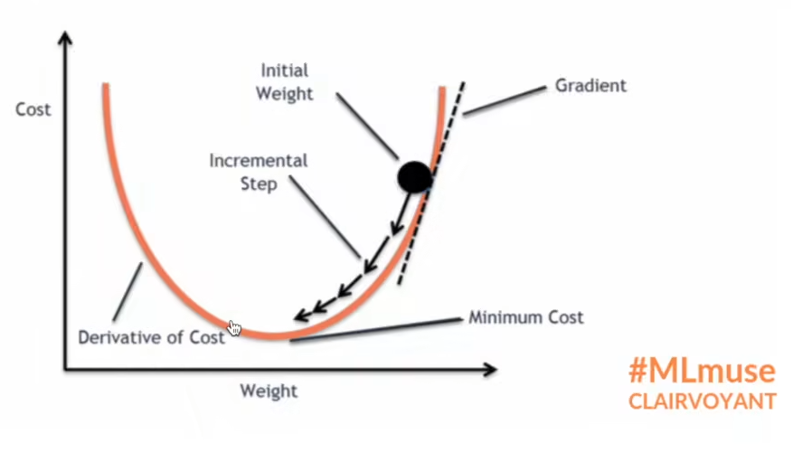

# 1. 损失函数

① Loss损失函数一方面计算实际输出和目标之间的差距。

② Loss损失函数另一方面为我们更新输出提供一定的依据。

# 2. L1loss损失函数

① L1loss数学公式如下图所示，例子如下下图所示。




```python
import torch
from torch.nn import L1Loss
inputs = torch.tensor([1,2,3],dtype=torch.float32)
targets = torch.tensor([1,2,5],dtype=torch.float32)
inputs = torch.reshape(inputs,(1,1,1,3))
targets = torch.reshape(targets,(1,1,1,3))
loss = L1Loss()  # 默认为 maen
result = loss(inputs,targets)
print(result)
```

    tensor(0.6667)
    


```python
import torch
from torch.nn import L1Loss
inputs = torch.tensor([1,2,3],dtype=torch.float32)
targets = torch.tensor([1,2,5],dtype=torch.float32)
inputs = torch.reshape(inputs,(1,1,1,3))
targets = torch.reshape(targets,(1,1,1,3))
loss = L1Loss(reduction='sum') # 修改为sum，三个值的差值，然后取和
result = loss(inputs,targets)
print(result)
```

    tensor(2.)
    

# 3. MSE损失函数

① MSE损失函数数学公式如下图所示。


```python
import torch
from torch.nn import L1Loss
from torch import nn
inputs = torch.tensor([1,2,3],dtype=torch.float32)
targets = torch.tensor([1,2,5],dtype=torch.float32)
inputs = torch.reshape(inputs,(1,1,1,3))
targets = torch.reshape(targets,(1,1,1,3))
loss_mse = nn.MSELoss()
result_mse = loss_mse(inputs,targets)
print(result_mse)
```

    tensor(1.3333)
    

# 4. 交叉熵损失函数

① 交叉熵损失函数数学公式如下图所示。


```python
import torch
from torch.nn import L1Loss
from torch import nn

x = torch.tensor([0.1,0.2,0.3])
y = torch.tensor([1])
x = torch.reshape(x,(1,3)) # 1的 batch_size，有三类
loss_cross = nn.CrossEntropyLoss()
result_cross = loss_cross(x,y)
print(result_cross)
```

    tensor(1.1019)
    


# 5. 搭建神经网络


```python
import torch
import torchvision
from torch import nn 
from torch.nn import Conv2d, MaxPool2d, Flatten, Linear, Sequential
from torch.utils.data import DataLoader
from torch.utils.tensorboard import SummaryWriter

dataset = torchvision.datasets.CIFAR10("./dataset",train=False,transform=torchvision.transforms.ToTensor(),download=True)       
dataloader = DataLoader(dataset, batch_size=1,drop_last=True)

class Tudui(nn.Module):
    def __init__(self):
        super(Tudui, self).__init__()        
        self.model1 = Sequential(
            Conv2d(3,32,5,padding=2),
            MaxPool2d(2),
            Conv2d(32,32,5,padding=2),
            MaxPool2d(2),
            Conv2d(32,64,5,padding=2),
            MaxPool2d(2),
            Flatten(),
            Linear(1024,64),
            Linear(64,10)
        )
        
    def forward(self, x):
        x = self.model1(x)
        return x
    
tudui = Tudui()
for data in dataloader:
    imgs, targets = data
    outputs = tudui(imgs)
    print(outputs)
    print(targets)
```

    Files already downloaded and verified
    tensor([[-0.1256, -0.1614, -0.0474, -0.0409,  0.0259, -0.1314, -0.1198, -0.0682,
             -0.1246, -0.1217]], grad_fn=<AddmmBackward0>)
    tensor([3])
    tensor([[-0.1278, -0.1590, -0.0487, -0.0508,  0.0202, -0.1075, -0.0921, -0.0896,
             -0.1443, -0.1351]], grad_fn=<AddmmBackward0>)
    tensor([8])
    tensor([[-0.1186, -0.1567, -0.0528, -0.0613,  0.0136, -0.1183, -0.0932, -0.0849,
             -0.1402, -0.1259]], grad_fn=<AddmmBackward0>)
    tensor([8])
    tensor([[-0.1269, -0.1612, -0.0489, -0.0636,  0.0117, -0.1156, -0.0884, -0.0865,
             -0.1429, -0.1252]], grad_fn=<AddmmBackward0>)
    tensor([0])
    tensor([[-0.1267, -0.1545, -0.0428, -0.0409,  0.0202, -0.1402, -0.1139, -0.0693,
             -0.1246, -0.1261]], grad_fn=<AddmmBackward0>)
    tensor([6])
    tensor([[-0.1218, -0.1509, -0.0433, -0.0226,  0.0247, -0.1093, -0.1307, -0.0773,
             -0.1250, -0.1148]], grad_fn=<AddmmBackward0>)
    tensor([6])
    tensor([[-0.1175, -0.1661, -0.0200, -0.0216,  0.0403, -0.1204, -0.0925, -0.0690,
             -0.1076, -0.1219]], grad_fn=<AddmmBackward0>)
    tensor([1])
    tensor([[-0.1274, -0.1585, -0.0466, -0.0366,  0.0189, -0.1274, -0.1266, -0.0731,
             -0.1236, -0.1056]], grad_fn=<AddmmBackward0>)
    tensor([6])
    tensor([[-0.1226, -0.1648, -0.0610, -0.0536,  0.0237, -0.1352, -0.1083, -0.0587,
             -0.1397, -0.1293]], grad_fn=<AddmmBackward0>)
    tensor([3])
    tensor([[-0.1212, -0.1440, -0.0480, -0.0478,  0.0247, -0.1004, -0.0845, -0.0927,
             -0.1450, -0.1103]], grad_fn=<AddmmBackward0>)
    tensor([1])
    tensor([[-0.1309, -0.1570, -0.0568, -0.0564,  0.0183, -0.1257, -0.1078, -0.0642,
             -0.1439, -0.1277]], grad_fn=<AddmmBackward0>)
    tensor([0])
    tensor([[-0.1077, -0.1609, -0.0311, -0.0440,  0.0310, -0.1114, -0.1070, -0.0995,
             -0.1300, -0.1111]], grad_fn=<AddmmBackward0>)
    tensor([9])
    tensor([[-0.1226, -0.1537, -0.0421, -0.0342,  0.0253, -0.1308, -0.1092, -0.0697,
             -0.1278, -0.1258]], grad_fn=<AddmmBackward0>)
    tensor([5])
    tensor([[-0.1232, -0.1516, -0.0323, -0.0389,  0.0146, -0.1201, -0.1123, -0.0699,
             -0.1315, -0.1234]], grad_fn=<AddmmBackward0>)
    tensor([7])
    tensor([[-0.1152, -0.1759, -0.0368, -0.0246,  0.0398, -0.1116, -0.1142, -0.0924,
             -0.1383, -0.1161]], grad_fn=<AddmmBackward0>)
    tensor([9])
    tensor([[-0.1221, -0.1710, -0.0589, -0.0644,  0.0144, -0.1282, -0.1062, -0.0704,
             -0.1431, -0.1295]], grad_fn=<AddmmBackward0>)
    tensor([8])
    tensor([[-0.1187, -0.1746, -0.0539, -0.0542,  0.0305, -0.1147, -0.1383, -0.0772,
             -0.1379, -0.0984]], grad_fn=<AddmmBackward0>)
    tensor([5])
    tensor([[-0.1258, -0.1635, -0.0496, -0.0357,  0.0359, -0.1233, -0.1045, -0.0749,
             -0.1390, -0.1145]], grad_fn=<AddmmBackward0>)
    tensor([7])
    tensor([[-0.1225, -0.1366, -0.0441, -0.0508,  0.0201, -0.0954, -0.0909, -0.1079,
             -0.1505, -0.1168]], grad_fn=<AddmmBackward0>)
    tensor([8])
    tensor([[-0.1254, -0.1434, -0.0434, -0.0332,  0.0344, -0.1151, -0.1287, -0.0606,
             -0.1336, -0.1187]], grad_fn=<AddmmBackward0>)
    tensor([6])
    tensor([[-0.1094, -0.1510, -0.0290, -0.0317,  0.0440, -0.1047, -0.0928, -0.0822,
             -0.1347, -0.1067]], grad_fn=<AddmmBackward0>)
    tensor([7])
    tensor([[-0.1221, -0.1825, -0.0374, -0.0700,  0.0211, -0.1297, -0.0816, -0.0851,
             -0.1662, -0.1258]], grad_fn=<AddmmBackward0>)
    tensor([0])
    tensor([[-0.1263, -0.1471, -0.0424, -0.0346,  0.0274, -0.1253, -0.0980, -0.0809,
             -0.1234, -0.1176]], grad_fn=<AddmmBackward0>)
    tensor([4])
    tensor([[-0.1041, -0.1541, -0.0365, -0.0256,  0.0472, -0.1037, -0.1165, -0.0900,
             -0.1332, -0.1072]], grad_fn=<AddmmBackward0>)
    tensor([9])
    tensor([[-0.1260, -0.1505, -0.0422, -0.0420,  0.0271, -0.1167, -0.0958, -0.0696,
             -0.1511, -0.1189]], grad_fn=<AddmmBackward0>)
    tensor([5])
    tensor([[-0.1315, -0.1589, -0.0469, -0.0392,  0.0237, -0.1134, -0.1137, -0.0835,
             -0.1391, -0.1114]], grad_fn=<AddmmBackward0>)
    tensor([2])
    tensor([[-0.1237, -0.1630, -0.0434, -0.0283,  0.0310, -0.1174, -0.1258, -0.0745,
             -0.1328, -0.1010]], grad_fn=<AddmmBackward0>)
    tensor([4])
    tensor([[-0.1225, -0.1509, -0.0488, -0.0479,  0.0244, -0.1125, -0.0882, -0.0956,
             -0.1454, -0.1062]], grad_fn=<AddmmBackward0>)
    tensor([0])
    tensor([[-0.1245, -0.1512, -0.0332, -0.0294,  0.0428, -0.1038, -0.1036, -0.0971,
             -0.1413, -0.1075]], grad_fn=<AddmmBackward0>)
    tensor([9])
    tensor([[-0.1252, -0.1393, -0.0469, -0.0215,  0.0278, -0.1156, -0.1093, -0.0802,
             -0.1158, -0.1047]], grad_fn=<AddmmBackward0>)
    tensor([6])
    tensor([[-0.1235, -0.1323, -0.0388, -0.0139,  0.0388, -0.1146, -0.1099, -0.0776,
             -0.1113, -0.1039]], grad_fn=<AddmmBackward0>)
    tensor([6])
    tensor([[-0.1166, -0.1517, -0.0444, -0.0333,  0.0222, -0.1178, -0.0961, -0.0788,
             -0.1379, -0.1137]], grad_fn=<AddmmBackward0>)
    tensor([5])
    tensor([[-0.1272, -0.1624, -0.0555, -0.0450,  0.0264, -0.1286, -0.1142, -0.0632,
             -0.1337, -0.1216]], grad_fn=<AddmmBackward0>)
    tensor([4])
    tensor([[-0.1225, -0.1664, -0.0399, -0.0295,  0.0262, -0.1197, -0.1303, -0.0751,
             -0.1359, -0.1044]], grad_fn=<AddmmBackward0>)
    tensor([5])
    tensor([[-0.1302, -0.1304, -0.0432, -0.0302,  0.0359, -0.0957, -0.0713, -0.0990,
             -0.1333, -0.1181]], grad_fn=<AddmmBackward0>)
    tensor([9])
    tensor([[-0.1275, -0.1868, -0.0453, -0.0352,  0.0182, -0.1452, -0.1307, -0.0617,
             -0.1160, -0.1275]], grad_fn=<AddmmBackward0>)
    tensor([2])
    tensor([[-0.1179, -0.1421, -0.0482, -0.0414,  0.0210, -0.1183, -0.1012, -0.0772,
             -0.1309, -0.1180]], grad_fn=<AddmmBackward0>)
    tensor([4])
    tensor([[-0.1286, -0.1622, -0.0549, -0.0662,  0.0222, -0.0999, -0.1112, -0.0764,
             -0.1522, -0.1182]], grad_fn=<AddmmBackward0>)
    tensor([1])
    tensor([[-0.1175, -0.1486, -0.0418, -0.0337,  0.0255, -0.0982, -0.1069, -0.0869,
             -0.1494, -0.1059]], grad_fn=<AddmmBackward0>)
    tensor([9])
    tensor([[-0.1313, -0.1584, -0.0458, -0.0510,  0.0158, -0.1352, -0.1135, -0.0694,
             -0.1428, -0.1304]], grad_fn=<AddmmBackward0>)
    tensor([5])
    tensor([[-0.1281, -0.1710, -0.0381, -0.0487,  0.0164, -0.1144, -0.0941, -0.0999,
             -0.1553, -0.1237]], grad_fn=<AddmmBackward0>)
    tensor([4])
    tensor([[-0.1241, -0.1383, -0.0407, -0.0075,  0.0367, -0.1165, -0.1280, -0.0769,
             -0.1169, -0.1014]], grad_fn=<AddmmBackward0>)
    tensor([6])
    tensor([[-0.1202, -0.1504, -0.0396, -0.0264,  0.0305, -0.1174, -0.0945, -0.0944,
             -0.1141, -0.1188]], grad_fn=<AddmmBackward0>)
    tensor([5])
    tensor([[-0.1234, -0.1696, -0.0374, -0.0331,  0.0295, -0.1284, -0.1252, -0.0708,
             -0.1169, -0.0991]], grad_fn=<AddmmBackward0>)
    tensor([6])
    tensor([[-0.1399, -0.1446, -0.0465, -0.0542,  0.0311, -0.1092, -0.1004, -0.0914,
             -0.1619, -0.1139]], grad_fn=<AddmmBackward0>)
    tensor([0])
    tensor([[-0.1363, -0.1602, -0.0574, -0.0523,  0.0230, -0.1163, -0.1003, -0.0711,
             -0.1439, -0.1269]], grad_fn=<AddmmBackward0>)
    tensor([9])
    tensor([[-0.1198, -0.1429, -0.0465, -0.0309,  0.0375, -0.1282, -0.0960, -0.0725,
             -0.1247, -0.1334]], grad_fn=<AddmmBackward0>)
    tensor([3])
    tensor([[-0.1256, -0.1470, -0.0431, -0.0336,  0.0304, -0.1213, -0.0977, -0.0707,
             -0.1236, -0.1199]], grad_fn=<AddmmBackward0>)
    tensor([9])
    tensor([[-0.1269, -0.1463, -0.0541, -0.0331,  0.0299, -0.1212, -0.1126, -0.0708,
             -0.1399, -0.1121]], grad_fn=<AddmmBackward0>)
    tensor([7])
    tensor([[-0.1236, -0.1405, -0.0449, -0.0229,  0.0258, -0.1186, -0.1084, -0.0756,
             -0.1244, -0.1083]], grad_fn=<AddmmBackward0>)
    tensor([6])
    tensor([[-0.1349, -0.1592, -0.0465, -0.0401,  0.0161, -0.1175, -0.0877, -0.0946,
             -0.1346, -0.1274]], grad_fn=<AddmmBackward0>)
    tensor([9])
    tensor([[-0.1293, -0.1516, -0.0467, -0.0350,  0.0297, -0.1058, -0.1112, -0.0819,
             -0.1361, -0.1159]], grad_fn=<AddmmBackward0>)
    tensor([8])
    tensor([[-0.1171, -0.1566, -0.0423, -0.0199,  0.0289, -0.1192, -0.1231, -0.0705,
             -0.1278, -0.1172]], grad_fn=<AddmmBackward0>)
    tensor([0])
    tensor([[-0.1180, -0.1438, -0.0374, -0.0287,  0.0381, -0.1024, -0.1027, -0.0864,
             -0.1163, -0.1106]], grad_fn=<AddmmBackward0>)
    tensor([3])
    tensor([[-0.1283, -0.1576, -0.0557, -0.0619,  0.0131, -0.1090, -0.0922, -0.0852,
             -0.1373, -0.1214]], grad_fn=<AddmmBackward0>)
    tensor([8])
    tensor([[-0.1303, -0.1445, -0.0563, -0.0490,  0.0148, -0.1129, -0.0991, -0.0761,
             -0.1414, -0.1262]], grad_fn=<AddmmBackward0>)
    tensor([8])
    tensor([[-0.1243, -0.1721, -0.0463, -0.0375,  0.0361, -0.1230, -0.1268, -0.0771,
             -0.1340, -0.1348]], grad_fn=<AddmmBackward0>)
    tensor([7])
    tensor([[-0.1082, -0.1452, -0.0374, -0.0319,  0.0206, -0.1279, -0.1202, -0.0817,
             -0.1216, -0.1166]], grad_fn=<AddmmBackward0>)
    tensor([7])
    tensor([[-0.1292, -0.1648, -0.0546, -0.0479,  0.0225, -0.1200, -0.1174, -0.0719,
             -0.1357, -0.1231]], grad_fn=<AddmmBackward0>)
    tensor([4])
    tensor([[-0.1350, -0.1697, -0.0309, -0.0450,  0.0308, -0.1253, -0.1128, -0.0918,
             -0.1271, -0.1097]], grad_fn=<AddmmBackward0>)
    tensor([6])
    tensor([[-0.1307, -0.1591, -0.0501, -0.0407,  0.0214, -0.1232, -0.1125, -0.0713,
             -0.1402, -0.1171]], grad_fn=<AddmmBackward0>)
    tensor([7])
    tensor([[-0.1214, -0.1507, -0.0391, -0.0169,  0.0354, -0.1199, -0.1092, -0.0684,
             -0.1303, -0.1203]], grad_fn=<AddmmBackward0>)
    tensor([3])
    tensor([[-0.1223, -0.1657, -0.0366, -0.0205,  0.0285, -0.1331, -0.1248, -0.0615,
             -0.1201, -0.1261]], grad_fn=<AddmmBackward0>)
    tensor([6])
    tensor([[-0.1172, -0.1406, -0.0356, -0.0449,  0.0357, -0.1077, -0.0814, -0.1030,
             -0.1340, -0.1167]], grad_fn=<AddmmBackward0>)
    tensor([3])
    tensor([[-0.1263, -0.1558, -0.0473, -0.0252,  0.0244, -0.1149, -0.1142, -0.0721,
             -0.1325, -0.1109]], grad_fn=<AddmmBackward0>)
    tensor([6])
    tensor([[-0.1236, -0.1599, -0.0454, -0.0284,  0.0297, -0.1272, -0.1178, -0.0750,
             -0.1245, -0.1135]], grad_fn=<AddmmBackward0>)
    tensor([2])
    tensor([[-0.1165, -0.1574, -0.0414, -0.0328,  0.0123, -0.1058, -0.1146, -0.0846,
             -0.1480, -0.1126]], grad_fn=<AddmmBackward0>)
    tensor([1])
    tensor([[-0.1236, -0.1834, -0.0557, -0.0632,  0.0312, -0.1359, -0.0924, -0.0802,
             -0.1561, -0.1215]], grad_fn=<AddmmBackward0>)
    tensor([2])
    tensor([[-0.1193, -0.1480, -0.0396, -0.0175,  0.0506, -0.1092, -0.1074, -0.0875,
             -0.1199, -0.1148]], grad_fn=<AddmmBackward0>)
    tensor([3])
    tensor([[-0.1235, -0.1555, -0.0455, -0.0351,  0.0304, -0.1053, -0.1010, -0.0957,
             -0.1335, -0.1197]], grad_fn=<AddmmBackward0>)
    tensor([7])
    tensor([[-0.1378, -0.1529, -0.0590, -0.0461,  0.0340, -0.1096, -0.1127, -0.0718,
             -0.1476, -0.1224]], grad_fn=<AddmmBackward0>)
    tensor([2])
    tensor([[-0.1240, -0.1494, -0.0453, -0.0277,  0.0239, -0.1221, -0.1242, -0.0800,
             -0.1212, -0.1054]], grad_fn=<AddmmBackward0>)
    tensor([6])
    tensor([[-0.1289, -0.1581, -0.0518, -0.0483,  0.0183, -0.1098, -0.1036, -0.0755,
             -0.1489, -0.1298]], grad_fn=<AddmmBackward0>)
    tensor([8])
    tensor([[-0.1231, -0.1440, -0.0546, -0.0551,  0.0175, -0.1225, -0.0971, -0.0781,
             -0.1359, -0.1232]], grad_fn=<AddmmBackward0>)
    tensor([8])
    tensor([[-0.1219, -0.1313, -0.0446, -0.0305,  0.0334, -0.0887, -0.0883, -0.1025,
             -0.1545, -0.1033]], grad_fn=<AddmmBackward0>)
    tensor([0])
    tensor([[-0.1251, -0.1542, -0.0416, -0.0334,  0.0427, -0.1159, -0.0978, -0.0632,
             -0.1340, -0.1166]], grad_fn=<AddmmBackward0>)
    tensor([2])
    tensor([[-0.1183, -0.1669, -0.0487, -0.0520,  0.0200, -0.1113, -0.1097, -0.0950,
             -0.1372, -0.1183]], grad_fn=<AddmmBackward0>)
    tensor([9])
    tensor([[-0.1157, -0.1488, -0.0449, -0.0585,  0.0108, -0.1375, -0.0951, -0.0765,
             -0.1313, -0.1343]], grad_fn=<AddmmBackward0>)
    tensor([3])
    tensor([[-0.1154, -0.1439, -0.0324, -0.0401,  0.0303, -0.1268, -0.1075, -0.0731,
             -0.1161, -0.1206]], grad_fn=<AddmmBackward0>)
    tensor([3])
    tensor([[-0.1380, -0.1498, -0.0655, -0.0652,  0.0165, -0.0988, -0.0843, -0.0903,
             -0.1702, -0.1296]], grad_fn=<AddmmBackward0>)
    tensor([8])
    tensor([[-0.1245, -0.1498, -0.0603, -0.0668,  0.0179, -0.1186, -0.0847, -0.0779,
             -0.1474, -0.1207]], grad_fn=<AddmmBackward0>)
    tensor([8])
    tensor([[-0.1168, -0.1449, -0.0354, -0.0221,  0.0122, -0.1211, -0.1084, -0.0785,
             -0.1220, -0.1134]], grad_fn=<AddmmBackward0>)
    tensor([1])
    tensor([[-0.1252, -0.1567, -0.0469, -0.0140,  0.0255, -0.1284, -0.0953, -0.0736,
             -0.1280, -0.1234]], grad_fn=<AddmmBackward0>)
    tensor([1])
    tensor([[-0.1380, -0.1632, -0.0518, -0.0740,  0.0322, -0.1211, -0.0968, -0.0824,
             -0.1473, -0.1214]], grad_fn=<AddmmBackward0>)
    tensor([7])
    tensor([[-0.1208, -0.1639, -0.0639, -0.0613,  0.0261, -0.1200, -0.0906, -0.0598,
             -0.1507, -0.1215]], grad_fn=<AddmmBackward0>)
    tensor([2])
    tensor([[-0.1149, -0.1616, -0.0326, -0.0460,  0.0285, -0.1192, -0.0921, -0.1111,
             -0.1333, -0.1067]], grad_fn=<AddmmBackward0>)
    tensor([5])
    tensor([[-0.1187, -0.1662, -0.0403, -0.0551,  0.0197, -0.1302, -0.0941, -0.0849,
             -0.1305, -0.1328]], grad_fn=<AddmmBackward0>)
    tensor([2])
    tensor([[-0.1234, -0.1595, -0.0549, -0.0688,  0.0035, -0.1117, -0.0789, -0.0765,
             -0.1583, -0.1455]], grad_fn=<AddmmBackward0>)
    tensor([7])
    tensor([[-0.1191, -0.1484, -0.0571, -0.0605,  0.0168, -0.1018, -0.0837, -0.0803,
             -0.1588, -0.1186]], grad_fn=<AddmmBackward0>)
    tensor([8])
    tensor([[-0.1210, -0.1471, -0.0451, -0.0429,  0.0235, -0.1068, -0.1050, -0.0891,
             -0.1479, -0.1165]], grad_fn=<AddmmBackward0>)
    tensor([9])
    tensor([[-0.1250, -0.1628, -0.0494, -0.0501,  0.0212, -0.1210, -0.0939, -0.0800,
             -0.1459, -0.1309]], grad_fn=<AddmmBackward0>)
    tensor([0])
    tensor([[-0.1214, -0.1578, -0.0458, -0.0194,  0.0324, -0.1198, -0.1152, -0.0754,
             -0.1236, -0.1220]], grad_fn=<AddmmBackward0>)
    tensor([3])
    tensor([[-0.1319, -0.1555, -0.0585, -0.0642,  0.0160, -0.1158, -0.0933, -0.0778,
             -0.1442, -0.1278]], grad_fn=<AddmmBackward0>)
    tensor([8])
    tensor([[-0.1261, -0.1353, -0.0419, -0.0358,  0.0291, -0.1165, -0.0877, -0.0808,
             -0.1368, -0.1087]], grad_fn=<AddmmBackward0>)
    tensor([6])
    tensor([[-0.1239, -0.1398, -0.0391, -0.0284,  0.0274, -0.1188, -0.1065, -0.0759,
             -0.1247, -0.1137]], grad_fn=<AddmmBackward0>)
    tensor([4])
    tensor([[-0.1242, -0.1557, -0.0396, -0.0284,  0.0301, -0.1176, -0.1119, -0.0834,
             -0.1324, -0.1232]], grad_fn=<AddmmBackward0>)
    tensor([6])
    tensor([[-0.1138, -0.1545, -0.0521, -0.0281,  0.0193, -0.1238, -0.1218, -0.0732,
             -0.1323, -0.1079]], grad_fn=<AddmmBackward0>)
    tensor([6])
    tensor([[-0.1285, -0.1568, -0.0494, -0.0531,  0.0215, -0.1265, -0.1017, -0.0740,
             -0.1361, -0.1241]], grad_fn=<AddmmBackward0>)
    tensor([0])
    tensor([[-0.1448, -0.1704, -0.0385, -0.0573,  0.0444, -0.1197, -0.0804, -0.0999,
             -0.1477, -0.1223]], grad_fn=<AddmmBackward0>)
    tensor([0])
    tensor([[-0.1292, -0.1364, -0.0416, -0.0428,  0.0479, -0.1044, -0.0831, -0.0820,
             -0.1464, -0.1262]], grad_fn=<AddmmBackward0>)
    tensor([7])
    tensor([[-0.1336, -0.1568, -0.0538, -0.0484,  0.0263, -0.1264, -0.1177, -0.0735,
             -0.1309, -0.1194]], grad_fn=<AddmmBackward0>)
    tensor([4])
    tensor([[-0.1278, -0.1589, -0.0561, -0.0429,  0.0262, -0.1182, -0.1174, -0.0758,
             -0.1408, -0.1137]], grad_fn=<AddmmBackward0>)
    tensor([5])
    tensor([[-0.1208, -0.1564, -0.0324, -0.0271,  0.0311, -0.1286, -0.1268, -0.0869,
             -0.1206, -0.1271]], grad_fn=<AddmmBackward0>)
    tensor([6])
    tensor([[-0.1269, -0.1622, -0.0573, -0.0427,  0.0214, -0.1085, -0.1206, -0.0879,
             -0.1411, -0.1108]], grad_fn=<AddmmBackward0>)
    tensor([3])
    tensor([[-0.1257, -0.1703, -0.0305, -0.0382,  0.0137, -0.1247, -0.1078, -0.0862,
             -0.1311, -0.1204]], grad_fn=<AddmmBackward0>)
    tensor([1])
    tensor([[-0.1298, -0.1612, -0.0590, -0.0594,  0.0171, -0.0986, -0.0918, -0.0863,
             -0.1696, -0.1425]], grad_fn=<AddmmBackward0>)
    tensor([1])
    tensor([[-0.1166, -0.1768, -0.0469, -0.0312,  0.0290, -0.1289, -0.1120, -0.0677,
             -0.1205, -0.1165]], grad_fn=<AddmmBackward0>)
    tensor([3])
    tensor([[-0.1209, -0.1468, -0.0501, -0.0226,  0.0244, -0.1187, -0.1159, -0.0794,
             -0.1188, -0.1118]], grad_fn=<AddmmBackward0>)
    tensor([6])
    tensor([[-0.1133, -0.1678, -0.0541, -0.0554,  0.0281, -0.1230, -0.1224, -0.0745,
             -0.1357, -0.1116]], grad_fn=<AddmmBackward0>)
    tensor([8])
    tensor([[-0.1412, -0.1821, -0.0267, -0.0587,  0.0293, -0.1372, -0.1417, -0.0916,
             -0.1174, -0.1340]], grad_fn=<AddmmBackward0>)
    tensor([7])
    tensor([[-0.1186, -0.1463, -0.0488, -0.0166,  0.0367, -0.1075, -0.1304, -0.0647,
             -0.1315, -0.1124]], grad_fn=<AddmmBackward0>)
    tensor([4])
    tensor([[-0.1267, -0.1719, -0.0574, -0.0550,  0.0225, -0.1333, -0.1071, -0.0659,
             -0.1500, -0.1165]], grad_fn=<AddmmBackward0>)
    tensor([0])
    tensor([[-0.1290, -0.1578, -0.0477, -0.0267,  0.0303, -0.1154, -0.1164, -0.0644,
             -0.1347, -0.1136]], grad_fn=<AddmmBackward0>)
    tensor([6])
    tensor([[-0.1311, -0.1532, -0.0521, -0.0399,  0.0253, -0.1198, -0.1046, -0.0781,
             -0.1338, -0.1257]], grad_fn=<AddmmBackward0>)
    tensor([2])
    tensor([[-0.1114, -0.1441, -0.0503, -0.0377,  0.0275, -0.0946, -0.1104, -0.0878,
             -0.1459, -0.1005]], grad_fn=<AddmmBackward0>)
    tensor([1])
    tensor([[-0.1246, -0.1517, -0.0417, -0.0268,  0.0287, -0.1089, -0.1128, -0.1039,
             -0.1354, -0.1034]], grad_fn=<AddmmBackward0>)
    tensor([3])
    tensor([[-0.1316, -0.1649, -0.0340, -0.0503,  0.0299, -0.1199, -0.0921, -0.0867,
             -0.1462, -0.1302]], grad_fn=<AddmmBackward0>)
    tensor([0])
    tensor([[-0.1291, -0.1309, -0.0424, -0.0315,  0.0427, -0.1115, -0.0896, -0.0923,
             -0.1210, -0.1129]], grad_fn=<AddmmBackward0>)
    tensor([4])
    tensor([[-0.1249, -0.1371, -0.0279, -0.0098,  0.0361, -0.1246, -0.1165, -0.0865,
             -0.1065, -0.1128]], grad_fn=<AddmmBackward0>)
    tensor([2])
    tensor([[-0.1166, -0.1615, -0.0411, -0.0403,  0.0445, -0.1118, -0.1057, -0.0756,
             -0.1279, -0.1118]], grad_fn=<AddmmBackward0>)
    tensor([7])
    tensor([[-0.1241, -0.1537, -0.0539, -0.0553,  0.0195, -0.1070, -0.0955, -0.0825,
             -0.1485, -0.1192]], grad_fn=<AddmmBackward0>)
    tensor([8])
    tensor([[-0.1176, -0.1684, -0.0383, -0.0228,  0.0396, -0.1323, -0.1228, -0.0657,
             -0.1184, -0.1139]], grad_fn=<AddmmBackward0>)
    tensor([3])
    tensor([[-0.1164, -0.1541, -0.0375, -0.0343,  0.0295, -0.1174, -0.1057, -0.0825,
             -0.1242, -0.1155]], grad_fn=<AddmmBackward0>)
    tensor([1])
    tensor([[-0.1168, -0.1473, -0.0505, -0.0392,  0.0264, -0.1266, -0.0959, -0.0832,
             -0.1365, -0.1148]], grad_fn=<AddmmBackward0>)
    tensor([2])
    tensor([[-0.1361, -0.1429, -0.0401, -0.0578,  0.0288, -0.1102, -0.0887, -0.1005,
             -0.1491, -0.1066]], grad_fn=<AddmmBackward0>)
    tensor([8])
    tensor([[-0.1189, -0.1514, -0.0516, -0.0388,  0.0236, -0.1162, -0.1177, -0.0780,
             -0.1329, -0.1017]], grad_fn=<AddmmBackward0>)
    tensor([0])
    tensor([[-0.1368, -0.1544, -0.0485, -0.0389,  0.0243, -0.1185, -0.1018, -0.0808,
             -0.1282, -0.1190]], grad_fn=<AddmmBackward0>)
    tensor([8])
    tensor([[-0.1191, -0.1600, -0.0595, -0.0359,  0.0240, -0.1210, -0.1053, -0.0688,
             -0.1386, -0.1308]], grad_fn=<AddmmBackward0>)
    tensor([3])
    tensor([[-0.1292, -0.1863, -0.0452, -0.0357,  0.0311, -0.1375, -0.1245, -0.0584,
             -0.1293, -0.1188]], grad_fn=<AddmmBackward0>)
    tensor([5])
    tensor([[-0.1253, -0.1611, -0.0603, -0.0428,  0.0358, -0.1110, -0.1122, -0.0589,
             -0.1399, -0.1062]], grad_fn=<AddmmBackward0>)
    tensor([2])
    tensor([[-0.1291, -0.1612, -0.0499, -0.0373,  0.0361, -0.1136, -0.1102, -0.0725,
             -0.1445, -0.1106]], grad_fn=<AddmmBackward0>)
    tensor([4])
    tensor([[-0.1199, -0.1663, -0.0445, -0.0618,  0.0233, -0.1235, -0.0963, -0.0902,
             -0.1390, -0.1188]], grad_fn=<AddmmBackward0>)
    tensor([1])
    tensor([[-0.1273, -0.1532, -0.0495, -0.0424,  0.0249, -0.1092, -0.0918, -0.0934,
             -0.1388, -0.1124]], grad_fn=<AddmmBackward0>)
    tensor([8])
    tensor([[-0.1286, -0.1548, -0.0344, -0.0354,  0.0435, -0.0977, -0.1023, -0.0814,
             -0.1396, -0.1128]], grad_fn=<AddmmBackward0>)
    tensor([9])
    tensor([[-0.1254, -0.1654, -0.0506, -0.0509,  0.0411, -0.1200, -0.1010, -0.0782,
             -0.1431, -0.1051]], grad_fn=<AddmmBackward0>)
    tensor([1])
    tensor([[-0.1270, -0.1609, -0.0613, -0.0531,  0.0150, -0.1237, -0.1193, -0.0678,
             -0.1398, -0.1091]], grad_fn=<AddmmBackward0>)
    tensor([2])
    tensor([[-0.1257, -0.1547, -0.0417, -0.0397,  0.0239, -0.1024, -0.1156, -0.0996,
             -0.1251, -0.1033]], grad_fn=<AddmmBackward0>)
    tensor([9])
    tensor([[-0.1327, -0.1522, -0.0419, -0.0473,  0.0407, -0.1140, -0.0959, -0.0757,
             -0.1409, -0.1185]], grad_fn=<AddmmBackward0>)
    tensor([7])
    tensor([[-0.1234, -0.1410, -0.0478, -0.0205,  0.0295, -0.1137, -0.1114, -0.0629,
             -0.1272, -0.1126]], grad_fn=<AddmmBackward0>)
    tensor([2])
    tensor([[-0.1297, -0.1503, -0.0518, -0.0462,  0.0159, -0.1107, -0.0995, -0.0821,
             -0.1489, -0.1296]], grad_fn=<AddmmBackward0>)
    tensor([9])
    tensor([[-0.1279, -0.1498, -0.0537, -0.0432,  0.0132, -0.1182, -0.1037, -0.0741,
             -0.1375, -0.1209]], grad_fn=<AddmmBackward0>)
    tensor([6])
    tensor([[-0.1244, -0.1733, -0.0514, -0.0581,  0.0165, -0.1420, -0.1011, -0.0719,
             -0.1291, -0.1396]], grad_fn=<AddmmBackward0>)
    tensor([5])
    tensor([[-0.1414, -0.1695, -0.0478, -0.0654,  0.0233, -0.1185, -0.1095, -0.0912,
             -0.1422, -0.1159]], grad_fn=<AddmmBackward0>)
    tensor([6])
    tensor([[-0.1257, -0.1401, -0.0361, -0.0345,  0.0315, -0.1199, -0.1163, -0.0914,
             -0.1333, -0.1280]], grad_fn=<AddmmBackward0>)
    tensor([3])
    tensor([[-0.1291, -0.1745, -0.0590, -0.0655,  0.0089, -0.1164, -0.1121, -0.0850,
             -0.1430, -0.1210]], grad_fn=<AddmmBackward0>)
    tensor([8])
    tensor([[-0.1239, -0.1613, -0.0664, -0.0461,  0.0198, -0.1189, -0.0881, -0.0633,
             -0.1525, -0.1216]], grad_fn=<AddmmBackward0>)
    tensor([7])
    tensor([[-0.1237, -0.1471, -0.0361, -0.0217,  0.0366, -0.1186, -0.1218, -0.0920,
             -0.1143, -0.1157]], grad_fn=<AddmmBackward0>)
    tensor([6])
    tensor([[-0.1230, -0.1497, -0.0395, -0.0475,  0.0404, -0.1055, -0.1012, -0.1082,
             -0.1356, -0.1178]], grad_fn=<AddmmBackward0>)
    tensor([2])
    tensor([[-0.1070, -0.1816, -0.0540, -0.0549,  0.0176, -0.1173, -0.1275, -0.0846,
             -0.1533, -0.1136]], grad_fn=<AddmmBackward0>)
    tensor([5])
    tensor([[-0.1385, -0.1596, -0.0504, -0.0606,  0.0096, -0.1335, -0.1040, -0.0838,
             -0.1135, -0.1417]], grad_fn=<AddmmBackward0>)
    tensor([2])
    tensor([[-0.1161, -0.1672, -0.0438, -0.0380,  0.0263, -0.1037, -0.1010, -0.0864,
             -0.1550, -0.1040]], grad_fn=<AddmmBackward0>)
    tensor([8])
    tensor([[-0.1288, -0.1677, -0.0484, -0.0392,  0.0257, -0.1104, -0.1158, -0.1008,
             -0.1414, -0.1278]], grad_fn=<AddmmBackward0>)
    tensor([9])
    tensor([[-0.1179, -0.1411, -0.0374, -0.0308,  0.0245, -0.1172, -0.1005, -0.0845,
             -0.1275, -0.1134]], grad_fn=<AddmmBackward0>)
    tensor([6])
    tensor([[-0.1163, -0.1635, -0.0463, -0.0691,  0.0210, -0.1162, -0.1013, -0.0936,
             -0.1415, -0.1140]], grad_fn=<AddmmBackward0>)
    tensor([0])
    tensor([[-0.1305, -0.1788, -0.0433, -0.0440,  0.0247, -0.1389, -0.1126, -0.0746,
             -0.1270, -0.1121]], grad_fn=<AddmmBackward0>)
    tensor([0])
    tensor([[-0.1255, -0.1455, -0.0433, -0.0371,  0.0289, -0.1304, -0.1181, -0.0837,
             -0.1263, -0.1316]], grad_fn=<AddmmBackward0>)
    tensor([5])
    tensor([[-0.1288, -0.1654, -0.0528, -0.0533,  0.0233, -0.1210, -0.1029, -0.0645,
             -0.1426, -0.1208]], grad_fn=<AddmmBackward0>)
    tensor([2])
    tensor([[-0.1302, -0.1478, -0.0506, -0.0443,  0.0168, -0.0984, -0.1023, -0.0858,
             -0.1457, -0.1249]], grad_fn=<AddmmBackward0>)
    tensor([9])
    tensor([[-0.1338, -0.1430, -0.0439, -0.0226,  0.0393, -0.1131, -0.1181, -0.0612,
             -0.1218, -0.1076]], grad_fn=<AddmmBackward0>)
    tensor([5])
    tensor([[-0.1324, -0.1523, -0.0507, -0.0402,  0.0357, -0.1112, -0.0967, -0.0804,
             -0.1452, -0.1160]], grad_fn=<AddmmBackward0>)
    tensor([4])
    tensor([[-0.1380, -0.1559, -0.0506, -0.0472,  0.0400, -0.1150, -0.0891, -0.0662,
             -0.1481, -0.1150]], grad_fn=<AddmmBackward0>)
    tensor([2])
    tensor([[-0.1163, -0.1490, -0.0405, -0.0321,  0.0250, -0.1271, -0.1132, -0.0674,
             -0.1336, -0.1203]], grad_fn=<AddmmBackward0>)
    tensor([1])
    tensor([[-0.1148, -0.1518, -0.0483, -0.0221,  0.0301, -0.1068, -0.1034, -0.0688,
             -0.1413, -0.1188]], grad_fn=<AddmmBackward0>)
    tensor([6])
    tensor([[-0.1266, -0.1477, -0.0570, -0.0337,  0.0261, -0.1231, -0.1168, -0.0713,
             -0.1318, -0.1197]], grad_fn=<AddmmBackward0>)
    tensor([6])
    tensor([[-0.1345, -0.1584, -0.0580, -0.0606,  0.0164, -0.1139, -0.1084, -0.0895,
             -0.1518, -0.1296]], grad_fn=<AddmmBackward0>)
    tensor([8])
    tensor([[-0.1287, -0.1491, -0.0537, -0.0433,  0.0494, -0.1027, -0.1082, -0.0872,
             -0.1441, -0.1040]], grad_fn=<AddmmBackward0>)
    tensor([4])
    tensor([[-0.1332, -0.1494, -0.0583, -0.0621,  0.0138, -0.1180, -0.0906, -0.0790,
             -0.1475, -0.1277]], grad_fn=<AddmmBackward0>)
    tensor([8])
    tensor([[-0.1263, -0.1422, -0.0447, -0.0250,  0.0318, -0.1174, -0.1103, -0.0802,
             -0.1202, -0.1172]], grad_fn=<AddmmBackward0>)
    tensor([4])
    tensor([[-0.1264, -0.1544, -0.0466, -0.0404,  0.0419, -0.1040, -0.0995, -0.0928,
             -0.1365, -0.1066]], grad_fn=<AddmmBackward0>)
    tensor([5])
    tensor([[-0.1369, -0.1217, -0.0477, -0.0465,  0.0373, -0.0929, -0.0821, -0.0998,
             -0.1429, -0.1050]], grad_fn=<AddmmBackward0>)
    tensor([0])
    tensor([[-0.1358, -0.1576, -0.0504, -0.0478,  0.0178, -0.1034, -0.0990, -0.0890,
             -0.1511, -0.1290]], grad_fn=<AddmmBackward0>)
    tensor([9])
    tensor([[-0.1129, -0.1458, -0.0518, -0.0406,  0.0334, -0.0952, -0.0930, -0.0964,
             -0.1481, -0.1063]], grad_fn=<AddmmBackward0>)
    tensor([9])
    tensor([[-0.1266, -0.1597, -0.0500, -0.0463,  0.0277, -0.1222, -0.1132, -0.0784,
             -0.1365, -0.1216]], grad_fn=<AddmmBackward0>)
    tensor([9])
    tensor([[-0.1291, -0.1484, -0.0306, -0.0425,  0.0166, -0.1150, -0.0905, -0.0881,
             -0.1316, -0.1361]], grad_fn=<AddmmBackward0>)
    tensor([8])
    tensor([[-0.1154, -0.1547, -0.0399, -0.0356,  0.0233, -0.1125, -0.1036, -0.0985,
             -0.1348, -0.1133]], grad_fn=<AddmmBackward0>)
    tensor([9])
    tensor([[-0.1139, -0.1697, -0.0422, -0.0414,  0.0316, -0.1103, -0.0963, -0.0883,
             -0.1320, -0.1199]], grad_fn=<AddmmBackward0>)
    tensor([9])
    tensor([[-0.1257, -0.1720, -0.0537, -0.0573,  0.0167, -0.1339, -0.1132, -0.0813,
             -0.1506, -0.1069]], grad_fn=<AddmmBackward0>)
    tensor([3])
    tensor([[-0.1231, -0.1446, -0.0418, -0.0282,  0.0215, -0.1131, -0.1048, -0.0810,
             -0.1349, -0.1140]], grad_fn=<AddmmBackward0>)
    tensor([7])
    tensor([[-0.1217, -0.1476, -0.0422, -0.0340,  0.0223, -0.1246, -0.1021, -0.0761,
             -0.1253, -0.1202]], grad_fn=<AddmmBackward0>)
    tensor([5])
    tensor([[-0.1231, -0.1559, -0.0458, -0.0462,  0.0178, -0.1119, -0.0996, -0.0847,
             -0.1531, -0.1157]], grad_fn=<AddmmBackward0>)
    tensor([0])
    tensor([[-0.1218, -0.1644, -0.0386, -0.0593,  0.0236, -0.1074, -0.1008, -0.0957,
             -0.1478, -0.1048]], grad_fn=<AddmmBackward0>)
    tensor([0])
    tensor([[-0.1253, -0.1689, -0.0461, -0.0589,  0.0262, -0.1145, -0.1024, -0.0885,
             -0.1526, -0.1124]], grad_fn=<AddmmBackward0>)
    tensor([5])
    tensor([[-0.1202, -0.1686, -0.0503, -0.0314,  0.0303, -0.1159, -0.1246, -0.0779,
             -0.1359, -0.1125]], grad_fn=<AddmmBackward0>)
    tensor([2])
    tensor([[-0.1334, -0.1442, -0.0481, -0.0422,  0.0219, -0.1201, -0.1040, -0.0766,
             -0.1305, -0.1223]], grad_fn=<AddmmBackward0>)
    tensor([2])
    tensor([[-0.1321, -0.1594, -0.0603, -0.0469,  0.0377, -0.1172, -0.0975, -0.0802,
             -0.1414, -0.1161]], grad_fn=<AddmmBackward0>)
    tensor([3])
    tensor([[-0.1249, -0.1569, -0.0540, -0.0607,  0.0162, -0.1245, -0.1059, -0.0774,
             -0.1435, -0.1207]], grad_fn=<AddmmBackward0>)
    tensor([8])
    tensor([[-0.1175, -0.1396, -0.0328, -0.0157,  0.0290, -0.1247, -0.1169, -0.0740,
             -0.1116, -0.1124]], grad_fn=<AddmmBackward0>)
    tensor([6])
    tensor([[-0.1223, -0.1557, -0.0573, -0.0431,  0.0247, -0.1100, -0.1134, -0.0748,
             -0.1444, -0.1158]], grad_fn=<AddmmBackward0>)
    tensor([3])
    tensor([[-0.1326, -0.1693, -0.0404, -0.0455,  0.0192, -0.1055, -0.1010, -0.1072,
             -0.1569, -0.1267]], grad_fn=<AddmmBackward0>)
    tensor([4])
    tensor([[-0.1274, -0.1663, -0.0448, -0.0684,  0.0198, -0.1369, -0.0861, -0.0914,
             -0.1339, -0.1395]], grad_fn=<AddmmBackward0>)
    tensor([0])
    tensor([[-0.1286, -0.1441, -0.0506, -0.0341,  0.0285, -0.1088, -0.1131, -0.0816,
             -0.1396, -0.1196]], grad_fn=<AddmmBackward0>)
    tensor([5])
    tensor([[-0.1408, -0.1579, -0.0485, -0.0423,  0.0339, -0.1130, -0.1160, -0.0830,
             -0.1305, -0.1147]], grad_fn=<AddmmBackward0>)
    tensor([8])
    tensor([[-0.1178, -0.1512, -0.0413, -0.0372,  0.0323, -0.1103, -0.0997, -0.0806,
             -0.1416, -0.1177]], grad_fn=<AddmmBackward0>)
    tensor([0])
    tensor([[-0.1248, -0.1637, -0.0448, -0.0364,  0.0220, -0.1310, -0.1082, -0.0785,
             -0.1324, -0.1299]], grad_fn=<AddmmBackward0>)
    tensor([1])
    tensor([[-0.1221, -0.1491, -0.0460, -0.0174,  0.0416, -0.1049, -0.1123, -0.0784,
             -0.1293, -0.1007]], grad_fn=<AddmmBackward0>)
    tensor([7])
    tensor([[-0.1199, -0.1479, -0.0403, -0.0328,  0.0198, -0.1289, -0.1056, -0.0742,
             -0.1238, -0.1176]], grad_fn=<AddmmBackward0>)
    tensor([2])
    tensor([[-0.1306, -0.1748, -0.0398, -0.0485,  0.0380, -0.1246, -0.1133, -0.0828,
             -0.1325, -0.1133]], grad_fn=<AddmmBackward0>)
    tensor([8])
    tensor([[-0.1307, -0.1625, -0.0660, -0.0725,  0.0133, -0.1186, -0.1056, -0.0678,
             -0.1548, -0.1222]], grad_fn=<AddmmBackward0>)
    tensor([8])
    tensor([[-0.1141, -0.1697, -0.0388, -0.0194,  0.0471, -0.1246, -0.0933, -0.0573,
             -0.1343, -0.1205]], grad_fn=<AddmmBackward0>)
    tensor([7])
    tensor([[-0.1330, -0.1631, -0.0500, -0.0578,  0.0230, -0.1312, -0.1118, -0.0704,
             -0.1350, -0.1419]], grad_fn=<AddmmBackward0>)
    tensor([8])
    tensor([[-0.1263, -0.1735, -0.0453, -0.0336,  0.0304, -0.1185, -0.1091, -0.0872,
             -0.1202, -0.1104]], grad_fn=<AddmmBackward0>)
    tensor([5])
    tensor([[-0.1120, -0.1392, -0.0452, -0.0469,  0.0233, -0.0934, -0.0753, -0.0970,
             -0.1487, -0.1064]], grad_fn=<AddmmBackward0>)
    tensor([1])
    tensor([[-0.1259, -0.1482, -0.0409, -0.0470,  0.0277, -0.1062, -0.1009, -0.0965,
             -0.1564, -0.1192]], grad_fn=<AddmmBackward0>)
    tensor([8])
    tensor([[-0.1133, -0.1623, -0.0445, -0.0383,  0.0243, -0.1189, -0.1081, -0.0944,
             -0.1398, -0.1044]], grad_fn=<AddmmBackward0>)
    tensor([7])
    tensor([[-0.1178, -0.1412, -0.0328, -0.0421,  0.0233, -0.1168, -0.1050, -0.0960,
             -0.1289, -0.1081]], grad_fn=<AddmmBackward0>)
    tensor([1])
    tensor([[-0.1274, -0.1499, -0.0584, -0.0446,  0.0262, -0.1163, -0.1207, -0.0776,
             -0.1375, -0.1177]], grad_fn=<AddmmBackward0>)
    tensor([3])
    tensor([[-0.1250, -0.1475, -0.0489, -0.0398,  0.0255, -0.1211, -0.1000, -0.0749,
             -0.1261, -0.1229]], grad_fn=<AddmmBackward0>)
    tensor([0])
    tensor([[-0.1134, -0.1721, -0.0472, -0.0396,  0.0280, -0.1269, -0.1124, -0.0683,
             -0.1332, -0.1252]], grad_fn=<AddmmBackward0>)
    tensor([5])
    tensor([[-0.1316, -0.1629, -0.0428, -0.0425,  0.0408, -0.1214, -0.1173, -0.0719,
             -0.1365, -0.1116]], grad_fn=<AddmmBackward0>)
    tensor([7])
    tensor([[-0.1280, -0.1515, -0.0527, -0.0576,  0.0235, -0.1101, -0.0901, -0.0838,
             -0.1458, -0.1371]], grad_fn=<AddmmBackward0>)
    tensor([9])
    tensor([[-0.1240, -0.1496, -0.0363, -0.0310,  0.0302, -0.1154, -0.1051, -0.0847,
             -0.1257, -0.1070]], grad_fn=<AddmmBackward0>)
    tensor([7])
    tensor([[-0.1118, -0.1427, -0.0369, -0.0326,  0.0191, -0.0910, -0.0988, -0.0971,
             -0.1301, -0.1122]], grad_fn=<AddmmBackward0>)
    tensor([4])
    tensor([[-0.1233, -0.1798, -0.0509, -0.0638,  0.0113, -0.1285, -0.0996, -0.0672,
             -0.1500, -0.1395]], grad_fn=<AddmmBackward0>)
    tensor([5])
    tensor([[-0.1176, -0.1492, -0.0439, -0.0366,  0.0389, -0.1083, -0.0858, -0.0986,
             -0.1350, -0.1087]], grad_fn=<AddmmBackward0>)
    tensor([9])
    tensor([[-0.1268, -0.1704, -0.0538, -0.0533,  0.0289, -0.1151, -0.1025, -0.0831,
             -0.1383, -0.1188]], grad_fn=<AddmmBackward0>)
    tensor([8])
    tensor([[-0.1486, -0.1820, -0.0601, -0.0667,  0.0321, -0.1201, -0.1103, -0.0677,
             -0.1461, -0.1088]], grad_fn=<AddmmBackward0>)
    tensor([0])
    tensor([[-0.1187, -0.1581, -0.0445, -0.0720,  0.0300, -0.0941, -0.0928, -0.1089,
             -0.1666, -0.0904]], grad_fn=<AddmmBackward0>)
    tensor([7])
    tensor([[-0.1177, -0.1579, -0.0442, -0.0433,  0.0389, -0.1082, -0.0900, -0.0774,
             -0.1408, -0.1220]], grad_fn=<AddmmBackward0>)
    tensor([9])
    tensor([[-0.1333, -0.1796, -0.0636, -0.0758,  0.0227, -0.1244, -0.1017, -0.0761,
             -0.1609, -0.1356]], grad_fn=<AddmmBackward0>)
    tensor([8])
    tensor([[-0.1237, -0.1516, -0.0470, -0.0456,  0.0408, -0.1210, -0.1131, -0.0671,
             -0.1453, -0.1127]], grad_fn=<AddmmBackward0>)
    tensor([2])
    tensor([[-0.1120, -0.1689, -0.0420, -0.0418,  0.0309, -0.1309, -0.0980, -0.0922,
             -0.1375, -0.1290]], grad_fn=<AddmmBackward0>)
    tensor([7])
    tensor([[-0.1226, -0.1439, -0.0349, -0.0231,  0.0380, -0.1141, -0.1080, -0.0825,
             -0.1275, -0.1165]], grad_fn=<AddmmBackward0>)
    tensor([6])
    tensor([[-0.1236, -0.1640, -0.0534, -0.0458,  0.0191, -0.1171, -0.1109, -0.0761,
             -0.1374, -0.1289]], grad_fn=<AddmmBackward0>)
    tensor([9])
    tensor([[-0.1302, -0.1531, -0.0463, -0.0365,  0.0193, -0.1260, -0.1036, -0.0759,
             -0.1243, -0.1183]], grad_fn=<AddmmBackward0>)
    tensor([4])
    tensor([[-0.1153, -0.1563, -0.0397, -0.0310,  0.0263, -0.1130, -0.1090, -0.0967,
             -0.1185, -0.1008]], grad_fn=<AddmmBackward0>)
    tensor([3])
    tensor([[-0.1335, -0.1644, -0.0458, -0.0382,  0.0254, -0.1076, -0.1166, -0.0890,
             -0.1346, -0.1169]], grad_fn=<AddmmBackward0>)
    tensor([9])
    tensor([[-0.1167, -0.1278, -0.0483, -0.0364,  0.0380, -0.1047, -0.0878, -0.0856,
             -0.1285, -0.1068]], grad_fn=<AddmmBackward0>)
    tensor([6])
    tensor([[-0.1236, -0.1634, -0.0555, -0.0512,  0.0326, -0.1081, -0.1089, -0.0683,
             -0.1481, -0.1045]], grad_fn=<AddmmBackward0>)
    tensor([4])
    tensor([[-0.1300, -0.1649, -0.0583, -0.0478,  0.0402, -0.1195, -0.0832, -0.0674,
             -0.1480, -0.1278]], grad_fn=<AddmmBackward0>)
    tensor([7])
    tensor([[-0.1320, -0.1611, -0.0416, -0.0389,  0.0311, -0.1127, -0.1159, -0.0935,
             -0.1393, -0.0949]], grad_fn=<AddmmBackward0>)
    tensor([6])
    tensor([[-0.1139, -0.1730, -0.0400, -0.0248,  0.0487, -0.1325, -0.1076, -0.0892,
             -0.1214, -0.1202]], grad_fn=<AddmmBackward0>)
    tensor([5])
    tensor([[-0.1246, -0.1642, -0.0535, -0.0339,  0.0225, -0.0940, -0.1072, -0.0938,
             -0.1472, -0.1064]], grad_fn=<AddmmBackward0>)
    tensor([1])
    tensor([[-0.1187, -0.1514, -0.0287, -0.0360,  0.0440, -0.1313, -0.0990, -0.0736,
             -0.1355, -0.1332]], grad_fn=<AddmmBackward0>)
    tensor([5])
    tensor([[-0.1255, -0.1515, -0.0388, -0.0303,  0.0259, -0.1261, -0.1156, -0.0720,
             -0.1269, -0.1189]], grad_fn=<AddmmBackward0>)
    tensor([8])
    tensor([[-0.1277, -0.1455, -0.0554, -0.0555,  0.0190, -0.1103, -0.1012, -0.0809,
             -0.1444, -0.1234]], grad_fn=<AddmmBackward0>)
    tensor([8])
    tensor([[-0.1335, -0.1616, -0.0395, -0.0564,  0.0240, -0.1171, -0.0940, -0.0767,
             -0.1476, -0.1294]], grad_fn=<AddmmBackward0>)
    tensor([0])
    tensor([[-0.1237, -0.1437, -0.0465, -0.0281,  0.0255, -0.1267, -0.1149, -0.0712,
             -0.1189, -0.1138]], grad_fn=<AddmmBackward0>)
    tensor([4])
    tensor([[-0.1256, -0.1308, -0.0493, -0.0342,  0.0274, -0.0807, -0.0915, -0.1059,
             -0.1640, -0.1067]], grad_fn=<AddmmBackward0>)
    tensor([0])
    tensor([[-0.1253, -0.1692, -0.0520, -0.0511,  0.0273, -0.1012, -0.1010, -0.0915,
             -0.1601, -0.1133]], grad_fn=<AddmmBackward0>)
    tensor([5])
    tensor([[-0.1341, -0.1563, -0.0506, -0.0424,  0.0395, -0.1106, -0.0971, -0.0585,
             -0.1559, -0.1142]], grad_fn=<AddmmBackward0>)
    tensor([5])
    tensor([[-0.1265, -0.1672, -0.0366, -0.0371,  0.0182, -0.1358, -0.1178, -0.0815,
             -0.1159, -0.1358]], grad_fn=<AddmmBackward0>)
    tensor([1])
    tensor([[-0.1253, -0.1577, -0.0578, -0.0442,  0.0174, -0.1184, -0.1020, -0.0786,
             -0.1357, -0.1163]], grad_fn=<AddmmBackward0>)
    tensor([1])
    tensor([[-0.1176, -0.1494, -0.0408, -0.0312,  0.0340, -0.1093, -0.0919, -0.0959,
             -0.1262, -0.1061]], grad_fn=<AddmmBackward0>)
    tensor([8])
    tensor([[-0.1240, -0.1528, -0.0404, -0.0416,  0.0327, -0.1040, -0.0941, -0.0899,
             -0.1370, -0.1237]], grad_fn=<AddmmBackward0>)
    tensor([9])
    tensor([[-0.1306, -0.1537, -0.0536, -0.0566,  0.0227, -0.1152, -0.0818, -0.0866,
             -0.1417, -0.1190]], grad_fn=<AddmmBackward0>)
    tensor([0])
    tensor([[-0.1165, -0.1933, -0.0189, -0.0318,  0.0160, -0.1310, -0.1211, -0.0845,
             -0.1326, -0.1212]], grad_fn=<AddmmBackward0>)
    tensor([3])
    tensor([[-0.1327, -0.1390, -0.0517, -0.0357,  0.0305, -0.1044, -0.1171, -0.0760,
             -0.1372, -0.0993]], grad_fn=<AddmmBackward0>)
    tensor([1])
    tensor([[-0.1345, -0.1459, -0.0538, -0.0471,  0.0160, -0.1106, -0.1002, -0.0815,
             -0.1440, -0.1232]], grad_fn=<AddmmBackward0>)
    tensor([9])
    tensor([[-0.1247, -0.1627, -0.0414, -0.0460,  0.0268, -0.1183, -0.1057, -0.0835,
             -0.1328, -0.1183]], grad_fn=<AddmmBackward0>)
    tensor([2])
    tensor([[-0.1337, -0.1517, -0.0234, -0.0157,  0.0328, -0.1199, -0.1135, -0.0769,
             -0.1138, -0.1255]], grad_fn=<AddmmBackward0>)
    tensor([2])
    tensor([[-0.1307, -0.1602, -0.0428, -0.0336,  0.0321, -0.1140, -0.0989, -0.0800,
             -0.1328, -0.1191]], grad_fn=<AddmmBackward0>)
    tensor([5])
    tensor([[-0.1200, -0.1836, -0.0452, -0.0414,  0.0161, -0.1366, -0.1270, -0.0751,
             -0.1096, -0.1249]], grad_fn=<AddmmBackward0>)
    tensor([3])
    tensor([[-0.1215, -0.1620, -0.0405, -0.0248,  0.0234, -0.1122, -0.1164, -0.0704,
             -0.1359, -0.1186]], grad_fn=<AddmmBackward0>)
    tensor([9])
    tensor([[-0.1133, -0.1410, -0.0390, -0.0111,  0.0274, -0.1084, -0.1076, -0.0894,
             -0.1194, -0.1056]], grad_fn=<AddmmBackward0>)
    tensor([9])
    tensor([[-0.1328, -0.1533, -0.0448, -0.0348,  0.0274, -0.1225, -0.1034, -0.0854,
             -0.1294, -0.1136]], grad_fn=<AddmmBackward0>)
    tensor([4])
    tensor([[-0.1291, -0.1490, -0.0376, -0.0441,  0.0348, -0.1114, -0.0955, -0.0852,
             -0.1420, -0.1162]], grad_fn=<AddmmBackward0>)
    tensor([0])
    tensor([[-0.1259, -0.1496, -0.0490, -0.0393,  0.0101, -0.1200, -0.1198, -0.0801,
             -0.1323, -0.1156]], grad_fn=<AddmmBackward0>)
    tensor([3])
    tensor([[-0.1253, -0.1633, -0.0506, -0.0610,  0.0024, -0.1050, -0.0866, -0.0819,
             -0.1519, -0.1346]], grad_fn=<AddmmBackward0>)
    tensor([0])
    tensor([[-0.1162, -0.1631, -0.0530, -0.0532,  0.0259, -0.1095, -0.0945, -0.0869,
             -0.1376, -0.1187]], grad_fn=<AddmmBackward0>)
    tensor([0])
    tensor([[-0.1272, -0.1631, -0.0523, -0.0419,  0.0255, -0.1155, -0.1228, -0.0819,
             -0.1450, -0.1030]], grad_fn=<AddmmBackward0>)
    tensor([9])
    tensor([[-0.1123, -0.1566, -0.0502, -0.0413,  0.0247, -0.1332, -0.1017, -0.0663,
             -0.1332, -0.1308]], grad_fn=<AddmmBackward0>)
    tensor([8])
    tensor([[-0.1259, -0.1557, -0.0341, -0.0401,  0.0298, -0.1056, -0.0940, -0.1036,
             -0.1300, -0.1166]], grad_fn=<AddmmBackward0>)
    tensor([1])
    tensor([[-0.1313, -0.1495, -0.0352, -0.0242,  0.0336, -0.1118, -0.1069, -0.0842,
             -0.1174, -0.0984]], grad_fn=<AddmmBackward0>)
    tensor([5])
    tensor([[-0.1304, -0.1407, -0.0425, -0.0103,  0.0333, -0.1075, -0.1071, -0.0726,
             -0.1239, -0.1069]], grad_fn=<AddmmBackward0>)
    tensor([7])
    tensor([[-0.1263, -0.1639, -0.0381, -0.0354,  0.0357, -0.1042, -0.1025, -0.1013,
             -0.1398, -0.1277]], grad_fn=<AddmmBackward0>)
    tensor([0])
    tensor([[-0.1262, -0.1354, -0.0440, -0.0490,  0.0193, -0.1002, -0.0749, -0.0898,
             -0.1462, -0.1312]], grad_fn=<AddmmBackward0>)
    tensor([8])
    tensor([[-0.1277, -0.1693, -0.0497, -0.0480,  0.0252, -0.1178, -0.1102, -0.0852,
             -0.1307, -0.1218]], grad_fn=<AddmmBackward0>)
    tensor([2])
    tensor([[-0.1277, -0.1580, -0.0450, -0.0194,  0.0328, -0.1235, -0.1274, -0.0619,
             -0.1168, -0.1172]], grad_fn=<AddmmBackward0>)
    tensor([4])
    tensor([[-0.1280, -0.1500, -0.0467, -0.0509,  0.0331, -0.1110, -0.1054, -0.0919,
             -0.1375, -0.1193]], grad_fn=<AddmmBackward0>)
    tensor([7])
    tensor([[-0.1359, -0.1704, -0.0662, -0.0646,  0.0241, -0.1216, -0.0983, -0.0675,
             -0.1481, -0.1242]], grad_fn=<AddmmBackward0>)
    tensor([0])
    tensor([[-0.1356, -0.1636, -0.0519, -0.0386,  0.0295, -0.1220, -0.1178, -0.0752,
             -0.1288, -0.1121]], grad_fn=<AddmmBackward0>)
    tensor([2])
    tensor([[-0.1119, -0.1598, -0.0588, -0.0397,  0.0294, -0.1335, -0.1044, -0.0643,
             -0.1434, -0.1296]], grad_fn=<AddmmBackward0>)
    tensor([3])
    tensor([[-0.1196, -0.1475, -0.0403, -0.0215,  0.0271, -0.1254, -0.1204, -0.0794,
             -0.1189, -0.1206]], grad_fn=<AddmmBackward0>)
    tensor([6])
    tensor([[-0.1228, -0.1747, -0.0322, -0.0272,  0.0376, -0.1318, -0.1144, -0.0850,
             -0.1088, -0.1363]], grad_fn=<AddmmBackward0>)
    tensor([3])
    tensor([[-0.1282, -0.1449, -0.0617, -0.0487,  0.0115, -0.1056, -0.0928, -0.0798,
             -0.1470, -0.1299]], grad_fn=<AddmmBackward0>)
    tensor([8])
    tensor([[-0.1279, -0.1701, -0.0562, -0.0498,  0.0365, -0.1300, -0.1057, -0.0628,
             -0.1394, -0.1246]], grad_fn=<AddmmBackward0>)
    tensor([5])
    tensor([[-0.1320, -0.1473, -0.0347, -0.0491,  0.0441, -0.1076, -0.0945, -0.1103,
             -0.1332, -0.1058]], grad_fn=<AddmmBackward0>)
    tensor([0])
    tensor([[-0.1230, -0.1539, -0.0465, -0.0444,  0.0214, -0.1131, -0.1195, -0.0802,
             -0.1385, -0.0919]], grad_fn=<AddmmBackward0>)
    tensor([3])
    tensor([[-0.1129, -0.1583, -0.0427, -0.0271,  0.0344, -0.1184, -0.1054, -0.0810,
             -0.1299, -0.1141]], grad_fn=<AddmmBackward0>)
    tensor([4])
    tensor([[-0.1236, -0.1431, -0.0383, -0.0407,  0.0369, -0.1286, -0.1152, -0.0728,
             -0.1332, -0.1361]], grad_fn=<AddmmBackward0>)
    tensor([3])
    tensor([[-0.1223, -0.1765, -0.0557, -0.0444,  0.0133, -0.1167, -0.1007, -0.0912,
             -0.1354, -0.1304]], grad_fn=<AddmmBackward0>)
    tensor([9])
    tensor([[-0.1122, -0.1516, -0.0372, -0.0375,  0.0247, -0.1171, -0.1005, -0.0875,
             -0.1354, -0.1196]], grad_fn=<AddmmBackward0>)
    tensor([0])
    tensor([[-0.1248, -0.1594, -0.0472, -0.0457,  0.0228, -0.1192, -0.1022, -0.0887,
             -0.1386, -0.1273]], grad_fn=<AddmmBackward0>)
    tensor([6])
    tensor([[-0.1384, -0.1512, -0.0544, -0.0440,  0.0346, -0.0984, -0.0923, -0.0891,
             -0.1612, -0.1175]], grad_fn=<AddmmBackward0>)
    tensor([1])
    tensor([[-0.1275, -0.1468, -0.0545, -0.0504,  0.0290, -0.0997, -0.0857, -0.0913,
             -0.1520, -0.1240]], grad_fn=<AddmmBackward0>)
    tensor([0])
    tensor([[-0.1242, -0.1465, -0.0578, -0.0457,  0.0267, -0.1091, -0.1004, -0.0797,
             -0.1437, -0.1241]], grad_fn=<AddmmBackward0>)
    tensor([9])
    tensor([[-0.1269, -0.1635, -0.0367, -0.0472,  0.0116, -0.1421, -0.1264, -0.0829,
             -0.1173, -0.1416]], grad_fn=<AddmmBackward0>)
    tensor([1])
    tensor([[-0.1370, -0.1461, -0.0581, -0.0602,  0.0203, -0.1150, -0.0847, -0.0864,
             -0.1536, -0.1285]], grad_fn=<AddmmBackward0>)
    tensor([0])
    tensor([[-0.1177, -0.1574, -0.0460, -0.0370,  0.0345, -0.1101, -0.0930, -0.0892,
             -0.1360, -0.1205]], grad_fn=<AddmmBackward0>)
    tensor([7])
    tensor([[-0.1242, -0.1506, -0.0442, -0.0428,  0.0397, -0.1047, -0.0905, -0.0944,
             -0.1399, -0.1220]], grad_fn=<AddmmBackward0>)
    tensor([9])
    tensor([[-0.1195, -0.1464, -0.0464, -0.0500,  0.0215, -0.1092, -0.1121, -0.0781,
             -0.1427, -0.1239]], grad_fn=<AddmmBackward0>)
    tensor([1])
    tensor([[-0.1235, -0.1464, -0.0476, -0.0351,  0.0249, -0.1201, -0.1046, -0.0729,
             -0.1238, -0.1156]], grad_fn=<AddmmBackward0>)
    tensor([2])
    tensor([[-0.1291, -0.1470, -0.0502, -0.0262,  0.0259, -0.1125, -0.1144, -0.0779,
             -0.1260, -0.1127]], grad_fn=<AddmmBackward0>)
    tensor([6])
    tensor([[-0.1208, -0.1449, -0.0458, -0.0314,  0.0265, -0.1111, -0.0961, -0.0867,
             -0.1392, -0.1238]], grad_fn=<AddmmBackward0>)
    tensor([9])
    tensor([[-0.1335, -0.1654, -0.0507, -0.0369,  0.0457, -0.1142, -0.1158, -0.0676,
             -0.1265, -0.1138]], grad_fn=<AddmmBackward0>)
    tensor([3])
    tensor([[-0.1278, -0.1485, -0.0482, -0.0324,  0.0267, -0.1153, -0.1077, -0.0740,
             -0.1366, -0.1149]], grad_fn=<AddmmBackward0>)
    tensor([4])
    tensor([[-0.1189, -0.1579, -0.0418, -0.0103,  0.0368, -0.1100, -0.1273, -0.0794,
             -0.1340, -0.1040]], grad_fn=<AddmmBackward0>)
    tensor([6])
    tensor([[-0.1401, -0.1726, -0.0450, -0.0655,  0.0264, -0.1186, -0.0986, -0.0931,
             -0.1776, -0.1188]], grad_fn=<AddmmBackward0>)
    tensor([0])
    tensor([[-0.1266, -0.1536, -0.0499, -0.0616,  0.0215, -0.1133, -0.0816, -0.0814,
             -0.1618, -0.1351]], grad_fn=<AddmmBackward0>)
    tensor([0])
    tensor([[-0.1184, -0.1500, -0.0552, -0.0283,  0.0237, -0.1171, -0.1097, -0.0673,
             -0.1294, -0.1098]], grad_fn=<AddmmBackward0>)
    tensor([6])
    tensor([[-0.1231, -0.1424, -0.0395, -0.0129,  0.0389, -0.1113, -0.1088, -0.0808,
             -0.1284, -0.1064]], grad_fn=<AddmmBackward0>)
    tensor([6])
    tensor([[-0.1236, -0.1442, -0.0502, -0.0339,  0.0341, -0.1066, -0.0972, -0.0797,
             -0.1462, -0.1008]], grad_fn=<AddmmBackward0>)
    tensor([6])
    tensor([[-0.1252, -0.1621, -0.0429, -0.0328,  0.0386, -0.1298, -0.0974, -0.0645,
             -0.1366, -0.1225]], grad_fn=<AddmmBackward0>)
    tensor([3])
    tensor([[-0.1121, -0.1535, -0.0358, -0.0600,  0.0160, -0.1291, -0.0923, -0.0962,
             -0.1344, -0.1234]], grad_fn=<AddmmBackward0>)
    tensor([2])
    tensor([[-0.1242, -0.1509, -0.0502, -0.0340,  0.0241, -0.1169, -0.1084, -0.0643,
             -0.1331, -0.1149]], grad_fn=<AddmmBackward0>)
    tensor([6])
    tensor([[-0.1230, -0.1566, -0.0588, -0.0586,  0.0104, -0.1025, -0.0878, -0.0837,
             -0.1561, -0.1310]], grad_fn=<AddmmBackward0>)
    tensor([1])
    tensor([[-0.1172, -0.1593, -0.0428, -0.0495,  0.0233, -0.1268, -0.0956, -0.0859,
             -0.1268, -0.1169]], grad_fn=<AddmmBackward0>)
    tensor([8])
    tensor([[-0.1333, -0.1510, -0.0578, -0.0472,  0.0298, -0.1194, -0.1030, -0.0630,
             -0.1451, -0.1202]], grad_fn=<AddmmBackward0>)
    tensor([2])
    tensor([[-0.1224, -0.1386, -0.0497, -0.0515,  0.0177, -0.1216, -0.1087, -0.0867,
             -0.1359, -0.1309]], grad_fn=<AddmmBackward0>)
    tensor([1])
    tensor([[-0.1240, -0.1456, -0.0469, -0.0266,  0.0300, -0.1254, -0.1147, -0.0738,
             -0.1228, -0.1155]], grad_fn=<AddmmBackward0>)
    tensor([6])
    tensor([[-0.1315, -0.1502, -0.0497, -0.0573,  0.0209, -0.1142, -0.0924, -0.0862,
             -0.1478, -0.1232]], grad_fn=<AddmmBackward0>)
    tensor([8])
    tensor([[-0.1164, -0.1612, -0.0462, -0.0331,  0.0184, -0.1222, -0.1232, -0.0765,
             -0.1258, -0.1215]], grad_fn=<AddmmBackward0>)
    tensor([6])
    tensor([[-0.1286, -0.1547, -0.0531, -0.0582,  0.0258, -0.1146, -0.0933, -0.0815,
             -0.1465, -0.1165]], grad_fn=<AddmmBackward0>)
    tensor([8])
    tensor([[-0.1339, -0.1683, -0.0558, -0.0803,  0.0197, -0.1243, -0.0924, -0.0834,
             -0.1548, -0.1273]], grad_fn=<AddmmBackward0>)
    tensor([0])
    tensor([[-0.1278, -0.1468, -0.0401, -0.0377,  0.0389, -0.1206, -0.1048, -0.0749,
             -0.1364, -0.1141]], grad_fn=<AddmmBackward0>)
    tensor([4])
    tensor([[-0.1312, -0.1769, -0.0457, -0.0385,  0.0293, -0.1087, -0.1057, -0.0760,
             -0.1448, -0.0976]], grad_fn=<AddmmBackward0>)
    tensor([0])
    tensor([[-0.1358, -0.1625, -0.0381, -0.0426,  0.0334, -0.1240, -0.1138, -0.0928,
             -0.1151, -0.1159]], grad_fn=<AddmmBackward0>)
    tensor([7])
    tensor([[-0.1358, -0.1597, -0.0408, -0.0394,  0.0303, -0.1186, -0.1226, -0.0767,
             -0.1291, -0.1123]], grad_fn=<AddmmBackward0>)
    tensor([7])
    tensor([[-0.1207, -0.1590, -0.0302, -0.0234,  0.0413, -0.1296, -0.1177, -0.0771,
             -0.1193, -0.1196]], grad_fn=<AddmmBackward0>)
    tensor([5])
    tensor([[-0.1255, -0.1528, -0.0439, -0.0275,  0.0294, -0.1170, -0.1081, -0.0708,
             -0.1270, -0.1211]], grad_fn=<AddmmBackward0>)
    tensor([5])
    tensor([[-0.1232, -0.1523, -0.0560, -0.0459,  0.0301, -0.1260, -0.1038, -0.0718,
             -0.1359, -0.1210]], grad_fn=<AddmmBackward0>)
    tensor([3])
    tensor([[-0.1137, -0.1576, -0.0493, -0.0430,  0.0303, -0.1227, -0.1137, -0.0644,
             -0.1268, -0.1092]], grad_fn=<AddmmBackward0>)
    tensor([5])
    tensor([[-0.1250, -0.1599, -0.0373, -0.0195,  0.0324, -0.1229, -0.1247, -0.0822,
             -0.1146, -0.1157]], grad_fn=<AddmmBackward0>)
    tensor([2])
    tensor([[-0.1357, -0.1565, -0.0440, -0.0261,  0.0307, -0.1267, -0.1337, -0.0681,
             -0.1128, -0.1136]], grad_fn=<AddmmBackward0>)
    tensor([3])
    tensor([[-0.1229, -0.1601, -0.0321, -0.0235,  0.0305, -0.1150, -0.1214, -0.0812,
             -0.1224, -0.1098]], grad_fn=<AddmmBackward0>)
    tensor([4])
    tensor([[-0.1315, -0.1428, -0.0396, -0.0298,  0.0391, -0.1054, -0.0971, -0.0920,
             -0.1294, -0.1294]], grad_fn=<AddmmBackward0>)
    tensor([1])
    tensor([[-0.1317, -0.1467, -0.0418, -0.0369,  0.0310, -0.1148, -0.1080, -0.0805,
             -0.1296, -0.1110]], grad_fn=<AddmmBackward0>)
    tensor([7])
    tensor([[-0.1249, -0.1452, -0.0497, -0.0290,  0.0365, -0.1133, -0.0999, -0.0641,
             -0.1307, -0.1091]], grad_fn=<AddmmBackward0>)
    tensor([5])
    tensor([[-0.1287, -0.1525, -0.0464, -0.0309,  0.0293, -0.1110, -0.1065, -0.0716,
             -0.1412, -0.1254]], grad_fn=<AddmmBackward0>)
    tensor([4])
    tensor([[-0.1288, -0.1578, -0.0536, -0.0425,  0.0176, -0.1215, -0.1156, -0.0767,
             -0.1347, -0.1160]], grad_fn=<AddmmBackward0>)
    tensor([6])
    tensor([[-0.1293, -0.1835, -0.0404, -0.0358,  0.0313, -0.1366, -0.1313, -0.0687,
             -0.1237, -0.1171]], grad_fn=<AddmmBackward0>)
    tensor([1])
    tensor([[-0.1275, -0.1652, -0.0626, -0.0463,  0.0228, -0.1041, -0.1011, -0.0812,
             -0.1521, -0.1334]], grad_fn=<AddmmBackward0>)
    tensor([9])
    tensor([[-0.1252, -0.1531, -0.0512, -0.0307,  0.0329, -0.1167, -0.1138, -0.0815,
             -0.1328, -0.1168]], grad_fn=<AddmmBackward0>)
    tensor([3])
    tensor([[-0.1234, -0.1579, -0.0442, -0.0212,  0.0322, -0.1280, -0.1299, -0.0818,
             -0.1230, -0.1134]], grad_fn=<AddmmBackward0>)
    tensor([6])
    tensor([[-0.1164, -0.1501, -0.0396, -0.0155,  0.0331, -0.1107, -0.1174, -0.0762,
             -0.1266, -0.1120]], grad_fn=<AddmmBackward0>)
    tensor([6])
    tensor([[-0.1187, -0.1392, -0.0450, -0.0184,  0.0369, -0.1023, -0.0980, -0.0799,
             -0.1357, -0.1145]], grad_fn=<AddmmBackward0>)
    tensor([9])
    tensor([[-0.1219, -0.1508, -0.0537, -0.0217,  0.0317, -0.1152, -0.1009, -0.0744,
             -0.1314, -0.1207]], grad_fn=<AddmmBackward0>)
    tensor([3])
    tensor([[-0.1307, -0.1426, -0.0527, -0.0523,  0.0100, -0.1114, -0.0950, -0.0866,
             -0.1507, -0.1189]], grad_fn=<AddmmBackward0>)
    tensor([8])
    tensor([[-0.1301, -0.1596, -0.0479, -0.0537,  0.0249, -0.1148, -0.0809, -0.0796,
             -0.1539, -0.1394]], grad_fn=<AddmmBackward0>)
    tensor([0])
    tensor([[-0.1271, -0.1490, -0.0486, -0.0324,  0.0271, -0.0963, -0.1127, -0.0943,
             -0.1415, -0.1037]], grad_fn=<AddmmBackward0>)
    tensor([7])
    tensor([[-0.1269, -0.1580, -0.0545, -0.0449,  0.0207, -0.1245, -0.1167, -0.0731,
             -0.1385, -0.1163]], grad_fn=<AddmmBackward0>)
    tensor([2])
    tensor([[-0.1331, -0.1534, -0.0561, -0.0242,  0.0421, -0.1064, -0.1173, -0.0675,
             -0.1304, -0.1090]], grad_fn=<AddmmBackward0>)
    tensor([6])
    tensor([[-0.1317, -0.1604, -0.0589, -0.0644,  0.0203, -0.1238, -0.0903, -0.0778,
             -0.1467, -0.1274]], grad_fn=<AddmmBackward0>)
    tensor([2])
    tensor([[-0.1238, -0.1524, -0.0558, -0.0429,  0.0271, -0.1199, -0.1164, -0.0637,
             -0.1386, -0.1172]], grad_fn=<AddmmBackward0>)
    tensor([5])
    tensor([[-0.1308, -0.1514, -0.0407, -0.0446,  0.0122, -0.1153, -0.0867, -0.0839,
             -0.1337, -0.1235]], grad_fn=<AddmmBackward0>)
    tensor([8])
    tensor([[-0.1145, -0.1657, -0.0442, -0.0292,  0.0304, -0.1287, -0.0994, -0.0745,
             -0.1279, -0.1229]], grad_fn=<AddmmBackward0>)
    tensor([5])
    tensor([[-0.1354, -0.1694, -0.0366, -0.0339,  0.0406, -0.1246, -0.1192, -0.0748,
             -0.1241, -0.1185]], grad_fn=<AddmmBackward0>)
    tensor([4])
    tensor([[-0.1160, -0.1477, -0.0445, -0.0238,  0.0330, -0.1035, -0.1115, -0.0867,
             -0.1277, -0.1091]], grad_fn=<AddmmBackward0>)
    tensor([6])
    tensor([[-0.1228, -0.1780, -0.0615, -0.0656,  0.0185, -0.1397, -0.1199, -0.0551,
             -0.1399, -0.1171]], grad_fn=<AddmmBackward0>)
    tensor([8])
    tensor([[-0.1177, -0.1558, -0.0482, -0.0330,  0.0359, -0.1021, -0.0926, -0.1082,
             -0.1409, -0.1236]], grad_fn=<AddmmBackward0>)
    tensor([9])
    tensor([[-0.1194, -0.1373, -0.0296, -0.0158,  0.0319, -0.1077, -0.0929, -0.0815,
             -0.1254, -0.1202]], grad_fn=<AddmmBackward0>)
    tensor([9])
    tensor([[-0.1245, -0.1419, -0.0394, -0.0281,  0.0364, -0.1021, -0.1100, -0.0764,
             -0.1317, -0.1063]], grad_fn=<AddmmBackward0>)
    tensor([1])
    tensor([[-0.1252, -0.1331, -0.0530, -0.0539,  0.0183, -0.1013, -0.0831, -0.0893,
             -0.1507, -0.1262]], grad_fn=<AddmmBackward0>)
    tensor([0])
    tensor([[-0.1146, -0.1840, -0.0405, -0.0551,  0.0177, -0.1085, -0.0882, -0.0737,
             -0.1701, -0.1245]], grad_fn=<AddmmBackward0>)
    tensor([2])
    tensor([[-0.1277, -0.1574, -0.0534, -0.0408,  0.0217, -0.1179, -0.1199, -0.0736,
             -0.1309, -0.1137]], grad_fn=<AddmmBackward0>)
    tensor([2])
    tensor([[-0.1229, -0.1498, -0.0615, -0.0273,  0.0236, -0.1101, -0.1134, -0.0779,
             -0.1459, -0.1087]], grad_fn=<AddmmBackward0>)
    tensor([7])
    tensor([[-0.1255, -0.1490, -0.0513, -0.0380,  0.0319, -0.1154, -0.1087, -0.0680,
             -0.1363, -0.1181]], grad_fn=<AddmmBackward0>)
    tensor([3])
    tensor([[-0.1321, -0.1375, -0.0473, -0.0275,  0.0400, -0.1125, -0.0980, -0.0773,
             -0.1261, -0.1090]], grad_fn=<AddmmBackward0>)
    tensor([2])
    tensor([[-0.1244, -0.1457, -0.0347, -0.0310,  0.0231, -0.1109, -0.1046, -0.0975,
             -0.1388, -0.1247]], grad_fn=<AddmmBackward0>)
    tensor([8])
    tensor([[-0.1224, -0.1285, -0.0365, -0.0350,  0.0236, -0.1016, -0.0905, -0.0945,
             -0.1342, -0.1194]], grad_fn=<AddmmBackward0>)
    tensor([0])
    tensor([[-0.1169, -0.1547, -0.0386, -0.0267,  0.0251, -0.1161, -0.1100, -0.0948,
             -0.1240, -0.1095]], grad_fn=<AddmmBackward0>)
    tensor([9])
    tensor([[-0.1262, -0.1637, -0.0490, -0.0496,  0.0189, -0.1158, -0.1074, -0.0845,
             -0.1390, -0.1274]], grad_fn=<AddmmBackward0>)
    tensor([5])
    tensor([[-0.1224, -0.1629, -0.0499, -0.0584,  0.0170, -0.1327, -0.0945, -0.0705,
             -0.1503, -0.1335]], grad_fn=<AddmmBackward0>)
    tensor([8])
    tensor([[-0.1278, -0.1510, -0.0426, -0.0459,  0.0169, -0.1231, -0.0937, -0.0896,
             -0.1374, -0.1318]], grad_fn=<AddmmBackward0>)
    tensor([1])
    tensor([[-0.1217, -0.1499, -0.0673, -0.0498,  0.0284, -0.0938, -0.0949, -0.0986,
             -0.1607, -0.0970]], grad_fn=<AddmmBackward0>)
    tensor([9])
    tensor([[-0.1267, -0.1473, -0.0411, -0.0519,  0.0394, -0.1031, -0.0975, -0.1041,
             -0.1609, -0.1210]], grad_fn=<AddmmBackward0>)
    tensor([4])
    tensor([[-0.1253, -0.1578, -0.0452, -0.0279,  0.0423, -0.1099, -0.1122, -0.0798,
             -0.1315, -0.1033]], grad_fn=<AddmmBackward0>)
    tensor([1])
    tensor([[-0.1179, -0.1466, -0.0458, -0.0486,  0.0360, -0.1125, -0.0955, -0.0956,
             -0.1350, -0.1211]], grad_fn=<AddmmBackward0>)
    tensor([3])
    tensor([[-0.1357, -0.1672, -0.0424, -0.0478,  0.0315, -0.1240, -0.0979, -0.0709,
             -0.1396, -0.1323]], grad_fn=<AddmmBackward0>)
    tensor([8])
    tensor([[-0.1232, -0.1642, -0.0501, -0.0470,  0.0277, -0.1244, -0.1161, -0.0834,
             -0.1404, -0.1129]], grad_fn=<AddmmBackward0>)
    tensor([1])
    tensor([[-0.1291, -0.1462, -0.0479, -0.0355,  0.0273, -0.1148, -0.1065, -0.0766,
             -0.1344, -0.1191]], grad_fn=<AddmmBackward0>)
    tensor([4])
    tensor([[-0.1246, -0.1508, -0.0397, -0.0520,  0.0278, -0.1015, -0.0803, -0.0949,
             -0.1482, -0.1153]], grad_fn=<AddmmBackward0>)
    tensor([7])
    tensor([[-0.1316, -0.1518, -0.0439, -0.0523,  0.0269, -0.1011, -0.0957, -0.0942,
             -0.1375, -0.1214]], grad_fn=<AddmmBackward0>)
    tensor([9])
    tensor([[-0.1288, -0.1533, -0.0514, -0.0418,  0.0228, -0.1179, -0.1018, -0.0803,
             -0.1303, -0.1193]], grad_fn=<AddmmBackward0>)
    tensor([4])
    tensor([[-0.1086, -0.1544, -0.0425, -0.0253,  0.0211, -0.1458, -0.1137, -0.0813,
             -0.1271, -0.1257]], grad_fn=<AddmmBackward0>)
    tensor([2])
    tensor([[-0.1229, -0.1571, -0.0449, -0.0258,  0.0242, -0.1156, -0.1014, -0.0763,
             -0.1257, -0.1267]], grad_fn=<AddmmBackward0>)
    tensor([7])
    tensor([[-0.1249, -0.1576, -0.0579, -0.0611,  0.0232, -0.1024, -0.0932, -0.0750,
             -0.1669, -0.1404]], grad_fn=<AddmmBackward0>)
    tensor([0])
    tensor([[-0.1218, -0.1287, -0.0533, -0.0376,  0.0210, -0.1110, -0.0876, -0.0859,
             -0.1318, -0.1152]], grad_fn=<AddmmBackward0>)
    tensor([7])
    tensor([[-0.1210, -0.1464, -0.0476, -0.0377,  0.0255, -0.1228, -0.1059, -0.0712,
             -0.1271, -0.1147]], grad_fn=<AddmmBackward0>)
    tensor([0])
    tensor([[-0.1177, -0.1544, -0.0421, -0.0289,  0.0178, -0.1208, -0.1096, -0.0800,
             -0.1194, -0.1138]], grad_fn=<AddmmBackward0>)
    tensor([6])
    tensor([[-0.1186, -0.1503, -0.0497, -0.0280,  0.0301, -0.1156, -0.1044, -0.0799,
             -0.1312, -0.1214]], grad_fn=<AddmmBackward0>)
    tensor([6])
    tensor([[-0.1187, -0.1377, -0.0510, -0.0490,  0.0223, -0.1038, -0.0871, -0.0890,
             -0.1399, -0.1062]], grad_fn=<AddmmBackward0>)
    tensor([9])
    tensor([[-0.1360, -0.1732, -0.0605, -0.0612,  0.0400, -0.1035, -0.1037, -0.0769,
             -0.1671, -0.1235]], grad_fn=<AddmmBackward0>)
    tensor([0])
    tensor([[-0.1286, -0.1591, -0.0626, -0.0620,  0.0140, -0.1126, -0.0965, -0.0874,
             -0.1612, -0.1221]], grad_fn=<AddmmBackward0>)
    tensor([9])
    tensor([[-0.1196, -0.1631, -0.0509, -0.0243,  0.0310, -0.1297, -0.1133, -0.0780,
             -0.1192, -0.1262]], grad_fn=<AddmmBackward0>)
    tensor([2])
    tensor([[-0.1253, -0.1699, -0.0611, -0.0810,  0.0249, -0.1083, -0.0731, -0.0826,
             -0.1747, -0.1379]], grad_fn=<AddmmBackward0>)
    tensor([8])
    tensor([[-0.1239, -0.1497, -0.0451, -0.0377,  0.0240, -0.1061, -0.1056, -0.0908,
             -0.1450, -0.1108]], grad_fn=<AddmmBackward0>)
    tensor([7])
    tensor([[-0.1194, -0.1543, -0.0361, -0.0234,  0.0325, -0.1320, -0.1174, -0.0703,
             -0.1272, -0.1145]], grad_fn=<AddmmBackward0>)
    tensor([2])
    tensor([[-0.1291, -0.1764, -0.0495, -0.0454,  0.0185, -0.1236, -0.1192, -0.0715,
             -0.1464, -0.1072]], grad_fn=<AddmmBackward0>)
    tensor([2])
    tensor([[-0.1314, -0.1553, -0.0584, -0.0414,  0.0261, -0.1192, -0.1143, -0.0822,
             -0.1332, -0.1183]], grad_fn=<AddmmBackward0>)
    tensor([5])
    tensor([[-0.1242, -0.1510, -0.0297, -0.0354,  0.0223, -0.1158, -0.0998, -0.0811,
             -0.1181, -0.1235]], grad_fn=<AddmmBackward0>)
    tensor([1])
    tensor([[-0.1276, -0.1535, -0.0414, -0.0600,  0.0100, -0.1280, -0.0962, -0.0789,
             -0.1399, -0.1369]], grad_fn=<AddmmBackward0>)
    tensor([2])
    tensor([[-0.1292, -0.1529, -0.0512, -0.0161,  0.0325, -0.1041, -0.1072, -0.0855,
             -0.1384, -0.1131]], grad_fn=<AddmmBackward0>)
    tensor([6])
    tensor([[-0.1263, -0.1579, -0.0269, -0.0302,  0.0374, -0.1290, -0.1162, -0.0715,
             -0.1289, -0.1271]], grad_fn=<AddmmBackward0>)
    tensor([2])
    tensor([[-0.1302, -0.1489, -0.0505, -0.0261,  0.0316, -0.1124, -0.0977, -0.0891,
             -0.1276, -0.1050]], grad_fn=<AddmmBackward0>)
    tensor([9])
    tensor([[-0.1236, -0.1489, -0.0475, -0.0290,  0.0325, -0.1171, -0.1253, -0.0750,
             -0.1292, -0.1046]], grad_fn=<AddmmBackward0>)
    tensor([6])
    tensor([[-0.1288, -0.1584, -0.0443, -0.0270,  0.0309, -0.1186, -0.1100, -0.0632,
             -0.1340, -0.1218]], grad_fn=<AddmmBackward0>)
    tensor([2])
    tensor([[-0.1336, -0.1462, -0.0576, -0.0421,  0.0329, -0.1189, -0.1213, -0.0708,
             -0.1251, -0.0929]], grad_fn=<AddmmBackward0>)
    tensor([3])
    tensor([[-0.1335, -0.1377, -0.0472, -0.0548,  0.0081, -0.1189, -0.0948, -0.0892,
             -0.1465, -0.1424]], grad_fn=<AddmmBackward0>)
    tensor([0])
    tensor([[-0.1384, -0.1661, -0.0555, -0.0399,  0.0139, -0.1005, -0.1084, -0.0884,
             -0.1515, -0.1227]], grad_fn=<AddmmBackward0>)
    tensor([3])
    tensor([[-0.1338, -0.1576, -0.0578, -0.0285,  0.0289, -0.0865, -0.1051, -0.0918,
             -0.1497, -0.1069]], grad_fn=<AddmmBackward0>)
    tensor([9])
    tensor([[-0.1192, -0.1614, -0.0438, -0.0292,  0.0372, -0.1165, -0.1084, -0.0678,
             -0.1353, -0.1075]], grad_fn=<AddmmBackward0>)
    tensor([8])
    tensor([[-0.1358, -0.1529, -0.0535, -0.0387,  0.0304, -0.1118, -0.1173, -0.0831,
             -0.1446, -0.1034]], grad_fn=<AddmmBackward0>)
    tensor([7])
    tensor([[-0.1264, -0.1515, -0.0486, -0.0611,  0.0166, -0.1105, -0.0872, -0.0949,
             -0.1459, -0.1201]], grad_fn=<AddmmBackward0>)
    tensor([8])
    tensor([[-0.1195, -0.1389, -0.0444, -0.0350,  0.0392, -0.0924, -0.0943, -0.1017,
             -0.1512, -0.0936]], grad_fn=<AddmmBackward0>)
    tensor([8])
    tensor([[-0.1204, -0.1442, -0.0384, -0.0191,  0.0337, -0.1208, -0.1081, -0.0799,
             -0.1161, -0.1127]], grad_fn=<AddmmBackward0>)
    tensor([4])
    tensor([[-0.1264, -0.1769, -0.0569, -0.0600,  0.0244, -0.1204, -0.0973, -0.0655,
             -0.1504, -0.1212]], grad_fn=<AddmmBackward0>)
    tensor([0])
    tensor([[-0.1185, -0.1830, -0.0382, -0.0373,  0.0285, -0.1205, -0.1065, -0.0918,
             -0.1245, -0.1152]], grad_fn=<AddmmBackward0>)
    tensor([1])
    tensor([[-0.1307, -0.1577, -0.0622, -0.0572,  0.0229, -0.1164, -0.1126, -0.0673,
             -0.1546, -0.1168]], grad_fn=<AddmmBackward0>)
    tensor([8])
    tensor([[-0.1404, -0.1694, -0.0683, -0.0551,  0.0246, -0.1258, -0.1135, -0.0644,
             -0.1464, -0.1328]], grad_fn=<AddmmBackward0>)
    tensor([2])
    tensor([[-0.1292, -0.1393, -0.0401, -0.0396,  0.0358, -0.1042, -0.1056, -0.0843,
             -0.1320, -0.1160]], grad_fn=<AddmmBackward0>)
    tensor([7])
    tensor([[-0.1329, -0.1504, -0.0549, -0.0528,  0.0173, -0.1041, -0.0940, -0.0799,
             -0.1548, -0.1391]], grad_fn=<AddmmBackward0>)
    tensor([9])
    tensor([[-0.1222, -0.1687, -0.0483, -0.0504,  0.0277, -0.1259, -0.1000, -0.0899,
             -0.1367, -0.1282]], grad_fn=<AddmmBackward0>)
    tensor([3])
    tensor([[-0.1250, -0.1548, -0.0495, -0.0323,  0.0257, -0.1170, -0.1229, -0.0604,
             -0.1361, -0.1162]], grad_fn=<AddmmBackward0>)
    tensor([6])
    tensor([[-0.1269, -0.1735, -0.0195, -0.0379,  0.0554, -0.1066, -0.0889, -0.0975,
             -0.1579, -0.1129]], grad_fn=<AddmmBackward0>)
    tensor([1])
    tensor([[-0.1202, -0.1502, -0.0473, -0.0492,  0.0268, -0.0997, -0.0850, -0.0893,
             -0.1500, -0.1236]], grad_fn=<AddmmBackward0>)
    tensor([9])
    tensor([[-0.1179, -0.1781, -0.0518, -0.0395,  0.0430, -0.1000, -0.1023, -0.0797,
             -0.1553, -0.1113]], grad_fn=<AddmmBackward0>)
    tensor([0])
    tensor([[-0.1232, -0.1889, -0.0341, -0.0607,  0.0175, -0.1353, -0.1244, -0.0964,
             -0.1395, -0.1394]], grad_fn=<AddmmBackward0>)
    tensor([7])
    tensor([[-0.1283, -0.1588, -0.0543, -0.0408,  0.0243, -0.1321, -0.1167, -0.0629,
             -0.1351, -0.1208]], grad_fn=<AddmmBackward0>)
    tensor([3])
    tensor([[-0.1272, -0.1495, -0.0517, -0.0326,  0.0447, -0.1042, -0.0899, -0.0838,
             -0.1373, -0.1094]], grad_fn=<AddmmBackward0>)
    tensor([7])
    tensor([[-0.1174, -0.1572, -0.0414, -0.0182,  0.0317, -0.1298, -0.1256, -0.0735,
             -0.1123, -0.0981]], grad_fn=<AddmmBackward0>)
    tensor([4])
    tensor([[-0.1359, -0.1584, -0.0499, -0.0421,  0.0281, -0.1230, -0.1290, -0.0808,
             -0.1417, -0.1153]], grad_fn=<AddmmBackward0>)
    tensor([5])
    tensor([[-0.1222, -0.1447, -0.0463, -0.0461,  0.0239, -0.1151, -0.0952, -0.0863,
             -0.1384, -0.1086]], grad_fn=<AddmmBackward0>)
    tensor([0])
    tensor([[-0.1102, -0.1723, -0.0329, -0.0335,  0.0332, -0.1281, -0.1115, -0.0770,
             -0.1141, -0.1097]], grad_fn=<AddmmBackward0>)
    tensor([0])
    tensor([[-0.1317, -0.1509, -0.0544, -0.0380,  0.0281, -0.1191, -0.1091, -0.0678,
             -0.1324, -0.1198]], grad_fn=<AddmmBackward0>)
    tensor([2])
    tensor([[-0.1218, -0.1609, -0.0448, -0.0618,  0.0238, -0.1097, -0.0973, -0.0784,
             -0.1318, -0.1257]], grad_fn=<AddmmBackward0>)
    tensor([9])
    tensor([[-0.1239, -0.1558, -0.0452, -0.0471,  0.0292, -0.1225, -0.1183, -0.0782,
             -0.1290, -0.1310]], grad_fn=<AddmmBackward0>)
    tensor([3])
    tensor([[-0.1312, -0.1632, -0.0465, -0.0335,  0.0246, -0.1288, -0.1122, -0.0739,
             -0.1201, -0.1246]], grad_fn=<AddmmBackward0>)
    tensor([4])
    tensor([[-0.1273, -0.1734, -0.0403, -0.0391,  0.0304, -0.1154, -0.1143, -0.0938,
             -0.1298, -0.1160]], grad_fn=<AddmmBackward0>)
    tensor([0])
    tensor([[-0.1232, -0.1868, -0.0515, -0.0517,  0.0365, -0.1193, -0.1016, -0.1028,
             -0.1522, -0.1120]], grad_fn=<AddmmBackward0>)
    tensor([6])
    tensor([[-0.1224, -0.1513, -0.0364, -0.0252,  0.0342, -0.1125, -0.0978, -0.0874,
             -0.1351, -0.1268]], grad_fn=<AddmmBackward0>)
    tensor([2])
    tensor([[-0.1236, -0.1749, -0.0688, -0.0704,  0.0232, -0.1241, -0.1149, -0.0631,
             -0.1463, -0.1236]], grad_fn=<AddmmBackward0>)
    tensor([5])
    tensor([[-0.1233, -0.1544, -0.0390, -0.0419,  0.0297, -0.1236, -0.1024, -0.0856,
             -0.1313, -0.1285]], grad_fn=<AddmmBackward0>)
    tensor([3])
    tensor([[-0.1248, -0.1460, -0.0314, -0.0174,  0.0265, -0.1135, -0.0948, -0.0657,
             -0.1311, -0.1258]], grad_fn=<AddmmBackward0>)
    tensor([7])
    tensor([[-0.1306, -0.1459, -0.0443, -0.0331,  0.0298, -0.1044, -0.1118, -0.0997,
             -0.1322, -0.1180]], grad_fn=<AddmmBackward0>)
    tensor([3])
    tensor([[-0.1150, -0.1649, -0.0339, -0.0277,  0.0396, -0.1246, -0.1191, -0.0805,
             -0.1237, -0.1104]], grad_fn=<AddmmBackward0>)
    tensor([7])
    tensor([[-0.1285, -0.1436, -0.0550, -0.0414,  0.0204, -0.1155, -0.1048, -0.0760,
             -0.1356, -0.1142]], grad_fn=<AddmmBackward0>)
    tensor([2])
    tensor([[-0.1261, -0.1475, -0.0432, -0.0238,  0.0310, -0.1188, -0.1050, -0.0813,
             -0.1270, -0.1154]], grad_fn=<AddmmBackward0>)
    tensor([5])
    tensor([[-0.1148, -0.1537, -0.0316, -0.0256,  0.0314, -0.1248, -0.1097, -0.0761,
             -0.1133, -0.1127]], grad_fn=<AddmmBackward0>)
    tensor([3])
    tensor([[-0.1166, -0.1518, -0.0479, -0.0203,  0.0311, -0.1055, -0.1195, -0.0806,
             -0.1253, -0.1096]], grad_fn=<AddmmBackward0>)
    tensor([1])
    tensor([[-0.1258, -0.1554, -0.0511, -0.0452,  0.0295, -0.1180, -0.1027, -0.0798,
             -0.1383, -0.1233]], grad_fn=<AddmmBackward0>)
    tensor([1])
    tensor([[-0.1289, -0.1409, -0.0470, -0.0300,  0.0326, -0.1208, -0.1102, -0.0691,
             -0.1225, -0.1091]], grad_fn=<AddmmBackward0>)
    tensor([4])
    tensor([[-0.1215, -0.1421, -0.0469, -0.0345,  0.0401, -0.1034, -0.0908, -0.0785,
             -0.1407, -0.1265]], grad_fn=<AddmmBackward0>)
    tensor([9])
    tensor([[-0.1239, -0.1586, -0.0534, -0.0527,  0.0128, -0.1210, -0.0999, -0.0929,
             -0.1323, -0.1380]], grad_fn=<AddmmBackward0>)
    tensor([9])
    tensor([[-0.1349, -0.1734, -0.0563, -0.0554,  0.0253, -0.1235, -0.1283, -0.0695,
             -0.1379, -0.1138]], grad_fn=<AddmmBackward0>)
    tensor([5])
    tensor([[-0.1325, -0.1547, -0.0461, -0.0232,  0.0368, -0.1178, -0.1155, -0.0754,
             -0.1319, -0.1093]], grad_fn=<AddmmBackward0>)
    tensor([7])
    tensor([[-0.1308, -0.1497, -0.0552, -0.0450,  0.0240, -0.1073, -0.1057, -0.0816,
             -0.1382, -0.1147]], grad_fn=<AddmmBackward0>)
    tensor([5])
    tensor([[-0.1327, -0.1751, -0.0596, -0.0744,  0.0246, -0.1286, -0.0801, -0.0691,
             -0.1582, -0.1374]], grad_fn=<AddmmBackward0>)
    tensor([0])
    tensor([[-0.1232, -0.1605, -0.0498, -0.0500,  0.0235, -0.1289, -0.1060, -0.0696,
             -0.1392, -0.1227]], grad_fn=<AddmmBackward0>)
    tensor([2])
    tensor([[-0.1321, -0.1599, -0.0590, -0.0579,  0.0299, -0.1200, -0.0897, -0.0716,
             -0.1479, -0.1273]], grad_fn=<AddmmBackward0>)
    tensor([2])
    tensor([[-0.1278, -0.1496, -0.0322, -0.0175,  0.0413, -0.1030, -0.1040, -0.0928,
             -0.1314, -0.1036]], grad_fn=<AddmmBackward0>)
    tensor([2])
    tensor([[-0.1252, -0.1332, -0.0534, -0.0484,  0.0188, -0.1061, -0.0895, -0.0906,
             -0.1396, -0.1362]], grad_fn=<AddmmBackward0>)
    tensor([9])
    tensor([[-1.1663e-01, -1.5471e-01, -5.3485e-02, -5.8898e-02,  7.7432e-05,
             -1.1815e-01, -1.1323e-01, -7.8192e-02, -1.3990e-01, -1.2019e-01]],
           grad_fn=<AddmmBackward0>)
    tensor([7])
    tensor([[-0.1258, -0.1686, -0.0489, -0.0376,  0.0283, -0.1218, -0.1070, -0.0647,
             -0.1440, -0.1191]], grad_fn=<AddmmBackward0>)
    tensor([3])
    tensor([[-0.1338, -0.1499, -0.0527, -0.0351,  0.0329, -0.0978, -0.1084, -0.0908,
             -0.1586, -0.1067]], grad_fn=<AddmmBackward0>)
    tensor([9])
    tensor([[-0.1319, -0.1767, -0.0527, -0.0379,  0.0257, -0.1237, -0.1030, -0.0647,
             -0.1454, -0.1240]], grad_fn=<AddmmBackward0>)
    tensor([4])
    tensor([[-0.1253, -0.1513, -0.0416, -0.0334,  0.0271, -0.1277, -0.1073, -0.0690,
             -0.1256, -0.1222]], grad_fn=<AddmmBackward0>)
    tensor([3])
    tensor([[-0.1206, -0.1530, -0.0351, -0.0241,  0.0327, -0.1137, -0.1217, -0.0789,
             -0.1224, -0.1082]], grad_fn=<AddmmBackward0>)
    tensor([5])
    tensor([[-0.1220, -0.1483, -0.0400, -0.0271,  0.0297, -0.1276, -0.1178, -0.0637,
             -0.1230, -0.1101]], grad_fn=<AddmmBackward0>)
    tensor([4])
    tensor([[-0.1235, -0.1678, -0.0543, -0.0466,  0.0183, -0.1151, -0.1199, -0.0828,
             -0.1369, -0.1222]], grad_fn=<AddmmBackward0>)
    tensor([6])
    tensor([[-0.1145, -0.1681, -0.0359, -0.0489,  0.0411, -0.1361, -0.1090, -0.0680,
             -0.1439, -0.1274]], grad_fn=<AddmmBackward0>)
    tensor([5])
    tensor([[-0.1187, -0.1459, -0.0426, -0.0266,  0.0363, -0.1170, -0.1148, -0.0740,
             -0.1298, -0.1147]], grad_fn=<AddmmBackward0>)
    tensor([6])
    tensor([[-0.1206, -0.1511, -0.0383, -0.0495,  0.0356, -0.1059, -0.1092, -0.0936,
             -0.1478, -0.0950]], grad_fn=<AddmmBackward0>)
    tensor([1])
    tensor([[-0.1226, -0.1431, -0.0496, -0.0439,  0.0344, -0.1276, -0.1125, -0.0750,
             -0.1281, -0.1220]], grad_fn=<AddmmBackward0>)
    tensor([4])
    tensor([[-0.1257, -0.1524, -0.0611, -0.0529,  0.0279, -0.1132, -0.0951, -0.0777,
             -0.1472, -0.1184]], grad_fn=<AddmmBackward0>)
    tensor([3])
    tensor([[-0.1298, -0.1524, -0.0505, -0.0336,  0.0342, -0.1173, -0.1209, -0.0814,
             -0.1380, -0.1133]], grad_fn=<AddmmBackward0>)
    tensor([4])
    tensor([[-0.1252, -0.1513, -0.0421, -0.0525,  0.0296, -0.1188, -0.1140, -0.0856,
             -0.1513, -0.1232]], grad_fn=<AddmmBackward0>)
    tensor([4])
    tensor([[-0.1304, -0.1417, -0.0554, -0.0535,  0.0297, -0.1075, -0.1062, -0.0825,
             -0.1425, -0.0990]], grad_fn=<AddmmBackward0>)
    tensor([3])
    tensor([[-0.1317, -0.1642, -0.0513, -0.0386,  0.0460, -0.1219, -0.0977, -0.0896,
             -0.1428, -0.1261]], grad_fn=<AddmmBackward0>)
    tensor([7])
    tensor([[-0.1269, -0.1652, -0.0505, -0.0394,  0.0341, -0.1213, -0.1053, -0.0755,
             -0.1242, -0.1140]], grad_fn=<AddmmBackward0>)
    tensor([8])
    tensor([[-0.1260, -0.1490, -0.0390, -0.0274,  0.0362, -0.1285, -0.1150, -0.0760,
             -0.1127, -0.1166]], grad_fn=<AddmmBackward0>)
    tensor([3])
    tensor([[-0.1237, -0.1752, -0.0526, -0.0385,  0.0293, -0.1232, -0.1198, -0.0622,
             -0.1413, -0.1247]], grad_fn=<AddmmBackward0>)
    tensor([7])
    tensor([[-0.1258, -0.1446, -0.0534, -0.0593,  0.0028, -0.1182, -0.0863, -0.0739,
             -0.1426, -0.1318]], grad_fn=<AddmmBackward0>)
    tensor([8])
    tensor([[-0.1252, -0.1512, -0.0488, -0.0415,  0.0149, -0.1171, -0.0990, -0.0694,
             -0.1487, -0.1267]], grad_fn=<AddmmBackward0>)
    tensor([0])
    tensor([[-0.1330, -0.1918, -0.0412, -0.0375,  0.0229, -0.1301, -0.1306, -0.0626,
             -0.1231, -0.1051]], grad_fn=<AddmmBackward0>)
    tensor([5])
    tensor([[-0.1114, -0.1518, -0.0407, -0.0390,  0.0329, -0.1228, -0.0998, -0.0732,
             -0.1338, -0.1178]], grad_fn=<AddmmBackward0>)
    tensor([7])
    tensor([[-0.1298, -0.1475, -0.0523, -0.0258,  0.0333, -0.1175, -0.1121, -0.0700,
             -0.1334, -0.1091]], grad_fn=<AddmmBackward0>)
    tensor([6])
    tensor([[-0.1212, -0.1409, -0.0476, -0.0411,  0.0275, -0.1118, -0.0706, -0.0871,
             -0.1561, -0.1214]], grad_fn=<AddmmBackward0>)
    tensor([0])
    tensor([[-0.1253, -0.1498, -0.0407, -0.0285,  0.0500, -0.1165, -0.1128, -0.0790,
             -0.1323, -0.1120]], grad_fn=<AddmmBackward0>)
    tensor([5])
    tensor([[-0.1266, -0.1374, -0.0426, -0.0338,  0.0360, -0.1012, -0.0946, -0.0878,
             -0.1362, -0.1065]], grad_fn=<AddmmBackward0>)
    tensor([4])
    tensor([[-0.1239, -0.1593, -0.0466, -0.0397,  0.0272, -0.0988, -0.0982, -0.0839,
             -0.1497, -0.1084]], grad_fn=<AddmmBackward0>)
    tensor([8])
    tensor([[-0.1198, -0.1473, -0.0444, -0.0329,  0.0263, -0.1232, -0.1238, -0.0754,
             -0.1246, -0.1168]], grad_fn=<AddmmBackward0>)
    tensor([6])
    tensor([[-0.1333, -0.1451, -0.0505, -0.0475,  0.0214, -0.1126, -0.1003, -0.0812,
             -0.1460, -0.1120]], grad_fn=<AddmmBackward0>)
    tensor([8])
    tensor([[-0.1262, -0.1737, -0.0431, -0.0427,  0.0222, -0.1247, -0.1204, -0.0852,
             -0.1270, -0.1108]], grad_fn=<AddmmBackward0>)
    tensor([5])
    tensor([[-0.1188, -0.1707, -0.0431, -0.0472,  0.0334, -0.1077, -0.1099, -0.1032,
             -0.1363, -0.0895]], grad_fn=<AddmmBackward0>)
    tensor([5])
    tensor([[-0.1285, -0.1452, -0.0449, -0.0402,  0.0235, -0.1068, -0.1027, -0.1028,
             -0.1340, -0.1118]], grad_fn=<AddmmBackward0>)
    tensor([9])
    tensor([[-0.1279, -0.1354, -0.0437, -0.0501,  0.0407, -0.0980, -0.0841, -0.1052,
             -0.1351, -0.1072]], grad_fn=<AddmmBackward0>)
    tensor([9])
    tensor([[-0.1098, -0.1616, -0.0301, -0.0360,  0.0240, -0.1140, -0.1121, -0.1027,
             -0.1282, -0.1137]], grad_fn=<AddmmBackward0>)
    tensor([9])
    tensor([[-0.1170, -0.1525, -0.0497, -0.0538,  0.0275, -0.1156, -0.0838, -0.0869,
             -0.1409, -0.1329]], grad_fn=<AddmmBackward0>)
    tensor([5])
    tensor([[-0.1350, -0.1719, -0.0566, -0.0548,  0.0201, -0.1280, -0.1156, -0.0720,
             -0.1451, -0.1221]], grad_fn=<AddmmBackward0>)
    tensor([0])
    tensor([[-0.1278, -0.1538, -0.0396, -0.0317,  0.0182, -0.1251, -0.1084, -0.0713,
             -0.1292, -0.1362]], grad_fn=<AddmmBackward0>)
    tensor([1])
    tensor([[-0.1227, -0.1461, -0.0388, -0.0244,  0.0466, -0.0976, -0.0964, -0.1127,
             -0.1489, -0.1034]], grad_fn=<AddmmBackward0>)
    tensor([0])
    tensor([[-0.1286, -0.1462, -0.0375, -0.0472,  0.0322, -0.1079, -0.0871, -0.0892,
             -0.1491, -0.1183]], grad_fn=<AddmmBackward0>)
    tensor([8])
    tensor([[-0.1157, -0.1757, -0.0487, -0.0301,  0.0201, -0.1265, -0.1265, -0.0735,
             -0.1243, -0.1231]], grad_fn=<AddmmBackward0>)
    tensor([1])
    tensor([[-0.1247, -0.1537, -0.0520, -0.0489,  0.0147, -0.1210, -0.0997, -0.0788,
             -0.1371, -0.1281]], grad_fn=<AddmmBackward0>)
    tensor([1])
    tensor([[-0.1341, -0.1459, -0.0503, -0.0512,  0.0290, -0.1110, -0.0760, -0.0897,
             -0.1597, -0.1214]], grad_fn=<AddmmBackward0>)
    tensor([8])
    tensor([[-0.1317, -0.1440, -0.0389, -0.0275,  0.0231, -0.1095, -0.0856, -0.0962,
             -0.1260, -0.1234]], grad_fn=<AddmmBackward0>)
    tensor([0])
    tensor([[-0.1380, -0.1786, -0.0498, -0.0503,  0.0329, -0.1304, -0.1077, -0.0658,
             -0.1449, -0.1384]], grad_fn=<AddmmBackward0>)
    tensor([2])
    tensor([[-0.1216, -0.1618, -0.0496, -0.0376,  0.0312, -0.1309, -0.1030, -0.0714,
             -0.1305, -0.1209]], grad_fn=<AddmmBackward0>)
    tensor([2])
    tensor([[-0.1272, -0.1733, -0.0553, -0.0706,  0.0289, -0.1185, -0.0857, -0.0807,
             -0.1637, -0.1266]], grad_fn=<AddmmBackward0>)
    tensor([0])
    tensor([[-0.1250, -0.1615, -0.0558, -0.0386,  0.0233, -0.1169, -0.1229, -0.0799,
             -0.1287, -0.1176]], grad_fn=<AddmmBackward0>)
    tensor([4])
    tensor([[-0.1253, -0.1479, -0.0494, -0.0268,  0.0280, -0.1160, -0.1161, -0.0746,
             -0.1248, -0.1115]], grad_fn=<AddmmBackward0>)
    tensor([6])
    tensor([[-0.1177, -0.1604, -0.0458, -0.0253,  0.0239, -0.1251, -0.1040, -0.0728,
             -0.1301, -0.1228]], grad_fn=<AddmmBackward0>)
    tensor([5])
    tensor([[-0.1278, -0.1381, -0.0397, -0.0245,  0.0401, -0.1131, -0.1028, -0.0813,
             -0.1224, -0.1125]], grad_fn=<AddmmBackward0>)
    tensor([4])
    tensor([[-0.1248, -0.1535, -0.0495, -0.0465,  0.0181, -0.1084, -0.1003, -0.0888,
             -0.1379, -0.1138]], grad_fn=<AddmmBackward0>)
    tensor([9])
    tensor([[-0.1178, -0.1591, -0.0523, -0.0506,  0.0213, -0.1095, -0.0892, -0.0756,
             -0.1477, -0.1212]], grad_fn=<AddmmBackward0>)
    tensor([4])
    tensor([[-0.1399, -0.1451, -0.0501, -0.0268,  0.0323, -0.1110, -0.0923, -0.0874,
             -0.1327, -0.1266]], grad_fn=<AddmmBackward0>)
    tensor([7])
    tensor([[-0.1265, -0.1659, -0.0411, -0.0284,  0.0330, -0.1188, -0.1070, -0.0876,
             -0.1391, -0.1136]], grad_fn=<AddmmBackward0>)
    tensor([9])
    tensor([[-0.1327, -0.1867, -0.0789, -0.0652,  0.0189, -0.1202, -0.1161, -0.0621,
             -0.1557, -0.1316]], grad_fn=<AddmmBackward0>)
    tensor([9])
    tensor([[-0.1258, -0.1449, -0.0385, -0.0241,  0.0291, -0.1257, -0.1063, -0.0733,
             -0.1197, -0.1142]], grad_fn=<AddmmBackward0>)
    tensor([4])
    tensor([[-0.1246, -0.1674, -0.0581, -0.0690,  0.0163, -0.1349, -0.1018, -0.0653,
             -0.1357, -0.1305]], grad_fn=<AddmmBackward0>)
    tensor([5])
    tensor([[-0.1203, -0.1538, -0.0433, -0.0284,  0.0369, -0.1195, -0.1199, -0.0904,
             -0.1239, -0.1038]], grad_fn=<AddmmBackward0>)
    tensor([6])
    tensor([[-0.1273, -0.1568, -0.0471, -0.0291,  0.0344, -0.1268, -0.1221, -0.0719,
             -0.1321, -0.1226]], grad_fn=<AddmmBackward0>)
    tensor([6])
    tensor([[-0.1190, -0.1577, -0.0548, -0.0469,  0.0239, -0.1086, -0.1003, -0.0883,
             -0.1445, -0.1055]], grad_fn=<AddmmBackward0>)
    tensor([1])
    tensor([[-0.1214, -0.1697, -0.0518, -0.0490,  0.0260, -0.1359, -0.1136, -0.0670,
             -0.1390, -0.1236]], grad_fn=<AddmmBackward0>)
    tensor([5])
    tensor([[-0.1235, -0.1499, -0.0409, -0.0222,  0.0377, -0.1054, -0.1076, -0.0822,
             -0.1317, -0.1075]], grad_fn=<AddmmBackward0>)
    tensor([3])
    tensor([[-0.1224, -0.1529, -0.0382, -0.0473,  0.0229, -0.1021, -0.0900, -0.0938,
             -0.1525, -0.1265]], grad_fn=<AddmmBackward0>)
    tensor([8])
    tensor([[-0.1202, -0.1660, -0.0706, -0.0509,  0.0211, -0.0995, -0.1022, -0.0696,
             -0.1680, -0.1274]], grad_fn=<AddmmBackward0>)
    tensor([9])
    tensor([[-0.1298, -0.1369, -0.0438, -0.0229,  0.0374, -0.1033, -0.0819, -0.0970,
             -0.1259, -0.1182]], grad_fn=<AddmmBackward0>)
    tensor([5])
    tensor([[-0.1206, -0.1570, -0.0382, -0.0524,  0.0226, -0.1044, -0.0870, -0.0949,
             -0.1554, -0.1086]], grad_fn=<AddmmBackward0>)
    tensor([8])
    tensor([[-0.1262, -0.1756, -0.0452, -0.0466,  0.0286, -0.1182, -0.1042, -0.0847,
             -0.1340, -0.1278]], grad_fn=<AddmmBackward0>)
    tensor([5])
    tensor([[-0.1200, -0.1670, -0.0381, -0.0548,  0.0290, -0.1129, -0.0967, -0.0971,
             -0.1606, -0.1185]], grad_fn=<AddmmBackward0>)
    tensor([7])
    tensor([[-0.1295, -0.1619, -0.0579, -0.0640,  0.0264, -0.1062, -0.1000, -0.0817,
             -0.1549, -0.1148]], grad_fn=<AddmmBackward0>)
    tensor([0])
    tensor([[-0.1160, -0.1397, -0.0341, -0.0262,  0.0346, -0.1037, -0.0774, -0.0952,
             -0.1381, -0.1075]], grad_fn=<AddmmBackward0>)
    tensor([7])
    tensor([[-0.1319, -0.1662, -0.0525, -0.0785,  0.0195, -0.1206, -0.0955, -0.0892,
             -0.1673, -0.1317]], grad_fn=<AddmmBackward0>)
    tensor([0])
    tensor([[-0.1219, -0.1556, -0.0577, -0.0464,  0.0141, -0.1251, -0.1185, -0.0687,
             -0.1294, -0.1224]], grad_fn=<AddmmBackward0>)
    tensor([5])
    tensor([[-0.1313, -0.1558, -0.0552, -0.0441,  0.0209, -0.1152, -0.1084, -0.0697,
             -0.1446, -0.1156]], grad_fn=<AddmmBackward0>)
    tensor([0])
    tensor([[-0.1198, -0.1577, -0.0582, -0.0568,  0.0275, -0.1234, -0.0873, -0.0856,
             -0.1383, -0.1195]], grad_fn=<AddmmBackward0>)
    tensor([0])
    tensor([[-0.1299, -0.1597, -0.0533, -0.0431,  0.0269, -0.1178, -0.1058, -0.0752,
             -0.1374, -0.1320]], grad_fn=<AddmmBackward0>)
    tensor([4])
    tensor([[-0.1311, -0.1507, -0.0389, -0.0172,  0.0255, -0.1297, -0.1206, -0.0697,
             -0.1118, -0.1166]], grad_fn=<AddmmBackward0>)
    tensor([6])
    tensor([[-0.1306, -0.1406, -0.0480, -0.0420,  0.0266, -0.0897, -0.0824, -0.0958,
             -0.1469, -0.1198]], grad_fn=<AddmmBackward0>)
    tensor([9])
    tensor([[-0.1207, -0.1544, -0.0496, -0.0586,  0.0126, -0.1175, -0.0911, -0.0900,
             -0.1254, -0.1142]], grad_fn=<AddmmBackward0>)
    tensor([0])
    tensor([[-0.1209, -0.1468, -0.0376, -0.0178,  0.0374, -0.1036, -0.1146, -0.0789,
             -0.1219, -0.1061]], grad_fn=<AddmmBackward0>)
    tensor([9])
    tensor([[-0.1219, -0.1659, -0.0595, -0.0673,  0.0199, -0.1177, -0.0946, -0.0669,
             -0.1463, -0.1317]], grad_fn=<AddmmBackward0>)
    tensor([5])
    tensor([[-0.1306, -0.1435, -0.0383, -0.0217,  0.0332, -0.1173, -0.1159, -0.0783,
             -0.1164, -0.1094]], grad_fn=<AddmmBackward0>)
    tensor([6])
    tensor([[-0.1219, -0.1496, -0.0487, -0.0176,  0.0303, -0.1187, -0.1195, -0.0737,
             -0.1258, -0.0996]], grad_fn=<AddmmBackward0>)
    tensor([6])
    tensor([[-0.1266, -0.1535, -0.0513, -0.0346,  0.0301, -0.1306, -0.1198, -0.0713,
             -0.1355, -0.1155]], grad_fn=<AddmmBackward0>)
    tensor([6])
    tensor([[-0.1206, -0.1503, -0.0447, -0.0271,  0.0314, -0.1153, -0.1120, -0.0756,
             -0.1248, -0.1129]], grad_fn=<AddmmBackward0>)
    tensor([2])
    tensor([[-0.1312, -0.1503, -0.0375, -0.0444,  0.0166, -0.1060, -0.0874, -0.1032,
             -0.1408, -0.1186]], grad_fn=<AddmmBackward0>)
    tensor([9])
    tensor([[-0.1281, -0.1649, -0.0353, -0.0402,  0.0333, -0.1092, -0.1090, -0.0848,
             -0.1344, -0.1102]], grad_fn=<AddmmBackward0>)
    tensor([0])
    tensor([[-0.1143, -0.1503, -0.0446, -0.0416,  0.0220, -0.0964, -0.0926, -0.1073,
             -0.1501, -0.1130]], grad_fn=<AddmmBackward0>)
    tensor([1])
    tensor([[-0.1205, -0.1470, -0.0430, -0.0412,  0.0343, -0.1060, -0.0971, -0.0942,
             -0.1475, -0.1140]], grad_fn=<AddmmBackward0>)
    tensor([7])
    tensor([[-0.1343, -0.1690, -0.0573, -0.0376,  0.0294, -0.1011, -0.1285, -0.0863,
             -0.1510, -0.1011]], grad_fn=<AddmmBackward0>)
    tensor([6])
    tensor([[-0.1304, -0.1360, -0.0483, -0.0366,  0.0336, -0.1007, -0.1091, -0.0922,
             -0.1362, -0.1034]], grad_fn=<AddmmBackward0>)
    tensor([7])
    tensor([[-0.1208, -0.1539, -0.0457, -0.0465,  0.0334, -0.1235, -0.1075, -0.0753,
             -0.1317, -0.1275]], grad_fn=<AddmmBackward0>)
    tensor([5])
    tensor([[-0.1143, -0.1462, -0.0382, -0.0431,  0.0327, -0.1016, -0.0968, -0.1049,
             -0.1341, -0.1123]], grad_fn=<AddmmBackward0>)
    tensor([9])
    tensor([[-0.1110, -0.1496, -0.0633, -0.0666,  0.0094, -0.1066, -0.0870, -0.0703,
             -0.1627, -0.1197]], grad_fn=<AddmmBackward0>)
    tensor([1])
    tensor([[-0.1310, -0.1497, -0.0419, -0.0330,  0.0323, -0.1156, -0.1125, -0.0916,
             -0.1139, -0.1097]], grad_fn=<AddmmBackward0>)
    tensor([6])
    tensor([[-0.1285, -0.1468, -0.0290, -0.0237,  0.0278, -0.1164, -0.1223, -0.0827,
             -0.1217, -0.1173]], grad_fn=<AddmmBackward0>)
    tensor([2])
    tensor([[-0.1379, -0.1831, -0.0563, -0.0715,  0.0035, -0.1480, -0.1291, -0.0769,
             -0.1303, -0.1523]], grad_fn=<AddmmBackward0>)
    tensor([5])
    tensor([[-0.1260, -0.1734, -0.0308, -0.0329,  0.0249, -0.1316, -0.1137, -0.0812,
             -0.1288, -0.1259]], grad_fn=<AddmmBackward0>)
    tensor([5])
    tensor([[-0.1241, -0.1642, -0.0499, -0.0315,  0.0266, -0.1213, -0.0952, -0.0709,
             -0.1393, -0.1242]], grad_fn=<AddmmBackward0>)
    tensor([5])
    tensor([[-0.1304, -0.1531, -0.0327, -0.0420,  0.0418, -0.1111, -0.0978, -0.0976,
             -0.1308, -0.1109]], grad_fn=<AddmmBackward0>)
    tensor([8])
    tensor([[-0.1228, -0.1603, -0.0422, -0.0457,  0.0227, -0.1261, -0.1094, -0.0694,
             -0.1413, -0.1120]], grad_fn=<AddmmBackward0>)
    tensor([5])
    tensor([[-0.1229, -0.1359, -0.0437, -0.0331,  0.0181, -0.1162, -0.1081, -0.0830,
             -0.1232, -0.1131]], grad_fn=<AddmmBackward0>)
    tensor([9])
    tensor([[-0.1220, -0.1461, -0.0494, -0.0383,  0.0295, -0.1192, -0.0896, -0.0860,
             -0.1327, -0.1163]], grad_fn=<AddmmBackward0>)
    tensor([4])
    tensor([[-0.1238, -0.1450, -0.0452, -0.0203,  0.0330, -0.1124, -0.1025, -0.0745,
             -0.1327, -0.1168]], grad_fn=<AddmmBackward0>)
    tensor([6])
    tensor([[-0.1264, -0.1750, -0.0309, -0.0152,  0.0455, -0.1213, -0.1309, -0.0798,
             -0.1072, -0.1111]], grad_fn=<AddmmBackward0>)
    tensor([4])
    tensor([[-0.1046, -0.1713, -0.0354, -0.0340,  0.0368, -0.1190, -0.1180, -0.0984,
             -0.1145, -0.0992]], grad_fn=<AddmmBackward0>)
    tensor([3])
    tensor([[-0.1247, -0.1521, -0.0443, -0.0311,  0.0326, -0.1185, -0.1093, -0.0764,
             -0.1271, -0.1137]], grad_fn=<AddmmBackward0>)
    tensor([2])
    tensor([[-0.1297, -0.1661, -0.0560, -0.0725,  0.0095, -0.1212, -0.0918, -0.0735,
             -0.1599, -0.1281]], grad_fn=<AddmmBackward0>)
    tensor([0])
    tensor([[-0.1232, -0.1427, -0.0386, -0.0234,  0.0399, -0.1197, -0.1075, -0.0795,
             -0.1292, -0.1061]], grad_fn=<AddmmBackward0>)
    tensor([7])
    tensor([[-0.1300, -0.1611, -0.0419, -0.0325,  0.0326, -0.1238, -0.1268, -0.0822,
             -0.1230, -0.1073]], grad_fn=<AddmmBackward0>)
    tensor([6])
    tensor([[-0.1213, -0.1494, -0.0496, -0.0300,  0.0176, -0.1234, -0.1139, -0.0689,
             -0.1262, -0.1217]], grad_fn=<AddmmBackward0>)
    tensor([2])
    tensor([[-0.1247, -0.1538, -0.0458, -0.0295,  0.0252, -0.1246, -0.1118, -0.0649,
             -0.1316, -0.1163]], grad_fn=<AddmmBackward0>)
    tensor([2])
    tensor([[-0.1326, -0.1647, -0.0558, -0.0508, -0.0022, -0.1349, -0.1273, -0.0660,
             -0.1347, -0.1325]], grad_fn=<AddmmBackward0>)
    tensor([3])
    tensor([[-0.1087, -0.1397, -0.0481, -0.0410,  0.0224, -0.1006, -0.0776, -0.0945,
             -0.1439, -0.1172]], grad_fn=<AddmmBackward0>)
    tensor([9])
    tensor([[-0.1284, -0.1416, -0.0373, -0.0403,  0.0319, -0.1087, -0.1157, -0.0944,
             -0.1206, -0.0970]], grad_fn=<AddmmBackward0>)
    tensor([7])
    tensor([[-0.1358, -0.1501, -0.0543, -0.0506,  0.0256, -0.1063, -0.0907, -0.1058,
             -0.1422, -0.1189]], grad_fn=<AddmmBackward0>)
    tensor([9])
    tensor([[-0.1231, -0.1731, -0.0508, -0.0463,  0.0292, -0.1361, -0.1202, -0.0771,
             -0.1333, -0.1245]], grad_fn=<AddmmBackward0>)
    tensor([2])
    tensor([[-0.1299, -0.1466, -0.0463, -0.0311,  0.0376, -0.1103, -0.0951, -0.0833,
             -0.1316, -0.1046]], grad_fn=<AddmmBackward0>)
    tensor([6])
    tensor([[-0.1197, -0.1582, -0.0417, -0.0626,  0.0408, -0.1075, -0.1116, -0.1029,
             -0.1402, -0.0983]], grad_fn=<AddmmBackward0>)
    tensor([7])
    tensor([[-0.1296, -0.1646, -0.0419, -0.0436,  0.0196, -0.1141, -0.1112, -0.0829,
             -0.1169, -0.1175]], grad_fn=<AddmmBackward0>)
    tensor([1])
    tensor([[-0.1265, -0.1423, -0.0526, -0.0281,  0.0152, -0.1132, -0.1286, -0.0764,
             -0.1195, -0.1066]], grad_fn=<AddmmBackward0>)
    tensor([3])
    tensor([[-0.1374, -0.1601, -0.0679, -0.0394,  0.0446, -0.1068, -0.1003, -0.0599,
             -0.1588, -0.0888]], grad_fn=<AddmmBackward0>)
    tensor([6])
    tensor([[-0.1249, -0.1534, -0.0425, -0.0409,  0.0206, -0.1244, -0.1194, -0.0818,
             -0.1228, -0.1182]], grad_fn=<AddmmBackward0>)
    tensor([6])
    tensor([[-0.1205, -0.1623, -0.0527, -0.0598,  0.0140, -0.1306, -0.1091, -0.0687,
             -0.1372, -0.1337]], grad_fn=<AddmmBackward0>)
    tensor([8])
    tensor([[-0.1307, -0.1520, -0.0424, -0.0545,  0.0346, -0.1170, -0.0976, -0.0858,
             -0.1337, -0.1028]], grad_fn=<AddmmBackward0>)
    tensor([9])
    tensor([[-0.1174, -0.1551, -0.0501, -0.0348,  0.0363, -0.1100, -0.0770, -0.0908,
             -0.1531, -0.1129]], grad_fn=<AddmmBackward0>)
    tensor([7])
    tensor([[-0.1346, -0.1443, -0.0571, -0.0462,  0.0242, -0.1156, -0.0998, -0.0800,
             -0.1291, -0.1250]], grad_fn=<AddmmBackward0>)
    tensor([5])
    tensor([[-0.1174, -0.1473, -0.0446, -0.0227,  0.0299, -0.1238, -0.1155, -0.0709,
             -0.1251, -0.1138]], grad_fn=<AddmmBackward0>)
    tensor([4])
    tensor([[-0.1292, -0.1699, -0.0473, -0.0503,  0.0332, -0.1278, -0.1097, -0.0790,
             -0.1304, -0.1133]], grad_fn=<AddmmBackward0>)
    tensor([0])
    tensor([[-0.1317, -0.1777, -0.0439, -0.0661,  0.0126, -0.1344, -0.1087, -0.0775,
             -0.1576, -0.1222]], grad_fn=<AddmmBackward0>)
    tensor([8])
    tensor([[-0.1253, -0.1483, -0.0448, -0.0395,  0.0195, -0.1259, -0.1035, -0.0772,
             -0.1323, -0.1247]], grad_fn=<AddmmBackward0>)
    tensor([4])
    tensor([[-0.1222, -0.1578, -0.0404, -0.0364,  0.0194, -0.1290, -0.0934, -0.0669,
             -0.1272, -0.1241]], grad_fn=<AddmmBackward0>)
    tensor([0])
    tensor([[-0.1291, -0.1647, -0.0451, -0.0362,  0.0191, -0.1285, -0.1132, -0.0713,
             -0.1357, -0.1361]], grad_fn=<AddmmBackward0>)
    tensor([9])
    tensor([[-0.1134, -0.1426, -0.0430, -0.0338,  0.0328, -0.1170, -0.0993, -0.0892,
             -0.1342, -0.1182]], grad_fn=<AddmmBackward0>)
    tensor([3])
    tensor([[-0.1159, -0.1547, -0.0463, -0.0411,  0.0278, -0.1192, -0.0973, -0.0784,
             -0.1306, -0.1239]], grad_fn=<AddmmBackward0>)
    tensor([4])
    tensor([[-0.1361, -0.1361, -0.0573, -0.0514,  0.0179, -0.0996, -0.1001, -0.0876,
             -0.1432, -0.1198]], grad_fn=<AddmmBackward0>)
    tensor([8])
    tensor([[-0.1022, -0.1606, -0.0422, -0.0404,  0.0288, -0.1132, -0.0817, -0.0886,
             -0.1388, -0.1028]], grad_fn=<AddmmBackward0>)
    tensor([9])
    tensor([[-0.1303, -0.1562, -0.0439, -0.0223,  0.0365, -0.1026, -0.1056, -0.0997,
             -0.1367, -0.1104]], grad_fn=<AddmmBackward0>)
    tensor([6])
    tensor([[-0.1400, -0.1423, -0.0550, -0.0556,  0.0137, -0.1135, -0.1038, -0.0867,
             -0.1399, -0.1224]], grad_fn=<AddmmBackward0>)
    tensor([9])
    tensor([[-0.1288, -0.1536, -0.0508, -0.0421,  0.0314, -0.1089, -0.1059, -0.0702,
             -0.1422, -0.1093]], grad_fn=<AddmmBackward0>)
    tensor([2])
    tensor([[-0.1206, -0.1405, -0.0492, -0.0271,  0.0291, -0.1169, -0.1098, -0.0734,
             -0.1261, -0.1125]], grad_fn=<AddmmBackward0>)
    tensor([6])
    tensor([[-0.1243, -0.1578, -0.0278, -0.0253,  0.0419, -0.1100, -0.0993, -0.0931,
             -0.1405, -0.1233]], grad_fn=<AddmmBackward0>)
    tensor([1])
    tensor([[-0.1316, -0.1382, -0.0371, -0.0303,  0.0284, -0.1180, -0.1032, -0.0841,
             -0.1284, -0.1203]], grad_fn=<AddmmBackward0>)
    tensor([4])
    tensor([[-0.1312, -0.1437, -0.0530, -0.0450,  0.0353, -0.1104, -0.1021, -0.0815,
             -0.1411, -0.1214]], grad_fn=<AddmmBackward0>)
    tensor([7])
    tensor([[-0.1209, -0.1524, -0.0342, -0.0316,  0.0305, -0.1137, -0.1110, -0.0852,
             -0.1305, -0.1155]], grad_fn=<AddmmBackward0>)
    tensor([3])
    tensor([[-0.1185, -0.1521, -0.0533, -0.0231,  0.0408, -0.1241, -0.1108, -0.0609,
             -0.1320, -0.1235]], grad_fn=<AddmmBackward0>)
    tensor([5])
    tensor([[-0.1259, -0.1568, -0.0440, -0.0321,  0.0322, -0.1240, -0.1088, -0.0694,
             -0.1289, -0.1216]], grad_fn=<AddmmBackward0>)
    tensor([3])
    tensor([[-0.1311, -0.1526, -0.0401, -0.0485,  0.0245, -0.1184, -0.1064, -0.0996,
             -0.1387, -0.1098]], grad_fn=<AddmmBackward0>)
    tensor([8])
    tensor([[-0.1224, -0.1752, -0.0572, -0.0621,  0.0195, -0.1213, -0.0963, -0.0664,
             -0.1427, -0.1354]], grad_fn=<AddmmBackward0>)
    tensor([5])
    tensor([[-0.1340, -0.1546, -0.0410, -0.0555,  0.0297, -0.1046, -0.1028, -0.0931,
             -0.1539, -0.1144]], grad_fn=<AddmmBackward0>)
    tensor([0])
    tensor([[-0.1246, -0.1609, -0.0559, -0.0412,  0.0189, -0.1248, -0.1021, -0.0721,
             -0.1296, -0.1279]], grad_fn=<AddmmBackward0>)
    tensor([2])
    tensor([[-0.1227, -0.1376, -0.0428, -0.0405,  0.0437, -0.1059, -0.1067, -0.0973,
             -0.1403, -0.1124]], grad_fn=<AddmmBackward0>)
    tensor([1])
    tensor([[-0.1149, -0.1445, -0.0462, -0.0251,  0.0310, -0.1229, -0.1010, -0.0841,
             -0.1231, -0.1259]], grad_fn=<AddmmBackward0>)
    tensor([6])
    tensor([[-0.1244, -0.1722, -0.0343, -0.0435,  0.0432, -0.1012, -0.1320, -0.1023,
             -0.1396, -0.0957]], grad_fn=<AddmmBackward0>)
    tensor([4])
    tensor([[-0.1148, -0.1538, -0.0363, -0.0313,  0.0404, -0.1342, -0.0933, -0.0771,
             -0.1274, -0.1298]], grad_fn=<AddmmBackward0>)
    tensor([3])
    tensor([[-0.1303, -0.1529, -0.0488, -0.0247,  0.0143, -0.1235, -0.1136, -0.0795,
             -0.1221, -0.1118]], grad_fn=<AddmmBackward0>)
    tensor([3])
    tensor([[-0.1119, -0.1483, -0.0479, -0.0586,  0.0331, -0.0991, -0.0864, -0.1086,
             -0.1477, -0.1027]], grad_fn=<AddmmBackward0>)
    tensor([9])
    tensor([[-0.1237, -0.1452, -0.0451, -0.0259,  0.0411, -0.1203, -0.1241, -0.0724,
             -0.1197, -0.1050]], grad_fn=<AddmmBackward0>)
    tensor([6])
    tensor([[-0.1397, -0.1709, -0.0562, -0.0670,  0.0120, -0.1044, -0.0929, -0.0933,
             -0.1697, -0.1384]], grad_fn=<AddmmBackward0>)
    tensor([9])
    tensor([[-0.1249, -0.1254, -0.0519, -0.0381,  0.0283, -0.1043, -0.0890, -0.0964,
             -0.1525, -0.0973]], grad_fn=<AddmmBackward0>)
    tensor([8])
    tensor([[-0.1258, -0.1613, -0.0603, -0.0676,  0.0170, -0.1278, -0.0937, -0.0680,
             -0.1462, -0.1366]], grad_fn=<AddmmBackward0>)
    tensor([8])
    tensor([[-0.1189, -0.1398, -0.0435, -0.0112,  0.0451, -0.1114, -0.1012, -0.0814,
             -0.1197, -0.1205]], grad_fn=<AddmmBackward0>)
    tensor([5])
    tensor([[-0.1247, -0.1453, -0.0416, -0.0403,  0.0275, -0.1227, -0.0956, -0.0800,
             -0.1301, -0.1217]], grad_fn=<AddmmBackward0>)
    tensor([8])
    tensor([[-0.1219, -0.1588, -0.0458, -0.0363,  0.0447, -0.1183, -0.1121, -0.0865,
             -0.1455, -0.1050]], grad_fn=<AddmmBackward0>)
    tensor([6])
    tensor([[-0.1243, -0.1509, -0.0495, -0.0333,  0.0311, -0.1190, -0.1042, -0.0772,
             -0.1241, -0.1200]], grad_fn=<AddmmBackward0>)
    tensor([6])
    tensor([[-0.1145, -0.1737, -0.0436, -0.0552,  0.0128, -0.1182, -0.1082, -0.1041,
             -0.1354, -0.1244]], grad_fn=<AddmmBackward0>)
    tensor([2])
    tensor([[-0.1207, -0.1566, -0.0412, -0.0367,  0.0341, -0.0932, -0.1064, -0.0870,
             -0.1631, -0.1132]], grad_fn=<AddmmBackward0>)
    tensor([1])
    tensor([[-0.1255, -0.1515, -0.0343, -0.0364,  0.0366, -0.1162, -0.1019, -0.0741,
             -0.1356, -0.1160]], grad_fn=<AddmmBackward0>)
    tensor([7])
    tensor([[-0.1368, -0.1512, -0.0386, -0.0357,  0.0236, -0.1284, -0.1176, -0.0731,
             -0.1344, -0.1350]], grad_fn=<AddmmBackward0>)
    tensor([7])
    tensor([[-0.1289, -0.1576, -0.0456, -0.0324,  0.0302, -0.1229, -0.1131, -0.0678,
             -0.1266, -0.1362]], grad_fn=<AddmmBackward0>)
    tensor([1])
    tensor([[-0.1251, -0.1755, -0.0450, -0.0585,  0.0229, -0.1254, -0.0977, -0.0738,
             -0.1446, -0.1374]], grad_fn=<AddmmBackward0>)
    tensor([2])
    tensor([[-0.1294, -0.1624, -0.0231, -0.0367,  0.0333, -0.1304, -0.1111, -0.0879,
             -0.1199, -0.1124]], grad_fn=<AddmmBackward0>)
    tensor([7])
    tensor([[-0.1081, -0.1518, -0.0420, -0.0386,  0.0321, -0.1034, -0.0955, -0.0840,
             -0.1391, -0.1137]], grad_fn=<AddmmBackward0>)
    tensor([9])
    tensor([[-0.1263, -0.1627, -0.0376, -0.0355,  0.0379, -0.1020, -0.1095, -0.0962,
             -0.1429, -0.0936]], grad_fn=<AddmmBackward0>)
    tensor([9])
    tensor([[-0.1276, -0.1502, -0.0425, -0.0258,  0.0350, -0.1251, -0.1118, -0.0785,
             -0.1247, -0.1181]], grad_fn=<AddmmBackward0>)
    tensor([4])
    tensor([[-0.1274, -0.1514, -0.0380, -0.0367,  0.0309, -0.1255, -0.1179, -0.0787,
             -0.1287, -0.1176]], grad_fn=<AddmmBackward0>)
    tensor([4])
    tensor([[-0.1214, -0.1384, -0.0406, -0.0212,  0.0483, -0.1191, -0.1088, -0.0741,
             -0.1233, -0.1069]], grad_fn=<AddmmBackward0>)
    tensor([1])
    tensor([[-0.1252, -0.1413, -0.0483, -0.0328,  0.0264, -0.1124, -0.1042, -0.0791,
             -0.1359, -0.1188]], grad_fn=<AddmmBackward0>)
    tensor([2])
    tensor([[-0.1152, -0.1438, -0.0326, -0.0221,  0.0365, -0.1234, -0.0973, -0.0826,
             -0.1191, -0.1188]], grad_fn=<AddmmBackward0>)
    tensor([5])
    tensor([[-0.1190, -0.1533, -0.0416, -0.0172,  0.0299, -0.1281, -0.1186, -0.0606,
             -0.1191, -0.1210]], grad_fn=<AddmmBackward0>)
    tensor([6])
    tensor([[-0.1260, -0.1668, -0.0644, -0.0715,  0.0113, -0.1282, -0.1133, -0.0611,
             -0.1533, -0.1237]], grad_fn=<AddmmBackward0>)
    tensor([8])
    tensor([[-0.1326, -0.1442, -0.0398, -0.0320,  0.0359, -0.1277, -0.1160, -0.0763,
             -0.1278, -0.1157]], grad_fn=<AddmmBackward0>)
    tensor([7])
    tensor([[-0.1350, -0.1529, -0.0546, -0.0399,  0.0357, -0.1099, -0.1071, -0.0800,
             -0.1387, -0.1108]], grad_fn=<AddmmBackward0>)
    tensor([6])
    tensor([[-0.1194, -0.1351, -0.0505, -0.0441,  0.0227, -0.0913, -0.0851, -0.1040,
             -0.1583, -0.1115]], grad_fn=<AddmmBackward0>)
    tensor([8])
    tensor([[-0.1311, -0.1496, -0.0486, -0.0338,  0.0333, -0.1181, -0.0937, -0.0708,
             -0.1361, -0.1233]], grad_fn=<AddmmBackward0>)
    tensor([3])
    tensor([[-0.1389, -0.1498, -0.0605, -0.0637,  0.0116, -0.1044, -0.0804, -0.0828,
             -0.1637, -0.1429]], grad_fn=<AddmmBackward0>)
    tensor([0])
    tensor([[-0.1191, -0.1534, -0.0473, -0.0242,  0.0272, -0.1144, -0.1057, -0.0684,
             -0.1351, -0.1149]], grad_fn=<AddmmBackward0>)
    tensor([5])
    tensor([[-0.1266, -0.1586, -0.0376, -0.0267,  0.0258, -0.1271, -0.1222, -0.0746,
             -0.1120, -0.1078]], grad_fn=<AddmmBackward0>)
    tensor([5])
    tensor([[-0.1209, -0.1568, -0.0477, -0.0229,  0.0156, -0.1239, -0.1145, -0.0798,
             -0.1232, -0.1101]], grad_fn=<AddmmBackward0>)
    tensor([3])
    tensor([[-0.1317, -0.1575, -0.0598, -0.0653,  0.0138, -0.1275, -0.0921, -0.0732,
             -0.1329, -0.1406]], grad_fn=<AddmmBackward0>)
    tensor([0])
    tensor([[-0.1261, -0.1679, -0.0432, -0.0360,  0.0363, -0.1274, -0.1158, -0.0791,
             -0.1321, -0.1166]], grad_fn=<AddmmBackward0>)
    tensor([7])
    tensor([[-0.1360, -0.1623, -0.0421, -0.0373,  0.0258, -0.1180, -0.1021, -0.0834,
             -0.1305, -0.1179]], grad_fn=<AddmmBackward0>)
    tensor([9])
    tensor([[-0.1341, -0.1668, -0.0518, -0.0521,  0.0378, -0.1040, -0.1061, -0.0603,
             -0.1544, -0.1065]], grad_fn=<AddmmBackward0>)
    tensor([1])
    tensor([[-0.1216, -0.1586, -0.0375, -0.0406,  0.0307, -0.1199, -0.1220, -0.0922,
             -0.1152, -0.1133]], grad_fn=<AddmmBackward0>)
    tensor([3])
    tensor([[-0.1278, -0.1617, -0.0519, -0.0461,  0.0239, -0.1279, -0.1062, -0.0707,
             -0.1374, -0.1250]], grad_fn=<AddmmBackward0>)
    tensor([4])
    tensor([[-0.1227, -0.1532, -0.0479, -0.0385,  0.0266, -0.1127, -0.0998, -0.0765,
             -0.1456, -0.1266]], grad_fn=<AddmmBackward0>)
    tensor([4])
    tensor([[-0.1249, -0.1638, -0.0426, -0.0262,  0.0447, -0.1185, -0.1173, -0.0775,
             -0.1298, -0.1190]], grad_fn=<AddmmBackward0>)
    tensor([5])
    tensor([[-0.1194, -0.1450, -0.0346, -0.0244,  0.0497, -0.1173, -0.0990, -0.0763,
             -0.1242, -0.1217]], grad_fn=<AddmmBackward0>)
    tensor([3])
    tensor([[-0.1187, -0.1327, -0.0382, -0.0241,  0.0274, -0.1027, -0.0834, -0.0882,
             -0.1381, -0.1041]], grad_fn=<AddmmBackward0>)
    tensor([9])
    tensor([[-0.1275, -0.1619, -0.0527, -0.0251,  0.0197, -0.1148, -0.1027, -0.0801,
             -0.1423, -0.1264]], grad_fn=<AddmmBackward0>)
    tensor([5])
    tensor([[-0.1333, -0.1478, -0.0490, -0.0221,  0.0338, -0.1151, -0.1224, -0.0746,
             -0.1305, -0.1104]], grad_fn=<AddmmBackward0>)
    tensor([6])
    tensor([[-0.1055, -0.1499, -0.0459, -0.0417,  0.0110, -0.1225, -0.0984, -0.0785,
             -0.1394, -0.1140]], grad_fn=<AddmmBackward0>)
    tensor([9])
    tensor([[-0.1359, -0.1606, -0.0413, -0.0540,  0.0296, -0.1290, -0.0827, -0.0939,
             -0.1532, -0.1296]], grad_fn=<AddmmBackward0>)
    tensor([2])
    tensor([[-0.1305, -0.1621, -0.0627, -0.0556,  0.0226, -0.1171, -0.0978, -0.0706,
             -0.1458, -0.1294]], grad_fn=<AddmmBackward0>)
    tensor([1])
    tensor([[-0.1133, -0.1697, -0.0585, -0.0375,  0.0245, -0.1272, -0.1248, -0.0667,
             -0.1258, -0.1226]], grad_fn=<AddmmBackward0>)
    tensor([1])
    tensor([[-0.1219, -0.1417, -0.0388, -0.0196,  0.0318, -0.1148, -0.1148, -0.0778,
             -0.1212, -0.1109]], grad_fn=<AddmmBackward0>)
    tensor([4])
    tensor([[-0.1259, -0.1432, -0.0477, -0.0171,  0.0260, -0.1068, -0.1117, -0.0926,
             -0.1219, -0.1118]], grad_fn=<AddmmBackward0>)
    tensor([1])
    tensor([[-0.1233, -0.1382, -0.0361, -0.0364,  0.0374, -0.1095, -0.0884, -0.0896,
             -0.1358, -0.1168]], grad_fn=<AddmmBackward0>)
    tensor([9])
    tensor([[-0.1297, -0.1546, -0.0417, -0.0342,  0.0447, -0.1236, -0.1177, -0.0830,
             -0.1331, -0.1165]], grad_fn=<AddmmBackward0>)
    tensor([4])
    tensor([[-0.1212, -0.1585, -0.0420, -0.0414,  0.0443, -0.1193, -0.1100, -0.0860,
             -0.1296, -0.0976]], grad_fn=<AddmmBackward0>)
    tensor([7])
    tensor([[-0.1246, -0.1428, -0.0442, -0.0189,  0.0322, -0.1191, -0.1216, -0.0642,
             -0.1174, -0.1064]], grad_fn=<AddmmBackward0>)
    tensor([6])
    tensor([[-0.1221, -0.1645, -0.0313, -0.0345,  0.0240, -0.1323, -0.1171, -0.0895,
             -0.1122, -0.1196]], grad_fn=<AddmmBackward0>)
    tensor([3])
    tensor([[-0.1259, -0.1551, -0.0429, -0.0516,  0.0191, -0.1188, -0.1034, -0.0920,
             -0.1332, -0.1254]], grad_fn=<AddmmBackward0>)
    tensor([8])
    tensor([[-0.1084, -0.1691, -0.0365, -0.0390,  0.0241, -0.1115, -0.1153, -0.0727,
             -0.1353, -0.1085]], grad_fn=<AddmmBackward0>)
    tensor([9])
    tensor([[-0.1337, -0.1657, -0.0442, -0.0599,  0.0250, -0.1209, -0.0967, -0.0867,
             -0.1628, -0.1245]], grad_fn=<AddmmBackward0>)
    tensor([0])
    tensor([[-0.1300, -0.1383, -0.0456, -0.0366,  0.0445, -0.0986, -0.0827, -0.1007,
             -0.1426, -0.1101]], grad_fn=<AddmmBackward0>)
    tensor([1])
    tensor([[-0.1200, -0.1514, -0.0364, -0.0131,  0.0327, -0.1175, -0.1027, -0.0914,
             -0.1307, -0.1042]], grad_fn=<AddmmBackward0>)
    tensor([3])
    tensor([[-0.1211, -0.1555, -0.0492, -0.0332,  0.0311, -0.1102, -0.1199, -0.0766,
             -0.1324, -0.1089]], grad_fn=<AddmmBackward0>)
    tensor([6])
    tensor([[-0.1222, -0.1826, -0.0338, -0.0483,  0.0050, -0.1183, -0.1256, -0.0965,
             -0.1245, -0.1267]], grad_fn=<AddmmBackward0>)
    tensor([3])
    tensor([[-0.1286, -0.1735, -0.0469, -0.0371,  0.0327, -0.1168, -0.0918, -0.0738,
             -0.1455, -0.1301]], grad_fn=<AddmmBackward0>)
    tensor([6])
    tensor([[-0.1324, -0.1584, -0.0434, -0.0314,  0.0393, -0.1108, -0.1140, -0.0769,
             -0.1317, -0.1091]], grad_fn=<AddmmBackward0>)
    tensor([3])
    tensor([[-0.1217, -0.1404, -0.0368, -0.0227,  0.0301, -0.1260, -0.1018, -0.0706,
             -0.1149, -0.1168]], grad_fn=<AddmmBackward0>)
    tensor([2])
    tensor([[-0.1256, -0.1672, -0.0486, -0.0381,  0.0323, -0.1265, -0.1046, -0.0856,
             -0.1320, -0.1175]], grad_fn=<AddmmBackward0>)
    tensor([0])
    tensor([[-0.1212, -0.1591, -0.0453, -0.0249,  0.0319, -0.1163, -0.1199, -0.0807,
             -0.1258, -0.1077]], grad_fn=<AddmmBackward0>)
    tensor([3])
    tensor([[-0.1133, -0.1275, -0.0363, -0.0334,  0.0393, -0.0990, -0.0961, -0.0915,
             -0.1338, -0.1013]], grad_fn=<AddmmBackward0>)
    tensor([1])
    tensor([[-0.1444, -0.1952, -0.0487, -0.0314,  0.0482, -0.1136, -0.1549, -0.0766,
             -0.1431, -0.0993]], grad_fn=<AddmmBackward0>)
    tensor([0])
    tensor([[-0.1309, -0.1613, -0.0413, -0.0416,  0.0321, -0.1220, -0.1141, -0.0987,
             -0.1203, -0.1088]], grad_fn=<AddmmBackward0>)
    tensor([5])
    tensor([[-0.1232, -0.1670, -0.0377, -0.0263,  0.0483, -0.0924, -0.1201, -0.1038,
             -0.1276, -0.1033]], grad_fn=<AddmmBackward0>)
    tensor([9])
    tensor([[-0.1205, -0.1443, -0.0411, -0.0199,  0.0332, -0.1163, -0.1181, -0.0784,
             -0.1192, -0.1107]], grad_fn=<AddmmBackward0>)
    tensor([6])
    tensor([[-0.1169, -0.1350, -0.0312, -0.0279,  0.0454, -0.1097, -0.0829, -0.0869,
             -0.1169, -0.1072]], grad_fn=<AddmmBackward0>)
    tensor([4])
    tensor([[-0.1195, -0.1655, -0.0599, -0.0480,  0.0219, -0.1242, -0.1157, -0.0803,
             -0.1383, -0.1170]], grad_fn=<AddmmBackward0>)
    tensor([8])
    tensor([[-0.1243, -0.1550, -0.0547, -0.0480,  0.0288, -0.1009, -0.1017, -0.0923,
             -0.1567, -0.1087]], grad_fn=<AddmmBackward0>)
    tensor([9])
    tensor([[-0.1233, -0.1501, -0.0462, -0.0269,  0.0334, -0.1248, -0.1100, -0.0692,
             -0.1236, -0.1185]], grad_fn=<AddmmBackward0>)
    tensor([6])
    tensor([[-0.1150, -0.1453, -0.0408, -0.0275,  0.0203, -0.1303, -0.1098, -0.0799,
             -0.1227, -0.1187]], grad_fn=<AddmmBackward0>)
    tensor([9])
    tensor([[-0.1176, -0.1438, -0.0433, -0.0409,  0.0248, -0.1194, -0.1095, -0.0835,
             -0.1282, -0.1245]], grad_fn=<AddmmBackward0>)
    tensor([6])
    tensor([[-0.1200, -0.1436, -0.0481, -0.0266,  0.0302, -0.1161, -0.1067, -0.0731,
             -0.1232, -0.1074]], grad_fn=<AddmmBackward0>)
    tensor([3])
    tensor([[-0.1212, -0.1490, -0.0422, -0.0363,  0.0411, -0.1147, -0.1028, -0.0914,
             -0.1251, -0.1159]], grad_fn=<AddmmBackward0>)
    tensor([0])
    tensor([[-0.1293, -0.1452, -0.0576, -0.0258,  0.0269, -0.1149, -0.1170, -0.0660,
             -0.1293, -0.1230]], grad_fn=<AddmmBackward0>)
    tensor([3])
    tensor([[-0.1246, -0.1776, -0.0385, -0.0462,  0.0314, -0.1195, -0.1178, -0.1018,
             -0.1376, -0.1121]], grad_fn=<AddmmBackward0>)
    tensor([2])
    tensor([[-0.1251, -0.1850, -0.0523, -0.0430,  0.0221, -0.1156, -0.0945, -0.0742,
             -0.1573, -0.1477]], grad_fn=<AddmmBackward0>)
    tensor([2])
    tensor([[-0.1286, -0.1597, -0.0363, -0.0426,  0.0457, -0.1143, -0.1085, -0.0818,
             -0.1366, -0.1120]], grad_fn=<AddmmBackward0>)
    tensor([7])
    tensor([[-0.1270, -0.1484, -0.0399, -0.0430,  0.0233, -0.1056, -0.0977, -0.0971,
             -0.1467, -0.1169]], grad_fn=<AddmmBackward0>)
    tensor([8])
    tensor([[-0.1305, -0.1514, -0.0412, -0.0232,  0.0409, -0.1223, -0.1209, -0.0738,
             -0.1311, -0.1083]], grad_fn=<AddmmBackward0>)
    tensor([3])
    tensor([[-0.1278, -0.1546, -0.0581, -0.0536,  0.0214, -0.1025, -0.1030, -0.0817,
             -0.1610, -0.1137]], grad_fn=<AddmmBackward0>)
    tensor([8])
    tensor([[-0.1190, -0.1527, -0.0455, -0.0271,  0.0232, -0.1239, -0.1106, -0.0811,
             -0.1251, -0.1202]], grad_fn=<AddmmBackward0>)
    tensor([2])
    tensor([[-0.1233, -0.1484, -0.0499, -0.0368,  0.0211, -0.1233, -0.1172, -0.0815,
             -0.1488, -0.1128]], grad_fn=<AddmmBackward0>)
    tensor([7])
    tensor([[-0.1219, -0.1465, -0.0543, -0.0374,  0.0399, -0.1110, -0.1174, -0.0760,
             -0.1288, -0.1117]], grad_fn=<AddmmBackward0>)
    tensor([5])
    tensor([[-0.1221, -0.1481, -0.0500, -0.0418,  0.0468, -0.1015, -0.1002, -0.0802,
             -0.1323, -0.1007]], grad_fn=<AddmmBackward0>)
    tensor([7])
    tensor([[-0.1282, -0.1578, -0.0441, -0.0450,  0.0358, -0.1166, -0.0956, -0.0830,
             -0.1465, -0.1306]], grad_fn=<AddmmBackward0>)
    tensor([2])
    tensor([[-0.1326, -0.1698, -0.0479, -0.0414,  0.0326, -0.1320, -0.1237, -0.0582,
             -0.1353, -0.1205]], grad_fn=<AddmmBackward0>)
    tensor([4])
    tensor([[-0.1253, -0.1461, -0.0528, -0.0350,  0.0323, -0.1148, -0.0936, -0.0759,
             -0.1343, -0.1115]], grad_fn=<AddmmBackward0>)
    tensor([8])
    tensor([[-0.1282, -0.1464, -0.0458, -0.0413,  0.0330, -0.1122, -0.1122, -0.0833,
             -0.1315, -0.1133]], grad_fn=<AddmmBackward0>)
    tensor([7])
    tensor([[-0.1205, -0.1636, -0.0548, -0.0343,  0.0172, -0.1349, -0.1271, -0.0499,
             -0.1311, -0.1119]], grad_fn=<AddmmBackward0>)
    tensor([4])
    tensor([[-0.1344, -0.1594, -0.0568, -0.0485,  0.0266, -0.1110, -0.0976, -0.0690,
             -0.1542, -0.1397]], grad_fn=<AddmmBackward0>)
    tensor([2])
    tensor([[-0.1240, -0.1536, -0.0365, -0.0476,  0.0274, -0.1377, -0.1136, -0.0773,
             -0.1199, -0.1319]], grad_fn=<AddmmBackward0>)
    tensor([9])
    tensor([[-0.1379, -0.1452, -0.0598, -0.0646,  0.0122, -0.1062, -0.1026, -0.0705,
             -0.1596, -0.1270]], grad_fn=<AddmmBackward0>)
    tensor([8])
    tensor([[-0.1349, -0.1413, -0.0551, -0.0334,  0.0229, -0.1074, -0.0968, -0.0748,
             -0.1405, -0.1271]], grad_fn=<AddmmBackward0>)
    tensor([8])
    tensor([[-0.1404, -0.1636, -0.0442, -0.0403,  0.0486, -0.1090, -0.1069, -0.0844,
             -0.1399, -0.1072]], grad_fn=<AddmmBackward0>)
    tensor([6])
    tensor([[-0.1318, -0.1640, -0.0641, -0.0706,  0.0058, -0.1139, -0.1003, -0.0853,
             -0.1571, -0.1209]], grad_fn=<AddmmBackward0>)
    tensor([8])
    tensor([[-0.1424, -0.1383, -0.0581, -0.0463,  0.0221, -0.0973, -0.0916, -0.0802,
             -0.1633, -0.1264]], grad_fn=<AddmmBackward0>)
    tensor([8])
    tensor([[-0.1229, -0.1376, -0.0349, -0.0338,  0.0456, -0.1077, -0.1017, -0.0991,
             -0.1246, -0.1001]], grad_fn=<AddmmBackward0>)
    tensor([7])
    tensor([[-0.1199, -0.1492, -0.0491, -0.0339,  0.0307, -0.1221, -0.1001, -0.0720,
             -0.1273, -0.1229]], grad_fn=<AddmmBackward0>)
    tensor([4])
    tensor([[-0.1203, -0.1625, -0.0363, -0.0332,  0.0133, -0.1335, -0.1344, -0.0701,
             -0.1167, -0.1070]], grad_fn=<AddmmBackward0>)
    tensor([3])
    tensor([[-0.1263, -0.1475, -0.0530, -0.0259,  0.0245, -0.1194, -0.1173, -0.0741,
             -0.1191, -0.1092]], grad_fn=<AddmmBackward0>)
    tensor([3])
    tensor([[-0.1206, -0.1427, -0.0473, -0.0510,  0.0275, -0.1032, -0.1044, -0.0951,
             -0.1441, -0.0993]], grad_fn=<AddmmBackward0>)
    tensor([8])
    tensor([[-0.1243, -0.1618, -0.0387, -0.0206,  0.0360, -0.1233, -0.1152, -0.0879,
             -0.1315, -0.1184]], grad_fn=<AddmmBackward0>)
    tensor([4])
    tensor([[-0.1263, -0.1413, -0.0572, -0.0409,  0.0173, -0.1186, -0.0948, -0.0822,
             -0.1301, -0.1270]], grad_fn=<AddmmBackward0>)
    tensor([9])
    tensor([[-0.1239, -0.1327, -0.0436, -0.0229,  0.0484, -0.0952, -0.0982, -0.0891,
             -0.1255, -0.0940]], grad_fn=<AddmmBackward0>)
    tensor([4])
    tensor([[-0.1333, -0.1536, -0.0548, -0.0523,  0.0134, -0.1175, -0.0930, -0.0874,
             -0.1490, -0.1332]], grad_fn=<AddmmBackward0>)
    tensor([8])
    tensor([[-0.1303, -0.1620, -0.0411, -0.0568,  0.0217, -0.1233, -0.0981, -0.0934,
             -0.1319, -0.1257]], grad_fn=<AddmmBackward0>)
    tensor([8])
    tensor([[-0.1230, -0.1531, -0.0383, -0.0344,  0.0304, -0.1152, -0.0872, -0.0876,
             -0.1278, -0.1212]], grad_fn=<AddmmBackward0>)
    tensor([1])
    tensor([[-0.1224, -0.1484, -0.0463, -0.0488,  0.0321, -0.1118, -0.0868, -0.0956,
             -0.1302, -0.1039]], grad_fn=<AddmmBackward0>)
    tensor([8])
    tensor([[-0.1179, -0.1593, -0.0315, -0.0484,  0.0229, -0.1381, -0.1077, -0.0794,
             -0.1233, -0.1267]], grad_fn=<AddmmBackward0>)
    tensor([2])
    tensor([[-0.1150, -0.1562, -0.0377, -0.0306,  0.0186, -0.1131, -0.1086, -0.0911,
             -0.1193, -0.1086]], grad_fn=<AddmmBackward0>)
    tensor([1])
    tensor([[-0.1248, -0.1664, -0.0546, -0.0464,  0.0346, -0.1299, -0.1050, -0.0713,
             -0.1308, -0.1201]], grad_fn=<AddmmBackward0>)
    tensor([3])
    tensor([[-0.1291, -0.1502, -0.0460, -0.0329,  0.0223, -0.1124, -0.1093, -0.0826,
             -0.1330, -0.1064]], grad_fn=<AddmmBackward0>)
    tensor([6])
    tensor([[-0.1295, -0.1690, -0.0460, -0.0448,  0.0416, -0.1109, -0.1267, -0.0927,
             -0.1387, -0.1103]], grad_fn=<AddmmBackward0>)
    tensor([5])
    tensor([[-0.1229, -0.1701, -0.0465, -0.0455,  0.0329, -0.1300, -0.1222, -0.0941,
             -0.1142, -0.1170]], grad_fn=<AddmmBackward0>)
    tensor([4])
    tensor([[-0.1210, -0.1727, -0.0588, -0.0496,  0.0312, -0.1101, -0.0973, -0.0806,
             -0.1546, -0.1228]], grad_fn=<AddmmBackward0>)
    tensor([2])
    tensor([[-0.1250, -0.1797, -0.0369, -0.0463,  0.0283, -0.1289, -0.1161, -0.0714,
             -0.1327, -0.1107]], grad_fn=<AddmmBackward0>)
    tensor([7])
    tensor([[-0.1100, -0.1662, -0.0399, -0.0328,  0.0352, -0.1066, -0.1185, -0.0822,
             -0.1403, -0.1041]], grad_fn=<AddmmBackward0>)
    tensor([9])
    tensor([[-0.1160, -0.1661, -0.0376, -0.0293,  0.0399, -0.1249, -0.1077, -0.0763,
             -0.1280, -0.1203]], grad_fn=<AddmmBackward0>)
    tensor([9])
    tensor([[-0.1304, -0.1526, -0.0559, -0.0399,  0.0266, -0.1191, -0.1193, -0.0712,
             -0.1428, -0.1187]], grad_fn=<AddmmBackward0>)
    tensor([4])
    tensor([[-0.1273, -0.1701, -0.0371, -0.0469,  0.0244, -0.1374, -0.1051, -0.0745,
             -0.1335, -0.1410]], grad_fn=<AddmmBackward0>)
    tensor([1])
    tensor([[-0.1248, -0.1722, -0.0582, -0.0502,  0.0408, -0.1136, -0.0786, -0.0819,
             -0.1578, -0.1287]], grad_fn=<AddmmBackward0>)
    tensor([4])
    tensor([[-0.1248, -0.1459, -0.0373, -0.0238,  0.0318, -0.1271, -0.1119, -0.0823,
             -0.1247, -0.1425]], grad_fn=<AddmmBackward0>)
    tensor([1])
    tensor([[-0.1351, -0.1826, -0.0396, -0.0531,  0.0156, -0.1232, -0.1208, -0.0924,
             -0.1369, -0.1144]], grad_fn=<AddmmBackward0>)
    tensor([3])
    tensor([[-0.1268, -0.1594, -0.0458, -0.0338,  0.0174, -0.1261, -0.1145, -0.0783,
             -0.1263, -0.1211]], grad_fn=<AddmmBackward0>)
    tensor([2])
    tensor([[-0.1244, -0.1684, -0.0609, -0.0392,  0.0312, -0.1245, -0.1063, -0.0764,
             -0.1409, -0.1369]], grad_fn=<AddmmBackward0>)
    tensor([7])
    tensor([[-0.1263, -0.1651, -0.0517, -0.0361,  0.0260, -0.1155, -0.1067, -0.0718,
             -0.1364, -0.1178]], grad_fn=<AddmmBackward0>)
    tensor([0])
    tensor([[-0.1185, -0.1532, -0.0369, -0.0429,  0.0416, -0.1149, -0.0948, -0.0947,
             -0.1313, -0.1068]], grad_fn=<AddmmBackward0>)
    tensor([7])
    tensor([[-0.1279, -0.1517, -0.0408, -0.0258,  0.0366, -0.1157, -0.1021, -0.0688,
             -0.1321, -0.1197]], grad_fn=<AddmmBackward0>)
    tensor([9])
    tensor([[-0.1221, -0.1451, -0.0405, -0.0299,  0.0368, -0.1106, -0.1128, -0.0847,
             -0.1283, -0.1051]], grad_fn=<AddmmBackward0>)
    tensor([7])
    tensor([[-0.1229, -0.1481, -0.0429, -0.0234,  0.0355, -0.1115, -0.1143, -0.0742,
             -0.1291, -0.1030]], grad_fn=<AddmmBackward0>)
    tensor([6])
    tensor([[-0.1244, -0.1641, -0.0542, -0.0294,  0.0434, -0.1187, -0.1121, -0.0645,
             -0.1398, -0.1033]], grad_fn=<AddmmBackward0>)
    tensor([6])
    tensor([[-0.1283, -0.1580, -0.0536, -0.0407,  0.0352, -0.1171, -0.1014, -0.0672,
             -0.1397, -0.1177]], grad_fn=<AddmmBackward0>)
    tensor([2])
    tensor([[-0.1295, -0.1813, -0.0468, -0.0431,  0.0309, -0.1375, -0.1232, -0.0664,
             -0.1235, -0.1284]], grad_fn=<AddmmBackward0>)
    tensor([5])
    tensor([[-0.1148, -0.1400, -0.0450, -0.0463,  0.0409, -0.1007, -0.0887, -0.1101,
             -0.1489, -0.1071]], grad_fn=<AddmmBackward0>)
    tensor([9])
    tensor([[-0.1297, -0.1515, -0.0466, -0.0498,  0.0233, -0.1243, -0.0954, -0.0741,
             -0.1347, -0.1234]], grad_fn=<AddmmBackward0>)
    tensor([2])
    tensor([[-0.1263, -0.1659, -0.0376, -0.0376,  0.0384, -0.1103, -0.1062, -0.1006,
             -0.1363, -0.1079]], grad_fn=<AddmmBackward0>)
    tensor([9])
    tensor([[-0.1316, -0.1616, -0.0436, -0.0399,  0.0302, -0.1150, -0.1042, -0.0892,
             -0.1572, -0.1139]], grad_fn=<AddmmBackward0>)
    tensor([1])
    tensor([[-0.1264, -0.1530, -0.0482, -0.0246,  0.0263, -0.1256, -0.1158, -0.0722,
             -0.1196, -0.1146]], grad_fn=<AddmmBackward0>)
    tensor([2])
    tensor([[-0.1346, -0.1442, -0.0473, -0.0333,  0.0242, -0.1258, -0.1141, -0.0663,
             -0.1286, -0.1194]], grad_fn=<AddmmBackward0>)
    tensor([2])
    tensor([[-0.1250, -0.1395, -0.0440, -0.0185,  0.0327, -0.1147, -0.1138, -0.0756,
             -0.1188, -0.1129]], grad_fn=<AddmmBackward0>)
    tensor([6])
    tensor([[-0.1321, -0.1480, -0.0553, -0.0643,  0.0129, -0.1221, -0.0865, -0.0804,
             -0.1483, -0.1250]], grad_fn=<AddmmBackward0>)
    tensor([8])
    tensor([[-0.1315, -0.1387, -0.0521, -0.0497,  0.0186, -0.1052, -0.0949, -0.0836,
             -0.1394, -0.1165]], grad_fn=<AddmmBackward0>)
    tensor([2])
    tensor([[-0.1161, -0.1654, -0.0413, -0.0224,  0.0376, -0.1007, -0.1213, -0.0902,
             -0.1322, -0.1201]], grad_fn=<AddmmBackward0>)
    tensor([1])
    tensor([[-0.1259, -0.1469, -0.0365, -0.0309,  0.0481, -0.1026, -0.1035, -0.0858,
             -0.1321, -0.1144]], grad_fn=<AddmmBackward0>)
    tensor([3])
    tensor([[-0.1217, -0.1615, -0.0532, -0.0345,  0.0297, -0.1096, -0.1025, -0.0828,
             -0.1406, -0.1112]], grad_fn=<AddmmBackward0>)
    tensor([6])
    tensor([[-0.1272, -0.1613, -0.0454, -0.0415,  0.0278, -0.1215, -0.1069, -0.0955,
             -0.1425, -0.1222]], grad_fn=<AddmmBackward0>)
    tensor([6])
    tensor([[-0.1322, -0.1384, -0.0411, -0.0279,  0.0329, -0.0945, -0.0910, -0.1106,
             -0.1505, -0.1081]], grad_fn=<AddmmBackward0>)
    tensor([0])
    tensor([[-0.1204, -0.1671, -0.0470, -0.0478,  0.0158, -0.1233, -0.0998, -0.0750,
             -0.1349, -0.1272]], grad_fn=<AddmmBackward0>)
    tensor([1])
    tensor([[-0.1189, -0.1616, -0.0433, -0.0297,  0.0299, -0.1254, -0.1116, -0.0688,
             -0.1381, -0.1220]], grad_fn=<AddmmBackward0>)
    tensor([2])
    tensor([[-0.1180, -0.1436, -0.0394, -0.0283,  0.0323, -0.1047, -0.0949, -0.0882,
             -0.1361, -0.1160]], grad_fn=<AddmmBackward0>)
    tensor([7])
    tensor([[-0.1247, -0.1666, -0.0525, -0.0533,  0.0161, -0.1172, -0.1074, -0.0832,
             -0.1340, -0.1174]], grad_fn=<AddmmBackward0>)
    tensor([0])
    tensor([[-0.1304, -0.1605, -0.0474, -0.0374,  0.0308, -0.1234, -0.1055, -0.0646,
             -0.1291, -0.1197]], grad_fn=<AddmmBackward0>)
    tensor([5])
    tensor([[-0.1250, -0.1476, -0.0522, -0.0422,  0.0338, -0.1032, -0.1007, -0.0818,
             -0.1541, -0.1011]], grad_fn=<AddmmBackward0>)
    tensor([4])
    tensor([[-0.1179, -0.1536, -0.0247, -0.0297,  0.0320, -0.1216, -0.1090, -0.0815,
             -0.1208, -0.1254]], grad_fn=<AddmmBackward0>)
    tensor([6])
    tensor([[-0.1196, -0.1478, -0.0332, -0.0331,  0.0302, -0.1058, -0.1094, -0.0866,
             -0.1258, -0.1107]], grad_fn=<AddmmBackward0>)
    tensor([1])
    tensor([[-0.1218, -0.1647, -0.0433, -0.0450,  0.0167, -0.1325, -0.1160, -0.0783,
             -0.1330, -0.1262]], grad_fn=<AddmmBackward0>)
    tensor([6])
    tensor([[-0.1267, -0.1473, -0.0435, -0.0282,  0.0317, -0.1232, -0.1099, -0.0756,
             -0.1222, -0.1170]], grad_fn=<AddmmBackward0>)
    tensor([4])
    tensor([[-0.1319, -0.1653, -0.0540, -0.0597,  0.0257, -0.1155, -0.0813, -0.0895,
             -0.1539, -0.1233]], grad_fn=<AddmmBackward0>)
    tensor([0])
    tensor([[-0.1227, -0.1391, -0.0419, -0.0189,  0.0374, -0.1254, -0.1142, -0.0678,
             -0.1277, -0.1065]], grad_fn=<AddmmBackward0>)
    tensor([2])
    tensor([[-0.1136, -0.1638, -0.0338, -0.0468,  0.0290, -0.1143, -0.0911, -0.0963,
             -0.1322, -0.1202]], grad_fn=<AddmmBackward0>)
    tensor([2])
    tensor([[-0.1260, -0.1491, -0.0534, -0.0360,  0.0269, -0.1198, -0.1181, -0.0719,
             -0.1252, -0.1158]], grad_fn=<AddmmBackward0>)
    tensor([6])
    tensor([[-0.1282, -0.1469, -0.0498, -0.0316,  0.0213, -0.1070, -0.1068, -0.0758,
             -0.1383, -0.1080]], grad_fn=<AddmmBackward0>)
    tensor([0])
    tensor([[-0.1251, -0.1480, -0.0495, -0.0183,  0.0429, -0.1104, -0.1209, -0.0676,
             -0.1405, -0.1015]], grad_fn=<AddmmBackward0>)
    tensor([5])
    tensor([[-0.1310, -0.1628, -0.0321, -0.0299,  0.0269, -0.1113, -0.1005, -0.0879,
             -0.1456, -0.1136]], grad_fn=<AddmmBackward0>)
    tensor([9])
    tensor([[-0.1220, -0.1570, -0.0368, -0.0445,  0.0117, -0.1263, -0.1159, -0.0827,
             -0.1253, -0.1147]], grad_fn=<AddmmBackward0>)
    tensor([1])
    tensor([[-0.1150, -0.1639, -0.0369, -0.0287,  0.0403, -0.1350, -0.1153, -0.0720,
             -0.1377, -0.1343]], grad_fn=<AddmmBackward0>)
    tensor([7])
    tensor([[-0.1174, -0.1568, -0.0390, -0.0320,  0.0268, -0.1144, -0.1162, -0.0791,
             -0.1316, -0.1073]], grad_fn=<AddmmBackward0>)
    tensor([6])
    tensor([[-0.1232, -0.1307, -0.0436, -0.0234,  0.0368, -0.1129, -0.1103, -0.0837,
             -0.1215, -0.1020]], grad_fn=<AddmmBackward0>)
    tensor([7])
    tensor([[-0.1227, -0.1565, -0.0495, -0.0623,  0.0244, -0.1246, -0.0773, -0.0880,
             -0.1454, -0.1225]], grad_fn=<AddmmBackward0>)
    tensor([0])
    tensor([[-0.1347, -0.1492, -0.0480, -0.0525,  0.0269, -0.1140, -0.1082, -0.0803,
             -0.1437, -0.1077]], grad_fn=<AddmmBackward0>)
    tensor([3])
    tensor([[-0.1150, -0.1499, -0.0436, -0.0491,  0.0304, -0.1037, -0.0864, -0.0977,
             -0.1459, -0.1136]], grad_fn=<AddmmBackward0>)
    tensor([9])
    tensor([[-0.1152, -0.1532, -0.0450, -0.0307,  0.0323, -0.1156, -0.1038, -0.0866,
             -0.1373, -0.1164]], grad_fn=<AddmmBackward0>)
    tensor([6])
    tensor([[-0.1337, -0.1376, -0.0413, -0.0307,  0.0127, -0.1064, -0.0967, -0.0828,
             -0.1289, -0.1207]], grad_fn=<AddmmBackward0>)
    tensor([8])
    tensor([[-0.1117, -0.1807, -0.0483, -0.0583,  0.0336, -0.1124, -0.0909, -0.0846,
             -0.1708, -0.1143]], grad_fn=<AddmmBackward0>)
    tensor([3])
    tensor([[-0.1387, -0.1705, -0.0426, -0.0396,  0.0470, -0.1114, -0.0827, -0.0852,
             -0.1462, -0.1056]], grad_fn=<AddmmBackward0>)
    tensor([0])
    tensor([[-0.1269, -0.1520, -0.0510, -0.0463,  0.0341, -0.1078, -0.0877, -0.0907,
             -0.1586, -0.1179]], grad_fn=<AddmmBackward0>)
    tensor([3])
    tensor([[-0.1274, -0.1316, -0.0561, -0.0386,  0.0171, -0.1026, -0.0849, -0.0874,
             -0.1332, -0.1128]], grad_fn=<AddmmBackward0>)
    tensor([4])
    tensor([[-0.1240, -0.1526, -0.0383, -0.0410,  0.0451, -0.1114, -0.0972, -0.0954,
             -0.1362, -0.1129]], grad_fn=<AddmmBackward0>)
    tensor([7])
    tensor([[-0.1246, -0.1743, -0.0444, -0.0490,  0.0337, -0.1288, -0.1095, -0.0810,
             -0.1266, -0.1202]], grad_fn=<AddmmBackward0>)
    tensor([7])
    tensor([[-0.1172, -0.1607, -0.0347, -0.0202,  0.0412, -0.1256, -0.1101, -0.0773,
             -0.1293, -0.1328]], grad_fn=<AddmmBackward0>)
    tensor([1])
    tensor([[-0.1309, -0.1534, -0.0490, -0.0365,  0.0384, -0.1135, -0.1091, -0.0910,
             -0.1340, -0.1030]], grad_fn=<AddmmBackward0>)
    tensor([4])
    tensor([[-0.1291, -0.1431, -0.0507, -0.0464,  0.0327, -0.1253, -0.1070, -0.0832,
             -0.1325, -0.1140]], grad_fn=<AddmmBackward0>)
    tensor([7])
    tensor([[-0.1297, -0.1512, -0.0424, -0.0418,  0.0273, -0.1180, -0.1037, -0.0819,
             -0.1336, -0.1165]], grad_fn=<AddmmBackward0>)
    tensor([2])
    tensor([[-0.1255, -0.1487, -0.0426, -0.0391,  0.0416, -0.1004, -0.0996, -0.0907,
             -0.1319, -0.0914]], grad_fn=<AddmmBackward0>)
    tensor([7])
    tensor([[-0.1246, -0.1761, -0.0525, -0.0452,  0.0298, -0.1241, -0.1166, -0.0896,
             -0.1290, -0.1214]], grad_fn=<AddmmBackward0>)
    tensor([1])
    tensor([[-0.1373, -0.1646, -0.0543, -0.0763,  0.0154, -0.1387, -0.0842, -0.0799,
             -0.1433, -0.1370]], grad_fn=<AddmmBackward0>)
    tensor([4])
    tensor([[-0.1127, -0.1654, -0.0378, -0.0514,  0.0326, -0.1274, -0.1015, -0.0854,
             -0.1340, -0.1183]], grad_fn=<AddmmBackward0>)
    tensor([7])
    tensor([[-0.1322, -0.1514, -0.0438, -0.0322,  0.0182, -0.1234, -0.1082, -0.0789,
             -0.1242, -0.1062]], grad_fn=<AddmmBackward0>)
    tensor([4])
    tensor([[-0.1220, -0.1357, -0.0371, -0.0142,  0.0354, -0.1214, -0.1114, -0.0733,
             -0.1156, -0.1083]], grad_fn=<AddmmBackward0>)
    tensor([4])
    tensor([[-0.1340, -0.1460, -0.0506, -0.0534,  0.0267, -0.1019, -0.0938, -0.0927,
             -0.1432, -0.1214]], grad_fn=<AddmmBackward0>)
    tensor([8])
    tensor([[-0.1209, -0.1463, -0.0525, -0.0279,  0.0296, -0.1295, -0.1095, -0.0716,
             -0.1262, -0.1201]], grad_fn=<AddmmBackward0>)
    tensor([4])
    tensor([[-0.1250, -0.1587, -0.0473, -0.0496,  0.0193, -0.1175, -0.1175, -0.0707,
             -0.1399, -0.1193]], grad_fn=<AddmmBackward0>)
    tensor([7])
    tensor([[-0.1290, -0.1596, -0.0522, -0.0420,  0.0243, -0.1236, -0.1090, -0.0725,
             -0.1424, -0.1203]], grad_fn=<AddmmBackward0>)
    tensor([7])
    tensor([[-0.1214, -0.1677, -0.0386, -0.0533,  0.0388, -0.1131, -0.0582, -0.0936,
             -0.1449, -0.1370]], grad_fn=<AddmmBackward0>)
    tensor([5])
    tensor([[-0.1199, -0.1633, -0.0343, -0.0207,  0.0370, -0.1112, -0.1096, -0.0853,
             -0.1299, -0.1011]], grad_fn=<AddmmBackward0>)
    tensor([3])
    tensor([[-0.1204, -0.1512, -0.0414, -0.0373,  0.0445, -0.1084, -0.0977, -0.0935,
             -0.1308, -0.1047]], grad_fn=<AddmmBackward0>)
    tensor([7])
    tensor([[-0.1271, -0.1540, -0.0353, -0.0300,  0.0282, -0.1333, -0.1206, -0.0566,
             -0.1346, -0.1217]], grad_fn=<AddmmBackward0>)
    tensor([2])
    tensor([[-0.1303, -0.1760, -0.0640, -0.0580,  0.0152, -0.1277, -0.1171, -0.0694,
             -0.1464, -0.1336]], grad_fn=<AddmmBackward0>)
    tensor([0])
    tensor([[-0.1244, -0.1347, -0.0422, -0.0445,  0.0145, -0.0989, -0.0685, -0.0950,
             -0.1487, -0.1295]], grad_fn=<AddmmBackward0>)
    tensor([8])
    tensor([[-0.1156, -0.1386, -0.0373, -0.0304,  0.0319, -0.1105, -0.1039, -0.0898,
             -0.1306, -0.1087]], grad_fn=<AddmmBackward0>)
    tensor([9])
    tensor([[-0.1239, -0.1608, -0.0379, -0.0273,  0.0297, -0.1292, -0.1194, -0.0616,
             -0.1221, -0.1150]], grad_fn=<AddmmBackward0>)
    tensor([5])
    tensor([[-0.1267, -0.1433, -0.0384, -0.0224,  0.0401, -0.1220, -0.1151, -0.0778,
             -0.1321, -0.1178]], grad_fn=<AddmmBackward0>)
    tensor([8])
    tensor([[-0.1259, -0.1464, -0.0426, -0.0239,  0.0219, -0.1087, -0.0954, -0.0927,
             -0.1260, -0.1116]], grad_fn=<AddmmBackward0>)
    tensor([3])
    tensor([[-0.1354, -0.1558, -0.0537, -0.0455,  0.0275, -0.1138, -0.0998, -0.0986,
             -0.1383, -0.1074]], grad_fn=<AddmmBackward0>)
    tensor([6])
    tensor([[-0.1262, -0.1688, -0.0458, -0.0551,  0.0297, -0.1132, -0.0943, -0.0795,
             -0.1461, -0.1180]], grad_fn=<AddmmBackward0>)
    tensor([2])
    tensor([[-0.1033, -0.1444, -0.0356, -0.0440,  0.0271, -0.1102, -0.0856, -0.1007,
             -0.1438, -0.1115]], grad_fn=<AddmmBackward0>)
    tensor([0])
    tensor([[-0.1297, -0.1494, -0.0606, -0.0505,  0.0142, -0.1239, -0.0890, -0.0759,
             -0.1326, -0.1236]], grad_fn=<AddmmBackward0>)
    tensor([8])
    tensor([[-0.1301, -0.1521, -0.0465, -0.0333,  0.0374, -0.1102, -0.1176, -0.0837,
             -0.1372, -0.1149]], grad_fn=<AddmmBackward0>)
    tensor([7])
    tensor([[-0.1271, -0.1513, -0.0431, -0.0462,  0.0094, -0.1307, -0.1056, -0.0812,
             -0.1198, -0.1220]], grad_fn=<AddmmBackward0>)
    tensor([3])
    tensor([[-0.1271, -0.1436, -0.0369, -0.0218,  0.0321, -0.1172, -0.1128, -0.0765,
             -0.1229, -0.1084]], grad_fn=<AddmmBackward0>)
    tensor([7])
    tensor([[-0.1245, -0.1495, -0.0468, -0.0263,  0.0319, -0.1117, -0.1115, -0.0779,
             -0.1309, -0.1222]], grad_fn=<AddmmBackward0>)
    tensor([6])
    tensor([[-0.1215, -0.1745, -0.0475, -0.0442,  0.0318, -0.1299, -0.1112, -0.0730,
             -0.1316, -0.1196]], grad_fn=<AddmmBackward0>)
    tensor([5])
    tensor([[-0.1345, -0.1710, -0.0576, -0.0696,  0.0400, -0.1313, -0.0893, -0.0738,
             -0.1563, -0.1237]], grad_fn=<AddmmBackward0>)
    tensor([3])
    tensor([[-0.1259, -0.1543, -0.0361, -0.0326,  0.0211, -0.1113, -0.0931, -0.0873,
             -0.1345, -0.1247]], grad_fn=<AddmmBackward0>)
    tensor([1])
    tensor([[-0.1258, -0.1515, -0.0519, -0.0413,  0.0298, -0.1228, -0.1054, -0.0746,
             -0.1296, -0.1275]], grad_fn=<AddmmBackward0>)
    tensor([3])
    tensor([[-0.1277, -0.1735, -0.0524, -0.0567,  0.0247, -0.1263, -0.1026, -0.0840,
             -0.1453, -0.1251]], grad_fn=<AddmmBackward0>)
    tensor([2])
    tensor([[-0.1308, -0.1460, -0.0361, -0.0268,  0.0242, -0.1178, -0.1106, -0.0673,
             -0.1247, -0.1128]], grad_fn=<AddmmBackward0>)
    tensor([2])
    tensor([[-0.1188, -0.1675, -0.0414, -0.0226,  0.0398, -0.1342, -0.1166, -0.0631,
             -0.1329, -0.1229]], grad_fn=<AddmmBackward0>)
    tensor([5])
    tensor([[-0.1347, -0.1772, -0.0452, -0.0269,  0.0273, -0.1343, -0.1120, -0.0782,
             -0.1340, -0.1364]], grad_fn=<AddmmBackward0>)
    tensor([4])
    tensor([[-0.1212, -0.1537, -0.0585, -0.0623,  0.0125, -0.1175, -0.0853, -0.0889,
             -0.1418, -0.1296]], grad_fn=<AddmmBackward0>)
    tensor([1])
    tensor([[-0.1177, -0.1566, -0.0438, -0.0285,  0.0435, -0.1231, -0.1067, -0.0756,
             -0.1264, -0.1153]], grad_fn=<AddmmBackward0>)
    tensor([2])
    tensor([[-0.1269, -0.1425, -0.0536, -0.0229,  0.0312, -0.1138, -0.0942, -0.0893,
             -0.1391, -0.1129]], grad_fn=<AddmmBackward0>)
    tensor([9])
    tensor([[-0.1202, -0.1612, -0.0508, -0.0455,  0.0263, -0.1218, -0.1026, -0.0786,
             -0.1364, -0.1211]], grad_fn=<AddmmBackward0>)
    tensor([2])
    tensor([[-0.1336, -0.1541, -0.0386, -0.0611,  0.0442, -0.1016, -0.0932, -0.1043,
             -0.1427, -0.1024]], grad_fn=<AddmmBackward0>)
    tensor([7])
    tensor([[-0.1252, -0.1462, -0.0357, -0.0289,  0.0307, -0.1235, -0.1013, -0.0805,
             -0.1167, -0.1156]], grad_fn=<AddmmBackward0>)
    tensor([0])
    tensor([[-0.1270, -0.1587, -0.0407, -0.0354,  0.0282, -0.1181, -0.1108, -0.0758,
             -0.1303, -0.1190]], grad_fn=<AddmmBackward0>)
    tensor([7])
    tensor([[-0.1207, -0.1516, -0.0494, -0.0357,  0.0227, -0.1221, -0.1046, -0.0674,
             -0.1352, -0.1129]], grad_fn=<AddmmBackward0>)
    tensor([2])
    tensor([[-0.1168, -0.1439, -0.0302, -0.0205,  0.0399, -0.1177, -0.0976, -0.0839,
             -0.1191, -0.1194]], grad_fn=<AddmmBackward0>)
    tensor([1])
    tensor([[-0.1185, -0.1377, -0.0263, -0.0148,  0.0719, -0.1038, -0.0888, -0.0966,
             -0.1233, -0.1127]], grad_fn=<AddmmBackward0>)
    tensor([3])
    tensor([[-0.1365, -0.1509, -0.0441, -0.0408,  0.0211, -0.1273, -0.1272, -0.0838,
             -0.1305, -0.1159]], grad_fn=<AddmmBackward0>)
    tensor([2])
    tensor([[-0.1322, -0.1525, -0.0453, -0.0476,  0.0287, -0.1047, -0.1067, -0.1046,
             -0.1655, -0.1100]], grad_fn=<AddmmBackward0>)
    tensor([0])
    tensor([[-0.1222, -0.1405, -0.0410, -0.0211,  0.0297, -0.1177, -0.1014, -0.0759,
             -0.1277, -0.1201]], grad_fn=<AddmmBackward0>)
    tensor([2])
    tensor([[-0.1214, -0.1400, -0.0491, -0.0292,  0.0296, -0.1213, -0.0989, -0.0717,
             -0.1265, -0.1152]], grad_fn=<AddmmBackward0>)
    tensor([4])
    tensor([[-0.1228, -0.1662, -0.0422, -0.0494,  0.0174, -0.1214, -0.1174, -0.0836,
             -0.1221, -0.1283]], grad_fn=<AddmmBackward0>)
    tensor([7])
    tensor([[-0.1194, -0.1440, -0.0531, -0.0314,  0.0353, -0.1114, -0.1081, -0.0719,
             -0.1455, -0.1141]], grad_fn=<AddmmBackward0>)
    tensor([9])
    tensor([[-0.1324, -0.1406, -0.0433, -0.0446,  0.0163, -0.1076, -0.0854, -0.0866,
             -0.1492, -0.1296]], grad_fn=<AddmmBackward0>)
    tensor([8])
    tensor([[-0.1194, -0.1388, -0.0360, -0.0269,  0.0387, -0.1054, -0.0999, -0.0986,
             -0.1284, -0.1180]], grad_fn=<AddmmBackward0>)
    tensor([9])
    tensor([[-0.1380, -0.1680, -0.0627, -0.0666,  0.0206, -0.1153, -0.1089, -0.0818,
             -0.1577, -0.1190]], grad_fn=<AddmmBackward0>)
    tensor([0])
    tensor([[-0.1216, -0.1381, -0.0468, -0.0486,  0.0423, -0.1179, -0.0712, -0.0859,
             -0.1433, -0.1273]], grad_fn=<AddmmBackward0>)
    tensor([7])
    tensor([[-0.1295, -0.1297, -0.0484, -0.0452,  0.0418, -0.0982, -0.0793, -0.1077,
             -0.1402, -0.1082]], grad_fn=<AddmmBackward0>)
    tensor([7])
    tensor([[-0.1284, -0.1537, -0.0509, -0.0507,  0.0232, -0.1213, -0.0948, -0.0748,
             -0.1375, -0.1198]], grad_fn=<AddmmBackward0>)
    tensor([0])
    tensor([[-0.1181, -0.1608, -0.0438, -0.0471,  0.0313, -0.1277, -0.1107, -0.0747,
             -0.1337, -0.1124]], grad_fn=<AddmmBackward0>)
    tensor([7])
    tensor([[-0.1231, -0.1537, -0.0274, -0.0385,  0.0442, -0.1172, -0.0962, -0.0943,
             -0.1264, -0.1233]], grad_fn=<AddmmBackward0>)
    tensor([8])
    tensor([[-0.1248, -0.1415, -0.0420, -0.0252,  0.0350, -0.1260, -0.1087, -0.0773,
             -0.1255, -0.1139]], grad_fn=<AddmmBackward0>)
    tensor([4])
    tensor([[-0.1166, -0.1407, -0.0437, -0.0205,  0.0332, -0.1187, -0.1248, -0.0821,
             -0.1220, -0.1050]], grad_fn=<AddmmBackward0>)
    tensor([6])
    tensor([[-0.1203, -0.1338, -0.0427, -0.0253,  0.0263, -0.1290, -0.1117, -0.0734,
             -0.1204, -0.1178]], grad_fn=<AddmmBackward0>)
    tensor([3])
    tensor([[-0.1141, -0.1831, -0.0506, -0.0619,  0.0302, -0.1333, -0.0956, -0.0866,
             -0.1456, -0.1314]], grad_fn=<AddmmBackward0>)
    tensor([3])
    tensor([[-0.1369, -0.1693, -0.0530, -0.0743,  0.0177, -0.1175, -0.1048, -0.0838,
             -0.1667, -0.1083]], grad_fn=<AddmmBackward0>)
    tensor([0])
    tensor([[-0.1227, -0.1564, -0.0384, -0.0450,  0.0279, -0.1006, -0.0906, -0.1128,
             -0.1430, -0.1048]], grad_fn=<AddmmBackward0>)
    tensor([1])
    tensor([[-0.1234, -0.1546, -0.0418, -0.0277,  0.0363, -0.1091, -0.1140, -0.0879,
             -0.1258, -0.1176]], grad_fn=<AddmmBackward0>)
    tensor([3])
    tensor([[-0.1364, -0.1708, -0.0545, -0.0487,  0.0299, -0.1225, -0.1240, -0.0623,
             -0.1385, -0.1130]], grad_fn=<AddmmBackward0>)
    tensor([7])
    tensor([[-0.1252, -0.1615, -0.0454, -0.0414,  0.0278, -0.1101, -0.1001, -0.0889,
             -0.1400, -0.1165]], grad_fn=<AddmmBackward0>)
    tensor([0])
    tensor([[-0.1225, -0.1534, -0.0528, -0.0450,  0.0342, -0.1103, -0.1154, -0.0837,
             -0.1345, -0.1072]], grad_fn=<AddmmBackward0>)
    tensor([1])
    tensor([[-0.1254, -0.1610, -0.0306, -0.0254,  0.0364, -0.1096, -0.1127, -0.0818,
             -0.1351, -0.1025]], grad_fn=<AddmmBackward0>)
    tensor([3])
    tensor([[-0.1136, -0.1666, -0.0572, -0.0425,  0.0061, -0.1351, -0.1170, -0.0579,
             -0.1346, -0.1210]], grad_fn=<AddmmBackward0>)
    tensor([1])
    tensor([[-0.1264, -0.1380, -0.0291, -0.0058,  0.0374, -0.1231, -0.1126, -0.0794,
             -0.1128, -0.1136]], grad_fn=<AddmmBackward0>)
    tensor([4])
    tensor([[-0.1341, -0.1570, -0.0575, -0.0549,  0.0256, -0.1157, -0.1122, -0.0767,
             -0.1580, -0.1120]], grad_fn=<AddmmBackward0>)
    tensor([2])
    tensor([[-0.1129, -0.1613, -0.0385, -0.0468,  0.0156, -0.1293, -0.1082, -0.0768,
             -0.1202, -0.1155]], grad_fn=<AddmmBackward0>)
    tensor([3])
    tensor([[-0.1245, -0.1608, -0.0623, -0.0650,  0.0095, -0.1222, -0.0956, -0.0758,
             -0.1611, -0.1333]], grad_fn=<AddmmBackward0>)
    tensor([8])
    tensor([[-0.1267, -0.1472, -0.0370, -0.0241,  0.0354, -0.1242, -0.1093, -0.0842,
             -0.1216, -0.1172]], grad_fn=<AddmmBackward0>)
    tensor([4])
    tensor([[-0.1291, -0.1524, -0.0532, -0.0420,  0.0356, -0.1205, -0.1027, -0.0670,
             -0.1308, -0.1121]], grad_fn=<AddmmBackward0>)
    tensor([2])
    tensor([[-0.1306, -0.1517, -0.0558, -0.0505,  0.0232, -0.1282, -0.0974, -0.0800,
             -0.1362, -0.1176]], grad_fn=<AddmmBackward0>)
    tensor([3])
    tensor([[-0.1244, -0.1629, -0.0381, -0.0410,  0.0333, -0.1140, -0.1135, -0.0871,
             -0.1357, -0.1107]], grad_fn=<AddmmBackward0>)
    tensor([7])
    tensor([[-0.1340, -0.1423, -0.0512, -0.0613,  0.0183, -0.1039, -0.0848, -0.0864,
             -0.1584, -0.1328]], grad_fn=<AddmmBackward0>)
    tensor([8])
    tensor([[-0.1330, -0.1778, -0.0439, -0.0439,  0.0196, -0.1461, -0.1286, -0.0617,
             -0.1294, -0.1283]], grad_fn=<AddmmBackward0>)
    tensor([4])
    tensor([[-0.1169, -0.1678, -0.0354, -0.0457,  0.0312, -0.1113, -0.0927, -0.0735,
             -0.1616, -0.1318]], grad_fn=<AddmmBackward0>)
    tensor([3])
    tensor([[-0.1383, -0.1897, -0.0631, -0.0553,  0.0256, -0.1141, -0.1067, -0.0935,
             -0.1595, -0.1197]], grad_fn=<AddmmBackward0>)
    tensor([0])
    tensor([[-0.1363, -0.1516, -0.0498, -0.0467,  0.0183, -0.1030, -0.1149, -0.0890,
             -0.1324, -0.1029]], grad_fn=<AddmmBackward0>)
    tensor([9])
    tensor([[-0.1284, -0.1666, -0.0520, -0.0572,  0.0216, -0.1177, -0.0957, -0.0766,
             -0.1617, -0.1263]], grad_fn=<AddmmBackward0>)
    tensor([0])
    tensor([[-0.1270, -0.1530, -0.0584, -0.0661,  0.0202, -0.1235, -0.0909, -0.0854,
             -0.1486, -0.1273]], grad_fn=<AddmmBackward0>)
    tensor([0])
    tensor([[-0.1271, -0.1519, -0.0399, -0.0511,  0.0354, -0.1066, -0.0989, -0.0999,
             -0.1389, -0.1048]], grad_fn=<AddmmBackward0>)
    tensor([1])
    tensor([[-0.1267, -0.1569, -0.0527, -0.0570,  0.0289, -0.1267, -0.0952, -0.0772,
             -0.1369, -0.1373]], grad_fn=<AddmmBackward0>)
    tensor([0])
    tensor([[-0.1193, -0.1563, -0.0459, -0.0359,  0.0256, -0.1271, -0.1127, -0.0747,
             -0.1368, -0.1261]], grad_fn=<AddmmBackward0>)
    tensor([4])
    tensor([[-0.1227, -0.1674, -0.0423, -0.0287,  0.0368, -0.1326, -0.1148, -0.0794,
             -0.1123, -0.1125]], grad_fn=<AddmmBackward0>)
    tensor([4])
    tensor([[-0.1139, -0.1472, -0.0385, -0.0164,  0.0312, -0.1260, -0.1186, -0.0687,
             -0.1248, -0.1097]], grad_fn=<AddmmBackward0>)
    tensor([6])
    tensor([[-0.1273, -0.1680, -0.0355, -0.0442,  0.0344, -0.1205, -0.0972, -0.0824,
             -0.1361, -0.0975]], grad_fn=<AddmmBackward0>)
    tensor([7])
    tensor([[-0.1302, -0.1707, -0.0582, -0.0715,  0.0234, -0.1140, -0.0888, -0.0794,
             -0.1517, -0.1229]], grad_fn=<AddmmBackward0>)
    tensor([6])
    tensor([[-0.1210, -0.1717, -0.0319, -0.0519,  0.0079, -0.1411, -0.1092, -0.0771,
             -0.1305, -0.1460]], grad_fn=<AddmmBackward0>)
    tensor([1])
    tensor([[-0.1131, -0.1567, -0.0337, -0.0392,  0.0198, -0.1057, -0.1087, -0.0968,
             -0.1235, -0.1028]], grad_fn=<AddmmBackward0>)
    tensor([1])
    tensor([[-0.1175, -0.1651, -0.0449, -0.0517,  0.0243, -0.1346, -0.1024, -0.0772,
             -0.1416, -0.1397]], grad_fn=<AddmmBackward0>)
    tensor([3])
    tensor([[-0.1267, -0.1594, -0.0462, -0.0345,  0.0416, -0.1250, -0.1095, -0.0770,
             -0.1334, -0.1144]], grad_fn=<AddmmBackward0>)
    tensor([7])
    tensor([[-0.1138, -0.1797, -0.0358, -0.0451,  0.0285, -0.1116, -0.1271, -0.0771,
             -0.1175, -0.0936]], grad_fn=<AddmmBackward0>)
    tensor([3])
    tensor([[-0.1221, -0.1696, -0.0475, -0.0562,  0.0132, -0.1407, -0.1187, -0.0701,
             -0.1234, -0.1316]], grad_fn=<AddmmBackward0>)
    tensor([5])
    tensor([[-0.1284, -0.1432, -0.0418, -0.0294,  0.0248, -0.1322, -0.1104, -0.0676,
             -0.1190, -0.1188]], grad_fn=<AddmmBackward0>)
    tensor([2])
    tensor([[-0.1241, -0.1455, -0.0450, -0.0250,  0.0300, -0.1192, -0.1145, -0.0722,
             -0.1200, -0.1038]], grad_fn=<AddmmBackward0>)
    tensor([6])
    tensor([[-0.1239, -0.1458, -0.0457, -0.0235,  0.0226, -0.1181, -0.1092, -0.0801,
             -0.1304, -0.1079]], grad_fn=<AddmmBackward0>)
    tensor([6])
    tensor([[-0.1240, -0.1702, -0.0549, -0.0498,  0.0124, -0.1358, -0.1168, -0.0748,
             -0.1421, -0.1421]], grad_fn=<AddmmBackward0>)
    tensor([5])
    tensor([[-0.1344, -0.1532, -0.0674, -0.0607,  0.0170, -0.1140, -0.1000, -0.0732,
             -0.1605, -0.1288]], grad_fn=<AddmmBackward0>)
    tensor([8])
    tensor([[-0.1310, -0.1646, -0.0487, -0.0524,  0.0194, -0.1180, -0.0928, -0.0781,
             -0.1467, -0.1368]], grad_fn=<AddmmBackward0>)
    tensor([7])
    tensor([[-0.1241, -0.1442, -0.0299, -0.0330,  0.0328, -0.1023, -0.0931, -0.1031,
             -0.1229, -0.1126]], grad_fn=<AddmmBackward0>)
    tensor([1])
    tensor([[-0.1210, -0.1391, -0.0349, -0.0141,  0.0341, -0.1215, -0.1039, -0.0763,
             -0.1066, -0.1127]], grad_fn=<AddmmBackward0>)
    tensor([6])
    tensor([[-0.1246, -0.1427, -0.0455, -0.0483,  0.0267, -0.1093, -0.0862, -0.0873,
             -0.1381, -0.1217]], grad_fn=<AddmmBackward0>)
    tensor([8])
    tensor([[-0.1302, -0.1685, -0.0445, -0.0472,  0.0345, -0.1247, -0.1149, -0.0728,
             -0.1322, -0.1174]], grad_fn=<AddmmBackward0>)
    tensor([8])
    tensor([[-0.1282, -0.1523, -0.0500, -0.0258,  0.0357, -0.1159, -0.1194, -0.0656,
             -0.1401, -0.1097]], grad_fn=<AddmmBackward0>)
    tensor([5])
    tensor([[-0.1175, -0.1717, -0.0423, -0.0430,  0.0217, -0.1336, -0.1289, -0.0577,
             -0.1317, -0.1240]], grad_fn=<AddmmBackward0>)
    tensor([3])
    tensor([[-0.1310, -0.1686, -0.0464, -0.0495,  0.0259, -0.1137, -0.1076, -0.0874,
             -0.1456, -0.1186]], grad_fn=<AddmmBackward0>)
    tensor([0])
    tensor([[-0.1194, -0.1650, -0.0393, -0.0408,  0.0308, -0.1138, -0.1101, -0.0911,
             -0.1351, -0.1079]], grad_fn=<AddmmBackward0>)
    tensor([4])
    tensor([[-0.1180, -0.1331, -0.0351, -0.0053,  0.0380, -0.1091, -0.1107, -0.0701,
             -0.1111, -0.1113]], grad_fn=<AddmmBackward0>)
    tensor([0])
    tensor([[-0.1239, -0.1680, -0.0372, -0.0397,  0.0234, -0.0976, -0.1006, -0.0970,
             -0.1427, -0.1141]], grad_fn=<AddmmBackward0>)
    tensor([1])
    tensor([[-0.1251, -0.1437, -0.0477, -0.0313,  0.0390, -0.1051, -0.0979, -0.0738,
             -0.1361, -0.1130]], grad_fn=<AddmmBackward0>)
    tensor([3])
    tensor([[-0.1312, -0.1575, -0.0562, -0.0725,  0.0148, -0.1289, -0.0811, -0.0780,
             -0.1509, -0.1370]], grad_fn=<AddmmBackward0>)
    tensor([8])
    tensor([[-0.1243, -0.1527, -0.0556, -0.0535,  0.0230, -0.1230, -0.1125, -0.0701,
             -0.1459, -0.1166]], grad_fn=<AddmmBackward0>)
    tensor([8])
    tensor([[-0.1270, -0.1549, -0.0486, -0.0410,  0.0374, -0.1249, -0.1119, -0.0754,
             -0.1335, -0.1128]], grad_fn=<AddmmBackward0>)
    tensor([0])
    tensor([[-0.1219, -0.1575, -0.0472, -0.0353,  0.0239, -0.1072, -0.1124, -0.0818,
             -0.1355, -0.1181]], grad_fn=<AddmmBackward0>)
    tensor([6])
    tensor([[-0.1166, -0.1742, -0.0420, -0.0502,  0.0310, -0.1153, -0.1078, -0.0970,
             -0.1342, -0.1138]], grad_fn=<AddmmBackward0>)
    tensor([9])
    tensor([[-0.1235, -0.1353, -0.0408, -0.0242,  0.0319, -0.0987, -0.1074, -0.0725,
             -0.1244, -0.1061]], grad_fn=<AddmmBackward0>)
    tensor([9])
    tensor([[-0.1271, -0.1476, -0.0631, -0.0383,  0.0237, -0.1025, -0.1023, -0.0893,
             -0.1435, -0.1165]], grad_fn=<AddmmBackward0>)
    tensor([9])
    tensor([[-0.1128, -0.1556, -0.0455, -0.0285,  0.0266, -0.1155, -0.1037, -0.0819,
             -0.1235, -0.1167]], grad_fn=<AddmmBackward0>)
    tensor([5])
    tensor([[-0.1089, -0.1430, -0.0309, -0.0286,  0.0528, -0.1203, -0.0906, -0.0838,
             -0.1285, -0.1308]], grad_fn=<AddmmBackward0>)
    tensor([5])
    tensor([[-0.1260, -0.1535, -0.0585, -0.0406,  0.0299, -0.1046, -0.1180, -0.0745,
             -0.1384, -0.1133]], grad_fn=<AddmmBackward0>)
    tensor([8])
    tensor([[-0.1219, -0.1602, -0.0479, -0.0448,  0.0313, -0.1140, -0.1053, -0.0885,
             -0.1315, -0.1028]], grad_fn=<AddmmBackward0>)
    tensor([6])
    tensor([[-0.1235, -0.1653, -0.0521, -0.0465,  0.0297, -0.1114, -0.0891, -0.0996,
             -0.1512, -0.1170]], grad_fn=<AddmmBackward0>)
    tensor([0])
    tensor([[-0.1380, -0.1525, -0.0540, -0.0608,  0.0258, -0.1120, -0.0890, -0.0831,
             -0.1512, -0.1237]], grad_fn=<AddmmBackward0>)
    tensor([0])
    tensor([[-0.1291, -0.1557, -0.0444, -0.0334,  0.0264, -0.1305, -0.1166, -0.0724,
             -0.1322, -0.1205]], grad_fn=<AddmmBackward0>)
    tensor([4])
    tensor([[-0.1204, -0.1483, -0.0312, -0.0252,  0.0327, -0.1199, -0.0952, -0.0901,
             -0.1161, -0.1213]], grad_fn=<AddmmBackward0>)
    tensor([2])
    tensor([[-0.1208, -0.1598, -0.0455, -0.0291,  0.0209, -0.1227, -0.1021, -0.0730,
             -0.1252, -0.1262]], grad_fn=<AddmmBackward0>)
    tensor([3])
    tensor([[-0.1252, -0.1343, -0.0399, -0.0219,  0.0480, -0.1095, -0.0949, -0.0705,
             -0.1343, -0.1181]], grad_fn=<AddmmBackward0>)
    tensor([2])
    tensor([[-0.1300, -0.1504, -0.0364, -0.0381,  0.0568, -0.0940, -0.0903, -0.0942,
             -0.1469, -0.1025]], grad_fn=<AddmmBackward0>)
    tensor([7])
    tensor([[-0.1259, -0.1694, -0.0572, -0.0773,  0.0291, -0.1132, -0.0838, -0.0801,
             -0.1502, -0.1138]], grad_fn=<AddmmBackward0>)
    tensor([2])
    tensor([[-0.1320, -0.1591, -0.0564, -0.0487,  0.0259, -0.1276, -0.1008, -0.0673,
             -0.1320, -0.1277]], grad_fn=<AddmmBackward0>)
    tensor([2])
    tensor([[-0.1262, -0.1589, -0.0523, -0.0520,  0.0213, -0.1353, -0.1017, -0.0705,
             -0.1341, -0.1319]], grad_fn=<AddmmBackward0>)
    tensor([5])
    tensor([[-0.1325, -0.1624, -0.0456, -0.0313,  0.0312, -0.1229, -0.1194, -0.0831,
             -0.1307, -0.1192]], grad_fn=<AddmmBackward0>)
    tensor([9])
    tensor([[-0.1163, -0.1777, -0.0356, -0.0485,  0.0183, -0.1388, -0.1266, -0.0605,
             -0.1175, -0.1124]], grad_fn=<AddmmBackward0>)
    tensor([8])
    tensor([[-0.0982, -0.1630, -0.0407, -0.0478,  0.0251, -0.1094, -0.1329, -0.0944,
             -0.1376, -0.1075]], grad_fn=<AddmmBackward0>)
    tensor([9])
    tensor([[-0.1138, -0.1243, -0.0416, -0.0351,  0.0485, -0.1023, -0.0946, -0.0873,
             -0.1270, -0.1135]], grad_fn=<AddmmBackward0>)
    tensor([1])
    tensor([[-0.1194, -0.1630, -0.0331, -0.0179,  0.0323, -0.1080, -0.0997, -0.1060,
             -0.1333, -0.1200]], grad_fn=<AddmmBackward0>)
    tensor([7])
    tensor([[-0.1314, -0.1416, -0.0404, -0.0144,  0.0339, -0.1221, -0.1205, -0.0675,
             -0.1273, -0.1052]], grad_fn=<AddmmBackward0>)
    tensor([4])
    tensor([[-0.1265, -0.1644, -0.0485, -0.0446,  0.0218, -0.1228, -0.1139, -0.0687,
             -0.1305, -0.1172]], grad_fn=<AddmmBackward0>)
    tensor([0])
    tensor([[-0.1209, -0.1737, -0.0526, -0.0704,  0.0191, -0.1366, -0.1018, -0.0636,
             -0.1416, -0.1378]], grad_fn=<AddmmBackward0>)
    tensor([3])
    tensor([[-0.1294, -0.1673, -0.0424, -0.0479,  0.0337, -0.1151, -0.0940, -0.0913,
             -0.1586, -0.1209]], grad_fn=<AddmmBackward0>)
    tensor([0])
    tensor([[-0.1269, -0.1673, -0.0388, -0.0314,  0.0236, -0.1270, -0.1186, -0.0728,
             -0.1218, -0.1231]], grad_fn=<AddmmBackward0>)
    tensor([1])
    tensor([[-0.1238, -0.1705, -0.0395, -0.0268,  0.0260, -0.1299, -0.1217, -0.0775,
             -0.1174, -0.1178]], grad_fn=<AddmmBackward0>)
    tensor([3])
    tensor([[-0.1223, -0.1669, -0.0305, -0.0250,  0.0386, -0.1323, -0.1169, -0.0782,
             -0.1184, -0.1254]], grad_fn=<AddmmBackward0>)
    tensor([8])
    tensor([[-0.1317, -0.1498, -0.0537, -0.0416,  0.0230, -0.1186, -0.1040, -0.0622,
             -0.1480, -0.1235]], grad_fn=<AddmmBackward0>)
    tensor([3])
    tensor([[-0.1260, -0.1544, -0.0503, -0.0452,  0.0265, -0.0930, -0.0991, -0.1039,
             -0.1530, -0.1106]], grad_fn=<AddmmBackward0>)
    tensor([9])
    tensor([[-0.1256, -0.1527, -0.0476, -0.0328,  0.0208, -0.1361, -0.1102, -0.0696,
             -0.1227, -0.1239]], grad_fn=<AddmmBackward0>)
    tensor([6])
    tensor([[-0.1397, -0.1639, -0.0492, -0.0576,  0.0154, -0.1262, -0.1084, -0.0711,
             -0.1268, -0.1350]], grad_fn=<AddmmBackward0>)
    tensor([1])
    tensor([[-0.1222, -0.1542, -0.0476, -0.0316,  0.0391, -0.1218, -0.1140, -0.0589,
             -0.1400, -0.1123]], grad_fn=<AddmmBackward0>)
    tensor([4])
    tensor([[-0.1252, -0.1450, -0.0524, -0.0374,  0.0323, -0.1143, -0.1040, -0.0885,
             -0.1329, -0.1153]], grad_fn=<AddmmBackward0>)
    tensor([7])
    tensor([[-0.1231, -0.1621, -0.0529, -0.0541,  0.0189, -0.1227, -0.0983, -0.0839,
             -0.1393, -0.1335]], grad_fn=<AddmmBackward0>)
    tensor([0])
    tensor([[-0.1183, -0.1557, -0.0416, -0.0278,  0.0383, -0.1161, -0.1230, -0.0896,
             -0.1254, -0.1051]], grad_fn=<AddmmBackward0>)
    tensor([3])
    tensor([[-0.1285, -0.1423, -0.0494, -0.0386,  0.0372, -0.0923, -0.1086, -0.0948,
             -0.1421, -0.0937]], grad_fn=<AddmmBackward0>)
    tensor([7])
    tensor([[-0.1289, -0.1540, -0.0464, -0.0467,  0.0123, -0.1085, -0.0948, -0.0983,
             -0.1438, -0.1289]], grad_fn=<AddmmBackward0>)
    tensor([8])
    tensor([[-0.1215, -0.1485, -0.0422, -0.0257,  0.0388, -0.1002, -0.1148, -0.0887,
             -0.1278, -0.1159]], grad_fn=<AddmmBackward0>)
    tensor([9])
    tensor([[-0.1215, -0.1770, -0.0455, -0.0400,  0.0273, -0.1306, -0.1229, -0.0700,
             -0.1248, -0.1146]], grad_fn=<AddmmBackward0>)
    tensor([1])
    tensor([[-0.1271, -0.1658, -0.0412, -0.0355,  0.0356, -0.1094, -0.0867, -0.0811,
             -0.1270, -0.1156]], grad_fn=<AddmmBackward0>)
    tensor([1])
    tensor([[-0.1247, -0.1592, -0.0454, -0.0346,  0.0208, -0.1266, -0.1255, -0.0715,
             -0.1308, -0.1165]], grad_fn=<AddmmBackward0>)
    tensor([6])
    tensor([[-0.1239, -0.1475, -0.0482, -0.0421,  0.0308, -0.1285, -0.1347, -0.0626,
             -0.1220, -0.1227]], grad_fn=<AddmmBackward0>)
    tensor([6])
    tensor([[-0.1127, -0.1459, -0.0463, -0.0190,  0.0340, -0.1079, -0.1086, -0.0682,
             -0.1331, -0.1123]], grad_fn=<AddmmBackward0>)
    tensor([6])
    tensor([[-0.1267, -0.1629, -0.0519, -0.0362,  0.0339, -0.1065, -0.1052, -0.0937,
             -0.1480, -0.1111]], grad_fn=<AddmmBackward0>)
    tensor([6])
    tensor([[-0.1262, -0.1549, -0.0510, -0.0426,  0.0266, -0.1069, -0.0736, -0.0916,
             -0.1439, -0.1233]], grad_fn=<AddmmBackward0>)
    tensor([9])
    tensor([[-0.1222, -0.1531, -0.0376, -0.0271,  0.0290, -0.1149, -0.1038, -0.0876,
             -0.1287, -0.1116]], grad_fn=<AddmmBackward0>)
    tensor([1])
    tensor([[-0.1354, -0.1526, -0.0412, -0.0321,  0.0385, -0.0944, -0.0906, -0.0877,
             -0.1418, -0.1216]], grad_fn=<AddmmBackward0>)
    tensor([9])
    tensor([[-0.1132, -0.1629, -0.0410, -0.0260,  0.0408, -0.1121, -0.0853, -0.0791,
             -0.1288, -0.1232]], grad_fn=<AddmmBackward0>)
    tensor([9])
    tensor([[-0.1224, -0.1434, -0.0384, -0.0207,  0.0276, -0.1178, -0.1176, -0.0729,
             -0.1185, -0.1108]], grad_fn=<AddmmBackward0>)
    tensor([4])
    tensor([[-0.1160, -0.1683, -0.0311, -0.0129,  0.0379, -0.1180, -0.1084, -0.0819,
             -0.1240, -0.1121]], grad_fn=<AddmmBackward0>)
    tensor([2])
    tensor([[-0.1194, -0.1420, -0.0397, -0.0151,  0.0261, -0.1050, -0.1237, -0.0721,
             -0.1293, -0.1149]], grad_fn=<AddmmBackward0>)
    tensor([1])
    tensor([[-0.1237, -0.1678, -0.0482, -0.0492,  0.0243, -0.1276, -0.0917, -0.0688,
             -0.1470, -0.1309]], grad_fn=<AddmmBackward0>)
    tensor([7])
    tensor([[-0.1312, -0.1374, -0.0610, -0.0576,  0.0130, -0.1092, -0.0996, -0.0719,
             -0.1575, -0.1278]], grad_fn=<AddmmBackward0>)
    tensor([0])
    tensor([[-0.1132, -0.1498, -0.0430, -0.0288,  0.0129, -0.1069, -0.1121, -0.0772,
             -0.1229, -0.1121]], grad_fn=<AddmmBackward0>)
    tensor([6])
    tensor([[-0.1251, -0.1578, -0.0504, -0.0504,  0.0113, -0.1156, -0.1076, -0.0752,
             -0.1374, -0.1139]], grad_fn=<AddmmBackward0>)
    tensor([8])
    tensor([[-0.1167, -0.1485, -0.0382, -0.0353,  0.0185, -0.1208, -0.1072, -0.0869,
             -0.1155, -0.1149]], grad_fn=<AddmmBackward0>)
    tensor([1])
    tensor([[-0.1210, -0.1469, -0.0404, -0.0347,  0.0318, -0.1065, -0.1100, -0.1006,
             -0.1307, -0.1198]], grad_fn=<AddmmBackward0>)
    tensor([9])
    tensor([[-0.1237, -0.1397, -0.0419, -0.0280,  0.0233, -0.1214, -0.1192, -0.0772,
             -0.1167, -0.1085]], grad_fn=<AddmmBackward0>)
    tensor([2])
    tensor([[-0.1098, -0.1703, -0.0518, -0.0611,  0.0217, -0.1182, -0.0943, -0.0889,
             -0.1423, -0.1213]], grad_fn=<AddmmBackward0>)
    tensor([9])
    tensor([[-0.1052, -0.1678, -0.0473, -0.0304,  0.0340, -0.1284, -0.1130, -0.0707,
             -0.1212, -0.1153]], grad_fn=<AddmmBackward0>)
    tensor([0])
    tensor([[-0.1236, -0.1439, -0.0428, -0.0351,  0.0245, -0.1117, -0.1041, -0.0856,
             -0.1326, -0.1149]], grad_fn=<AddmmBackward0>)
    tensor([4])
    tensor([[-0.1289, -0.1576, -0.0421, -0.0200,  0.0328, -0.1175, -0.1188, -0.0798,
             -0.1328, -0.1181]], grad_fn=<AddmmBackward0>)
    tensor([7])
    tensor([[-0.1203, -0.1581, -0.0497, -0.0608,  0.0134, -0.1202, -0.1178, -0.0769,
             -0.1390, -0.1197]], grad_fn=<AddmmBackward0>)
    tensor([8])
    tensor([[-0.1211, -0.1751, -0.0544, -0.0631,  0.0191, -0.1269, -0.1174, -0.0732,
             -0.1373, -0.1221]], grad_fn=<AddmmBackward0>)
    tensor([3])
    tensor([[-1.1724e-01, -1.6833e-01, -5.7677e-02, -5.4903e-02, -1.1894e-04,
             -1.3344e-01, -1.1412e-01, -7.7900e-02, -1.3455e-01, -1.2428e-01]],
           grad_fn=<AddmmBackward0>)
    tensor([1])
    tensor([[-0.1208, -0.1716, -0.0410, -0.0500,  0.0145, -0.1247, -0.1028, -0.0816,
             -0.1371, -0.1230]], grad_fn=<AddmmBackward0>)
    tensor([2])
    tensor([[-0.1264, -0.1625, -0.0531, -0.0565,  0.0237, -0.1240, -0.1008, -0.0717,
             -0.1384, -0.1168]], grad_fn=<AddmmBackward0>)
    tensor([0])
    tensor([[-0.1236, -0.1499, -0.0433, -0.0324,  0.0166, -0.1172, -0.1192, -0.0812,
             -0.1230, -0.1136]], grad_fn=<AddmmBackward0>)
    tensor([1])
    tensor([[-0.1161, -0.1306, -0.0372, -0.0141,  0.0499, -0.1067, -0.1080, -0.0895,
             -0.1041, -0.1020]], grad_fn=<AddmmBackward0>)
    tensor([5])
    tensor([[-0.1231, -0.1571, -0.0545, -0.0700,  0.0210, -0.1224, -0.0879, -0.0820,
             -0.1451, -0.1293]], grad_fn=<AddmmBackward0>)
    tensor([8])
    tensor([[-0.1348, -0.1638, -0.0363, -0.0425,  0.0476, -0.1170, -0.1023, -0.0886,
             -0.1259, -0.1081]], grad_fn=<AddmmBackward0>)
    tensor([4])
    tensor([[-0.1209, -0.1531, -0.0461, -0.0328,  0.0281, -0.1296, -0.1155, -0.0863,
             -0.1266, -0.1296]], grad_fn=<AddmmBackward0>)
    tensor([6])
    tensor([[-0.1192, -0.1585, -0.0436, -0.0344,  0.0458, -0.1199, -0.1124, -0.0933,
             -0.1302, -0.1177]], grad_fn=<AddmmBackward0>)
    tensor([3])
    tensor([[-0.1221, -0.1385, -0.0450, -0.0369,  0.0233, -0.1050, -0.0800, -0.0928,
             -0.1466, -0.1228]], grad_fn=<AddmmBackward0>)
    tensor([8])
    tensor([[-0.1145, -0.1667, -0.0701, -0.0442,  0.0160, -0.1252, -0.1038, -0.0873,
             -0.1420, -0.1224]], grad_fn=<AddmmBackward0>)
    tensor([1])
    tensor([[-0.1137, -0.1664, -0.0505, -0.0490,  0.0227, -0.1327, -0.1063, -0.0651,
             -0.1379, -0.1341]], grad_fn=<AddmmBackward0>)
    tensor([3])
    tensor([[-0.1262, -0.1346, -0.0537, -0.0511,  0.0196, -0.1074, -0.0888, -0.0898,
             -0.1504, -0.1133]], grad_fn=<AddmmBackward0>)
    tensor([8])
    tensor([[-0.1233, -0.1597, -0.0482, -0.0607,  0.0181, -0.1261, -0.1065, -0.0813,
             -0.1456, -0.1368]], grad_fn=<AddmmBackward0>)
    tensor([5])
    tensor([[-0.1311, -0.1454, -0.0363, -0.0212,  0.0235, -0.1206, -0.1078, -0.0740,
             -0.1239, -0.1200]], grad_fn=<AddmmBackward0>)
    tensor([0])
    tensor([[-0.1329, -0.1312, -0.0520, -0.0312,  0.0326, -0.0974, -0.0972, -0.0866,
             -0.1338, -0.0995]], grad_fn=<AddmmBackward0>)
    tensor([8])
    tensor([[-0.1230, -0.1550, -0.0559, -0.0462,  0.0229, -0.1169, -0.0987, -0.0734,
             -0.1464, -0.1114]], grad_fn=<AddmmBackward0>)
    tensor([4])
    tensor([[-0.1334, -0.1501, -0.0551, -0.0628,  0.0169, -0.1158, -0.0869, -0.0879,
             -0.1520, -0.1127]], grad_fn=<AddmmBackward0>)
    tensor([8])
    tensor([[-0.1293, -0.1673, -0.0289, -0.0347,  0.0330, -0.1226, -0.1119, -0.0758,
             -0.1140, -0.1296]], grad_fn=<AddmmBackward0>)
    tensor([1])
    tensor([[-0.1266, -0.1641, -0.0531, -0.0199,  0.0292, -0.1099, -0.1271, -0.0780,
             -0.1201, -0.1080]], grad_fn=<AddmmBackward0>)
    tensor([1])
    tensor([[-0.1171, -0.1688, -0.0367, -0.0418,  0.0227, -0.1453, -0.1071, -0.0753,
             -0.1246, -0.1280]], grad_fn=<AddmmBackward0>)
    tensor([8])
    tensor([[-0.1275, -0.1571, -0.0451, -0.0347,  0.0317, -0.1223, -0.1158, -0.0694,
             -0.1328, -0.1141]], grad_fn=<AddmmBackward0>)
    tensor([9])
    tensor([[-0.1164, -0.1709, -0.0460, -0.0277,  0.0292, -0.1293, -0.1163, -0.0686,
             -0.1291, -0.1182]], grad_fn=<AddmmBackward0>)
    tensor([6])
    tensor([[-0.1396, -0.1618, -0.0505, -0.0582,  0.0267, -0.1214, -0.0922, -0.0740,
             -0.1546, -0.1322]], grad_fn=<AddmmBackward0>)
    tensor([0])
    tensor([[-0.1328, -0.1441, -0.0535, -0.0556,  0.0207, -0.1097, -0.0921, -0.0770,
             -0.1529, -0.1306]], grad_fn=<AddmmBackward0>)
    tensor([8])
    tensor([[-0.1099, -0.1630, -0.0372, -0.0076,  0.0343, -0.1052, -0.1154, -0.0823,
             -0.1352, -0.1177]], grad_fn=<AddmmBackward0>)
    tensor([6])
    tensor([[-0.1308, -0.1455, -0.0558, -0.0442,  0.0284, -0.1044, -0.0811, -0.0860,
             -0.1554, -0.1114]], grad_fn=<AddmmBackward0>)
    tensor([1])
    tensor([[-0.1258, -0.1523, -0.0407, -0.0299,  0.0286, -0.1253, -0.1135, -0.0787,
             -0.1233, -0.1157]], grad_fn=<AddmmBackward0>)
    tensor([3])
    tensor([[-0.1314, -0.1534, -0.0591, -0.0271,  0.0322, -0.1106, -0.1226, -0.0720,
             -0.1388, -0.1064]], grad_fn=<AddmmBackward0>)
    tensor([4])
    tensor([[-0.1172, -0.1430, -0.0458, -0.0311,  0.0296, -0.1143, -0.1092, -0.0840,
             -0.1249, -0.1157]], grad_fn=<AddmmBackward0>)
    tensor([1])
    tensor([[-0.1266, -0.1563, -0.0373, -0.0219,  0.0286, -0.1323, -0.1290, -0.0672,
             -0.1073, -0.1245]], grad_fn=<AddmmBackward0>)
    tensor([6])
    tensor([[-0.1351, -0.1583, -0.0482, -0.0539,  0.0220, -0.1262, -0.0927, -0.0709,
             -0.1422, -0.1270]], grad_fn=<AddmmBackward0>)
    tensor([0])
    tensor([[-0.1413, -0.1711, -0.0574, -0.0814,  0.0058, -0.1382, -0.1029, -0.0848,
             -0.1530, -0.1409]], grad_fn=<AddmmBackward0>)
    tensor([5])
    tensor([[-0.1285, -0.1578, -0.0414, -0.0543,  0.0318, -0.1280, -0.0962, -0.0832,
             -0.1298, -0.1254]], grad_fn=<AddmmBackward0>)
    tensor([1])
    tensor([[-0.1249, -0.1653, -0.0458, -0.0285,  0.0287, -0.1354, -0.1066, -0.0661,
             -0.1239, -0.1287]], grad_fn=<AddmmBackward0>)
    tensor([1])
    tensor([[-0.1293, -0.1660, -0.0627, -0.0664,  0.0274, -0.1149, -0.0857, -0.0872,
             -0.1630, -0.1219]], grad_fn=<AddmmBackward0>)
    tensor([0])
    tensor([[-0.1195, -0.1613, -0.0429, -0.0572,  0.0241, -0.1161, -0.0933, -0.0897,
             -0.1467, -0.1295]], grad_fn=<AddmmBackward0>)
    tensor([0])
    tensor([[-0.1261, -0.1579, -0.0470, -0.0390,  0.0349, -0.1291, -0.1116, -0.0629,
             -0.1309, -0.1102]], grad_fn=<AddmmBackward0>)
    tensor([3])
    tensor([[-0.1304, -0.1616, -0.0470, -0.0513,  0.0312, -0.1322, -0.1044, -0.0637,
             -0.1291, -0.1317]], grad_fn=<AddmmBackward0>)
    tensor([5])
    tensor([[-0.1232, -0.1549, -0.0423, -0.0191,  0.0325, -0.1098, -0.1191, -0.0689,
             -0.1291, -0.1137]], grad_fn=<AddmmBackward0>)
    tensor([0])
    tensor([[-0.1336, -0.1641, -0.0519, -0.0358,  0.0272, -0.1233, -0.1198, -0.0726,
             -0.1458, -0.1247]], grad_fn=<AddmmBackward0>)
    tensor([0])
    tensor([[-0.1251, -0.1542, -0.0463, -0.0393,  0.0292, -0.1132, -0.0888, -0.0823,
             -0.1447, -0.1139]], grad_fn=<AddmmBackward0>)
    tensor([6])
    tensor([[-0.1211, -0.1487, -0.0506, -0.0347,  0.0218, -0.1237, -0.1226, -0.0660,
             -0.1273, -0.1177]], grad_fn=<AddmmBackward0>)
    tensor([6])
    tensor([[-0.1254, -0.1563, -0.0407, -0.0321,  0.0476, -0.1038, -0.1064, -0.0928,
             -0.1281, -0.1147]], grad_fn=<AddmmBackward0>)
    tensor([3])
    tensor([[-0.1275, -0.1795, -0.0516, -0.0544,  0.0195, -0.1490, -0.1168, -0.0623,
             -0.1430, -0.1297]], grad_fn=<AddmmBackward0>)
    tensor([3])
    tensor([[-0.1147, -0.1538, -0.0269, -0.0177,  0.0380, -0.1215, -0.1036, -0.0842,
             -0.1340, -0.1245]], grad_fn=<AddmmBackward0>)
    tensor([6])
    tensor([[-0.1263, -0.1583, -0.0480, -0.0469,  0.0316, -0.1240, -0.1064, -0.0792,
             -0.1329, -0.1089]], grad_fn=<AddmmBackward0>)
    tensor([3])
    tensor([[-0.1173, -0.1592, -0.0420, -0.0243,  0.0272, -0.1337, -0.1133, -0.0630,
             -0.1171, -0.1217]], grad_fn=<AddmmBackward0>)
    tensor([6])
    tensor([[-0.1305, -0.1297, -0.0419, -0.0250,  0.0343, -0.1144, -0.1084, -0.0814,
             -0.1228, -0.1178]], grad_fn=<AddmmBackward0>)
    tensor([6])
    tensor([[-0.1240, -0.1456, -0.0398, -0.0319,  0.0329, -0.1091, -0.1107, -0.0883,
             -0.1316, -0.1134]], grad_fn=<AddmmBackward0>)
    tensor([0])
    tensor([[-0.1237, -0.1689, -0.0465, -0.0432,  0.0372, -0.1201, -0.1031, -0.0760,
             -0.1276, -0.1143]], grad_fn=<AddmmBackward0>)
    tensor([7])
    tensor([[-0.1312, -0.1713, -0.0620, -0.0513,  0.0272, -0.1223, -0.1025, -0.0685,
             -0.1495, -0.1296]], grad_fn=<AddmmBackward0>)
    tensor([2])
    tensor([[-0.1245, -0.1496, -0.0406, -0.0314,  0.0423, -0.1243, -0.1075, -0.0807,
             -0.1248, -0.1066]], grad_fn=<AddmmBackward0>)
    tensor([2])
    tensor([[-0.1105, -0.1808, -0.0385, -0.0391,  0.0410, -0.1345, -0.1123, -0.0712,
             -0.1222, -0.1285]], grad_fn=<AddmmBackward0>)
    tensor([7])
    tensor([[-0.1214, -0.1604, -0.0460, -0.0397,  0.0236, -0.1226, -0.1052, -0.0786,
             -0.1260, -0.1328]], grad_fn=<AddmmBackward0>)
    tensor([5])
    tensor([[-0.1199, -0.1509, -0.0337, -0.0218,  0.0348, -0.1241, -0.1069, -0.0791,
             -0.1208, -0.1091]], grad_fn=<AddmmBackward0>)
    tensor([5])
    tensor([[-0.1220, -0.1485, -0.0439, -0.0457,  0.0402, -0.1105, -0.0917, -0.0929,
             -0.1503, -0.1140]], grad_fn=<AddmmBackward0>)
    tensor([2])
    tensor([[-0.1409, -0.1535, -0.0666, -0.0639,  0.0122, -0.0982, -0.0952, -0.0764,
             -0.1682, -0.1252]], grad_fn=<AddmmBackward0>)
    tensor([8])
    tensor([[-0.1247, -0.1543, -0.0399, -0.0212,  0.0361, -0.1146, -0.1035, -0.0919,
             -0.1317, -0.1295]], grad_fn=<AddmmBackward0>)
    tensor([5])
    tensor([[-0.1297, -0.1436, -0.0424, -0.0290,  0.0300, -0.1141, -0.1122, -0.0732,
             -0.1350, -0.1138]], grad_fn=<AddmmBackward0>)
    tensor([2])
    tensor([[-0.1279, -0.1393, -0.0564, -0.0585,  0.0109, -0.1035, -0.1005, -0.0864,
             -0.1527, -0.1163]], grad_fn=<AddmmBackward0>)
    tensor([1])
    tensor([[-0.1204, -0.1469, -0.0322, -0.0254,  0.0174, -0.1209, -0.1132, -0.0816,
             -0.1171, -0.1166]], grad_fn=<AddmmBackward0>)
    tensor([1])
    tensor([[-0.1330, -0.1731, -0.0400, -0.0370,  0.0203, -0.1234, -0.1289, -0.0702,
             -0.1310, -0.1252]], grad_fn=<AddmmBackward0>)
    tensor([4])
    tensor([[-0.1198, -0.1766, -0.0526, -0.0362,  0.0373, -0.1204, -0.1058, -0.0571,
             -0.1479, -0.1173]], grad_fn=<AddmmBackward0>)
    tensor([3])
    tensor([[-0.1120, -0.1584, -0.0476, -0.0404,  0.0354, -0.1229, -0.1001, -0.0765,
             -0.1336, -0.1196]], grad_fn=<AddmmBackward0>)
    tensor([2])
    tensor([[-0.1233, -0.1569, -0.0366, -0.0350,  0.0198, -0.1311, -0.1036, -0.0803,
             -0.1241, -0.1202]], grad_fn=<AddmmBackward0>)
    tensor([0])
    tensor([[-0.1344, -0.1660, -0.0473, -0.0543,  0.0156, -0.1327, -0.1331, -0.0758,
             -0.1232, -0.1357]], grad_fn=<AddmmBackward0>)
    tensor([3])
    tensor([[-0.1218, -0.1558, -0.0418, -0.0266,  0.0368, -0.1276, -0.1130, -0.0838,
             -0.1309, -0.1150]], grad_fn=<AddmmBackward0>)
    tensor([1])
    tensor([[-0.1235, -0.1582, -0.0315, -0.0434,  0.0351, -0.1053, -0.1004, -0.1066,
             -0.1427, -0.1061]], grad_fn=<AddmmBackward0>)
    tensor([5])
    tensor([[-0.1217, -0.1639, -0.0358, -0.0344,  0.0421, -0.1078, -0.1019, -0.1005,
             -0.1374, -0.0973]], grad_fn=<AddmmBackward0>)
    tensor([3])
    tensor([[-0.1252, -0.1586, -0.0373, -0.0345,  0.0308, -0.1147, -0.1057, -0.0924,
             -0.1267, -0.1342]], grad_fn=<AddmmBackward0>)
    tensor([7])
    tensor([[-0.1257, -0.1718, -0.0546, -0.0203,  0.0395, -0.1019, -0.1156, -0.0832,
             -0.1404, -0.1026]], grad_fn=<AddmmBackward0>)
    tensor([6])
    tensor([[-0.1298, -0.1466, -0.0508, -0.0444,  0.0087, -0.1231, -0.1036, -0.0723,
             -0.1352, -0.1254]], grad_fn=<AddmmBackward0>)
    tensor([8])
    tensor([[-0.1291, -0.1545, -0.0512, -0.0334,  0.0237, -0.1067, -0.0994, -0.0849,
             -0.1384, -0.1314]], grad_fn=<AddmmBackward0>)
    tensor([9])
    tensor([[-0.1426, -0.1709, -0.0434, -0.0345,  0.0291, -0.1192, -0.1119, -0.0797,
             -0.1371, -0.1133]], grad_fn=<AddmmBackward0>)
    tensor([1])
    tensor([[-0.1170, -0.1339, -0.0380, -0.0238,  0.0334, -0.1217, -0.1141, -0.0802,
             -0.1185, -0.1133]], grad_fn=<AddmmBackward0>)
    tensor([6])
    tensor([[-0.1328, -0.1475, -0.0406, -0.0233,  0.0363, -0.1226, -0.1370, -0.0717,
             -0.1092, -0.1105]], grad_fn=<AddmmBackward0>)
    tensor([4])
    tensor([[-0.1300, -0.1760, -0.0356, -0.0385,  0.0304, -0.1201, -0.1197, -0.0733,
             -0.1387, -0.1222]], grad_fn=<AddmmBackward0>)
    tensor([9])
    tensor([[-0.1087, -0.1477, -0.0421, -0.0432,  0.0330, -0.0993, -0.0889, -0.0917,
             -0.1481, -0.1130]], grad_fn=<AddmmBackward0>)
    tensor([3])
    tensor([[-0.1294, -0.1545, -0.0386, -0.0227,  0.0224, -0.1206, -0.1157, -0.0755,
             -0.1184, -0.1128]], grad_fn=<AddmmBackward0>)
    tensor([9])
    tensor([[-0.1253, -0.1596, -0.0410, -0.0490,  0.0269, -0.1114, -0.1053, -0.1013,
             -0.1447, -0.0974]], grad_fn=<AddmmBackward0>)
    tensor([0])
    tensor([[-0.1204, -0.1458, -0.0457, -0.0517,  0.0219, -0.1011, -0.0837, -0.0974,
             -0.1538, -0.1202]], grad_fn=<AddmmBackward0>)
    tensor([9])
    tensor([[-0.1243, -0.1544, -0.0507, -0.0343,  0.0208, -0.1182, -0.1169, -0.0771,
             -0.1366, -0.1187]], grad_fn=<AddmmBackward0>)
    tensor([6])
    tensor([[-0.1263, -0.1405, -0.0408, -0.0221,  0.0300, -0.1134, -0.1020, -0.0768,
             -0.1227, -0.1117]], grad_fn=<AddmmBackward0>)
    tensor([3])
    tensor([[-0.1215, -0.1480, -0.0361, -0.0123,  0.0461, -0.1203, -0.1197, -0.0752,
             -0.1150, -0.1058]], grad_fn=<AddmmBackward0>)
    tensor([6])
    tensor([[-0.1180, -0.1544, -0.0489, -0.0356,  0.0281, -0.1214, -0.0963, -0.0653,
             -0.1286, -0.1290]], grad_fn=<AddmmBackward0>)
    tensor([0])
    tensor([[-0.1263, -0.1486, -0.0386, -0.0496,  0.0443, -0.1103, -0.1027, -0.1029,
             -0.1296, -0.0954]], grad_fn=<AddmmBackward0>)
    tensor([7])
    tensor([[-0.1301, -0.1538, -0.0537, -0.0384,  0.0170, -0.1098, -0.0983, -0.0924,
             -0.1427, -0.1234]], grad_fn=<AddmmBackward0>)
    tensor([3])
    tensor([[-0.1181, -0.1574, -0.0560, -0.0471,  0.0198, -0.1110, -0.0981, -0.0777,
             -0.1428, -0.1207]], grad_fn=<AddmmBackward0>)
    tensor([8])
    tensor([[-0.1341, -0.1702, -0.0434, -0.0482,  0.0339, -0.1055, -0.1011, -0.0993,
             -0.1594, -0.1246]], grad_fn=<AddmmBackward0>)
    tensor([0])
    tensor([[-0.1309, -0.1571, -0.0595, -0.0510,  0.0230, -0.1140, -0.0995, -0.0790,
             -0.1501, -0.1141]], grad_fn=<AddmmBackward0>)
    tensor([0])
    tensor([[-0.1456, -0.1664, -0.0525, -0.0753,  0.0217, -0.1007, -0.0953, -0.0822,
             -0.1863, -0.1183]], grad_fn=<AddmmBackward0>)
    tensor([0])
    tensor([[-0.1392, -0.1665, -0.0539, -0.0436,  0.0339, -0.1086, -0.1127, -0.0666,
             -0.1509, -0.1092]], grad_fn=<AddmmBackward0>)
    tensor([6])
    tensor([[-0.1190, -0.1466, -0.0422, -0.0157,  0.0366, -0.1140, -0.1267, -0.0754,
             -0.1121, -0.1108]], grad_fn=<AddmmBackward0>)
    tensor([6])
    tensor([[-0.1230, -0.1635, -0.0379, -0.0498,  0.0276, -0.1263, -0.1157, -0.0898,
             -0.1324, -0.1254]], grad_fn=<AddmmBackward0>)
    tensor([6])
    tensor([[-0.1226, -0.1473, -0.0442, -0.0501,  0.0344, -0.1083, -0.0884, -0.0869,
             -0.1486, -0.1192]], grad_fn=<AddmmBackward0>)
    tensor([9])
    tensor([[-0.1245, -0.1702, -0.0461, -0.0275,  0.0278, -0.1330, -0.1189, -0.0701,
             -0.1216, -0.1224]], grad_fn=<AddmmBackward0>)
    tensor([2])
    tensor([[-0.1259, -0.1575, -0.0611, -0.0502,  0.0264, -0.1180, -0.0976, -0.0651,
             -0.1486, -0.1226]], grad_fn=<AddmmBackward0>)
    tensor([5])
    tensor([[-0.1233, -0.1501, -0.0467, -0.0208,  0.0322, -0.1297, -0.1348, -0.0660,
             -0.1255, -0.1069]], grad_fn=<AddmmBackward0>)
    tensor([4])
    tensor([[-0.1281, -0.1566, -0.0526, -0.0349,  0.0357, -0.1302, -0.1042, -0.0792,
             -0.1331, -0.1260]], grad_fn=<AddmmBackward0>)
    tensor([4])
    tensor([[-0.1132, -0.1596, -0.0355, -0.0309,  0.0350, -0.1116, -0.0985, -0.0946,
             -0.1313, -0.1114]], grad_fn=<AddmmBackward0>)
    tensor([6])
    tensor([[-0.1165, -0.1467, -0.0414, -0.0125,  0.0387, -0.1138, -0.1147, -0.0799,
             -0.1306, -0.1043]], grad_fn=<AddmmBackward0>)
    tensor([3])
    tensor([[-0.1226, -0.1485, -0.0512, -0.0240,  0.0344, -0.1181, -0.1186, -0.0824,
             -0.1218, -0.1138]], grad_fn=<AddmmBackward0>)
    tensor([6])
    tensor([[-0.1255, -0.1594, -0.0490, -0.0530,  0.0265, -0.1142, -0.0978, -0.0891,
             -0.1542, -0.1237]], grad_fn=<AddmmBackward0>)
    tensor([0])
    tensor([[-0.1254, -0.1737, -0.0521, -0.0478,  0.0153, -0.1158, -0.1003, -0.0838,
             -0.1399, -0.1256]], grad_fn=<AddmmBackward0>)
    tensor([8])
    tensor([[-0.1275, -0.1372, -0.0435, -0.0204,  0.0429, -0.1085, -0.1159, -0.0863,
             -0.1161, -0.0891]], grad_fn=<AddmmBackward0>)
    tensor([6])
    tensor([[-0.1300, -0.1608, -0.0621, -0.0665,  0.0221, -0.1251, -0.0996, -0.0635,
             -0.1412, -0.1285]], grad_fn=<AddmmBackward0>)
    tensor([0])
    tensor([[-0.1275, -0.1546, -0.0532, -0.0477,  0.0211, -0.1292, -0.1104, -0.0778,
             -0.1281, -0.1315]], grad_fn=<AddmmBackward0>)
    tensor([6])
    tensor([[-0.1170, -0.1506, -0.0532, -0.0244,  0.0345, -0.1178, -0.1164, -0.0670,
             -0.1295, -0.1135]], grad_fn=<AddmmBackward0>)
    tensor([2])
    tensor([[-0.1236, -0.1646, -0.0341, -0.0376,  0.0454, -0.1075, -0.1029, -0.1024,
             -0.1354, -0.1134]], grad_fn=<AddmmBackward0>)
    tensor([7])
    tensor([[-0.1272, -0.1555, -0.0591, -0.0436,  0.0300, -0.1111, -0.1181, -0.0707,
             -0.1332, -0.0926]], grad_fn=<AddmmBackward0>)
    tensor([5])
    tensor([[-0.1165, -0.1495, -0.0410, -0.0232,  0.0292, -0.1027, -0.1152, -0.0831,
             -0.1306, -0.1012]], grad_fn=<AddmmBackward0>)
    tensor([1])
    tensor([[-0.1248, -0.1462, -0.0532, -0.0415,  0.0228, -0.1153, -0.1062, -0.0713,
             -0.1325, -0.1127]], grad_fn=<AddmmBackward0>)
    tensor([2])
    tensor([[-0.1320, -0.1586, -0.0643, -0.0716,  0.0098, -0.1263, -0.0987, -0.0749,
             -0.1466, -0.1412]], grad_fn=<AddmmBackward0>)
    tensor([7])
    tensor([[-0.1421, -0.1412, -0.0504, -0.0507,  0.0262, -0.1040, -0.0962, -0.0858,
             -0.1607, -0.1188]], grad_fn=<AddmmBackward0>)
    tensor([8])
    tensor([[-0.1288, -0.1568, -0.0616, -0.0598,  0.0123, -0.1186, -0.0923, -0.0784,
             -0.1485, -0.1208]], grad_fn=<AddmmBackward0>)
    tensor([8])
    tensor([[-0.1216, -0.1627, -0.0560, -0.0518,  0.0182, -0.1159, -0.0719, -0.0889,
             -0.1458, -0.1190]], grad_fn=<AddmmBackward0>)
    tensor([0])
    tensor([[-0.1197, -0.1372, -0.0409, -0.0420,  0.0363, -0.1038, -0.0907, -0.0884,
             -0.1414, -0.0989]], grad_fn=<AddmmBackward0>)
    tensor([9])
    tensor([[-0.1350, -0.1493, -0.0519, -0.0528,  0.0265, -0.1159, -0.1118, -0.0796,
             -0.1419, -0.1158]], grad_fn=<AddmmBackward0>)
    tensor([4])
    tensor([[-0.1206, -0.1528, -0.0298, -0.0163,  0.0270, -0.1049, -0.1200, -0.0755,
             -0.1359, -0.1062]], grad_fn=<AddmmBackward0>)
    tensor([9])
    tensor([[-0.1252, -0.1647, -0.0436, -0.0411,  0.0338, -0.1113, -0.1039, -0.0881,
             -0.1435, -0.1069]], grad_fn=<AddmmBackward0>)
    tensor([7])
    tensor([[-0.1313, -0.1557, -0.0454, -0.0328,  0.0233, -0.1270, -0.1187, -0.0683,
             -0.1205, -0.1153]], grad_fn=<AddmmBackward0>)
    tensor([2])
    tensor([[-0.1273, -0.1667, -0.0462, -0.0432,  0.0258, -0.1184, -0.1013, -0.0794,
             -0.1267, -0.1134]], grad_fn=<AddmmBackward0>)
    tensor([0])
    tensor([[-0.1208, -0.1653, -0.0570, -0.0701,  0.0313, -0.1000, -0.0896, -0.0746,
             -0.1802, -0.1197]], grad_fn=<AddmmBackward0>)
    tensor([2])
    tensor([[-0.1343, -0.1556, -0.0642, -0.0762,  0.0113, -0.1189, -0.1050, -0.0745,
             -0.1462, -0.1281]], grad_fn=<AddmmBackward0>)
    tensor([8])
    tensor([[-0.1234, -0.1771, -0.0438, -0.0125,  0.0281, -0.1349, -0.1145, -0.0528,
             -0.1234, -0.1214]], grad_fn=<AddmmBackward0>)
    tensor([3])
    tensor([[-0.1263, -0.1423, -0.0440, -0.0523,  0.0292, -0.1070, -0.0844, -0.0897,
             -0.1510, -0.1218]], grad_fn=<AddmmBackward0>)
    tensor([8])
    tensor([[-0.1273, -0.1273, -0.0465, -0.0408,  0.0347, -0.1008, -0.0837, -0.0921,
             -0.1441, -0.1134]], grad_fn=<AddmmBackward0>)
    tensor([9])
    tensor([[-0.1258, -0.1456, -0.0440, -0.0313,  0.0303, -0.1117, -0.1100, -0.0793,
             -0.1328, -0.1225]], grad_fn=<AddmmBackward0>)
    tensor([1])
    tensor([[-0.1243, -0.1672, -0.0552, -0.0464,  0.0313, -0.1248, -0.0994, -0.0788,
             -0.1462, -0.1198]], grad_fn=<AddmmBackward0>)
    tensor([5])
    tensor([[-0.1219, -0.1490, -0.0438, -0.0409,  0.0301, -0.1232, -0.0967, -0.0793,
             -0.1259, -0.1263]], grad_fn=<AddmmBackward0>)
    tensor([5])
    tensor([[-0.1170, -0.1534, -0.0369, -0.0309,  0.0312, -0.1227, -0.1141, -0.0844,
             -0.1283, -0.1256]], grad_fn=<AddmmBackward0>)
    tensor([4])
    tensor([[-0.1218, -0.1761, -0.0460, -0.0324,  0.0397, -0.1095, -0.1229, -0.0892,
             -0.1413, -0.1025]], grad_fn=<AddmmBackward0>)
    tensor([7])
    tensor([[-0.1197, -0.1582, -0.0480, -0.0429,  0.0325, -0.1109, -0.1067, -0.0807,
             -0.1421, -0.1082]], grad_fn=<AddmmBackward0>)
    tensor([5])
    tensor([[-0.1201, -0.1621, -0.0487, -0.0415,  0.0168, -0.1220, -0.1122, -0.0838,
             -0.1283, -0.1146]], grad_fn=<AddmmBackward0>)
    tensor([3])
    tensor([[-0.1270, -0.1399, -0.0520, -0.0399,  0.0094, -0.1115, -0.1050, -0.0736,
             -0.1299, -0.1324]], grad_fn=<AddmmBackward0>)
    tensor([8])
    tensor([[-0.1245, -0.1466, -0.0430, -0.0367,  0.0281, -0.1121, -0.1110, -0.0833,
             -0.1277, -0.1071]], grad_fn=<AddmmBackward0>)
    tensor([3])
    tensor([[-0.1189, -0.1495, -0.0459, -0.0401,  0.0301, -0.1222, -0.0907, -0.0798,
             -0.1254, -0.1173]], grad_fn=<AddmmBackward0>)
    tensor([3])
    tensor([[-0.1185, -0.1486, -0.0386, -0.0141,  0.0387, -0.1139, -0.1152, -0.0719,
             -0.1199, -0.1097]], grad_fn=<AddmmBackward0>)
    tensor([6])
    tensor([[-0.1317, -0.1661, -0.0541, -0.0708,  0.0154, -0.1342, -0.0911, -0.0750,
             -0.1442, -0.1328]], grad_fn=<AddmmBackward0>)
    tensor([2])
    tensor([[-0.1270, -0.1442, -0.0474, -0.0436,  0.0220, -0.1108, -0.1004, -0.0805,
             -0.1449, -0.1174]], grad_fn=<AddmmBackward0>)
    tensor([8])
    tensor([[-0.1213, -0.1684, -0.0428, -0.0334,  0.0474, -0.1216, -0.1098, -0.0697,
             -0.1274, -0.1231]], grad_fn=<AddmmBackward0>)
    tensor([4])
    tensor([[-0.1256, -0.1693, -0.0398, -0.0427,  0.0275, -0.1217, -0.1013, -0.0913,
             -0.1414, -0.1183]], grad_fn=<AddmmBackward0>)
    tensor([3])
    tensor([[-0.1356, -0.1438, -0.0477, -0.0473,  0.0240, -0.1120, -0.1007, -0.0981,
             -0.1500, -0.1226]], grad_fn=<AddmmBackward0>)
    tensor([7])
    tensor([[-0.1270, -0.1505, -0.0389, -0.0424,  0.0255, -0.1166, -0.0885, -0.0917,
             -0.1277, -0.1274]], grad_fn=<AddmmBackward0>)
    tensor([1])
    tensor([[-0.1253, -0.1471, -0.0484, -0.0322,  0.0376, -0.1067, -0.1131, -0.0813,
             -0.1273, -0.1135]], grad_fn=<AddmmBackward0>)
    tensor([2])
    tensor([[-0.1253, -0.1415, -0.0409, -0.0195,  0.0353, -0.1231, -0.1055, -0.0707,
             -0.1142, -0.1169]], grad_fn=<AddmmBackward0>)
    tensor([4])
    tensor([[-0.1326, -0.1720, -0.0470, -0.0456,  0.0147, -0.1107, -0.1304, -0.0812,
             -0.1492, -0.1028]], grad_fn=<AddmmBackward0>)
    tensor([1])
    tensor([[-0.1359, -0.1539, -0.0510, -0.0369,  0.0365, -0.1084, -0.1072, -0.0800,
             -0.1325, -0.1043]], grad_fn=<AddmmBackward0>)
    tensor([6])
    tensor([[-0.1178, -0.1572, -0.0402, -0.0446,  0.0246, -0.1172, -0.0931, -0.0890,
             -0.1283, -0.1112]], grad_fn=<AddmmBackward0>)
    tensor([9])
    tensor([[-0.1154, -0.1491, -0.0289, -0.0349,  0.0494, -0.1032, -0.0925, -0.1016,
             -0.1320, -0.1152]], grad_fn=<AddmmBackward0>)
    tensor([0])
    tensor([[-0.1270, -0.1515, -0.0396, -0.0304,  0.0320, -0.1186, -0.1075, -0.0879,
             -0.1272, -0.1355]], grad_fn=<AddmmBackward0>)
    tensor([5])
    tensor([[-0.1262, -0.1599, -0.0461, -0.0619,  0.0213, -0.1034, -0.0933, -0.0850,
             -0.1529, -0.1153]], grad_fn=<AddmmBackward0>)
    tensor([8])
    tensor([[-0.1203, -0.1475, -0.0415, -0.0261,  0.0343, -0.1221, -0.1188, -0.0729,
             -0.1206, -0.1081]], grad_fn=<AddmmBackward0>)
    tensor([6])
    tensor([[-0.1203, -0.1881, -0.0424, -0.0571,  0.0222, -0.1431, -0.1112, -0.0868,
             -0.1317, -0.1493]], grad_fn=<AddmmBackward0>)
    tensor([1])
    tensor([[-0.1163, -0.1588, -0.0610, -0.0408,  0.0148, -0.1161, -0.0965, -0.0736,
             -0.1373, -0.1079]], grad_fn=<AddmmBackward0>)
    tensor([8])
    tensor([[-0.1377, -0.1711, -0.0573, -0.0533,  0.0328, -0.1171, -0.1078, -0.0733,
             -0.1451, -0.1118]], grad_fn=<AddmmBackward0>)
    tensor([6])
    tensor([[-0.1281, -0.1360, -0.0488, -0.0481,  0.0216, -0.1017, -0.0781, -0.0987,
             -0.1512, -0.1196]], grad_fn=<AddmmBackward0>)
    tensor([1])
    tensor([[-0.1238, -0.1584, -0.0484, -0.0402,  0.0247, -0.1226, -0.1013, -0.0804,
             -0.1320, -0.1161]], grad_fn=<AddmmBackward0>)
    tensor([4])
    tensor([[-0.1230, -0.1575, -0.0468, -0.0235,  0.0327, -0.1339, -0.1211, -0.0672,
             -0.1243, -0.1143]], grad_fn=<AddmmBackward0>)
    tensor([2])
    tensor([[-0.1311, -0.1584, -0.0619, -0.0524,  0.0218, -0.1096, -0.1176, -0.0733,
             -0.1572, -0.1113]], grad_fn=<AddmmBackward0>)
    tensor([6])
    tensor([[-0.1315, -0.1666, -0.0526, -0.0344,  0.0280, -0.1317, -0.1258, -0.0626,
             -0.1292, -0.1280]], grad_fn=<AddmmBackward0>)
    tensor([2])
    tensor([[-0.1302, -0.1433, -0.0408, -0.0290,  0.0410, -0.1093, -0.1007, -0.0865,
             -0.1224, -0.1110]], grad_fn=<AddmmBackward0>)
    tensor([7])
    tensor([[-0.1320, -0.1546, -0.0569, -0.0393,  0.0275, -0.1148, -0.1347, -0.0762,
             -0.1537, -0.1109]], grad_fn=<AddmmBackward0>)
    tensor([2])
    tensor([[-0.1257, -0.1436, -0.0517, -0.0306,  0.0281, -0.1253, -0.1133, -0.0668,
             -0.1267, -0.1169]], grad_fn=<AddmmBackward0>)
    tensor([2])
    tensor([[-0.1164, -0.1662, -0.0481, -0.0526,  0.0180, -0.1272, -0.1057, -0.0864,
             -0.1343, -0.1140]], grad_fn=<AddmmBackward0>)
    tensor([0])
    tensor([[-0.1174, -0.1451, -0.0469, -0.0418,  0.0215, -0.1012, -0.0810, -0.1075,
             -0.1519, -0.1027]], grad_fn=<AddmmBackward0>)
    tensor([8])
    tensor([[-0.1252, -0.1495, -0.0502, -0.0343,  0.0295, -0.1247, -0.1107, -0.0756,
             -0.1267, -0.1227]], grad_fn=<AddmmBackward0>)
    tensor([6])
    tensor([[-0.1347, -0.1708, -0.0436, -0.0417,  0.0414, -0.1124, -0.1040, -0.0871,
             -0.1415, -0.1214]], grad_fn=<AddmmBackward0>)
    tensor([9])
    tensor([[-0.1219, -0.1381, -0.0220, -0.0197,  0.0390, -0.1191, -0.1171, -0.0810,
             -0.1199, -0.1220]], grad_fn=<AddmmBackward0>)
    tensor([1])
    tensor([[-0.1232, -0.1588, -0.0342, -0.0278,  0.0286, -0.1187, -0.1291, -0.0734,
             -0.1349, -0.1137]], grad_fn=<AddmmBackward0>)
    tensor([7])
    tensor([[-0.1269, -0.1556, -0.0494, -0.0257,  0.0256, -0.1011, -0.1235, -0.0862,
             -0.1331, -0.1081]], grad_fn=<AddmmBackward0>)
    tensor([1])
    tensor([[-0.1299, -0.1616, -0.0512, -0.0558,  0.0157, -0.1094, -0.1044, -0.0880,
             -0.1513, -0.1266]], grad_fn=<AddmmBackward0>)
    tensor([8])
    tensor([[-0.1320, -0.1616, -0.0477, -0.0559,  0.0239, -0.1205, -0.0925, -0.0863,
             -0.1506, -0.1389]], grad_fn=<AddmmBackward0>)
    tensor([8])
    tensor([[-0.1284, -0.1447, -0.0440, -0.0348,  0.0306, -0.1091, -0.0985, -0.0861,
             -0.1349, -0.1114]], grad_fn=<AddmmBackward0>)
    tensor([0])
    tensor([[-0.1288, -0.1496, -0.0441, -0.0405,  0.0386, -0.1093, -0.1022, -0.0908,
             -0.1391, -0.1095]], grad_fn=<AddmmBackward0>)
    tensor([7])
    tensor([[-0.1174, -0.1738, -0.0436, -0.0402,  0.0409, -0.1207, -0.1131, -0.0604,
             -0.1366, -0.1159]], grad_fn=<AddmmBackward0>)
    tensor([3])
    tensor([[-0.1298, -0.1651, -0.0676, -0.0773,  0.0192, -0.1126, -0.0971, -0.0722,
             -0.1570, -0.1256]], grad_fn=<AddmmBackward0>)
    tensor([8])
    tensor([[-0.1293, -0.1611, -0.0454, -0.0544,  0.0161, -0.1463, -0.1005, -0.0660,
             -0.1339, -0.1366]], grad_fn=<AddmmBackward0>)
    tensor([0])
    tensor([[-0.1236, -0.1551, -0.0452, -0.0363,  0.0273, -0.1219, -0.1123, -0.0757,
             -0.1303, -0.1193]], grad_fn=<AddmmBackward0>)
    tensor([3])
    tensor([[-0.1268, -0.1820, -0.0538, -0.0436,  0.0347, -0.1277, -0.1190, -0.0559,
             -0.1419, -0.1088]], grad_fn=<AddmmBackward0>)
    tensor([4])
    tensor([[-0.1158, -0.1521, -0.0333, -0.0255,  0.0318, -0.1089, -0.1004, -0.1038,
             -0.1344, -0.1053]], grad_fn=<AddmmBackward0>)
    tensor([3])
    tensor([[-0.1232, -0.1531, -0.0431, -0.0491,  0.0333, -0.1116, -0.0948, -0.0945,
             -0.1305, -0.1156]], grad_fn=<AddmmBackward0>)
    tensor([7])
    tensor([[-0.1401, -0.1649, -0.0313, -0.0484,  0.0386, -0.1144, -0.1178, -0.0866,
             -0.1383, -0.1160]], grad_fn=<AddmmBackward0>)
    tensor([7])
    tensor([[-0.1202, -0.1431, -0.0378, -0.0203,  0.0278, -0.1059, -0.1035, -0.0951,
             -0.1263, -0.1025]], grad_fn=<AddmmBackward0>)
    tensor([9])
    tensor([[-0.1209, -0.1587, -0.0384, -0.0363,  0.0296, -0.1202, -0.0965, -0.0813,
             -0.1323, -0.1278]], grad_fn=<AddmmBackward0>)
    tensor([2])
    tensor([[-0.1273, -0.1678, -0.0646, -0.0621,  0.0250, -0.1092, -0.0908, -0.0776,
             -0.1637, -0.1071]], grad_fn=<AddmmBackward0>)
    tensor([3])
    tensor([[-0.1367, -0.1630, -0.0545, -0.0638,  0.0311, -0.1078, -0.1078, -0.0949,
             -0.1675, -0.1186]], grad_fn=<AddmmBackward0>)
    tensor([1])
    tensor([[-0.1229, -0.1358, -0.0425, -0.0209,  0.0386, -0.1083, -0.0947, -0.0805,
             -0.1257, -0.1161]], grad_fn=<AddmmBackward0>)
    tensor([9])
    tensor([[-0.1230, -0.1548, -0.0520, -0.0334,  0.0307, -0.1129, -0.1032, -0.0814,
             -0.1356, -0.1197]], grad_fn=<AddmmBackward0>)
    tensor([1])
    tensor([[-0.1153, -0.1442, -0.0583, -0.0437,  0.0172, -0.1023, -0.1047, -0.0854,
             -0.1413, -0.1063]], grad_fn=<AddmmBackward0>)
    tensor([9])
    tensor([[-0.1227, -0.1630, -0.0328, -0.0350,  0.0346, -0.1320, -0.0947, -0.0839,
             -0.1263, -0.1379]], grad_fn=<AddmmBackward0>)
    tensor([6])
    tensor([[-0.1183, -0.1413, -0.0343, -0.0245,  0.0412, -0.1320, -0.1039, -0.0690,
             -0.1281, -0.1302]], grad_fn=<AddmmBackward0>)
    tensor([3])
    tensor([[-0.1187, -0.1346, -0.0369, -0.0240,  0.0275, -0.1125, -0.0862, -0.0921,
             -0.1192, -0.1078]], grad_fn=<AddmmBackward0>)
    tensor([3])
    tensor([[-0.1189, -0.1695, -0.0359, -0.0251,  0.0356, -0.1193, -0.1083, -0.0858,
             -0.1245, -0.1139]], grad_fn=<AddmmBackward0>)
    tensor([3])
    tensor([[-0.1237, -0.1494, -0.0456, -0.0387,  0.0196, -0.1152, -0.1092, -0.0790,
             -0.1383, -0.1258]], grad_fn=<AddmmBackward0>)
    tensor([1])
    tensor([[-0.1347, -0.1749, -0.0606, -0.0721,  0.0282, -0.1343, -0.1099, -0.0736,
             -0.1470, -0.1221]], grad_fn=<AddmmBackward0>)
    tensor([0])
    tensor([[-0.1304, -0.1450, -0.0483, -0.0275,  0.0360, -0.1126, -0.1075, -0.0817,
             -0.1274, -0.1164]], grad_fn=<AddmmBackward0>)
    tensor([6])
    tensor([[-0.1170, -0.1502, -0.0528, -0.0471,  0.0190, -0.1164, -0.1040, -0.0802,
             -0.1385, -0.1328]], grad_fn=<AddmmBackward0>)
    tensor([1])
    tensor([[-0.1283, -0.1381, -0.0429, -0.0235,  0.0324, -0.1152, -0.1093, -0.0817,
             -0.1234, -0.1109]], grad_fn=<AddmmBackward0>)
    tensor([4])
    tensor([[-0.1299, -0.1525, -0.0400, -0.0403,  0.0303, -0.1172, -0.1108, -0.0906,
             -0.1243, -0.1117]], grad_fn=<AddmmBackward0>)
    tensor([1])
    tensor([[-0.1282, -0.1461, -0.0459, -0.0484,  0.0222, -0.1258, -0.0930, -0.0801,
             -0.1303, -0.1242]], grad_fn=<AddmmBackward0>)
    tensor([0])
    tensor([[-0.1307, -0.1532, -0.0452, -0.0342,  0.0364, -0.1099, -0.1071, -0.0753,
             -0.1461, -0.1150]], grad_fn=<AddmmBackward0>)
    tensor([0])
    tensor([[-0.1281, -0.1525, -0.0470, -0.0368,  0.0308, -0.1132, -0.1085, -0.0919,
             -0.1343, -0.1200]], grad_fn=<AddmmBackward0>)
    tensor([1])
    tensor([[-0.1216, -0.1454, -0.0354, -0.0218,  0.0250, -0.1183, -0.1097, -0.0888,
             -0.1182, -0.1213]], grad_fn=<AddmmBackward0>)
    tensor([1])
    tensor([[-0.1227, -0.1567, -0.0433, -0.0270,  0.0300, -0.1041, -0.1129, -0.0859,
             -0.1363, -0.1098]], grad_fn=<AddmmBackward0>)
    tensor([6])
    tensor([[-0.1301, -0.1398, -0.0523, -0.0369,  0.0409, -0.1110, -0.1130, -0.0654,
             -0.1401, -0.1133]], grad_fn=<AddmmBackward0>)
    tensor([5])
    tensor([[-0.1289, -0.1642, -0.0376, -0.0624,  0.0188, -0.1060, -0.0871, -0.1004,
             -0.1493, -0.1220]], grad_fn=<AddmmBackward0>)
    tensor([4])
    tensor([[-0.1287, -0.1697, -0.0511, -0.0524,  0.0293, -0.1133, -0.1089, -0.0837,
             -0.1563, -0.1076]], grad_fn=<AddmmBackward0>)
    tensor([6])
    tensor([[-0.1193, -0.1385, -0.0250, -0.0344,  0.0357, -0.1181, -0.0910, -0.0932,
             -0.1276, -0.1195]], grad_fn=<AddmmBackward0>)
    tensor([2])
    tensor([[-0.1253, -0.1502, -0.0534, -0.0656,  0.0316, -0.0950, -0.0683, -0.0972,
             -0.1724, -0.1260]], grad_fn=<AddmmBackward0>)
    tensor([0])
    tensor([[-0.1179, -0.1506, -0.0326, -0.0293,  0.0340, -0.1172, -0.1080, -0.0682,
             -0.1399, -0.1164]], grad_fn=<AddmmBackward0>)
    tensor([7])
    tensor([[-0.1149, -0.1871, -0.0532, -0.0405,  0.0300, -0.1345, -0.1300, -0.0613,
             -0.1339, -0.1344]], grad_fn=<AddmmBackward0>)
    tensor([9])
    tensor([[-0.1193, -0.1808, -0.0453, -0.0555,  0.0317, -0.1454, -0.1047, -0.0769,
             -0.1378, -0.1383]], grad_fn=<AddmmBackward0>)
    tensor([8])
    tensor([[-0.1087, -0.1770, -0.0334, -0.0465,  0.0221, -0.1307, -0.1106, -0.0934,
             -0.1306, -0.1157]], grad_fn=<AddmmBackward0>)
    tensor([7])
    tensor([[-0.1241, -0.1572, -0.0317, -0.0381,  0.0288, -0.1301, -0.1060, -0.0681,
             -0.1301, -0.1361]], grad_fn=<AddmmBackward0>)
    tensor([2])
    tensor([[-0.1188, -0.1551, -0.0426, -0.0419,  0.0191, -0.1237, -0.0932, -0.0798,
             -0.1246, -0.1223]], grad_fn=<AddmmBackward0>)
    tensor([0])
    tensor([[-0.1223, -0.1442, -0.0411, -0.0187,  0.0312, -0.1167, -0.1154, -0.0786,
             -0.1134, -0.1141]], grad_fn=<AddmmBackward0>)
    tensor([6])
    tensor([[-0.1299, -0.1680, -0.0582, -0.0645,  0.0186, -0.1210, -0.0944, -0.0753,
             -0.1454, -0.1330]], grad_fn=<AddmmBackward0>)
    tensor([8])
    tensor([[-0.1266, -0.1660, -0.0443, -0.0384,  0.0263, -0.1171, -0.1158, -0.0746,
             -0.1219, -0.1252]], grad_fn=<AddmmBackward0>)
    tensor([1])
    tensor([[-0.1245, -0.1372, -0.0506, -0.0382,  0.0156, -0.1097, -0.0889, -0.0871,
             -0.1460, -0.1220]], grad_fn=<AddmmBackward0>)
    tensor([4])
    tensor([[-0.1258, -0.1579, -0.0493, -0.0354,  0.0328, -0.1211, -0.0987, -0.0772,
             -0.1284, -0.1255]], grad_fn=<AddmmBackward0>)
    tensor([3])
    tensor([[-0.1159, -0.1533, -0.0369, -0.0432,  0.0325, -0.1138, -0.1001, -0.1086,
             -0.1345, -0.1103]], grad_fn=<AddmmBackward0>)
    tensor([7])
    tensor([[-0.1235, -0.1672, -0.0526, -0.0528,  0.0212, -0.1188, -0.1054, -0.0656,
             -0.1460, -0.1214]], grad_fn=<AddmmBackward0>)
    tensor([0])
    tensor([[-0.1275, -0.1451, -0.0544, -0.0416,  0.0199, -0.1153, -0.1072, -0.0752,
             -0.1409, -0.1191]], grad_fn=<AddmmBackward0>)
    tensor([6])
    tensor([[-0.1212, -0.1572, -0.0439, -0.0379,  0.0158, -0.1330, -0.1201, -0.0696,
             -0.1239, -0.1284]], grad_fn=<AddmmBackward0>)
    tensor([1])
    tensor([[-0.1305, -0.1673, -0.0361, -0.0489,  0.0099, -0.1246, -0.1056, -0.0911,
             -0.1412, -0.1352]], grad_fn=<AddmmBackward0>)
    tensor([8])
    tensor([[-0.1152, -0.1737, -0.0467, -0.0538,  0.0207, -0.1310, -0.1009, -0.0807,
             -0.1389, -0.1337]], grad_fn=<AddmmBackward0>)
    tensor([5])
    tensor([[-0.1257, -0.1718, -0.0339, -0.0426,  0.0388, -0.1383, -0.1219, -0.0758,
             -0.1276, -0.1396]], grad_fn=<AddmmBackward0>)
    tensor([7])
    tensor([[-0.1372, -0.1701, -0.0601, -0.0531,  0.0229, -0.1033, -0.1035, -0.0682,
             -0.1692, -0.1112]], grad_fn=<AddmmBackward0>)
    tensor([8])
    tensor([[-0.1352, -0.1642, -0.0383, -0.0510,  0.0259, -0.1253, -0.0994, -0.0897,
             -0.1346, -0.1397]], grad_fn=<AddmmBackward0>)
    tensor([4])
    tensor([[-0.1295, -0.1461, -0.0509, -0.0513,  0.0193, -0.1012, -0.0896, -0.0928,
             -0.1487, -0.1223]], grad_fn=<AddmmBackward0>)
    tensor([8])
    tensor([[-0.1261, -0.1609, -0.0531, -0.0469,  0.0246, -0.1243, -0.1126, -0.0682,
             -0.1264, -0.1295]], grad_fn=<AddmmBackward0>)
    tensor([3])
    tensor([[-0.1355, -0.1515, -0.0500, -0.0347,  0.0385, -0.1133, -0.1102, -0.0716,
             -0.1403, -0.1092]], grad_fn=<AddmmBackward0>)
    tensor([9])
    tensor([[-0.1391, -0.1708, -0.0430, -0.0548,  0.0246, -0.1265, -0.1041, -0.0903,
             -0.1320, -0.1280]], grad_fn=<AddmmBackward0>)
    tensor([9])
    tensor([[-0.1251, -0.1689, -0.0439, -0.0363,  0.0230, -0.1229, -0.1158, -0.0779,
             -0.1410, -0.1237]], grad_fn=<AddmmBackward0>)
    tensor([9])
    tensor([[-0.1365, -0.1683, -0.0486, -0.0600,  0.0170, -0.1372, -0.1037, -0.0738,
             -0.1415, -0.1313]], grad_fn=<AddmmBackward0>)
    tensor([8])
    tensor([[-0.1217, -0.1469, -0.0465, -0.0384,  0.0333, -0.1185, -0.1103, -0.0757,
             -0.1315, -0.1172]], grad_fn=<AddmmBackward0>)
    tensor([7])
    tensor([[-0.1258, -0.1431, -0.0442, -0.0121,  0.0284, -0.1232, -0.1198, -0.0698,
             -0.1095, -0.1131]], grad_fn=<AddmmBackward0>)
    tensor([6])
    tensor([[-0.1225, -0.1374, -0.0475, -0.0276,  0.0291, -0.1005, -0.1119, -0.0779,
             -0.1335, -0.0993]], grad_fn=<AddmmBackward0>)
    tensor([6])
    tensor([[-0.1164, -0.1410, -0.0429, -0.0170,  0.0329, -0.1025, -0.1021, -0.0812,
             -0.1289, -0.1114]], grad_fn=<AddmmBackward0>)
    tensor([3])
    tensor([[-0.1307, -0.1346, -0.0460, -0.0345,  0.0431, -0.1057, -0.0896, -0.0883,
             -0.1309, -0.1128]], grad_fn=<AddmmBackward0>)
    tensor([5])
    tensor([[-0.1093, -0.1563, -0.0447, -0.0291,  0.0359, -0.1199, -0.1038, -0.0677,
             -0.1275, -0.1040]], grad_fn=<AddmmBackward0>)
    tensor([1])
    tensor([[-0.1201, -0.1652, -0.0455, -0.0558,  0.0298, -0.1245, -0.0811, -0.0852,
             -0.1385, -0.1230]], grad_fn=<AddmmBackward0>)
    tensor([5])
    tensor([[-0.1249, -0.1342, -0.0384, -0.0370,  0.0376, -0.1124, -0.1084, -0.0921,
             -0.1225, -0.1026]], grad_fn=<AddmmBackward0>)
    tensor([9])
    tensor([[-0.1247, -0.1735, -0.0581, -0.0546,  0.0133, -0.1036, -0.1018, -0.0798,
             -0.1629, -0.1171]], grad_fn=<AddmmBackward0>)
    tensor([1])
    tensor([[-0.1285, -0.1546, -0.0538, -0.0441,  0.0275, -0.1179, -0.0967, -0.0751,
             -0.1436, -0.1226]], grad_fn=<AddmmBackward0>)
    tensor([4])
    tensor([[-0.1241, -0.1357, -0.0481, -0.0331,  0.0307, -0.0988, -0.1173, -0.0922,
             -0.1422, -0.1022]], grad_fn=<AddmmBackward0>)
    tensor([1])
    tensor([[-0.1321, -0.1701, -0.0490, -0.0544,  0.0160, -0.1323, -0.1150, -0.0708,
             -0.1342, -0.1347]], grad_fn=<AddmmBackward0>)
    tensor([5])
    tensor([[-0.1301, -0.1460, -0.0366, -0.0214,  0.0305, -0.1161, -0.0969, -0.0909,
             -0.1259, -0.1310]], grad_fn=<AddmmBackward0>)
    tensor([7])
    tensor([[-0.1239, -0.1664, -0.0499, -0.0611,  0.0224, -0.1249, -0.0895, -0.0753,
             -0.1498, -0.1207]], grad_fn=<AddmmBackward0>)
    tensor([0])
    tensor([[-0.1262, -0.1684, -0.0440, -0.0352,  0.0293, -0.1171, -0.1291, -0.0886,
             -0.1252, -0.1301]], grad_fn=<AddmmBackward0>)
    tensor([1])
    tensor([[-0.1300, -0.1634, -0.0528, -0.0439,  0.0312, -0.1205, -0.1115, -0.0747,
             -0.1348, -0.1126]], grad_fn=<AddmmBackward0>)
    tensor([5])
    tensor([[-0.1251, -0.1398, -0.0318, -0.0153,  0.0412, -0.1202, -0.1090, -0.0857,
             -0.1065, -0.1146]], grad_fn=<AddmmBackward0>)
    tensor([2])
    tensor([[-0.1266, -0.1685, -0.0604, -0.0545,  0.0313, -0.1105, -0.1004, -0.0845,
             -0.1577, -0.1167]], grad_fn=<AddmmBackward0>)
    tensor([0])
    tensor([[-0.1217, -0.1466, -0.0462, -0.0477,  0.0302, -0.1134, -0.0870, -0.0825,
             -0.1346, -0.1253]], grad_fn=<AddmmBackward0>)
    tensor([8])
    tensor([[-0.1313, -0.1641, -0.0672, -0.0562,  0.0182, -0.1143, -0.1070, -0.0785,
             -0.1391, -0.1181]], grad_fn=<AddmmBackward0>)
    tensor([8])
    tensor([[-0.1274, -0.1586, -0.0361, -0.0377,  0.0270, -0.1345, -0.1091, -0.0681,
             -0.1218, -0.1346]], grad_fn=<AddmmBackward0>)
    tensor([5])
    tensor([[-0.1328, -0.1420, -0.0494, -0.0469,  0.0271, -0.1248, -0.1156, -0.0766,
             -0.1350, -0.1195]], grad_fn=<AddmmBackward0>)
    tensor([6])
    tensor([[-0.1146, -0.1768, -0.0334, -0.0190,  0.0391, -0.1171, -0.0993, -0.0749,
             -0.1262, -0.1211]], grad_fn=<AddmmBackward0>)
    tensor([7])
    tensor([[-0.1266, -0.1558, -0.0306, -0.0239,  0.0381, -0.1211, -0.1023, -0.0888,
             -0.1199, -0.1105]], grad_fn=<AddmmBackward0>)
    tensor([3])
    tensor([[-0.1345, -0.1606, -0.0564, -0.0520,  0.0228, -0.1270, -0.1093, -0.0659,
             -0.1367, -0.1217]], grad_fn=<AddmmBackward0>)
    tensor([2])
    tensor([[-0.1290, -0.1518, -0.0450, -0.0333,  0.0304, -0.1129, -0.0981, -0.0848,
             -0.1376, -0.1103]], grad_fn=<AddmmBackward0>)
    tensor([4])
    tensor([[-0.1211, -0.1582, -0.0447, -0.0333,  0.0258, -0.1232, -0.1221, -0.0728,
             -0.1410, -0.1221]], grad_fn=<AddmmBackward0>)
    tensor([7])
    tensor([[-0.1121, -0.1824, -0.0434, -0.0585,  0.0181, -0.1331, -0.1058, -0.0892,
             -0.1261, -0.1293]], grad_fn=<AddmmBackward0>)
    tensor([2])
    tensor([[-0.1149, -0.1564, -0.0473, -0.0482,  0.0285, -0.1240, -0.1026, -0.0743,
             -0.1231, -0.1176]], grad_fn=<AddmmBackward0>)
    tensor([5])
    tensor([[-0.1207, -0.1685, -0.0452, -0.0445,  0.0172, -0.1228, -0.1103, -0.0755,
             -0.1342, -0.1201]], grad_fn=<AddmmBackward0>)
    tensor([8])
    tensor([[-0.1179, -0.1829, -0.0492, -0.0609,  0.0274, -0.1266, -0.1113, -0.0768,
             -0.1504, -0.1182]], grad_fn=<AddmmBackward0>)
    tensor([2])
    tensor([[-0.1310, -0.1588, -0.0512, -0.0459,  0.0222, -0.1247, -0.1023, -0.0721,
             -0.1394, -0.1237]], grad_fn=<AddmmBackward0>)
    tensor([4])
    tensor([[-0.1348, -0.1723, -0.0737, -0.0847,  0.0036, -0.1230, -0.1009, -0.0850,
             -0.1568, -0.1401]], grad_fn=<AddmmBackward0>)
    tensor([9])
    tensor([[-0.1136, -0.1512, -0.0379, -0.0324,  0.0274, -0.1311, -0.1141, -0.0820,
             -0.1214, -0.1301]], grad_fn=<AddmmBackward0>)
    tensor([2])
    tensor([[-0.1254, -0.1611, -0.0409, -0.0343,  0.0291, -0.1291, -0.1265, -0.0730,
             -0.1188, -0.1186]], grad_fn=<AddmmBackward0>)
    tensor([1])
    tensor([[-0.1115, -0.1509, -0.0463, -0.0536,  0.0276, -0.1103, -0.0881, -0.0952,
             -0.1437, -0.1127]], grad_fn=<AddmmBackward0>)
    tensor([8])
    tensor([[-0.1211, -0.1655, -0.0137, -0.0321,  0.0418, -0.1161, -0.1144, -0.1002,
             -0.1263, -0.0997]], grad_fn=<AddmmBackward0>)
    tensor([1])
    tensor([[-0.1265, -0.1278, -0.0449, -0.0468,  0.0131, -0.1021, -0.0848, -0.0889,
             -0.1430, -0.1219]], grad_fn=<AddmmBackward0>)
    tensor([9])
    tensor([[-0.1381, -0.1709, -0.0478, -0.0387,  0.0143, -0.1279, -0.1221, -0.0664,
             -0.1296, -0.1251]], grad_fn=<AddmmBackward0>)
    tensor([8])
    tensor([[-0.1326, -0.1432, -0.0540, -0.0495,  0.0221, -0.1140, -0.0930, -0.0857,
             -0.1503, -0.1265]], grad_fn=<AddmmBackward0>)
    tensor([8])
    tensor([[-0.1145, -0.1564, -0.0441, -0.0537,  0.0175, -0.1135, -0.1058, -0.0964,
             -0.1343, -0.1138]], grad_fn=<AddmmBackward0>)
    tensor([8])
    tensor([[-0.1270, -0.1587, -0.0357, -0.0329,  0.0317, -0.1053, -0.1071, -0.0974,
             -0.1331, -0.1124]], grad_fn=<AddmmBackward0>)
    tensor([9])
    tensor([[-0.1230, -0.1442, -0.0435, -0.0508,  0.0175, -0.1020, -0.0861, -0.0932,
             -0.1392, -0.1219]], grad_fn=<AddmmBackward0>)
    tensor([0])
    tensor([[-0.1272, -0.1478, -0.0544, -0.0264,  0.0323, -0.1141, -0.1143, -0.0668,
             -0.1302, -0.1107]], grad_fn=<AddmmBackward0>)
    tensor([4])
    tensor([[-0.1244, -0.1595, -0.0483, -0.0268,  0.0372, -0.1088, -0.0970, -0.0795,
             -0.1345, -0.1204]], grad_fn=<AddmmBackward0>)
    tensor([3])
    tensor([[-0.1197, -0.1743, -0.0340, -0.0360,  0.0311, -0.1186, -0.1089, -0.0687,
             -0.1351, -0.1199]], grad_fn=<AddmmBackward0>)
    tensor([3])
    tensor([[-0.1165, -0.1610, -0.0451, -0.0287,  0.0271, -0.1039, -0.0993, -0.1184,
             -0.1446, -0.1071]], grad_fn=<AddmmBackward0>)
    tensor([1])
    tensor([[-0.1423, -0.1583, -0.0583, -0.0545,  0.0258, -0.0941, -0.1035, -0.0827,
             -0.1619, -0.1157]], grad_fn=<AddmmBackward0>)
    tensor([8])
    tensor([[-0.1329, -0.1770, -0.0455, -0.0443,  0.0428, -0.1285, -0.1068, -0.0816,
             -0.1378, -0.1135]], grad_fn=<AddmmBackward0>)
    tensor([4])
    tensor([[-0.1271, -0.1580, -0.0536, -0.0303,  0.0292, -0.1178, -0.1275, -0.0680,
             -0.1427, -0.1071]], grad_fn=<AddmmBackward0>)
    tensor([6])
    tensor([[-0.1242, -0.1562, -0.0461, -0.0370,  0.0226, -0.1214, -0.1054, -0.0825,
             -0.1247, -0.1176]], grad_fn=<AddmmBackward0>)
    tensor([3])
    tensor([[-0.1290, -0.1555, -0.0591, -0.0317,  0.0251, -0.1130, -0.1057, -0.0686,
             -0.1442, -0.1162]], grad_fn=<AddmmBackward0>)
    tensor([3])
    tensor([[-0.1223, -0.1509, -0.0344, -0.0237,  0.0339, -0.1027, -0.1061, -0.0957,
             -0.1436, -0.1096]], grad_fn=<AddmmBackward0>)
    tensor([5])
    tensor([[-0.1271, -0.1587, -0.0530, -0.0456,  0.0156, -0.1130, -0.0974, -0.0954,
             -0.1571, -0.1158]], grad_fn=<AddmmBackward0>)
    tensor([2])
    tensor([[-0.1078, -0.1604, -0.0451, -0.0424,  0.0196, -0.1230, -0.0971, -0.0801,
             -0.1451, -0.1289]], grad_fn=<AddmmBackward0>)
    tensor([2])
    tensor([[-0.1231, -0.1697, -0.0473, -0.0496,  0.0356, -0.1081, -0.1000, -0.0836,
             -0.1541, -0.1260]], grad_fn=<AddmmBackward0>)
    tensor([8])
    tensor([[-0.1294, -0.1528, -0.0486, -0.0383,  0.0314, -0.1188, -0.0949, -0.0861,
             -0.1292, -0.1135]], grad_fn=<AddmmBackward0>)
    tensor([3])
    tensor([[-0.1239, -0.1790, -0.0575, -0.0723,  0.0225, -0.1359, -0.1125, -0.0737,
             -0.1359, -0.1272]], grad_fn=<AddmmBackward0>)
    tensor([8])
    tensor([[-0.1215, -0.1538, -0.0438, -0.0479,  0.0402, -0.0989, -0.1016, -0.0888,
             -0.1461, -0.1122]], grad_fn=<AddmmBackward0>)
    tensor([9])
    tensor([[-0.1278, -0.1538, -0.0479, -0.0534,  0.0089, -0.1173, -0.1039, -0.0932,
             -0.1381, -0.1299]], grad_fn=<AddmmBackward0>)
    tensor([5])
    tensor([[-0.1204, -0.1804, -0.0345, -0.0460,  0.0243, -0.1402, -0.1097, -0.0820,
             -0.1262, -0.1437]], grad_fn=<AddmmBackward0>)
    tensor([8])
    tensor([[-0.1274, -0.1570, -0.0312, -0.0362,  0.0466, -0.1082, -0.1164, -0.0878,
             -0.1313, -0.0990]], grad_fn=<AddmmBackward0>)
    tensor([9])
    tensor([[-0.1325, -0.1309, -0.0442, -0.0380,  0.0276, -0.1079, -0.1027, -0.0783,
             -0.1275, -0.1228]], grad_fn=<AddmmBackward0>)
    tensor([8])
    tensor([[-0.1400, -0.1591, -0.0513, -0.0563,  0.0269, -0.1086, -0.0900, -0.0990,
             -0.1426, -0.1236]], grad_fn=<AddmmBackward0>)
    tensor([9])
    tensor([[-0.1123, -0.1771, -0.0552, -0.0419,  0.0154, -0.1287, -0.1303, -0.0663,
             -0.1346, -0.1179]], grad_fn=<AddmmBackward0>)
    tensor([1])
    tensor([[-0.1261, -0.1477, -0.0457, -0.0318,  0.0160, -0.1027, -0.1062, -0.1032,
             -0.1351, -0.1014]], grad_fn=<AddmmBackward0>)
    tensor([6])
    tensor([[-0.1202, -0.1628, -0.0359, -0.0369,  0.0335, -0.1232, -0.1121, -0.0783,
             -0.1366, -0.1282]], grad_fn=<AddmmBackward0>)
    tensor([5])
    tensor([[-0.1313, -0.1660, -0.0522, -0.0566,  0.0181, -0.1191, -0.1111, -0.0833,
             -0.1429, -0.1292]], grad_fn=<AddmmBackward0>)
    tensor([9])
    tensor([[-0.1210, -0.1387, -0.0422, -0.0251,  0.0252, -0.1079, -0.1144, -0.0880,
             -0.1186, -0.0904]], grad_fn=<AddmmBackward0>)
    tensor([4])
    tensor([[-0.1214, -0.1531, -0.0402, -0.0299,  0.0312, -0.1021, -0.1162, -0.0864,
             -0.1332, -0.1048]], grad_fn=<AddmmBackward0>)
    tensor([4])
    tensor([[-0.1243, -0.1665, -0.0524, -0.0620,  0.0192, -0.1201, -0.0963, -0.0720,
             -0.1569, -0.1174]], grad_fn=<AddmmBackward0>)
    tensor([8])
    tensor([[-0.1297, -0.1564, -0.0525, -0.0614,  0.0233, -0.1153, -0.0881, -0.0740,
             -0.1518, -0.1242]], grad_fn=<AddmmBackward0>)
    tensor([0])
    tensor([[-0.1332, -0.1492, -0.0510, -0.0604,  0.0183, -0.1204, -0.0917, -0.0838,
             -0.1342, -0.1292]], grad_fn=<AddmmBackward0>)
    tensor([7])
    tensor([[-0.1284, -0.1694, -0.0582, -0.0476,  0.0242, -0.1225, -0.0957, -0.0539,
             -0.1525, -0.1196]], grad_fn=<AddmmBackward0>)
    tensor([2])
    tensor([[-0.1203, -0.1748, -0.0485, -0.0424,  0.0262, -0.1053, -0.1055, -0.1031,
             -0.1413, -0.1229]], grad_fn=<AddmmBackward0>)
    tensor([9])
    tensor([[-0.1150, -0.1458, -0.0422, -0.0389,  0.0505, -0.1045, -0.0820, -0.0985,
             -0.1272, -0.1143]], grad_fn=<AddmmBackward0>)
    tensor([7])
    tensor([[-0.1216, -0.1320, -0.0344, -0.0067,  0.0344, -0.1242, -0.1113, -0.0723,
             -0.1043, -0.1083]], grad_fn=<AddmmBackward0>)
    tensor([4])
    tensor([[-0.1013, -0.1441, -0.0416, -0.0252,  0.0239, -0.1143, -0.1125, -0.0892,
             -0.1353, -0.1091]], grad_fn=<AddmmBackward0>)
    tensor([1])
    tensor([[-0.1242, -0.1581, -0.0449, -0.0336,  0.0355, -0.1102, -0.1072, -0.0823,
             -0.1366, -0.1039]], grad_fn=<AddmmBackward0>)
    tensor([6])
    tensor([[-0.1243, -0.1594, -0.0498, -0.0181,  0.0310, -0.1207, -0.1221, -0.0670,
             -0.1384, -0.1139]], grad_fn=<AddmmBackward0>)
    tensor([4])
    tensor([[-0.1220, -0.1548, -0.0409, -0.0290,  0.0280, -0.1305, -0.1153, -0.0792,
             -0.1347, -0.1267]], grad_fn=<AddmmBackward0>)
    tensor([4])
    tensor([[-0.1162, -0.1534, -0.0591, -0.0468,  0.0131, -0.1120, -0.1008, -0.0934,
             -0.1436, -0.1275]], grad_fn=<AddmmBackward0>)
    tensor([9])
    tensor([[-0.1166, -0.1582, -0.0468, -0.0356,  0.0381, -0.1246, -0.0993, -0.0779,
             -0.1216, -0.1213]], grad_fn=<AddmmBackward0>)
    tensor([1])
    tensor([[-0.1417, -0.1726, -0.0426, -0.0647,  0.0155, -0.1412, -0.0765, -0.0754,
             -0.1529, -0.1352]], grad_fn=<AddmmBackward0>)
    tensor([2])
    tensor([[-0.1261, -0.1460, -0.0492, -0.0306,  0.0264, -0.1158, -0.1140, -0.0805,
             -0.1260, -0.1104]], grad_fn=<AddmmBackward0>)
    tensor([5])
    tensor([[-0.1222, -0.1557, -0.0492, -0.0384,  0.0255, -0.1175, -0.1232, -0.0835,
             -0.1363, -0.1049]], grad_fn=<AddmmBackward0>)
    tensor([6])
    tensor([[-0.1177, -0.1694, -0.0424, -0.0382,  0.0217, -0.1228, -0.1209, -0.0690,
             -0.1300, -0.1242]], grad_fn=<AddmmBackward0>)
    tensor([0])
    tensor([[-0.1310, -0.1581, -0.0508, -0.0598,  0.0175, -0.1263, -0.0906, -0.0854,
             -0.1414, -0.1339]], grad_fn=<AddmmBackward0>)
    tensor([8])
    tensor([[-0.1208, -0.1489, -0.0373, -0.0196,  0.0233, -0.1146, -0.1183, -0.0838,
             -0.1243, -0.1129]], grad_fn=<AddmmBackward0>)
    tensor([6])
    tensor([[-0.1218, -0.1599, -0.0396, -0.0486,  0.0121, -0.1163, -0.1131, -0.0839,
             -0.1302, -0.1297]], grad_fn=<AddmmBackward0>)
    tensor([1])
    tensor([[-0.1158, -0.1626, -0.0415, -0.0528,  0.0289, -0.1069, -0.0790, -0.0927,
             -0.1481, -0.1094]], grad_fn=<AddmmBackward0>)
    tensor([9])
    tensor([[-0.1404, -0.1615, -0.0632, -0.0710,  0.0146, -0.1235, -0.1106, -0.0750,
             -0.1479, -0.1221]], grad_fn=<AddmmBackward0>)
    tensor([4])
    tensor([[-0.1210, -0.1548, -0.0425, -0.0424,  0.0322, -0.1223, -0.1140, -0.0837,
             -0.1232, -0.1213]], grad_fn=<AddmmBackward0>)
    tensor([5])
    tensor([[-0.1236, -0.1504, -0.0503, -0.0436,  0.0232, -0.0967, -0.0957, -0.0666,
             -0.1477, -0.1245]], grad_fn=<AddmmBackward0>)
    tensor([9])
    tensor([[-0.1294, -0.1527, -0.0450, -0.0267,  0.0407, -0.1095, -0.0920, -0.0880,
             -0.1318, -0.1146]], grad_fn=<AddmmBackward0>)
    tensor([5])
    tensor([[-0.1249, -0.1773, -0.0554, -0.0816,  0.0230, -0.1202, -0.0830, -0.0987,
             -0.1663, -0.1250]], grad_fn=<AddmmBackward0>)
    tensor([0])
    tensor([[-0.1311, -0.1507, -0.0432, -0.0443,  0.0429, -0.1081, -0.0994, -0.0864,
             -0.1527, -0.1040]], grad_fn=<AddmmBackward0>)
    tensor([7])
    tensor([[-0.1150, -0.1547, -0.0274, -0.0372,  0.0461, -0.0979, -0.0984, -0.0764,
             -0.1373, -0.1092]], grad_fn=<AddmmBackward0>)
    tensor([2])
    tensor([[-0.1334, -0.1569, -0.0526, -0.0541,  0.0245, -0.1144, -0.1020, -0.0792,
             -0.1429, -0.1123]], grad_fn=<AddmmBackward0>)
    tensor([0])
    tensor([[-0.1247, -0.1521, -0.0435, -0.0554,  0.0225, -0.1229, -0.0865, -0.0914,
             -0.1438, -0.1352]], grad_fn=<AddmmBackward0>)
    tensor([0])
    tensor([[-0.1183, -0.1507, -0.0290, -0.0462,  0.0257, -0.1092, -0.1080, -0.0981,
             -0.1404, -0.1117]], grad_fn=<AddmmBackward0>)
    tensor([4])
    tensor([[-0.1311, -0.1451, -0.0502, -0.0291,  0.0266, -0.1195, -0.1108, -0.0703,
             -0.1290, -0.1136]], grad_fn=<AddmmBackward0>)
    tensor([2])
    tensor([[-0.1274, -0.1459, -0.0479, -0.0334,  0.0289, -0.1166, -0.1127, -0.0772,
             -0.1334, -0.1175]], grad_fn=<AddmmBackward0>)
    tensor([6])
    tensor([[-0.1184, -0.1666, -0.0379, -0.0174,  0.0544, -0.1153, -0.1393, -0.0760,
             -0.1303, -0.1087]], grad_fn=<AddmmBackward0>)
    tensor([6])
    tensor([[-0.1309, -0.1499, -0.0721, -0.0523,  0.0137, -0.1109, -0.0893, -0.0676,
             -0.1545, -0.1226]], grad_fn=<AddmmBackward0>)
    tensor([5])
    tensor([[-0.1169, -0.1542, -0.0499, -0.0316,  0.0268, -0.1089, -0.1073, -0.0776,
             -0.1341, -0.1120]], grad_fn=<AddmmBackward0>)
    tensor([5])
    tensor([[-0.1317, -0.1724, -0.0603, -0.0464,  0.0310, -0.1136, -0.1020, -0.0712,
             -0.1491, -0.1290]], grad_fn=<AddmmBackward0>)
    tensor([2])
    tensor([[-0.1123, -0.1726, -0.0445, -0.0300,  0.0213, -0.1301, -0.1105, -0.0567,
             -0.1404, -0.1290]], grad_fn=<AddmmBackward0>)
    tensor([8])
    tensor([[-0.1114, -0.1623, -0.0500, -0.0473,  0.0147, -0.1111, -0.0974, -0.0804,
             -0.1474, -0.1249]], grad_fn=<AddmmBackward0>)
    tensor([1])
    tensor([[-0.1301, -0.1572, -0.0425, -0.0491,  0.0303, -0.1239, -0.1028, -0.0858,
             -0.1376, -0.1217]], grad_fn=<AddmmBackward0>)
    tensor([7])
    tensor([[-0.1315, -0.1625, -0.0518, -0.0461,  0.0283, -0.1221, -0.1037, -0.0848,
             -0.1264, -0.1233]], grad_fn=<AddmmBackward0>)
    tensor([3])
    tensor([[-0.1188, -0.1675, -0.0494, -0.0601,  0.0136, -0.1115, -0.0874, -0.0809,
             -0.1585, -0.1179]], grad_fn=<AddmmBackward0>)
    tensor([1])
    tensor([[-0.1304, -0.1548, -0.0629, -0.0491,  0.0311, -0.1161, -0.1147, -0.0704,
             -0.1464, -0.1064]], grad_fn=<AddmmBackward0>)
    tensor([4])
    tensor([[-0.1325, -0.1572, -0.0565, -0.0490,  0.0235, -0.1277, -0.1128, -0.0654,
             -0.1325, -0.1250]], grad_fn=<AddmmBackward0>)
    tensor([5])
    tensor([[-0.1195, -0.1384, -0.0405, -0.0192,  0.0290, -0.1233, -0.1226, -0.0728,
             -0.1193, -0.1228]], grad_fn=<AddmmBackward0>)
    tensor([6])
    tensor([[-0.1369, -0.1377, -0.0587, -0.0252,  0.0352, -0.1010, -0.1049, -0.0848,
             -0.1359, -0.1131]], grad_fn=<AddmmBackward0>)
    tensor([5])
    tensor([[-0.1200, -0.1671, -0.0538, -0.0561,  0.0232, -0.1054, -0.0949, -0.0893,
             -0.1594, -0.1142]], grad_fn=<AddmmBackward0>)
    tensor([1])
    tensor([[-0.1257, -0.1610, -0.0487, -0.0313,  0.0292, -0.1224, -0.1277, -0.0615,
             -0.1375, -0.1167]], grad_fn=<AddmmBackward0>)
    tensor([4])
    tensor([[-0.1232, -0.1635, -0.0515, -0.0356,  0.0346, -0.1166, -0.1359, -0.0863,
             -0.1264, -0.1168]], grad_fn=<AddmmBackward0>)
    tensor([7])
    tensor([[-0.1403, -0.1624, -0.0422, -0.0460,  0.0278, -0.0996, -0.0981, -0.0836,
             -0.1579, -0.1292]], grad_fn=<AddmmBackward0>)
    tensor([0])
    tensor([[-0.1278, -0.1512, -0.0377, -0.0109,  0.0365, -0.1149, -0.1274, -0.0766,
             -0.1075, -0.0987]], grad_fn=<AddmmBackward0>)
    tensor([9])
    tensor([[-0.1278, -0.1472, -0.0496, -0.0386,  0.0285, -0.1220, -0.1084, -0.0705,
             -0.1324, -0.1183]], grad_fn=<AddmmBackward0>)
    tensor([4])
    tensor([[-0.1297, -0.1549, -0.0531, -0.0421,  0.0245, -0.1106, -0.1126, -0.0981,
             -0.1331, -0.1211]], grad_fn=<AddmmBackward0>)
    tensor([3])
    tensor([[-0.1273, -0.1671, -0.0545, -0.0565,  0.0251, -0.1196, -0.0877, -0.0697,
             -0.1345, -0.1347]], grad_fn=<AddmmBackward0>)
    tensor([8])
    tensor([[-0.1326, -0.1546, -0.0498, -0.0244,  0.0313, -0.1197, -0.1200, -0.0682,
             -0.1256, -0.1048]], grad_fn=<AddmmBackward0>)
    tensor([2])
    tensor([[-0.1381, -0.1367, -0.0510, -0.0531,  0.0179, -0.0926, -0.1009, -0.0930,
             -0.1622, -0.1140]], grad_fn=<AddmmBackward0>)
    tensor([8])
    tensor([[-0.1184, -0.1395, -0.0472, -0.0194,  0.0317, -0.1186, -0.1138, -0.0661,
             -0.1242, -0.1141]], grad_fn=<AddmmBackward0>)
    tensor([4])
    tensor([[-0.1158, -0.1767, -0.0503, -0.0753,  0.0139, -0.1239, -0.1019, -0.0835,
             -0.1557, -0.1320]], grad_fn=<AddmmBackward0>)
    tensor([7])
    tensor([[-0.1291, -0.1738, -0.0490, -0.0450,  0.0257, -0.1359, -0.1101, -0.0552,
             -0.1365, -0.1182]], grad_fn=<AddmmBackward0>)
    tensor([2])
    tensor([[-0.1244, -0.1559, -0.0400, -0.0420,  0.0223, -0.1259, -0.1089, -0.0745,
             -0.1374, -0.1241]], grad_fn=<AddmmBackward0>)
    tensor([3])
    tensor([[-0.1246, -0.1568, -0.0315, -0.0237,  0.0466, -0.1104, -0.1011, -0.1045,
             -0.1430, -0.1115]], grad_fn=<AddmmBackward0>)
    tensor([1])
    tensor([[-0.1304, -0.1661, -0.0498, -0.0332,  0.0248, -0.1162, -0.1145, -0.0827,
             -0.1329, -0.1060]], grad_fn=<AddmmBackward0>)
    tensor([5])
    tensor([[-0.1416, -0.1485, -0.0511, -0.0342,  0.0260, -0.1182, -0.1008, -0.0825,
             -0.1309, -0.1175]], grad_fn=<AddmmBackward0>)
    tensor([2])
    tensor([[-0.1231, -0.1519, -0.0629, -0.0418,  0.0053, -0.1017, -0.0913, -0.0848,
             -0.1563, -0.1322]], grad_fn=<AddmmBackward0>)
    tensor([9])
    tensor([[-0.1317, -0.1483, -0.0586, -0.0518,  0.0179, -0.1089, -0.1000, -0.0818,
             -0.1545, -0.1295]], grad_fn=<AddmmBackward0>)
    tensor([8])
    tensor([[-0.1176, -0.1374, -0.0462, -0.0359,  0.0560, -0.0951, -0.0887, -0.0904,
             -0.1346, -0.0896]], grad_fn=<AddmmBackward0>)
    tensor([9])
    tensor([[-0.1257, -0.1572, -0.0566, -0.0521,  0.0285, -0.1175, -0.1033, -0.0902,
             -0.1337, -0.1169]], grad_fn=<AddmmBackward0>)
    tensor([7])
    tensor([[-0.1160, -0.1340, -0.0355, -0.0193,  0.0559, -0.1094, -0.0871, -0.0806,
             -0.1288, -0.1072]], grad_fn=<AddmmBackward0>)
    tensor([9])
    tensor([[-0.1263, -0.1437, -0.0449, -0.0450,  0.0340, -0.1173, -0.1009, -0.0750,
             -0.1362, -0.1229]], grad_fn=<AddmmBackward0>)
    tensor([5])
    tensor([[-0.1211, -0.1502, -0.0453, -0.0403,  0.0024, -0.1148, -0.0808, -0.0773,
             -0.1481, -0.1393]], grad_fn=<AddmmBackward0>)
    tensor([1])
    tensor([[-0.1313, -0.1502, -0.0519, -0.0252,  0.0298, -0.1295, -0.1239, -0.0674,
             -0.1311, -0.1165]], grad_fn=<AddmmBackward0>)
    tensor([4])
    tensor([[-0.1335, -0.1640, -0.0444, -0.0656,  0.0307, -0.1168, -0.0868, -0.0796,
             -0.1591, -0.1249]], grad_fn=<AddmmBackward0>)
    tensor([0])
    tensor([[-0.1283, -0.1391, -0.0486, -0.0525,  0.0197, -0.1108, -0.0892, -0.0879,
             -0.1414, -0.1170]], grad_fn=<AddmmBackward0>)
    tensor([8])
    tensor([[-0.1281, -0.1456, -0.0474, -0.0322,  0.0258, -0.1246, -0.1038, -0.0712,
             -0.1279, -0.1164]], grad_fn=<AddmmBackward0>)
    tensor([2])
    tensor([[-0.1392, -0.1615, -0.0617, -0.0466,  0.0448, -0.1021, -0.0916, -0.0623,
             -0.1583, -0.1201]], grad_fn=<AddmmBackward0>)
    tensor([3])
    tensor([[-0.1193, -0.1346, -0.0521, -0.0478,  0.0197, -0.1029, -0.0799, -0.0939,
             -0.1445, -0.1124]], grad_fn=<AddmmBackward0>)
    tensor([8])
    tensor([[-0.1223, -0.1572, -0.0383, -0.0349,  0.0276, -0.1150, -0.1125, -0.0923,
             -0.1289, -0.1079]], grad_fn=<AddmmBackward0>)
    tensor([9])
    tensor([[-0.1276, -0.1740, -0.0388, -0.0456,  0.0224, -0.1165, -0.1048, -0.0878,
             -0.1260, -0.1273]], grad_fn=<AddmmBackward0>)
    tensor([1])
    tensor([[-0.1175, -0.1592, -0.0506, -0.0381,  0.0294, -0.1178, -0.0984, -0.0728,
             -0.1331, -0.1285]], grad_fn=<AddmmBackward0>)
    tensor([1])
    tensor([[-0.1363, -0.1593, -0.0534, -0.0413,  0.0292, -0.1139, -0.1299, -0.0782,
             -0.1374, -0.1135]], grad_fn=<AddmmBackward0>)
    tensor([3])
    tensor([[-0.1361, -0.1612, -0.0621, -0.0541,  0.0157, -0.1215, -0.0934, -0.0672,
             -0.1502, -0.1308]], grad_fn=<AddmmBackward0>)
    tensor([2])
    tensor([[-0.1206, -0.1431, -0.0536, -0.0368,  0.0290, -0.1113, -0.1052, -0.0728,
             -0.1280, -0.1167]], grad_fn=<AddmmBackward0>)
    tensor([4])
    tensor([[-0.1286, -0.1601, -0.0299, -0.0205,  0.0456, -0.1151, -0.1118, -0.0809,
             -0.1213, -0.1060]], grad_fn=<AddmmBackward0>)
    tensor([9])
    tensor([[-0.1229, -0.1501, -0.0422, -0.0406,  0.0313, -0.1257, -0.1102, -0.0801,
             -0.1277, -0.1320]], grad_fn=<AddmmBackward0>)
    tensor([3])
    tensor([[-0.1293, -0.1596, -0.0411, -0.0342,  0.0243, -0.1064, -0.1097, -0.0901,
             -0.1424, -0.1103]], grad_fn=<AddmmBackward0>)
    tensor([1])
    tensor([[-0.1238, -0.1721, -0.0420, -0.0325,  0.0272, -0.1282, -0.1201, -0.0646,
             -0.1365, -0.1203]], grad_fn=<AddmmBackward0>)
    tensor([7])
    tensor([[-0.1297, -0.1515, -0.0677, -0.0614,  0.0132, -0.1112, -0.1017, -0.0833,
             -0.1472, -0.1165]], grad_fn=<AddmmBackward0>)
    tensor([4])
    tensor([[-0.1267, -0.1539, -0.0459, -0.0426,  0.0260, -0.1226, -0.1073, -0.0746,
             -0.1288, -0.1236]], grad_fn=<AddmmBackward0>)
    tensor([6])
    tensor([[-0.1218, -0.1661, -0.0661, -0.0665,  0.0272, -0.1111, -0.0772, -0.0814,
             -0.1568, -0.1142]], grad_fn=<AddmmBackward0>)
    tensor([2])
    tensor([[-0.1255, -0.1508, -0.0489, -0.0346,  0.0244, -0.1158, -0.0923, -0.0830,
             -0.1350, -0.1215]], grad_fn=<AddmmBackward0>)
    tensor([8])
    tensor([[-0.1271, -0.1566, -0.0433, -0.0436,  0.0384, -0.1036, -0.1167, -0.0970,
             -0.1283, -0.1048]], grad_fn=<AddmmBackward0>)
    tensor([9])
    tensor([[-0.1170, -0.1555, -0.0402, -0.0455,  0.0363, -0.1382, -0.1109, -0.0662,
             -0.1167, -0.1512]], grad_fn=<AddmmBackward0>)
    tensor([5])
    tensor([[-0.1297, -0.1532, -0.0362, -0.0470,  0.0239, -0.1188, -0.1183, -0.0825,
             -0.1223, -0.1038]], grad_fn=<AddmmBackward0>)
    tensor([3])
    tensor([[-0.1209, -0.1647, -0.0520, -0.0554,  0.0118, -0.1127, -0.0927, -0.1049,
             -0.1539, -0.1297]], grad_fn=<AddmmBackward0>)
    tensor([9])
    tensor([[-0.1179, -0.1605, -0.0208, -0.0315,  0.0381, -0.1268, -0.1200, -0.0885,
             -0.1104, -0.1164]], grad_fn=<AddmmBackward0>)
    tensor([5])
    tensor([[-0.1282, -0.1512, -0.0508, -0.0426,  0.0221, -0.1249, -0.1199, -0.0721,
             -0.1304, -0.1099]], grad_fn=<AddmmBackward0>)
    tensor([5])
    tensor([[-0.1179, -0.1595, -0.0454, -0.0391,  0.0221, -0.1122, -0.1100, -0.0859,
             -0.1370, -0.1134]], grad_fn=<AddmmBackward0>)
    tensor([6])
    tensor([[-0.1261, -0.1379, -0.0431, -0.0197,  0.0395, -0.1056, -0.0965, -0.0812,
             -0.1345, -0.1270]], grad_fn=<AddmmBackward0>)
    tensor([7])
    tensor([[-0.1236, -0.1600, -0.0349, -0.0317,  0.0302, -0.1141, -0.1002, -0.0804,
             -0.1374, -0.1047]], grad_fn=<AddmmBackward0>)
    tensor([2])
    tensor([[-0.1225, -0.1440, -0.0391, -0.0339,  0.0263, -0.1149, -0.1125, -0.0796,
             -0.1231, -0.1220]], grad_fn=<AddmmBackward0>)
    tensor([4])
    tensor([[-0.1326, -0.1674, -0.0478, -0.0430,  0.0170, -0.1315, -0.1256, -0.0762,
             -0.1266, -0.1195]], grad_fn=<AddmmBackward0>)
    tensor([6])
    tensor([[-0.1242, -0.1471, -0.0447, -0.0282,  0.0250, -0.1240, -0.1122, -0.0745,
             -0.1190, -0.1077]], grad_fn=<AddmmBackward0>)
    tensor([3])
    tensor([[-0.1171, -0.1641, -0.0459, -0.0517,  0.0279, -0.1193, -0.1044, -0.0796,
             -0.1336, -0.1242]], grad_fn=<AddmmBackward0>)
    tensor([1])
    tensor([[-0.1378, -0.1752, -0.0570, -0.0726,  0.0194, -0.1196, -0.1037, -0.0771,
             -0.1735, -0.1279]], grad_fn=<AddmmBackward0>)
    tensor([0])
    tensor([[-0.1348, -0.1614, -0.0624, -0.0538,  0.0247, -0.1074, -0.1102, -0.0771,
             -0.1536, -0.1172]], grad_fn=<AddmmBackward0>)
    tensor([7])
    tensor([[-0.1462, -0.1840, -0.0468, -0.0681,  0.0381, -0.1293, -0.0877, -0.0811,
             -0.1712, -0.1359]], grad_fn=<AddmmBackward0>)
    tensor([2])
    tensor([[-0.1279, -0.1613, -0.0581, -0.0455,  0.0205, -0.1212, -0.1112, -0.0719,
             -0.1335, -0.1229]], grad_fn=<AddmmBackward0>)
    tensor([5])
    tensor([[-0.1313, -0.1669, -0.0599, -0.0484,  0.0336, -0.1164, -0.0988, -0.0821,
             -0.1463, -0.1247]], grad_fn=<AddmmBackward0>)
    tensor([4])
    tensor([[-0.1131, -0.1516, -0.0361, -0.0303,  0.0405, -0.1118, -0.1113, -0.0875,
             -0.1327, -0.1143]], grad_fn=<AddmmBackward0>)
    tensor([7])
    tensor([[-0.1236, -0.1530, -0.0480, -0.0376,  0.0320, -0.1144, -0.1141, -0.0788,
             -0.1347, -0.1115]], grad_fn=<AddmmBackward0>)
    tensor([6])
    tensor([[-0.1324, -0.1766, -0.0388, -0.0460,  0.0251, -0.1407, -0.1168, -0.0679,
             -0.1211, -0.1312]], grad_fn=<AddmmBackward0>)
    tensor([1])
    tensor([[-0.1250, -0.1649, -0.0429, -0.0359,  0.0325, -0.1073, -0.1059, -0.0917,
             -0.1368, -0.1181]], grad_fn=<AddmmBackward0>)
    tensor([1])
    tensor([[-0.1182, -0.1352, -0.0381, -0.0336,  0.0388, -0.1114, -0.0854, -0.0944,
             -0.1270, -0.1115]], grad_fn=<AddmmBackward0>)
    tensor([9])
    tensor([[-0.1294, -0.1781, -0.0622, -0.0566,  0.0138, -0.1332, -0.1271, -0.0648,
             -0.1314, -0.1243]], grad_fn=<AddmmBackward0>)
    tensor([8])
    tensor([[-0.1144, -0.1274, -0.0446, -0.0271,  0.0331, -0.1044, -0.1126, -0.0804,
             -0.1323, -0.1059]], grad_fn=<AddmmBackward0>)
    tensor([1])
    tensor([[-0.1335, -0.1624, -0.0528, -0.0486,  0.0297, -0.1103, -0.1113, -0.0691,
             -0.1509, -0.1129]], grad_fn=<AddmmBackward0>)
    tensor([0])
    tensor([[-0.1277, -0.1690, -0.0413, -0.0283,  0.0343, -0.1219, -0.1342, -0.0888,
             -0.1357, -0.1298]], grad_fn=<AddmmBackward0>)
    tensor([1])
    tensor([[-0.1198, -0.1577, -0.0480, -0.0426,  0.0373, -0.1170, -0.0847, -0.0759,
             -0.1382, -0.1194]], grad_fn=<AddmmBackward0>)
    tensor([3])
    tensor([[-0.1278, -0.1661, -0.0579, -0.0576,  0.0240, -0.1036, -0.1194, -0.0906,
             -0.1343, -0.1144]], grad_fn=<AddmmBackward0>)
    tensor([1])
    tensor([[-0.1232, -0.1574, -0.0369, -0.0353,  0.0337, -0.1129, -0.1119, -0.1081,
             -0.1329, -0.0995]], grad_fn=<AddmmBackward0>)
    tensor([1])
    tensor([[-0.1265, -0.1615, -0.0420, -0.0353,  0.0288, -0.1237, -0.1099, -0.0719,
             -0.1129, -0.1151]], grad_fn=<AddmmBackward0>)
    tensor([1])
    tensor([[-0.1323, -0.1520, -0.0401, -0.0414,  0.0328, -0.1284, -0.1061, -0.0714,
             -0.1344, -0.1130]], grad_fn=<AddmmBackward0>)
    tensor([7])
    tensor([[-0.1241, -0.1653, -0.0393, -0.0394,  0.0402, -0.1210, -0.1277, -0.0658,
             -0.1285, -0.1066]], grad_fn=<AddmmBackward0>)
    tensor([3])
    tensor([[-0.1260, -0.1266, -0.0499, -0.0525,  0.0201, -0.1029, -0.0718, -0.0975,
             -0.1421, -0.1158]], grad_fn=<AddmmBackward0>)
    tensor([9])
    tensor([[-0.1274, -0.1570, -0.0421, -0.0404,  0.0152, -0.1344, -0.1154, -0.0706,
             -0.1325, -0.1182]], grad_fn=<AddmmBackward0>)
    tensor([6])
    tensor([[-0.1231, -0.1614, -0.0652, -0.0657,  0.0141, -0.1121, -0.0895, -0.0779,
             -0.1572, -0.1401]], grad_fn=<AddmmBackward0>)
    tensor([8])
    tensor([[-0.1270, -0.1467, -0.0426, -0.0287,  0.0336, -0.1075, -0.1110, -0.0848,
             -0.1279, -0.1111]], grad_fn=<AddmmBackward0>)
    tensor([4])
    tensor([[-0.1180, -0.1532, -0.0412, -0.0269,  0.0328, -0.1171, -0.1113, -0.0829,
             -0.1305, -0.1193]], grad_fn=<AddmmBackward0>)
    tensor([6])
    tensor([[-0.1158, -0.1492, -0.0470, -0.0545,  0.0284, -0.1049, -0.0838, -0.0968,
             -0.1440, -0.1120]], grad_fn=<AddmmBackward0>)
    tensor([8])
    tensor([[-0.1326, -0.1596, -0.0434, -0.0337,  0.0376, -0.1199, -0.1073, -0.0763,
             -0.1353, -0.1110]], grad_fn=<AddmmBackward0>)
    tensor([4])
    tensor([[-0.1262, -0.1632, -0.0365, -0.0403,  0.0493, -0.1121, -0.1070, -0.0890,
             -0.1434, -0.1062]], grad_fn=<AddmmBackward0>)
    tensor([9])
    tensor([[-0.1278, -0.1616, -0.0534, -0.0417,  0.0257, -0.1256, -0.1215, -0.0704,
             -0.1341, -0.1073]], grad_fn=<AddmmBackward0>)
    tensor([4])
    tensor([[-0.1197, -0.1565, -0.0466, -0.0351,  0.0341, -0.1164, -0.1076, -0.0794,
             -0.1358, -0.1123]], grad_fn=<AddmmBackward0>)
    tensor([7])
    tensor([[-0.1157, -0.1543, -0.0411, -0.0384,  0.0405, -0.1074, -0.1026, -0.0853,
             -0.1448, -0.1101]], grad_fn=<AddmmBackward0>)
    tensor([9])
    tensor([[-0.1234, -0.1435, -0.0436, -0.0305,  0.0393, -0.1015, -0.0965, -0.1000,
             -0.1293, -0.1043]], grad_fn=<AddmmBackward0>)
    tensor([7])
    tensor([[-0.1323, -0.1644, -0.0469, -0.0417,  0.0482, -0.1148, -0.1042, -0.0721,
             -0.1404, -0.1112]], grad_fn=<AddmmBackward0>)
    tensor([6])
    tensor([[-0.1271, -0.1480, -0.0403, -0.0419,  0.0345, -0.1196, -0.1059, -0.0836,
             -0.1248, -0.1146]], grad_fn=<AddmmBackward0>)
    tensor([8])
    tensor([[-0.1355, -0.1461, -0.0413, -0.0251,  0.0406, -0.1284, -0.1198, -0.0713,
             -0.1229, -0.1187]], grad_fn=<AddmmBackward0>)
    tensor([4])
    tensor([[-0.1258, -0.1418, -0.0518, -0.0556,  0.0146, -0.0936, -0.0937, -0.0859,
             -0.1473, -0.1126]], grad_fn=<AddmmBackward0>)
    tensor([9])
    tensor([[-0.1345, -0.1665, -0.0337, -0.0252,  0.0413, -0.1217, -0.1337, -0.0800,
             -0.1385, -0.0990]], grad_fn=<AddmmBackward0>)
    tensor([7])
    tensor([[-0.1276, -0.1486, -0.0555, -0.0512,  0.0311, -0.1127, -0.0948, -0.0758,
             -0.1438, -0.1263]], grad_fn=<AddmmBackward0>)
    tensor([0])
    tensor([[-0.1437, -0.1674, -0.0531, -0.0389,  0.0328, -0.0966, -0.1072, -0.0898,
             -0.1492, -0.1201]], grad_fn=<AddmmBackward0>)
    tensor([1])
    tensor([[-0.1305, -0.1574, -0.0703, -0.0611,  0.0146, -0.1128, -0.0992, -0.0787,
             -0.1538, -0.1192]], grad_fn=<AddmmBackward0>)
    tensor([6])
    tensor([[-0.1235, -0.1555, -0.0544, -0.0450,  0.0188, -0.1107, -0.0928, -0.0782,
             -0.1459, -0.1186]], grad_fn=<AddmmBackward0>)
    tensor([1])
    tensor([[-0.1190, -0.1758, -0.0397, -0.0437,  0.0360, -0.1260, -0.1038, -0.0939,
             -0.1355, -0.1000]], grad_fn=<AddmmBackward0>)
    tensor([5])
    tensor([[-0.1242, -0.1793, -0.0514, -0.0563,  0.0210, -0.1341, -0.1103, -0.0772,
             -0.1343, -0.1302]], grad_fn=<AddmmBackward0>)
    tensor([9])
    tensor([[-0.1297, -0.1523, -0.0497, -0.0497,  0.0295, -0.1219, -0.0996, -0.0747,
             -0.1288, -0.1225]], grad_fn=<AddmmBackward0>)
    tensor([0])
    tensor([[-0.1299, -0.1526, -0.0549, -0.0385,  0.0287, -0.1271, -0.1164, -0.0694,
             -0.1340, -0.1197]], grad_fn=<AddmmBackward0>)
    tensor([4])
    tensor([[-0.1155, -0.1608, -0.0532, -0.0284,  0.0313, -0.1176, -0.1125, -0.0658,
             -0.1170, -0.1089]], grad_fn=<AddmmBackward0>)
    tensor([3])
    tensor([[-0.1214, -0.1333, -0.0463, -0.0195,  0.0360, -0.1120, -0.0989, -0.0804,
             -0.1271, -0.1098]], grad_fn=<AddmmBackward0>)
    tensor([4])
    tensor([[-0.1253, -0.1371, -0.0352, -0.0595,  0.0256, -0.1111, -0.0951, -0.1011,
             -0.1421, -0.1208]], grad_fn=<AddmmBackward0>)
    tensor([1])
    tensor([[-0.1138, -0.1460, -0.0441, -0.0257,  0.0377, -0.1126, -0.0995, -0.0842,
             -0.1276, -0.1218]], grad_fn=<AddmmBackward0>)
    tensor([3])
    tensor([[-0.1256, -0.1667, -0.0477, -0.0481,  0.0277, -0.1125, -0.0995, -0.0891,
             -0.1493, -0.1175]], grad_fn=<AddmmBackward0>)
    tensor([0])
    tensor([[-0.1345, -0.1487, -0.0589, -0.0491,  0.0224, -0.1068, -0.0977, -0.0782,
             -0.1534, -0.1265]], grad_fn=<AddmmBackward0>)
    tensor([8])
    tensor([[-0.1248, -0.1484, -0.0625, -0.0358,  0.0274, -0.1140, -0.1165, -0.0701,
             -0.1479, -0.1180]], grad_fn=<AddmmBackward0>)
    tensor([4])
    tensor([[-0.1187, -0.1470, -0.0397, -0.0202,  0.0301, -0.1198, -0.1144, -0.0878,
             -0.1261, -0.1136]], grad_fn=<AddmmBackward0>)
    tensor([6])
    tensor([[-0.1248, -0.1310, -0.0413, -0.0276,  0.0359, -0.1147, -0.1242, -0.0711,
             -0.1264, -0.1122]], grad_fn=<AddmmBackward0>)
    tensor([2])
    tensor([[-0.1312, -0.1680, -0.0468, -0.0357,  0.0201, -0.1245, -0.1287, -0.0706,
             -0.1347, -0.1107]], grad_fn=<AddmmBackward0>)
    tensor([2])
    tensor([[-0.1290, -0.1707, -0.0510, -0.0368,  0.0225, -0.1150, -0.1240, -0.0829,
             -0.1437, -0.1145]], grad_fn=<AddmmBackward0>)
    tensor([6])
    tensor([[-0.1217, -0.1415, -0.0320, -0.0150,  0.0350, -0.1204, -0.1052, -0.0884,
             -0.1291, -0.1247]], grad_fn=<AddmmBackward0>)
    tensor([5])
    tensor([[-0.1299, -0.1875, -0.0330, -0.0475,  0.0137, -0.1500, -0.1167, -0.0782,
             -0.1152, -0.1456]], grad_fn=<AddmmBackward0>)
    tensor([3])
    tensor([[-0.1277, -0.1751, -0.0443, -0.0516,  0.0311, -0.1228, -0.0911, -0.0978,
             -0.1521, -0.1281]], grad_fn=<AddmmBackward0>)
    tensor([6])
    tensor([[-0.1228, -0.1396, -0.0488, -0.0242,  0.0316, -0.1071, -0.1135, -0.0777,
             -0.1296, -0.1056]], grad_fn=<AddmmBackward0>)
    tensor([2])
    tensor([[-0.1138, -0.1488, -0.0404, -0.0435,  0.0295, -0.1166, -0.0894, -0.0896,
             -0.1364, -0.1341]], grad_fn=<AddmmBackward0>)
    tensor([1])
    tensor([[-0.1217, -0.1586, -0.0445, -0.0437,  0.0281, -0.1129, -0.0899, -0.0895,
             -0.1392, -0.1200]], grad_fn=<AddmmBackward0>)
    tensor([1])
    tensor([[-0.1269, -0.1532, -0.0546, -0.0543,  0.0178, -0.1146, -0.0985, -0.0777,
             -0.1444, -0.1273]], grad_fn=<AddmmBackward0>)
    tensor([8])
    tensor([[-0.1251, -0.1569, -0.0410, -0.0265,  0.0347, -0.1122, -0.1163, -0.0788,
             -0.1300, -0.1094]], grad_fn=<AddmmBackward0>)
    tensor([6])
    tensor([[-0.1326, -0.1601, -0.0517, -0.0584,  0.0219, -0.1155, -0.1014, -0.0890,
             -0.1531, -0.1177]], grad_fn=<AddmmBackward0>)
    tensor([0])
    tensor([[-0.1343, -0.1478, -0.0432, -0.0410,  0.0207, -0.1229, -0.1063, -0.0764,
             -0.1316, -0.1132]], grad_fn=<AddmmBackward0>)
    tensor([4])
    tensor([[-0.1329, -0.1620, -0.0441, -0.0517,  0.0197, -0.1184, -0.1011, -0.0823,
             -0.1354, -0.1213]], grad_fn=<AddmmBackward0>)
    tensor([0])
    tensor([[-0.1353, -0.1518, -0.0419, -0.0360,  0.0308, -0.1184, -0.1113, -0.0801,
             -0.1280, -0.1133]], grad_fn=<AddmmBackward0>)
    tensor([1])
    tensor([[-0.1335, -0.1689, -0.0667, -0.0541,  0.0193, -0.1086, -0.1010, -0.0638,
             -0.1715, -0.1262]], grad_fn=<AddmmBackward0>)
    tensor([9])
    tensor([[-0.1424, -0.1779, -0.0507, -0.0567,  0.0146, -0.1360, -0.1312, -0.0693,
             -0.1417, -0.1273]], grad_fn=<AddmmBackward0>)
    tensor([7])
    tensor([[-0.1213, -0.1439, -0.0379, -0.0397,  0.0095, -0.1168, -0.1164, -0.0885,
             -0.1278, -0.1045]], grad_fn=<AddmmBackward0>)
    tensor([1])
    tensor([[-0.1385, -0.1805, -0.0572, -0.0656,  0.0249, -0.1262, -0.0988, -0.0667,
             -0.1334, -0.1251]], grad_fn=<AddmmBackward0>)
    tensor([3])
    tensor([[-0.1129, -0.1737, -0.0535, -0.0482,  0.0279, -0.0877, -0.0936, -0.0795,
             -0.1772, -0.0933]], grad_fn=<AddmmBackward0>)
    tensor([7])
    tensor([[-0.1275, -0.1676, -0.0520, -0.0437,  0.0304, -0.1212, -0.1015, -0.0815,
             -0.1444, -0.1151]], grad_fn=<AddmmBackward0>)
    tensor([7])
    tensor([[-0.1199, -0.1365, -0.0527, -0.0420,  0.0227, -0.1048, -0.0933, -0.0832,
             -0.1406, -0.1140]], grad_fn=<AddmmBackward0>)
    tensor([8])
    tensor([[-0.1269, -0.1429, -0.0521, -0.0352,  0.0331, -0.1127, -0.0963, -0.0792,
             -0.1405, -0.1152]], grad_fn=<AddmmBackward0>)
    tensor([7])
    tensor([[-0.1149, -0.1663, -0.0451, -0.0311,  0.0408, -0.1138, -0.1152, -0.0860,
             -0.1458, -0.1131]], grad_fn=<AddmmBackward0>)
    tensor([7])
    tensor([[-0.1295, -0.1427, -0.0512, -0.0461,  0.0258, -0.0916, -0.0949, -0.0957,
             -0.1503, -0.1116]], grad_fn=<AddmmBackward0>)
    tensor([3])
    tensor([[-0.1262, -0.1394, -0.0345, -0.0441,  0.0309, -0.0962, -0.0844, -0.1058,
             -0.1444, -0.1135]], grad_fn=<AddmmBackward0>)
    tensor([9])
    tensor([[-0.1179, -0.1625, -0.0317, -0.0222,  0.0379, -0.1222, -0.1097, -0.0807,
             -0.1310, -0.1137]], grad_fn=<AddmmBackward0>)
    tensor([7])
    tensor([[-0.1257, -0.1726, -0.0539, -0.0390,  0.0447, -0.1210, -0.1201, -0.0844,
             -0.1356, -0.1102]], grad_fn=<AddmmBackward0>)
    tensor([7])
    tensor([[-0.1198, -0.1514, -0.0517, -0.0575,  0.0266, -0.1093, -0.0793, -0.0905,
             -0.1445, -0.1082]], grad_fn=<AddmmBackward0>)
    tensor([7])
    tensor([[-0.1346, -0.1359, -0.0477, -0.0279,  0.0122, -0.1130, -0.0913, -0.0872,
             -0.1352, -0.1268]], grad_fn=<AddmmBackward0>)
    tensor([2])
    tensor([[-0.1287, -0.1586, -0.0320, -0.0502,  0.0344, -0.1322, -0.1269, -0.0824,
             -0.1367, -0.1513]], grad_fn=<AddmmBackward0>)
    tensor([1])
    tensor([[-0.1180, -0.1722, -0.0488, -0.0541,  0.0167, -0.1273, -0.1175, -0.0739,
             -0.1501, -0.1219]], grad_fn=<AddmmBackward0>)
    tensor([2])
    tensor([[-0.1202, -0.1301, -0.0420, -0.0381,  0.0269, -0.1091, -0.0755, -0.0881,
             -0.1339, -0.1243]], grad_fn=<AddmmBackward0>)
    tensor([8])
    tensor([[-0.1293, -0.1574, -0.0555, -0.0292,  0.0251, -0.1165, -0.1288, -0.0741,
             -0.1357, -0.1188]], grad_fn=<AddmmBackward0>)
    tensor([6])
    tensor([[-0.1279, -0.1511, -0.0404, -0.0253,  0.0388, -0.1176, -0.1107, -0.0831,
             -0.1211, -0.1174]], grad_fn=<AddmmBackward0>)
    tensor([4])
    tensor([[-0.1300, -0.1764, -0.0494, -0.0662,  0.0242, -0.1314, -0.0920, -0.0890,
             -0.1579, -0.1319]], grad_fn=<AddmmBackward0>)
    tensor([0])
    tensor([[-0.1219, -0.1563, -0.0503, -0.0400,  0.0202, -0.1249, -0.1238, -0.0718,
             -0.1342, -0.1197]], grad_fn=<AddmmBackward0>)
    tensor([7])
    tensor([[-0.1299, -0.1584, -0.0518, -0.0416,  0.0328, -0.1092, -0.0980, -0.0923,
             -0.1530, -0.1103]], grad_fn=<AddmmBackward0>)
    tensor([9])
    tensor([[-0.1314, -0.1498, -0.0575, -0.0567,  0.0181, -0.1140, -0.1101, -0.0799,
             -0.1506, -0.1270]], grad_fn=<AddmmBackward0>)
    tensor([8])
    tensor([[-0.1255, -0.1596, -0.0483, -0.0362,  0.0254, -0.1253, -0.1216, -0.0765,
             -0.1267, -0.1222]], grad_fn=<AddmmBackward0>)
    tensor([6])
    tensor([[-0.1371, -0.1579, -0.0466, -0.0438,  0.0102, -0.1259, -0.1158, -0.0791,
             -0.1194, -0.1324]], grad_fn=<AddmmBackward0>)
    tensor([8])
    tensor([[-0.1206, -0.1490, -0.0390, -0.0342,  0.0244, -0.1144, -0.1206, -0.0767,
             -0.1235, -0.1146]], grad_fn=<AddmmBackward0>)
    tensor([4])
    tensor([[-0.1246, -0.1612, -0.0499, -0.0485,  0.0211, -0.1226, -0.1069, -0.0780,
             -0.1319, -0.1153]], grad_fn=<AddmmBackward0>)
    tensor([9])
    tensor([[-0.1303, -0.1337, -0.0423, -0.0315,  0.0386, -0.0919, -0.0958, -0.0958,
             -0.1315, -0.1171]], grad_fn=<AddmmBackward0>)
    tensor([1])
    tensor([[-0.1192, -0.1732, -0.0606, -0.0641,  0.0304, -0.1434, -0.1297, -0.0702,
             -0.1538, -0.1400]], grad_fn=<AddmmBackward0>)
    tensor([7])
    tensor([[-0.1258, -0.1843, -0.0486, -0.0774,  0.0225, -0.1197, -0.0802, -0.0954,
             -0.1580, -0.1243]], grad_fn=<AddmmBackward0>)
    tensor([2])
    tensor([[-0.1254, -0.1428, -0.0537, -0.0230,  0.0317, -0.1278, -0.1267, -0.0560,
             -0.1345, -0.1194]], grad_fn=<AddmmBackward0>)
    tensor([2])
    tensor([[-0.1343, -0.1798, -0.0423, -0.0567,  0.0159, -0.1500, -0.1133, -0.0709,
             -0.1256, -0.1423]], grad_fn=<AddmmBackward0>)
    tensor([8])
    tensor([[-0.1136, -0.1571, -0.0353, -0.0316,  0.0255, -0.1030, -0.0972, -0.0739,
             -0.1321, -0.1137]], grad_fn=<AddmmBackward0>)
    tensor([5])
    tensor([[-0.1289, -0.1488, -0.0393, -0.0428,  0.0270, -0.1062, -0.1082, -0.0944,
             -0.1278, -0.1171]], grad_fn=<AddmmBackward0>)
    tensor([8])
    tensor([[-0.1191, -0.1603, -0.0359, -0.0376,  0.0352, -0.1093, -0.0981, -0.0945,
             -0.1436, -0.1235]], grad_fn=<AddmmBackward0>)
    tensor([1])
    tensor([[-0.1365, -0.1516, -0.0503, -0.0438,  0.0348, -0.1188, -0.1214, -0.0740,
             -0.1287, -0.1105]], grad_fn=<AddmmBackward0>)
    tensor([2])
    tensor([[-0.1228, -0.1495, -0.0395, -0.0210,  0.0361, -0.1256, -0.1149, -0.0737,
             -0.1174, -0.1119]], grad_fn=<AddmmBackward0>)
    tensor([2])
    tensor([[-0.1344, -0.1670, -0.0562, -0.0700,  0.0296, -0.1231, -0.1033, -0.0831,
             -0.1410, -0.1306]], grad_fn=<AddmmBackward0>)
    tensor([4])
    tensor([[-0.1231, -0.1555, -0.0529, -0.0402,  0.0225, -0.1127, -0.0971, -0.0870,
             -0.1321, -0.1232]], grad_fn=<AddmmBackward0>)
    tensor([1])
    tensor([[-0.1219, -0.1379, -0.0352, -0.0277,  0.0296, -0.1261, -0.1060, -0.0714,
             -0.1125, -0.1139]], grad_fn=<AddmmBackward0>)
    tensor([2])
    tensor([[-0.1235, -0.1581, -0.0430, -0.0335,  0.0315, -0.1236, -0.1120, -0.0721,
             -0.1327, -0.1147]], grad_fn=<AddmmBackward0>)
    tensor([5])
    tensor([[-0.1215, -0.1350, -0.0420, -0.0288,  0.0558, -0.1104, -0.0845, -0.0926,
             -0.1310, -0.1153]], grad_fn=<AddmmBackward0>)
    tensor([2])
    tensor([[-0.1242, -0.1601, -0.0584, -0.0591,  0.0121, -0.1218, -0.0984, -0.0851,
             -0.1533, -0.1226]], grad_fn=<AddmmBackward0>)
    tensor([8])
    tensor([[-0.1189, -0.1557, -0.0447, -0.0245,  0.0308, -0.1160, -0.1198, -0.0689,
             -0.1491, -0.1231]], grad_fn=<AddmmBackward0>)
    tensor([1])
    tensor([[-0.1321, -0.1686, -0.0516, -0.0553,  0.0188, -0.1462, -0.1182, -0.0609,
             -0.1349, -0.1273]], grad_fn=<AddmmBackward0>)
    tensor([8])
    tensor([[-0.1361, -0.1521, -0.0686, -0.0693,  0.0290, -0.1067, -0.0933, -0.0745,
             -0.1703, -0.1165]], grad_fn=<AddmmBackward0>)
    tensor([1])
    tensor([[-0.1300, -0.1510, -0.0511, -0.0445,  0.0233, -0.0993, -0.0985, -0.1017,
             -0.1488, -0.1103]], grad_fn=<AddmmBackward0>)
    tensor([8])
    tensor([[-0.1093, -0.1532, -0.0395, -0.0220,  0.0371, -0.1219, -0.1146, -0.0737,
             -0.1330, -0.1264]], grad_fn=<AddmmBackward0>)
    tensor([6])
    tensor([[-0.1164, -0.1264, -0.0476, -0.0385,  0.0263, -0.1017, -0.0883, -0.0963,
             -0.1441, -0.1038]], grad_fn=<AddmmBackward0>)
    tensor([0])
    tensor([[-0.1261, -0.1531, -0.0547, -0.0391,  0.0282, -0.1212, -0.1006, -0.0673,
             -0.1347, -0.1179]], grad_fn=<AddmmBackward0>)
    tensor([2])
    tensor([[-0.1325, -0.1478, -0.0487, -0.0311,  0.0414, -0.1126, -0.1031, -0.0823,
             -0.1361, -0.1221]], grad_fn=<AddmmBackward0>)
    tensor([4])
    tensor([[-0.1191, -0.1610, -0.0241, -0.0380,  0.0234, -0.1257, -0.1242, -0.0876,
             -0.1318, -0.1228]], grad_fn=<AddmmBackward0>)
    tensor([1])
    tensor([[-0.1142, -0.1680, -0.0377, -0.0406,  0.0316, -0.1350, -0.1142, -0.0758,
             -0.1329, -0.1246]], grad_fn=<AddmmBackward0>)
    tensor([3])
    tensor([[-0.1180, -0.1481, -0.0498, -0.0229,  0.0322, -0.1159, -0.1227, -0.0649,
             -0.1316, -0.1127]], grad_fn=<AddmmBackward0>)
    tensor([6])
    tensor([[-0.1271, -0.1376, -0.0402, -0.0170,  0.0425, -0.1059, -0.1116, -0.0880,
             -0.1161, -0.1048]], grad_fn=<AddmmBackward0>)
    tensor([7])
    tensor([[-0.1256, -0.1525, -0.0433, -0.0318,  0.0324, -0.1266, -0.1163, -0.0787,
             -0.1302, -0.1114]], grad_fn=<AddmmBackward0>)
    tensor([7])
    tensor([[-0.1276, -0.1564, -0.0486, -0.0340,  0.0256, -0.1297, -0.1162, -0.0698,
             -0.1327, -0.1107]], grad_fn=<AddmmBackward0>)
    tensor([4])
    tensor([[-0.1190, -0.1609, -0.0453, -0.0469,  0.0345, -0.1328, -0.1210, -0.0704,
             -0.1375, -0.1220]], grad_fn=<AddmmBackward0>)
    tensor([4])
    tensor([[-0.1261, -0.1580, -0.0373, -0.0388,  0.0284, -0.1275, -0.1175, -0.0836,
             -0.1268, -0.1279]], grad_fn=<AddmmBackward0>)
    tensor([3])
    tensor([[-0.1384, -0.1586, -0.0657, -0.0678,  0.0224, -0.1117, -0.0988, -0.0866,
             -0.1550, -0.1189]], grad_fn=<AddmmBackward0>)
    tensor([3])
    tensor([[-0.1210, -0.1488, -0.0427, -0.0361,  0.0265, -0.1284, -0.1205, -0.0784,
             -0.1192, -0.1235]], grad_fn=<AddmmBackward0>)
    tensor([4])
    tensor([[-0.1356, -0.1483, -0.0464, -0.0392,  0.0328, -0.1105, -0.0999, -0.0935,
             -0.1342, -0.1274]], grad_fn=<AddmmBackward0>)
    tensor([5])
    tensor([[-0.1264, -0.1804, -0.0540, -0.0525,  0.0201, -0.1144, -0.0901, -0.0806,
             -0.1544, -0.1355]], grad_fn=<AddmmBackward0>)
    tensor([2])
    tensor([[-0.1219, -0.1643, -0.0406, -0.0265,  0.0368, -0.1326, -0.1108, -0.0720,
             -0.1333, -0.1377]], grad_fn=<AddmmBackward0>)
    tensor([4])
    tensor([[-0.1217, -0.1396, -0.0384, -0.0322,  0.0417, -0.1087, -0.0948, -0.0871,
             -0.1242, -0.1092]], grad_fn=<AddmmBackward0>)
    tensor([3])
    tensor([[-0.1208, -0.1562, -0.0389, -0.0261,  0.0423, -0.1176, -0.1231, -0.0758,
             -0.1287, -0.1097]], grad_fn=<AddmmBackward0>)
    tensor([7])
    tensor([[-0.1332, -0.1534, -0.0607, -0.0602,  0.0206, -0.1132, -0.1013, -0.0762,
             -0.1500, -0.1286]], grad_fn=<AddmmBackward0>)
    tensor([8])
    tensor([[-0.1297, -0.1479, -0.0494, -0.0351,  0.0347, -0.1101, -0.1010, -0.0774,
             -0.1480, -0.1115]], grad_fn=<AddmmBackward0>)
    tensor([4])
    tensor([[-0.1109, -0.1595, -0.0323, -0.0300,  0.0189, -0.1239, -0.1143, -0.0734,
             -0.1360, -0.1274]], grad_fn=<AddmmBackward0>)
    tensor([4])
    tensor([[-0.1369, -0.1696, -0.0427, -0.0244,  0.0393, -0.1182, -0.1107, -0.0649,
             -0.1453, -0.1253]], grad_fn=<AddmmBackward0>)
    tensor([4])
    tensor([[-0.1246, -0.1222, -0.0495, -0.0301,  0.0366, -0.1000, -0.0872, -0.0946,
             -0.1322, -0.1111]], grad_fn=<AddmmBackward0>)
    tensor([5])
    tensor([[-0.1161, -0.1490, -0.0414, -0.0156,  0.0369, -0.1123, -0.1290, -0.0789,
             -0.1314, -0.1114]], grad_fn=<AddmmBackward0>)
    tensor([4])
    tensor([[-0.1241, -0.1434, -0.0391, -0.0141,  0.0358, -0.1127, -0.1039, -0.0744,
             -0.1358, -0.1056]], grad_fn=<AddmmBackward0>)
    tensor([3])
    tensor([[-0.1212, -0.1414, -0.0448, -0.0232,  0.0312, -0.1089, -0.1078, -0.0733,
             -0.1295, -0.1115]], grad_fn=<AddmmBackward0>)
    tensor([2])
    tensor([[-0.1250, -0.1467, -0.0477, -0.0411,  0.0151, -0.1099, -0.1030, -0.0892,
             -0.1446, -0.0990]], grad_fn=<AddmmBackward0>)
    tensor([8])
    tensor([[-0.1234, -0.1410, -0.0499, -0.0217,  0.0250, -0.1257, -0.1103, -0.0662,
             -0.1297, -0.1168]], grad_fn=<AddmmBackward0>)
    tensor([4])
    tensor([[-0.1206, -0.1573, -0.0514, -0.0404,  0.0281, -0.1278, -0.1189, -0.0717,
             -0.1267, -0.1247]], grad_fn=<AddmmBackward0>)
    tensor([5])
    tensor([[-0.1226, -0.1434, -0.0443, -0.0365,  0.0337, -0.1163, -0.1000, -0.0785,
             -0.1262, -0.1121]], grad_fn=<AddmmBackward0>)
    tensor([5])
    tensor([[-0.1187, -0.1435, -0.0458, -0.0250,  0.0391, -0.1198, -0.1086, -0.0822,
             -0.1238, -0.1156]], grad_fn=<AddmmBackward0>)
    tensor([4])
    tensor([[-0.1278, -0.1450, -0.0303, -0.0314,  0.0351, -0.1158, -0.1059, -0.0959,
             -0.1217, -0.1152]], grad_fn=<AddmmBackward0>)
    tensor([1])
    tensor([[-0.1230, -0.1479, -0.0412, -0.0243,  0.0251, -0.1249, -0.1127, -0.0772,
             -0.1231, -0.1149]], grad_fn=<AddmmBackward0>)
    tensor([4])
    tensor([[-0.1302, -0.1793, -0.0449, -0.0578,  0.0283, -0.1027, -0.0892, -0.0973,
             -0.1620, -0.1282]], grad_fn=<AddmmBackward0>)
    tensor([2])
    tensor([[-0.1370, -0.1798, -0.0579, -0.0598,  0.0168, -0.1508, -0.1250, -0.0483,
             -0.1361, -0.1314]], grad_fn=<AddmmBackward0>)
    tensor([5])
    tensor([[-0.1221, -0.1695, -0.0392, -0.0488,  0.0198, -0.1235, -0.1160, -0.0769,
             -0.1401, -0.1296]], grad_fn=<AddmmBackward0>)
    tensor([1])
    tensor([[-0.1191, -0.1529, -0.0415, -0.0264,  0.0461, -0.1065, -0.1000, -0.0978,
             -0.1360, -0.1084]], grad_fn=<AddmmBackward0>)
    tensor([6])
    tensor([[-0.1249, -0.1455, -0.0515, -0.0290,  0.0304, -0.1183, -0.1146, -0.0695,
             -0.1244, -0.1123]], grad_fn=<AddmmBackward0>)
    tensor([4])
    tensor([[-0.1258, -0.1505, -0.0404, -0.0259,  0.0325, -0.1360, -0.1124, -0.0676,
             -0.1122, -0.1187]], grad_fn=<AddmmBackward0>)
    tensor([3])
    tensor([[-0.1257, -0.1439, -0.0439, -0.0244,  0.0279, -0.1215, -0.1099, -0.0787,
             -0.1199, -0.1126]], grad_fn=<AddmmBackward0>)
    tensor([4])
    tensor([[-0.1159, -0.1538, -0.0416, -0.0331,  0.0277, -0.1312, -0.1205, -0.0623,
             -0.1306, -0.1198]], grad_fn=<AddmmBackward0>)
    tensor([4])
    tensor([[-0.1368, -0.1617, -0.0545, -0.0588,  0.0228, -0.1265, -0.1009, -0.0751,
             -0.1546, -0.1216]], grad_fn=<AddmmBackward0>)
    tensor([0])
    tensor([[-0.1316, -0.1581, -0.0534, -0.0542,  0.0271, -0.1066, -0.1055, -0.0827,
             -0.1387, -0.1048]], grad_fn=<AddmmBackward0>)
    tensor([8])
    tensor([[-0.1229, -0.1349, -0.0490, -0.0477,  0.0227, -0.1135, -0.0902, -0.0909,
             -0.1362, -0.1135]], grad_fn=<AddmmBackward0>)
    tensor([8])
    tensor([[-0.1284, -0.1561, -0.0394, -0.0136,  0.0514, -0.1201, -0.1241, -0.0852,
             -0.1216, -0.1219]], grad_fn=<AddmmBackward0>)
    tensor([4])
    tensor([[-0.1206, -0.1547, -0.0413, -0.0373,  0.0264, -0.1119, -0.1264, -0.0798,
             -0.1176, -0.1051]], grad_fn=<AddmmBackward0>)
    tensor([5])
    tensor([[-0.1125, -0.1804, -0.0470, -0.0612,  0.0281, -0.1421, -0.1030, -0.0803,
             -0.1333, -0.1213]], grad_fn=<AddmmBackward0>)
    tensor([7])
    tensor([[-0.1117, -0.1687, -0.0474, -0.0405,  0.0309, -0.1360, -0.1112, -0.0652,
             -0.1189, -0.1295]], grad_fn=<AddmmBackward0>)
    tensor([5])
    tensor([[-0.1237, -0.1516, -0.0490, -0.0369,  0.0323, -0.1159, -0.1113, -0.0751,
             -0.1379, -0.1201]], grad_fn=<AddmmBackward0>)
    tensor([6])
    tensor([[-0.1348, -0.1749, -0.0596, -0.0637,  0.0250, -0.1070, -0.1025, -0.0985,
             -0.1576, -0.1270]], grad_fn=<AddmmBackward0>)
    tensor([9])
    tensor([[-0.1214, -0.1655, -0.0342, -0.0319,  0.0298, -0.1214, -0.1248, -0.0874,
             -0.1261, -0.1190]], grad_fn=<AddmmBackward0>)
    tensor([1])
    tensor([[-0.1256, -0.1465, -0.0441, -0.0431,  0.0183, -0.1155, -0.1121, -0.0793,
             -0.1386, -0.1259]], grad_fn=<AddmmBackward0>)
    tensor([6])
    tensor([[-0.1279, -0.1641, -0.0380, -0.0409,  0.0492, -0.1116, -0.0931, -0.0957,
             -0.1258, -0.1075]], grad_fn=<AddmmBackward0>)
    tensor([7])
    tensor([[-0.1334, -0.1530, -0.0371, -0.0207,  0.0386, -0.1194, -0.1254, -0.0782,
             -0.1109, -0.1041]], grad_fn=<AddmmBackward0>)
    tensor([2])
    tensor([[-0.1302, -0.1531, -0.0494, -0.0493,  0.0237, -0.1102, -0.1115, -0.0819,
             -0.1452, -0.1188]], grad_fn=<AddmmBackward0>)
    tensor([0])
    tensor([[-0.1239, -0.1602, -0.0448, -0.0411,  0.0141, -0.1290, -0.1146, -0.0848,
             -0.1238, -0.1294]], grad_fn=<AddmmBackward0>)
    tensor([1])
    tensor([[-0.1238, -0.1564, -0.0341, -0.0339,  0.0269, -0.1171, -0.1134, -0.0915,
             -0.1233, -0.1215]], grad_fn=<AddmmBackward0>)
    tensor([4])
    tensor([[-0.1225, -0.1568, -0.0349, -0.0234,  0.0530, -0.1215, -0.1051, -0.0886,
             -0.1284, -0.1269]], grad_fn=<AddmmBackward0>)
    tensor([5])
    tensor([[-0.1105, -0.1572, -0.0458, -0.0308,  0.0320, -0.1139, -0.1071, -0.0760,
             -0.1279, -0.1155]], grad_fn=<AddmmBackward0>)
    tensor([6])
    tensor([[-0.1174, -0.1538, -0.0506, -0.0333,  0.0162, -0.1092, -0.0981, -0.0826,
             -0.1486, -0.1224]], grad_fn=<AddmmBackward0>)
    tensor([0])
    tensor([[-0.1269, -0.1620, -0.0511, -0.0586,  0.0120, -0.1081, -0.0982, -0.0821,
             -0.1552, -0.1228]], grad_fn=<AddmmBackward0>)
    tensor([0])
    tensor([[-0.1287, -0.1432, -0.0468, -0.0207,  0.0279, -0.1174, -0.1141, -0.0755,
             -0.1156, -0.1143]], grad_fn=<AddmmBackward0>)
    tensor([2])
    tensor([[-0.1183, -0.1416, -0.0447, -0.0216,  0.0325, -0.1232, -0.1139, -0.0700,
             -0.1207, -0.1033]], grad_fn=<AddmmBackward0>)
    tensor([7])
    tensor([[-0.1156, -0.1493, -0.0410, -0.0255,  0.0290, -0.1197, -0.1044, -0.0809,
             -0.1228, -0.1210]], grad_fn=<AddmmBackward0>)
    tensor([5])
    tensor([[-0.1216, -0.1521, -0.0494, -0.0267,  0.0247, -0.1141, -0.1160, -0.0709,
             -0.1292, -0.1176]], grad_fn=<AddmmBackward0>)
    tensor([6])
    tensor([[-0.1358, -0.1609, -0.0551, -0.0622,  0.0142, -0.1265, -0.1038, -0.0768,
             -0.1477, -0.1268]], grad_fn=<AddmmBackward0>)
    tensor([0])
    tensor([[-0.1158, -0.1391, -0.0476, -0.0359,  0.0338, -0.0998, -0.1162, -0.0947,
             -0.1292, -0.0979]], grad_fn=<AddmmBackward0>)
    tensor([6])
    tensor([[-0.1340, -0.1561, -0.0537, -0.0443,  0.0318, -0.1061, -0.1071, -0.0867,
             -0.1430, -0.1109]], grad_fn=<AddmmBackward0>)
    tensor([2])
    tensor([[-0.1243, -0.1526, -0.0557, -0.0388,  0.0113, -0.1014, -0.1091, -0.0893,
             -0.1368, -0.1154]], grad_fn=<AddmmBackward0>)
    tensor([9])
    tensor([[-0.1310, -0.1814, -0.0430, -0.0417,  0.0432, -0.1133, -0.1096, -0.0809,
             -0.1493, -0.1170]], grad_fn=<AddmmBackward0>)
    tensor([1])
    tensor([[-0.1245, -0.1674, -0.0528, -0.0393,  0.0266, -0.1372, -0.1224, -0.0726,
             -0.1576, -0.1359]], grad_fn=<AddmmBackward0>)
    tensor([7])
    tensor([[-0.1187, -0.1548, -0.0538, -0.0352,  0.0352, -0.1102, -0.0801, -0.0743,
             -0.1529, -0.1251]], grad_fn=<AddmmBackward0>)
    tensor([7])
    tensor([[-0.1279, -0.1477, -0.0517, -0.0409,  0.0299, -0.1188, -0.1015, -0.0669,
             -0.1251, -0.1259]], grad_fn=<AddmmBackward0>)
    tensor([5])
    tensor([[-0.1346, -0.1542, -0.0544, -0.0528,  0.0204, -0.1212, -0.0909, -0.0734,
             -0.1424, -0.1305]], grad_fn=<AddmmBackward0>)
    tensor([2])
    tensor([[-0.1128, -0.1525, -0.0394, -0.0297,  0.0227, -0.1366, -0.1188, -0.0715,
             -0.1273, -0.1122]], grad_fn=<AddmmBackward0>)
    tensor([5])
    tensor([[-0.1195, -0.1458, -0.0463, -0.0225,  0.0255, -0.1113, -0.1209, -0.0735,
             -0.1232, -0.1131]], grad_fn=<AddmmBackward0>)
    tensor([6])
    tensor([[-0.1294, -0.1526, -0.0396, -0.0443,  0.0305, -0.1157, -0.0858, -0.0726,
             -0.1438, -0.1241]], grad_fn=<AddmmBackward0>)
    tensor([4])
    tensor([[-0.1289, -0.1624, -0.0686, -0.0423,  0.0305, -0.0960, -0.1296, -0.0924,
             -0.1564, -0.1057]], grad_fn=<AddmmBackward0>)
    tensor([1])
    tensor([[-0.1229, -0.1500, -0.0502, -0.0440,  0.0384, -0.1006, -0.0960, -0.0896,
             -0.1442, -0.1104]], grad_fn=<AddmmBackward0>)
    tensor([4])
    tensor([[-0.1241, -0.1681, -0.0437, -0.0285,  0.0288, -0.1332, -0.1233, -0.0844,
             -0.1147, -0.1350]], grad_fn=<AddmmBackward0>)
    tensor([3])
    tensor([[-0.1404, -0.1655, -0.0512, -0.0500,  0.0302, -0.1246, -0.1082, -0.0677,
             -0.1461, -0.1264]], grad_fn=<AddmmBackward0>)
    tensor([3])
    tensor([[-0.1220, -0.1498, -0.0363, -0.0069,  0.0455, -0.0965, -0.1235, -0.0969,
             -0.1243, -0.0897]], grad_fn=<AddmmBackward0>)
    tensor([3])
    tensor([[-0.1143, -0.1284, -0.0416, -0.0229,  0.0360, -0.1089, -0.0953, -0.0786,
             -0.1394, -0.1299]], grad_fn=<AddmmBackward0>)
    tensor([0])
    tensor([[-0.1224, -0.1573, -0.0368, -0.0379,  0.0221, -0.1331, -0.1194, -0.0682,
             -0.1173, -0.1219]], grad_fn=<AddmmBackward0>)
    tensor([3])
    tensor([[-0.1251, -0.1540, -0.0356, -0.0348,  0.0317, -0.1348, -0.1065, -0.0892,
             -0.1249, -0.1295]], grad_fn=<AddmmBackward0>)
    tensor([5])
    tensor([[-0.1087, -0.1552, -0.0454, -0.0387,  0.0265, -0.1272, -0.0984, -0.0761,
             -0.1234, -0.1158]], grad_fn=<AddmmBackward0>)
    tensor([5])
    tensor([[-0.1304, -0.1376, -0.0441, -0.0311,  0.0331, -0.1058, -0.1091, -0.0854,
             -0.1278, -0.1018]], grad_fn=<AddmmBackward0>)
    tensor([8])
    tensor([[-0.1090, -0.1440, -0.0423, -0.0307,  0.0393, -0.1060, -0.0964, -0.1004,
             -0.1357, -0.1124]], grad_fn=<AddmmBackward0>)
    tensor([9])
    tensor([[-0.1250, -0.1616, -0.0431, -0.0388,  0.0310, -0.1116, -0.1109, -0.0796,
             -0.1395, -0.1089]], grad_fn=<AddmmBackward0>)
    tensor([7])
    tensor([[-0.1262, -0.1669, -0.0384, -0.0438,  0.0498, -0.1117, -0.0896, -0.0994,
             -0.1485, -0.1148]], grad_fn=<AddmmBackward0>)
    tensor([3])
    tensor([[-0.1231, -0.1561, -0.0587, -0.0659,  0.0140, -0.1135, -0.0831, -0.0753,
             -0.1565, -0.1347]], grad_fn=<AddmmBackward0>)
    tensor([1])
    tensor([[-0.1290, -0.1619, -0.0370, -0.0387,  0.0228, -0.1245, -0.1160, -0.0849,
             -0.1305, -0.1180]], grad_fn=<AddmmBackward0>)
    tensor([3])
    tensor([[-0.1418, -0.1617, -0.0437, -0.0403,  0.0210, -0.1155, -0.1254, -0.0781,
             -0.1300, -0.1206]], grad_fn=<AddmmBackward0>)
    tensor([3])
    tensor([[-0.1234, -0.1635, -0.0597, -0.0398,  0.0257, -0.1226, -0.1134, -0.0802,
             -0.1482, -0.1265]], grad_fn=<AddmmBackward0>)
    tensor([3])
    tensor([[-0.1192, -0.1567, -0.0521, -0.0328,  0.0320, -0.1156, -0.1106, -0.0679,
             -0.1321, -0.1232]], grad_fn=<AddmmBackward0>)
    tensor([4])
    tensor([[-0.1208, -0.1397, -0.0326, -0.0250,  0.0404, -0.1168, -0.1099, -0.0898,
             -0.1239, -0.1181]], grad_fn=<AddmmBackward0>)
    tensor([4])
    tensor([[-0.1279, -0.1683, -0.0539, -0.0534,  0.0216, -0.1241, -0.1032, -0.0747,
             -0.1406, -0.1304]], grad_fn=<AddmmBackward0>)
    tensor([2])
    tensor([[-0.1250, -0.1580, -0.0565, -0.0434,  0.0253, -0.1190, -0.1045, -0.0746,
             -0.1253, -0.1247]], grad_fn=<AddmmBackward0>)
    tensor([3])
    tensor([[-0.1242, -0.1414, -0.0445, -0.0289,  0.0284, -0.1111, -0.1094, -0.0773,
             -0.1261, -0.1169]], grad_fn=<AddmmBackward0>)
    tensor([3])
    tensor([[-0.1192, -0.1627, -0.0352, -0.0219,  0.0373, -0.0987, -0.1156, -0.0967,
             -0.1310, -0.0996]], grad_fn=<AddmmBackward0>)
    tensor([8])
    tensor([[-0.1198, -0.1679, -0.0424, -0.0366,  0.0201, -0.1198, -0.1151, -0.0641,
             -0.1411, -0.1293]], grad_fn=<AddmmBackward0>)
    tensor([1])
    tensor([[-0.1325, -0.1956, -0.0373, -0.0371,  0.0225, -0.1118, -0.1301, -0.0888,
             -0.1392, -0.1257]], grad_fn=<AddmmBackward0>)
    tensor([7])
    tensor([[-0.1253, -0.1481, -0.0535, -0.0494,  0.0270, -0.1107, -0.1019, -0.0796,
             -0.1405, -0.1177]], grad_fn=<AddmmBackward0>)
    tensor([7])
    tensor([[-0.1366, -0.1783, -0.0705, -0.0805,  0.0229, -0.1291, -0.0947, -0.0672,
             -0.1682, -0.1341]], grad_fn=<AddmmBackward0>)
    tensor([0])
    tensor([[-0.1212, -0.1780, -0.0473, -0.0411,  0.0392, -0.1227, -0.1261, -0.0645,
             -0.1432, -0.1126]], grad_fn=<AddmmBackward0>)
    tensor([7])
    tensor([[-0.1260, -0.1531, -0.0424, -0.0270,  0.0307, -0.1201, -0.1278, -0.0710,
             -0.1228, -0.1096]], grad_fn=<AddmmBackward0>)
    tensor([4])
    tensor([[-0.1244, -0.1430, -0.0662, -0.0538,  0.0171, -0.1200, -0.0942, -0.0740,
             -0.1401, -0.1204]], grad_fn=<AddmmBackward0>)
    tensor([5])
    tensor([[-0.1267, -0.1578, -0.0523, -0.0575,  0.0179, -0.1289, -0.0992, -0.0820,
             -0.1393, -0.1234]], grad_fn=<AddmmBackward0>)
    tensor([1])
    tensor([[-0.1208, -0.1590, -0.0424, -0.0405,  0.0276, -0.1173, -0.1065, -0.0803,
             -0.1273, -0.1194]], grad_fn=<AddmmBackward0>)
    tensor([4])
    tensor([[-0.1332, -0.1443, -0.0463, -0.0229,  0.0351, -0.1183, -0.1122, -0.0801,
             -0.1201, -0.1110]], grad_fn=<AddmmBackward0>)
    tensor([2])
    tensor([[-0.1239, -0.1658, -0.0477, -0.0346,  0.0319, -0.1310, -0.1194, -0.0707,
             -0.1291, -0.1179]], grad_fn=<AddmmBackward0>)
    tensor([4])
    tensor([[-0.1313, -0.1666, -0.0424, -0.0517,  0.0290, -0.1262, -0.1239, -0.0835,
             -0.1335, -0.1233]], grad_fn=<AddmmBackward0>)
    tensor([3])
    tensor([[-0.1209, -0.1388, -0.0424, -0.0297,  0.0330, -0.1168, -0.1019, -0.0761,
             -0.1271, -0.1182]], grad_fn=<AddmmBackward0>)
    tensor([9])
    tensor([[-0.1310, -0.1817, -0.0579, -0.0523,  0.0167, -0.1055, -0.1196, -0.0882,
             -0.1551, -0.1123]], grad_fn=<AddmmBackward0>)
    tensor([9])
    tensor([[-0.1246, -0.1507, -0.0578, -0.0492,  0.0361, -0.1142, -0.0984, -0.0858,
             -0.1428, -0.1049]], grad_fn=<AddmmBackward0>)
    tensor([4])
    tensor([[-0.1376, -0.1765, -0.0542, -0.0557,  0.0314, -0.0948, -0.0959, -0.0799,
             -0.1823, -0.1346]], grad_fn=<AddmmBackward0>)
    tensor([9])
    tensor([[-0.1232, -0.1710, -0.0487, -0.0484,  0.0198, -0.1245, -0.1057, -0.0715,
             -0.1452, -0.1318]], grad_fn=<AddmmBackward0>)
    tensor([9])
    tensor([[-0.1123, -0.1577, -0.0396, -0.0372,  0.0240, -0.1272, -0.1027, -0.0915,
             -0.1268, -0.1249]], grad_fn=<AddmmBackward0>)
    tensor([1])
    tensor([[-0.1430, -0.1641, -0.0254, -0.0451,  0.0244, -0.1191, -0.0933, -0.0963,
             -0.1147, -0.1147]], grad_fn=<AddmmBackward0>)
    tensor([8])
    tensor([[-0.1207, -0.1375, -0.0441, -0.0440,  0.0316, -0.0936, -0.0851, -0.1071,
             -0.1579, -0.1208]], grad_fn=<AddmmBackward0>)
    tensor([1])
    tensor([[-0.1370, -0.1518, -0.0517, -0.0341,  0.0234, -0.1081, -0.1113, -0.0678,
             -0.1348, -0.1053]], grad_fn=<AddmmBackward0>)
    tensor([6])
    tensor([[-0.1242, -0.1677, -0.0325, -0.0417,  0.0445, -0.1021, -0.1207, -0.1076,
             -0.1374, -0.1119]], grad_fn=<AddmmBackward0>)
    tensor([7])
    tensor([[-0.1178, -0.1455, -0.0469, -0.0227,  0.0304, -0.1160, -0.1069, -0.0615,
             -0.1351, -0.1200]], grad_fn=<AddmmBackward0>)
    tensor([5])
    tensor([[-0.1245, -0.1615, -0.0597, -0.0509,  0.0253, -0.1137, -0.1083, -0.0679,
             -0.1499, -0.1367]], grad_fn=<AddmmBackward0>)
    tensor([5])
    tensor([[-0.1256, -0.1548, -0.0496, -0.0412,  0.0281, -0.1143, -0.1027, -0.0743,
             -0.1400, -0.1177]], grad_fn=<AddmmBackward0>)
    tensor([4])
    tensor([[-0.1202, -0.1716, -0.0490, -0.0676,  0.0154, -0.1237, -0.0989, -0.0855,
             -0.1483, -0.1322]], grad_fn=<AddmmBackward0>)
    tensor([9])
    tensor([[-0.1188, -0.1575, -0.0352, -0.0490,  0.0434, -0.1126, -0.0815, -0.1003,
             -0.1289, -0.1272]], grad_fn=<AddmmBackward0>)
    tensor([7])
    tensor([[-0.1266, -0.1655, -0.0463, -0.0221,  0.0165, -0.1318, -0.1196, -0.0756,
             -0.1261, -0.1032]], grad_fn=<AddmmBackward0>)
    tensor([6])
    tensor([[-0.1312, -0.1459, -0.0475, -0.0230,  0.0258, -0.1186, -0.1179, -0.0689,
             -0.1331, -0.1178]], grad_fn=<AddmmBackward0>)
    tensor([5])
    tensor([[-0.1262, -0.1415, -0.0406, -0.0303,  0.0293, -0.1104, -0.1000, -0.0913,
             -0.1312, -0.1158]], grad_fn=<AddmmBackward0>)
    tensor([9])
    tensor([[-0.1330, -0.1696, -0.0525, -0.0453,  0.0153, -0.1188, -0.1228, -0.0807,
             -0.1280, -0.1229]], grad_fn=<AddmmBackward0>)
    tensor([2])
    tensor([[-0.1216, -0.1496, -0.0366, -0.0180,  0.0417, -0.1193, -0.1235, -0.0708,
             -0.1130, -0.1100]], grad_fn=<AddmmBackward0>)
    tensor([4])
    tensor([[-0.1437, -0.1679, -0.0475, -0.0648,  0.0351, -0.1026, -0.1000, -0.0966,
             -0.1678, -0.1233]], grad_fn=<AddmmBackward0>)
    tensor([0])
    tensor([[-0.1141, -0.1480, -0.0382, -0.0419,  0.0393, -0.1266, -0.0940, -0.0865,
             -0.1262, -0.1070]], grad_fn=<AddmmBackward0>)
    tensor([7])
    tensor([[-0.1276, -0.1297, -0.0497, -0.0312,  0.0272, -0.0949, -0.0798, -0.1058,
             -0.1443, -0.1269]], grad_fn=<AddmmBackward0>)
    tensor([8])
    tensor([[-0.1267, -0.1520, -0.0284, -0.0242,  0.0352, -0.1252, -0.1227, -0.0789,
             -0.1206, -0.1044]], grad_fn=<AddmmBackward0>)
    tensor([5])
    tensor([[-0.1150, -0.1681, -0.0491, -0.0682,  0.0270, -0.1342, -0.1071, -0.0683,
             -0.1312, -0.1410]], grad_fn=<AddmmBackward0>)
    tensor([5])
    tensor([[-0.1346, -0.1679, -0.0509, -0.0776,  0.0153, -0.1368, -0.0864, -0.0743,
             -0.1391, -0.1344]], grad_fn=<AddmmBackward0>)
    tensor([0])
    tensor([[-0.1317, -0.1551, -0.0523, -0.0559,  0.0276, -0.1156, -0.0975, -0.0791,
             -0.1513, -0.1069]], grad_fn=<AddmmBackward0>)
    tensor([0])
    tensor([[-0.1220, -0.1519, -0.0494, -0.0554,  0.0148, -0.0997, -0.0990, -0.0892,
             -0.1431, -0.1180]], grad_fn=<AddmmBackward0>)
    tensor([9])
    tensor([[-0.1231, -0.1822, -0.0493, -0.0330,  0.0300, -0.1050, -0.1262, -0.0827,
             -0.1514, -0.1332]], grad_fn=<AddmmBackward0>)
    tensor([9])
    tensor([[-0.1274, -0.1394, -0.0423, -0.0287,  0.0284, -0.1083, -0.0954, -0.0793,
             -0.1282, -0.1117]], grad_fn=<AddmmBackward0>)
    tensor([8])
    tensor([[-0.1186, -0.1613, -0.0435, -0.0439,  0.0294, -0.1274, -0.1008, -0.0799,
             -0.1387, -0.1191]], grad_fn=<AddmmBackward0>)
    tensor([2])
    tensor([[-0.1230, -0.1526, -0.0432, -0.0543,  0.0295, -0.1240, -0.0945, -0.0863,
             -0.1335, -0.1236]], grad_fn=<AddmmBackward0>)
    tensor([5])
    tensor([[-0.1390, -0.1530, -0.0519, -0.0427,  0.0171, -0.1169, -0.1202, -0.0655,
             -0.1428, -0.1137]], grad_fn=<AddmmBackward0>)
    tensor([4])
    tensor([[-0.1340, -0.1491, -0.0434, -0.0477,  0.0192, -0.1095, -0.0950, -0.0954,
             -0.1344, -0.1218]], grad_fn=<AddmmBackward0>)
    tensor([8])
    tensor([[-0.1220, -0.1603, -0.0379, -0.0296,  0.0449, -0.1173, -0.0975, -0.0805,
             -0.1396, -0.1307]], grad_fn=<AddmmBackward0>)
    tensor([3])
    tensor([[-0.1186, -0.1397, -0.0445, -0.0272,  0.0299, -0.1061, -0.1012, -0.0856,
             -0.1316, -0.1100]], grad_fn=<AddmmBackward0>)
    tensor([6])
    tensor([[-0.1219, -0.1675, -0.0384, -0.0493,  0.0238, -0.1259, -0.1114, -0.0795,
             -0.1410, -0.1251]], grad_fn=<AddmmBackward0>)
    tensor([3])
    tensor([[-0.1203, -0.1448, -0.0396, -0.0153,  0.0334, -0.1179, -0.1150, -0.0719,
             -0.1249, -0.1149]], grad_fn=<AddmmBackward0>)
    tensor([6])
    tensor([[-0.1390, -0.1812, -0.0516, -0.0777,  0.0200, -0.1126, -0.0936, -0.0829,
             -0.1725, -0.1219]], grad_fn=<AddmmBackward0>)
    tensor([0])
    tensor([[-0.1195, -0.1549, -0.0443, -0.0242,  0.0317, -0.1267, -0.1169, -0.0694,
             -0.1210, -0.1200]], grad_fn=<AddmmBackward0>)
    tensor([6])
    tensor([[-0.1241, -0.1492, -0.0452, -0.0280,  0.0270, -0.1143, -0.1092, -0.0765,
             -0.1233, -0.1119]], grad_fn=<AddmmBackward0>)
    tensor([6])
    tensor([[-0.1231, -0.1385, -0.0454, -0.0174,  0.0325, -0.1184, -0.1198, -0.0717,
             -0.1240, -0.1114]], grad_fn=<AddmmBackward0>)
    tensor([6])
    tensor([[-0.1055, -0.1703, -0.0326, -0.0426,  0.0349, -0.1150, -0.0953, -0.0943,
             -0.1213, -0.1219]], grad_fn=<AddmmBackward0>)
    tensor([9])
    tensor([[-0.1300, -0.1523, -0.0487, -0.0300,  0.0274, -0.1252, -0.1277, -0.0697,
             -0.1238, -0.1223]], grad_fn=<AddmmBackward0>)
    tensor([6])
    tensor([[-0.1254, -0.1502, -0.0509, -0.0327,  0.0242, -0.1246, -0.1071, -0.0709,
             -0.1313, -0.1198]], grad_fn=<AddmmBackward0>)
    tensor([6])
    tensor([[-0.1227, -0.1661, -0.0452, -0.0461,  0.0242, -0.1256, -0.1015, -0.0635,
             -0.1486, -0.1380]], grad_fn=<AddmmBackward0>)
    tensor([8])
    tensor([[-0.1228, -0.1435, -0.0452, -0.0314,  0.0343, -0.1048, -0.1078, -0.0861,
             -0.1328, -0.1082]], grad_fn=<AddmmBackward0>)
    tensor([6])
    tensor([[-0.1235, -0.1603, -0.0421, -0.0375,  0.0278, -0.1223, -0.1039, -0.0875,
             -0.1331, -0.1078]], grad_fn=<AddmmBackward0>)
    tensor([2])
    tensor([[-0.1232, -0.1704, -0.0414, -0.0318,  0.0413, -0.1314, -0.1134, -0.0829,
             -0.1254, -0.1151]], grad_fn=<AddmmBackward0>)
    tensor([4])
    tensor([[-0.1248, -0.1424, -0.0228, -0.0325,  0.0346, -0.1178, -0.1043, -0.0857,
             -0.1226, -0.1279]], grad_fn=<AddmmBackward0>)
    tensor([5])
    tensor([[-0.1321, -0.1552, -0.0592, -0.0645,  0.0098, -0.1178, -0.0890, -0.0772,
             -0.1604, -0.1251]], grad_fn=<AddmmBackward0>)
    tensor([8])
    tensor([[-0.1141, -0.1430, -0.0352, -0.0260,  0.0252, -0.1213, -0.1172, -0.0888,
             -0.1203, -0.1128]], grad_fn=<AddmmBackward0>)
    tensor([1])
    tensor([[-0.1172, -0.1511, -0.0416, -0.0387,  0.0344, -0.1165, -0.1077, -0.0845,
             -0.1348, -0.1229]], grad_fn=<AddmmBackward0>)
    tensor([2])
    tensor([[-0.1203, -0.1513, -0.0455, -0.0488,  0.0325, -0.1104, -0.1057, -0.1055,
             -0.1492, -0.1085]], grad_fn=<AddmmBackward0>)
    tensor([7])
    tensor([[-0.1190, -0.1354, -0.0412, -0.0183,  0.0309, -0.1223, -0.1218, -0.0675,
             -0.1184, -0.1135]], grad_fn=<AddmmBackward0>)
    tensor([6])
    tensor([[-0.1303, -0.1390, -0.0450, -0.0288,  0.0311, -0.1143, -0.1108, -0.0700,
             -0.1252, -0.1134]], grad_fn=<AddmmBackward0>)
    tensor([5])
    tensor([[-0.1268, -0.1471, -0.0389, -0.0298,  0.0318, -0.1107, -0.1100, -0.0872,
             -0.1210, -0.1065]], grad_fn=<AddmmBackward0>)
    tensor([7])
    tensor([[-0.1300, -0.1636, -0.0506, -0.0684,  0.0086, -0.1274, -0.0993, -0.0794,
             -0.1489, -0.1244]], grad_fn=<AddmmBackward0>)
    tensor([8])
    tensor([[-0.1337, -0.1616, -0.0464, -0.0578,  0.0233, -0.1038, -0.1132, -0.1006,
             -0.1439, -0.0985]], grad_fn=<AddmmBackward0>)
    tensor([1])
    tensor([[-0.1191, -0.1530, -0.0407, -0.0262,  0.0349, -0.1103, -0.1165, -0.0828,
             -0.1339, -0.1098]], grad_fn=<AddmmBackward0>)
    tensor([8])
    tensor([[-0.1284, -0.1609, -0.0483, -0.0347,  0.0211, -0.1190, -0.1100, -0.0713,
             -0.1328, -0.1128]], grad_fn=<AddmmBackward0>)
    tensor([0])
    tensor([[-0.1312, -0.1740, -0.0524, -0.0599,  0.0117, -0.1256, -0.1135, -0.0737,
             -0.1473, -0.1333]], grad_fn=<AddmmBackward0>)
    tensor([8])
    tensor([[-0.1268, -0.1388, -0.0472, -0.0298,  0.0253, -0.1081, -0.1200, -0.0769,
             -0.1310, -0.1003]], grad_fn=<AddmmBackward0>)
    tensor([6])
    tensor([[-0.1145, -0.1606, -0.0373, -0.0359,  0.0414, -0.1006, -0.1032, -0.0953,
             -0.1261, -0.0911]], grad_fn=<AddmmBackward0>)
    tensor([9])
    tensor([[-0.1180, -0.1520, -0.0422, -0.0519,  0.0300, -0.1185, -0.1124, -0.0933,
             -0.1403, -0.1115]], grad_fn=<AddmmBackward0>)
    tensor([2])
    tensor([[-0.1209, -0.1537, -0.0520, -0.0488,  0.0105, -0.1245, -0.1039, -0.0689,
             -0.1380, -0.1234]], grad_fn=<AddmmBackward0>)
    tensor([8])
    tensor([[-0.1102, -0.1437, -0.0420, -0.0493,  0.0241, -0.1005, -0.0997, -0.1091,
             -0.1341, -0.0951]], grad_fn=<AddmmBackward0>)
    tensor([9])
    tensor([[-0.1346, -0.1468, -0.0495, -0.0678,  0.0057, -0.1039, -0.0968, -0.0926,
             -0.1448, -0.1159]], grad_fn=<AddmmBackward0>)
    tensor([4])
    tensor([[-0.1405, -0.1827, -0.0529, -0.0653,  0.0357, -0.1097, -0.1127, -0.0738,
             -0.1698, -0.1247]], grad_fn=<AddmmBackward0>)
    tensor([0])
    tensor([[-0.1229, -0.1394, -0.0459, -0.0425,  0.0216, -0.0959, -0.0935, -0.0917,
             -0.1494, -0.1086]], grad_fn=<AddmmBackward0>)
    tensor([9])
    tensor([[-0.1256, -0.1403, -0.0382, -0.0364,  0.0347, -0.0952, -0.0870, -0.1034,
             -0.1457, -0.1180]], grad_fn=<AddmmBackward0>)
    tensor([4])
    tensor([[-0.1269, -0.1473, -0.0449, -0.0272,  0.0442, -0.1034, -0.1060, -0.0889,
             -0.1332, -0.1147]], grad_fn=<AddmmBackward0>)
    tensor([9])
    tensor([[-0.1125, -0.1576, -0.0485, -0.0376,  0.0308, -0.1200, -0.1023, -0.0737,
             -0.1432, -0.1270]], grad_fn=<AddmmBackward0>)
    tensor([5])
    tensor([[-0.1278, -0.1682, -0.0492, -0.0337,  0.0371, -0.1261, -0.1230, -0.0832,
             -0.1340, -0.1128]], grad_fn=<AddmmBackward0>)
    tensor([7])
    tensor([[-0.1206, -0.1697, -0.0535, -0.0490,  0.0278, -0.1256, -0.1192, -0.0711,
             -0.1411, -0.1262]], grad_fn=<AddmmBackward0>)
    tensor([5])
    tensor([[-0.1111, -0.1608, -0.0376, -0.0294,  0.0241, -0.1183, -0.1162, -0.0882,
             -0.1296, -0.1105]], grad_fn=<AddmmBackward0>)
    tensor([5])
    tensor([[-0.1320, -0.1623, -0.0644, -0.0631,  0.0098, -0.1050, -0.0974, -0.0816,
             -0.1521, -0.1262]], grad_fn=<AddmmBackward0>)
    tensor([9])
    tensor([[-0.1175, -0.1680, -0.0403, -0.0558,  0.0242, -0.1278, -0.1095, -0.0926,
             -0.1296, -0.1384]], grad_fn=<AddmmBackward0>)
    tensor([5])
    tensor([[-0.1136, -0.1665, -0.0510, -0.0552,  0.0346, -0.1130, -0.0757, -0.0678,
             -0.1451, -0.1091]], grad_fn=<AddmmBackward0>)
    tensor([3])
    tensor([[-0.1245, -0.1775, -0.0447, -0.0470,  0.0141, -0.1325, -0.1092, -0.0779,
             -0.1238, -0.1276]], grad_fn=<AddmmBackward0>)
    tensor([0])
    tensor([[-0.1138, -0.1746, -0.0482, -0.0472,  0.0168, -0.1308, -0.1158, -0.0715,
             -0.1345, -0.1174]], grad_fn=<AddmmBackward0>)
    tensor([1])
    tensor([[-0.1200, -0.1529, -0.0401, -0.0362,  0.0348, -0.1056, -0.0988, -0.0940,
             -0.1280, -0.1042]], grad_fn=<AddmmBackward0>)
    tensor([9])
    tensor([[-0.1318, -0.1628, -0.0465, -0.0415,  0.0181, -0.1152, -0.1305, -0.0804,
             -0.1296, -0.1125]], grad_fn=<AddmmBackward0>)
    tensor([7])
    tensor([[-0.1207, -0.1568, -0.0438, -0.0254,  0.0267, -0.1210, -0.1159, -0.0867,
             -0.1229, -0.1103]], grad_fn=<AddmmBackward0>)
    tensor([2])
    tensor([[-0.1230, -0.1523, -0.0531, -0.0417,  0.0192, -0.1241, -0.1066, -0.0818,
             -0.1409, -0.1275]], grad_fn=<AddmmBackward0>)
    tensor([4])
    tensor([[-0.1253, -0.1381, -0.0363, -0.0423,  0.0452, -0.1119, -0.1091, -0.1006,
             -0.1504, -0.1072]], grad_fn=<AddmmBackward0>)
    tensor([1])
    tensor([[-0.1290, -0.1508, -0.0481, -0.0562,  0.0116, -0.1312, -0.0946, -0.0714,
             -0.1346, -0.1291]], grad_fn=<AddmmBackward0>)
    tensor([0])
    tensor([[-0.1037, -0.1336, -0.0467, -0.0332,  0.0305, -0.0858, -0.1022, -0.1027,
             -0.1368, -0.0861]], grad_fn=<AddmmBackward0>)
    tensor([8])
    tensor([[-0.1307, -0.1662, -0.0451, -0.0458,  0.0292, -0.1367, -0.1078, -0.0656,
             -0.1257, -0.1273]], grad_fn=<AddmmBackward0>)
    tensor([0])
    tensor([[-0.1185, -0.1448, -0.0464, -0.0287,  0.0385, -0.1105, -0.0973, -0.0834,
             -0.1312, -0.1128]], grad_fn=<AddmmBackward0>)
    tensor([3])
    tensor([[-0.1214, -0.1553, -0.0339, -0.0350,  0.0243, -0.1212, -0.1178, -0.0784,
             -0.1243, -0.1274]], grad_fn=<AddmmBackward0>)
    tensor([1])
    tensor([[-0.1283, -0.1539, -0.0412, -0.0383,  0.0434, -0.1148, -0.1170, -0.0792,
             -0.1285, -0.1149]], grad_fn=<AddmmBackward0>)
    tensor([7])
    tensor([[-0.1184, -0.1638, -0.0404, -0.0333,  0.0408, -0.1294, -0.1106, -0.0734,
             -0.1137, -0.1128]], grad_fn=<AddmmBackward0>)
    tensor([0])
    tensor([[-0.1393, -0.1507, -0.0551, -0.0491,  0.0203, -0.1137, -0.1008, -0.0773,
             -0.1466, -0.1277]], grad_fn=<AddmmBackward0>)
    tensor([0])
    tensor([[-0.1314, -0.1671, -0.0456, -0.0461,  0.0362, -0.1120, -0.0954, -0.0950,
             -0.1468, -0.1175]], grad_fn=<AddmmBackward0>)
    tensor([4])
    tensor([[-0.1323, -0.1431, -0.0383, -0.0370,  0.0245, -0.0857, -0.1095, -0.1140,
             -0.1479, -0.1077]], grad_fn=<AddmmBackward0>)
    tensor([8])
    tensor([[-0.1253, -0.1597, -0.0440, -0.0380,  0.0282, -0.1281, -0.1218, -0.0794,
             -0.1205, -0.1246]], grad_fn=<AddmmBackward0>)
    tensor([6])
    tensor([[-0.1228, -0.1726, -0.0391, -0.0476,  0.0426, -0.1409, -0.1266, -0.0676,
             -0.1416, -0.1222]], grad_fn=<AddmmBackward0>)
    tensor([2])
    tensor([[-0.1204, -0.1478, -0.0473, -0.0329,  0.0250, -0.1206, -0.1092, -0.0732,
             -0.1276, -0.1162]], grad_fn=<AddmmBackward0>)
    tensor([4])
    tensor([[-0.1304, -0.1369, -0.0540, -0.0546,  0.0115, -0.1064, -0.0865, -0.0852,
             -0.1528, -0.1283]], grad_fn=<AddmmBackward0>)
    tensor([0])
    tensor([[-0.1378, -0.1645, -0.0509, -0.0610,  0.0185, -0.1373, -0.1113, -0.0660,
             -0.1413, -0.1257]], grad_fn=<AddmmBackward0>)
    tensor([0])
    tensor([[-0.1211, -0.1718, -0.0411, -0.0356,  0.0244, -0.1234, -0.1228, -0.0767,
             -0.1306, -0.1176]], grad_fn=<AddmmBackward0>)
    tensor([9])
    tensor([[-0.1266, -0.1462, -0.0515, -0.0543,  0.0245, -0.1213, -0.1031, -0.0820,
             -0.1371, -0.1157]], grad_fn=<AddmmBackward0>)
    tensor([0])
    tensor([[-0.1178, -0.1760, -0.0392, -0.0452,  0.0122, -0.1262, -0.1145, -0.0833,
             -0.1334, -0.1206]], grad_fn=<AddmmBackward0>)
    tensor([8])
    tensor([[-0.1289, -0.1470, -0.0427, -0.0621,  0.0204, -0.1177, -0.0971, -0.0934,
             -0.1401, -0.1221]], grad_fn=<AddmmBackward0>)
    tensor([4])
    tensor([[-0.1252, -0.1401, -0.0494, -0.0247,  0.0309, -0.1097, -0.1055, -0.0753,
             -0.1247, -0.1078]], grad_fn=<AddmmBackward0>)
    tensor([5])
    tensor([[-0.1107, -0.1401, -0.0368, -0.0227,  0.0271, -0.1073, -0.1378, -0.0809,
             -0.1291, -0.0982]], grad_fn=<AddmmBackward0>)
    tensor([9])
    tensor([[-0.1136, -0.1658, -0.0293, -0.0278,  0.0378, -0.1309, -0.1236, -0.0832,
             -0.1042, -0.1180]], grad_fn=<AddmmBackward0>)
    tensor([3])
    tensor([[-0.1196, -0.1586, -0.0559, -0.0620,  0.0292, -0.1429, -0.1038, -0.0744,
             -0.1399, -0.1355]], grad_fn=<AddmmBackward0>)
    tensor([9])
    tensor([[-0.1349, -0.1516, -0.0533, -0.0349,  0.0324, -0.1144, -0.1045, -0.0711,
             -0.1410, -0.1146]], grad_fn=<AddmmBackward0>)
    tensor([0])
    tensor([[-0.1295, -0.1465, -0.0473, -0.0207,  0.0382, -0.1026, -0.0992, -0.0920,
             -0.1291, -0.1038]], grad_fn=<AddmmBackward0>)
    tensor([5])
    tensor([[-0.1236, -0.1397, -0.0574, -0.0393,  0.0205, -0.1242, -0.1008, -0.0755,
             -0.1374, -0.1268]], grad_fn=<AddmmBackward0>)
    tensor([6])
    tensor([[-0.1327, -0.1729, -0.0640, -0.0635,  0.0122, -0.1177, -0.1162, -0.0764,
             -0.1451, -0.1226]], grad_fn=<AddmmBackward0>)
    tensor([5])
    tensor([[-0.1321, -0.1540, -0.0455, -0.0303,  0.0393, -0.1238, -0.1010, -0.0780,
             -0.1374, -0.1205]], grad_fn=<AddmmBackward0>)
    tensor([0])
    tensor([[-0.1266, -0.1606, -0.0377, -0.0427,  0.0448, -0.1051, -0.0899, -0.1028,
             -0.1535, -0.1046]], grad_fn=<AddmmBackward0>)
    tensor([1])
    tensor([[-0.1325, -0.1792, -0.0523, -0.0485,  0.0326, -0.1171, -0.1159, -0.0730,
             -0.1392, -0.1089]], grad_fn=<AddmmBackward0>)
    tensor([4])
    tensor([[-0.1330, -0.1718, -0.0533, -0.0582,  0.0069, -0.1451, -0.1103, -0.0671,
             -0.1243, -0.1411]], grad_fn=<AddmmBackward0>)
    tensor([8])
    tensor([[-0.1215, -0.1765, -0.0428, -0.0461,  0.0113, -0.1341, -0.1219, -0.0637,
             -0.1267, -0.1359]], grad_fn=<AddmmBackward0>)
    tensor([1])
    tensor([[-0.1322, -0.1648, -0.0609, -0.0426,  0.0279, -0.0825, -0.1122, -0.0985,
             -0.1731, -0.1146]], grad_fn=<AddmmBackward0>)
    tensor([0])
    tensor([[-0.1218, -0.1590, -0.0446, -0.0224,  0.0514, -0.1111, -0.1096, -0.0753,
             -0.1411, -0.1213]], grad_fn=<AddmmBackward0>)
    tensor([5])
    tensor([[-0.1267, -0.1345, -0.0478, -0.0298,  0.0330, -0.1090, -0.1031, -0.0784,
             -0.1303, -0.1140]], grad_fn=<AddmmBackward0>)
    tensor([2])
    tensor([[-0.1215, -0.1380, -0.0382, -0.0366,  0.0312, -0.0818, -0.0914, -0.1062,
             -0.1434, -0.0977]], grad_fn=<AddmmBackward0>)
    tensor([1])
    tensor([[-0.1429, -0.1605, -0.0671, -0.0654,  0.0202, -0.1205, -0.0962, -0.0706,
             -0.1571, -0.1329]], grad_fn=<AddmmBackward0>)
    tensor([0])
    tensor([[-0.1235, -0.1567, -0.0464, -0.0348,  0.0259, -0.1222, -0.1091, -0.0683,
             -0.1320, -0.1061]], grad_fn=<AddmmBackward0>)
    tensor([2])
    tensor([[-0.1335, -0.1517, -0.0383, -0.0412,  0.0308, -0.1098, -0.1018, -0.0981,
             -0.1299, -0.1134]], grad_fn=<AddmmBackward0>)
    tensor([8])
    tensor([[-0.1101, -0.1352, -0.0441, -0.0165,  0.0436, -0.1009, -0.0996, -0.0833,
             -0.1323, -0.1008]], grad_fn=<AddmmBackward0>)
    tensor([1])
    tensor([[-0.1236, -0.1815, -0.0474, -0.0611,  0.0452, -0.1186, -0.1073, -0.0890,
             -0.1392, -0.1039]], grad_fn=<AddmmBackward0>)
    tensor([5])
    tensor([[-0.1200, -0.1473, -0.0451, -0.0281,  0.0318, -0.1078, -0.1194, -0.0921,
             -0.1226, -0.1034]], grad_fn=<AddmmBackward0>)
    tensor([6])
    tensor([[-0.1094, -0.1549, -0.0418, -0.0342,  0.0345, -0.1056, -0.0941, -0.0892,
             -0.1456, -0.1081]], grad_fn=<AddmmBackward0>)
    tensor([7])
    tensor([[-0.1250, -0.1781, -0.0280, -0.0440,  0.0265, -0.1411, -0.1260, -0.0764,
             -0.1184, -0.1312]], grad_fn=<AddmmBackward0>)
    tensor([7])
    tensor([[-0.1308, -0.1604, -0.0399, -0.0423,  0.0296, -0.1285, -0.1110, -0.0736,
             -0.1293, -0.1201]], grad_fn=<AddmmBackward0>)
    tensor([2])
    tensor([[-0.1174, -0.1444, -0.0467, -0.0188,  0.0262, -0.1105, -0.1209, -0.0767,
             -0.1196, -0.1051]], grad_fn=<AddmmBackward0>)
    tensor([6])
    tensor([[-0.1294, -0.1539, -0.0510, -0.0418,  0.0251, -0.1211, -0.1044, -0.0765,
             -0.1404, -0.1132]], grad_fn=<AddmmBackward0>)
    tensor([2])
    tensor([[-0.1336, -0.1785, -0.0495, -0.0650,  0.0245, -0.1318, -0.1172, -0.0645,
             -0.1501, -0.1291]], grad_fn=<AddmmBackward0>)
    tensor([5])
    tensor([[-0.1310, -0.1519, -0.0531, -0.0482,  0.0162, -0.1197, -0.1008, -0.0756,
             -0.1386, -0.1217]], grad_fn=<AddmmBackward0>)
    tensor([0])
    tensor([[-0.1230, -0.1411, -0.0428, -0.0309,  0.0277, -0.1100, -0.1012, -0.0703,
             -0.1263, -0.1213]], grad_fn=<AddmmBackward0>)
    tensor([1])
    tensor([[-0.1263, -0.1438, -0.0527, -0.0309,  0.0203, -0.1300, -0.1181, -0.0588,
             -0.1245, -0.1185]], grad_fn=<AddmmBackward0>)
    tensor([4])
    tensor([[-0.1289, -0.1633, -0.0541, -0.0532,  0.0417, -0.1183, -0.1168, -0.0855,
             -0.1480, -0.1243]], grad_fn=<AddmmBackward0>)
    tensor([2])
    tensor([[-0.1197, -0.1491, -0.0422, -0.0336,  0.0390, -0.1144, -0.1005, -0.0874,
             -0.1303, -0.1275]], grad_fn=<AddmmBackward0>)
    tensor([5])
    tensor([[-0.1297, -0.1486, -0.0525, -0.0378,  0.0212, -0.1162, -0.1120, -0.0647,
             -0.1324, -0.1205]], grad_fn=<AddmmBackward0>)
    tensor([4])
    tensor([[-0.1255, -0.1465, -0.0417, -0.0207,  0.0301, -0.1267, -0.1104, -0.0757,
             -0.1216, -0.1121]], grad_fn=<AddmmBackward0>)
    tensor([6])
    tensor([[-0.1397, -0.1542, -0.0532, -0.0357,  0.0322, -0.1178, -0.1163, -0.0786,
             -0.1415, -0.1226]], grad_fn=<AddmmBackward0>)
    tensor([2])
    tensor([[-0.1273, -0.1947, -0.0584, -0.0642,  0.0200, -0.1322, -0.1211, -0.0800,
             -0.1526, -0.1290]], grad_fn=<AddmmBackward0>)
    tensor([2])
    tensor([[-0.1276, -0.1409, -0.0406, -0.0386,  0.0261, -0.1258, -0.0889, -0.0791,
             -0.1310, -0.1197]], grad_fn=<AddmmBackward0>)
    tensor([1])
    tensor([[-0.1236, -0.1623, -0.0437, -0.0228,  0.0308, -0.1302, -0.1149, -0.0770,
             -0.1281, -0.1230]], grad_fn=<AddmmBackward0>)
    tensor([7])
    tensor([[-0.1313, -0.1513, -0.0477, -0.0300,  0.0287, -0.1234, -0.1165, -0.0712,
             -0.1304, -0.1213]], grad_fn=<AddmmBackward0>)
    tensor([2])
    tensor([[-0.1383, -0.1668, -0.0504, -0.0483,  0.0312, -0.1203, -0.1052, -0.0885,
             -0.1360, -0.1331]], grad_fn=<AddmmBackward0>)
    tensor([8])
    tensor([[-0.1258, -0.1623, -0.0274, -0.0073,  0.0384, -0.1099, -0.1021, -0.0701,
             -0.1253, -0.1185]], grad_fn=<AddmmBackward0>)
    tensor([5])
    tensor([[-0.1234, -0.1605, -0.0436, -0.0230,  0.0392, -0.1184, -0.1110, -0.0761,
             -0.1239, -0.1146]], grad_fn=<AddmmBackward0>)
    tensor([5])
    tensor([[-0.1339, -0.1625, -0.0533, -0.0439,  0.0249, -0.1271, -0.1082, -0.0668,
             -0.1352, -0.1251]], grad_fn=<AddmmBackward0>)
    tensor([3])
    tensor([[-0.1335, -0.1733, -0.0541, -0.0780,  0.0240, -0.1273, -0.0925, -0.0758,
             -0.1520, -0.1299]], grad_fn=<AddmmBackward0>)
    tensor([0])
    tensor([[-0.1331, -0.1538, -0.0412, -0.0286,  0.0233, -0.1190, -0.1258, -0.0743,
             -0.1245, -0.1092]], grad_fn=<AddmmBackward0>)
    tensor([4])
    tensor([[-0.1287, -0.1583, -0.0494, -0.0727,  0.0115, -0.1075, -0.0857, -0.0919,
             -0.1570, -0.1248]], grad_fn=<AddmmBackward0>)
    tensor([8])
    tensor([[-0.1302, -0.1602, -0.0486, -0.0449,  0.0310, -0.1278, -0.1138, -0.0783,
             -0.1256, -0.1131]], grad_fn=<AddmmBackward0>)
    tensor([3])
    tensor([[-0.1297, -0.1354, -0.0495, -0.0564,  0.0246, -0.1116, -0.0705, -0.0908,
             -0.1450, -0.1256]], grad_fn=<AddmmBackward0>)
    tensor([7])
    tensor([[-0.1235, -0.1410, -0.0413, -0.0168,  0.0239, -0.1230, -0.1084, -0.0715,
             -0.1239, -0.1177]], grad_fn=<AddmmBackward0>)
    tensor([6])
    tensor([[-0.1317, -0.1435, -0.0396, -0.0381,  0.0258, -0.1063, -0.0941, -0.0832,
             -0.1351, -0.1197]], grad_fn=<AddmmBackward0>)
    tensor([3])
    tensor([[-0.1318, -0.1478, -0.0588, -0.0671,  0.0133, -0.1022, -0.0920, -0.0800,
             -0.1670, -0.1254]], grad_fn=<AddmmBackward0>)
    tensor([8])
    tensor([[-0.1288, -0.1628, -0.0351, -0.0500,  0.0265, -0.1211, -0.1010, -0.0862,
             -0.1191, -0.1310]], grad_fn=<AddmmBackward0>)
    tensor([1])
    tensor([[-0.1268, -0.1667, -0.0422, -0.0648,  0.0257, -0.1302, -0.0831, -0.0780,
             -0.1446, -0.1390]], grad_fn=<AddmmBackward0>)
    tensor([0])
    tensor([[-0.1359, -0.1627, -0.0473, -0.0419,  0.0329, -0.1165, -0.0962, -0.0838,
             -0.1275, -0.1246]], grad_fn=<AddmmBackward0>)
    tensor([1])
    tensor([[-0.1372, -0.1707, -0.0620, -0.0808,  0.0265, -0.1118, -0.1185, -0.0762,
             -0.1620, -0.1053]], grad_fn=<AddmmBackward0>)
    tensor([3])
    tensor([[-0.1122, -0.1813, -0.0449, -0.0334,  0.0347, -0.1372, -0.1297, -0.0606,
             -0.1362, -0.1075]], grad_fn=<AddmmBackward0>)
    tensor([3])
    tensor([[-0.1280, -0.1512, -0.0473, -0.0388,  0.0296, -0.1152, -0.0935, -0.0860,
             -0.1392, -0.1145]], grad_fn=<AddmmBackward0>)
    tensor([0])
    tensor([[-0.1368, -0.1571, -0.0432, -0.0665,  0.0155, -0.1139, -0.1055, -0.0999,
             -0.1510, -0.1287]], grad_fn=<AddmmBackward0>)
    tensor([7])
    tensor([[-0.1211, -0.1542, -0.0435, -0.0335,  0.0235, -0.1222, -0.1175, -0.0711,
             -0.1343, -0.1104]], grad_fn=<AddmmBackward0>)
    tensor([4])
    tensor([[-0.1094, -0.1706, -0.0501, -0.0441,  0.0169, -0.1078, -0.0857, -0.0813,
             -0.1457, -0.1338]], grad_fn=<AddmmBackward0>)
    tensor([9])
    tensor([[-0.1308, -0.1638, -0.0326, -0.0416,  0.0353, -0.1213, -0.1194, -0.0837,
             -0.1274, -0.1189]], grad_fn=<AddmmBackward0>)
    tensor([5])
    tensor([[-0.1329, -0.1610, -0.0552, -0.0383,  0.0254, -0.1173, -0.1165, -0.0757,
             -0.1378, -0.1212]], grad_fn=<AddmmBackward0>)
    tensor([3])
    tensor([[-0.1187, -0.1463, -0.0341, -0.0197,  0.0281, -0.1273, -0.1113, -0.0699,
             -0.1178, -0.1225]], grad_fn=<AddmmBackward0>)
    tensor([6])
    tensor([[-0.1252, -0.1439, -0.0498, -0.0467,  0.0217, -0.1231, -0.0883, -0.0756,
             -0.1367, -0.1231]], grad_fn=<AddmmBackward0>)
    tensor([0])
    tensor([[-0.1302, -0.1461, -0.0335, -0.0232,  0.0395, -0.1128, -0.1083, -0.0904,
             -0.1261, -0.1171]], grad_fn=<AddmmBackward0>)
    tensor([1])
    tensor([[-0.1246, -0.1501, -0.0445, -0.0355,  0.0265, -0.1161, -0.0935, -0.0903,
             -0.1391, -0.1156]], grad_fn=<AddmmBackward0>)
    tensor([4])
    tensor([[-0.1354, -0.1496, -0.0504, -0.0395,  0.0439, -0.1074, -0.0829, -0.0844,
             -0.1406, -0.1187]], grad_fn=<AddmmBackward0>)
    tensor([4])
    tensor([[-0.1294, -0.1456, -0.0455, -0.0532,  0.0271, -0.1113, -0.0963, -0.0924,
             -0.1423, -0.1245]], grad_fn=<AddmmBackward0>)
    tensor([4])
    tensor([[-0.1296, -0.1609, -0.0356, -0.0214,  0.0412, -0.1331, -0.1288, -0.0684,
             -0.1243, -0.1114]], grad_fn=<AddmmBackward0>)
    tensor([4])
    tensor([[-0.1234, -0.1493, -0.0416, -0.0304,  0.0312, -0.1212, -0.1081, -0.0730,
             -0.1237, -0.1176]], grad_fn=<AddmmBackward0>)
    tensor([2])
    tensor([[-0.1268, -0.1625, -0.0536, -0.0316,  0.0270, -0.1266, -0.1198, -0.0551,
             -0.1208, -0.1136]], grad_fn=<AddmmBackward0>)
    tensor([2])
    tensor([[-0.1108, -0.1421, -0.0511, -0.0334,  0.0118, -0.1127, -0.1136, -0.0842,
             -0.1237, -0.1044]], grad_fn=<AddmmBackward0>)
    tensor([5])
    tensor([[-0.1271, -0.1554, -0.0540, -0.0633,  0.0169, -0.1170, -0.1064, -0.0755,
             -0.1523, -0.1234]], grad_fn=<AddmmBackward0>)
    tensor([8])
    tensor([[-0.1375, -0.1494, -0.0384, -0.0279,  0.0367, -0.1083, -0.1305, -0.0954,
             -0.1354, -0.1150]], grad_fn=<AddmmBackward0>)
    tensor([1])
    tensor([[-0.1254, -0.1750, -0.0470, -0.0580,  0.0229, -0.1267, -0.1050, -0.0806,
             -0.1375, -0.1412]], grad_fn=<AddmmBackward0>)
    tensor([5])
    tensor([[-0.1263, -0.1613, -0.0394, -0.0467,  0.0325, -0.1125, -0.1159, -0.1053,
             -0.1402, -0.1083]], grad_fn=<AddmmBackward0>)
    tensor([9])
    tensor([[-0.1335, -0.1457, -0.0501, -0.0471,  0.0229, -0.1140, -0.0907, -0.0897,
             -0.1436, -0.1251]], grad_fn=<AddmmBackward0>)
    tensor([8])
    tensor([[-0.1192, -0.1548, -0.0432, -0.0575,  0.0330, -0.1172, -0.0858, -0.0818,
             -0.1425, -0.1239]], grad_fn=<AddmmBackward0>)
    tensor([1])
    tensor([[-0.1253, -0.1574, -0.0478, -0.0393,  0.0197, -0.1304, -0.1057, -0.0747,
             -0.1429, -0.1276]], grad_fn=<AddmmBackward0>)
    tensor([1])
    tensor([[-0.1198, -0.1468, -0.0284, -0.0336,  0.0177, -0.1129, -0.1079, -0.0900,
             -0.1297, -0.1141]], grad_fn=<AddmmBackward0>)
    tensor([5])
    tensor([[-0.1151, -0.1511, -0.0514, -0.0284,  0.0236, -0.1221, -0.0988, -0.0555,
             -0.1449, -0.1189]], grad_fn=<AddmmBackward0>)
    tensor([3])
    tensor([[-0.1214, -0.1464, -0.0416, -0.0459,  0.0267, -0.1158, -0.0951, -0.0947,
             -0.1263, -0.1086]], grad_fn=<AddmmBackward0>)
    tensor([9])
    tensor([[-0.1154, -0.1599, -0.0325, -0.0314,  0.0210, -0.1220, -0.1237, -0.0770,
             -0.1290, -0.1269]], grad_fn=<AddmmBackward0>)
    tensor([9])
    tensor([[-0.1290, -0.1493, -0.0516, -0.0300,  0.0319, -0.1076, -0.1078, -0.0701,
             -0.1348, -0.1153]], grad_fn=<AddmmBackward0>)
    tensor([7])
    tensor([[-0.1260, -0.1443, -0.0443, -0.0148,  0.0334, -0.1234, -0.1120, -0.0682,
             -0.1209, -0.1160]], grad_fn=<AddmmBackward0>)
    tensor([6])
    tensor([[-0.1202, -0.1667, -0.0495, -0.0542,  0.0318, -0.1236, -0.1019, -0.0863,
             -0.1398, -0.1350]], grad_fn=<AddmmBackward0>)
    tensor([5])
    tensor([[-0.1241, -0.1562, -0.0395, -0.0395,  0.0242, -0.1234, -0.0913, -0.0866,
             -0.1297, -0.1300]], grad_fn=<AddmmBackward0>)
    tensor([0])
    tensor([[-0.1278, -0.1669, -0.0363, -0.0540,  0.0189, -0.1037, -0.1099, -0.1123,
             -0.1438, -0.1160]], grad_fn=<AddmmBackward0>)
    tensor([8])
    tensor([[-0.1213, -0.1553, -0.0456, -0.0249,  0.0309, -0.1283, -0.1186, -0.0748,
             -0.1303, -0.1203]], grad_fn=<AddmmBackward0>)
    tensor([4])
    tensor([[-0.1187, -0.1918, -0.0397, -0.0522,  0.0244, -0.1308, -0.0937, -0.0881,
             -0.1359, -0.1260]], grad_fn=<AddmmBackward0>)
    tensor([7])
    tensor([[-0.1296, -0.1547, -0.0418, -0.0163,  0.0438, -0.1106, -0.1199, -0.0736,
             -0.1306, -0.1245]], grad_fn=<AddmmBackward0>)
    tensor([0])
    tensor([[-0.1318, -0.1458, -0.0510, -0.0421,  0.0253, -0.1046, -0.0880, -0.0870,
             -0.1395, -0.1197]], grad_fn=<AddmmBackward0>)
    tensor([9])
    tensor([[-0.1311, -0.1489, -0.0503, -0.0419,  0.0414, -0.1018, -0.1073, -0.0723,
             -0.1475, -0.1090]], grad_fn=<AddmmBackward0>)
    tensor([2])
    tensor([[-0.1267, -0.1602, -0.0632, -0.0787,  0.0059, -0.1172, -0.0934, -0.0781,
             -0.1529, -0.1288]], grad_fn=<AddmmBackward0>)
    tensor([8])
    tensor([[-0.1260, -0.1425, -0.0369, -0.0214,  0.0311, -0.1331, -0.1121, -0.0648,
             -0.1160, -0.1165]], grad_fn=<AddmmBackward0>)
    tensor([4])
    tensor([[-0.1243, -0.1547, -0.0647, -0.0613,  0.0223, -0.1164, -0.0887, -0.0817,
             -0.1464, -0.1218]], grad_fn=<AddmmBackward0>)
    tensor([7])
    tensor([[-0.1215, -0.1515, -0.0247, -0.0371,  0.0223, -0.1225, -0.1034, -0.0930,
             -0.1331, -0.1231]], grad_fn=<AddmmBackward0>)
    tensor([1])
    tensor([[-0.1307, -0.1582, -0.0487, -0.0337,  0.0381, -0.1144, -0.1067, -0.0793,
             -0.1278, -0.1124]], grad_fn=<AddmmBackward0>)
    tensor([3])
    tensor([[-0.1231, -0.1595, -0.0486, -0.0500,  0.0199, -0.1029, -0.0922, -0.0894,
             -0.1518, -0.1298]], grad_fn=<AddmmBackward0>)
    tensor([9])
    tensor([[-0.1198, -0.1503, -0.0433, -0.0397,  0.0202, -0.1217, -0.1033, -0.0883,
             -0.1286, -0.1220]], grad_fn=<AddmmBackward0>)
    tensor([6])
    tensor([[-0.1294, -0.1590, -0.0603, -0.0631,  0.0141, -0.0962, -0.0959, -0.0919,
             -0.1621, -0.1343]], grad_fn=<AddmmBackward0>)
    tensor([8])
    tensor([[-0.1297, -0.1457, -0.0469, -0.0366,  0.0275, -0.1105, -0.1061, -0.0848,
             -0.1330, -0.1205]], grad_fn=<AddmmBackward0>)
    tensor([9])
    tensor([[-0.1288, -0.1815, -0.0398, -0.0457,  0.0229, -0.1422, -0.1212, -0.0695,
             -0.1322, -0.1251]], grad_fn=<AddmmBackward0>)
    tensor([0])
    tensor([[-0.1299, -0.1627, -0.0572, -0.0354,  0.0249, -0.1308, -0.1098, -0.0692,
             -0.1344, -0.1296]], grad_fn=<AddmmBackward0>)
    tensor([4])
    tensor([[-0.1205, -0.1410, -0.0368, -0.0297,  0.0242, -0.1092, -0.0998, -0.0876,
             -0.1266, -0.1081]], grad_fn=<AddmmBackward0>)
    tensor([9])
    tensor([[-0.1312, -0.1430, -0.0617, -0.0406,  0.0121, -0.1056, -0.1104, -0.0818,
             -0.1375, -0.1205]], grad_fn=<AddmmBackward0>)
    tensor([6])
    tensor([[-0.1355, -0.1717, -0.0418, -0.0589,  0.0447, -0.1238, -0.1054, -0.0794,
             -0.1262, -0.1072]], grad_fn=<AddmmBackward0>)
    tensor([7])
    tensor([[-0.1226, -0.1469, -0.0372, -0.0190,  0.0402, -0.1173, -0.1069, -0.0724,
             -0.1271, -0.1068]], grad_fn=<AddmmBackward0>)
    tensor([8])
    tensor([[-0.1251, -0.1621, -0.0401, -0.0386,  0.0136, -0.1167, -0.1032, -0.0795,
             -0.1374, -0.1351]], grad_fn=<AddmmBackward0>)
    tensor([9])
    tensor([[-0.1277, -0.1499, -0.0505, -0.0400,  0.0320, -0.1171, -0.1073, -0.0737,
             -0.1456, -0.1163]], grad_fn=<AddmmBackward0>)
    tensor([4])
    tensor([[-0.1256, -0.1512, -0.0550, -0.0478,  0.0357, -0.1064, -0.0759, -0.0994,
             -0.1597, -0.1243]], grad_fn=<AddmmBackward0>)
    tensor([8])
    tensor([[-0.1193, -0.1509, -0.0414, -0.0264,  0.0414, -0.0991, -0.0978, -0.1029,
             -0.1329, -0.1209]], grad_fn=<AddmmBackward0>)
    tensor([9])
    tensor([[-0.1195, -0.1369, -0.0329, -0.0281,  0.0424, -0.1098, -0.0923, -0.0869,
             -0.1182, -0.1096]], grad_fn=<AddmmBackward0>)
    tensor([7])
    tensor([[-0.1205, -0.1406, -0.0394, -0.0289,  0.0273, -0.1213, -0.1093, -0.0716,
             -0.1191, -0.1157]], grad_fn=<AddmmBackward0>)
    tensor([2])
    tensor([[-0.1370, -0.1538, -0.0547, -0.0576,  0.0137, -0.1178, -0.0972, -0.0828,
             -0.1425, -0.1319]], grad_fn=<AddmmBackward0>)
    tensor([5])
    tensor([[-0.1251, -0.1504, -0.0499, -0.0402,  0.0267, -0.1208, -0.1115, -0.0718,
             -0.1271, -0.1261]], grad_fn=<AddmmBackward0>)
    tensor([3])
    tensor([[-0.1273, -0.1496, -0.0437, -0.0237,  0.0482, -0.1078, -0.1136, -0.0800,
             -0.1400, -0.1113]], grad_fn=<AddmmBackward0>)
    tensor([7])
    tensor([[-0.1379, -0.1619, -0.0415, -0.0623,  0.0182, -0.1101, -0.1003, -0.0863,
             -0.1511, -0.1240]], grad_fn=<AddmmBackward0>)
    tensor([1])
    tensor([[-0.1297, -0.1714, -0.0512, -0.0657,  0.0221, -0.1177, -0.0983, -0.0891,
             -0.1718, -0.1176]], grad_fn=<AddmmBackward0>)
    tensor([0])
    tensor([[-0.1232, -0.1709, -0.0564, -0.0729,  0.0088, -0.1277, -0.0980, -0.0812,
             -0.1540, -0.1480]], grad_fn=<AddmmBackward0>)
    tensor([2])
    tensor([[-0.1222, -0.1452, -0.0366, -0.0326,  0.0391, -0.1026, -0.0891, -0.0986,
             -0.1294, -0.1150]], grad_fn=<AddmmBackward0>)
    tensor([9])
    tensor([[-0.1207, -0.1532, -0.0353, -0.0240,  0.0349, -0.1149, -0.1051, -0.0922,
             -0.1131, -0.1232]], grad_fn=<AddmmBackward0>)
    tensor([5])
    tensor([[-0.1188, -0.1539, -0.0436, -0.0485,  0.0191, -0.1300, -0.1049, -0.0713,
             -0.1233, -0.1257]], grad_fn=<AddmmBackward0>)
    tensor([5])
    tensor([[-0.1286, -0.1631, -0.0582, -0.0612,  0.0246, -0.1209, -0.0978, -0.0696,
             -0.1503, -0.1250]], grad_fn=<AddmmBackward0>)
    tensor([8])
    tensor([[-0.1199, -0.1538, -0.0505, -0.0505,  0.0231, -0.1283, -0.1038, -0.0834,
             -0.1331, -0.1284]], grad_fn=<AddmmBackward0>)
    tensor([5])
    tensor([[-0.1188, -0.1891, -0.0407, -0.0407,  0.0335, -0.1339, -0.1168, -0.0791,
             -0.1351, -0.1224]], grad_fn=<AddmmBackward0>)
    tensor([4])
    tensor([[-0.1255, -0.1579, -0.0406, -0.0284,  0.0355, -0.1285, -0.1035, -0.0648,
             -0.1307, -0.1250]], grad_fn=<AddmmBackward0>)
    tensor([2])
    tensor([[-0.1352, -0.1762, -0.0533, -0.0672,  0.0184, -0.1434, -0.1170, -0.0747,
             -0.1164, -0.1377]], grad_fn=<AddmmBackward0>)
    tensor([8])
    tensor([[-0.1182, -0.1658, -0.0318, -0.0352,  0.0308, -0.1257, -0.1209, -0.0840,
             -0.1170, -0.1134]], grad_fn=<AddmmBackward0>)
    tensor([3])
    tensor([[-0.1223, -0.1434, -0.0312, -0.0338,  0.0254, -0.1205, -0.1193, -0.0796,
             -0.1185, -0.1123]], grad_fn=<AddmmBackward0>)
    tensor([5])
    tensor([[-0.1297, -0.1379, -0.0500, -0.0304,  0.0264, -0.1000, -0.0950, -0.0849,
             -0.1392, -0.1148]], grad_fn=<AddmmBackward0>)
    tensor([5])
    tensor([[-0.1353, -0.1640, -0.0349, -0.0476,  0.0516, -0.1215, -0.1075, -0.0880,
             -0.1228, -0.1057]], grad_fn=<AddmmBackward0>)
    tensor([7])
    tensor([[-0.1374, -0.1532, -0.0506, -0.0500,  0.0293, -0.1110, -0.1144, -0.0844,
             -0.1374, -0.1185]], grad_fn=<AddmmBackward0>)
    tensor([7])
    tensor([[-0.1333, -0.1667, -0.0602, -0.0638,  0.0104, -0.1301, -0.1069, -0.0733,
             -0.1404, -0.1190]], grad_fn=<AddmmBackward0>)
    tensor([8])
    tensor([[-0.1183, -0.1654, -0.0379, -0.0300,  0.0264, -0.1187, -0.1252, -0.0833,
             -0.1184, -0.1072]], grad_fn=<AddmmBackward0>)
    tensor([6])
    tensor([[-0.1187, -0.1772, -0.0407, -0.0390,  0.0327, -0.1233, -0.1271, -0.0612,
             -0.1459, -0.1074]], grad_fn=<AddmmBackward0>)
    tensor([2])
    tensor([[-0.1272, -0.1563, -0.0540, -0.0561,  0.0192, -0.1290, -0.1028, -0.0773,
             -0.1349, -0.1257]], grad_fn=<AddmmBackward0>)
    tensor([8])
    tensor([[-0.1262, -0.1616, -0.0430, -0.0676,  0.0393, -0.1162, -0.0889, -0.0870,
             -0.1446, -0.1118]], grad_fn=<AddmmBackward0>)
    tensor([2])
    tensor([[-0.1298, -0.1776, -0.0520, -0.0557,  0.0271, -0.1260, -0.1140, -0.0753,
             -0.1391, -0.1283]], grad_fn=<AddmmBackward0>)
    tensor([3])
    tensor([[-0.1302, -0.1580, -0.0470, -0.0394,  0.0424, -0.1087, -0.0983, -0.0770,
             -0.1399, -0.1193]], grad_fn=<AddmmBackward0>)
    tensor([5])
    tensor([[-0.1203, -0.1380, -0.0456, -0.0148,  0.0314, -0.1111, -0.1170, -0.0738,
             -0.1207, -0.1050]], grad_fn=<AddmmBackward0>)
    tensor([6])
    tensor([[-0.1268, -0.1460, -0.0387, -0.0479,  0.0319, -0.1103, -0.0879, -0.0955,
             -0.1476, -0.1100]], grad_fn=<AddmmBackward0>)
    tensor([8])
    tensor([[-0.1393, -0.1694, -0.0464, -0.0614,  0.0245, -0.1196, -0.0822, -0.0912,
             -0.1497, -0.1304]], grad_fn=<AddmmBackward0>)
    tensor([0])
    tensor([[-0.1264, -0.1583, -0.0414, -0.0294,  0.0278, -0.1214, -0.1193, -0.0665,
             -0.1276, -0.1217]], grad_fn=<AddmmBackward0>)
    tensor([2])
    tensor([[-0.1253, -0.1604, -0.0479, -0.0305,  0.0343, -0.1263, -0.1162, -0.0670,
             -0.1164, -0.1121]], grad_fn=<AddmmBackward0>)
    tensor([3])
    tensor([[-0.1183, -0.1531, -0.0298, -0.0294,  0.0325, -0.1184, -0.1145, -0.0868,
             -0.1221, -0.1072]], grad_fn=<AddmmBackward0>)
    tensor([7])
    tensor([[-0.1307, -0.1575, -0.0453, -0.0393,  0.0224, -0.1181, -0.1025, -0.0808,
             -0.1429, -0.1229]], grad_fn=<AddmmBackward0>)
    tensor([0])
    tensor([[-0.1180, -0.1583, -0.0377, -0.0272,  0.0352, -0.1295, -0.1175, -0.0618,
             -0.1189, -0.1145]], grad_fn=<AddmmBackward0>)
    tensor([1])
    tensor([[-0.1332, -0.1560, -0.0439, -0.0314,  0.0424, -0.1035, -0.0848, -0.0948,
             -0.1364, -0.1159]], grad_fn=<AddmmBackward0>)
    tensor([9])
    tensor([[-0.1319, -0.1556, -0.0424, -0.0397,  0.0325, -0.1132, -0.1115, -0.0783,
             -0.1454, -0.1205]], grad_fn=<AddmmBackward0>)
    tensor([1])
    tensor([[-0.1313, -0.1457, -0.0505, -0.0319,  0.0235, -0.1266, -0.1183, -0.0654,
             -0.1197, -0.1179]], grad_fn=<AddmmBackward0>)
    tensor([3])
    tensor([[-0.1195, -0.1514, -0.0479, -0.0364,  0.0255, -0.1185, -0.1124, -0.0756,
             -0.1343, -0.1110]], grad_fn=<AddmmBackward0>)
    tensor([7])
    tensor([[-0.1259, -0.1746, -0.0382, -0.0426,  0.0332, -0.1374, -0.1137, -0.0698,
             -0.1310, -0.1311]], grad_fn=<AddmmBackward0>)
    tensor([5])
    tensor([[-0.1219, -0.1655, -0.0351, -0.0419,  0.0390, -0.1178, -0.0832, -0.0862,
             -0.1466, -0.1197]], grad_fn=<AddmmBackward0>)
    tensor([8])
    tensor([[-0.1230, -0.1586, -0.0520, -0.0373,  0.0268, -0.1262, -0.1095, -0.0618,
             -0.1244, -0.1220]], grad_fn=<AddmmBackward0>)
    tensor([3])
    tensor([[-0.1274, -0.1520, -0.0441, -0.0323,  0.0259, -0.1225, -0.1159, -0.0844,
             -0.1299, -0.1146]], grad_fn=<AddmmBackward0>)
    tensor([2])
    tensor([[-0.1377, -0.1461, -0.0470, -0.0523,  0.0242, -0.1196, -0.0939, -0.0919,
             -0.1394, -0.1289]], grad_fn=<AddmmBackward0>)
    tensor([9])
    tensor([[-0.1215, -0.1510, -0.0384, -0.0347,  0.0212, -0.1114, -0.1061, -0.0919,
             -0.1327, -0.1205]], grad_fn=<AddmmBackward0>)
    tensor([6])
    tensor([[-0.1267, -0.1507, -0.0537, -0.0599,  0.0168, -0.1028, -0.0890, -0.0922,
             -0.1617, -0.1067]], grad_fn=<AddmmBackward0>)
    tensor([8])
    tensor([[-0.1196, -0.1498, -0.0447, -0.0201,  0.0258, -0.1298, -0.1148, -0.0597,
             -0.1266, -0.1172]], grad_fn=<AddmmBackward0>)
    tensor([6])
    tensor([[-0.1241, -0.1643, -0.0371, -0.0305,  0.0319, -0.0906, -0.1042, -0.1071,
             -0.1461, -0.1082]], grad_fn=<AddmmBackward0>)
    tensor([9])
    tensor([[-0.1174, -0.1555, -0.0422, -0.0258,  0.0370, -0.1225, -0.1077, -0.0776,
             -0.1170, -0.1225]], grad_fn=<AddmmBackward0>)
    tensor([3])
    tensor([[-0.1293, -0.1499, -0.0395, -0.0458,  0.0122, -0.0992, -0.0695, -0.0961,
             -0.1540, -0.1427]], grad_fn=<AddmmBackward0>)
    tensor([8])
    tensor([[-0.1132, -0.1437, -0.0529, -0.0471,  0.0298, -0.1003, -0.0935, -0.1039,
             -0.1515, -0.1101]], grad_fn=<AddmmBackward0>)
    tensor([9])
    tensor([[-0.1265, -0.1536, -0.0429, -0.0540,  0.0247, -0.1058, -0.0881, -0.1026,
             -0.1530, -0.1172]], grad_fn=<AddmmBackward0>)
    tensor([8])
    tensor([[-0.1289, -0.1528, -0.0374, -0.0297,  0.0280, -0.1131, -0.1071, -0.0867,
             -0.1251, -0.1082]], grad_fn=<AddmmBackward0>)
    tensor([0])
    tensor([[-0.1307, -0.1523, -0.0474, -0.0486,  0.0407, -0.1042, -0.1135, -0.0962,
             -0.1388, -0.0967]], grad_fn=<AddmmBackward0>)
    tensor([7])
    tensor([[-0.1356, -0.1396, -0.0487, -0.0582,  0.0191, -0.0939, -0.0902, -0.0859,
             -0.1629, -0.1334]], grad_fn=<AddmmBackward0>)
    tensor([8])
    tensor([[-0.1185, -0.1703, -0.0583, -0.0335,  0.0212, -0.1345, -0.1181, -0.0616,
             -0.1290, -0.1303]], grad_fn=<AddmmBackward0>)
    tensor([5])
    tensor([[-0.1318, -0.1605, -0.0389, -0.0392,  0.0330, -0.1158, -0.0995, -0.0722,
             -0.1273, -0.1174]], grad_fn=<AddmmBackward0>)
    tensor([0])
    tensor([[-0.1295, -0.1393, -0.0614, -0.0553,  0.0208, -0.1026, -0.0898, -0.0892,
             -0.1571, -0.1234]], grad_fn=<AddmmBackward0>)
    tensor([0])
    tensor([[-0.1289, -0.1633, -0.0638, -0.0435,  0.0496, -0.1037, -0.0835, -0.0750,
             -0.1507, -0.1305]], grad_fn=<AddmmBackward0>)
    tensor([1])
    tensor([[-0.1329, -0.1493, -0.0424, -0.0314,  0.0258, -0.1124, -0.1202, -0.0653,
             -0.1457, -0.1079]], grad_fn=<AddmmBackward0>)
    tensor([3])
    tensor([[-0.1306, -0.1580, -0.0546, -0.0393,  0.0361, -0.1243, -0.0960, -0.0610,
             -0.1341, -0.1037]], grad_fn=<AddmmBackward0>)
    tensor([9])
    tensor([[-0.1357, -0.1689, -0.0451, -0.0444,  0.0267, -0.1180, -0.1109, -0.0767,
             -0.1315, -0.1008]], grad_fn=<AddmmBackward0>)
    tensor([1])
    tensor([[-0.1263, -0.1627, -0.0533, -0.0425,  0.0300, -0.1306, -0.0968, -0.0670,
             -0.1326, -0.1297]], grad_fn=<AddmmBackward0>)
    tensor([5])
    tensor([[-0.1199, -0.1592, -0.0490, -0.0460,  0.0261, -0.1173, -0.1078, -0.0696,
             -0.1465, -0.1281]], grad_fn=<AddmmBackward0>)
    tensor([3])
    tensor([[-0.1215, -0.1400, -0.0457, -0.0107,  0.0345, -0.1191, -0.1285, -0.0730,
             -0.1245, -0.1064]], grad_fn=<AddmmBackward0>)
    tensor([4])
    tensor([[-0.1289, -0.1414, -0.0442, -0.0177,  0.0304, -0.1137, -0.1201, -0.0749,
             -0.1195, -0.1065]], grad_fn=<AddmmBackward0>)
    tensor([4])
    tensor([[-0.1216, -0.1636, -0.0604, -0.0683,  0.0228, -0.1243, -0.0793, -0.0729,
             -0.1525, -0.1290]], grad_fn=<AddmmBackward0>)
    tensor([0])
    tensor([[-0.1421, -0.1821, -0.0491, -0.0552,  0.0174, -0.1103, -0.1140, -0.0822,
             -0.1566, -0.1277]], grad_fn=<AddmmBackward0>)
    tensor([9])
    tensor([[-0.1322, -0.1399, -0.0432, -0.0362,  0.0462, -0.1039, -0.1044, -0.0872,
             -0.1252, -0.1115]], grad_fn=<AddmmBackward0>)
    tensor([9])
    tensor([[-0.1233, -0.1464, -0.0504, -0.0587,  0.0294, -0.1036, -0.0864, -0.0924,
             -0.1538, -0.1214]], grad_fn=<AddmmBackward0>)
    tensor([9])
    tensor([[-0.1197, -0.1496, -0.0353, -0.0168,  0.0276, -0.1193, -0.1150, -0.0792,
             -0.1152, -0.1233]], grad_fn=<AddmmBackward0>)
    tensor([9])
    tensor([[-0.1333, -0.1608, -0.0448, -0.0508,  0.0195, -0.1321, -0.1121, -0.0813,
             -0.1314, -0.1314]], grad_fn=<AddmmBackward0>)
    tensor([8])
    tensor([[-0.1326, -0.1716, -0.0278, -0.0318,  0.0333, -0.1323, -0.1326, -0.0744,
             -0.1348, -0.1209]], grad_fn=<AddmmBackward0>)
    tensor([2])
    tensor([[-0.1163, -0.1555, -0.0415, -0.0377,  0.0344, -0.1159, -0.0953, -0.0793,
             -0.1440, -0.1092]], grad_fn=<AddmmBackward0>)
    tensor([4])
    tensor([[-0.1300, -0.1523, -0.0356, -0.0271,  0.0406, -0.1080, -0.0894, -0.0914,
             -0.1357, -0.1055]], grad_fn=<AddmmBackward0>)
    tensor([2])
    tensor([[-0.1244, -0.1502, -0.0310, -0.0343,  0.0219, -0.1204, -0.0941, -0.0853,
             -0.1131, -0.1147]], grad_fn=<AddmmBackward0>)
    tensor([2])
    tensor([[-0.1282, -0.1550, -0.0464, -0.0441,  0.0211, -0.1126, -0.1100, -0.0790,
             -0.1425, -0.1200]], grad_fn=<AddmmBackward0>)
    tensor([5])
    tensor([[-0.1325, -0.1455, -0.0418, -0.0448,  0.0414, -0.1055, -0.1049, -0.1097,
             -0.1302, -0.1100]], grad_fn=<AddmmBackward0>)
    tensor([1])
    tensor([[-0.1230, -0.1754, -0.0476, -0.0348,  0.0322, -0.1073, -0.0974, -0.1020,
             -0.1519, -0.1170]], grad_fn=<AddmmBackward0>)
    tensor([9])
    tensor([[-0.1321, -0.1578, -0.0508, -0.0405,  0.0302, -0.1003, -0.1132, -0.0963,
             -0.1372, -0.1194]], grad_fn=<AddmmBackward0>)
    tensor([1])
    tensor([[-0.1206, -0.1586, -0.0434, -0.0577,  0.0143, -0.1272, -0.0933, -0.0859,
             -0.1288, -0.1337]], grad_fn=<AddmmBackward0>)
    tensor([0])
    tensor([[-0.1156, -0.1633, -0.0425, -0.0426,  0.0224, -0.1395, -0.1080, -0.0691,
             -0.1287, -0.1295]], grad_fn=<AddmmBackward0>)
    tensor([9])
    tensor([[-0.1289, -0.1631, -0.0496, -0.0292,  0.0338, -0.1286, -0.1158, -0.0807,
             -0.1273, -0.1189]], grad_fn=<AddmmBackward0>)
    tensor([4])
    tensor([[-0.1240, -0.1540, -0.0494, -0.0319,  0.0297, -0.1250, -0.1039, -0.0637,
             -0.1282, -0.1247]], grad_fn=<AddmmBackward0>)
    tensor([2])
    tensor([[-0.1223, -0.1539, -0.0486, -0.0632,  0.0260, -0.1069, -0.0979, -0.0963,
             -0.1518, -0.1183]], grad_fn=<AddmmBackward0>)
    tensor([1])
    tensor([[-0.1344, -0.1559, -0.0352, -0.0350,  0.0435, -0.1059, -0.0968, -0.0927,
             -0.1355, -0.1056]], grad_fn=<AddmmBackward0>)
    tensor([6])
    tensor([[-0.1281, -0.1708, -0.0459, -0.0507,  0.0241, -0.1363, -0.1152, -0.0637,
             -0.1370, -0.1183]], grad_fn=<AddmmBackward0>)
    tensor([0])
    tensor([[-0.1137, -0.1606, -0.0510, -0.0328,  0.0284, -0.1171, -0.1024, -0.0662,
             -0.1232, -0.1239]], grad_fn=<AddmmBackward0>)
    tensor([3])
    tensor([[-0.1277, -0.1391, -0.0364, -0.0322,  0.0183, -0.1133, -0.1043, -0.0927,
             -0.1342, -0.1153]], grad_fn=<AddmmBackward0>)
    tensor([7])
    tensor([[-0.1155, -0.1551, -0.0422, -0.0365,  0.0340, -0.1204, -0.0989, -0.0798,
             -0.1396, -0.1254]], grad_fn=<AddmmBackward0>)
    tensor([6])
    tensor([[-0.1248, -0.1593, -0.0404, -0.0297,  0.0408, -0.1036, -0.1021, -0.0870,
             -0.1420, -0.1142]], grad_fn=<AddmmBackward0>)
    tensor([3])
    tensor([[-0.1225, -0.1600, -0.0448, -0.0259,  0.0290, -0.1226, -0.1192, -0.0767,
             -0.1339, -0.1265]], grad_fn=<AddmmBackward0>)
    tensor([1])
    tensor([[-0.1305, -0.1479, -0.0483, -0.0515,  0.0187, -0.1089, -0.0987, -0.0825,
             -0.1467, -0.1169]], grad_fn=<AddmmBackward0>)
    tensor([8])
    tensor([[-0.1074, -0.1780, -0.0396, -0.0295,  0.0438, -0.1176, -0.1166, -0.0746,
             -0.1257, -0.1127]], grad_fn=<AddmmBackward0>)
    tensor([6])
    tensor([[-0.1307, -0.1730, -0.0479, -0.0411,  0.0367, -0.1138, -0.0862, -0.0665,
             -0.1492, -0.1212]], grad_fn=<AddmmBackward0>)
    tensor([5])
    tensor([[-0.1255, -0.1602, -0.0346, -0.0455,  0.0209, -0.1210, -0.0974, -0.0919,
             -0.1253, -0.1272]], grad_fn=<AddmmBackward0>)
    tensor([7])
    tensor([[-0.1305, -0.1539, -0.0507, -0.0399,  0.0266, -0.1364, -0.1002, -0.0662,
             -0.1254, -0.1288]], grad_fn=<AddmmBackward0>)
    tensor([2])
    tensor([[-0.1166, -0.1715, -0.0468, -0.0468,  0.0114, -0.1177, -0.1072, -0.0888,
             -0.1304, -0.1078]], grad_fn=<AddmmBackward0>)
    tensor([8])
    tensor([[-0.1262, -0.1432, -0.0362, -0.0401,  0.0240, -0.1099, -0.1059, -0.0791,
             -0.1298, -0.1155]], grad_fn=<AddmmBackward0>)
    tensor([4])
    tensor([[-0.1340, -0.1647, -0.0528, -0.0461,  0.0435, -0.1252, -0.0989, -0.0597,
             -0.1329, -0.1154]], grad_fn=<AddmmBackward0>)
    tensor([4])
    tensor([[-0.1311, -0.1377, -0.0466, -0.0425,  0.0252, -0.1182, -0.0992, -0.0793,
             -0.1312, -0.1150]], grad_fn=<AddmmBackward0>)
    tensor([8])
    tensor([[-0.1017, -0.1746, -0.0566, -0.0510,  0.0234, -0.1225, -0.1196, -0.0662,
             -0.1471, -0.1114]], grad_fn=<AddmmBackward0>)
    tensor([3])
    tensor([[-0.1309, -0.1679, -0.0432, -0.0750,  0.0154, -0.1286, -0.1130, -0.0866,
             -0.1289, -0.1299]], grad_fn=<AddmmBackward0>)
    tensor([5])
    tensor([[-0.1407, -0.1679, -0.0622, -0.0685,  0.0163, -0.1204, -0.0986, -0.0630,
             -0.1579, -0.1251]], grad_fn=<AddmmBackward0>)
    tensor([0])
    tensor([[-0.1250, -0.1455, -0.0408, -0.0265,  0.0399, -0.1121, -0.1063, -0.0741,
             -0.1259, -0.1216]], grad_fn=<AddmmBackward0>)
    tensor([5])
    tensor([[-0.1249, -0.1372, -0.0438, -0.0491,  0.0404, -0.1079, -0.0965, -0.0789,
             -0.1313, -0.1135]], grad_fn=<AddmmBackward0>)
    tensor([7])
    tensor([[-0.1253, -0.1440, -0.0434, -0.0267,  0.0338, -0.1164, -0.1104, -0.0824,
             -0.1275, -0.1128]], grad_fn=<AddmmBackward0>)
    tensor([4])
    tensor([[-0.1256, -0.1611, -0.0434, -0.0290,  0.0222, -0.1272, -0.1220, -0.0728,
             -0.1370, -0.1158]], grad_fn=<AddmmBackward0>)
    tensor([4])
    tensor([[-0.1339, -0.1440, -0.0545, -0.0546,  0.0332, -0.1092, -0.0938, -0.0791,
             -0.1512, -0.1139]], grad_fn=<AddmmBackward0>)
    tensor([2])
    tensor([[-0.1334, -0.1638, -0.0514, -0.0604,  0.0175, -0.1143, -0.1084, -0.0908,
             -0.1375, -0.1164]], grad_fn=<AddmmBackward0>)
    tensor([2])
    tensor([[-0.1256, -0.1271, -0.0387, -0.0323,  0.0445, -0.0987, -0.0792, -0.0916,
             -0.1266, -0.0974]], grad_fn=<AddmmBackward0>)
    tensor([7])
    tensor([[-0.1126, -0.1349, -0.0446, -0.0291,  0.0375, -0.1046, -0.0962, -0.0854,
             -0.1342, -0.1109]], grad_fn=<AddmmBackward0>)
    tensor([3])
    tensor([[-0.1293, -0.1561, -0.0522, -0.0332,  0.0292, -0.1129, -0.1092, -0.0774,
             -0.1354, -0.1097]], grad_fn=<AddmmBackward0>)
    tensor([6])
    tensor([[-0.1333, -0.1476, -0.0422, -0.0418,  0.0188, -0.1289, -0.1008, -0.0733,
             -0.1225, -0.1101]], grad_fn=<AddmmBackward0>)
    tensor([0])
    tensor([[-0.1192, -0.1468, -0.0483, -0.0576,  0.0380, -0.1162, -0.0973, -0.0933,
             -0.1354, -0.1181]], grad_fn=<AddmmBackward0>)
    tensor([2])
    tensor([[-0.1167, -0.1358, -0.0361, -0.0375,  0.0408, -0.1066, -0.0940, -0.1050,
             -0.1253, -0.1063]], grad_fn=<AddmmBackward0>)
    tensor([7])
    tensor([[-0.1200, -0.1364, -0.0318, -0.0072,  0.0352, -0.1151, -0.1099, -0.0871,
             -0.1182, -0.1078]], grad_fn=<AddmmBackward0>)
    tensor([6])
    tensor([[-0.1227, -0.1506, -0.0506, -0.0587,  0.0272, -0.1066, -0.0933, -0.0978,
             -0.1589, -0.1033]], grad_fn=<AddmmBackward0>)
    tensor([2])
    tensor([[-0.1179, -0.1586, -0.0389, -0.0432,  0.0324, -0.1282, -0.1033, -0.0799,
             -0.1228, -0.1205]], grad_fn=<AddmmBackward0>)
    tensor([3])
    tensor([[-0.1369, -0.1508, -0.0457, -0.0603,  0.0320, -0.1134, -0.0942, -0.0928,
             -0.1535, -0.1034]], grad_fn=<AddmmBackward0>)
    tensor([0])
    tensor([[-0.1184, -0.1538, -0.0399, -0.0371,  0.0322, -0.1246, -0.1091, -0.0773,
             -0.1384, -0.1229]], grad_fn=<AddmmBackward0>)
    tensor([7])
    tensor([[-0.1202, -0.1605, -0.0508, -0.0303,  0.0259, -0.1199, -0.1073, -0.0684,
             -0.1354, -0.1218]], grad_fn=<AddmmBackward0>)
    tensor([7])
    tensor([[-0.1237, -0.1666, -0.0507, -0.0719,  0.0150, -0.1504, -0.1060, -0.0787,
             -0.1366, -0.1461]], grad_fn=<AddmmBackward0>)
    tensor([8])
    tensor([[-0.1148, -0.1678, -0.0377, -0.0270,  0.0343, -0.1035, -0.1005, -0.1008,
             -0.1414, -0.1052]], grad_fn=<AddmmBackward0>)
    tensor([1])
    tensor([[-0.1175, -0.1407, -0.0385, -0.0319,  0.0295, -0.1068, -0.1107, -0.0828,
             -0.1260, -0.1070]], grad_fn=<AddmmBackward0>)
    tensor([1])
    tensor([[-0.1170, -0.1557, -0.0493, -0.0283,  0.0329, -0.1224, -0.1105, -0.0667,
             -0.1300, -0.1237]], grad_fn=<AddmmBackward0>)
    tensor([4])
    tensor([[-0.1273, -0.1506, -0.0375, -0.0375,  0.0247, -0.1279, -0.1102, -0.0774,
             -0.1207, -0.1231]], grad_fn=<AddmmBackward0>)
    tensor([6])
    tensor([[-0.1329, -0.1657, -0.0611, -0.0603,  0.0221, -0.1290, -0.0940, -0.0750,
             -0.1433, -0.1365]], grad_fn=<AddmmBackward0>)
    tensor([0])
    tensor([[-0.1178, -0.1568, -0.0500, -0.0397,  0.0248, -0.1217, -0.1034, -0.0808,
             -0.1419, -0.1271]], grad_fn=<AddmmBackward0>)
    tensor([6])
    tensor([[-0.1262, -0.1639, -0.0406, -0.0272,  0.0408, -0.1264, -0.1206, -0.0653,
             -0.1401, -0.1045]], grad_fn=<AddmmBackward0>)
    tensor([6])
    tensor([[-0.1128, -0.1621, -0.0433, -0.0462,  0.0325, -0.1253, -0.1152, -0.0709,
             -0.1257, -0.1266]], grad_fn=<AddmmBackward0>)
    tensor([5])
    tensor([[-0.1180, -0.1591, -0.0292, -0.0215,  0.0367, -0.1265, -0.1112, -0.0905,
             -0.1100, -0.1087]], grad_fn=<AddmmBackward0>)
    tensor([5])
    tensor([[-0.1326, -0.1559, -0.0517, -0.0304,  0.0375, -0.1108, -0.1144, -0.0780,
             -0.1365, -0.1006]], grad_fn=<AddmmBackward0>)
    tensor([6])
    tensor([[-0.1264, -0.1556, -0.0442, -0.0392,  0.0244, -0.1174, -0.1079, -0.0827,
             -0.1300, -0.1092]], grad_fn=<AddmmBackward0>)
    tensor([3])
    tensor([[-0.1156, -0.1498, -0.0462, -0.0408,  0.0326, -0.1042, -0.1041, -0.0858,
             -0.1332, -0.1130]], grad_fn=<AddmmBackward0>)
    tensor([9])
    tensor([[-0.1332, -0.1676, -0.0692, -0.0514,  0.0285, -0.1183, -0.1045, -0.0690,
             -0.1589, -0.1262]], grad_fn=<AddmmBackward0>)
    tensor([3])
    tensor([[-0.1228, -0.1423, -0.0433, -0.0270,  0.0273, -0.1160, -0.1108, -0.0738,
             -0.1268, -0.1134]], grad_fn=<AddmmBackward0>)
    tensor([6])
    tensor([[-0.1277, -0.1575, -0.0379, -0.0431,  0.0279, -0.1213, -0.1036, -0.0987,
             -0.1200, -0.1194]], grad_fn=<AddmmBackward0>)
    tensor([8])
    tensor([[-0.1285, -0.1505, -0.0428, -0.0165,  0.0315, -0.1182, -0.1188, -0.0701,
             -0.1182, -0.1073]], grad_fn=<AddmmBackward0>)
    tensor([7])
    tensor([[-0.1238, -0.1575, -0.0619, -0.0291,  0.0303, -0.1229, -0.1175, -0.0717,
             -0.1453, -0.1243]], grad_fn=<AddmmBackward0>)
    tensor([6])
    tensor([[-0.1279, -0.1313, -0.0382, -0.0196,  0.0287, -0.1120, -0.0992, -0.0826,
             -0.1222, -0.1134]], grad_fn=<AddmmBackward0>)
    tensor([4])
    tensor([[-0.1335, -0.1509, -0.0583, -0.0556,  0.0168, -0.1043, -0.0824, -0.0911,
             -0.1554, -0.1237]], grad_fn=<AddmmBackward0>)
    tensor([9])
    tensor([[-0.1202, -0.1594, -0.0526, -0.0627,  0.0108, -0.1296, -0.1162, -0.0670,
             -0.1310, -0.1305]], grad_fn=<AddmmBackward0>)
    tensor([5])
    tensor([[-0.1218, -0.1610, -0.0510, -0.0326,  0.0239, -0.1198, -0.1213, -0.0645,
             -0.1273, -0.1196]], grad_fn=<AddmmBackward0>)
    tensor([6])
    tensor([[-0.1256, -0.1581, -0.0466, -0.0367,  0.0386, -0.1156, -0.1149, -0.0772,
             -0.1261, -0.1072]], grad_fn=<AddmmBackward0>)
    tensor([4])
    tensor([[-0.1251, -0.1463, -0.0304, -0.0296,  0.0273, -0.1192, -0.0900, -0.0683,
             -0.1300, -0.1209]], grad_fn=<AddmmBackward0>)
    tensor([1])
    tensor([[-0.1258, -0.1625, -0.0612, -0.0477,  0.0175, -0.0991, -0.1064, -0.0827,
             -0.1628, -0.1149]], grad_fn=<AddmmBackward0>)
    tensor([6])
    tensor([[-0.1264, -0.1500, -0.0294, -0.0149,  0.0422, -0.1252, -0.1065, -0.0719,
             -0.1146, -0.1037]], grad_fn=<AddmmBackward0>)
    tensor([3])
    tensor([[-0.1256, -0.1357, -0.0364, -0.0193,  0.0415, -0.1081, -0.1039, -0.0856,
             -0.1238, -0.1103]], grad_fn=<AddmmBackward0>)
    tensor([8])
    tensor([[-0.1256, -0.1582, -0.0408, -0.0397,  0.0277, -0.1234, -0.1062, -0.0796,
             -0.1407, -0.1214]], grad_fn=<AddmmBackward0>)
    tensor([2])
    tensor([[-0.1156, -0.1347, -0.0301, -0.0195,  0.0367, -0.1129, -0.1116, -0.0875,
             -0.1124, -0.1112]], grad_fn=<AddmmBackward0>)
    tensor([3])
    tensor([[-0.1335, -0.1572, -0.0571, -0.0663,  0.0268, -0.1072, -0.0945, -0.0888,
             -0.1612, -0.1210]], grad_fn=<AddmmBackward0>)
    tensor([9])
    tensor([[-0.1259, -0.1451, -0.0407, -0.0339,  0.0310, -0.1143, -0.1111, -0.0769,
             -0.1355, -0.1134]], grad_fn=<AddmmBackward0>)
    tensor([8])
    tensor([[-0.1297, -0.1540, -0.0575, -0.0493,  0.0365, -0.1014, -0.0970, -0.0819,
             -0.1463, -0.1127]], grad_fn=<AddmmBackward0>)
    tensor([5])
    tensor([[-0.1171, -0.1495, -0.0368, -0.0297,  0.0341, -0.1150, -0.1134, -0.0924,
             -0.1200, -0.1006]], grad_fn=<AddmmBackward0>)
    tensor([1])
    tensor([[-0.1244, -0.1524, -0.0524, -0.0372,  0.0418, -0.1200, -0.0924, -0.0713,
             -0.1368, -0.1123]], grad_fn=<AddmmBackward0>)
    tensor([5])
    tensor([[-0.1170, -0.1425, -0.0344, -0.0214,  0.0340, -0.1109, -0.0886, -0.0862,
             -0.1285, -0.1077]], grad_fn=<AddmmBackward0>)
    tensor([4])
    tensor([[-0.1150, -0.1446, -0.0474, -0.0226,  0.0260, -0.1181, -0.1168, -0.0686,
             -0.1283, -0.1209]], grad_fn=<AddmmBackward0>)
    tensor([5])
    tensor([[-0.1260, -0.1739, -0.0406, -0.0657,  0.0426, -0.1146, -0.1185, -0.0782,
             -0.1315, -0.1075]], grad_fn=<AddmmBackward0>)
    tensor([7])
    tensor([[-0.1313, -0.1682, -0.0438, -0.0503,  0.0100, -0.1226, -0.1111, -0.0870,
             -0.1348, -0.1255]], grad_fn=<AddmmBackward0>)
    tensor([5])
    tensor([[-0.1308, -0.1645, -0.0413, -0.0342,  0.0336, -0.1280, -0.1249, -0.0787,
             -0.1428, -0.1127]], grad_fn=<AddmmBackward0>)
    tensor([7])
    tensor([[-0.1127, -0.1403, -0.0508, -0.0457,  0.0419, -0.1133, -0.0698, -0.0928,
             -0.1473, -0.1167]], grad_fn=<AddmmBackward0>)
    tensor([8])
    tensor([[-0.1316, -0.1663, -0.0659, -0.0644,  0.0101, -0.0967, -0.1064, -0.0878,
             -0.1647, -0.1189]], grad_fn=<AddmmBackward0>)
    tensor([9])
    tensor([[-0.1441, -0.1756, -0.0372, -0.0511,  0.0460, -0.1007, -0.0967, -0.0914,
             -0.1526, -0.1264]], grad_fn=<AddmmBackward0>)
    tensor([1])
    tensor([[-0.1189, -0.1755, -0.0425, -0.0432,  0.0244, -0.1276, -0.1317, -0.0876,
             -0.1250, -0.1095]], grad_fn=<AddmmBackward0>)
    tensor([7])
    tensor([[-0.1251, -0.1444, -0.0505, -0.0334,  0.0322, -0.1231, -0.1004, -0.0671,
             -0.1236, -0.1249]], grad_fn=<AddmmBackward0>)
    tensor([2])
    tensor([[-0.1178, -0.1495, -0.0522, -0.0559,  0.0355, -0.1266, -0.0936, -0.0744,
             -0.1416, -0.1353]], grad_fn=<AddmmBackward0>)
    tensor([5])
    tensor([[-0.1175, -0.1514, -0.0426, -0.0307,  0.0283, -0.1196, -0.1032, -0.0812,
             -0.1275, -0.1202]], grad_fn=<AddmmBackward0>)
    tensor([6])
    tensor([[-0.1291, -0.1593, -0.0591, -0.0716,  0.0180, -0.1147, -0.0868, -0.0806,
             -0.1546, -0.1214]], grad_fn=<AddmmBackward0>)
    tensor([8])
    tensor([[-0.1215, -0.1457, -0.0452, -0.0247,  0.0350, -0.1167, -0.1069, -0.0824,
             -0.1256, -0.1101]], grad_fn=<AddmmBackward0>)
    tensor([4])
    tensor([[-0.1246, -0.1570, -0.0494, -0.0283,  0.0341, -0.1320, -0.1257, -0.0630,
             -0.1238, -0.1149]], grad_fn=<AddmmBackward0>)
    tensor([6])
    tensor([[-0.1300, -0.1626, -0.0651, -0.0459,  0.0292, -0.1178, -0.1168, -0.0686,
             -0.1370, -0.0959]], grad_fn=<AddmmBackward0>)
    tensor([5])
    tensor([[-0.1224, -0.1603, -0.0458, -0.0391,  0.0265, -0.1255, -0.1146, -0.0737,
             -0.1213, -0.1048]], grad_fn=<AddmmBackward0>)
    tensor([3])
    tensor([[-0.1256, -0.1572, -0.0472, -0.0370,  0.0390, -0.0993, -0.0915, -0.0959,
             -0.1436, -0.1010]], grad_fn=<AddmmBackward0>)
    tensor([9])
    tensor([[-0.1276, -0.1423, -0.0492, -0.0421,  0.0355, -0.1021, -0.0776, -0.0959,
             -0.1448, -0.1238]], grad_fn=<AddmmBackward0>)
    tensor([9])
    tensor([[-0.1267, -0.1603, -0.0616, -0.0690,  0.0086, -0.1355, -0.0961, -0.0667,
             -0.1408, -0.1365]], grad_fn=<AddmmBackward0>)
    tensor([8])
    tensor([[-0.1337, -0.1698, -0.0347, -0.0444,  0.0367, -0.1094, -0.1112, -0.0981,
             -0.1301, -0.0961]], grad_fn=<AddmmBackward0>)
    tensor([5])
    tensor([[-0.1200, -0.1630, -0.0444, -0.0156,  0.0416, -0.1119, -0.1296, -0.0705,
             -0.1276, -0.1089]], grad_fn=<AddmmBackward0>)
    tensor([5])
    tensor([[-0.1303, -0.1476, -0.0360, -0.0221,  0.0286, -0.1199, -0.1235, -0.0792,
             -0.1144, -0.1191]], grad_fn=<AddmmBackward0>)
    tensor([6])
    tensor([[-0.1315, -0.1539, -0.0553, -0.0483,  0.0224, -0.1201, -0.1101, -0.0731,
             -0.1378, -0.1180]], grad_fn=<AddmmBackward0>)
    tensor([4])
    tensor([[-0.1089, -0.1490, -0.0236, -0.0345,  0.0415, -0.1315, -0.0958, -0.0772,
             -0.1280, -0.1238]], grad_fn=<AddmmBackward0>)
    tensor([5])
    tensor([[-0.1182, -0.1458, -0.0454, -0.0342,  0.0360, -0.1142, -0.0989, -0.0783,
             -0.1212, -0.1109]], grad_fn=<AddmmBackward0>)
    tensor([9])
    tensor([[-0.1110, -0.1595, -0.0400, -0.0492,  0.0303, -0.1128, -0.1101, -0.1039,
             -0.1547, -0.0941]], grad_fn=<AddmmBackward0>)
    tensor([7])
    tensor([[-0.1238, -0.1433, -0.0434, -0.0318,  0.0253, -0.1231, -0.1090, -0.0734,
             -0.1235, -0.1173]], grad_fn=<AddmmBackward0>)
    tensor([3])
    tensor([[-0.1277, -0.1441, -0.0398, -0.0363,  0.0201, -0.1180, -0.1134, -0.0806,
             -0.1252, -0.1105]], grad_fn=<AddmmBackward0>)
    tensor([4])
    tensor([[-0.1233, -0.1752, -0.0382, -0.0451,  0.0088, -0.1205, -0.1267, -0.0755,
             -0.1332, -0.1353]], grad_fn=<AddmmBackward0>)
    tensor([1])
    tensor([[-0.1267, -0.1507, -0.0413, -0.0371,  0.0265, -0.1232, -0.1045, -0.0804,
             -0.1302, -0.1139]], grad_fn=<AddmmBackward0>)
    tensor([4])
    tensor([[-0.1280, -0.1660, -0.0549, -0.0386,  0.0268, -0.1321, -0.1264, -0.0682,
             -0.1289, -0.1153]], grad_fn=<AddmmBackward0>)
    tensor([2])
    tensor([[-0.1186, -0.1509, -0.0466, -0.0245,  0.0287, -0.1269, -0.1166, -0.0715,
             -0.1212, -0.1133]], grad_fn=<AddmmBackward0>)
    tensor([3])
    tensor([[-0.1262, -0.1548, -0.0505, -0.0313,  0.0306, -0.1260, -0.1118, -0.0576,
             -0.1350, -0.1164]], grad_fn=<AddmmBackward0>)
    tensor([6])
    tensor([[-0.1326, -0.1640, -0.0452, -0.0317,  0.0411, -0.1291, -0.1220, -0.0673,
             -0.1327, -0.1303]], grad_fn=<AddmmBackward0>)
    tensor([5])
    tensor([[-0.1194, -0.1623, -0.0483, -0.0345,  0.0179, -0.1103, -0.1109, -0.0780,
             -0.1355, -0.1114]], grad_fn=<AddmmBackward0>)
    tensor([5])
    tensor([[-0.1291, -0.1547, -0.0479, -0.0382,  0.0241, -0.1250, -0.0980, -0.0751,
             -0.1323, -0.1304]], grad_fn=<AddmmBackward0>)
    tensor([2])
    tensor([[-0.1239, -0.1600, -0.0233, -0.0470,  0.0292, -0.1311, -0.1090, -0.1072,
             -0.1251, -0.1231]], grad_fn=<AddmmBackward0>)
    tensor([8])
    tensor([[-0.1293, -0.1550, -0.0487, -0.0437,  0.0166, -0.1231, -0.0992, -0.0755,
             -0.1343, -0.1330]], grad_fn=<AddmmBackward0>)
    tensor([0])
    tensor([[-0.1316, -0.1643, -0.0567, -0.0774,  0.0233, -0.1119, -0.0992, -0.0827,
             -0.1732, -0.1150]], grad_fn=<AddmmBackward0>)
    tensor([0])
    tensor([[-0.1167, -0.1362, -0.0475, -0.0303,  0.0158, -0.1115, -0.1009, -0.0762,
             -0.1378, -0.1156]], grad_fn=<AddmmBackward0>)
    tensor([1])
    tensor([[-0.1261, -0.1447, -0.0474, -0.0533,  0.0207, -0.1039, -0.0916, -0.0919,
             -0.1321, -0.1088]], grad_fn=<AddmmBackward0>)
    tensor([8])
    tensor([[-0.1157, -0.1645, -0.0413, -0.0385,  0.0380, -0.1245, -0.1158, -0.0712,
             -0.1343, -0.1249]], grad_fn=<AddmmBackward0>)
    tensor([3])
    tensor([[-0.1160, -0.1594, -0.0405, -0.0478,  0.0256, -0.1180, -0.0978, -0.0922,
             -0.1356, -0.0976]], grad_fn=<AddmmBackward0>)
    tensor([1])
    tensor([[-0.1310, -0.1743, -0.0534, -0.0392,  0.0330, -0.1219, -0.1170, -0.0712,
             -0.1257, -0.1135]], grad_fn=<AddmmBackward0>)
    tensor([3])
    tensor([[-0.1205, -0.1584, -0.0539, -0.0385,  0.0219, -0.1258, -0.1052, -0.0714,
             -0.1257, -0.1173]], grad_fn=<AddmmBackward0>)
    tensor([5])
    tensor([[-0.1253, -0.1573, -0.0551, -0.0460,  0.0140, -0.1183, -0.1067, -0.0837,
             -0.1445, -0.1196]], grad_fn=<AddmmBackward0>)
    tensor([8])
    tensor([[-0.1227, -0.1423, -0.0442, -0.0157,  0.0289, -0.1208, -0.1191, -0.0741,
             -0.1217, -0.1076]], grad_fn=<AddmmBackward0>)
    tensor([3])
    tensor([[-0.1282, -0.1549, -0.0530, -0.0604,  0.0158, -0.1058, -0.1012, -0.0876,
             -0.1628, -0.1219]], grad_fn=<AddmmBackward0>)
    tensor([8])
    tensor([[-0.1174, -0.1588, -0.0316, -0.0495,  0.0324, -0.1196, -0.1009, -0.0787,
             -0.1307, -0.1071]], grad_fn=<AddmmBackward0>)
    tensor([5])
    tensor([[-0.1210, -0.1611, -0.0533, -0.0552,  0.0140, -0.1124, -0.0970, -0.0900,
             -0.1480, -0.1354]], grad_fn=<AddmmBackward0>)
    tensor([8])
    tensor([[-0.1286, -0.1595, -0.0442, -0.0379,  0.0326, -0.1161, -0.1103, -0.0830,
             -0.1439, -0.1167]], grad_fn=<AddmmBackward0>)
    tensor([6])
    tensor([[-0.1178, -0.1720, -0.0400, -0.0611,  0.0184, -0.1319, -0.1057, -0.0715,
             -0.1315, -0.1360]], grad_fn=<AddmmBackward0>)
    tensor([3])
    tensor([[-0.1296, -0.1725, -0.0461, -0.0483,  0.0185, -0.1436, -0.1153, -0.0744,
             -0.1323, -0.1370]], grad_fn=<AddmmBackward0>)
    tensor([5])
    tensor([[-0.1291, -0.1694, -0.0454, -0.0649,  0.0357, -0.1140, -0.0971, -0.0984,
             -0.1451, -0.1258]], grad_fn=<AddmmBackward0>)
    tensor([5])
    tensor([[-0.1292, -0.1480, -0.0481, -0.0425,  0.0303, -0.1203, -0.1144, -0.0743,
             -0.1200, -0.1267]], grad_fn=<AddmmBackward0>)
    tensor([5])
    tensor([[-0.1265, -0.1483, -0.0533, -0.0503,  0.0171, -0.1102, -0.0866, -0.0873,
             -0.1407, -0.1283]], grad_fn=<AddmmBackward0>)
    tensor([0])
    tensor([[-0.1368, -0.1455, -0.0438, -0.0268,  0.0178, -0.1146, -0.1024, -0.0890,
             -0.1227, -0.1160]], grad_fn=<AddmmBackward0>)
    tensor([9])
    tensor([[-0.1308, -0.1775, -0.0498, -0.0572,  0.0297, -0.1322, -0.1166, -0.0746,
             -0.1307, -0.1301]], grad_fn=<AddmmBackward0>)
    tensor([5])
    tensor([[-0.1255, -0.1551, -0.0435, -0.0234,  0.0366, -0.1136, -0.1184, -0.0835,
             -0.1204, -0.1157]], grad_fn=<AddmmBackward0>)
    tensor([5])
    tensor([[-0.1297, -0.1452, -0.0419, -0.0270,  0.0295, -0.1119, -0.1220, -0.0812,
             -0.1210, -0.1147]], grad_fn=<AddmmBackward0>)
    tensor([7])
    tensor([[-0.1215, -0.1549, -0.0511, -0.0423,  0.0287, -0.1092, -0.1065, -0.0926,
             -0.1434, -0.1187]], grad_fn=<AddmmBackward0>)
    tensor([1])
    tensor([[-0.1434, -0.1426, -0.0631, -0.0569,  0.0106, -0.1039, -0.1036, -0.0847,
             -0.1571, -0.1319]], grad_fn=<AddmmBackward0>)
    tensor([8])
    tensor([[-0.1267, -0.1549, -0.0516, -0.0445,  0.0199, -0.1375, -0.1195, -0.0636,
             -0.1241, -0.1258]], grad_fn=<AddmmBackward0>)
    tensor([2])
    tensor([[-0.1316, -0.1539, -0.0519, -0.0504,  0.0379, -0.1286, -0.1141, -0.0724,
             -0.1406, -0.1193]], grad_fn=<AddmmBackward0>)
    tensor([2])
    tensor([[-0.1309, -0.1585, -0.0439, -0.0276,  0.0277, -0.1249, -0.1310, -0.0715,
             -0.1383, -0.1017]], grad_fn=<AddmmBackward0>)
    tensor([7])
    tensor([[-0.1278, -0.1542, -0.0520, -0.0388,  0.0259, -0.1229, -0.1235, -0.0774,
             -0.1308, -0.1185]], grad_fn=<AddmmBackward0>)
    tensor([3])
    tensor([[-0.1276, -0.1570, -0.0392, -0.0313,  0.0238, -0.1286, -0.1098, -0.0783,
             -0.1303, -0.1201]], grad_fn=<AddmmBackward0>)
    tensor([4])
    tensor([[-0.1336, -0.1544, -0.0474, -0.0340,  0.0372, -0.1232, -0.1150, -0.0684,
             -0.1283, -0.1196]], grad_fn=<AddmmBackward0>)
    tensor([2])
    tensor([[-0.1326, -0.1588, -0.0329, -0.0380,  0.0230, -0.1134, -0.1038, -0.0919,
             -0.1256, -0.1103]], grad_fn=<AddmmBackward0>)
    tensor([9])
    tensor([[-0.1383, -0.1759, -0.0650, -0.0644,  0.0248, -0.1116, -0.1034, -0.0854,
             -0.1576, -0.1231]], grad_fn=<AddmmBackward0>)
    tensor([6])
    tensor([[-0.1274, -0.1505, -0.0487, -0.0389,  0.0315, -0.1179, -0.1061, -0.0725,
             -0.1350, -0.1168]], grad_fn=<AddmmBackward0>)
    tensor([2])
    tensor([[-0.1345, -0.1609, -0.0463, -0.0558,  0.0422, -0.1025, -0.0878, -0.0737,
             -0.1515, -0.1160]], grad_fn=<AddmmBackward0>)
    tensor([2])
    tensor([[-0.1276, -0.1442, -0.0493, -0.0467,  0.0326, -0.1020, -0.0977, -0.0874,
             -0.1413, -0.1003]], grad_fn=<AddmmBackward0>)
    tensor([4])
    tensor([[-0.1156, -0.1310, -0.0377, -0.0135,  0.0369, -0.1139, -0.1085, -0.0767,
             -0.1137, -0.1103]], grad_fn=<AddmmBackward0>)
    tensor([3])
    tensor([[-0.1255, -0.1358, -0.0476, -0.0452,  0.0211, -0.1162, -0.0907, -0.0789,
             -0.1363, -0.1278]], grad_fn=<AddmmBackward0>)
    tensor([0])
    tensor([[-0.1284, -0.1612, -0.0467, -0.0322,  0.0217, -0.1179, -0.1085, -0.0707,
             -0.1257, -0.1213]], grad_fn=<AddmmBackward0>)
    tensor([2])
    tensor([[-0.1334, -0.1678, -0.0558, -0.0485,  0.0292, -0.1256, -0.0906, -0.0731,
             -0.1367, -0.1283]], grad_fn=<AddmmBackward0>)
    tensor([0])
    tensor([[-0.1360, -0.1499, -0.0436, -0.0289,  0.0270, -0.1203, -0.1090, -0.0609,
             -0.1466, -0.1281]], grad_fn=<AddmmBackward0>)
    tensor([1])
    tensor([[-0.1222, -0.1470, -0.0392, -0.0212,  0.0253, -0.1244, -0.1165, -0.0682,
             -0.1276, -0.1108]], grad_fn=<AddmmBackward0>)
    tensor([3])
    tensor([[-0.1338, -0.1589, -0.0522, -0.0587,  0.0257, -0.1244, -0.0957, -0.0786,
             -0.1426, -0.1255]], grad_fn=<AddmmBackward0>)
    tensor([2])
    tensor([[-0.1220, -0.1547, -0.0391, -0.0412,  0.0354, -0.1255, -0.1218, -0.0868,
             -0.1327, -0.1416]], grad_fn=<AddmmBackward0>)
    tensor([2])
    tensor([[-0.1447, -0.1460, -0.0366, -0.0412,  0.0487, -0.1027, -0.1055, -0.0945,
             -0.1320, -0.1016]], grad_fn=<AddmmBackward0>)
    tensor([7])
    tensor([[-0.1216, -0.1544, -0.0403, -0.0312,  0.0437, -0.1148, -0.1109, -0.0853,
             -0.1410, -0.1144]], grad_fn=<AddmmBackward0>)
    tensor([0])
    tensor([[-0.1263, -0.1454, -0.0497, -0.0548,  0.0407, -0.1004, -0.0792, -0.0875,
             -0.1553, -0.1189]], grad_fn=<AddmmBackward0>)
    tensor([1])
    tensor([[-0.1340, -0.1801, -0.0576, -0.0687,  0.0201, -0.1189, -0.0985, -0.0687,
             -0.1580, -0.1162]], grad_fn=<AddmmBackward0>)
    tensor([0])
    tensor([[-0.1259, -0.1770, -0.0488, -0.0457,  0.0341, -0.1225, -0.1315, -0.0778,
             -0.1329, -0.1129]], grad_fn=<AddmmBackward0>)
    tensor([7])
    tensor([[-0.1307, -0.1717, -0.0379, -0.0599,  0.0386, -0.1113, -0.1094, -0.0910,
             -0.1304, -0.0948]], grad_fn=<AddmmBackward0>)
    tensor([7])
    tensor([[-0.1279, -0.1626, -0.0476, -0.0470,  0.0321, -0.1210, -0.0964, -0.0742,
             -0.1410, -0.1228]], grad_fn=<AddmmBackward0>)
    tensor([2])
    tensor([[-0.1154, -0.1402, -0.0352, -0.0161,  0.0466, -0.1219, -0.1065, -0.0839,
             -0.1135, -0.1254]], grad_fn=<AddmmBackward0>)
    tensor([0])
    tensor([[-0.1261, -0.1628, -0.0519, -0.0370,  0.0163, -0.1313, -0.1294, -0.0573,
             -0.1277, -0.1282]], grad_fn=<AddmmBackward0>)
    tensor([1])
    tensor([[-0.1266, -0.1578, -0.0456, -0.0278,  0.0304, -0.1243, -0.1262, -0.0810,
             -0.1175, -0.1168]], grad_fn=<AddmmBackward0>)
    tensor([6])
    tensor([[-0.1226, -0.1505, -0.0395, -0.0222,  0.0387, -0.1231, -0.1123, -0.0757,
             -0.1233, -0.1117]], grad_fn=<AddmmBackward0>)
    tensor([5])
    tensor([[-0.1212, -0.1711, -0.0576, -0.0614,  0.0205, -0.1205, -0.0811, -0.0786,
             -0.1498, -0.1359]], grad_fn=<AddmmBackward0>)
    tensor([0])
    tensor([[-0.1260, -0.1524, -0.0589, -0.0192,  0.0346, -0.1172, -0.1083, -0.0704,
             -0.1274, -0.1158]], grad_fn=<AddmmBackward0>)
    tensor([2])
    tensor([[-0.1338, -0.1568, -0.0560, -0.0487,  0.0278, -0.1141, -0.0993, -0.0664,
             -0.1497, -0.1248]], grad_fn=<AddmmBackward0>)
    tensor([2])
    tensor([[-0.1155, -0.1688, -0.0428, -0.0326,  0.0220, -0.1333, -0.1120, -0.0707,
             -0.1329, -0.1332]], grad_fn=<AddmmBackward0>)
    tensor([0])
    tensor([[-0.1259, -0.1677, -0.0480, -0.0430,  0.0171, -0.1266, -0.1110, -0.0849,
             -0.1370, -0.1187]], grad_fn=<AddmmBackward0>)
    tensor([1])
    tensor([[-0.1195, -0.1481, -0.0330, -0.0148,  0.0419, -0.1232, -0.1157, -0.0769,
             -0.1124, -0.1178]], grad_fn=<AddmmBackward0>)
    tensor([2])
    tensor([[-0.1176, -0.1486, -0.0471, -0.0215,  0.0221, -0.1147, -0.1220, -0.0767,
             -0.1266, -0.1167]], grad_fn=<AddmmBackward0>)
    tensor([6])
    tensor([[-0.1366, -0.1582, -0.0691, -0.0664,  0.0081, -0.1153, -0.1006, -0.0757,
             -0.1615, -0.1271]], grad_fn=<AddmmBackward0>)
    tensor([0])
    tensor([[-0.1160, -0.1290, -0.0464, -0.0241,  0.0301, -0.0966, -0.1100, -0.0993,
             -0.1262, -0.0981]], grad_fn=<AddmmBackward0>)
    tensor([1])
    tensor([[-0.1272, -0.1656, -0.0378, -0.0356,  0.0267, -0.1330, -0.1297, -0.0843,
             -0.1283, -0.1153]], grad_fn=<AddmmBackward0>)
    tensor([6])
    tensor([[-0.1239, -0.1500, -0.0408, -0.0202,  0.0367, -0.1103, -0.1109, -0.0858,
             -0.1352, -0.1084]], grad_fn=<AddmmBackward0>)
    tensor([6])
    tensor([[-0.1100, -0.1548, -0.0343, -0.0325,  0.0451, -0.1204, -0.1184, -0.0842,
             -0.1152, -0.1021]], grad_fn=<AddmmBackward0>)
    tensor([5])
    tensor([[-0.1169, -0.1475, -0.0363, -0.0375,  0.0345, -0.1277, -0.0823, -0.0739,
             -0.1299, -0.1252]], grad_fn=<AddmmBackward0>)
    tensor([3])
    tensor([[-0.1233, -0.1761, -0.0315, -0.0388,  0.0331, -0.1183, -0.1231, -0.0749,
             -0.1305, -0.1081]], grad_fn=<AddmmBackward0>)
    tensor([4])
    tensor([[-0.1328, -0.1441, -0.0455, -0.0473,  0.0326, -0.1116, -0.1012, -0.0804,
             -0.1454, -0.1172]], grad_fn=<AddmmBackward0>)
    tensor([0])
    tensor([[-0.1307, -0.1561, -0.0449, -0.0324,  0.0325, -0.1202, -0.1084, -0.0782,
             -0.1338, -0.1185]], grad_fn=<AddmmBackward0>)
    tensor([0])
    tensor([[-0.1229, -0.1600, -0.0422, -0.0345,  0.0160, -0.1175, -0.1019, -0.0702,
             -0.1385, -0.1095]], grad_fn=<AddmmBackward0>)
    tensor([9])
    tensor([[-0.1292, -0.1482, -0.0435, -0.0491,  0.0254, -0.1101, -0.1030, -0.0923,
             -0.1346, -0.1210]], grad_fn=<AddmmBackward0>)
    tensor([1])
    tensor([[-0.1386, -0.1458, -0.0491, -0.0438,  0.0209, -0.1084, -0.1015, -0.0849,
             -0.1435, -0.1229]], grad_fn=<AddmmBackward0>)
    tensor([0])
    tensor([[-0.1352, -0.1670, -0.0392, -0.0437,  0.0126, -0.1190, -0.1123, -0.0785,
             -0.1293, -0.1049]], grad_fn=<AddmmBackward0>)
    tensor([2])
    tensor([[-0.1152, -0.1632, -0.0453, -0.0383,  0.0249, -0.1180, -0.1191, -0.0706,
             -0.1310, -0.1120]], grad_fn=<AddmmBackward0>)
    tensor([5])
    tensor([[-0.1157, -0.1410, -0.0388, -0.0418,  0.0386, -0.1064, -0.0904, -0.0985,
             -0.1391, -0.1016]], grad_fn=<AddmmBackward0>)
    tensor([9])
    tensor([[-0.1234, -0.1398, -0.0369, -0.0279,  0.0425, -0.1053, -0.0962, -0.0973,
             -0.1313, -0.1207]], grad_fn=<AddmmBackward0>)
    tensor([7])
    tensor([[-0.1282, -0.1601, -0.0517, -0.0571,  0.0296, -0.1197, -0.0988, -0.0896,
             -0.1331, -0.1197]], grad_fn=<AddmmBackward0>)
    tensor([8])
    tensor([[-0.1212, -0.1653, -0.0442, -0.0483,  0.0193, -0.1287, -0.1171, -0.0809,
             -0.1330, -0.1228]], grad_fn=<AddmmBackward0>)
    tensor([6])
    tensor([[-0.1241, -0.1636, -0.0483, -0.0572,  0.0130, -0.1286, -0.1002, -0.0780,
             -0.1306, -0.1214]], grad_fn=<AddmmBackward0>)
    tensor([4])
    tensor([[-0.1240, -0.1402, -0.0475, -0.0212,  0.0288, -0.1181, -0.1098, -0.0711,
             -0.1272, -0.1194]], grad_fn=<AddmmBackward0>)
    tensor([6])
    tensor([[-0.1369, -0.1745, -0.0483, -0.0495,  0.0391, -0.1122, -0.0923, -0.0675,
             -0.1631, -0.1178]], grad_fn=<AddmmBackward0>)
    tensor([0])
    tensor([[-0.1247, -0.1531, -0.0465, -0.0420,  0.0245, -0.1131, -0.0945, -0.0738,
             -0.1397, -0.1125]], grad_fn=<AddmmBackward0>)
    tensor([2])
    tensor([[-0.1339, -0.1627, -0.0535, -0.0596,  0.0215, -0.1248, -0.0995, -0.0753,
             -0.1487, -0.1242]], grad_fn=<AddmmBackward0>)
    tensor([0])
    tensor([[-0.1188, -0.1493, -0.0355, -0.0456,  0.0263, -0.1050, -0.0988, -0.1058,
             -0.1397, -0.1008]], grad_fn=<AddmmBackward0>)
    tensor([1])
    tensor([[-0.1374, -0.1638, -0.0502, -0.0470,  0.0282, -0.0962, -0.1072, -0.0788,
             -0.1617, -0.1171]], grad_fn=<AddmmBackward0>)
    tensor([9])
    tensor([[-0.1197, -0.1446, -0.0380, -0.0166,  0.0315, -0.1208, -0.1059, -0.0691,
             -0.1171, -0.1144]], grad_fn=<AddmmBackward0>)
    tensor([2])
    tensor([[-0.1158, -0.1519, -0.0428, -0.0311,  0.0346, -0.1345, -0.1233, -0.0684,
             -0.1384, -0.1190]], grad_fn=<AddmmBackward0>)
    tensor([4])
    tensor([[-0.1333, -0.1426, -0.0591, -0.0253,  0.0269, -0.0867, -0.0936, -0.0767,
             -0.1485, -0.1136]], grad_fn=<AddmmBackward0>)
    tensor([9])
    tensor([[-0.1290, -0.1754, -0.0543, -0.0570,  0.0218, -0.1098, -0.1103, -0.0918,
             -0.1649, -0.1273]], grad_fn=<AddmmBackward0>)
    tensor([0])
    tensor([[-0.1300, -0.1608, -0.0465, -0.0367,  0.0280, -0.1086, -0.1066, -0.0835,
             -0.1374, -0.1106]], grad_fn=<AddmmBackward0>)
    tensor([7])
    tensor([[-0.1149, -0.1540, -0.0319, -0.0232,  0.0339, -0.1188, -0.1087, -0.0770,
             -0.1243, -0.1173]], grad_fn=<AddmmBackward0>)
    tensor([2])
    tensor([[-0.1203, -0.1590, -0.0363, -0.0425,  0.0253, -0.1048, -0.1045, -0.1025,
             -0.1348, -0.0994]], grad_fn=<AddmmBackward0>)
    tensor([3])
    tensor([[-0.1232, -0.1732, -0.0324, -0.0564,  0.0303, -0.1269, -0.0985, -0.0840,
             -0.1504, -0.1220]], grad_fn=<AddmmBackward0>)
    tensor([4])
    tensor([[-0.1272, -0.1478, -0.0535, -0.0434,  0.0154, -0.1108, -0.0908, -0.0807,
             -0.1383, -0.1252]], grad_fn=<AddmmBackward0>)
    tensor([8])
    tensor([[-0.1204, -0.1420, -0.0517, -0.0262,  0.0250, -0.1169, -0.1018, -0.0745,
             -0.1396, -0.1178]], grad_fn=<AddmmBackward0>)
    tensor([0])
    tensor([[-0.1268, -0.1499, -0.0468, -0.0345,  0.0274, -0.1197, -0.1089, -0.0764,
             -0.1293, -0.1181]], grad_fn=<AddmmBackward0>)
    tensor([2])
    tensor([[-0.1229, -0.1597, -0.0458, -0.0331,  0.0331, -0.1332, -0.1200, -0.0592,
             -0.1464, -0.1308]], grad_fn=<AddmmBackward0>)
    tensor([6])
    tensor([[-0.1188, -0.1541, -0.0511, -0.0441,  0.0243, -0.1253, -0.1125, -0.0809,
             -0.1270, -0.1249]], grad_fn=<AddmmBackward0>)
    tensor([8])
    tensor([[-0.1156, -0.1568, -0.0366, -0.0494,  0.0237, -0.1163, -0.1127, -0.0925,
             -0.1514, -0.1070]], grad_fn=<AddmmBackward0>)
    tensor([9])
    tensor([[-0.1413, -0.1715, -0.0280, -0.0369,  0.0325, -0.1399, -0.1188, -0.0864,
             -0.1182, -0.1275]], grad_fn=<AddmmBackward0>)
    tensor([7])
    tensor([[-0.1181, -0.1417, -0.0428, -0.0372,  0.0284, -0.1151, -0.0950, -0.1001,
             -0.1299, -0.1140]], grad_fn=<AddmmBackward0>)
    tensor([1])
    tensor([[-0.1235, -0.1518, -0.0368, -0.0360,  0.0359, -0.1029, -0.1017, -0.0936,
             -0.1381, -0.1158]], grad_fn=<AddmmBackward0>)
    tensor([9])
    tensor([[-0.1253, -0.1784, -0.0560, -0.0478,  0.0419, -0.1137, -0.1020, -0.0618,
             -0.1538, -0.1223]], grad_fn=<AddmmBackward0>)
    tensor([3])
    tensor([[-0.1231, -0.1700, -0.0429, -0.0336,  0.0347, -0.1160, -0.1159, -0.0737,
             -0.1375, -0.1162]], grad_fn=<AddmmBackward0>)
    tensor([7])
    tensor([[-0.1193, -0.1568, -0.0408, -0.0328,  0.0305, -0.1247, -0.1148, -0.0783,
             -0.1251, -0.1037]], grad_fn=<AddmmBackward0>)
    tensor([2])
    tensor([[-0.1115, -0.1610, -0.0351, -0.0313,  0.0452, -0.1317, -0.1064, -0.0764,
             -0.1311, -0.1205]], grad_fn=<AddmmBackward0>)
    tensor([7])
    tensor([[-0.1258, -0.1645, -0.0349, -0.0219,  0.0394, -0.1285, -0.1155, -0.0747,
             -0.1313, -0.1235]], grad_fn=<AddmmBackward0>)
    tensor([9])
    tensor([[-0.1289, -0.1486, -0.0523, -0.0322,  0.0269, -0.1161, -0.1139, -0.0786,
             -0.1322, -0.1139]], grad_fn=<AddmmBackward0>)
    tensor([6])
    tensor([[-0.1297, -0.1512, -0.0430, -0.0439,  0.0327, -0.1037, -0.0912, -0.1052,
             -0.1409, -0.1088]], grad_fn=<AddmmBackward0>)
    tensor([9])
    tensor([[-0.1287, -0.1549, -0.0491, -0.0608,  0.0112, -0.1324, -0.0952, -0.0703,
             -0.1336, -0.1323]], grad_fn=<AddmmBackward0>)
    tensor([5])
    tensor([[-0.1302, -0.1577, -0.0457, -0.0609,  0.0296, -0.1046, -0.0973, -0.0937,
             -0.1553, -0.1186]], grad_fn=<AddmmBackward0>)
    tensor([7])
    tensor([[-0.1186, -0.1485, -0.0454, -0.0364,  0.0257, -0.1183, -0.1008, -0.0727,
             -0.1382, -0.1202]], grad_fn=<AddmmBackward0>)
    tensor([8])
    tensor([[-0.1163, -0.1582, -0.0571, -0.0441,  0.0305, -0.1004, -0.0982, -0.0791,
             -0.1429, -0.1216]], grad_fn=<AddmmBackward0>)
    tensor([5])
    tensor([[-0.1318, -0.1499, -0.0536, -0.0535,  0.0186, -0.1188, -0.0902, -0.0859,
             -0.1453, -0.1335]], grad_fn=<AddmmBackward0>)
    tensor([9])
    tensor([[-0.1236, -0.1467, -0.0376, -0.0338,  0.0257, -0.1102, -0.0900, -0.0794,
             -0.1399, -0.1315]], grad_fn=<AddmmBackward0>)
    tensor([8])
    tensor([[-0.1192, -0.1347, -0.0384, -0.0274,  0.0336, -0.1119, -0.1117, -0.0759,
             -0.1211, -0.1118]], grad_fn=<AddmmBackward0>)
    tensor([3])
    tensor([[-0.1199, -0.1491, -0.0428, -0.0333,  0.0334, -0.0889, -0.1067, -0.0951,
             -0.1317, -0.1004]], grad_fn=<AddmmBackward0>)
    tensor([9])
    tensor([[-0.1185, -0.1657, -0.0521, -0.0519,  0.0281, -0.1157, -0.0995, -0.0843,
             -0.1389, -0.1057]], grad_fn=<AddmmBackward0>)
    tensor([8])
    tensor([[-0.1263, -0.1606, -0.0521, -0.0569,  0.0169, -0.1230, -0.1046, -0.0778,
             -0.1426, -0.1261]], grad_fn=<AddmmBackward0>)
    tensor([0])
    tensor([[-0.1256, -0.1586, -0.0482, -0.0362,  0.0360, -0.1182, -0.0957, -0.0719,
             -0.1321, -0.1240]], grad_fn=<AddmmBackward0>)
    tensor([5])
    tensor([[-0.1245, -0.1507, -0.0453, -0.0504,  0.0221, -0.1219, -0.0969, -0.0895,
             -0.1352, -0.1395]], grad_fn=<AddmmBackward0>)
    tensor([5])
    tensor([[-0.1262, -0.1427, -0.0459, -0.0317,  0.0324, -0.0982, -0.1214, -0.0895,
             -0.1424, -0.1038]], grad_fn=<AddmmBackward0>)
    tensor([7])
    tensor([[-0.1254, -0.1520, -0.0392, -0.0493,  0.0196, -0.1158, -0.1032, -0.0918,
             -0.1465, -0.1091]], grad_fn=<AddmmBackward0>)
    tensor([1])
    tensor([[-0.1337, -0.1676, -0.0547, -0.0528,  0.0246, -0.1316, -0.1041, -0.0567,
             -0.1551, -0.1268]], grad_fn=<AddmmBackward0>)
    tensor([2])
    tensor([[-0.1145, -0.1861, -0.0526, -0.0518,  0.0244, -0.1363, -0.1033, -0.0622,
             -0.1658, -0.1431]], grad_fn=<AddmmBackward0>)
    tensor([0])
    tensor([[-0.1254, -0.1657, -0.0434, -0.0343,  0.0247, -0.1203, -0.1151, -0.0814,
             -0.1329, -0.1180]], grad_fn=<AddmmBackward0>)
    tensor([7])
    tensor([[-0.1273, -0.1493, -0.0486, -0.0291,  0.0272, -0.1145, -0.1131, -0.0820,
             -0.1232, -0.1032]], grad_fn=<AddmmBackward0>)
    tensor([5])
    tensor([[-0.1259, -0.1496, -0.0447, -0.0420,  0.0216, -0.1172, -0.1108, -0.0735,
             -0.1302, -0.1205]], grad_fn=<AddmmBackward0>)
    tensor([8])
    tensor([[-0.1225, -0.1621, -0.0542, -0.0423,  0.0284, -0.1208, -0.1037, -0.0641,
             -0.1393, -0.1254]], grad_fn=<AddmmBackward0>)
    tensor([2])
    tensor([[-0.1213, -0.1413, -0.0498, -0.0342,  0.0351, -0.1172, -0.0919, -0.0753,
             -0.1323, -0.1251]], grad_fn=<AddmmBackward0>)
    tensor([2])
    tensor([[-0.1237, -0.1433, -0.0495, -0.0375,  0.0239, -0.1152, -0.0905, -0.0805,
             -0.1388, -0.1183]], grad_fn=<AddmmBackward0>)
    tensor([5])
    tensor([[-0.1282, -0.1422, -0.0344, -0.0240,  0.0449, -0.1162, -0.0917, -0.0834,
             -0.1155, -0.1056]], grad_fn=<AddmmBackward0>)
    tensor([3])
    tensor([[-0.1176, -0.1586, -0.0388, -0.0458,  0.0249, -0.1151, -0.1021, -0.0922,
             -0.1314, -0.1175]], grad_fn=<AddmmBackward0>)
    tensor([9])
    tensor([[-0.1176, -0.1644, -0.0335, -0.0308,  0.0340, -0.1298, -0.1126, -0.0653,
             -0.1188, -0.1173]], grad_fn=<AddmmBackward0>)
    tensor([3])
    tensor([[-0.1295, -0.1526, -0.0362, -0.0391,  0.0407, -0.1031, -0.1100, -0.1019,
             -0.1340, -0.1176]], grad_fn=<AddmmBackward0>)
    tensor([1])
    tensor([[-0.1214, -0.1455, -0.0423, -0.0239,  0.0186, -0.1108, -0.1270, -0.0782,
             -0.1340, -0.1138]], grad_fn=<AddmmBackward0>)
    tensor([9])
    tensor([[-0.1261, -0.1459, -0.0467, -0.0506,  0.0297, -0.1038, -0.0802, -0.0871,
             -0.1361, -0.1042]], grad_fn=<AddmmBackward0>)
    tensor([3])
    tensor([[-0.1414, -0.1565, -0.0642, -0.0661,  0.0270, -0.1087, -0.0997, -0.0710,
             -0.1762, -0.1206]], grad_fn=<AddmmBackward0>)
    tensor([1])
    tensor([[-0.1276, -0.1380, -0.0396, -0.0202,  0.0252, -0.1363, -0.1184, -0.0693,
             -0.1128, -0.1193]], grad_fn=<AddmmBackward0>)
    tensor([4])
    tensor([[-0.1314, -0.1611, -0.0391, -0.0491,  0.0400, -0.1111, -0.0830, -0.1031,
             -0.1428, -0.1246]], grad_fn=<AddmmBackward0>)
    tensor([3])
    tensor([[-0.1352, -0.1556, -0.0611, -0.0471,  0.0183, -0.1255, -0.1279, -0.0600,
             -0.1414, -0.1132]], grad_fn=<AddmmBackward0>)
    tensor([4])
    tensor([[-0.1267, -0.1485, -0.0484, -0.0343,  0.0269, -0.1179, -0.1156, -0.0709,
             -0.1319, -0.1119]], grad_fn=<AddmmBackward0>)
    tensor([4])
    tensor([[-0.1316, -0.1492, -0.0502, -0.0499,  0.0312, -0.1089, -0.0982, -0.0983,
             -0.1278, -0.1060]], grad_fn=<AddmmBackward0>)
    tensor([9])
    tensor([[-0.1242, -0.1386, -0.0465, -0.0508,  0.0348, -0.1004, -0.0841, -0.0894,
             -0.1527, -0.1086]], grad_fn=<AddmmBackward0>)
    tensor([0])
    tensor([[-0.1272, -0.1843, -0.0428, -0.0349,  0.0370, -0.1093, -0.1294, -0.0947,
             -0.1506, -0.1126]], grad_fn=<AddmmBackward0>)
    tensor([9])
    tensor([[-0.1224, -0.1609, -0.0497, -0.0196,  0.0233, -0.1173, -0.1213, -0.0675,
             -0.1193, -0.0939]], grad_fn=<AddmmBackward0>)
    tensor([5])
    tensor([[-0.1153, -0.1448, -0.0476, -0.0392,  0.0171, -0.1069, -0.0897, -0.0879,
             -0.1382, -0.1154]], grad_fn=<AddmmBackward0>)
    tensor([9])
    tensor([[-0.1310, -0.1741, -0.0528, -0.0482,  0.0189, -0.1221, -0.1120, -0.0860,
             -0.1475, -0.1262]], grad_fn=<AddmmBackward0>)
    tensor([2])
    tensor([[-0.1220, -0.1544, -0.0448, -0.0453,  0.0251, -0.1012, -0.1069, -0.1009,
             -0.1507, -0.1018]], grad_fn=<AddmmBackward0>)
    tensor([9])
    tensor([[-0.1200, -0.1366, -0.0236, -0.0115,  0.0347, -0.1099, -0.1067, -0.0845,
             -0.1180, -0.1061]], grad_fn=<AddmmBackward0>)
    tensor([4])
    tensor([[-0.1295, -0.1568, -0.0558, -0.0378,  0.0255, -0.1117, -0.0993, -0.0655,
             -0.1494, -0.1253]], grad_fn=<AddmmBackward0>)
    tensor([0])
    tensor([[-0.1102, -0.1681, -0.0629, -0.0684,  0.0282, -0.1145, -0.0945, -0.0866,
             -0.1615, -0.1228]], grad_fn=<AddmmBackward0>)
    tensor([2])
    tensor([[-0.1356, -0.1430, -0.0598, -0.0450,  0.0187, -0.1007, -0.1008, -0.0801,
             -0.1544, -0.1207]], grad_fn=<AddmmBackward0>)
    tensor([8])
    tensor([[-0.1203, -0.1482, -0.0390, -0.0402,  0.0399, -0.1138, -0.1064, -0.0615,
             -0.1419, -0.1062]], grad_fn=<AddmmBackward0>)
    tensor([4])
    tensor([[-0.1286, -0.1395, -0.0324, -0.0518,  0.0350, -0.0938, -0.0815, -0.1114,
             -0.1531, -0.1031]], grad_fn=<AddmmBackward0>)
    tensor([8])
    tensor([[-0.1234, -0.1446, -0.0421, -0.0214,  0.0246, -0.1145, -0.1209, -0.0765,
             -0.1294, -0.1162]], grad_fn=<AddmmBackward0>)
    tensor([6])
    tensor([[-0.1299, -0.1670, -0.0543, -0.0329,  0.0294, -0.1200, -0.1190, -0.0693,
             -0.1305, -0.1286]], grad_fn=<AddmmBackward0>)
    tensor([8])
    tensor([[-0.1125, -0.1549, -0.0565, -0.0288,  0.0225, -0.1322, -0.1089, -0.0580,
             -0.1403, -0.1189]], grad_fn=<AddmmBackward0>)
    tensor([2])
    tensor([[-0.1302, -0.1531, -0.0474, -0.0507,  0.0234, -0.1197, -0.0911, -0.0795,
             -0.1430, -0.1268]], grad_fn=<AddmmBackward0>)
    tensor([0])
    tensor([[-0.1186, -0.1421, -0.0375, -0.0347,  0.0470, -0.1129, -0.0821, -0.0945,
             -0.1349, -0.1225]], grad_fn=<AddmmBackward0>)
    tensor([5])
    tensor([[-0.1127, -0.1583, -0.0454, -0.0389,  0.0360, -0.1168, -0.0996, -0.0795,
             -0.1478, -0.1236]], grad_fn=<AddmmBackward0>)
    tensor([9])
    tensor([[-0.1275, -0.1504, -0.0540, -0.0492,  0.0383, -0.1072, -0.1093, -0.0710,
             -0.1424, -0.0984]], grad_fn=<AddmmBackward0>)
    tensor([6])
    tensor([[-0.1282, -0.1556, -0.0422, -0.0402,  0.0361, -0.1167, -0.1005, -0.0984,
             -0.1263, -0.1091]], grad_fn=<AddmmBackward0>)
    tensor([9])
    tensor([[-0.1124, -0.1663, -0.0141, -0.0379,  0.0303, -0.1217, -0.0948, -0.0992,
             -0.1258, -0.1269]], grad_fn=<AddmmBackward0>)
    tensor([5])
    tensor([[-0.1342, -0.1520, -0.0429, -0.0401,  0.0334, -0.0941, -0.0931, -0.1029,
             -0.1318, -0.1058]], grad_fn=<AddmmBackward0>)
    tensor([1])
    tensor([[-0.1322, -0.1625, -0.0522, -0.0435,  0.0319, -0.1225, -0.1097, -0.0682,
             -0.1362, -0.1116]], grad_fn=<AddmmBackward0>)
    tensor([3])
    tensor([[-0.1270, -0.1520, -0.0472, -0.0475,  0.0212, -0.1138, -0.1024, -0.0869,
             -0.1428, -0.1171]], grad_fn=<AddmmBackward0>)
    tensor([4])
    tensor([[-0.1243, -0.1423, -0.0462, -0.0262,  0.0282, -0.1179, -0.1014, -0.0753,
             -0.1306, -0.1150]], grad_fn=<AddmmBackward0>)
    tensor([4])
    tensor([[-0.1401, -0.1623, -0.0618, -0.0619,  0.0260, -0.1199, -0.1002, -0.0643,
             -0.1547, -0.1394]], grad_fn=<AddmmBackward0>)
    tensor([2])
    tensor([[-0.1114, -0.1372, -0.0564, -0.0502,  0.0189, -0.0959, -0.0855, -0.0903,
             -0.1552, -0.1088]], grad_fn=<AddmmBackward0>)
    tensor([7])
    tensor([[-0.1204, -0.1552, -0.0557, -0.0366,  0.0259, -0.1194, -0.1130, -0.0678,
             -0.1360, -0.1176]], grad_fn=<AddmmBackward0>)
    tensor([2])
    tensor([[-0.1215, -0.1537, -0.0418, -0.0304,  0.0240, -0.1203, -0.1137, -0.0765,
             -0.1230, -0.1174]], grad_fn=<AddmmBackward0>)
    tensor([4])
    tensor([[-0.1259, -0.1469, -0.0505, -0.0242,  0.0323, -0.1283, -0.1231, -0.0577,
             -0.1394, -0.1081]], grad_fn=<AddmmBackward0>)
    tensor([4])
    tensor([[-0.1192, -0.1530, -0.0430, -0.0339,  0.0298, -0.1119, -0.1018, -0.0850,
             -0.1424, -0.1094]], grad_fn=<AddmmBackward0>)
    tensor([0])
    tensor([[-0.1212, -0.1503, -0.0463, -0.0256,  0.0277, -0.1147, -0.0999, -0.0654,
             -0.1360, -0.1179]], grad_fn=<AddmmBackward0>)
    tensor([2])
    tensor([[-0.1300, -0.1510, -0.0509, -0.0630,  0.0180, -0.1159, -0.0935, -0.0865,
             -0.1376, -0.1241]], grad_fn=<AddmmBackward0>)
    tensor([8])
    tensor([[-0.1237, -0.1523, -0.0360, -0.0250,  0.0268, -0.1332, -0.1207, -0.0739,
             -0.1200, -0.1251]], grad_fn=<AddmmBackward0>)
    tensor([4])
    tensor([[-0.1096, -0.1540, -0.0495, -0.0493,  0.0400, -0.1171, -0.0934, -0.0808,
             -0.1396, -0.1129]], grad_fn=<AddmmBackward0>)
    tensor([5])
    tensor([[-0.1287, -0.1512, -0.0435, -0.0296,  0.0342, -0.1117, -0.1111, -0.0860,
             -0.1335, -0.1093]], grad_fn=<AddmmBackward0>)
    tensor([1])
    tensor([[-0.1319, -0.1643, -0.0527, -0.0385,  0.0295, -0.1288, -0.1165, -0.0818,
             -0.1306, -0.1229]], grad_fn=<AddmmBackward0>)
    tensor([2])
    tensor([[-0.1214, -0.1429, -0.0403, -0.0145,  0.0348, -0.1239, -0.1174, -0.0723,
             -0.1174, -0.1163]], grad_fn=<AddmmBackward0>)
    tensor([6])
    tensor([[-0.1311, -0.1421, -0.0401, -0.0442,  0.0325, -0.1092, -0.1030, -0.0949,
             -0.1449, -0.1114]], grad_fn=<AddmmBackward0>)
    tensor([8])
    tensor([[-0.1231, -0.1474, -0.0472, -0.0236,  0.0318, -0.1152, -0.1007, -0.0808,
             -0.1482, -0.1226]], grad_fn=<AddmmBackward0>)
    tensor([1])
    tensor([[-0.1068, -0.1743, -0.0388, -0.0463,  0.0423, -0.1219, -0.0959, -0.0847,
             -0.1357, -0.1112]], grad_fn=<AddmmBackward0>)
    tensor([7])
    tensor([[-0.1127, -0.1473, -0.0441, -0.0293,  0.0307, -0.1181, -0.1194, -0.0812,
             -0.1241, -0.1141]], grad_fn=<AddmmBackward0>)
    tensor([2])
    tensor([[-0.1240, -0.1667, -0.0519, -0.0486,  0.0231, -0.1313, -0.1087, -0.0742,
             -0.1435, -0.1298]], grad_fn=<AddmmBackward0>)
    tensor([8])
    tensor([[-0.1295, -0.1686, -0.0495, -0.0487,  0.0287, -0.1342, -0.1372, -0.0575,
             -0.1468, -0.1129]], grad_fn=<AddmmBackward0>)
    tensor([7])
    tensor([[-0.1253, -0.1611, -0.0444, -0.0440,  0.0176, -0.1327, -0.1204, -0.0717,
             -0.1423, -0.1210]], grad_fn=<AddmmBackward0>)
    tensor([4])
    tensor([[-0.1259, -0.1643, -0.0449, -0.0425,  0.0261, -0.1279, -0.1286, -0.0769,
             -0.1232, -0.1221]], grad_fn=<AddmmBackward0>)
    tensor([3])
    tensor([[-0.1351, -0.1588, -0.0476, -0.0434,  0.0510, -0.1028, -0.1052, -0.0851,
             -0.1399, -0.1012]], grad_fn=<AddmmBackward0>)
    tensor([3])
    tensor([[-0.1240, -0.1442, -0.0422, -0.0333,  0.0368, -0.1115, -0.0802, -0.0704,
             -0.1310, -0.1185]], grad_fn=<AddmmBackward0>)
    tensor([0])
    tensor([[-0.1203, -0.1698, -0.0347, -0.0554,  0.0387, -0.1185, -0.0808, -0.0910,
             -0.1438, -0.1228]], grad_fn=<AddmmBackward0>)
    tensor([3])
    tensor([[-0.1077, -0.1468, -0.0446, -0.0346,  0.0301, -0.1145, -0.0846, -0.1027,
             -0.1367, -0.1099]], grad_fn=<AddmmBackward0>)
    tensor([7])
    tensor([[-0.1164, -0.1482, -0.0237, -0.0300,  0.0357, -0.1227, -0.0934, -0.0963,
             -0.1146, -0.1191]], grad_fn=<AddmmBackward0>)
    tensor([2])
    tensor([[-0.1303, -0.1519, -0.0486, -0.0362,  0.0262, -0.1218, -0.1235, -0.0741,
             -0.1278, -0.1192]], grad_fn=<AddmmBackward0>)
    tensor([5])
    tensor([[-0.1273, -0.1458, -0.0554, -0.0354,  0.0310, -0.1179, -0.1055, -0.0740,
             -0.1355, -0.1103]], grad_fn=<AddmmBackward0>)
    tensor([6])
    tensor([[-0.1268, -0.1676, -0.0538, -0.0281,  0.0209, -0.1167, -0.1226, -0.0805,
             -0.1296, -0.1055]], grad_fn=<AddmmBackward0>)
    tensor([1])
    tensor([[-0.1347, -0.1431, -0.0450, -0.0335,  0.0452, -0.1094, -0.1129, -0.0873,
             -0.1332, -0.1127]], grad_fn=<AddmmBackward0>)
    tensor([7])
    tensor([[-0.1261, -0.1447, -0.0478, -0.0399,  0.0132, -0.1118, -0.1016, -0.0926,
             -0.1161, -0.1171]], grad_fn=<AddmmBackward0>)
    tensor([9])
    tensor([[-0.1369, -0.1590, -0.0532, -0.0489,  0.0272, -0.1158, -0.1015, -0.0788,
             -0.1524, -0.1217]], grad_fn=<AddmmBackward0>)
    tensor([0])
    tensor([[-0.1176, -0.1431, -0.0378, -0.0177,  0.0343, -0.1183, -0.1008, -0.0830,
             -0.1250, -0.1233]], grad_fn=<AddmmBackward0>)
    tensor([2])
    tensor([[-0.1243, -0.1624, -0.0478, -0.0382,  0.0366, -0.1223, -0.1103, -0.0757,
             -0.1318, -0.1265]], grad_fn=<AddmmBackward0>)
    tensor([3])
    tensor([[-0.1153, -0.1475, -0.0437, -0.0452,  0.0327, -0.0994, -0.0882, -0.1174,
             -0.1367, -0.1139]], grad_fn=<AddmmBackward0>)
    tensor([9])
    tensor([[-0.1359, -0.1521, -0.0551, -0.0496,  0.0159, -0.1226, -0.1138, -0.0762,
             -0.1433, -0.1192]], grad_fn=<AddmmBackward0>)
    tensor([8])
    tensor([[-0.1230, -0.1683, -0.0356, -0.0152,  0.0258, -0.1099, -0.1306, -0.0702,
             -0.1365, -0.1043]], grad_fn=<AddmmBackward0>)
    tensor([9])
    tensor([[-0.1201, -0.1578, -0.0537, -0.0449,  0.0157, -0.1326, -0.0979, -0.0656,
             -0.1285, -0.1351]], grad_fn=<AddmmBackward0>)
    tensor([5])
    tensor([[-0.1192, -0.1434, -0.0499, -0.0354,  0.0249, -0.1145, -0.1049, -0.0833,
             -0.1283, -0.1065]], grad_fn=<AddmmBackward0>)
    tensor([0])
    tensor([[-0.1292, -0.1530, -0.0567, -0.0481,  0.0241, -0.1122, -0.1044, -0.0734,
             -0.1515, -0.1193]], grad_fn=<AddmmBackward0>)
    tensor([0])
    tensor([[-0.1348, -0.1584, -0.0275, -0.0391,  0.0527, -0.1060, -0.1000, -0.1043,
             -0.1220, -0.1086]], grad_fn=<AddmmBackward0>)
    tensor([7])
    tensor([[-0.1249, -0.1740, -0.0620, -0.0637,  0.0221, -0.1300, -0.0935, -0.0644,
             -0.1530, -0.1360]], grad_fn=<AddmmBackward0>)
    tensor([6])
    tensor([[-0.1268, -0.1596, -0.0509, -0.0424,  0.0265, -0.1217, -0.1051, -0.0823,
             -0.1401, -0.1229]], grad_fn=<AddmmBackward0>)
    tensor([3])
    tensor([[-0.1309, -0.1474, -0.0601, -0.0445,  0.0172, -0.1288, -0.1126, -0.0583,
             -0.1391, -0.1202]], grad_fn=<AddmmBackward0>)
    tensor([3])
    tensor([[-0.1328, -0.1393, -0.0519, -0.0392,  0.0289, -0.1074, -0.1049, -0.0773,
             -0.1434, -0.1267]], grad_fn=<AddmmBackward0>)
    tensor([8])
    tensor([[-0.1317, -0.1714, -0.0484, -0.0578,  0.0224, -0.1411, -0.1180, -0.0626,
             -0.1348, -0.1457]], grad_fn=<AddmmBackward0>)
    tensor([1])
    tensor([[-0.1236, -0.1486, -0.0349, -0.0220,  0.0360, -0.1174, -0.1104, -0.0900,
             -0.1220, -0.1112]], grad_fn=<AddmmBackward0>)
    tensor([4])
    tensor([[-0.1315, -0.1559, -0.0485, -0.0513,  0.0090, -0.1152, -0.0992, -0.0777,
             -0.1401, -0.1201]], grad_fn=<AddmmBackward0>)
    tensor([0])
    tensor([[-0.1098, -0.1524, -0.0303, -0.0236,  0.0402, -0.1139, -0.1226, -0.0845,
             -0.1191, -0.1066]], grad_fn=<AddmmBackward0>)
    tensor([1])
    tensor([[-0.1159, -0.1779, -0.0493, -0.0406,  0.0360, -0.1307, -0.1133, -0.0769,
             -0.1393, -0.1403]], grad_fn=<AddmmBackward0>)
    tensor([5])
    tensor([[-0.1126, -0.1580, -0.0379, -0.0381,  0.0341, -0.1190, -0.1051, -0.0934,
             -0.1331, -0.1113]], grad_fn=<AddmmBackward0>)
    tensor([4])
    tensor([[-0.1271, -0.1434, -0.0512, -0.0304,  0.0272, -0.1122, -0.1018, -0.0756,
             -0.1306, -0.1156]], grad_fn=<AddmmBackward0>)
    tensor([3])
    tensor([[-0.1257, -0.1868, -0.0510, -0.0433,  0.0214, -0.1374, -0.1302, -0.0632,
             -0.1421, -0.1144]], grad_fn=<AddmmBackward0>)
    tensor([2])
    tensor([[-0.1205, -0.1572, -0.0505, -0.0296,  0.0278, -0.1173, -0.1174, -0.0755,
             -0.1345, -0.1176]], grad_fn=<AddmmBackward0>)
    tensor([6])
    tensor([[-0.1147, -0.1625, -0.0378, -0.0321,  0.0356, -0.1159, -0.1094, -0.0883,
             -0.1241, -0.1169]], grad_fn=<AddmmBackward0>)
    tensor([0])
    tensor([[-0.1316, -0.1385, -0.0558, -0.0449,  0.0204, -0.1030, -0.0954, -0.0838,
             -0.1540, -0.1329]], grad_fn=<AddmmBackward0>)
    tensor([8])
    tensor([[-0.1327, -0.1701, -0.0545, -0.0730,  0.0113, -0.1454, -0.1063, -0.0752,
             -0.1469, -0.1271]], grad_fn=<AddmmBackward0>)
    tensor([8])
    tensor([[-0.1203, -0.1531, -0.0385, -0.0240,  0.0272, -0.1168, -0.1282, -0.0779,
             -0.1152, -0.1045]], grad_fn=<AddmmBackward0>)
    tensor([6])
    tensor([[-0.1236, -0.1548, -0.0567, -0.0413,  0.0292, -0.1017, -0.1105, -0.0714,
             -0.1376, -0.0941]], grad_fn=<AddmmBackward0>)
    tensor([3])
    tensor([[-0.1245, -0.1572, -0.0333, -0.0236,  0.0375, -0.1275, -0.1146, -0.0808,
             -0.1267, -0.1221]], grad_fn=<AddmmBackward0>)
    tensor([3])
    tensor([[-0.1208, -0.1539, -0.0459, -0.0481,  0.0270, -0.1215, -0.0984, -0.0821,
             -0.1355, -0.1225]], grad_fn=<AddmmBackward0>)
    tensor([2])
    tensor([[-0.1216, -0.1564, -0.0559, -0.0559,  0.0246, -0.1213, -0.0824, -0.0925,
             -0.1516, -0.1291]], grad_fn=<AddmmBackward0>)
    tensor([9])
    tensor([[-0.1210, -0.1620, -0.0442, -0.0403,  0.0189, -0.1393, -0.1106, -0.0738,
             -0.1360, -0.1400]], grad_fn=<AddmmBackward0>)
    tensor([7])
    tensor([[-0.1169, -0.1563, -0.0442, -0.0327,  0.0352, -0.1268, -0.1059, -0.0689,
             -0.1421, -0.1204]], grad_fn=<AddmmBackward0>)
    tensor([5])
    tensor([[-0.1241, -0.1712, -0.0370, -0.0522,  0.0249, -0.1368, -0.1097, -0.0955,
             -0.1224, -0.1337]], grad_fn=<AddmmBackward0>)
    tensor([1])
    tensor([[-0.1306, -0.1556, -0.0523, -0.0260,  0.0303, -0.1203, -0.1137, -0.0658,
             -0.1308, -0.1138]], grad_fn=<AddmmBackward0>)
    tensor([6])
    tensor([[-0.1218, -0.1627, -0.0415, -0.0370,  0.0170, -0.1237, -0.1156, -0.0760,
             -0.1208, -0.1205]], grad_fn=<AddmmBackward0>)
    tensor([0])
    tensor([[-0.1281, -0.1825, -0.0535, -0.0399,  0.0350, -0.1263, -0.1208, -0.0767,
             -0.1227, -0.1199]], grad_fn=<AddmmBackward0>)
    tensor([5])
    tensor([[-0.1245, -0.1486, -0.0337, -0.0255,  0.0267, -0.1039, -0.0999, -0.0900,
             -0.1287, -0.1190]], grad_fn=<AddmmBackward0>)
    tensor([9])
    tensor([[-0.1256, -0.1528, -0.0374, -0.0315,  0.0292, -0.1032, -0.0962, -0.0905,
             -0.1293, -0.1189]], grad_fn=<AddmmBackward0>)
    tensor([9])
    tensor([[-0.1275, -0.1521, -0.0515, -0.0433,  0.0276, -0.1133, -0.0998, -0.0867,
             -0.1309, -0.1219]], grad_fn=<AddmmBackward0>)
    tensor([4])
    tensor([[-0.1269, -0.1727, -0.0539, -0.0547,  0.0341, -0.1259, -0.1216, -0.0669,
             -0.1285, -0.1289]], grad_fn=<AddmmBackward0>)
    tensor([5])
    tensor([[-0.1333, -0.1355, -0.0562, -0.0500,  0.0344, -0.0976, -0.0764, -0.1018,
             -0.1389, -0.1209]], grad_fn=<AddmmBackward0>)
    tensor([9])
    tensor([[-0.1226, -0.1537, -0.0453, -0.0162,  0.0341, -0.1187, -0.1223, -0.0705,
             -0.1153, -0.1161]], grad_fn=<AddmmBackward0>)
    tensor([4])
    tensor([[-0.1306, -0.1373, -0.0537, -0.0448,  0.0139, -0.1052, -0.0955, -0.0720,
             -0.1454, -0.1175]], grad_fn=<AddmmBackward0>)
    tensor([8])
    tensor([[-0.1204, -0.1573, -0.0408, -0.0499,  0.0260, -0.1130, -0.1123, -0.0998,
             -0.1398, -0.1096]], grad_fn=<AddmmBackward0>)
    tensor([3])
    tensor([[-0.1193, -0.1572, -0.0305, -0.0318,  0.0194, -0.1243, -0.1332, -0.0857,
             -0.1119, -0.1124]], grad_fn=<AddmmBackward0>)
    tensor([3])
    tensor([[-0.1225, -0.1462, -0.0265, -0.0260,  0.0331, -0.1167, -0.1087, -0.0841,
             -0.1253, -0.1095]], grad_fn=<AddmmBackward0>)
    tensor([2])
    tensor([[-0.1218, -0.1495, -0.0441, -0.0241,  0.0359, -0.1178, -0.1192, -0.0774,
             -0.1299, -0.1086]], grad_fn=<AddmmBackward0>)
    tensor([5])
    tensor([[-0.1217, -0.1739, -0.0475, -0.0300,  0.0280, -0.1242, -0.1165, -0.0670,
             -0.1204, -0.1189]], grad_fn=<AddmmBackward0>)
    tensor([1])
    tensor([[-0.0977, -0.1518, -0.0414, -0.0309,  0.0340, -0.1250, -0.1140, -0.0904,
             -0.1368, -0.1206]], grad_fn=<AddmmBackward0>)
    tensor([9])
    tensor([[-0.1216, -0.1534, -0.0424, -0.0511,  0.0358, -0.1271, -0.1047, -0.0901,
             -0.1366, -0.1188]], grad_fn=<AddmmBackward0>)
    tensor([5])
    tensor([[-0.1237, -0.1318, -0.0385, -0.0138,  0.0379, -0.1126, -0.1113, -0.0763,
             -0.1141, -0.1090]], grad_fn=<AddmmBackward0>)
    tensor([5])
    tensor([[-0.1152, -0.1605, -0.0400, -0.0252,  0.0199, -0.0989, -0.1148, -0.0828,
             -0.1323, -0.1052]], grad_fn=<AddmmBackward0>)
    tensor([8])
    tensor([[-0.1204, -0.1660, -0.0351, -0.0368,  0.0221, -0.1300, -0.0969, -0.0827,
             -0.1358, -0.1361]], grad_fn=<AddmmBackward0>)
    tensor([1])
    tensor([[-0.1277, -0.1460, -0.0527, -0.0548,  0.0217, -0.1078, -0.0797, -0.0868,
             -0.1555, -0.1333]], grad_fn=<AddmmBackward0>)
    tensor([8])
    tensor([[-0.1274, -0.1519, -0.0468, -0.0330,  0.0408, -0.1082, -0.0872, -0.0905,
             -0.1438, -0.1108]], grad_fn=<AddmmBackward0>)
    tensor([9])
    tensor([[-0.1179, -0.1410, -0.0358, -0.0224,  0.0380, -0.1138, -0.0829, -0.0942,
             -0.1332, -0.1103]], grad_fn=<AddmmBackward0>)
    tensor([7])
    tensor([[-0.1271, -0.1587, -0.0540, -0.0678,  0.0219, -0.1180, -0.0832, -0.0696,
             -0.1540, -0.1283]], grad_fn=<AddmmBackward0>)
    tensor([0])
    tensor([[-0.1262, -0.1353, -0.0388, -0.0219,  0.0328, -0.1071, -0.1066, -0.1030,
             -0.1217, -0.1031]], grad_fn=<AddmmBackward0>)
    tensor([6])
    tensor([[-0.1191, -0.1403, -0.0407, -0.0289,  0.0331, -0.1217, -0.1028, -0.0764,
             -0.1232, -0.1173]], grad_fn=<AddmmBackward0>)
    tensor([3])
    tensor([[-0.1211, -0.1511, -0.0374, -0.0339,  0.0282, -0.1222, -0.1156, -0.0799,
             -0.1248, -0.1168]], grad_fn=<AddmmBackward0>)
    tensor([2])
    tensor([[-0.1142, -0.1679, -0.0459, -0.0417,  0.0343, -0.1164, -0.1066, -0.0795,
             -0.1468, -0.1127]], grad_fn=<AddmmBackward0>)
    tensor([0])
    tensor([[-0.1334, -0.1473, -0.0525, -0.0278,  0.0342, -0.1199, -0.1153, -0.0742,
             -0.1298, -0.1122]], grad_fn=<AddmmBackward0>)
    tensor([2])
    tensor([[-0.1256, -0.1538, -0.0444, -0.0280,  0.0231, -0.1165, -0.1258, -0.0705,
             -0.1320, -0.1153]], grad_fn=<AddmmBackward0>)
    tensor([6])
    tensor([[-0.1353, -0.1444, -0.0560, -0.0436,  0.0233, -0.1201, -0.0888, -0.0774,
             -0.1335, -0.1270]], grad_fn=<AddmmBackward0>)
    tensor([9])
    tensor([[-0.1246, -0.1573, -0.0372, -0.0260,  0.0404, -0.1228, -0.1100, -0.0861,
             -0.1094, -0.1104]], grad_fn=<AddmmBackward0>)
    tensor([3])
    tensor([[-0.1243, -0.1477, -0.0408, -0.0171,  0.0507, -0.1025, -0.0967, -0.0848,
             -0.1360, -0.1104]], grad_fn=<AddmmBackward0>)
    tensor([9])
    tensor([[-0.1251, -0.1598, -0.0585, -0.0566,  0.0168, -0.1343, -0.1018, -0.0641,
             -0.1355, -0.1410]], grad_fn=<AddmmBackward0>)
    tensor([1])
    tensor([[-0.1250, -0.1539, -0.0397, -0.0256,  0.0227, -0.1261, -0.1134, -0.0723,
             -0.1071, -0.1159]], grad_fn=<AddmmBackward0>)
    tensor([6])
    tensor([[-0.1132, -0.1689, -0.0484, -0.0324,  0.0175, -0.1253, -0.1229, -0.0761,
             -0.1278, -0.1299]], grad_fn=<AddmmBackward0>)
    tensor([6])
    tensor([[-0.1271, -0.1511, -0.0438, -0.0358,  0.0317, -0.1231, -0.1168, -0.0788,
             -0.1284, -0.1105]], grad_fn=<AddmmBackward0>)
    tensor([7])
    tensor([[-0.1203, -0.1482, -0.0437, -0.0252,  0.0321, -0.1237, -0.1083, -0.0797,
             -0.1216, -0.1082]], grad_fn=<AddmmBackward0>)
    tensor([2])
    tensor([[-0.1234, -0.1555, -0.0410, -0.0326,  0.0308, -0.1271, -0.1224, -0.0612,
             -0.1318, -0.1224]], grad_fn=<AddmmBackward0>)
    tensor([6])
    tensor([[-0.1213, -0.1639, -0.0468, -0.0643,  0.0272, -0.1161, -0.0835, -0.0790,
             -0.1599, -0.1122]], grad_fn=<AddmmBackward0>)
    tensor([3])
    tensor([[-0.1258, -0.1766, -0.0514, -0.0481,  0.0299, -0.1287, -0.1046, -0.0708,
             -0.1289, -0.1346]], grad_fn=<AddmmBackward0>)
    tensor([2])
    tensor([[-0.1275, -0.1493, -0.0498, -0.0230,  0.0286, -0.1089, -0.1064, -0.0796,
             -0.1304, -0.1061]], grad_fn=<AddmmBackward0>)
    tensor([5])
    tensor([[-0.1234, -0.1599, -0.0595, -0.0508,  0.0210, -0.1169, -0.1134, -0.0680,
             -0.1432, -0.1185]], grad_fn=<AddmmBackward0>)
    tensor([5])
    tensor([[-0.1232, -0.1583, -0.0527, -0.0329,  0.0291, -0.1206, -0.1104, -0.0738,
             -0.1364, -0.1120]], grad_fn=<AddmmBackward0>)
    tensor([2])
    tensor([[-0.1253, -0.1534, -0.0560, -0.0530,  0.0203, -0.1158, -0.1036, -0.0808,
             -0.1482, -0.1183]], grad_fn=<AddmmBackward0>)
    tensor([7])
    tensor([[-0.1335, -0.1744, -0.0317, -0.0589,  0.0309, -0.1201, -0.1142, -0.0920,
             -0.1259, -0.1200]], grad_fn=<AddmmBackward0>)
    tensor([5])
    tensor([[-0.1254, -0.1372, -0.0500, -0.0510,  0.0093, -0.1167, -0.0913, -0.0845,
             -0.1376, -0.1257]], grad_fn=<AddmmBackward0>)
    tensor([2])
    tensor([[-0.1359, -0.1885, -0.0475, -0.0662,  0.0124, -0.1325, -0.1029, -0.0780,
             -0.1521, -0.1294]], grad_fn=<AddmmBackward0>)
    tensor([0])
    tensor([[-0.1130, -0.1623, -0.0334, -0.0305,  0.0151, -0.1266, -0.1237, -0.0744,
             -0.1136, -0.1173]], grad_fn=<AddmmBackward0>)
    tensor([8])
    tensor([[-0.1271, -0.1529, -0.0473, -0.0522,  0.0175, -0.1141, -0.1080, -0.0837,
             -0.1338, -0.1147]], grad_fn=<AddmmBackward0>)
    tensor([0])
    tensor([[-0.1326, -0.1582, -0.0443, -0.0582,  0.0230, -0.1330, -0.1120, -0.0740,
             -0.1314, -0.1375]], grad_fn=<AddmmBackward0>)
    tensor([7])
    tensor([[-0.1213, -0.1493, -0.0384, -0.0250,  0.0328, -0.1110, -0.1164, -0.0773,
             -0.1250, -0.1079]], grad_fn=<AddmmBackward0>)
    tensor([7])
    tensor([[-0.1162, -0.1644, -0.0452, -0.0377,  0.0217, -0.1237, -0.1064, -0.0781,
             -0.1359, -0.1192]], grad_fn=<AddmmBackward0>)
    tensor([1])
    tensor([[-0.1127, -0.1617, -0.0374, -0.0427,  0.0449, -0.1180, -0.1117, -0.0982,
             -0.1284, -0.1133]], grad_fn=<AddmmBackward0>)
    tensor([7])
    tensor([[-0.1185, -0.1673, -0.0354, -0.0316,  0.0355, -0.1409, -0.1235, -0.0673,
             -0.1301, -0.1266]], grad_fn=<AddmmBackward0>)
    tensor([4])
    tensor([[-0.1260, -0.1578, -0.0519, -0.0489,  0.0200, -0.1191, -0.1042, -0.0820,
             -0.1439, -0.1224]], grad_fn=<AddmmBackward0>)
    tensor([0])
    tensor([[-0.1357, -0.1717, -0.0509, -0.0535,  0.0396, -0.1159, -0.1056, -0.0872,
             -0.1427, -0.1105]], grad_fn=<AddmmBackward0>)
    tensor([2])
    tensor([[-0.1428, -0.1700, -0.0501, -0.0833,  0.0223, -0.1134, -0.0836, -0.0705,
             -0.1621, -0.1168]], grad_fn=<AddmmBackward0>)
    tensor([2])
    tensor([[-0.1252, -0.1559, -0.0412, -0.0273,  0.0332, -0.1290, -0.1106, -0.0903,
             -0.1279, -0.1233]], grad_fn=<AddmmBackward0>)
    tensor([6])
    tensor([[-0.1181, -0.1505, -0.0370, -0.0257,  0.0257, -0.1250, -0.1239, -0.0844,
             -0.1254, -0.1157]], grad_fn=<AddmmBackward0>)
    tensor([1])
    tensor([[-0.1296, -0.1698, -0.0411, -0.0381,  0.0249, -0.1403, -0.1137, -0.0599,
             -0.1224, -0.1312]], grad_fn=<AddmmBackward0>)
    tensor([5])
    tensor([[-0.1263, -0.1625, -0.0472, -0.0347,  0.0366, -0.1036, -0.1110, -0.0855,
             -0.1307, -0.1044]], grad_fn=<AddmmBackward0>)
    tensor([9])
    tensor([[-0.1191, -0.1710, -0.0335, -0.0331,  0.0426, -0.1256, -0.1114, -0.0751,
             -0.1288, -0.1199]], grad_fn=<AddmmBackward0>)
    tensor([7])
    tensor([[-0.1259, -0.1461, -0.0461, -0.0244,  0.0329, -0.1123, -0.0977, -0.0800,
             -0.1311, -0.1079]], grad_fn=<AddmmBackward0>)
    tensor([6])
    tensor([[-0.1126, -0.1477, -0.0325, -0.0243,  0.0389, -0.1238, -0.0976, -0.0820,
             -0.1125, -0.1107]], grad_fn=<AddmmBackward0>)
    tensor([2])
    tensor([[-0.1376, -0.1442, -0.0438, -0.0365,  0.0467, -0.1130, -0.0997, -0.0827,
             -0.1329, -0.1164]], grad_fn=<AddmmBackward0>)
    tensor([7])
    tensor([[-0.1190, -0.1454, -0.0402, -0.0374,  0.0220, -0.1215, -0.0958, -0.0810,
             -0.1295, -0.1233]], grad_fn=<AddmmBackward0>)
    tensor([0])
    tensor([[-0.1203, -0.1427, -0.0441, -0.0282,  0.0308, -0.1041, -0.1052, -0.0860,
             -0.1353, -0.1137]], grad_fn=<AddmmBackward0>)
    tensor([5])
    tensor([[-0.1243, -0.1561, -0.0564, -0.0382,  0.0235, -0.1181, -0.1265, -0.0784,
             -0.1284, -0.1099]], grad_fn=<AddmmBackward0>)
    tensor([6])
    tensor([[-0.1303, -0.1639, -0.0636, -0.0714,  0.0068, -0.1276, -0.1114, -0.0643,
             -0.1466, -0.1357]], grad_fn=<AddmmBackward0>)
    tensor([0])
    tensor([[-0.0959, -0.1436, -0.0225, -0.0211,  0.0298, -0.1118, -0.1027, -0.0856,
             -0.1170, -0.1222]], grad_fn=<AddmmBackward0>)
    tensor([1])
    tensor([[-0.1208, -0.1663, -0.0423, -0.0473,  0.0175, -0.1220, -0.1097, -0.0785,
             -0.1429, -0.1403]], grad_fn=<AddmmBackward0>)
    tensor([1])
    tensor([[-0.1325, -0.1359, -0.0446, -0.0474,  0.0298, -0.1023, -0.0921, -0.0903,
             -0.1506, -0.1285]], grad_fn=<AddmmBackward0>)
    tensor([8])
    tensor([[-0.1317, -0.1661, -0.0374, -0.0696,  0.0222, -0.1135, -0.1017, -0.0887,
             -0.1565, -0.1215]], grad_fn=<AddmmBackward0>)
    tensor([4])
    tensor([[-0.1289, -0.1816, -0.0533, -0.0706,  0.0178, -0.1319, -0.1091, -0.0711,
             -0.1351, -0.1322]], grad_fn=<AddmmBackward0>)
    tensor([5])
    tensor([[-0.1321, -0.1742, -0.0544, -0.0548,  0.0212, -0.1289, -0.1083, -0.0658,
             -0.1413, -0.1228]], grad_fn=<AddmmBackward0>)
    tensor([3])
    tensor([[-0.1226, -0.1474, -0.0395, -0.0392,  0.0245, -0.1237, -0.1116, -0.0834,
             -0.1371, -0.1208]], grad_fn=<AddmmBackward0>)
    tensor([1])
    tensor([[-0.1425, -0.1575, -0.0459, -0.0399,  0.0298, -0.1236, -0.1179, -0.0742,
             -0.1239, -0.1133]], grad_fn=<AddmmBackward0>)
    tensor([2])
    tensor([[-0.1275, -0.1467, -0.0452, -0.0246,  0.0309, -0.1232, -0.1145, -0.0692,
             -0.1310, -0.1165]], grad_fn=<AddmmBackward0>)
    tensor([4])
    tensor([[-0.1203, -0.1568, -0.0620, -0.0597,  0.0288, -0.1004, -0.0827, -0.0764,
             -0.1588, -0.1206]], grad_fn=<AddmmBackward0>)
    tensor([8])
    tensor([[-0.1205, -0.1570, -0.0372, -0.0311,  0.0304, -0.1167, -0.1011, -0.0900,
             -0.1369, -0.1108]], grad_fn=<AddmmBackward0>)
    tensor([9])
    tensor([[-0.1311, -0.1485, -0.0556, -0.0496,  0.0185, -0.1067, -0.1007, -0.0900,
             -0.1486, -0.1188]], grad_fn=<AddmmBackward0>)
    tensor([8])
    tensor([[-0.1202, -0.1570, -0.0509, -0.0598,  0.0197, -0.1139, -0.1005, -0.0784,
             -0.1254, -0.1147]], grad_fn=<AddmmBackward0>)
    tensor([1])
    tensor([[-0.1199, -0.1817, -0.0439, -0.0672,  0.0307, -0.1084, -0.1293, -0.1116,
             -0.1386, -0.0933]], grad_fn=<AddmmBackward0>)
    tensor([7])
    tensor([[-0.1285, -0.1575, -0.0491, -0.0284,  0.0409, -0.1132, -0.1161, -0.0838,
             -0.1270, -0.1045]], grad_fn=<AddmmBackward0>)
    tensor([2])
    tensor([[-0.1308, -0.1634, -0.0341, -0.0468,  0.0462, -0.1036, -0.0988, -0.1008,
             -0.1381, -0.1092]], grad_fn=<AddmmBackward0>)
    tensor([7])
    tensor([[-0.1264, -0.1655, -0.0464, -0.0579,  0.0316, -0.1318, -0.1030, -0.0804,
             -0.1420, -0.1274]], grad_fn=<AddmmBackward0>)
    tensor([2])
    tensor([[-0.1295, -0.1563, -0.0531, -0.0409,  0.0289, -0.1244, -0.1067, -0.0719,
             -0.1290, -0.1226]], grad_fn=<AddmmBackward0>)
    tensor([3])
    tensor([[-0.1177, -0.1598, -0.0347, -0.0206,  0.0530, -0.1225, -0.1307, -0.0858,
             -0.1332, -0.1288]], grad_fn=<AddmmBackward0>)
    tensor([2])
    tensor([[-0.1181, -0.1451, -0.0446, -0.0338,  0.0227, -0.1264, -0.1155, -0.0724,
             -0.1280, -0.1188]], grad_fn=<AddmmBackward0>)
    tensor([6])
    tensor([[-0.1279, -0.1577, -0.0499, -0.0548,  0.0234, -0.1242, -0.1203, -0.0863,
             -0.1381, -0.1292]], grad_fn=<AddmmBackward0>)
    tensor([7])
    tensor([[-0.1298, -0.1700, -0.0435, -0.0395,  0.0477, -0.1265, -0.1156, -0.0726,
             -0.1271, -0.1117]], grad_fn=<AddmmBackward0>)
    tensor([9])
    tensor([[-0.1248, -0.1470, -0.0388, -0.0178,  0.0312, -0.1227, -0.1128, -0.0807,
             -0.1188, -0.1169]], grad_fn=<AddmmBackward0>)
    tensor([4])
    tensor([[-0.1325, -0.1791, -0.0403, -0.0451,  0.0304, -0.1079, -0.1017, -0.1014,
             -0.1622, -0.1077]], grad_fn=<AddmmBackward0>)
    tensor([0])
    tensor([[-0.1167, -0.1560, -0.0669, -0.0592,  0.0068, -0.1092, -0.0957, -0.0639,
             -0.1546, -0.1213]], grad_fn=<AddmmBackward0>)
    tensor([1])
    tensor([[-0.1285, -0.1427, -0.0475, -0.0440,  0.0185, -0.1198, -0.0961, -0.0766,
             -0.1387, -0.1281]], grad_fn=<AddmmBackward0>)
    tensor([0])
    tensor([[-0.1211, -0.1396, -0.0425, -0.0438,  0.0267, -0.1163, -0.0895, -0.0810,
             -0.1287, -0.1228]], grad_fn=<AddmmBackward0>)
    tensor([4])
    tensor([[-0.1224, -0.1586, -0.0354, -0.0501,  0.0332, -0.1285, -0.1044, -0.0847,
             -0.1347, -0.1308]], grad_fn=<AddmmBackward0>)
    tensor([5])
    tensor([[-0.1263, -0.1739, -0.0587, -0.0694,  0.0295, -0.1095, -0.0901, -0.0853,
             -0.1727, -0.1194]], grad_fn=<AddmmBackward0>)
    tensor([0])
    tensor([[-0.1293, -0.1674, -0.0446, -0.0429,  0.0383, -0.1174, -0.0946, -0.0894,
             -0.1394, -0.1139]], grad_fn=<AddmmBackward0>)
    tensor([8])
    tensor([[-0.1275, -0.1599, -0.0433, -0.0533,  0.0227, -0.1145, -0.1075, -0.0847,
             -0.1422, -0.1147]], grad_fn=<AddmmBackward0>)
    tensor([0])
    tensor([[-0.1290, -0.1536, -0.0646, -0.0653,  0.0003, -0.1132, -0.0954, -0.0936,
             -0.1567, -0.1323]], grad_fn=<AddmmBackward0>)
    tensor([7])
    tensor([[-0.1253, -0.1521, -0.0352, -0.0198,  0.0327, -0.1247, -0.1337, -0.0733,
             -0.1187, -0.1086]], grad_fn=<AddmmBackward0>)
    tensor([6])
    tensor([[-0.1229, -0.1717, -0.0406, -0.0345,  0.0247, -0.1339, -0.1324, -0.0684,
             -0.1332, -0.1130]], grad_fn=<AddmmBackward0>)
    tensor([1])
    tensor([[-0.1230, -0.1688, -0.0503, -0.0521,  0.0183, -0.1351, -0.1247, -0.0532,
             -0.1499, -0.1242]], grad_fn=<AddmmBackward0>)
    tensor([0])
    tensor([[-0.1259, -0.1377, -0.0492, -0.0555,  0.0291, -0.0959, -0.0860, -0.0957,
             -0.1573, -0.1105]], grad_fn=<AddmmBackward0>)
    tensor([8])
    tensor([[-0.1316, -0.1458, -0.0233, -0.0303,  0.0543, -0.1193, -0.1151, -0.0795,
             -0.1333, -0.1146]], grad_fn=<AddmmBackward0>)
    tensor([5])
    tensor([[-0.1110, -0.1401, -0.0310, -0.0274,  0.0366, -0.1144, -0.0901, -0.0720,
             -0.1298, -0.1162]], grad_fn=<AddmmBackward0>)
    tensor([9])
    tensor([[-0.1372, -0.1583, -0.0541, -0.0457,  0.0252, -0.1206, -0.1101, -0.0707,
             -0.1419, -0.1204]], grad_fn=<AddmmBackward0>)
    tensor([2])
    tensor([[-0.1206, -0.1660, -0.0407, -0.0294,  0.0216, -0.1206, -0.1136, -0.0857,
             -0.1438, -0.1345]], grad_fn=<AddmmBackward0>)
    tensor([5])
    tensor([[-0.1151, -0.1456, -0.0493, -0.0508,  0.0288, -0.1184, -0.0857, -0.0948,
             -0.1381, -0.1198]], grad_fn=<AddmmBackward0>)
    tensor([4])
    tensor([[-0.1148, -0.1826, -0.0410, -0.0427,  0.0413, -0.1309, -0.0844, -0.0619,
             -0.1499, -0.1267]], grad_fn=<AddmmBackward0>)
    tensor([4])
    tensor([[-0.1364, -0.1617, -0.0457, -0.0365,  0.0312, -0.1200, -0.1107, -0.0712,
             -0.1423, -0.1155]], grad_fn=<AddmmBackward0>)
    tensor([9])
    tensor([[-0.1276, -0.1597, -0.0458, -0.0434,  0.0135, -0.1280, -0.1009, -0.0644,
             -0.1356, -0.1236]], grad_fn=<AddmmBackward0>)
    tensor([0])
    tensor([[-0.1193, -0.1493, -0.0462, -0.0232,  0.0263, -0.1120, -0.1252, -0.0744,
             -0.1304, -0.1149]], grad_fn=<AddmmBackward0>)
    tensor([6])
    tensor([[-0.1211, -0.1539, -0.0188, -0.0207,  0.0283, -0.1323, -0.1179, -0.0822,
             -0.1074, -0.1123]], grad_fn=<AddmmBackward0>)
    tensor([1])
    tensor([[-0.1308, -0.1436, -0.0483, -0.0399,  0.0283, -0.1174, -0.1097, -0.0804,
             -0.1280, -0.1101]], grad_fn=<AddmmBackward0>)
    tensor([2])
    tensor([[-0.1227, -0.1628, -0.0411, -0.0334,  0.0369, -0.1276, -0.1179, -0.0821,
             -0.1369, -0.1124]], grad_fn=<AddmmBackward0>)
    tensor([5])
    tensor([[-0.1357, -0.1642, -0.0607, -0.0565,  0.0306, -0.1070, -0.0971, -0.0710,
             -0.1582, -0.1200]], grad_fn=<AddmmBackward0>)
    tensor([1])
    tensor([[-0.1244, -0.1606, -0.0512, -0.0437,  0.0277, -0.1281, -0.1098, -0.0752,
             -0.1447, -0.1222]], grad_fn=<AddmmBackward0>)
    tensor([6])
    tensor([[-0.1306, -0.1660, -0.0557, -0.0524,  0.0205, -0.1106, -0.1115, -0.0727,
             -0.1500, -0.1225]], grad_fn=<AddmmBackward0>)
    tensor([7])
    tensor([[-0.1194, -0.1403, -0.0441, -0.0282,  0.0501, -0.0897, -0.1117, -0.0853,
             -0.1441, -0.1081]], grad_fn=<AddmmBackward0>)
    tensor([1])
    tensor([[-0.1302, -0.1703, -0.0438, -0.0217,  0.0302, -0.1172, -0.1117, -0.0678,
             -0.1380, -0.1042]], grad_fn=<AddmmBackward0>)
    tensor([5])
    tensor([[-0.1306, -0.1436, -0.0565, -0.0475,  0.0198, -0.1092, -0.0911, -0.0762,
             -0.1469, -0.1261]], grad_fn=<AddmmBackward0>)
    tensor([8])
    tensor([[-0.1327, -0.1427, -0.0578, -0.0532,  0.0152, -0.1059, -0.1025, -0.0836,
             -0.1514, -0.1275]], grad_fn=<AddmmBackward0>)
    tensor([8])
    tensor([[-0.1355, -0.1808, -0.0594, -0.0685,  0.0342, -0.1168, -0.0803, -0.0880,
             -0.1757, -0.1329]], grad_fn=<AddmmBackward0>)
    tensor([0])
    tensor([[-0.1288, -0.1553, -0.0528, -0.0436,  0.0221, -0.1285, -0.1130, -0.0609,
             -0.1229, -0.1185]], grad_fn=<AddmmBackward0>)
    tensor([3])
    tensor([[-0.1297, -0.1451, -0.0489, -0.0448,  0.0320, -0.0975, -0.0892, -0.0871,
             -0.1479, -0.1294]], grad_fn=<AddmmBackward0>)
    tensor([9])
    tensor([[-0.1209, -0.1514, -0.0441, -0.0185,  0.0305, -0.1235, -0.1048, -0.0689,
             -0.1293, -0.1177]], grad_fn=<AddmmBackward0>)
    tensor([4])
    tensor([[-0.1223, -0.1625, -0.0382, -0.0378,  0.0216, -0.1244, -0.1024, -0.0735,
             -0.1297, -0.1198]], grad_fn=<AddmmBackward0>)
    tensor([0])
    tensor([[-0.1248, -0.1592, -0.0434, -0.0277,  0.0266, -0.1234, -0.1302, -0.0831,
             -0.1255, -0.1146]], grad_fn=<AddmmBackward0>)
    tensor([3])
    tensor([[-0.1291, -0.1429, -0.0397, -0.0310,  0.0227, -0.1220, -0.1117, -0.0791,
             -0.1195, -0.1222]], grad_fn=<AddmmBackward0>)
    tensor([4])
    tensor([[-0.1339, -0.1323, -0.0534, -0.0358,  0.0272, -0.0979, -0.0881, -0.0939,
             -0.1436, -0.1155]], grad_fn=<AddmmBackward0>)
    tensor([9])
    tensor([[-0.1242, -0.1523, -0.0463, -0.0374,  0.0283, -0.1100, -0.1035, -0.0682,
             -0.1423, -0.1238]], grad_fn=<AddmmBackward0>)
    tensor([2])
    tensor([[-0.1210, -0.1582, -0.0470, -0.0350,  0.0378, -0.1208, -0.1038, -0.0790,
             -0.1242, -0.1202]], grad_fn=<AddmmBackward0>)
    tensor([4])
    tensor([[-0.1235, -0.1581, -0.0506, -0.0461,  0.0285, -0.1217, -0.1017, -0.0787,
             -0.1229, -0.1138]], grad_fn=<AddmmBackward0>)
    tensor([3])
    tensor([[-0.1323, -0.1591, -0.0506, -0.0451,  0.0145, -0.1197, -0.1097, -0.0786,
             -0.1402, -0.1229]], grad_fn=<AddmmBackward0>)
    tensor([0])
    tensor([[-0.1254, -0.1450, -0.0494, -0.0391,  0.0255, -0.1071, -0.1023, -0.0853,
             -0.1335, -0.1095]], grad_fn=<AddmmBackward0>)
    tensor([6])
    tensor([[-0.1211, -0.1476, -0.0404, -0.0274,  0.0274, -0.1021, -0.0991, -0.0849,
             -0.1301, -0.1172]], grad_fn=<AddmmBackward0>)
    tensor([4])
    tensor([[-0.1248, -0.1518, -0.0542, -0.0302,  0.0352, -0.1076, -0.1033, -0.0774,
             -0.1335, -0.1171]], grad_fn=<AddmmBackward0>)
    tensor([5])
    tensor([[-0.1214, -0.1439, -0.0382, -0.0309,  0.0339, -0.1146, -0.1090, -0.0805,
             -0.1208, -0.1117]], grad_fn=<AddmmBackward0>)
    tensor([6])
    tensor([[-0.1145, -0.1360, -0.0458, -0.0282,  0.0300, -0.1131, -0.1099, -0.0810,
             -0.1251, -0.1224]], grad_fn=<AddmmBackward0>)
    tensor([6])
    tensor([[-0.1241, -0.1622, -0.0504, -0.0529,  0.0284, -0.1249, -0.1076, -0.0747,
             -0.1440, -0.1135]], grad_fn=<AddmmBackward0>)
    tensor([7])
    tensor([[-0.1287, -0.1567, -0.0471, -0.0751,  0.0203, -0.1192, -0.0994, -0.0949,
             -0.1427, -0.1402]], grad_fn=<AddmmBackward0>)
    tensor([8])
    tensor([[-0.1196, -0.1556, -0.0476, -0.0430,  0.0234, -0.1216, -0.1093, -0.0819,
             -0.1249, -0.1151]], grad_fn=<AddmmBackward0>)
    tensor([4])
    tensor([[-0.1206, -0.1641, -0.0454, -0.0459,  0.0228, -0.1300, -0.1137, -0.0693,
             -0.1303, -0.1272]], grad_fn=<AddmmBackward0>)
    tensor([8])
    tensor([[-0.1262, -0.1452, -0.0333, -0.0475,  0.0253, -0.1170, -0.1130, -0.0998,
             -0.1388, -0.0967]], grad_fn=<AddmmBackward0>)
    tensor([8])
    tensor([[-0.1233, -0.1395, -0.0495, -0.0478,  0.0378, -0.1177, -0.0893, -0.0739,
             -0.1344, -0.1229]], grad_fn=<AddmmBackward0>)
    tensor([3])
    tensor([[-0.1280, -0.1578, -0.0462, -0.0379,  0.0246, -0.1229, -0.1150, -0.0810,
             -0.1291, -0.1203]], grad_fn=<AddmmBackward0>)
    tensor([2])
    tensor([[-0.1252, -0.1582, -0.0369, -0.0462,  0.0230, -0.1162, -0.0859, -0.0877,
             -0.1437, -0.1311]], grad_fn=<AddmmBackward0>)
    tensor([8])
    tensor([[-0.1330, -0.1535, -0.0521, -0.0385,  0.0220, -0.1016, -0.0994, -0.0909,
             -0.1479, -0.1250]], grad_fn=<AddmmBackward0>)
    tensor([0])
    tensor([[-0.1289, -0.1517, -0.0413, -0.0357,  0.0268, -0.1198, -0.0976, -0.0802,
             -0.1265, -0.1226]], grad_fn=<AddmmBackward0>)
    tensor([2])
    tensor([[-0.1275, -0.1600, -0.0419, -0.0400,  0.0221, -0.1224, -0.1163, -0.0864,
             -0.1235, -0.1142]], grad_fn=<AddmmBackward0>)
    tensor([5])
    tensor([[-0.1318, -0.1492, -0.0457, -0.0195,  0.0256, -0.1202, -0.1179, -0.0629,
             -0.1146, -0.1133]], grad_fn=<AddmmBackward0>)
    tensor([6])
    tensor([[-0.1275, -0.1614, -0.0450, -0.0491,  0.0213, -0.1240, -0.1037, -0.0884,
             -0.1389, -0.1218]], grad_fn=<AddmmBackward0>)
    tensor([8])
    tensor([[-0.1302, -0.1453, -0.0418, -0.0244,  0.0407, -0.1141, -0.0968, -0.0818,
             -0.1236, -0.1103]], grad_fn=<AddmmBackward0>)
    tensor([7])
    tensor([[-0.1328, -0.1489, -0.0527, -0.0462,  0.0234, -0.1114, -0.0932, -0.0846,
             -0.1455, -0.1223]], grad_fn=<AddmmBackward0>)
    tensor([8])
    tensor([[-0.1210, -0.1405, -0.0442, -0.0446,  0.0320, -0.1052, -0.0818, -0.0869,
             -0.1491, -0.1145]], grad_fn=<AddmmBackward0>)
    tensor([9])
    tensor([[-0.1194, -0.1598, -0.0286, -0.0381,  0.0380, -0.1200, -0.0992, -0.0863,
             -0.1242, -0.1153]], grad_fn=<AddmmBackward0>)
    tensor([9])
    tensor([[-0.1343, -0.1636, -0.0515, -0.0519,  0.0127, -0.1093, -0.1010, -0.0924,
             -0.1562, -0.1217]], grad_fn=<AddmmBackward0>)
    tensor([0])
    tensor([[-0.1225, -0.1491, -0.0584, -0.0171,  0.0349, -0.1177, -0.1305, -0.0636,
             -0.1400, -0.1009]], grad_fn=<AddmmBackward0>)
    tensor([6])
    tensor([[-0.1210, -0.1505, -0.0397, -0.0188,  0.0249, -0.1246, -0.1179, -0.0726,
             -0.1247, -0.1223]], grad_fn=<AddmmBackward0>)
    tensor([6])
    tensor([[-0.1241, -0.1529, -0.0484, -0.0361,  0.0226, -0.1235, -0.0981, -0.0692,
             -0.1347, -0.1289]], grad_fn=<AddmmBackward0>)
    tensor([8])
    tensor([[-0.1282, -0.1621, -0.0474, -0.0635,  0.0158, -0.1157, -0.0885, -0.0853,
             -0.1628, -0.1410]], grad_fn=<AddmmBackward0>)
    tensor([1])
    tensor([[-0.1116, -0.1441, -0.0373, -0.0339,  0.0338, -0.0976, -0.1245, -0.0909,
             -0.1301, -0.0879]], grad_fn=<AddmmBackward0>)
    tensor([1])
    tensor([[-0.1328, -0.1565, -0.0526, -0.0695,  0.0068, -0.1313, -0.1165, -0.0762,
             -0.1293, -0.1372]], grad_fn=<AddmmBackward0>)
    tensor([7])
    tensor([[-0.1269, -0.1441, -0.0420, -0.0144,  0.0317, -0.1192, -0.1184, -0.0715,
             -0.1160, -0.1138]], grad_fn=<AddmmBackward0>)
    tensor([4])
    tensor([[-0.1186, -0.1466, -0.0434, -0.0301,  0.0300, -0.1170, -0.1047, -0.0760,
             -0.1276, -0.1118]], grad_fn=<AddmmBackward0>)
    tensor([4])
    tensor([[-0.1308, -0.1740, -0.0700, -0.0651,  0.0336, -0.1237, -0.1079, -0.0600,
             -0.1499, -0.1398]], grad_fn=<AddmmBackward0>)
    tensor([2])
    tensor([[-0.1213, -0.1525, -0.0397, -0.0334,  0.0361, -0.1259, -0.1292, -0.0685,
             -0.1235, -0.1120]], grad_fn=<AddmmBackward0>)
    tensor([3])
    tensor([[-0.1246, -0.1568, -0.0471, -0.0308,  0.0269, -0.1261, -0.1258, -0.0801,
             -0.1278, -0.1091]], grad_fn=<AddmmBackward0>)
    tensor([6])
    tensor([[-0.1241, -0.1714, -0.0467, -0.0279,  0.0349, -0.1028, -0.0997, -0.0806,
             -0.1550, -0.0872]], grad_fn=<AddmmBackward0>)
    tensor([9])
    tensor([[-0.1126, -0.1615, -0.0359, -0.0382,  0.0201, -0.1130, -0.1062, -0.0882,
             -0.1441, -0.1028]], grad_fn=<AddmmBackward0>)
    tensor([6])
    tensor([[-0.1223, -0.1419, -0.0442, -0.0278,  0.0349, -0.1175, -0.1010, -0.0731,
             -0.1218, -0.1122]], grad_fn=<AddmmBackward0>)
    tensor([2])
    tensor([[-0.1287, -0.1579, -0.0497, -0.0385,  0.0264, -0.1282, -0.1059, -0.0690,
             -0.1346, -0.1322]], grad_fn=<AddmmBackward0>)
    tensor([4])
    tensor([[-0.1281, -0.1666, -0.0465, -0.0366,  0.0440, -0.1187, -0.1112, -0.0810,
             -0.1477, -0.1281]], grad_fn=<AddmmBackward0>)
    tensor([1])
    tensor([[-0.1278, -0.1757, -0.0342, -0.0592,  0.0160, -0.1488, -0.1081, -0.0705,
             -0.1303, -0.1448]], grad_fn=<AddmmBackward0>)
    tensor([8])
    tensor([[-0.1253, -0.1477, -0.0451, -0.0358,  0.0302, -0.1138, -0.1152, -0.0790,
             -0.1250, -0.1143]], grad_fn=<AddmmBackward0>)
    tensor([2])
    tensor([[-0.1298, -0.1511, -0.0543, -0.0275,  0.0336, -0.1184, -0.1204, -0.0696,
             -0.1277, -0.1105]], grad_fn=<AddmmBackward0>)
    tensor([3])
    tensor([[-0.1286, -0.1637, -0.0535, -0.0440,  0.0173, -0.1261, -0.1278, -0.0723,
             -0.1278, -0.1067]], grad_fn=<AddmmBackward0>)
    tensor([1])
    tensor([[-0.1268, -0.1368, -0.0288, -0.0194,  0.0284, -0.1179, -0.1053, -0.0802,
             -0.1065, -0.1078]], grad_fn=<AddmmBackward0>)
    tensor([6])
    tensor([[-0.1359, -0.1696, -0.0507, -0.0632,  0.0225, -0.1136, -0.0826, -0.0719,
             -0.1709, -0.1479]], grad_fn=<AddmmBackward0>)
    tensor([8])
    tensor([[-0.1218, -0.1406, -0.0384, -0.0254,  0.0233, -0.1236, -0.1179, -0.0823,
             -0.1162, -0.1152]], grad_fn=<AddmmBackward0>)
    tensor([6])
    tensor([[-0.1328, -0.1514, -0.0444, -0.0602,  0.0166, -0.1197, -0.0941, -0.0839,
             -0.1435, -0.1309]], grad_fn=<AddmmBackward0>)
    tensor([8])
    tensor([[-0.1305, -0.1575, -0.0348, -0.0487,  0.0315, -0.1339, -0.1078, -0.0797,
             -0.1166, -0.1403]], grad_fn=<AddmmBackward0>)
    tensor([5])
    tensor([[-0.1204, -0.1435, -0.0344, -0.0217,  0.0284, -0.1110, -0.1075, -0.0972,
             -0.1218, -0.1135]], grad_fn=<AddmmBackward0>)
    tensor([9])
    tensor([[-0.1335, -0.1626, -0.0530, -0.0661,  0.0253, -0.1241, -0.0877, -0.0724,
             -0.1438, -0.1248]], grad_fn=<AddmmBackward0>)
    tensor([0])
    tensor([[-0.1200, -0.1649, -0.0289, -0.0435,  0.0159, -0.1415, -0.1160, -0.0746,
             -0.1246, -0.1337]], grad_fn=<AddmmBackward0>)
    tensor([1])
    tensor([[-0.1212, -0.1660, -0.0561, -0.0648,  0.0442, -0.1100, -0.0997, -0.0879,
             -0.1616, -0.1092]], grad_fn=<AddmmBackward0>)
    tensor([0])
    tensor([[-0.1231, -0.1393, -0.0444, -0.0300,  0.0242, -0.1216, -0.1035, -0.0730,
             -0.1210, -0.1166]], grad_fn=<AddmmBackward0>)
    tensor([2])
    tensor([[-0.1147, -0.1554, -0.0415, -0.0366,  0.0253, -0.0985, -0.0949, -0.0999,
             -0.1439, -0.1103]], grad_fn=<AddmmBackward0>)
    tensor([9])
    tensor([[-0.1197, -0.1404, -0.0331, -0.0333,  0.0374, -0.1129, -0.0882, -0.0920,
             -0.1300, -0.1131]], grad_fn=<AddmmBackward0>)
    tensor([2])
    tensor([[-0.1235, -0.1584, -0.0438, -0.0517,  0.0321, -0.1106, -0.0921, -0.1001,
             -0.1354, -0.1025]], grad_fn=<AddmmBackward0>)
    tensor([9])
    tensor([[-0.1340, -0.1742, -0.0627, -0.0683,  0.0176, -0.1265, -0.0981, -0.0682,
             -0.1562, -0.1319]], grad_fn=<AddmmBackward0>)
    tensor([0])
    tensor([[-0.1256, -0.1533, -0.0554, -0.0426,  0.0372, -0.1010, -0.0936, -0.0713,
             -0.1525, -0.1137]], grad_fn=<AddmmBackward0>)
    tensor([9])
    tensor([[-0.1391, -0.1673, -0.0292, -0.0413,  0.0430, -0.1053, -0.1081, -0.1035,
             -0.1198, -0.0996]], grad_fn=<AddmmBackward0>)
    tensor([7])
    tensor([[-0.1265, -0.1654, -0.0674, -0.0619,  0.0225, -0.1145, -0.1030, -0.0746,
             -0.1572, -0.1285]], grad_fn=<AddmmBackward0>)
    tensor([8])
    tensor([[-0.1200, -0.1472, -0.0433, -0.0367,  0.0297, -0.1158, -0.1057, -0.0816,
             -0.1299, -0.1143]], grad_fn=<AddmmBackward0>)
    tensor([5])
    tensor([[-0.1203, -0.1627, -0.0466, -0.0558,  0.0188, -0.1205, -0.1009, -0.0830,
             -0.1510, -0.1164]], grad_fn=<AddmmBackward0>)
    tensor([0])
    tensor([[-0.1324, -0.1501, -0.0462, -0.0318,  0.0380, -0.1218, -0.1048, -0.0789,
             -0.1240, -0.1080]], grad_fn=<AddmmBackward0>)
    tensor([6])
    tensor([[-0.1251, -0.1477, -0.0478, -0.0229,  0.0222, -0.1240, -0.1201, -0.0736,
             -0.1187, -0.1161]], grad_fn=<AddmmBackward0>)
    tensor([6])
    tensor([[-0.1200, -0.1431, -0.0605, -0.0553,  0.0145, -0.1094, -0.0959, -0.0857,
             -0.1548, -0.1080]], grad_fn=<AddmmBackward0>)
    tensor([8])
    tensor([[-0.1223, -0.1510, -0.0309, -0.0224,  0.0303, -0.1181, -0.1131, -0.0807,
             -0.1105, -0.1121]], grad_fn=<AddmmBackward0>)
    tensor([1])
    tensor([[-0.1236, -0.1384, -0.0486, -0.0280,  0.0254, -0.1124, -0.1199, -0.0729,
             -0.1225, -0.1076]], grad_fn=<AddmmBackward0>)
    tensor([6])
    tensor([[-0.1214, -0.1724, -0.0402, -0.0339,  0.0359, -0.1221, -0.1047, -0.0905,
             -0.1343, -0.1074]], grad_fn=<AddmmBackward0>)
    tensor([5])
    tensor([[-0.1328, -0.1540, -0.0408, -0.0470,  0.0182, -0.1257, -0.0985, -0.0768,
             -0.1243, -0.1363]], grad_fn=<AddmmBackward0>)
    tensor([8])
    tensor([[-0.1157, -0.1609, -0.0411, -0.0331,  0.0271, -0.1204, -0.1054, -0.0815,
             -0.1309, -0.1142]], grad_fn=<AddmmBackward0>)
    tensor([7])
    tensor([[-0.1218, -0.1531, -0.0438, -0.0234,  0.0354, -0.1040, -0.1145, -0.0804,
             -0.1259, -0.1047]], grad_fn=<AddmmBackward0>)
    tensor([9])
    tensor([[-0.1254, -0.1643, -0.0486, -0.0292,  0.0346, -0.1120, -0.1141, -0.0736,
             -0.1333, -0.1100]], grad_fn=<AddmmBackward0>)
    tensor([2])
    tensor([[-0.1108, -0.1611, -0.0321, -0.0270,  0.0255, -0.1375, -0.1187, -0.0651,
             -0.1286, -0.1304]], grad_fn=<AddmmBackward0>)
    tensor([1])
    tensor([[-0.1220, -0.1503, -0.0470, -0.0345,  0.0222, -0.1182, -0.1169, -0.0773,
             -0.1259, -0.1186]], grad_fn=<AddmmBackward0>)
    tensor([6])
    tensor([[-0.1201, -0.1599, -0.0490, -0.0399,  0.0286, -0.1251, -0.1038, -0.0682,
             -0.1322, -0.1200]], grad_fn=<AddmmBackward0>)
    tensor([7])
    tensor([[-0.1167, -0.1798, -0.0393, -0.0475,  0.0196, -0.1449, -0.1068, -0.0778,
             -0.1398, -0.1398]], grad_fn=<AddmmBackward0>)
    tensor([5])
    tensor([[-0.1269, -0.1556, -0.0437, -0.0312,  0.0314, -0.1187, -0.1120, -0.0780,
             -0.1226, -0.1234]], grad_fn=<AddmmBackward0>)
    tensor([6])
    tensor([[-0.1223, -0.1508, -0.0463, -0.0316,  0.0361, -0.1095, -0.1046, -0.0850,
             -0.1349, -0.1052]], grad_fn=<AddmmBackward0>)
    tensor([3])
    tensor([[-0.1292, -0.1550, -0.0410, -0.0388,  0.0244, -0.1249, -0.0787, -0.0801,
             -0.1380, -0.1335]], grad_fn=<AddmmBackward0>)
    tensor([0])
    tensor([[-0.1367, -0.1312, -0.0478, -0.0384,  0.0167, -0.0979, -0.0968, -0.0911,
             -0.1438, -0.1133]], grad_fn=<AddmmBackward0>)
    tensor([9])
    tensor([[-0.1232, -0.1670, -0.0509, -0.0567,  0.0186, -0.1120, -0.1221, -0.0831,
             -0.1352, -0.1111]], grad_fn=<AddmmBackward0>)
    tensor([8])
    tensor([[-0.1206, -0.1690, -0.0430, -0.0447,  0.0207, -0.1149, -0.1209, -0.0871,
             -0.1365, -0.1224]], grad_fn=<AddmmBackward0>)
    tensor([9])
    tensor([[-0.1268, -0.1659, -0.0646, -0.0707,  0.0312, -0.1148, -0.0769, -0.0738,
             -0.1569, -0.1211]], grad_fn=<AddmmBackward0>)
    tensor([5])
    tensor([[-0.1274, -0.1659, -0.0361, -0.0379,  0.0341, -0.1286, -0.1145, -0.0803,
             -0.1259, -0.1177]], grad_fn=<AddmmBackward0>)
    tensor([9])
    tensor([[-0.1276, -0.1554, -0.0466, -0.0377,  0.0273, -0.1079, -0.1024, -0.0862,
             -0.1460, -0.1086]], grad_fn=<AddmmBackward0>)
    tensor([9])
    tensor([[-1.3312e-01, -1.8189e-01, -5.2060e-02, -8.0902e-02,  5.5140e-05,
             -1.3891e-01, -1.1278e-01, -7.9525e-02, -1.4612e-01, -1.3523e-01]],
           grad_fn=<AddmmBackward0>)
    tensor([9])
    tensor([[-0.1202, -0.1589, -0.0587, -0.0455,  0.0221, -0.1239, -0.1020, -0.0719,
             -0.1300, -0.1282]], grad_fn=<AddmmBackward0>)
    tensor([3])
    tensor([[-0.1156, -0.1739, -0.0355, -0.0221,  0.0375, -0.1178, -0.1282, -0.0788,
             -0.1307, -0.1078]], grad_fn=<AddmmBackward0>)
    tensor([6])
    tensor([[-0.1229, -0.1473, -0.0573, -0.0302,  0.0282, -0.1209, -0.1060, -0.0738,
             -0.1329, -0.1161]], grad_fn=<AddmmBackward0>)
    tensor([4])
    tensor([[-0.1218, -0.1507, -0.0423, -0.0229,  0.0237, -0.1264, -0.1104, -0.0704,
             -0.1210, -0.1164]], grad_fn=<AddmmBackward0>)
    tensor([4])
    tensor([[-0.1281, -0.1518, -0.0559, -0.0597,  0.0249, -0.1170, -0.0879, -0.0770,
             -0.1463, -0.1237]], grad_fn=<AddmmBackward0>)
    tensor([8])
    tensor([[-0.1328, -0.1486, -0.0483, -0.0528,  0.0235, -0.1001, -0.0833, -0.0943,
             -0.1589, -0.1253]], grad_fn=<AddmmBackward0>)
    tensor([8])
    tensor([[-0.1117, -0.1569, -0.0467, -0.0244,  0.0239, -0.1087, -0.1150, -0.0969,
             -0.1308, -0.1119]], grad_fn=<AddmmBackward0>)
    tensor([1])
    tensor([[-0.1337, -0.1659, -0.0286, -0.0314,  0.0418, -0.1100, -0.1410, -0.0873,
             -0.1297, -0.1149]], grad_fn=<AddmmBackward0>)
    tensor([7])
    tensor([[-0.1189, -0.1695, -0.0472, -0.0275,  0.0450, -0.1119, -0.1150, -0.0623,
             -0.1325, -0.1256]], grad_fn=<AddmmBackward0>)
    tensor([3])
    tensor([[-0.1300, -0.1622, -0.0566, -0.0515,  0.0281, -0.1212, -0.0987, -0.0716,
             -0.1398, -0.1245]], grad_fn=<AddmmBackward0>)
    tensor([0])
    tensor([[-0.1228, -0.1501, -0.0520, -0.0108,  0.0319, -0.1172, -0.1212, -0.0596,
             -0.1316, -0.1112]], grad_fn=<AddmmBackward0>)
    tensor([6])
    tensor([[-0.1261, -0.1473, -0.0281, -0.0257,  0.0432, -0.1139, -0.1048, -0.0935,
             -0.1235, -0.1172]], grad_fn=<AddmmBackward0>)
    tensor([2])
    tensor([[-0.1299, -0.1552, -0.0433, -0.0292,  0.0283, -0.1239, -0.1208, -0.0761,
             -0.1257, -0.1151]], grad_fn=<AddmmBackward0>)
    tensor([4])
    tensor([[-0.1302, -0.1592, -0.0324, -0.0460,  0.0382, -0.1290, -0.1090, -0.0938,
             -0.1372, -0.1195]], grad_fn=<AddmmBackward0>)
    tensor([8])
    tensor([[-0.1199, -0.1676, -0.0308, -0.0350,  0.0336, -0.1365, -0.1038, -0.0641,
             -0.1247, -0.1296]], grad_fn=<AddmmBackward0>)
    tensor([2])
    tensor([[-0.1221, -0.1530, -0.0453, -0.0333,  0.0269, -0.1183, -0.1127, -0.0721,
             -0.1368, -0.1125]], grad_fn=<AddmmBackward0>)
    tensor([2])
    tensor([[-0.1323, -0.1556, -0.0448, -0.0402,  0.0267, -0.1184, -0.1040, -0.0683,
             -0.1383, -0.1260]], grad_fn=<AddmmBackward0>)
    tensor([9])
    tensor([[-0.1238, -0.1379, -0.0378, -0.0155,  0.0296, -0.1165, -0.1167, -0.0782,
             -0.1097, -0.1076]], grad_fn=<AddmmBackward0>)
    tensor([2])
    tensor([[-0.1274, -0.1631, -0.0478, -0.0316,  0.0355, -0.1290, -0.1076, -0.0752,
             -0.1185, -0.1183]], grad_fn=<AddmmBackward0>)
    tensor([2])
    tensor([[-0.1281, -0.1519, -0.0523, -0.0384,  0.0195, -0.0956, -0.1122, -0.0967,
             -0.1365, -0.0972]], grad_fn=<AddmmBackward0>)
    tensor([9])
    tensor([[-0.1271, -0.1329, -0.0415, -0.0450,  0.0400, -0.1088, -0.0982, -0.0839,
             -0.1359, -0.1056]], grad_fn=<AddmmBackward0>)
    tensor([7])
    tensor([[-0.1249, -0.1450, -0.0351, -0.0244,  0.0267, -0.1232, -0.1124, -0.0846,
             -0.1131, -0.1141]], grad_fn=<AddmmBackward0>)
    tensor([4])
    tensor([[-0.1300, -0.1574, -0.0507, -0.0544,  0.0044, -0.1129, -0.1034, -0.0900,
             -0.1401, -0.1203]], grad_fn=<AddmmBackward0>)
    tensor([1])
    tensor([[-0.1292, -0.1663, -0.0413, -0.0361,  0.0255, -0.1276, -0.1110, -0.0768,
             -0.1314, -0.1270]], grad_fn=<AddmmBackward0>)
    tensor([9])
    tensor([[-0.1260, -0.1626, -0.0489, -0.0500,  0.0138, -0.1177, -0.1026, -0.0918,
             -0.1366, -0.1351]], grad_fn=<AddmmBackward0>)
    tensor([1])
    tensor([[-0.1253, -0.1583, -0.0452, -0.0525,  0.0342, -0.1152, -0.1026, -0.0672,
             -0.1349, -0.1116]], grad_fn=<AddmmBackward0>)
    tensor([4])
    tensor([[-0.1190, -0.1500, -0.0520, -0.0449,  0.0271, -0.1108, -0.0938, -0.0806,
             -0.1338, -0.1089]], grad_fn=<AddmmBackward0>)
    tensor([3])
    tensor([[-0.1341, -0.1848, -0.0435, -0.0470,  0.0288, -0.1075, -0.1121, -0.0891,
             -0.1425, -0.1269]], grad_fn=<AddmmBackward0>)
    tensor([5])
    tensor([[-0.1192, -0.1517, -0.0448, -0.0352,  0.0362, -0.1186, -0.1106, -0.0665,
             -0.1363, -0.1128]], grad_fn=<AddmmBackward0>)
    tensor([3])
    tensor([[-0.1236, -0.1615, -0.0584, -0.0613,  0.0097, -0.1161, -0.0946, -0.0754,
             -0.1533, -0.1348]], grad_fn=<AddmmBackward0>)
    tensor([8])
    tensor([[-0.1236, -0.1626, -0.0440, -0.0420,  0.0213, -0.1064, -0.1077, -0.0916,
             -0.1511, -0.1114]], grad_fn=<AddmmBackward0>)
    tensor([9])
    tensor([[-0.1182, -0.1497, -0.0401, -0.0432,  0.0291, -0.1154, -0.1128, -0.0820,
             -0.1293, -0.1046]], grad_fn=<AddmmBackward0>)
    tensor([3])
    tensor([[-0.1374, -0.1552, -0.0575, -0.0636,  0.0386, -0.1142, -0.1072, -0.0677,
             -0.1445, -0.0909]], grad_fn=<AddmmBackward0>)
    tensor([6])
    tensor([[-0.1179, -0.1512, -0.0436, -0.0372,  0.0374, -0.1187, -0.0913, -0.0638,
             -0.1362, -0.1221]], grad_fn=<AddmmBackward0>)
    tensor([2])
    tensor([[-0.1203, -0.1504, -0.0481, -0.0291,  0.0186, -0.1199, -0.1058, -0.0763,
             -0.1240, -0.1282]], grad_fn=<AddmmBackward0>)
    tensor([0])
    tensor([[-0.1309, -0.1758, -0.0688, -0.0541,  0.0139, -0.1121, -0.0988, -0.0773,
             -0.1628, -0.1217]], grad_fn=<AddmmBackward0>)
    tensor([8])
    tensor([[-0.1313, -0.1601, -0.0492, -0.0395,  0.0326, -0.1030, -0.1149, -0.0895,
             -0.1427, -0.1074]], grad_fn=<AddmmBackward0>)
    tensor([9])
    tensor([[-0.1148, -0.1465, -0.0484, -0.0382,  0.0233, -0.1180, -0.0974, -0.0808,
             -0.1347, -0.1183]], grad_fn=<AddmmBackward0>)
    tensor([0])
    tensor([[-0.1264, -0.1691, -0.0373, -0.0374,  0.0247, -0.1346, -0.1141, -0.0733,
             -0.1065, -0.1249]], grad_fn=<AddmmBackward0>)
    tensor([5])
    tensor([[-0.1368, -0.1557, -0.0385, -0.0523,  0.0199, -0.1327, -0.1127, -0.0915,
             -0.1196, -0.1601]], grad_fn=<AddmmBackward0>)
    tensor([1])
    tensor([[-0.1270, -0.1488, -0.0532, -0.0398,  0.0242, -0.1089, -0.0951, -0.0763,
             -0.1385, -0.1166]], grad_fn=<AddmmBackward0>)
    tensor([5])
    tensor([[-0.1038, -0.1408, -0.0440, -0.0440,  0.0283, -0.1033, -0.0708, -0.1030,
             -0.1350, -0.1141]], grad_fn=<AddmmBackward0>)
    tensor([8])
    tensor([[-0.1272, -0.1725, -0.0319, -0.0111,  0.0282, -0.1228, -0.1321, -0.0813,
             -0.1154, -0.1028]], grad_fn=<AddmmBackward0>)
    tensor([2])
    tensor([[-0.1204, -0.1455, -0.0408, -0.0333,  0.0197, -0.1021, -0.1075, -0.0957,
             -0.1366, -0.1083]], grad_fn=<AddmmBackward0>)
    tensor([1])
    tensor([[-0.1214, -0.1739, -0.0547, -0.0470,  0.0156, -0.1363, -0.1102, -0.0628,
             -0.1224, -0.1291]], grad_fn=<AddmmBackward0>)
    tensor([2])
    tensor([[-0.1326, -0.1708, -0.0558, -0.0582,  0.0355, -0.1067, -0.1009, -0.0927,
             -0.1605, -0.1143]], grad_fn=<AddmmBackward0>)
    tensor([3])
    tensor([[-0.1241, -0.1549, -0.0491, -0.0420,  0.0245, -0.1163, -0.1048, -0.0837,
             -0.1383, -0.1256]], grad_fn=<AddmmBackward0>)
    tensor([2])
    tensor([[-0.1144, -0.1539, -0.0489, -0.0499,  0.0329, -0.0997, -0.0896, -0.0953,
             -0.1526, -0.0950]], grad_fn=<AddmmBackward0>)
    tensor([4])
    tensor([[-0.1241, -0.1430, -0.0469, -0.0398,  0.0247, -0.1107, -0.1007, -0.0862,
             -0.1388, -0.1178]], grad_fn=<AddmmBackward0>)
    tensor([8])
    tensor([[-0.1199, -0.1566, -0.0526, -0.0327,  0.0277, -0.1156, -0.1122, -0.0748,
             -0.1376, -0.1157]], grad_fn=<AddmmBackward0>)
    tensor([4])
    tensor([[-0.1213, -0.1642, -0.0385, -0.0417,  0.0170, -0.1301, -0.0962, -0.0811,
             -0.1441, -0.1245]], grad_fn=<AddmmBackward0>)
    tensor([0])
    tensor([[-0.1265, -0.1510, -0.0463, -0.0220,  0.0316, -0.1161, -0.1215, -0.0705,
             -0.1206, -0.1138]], grad_fn=<AddmmBackward0>)
    tensor([6])
    tensor([[-0.1325, -0.1637, -0.0410, -0.0270,  0.0313, -0.1291, -0.1315, -0.0705,
             -0.1208, -0.1063]], grad_fn=<AddmmBackward0>)
    tensor([4])
    tensor([[-0.1219, -0.1596, -0.0389, -0.0279,  0.0240, -0.1246, -0.1233, -0.0755,
             -0.1148, -0.1186]], grad_fn=<AddmmBackward0>)
    tensor([2])
    tensor([[-0.1224, -0.1467, -0.0498, -0.0361,  0.0376, -0.0965, -0.0925, -0.0884,
             -0.1493, -0.1135]], grad_fn=<AddmmBackward0>)
    tensor([9])
    tensor([[-0.1343, -0.1497, -0.0484, -0.0483,  0.0358, -0.1036, -0.0895, -0.0912,
             -0.1512, -0.1264]], grad_fn=<AddmmBackward0>)
    tensor([8])
    tensor([[-0.1214, -0.1772, -0.0453, -0.0557,  0.0279, -0.1273, -0.1096, -0.0840,
             -0.1408, -0.1181]], grad_fn=<AddmmBackward0>)
    tensor([4])
    tensor([[-0.1361, -0.1279, -0.0480, -0.0322,  0.0300, -0.0949, -0.0793, -0.0842,
             -0.1402, -0.1084]], grad_fn=<AddmmBackward0>)
    tensor([7])
    tensor([[-0.1323, -0.1442, -0.0564, -0.0256,  0.0237, -0.1114, -0.1179, -0.0700,
             -0.1345, -0.1193]], grad_fn=<AddmmBackward0>)
    tensor([6])
    tensor([[-0.1231, -0.1506, -0.0405, -0.0257,  0.0368, -0.1111, -0.0997, -0.0790,
             -0.1386, -0.1196]], grad_fn=<AddmmBackward0>)
    tensor([2])
    tensor([[-0.1192, -0.1561, -0.0415, -0.0412,  0.0299, -0.1119, -0.1054, -0.0894,
             -0.1364, -0.1084]], grad_fn=<AddmmBackward0>)
    tensor([4])
    tensor([[-0.1226, -0.1613, -0.0367, -0.0316,  0.0445, -0.1166, -0.1149, -0.0802,
             -0.1277, -0.1164]], grad_fn=<AddmmBackward0>)
    tensor([7])
    tensor([[-0.1350, -0.1550, -0.0467, -0.0459,  0.0305, -0.1140, -0.1137, -0.0818,
             -0.1262, -0.1098]], grad_fn=<AddmmBackward0>)
    tensor([7])
    tensor([[-0.1266, -0.1593, -0.0459, -0.0360,  0.0230, -0.1341, -0.1237, -0.0797,
             -0.1238, -0.1230]], grad_fn=<AddmmBackward0>)
    tensor([6])
    tensor([[-0.1316, -0.1596, -0.0486, -0.0463,  0.0259, -0.1270, -0.1066, -0.0780,
             -0.1321, -0.1304]], grad_fn=<AddmmBackward0>)
    tensor([4])
    tensor([[-0.1225, -0.1570, -0.0460, -0.0441,  0.0263, -0.1281, -0.1089, -0.0782,
             -0.1333, -0.1200]], grad_fn=<AddmmBackward0>)
    tensor([2])
    tensor([[-0.1178, -0.1495, -0.0411, -0.0252,  0.0298, -0.1269, -0.1173, -0.0780,
             -0.1220, -0.1222]], grad_fn=<AddmmBackward0>)
    tensor([2])
    tensor([[-0.1337, -0.1700, -0.0607, -0.0535,  0.0301, -0.1327, -0.1354, -0.0521,
             -0.1443, -0.1243]], grad_fn=<AddmmBackward0>)
    tensor([3])
    tensor([[-0.1280, -0.1476, -0.0439, -0.0489,  0.0376, -0.1041, -0.1014, -0.0785,
             -0.1320, -0.1005]], grad_fn=<AddmmBackward0>)
    tensor([2])
    tensor([[-0.1219, -0.1589, -0.0413, -0.0322,  0.0325, -0.1187, -0.1130, -0.0782,
             -0.1286, -0.1152]], grad_fn=<AddmmBackward0>)
    tensor([4])
    tensor([[-0.1248, -0.1507, -0.0376, -0.0325,  0.0324, -0.1160, -0.1180, -0.0947,
             -0.1200, -0.1090]], grad_fn=<AddmmBackward0>)
    tensor([9])
    tensor([[-0.1373, -0.1730, -0.0452, -0.0581,  0.0224, -0.1181, -0.1014, -0.0858,
             -0.1504, -0.1284]], grad_fn=<AddmmBackward0>)
    tensor([0])
    tensor([[-0.1229, -0.1798, -0.0534, -0.0602,  0.0294, -0.1286, -0.1067, -0.0614,
             -0.1440, -0.1279]], grad_fn=<AddmmBackward0>)
    tensor([0])
    tensor([[-0.1163, -0.1577, -0.0458, -0.0519,  0.0216, -0.1257, -0.1093, -0.0769,
             -0.1319, -0.1176]], grad_fn=<AddmmBackward0>)
    tensor([9])
    tensor([[-0.1268, -0.1642, -0.0514, -0.0464,  0.0217, -0.1123, -0.1067, -0.0693,
             -0.1497, -0.1174]], grad_fn=<AddmmBackward0>)
    tensor([6])
    tensor([[-0.1279, -0.1505, -0.0373, -0.0149,  0.0291, -0.1188, -0.1166, -0.0784,
             -0.1237, -0.1070]], grad_fn=<AddmmBackward0>)
    tensor([5])
    tensor([[-0.1325, -0.1632, -0.0377, -0.0399,  0.0150, -0.1213, -0.1112, -0.0816,
             -0.1213, -0.1258]], grad_fn=<AddmmBackward0>)
    tensor([8])
    tensor([[-0.1245, -0.1481, -0.0545, -0.0448,  0.0175, -0.1240, -0.1114, -0.0680,
             -0.1414, -0.1150]], grad_fn=<AddmmBackward0>)
    tensor([5])
    tensor([[-0.1345, -0.1576, -0.0597, -0.0356,  0.0416, -0.1105, -0.0841, -0.0741,
             -0.1423, -0.1337]], grad_fn=<AddmmBackward0>)
    tensor([2])
    tensor([[-0.1323, -0.1587, -0.0496, -0.0324,  0.0258, -0.1355, -0.1126, -0.0550,
             -0.1237, -0.1293]], grad_fn=<AddmmBackward0>)
    tensor([4])
    tensor([[-0.1201, -0.1832, -0.0608, -0.0573,  0.0041, -0.1390, -0.1032, -0.0718,
             -0.1369, -0.1389]], grad_fn=<AddmmBackward0>)
    tensor([8])
    tensor([[-0.1292, -0.1554, -0.0582, -0.0421,  0.0184, -0.1148, -0.1076, -0.0674,
             -0.1467, -0.1262]], grad_fn=<AddmmBackward0>)
    tensor([8])
    tensor([[-0.1215, -0.1573, -0.0441, -0.0179,  0.0383, -0.1122, -0.1295, -0.0691,
             -0.1319, -0.1042]], grad_fn=<AddmmBackward0>)
    tensor([6])
    tensor([[-0.1272, -0.1603, -0.0302, -0.0269,  0.0318, -0.1315, -0.1352, -0.0701,
             -0.1278, -0.1232]], grad_fn=<AddmmBackward0>)
    tensor([4])
    tensor([[-0.1199, -0.1491, -0.0303, -0.0327,  0.0304, -0.1146, -0.1129, -0.0800,
             -0.1351, -0.1180]], grad_fn=<AddmmBackward0>)
    tensor([5])
    tensor([[-0.1345, -0.1554, -0.0432, -0.0511,  0.0416, -0.1037, -0.1044, -0.0951,
             -0.1451, -0.1012]], grad_fn=<AddmmBackward0>)
    tensor([7])
    tensor([[-0.1233, -0.1467, -0.0448, -0.0309,  0.0251, -0.1233, -0.1130, -0.0770,
             -0.1236, -0.1165]], grad_fn=<AddmmBackward0>)
    tensor([6])
    tensor([[-0.1197, -0.1509, -0.0408, -0.0306,  0.0343, -0.1181, -0.1114, -0.0780,
             -0.1343, -0.1236]], grad_fn=<AddmmBackward0>)
    tensor([3])
    tensor([[-0.1232, -0.1605, -0.0499, -0.0395,  0.0208, -0.1365, -0.1175, -0.0597,
             -0.1184, -0.1167]], grad_fn=<AddmmBackward0>)
    tensor([7])
    tensor([[-0.1279, -0.1677, -0.0620, -0.0655,  0.0148, -0.1147, -0.1058, -0.0835,
             -0.1553, -0.1184]], grad_fn=<AddmmBackward0>)
    tensor([0])
    tensor([[-0.1201, -0.1468, -0.0466, -0.0297,  0.0199, -0.1196, -0.0957, -0.0818,
             -0.1252, -0.1212]], grad_fn=<AddmmBackward0>)
    tensor([4])
    tensor([[-0.1272, -0.1472, -0.0460, -0.0397,  0.0224, -0.1238, -0.1066, -0.0733,
             -0.1248, -0.1173]], grad_fn=<AddmmBackward0>)
    tensor([0])
    tensor([[-0.1349, -0.1521, -0.0446, -0.0431,  0.0140, -0.1296, -0.1000, -0.0701,
             -0.1289, -0.1198]], grad_fn=<AddmmBackward0>)
    tensor([5])
    tensor([[-0.1291, -0.1413, -0.0469, -0.0391,  0.0237, -0.1157, -0.0997, -0.0840,
             -0.1337, -0.1194]], grad_fn=<AddmmBackward0>)
    tensor([8])
    tensor([[-0.1260, -0.1566, -0.0405, -0.0430,  0.0244, -0.1133, -0.1136, -0.0891,
             -0.1354, -0.1142]], grad_fn=<AddmmBackward0>)
    tensor([2])
    tensor([[-0.1311, -0.1558, -0.0458, -0.0507,  0.0119, -0.1357, -0.1050, -0.0834,
             -0.1509, -0.1404]], grad_fn=<AddmmBackward0>)
    tensor([8])
    tensor([[-0.1326, -0.1565, -0.0609, -0.0612,  0.0174, -0.1147, -0.0932, -0.0897,
             -0.1614, -0.1176]], grad_fn=<AddmmBackward0>)
    tensor([0])
    tensor([[-0.1258, -0.1422, -0.0434, -0.0085,  0.0340, -0.1170, -0.1117, -0.0794,
             -0.1252, -0.1058]], grad_fn=<AddmmBackward0>)
    tensor([4])
    tensor([[-0.1345, -0.1543, -0.0483, -0.0352,  0.0404, -0.1152, -0.0952, -0.0913,
             -0.1302, -0.1015]], grad_fn=<AddmmBackward0>)
    tensor([9])
    tensor([[-0.1223, -0.1663, -0.0441, -0.0358,  0.0324, -0.1230, -0.1336, -0.0801,
             -0.1169, -0.1132]], grad_fn=<AddmmBackward0>)
    tensor([2])
    tensor([[-0.1212, -0.1478, -0.0546, -0.0305,  0.0337, -0.1163, -0.1001, -0.0721,
             -0.1293, -0.1216]], grad_fn=<AddmmBackward0>)
    tensor([3])
    tensor([[-0.1311, -0.1568, -0.0504, -0.0559,  0.0301, -0.1182, -0.0816, -0.0847,
             -0.1433, -0.1111]], grad_fn=<AddmmBackward0>)
    tensor([6])
    tensor([[-0.1319, -0.1548, -0.0487, -0.0454,  0.0264, -0.1052, -0.0966, -0.0866,
             -0.1413, -0.1265]], grad_fn=<AddmmBackward0>)
    tensor([8])
    tensor([[-0.1215, -0.1688, -0.0476, -0.0398,  0.0304, -0.1225, -0.1153, -0.0864,
             -0.1428, -0.1062]], grad_fn=<AddmmBackward0>)
    tensor([1])
    tensor([[-0.1221, -0.1512, -0.0529, -0.0305,  0.0266, -0.1145, -0.0970, -0.0697,
             -0.1396, -0.1159]], grad_fn=<AddmmBackward0>)
    tensor([6])
    tensor([[-0.1236, -0.1562, -0.0403, -0.0281,  0.0251, -0.1110, -0.1069, -0.0879,
             -0.1315, -0.1168]], grad_fn=<AddmmBackward0>)
    tensor([0])
    tensor([[-0.1280, -0.1589, -0.0412, -0.0533,  0.0105, -0.1072, -0.0962, -0.0914,
             -0.1429, -0.1198]], grad_fn=<AddmmBackward0>)
    tensor([8])
    tensor([[-0.1296, -0.1554, -0.0425, -0.0328,  0.0272, -0.1317, -0.1108, -0.0865,
             -0.1309, -0.1405]], grad_fn=<AddmmBackward0>)
    tensor([4])
    tensor([[-0.1375, -0.1691, -0.0478, -0.0339,  0.0367, -0.1135, -0.0993, -0.0723,
             -0.1392, -0.1195]], grad_fn=<AddmmBackward0>)
    tensor([3])
    tensor([[-0.1115, -0.1640, -0.0430, -0.0588,  0.0106, -0.1354, -0.1036, -0.0777,
             -0.1325, -0.1288]], grad_fn=<AddmmBackward0>)
    tensor([1])
    tensor([[-0.1273, -0.1489, -0.0448, -0.0239,  0.0301, -0.1267, -0.1199, -0.0673,
             -0.1232, -0.1164]], grad_fn=<AddmmBackward0>)
    tensor([4])
    tensor([[-0.1279, -0.1547, -0.0454, -0.0410,  0.0267, -0.1166, -0.0934, -0.0845,
             -0.1272, -0.1139]], grad_fn=<AddmmBackward0>)
    tensor([5])
    tensor([[-0.1253, -0.1610, -0.0511, -0.0458,  0.0242, -0.1247, -0.1066, -0.0758,
             -0.1328, -0.1220]], grad_fn=<AddmmBackward0>)
    tensor([2])
    tensor([[-0.1240, -0.1478, -0.0516, -0.0374,  0.0343, -0.1122, -0.0987, -0.0797,
             -0.1324, -0.1222]], grad_fn=<AddmmBackward0>)
    tensor([4])
    tensor([[-0.1314, -0.1707, -0.0634, -0.0689,  0.0132, -0.1360, -0.1083, -0.0769,
             -0.1496, -0.1419]], grad_fn=<AddmmBackward0>)
    tensor([3])
    tensor([[-0.1243, -0.1468, -0.0519, -0.0355,  0.0262, -0.1231, -0.1196, -0.0705,
             -0.1288, -0.1102]], grad_fn=<AddmmBackward0>)
    tensor([6])
    tensor([[-0.1285, -0.1681, -0.0480, -0.0656,  0.0230, -0.1150, -0.0866, -0.0906,
             -0.1506, -0.1342]], grad_fn=<AddmmBackward0>)
    tensor([0])
    tensor([[-0.1293, -0.1489, -0.0443, -0.0315,  0.0464, -0.1127, -0.1095, -0.0767,
             -0.1301, -0.1113]], grad_fn=<AddmmBackward0>)
    tensor([7])
    tensor([[-0.1333, -0.1447, -0.0529, -0.0500,  0.0070, -0.1042, -0.0999, -0.0883,
             -0.1490, -0.1134]], grad_fn=<AddmmBackward0>)
    tensor([1])
    tensor([[-0.1172, -0.1587, -0.0464, -0.0460,  0.0189, -0.0985, -0.1082, -0.0970,
             -0.1575, -0.1052]], grad_fn=<AddmmBackward0>)
    tensor([3])
    tensor([[-0.1174, -0.1423, -0.0421, -0.0140,  0.0393, -0.1113, -0.1118, -0.0701,
             -0.1151, -0.1206]], grad_fn=<AddmmBackward0>)
    tensor([5])
    tensor([[-0.1408, -0.1751, -0.0479, -0.0472,  0.0420, -0.0959, -0.1064, -0.0873,
             -0.1487, -0.0969]], grad_fn=<AddmmBackward0>)
    tensor([7])
    tensor([[-0.1200, -0.1485, -0.0366, -0.0333,  0.0147, -0.1358, -0.1081, -0.0653,
             -0.1225, -0.1269]], grad_fn=<AddmmBackward0>)
    tensor([1])
    tensor([[-0.1328, -0.1548, -0.0461, -0.0462,  0.0265, -0.1148, -0.1019, -0.0764,
             -0.1454, -0.1200]], grad_fn=<AddmmBackward0>)
    tensor([8])
    tensor([[-0.1260, -0.1650, -0.0519, -0.0652,  0.0218, -0.1314, -0.0960, -0.0736,
             -0.1364, -0.1319]], grad_fn=<AddmmBackward0>)
    tensor([0])
    tensor([[-0.1252, -0.1589, -0.0486, -0.0371,  0.0432, -0.1250, -0.1062, -0.0702,
             -0.1350, -0.1227]], grad_fn=<AddmmBackward0>)
    tensor([4])
    tensor([[-0.1205, -0.1719, -0.0502, -0.0640,  0.0276, -0.1335, -0.1042, -0.0648,
             -0.1463, -0.1285]], grad_fn=<AddmmBackward0>)
    tensor([8])
    tensor([[-0.1255, -0.1601, -0.0495, -0.0372,  0.0336, -0.1221, -0.1112, -0.0779,
             -0.1323, -0.1144]], grad_fn=<AddmmBackward0>)
    tensor([2])
    tensor([[-0.1314, -0.1438, -0.0514, -0.0480,  0.0352, -0.1024, -0.1016, -0.0967,
             -0.1452, -0.1079]], grad_fn=<AddmmBackward0>)
    tensor([7])
    tensor([[-0.1176, -0.1596, -0.0488, -0.0379,  0.0236, -0.1292, -0.1178, -0.0646,
             -0.1405, -0.1139]], grad_fn=<AddmmBackward0>)
    tensor([7])
    tensor([[-0.1290, -0.1575, -0.0548, -0.0598,  0.0235, -0.1080, -0.0993, -0.0888,
             -0.1618, -0.1239]], grad_fn=<AddmmBackward0>)
    tensor([0])
    tensor([[-0.1298, -0.1463, -0.0574, -0.0376,  0.0275, -0.1174, -0.1108, -0.0703,
             -0.1384, -0.1194]], grad_fn=<AddmmBackward0>)
    tensor([2])
    tensor([[-0.1163, -0.1448, -0.0362, -0.0179,  0.0355, -0.1165, -0.1099, -0.0895,
             -0.1091, -0.1169]], grad_fn=<AddmmBackward0>)
    tensor([2])
    tensor([[-0.1288, -0.1624, -0.0367, -0.0318,  0.0258, -0.1315, -0.1292, -0.0705,
             -0.1219, -0.1269]], grad_fn=<AddmmBackward0>)
    tensor([4])
    tensor([[-0.1248, -0.1313, -0.0367, -0.0103,  0.0297, -0.1120, -0.1174, -0.0830,
             -0.1142, -0.1027]], grad_fn=<AddmmBackward0>)
    tensor([3])
    tensor([[-0.1261, -0.1644, -0.0454, -0.0270,  0.0344, -0.1069, -0.0971, -0.0877,
             -0.1347, -0.0938]], grad_fn=<AddmmBackward0>)
    tensor([3])
    tensor([[-0.1181, -0.1520, -0.0472, -0.0331,  0.0325, -0.1069, -0.0810, -0.0847,
             -0.1313, -0.1012]], grad_fn=<AddmmBackward0>)
    tensor([1])
    tensor([[-0.1304, -0.1472, -0.0450, -0.0214,  0.0362, -0.1187, -0.1109, -0.0828,
             -0.1190, -0.1154]], grad_fn=<AddmmBackward0>)
    tensor([6])
    tensor([[-0.1154, -0.1569, -0.0517, -0.0397,  0.0210, -0.1191, -0.1062, -0.0761,
             -0.1348, -0.1291]], grad_fn=<AddmmBackward0>)
    tensor([1])
    tensor([[-0.1321, -0.1417, -0.0411, -0.0285,  0.0218, -0.1182, -0.1116, -0.0787,
             -0.1265, -0.1117]], grad_fn=<AddmmBackward0>)
    tensor([6])
    tensor([[-0.1207, -0.1627, -0.0541, -0.0430,  0.0297, -0.1261, -0.1176, -0.0751,
             -0.1328, -0.1237]], grad_fn=<AddmmBackward0>)
    tensor([4])
    tensor([[-0.1224, -0.1622, -0.0380, -0.0462,  0.0171, -0.1274, -0.1146, -0.0858,
             -0.1292, -0.1309]], grad_fn=<AddmmBackward0>)
    tensor([6])
    tensor([[-0.1206, -0.1441, -0.0468, -0.0469,  0.0183, -0.1152, -0.0948, -0.0900,
             -0.1402, -0.1143]], grad_fn=<AddmmBackward0>)
    tensor([7])
    tensor([[-0.1307, -0.1447, -0.0458, -0.0315,  0.0336, -0.1289, -0.1176, -0.0712,
             -0.1286, -0.1106]], grad_fn=<AddmmBackward0>)
    tensor([4])
    tensor([[-0.1275, -0.1626, -0.0385, -0.0272,  0.0367, -0.1244, -0.1302, -0.0704,
             -0.1320, -0.1218]], grad_fn=<AddmmBackward0>)
    tensor([7])
    tensor([[-0.1162, -0.1760, -0.0333, -0.0316,  0.0309, -0.1304, -0.1037, -0.0523,
             -0.1315, -0.1193]], grad_fn=<AddmmBackward0>)
    tensor([3])
    tensor([[-0.1255, -0.1321, -0.0417, -0.0328,  0.0292, -0.1058, -0.0898, -0.0926,
             -0.1277, -0.1169]], grad_fn=<AddmmBackward0>)
    tensor([8])
    tensor([[-0.1179, -0.1812, -0.0319, -0.0405,  0.0214, -0.1352, -0.1159, -0.0697,
             -0.1307, -0.1258]], grad_fn=<AddmmBackward0>)
    tensor([1])
    tensor([[-0.1225, -0.1543, -0.0505, -0.0527,  0.0252, -0.1126, -0.1039, -0.0873,
             -0.1382, -0.1164]], grad_fn=<AddmmBackward0>)
    tensor([3])
    tensor([[-0.1210, -0.1785, -0.0484, -0.0540,  0.0289, -0.1104, -0.0939, -0.0715,
             -0.1545, -0.1265]], grad_fn=<AddmmBackward0>)
    tensor([1])
    tensor([[-0.1303, -0.1568, -0.0492, -0.0292,  0.0370, -0.1232, -0.1075, -0.0621,
             -0.1393, -0.1306]], grad_fn=<AddmmBackward0>)
    tensor([4])
    tensor([[-0.1267, -0.1566, -0.0476, -0.0342,  0.0268, -0.1293, -0.1237, -0.0712,
             -0.1250, -0.1171]], grad_fn=<AddmmBackward0>)
    tensor([6])
    tensor([[-0.1246, -0.1467, -0.0353, -0.0537,  0.0270, -0.1142, -0.0864, -0.1245,
             -0.1316, -0.1089]], grad_fn=<AddmmBackward0>)
    tensor([5])
    tensor([[-0.1288, -0.1702, -0.0525, -0.0636,  0.0248, -0.1028, -0.1087, -0.0897,
             -0.1571, -0.1159]], grad_fn=<AddmmBackward0>)
    tensor([5])
    tensor([[-0.1276, -0.1590, -0.0540, -0.0405,  0.0281, -0.1249, -0.1055, -0.0841,
             -0.1344, -0.1224]], grad_fn=<AddmmBackward0>)
    tensor([7])
    tensor([[-0.1355, -0.1530, -0.0514, -0.0508,  0.0238, -0.1180, -0.0909, -0.0783,
             -0.1444, -0.1180]], grad_fn=<AddmmBackward0>)
    tensor([4])
    tensor([[-0.1254, -0.1453, -0.0415, -0.0262,  0.0379, -0.1140, -0.1124, -0.0736,
             -0.1194, -0.1094]], grad_fn=<AddmmBackward0>)
    tensor([5])
    tensor([[-0.1354, -0.1607, -0.0482, -0.0492,  0.0277, -0.1274, -0.1014, -0.0867,
             -0.1383, -0.1191]], grad_fn=<AddmmBackward0>)
    tensor([4])
    tensor([[-0.1351, -0.1881, -0.0463, -0.0264,  0.0153, -0.1129, -0.1039, -0.0807,
             -0.1375, -0.1291]], grad_fn=<AddmmBackward0>)
    tensor([9])
    tensor([[-0.1265, -0.1536, -0.0382, -0.0337,  0.0186, -0.1124, -0.1035, -0.0842,
             -0.1352, -0.1067]], grad_fn=<AddmmBackward0>)
    tensor([7])
    tensor([[-0.1251, -0.1636, -0.0405, -0.0384,  0.0365, -0.1228, -0.1092, -0.0851,
             -0.1321, -0.1265]], grad_fn=<AddmmBackward0>)
    tensor([7])
    tensor([[-0.1342, -0.1577, -0.0504, -0.0556,  0.0278, -0.1076, -0.0991, -0.0939,
             -0.1428, -0.1081]], grad_fn=<AddmmBackward0>)
    tensor([2])
    tensor([[-0.1247, -0.1717, -0.0445, -0.0521,  0.0327, -0.1162, -0.1069, -0.0739,
             -0.1450, -0.1155]], grad_fn=<AddmmBackward0>)
    tensor([3])
    tensor([[-0.1361, -0.1726, -0.0540, -0.0474,  0.0225, -0.1211, -0.1318, -0.0789,
             -0.1346, -0.1067]], grad_fn=<AddmmBackward0>)
    tensor([3])
    tensor([[-0.1261, -0.1611, -0.0498, -0.0429,  0.0221, -0.1119, -0.1082, -0.0797,
             -0.1453, -0.1155]], grad_fn=<AddmmBackward0>)
    tensor([6])
    tensor([[-0.1313, -0.1467, -0.0349, -0.0264,  0.0432, -0.1081, -0.0860, -0.0985,
             -0.1303, -0.1063]], grad_fn=<AddmmBackward0>)
    tensor([7])
    tensor([[-0.1315, -0.1443, -0.0521, -0.0325,  0.0248, -0.1299, -0.1128, -0.0688,
             -0.1261, -0.1190]], grad_fn=<AddmmBackward0>)
    tensor([4])
    tensor([[-0.1252, -0.1739, -0.0450, -0.0325,  0.0272, -0.1195, -0.1243, -0.0730,
             -0.1349, -0.1297]], grad_fn=<AddmmBackward0>)
    tensor([1])
    tensor([[-0.1281, -0.1597, -0.0409, -0.0313,  0.0473, -0.1061, -0.1136, -0.0863,
             -0.1347, -0.1032]], grad_fn=<AddmmBackward0>)
    tensor([6])
    tensor([[-0.1238, -0.1585, -0.0424, -0.0430,  0.0199, -0.1155, -0.0930, -0.0878,
             -0.1364, -0.1239]], grad_fn=<AddmmBackward0>)
    tensor([1])
    tensor([[-0.1318, -0.1525, -0.0567, -0.0597,  0.0175, -0.1249, -0.0979, -0.0659,
             -0.1372, -0.1258]], grad_fn=<AddmmBackward0>)
    tensor([0])
    tensor([[-0.1255, -0.1420, -0.0393, -0.0180,  0.0299, -0.1169, -0.1220, -0.0804,
             -0.1200, -0.1155]], grad_fn=<AddmmBackward0>)
    tensor([6])
    tensor([[-0.1164, -0.1526, -0.0571, -0.0376,  0.0167, -0.1118, -0.0874, -0.0850,
             -0.1507, -0.1265]], grad_fn=<AddmmBackward0>)
    tensor([9])
    tensor([[-0.1296, -0.1504, -0.0564, -0.0506,  0.0122, -0.1264, -0.1101, -0.0703,
             -0.1387, -0.1377]], grad_fn=<AddmmBackward0>)
    tensor([6])
    tensor([[-0.1366, -0.1693, -0.0496, -0.0693,  0.0234, -0.1169, -0.0926, -0.0904,
             -0.1534, -0.1297]], grad_fn=<AddmmBackward0>)
    tensor([0])
    tensor([[-0.1262, -0.1445, -0.0473, -0.0366,  0.0250, -0.1143, -0.1121, -0.0743,
             -0.1340, -0.1135]], grad_fn=<AddmmBackward0>)
    tensor([2])
    tensor([[-0.1134, -0.1603, -0.0370, -0.0506,  0.0235, -0.1214, -0.0877, -0.0820,
             -0.1359, -0.1124]], grad_fn=<AddmmBackward0>)
    tensor([0])
    tensor([[-0.1341, -0.1634, -0.0565, -0.0545,  0.0243, -0.1200, -0.1127, -0.0767,
             -0.1454, -0.1159]], grad_fn=<AddmmBackward0>)
    tensor([2])
    tensor([[-0.1326, -0.1503, -0.0519, -0.0384,  0.0216, -0.1280, -0.1141, -0.0684,
             -0.1329, -0.1177]], grad_fn=<AddmmBackward0>)
    tensor([4])
    tensor([[-0.1261, -0.1525, -0.0558, -0.0535,  0.0290, -0.1076, -0.0922, -0.0832,
             -0.1508, -0.1209]], grad_fn=<AddmmBackward0>)
    tensor([7])
    tensor([[-0.1254, -0.1772, -0.0438, -0.0556,  0.0321, -0.1139, -0.0943, -0.1003,
             -0.1422, -0.1038]], grad_fn=<AddmmBackward0>)
    tensor([0])
    tensor([[-0.1167, -0.1631, -0.0500, -0.0544,  0.0273, -0.1020, -0.0892, -0.0932,
             -0.1725, -0.1022]], grad_fn=<AddmmBackward0>)
    tensor([0])
    tensor([[-0.1327, -0.1599, -0.0562, -0.0563,  0.0130, -0.1318, -0.0916, -0.0790,
             -0.1489, -0.1286]], grad_fn=<AddmmBackward0>)
    tensor([0])
    tensor([[-0.1262, -0.1505, -0.0366, -0.0335,  0.0254, -0.1055, -0.0953, -0.0830,
             -0.1375, -0.1211]], grad_fn=<AddmmBackward0>)
    tensor([0])
    tensor([[-0.1156, -0.1766, -0.0426, -0.0378,  0.0306, -0.1334, -0.1168, -0.0749,
             -0.1443, -0.1201]], grad_fn=<AddmmBackward0>)
    tensor([7])
    tensor([[-0.1141, -0.1686, -0.0378, -0.0359,  0.0444, -0.1208, -0.1180, -0.0893,
             -0.1244, -0.1277]], grad_fn=<AddmmBackward0>)
    tensor([5])
    tensor([[-0.1261, -0.1839, -0.0443, -0.0528,  0.0286, -0.1401, -0.1149, -0.0600,
             -0.1290, -0.1278]], grad_fn=<AddmmBackward0>)
    tensor([3])
    tensor([[-0.1246, -0.1489, -0.0348, -0.0227,  0.0347, -0.1221, -0.1096, -0.0846,
             -0.1221, -0.1113]], grad_fn=<AddmmBackward0>)
    tensor([2])
    tensor([[-0.1202, -0.1578, -0.0473, -0.0389,  0.0281, -0.1254, -0.1049, -0.0656,
             -0.1334, -0.1178]], grad_fn=<AddmmBackward0>)
    tensor([7])
    tensor([[-0.1279, -0.1595, -0.0491, -0.0594,  0.0269, -0.1159, -0.0919, -0.0804,
             -0.1440, -0.1251]], grad_fn=<AddmmBackward0>)
    tensor([8])
    tensor([[-0.1180, -0.1604, -0.0345, -0.0287,  0.0477, -0.1189, -0.1116, -0.0799,
             -0.1293, -0.1109]], grad_fn=<AddmmBackward0>)
    tensor([5])
    tensor([[-0.1279, -0.1567, -0.0390, -0.0232,  0.0382, -0.1190, -0.1135, -0.0808,
             -0.1261, -0.1175]], grad_fn=<AddmmBackward0>)
    tensor([5])
    tensor([[-0.1208, -0.1574, -0.0388, -0.0341,  0.0280, -0.1235, -0.1115, -0.0777,
             -0.1201, -0.1171]], grad_fn=<AddmmBackward0>)
    tensor([2])
    tensor([[-0.1230, -0.1594, -0.0388, -0.0285,  0.0354, -0.1212, -0.1172, -0.0768,
             -0.1301, -0.1175]], grad_fn=<AddmmBackward0>)
    tensor([2])
    tensor([[-0.1346, -0.1489, -0.0593, -0.0709,  0.0090, -0.1061, -0.0961, -0.0919,
             -0.1540, -0.1262]], grad_fn=<AddmmBackward0>)
    tensor([8])
    tensor([[-0.1216, -0.1478, -0.0564, -0.0451,  0.0390, -0.0900, -0.1040, -0.1040,
             -0.1634, -0.1081]], grad_fn=<AddmmBackward0>)
    tensor([9])
    tensor([[-0.1283, -0.1563, -0.0482, -0.0371,  0.0271, -0.1119, -0.1098, -0.0764,
             -0.1459, -0.1126]], grad_fn=<AddmmBackward0>)
    tensor([1])
    tensor([[-0.1283, -0.1504, -0.0489, -0.0262,  0.0349, -0.1172, -0.1145, -0.0779,
             -0.1305, -0.1080]], grad_fn=<AddmmBackward0>)
    tensor([2])
    tensor([[-0.1307, -0.1375, -0.0526, -0.0574,  0.0176, -0.0975, -0.0950, -0.1019,
             -0.1554, -0.1012]], grad_fn=<AddmmBackward0>)
    tensor([2])
    tensor([[-0.1236, -0.1667, -0.0603, -0.0660,  0.0251, -0.1171, -0.0927, -0.0873,
             -0.1342, -0.1226]], grad_fn=<AddmmBackward0>)
    tensor([0])
    tensor([[-0.1301, -0.1747, -0.0296, -0.0375,  0.0330, -0.1277, -0.0984, -0.0818,
             -0.1250, -0.1080]], grad_fn=<AddmmBackward0>)
    tensor([3])
    tensor([[-0.1246, -0.1574, -0.0395, -0.0253,  0.0287, -0.1412, -0.1230, -0.0638,
             -0.1357, -0.1218]], grad_fn=<AddmmBackward0>)
    tensor([4])
    tensor([[-0.1172, -0.1696, -0.0417, -0.0515,  0.0240, -0.1137, -0.1108, -0.0927,
             -0.1505, -0.1055]], grad_fn=<AddmmBackward0>)
    tensor([9])
    tensor([[-0.1342, -0.1508, -0.0458, -0.0371,  0.0336, -0.1063, -0.1097, -0.0915,
             -0.1410, -0.1235]], grad_fn=<AddmmBackward0>)
    tensor([1])
    tensor([[-0.1284, -0.1505, -0.0467, -0.0271,  0.0284, -0.1239, -0.1177, -0.0667,
             -0.1329, -0.1126]], grad_fn=<AddmmBackward0>)
    tensor([6])
    tensor([[-0.1329, -0.1590, -0.0558, -0.0620,  0.0034, -0.1056, -0.0912, -0.0914,
             -0.1665, -0.1367]], grad_fn=<AddmmBackward0>)
    tensor([9])
    tensor([[-0.1282, -0.1484, -0.0479, -0.0477,  0.0138, -0.1184, -0.1108, -0.0861,
             -0.1332, -0.1144]], grad_fn=<AddmmBackward0>)
    tensor([0])
    tensor([[-0.1372, -0.1693, -0.0606, -0.0651,  0.0254, -0.1136, -0.1013, -0.0724,
             -0.1584, -0.1324]], grad_fn=<AddmmBackward0>)
    tensor([8])
    tensor([[-0.1195, -0.1387, -0.0444, -0.0316,  0.0491, -0.1078, -0.1008, -0.0796,
             -0.1358, -0.1076]], grad_fn=<AddmmBackward0>)
    tensor([3])
    tensor([[-0.1279, -0.1435, -0.0431, -0.0289,  0.0262, -0.1194, -0.1180, -0.0742,
             -0.1187, -0.1146]], grad_fn=<AddmmBackward0>)
    tensor([6])
    tensor([[-0.1229, -0.1558, -0.0423, -0.0253,  0.0264, -0.1174, -0.1092, -0.0809,
             -0.1286, -0.1190]], grad_fn=<AddmmBackward0>)
    tensor([4])
    tensor([[-0.1279, -0.1472, -0.0406, -0.0146,  0.0321, -0.1156, -0.1014, -0.0688,
             -0.1335, -0.1198]], grad_fn=<AddmmBackward0>)
    tensor([6])
    tensor([[-0.1260, -0.1426, -0.0419, -0.0322,  0.0304, -0.1139, -0.1090, -0.0617,
             -0.1325, -0.1199]], grad_fn=<AddmmBackward0>)
    tensor([7])
    tensor([[-0.1282, -0.1615, -0.0503, -0.0493,  0.0237, -0.1257, -0.0978, -0.0719,
             -0.1318, -0.1329]], grad_fn=<AddmmBackward0>)
    tensor([5])
    tensor([[-0.1273, -0.1716, -0.0398, -0.0395,  0.0363, -0.1233, -0.1049, -0.0891,
             -0.1245, -0.1367]], grad_fn=<AddmmBackward0>)
    tensor([1])
    tensor([[-0.1260, -0.1584, -0.0580, -0.0610,  0.0110, -0.1110, -0.0892, -0.0863,
             -0.1546, -0.1305]], grad_fn=<AddmmBackward0>)
    tensor([8])
    tensor([[-0.1266, -0.1578, -0.0568, -0.0728,  0.0115, -0.1142, -0.0849, -0.0850,
             -0.1521, -0.1161]], grad_fn=<AddmmBackward0>)
    tensor([9])
    tensor([[-0.1323, -0.1480, -0.0457, -0.0606,  0.0256, -0.1069, -0.0950, -0.1013,
             -0.1607, -0.1061]], grad_fn=<AddmmBackward0>)
    tensor([0])
    tensor([[-0.1322, -0.1471, -0.0418, -0.0305,  0.0364, -0.1087, -0.1061, -0.0968,
             -0.1392, -0.1008]], grad_fn=<AddmmBackward0>)
    tensor([5])
    tensor([[-0.1258, -0.1631, -0.0588, -0.0525,  0.0238, -0.1271, -0.0950, -0.0702,
             -0.1387, -0.1275]], grad_fn=<AddmmBackward0>)
    tensor([0])
    tensor([[-0.1282, -0.1506, -0.0476, -0.0349,  0.0265, -0.1225, -0.1055, -0.0757,
             -0.1245, -0.1167]], grad_fn=<AddmmBackward0>)
    tensor([5])
    tensor([[-0.1207, -0.1533, -0.0400, -0.0397,  0.0290, -0.1277, -0.0966, -0.0802,
             -0.1274, -0.1299]], grad_fn=<AddmmBackward0>)
    tensor([4])
    tensor([[-0.1259, -0.1496, -0.0489, -0.0341,  0.0332, -0.1189, -0.0986, -0.0760,
             -0.1293, -0.1209]], grad_fn=<AddmmBackward0>)
    tensor([3])
    tensor([[-0.1295, -0.1737, -0.0312, -0.0257,  0.0319, -0.1380, -0.1176, -0.0681,
             -0.1338, -0.1230]], grad_fn=<AddmmBackward0>)
    tensor([8])
    tensor([[-0.1326, -0.1585, -0.0489, -0.0347,  0.0239, -0.1278, -0.1188, -0.0622,
             -0.1309, -0.1144]], grad_fn=<AddmmBackward0>)
    tensor([5])
    tensor([[-0.1294, -0.1460, -0.0465, -0.0506,  0.0230, -0.1153, -0.1000, -0.0859,
             -0.1362, -0.1079]], grad_fn=<AddmmBackward0>)
    tensor([2])
    tensor([[-0.1332, -0.1530, -0.0504, -0.0480,  0.0210, -0.1117, -0.1033, -0.0853,
             -0.1531, -0.1175]], grad_fn=<AddmmBackward0>)
    tensor([0])
    tensor([[-0.1221, -0.1574, -0.0553, -0.0670,  0.0185, -0.1161, -0.1000, -0.0789,
             -0.1580, -0.1228]], grad_fn=<AddmmBackward0>)
    tensor([8])
    tensor([[-0.1168, -0.1428, -0.0397, -0.0272,  0.0304, -0.1155, -0.0859, -0.0783,
             -0.1167, -0.1185]], grad_fn=<AddmmBackward0>)
    tensor([5])
    tensor([[-0.1213, -0.1453, -0.0499, -0.0514,  0.0243, -0.0990, -0.0879, -0.0993,
             -0.1386, -0.1227]], grad_fn=<AddmmBackward0>)
    tensor([9])
    tensor([[-0.1174, -0.1854, -0.0384, -0.0391,  0.0383, -0.1195, -0.1345, -0.0732,
             -0.1422, -0.1018]], grad_fn=<AddmmBackward0>)
    tensor([2])
    tensor([[-0.1398, -0.1669, -0.0720, -0.0667,  0.0363, -0.1061, -0.0863, -0.0694,
             -0.1655, -0.1257]], grad_fn=<AddmmBackward0>)
    tensor([5])
    tensor([[-0.1261, -0.1386, -0.0470, -0.0137,  0.0330, -0.1168, -0.1247, -0.0743,
             -0.1189, -0.1030]], grad_fn=<AddmmBackward0>)
    tensor([6])
    tensor([[-0.1251, -0.1678, -0.0378, -0.0590,  0.0163, -0.1291, -0.1122, -0.0931,
             -0.1344, -0.1226]], grad_fn=<AddmmBackward0>)
    tensor([5])
    tensor([[-0.1189, -0.1701, -0.0338, -0.0575,  0.0430, -0.1147, -0.1133, -0.1040,
             -0.1402, -0.0999]], grad_fn=<AddmmBackward0>)
    tensor([7])
    tensor([[-0.1401, -0.1736, -0.0367, -0.0261,  0.0389, -0.1092, -0.1264, -0.0791,
             -0.1301, -0.1137]], grad_fn=<AddmmBackward0>)
    tensor([3])
    tensor([[-0.1099, -0.1754, -0.0417, -0.0286,  0.0342, -0.1295, -0.1219, -0.0723,
             -0.1378, -0.1155]], grad_fn=<AddmmBackward0>)
    tensor([7])
    tensor([[-0.1293, -0.1396, -0.0552, -0.0256,  0.0299, -0.1118, -0.1212, -0.0660,
             -0.1260, -0.1035]], grad_fn=<AddmmBackward0>)
    tensor([2])
    tensor([[-0.1235, -0.1578, -0.0601, -0.0444,  0.0269, -0.1088, -0.0931, -0.0882,
             -0.1348, -0.1156]], grad_fn=<AddmmBackward0>)
    tensor([8])
    tensor([[-0.1241, -0.1674, -0.0440, -0.0512,  0.0267, -0.1123, -0.1060, -0.1010,
             -0.1489, -0.1302]], grad_fn=<AddmmBackward0>)
    tensor([8])
    tensor([[-0.1226, -0.1651, -0.0458, -0.0292,  0.0405, -0.1212, -0.1161, -0.0757,
             -0.1328, -0.1181]], grad_fn=<AddmmBackward0>)
    tensor([4])
    tensor([[-0.1243, -0.1546, -0.0491, -0.0437,  0.0258, -0.1225, -0.1073, -0.0739,
             -0.1364, -0.1033]], grad_fn=<AddmmBackward0>)
    tensor([2])
    tensor([[-0.1323, -0.1484, -0.0410, -0.0330,  0.0198, -0.1277, -0.1103, -0.0919,
             -0.1264, -0.1351]], grad_fn=<AddmmBackward0>)
    tensor([1])
    tensor([[-0.1281, -0.1668, -0.0378, -0.0354,  0.0346, -0.1308, -0.1208, -0.0728,
             -0.1277, -0.1166]], grad_fn=<AddmmBackward0>)
    tensor([6])
    tensor([[-0.1074, -0.1837, -0.0472, -0.0395,  0.0359, -0.1198, -0.1018, -0.0853,
             -0.1425, -0.1251]], grad_fn=<AddmmBackward0>)
    tensor([2])
    tensor([[-0.1205, -0.1613, -0.0390, -0.0459,  0.0320, -0.1121, -0.1071, -0.0911,
             -0.1316, -0.1175]], grad_fn=<AddmmBackward0>)
    tensor([9])
    tensor([[-0.1131, -0.1536, -0.0323, -0.0368,  0.0306, -0.1076, -0.0928, -0.0924,
             -0.1366, -0.1230]], grad_fn=<AddmmBackward0>)
    tensor([9])
    tensor([[-0.1160, -0.1725, -0.0457, -0.0498,  0.0109, -0.1192, -0.1128, -0.0677,
             -0.1423, -0.1105]], grad_fn=<AddmmBackward0>)
    tensor([8])
    tensor([[-0.1052, -0.1416, -0.0305, -0.0234,  0.0444, -0.1166, -0.1156, -0.0811,
             -0.1423, -0.1296]], grad_fn=<AddmmBackward0>)
    tensor([2])
    tensor([[-0.1343, -0.1684, -0.0377, -0.0586,  0.0152, -0.1541, -0.1149, -0.0671,
             -0.1394, -0.1404]], grad_fn=<AddmmBackward0>)
    tensor([3])
    tensor([[-0.1297, -0.1669, -0.0450, -0.0398,  0.0475, -0.1251, -0.0902, -0.0846,
             -0.1372, -0.1106]], grad_fn=<AddmmBackward0>)
    tensor([1])
    tensor([[-0.1221, -0.1563, -0.0478, -0.0483,  0.0156, -0.1112, -0.0835, -0.0953,
             -0.1466, -0.1145]], grad_fn=<AddmmBackward0>)
    tensor([0])
    tensor([[-0.1148, -0.1605, -0.0589, -0.0331,  0.0294, -0.1168, -0.0919, -0.0618,
             -0.1436, -0.1080]], grad_fn=<AddmmBackward0>)
    tensor([5])
    tensor([[-0.1297, -0.1584, -0.0333, -0.0384,  0.0371, -0.1251, -0.1206, -0.0808,
             -0.1361, -0.1200]], grad_fn=<AddmmBackward0>)
    tensor([2])
    tensor([[-0.1358, -0.1637, -0.0703, -0.0310,  0.0250, -0.1181, -0.1366, -0.0727,
             -0.1514, -0.1105]], grad_fn=<AddmmBackward0>)
    tensor([3])
    tensor([[-0.1232, -0.1532, -0.0495, -0.0340,  0.0153, -0.1272, -0.1183, -0.0652,
             -0.1303, -0.1120]], grad_fn=<AddmmBackward0>)
    tensor([7])
    tensor([[-0.1180, -0.1465, -0.0286, -0.0116,  0.0318, -0.1210, -0.1172, -0.0808,
             -0.1121, -0.1210]], grad_fn=<AddmmBackward0>)
    tensor([9])
    tensor([[-0.1220, -0.1729, -0.0418, -0.0537,  0.0351, -0.1204, -0.0991, -0.0792,
             -0.1422, -0.1176]], grad_fn=<AddmmBackward0>)
    tensor([5])
    tensor([[-0.1189, -0.1322, -0.0467, -0.0073,  0.0390, -0.0978, -0.1305, -0.0838,
             -0.1197, -0.0857]], grad_fn=<AddmmBackward0>)
    tensor([9])
    tensor([[-0.1134, -0.1544, -0.0322, -0.0185,  0.0441, -0.0846, -0.1048, -0.0812,
             -0.1425, -0.0835]], grad_fn=<AddmmBackward0>)
    tensor([1])
    tensor([[-0.1183, -0.1438, -0.0412, -0.0280,  0.0312, -0.0956, -0.0871, -0.0935,
             -0.1368, -0.1150]], grad_fn=<AddmmBackward0>)
    tensor([1])
    tensor([[-0.1340, -0.1593, -0.0518, -0.0384,  0.0312, -0.1195, -0.1152, -0.0733,
             -0.1315, -0.1103]], grad_fn=<AddmmBackward0>)
    tensor([3])
    tensor([[-0.1161, -0.1502, -0.0353, -0.0110,  0.0405, -0.1208, -0.1080, -0.0719,
             -0.1174, -0.1129]], grad_fn=<AddmmBackward0>)
    tensor([2])
    tensor([[-0.1135, -0.1599, -0.0490, -0.0550,  0.0229, -0.1170, -0.0875, -0.0806,
             -0.1459, -0.1111]], grad_fn=<AddmmBackward0>)
    tensor([7])
    tensor([[-0.1263, -0.1480, -0.0397, -0.0419,  0.0157, -0.1275, -0.1010, -0.0768,
             -0.1310, -0.1176]], grad_fn=<AddmmBackward0>)
    tensor([4])
    tensor([[-0.1270, -0.1510, -0.0443, -0.0291,  0.0279, -0.1369, -0.1154, -0.0623,
             -0.1290, -0.1212]], grad_fn=<AddmmBackward0>)
    tensor([4])
    tensor([[-0.1315, -0.1699, -0.0561, -0.0615,  0.0005, -0.1256, -0.1081, -0.0692,
             -0.1356, -0.1310]], grad_fn=<AddmmBackward0>)
    tensor([1])
    tensor([[-0.1279, -0.1497, -0.0361, -0.0224,  0.0336, -0.1160, -0.0999, -0.0951,
             -0.1246, -0.1176]], grad_fn=<AddmmBackward0>)
    tensor([9])
    tensor([[-0.1275, -0.1655, -0.0485, -0.0331,  0.0268, -0.1325, -0.1178, -0.0683,
             -0.1352, -0.1117]], grad_fn=<AddmmBackward0>)
    tensor([4])
    tensor([[-0.1309, -0.1536, -0.0571, -0.0324,  0.0566, -0.0817, -0.0829, -0.0715,
             -0.1683, -0.1037]], grad_fn=<AddmmBackward0>)
    tensor([5])
    tensor([[-0.1183, -0.1451, -0.0443, -0.0302,  0.0393, -0.1089, -0.1176, -0.0821,
             -0.1271, -0.1036]], grad_fn=<AddmmBackward0>)
    tensor([5])
    tensor([[-0.1188, -0.1488, -0.0426, -0.0187,  0.0368, -0.1083, -0.0963, -0.0843,
             -0.1317, -0.1198]], grad_fn=<AddmmBackward0>)
    tensor([2])
    tensor([[-0.1332, -0.1473, -0.0543, -0.0554,  0.0345, -0.1153, -0.0877, -0.0775,
             -0.1457, -0.1375]], grad_fn=<AddmmBackward0>)
    tensor([7])
    tensor([[-0.1317, -0.1651, -0.0307, -0.0297,  0.0422, -0.1281, -0.1232, -0.0778,
             -0.1359, -0.1245]], grad_fn=<AddmmBackward0>)
    tensor([7])
    tensor([[-0.1293, -0.1422, -0.0382, -0.0136,  0.0316, -0.1298, -0.1193, -0.0670,
             -0.1187, -0.1212]], grad_fn=<AddmmBackward0>)
    tensor([6])
    tensor([[-0.1353, -0.1695, -0.0550, -0.0424,  0.0094, -0.1399, -0.1222, -0.0722,
             -0.1379, -0.1376]], grad_fn=<AddmmBackward0>)
    tensor([1])
    tensor([[-0.1193, -0.1465, -0.0490, -0.0281,  0.0330, -0.1134, -0.1129, -0.0606,
             -0.1263, -0.1159]], grad_fn=<AddmmBackward0>)
    tensor([2])
    tensor([[-0.1260, -0.1712, -0.0316, -0.0580,  0.0270, -0.1149, -0.1170, -0.1071,
             -0.1162, -0.1028]], grad_fn=<AddmmBackward0>)
    tensor([3])
    tensor([[-0.1352, -0.1607, -0.0478, -0.0436,  0.0422, -0.1169, -0.1066, -0.0782,
             -0.1354, -0.1113]], grad_fn=<AddmmBackward0>)
    tensor([7])
    tensor([[-0.1412, -0.1639, -0.0441, -0.0772,  0.0250, -0.1327, -0.1056, -0.1027,
             -0.1551, -0.1413]], grad_fn=<AddmmBackward0>)
    tensor([5])
    tensor([[-0.1280, -0.1501, -0.0454, -0.0239,  0.0313, -0.1196, -0.1309, -0.0744,
             -0.1231, -0.1086]], grad_fn=<AddmmBackward0>)
    tensor([4])
    tensor([[-0.1050, -0.1551, -0.0336, -0.0169,  0.0336, -0.1250, -0.1008, -0.0722,
             -0.1307, -0.1267]], grad_fn=<AddmmBackward0>)
    tensor([3])
    tensor([[-0.1162, -0.1564, -0.0509, -0.0447,  0.0438, -0.1075, -0.1044, -0.0876,
             -0.1538, -0.1152]], grad_fn=<AddmmBackward0>)
    tensor([7])
    tensor([[-0.1232, -0.1552, -0.0448, -0.0358,  0.0287, -0.1073, -0.0948, -0.0866,
             -0.1351, -0.1191]], grad_fn=<AddmmBackward0>)
    tensor([7])
    tensor([[-0.1147, -0.1579, -0.0463, -0.0293,  0.0318, -0.1133, -0.1055, -0.0886,
             -0.1400, -0.1080]], grad_fn=<AddmmBackward0>)
    tensor([0])
    tensor([[-0.1304, -0.1656, -0.0540, -0.0613,  0.0191, -0.1196, -0.1071, -0.0857,
             -0.1380, -0.1101]], grad_fn=<AddmmBackward0>)
    tensor([0])
    tensor([[-0.1252, -0.1323, -0.0442, -0.0579,  0.0145, -0.0987, -0.0960, -0.0971,
             -0.1605, -0.1120]], grad_fn=<AddmmBackward0>)
    tensor([1])
    tensor([[-0.1213, -0.1545, -0.0517, -0.0231,  0.0390, -0.1049, -0.1090, -0.0698,
             -0.1397, -0.1069]], grad_fn=<AddmmBackward0>)
    tensor([4])
    tensor([[-0.1168, -0.1555, -0.0394, -0.0351,  0.0321, -0.1285, -0.1108, -0.0794,
             -0.1350, -0.1134]], grad_fn=<AddmmBackward0>)
    tensor([4])
    tensor([[-0.1226, -0.1576, -0.0381, -0.0412,  0.0395, -0.1188, -0.0990, -0.0884,
             -0.1367, -0.1310]], grad_fn=<AddmmBackward0>)
    tensor([3])
    tensor([[-0.1226, -0.1453, -0.0459, -0.0237,  0.0407, -0.1195, -0.1135, -0.0739,
             -0.1335, -0.1091]], grad_fn=<AddmmBackward0>)
    tensor([7])
    tensor([[-0.1147, -0.1636, -0.0542, -0.0546,  0.0099, -0.1171, -0.0865, -0.0844,
             -0.1311, -0.1250]], grad_fn=<AddmmBackward0>)
    tensor([9])
    tensor([[-0.1188, -0.1510, -0.0513, -0.0555,  0.0258, -0.1131, -0.0924, -0.0935,
             -0.1461, -0.1110]], grad_fn=<AddmmBackward0>)
    tensor([8])
    tensor([[-0.1234, -0.1374, -0.0405, -0.0348,  0.0401, -0.1073, -0.1100, -0.0994,
             -0.1221, -0.0948]], grad_fn=<AddmmBackward0>)
    tensor([7])
    tensor([[-0.1408, -0.1799, -0.0578, -0.0572,  0.0265, -0.1066, -0.0910, -0.0997,
             -0.1732, -0.1394]], grad_fn=<AddmmBackward0>)
    tensor([0])
    tensor([[-0.1197, -0.1664, -0.0408, -0.0491,  0.0411, -0.1168, -0.0953, -0.0874,
             -0.1453, -0.1221]], grad_fn=<AddmmBackward0>)
    tensor([9])
    tensor([[-0.1090, -0.1654, -0.0494, -0.0650,  0.0342, -0.0979, -0.0982, -0.1036,
             -0.1592, -0.0976]], grad_fn=<AddmmBackward0>)
    tensor([0])
    tensor([[-0.1252, -0.1517, -0.0341, -0.0050,  0.0505, -0.1134, -0.1026, -0.0753,
             -0.1368, -0.1207]], grad_fn=<AddmmBackward0>)
    tensor([3])
    tensor([[-0.1214, -0.1505, -0.0472, -0.0403,  0.0346, -0.1012, -0.0975, -0.0899,
             -0.1538, -0.1087]], grad_fn=<AddmmBackward0>)
    tensor([7])
    tensor([[-0.1304, -0.1363, -0.0554, -0.0229,  0.0325, -0.1173, -0.1017, -0.0617,
             -0.1433, -0.1120]], grad_fn=<AddmmBackward0>)
    tensor([6])
    tensor([[-0.1224, -0.1729, -0.0517, -0.0446,  0.0294, -0.1221, -0.1065, -0.0629,
             -0.1311, -0.1282]], grad_fn=<AddmmBackward0>)
    tensor([3])
    tensor([[-0.1213, -0.1382, -0.0497, -0.0424,  0.0238, -0.0927, -0.0805, -0.1017,
             -0.1538, -0.1220]], grad_fn=<AddmmBackward0>)
    tensor([8])
    tensor([[-0.1209, -0.1482, -0.0475, -0.0275,  0.0302, -0.1274, -0.1089, -0.0696,
             -0.1237, -0.1125]], grad_fn=<AddmmBackward0>)
    tensor([4])
    tensor([[-0.1265, -0.1715, -0.0443, -0.0432,  0.0282, -0.1341, -0.1104, -0.0629,
             -0.1419, -0.1303]], grad_fn=<AddmmBackward0>)
    tensor([5])
    tensor([[-0.1357, -0.1574, -0.0568, -0.0402,  0.0259, -0.1214, -0.1286, -0.0685,
             -0.1343, -0.1157]], grad_fn=<AddmmBackward0>)
    tensor([6])
    tensor([[-0.1227, -0.1678, -0.0467, -0.0447,  0.0353, -0.1206, -0.1090, -0.0784,
             -0.1303, -0.1344]], grad_fn=<AddmmBackward0>)
    tensor([5])
    tensor([[-0.1265, -0.1727, -0.0328, -0.0455,  0.0313, -0.1240, -0.1100, -0.0793,
             -0.1256, -0.1153]], grad_fn=<AddmmBackward0>)
    tensor([3])
    tensor([[-0.1226, -0.1406, -0.0401, -0.0243,  0.0357, -0.1200, -0.1106, -0.0787,
             -0.1276, -0.1114]], grad_fn=<AddmmBackward0>)
    tensor([4])
    tensor([[-0.1256, -0.1451, -0.0456, -0.0395,  0.0235, -0.1085, -0.0902, -0.0728,
             -0.1370, -0.1012]], grad_fn=<AddmmBackward0>)
    tensor([2])
    tensor([[-0.1129, -0.1378, -0.0467, -0.0327,  0.0227, -0.1133, -0.0871, -0.0816,
             -0.1422, -0.1332]], grad_fn=<AddmmBackward0>)
    tensor([9])
    tensor([[-0.1236, -0.1501, -0.0448, -0.0363,  0.0232, -0.1310, -0.1149, -0.0670,
             -0.1323, -0.1209]], grad_fn=<AddmmBackward0>)
    tensor([2])
    tensor([[-0.1264, -0.1609, -0.0540, -0.0438,  0.0255, -0.1276, -0.1219, -0.0761,
             -0.1283, -0.1073]], grad_fn=<AddmmBackward0>)
    tensor([4])
    tensor([[-0.1238, -0.1782, -0.0518, -0.0437,  0.0267, -0.1075, -0.1167, -0.1109,
             -0.1542, -0.0872]], grad_fn=<AddmmBackward0>)
    tensor([9])
    tensor([[-0.1183, -0.1635, -0.0347, -0.0358,  0.0333, -0.1179, -0.0945, -0.1017,
             -0.1229, -0.1090]], grad_fn=<AddmmBackward0>)
    tensor([2])
    tensor([[-0.1289, -0.1689, -0.0586, -0.0571,  0.0263, -0.1160, -0.0905, -0.0798,
             -0.1520, -0.1277]], grad_fn=<AddmmBackward0>)
    tensor([0])
    tensor([[-0.1158, -0.1680, -0.0518, -0.0474,  0.0239, -0.1115, -0.1004, -0.0756,
             -0.1575, -0.1204]], grad_fn=<AddmmBackward0>)
    tensor([1])
    tensor([[-0.1260, -0.1405, -0.0315, -0.0334,  0.0327, -0.1082, -0.1039, -0.0982,
             -0.1262, -0.1164]], grad_fn=<AddmmBackward0>)
    tensor([1])
    tensor([[-0.1202, -0.1542, -0.0435, -0.0313,  0.0453, -0.1114, -0.1009, -0.1100,
             -0.1335, -0.1034]], grad_fn=<AddmmBackward0>)
    tensor([3])
    tensor([[-0.1233, -0.1653, -0.0584, -0.0389,  0.0198, -0.1221, -0.1183, -0.0655,
             -0.1380, -0.1216]], grad_fn=<AddmmBackward0>)
    tensor([7])
    tensor([[-0.1224, -0.1415, -0.0374, -0.0219,  0.0361, -0.1121, -0.1033, -0.0963,
             -0.1274, -0.1107]], grad_fn=<AddmmBackward0>)
    tensor([9])
    tensor([[-0.1141, -0.1673, -0.0306, -0.0238,  0.0305, -0.1234, -0.1071, -0.0686,
             -0.1313, -0.1130]], grad_fn=<AddmmBackward0>)
    tensor([5])
    tensor([[-0.1247, -0.1600, -0.0517, -0.0433,  0.0301, -0.1062, -0.1207, -0.0912,
             -0.1434, -0.1018]], grad_fn=<AddmmBackward0>)
    tensor([1])
    tensor([[-0.1239, -0.1347, -0.0382, -0.0206,  0.0284, -0.1167, -0.1145, -0.0871,
             -0.1205, -0.1136]], grad_fn=<AddmmBackward0>)
    tensor([6])
    tensor([[-0.1175, -0.1532, -0.0334, -0.0502,  0.0277, -0.1114, -0.0877, -0.0971,
             -0.1389, -0.1064]], grad_fn=<AddmmBackward0>)
    tensor([0])
    tensor([[-0.1175, -0.1600, -0.0489, -0.0554,  0.0429, -0.1284, -0.1019, -0.0630,
             -0.1324, -0.1317]], grad_fn=<AddmmBackward0>)
    tensor([3])
    tensor([[-0.1074, -0.1601, -0.0381, -0.0473,  0.0397, -0.1299, -0.1047, -0.0904,
             -0.1239, -0.1194]], grad_fn=<AddmmBackward0>)
    tensor([3])
    tensor([[-0.1249, -0.1609, -0.0372, -0.0385,  0.0336, -0.1338, -0.1224, -0.0694,
             -0.1325, -0.1215]], grad_fn=<AddmmBackward0>)
    tensor([7])
    tensor([[-0.1228, -0.1417, -0.0434, -0.0268,  0.0286, -0.1195, -0.1093, -0.0726,
             -0.1214, -0.1152]], grad_fn=<AddmmBackward0>)
    tensor([2])
    tensor([[-0.1291, -0.1468, -0.0374, -0.0272,  0.0325, -0.1228, -0.1110, -0.0816,
             -0.1185, -0.1068]], grad_fn=<AddmmBackward0>)
    tensor([4])
    tensor([[-0.1222, -0.1703, -0.0438, -0.0644,  0.0209, -0.1215, -0.0888, -0.0915,
             -0.1364, -0.1255]], grad_fn=<AddmmBackward0>)
    tensor([5])
    tensor([[-0.1331, -0.1552, -0.0504, -0.0412,  0.0261, -0.1270, -0.1077, -0.0759,
             -0.1330, -0.1245]], grad_fn=<AddmmBackward0>)
    tensor([2])
    tensor([[-0.1276, -0.1861, -0.0446, -0.0306,  0.0427, -0.1120, -0.1170, -0.0824,
             -0.1448, -0.0974]], grad_fn=<AddmmBackward0>)
    tensor([3])
    tensor([[-0.1256, -0.1514, -0.0517, -0.0202,  0.0205, -0.1127, -0.1133, -0.0732,
             -0.1323, -0.1096]], grad_fn=<AddmmBackward0>)
    tensor([6])
    tensor([[-0.1157, -0.1686, -0.0406, -0.0332,  0.0297, -0.1056, -0.1126, -0.0704,
             -0.1375, -0.1184]], grad_fn=<AddmmBackward0>)
    tensor([3])
    tensor([[-0.1329, -0.1429, -0.0526, -0.0404,  0.0214, -0.1089, -0.1094, -0.0822,
             -0.1438, -0.1300]], grad_fn=<AddmmBackward0>)
    tensor([3])
    tensor([[-0.1293, -0.1447, -0.0499, -0.0479,  0.0182, -0.1110, -0.1093, -0.0841,
             -0.1513, -0.1101]], grad_fn=<AddmmBackward0>)
    tensor([0])
    tensor([[-0.1319, -0.1436, -0.0528, -0.0344,  0.0274, -0.1245, -0.1177, -0.0651,
             -0.1332, -0.1216]], grad_fn=<AddmmBackward0>)
    tensor([4])
    tensor([[-0.1205, -0.1622, -0.0413, -0.0541,  0.0317, -0.0988, -0.1124, -0.1132,
             -0.1372, -0.0976]], grad_fn=<AddmmBackward0>)
    tensor([4])
    tensor([[-0.1195, -0.1631, -0.0531, -0.0483,  0.0210, -0.1013, -0.0980, -0.0669,
             -0.1564, -0.1176]], grad_fn=<AddmmBackward0>)
    tensor([3])
    tensor([[-0.1369, -0.1567, -0.0442, -0.0503,  0.0240, -0.1195, -0.1029, -0.0750,
             -0.1354, -0.1218]], grad_fn=<AddmmBackward0>)
    tensor([8])
    tensor([[-0.1299, -0.1611, -0.0612, -0.0645,  0.0208, -0.1173, -0.0984, -0.0773,
             -0.1588, -0.1346]], grad_fn=<AddmmBackward0>)
    tensor([1])
    tensor([[-0.1232, -0.1613, -0.0410, -0.0174,  0.0358, -0.1282, -0.1117, -0.0607,
             -0.1243, -0.1217]], grad_fn=<AddmmBackward0>)
    tensor([2])
    tensor([[-0.1424, -0.1981, -0.0287, -0.0222,  0.0387, -0.1307, -0.1337, -0.0853,
             -0.1036, -0.1101]], grad_fn=<AddmmBackward0>)
    tensor([3])
    tensor([[-0.1298, -0.1515, -0.0351, -0.0336,  0.0334, -0.1225, -0.1075, -0.0773,
             -0.1292, -0.1158]], grad_fn=<AddmmBackward0>)
    tensor([2])
    tensor([[-0.1169, -0.1601, -0.0436, -0.0326,  0.0239, -0.1263, -0.1134, -0.0724,
             -0.1262, -0.1139]], grad_fn=<AddmmBackward0>)
    tensor([7])
    tensor([[-0.1321, -0.1696, -0.0324, -0.0498,  0.0187, -0.1100, -0.1289, -0.0780,
             -0.1339, -0.1184]], grad_fn=<AddmmBackward0>)
    tensor([1])
    tensor([[-0.1335, -0.1535, -0.0453, -0.0306,  0.0317, -0.1026, -0.1199, -0.0923,
             -0.1301, -0.1035]], grad_fn=<AddmmBackward0>)
    tensor([4])
    tensor([[-0.1251, -0.1458, -0.0431, -0.0356,  0.0364, -0.1139, -0.0870, -0.0876,
             -0.1354, -0.1175]], grad_fn=<AddmmBackward0>)
    tensor([5])
    tensor([[-0.1237, -0.1453, -0.0410, -0.0265,  0.0418, -0.1129, -0.1104, -0.0832,
             -0.1164, -0.1116]], grad_fn=<AddmmBackward0>)
    tensor([6])
    tensor([[-0.1196, -0.1442, -0.0545, -0.0474,  0.0284, -0.1120, -0.1003, -0.0710,
             -0.1388, -0.1129]], grad_fn=<AddmmBackward0>)
    tensor([8])
    tensor([[-0.1273, -0.1498, -0.0548, -0.0600,  0.0243, -0.1056, -0.1028, -0.0872,
             -0.1402, -0.1059]], grad_fn=<AddmmBackward0>)
    tensor([6])
    tensor([[-0.1238, -0.1465, -0.0468, -0.0319,  0.0226, -0.1161, -0.1224, -0.0724,
             -0.1216, -0.1090]], grad_fn=<AddmmBackward0>)
    tensor([6])
    tensor([[-0.1283, -0.1706, -0.0373, -0.0538,  0.0328, -0.1263, -0.0983, -0.0695,
             -0.1434, -0.1472]], grad_fn=<AddmmBackward0>)
    tensor([5])
    tensor([[-0.1199, -0.1409, -0.0462, -0.0192,  0.0322, -0.1142, -0.1102, -0.0794,
             -0.1193, -0.1166]], grad_fn=<AddmmBackward0>)
    tensor([4])
    tensor([[-0.1138, -0.1466, -0.0377, -0.0360,  0.0285, -0.1280, -0.0942, -0.0735,
             -0.1353, -0.1150]], grad_fn=<AddmmBackward0>)
    tensor([2])
    tensor([[-0.1284, -0.1404, -0.0599, -0.0595,  0.0078, -0.1018, -0.0880, -0.0845,
             -0.1645, -0.1188]], grad_fn=<AddmmBackward0>)
    tensor([9])
    tensor([[-0.1163, -0.1321, -0.0406, -0.0340,  0.0419, -0.1074, -0.0950, -0.0960,
             -0.1305, -0.1168]], grad_fn=<AddmmBackward0>)
    tensor([9])
    tensor([[-0.1098, -0.1593, -0.0363, -0.0377,  0.0171, -0.1324, -0.1017, -0.0856,
             -0.1235, -0.1232]], grad_fn=<AddmmBackward0>)
    tensor([3])
    tensor([[-0.1308, -0.1426, -0.0398, -0.0256,  0.0283, -0.1239, -0.1041, -0.0659,
             -0.1316, -0.1171]], grad_fn=<AddmmBackward0>)
    tensor([2])
    tensor([[-0.1305, -0.1383, -0.0449, -0.0420,  0.0214, -0.0965, -0.0861, -0.0978,
             -0.1459, -0.1142]], grad_fn=<AddmmBackward0>)
    tensor([0])
    tensor([[-0.1322, -0.1527, -0.0467, -0.0315,  0.0360, -0.1259, -0.1185, -0.0715,
             -0.1274, -0.1113]], grad_fn=<AddmmBackward0>)
    tensor([4])
    tensor([[-0.1232, -0.1370, -0.0446, -0.0231,  0.0284, -0.1188, -0.1071, -0.0837,
             -0.1195, -0.1128]], grad_fn=<AddmmBackward0>)
    tensor([1])
    tensor([[-0.1217, -0.1406, -0.0397, -0.0277,  0.0288, -0.1145, -0.0986, -0.0790,
             -0.1292, -0.1090]], grad_fn=<AddmmBackward0>)
    tensor([5])
    tensor([[-0.1271, -0.1527, -0.0362, -0.0147,  0.0405, -0.1108, -0.1244, -0.0851,
             -0.1126, -0.1095]], grad_fn=<AddmmBackward0>)
    tensor([5])
    tensor([[-0.1212, -0.1518, -0.0428, -0.0461,  0.0315, -0.1227, -0.1053, -0.0997,
             -0.1258, -0.1194]], grad_fn=<AddmmBackward0>)
    tensor([6])
    tensor([[-0.1248, -0.1466, -0.0356, -0.0331,  0.0306, -0.1152, -0.1099, -0.0826,
             -0.1297, -0.1066]], grad_fn=<AddmmBackward0>)
    tensor([6])
    tensor([[-0.1196, -0.1739, -0.0517, -0.0691,  0.0178, -0.1457, -0.1071, -0.0710,
             -0.1365, -0.1423]], grad_fn=<AddmmBackward0>)
    tensor([5])
    tensor([[-0.1114, -0.1608, -0.0347, -0.0346,  0.0308, -0.1215, -0.1323, -0.0721,
             -0.1346, -0.1128]], grad_fn=<AddmmBackward0>)
    tensor([6])
    tensor([[-0.1361, -0.1527, -0.0508, -0.0327,  0.0257, -0.1129, -0.1065, -0.0907,
             -0.1393, -0.1204]], grad_fn=<AddmmBackward0>)
    tensor([9])
    tensor([[-0.1234, -0.1341, -0.0416, -0.0194,  0.0342, -0.1096, -0.1034, -0.0884,
             -0.1197, -0.1138]], grad_fn=<AddmmBackward0>)
    tensor([7])
    tensor([[-0.1327, -0.1617, -0.0494, -0.0527,  0.0292, -0.1211, -0.1082, -0.0774,
             -0.1373, -0.1078]], grad_fn=<AddmmBackward0>)
    tensor([9])
    tensor([[-0.1261, -0.1505, -0.0464, -0.0546,  0.0212, -0.1192, -0.1043, -0.0863,
             -0.1451, -0.1157]], grad_fn=<AddmmBackward0>)
    tensor([4])
    tensor([[-0.1277, -0.1605, -0.0471, -0.0525,  0.0153, -0.1352, -0.1033, -0.0790,
             -0.1340, -0.1404]], grad_fn=<AddmmBackward0>)
    tensor([8])
    tensor([[-0.1307, -0.1695, -0.0636, -0.0574,  0.0222, -0.1155, -0.0962, -0.0748,
             -0.1586, -0.1267]], grad_fn=<AddmmBackward0>)
    tensor([3])
    tensor([[-0.1298, -0.1621, -0.0434, -0.0401,  0.0212, -0.1149, -0.1058, -0.0912,
             -0.1368, -0.1190]], grad_fn=<AddmmBackward0>)
    tensor([1])
    tensor([[-0.1186, -0.1483, -0.0531, -0.0490,  0.0202, -0.0922, -0.0943, -0.0966,
             -0.1581, -0.1095]], grad_fn=<AddmmBackward0>)
    tensor([9])
    tensor([[-0.1212, -0.1312, -0.0511, -0.0390,  0.0262, -0.1057, -0.0978, -0.0912,
             -0.1395, -0.1077]], grad_fn=<AddmmBackward0>)
    tensor([8])
    tensor([[-0.1279, -0.1707, -0.0566, -0.0490,  0.0097, -0.1100, -0.1143, -0.0793,
             -0.1409, -0.1267]], grad_fn=<AddmmBackward0>)
    tensor([1])
    tensor([[-0.1192, -0.1538, -0.0561, -0.0489,  0.0218, -0.1152, -0.0772, -0.0697,
             -0.1459, -0.1378]], grad_fn=<AddmmBackward0>)
    tensor([9])
    tensor([[-0.1258, -0.1274, -0.0417, -0.0480,  0.0204, -0.1187, -0.0797, -0.0937,
             -0.1380, -0.1153]], grad_fn=<AddmmBackward0>)
    tensor([0])
    tensor([[-0.1296, -0.1479, -0.0561, -0.0483,  0.0402, -0.1085, -0.0923, -0.0801,
             -0.1417, -0.1108]], grad_fn=<AddmmBackward0>)
    tensor([3])
    tensor([[-0.1228, -0.1598, -0.0485, -0.0462,  0.0447, -0.1195, -0.0839, -0.0884,
             -0.1381, -0.1207]], grad_fn=<AddmmBackward0>)
    tensor([0])
    tensor([[-0.1289, -0.1596, -0.0410, -0.0318,  0.0310, -0.1341, -0.1264, -0.0684,
             -0.1222, -0.1146]], grad_fn=<AddmmBackward0>)
    tensor([4])
    tensor([[-0.1238, -0.1693, -0.0453, -0.0469,  0.0210, -0.1462, -0.1270, -0.0590,
             -0.1321, -0.1284]], grad_fn=<AddmmBackward0>)
    tensor([7])
    tensor([[-0.1223, -0.1431, -0.0492, -0.0303,  0.0312, -0.1157, -0.1187, -0.0743,
             -0.1275, -0.1114]], grad_fn=<AddmmBackward0>)
    tensor([7])
    tensor([[-0.1254, -0.1509, -0.0439, -0.0327,  0.0286, -0.1274, -0.1114, -0.0738,
             -0.1306, -0.1216]], grad_fn=<AddmmBackward0>)
    tensor([2])
    tensor([[-0.1177, -0.1462, -0.0402, -0.0215,  0.0331, -0.1190, -0.1215, -0.0780,
             -0.1164, -0.1144]], grad_fn=<AddmmBackward0>)
    tensor([6])
    tensor([[-0.1107, -0.1851, -0.0358, -0.0350,  0.0475, -0.1314, -0.1112, -0.0703,
             -0.1186, -0.1261]], grad_fn=<AddmmBackward0>)
    tensor([5])
    tensor([[-0.1269, -0.1445, -0.0426, -0.0246,  0.0260, -0.1095, -0.0981, -0.0887,
             -0.1350, -0.1149]], grad_fn=<AddmmBackward0>)
    tensor([6])
    tensor([[-0.1171, -0.1717, -0.0477, -0.0509,  0.0244, -0.1066, -0.1030, -0.0929,
             -0.1521, -0.1307]], grad_fn=<AddmmBackward0>)
    tensor([9])
    tensor([[-0.1175, -0.1670, -0.0428, -0.0256,  0.0373, -0.1342, -0.1215, -0.0596,
             -0.1228, -0.1239]], grad_fn=<AddmmBackward0>)
    tensor([7])
    tensor([[-0.1250, -0.1473, -0.0523, -0.0305,  0.0277, -0.1195, -0.1163, -0.0736,
             -0.1291, -0.1216]], grad_fn=<AddmmBackward0>)
    tensor([7])
    tensor([[-0.1154, -0.1601, -0.0300, -0.0276,  0.0352, -0.1211, -0.1148, -0.0850,
             -0.1172, -0.1176]], grad_fn=<AddmmBackward0>)
    tensor([5])
    tensor([[-0.1069, -0.1621, -0.0465, -0.0235,  0.0388, -0.1353, -0.1009, -0.0433,
             -0.1377, -0.1153]], grad_fn=<AddmmBackward0>)
    tensor([7])
    tensor([[-0.1288, -0.1610, -0.0435, -0.0471,  0.0398, -0.0865, -0.0802, -0.0970,
             -0.1722, -0.1068]], grad_fn=<AddmmBackward0>)
    tensor([0])
    tensor([[-0.1310, -0.1472, -0.0538, -0.0441,  0.0070, -0.0995, -0.1042, -0.0794,
             -0.1544, -0.1217]], grad_fn=<AddmmBackward0>)
    tensor([8])
    tensor([[-0.1268, -0.1655, -0.0406, -0.0480,  0.0260, -0.1142, -0.1144, -0.0822,
             -0.1442, -0.1069]], grad_fn=<AddmmBackward0>)
    tensor([6])
    tensor([[-0.1136, -0.1545, -0.0485, -0.0549,  0.0394, -0.1146, -0.1012, -0.0792,
             -0.1384, -0.1125]], grad_fn=<AddmmBackward0>)
    tensor([7])
    tensor([[-0.1332, -0.1558, -0.0496, -0.0548,  0.0174, -0.1226, -0.1039, -0.0936,
             -0.1557, -0.1359]], grad_fn=<AddmmBackward0>)
    tensor([8])
    tensor([[-0.1252, -0.1544, -0.0417, -0.0363,  0.0248, -0.1292, -0.1065, -0.0724,
             -0.1318, -0.1276]], grad_fn=<AddmmBackward0>)
    tensor([3])
    tensor([[-0.1158, -0.1548, -0.0367, -0.0276,  0.0266, -0.1107, -0.1254, -0.0891,
             -0.1311, -0.1124]], grad_fn=<AddmmBackward0>)
    tensor([8])
    tensor([[-0.1230, -0.1611, -0.0413, -0.0345,  0.0287, -0.1288, -0.1164, -0.0768,
             -0.1312, -0.1287]], grad_fn=<AddmmBackward0>)
    tensor([9])
    tensor([[-0.1263, -0.1434, -0.0337, -0.0372,  0.0324, -0.1147, -0.1135, -0.0993,
             -0.1286, -0.1150]], grad_fn=<AddmmBackward0>)
    tensor([3])
    tensor([[-0.1244, -0.1617, -0.0480, -0.0564,  0.0113, -0.1178, -0.1046, -0.0987,
             -0.1413, -0.1315]], grad_fn=<AddmmBackward0>)
    tensor([2])
    tensor([[-0.1214, -0.1504, -0.0575, -0.0537,  0.0064, -0.1082, -0.1061, -0.0800,
             -0.1507, -0.1341]], grad_fn=<AddmmBackward0>)
    tensor([9])
    tensor([[-0.1207, -0.1524, -0.0497, -0.0598,  0.0319, -0.1073, -0.0657, -0.0805,
             -0.1448, -0.1206]], grad_fn=<AddmmBackward0>)
    tensor([2])
    tensor([[-0.1343, -0.1530, -0.0535, -0.0556,  0.0194, -0.1117, -0.1021, -0.0841,
             -0.1470, -0.1190]], grad_fn=<AddmmBackward0>)
    tensor([7])
    tensor([[-0.1240, -0.1505, -0.0491, -0.0531,  0.0263, -0.1196, -0.0959, -0.0787,
             -0.1388, -0.1237]], grad_fn=<AddmmBackward0>)
    tensor([4])
    tensor([[-0.1258, -0.1449, -0.0403, -0.0322,  0.0261, -0.1163, -0.0904, -0.0705,
             -0.1296, -0.1092]], grad_fn=<AddmmBackward0>)
    tensor([1])
    tensor([[-0.1099, -0.1469, -0.0390, -0.0470,  0.0396, -0.1078, -0.0775, -0.0921,
             -0.1406, -0.1085]], grad_fn=<AddmmBackward0>)
    tensor([9])
    tensor([[-0.1328, -0.1718, -0.0462, -0.0447,  0.0272, -0.1389, -0.1294, -0.0585,
             -0.1356, -0.1240]], grad_fn=<AddmmBackward0>)
    tensor([7])
    tensor([[-0.1325, -0.1637, -0.0602, -0.0852,  0.0123, -0.1241, -0.0891, -0.0794,
             -0.1538, -0.1357]], grad_fn=<AddmmBackward0>)
    tensor([0])
    tensor([[-0.1198, -0.1367, -0.0464, -0.0438,  0.0307, -0.1143, -0.0794, -0.0833,
             -0.1340, -0.1173]], grad_fn=<AddmmBackward0>)
    tensor([8])
    tensor([[-0.1178, -0.1515, -0.0647, -0.0632,  0.0061, -0.1133, -0.0957, -0.0765,
             -0.1558, -0.1168]], grad_fn=<AddmmBackward0>)
    tensor([1])
    tensor([[-0.1300, -0.1557, -0.0504, -0.0318,  0.0202, -0.1213, -0.1176, -0.0717,
             -0.1408, -0.1271]], grad_fn=<AddmmBackward0>)
    tensor([2])
    tensor([[-0.1358, -0.1579, -0.0516, -0.0576,  0.0105, -0.1172, -0.0936, -0.0804,
             -0.1452, -0.1202]], grad_fn=<AddmmBackward0>)
    tensor([0])
    tensor([[-0.1184, -0.1732, -0.0469, -0.0391,  0.0235, -0.1399, -0.1193, -0.0758,
             -0.1428, -0.1343]], grad_fn=<AddmmBackward0>)
    tensor([6])
    tensor([[-0.1245, -0.1724, -0.0491, -0.0497,  0.0129, -0.1358, -0.1105, -0.0687,
             -0.1214, -0.1431]], grad_fn=<AddmmBackward0>)
    tensor([5])
    tensor([[-0.1203, -0.1629, -0.0422, -0.0385,  0.0404, -0.1021, -0.1005, -0.0962,
             -0.1595, -0.1202]], grad_fn=<AddmmBackward0>)
    tensor([1])
    tensor([[-0.1274, -0.1527, -0.0412, -0.0190,  0.0283, -0.1181, -0.1221, -0.0708,
             -0.1230, -0.1118]], grad_fn=<AddmmBackward0>)
    tensor([4])
    tensor([[-0.1244, -0.1492, -0.0445, -0.0290,  0.0268, -0.1249, -0.1035, -0.0750,
             -0.1214, -0.1202]], grad_fn=<AddmmBackward0>)
    tensor([2])
    tensor([[-0.1251, -0.1500, -0.0641, -0.0595,  0.0104, -0.1061, -0.1009, -0.0790,
             -0.1594, -0.1120]], grad_fn=<AddmmBackward0>)
    tensor([8])
    tensor([[-0.1276, -0.1810, -0.0392, -0.0722,  0.0167, -0.1256, -0.1027, -0.0856,
             -0.1444, -0.1298]], grad_fn=<AddmmBackward0>)
    tensor([2])
    tensor([[-0.1262, -0.1395, -0.0553, -0.0603,  0.0147, -0.1062, -0.0789, -0.0919,
             -0.1623, -0.1143]], grad_fn=<AddmmBackward0>)
    tensor([8])
    tensor([[-0.1162, -0.1565, -0.0504, -0.0297,  0.0320, -0.1222, -0.1007, -0.0789,
             -0.1308, -0.1150]], grad_fn=<AddmmBackward0>)
    tensor([3])
    tensor([[-0.1086, -0.1781, -0.0507, -0.0298,  0.0534, -0.1241, -0.1048, -0.0788,
             -0.1351, -0.1212]], grad_fn=<AddmmBackward0>)
    tensor([3])
    tensor([[-0.1258, -0.1439, -0.0340, -0.0293,  0.0273, -0.1191, -0.1111, -0.0903,
             -0.1283, -0.1129]], grad_fn=<AddmmBackward0>)
    tensor([1])
    tensor([[-0.1217, -0.1529, -0.0363, -0.0088,  0.0370, -0.1169, -0.1074, -0.0799,
             -0.1246, -0.1284]], grad_fn=<AddmmBackward0>)
    tensor([4])
    tensor([[-0.1293, -0.1433, -0.0529, -0.0423,  0.0272, -0.1033, -0.0874, -0.0849,
             -0.1356, -0.1177]], grad_fn=<AddmmBackward0>)
    tensor([9])
    tensor([[-0.1307, -0.1471, -0.0481, -0.0603,  0.0167, -0.1120, -0.0822, -0.0872,
             -0.1458, -0.1272]], grad_fn=<AddmmBackward0>)
    tensor([8])
    tensor([[-0.1255, -0.1692, -0.0445, -0.0440,  0.0162, -0.1306, -0.1196, -0.0823,
             -0.1348, -0.1287]], grad_fn=<AddmmBackward0>)
    tensor([1])
    tensor([[-0.1306, -0.1527, -0.0541, -0.0346,  0.0309, -0.1075, -0.0996, -0.0839,
             -0.1373, -0.1234]], grad_fn=<AddmmBackward0>)
    tensor([1])
    tensor([[-0.1199, -0.1710, -0.0477, -0.0439,  0.0343, -0.1219, -0.1216, -0.0764,
             -0.1340, -0.1204]], grad_fn=<AddmmBackward0>)
    tensor([7])
    tensor([[-0.1361, -0.1487, -0.0638, -0.0480,  0.0238, -0.1100, -0.0989, -0.0635,
             -0.1519, -0.1193]], grad_fn=<AddmmBackward0>)
    tensor([9])
    tensor([[-0.1209, -0.1548, -0.0399, -0.0302,  0.0340, -0.1068, -0.1239, -0.0944,
             -0.1347, -0.1116]], grad_fn=<AddmmBackward0>)
    tensor([9])
    tensor([[-0.1251, -0.1504, -0.0480, -0.0363,  0.0225, -0.1238, -0.1168, -0.0710,
             -0.1310, -0.1141]], grad_fn=<AddmmBackward0>)
    tensor([4])
    tensor([[-0.1305, -0.1536, -0.0476, -0.0428,  0.0326, -0.1096, -0.1037, -0.0811,
             -0.1427, -0.1015]], grad_fn=<AddmmBackward0>)
    tensor([6])
    tensor([[-0.1243, -0.1514, -0.0478, -0.0452,  0.0118, -0.1113, -0.1104, -0.0808,
             -0.1370, -0.1351]], grad_fn=<AddmmBackward0>)
    tensor([8])
    tensor([[-0.1112, -0.1639, -0.0619, -0.0383,  0.0302, -0.1034, -0.1049, -0.0628,
             -0.1442, -0.1308]], grad_fn=<AddmmBackward0>)
    tensor([5])
    tensor([[-0.1249, -0.1477, -0.0320, -0.0223,  0.0367, -0.1239, -0.1084, -0.0861,
             -0.1123, -0.1183]], grad_fn=<AddmmBackward0>)
    tensor([3])
    tensor([[-0.1283, -0.1580, -0.0397, -0.0404,  0.0354, -0.1161, -0.1038, -0.0865,
             -0.1331, -0.1159]], grad_fn=<AddmmBackward0>)
    tensor([2])
    tensor([[-0.1243, -0.1522, -0.0411, -0.0225,  0.0350, -0.1216, -0.1075, -0.0778,
             -0.1221, -0.1101]], grad_fn=<AddmmBackward0>)
    tensor([2])
    tensor([[-0.1042, -0.1923, -0.0244, -0.0375,  0.0257, -0.1196, -0.1223, -0.1055,
             -0.1269, -0.1057]], grad_fn=<AddmmBackward0>)
    tensor([3])
    tensor([[-0.1304, -0.1676, -0.0436, -0.0536,  0.0228, -0.1329, -0.1017, -0.0708,
             -0.1405, -0.1463]], grad_fn=<AddmmBackward0>)
    tensor([8])
    tensor([[-0.1217, -0.1888, -0.0587, -0.0420,  0.0397, -0.1298, -0.1085, -0.0671,
             -0.1393, -0.1256]], grad_fn=<AddmmBackward0>)
    tensor([5])
    tensor([[-0.1278, -0.1391, -0.0455, -0.0447,  0.0177, -0.1233, -0.0969, -0.0834,
             -0.1362, -0.1246]], grad_fn=<AddmmBackward0>)
    tensor([1])
    tensor([[-0.1202, -0.1650, -0.0440, -0.0390,  0.0260, -0.1159, -0.1050, -0.0744,
             -0.1455, -0.1027]], grad_fn=<AddmmBackward0>)
    tensor([9])
    tensor([[-0.1198, -0.1632, -0.0511, -0.0387,  0.0260, -0.1241, -0.1090, -0.0824,
             -0.1369, -0.1306]], grad_fn=<AddmmBackward0>)
    tensor([7])
    tensor([[-0.1110, -0.1412, -0.0350, -0.0458,  0.0261, -0.1107, -0.0813, -0.0954,
             -0.1404, -0.1151]], grad_fn=<AddmmBackward0>)
    tensor([9])
    tensor([[-0.1280, -0.1661, -0.0467, -0.0410,  0.0148, -0.1269, -0.1187, -0.0711,
             -0.1308, -0.1256]], grad_fn=<AddmmBackward0>)
    tensor([1])
    tensor([[-0.1392, -0.1630, -0.0486, -0.0636,  0.0125, -0.1077, -0.1013, -0.1066,
             -0.1526, -0.1254]], grad_fn=<AddmmBackward0>)
    tensor([5])
    tensor([[-0.1258, -0.1472, -0.0433, -0.0363,  0.0302, -0.1203, -0.1004, -0.0795,
             -0.1287, -0.1152]], grad_fn=<AddmmBackward0>)
    tensor([3])
    tensor([[-0.1237, -0.1422, -0.0487, -0.0314,  0.0230, -0.1135, -0.1015, -0.0862,
             -0.1236, -0.1236]], grad_fn=<AddmmBackward0>)
    tensor([1])
    tensor([[-0.1365, -0.1706, -0.0510, -0.0672,  0.0214, -0.1174, -0.0936, -0.0764,
             -0.1581, -0.1390]], grad_fn=<AddmmBackward0>)
    tensor([0])
    tensor([[-0.1329, -0.1694, -0.0494, -0.0509,  0.0254, -0.1385, -0.1183, -0.0628,
             -0.1320, -0.1234]], grad_fn=<AddmmBackward0>)
    tensor([3])
    tensor([[-0.1342, -0.1534, -0.0423, -0.0553,  0.0291, -0.1132, -0.0985, -0.0867,
             -0.1483, -0.1327]], grad_fn=<AddmmBackward0>)
    tensor([8])
    tensor([[-0.1189, -0.1634, -0.0294, -0.0254,  0.0384, -0.1126, -0.1039, -0.0965,
             -0.1231, -0.1162]], grad_fn=<AddmmBackward0>)
    tensor([9])
    tensor([[-0.1104, -0.1373, -0.0216, -0.0206,  0.0350, -0.1220, -0.1000, -0.0883,
             -0.1102, -0.1131]], grad_fn=<AddmmBackward0>)
    tensor([2])
    tensor([[-0.1354, -0.1519, -0.0561, -0.0441,  0.0209, -0.1172, -0.1026, -0.0739,
             -0.1451, -0.1225]], grad_fn=<AddmmBackward0>)
    tensor([0])
    tensor([[-0.1331, -0.1686, -0.0628, -0.0474,  0.0230, -0.1104, -0.1141, -0.0870,
             -0.1466, -0.1131]], grad_fn=<AddmmBackward0>)
    tensor([8])
    tensor([[-0.1299, -0.1367, -0.0509, -0.0407,  0.0249, -0.0990, -0.0941, -0.0906,
             -0.1451, -0.1149]], grad_fn=<AddmmBackward0>)
    tensor([0])
    tensor([[-0.1304, -0.1622, -0.0668, -0.0610,  0.0116, -0.1115, -0.0889, -0.0758,
             -0.1677, -0.1280]], grad_fn=<AddmmBackward0>)
    tensor([7])
    tensor([[-0.1281, -0.1481, -0.0410, -0.0513,  0.0405, -0.1137, -0.0981, -0.1073,
             -0.1360, -0.1065]], grad_fn=<AddmmBackward0>)
    tensor([9])
    tensor([[-0.1269, -0.1462, -0.0435, -0.0316,  0.0286, -0.1094, -0.1097, -0.0687,
             -0.1413, -0.1093]], grad_fn=<AddmmBackward0>)
    tensor([4])
    tensor([[-0.1342, -0.1293, -0.0411, -0.0404,  0.0311, -0.0901, -0.0805, -0.1008,
             -0.1437, -0.1122]], grad_fn=<AddmmBackward0>)
    tensor([8])
    tensor([[-0.1309, -0.1837, -0.0529, -0.0664,  0.0102, -0.1333, -0.1170, -0.0757,
             -0.1424, -0.1254]], grad_fn=<AddmmBackward0>)
    tensor([3])
    tensor([[-0.1363, -0.1587, -0.0531, -0.0628,  0.0158, -0.1344, -0.0756, -0.0770,
             -0.1488, -0.1452]], grad_fn=<AddmmBackward0>)
    tensor([0])
    tensor([[-0.1057, -0.1491, -0.0438, -0.0231,  0.0433, -0.1003, -0.0998, -0.0968,
             -0.1337, -0.1095]], grad_fn=<AddmmBackward0>)
    tensor([7])
    tensor([[-0.1154, -0.1521, -0.0369, -0.0432,  0.0197, -0.1195, -0.0872, -0.0908,
             -0.1350, -0.1113]], grad_fn=<AddmmBackward0>)
    tensor([0])
    tensor([[-0.1215, -0.1495, -0.0482, -0.0357,  0.0352, -0.1250, -0.1121, -0.0795,
             -0.1437, -0.1180]], grad_fn=<AddmmBackward0>)
    tensor([7])
    tensor([[-0.1391, -0.1589, -0.0509, -0.0663,  0.0261, -0.1268, -0.0662, -0.0751,
             -0.1419, -0.1319]], grad_fn=<AddmmBackward0>)
    tensor([0])
    tensor([[-0.1241, -0.1467, -0.0435, -0.0438,  0.0282, -0.1163, -0.1003, -0.0899,
             -0.1449, -0.1312]], grad_fn=<AddmmBackward0>)
    tensor([5])
    tensor([[-0.1235, -0.1656, -0.0542, -0.0310,  0.0366, -0.1216, -0.0941, -0.0678,
             -0.1357, -0.1182]], grad_fn=<AddmmBackward0>)
    tensor([5])
    tensor([[-0.1200, -0.1662, -0.0475, -0.0372,  0.0282, -0.1337, -0.1242, -0.0660,
             -0.1305, -0.1097]], grad_fn=<AddmmBackward0>)
    tensor([4])
    tensor([[-0.1244, -0.1486, -0.0387, -0.0329,  0.0219, -0.1044, -0.1003, -0.0952,
             -0.1294, -0.1122]], grad_fn=<AddmmBackward0>)
    tensor([3])
    tensor([[-0.1370, -0.1539, -0.0597, -0.0573,  0.0195, -0.1140, -0.1046, -0.0732,
             -0.1535, -0.1290]], grad_fn=<AddmmBackward0>)
    tensor([0])
    tensor([[-0.1296, -0.1432, -0.0544, -0.0494,  0.0281, -0.1102, -0.0864, -0.0961,
             -0.1392, -0.1048]], grad_fn=<AddmmBackward0>)
    tensor([9])
    tensor([[-0.1281, -0.1512, -0.0319, -0.0178,  0.0319, -0.1280, -0.1217, -0.0762,
             -0.1224, -0.1077]], grad_fn=<AddmmBackward0>)
    tensor([9])
    tensor([[-0.1353, -0.1612, -0.0536, -0.0697,  0.0222, -0.1122, -0.1033, -0.0826,
             -0.1648, -0.1245]], grad_fn=<AddmmBackward0>)
    tensor([0])
    tensor([[-0.1327, -0.1423, -0.0593, -0.0429,  0.0143, -0.1117, -0.1078, -0.0779,
             -0.1405, -0.1256]], grad_fn=<AddmmBackward0>)
    tensor([2])
    tensor([[-0.1287, -0.1510, -0.0409, -0.0266,  0.0278, -0.1288, -0.0924, -0.0833,
             -0.1247, -0.1206]], grad_fn=<AddmmBackward0>)
    tensor([2])
    tensor([[-0.1331, -0.1567, -0.0446, -0.0391,  0.0256, -0.1242, -0.1067, -0.0708,
             -0.1383, -0.1380]], grad_fn=<AddmmBackward0>)
    tensor([0])
    tensor([[-0.1293, -0.1691, -0.0387, -0.0340,  0.0229, -0.1379, -0.1178, -0.0711,
             -0.1222, -0.1296]], grad_fn=<AddmmBackward0>)
    tensor([8])
    tensor([[-0.1271, -0.1512, -0.0414, -0.0248,  0.0206, -0.1244, -0.1149, -0.0754,
             -0.1199, -0.1178]], grad_fn=<AddmmBackward0>)
    tensor([4])
    tensor([[-0.1314, -0.1708, -0.0445, -0.0346,  0.0307, -0.1349, -0.1214, -0.0663,
             -0.1368, -0.1255]], grad_fn=<AddmmBackward0>)
    tensor([4])
    tensor([[-0.1179, -0.1366, -0.0348, -0.0328,  0.0401, -0.1183, -0.1072, -0.0782,
             -0.1201, -0.1303]], grad_fn=<AddmmBackward0>)
    tensor([5])
    tensor([[-0.1201, -0.1354, -0.0429, -0.0226,  0.0349, -0.1158, -0.1031, -0.0888,
             -0.1291, -0.1062]], grad_fn=<AddmmBackward0>)
    tensor([2])
    tensor([[-0.1242, -0.1418, -0.0396, -0.0408,  0.0380, -0.1096, -0.0866, -0.0972,
             -0.1286, -0.1157]], grad_fn=<AddmmBackward0>)
    tensor([2])
    tensor([[-0.1316, -0.1508, -0.0422, -0.0528,  0.0255, -0.1188, -0.1000, -0.0928,
             -0.1368, -0.1318]], grad_fn=<AddmmBackward0>)
    tensor([1])
    tensor([[-0.1086, -0.1473, -0.0368, -0.0184,  0.0323, -0.1245, -0.0978, -0.0761,
             -0.1283, -0.1225]], grad_fn=<AddmmBackward0>)
    tensor([1])
    tensor([[-0.1203, -0.1958, -0.0358, -0.0471,  0.0357, -0.1359, -0.1179, -0.0936,
             -0.1210, -0.1336]], grad_fn=<AddmmBackward0>)
    tensor([5])
    tensor([[-0.1315, -0.1730, -0.0423, -0.0359,  0.0304, -0.1319, -0.1262, -0.0692,
             -0.1298, -0.1265]], grad_fn=<AddmmBackward0>)
    tensor([5])
    tensor([[-0.1213, -0.1568, -0.0498, -0.0299,  0.0319, -0.1168, -0.1145, -0.0735,
             -0.1302, -0.1189]], grad_fn=<AddmmBackward0>)
    tensor([4])
    tensor([[-0.1294, -0.1759, -0.0452, -0.0501,  0.0258, -0.1345, -0.1200, -0.0731,
             -0.1330, -0.1287]], grad_fn=<AddmmBackward0>)
    tensor([3])
    tensor([[-0.1340, -0.1579, -0.0512, -0.0419,  0.0326, -0.1203, -0.1072, -0.0804,
             -0.1346, -0.1092]], grad_fn=<AddmmBackward0>)
    tensor([4])
    tensor([[-0.1378, -0.1677, -0.0589, -0.0530,  0.0194, -0.1188, -0.1090, -0.0646,
             -0.1483, -0.1306]], grad_fn=<AddmmBackward0>)
    tensor([0])
    tensor([[-0.1299, -0.1356, -0.0566, -0.0444,  0.0249, -0.1064, -0.1008, -0.0812,
             -0.1439, -0.1153]], grad_fn=<AddmmBackward0>)
    tensor([8])
    tensor([[-0.1268, -0.1390, -0.0371, -0.0249,  0.0320, -0.1178, -0.1034, -0.0841,
             -0.1161, -0.1046]], grad_fn=<AddmmBackward0>)
    tensor([4])
    tensor([[-0.1282, -0.1572, -0.0483, -0.0474,  0.0271, -0.1171, -0.1157, -0.0842,
             -0.1418, -0.1075]], grad_fn=<AddmmBackward0>)
    tensor([8])
    tensor([[-0.1181, -0.1418, -0.0411, -0.0268,  0.0349, -0.1188, -0.0969, -0.0704,
             -0.1258, -0.1265]], grad_fn=<AddmmBackward0>)
    tensor([2])
    tensor([[-0.1202, -0.1561, -0.0453, -0.0411,  0.0326, -0.1123, -0.0861, -0.0929,
             -0.1343, -0.1217]], grad_fn=<AddmmBackward0>)
    tensor([5])
    tensor([[-0.1312, -0.1506, -0.0491, -0.0360,  0.0215, -0.1137, -0.1113, -0.0766,
             -0.1354, -0.1121]], grad_fn=<AddmmBackward0>)
    tensor([6])
    tensor([[-0.1215, -0.1645, -0.0506, -0.0479,  0.0218, -0.1377, -0.1129, -0.0669,
             -0.1290, -0.1362]], grad_fn=<AddmmBackward0>)
    tensor([5])
    tensor([[-0.1239, -0.1608, -0.0204, -0.0335,  0.0345, -0.1306, -0.1399, -0.0874,
             -0.1346, -0.1223]], grad_fn=<AddmmBackward0>)
    tensor([1])
    tensor([[-0.1168, -0.1568, -0.0560, -0.0467,  0.0304, -0.1023, -0.0883, -0.0925,
             -0.1529, -0.1119]], grad_fn=<AddmmBackward0>)
    tensor([7])
    tensor([[-0.1242, -0.1747, -0.0383, -0.0469,  0.0287, -0.1225, -0.1141, -0.0951,
             -0.1285, -0.1262]], grad_fn=<AddmmBackward0>)
    tensor([2])
    tensor([[-0.1303, -0.1731, -0.0562, -0.0596,  0.0252, -0.1311, -0.1207, -0.0687,
             -0.1419, -0.1184]], grad_fn=<AddmmBackward0>)
    tensor([4])
    tensor([[-0.1250, -0.1543, -0.0483, -0.0578,  0.0150, -0.1281, -0.0989, -0.0649,
             -0.1430, -0.1364]], grad_fn=<AddmmBackward0>)
    tensor([0])
    tensor([[-0.1152, -0.1543, -0.0347, -0.0436,  0.0291, -0.1146, -0.0980, -0.0958,
             -0.1390, -0.1182]], grad_fn=<AddmmBackward0>)
    tensor([5])
    tensor([[-0.1172, -0.1572, -0.0419, -0.0335,  0.0192, -0.1148, -0.1033, -0.0849,
             -0.1343, -0.1192]], grad_fn=<AddmmBackward0>)
    tensor([6])
    tensor([[-0.1319, -0.1660, -0.0510, -0.0299,  0.0279, -0.1142, -0.1122, -0.0844,
             -0.1363, -0.1228]], grad_fn=<AddmmBackward0>)
    tensor([8])
    tensor([[-0.1308, -0.1429, -0.0526, -0.0380,  0.0277, -0.1054, -0.1052, -0.0808,
             -0.1388, -0.1071]], grad_fn=<AddmmBackward0>)
    tensor([7])
    tensor([[-0.1242, -0.1462, -0.0500, -0.0360,  0.0345, -0.1089, -0.0961, -0.0837,
             -0.1315, -0.1210]], grad_fn=<AddmmBackward0>)
    tensor([6])
    tensor([[-0.1207, -0.1466, -0.0365, -0.0156,  0.0319, -0.1244, -0.0954, -0.0709,
             -0.1300, -0.1270]], grad_fn=<AddmmBackward0>)
    tensor([3])
    tensor([[-0.1143, -0.1444, -0.0448, -0.0389,  0.0354, -0.1126, -0.0981, -0.0798,
             -0.1405, -0.1245]], grad_fn=<AddmmBackward0>)
    tensor([1])
    tensor([[-0.1108, -0.1457, -0.0375, -0.0411,  0.0241, -0.1161, -0.0884, -0.0930,
             -0.1388, -0.1404]], grad_fn=<AddmmBackward0>)
    tensor([3])
    tensor([[-0.1361, -0.1557, -0.0489, -0.0465,  0.0117, -0.1151, -0.1128, -0.0936,
             -0.1375, -0.1190]], grad_fn=<AddmmBackward0>)
    tensor([6])
    tensor([[-0.1246, -0.1616, -0.0471, -0.0191,  0.0367, -0.1170, -0.1086, -0.0827,
             -0.1394, -0.1091]], grad_fn=<AddmmBackward0>)
    tensor([6])
    tensor([[-0.1227, -0.1513, -0.0495, -0.0342,  0.0233, -0.1254, -0.1098, -0.0726,
             -0.1341, -0.1174]], grad_fn=<AddmmBackward0>)
    tensor([4])
    tensor([[-0.1226, -0.1682, -0.0416, -0.0481,  0.0310, -0.1349, -0.1142, -0.0783,
             -0.1311, -0.1403]], grad_fn=<AddmmBackward0>)
    tensor([5])
    tensor([[-0.1298, -0.1474, -0.0495, -0.0368,  0.0188, -0.1230, -0.1017, -0.0710,
             -0.1286, -0.1254]], grad_fn=<AddmmBackward0>)
    tensor([5])
    tensor([[-0.1246, -0.1650, -0.0556, -0.0314,  0.0538, -0.1068, -0.0957, -0.0663,
             -0.1548, -0.0988]], grad_fn=<AddmmBackward0>)
    tensor([5])
    tensor([[-0.1264, -0.1657, -0.0453, -0.0462,  0.0090, -0.1320, -0.1203, -0.0762,
             -0.1365, -0.1188]], grad_fn=<AddmmBackward0>)
    tensor([1])
    tensor([[-0.1195, -0.1526, -0.0548, -0.0492,  0.0196, -0.1043, -0.1047, -0.0965,
             -0.1390, -0.1088]], grad_fn=<AddmmBackward0>)
    tensor([8])
    tensor([[-0.1169, -0.1451, -0.0369, -0.0350,  0.0309, -0.1047, -0.0873, -0.0984,
             -0.1382, -0.1084]], grad_fn=<AddmmBackward0>)
    tensor([7])
    tensor([[-0.1230, -0.1563, -0.0556, -0.0582,  0.0188, -0.1215, -0.1107, -0.0668,
             -0.1380, -0.1202]], grad_fn=<AddmmBackward0>)
    tensor([3])
    tensor([[-0.1365, -0.1639, -0.0554, -0.0673,  0.0203, -0.1197, -0.0827, -0.0786,
             -0.1564, -0.1265]], grad_fn=<AddmmBackward0>)
    tensor([0])
    tensor([[-0.1323, -0.1501, -0.0503, -0.0231,  0.0348, -0.1181, -0.1182, -0.0720,
             -0.1243, -0.1221]], grad_fn=<AddmmBackward0>)
    tensor([2])
    tensor([[-0.1302, -0.1409, -0.0385, -0.0312,  0.0315, -0.1127, -0.0999, -0.0863,
             -0.1290, -0.1061]], grad_fn=<AddmmBackward0>)
    tensor([5])
    tensor([[-0.1249, -0.1599, -0.0413, -0.0384,  0.0261, -0.1288, -0.1159, -0.0764,
             -0.1328, -0.1312]], grad_fn=<AddmmBackward0>)
    tensor([1])
    tensor([[-0.1169, -0.1521, -0.0398, -0.0291,  0.0279, -0.1352, -0.1225, -0.0605,
             -0.1484, -0.1316]], grad_fn=<AddmmBackward0>)
    tensor([1])
    tensor([[-0.1136, -0.1343, -0.0353, -0.0303,  0.0384, -0.0918, -0.0911, -0.0968,
             -0.1393, -0.1049]], grad_fn=<AddmmBackward0>)
    tensor([1])
    tensor([[-0.1242, -0.1463, -0.0385, -0.0416,  0.0263, -0.1138, -0.1054, -0.0888,
             -0.1294, -0.1182]], grad_fn=<AddmmBackward0>)
    tensor([6])
    tensor([[-0.1115, -0.1777, -0.0376, -0.0355,  0.0267, -0.1257, -0.1098, -0.0988,
             -0.1189, -0.1143]], grad_fn=<AddmmBackward0>)
    tensor([7])
    tensor([[-0.1198, -0.1577, -0.0327, -0.0277,  0.0268, -0.1264, -0.1088, -0.0861,
             -0.1105, -0.1156]], grad_fn=<AddmmBackward0>)
    tensor([2])
    tensor([[-0.1211, -0.1572, -0.0533, -0.0545,  0.0173, -0.1206, -0.1098, -0.0891,
             -0.1345, -0.1254]], grad_fn=<AddmmBackward0>)
    tensor([1])
    tensor([[-0.1337, -0.1450, -0.0530, -0.0391,  0.0283, -0.1163, -0.1072, -0.0760,
             -0.1372, -0.1175]], grad_fn=<AddmmBackward0>)
    tensor([2])
    tensor([[-0.1260, -0.1570, -0.0358, -0.0289,  0.0197, -0.1220, -0.1369, -0.0820,
             -0.1150, -0.0985]], grad_fn=<AddmmBackward0>)
    tensor([3])
    tensor([[-0.1277, -0.1403, -0.0450, -0.0467,  0.0164, -0.0962, -0.0939, -0.1148,
             -0.1449, -0.1089]], grad_fn=<AddmmBackward0>)
    tensor([9])
    tensor([[-0.1328, -0.1602, -0.0470, -0.0556,  0.0199, -0.1319, -0.1076, -0.0733,
             -0.1393, -0.1335]], grad_fn=<AddmmBackward0>)
    tensor([8])
    tensor([[-0.1310, -0.1628, -0.0456, -0.0563,  0.0239, -0.1076, -0.0986, -0.0913,
             -0.1435, -0.1172]], grad_fn=<AddmmBackward0>)
    tensor([3])
    tensor([[-0.1152, -0.1430, -0.0443, -0.0299,  0.0241, -0.1106, -0.1183, -0.0851,
             -0.1289, -0.1171]], grad_fn=<AddmmBackward0>)
    tensor([1])
    tensor([[-0.1067, -0.1670, -0.0406, -0.0364,  0.0375, -0.1225, -0.1082, -0.0850,
             -0.1364, -0.1121]], grad_fn=<AddmmBackward0>)
    tensor([7])
    tensor([[-0.1170, -0.1554, -0.0472, -0.0302,  0.0378, -0.1274, -0.1174, -0.0641,
             -0.1305, -0.1141]], grad_fn=<AddmmBackward0>)
    tensor([4])
    tensor([[-0.1274, -0.1780, -0.0382, -0.0481,  0.0433, -0.1349, -0.1215, -0.0830,
             -0.1262, -0.1251]], grad_fn=<AddmmBackward0>)
    tensor([8])
    tensor([[-0.1267, -0.1573, -0.0502, -0.0445,  0.0210, -0.1235, -0.1046, -0.0660,
             -0.1349, -0.1238]], grad_fn=<AddmmBackward0>)
    tensor([4])
    tensor([[-0.1269, -0.1356, -0.0435, -0.0281,  0.0311, -0.1159, -0.1067, -0.0797,
             -0.1195, -0.1047]], grad_fn=<AddmmBackward0>)
    tensor([7])
    tensor([[-0.1149, -0.1581, -0.0489, -0.0569,  0.0430, -0.1020, -0.1035, -0.0972,
             -0.1451, -0.1143]], grad_fn=<AddmmBackward0>)
    tensor([5])
    tensor([[-0.1232, -0.1534, -0.0482, -0.0568,  0.0221, -0.1187, -0.0942, -0.0706,
             -0.1452, -0.1254]], grad_fn=<AddmmBackward0>)
    tensor([8])
    tensor([[-0.1158, -0.1405, -0.0412, -0.0306,  0.0233, -0.1185, -0.1082, -0.0911,
             -0.1193, -0.1210]], grad_fn=<AddmmBackward0>)
    tensor([6])
    tensor([[-0.1351, -0.1694, -0.0607, -0.0710,  0.0141, -0.1278, -0.0871, -0.0587,
             -0.1627, -0.1308]], grad_fn=<AddmmBackward0>)
    tensor([0])
    tensor([[-0.1348, -0.1545, -0.0609, -0.0326,  0.0384, -0.1136, -0.1121, -0.0622,
             -0.1371, -0.1134]], grad_fn=<AddmmBackward0>)
    tensor([3])
    tensor([[-0.1280, -0.1665, -0.0637, -0.0603,  0.0236, -0.1156, -0.0840, -0.0647,
             -0.1661, -0.1302]], grad_fn=<AddmmBackward0>)
    tensor([0])
    tensor([[-0.1264, -0.1699, -0.0610, -0.0526,  0.0125, -0.1229, -0.0899, -0.0730,
             -0.1513, -0.1244]], grad_fn=<AddmmBackward0>)
    tensor([8])
    tensor([[-0.1236, -0.1615, -0.0489, -0.0504,  0.0253, -0.1336, -0.1058, -0.0770,
             -0.1414, -0.1316]], grad_fn=<AddmmBackward0>)
    tensor([3])
    tensor([[-0.1110, -0.1537, -0.0476, -0.0340,  0.0236, -0.1245, -0.1142, -0.0794,
             -0.1329, -0.1174]], grad_fn=<AddmmBackward0>)
    tensor([4])
    tensor([[-0.1331, -0.1676, -0.0561, -0.0701,  0.0148, -0.1271, -0.1118, -0.0759,
             -0.1467, -0.1291]], grad_fn=<AddmmBackward0>)
    tensor([4])
    tensor([[-0.1202, -0.1520, -0.0430, -0.0244,  0.0222, -0.1246, -0.1077, -0.0833,
             -0.1263, -0.1143]], grad_fn=<AddmmBackward0>)
    tensor([9])
    tensor([[-0.1122, -0.1435, -0.0473, -0.0180,  0.0312, -0.1204, -0.1111, -0.0704,
             -0.1319, -0.1168]], grad_fn=<AddmmBackward0>)
    tensor([4])
    tensor([[-0.1254, -0.1496, -0.0481, -0.0285,  0.0306, -0.1153, -0.1110, -0.0761,
             -0.1337, -0.1104]], grad_fn=<AddmmBackward0>)
    tensor([6])
    tensor([[-0.1087, -0.1554, -0.0399, -0.0326,  0.0293, -0.1253, -0.1019, -0.0859,
             -0.1183, -0.1376]], grad_fn=<AddmmBackward0>)
    tensor([1])
    tensor([[-0.1128, -0.1308, -0.0531, -0.0483,  0.0271, -0.1039, -0.0601, -0.0809,
             -0.1431, -0.1446]], grad_fn=<AddmmBackward0>)
    tensor([5])
    tensor([[-0.1276, -0.1612, -0.0369, -0.0339,  0.0466, -0.1280, -0.1117, -0.0808,
             -0.1211, -0.1097]], grad_fn=<AddmmBackward0>)
    tensor([7])
    tensor([[-0.1315, -0.1545, -0.0546, -0.0603,  0.0295, -0.1227, -0.0924, -0.0845,
             -0.1342, -0.1243]], grad_fn=<AddmmBackward0>)
    tensor([7])
    tensor([[-0.1243, -0.1449, -0.0520, -0.0425,  0.0300, -0.1038, -0.0915, -0.0857,
             -0.1405, -0.1190]], grad_fn=<AddmmBackward0>)
    tensor([9])
    tensor([[-0.1278, -0.1673, -0.0472, -0.0564,  0.0245, -0.1251, -0.0870, -0.0676,
             -0.1376, -0.1364]], grad_fn=<AddmmBackward0>)
    tensor([0])
    tensor([[-0.1249, -0.1585, -0.0242, -0.0201,  0.0412, -0.1144, -0.1155, -0.0927,
             -0.1268, -0.1165]], grad_fn=<AddmmBackward0>)
    tensor([1])
    tensor([[-0.1126, -0.1628, -0.0460, -0.0382,  0.0230, -0.1292, -0.1003, -0.0558,
             -0.1366, -0.1132]], grad_fn=<AddmmBackward0>)
    tensor([3])
    tensor([[-0.1100, -0.1360, -0.0423, -0.0511,  0.0200, -0.0930, -0.0922, -0.1151,
             -0.1606, -0.0968]], grad_fn=<AddmmBackward0>)
    tensor([1])
    tensor([[-0.1251, -0.1551, -0.0359, -0.0382,  0.0305, -0.1197, -0.1116, -0.0883,
             -0.1218, -0.1132]], grad_fn=<AddmmBackward0>)
    tensor([3])
    tensor([[-0.1308, -0.1573, -0.0499, -0.0605,  0.0187, -0.1247, -0.0878, -0.0721,
             -0.1405, -0.1234]], grad_fn=<AddmmBackward0>)
    tensor([2])
    tensor([[-0.1229, -0.1762, -0.0376, -0.0503,  0.0284, -0.1166, -0.1018, -0.0971,
             -0.1288, -0.1024]], grad_fn=<AddmmBackward0>)
    tensor([4])
    tensor([[-0.1356, -0.1631, -0.0527, -0.0568,  0.0272, -0.1050, -0.1095, -0.0837,
             -0.1554, -0.1170]], grad_fn=<AddmmBackward0>)
    tensor([0])
    tensor([[-0.1355, -0.1531, -0.0538, -0.0501,  0.0236, -0.1304, -0.1150, -0.0630,
             -0.1351, -0.1188]], grad_fn=<AddmmBackward0>)
    tensor([7])
    tensor([[-0.1341, -0.1527, -0.0329, -0.0393,  0.0190, -0.1328, -0.1110, -0.0700,
             -0.1420, -0.1353]], grad_fn=<AddmmBackward0>)
    tensor([8])
    tensor([[-0.1177, -0.1534, -0.0524, -0.0308,  0.0308, -0.1205, -0.1123, -0.0723,
             -0.1360, -0.1292]], grad_fn=<AddmmBackward0>)
    tensor([3])
    tensor([[-0.1106, -0.1749, -0.0473, -0.0255,  0.0335, -0.1278, -0.1108, -0.0756,
             -0.1425, -0.1362]], grad_fn=<AddmmBackward0>)
    tensor([1])
    tensor([[-0.1278, -0.1587, -0.0511, -0.0276,  0.0213, -0.1212, -0.1184, -0.0802,
             -0.1233, -0.1165]], grad_fn=<AddmmBackward0>)
    tensor([6])
    tensor([[-0.1227, -0.1401, -0.0427, -0.0180,  0.0336, -0.1159, -0.1164, -0.0700,
             -0.1242, -0.1093]], grad_fn=<AddmmBackward0>)
    tensor([2])
    tensor([[-0.1230, -0.1539, -0.0508, -0.0491,  0.0294, -0.1228, -0.1191, -0.0932,
             -0.1470, -0.1159]], grad_fn=<AddmmBackward0>)
    tensor([1])
    tensor([[-0.1291, -0.1504, -0.0450, -0.0593,  0.0212, -0.1139, -0.0931, -0.0896,
             -0.1496, -0.1201]], grad_fn=<AddmmBackward0>)
    tensor([8])
    tensor([[-0.1258, -0.1600, -0.0460, -0.0543,  0.0264, -0.1122, -0.0946, -0.0888,
             -0.1478, -0.1157]], grad_fn=<AddmmBackward0>)
    tensor([8])
    tensor([[-0.1253, -0.1486, -0.0423, -0.0315,  0.0347, -0.1149, -0.1171, -0.0771,
             -0.1383, -0.1165]], grad_fn=<AddmmBackward0>)
    tensor([1])
    tensor([[-0.1322, -0.1757, -0.0512, -0.0493,  0.0176, -0.1155, -0.1059, -0.0974,
             -0.1346, -0.1405]], grad_fn=<AddmmBackward0>)
    tensor([9])
    tensor([[-0.1259, -0.1676, -0.0501, -0.0297,  0.0317, -0.1268, -0.1293, -0.0672,
             -0.1261, -0.1097]], grad_fn=<AddmmBackward0>)
    tensor([7])
    tensor([[-0.1224, -0.1569, -0.0414, -0.0212,  0.0372, -0.1097, -0.1059, -0.0776,
             -0.1300, -0.1267]], grad_fn=<AddmmBackward0>)
    tensor([5])
    tensor([[-0.1245, -0.1339, -0.0391, -0.0162,  0.0268, -0.1256, -0.1103, -0.0760,
             -0.1164, -0.1159]], grad_fn=<AddmmBackward0>)
    tensor([3])
    tensor([[-0.1242, -0.1633, -0.0405, -0.0374,  0.0257, -0.1272, -0.1106, -0.0747,
             -0.1219, -0.1058]], grad_fn=<AddmmBackward0>)
    tensor([2])
    tensor([[-0.1286, -0.1501, -0.0406, -0.0394,  0.0280, -0.0983, -0.1079, -0.0803,
             -0.1356, -0.1041]], grad_fn=<AddmmBackward0>)
    tensor([9])
    tensor([[-0.1214, -0.1632, -0.0390, -0.0423,  0.0267, -0.0985, -0.0877, -0.1107,
             -0.1529, -0.1259]], grad_fn=<AddmmBackward0>)
    tensor([0])
    tensor([[-0.1279, -0.1555, -0.0494, -0.0418,  0.0249, -0.1189, -0.1109, -0.0620,
             -0.1424, -0.1224]], grad_fn=<AddmmBackward0>)
    tensor([6])
    tensor([[-0.1487, -0.1497, -0.0502, -0.0494,  0.0268, -0.1133, -0.0973, -0.0773,
             -0.1338, -0.1211]], grad_fn=<AddmmBackward0>)
    tensor([8])
    tensor([[-0.1321, -0.1594, -0.0481, -0.0367,  0.0283, -0.1225, -0.1141, -0.0770,
             -0.1268, -0.1184]], grad_fn=<AddmmBackward0>)
    tensor([4])
    tensor([[-0.1318, -0.1489, -0.0458, -0.0399,  0.0297, -0.1185, -0.1186, -0.0805,
             -0.1250, -0.1163]], grad_fn=<AddmmBackward0>)
    tensor([1])
    tensor([[-0.1226, -0.1526, -0.0520, -0.0447,  0.0272, -0.1064, -0.1074, -0.0864,
             -0.1394, -0.1137]], grad_fn=<AddmmBackward0>)
    tensor([5])
    tensor([[-0.1213, -0.1637, -0.0447, -0.0496,  0.0228, -0.1217, -0.0902, -0.0701,
             -0.1317, -0.0999]], grad_fn=<AddmmBackward0>)
    tensor([7])
    tensor([[-0.1286, -0.1502, -0.0403, -0.0447,  0.0272, -0.1259, -0.0951, -0.0774,
             -0.1247, -0.1224]], grad_fn=<AddmmBackward0>)
    tensor([2])
    tensor([[-0.1268, -0.1553, -0.0483, -0.0405,  0.0260, -0.1325, -0.1125, -0.0755,
             -0.1222, -0.1164]], grad_fn=<AddmmBackward0>)
    tensor([4])
    tensor([[-0.1196, -0.1512, -0.0437, -0.0411,  0.0321, -0.1187, -0.1016, -0.0973,
             -0.1367, -0.1065]], grad_fn=<AddmmBackward0>)
    tensor([7])
    tensor([[-0.1191, -0.1486, -0.0389, -0.0409,  0.0329, -0.1082, -0.0969, -0.0977,
             -0.1260, -0.1013]], grad_fn=<AddmmBackward0>)
    tensor([0])
    tensor([[-0.1218, -0.1568, -0.0453, -0.0351,  0.0265, -0.1313, -0.1136, -0.0719,
             -0.1324, -0.1156]], grad_fn=<AddmmBackward0>)
    tensor([4])
    tensor([[-0.1276, -0.1633, -0.0515, -0.0376,  0.0312, -0.1027, -0.1187, -0.0884,
             -0.1351, -0.1186]], grad_fn=<AddmmBackward0>)
    tensor([9])
    tensor([[-0.1302, -0.1620, -0.0506, -0.0561,  0.0216, -0.1331, -0.1026, -0.0709,
             -0.1324, -0.1276]], grad_fn=<AddmmBackward0>)
    tensor([0])
    tensor([[-0.1303, -0.1687, -0.0330, -0.0452,  0.0275, -0.1301, -0.1304, -0.0844,
             -0.1329, -0.0946]], grad_fn=<AddmmBackward0>)
    tensor([7])
    tensor([[-0.1266, -0.1565, -0.0571, -0.0465,  0.0284, -0.1067, -0.0858, -0.0929,
             -0.1593, -0.1075]], grad_fn=<AddmmBackward0>)
    tensor([0])
    tensor([[-0.1307, -0.1579, -0.0558, -0.0380,  0.0283, -0.1150, -0.0982, -0.0932,
             -0.1500, -0.1155]], grad_fn=<AddmmBackward0>)
    tensor([6])
    tensor([[-0.1242, -0.1548, -0.0515, -0.0490,  0.0436, -0.1106, -0.1042, -0.0781,
             -0.1433, -0.0973]], grad_fn=<AddmmBackward0>)
    tensor([7])
    tensor([[-0.1259, -0.1494, -0.0532, -0.0467,  0.0238, -0.1099, -0.1034, -0.0713,
             -0.1517, -0.1147]], grad_fn=<AddmmBackward0>)
    tensor([1])
    tensor([[-0.1280, -0.1656, -0.0592, -0.0649,  0.0146, -0.1201, -0.1026, -0.0588,
             -0.1440, -0.1167]], grad_fn=<AddmmBackward0>)
    tensor([8])
    tensor([[-0.1248, -0.1828, -0.0362, -0.0522,  0.0272, -0.1357, -0.1317, -0.0845,
             -0.1153, -0.1078]], grad_fn=<AddmmBackward0>)
    tensor([5])
    tensor([[-0.1304, -0.1472, -0.0568, -0.0432,  0.0248, -0.1210, -0.1081, -0.0717,
             -0.1329, -0.1227]], grad_fn=<AddmmBackward0>)
    tensor([8])
    tensor([[-0.1294, -0.1455, -0.0433, -0.0622,  0.0289, -0.1134, -0.0876, -0.0847,
             -0.1476, -0.1182]], grad_fn=<AddmmBackward0>)
    tensor([8])
    tensor([[-0.1254, -0.1739, -0.0431, -0.0509,  0.0370, -0.1081, -0.1347, -0.1001,
             -0.1462, -0.1132]], grad_fn=<AddmmBackward0>)
    tensor([7])
    tensor([[-0.1328, -0.1515, -0.0589, -0.0601,  0.0107, -0.1152, -0.1018, -0.0818,
             -0.1467, -0.1307]], grad_fn=<AddmmBackward0>)
    tensor([0])
    tensor([[-0.1257, -0.1703, -0.0514, -0.0617,  0.0314, -0.1169, -0.0947, -0.0892,
             -0.1524, -0.1142]], grad_fn=<AddmmBackward0>)
    tensor([0])
    tensor([[-0.1368, -0.1446, -0.0290, -0.0149,  0.0317, -0.1198, -0.1158, -0.0904,
             -0.1127, -0.1059]], grad_fn=<AddmmBackward0>)
    tensor([3])
    tensor([[-0.1256, -0.1544, -0.0612, -0.0544,  0.0188, -0.1070, -0.1042, -0.0812,
             -0.1517, -0.1318]], grad_fn=<AddmmBackward0>)
    tensor([2])
    tensor([[-0.1293, -0.1629, -0.0397, -0.0323,  0.0351, -0.1154, -0.1061, -0.0910,
             -0.1298, -0.1207]], grad_fn=<AddmmBackward0>)
    tensor([5])
    tensor([[-0.1260, -0.1693, -0.0301, -0.0157,  0.0453, -0.1186, -0.1124, -0.0925,
             -0.1253, -0.1125]], grad_fn=<AddmmBackward0>)
    tensor([7])
    tensor([[-0.1349, -0.1710, -0.0524, -0.0601,  0.0255, -0.1061, -0.0862, -0.0878,
             -0.1586, -0.1302]], grad_fn=<AddmmBackward0>)
    tensor([0])
    tensor([[-0.1210, -0.1564, -0.0539, -0.0363,  0.0317, -0.1228, -0.1149, -0.0778,
             -0.1333, -0.1142]], grad_fn=<AddmmBackward0>)
    tensor([6])
    tensor([[-0.1212, -0.1362, -0.0315, -0.0152,  0.0377, -0.1225, -0.1089, -0.0792,
             -0.1057, -0.1192]], grad_fn=<AddmmBackward0>)
    tensor([4])
    tensor([[-0.1241, -0.1408, -0.0425, -0.0280,  0.0305, -0.1133, -0.1194, -0.0795,
             -0.1240, -0.1079]], grad_fn=<AddmmBackward0>)
    tensor([4])
    tensor([[-0.1219, -0.1576, -0.0391, -0.0224,  0.0347, -0.1112, -0.1080, -0.0796,
             -0.1269, -0.1064]], grad_fn=<AddmmBackward0>)
    tensor([9])
    tensor([[-0.1318, -0.1609, -0.0380, -0.0397,  0.0171, -0.1347, -0.1064, -0.0896,
             -0.1274, -0.1383]], grad_fn=<AddmmBackward0>)
    tensor([1])
    tensor([[-0.1210, -0.1542, -0.0566, -0.0653,  0.0173, -0.1159, -0.1044, -0.0801,
             -0.1505, -0.1220]], grad_fn=<AddmmBackward0>)
    tensor([8])
    tensor([[-0.1201, -0.1551, -0.0494, -0.0422,  0.0150, -0.1234, -0.1194, -0.0770,
             -0.1419, -0.1114]], grad_fn=<AddmmBackward0>)
    tensor([6])
    tensor([[-0.1169, -0.1602, -0.0480, -0.0457,  0.0132, -0.1227, -0.1130, -0.0802,
             -0.1238, -0.1242]], grad_fn=<AddmmBackward0>)
    tensor([3])
    tensor([[-0.1236, -0.1568, -0.0252, -0.0460,  0.0245, -0.1013, -0.0998, -0.1009,
             -0.1323, -0.1198]], grad_fn=<AddmmBackward0>)
    tensor([9])
    tensor([[-0.1330, -0.1480, -0.0490, -0.0407,  0.0303, -0.1069, -0.1087, -0.0801,
             -0.1325, -0.1122]], grad_fn=<AddmmBackward0>)
    tensor([4])
    tensor([[-0.1239, -0.1739, -0.0493, -0.0376,  0.0265, -0.1108, -0.0912, -0.0937,
             -0.1564, -0.1350]], grad_fn=<AddmmBackward0>)
    tensor([9])
    tensor([[-0.1234, -0.1682, -0.0476, -0.0340,  0.0329, -0.1228, -0.1050, -0.0778,
             -0.1311, -0.1198]], grad_fn=<AddmmBackward0>)
    tensor([3])
    tensor([[-0.1221, -0.1852, -0.0478, -0.0472,  0.0203, -0.1440, -0.1136, -0.0615,
             -0.1208, -0.1344]], grad_fn=<AddmmBackward0>)
    tensor([3])
    tensor([[-0.1241, -0.1583, -0.0336, -0.0315,  0.0278, -0.1294, -0.1021, -0.0764,
             -0.1235, -0.1130]], grad_fn=<AddmmBackward0>)
    tensor([7])
    tensor([[-0.1256, -0.1574, -0.0450, -0.0587,  0.0184, -0.1217, -0.1076, -0.0775,
             -0.1457, -0.1283]], grad_fn=<AddmmBackward0>)
    tensor([5])
    tensor([[-0.1287, -0.1431, -0.0461, -0.0183,  0.0295, -0.1227, -0.1049, -0.0707,
             -0.1370, -0.1132]], grad_fn=<AddmmBackward0>)
    tensor([9])
    tensor([[-0.1247, -0.1509, -0.0316, -0.0234,  0.0351, -0.1111, -0.1224, -0.0917,
             -0.1228, -0.1248]], grad_fn=<AddmmBackward0>)
    tensor([7])
    tensor([[-0.1305, -0.1540, -0.0343, -0.0402,  0.0162, -0.1170, -0.1067, -0.0931,
             -0.1217, -0.1216]], grad_fn=<AddmmBackward0>)
    tensor([7])
    tensor([[-0.1283, -0.1521, -0.0397, -0.0400,  0.0214, -0.1363, -0.1194, -0.0756,
             -0.1286, -0.1205]], grad_fn=<AddmmBackward0>)
    tensor([4])
    tensor([[-0.1182, -0.1614, -0.0553, -0.0680,  0.0174, -0.1223, -0.0961, -0.0696,
             -0.1456, -0.1235]], grad_fn=<AddmmBackward0>)
    tensor([5])
    tensor([[-0.1312, -0.1546, -0.0554, -0.0546,  0.0261, -0.1199, -0.0798, -0.0936,
             -0.1500, -0.1292]], grad_fn=<AddmmBackward0>)
    tensor([8])
    tensor([[-0.1246, -0.1481, -0.0507, -0.0399,  0.0219, -0.1196, -0.1021, -0.0734,
             -0.1315, -0.1201]], grad_fn=<AddmmBackward0>)
    tensor([2])
    tensor([[-0.1267, -0.1509, -0.0593, -0.0592,  0.0156, -0.1136, -0.0844, -0.0774,
             -0.1555, -0.1304]], grad_fn=<AddmmBackward0>)
    tensor([8])
    tensor([[-0.1223, -0.1804, -0.0427, -0.0375,  0.0354, -0.1123, -0.1082, -0.0881,
             -0.1322, -0.1173]], grad_fn=<AddmmBackward0>)
    tensor([9])
    tensor([[-0.1170, -0.1673, -0.0551, -0.0346,  0.0432, -0.0986, -0.1166, -0.1090,
             -0.1367, -0.0944]], grad_fn=<AddmmBackward0>)
    tensor([5])
    tensor([[-0.1366, -0.1769, -0.0642, -0.0564,  0.0230, -0.1243, -0.1251, -0.0759,
             -0.1389, -0.1203]], grad_fn=<AddmmBackward0>)
    tensor([3])
    tensor([[-0.1202, -0.1701, -0.0462, -0.0487,  0.0093, -0.1266, -0.1054, -0.0676,
             -0.1430, -0.1364]], grad_fn=<AddmmBackward0>)
    tensor([1])
    tensor([[-0.1280, -0.1529, -0.0591, -0.0212,  0.0373, -0.1108, -0.0988, -0.0801,
             -0.1499, -0.1166]], grad_fn=<AddmmBackward0>)
    tensor([9])
    tensor([[-0.1284, -0.1544, -0.0471, -0.0267,  0.0290, -0.1121, -0.1018, -0.0751,
             -0.1362, -0.1176]], grad_fn=<AddmmBackward0>)
    tensor([2])
    tensor([[-0.1231, -0.1358, -0.0331, -0.0227,  0.0319, -0.1231, -0.1110, -0.0776,
             -0.1186, -0.1106]], grad_fn=<AddmmBackward0>)
    tensor([2])
    tensor([[-0.1273, -0.1599, -0.0534, -0.0529,  0.0214, -0.1274, -0.1074, -0.0740,
             -0.1304, -0.1211]], grad_fn=<AddmmBackward0>)
    tensor([0])
    tensor([[-0.1349, -0.1559, -0.0478, -0.0462,  0.0285, -0.0956, -0.1069, -0.1021,
             -0.1493, -0.1064]], grad_fn=<AddmmBackward0>)
    tensor([1])
    tensor([[-0.1078, -0.1548, -0.0442, -0.0263,  0.0096, -0.1124, -0.0879, -0.0738,
             -0.1413, -0.1169]], grad_fn=<AddmmBackward0>)
    tensor([1])
    tensor([[-0.1270, -0.1594, -0.0510, -0.0610,  0.0193, -0.1051, -0.0847, -0.0842,
             -0.1548, -0.1222]], grad_fn=<AddmmBackward0>)
    tensor([8])
    tensor([[-0.1193, -0.1479, -0.0435, -0.0451,  0.0233, -0.1150, -0.1072, -0.0964,
             -0.1428, -0.1209]], grad_fn=<AddmmBackward0>)
    tensor([1])
    tensor([[-0.1168, -0.1543, -0.0494, -0.0293,  0.0293, -0.1002, -0.1316, -0.0846,
             -0.1564, -0.1038]], grad_fn=<AddmmBackward0>)
    tensor([1])
    tensor([[-0.1276, -0.1356, -0.0483, -0.0566,  0.0120, -0.1110, -0.0796, -0.0932,
             -0.1452, -0.1203]], grad_fn=<AddmmBackward0>)
    tensor([9])
    tensor([[-0.1287, -0.1409, -0.0517, -0.0534,  0.0196, -0.1089, -0.0942, -0.0813,
             -0.1461, -0.1171]], grad_fn=<AddmmBackward0>)
    tensor([8])
    tensor([[-0.1231, -0.1439, -0.0446, -0.0292,  0.0320, -0.0965, -0.0968, -0.0965,
             -0.1382, -0.1021]], grad_fn=<AddmmBackward0>)
    tensor([9])
    tensor([[-0.1317, -0.1511, -0.0325, -0.0391,  0.0428, -0.0938, -0.0956, -0.1064,
             -0.1462, -0.1070]], grad_fn=<AddmmBackward0>)
    tensor([9])
    tensor([[-0.1297, -0.1657, -0.0291, -0.0447,  0.0330, -0.1201, -0.0999, -0.0815,
             -0.1204, -0.1155]], grad_fn=<AddmmBackward0>)
    tensor([0])
    tensor([[-0.1317, -0.1703, -0.0513, -0.0553,  0.0215, -0.1166, -0.1077, -0.0864,
             -0.1427, -0.1165]], grad_fn=<AddmmBackward0>)
    tensor([2])
    tensor([[-0.1176, -0.1670, -0.0434, -0.0171,  0.0391, -0.1297, -0.1239, -0.0750,
             -0.1208, -0.1174]], grad_fn=<AddmmBackward0>)
    tensor([6])
    tensor([[-0.1438, -0.1653, -0.0445, -0.0446,  0.0417, -0.1149, -0.0895, -0.0854,
             -0.1466, -0.1211]], grad_fn=<AddmmBackward0>)
    tensor([9])
    tensor([[-0.1185, -0.1630, -0.0326, -0.0303,  0.0248, -0.1198, -0.1236, -0.0791,
             -0.1346, -0.1161]], grad_fn=<AddmmBackward0>)
    tensor([1])
    tensor([[-0.1190, -0.1612, -0.0440, -0.0445,  0.0232, -0.1285, -0.1049, -0.0848,
             -0.1292, -0.1244]], grad_fn=<AddmmBackward0>)
    tensor([9])
    tensor([[-0.1202, -0.1541, -0.0523, -0.0300,  0.0346, -0.1208, -0.1118, -0.0705,
             -0.1392, -0.1138]], grad_fn=<AddmmBackward0>)
    tensor([0])
    tensor([[-0.1188, -0.1352, -0.0376, -0.0147,  0.0374, -0.1073, -0.1096, -0.0723,
             -0.1225, -0.1027]], grad_fn=<AddmmBackward0>)
    tensor([1])
    tensor([[-0.1299, -0.1516, -0.0353, -0.0213,  0.0338, -0.1081, -0.1166, -0.0815,
             -0.1205, -0.1129]], grad_fn=<AddmmBackward0>)
    tensor([9])
    tensor([[-0.1181, -0.1646, -0.0585, -0.0532,  0.0184, -0.1189, -0.0943, -0.0694,
             -0.1457, -0.1260]], grad_fn=<AddmmBackward0>)
    tensor([2])
    tensor([[-0.1315, -0.1389, -0.0444, -0.0320,  0.0266, -0.0976, -0.1041, -0.0879,
             -0.1393, -0.1130]], grad_fn=<AddmmBackward0>)
    tensor([9])
    tensor([[-0.1266, -0.1450, -0.0433, -0.0250,  0.0257, -0.1114, -0.1039, -0.0931,
             -0.1272, -0.1177]], grad_fn=<AddmmBackward0>)
    tensor([9])
    tensor([[-0.1115, -0.1708, -0.0289, -0.0483,  0.0369, -0.1287, -0.1168, -0.0911,
             -0.1206, -0.1221]], grad_fn=<AddmmBackward0>)
    tensor([9])
    tensor([[-0.1204, -0.1413, -0.0293, -0.0231,  0.0199, -0.1067, -0.1215, -0.0843,
             -0.1336, -0.1131]], grad_fn=<AddmmBackward0>)
    tensor([0])
    tensor([[-0.1294, -0.1368, -0.0592, -0.0587,  0.0148, -0.1029, -0.0810, -0.0904,
             -0.1524, -0.1246]], grad_fn=<AddmmBackward0>)
    tensor([9])
    tensor([[-0.1102, -0.1617, -0.0477, -0.0418,  0.0392, -0.1086, -0.0989, -0.0943,
             -0.1465, -0.1160]], grad_fn=<AddmmBackward0>)
    tensor([9])
    tensor([[-0.1377, -0.1410, -0.0447, -0.0278,  0.0430, -0.0985, -0.0996, -0.0922,
             -0.1350, -0.1088]], grad_fn=<AddmmBackward0>)
    tensor([2])
    tensor([[-0.1222, -0.1688, -0.0525, -0.0462,  0.0226, -0.1169, -0.1166, -0.0942,
             -0.1427, -0.1026]], grad_fn=<AddmmBackward0>)
    tensor([1])
    tensor([[-0.1154, -0.1693, -0.0170, -0.0239,  0.0440, -0.1177, -0.1119, -0.0918,
             -0.1410, -0.0978]], grad_fn=<AddmmBackward0>)
    tensor([7])
    tensor([[-0.1356, -0.1821, -0.0433, -0.0668,  0.0200, -0.1227, -0.0843, -0.0968,
             -0.1488, -0.1344]], grad_fn=<AddmmBackward0>)
    tensor([0])
    tensor([[-0.1288, -0.1377, -0.0524, -0.0339,  0.0216, -0.1055, -0.0937, -0.0671,
             -0.1481, -0.1252]], grad_fn=<AddmmBackward0>)
    tensor([5])
    tensor([[-0.1198, -0.1459, -0.0499, -0.0355,  0.0296, -0.1074, -0.1049, -0.0773,
             -0.1355, -0.1085]], grad_fn=<AddmmBackward0>)
    tensor([6])
    tensor([[-0.1215, -0.1466, -0.0538, -0.0460,  0.0319, -0.1137, -0.0928, -0.0836,
             -0.1380, -0.1127]], grad_fn=<AddmmBackward0>)
    tensor([3])
    tensor([[-0.1310, -0.1506, -0.0476, -0.0340,  0.0504, -0.1055, -0.0880, -0.0873,
             -0.1417, -0.1035]], grad_fn=<AddmmBackward0>)
    tensor([9])
    tensor([[-0.1335, -0.1444, -0.0502, -0.0545,  0.0193, -0.0963, -0.0935, -0.0921,
             -0.1435, -0.1212]], grad_fn=<AddmmBackward0>)
    tensor([8])
    tensor([[-0.1239, -0.1576, -0.0490, -0.0560,  0.0375, -0.1220, -0.1060, -0.0828,
             -0.1390, -0.1233]], grad_fn=<AddmmBackward0>)
    tensor([3])
    tensor([[-0.1330, -0.1718, -0.0574, -0.0673,  0.0211, -0.1238, -0.0991, -0.0659,
             -0.1535, -0.1245]], grad_fn=<AddmmBackward0>)
    tensor([0])
    tensor([[-0.1144, -0.1502, -0.0366, -0.0261,  0.0269, -0.1198, -0.1187, -0.0765,
             -0.1327, -0.1111]], grad_fn=<AddmmBackward0>)
    tensor([2])
    tensor([[-0.1208, -0.1403, -0.0421, -0.0333,  0.0281, -0.0981, -0.0916, -0.0930,
             -0.1443, -0.1006]], grad_fn=<AddmmBackward0>)
    tensor([7])
    tensor([[-0.1228, -0.1653, -0.0456, -0.0399,  0.0403, -0.1124, -0.1190, -0.0947,
             -0.1344, -0.0993]], grad_fn=<AddmmBackward0>)
    tensor([7])
    tensor([[-0.1229, -0.1522, -0.0251, -0.0350,  0.0404, -0.1175, -0.1175, -0.1043,
             -0.1300, -0.1005]], grad_fn=<AddmmBackward0>)
    tensor([4])
    tensor([[-0.1287, -0.1576, -0.0599, -0.0621,  0.0128, -0.1152, -0.0967, -0.0783,
             -0.1453, -0.1274]], grad_fn=<AddmmBackward0>)
    tensor([8])
    tensor([[-0.1326, -0.1793, -0.0498, -0.0576,  0.0291, -0.1261, -0.1146, -0.0810,
             -0.1499, -0.1162]], grad_fn=<AddmmBackward0>)
    tensor([3])
    tensor([[-0.1293, -0.1562, -0.0515, -0.0291,  0.0284, -0.1254, -0.1103, -0.0731,
             -0.1368, -0.1162]], grad_fn=<AddmmBackward0>)
    tensor([0])
    tensor([[-0.1344, -0.1518, -0.0500, -0.0366,  0.0417, -0.1092, -0.1019, -0.0829,
             -0.1391, -0.1105]], grad_fn=<AddmmBackward0>)
    tensor([5])
    tensor([[-0.1330, -0.1503, -0.0503, -0.0615,  0.0219, -0.1030, -0.0919, -0.0979,
             -0.1561, -0.1235]], grad_fn=<AddmmBackward0>)
    tensor([2])
    tensor([[-0.1328, -0.1597, -0.0581, -0.0461,  0.0276, -0.1172, -0.1175, -0.0849,
             -0.1326, -0.1122]], grad_fn=<AddmmBackward0>)
    tensor([3])
    tensor([[-0.1295, -0.1375, -0.0496, -0.0350,  0.0325, -0.1103, -0.1062, -0.0793,
             -0.1303, -0.1066]], grad_fn=<AddmmBackward0>)
    tensor([5])
    tensor([[-0.1135, -0.1279, -0.0392, -0.0437,  0.0361, -0.1018, -0.0930, -0.0971,
             -0.1293, -0.1016]], grad_fn=<AddmmBackward0>)
    tensor([7])
    tensor([[-0.1255, -0.1465, -0.0310, -0.0244,  0.0335, -0.1261, -0.1276, -0.0793,
             -0.1199, -0.1033]], grad_fn=<AddmmBackward0>)
    tensor([6])
    tensor([[-0.1218, -0.1681, -0.0574, -0.0541,  0.0268, -0.1195, -0.0822, -0.0767,
             -0.1489, -0.1364]], grad_fn=<AddmmBackward0>)
    tensor([6])
    tensor([[-0.1216, -0.1518, -0.0440, -0.0326,  0.0229, -0.1203, -0.1132, -0.0734,
             -0.1232, -0.1180]], grad_fn=<AddmmBackward0>)
    tensor([6])
    tensor([[-0.1285, -0.1431, -0.0443, -0.0408,  0.0248, -0.1205, -0.1117, -0.0810,
             -0.1283, -0.1299]], grad_fn=<AddmmBackward0>)
    tensor([5])
    tensor([[-0.1274, -0.1623, -0.0302, -0.0356,  0.0307, -0.1389, -0.1172, -0.0618,
             -0.1147, -0.1255]], grad_fn=<AddmmBackward0>)
    tensor([6])
    tensor([[-0.1188, -0.1557, -0.0421, -0.0386,  0.0354, -0.1342, -0.0953, -0.0630,
             -0.1452, -0.1265]], grad_fn=<AddmmBackward0>)
    tensor([5])
    tensor([[-0.1205, -0.1500, -0.0447, -0.0198,  0.0311, -0.1163, -0.1234, -0.0778,
             -0.1239, -0.1077]], grad_fn=<AddmmBackward0>)
    tensor([4])
    tensor([[-0.1281, -0.1639, -0.0268, -0.0377,  0.0344, -0.1155, -0.1282, -0.0972,
             -0.1343, -0.1188]], grad_fn=<AddmmBackward0>)
    tensor([5])
    tensor([[-0.1356, -0.1427, -0.0391, -0.0369,  0.0286, -0.1062, -0.1036, -0.0904,
             -0.1400, -0.1184]], grad_fn=<AddmmBackward0>)
    tensor([8])
    tensor([[-0.1256, -0.1752, -0.0428, -0.0652,  0.0251, -0.1121, -0.0944, -0.0758,
             -0.1573, -0.1245]], grad_fn=<AddmmBackward0>)
    tensor([8])
    tensor([[-0.1209, -0.1610, -0.0476, -0.0412,  0.0339, -0.1082, -0.1043, -0.0835,
             -0.1522, -0.0969]], grad_fn=<AddmmBackward0>)
    tensor([0])
    tensor([[-0.1227, -0.1583, -0.0319, -0.0316,  0.0289, -0.1260, -0.1292, -0.0818,
             -0.1178, -0.1293]], grad_fn=<AddmmBackward0>)
    tensor([9])
    tensor([[-0.1314, -0.1529, -0.0450, -0.0488,  0.0188, -0.1371, -0.1041, -0.0796,
             -0.1393, -0.1198]], grad_fn=<AddmmBackward0>)
    tensor([7])
    tensor([[-0.1168, -0.1710, -0.0571, -0.0605,  0.0173, -0.1236, -0.0927, -0.0838,
             -0.1330, -0.1340]], grad_fn=<AddmmBackward0>)
    tensor([9])
    tensor([[-0.1220, -0.1435, -0.0255, -0.0116,  0.0611, -0.1141, -0.0955, -0.0832,
             -0.1210, -0.1092]], grad_fn=<AddmmBackward0>)
    tensor([0])
    tensor([[-0.1221, -0.1542, -0.0445, -0.0217,  0.0432, -0.1115, -0.1314, -0.0674,
             -0.1350, -0.1096]], grad_fn=<AddmmBackward0>)
    tensor([6])
    tensor([[-0.1322, -0.1525, -0.0413, -0.0254,  0.0432, -0.0894, -0.0992, -0.0868,
             -0.1384, -0.1136]], grad_fn=<AddmmBackward0>)
    tensor([9])
    tensor([[-0.1224, -0.1566, -0.0470, -0.0231,  0.0295, -0.1025, -0.1148, -0.0912,
             -0.1404, -0.0953]], grad_fn=<AddmmBackward0>)
    tensor([6])
    tensor([[-0.1241, -0.1559, -0.0473, -0.0376,  0.0327, -0.1017, -0.0959, -0.0998,
             -0.1382, -0.1100]], grad_fn=<AddmmBackward0>)
    tensor([1])
    tensor([[-0.1180, -0.1556, -0.0423, -0.0369,  0.0294, -0.1164, -0.0985, -0.0918,
             -0.1306, -0.0937]], grad_fn=<AddmmBackward0>)
    tensor([4])
    tensor([[-0.1161, -0.1572, -0.0484, -0.0430,  0.0332, -0.1243, -0.0870, -0.1009,
             -0.1556, -0.1179]], grad_fn=<AddmmBackward0>)
    tensor([7])
    tensor([[-0.1334, -0.1501, -0.0630, -0.0617,  0.0213, -0.1118, -0.1039, -0.0750,
             -0.1431, -0.1182]], grad_fn=<AddmmBackward0>)
    tensor([9])
    tensor([[-0.1222, -0.1613, -0.0449, -0.0096,  0.0374, -0.1033, -0.1206, -0.0683,
             -0.1386, -0.1141]], grad_fn=<AddmmBackward0>)
    tensor([0])
    tensor([[-0.1268, -0.1577, -0.0376, -0.0278,  0.0343, -0.1085, -0.1118, -0.0813,
             -0.1241, -0.1045]], grad_fn=<AddmmBackward0>)
    tensor([3])
    tensor([[-0.1063, -0.1601, -0.0435, -0.0295,  0.0457, -0.1054, -0.1144, -0.0835,
             -0.1199, -0.1070]], grad_fn=<AddmmBackward0>)
    tensor([5])
    tensor([[-0.1334, -0.1489, -0.0422, -0.0402,  0.0364, -0.0926, -0.1079, -0.1025,
             -0.1414, -0.0913]], grad_fn=<AddmmBackward0>)
    tensor([4])
    tensor([[-0.1147, -0.1429, -0.0443, -0.0427,  0.0376, -0.1020, -0.1018, -0.1024,
             -0.1446, -0.0874]], grad_fn=<AddmmBackward0>)
    tensor([7])
    tensor([[-0.1184, -0.1467, -0.0473, -0.0306,  0.0297, -0.1184, -0.1171, -0.0703,
             -0.1285, -0.1163]], grad_fn=<AddmmBackward0>)
    tensor([6])
    tensor([[-0.1240, -0.1574, -0.0450, -0.0374,  0.0340, -0.1018, -0.0949, -0.0998,
             -0.1363, -0.1132]], grad_fn=<AddmmBackward0>)
    tensor([9])
    tensor([[-0.1457, -0.1741, -0.0568, -0.0553,  0.0338, -0.1078, -0.1126, -0.0775,
             -0.1641, -0.1258]], grad_fn=<AddmmBackward0>)
    tensor([8])
    tensor([[-0.1273, -0.1490, -0.0536, -0.0263,  0.0266, -0.1294, -0.1243, -0.0649,
             -0.1271, -0.1147]], grad_fn=<AddmmBackward0>)
    tensor([2])
    tensor([[-0.1276, -0.1733, -0.0494, -0.0511,  0.0165, -0.1292, -0.1221, -0.0638,
             -0.1358, -0.1104]], grad_fn=<AddmmBackward0>)
    tensor([3])
    tensor([[-0.1272, -0.1600, -0.0389, -0.0323,  0.0229, -0.1301, -0.1176, -0.0638,
             -0.1180, -0.1241]], grad_fn=<AddmmBackward0>)
    tensor([9])
    tensor([[-0.1311, -0.1658, -0.0505, -0.0468,  0.0327, -0.1192, -0.1104, -0.0719,
             -0.1409, -0.1152]], grad_fn=<AddmmBackward0>)
    tensor([3])
    tensor([[-0.1263, -0.1436, -0.0601, -0.0588,  0.0149, -0.1127, -0.0766, -0.0815,
             -0.1391, -0.1232]], grad_fn=<AddmmBackward0>)
    tensor([3])
    tensor([[-0.1217, -0.1642, -0.0413, -0.0517,  0.0231, -0.1234, -0.0807, -0.0952,
             -0.1521, -0.1400]], grad_fn=<AddmmBackward0>)
    tensor([7])
    tensor([[-0.1297, -0.1524, -0.0498, -0.0424,  0.0191, -0.1354, -0.1131, -0.0702,
             -0.1314, -0.1242]], grad_fn=<AddmmBackward0>)
    tensor([8])
    tensor([[-0.1275, -0.1743, -0.0404, -0.0232,  0.0344, -0.1181, -0.1290, -0.0720,
             -0.1264, -0.1102]], grad_fn=<AddmmBackward0>)
    tensor([3])
    tensor([[-0.1204, -0.1633, -0.0409, -0.0403,  0.0481, -0.1197, -0.1096, -0.0974,
             -0.1399, -0.1189]], grad_fn=<AddmmBackward0>)
    tensor([5])
    tensor([[-0.1284, -0.1555, -0.0502, -0.0227,  0.0390, -0.1212, -0.1245, -0.0625,
             -0.1218, -0.1041]], grad_fn=<AddmmBackward0>)
    tensor([5])
    tensor([[-0.1276, -0.1422, -0.0339, -0.0474,  0.0155, -0.1009, -0.0999, -0.0924,
             -0.1271, -0.1172]], grad_fn=<AddmmBackward0>)
    tensor([9])
    tensor([[-0.1297, -0.1581, -0.0403, -0.0349,  0.0293, -0.1191, -0.1218, -0.0811,
             -0.1359, -0.1149]], grad_fn=<AddmmBackward0>)
    tensor([6])
    tensor([[-0.1293, -0.1456, -0.0466, -0.0435,  0.0310, -0.1241, -0.1005, -0.0837,
             -0.1319, -0.1394]], grad_fn=<AddmmBackward0>)
    tensor([1])
    tensor([[-0.1250, -0.1507, -0.0418, -0.0412,  0.0285, -0.1167, -0.1009, -0.0773,
             -0.1318, -0.1199]], grad_fn=<AddmmBackward0>)
    tensor([4])
    tensor([[-0.1321, -0.1608, -0.0426, -0.0448,  0.0463, -0.1116, -0.1091, -0.0944,
             -0.1316, -0.1021]], grad_fn=<AddmmBackward0>)
    tensor([7])
    tensor([[-0.1256, -0.1515, -0.0484, -0.0324,  0.0247, -0.1167, -0.1136, -0.0795,
             -0.1293, -0.1134]], grad_fn=<AddmmBackward0>)
    tensor([4])
    tensor([[-0.1291, -0.1541, -0.0500, -0.0660,  0.0174, -0.1212, -0.0927, -0.0892,
             -0.1473, -0.1184]], grad_fn=<AddmmBackward0>)
    tensor([8])
    tensor([[-0.1219, -0.1796, -0.0331, -0.0351,  0.0373, -0.1239, -0.1119, -0.0773,
             -0.1306, -0.1288]], grad_fn=<AddmmBackward0>)
    tensor([7])
    tensor([[-0.1246, -0.1385, -0.0490, -0.0394,  0.0309, -0.1072, -0.1018, -0.0862,
             -0.1413, -0.1120]], grad_fn=<AddmmBackward0>)
    tensor([7])
    tensor([[-0.1284, -0.1535, -0.0396, -0.0245,  0.0323, -0.1162, -0.1088, -0.0793,
             -0.1181, -0.1094]], grad_fn=<AddmmBackward0>)
    tensor([1])
    tensor([[-0.1220, -0.1709, -0.0485, -0.0343,  0.0485, -0.1188, -0.1159, -0.0633,
             -0.1279, -0.1141]], grad_fn=<AddmmBackward0>)
    tensor([3])
    tensor([[-0.1312, -0.1616, -0.0488, -0.0602,  0.0223, -0.1223, -0.0920, -0.0774,
             -0.1475, -0.1273]], grad_fn=<AddmmBackward0>)
    tensor([0])
    tensor([[-0.1272, -0.1433, -0.0408, -0.0210,  0.0424, -0.1141, -0.1221, -0.0720,
             -0.1289, -0.1150]], grad_fn=<AddmmBackward0>)
    tensor([3])
    tensor([[-0.1193, -0.1406, -0.0359, -0.0307,  0.0305, -0.1141, -0.1011, -0.0825,
             -0.1265, -0.1119]], grad_fn=<AddmmBackward0>)
    tensor([2])
    tensor([[-0.1264, -0.1628, -0.0438, -0.0362,  0.0261, -0.1400, -0.1102, -0.0851,
             -0.1238, -0.1256]], grad_fn=<AddmmBackward0>)
    tensor([5])
    tensor([[-0.1291, -0.1493, -0.0450, -0.0321,  0.0378, -0.1239, -0.1079, -0.0749,
             -0.1340, -0.1167]], grad_fn=<AddmmBackward0>)
    tensor([4])
    tensor([[-0.1197, -0.1706, -0.0488, -0.0575,  0.0232, -0.1185, -0.0917, -0.0740,
             -0.1435, -0.1310]], grad_fn=<AddmmBackward0>)
    tensor([9])
    tensor([[-0.1268, -0.1798, -0.0448, -0.0607,  0.0174, -0.1228, -0.1177, -0.0928,
             -0.1448, -0.1008]], grad_fn=<AddmmBackward0>)
    tensor([3])
    tensor([[-0.1175, -0.1568, -0.0625, -0.0397,  0.0221, -0.1280, -0.1172, -0.0699,
             -0.1537, -0.1341]], grad_fn=<AddmmBackward0>)
    tensor([5])
    tensor([[-0.1279, -0.1664, -0.0454, -0.0427,  0.0307, -0.1322, -0.1208, -0.0666,
             -0.1339, -0.1260]], grad_fn=<AddmmBackward0>)
    tensor([4])
    tensor([[-0.1376, -0.1749, -0.0376, -0.0402,  0.0409, -0.1155, -0.1020, -0.0915,
             -0.1329, -0.0969]], grad_fn=<AddmmBackward0>)
    tensor([7])
    tensor([[-0.1301, -0.1764, -0.0452, -0.0454,  0.0283, -0.1368, -0.1211, -0.0598,
             -0.1374, -0.1325]], grad_fn=<AddmmBackward0>)
    tensor([0])
    tensor([[-0.1236, -0.1703, -0.0517, -0.0509,  0.0066, -0.1457, -0.1150, -0.0568,
             -0.1313, -0.1334]], grad_fn=<AddmmBackward0>)
    tensor([3])
    tensor([[-0.1148, -0.1585, -0.0481, -0.0660,  0.0124, -0.1175, -0.0932, -0.0942,
             -0.1611, -0.1259]], grad_fn=<AddmmBackward0>)
    tensor([7])
    tensor([[-0.1409, -0.1530, -0.0530, -0.0455,  0.0391, -0.1052, -0.1046, -0.0927,
             -0.1612, -0.1003]], grad_fn=<AddmmBackward0>)
    tensor([0])
    tensor([[-0.1087, -0.1718, -0.0383, -0.0502,  0.0178, -0.1141, -0.1003, -0.0971,
             -0.1354, -0.1117]], grad_fn=<AddmmBackward0>)
    tensor([2])
    tensor([[-0.1204, -0.1384, -0.0455, -0.0315,  0.0200, -0.1025, -0.1143, -0.0913,
             -0.1192, -0.1060]], grad_fn=<AddmmBackward0>)
    tensor([1])
    tensor([[-0.1119, -0.1669, -0.0336, -0.0537,  0.0304, -0.1157, -0.1013, -0.1065,
             -0.1273, -0.1118]], grad_fn=<AddmmBackward0>)
    tensor([5])
    tensor([[-0.1273, -0.1436, -0.0536, -0.0487,  0.0132, -0.1063, -0.0964, -0.0778,
             -0.1517, -0.1305]], grad_fn=<AddmmBackward0>)
    tensor([8])
    tensor([[-0.1238, -0.1468, -0.0366, -0.0381,  0.0351, -0.1192, -0.0998, -0.0881,
             -0.1377, -0.1260]], grad_fn=<AddmmBackward0>)
    tensor([7])
    tensor([[-0.1186, -0.1591, -0.0355, -0.0382,  0.0335, -0.1275, -0.1024, -0.0659,
             -0.1255, -0.1294]], grad_fn=<AddmmBackward0>)
    tensor([3])
    tensor([[-0.1183, -0.1577, -0.0473, -0.0659,  0.0246, -0.1201, -0.0827, -0.0984,
             -0.1479, -0.1213]], grad_fn=<AddmmBackward0>)
    tensor([5])
    tensor([[-0.1287, -0.1417, -0.0548, -0.0386,  0.0364, -0.0994, -0.1001, -0.0824,
             -0.1452, -0.1144]], grad_fn=<AddmmBackward0>)
    tensor([7])
    tensor([[-0.1373, -0.1572, -0.0665, -0.0707,  0.0111, -0.1179, -0.0909, -0.0819,
             -0.1639, -0.1411]], grad_fn=<AddmmBackward0>)
    tensor([8])
    tensor([[-0.1257, -0.1518, -0.0452, -0.0323,  0.0236, -0.1173, -0.1143, -0.0831,
             -0.1259, -0.1147]], grad_fn=<AddmmBackward0>)
    tensor([5])
    tensor([[-0.1235, -0.1333, -0.0481, -0.0393,  0.0343, -0.0960, -0.0933, -0.0941,
             -0.1392, -0.1002]], grad_fn=<AddmmBackward0>)
    tensor([7])
    tensor([[-0.1189, -0.1471, -0.0460, -0.0302,  0.0277, -0.1011, -0.1016, -0.0841,
             -0.1385, -0.1201]], grad_fn=<AddmmBackward0>)
    tensor([8])
    tensor([[-0.1126, -0.1478, -0.0355, -0.0282,  0.0336, -0.1038, -0.0988, -0.1052,
             -0.1262, -0.1196]], grad_fn=<AddmmBackward0>)
    tensor([1])
    tensor([[-0.1264, -0.1377, -0.0408, -0.0393,  0.0298, -0.1124, -0.0982, -0.0987,
             -0.1350, -0.1062]], grad_fn=<AddmmBackward0>)
    tensor([5])
    tensor([[-0.1215, -0.1612, -0.0435, -0.0400,  0.0261, -0.1366, -0.1132, -0.0645,
             -0.1307, -0.1281]], grad_fn=<AddmmBackward0>)
    tensor([4])
    tensor([[-0.1246, -0.1583, -0.0437, -0.0341,  0.0464, -0.1135, -0.1051, -0.0956,
             -0.1399, -0.1115]], grad_fn=<AddmmBackward0>)
    tensor([7])
    tensor([[-0.1373, -0.1639, -0.0514, -0.0698,  0.0167, -0.1431, -0.0846, -0.0769,
             -0.1420, -0.1320]], grad_fn=<AddmmBackward0>)
    tensor([0])
    tensor([[-0.1200, -0.1400, -0.0489, -0.0362,  0.0240, -0.1061, -0.0855, -0.0918,
             -0.1428, -0.1175]], grad_fn=<AddmmBackward0>)
    tensor([8])
    tensor([[-0.1307, -0.1586, -0.0591, -0.0603,  0.0252, -0.1254, -0.0986, -0.0660,
             -0.1401, -0.1321]], grad_fn=<AddmmBackward0>)
    tensor([3])
    tensor([[-0.1254, -0.1494, -0.0483, -0.0411,  0.0248, -0.1196, -0.1062, -0.0697,
             -0.1404, -0.1181]], grad_fn=<AddmmBackward0>)
    tensor([2])
    tensor([[-0.1257, -0.1437, -0.0428, -0.0381,  0.0284, -0.1119, -0.0945, -0.0830,
             -0.1255, -0.1012]], grad_fn=<AddmmBackward0>)
    tensor([9])
    tensor([[-0.1252, -0.1382, -0.0412, -0.0197,  0.0319, -0.1080, -0.0895, -0.0807,
             -0.1369, -0.1283]], grad_fn=<AddmmBackward0>)
    tensor([7])
    tensor([[-0.1272, -0.1629, -0.0384, -0.0317,  0.0323, -0.1299, -0.1241, -0.0757,
             -0.1301, -0.1268]], grad_fn=<AddmmBackward0>)
    tensor([4])
    tensor([[-0.1243, -0.1784, -0.0331, -0.0393,  0.0180, -0.1346, -0.1294, -0.0707,
             -0.1215, -0.1359]], grad_fn=<AddmmBackward0>)
    tensor([1])
    tensor([[-0.1128, -0.1450, -0.0409, -0.0251,  0.0265, -0.1148, -0.1088, -0.0793,
             -0.1268, -0.1073]], grad_fn=<AddmmBackward0>)
    tensor([6])
    tensor([[-0.1269, -0.1577, -0.0362, -0.0404,  0.0207, -0.1195, -0.1029, -0.0951,
             -0.1301, -0.1126]], grad_fn=<AddmmBackward0>)
    tensor([5])
    tensor([[-0.1289, -0.1567, -0.0503, -0.0450,  0.0272, -0.1092, -0.0927, -0.0862,
             -0.1466, -0.1224]], grad_fn=<AddmmBackward0>)
    tensor([9])
    tensor([[-0.1269, -0.1579, -0.0502, -0.0447,  0.0190, -0.1436, -0.1166, -0.0621,
             -0.1268, -0.1398]], grad_fn=<AddmmBackward0>)
    tensor([8])
    tensor([[-0.1134, -0.1570, -0.0401, -0.0636,  0.0258, -0.1368, -0.1042, -0.0830,
             -0.1377, -0.1483]], grad_fn=<AddmmBackward0>)
    tensor([5])
    tensor([[-0.1147, -0.1488, -0.0436, -0.0408,  0.0562, -0.1116, -0.0893, -0.0727,
             -0.1179, -0.1131]], grad_fn=<AddmmBackward0>)
    tensor([5])
    tensor([[-0.1235, -0.1433, -0.0505, -0.0345,  0.0242, -0.1188, -0.1054, -0.0764,
             -0.1236, -0.1127]], grad_fn=<AddmmBackward0>)
    tensor([4])
    tensor([[-0.1167, -0.1535, -0.0638, -0.0577,  0.0036, -0.1128, -0.0887, -0.0691,
             -0.1586, -0.1253]], grad_fn=<AddmmBackward0>)
    tensor([1])
    tensor([[-0.1322, -0.1793, -0.0435, -0.0725,  0.0308, -0.1123, -0.1048, -0.0862,
             -0.1817, -0.1130]], grad_fn=<AddmmBackward0>)
    tensor([0])
    tensor([[-0.1173, -0.1503, -0.0340, -0.0327,  0.0325, -0.1056, -0.0998, -0.1015,
             -0.1341, -0.1016]], grad_fn=<AddmmBackward0>)
    tensor([9])
    tensor([[-0.1317, -0.1525, -0.0405, -0.0188,  0.0400, -0.1261, -0.1211, -0.0713,
             -0.1278, -0.1204]], grad_fn=<AddmmBackward0>)
    tensor([4])
    tensor([[-0.1185, -0.1615, -0.0425, -0.0412,  0.0300, -0.1211, -0.1315, -0.0762,
             -0.1306, -0.1068]], grad_fn=<AddmmBackward0>)
    tensor([4])
    tensor([[-0.1217, -0.1485, -0.0496, -0.0448,  0.0229, -0.1291, -0.1026, -0.0748,
             -0.1237, -0.1272]], grad_fn=<AddmmBackward0>)
    tensor([3])
    tensor([[-0.1226, -0.1497, -0.0470, -0.0374,  0.0345, -0.1203, -0.1014, -0.0799,
             -0.1397, -0.1165]], grad_fn=<AddmmBackward0>)
    tensor([0])
    tensor([[-0.1376, -0.1577, -0.0565, -0.0339,  0.0323, -0.1137, -0.1231, -0.0676,
             -0.1342, -0.1144]], grad_fn=<AddmmBackward0>)
    tensor([4])
    tensor([[-0.1195, -0.1335, -0.0387, -0.0397,  0.0288, -0.1018, -0.0909, -0.1000,
             -0.1378, -0.1110]], grad_fn=<AddmmBackward0>)
    tensor([8])
    tensor([[-0.1171, -0.1528, -0.0295, -0.0447,  0.0279, -0.1008, -0.0864, -0.1147,
             -0.1584, -0.1155]], grad_fn=<AddmmBackward0>)
    tensor([0])
    tensor([[-0.1266, -0.1619, -0.0411, -0.0392,  0.0173, -0.1253, -0.1149, -0.0837,
             -0.1254, -0.1179]], grad_fn=<AddmmBackward0>)
    tensor([8])
    tensor([[-0.1246, -0.1614, -0.0407, -0.0445,  0.0205, -0.1224, -0.1138, -0.0854,
             -0.1272, -0.1269]], grad_fn=<AddmmBackward0>)
    tensor([2])
    tensor([[-0.1276, -0.1454, -0.0430, -0.0400,  0.0298, -0.1011, -0.0843, -0.0892,
             -0.1454, -0.1161]], grad_fn=<AddmmBackward0>)
    tensor([9])
    tensor([[-0.1266, -0.1536, -0.0473, -0.0357,  0.0285, -0.1035, -0.1105, -0.0916,
             -0.1447, -0.0957]], grad_fn=<AddmmBackward0>)
    tensor([5])
    tensor([[-0.1182, -0.1428, -0.0452, -0.0478,  0.0344, -0.1020, -0.0926, -0.0864,
             -0.1432, -0.1016]], grad_fn=<AddmmBackward0>)
    tensor([9])
    tensor([[-0.1249, -0.1498, -0.0449, -0.0335,  0.0262, -0.1108, -0.1003, -0.0820,
             -0.1362, -0.1276]], grad_fn=<AddmmBackward0>)
    tensor([7])
    tensor([[-0.1215, -0.1414, -0.0413, -0.0367,  0.0397, -0.1092, -0.0888, -0.0778,
             -0.1359, -0.1077]], grad_fn=<AddmmBackward0>)
    tensor([4])
    tensor([[-0.1282, -0.1439, -0.0425, -0.0209,  0.0311, -0.1236, -0.1222, -0.0730,
             -0.1232, -0.1119]], grad_fn=<AddmmBackward0>)
    tensor([6])
    tensor([[-0.1272, -0.1758, -0.0365, -0.0356,  0.0351, -0.1141, -0.1069, -0.1116,
             -0.1316, -0.1110]], grad_fn=<AddmmBackward0>)
    tensor([7])
    tensor([[-0.1254, -0.1429, -0.0397, -0.0268,  0.0293, -0.1213, -0.1005, -0.0871,
             -0.1173, -0.1215]], grad_fn=<AddmmBackward0>)
    tensor([9])
    tensor([[-0.1409, -0.1515, -0.0615, -0.0447,  0.0295, -0.1156, -0.1000, -0.0741,
             -0.1439, -0.1224]], grad_fn=<AddmmBackward0>)
    tensor([2])
    tensor([[-0.1220, -0.1668, -0.0452, -0.0416,  0.0302, -0.1111, -0.1100, -0.0829,
             -0.1451, -0.1013]], grad_fn=<AddmmBackward0>)
    tensor([9])
    tensor([[-0.1262, -0.1567, -0.0373, -0.0289,  0.0288, -0.1137, -0.1134, -0.0845,
             -0.1254, -0.1121]], grad_fn=<AddmmBackward0>)
    tensor([3])
    tensor([[-0.1182, -0.1674, -0.0422, -0.0409,  0.0319, -0.1348, -0.1244, -0.0822,
             -0.1336, -0.1132]], grad_fn=<AddmmBackward0>)
    tensor([7])
    tensor([[-0.1272, -0.1603, -0.0406, -0.0384,  0.0354, -0.1153, -0.1042, -0.0890,
             -0.1372, -0.1119]], grad_fn=<AddmmBackward0>)
    tensor([7])
    tensor([[-0.1414, -0.1563, -0.0476, -0.0687,  0.0230, -0.1179, -0.1043, -0.0817,
             -0.1481, -0.1303]], grad_fn=<AddmmBackward0>)
    tensor([8])
    tensor([[-0.1224, -0.1645, -0.0380, -0.0370,  0.0478, -0.1187, -0.0914, -0.0927,
             -0.1400, -0.1242]], grad_fn=<AddmmBackward0>)
    tensor([2])
    tensor([[-0.1107, -0.1534, -0.0556, -0.0433,  0.0238, -0.1030, -0.0838, -0.0883,
             -0.1504, -0.1216]], grad_fn=<AddmmBackward0>)
    tensor([2])
    tensor([[-0.1173, -0.1651, -0.0494, -0.0454,  0.0254, -0.1219, -0.0973, -0.0770,
             -0.1424, -0.1123]], grad_fn=<AddmmBackward0>)
    tensor([0])
    tensor([[-0.1068, -0.1489, -0.0364, -0.0486,  0.0390, -0.1329, -0.0999, -0.0871,
             -0.1277, -0.1343]], grad_fn=<AddmmBackward0>)
    tensor([2])
    tensor([[-0.1289, -0.1817, -0.0600, -0.0823,  0.0044, -0.1404, -0.1158, -0.0792,
             -0.1396, -0.1285]], grad_fn=<AddmmBackward0>)
    tensor([5])
    tensor([[-0.1178, -0.1459, -0.0392, -0.0280,  0.0310, -0.1162, -0.0999, -0.0845,
             -0.1295, -0.1271]], grad_fn=<AddmmBackward0>)
    tensor([3])
    tensor([[-0.1161, -0.1723, -0.0471, -0.0301,  0.0253, -0.1081, -0.1216, -0.0749,
             -0.1363, -0.1176]], grad_fn=<AddmmBackward0>)
    tensor([6])
    tensor([[-0.1284, -0.1418, -0.0380, -0.0261,  0.0275, -0.1243, -0.1189, -0.0756,
             -0.1297, -0.1107]], grad_fn=<AddmmBackward0>)
    tensor([4])
    tensor([[-0.1260, -0.1573, -0.0496, -0.0362,  0.0362, -0.1193, -0.1133, -0.0642,
             -0.1368, -0.1085]], grad_fn=<AddmmBackward0>)
    tensor([7])
    tensor([[-0.1303, -0.1445, -0.0458, -0.0357,  0.0219, -0.1180, -0.1135, -0.0718,
             -0.1374, -0.1116]], grad_fn=<AddmmBackward0>)
    tensor([2])
    tensor([[-0.1203, -0.1715, -0.0454, -0.0461,  0.0266, -0.1166, -0.1040, -0.0829,
             -0.1391, -0.1083]], grad_fn=<AddmmBackward0>)
    tensor([3])
    tensor([[-0.1170, -0.1690, -0.0415, -0.0446,  0.0356, -0.1152, -0.1080, -0.0901,
             -0.1454, -0.1213]], grad_fn=<AddmmBackward0>)
    tensor([7])
    tensor([[-0.1291, -0.1377, -0.0486, -0.0475,  0.0203, -0.1142, -0.0929, -0.0800,
             -0.1367, -0.1217]], grad_fn=<AddmmBackward0>)
    tensor([8])
    tensor([[-0.1200, -0.1436, -0.0448, -0.0417,  0.0404, -0.1137, -0.1034, -0.0906,
             -0.1558, -0.1280]], grad_fn=<AddmmBackward0>)
    tensor([7])
    tensor([[-0.1221, -0.1492, -0.0444, -0.0378,  0.0353, -0.1178, -0.1038, -0.0793,
             -0.1364, -0.1166]], grad_fn=<AddmmBackward0>)
    tensor([2])
    tensor([[-0.1262, -0.1476, -0.0536, -0.0266,  0.0397, -0.1082, -0.1071, -0.0660,
             -0.1442, -0.1208]], grad_fn=<AddmmBackward0>)
    tensor([5])
    tensor([[-0.1385, -0.1341, -0.0429, -0.0360,  0.0323, -0.1047, -0.1005, -0.0978,
             -0.1359, -0.1082]], grad_fn=<AddmmBackward0>)
    tensor([0])
    tensor([[-0.1393, -0.1544, -0.0445, -0.0466,  0.0246, -0.0889, -0.1078, -0.0963,
             -0.1531, -0.1123]], grad_fn=<AddmmBackward0>)
    tensor([0])
    tensor([[-0.1181, -0.1528, -0.0498, -0.0482,  0.0448, -0.1101, -0.0818, -0.0937,
             -0.1454, -0.1185]], grad_fn=<AddmmBackward0>)
    tensor([7])
    tensor([[-0.1160, -0.1565, -0.0450, -0.0516,  0.0320, -0.1145, -0.0948, -0.0918,
             -0.1387, -0.1087]], grad_fn=<AddmmBackward0>)
    tensor([0])
    tensor([[-0.1121, -0.1726, -0.0339, -0.0313,  0.0370, -0.1164, -0.1105, -0.0879,
             -0.1328, -0.1179]], grad_fn=<AddmmBackward0>)
    tensor([9])
    tensor([[-0.1233, -0.1544, -0.0426, -0.0314,  0.0299, -0.1188, -0.1149, -0.0745,
             -0.1208, -0.1154]], grad_fn=<AddmmBackward0>)
    tensor([6])
    tensor([[-0.1286, -0.1490, -0.0416, -0.0282,  0.0193, -0.1230, -0.1210, -0.0724,
             -0.1262, -0.1284]], grad_fn=<AddmmBackward0>)
    tensor([1])
    tensor([[-0.1294, -0.1680, -0.0616, -0.0626,  0.0131, -0.1249, -0.1076, -0.0758,
             -0.1452, -0.1210]], grad_fn=<AddmmBackward0>)
    tensor([0])
    tensor([[-0.1174, -0.1866, -0.0375, -0.0527,  0.0257, -0.1295, -0.1255, -0.0950,
             -0.1403, -0.1484]], grad_fn=<AddmmBackward0>)
    tensor([3])
    tensor([[-0.1237, -0.1532, -0.0422, -0.0371,  0.0279, -0.1162, -0.0952, -0.0847,
             -0.1303, -0.1167]], grad_fn=<AddmmBackward0>)
    tensor([9])
    tensor([[-0.1179, -0.1569, -0.0463, -0.0463,  0.0277, -0.1243, -0.1003, -0.0832,
             -0.1367, -0.1111]], grad_fn=<AddmmBackward0>)
    tensor([7])
    tensor([[-0.1108, -0.1514, -0.0602, -0.0491,  0.0129, -0.1118, -0.1029, -0.0679,
             -0.1404, -0.1132]], grad_fn=<AddmmBackward0>)
    tensor([4])
    tensor([[-0.1217, -0.1512, -0.0610, -0.0576,  0.0273, -0.1138, -0.0970, -0.0872,
             -0.1519, -0.1111]], grad_fn=<AddmmBackward0>)
    tensor([9])
    tensor([[-0.1289, -0.1562, -0.0591, -0.0634,  0.0200, -0.1039, -0.0933, -0.0749,
             -0.1616, -0.1172]], grad_fn=<AddmmBackward0>)
    tensor([1])
    tensor([[-0.1268, -0.1628, -0.0548, -0.0390,  0.0241, -0.1272, -0.1057, -0.0675,
             -0.1387, -0.1152]], grad_fn=<AddmmBackward0>)
    tensor([6])
    tensor([[-0.1255, -0.1401, -0.0510, -0.0404,  0.0266, -0.1116, -0.0906, -0.0852,
             -0.1442, -0.1244]], grad_fn=<AddmmBackward0>)
    tensor([8])
    tensor([[-0.1196, -0.1596, -0.0460, -0.0350,  0.0253, -0.1204, -0.1005, -0.0711,
             -0.1342, -0.1334]], grad_fn=<AddmmBackward0>)
    tensor([1])
    tensor([[-0.1229, -0.1668, -0.0555, -0.0284,  0.0350, -0.1309, -0.1100, -0.0681,
             -0.1342, -0.1296]], grad_fn=<AddmmBackward0>)
    tensor([2])
    tensor([[-0.1268, -0.1476, -0.0497, -0.0446,  0.0267, -0.1177, -0.1090, -0.0759,
             -0.1323, -0.1115]], grad_fn=<AddmmBackward0>)
    tensor([3])
    tensor([[-0.1338, -0.1670, -0.0590, -0.0640,  0.0225, -0.1213, -0.1061, -0.0732,
             -0.1514, -0.1233]], grad_fn=<AddmmBackward0>)
    tensor([3])
    tensor([[-0.1247, -0.1506, -0.0454, -0.0577,  0.0195, -0.1135, -0.0892, -0.0784,
             -0.1430, -0.1277]], grad_fn=<AddmmBackward0>)
    tensor([5])
    tensor([[-0.1189, -0.1534, -0.0384, -0.0175,  0.0299, -0.1343, -0.1183, -0.0694,
             -0.1093, -0.1129]], grad_fn=<AddmmBackward0>)
    tensor([4])
    tensor([[-0.1202, -0.1686, -0.0479, -0.0387,  0.0275, -0.1342, -0.1107, -0.0686,
             -0.1287, -0.1306]], grad_fn=<AddmmBackward0>)
    tensor([8])
    tensor([[-0.1342, -0.1671, -0.0506, -0.0348,  0.0236, -0.1123, -0.1109, -0.0837,
             -0.1474, -0.1163]], grad_fn=<AddmmBackward0>)
    tensor([9])
    tensor([[-0.1339, -0.1533, -0.0592, -0.0533,  0.0371, -0.1077, -0.1073, -0.0729,
             -0.1460, -0.1106]], grad_fn=<AddmmBackward0>)
    tensor([7])
    tensor([[-0.1190, -0.1410, -0.0494, -0.0232,  0.0354, -0.1203, -0.1059, -0.0729,
             -0.1183, -0.1205]], grad_fn=<AddmmBackward0>)
    tensor([4])
    tensor([[-0.1325, -0.1729, -0.0393, -0.0372,  0.0395, -0.1391, -0.1354, -0.0666,
             -0.1297, -0.1237]], grad_fn=<AddmmBackward0>)
    tensor([4])
    tensor([[-0.1282, -0.1433, -0.0416, -0.0202,  0.0303, -0.1123, -0.1067, -0.0777,
             -0.1362, -0.1288]], grad_fn=<AddmmBackward0>)
    tensor([1])
    tensor([[-0.1182, -0.1668, -0.0377, -0.0258,  0.0319, -0.1164, -0.1139, -0.0886,
             -0.1267, -0.1098]], grad_fn=<AddmmBackward0>)
    tensor([2])
    tensor([[-0.1161, -0.1616, -0.0418, -0.0289,  0.0353, -0.1080, -0.1115, -0.0839,
             -0.1360, -0.1078]], grad_fn=<AddmmBackward0>)
    tensor([4])
    tensor([[-0.1277, -0.1228, -0.0266, -0.0338,  0.0393, -0.1109, -0.0761, -0.0924,
             -0.1394, -0.1113]], grad_fn=<AddmmBackward0>)
    tensor([9])
    tensor([[-0.1264, -0.1395, -0.0495, -0.0541,  0.0162, -0.1129, -0.0886, -0.0838,
             -0.1499, -0.1189]], grad_fn=<AddmmBackward0>)
    tensor([8])
    tensor([[-0.1141, -0.1416, -0.0273, -0.0197,  0.0517, -0.0932, -0.0834, -0.0929,
             -0.1222, -0.1107]], grad_fn=<AddmmBackward0>)
    tensor([7])
    tensor([[-0.1302, -0.1365, -0.0595, -0.0350,  0.0335, -0.0914, -0.0927, -0.0948,
             -0.1572, -0.1091]], grad_fn=<AddmmBackward0>)
    tensor([9])
    tensor([[-0.1313, -0.1563, -0.0438, -0.0373,  0.0390, -0.1161, -0.0992, -0.0823,
             -0.1221, -0.0956]], grad_fn=<AddmmBackward0>)
    tensor([5])
    tensor([[-0.1220, -0.1739, -0.0300, -0.0308,  0.0303, -0.1507, -0.1270, -0.0650,
             -0.1210, -0.1356]], grad_fn=<AddmmBackward0>)
    tensor([1])
    tensor([[-0.1233, -0.1688, -0.0502, -0.0505,  0.0412, -0.1309, -0.0851, -0.0701,
             -0.1313, -0.1193]], grad_fn=<AddmmBackward0>)
    tensor([2])
    tensor([[-0.1266, -0.1464, -0.0394, -0.0451,  0.0122, -0.1287, -0.1065, -0.0902,
             -0.1235, -0.1480]], grad_fn=<AddmmBackward0>)
    tensor([1])
    tensor([[-0.1287, -0.1637, -0.0497, -0.0465,  0.0276, -0.1234, -0.1302, -0.0727,
             -0.1288, -0.1020]], grad_fn=<AddmmBackward0>)
    tensor([6])
    tensor([[-0.1246, -0.1711, -0.0521, -0.0454,  0.0213, -0.1000, -0.0992, -0.0966,
             -0.1535, -0.1140]], grad_fn=<AddmmBackward0>)
    tensor([6])
    tensor([[-0.1267, -0.1470, -0.0489, -0.0283,  0.0296, -0.1228, -0.1123, -0.0712,
             -0.1231, -0.1160]], grad_fn=<AddmmBackward0>)
    tensor([4])
    tensor([[-0.1249, -0.1614, -0.0462, -0.0395,  0.0247, -0.1259, -0.1084, -0.0735,
             -0.1184, -0.1194]], grad_fn=<AddmmBackward0>)
    tensor([5])
    tensor([[-0.1166, -0.1527, -0.0332, -0.0258,  0.0444, -0.1290, -0.1047, -0.0840,
             -0.1309, -0.1273]], grad_fn=<AddmmBackward0>)
    tensor([7])
    tensor([[-0.1269, -0.1597, -0.0494, -0.0360,  0.0275, -0.1321, -0.1004, -0.0767,
             -0.1397, -0.1244]], grad_fn=<AddmmBackward0>)
    tensor([4])
    tensor([[-0.1175, -0.1528, -0.0459, -0.0208,  0.0351, -0.1087, -0.1153, -0.0777,
             -0.1263, -0.1078]], grad_fn=<AddmmBackward0>)
    tensor([5])
    tensor([[-0.1262, -0.1404, -0.0410, -0.0314,  0.0241, -0.1019, -0.0948, -0.0935,
             -0.1349, -0.1120]], grad_fn=<AddmmBackward0>)
    tensor([8])
    tensor([[-0.1283, -0.1572, -0.0459, -0.0528,  0.0193, -0.1277, -0.1109, -0.0733,
             -0.1376, -0.1277]], grad_fn=<AddmmBackward0>)
    tensor([5])
    tensor([[-0.1203, -0.1458, -0.0394, -0.0277,  0.0300, -0.1191, -0.1076, -0.0848,
             -0.1234, -0.1173]], grad_fn=<AddmmBackward0>)
    tensor([2])
    tensor([[-0.1326, -0.1580, -0.0553, -0.0570,  0.0284, -0.1093, -0.0816, -0.0886,
             -0.1583, -0.1395]], grad_fn=<AddmmBackward0>)
    tensor([8])
    tensor([[-0.1079, -0.1583, -0.0328, -0.0309,  0.0281, -0.1005, -0.0905, -0.0812,
             -0.1389, -0.1147]], grad_fn=<AddmmBackward0>)
    tensor([7])
    tensor([[-0.1241, -0.1607, -0.0547, -0.0427,  0.0151, -0.1119, -0.0866, -0.0814,
             -0.1474, -0.1350]], grad_fn=<AddmmBackward0>)
    tensor([8])
    tensor([[-0.1261, -0.1464, -0.0474, -0.0361,  0.0349, -0.1204, -0.1085, -0.0764,
             -0.1466, -0.1139]], grad_fn=<AddmmBackward0>)
    tensor([2])
    tensor([[-0.1179, -0.1448, -0.0420, -0.0097,  0.0360, -0.1187, -0.1132, -0.0789,
             -0.1109, -0.1114]], grad_fn=<AddmmBackward0>)
    tensor([3])
    tensor([[-0.1150, -0.1592, -0.0459, -0.0374,  0.0158, -0.1372, -0.1094, -0.0774,
             -0.1309, -0.1352]], grad_fn=<AddmmBackward0>)
    tensor([6])
    tensor([[-0.1201, -0.1590, -0.0479, -0.0349,  0.0201, -0.1279, -0.1165, -0.0727,
             -0.1201, -0.1277]], grad_fn=<AddmmBackward0>)
    tensor([1])
    tensor([[-0.1217, -0.1606, -0.0443, -0.0380,  0.0403, -0.1189, -0.0941, -0.0679,
             -0.1358, -0.1220]], grad_fn=<AddmmBackward0>)
    tensor([3])
    tensor([[-0.1140, -0.1667, -0.0508, -0.0301,  0.0309, -0.1250, -0.1104, -0.0693,
             -0.1292, -0.1298]], grad_fn=<AddmmBackward0>)
    tensor([3])
    tensor([[-0.1240, -0.1592, -0.0638, -0.0487,  0.0205, -0.1089, -0.1095, -0.0836,
             -0.1464, -0.1139]], grad_fn=<AddmmBackward0>)
    tensor([1])
    tensor([[-0.1277, -0.1529, -0.0452, -0.0390,  0.0272, -0.1227, -0.1076, -0.0845,
             -0.1257, -0.1197]], grad_fn=<AddmmBackward0>)
    tensor([5])
    tensor([[-0.1104, -0.1699, -0.0418, -0.0258,  0.0204, -0.1296, -0.1359, -0.0631,
             -0.1295, -0.1148]], grad_fn=<AddmmBackward0>)
    tensor([1])
    tensor([[-0.1184, -0.1442, -0.0428, -0.0417,  0.0187, -0.1063, -0.0970, -0.0788,
             -0.1303, -0.1209]], grad_fn=<AddmmBackward0>)
    tensor([9])
    tensor([[-0.1186, -0.1648, -0.0450, -0.0616,  0.0112, -0.1170, -0.0878, -0.0884,
             -0.1537, -0.1211]], grad_fn=<AddmmBackward0>)
    tensor([0])
    tensor([[-0.1358, -0.1690, -0.0392, -0.0162,  0.0418, -0.1206, -0.1317, -0.0803,
             -0.1376, -0.1139]], grad_fn=<AddmmBackward0>)
    tensor([9])
    tensor([[-0.1288, -0.1576, -0.0481, -0.0478,  0.0230, -0.1320, -0.0958, -0.0720,
             -0.1308, -0.1281]], grad_fn=<AddmmBackward0>)
    tensor([2])
    tensor([[-0.1343, -0.1536, -0.0541, -0.0608,  0.0236, -0.1138, -0.0949, -0.0775,
             -0.1610, -0.1257]], grad_fn=<AddmmBackward0>)
    tensor([0])
    tensor([[-0.1214, -0.1558, -0.0383, -0.0186,  0.0278, -0.1215, -0.1185, -0.0678,
             -0.1203, -0.1100]], grad_fn=<AddmmBackward0>)
    tensor([6])
    tensor([[-0.1383, -0.1555, -0.0499, -0.0431,  0.0296, -0.1144, -0.0979, -0.0828,
             -0.1443, -0.1231]], grad_fn=<AddmmBackward0>)
    tensor([2])
    tensor([[-0.1209, -0.1660, -0.0481, -0.0348,  0.0266, -0.1324, -0.1312, -0.0719,
             -0.1257, -0.1211]], grad_fn=<AddmmBackward0>)
    tensor([4])
    tensor([[-0.1375, -0.1622, -0.0496, -0.0564,  0.0253, -0.1086, -0.0934, -0.0770,
             -0.1596, -0.1345]], grad_fn=<AddmmBackward0>)
    tensor([8])
    tensor([[-0.1326, -0.1674, -0.0538, -0.0524,  0.0241, -0.1302, -0.1156, -0.0715,
             -0.1236, -0.1302]], grad_fn=<AddmmBackward0>)
    tensor([5])
    tensor([[-0.1324, -0.1451, -0.0335, -0.0391,  0.0352, -0.1067, -0.1058, -0.0964,
             -0.1228, -0.1065]], grad_fn=<AddmmBackward0>)
    tensor([7])
    tensor([[-0.1298, -0.1476, -0.0579, -0.0390,  0.0208, -0.1176, -0.1259, -0.0698,
             -0.1350, -0.1138]], grad_fn=<AddmmBackward0>)
    tensor([6])
    tensor([[-0.1203, -0.1759, -0.0405, -0.0379,  0.0311, -0.1153, -0.1153, -0.0824,
             -0.1317, -0.1219]], grad_fn=<AddmmBackward0>)
    tensor([1])
    tensor([[-0.1286, -0.1387, -0.0499, -0.0296,  0.0263, -0.1187, -0.0999, -0.0817,
             -0.1279, -0.1177]], grad_fn=<AddmmBackward0>)
    tensor([2])
    tensor([[-0.1260, -0.1619, -0.0505, -0.0351,  0.0136, -0.0944, -0.1182, -0.0921,
             -0.1323, -0.1124]], grad_fn=<AddmmBackward0>)
    tensor([9])
    tensor([[-0.1344, -0.1536, -0.0350, -0.0408,  0.0324, -0.1218, -0.1081, -0.0854,
             -0.1419, -0.1136]], grad_fn=<AddmmBackward0>)
    tensor([4])
    tensor([[-0.1263, -0.1658, -0.0534, -0.0671,  0.0130, -0.1196, -0.0853, -0.0952,
             -0.1444, -0.1228]], grad_fn=<AddmmBackward0>)
    tensor([5])
    tensor([[-0.1175, -0.1462, -0.0312, -0.0256,  0.0314, -0.1077, -0.0990, -0.0927,
             -0.1280, -0.1135]], grad_fn=<AddmmBackward0>)
    tensor([0])
    tensor([[-0.1130, -0.1286, -0.0379, -0.0257,  0.0299, -0.1070, -0.0842, -0.0872,
             -0.1286, -0.1287]], grad_fn=<AddmmBackward0>)
    tensor([3])
    tensor([[-0.1302, -0.1541, -0.0514, -0.0382,  0.0313, -0.1054, -0.1117, -0.0839,
             -0.1419, -0.1103]], grad_fn=<AddmmBackward0>)
    tensor([3])
    tensor([[-0.1245, -0.1788, -0.0371, -0.0440,  0.0237, -0.1272, -0.1152, -0.0903,
             -0.1287, -0.1343]], grad_fn=<AddmmBackward0>)
    tensor([7])
    tensor([[-0.1432, -0.1571, -0.0530, -0.0577,  0.0349, -0.1217, -0.0953, -0.0744,
             -0.1477, -0.1197]], grad_fn=<AddmmBackward0>)
    tensor([7])
    tensor([[-0.1199, -0.1640, -0.0289, -0.0270,  0.0421, -0.1256, -0.1160, -0.0864,
             -0.1327, -0.1096]], grad_fn=<AddmmBackward0>)
    tensor([7])
    tensor([[-0.1164, -0.1410, -0.0423, -0.0320,  0.0115, -0.1143, -0.1149, -0.0896,
             -0.1268, -0.1083]], grad_fn=<AddmmBackward0>)
    tensor([1])
    tensor([[-0.1221, -0.1656, -0.0450, -0.0293,  0.0288, -0.1137, -0.1067, -0.0848,
             -0.1401, -0.1199]], grad_fn=<AddmmBackward0>)
    tensor([4])
    tensor([[-0.1175, -0.1357, -0.0471, -0.0213,  0.0274, -0.1201, -0.1114, -0.0699,
             -0.1200, -0.1182]], grad_fn=<AddmmBackward0>)
    tensor([5])
    tensor([[-0.1251, -0.1508, -0.0362, -0.0303,  0.0395, -0.1215, -0.1170, -0.0782,
             -0.1321, -0.1043]], grad_fn=<AddmmBackward0>)
    tensor([0])
    tensor([[-0.1267, -0.1368, -0.0442, -0.0414,  0.0224, -0.1182, -0.1135, -0.0788,
             -0.1366, -0.1233]], grad_fn=<AddmmBackward0>)
    tensor([2])
    tensor([[-0.1316, -0.1467, -0.0556, -0.0532,  0.0179, -0.1224, -0.0977, -0.0757,
             -0.1360, -0.1276]], grad_fn=<AddmmBackward0>)
    tensor([8])
    tensor([[-0.1199, -0.1491, -0.0303, -0.0316,  0.0521, -0.1149, -0.1086, -0.0846,
             -0.1236, -0.1134]], grad_fn=<AddmmBackward0>)
    tensor([5])
    tensor([[-0.1273, -0.1373, -0.0509, -0.0516,  0.0281, -0.1040, -0.0975, -0.0936,
             -0.1512, -0.1072]], grad_fn=<AddmmBackward0>)
    tensor([0])
    tensor([[-0.1340, -0.1616, -0.0563, -0.0639,  0.0318, -0.1154, -0.0897, -0.0669,
             -0.1536, -0.1199]], grad_fn=<AddmmBackward0>)
    tensor([0])
    tensor([[-0.1225, -0.1670, -0.0384, -0.0341,  0.0208, -0.1275, -0.1290, -0.0816,
             -0.1211, -0.1186]], grad_fn=<AddmmBackward0>)
    tensor([6])
    tensor([[-0.1236, -0.1700, -0.0467, -0.0358,  0.0355, -0.0956, -0.1058, -0.0809,
             -0.1516, -0.1010]], grad_fn=<AddmmBackward0>)
    tensor([2])
    tensor([[-0.1333, -0.1639, -0.0536, -0.0669,  0.0203, -0.1307, -0.0945, -0.0713,
             -0.1448, -0.1312]], grad_fn=<AddmmBackward0>)
    tensor([0])
    tensor([[-0.1377, -0.1498, -0.0650, -0.0519,  0.0311, -0.1048, -0.0974, -0.0821,
             -0.1523, -0.1276]], grad_fn=<AddmmBackward0>)
    tensor([8])
    tensor([[-0.1336, -0.1455, -0.0448, -0.0219,  0.0280, -0.1277, -0.1204, -0.0751,
             -0.1242, -0.1189]], grad_fn=<AddmmBackward0>)
    tensor([4])
    tensor([[-0.1307, -0.1598, -0.0595, -0.0566,  0.0194, -0.1109, -0.0990, -0.0768,
             -0.1502, -0.1151]], grad_fn=<AddmmBackward0>)
    tensor([5])
    tensor([[-0.1305, -0.1622, -0.0546, -0.0366,  0.0280, -0.1197, -0.0885, -0.0757,
             -0.1427, -0.1335]], grad_fn=<AddmmBackward0>)
    tensor([4])
    tensor([[-0.1169, -0.1436, -0.0477, -0.0395,  0.0242, -0.1171, -0.0835, -0.0623,
             -0.1306, -0.1182]], grad_fn=<AddmmBackward0>)
    tensor([5])
    tensor([[-0.1347, -0.1550, -0.0516, -0.0394,  0.0350, -0.1176, -0.1171, -0.0696,
             -0.1282, -0.0926]], grad_fn=<AddmmBackward0>)
    tensor([6])
    tensor([[-0.1282, -0.1637, -0.0426, -0.0388,  0.0255, -0.1296, -0.1090, -0.0762,
             -0.1318, -0.1170]], grad_fn=<AddmmBackward0>)
    tensor([4])
    tensor([[-0.1183, -0.1519, -0.0494, -0.0338,  0.0302, -0.1185, -0.1095, -0.0798,
             -0.1334, -0.1133]], grad_fn=<AddmmBackward0>)
    tensor([7])
    tensor([[-0.1182, -0.1584, -0.0432, -0.0415,  0.0343, -0.1084, -0.1106, -0.0951,
             -0.1424, -0.1118]], grad_fn=<AddmmBackward0>)
    tensor([9])
    tensor([[-0.1193, -0.1415, -0.0344, -0.0226,  0.0335, -0.1174, -0.1139, -0.0862,
             -0.1114, -0.1097]], grad_fn=<AddmmBackward0>)
    tensor([4])
    tensor([[-0.1153, -0.1417, -0.0390, -0.0297,  0.0539, -0.1106, -0.0951, -0.0818,
             -0.1260, -0.1087]], grad_fn=<AddmmBackward0>)
    tensor([2])
    tensor([[-0.1365, -0.1517, -0.0561, -0.0662,  0.0228, -0.1029, -0.0986, -0.0927,
             -0.1659, -0.1001]], grad_fn=<AddmmBackward0>)
    tensor([0])
    tensor([[-0.1280, -0.1565, -0.0398, -0.0487,  0.0286, -0.1042, -0.0926, -0.1016,
             -0.1280, -0.0775]], grad_fn=<AddmmBackward0>)
    tensor([6])
    tensor([[-0.1295, -0.1581, -0.0468, -0.0297,  0.0294, -0.1282, -0.1094, -0.0650,
             -0.1279, -0.1224]], grad_fn=<AddmmBackward0>)
    tensor([4])
    tensor([[-0.1369, -0.1782, -0.0679, -0.0894,  0.0152, -0.1314, -0.0983, -0.0628,
             -0.1570, -0.1389]], grad_fn=<AddmmBackward0>)
    tensor([0])
    tensor([[-0.0999, -0.1825, -0.0515, -0.0437,  0.0176, -0.1326, -0.1158, -0.0647,
             -0.1321, -0.1290]], grad_fn=<AddmmBackward0>)
    tensor([0])
    tensor([[-0.1172, -0.1344, -0.0551, -0.0326,  0.0257, -0.0927, -0.1030, -0.0803,
             -0.1398, -0.0998]], grad_fn=<AddmmBackward0>)
    tensor([6])
    tensor([[-0.1195, -0.1521, -0.0461, -0.0312,  0.0264, -0.1208, -0.1157, -0.0737,
             -0.1238, -0.1060]], grad_fn=<AddmmBackward0>)
    tensor([4])
    tensor([[-0.1272, -0.1446, -0.0541, -0.0187,  0.0259, -0.1074, -0.1149, -0.0790,
             -0.1324, -0.1180]], grad_fn=<AddmmBackward0>)
    tensor([6])
    tensor([[-0.1121, -0.1592, -0.0511, -0.0432,  0.0170, -0.1225, -0.1068, -0.0853,
             -0.1389, -0.1246]], grad_fn=<AddmmBackward0>)
    tensor([1])
    tensor([[-0.1197, -0.1643, -0.0466, -0.0414,  0.0256, -0.1337, -0.1158, -0.0743,
             -0.1277, -0.1131]], grad_fn=<AddmmBackward0>)
    tensor([9])
    tensor([[-0.1188, -0.1529, -0.0432, -0.0336,  0.0336, -0.1344, -0.1111, -0.0661,
             -0.1246, -0.1261]], grad_fn=<AddmmBackward0>)
    tensor([5])
    tensor([[-0.1320, -0.1502, -0.0450, -0.0416,  0.0156, -0.1229, -0.1092, -0.0888,
             -0.1176, -0.1220]], grad_fn=<AddmmBackward0>)
    tensor([5])
    tensor([[-0.1290, -0.1545, -0.0528, -0.0260,  0.0317, -0.1263, -0.1126, -0.0606,
             -0.1372, -0.1150]], grad_fn=<AddmmBackward0>)
    tensor([2])
    tensor([[-0.1267, -0.1807, -0.0438, -0.0708,  0.0199, -0.1197, -0.0980, -0.0736,
             -0.1578, -0.1305]], grad_fn=<AddmmBackward0>)
    tensor([2])
    tensor([[-0.1253, -0.1605, -0.0481, -0.0527,  0.0200, -0.1153, -0.0895, -0.0878,
             -0.1474, -0.1111]], grad_fn=<AddmmBackward0>)
    tensor([6])
    tensor([[-0.1256, -0.1505, -0.0509, -0.0439,  0.0272, -0.1243, -0.1030, -0.0706,
             -0.1253, -0.1263]], grad_fn=<AddmmBackward0>)
    tensor([3])
    tensor([[-0.1303, -0.1472, -0.0526, -0.0496,  0.0220, -0.1147, -0.0910, -0.0904,
             -0.1428, -0.1232]], grad_fn=<AddmmBackward0>)
    tensor([4])
    tensor([[-0.1273, -0.1522, -0.0440, -0.0381,  0.0315, -0.1284, -0.1176, -0.0691,
             -0.1295, -0.1261]], grad_fn=<AddmmBackward0>)
    tensor([5])
    tensor([[-0.1263, -0.1563, -0.0493, -0.0460,  0.0224, -0.1226, -0.0965, -0.0872,
             -0.1340, -0.1232]], grad_fn=<AddmmBackward0>)
    tensor([9])
    tensor([[-0.1184, -0.1609, -0.0450, -0.0297,  0.0085, -0.1186, -0.1214, -0.0787,
             -0.1338, -0.1174]], grad_fn=<AddmmBackward0>)
    tensor([1])
    tensor([[-0.1385, -0.1728, -0.0485, -0.0564,  0.0333, -0.1224, -0.1249, -0.0762,
             -0.1277, -0.1095]], grad_fn=<AddmmBackward0>)
    tensor([7])
    tensor([[-0.1286, -0.1474, -0.0490, -0.0518,  0.0200, -0.1136, -0.0890, -0.0899,
             -0.1365, -0.1247]], grad_fn=<AddmmBackward0>)
    tensor([2])
    tensor([[-0.1264, -0.1551, -0.0362, -0.0414,  0.0299, -0.1175, -0.1024, -0.0999,
             -0.1258, -0.1172]], grad_fn=<AddmmBackward0>)
    tensor([3])
    tensor([[-0.1285, -0.1432, -0.0537, -0.0534,  0.0279, -0.0996, -0.0915, -0.0976,
             -0.1496, -0.1022]], grad_fn=<AddmmBackward0>)
    tensor([9])
    tensor([[-0.1371, -0.1495, -0.0387, -0.0427,  0.0266, -0.1193, -0.1090, -0.0758,
             -0.1305, -0.1211]], grad_fn=<AddmmBackward0>)
    tensor([6])
    tensor([[-0.1249, -0.1650, -0.0544, -0.0558,  0.0227, -0.1163, -0.0958, -0.0721,
             -0.1535, -0.1359]], grad_fn=<AddmmBackward0>)
    tensor([5])
    tensor([[-0.1419, -0.1406, -0.0375, -0.0496,  0.0243, -0.0936, -0.0902, -0.1020,
             -0.1634, -0.1167]], grad_fn=<AddmmBackward0>)
    tensor([0])
    tensor([[-0.1261, -0.1617, -0.0457, -0.0349,  0.0248, -0.1249, -0.1204, -0.0748,
             -0.1287, -0.1178]], grad_fn=<AddmmBackward0>)
    tensor([2])
    tensor([[-0.1357, -0.1563, -0.0550, -0.0505,  0.0222, -0.1077, -0.0983, -0.0835,
             -0.1425, -0.1230]], grad_fn=<AddmmBackward0>)
    tensor([9])
    tensor([[-0.1270, -0.1458, -0.0454, -0.0433,  0.0218, -0.1083, -0.1099, -0.0796,
             -0.1380, -0.1223]], grad_fn=<AddmmBackward0>)
    tensor([7])
    tensor([[-0.1281, -0.1659, -0.0403, -0.0193,  0.0393, -0.0894, -0.1003, -0.1062,
             -0.1469, -0.1155]], grad_fn=<AddmmBackward0>)
    tensor([1])
    tensor([[-0.1297, -0.1766, -0.0391, -0.0292,  0.0313, -0.1214, -0.1049, -0.0917,
             -0.1254, -0.1328]], grad_fn=<AddmmBackward0>)
    tensor([7])
    tensor([[-0.1367, -0.1615, -0.0433, -0.0322,  0.0366, -0.1144, -0.1151, -0.0772,
             -0.1339, -0.1148]], grad_fn=<AddmmBackward0>)
    tensor([2])
    tensor([[-0.1302, -0.1448, -0.0459, -0.0261,  0.0282, -0.1151, -0.1044, -0.0767,
             -0.1235, -0.1227]], grad_fn=<AddmmBackward0>)
    tensor([2])
    tensor([[-0.1265, -0.1602, -0.0438, -0.0481,  0.0338, -0.1216, -0.0923, -0.0717,
             -0.1393, -0.1295]], grad_fn=<AddmmBackward0>)
    tensor([0])
    tensor([[-0.1310, -0.1530, -0.0462, -0.0369,  0.0281, -0.1141, -0.0979, -0.0902,
             -0.1367, -0.1298]], grad_fn=<AddmmBackward0>)
    tensor([8])
    tensor([[-0.1256, -0.1476, -0.0405, -0.0245,  0.0346, -0.1168, -0.1177, -0.0811,
             -0.1197, -0.1059]], grad_fn=<AddmmBackward0>)
    tensor([6])
    tensor([[-0.1272, -0.1563, -0.0504, -0.0363,  0.0208, -0.1191, -0.1083, -0.0767,
             -0.1378, -0.1217]], grad_fn=<AddmmBackward0>)
    tensor([4])
    tensor([[-0.1228, -0.1509, -0.0413, -0.0210,  0.0374, -0.1336, -0.1045, -0.0679,
             -0.1217, -0.1186]], grad_fn=<AddmmBackward0>)
    tensor([3])
    tensor([[-0.1311, -0.1564, -0.0507, -0.0224,  0.0407, -0.1217, -0.1062, -0.0568,
             -0.1376, -0.1221]], grad_fn=<AddmmBackward0>)
    tensor([2])
    tensor([[-0.1259, -0.1450, -0.0429, -0.0496,  0.0321, -0.1180, -0.0943, -0.0806,
             -0.1327, -0.1186]], grad_fn=<AddmmBackward0>)
    tensor([7])
    tensor([[-0.1331, -0.1554, -0.0399, -0.0340,  0.0140, -0.1195, -0.1100, -0.0735,
             -0.1263, -0.1268]], grad_fn=<AddmmBackward0>)
    tensor([7])
    tensor([[-0.1317, -0.1654, -0.0681, -0.0619,  0.0328, -0.1214, -0.0835, -0.0681,
             -0.1536, -0.1195]], grad_fn=<AddmmBackward0>)
    tensor([0])
    tensor([[-0.1257, -0.1609, -0.0408, -0.0234,  0.0312, -0.1345, -0.1238, -0.0639,
             -0.1207, -0.1179]], grad_fn=<AddmmBackward0>)
    tensor([4])
    tensor([[-0.1333, -0.1776, -0.0499, -0.0592,  0.0293, -0.1184, -0.1110, -0.0849,
             -0.1525, -0.1212]], grad_fn=<AddmmBackward0>)
    tensor([1])
    tensor([[-0.1222, -0.1415, -0.0490, -0.0140,  0.0268, -0.1215, -0.1276, -0.0691,
             -0.1210, -0.1098]], grad_fn=<AddmmBackward0>)
    tensor([6])
    tensor([[-0.1233, -0.1915, -0.0409, -0.0486,  0.0247, -0.1432, -0.1034, -0.0804,
             -0.1225, -0.1425]], grad_fn=<AddmmBackward0>)
    tensor([5])
    tensor([[-0.1187, -0.1669, -0.0541, -0.0293,  0.0363, -0.1078, -0.1166, -0.0787,
             -0.1409, -0.1152]], grad_fn=<AddmmBackward0>)
    tensor([1])
    tensor([[-0.1156, -0.1488, -0.0573, -0.0452,  0.0355, -0.1108, -0.0910, -0.0707,
             -0.1469, -0.1157]], grad_fn=<AddmmBackward0>)
    tensor([3])
    tensor([[-0.1303, -0.1682, -0.0504, -0.0420,  0.0309, -0.1297, -0.1140, -0.0698,
             -0.1336, -0.1223]], grad_fn=<AddmmBackward0>)
    tensor([0])
    tensor([[-0.1331, -0.1634, -0.0364, -0.0477,  0.0176, -0.1259, -0.1269, -0.0875,
             -0.1211, -0.1204]], grad_fn=<AddmmBackward0>)
    tensor([3])
    tensor([[-0.1261, -0.1429, -0.0421, -0.0255,  0.0275, -0.1016, -0.1060, -0.0788,
             -0.1414, -0.1155]], grad_fn=<AddmmBackward0>)
    tensor([9])
    tensor([[-0.1281, -0.1528, -0.0542, -0.0485,  0.0295, -0.1126, -0.0951, -0.0759,
             -0.1366, -0.1263]], grad_fn=<AddmmBackward0>)
    tensor([0])
    tensor([[-0.1272, -0.1662, -0.0588, -0.0349,  0.0159, -0.1021, -0.1111, -0.0696,
             -0.1505, -0.1122]], grad_fn=<AddmmBackward0>)
    tensor([0])
    tensor([[-0.1096, -0.1387, -0.0389, -0.0236,  0.0215, -0.1207, -0.0835, -0.0642,
             -0.1470, -0.1233]], grad_fn=<AddmmBackward0>)
    tensor([2])
    tensor([[-0.1241, -0.1542, -0.0384, -0.0273,  0.0261, -0.1067, -0.1020, -0.0871,
             -0.1315, -0.1274]], grad_fn=<AddmmBackward0>)
    tensor([5])
    tensor([[-0.1184, -0.1542, -0.0428, -0.0404,  0.0174, -0.1260, -0.1100, -0.0795,
             -0.1290, -0.1207]], grad_fn=<AddmmBackward0>)
    tensor([0])
    tensor([[-0.1336, -0.1664, -0.0258, -0.0288,  0.0196, -0.1378, -0.1330, -0.0714,
             -0.1178, -0.1196]], grad_fn=<AddmmBackward0>)
    tensor([4])
    tensor([[-0.1351, -0.1586, -0.0511, -0.0422,  0.0214, -0.1223, -0.1016, -0.0729,
             -0.1378, -0.1305]], grad_fn=<AddmmBackward0>)
    tensor([0])
    tensor([[-0.1247, -0.1532, -0.0366, -0.0298,  0.0306, -0.1153, -0.1216, -0.0878,
             -0.1418, -0.1174]], grad_fn=<AddmmBackward0>)
    tensor([1])
    tensor([[-0.1228, -0.1376, -0.0380, -0.0307,  0.0338, -0.1133, -0.0945, -0.0929,
             -0.1324, -0.1173]], grad_fn=<AddmmBackward0>)
    tensor([9])
    tensor([[-0.1322, -0.1485, -0.0501, -0.0430,  0.0249, -0.1148, -0.1085, -0.0825,
             -0.1269, -0.1218]], grad_fn=<AddmmBackward0>)
    tensor([8])
    tensor([[-0.1230, -0.1517, -0.0507, -0.0410,  0.0232, -0.1204, -0.1023, -0.0811,
             -0.1298, -0.1174]], grad_fn=<AddmmBackward0>)
    tensor([4])
    tensor([[-0.1199, -0.1465, -0.0395, -0.0445,  0.0284, -0.1070, -0.0989, -0.0962,
             -0.1348, -0.1161]], grad_fn=<AddmmBackward0>)
    tensor([9])
    tensor([[-0.1190, -0.1581, -0.0482, -0.0343,  0.0268, -0.1178, -0.1046, -0.0632,
             -0.1422, -0.1192]], grad_fn=<AddmmBackward0>)
    tensor([4])
    tensor([[-0.1295, -0.1669, -0.0635, -0.0503,  0.0244, -0.1197, -0.1056, -0.0752,
             -0.1512, -0.1185]], grad_fn=<AddmmBackward0>)
    tensor([2])
    tensor([[-0.1250, -0.1643, -0.0379, -0.0356,  0.0257, -0.1242, -0.1112, -0.0688,
             -0.1333, -0.1150]], grad_fn=<AddmmBackward0>)
    tensor([4])
    tensor([[-0.1269, -0.1842, -0.0542, -0.0691,  0.0127, -0.1323, -0.1271, -0.0727,
             -0.1283, -0.1282]], grad_fn=<AddmmBackward0>)
    tensor([3])
    tensor([[-0.1356, -0.1693, -0.0470, -0.0487,  0.0256, -0.1269, -0.1139, -0.0669,
             -0.1212, -0.1352]], grad_fn=<AddmmBackward0>)
    tensor([3])
    tensor([[-0.1276, -0.1432, -0.0467, -0.0306,  0.0321, -0.1117, -0.1102, -0.0804,
             -0.1282, -0.1059]], grad_fn=<AddmmBackward0>)
    tensor([4])
    tensor([[-0.1269, -0.1564, -0.0665, -0.0661,  0.0141, -0.1128, -0.0923, -0.0822,
             -0.1504, -0.1264]], grad_fn=<AddmmBackward0>)
    tensor([0])
    tensor([[-0.1229, -0.1545, -0.0429, -0.0313,  0.0223, -0.1310, -0.1156, -0.0764,
             -0.1250, -0.1211]], grad_fn=<AddmmBackward0>)
    tensor([4])
    tensor([[-0.1218, -0.1416, -0.0474, -0.0203,  0.0320, -0.1118, -0.1098, -0.0672,
             -0.1338, -0.1204]], grad_fn=<AddmmBackward0>)
    tensor([3])
    tensor([[-0.1286, -0.1729, -0.0438, -0.0225,  0.0280, -0.1158, -0.1232, -0.0823,
             -0.1133, -0.1229]], grad_fn=<AddmmBackward0>)
    tensor([2])
    tensor([[-0.1370, -0.1599, -0.0596, -0.0496,  0.0260, -0.0993, -0.1044, -0.0829,
             -0.1704, -0.1341]], grad_fn=<AddmmBackward0>)
    tensor([8])
    tensor([[-0.1244, -0.1477, -0.0555, -0.0578,  0.0138, -0.0974, -0.0907, -0.1003,
             -0.1524, -0.1106]], grad_fn=<AddmmBackward0>)
    tensor([9])
    tensor([[-0.1282, -0.1720, -0.0442, -0.0591,  0.0234, -0.1080, -0.1051, -0.0834,
             -0.1538, -0.1148]], grad_fn=<AddmmBackward0>)
    tensor([1])
    tensor([[-0.1196, -0.1764, -0.0545, -0.0394,  0.0414, -0.1242, -0.1312, -0.0613,
             -0.1295, -0.1150]], grad_fn=<AddmmBackward0>)
    tensor([5])
    tensor([[-0.1216, -0.1662, -0.0600, -0.0503,  0.0240, -0.1296, -0.1093, -0.0625,
             -0.1318, -0.1266]], grad_fn=<AddmmBackward0>)
    tensor([8])
    tensor([[-0.1368, -0.1561, -0.0616, -0.0506,  0.0282, -0.1036, -0.1034, -0.0813,
             -0.1528, -0.1235]], grad_fn=<AddmmBackward0>)
    tensor([1])
    tensor([[-0.1293, -0.1504, -0.0508, -0.0496,  0.0282, -0.1204, -0.0936, -0.0766,
             -0.1366, -0.1212]], grad_fn=<AddmmBackward0>)
    tensor([8])
    tensor([[-0.1208, -0.1475, -0.0392, -0.0185,  0.0278, -0.1239, -0.1000, -0.0758,
             -0.1256, -0.1192]], grad_fn=<AddmmBackward0>)
    tensor([2])
    tensor([[-0.1317, -0.1449, -0.0537, -0.0378,  0.0289, -0.1169, -0.1039, -0.0775,
             -0.1314, -0.1181]], grad_fn=<AddmmBackward0>)
    tensor([4])
    tensor([[-0.1289, -0.1499, -0.0558, -0.0490,  0.0224, -0.1100, -0.0976, -0.0831,
             -0.1407, -0.1251]], grad_fn=<AddmmBackward0>)
    tensor([5])
    tensor([[-0.1300, -0.1612, -0.0570, -0.0514,  0.0219, -0.1187, -0.1138, -0.0736,
             -0.1344, -0.1166]], grad_fn=<AddmmBackward0>)
    tensor([2])
    tensor([[-0.1233, -0.1567, -0.0461, -0.0287,  0.0339, -0.1181, -0.1241, -0.0666,
             -0.1319, -0.1040]], grad_fn=<AddmmBackward0>)
    tensor([4])
    tensor([[-0.1277, -0.1514, -0.0395, -0.0489,  0.0408, -0.1197, -0.1074, -0.0788,
             -0.1280, -0.1144]], grad_fn=<AddmmBackward0>)
    tensor([1])
    tensor([[-0.1282, -0.1545, -0.0422, -0.0289,  0.0496, -0.1123, -0.1041, -0.0812,
             -0.1299, -0.1063]], grad_fn=<AddmmBackward0>)
    tensor([1])
    tensor([[-0.1169, -0.1591, -0.0435, -0.0450,  0.0303, -0.1164, -0.1091, -0.0838,
             -0.1383, -0.1122]], grad_fn=<AddmmBackward0>)
    tensor([6])
    tensor([[-0.1184, -0.1622, -0.0447, -0.0229,  0.0320, -0.1140, -0.1144, -0.0720,
             -0.1358, -0.1243]], grad_fn=<AddmmBackward0>)
    tensor([6])
    tensor([[-0.1133, -0.1527, -0.0457, -0.0399,  0.0374, -0.1072, -0.0885, -0.0933,
             -0.1412, -0.1150]], grad_fn=<AddmmBackward0>)
    tensor([8])
    tensor([[-0.1107, -0.1518, -0.0547, -0.0623,  0.0267, -0.1349, -0.1012, -0.0605,
             -0.1452, -0.1395]], grad_fn=<AddmmBackward0>)
    tensor([5])
    tensor([[-0.1247, -0.1399, -0.0469, -0.0227,  0.0297, -0.1187, -0.1058, -0.0780,
             -0.1247, -0.1195]], grad_fn=<AddmmBackward0>)
    tensor([2])
    tensor([[-0.1373, -0.1816, -0.0469, -0.0572,  0.0319, -0.1387, -0.1203, -0.0640,
             -0.1369, -0.1307]], grad_fn=<AddmmBackward0>)
    tensor([2])
    tensor([[-0.1222, -0.1370, -0.0493, -0.0334,  0.0317, -0.1054, -0.0956, -0.0740,
             -0.1333, -0.1161]], grad_fn=<AddmmBackward0>)
    tensor([5])
    tensor([[-0.1222, -0.1699, -0.0620, -0.0731,  0.0195, -0.1192, -0.0896, -0.0750,
             -0.1612, -0.1292]], grad_fn=<AddmmBackward0>)
    tensor([0])
    tensor([[-0.1276, -0.1619, -0.0576, -0.0605,  0.0094, -0.1267, -0.1069, -0.0646,
             -0.1457, -0.1272]], grad_fn=<AddmmBackward0>)
    tensor([8])
    tensor([[-0.1240, -0.1483, -0.0485, -0.0449,  0.0235, -0.1130, -0.1048, -0.0802,
             -0.1374, -0.1146]], grad_fn=<AddmmBackward0>)
    tensor([2])
    tensor([[-0.1353, -0.1650, -0.0557, -0.0550,  0.0261, -0.1201, -0.1151, -0.0753,
             -0.1385, -0.1253]], grad_fn=<AddmmBackward0>)
    tensor([3])
    tensor([[-0.1254, -0.1598, -0.0507, -0.0434,  0.0190, -0.1263, -0.1162, -0.0780,
             -0.1290, -0.1310]], grad_fn=<AddmmBackward0>)
    tensor([6])
    tensor([[-0.1222, -0.1598, -0.0379, -0.0393,  0.0362, -0.1309, -0.1176, -0.0746,
             -0.1389, -0.1131]], grad_fn=<AddmmBackward0>)
    tensor([2])
    tensor([[-0.1230, -0.1863, -0.0255, -0.0226,  0.0235, -0.1248, -0.1088, -0.0751,
             -0.1284, -0.1317]], grad_fn=<AddmmBackward0>)
    tensor([9])
    tensor([[-0.1159, -0.1538, -0.0400, -0.0387,  0.0274, -0.1301, -0.1162, -0.0614,
             -0.1332, -0.1234]], grad_fn=<AddmmBackward0>)
    tensor([6])
    tensor([[-0.1247, -0.1737, -0.0428, -0.0534,  0.0132, -0.1322, -0.1107, -0.0795,
             -0.1390, -0.1265]], grad_fn=<AddmmBackward0>)
    tensor([1])
    tensor([[-0.1229, -0.1524, -0.0400, -0.0273,  0.0291, -0.1299, -0.1258, -0.0651,
             -0.1178, -0.1064]], grad_fn=<AddmmBackward0>)
    tensor([4])
    tensor([[-0.1220, -0.1580, -0.0496, -0.0708,  0.0273, -0.1209, -0.0990, -0.0840,
             -0.1340, -0.1169]], grad_fn=<AddmmBackward0>)
    tensor([5])
    tensor([[-0.1319, -0.1650, -0.0604, -0.0547,  0.0220, -0.0991, -0.0990, -0.0765,
             -0.1645, -0.1293]], grad_fn=<AddmmBackward0>)
    tensor([9])
    tensor([[-0.1313, -0.1520, -0.0505, -0.0515,  0.0309, -0.1080, -0.0879, -0.0866,
             -0.1573, -0.1212]], grad_fn=<AddmmBackward0>)
    tensor([0])
    tensor([[-0.1190, -0.1507, -0.0374, -0.0234,  0.0310, -0.1127, -0.1192, -0.0816,
             -0.1170, -0.1021]], grad_fn=<AddmmBackward0>)
    tensor([1])
    tensor([[-0.1308, -0.1537, -0.0472, -0.0461,  0.0203, -0.1222, -0.1096, -0.0841,
             -0.1333, -0.1229]], grad_fn=<AddmmBackward0>)
    tensor([0])
    tensor([[-0.1313, -0.1811, -0.0726, -0.0810,  0.0259, -0.1265, -0.1074, -0.0684,
             -0.1675, -0.1323]], grad_fn=<AddmmBackward0>)
    tensor([0])
    tensor([[-0.1262, -0.1452, -0.0586, -0.0479,  0.0147, -0.1226, -0.1009, -0.0793,
             -0.1366, -0.1254]], grad_fn=<AddmmBackward0>)
    tensor([8])
    tensor([[-0.1318, -0.1629, -0.0338, -0.0391,  0.0199, -0.1162, -0.1082, -0.0886,
             -0.1312, -0.1164]], grad_fn=<AddmmBackward0>)
    tensor([1])
    tensor([[-0.1164, -0.1537, -0.0497, -0.0397,  0.0244, -0.1140, -0.1081, -0.0895,
             -0.1420, -0.1143]], grad_fn=<AddmmBackward0>)
    tensor([1])
    tensor([[-0.1217, -0.1457, -0.0456, -0.0273,  0.0289, -0.1157, -0.1066, -0.0774,
             -0.1279, -0.1146]], grad_fn=<AddmmBackward0>)
    tensor([6])
    tensor([[-0.1261, -0.1440, -0.0501, -0.0305,  0.0307, -0.1115, -0.1044, -0.0717,
             -0.1325, -0.1189]], grad_fn=<AddmmBackward0>)
    tensor([6])
    tensor([[-0.1211, -0.1651, -0.0417, -0.0294,  0.0175, -0.1374, -0.1022, -0.0741,
             -0.1277, -0.1352]], grad_fn=<AddmmBackward0>)
    tensor([9])
    tensor([[-0.1187, -0.1722, -0.0393, -0.0344,  0.0358, -0.1273, -0.1071, -0.0685,
             -0.1232, -0.1396]], grad_fn=<AddmmBackward0>)
    tensor([5])
    tensor([[-0.1257, -0.1426, -0.0437, -0.0278,  0.0311, -0.1290, -0.1159, -0.0659,
             -0.1281, -0.1184]], grad_fn=<AddmmBackward0>)
    tensor([4])
    tensor([[-0.1156, -0.1484, -0.0450, -0.0433,  0.0230, -0.1006, -0.0961, -0.0881,
             -0.1384, -0.1233]], grad_fn=<AddmmBackward0>)
    tensor([1])
    tensor([[-0.1230, -0.1682, -0.0404, -0.0551,  0.0412, -0.1259, -0.1191, -0.0950,
             -0.1386, -0.1373]], grad_fn=<AddmmBackward0>)
    tensor([7])
    tensor([[-0.1198, -0.1629, -0.0415, -0.0389,  0.0328, -0.1091, -0.0875, -0.0989,
             -0.1563, -0.1306]], grad_fn=<AddmmBackward0>)
    tensor([8])
    tensor([[-0.1272, -0.1608, -0.0603, -0.0377,  0.0217, -0.1099, -0.1121, -0.0751,
             -0.1406, -0.1166]], grad_fn=<AddmmBackward0>)
    tensor([6])
    tensor([[-0.1209, -0.1353, -0.0345, -0.0327,  0.0491, -0.1029, -0.0703, -0.0956,
             -0.1312, -0.1119]], grad_fn=<AddmmBackward0>)
    tensor([9])
    tensor([[-0.1262, -0.1718, -0.0523, -0.0585,  0.0246, -0.1121, -0.0809, -0.0856,
             -0.1477, -0.1231]], grad_fn=<AddmmBackward0>)
    tensor([1])
    tensor([[-0.1240, -0.1635, -0.0486, -0.0495,  0.0277, -0.1297, -0.1063, -0.0749,
             -0.1350, -0.1279]], grad_fn=<AddmmBackward0>)
    tensor([7])
    tensor([[-0.1189, -0.1449, -0.0428, -0.0289,  0.0177, -0.1125, -0.1151, -0.0776,
             -0.1164, -0.1127]], grad_fn=<AddmmBackward0>)
    tensor([6])
    tensor([[-0.1198, -0.1503, -0.0410, -0.0475,  0.0283, -0.1124, -0.1001, -0.0887,
             -0.1516, -0.1230]], grad_fn=<AddmmBackward0>)
    tensor([0])
    tensor([[-0.1269, -0.1476, -0.0456, -0.0403,  0.0452, -0.1081, -0.0884, -0.0786,
             -0.1380, -0.0987]], grad_fn=<AddmmBackward0>)
    tensor([9])
    tensor([[-0.1224, -0.1800, -0.0424, -0.0518,  0.0278, -0.1482, -0.1231, -0.0780,
             -0.1139, -0.1458]], grad_fn=<AddmmBackward0>)
    tensor([3])
    tensor([[-0.1209, -0.1593, -0.0475, -0.0308,  0.0491, -0.1173, -0.1176, -0.0752,
             -0.1259, -0.1064]], grad_fn=<AddmmBackward0>)
    tensor([5])
    tensor([[-0.1263, -0.1523, -0.0494, -0.0263,  0.0302, -0.1131, -0.1146, -0.0703,
             -0.1321, -0.1095]], grad_fn=<AddmmBackward0>)
    tensor([3])
    tensor([[-0.1263, -0.1496, -0.0449, -0.0233,  0.0341, -0.1048, -0.1149, -0.0762,
             -0.1259, -0.1072]], grad_fn=<AddmmBackward0>)
    tensor([2])
    tensor([[-0.1291, -0.1462, -0.0432, -0.0271,  0.0284, -0.1183, -0.1021, -0.0766,
             -0.1273, -0.1270]], grad_fn=<AddmmBackward0>)
    tensor([5])
    tensor([[-0.1267, -0.1516, -0.0369, -0.0330,  0.0333, -0.1178, -0.1010, -0.0813,
             -0.1365, -0.1273]], grad_fn=<AddmmBackward0>)
    tensor([3])
    tensor([[-0.1328, -0.1661, -0.0389, -0.0271,  0.0301, -0.1280, -0.1256, -0.0692,
             -0.1204, -0.1122]], grad_fn=<AddmmBackward0>)
    tensor([4])
    tensor([[-0.1237, -0.1712, -0.0385, -0.0609,  0.0170, -0.1146, -0.1025, -0.0957,
             -0.1293, -0.1119]], grad_fn=<AddmmBackward0>)
    tensor([9])
    tensor([[-0.1333, -0.1424, -0.0493, -0.0334,  0.0288, -0.1139, -0.0922, -0.0886,
             -0.1306, -0.1233]], grad_fn=<AddmmBackward0>)
    tensor([7])
    tensor([[-0.1122, -0.1478, -0.0326, -0.0432,  0.0357, -0.1048, -0.0779, -0.1106,
             -0.1372, -0.1054]], grad_fn=<AddmmBackward0>)
    tensor([1])
    tensor([[-0.1303, -0.1376, -0.0457, -0.0165,  0.0276, -0.1143, -0.1034, -0.0771,
             -0.1236, -0.1143]], grad_fn=<AddmmBackward0>)
    tensor([4])
    tensor([[-0.1341, -0.1388, -0.0461, -0.0291,  0.0223, -0.1191, -0.1160, -0.0772,
             -0.1253, -0.1129]], grad_fn=<AddmmBackward0>)
    tensor([4])
    tensor([[-0.1267, -0.1284, -0.0340, -0.0144,  0.0407, -0.1184, -0.1158, -0.0802,
             -0.1112, -0.1305]], grad_fn=<AddmmBackward0>)
    tensor([6])
    tensor([[-0.1173, -0.1473, -0.0232, -0.0398,  0.0303, -0.1236, -0.1077, -0.0856,
             -0.1272, -0.1342]], grad_fn=<AddmmBackward0>)
    tensor([1])
    tensor([[-0.1292, -0.1788, -0.0412, -0.0257,  0.0331, -0.1339, -0.1240, -0.0621,
             -0.1198, -0.1240]], grad_fn=<AddmmBackward0>)
    tensor([3])
    tensor([[-0.1371, -0.1539, -0.0517, -0.0718,  0.0166, -0.1142, -0.0918, -0.0851,
             -0.1578, -0.1350]], grad_fn=<AddmmBackward0>)
    tensor([8])
    tensor([[-0.1336, -0.1485, -0.0447, -0.0582,  0.0252, -0.1044, -0.0846, -0.0927,
             -0.1574, -0.1242]], grad_fn=<AddmmBackward0>)
    tensor([8])
    tensor([[-0.1085, -0.1637, -0.0535, -0.0590,  0.0144, -0.1262, -0.1020, -0.0831,
             -0.1453, -0.1148]], grad_fn=<AddmmBackward0>)
    tensor([0])
    tensor([[-0.1245, -0.1537, -0.0530, -0.0307,  0.0279, -0.1088, -0.1040, -0.0752,
             -0.1446, -0.1173]], grad_fn=<AddmmBackward0>)
    tensor([6])
    tensor([[-0.1173, -0.1529, -0.0376, -0.0347,  0.0315, -0.1217, -0.1102, -0.0816,
             -0.1275, -0.1092]], grad_fn=<AddmmBackward0>)
    tensor([7])
    tensor([[-0.1201, -0.1610, -0.0375, -0.0387,  0.0360, -0.1092, -0.0918, -0.0949,
             -0.1499, -0.1180]], grad_fn=<AddmmBackward0>)
    tensor([7])
    tensor([[-0.1240, -0.1592, -0.0561, -0.0427,  0.0224, -0.1260, -0.1131, -0.0719,
             -0.1383, -0.1311]], grad_fn=<AddmmBackward0>)
    tensor([6])
    tensor([[-0.1238, -0.1477, -0.0407, -0.0291,  0.0382, -0.1176, -0.1070, -0.0768,
             -0.1254, -0.1103]], grad_fn=<AddmmBackward0>)
    tensor([7])
    tensor([[-0.1281, -0.1481, -0.0382, -0.0367,  0.0289, -0.1224, -0.1055, -0.0806,
             -0.1310, -0.1188]], grad_fn=<AddmmBackward0>)
    tensor([2])
    tensor([[-0.1168, -0.1791, -0.0276, -0.0438,  0.0289, -0.1415, -0.1135, -0.0714,
             -0.1239, -0.1455]], grad_fn=<AddmmBackward0>)
    tensor([3])
    tensor([[-0.1222, -0.1724, -0.0443, -0.0404,  0.0296, -0.1384, -0.1175, -0.0670,
             -0.1397, -0.1246]], grad_fn=<AddmmBackward0>)
    tensor([2])
    tensor([[-0.1203, -0.1378, -0.0455, -0.0205,  0.0333, -0.1213, -0.1132, -0.0734,
             -0.1241, -0.1112]], grad_fn=<AddmmBackward0>)
    tensor([2])
    tensor([[-0.1214, -0.1459, -0.0486, -0.0315,  0.0308, -0.1184, -0.1043, -0.0761,
             -0.1292, -0.1164]], grad_fn=<AddmmBackward0>)
    tensor([6])
    tensor([[-0.1247, -0.1875, -0.0488, -0.0731,  0.0210, -0.1163, -0.0914, -0.0832,
             -0.1609, -0.1264]], grad_fn=<AddmmBackward0>)
    tensor([2])
    tensor([[-0.1250, -0.1498, -0.0396, -0.0345,  0.0385, -0.1112, -0.1144, -0.0856,
             -0.1357, -0.1174]], grad_fn=<AddmmBackward0>)
    tensor([7])
    tensor([[-0.1201, -0.1501, -0.0335, -0.0411,  0.0299, -0.1195, -0.1024, -0.0745,
             -0.1357, -0.1159]], grad_fn=<AddmmBackward0>)
    tensor([4])
    tensor([[-0.1190, -0.1670, -0.0673, -0.0435,  0.0176, -0.1103, -0.1162, -0.0736,
             -0.1513, -0.1128]], grad_fn=<AddmmBackward0>)
    tensor([0])
    tensor([[-0.1270, -0.1604, -0.0282, -0.0235,  0.0483, -0.1156, -0.1076, -0.0943,
             -0.1326, -0.1205]], grad_fn=<AddmmBackward0>)
    tensor([3])
    tensor([[-0.1271, -0.1575, -0.0612, -0.0364,  0.0241, -0.1126, -0.1167, -0.0737,
             -0.1460, -0.1163]], grad_fn=<AddmmBackward0>)
    tensor([6])
    tensor([[-0.1334, -0.1508, -0.0486, -0.0478,  0.0376, -0.1055, -0.0908, -0.0754,
             -0.1512, -0.1132]], grad_fn=<AddmmBackward0>)
    tensor([2])
    tensor([[-0.1295, -0.1609, -0.0543, -0.0399,  0.0235, -0.1215, -0.1204, -0.0666,
             -0.1362, -0.1155]], grad_fn=<AddmmBackward0>)
    tensor([6])
    tensor([[-0.1142, -0.1529, -0.0432, -0.0424,  0.0332, -0.1121, -0.0884, -0.0860,
             -0.1395, -0.1222]], grad_fn=<AddmmBackward0>)
    tensor([3])
    tensor([[-0.1229, -0.1557, -0.0449, -0.0439,  0.0339, -0.1157, -0.0842, -0.0931,
             -0.1431, -0.1171]], grad_fn=<AddmmBackward0>)
    tensor([3])
    tensor([[-0.1281, -0.1544, -0.0389, -0.0480,  0.0204, -0.1198, -0.1061, -0.0913,
             -0.1352, -0.1076]], grad_fn=<AddmmBackward0>)
    tensor([0])
    tensor([[-0.1219, -0.1428, -0.0380, -0.0510,  0.0188, -0.1121, -0.0974, -0.0986,
             -0.1304, -0.1212]], grad_fn=<AddmmBackward0>)
    tensor([9])
    tensor([[-0.1169, -0.1585, -0.0538, -0.0454,  0.0246, -0.1220, -0.1219, -0.0801,
             -0.1386, -0.1352]], grad_fn=<AddmmBackward0>)
    tensor([5])
    tensor([[-0.1142, -0.1431, -0.0386, -0.0448,  0.0396, -0.1117, -0.0902, -0.0973,
             -0.1416, -0.1220]], grad_fn=<AddmmBackward0>)
    tensor([1])
    tensor([[-0.1219, -0.1345, -0.0413, -0.0324,  0.0484, -0.1072, -0.0904, -0.0860,
             -0.1288, -0.1254]], grad_fn=<AddmmBackward0>)
    tensor([1])
    tensor([[-0.1126, -0.1692, -0.0439, -0.0498,  0.0212, -0.1304, -0.1037, -0.0837,
             -0.1403, -0.1165]], grad_fn=<AddmmBackward0>)
    tensor([5])
    tensor([[-0.1257, -0.1499, -0.0440, -0.0256,  0.0473, -0.1100, -0.1203, -0.0812,
             -0.1348, -0.1081]], grad_fn=<AddmmBackward0>)
    tensor([3])
    tensor([[-0.1162, -0.1652, -0.0387, -0.0443,  0.0346, -0.1160, -0.0911, -0.0923,
             -0.1395, -0.1188]], grad_fn=<AddmmBackward0>)
    tensor([6])
    tensor([[-0.1272, -0.1510, -0.0420, -0.0353,  0.0210, -0.1238, -0.0994, -0.0747,
             -0.1270, -0.1225]], grad_fn=<AddmmBackward0>)
    tensor([4])
    tensor([[-0.1197, -0.1611, -0.0431, -0.0363,  0.0304, -0.1340, -0.1174, -0.0705,
             -0.1206, -0.1216]], grad_fn=<AddmmBackward0>)
    tensor([3])
    tensor([[-0.1182, -0.1716, -0.0490, -0.0575,  0.0166, -0.1383, -0.0946, -0.0684,
             -0.1341, -0.1214]], grad_fn=<AddmmBackward0>)
    tensor([4])
    tensor([[-0.1228, -0.1431, -0.0447, -0.0331,  0.0287, -0.1088, -0.1000, -0.0890,
             -0.1302, -0.1211]], grad_fn=<AddmmBackward0>)
    tensor([1])
    tensor([[-0.1163, -0.1571, -0.0585, -0.0452,  0.0390, -0.1064, -0.1008, -0.0825,
             -0.1528, -0.1104]], grad_fn=<AddmmBackward0>)
    tensor([0])
    tensor([[-0.1247, -0.1763, -0.0531, -0.0679,  0.0198, -0.1057, -0.0814, -0.0736,
             -0.1641, -0.1206]], grad_fn=<AddmmBackward0>)
    tensor([4])
    tensor([[-0.1210, -0.1644, -0.0303, -0.0312,  0.0417, -0.1313, -0.1192, -0.0722,
             -0.1218, -0.1215]], grad_fn=<AddmmBackward0>)
    tensor([5])
    tensor([[-0.1244, -0.1373, -0.0418, -0.0395,  0.0225, -0.1218, -0.0997, -0.0759,
             -0.1278, -0.1303]], grad_fn=<AddmmBackward0>)
    tensor([5])
    tensor([[-0.1251, -0.1452, -0.0470, -0.0380,  0.0259, -0.1190, -0.1059, -0.0761,
             -0.1426, -0.1147]], grad_fn=<AddmmBackward0>)
    tensor([2])
    tensor([[-0.1251, -0.1428, -0.0352, -0.0476,  0.0221, -0.1157, -0.0979, -0.0976,
             -0.1365, -0.1022]], grad_fn=<AddmmBackward0>)
    tensor([8])
    tensor([[-0.1260, -0.1426, -0.0490, -0.0428,  0.0206, -0.1046, -0.0882, -0.0969,
             -0.1310, -0.1190]], grad_fn=<AddmmBackward0>)
    tensor([9])
    tensor([[-0.1114, -0.1625, -0.0408, -0.0327,  0.0388, -0.1149, -0.1081, -0.0836,
             -0.1269, -0.0966]], grad_fn=<AddmmBackward0>)
    tensor([4])
    tensor([[-0.1231, -0.1546, -0.0345, -0.0266,  0.0468, -0.1162, -0.0941, -0.0832,
             -0.1192, -0.1083]], grad_fn=<AddmmBackward0>)
    tensor([3])
    tensor([[-0.1117, -0.1646, -0.0544, -0.0552,  0.0363, -0.1053, -0.0948, -0.0662,
             -0.1616, -0.0870]], grad_fn=<AddmmBackward0>)
    tensor([1])
    tensor([[-0.1310, -0.1411, -0.0567, -0.0494,  0.0091, -0.1087, -0.0961, -0.0643,
             -0.1473, -0.1291]], grad_fn=<AddmmBackward0>)
    tensor([8])
    tensor([[-0.1163, -0.1613, -0.0340, -0.0514,  0.0063, -0.1201, -0.1102, -0.0902,
             -0.1438, -0.1327]], grad_fn=<AddmmBackward0>)
    tensor([0])
    tensor([[-0.1101, -0.1252, -0.0347, -0.0350,  0.0407, -0.0930, -0.0993, -0.1020,
             -0.1516, -0.0996]], grad_fn=<AddmmBackward0>)
    tensor([1])
    tensor([[-0.1239, -0.1784, -0.0283, -0.0255,  0.0263, -0.1410, -0.1048, -0.0773,
             -0.1295, -0.1476]], grad_fn=<AddmmBackward0>)
    tensor([3])
    tensor([[-0.1315, -0.1690, -0.0365, -0.0473,  0.0474, -0.1055, -0.1092, -0.0905,
             -0.1448, -0.0983]], grad_fn=<AddmmBackward0>)
    tensor([3])
    tensor([[-0.1259, -0.1713, -0.0618, -0.0367,  0.0270, -0.1330, -0.1224, -0.0555,
             -0.1391, -0.1238]], grad_fn=<AddmmBackward0>)
    tensor([4])
    tensor([[-0.1287, -0.1612, -0.0490, -0.0417,  0.0290, -0.1267, -0.1030, -0.0657,
             -0.1308, -0.1252]], grad_fn=<AddmmBackward0>)
    tensor([4])
    tensor([[-0.1268, -0.1484, -0.0479, -0.0178,  0.0359, -0.1172, -0.1212, -0.0649,
             -0.1256, -0.1169]], grad_fn=<AddmmBackward0>)
    tensor([2])
    tensor([[-0.1285, -0.1594, -0.0539, -0.0561,  0.0244, -0.1188, -0.1070, -0.0652,
             -0.1604, -0.1246]], grad_fn=<AddmmBackward0>)
    tensor([9])
    tensor([[-0.1357, -0.1654, -0.0432, -0.0396,  0.0327, -0.1255, -0.1307, -0.0769,
             -0.1315, -0.1255]], grad_fn=<AddmmBackward0>)
    tensor([7])
    tensor([[-0.1260, -0.1569, -0.0498, -0.0398,  0.0299, -0.1252, -0.1023, -0.0770,
             -0.1316, -0.1177]], grad_fn=<AddmmBackward0>)
    tensor([6])
    tensor([[-0.1186, -0.1487, -0.0400, -0.0510,  0.0151, -0.1172, -0.1003, -0.0938,
             -0.1272, -0.1132]], grad_fn=<AddmmBackward0>)
    tensor([8])
    tensor([[-0.1298, -0.1629, -0.0378, -0.0309,  0.0332, -0.1262, -0.1122, -0.0746,
             -0.1500, -0.1280]], grad_fn=<AddmmBackward0>)
    tensor([1])
    tensor([[-0.1235, -0.1579, -0.0665, -0.0479,  0.0162, -0.1032, -0.0962, -0.0856,
             -0.1521, -0.1356]], grad_fn=<AddmmBackward0>)
    tensor([8])
    tensor([[-0.1253, -0.1441, -0.0430, -0.0353,  0.0253, -0.1190, -0.0720, -0.0838,
             -0.1335, -0.1218]], grad_fn=<AddmmBackward0>)
    tensor([9])
    tensor([[-0.1335, -0.1600, -0.0548, -0.0469,  0.0217, -0.1163, -0.1229, -0.0784,
             -0.1362, -0.1252]], grad_fn=<AddmmBackward0>)
    tensor([1])
    tensor([[-0.1383, -0.1547, -0.0552, -0.0480,  0.0200, -0.1075, -0.1015, -0.0935,
             -0.1383, -0.1177]], grad_fn=<AddmmBackward0>)
    tensor([3])
    tensor([[-0.1331, -0.1828, -0.0255, -0.0331,  0.0361, -0.1299, -0.1171, -0.0802,
             -0.1272, -0.1203]], grad_fn=<AddmmBackward0>)
    tensor([1])
    tensor([[-0.1237, -0.1388, -0.0346, -0.0226,  0.0296, -0.1232, -0.1098, -0.0806,
             -0.1188, -0.1088]], grad_fn=<AddmmBackward0>)
    tensor([7])
    tensor([[-0.1192, -0.1535, -0.0397, -0.0433,  0.0328, -0.1188, -0.0973, -0.0828,
             -0.1327, -0.1323]], grad_fn=<AddmmBackward0>)
    tensor([3])
    tensor([[-0.1412, -0.1636, -0.0525, -0.0690,  0.0232, -0.1285, -0.0945, -0.0803,
             -0.1418, -0.1271]], grad_fn=<AddmmBackward0>)
    tensor([0])
    tensor([[-0.1389, -0.1654, -0.0471, -0.0589,  0.0286, -0.1147, -0.1167, -0.0773,
             -0.1707, -0.1233]], grad_fn=<AddmmBackward0>)
    tensor([0])
    tensor([[-0.1330, -0.1674, -0.0561, -0.0478,  0.0362, -0.1113, -0.0937, -0.0736,
             -0.1590, -0.1191]], grad_fn=<AddmmBackward0>)
    tensor([2])
    tensor([[-0.1286, -0.1552, -0.0462, -0.0440,  0.0264, -0.1095, -0.1094, -0.0897,
             -0.1473, -0.1111]], grad_fn=<AddmmBackward0>)
    tensor([8])
    tensor([[-0.1264, -0.1641, -0.0592, -0.0249,  0.0350, -0.1230, -0.1145, -0.0553,
             -0.1299, -0.1083]], grad_fn=<AddmmBackward0>)
    tensor([3])
    tensor([[-0.1311, -0.1383, -0.0345, -0.0287,  0.0441, -0.1061, -0.0872, -0.0964,
             -0.1212, -0.1155]], grad_fn=<AddmmBackward0>)
    tensor([9])
    tensor([[-0.1285, -0.1482, -0.0569, -0.0452,  0.0241, -0.1149, -0.1036, -0.0699,
             -0.1364, -0.1222]], grad_fn=<AddmmBackward0>)
    tensor([2])
    tensor([[-0.1215, -0.1534, -0.0473, -0.0396,  0.0181, -0.1249, -0.1092, -0.0823,
             -0.1269, -0.1136]], grad_fn=<AddmmBackward0>)
    tensor([7])
    tensor([[-0.1324, -0.1546, -0.0374, -0.0246,  0.0451, -0.1166, -0.1053, -0.0769,
             -0.1211, -0.1042]], grad_fn=<AddmmBackward0>)
    tensor([2])
    tensor([[-0.1267, -0.1609, -0.0496, -0.0436,  0.0218, -0.1183, -0.1088, -0.0863,
             -0.1315, -0.1163]], grad_fn=<AddmmBackward0>)
    tensor([6])
    tensor([[-0.1337, -0.1469, -0.0553, -0.0618,  0.0226, -0.1119, -0.0989, -0.0835,
             -0.1493, -0.1214]], grad_fn=<AddmmBackward0>)
    tensor([0])
    tensor([[-0.1265, -0.1458, -0.0582, -0.0554,  0.0277, -0.1006, -0.0903, -0.0904,
             -0.1411, -0.0923]], grad_fn=<AddmmBackward0>)
    tensor([1])
    tensor([[-0.1247, -0.1494, -0.0483, -0.0301,  0.0256, -0.1230, -0.1217, -0.0734,
             -0.1279, -0.1143]], grad_fn=<AddmmBackward0>)
    tensor([6])
    tensor([[-0.1348, -0.1670, -0.0553, -0.0438,  0.0315, -0.1096, -0.1011, -0.0754,
             -0.1452, -0.1250]], grad_fn=<AddmmBackward0>)
    tensor([1])
    tensor([[-0.1238, -0.1583, -0.0470, -0.0303,  0.0325, -0.1244, -0.1066, -0.0831,
             -0.1324, -0.1161]], grad_fn=<AddmmBackward0>)
    tensor([6])
    tensor([[-0.1226, -0.1350, -0.0492, -0.0350,  0.0349, -0.1182, -0.1037, -0.0684,
             -0.1408, -0.1222]], grad_fn=<AddmmBackward0>)
    tensor([7])
    tensor([[-0.1211, -0.1681, -0.0348, -0.0414,  0.0249, -0.1159, -0.1146, -0.0928,
             -0.1329, -0.0976]], grad_fn=<AddmmBackward0>)
    tensor([5])
    tensor([[-0.1117, -0.1688, -0.0465, -0.0479,  0.0193, -0.1279, -0.0928, -0.0748,
             -0.1419, -0.1391]], grad_fn=<AddmmBackward0>)
    tensor([5])
    tensor([[-0.1227, -0.1509, -0.0540, -0.0330,  0.0267, -0.1191, -0.1159, -0.0795,
             -0.1404, -0.1087]], grad_fn=<AddmmBackward0>)
    tensor([2])
    tensor([[-0.1155, -0.1452, -0.0320, -0.0112,  0.0552, -0.1178, -0.0952, -0.0814,
             -0.1329, -0.1154]], grad_fn=<AddmmBackward0>)
    tensor([5])
    tensor([[-0.1210, -0.1309, -0.0543, -0.0461,  0.0213, -0.0941, -0.0724, -0.0924,
             -0.1578, -0.1060]], grad_fn=<AddmmBackward0>)
    tensor([9])
    tensor([[-0.1311, -0.1429, -0.0450, -0.0252,  0.0376, -0.1147, -0.1142, -0.0725,
             -0.1264, -0.1134]], grad_fn=<AddmmBackward0>)
    tensor([4])
    tensor([[-0.1335, -0.1764, -0.0470, -0.0788,  0.0093, -0.1328, -0.0833, -0.0827,
             -0.1633, -0.1392]], grad_fn=<AddmmBackward0>)
    tensor([0])
    tensor([[-0.1312, -0.1492, -0.0365, -0.0417,  0.0348, -0.1157, -0.0962, -0.0887,
             -0.1257, -0.1089]], grad_fn=<AddmmBackward0>)
    tensor([2])
    tensor([[-0.1253, -0.1462, -0.0492, -0.0340,  0.0308, -0.1143, -0.0993, -0.0631,
             -0.1394, -0.1188]], grad_fn=<AddmmBackward0>)
    tensor([3])
    tensor([[-0.1280, -0.1562, -0.0469, -0.0378,  0.0275, -0.1164, -0.0995, -0.0787,
             -0.1511, -0.1231]], grad_fn=<AddmmBackward0>)
    tensor([4])
    tensor([[-0.1303, -0.1648, -0.0413, -0.0365,  0.0335, -0.1280, -0.1185, -0.0738,
             -0.1300, -0.1106]], grad_fn=<AddmmBackward0>)
    tensor([9])
    tensor([[-0.1208, -0.1351, -0.0414, -0.0226,  0.0328, -0.1171, -0.0976, -0.0827,
             -0.1258, -0.1171]], grad_fn=<AddmmBackward0>)
    tensor([4])
    tensor([[-0.1313, -0.1608, -0.0330, -0.0446,  0.0258, -0.1129, -0.1242, -0.0845,
             -0.1317, -0.0919]], grad_fn=<AddmmBackward0>)
    tensor([1])
    tensor([[-0.1205, -0.1515, -0.0480, -0.0620,  0.0281, -0.1139, -0.0774, -0.0852,
             -0.1506, -0.1244]], grad_fn=<AddmmBackward0>)
    tensor([0])
    tensor([[-0.1187, -0.1532, -0.0481, -0.0402,  0.0313, -0.1205, -0.0936, -0.0875,
             -0.1350, -0.1128]], grad_fn=<AddmmBackward0>)
    tensor([0])
    tensor([[-0.1291, -0.1488, -0.0480, -0.0305,  0.0341, -0.1186, -0.1084, -0.0731,
             -0.1330, -0.1156]], grad_fn=<AddmmBackward0>)
    tensor([2])
    tensor([[-0.1218, -0.1534, -0.0429, -0.0228,  0.0393, -0.1221, -0.1148, -0.0703,
             -0.1302, -0.1235]], grad_fn=<AddmmBackward0>)
    tensor([3])
    tensor([[-0.1365, -0.1634, -0.0381, -0.0409,  0.0243, -0.1372, -0.1208, -0.0679,
             -0.1176, -0.1208]], grad_fn=<AddmmBackward0>)
    tensor([8])
    tensor([[-0.1287, -0.1585, -0.0598, -0.0511,  0.0288, -0.1095, -0.0940, -0.0868,
             -0.1515, -0.1169]], grad_fn=<AddmmBackward0>)
    tensor([9])
    tensor([[-0.1294, -0.1537, -0.0532, -0.0443,  0.0262, -0.1191, -0.1124, -0.0673,
             -0.1345, -0.1223]], grad_fn=<AddmmBackward0>)
    tensor([2])
    tensor([[-0.1297, -0.1587, -0.0642, -0.0562,  0.0165, -0.1153, -0.0951, -0.0770,
             -0.1472, -0.1315]], grad_fn=<AddmmBackward0>)
    tensor([8])
    tensor([[-0.1200, -0.1543, -0.0371, -0.0343,  0.0277, -0.1010, -0.1070, -0.1095,
             -0.1291, -0.1045]], grad_fn=<AddmmBackward0>)
    tensor([9])
    tensor([[-0.1188, -0.1494, -0.0505, -0.0538,  0.0428, -0.1086, -0.1039, -0.0982,
             -0.1439, -0.0902]], grad_fn=<AddmmBackward0>)
    tensor([5])
    tensor([[-0.1322, -0.1497, -0.0418, -0.0495,  0.0283, -0.1049, -0.0830, -0.0934,
             -0.1526, -0.1220]], grad_fn=<AddmmBackward0>)
    tensor([7])
    tensor([[-0.1148, -0.1626, -0.0490, -0.0451,  0.0263, -0.1307, -0.1025, -0.0761,
             -0.1362, -0.1364]], grad_fn=<AddmmBackward0>)
    tensor([9])
    tensor([[-0.1267, -0.1636, -0.0471, -0.0483,  0.0108, -0.1157, -0.0903, -0.0856,
             -0.1401, -0.1351]], grad_fn=<AddmmBackward0>)
    tensor([1])
    tensor([[-0.1269, -0.1532, -0.0542, -0.0415,  0.0170, -0.1220, -0.1171, -0.0714,
             -0.1357, -0.1238]], grad_fn=<AddmmBackward0>)
    tensor([4])
    tensor([[-0.1232, -0.1563, -0.0511, -0.0469,  0.0261, -0.1110, -0.0969, -0.0794,
             -0.1452, -0.1160]], grad_fn=<AddmmBackward0>)
    tensor([6])
    tensor([[-0.1239, -0.1423, -0.0419, -0.0435,  0.0335, -0.1116, -0.0893, -0.0985,
             -0.1384, -0.1118]], grad_fn=<AddmmBackward0>)
    tensor([2])
    tensor([[-0.1274, -0.1773, -0.0502, -0.0631, -0.0025, -0.1396, -0.1079, -0.0848,
             -0.1333, -0.1400]], grad_fn=<AddmmBackward0>)
    tensor([8])
    tensor([[-0.1273, -0.1392, -0.0514, -0.0394,  0.0327, -0.1071, -0.0937, -0.0758,
             -0.1384, -0.1195]], grad_fn=<AddmmBackward0>)
    tensor([4])
    tensor([[-0.1322, -0.1577, -0.0574, -0.0402,  0.0213, -0.1230, -0.1178, -0.0803,
             -0.1316, -0.1225]], grad_fn=<AddmmBackward0>)
    tensor([4])
    tensor([[-0.1311, -0.1445, -0.0539, -0.0595,  0.0216, -0.1047, -0.0913, -0.0899,
             -0.1458, -0.1187]], grad_fn=<AddmmBackward0>)
    tensor([8])
    tensor([[-0.1211, -0.1545, -0.0398, -0.0499,  0.0317, -0.1059, -0.1101, -0.0977,
             -0.1327, -0.1159]], grad_fn=<AddmmBackward0>)
    tensor([9])
    tensor([[-0.1196, -0.1453, -0.0550, -0.0403,  0.0258, -0.1258, -0.1173, -0.0562,
             -0.1362, -0.1184]], grad_fn=<AddmmBackward0>)
    tensor([3])
    tensor([[-0.1222, -0.1446, -0.0501, -0.0478,  0.0144, -0.1219, -0.0976, -0.0769,
             -0.1220, -0.1356]], grad_fn=<AddmmBackward0>)
    tensor([1])
    tensor([[-0.1285, -0.1424, -0.0475, -0.0474,  0.0237, -0.0997, -0.1033, -0.0942,
             -0.1531, -0.1119]], grad_fn=<AddmmBackward0>)
    tensor([1])
    tensor([[-0.1296, -0.1784, -0.0412, -0.0306,  0.0329, -0.1376, -0.1254, -0.0749,
             -0.1301, -0.1152]], grad_fn=<AddmmBackward0>)
    tensor([6])
    tensor([[-0.1270, -0.1532, -0.0451, -0.0426,  0.0203, -0.1210, -0.1014, -0.0832,
             -0.1320, -0.1192]], grad_fn=<AddmmBackward0>)
    tensor([5])
    tensor([[-0.1415, -0.1653, -0.0532, -0.0685,  0.0106, -0.1311, -0.1076, -0.0744,
             -0.1399, -0.1483]], grad_fn=<AddmmBackward0>)
    tensor([8])
    tensor([[-0.1254, -0.1509, -0.0476, -0.0280,  0.0276, -0.1305, -0.1153, -0.0643,
             -0.1305, -0.1237]], grad_fn=<AddmmBackward0>)
    tensor([4])
    tensor([[-0.1234, -0.1352, -0.0427, -0.0201,  0.0266, -0.1203, -0.1097, -0.0745,
             -0.1138, -0.1137]], grad_fn=<AddmmBackward0>)
    tensor([6])
    tensor([[-0.1196, -0.1400, -0.0411, -0.0254,  0.0328, -0.1095, -0.1034, -0.0853,
             -0.1241, -0.1085]], grad_fn=<AddmmBackward0>)
    tensor([4])
    tensor([[-0.1304, -0.1639, -0.0249, -0.0401,  0.0169, -0.1323, -0.1191, -0.0856,
             -0.1209, -0.1327]], grad_fn=<AddmmBackward0>)
    tensor([5])
    tensor([[-0.1248, -0.1491, -0.0565, -0.0507,  0.0268, -0.1224, -0.1062, -0.0751,
             -0.1486, -0.1147]], grad_fn=<AddmmBackward0>)
    tensor([2])
    tensor([[-0.1335, -0.1444, -0.0462, -0.0227,  0.0323, -0.1252, -0.1219, -0.0681,
             -0.1240, -0.1080]], grad_fn=<AddmmBackward0>)
    tensor([6])
    tensor([[-0.1259, -0.1539, -0.0608, -0.0483,  0.0131, -0.1278, -0.1159, -0.0625,
             -0.1349, -0.1182]], grad_fn=<AddmmBackward0>)
    tensor([4])
    tensor([[-0.1115, -0.1654, -0.0250, -0.0272,  0.0419, -0.1382, -0.1018, -0.0769,
             -0.1167, -0.1414]], grad_fn=<AddmmBackward0>)
    tensor([2])
    tensor([[-0.1178, -0.1850, -0.0428, -0.0335,  0.0171, -0.1358, -0.1276, -0.0760,
             -0.1137, -0.1246]], grad_fn=<AddmmBackward0>)
    tensor([3])
    tensor([[-0.1275, -0.1652, -0.0339, -0.0257,  0.0335, -0.1280, -0.1244, -0.0674,
             -0.1305, -0.0985]], grad_fn=<AddmmBackward0>)
    tensor([1])
    tensor([[-0.1245, -0.1634, -0.0418, -0.0296,  0.0335, -0.1237, -0.1232, -0.0868,
             -0.1250, -0.1003]], grad_fn=<AddmmBackward0>)
    tensor([3])
    tensor([[-0.1117, -0.1495, -0.0419, -0.0231,  0.0344, -0.1151, -0.1093, -0.0824,
             -0.1198, -0.1089]], grad_fn=<AddmmBackward0>)
    tensor([6])
    tensor([[-0.1305, -0.1534, -0.0479, -0.0527,  0.0172, -0.1298, -0.1004, -0.0715,
             -0.1307, -0.1304]], grad_fn=<AddmmBackward0>)
    tensor([8])
    tensor([[-0.1302, -0.1560, -0.0485, -0.0375,  0.0284, -0.1179, -0.0978, -0.0882,
             -0.1302, -0.1291]], grad_fn=<AddmmBackward0>)
    tensor([5])
    tensor([[-0.1167, -0.1705, -0.0474, -0.0469,  0.0287, -0.1282, -0.1035, -0.0703,
             -0.1332, -0.1300]], grad_fn=<AddmmBackward0>)
    tensor([2])
    tensor([[-0.1296, -0.1557, -0.0390, -0.0466,  0.0217, -0.1228, -0.0991, -0.0773,
             -0.1269, -0.1276]], grad_fn=<AddmmBackward0>)
    tensor([2])
    tensor([[-0.1191, -0.1513, -0.0477, -0.0459,  0.0351, -0.1027, -0.0862, -0.0917,
             -0.1471, -0.1023]], grad_fn=<AddmmBackward0>)
    tensor([7])
    tensor([[-0.1207, -0.1485, -0.0544, -0.0488,  0.0358, -0.0964, -0.0847, -0.0890,
             -0.1423, -0.1011]], grad_fn=<AddmmBackward0>)
    tensor([1])
    tensor([[-0.1207, -0.1424, -0.0337, -0.0147,  0.0380, -0.1179, -0.1204, -0.0784,
             -0.1103, -0.1012]], grad_fn=<AddmmBackward0>)
    tensor([6])
    tensor([[-0.1154, -0.1460, -0.0454, -0.0431,  0.0405, -0.1142, -0.1085, -0.0801,
             -0.1448, -0.1039]], grad_fn=<AddmmBackward0>)
    tensor([2])
    tensor([[-0.1201, -0.1371, -0.0439, -0.0280,  0.0328, -0.1155, -0.1089, -0.0809,
             -0.1193, -0.1085]], grad_fn=<AddmmBackward0>)
    tensor([5])
    tensor([[-0.1317, -0.1359, -0.0439, -0.0542,  0.0197, -0.1057, -0.0850, -0.0852,
             -0.1364, -0.1115]], grad_fn=<AddmmBackward0>)
    tensor([9])
    tensor([[-0.1186, -0.1820, -0.0454, -0.0254,  0.0332, -0.1184, -0.1123, -0.0815,
             -0.1235, -0.1229]], grad_fn=<AddmmBackward0>)
    tensor([2])
    tensor([[-0.1191, -0.1576, -0.0446, -0.0441,  0.0235, -0.1119, -0.0958, -0.0853,
             -0.1308, -0.1047]], grad_fn=<AddmmBackward0>)
    tensor([8])
    tensor([[-0.1087, -0.1510, -0.0415, -0.0399,  0.0236, -0.1184, -0.1022, -0.0838,
             -0.1257, -0.1171]], grad_fn=<AddmmBackward0>)
    tensor([1])
    tensor([[-0.1216, -0.1413, -0.0612, -0.0420,  0.0267, -0.1066, -0.0795, -0.0817,
             -0.1511, -0.1216]], grad_fn=<AddmmBackward0>)
    tensor([6])
    tensor([[-0.1362, -0.1519, -0.0646, -0.0345,  0.0179, -0.1119, -0.1042, -0.0880,
             -0.1486, -0.1360]], grad_fn=<AddmmBackward0>)
    tensor([9])
    tensor([[-0.1289, -0.1633, -0.0507, -0.0470,  0.0315, -0.1055, -0.1137, -0.0897,
             -0.1540, -0.1161]], grad_fn=<AddmmBackward0>)
    tensor([2])
    tensor([[-0.1201, -0.1517, -0.0524, -0.0478,  0.0382, -0.1201, -0.0955, -0.0782,
             -0.1342, -0.1046]], grad_fn=<AddmmBackward0>)
    tensor([7])
    tensor([[-0.1266, -0.1548, -0.0531, -0.0478,  0.0335, -0.1206, -0.1033, -0.0906,
             -0.1332, -0.1117]], grad_fn=<AddmmBackward0>)
    tensor([5])
    tensor([[-0.1168, -0.1730, -0.0396, -0.0513,  0.0371, -0.1279, -0.0970, -0.0848,
             -0.1363, -0.1229]], grad_fn=<AddmmBackward0>)
    tensor([3])
    tensor([[-0.1272, -0.1569, -0.0499, -0.0387,  0.0236, -0.1284, -0.1139, -0.0690,
             -0.1284, -0.1225]], grad_fn=<AddmmBackward0>)
    tensor([2])
    tensor([[-0.1222, -0.1339, -0.0528, -0.0429,  0.0266, -0.0954, -0.0804, -0.0740,
             -0.1430, -0.1101]], grad_fn=<AddmmBackward0>)
    tensor([9])
    tensor([[-0.1273, -0.1642, -0.0551, -0.0196,  0.0425, -0.0913, -0.0971, -0.0892,
             -0.1483, -0.1151]], grad_fn=<AddmmBackward0>)
    tensor([7])
    tensor([[-0.1311, -0.1595, -0.0501, -0.0670,  0.0128, -0.1206, -0.0922, -0.0724,
             -0.1510, -0.1264]], grad_fn=<AddmmBackward0>)
    tensor([0])
    tensor([[-0.1280, -0.1562, -0.0488, -0.0352,  0.0318, -0.1112, -0.1127, -0.0785,
             -0.1406, -0.1119]], grad_fn=<AddmmBackward0>)
    tensor([2])
    tensor([[-0.1238, -0.1696, -0.0466, -0.0677,  0.0080, -0.1059, -0.1011, -0.1033,
             -0.1562, -0.1252]], grad_fn=<AddmmBackward0>)
    tensor([9])
    tensor([[-0.1263, -0.1680, -0.0502, -0.0603,  0.0276, -0.1272, -0.1328, -0.0808,
             -0.1189, -0.1171]], grad_fn=<AddmmBackward0>)
    tensor([3])
    tensor([[-0.1279, -0.1512, -0.0369, -0.0253,  0.0382, -0.1258, -0.1187, -0.0771,
             -0.1279, -0.1164]], grad_fn=<AddmmBackward0>)
    tensor([4])
    tensor([[-0.1212, -0.1500, -0.0602, -0.0478,  0.0118, -0.1059, -0.1038, -0.0801,
             -0.1436, -0.1208]], grad_fn=<AddmmBackward0>)
    tensor([1])
    tensor([[-0.1368, -0.1517, -0.0416, -0.0365,  0.0272, -0.1284, -0.1118, -0.0808,
             -0.1140, -0.1298]], grad_fn=<AddmmBackward0>)
    tensor([7])
    tensor([[-0.1239, -0.1444, -0.0457, -0.0349,  0.0268, -0.0920, -0.0855, -0.1014,
             -0.1481, -0.1120]], grad_fn=<AddmmBackward0>)
    tensor([9])
    tensor([[-0.1147, -0.1502, -0.0476, -0.0333,  0.0320, -0.1243, -0.1031, -0.0621,
             -0.1393, -0.1227]], grad_fn=<AddmmBackward0>)
    tensor([5])
    tensor([[-0.1164, -0.1467, -0.0377, -0.0246,  0.0175, -0.1168, -0.1012, -0.0893,
             -0.1200, -0.1240]], grad_fn=<AddmmBackward0>)
    tensor([8])
    tensor([[-0.1307, -0.1403, -0.0493, -0.0407,  0.0217, -0.1007, -0.1029, -0.0827,
             -0.1365, -0.1104]], grad_fn=<AddmmBackward0>)
    tensor([9])
    tensor([[-0.1309, -0.1375, -0.0510, -0.0351,  0.0306, -0.1010, -0.0961, -0.0898,
             -0.1417, -0.1102]], grad_fn=<AddmmBackward0>)
    tensor([7])
    tensor([[-0.1302, -0.1553, -0.0422, -0.0347,  0.0291, -0.1101, -0.1179, -0.0951,
             -0.1338, -0.1268]], grad_fn=<AddmmBackward0>)
    tensor([3])
    tensor([[-0.1262, -0.1569, -0.0500, -0.0366,  0.0321, -0.1200, -0.1106, -0.0836,
             -0.1328, -0.1209]], grad_fn=<AddmmBackward0>)
    tensor([4])
    tensor([[-0.1259, -0.1489, -0.0369, -0.0400,  0.0206, -0.1258, -0.1026, -0.0889,
             -0.1330, -0.1236]], grad_fn=<AddmmBackward0>)
    tensor([0])
    tensor([[-0.1206, -0.1732, -0.0356, -0.0363,  0.0269, -0.1323, -0.1074, -0.0919,
             -0.1284, -0.1306]], grad_fn=<AddmmBackward0>)
    tensor([9])
    tensor([[-0.1295, -0.1673, -0.0422, -0.0374,  0.0442, -0.1097, -0.1046, -0.1021,
             -0.1465, -0.1208]], grad_fn=<AddmmBackward0>)
    tensor([7])
    tensor([[-0.1321, -0.1816, -0.0640, -0.0609,  0.0194, -0.1257, -0.1239, -0.0740,
             -0.1438, -0.1326]], grad_fn=<AddmmBackward0>)
    tensor([4])
    tensor([[-0.1211, -0.1649, -0.0295, -0.0099,  0.0363, -0.1346, -0.1095, -0.0670,
             -0.1034, -0.1130]], grad_fn=<AddmmBackward0>)
    tensor([2])
    tensor([[-0.1261, -0.1516, -0.0513, -0.0317,  0.0239, -0.1303, -0.1159, -0.0689,
             -0.1274, -0.1183]], grad_fn=<AddmmBackward0>)
    tensor([4])
    tensor([[-0.1235, -0.1676, -0.0350, -0.0291,  0.0301, -0.1264, -0.1211, -0.0628,
             -0.1416, -0.1249]], grad_fn=<AddmmBackward0>)
    tensor([7])
    tensor([[-0.1283, -0.1619, -0.0569, -0.0593,  0.0253, -0.1170, -0.0969, -0.0849,
             -0.1451, -0.1248]], grad_fn=<AddmmBackward0>)
    tensor([0])
    tensor([[-0.1234, -0.1745, -0.0378, -0.0258,  0.0151, -0.1324, -0.1102, -0.0583,
             -0.1253, -0.1232]], grad_fn=<AddmmBackward0>)
    tensor([1])
    tensor([[-0.1256, -0.1509, -0.0505, -0.0451,  0.0177, -0.1071, -0.0925, -0.0907,
             -0.1438, -0.1258]], grad_fn=<AddmmBackward0>)
    tensor([8])
    tensor([[-0.1179, -0.1794, -0.0558, -0.0708,  0.0176, -0.1057, -0.0978, -0.0898,
             -0.1750, -0.1100]], grad_fn=<AddmmBackward0>)
    tensor([1])
    tensor([[-0.1342, -0.1809, -0.0589, -0.0565,  0.0247, -0.1091, -0.1125, -0.0880,
             -0.1622, -0.1276]], grad_fn=<AddmmBackward0>)
    tensor([0])
    tensor([[-0.1099, -0.1673, -0.0556, -0.0377,  0.0356, -0.1128, -0.0980, -0.0779,
             -0.1490, -0.1145]], grad_fn=<AddmmBackward0>)
    tensor([4])
    tensor([[-0.1238, -0.1432, -0.0416, -0.0181,  0.0324, -0.1217, -0.1198, -0.0683,
             -0.1157, -0.1150]], grad_fn=<AddmmBackward0>)
    tensor([6])
    tensor([[-0.1312, -0.1505, -0.0408, -0.0425,  0.0252, -0.1156, -0.1097, -0.0902,
             -0.1306, -0.1231]], grad_fn=<AddmmBackward0>)
    tensor([1])
    tensor([[-0.1239, -0.1535, -0.0363, -0.0335,  0.0394, -0.1228, -0.0923, -0.0783,
             -0.1279, -0.1205]], grad_fn=<AddmmBackward0>)
    tensor([9])
    tensor([[-0.1250, -0.1678, -0.0361, -0.0342,  0.0557, -0.1048, -0.0910, -0.1087,
             -0.1273, -0.1160]], grad_fn=<AddmmBackward0>)
    tensor([9])
    tensor([[-0.1214, -0.1613, -0.0537, -0.0556,  0.0239, -0.1226, -0.0922, -0.0636,
             -0.1381, -0.1132]], grad_fn=<AddmmBackward0>)
    tensor([2])
    tensor([[-0.1200, -0.1726, -0.0356, -0.0232,  0.0435, -0.1207, -0.1068, -0.0663,
             -0.1288, -0.1235]], grad_fn=<AddmmBackward0>)
    tensor([1])
    tensor([[-0.1226, -0.1588, -0.0411, -0.0264,  0.0337, -0.1188, -0.1121, -0.0754,
             -0.1376, -0.1249]], grad_fn=<AddmmBackward0>)
    tensor([2])
    tensor([[-0.1145, -0.1632, -0.0383, -0.0521,  0.0344, -0.1270, -0.1017, -0.0747,
             -0.1399, -0.1215]], grad_fn=<AddmmBackward0>)
    tensor([5])
    tensor([[-0.1197, -0.1674, -0.0369, -0.0267,  0.0366, -0.1283, -0.1281, -0.0832,
             -0.1177, -0.1221]], grad_fn=<AddmmBackward0>)
    tensor([6])
    tensor([[-0.1136, -0.1425, -0.0298, -0.0367,  0.0397, -0.1113, -0.0895, -0.1132,
             -0.1206, -0.1008]], grad_fn=<AddmmBackward0>)
    tensor([9])
    tensor([[-0.1201, -0.1385, -0.0403, -0.0298,  0.0537, -0.1079, -0.0946, -0.0823,
             -0.1326, -0.1126]], grad_fn=<AddmmBackward0>)
    tensor([7])
    tensor([[-0.1228, -0.1537, -0.0507, -0.0253,  0.0364, -0.1194, -0.0980, -0.0716,
             -0.1326, -0.1186]], grad_fn=<AddmmBackward0>)
    tensor([7])
    tensor([[-0.1261, -0.1582, -0.0372, -0.0457,  0.0429, -0.1265, -0.1045, -0.0924,
             -0.1308, -0.1166]], grad_fn=<AddmmBackward0>)
    tensor([3])
    tensor([[-0.1223, -0.1486, -0.0482, -0.0281,  0.0273, -0.1104, -0.1123, -0.0635,
             -0.1294, -0.1146]], grad_fn=<AddmmBackward0>)
    tensor([4])
    tensor([[-0.1223, -0.1545, -0.0574, -0.0192,  0.0381, -0.1163, -0.1067, -0.0596,
             -0.1453, -0.1145]], grad_fn=<AddmmBackward0>)
    tensor([2])
    tensor([[-0.1270, -0.1909, -0.0519, -0.0636,  0.0348, -0.1177, -0.0809, -0.0881,
             -0.1544, -0.1411]], grad_fn=<AddmmBackward0>)
    tensor([0])
    tensor([[-0.1234, -0.1569, -0.0517, -0.0347,  0.0203, -0.1199, -0.1052, -0.0658,
             -0.1295, -0.1201]], grad_fn=<AddmmBackward0>)
    tensor([2])
    tensor([[-0.1335, -0.1682, -0.0420, -0.0548,  0.0238, -0.1230, -0.1130, -0.0802,
             -0.1468, -0.1491]], grad_fn=<AddmmBackward0>)
    tensor([5])
    tensor([[-0.1139, -0.1558, -0.0431, -0.0469,  0.0158, -0.1176, -0.1101, -0.0842,
             -0.1345, -0.1133]], grad_fn=<AddmmBackward0>)
    tensor([6])
    tensor([[-0.1342, -0.1734, -0.0491, -0.0411,  0.0459, -0.1262, -0.1202, -0.0642,
             -0.1351, -0.1141]], grad_fn=<AddmmBackward0>)
    tensor([7])
    tensor([[-0.1162, -0.1600, -0.0451, -0.0300,  0.0368, -0.1368, -0.1150, -0.0649,
             -0.1196, -0.1204]], grad_fn=<AddmmBackward0>)
    tensor([3])
    tensor([[-0.1286, -0.1494, -0.0341, -0.0283,  0.0422, -0.1194, -0.1177, -0.0848,
             -0.1333, -0.1067]], grad_fn=<AddmmBackward0>)
    tensor([7])
    tensor([[-0.1161, -0.1535, -0.0386, -0.0375,  0.0252, -0.1031, -0.1195, -0.0860,
             -0.1281, -0.1143]], grad_fn=<AddmmBackward0>)
    tensor([9])
    tensor([[-0.1231, -0.1433, -0.0476, -0.0296,  0.0322, -0.1228, -0.1160, -0.0732,
             -0.1238, -0.1147]], grad_fn=<AddmmBackward0>)
    tensor([4])
    tensor([[-0.1189, -0.1477, -0.0529, -0.0344,  0.0319, -0.1214, -0.0940, -0.0564,
             -0.1483, -0.1154]], grad_fn=<AddmmBackward0>)
    tensor([2])
    tensor([[-0.1242, -0.1805, -0.0524, -0.0605,  0.0226, -0.1084, -0.0832, -0.0896,
             -0.1697, -0.1414]], grad_fn=<AddmmBackward0>)
    tensor([0])
    tensor([[-0.1239, -0.1782, -0.0446, -0.0399,  0.0331, -0.1305, -0.1087, -0.0785,
             -0.1280, -0.1319]], grad_fn=<AddmmBackward0>)
    tensor([6])
    tensor([[-0.1308, -0.1669, -0.0583, -0.0629,  0.0354, -0.1158, -0.0879, -0.0853,
             -0.1612, -0.1141]], grad_fn=<AddmmBackward0>)
    tensor([1])
    tensor([[-0.1191, -0.1624, -0.0457, -0.0305,  0.0324, -0.1173, -0.1129, -0.0784,
             -0.1388, -0.1131]], grad_fn=<AddmmBackward0>)
    tensor([7])
    tensor([[-0.1283, -0.1740, -0.0413, -0.0501,  0.0227, -0.1419, -0.1186, -0.0608,
             -0.1250, -0.1289]], grad_fn=<AddmmBackward0>)
    tensor([5])
    tensor([[-0.1138, -0.1468, -0.0338, -0.0320,  0.0359, -0.1020, -0.0864, -0.0908,
             -0.1293, -0.1116]], grad_fn=<AddmmBackward0>)
    tensor([6])
    tensor([[-0.1275, -0.1710, -0.0452, -0.0659,  0.0141, -0.1432, -0.1141, -0.0679,
             -0.1323, -0.1344]], grad_fn=<AddmmBackward0>)
    tensor([5])
    tensor([[-0.1283, -0.1545, -0.0445, -0.0576,  0.0250, -0.1105, -0.1132, -0.1000,
             -0.1326, -0.1222]], grad_fn=<AddmmBackward0>)
    tensor([3])
    tensor([[-0.1266, -0.1604, -0.0535, -0.0492,  0.0127, -0.1196, -0.1048, -0.0795,
             -0.1366, -0.1291]], grad_fn=<AddmmBackward0>)
    tensor([9])
    tensor([[-0.1357, -0.1604, -0.0480, -0.0570,  0.0302, -0.1200, -0.0929, -0.0880,
             -0.1366, -0.1230]], grad_fn=<AddmmBackward0>)
    tensor([2])
    tensor([[-0.1203, -0.1590, -0.0405, -0.0410,  0.0244, -0.0989, -0.0952, -0.1006,
             -0.1396, -0.1309]], grad_fn=<AddmmBackward0>)
    tensor([7])
    tensor([[-0.1368, -0.1609, -0.0354, -0.0485,  0.0116, -0.1309, -0.1194, -0.0788,
             -0.1294, -0.1492]], grad_fn=<AddmmBackward0>)
    tensor([8])
    tensor([[-0.1173, -0.1493, -0.0462, -0.0332,  0.0440, -0.1051, -0.0872, -0.0852,
             -0.1469, -0.1215]], grad_fn=<AddmmBackward0>)
    tensor([5])
    tensor([[-0.1033, -0.1526, -0.0535, -0.0372,  0.0273, -0.1188, -0.1084, -0.0698,
             -0.1386, -0.1149]], grad_fn=<AddmmBackward0>)
    tensor([9])
    tensor([[-0.1312, -0.1584, -0.0482, -0.0487,  0.0277, -0.1254, -0.1098, -0.0709,
             -0.1261, -0.1196]], grad_fn=<AddmmBackward0>)
    tensor([5])
    tensor([[-0.1248, -0.1701, -0.0689, -0.0624,  0.0274, -0.1200, -0.1165, -0.0768,
             -0.1409, -0.1181]], grad_fn=<AddmmBackward0>)
    tensor([8])
    tensor([[-0.1380, -0.1587, -0.0531, -0.0471,  0.0334, -0.1277, -0.1089, -0.0644,
             -0.1403, -0.1290]], grad_fn=<AddmmBackward0>)
    tensor([5])
    tensor([[-0.1218, -0.1308, -0.0421, -0.0188,  0.0315, -0.1130, -0.1072, -0.0799,
             -0.1164, -0.1075]], grad_fn=<AddmmBackward0>)
    tensor([4])
    tensor([[-0.1208, -0.1341, -0.0319, -0.0192,  0.0420, -0.0926, -0.0982, -0.0832,
             -0.1159, -0.1137]], grad_fn=<AddmmBackward0>)
    tensor([3])
    tensor([[-0.1255, -0.1590, -0.0404, -0.0417,  0.0325, -0.1291, -0.0964, -0.0792,
             -0.1305, -0.1174]], grad_fn=<AddmmBackward0>)
    tensor([7])
    tensor([[-0.1263, -0.1400, -0.0394, -0.0276,  0.0338, -0.1052, -0.1021, -0.0838,
             -0.1326, -0.1108]], grad_fn=<AddmmBackward0>)
    tensor([9])
    tensor([[-0.1384, -0.1455, -0.0667, -0.0638,  0.0236, -0.1122, -0.0938, -0.0785,
             -0.1578, -0.1325]], grad_fn=<AddmmBackward0>)
    tensor([8])
    tensor([[-0.1198, -0.1568, -0.0404, -0.0271,  0.0267, -0.1237, -0.0994, -0.0729,
             -0.1434, -0.1199]], grad_fn=<AddmmBackward0>)
    tensor([1])
    tensor([[-0.1321, -0.1625, -0.0440, -0.0620,  0.0367, -0.1230, -0.1122, -0.0874,
             -0.1358, -0.1017]], grad_fn=<AddmmBackward0>)
    tensor([2])
    tensor([[-0.1226, -0.1511, -0.0511, -0.0406,  0.0130, -0.1320, -0.1149, -0.0723,
             -0.1305, -0.1191]], grad_fn=<AddmmBackward0>)
    tensor([2])
    tensor([[-0.1192, -0.1485, -0.0518, -0.0312,  0.0287, -0.1052, -0.1137, -0.0851,
             -0.1384, -0.0887]], grad_fn=<AddmmBackward0>)
    tensor([8])
    tensor([[-0.1200, -0.1678, -0.0516, -0.0498,  0.0248, -0.0991, -0.1046, -0.0941,
             -0.1562, -0.1109]], grad_fn=<AddmmBackward0>)
    tensor([9])
    tensor([[-0.1248, -0.1630, -0.0388, -0.0264,  0.0367, -0.1126, -0.1081, -0.0851,
             -0.1263, -0.1218]], grad_fn=<AddmmBackward0>)
    tensor([3])
    tensor([[-0.1254, -0.1629, -0.0445, -0.0492,  0.0207, -0.1278, -0.0952, -0.0835,
             -0.1363, -0.1260]], grad_fn=<AddmmBackward0>)
    tensor([0])
    tensor([[-0.1204, -0.1548, -0.0374, -0.0481,  0.0216, -0.1120, -0.1061, -0.0940,
             -0.1386, -0.1218]], grad_fn=<AddmmBackward0>)
    tensor([8])
    tensor([[-0.1215, -0.1628, -0.0424, -0.0374,  0.0185, -0.1214, -0.1042, -0.0870,
             -0.1336, -0.1045]], grad_fn=<AddmmBackward0>)
    tensor([4])
    tensor([[-0.1447, -0.1751, -0.0538, -0.0635,  0.0258, -0.1004, -0.1047, -0.0820,
             -0.1818, -0.1321]], grad_fn=<AddmmBackward0>)
    tensor([0])
    tensor([[-0.1363, -0.1515, -0.0526, -0.0422,  0.0333, -0.1231, -0.1154, -0.0754,
             -0.1305, -0.1097]], grad_fn=<AddmmBackward0>)
    tensor([2])
    tensor([[-0.1333, -0.1711, -0.0541, -0.0706,  0.0133, -0.1540, -0.1124, -0.0594,
             -0.1375, -0.1447]], grad_fn=<AddmmBackward0>)
    tensor([0])
    tensor([[-0.1291, -0.1636, -0.0334, -0.0284,  0.0257, -0.1220, -0.1279, -0.0810,
             -0.1234, -0.1138]], grad_fn=<AddmmBackward0>)
    tensor([1])
    tensor([[-0.1257, -0.1394, -0.0375, -0.0155,  0.0419, -0.1202, -0.1098, -0.0750,
             -0.1175, -0.1148]], grad_fn=<AddmmBackward0>)
    tensor([4])
    tensor([[-0.1169, -0.1703, -0.0464, -0.0506,  0.0294, -0.1100, -0.1067, -0.0895,
             -0.1652, -0.1131]], grad_fn=<AddmmBackward0>)
    tensor([1])
    tensor([[-0.1336, -0.1562, -0.0564, -0.0618,  0.0160, -0.1250, -0.0957, -0.0784,
             -0.1442, -0.1267]], grad_fn=<AddmmBackward0>)
    tensor([8])
    tensor([[-0.1193, -0.1754, -0.0456, -0.0551,  0.0194, -0.1414, -0.1094, -0.0769,
             -0.1204, -0.1345]], grad_fn=<AddmmBackward0>)
    tensor([5])
    tensor([[-0.1157, -0.1764, -0.0540, -0.0508,  0.0227, -0.1189, -0.0925, -0.0794,
             -0.1376, -0.1193]], grad_fn=<AddmmBackward0>)
    tensor([5])
    tensor([[-0.1223, -0.1367, -0.0481, -0.0290,  0.0220, -0.1040, -0.1037, -0.0873,
             -0.1311, -0.1131]], grad_fn=<AddmmBackward0>)
    tensor([7])
    tensor([[-0.1265, -0.1511, -0.0535, -0.0362,  0.0196, -0.1020, -0.0954, -0.0906,
             -0.1396, -0.1107]], grad_fn=<AddmmBackward0>)
    tensor([9])
    tensor([[-0.1281, -0.1561, -0.0473, -0.0337,  0.0254, -0.1192, -0.1092, -0.0772,
             -0.1321, -0.1143]], grad_fn=<AddmmBackward0>)
    tensor([8])
    tensor([[-0.1183, -0.1583, -0.0523, -0.0365,  0.0310, -0.1186, -0.1174, -0.0803,
             -0.1281, -0.1293]], grad_fn=<AddmmBackward0>)
    tensor([3])
    tensor([[-0.1069, -0.1459, -0.0380, -0.0351,  0.0296, -0.1142, -0.0906, -0.1099,
             -0.1395, -0.1060]], grad_fn=<AddmmBackward0>)
    tensor([7])
    tensor([[-0.1238, -0.1550, -0.0469, -0.0405,  0.0235, -0.1140, -0.1153, -0.0861,
             -0.1305, -0.1206]], grad_fn=<AddmmBackward0>)
    tensor([9])
    tensor([[-0.1196, -0.1384, -0.0271, -0.0112,  0.0411, -0.1090, -0.1114, -0.0899,
             -0.1136, -0.1112]], grad_fn=<AddmmBackward0>)
    tensor([1])
    tensor([[-0.1269, -0.1678, -0.0553, -0.0546,  0.0212, -0.1279, -0.1170, -0.0771,
             -0.1283, -0.1281]], grad_fn=<AddmmBackward0>)
    tensor([5])
    tensor([[-0.1210, -0.1687, -0.0522, -0.0398,  0.0232, -0.1386, -0.1210, -0.0518,
             -0.1288, -0.1177]], grad_fn=<AddmmBackward0>)
    tensor([6])
    tensor([[-0.1321, -0.1470, -0.0403, -0.0390,  0.0245, -0.0974, -0.0849, -0.0999,
             -0.1403, -0.1094]], grad_fn=<AddmmBackward0>)
    tensor([9])
    tensor([[-0.1341, -0.1487, -0.0594, -0.0561,  0.0106, -0.1103, -0.0914, -0.0863,
             -0.1532, -0.1375]], grad_fn=<AddmmBackward0>)
    tensor([8])
    tensor([[-0.1366, -0.1684, -0.0463, -0.0377,  0.0250, -0.1147, -0.1201, -0.0848,
             -0.1462, -0.1018]], grad_fn=<AddmmBackward0>)
    tensor([7])
    tensor([[-0.1224, -0.1773, -0.0414, -0.0620,  0.0209, -0.1273, -0.0881, -0.0836,
             -0.1435, -0.1206]], grad_fn=<AddmmBackward0>)
    tensor([2])
    tensor([[-0.1261, -0.1421, -0.0344, -0.0387,  0.0238, -0.1206, -0.0945, -0.0794,
             -0.1280, -0.1175]], grad_fn=<AddmmBackward0>)
    tensor([0])
    tensor([[-0.1216, -0.1801, -0.0587, -0.0446,  0.0240, -0.1092, -0.1146, -0.0675,
             -0.1386, -0.1117]], grad_fn=<AddmmBackward0>)
    tensor([9])
    tensor([[-0.1368, -0.1448, -0.0550, -0.0557,  0.0121, -0.0985, -0.0924, -0.0920,
             -0.1576, -0.1209]], grad_fn=<AddmmBackward0>)
    tensor([0])
    tensor([[-0.1359, -0.1540, -0.0523, -0.0530,  0.0205, -0.1284, -0.0998, -0.0766,
             -0.1327, -0.1233]], grad_fn=<AddmmBackward0>)
    tensor([8])
    tensor([[-0.1252, -0.1474, -0.0491, -0.0334,  0.0281, -0.1163, -0.1095, -0.0759,
             -0.1311, -0.1110]], grad_fn=<AddmmBackward0>)
    tensor([5])
    tensor([[-0.1161, -0.1537, -0.0247, -0.0205,  0.0475, -0.1083, -0.1167, -0.1003,
             -0.1290, -0.1013]], grad_fn=<AddmmBackward0>)
    tensor([9])
    tensor([[-0.1241, -0.1561, -0.0628, -0.0244,  0.0220, -0.1205, -0.1174, -0.0597,
             -0.1315, -0.1151]], grad_fn=<AddmmBackward0>)
    tensor([4])
    tensor([[-0.1147, -0.2035, -0.0294, -0.0384,  0.0221, -0.1223, -0.1288, -0.0836,
             -0.1476, -0.1222]], grad_fn=<AddmmBackward0>)
    tensor([2])
    tensor([[-0.1266, -0.1407, -0.0412, -0.0349,  0.0415, -0.1127, -0.0954, -0.0898,
             -0.1346, -0.1299]], grad_fn=<AddmmBackward0>)
    tensor([9])
    tensor([[-0.1244, -0.1465, -0.0437, -0.0328,  0.0212, -0.1073, -0.1076, -0.0878,
             -0.1350, -0.1176]], grad_fn=<AddmmBackward0>)
    tensor([8])
    tensor([[-0.1325, -0.1564, -0.0424, -0.0437,  0.0133, -0.1226, -0.1226, -0.0798,
             -0.1197, -0.1122]], grad_fn=<AddmmBackward0>)
    tensor([1])
    tensor([[-0.1062, -0.1501, -0.0456, -0.0291,  0.0258, -0.1128, -0.1061, -0.0844,
             -0.1549, -0.1131]], grad_fn=<AddmmBackward0>)
    tensor([9])
    tensor([[-0.1138, -0.1451, -0.0367, -0.0465,  0.0237, -0.0996, -0.0733, -0.1030,
             -0.1422, -0.1238]], grad_fn=<AddmmBackward0>)
    tensor([1])
    tensor([[-0.1309, -0.1458, -0.0530, -0.0482,  0.0129, -0.1138, -0.0978, -0.0814,
             -0.1381, -0.1183]], grad_fn=<AddmmBackward0>)
    tensor([8])
    tensor([[-0.1367, -0.1549, -0.0578, -0.0555,  0.0306, -0.1107, -0.0954, -0.0805,
             -0.1530, -0.1089]], grad_fn=<AddmmBackward0>)
    tensor([3])
    tensor([[-0.1229, -0.1497, -0.0364, -0.0326,  0.0356, -0.1028, -0.0907, -0.1087,
             -0.1328, -0.1005]], grad_fn=<AddmmBackward0>)
    tensor([7])
    tensor([[-0.1267, -0.1398, -0.0404, -0.0407,  0.0214, -0.1189, -0.1076, -0.0822,
             -0.1364, -0.1235]], grad_fn=<AddmmBackward0>)
    tensor([6])
    tensor([[-0.1249, -0.1533, -0.0462, -0.0262,  0.0427, -0.1217, -0.1085, -0.0814,
             -0.1233, -0.1100]], grad_fn=<AddmmBackward0>)
    tensor([4])
    tensor([[-0.1278, -0.1559, -0.0372, -0.0437,  0.0333, -0.1280, -0.0943, -0.0767,
             -0.1235, -0.1315]], grad_fn=<AddmmBackward0>)
    tensor([2])
    tensor([[-0.1340, -0.1524, -0.0536, -0.0459,  0.0303, -0.1116, -0.1059, -0.0878,
             -0.1394, -0.1089]], grad_fn=<AddmmBackward0>)
    tensor([3])
    tensor([[-0.1352, -0.1655, -0.0468, -0.0656,  0.0330, -0.1200, -0.1223, -0.0774,
             -0.1435, -0.1152]], grad_fn=<AddmmBackward0>)
    tensor([7])
    tensor([[-0.1322, -0.1665, -0.0448, -0.0485,  0.0310, -0.1215, -0.0874, -0.0946,
             -0.1403, -0.1222]], grad_fn=<AddmmBackward0>)
    tensor([0])
    tensor([[-0.1207, -0.1662, -0.0421, -0.0425,  0.0369, -0.1223, -0.1337, -0.0707,
             -0.1312, -0.1085]], grad_fn=<AddmmBackward0>)
    tensor([3])
    tensor([[-0.1299, -0.1590, -0.0489, -0.0359,  0.0296, -0.1160, -0.1079, -0.0816,
             -0.1396, -0.1165]], grad_fn=<AddmmBackward0>)
    tensor([5])
    tensor([[-0.1360, -0.1300, -0.0566, -0.0468,  0.0127, -0.0955, -0.0898, -0.0848,
             -0.1415, -0.1237]], grad_fn=<AddmmBackward0>)
    tensor([8])
    tensor([[-0.1339, -0.1438, -0.0555, -0.0436,  0.0190, -0.1148, -0.1038, -0.0733,
             -0.1414, -0.1215]], grad_fn=<AddmmBackward0>)
    tensor([8])
    tensor([[-0.1311, -0.1624, -0.0633, -0.0676,  0.0151, -0.1325, -0.1259, -0.0640,
             -0.1417, -0.1065]], grad_fn=<AddmmBackward0>)
    tensor([8])
    tensor([[-0.1145, -0.1621, -0.0382, -0.0432,  0.0297, -0.1232, -0.1186, -0.0757,
             -0.1326, -0.1312]], grad_fn=<AddmmBackward0>)
    tensor([7])
    tensor([[-0.1273, -0.1426, -0.0428, -0.0357,  0.0266, -0.1083, -0.0854, -0.0693,
             -0.1413, -0.1330]], grad_fn=<AddmmBackward0>)
    tensor([9])
    tensor([[-0.1245, -0.1521, -0.0447, -0.0371,  0.0278, -0.1177, -0.1181, -0.0806,
             -0.1289, -0.1068]], grad_fn=<AddmmBackward0>)
    tensor([6])
    tensor([[-0.1102, -0.1596, -0.0393, -0.0292,  0.0327, -0.1236, -0.1110, -0.0820,
             -0.1418, -0.1257]], grad_fn=<AddmmBackward0>)
    tensor([2])
    tensor([[-0.1312, -0.1653, -0.0507, -0.0427,  0.0344, -0.1095, -0.1215, -0.0732,
             -0.1384, -0.1025]], grad_fn=<AddmmBackward0>)
    tensor([7])
    tensor([[-0.1344, -0.1595, -0.0491, -0.0544,  0.0124, -0.1225, -0.1226, -0.0594,
             -0.1597, -0.1042]], grad_fn=<AddmmBackward0>)
    tensor([4])
    tensor([[-0.1171, -0.1759, -0.0518, -0.0531,  0.0145, -0.1280, -0.1010, -0.0837,
             -0.1392, -0.1420]], grad_fn=<AddmmBackward0>)
    tensor([5])
    tensor([[-0.1276, -0.1705, -0.0522, -0.0405,  0.0338, -0.1102, -0.1119, -0.0995,
             -0.1568, -0.1237]], grad_fn=<AddmmBackward0>)
    tensor([7])
    tensor([[-0.1333, -0.1666, -0.0568, -0.0501,  0.0189, -0.1295, -0.1311, -0.0588,
             -0.1366, -0.1196]], grad_fn=<AddmmBackward0>)
    tensor([6])
    tensor([[-0.1226, -0.1438, -0.0486, -0.0483,  0.0209, -0.1079, -0.0954, -0.0898,
             -0.1483, -0.1123]], grad_fn=<AddmmBackward0>)
    tensor([7])
    tensor([[-0.1205, -0.1399, -0.0483, -0.0319,  0.0317, -0.1186, -0.1030, -0.0822,
             -0.1393, -0.1192]], grad_fn=<AddmmBackward0>)
    tensor([1])
    tensor([[-0.1223, -0.1676, -0.0528, -0.0456,  0.0315, -0.1273, -0.1150, -0.0595,
             -0.1328, -0.1317]], grad_fn=<AddmmBackward0>)
    tensor([7])
    tensor([[-0.1225, -0.1408, -0.0488, -0.0286,  0.0276, -0.1185, -0.1012, -0.0782,
             -0.1230, -0.1167]], grad_fn=<AddmmBackward0>)
    tensor([3])
    tensor([[-0.1224, -0.1534, -0.0465, -0.0399,  0.0261, -0.1219, -0.1171, -0.0725,
             -0.1268, -0.1144]], grad_fn=<AddmmBackward0>)
    tensor([6])
    tensor([[-0.1241, -0.1484, -0.0507, -0.0434,  0.0278, -0.1137, -0.0913, -0.0881,
             -0.1423, -0.1191]], grad_fn=<AddmmBackward0>)
    tensor([8])
    tensor([[-0.1284, -0.1474, -0.0490, -0.0289,  0.0316, -0.1114, -0.0924, -0.0726,
             -0.1408, -0.1202]], grad_fn=<AddmmBackward0>)
    tensor([2])
    tensor([[-0.1241, -0.1629, -0.0393, -0.0315,  0.0328, -0.1110, -0.1092, -0.0887,
             -0.1345, -0.1222]], grad_fn=<AddmmBackward0>)
    tensor([6])
    tensor([[-0.1285, -0.1474, -0.0430, -0.0331,  0.0303, -0.1163, -0.1203, -0.0767,
             -0.1278, -0.1105]], grad_fn=<AddmmBackward0>)
    tensor([6])
    tensor([[-0.1282, -0.1487, -0.0476, -0.0539,  0.0131, -0.1425, -0.1199, -0.0684,
             -0.1447, -0.1256]], grad_fn=<AddmmBackward0>)
    tensor([7])
    tensor([[-0.1392, -0.1626, -0.0518, -0.0488,  0.0298, -0.1172, -0.1133, -0.0964,
             -0.1392, -0.1153]], grad_fn=<AddmmBackward0>)
    tensor([1])
    tensor([[-0.1285, -0.1617, -0.0458, -0.0463,  0.0236, -0.1110, -0.1152, -0.0911,
             -0.1383, -0.1067]], grad_fn=<AddmmBackward0>)
    tensor([5])
    tensor([[-0.1267, -0.1457, -0.0468, -0.0373,  0.0329, -0.1076, -0.0988, -0.0959,
             -0.1389, -0.1047]], grad_fn=<AddmmBackward0>)
    tensor([9])
    tensor([[-0.1174, -0.1598, -0.0501, -0.0448,  0.0154, -0.1179, -0.1070, -0.0773,
             -0.1462, -0.1323]], grad_fn=<AddmmBackward0>)
    tensor([7])
    tensor([[-0.1153, -0.1530, -0.0494, -0.0449,  0.0168, -0.1211, -0.1127, -0.0869,
             -0.1348, -0.1218]], grad_fn=<AddmmBackward0>)
    tensor([1])
    tensor([[-0.1271, -0.1766, -0.0441, -0.0158,  0.0269, -0.1203, -0.1141, -0.0719,
             -0.1282, -0.1131]], grad_fn=<AddmmBackward0>)
    tensor([7])
    tensor([[-0.1352, -0.1493, -0.0573, -0.0603,  0.0170, -0.1134, -0.0938, -0.0754,
             -0.1565, -0.1225]], grad_fn=<AddmmBackward0>)
    tensor([0])
    tensor([[-0.1297, -0.1561, -0.0370, -0.0388,  0.0347, -0.1199, -0.1092, -0.0900,
             -0.1351, -0.1285]], grad_fn=<AddmmBackward0>)
    tensor([1])
    tensor([[-0.1244, -0.1494, -0.0469, -0.0356,  0.0317, -0.1145, -0.1048, -0.0769,
             -0.1398, -0.1145]], grad_fn=<AddmmBackward0>)
    tensor([6])
    tensor([[-0.1337, -0.1571, -0.0685, -0.0705,  0.0256, -0.1057, -0.0943, -0.0853,
             -0.1661, -0.1148]], grad_fn=<AddmmBackward0>)
    tensor([3])
    tensor([[-0.1198, -0.1504, -0.0418, -0.0302,  0.0204, -0.1149, -0.0993, -0.0779,
             -0.1320, -0.1225]], grad_fn=<AddmmBackward0>)
    tensor([3])
    tensor([[-0.1199, -0.1527, -0.0285, -0.0350,  0.0427, -0.1097, -0.1001, -0.0976,
             -0.1328, -0.1157]], grad_fn=<AddmmBackward0>)
    tensor([9])
    tensor([[-0.1178, -0.1463, -0.0404, -0.0540,  0.0357, -0.1005, -0.0790, -0.1095,
             -0.1570, -0.1101]], grad_fn=<AddmmBackward0>)
    tensor([0])
    tensor([[-0.1286, -0.1717, -0.0401, -0.0262,  0.0289, -0.1041, -0.1248, -0.0948,
             -0.1350, -0.1107]], grad_fn=<AddmmBackward0>)
    tensor([1])
    tensor([[-0.1196, -0.1864, -0.0418, -0.0610,  0.0249, -0.1172, -0.0976, -0.0877,
             -0.1506, -0.1246]], grad_fn=<AddmmBackward0>)
    tensor([2])
    tensor([[-0.1280, -0.1571, -0.0412, -0.0341,  0.0411, -0.1084, -0.1034, -0.0820,
             -0.1412, -0.1191]], grad_fn=<AddmmBackward0>)
    tensor([3])
    tensor([[-0.1207, -0.1486, -0.0356, -0.0343,  0.0398, -0.1015, -0.0983, -0.0990,
             -0.1438, -0.0897]], grad_fn=<AddmmBackward0>)
    tensor([2])
    tensor([[-0.1477, -0.1734, -0.0489, -0.0617,  0.0410, -0.1169, -0.0827, -0.0695,
             -0.1474, -0.1139]], grad_fn=<AddmmBackward0>)
    tensor([2])
    tensor([[-0.1223, -0.1598, -0.0324, -0.0366,  0.0261, -0.1339, -0.0997, -0.0647,
             -0.1353, -0.1232]], grad_fn=<AddmmBackward0>)
    tensor([5])
    tensor([[-0.1089, -0.1464, -0.0395, -0.0288,  0.0368, -0.1238, -0.1050, -0.0890,
             -0.1239, -0.1046]], grad_fn=<AddmmBackward0>)
    tensor([4])
    tensor([[-0.1295, -0.1371, -0.0577, -0.0447,  0.0203, -0.0974, -0.0853, -0.0801,
             -0.1481, -0.1202]], grad_fn=<AddmmBackward0>)
    tensor([9])
    tensor([[-0.1315, -0.1483, -0.0510, -0.0545,  0.0241, -0.1146, -0.0932, -0.0844,
             -0.1432, -0.1219]], grad_fn=<AddmmBackward0>)
    tensor([8])
    tensor([[-0.1162, -0.1533, -0.0412, -0.0255,  0.0277, -0.1112, -0.1178, -0.0864,
             -0.1390, -0.1057]], grad_fn=<AddmmBackward0>)
    tensor([7])
    tensor([[-0.1264, -0.1566, -0.0547, -0.0326,  0.0269, -0.1246, -0.1323, -0.0657,
             -0.1282, -0.1102]], grad_fn=<AddmmBackward0>)
    tensor([4])
    tensor([[-0.1143, -0.1346, -0.0361, -0.0139,  0.0363, -0.1215, -0.1058, -0.0872,
             -0.1105, -0.1091]], grad_fn=<AddmmBackward0>)
    tensor([4])
    tensor([[-0.1207, -0.1515, -0.0575, -0.0286,  0.0227, -0.1107, -0.0913, -0.0773,
             -0.1420, -0.1135]], grad_fn=<AddmmBackward0>)
    tensor([9])
    tensor([[-0.1272, -0.1581, -0.0434, -0.0424,  0.0259, -0.1229, -0.0963, -0.0872,
             -0.1250, -0.1225]], grad_fn=<AddmmBackward0>)
    tensor([7])
    tensor([[-0.1415, -0.1671, -0.0571, -0.0424,  0.0220, -0.1080, -0.0976, -0.0768,
             -0.1517, -0.1169]], grad_fn=<AddmmBackward0>)
    tensor([6])
    tensor([[-0.1183, -0.1478, -0.0279, -0.0315,  0.0317, -0.1118, -0.0868, -0.0923,
             -0.1323, -0.1220]], grad_fn=<AddmmBackward0>)
    tensor([7])
    tensor([[-0.1277, -0.1664, -0.0466, -0.0511,  0.0235, -0.1204, -0.1023, -0.0895,
             -0.1246, -0.1297]], grad_fn=<AddmmBackward0>)
    tensor([7])
    tensor([[-0.1137, -0.1660, -0.0380, -0.0440,  0.0402, -0.1039, -0.1036, -0.0999,
             -0.1388, -0.1116]], grad_fn=<AddmmBackward0>)
    tensor([1])
    tensor([[-0.1238, -0.1647, -0.0416, -0.0452,  0.0279, -0.1240, -0.0996, -0.0754,
             -0.1378, -0.1290]], grad_fn=<AddmmBackward0>)
    tensor([2])
    tensor([[-0.1273, -0.1622, -0.0558, -0.0663,  0.0288, -0.1143, -0.1155, -0.0694,
             -0.1440, -0.1072]], grad_fn=<AddmmBackward0>)
    tensor([3])
    tensor([[-0.1338, -0.1526, -0.0461, -0.0492,  0.0257, -0.1137, -0.1092, -0.0893,
             -0.1417, -0.1094]], grad_fn=<AddmmBackward0>)
    tensor([5])
    tensor([[-0.1203, -0.1504, -0.0297, -0.0235,  0.0286, -0.1150, -0.1092, -0.0956,
             -0.1386, -0.1250]], grad_fn=<AddmmBackward0>)
    tensor([1])
    tensor([[-0.1272, -0.1672, -0.0421, -0.0471,  0.0113, -0.1086, -0.1042, -0.0959,
             -0.1375, -0.1255]], grad_fn=<AddmmBackward0>)
    tensor([9])
    tensor([[-0.1183, -0.1727, -0.0483, -0.0541,  0.0220, -0.1268, -0.0940, -0.0767,
             -0.1455, -0.1294]], grad_fn=<AddmmBackward0>)
    tensor([0])
    tensor([[-0.1179, -0.1570, -0.0547, -0.0428,  0.0283, -0.1220, -0.1139, -0.0774,
             -0.1327, -0.1188]], grad_fn=<AddmmBackward0>)
    tensor([3])
    tensor([[-0.1370, -0.1665, -0.0478, -0.0579,  0.0190, -0.1291, -0.1208, -0.0750,
             -0.1345, -0.1201]], grad_fn=<AddmmBackward0>)
    tensor([3])
    tensor([[-0.1148, -0.1569, -0.0323, -0.0361,  0.0147, -0.1214, -0.0994, -0.0924,
             -0.1313, -0.1232]], grad_fn=<AddmmBackward0>)
    tensor([1])
    tensor([[-0.1132, -0.1773, -0.0430, -0.0336,  0.0351, -0.1291, -0.1106, -0.0740,
             -0.1266, -0.1200]], grad_fn=<AddmmBackward0>)
    tensor([5])
    tensor([[-0.1298, -0.1470, -0.0529, -0.0442,  0.0235, -0.1106, -0.1036, -0.0824,
             -0.1373, -0.1211]], grad_fn=<AddmmBackward0>)
    tensor([6])
    tensor([[-0.1247, -0.1542, -0.0455, -0.0286,  0.0301, -0.1136, -0.1165, -0.0874,
             -0.1257, -0.1165]], grad_fn=<AddmmBackward0>)
    tensor([6])
    tensor([[-0.1315, -0.1587, -0.0534, -0.0318,  0.0329, -0.1152, -0.0922, -0.0746,
             -0.1349, -0.1256]], grad_fn=<AddmmBackward0>)
    tensor([2])
    tensor([[-0.1208, -0.1407, -0.0426, -0.0423,  0.0470, -0.0990, -0.0899, -0.0983,
             -0.1353, -0.1057]], grad_fn=<AddmmBackward0>)
    tensor([4])
    tensor([[-0.1212, -0.1452, -0.0423, -0.0181,  0.0285, -0.1237, -0.1193, -0.0692,
             -0.1166, -0.1158]], grad_fn=<AddmmBackward0>)
    tensor([6])
    tensor([[-0.1339, -0.1647, -0.0450, -0.0405,  0.0290, -0.1163, -0.1086, -0.0811,
             -0.1267, -0.1214]], grad_fn=<AddmmBackward0>)
    tensor([8])
    tensor([[-0.1271, -0.1666, -0.0634, -0.0557,  0.0170, -0.1215, -0.1113, -0.0696,
             -0.1457, -0.1160]], grad_fn=<AddmmBackward0>)
    tensor([8])
    tensor([[-0.1386, -0.1464, -0.0563, -0.0434,  0.0318, -0.1022, -0.0902, -0.0860,
             -0.1509, -0.1278]], grad_fn=<AddmmBackward0>)
    tensor([9])
    tensor([[-0.1224, -0.1322, -0.0399, -0.0239,  0.0287, -0.1099, -0.1128, -0.0748,
             -0.1237, -0.1224]], grad_fn=<AddmmBackward0>)
    tensor([6])
    tensor([[-0.1202, -0.1453, -0.0356, -0.0137,  0.0262, -0.1274, -0.1199, -0.0729,
             -0.1194, -0.1182]], grad_fn=<AddmmBackward0>)
    tensor([6])
    tensor([[-0.1277, -0.1637, -0.0474, -0.0348,  0.0237, -0.1293, -0.1000, -0.0736,
             -0.1354, -0.1136]], grad_fn=<AddmmBackward0>)
    tensor([1])
    tensor([[-0.1380, -0.1443, -0.0547, -0.0462,  0.0200, -0.1113, -0.1032, -0.0763,
             -0.1439, -0.1241]], grad_fn=<AddmmBackward0>)
    tensor([0])
    tensor([[-0.1292, -0.1751, -0.0394, -0.0468,  0.0480, -0.1211, -0.0940, -0.0986,
             -0.1401, -0.1163]], grad_fn=<AddmmBackward0>)
    tensor([7])
    tensor([[-0.1202, -0.1664, -0.0514, -0.0318,  0.0276, -0.1151, -0.1144, -0.0829,
             -0.1253, -0.1151]], grad_fn=<AddmmBackward0>)
    tensor([5])
    tensor([[-0.1265, -0.1640, -0.0524, -0.0676,  0.0140, -0.1352, -0.0992, -0.0828,
             -0.1450, -0.1234]], grad_fn=<AddmmBackward0>)
    tensor([8])
    tensor([[-0.1155, -0.1505, -0.0516, -0.0344,  0.0217, -0.1154, -0.1065, -0.0819,
             -0.1340, -0.1172]], grad_fn=<AddmmBackward0>)
    tensor([2])
    tensor([[-0.1231, -0.1498, -0.0510, -0.0556,  0.0189, -0.1180, -0.1005, -0.0853,
             -0.1429, -0.1241]], grad_fn=<AddmmBackward0>)
    tensor([1])
    tensor([[-0.1213, -0.1527, -0.0474, -0.0345,  0.0334, -0.1178, -0.1089, -0.0644,
             -0.1294, -0.1196]], grad_fn=<AddmmBackward0>)
    tensor([5])
    tensor([[-0.1308, -0.1374, -0.0500, -0.0538,  0.0131, -0.1028, -0.0913, -0.0815,
             -0.1551, -0.1279]], grad_fn=<AddmmBackward0>)
    tensor([8])
    tensor([[-0.1343, -0.1523, -0.0343, -0.0407,  0.0253, -0.1211, -0.1051, -0.0772,
             -0.1309, -0.1239]], grad_fn=<AddmmBackward0>)
    tensor([1])
    tensor([[-0.1248, -0.1428, -0.0476, -0.0206,  0.0301, -0.1225, -0.1234, -0.0686,
             -0.1238, -0.1105]], grad_fn=<AddmmBackward0>)
    tensor([4])
    tensor([[-0.1179, -0.1503, -0.0416, -0.0368,  0.0126, -0.1409, -0.1014, -0.0773,
             -0.1227, -0.1326]], grad_fn=<AddmmBackward0>)
    tensor([7])
    tensor([[-0.1230, -0.1780, -0.0456, -0.0441,  0.0292, -0.1212, -0.1007, -0.0984,
             -0.1306, -0.1242]], grad_fn=<AddmmBackward0>)
    tensor([5])
    tensor([[-0.1316, -0.1426, -0.0462, -0.0495,  0.0244, -0.0983, -0.1001, -0.0961,
             -0.1610, -0.1209]], grad_fn=<AddmmBackward0>)
    tensor([0])
    tensor([[-0.1276, -0.1550, -0.0545, -0.0381,  0.0265, -0.1319, -0.1121, -0.0631,
             -0.1284, -0.1238]], grad_fn=<AddmmBackward0>)
    tensor([3])
    tensor([[-0.1289, -0.1286, -0.0341, -0.0429,  0.0422, -0.0884, -0.0811, -0.1168,
             -0.1562, -0.1131]], grad_fn=<AddmmBackward0>)
    tensor([9])
    tensor([[-0.1370, -0.1646, -0.0459, -0.0474,  0.0267, -0.1022, -0.1099, -0.0988,
             -0.1610, -0.1366]], grad_fn=<AddmmBackward0>)
    tensor([9])
    tensor([[-0.1269, -0.1865, -0.0405, -0.0349,  0.0254, -0.1430, -0.1140, -0.0754,
             -0.1168, -0.1343]], grad_fn=<AddmmBackward0>)
    tensor([5])
    tensor([[-0.1242, -0.1561, -0.0396, -0.0328,  0.0332, -0.1295, -0.1086, -0.0829,
             -0.1165, -0.1218]], grad_fn=<AddmmBackward0>)
    tensor([2])
    tensor([[-0.1281, -0.1596, -0.0398, -0.0400,  0.0305, -0.1094, -0.1104, -0.0885,
             -0.1243, -0.1176]], grad_fn=<AddmmBackward0>)
    tensor([8])
    tensor([[-0.1282, -0.1606, -0.0382, -0.0325,  0.0357, -0.1335, -0.1213, -0.0795,
             -0.1310, -0.1261]], grad_fn=<AddmmBackward0>)
    tensor([4])
    tensor([[-0.1273, -0.1484, -0.0403, -0.0296,  0.0421, -0.1103, -0.1040, -0.0963,
             -0.1365, -0.1336]], grad_fn=<AddmmBackward0>)
    tensor([1])
    tensor([[-0.1152, -0.1455, -0.0422, -0.0336,  0.0313, -0.1052, -0.0838, -0.1040,
             -0.1349, -0.1124]], grad_fn=<AddmmBackward0>)
    tensor([9])
    tensor([[-0.1412, -0.1568, -0.0475, -0.0541,  0.0319, -0.1142, -0.0976, -0.0852,
             -0.1428, -0.1136]], grad_fn=<AddmmBackward0>)
    tensor([0])
    tensor([[-0.1209, -0.1449, -0.0448, -0.0279,  0.0301, -0.1166, -0.1173, -0.0784,
             -0.1267, -0.1098]], grad_fn=<AddmmBackward0>)
    tensor([4])
    tensor([[-0.1228, -0.1534, -0.0478, -0.0194,  0.0365, -0.1137, -0.1142, -0.0775,
             -0.1263, -0.1104]], grad_fn=<AddmmBackward0>)
    tensor([4])
    tensor([[-0.1246, -0.1574, -0.0493, -0.0474,  0.0201, -0.1193, -0.0966, -0.0759,
             -0.1398, -0.1232]], grad_fn=<AddmmBackward0>)
    tensor([8])
    tensor([[-0.1264, -0.1408, -0.0360, -0.0155,  0.0477, -0.1075, -0.1116, -0.0865,
             -0.1296, -0.0923]], grad_fn=<AddmmBackward0>)
    tensor([2])
    tensor([[-0.1191, -0.1485, -0.0377, -0.0161,  0.0450, -0.1135, -0.1157, -0.0791,
             -0.1163, -0.0999]], grad_fn=<AddmmBackward0>)
    tensor([9])
    tensor([[-0.1230, -0.1523, -0.0502, -0.0495,  0.0246, -0.1130, -0.0912, -0.0766,
             -0.1456, -0.1268]], grad_fn=<AddmmBackward0>)
    tensor([0])
    tensor([[-0.1322, -0.1528, -0.0478, -0.0362,  0.0298, -0.1068, -0.0907, -0.0889,
             -0.1381, -0.1106]], grad_fn=<AddmmBackward0>)
    tensor([7])
    tensor([[-0.1272, -0.1411, -0.0415, -0.0360,  0.0222, -0.1187, -0.1038, -0.0806,
             -0.1236, -0.1149]], grad_fn=<AddmmBackward0>)
    tensor([9])
    tensor([[-0.1237, -0.1633, -0.0552, -0.0632,  0.0170, -0.1206, -0.1099, -0.0745,
             -0.1431, -0.1091]], grad_fn=<AddmmBackward0>)
    tensor([8])
    tensor([[-0.1247, -0.1506, -0.0413, -0.0306,  0.0314, -0.1161, -0.1097, -0.0768,
             -0.1361, -0.1068]], grad_fn=<AddmmBackward0>)
    tensor([7])
    tensor([[-0.1154, -0.1610, -0.0335, -0.0129,  0.0250, -0.1215, -0.1024, -0.0624,
             -0.1200, -0.1161]], grad_fn=<AddmmBackward0>)
    tensor([1])
    tensor([[-0.1307, -0.1444, -0.0424, -0.0204,  0.0250, -0.1263, -0.1188, -0.0712,
             -0.1205, -0.1099]], grad_fn=<AddmmBackward0>)
    tensor([3])
    tensor([[-0.1244, -0.1402, -0.0418, -0.0172,  0.0408, -0.1148, -0.1094, -0.0745,
             -0.1249, -0.1135]], grad_fn=<AddmmBackward0>)
    tensor([2])
    tensor([[-0.1199, -0.1458, -0.0329, -0.0336,  0.0414, -0.1078, -0.0879, -0.0928,
             -0.1155, -0.1131]], grad_fn=<AddmmBackward0>)
    tensor([9])
    tensor([[-0.1358, -0.1434, -0.0336, -0.0185,  0.0446, -0.1094, -0.1056, -0.0858,
             -0.1206, -0.1078]], grad_fn=<AddmmBackward0>)
    tensor([9])
    tensor([[-0.1257, -0.1650, -0.0556, -0.0451,  0.0252, -0.1332, -0.1239, -0.0529,
             -0.1343, -0.1118]], grad_fn=<AddmmBackward0>)
    tensor([5])
    tensor([[-0.1227, -0.1741, -0.0337, -0.0418,  0.0176, -0.1112, -0.1097, -0.0953,
             -0.1270, -0.1181]], grad_fn=<AddmmBackward0>)
    tensor([9])
    tensor([[-0.1203, -0.1417, -0.0398, -0.0237,  0.0323, -0.1205, -0.1078, -0.0761,
             -0.1167, -0.1149]], grad_fn=<AddmmBackward0>)
    tensor([7])
    tensor([[-0.1246, -0.1438, -0.0344, -0.0222,  0.0268, -0.1139, -0.1115, -0.0822,
             -0.1219, -0.1077]], grad_fn=<AddmmBackward0>)
    tensor([6])
    tensor([[-0.1243, -0.1586, -0.0417, -0.0407,  0.0412, -0.1241, -0.1170, -0.0901,
             -0.1291, -0.1083]], grad_fn=<AddmmBackward0>)
    tensor([7])
    tensor([[-0.1106, -0.1521, -0.0211, -0.0204,  0.0433, -0.1236, -0.1113, -0.0909,
             -0.1455, -0.1347]], grad_fn=<AddmmBackward0>)
    tensor([7])
    tensor([[-0.1143, -0.1446, -0.0490, -0.0462,  0.0315, -0.1179, -0.0863, -0.0943,
             -0.1436, -0.1180]], grad_fn=<AddmmBackward0>)
    tensor([1])
    tensor([[-0.1242, -0.1320, -0.0480, -0.0129,  0.0341, -0.1109, -0.1091, -0.0686,
             -0.1221, -0.1131]], grad_fn=<AddmmBackward0>)
    tensor([1])
    tensor([[-0.1237, -0.1489, -0.0405, -0.0243,  0.0280, -0.1199, -0.1185, -0.0812,
             -0.1167, -0.1125]], grad_fn=<AddmmBackward0>)
    tensor([2])
    tensor([[-0.1287, -0.1469, -0.0508, -0.0241,  0.0291, -0.1245, -0.1169, -0.0646,
             -0.1251, -0.1138]], grad_fn=<AddmmBackward0>)
    tensor([4])
    tensor([[-0.1172, -0.1392, -0.0462, -0.0176,  0.0288, -0.1141, -0.1058, -0.0615,
             -0.1283, -0.1087]], grad_fn=<AddmmBackward0>)
    tensor([2])
    tensor([[-0.1294, -0.1531, -0.0520, -0.0674,  0.0254, -0.1137, -0.0982, -0.0876,
             -0.1617, -0.1127]], grad_fn=<AddmmBackward0>)
    tensor([0])
    tensor([[-0.1241, -0.1547, -0.0536, -0.0426,  0.0247, -0.1222, -0.1150, -0.0705,
             -0.1342, -0.1221]], grad_fn=<AddmmBackward0>)
    tensor([6])
    tensor([[-0.1255, -0.1818, -0.0517, -0.0660,  0.0162, -0.1334, -0.1097, -0.0829,
             -0.1401, -0.1161]], grad_fn=<AddmmBackward0>)
    tensor([8])
    tensor([[-0.1288, -0.1579, -0.0366, -0.0305,  0.0258, -0.1115, -0.1195, -0.0791,
             -0.1200, -0.1135]], grad_fn=<AddmmBackward0>)
    tensor([7])
    tensor([[-0.1349, -0.1592, -0.0402, -0.0485,  0.0298, -0.1216, -0.1081, -0.0715,
             -0.1443, -0.1188]], grad_fn=<AddmmBackward0>)
    tensor([6])
    tensor([[-0.1252, -0.1529, -0.0451, -0.0343,  0.0264, -0.1127, -0.1097, -0.0969,
             -0.1332, -0.1231]], grad_fn=<AddmmBackward0>)
    tensor([2])
    tensor([[-0.1226, -0.1526, -0.0406, -0.0292,  0.0224, -0.1246, -0.1067, -0.0724,
             -0.1212, -0.1079]], grad_fn=<AddmmBackward0>)
    tensor([2])
    tensor([[-0.1258, -0.1524, -0.0497, -0.0341,  0.0312, -0.1108, -0.0805, -0.0879,
             -0.1440, -0.1266]], grad_fn=<AddmmBackward0>)
    tensor([9])
    tensor([[-0.1310, -0.1537, -0.0434, -0.0439,  0.0395, -0.1156, -0.1091, -0.0967,
             -0.1324, -0.1126]], grad_fn=<AddmmBackward0>)
    tensor([8])
    tensor([[-0.1216, -0.1415, -0.0347, -0.0187,  0.0308, -0.1174, -0.1189, -0.0804,
             -0.1199, -0.0991]], grad_fn=<AddmmBackward0>)
    tensor([2])
    tensor([[-0.1178, -0.1565, -0.0497, -0.0446,  0.0367, -0.1067, -0.0966, -0.0878,
             -0.1366, -0.1089]], grad_fn=<AddmmBackward0>)
    tensor([4])
    tensor([[-0.1355, -0.1734, -0.0524, -0.0710,  0.0193, -0.1268, -0.0931, -0.0773,
             -0.1443, -0.1209]], grad_fn=<AddmmBackward0>)
    tensor([2])
    tensor([[-0.1137, -0.1408, -0.0412, -0.0499,  0.0234, -0.1143, -0.0862, -0.0775,
             -0.1371, -0.1107]], grad_fn=<AddmmBackward0>)
    tensor([0])
    tensor([[-0.1405, -0.1451, -0.0421, -0.0225,  0.0436, -0.0980, -0.1191, -0.0866,
             -0.1305, -0.1081]], grad_fn=<AddmmBackward0>)
    tensor([5])
    tensor([[-0.1260, -0.1668, -0.0584, -0.0781,  0.0114, -0.1359, -0.1177, -0.0676,
             -0.1358, -0.1247]], grad_fn=<AddmmBackward0>)
    tensor([8])
    tensor([[-0.1195, -0.1670, -0.0169, -0.0229,  0.0557, -0.1153, -0.1195, -0.0940,
             -0.1224, -0.0871]], grad_fn=<AddmmBackward0>)
    tensor([6])
    tensor([[-0.1235, -0.1667, -0.0506, -0.0494,  0.0135, -0.1240, -0.1175, -0.0795,
             -0.1311, -0.1163]], grad_fn=<AddmmBackward0>)
    tensor([8])
    tensor([[-0.1279, -0.1457, -0.0399, -0.0332,  0.0275, -0.1234, -0.1140, -0.0765,
             -0.1226, -0.1181]], grad_fn=<AddmmBackward0>)
    tensor([2])
    tensor([[-0.1302, -0.1600, -0.0510, -0.0435,  0.0267, -0.1268, -0.1274, -0.0638,
             -0.1396, -0.1118]], grad_fn=<AddmmBackward0>)
    tensor([7])
    tensor([[-0.1278, -0.1607, -0.0398, -0.0593,  0.0179, -0.1240, -0.1113, -0.0885,
             -0.1462, -0.1370]], grad_fn=<AddmmBackward0>)
    tensor([7])
    tensor([[-0.1264, -0.1537, -0.0538, -0.0237,  0.0303, -0.1056, -0.1190, -0.0705,
             -0.1470, -0.1190]], grad_fn=<AddmmBackward0>)
    tensor([3])
    tensor([[-0.1145, -0.1444, -0.0463, -0.0155,  0.0337, -0.1074, -0.1218, -0.0775,
             -0.1237, -0.1028]], grad_fn=<AddmmBackward0>)
    tensor([1])
    tensor([[-0.1304, -0.1312, -0.0518, -0.0424,  0.0162, -0.1014, -0.0930, -0.0891,
             -0.1395, -0.1200]], grad_fn=<AddmmBackward0>)
    tensor([8])
    tensor([[-0.1132, -0.1313, -0.0325, -0.0250,  0.0322, -0.1122, -0.1010, -0.0884,
             -0.1276, -0.1022]], grad_fn=<AddmmBackward0>)
    tensor([1])
    tensor([[-0.1241, -0.1685, -0.0477, -0.0288,  0.0442, -0.1198, -0.1317, -0.0618,
             -0.1188, -0.1126]], grad_fn=<AddmmBackward0>)
    tensor([6])
    tensor([[-0.1279, -0.1534, -0.0440, -0.0324,  0.0274, -0.1153, -0.1080, -0.0844,
             -0.1254, -0.1173]], grad_fn=<AddmmBackward0>)
    tensor([5])
    tensor([[-0.1203, -0.1564, -0.0440, -0.0291,  0.0364, -0.1075, -0.1071, -0.0849,
             -0.1269, -0.0969]], grad_fn=<AddmmBackward0>)
    tensor([9])
    tensor([[-0.1361, -0.1497, -0.0506, -0.0299,  0.0408, -0.1033, -0.1013, -0.0912,
             -0.1307, -0.1071]], grad_fn=<AddmmBackward0>)
    tensor([7])
    tensor([[-0.1295, -0.1626, -0.0572, -0.0516,  0.0301, -0.1107, -0.1119, -0.0869,
             -0.1419, -0.1337]], grad_fn=<AddmmBackward0>)
    tensor([8])
    tensor([[-0.1397, -0.1500, -0.0405, -0.0310,  0.0393, -0.1025, -0.1044, -0.0908,
             -0.1403, -0.1044]], grad_fn=<AddmmBackward0>)
    tensor([9])
    tensor([[-0.1161, -0.1558, -0.0433, -0.0253,  0.0365, -0.1207, -0.1319, -0.0725,
             -0.1306, -0.1080]], grad_fn=<AddmmBackward0>)
    tensor([6])
    tensor([[-0.1233, -0.1647, -0.0500, -0.0543,  0.0306, -0.1187, -0.1161, -0.0842,
             -0.1286, -0.1072]], grad_fn=<AddmmBackward0>)
    tensor([4])
    tensor([[-0.1285, -0.1674, -0.0515, -0.0562,  0.0287, -0.1256, -0.1015, -0.0744,
             -0.1442, -0.1298]], grad_fn=<AddmmBackward0>)
    tensor([8])
    tensor([[-0.1213, -0.1467, -0.0474, -0.0357,  0.0193, -0.1183, -0.1266, -0.0889,
             -0.1336, -0.1124]], grad_fn=<AddmmBackward0>)
    tensor([1])
    tensor([[-0.1188, -0.1583, -0.0489, -0.0536,  0.0156, -0.1177, -0.1052, -0.0747,
             -0.1379, -0.1158]], grad_fn=<AddmmBackward0>)
    tensor([9])
    tensor([[-0.1213, -0.1378, -0.0445, -0.0178,  0.0360, -0.1191, -0.1143, -0.0763,
             -0.1268, -0.1034]], grad_fn=<AddmmBackward0>)
    tensor([4])
    tensor([[-0.1223, -0.1501, -0.0455, -0.0555,  0.0246, -0.1153, -0.0751, -0.0893,
             -0.1497, -0.1281]], grad_fn=<AddmmBackward0>)
    tensor([0])
    tensor([[-0.1222, -0.1534, -0.0517, -0.0291,  0.0349, -0.1153, -0.1060, -0.0779,
             -0.1245, -0.1132]], grad_fn=<AddmmBackward0>)
    tensor([4])
    tensor([[-0.1253, -0.1663, -0.0392, -0.0372,  0.0219, -0.1097, -0.1016, -0.0918,
             -0.1317, -0.1303]], grad_fn=<AddmmBackward0>)
    tensor([1])
    tensor([[-0.1213, -0.1541, -0.0467, -0.0328,  0.0204, -0.1207, -0.1244, -0.0746,
             -0.1302, -0.1112]], grad_fn=<AddmmBackward0>)
    tensor([4])
    tensor([[-0.1255, -0.1467, -0.0325, -0.0031,  0.0432, -0.1039, -0.1214, -0.0793,
             -0.1303, -0.0921]], grad_fn=<AddmmBackward0>)
    tensor([3])
    tensor([[-0.1275, -0.1432, -0.0458, -0.0319,  0.0280, -0.1166, -0.0999, -0.0825,
             -0.1314, -0.1201]], grad_fn=<AddmmBackward0>)
    tensor([6])
    tensor([[-0.1286, -0.1594, -0.0488, -0.0348,  0.0286, -0.1225, -0.1177, -0.0606,
             -0.1410, -0.1241]], grad_fn=<AddmmBackward0>)
    tensor([2])
    tensor([[-0.1214, -0.1377, -0.0243, -0.0261,  0.0432, -0.1257, -0.0973, -0.0855,
             -0.1116, -0.1187]], grad_fn=<AddmmBackward0>)
    tensor([2])
    tensor([[-0.1276, -0.1355, -0.0466, -0.0569,  0.0228, -0.1021, -0.0772, -0.0933,
             -0.1542, -0.1171]], grad_fn=<AddmmBackward0>)
    tensor([7])
    tensor([[-0.1336, -0.1836, -0.0479, -0.0587,  0.0356, -0.1431, -0.1168, -0.0612,
             -0.1431, -0.1278]], grad_fn=<AddmmBackward0>)
    tensor([0])
    tensor([[-0.1266, -0.1351, -0.0460, -0.0495,  0.0247, -0.0892, -0.0716, -0.1108,
             -0.1382, -0.1144]], grad_fn=<AddmmBackward0>)
    tensor([0])
    tensor([[-0.1273, -0.1540, -0.0369, -0.0435,  0.0186, -0.1048, -0.0986, -0.0931,
             -0.1348, -0.1275]], grad_fn=<AddmmBackward0>)
    tensor([7])
    tensor([[-0.1308, -0.1592, -0.0604, -0.0600,  0.0172, -0.1282, -0.0897, -0.0828,
             -0.1630, -0.1318]], grad_fn=<AddmmBackward0>)
    tensor([0])
    tensor([[-0.1198, -0.1664, -0.0402, -0.0291,  0.0328, -0.1246, -0.1197, -0.0834,
             -0.1293, -0.1253]], grad_fn=<AddmmBackward0>)
    tensor([7])
    tensor([[-0.1286, -0.1735, -0.0396, -0.0577,  0.0160, -0.1224, -0.0904, -0.0900,
             -0.1391, -0.1331]], grad_fn=<AddmmBackward0>)
    tensor([4])
    tensor([[-0.1158, -0.1521, -0.0456, -0.0272,  0.0315, -0.1160, -0.1164, -0.0707,
             -0.1174, -0.1191]], grad_fn=<AddmmBackward0>)
    tensor([3])
    tensor([[-0.1273, -0.1565, -0.0551, -0.0340,  0.0395, -0.1171, -0.0986, -0.0776,
             -0.1395, -0.1271]], grad_fn=<AddmmBackward0>)
    tensor([6])
    tensor([[-0.1296, -0.1414, -0.0374, -0.0218,  0.0312, -0.1179, -0.1148, -0.0812,
             -0.1216, -0.1111]], grad_fn=<AddmmBackward0>)
    tensor([7])
    tensor([[-0.1204, -0.1564, -0.0374, -0.0345,  0.0249, -0.1234, -0.1022, -0.0862,
             -0.1264, -0.1127]], grad_fn=<AddmmBackward0>)
    tensor([7])
    tensor([[-0.1230, -0.1425, -0.0375, -0.0078,  0.0358, -0.1243, -0.1215, -0.0723,
             -0.1158, -0.1083]], grad_fn=<AddmmBackward0>)
    tensor([4])
    tensor([[-0.1200, -0.1453, -0.0423, -0.0289,  0.0346, -0.1109, -0.1046, -0.0806,
             -0.1399, -0.1194]], grad_fn=<AddmmBackward0>)
    tensor([5])
    tensor([[-0.1287, -0.1495, -0.0504, -0.0211,  0.0299, -0.1234, -0.1316, -0.0633,
             -0.1261, -0.1096]], grad_fn=<AddmmBackward0>)
    tensor([4])
    tensor([[-0.1295, -0.1567, -0.0504, -0.0239,  0.0300, -0.1174, -0.1269, -0.0698,
             -0.1309, -0.1152]], grad_fn=<AddmmBackward0>)
    tensor([3])
    tensor([[-0.1354, -0.1565, -0.0614, -0.0371,  0.0150, -0.1092, -0.1208, -0.0832,
             -0.1490, -0.1180]], grad_fn=<AddmmBackward0>)
    tensor([5])
    tensor([[-0.1212, -0.1363, -0.0399, -0.0156,  0.0346, -0.1182, -0.1046, -0.0876,
             -0.1201, -0.1167]], grad_fn=<AddmmBackward0>)
    tensor([5])
    tensor([[-0.1265, -0.1475, -0.0487, -0.0292,  0.0276, -0.1225, -0.1172, -0.0760,
             -0.1232, -0.1193]], grad_fn=<AddmmBackward0>)
    tensor([4])
    tensor([[-0.1322, -0.1426, -0.0502, -0.0445,  0.0288, -0.1051, -0.0818, -0.0946,
             -0.1516, -0.1205]], grad_fn=<AddmmBackward0>)
    tensor([7])
    tensor([[-0.1211, -0.1324, -0.0359, -0.0258,  0.0302, -0.1209, -0.1001, -0.0807,
             -0.1160, -0.1189]], grad_fn=<AddmmBackward0>)
    tensor([1])
    tensor([[-0.1178, -0.1593, -0.0418, -0.0379,  0.0152, -0.1133, -0.1172, -0.0777,
             -0.1417, -0.1179]], grad_fn=<AddmmBackward0>)
    tensor([0])
    tensor([[-0.1268, -0.1544, -0.0514, -0.0529,  0.0110, -0.1058, -0.1066, -0.0941,
             -0.1433, -0.1164]], grad_fn=<AddmmBackward0>)
    tensor([7])
    tensor([[-0.1180, -0.1592, -0.0479, -0.0550,  0.0302, -0.1015, -0.1129, -0.0967,
             -0.1385, -0.0942]], grad_fn=<AddmmBackward0>)
    tensor([7])
    tensor([[-0.1243, -0.1791, -0.0369, -0.0319,  0.0137, -0.1319, -0.1178, -0.0707,
             -0.1169, -0.1347]], grad_fn=<AddmmBackward0>)
    tensor([1])
    tensor([[-0.1207, -0.1438, -0.0458, -0.0192,  0.0388, -0.0987, -0.1045, -0.0805,
             -0.1155, -0.1163]], grad_fn=<AddmmBackward0>)
    tensor([6])
    tensor([[-0.1063, -0.1738, -0.0507, -0.0537,  0.0187, -0.1384, -0.0907, -0.0649,
             -0.1392, -0.1485]], grad_fn=<AddmmBackward0>)
    tensor([5])
    tensor([[-0.1342, -0.1685, -0.0601, -0.0502,  0.0326, -0.1192, -0.1026, -0.0831,
             -0.1510, -0.1338]], grad_fn=<AddmmBackward0>)
    tensor([0])
    tensor([[-0.1411, -0.1656, -0.0497, -0.0730,  0.0180, -0.1114, -0.1034, -0.0818,
             -0.1554, -0.1203]], grad_fn=<AddmmBackward0>)
    tensor([7])
    tensor([[-0.1270, -0.1545, -0.0485, -0.0459,  0.0349, -0.1139, -0.1073, -0.0844,
             -0.1356, -0.0996]], grad_fn=<AddmmBackward0>)
    tensor([7])
    tensor([[-0.1218, -0.1601, -0.0477, -0.0345,  0.0288, -0.1245, -0.1220, -0.0781,
             -0.1268, -0.1179]], grad_fn=<AddmmBackward0>)
    tensor([4])
    tensor([[-0.1233, -0.1438, -0.0440, -0.0230,  0.0329, -0.1167, -0.1024, -0.0753,
             -0.1372, -0.1100]], grad_fn=<AddmmBackward0>)
    tensor([6])
    tensor([[-0.1289, -0.1513, -0.0329, -0.0270,  0.0412, -0.1036, -0.1071, -0.0978,
             -0.1273, -0.1123]], grad_fn=<AddmmBackward0>)
    tensor([1])
    tensor([[-0.1251, -0.1825, -0.0570, -0.0479,  0.0187, -0.1306, -0.1242, -0.0666,
             -0.1373, -0.1344]], grad_fn=<AddmmBackward0>)
    tensor([8])
    tensor([[-0.1270, -0.1664, -0.0495, -0.0304,  0.0234, -0.1120, -0.1214, -0.0763,
             -0.1353, -0.1114]], grad_fn=<AddmmBackward0>)
    tensor([5])
    tensor([[-0.1314, -0.1743, -0.0691, -0.0419,  0.0168, -0.1148, -0.0995, -0.0647,
             -0.1579, -0.1333]], grad_fn=<AddmmBackward0>)
    tensor([9])
    tensor([[-0.1321, -0.1640, -0.0687, -0.0515,  0.0147, -0.1032, -0.1080, -0.0799,
             -0.1586, -0.0949]], grad_fn=<AddmmBackward0>)
    tensor([3])
    tensor([[-0.1358, -0.1790, -0.0485, -0.0725,  0.0287, -0.1430, -0.1082, -0.0844,
             -0.1233, -0.1370]], grad_fn=<AddmmBackward0>)
    tensor([5])
    tensor([[-0.1190, -0.1541, -0.0449, -0.0313,  0.0225, -0.1167, -0.1111, -0.0656,
             -0.1358, -0.1234]], grad_fn=<AddmmBackward0>)
    tensor([6])
    tensor([[-0.1305, -0.1677, -0.0496, -0.0570,  0.0294, -0.1267, -0.0836, -0.0776,
             -0.1484, -0.1359]], grad_fn=<AddmmBackward0>)
    tensor([2])
    tensor([[-0.1261, -0.1517, -0.0508, -0.0364,  0.0324, -0.1217, -0.1101, -0.0685,
             -0.1276, -0.1192]], grad_fn=<AddmmBackward0>)
    tensor([2])
    tensor([[-0.1272, -0.1551, -0.0440, -0.0472,  0.0185, -0.1326, -0.1153, -0.0946,
             -0.1299, -0.1254]], grad_fn=<AddmmBackward0>)
    tensor([7])
    tensor([[-0.1209, -0.1516, -0.0419, -0.0160,  0.0449, -0.1186, -0.1145, -0.0760,
             -0.1125, -0.1142]], grad_fn=<AddmmBackward0>)
    tensor([3])
    tensor([[-0.1096, -0.1605, -0.0348, -0.0141,  0.0398, -0.1199, -0.0853, -0.0701,
             -0.1211, -0.1040]], grad_fn=<AddmmBackward0>)
    tensor([5])
    tensor([[-0.1312, -0.1488, -0.0534, -0.0516,  0.0146, -0.1140, -0.1088, -0.0745,
             -0.1550, -0.1259]], grad_fn=<AddmmBackward0>)
    tensor([8])
    tensor([[-0.1236, -0.1630, -0.0482, -0.0483,  0.0180, -0.1190, -0.0998, -0.0768,
             -0.1301, -0.1224]], grad_fn=<AddmmBackward0>)
    tensor([1])
    tensor([[-0.1209, -0.1491, -0.0348, -0.0319,  0.0402, -0.1053, -0.1095, -0.1033,
             -0.1229, -0.0966]], grad_fn=<AddmmBackward0>)
    tensor([0])
    tensor([[-0.1201, -0.1556, -0.0467, -0.0373,  0.0284, -0.1297, -0.1020, -0.0662,
             -0.1277, -0.1286]], grad_fn=<AddmmBackward0>)
    tensor([6])
    tensor([[-0.1235, -0.1748, -0.0444, -0.0276,  0.0311, -0.1254, -0.1236, -0.0693,
             -0.1330, -0.1182]], grad_fn=<AddmmBackward0>)
    tensor([8])
    tensor([[-0.1351, -0.1527, -0.0456, -0.0552,  0.0321, -0.1229, -0.1069, -0.0836,
             -0.1324, -0.1138]], grad_fn=<AddmmBackward0>)
    tensor([7])
    tensor([[-0.1327, -0.1559, -0.0433, -0.0433,  0.0434, -0.1138, -0.1048, -0.0744,
             -0.1303, -0.1105]], grad_fn=<AddmmBackward0>)
    tensor([8])
    tensor([[-0.1250, -0.1630, -0.0505, -0.0578,  0.0234, -0.1223, -0.0989, -0.0709,
             -0.1404, -0.1462]], grad_fn=<AddmmBackward0>)
    tensor([8])
    tensor([[-0.1255, -0.1530, -0.0436, -0.0592,  0.0162, -0.1130, -0.0910, -0.0881,
             -0.1388, -0.1308]], grad_fn=<AddmmBackward0>)
    tensor([5])
    tensor([[-0.1321, -0.1433, -0.0329, -0.0403,  0.0428, -0.1049, -0.0891, -0.1014,
             -0.1273, -0.1148]], grad_fn=<AddmmBackward0>)
    tensor([7])
    tensor([[-0.1086, -0.1527, -0.0479, -0.0494,  0.0263, -0.1146, -0.0981, -0.0827,
             -0.1362, -0.1151]], grad_fn=<AddmmBackward0>)
    tensor([5])
    tensor([[-0.1255, -0.1495, -0.0486, -0.0393,  0.0246, -0.1214, -0.1104, -0.0732,
             -0.1305, -0.1148]], grad_fn=<AddmmBackward0>)
    tensor([4])
    tensor([[-0.1239, -0.1663, -0.0628, -0.0687,  0.0090, -0.1100, -0.0957, -0.0806,
             -0.1543, -0.1273]], grad_fn=<AddmmBackward0>)
    tensor([9])
    tensor([[-0.1237, -0.1483, -0.0462, -0.0199,  0.0256, -0.1115, -0.1167, -0.0836,
             -0.1329, -0.1019]], grad_fn=<AddmmBackward0>)
    tensor([7])
    tensor([[-0.1189, -0.1705, -0.0447, -0.0443,  0.0211, -0.1323, -0.1215, -0.0670,
             -0.1330, -0.1139]], grad_fn=<AddmmBackward0>)
    tensor([3])
    tensor([[-0.1304, -0.1800, -0.0554, -0.0637,  0.0035, -0.1362, -0.1186, -0.0704,
             -0.1311, -0.1332]], grad_fn=<AddmmBackward0>)
    tensor([3])
    tensor([[-0.1221, -0.1902, -0.0336, -0.0393,  0.0344, -0.1332, -0.1376, -0.0732,
             -0.1355, -0.1177]], grad_fn=<AddmmBackward0>)
    tensor([8])
    tensor([[-0.1235, -0.1530, -0.0419, -0.0372,  0.0204, -0.1298, -0.1104, -0.0748,
             -0.1211, -0.1160]], grad_fn=<AddmmBackward0>)
    tensor([8])
    tensor([[-0.1153, -0.1599, -0.0308, -0.0251,  0.0371, -0.1198, -0.1265, -0.0957,
             -0.1161, -0.1024]], grad_fn=<AddmmBackward0>)
    tensor([3])
    tensor([[-0.1191, -0.1697, -0.0489, -0.0630,  0.0278, -0.1190, -0.1069, -0.0962,
             -0.1412, -0.1239]], grad_fn=<AddmmBackward0>)
    tensor([9])
    tensor([[-0.1248, -0.1510, -0.0472, -0.0226,  0.0304, -0.1155, -0.1157, -0.0736,
             -0.1211, -0.1055]], grad_fn=<AddmmBackward0>)
    tensor([4])
    tensor([[-0.1213, -0.1414, -0.0395, -0.0365,  0.0575, -0.1120, -0.0999, -0.0851,
             -0.1266, -0.0994]], grad_fn=<AddmmBackward0>)
    tensor([7])
    tensor([[-0.1244, -0.1439, -0.0461, -0.0284,  0.0286, -0.1214, -0.1010, -0.0715,
             -0.1309, -0.1209]], grad_fn=<AddmmBackward0>)
    tensor([2])
    tensor([[-0.1268, -0.1464, -0.0537, -0.0333,  0.0253, -0.1133, -0.1091, -0.0733,
             -0.1354, -0.1149]], grad_fn=<AddmmBackward0>)
    tensor([0])
    tensor([[-0.1203, -0.1614, -0.0492, -0.0405,  0.0164, -0.1018, -0.0928, -0.0833,
             -0.1430, -0.1243]], grad_fn=<AddmmBackward0>)
    tensor([8])
    tensor([[-0.1186, -0.1662, -0.0549, -0.0661,  0.0264, -0.1160, -0.0937, -0.0721,
             -0.1551, -0.1167]], grad_fn=<AddmmBackward0>)
    tensor([0])
    tensor([[-0.1241, -0.1238, -0.0503, -0.0397,  0.0253, -0.0831, -0.0914, -0.0883,
             -0.1460, -0.1074]], grad_fn=<AddmmBackward0>)
    tensor([7])
    tensor([[-0.1288, -0.1575, -0.0616, -0.0688,  0.0178, -0.1203, -0.0866, -0.0769,
             -0.1450, -0.1242]], grad_fn=<AddmmBackward0>)
    tensor([3])
    tensor([[-0.1274, -0.1612, -0.0317, -0.0082,  0.0583, -0.1189, -0.1185, -0.0967,
             -0.1219, -0.1153]], grad_fn=<AddmmBackward0>)
    tensor([3])
    tensor([[-0.1154, -0.1415, -0.0435, -0.0246,  0.0294, -0.1248, -0.1045, -0.0697,
             -0.1262, -0.1203]], grad_fn=<AddmmBackward0>)
    tensor([2])
    tensor([[-0.1310, -0.1605, -0.0387, -0.0392,  0.0245, -0.1368, -0.1027, -0.0641,
             -0.1205, -0.1360]], grad_fn=<AddmmBackward0>)
    tensor([5])
    tensor([[-0.1244, -0.1474, -0.0520, -0.0433,  0.0286, -0.1116, -0.0971, -0.0798,
             -0.1384, -0.1144]], grad_fn=<AddmmBackward0>)
    tensor([2])
    tensor([[-0.1223, -0.1630, -0.0412, -0.0339,  0.0368, -0.1137, -0.1180, -0.0947,
             -0.1282, -0.1119]], grad_fn=<AddmmBackward0>)
    tensor([4])
    tensor([[-0.1317, -0.1566, -0.0420, -0.0410,  0.0298, -0.1273, -0.1333, -0.0679,
             -0.1240, -0.1124]], grad_fn=<AddmmBackward0>)
    tensor([4])
    tensor([[-0.1249, -0.1474, -0.0551, -0.0549,  0.0220, -0.1045, -0.0941, -0.0808,
             -0.1434, -0.1244]], grad_fn=<AddmmBackward0>)
    tensor([0])
    tensor([[-0.1224, -0.1753, -0.0473, -0.0239,  0.0390, -0.1270, -0.1374, -0.0717,
             -0.1262, -0.1092]], grad_fn=<AddmmBackward0>)
    tensor([4])
    tensor([[-0.1288, -0.1592, -0.0418, -0.0652,  0.0053, -0.1315, -0.1020, -0.0844,
             -0.1425, -0.1450]], grad_fn=<AddmmBackward0>)
    tensor([8])
    tensor([[-0.1179, -0.1456, -0.0453, -0.0275,  0.0347, -0.1141, -0.1066, -0.0731,
             -0.1311, -0.1168]], grad_fn=<AddmmBackward0>)
    tensor([2])
    tensor([[-0.1282, -0.1564, -0.0491, -0.0410,  0.0244, -0.1157, -0.0999, -0.0793,
             -0.1347, -0.1202]], grad_fn=<AddmmBackward0>)
    tensor([4])
    tensor([[-0.1350, -0.1724, -0.0503, -0.0429,  0.0479, -0.1147, -0.0856, -0.0677,
             -0.1468, -0.1073]], grad_fn=<AddmmBackward0>)
    tensor([0])
    tensor([[-0.1154, -0.1517, -0.0397, -0.0454,  0.0163, -0.1438, -0.1191, -0.0703,
             -0.1243, -0.1334]], grad_fn=<AddmmBackward0>)
    tensor([6])
    tensor([[-0.1265, -0.1753, -0.0400, -0.0553,  0.0306, -0.1113, -0.0910, -0.0989,
             -0.1585, -0.1222]], grad_fn=<AddmmBackward0>)
    tensor([4])
    tensor([[-0.1163, -0.1581, -0.0363, -0.0198,  0.0414, -0.1139, -0.1098, -0.0886,
             -0.1263, -0.1083]], grad_fn=<AddmmBackward0>)
    tensor([5])
    tensor([[-0.1281, -0.1442, -0.0457, -0.0258,  0.0399, -0.1047, -0.1149, -0.0975,
             -0.1251, -0.1087]], grad_fn=<AddmmBackward0>)
    tensor([6])
    tensor([[-0.1327, -0.1850, -0.0630, -0.0751,  0.0238, -0.1250, -0.0869, -0.0912,
             -0.1741, -0.1236]], grad_fn=<AddmmBackward0>)
    tensor([0])
    tensor([[-0.1123, -0.1857, -0.0387, -0.0576,  0.0333, -0.1051, -0.0893, -0.1042,
             -0.1488, -0.1230]], grad_fn=<AddmmBackward0>)
    tensor([8])
    tensor([[-0.1241, -0.1498, -0.0529, -0.0455,  0.0195, -0.1146, -0.1016, -0.0862,
             -0.1351, -0.1243]], grad_fn=<AddmmBackward0>)
    tensor([8])
    tensor([[-0.1338, -0.1751, -0.0385, -0.0473,  0.0413, -0.1081, -0.1051, -0.0896,
             -0.1493, -0.1161]], grad_fn=<AddmmBackward0>)
    tensor([0])
    tensor([[-0.1306, -0.1567, -0.0379, -0.0345,  0.0348, -0.1065, -0.1104, -0.0829,
             -0.1332, -0.1124]], grad_fn=<AddmmBackward0>)
    tensor([6])
    tensor([[-0.1378, -0.1519, -0.0605, -0.0485,  0.0272, -0.0939, -0.0865, -0.0745,
             -0.1641, -0.1238]], grad_fn=<AddmmBackward0>)
    tensor([1])
    tensor([[-0.1220, -0.1605, -0.0442, -0.0422,  0.0246, -0.1183, -0.1168, -0.0774,
             -0.1272, -0.1272]], grad_fn=<AddmmBackward0>)
    tensor([1])
    tensor([[-0.1378, -0.1612, -0.0428, -0.0476,  0.0272, -0.1190, -0.1056, -0.0783,
             -0.1360, -0.1050]], grad_fn=<AddmmBackward0>)
    tensor([6])
    tensor([[-0.1277, -0.1645, -0.0436, -0.0302,  0.0252, -0.1285, -0.1238, -0.0749,
             -0.1291, -0.1267]], grad_fn=<AddmmBackward0>)
    tensor([1])
    tensor([[-0.1249, -0.1734, -0.0320, -0.0303,  0.0352, -0.1406, -0.1206, -0.0819,
             -0.1301, -0.1298]], grad_fn=<AddmmBackward0>)
    tensor([4])
    tensor([[-0.1268, -0.1616, -0.0381, -0.0338,  0.0325, -0.1279, -0.1136, -0.0867,
             -0.1175, -0.1280]], grad_fn=<AddmmBackward0>)
    tensor([2])
    tensor([[-0.1201, -0.1637, -0.0427, -0.0224,  0.0240, -0.1274, -0.1186, -0.0598,
             -0.1254, -0.1223]], grad_fn=<AddmmBackward0>)
    tensor([1])
    tensor([[-0.1283, -0.1503, -0.0442, -0.0408,  0.0217, -0.1175, -0.0908, -0.0809,
             -0.1349, -0.1266]], grad_fn=<AddmmBackward0>)
    tensor([1])
    tensor([[-0.1249, -0.1428, -0.0458, -0.0234,  0.0276, -0.1208, -0.1100, -0.0703,
             -0.1229, -0.1135]], grad_fn=<AddmmBackward0>)
    tensor([2])
    tensor([[-0.1237, -0.1576, -0.0498, -0.0415,  0.0308, -0.1177, -0.1049, -0.0802,
             -0.1421, -0.1126]], grad_fn=<AddmmBackward0>)
    tensor([4])
    tensor([[-0.1216, -0.1371, -0.0475, -0.0197,  0.0302, -0.1144, -0.1154, -0.0806,
             -0.1222, -0.1115]], grad_fn=<AddmmBackward0>)
    tensor([4])
    tensor([[-0.1329, -0.1644, -0.0523, -0.0360,  0.0259, -0.1202, -0.1092, -0.0784,
             -0.1296, -0.1324]], grad_fn=<AddmmBackward0>)
    tensor([5])
    tensor([[-0.1325, -0.1692, -0.0393, -0.0249,  0.0354, -0.1129, -0.1327, -0.0749,
             -0.1355, -0.0895]], grad_fn=<AddmmBackward0>)
    tensor([5])
    tensor([[-0.1271, -0.1666, -0.0512, -0.0561,  0.0137, -0.1279, -0.1016, -0.0666,
             -0.1471, -0.1236]], grad_fn=<AddmmBackward0>)
    tensor([8])
    tensor([[-0.1271, -0.1677, -0.0392, -0.0429,  0.0346, -0.1284, -0.1075, -0.0774,
             -0.1321, -0.1324]], grad_fn=<AddmmBackward0>)
    tensor([8])
    tensor([[-0.1071, -0.1632, -0.0291, -0.0337,  0.0527, -0.1163, -0.0989, -0.0939,
             -0.1273, -0.1270]], grad_fn=<AddmmBackward0>)
    tensor([5])
    tensor([[-0.1305, -0.1685, -0.0302, -0.0585,  0.0192, -0.1421, -0.1066, -0.0861,
             -0.1358, -0.1509]], grad_fn=<AddmmBackward0>)
    tensor([1])
    tensor([[-0.1333, -0.1452, -0.0446, -0.0576,  0.0188, -0.1074, -0.0808, -0.0924,
             -0.1505, -0.1211]], grad_fn=<AddmmBackward0>)
    tensor([8])
    tensor([[-0.1156, -0.1550, -0.0440, -0.0310,  0.0267, -0.1251, -0.1065, -0.0768,
             -0.1281, -0.1082]], grad_fn=<AddmmBackward0>)
    tensor([2])
    tensor([[-0.1183, -0.1404, -0.0409, -0.0345,  0.0297, -0.1144, -0.1115, -0.0725,
             -0.1276, -0.1133]], grad_fn=<AddmmBackward0>)
    tensor([3])
    tensor([[-0.1354, -0.1517, -0.0568, -0.0483,  0.0316, -0.1137, -0.1064, -0.0768,
             -0.1455, -0.1044]], grad_fn=<AddmmBackward0>)
    tensor([3])
    tensor([[-0.1214, -0.1506, -0.0398, -0.0291,  0.0324, -0.1065, -0.1012, -0.0837,
             -0.1327, -0.0980]], grad_fn=<AddmmBackward0>)
    tensor([9])
    tensor([[-0.1238, -0.1443, -0.0391, -0.0264,  0.0277, -0.1180, -0.1179, -0.0814,
             -0.1226, -0.1121]], grad_fn=<AddmmBackward0>)
    tensor([6])
    tensor([[-0.1240, -0.1481, -0.0487, -0.0207,  0.0305, -0.1113, -0.1085, -0.0658,
             -0.1344, -0.1148]], grad_fn=<AddmmBackward0>)
    tensor([6])
    tensor([[-0.1256, -0.1679, -0.0502, -0.0142,  0.0384, -0.1227, -0.1281, -0.0720,
             -0.1348, -0.1143]], grad_fn=<AddmmBackward0>)
    tensor([5])
    tensor([[-0.1341, -0.1655, -0.0398, -0.0555,  0.0204, -0.1240, -0.0929, -0.0978,
             -0.1526, -0.1296]], grad_fn=<AddmmBackward0>)
    tensor([0])
    tensor([[-0.1117, -0.1648, -0.0462, -0.0377,  0.0409, -0.1051, -0.1027, -0.0994,
             -0.1451, -0.0966]], grad_fn=<AddmmBackward0>)
    tensor([7])
    tensor([[-0.1308, -0.1709, -0.0555, -0.0539,  0.0311, -0.1110, -0.1054, -0.0887,
             -0.1409, -0.1068]], grad_fn=<AddmmBackward0>)
    tensor([3])
    tensor([[-0.1158, -0.1607, -0.0482, -0.0450,  0.0173, -0.1366, -0.0991, -0.0734,
             -0.1213, -0.1389]], grad_fn=<AddmmBackward0>)
    tensor([3])
    tensor([[-0.1314, -0.1853, -0.0527, -0.0538,  0.0075, -0.1232, -0.1058, -0.0716,
             -0.1563, -0.1474]], grad_fn=<AddmmBackward0>)
    tensor([2])
    tensor([[-0.1203, -0.1444, -0.0368, -0.0203,  0.0317, -0.1247, -0.1087, -0.0774,
             -0.1211, -0.1132]], grad_fn=<AddmmBackward0>)
    tensor([7])
    tensor([[-0.1332, -0.1479, -0.0490, -0.0305,  0.0279, -0.1283, -0.1142, -0.0614,
             -0.1267, -0.1199]], grad_fn=<AddmmBackward0>)
    tensor([4])
    tensor([[-0.1352, -0.1558, -0.0530, -0.0337,  0.0472, -0.1071, -0.1048, -0.0733,
             -0.1389, -0.1068]], grad_fn=<AddmmBackward0>)
    tensor([5])
    tensor([[-0.1236, -0.1473, -0.0437, -0.0188,  0.0332, -0.1207, -0.1180, -0.0734,
             -0.1149, -0.1051]], grad_fn=<AddmmBackward0>)
    tensor([6])
    tensor([[-0.1242, -0.1544, -0.0395, -0.0430,  0.0070, -0.1283, -0.0977, -0.0734,
             -0.1387, -0.1327]], grad_fn=<AddmmBackward0>)
    tensor([0])
    tensor([[-0.1207, -0.1500, -0.0517, -0.0191,  0.0317, -0.1099, -0.1024, -0.0716,
             -0.1298, -0.1147]], grad_fn=<AddmmBackward0>)
    tensor([2])
    tensor([[-0.1151, -0.1435, -0.0316, -0.0136,  0.0383, -0.1264, -0.1002, -0.0864,
             -0.1180, -0.1138]], grad_fn=<AddmmBackward0>)
    tensor([1])
    tensor([[-0.1241, -0.1481, -0.0434, -0.0542,  0.0263, -0.1207, -0.0863, -0.0748,
             -0.1391, -0.1211]], grad_fn=<AddmmBackward0>)
    tensor([8])
    tensor([[-0.1244, -0.1705, -0.0369, -0.0337,  0.0272, -0.1218, -0.1213, -0.0883,
             -0.1351, -0.1182]], grad_fn=<AddmmBackward0>)
    tensor([1])
    tensor([[-0.1289, -0.1461, -0.0594, -0.0204,  0.0376, -0.0959, -0.1106, -0.0685,
             -0.1432, -0.1131]], grad_fn=<AddmmBackward0>)
    tensor([0])
    tensor([[-0.1124, -0.1866, -0.0499, -0.0475,  0.0179, -0.1167, -0.1213, -0.0907,
             -0.1366, -0.1229]], grad_fn=<AddmmBackward0>)
    tensor([9])
    tensor([[-0.1209, -0.1610, -0.0130, -0.0156,  0.0420, -0.1092, -0.1254, -0.0960,
             -0.1188, -0.0816]], grad_fn=<AddmmBackward0>)
    tensor([3])
    tensor([[-0.1233, -0.1587, -0.0441, -0.0349,  0.0219, -0.1226, -0.1175, -0.0766,
             -0.1269, -0.1140]], grad_fn=<AddmmBackward0>)
    tensor([1])
    tensor([[-0.1291, -0.1566, -0.0471, -0.0532,  0.0297, -0.1140, -0.1044, -0.0821,
             -0.1513, -0.1145]], grad_fn=<AddmmBackward0>)
    tensor([0])
    tensor([[-0.1122, -0.1615, -0.0453, -0.0412,  0.0312, -0.1216, -0.1264, -0.0785,
             -0.1219, -0.1071]], grad_fn=<AddmmBackward0>)
    tensor([5])
    tensor([[-0.1293, -0.1581, -0.0487, -0.0525,  0.0300, -0.1185, -0.0993, -0.0892,
             -0.1365, -0.1081]], grad_fn=<AddmmBackward0>)
    tensor([4])
    tensor([[-0.1192, -0.1849, -0.0545, -0.0549,  0.0314, -0.1305, -0.1001, -0.0649,
             -0.1381, -0.1135]], grad_fn=<AddmmBackward0>)
    tensor([2])
    tensor([[-0.1354, -0.1654, -0.0509, -0.0365,  0.0431, -0.1012, -0.1008, -0.1011,
             -0.1397, -0.1102]], grad_fn=<AddmmBackward0>)
    tensor([3])
    tensor([[-0.1300, -0.1682, -0.0367, -0.0314,  0.0319, -0.1335, -0.1212, -0.0767,
             -0.1248, -0.1271]], grad_fn=<AddmmBackward0>)
    tensor([3])
    tensor([[-0.1221, -0.1592, -0.0422, -0.0343,  0.0429, -0.1103, -0.1006, -0.1017,
             -0.1359, -0.1056]], grad_fn=<AddmmBackward0>)
    tensor([6])
    tensor([[-0.1081, -0.1477, -0.0343, -0.0411,  0.0407, -0.1072, -0.0870, -0.0977,
             -0.1391, -0.1066]], grad_fn=<AddmmBackward0>)
    tensor([7])
    tensor([[-0.1362, -0.1621, -0.0509, -0.0401,  0.0313, -0.1174, -0.1171, -0.0667,
             -0.1387, -0.1127]], grad_fn=<AddmmBackward0>)
    tensor([6])
    tensor([[-0.1394, -0.1557, -0.0520, -0.0457,  0.0277, -0.1206, -0.1019, -0.0751,
             -0.1402, -0.1288]], grad_fn=<AddmmBackward0>)
    tensor([0])
    tensor([[-0.1324, -0.1913, -0.0699, -0.0671,  0.0347, -0.1176, -0.1134, -0.0759,
             -0.1589, -0.1166]], grad_fn=<AddmmBackward0>)
    tensor([0])
    tensor([[-0.1115, -0.1726, -0.0434, -0.0608,  0.0158, -0.1433, -0.0996, -0.0700,
             -0.1425, -0.1378]], grad_fn=<AddmmBackward0>)
    tensor([5])
    tensor([[-0.1150, -0.1695, -0.0487, -0.0560,  0.0274, -0.1168, -0.1068, -0.0869,
             -0.1526, -0.1073]], grad_fn=<AddmmBackward0>)
    tensor([7])
    tensor([[-0.1268, -0.1417, -0.0470, -0.0226,  0.0304, -0.1185, -0.1202, -0.0705,
             -0.1242, -0.1134]], grad_fn=<AddmmBackward0>)
    tensor([4])
    tensor([[-0.1216, -0.1628, -0.0430, -0.0539,  0.0218, -0.1226, -0.0907, -0.0898,
             -0.1452, -0.1231]], grad_fn=<AddmmBackward0>)
    tensor([7])
    tensor([[-0.1194, -0.1390, -0.0373, -0.0375,  0.0455, -0.1009, -0.1012, -0.0980,
             -0.1275, -0.0889]], grad_fn=<AddmmBackward0>)
    tensor([7])
    tensor([[-0.1299, -0.1551, -0.0441, -0.0544,  0.0243, -0.1242, -0.0976, -0.0806,
             -0.1400, -0.1204]], grad_fn=<AddmmBackward0>)
    tensor([0])
    tensor([[-0.1282, -0.1524, -0.0436, -0.0356,  0.0261, -0.1204, -0.1125, -0.0746,
             -0.1249, -0.1202]], grad_fn=<AddmmBackward0>)
    tensor([6])
    tensor([[-0.1218, -0.1647, -0.0528, -0.0531,  0.0176, -0.1262, -0.1083, -0.0746,
             -0.1346, -0.1229]], grad_fn=<AddmmBackward0>)
    tensor([1])
    tensor([[-0.1267, -0.1517, -0.0312, -0.0322,  0.0287, -0.1123, -0.1087, -0.0940,
             -0.1243, -0.1060]], grad_fn=<AddmmBackward0>)
    tensor([3])
    tensor([[-0.1323, -0.1514, -0.0565, -0.0673,  0.0185, -0.1114, -0.0926, -0.0774,
             -0.1441, -0.1206]], grad_fn=<AddmmBackward0>)
    tensor([9])
    tensor([[-0.1245, -0.1456, -0.0428, -0.0419,  0.0346, -0.1022, -0.0965, -0.1017,
             -0.1505, -0.1057]], grad_fn=<AddmmBackward0>)
    tensor([0])
    tensor([[-0.1403, -0.1726, -0.0495, -0.0625,  0.0426, -0.0960, -0.1206, -0.0849,
             -0.1766, -0.1226]], grad_fn=<AddmmBackward0>)
    tensor([9])
    tensor([[-0.1258, -0.1743, -0.0428, -0.0543,  0.0279, -0.1200, -0.0925, -0.0869,
             -0.1472, -0.1213]], grad_fn=<AddmmBackward0>)
    tensor([0])
    tensor([[-0.1310, -0.1462, -0.0479, -0.0359,  0.0361, -0.1156, -0.0954, -0.0870,
             -0.1342, -0.1158]], grad_fn=<AddmmBackward0>)
    tensor([3])
    tensor([[-0.1354, -0.1467, -0.0485, -0.0607,  0.0162, -0.1122, -0.0842, -0.0889,
             -0.1501, -0.1241]], grad_fn=<AddmmBackward0>)
    tensor([8])
    tensor([[-0.1155, -0.1465, -0.0413, -0.0367,  0.0257, -0.1117, -0.0981, -0.0855,
             -0.1371, -0.1077]], grad_fn=<AddmmBackward0>)
    tensor([4])
    tensor([[-0.1291, -0.1626, -0.0423, -0.0514,  0.0270, -0.1307, -0.0822, -0.0875,
             -0.1260, -0.1194]], grad_fn=<AddmmBackward0>)
    tensor([8])
    tensor([[-0.1284, -0.1486, -0.0341, -0.0384,  0.0258, -0.0934, -0.0768, -0.0996,
             -0.1565, -0.1339]], grad_fn=<AddmmBackward0>)
    tensor([8])
    tensor([[-0.1266, -0.1473, -0.0559, -0.0330,  0.0271, -0.1154, -0.1133, -0.0608,
             -0.1380, -0.1154]], grad_fn=<AddmmBackward0>)
    tensor([4])
    tensor([[-0.1148, -0.1571, -0.0491, -0.0438,  0.0171, -0.1236, -0.1119, -0.0716,
             -0.1240, -0.1203]], grad_fn=<AddmmBackward0>)
    tensor([1])
    tensor([[-0.1324, -0.1721, -0.0549, -0.0649,  0.0253, -0.1249, -0.1043, -0.0726,
             -0.1456, -0.1204]], grad_fn=<AddmmBackward0>)
    tensor([0])
    tensor([[-0.1315, -0.1442, -0.0416, -0.0178,  0.0360, -0.1207, -0.1190, -0.0768,
             -0.1233, -0.1118]], grad_fn=<AddmmBackward0>)
    tensor([2])
    tensor([[-0.1355, -0.1526, -0.0561, -0.0334,  0.0375, -0.1165, -0.1338, -0.0709,
             -0.1331, -0.1089]], grad_fn=<AddmmBackward0>)
    tensor([2])
    tensor([[-0.1290, -0.1552, -0.0472, -0.0593,  0.0167, -0.1367, -0.1118, -0.0695,
             -0.1411, -0.1294]], grad_fn=<AddmmBackward0>)
    tensor([4])
    tensor([[-0.1175, -0.1574, -0.0339, -0.0490,  0.0227, -0.1176, -0.0858, -0.0940,
             -0.1286, -0.1268]], grad_fn=<AddmmBackward0>)
    tensor([1])
    tensor([[-0.1192, -0.1790, -0.0276, -0.0331,  0.0232, -0.1309, -0.1194, -0.0895,
             -0.1204, -0.1361]], grad_fn=<AddmmBackward0>)
    tensor([1])
    tensor([[-0.1224, -0.1572, -0.0493, -0.0509,  0.0247, -0.1189, -0.1130, -0.0778,
             -0.1367, -0.1273]], grad_fn=<AddmmBackward0>)
    tensor([2])
    tensor([[-0.1172, -0.1564, -0.0370, -0.0250,  0.0314, -0.1132, -0.1012, -0.0875,
             -0.1305, -0.1175]], grad_fn=<AddmmBackward0>)
    tensor([4])
    tensor([[-0.1254, -0.1671, -0.0321, -0.0348,  0.0187, -0.1128, -0.1128, -0.0925,
             -0.1244, -0.1190]], grad_fn=<AddmmBackward0>)
    tensor([3])
    tensor([[-0.1249, -0.1542, -0.0625, -0.0361,  0.0208, -0.1272, -0.1192, -0.0525,
             -0.1446, -0.1129]], grad_fn=<AddmmBackward0>)
    tensor([4])
    tensor([[-0.1256, -0.1563, -0.0301, -0.0261,  0.0237, -0.1299, -0.1120, -0.0789,
             -0.1243, -0.1247]], grad_fn=<AddmmBackward0>)
    tensor([1])
    tensor([[-0.1248, -0.1567, -0.0464, -0.0189,  0.0405, -0.1203, -0.1210, -0.0680,
             -0.1283, -0.1137]], grad_fn=<AddmmBackward0>)
    tensor([4])
    tensor([[-0.1319, -0.1605, -0.0461, -0.0378,  0.0332, -0.0982, -0.0885, -0.0983,
             -0.1398, -0.1263]], grad_fn=<AddmmBackward0>)
    tensor([7])
    tensor([[-0.1204, -0.1565, -0.0534, -0.0504,  0.0038, -0.1185, -0.0972, -0.0953,
             -0.1341, -0.1242]], grad_fn=<AddmmBackward0>)
    tensor([1])
    tensor([[-0.1315, -0.1646, -0.0575, -0.0523,  0.0244, -0.1280, -0.1029, -0.0677,
             -0.1363, -0.1236]], grad_fn=<AddmmBackward0>)
    tensor([0])
    tensor([[-0.1299, -0.1562, -0.0454, -0.0440,  0.0216, -0.1231, -0.1103, -0.0782,
             -0.1347, -0.1209]], grad_fn=<AddmmBackward0>)
    tensor([0])
    tensor([[-0.1261, -0.1388, -0.0511, -0.0437,  0.0265, -0.1048, -0.0775, -0.1024,
             -0.1416, -0.1137]], grad_fn=<AddmmBackward0>)
    tensor([9])
    tensor([[-0.1246, -0.1779, -0.0482, -0.0615,  0.0281, -0.1220, -0.0952, -0.0900,
             -0.1506, -0.1224]], grad_fn=<AddmmBackward0>)
    tensor([0])
    tensor([[-0.1381, -0.1722, -0.0634, -0.0651,  0.0238, -0.1244, -0.1009, -0.0733,
             -0.1494, -0.1316]], grad_fn=<AddmmBackward0>)
    tensor([4])
    tensor([[-0.1275, -0.1523, -0.0504, -0.0442,  0.0217, -0.1255, -0.0972, -0.0653,
             -0.1320, -0.1343]], grad_fn=<AddmmBackward0>)
    tensor([2])
    tensor([[-0.1322, -0.1509, -0.0532, -0.0552,  0.0254, -0.1132, -0.0889, -0.0826,
             -0.1455, -0.1293]], grad_fn=<AddmmBackward0>)
    tensor([8])
    tensor([[-0.1234, -0.1668, -0.0504, -0.0518,  0.0225, -0.1230, -0.0941, -0.0877,
             -0.1414, -0.1247]], grad_fn=<AddmmBackward0>)
    tensor([8])
    tensor([[-0.1252, -0.1713, -0.0428, -0.0387,  0.0263, -0.1280, -0.1067, -0.0676,
             -0.1393, -0.1292]], grad_fn=<AddmmBackward0>)
    tensor([5])
    tensor([[-0.1245, -0.1457, -0.0322, -0.0164,  0.0394, -0.1174, -0.1116, -0.0801,
             -0.1262, -0.1084]], grad_fn=<AddmmBackward0>)
    tensor([5])
    tensor([[-0.1375, -0.1507, -0.0575, -0.0623,  0.0183, -0.1177, -0.0960, -0.0793,
             -0.1453, -0.1235]], grad_fn=<AddmmBackward0>)
    tensor([0])
    tensor([[-0.1308, -0.1528, -0.0530, -0.0415,  0.0328, -0.1009, -0.1134, -0.0750,
             -0.1332, -0.1269]], grad_fn=<AddmmBackward0>)
    tensor([4])
    tensor([[-0.1290, -0.1560, -0.0450, -0.0605,  0.0207, -0.1116, -0.0963, -0.0948,
             -0.1477, -0.1118]], grad_fn=<AddmmBackward0>)
    tensor([0])
    tensor([[-0.1338, -0.1412, -0.0501, -0.0527,  0.0210, -0.0928, -0.0875, -0.0920,
             -0.1608, -0.1180]], grad_fn=<AddmmBackward0>)
    tensor([8])
    tensor([[-0.1232, -0.1516, -0.0423, -0.0337,  0.0303, -0.1290, -0.0983, -0.0828,
             -0.1223, -0.1162]], grad_fn=<AddmmBackward0>)
    tensor([6])
    tensor([[-0.1189, -0.1471, -0.0350, -0.0374,  0.0436, -0.1031, -0.0905, -0.0949,
             -0.1402, -0.0967]], grad_fn=<AddmmBackward0>)
    tensor([2])
    tensor([[-0.1238, -0.1634, -0.0417, -0.0624,  0.0136, -0.1387, -0.1105, -0.0794,
             -0.1278, -0.1299]], grad_fn=<AddmmBackward0>)
    tensor([5])
    tensor([[-0.1317, -0.1435, -0.0478, -0.0373,  0.0326, -0.0982, -0.1153, -0.0974,
             -0.1373, -0.1010]], grad_fn=<AddmmBackward0>)
    tensor([9])
    tensor([[-0.1260, -0.1479, -0.0520, -0.0309,  0.0264, -0.1218, -0.1175, -0.0669,
             -0.1324, -0.1099]], grad_fn=<AddmmBackward0>)
    tensor([2])
    tensor([[-0.1226, -0.1370, -0.0239, -0.0262,  0.0453, -0.0838, -0.1144, -0.0989,
             -0.1249, -0.0917]], grad_fn=<AddmmBackward0>)
    tensor([9])
    tensor([[-0.1317, -0.1576, -0.0633, -0.0560,  0.0223, -0.1097, -0.0958, -0.0761,
             -0.1504, -0.1247]], grad_fn=<AddmmBackward0>)
    tensor([1])
    tensor([[-0.1163, -0.1425, -0.0348, -0.0426,  0.0212, -0.1174, -0.1107, -0.1001,
             -0.1381, -0.1111]], grad_fn=<AddmmBackward0>)
    tensor([1])
    tensor([[-0.1240, -0.1546, -0.0415, -0.0490,  0.0295, -0.1146, -0.0967, -0.0818,
             -0.1360, -0.1104]], grad_fn=<AddmmBackward0>)
    tensor([5])
    tensor([[-0.1172, -0.1473, -0.0527, -0.0153,  0.0365, -0.1178, -0.1192, -0.0578,
             -0.1322, -0.1178]], grad_fn=<AddmmBackward0>)
    tensor([4])
    tensor([[-0.1367, -0.1545, -0.0420, -0.0376,  0.0374, -0.1151, -0.1041, -0.0782,
             -0.1439, -0.1221]], grad_fn=<AddmmBackward0>)
    tensor([7])
    tensor([[-0.1358, -0.1730, -0.0532, -0.0481,  0.0277, -0.1169, -0.1278, -0.0816,
             -0.1326, -0.1089]], grad_fn=<AddmmBackward0>)
    tensor([5])
    tensor([[-0.1214, -0.1444, -0.0417, -0.0456,  0.0279, -0.1007, -0.0825, -0.1025,
             -0.1540, -0.1084]], grad_fn=<AddmmBackward0>)
    tensor([8])
    tensor([[-0.1340, -0.1600, -0.0502, -0.0239,  0.0384, -0.1190, -0.1283, -0.0622,
             -0.1273, -0.1067]], grad_fn=<AddmmBackward0>)
    tensor([6])
    tensor([[-0.1252, -0.1646, -0.0563, -0.0363,  0.0250, -0.1172, -0.1020, -0.0703,
             -0.1463, -0.1267]], grad_fn=<AddmmBackward0>)
    tensor([2])
    tensor([[-0.1252, -0.1599, -0.0465, -0.0500,  0.0198, -0.1190, -0.1043, -0.1017,
             -0.1346, -0.1043]], grad_fn=<AddmmBackward0>)
    tensor([1])
    tensor([[-0.1270, -0.1664, -0.0357, -0.0492,  0.0218, -0.1363, -0.1192, -0.0730,
             -0.1354, -0.1338]], grad_fn=<AddmmBackward0>)
    tensor([5])
    tensor([[-0.1283, -0.1691, -0.0513, -0.0413,  0.0165, -0.1333, -0.1185, -0.0701,
             -0.1180, -0.1229]], grad_fn=<AddmmBackward0>)
    tensor([5])
    tensor([[-0.1182, -0.1770, -0.0424, -0.0452,  0.0240, -0.1355, -0.1051, -0.0832,
             -0.1124, -0.1395]], grad_fn=<AddmmBackward0>)
    tensor([3])
    tensor([[-0.1228, -0.1452, -0.0505, -0.0180,  0.0387, -0.1101, -0.1197, -0.0714,
             -0.1260, -0.1077]], grad_fn=<AddmmBackward0>)
    tensor([4])
    tensor([[-0.1223, -0.1527, -0.0444, -0.0300,  0.0243, -0.1202, -0.0989, -0.0754,
             -0.1355, -0.1206]], grad_fn=<AddmmBackward0>)
    tensor([1])
    tensor([[-0.1224, -0.1561, -0.0447, -0.0309,  0.0343, -0.1249, -0.0826, -0.0761,
             -0.1328, -0.1323]], grad_fn=<AddmmBackward0>)
    tensor([8])
    tensor([[-0.1328, -0.1667, -0.0424, -0.0424,  0.0263, -0.1217, -0.1277, -0.0944,
             -0.1257, -0.1179]], grad_fn=<AddmmBackward0>)
    tensor([9])
    tensor([[-0.1285, -0.1474, -0.0380, -0.0498,  0.0323, -0.1128, -0.0952, -0.0832,
             -0.1292, -0.1213]], grad_fn=<AddmmBackward0>)
    tensor([9])
    tensor([[-0.1173, -0.1501, -0.0458, -0.0460,  0.0306, -0.1008, -0.1187, -0.0967,
             -0.1373, -0.1023]], grad_fn=<AddmmBackward0>)
    tensor([8])
    tensor([[-0.1269, -0.1422, -0.0473, -0.0308,  0.0267, -0.1156, -0.0894, -0.0923,
             -0.1347, -0.1079]], grad_fn=<AddmmBackward0>)
    tensor([9])
    tensor([[-0.1341, -0.1384, -0.0580, -0.0550,  0.0130, -0.1164, -0.0979, -0.0787,
             -0.1438, -0.1284]], grad_fn=<AddmmBackward0>)
    tensor([8])
    tensor([[-0.1286, -0.1611, -0.0444, -0.0257,  0.0262, -0.1313, -0.1120, -0.0809,
             -0.1202, -0.1362]], grad_fn=<AddmmBackward0>)
    tensor([6])
    tensor([[-0.1202, -0.1501, -0.0455, -0.0396,  0.0352, -0.1000, -0.1009, -0.0945,
             -0.1520, -0.1168]], grad_fn=<AddmmBackward0>)
    tensor([8])
    tensor([[-0.1194, -0.1533, -0.0502, -0.0555,  0.0386, -0.1085, -0.1021, -0.0898,
             -0.1423, -0.1180]], grad_fn=<AddmmBackward0>)
    tensor([5])
    tensor([[-0.1207, -0.1250, -0.0547, -0.0490,  0.0235, -0.0942, -0.0737, -0.0859,
             -0.1566, -0.1164]], grad_fn=<AddmmBackward0>)
    tensor([8])
    tensor([[-0.1237, -0.1441, -0.0497, -0.0486,  0.0219, -0.1056, -0.1018, -0.0846,
             -0.1392, -0.1135]], grad_fn=<AddmmBackward0>)
    tensor([9])
    tensor([[-0.1348, -0.1553, -0.0420, -0.0241,  0.0295, -0.1127, -0.1067, -0.0881,
             -0.1450, -0.1154]], grad_fn=<AddmmBackward0>)
    tensor([4])
    tensor([[-0.1245, -0.1628, -0.0437, -0.0245,  0.0440, -0.0969, -0.1265, -0.0892,
             -0.1278, -0.0984]], grad_fn=<AddmmBackward0>)
    tensor([6])
    tensor([[-0.1241, -0.1403, -0.0334, -0.0168,  0.0393, -0.1249, -0.1074, -0.0798,
             -0.1102, -0.1134]], grad_fn=<AddmmBackward0>)
    tensor([2])
    tensor([[-0.1233, -0.1440, -0.0514, -0.0339,  0.0316, -0.1034, -0.1010, -0.0742,
             -0.1354, -0.1075]], grad_fn=<AddmmBackward0>)
    tensor([6])
    tensor([[-0.1158, -0.1580, -0.0485, -0.0315,  0.0342, -0.1175, -0.1256, -0.0779,
             -0.1272, -0.1156]], grad_fn=<AddmmBackward0>)
    tensor([3])
    tensor([[-0.1206, -0.1445, -0.0380, -0.0423,  0.0305, -0.0953, -0.0956, -0.0995,
             -0.1436, -0.1008]], grad_fn=<AddmmBackward0>)
    tensor([7])
    tensor([[-0.1348, -0.1567, -0.0443, -0.0366,  0.0215, -0.1177, -0.1289, -0.0723,
             -0.1381, -0.1017]], grad_fn=<AddmmBackward0>)
    tensor([4])
    tensor([[-0.1259, -0.1347, -0.0474, -0.0327,  0.0340, -0.1045, -0.0955, -0.0927,
             -0.1400, -0.1009]], grad_fn=<AddmmBackward0>)
    tensor([0])
    tensor([[-0.1313, -0.1660, -0.0512, -0.0444,  0.0358, -0.1092, -0.1006, -0.0727,
             -0.1537, -0.1217]], grad_fn=<AddmmBackward0>)
    tensor([0])
    tensor([[-0.1275, -0.1581, -0.0415, -0.0603,  0.0222, -0.1422, -0.0997, -0.0922,
             -0.1370, -0.1254]], grad_fn=<AddmmBackward0>)
    tensor([1])
    tensor([[-0.1253, -0.1557, -0.0395, -0.0290,  0.0375, -0.1222, -0.1150, -0.0703,
             -0.1264, -0.1063]], grad_fn=<AddmmBackward0>)
    tensor([7])
    tensor([[-0.1379, -0.1700, -0.0667, -0.0765,  0.0269, -0.1191, -0.0997, -0.0682,
             -0.1593, -0.1289]], grad_fn=<AddmmBackward0>)
    tensor([5])
    tensor([[-0.1185, -0.1478, -0.0486, -0.0481,  0.0104, -0.1283, -0.0975, -0.0761,
             -0.1462, -0.1246]], grad_fn=<AddmmBackward0>)
    tensor([1])
    tensor([[-0.1208, -0.1496, -0.0467, -0.0466,  0.0255, -0.1257, -0.1120, -0.0757,
             -0.1388, -0.1294]], grad_fn=<AddmmBackward0>)
    tensor([5])
    tensor([[-0.1115, -0.1521, -0.0483, -0.0334,  0.0297, -0.1038, -0.1015, -0.0884,
             -0.1372, -0.1060]], grad_fn=<AddmmBackward0>)
    tensor([9])
    tensor([[-0.1313, -0.1667, -0.0320, -0.0331,  0.0376, -0.1176, -0.1342, -0.0891,
             -0.1197, -0.1111]], grad_fn=<AddmmBackward0>)
    tensor([3])
    tensor([[-0.1318, -0.1433, -0.0408, -0.0232,  0.0412, -0.1080, -0.1260, -0.0784,
             -0.1375, -0.1252]], grad_fn=<AddmmBackward0>)
    tensor([1])
    tensor([[-0.1387, -0.1765, -0.0704, -0.0628,  0.0223, -0.1188, -0.1260, -0.0635,
             -0.1598, -0.1166]], grad_fn=<AddmmBackward0>)
    tensor([6])
    tensor([[-0.1244, -0.1497, -0.0445, -0.0559,  0.0120, -0.1246, -0.0973, -0.0910,
             -0.1432, -0.1279]], grad_fn=<AddmmBackward0>)
    tensor([8])
    tensor([[-0.1170, -0.1718, -0.0540, -0.0353,  0.0229, -0.1364, -0.1181, -0.0671,
             -0.1382, -0.1150]], grad_fn=<AddmmBackward0>)
    tensor([7])
    tensor([[-0.1174, -0.1506, -0.0447, -0.0288,  0.0423, -0.1295, -0.1010, -0.0687,
             -0.1272, -0.1165]], grad_fn=<AddmmBackward0>)
    tensor([3])
    tensor([[-0.1244, -0.1357, -0.0487, -0.0328,  0.0221, -0.1230, -0.1061, -0.0772,
             -0.1259, -0.1237]], grad_fn=<AddmmBackward0>)
    tensor([6])
    tensor([[-0.1063, -0.1701, -0.0378, -0.0376,  0.0193, -0.1160, -0.1223, -0.0933,
             -0.1382, -0.1131]], grad_fn=<AddmmBackward0>)
    tensor([9])
    tensor([[-0.1183, -0.1518, -0.0484,  0.0012,  0.0404, -0.1033, -0.1202, -0.0673,
             -0.1287, -0.0980]], grad_fn=<AddmmBackward0>)
    tensor([1])
    tensor([[-0.1346, -0.1559, -0.0440, -0.0458,  0.0267, -0.1301, -0.0939, -0.0758,
             -0.1325, -0.1244]], grad_fn=<AddmmBackward0>)
    tensor([2])
    tensor([[-0.1145, -0.1552, -0.0477, -0.0277,  0.0306, -0.1082, -0.0986, -0.0783,
             -0.1263, -0.1105]], grad_fn=<AddmmBackward0>)
    tensor([0])
    tensor([[-0.1206, -0.1652, -0.0372, -0.0475,  0.0234, -0.1179, -0.1012, -0.0983,
             -0.1379, -0.1272]], grad_fn=<AddmmBackward0>)
    tensor([1])
    tensor([[-0.1224, -0.1553, -0.0371, -0.0330,  0.0214, -0.1107, -0.1089, -0.0874,
             -0.1312, -0.1132]], grad_fn=<AddmmBackward0>)
    tensor([7])
    tensor([[-0.1175, -0.1546, -0.0420, -0.0486,  0.0221, -0.1314, -0.0890, -0.0818,
             -0.1293, -0.1246]], grad_fn=<AddmmBackward0>)
    tensor([2])
    tensor([[-0.1415, -0.1867, -0.0547, -0.0409,  0.0360, -0.1142, -0.1094, -0.0713,
             -0.1511, -0.1267]], grad_fn=<AddmmBackward0>)
    tensor([6])
    tensor([[-0.1140, -0.1773, -0.0423, -0.0317,  0.0396, -0.1170, -0.1279, -0.0724,
             -0.1365, -0.1072]], grad_fn=<AddmmBackward0>)
    tensor([1])
    tensor([[-0.1189, -0.1534, -0.0395, -0.0249,  0.0317, -0.1170, -0.1120, -0.0840,
             -0.1209, -0.1246]], grad_fn=<AddmmBackward0>)
    tensor([9])
    tensor([[-0.1235, -0.1469, -0.0482, -0.0363,  0.0320, -0.1198, -0.1005, -0.0727,
             -0.1355, -0.1201]], grad_fn=<AddmmBackward0>)
    tensor([0])
    tensor([[-0.1222, -0.1690, -0.0441, -0.0586,  0.0269, -0.1348, -0.1060, -0.0738,
             -0.1367, -0.1304]], grad_fn=<AddmmBackward0>)
    tensor([0])
    tensor([[-0.1274, -0.1708, -0.0512, -0.0545,  0.0128, -0.1395, -0.1206, -0.0745,
             -0.1290, -0.1250]], grad_fn=<AddmmBackward0>)
    tensor([8])
    tensor([[-0.1302, -0.1461, -0.0422, -0.0120,  0.0424, -0.1069, -0.1148, -0.0863,
             -0.1237, -0.1249]], grad_fn=<AddmmBackward0>)
    tensor([9])
    tensor([[-0.1201, -0.1455, -0.0418, -0.0362,  0.0195, -0.1059, -0.0879, -0.0813,
             -0.1439, -0.1131]], grad_fn=<AddmmBackward0>)
    tensor([9])
    tensor([[-0.1282, -0.1393, -0.0471, -0.0317,  0.0329, -0.1120, -0.1024, -0.0796,
             -0.1354, -0.1179]], grad_fn=<AddmmBackward0>)
    tensor([2])
    tensor([[-0.1155, -0.1412, -0.0438, -0.0419,  0.0287, -0.1080, -0.0836, -0.0888,
             -0.1318, -0.1156]], grad_fn=<AddmmBackward0>)
    tensor([8])
    tensor([[-0.1176, -0.1379, -0.0375, -0.0174,  0.0353, -0.1074, -0.1064, -0.0914,
             -0.1223, -0.1163]], grad_fn=<AddmmBackward0>)
    tensor([6])
    tensor([[-0.1220, -0.1677, -0.0468, -0.0325,  0.0308, -0.1187, -0.0982, -0.0869,
             -0.1337, -0.1106]], grad_fn=<AddmmBackward0>)
    tensor([2])
    tensor([[-0.1206, -0.1537, -0.0356, -0.0355,  0.0297, -0.1278, -0.1255, -0.0812,
             -0.1215, -0.1077]], grad_fn=<AddmmBackward0>)
    tensor([5])
    tensor([[-0.1196, -0.1756, -0.0337, -0.0420,  0.0108, -0.1220, -0.1054, -0.0990,
             -0.1354, -0.1200]], grad_fn=<AddmmBackward0>)
    tensor([6])
    tensor([[-0.1340, -0.1606, -0.0518, -0.0493,  0.0316, -0.1041, -0.1026, -0.0868,
             -0.1614, -0.1088]], grad_fn=<AddmmBackward0>)
    tensor([0])
    tensor([[-0.1196, -0.1490, -0.0414, -0.0444,  0.0203, -0.1189, -0.1088, -0.0753,
             -0.1355, -0.1209]], grad_fn=<AddmmBackward0>)
    tensor([3])
    tensor([[-0.1230, -0.1609, -0.0491, -0.0351,  0.0382, -0.1020, -0.0786, -0.0784,
             -0.1626, -0.1305]], grad_fn=<AddmmBackward0>)
    tensor([3])
    tensor([[-0.1345, -0.1719, -0.0478, -0.0568,  0.0272, -0.1182, -0.1007, -0.0858,
             -0.1467, -0.1200]], grad_fn=<AddmmBackward0>)
    tensor([0])
    tensor([[-0.1343, -0.1352, -0.0395, -0.0440,  0.0295, -0.1201, -0.1010, -0.0734,
             -0.1361, -0.1199]], grad_fn=<AddmmBackward0>)
    tensor([7])
    tensor([[-0.1260, -0.1454, -0.0513, -0.0388,  0.0297, -0.1266, -0.1189, -0.0637,
             -0.1414, -0.1125]], grad_fn=<AddmmBackward0>)
    tensor([4])
    tensor([[-0.1228, -0.1662, -0.0474, -0.0616,  0.0322, -0.1159, -0.1046, -0.0798,
             -0.1506, -0.1111]], grad_fn=<AddmmBackward0>)
    tensor([7])
    tensor([[-0.1324, -0.1702, -0.0547, -0.0474,  0.0177, -0.1300, -0.1121, -0.0649,
             -0.1426, -0.1388]], grad_fn=<AddmmBackward0>)
    tensor([5])
    tensor([[-0.1169, -0.1507, -0.0441, -0.0383,  0.0362, -0.1171, -0.0971, -0.0813,
             -0.1382, -0.1098]], grad_fn=<AddmmBackward0>)
    tensor([0])
    tensor([[-0.1233, -0.1508, -0.0415, -0.0292,  0.0279, -0.1114, -0.1124, -0.0806,
             -0.1329, -0.1237]], grad_fn=<AddmmBackward0>)
    tensor([1])
    tensor([[-0.1273, -0.1463, -0.0419, -0.0249,  0.0313, -0.1138, -0.1056, -0.0788,
             -0.1294, -0.1204]], grad_fn=<AddmmBackward0>)
    tensor([6])
    tensor([[-0.1256, -0.1440, -0.0493, -0.0579,  0.0207, -0.1019, -0.0768, -0.0936,
             -0.1614, -0.1129]], grad_fn=<AddmmBackward0>)
    tensor([8])
    tensor([[-0.1330, -0.1388, -0.0538, -0.0588,  0.0123, -0.1078, -0.0770, -0.0883,
             -0.1473, -0.1312]], grad_fn=<AddmmBackward0>)
    tensor([8])
    tensor([[-0.1227, -0.1582, -0.0255, -0.0220,  0.0320, -0.1252, -0.1092, -0.0758,
             -0.1210, -0.1325]], grad_fn=<AddmmBackward0>)
    tensor([1])
    tensor([[-0.1266, -0.1430, -0.0533, -0.0227,  0.0265, -0.1220, -0.1187, -0.0635,
             -0.1266, -0.1099]], grad_fn=<AddmmBackward0>)
    tensor([2])
    tensor([[-0.1256, -0.1360, -0.0597, -0.0628,  0.0193, -0.1030, -0.0906, -0.0921,
             -0.1498, -0.1128]], grad_fn=<AddmmBackward0>)
    tensor([1])
    tensor([[-0.1336, -0.1626, -0.0491, -0.0603,  0.0144, -0.1306, -0.1159, -0.0631,
             -0.1347, -0.1257]], grad_fn=<AddmmBackward0>)
    tensor([5])
    tensor([[-0.1352, -0.1658, -0.0481, -0.0433,  0.0308, -0.1174, -0.1160, -0.0812,
             -0.1382, -0.1186]], grad_fn=<AddmmBackward0>)
    tensor([4])
    tensor([[-0.1219, -0.1747, -0.0475, -0.0606,  0.0347, -0.1215, -0.1187, -0.0885,
             -0.1353, -0.1155]], grad_fn=<AddmmBackward0>)
    tensor([5])
    tensor([[-0.1225, -0.1447, -0.0358, -0.0420,  0.0246, -0.0987, -0.0864, -0.0975,
             -0.1447, -0.1198]], grad_fn=<AddmmBackward0>)
    tensor([9])
    tensor([[-0.1234, -0.1538, -0.0454, -0.0181,  0.0239, -0.1206, -0.1236, -0.0797,
             -0.1292, -0.1082]], grad_fn=<AddmmBackward0>)
    tensor([6])
    tensor([[-0.1259, -0.1388, -0.0330, -0.0293,  0.0328, -0.1109, -0.1008, -0.0951,
             -0.1236, -0.0996]], grad_fn=<AddmmBackward0>)
    tensor([7])
    tensor([[-0.1279, -0.1813, -0.0371, -0.0449,  0.0283, -0.1117, -0.0973, -0.0854,
             -0.1584, -0.1324]], grad_fn=<AddmmBackward0>)
    tensor([1])
    tensor([[-0.1343, -0.1430, -0.0520, -0.0643,  0.0168, -0.1111, -0.0925, -0.0840,
             -0.1539, -0.1176]], grad_fn=<AddmmBackward0>)
    tensor([0])
    tensor([[-0.1289, -0.1514, -0.0499, -0.0375,  0.0296, -0.1078, -0.1136, -0.0872,
             -0.1366, -0.0995]], grad_fn=<AddmmBackward0>)
    tensor([6])
    tensor([[-0.1275, -0.1682, -0.0515, -0.0405,  0.0214, -0.1099, -0.1068, -0.0951,
             -0.1414, -0.1312]], grad_fn=<AddmmBackward0>)
    tensor([9])
    tensor([[-0.1176, -0.1485, -0.0421, -0.0273,  0.0298, -0.1142, -0.1011, -0.0869,
             -0.1266, -0.1107]], grad_fn=<AddmmBackward0>)
    tensor([2])
    tensor([[-0.1316, -0.1659, -0.0564, -0.0461,  0.0272, -0.1207, -0.0951, -0.0758,
             -0.1341, -0.1163]], grad_fn=<AddmmBackward0>)
    tensor([7])
    tensor([[-0.1285, -0.1545, -0.0488, -0.0314,  0.0377, -0.1120, -0.0995, -0.0841,
             -0.1215, -0.1030]], grad_fn=<AddmmBackward0>)
    tensor([7])
    tensor([[-0.1270, -0.1418, -0.0280, -0.0144,  0.0475, -0.1102, -0.1067, -0.0849,
             -0.1170, -0.0978]], grad_fn=<AddmmBackward0>)
    tensor([3])
    tensor([[-0.1274, -0.1701, -0.0545, -0.0707,  0.0188, -0.1239, -0.1126, -0.0788,
             -0.1406, -0.1212]], grad_fn=<AddmmBackward0>)
    tensor([9])
    tensor([[-0.1434, -0.1683, -0.0355, -0.0296,  0.0549, -0.1031, -0.1023, -0.0996,
             -0.1351, -0.1030]], grad_fn=<AddmmBackward0>)
    tensor([9])
    tensor([[-0.1189, -0.1434, -0.0507, -0.0463,  0.0127, -0.1090, -0.0989, -0.0883,
             -0.1287, -0.1246]], grad_fn=<AddmmBackward0>)
    tensor([1])
    tensor([[-0.1291, -0.1707, -0.0751, -0.0792,  0.0067, -0.1106, -0.0939, -0.0645,
             -0.1619, -0.1312]], grad_fn=<AddmmBackward0>)
    tensor([9])
    tensor([[-0.1235, -0.1431, -0.0380, -0.0305,  0.0550, -0.1018, -0.0986, -0.0844,
             -0.1359, -0.1019]], grad_fn=<AddmmBackward0>)
    tensor([7])
    tensor([[-0.1330, -0.1583, -0.0467, -0.0589,  0.0170, -0.1260, -0.0985, -0.0857,
             -0.1447, -0.1246]], grad_fn=<AddmmBackward0>)
    tensor([0])
    tensor([[-0.1192, -0.1693, -0.0389, -0.0449,  0.0196, -0.1215, -0.1266, -0.0861,
             -0.1319, -0.1183]], grad_fn=<AddmmBackward0>)
    tensor([1])
    tensor([[-0.1216, -0.1571, -0.0437, -0.0557,  0.0157, -0.1239, -0.0969, -0.0793,
             -0.1350, -0.1349]], grad_fn=<AddmmBackward0>)
    tensor([3])
    tensor([[-0.1181, -0.1636, -0.0413, -0.0489,  0.0235, -0.1435, -0.1097, -0.0671,
             -0.1485, -0.1369]], grad_fn=<AddmmBackward0>)
    tensor([5])
    tensor([[-0.1230, -0.1531, -0.0453, -0.0304,  0.0289, -0.1107, -0.1173, -0.0783,
             -0.1416, -0.1115]], grad_fn=<AddmmBackward0>)
    tensor([4])
    tensor([[-0.1119, -0.1573, -0.0507, -0.0451,  0.0125, -0.1416, -0.1102, -0.0604,
             -0.1385, -0.1207]], grad_fn=<AddmmBackward0>)
    tensor([6])
    tensor([[-0.1329, -0.1607, -0.0506, -0.0422,  0.0191, -0.1210, -0.1154, -0.0717,
             -0.1333, -0.1140]], grad_fn=<AddmmBackward0>)
    tensor([3])
    tensor([[-0.1368, -0.1458, -0.0474, -0.0564,  0.0275, -0.1087, -0.0893, -0.0907,
             -0.1545, -0.1125]], grad_fn=<AddmmBackward0>)
    tensor([8])
    tensor([[-0.1251, -0.1286, -0.0371, -0.0284,  0.0391, -0.1057, -0.0983, -0.1012,
             -0.1301, -0.1097]], grad_fn=<AddmmBackward0>)
    tensor([8])
    tensor([[-0.1305, -0.1419, -0.0419, -0.0343,  0.0279, -0.1181, -0.0979, -0.0743,
             -0.1304, -0.1187]], grad_fn=<AddmmBackward0>)
    tensor([0])
    tensor([[-0.1295, -0.1563, -0.0465, -0.0230,  0.0425, -0.1155, -0.1340, -0.0697,
             -0.1237, -0.1084]], grad_fn=<AddmmBackward0>)
    tensor([4])
    tensor([[-0.1220, -0.1536, -0.0431, -0.0480,  0.0210, -0.1093, -0.0972, -0.0784,
             -0.1382, -0.1207]], grad_fn=<AddmmBackward0>)
    tensor([8])
    tensor([[-0.1295, -0.1658, -0.0608, -0.0315,  0.0229, -0.1202, -0.1125, -0.0887,
             -0.1265, -0.1160]], grad_fn=<AddmmBackward0>)
    tensor([3])
    tensor([[-0.1239, -0.1509, -0.0469, -0.0276,  0.0340, -0.1238, -0.1105, -0.0770,
             -0.1443, -0.1110]], grad_fn=<AddmmBackward0>)
    tensor([6])
    tensor([[-0.1182, -0.1312, -0.0505, -0.0367,  0.0331, -0.0968, -0.0796, -0.0882,
             -0.1469, -0.1177]], grad_fn=<AddmmBackward0>)
    tensor([7])
    tensor([[-0.1220, -0.1358, -0.0314, -0.0239,  0.0325, -0.1270, -0.1124, -0.0859,
             -0.1140, -0.1269]], grad_fn=<AddmmBackward0>)
    tensor([0])
    tensor([[-0.1391, -0.1494, -0.0487, -0.0516,  0.0114, -0.1158, -0.0948, -0.0761,
             -0.1365, -0.1305]], grad_fn=<AddmmBackward0>)
    tensor([0])
    tensor([[-0.1106, -0.1567, -0.0422, -0.0334,  0.0314, -0.1247, -0.1024, -0.0751,
             -0.1304, -0.1119]], grad_fn=<AddmmBackward0>)
    tensor([4])
    tensor([[-0.1194, -0.1849, -0.0375, -0.0432,  0.0306, -0.1285, -0.1099, -0.0951,
             -0.1292, -0.1114]], grad_fn=<AddmmBackward0>)
    tensor([5])
    tensor([[-0.1337, -0.1721, -0.0700, -0.0682,  0.0237, -0.1224, -0.0939, -0.0726,
             -0.1681, -0.1231]], grad_fn=<AddmmBackward0>)
    tensor([2])
    tensor([[-0.1290, -0.1684, -0.0347, -0.0242,  0.0393, -0.1096, -0.1252, -0.0920,
             -0.1337, -0.0986]], grad_fn=<AddmmBackward0>)
    tensor([6])
    tensor([[-0.1222, -0.1761, -0.0423, -0.0505,  0.0204, -0.1219, -0.1022, -0.0830,
             -0.1188, -0.1143]], grad_fn=<AddmmBackward0>)
    tensor([8])
    tensor([[-0.1200, -0.1624, -0.0590, -0.0388,  0.0197, -0.1305, -0.1259, -0.0688,
             -0.1336, -0.1175]], grad_fn=<AddmmBackward0>)
    tensor([4])
    tensor([[-0.1222, -0.1640, -0.0522, -0.0563,  0.0132, -0.1182, -0.1071, -0.0808,
             -0.1348, -0.1328]], grad_fn=<AddmmBackward0>)
    tensor([9])
    tensor([[-0.1200, -0.1682, -0.0181, -0.0219,  0.0445, -0.1218, -0.1103, -0.0946,
             -0.1215, -0.1277]], grad_fn=<AddmmBackward0>)
    tensor([9])
    tensor([[-0.1287, -0.1467, -0.0498, -0.0452,  0.0289, -0.0984, -0.1010, -0.0990,
             -0.1368, -0.1066]], grad_fn=<AddmmBackward0>)
    tensor([9])
    tensor([[-0.1215, -0.1610, -0.0460, -0.0286,  0.0296, -0.1265, -0.1171, -0.0745,
             -0.1207, -0.1202]], grad_fn=<AddmmBackward0>)
    tensor([2])
    tensor([[-0.1273, -0.1798, -0.0534, -0.0822,  0.0139, -0.1188, -0.1041, -0.0893,
             -0.1549, -0.1314]], grad_fn=<AddmmBackward0>)
    tensor([0])
    tensor([[-0.1307, -0.1593, -0.0454, -0.0358,  0.0343, -0.1225, -0.1118, -0.0779,
             -0.1260, -0.1102]], grad_fn=<AddmmBackward0>)
    tensor([4])
    tensor([[-0.1292, -0.1493, -0.0335, -0.0244,  0.0448, -0.1091, -0.1118, -0.0878,
             -0.1335, -0.1016]], grad_fn=<AddmmBackward0>)
    tensor([2])
    tensor([[-0.1340, -0.1716, -0.0566, -0.0654,  0.0089, -0.1334, -0.1190, -0.0671,
             -0.1304, -0.1353]], grad_fn=<AddmmBackward0>)
    tensor([8])
    tensor([[-0.1214, -0.1791, -0.0394, -0.0540,  0.0301, -0.1370, -0.1176, -0.0800,
             -0.1178, -0.1276]], grad_fn=<AddmmBackward0>)
    tensor([1])
    tensor([[-0.1336, -0.1647, -0.0591, -0.0561,  0.0133, -0.1044, -0.1094, -0.0814,
             -0.1530, -0.1345]], grad_fn=<AddmmBackward0>)
    tensor([1])
    tensor([[-0.1374, -0.1680, -0.0621, -0.0784,  0.0160, -0.1252, -0.0998, -0.0774,
             -0.1484, -0.1351]], grad_fn=<AddmmBackward0>)
    tensor([0])
    tensor([[-0.1291, -0.1603, -0.0530, -0.0543,  0.0293, -0.1160, -0.1078, -0.0838,
             -0.1576, -0.1281]], grad_fn=<AddmmBackward0>)
    tensor([0])
    tensor([[-0.1250, -0.1645, -0.0627, -0.0547,  0.0286, -0.1209, -0.0993, -0.0753,
             -0.1455, -0.1194]], grad_fn=<AddmmBackward0>)
    tensor([3])
    tensor([[-0.1228, -0.1550, -0.0474, -0.0269,  0.0303, -0.1181, -0.1220, -0.0686,
             -0.1287, -0.1042]], grad_fn=<AddmmBackward0>)
    tensor([7])
    tensor([[-0.1255, -0.1562, -0.0510, -0.0556,  0.0217, -0.1200, -0.1072, -0.0809,
             -0.1453, -0.1050]], grad_fn=<AddmmBackward0>)
    tensor([4])
    tensor([[-0.1369, -0.1739, -0.0609, -0.0660,  0.0123, -0.1332, -0.1097, -0.0744,
             -0.1422, -0.1290]], grad_fn=<AddmmBackward0>)
    tensor([1])
    tensor([[-0.1121, -0.1629, -0.0480, -0.0204,  0.0324, -0.1102, -0.1226, -0.0786,
             -0.1323, -0.1044]], grad_fn=<AddmmBackward0>)
    tensor([1])
    tensor([[-0.1237, -0.1396, -0.0366, -0.0300,  0.0274, -0.1003, -0.0685, -0.0927,
             -0.1336, -0.1081]], grad_fn=<AddmmBackward0>)
    tensor([9])
    tensor([[-0.1349, -0.1584, -0.0455, -0.0405,  0.0298, -0.1253, -0.1088, -0.0750,
             -0.1431, -0.1128]], grad_fn=<AddmmBackward0>)
    tensor([7])
    tensor([[-0.1312, -0.1591, -0.0525, -0.0397,  0.0404, -0.1111, -0.1228, -0.0755,
             -0.1365, -0.1050]], grad_fn=<AddmmBackward0>)
    tensor([7])
    tensor([[-0.1117, -0.1534, -0.0519, -0.0354,  0.0292, -0.1125, -0.1032, -0.0904,
             -0.1317, -0.1147]], grad_fn=<AddmmBackward0>)
    tensor([4])
    tensor([[-0.1211, -0.1415, -0.0285, -0.0400,  0.0308, -0.1146, -0.1086, -0.0999,
             -0.1275, -0.1201]], grad_fn=<AddmmBackward0>)
    tensor([6])
    tensor([[-0.1342, -0.1522, -0.0518, -0.0439,  0.0260, -0.1146, -0.1063, -0.0769,
             -0.1353, -0.1266]], grad_fn=<AddmmBackward0>)
    tensor([8])
    tensor([[-0.1253, -0.1490, -0.0460, -0.0309,  0.0230, -0.1136, -0.1209, -0.0658,
             -0.1350, -0.1091]], grad_fn=<AddmmBackward0>)
    tensor([6])
    tensor([[-0.1365, -0.1704, -0.0501, -0.0672,  0.0263, -0.1280, -0.0951, -0.0768,
             -0.1434, -0.1379]], grad_fn=<AddmmBackward0>)
    tensor([0])
    tensor([[-0.1245, -0.1860, -0.0601, -0.0740,  0.0284, -0.1089, -0.0807, -0.0919,
             -0.1721, -0.1089]], grad_fn=<AddmmBackward0>)
    tensor([2])
    tensor([[-0.1226, -0.1495, -0.0479, -0.0685,  0.0089, -0.1174, -0.0799, -0.0919,
             -0.1459, -0.1258]], grad_fn=<AddmmBackward0>)
    tensor([8])
    tensor([[-0.1193, -0.1528, -0.0345, -0.0460,  0.0331, -0.1358, -0.1101, -0.0808,
             -0.1177, -0.1435]], grad_fn=<AddmmBackward0>)
    tensor([5])
    tensor([[-0.1171, -0.1453, -0.0481, -0.0406,  0.0249, -0.1190, -0.0961, -0.0830,
             -0.1349, -0.1229]], grad_fn=<AddmmBackward0>)
    tensor([3])
    tensor([[-0.1168, -0.1446, -0.0362, -0.0320,  0.0189, -0.1266, -0.1037, -0.0716,
             -0.1309, -0.1231]], grad_fn=<AddmmBackward0>)
    tensor([5])
    tensor([[-0.1264, -0.1361, -0.0442, -0.0296,  0.0395, -0.1203, -0.1056, -0.0718,
             -0.1331, -0.1240]], grad_fn=<AddmmBackward0>)
    tensor([3])
    tensor([[-0.1216, -0.1644, -0.0411, -0.0777,  0.0195, -0.1391, -0.1013, -0.0778,
             -0.1357, -0.1354]], grad_fn=<AddmmBackward0>)
    tensor([5])
    tensor([[-0.1322, -0.1461, -0.0475, -0.0521,  0.0268, -0.1051, -0.0938, -0.0955,
             -0.1376, -0.0987]], grad_fn=<AddmmBackward0>)
    tensor([7])
    tensor([[-0.1179, -0.1623, -0.0474, -0.0540,  0.0217, -0.1150, -0.1067, -0.1064,
             -0.1488, -0.1418]], grad_fn=<AddmmBackward0>)
    tensor([9])
    tensor([[-0.1250, -0.1478, -0.0488, -0.0486,  0.0262, -0.1018, -0.0943, -0.0893,
             -0.1543, -0.1172]], grad_fn=<AddmmBackward0>)
    tensor([8])
    tensor([[-0.1174, -0.1585, -0.0380, -0.0137,  0.0339, -0.1164, -0.1033, -0.0865,
             -0.1231, -0.1201]], grad_fn=<AddmmBackward0>)
    tensor([4])
    tensor([[-0.1347, -0.1716, -0.0455, -0.0542,  0.0277, -0.1362, -0.1245, -0.0796,
             -0.1277, -0.1249]], grad_fn=<AddmmBackward0>)
    tensor([4])
    tensor([[-0.1300, -0.1445, -0.0540, -0.0415,  0.0219, -0.1184, -0.1096, -0.0826,
             -0.1323, -0.1182]], grad_fn=<AddmmBackward0>)
    tensor([3])
    tensor([[-0.1305, -0.1504, -0.0457, -0.0372,  0.0161, -0.1273, -0.1090, -0.0793,
             -0.1153, -0.1233]], grad_fn=<AddmmBackward0>)
    tensor([1])
    tensor([[-0.1303, -0.1667, -0.0533, -0.0360,  0.0344, -0.1318, -0.1256, -0.0625,
             -0.1347, -0.1173]], grad_fn=<AddmmBackward0>)
    tensor([4])
    tensor([[-0.1252, -0.1582, -0.0383, -0.0320,  0.0278, -0.1321, -0.1163, -0.0721,
             -0.1171, -0.1125]], grad_fn=<AddmmBackward0>)
    tensor([8])
    tensor([[-0.1190, -0.1730, -0.0497, -0.0350,  0.0315, -0.1098, -0.1179, -0.0745,
             -0.1476, -0.1055]], grad_fn=<AddmmBackward0>)
    tensor([3])
    tensor([[-0.1231, -0.1495, -0.0454, -0.0193,  0.0372, -0.1143, -0.1118, -0.0736,
             -0.1285, -0.1183]], grad_fn=<AddmmBackward0>)
    tensor([6])
    tensor([[-0.1149, -0.1536, -0.0546, -0.0493,  0.0171, -0.1197, -0.0919, -0.0705,
             -0.1413, -0.1255]], grad_fn=<AddmmBackward0>)
    tensor([5])
    tensor([[-0.1250, -0.1663, -0.0486, -0.0427,  0.0270, -0.1325, -0.1208, -0.0757,
             -0.1179, -0.1267]], grad_fn=<AddmmBackward0>)
    tensor([3])
    tensor([[-0.1231, -0.1501, -0.0431, -0.0342,  0.0253, -0.1163, -0.1045, -0.0716,
             -0.1336, -0.1147]], grad_fn=<AddmmBackward0>)
    tensor([0])
    tensor([[-0.1223, -0.1687, -0.0417, -0.0527,  0.0230, -0.1356, -0.0940, -0.0830,
             -0.1399, -0.1311]], grad_fn=<AddmmBackward0>)
    tensor([8])
    tensor([[-0.1168, -0.1361, -0.0463, -0.0177,  0.0333, -0.1050, -0.0958, -0.0930,
             -0.1291, -0.1129]], grad_fn=<AddmmBackward0>)
    tensor([9])
    tensor([[-0.1314, -0.1648, -0.0555, -0.0343,  0.0169, -0.1207, -0.1319, -0.0846,
             -0.1397, -0.1236]], grad_fn=<AddmmBackward0>)
    tensor([5])
    tensor([[-0.1229, -0.1626, -0.0504, -0.0345,  0.0351, -0.1156, -0.1092, -0.0829,
             -0.1451, -0.1276]], grad_fn=<AddmmBackward0>)
    tensor([7])
    tensor([[-0.1266, -0.1408, -0.0426, -0.0258,  0.0262, -0.1209, -0.1118, -0.0790,
             -0.1209, -0.1140]], grad_fn=<AddmmBackward0>)
    tensor([6])
    tensor([[-0.1278, -0.1552, -0.0620, -0.0389,  0.0237, -0.1166, -0.1069, -0.0716,
             -0.1403, -0.1206]], grad_fn=<AddmmBackward0>)
    tensor([2])
    tensor([[-0.1281, -0.1721, -0.0482, -0.0553,  0.0375, -0.1045, -0.0865, -0.0952,
             -0.1732, -0.1180]], grad_fn=<AddmmBackward0>)
    tensor([0])
    tensor([[-0.1267, -0.1560, -0.0599, -0.0396,  0.0236, -0.1238, -0.1168, -0.0700,
             -0.1319, -0.1244]], grad_fn=<AddmmBackward0>)
    tensor([4])
    tensor([[-0.1138, -0.1457, -0.0435, -0.0425,  0.0413, -0.1031, -0.0999, -0.0897,
             -0.1311, -0.1069]], grad_fn=<AddmmBackward0>)
    tensor([9])
    tensor([[-0.1151, -0.1639, -0.0527, -0.0390,  0.0048, -0.1210, -0.1013, -0.0623,
             -0.1270, -0.1340]], grad_fn=<AddmmBackward0>)
    tensor([9])
    tensor([[-0.1330, -0.1872, -0.0542, -0.0667,  0.0232, -0.1279, -0.1007, -0.0697,
             -0.1583, -0.1323]], grad_fn=<AddmmBackward0>)
    tensor([0])
    tensor([[-0.1139, -0.1630, -0.0570, -0.0477,  0.0120, -0.1231, -0.1052, -0.0759,
             -0.1376, -0.1271]], grad_fn=<AddmmBackward0>)
    tensor([5])
    tensor([[-0.1204, -0.1439, -0.0173, -0.0304,  0.0401, -0.1000, -0.1203, -0.1067,
             -0.1453, -0.1011]], grad_fn=<AddmmBackward0>)
    tensor([2])
    tensor([[-0.1190, -0.1773, -0.0440, -0.0260,  0.0257, -0.1280, -0.1358, -0.0844,
             -0.1201, -0.1158]], grad_fn=<AddmmBackward0>)
    tensor([3])
    tensor([[-0.1187, -0.1502, -0.0300, -0.0082,  0.0331, -0.1215, -0.0995, -0.0843,
             -0.1170, -0.1098]], grad_fn=<AddmmBackward0>)
    tensor([6])
    tensor([[-0.1138, -0.1611, -0.0521, -0.0631,  0.0046, -0.1079, -0.0825, -0.0839,
             -0.1613, -0.1204]], grad_fn=<AddmmBackward0>)
    tensor([1])
    tensor([[-0.1153, -0.1631, -0.0398, -0.0346,  0.0378, -0.1092, -0.0889, -0.0970,
             -0.1394, -0.1124]], grad_fn=<AddmmBackward0>)
    tensor([1])
    tensor([[-0.1335, -0.1667, -0.0554, -0.0647,  0.0238, -0.1134, -0.1083, -0.0817,
             -0.1586, -0.1191]], grad_fn=<AddmmBackward0>)
    tensor([0])
    tensor([[-0.1237, -0.1560, -0.0407, -0.0206,  0.0347, -0.1311, -0.1179, -0.0779,
             -0.1127, -0.1208]], grad_fn=<AddmmBackward0>)
    tensor([2])
    tensor([[-0.1300, -0.1589, -0.0548, -0.0633,  0.0195, -0.1283, -0.0845, -0.0851,
             -0.1552, -0.1298]], grad_fn=<AddmmBackward0>)
    tensor([8])
    tensor([[-0.1200, -0.1654, -0.0445, -0.0322,  0.0307, -0.1307, -0.1250, -0.0622,
             -0.1313, -0.1097]], grad_fn=<AddmmBackward0>)
    tensor([2])
    tensor([[-0.1213, -0.1673, -0.0522, -0.0667,  0.0217, -0.1116, -0.0904, -0.0894,
             -0.1621, -0.1324]], grad_fn=<AddmmBackward0>)
    tensor([1])
    tensor([[-0.1269, -0.1542, -0.0558, -0.0591,  0.0149, -0.1218, -0.0998, -0.0790,
             -0.1309, -0.1286]], grad_fn=<AddmmBackward0>)
    tensor([1])
    tensor([[-0.1305, -0.1603, -0.0434, -0.0234,  0.0286, -0.1226, -0.1179, -0.0731,
             -0.1213, -0.1137]], grad_fn=<AddmmBackward0>)
    tensor([7])
    tensor([[-0.1119, -0.1464, -0.0326, -0.0393,  0.0448, -0.0998, -0.0867, -0.0880,
             -0.1300, -0.1137]], grad_fn=<AddmmBackward0>)
    tensor([5])
    tensor([[-0.1369, -0.1705, -0.0650, -0.0722,  0.0495, -0.1100, -0.0877, -0.0604,
             -0.1615, -0.1178]], grad_fn=<AddmmBackward0>)
    tensor([2])
    tensor([[-0.1276, -0.1545, -0.0418, -0.0279,  0.0237, -0.1273, -0.1205, -0.0800,
             -0.1284, -0.1292]], grad_fn=<AddmmBackward0>)
    tensor([3])
    tensor([[-0.1297, -0.1489, -0.0509, -0.0309,  0.0338, -0.1222, -0.1098, -0.0790,
             -0.1298, -0.1105]], grad_fn=<AddmmBackward0>)
    tensor([4])
    tensor([[-0.1299, -0.1468, -0.0475, -0.0506,  0.0267, -0.1016, -0.1085, -0.0896,
             -0.1386, -0.1184]], grad_fn=<AddmmBackward0>)
    tensor([1])
    tensor([[-0.1241, -0.1335, -0.0273, -0.0090,  0.0454, -0.1164, -0.1040, -0.0850,
             -0.1127, -0.1123]], grad_fn=<AddmmBackward0>)
    tensor([2])
    tensor([[-0.1378, -0.1567, -0.0495, -0.0325,  0.0293, -0.1066, -0.1118, -0.0793,
             -0.1401, -0.1157]], grad_fn=<AddmmBackward0>)
    tensor([9])
    tensor([[-0.1118, -0.1469, -0.0423, -0.0187,  0.0444, -0.1145, -0.1006, -0.0829,
             -0.1285, -0.1155]], grad_fn=<AddmmBackward0>)
    tensor([2])
    tensor([[-0.1194, -0.1712, -0.0508, -0.0373,  0.0215, -0.1203, -0.1094, -0.0932,
             -0.1322, -0.1322]], grad_fn=<AddmmBackward0>)
    tensor([1])
    tensor([[-0.1131, -0.1477, -0.0368, -0.0070,  0.0454, -0.0825, -0.1044, -0.1008,
             -0.1332, -0.0984]], grad_fn=<AddmmBackward0>)
    tensor([3])
    tensor([[-0.1263, -0.1527, -0.0588, -0.0462,  0.0189, -0.1341, -0.1146, -0.0663,
             -0.1375, -0.1248]], grad_fn=<AddmmBackward0>)
    tensor([4])
    tensor([[-0.1208, -0.1632, -0.0390, -0.0466,  0.0074, -0.1272, -0.1133, -0.0856,
             -0.1417, -0.1288]], grad_fn=<AddmmBackward0>)
    tensor([8])
    tensor([[-0.1166, -0.1627, -0.0439, -0.0421,  0.0274, -0.1077, -0.1105, -0.0916,
             -0.1438, -0.1179]], grad_fn=<AddmmBackward0>)
    tensor([9])
    tensor([[-0.1225, -0.1341, -0.0408, -0.0162,  0.0261, -0.0918, -0.1125, -0.0851,
             -0.1234, -0.1146]], grad_fn=<AddmmBackward0>)
    tensor([0])
    tensor([[-0.1299, -0.1638, -0.0527, -0.0456,  0.0299, -0.1068, -0.1046, -0.0867,
             -0.1501, -0.1210]], grad_fn=<AddmmBackward0>)
    tensor([0])
    tensor([[-0.1149, -0.1497, -0.0474, -0.0174,  0.0315, -0.1247, -0.1110, -0.0681,
             -0.1321, -0.1269]], grad_fn=<AddmmBackward0>)
    tensor([4])
    tensor([[-0.1237, -0.1596, -0.0411, -0.0260,  0.0441, -0.1152, -0.1074, -0.0680,
             -0.1298, -0.1091]], grad_fn=<AddmmBackward0>)
    tensor([9])
    tensor([[-0.1253, -0.1606, -0.0560, -0.0599,  0.0197, -0.1134, -0.0988, -0.0757,
             -0.1478, -0.1113]], grad_fn=<AddmmBackward0>)
    tensor([0])
    tensor([[-0.1246, -0.1732, -0.0283, -0.0488,  0.0281, -0.1165, -0.0910, -0.0873,
             -0.1501, -0.1288]], grad_fn=<AddmmBackward0>)
    tensor([2])
    tensor([[-0.1204, -0.1757, -0.0436, -0.0332,  0.0162, -0.1397, -0.1120, -0.0881,
             -0.1136, -0.1353]], grad_fn=<AddmmBackward0>)
    tensor([2])
    tensor([[-0.1359, -0.1902, -0.0416, -0.0779,  0.0073, -0.1526, -0.0837, -0.0899,
             -0.1574, -0.1461]], grad_fn=<AddmmBackward0>)
    tensor([0])
    tensor([[-0.1221, -0.1480, -0.0490, -0.0287,  0.0315, -0.1140, -0.1093, -0.0729,
             -0.1400, -0.1105]], grad_fn=<AddmmBackward0>)
    tensor([6])
    tensor([[-0.1335, -0.1432, -0.0440, -0.0361,  0.0196, -0.1070, -0.1022, -0.0848,
             -0.1457, -0.1352]], grad_fn=<AddmmBackward0>)
    tensor([8])
    tensor([[-0.1134, -0.1543, -0.0493, -0.0419,  0.0393, -0.1033, -0.0875, -0.0978,
             -0.1387, -0.1067]], grad_fn=<AddmmBackward0>)
    tensor([7])
    tensor([[-0.1173, -0.1604, -0.0418, -0.0325,  0.0326, -0.1324, -0.1080, -0.0663,
             -0.1250, -0.1202]], grad_fn=<AddmmBackward0>)
    tensor([3])
    tensor([[-0.1180, -0.1612, -0.0510, -0.0418,  0.0248, -0.1267, -0.1152, -0.0651,
             -0.1289, -0.1208]], grad_fn=<AddmmBackward0>)
    tensor([3])
    tensor([[-0.1284, -0.1380, -0.0598, -0.0386,  0.0193, -0.1041, -0.1220, -0.0801,
             -0.1445, -0.1074]], grad_fn=<AddmmBackward0>)
    tensor([8])
    tensor([[-0.1210, -0.1641, -0.0464, -0.0483,  0.0308, -0.1166, -0.0988, -0.0724,
             -0.1360, -0.1327]], grad_fn=<AddmmBackward0>)
    tensor([9])
    tensor([[-0.1286, -0.1616, -0.0480, -0.0579,  0.0299, -0.1153, -0.0930, -0.0840,
             -0.1521, -0.1278]], grad_fn=<AddmmBackward0>)
    tensor([0])
    tensor([[-0.1196, -0.1753, -0.0505, -0.0496,  0.0163, -0.1374, -0.1072, -0.0640,
             -0.1287, -0.1304]], grad_fn=<AddmmBackward0>)
    tensor([2])
    tensor([[-0.1151, -0.1581, -0.0222, -0.0209,  0.0500, -0.1035, -0.1071, -0.0995,
             -0.1331, -0.0869]], grad_fn=<AddmmBackward0>)
    tensor([5])
    tensor([[-0.1226, -0.1508, -0.0476, -0.0384,  0.0268, -0.1184, -0.1240, -0.0841,
             -0.1198, -0.1194]], grad_fn=<AddmmBackward0>)
    tensor([3])
    tensor([[-0.1268, -0.1433, -0.0457, -0.0204,  0.0308, -0.1272, -0.1156, -0.0724,
             -0.1279, -0.1141]], grad_fn=<AddmmBackward0>)
    tensor([6])
    tensor([[-0.1175, -0.1642, -0.0441, -0.0415,  0.0089, -0.1415, -0.1236, -0.0595,
             -0.1189, -0.1325]], grad_fn=<AddmmBackward0>)
    tensor([1])
    tensor([[-0.1300, -0.1704, -0.0554, -0.0339,  0.0203, -0.1093, -0.1237, -0.0837,
             -0.1356, -0.1211]], grad_fn=<AddmmBackward0>)
    tensor([3])
    tensor([[-0.1268, -0.1415, -0.0464, -0.0340,  0.0340, -0.1012, -0.0956, -0.0940,
             -0.1370, -0.1036]], grad_fn=<AddmmBackward0>)
    tensor([9])
    tensor([[-0.1208, -0.1555, -0.0463, -0.0241,  0.0347, -0.1244, -0.1126, -0.0822,
             -0.1221, -0.1237]], grad_fn=<AddmmBackward0>)
    tensor([5])
    tensor([[-0.1301, -0.1536, -0.0445, -0.0519,  0.0289, -0.1114, -0.0956, -0.0980,
             -0.1448, -0.1087]], grad_fn=<AddmmBackward0>)
    tensor([0])
    tensor([[-0.1269, -0.1705, -0.0477, -0.0409,  0.0323, -0.1228, -0.1094, -0.0562,
             -0.1408, -0.1248]], grad_fn=<AddmmBackward0>)
    tensor([5])
    tensor([[-0.1252, -0.1397, -0.0429, -0.0163,  0.0371, -0.1175, -0.1192, -0.0772,
             -0.1142, -0.1067]], grad_fn=<AddmmBackward0>)
    tensor([4])
    tensor([[-0.1204, -0.1417, -0.0483, -0.0270,  0.0282, -0.1150, -0.1079, -0.0748,
             -0.1235, -0.1067]], grad_fn=<AddmmBackward0>)
    tensor([4])
    tensor([[-0.1125, -0.1548, -0.0179, -0.0329,  0.0427, -0.0961, -0.1060, -0.0915,
             -0.1200, -0.0889]], grad_fn=<AddmmBackward0>)
    tensor([0])
    tensor([[-0.1306, -0.1799, -0.0531, -0.0589,  0.0361, -0.1103, -0.0872, -0.0858,
             -0.1620, -0.1288]], grad_fn=<AddmmBackward0>)
    tensor([1])
    tensor([[-0.1183, -0.1459, -0.0533, -0.0381,  0.0222, -0.1210, -0.1084, -0.0767,
             -0.1269, -0.1256]], grad_fn=<AddmmBackward0>)
    tensor([1])
    tensor([[-0.1210, -0.1718, -0.0500, -0.0461,  0.0284, -0.1171, -0.1067, -0.0888,
             -0.1339, -0.0993]], grad_fn=<AddmmBackward0>)
    tensor([6])
    tensor([[-0.1176, -0.1539, -0.0327, -0.0180,  0.0310, -0.1269, -0.1154, -0.0711,
             -0.1143, -0.1210]], grad_fn=<AddmmBackward0>)
    tensor([1])
    tensor([[-0.1215, -0.1645, -0.0448, -0.0321,  0.0397, -0.1191, -0.1281, -0.0812,
             -0.1378, -0.1095]], grad_fn=<AddmmBackward0>)
    tensor([7])
    tensor([[-0.1251, -0.1567, -0.0435, -0.0227,  0.0266, -0.1074, -0.1233, -0.0917,
             -0.1151, -0.1044]], grad_fn=<AddmmBackward0>)
    tensor([9])
    tensor([[-0.1134, -0.1702, -0.0364, -0.0378,  0.0294, -0.1275, -0.1047, -0.0710,
             -0.1239, -0.1358]], grad_fn=<AddmmBackward0>)
    tensor([9])
    tensor([[-0.1194, -0.1606, -0.0344, -0.0263,  0.0342, -0.1272, -0.1006, -0.0771,
             -0.1268, -0.1240]], grad_fn=<AddmmBackward0>)
    tensor([6])
    tensor([[-0.1225, -0.1611, -0.0405, -0.0527,  0.0510, -0.0957, -0.1017, -0.0831,
             -0.1517, -0.1018]], grad_fn=<AddmmBackward0>)
    tensor([2])
    tensor([[-0.1236, -0.1577, -0.0556, -0.0315,  0.0291, -0.1314, -0.1169, -0.0675,
             -0.1326, -0.1269]], grad_fn=<AddmmBackward0>)
    tensor([4])
    tensor([[-0.1176, -0.1601, -0.0454, -0.0393,  0.0345, -0.1177, -0.0988, -0.0853,
             -0.1273, -0.1097]], grad_fn=<AddmmBackward0>)
    tensor([3])
    tensor([[-0.1299, -0.1759, -0.0477, -0.0424,  0.0229, -0.1292, -0.1261, -0.0640,
             -0.1283, -0.1208]], grad_fn=<AddmmBackward0>)
    tensor([8])
    tensor([[-0.1178, -0.1782, -0.0225, -0.0367,  0.0331, -0.1208, -0.1132, -0.0905,
             -0.1178, -0.1192]], grad_fn=<AddmmBackward0>)
    tensor([3])
    tensor([[-0.1251, -0.1464, -0.0375, -0.0223,  0.0337, -0.1166, -0.1062, -0.0858,
             -0.1250, -0.1107]], grad_fn=<AddmmBackward0>)
    tensor([4])
    tensor([[-0.1296, -0.1560, -0.0462, -0.0352,  0.0389, -0.1173, -0.1218, -0.0743,
             -0.1425, -0.1133]], grad_fn=<AddmmBackward0>)
    tensor([7])
    tensor([[-0.1194, -0.1696, -0.0479, -0.0410,  0.0177, -0.1178, -0.1120, -0.0761,
             -0.1336, -0.1236]], grad_fn=<AddmmBackward0>)
    tensor([0])
    tensor([[-0.1286, -0.1641, -0.0534, -0.0411,  0.0254, -0.1221, -0.1076, -0.0729,
             -0.1391, -0.1223]], grad_fn=<AddmmBackward0>)
    tensor([2])
    tensor([[-0.1225, -0.1631, -0.0619, -0.0591,  0.0166, -0.1087, -0.1151, -0.0844,
             -0.1683, -0.1149]], grad_fn=<AddmmBackward0>)
    tensor([8])
    tensor([[-0.1232, -0.1426, -0.0457, -0.0335,  0.0228, -0.1168, -0.1090, -0.0782,
             -0.1228, -0.1130]], grad_fn=<AddmmBackward0>)
    tensor([4])
    tensor([[-0.1218, -0.1404, -0.0429, -0.0512,  0.0364, -0.1051, -0.0822, -0.0982,
             -0.1386, -0.1209]], grad_fn=<AddmmBackward0>)
    tensor([8])
    tensor([[-0.1332, -0.1454, -0.0546, -0.0203,  0.0206, -0.1108, -0.1179, -0.0812,
             -0.1251, -0.1041]], grad_fn=<AddmmBackward0>)
    tensor([3])
    tensor([[-0.1132, -0.1693, -0.0365, -0.0570,  0.0108, -0.1399, -0.1105, -0.0591,
             -0.1412, -0.1327]], grad_fn=<AddmmBackward0>)
    tensor([8])
    tensor([[-0.1298, -0.1826, -0.0563, -0.0574,  0.0117, -0.1472, -0.1175, -0.0720,
             -0.1340, -0.1419]], grad_fn=<AddmmBackward0>)
    tensor([8])
    tensor([[-0.1227, -0.1488, -0.0538, -0.0424,  0.0251, -0.1058, -0.0886, -0.0856,
             -0.1559, -0.1222]], grad_fn=<AddmmBackward0>)
    tensor([8])
    tensor([[-0.1278, -0.1412, -0.0425, -0.0282,  0.0417, -0.1115, -0.1156, -0.0824,
             -0.1243, -0.1103]], grad_fn=<AddmmBackward0>)
    tensor([3])
    tensor([[-0.1241, -0.1527, -0.0359, -0.0321,  0.0342, -0.1227, -0.1230, -0.0739,
             -0.1258, -0.1061]], grad_fn=<AddmmBackward0>)
    tensor([3])
    tensor([[-0.1234, -0.1741, -0.0273, -0.0520,  0.0104, -0.1512, -0.1296, -0.0765,
             -0.1215, -0.1296]], grad_fn=<AddmmBackward0>)
    tensor([5])
    tensor([[-0.1293, -0.1721, -0.0304, -0.0400,  0.0364, -0.1283, -0.1189, -0.0733,
             -0.1250, -0.1159]], grad_fn=<AddmmBackward0>)
    tensor([7])
    tensor([[-0.1162, -0.1367, -0.0451, -0.0335,  0.0269, -0.1145, -0.0832, -0.0713,
             -0.1304, -0.1183]], grad_fn=<AddmmBackward0>)
    tensor([7])
    tensor([[-0.1278, -0.1669, -0.0542, -0.0686,  0.0132, -0.1125, -0.0788, -0.0791,
             -0.1610, -0.1212]], grad_fn=<AddmmBackward0>)
    tensor([0])
    tensor([[-0.1257, -0.1565, -0.0375, -0.0330,  0.0276, -0.1371, -0.1201, -0.0698,
             -0.1253, -0.1130]], grad_fn=<AddmmBackward0>)
    tensor([4])
    tensor([[-0.1254, -0.1314, -0.0384, -0.0362,  0.0291, -0.1145, -0.0985, -0.0963,
             -0.1262, -0.1258]], grad_fn=<AddmmBackward0>)
    tensor([1])
    tensor([[-0.1202, -0.1579, -0.0425, -0.0297,  0.0195, -0.1212, -0.1183, -0.0597,
             -0.1318, -0.1194]], grad_fn=<AddmmBackward0>)
    tensor([5])
    tensor([[-0.1335, -0.1579, -0.0483, -0.0473,  0.0266, -0.1074, -0.0883, -0.0951,
             -0.1396, -0.1307]], grad_fn=<AddmmBackward0>)
    tensor([9])
    tensor([[-0.1088, -0.1681, -0.0265, -0.0199,  0.0394, -0.1320, -0.1003, -0.0874,
             -0.1248, -0.1301]], grad_fn=<AddmmBackward0>)
    tensor([7])
    tensor([[-0.1293, -0.1747, -0.0437, -0.0604,  0.0301, -0.1118, -0.0950, -0.0874,
             -0.1434, -0.1295]], grad_fn=<AddmmBackward0>)
    tensor([0])
    tensor([[-0.1217, -0.1469, -0.0556, -0.0115,  0.0351, -0.1157, -0.1189, -0.0696,
             -0.1254, -0.1064]], grad_fn=<AddmmBackward0>)
    tensor([6])
    tensor([[-0.1263, -0.1522, -0.0473, -0.0420,  0.0267, -0.1103, -0.1142, -0.0770,
             -0.1479, -0.1180]], grad_fn=<AddmmBackward0>)
    tensor([8])
    tensor([[-0.1310, -0.1850, -0.0353, -0.0372,  0.0380, -0.1322, -0.1246, -0.0833,
             -0.1215, -0.1141]], grad_fn=<AddmmBackward0>)
    tensor([4])
    tensor([[-0.1225, -0.1532, -0.0479, -0.0356,  0.0274, -0.1126, -0.0717, -0.0907,
             -0.1390, -0.1234]], grad_fn=<AddmmBackward0>)
    tensor([9])
    tensor([[-0.1203, -0.1605, -0.0419, -0.0540,  0.0252, -0.1196, -0.0847, -0.0835,
             -0.1509, -0.1138]], grad_fn=<AddmmBackward0>)
    tensor([0])
    tensor([[-0.1293, -0.1457, -0.0433, -0.0433,  0.0233, -0.1082, -0.1051, -0.0958,
             -0.1361, -0.1205]], grad_fn=<AddmmBackward0>)
    tensor([1])
    tensor([[-0.1275, -0.1500, -0.0558, -0.0503,  0.0285, -0.0984, -0.0942, -0.0999,
             -0.1709, -0.1148]], grad_fn=<AddmmBackward0>)
    tensor([8])
    tensor([[-0.1237, -0.1544, -0.0354, -0.0513,  0.0256, -0.1055, -0.0942, -0.1008,
             -0.1587, -0.1261]], grad_fn=<AddmmBackward0>)
    tensor([9])
    tensor([[-0.1249, -0.1475, -0.0380, -0.0312,  0.0280, -0.1035, -0.1103, -0.0957,
             -0.1274, -0.0980]], grad_fn=<AddmmBackward0>)
    tensor([6])
    tensor([[-0.1255, -0.1509, -0.0385, -0.0103,  0.0336, -0.1078, -0.1266, -0.0789,
             -0.1229, -0.1021]], grad_fn=<AddmmBackward0>)
    tensor([3])
    tensor([[-0.1216, -0.1579, -0.0355, -0.0438,  0.0441, -0.1122, -0.1023, -0.0986,
             -0.1357, -0.1123]], grad_fn=<AddmmBackward0>)
    tensor([9])
    tensor([[-0.1157, -0.1524, -0.0467, -0.0393,  0.0289, -0.1184, -0.1045, -0.0708,
             -0.1363, -0.1157]], grad_fn=<AddmmBackward0>)
    tensor([2])
    tensor([[-0.1235, -0.1533, -0.0379, -0.0340,  0.0422, -0.1136, -0.1137, -0.0941,
             -0.1248, -0.1053]], grad_fn=<AddmmBackward0>)
    tensor([4])
    tensor([[-0.1286, -0.1579, -0.0415, -0.0423,  0.0200, -0.1272, -0.1076, -0.0783,
             -0.1337, -0.1184]], grad_fn=<AddmmBackward0>)
    tensor([4])
    tensor([[-0.1380, -0.1648, -0.0655, -0.0640,  0.0233, -0.1122, -0.1074, -0.0645,
             -0.1523, -0.1100]], grad_fn=<AddmmBackward0>)
    tensor([0])
    tensor([[-0.1251, -0.1596, -0.0490, -0.0439,  0.0218, -0.1396, -0.1035, -0.0692,
             -0.1304, -0.1411]], grad_fn=<AddmmBackward0>)
    tensor([3])
    tensor([[-0.1274, -0.1604, -0.0392, -0.0368,  0.0273, -0.1211, -0.1199, -0.0884,
             -0.1185, -0.1221]], grad_fn=<AddmmBackward0>)
    tensor([3])
    tensor([[-0.1301, -0.1491, -0.0486, -0.0276,  0.0252, -0.1257, -0.1183, -0.0644,
             -0.1171, -0.1153]], grad_fn=<AddmmBackward0>)
    tensor([5])
    tensor([[-0.1256, -0.1624, -0.0468, -0.0228,  0.0355, -0.1186, -0.1175, -0.0767,
             -0.1323, -0.1218]], grad_fn=<AddmmBackward0>)
    tensor([4])
    tensor([[-0.1341, -0.1829, -0.0611, -0.0685,  0.0152, -0.1175, -0.1084, -0.0689,
             -0.1623, -0.1262]], grad_fn=<AddmmBackward0>)
    tensor([5])
    tensor([[-0.1128, -0.1462, -0.0409, -0.0264,  0.0270, -0.1231, -0.1207, -0.0807,
             -0.1353, -0.1199]], grad_fn=<AddmmBackward0>)
    tensor([1])
    tensor([[-0.1218, -0.1533, -0.0477, -0.0491,  0.0232, -0.0967, -0.1196, -0.0841,
             -0.1437, -0.1018]], grad_fn=<AddmmBackward0>)
    tensor([1])
    tensor([[-0.1305, -0.1359, -0.0464, -0.0370,  0.0375, -0.1066, -0.0802, -0.0958,
             -0.1412, -0.1147]], grad_fn=<AddmmBackward0>)
    tensor([8])
    tensor([[-0.1252, -0.1497, -0.0506, -0.0281,  0.0288, -0.1213, -0.1219, -0.0717,
             -0.1311, -0.1152]], grad_fn=<AddmmBackward0>)
    tensor([2])
    tensor([[-0.1232, -0.1633, -0.0537, -0.0369,  0.0250, -0.1216, -0.1081, -0.0769,
             -0.1282, -0.1199]], grad_fn=<AddmmBackward0>)
    tensor([2])
    tensor([[-0.1168, -0.1192, -0.0357, -0.0248,  0.0435, -0.0976, -0.0752, -0.0817,
             -0.1371, -0.1111]], grad_fn=<AddmmBackward0>)
    tensor([9])
    tensor([[-0.1209, -0.1414, -0.0340, -0.0041,  0.0319, -0.1200, -0.1212, -0.0812,
             -0.1114, -0.1017]], grad_fn=<AddmmBackward0>)
    tensor([3])
    tensor([[-0.1261, -0.1674, -0.0499, -0.0495,  0.0156, -0.1311, -0.1307, -0.0818,
             -0.1320, -0.1327]], grad_fn=<AddmmBackward0>)
    tensor([7])
    tensor([[-0.1250, -0.1483, -0.0572, -0.0428,  0.0241, -0.0980, -0.1061, -0.0890,
             -0.1443, -0.1123]], grad_fn=<AddmmBackward0>)
    tensor([8])
    tensor([[-0.1215, -0.1269, -0.0403, -0.0245,  0.0443, -0.1009, -0.0826, -0.0961,
             -0.1280, -0.1070]], grad_fn=<AddmmBackward0>)
    tensor([9])
    tensor([[-0.1221, -0.1511, -0.0377, -0.0166,  0.0285, -0.1256, -0.1217, -0.0758,
             -0.1176, -0.1124]], grad_fn=<AddmmBackward0>)
    tensor([2])
    tensor([[-0.1308, -0.1390, -0.0447, -0.0273,  0.0248, -0.1258, -0.1105, -0.0769,
             -0.1281, -0.1196]], grad_fn=<AddmmBackward0>)
    tensor([3])
    tensor([[-0.1232, -0.1450, -0.0328, -0.0117,  0.0416, -0.1044, -0.1098, -0.0706,
             -0.1284, -0.0996]], grad_fn=<AddmmBackward0>)
    tensor([1])
    tensor([[-0.1198, -0.1579, -0.0457, -0.0316,  0.0326, -0.0991, -0.0994, -0.0944,
             -0.1499, -0.1125]], grad_fn=<AddmmBackward0>)
    tensor([7])
    tensor([[-0.1226, -0.1506, -0.0308, -0.0372,  0.0175, -0.1270, -0.0988, -0.0868,
             -0.1208, -0.1219]], grad_fn=<AddmmBackward0>)
    tensor([3])
    tensor([[-0.1389, -0.1690, -0.0723, -0.0734,  0.0203, -0.1160, -0.0993, -0.0562,
             -0.1663, -0.1361]], grad_fn=<AddmmBackward0>)
    tensor([2])
    tensor([[-0.1275, -0.1452, -0.0402, -0.0379,  0.0200, -0.1155, -0.1096, -0.0922,
             -0.1286, -0.1243]], grad_fn=<AddmmBackward0>)
    tensor([3])
    tensor([[-0.1381, -0.1798, -0.0521, -0.0462,  0.0230, -0.1346, -0.1066, -0.0772,
             -0.1398, -0.1433]], grad_fn=<AddmmBackward0>)
    tensor([0])
    tensor([[-0.1290, -0.1576, -0.0487, -0.0382,  0.0235, -0.1116, -0.1035, -0.0830,
             -0.1362, -0.1105]], grad_fn=<AddmmBackward0>)
    tensor([1])
    tensor([[-0.1179, -0.1362, -0.0387, -0.0059,  0.0278, -0.1164, -0.0998, -0.0856,
             -0.1165, -0.1121]], grad_fn=<AddmmBackward0>)
    tensor([9])
    tensor([[-0.1323, -0.1532, -0.0446, -0.0474,  0.0092, -0.1205, -0.1287, -0.0792,
             -0.1296, -0.1261]], grad_fn=<AddmmBackward0>)
    tensor([5])
    tensor([[-0.1340, -0.1927, -0.0354, -0.0237,  0.0442, -0.1261, -0.1303, -0.0784,
             -0.1247, -0.1107]], grad_fn=<AddmmBackward0>)
    tensor([5])
    tensor([[-0.1284, -0.1460, -0.0511, -0.0359,  0.0280, -0.1177, -0.1032, -0.0918,
             -0.1206, -0.1113]], grad_fn=<AddmmBackward0>)
    tensor([3])
    tensor([[-0.1263, -0.1463, -0.0418, -0.0315,  0.0319, -0.1125, -0.0936, -0.0849,
             -0.1432, -0.1183]], grad_fn=<AddmmBackward0>)
    tensor([4])
    tensor([[-0.1233, -0.1739, -0.0283, -0.0458,  0.0369, -0.1180, -0.1204, -0.1115,
             -0.1264, -0.1146]], grad_fn=<AddmmBackward0>)
    tensor([5])
    tensor([[-0.1264, -0.1668, -0.0534, -0.0524,  0.0132, -0.1248, -0.0975, -0.0730,
             -0.1344, -0.1338]], grad_fn=<AddmmBackward0>)
    tensor([2])
    tensor([[-0.1355, -0.1453, -0.0528, -0.0288,  0.0286, -0.0953, -0.0941, -0.0910,
             -0.1457, -0.1241]], grad_fn=<AddmmBackward0>)
    tensor([0])
    tensor([[-0.1328, -0.1756, -0.0533, -0.0681,  0.0278, -0.1130, -0.0852, -0.0771,
             -0.1674, -0.1269]], grad_fn=<AddmmBackward0>)
    tensor([0])
    tensor([[-0.1249, -0.1567, -0.0514, -0.0477,  0.0343, -0.1176, -0.0996, -0.0851,
             -0.1311, -0.1188]], grad_fn=<AddmmBackward0>)
    tensor([3])
    tensor([[-0.1231, -0.1552, -0.0502, -0.0365,  0.0221, -0.1274, -0.1171, -0.0685,
             -0.1397, -0.1337]], grad_fn=<AddmmBackward0>)
    tensor([1])
    tensor([[-0.1253, -0.1782, -0.0461, -0.0347,  0.0283, -0.1427, -0.1155, -0.0637,
             -0.1219, -0.1264]], grad_fn=<AddmmBackward0>)
    tensor([3])
    tensor([[-0.1245, -0.1685, -0.0433, -0.0309,  0.0384, -0.1312, -0.1059, -0.0744,
             -0.1344, -0.1328]], grad_fn=<AddmmBackward0>)
    tensor([4])
    tensor([[-0.1234, -0.1762, -0.0501, -0.0690,  0.0112, -0.1276, -0.1160, -0.0842,
             -0.1554, -0.1306]], grad_fn=<AddmmBackward0>)
    tensor([7])
    tensor([[-0.1329, -0.1434, -0.0389, -0.0298,  0.0263, -0.1258, -0.1119, -0.0847,
             -0.1300, -0.1297]], grad_fn=<AddmmBackward0>)
    tensor([4])
    tensor([[-0.1289, -0.1609, -0.0397, -0.0170,  0.0439, -0.1179, -0.1232, -0.0768,
             -0.1276, -0.1073]], grad_fn=<AddmmBackward0>)
    tensor([2])
    tensor([[-0.1322, -0.1757, -0.0546, -0.0728,  0.0197, -0.1222, -0.0978, -0.0895,
             -0.1657, -0.1198]], grad_fn=<AddmmBackward0>)
    tensor([8])
    tensor([[-0.1280, -0.1485, -0.0482, -0.0412,  0.0338, -0.1244, -0.1095, -0.0825,
             -0.1341, -0.1165]], grad_fn=<AddmmBackward0>)
    tensor([4])
    tensor([[-0.1212, -0.1440, -0.0498, -0.0349,  0.0191, -0.1155, -0.1031, -0.0850,
             -0.1377, -0.1206]], grad_fn=<AddmmBackward0>)
    tensor([8])
    tensor([[-0.1282, -0.1423, -0.0566, -0.0420,  0.0209, -0.1061, -0.0974, -0.0836,
             -0.1451, -0.1278]], grad_fn=<AddmmBackward0>)
    tensor([9])
    tensor([[-0.1275, -0.1417, -0.0378, -0.0206,  0.0360, -0.1172, -0.1024, -0.0907,
             -0.1195, -0.1236]], grad_fn=<AddmmBackward0>)
    tensor([9])
    tensor([[-0.1297, -0.1420, -0.0486, -0.0263,  0.0312, -0.1150, -0.1173, -0.0633,
             -0.1264, -0.1097]], grad_fn=<AddmmBackward0>)
    tensor([4])
    tensor([[-0.1232, -0.1538, -0.0531, -0.0559,  0.0331, -0.1126, -0.0785, -0.0893,
             -0.1448, -0.1076]], grad_fn=<AddmmBackward0>)
    tensor([2])
    tensor([[-0.1300, -0.1520, -0.0352, -0.0176,  0.0429, -0.1218, -0.1307, -0.0771,
             -0.1217, -0.1081]], grad_fn=<AddmmBackward0>)
    tensor([4])
    tensor([[-0.1278, -0.1531, -0.0432, -0.0398,  0.0271, -0.1213, -0.1046, -0.0806,
             -0.1216, -0.1059]], grad_fn=<AddmmBackward0>)
    tensor([3])
    tensor([[-0.1253, -0.1504, -0.0467, -0.0278,  0.0307, -0.1112, -0.1115, -0.0815,
             -0.1337, -0.1073]], grad_fn=<AddmmBackward0>)
    tensor([6])
    tensor([[-0.1259, -0.1397, -0.0381, -0.0241,  0.0266, -0.1285, -0.1127, -0.0801,
             -0.1186, -0.1165]], grad_fn=<AddmmBackward0>)
    tensor([4])
    tensor([[-0.1204, -0.1593, -0.0396, -0.0262,  0.0281, -0.1173, -0.1166, -0.0850,
             -0.1269, -0.1192]], grad_fn=<AddmmBackward0>)
    tensor([6])
    tensor([[-0.1210, -0.1691, -0.0348, -0.0459,  0.0173, -0.1464, -0.1286, -0.0716,
             -0.1272, -0.1301]], grad_fn=<AddmmBackward0>)
    tensor([4])
    tensor([[-0.1247, -0.1576, -0.0277, -0.0288,  0.0334, -0.1292, -0.1310, -0.0874,
             -0.1234, -0.1352]], grad_fn=<AddmmBackward0>)
    tensor([6])
    tensor([[-0.1281, -0.1535, -0.0418, -0.0331,  0.0235, -0.1349, -0.1104, -0.0654,
             -0.1254, -0.1237]], grad_fn=<AddmmBackward0>)
    tensor([6])
    tensor([[-0.1151, -0.1603, -0.0382, -0.0339,  0.0481, -0.1271, -0.1007, -0.0691,
             -0.1409, -0.1340]], grad_fn=<AddmmBackward0>)
    tensor([3])
    tensor([[-0.1227, -0.1413, -0.0388, -0.0344,  0.0307, -0.1223, -0.0957, -0.0762,
             -0.1311, -0.1271]], grad_fn=<AddmmBackward0>)
    tensor([8])
    tensor([[-0.1188, -0.1576, -0.0467, -0.0241,  0.0380, -0.1288, -0.1155, -0.0707,
             -0.1377, -0.1249]], grad_fn=<AddmmBackward0>)
    tensor([7])
    tensor([[-0.1244, -0.1545, -0.0320, -0.0467,  0.0266, -0.1156, -0.0899, -0.0948,
             -0.1333, -0.1154]], grad_fn=<AddmmBackward0>)
    tensor([4])
    tensor([[-0.1231, -0.1640, -0.0472, -0.0488,  0.0225, -0.1285, -0.1027, -0.0831,
             -0.1357, -0.1241]], grad_fn=<AddmmBackward0>)
    tensor([8])
    tensor([[-0.1268, -0.1450, -0.0433, -0.0460,  0.0321, -0.1223, -0.0931, -0.0757,
             -0.1301, -0.1108]], grad_fn=<AddmmBackward0>)
    tensor([0])
    tensor([[-0.1257, -0.1514, -0.0477, -0.0340,  0.0293, -0.1147, -0.1043, -0.0727,
             -0.1390, -0.1120]], grad_fn=<AddmmBackward0>)
    tensor([5])
    tensor([[-0.1307, -0.1507, -0.0415, -0.0439,  0.0275, -0.0873, -0.1048, -0.0896,
             -0.1520, -0.1214]], grad_fn=<AddmmBackward0>)
    tensor([9])
    tensor([[-0.1333, -0.1616, -0.0470, -0.0372,  0.0319, -0.1344, -0.1315, -0.0615,
             -0.1283, -0.1187]], grad_fn=<AddmmBackward0>)
    tensor([3])
    tensor([[-0.1214, -0.1638, -0.0376, -0.0329,  0.0288, -0.1223, -0.1032, -0.0854,
             -0.1325, -0.1243]], grad_fn=<AddmmBackward0>)
    tensor([9])
    tensor([[-0.1284, -0.1452, -0.0427, -0.0504,  0.0361, -0.1088, -0.0866, -0.0886,
             -0.1458, -0.1060]], grad_fn=<AddmmBackward0>)
    tensor([0])
    tensor([[-0.1247, -0.1547, -0.0322, -0.0265,  0.0515, -0.1184, -0.0988, -0.0942,
             -0.1307, -0.1120]], grad_fn=<AddmmBackward0>)
    tensor([7])
    tensor([[-0.1296, -0.1561, -0.0395, -0.0326,  0.0287, -0.1113, -0.1248, -0.0906,
             -0.1295, -0.0911]], grad_fn=<AddmmBackward0>)
    tensor([5])
    tensor([[-0.1186, -0.1509, -0.0349, -0.0352,  0.0370, -0.1110, -0.1023, -0.0908,
             -0.1291, -0.1150]], grad_fn=<AddmmBackward0>)
    tensor([1])
    tensor([[-0.1140, -0.1494, -0.0328, -0.0302,  0.0279, -0.1209, -0.1021, -0.0900,
             -0.1236, -0.1140]], grad_fn=<AddmmBackward0>)
    tensor([9])
    tensor([[-0.1196, -0.1453, -0.0413, -0.0222,  0.0302, -0.1130, -0.1062, -0.0692,
             -0.1323, -0.1205]], grad_fn=<AddmmBackward0>)
    tensor([7])
    tensor([[-0.1235, -0.1617, -0.0382, -0.0410,  0.0317, -0.1037, -0.1212, -0.0972,
             -0.1346, -0.0992]], grad_fn=<AddmmBackward0>)
    tensor([9])
    tensor([[-0.1110, -0.1409, -0.0342, -0.0359,  0.0302, -0.1073, -0.0923, -0.0839,
             -0.1354, -0.1106]], grad_fn=<AddmmBackward0>)
    tensor([1])
    tensor([[-0.1273, -0.1436, -0.0464, -0.0349,  0.0316, -0.1104, -0.1102, -0.0977,
             -0.1308, -0.1132]], grad_fn=<AddmmBackward0>)
    tensor([8])
    tensor([[-0.1343, -0.1568, -0.0304, -0.0269,  0.0296, -0.1263, -0.1136, -0.0819,
             -0.1401, -0.1449]], grad_fn=<AddmmBackward0>)
    tensor([4])
    tensor([[-0.1196, -0.1499, -0.0418, -0.0265,  0.0286, -0.1159, -0.1075, -0.0780,
             -0.1254, -0.1106]], grad_fn=<AddmmBackward0>)
    tensor([2])
    tensor([[-0.1186, -0.1519, -0.0385, -0.0342,  0.0319, -0.0882, -0.1036, -0.1085,
             -0.1449, -0.1023]], grad_fn=<AddmmBackward0>)
    tensor([1])
    tensor([[-0.1230, -0.1547, -0.0477, -0.0316,  0.0267, -0.1209, -0.1153, -0.0748,
             -0.1243, -0.1227]], grad_fn=<AddmmBackward0>)
    tensor([6])
    tensor([[-0.1319, -0.1412, -0.0536, -0.0341,  0.0203, -0.1158, -0.1063, -0.0683,
             -0.1307, -0.1173]], grad_fn=<AddmmBackward0>)
    tensor([4])
    tensor([[-0.1229, -0.1755, -0.0578, -0.0485,  0.0140, -0.1219, -0.1181, -0.0826,
             -0.1357, -0.1236]], grad_fn=<AddmmBackward0>)
    tensor([3])
    tensor([[-0.1086, -0.1657, -0.0499, -0.0444,  0.0313, -0.0950, -0.1052, -0.0957,
             -0.1403, -0.1117]], grad_fn=<AddmmBackward0>)
    tensor([0])
    tensor([[-0.1288, -0.1435, -0.0363, -0.0323,  0.0313, -0.1167, -0.1211, -0.0917,
             -0.1320, -0.1034]], grad_fn=<AddmmBackward0>)
    tensor([1])
    tensor([[-0.1195, -0.1565, -0.0465, -0.0266,  0.0416, -0.1183, -0.1244, -0.0804,
             -0.1258, -0.1206]], grad_fn=<AddmmBackward0>)
    tensor([4])
    tensor([[-0.1150, -0.1375, -0.0372, -0.0352,  0.0313, -0.0861, -0.0877, -0.1109,
             -0.1519, -0.1009]], grad_fn=<AddmmBackward0>)
    tensor([8])
    tensor([[-0.1279, -0.1396, -0.0523, -0.0186,  0.0296, -0.1076, -0.1229, -0.0719,
             -0.1314, -0.1097]], grad_fn=<AddmmBackward0>)
    tensor([6])
    tensor([[-0.1296, -0.1534, -0.0426, -0.0303,  0.0250, -0.1146, -0.1082, -0.0785,
             -0.1350, -0.1315]], grad_fn=<AddmmBackward0>)
    tensor([1])
    tensor([[-0.1275, -0.1447, -0.0355, -0.0256,  0.0547, -0.1148, -0.1082, -0.0887,
             -0.1200, -0.1077]], grad_fn=<AddmmBackward0>)
    tensor([7])
    tensor([[-0.1227, -0.1679, -0.0508, -0.0603,  0.0108, -0.1222, -0.1049, -0.0736,
             -0.1430, -0.1194]], grad_fn=<AddmmBackward0>)
    tensor([1])
    tensor([[-0.1179, -0.1567, -0.0530, -0.0370,  0.0340, -0.1218, -0.1041, -0.0603,
             -0.1272, -0.1201]], grad_fn=<AddmmBackward0>)
    tensor([3])
    tensor([[-0.1346, -0.1598, -0.0540, -0.0448,  0.0253, -0.1207, -0.1044, -0.0631,
             -0.1401, -0.1211]], grad_fn=<AddmmBackward0>)
    tensor([5])
    tensor([[-0.1316, -0.1501, -0.0363, -0.0265,  0.0396, -0.1230, -0.1085, -0.0798,
             -0.1269, -0.1234]], grad_fn=<AddmmBackward0>)
    tensor([4])
    tensor([[-0.1147, -0.1409, -0.0457, -0.0142,  0.0311, -0.1043, -0.0915, -0.0817,
             -0.1379, -0.1056]], grad_fn=<AddmmBackward0>)
    tensor([3])
    tensor([[-0.1247, -0.1482, -0.0527, -0.0429,  0.0268, -0.1171, -0.0997, -0.0863,
             -0.1379, -0.1187]], grad_fn=<AddmmBackward0>)
    tensor([3])
    tensor([[-0.1182, -0.1696, -0.0379, -0.0462,  0.0240, -0.1327, -0.1062, -0.0782,
             -0.1408, -0.1407]], grad_fn=<AddmmBackward0>)
    tensor([9])
    tensor([[-0.1350, -0.1513, -0.0391, -0.0336,  0.0457, -0.1079, -0.0863, -0.0886,
             -0.1418, -0.1185]], grad_fn=<AddmmBackward0>)
    tensor([7])
    tensor([[-0.1374, -0.1466, -0.0537, -0.0583,  0.0177, -0.1135, -0.0941, -0.0808,
             -0.1445, -0.1339]], grad_fn=<AddmmBackward0>)
    tensor([8])
    tensor([[-0.1298, -0.1524, -0.0420, -0.0336,  0.0309, -0.1227, -0.1065, -0.0768,
             -0.1338, -0.1257]], grad_fn=<AddmmBackward0>)
    tensor([2])
    tensor([[-0.1192, -0.1748, -0.0434, -0.0581,  0.0233, -0.1263, -0.1188, -0.0986,
             -0.1207, -0.1339]], grad_fn=<AddmmBackward0>)
    tensor([5])
    tensor([[-0.1205, -0.1534, -0.0420, -0.0392,  0.0254, -0.1309, -0.1231, -0.0742,
             -0.1302, -0.1238]], grad_fn=<AddmmBackward0>)
    tensor([5])
    tensor([[-0.1250, -0.1461, -0.0445, -0.0407,  0.0290, -0.1176, -0.0980, -0.0809,
             -0.1295, -0.1139]], grad_fn=<AddmmBackward0>)
    tensor([4])
    tensor([[-0.1207, -0.1544, -0.0501, -0.0422,  0.0246, -0.1310, -0.1036, -0.0566,
             -0.1380, -0.1381]], grad_fn=<AddmmBackward0>)
    tensor([5])
    tensor([[-0.1276, -0.1461, -0.0440, -0.0258,  0.0338, -0.1185, -0.1149, -0.0712,
             -0.1262, -0.1095]], grad_fn=<AddmmBackward0>)
    tensor([4])
    tensor([[-0.1182, -0.1725, -0.0439, -0.0163,  0.0363, -0.1370, -0.1087, -0.0559,
             -0.1255, -0.1192]], grad_fn=<AddmmBackward0>)
    tensor([5])
    tensor([[-0.1189, -0.1565, -0.0343, -0.0219,  0.0405, -0.1200, -0.1115, -0.0758,
             -0.1265, -0.1115]], grad_fn=<AddmmBackward0>)
    tensor([7])
    tensor([[-0.1285, -0.1591, -0.0507, -0.0435,  0.0303, -0.1113, -0.0961, -0.0819,
             -0.1388, -0.1169]], grad_fn=<AddmmBackward0>)
    tensor([2])
    tensor([[-0.1248, -0.1568, -0.0368, -0.0324,  0.0296, -0.1269, -0.1225, -0.0754,
             -0.1160, -0.1207]], grad_fn=<AddmmBackward0>)
    tensor([5])
    tensor([[-0.1314, -0.1646, -0.0514, -0.0601,  0.0233, -0.1120, -0.1030, -0.0796,
             -0.1547, -0.1253]], grad_fn=<AddmmBackward0>)
    tensor([5])
    tensor([[-0.1299, -0.1620, -0.0458, -0.0420,  0.0248, -0.1336, -0.1157, -0.0693,
             -0.1239, -0.1384]], grad_fn=<AddmmBackward0>)
    tensor([1])
    tensor([[-0.1082, -0.1721, -0.0245, -0.0464,  0.0598, -0.1173, -0.1040, -0.0919,
             -0.1287, -0.1224]], grad_fn=<AddmmBackward0>)
    tensor([7])
    tensor([[-0.1299, -0.1694, -0.0600, -0.0587,  0.0301, -0.1223, -0.1200, -0.0693,
             -0.1518, -0.1201]], grad_fn=<AddmmBackward0>)
    tensor([7])
    tensor([[-0.1237, -0.1811, -0.0333, -0.0372,  0.0315, -0.1375, -0.1158, -0.0842,
             -0.1225, -0.1301]], grad_fn=<AddmmBackward0>)
    tensor([8])
    tensor([[-0.1188, -0.1519, -0.0536, -0.0197,  0.0427, -0.1160, -0.1140, -0.0667,
             -0.1388, -0.1218]], grad_fn=<AddmmBackward0>)
    tensor([3])
    tensor([[-0.1267, -0.1570, -0.0406, -0.0145,  0.0428, -0.1114, -0.1196, -0.0718,
             -0.1299, -0.1011]], grad_fn=<AddmmBackward0>)
    tensor([6])
    tensor([[-0.1312, -0.1439, -0.0515, -0.0249,  0.0306, -0.1184, -0.1067, -0.0614,
             -0.1382, -0.1259]], grad_fn=<AddmmBackward0>)
    tensor([0])
    tensor([[-0.1321, -0.1670, -0.0596, -0.0456,  0.0205, -0.1284, -0.1142, -0.0602,
             -0.1342, -0.1309]], grad_fn=<AddmmBackward0>)
    tensor([2])
    tensor([[-0.1209, -0.1427, -0.0413, -0.0241,  0.0350, -0.1220, -0.0994, -0.0811,
             -0.1341, -0.1262]], grad_fn=<AddmmBackward0>)
    tensor([5])
    tensor([[-0.1222, -0.1589, -0.0407, -0.0357,  0.0377, -0.1238, -0.1111, -0.0777,
             -0.1335, -0.1089]], grad_fn=<AddmmBackward0>)
    tensor([2])
    tensor([[-0.1213, -0.1917, -0.0515, -0.0436,  0.0303, -0.1119, -0.1078, -0.0683,
             -0.1567, -0.1263]], grad_fn=<AddmmBackward0>)
    tensor([3])
    tensor([[-0.1248, -0.1404, -0.0412, -0.0208,  0.0313, -0.1176, -0.1079, -0.0778,
             -0.1229, -0.1165]], grad_fn=<AddmmBackward0>)
    tensor([7])
    tensor([[-0.1255, -0.1429, -0.0454, -0.0150,  0.0391, -0.1099, -0.1099, -0.0741,
             -0.1208, -0.1090]], grad_fn=<AddmmBackward0>)
    tensor([4])
    tensor([[-0.1309, -0.1611, -0.0557, -0.0432,  0.0361, -0.1175, -0.1028, -0.0767,
             -0.1379, -0.1252]], grad_fn=<AddmmBackward0>)
    tensor([2])
    tensor([[-0.1257, -0.1609, -0.0436, -0.0419,  0.0159, -0.1223, -0.0983, -0.0893,
             -0.1383, -0.1418]], grad_fn=<AddmmBackward0>)
    tensor([1])
    tensor([[-0.1240, -0.1538, -0.0492, -0.0373,  0.0225, -0.1203, -0.1128, -0.0786,
             -0.1347, -0.1181]], grad_fn=<AddmmBackward0>)
    tensor([6])
    tensor([[-0.1363, -0.1483, -0.0479, -0.0544,  0.0158, -0.1119, -0.0869, -0.0871,
             -0.1502, -0.1175]], grad_fn=<AddmmBackward0>)
    tensor([8])
    tensor([[-0.1247, -0.1535, -0.0490, -0.0261,  0.0291, -0.1081, -0.1300, -0.0741,
             -0.1338, -0.1061]], grad_fn=<AddmmBackward0>)
    tensor([6])
    tensor([[-0.1242, -0.1428, -0.0543, -0.0715,  0.0171, -0.1085, -0.0764, -0.0913,
             -0.1577, -0.1122]], grad_fn=<AddmmBackward0>)
    tensor([8])
    tensor([[-0.1354, -0.1683, -0.0415, -0.0345,  0.0399, -0.1333, -0.1209, -0.0718,
             -0.1420, -0.1250]], grad_fn=<AddmmBackward0>)
    tensor([3])
    tensor([[-0.1196, -0.1425, -0.0476, -0.0244,  0.0302, -0.1180, -0.1197, -0.0716,
             -0.1189, -0.1115]], grad_fn=<AddmmBackward0>)
    tensor([2])
    tensor([[-0.1193, -0.1477, -0.0395, -0.0318,  0.0375, -0.1353, -0.1114, -0.0778,
             -0.1352, -0.1260]], grad_fn=<AddmmBackward0>)
    tensor([7])
    tensor([[-0.1206, -0.1572, -0.0390, -0.0531,  0.0090, -0.1420, -0.1082, -0.0816,
             -0.1231, -0.1407]], grad_fn=<AddmmBackward0>)
    tensor([7])
    tensor([[-0.1106, -0.1544, -0.0513, -0.0444,  0.0367, -0.1097, -0.0876, -0.0699,
             -0.1423, -0.1228]], grad_fn=<AddmmBackward0>)
    tensor([9])
    tensor([[-0.1313, -0.1443, -0.0409, -0.0608,  0.0229, -0.1019, -0.0984, -0.0931,
             -0.1414, -0.1036]], grad_fn=<AddmmBackward0>)
    tensor([7])
    tensor([[-0.1345, -0.1554, -0.0617, -0.0637,  0.0014, -0.1234, -0.0853, -0.0692,
             -0.1523, -0.1417]], grad_fn=<AddmmBackward0>)
    tensor([1])
    tensor([[-0.1216, -0.1451, -0.0354, -0.0178,  0.0405, -0.1154, -0.1176, -0.0856,
             -0.1150, -0.1108]], grad_fn=<AddmmBackward0>)
    tensor([4])
    tensor([[-0.1183, -0.1565, -0.0433, -0.0410,  0.0176, -0.1182, -0.1079, -0.0911,
             -0.1338, -0.1184]], grad_fn=<AddmmBackward0>)
    tensor([7])
    tensor([[-0.1272, -0.1516, -0.0439, -0.0289,  0.0366, -0.1228, -0.1050, -0.0727,
             -0.1322, -0.1208]], grad_fn=<AddmmBackward0>)
    tensor([4])
    tensor([[-0.1312, -0.1634, -0.0428, -0.0283,  0.0366, -0.1130, -0.1252, -0.0724,
             -0.1415, -0.1053]], grad_fn=<AddmmBackward0>)
    tensor([6])
    tensor([[-0.1129, -0.1502, -0.0512, -0.0454,  0.0217, -0.1146, -0.1171, -0.0791,
             -0.1445, -0.1181]], grad_fn=<AddmmBackward0>)
    tensor([1])
    tensor([[-0.1296, -0.1638, -0.0477, -0.0531,  0.0308, -0.1125, -0.1061, -0.0745,
             -0.1399, -0.1268]], grad_fn=<AddmmBackward0>)
    tensor([7])
    tensor([[-0.1227, -0.1499, -0.0366, -0.0276,  0.0266, -0.1320, -0.1064, -0.0674,
             -0.1151, -0.1150]], grad_fn=<AddmmBackward0>)
    tensor([3])
    tensor([[-0.1195, -0.1457, -0.0462, -0.0397,  0.0229, -0.1121, -0.1012, -0.0798,
             -0.1340, -0.1203]], grad_fn=<AddmmBackward0>)
    tensor([0])
    tensor([[-0.1304, -0.1542, -0.0365, -0.0465,  0.0296, -0.1140, -0.1080, -0.0818,
             -0.1566, -0.1182]], grad_fn=<AddmmBackward0>)
    tensor([0])
    tensor([[-0.1266, -0.1461, -0.0443, -0.0188,  0.0231, -0.1123, -0.1126, -0.0833,
             -0.1229, -0.1197]], grad_fn=<AddmmBackward0>)
    tensor([6])
    tensor([[-0.1266, -0.1504, -0.0495, -0.0298,  0.0363, -0.1141, -0.0962, -0.0757,
             -0.1345, -0.1097]], grad_fn=<AddmmBackward0>)
    tensor([6])
    tensor([[-0.1319, -0.1494, -0.0408, -0.0258,  0.0299, -0.1229, -0.1051, -0.0744,
             -0.1195, -0.1185]], grad_fn=<AddmmBackward0>)
    tensor([8])
    tensor([[-0.1322, -0.1513, -0.0473, -0.0311,  0.0423, -0.1159, -0.1211, -0.0803,
             -0.1290, -0.1020]], grad_fn=<AddmmBackward0>)
    tensor([6])
    tensor([[-0.1230, -0.1663, -0.0472, -0.0443,  0.0238, -0.1226, -0.1053, -0.0893,
             -0.1239, -0.1277]], grad_fn=<AddmmBackward0>)
    tensor([6])
    tensor([[-0.1310, -0.1655, -0.0617, -0.0583,  0.0210, -0.1312, -0.0945, -0.0735,
             -0.1476, -0.1328]], grad_fn=<AddmmBackward0>)
    tensor([0])
    tensor([[-0.1384, -0.1659, -0.0367, -0.0433,  0.0312, -0.1331, -0.1164, -0.0846,
             -0.1311, -0.1308]], grad_fn=<AddmmBackward0>)
    tensor([3])
    tensor([[-0.1175, -0.1679, -0.0516, -0.0561,  0.0207, -0.1180, -0.0917, -0.0848,
             -0.1474, -0.1217]], grad_fn=<AddmmBackward0>)
    tensor([4])
    tensor([[-0.1311, -0.1411, -0.0502, -0.0379,  0.0400, -0.0991, -0.0873, -0.0793,
             -0.1480, -0.1060]], grad_fn=<AddmmBackward0>)
    tensor([7])
    tensor([[-0.1259, -0.1555, -0.0476, -0.0368,  0.0201, -0.1241, -0.1202, -0.0678,
             -0.1416, -0.1208]], grad_fn=<AddmmBackward0>)
    tensor([4])
    tensor([[-0.1343, -0.1394, -0.0457, -0.0391,  0.0200, -0.0976, -0.0908, -0.0901,
             -0.1460, -0.1192]], grad_fn=<AddmmBackward0>)
    tensor([9])
    tensor([[-0.1275, -0.1557, -0.0556, -0.0458,  0.0158, -0.1302, -0.1185, -0.0679,
             -0.1265, -0.1264]], grad_fn=<AddmmBackward0>)
    tensor([4])
    tensor([[-0.1254, -0.1531, -0.0597, -0.0394,  0.0435, -0.0915, -0.0973, -0.0901,
             -0.1532, -0.0857]], grad_fn=<AddmmBackward0>)
    tensor([9])
    tensor([[-0.1160, -0.1474, -0.0395, -0.0543,  0.0228, -0.1366, -0.1167, -0.0911,
             -0.1302, -0.1256]], grad_fn=<AddmmBackward0>)
    tensor([9])
    tensor([[-0.1391, -0.1664, -0.0512, -0.0668,  0.0225, -0.1334, -0.1045, -0.0723,
             -0.1478, -0.1497]], grad_fn=<AddmmBackward0>)
    tensor([3])
    tensor([[-0.1300, -0.1486, -0.0590, -0.0371,  0.0259, -0.1260, -0.1118, -0.0597,
             -0.1354, -0.1170]], grad_fn=<AddmmBackward0>)
    tensor([4])
    tensor([[-0.1148, -0.1504, -0.0324, -0.0434,  0.0369, -0.1146, -0.1031, -0.0993,
             -0.1251, -0.1201]], grad_fn=<AddmmBackward0>)
    tensor([1])
    tensor([[-0.1164, -0.1493, -0.0464, -0.0244,  0.0278, -0.1175, -0.1227, -0.0795,
             -0.1291, -0.1030]], grad_fn=<AddmmBackward0>)
    tensor([4])
    tensor([[-0.1215, -0.1308, -0.0488, -0.0503,  0.0181, -0.0998, -0.0767, -0.0961,
             -0.1478, -0.1240]], grad_fn=<AddmmBackward0>)
    tensor([0])
    tensor([[-0.1317, -0.1628, -0.0581, -0.0626,  0.0053, -0.1279, -0.1093, -0.0789,
             -0.1451, -0.1336]], grad_fn=<AddmmBackward0>)
    tensor([3])
    tensor([[-0.1191, -0.1670, -0.0391, -0.0458,  0.0405, -0.1148, -0.1014, -0.0954,
             -0.1397, -0.1180]], grad_fn=<AddmmBackward0>)
    tensor([7])
    tensor([[-0.1232, -0.1412, -0.0484, -0.0397,  0.0125, -0.1250, -0.1016, -0.0709,
             -0.1436, -0.1359]], grad_fn=<AddmmBackward0>)
    tensor([1])
    tensor([[-0.1301, -0.1472, -0.0455, -0.0272,  0.0349, -0.1172, -0.1120, -0.0776,
             -0.1319, -0.1072]], grad_fn=<AddmmBackward0>)
    tensor([2])
    tensor([[-0.1280, -0.1509, -0.0438, -0.0343,  0.0297, -0.1180, -0.1034, -0.0838,
             -0.1289, -0.1209]], grad_fn=<AddmmBackward0>)
    tensor([2])
    tensor([[-0.1299, -0.1376, -0.0468, -0.0350,  0.0244, -0.1088, -0.1094, -0.0833,
             -0.1320, -0.1106]], grad_fn=<AddmmBackward0>)
    tensor([8])
    tensor([[-0.1274, -0.1656, -0.0428, -0.0358,  0.0302, -0.1196, -0.1171, -0.0775,
             -0.1257, -0.1105]], grad_fn=<AddmmBackward0>)
    tensor([4])
    tensor([[-0.1334, -0.1829, -0.0424, -0.0537,  0.0291, -0.1216, -0.1092, -0.0939,
             -0.1558, -0.1408]], grad_fn=<AddmmBackward0>)
    tensor([7])
    tensor([[-0.1263, -0.1519, -0.0605, -0.0392,  0.0154, -0.1155, -0.1039, -0.0823,
             -0.1319, -0.1284]], grad_fn=<AddmmBackward0>)
    tensor([8])
    tensor([[-0.1221, -0.1609, -0.0340, -0.0165,  0.0347, -0.1036, -0.1221, -0.0834,
             -0.1248, -0.1124]], grad_fn=<AddmmBackward0>)
    tensor([5])
    tensor([[-0.1251, -0.1551, -0.0591, -0.0357,  0.0439, -0.1053, -0.0975, -0.0734,
             -0.1437, -0.1090]], grad_fn=<AddmmBackward0>)
    tensor([5])
    tensor([[-0.1242, -0.1523, -0.0518, -0.0354,  0.0269, -0.1205, -0.1158, -0.0774,
             -0.1296, -0.1169]], grad_fn=<AddmmBackward0>)
    tensor([6])
    tensor([[-0.1233, -0.1689, -0.0545, -0.0360,  0.0184, -0.1296, -0.1155, -0.0540,
             -0.1255, -0.1248]], grad_fn=<AddmmBackward0>)
    tensor([5])
    tensor([[-0.1161, -0.1600, -0.0510, -0.0384,  0.0193, -0.1094, -0.1095, -0.0730,
             -0.1341, -0.1110]], grad_fn=<AddmmBackward0>)
    tensor([6])
    tensor([[-0.1395, -0.1573, -0.0466, -0.0615,  0.0170, -0.1052, -0.0854, -0.0920,
             -0.1708, -0.1268]], grad_fn=<AddmmBackward0>)
    tensor([0])
    tensor([[-0.1342, -0.1608, -0.0315, -0.0273,  0.0200, -0.1369, -0.1195, -0.0831,
             -0.1053, -0.1316]], grad_fn=<AddmmBackward0>)
    tensor([6])
    tensor([[-0.1287, -0.1457, -0.0546, -0.0349,  0.0212, -0.1141, -0.1149, -0.0752,
             -0.1310, -0.1113]], grad_fn=<AddmmBackward0>)
    tensor([4])
    tensor([[-0.1221, -0.1470, -0.0464, -0.0393,  0.0246, -0.1011, -0.0984, -0.0964,
             -0.1433, -0.1031]], grad_fn=<AddmmBackward0>)
    tensor([9])
    tensor([[-0.1380, -0.1525, -0.0589, -0.0548,  0.0131, -0.1214, -0.1044, -0.0582,
             -0.1523, -0.1359]], grad_fn=<AddmmBackward0>)
    tensor([3])
    tensor([[-0.1227, -0.1557, -0.0559, -0.0397,  0.0269, -0.1212, -0.1076, -0.0747,
             -0.1282, -0.1177]], grad_fn=<AddmmBackward0>)
    tensor([2])
    tensor([[-0.1228, -0.1264, -0.0436, -0.0313,  0.0432, -0.0903, -0.0749, -0.0945,
             -0.1291, -0.1157]], grad_fn=<AddmmBackward0>)
    tensor([7])
    tensor([[-0.1245, -0.1626, -0.0410, -0.0363,  0.0473, -0.1083, -0.0956, -0.0980,
             -0.1440, -0.1048]], grad_fn=<AddmmBackward0>)
    tensor([3])
    tensor([[-0.1384, -0.1391, -0.0465, -0.0342,  0.0237, -0.0983, -0.0904, -0.0872,
             -0.1471, -0.1155]], grad_fn=<AddmmBackward0>)
    tensor([8])
    tensor([[-0.1209, -0.1479, -0.0365, -0.0364,  0.0297, -0.1218, -0.1074, -0.0822,
             -0.1262, -0.1256]], grad_fn=<AddmmBackward0>)
    tensor([3])
    tensor([[-0.1251, -0.1446, -0.0475, -0.0284,  0.0514, -0.1004, -0.1005, -0.0757,
             -0.1419, -0.1117]], grad_fn=<AddmmBackward0>)
    tensor([9])
    tensor([[-0.1238, -0.1588, -0.0441, -0.0185,  0.0367, -0.1195, -0.1218, -0.0747,
             -0.1268, -0.1131]], grad_fn=<AddmmBackward0>)
    tensor([4])
    tensor([[-0.1252, -0.1484, -0.0430, -0.0495,  0.0194, -0.1014, -0.1111, -0.1010,
             -0.1432, -0.1169]], grad_fn=<AddmmBackward0>)
    tensor([1])
    tensor([[-0.1214, -0.1549, -0.0396, -0.0108,  0.0425, -0.1035, -0.1229, -0.0769,
             -0.1276, -0.0978]], grad_fn=<AddmmBackward0>)
    tensor([6])
    tensor([[-0.1137, -0.1452, -0.0357, -0.0281,  0.0329, -0.0986, -0.0907, -0.0971,
             -0.1402, -0.1088]], grad_fn=<AddmmBackward0>)
    tensor([9])
    tensor([[-0.1257, -0.1578, -0.0516, -0.0525,  0.0343, -0.1125, -0.0851, -0.0857,
             -0.1436, -0.1237]], grad_fn=<AddmmBackward0>)
    tensor([9])
    tensor([[-0.1150, -0.1597, -0.0287, -0.0251,  0.0388, -0.1172, -0.0991, -0.0849,
             -0.1315, -0.1155]], grad_fn=<AddmmBackward0>)
    tensor([4])
    tensor([[-0.1183, -0.1387, -0.0461, -0.0220,  0.0333, -0.1130, -0.1161, -0.0735,
             -0.1172, -0.1067]], grad_fn=<AddmmBackward0>)
    tensor([3])
    tensor([[-0.1273, -0.1677, -0.0399, -0.0322,  0.0310, -0.1142, -0.0936, -0.0873,
             -0.1274, -0.1145]], grad_fn=<AddmmBackward0>)
    tensor([9])
    tensor([[-0.1211, -0.1575, -0.0501, -0.0573,  0.0156, -0.1198, -0.1061, -0.0760,
             -0.1399, -0.1116]], grad_fn=<AddmmBackward0>)
    tensor([8])
    tensor([[-0.1279, -0.1678, -0.0536, -0.0487,  0.0145, -0.1082, -0.1092, -0.0829,
             -0.1489, -0.1225]], grad_fn=<AddmmBackward0>)
    tensor([1])
    tensor([[-0.1230, -0.1620, -0.0461, -0.0446,  0.0281, -0.1359, -0.1138, -0.0695,
             -0.1191, -0.1272]], grad_fn=<AddmmBackward0>)
    tensor([6])
    tensor([[-0.1169, -0.1358, -0.0394, -0.0358,  0.0300, -0.0930, -0.0813, -0.1037,
             -0.1474, -0.1048]], grad_fn=<AddmmBackward0>)
    tensor([9])
    tensor([[-0.1370, -0.1561, -0.0484, -0.0574,  0.0351, -0.1373, -0.0912, -0.0736,
             -0.1312, -0.1480]], grad_fn=<AddmmBackward0>)
    tensor([5])
    tensor([[-0.1158, -0.1718, -0.0603, -0.0433,  0.0353, -0.1054, -0.0997, -0.0818,
             -0.1575, -0.1217]], grad_fn=<AddmmBackward0>)
    tensor([9])
    tensor([[-0.1342, -0.1635, -0.0366, -0.0277,  0.0345, -0.1144, -0.1086, -0.0724,
             -0.1242, -0.1082]], grad_fn=<AddmmBackward0>)
    tensor([0])
    tensor([[-0.1118, -0.1373, -0.0363, -0.0197,  0.0401, -0.1000, -0.0783, -0.0823,
             -0.1397, -0.1072]], grad_fn=<AddmmBackward0>)
    tensor([9])
    tensor([[-0.1338, -0.1435, -0.0383, -0.0479,  0.0270, -0.1105, -0.1063, -0.0935,
             -0.1290, -0.1195]], grad_fn=<AddmmBackward0>)
    tensor([7])
    tensor([[-0.1244, -0.1638, -0.0534, -0.0445,  0.0283, -0.1217, -0.1264, -0.0798,
             -0.1281, -0.1073]], grad_fn=<AddmmBackward0>)
    tensor([2])
    tensor([[-0.1341, -0.1528, -0.0474, -0.0238,  0.0222, -0.1177, -0.1143, -0.0652,
             -0.1352, -0.1162]], grad_fn=<AddmmBackward0>)
    tensor([2])
    tensor([[-0.1221, -0.1525, -0.0447, -0.0361,  0.0274, -0.1162, -0.1031, -0.0773,
             -0.1315, -0.1208]], grad_fn=<AddmmBackward0>)
    tensor([4])
    tensor([[-0.1354, -0.1517, -0.0493, -0.0375,  0.0345, -0.1066, -0.1200, -0.0790,
             -0.1503, -0.1092]], grad_fn=<AddmmBackward0>)
    tensor([2])
    tensor([[-0.1259, -0.1496, -0.0467, -0.0242,  0.0326, -0.1121, -0.1124, -0.0834,
             -0.1272, -0.1009]], grad_fn=<AddmmBackward0>)
    tensor([6])
    tensor([[-0.1234, -0.1614, -0.0366, -0.0222,  0.0395, -0.1210, -0.1132, -0.0756,
             -0.1312, -0.1137]], grad_fn=<AddmmBackward0>)
    tensor([4])
    tensor([[-0.1351, -0.1398, -0.0548, -0.0524,  0.0163, -0.1090, -0.1030, -0.0859,
             -0.1406, -0.1197]], grad_fn=<AddmmBackward0>)
    tensor([8])
    tensor([[-0.1220, -0.1582, -0.0417, -0.0336,  0.0318, -0.1197, -0.1050, -0.0617,
             -0.1429, -0.1223]], grad_fn=<AddmmBackward0>)
    tensor([1])
    tensor([[-0.1245, -0.1476, -0.0500, -0.0461,  0.0284, -0.1083, -0.0864, -0.0887,
             -0.1419, -0.1239]], grad_fn=<AddmmBackward0>)
    tensor([9])
    tensor([[-0.1260, -0.1791, -0.0383, -0.0565,  0.0226, -0.1162, -0.0969, -0.0892,
             -0.1625, -0.1229]], grad_fn=<AddmmBackward0>)
    tensor([5])
    tensor([[-0.1271, -0.1420, -0.0425, -0.0154,  0.0327, -0.1127, -0.1206, -0.0816,
             -0.1160, -0.1037]], grad_fn=<AddmmBackward0>)
    tensor([6])
    tensor([[-0.1235, -0.1519, -0.0392, -0.0365,  0.0268, -0.1161, -0.1223, -0.0761,
             -0.1215, -0.1014]], grad_fn=<AddmmBackward0>)
    tensor([5])
    tensor([[-0.1216, -0.1650, -0.0373, -0.0499,  0.0221, -0.1261, -0.0934, -0.0781,
             -0.1332, -0.1345]], grad_fn=<AddmmBackward0>)
    tensor([1])
    tensor([[-0.1237, -0.1539, -0.0474, -0.0616,  0.0125, -0.1248, -0.0939, -0.0789,
             -0.1362, -0.1251]], grad_fn=<AddmmBackward0>)
    tensor([8])
    tensor([[-0.1217, -0.1559, -0.0469, -0.0244,  0.0307, -0.1148, -0.1263, -0.0761,
             -0.1297, -0.1047]], grad_fn=<AddmmBackward0>)
    tensor([6])
    tensor([[-0.1189, -0.1524, -0.0394, -0.0311,  0.0260, -0.1101, -0.0886, -0.0804,
             -0.1314, -0.1201]], grad_fn=<AddmmBackward0>)
    tensor([6])
    tensor([[-0.1298, -0.1614, -0.0662, -0.0773,  0.0151, -0.1161, -0.0879, -0.0828,
             -0.1572, -0.1270]], grad_fn=<AddmmBackward0>)
    tensor([7])
    tensor([[-0.1259, -0.1383, -0.0480, -0.0209,  0.0261, -0.1163, -0.1100, -0.0725,
             -0.1226, -0.1133]], grad_fn=<AddmmBackward0>)
    tensor([6])
    tensor([[-0.1341, -0.1730, -0.0432, -0.0440,  0.0300, -0.1320, -0.1427, -0.0693,
             -0.1341, -0.1173]], grad_fn=<AddmmBackward0>)
    tensor([5])
    tensor([[-0.1230, -0.1567, -0.0236, -0.0389,  0.0128, -0.1246, -0.1159, -0.0843,
             -0.1310, -0.1232]], grad_fn=<AddmmBackward0>)
    tensor([0])
    tensor([[-0.1125, -0.1530, -0.0448, -0.0213,  0.0402, -0.1115, -0.0915, -0.0713,
             -0.1408, -0.1182]], grad_fn=<AddmmBackward0>)
    tensor([2])
    tensor([[-0.1207, -0.1345, -0.0436, -0.0361,  0.0430, -0.1022, -0.0915, -0.0894,
             -0.1320, -0.1070]], grad_fn=<AddmmBackward0>)
    tensor([7])
    tensor([[-0.1233, -0.1659, -0.0581, -0.0379,  0.0226, -0.1180, -0.1214, -0.0740,
             -0.1403, -0.1015]], grad_fn=<AddmmBackward0>)
    tensor([6])
    tensor([[-0.1259, -0.1650, -0.0596, -0.0551,  0.0119, -0.1249, -0.1118, -0.0701,
             -0.1484, -0.1350]], grad_fn=<AddmmBackward0>)
    tensor([1])
    tensor([[-0.1279, -0.1805, -0.0623, -0.0576,  0.0327, -0.1175, -0.0901, -0.0711,
             -0.1530, -0.1421]], grad_fn=<AddmmBackward0>)
    tensor([2])
    tensor([[-0.1301, -0.1466, -0.0574, -0.0412,  0.0151, -0.1106, -0.1125, -0.0841,
             -0.1429, -0.1253]], grad_fn=<AddmmBackward0>)
    tensor([3])
    tensor([[-0.1237, -0.1500, -0.0440, -0.0183,  0.0351, -0.0974, -0.1234, -0.0862,
             -0.1289, -0.0911]], grad_fn=<AddmmBackward0>)
    tensor([1])
    tensor([[-0.1350, -0.1517, -0.0526, -0.0320,  0.0245, -0.1194, -0.1019, -0.0742,
             -0.1335, -0.1174]], grad_fn=<AddmmBackward0>)
    tensor([6])
    tensor([[-0.1170, -0.1559, -0.0420, -0.0426,  0.0275, -0.1254, -0.0935, -0.0838,
             -0.1426, -0.1207]], grad_fn=<AddmmBackward0>)
    tensor([4])
    tensor([[-0.1186, -0.1376, -0.0455, -0.0331,  0.0322, -0.1189, -0.0962, -0.0825,
             -0.1275, -0.1128]], grad_fn=<AddmmBackward0>)
    tensor([9])
    tensor([[-0.1244, -0.1654, -0.0527, -0.0640,  0.0296, -0.1103, -0.0946, -0.0880,
             -0.1738, -0.1173]], grad_fn=<AddmmBackward0>)
    tensor([0])
    tensor([[-0.1246, -0.1509, -0.0546, -0.0364,  0.0327, -0.1301, -0.1052, -0.0657,
             -0.1345, -0.1200]], grad_fn=<AddmmBackward0>)
    tensor([3])
    tensor([[-0.1280, -0.1419, -0.0478, -0.0206,  0.0410, -0.0960, -0.0993, -0.0922,
             -0.1398, -0.1007]], grad_fn=<AddmmBackward0>)
    tensor([9])
    tensor([[-0.1250, -0.1719, -0.0513, -0.0371,  0.0259, -0.1225, -0.1233, -0.0763,
             -0.1247, -0.1185]], grad_fn=<AddmmBackward0>)
    tensor([1])
    tensor([[-0.1176, -0.1742, -0.0566, -0.0566,  0.0385, -0.1088, -0.1020, -0.0720,
             -0.1506, -0.1131]], grad_fn=<AddmmBackward0>)
    tensor([0])
    tensor([[-0.1329, -0.1552, -0.0424, -0.0499,  0.0219, -0.1297, -0.1036, -0.0759,
             -0.1300, -0.1302]], grad_fn=<AddmmBackward0>)
    tensor([5])
    tensor([[-0.1191, -0.1623, -0.0500, -0.0439,  0.0422, -0.1245, -0.1158, -0.0803,
             -0.1328, -0.1234]], grad_fn=<AddmmBackward0>)
    tensor([3])
    tensor([[-0.1181, -0.1501, -0.0533, -0.0521,  0.0292, -0.0974, -0.0835, -0.0926,
             -0.1402, -0.1035]], grad_fn=<AddmmBackward0>)
    tensor([1])
    tensor([[-0.1267, -0.1737, -0.0509, -0.0560,  0.0330, -0.1066, -0.0908, -0.0875,
             -0.1618, -0.1148]], grad_fn=<AddmmBackward0>)
    tensor([6])
    tensor([[-0.1179, -0.1471, -0.0578, -0.0204,  0.0392, -0.1016, -0.1042, -0.0907,
             -0.1480, -0.1067]], grad_fn=<AddmmBackward0>)
    tensor([9])
    tensor([[-0.1171, -0.1474, -0.0513, -0.0566,  0.0195, -0.1171, -0.0906, -0.0897,
             -0.1396, -0.1160]], grad_fn=<AddmmBackward0>)
    tensor([8])
    tensor([[-0.1237, -0.1493, -0.0307, -0.0270,  0.0326, -0.1192, -0.0940, -0.0824,
             -0.1454, -0.1229]], grad_fn=<AddmmBackward0>)
    tensor([9])
    tensor([[-0.1186, -0.1512, -0.0373, -0.0476,  0.0345, -0.1019, -0.0848, -0.1012,
             -0.1565, -0.1147]], grad_fn=<AddmmBackward0>)
    tensor([0])
    tensor([[-0.1173, -0.1410, -0.0460, -0.0277,  0.0322, -0.1081, -0.1048, -0.0888,
             -0.1256, -0.1159]], grad_fn=<AddmmBackward0>)
    tensor([6])
    tensor([[-0.1209, -0.1477, -0.0393, -0.0351,  0.0229, -0.1068, -0.1102, -0.0898,
             -0.1372, -0.1089]], grad_fn=<AddmmBackward0>)
    tensor([1])
    tensor([[-0.1294, -0.1785, -0.0618, -0.0597,  0.0335, -0.1330, -0.0996, -0.0807,
             -0.1567, -0.1131]], grad_fn=<AddmmBackward0>)
    tensor([6])
    tensor([[-0.1305, -0.1607, -0.0495, -0.0398,  0.0166, -0.1216, -0.1189, -0.0799,
             -0.1262, -0.1200]], grad_fn=<AddmmBackward0>)
    tensor([2])
    tensor([[-0.1314, -0.1621, -0.0506, -0.0417,  0.0328, -0.1182, -0.1168, -0.0627,
             -0.1331, -0.1188]], grad_fn=<AddmmBackward0>)
    tensor([3])
    tensor([[-0.1061, -0.1919, -0.0257, -0.0691,  0.0150, -0.1312, -0.1063, -0.1082,
             -0.1459, -0.1291]], grad_fn=<AddmmBackward0>)
    tensor([5])
    tensor([[-0.1241, -0.1495, -0.0492, -0.0139,  0.0357, -0.1235, -0.1184, -0.0638,
             -0.1234, -0.1232]], grad_fn=<AddmmBackward0>)
    tensor([6])
    tensor([[-0.1253, -0.1631, -0.0526, -0.0579,  0.0220, -0.0926, -0.1027, -0.0920,
             -0.1611, -0.1063]], grad_fn=<AddmmBackward0>)
    tensor([9])
    tensor([[-0.1351, -0.1577, -0.0525, -0.0558,  0.0136, -0.1183, -0.1089, -0.0809,
             -0.1365, -0.1209]], grad_fn=<AddmmBackward0>)
    tensor([0])
    tensor([[-0.1364, -0.1475, -0.0495, -0.0432,  0.0293, -0.1094, -0.0752, -0.0972,
             -0.1398, -0.1130]], grad_fn=<AddmmBackward0>)
    tensor([7])
    tensor([[-0.1258, -0.1703, -0.0468, -0.0359,  0.0234, -0.1313, -0.1164, -0.0785,
             -0.1201, -0.1302]], grad_fn=<AddmmBackward0>)
    tensor([2])
    tensor([[-0.1239, -0.1556, -0.0432, -0.0400,  0.0296, -0.1219, -0.1150, -0.0837,
             -0.1327, -0.1149]], grad_fn=<AddmmBackward0>)
    tensor([4])
    tensor([[-0.1212, -0.1653, -0.0423, -0.0497,  0.0277, -0.1223, -0.0963, -0.0815,
             -0.1350, -0.1220]], grad_fn=<AddmmBackward0>)
    tensor([0])
    tensor([[-0.1207, -0.1625, -0.0378, -0.0310,  0.0284, -0.1049, -0.0966, -0.0867,
             -0.1299, -0.1070]], grad_fn=<AddmmBackward0>)
    tensor([3])
    tensor([[-0.1242, -0.1533, -0.0599, -0.0442,  0.0206, -0.0962, -0.1040, -0.0763,
             -0.1525, -0.1251]], grad_fn=<AddmmBackward0>)
    tensor([6])
    tensor([[-0.1289, -0.1383, -0.0522, -0.0411,  0.0228, -0.0987, -0.0956, -0.0746,
             -0.1448, -0.1198]], grad_fn=<AddmmBackward0>)
    tensor([8])
    tensor([[-0.1201, -0.1424, -0.0326, -0.0164,  0.0314, -0.1200, -0.1078, -0.0845,
             -0.1204, -0.1260]], grad_fn=<AddmmBackward0>)
    tensor([6])
    tensor([[-0.1428, -0.1442, -0.0543, -0.0517,  0.0282, -0.1108, -0.0868, -0.0840,
             -0.1420, -0.1269]], grad_fn=<AddmmBackward0>)
    tensor([9])
    tensor([[-0.1140, -0.1330, -0.0414, -0.0327,  0.0174, -0.0946, -0.1103, -0.0960,
             -0.1294, -0.1026]], grad_fn=<AddmmBackward0>)
    tensor([1])
    tensor([[-0.1245, -0.1583, -0.0377, -0.0390,  0.0334, -0.1088, -0.1009, -0.1090,
             -0.1317, -0.1151]], grad_fn=<AddmmBackward0>)
    tensor([9])
    tensor([[-0.1265, -0.1573, -0.0508, -0.0401,  0.0213, -0.1101, -0.0811, -0.0879,
             -0.1399, -0.1406]], grad_fn=<AddmmBackward0>)
    tensor([0])
    tensor([[-0.1353, -0.1497, -0.0499, -0.0377,  0.0281, -0.1151, -0.0975, -0.0871,
             -0.1450, -0.1141]], grad_fn=<AddmmBackward0>)
    tensor([6])
    tensor([[-0.1169, -0.1522, -0.0525, -0.0186,  0.0312, -0.1222, -0.1083, -0.0614,
             -0.1326, -0.1164]], grad_fn=<AddmmBackward0>)
    tensor([4])
    tensor([[-0.1194, -0.1639, -0.0471, -0.0519,  0.0214, -0.1234, -0.0977, -0.0830,
             -0.1400, -0.1277]], grad_fn=<AddmmBackward0>)
    tensor([5])
    tensor([[-0.1278, -0.1574, -0.0424, -0.0518,  0.0446, -0.1105, -0.0963, -0.0745,
             -0.1405, -0.1166]], grad_fn=<AddmmBackward0>)
    tensor([9])
    tensor([[-0.1207, -0.1533, -0.0534, -0.0268,  0.0335, -0.1062, -0.1078, -0.0720,
             -0.1348, -0.1026]], grad_fn=<AddmmBackward0>)
    tensor([5])
    tensor([[-0.1324, -0.1347, -0.0479, -0.0444,  0.0290, -0.1067, -0.0868, -0.0926,
             -0.1460, -0.1154]], grad_fn=<AddmmBackward0>)
    tensor([4])
    tensor([[-0.1305, -0.1693, -0.0571, -0.0618,  0.0111, -0.1168, -0.1029, -0.0797,
             -0.1606, -0.1361]], grad_fn=<AddmmBackward0>)
    tensor([1])
    tensor([[-0.1351, -0.1663, -0.0381, -0.0382,  0.0220, -0.1032, -0.1070, -0.0976,
             -0.1352, -0.1092]], grad_fn=<AddmmBackward0>)
    tensor([9])
    tensor([[-0.1335, -0.1570, -0.0374, -0.0441,  0.0283, -0.1294, -0.1151, -0.0733,
             -0.1369, -0.1141]], grad_fn=<AddmmBackward0>)
    tensor([2])
    tensor([[-0.1421, -0.1799, -0.0539, -0.0550,  0.0337, -0.1346, -0.1018, -0.0828,
             -0.1524, -0.1208]], grad_fn=<AddmmBackward0>)
    tensor([0])
    tensor([[-0.1205, -0.1697, -0.0512, -0.0610,  0.0055, -0.1369, -0.1077, -0.0724,
             -0.1337, -0.1290]], grad_fn=<AddmmBackward0>)
    tensor([7])
    tensor([[-0.1125, -0.1560, -0.0516, -0.0340,  0.0288, -0.1226, -0.1198, -0.0777,
             -0.1267, -0.1209]], grad_fn=<AddmmBackward0>)
    tensor([3])
    tensor([[-0.1254, -0.1562, -0.0531, -0.0333,  0.0320, -0.1049, -0.1264, -0.0783,
             -0.1274, -0.0939]], grad_fn=<AddmmBackward0>)
    tensor([5])
    tensor([[-0.1245, -0.1408, -0.0522, -0.0433,  0.0286, -0.1137, -0.1014, -0.0791,
             -0.1352, -0.1123]], grad_fn=<AddmmBackward0>)
    tensor([1])
    tensor([[-0.1312, -0.1403, -0.0504, -0.0422,  0.0298, -0.0957, -0.1008, -0.0915,
             -0.1614, -0.1177]], grad_fn=<AddmmBackward0>)
    tensor([8])
    tensor([[-0.1171, -0.1498, -0.0480, -0.0415,  0.0306, -0.1194, -0.1015, -0.0839,
             -0.1315, -0.1107]], grad_fn=<AddmmBackward0>)
    tensor([3])
    tensor([[-0.1239, -0.1467, -0.0552, -0.0494,  0.0159, -0.0990, -0.0719, -0.0918,
             -0.1659, -0.1215]], grad_fn=<AddmmBackward0>)
    tensor([0])
    tensor([[-0.1239, -0.1719, -0.0561, -0.0601,  0.0209, -0.1361, -0.1214, -0.0597,
             -0.1283, -0.1287]], grad_fn=<AddmmBackward0>)
    tensor([5])
    tensor([[-0.1282, -0.1693, -0.0609, -0.0584,  0.0163, -0.1143, -0.0948, -0.0934,
             -0.1548, -0.1213]], grad_fn=<AddmmBackward0>)
    tensor([2])
    tensor([[-0.1190, -0.1626, -0.0514, -0.0462,  0.0255, -0.1015, -0.0899, -0.0982,
             -0.1705, -0.1064]], grad_fn=<AddmmBackward0>)
    tensor([8])
    tensor([[-0.1304, -0.1542, -0.0552, -0.0589,  0.0181, -0.1220, -0.0973, -0.0795,
             -0.1388, -0.1295]], grad_fn=<AddmmBackward0>)
    tensor([8])
    tensor([[-0.1210, -0.1551, -0.0385, -0.0167,  0.0214, -0.1310, -0.1192, -0.0672,
             -0.1095, -0.1063]], grad_fn=<AddmmBackward0>)
    tensor([3])
    tensor([[-0.1174, -0.1485, -0.0535, -0.0524,  0.0346, -0.1166, -0.0827, -0.0859,
             -0.1406, -0.1162]], grad_fn=<AddmmBackward0>)
    tensor([9])
    tensor([[-0.1269, -0.1551, -0.0611, -0.0355,  0.0313, -0.1198, -0.1111, -0.0630,
             -0.1373, -0.1184]], grad_fn=<AddmmBackward0>)
    tensor([6])
    tensor([[-0.1178, -0.1595, -0.0455, -0.0444,  0.0174, -0.1189, -0.1073, -0.0804,
             -0.1287, -0.1302]], grad_fn=<AddmmBackward0>)
    tensor([0])
    tensor([[-0.1221, -0.1399, -0.0392, -0.0330,  0.0336, -0.1065, -0.0839, -0.0885,
             -0.1468, -0.1320]], grad_fn=<AddmmBackward0>)
    tensor([3])
    tensor([[-0.1223, -0.1583, -0.0477, -0.0302,  0.0339, -0.1251, -0.0962, -0.0451,
             -0.1401, -0.1329]], grad_fn=<AddmmBackward0>)
    tensor([5])
    tensor([[-0.1252, -0.1618, -0.0234, -0.0360,  0.0303, -0.1295, -0.1098, -0.0994,
             -0.1279, -0.1344]], grad_fn=<AddmmBackward0>)
    tensor([3])
    tensor([[-0.1165, -0.1585, -0.0476, -0.0454,  0.0368, -0.1270, -0.1005, -0.0675,
             -0.1238, -0.1037]], grad_fn=<AddmmBackward0>)
    tensor([4])
    tensor([[-0.1267, -0.1560, -0.0469, -0.0489,  0.0288, -0.1207, -0.1022, -0.0839,
             -0.1426, -0.1075]], grad_fn=<AddmmBackward0>)
    tensor([1])
    tensor([[-0.1323, -0.1609, -0.0679, -0.0584,  0.0165, -0.1149, -0.1014, -0.0814,
             -0.1604, -0.1243]], grad_fn=<AddmmBackward0>)
    tensor([5])
    tensor([[-0.1209, -0.1644, -0.0479, -0.0596,  0.0237, -0.1113, -0.0879, -0.1024,
             -0.1554, -0.1167]], grad_fn=<AddmmBackward0>)
    tensor([0])
    tensor([[-0.1150, -0.1495, -0.0470, -0.0243,  0.0337, -0.1172, -0.1099, -0.0773,
             -0.1235, -0.1042]], grad_fn=<AddmmBackward0>)
    tensor([7])
    tensor([[-0.1261, -0.1495, -0.0365, -0.0240,  0.0336, -0.1226, -0.1217, -0.0774,
             -0.1159, -0.1071]], grad_fn=<AddmmBackward0>)
    tensor([3])
    tensor([[-0.1228, -0.1436, -0.0541, -0.0464,  0.0316, -0.1011, -0.0904, -0.0982,
             -0.1352, -0.1239]], grad_fn=<AddmmBackward0>)
    tensor([9])
    tensor([[-0.1317, -0.1408, -0.0472, -0.0349,  0.0229, -0.1210, -0.1135, -0.0750,
             -0.1329, -0.1076]], grad_fn=<AddmmBackward0>)
    tensor([4])
    tensor([[-0.1262, -0.1762, -0.0512, -0.0337,  0.0392, -0.1306, -0.1279, -0.0711,
             -0.1278, -0.1239]], grad_fn=<AddmmBackward0>)
    tensor([5])
    tensor([[-0.1269, -0.1691, -0.0357, -0.0435,  0.0324, -0.1265, -0.1144, -0.0904,
             -0.1197, -0.1162]], grad_fn=<AddmmBackward0>)
    tensor([3])
    tensor([[-0.1301, -0.1818, -0.0601, -0.0411,  0.0286, -0.1120, -0.1242, -0.0786,
             -0.1502, -0.1158]], grad_fn=<AddmmBackward0>)
    tensor([1])
    tensor([[-0.1191, -0.1375, -0.0437, -0.0062,  0.0391, -0.1152, -0.1169, -0.0725,
             -0.1238, -0.1143]], grad_fn=<AddmmBackward0>)
    tensor([4])
    tensor([[-0.1295, -0.1420, -0.0350, -0.0149,  0.0370, -0.1160, -0.1171, -0.0798,
             -0.1157, -0.1117]], grad_fn=<AddmmBackward0>)
    tensor([2])
    tensor([[-0.1304, -0.1562, -0.0600, -0.0475,  0.0226, -0.1307, -0.0992, -0.0675,
             -0.1319, -0.1264]], grad_fn=<AddmmBackward0>)
    tensor([4])
    tensor([[-0.1181, -0.1709, -0.0239, -0.0336,  0.0252, -0.1285, -0.0943, -0.0785,
             -0.1255, -0.1484]], grad_fn=<AddmmBackward0>)
    tensor([9])
    tensor([[-0.1117, -0.1636, -0.0315, -0.0300,  0.0336, -0.1188, -0.0876, -0.0983,
             -0.1310, -0.1201]], grad_fn=<AddmmBackward0>)
    tensor([9])
    tensor([[-0.1261, -0.1516, -0.0482, -0.0372,  0.0325, -0.1142, -0.1026, -0.0860,
             -0.1385, -0.1079]], grad_fn=<AddmmBackward0>)
    tensor([7])
    tensor([[-0.1310, -0.1586, -0.0352, -0.0372,  0.0292, -0.1213, -0.1166, -0.0809,
             -0.1199, -0.1212]], grad_fn=<AddmmBackward0>)
    tensor([1])
    tensor([[-0.1274, -0.1553, -0.0532, -0.0321,  0.0457, -0.1220, -0.1124, -0.0737,
             -0.1310, -0.1132]], grad_fn=<AddmmBackward0>)
    tensor([7])
    tensor([[-0.1252, -0.1741, -0.0564, -0.0649,  0.0385, -0.1041, -0.1050, -0.0900,
             -0.1711, -0.1220]], grad_fn=<AddmmBackward0>)
    tensor([0])
    tensor([[-0.1209, -0.1565, -0.0466, -0.0438,  0.0311, -0.1060, -0.0982, -0.0917,
             -0.1476, -0.1079]], grad_fn=<AddmmBackward0>)
    tensor([1])
    tensor([[-0.1243, -0.1777, -0.0355, -0.0741,  0.0185, -0.1231, -0.0840, -0.0934,
             -0.1513, -0.1295]], grad_fn=<AddmmBackward0>)
    tensor([2])
    tensor([[-0.1177, -0.1753, -0.0452, -0.0448,  0.0137, -0.1286, -0.1234, -0.0898,
             -0.1247, -0.1179]], grad_fn=<AddmmBackward0>)
    tensor([1])
    tensor([[-0.1240, -0.1767, -0.0302, -0.0341,  0.0264, -0.1237, -0.1320, -0.0760,
             -0.1234, -0.1128]], grad_fn=<AddmmBackward0>)
    tensor([5])
    tensor([[-0.1233, -0.1660, -0.0501, -0.0529,  0.0188, -0.1233, -0.1023, -0.0801,
             -0.1314, -0.1354]], grad_fn=<AddmmBackward0>)
    tensor([3])
    tensor([[-0.1214, -0.1678, -0.0398, -0.0512,  0.0116, -0.1205, -0.0861, -0.0846,
             -0.1454, -0.1303]], grad_fn=<AddmmBackward0>)
    tensor([8])
    tensor([[-0.1118, -0.1610, -0.0361, -0.0285,  0.0334, -0.1263, -0.1116, -0.0726,
             -0.1302, -0.1124]], grad_fn=<AddmmBackward0>)
    tensor([4])
    tensor([[-0.1206, -0.1623, -0.0509, -0.0583,  0.0081, -0.1223, -0.0926, -0.0757,
             -0.1438, -0.1358]], grad_fn=<AddmmBackward0>)
    tensor([1])
    tensor([[-0.1117, -0.1572, -0.0350, -0.0297,  0.0332, -0.1094, -0.1003, -0.1013,
             -0.1265, -0.1057]], grad_fn=<AddmmBackward0>)
    tensor([5])
    tensor([[-0.1220, -0.1574, -0.0449, -0.0422,  0.0308, -0.1077, -0.1051, -0.0857,
             -0.1377, -0.1234]], grad_fn=<AddmmBackward0>)
    tensor([1])
    tensor([[-0.1124, -0.1533, -0.0504, -0.0389,  0.0305, -0.1140, -0.0898, -0.0896,
             -0.1374, -0.1263]], grad_fn=<AddmmBackward0>)
    tensor([9])
    tensor([[-0.1285, -0.1546, -0.0461, -0.0545,  0.0266, -0.1080, -0.1010, -0.0780,
             -0.1550, -0.1193]], grad_fn=<AddmmBackward0>)
    tensor([9])
    tensor([[-0.1357, -0.1397, -0.0329, -0.0521,  0.0391, -0.0961, -0.1125, -0.0964,
             -0.1379, -0.1085]], grad_fn=<AddmmBackward0>)
    tensor([7])
    tensor([[-0.1303, -0.1622, -0.0478, -0.0551,  0.0230, -0.1336, -0.0839, -0.0708,
             -0.1284, -0.1281]], grad_fn=<AddmmBackward0>)
    tensor([0])
    tensor([[-0.1130, -0.1435, -0.0318, -0.0392,  0.0325, -0.1105, -0.1111, -0.0938,
             -0.1304, -0.1090]], grad_fn=<AddmmBackward0>)
    tensor([1])
    tensor([[-0.1296, -0.1618, -0.0407, -0.0318,  0.0322, -0.1089, -0.1081, -0.0865,
             -0.1420, -0.1094]], grad_fn=<AddmmBackward0>)
    tensor([7])
    tensor([[-0.1215, -0.1541, -0.0380, -0.0272,  0.0270, -0.1273, -0.1223, -0.0674,
             -0.1246, -0.1216]], grad_fn=<AddmmBackward0>)
    tensor([6])
    tensor([[-0.1251, -0.1789, -0.0459, -0.0496,  0.0373, -0.1331, -0.1071, -0.0728,
             -0.1593, -0.1216]], grad_fn=<AddmmBackward0>)
    tensor([2])
    tensor([[-0.1280, -0.1522, -0.0511, -0.0288,  0.0298, -0.1207, -0.1168, -0.0715,
             -0.1279, -0.1172]], grad_fn=<AddmmBackward0>)
    tensor([6])
    tensor([[-0.1202, -0.1551, -0.0386, -0.0455,  0.0240, -0.1279, -0.1096, -0.0718,
             -0.1229, -0.1266]], grad_fn=<AddmmBackward0>)
    tensor([5])
    tensor([[-0.1210, -0.1456, -0.0475, -0.0421,  0.0274, -0.1179, -0.0996, -0.0971,
             -0.1409, -0.1013]], grad_fn=<AddmmBackward0>)
    tensor([0])
    tensor([[-0.1265, -0.1633, -0.0608, -0.0486,  0.0234, -0.1133, -0.1012, -0.0658,
             -0.1537, -0.1237]], grad_fn=<AddmmBackward0>)
    tensor([3])
    tensor([[-0.1123, -0.1429, -0.0385, -0.0400,  0.0261, -0.1036, -0.0952, -0.0961,
             -0.1460, -0.1101]], grad_fn=<AddmmBackward0>)
    tensor([1])
    tensor([[-0.1178, -0.1553, -0.0358, -0.0402,  0.0262, -0.1338, -0.1189, -0.0891,
             -0.1297, -0.1147]], grad_fn=<AddmmBackward0>)
    tensor([3])
    tensor([[-0.1126, -0.1396, -0.0349, -0.0224,  0.0435, -0.1087, -0.0965, -0.0856,
             -0.1312, -0.1326]], grad_fn=<AddmmBackward0>)
    tensor([8])
    tensor([[-0.1236, -0.1605, -0.0433, -0.0287,  0.0522, -0.1119, -0.0827, -0.0860,
             -0.1355, -0.1226]], grad_fn=<AddmmBackward0>)
    tensor([9])
    tensor([[-0.1214, -0.1407, -0.0350, -0.0381,  0.0355, -0.1122, -0.1000, -0.0868,
             -0.1215, -0.1142]], grad_fn=<AddmmBackward0>)
    tensor([9])
    tensor([[-0.1250, -0.1622, -0.0548, -0.0546,  0.0336, -0.1202, -0.0909, -0.0720,
             -0.1425, -0.1291]], grad_fn=<AddmmBackward0>)
    tensor([0])
    tensor([[-0.1391, -0.1601, -0.0635, -0.0625,  0.0116, -0.1032, -0.0935, -0.0790,
             -0.1613, -0.1348]], grad_fn=<AddmmBackward0>)
    tensor([8])
    tensor([[-0.1318, -0.1593, -0.0563, -0.0662,  0.0089, -0.1323, -0.1127, -0.0748,
             -0.1461, -0.1323]], grad_fn=<AddmmBackward0>)
    tensor([8])
    tensor([[-0.1216, -0.1509, -0.0476, -0.0391,  0.0222, -0.1273, -0.1221, -0.0749,
             -0.1349, -0.1181]], grad_fn=<AddmmBackward0>)
    tensor([7])
    tensor([[-0.1205, -0.1457, -0.0449, -0.0490,  0.0289, -0.1126, -0.0860, -0.1013,
             -0.1310, -0.1310]], grad_fn=<AddmmBackward0>)
    tensor([9])
    tensor([[-0.1140, -0.1502, -0.0439, -0.0350,  0.0266, -0.1221, -0.0886, -0.0760,
             -0.1359, -0.1304]], grad_fn=<AddmmBackward0>)
    tensor([2])
    tensor([[-0.1277, -0.1456, -0.0503, -0.0405,  0.0238, -0.1081, -0.1048, -0.0892,
             -0.1392, -0.1122]], grad_fn=<AddmmBackward0>)
    tensor([9])
    tensor([[-0.1333, -0.1722, -0.0468, -0.0298,  0.0221, -0.1183, -0.1204, -0.0720,
             -0.1325, -0.1189]], grad_fn=<AddmmBackward0>)
    tensor([1])
    tensor([[-0.1254, -0.1768, -0.0526, -0.0591,  0.0302, -0.1228, -0.0959, -0.0885,
             -0.1504, -0.1216]], grad_fn=<AddmmBackward0>)
    tensor([3])
    tensor([[-0.1173, -0.1496, -0.0327, -0.0203,  0.0319, -0.1180, -0.1195, -0.0751,
             -0.1242, -0.1061]], grad_fn=<AddmmBackward0>)
    tensor([6])
    tensor([[-0.1191, -0.1532, -0.0376, -0.0158,  0.0417, -0.1118, -0.1194, -0.0825,
             -0.1271, -0.1069]], grad_fn=<AddmmBackward0>)
    tensor([7])
    tensor([[-0.1197, -0.1369, -0.0432, -0.0150,  0.0265, -0.1215, -0.1117, -0.0687,
             -0.1192, -0.1130]], grad_fn=<AddmmBackward0>)
    tensor([6])
    tensor([[-0.1294, -0.1722, -0.0508, -0.0574,  0.0259, -0.1100, -0.0922, -0.0865,
             -0.1541, -0.1300]], grad_fn=<AddmmBackward0>)
    tensor([0])
    tensor([[-0.1346, -0.1476, -0.0652, -0.0586,  0.0232, -0.1122, -0.0926, -0.0829,
             -0.1582, -0.1305]], grad_fn=<AddmmBackward0>)
    tensor([8])
    tensor([[-0.1302, -0.1588, -0.0654, -0.0365,  0.0175, -0.1213, -0.1216, -0.0685,
             -0.1396, -0.1236]], grad_fn=<AddmmBackward0>)
    tensor([6])
    tensor([[-0.1187, -0.1556, -0.0439, -0.0256,  0.0270, -0.1224, -0.1139, -0.0705,
             -0.1228, -0.1207]], grad_fn=<AddmmBackward0>)
    tensor([2])
    tensor([[-0.1269, -0.1502, -0.0496, -0.0286,  0.0240, -0.1053, -0.1242, -0.0791,
             -0.1344, -0.1022]], grad_fn=<AddmmBackward0>)
    tensor([4])
    tensor([[-0.1260, -0.1632, -0.0433, -0.0567,  0.0305, -0.1248, -0.0978, -0.0739,
             -0.1511, -0.1197]], grad_fn=<AddmmBackward0>)
    tensor([2])
    tensor([[-0.1123, -0.1561, -0.0414, -0.0355,  0.0365, -0.1306, -0.1118, -0.0790,
             -0.1218, -0.1276]], grad_fn=<AddmmBackward0>)
    tensor([3])
    tensor([[-0.1186, -0.1476, -0.0392, -0.0223,  0.0444, -0.1194, -0.1015, -0.0803,
             -0.1290, -0.1028]], grad_fn=<AddmmBackward0>)
    tensor([5])
    tensor([[-0.1291, -0.1622, -0.0614, -0.0472,  0.0169, -0.1136, -0.1161, -0.0808,
             -0.1428, -0.1222]], grad_fn=<AddmmBackward0>)
    tensor([5])
    tensor([[-0.1245, -0.1368, -0.0468, -0.0354,  0.0313, -0.1137, -0.1069, -0.0884,
             -0.1274, -0.1051]], grad_fn=<AddmmBackward0>)
    tensor([4])
    tensor([[-0.1252, -0.1553, -0.0483, -0.0313,  0.0217, -0.1159, -0.1073, -0.0768,
             -0.1266, -0.1253]], grad_fn=<AddmmBackward0>)
    tensor([1])
    tensor([[-0.1302, -0.1488, -0.0429, -0.0217,  0.0375, -0.1084, -0.1345, -0.0759,
             -0.1257, -0.1088]], grad_fn=<AddmmBackward0>)
    tensor([6])
    tensor([[-0.1190, -0.1428, -0.0354, -0.0261,  0.0287, -0.1299, -0.1141, -0.0727,
             -0.1327, -0.1191]], grad_fn=<AddmmBackward0>)
    tensor([7])
    tensor([[-0.1243, -0.1600, -0.0574, -0.0358,  0.0364, -0.1094, -0.0960, -0.0860,
             -0.1413, -0.1251]], grad_fn=<AddmmBackward0>)
    tensor([1])
    tensor([[-0.1340, -0.1559, -0.0415, -0.0380,  0.0205, -0.1225, -0.1177, -0.0833,
             -0.1375, -0.0981]], grad_fn=<AddmmBackward0>)
    tensor([6])
    tensor([[-0.1248, -0.1473, -0.0419, -0.0351,  0.0182, -0.1151, -0.1256, -0.0819,
             -0.1360, -0.1141]], grad_fn=<AddmmBackward0>)
    tensor([1])
    tensor([[-0.1212, -0.1603, -0.0407, -0.0530,  0.0321, -0.1144, -0.1001, -0.0839,
             -0.1588, -0.1186]], grad_fn=<AddmmBackward0>)
    tensor([7])
    tensor([[-0.1241, -0.1486, -0.0372, -0.0362,  0.0307, -0.1119, -0.0903, -0.1053,
             -0.1278, -0.1205]], grad_fn=<AddmmBackward0>)
    tensor([1])
    tensor([[-0.1251, -0.1495, -0.0610, -0.0388,  0.0229, -0.1192, -0.1230, -0.0612,
             -0.1334, -0.1173]], grad_fn=<AddmmBackward0>)
    tensor([6])
    tensor([[-0.1255, -0.1521, -0.0423, -0.0239,  0.0329, -0.1237, -0.1103, -0.0819,
             -0.1175, -0.1198]], grad_fn=<AddmmBackward0>)
    tensor([2])
    tensor([[-0.1325, -0.1761, -0.0595, -0.0500,  0.0217, -0.1217, -0.1173, -0.0814,
             -0.1445, -0.1174]], grad_fn=<AddmmBackward0>)
    tensor([3])
    tensor([[-0.1209, -0.1793, -0.0549, -0.0660, -0.0050, -0.1269, -0.0979, -0.0708,
             -0.1639, -0.1197]], grad_fn=<AddmmBackward0>)
    tensor([0])
    tensor([[-0.1285, -0.1604, -0.0449, -0.0320,  0.0416, -0.1334, -0.1247, -0.0687,
             -0.1371, -0.1181]], grad_fn=<AddmmBackward0>)
    tensor([4])
    tensor([[-0.1215, -0.1461, -0.0423, -0.0236,  0.0252, -0.1250, -0.1036, -0.0710,
             -0.1226, -0.1179]], grad_fn=<AddmmBackward0>)
    tensor([2])
    tensor([[-0.1178, -0.1631, -0.0359, -0.0220,  0.0197, -0.1146, -0.1084, -0.1095,
             -0.1235, -0.1249]], grad_fn=<AddmmBackward0>)
    tensor([9])
    tensor([[-0.1291, -0.1367, -0.0335, -0.0195,  0.0576, -0.1049, -0.1017, -0.0937,
             -0.1154, -0.0968]], grad_fn=<AddmmBackward0>)
    tensor([7])
    tensor([[-0.1102, -0.1632, -0.0433, -0.0388,  0.0276, -0.1207, -0.1171, -0.0752,
             -0.1283, -0.1125]], grad_fn=<AddmmBackward0>)
    tensor([5])
    tensor([[-0.1405, -0.1597, -0.0461, -0.0511,  0.0205, -0.1257, -0.1132, -0.0806,
             -0.1216, -0.1309]], grad_fn=<AddmmBackward0>)
    tensor([5])
    tensor([[-0.1238, -0.1386, -0.0425, -0.0255,  0.0293, -0.1168, -0.1107, -0.0765,
             -0.1201, -0.1190]], grad_fn=<AddmmBackward0>)
    tensor([6])
    tensor([[-0.1278, -0.1577, -0.0507, -0.0577,  0.0263, -0.1228, -0.0910, -0.0757,
             -0.1403, -0.1210]], grad_fn=<AddmmBackward0>)
    tensor([0])
    tensor([[-0.1257, -0.1601, -0.0513, -0.0590,  0.0222, -0.1124, -0.0983, -0.0853,
             -0.1391, -0.1100]], grad_fn=<AddmmBackward0>)
    tensor([8])
    tensor([[-0.1417, -0.1562, -0.0449, -0.0387,  0.0408, -0.1115, -0.0915, -0.0750,
             -0.1426, -0.1196]], grad_fn=<AddmmBackward0>)
    tensor([8])
    tensor([[-0.1265, -0.1504, -0.0383, -0.0301,  0.0327, -0.1233, -0.1237, -0.0746,
             -0.1467, -0.1284]], grad_fn=<AddmmBackward0>)
    tensor([1])
    tensor([[-0.1387, -0.1674, -0.0442, -0.0411,  0.0210, -0.1117, -0.1120, -0.0912,
             -0.1432, -0.1252]], grad_fn=<AddmmBackward0>)
    tensor([1])
    tensor([[-0.1280, -0.1674, -0.0430, -0.0354,  0.0275, -0.1252, -0.1254, -0.0629,
             -0.1287, -0.1216]], grad_fn=<AddmmBackward0>)
    tensor([3])
    tensor([[-0.1172, -0.1590, -0.0543, -0.0562,  0.0203, -0.1351, -0.1028, -0.0601,
             -0.1334, -0.1508]], grad_fn=<AddmmBackward0>)
    tensor([5])
    tensor([[-0.1182, -0.1435, -0.0323, -0.0116,  0.0327, -0.1194, -0.1118, -0.0849,
             -0.1132, -0.1179]], grad_fn=<AddmmBackward0>)
    tensor([6])
    tensor([[-0.1215, -0.1546, -0.0265, -0.0372,  0.0408, -0.1201, -0.1064, -0.0865,
             -0.1199, -0.1058]], grad_fn=<AddmmBackward0>)
    tensor([5])
    tensor([[-0.1249, -0.1394, -0.0526, -0.0318,  0.0399, -0.1158, -0.0792, -0.0803,
             -0.1305, -0.1190]], grad_fn=<AddmmBackward0>)
    tensor([3])
    tensor([[-0.1356, -0.1557, -0.0504, -0.0667,  0.0178, -0.1198, -0.1007, -0.0848,
             -0.1407, -0.1326]], grad_fn=<AddmmBackward0>)
    tensor([8])
    tensor([[-0.1118, -0.1691, -0.0351, -0.0543,  0.0324, -0.1279, -0.0917, -0.0859,
             -0.1396, -0.1248]], grad_fn=<AddmmBackward0>)
    tensor([7])
    tensor([[-0.1308, -0.1642, -0.0364, -0.0345,  0.0427, -0.1098, -0.1042, -0.0901,
             -0.1478, -0.1008]], grad_fn=<AddmmBackward0>)
    tensor([5])
    tensor([[-0.1212, -0.1727, -0.0375, -0.0506,  0.0403, -0.1152, -0.0978, -0.0871,
             -0.1415, -0.1184]], grad_fn=<AddmmBackward0>)
    tensor([0])
    tensor([[-0.1092, -0.1645, -0.0459, -0.0356,  0.0253, -0.1199, -0.1079, -0.0794,
             -0.1380, -0.1241]], grad_fn=<AddmmBackward0>)
    tensor([7])
    tensor([[-0.1117, -0.1424, -0.0337, -0.0272,  0.0311, -0.1121, -0.1120, -0.0714,
             -0.1138, -0.1106]], grad_fn=<AddmmBackward0>)
    tensor([7])
    tensor([[-0.1338, -0.1601, -0.0336, -0.0569,  0.0213, -0.1136, -0.1251, -0.0878,
             -0.1403, -0.1253]], grad_fn=<AddmmBackward0>)
    tensor([5])
    tensor([[-0.1212, -0.1404, -0.0474, -0.0414,  0.0350, -0.1138, -0.1054, -0.0882,
             -0.1392, -0.1086]], grad_fn=<AddmmBackward0>)
    tensor([7])
    tensor([[-0.1225, -0.1700, -0.0440, -0.0384,  0.0251, -0.1297, -0.1170, -0.0749,
             -0.1364, -0.1346]], grad_fn=<AddmmBackward0>)
    tensor([1])
    tensor([[-0.1184, -0.1634, -0.0372, -0.0361,  0.0209, -0.1050, -0.1053, -0.0998,
             -0.1362, -0.1208]], grad_fn=<AddmmBackward0>)
    tensor([9])
    tensor([[-0.1336, -0.1443, -0.0409, -0.0362,  0.0271, -0.0988, -0.1089, -0.0931,
             -0.1411, -0.1153]], grad_fn=<AddmmBackward0>)
    tensor([9])
    tensor([[-0.1329, -0.1658, -0.0456, -0.0329,  0.0464, -0.1084, -0.1035, -0.0785,
             -0.1482, -0.0961]], grad_fn=<AddmmBackward0>)
    tensor([1])
    tensor([[-0.1325, -0.1632, -0.0501, -0.0649,  0.0185, -0.1259, -0.0862, -0.0905,
             -0.1409, -0.1401]], grad_fn=<AddmmBackward0>)
    tensor([9])
    tensor([[-0.1284, -0.1532, -0.0392, -0.0410,  0.0284, -0.1099, -0.1119, -0.0878,
             -0.1320, -0.1137]], grad_fn=<AddmmBackward0>)
    tensor([9])
    tensor([[-0.1177, -0.1717, -0.0488, -0.0216,  0.0395, -0.1311, -0.1135, -0.0497,
             -0.1309, -0.1202]], grad_fn=<AddmmBackward0>)
    tensor([3])
    tensor([[-0.1279, -0.1533, -0.0527, -0.0436,  0.0357, -0.1005, -0.0819, -0.0725,
             -0.1539, -0.1215]], grad_fn=<AddmmBackward0>)
    tensor([5])
    tensor([[-0.1313, -0.1661, -0.0549, -0.0689,  0.0174, -0.1329, -0.1044, -0.0666,
             -0.1412, -0.1307]], grad_fn=<AddmmBackward0>)
    tensor([5])
    tensor([[-0.1187, -0.1547, -0.0445, -0.0578,  0.0196, -0.1126, -0.0866, -0.0887,
             -0.1424, -0.1219]], grad_fn=<AddmmBackward0>)
    tensor([3])
    tensor([[-0.1346, -0.1547, -0.0430, -0.0396,  0.0281, -0.1128, -0.1140, -0.0839,
             -0.1401, -0.1201]], grad_fn=<AddmmBackward0>)
    tensor([0])
    tensor([[-0.1324, -0.1427, -0.0492, -0.0497,  0.0266, -0.1050, -0.0862, -0.0871,
             -0.1397, -0.1260]], grad_fn=<AddmmBackward0>)
    tensor([3])
    tensor([[-0.1253, -0.1734, -0.0515, -0.0657,  0.0290, -0.1320, -0.0939, -0.0742,
             -0.1412, -0.1279]], grad_fn=<AddmmBackward0>)
    tensor([0])
    tensor([[-0.1272, -0.1466, -0.0562, -0.0371,  0.0242, -0.1149, -0.1202, -0.0748,
             -0.1325, -0.1038]], grad_fn=<AddmmBackward0>)
    tensor([6])
    tensor([[-0.1195, -0.1462, -0.0361, -0.0246,  0.0280, -0.1326, -0.1242, -0.0677,
             -0.1155, -0.1194]], grad_fn=<AddmmBackward0>)
    tensor([6])
    tensor([[-0.1108, -0.1597, -0.0605, -0.0451,  0.0198, -0.1069, -0.1178, -0.0635,
             -0.1401, -0.1095]], grad_fn=<AddmmBackward0>)
    tensor([5])
    tensor([[-0.1190, -0.1404, -0.0536, -0.0322,  0.0214, -0.1161, -0.0996, -0.0724,
             -0.1241, -0.1229]], grad_fn=<AddmmBackward0>)
    tensor([6])
    tensor([[-0.1344, -0.1484, -0.0469, -0.0478,  0.0227, -0.1072, -0.1060, -0.0827,
             -0.1403, -0.1146]], grad_fn=<AddmmBackward0>)
    tensor([8])
    tensor([[-0.1165, -0.1496, -0.0399, -0.0336,  0.0121, -0.1278, -0.0989, -0.0750,
             -0.1284, -0.1327]], grad_fn=<AddmmBackward0>)
    tensor([9])
    tensor([[-0.1162, -0.1530, -0.0417, -0.0303,  0.0323, -0.1252, -0.1044, -0.0817,
             -0.1258, -0.1238]], grad_fn=<AddmmBackward0>)
    tensor([4])
    tensor([[-0.1223, -0.1585, -0.0531, -0.0313,  0.0314, -0.1157, -0.1167, -0.0676,
             -0.1363, -0.1036]], grad_fn=<AddmmBackward0>)
    tensor([5])
    tensor([[-0.1231, -0.1565, -0.0331, -0.0438,  0.0247, -0.1227, -0.1175, -0.0849,
             -0.1314, -0.1120]], grad_fn=<AddmmBackward0>)
    tensor([1])
    tensor([[-0.1297, -0.1582, -0.0381, -0.0363,  0.0340, -0.1118, -0.1058, -0.0942,
             -0.1293, -0.1121]], grad_fn=<AddmmBackward0>)
    tensor([1])
    tensor([[-0.1136, -0.1629, -0.0406, -0.0292,  0.0337, -0.1261, -0.1035, -0.0705,
             -0.1407, -0.1176]], grad_fn=<AddmmBackward0>)
    tensor([2])
    tensor([[-0.1223, -0.1530, -0.0483, -0.0379,  0.0317, -0.1269, -0.1104, -0.0783,
             -0.1428, -0.1290]], grad_fn=<AddmmBackward0>)
    tensor([7])
    tensor([[-0.1232, -0.1600, -0.0442, -0.0371,  0.0259, -0.1058, -0.1123, -0.0822,
             -0.1347, -0.1018]], grad_fn=<AddmmBackward0>)
    tensor([9])
    tensor([[-0.1279, -0.1396, -0.0528, -0.0457,  0.0139, -0.1052, -0.1000, -0.0827,
             -0.1414, -0.1269]], grad_fn=<AddmmBackward0>)
    tensor([0])
    tensor([[-0.1208, -0.1652, -0.0378, -0.0500,  0.0226, -0.1073, -0.0944, -0.0975,
             -0.1412, -0.1165]], grad_fn=<AddmmBackward0>)
    tensor([1])
    tensor([[-0.1227, -0.1544, -0.0533, -0.0541,  0.0169, -0.1309, -0.1037, -0.0703,
             -0.1387, -0.1219]], grad_fn=<AddmmBackward0>)
    tensor([2])
    tensor([[-0.1359, -0.1576, -0.0419, -0.0278,  0.0438, -0.1150, -0.1126, -0.0896,
             -0.1311, -0.1079]], grad_fn=<AddmmBackward0>)
    tensor([5])
    tensor([[-0.1257, -0.1434, -0.0455, -0.0288,  0.0297, -0.1260, -0.1156, -0.0733,
             -0.1184, -0.1134]], grad_fn=<AddmmBackward0>)
    tensor([4])
    tensor([[-0.1238, -0.1556, -0.0475, -0.0357,  0.0252, -0.1272, -0.1170, -0.0733,
             -0.1315, -0.1164]], grad_fn=<AddmmBackward0>)
    tensor([4])
    tensor([[-0.1313, -0.1506, -0.0486, -0.0436,  0.0273, -0.1124, -0.0946, -0.1010,
             -0.1437, -0.1123]], grad_fn=<AddmmBackward0>)
    tensor([7])
    tensor([[-0.1222, -0.1625, -0.0397, -0.0226,  0.0391, -0.1277, -0.1191, -0.0853,
             -0.1068, -0.1102]], grad_fn=<AddmmBackward0>)
    tensor([4])
    tensor([[-0.1336, -0.1388, -0.0492, -0.0464,  0.0185, -0.1045, -0.0896, -0.0942,
             -0.1419, -0.1023]], grad_fn=<AddmmBackward0>)
    tensor([8])
    tensor([[-0.1321, -0.1750, -0.0516, -0.0532,  0.0205, -0.1296, -0.1038, -0.0745,
             -0.1346, -0.1329]], grad_fn=<AddmmBackward0>)
    tensor([3])
    tensor([[-0.1255, -0.1697, -0.0509, -0.0385,  0.0294, -0.1188, -0.1141, -0.0816,
             -0.1356, -0.1103]], grad_fn=<AddmmBackward0>)
    tensor([3])
    tensor([[-0.1229, -0.1503, -0.0489, -0.0228,  0.0316, -0.1230, -0.1083, -0.0662,
             -0.1267, -0.1214]], grad_fn=<AddmmBackward0>)
    tensor([5])
    tensor([[-0.1299, -0.1461, -0.0514, -0.0256,  0.0210, -0.1189, -0.1131, -0.0693,
             -0.1250, -0.1198]], grad_fn=<AddmmBackward0>)
    tensor([3])
    tensor([[-0.1289, -0.1553, -0.0356, -0.0349,  0.0441, -0.1065, -0.1131, -0.0838,
             -0.1193, -0.0917]], grad_fn=<AddmmBackward0>)
    tensor([5])
    tensor([[-0.1199, -0.1308, -0.0511, -0.0199,  0.0276, -0.1024, -0.0985, -0.0808,
             -0.1237, -0.1197]], grad_fn=<AddmmBackward0>)
    tensor([7])
    tensor([[-0.1290, -0.1871, -0.0606, -0.0752,  0.0260, -0.1184, -0.0945, -0.0816,
             -0.1661, -0.1312]], grad_fn=<AddmmBackward0>)
    tensor([0])
    tensor([[-0.1321, -0.1562, -0.0328, -0.0291,  0.0200, -0.1346, -0.1153, -0.0710,
             -0.1121, -0.1346]], grad_fn=<AddmmBackward0>)
    tensor([1])
    tensor([[-0.1226, -0.1502, -0.0533, -0.0460,  0.0296, -0.1140, -0.0943, -0.0648,
             -0.1410, -0.1230]], grad_fn=<AddmmBackward0>)
    tensor([2])
    tensor([[-0.1149, -0.1482, -0.0482, -0.0347,  0.0439, -0.1020, -0.1078, -0.0736,
             -0.1373, -0.1009]], grad_fn=<AddmmBackward0>)
    tensor([9])
    tensor([[-0.1197, -0.1602, -0.0397, -0.0385,  0.0313, -0.1228, -0.1198, -0.0846,
             -0.1319, -0.1002]], grad_fn=<AddmmBackward0>)
    tensor([8])
    tensor([[-0.1170, -0.1680, -0.0284, -0.0469,  0.0375, -0.1156, -0.0892, -0.1041,
             -0.1371, -0.1081]], grad_fn=<AddmmBackward0>)
    tensor([1])
    tensor([[-0.1355, -0.1796, -0.0392, -0.0482,  0.0220, -0.1426, -0.1269, -0.0715,
             -0.1239, -0.1447]], grad_fn=<AddmmBackward0>)
    tensor([7])
    tensor([[-0.1375, -0.1666, -0.0465, -0.0466,  0.0169, -0.1255, -0.1214, -0.0793,
             -0.1255, -0.1146]], grad_fn=<AddmmBackward0>)
    tensor([3])
    tensor([[-0.1215, -0.1549, -0.0510, -0.0294,  0.0287, -0.1099, -0.1031, -0.0967,
             -0.1290, -0.1154]], grad_fn=<AddmmBackward0>)
    tensor([5])
    tensor([[-0.1170, -0.1404, -0.0471, -0.0241,  0.0351, -0.0927, -0.0907, -0.0899,
             -0.1351, -0.1001]], grad_fn=<AddmmBackward0>)
    tensor([9])
    tensor([[-0.1319, -0.1439, -0.0489, -0.0329,  0.0221, -0.1133, -0.0972, -0.0901,
             -0.1423, -0.1208]], grad_fn=<AddmmBackward0>)
    tensor([1])
    tensor([[-0.1350, -0.1470, -0.0503, -0.0382,  0.0353, -0.1002, -0.1106, -0.0957,
             -0.1374, -0.1183]], grad_fn=<AddmmBackward0>)
    tensor([9])
    tensor([[-0.1176, -0.1467, -0.0338, -0.0304,  0.0359, -0.1158, -0.0832, -0.0897,
             -0.1322, -0.1231]], grad_fn=<AddmmBackward0>)
    tensor([1])
    tensor([[-0.1226, -0.1596, -0.0461, -0.0558,  0.0165, -0.1303, -0.0903, -0.0865,
             -0.1249, -0.1175]], grad_fn=<AddmmBackward0>)
    tensor([1])
    tensor([[-0.1168, -0.1664, -0.0389, -0.0451,  0.0292, -0.1031, -0.0924, -0.0960,
             -0.1480, -0.1159]], grad_fn=<AddmmBackward0>)
    tensor([3])
    tensor([[-0.1309, -0.1670, -0.0329, -0.0290,  0.0309, -0.1219, -0.1216, -0.0762,
             -0.1453, -0.1231]], grad_fn=<AddmmBackward0>)
    tensor([6])
    tensor([[-0.1245, -0.1443, -0.0295, -0.0432,  0.0299, -0.1001, -0.0983, -0.1217,
             -0.1265, -0.1132]], grad_fn=<AddmmBackward0>)
    tensor([7])
    tensor([[-0.1258, -0.1448, -0.0508, -0.0324,  0.0331, -0.1220, -0.1024, -0.0761,
             -0.1264, -0.1170]], grad_fn=<AddmmBackward0>)
    tensor([4])
    tensor([[-0.1271, -0.1536, -0.0421, -0.0319,  0.0356, -0.0977, -0.1003, -0.1035,
             -0.1422, -0.1045]], grad_fn=<AddmmBackward0>)
    tensor([8])
    tensor([[-0.1301, -0.1588, -0.0457, -0.0374,  0.0214, -0.1171, -0.1290, -0.0811,
             -0.1311, -0.1187]], grad_fn=<AddmmBackward0>)
    tensor([3])
    tensor([[-0.1247, -0.1522, -0.0340, -0.0322,  0.0310, -0.1204, -0.0985, -0.0923,
             -0.1271, -0.1168]], grad_fn=<AddmmBackward0>)
    tensor([5])
    tensor([[-0.1252, -0.1505, -0.0280, -0.0334,  0.0251, -0.1246, -0.1019, -0.0815,
             -0.1150, -0.1201]], grad_fn=<AddmmBackward0>)
    tensor([6])
    tensor([[-0.1070, -0.1415, -0.0314, -0.0246,  0.0465, -0.1142, -0.0944, -0.0880,
             -0.1395, -0.1214]], grad_fn=<AddmmBackward0>)
    tensor([7])
    tensor([[-0.1334, -0.1533, -0.0558, -0.0523,  0.0137, -0.1220, -0.1043, -0.0707,
             -0.1453, -0.1283]], grad_fn=<AddmmBackward0>)
    tensor([0])
    tensor([[-0.1347, -0.1718, -0.0463, -0.0457,  0.0216, -0.1122, -0.1050, -0.0798,
             -0.1483, -0.1262]], grad_fn=<AddmmBackward0>)
    tensor([1])
    tensor([[-0.1281, -0.1550, -0.0563, -0.0519,  0.0296, -0.1172, -0.0984, -0.0811,
             -0.1363, -0.1101]], grad_fn=<AddmmBackward0>)
    tensor([7])
    tensor([[-0.1353, -0.1388, -0.0411, -0.0428,  0.0334, -0.1120, -0.1099, -0.0866,
             -0.1250, -0.0972]], grad_fn=<AddmmBackward0>)
    tensor([7])
    tensor([[-0.1177, -0.1840, -0.0396, -0.0450,  0.0248, -0.1465, -0.1332, -0.0781,
             -0.1219, -0.1415]], grad_fn=<AddmmBackward0>)
    tensor([2])
    tensor([[-0.1230, -0.1727, -0.0512, -0.0362,  0.0316, -0.1324, -0.1085, -0.0604,
             -0.1327, -0.1182]], grad_fn=<AddmmBackward0>)
    tensor([3])
    tensor([[-0.1324, -0.1586, -0.0464, -0.0470,  0.0398, -0.1037, -0.0940, -0.1033,
             -0.1480, -0.1098]], grad_fn=<AddmmBackward0>)
    tensor([3])
    tensor([[-0.1286, -0.1570, -0.0456, -0.0357,  0.0346, -0.1210, -0.1147, -0.0861,
             -0.1349, -0.1258]], grad_fn=<AddmmBackward0>)
    tensor([5])
    tensor([[-0.1243, -0.1472, -0.0432, -0.0207,  0.0166, -0.1176, -0.1076, -0.0743,
             -0.1221, -0.1248]], grad_fn=<AddmmBackward0>)
    tensor([1])
    tensor([[-0.1092, -0.1688, -0.0393, -0.0391,  0.0439, -0.1312, -0.0986, -0.0759,
             -0.1397, -0.1282]], grad_fn=<AddmmBackward0>)
    tensor([7])
    tensor([[-0.1148, -0.1495, -0.0457, -0.0297,  0.0243, -0.1119, -0.1143, -0.0854,
             -0.1346, -0.1143]], grad_fn=<AddmmBackward0>)
    tensor([6])
    tensor([[-0.1200, -0.1372, -0.0426, -0.0370,  0.0232, -0.0969, -0.1119, -0.1014,
             -0.1405, -0.1006]], grad_fn=<AddmmBackward0>)
    tensor([8])
    tensor([[-0.1264, -0.1413, -0.0461, -0.0321,  0.0324, -0.1083, -0.1155, -0.0840,
             -0.1296, -0.1015]], grad_fn=<AddmmBackward0>)
    tensor([4])
    tensor([[-0.1247, -0.1470, -0.0478, -0.0280,  0.0228, -0.1161, -0.1076, -0.0761,
             -0.1282, -0.1096]], grad_fn=<AddmmBackward0>)
    tensor([4])
    tensor([[-0.1214, -0.1390, -0.0415, -0.0236,  0.0447, -0.1056, -0.1050, -0.0879,
             -0.1306, -0.1222]], grad_fn=<AddmmBackward0>)
    tensor([5])
    tensor([[-0.1419, -0.1399, -0.0552, -0.0406,  0.0314, -0.1052, -0.0892, -0.0920,
             -0.1393, -0.1291]], grad_fn=<AddmmBackward0>)
    tensor([7])
    tensor([[-0.1243, -0.1505, -0.0413, -0.0422,  0.0246, -0.1311, -0.1056, -0.0757,
             -0.1192, -0.1264]], grad_fn=<AddmmBackward0>)
    tensor([3])
    tensor([[-0.1315, -0.1636, -0.0453, -0.0349,  0.0318, -0.1435, -0.1264, -0.0519,
             -0.1272, -0.1235]], grad_fn=<AddmmBackward0>)
    tensor([4])
    tensor([[-0.1173, -0.1545, -0.0437, -0.0424,  0.0308, -0.1130, -0.1099, -0.0827,
             -0.1381, -0.1044]], grad_fn=<AddmmBackward0>)
    tensor([7])
    tensor([[-0.1172, -0.1567, -0.0466, -0.0381,  0.0315, -0.1070, -0.1089, -0.0793,
             -0.1369, -0.1189]], grad_fn=<AddmmBackward0>)
    tensor([7])
    tensor([[-0.1304, -0.1521, -0.0373, -0.0428,  0.0178, -0.1350, -0.1205, -0.0662,
             -0.1259, -0.1339]], grad_fn=<AddmmBackward0>)
    tensor([3])
    tensor([[-0.1280, -0.1492, -0.0523, -0.0380,  0.0177, -0.1167, -0.1198, -0.0779,
             -0.1278, -0.1197]], grad_fn=<AddmmBackward0>)
    tensor([6])
    tensor([[-0.1238, -0.1708, -0.0505, -0.0604,  0.0273, -0.1152, -0.0976, -0.0764,
             -0.1486, -0.1204]], grad_fn=<AddmmBackward0>)
    tensor([0])
    tensor([[-0.1335, -0.1590, -0.0524, -0.0477,  0.0305, -0.1031, -0.0959, -0.0905,
             -0.1423, -0.1090]], grad_fn=<AddmmBackward0>)
    tensor([7])
    tensor([[-0.1186, -0.1583, -0.0616, -0.0326,  0.0352, -0.1226, -0.1103, -0.0504,
             -0.1395, -0.1251]], grad_fn=<AddmmBackward0>)
    tensor([2])
    tensor([[-0.1277, -0.1479, -0.0527, -0.0376,  0.0253, -0.1072, -0.1071, -0.0837,
             -0.1334, -0.1031]], grad_fn=<AddmmBackward0>)
    tensor([6])
    tensor([[-0.1152, -0.1775, -0.0588, -0.0478,  0.0273, -0.1095, -0.1154, -0.0939,
             -0.1394, -0.1082]], grad_fn=<AddmmBackward0>)
    tensor([7])
    tensor([[-0.1299, -0.1520, -0.0502, -0.0426,  0.0331, -0.1082, -0.1090, -0.0941,
             -0.1453, -0.1050]], grad_fn=<AddmmBackward0>)
    tensor([4])
    tensor([[-0.1161, -0.1531, -0.0401, -0.0371,  0.0240, -0.1142, -0.1021, -0.0803,
             -0.1305, -0.1213]], grad_fn=<AddmmBackward0>)
    tensor([1])
    tensor([[-0.1271, -0.1669, -0.0588, -0.0503,  0.0112, -0.1151, -0.1161, -0.0743,
             -0.1526, -0.1197]], grad_fn=<AddmmBackward0>)
    tensor([8])
    tensor([[-0.1332, -0.1596, -0.0435, -0.0622,  0.0129, -0.1206, -0.0984, -0.0822,
             -0.1426, -0.1248]], grad_fn=<AddmmBackward0>)
    tensor([0])
    tensor([[-0.1304, -0.1489, -0.0578, -0.0353,  0.0258, -0.1285, -0.1129, -0.0659,
             -0.1407, -0.1141]], grad_fn=<AddmmBackward0>)
    tensor([2])
    tensor([[-0.1241, -0.1707, -0.0482, -0.0393,  0.0244, -0.1325, -0.1212, -0.0750,
             -0.1311, -0.1102]], grad_fn=<AddmmBackward0>)
    tensor([2])
    tensor([[-0.1176, -0.1558, -0.0422, -0.0384,  0.0290, -0.1132, -0.1024, -0.0857,
             -0.1262, -0.1162]], grad_fn=<AddmmBackward0>)
    tensor([1])
    tensor([[-0.1192, -0.1441, -0.0558, -0.0359,  0.0317, -0.1084, -0.0764, -0.0715,
             -0.1384, -0.1232]], grad_fn=<AddmmBackward0>)
    tensor([5])
    tensor([[-0.1285, -0.1478, -0.0548, -0.0365,  0.0256, -0.1223, -0.1087, -0.0700,
             -0.1344, -0.1152]], grad_fn=<AddmmBackward0>)
    tensor([4])
    tensor([[-0.1201, -0.1811, -0.0416, -0.0552,  0.0268, -0.1172, -0.1073, -0.1032,
             -0.1449, -0.0976]], grad_fn=<AddmmBackward0>)
    tensor([0])
    tensor([[-0.1181, -0.1643, -0.0420, -0.0289,  0.0234, -0.1194, -0.1097, -0.0777,
             -0.1377, -0.1153]], grad_fn=<AddmmBackward0>)
    tensor([9])
    tensor([[-0.1197, -0.1550, -0.0414, -0.0251,  0.0243, -0.1273, -0.1162, -0.0752,
             -0.1148, -0.1103]], grad_fn=<AddmmBackward0>)
    tensor([3])
    tensor([[-0.1378, -0.1602, -0.0385, -0.0385,  0.0285, -0.1298, -0.1180, -0.0791,
             -0.1301, -0.1175]], grad_fn=<AddmmBackward0>)
    tensor([4])
    tensor([[-0.1371, -0.1406, -0.0506, -0.0384,  0.0229, -0.0978, -0.1042, -0.0833,
             -0.1499, -0.1244]], grad_fn=<AddmmBackward0>)
    tensor([4])
    tensor([[-0.1384, -0.1662, -0.0606, -0.0559,  0.0305, -0.1111, -0.0898, -0.0691,
             -0.1710, -0.1279]], grad_fn=<AddmmBackward0>)
    tensor([2])
    tensor([[-0.1221, -0.1576, -0.0478, -0.0354,  0.0223, -0.1231, -0.0996, -0.0788,
             -0.1279, -0.1307]], grad_fn=<AddmmBackward0>)
    tensor([3])
    tensor([[-0.1298, -0.1694, -0.0593, -0.0708,  0.0371, -0.1206, -0.1024, -0.0875,
             -0.1441, -0.1142]], grad_fn=<AddmmBackward0>)
    tensor([8])
    tensor([[-0.1163, -0.1598, -0.0535, -0.0468,  0.0263, -0.1279, -0.1171, -0.0761,
             -0.1260, -0.1385]], grad_fn=<AddmmBackward0>)
    tensor([5])
    tensor([[-0.1400, -0.1598, -0.0520, -0.0642,  0.0200, -0.1138, -0.0957, -0.0929,
             -0.1558, -0.1211]], grad_fn=<AddmmBackward0>)
    tensor([0])
    tensor([[-0.1243, -0.1472, -0.0555, -0.0608,  0.0122, -0.1127, -0.1015, -0.0714,
             -0.1495, -0.1315]], grad_fn=<AddmmBackward0>)
    tensor([0])
    tensor([[-0.1277, -0.1692, -0.0452, -0.0404,  0.0300, -0.1201, -0.1191, -0.0669,
             -0.1277, -0.1304]], grad_fn=<AddmmBackward0>)
    tensor([4])
    tensor([[-0.1237, -0.1609, -0.0497, -0.0349,  0.0267, -0.1120, -0.1181, -0.0837,
             -0.1337, -0.1112]], grad_fn=<AddmmBackward0>)
    tensor([6])
    tensor([[-0.1239, -0.1820, -0.0525, -0.0275,  0.0319, -0.1281, -0.1359, -0.0635,
             -0.1335, -0.1029]], grad_fn=<AddmmBackward0>)
    tensor([3])
    tensor([[-0.1163, -0.1487, -0.0438, -0.0315,  0.0255, -0.1087, -0.1018, -0.0984,
             -0.1267, -0.1104]], grad_fn=<AddmmBackward0>)
    tensor([9])
    tensor([[-0.1271, -0.1677, -0.0411, -0.0381,  0.0338, -0.1102, -0.0813, -0.0829,
             -0.1447, -0.1185]], grad_fn=<AddmmBackward0>)
    tensor([2])
    tensor([[-0.1366, -0.1662, -0.0528, -0.0591,  0.0345, -0.0934, -0.1071, -0.0865,
             -0.1720, -0.1247]], grad_fn=<AddmmBackward0>)
    tensor([0])
    tensor([[-0.1074, -0.1468, -0.0394, -0.0256,  0.0260, -0.1269, -0.0867, -0.0634,
             -0.1412, -0.1309]], grad_fn=<AddmmBackward0>)
    tensor([5])
    tensor([[-0.1210, -0.1416, -0.0373, -0.0317,  0.0421, -0.1061, -0.0978, -0.1027,
             -0.1360, -0.1034]], grad_fn=<AddmmBackward0>)
    tensor([7])
    tensor([[-0.1255, -0.1450, -0.0456, -0.0399,  0.0277, -0.1048, -0.0951, -0.0897,
             -0.1445, -0.1195]], grad_fn=<AddmmBackward0>)
    tensor([5])
    tensor([[-0.1243, -0.1647, -0.0494, -0.0623,  0.0208, -0.1291, -0.1027, -0.0788,
             -0.1311, -0.1295]], grad_fn=<AddmmBackward0>)
    tensor([5])
    tensor([[-0.1274, -0.1450, -0.0368, -0.0260,  0.0392, -0.0919, -0.1094, -0.0986,
             -0.1377, -0.1042]], grad_fn=<AddmmBackward0>)
    tensor([1])
    tensor([[-0.1295, -0.1469, -0.0428, -0.0350,  0.0306, -0.1175, -0.1087, -0.0806,
             -0.1288, -0.1227]], grad_fn=<AddmmBackward0>)
    tensor([7])
    tensor([[-0.1183, -0.1466, -0.0523, -0.0445,  0.0211, -0.1061, -0.1019, -0.0943,
             -0.1304, -0.1096]], grad_fn=<AddmmBackward0>)
    tensor([3])
    tensor([[-0.1213, -0.1605, -0.0514, -0.0308,  0.0341, -0.1080, -0.0983, -0.0947,
             -0.1353, -0.1104]], grad_fn=<AddmmBackward0>)
    tensor([1])
    tensor([[-0.1243, -0.1540, -0.0548, -0.0395,  0.0199, -0.1207, -0.1072, -0.0743,
             -0.1372, -0.1191]], grad_fn=<AddmmBackward0>)
    tensor([6])
    tensor([[-0.1312, -0.1495, -0.0483, -0.0515,  0.0254, -0.1225, -0.1000, -0.0854,
             -0.1351, -0.1269]], grad_fn=<AddmmBackward0>)
    tensor([7])
    tensor([[-0.1226, -0.1552, -0.0395, -0.0328,  0.0297, -0.0935, -0.1008, -0.1014,
             -0.1502, -0.1045]], grad_fn=<AddmmBackward0>)
    tensor([9])
    tensor([[-0.1306, -0.1770, -0.0472, -0.0736,  0.0170, -0.1289, -0.0790, -0.0941,
             -0.1523, -0.1282]], grad_fn=<AddmmBackward0>)
    tensor([0])
    tensor([[-0.1205, -0.1725, -0.0449, -0.0491,  0.0245, -0.1200, -0.1053, -0.0799,
             -0.1317, -0.1151]], grad_fn=<AddmmBackward0>)
    tensor([1])
    tensor([[-0.1251, -0.1519, -0.0537, -0.0362,  0.0211, -0.1215, -0.1261, -0.0670,
             -0.1449, -0.1140]], grad_fn=<AddmmBackward0>)
    tensor([2])
    tensor([[-0.1325, -0.1561, -0.0390, -0.0323,  0.0447, -0.1030, -0.0900, -0.0998,
             -0.1457, -0.1057]], grad_fn=<AddmmBackward0>)
    tensor([1])
    tensor([[-0.1365, -0.1829, -0.0419, -0.0486,  0.0145, -0.1455, -0.1162, -0.0533,
             -0.1529, -0.1357]], grad_fn=<AddmmBackward0>)
    tensor([4])
    tensor([[-0.1270, -0.1436, -0.0396, -0.0307,  0.0252, -0.1170, -0.1132, -0.0735,
             -0.1261, -0.1210]], grad_fn=<AddmmBackward0>)
    tensor([6])
    tensor([[-0.1189, -0.1660, -0.0256, -0.0247,  0.0395, -0.1049, -0.1172, -0.0958,
             -0.1282, -0.1032]], grad_fn=<AddmmBackward0>)
    tensor([1])
    tensor([[-0.1224, -0.1482, -0.0399, -0.0121,  0.0397, -0.1174, -0.0974, -0.0794,
             -0.1191, -0.1135]], grad_fn=<AddmmBackward0>)
    tensor([5])
    tensor([[-0.1405, -0.1524, -0.0657, -0.0495,  0.0194, -0.0960, -0.0949, -0.0790,
             -0.1625, -0.1133]], grad_fn=<AddmmBackward0>)
    tensor([9])
    tensor([[-0.1390, -0.1636, -0.0451, -0.0612,  0.0251, -0.1235, -0.1139, -0.0801,
             -0.1363, -0.1324]], grad_fn=<AddmmBackward0>)
    tensor([5])
    tensor([[-0.1313, -0.1518, -0.0523, -0.0549,  0.0318, -0.1132, -0.0888, -0.0853,
             -0.1469, -0.1363]], grad_fn=<AddmmBackward0>)
    tensor([0])
    tensor([[-0.1158, -0.1591, -0.0441, -0.0259,  0.0347, -0.1182, -0.1088, -0.0764,
             -0.1335, -0.1207]], grad_fn=<AddmmBackward0>)
    tensor([4])
    tensor([[-0.1327, -0.1631, -0.0497, -0.0517,  0.0163, -0.1252, -0.1238, -0.0793,
             -0.1332, -0.1284]], grad_fn=<AddmmBackward0>)
    tensor([9])
    tensor([[-0.1293, -0.1592, -0.0682, -0.0527,  0.0274, -0.1123, -0.1113, -0.0693,
             -0.1477, -0.1206]], grad_fn=<AddmmBackward0>)
    tensor([4])
    tensor([[-0.1253, -0.1321, -0.0470, -0.0534,  0.0274, -0.1030, -0.0814, -0.0938,
             -0.1456, -0.1033]], grad_fn=<AddmmBackward0>)
    tensor([9])
    tensor([[-0.1229, -0.1655, -0.0439, -0.0336,  0.0198, -0.1168, -0.1177, -0.0847,
             -0.1234, -0.1164]], grad_fn=<AddmmBackward0>)
    tensor([7])
    tensor([[-0.1223, -0.1695, -0.0401, -0.0281,  0.0301, -0.1190, -0.1135, -0.0843,
             -0.1271, -0.1160]], grad_fn=<AddmmBackward0>)
    tensor([1])
    tensor([[-0.1263, -0.1459, -0.0577, -0.0465,  0.0186, -0.1074, -0.1029, -0.0755,
             -0.1388, -0.1030]], grad_fn=<AddmmBackward0>)
    tensor([6])
    tensor([[-0.1206, -0.1619, -0.0446, -0.0480,  0.0247, -0.1278, -0.1050, -0.0749,
             -0.1330, -0.1268]], grad_fn=<AddmmBackward0>)
    tensor([8])
    tensor([[-0.1314, -0.1598, -0.0546, -0.0493,  0.0252, -0.1162, -0.1143, -0.0771,
             -0.1362, -0.1266]], grad_fn=<AddmmBackward0>)
    tensor([0])
    tensor([[-0.1228, -0.1413, -0.0467, -0.0390,  0.0283, -0.1282, -0.1006, -0.0753,
             -0.1246, -0.1284]], grad_fn=<AddmmBackward0>)
    tensor([6])
    tensor([[-0.1190, -0.1690, -0.0501, -0.0532,  0.0278, -0.1292, -0.0995, -0.0732,
             -0.1317, -0.1252]], grad_fn=<AddmmBackward0>)
    tensor([5])
    tensor([[-0.1268, -0.1533, -0.0464, -0.0402,  0.0277, -0.1288, -0.0988, -0.0692,
             -0.1276, -0.1236]], grad_fn=<AddmmBackward0>)
    tensor([0])
    tensor([[-0.1301, -0.1484, -0.0536, -0.0486,  0.0253, -0.1113, -0.0952, -0.0774,
             -0.1459, -0.1278]], grad_fn=<AddmmBackward0>)
    tensor([8])
    tensor([[-0.1139, -0.1476, -0.0422, -0.0321,  0.0316, -0.1175, -0.1093, -0.0696,
             -0.1359, -0.1165]], grad_fn=<AddmmBackward0>)
    tensor([1])
    tensor([[-0.1341, -0.1619, -0.0449, -0.0480,  0.0221, -0.1180, -0.1222, -0.0857,
             -0.1370, -0.1209]], grad_fn=<AddmmBackward0>)
    tensor([7])
    tensor([[-0.1117, -0.1627, -0.0223, -0.0277,  0.0300, -0.1216, -0.1046, -0.0913,
             -0.1204, -0.1314]], grad_fn=<AddmmBackward0>)
    tensor([5])
    tensor([[-0.1171, -0.1644, -0.0525, -0.0520,  0.0308, -0.1081, -0.1067, -0.0835,
             -0.1413, -0.0894]], grad_fn=<AddmmBackward0>)
    tensor([6])
    tensor([[-0.1155, -0.1318, -0.0452, -0.0165,  0.0383, -0.0978, -0.0995, -0.0828,
             -0.1336, -0.1010]], grad_fn=<AddmmBackward0>)
    tensor([9])
    tensor([[-0.1175, -0.1382, -0.0401, -0.0479,  0.0300, -0.1275, -0.0910, -0.0820,
             -0.1240, -0.1322]], grad_fn=<AddmmBackward0>)
    tensor([3])
    tensor([[-0.1298, -0.1537, -0.0497, -0.0480,  0.0260, -0.1156, -0.1125, -0.0806,
             -0.1370, -0.1204]], grad_fn=<AddmmBackward0>)
    tensor([2])
    tensor([[-0.1237, -0.1676, -0.0376, -0.0355,  0.0249, -0.1412, -0.1209, -0.0715,
             -0.1296, -0.1286]], grad_fn=<AddmmBackward0>)
    tensor([3])
    tensor([[-0.1254, -0.1717, -0.0475, -0.0470,  0.0203, -0.1137, -0.1042, -0.0773,
             -0.1484, -0.1223]], grad_fn=<AddmmBackward0>)
    tensor([9])
    tensor([[-0.1236, -0.1618, -0.0438, -0.0336,  0.0307, -0.1295, -0.1289, -0.0800,
             -0.1152, -0.1255]], grad_fn=<AddmmBackward0>)
    tensor([8])
    tensor([[-0.1135, -0.1454, -0.0413, -0.0212,  0.0386, -0.1161, -0.1015, -0.0694,
             -0.1343, -0.1248]], grad_fn=<AddmmBackward0>)
    tensor([6])
    tensor([[-0.1134, -0.1451, -0.0362, -0.0325,  0.0326, -0.0984, -0.1094, -0.1022,
             -0.1347, -0.0961]], grad_fn=<AddmmBackward0>)
    tensor([1])
    tensor([[-0.1289, -0.1819, -0.0389, -0.0486,  0.0261, -0.1239, -0.0928, -0.0798,
             -0.1441, -0.1235]], grad_fn=<AddmmBackward0>)
    tensor([0])
    tensor([[-0.1235, -0.1498, -0.0537, -0.0318,  0.0322, -0.1036, -0.1016, -0.0920,
             -0.1412, -0.1128]], grad_fn=<AddmmBackward0>)
    tensor([9])
    tensor([[-0.1390, -0.1529, -0.0423, -0.0518,  0.0127, -0.1295, -0.0828, -0.0901,
             -0.1331, -0.1334]], grad_fn=<AddmmBackward0>)
    tensor([0])
    tensor([[-0.1381, -0.1893, -0.0360, -0.0386,  0.0330, -0.1197, -0.1190, -0.0906,
             -0.1341, -0.1202]], grad_fn=<AddmmBackward0>)
    tensor([9])
    tensor([[-0.1256, -0.1544, -0.0475, -0.0391,  0.0246, -0.1242, -0.1067, -0.0713,
             -0.1310, -0.1105]], grad_fn=<AddmmBackward0>)
    tensor([8])
    tensor([[-0.1304, -0.1729, -0.0457, -0.0522,  0.0278, -0.1287, -0.1169, -0.0593,
             -0.1342, -0.1252]], grad_fn=<AddmmBackward0>)
    tensor([7])
    tensor([[-0.1329, -0.1689, -0.0612, -0.0528,  0.0335, -0.1143, -0.0982, -0.0795,
             -0.1387, -0.1202]], grad_fn=<AddmmBackward0>)
    tensor([7])
    tensor([[-0.1214, -0.1581, -0.0278, -0.0403,  0.0365, -0.1142, -0.0906, -0.0953,
             -0.1221, -0.1230]], grad_fn=<AddmmBackward0>)
    tensor([5])
    tensor([[-0.1217, -0.1731, -0.0629, -0.0570,  0.0225, -0.1321, -0.0911, -0.0706,
             -0.1413, -0.1343]], grad_fn=<AddmmBackward0>)
    tensor([2])
    tensor([[-0.1287, -0.1574, -0.0461, -0.0359,  0.0311, -0.1286, -0.1126, -0.0668,
             -0.1256, -0.1246]], grad_fn=<AddmmBackward0>)
    tensor([3])
    tensor([[-0.1300, -0.1526, -0.0301, -0.0343,  0.0346, -0.1310, -0.1153, -0.0849,
             -0.1176, -0.1282]], grad_fn=<AddmmBackward0>)
    tensor([5])
    tensor([[-0.1303, -0.1424, -0.0422, -0.0291,  0.0318, -0.1297, -0.1113, -0.0682,
             -0.1248, -0.1101]], grad_fn=<AddmmBackward0>)
    tensor([5])
    tensor([[-0.1167, -0.1331, -0.0553, -0.0308,  0.0317, -0.1014, -0.0817, -0.0908,
             -0.1329, -0.1089]], grad_fn=<AddmmBackward0>)
    tensor([7])
    tensor([[-0.1241, -0.1410, -0.0503, -0.0424,  0.0327, -0.1000, -0.0861, -0.0864,
             -0.1530, -0.1275]], grad_fn=<AddmmBackward0>)
    tensor([8])
    tensor([[-0.1157, -0.1436, -0.0530, -0.0494,  0.0391, -0.1103, -0.0880, -0.0913,
             -0.1448, -0.1124]], grad_fn=<AddmmBackward0>)
    tensor([7])
    tensor([[-0.1307, -0.1601, -0.0425, -0.0359,  0.0349, -0.1244, -0.1295, -0.0745,
             -0.1243, -0.1038]], grad_fn=<AddmmBackward0>)
    tensor([6])
    tensor([[-0.1252, -0.1450, -0.0369, -0.0230,  0.0201, -0.1057, -0.1086, -0.0785,
             -0.1296, -0.1219]], grad_fn=<AddmmBackward0>)
    tensor([9])
    tensor([[-0.1251, -0.1589, -0.0420, -0.0258,  0.0262, -0.1222, -0.1053, -0.0944,
             -0.1281, -0.1213]], grad_fn=<AddmmBackward0>)
    tensor([1])
    tensor([[-0.1238, -0.1700, -0.0427, -0.0714,  0.0342, -0.1071, -0.1027, -0.0962,
             -0.1622, -0.1121]], grad_fn=<AddmmBackward0>)
    tensor([9])
    tensor([[-0.1288, -0.1527, -0.0439, -0.0566,  0.0207, -0.1206, -0.0873, -0.0854,
             -0.1402, -0.1243]], grad_fn=<AddmmBackward0>)
    tensor([8])
    tensor([[-0.1149, -0.1415, -0.0424, -0.0148,  0.0354, -0.1078, -0.1163, -0.0821,
             -0.1238, -0.1069]], grad_fn=<AddmmBackward0>)
    tensor([6])
    tensor([[-0.1318, -0.1648, -0.0477, -0.0145,  0.0341, -0.1107, -0.1197, -0.0701,
             -0.1223, -0.1086]], grad_fn=<AddmmBackward0>)
    tensor([5])
    tensor([[-0.1271, -0.1473, -0.0415, -0.0199,  0.0248, -0.1225, -0.1113, -0.0751,
             -0.1159, -0.1079]], grad_fn=<AddmmBackward0>)
    tensor([6])
    tensor([[-0.1129, -0.1589, -0.0395, -0.0391,  0.0290, -0.1283, -0.1095, -0.0845,
             -0.1262, -0.1176]], grad_fn=<AddmmBackward0>)
    tensor([7])
    tensor([[-0.1265, -0.1563, -0.0316, -0.0403,  0.0284, -0.1110, -0.1018, -0.0930,
             -0.1241, -0.1305]], grad_fn=<AddmmBackward0>)
    tensor([5])
    tensor([[-0.1080, -0.1568, -0.0340, -0.0289,  0.0310, -0.1207, -0.1162, -0.0914,
             -0.1337, -0.1224]], grad_fn=<AddmmBackward0>)
    tensor([6])
    tensor([[-0.1226, -0.1650, -0.0492, -0.0390,  0.0464, -0.1276, -0.1085, -0.0836,
             -0.1381, -0.1276]], grad_fn=<AddmmBackward0>)
    tensor([7])
    tensor([[-0.1243, -0.1510, -0.0466, -0.0374,  0.0281, -0.1181, -0.1005, -0.0744,
             -0.1301, -0.1151]], grad_fn=<AddmmBackward0>)
    tensor([2])
    tensor([[-0.1174, -0.1605, -0.0489, -0.0318,  0.0263, -0.1114, -0.0941, -0.0671,
             -0.1552, -0.1219]], grad_fn=<AddmmBackward0>)
    tensor([5])
    tensor([[-0.1222, -0.1677, -0.0567, -0.0665,  0.0172, -0.1256, -0.1000, -0.0694,
             -0.1485, -0.1384]], grad_fn=<AddmmBackward0>)
    tensor([9])
    tensor([[-0.1270, -0.1475, -0.0492, -0.0348,  0.0324, -0.1171, -0.1088, -0.0837,
             -0.1249, -0.1143]], grad_fn=<AddmmBackward0>)
    tensor([6])
    tensor([[-0.1238, -0.1566, -0.0361, -0.0345,  0.0351, -0.1257, -0.1209, -0.0702,
             -0.1237, -0.1178]], grad_fn=<AddmmBackward0>)
    tensor([6])
    tensor([[-0.1223, -0.1537, -0.0369, -0.0343,  0.0264, -0.1097, -0.1123, -0.0901,
             -0.1263, -0.1087]], grad_fn=<AddmmBackward0>)
    tensor([7])
    tensor([[-0.1221, -0.1605, -0.0606, -0.0568,  0.0199, -0.1093, -0.1026, -0.0774,
             -0.1483, -0.1131]], grad_fn=<AddmmBackward0>)
    tensor([0])
    tensor([[-0.1272, -0.1567, -0.0448, -0.0174,  0.0314, -0.1157, -0.1141, -0.0760,
             -0.1308, -0.1154]], grad_fn=<AddmmBackward0>)
    tensor([1])
    tensor([[-0.1259, -0.1548, -0.0452, -0.0447,  0.0313, -0.1083, -0.0939, -0.0945,
             -0.1487, -0.1050]], grad_fn=<AddmmBackward0>)
    tensor([0])
    tensor([[-0.1155, -0.1558, -0.0404, -0.0362,  0.0259, -0.1101, -0.0949, -0.0947,
             -0.1270, -0.1213]], grad_fn=<AddmmBackward0>)
    tensor([1])
    tensor([[-0.1144, -0.1409, -0.0414, -0.0280,  0.0243, -0.1228, -0.1106, -0.0724,
             -0.1238, -0.1232]], grad_fn=<AddmmBackward0>)
    tensor([3])
    tensor([[-0.1235, -0.1408, -0.0443, -0.0272,  0.0247, -0.1129, -0.1026, -0.0776,
             -0.1300, -0.1241]], grad_fn=<AddmmBackward0>)
    tensor([2])
    tensor([[-0.1283, -0.1525, -0.0613, -0.0417,  0.0264, -0.1145, -0.1049, -0.0698,
             -0.1439, -0.1209]], grad_fn=<AddmmBackward0>)
    tensor([5])
    tensor([[-0.1318, -0.1428, -0.0508, -0.0300,  0.0345, -0.1035, -0.1038, -0.0762,
             -0.1368, -0.1070]], grad_fn=<AddmmBackward0>)
    tensor([6])
    tensor([[-0.1202, -0.1496, -0.0327, -0.0360,  0.0315, -0.1092, -0.0951, -0.0926,
             -0.1472, -0.1219]], grad_fn=<AddmmBackward0>)
    tensor([1])
    tensor([[-0.1309, -0.1472, -0.0493, -0.0243,  0.0275, -0.1194, -0.1248, -0.0721,
             -0.1205, -0.1091]], grad_fn=<AddmmBackward0>)
    tensor([2])
    tensor([[-0.1272, -0.1626, -0.0469, -0.0408,  0.0267, -0.1253, -0.1256, -0.0801,
             -0.1355, -0.1088]], grad_fn=<AddmmBackward0>)
    tensor([5])
    tensor([[-0.1252, -0.1487, -0.0550, -0.0356,  0.0180, -0.1149, -0.1058, -0.0861,
             -0.1259, -0.1201]], grad_fn=<AddmmBackward0>)
    tensor([1])
    tensor([[-0.1214, -0.1337, -0.0450, -0.0223,  0.0361, -0.1105, -0.1031, -0.0765,
             -0.1230, -0.1124]], grad_fn=<AddmmBackward0>)
    tensor([9])
    tensor([[-0.1238, -0.1452, -0.0460, -0.0554,  0.0265, -0.1048, -0.0797, -0.1023,
             -0.1548, -0.1202]], grad_fn=<AddmmBackward0>)
    tensor([9])
    tensor([[-0.1194, -0.1316, -0.0455, -0.0438,  0.0245, -0.1033, -0.0846, -0.0877,
             -0.1480, -0.1147]], grad_fn=<AddmmBackward0>)
    tensor([8])
    tensor([[-0.1259, -0.1479, -0.0336, -0.0255,  0.0172, -0.1396, -0.1146, -0.0661,
             -0.1089, -0.1224]], grad_fn=<AddmmBackward0>)
    tensor([6])
    tensor([[-0.1350, -0.1478, -0.0508, -0.0508,  0.0203, -0.1056, -0.1040, -0.0808,
             -0.1509, -0.1234]], grad_fn=<AddmmBackward0>)
    tensor([8])
    tensor([[-0.1237, -0.1576, -0.0390, -0.0397,  0.0260, -0.1321, -0.1140, -0.0845,
             -0.1314, -0.1372]], grad_fn=<AddmmBackward0>)
    tensor([6])
    tensor([[-0.1169, -0.1356, -0.0453, -0.0513,  0.0197, -0.1060, -0.0892, -0.0899,
             -0.1527, -0.1185]], grad_fn=<AddmmBackward0>)
    tensor([8])
    tensor([[-0.1230, -0.1531, -0.0461, -0.0360,  0.0306, -0.1008, -0.0990, -0.1109,
             -0.1384, -0.1103]], grad_fn=<AddmmBackward0>)
    tensor([9])
    tensor([[-0.1294, -0.1700, -0.0434, -0.0594,  0.0170, -0.1211, -0.1085, -0.0860,
             -0.1325, -0.1290]], grad_fn=<AddmmBackward0>)
    tensor([0])
    tensor([[-0.1254, -0.1442, -0.0456, -0.0293,  0.0251, -0.1238, -0.1073, -0.0796,
             -0.1298, -0.1117]], grad_fn=<AddmmBackward0>)
    tensor([4])
    tensor([[-0.1227, -0.1419, -0.0443, -0.0263,  0.0270, -0.1148, -0.1139, -0.0795,
             -0.1254, -0.1153]], grad_fn=<AddmmBackward0>)
    tensor([0])
    tensor([[-0.1287, -0.1538, -0.0405, -0.0128,  0.0355, -0.1177, -0.1123, -0.0823,
             -0.1150, -0.1251]], grad_fn=<AddmmBackward0>)
    tensor([3])
    tensor([[-0.1186, -0.1881, -0.0247, -0.0126,  0.0304, -0.1271, -0.1035, -0.0723,
             -0.1229, -0.1239]], grad_fn=<AddmmBackward0>)
    tensor([3])
    tensor([[-0.1255, -0.1590, -0.0438, -0.0320,  0.0222, -0.1198, -0.1188, -0.0794,
             -0.1286, -0.1107]], grad_fn=<AddmmBackward0>)
    tensor([6])
    tensor([[-0.1215, -0.1530, -0.0427, -0.0198,  0.0357, -0.1198, -0.1122, -0.0790,
             -0.1199, -0.1144]], grad_fn=<AddmmBackward0>)
    tensor([4])
    tensor([[-0.1276, -0.1470, -0.0486, -0.0266,  0.0291, -0.1071, -0.1026, -0.0780,
             -0.1406, -0.1102]], grad_fn=<AddmmBackward0>)
    tensor([9])
    tensor([[-0.1357, -0.1399, -0.0443, -0.0397,  0.0421, -0.1073, -0.1081, -0.0974,
             -0.1354, -0.1031]], grad_fn=<AddmmBackward0>)
    tensor([9])
    tensor([[-0.1272, -0.1542, -0.0496, -0.0316,  0.0227, -0.1184, -0.0981, -0.0843,
             -0.1396, -0.1245]], grad_fn=<AddmmBackward0>)
    tensor([7])
    tensor([[-0.1249, -0.1648, -0.0568, -0.0543,  0.0219, -0.1238, -0.1098, -0.0681,
             -0.1453, -0.1254]], grad_fn=<AddmmBackward0>)
    tensor([2])
    tensor([[-0.1153, -0.1780, -0.0403, -0.0515,  0.0224, -0.1204, -0.1162, -0.0781,
             -0.1292, -0.1100]], grad_fn=<AddmmBackward0>)
    tensor([3])
    tensor([[-0.1266, -0.1694, -0.0535, -0.0614,  0.0238, -0.1359, -0.1143, -0.0782,
             -0.1367, -0.1445]], grad_fn=<AddmmBackward0>)
    tensor([5])
    tensor([[-0.1334, -0.1441, -0.0434, -0.0215,  0.0318, -0.1151, -0.1112, -0.0740,
             -0.1205, -0.1037]], grad_fn=<AddmmBackward0>)
    tensor([6])
    tensor([[-0.1252, -0.1656, -0.0438, -0.0455,  0.0291, -0.1420, -0.1219, -0.0582,
             -0.1324, -0.1170]], grad_fn=<AddmmBackward0>)
    tensor([4])
    tensor([[-0.1279, -0.1567, -0.0451, -0.0264,  0.0250, -0.1249, -0.1220, -0.0679,
             -0.1261, -0.1195]], grad_fn=<AddmmBackward0>)
    tensor([6])
    tensor([[-0.1210, -0.1496, -0.0501, -0.0497,  0.0243, -0.1058, -0.0805, -0.0992,
             -0.1496, -0.1210]], grad_fn=<AddmmBackward0>)
    tensor([0])
    tensor([[-0.1215, -0.1627, -0.0320, -0.0265,  0.0342, -0.1283, -0.1116, -0.0743,
             -0.1299, -0.1430]], grad_fn=<AddmmBackward0>)
    tensor([3])
    tensor([[-0.1237, -0.1723, -0.0617, -0.0478,  0.0252, -0.1312, -0.1133, -0.0591,
             -0.1455, -0.1390]], grad_fn=<AddmmBackward0>)
    tensor([7])
    tensor([[-0.1165, -0.1668, -0.0374, -0.0433,  0.0348, -0.1266, -0.1085, -0.0800,
             -0.1271, -0.1215]], grad_fn=<AddmmBackward0>)
    tensor([5])
    tensor([[-0.1326, -0.1589, -0.0571, -0.0683,  0.0087, -0.1315, -0.0933, -0.0694,
             -0.1455, -0.1330]], grad_fn=<AddmmBackward0>)
    tensor([0])
    tensor([[-0.1306, -0.1419, -0.0530, -0.0376,  0.0301, -0.1097, -0.1010, -0.0774,
             -0.1324, -0.1142]], grad_fn=<AddmmBackward0>)
    tensor([2])
    tensor([[-0.1246, -0.1451, -0.0655, -0.0645,  0.0217, -0.1054, -0.0920, -0.0816,
             -0.1602, -0.1197]], grad_fn=<AddmmBackward0>)
    tensor([9])
    tensor([[-0.1147, -0.1678, -0.0470, -0.0344,  0.0302, -0.1215, -0.1089, -0.0762,
             -0.1392, -0.1112]], grad_fn=<AddmmBackward0>)
    tensor([2])
    tensor([[-0.1307, -0.1543, -0.0336, -0.0323,  0.0340, -0.1097, -0.1193, -0.0746,
             -0.1387, -0.1101]], grad_fn=<AddmmBackward0>)
    tensor([7])
    tensor([[-0.1316, -0.1540, -0.0421, -0.0366,  0.0360, -0.1153, -0.1067, -0.0785,
             -0.1217, -0.1041]], grad_fn=<AddmmBackward0>)
    tensor([2])
    tensor([[-0.1280, -0.1693, -0.0272, -0.0364,  0.0242, -0.1110, -0.1079, -0.0912,
             -0.1290, -0.1105]], grad_fn=<AddmmBackward0>)
    tensor([9])
    tensor([[-0.1251, -0.1396, -0.0283, -0.0287,  0.0492, -0.0996, -0.0929, -0.0957,
             -0.1315, -0.0962]], grad_fn=<AddmmBackward0>)
    tensor([2])
    tensor([[-0.1187, -0.1497, -0.0372, -0.0298,  0.0296, -0.1111, -0.1200, -0.0834,
             -0.1204, -0.1132]], grad_fn=<AddmmBackward0>)
    tensor([4])
    tensor([[-0.1214, -0.1615, -0.0501, -0.0499,  0.0269, -0.1140, -0.0951, -0.0867,
             -0.1546, -0.1106]], grad_fn=<AddmmBackward0>)
    tensor([0])
    tensor([[-0.1298, -0.1648, -0.0443, -0.0317,  0.0294, -0.1245, -0.1258, -0.0633,
             -0.1225, -0.1212]], grad_fn=<AddmmBackward0>)
    tensor([6])
    tensor([[-0.1133, -0.1509, -0.0427, -0.0247,  0.0336, -0.1106, -0.1235, -0.0859,
             -0.1182, -0.0971]], grad_fn=<AddmmBackward0>)
    tensor([6])
    tensor([[-0.1201, -0.1351, -0.0459, -0.0455,  0.0260, -0.1008, -0.0875, -0.0873,
             -0.1436, -0.1114]], grad_fn=<AddmmBackward0>)
    tensor([3])
    tensor([[-0.1222, -0.1572, -0.0569, -0.0371,  0.0260, -0.1169, -0.1243, -0.0774,
             -0.1278, -0.1067]], grad_fn=<AddmmBackward0>)
    tensor([4])
    tensor([[-0.1327, -0.1863, -0.0593, -0.0426,  0.0274, -0.1280, -0.1257, -0.0590,
             -0.1318, -0.1086]], grad_fn=<AddmmBackward0>)
    tensor([5])
    tensor([[-0.1365, -0.1558, -0.0497, -0.0625,  0.0240, -0.1332, -0.1185, -0.0759,
             -0.1316, -0.1370]], grad_fn=<AddmmBackward0>)
    tensor([5])
    tensor([[-0.1253, -0.1566, -0.0434, -0.0338,  0.0288, -0.1155, -0.1123, -0.0913,
             -0.1310, -0.1191]], grad_fn=<AddmmBackward0>)
    tensor([9])
    tensor([[-0.1174, -0.1727, -0.0507, -0.0578,  0.0116, -0.1066, -0.1025, -0.0788,
             -0.1564, -0.1309]], grad_fn=<AddmmBackward0>)
    tensor([1])
    tensor([[-0.1197, -0.1658, -0.0517, -0.0354,  0.0199, -0.1276, -0.1056, -0.0804,
             -0.1262, -0.1253]], grad_fn=<AddmmBackward0>)
    tensor([1])
    tensor([[-0.1249, -0.1563, -0.0427, -0.0242,  0.0361, -0.1203, -0.1151, -0.0612,
             -0.1387, -0.1268]], grad_fn=<AddmmBackward0>)
    tensor([4])
    tensor([[-0.1233, -0.1447, -0.0443, -0.0449,  0.0269, -0.1104, -0.0970, -0.1002,
             -0.1292, -0.1044]], grad_fn=<AddmmBackward0>)
    tensor([4])
    tensor([[-0.1172, -0.1469, -0.0383, -0.0306,  0.0364, -0.1124, -0.0912, -0.0922,
             -0.1169, -0.1089]], grad_fn=<AddmmBackward0>)
    tensor([3])
    tensor([[-0.1283, -0.1614, -0.0326, -0.0272,  0.0399, -0.1199, -0.1215, -0.0921,
             -0.1193, -0.1205]], grad_fn=<AddmmBackward0>)
    tensor([5])
    tensor([[-0.1175, -0.1581, -0.0489, -0.0363,  0.0284, -0.1292, -0.1174, -0.0790,
             -0.1198, -0.1166]], grad_fn=<AddmmBackward0>)
    tensor([4])
    tensor([[-0.1203, -0.1464, -0.0529, -0.0474,  0.0164, -0.1043, -0.1071, -0.0872,
             -0.1473, -0.0998]], grad_fn=<AddmmBackward0>)
    tensor([8])
    tensor([[-0.1346, -0.1592, -0.0543, -0.0657,  0.0199, -0.1225, -0.0936, -0.0773,
             -0.1476, -0.1270]], grad_fn=<AddmmBackward0>)
    tensor([0])
    tensor([[-0.1256, -0.1570, -0.0509, -0.0461,  0.0302, -0.1137, -0.1035, -0.0688,
             -0.1397, -0.1187]], grad_fn=<AddmmBackward0>)
    tensor([0])
    tensor([[-0.1247, -0.1589, -0.0389, -0.0323,  0.0297, -0.1245, -0.1102, -0.0873,
             -0.1262, -0.1297]], grad_fn=<AddmmBackward0>)
    tensor([3])
    tensor([[-0.1171, -0.1584, -0.0270, -0.0416,  0.0366, -0.1160, -0.1034, -0.0963,
             -0.1476, -0.1109]], grad_fn=<AddmmBackward0>)
    tensor([9])
    tensor([[-0.1270, -0.1378, -0.0324, -0.0078,  0.0389, -0.1165, -0.1142, -0.0775,
             -0.1118, -0.1072]], grad_fn=<AddmmBackward0>)
    tensor([4])
    tensor([[-0.1281, -0.1481, -0.0365, -0.0310,  0.0381, -0.1149, -0.0958, -0.0862,
             -0.1118, -0.1032]], grad_fn=<AddmmBackward0>)
    tensor([7])
    tensor([[-0.1310, -0.1607, -0.0537, -0.0426,  0.0336, -0.1261, -0.1137, -0.0767,
             -0.1403, -0.1137]], grad_fn=<AddmmBackward0>)
    tensor([4])
    tensor([[-0.1312, -0.1657, -0.0546, -0.0504,  0.0260, -0.1272, -0.1021, -0.0750,
             -0.1460, -0.1260]], grad_fn=<AddmmBackward0>)
    tensor([2])
    tensor([[-0.1274, -0.1499, -0.0403, -0.0256,  0.0308, -0.0990, -0.1018, -0.0920,
             -0.1351, -0.1128]], grad_fn=<AddmmBackward0>)
    tensor([8])
    tensor([[-0.1366, -0.1598, -0.0480, -0.0646,  0.0267, -0.1122, -0.1027, -0.0952,
             -0.1582, -0.1261]], grad_fn=<AddmmBackward0>)
    tensor([3])
    tensor([[-0.1312, -0.1739, -0.0390, -0.0359,  0.0376, -0.1097, -0.1211, -0.0882,
             -0.1444, -0.1055]], grad_fn=<AddmmBackward0>)
    tensor([6])
    tensor([[-0.1127, -0.1568, -0.0381, -0.0224,  0.0265, -0.1104, -0.1052, -0.0686,
             -0.1094, -0.0965]], grad_fn=<AddmmBackward0>)
    tensor([3])
    tensor([[-0.1217, -0.1572, -0.0563, -0.0712,  0.0121, -0.1214, -0.0799, -0.0836,
             -0.1603, -0.1408]], grad_fn=<AddmmBackward0>)
    tensor([1])
    tensor([[-0.1238, -0.1496, -0.0453, -0.0451,  0.0297, -0.0955, -0.0992, -0.0963,
             -0.1372, -0.1059]], grad_fn=<AddmmBackward0>)
    tensor([9])
    tensor([[-0.1307, -0.1400, -0.0516, -0.0432,  0.0355, -0.1031, -0.0980, -0.0832,
             -0.1447, -0.1132]], grad_fn=<AddmmBackward0>)
    tensor([6])
    tensor([[-0.1233, -0.1504, -0.0422, -0.0408,  0.0341, -0.1120, -0.0999, -0.0976,
             -0.1321, -0.1055]], grad_fn=<AddmmBackward0>)
    tensor([3])
    tensor([[-0.1432, -0.1586, -0.0524, -0.0556,  0.0260, -0.1062, -0.1233, -0.0784,
             -0.1596, -0.1311]], grad_fn=<AddmmBackward0>)
    tensor([8])
    tensor([[-0.1384, -0.1619, -0.0508, -0.0405,  0.0446, -0.1189, -0.1051, -0.0738,
             -0.1420, -0.1117]], grad_fn=<AddmmBackward0>)
    tensor([3])
    tensor([[-0.1181, -0.1527, -0.0498, -0.0509,  0.0267, -0.1139, -0.0919, -0.0840,
             -0.1435, -0.1202]], grad_fn=<AddmmBackward0>)
    tensor([8])
    tensor([[-0.1262, -0.1490, -0.0393, -0.0208,  0.0311, -0.1298, -0.1158, -0.0686,
             -0.1209, -0.1145]], grad_fn=<AddmmBackward0>)
    tensor([4])
    tensor([[-0.1381, -0.1450, -0.0543, -0.0375,  0.0549, -0.0997, -0.1063, -0.0946,
             -0.1363, -0.1008]], grad_fn=<AddmmBackward0>)
    tensor([7])
    tensor([[-0.1165, -0.1552, -0.0345, -0.0515,  0.0190, -0.1434, -0.1121, -0.0709,
             -0.1316, -0.1384]], grad_fn=<AddmmBackward0>)
    tensor([5])
    tensor([[-0.1163, -0.1446, -0.0436, -0.0301,  0.0355, -0.1142, -0.0824, -0.0866,
             -0.1320, -0.1159]], grad_fn=<AddmmBackward0>)
    tensor([7])
    tensor([[-0.1323, -0.1656, -0.0484, -0.0311,  0.0337, -0.1174, -0.1137, -0.0773,
             -0.1431, -0.1176]], grad_fn=<AddmmBackward0>)
    tensor([5])
    tensor([[-0.1180, -0.1426, -0.0456, -0.0332,  0.0355, -0.1089, -0.1050, -0.0944,
             -0.1289, -0.1151]], grad_fn=<AddmmBackward0>)
    tensor([3])
    tensor([[-0.1198, -0.1704, -0.0394, -0.0634,  0.0241, -0.1181, -0.1088, -0.0978,
             -0.1446, -0.1230]], grad_fn=<AddmmBackward0>)
    tensor([1])
    tensor([[-0.1222, -0.1405, -0.0285, -0.0213,  0.0397, -0.0985, -0.0841, -0.0894,
             -0.1344, -0.1091]], grad_fn=<AddmmBackward0>)
    tensor([2])
    tensor([[-0.1338, -0.1505, -0.0544, -0.0379,  0.0501, -0.1090, -0.0957, -0.0907,
             -0.1329, -0.1052]], grad_fn=<AddmmBackward0>)
    tensor([6])
    tensor([[-0.1353, -0.1478, -0.0328, -0.0227,  0.0249, -0.1198, -0.1217, -0.0848,
             -0.1240, -0.1317]], grad_fn=<AddmmBackward0>)
    tensor([1])
    tensor([[-0.1175, -0.1446, -0.0432, -0.0402,  0.0308, -0.1100, -0.1062, -0.0841,
             -0.1398, -0.1112]], grad_fn=<AddmmBackward0>)
    tensor([3])
    tensor([[-0.1312, -0.1561, -0.0602, -0.0296,  0.0233, -0.1328, -0.1057, -0.0700,
             -0.1329, -0.1296]], grad_fn=<AddmmBackward0>)
    tensor([2])
    tensor([[-0.1316, -0.1613, -0.0602, -0.0743,  0.0136, -0.1216, -0.0955, -0.0818,
             -0.1559, -0.1243]], grad_fn=<AddmmBackward0>)
    tensor([0])
    tensor([[-0.1226, -0.1448, -0.0334, -0.0160,  0.0364, -0.1118, -0.1204, -0.0818,
             -0.1158, -0.0994]], grad_fn=<AddmmBackward0>)
    tensor([7])
    tensor([[-0.1287, -0.1664, -0.0435, -0.0446,  0.0412, -0.1108, -0.1167, -0.0893,
             -0.1352, -0.1045]], grad_fn=<AddmmBackward0>)
    tensor([5])
    tensor([[-0.1136, -0.1729, -0.0452, -0.0559,  0.0036, -0.1305, -0.1095, -0.0762,
             -0.1363, -0.1262]], grad_fn=<AddmmBackward0>)
    tensor([0])
    tensor([[-0.1175, -0.1770, -0.0316, -0.0684,  0.0257, -0.1044, -0.0814, -0.1144,
             -0.1579, -0.1036]], grad_fn=<AddmmBackward0>)
    tensor([0])
    tensor([[-0.1332, -0.1658, -0.0524, -0.0448,  0.0184, -0.1171, -0.1096, -0.0704,
             -0.1443, -0.1338]], grad_fn=<AddmmBackward0>)
    tensor([0])
    tensor([[-0.1109, -0.1487, -0.0372, -0.0367,  0.0230, -0.1238, -0.1060, -0.0888,
             -0.1172, -0.1242]], grad_fn=<AddmmBackward0>)
    tensor([1])
    tensor([[-0.1200, -0.1484, -0.0391, -0.0238,  0.0273, -0.1169, -0.1102, -0.0782,
             -0.1247, -0.1052]], grad_fn=<AddmmBackward0>)
    tensor([4])
    tensor([[-0.1300, -0.1616, -0.0379, -0.0389,  0.0372, -0.1187, -0.1087, -0.0799,
             -0.1339, -0.1219]], grad_fn=<AddmmBackward0>)
    tensor([3])
    tensor([[-0.1205, -0.1623, -0.0366, -0.0210,  0.0322, -0.1288, -0.1126, -0.0564,
             -0.1236, -0.1252]], grad_fn=<AddmmBackward0>)
    tensor([5])
    tensor([[-0.1382, -0.1634, -0.0656, -0.0481,  0.0122, -0.1135, -0.1055, -0.0718,
             -0.1492, -0.1123]], grad_fn=<AddmmBackward0>)
    tensor([8])
    tensor([[-0.1230, -0.1657, -0.0427, -0.0524,  0.0231, -0.1196, -0.0881, -0.0830,
             -0.1474, -0.1268]], grad_fn=<AddmmBackward0>)
    tensor([4])
    tensor([[-0.1267, -0.1549, -0.0471, -0.0418,  0.0359, -0.1160, -0.1116, -0.0848,
             -0.1285, -0.1238]], grad_fn=<AddmmBackward0>)
    tensor([3])
    tensor([[-0.1325, -0.1516, -0.0514, -0.0329,  0.0275, -0.1046, -0.1024, -0.0871,
             -0.1541, -0.1252]], grad_fn=<AddmmBackward0>)
    tensor([1])
    tensor([[-0.1147, -0.1691, -0.0595, -0.0375,  0.0195, -0.1100, -0.0791, -0.0609,
             -0.1644, -0.1260]], grad_fn=<AddmmBackward0>)
    tensor([7])
    tensor([[-0.1182, -0.1393, -0.0332, -0.0059,  0.0393, -0.1202, -0.1154, -0.0770,
             -0.1074, -0.1120]], grad_fn=<AddmmBackward0>)
    tensor([1])
    tensor([[-0.1297, -0.1588, -0.0451, -0.0426,  0.0229, -0.1074, -0.0964, -0.0886,
             -0.1526, -0.1341]], grad_fn=<AddmmBackward0>)
    tensor([0])
    tensor([[-0.1171, -0.1614, -0.0633, -0.0303,  0.0218, -0.1307, -0.1391, -0.0563,
             -0.1310, -0.1037]], grad_fn=<AddmmBackward0>)
    tensor([4])
    tensor([[-0.1256, -0.1773, -0.0303, -0.0571,  0.0216, -0.1247, -0.0922, -0.1090,
             -0.1409, -0.1152]], grad_fn=<AddmmBackward0>)
    tensor([2])
    tensor([[-0.1308, -0.1516, -0.0505, -0.0467,  0.0229, -0.1190, -0.0838, -0.0865,
             -0.1419, -0.1255]], grad_fn=<AddmmBackward0>)
    tensor([4])
    tensor([[-0.1196, -0.1676, -0.0421, -0.0388,  0.0251, -0.1224, -0.1224, -0.0782,
             -0.1304, -0.1056]], grad_fn=<AddmmBackward0>)
    tensor([1])
    tensor([[-0.1166, -0.1461, -0.0424, -0.0163,  0.0356, -0.1192, -0.1116, -0.0796,
             -0.1112, -0.1123]], grad_fn=<AddmmBackward0>)
    tensor([4])
    tensor([[-0.1298, -0.1537, -0.0504, -0.0439,  0.0227, -0.1218, -0.1002, -0.0803,
             -0.1473, -0.1275]], grad_fn=<AddmmBackward0>)
    tensor([0])
    tensor([[-0.1160, -0.1525, -0.0585, -0.0654,  0.0096, -0.1071, -0.0761, -0.0896,
             -0.1566, -0.1192]], grad_fn=<AddmmBackward0>)
    tensor([1])
    tensor([[-0.1289, -0.1480, -0.0501, -0.0342,  0.0260, -0.1261, -0.1125, -0.0668,
             -0.1291, -0.1147]], grad_fn=<AddmmBackward0>)
    tensor([2])
    tensor([[-0.1346, -0.1627, -0.0540, -0.0627,  0.0285, -0.1060, -0.0892, -0.0837,
             -0.1552, -0.1163]], grad_fn=<AddmmBackward0>)
    tensor([1])
    tensor([[-0.1341, -0.1563, -0.0335, -0.0298,  0.0283, -0.1309, -0.1184, -0.0841,
             -0.1346, -0.1285]], grad_fn=<AddmmBackward0>)
    tensor([7])
    tensor([[-0.1169, -0.1605, -0.0621, -0.0600,  0.0198, -0.1019, -0.0918, -0.0969,
             -0.1591, -0.1203]], grad_fn=<AddmmBackward0>)
    tensor([7])
    tensor([[-0.1416, -0.1553, -0.0445, -0.0203,  0.0367, -0.1018, -0.1014, -0.1023,
             -0.1401, -0.1115]], grad_fn=<AddmmBackward0>)
    tensor([9])
    tensor([[-0.1160, -0.1773, -0.0479, -0.0482,  0.0241, -0.1211, -0.1130, -0.0821,
             -0.1349, -0.1164]], grad_fn=<AddmmBackward0>)
    tensor([8])
    tensor([[-0.1350, -0.1612, -0.0414, -0.0494,  0.0308, -0.1167, -0.1201, -0.0841,
             -0.1333, -0.1261]], grad_fn=<AddmmBackward0>)
    tensor([7])
    tensor([[-0.1170, -0.1649, -0.0347, -0.0538,  0.0252, -0.1224, -0.0931, -0.0868,
             -0.1438, -0.1397]], grad_fn=<AddmmBackward0>)
    tensor([5])
    tensor([[-0.1254, -0.1532, -0.0440, -0.0342,  0.0258, -0.1282, -0.1065, -0.0794,
             -0.1309, -0.1127]], grad_fn=<AddmmBackward0>)
    tensor([4])
    tensor([[-0.1153, -0.1504, -0.0594, -0.0509,  0.0224, -0.1080, -0.0860, -0.0880,
             -0.1564, -0.1056]], grad_fn=<AddmmBackward0>)
    tensor([0])
    tensor([[-0.1317, -0.1482, -0.0426, -0.0333,  0.0220, -0.1101, -0.1031, -0.0834,
             -0.1347, -0.1222]], grad_fn=<AddmmBackward0>)
    tensor([9])
    tensor([[-0.1246, -0.1503, -0.0367, -0.0384,  0.0224, -0.1147, -0.0952, -0.0782,
             -0.1370, -0.1299]], grad_fn=<AddmmBackward0>)
    tensor([0])
    tensor([[-0.1334, -0.1635, -0.0568, -0.0519,  0.0284, -0.1294, -0.1041, -0.0819,
             -0.1465, -0.1207]], grad_fn=<AddmmBackward0>)
    tensor([0])
    tensor([[-0.1356, -0.1586, -0.0452, -0.0488,  0.0285, -0.1227, -0.1022, -0.0837,
             -0.1499, -0.1188]], grad_fn=<AddmmBackward0>)
    tensor([8])
    tensor([[-0.1137, -0.1450, -0.0267, -0.0268,  0.0414, -0.1301, -0.0985, -0.0743,
             -0.1306, -0.1285]], grad_fn=<AddmmBackward0>)
    tensor([2])
    tensor([[-0.1024, -0.1442, -0.0434, -0.0162,  0.0355, -0.1107, -0.1162, -0.0830,
             -0.1217, -0.1068]], grad_fn=<AddmmBackward0>)
    tensor([0])
    tensor([[-0.1264, -0.1596, -0.0461, -0.0559,  0.0292, -0.1163, -0.0906, -0.0862,
             -0.1425, -0.1104]], grad_fn=<AddmmBackward0>)
    tensor([0])
    tensor([[-0.1248, -0.1479, -0.0400, -0.0417,  0.0417, -0.0963, -0.0923, -0.1081,
             -0.1444, -0.0949]], grad_fn=<AddmmBackward0>)
    tensor([2])
    tensor([[-0.1276, -0.1679, -0.0409, -0.0228,  0.0244, -0.1268, -0.1307, -0.0775,
             -0.1343, -0.1205]], grad_fn=<AddmmBackward0>)
    tensor([4])
    tensor([[-0.1279, -0.1419, -0.0590, -0.0520,  0.0160, -0.0817, -0.0932, -0.0925,
             -0.1652, -0.1248]], grad_fn=<AddmmBackward0>)
    tensor([8])
    tensor([[-0.1185, -0.1519, -0.0325, -0.0317,  0.0348, -0.1268, -0.1178, -0.0846,
             -0.1272, -0.1155]], grad_fn=<AddmmBackward0>)
    tensor([6])
    tensor([[-0.1393, -0.1584, -0.0708, -0.0572,  0.0328, -0.1168, -0.0979, -0.0624,
             -0.1554, -0.1205]], grad_fn=<AddmmBackward0>)
    tensor([2])
    tensor([[-0.1302, -0.1690, -0.0513, -0.0390,  0.0202, -0.1342, -0.1255, -0.0644,
             -0.1246, -0.1187]], grad_fn=<AddmmBackward0>)
    tensor([4])
    tensor([[-0.1346, -0.1520, -0.0512, -0.0288,  0.0336, -0.1226, -0.1224, -0.0702,
             -0.1261, -0.1147]], grad_fn=<AddmmBackward0>)
    tensor([6])
    tensor([[-0.1201, -0.1455, -0.0360, -0.0149,  0.0436, -0.0909, -0.0976, -0.0854,
             -0.1329, -0.1178]], grad_fn=<AddmmBackward0>)
    tensor([3])
    tensor([[-0.1246, -0.1341, -0.0383, -0.0240,  0.0376, -0.1002, -0.0858, -0.0960,
             -0.1361, -0.1092]], grad_fn=<AddmmBackward0>)
    tensor([5])
    tensor([[-0.1181, -0.1535, -0.0330, -0.0341,  0.0242, -0.1292, -0.1070, -0.0804,
             -0.1269, -0.1374]], grad_fn=<AddmmBackward0>)
    tensor([1])
    tensor([[-0.1202, -0.1790, -0.0507, -0.0608,  0.0254, -0.1269, -0.1262, -0.0756,
             -0.1461, -0.1270]], grad_fn=<AddmmBackward0>)
    tensor([5])
    tensor([[-0.1208, -0.1606, -0.0397, -0.0439,  0.0410, -0.1150, -0.1026, -0.0853,
             -0.1364, -0.1238]], grad_fn=<AddmmBackward0>)
    tensor([3])
    tensor([[-0.1237, -0.1759, -0.0424, -0.0412,  0.0298, -0.1157, -0.1271, -0.0875,
             -0.1370, -0.1380]], grad_fn=<AddmmBackward0>)
    tensor([7])
    tensor([[-0.1147, -0.1564, -0.0426, -0.0427,  0.0217, -0.1292, -0.1146, -0.0784,
             -0.1448, -0.1170]], grad_fn=<AddmmBackward0>)
    tensor([2])
    tensor([[-0.1324, -0.1452, -0.0530, -0.0391,  0.0285, -0.1018, -0.0970, -0.0762,
             -0.1446, -0.1131]], grad_fn=<AddmmBackward0>)
    tensor([2])
    tensor([[-0.1230, -0.1590, -0.0467, -0.0482,  0.0257, -0.1059, -0.0976, -0.0945,
             -0.1384, -0.1167]], grad_fn=<AddmmBackward0>)
    tensor([9])
    tensor([[-0.1353, -0.1484, -0.0521, -0.0295,  0.0265, -0.1154, -0.1201, -0.0697,
             -0.1308, -0.1305]], grad_fn=<AddmmBackward0>)
    tensor([8])
    tensor([[-0.1202, -0.1443, -0.0394, -0.0306,  0.0373, -0.1119, -0.0918, -0.0855,
             -0.1288, -0.1238]], grad_fn=<AddmmBackward0>)
    tensor([0])
    tensor([[-0.1405, -0.1566, -0.0561, -0.0602,  0.0247, -0.1103, -0.0902, -0.1017,
             -0.1579, -0.1206]], grad_fn=<AddmmBackward0>)
    tensor([0])
    tensor([[-0.1373, -0.1537, -0.0391, -0.0578,  0.0140, -0.1054, -0.0881, -0.0808,
             -0.1468, -0.1369]], grad_fn=<AddmmBackward0>)
    tensor([0])
    tensor([[-0.1162, -0.1447, -0.0386, -0.0042,  0.0368, -0.1136, -0.1198, -0.0693,
             -0.1133, -0.1121]], grad_fn=<AddmmBackward0>)
    tensor([3])
    tensor([[-0.1279, -0.1545, -0.0471, -0.0502,  0.0183, -0.1139, -0.1120, -0.0736,
             -0.1462, -0.1212]], grad_fn=<AddmmBackward0>)
    tensor([4])
    tensor([[-0.1217, -0.1596, -0.0449, -0.0284,  0.0449, -0.1228, -0.0987, -0.0867,
             -0.1300, -0.1202]], grad_fn=<AddmmBackward0>)
    tensor([4])
    tensor([[-0.1195, -0.1501, -0.0417, -0.0383,  0.0199, -0.1361, -0.1245, -0.0657,
             -0.1259, -0.1147]], grad_fn=<AddmmBackward0>)
    tensor([6])
    tensor([[-0.1268, -0.1527, -0.0403, -0.0272,  0.0373, -0.1064, -0.1078, -0.0770,
             -0.1379, -0.1091]], grad_fn=<AddmmBackward0>)
    tensor([1])
    tensor([[-0.1287, -0.1496, -0.0456, -0.0396,  0.0181, -0.1261, -0.1081, -0.0857,
             -0.1259, -0.1320]], grad_fn=<AddmmBackward0>)
    tensor([6])
    tensor([[-0.1262, -0.1626, -0.0375, -0.0237,  0.0367, -0.1249, -0.1190, -0.0690,
             -0.1144, -0.1067]], grad_fn=<AddmmBackward0>)
    tensor([7])
    tensor([[-0.1256, -0.1570, -0.0475, -0.0269,  0.0315, -0.1289, -0.1227, -0.0646,
             -0.1283, -0.1123]], grad_fn=<AddmmBackward0>)
    tensor([4])
    tensor([[-0.1300, -0.1681, -0.0528, -0.0359,  0.0252, -0.1346, -0.1121, -0.0591,
             -0.1361, -0.1291]], grad_fn=<AddmmBackward0>)
    tensor([4])
    tensor([[-0.1232, -0.1721, -0.0306, -0.0401,  0.0308, -0.1459, -0.1249, -0.0655,
             -0.1249, -0.1344]], grad_fn=<AddmmBackward0>)
    tensor([3])
    tensor([[-0.1258, -0.1404, -0.0420, -0.0340,  0.0385, -0.1181, -0.0941, -0.0800,
             -0.1364, -0.1191]], grad_fn=<AddmmBackward0>)
    tensor([9])
    tensor([[-0.1176, -0.1531, -0.0545, -0.0369,  0.0264, -0.1323, -0.1149, -0.0610,
             -0.1508, -0.1214]], grad_fn=<AddmmBackward0>)
    tensor([4])
    tensor([[-0.1302, -0.1682, -0.0464, -0.0511,  0.0273, -0.1240, -0.1011, -0.0853,
             -0.1374, -0.1242]], grad_fn=<AddmmBackward0>)
    tensor([0])
    tensor([[-0.1238, -0.1607, -0.0592, -0.0616,  0.0153, -0.1235, -0.0926, -0.0725,
             -0.1422, -0.1264]], grad_fn=<AddmmBackward0>)
    tensor([8])
    tensor([[-0.1307, -0.1411, -0.0497, -0.0332,  0.0278, -0.1053, -0.0886, -0.0746,
             -0.1525, -0.1244]], grad_fn=<AddmmBackward0>)
    tensor([0])
    tensor([[-0.1307, -0.1633, -0.0405, -0.0316,  0.0216, -0.1258, -0.1239, -0.0700,
             -0.1367, -0.1212]], grad_fn=<AddmmBackward0>)
    tensor([4])
    tensor([[-0.1218, -0.1539, -0.0480, -0.0404,  0.0331, -0.1173, -0.1087, -0.0810,
             -0.1340, -0.1069]], grad_fn=<AddmmBackward0>)
    tensor([6])
    tensor([[-0.1376, -0.1647, -0.0496, -0.0589,  0.0276, -0.1156, -0.1282, -0.0844,
             -0.1317, -0.1141]], grad_fn=<AddmmBackward0>)
    tensor([5])
    tensor([[-0.1213, -0.1571, -0.0501, -0.0528,  0.0162, -0.1093, -0.1015, -0.0950,
             -0.1558, -0.1201]], grad_fn=<AddmmBackward0>)
    tensor([7])
    tensor([[-0.1178, -0.1323, -0.0572, -0.0370,  0.0284, -0.1212, -0.1071, -0.0820,
             -0.1413, -0.1285]], grad_fn=<AddmmBackward0>)
    tensor([9])
    tensor([[-0.1362, -0.1613, -0.0436, -0.0423,  0.0276, -0.1267, -0.1089, -0.0645,
             -0.1382, -0.1287]], grad_fn=<AddmmBackward0>)
    tensor([7])
    tensor([[-0.1216, -0.1691, -0.0422, -0.0611,  0.0309, -0.1188, -0.0854, -0.0794,
             -0.1448, -0.1246]], grad_fn=<AddmmBackward0>)
    tensor([0])
    tensor([[-0.1230, -0.1565, -0.0440, -0.0385,  0.0346, -0.1259, -0.1161, -0.0688,
             -0.1278, -0.1206]], grad_fn=<AddmmBackward0>)
    tensor([5])
    tensor([[-0.1249, -0.1543, -0.0411, -0.0215,  0.0384, -0.1095, -0.1071, -0.0754,
             -0.1366, -0.1069]], grad_fn=<AddmmBackward0>)
    tensor([7])
    tensor([[-0.1304, -0.1754, -0.0474, -0.0245,  0.0305, -0.1171, -0.1105, -0.0645,
             -0.1372, -0.1110]], grad_fn=<AddmmBackward0>)
    tensor([7])
    tensor([[-0.1198, -0.1420, -0.0465, -0.0284,  0.0340, -0.1092, -0.0916, -0.0735,
             -0.1386, -0.1245]], grad_fn=<AddmmBackward0>)
    tensor([3])
    tensor([[-0.1259, -0.1678, -0.0344, -0.0334,  0.0233, -0.1298, -0.1116, -0.0745,
             -0.1320, -0.1285]], grad_fn=<AddmmBackward0>)
    tensor([1])
    tensor([[-0.1224, -0.1636, -0.0453, -0.0477,  0.0305, -0.1112, -0.0976, -0.0698,
             -0.1406, -0.1157]], grad_fn=<AddmmBackward0>)
    tensor([9])
    tensor([[-0.1321, -0.1580, -0.0533, -0.0606,  0.0276, -0.1333, -0.0859, -0.0937,
             -0.1436, -0.1271]], grad_fn=<AddmmBackward0>)
    tensor([3])
    tensor([[-0.1302, -0.1534, -0.0468, -0.0486,  0.0170, -0.1274, -0.0948, -0.0788,
             -0.1317, -0.1260]], grad_fn=<AddmmBackward0>)
    tensor([0])
    tensor([[-0.1284, -0.1527, -0.0363, -0.0277,  0.0329, -0.1088, -0.1187, -0.0746,
             -0.1475, -0.1100]], grad_fn=<AddmmBackward0>)
    tensor([9])
    tensor([[-0.1183, -0.1660, -0.0402, -0.0548,  0.0295, -0.1193, -0.0964, -0.0940,
             -0.1333, -0.1258]], grad_fn=<AddmmBackward0>)
    tensor([5])
    tensor([[-0.1360, -0.1531, -0.0544, -0.0599,  0.0189, -0.1086, -0.1096, -0.0887,
             -0.1525, -0.1253]], grad_fn=<AddmmBackward0>)
    tensor([3])
    tensor([[-0.1310, -0.1491, -0.0514, -0.0295,  0.0242, -0.1133, -0.1174, -0.0725,
             -0.1370, -0.1152]], grad_fn=<AddmmBackward0>)
    tensor([7])
    tensor([[-0.1306, -0.1636, -0.0577, -0.0476,  0.0322, -0.1052, -0.0974, -0.0680,
             -0.1533, -0.1089]], grad_fn=<AddmmBackward0>)
    tensor([9])
    tensor([[-0.1247, -0.1482, -0.0426, -0.0333,  0.0461, -0.1226, -0.1117, -0.0896,
             -0.1194, -0.1152]], grad_fn=<AddmmBackward0>)
    tensor([4])
    tensor([[-0.1203, -0.1447, -0.0410, -0.0209,  0.0284, -0.1264, -0.1044, -0.0807,
             -0.1262, -0.1204]], grad_fn=<AddmmBackward0>)
    tensor([4])
    tensor([[-0.1364, -0.1568, -0.0439, -0.0598,  0.0199, -0.1197, -0.0909, -0.0927,
             -0.1471, -0.1181]], grad_fn=<AddmmBackward0>)
    tensor([1])
    tensor([[-0.1236, -0.1420, -0.0451, -0.0501,  0.0396, -0.1120, -0.0934, -0.0858,
             -0.1402, -0.1037]], grad_fn=<AddmmBackward0>)
    tensor([7])
    tensor([[-0.1450, -0.1628, -0.0600, -0.0554,  0.0397, -0.1200, -0.0747, -0.0700,
             -0.1537, -0.1327]], grad_fn=<AddmmBackward0>)
    tensor([7])
    tensor([[-0.1266, -0.1399, -0.0341, -0.0381,  0.0387, -0.1042, -0.1079, -0.0907,
             -0.1260, -0.1034]], grad_fn=<AddmmBackward0>)
    tensor([1])
    tensor([[-0.1170, -0.1512, -0.0389, -0.0374,  0.0371, -0.1255, -0.0982, -0.0829,
             -0.1263, -0.1178]], grad_fn=<AddmmBackward0>)
    tensor([4])
    tensor([[-0.1075, -0.1566, -0.0385, -0.0339,  0.0256, -0.1115, -0.0973, -0.0865,
             -0.1401, -0.1133]], grad_fn=<AddmmBackward0>)
    tensor([1])
    tensor([[-0.1048, -0.1368, -0.0404, -0.0427,  0.0202, -0.0963, -0.0754, -0.1112,
             -0.1371, -0.0947]], grad_fn=<AddmmBackward0>)
    tensor([2])
    tensor([[-0.1299, -0.1628, -0.0588, -0.0823,  0.0112, -0.1157, -0.0988, -0.0808,
             -0.1520, -0.1319]], grad_fn=<AddmmBackward0>)
    tensor([8])
    tensor([[-0.1320, -0.1690, -0.0420, -0.0450,  0.0392, -0.1137, -0.0896, -0.0944,
             -0.1308, -0.1153]], grad_fn=<AddmmBackward0>)
    tensor([7])
    tensor([[-0.1323, -0.1551, -0.0589, -0.0561,  0.0217, -0.1111, -0.1025, -0.0698,
             -0.1564, -0.1244]], grad_fn=<AddmmBackward0>)
    tensor([0])
    tensor([[-0.1195, -0.1447, -0.0541, -0.0509,  0.0311, -0.1124, -0.0900, -0.0830,
             -0.1376, -0.1169]], grad_fn=<AddmmBackward0>)
    tensor([0])
    tensor([[-0.1328, -0.1554, -0.0463, -0.0501,  0.0229, -0.0992, -0.1075, -0.0930,
             -0.1551, -0.1139]], grad_fn=<AddmmBackward0>)
    tensor([4])
    tensor([[-0.1118, -0.1659, -0.0363, -0.0285,  0.0173, -0.1238, -0.1313, -0.0810,
             -0.1094, -0.0956]], grad_fn=<AddmmBackward0>)
    tensor([7])
    tensor([[-0.1306, -0.1562, -0.0490, -0.0380,  0.0263, -0.1319, -0.1142, -0.0707,
             -0.1351, -0.1156]], grad_fn=<AddmmBackward0>)
    tensor([2])
    tensor([[-0.1234, -0.1644, -0.0384, -0.0490,  0.0381, -0.1071, -0.0951, -0.0973,
             -0.1308, -0.1164]], grad_fn=<AddmmBackward0>)
    tensor([9])
    tensor([[-0.1185, -0.1545, -0.0393, -0.0347,  0.0269, -0.1219, -0.1065, -0.0863,
             -0.1242, -0.1227]], grad_fn=<AddmmBackward0>)
    tensor([7])
    tensor([[-0.1258, -0.1469, -0.0406, -0.0194,  0.0346, -0.1221, -0.1173, -0.0737,
             -0.1130, -0.1190]], grad_fn=<AddmmBackward0>)
    tensor([6])
    tensor([[-0.1136, -0.1447, -0.0488, -0.0431,  0.0267, -0.1151, -0.1240, -0.0881,
             -0.1334, -0.1006]], grad_fn=<AddmmBackward0>)
    tensor([9])
    tensor([[-0.1190, -0.1644, -0.0460, -0.0408,  0.0184, -0.1334, -0.1081, -0.0705,
             -0.1275, -0.1196]], grad_fn=<AddmmBackward0>)
    tensor([3])
    tensor([[-0.1249, -0.1566, -0.0463, -0.0433,  0.0348, -0.1180, -0.1085, -0.0719,
             -0.1388, -0.1181]], grad_fn=<AddmmBackward0>)
    tensor([5])
    tensor([[-0.1277, -0.1527, -0.0424, -0.0349,  0.0255, -0.1151, -0.0965, -0.0788,
             -0.1294, -0.1216]], grad_fn=<AddmmBackward0>)
    tensor([8])
    tensor([[-0.1200, -0.1576, -0.0492, -0.0431,  0.0209, -0.1036, -0.0971, -0.0773,
             -0.1511, -0.1114]], grad_fn=<AddmmBackward0>)
    tensor([0])
    tensor([[-0.1138, -0.1583, -0.0346, -0.0378,  0.0353, -0.1130, -0.0947, -0.1013,
             -0.1454, -0.0982]], grad_fn=<AddmmBackward0>)
    tensor([3])
    tensor([[-0.1142, -0.1505, -0.0398, -0.0219,  0.0344, -0.1230, -0.1060, -0.0708,
             -0.1147, -0.1094]], grad_fn=<AddmmBackward0>)
    tensor([6])
    tensor([[-0.1167, -0.1550, -0.0552, -0.0543,  0.0295, -0.1055, -0.0735, -0.0743,
             -0.1554, -0.1270]], grad_fn=<AddmmBackward0>)
    tensor([8])
    tensor([[-0.1180, -0.1571, -0.0503, -0.0352,  0.0403, -0.1249, -0.1038, -0.0675,
             -0.1234, -0.1205]], grad_fn=<AddmmBackward0>)
    tensor([3])
    tensor([[-0.1260, -0.1477, -0.0485, -0.0365,  0.0306, -0.1172, -0.1075, -0.0746,
             -0.1276, -0.1132]], grad_fn=<AddmmBackward0>)
    tensor([2])
    tensor([[-0.1243, -0.1441, -0.0381, -0.0184,  0.0289, -0.1244, -0.1217, -0.0799,
             -0.1089, -0.1067]], grad_fn=<AddmmBackward0>)
    tensor([4])
    tensor([[-0.1198, -0.1549, -0.0442, -0.0571,  0.0235, -0.1103, -0.0954, -0.0946,
             -0.1490, -0.1045]], grad_fn=<AddmmBackward0>)
    tensor([7])
    tensor([[-0.1219, -0.1710, -0.0451, -0.0442,  0.0215, -0.1319, -0.0999, -0.0770,
             -0.1304, -0.1276]], grad_fn=<AddmmBackward0>)
    tensor([1])
    tensor([[-0.1227, -0.1784, -0.0485, -0.0476,  0.0236, -0.1492, -0.1238, -0.0610,
             -0.1318, -0.1335]], grad_fn=<AddmmBackward0>)
    tensor([1])
    tensor([[-0.1194, -0.1581, -0.0479, -0.0391,  0.0278, -0.1013, -0.0962, -0.0806,
             -0.1497, -0.1067]], grad_fn=<AddmmBackward0>)
    tensor([3])
    tensor([[-0.1079, -0.1622, -0.0537, -0.0505,  0.0136, -0.1223, -0.0976, -0.0761,
             -0.1360, -0.1265]], grad_fn=<AddmmBackward0>)
    tensor([9])
    tensor([[-0.1300, -0.1598, -0.0252, -0.0032,  0.0374, -0.1157, -0.1111, -0.0794,
             -0.1255, -0.1290]], grad_fn=<AddmmBackward0>)
    tensor([7])
    tensor([[-0.1208, -0.1324, -0.0369, -0.0315,  0.0355, -0.1193, -0.0872, -0.0738,
             -0.1194, -0.1253]], grad_fn=<AddmmBackward0>)
    tensor([5])
    tensor([[-0.1221, -0.1346, -0.0409, -0.0334,  0.0161, -0.1017, -0.1095, -0.0969,
             -0.1327, -0.1061]], grad_fn=<AddmmBackward0>)
    tensor([1])
    tensor([[-0.1226, -0.1567, -0.0422, -0.0417,  0.0245, -0.1166, -0.1077, -0.0843,
             -0.1323, -0.1106]], grad_fn=<AddmmBackward0>)
    tensor([0])
    tensor([[-0.1280, -0.1513, -0.0597, -0.0550,  0.0079, -0.1198, -0.0975, -0.0778,
             -0.1439, -0.1302]], grad_fn=<AddmmBackward0>)
    tensor([8])
    tensor([[-0.1310, -0.1347, -0.0363, -0.0237,  0.0364, -0.1026, -0.0907, -0.0865,
             -0.1276, -0.1043]], grad_fn=<AddmmBackward0>)
    tensor([7])
    tensor([[-0.1275, -0.1648, -0.0494, -0.0503,  0.0325, -0.1153, -0.0881, -0.0879,
             -0.1567, -0.1248]], grad_fn=<AddmmBackward0>)
    tensor([0])
    tensor([[-0.1235, -0.1537, -0.0488, -0.0422,  0.0261, -0.1209, -0.1137, -0.0794,
             -0.1365, -0.1144]], grad_fn=<AddmmBackward0>)
    tensor([1])
    tensor([[-0.1229, -0.1585, -0.0569, -0.0490,  0.0306, -0.1201, -0.0930, -0.0742,
             -0.1406, -0.1166]], grad_fn=<AddmmBackward0>)
    tensor([6])
    tensor([[-0.1227, -0.1384, -0.0517, -0.0232,  0.0492, -0.0928, -0.0781, -0.0940,
             -0.1437, -0.0984]], grad_fn=<AddmmBackward0>)
    tensor([9])
    tensor([[-0.1278, -0.1485, -0.0283, -0.0249,  0.0282, -0.1014, -0.0954, -0.1008,
             -0.1265, -0.1084]], grad_fn=<AddmmBackward0>)
    tensor([3])
    tensor([[-0.1273, -0.1501, -0.0467, -0.0189,  0.0256, -0.1065, -0.1067, -0.0902,
             -0.1336, -0.1100]], grad_fn=<AddmmBackward0>)
    tensor([2])
    tensor([[-0.1315, -0.1450, -0.0472, -0.0309,  0.0435, -0.1087, -0.1039, -0.0879,
             -0.1294, -0.1159]], grad_fn=<AddmmBackward0>)
    tensor([7])
    tensor([[-0.1307, -0.1466, -0.0306, -0.0295,  0.0377, -0.1109, -0.1060, -0.0868,
             -0.1343, -0.1173]], grad_fn=<AddmmBackward0>)
    tensor([7])
    tensor([[-0.1191, -0.1727, -0.0506, -0.0426,  0.0301, -0.1261, -0.1305, -0.0716,
             -0.1277, -0.1137]], grad_fn=<AddmmBackward0>)
    tensor([8])
    tensor([[-0.1199, -0.1546, -0.0449, -0.0418,  0.0300, -0.1257, -0.1075, -0.0776,
             -0.1235, -0.1171]], grad_fn=<AddmmBackward0>)
    tensor([1])
    tensor([[-0.1340, -0.1574, -0.0382, -0.0342,  0.0234, -0.1052, -0.1060, -0.0944,
             -0.1360, -0.1091]], grad_fn=<AddmmBackward0>)
    tensor([0])
    tensor([[-0.1155, -0.1539, -0.0537, -0.0518,  0.0279, -0.1178, -0.1106, -0.0798,
             -0.1311, -0.1044]], grad_fn=<AddmmBackward0>)
    tensor([3])
    tensor([[-0.1220, -0.1497, -0.0482, -0.0299,  0.0298, -0.1218, -0.1133, -0.0699,
             -0.1266, -0.1154]], grad_fn=<AddmmBackward0>)
    tensor([4])
    tensor([[-0.1290, -0.1623, -0.0545, -0.0667,  0.0278, -0.1080, -0.0875, -0.0827,
             -0.1647, -0.1210]], grad_fn=<AddmmBackward0>)
    tensor([6])
    tensor([[-0.1226, -0.1320, -0.0457, -0.0382,  0.0228, -0.1190, -0.1028, -0.0748,
             -0.1293, -0.1180]], grad_fn=<AddmmBackward0>)
    tensor([7])
    tensor([[-0.1240, -0.1598, -0.0503, -0.0512,  0.0076, -0.1272, -0.1117, -0.0830,
             -0.1244, -0.1335]], grad_fn=<AddmmBackward0>)
    tensor([5])
    tensor([[-0.1239, -0.1380, -0.0297, -0.0157,  0.0285, -0.1206, -0.1062, -0.0746,
             -0.1125, -0.1149]], grad_fn=<AddmmBackward0>)
    tensor([2])
    tensor([[-0.1293, -0.1483, -0.0350, -0.0445,  0.0173, -0.1294, -0.1104, -0.0890,
             -0.1259, -0.1270]], grad_fn=<AddmmBackward0>)
    tensor([0])
    tensor([[-0.1257, -0.1557, -0.0523, -0.0424,  0.0201, -0.1134, -0.1098, -0.0859,
             -0.1343, -0.1146]], grad_fn=<AddmmBackward0>)
    tensor([1])
    tensor([[-0.1266, -0.1704, -0.0496, -0.0720,  0.0048, -0.1470, -0.1153, -0.0661,
             -0.1303, -0.1378]], grad_fn=<AddmmBackward0>)
    tensor([5])
    tensor([[-0.1358, -0.1626, -0.0475, -0.0447,  0.0196, -0.1305, -0.1270, -0.0779,
             -0.1230, -0.1293]], grad_fn=<AddmmBackward0>)
    tensor([5])
    tensor([[-0.1192, -0.1560, -0.0411, -0.0307,  0.0396, -0.1185, -0.1116, -0.0800,
             -0.1231, -0.1078]], grad_fn=<AddmmBackward0>)
    tensor([1])
    tensor([[-0.1197, -0.1630, -0.0455, -0.0279,  0.0335, -0.1222, -0.1117, -0.0802,
             -0.1234, -0.1063]], grad_fn=<AddmmBackward0>)
    tensor([4])
    tensor([[-0.1105, -0.1367, -0.0505, -0.0347,  0.0295, -0.0915, -0.0861, -0.0993,
             -0.1503, -0.0935]], grad_fn=<AddmmBackward0>)
    tensor([1])
    tensor([[-0.1322, -0.1886, -0.0324, -0.0276,  0.0240, -0.1237, -0.1234, -0.0755,
             -0.1166, -0.1068]], grad_fn=<AddmmBackward0>)
    tensor([3])
    tensor([[-0.1312, -0.1731, -0.0637, -0.0508,  0.0277, -0.1112, -0.0958, -0.0713,
             -0.1618, -0.1185]], grad_fn=<AddmmBackward0>)
    tensor([0])
    tensor([[-0.1297, -0.1839, -0.0544, -0.0564,  0.0188, -0.1402, -0.1305, -0.0595,
             -0.1377, -0.1318]], grad_fn=<AddmmBackward0>)
    tensor([8])
    tensor([[-0.1235, -0.1403, -0.0362, -0.0114,  0.0343, -0.1106, -0.1136, -0.0834,
             -0.1137, -0.1111]], grad_fn=<AddmmBackward0>)
    tensor([6])
    tensor([[-0.1304, -0.1692, -0.0443, -0.0227,  0.0210, -0.1274, -0.1220, -0.0803,
             -0.1157, -0.1212]], grad_fn=<AddmmBackward0>)
    tensor([2])
    tensor([[-0.1155, -0.1534, -0.0345, -0.0264,  0.0298, -0.1119, -0.1116, -0.0887,
             -0.1165, -0.1145]], grad_fn=<AddmmBackward0>)
    tensor([1])
    tensor([[-0.1297, -0.1649, -0.0535, -0.0528,  0.0172, -0.1349, -0.1140, -0.0655,
             -0.1430, -0.1293]], grad_fn=<AddmmBackward0>)
    tensor([3])
    tensor([[-0.1247, -0.1523, -0.0408, -0.0364,  0.0381, -0.1119, -0.1196, -0.0859,
             -0.1332, -0.1088]], grad_fn=<AddmmBackward0>)
    tensor([6])
    tensor([[-0.1226, -0.1394, -0.0333, -0.0161,  0.0287, -0.1167, -0.1056, -0.0830,
             -0.1211, -0.1231]], grad_fn=<AddmmBackward0>)
    tensor([4])
    tensor([[-0.1283, -0.1464, -0.0216, -0.0195,  0.0370, -0.1258, -0.1240, -0.0815,
             -0.1152, -0.1299]], grad_fn=<AddmmBackward0>)
    tensor([1])
    tensor([[-0.1274, -0.1614, -0.0396, -0.0379,  0.0295, -0.1279, -0.1200, -0.0857,
             -0.1345, -0.1414]], grad_fn=<AddmmBackward0>)
    tensor([9])
    tensor([[-0.1257, -0.1656, -0.0407, -0.0526,  0.0240, -0.1212, -0.0946, -0.0884,
             -0.1527, -0.1300]], grad_fn=<AddmmBackward0>)
    tensor([0])
    tensor([[-0.1276, -0.1523, -0.0366, -0.0345,  0.0316, -0.1105, -0.1162, -0.0956,
             -0.1265, -0.1137]], grad_fn=<AddmmBackward0>)
    tensor([4])
    tensor([[-0.1212, -0.1509, -0.0740, -0.0628,  0.0070, -0.1144, -0.0912, -0.0662,
             -0.1515, -0.1240]], grad_fn=<AddmmBackward0>)
    tensor([1])
    tensor([[-0.1332, -0.1567, -0.0578, -0.0616,  0.0125, -0.1207, -0.0945, -0.0826,
             -0.1431, -0.1348]], grad_fn=<AddmmBackward0>)
    tensor([0])
    tensor([[-0.1275, -0.1565, -0.0447, -0.0262,  0.0477, -0.0873, -0.0911, -0.1042,
             -0.1549, -0.0904]], grad_fn=<AddmmBackward0>)
    tensor([1])
    tensor([[-0.1343, -0.1611, -0.0290, -0.0382,  0.0401, -0.1081, -0.0910, -0.0819,
             -0.1408, -0.1289]], grad_fn=<AddmmBackward0>)
    tensor([9])
    tensor([[-0.1294, -0.1498, -0.0500, -0.0367,  0.0214, -0.1109, -0.1041, -0.0790,
             -0.1314, -0.1178]], grad_fn=<AddmmBackward0>)
    tensor([8])
    tensor([[-0.1364, -0.1622, -0.0540, -0.0554,  0.0275, -0.1120, -0.1154, -0.0771,
             -0.1424, -0.1121]], grad_fn=<AddmmBackward0>)
    tensor([6])
    tensor([[-0.1249, -0.1530, -0.0469, -0.0404,  0.0353, -0.1063, -0.1022, -0.0850,
             -0.1449, -0.1108]], grad_fn=<AddmmBackward0>)
    tensor([9])
    tensor([[-0.1221, -0.1486, -0.0508, -0.0531,  0.0116, -0.1212, -0.0983, -0.0759,
             -0.1294, -0.1245]], grad_fn=<AddmmBackward0>)
    tensor([2])
    tensor([[-0.1258, -0.1484, -0.0519, -0.0299,  0.0297, -0.1242, -0.1109, -0.0668,
             -0.1346, -0.1159]], grad_fn=<AddmmBackward0>)
    tensor([4])
    tensor([[-0.1262, -0.1584, -0.0503, -0.0372,  0.0334, -0.1217, -0.1189, -0.0721,
             -0.1414, -0.1101]], grad_fn=<AddmmBackward0>)
    tensor([7])
    tensor([[-0.1244, -0.1541, -0.0505, -0.0298,  0.0274, -0.1299, -0.1168, -0.0693,
             -0.1301, -0.1197]], grad_fn=<AddmmBackward0>)
    tensor([2])
    tensor([[-0.1304, -0.1653, -0.0520, -0.0648,  0.0232, -0.1289, -0.0947, -0.0657,
             -0.1398, -0.1258]], grad_fn=<AddmmBackward0>)
    tensor([2])
    tensor([[-0.1389, -0.1620, -0.0378, -0.0307,  0.0471, -0.1208, -0.1224, -0.0798,
             -0.1268, -0.1115]], grad_fn=<AddmmBackward0>)
    tensor([7])
    tensor([[-0.1262, -0.1539, -0.0442, -0.0352,  0.0395, -0.1160, -0.1211, -0.0821,
             -0.1202, -0.1066]], grad_fn=<AddmmBackward0>)
    tensor([4])
    tensor([[-0.1257, -0.1653, -0.0600, -0.0486,  0.0211, -0.1064, -0.1029, -0.0870,
             -0.1507, -0.1143]], grad_fn=<AddmmBackward0>)
    tensor([9])
    tensor([[-0.1162, -0.1482, -0.0331, -0.0255,  0.0276, -0.1152, -0.1180, -0.0806,
             -0.1066, -0.1090]], grad_fn=<AddmmBackward0>)
    tensor([1])
    tensor([[-0.1365, -0.1701, -0.0349, -0.0535,  0.0256, -0.1386, -0.1334, -0.0825,
             -0.1298, -0.1132]], grad_fn=<AddmmBackward0>)
    tensor([3])
    tensor([[-0.1271, -0.1401, -0.0483, -0.0273,  0.0285, -0.1117, -0.1102, -0.0762,
             -0.1262, -0.1097]], grad_fn=<AddmmBackward0>)
    tensor([2])
    tensor([[-0.1228, -0.1569, -0.0458, -0.0302,  0.0276, -0.1208, -0.1257, -0.0740,
             -0.1233, -0.1207]], grad_fn=<AddmmBackward0>)
    tensor([6])
    tensor([[-0.1348, -0.1855, -0.0454, -0.0542,  0.0243, -0.1458, -0.1204, -0.0534,
             -0.1274, -0.1439]], grad_fn=<AddmmBackward0>)
    tensor([3])
    tensor([[-0.1234, -0.1450, -0.0356, -0.0163,  0.0329, -0.1162, -0.1041, -0.0805,
             -0.1191, -0.1155]], grad_fn=<AddmmBackward0>)
    tensor([4])
    tensor([[-0.1212, -0.1587, -0.0501, -0.0413,  0.0386, -0.1276, -0.0949, -0.0898,
             -0.1307, -0.1323]], grad_fn=<AddmmBackward0>)
    tensor([4])
    tensor([[-0.1356, -0.1394, -0.0544, -0.0475,  0.0271, -0.1075, -0.1052, -0.0709,
             -0.1419, -0.1053]], grad_fn=<AddmmBackward0>)
    tensor([9])
    tensor([[-0.1191, -0.1400, -0.0434, -0.0430,  0.0338, -0.1141, -0.0963, -0.0910,
             -0.1285, -0.1168]], grad_fn=<AddmmBackward0>)
    tensor([4])
    tensor([[-0.1198, -0.1556, -0.0452, -0.0372,  0.0305, -0.1062, -0.1202, -0.0843,
             -0.1400, -0.1115]], grad_fn=<AddmmBackward0>)
    tensor([8])
    tensor([[-0.1242, -0.1441, -0.0501, -0.0322,  0.0184, -0.1216, -0.1081, -0.0608,
             -0.1296, -0.1254]], grad_fn=<AddmmBackward0>)
    tensor([2])
    tensor([[-0.1338, -0.1774, -0.0453, -0.0266,  0.0351, -0.1137, -0.1149, -0.0726,
             -0.1315, -0.1094]], grad_fn=<AddmmBackward0>)
    tensor([6])
    tensor([[-0.1308, -0.1618, -0.0446, -0.0441,  0.0336, -0.1164, -0.1040, -0.0823,
             -0.1440, -0.1050]], grad_fn=<AddmmBackward0>)
    tensor([6])
    tensor([[-0.1229, -0.1568, -0.0571, -0.0564,  0.0172, -0.1258, -0.1064, -0.0761,
             -0.1334, -0.1194]], grad_fn=<AddmmBackward0>)
    tensor([1])
    tensor([[-0.1224, -0.1629, -0.0462, -0.0266,  0.0167, -0.1256, -0.1178, -0.0595,
             -0.1306, -0.1273]], grad_fn=<AddmmBackward0>)
    tensor([6])
    tensor([[-0.1229, -0.1548, -0.0495, -0.0317,  0.0240, -0.1131, -0.1293, -0.0657,
             -0.1274, -0.1146]], grad_fn=<AddmmBackward0>)
    tensor([3])
    tensor([[-0.1261, -0.1490, -0.0523, -0.0449,  0.0329, -0.1081, -0.1006, -0.0860,
             -0.1489, -0.1051]], grad_fn=<AddmmBackward0>)
    tensor([6])
    tensor([[-0.1167, -0.1541, -0.0470, -0.0426,  0.0217, -0.1352, -0.1007, -0.0672,
             -0.1219, -0.1306]], grad_fn=<AddmmBackward0>)
    tensor([5])
    tensor([[-0.1247, -0.1639, -0.0471, -0.0287,  0.0339, -0.1287, -0.1174, -0.0768,
             -0.1382, -0.1225]], grad_fn=<AddmmBackward0>)
    tensor([8])
    tensor([[-0.1214, -0.1550, -0.0433, -0.0507,  0.0393, -0.1233, -0.1122, -0.0884,
             -0.1264, -0.1002]], grad_fn=<AddmmBackward0>)
    tensor([4])
    tensor([[-0.1302, -0.1476, -0.0470, -0.0313,  0.0308, -0.1253, -0.1086, -0.0847,
             -0.1228, -0.1085]], grad_fn=<AddmmBackward0>)
    tensor([6])
    tensor([[-0.1293, -0.1399, -0.0443, -0.0360,  0.0395, -0.1145, -0.1055, -0.0839,
             -0.1337, -0.1198]], grad_fn=<AddmmBackward0>)
    tensor([7])
    tensor([[-0.1398, -0.1501, -0.0517, -0.0423,  0.0231, -0.0881, -0.1161, -0.1102,
             -0.1594, -0.1034]], grad_fn=<AddmmBackward0>)
    tensor([1])
    tensor([[-0.1173, -0.1658, -0.0374, -0.0377,  0.0432, -0.1107, -0.1095, -0.0836,
             -0.1461, -0.1257]], grad_fn=<AddmmBackward0>)
    tensor([9])
    tensor([[-0.1251, -0.1566, -0.0423, -0.0412,  0.0260, -0.1259, -0.1174, -0.0815,
             -0.1172, -0.1236]], grad_fn=<AddmmBackward0>)
    tensor([3])
    tensor([[-0.1287, -0.1526, -0.0497, -0.0427,  0.0171, -0.1193, -0.1072, -0.0762,
             -0.1344, -0.1226]], grad_fn=<AddmmBackward0>)
    tensor([6])
    tensor([[-0.1292, -0.1576, -0.0410, -0.0443,  0.0324, -0.1173, -0.1044, -0.0852,
             -0.1339, -0.1156]], grad_fn=<AddmmBackward0>)
    tensor([7])
    tensor([[-0.1193, -0.1499, -0.0570, -0.0394,  0.0202, -0.1112, -0.1120, -0.0806,
             -0.1375, -0.1136]], grad_fn=<AddmmBackward0>)
    tensor([6])
    tensor([[-0.1277, -0.1462, -0.0347, -0.0251,  0.0352, -0.1132, -0.1058, -0.0809,
             -0.1279, -0.1183]], grad_fn=<AddmmBackward0>)
    tensor([0])
    tensor([[-0.1259, -0.1498, -0.0432, -0.0229,  0.0325, -0.1219, -0.1220, -0.0704,
             -0.1252, -0.1160]], grad_fn=<AddmmBackward0>)
    tensor([7])
    tensor([[-0.1143, -0.1426, -0.0324, -0.0408,  0.0175, -0.1092, -0.0986, -0.1027,
             -0.1309, -0.1042]], grad_fn=<AddmmBackward0>)
    tensor([1])
    tensor([[-0.1279, -0.1661, -0.0522, -0.0554,  0.0193, -0.0999, -0.0858, -0.0953,
             -0.1587, -0.1277]], grad_fn=<AddmmBackward0>)
    tensor([9])
    tensor([[-0.1281, -0.1657, -0.0277, -0.0311,  0.0399, -0.1337, -0.1162, -0.0845,
             -0.1167, -0.1298]], grad_fn=<AddmmBackward0>)
    tensor([5])
    tensor([[-0.1266, -0.1564, -0.0489, -0.0505,  0.0338, -0.1287, -0.0864, -0.0986,
             -0.1488, -0.1329]], grad_fn=<AddmmBackward0>)
    tensor([2])
    tensor([[-0.1224, -0.1375, -0.0482, -0.0180,  0.0282, -0.1174, -0.1167, -0.0649,
             -0.1219, -0.1124]], grad_fn=<AddmmBackward0>)
    tensor([6])
    tensor([[-0.1353, -0.1686, -0.0349, -0.0343,  0.0439, -0.1070, -0.1379, -0.0868,
             -0.1385, -0.1153]], grad_fn=<AddmmBackward0>)
    tensor([7])
    tensor([[-0.1192, -0.1776, -0.0427, -0.0501,  0.0255, -0.1217, -0.1207, -0.0726,
             -0.1445, -0.1157]], grad_fn=<AddmmBackward0>)
    tensor([7])
    tensor([[-0.1339, -0.1677, -0.0478, -0.0338,  0.0499, -0.1092, -0.1182, -0.0600,
             -0.1584, -0.1010]], grad_fn=<AddmmBackward0>)
    tensor([6])
    tensor([[-0.1167, -0.1682, -0.0464, -0.0623,  0.0196, -0.1232, -0.1247, -0.0883,
             -0.1369, -0.1304]], grad_fn=<AddmmBackward0>)
    tensor([5])
    tensor([[-0.1211, -0.1560, -0.0456, -0.0483,  0.0212, -0.0999, -0.0916, -0.0910,
             -0.1354, -0.1214]], grad_fn=<AddmmBackward0>)
    tensor([9])
    tensor([[-0.1271, -0.1584, -0.0563, -0.0489,  0.0184, -0.0951, -0.0868, -0.0847,
             -0.1588, -0.1217]], grad_fn=<AddmmBackward0>)
    tensor([1])
    tensor([[-0.1189, -0.1569, -0.0284, -0.0340,  0.0189, -0.1102, -0.1237, -0.0844,
             -0.1295, -0.0965]], grad_fn=<AddmmBackward0>)
    tensor([5])
    tensor([[-0.1176, -0.1545, -0.0485, -0.0338,  0.0263, -0.1139, -0.1207, -0.0805,
             -0.1372, -0.1081]], grad_fn=<AddmmBackward0>)
    tensor([6])
    tensor([[-0.1300, -0.1407, -0.0440, -0.0494,  0.0317, -0.1026, -0.0982, -0.1053,
             -0.1592, -0.1119]], grad_fn=<AddmmBackward0>)
    tensor([0])
    tensor([[-0.1309, -0.1574, -0.0551, -0.0642,  0.0148, -0.1136, -0.0808, -0.0868,
             -0.1530, -0.1300]], grad_fn=<AddmmBackward0>)
    tensor([2])
    tensor([[-0.1323, -0.1724, -0.0484, -0.0769,  0.0158, -0.1281, -0.0854, -0.0780,
             -0.1604, -0.1368]], grad_fn=<AddmmBackward0>)
    tensor([0])
    tensor([[-0.1173, -0.1584, -0.0454, -0.0431,  0.0252, -0.1216, -0.1114, -0.0776,
             -0.1460, -0.1164]], grad_fn=<AddmmBackward0>)
    tensor([9])
    tensor([[-0.1255, -0.1739, -0.0298, -0.0132,  0.0276, -0.1295, -0.1332, -0.0701,
             -0.1098, -0.1210]], grad_fn=<AddmmBackward0>)
    tensor([1])
    tensor([[-0.1323, -0.1457, -0.0526, -0.0408,  0.0290, -0.0891, -0.0991, -0.0859,
             -0.1664, -0.1101]], grad_fn=<AddmmBackward0>)
    tensor([8])
    tensor([[-0.1185, -0.1526, -0.0342, -0.0335,  0.0283, -0.1144, -0.1080, -0.0819,
             -0.1268, -0.1170]], grad_fn=<AddmmBackward0>)
    tensor([3])
    tensor([[-0.1304, -0.1520, -0.0342, -0.0113,  0.0511, -0.1133, -0.1039, -0.0852,
             -0.1244, -0.1190]], grad_fn=<AddmmBackward0>)
    tensor([5])
    tensor([[-0.1297, -0.1677, -0.0252, -0.0488,  0.0388, -0.1334, -0.1035, -0.1003,
             -0.1270, -0.1228]], grad_fn=<AddmmBackward0>)
    tensor([0])
    tensor([[-0.1235, -0.1516, -0.0439, -0.0304,  0.0240, -0.1145, -0.1126, -0.0859,
             -0.1343, -0.1200]], grad_fn=<AddmmBackward0>)
    tensor([0])
    tensor([[-0.1207, -0.1497, -0.0469, -0.0312,  0.0258, -0.1133, -0.1102, -0.0657,
             -0.1249, -0.1199]], grad_fn=<AddmmBackward0>)
    tensor([0])
    tensor([[-0.1325, -0.1559, -0.0407, -0.0404,  0.0317, -0.1291, -0.1107, -0.0740,
             -0.1233, -0.1319]], grad_fn=<AddmmBackward0>)
    tensor([5])
    tensor([[-0.1294, -0.1395, -0.0454, -0.0248,  0.0351, -0.0978, -0.1093, -0.0835,
             -0.1289, -0.1069]], grad_fn=<AddmmBackward0>)
    tensor([7])
    tensor([[-0.1244, -0.1432, -0.0474, -0.0243,  0.0432, -0.1004, -0.1253, -0.0688,
             -0.1331, -0.0903]], grad_fn=<AddmmBackward0>)
    tensor([7])
    tensor([[-0.1231, -0.1505, -0.0374, -0.0390,  0.0290, -0.1056, -0.0872, -0.0864,
             -0.1407, -0.1224]], grad_fn=<AddmmBackward0>)
    tensor([8])
    tensor([[-0.1232, -0.1523, -0.0506, -0.0452,  0.0261, -0.1054, -0.1011, -0.0781,
             -0.1532, -0.1227]], grad_fn=<AddmmBackward0>)
    tensor([5])
    tensor([[-0.1285, -0.1339, -0.0341, -0.0421,  0.0239, -0.1158, -0.1028, -0.0893,
             -0.1371, -0.1382]], grad_fn=<AddmmBackward0>)
    tensor([5])
    tensor([[-0.1268, -0.1399, -0.0409, -0.0129,  0.0381, -0.1170, -0.1089, -0.0715,
             -0.1096, -0.1083]], grad_fn=<AddmmBackward0>)
    tensor([5])
    tensor([[-0.1148, -0.1676, -0.0402, -0.0240,  0.0232, -0.1247, -0.1124, -0.0649,
             -0.1237, -0.1263]], grad_fn=<AddmmBackward0>)
    tensor([1])
    tensor([[-0.1147, -0.1616, -0.0427, -0.0373,  0.0295, -0.1217, -0.1062, -0.0839,
             -0.1284, -0.1189]], grad_fn=<AddmmBackward0>)
    tensor([6])
    tensor([[-0.1207, -0.1427, -0.0462, -0.0609,  0.0187, -0.1036, -0.0850, -0.0940,
             -0.1557, -0.1180]], grad_fn=<AddmmBackward0>)
    tensor([1])
    tensor([[-0.1269, -0.1650, -0.0462, -0.0528,  0.0190, -0.1354, -0.1044, -0.0847,
             -0.1221, -0.1417]], grad_fn=<AddmmBackward0>)
    tensor([5])
    tensor([[-0.1089, -0.1601, -0.0273, -0.0212,  0.0214, -0.1308, -0.1075, -0.0742,
             -0.1088, -0.1300]], grad_fn=<AddmmBackward0>)
    tensor([1])
    tensor([[-0.1167, -0.1716, -0.0439, -0.0603,  0.0237, -0.1069, -0.0913, -0.0853,
             -0.1704, -0.1018]], grad_fn=<AddmmBackward0>)
    tensor([0])
    tensor([[-0.1272, -0.1408, -0.0464, -0.0121,  0.0309, -0.1091, -0.1141, -0.0730,
             -0.1222, -0.1046]], grad_fn=<AddmmBackward0>)
    tensor([6])
    tensor([[-0.1181, -0.1535, -0.0544, -0.0542,  0.0245, -0.1088, -0.0847, -0.0797,
             -0.1545, -0.1431]], grad_fn=<AddmmBackward0>)
    tensor([2])
    tensor([[-0.1216, -0.1579, -0.0422, -0.0345,  0.0352, -0.1266, -0.1155, -0.0650,
             -0.1375, -0.1289]], grad_fn=<AddmmBackward0>)
    tensor([3])
    tensor([[-0.1288, -0.1528, -0.0481, -0.0346,  0.0291, -0.1187, -0.1088, -0.0709,
             -0.1274, -0.1179]], grad_fn=<AddmmBackward0>)
    tensor([2])
    tensor([[-0.1159, -0.1469, -0.0521, -0.0443,  0.0182, -0.1186, -0.0957, -0.1008,
             -0.1366, -0.1260]], grad_fn=<AddmmBackward0>)
    tensor([1])
    tensor([[-0.1133, -0.1608, -0.0380, -0.0366,  0.0351, -0.1200, -0.1173, -0.0814,
             -0.1328, -0.1027]], grad_fn=<AddmmBackward0>)
    tensor([7])
    tensor([[-0.1301, -0.1479, -0.0423, -0.0287,  0.0381, -0.1134, -0.0982, -0.0774,
             -0.1303, -0.1020]], grad_fn=<AddmmBackward0>)
    tensor([5])
    tensor([[-0.1185, -0.1411, -0.0369, -0.0141,  0.0403, -0.0995, -0.1058, -0.0905,
             -0.1235, -0.1004]], grad_fn=<AddmmBackward0>)
    tensor([1])
    tensor([[-0.1266, -0.1526, -0.0339, -0.0328,  0.0350, -0.1148, -0.1126, -0.0848,
             -0.1266, -0.1114]], grad_fn=<AddmmBackward0>)
    tensor([9])
    tensor([[-0.1329, -0.1520, -0.0455, -0.0595,  0.0100, -0.1067, -0.0806, -0.0998,
             -0.1530, -0.1174]], grad_fn=<AddmmBackward0>)
    tensor([8])
    tensor([[-0.1204, -0.1416, -0.0310,  0.0036,  0.0317, -0.1064, -0.0994, -0.0800,
             -0.1135, -0.1024]], grad_fn=<AddmmBackward0>)
    tensor([3])
    tensor([[-0.1191, -0.1513, -0.0394, -0.0300,  0.0417, -0.1133, -0.0992, -0.0796,
             -0.1366, -0.1239]], grad_fn=<AddmmBackward0>)
    tensor([6])
    tensor([[-0.1202, -0.1386, -0.0401, -0.0297,  0.0331, -0.1055, -0.0921, -0.0760,
             -0.1356, -0.1087]], grad_fn=<AddmmBackward0>)
    tensor([9])
    tensor([[-0.1197, -0.1475, -0.0334, -0.0160,  0.0387, -0.1215, -0.1176, -0.0881,
             -0.1306, -0.1219]], grad_fn=<AddmmBackward0>)
    tensor([7])
    tensor([[-0.1204, -0.1407, -0.0367, -0.0185,  0.0349, -0.1212, -0.1076, -0.0746,
             -0.1197, -0.1196]], grad_fn=<AddmmBackward0>)
    tensor([3])
    tensor([[-0.1382, -0.1600, -0.0511, -0.0533,  0.0352, -0.1003, -0.0969, -0.0931,
             -0.1595, -0.1133]], grad_fn=<AddmmBackward0>)
    tensor([0])
    tensor([[-0.1240, -0.1374, -0.0540, -0.0477,  0.0328, -0.1015, -0.0794, -0.0896,
             -0.1579, -0.1061]], grad_fn=<AddmmBackward0>)
    tensor([2])
    tensor([[-0.1149, -0.1599, -0.0388, -0.0301,  0.0246, -0.1320, -0.1247, -0.0648,
             -0.1196, -0.1146]], grad_fn=<AddmmBackward0>)
    tensor([3])
    tensor([[-0.1274, -0.1650, -0.0638, -0.0712,  0.0105, -0.1200, -0.1151, -0.0897,
             -0.1478, -0.1369]], grad_fn=<AddmmBackward0>)
    tensor([9])
    tensor([[-0.1174, -0.1546, -0.0364, -0.0241,  0.0376, -0.1279, -0.1068, -0.0762,
             -0.1329, -0.1204]], grad_fn=<AddmmBackward0>)
    tensor([4])
    tensor([[-0.1330, -0.1533, -0.0521, -0.0261,  0.0458, -0.1075, -0.1205, -0.0719,
             -0.1406, -0.0938]], grad_fn=<AddmmBackward0>)
    tensor([4])
    tensor([[-0.1181, -0.1529, -0.0408, -0.0389,  0.0215, -0.1193, -0.1035, -0.0719,
             -0.1490, -0.1273]], grad_fn=<AddmmBackward0>)
    tensor([3])
    tensor([[-0.1134, -0.1875, -0.0459, -0.0333,  0.0339, -0.1112, -0.1429, -0.0713,
             -0.1462, -0.1079]], grad_fn=<AddmmBackward0>)
    tensor([9])
    tensor([[-0.1247, -0.1409, -0.0408, -0.0210,  0.0281, -0.1174, -0.1135, -0.0819,
             -0.1167, -0.1109]], grad_fn=<AddmmBackward0>)
    tensor([6])
    tensor([[-0.1256, -0.1429, -0.0399, -0.0304,  0.0261, -0.1055, -0.0913, -0.0842,
             -0.1350, -0.1231]], grad_fn=<AddmmBackward0>)
    tensor([8])
    tensor([[-0.1301, -0.1538, -0.0485, -0.0338,  0.0220, -0.1195, -0.1144, -0.0613,
             -0.1228, -0.1225]], grad_fn=<AddmmBackward0>)
    tensor([6])
    tensor([[-0.1177, -0.1475, -0.0514, -0.0207,  0.0317, -0.1198, -0.1160, -0.0705,
             -0.1227, -0.1148]], grad_fn=<AddmmBackward0>)
    tensor([6])
    tensor([[-0.1292, -0.1711, -0.0485, -0.0486,  0.0182, -0.1338, -0.1110, -0.0617,
             -0.1379, -0.1348]], grad_fn=<AddmmBackward0>)
    tensor([8])
    tensor([[-0.1296, -0.1455, -0.0490, -0.0400,  0.0241, -0.1156, -0.1111, -0.0704,
             -0.1353, -0.1218]], grad_fn=<AddmmBackward0>)
    tensor([5])
    tensor([[-0.1254, -0.1457, -0.0451, -0.0260,  0.0244, -0.1230, -0.1229, -0.0761,
             -0.1235, -0.1198]], grad_fn=<AddmmBackward0>)
    tensor([4])
    tensor([[-0.1299, -0.1514, -0.0416, -0.0356,  0.0285, -0.1274, -0.1207, -0.0771,
             -0.1240, -0.1191]], grad_fn=<AddmmBackward0>)
    tensor([3])
    tensor([[-0.1241, -0.1526, -0.0368, -0.0236,  0.0356, -0.1229, -0.1185, -0.0801,
             -0.1221, -0.1073]], grad_fn=<AddmmBackward0>)
    tensor([6])
    tensor([[-0.1113, -0.1567, -0.0296, -0.0297,  0.0440, -0.1103, -0.1062, -0.0961,
             -0.1288, -0.1168]], grad_fn=<AddmmBackward0>)
    tensor([7])
    tensor([[-0.1298, -0.1765, -0.0388, -0.0374,  0.0188, -0.1250, -0.1352, -0.0871,
             -0.1209, -0.1213]], grad_fn=<AddmmBackward0>)
    tensor([7])
    tensor([[-0.1278, -0.1627, -0.0497, -0.0413,  0.0224, -0.1362, -0.1225, -0.0591,
             -0.1256, -0.1219]], grad_fn=<AddmmBackward0>)
    tensor([4])
    tensor([[-0.1212, -0.1438, -0.0433, -0.0272,  0.0236, -0.1138, -0.1118, -0.0726,
             -0.1260, -0.1087]], grad_fn=<AddmmBackward0>)
    tensor([3])
    tensor([[-0.1254, -0.1354, -0.0521, -0.0333,  0.0188, -0.1019, -0.0933, -0.0850,
             -0.1404, -0.1293]], grad_fn=<AddmmBackward0>)
    tensor([9])
    tensor([[-0.1381, -0.1599, -0.0414, -0.0335,  0.0355, -0.1063, -0.1144, -0.0946,
             -0.1373, -0.1029]], grad_fn=<AddmmBackward0>)
    tensor([6])
    tensor([[-0.1297, -0.1584, -0.0393, -0.0582,  0.0283, -0.1304, -0.0958, -0.0833,
             -0.1327, -0.1242]], grad_fn=<AddmmBackward0>)
    tensor([2])
    tensor([[-0.1146, -0.1875, -0.0449, -0.0482,  0.0274, -0.1188, -0.1200, -0.0857,
             -0.1425, -0.1141]], grad_fn=<AddmmBackward0>)
    tensor([4])
    tensor([[-0.1316, -0.1729, -0.0484, -0.0622,  0.0236, -0.1376, -0.0999, -0.0767,
             -0.1386, -0.1286]], grad_fn=<AddmmBackward0>)
    tensor([0])
    tensor([[-0.1223, -0.1570, -0.0440, -0.0270,  0.0519, -0.1057, -0.0958, -0.0829,
             -0.1271, -0.1233]], grad_fn=<AddmmBackward0>)
    tensor([1])
    tensor([[-0.1372, -0.1579, -0.0549, -0.0414,  0.0170, -0.1210, -0.1152, -0.0811,
             -0.1282, -0.1186]], grad_fn=<AddmmBackward0>)
    tensor([3])
    tensor([[-0.1331, -0.1570, -0.0492, -0.0324,  0.0196, -0.1110, -0.1262, -0.0745,
             -0.1344, -0.1124]], grad_fn=<AddmmBackward0>)
    tensor([6])
    tensor([[-0.1223, -0.1583, -0.0455, -0.0242,  0.0332, -0.1124, -0.1156, -0.0749,
             -0.1269, -0.1188]], grad_fn=<AddmmBackward0>)
    tensor([4])
    tensor([[-0.1110, -0.1638, -0.0578, -0.0381,  0.0308, -0.1055, -0.1024, -0.0865,
             -0.1394, -0.1083]], grad_fn=<AddmmBackward0>)
    tensor([9])
    tensor([[-0.1316, -0.1751, -0.0583, -0.0582,  0.0192, -0.1165, -0.1158, -0.0707,
             -0.1463, -0.1223]], grad_fn=<AddmmBackward0>)
    tensor([2])
    tensor([[-0.1333, -0.1466, -0.0458, -0.0305,  0.0335, -0.1106, -0.1048, -0.0776,
             -0.1304, -0.1086]], grad_fn=<AddmmBackward0>)
    tensor([6])
    tensor([[-0.1318, -0.1533, -0.0541, -0.0647,  0.0200, -0.1130, -0.1038, -0.0957,
             -0.1492, -0.1058]], grad_fn=<AddmmBackward0>)
    tensor([0])
    tensor([[-0.1123, -0.1545, -0.0613, -0.0502,  0.0256, -0.1176, -0.0875, -0.0835,
             -0.1643, -0.1056]], grad_fn=<AddmmBackward0>)
    tensor([3])
    tensor([[-0.1336, -0.1636, -0.0383, -0.0361,  0.0273, -0.1024, -0.1094, -0.1048,
             -0.1287, -0.1197]], grad_fn=<AddmmBackward0>)
    tensor([8])
    tensor([[-0.1219, -0.1302, -0.0458, -0.0267,  0.0346, -0.0953, -0.0941, -0.0980,
             -0.1412, -0.1045]], grad_fn=<AddmmBackward0>)
    tensor([7])
    tensor([[-0.1246, -0.1640, -0.0324, -0.0275,  0.0395, -0.1176, -0.1304, -0.0799,
             -0.1222, -0.1053]], grad_fn=<AddmmBackward0>)
    tensor([5])
    tensor([[-0.1284, -0.1756, -0.0426, -0.0592,  0.0212, -0.1201, -0.1107, -0.0898,
             -0.1389, -0.1134]], grad_fn=<AddmmBackward0>)
    tensor([3])
    tensor([[-0.1188, -0.1559, -0.0450, -0.0484,  0.0109, -0.1240, -0.1111, -0.0787,
             -0.1361, -0.1194]], grad_fn=<AddmmBackward0>)
    tensor([3])
    tensor([[-0.1205, -0.1547, -0.0608, -0.0574,  0.0170, -0.1146, -0.0939, -0.0877,
             -0.1479, -0.1147]], grad_fn=<AddmmBackward0>)
    tensor([8])
    tensor([[-0.1334, -0.1724, -0.0523, -0.0294,  0.0276, -0.1199, -0.1222, -0.0592,
             -0.1346, -0.1043]], grad_fn=<AddmmBackward0>)
    tensor([3])
    tensor([[-0.1316, -0.1523, -0.0447, -0.0417,  0.0402, -0.1226, -0.0822, -0.0534,
             -0.1410, -0.1377]], grad_fn=<AddmmBackward0>)
    tensor([2])
    tensor([[-0.1274, -0.1436, -0.0450, -0.0251,  0.0233, -0.1210, -0.1111, -0.0683,
             -0.1214, -0.1151]], grad_fn=<AddmmBackward0>)
    tensor([6])
    tensor([[-0.1257, -0.1509, -0.0439, -0.0430,  0.0380, -0.1120, -0.1032, -0.0850,
             -0.1248, -0.1004]], grad_fn=<AddmmBackward0>)
    tensor([3])
    tensor([[-0.1128, -0.1530, -0.0396, -0.0276,  0.0232, -0.1154, -0.1227, -0.0776,
             -0.1280, -0.1039]], grad_fn=<AddmmBackward0>)
    tensor([6])
    tensor([[-0.1354, -0.1934, -0.0609, -0.0610,  0.0115, -0.1338, -0.1109, -0.0488,
             -0.1504, -0.1515]], grad_fn=<AddmmBackward0>)
    tensor([2])
    tensor([[-0.1222, -0.1435, -0.0395, -0.0301,  0.0425, -0.1256, -0.1114, -0.0770,
             -0.1250, -0.1135]], grad_fn=<AddmmBackward0>)
    tensor([7])
    tensor([[-0.1269, -0.1483, -0.0332, -0.0126,  0.0336, -0.1184, -0.1183, -0.0750,
             -0.1130, -0.1048]], grad_fn=<AddmmBackward0>)
    tensor([4])
    tensor([[-0.1271, -0.1533, -0.0549, -0.0419,  0.0262, -0.1168, -0.1122, -0.0640,
             -0.1309, -0.1175]], grad_fn=<AddmmBackward0>)
    tensor([5])
    tensor([[-0.1316, -0.1335, -0.0513, -0.0485,  0.0349, -0.1050, -0.0954, -0.0907,
             -0.1419, -0.1099]], grad_fn=<AddmmBackward0>)
    tensor([7])
    tensor([[-0.1224, -0.1579, -0.0574, -0.0550,  0.0142, -0.1092, -0.0985, -0.0788,
             -0.1443, -0.1211]], grad_fn=<AddmmBackward0>)
    tensor([9])
    tensor([[-0.1306, -0.1670, -0.0409, -0.0624,  0.0163, -0.1292, -0.0934, -0.0734,
             -0.1459, -0.1320]], grad_fn=<AddmmBackward0>)
    tensor([0])
    tensor([[-0.1192, -0.1639, -0.0468, -0.0486,  0.0159, -0.1250, -0.1105, -0.0832,
             -0.1297, -0.1257]], grad_fn=<AddmmBackward0>)
    tensor([0])
    tensor([[-0.1221, -0.1731, -0.0385, -0.0451,  0.0279, -0.1021, -0.0940, -0.0818,
             -0.1557, -0.1262]], grad_fn=<AddmmBackward0>)
    tensor([6])
    tensor([[-0.1241, -0.1624, -0.0423, -0.0338,  0.0403, -0.1254, -0.1268, -0.0816,
             -0.1309, -0.1163]], grad_fn=<AddmmBackward0>)
    tensor([7])
    tensor([[-0.1290, -0.1432, -0.0572, -0.0432,  0.0128, -0.1095, -0.0886, -0.0786,
             -0.1411, -0.1299]], grad_fn=<AddmmBackward0>)
    tensor([2])
    tensor([[-0.1154, -0.1431, -0.0345, -0.0383,  0.0346, -0.1054, -0.0877, -0.0989,
             -0.1376, -0.1071]], grad_fn=<AddmmBackward0>)
    tensor([8])
    tensor([[-0.1214, -0.1634, -0.0533, -0.0362,  0.0313, -0.1185, -0.1046, -0.0707,
             -0.1399, -0.1309]], grad_fn=<AddmmBackward0>)
    tensor([5])
    tensor([[-0.1262, -0.1564, -0.0519, -0.0273,  0.0374, -0.1148, -0.1280, -0.0750,
             -0.1444, -0.1198]], grad_fn=<AddmmBackward0>)
    tensor([5])
    tensor([[-0.1214, -0.1547, -0.0439, -0.0352,  0.0238, -0.1245, -0.1126, -0.0738,
             -0.1354, -0.1466]], grad_fn=<AddmmBackward0>)
    tensor([7])
    tensor([[-0.1160, -0.1468, -0.0519, -0.0564,  0.0238, -0.1226, -0.0939, -0.0775,
             -0.1409, -0.1335]], grad_fn=<AddmmBackward0>)
    tensor([5])
    tensor([[-0.1291, -0.1639, -0.0469, -0.0605,  0.0155, -0.1494, -0.1030, -0.0606,
             -0.1318, -0.1423]], grad_fn=<AddmmBackward0>)
    tensor([5])
    tensor([[-0.1270, -0.1601, -0.0642, -0.0610,  0.0134, -0.1130, -0.0946, -0.0702,
             -0.1494, -0.1277]], grad_fn=<AddmmBackward0>)
    tensor([9])
    tensor([[-0.1289, -0.1518, -0.0588, -0.0482,  0.0248, -0.1197, -0.1055, -0.0723,
             -0.1350, -0.1162]], grad_fn=<AddmmBackward0>)
    tensor([4])
    tensor([[-0.1138, -0.1394, -0.0500, -0.0436,  0.0237, -0.1072, -0.0981, -0.0971,
             -0.1376, -0.1100]], grad_fn=<AddmmBackward0>)
    tensor([6])
    tensor([[-0.1174, -0.1608, -0.0483, -0.0330,  0.0145, -0.1213, -0.1029, -0.0733,
             -0.1304, -0.1234]], grad_fn=<AddmmBackward0>)
    tensor([4])
    tensor([[-0.1196, -0.1561, -0.0303, -0.0417,  0.0318, -0.1204, -0.1043, -0.0726,
             -0.1344, -0.1176]], grad_fn=<AddmmBackward0>)
    tensor([7])
    tensor([[-0.1168, -0.1463, -0.0447, -0.0280,  0.0304, -0.1232, -0.1038, -0.0660,
             -0.1222, -0.1164]], grad_fn=<AddmmBackward0>)
    tensor([3])
    tensor([[-0.1264, -0.1569, -0.0480, -0.0375,  0.0250, -0.1228, -0.1306, -0.0704,
             -0.1207, -0.1147]], grad_fn=<AddmmBackward0>)
    tensor([3])
    tensor([[-0.1249, -0.1472, -0.0522, -0.0306,  0.0320, -0.1028, -0.1110, -0.0835,
             -0.1347, -0.1145]], grad_fn=<AddmmBackward0>)
    tensor([6])
    tensor([[-0.1294, -0.1623, -0.0383, -0.0323,  0.0272, -0.1186, -0.1116, -0.0881,
             -0.1337, -0.1256]], grad_fn=<AddmmBackward0>)
    tensor([4])
    tensor([[-0.1083, -0.1415, -0.0344, -0.0306,  0.0415, -0.1208, -0.0957, -0.0993,
             -0.1165, -0.1161]], grad_fn=<AddmmBackward0>)
    tensor([1])
    tensor([[-0.1200, -0.1601, -0.0275, -0.0264,  0.0310, -0.1250, -0.0924, -0.0798,
             -0.1284, -0.1236]], grad_fn=<AddmmBackward0>)
    tensor([6])
    tensor([[-0.1287, -0.1476, -0.0454, -0.0212,  0.0326, -0.1133, -0.1121, -0.0743,
             -0.1237, -0.1126]], grad_fn=<AddmmBackward0>)
    tensor([3])
    tensor([[-0.1149, -0.1347, -0.0434, -0.0449,  0.0480, -0.0934, -0.0981, -0.1083,
             -0.1428, -0.1015]], grad_fn=<AddmmBackward0>)
    tensor([1])
    tensor([[-0.1265, -0.1527, -0.0449, -0.0374,  0.0360, -0.1182, -0.1057, -0.0744,
             -0.1294, -0.1201]], grad_fn=<AddmmBackward0>)
    tensor([6])
    tensor([[-0.1316, -0.1399, -0.0436, -0.0431,  0.0316, -0.1122, -0.1078, -0.0850,
             -0.1364, -0.1116]], grad_fn=<AddmmBackward0>)
    tensor([7])
    tensor([[-0.1380, -0.1461, -0.0437, -0.0473,  0.0131, -0.1152, -0.1059, -0.0784,
             -0.1300, -0.1246]], grad_fn=<AddmmBackward0>)
    tensor([0])
    tensor([[-0.1249, -0.1753, -0.0271, -0.0391,  0.0485, -0.1386, -0.1230, -0.0734,
             -0.1304, -0.1471]], grad_fn=<AddmmBackward0>)
    tensor([5])
    tensor([[-0.1191, -0.1491, -0.0344, -0.0304,  0.0465, -0.1101, -0.0978, -0.0976,
             -0.1381, -0.1110]], grad_fn=<AddmmBackward0>)
    tensor([0])
    tensor([[-0.1248, -0.1641, -0.0407, -0.0420,  0.0172, -0.1210, -0.1078, -0.0728,
             -0.1426, -0.1293]], grad_fn=<AddmmBackward0>)
    tensor([1])
    tensor([[-0.1240, -0.1461, -0.0433, -0.0168,  0.0273, -0.1070, -0.1089, -0.0827,
             -0.1305, -0.1235]], grad_fn=<AddmmBackward0>)
    tensor([9])
    tensor([[-0.1267, -0.1506, -0.0415, -0.0424,  0.0411, -0.1073, -0.0922, -0.0861,
             -0.1383, -0.1029]], grad_fn=<AddmmBackward0>)
    tensor([7])
    tensor([[-0.1234, -0.1634, -0.0478, -0.0366,  0.0268, -0.1300, -0.1172, -0.0765,
             -0.1200, -0.1196]], grad_fn=<AddmmBackward0>)
    tensor([3])
    tensor([[-0.1224, -0.1602, -0.0433, -0.0211,  0.0319, -0.1220, -0.1021, -0.0835,
             -0.1243, -0.1210]], grad_fn=<AddmmBackward0>)
    tensor([5])
    tensor([[-0.1219, -0.1470, -0.0429, -0.0261,  0.0380, -0.1159, -0.1150, -0.0731,
             -0.1351, -0.1100]], grad_fn=<AddmmBackward0>)
    tensor([2])
    tensor([[-0.1258, -0.1450, -0.0365, -0.0165,  0.0289, -0.1170, -0.1160, -0.0870,
             -0.1177, -0.1083]], grad_fn=<AddmmBackward0>)
    tensor([3])
    tensor([[-0.1189, -0.1521, -0.0549, -0.0334,  0.0330, -0.0897, -0.0977, -0.0851,
             -0.1454, -0.1117]], grad_fn=<AddmmBackward0>)
    tensor([9])
    tensor([[-0.1156, -0.1535, -0.0496, -0.0347,  0.0275, -0.1282, -0.1210, -0.0723,
             -0.1174, -0.1181]], grad_fn=<AddmmBackward0>)
    tensor([5])
    tensor([[-0.1236, -0.1701, -0.0427, -0.0477,  0.0322, -0.1342, -0.1270, -0.0731,
             -0.1290, -0.1212]], grad_fn=<AddmmBackward0>)
    tensor([6])
    tensor([[-0.1255, -0.1623, -0.0490, -0.0501,  0.0200, -0.1237, -0.1103, -0.0712,
             -0.1271, -0.1120]], grad_fn=<AddmmBackward0>)
    tensor([4])
    tensor([[-0.1386, -0.1728, -0.0590, -0.0735,  0.0174, -0.1141, -0.1054, -0.0774,
             -0.1769, -0.1371]], grad_fn=<AddmmBackward0>)
    tensor([0])
    tensor([[-0.1340, -0.1668, -0.0612, -0.0644,  0.0358, -0.0992, -0.0936, -0.0808,
             -0.1751, -0.1249]], grad_fn=<AddmmBackward0>)
    tensor([0])
    tensor([[-0.1236, -0.1584, -0.0486, -0.0284,  0.0400, -0.1097, -0.0919, -0.0817,
             -0.1441, -0.1243]], grad_fn=<AddmmBackward0>)
    tensor([0])
    tensor([[-0.1339, -0.1590, -0.0546, -0.0762,  0.0130, -0.1249, -0.0897, -0.0775,
             -0.1482, -0.1288]], grad_fn=<AddmmBackward0>)
    tensor([8])
    tensor([[-0.1311, -0.1484, -0.0608, -0.0603,  0.0117, -0.1170, -0.0950, -0.0727,
             -0.1476, -0.1272]], grad_fn=<AddmmBackward0>)
    tensor([0])
    tensor([[-0.1298, -0.1544, -0.0497, -0.0422,  0.0428, -0.1193, -0.1096, -0.0802,
             -0.1428, -0.1075]], grad_fn=<AddmmBackward0>)
    tensor([3])
    tensor([[-0.1278, -0.1546, -0.0554, -0.0499,  0.0219, -0.1230, -0.1082, -0.0717,
             -0.1476, -0.1199]], grad_fn=<AddmmBackward0>)
    tensor([2])
    tensor([[-0.1299, -0.1488, -0.0486, -0.0394,  0.0263, -0.1190, -0.1066, -0.0718,
             -0.1378, -0.1167]], grad_fn=<AddmmBackward0>)
    tensor([4])
    tensor([[-0.1126, -0.1590, -0.0366, -0.0257,  0.0309, -0.1307, -0.1065, -0.0696,
             -0.1071, -0.1140]], grad_fn=<AddmmBackward0>)
    tensor([5])
    tensor([[-0.1235, -0.1735, -0.0289, -0.0382,  0.0233, -0.1274, -0.1229, -0.0990,
             -0.1146, -0.1226]], grad_fn=<AddmmBackward0>)
    tensor([3])
    tensor([[-0.1182, -0.1386, -0.0429, -0.0313,  0.0305, -0.0975, -0.0849, -0.0993,
             -0.1365, -0.1069]], grad_fn=<AddmmBackward0>)
    tensor([7])
    tensor([[-0.1305, -0.1545, -0.0465, -0.0431,  0.0295, -0.1074, -0.0889, -0.0761,
             -0.1444, -0.1281]], grad_fn=<AddmmBackward0>)
    tensor([9])
    tensor([[-0.1313, -0.1439, -0.0489, -0.0266,  0.0339, -0.1302, -0.1050, -0.0812,
             -0.1230, -0.1166]], grad_fn=<AddmmBackward0>)
    tensor([6])
    tensor([[-0.1145, -0.1487, -0.0436, -0.0493,  0.0418, -0.1036, -0.0994, -0.0970,
             -0.1269, -0.1173]], grad_fn=<AddmmBackward0>)
    tensor([9])
    tensor([[-0.1193, -0.1580, -0.0323, -0.0327,  0.0404, -0.1154, -0.1019, -0.0857,
             -0.1191, -0.1028]], grad_fn=<AddmmBackward0>)
    tensor([3])
    tensor([[-0.1367, -0.1657, -0.0488, -0.0423,  0.0261, -0.1054, -0.1263, -0.0903,
             -0.1460, -0.1179]], grad_fn=<AddmmBackward0>)
    tensor([1])
    tensor([[-0.1274, -0.1480, -0.0440, -0.0250,  0.0281, -0.1118, -0.1135, -0.0813,
             -0.1309, -0.1107]], grad_fn=<AddmmBackward0>)
    tensor([2])
    tensor([[-0.1183, -0.1378, -0.0509, -0.0335,  0.0288, -0.1053, -0.0939, -0.0884,
             -0.1255, -0.1193]], grad_fn=<AddmmBackward0>)
    tensor([6])
    tensor([[-0.1224, -0.1551, -0.0417, -0.0500,  0.0184, -0.1125, -0.0792, -0.0950,
             -0.1548, -0.1298]], grad_fn=<AddmmBackward0>)
    tensor([7])
    tensor([[-0.1303, -0.1485, -0.0438, -0.0359,  0.0305, -0.1155, -0.1079, -0.0812,
             -0.1311, -0.1163]], grad_fn=<AddmmBackward0>)
    tensor([4])
    tensor([[-0.1273, -0.1487, -0.0484, -0.0340,  0.0242, -0.1168, -0.1104, -0.0774,
             -0.1343, -0.1172]], grad_fn=<AddmmBackward0>)
    tensor([5])
    tensor([[-0.1211, -0.1506, -0.0416, -0.0327,  0.0175, -0.1232, -0.1115, -0.0803,
             -0.1242, -0.1185]], grad_fn=<AddmmBackward0>)
    tensor([1])
    tensor([[-0.1249, -0.1425, -0.0476, -0.0404,  0.0247, -0.1126, -0.1022, -0.0757,
             -0.1257, -0.1219]], grad_fn=<AddmmBackward0>)
    tensor([3])
    tensor([[-0.1210, -0.1547, -0.0446, -0.0470,  0.0181, -0.1031, -0.0959, -0.0965,
             -0.1373, -0.1269]], grad_fn=<AddmmBackward0>)
    tensor([7])
    tensor([[-0.1234, -0.1699, -0.0438, -0.0619,  0.0121, -0.1166, -0.1001, -0.0907,
             -0.1541, -0.1251]], grad_fn=<AddmmBackward0>)
    tensor([6])
    tensor([[-0.1248, -0.1462, -0.0454, -0.0336,  0.0377, -0.1051, -0.1179, -0.0903,
             -0.1222, -0.1070]], grad_fn=<AddmmBackward0>)
    tensor([9])
    tensor([[-0.1245, -0.1424, -0.0521, -0.0436,  0.0309, -0.1093, -0.1022, -0.0851,
             -0.1492, -0.1183]], grad_fn=<AddmmBackward0>)
    tensor([5])
    tensor([[-0.1323, -0.1619, -0.0399, -0.0450,  0.0201, -0.1169, -0.1062, -0.0906,
             -0.1270, -0.1122]], grad_fn=<AddmmBackward0>)
    tensor([8])
    tensor([[-0.1268, -0.1687, -0.0434, -0.0721,  0.0372, -0.1238, -0.0790, -0.0761,
             -0.1496, -0.1207]], grad_fn=<AddmmBackward0>)
    tensor([5])
    tensor([[-0.1171, -0.1670, -0.0436, -0.0570,  0.0153, -0.1340, -0.1082, -0.0790,
             -0.1244, -0.1222]], grad_fn=<AddmmBackward0>)
    tensor([8])
    tensor([[-0.1191, -0.1335, -0.0539, -0.0154,  0.0428, -0.0975, -0.1003, -0.0750,
             -0.1348, -0.1068]], grad_fn=<AddmmBackward0>)
    tensor([5])
    tensor([[-0.1360, -0.1445, -0.0595, -0.0513,  0.0192, -0.1045, -0.0985, -0.0812,
             -0.1553, -0.1239]], grad_fn=<AddmmBackward0>)
    tensor([8])
    tensor([[-0.1313, -0.1675, -0.0527, -0.0589,  0.0283, -0.1204, -0.1077, -0.0809,
             -0.1290, -0.1233]], grad_fn=<AddmmBackward0>)
    tensor([5])
    tensor([[-0.1243, -0.1527, -0.0459, -0.0291,  0.0270, -0.1260, -0.1195, -0.0687,
             -0.1308, -0.1184]], grad_fn=<AddmmBackward0>)
    tensor([6])
    tensor([[-0.1251, -0.1655, -0.0461, -0.0458,  0.0409, -0.1384, -0.1183, -0.0863,
             -0.1305, -0.1393]], grad_fn=<AddmmBackward0>)
    tensor([5])
    tensor([[-0.1335, -0.1518, -0.0553, -0.0424,  0.0244, -0.0863, -0.0927, -0.0871,
             -0.1590, -0.1376]], grad_fn=<AddmmBackward0>)
    tensor([0])
    tensor([[-0.1099, -0.1590, -0.0529, -0.0644,  0.0135, -0.1111, -0.0924, -0.0762,
             -0.1579, -0.1264]], grad_fn=<AddmmBackward0>)
    tensor([8])
    tensor([[-0.1253, -0.1637, -0.0517, -0.0200,  0.0391, -0.1282, -0.1109, -0.0560,
             -0.1368, -0.1201]], grad_fn=<AddmmBackward0>)
    tensor([3])
    tensor([[-0.1235, -0.1418, -0.0402, -0.0283,  0.0280, -0.1041, -0.1217, -0.0924,
             -0.1278, -0.1069]], grad_fn=<AddmmBackward0>)
    tensor([8])
    tensor([[-0.1312, -0.1470, -0.0380, -0.0125,  0.0266, -0.0972, -0.1275, -0.0905,
             -0.1278, -0.0965]], grad_fn=<AddmmBackward0>)
    tensor([1])
    tensor([[-0.1282, -0.1514, -0.0595, -0.0499,  0.0204, -0.1199, -0.0937, -0.0727,
             -0.1423, -0.1261]], grad_fn=<AddmmBackward0>)
    tensor([8])
    tensor([[-0.1160, -0.1760, -0.0503, -0.0443,  0.0177, -0.1375, -0.1243, -0.0666,
             -0.1303, -0.1299]], grad_fn=<AddmmBackward0>)
    tensor([1])
    tensor([[-0.1294, -0.1737, -0.0490, -0.0440,  0.0365, -0.1223, -0.1190, -0.0687,
             -0.1197, -0.1308]], grad_fn=<AddmmBackward0>)
    tensor([5])
    tensor([[-0.1246, -0.1529, -0.0515, -0.0393,  0.0291, -0.1200, -0.1137, -0.0705,
             -0.1336, -0.1138]], grad_fn=<AddmmBackward0>)
    tensor([0])
    tensor([[-0.1172, -0.1620, -0.0377, -0.0268,  0.0310, -0.1103, -0.1182, -0.0781,
             -0.1231, -0.1112]], grad_fn=<AddmmBackward0>)
    tensor([9])
    tensor([[-0.1295, -0.1393, -0.0526, -0.0332,  0.0259, -0.1046, -0.1193, -0.0919,
             -0.1365, -0.1120]], grad_fn=<AddmmBackward0>)
    tensor([8])
    tensor([[-0.1145, -0.1584, -0.0426, -0.0296,  0.0341, -0.1272, -0.1160, -0.0766,
             -0.1221, -0.1206]], grad_fn=<AddmmBackward0>)
    tensor([6])
    tensor([[-0.1214, -0.1425, -0.0433, -0.0424,  0.0250, -0.1134, -0.0988, -0.0860,
             -0.1390, -0.1086]], grad_fn=<AddmmBackward0>)
    tensor([3])
    tensor([[-0.1294, -0.1497, -0.0507, -0.0308,  0.0351, -0.1072, -0.1094, -0.0791,
             -0.1382, -0.1123]], grad_fn=<AddmmBackward0>)
    tensor([6])
    tensor([[-0.1329, -0.1642, -0.0313, -0.0263,  0.0482, -0.1112, -0.1050, -0.0871,
             -0.1264, -0.1221]], grad_fn=<AddmmBackward0>)
    tensor([3])
    tensor([[-0.1201, -0.1774, -0.0433, -0.0422,  0.0278, -0.1294, -0.1063, -0.0729,
             -0.1398, -0.1364]], grad_fn=<AddmmBackward0>)
    tensor([4])
    tensor([[-0.1230, -0.1611, -0.0528, -0.0425,  0.0232, -0.1233, -0.1088, -0.0629,
             -0.1350, -0.1205]], grad_fn=<AddmmBackward0>)
    tensor([4])
    tensor([[-0.1284, -0.1459, -0.0437, -0.0363,  0.0443, -0.1124, -0.0995, -0.0865,
             -0.1329, -0.1063]], grad_fn=<AddmmBackward0>)
    tensor([7])
    tensor([[-0.1398, -0.1548, -0.0397, -0.0264,  0.0315, -0.1300, -0.1112, -0.0791,
             -0.1383, -0.1344]], grad_fn=<AddmmBackward0>)
    tensor([4])
    tensor([[-0.1270, -0.1474, -0.0426, -0.0402,  0.0383, -0.1158, -0.1053, -0.0867,
             -0.1351, -0.1128]], grad_fn=<AddmmBackward0>)
    tensor([7])
    tensor([[-0.1256, -0.1385, -0.0492, -0.0209,  0.0327, -0.1156, -0.1100, -0.0715,
             -0.1215, -0.1142]], grad_fn=<AddmmBackward0>)
    tensor([4])
    tensor([[-0.1241, -0.1634, -0.0313, -0.0421,  0.0251, -0.1142, -0.1120, -0.0901,
             -0.1349, -0.1212]], grad_fn=<AddmmBackward0>)
    tensor([3])
    tensor([[-0.1364, -0.1881, -0.0676, -0.0566,  0.0188, -0.1333, -0.1326, -0.0642,
             -0.1473, -0.1338]], grad_fn=<AddmmBackward0>)
    tensor([2])
    tensor([[-0.1204, -0.1531, -0.0510, -0.0266,  0.0261, -0.1185, -0.1193, -0.0792,
             -0.1317, -0.1158]], grad_fn=<AddmmBackward0>)
    tensor([4])
    tensor([[-0.1219, -0.1675, -0.0473, -0.0397,  0.0293, -0.1277, -0.0978, -0.0723,
             -0.1463, -0.1167]], grad_fn=<AddmmBackward0>)
    tensor([5])
    tensor([[-0.1263, -0.1634, -0.0391, -0.0410,  0.0418, -0.1038, -0.0899, -0.0844,
             -0.1429, -0.1216]], grad_fn=<AddmmBackward0>)
    tensor([5])
    tensor([[-0.1249, -0.1715, -0.0527, -0.0450,  0.0342, -0.1328, -0.1171, -0.0515,
             -0.1425, -0.1195]], grad_fn=<AddmmBackward0>)
    tensor([7])
    tensor([[-0.1239, -0.1572, -0.0295, -0.0321,  0.0274, -0.1458, -0.0995, -0.0785,
             -0.1255, -0.1352]], grad_fn=<AddmmBackward0>)
    tensor([5])
    tensor([[-0.1241, -0.1628, -0.0452, -0.0602,  0.0217, -0.1132, -0.1021, -0.0889,
             -0.1398, -0.1194]], grad_fn=<AddmmBackward0>)
    tensor([4])
    tensor([[-0.1169, -0.1667, -0.0269, -0.0149,  0.0502, -0.1234, -0.0989, -0.0869,
             -0.1074, -0.1261]], grad_fn=<AddmmBackward0>)
    tensor([5])
    tensor([[-0.1313, -0.1571, -0.0343, -0.0422,  0.0212, -0.1075, -0.1063, -0.1011,
             -0.1421, -0.1119]], grad_fn=<AddmmBackward0>)
    tensor([8])
    tensor([[-0.1243, -0.1895, -0.0322, -0.0619,  0.0317, -0.1253, -0.0967, -0.0951,
             -0.1476, -0.1197]], grad_fn=<AddmmBackward0>)
    tensor([0])
    tensor([[-0.1220, -0.1431, -0.0389, -0.0140,  0.0297, -0.1069, -0.1156, -0.0706,
             -0.1316, -0.1079]], grad_fn=<AddmmBackward0>)
    tensor([5])
    tensor([[-0.1308, -0.1446, -0.0439, -0.0283,  0.0264, -0.1278, -0.1195, -0.0706,
             -0.1228, -0.1163]], grad_fn=<AddmmBackward0>)
    tensor([4])
    tensor([[-0.1315, -0.1774, -0.0482, -0.0605,  0.0357, -0.1192, -0.0968, -0.0662,
             -0.1598, -0.1305]], grad_fn=<AddmmBackward0>)
    tensor([0])
    tensor([[-0.1175, -0.1660, -0.0185, -0.0327,  0.0245, -0.1258, -0.1164, -0.0944,
             -0.1234, -0.1071]], grad_fn=<AddmmBackward0>)
    tensor([5])
    tensor([[-0.1175, -0.1588, -0.0436, -0.0280,  0.0231, -0.1253, -0.1115, -0.0820,
             -0.1243, -0.1191]], grad_fn=<AddmmBackward0>)
    tensor([4])
    tensor([[-0.1327, -0.1500, -0.0453, -0.0444,  0.0356, -0.1145, -0.0989, -0.0869,
             -0.1214, -0.1253]], grad_fn=<AddmmBackward0>)
    tensor([3])
    tensor([[-0.1362, -0.1731, -0.0532, -0.0402,  0.0283, -0.1236, -0.1282, -0.0664,
             -0.1408, -0.1128]], grad_fn=<AddmmBackward0>)
    tensor([3])
    tensor([[-0.1284, -0.1586, -0.0415, -0.0447,  0.0386, -0.1132, -0.0893, -0.0706,
             -0.1425, -0.1199]], grad_fn=<AddmmBackward0>)
    tensor([2])
    tensor([[-0.1280, -0.1668, -0.0405, -0.0359,  0.0339, -0.1294, -0.1135, -0.0728,
             -0.1327, -0.1175]], grad_fn=<AddmmBackward0>)
    tensor([4])
    tensor([[-0.1213, -0.1491, -0.0625, -0.0624,  0.0095, -0.1190, -0.0972, -0.0763,
             -0.1435, -0.1161]], grad_fn=<AddmmBackward0>)
    tensor([2])
    tensor([[-0.1216, -0.1592, -0.0427, -0.0400,  0.0445, -0.1010, -0.0904, -0.0909,
             -0.1425, -0.1087]], grad_fn=<AddmmBackward0>)
    tensor([9])
    tensor([[-0.1201, -0.1484, -0.0507, -0.0313,  0.0298, -0.1145, -0.1077, -0.0761,
             -0.1326, -0.1143]], grad_fn=<AddmmBackward0>)
    tensor([4])
    tensor([[-0.1267, -0.1657, -0.0465, -0.0306,  0.0288, -0.1287, -0.1073, -0.0757,
             -0.1286, -0.1133]], grad_fn=<AddmmBackward0>)
    tensor([8])
    tensor([[-0.1296, -0.1515, -0.0363, -0.0258,  0.0158, -0.1219, -0.1184, -0.0700,
             -0.1219, -0.1181]], grad_fn=<AddmmBackward0>)
    tensor([8])
    tensor([[-0.1313, -0.1525, -0.0453, -0.0266,  0.0354, -0.1119, -0.1208, -0.0704,
             -0.1346, -0.1276]], grad_fn=<AddmmBackward0>)
    tensor([6])
    tensor([[-0.1403, -0.1594, -0.0585, -0.0584,  0.0231, -0.1178, -0.0967, -0.0714,
             -0.1486, -0.1241]], grad_fn=<AddmmBackward0>)
    tensor([2])
    tensor([[-0.1274, -0.1421, -0.0376, -0.0291,  0.0256, -0.1191, -0.1168, -0.0771,
             -0.1211, -0.1211]], grad_fn=<AddmmBackward0>)
    tensor([6])
    tensor([[-0.1254, -0.1729, -0.0517, -0.0395,  0.0158, -0.1108, -0.1352, -0.0762,
             -0.1280, -0.1175]], grad_fn=<AddmmBackward0>)
    tensor([1])
    tensor([[-0.1205, -0.1572, -0.0365, -0.0301,  0.0418, -0.1228, -0.1042, -0.0844,
             -0.1325, -0.1086]], grad_fn=<AddmmBackward0>)
    tensor([7])
    tensor([[-0.1279, -0.1640, -0.0353, -0.0307,  0.0176, -0.1208, -0.1131, -0.0773,
             -0.1232, -0.1132]], grad_fn=<AddmmBackward0>)
    tensor([0])
    tensor([[-0.1197, -0.1468, -0.0445, -0.0229,  0.0318, -0.1148, -0.1232, -0.0664,
             -0.1374, -0.1113]], grad_fn=<AddmmBackward0>)
    tensor([4])
    tensor([[-0.1177, -0.1495, -0.0275, -0.0299,  0.0356, -0.1299, -0.1079, -0.0777,
             -0.1146, -0.1183]], grad_fn=<AddmmBackward0>)
    tensor([3])
    tensor([[-0.1287, -0.1543, -0.0540, -0.0524,  0.0175, -0.1165, -0.0987, -0.0786,
             -0.1432, -0.1261]], grad_fn=<AddmmBackward0>)
    tensor([8])
    tensor([[-0.1089, -0.1580, -0.0437, -0.0403,  0.0325, -0.1238, -0.0952, -0.0692,
             -0.1446, -0.1224]], grad_fn=<AddmmBackward0>)
    tensor([5])
    tensor([[-0.1214, -0.1509, -0.0412, -0.0439,  0.0260, -0.0987, -0.0852, -0.0865,
             -0.1438, -0.1331]], grad_fn=<AddmmBackward0>)
    tensor([9])
    tensor([[-0.1331, -0.1472, -0.0264, -0.0358,  0.0277, -0.1257, -0.1173, -0.0729,
             -0.1348, -0.1224]], grad_fn=<AddmmBackward0>)
    tensor([7])
    tensor([[-0.1245, -0.1505, -0.0438, -0.0341,  0.0270, -0.1254, -0.1184, -0.0761,
             -0.1114, -0.1244]], grad_fn=<AddmmBackward0>)
    tensor([6])
    tensor([[-0.1096, -0.1478, -0.0209, -0.0189,  0.0398, -0.1224, -0.1117, -0.0709,
             -0.1239, -0.1267]], grad_fn=<AddmmBackward0>)
    tensor([7])
    tensor([[-0.1257, -0.1471, -0.0452, -0.0255,  0.0350, -0.1213, -0.1099, -0.0793,
             -0.1211, -0.1248]], grad_fn=<AddmmBackward0>)
    tensor([1])
    tensor([[-0.1261, -0.1740, -0.0519, -0.0760,  0.0178, -0.1115, -0.0921, -0.0937,
             -0.1601, -0.1157]], grad_fn=<AddmmBackward0>)
    tensor([0])
    tensor([[-0.1233, -0.1424, -0.0376, -0.0326,  0.0229, -0.1049, -0.0947, -0.0849,
             -0.1357, -0.1223]], grad_fn=<AddmmBackward0>)
    tensor([2])
    tensor([[-0.1131, -0.1808, -0.0323, -0.0459,  0.0393, -0.1245, -0.0833, -0.0838,
             -0.1408, -0.1191]], grad_fn=<AddmmBackward0>)
    tensor([3])
    tensor([[-0.1222, -0.1780, -0.0428, -0.0512,  0.0258, -0.1291, -0.1136, -0.0838,
             -0.1288, -0.1270]], grad_fn=<AddmmBackward0>)
    tensor([5])
    tensor([[-0.1377, -0.1587, -0.0556, -0.0582,  0.0320, -0.1223, -0.1094, -0.0576,
             -0.1402, -0.0990]], grad_fn=<AddmmBackward0>)
    tensor([6])
    tensor([[-0.1324, -0.1464, -0.0579, -0.0507,  0.0263, -0.1195, -0.0984, -0.0889,
             -0.1374, -0.1250]], grad_fn=<AddmmBackward0>)
    tensor([7])
    tensor([[-0.1259, -0.1713, -0.0556, -0.0547,  0.0093, -0.1200, -0.1218, -0.0714,
             -0.1556, -0.1313]], grad_fn=<AddmmBackward0>)
    tensor([1])
    tensor([[-0.1261, -0.1484, -0.0321, -0.0217,  0.0310, -0.1175, -0.1118, -0.0775,
             -0.1294, -0.1152]], grad_fn=<AddmmBackward0>)
    tensor([6])
    tensor([[-0.1364, -0.1671, -0.0641, -0.0573,  0.0187, -0.1304, -0.1057, -0.0564,
             -0.1437, -0.1333]], grad_fn=<AddmmBackward0>)
    tensor([2])
    tensor([[-0.1345, -0.1508, -0.0594, -0.0536,  0.0193, -0.1065, -0.1000, -0.0713,
             -0.1535, -0.1230]], grad_fn=<AddmmBackward0>)
    tensor([8])
    tensor([[-0.1172, -0.1455, -0.0389, -0.0241,  0.0364, -0.1093, -0.0894, -0.0775,
             -0.1356, -0.1108]], grad_fn=<AddmmBackward0>)
    tensor([3])
    tensor([[-0.1286, -0.1629, -0.0423, -0.0353,  0.0352, -0.1204, -0.1123, -0.0830,
             -0.1206, -0.1083]], grad_fn=<AddmmBackward0>)
    tensor([7])
    tensor([[-0.1213, -0.1474, -0.0418, -0.0219,  0.0265, -0.1088, -0.1058, -0.0802,
             -0.1222, -0.1059]], grad_fn=<AddmmBackward0>)
    tensor([2])
    tensor([[-0.1119, -0.1555, -0.0510, -0.0413,  0.0405, -0.1080, -0.1043, -0.0768,
             -0.1328, -0.1265]], grad_fn=<AddmmBackward0>)
    tensor([5])
    tensor([[-0.1241, -0.1540, -0.0442, -0.0341,  0.0343, -0.1254, -0.1240, -0.0768,
             -0.1271, -0.1077]], grad_fn=<AddmmBackward0>)
    tensor([7])
    tensor([[-0.1220, -0.1745, -0.0538, -0.0578,  0.0247, -0.1501, -0.1218, -0.0663,
             -0.1338, -0.1486]], grad_fn=<AddmmBackward0>)
    tensor([5])
    tensor([[-0.1195, -0.1520, -0.0285, -0.0243,  0.0490, -0.1131, -0.0962, -0.0922,
             -0.1244, -0.1009]], grad_fn=<AddmmBackward0>)
    tensor([7])
    tensor([[-0.1268, -0.1695, -0.0487, -0.0398,  0.0197, -0.1266, -0.0972, -0.0756,
             -0.1502, -0.1322]], grad_fn=<AddmmBackward0>)
    tensor([7])
    tensor([[-0.1114, -0.1434, -0.0264, -0.0302,  0.0397, -0.1131, -0.1063, -0.0878,
             -0.1232, -0.1038]], grad_fn=<AddmmBackward0>)
    tensor([1])
    tensor([[-0.1188, -0.1694, -0.0422, -0.0361,  0.0170, -0.1214, -0.1353, -0.0911,
             -0.1355, -0.1256]], grad_fn=<AddmmBackward0>)
    tensor([7])
    tensor([[-0.1227, -0.1514, -0.0509, -0.0153,  0.0325, -0.1157, -0.1134, -0.0620,
             -0.1374, -0.1199]], grad_fn=<AddmmBackward0>)
    tensor([4])
    tensor([[-0.1283, -0.1510, -0.0375, -0.0226,  0.0457, -0.1125, -0.1078, -0.0792,
             -0.1255, -0.1094]], grad_fn=<AddmmBackward0>)
    tensor([3])
    tensor([[-0.1175, -0.1663, -0.0444, -0.0596,  0.0174, -0.1413, -0.1063, -0.0820,
             -0.1283, -0.1225]], grad_fn=<AddmmBackward0>)
    tensor([3])
    tensor([[-0.1338, -0.1552, -0.0533, -0.0430,  0.0298, -0.1111, -0.1066, -0.0757,
             -0.1462, -0.1126]], grad_fn=<AddmmBackward0>)
    tensor([4])
    tensor([[-0.1207, -0.1459, -0.0349, -0.0408,  0.0399, -0.1133, -0.1058, -0.0821,
             -0.1346, -0.1123]], grad_fn=<AddmmBackward0>)
    tensor([0])
    tensor([[-0.1159, -0.1533, -0.0449, -0.0355,  0.0258, -0.1229, -0.1069, -0.0790,
             -0.1404, -0.1068]], grad_fn=<AddmmBackward0>)
    tensor([4])
    tensor([[-0.1300, -0.1461, -0.0456, -0.0352,  0.0298, -0.1243, -0.1186, -0.0658,
             -0.1299, -0.1287]], grad_fn=<AddmmBackward0>)
    tensor([2])
    tensor([[-0.1180, -0.1432, -0.0458, -0.0264,  0.0360, -0.1172, -0.1072, -0.0791,
             -0.1258, -0.1120]], grad_fn=<AddmmBackward0>)
    tensor([7])
    tensor([[-0.1364, -0.1549, -0.0573, -0.0667,  0.0174, -0.1107, -0.0982, -0.0879,
             -0.1592, -0.1203]], grad_fn=<AddmmBackward0>)
    tensor([0])
    tensor([[-0.1132, -0.1595, -0.0314, -0.0240,  0.0398, -0.1279, -0.1186, -0.0841,
             -0.1204, -0.1107]], grad_fn=<AddmmBackward0>)
    tensor([2])
    tensor([[-0.1236, -0.1561, -0.0459, -0.0433,  0.0278, -0.1235, -0.0940, -0.0820,
             -0.1255, -0.1243]], grad_fn=<AddmmBackward0>)
    tensor([2])
    tensor([[-0.1116, -0.1726, -0.0456, -0.0316,  0.0330, -0.1258, -0.1266, -0.0624,
             -0.1354, -0.1128]], grad_fn=<AddmmBackward0>)
    tensor([6])
    tensor([[-0.1216, -0.1543, -0.0533, -0.0396,  0.0274, -0.1178, -0.1133, -0.0898,
             -0.1322, -0.1127]], grad_fn=<AddmmBackward0>)
    tensor([6])
    tensor([[-0.1292, -0.1567, -0.0475, -0.0335,  0.0297, -0.1233, -0.1090, -0.0790,
             -0.1222, -0.1106]], grad_fn=<AddmmBackward0>)
    tensor([2])
    tensor([[-0.1163, -0.1431, -0.0458, -0.0378,  0.0508, -0.1097, -0.0952, -0.0985,
             -0.1327, -0.1252]], grad_fn=<AddmmBackward0>)
    tensor([5])
    tensor([[-0.1255, -0.1598, -0.0591, -0.0460,  0.0217, -0.1159, -0.1099, -0.0769,
             -0.1464, -0.1119]], grad_fn=<AddmmBackward0>)
    tensor([2])
    tensor([[-0.1200, -0.1601, -0.0436, -0.0234,  0.0348, -0.1293, -0.1240, -0.0617,
             -0.1060, -0.1149]], grad_fn=<AddmmBackward0>)
    tensor([6])
    tensor([[-0.1250, -0.1605, -0.0494, -0.0615,  0.0219, -0.1256, -0.0871, -0.0780,
             -0.1437, -0.1234]], grad_fn=<AddmmBackward0>)
    tensor([0])
    tensor([[-0.1262, -0.1531, -0.0549, -0.0445,  0.0327, -0.1171, -0.1083, -0.0651,
             -0.1300, -0.1146]], grad_fn=<AddmmBackward0>)
    tensor([6])
    tensor([[-0.1280, -0.1518, -0.0405, -0.0363,  0.0222, -0.1173, -0.1052, -0.0963,
             -0.1225, -0.1146]], grad_fn=<AddmmBackward0>)
    tensor([1])
    tensor([[-0.1198, -0.1561, -0.0437, -0.0213,  0.0481, -0.1143, -0.1294, -0.0754,
             -0.1161, -0.1050]], grad_fn=<AddmmBackward0>)
    tensor([2])
    tensor([[-0.1293, -0.1377, -0.0515, -0.0381,  0.0355, -0.0964, -0.0824, -0.0800,
             -0.1436, -0.1200]], grad_fn=<AddmmBackward0>)
    tensor([9])
    tensor([[-0.1335, -0.1709, -0.0516, -0.0774,  0.0168, -0.1343, -0.0911, -0.0751,
             -0.1503, -0.1329]], grad_fn=<AddmmBackward0>)
    tensor([0])
    tensor([[-0.1312, -0.1647, -0.0433, -0.0650,  0.0150, -0.1183, -0.0964, -0.0816,
             -0.1510, -0.1219]], grad_fn=<AddmmBackward0>)
    tensor([0])
    tensor([[-0.1156, -0.1479, -0.0416, -0.0243,  0.0219, -0.1064, -0.1248, -0.0921,
             -0.1214, -0.1079]], grad_fn=<AddmmBackward0>)
    tensor([1])
    tensor([[-0.1276, -0.1642, -0.0420, -0.0283,  0.0359, -0.1126, -0.1233, -0.0910,
             -0.1293, -0.1242]], grad_fn=<AddmmBackward0>)
    tensor([5])
    tensor([[-0.1176, -0.1561, -0.0500, -0.0417,  0.0403, -0.1219, -0.1023, -0.0740,
             -0.1242, -0.1193]], grad_fn=<AddmmBackward0>)
    tensor([5])
    tensor([[-0.1182, -0.1495, -0.0438, -0.0296,  0.0295, -0.1193, -0.1010, -0.0748,
             -0.1334, -0.1158]], grad_fn=<AddmmBackward0>)
    tensor([1])
    tensor([[-0.1299, -0.1497, -0.0447, -0.0251,  0.0395, -0.1347, -0.1203, -0.0789,
             -0.1242, -0.1211]], grad_fn=<AddmmBackward0>)
    tensor([6])
    tensor([[-0.1268, -0.1594, -0.0426, -0.0215,  0.0581, -0.1108, -0.1064, -0.0827,
             -0.1301, -0.0937]], grad_fn=<AddmmBackward0>)
    tensor([7])
    tensor([[-0.1228, -0.1702, -0.0548, -0.0720,  0.0140, -0.1099, -0.1031, -0.0835,
             -0.1645, -0.1201]], grad_fn=<AddmmBackward0>)
    tensor([8])
    tensor([[-0.1167, -0.1257, -0.0341, -0.0412,  0.0445, -0.0931, -0.0861, -0.1014,
             -0.1434, -0.0972]], grad_fn=<AddmmBackward0>)
    tensor([5])
    tensor([[-0.1342, -0.1592, -0.0605, -0.0545,  0.0306, -0.1096, -0.0962, -0.0869,
             -0.1512, -0.1186]], grad_fn=<AddmmBackward0>)
    tensor([6])
    tensor([[-0.1296, -0.1406, -0.0361, -0.0411,  0.0217, -0.1155, -0.0847, -0.0727,
             -0.1364, -0.1283]], grad_fn=<AddmmBackward0>)
    tensor([3])
    tensor([[-0.1223, -0.1629, -0.0451, -0.0264,  0.0301, -0.1174, -0.1141, -0.0870,
             -0.1308, -0.1329]], grad_fn=<AddmmBackward0>)
    tensor([3])
    tensor([[-0.1250, -0.1505, -0.0480, -0.0325,  0.0283, -0.1233, -0.1125, -0.0791,
             -0.1327, -0.1180]], grad_fn=<AddmmBackward0>)
    tensor([6])
    tensor([[-0.1277, -0.1613, -0.0520, -0.0615,  0.0220, -0.1239, -0.0746, -0.0851,
             -0.1442, -0.1252]], grad_fn=<AddmmBackward0>)
    tensor([0])
    tensor([[-0.1192, -0.1438, -0.0441, -0.0425,  0.0176, -0.1200, -0.0963, -0.0677,
             -0.1373, -0.1286]], grad_fn=<AddmmBackward0>)
    tensor([9])
    tensor([[-0.1031, -0.1739, -0.0627, -0.0616,  0.0265, -0.1105, -0.0947, -0.0676,
             -0.1586, -0.1263]], grad_fn=<AddmmBackward0>)
    tensor([9])
    tensor([[-0.1275, -0.1471, -0.0472, -0.0304,  0.0372, -0.1220, -0.1150, -0.0775,
             -0.1301, -0.1228]], grad_fn=<AddmmBackward0>)
    tensor([2])
    tensor([[-0.1224, -0.1466, -0.0525, -0.0353,  0.0214, -0.1255, -0.1058, -0.0682,
             -0.1252, -0.1155]], grad_fn=<AddmmBackward0>)
    tensor([2])
    tensor([[-0.1287, -0.1519, -0.0443, -0.0250,  0.0277, -0.1299, -0.1122, -0.0687,
             -0.1311, -0.1138]], grad_fn=<AddmmBackward0>)
    tensor([6])
    tensor([[-0.1191, -0.1567, -0.0514, -0.0447,  0.0212, -0.1073, -0.0912, -0.0966,
             -0.1649, -0.1263]], grad_fn=<AddmmBackward0>)
    tensor([1])
    tensor([[-0.1305, -0.1654, -0.0568, -0.0447,  0.0213, -0.1148, -0.1099, -0.0734,
             -0.1503, -0.1220]], grad_fn=<AddmmBackward0>)
    tensor([4])
    tensor([[-0.1301, -0.1529, -0.0443, -0.0216,  0.0389, -0.1211, -0.1366, -0.0758,
             -0.1160, -0.1165]], grad_fn=<AddmmBackward0>)
    tensor([6])
    tensor([[-0.1338, -0.1542, -0.0403, -0.0321,  0.0465, -0.1071, -0.0995, -0.0924,
             -0.1392, -0.1161]], grad_fn=<AddmmBackward0>)
    tensor([2])
    tensor([[-0.1277, -0.1730, -0.0555, -0.0658,  0.0259, -0.1192, -0.0955, -0.0878,
             -0.1494, -0.1155]], grad_fn=<AddmmBackward0>)
    tensor([5])
    tensor([[-0.1232, -0.1573, -0.0499, -0.0333,  0.0260, -0.1195, -0.1026, -0.0790,
             -0.1327, -0.1108]], grad_fn=<AddmmBackward0>)
    tensor([7])
    tensor([[-0.1299, -0.1546, -0.0564, -0.0493,  0.0201, -0.1253, -0.1051, -0.0716,
             -0.1412, -0.1244]], grad_fn=<AddmmBackward0>)
    tensor([8])
    tensor([[-0.1284, -0.1656, -0.0436, -0.0418,  0.0267, -0.1159, -0.1056, -0.0828,
             -0.1304, -0.1121]], grad_fn=<AddmmBackward0>)
    tensor([8])
    tensor([[-0.1240, -0.1751, -0.0517, -0.0523,  0.0285, -0.1249, -0.1213, -0.0735,
             -0.1303, -0.1022]], grad_fn=<AddmmBackward0>)
    tensor([5])
    tensor([[-0.1264, -0.1596, -0.0389, -0.0240,  0.0346, -0.1228, -0.1227, -0.0670,
             -0.1237, -0.1232]], grad_fn=<AddmmBackward0>)
    tensor([6])
    tensor([[-0.1291, -0.1442, -0.0544, -0.0479,  0.0233, -0.1238, -0.0943, -0.0691,
             -0.1336, -0.1197]], grad_fn=<AddmmBackward0>)
    tensor([4])
    tensor([[-0.1280, -0.1605, -0.0308, -0.0243,  0.0427, -0.1247, -0.1221, -0.0715,
             -0.1290, -0.1092]], grad_fn=<AddmmBackward0>)
    tensor([3])
    tensor([[-0.1265, -0.1664, -0.0450, -0.0555,  0.0192, -0.1234, -0.0894, -0.0851,
             -0.1407, -0.1255]], grad_fn=<AddmmBackward0>)
    tensor([2])
    tensor([[-0.1270, -0.1778, -0.0422, -0.0341,  0.0362, -0.1270, -0.1074, -0.0736,
             -0.1264, -0.1271]], grad_fn=<AddmmBackward0>)
    tensor([3])
    tensor([[-0.1202, -0.1468, -0.0417, -0.0326,  0.0317, -0.1252, -0.1138, -0.0682,
             -0.1205, -0.1143]], grad_fn=<AddmmBackward0>)
    tensor([4])
    tensor([[-0.1284, -0.1432, -0.0431, -0.0433,  0.0325, -0.1076, -0.0836, -0.0941,
             -0.1436, -0.1082]], grad_fn=<AddmmBackward0>)
    tensor([4])
    tensor([[-0.1337, -0.1490, -0.0515, -0.0313,  0.0349, -0.1239, -0.1116, -0.0616,
             -0.1299, -0.1157]], grad_fn=<AddmmBackward0>)
    tensor([4])
    tensor([[-0.1261, -0.1436, -0.0291, -0.0220,  0.0189, -0.1206, -0.1062, -0.0854,
             -0.1171, -0.1161]], grad_fn=<AddmmBackward0>)
    tensor([8])
    tensor([[-0.1102, -0.1524, -0.0220, -0.0104,  0.0413, -0.1087, -0.1018, -0.0889,
             -0.1229, -0.1119]], grad_fn=<AddmmBackward0>)
    tensor([9])
    tensor([[-0.1298, -0.1470, -0.0499, -0.0405,  0.0227, -0.1150, -0.1080, -0.0793,
             -0.1373, -0.1149]], grad_fn=<AddmmBackward0>)
    tensor([2])
    tensor([[-0.1268, -0.1580, -0.0604, -0.0501,  0.0250, -0.1102, -0.1113, -0.0738,
             -0.1458, -0.1162]], grad_fn=<AddmmBackward0>)
    tensor([6])
    tensor([[-0.1322, -0.1472, -0.0536, -0.0499,  0.0213, -0.1124, -0.1012, -0.0802,
             -0.1409, -0.1222]], grad_fn=<AddmmBackward0>)
    tensor([0])
    tensor([[-0.1310, -0.1447, -0.0465, -0.0406,  0.0212, -0.1013, -0.0843, -0.0939,
             -0.1429, -0.1190]], grad_fn=<AddmmBackward0>)
    tensor([9])
    tensor([[-0.1338, -0.1557, -0.0329, -0.0368,  0.0486, -0.1121, -0.1165, -0.0962,
             -0.1228, -0.1006]], grad_fn=<AddmmBackward0>)
    tensor([7])
    tensor([[-0.1177, -0.1479, -0.0319, -0.0401,  0.0383, -0.1057, -0.0939, -0.1014,
             -0.1319, -0.1045]], grad_fn=<AddmmBackward0>)
    tensor([9])
    tensor([[-0.1295, -0.1492, -0.0582, -0.0699,  0.0196, -0.1128, -0.0828, -0.0793,
             -0.1637, -0.1253]], grad_fn=<AddmmBackward0>)
    tensor([8])
    tensor([[-0.1277, -0.1521, -0.0370, -0.0338,  0.0570, -0.1107, -0.0904, -0.0922,
             -0.1367, -0.1033]], grad_fn=<AddmmBackward0>)
    tensor([7])
    tensor([[-0.1265, -0.1514, -0.0414, -0.0371,  0.0412, -0.1082, -0.1006, -0.1005,
             -0.1182, -0.0933]], grad_fn=<AddmmBackward0>)
    tensor([7])
    tensor([[-0.1126, -0.1570, -0.0464, -0.0462,  0.0195, -0.1261, -0.1109, -0.0812,
             -0.1291, -0.1174]], grad_fn=<AddmmBackward0>)
    tensor([3])
    tensor([[-0.1195, -0.1471, -0.0502, -0.0384,  0.0142, -0.1124, -0.0892, -0.0865,
             -0.1425, -0.1234]], grad_fn=<AddmmBackward0>)
    tensor([8])
    tensor([[-0.1249, -0.1294, -0.0437, -0.0302,  0.0363, -0.1082, -0.1069, -0.0743,
             -0.1349, -0.1176]], grad_fn=<AddmmBackward0>)
    tensor([2])
    tensor([[-0.1340, -0.1696, -0.0330, -0.0463,  0.0314, -0.1177, -0.1080, -0.0904,
             -0.1343, -0.1279]], grad_fn=<AddmmBackward0>)
    tensor([9])
    tensor([[-0.1205, -0.1534, -0.0468, -0.0353,  0.0255, -0.1273, -0.1064, -0.0684,
             -0.1201, -0.1202]], grad_fn=<AddmmBackward0>)
    tensor([3])
    tensor([[-0.1054, -0.1558, -0.0492, -0.0222,  0.0372, -0.1098, -0.1138, -0.0801,
             -0.1220, -0.1053]], grad_fn=<AddmmBackward0>)
    tensor([5])
    tensor([[-0.1363, -0.1467, -0.0537, -0.0449,  0.0319, -0.1117, -0.1064, -0.0797,
             -0.1387, -0.1090]], grad_fn=<AddmmBackward0>)
    tensor([7])
    tensor([[-0.1347, -0.1744, -0.0492, -0.0319,  0.0320, -0.1081, -0.1033, -0.0971,
             -0.1448, -0.1209]], grad_fn=<AddmmBackward0>)
    tensor([5])
    tensor([[-0.1186, -0.1367, -0.0527, -0.0490,  0.0207, -0.0928, -0.0607, -0.0993,
             -0.1633, -0.1283]], grad_fn=<AddmmBackward0>)
    tensor([8])
    tensor([[-0.1234, -0.1594, -0.0537, -0.0275,  0.0336, -0.1180, -0.1100, -0.0595,
             -0.1394, -0.1147]], grad_fn=<AddmmBackward0>)
    tensor([7])
    tensor([[-0.1321, -0.1474, -0.0425, -0.0256,  0.0354, -0.1127, -0.1182, -0.0843,
             -0.1256, -0.1012]], grad_fn=<AddmmBackward0>)
    tensor([3])
    tensor([[-0.1260, -0.1515, -0.0384, -0.0483,  0.0399, -0.1008, -0.0937, -0.0807,
             -0.1402, -0.1002]], grad_fn=<AddmmBackward0>)
    tensor([7])
    tensor([[-0.1292, -0.1368, -0.0416, -0.0246,  0.0303, -0.0976, -0.1055, -0.0929,
             -0.1310, -0.1084]], grad_fn=<AddmmBackward0>)
    tensor([0])
    tensor([[-0.1354, -0.1625, -0.0386, -0.0457,  0.0333, -0.1134, -0.1205, -0.0778,
             -0.1311, -0.1080]], grad_fn=<AddmmBackward0>)
    tensor([7])
    tensor([[-0.1231, -0.1498, -0.0466, -0.0269,  0.0290, -0.1204, -0.0915, -0.0746,
             -0.1454, -0.1234]], grad_fn=<AddmmBackward0>)
    tensor([1])
    tensor([[-0.1244, -0.1609, -0.0414, -0.0178,  0.0433, -0.1238, -0.1307, -0.0731,
             -0.1136, -0.1059]], grad_fn=<AddmmBackward0>)
    tensor([6])
    tensor([[-0.1189, -0.1678, -0.0351, -0.0537,  0.0214, -0.1323, -0.1029, -0.0775,
             -0.1349, -0.1293]], grad_fn=<AddmmBackward0>)
    tensor([2])
    tensor([[-0.1197, -0.1433, -0.0364, -0.0187,  0.0280, -0.1167, -0.0996, -0.0830,
             -0.1229, -0.1110]], grad_fn=<AddmmBackward0>)
    tensor([4])
    tensor([[-0.1249, -0.1572, -0.0451, -0.0277,  0.0372, -0.1079, -0.1200, -0.0815,
             -0.1411, -0.1094]], grad_fn=<AddmmBackward0>)
    tensor([0])
    tensor([[-0.1270, -0.1515, -0.0428, -0.0441,  0.0277, -0.1168, -0.0870, -0.0758,
             -0.1418, -0.1240]], grad_fn=<AddmmBackward0>)
    tensor([0])
    tensor([[-0.1255, -0.1426, -0.0385, -0.0367,  0.0350, -0.1290, -0.1090, -0.0781,
             -0.1338, -0.1259]], grad_fn=<AddmmBackward0>)
    tensor([2])
    tensor([[-0.1176, -0.1434, -0.0404, -0.0334,  0.0373, -0.1078, -0.1027, -0.0846,
             -0.1293, -0.1060]], grad_fn=<AddmmBackward0>)
    tensor([9])
    tensor([[-0.1236, -0.1424, -0.0449, -0.0508,  0.0239, -0.1170, -0.1019, -0.0861,
             -0.1340, -0.1296]], grad_fn=<AddmmBackward0>)
    tensor([8])
    tensor([[-0.1204, -0.1523, -0.0464, -0.0308,  0.0213, -0.1272, -0.1083, -0.0718,
             -0.1260, -0.1161]], grad_fn=<AddmmBackward0>)
    tensor([2])
    tensor([[-0.1265, -0.1565, -0.0508, -0.0437,  0.0295, -0.1054, -0.0834, -0.0811,
             -0.1486, -0.1342]], grad_fn=<AddmmBackward0>)
    tensor([8])
    tensor([[-0.1386, -0.1679, -0.0292, -0.0310,  0.0301, -0.1118, -0.1266, -0.1059,
             -0.1417, -0.1102]], grad_fn=<AddmmBackward0>)
    tensor([7])
    tensor([[-0.1246, -0.1598, -0.0474, -0.0292,  0.0324, -0.1273, -0.1099, -0.0737,
             -0.1434, -0.1181]], grad_fn=<AddmmBackward0>)
    tensor([7])
    tensor([[-0.1154, -0.1474, -0.0482, -0.0416,  0.0325, -0.1089, -0.0956, -0.0771,
             -0.1446, -0.1212]], grad_fn=<AddmmBackward0>)
    tensor([5])
    tensor([[-0.1248, -0.1326, -0.0450, -0.0281,  0.0238, -0.1129, -0.0926, -0.0768,
             -0.1250, -0.1171]], grad_fn=<AddmmBackward0>)
    tensor([5])
    tensor([[-0.1316, -0.1477, -0.0501, -0.0411,  0.0264, -0.1094, -0.0907, -0.0816,
             -0.1347, -0.1137]], grad_fn=<AddmmBackward0>)
    tensor([0])
    tensor([[-0.1134, -0.1688, -0.0473, -0.0685,  0.0219, -0.1324, -0.0798, -0.0766,
             -0.1447, -0.1328]], grad_fn=<AddmmBackward0>)
    tensor([1])
    tensor([[-0.1235, -0.1458, -0.0454, -0.0300,  0.0267, -0.1044, -0.1153, -0.0732,
             -0.1378, -0.1051]], grad_fn=<AddmmBackward0>)
    tensor([2])
    tensor([[-0.1223, -0.1505, -0.0570, -0.0493,  0.0133, -0.0995, -0.0941, -0.0879,
             -0.1591, -0.0959]], grad_fn=<AddmmBackward0>)
    tensor([9])
    tensor([[-0.1262, -0.1497, -0.0535, -0.0365,  0.0266, -0.1182, -0.1167, -0.0809,
             -0.1375, -0.1082]], grad_fn=<AddmmBackward0>)
    tensor([6])
    tensor([[-0.1167, -0.1428, -0.0440, -0.0470,  0.0295, -0.0994, -0.0859, -0.0892,
             -0.1474, -0.1255]], grad_fn=<AddmmBackward0>)
    tensor([1])
    tensor([[-0.1193, -0.1485, -0.0519, -0.0450,  0.0318, -0.1063, -0.0922, -0.0954,
             -0.1535, -0.0994]], grad_fn=<AddmmBackward0>)
    tensor([0])
    tensor([[-0.1119, -0.1558, -0.0350, -0.0197,  0.0348, -0.1064, -0.1069, -0.0868,
             -0.1300, -0.1110]], grad_fn=<AddmmBackward0>)
    tensor([1])
    tensor([[-0.1182, -0.1496, -0.0528, -0.0505,  0.0189, -0.1078, -0.0839, -0.0817,
             -0.1526, -0.1174]], grad_fn=<AddmmBackward0>)
    tensor([0])
    tensor([[-0.1192, -0.1683, -0.0343, -0.0352,  0.0207, -0.1345, -0.1252, -0.0839,
             -0.1181, -0.1195]], grad_fn=<AddmmBackward0>)
    tensor([6])
    tensor([[-0.1249, -0.1453, -0.0406, -0.0311,  0.0223, -0.1200, -0.1125, -0.0798,
             -0.1255, -0.1126]], grad_fn=<AddmmBackward0>)
    tensor([5])
    tensor([[-0.1276, -0.1540, -0.0452, -0.0482,  0.0352, -0.1288, -0.1099, -0.0763,
             -0.1256, -0.1118]], grad_fn=<AddmmBackward0>)
    tensor([0])
    tensor([[-0.1125, -0.1461, -0.0308, -0.0379,  0.0535, -0.1102, -0.0945, -0.1063,
             -0.1310, -0.1095]], grad_fn=<AddmmBackward0>)
    tensor([5])
    tensor([[-0.1247, -0.1748, -0.0382, -0.0352,  0.0178, -0.1342, -0.1378, -0.0803,
             -0.1102, -0.1089]], grad_fn=<AddmmBackward0>)
    tensor([7])
    tensor([[-0.1201, -0.1489, -0.0419, -0.0285,  0.0284, -0.1232, -0.1160, -0.0758,
             -0.1235, -0.1195]], grad_fn=<AddmmBackward0>)
    tensor([4])
    tensor([[-0.1269, -0.1674, -0.0382, -0.0379,  0.0254, -0.1366, -0.1274, -0.0637,
             -0.1244, -0.1133]], grad_fn=<AddmmBackward0>)
    tensor([4])
    tensor([[-0.1388, -0.1685, -0.0277, -0.0368,  0.0213, -0.1184, -0.0993, -0.1034,
             -0.1186, -0.1178]], grad_fn=<AddmmBackward0>)
    tensor([8])
    tensor([[-0.1166, -0.1748, -0.0369, -0.0260,  0.0324, -0.1314, -0.1298, -0.0806,
             -0.1130, -0.1185]], grad_fn=<AddmmBackward0>)
    tensor([3])
    tensor([[-0.1211, -0.1596, -0.0467, -0.0100,  0.0383, -0.1085, -0.1156, -0.0705,
             -0.1267, -0.1145]], grad_fn=<AddmmBackward0>)
    tensor([5])
    tensor([[-0.1149, -0.1555, -0.0409, -0.0292,  0.0234, -0.1156, -0.1225, -0.0917,
             -0.1219, -0.1108]], grad_fn=<AddmmBackward0>)
    tensor([3])
    tensor([[-0.1208, -0.1667, -0.0421, -0.0466,  0.0235, -0.1119, -0.1165, -0.0895,
             -0.1386, -0.1135]], grad_fn=<AddmmBackward0>)
    tensor([7])
    tensor([[-0.1289, -0.1792, -0.0406, -0.0435,  0.0310, -0.1206, -0.1066, -0.0797,
             -0.1424, -0.1175]], grad_fn=<AddmmBackward0>)
    tensor([2])
    tensor([[-0.1188, -0.1617, -0.0450, -0.0226,  0.0301, -0.1130, -0.1197, -0.0777,
             -0.1259, -0.1054]], grad_fn=<AddmmBackward0>)
    tensor([5])
    tensor([[-0.1298, -0.1683, -0.0511, -0.0631,  0.0186, -0.1441, -0.1081, -0.0663,
             -0.1429, -0.1391]], grad_fn=<AddmmBackward0>)
    tensor([8])
    tensor([[-0.1261, -0.1632, -0.0418, -0.0441,  0.0201, -0.1159, -0.1094, -0.0849,
             -0.1364, -0.1170]], grad_fn=<AddmmBackward0>)
    tensor([3])
    tensor([[-0.1097, -0.1701, -0.0608, -0.0646,  0.0252, -0.1285, -0.0946, -0.0722,
             -0.1433, -0.1397]], grad_fn=<AddmmBackward0>)
    tensor([5])
    tensor([[-0.1151, -0.1525, -0.0451, -0.0396,  0.0319, -0.0941, -0.0882, -0.1061,
             -0.1512, -0.0981]], grad_fn=<AddmmBackward0>)
    tensor([7])
    tensor([[-0.1406, -0.1683, -0.0382, -0.0346,  0.0449, -0.1090, -0.1334, -0.0692,
             -0.1342, -0.0980]], grad_fn=<AddmmBackward0>)
    tensor([3])
    tensor([[-0.1207, -0.1591, -0.0502, -0.0324,  0.0333, -0.1194, -0.1246, -0.0596,
             -0.1330, -0.1143]], grad_fn=<AddmmBackward0>)
    tensor([7])
    tensor([[-0.1298, -0.1728, -0.0403, -0.0638,  0.0141, -0.1268, -0.0879, -0.0925,
             -0.1501, -0.1212]], grad_fn=<AddmmBackward0>)
    tensor([0])
    tensor([[-0.1284, -0.1638, -0.0587, -0.0765,  0.0328, -0.1265, -0.0941, -0.0894,
             -0.1455, -0.1328]], grad_fn=<AddmmBackward0>)
    tensor([5])
    tensor([[-0.1269, -0.1508, -0.0506, -0.0301,  0.0270, -0.1242, -0.1060, -0.0772,
             -0.1408, -0.1252]], grad_fn=<AddmmBackward0>)
    tensor([4])
    tensor([[-0.1270, -0.1425, -0.0379, -0.0179,  0.0340, -0.1191, -0.1171, -0.0733,
             -0.1182, -0.1159]], grad_fn=<AddmmBackward0>)
    tensor([5])
    tensor([[-0.1144, -0.1720, -0.0455, -0.0240,  0.0184, -0.1249, -0.1251, -0.0535,
             -0.1351, -0.1206]], grad_fn=<AddmmBackward0>)
    tensor([6])
    tensor([[-0.1196, -0.1565, -0.0364, -0.0463,  0.0340, -0.1107, -0.1058, -0.0820,
             -0.1541, -0.1106]], grad_fn=<AddmmBackward0>)
    tensor([9])
    tensor([[-0.1273, -0.1745, -0.0241, -0.0484,  0.0204, -0.1452, -0.1087, -0.0794,
             -0.1317, -0.1340]], grad_fn=<AddmmBackward0>)
    tensor([3])
    tensor([[-0.1287, -0.1550, -0.0485, -0.0492,  0.0381, -0.1216, -0.1026, -0.0876,
             -0.1393, -0.1305]], grad_fn=<AddmmBackward0>)
    tensor([5])
    tensor([[-0.1230, -0.1544, -0.0478, -0.0381,  0.0270, -0.1091, -0.0975, -0.0848,
             -0.1332, -0.1217]], grad_fn=<AddmmBackward0>)
    tensor([3])
    tensor([[-0.1199, -0.1731, -0.0398, -0.0345,  0.0221, -0.1306, -0.1100, -0.0611,
             -0.1192, -0.1260]], grad_fn=<AddmmBackward0>)
    tensor([8])
    tensor([[-0.1268, -0.1605, -0.0303, -0.0208,  0.0340, -0.1185, -0.1336, -0.0865,
             -0.1185, -0.0928]], grad_fn=<AddmmBackward0>)
    tensor([2])
    tensor([[-0.1205, -0.1579, -0.0264, -0.0203,  0.0472, -0.1291, -0.1224, -0.1006,
             -0.1058, -0.1251]], grad_fn=<AddmmBackward0>)
    tensor([4])
    tensor([[-0.1125, -0.1494, -0.0356, -0.0282,  0.0301, -0.1256, -0.1064, -0.0885,
             -0.1150, -0.1093]], grad_fn=<AddmmBackward0>)
    tensor([2])
    tensor([[-0.1268, -0.1469, -0.0264, -0.0315,  0.0359, -0.1207, -0.1113, -0.0962,
             -0.1107, -0.1222]], grad_fn=<AddmmBackward0>)
    tensor([2])
    tensor([[-0.1288, -0.1594, -0.0425, -0.0140,  0.0300, -0.1193, -0.1299, -0.0593,
             -0.1267, -0.1131]], grad_fn=<AddmmBackward0>)
    tensor([6])
    tensor([[-0.1187, -0.1571, -0.0287, -0.0265,  0.0431, -0.1243, -0.1095, -0.0966,
             -0.1249, -0.1209]], grad_fn=<AddmmBackward0>)
    tensor([7])
    tensor([[-0.1176, -0.1561, -0.0384, -0.0220,  0.0231, -0.1206, -0.1253, -0.0841,
             -0.1218, -0.1163]], grad_fn=<AddmmBackward0>)
    tensor([6])
    tensor([[-0.1216, -0.1616, -0.0536, -0.0639,  0.0188, -0.1230, -0.0960, -0.0790,
             -0.1456, -0.1080]], grad_fn=<AddmmBackward0>)
    tensor([0])
    tensor([[-0.1290, -0.1723, -0.0494, -0.0466,  0.0308, -0.1328, -0.1130, -0.0648,
             -0.1406, -0.1358]], grad_fn=<AddmmBackward0>)
    tensor([5])
    tensor([[-0.1273, -0.1760, -0.0539, -0.0500,  0.0216, -0.1352, -0.1140, -0.0726,
             -0.1296, -0.1384]], grad_fn=<AddmmBackward0>)
    tensor([5])
    tensor([[-0.1118, -0.1630, -0.0425, -0.0334,  0.0277, -0.1289, -0.1189, -0.0665,
             -0.1380, -0.1242]], grad_fn=<AddmmBackward0>)
    tensor([8])
    tensor([[-0.1257, -0.1654, -0.0436, -0.0541,  0.0383, -0.1201, -0.0987, -0.0958,
             -0.1298, -0.1195]], grad_fn=<AddmmBackward0>)
    tensor([4])
    tensor([[-0.1128, -0.1647, -0.0270, -0.0261,  0.0333, -0.1321, -0.1050, -0.0833,
             -0.1130, -0.1204]], grad_fn=<AddmmBackward0>)
    tensor([5])
    tensor([[-0.1265, -0.1570, -0.0465, -0.0448,  0.0218, -0.1346, -0.1110, -0.0706,
             -0.1353, -0.1197]], grad_fn=<AddmmBackward0>)
    tensor([6])
    tensor([[-0.1209, -0.1445, -0.0463, -0.0311,  0.0289, -0.1158, -0.1065, -0.0925,
             -0.1320, -0.1142]], grad_fn=<AddmmBackward0>)
    tensor([1])
    tensor([[-0.1250, -0.1568, -0.0502, -0.0422,  0.0314, -0.1178, -0.1177, -0.0706,
             -0.1223, -0.1101]], grad_fn=<AddmmBackward0>)
    tensor([3])
    tensor([[-0.1321, -0.1715, -0.0575, -0.0431,  0.0176, -0.1233, -0.1268, -0.0624,
             -0.1306, -0.1206]], grad_fn=<AddmmBackward0>)
    tensor([5])
    tensor([[-0.1211, -0.1539, -0.0451, -0.0359,  0.0292, -0.1205, -0.1009, -0.0733,
             -0.1325, -0.1161]], grad_fn=<AddmmBackward0>)
    tensor([4])
    tensor([[-0.1139, -0.1823, -0.0412, -0.0515,  0.0174, -0.1438, -0.1190, -0.0716,
             -0.1409, -0.1224]], grad_fn=<AddmmBackward0>)
    tensor([7])
    tensor([[-0.1251, -0.1659, -0.0473, -0.0405,  0.0269, -0.1379, -0.1031, -0.0589,
             -0.1299, -0.1397]], grad_fn=<AddmmBackward0>)
    tensor([3])
    tensor([[-0.1371, -0.1633, -0.0594, -0.0626,  0.0164, -0.1236, -0.1012, -0.0735,
             -0.1462, -0.1259]], grad_fn=<AddmmBackward0>)
    tensor([0])
    tensor([[-0.1242, -0.1621, -0.0396, -0.0434,  0.0399, -0.1069, -0.0998, -0.1039,
             -0.1489, -0.1121]], grad_fn=<AddmmBackward0>)
    tensor([7])
    tensor([[-0.1233, -0.1413, -0.0397, -0.0296,  0.0260, -0.1143, -0.1030, -0.0820,
             -0.1278, -0.1113]], grad_fn=<AddmmBackward0>)
    tensor([2])
    tensor([[-0.1351, -0.1580, -0.0430, -0.0394,  0.0259, -0.1079, -0.1130, -0.0844,
             -0.1465, -0.1251]], grad_fn=<AddmmBackward0>)
    tensor([0])
    tensor([[-0.1172, -0.1560, -0.0464, -0.0216,  0.0303, -0.1161, -0.1150, -0.0790,
             -0.1185, -0.1127]], grad_fn=<AddmmBackward0>)
    tensor([1])
    tensor([[-0.1244, -0.1587, -0.0470, -0.0519,  0.0243, -0.1194, -0.0979, -0.0856,
             -0.1379, -0.1232]], grad_fn=<AddmmBackward0>)
    tensor([2])
    tensor([[-0.1349, -0.1490, -0.0557, -0.0401,  0.0306, -0.1067, -0.0987, -0.0827,
             -0.1442, -0.1123]], grad_fn=<AddmmBackward0>)
    tensor([4])
    tensor([[-0.1308, -0.1494, -0.0597, -0.0278,  0.0240, -0.0962, -0.1034, -0.0885,
             -0.1342, -0.1140]], grad_fn=<AddmmBackward0>)
    tensor([9])
    tensor([[-0.1231, -0.1509, -0.0475, -0.0288,  0.0315, -0.1159, -0.1302, -0.0705,
             -0.1264, -0.1183]], grad_fn=<AddmmBackward0>)
    tensor([6])
    tensor([[-0.1275, -0.1442, -0.0441, -0.0217,  0.0312, -0.1192, -0.1146, -0.0696,
             -0.1280, -0.1137]], grad_fn=<AddmmBackward0>)
    tensor([4])
    tensor([[-0.1150, -0.1541, -0.0380, -0.0410,  0.0245, -0.1196, -0.1184, -0.0770,
             -0.1323, -0.1269]], grad_fn=<AddmmBackward0>)
    tensor([5])
    tensor([[-0.1215, -0.1549, -0.0496, -0.0638,  0.0192, -0.1088, -0.0954, -0.0936,
             -0.1535, -0.1172]], grad_fn=<AddmmBackward0>)
    tensor([9])
    tensor([[-0.1211, -0.1598, -0.0433, -0.0311,  0.0305, -0.1256, -0.1122, -0.0607,
             -0.1312, -0.1267]], grad_fn=<AddmmBackward0>)
    tensor([7])
    tensor([[-0.1306, -0.1393, -0.0503, -0.0316,  0.0358, -0.1024, -0.1065, -0.0848,
             -0.1309, -0.1060]], grad_fn=<AddmmBackward0>)
    tensor([7])
    tensor([[-0.1177, -0.1653, -0.0547, -0.0350,  0.0259, -0.1453, -0.1148, -0.0719,
             -0.1243, -0.1231]], grad_fn=<AddmmBackward0>)
    tensor([6])
    tensor([[-0.1224, -0.1564, -0.0443, -0.0269,  0.0289, -0.1194, -0.1213, -0.0858,
             -0.1246, -0.1007]], grad_fn=<AddmmBackward0>)
    tensor([7])
    tensor([[-0.1200, -0.1481, -0.0353, -0.0283,  0.0244, -0.1157, -0.1088, -0.0832,
             -0.1279, -0.1151]], grad_fn=<AddmmBackward0>)
    tensor([4])
    tensor([[-0.1269, -0.1348, -0.0459, -0.0204,  0.0318, -0.1155, -0.1042, -0.0782,
             -0.1144, -0.1120]], grad_fn=<AddmmBackward0>)
    tensor([3])
    tensor([[-0.1231, -0.1590, -0.0509, -0.0477,  0.0312, -0.1094, -0.0994, -0.0861,
             -0.1468, -0.0983]], grad_fn=<AddmmBackward0>)
    tensor([1])
    tensor([[-0.1259, -0.1337, -0.0430, -0.0104,  0.0308, -0.1085, -0.1194, -0.0766,
             -0.1175, -0.1010]], grad_fn=<AddmmBackward0>)
    tensor([6])
    tensor([[-0.1196, -0.1413, -0.0337, -0.0108,  0.0343, -0.1132, -0.1130, -0.0810,
             -0.1270, -0.1219]], grad_fn=<AddmmBackward0>)
    tensor([9])
    tensor([[-0.1313, -0.1563, -0.0441, -0.0306,  0.0312, -0.1164, -0.1094, -0.0742,
             -0.1337, -0.1213]], grad_fn=<AddmmBackward0>)
    tensor([4])
    tensor([[-0.1328, -0.1732, -0.0369, -0.0467,  0.0228, -0.1223, -0.1188, -0.0953,
             -0.1270, -0.1406]], grad_fn=<AddmmBackward0>)
    tensor([8])
    tensor([[-0.1324, -0.1576, -0.0515, -0.0592,  0.0055, -0.1274, -0.1026, -0.0686,
             -0.1332, -0.1340]], grad_fn=<AddmmBackward0>)
    tensor([0])
    tensor([[-0.1313, -0.1594, -0.0370, -0.0453,  0.0288, -0.1155, -0.1097, -0.0868,
             -0.1268, -0.1173]], grad_fn=<AddmmBackward0>)
    tensor([3])
    tensor([[-0.1240, -0.1636, -0.0459, -0.0446,  0.0207, -0.1143, -0.0917, -0.0951,
             -0.1482, -0.1270]], grad_fn=<AddmmBackward0>)
    tensor([1])
    tensor([[-0.1170, -0.1353, -0.0449, -0.0133,  0.0320, -0.1094, -0.1115, -0.0700,
             -0.1248, -0.1094]], grad_fn=<AddmmBackward0>)
    tensor([6])
    tensor([[-0.1241, -0.1492, -0.0528, -0.0435,  0.0338, -0.1162, -0.1025, -0.0900,
             -0.1250, -0.1206]], grad_fn=<AddmmBackward0>)
    tensor([4])
    tensor([[-0.1255, -0.1484, -0.0470, -0.0376,  0.0280, -0.1217, -0.1137, -0.0772,
             -0.1320, -0.1160]], grad_fn=<AddmmBackward0>)
    tensor([4])
    tensor([[-0.1268, -0.1530, -0.0510, -0.0387,  0.0231, -0.1298, -0.1124, -0.0654,
             -0.1253, -0.1226]], grad_fn=<AddmmBackward0>)
    tensor([2])
    tensor([[-0.1225, -0.1490, -0.0321, -0.0224,  0.0299, -0.1201, -0.1050, -0.0663,
             -0.1276, -0.1250]], grad_fn=<AddmmBackward0>)
    tensor([1])
    tensor([[-0.1190, -0.1531, -0.0379, -0.0483,  0.0330, -0.1148, -0.0943, -0.0921,
             -0.1221, -0.1252]], grad_fn=<AddmmBackward0>)
    tensor([4])
    tensor([[-0.1321, -0.1548, -0.0455, -0.0299,  0.0283, -0.1219, -0.1176, -0.0740,
             -0.1288, -0.1108]], grad_fn=<AddmmBackward0>)
    tensor([6])
    tensor([[-0.1202, -0.1457, -0.0445, -0.0236,  0.0316, -0.1190, -0.0995, -0.0641,
             -0.1231, -0.1176]], grad_fn=<AddmmBackward0>)
    tensor([3])
    tensor([[-0.1354, -0.1635, -0.0450, -0.0570,  0.0270, -0.1148, -0.0934, -0.0853,
             -0.1511, -0.1197]], grad_fn=<AddmmBackward0>)
    tensor([0])
    tensor([[-0.1310, -0.1588, -0.0493, -0.0528,  0.0187, -0.1227, -0.1062, -0.0746,
             -0.1394, -0.1190]], grad_fn=<AddmmBackward0>)
    tensor([8])
    tensor([[-0.1260, -0.1498, -0.0378, -0.0352,  0.0352, -0.1048, -0.0939, -0.1034,
             -0.1455, -0.1106]], grad_fn=<AddmmBackward0>)
    tensor([9])
    tensor([[-0.1239, -0.1795, -0.0394, -0.0455,  0.0169, -0.1558, -0.1246, -0.0561,
             -0.1404, -0.1382]], grad_fn=<AddmmBackward0>)
    tensor([7])
    tensor([[-0.1213, -0.1390, -0.0515, -0.0136,  0.0360, -0.1120, -0.1247, -0.0660,
             -0.1223, -0.1000]], grad_fn=<AddmmBackward0>)
    tensor([6])
    tensor([[-0.1186, -0.1598, -0.0423, -0.0334,  0.0309, -0.1072, -0.0915, -0.0957,
             -0.1172, -0.1148]], grad_fn=<AddmmBackward0>)
    tensor([8])
    tensor([[-0.1270, -0.1554, -0.0453, -0.0256,  0.0229, -0.1318, -0.1170, -0.0682,
             -0.1272, -0.1187]], grad_fn=<AddmmBackward0>)
    tensor([4])
    tensor([[-0.1203, -0.1466, -0.0535, -0.0428,  0.0215, -0.1092, -0.1005, -0.0783,
             -0.1385, -0.1222]], grad_fn=<AddmmBackward0>)
    tensor([8])
    tensor([[-0.1135, -0.1574, -0.0323, -0.0421,  0.0281, -0.1352, -0.1087, -0.0778,
             -0.1205, -0.1331]], grad_fn=<AddmmBackward0>)
    tensor([1])
    tensor([[-0.1266, -0.1680, -0.0504, -0.0410,  0.0291, -0.1266, -0.1146, -0.0695,
             -0.1235, -0.1250]], grad_fn=<AddmmBackward0>)
    tensor([4])
    tensor([[-0.1190, -0.1478, -0.0433, -0.0172,  0.0312, -0.1114, -0.1263, -0.0770,
             -0.1245, -0.1060]], grad_fn=<AddmmBackward0>)
    tensor([5])
    tensor([[-0.1346, -0.1365, -0.0526, -0.0435,  0.0210, -0.0963, -0.0936, -0.0987,
             -0.1479, -0.1235]], grad_fn=<AddmmBackward0>)
    tensor([9])
    tensor([[-0.1175, -0.1889, -0.0458, -0.0707,  0.0291, -0.1199, -0.0936, -0.0794,
             -0.1448, -0.1024]], grad_fn=<AddmmBackward0>)
    tensor([4])
    tensor([[-0.1179, -0.1521, -0.0489, -0.0392,  0.0246, -0.1096, -0.1102, -0.0788,
             -0.1385, -0.1050]], grad_fn=<AddmmBackward0>)
    tensor([7])
    tensor([[-0.1049, -0.1606, -0.0451, -0.0374,  0.0294, -0.1105, -0.1070, -0.0948,
             -0.1369, -0.1008]], grad_fn=<AddmmBackward0>)
    tensor([1])
    tensor([[-0.1245, -0.1563, -0.0559, -0.0359,  0.0243, -0.1283, -0.1094, -0.0668,
             -0.1282, -0.1203]], grad_fn=<AddmmBackward0>)
    tensor([4])
    tensor([[-0.1235, -0.1587, -0.0445, -0.0325,  0.0311, -0.1260, -0.1221, -0.0782,
             -0.1268, -0.1272]], grad_fn=<AddmmBackward0>)
    tensor([5])
    tensor([[-0.1192, -0.1611, -0.0462, -0.0344,  0.0382, -0.1236, -0.1207, -0.0817,
             -0.1347, -0.1387]], grad_fn=<AddmmBackward0>)
    tensor([3])
    tensor([[-0.1188, -0.1688, -0.0543, -0.0280,  0.0234, -0.1052, -0.1223, -0.0818,
             -0.1332, -0.0979]], grad_fn=<AddmmBackward0>)
    tensor([1])
    tensor([[-0.1212, -0.1621, -0.0463, -0.0440,  0.0393, -0.1163, -0.1055, -0.0851,
             -0.1239, -0.1215]], grad_fn=<AddmmBackward0>)
    tensor([2])
    tensor([[-0.1200, -0.1428, -0.0463, -0.0295,  0.0216, -0.1256, -0.1130, -0.0698,
             -0.1292, -0.1144]], grad_fn=<AddmmBackward0>)
    tensor([6])
    tensor([[-0.1241, -0.1399, -0.0431, -0.0240,  0.0198, -0.1179, -0.1100, -0.0768,
             -0.1250, -0.1066]], grad_fn=<AddmmBackward0>)
    tensor([4])
    tensor([[-0.1280, -0.1396, -0.0322, -0.0270,  0.0540, -0.1046, -0.1010, -0.0999,
             -0.1171, -0.0983]], grad_fn=<AddmmBackward0>)
    tensor([7])
    tensor([[-0.1113, -0.1622, -0.0396, -0.0443,  0.0115, -0.1267, -0.1101, -0.0771,
             -0.1286, -0.1123]], grad_fn=<AddmmBackward0>)
    tensor([1])
    tensor([[-0.1373, -0.1724, -0.0538, -0.0395,  0.0198, -0.1218, -0.1193, -0.0795,
             -0.1199, -0.1093]], grad_fn=<AddmmBackward0>)
    tensor([5])
    tensor([[-0.1216, -0.1535, -0.0525, -0.0449,  0.0209, -0.1051, -0.1119, -0.0799,
             -0.1384, -0.1171]], grad_fn=<AddmmBackward0>)
    tensor([9])
    tensor([[-0.1281, -0.1634, -0.0439, -0.0479,  0.0332, -0.1146, -0.1023, -0.0781,
             -0.1489, -0.1176]], grad_fn=<AddmmBackward0>)
    tensor([3])
    tensor([[-0.1240, -0.1543, -0.0463, -0.0431,  0.0157, -0.0977, -0.1027, -0.1088,
             -0.1381, -0.1026]], grad_fn=<AddmmBackward0>)
    tensor([1])
    tensor([[-0.1345, -0.1534, -0.0456, -0.0609,  0.0227, -0.1152, -0.1003, -0.0809,
             -0.1444, -0.1182]], grad_fn=<AddmmBackward0>)
    tensor([4])
    tensor([[-0.1074, -0.1749, -0.0429, -0.0556,  0.0313, -0.1394, -0.1157, -0.0624,
             -0.1368, -0.1291]], grad_fn=<AddmmBackward0>)
    tensor([8])
    tensor([[-0.1226, -0.1555, -0.0375, -0.0332,  0.0350, -0.1230, -0.1426, -0.0747,
             -0.1279, -0.1037]], grad_fn=<AddmmBackward0>)
    tensor([7])
    tensor([[-0.1191, -0.1335, -0.0412, -0.0172,  0.0364, -0.1131, -0.1068, -0.0783,
             -0.1232, -0.1009]], grad_fn=<AddmmBackward0>)
    tensor([7])
    tensor([[-0.1370, -0.1536, -0.0588, -0.0486,  0.0131, -0.1090, -0.1009, -0.0752,
             -0.1472, -0.1301]], grad_fn=<AddmmBackward0>)
    tensor([0])
    tensor([[-0.1138, -0.1434, -0.0471, -0.0478,  0.0259, -0.0963, -0.0893, -0.0855,
             -0.1493, -0.0991]], grad_fn=<AddmmBackward0>)
    tensor([4])
    tensor([[-0.1175, -0.1525, -0.0368, -0.0264,  0.0396, -0.1155, -0.1229, -0.0939,
             -0.1175, -0.1104]], grad_fn=<AddmmBackward0>)
    tensor([3])
    tensor([[-0.1242, -0.1786, -0.0411, -0.0724,  0.0220, -0.1228, -0.0891, -0.0918,
             -0.1463, -0.1147]], grad_fn=<AddmmBackward0>)
    tensor([4])
    tensor([[-0.1209, -0.1318, -0.0384, -0.0064,  0.0340, -0.1200, -0.1053, -0.0767,
             -0.1067, -0.1081]], grad_fn=<AddmmBackward0>)
    tensor([6])
    tensor([[-0.1201, -0.1581, -0.0411, -0.0312,  0.0368, -0.1196, -0.1216, -0.0812,
             -0.1220, -0.1089]], grad_fn=<AddmmBackward0>)
    tensor([7])
    tensor([[-0.1248, -0.1507, -0.0453, -0.0365,  0.0312, -0.1215, -0.1127, -0.0901,
             -0.1492, -0.1390]], grad_fn=<AddmmBackward0>)
    tensor([7])
    tensor([[-0.1278, -0.1486, -0.0582, -0.0402,  0.0318, -0.1015, -0.0894, -0.0794,
             -0.1466, -0.1151]], grad_fn=<AddmmBackward0>)
    tensor([5])
    tensor([[-0.1246, -0.1437, -0.0456, -0.0192,  0.0354, -0.1169, -0.1035, -0.0786,
             -0.1289, -0.1217]], grad_fn=<AddmmBackward0>)
    tensor([4])
    tensor([[-0.1205, -0.1486, -0.0449, -0.0295,  0.0293, -0.1230, -0.1087, -0.0760,
             -0.1293, -0.1180]], grad_fn=<AddmmBackward0>)
    tensor([4])
    tensor([[-0.1221, -0.1557, -0.0470, -0.0343,  0.0327, -0.1249, -0.1037, -0.0650,
             -0.1368, -0.1123]], grad_fn=<AddmmBackward0>)
    tensor([4])
    tensor([[-0.1222, -0.1560, -0.0514, -0.0434,  0.0320, -0.1122, -0.0919, -0.0819,
             -0.1565, -0.1134]], grad_fn=<AddmmBackward0>)
    tensor([3])
    tensor([[-0.1190, -0.1414, -0.0461, -0.0198,  0.0318, -0.1182, -0.1150, -0.0694,
             -0.1259, -0.1166]], grad_fn=<AddmmBackward0>)
    tensor([6])
    tensor([[-0.1301, -0.1536, -0.0464, -0.0446,  0.0225, -0.1211, -0.1079, -0.0712,
             -0.1276, -0.1121]], grad_fn=<AddmmBackward0>)
    tensor([6])
    tensor([[-0.1274, -0.1497, -0.0352, -0.0200,  0.0361, -0.1151, -0.1106, -0.0752,
             -0.1340, -0.1116]], grad_fn=<AddmmBackward0>)
    tensor([1])
    tensor([[-0.1178, -0.1592, -0.0443, -0.0597,  0.0374, -0.1061, -0.0792, -0.0889,
             -0.1523, -0.1108]], grad_fn=<AddmmBackward0>)
    tensor([9])
    tensor([[-0.1292, -0.1493, -0.0511, -0.0607,  0.0125, -0.1239, -0.1007, -0.0739,
             -0.1433, -0.1226]], grad_fn=<AddmmBackward0>)
    tensor([9])
    tensor([[-0.1329, -0.1642, -0.0451, -0.0271,  0.0265, -0.1271, -0.1258, -0.0663,
             -0.1306, -0.1263]], grad_fn=<AddmmBackward0>)
    tensor([7])
    tensor([[-0.1220, -0.1506, -0.0383, -0.0455,  0.0388, -0.1101, -0.0708, -0.1077,
             -0.1389, -0.1209]], grad_fn=<AddmmBackward0>)
    tensor([9])
    tensor([[-0.1298, -0.1616, -0.0513, -0.0298,  0.0253, -0.1203, -0.1164, -0.0665,
             -0.1342, -0.1111]], grad_fn=<AddmmBackward0>)
    tensor([4])
    tensor([[-0.1234, -0.1570, -0.0472, -0.0386,  0.0328, -0.1221, -0.0992, -0.0764,
             -0.1235, -0.1037]], grad_fn=<AddmmBackward0>)
    tensor([3])
    tensor([[-0.1294, -0.1503, -0.0469, -0.0327,  0.0280, -0.1203, -0.1102, -0.0769,
             -0.1243, -0.1119]], grad_fn=<AddmmBackward0>)
    tensor([2])
    tensor([[-0.1313, -0.1418, -0.0531, -0.0398,  0.0393, -0.1052, -0.0875, -0.0799,
             -0.1535, -0.1081]], grad_fn=<AddmmBackward0>)
    tensor([9])
    tensor([[-0.1231, -0.1696, -0.0499, -0.0425,  0.0226, -0.1176, -0.1116, -0.0734,
             -0.1466, -0.1290]], grad_fn=<AddmmBackward0>)
    tensor([8])
    tensor([[-0.1216, -0.1709, -0.0475, -0.0569,  0.0351, -0.1440, -0.0994, -0.0713,
             -0.1323, -0.1599]], grad_fn=<AddmmBackward0>)
    tensor([5])
    tensor([[-0.1371, -0.1577, -0.0510, -0.0672,  0.0226, -0.1209, -0.0961, -0.0848,
             -0.1573, -0.1163]], grad_fn=<AddmmBackward0>)
    tensor([0])
    tensor([[-0.1201, -0.1553, -0.0436, -0.0206,  0.0428, -0.1205, -0.1169, -0.0752,
             -0.1283, -0.1164]], grad_fn=<AddmmBackward0>)
    tensor([6])
    tensor([[-0.1139, -0.1792, -0.0356, -0.0605,  0.0220, -0.1172, -0.1131, -0.0910,
             -0.1509, -0.1071]], grad_fn=<AddmmBackward0>)
    tensor([9])
    tensor([[-0.1405, -0.1514, -0.0521, -0.0540,  0.0286, -0.1078, -0.0877, -0.0894,
             -0.1539, -0.1112]], grad_fn=<AddmmBackward0>)
    tensor([0])
    tensor([[-0.1243, -0.1583, -0.0413, -0.0236,  0.0365, -0.1210, -0.1143, -0.0716,
             -0.1384, -0.1228]], grad_fn=<AddmmBackward0>)
    tensor([9])
    tensor([[-0.1189, -0.1840, -0.0294, -0.0399,  0.0270, -0.1222, -0.1420, -0.0951,
             -0.1402, -0.1252]], grad_fn=<AddmmBackward0>)
    tensor([7])
    tensor([[-0.1324, -0.1807, -0.0484, -0.0531,  0.0183, -0.1212, -0.1187, -0.0894,
             -0.1395, -0.1240]], grad_fn=<AddmmBackward0>)
    tensor([8])
    tensor([[-0.1308, -0.1519, -0.0425, -0.0422,  0.0313, -0.1137, -0.1013, -0.0733,
             -0.1374, -0.1193]], grad_fn=<AddmmBackward0>)
    tensor([5])
    tensor([[-0.1256, -0.1358, -0.0425, -0.0398,  0.0405, -0.1022, -0.0943, -0.1030,
             -0.1269, -0.0989]], grad_fn=<AddmmBackward0>)
    tensor([4])
    tensor([[-0.1237, -0.1690, -0.0482, -0.0426,  0.0302, -0.1183, -0.1049, -0.0887,
             -0.1334, -0.1220]], grad_fn=<AddmmBackward0>)
    tensor([4])
    tensor([[-0.1251, -0.1592, -0.0422, -0.0370,  0.0245, -0.1114, -0.1062, -0.0892,
             -0.1335, -0.1159]], grad_fn=<AddmmBackward0>)
    tensor([9])
    tensor([[-0.1283, -0.1498, -0.0500, -0.0427,  0.0218, -0.1227, -0.1061, -0.0761,
             -0.1292, -0.1213]], grad_fn=<AddmmBackward0>)
    tensor([4])
    tensor([[-0.1174, -0.1578, -0.0513, -0.0356,  0.0296, -0.1173, -0.1095, -0.0790,
             -0.1283, -0.1246]], grad_fn=<AddmmBackward0>)
    tensor([2])
    tensor([[-0.1277, -0.1756, -0.0481, -0.0316,  0.0314, -0.1355, -0.1200, -0.0712,
             -0.1285, -0.1118]], grad_fn=<AddmmBackward0>)
    tensor([6])
    tensor([[-0.1262, -0.1591, -0.0451, -0.0384,  0.0327, -0.1007, -0.1171, -0.0937,
             -0.1394, -0.0976]], grad_fn=<AddmmBackward0>)
    tensor([6])
    tensor([[-0.1234, -0.1522, -0.0492, -0.0390,  0.0199, -0.1177, -0.1037, -0.0897,
             -0.1284, -0.1210]], grad_fn=<AddmmBackward0>)
    tensor([9])
    tensor([[-0.1171, -0.1694, -0.0462, -0.0503,  0.0294, -0.0992, -0.0866, -0.0989,
             -0.1532, -0.1022]], grad_fn=<AddmmBackward0>)
    tensor([9])
    tensor([[-0.1096, -0.1462, -0.0302, -0.0314,  0.0403, -0.1140, -0.0994, -0.0974,
             -0.1243, -0.1019]], grad_fn=<AddmmBackward0>)
    tensor([7])
    tensor([[-0.1201, -0.1611, -0.0402, -0.0483,  0.0255, -0.1107, -0.1041, -0.0940,
             -0.1412, -0.1154]], grad_fn=<AddmmBackward0>)
    tensor([9])
    tensor([[-0.1153, -0.1459, -0.0459, -0.0448,  0.0362, -0.0989, -0.0933, -0.1001,
             -0.1396, -0.0951]], grad_fn=<AddmmBackward0>)
    tensor([9])
    tensor([[-0.1305, -0.1757, -0.0507, -0.0538,  0.0291, -0.1165, -0.0957, -0.0818,
             -0.1642, -0.1268]], grad_fn=<AddmmBackward0>)
    tensor([0])
    tensor([[-0.1238, -0.1758, -0.0396, -0.0426,  0.0353, -0.1358, -0.1130, -0.0720,
             -0.1425, -0.1135]], grad_fn=<AddmmBackward0>)
    tensor([5])
    tensor([[-0.1221, -0.1478, -0.0524, -0.0402,  0.0220, -0.1218, -0.0999, -0.0838,
             -0.1346, -0.1280]], grad_fn=<AddmmBackward0>)
    tensor([1])
    tensor([[-0.1263, -0.1575, -0.0536, -0.0388,  0.0202, -0.1184, -0.1175, -0.0658,
             -0.1454, -0.1257]], grad_fn=<AddmmBackward0>)
    tensor([1])
    tensor([[-0.1261, -0.1427, -0.0520, -0.0572,  0.0181, -0.0965, -0.0845, -0.0906,
             -0.1592, -0.1234]], grad_fn=<AddmmBackward0>)
    tensor([8])
    tensor([[-0.1216, -0.1582, -0.0538, -0.0273,  0.0318, -0.1265, -0.1205, -0.0658,
             -0.1337, -0.1196]], grad_fn=<AddmmBackward0>)
    tensor([6])
    tensor([[-0.1243, -0.1593, -0.0416, -0.0424,  0.0398, -0.1056, -0.0876, -0.0958,
             -0.1524, -0.1207]], grad_fn=<AddmmBackward0>)
    tensor([9])
    tensor([[-0.1225, -0.1480, -0.0466, -0.0414,  0.0227, -0.1092, -0.0866, -0.1049,
             -0.1392, -0.1221]], grad_fn=<AddmmBackward0>)
    tensor([9])
    tensor([[-0.1255, -0.1655, -0.0429, -0.0384,  0.0271, -0.1287, -0.1093, -0.0690,
             -0.1353, -0.1235]], grad_fn=<AddmmBackward0>)
    tensor([5])
    tensor([[-0.1183, -0.1463, -0.0413, -0.0334,  0.0339, -0.1069, -0.1038, -0.0983,
             -0.1306, -0.1096]], grad_fn=<AddmmBackward0>)
    tensor([6])
    tensor([[-0.1045, -0.1654, -0.0422, -0.0218,  0.0347, -0.1161, -0.1117, -0.0773,
             -0.1223, -0.1158]], grad_fn=<AddmmBackward0>)
    tensor([5])
    tensor([[-0.1354, -0.1624, -0.0415, -0.0389,  0.0437, -0.1170, -0.1055, -0.0821,
             -0.1310, -0.0926]], grad_fn=<AddmmBackward0>)
    tensor([5])
    tensor([[-0.1177, -0.1458, -0.0650, -0.0582,  0.0165, -0.0934, -0.0844, -0.0970,
             -0.1617, -0.1135]], grad_fn=<AddmmBackward0>)
    tensor([9])
    tensor([[-0.1215, -0.1569, -0.0388, -0.0319,  0.0338, -0.1181, -0.1129, -0.0753,
             -0.1375, -0.1167]], grad_fn=<AddmmBackward0>)
    tensor([7])
    tensor([[-0.1122, -0.1551, -0.0521, -0.0511,  0.0416, -0.1020, -0.0998, -0.0866,
             -0.1395, -0.1012]], grad_fn=<AddmmBackward0>)
    tensor([9])
    tensor([[-0.1170, -0.1596, -0.0495, -0.0264,  0.0294, -0.1170, -0.1282, -0.0731,
             -0.1287, -0.1064]], grad_fn=<AddmmBackward0>)
    tensor([4])
    tensor([[-0.1395, -0.1655, -0.0533, -0.0552,  0.0278, -0.1131, -0.1208, -0.1076,
             -0.1528, -0.1208]], grad_fn=<AddmmBackward0>)
    tensor([5])
    tensor([[-0.1304, -0.1533, -0.0452, -0.0377,  0.0358, -0.1114, -0.1086, -0.0766,
             -0.1376, -0.1131]], grad_fn=<AddmmBackward0>)
    tensor([4])
    tensor([[-0.1405, -0.1554, -0.0400, -0.0338,  0.0356, -0.1043, -0.1236, -0.0819,
             -0.1305, -0.1071]], grad_fn=<AddmmBackward0>)
    tensor([3])
    tensor([[-0.1185, -0.1391, -0.0372, -0.0343,  0.0268, -0.1138, -0.0836, -0.1012,
             -0.1319, -0.1123]], grad_fn=<AddmmBackward0>)
    tensor([3])
    tensor([[-0.1178, -0.1505, -0.0413, -0.0536,  0.0169, -0.1071, -0.0896, -0.1039,
             -0.1382, -0.1055]], grad_fn=<AddmmBackward0>)
    tensor([9])
    tensor([[-0.1297, -0.1622, -0.0599, -0.0660,  0.0228, -0.1065, -0.1143, -0.0845,
             -0.1532, -0.1167]], grad_fn=<AddmmBackward0>)
    tensor([8])
    tensor([[-0.1331, -0.1474, -0.0447, -0.0392,  0.0334, -0.1143, -0.1039, -0.0739,
             -0.1307, -0.1109]], grad_fn=<AddmmBackward0>)
    tensor([8])
    tensor([[-0.1318, -0.1647, -0.0362, -0.0418,  0.0259, -0.1257, -0.1040, -0.0677,
             -0.1345, -0.1325]], grad_fn=<AddmmBackward0>)
    tensor([3])
    tensor([[-0.1243, -0.1542, -0.0497, -0.0354,  0.0302, -0.1192, -0.1006, -0.0794,
             -0.1378, -0.1109]], grad_fn=<AddmmBackward0>)
    tensor([4])
    tensor([[-0.1243, -0.1579, -0.0415, -0.0380,  0.0263, -0.1313, -0.0934, -0.0753,
             -0.1222, -0.1349]], grad_fn=<AddmmBackward0>)
    tensor([8])
    tensor([[-0.1269, -0.1358, -0.0414, -0.0415,  0.0339, -0.1104, -0.0903, -0.1026,
             -0.1303, -0.1133]], grad_fn=<AddmmBackward0>)
    tensor([4])
    tensor([[-0.1299, -0.1526, -0.0409, -0.0515,  0.0180, -0.1246, -0.0861, -0.0834,
             -0.1299, -0.1212]], grad_fn=<AddmmBackward0>)
    tensor([0])
    tensor([[-0.1337, -0.1393, -0.0540, -0.0349,  0.0288, -0.0947, -0.0960, -0.0821,
             -0.1519, -0.1131]], grad_fn=<AddmmBackward0>)
    tensor([4])
    tensor([[-0.1239, -0.1505, -0.0519, -0.0489,  0.0373, -0.1100, -0.1080, -0.0833,
             -0.1405, -0.1062]], grad_fn=<AddmmBackward0>)
    tensor([0])
    tensor([[-0.1236, -0.1423, -0.0370, -0.0364,  0.0328, -0.1184, -0.0998, -0.0922,
             -0.1236, -0.1172]], grad_fn=<AddmmBackward0>)
    tensor([7])
    tensor([[-0.1266, -0.1543, -0.0395, -0.0385,  0.0224, -0.1186, -0.1067, -0.0737,
             -0.1279, -0.1212]], grad_fn=<AddmmBackward0>)
    tensor([2])
    tensor([[-0.1269, -0.1405, -0.0576, -0.0390,  0.0285, -0.1089, -0.1043, -0.0819,
             -0.1320, -0.1072]], grad_fn=<AddmmBackward0>)
    tensor([8])
    tensor([[-0.1311, -0.1541, -0.0441, -0.0560,  0.0185, -0.1100, -0.0988, -0.0929,
             -0.1469, -0.1219]], grad_fn=<AddmmBackward0>)
    tensor([0])
    tensor([[-0.1451, -0.1564, -0.0505, -0.0413,  0.0379, -0.1116, -0.0914, -0.0645,
             -0.1452, -0.1069]], grad_fn=<AddmmBackward0>)
    tensor([2])
    tensor([[-0.1299, -0.1835, -0.0572, -0.0745,  0.0235, -0.1146, -0.0978, -0.0893,
             -0.1750, -0.1189]], grad_fn=<AddmmBackward0>)
    tensor([0])
    tensor([[-0.1228, -0.1461, -0.0423, -0.0444,  0.0442, -0.1055, -0.0982, -0.1029,
             -0.1214, -0.0865]], grad_fn=<AddmmBackward0>)
    tensor([7])
    tensor([[-0.1142, -0.1752, -0.0574, -0.0240,  0.0442, -0.1141, -0.1150, -0.0664,
             -0.1459, -0.1105]], grad_fn=<AddmmBackward0>)
    tensor([4])
    tensor([[-0.1255, -0.1483, -0.0469, -0.0442,  0.0299, -0.1206, -0.0946, -0.0786,
             -0.1319, -0.1141]], grad_fn=<AddmmBackward0>)
    tensor([0])
    tensor([[-0.1241, -0.1440, -0.0433, -0.0203,  0.0281, -0.1232, -0.1274, -0.0733,
             -0.1117, -0.1117]], grad_fn=<AddmmBackward0>)
    tensor([6])
    tensor([[-0.1262, -0.1505, -0.0389, -0.0462,  0.0316, -0.1141, -0.1033, -0.0663,
             -0.1328, -0.1121]], grad_fn=<AddmmBackward0>)
    tensor([3])
    tensor([[-0.1158, -0.1598, -0.0370, -0.0380,  0.0250, -0.1224, -0.1085, -0.0819,
             -0.1360, -0.1172]], grad_fn=<AddmmBackward0>)
    tensor([3])
    tensor([[-0.1103, -0.1536, -0.0383, -0.0137,  0.0428, -0.1167, -0.1130, -0.0706,
             -0.1248, -0.1177]], grad_fn=<AddmmBackward0>)
    tensor([1])
    tensor([[-0.1206, -0.1603, -0.0586, -0.0456,  0.0180, -0.1237, -0.1128, -0.0622,
             -0.1372, -0.1312]], grad_fn=<AddmmBackward0>)
    tensor([7])
    tensor([[-0.1238, -0.1508, -0.0415, -0.0271,  0.0330, -0.1097, -0.1139, -0.0783,
             -0.1356, -0.1116]], grad_fn=<AddmmBackward0>)
    tensor([4])
    tensor([[-0.1222, -0.1528, -0.0501, -0.0402,  0.0314, -0.1151, -0.1101, -0.0886,
             -0.1338, -0.1117]], grad_fn=<AddmmBackward0>)
    tensor([6])
    tensor([[-0.1215, -0.1430, -0.0610, -0.0576,  0.0083, -0.1176, -0.0834, -0.0781,
             -0.1510, -0.1267]], grad_fn=<AddmmBackward0>)
    tensor([5])
    tensor([[-0.1134, -0.1360, -0.0408, -0.0183,  0.0321, -0.0949, -0.0983, -0.0924,
             -0.1284, -0.1091]], grad_fn=<AddmmBackward0>)
    tensor([0])
    tensor([[-0.1265, -0.1502, -0.0435, -0.0271,  0.0333, -0.1187, -0.1119, -0.0742,
             -0.1250, -0.1187]], grad_fn=<AddmmBackward0>)
    tensor([4])
    tensor([[-0.1257, -0.1403, -0.0394, -0.0276,  0.0276, -0.1075, -0.1090, -0.0845,
             -0.1263, -0.1126]], grad_fn=<AddmmBackward0>)
    tensor([9])
    tensor([[-0.1225, -0.1448, -0.0407, -0.0253,  0.0328, -0.1089, -0.1222, -0.0894,
             -0.1273, -0.1025]], grad_fn=<AddmmBackward0>)
    tensor([5])
    tensor([[-0.1221, -0.1532, -0.0527, -0.0361,  0.0422, -0.0932, -0.1113, -0.1027,
             -0.1519, -0.0995]], grad_fn=<AddmmBackward0>)
    tensor([6])
    tensor([[-0.1193, -0.1491, -0.0435, -0.0267,  0.0328, -0.1178, -0.1073, -0.0808,
             -0.1299, -0.1148]], grad_fn=<AddmmBackward0>)
    tensor([6])
    tensor([[-0.1259, -0.1983, -0.0515, -0.0580,  0.0334, -0.1452, -0.1233, -0.0768,
             -0.1354, -0.1400]], grad_fn=<AddmmBackward0>)
    tensor([3])
    tensor([[-0.1238, -0.1698, -0.0557, -0.0603,  0.0328, -0.1185, -0.0849, -0.0751,
             -0.1626, -0.1164]], grad_fn=<AddmmBackward0>)
    tensor([0])
    tensor([[-0.1198, -0.1572, -0.0333, -0.0308,  0.0356, -0.1233, -0.1124, -0.0806,
             -0.1236, -0.1218]], grad_fn=<AddmmBackward0>)
    tensor([5])
    tensor([[-0.1079, -0.1590, -0.0352, -0.0251,  0.0355, -0.1223, -0.0891, -0.0801,
             -0.1261, -0.1287]], grad_fn=<AddmmBackward0>)
    tensor([2])
    tensor([[-0.1166, -0.1480, -0.0405, -0.0141,  0.0288, -0.1223, -0.1146, -0.0846,
             -0.1265, -0.1109]], grad_fn=<AddmmBackward0>)
    tensor([6])
    tensor([[-0.1218, -0.1565, -0.0340, -0.0337,  0.0284, -0.1272, -0.1202, -0.0788,
             -0.1197, -0.1160]], grad_fn=<AddmmBackward0>)
    tensor([3])
    tensor([[-0.1248, -0.1519, -0.0450, -0.0393,  0.0193, -0.1228, -0.1056, -0.0668,
             -0.1313, -0.1282]], grad_fn=<AddmmBackward0>)
    tensor([3])
    tensor([[-0.1316, -0.1473, -0.0431, -0.0450,  0.0252, -0.1104, -0.0953, -0.1001,
             -0.1396, -0.1019]], grad_fn=<AddmmBackward0>)
    tensor([8])
    tensor([[-0.1313, -0.1615, -0.0523, -0.0665,  0.0157, -0.1295, -0.0876, -0.0755,
             -0.1437, -0.1245]], grad_fn=<AddmmBackward0>)
    tensor([0])
    tensor([[-0.1298, -0.1633, -0.0533, -0.0459,  0.0105, -0.1162, -0.1077, -0.0967,
             -0.1361, -0.1379]], grad_fn=<AddmmBackward0>)
    tensor([8])
    tensor([[-0.1302, -0.1865, -0.0448, -0.0335,  0.0390, -0.1307, -0.1381, -0.0649,
             -0.1349, -0.1283]], grad_fn=<AddmmBackward0>)
    tensor([5])
    tensor([[-0.1231, -0.1368, -0.0425, -0.0275,  0.0268, -0.1233, -0.1099, -0.0788,
             -0.1233, -0.1147]], grad_fn=<AddmmBackward0>)
    tensor([4])
    tensor([[-0.1246, -0.1684, -0.0452, -0.0490,  0.0323, -0.1272, -0.1052, -0.0716,
             -0.1411, -0.1238]], grad_fn=<AddmmBackward0>)
    tensor([2])
    tensor([[-0.1131, -0.1541, -0.0395, -0.0297,  0.0343, -0.1136, -0.0874, -0.0809,
             -0.1290, -0.1156]], grad_fn=<AddmmBackward0>)
    tensor([9])
    tensor([[-0.1178, -0.1539, -0.0511, -0.0221,  0.0348, -0.1166, -0.1332, -0.0610,
             -0.1197, -0.1018]], grad_fn=<AddmmBackward0>)
    tensor([5])
    tensor([[-0.1287, -0.1695, -0.0516, -0.0604,  0.0347, -0.1097, -0.0977, -0.0951,
             -0.1573, -0.1129]], grad_fn=<AddmmBackward0>)
    tensor([0])
    tensor([[-0.1239, -0.1626, -0.0423, -0.0231,  0.0427, -0.1253, -0.1052, -0.0557,
             -0.1321, -0.1196]], grad_fn=<AddmmBackward0>)
    tensor([5])
    tensor([[-0.1248, -0.1342, -0.0604, -0.0328,  0.0211, -0.1060, -0.1192, -0.0746,
             -0.1307, -0.1073]], grad_fn=<AddmmBackward0>)
    tensor([4])
    tensor([[-0.1335, -0.1503, -0.0486, -0.0423,  0.0279, -0.1144, -0.0845, -0.0886,
             -0.1541, -0.1162]], grad_fn=<AddmmBackward0>)
    tensor([8])
    tensor([[-0.1227, -0.1640, -0.0379, -0.0194,  0.0237, -0.1243, -0.1130, -0.0680,
             -0.1197, -0.1110]], grad_fn=<AddmmBackward0>)
    tensor([2])
    tensor([[-0.1278, -0.1735, -0.0459, -0.0431,  0.0235, -0.1258, -0.1171, -0.0938,
             -0.1359, -0.1343]], grad_fn=<AddmmBackward0>)
    tensor([7])
    tensor([[-0.1290, -0.1576, -0.0592, -0.0505,  0.0391, -0.1241, -0.1029, -0.0731,
             -0.1445, -0.1228]], grad_fn=<AddmmBackward0>)
    tensor([6])
    tensor([[-0.1227, -0.1550, -0.0368, -0.0442,  0.0315, -0.1235, -0.1017, -0.0788,
             -0.1352, -0.1022]], grad_fn=<AddmmBackward0>)
    tensor([5])
    tensor([[-0.1353, -0.1507, -0.0463, -0.0370,  0.0366, -0.1231, -0.1044, -0.0748,
             -0.1357, -0.1216]], grad_fn=<AddmmBackward0>)
    tensor([7])
    tensor([[-0.1367, -0.1743, -0.0531, -0.0697,  0.0168, -0.1267, -0.0946, -0.0825,
             -0.1521, -0.1228]], grad_fn=<AddmmBackward0>)
    tensor([8])
    tensor([[-0.1296, -0.1495, -0.0393, -0.0308,  0.0309, -0.1252, -0.1003, -0.0812,
             -0.1393, -0.1231]], grad_fn=<AddmmBackward0>)
    tensor([2])
    tensor([[-0.1317, -0.1520, -0.0549, -0.0591,  0.0178, -0.1193, -0.0971, -0.0744,
             -0.1414, -0.1290]], grad_fn=<AddmmBackward0>)
    tensor([0])
    tensor([[-0.1240, -0.1726, -0.0433, -0.0555,  0.0066, -0.1435, -0.1258, -0.0632,
             -0.1355, -0.1235]], grad_fn=<AddmmBackward0>)
    tensor([1])
    tensor([[-0.1221, -0.1590, -0.0456, -0.0626,  0.0158, -0.1072, -0.1015, -0.0973,
             -0.1409, -0.1292]], grad_fn=<AddmmBackward0>)
    tensor([8])
    tensor([[-0.1245, -0.1446, -0.0406, -0.0384,  0.0267, -0.1126, -0.1017, -0.0876,
             -0.1238, -0.1158]], grad_fn=<AddmmBackward0>)
    tensor([2])
    tensor([[-0.1145, -0.1426, -0.0416, -0.0285,  0.0294, -0.1237, -0.1035, -0.0768,
             -0.1289, -0.1173]], grad_fn=<AddmmBackward0>)
    tensor([4])
    tensor([[-0.1291, -0.1363, -0.0534, -0.0445,  0.0098, -0.1038, -0.0906, -0.0799,
             -0.1471, -0.1232]], grad_fn=<AddmmBackward0>)
    tensor([8])
    tensor([[-0.1242, -0.1483, -0.0500, -0.0334,  0.0228, -0.1108, -0.1095, -0.0678,
             -0.1340, -0.1162]], grad_fn=<AddmmBackward0>)
    tensor([4])
    tensor([[-0.1139, -0.1571, -0.0403, -0.0322,  0.0328, -0.1157, -0.0894, -0.0813,
             -0.1363, -0.1164]], grad_fn=<AddmmBackward0>)
    tensor([3])
    tensor([[-0.1218, -0.1581, -0.0632, -0.0670,  0.0249, -0.1026, -0.1007, -0.0865,
             -0.1627, -0.1098]], grad_fn=<AddmmBackward0>)
    tensor([0])
    tensor([[-0.1182, -0.1560, -0.0412, -0.0232,  0.0317, -0.1240, -0.1284, -0.0731,
             -0.1178, -0.1105]], grad_fn=<AddmmBackward0>)
    tensor([4])
    tensor([[-0.1225, -0.1601, -0.0466, -0.0452,  0.0240, -0.1197, -0.0985, -0.0753,
             -0.1377, -0.1344]], grad_fn=<AddmmBackward0>)
    tensor([0])
    tensor([[-0.1166, -0.1850, -0.0527, -0.0442,  0.0364, -0.1271, -0.1303, -0.0819,
             -0.1373, -0.1214]], grad_fn=<AddmmBackward0>)
    tensor([1])
    tensor([[-0.1151, -0.1677, -0.0441, -0.0380,  0.0340, -0.1039, -0.1062, -0.1066,
             -0.1407, -0.1065]], grad_fn=<AddmmBackward0>)
    tensor([9])
    tensor([[-0.1226, -0.1542, -0.0468, -0.0470,  0.0161, -0.1340, -0.1073, -0.0649,
             -0.1278, -0.1241]], grad_fn=<AddmmBackward0>)
    tensor([3])
    tensor([[-0.1324, -0.1444, -0.0435, -0.0425,  0.0202, -0.1033, -0.0976, -0.0909,
             -0.1481, -0.1322]], grad_fn=<AddmmBackward0>)
    tensor([0])
    tensor([[-0.1145, -0.1436, -0.0535, -0.0151,  0.0363, -0.1058, -0.1154, -0.0635,
             -0.1312, -0.1004]], grad_fn=<AddmmBackward0>)
    tensor([3])
    tensor([[-0.1289, -0.1540, -0.0493, -0.0487,  0.0272, -0.1263, -0.1030, -0.0756,
             -0.1338, -0.1206]], grad_fn=<AddmmBackward0>)
    tensor([6])
    tensor([[-0.1251, -0.1654, -0.0473, -0.0453,  0.0292, -0.1275, -0.1303, -0.0660,
             -0.1200, -0.1049]], grad_fn=<AddmmBackward0>)
    tensor([5])
    tensor([[-0.1270, -0.1411, -0.0360, -0.0201,  0.0417, -0.1207, -0.1092, -0.0721,
             -0.1340, -0.1176]], grad_fn=<AddmmBackward0>)
    tensor([5])
    tensor([[-0.1371, -0.1590, -0.0472, -0.0366,  0.0247, -0.1185, -0.1225, -0.0766,
             -0.1231, -0.1213]], grad_fn=<AddmmBackward0>)
    tensor([2])
    tensor([[-0.1289, -0.1459, -0.0378, -0.0357,  0.0261, -0.1227, -0.1060, -0.0770,
             -0.1149, -0.1218]], grad_fn=<AddmmBackward0>)
    tensor([8])
    tensor([[-0.1224, -0.1537, -0.0358, -0.0155,  0.0400, -0.1163, -0.1159, -0.0708,
             -0.1136, -0.1097]], grad_fn=<AddmmBackward0>)
    tensor([5])
    tensor([[-0.1314, -0.1383, -0.0390, -0.0440,  0.0322, -0.1089, -0.0914, -0.0963,
             -0.1370, -0.1163]], grad_fn=<AddmmBackward0>)
    tensor([0])
    tensor([[-0.1255, -0.1459, -0.0471, -0.0346,  0.0446, -0.0997, -0.0839, -0.0767,
             -0.1381, -0.1224]], grad_fn=<AddmmBackward0>)
    tensor([8])
    tensor([[-0.1289, -0.1472, -0.0463, -0.0366,  0.0271, -0.1182, -0.1114, -0.0779,
             -0.1285, -0.1117]], grad_fn=<AddmmBackward0>)
    tensor([7])
    tensor([[-0.1207, -0.1596, -0.0328, -0.0365,  0.0243, -0.1207, -0.1109, -0.0785,
             -0.1243, -0.1189]], grad_fn=<AddmmBackward0>)
    tensor([5])
    tensor([[-0.1163, -0.1789, -0.0374, -0.0592,  0.0206, -0.1323, -0.1113, -0.0793,
             -0.1215, -0.1221]], grad_fn=<AddmmBackward0>)
    tensor([2])
    tensor([[-0.1307, -0.1425, -0.0455, -0.0316,  0.0391, -0.1050, -0.1041, -0.0831,
             -0.1372, -0.1124]], grad_fn=<AddmmBackward0>)
    tensor([4])
    tensor([[-0.1307, -0.1668, -0.0600, -0.0532,  0.0357, -0.1140, -0.1012, -0.0559,
             -0.1555, -0.1084]], grad_fn=<AddmmBackward0>)
    tensor([3])
    tensor([[-0.1305, -0.1410, -0.0348, -0.0314,  0.0296, -0.1200, -0.1176, -0.0763,
             -0.1268, -0.1137]], grad_fn=<AddmmBackward0>)
    tensor([7])
    tensor([[-0.1265, -0.1514, -0.0496, -0.0392,  0.0236, -0.1152, -0.1076, -0.0780,
             -0.1342, -0.1167]], grad_fn=<AddmmBackward0>)
    tensor([0])
    tensor([[-0.1333, -0.1487, -0.0489, -0.0379,  0.0360, -0.1139, -0.0996, -0.0767,
             -0.1421, -0.1181]], grad_fn=<AddmmBackward0>)
    tensor([2])
    tensor([[-0.1378, -0.1806, -0.0638, -0.0396,  0.0218, -0.1303, -0.1238, -0.0648,
             -0.1458, -0.1333]], grad_fn=<AddmmBackward0>)
    tensor([3])
    tensor([[-0.1216, -0.1526, -0.0438, -0.0392,  0.0282, -0.1162, -0.1001, -0.0898,
             -0.1280, -0.0996]], grad_fn=<AddmmBackward0>)
    tensor([1])
    tensor([[-0.1268, -0.1490, -0.0348, -0.0214,  0.0267, -0.1121, -0.1134, -0.0757,
             -0.1336, -0.1078]], grad_fn=<AddmmBackward0>)
    tensor([0])
    tensor([[-0.1292, -0.1608, -0.0462, -0.0449,  0.0249, -0.1164, -0.1116, -0.0832,
             -0.1456, -0.1176]], grad_fn=<AddmmBackward0>)
    tensor([0])
    tensor([[-0.1239, -0.1374, -0.0391, -0.0168,  0.0334, -0.1180, -0.0986, -0.0753,
             -0.1240, -0.1104]], grad_fn=<AddmmBackward0>)
    tensor([2])
    tensor([[-0.1299, -0.1439, -0.0481, -0.0430,  0.0172, -0.1027, -0.1143, -0.0808,
             -0.1327, -0.1075]], grad_fn=<AddmmBackward0>)
    tensor([1])
    tensor([[-0.1202, -0.1496, -0.0395, -0.0370,  0.0294, -0.1174, -0.1084, -0.0884,
             -0.1250, -0.0947]], grad_fn=<AddmmBackward0>)
    tensor([2])
    tensor([[-0.1224, -0.1547, -0.0515, -0.0515,  0.0194, -0.1177, -0.1169, -0.0900,
             -0.1322, -0.1212]], grad_fn=<AddmmBackward0>)
    tensor([1])
    tensor([[-0.1281, -0.1552, -0.0507, -0.0369,  0.0229, -0.1202, -0.1071, -0.0774,
             -0.1405, -0.1268]], grad_fn=<AddmmBackward0>)
    tensor([4])
    tensor([[-0.1248, -0.1502, -0.0446, -0.0113,  0.0352, -0.1170, -0.1280, -0.0673,
             -0.1146, -0.1060]], grad_fn=<AddmmBackward0>)
    tensor([6])
    tensor([[-0.1297, -0.1485, -0.0457, -0.0356,  0.0269, -0.1257, -0.1131, -0.0744,
             -0.1291, -0.1138]], grad_fn=<AddmmBackward0>)
    tensor([7])
    tensor([[-0.1274, -0.1640, -0.0382, -0.0284,  0.0193, -0.1257, -0.1230, -0.0713,
             -0.1275, -0.1235]], grad_fn=<AddmmBackward0>)
    tensor([1])
    tensor([[-0.1255, -0.1602, -0.0554, -0.0690,  0.0109, -0.1303, -0.0924, -0.0760,
             -0.1374, -0.1240]], grad_fn=<AddmmBackward0>)
    tensor([0])
    tensor([[-0.1236, -0.1695, -0.0488, -0.0604,  0.0260, -0.1247, -0.1225, -0.0572,
             -0.1340, -0.1127]], grad_fn=<AddmmBackward0>)
    tensor([5])
    tensor([[-0.1259, -0.1525, -0.0417, -0.0304,  0.0265, -0.1206, -0.1041, -0.0780,
             -0.1228, -0.1220]], grad_fn=<AddmmBackward0>)
    tensor([2])
    tensor([[-0.1217, -0.1809, -0.0435, -0.0466,  0.0234, -0.1454, -0.1333, -0.0494,
             -0.1281, -0.1210]], grad_fn=<AddmmBackward0>)
    tensor([5])
    tensor([[-0.1246, -0.1539, -0.0567, -0.0449,  0.0262, -0.1003, -0.0875, -0.0903,
             -0.1381, -0.1033]], grad_fn=<AddmmBackward0>)
    tensor([9])
    tensor([[-0.1267, -0.1526, -0.0557, -0.0467,  0.0255, -0.1132, -0.0947, -0.0746,
             -0.1419, -0.1324]], grad_fn=<AddmmBackward0>)
    tensor([2])
    tensor([[-0.1202, -0.1527, -0.0367, -0.0369,  0.0374, -0.1260, -0.1166, -0.0814,
             -0.1303, -0.1212]], grad_fn=<AddmmBackward0>)
    tensor([5])
    tensor([[-0.1247, -0.1548, -0.0569, -0.0290,  0.0236, -0.1229, -0.1185, -0.0633,
             -0.1281, -0.1189]], grad_fn=<AddmmBackward0>)
    tensor([6])
    tensor([[-0.1366, -0.1605, -0.0372, -0.0590,  0.0392, -0.1235, -0.1016, -0.0857,
             -0.1293, -0.1179]], grad_fn=<AddmmBackward0>)
    tensor([7])
    tensor([[-0.1218, -0.1699, -0.0599, -0.0424,  0.0129, -0.1300, -0.1115, -0.0681,
             -0.1255, -0.1277]], grad_fn=<AddmmBackward0>)
    tensor([1])
    tensor([[-0.1179, -0.1759, -0.0490, -0.0475,  0.0316, -0.1145, -0.1059, -0.0893,
             -0.1452, -0.1021]], grad_fn=<AddmmBackward0>)
    tensor([9])
    tensor([[-0.1303, -0.1540, -0.0579, -0.0526,  0.0159, -0.1096, -0.1105, -0.0824,
             -0.1523, -0.1203]], grad_fn=<AddmmBackward0>)
    tensor([3])
    tensor([[-0.1393, -0.1521, -0.0406, -0.0307,  0.0336, -0.1259, -0.1114, -0.0707,
             -0.1222, -0.1152]], grad_fn=<AddmmBackward0>)
    tensor([6])
    tensor([[-0.1205, -0.1550, -0.0407, -0.0437,  0.0248, -0.1228, -0.1208, -0.0767,
             -0.1468, -0.1267]], grad_fn=<AddmmBackward0>)
    tensor([1])
    tensor([[-0.1301, -0.1575, -0.0469, -0.0572,  0.0214, -0.1241, -0.0842, -0.0769,
             -0.1422, -0.1158]], grad_fn=<AddmmBackward0>)
    tensor([0])
    tensor([[-0.1381, -0.1452, -0.0566, -0.0430,  0.0424, -0.1085, -0.0991, -0.0677,
             -0.1456, -0.1009]], grad_fn=<AddmmBackward0>)
    tensor([2])
    tensor([[-0.1161, -0.1626, -0.0476, -0.0531,  0.0209, -0.1196, -0.1029, -0.0923,
             -0.1430, -0.1043]], grad_fn=<AddmmBackward0>)
    tensor([9])
    tensor([[-0.1239, -0.1549, -0.0581, -0.0429,  0.0308, -0.1177, -0.1012, -0.0685,
             -0.1360, -0.1152]], grad_fn=<AddmmBackward0>)
    tensor([4])
    tensor([[-0.1307, -0.1438, -0.0437, -0.0280,  0.0339, -0.1305, -0.1166, -0.0683,
             -0.1226, -0.1102]], grad_fn=<AddmmBackward0>)
    tensor([2])
    tensor([[-0.1188, -0.1784, -0.0515, -0.0390,  0.0229, -0.0951, -0.1155, -0.0976,
             -0.1447, -0.1193]], grad_fn=<AddmmBackward0>)
    tensor([9])
    tensor([[-0.1205, -0.1687, -0.0739, -0.0649,  0.0150, -0.1134, -0.1215, -0.0576,
             -0.1705, -0.1181]], grad_fn=<AddmmBackward0>)
    tensor([3])
    tensor([[-0.1192, -0.1662, -0.0326, -0.0232,  0.0256, -0.1443, -0.1181, -0.0662,
             -0.1247, -0.1438]], grad_fn=<AddmmBackward0>)
    tensor([8])
    tensor([[-0.1157, -0.1417, -0.0307, -0.0304,  0.0399, -0.1214, -0.0929, -0.0982,
             -0.1270, -0.1399]], grad_fn=<AddmmBackward0>)
    tensor([2])
    tensor([[-0.1373, -0.1444, -0.0489, -0.0428,  0.0360, -0.1049, -0.0872, -0.0888,
             -0.1269, -0.1174]], grad_fn=<AddmmBackward0>)
    tensor([9])
    tensor([[-0.1301, -0.1503, -0.0609, -0.0581,  0.0185, -0.1192, -0.1010, -0.0775,
             -0.1471, -0.1253]], grad_fn=<AddmmBackward0>)
    tensor([8])
    tensor([[-0.1238, -0.1474, -0.0490, -0.0403,  0.0340, -0.1165, -0.0947, -0.0871,
             -0.1282, -0.1198]], grad_fn=<AddmmBackward0>)
    tensor([5])
    tensor([[-0.1209, -0.1528, -0.0410, -0.0440,  0.0190, -0.1303, -0.1046, -0.0891,
             -0.1407, -0.1426]], grad_fn=<AddmmBackward0>)
    tensor([1])
    tensor([[-0.1320, -0.1571, -0.0471, -0.0480,  0.0237, -0.1267, -0.1036, -0.0732,
             -0.1291, -0.1217]], grad_fn=<AddmmBackward0>)
    tensor([0])
    tensor([[-0.1298, -0.1549, -0.0579, -0.0378,  0.0270, -0.1063, -0.0981, -0.0708,
             -0.1506, -0.1170]], grad_fn=<AddmmBackward0>)
    tensor([1])
    tensor([[-0.1190, -0.1622, -0.0482, -0.0617,  0.0259, -0.1441, -0.0975, -0.0629,
             -0.1389, -0.1432]], grad_fn=<AddmmBackward0>)
    tensor([5])
    tensor([[-0.1161, -0.1629, -0.0483, -0.0552,  0.0333, -0.1319, -0.0879, -0.0682,
             -0.1358, -0.1379]], grad_fn=<AddmmBackward0>)
    tensor([2])
    tensor([[-0.1243, -0.1397, -0.0322, -0.0121,  0.0337, -0.1105, -0.1072, -0.0785,
             -0.1190, -0.1088]], grad_fn=<AddmmBackward0>)
    tensor([5])
    tensor([[-0.1354, -0.1712, -0.0695, -0.0645,  0.0264, -0.1133, -0.0964, -0.0740,
             -0.1635, -0.1023]], grad_fn=<AddmmBackward0>)
    tensor([6])
    tensor([[-0.1279, -0.1508, -0.0345, -0.0343,  0.0461, -0.1106, -0.1053, -0.0898,
             -0.1299, -0.1069]], grad_fn=<AddmmBackward0>)
    tensor([8])
    tensor([[-0.1253, -0.1545, -0.0450, -0.0324,  0.0434, -0.1142, -0.1023, -0.0753,
             -0.1472, -0.1116]], grad_fn=<AddmmBackward0>)
    tensor([8])
    tensor([[-0.1224, -0.1596, -0.0400, -0.0368,  0.0326, -0.1242, -0.0882, -0.0890,
             -0.1312, -0.1160]], grad_fn=<AddmmBackward0>)
    tensor([3])
    tensor([[-0.1333, -0.1520, -0.0494, -0.0309,  0.0285, -0.1244, -0.1275, -0.0633,
             -0.1399, -0.1267]], grad_fn=<AddmmBackward0>)
    tensor([5])
    tensor([[-0.1253, -0.1674, -0.0412, -0.0511,  0.0281, -0.1092, -0.0953, -0.0909,
             -0.1640, -0.1252]], grad_fn=<AddmmBackward0>)
    tensor([0])
    tensor([[-0.1190, -0.1584, -0.0509, -0.0450,  0.0223, -0.1215, -0.0978, -0.0817,
             -0.1310, -0.1170]], grad_fn=<AddmmBackward0>)
    tensor([4])
    tensor([[-0.1231, -0.1641, -0.0461, -0.0406,  0.0097, -0.1197, -0.1187, -0.0869,
             -0.1304, -0.1177]], grad_fn=<AddmmBackward0>)
    tensor([1])
    tensor([[-0.1280, -0.1593, -0.0474, -0.0461,  0.0453, -0.1077, -0.1042, -0.0827,
             -0.1473, -0.0983]], grad_fn=<AddmmBackward0>)
    tensor([3])
    tensor([[-0.1308, -0.1394, -0.0501, -0.0514,  0.0356, -0.1095, -0.0891, -0.0886,
             -0.1551, -0.1154]], grad_fn=<AddmmBackward0>)
    tensor([7])
    tensor([[-0.1286, -0.1825, -0.0411, -0.0419,  0.0313, -0.1118, -0.0991, -0.0960,
             -0.1649, -0.1283]], grad_fn=<AddmmBackward0>)
    tensor([0])
    tensor([[-0.1208, -0.1536, -0.0393, -0.0321,  0.0389, -0.1232, -0.1109, -0.0791,
             -0.1352, -0.1171]], grad_fn=<AddmmBackward0>)
    tensor([3])
    tensor([[-0.1287, -0.1550, -0.0509, -0.0446,  0.0093, -0.1135, -0.1085, -0.0825,
             -0.1416, -0.1280]], grad_fn=<AddmmBackward0>)
    tensor([3])
    tensor([[-0.1336, -0.1469, -0.0438, -0.0364,  0.0326, -0.1172, -0.0945, -0.0864,
             -0.1287, -0.1184]], grad_fn=<AddmmBackward0>)
    tensor([9])
    tensor([[-0.1275, -0.1741, -0.0491, -0.0421,  0.0302, -0.1192, -0.1113, -0.0828,
             -0.1396, -0.1059]], grad_fn=<AddmmBackward0>)
    tensor([2])
    tensor([[-0.1278, -0.1846, -0.0608, -0.0746,  0.0207, -0.1319, -0.0959, -0.0726,
             -0.1654, -0.1341]], grad_fn=<AddmmBackward0>)
    tensor([3])
    tensor([[-0.1175, -0.1459, -0.0430, -0.0365,  0.0323, -0.1038, -0.0988, -0.0775,
             -0.1374, -0.1001]], grad_fn=<AddmmBackward0>)
    tensor([9])
    tensor([[-0.1229, -0.1413, -0.0451, -0.0550,  0.0319, -0.0993, -0.0953, -0.1052,
             -0.1347, -0.1027]], grad_fn=<AddmmBackward0>)
    tensor([9])
    tensor([[-0.1239, -0.1515, -0.0509, -0.0520,  0.0157, -0.1073, -0.0801, -0.0822,
             -0.1458, -0.1190]], grad_fn=<AddmmBackward0>)
    tensor([8])
    tensor([[-0.1266, -0.1423, -0.0480, -0.0327,  0.0271, -0.1084, -0.1110, -0.0874,
             -0.1298, -0.1185]], grad_fn=<AddmmBackward0>)
    tensor([5])
    tensor([[-0.1100, -0.1626, -0.0353, -0.0337,  0.0387, -0.1074, -0.0982, -0.1010,
             -0.1374, -0.1137]], grad_fn=<AddmmBackward0>)
    tensor([9])
    tensor([[-0.1354, -0.1435, -0.0359, -0.0311,  0.0419, -0.1132, -0.1159, -0.0730,
             -0.1210, -0.1108]], grad_fn=<AddmmBackward0>)
    tensor([7])
    tensor([[-0.1243, -0.1503, -0.0329, -0.0200,  0.0363, -0.1294, -0.1083, -0.0754,
             -0.1000, -0.1134]], grad_fn=<AddmmBackward0>)
    tensor([2])
    tensor([[-0.1309, -0.1606, -0.0568, -0.0416,  0.0163, -0.1272, -0.1088, -0.0679,
             -0.1337, -0.1296]], grad_fn=<AddmmBackward0>)
    tensor([0])
    tensor([[-0.1196, -0.1431, -0.0490, -0.0589,  0.0131, -0.0991, -0.1065, -0.1123,
             -0.1426, -0.1113]], grad_fn=<AddmmBackward0>)
    tensor([9])
    tensor([[-0.1254, -0.1526, -0.0492, -0.0251,  0.0282, -0.1267, -0.1145, -0.0659,
             -0.1248, -0.1120]], grad_fn=<AddmmBackward0>)
    tensor([4])
    tensor([[-0.1128, -0.1760, -0.0567, -0.0526,  0.0304, -0.1211, -0.1028, -0.0773,
             -0.1462, -0.1115]], grad_fn=<AddmmBackward0>)
    tensor([7])
    tensor([[-0.1262, -0.1500, -0.0366, -0.0377,  0.0407, -0.1003, -0.0949, -0.1008,
             -0.1448, -0.1026]], grad_fn=<AddmmBackward0>)
    tensor([1])
    tensor([[-0.1242, -0.1458, -0.0485, -0.0200,  0.0341, -0.1201, -0.1206, -0.0649,
             -0.1299, -0.1071]], grad_fn=<AddmmBackward0>)
    tensor([7])
    tensor([[-0.1252, -0.1534, -0.0398, -0.0217,  0.0295, -0.1210, -0.1207, -0.0820,
             -0.1155, -0.1124]], grad_fn=<AddmmBackward0>)
    tensor([6])
    tensor([[-0.1215, -0.1464, -0.0330, -0.0269,  0.0314, -0.1114, -0.1176, -0.0815,
             -0.1333, -0.1100]], grad_fn=<AddmmBackward0>)
    tensor([4])
    tensor([[-0.1273, -0.1595, -0.0531, -0.0551,  0.0252, -0.1117, -0.0963, -0.0705,
             -0.1506, -0.1212]], grad_fn=<AddmmBackward0>)
    tensor([4])
    tensor([[-0.1278, -0.1369, -0.0459, -0.0481,  0.0232, -0.1016, -0.0793, -0.0939,
             -0.1495, -0.1129]], grad_fn=<AddmmBackward0>)
    tensor([8])
    tensor([[-0.1278, -0.1550, -0.0569, -0.0442,  0.0233, -0.1161, -0.1003, -0.0853,
             -0.1336, -0.1081]], grad_fn=<AddmmBackward0>)
    tensor([9])
    tensor([[-0.1346, -0.1677, -0.0515, -0.0431,  0.0393, -0.1201, -0.1117, -0.0866,
             -0.1394, -0.1105]], grad_fn=<AddmmBackward0>)
    tensor([0])
    tensor([[-0.1325, -0.1563, -0.0587, -0.0581,  0.0233, -0.1192, -0.0985, -0.0727,
             -0.1457, -0.1191]], grad_fn=<AddmmBackward0>)
    tensor([7])
    tensor([[-0.1046, -0.1523, -0.0386, -0.0210,  0.0237, -0.1045, -0.1338, -0.0875,
             -0.1308, -0.0972]], grad_fn=<AddmmBackward0>)
    tensor([1])
    tensor([[-0.1228, -0.1564, -0.0480, -0.0558,  0.0390, -0.1147, -0.1010, -0.0839,
             -0.1388, -0.1269]], grad_fn=<AddmmBackward0>)
    tensor([2])
    tensor([[-0.1199, -0.1453, -0.0379, -0.0258,  0.0223, -0.1227, -0.1056, -0.0850,
             -0.1244, -0.1111]], grad_fn=<AddmmBackward0>)
    tensor([4])
    tensor([[-0.1389, -0.1598, -0.0555, -0.0495,  0.0357, -0.1099, -0.0936, -0.0705,
             -0.1553, -0.1197]], grad_fn=<AddmmBackward0>)
    tensor([0])
    tensor([[-0.1270, -0.1437, -0.0536, -0.0423,  0.0242, -0.1145, -0.1062, -0.0799,
             -0.1296, -0.1164]], grad_fn=<AddmmBackward0>)
    tensor([3])
    tensor([[-0.1221, -0.1614, -0.0477, -0.0408,  0.0290, -0.1256, -0.1213, -0.0677,
             -0.1194, -0.1081]], grad_fn=<AddmmBackward0>)
    tensor([7])
    tensor([[-0.1176, -0.1456, -0.0321, -0.0134,  0.0290, -0.1141, -0.1110, -0.0934,
             -0.1125, -0.1038]], grad_fn=<AddmmBackward0>)
    tensor([5])
    tensor([[-0.1249, -0.1426, -0.0318, -0.0294,  0.0253, -0.1180, -0.0911, -0.0861,
             -0.1273, -0.1286]], grad_fn=<AddmmBackward0>)
    tensor([1])
    tensor([[-0.1316, -0.1795, -0.0569, -0.0562,  0.0203, -0.1180, -0.0929, -0.0879,
             -0.1415, -0.1245]], grad_fn=<AddmmBackward0>)
    tensor([9])
    tensor([[-0.1309, -0.1451, -0.0546, -0.0510,  0.0351, -0.1081, -0.1118, -0.0782,
             -0.1475, -0.1056]], grad_fn=<AddmmBackward0>)
    tensor([3])
    tensor([[-0.1215, -0.1510, -0.0511, -0.0516,  0.0245, -0.1102, -0.0962, -0.0789,
             -0.1413, -0.1169]], grad_fn=<AddmmBackward0>)
    tensor([5])
    tensor([[-0.1250, -0.1552, -0.0523, -0.0326,  0.0088, -0.1230, -0.1209, -0.0623,
             -0.1351, -0.1191]], grad_fn=<AddmmBackward0>)
    tensor([2])
    tensor([[-0.1260, -0.1564, -0.0465, -0.0239,  0.0386, -0.1191, -0.1139, -0.0698,
             -0.1286, -0.1151]], grad_fn=<AddmmBackward0>)
    tensor([4])
    tensor([[-0.1273, -0.1678, -0.0387, -0.0437,  0.0239, -0.1209, -0.1117, -0.0868,
             -0.1286, -0.1122]], grad_fn=<AddmmBackward0>)
    tensor([1])
    tensor([[-0.1040, -0.1878, -0.0453, -0.0326,  0.0325, -0.1246, -0.1094, -0.0525,
             -0.1483, -0.1227]], grad_fn=<AddmmBackward0>)
    tensor([1])
    tensor([[-0.1202, -0.1589, -0.0483, -0.0407,  0.0345, -0.1170, -0.0900, -0.0872,
             -0.1353, -0.1168]], grad_fn=<AddmmBackward0>)
    tensor([3])
    tensor([[-0.1223, -0.1399, -0.0472, -0.0193,  0.0350, -0.1073, -0.0992, -0.0930,
             -0.1338, -0.1100]], grad_fn=<AddmmBackward0>)
    tensor([3])
    tensor([[-0.1320, -0.1445, -0.0442, -0.0298,  0.0416, -0.0965, -0.0989, -0.0785,
             -0.1493, -0.1051]], grad_fn=<AddmmBackward0>)
    tensor([9])
    tensor([[-0.1208, -0.1632, -0.0471, -0.0263,  0.0381, -0.1304, -0.1092, -0.0763,
             -0.1203, -0.1151]], grad_fn=<AddmmBackward0>)
    tensor([2])
    tensor([[-0.1233, -0.1448, -0.0463, -0.0259,  0.0268, -0.1102, -0.1105, -0.0785,
             -0.1280, -0.1100]], grad_fn=<AddmmBackward0>)
    tensor([5])
    tensor([[-0.1279, -0.1556, -0.0468, -0.0488,  0.0225, -0.1064, -0.0967, -0.0806,
             -0.1463, -0.1357]], grad_fn=<AddmmBackward0>)
    tensor([8])
    tensor([[-0.1303, -0.1353, -0.0588, -0.0484,  0.0253, -0.0971, -0.0837, -0.0826,
             -0.1491, -0.1210]], grad_fn=<AddmmBackward0>)
    tensor([0])
    tensor([[-0.1169, -0.1645, -0.0339, -0.0455,  0.0210, -0.1121, -0.1193, -0.0833,
             -0.1346, -0.1076]], grad_fn=<AddmmBackward0>)
    tensor([8])
    tensor([[-0.1290, -0.1611, -0.0517, -0.0494,  0.0088, -0.1335, -0.1177, -0.0751,
             -0.1278, -0.1343]], grad_fn=<AddmmBackward0>)
    tensor([1])
    tensor([[-0.1202, -0.1671, -0.0444, -0.0377,  0.0173, -0.1375, -0.1124, -0.0610,
             -0.1252, -0.1262]], grad_fn=<AddmmBackward0>)
    tensor([5])
    tensor([[-0.1253, -0.1655, -0.0268, -0.0323,  0.0336, -0.1352, -0.1289, -0.0758,
             -0.1301, -0.1257]], grad_fn=<AddmmBackward0>)
    tensor([1])
    tensor([[-0.1238, -0.1724, -0.0274, -0.0165,  0.0600, -0.1098, -0.1192, -0.0847,
             -0.1279, -0.1224]], grad_fn=<AddmmBackward0>)
    tensor([5])
    tensor([[-0.1215, -0.1456, -0.0428, -0.0244,  0.0450, -0.0979, -0.0861, -0.1033,
             -0.1328, -0.1084]], grad_fn=<AddmmBackward0>)
    tensor([9])
    tensor([[-0.1304, -0.1598, -0.0527, -0.0510,  0.0341, -0.1066, -0.0819, -0.0899,
             -0.1526, -0.1172]], grad_fn=<AddmmBackward0>)
    tensor([0])
    tensor([[-0.1209, -0.1577, -0.0359, -0.0550,  0.0144, -0.1117, -0.0848, -0.1138,
             -0.1535, -0.1252]], grad_fn=<AddmmBackward0>)
    tensor([9])
    tensor([[-0.1322, -0.1687, -0.0511, -0.0628,  0.0230, -0.1288, -0.0893, -0.0751,
             -0.1423, -0.1355]], grad_fn=<AddmmBackward0>)
    tensor([2])
    tensor([[-0.1353, -0.1443, -0.0381, -0.0231,  0.0287, -0.1112, -0.1125, -0.0784,
             -0.1284, -0.1135]], grad_fn=<AddmmBackward0>)
    tensor([4])
    tensor([[-0.1227, -0.1371, -0.0447, -0.0316,  0.0366, -0.1121, -0.0879, -0.0833,
             -0.1313, -0.1169]], grad_fn=<AddmmBackward0>)
    tensor([0])
    tensor([[-0.1243, -0.1478, -0.0431, -0.0401,  0.0194, -0.1209, -0.1188, -0.0748,
             -0.1216, -0.1170]], grad_fn=<AddmmBackward0>)
    tensor([6])
    tensor([[-0.1225, -0.1362, -0.0341, -0.0269,  0.0505, -0.1055, -0.0985, -0.0879,
             -0.1240, -0.1070]], grad_fn=<AddmmBackward0>)
    tensor([9])
    tensor([[-0.1248, -0.1565, -0.0539, -0.0505,  0.0427, -0.1198, -0.0985, -0.0712,
             -0.1423, -0.0964]], grad_fn=<AddmmBackward0>)
    tensor([1])
    tensor([[-0.1204, -0.1418, -0.0469, -0.0280,  0.0172, -0.1040, -0.1120, -0.0843,
             -0.1233, -0.1127]], grad_fn=<AddmmBackward0>)
    tensor([1])
    tensor([[-0.1188, -0.1584, -0.0440, -0.0499,  0.0362, -0.1257, -0.0892, -0.0628,
             -0.1364, -0.1230]], grad_fn=<AddmmBackward0>)
    tensor([3])
    tensor([[-0.1347, -0.1568, -0.0367, -0.0268,  0.0313, -0.1273, -0.1099, -0.0766,
             -0.1200, -0.1212]], grad_fn=<AddmmBackward0>)
    tensor([4])
    tensor([[-0.1220, -0.1450, -0.0564, -0.0407,  0.0250, -0.0885, -0.0888, -0.0712,
             -0.1531, -0.1043]], grad_fn=<AddmmBackward0>)
    tensor([9])
    tensor([[-0.1215, -0.1500, -0.0425, -0.0340,  0.0292, -0.1306, -0.1124, -0.0696,
             -0.1285, -0.1252]], grad_fn=<AddmmBackward0>)
    tensor([5])
    tensor([[-0.1351, -0.1709, -0.0572, -0.0411,  0.0274, -0.1130, -0.0997, -0.0750,
             -0.1533, -0.1289]], grad_fn=<AddmmBackward0>)
    tensor([3])
    tensor([[-0.1259, -0.1394, -0.0443, -0.0220,  0.0342, -0.1177, -0.1106, -0.0749,
             -0.1182, -0.1112]], grad_fn=<AddmmBackward0>)
    tensor([3])
    tensor([[-0.1254, -0.1642, -0.0526, -0.0334,  0.0241, -0.1282, -0.1267, -0.0675,
             -0.1325, -0.1192]], grad_fn=<AddmmBackward0>)
    tensor([3])
    tensor([[-0.1169, -0.1364, -0.0425, -0.0175,  0.0341, -0.1163, -0.1039, -0.0700,
             -0.1137, -0.1114]], grad_fn=<AddmmBackward0>)
    tensor([3])
    tensor([[-0.1324, -0.1418, -0.0365, -0.0255,  0.0332, -0.1162, -0.1052, -0.0802,
             -0.1283, -0.1137]], grad_fn=<AddmmBackward0>)
    tensor([4])
    tensor([[-0.1301, -0.1330, -0.0548, -0.0546,  0.0224, -0.1005, -0.0757, -0.0986,
             -0.1505, -0.1211]], grad_fn=<AddmmBackward0>)
    tensor([1])
    tensor([[-0.1138, -0.1852, -0.0403, -0.0245,  0.0320, -0.1206, -0.1055, -0.0544,
             -0.1526, -0.1241]], grad_fn=<AddmmBackward0>)
    tensor([5])
    tensor([[-0.1138, -0.1588, -0.0475, -0.0558,  0.0328, -0.1115, -0.1000, -0.1056,
             -0.1455, -0.1126]], grad_fn=<AddmmBackward0>)
    tensor([9])
    tensor([[-0.1314, -0.1521, -0.0297, -0.0402,  0.0348, -0.1077, -0.0960, -0.0911,
             -0.1280, -0.1116]], grad_fn=<AddmmBackward0>)
    tensor([8])
    tensor([[-0.1197, -0.1641, -0.0304, -0.0229,  0.0388, -0.1197, -0.1209, -0.0885,
             -0.1362, -0.1228]], grad_fn=<AddmmBackward0>)
    tensor([7])
    tensor([[-0.1269, -0.1625, -0.0384, -0.0505,  0.0235, -0.1168, -0.1210, -0.0892,
             -0.1288, -0.1029]], grad_fn=<AddmmBackward0>)
    tensor([4])
    tensor([[-0.1347, -0.1666, -0.0554, -0.0712,  0.0265, -0.1273, -0.1077, -0.0820,
             -0.1494, -0.1291]], grad_fn=<AddmmBackward0>)
    tensor([8])
    tensor([[-0.1233, -0.1488, -0.0511, -0.0530,  0.0319, -0.1056, -0.0905, -0.0866,
             -0.1449, -0.1016]], grad_fn=<AddmmBackward0>)
    tensor([7])
    tensor([[-0.1344, -0.1609, -0.0490, -0.0394,  0.0271, -0.1270, -0.1247, -0.0713,
             -0.1298, -0.1087]], grad_fn=<AddmmBackward0>)
    tensor([3])
    tensor([[-0.1184, -0.1581, -0.0478, -0.0289,  0.0330, -0.1168, -0.1243, -0.0767,
             -0.1312, -0.1244]], grad_fn=<AddmmBackward0>)
    tensor([5])
    tensor([[-0.1365, -0.1711, -0.0556, -0.0698,  0.0213, -0.1227, -0.0994, -0.0845,
             -0.1575, -0.1362]], grad_fn=<AddmmBackward0>)
    tensor([2])
    tensor([[-0.1294, -0.1617, -0.0542, -0.0624,  0.0205, -0.1330, -0.1112, -0.0747,
             -0.1406, -0.1267]], grad_fn=<AddmmBackward0>)
    tensor([5])
    tensor([[-0.1266, -0.1517, -0.0535, -0.0435,  0.0225, -0.1132, -0.0948, -0.0742,
             -0.1351, -0.1319]], grad_fn=<AddmmBackward0>)
    tensor([8])
    tensor([[-0.1176, -0.1597, -0.0488, -0.0327,  0.0265, -0.1256, -0.1153, -0.0843,
             -0.1161, -0.1216]], grad_fn=<AddmmBackward0>)
    tensor([9])
    tensor([[-0.1309, -0.1693, -0.0346, -0.0473,  0.0244, -0.1053, -0.1111, -0.1050,
             -0.1400, -0.1223]], grad_fn=<AddmmBackward0>)
    tensor([7])
    tensor([[-0.1231, -0.1534, -0.0338, -0.0223,  0.0429, -0.1218, -0.1271, -0.0770,
             -0.1244, -0.1215]], grad_fn=<AddmmBackward0>)
    tensor([2])
    tensor([[-0.1281, -0.1853, -0.0607, -0.0827,  0.0169, -0.1480, -0.1058, -0.0671,
             -0.1435, -0.1356]], grad_fn=<AddmmBackward0>)
    tensor([0])
    tensor([[-0.1392, -0.1850, -0.0524, -0.0800,  0.0210, -0.1365, -0.0899, -0.0750,
             -0.1677, -0.1416]], grad_fn=<AddmmBackward0>)
    tensor([0])
    tensor([[-0.1307, -0.1567, -0.0426, -0.0428,  0.0378, -0.1092, -0.0901, -0.0878,
             -0.1418, -0.1202]], grad_fn=<AddmmBackward0>)
    tensor([7])
    tensor([[-0.1259, -0.1600, -0.0452, -0.0357,  0.0379, -0.1226, -0.1114, -0.0860,
             -0.1339, -0.1403]], grad_fn=<AddmmBackward0>)
    tensor([5])
    tensor([[-0.1375, -0.1618, -0.0636, -0.0592,  0.0382, -0.1132, -0.0843, -0.0770,
             -0.1601, -0.1235]], grad_fn=<AddmmBackward0>)
    tensor([3])
    tensor([[-0.1233, -0.1724, -0.0418, -0.0416,  0.0285, -0.1337, -0.0913, -0.0644,
             -0.1312, -0.1513]], grad_fn=<AddmmBackward0>)
    tensor([5])
    tensor([[-0.1236, -0.1914, -0.0452, -0.0667,  0.0275, -0.1342, -0.1278, -0.0800,
             -0.1289, -0.1197]], grad_fn=<AddmmBackward0>)
    tensor([7])
    tensor([[-0.1230, -0.1713, -0.0473, -0.0353,  0.0303, -0.1133, -0.1149, -0.0869,
             -0.1398, -0.1061]], grad_fn=<AddmmBackward0>)
    tensor([4])
    tensor([[-0.1313, -0.1531, -0.0584, -0.0311,  0.0262, -0.1054, -0.1104, -0.0785,
             -0.1496, -0.1108]], grad_fn=<AddmmBackward0>)
    tensor([6])
    tensor([[-0.1316, -0.1610, -0.0452, -0.0260,  0.0332, -0.1202, -0.1148, -0.0764,
             -0.1286, -0.1149]], grad_fn=<AddmmBackward0>)
    tensor([2])
    tensor([[-0.1291, -0.1698, -0.0441, -0.0483,  0.0074, -0.1353, -0.1111, -0.0815,
             -0.1209, -0.1231]], grad_fn=<AddmmBackward0>)
    tensor([8])
    tensor([[-0.1243, -0.1570, -0.0337, -0.0225,  0.0551, -0.1217, -0.1094, -0.0827,
             -0.1121, -0.1244]], grad_fn=<AddmmBackward0>)
    tensor([2])
    tensor([[-0.1214, -0.1443, -0.0478, -0.0434,  0.0482, -0.0988, -0.1075, -0.0888,
             -0.1427, -0.1008]], grad_fn=<AddmmBackward0>)
    tensor([7])
    tensor([[-0.1107, -0.1776, -0.0401, -0.0249,  0.0415, -0.1223, -0.1208, -0.0819,
             -0.1121, -0.0936]], grad_fn=<AddmmBackward0>)
    tensor([7])
    tensor([[-0.1123, -0.1728, -0.0551, -0.0616,  0.0113, -0.1397, -0.1023, -0.0807,
             -0.1392, -0.1204]], grad_fn=<AddmmBackward0>)
    tensor([6])
    tensor([[-0.1163, -0.1389, -0.0395, -0.0195,  0.0465, -0.1127, -0.0818, -0.0744,
             -0.1302, -0.1251]], grad_fn=<AddmmBackward0>)
    tensor([1])
    tensor([[-0.1228, -0.1638, -0.0383, -0.0373,  0.0152, -0.1392, -0.1113, -0.0717,
             -0.1309, -0.1280]], grad_fn=<AddmmBackward0>)
    tensor([3])
    tensor([[-0.1276, -0.1615, -0.0480, -0.0460,  0.0200, -0.1272, -0.1070, -0.0662,
             -0.1439, -0.1310]], grad_fn=<AddmmBackward0>)
    tensor([8])
    tensor([[-0.1246, -0.1336, -0.0414, -0.0177,  0.0304, -0.1142, -0.1106, -0.0757,
             -0.1149, -0.1135]], grad_fn=<AddmmBackward0>)
    tensor([6])
    tensor([[-0.1233, -0.1605, -0.0365, -0.0231,  0.0253, -0.1234, -0.1023, -0.0814,
             -0.1241, -0.1201]], grad_fn=<AddmmBackward0>)
    tensor([2])
    tensor([[-0.1310, -0.1726, -0.0533, -0.0585,  0.0249, -0.1119, -0.1102, -0.0747,
             -0.1467, -0.1112]], grad_fn=<AddmmBackward0>)
    tensor([0])
    tensor([[-0.1295, -0.1599, -0.0529, -0.0453,  0.0226, -0.1156, -0.0990, -0.0761,
             -0.1413, -0.1321]], grad_fn=<AddmmBackward0>)
    tensor([4])
    tensor([[-0.1216, -0.1455, -0.0344, -0.0219,  0.0284, -0.1196, -0.1110, -0.0743,
             -0.1235, -0.1165]], grad_fn=<AddmmBackward0>)
    tensor([4])
    tensor([[-0.1256, -0.1495, -0.0580, -0.0614,  0.0196, -0.1098, -0.1003, -0.0839,
             -0.1545, -0.1201]], grad_fn=<AddmmBackward0>)
    tensor([8])
    tensor([[-0.1196, -0.1470, -0.0651, -0.0470,  0.0184, -0.1129, -0.1031, -0.0800,
             -0.1506, -0.1178]], grad_fn=<AddmmBackward0>)
    tensor([6])
    tensor([[-0.1318, -0.1635, -0.0405, -0.0323,  0.0307, -0.1325, -0.1237, -0.0669,
             -0.1280, -0.1328]], grad_fn=<AddmmBackward0>)
    tensor([4])
    tensor([[-0.1266, -0.1609, -0.0508, -0.0330,  0.0207, -0.1329, -0.1184, -0.0723,
             -0.1395, -0.1256]], grad_fn=<AddmmBackward0>)
    tensor([0])
    tensor([[-0.1114, -0.1865, -0.0365, -0.0615,  0.0316, -0.1189, -0.0901, -0.0929,
             -0.1530, -0.1365]], grad_fn=<AddmmBackward0>)
    tensor([2])
    tensor([[-0.1285, -0.1465, -0.0507, -0.0295,  0.0400, -0.1130, -0.1026, -0.0729,
             -0.1334, -0.1179]], grad_fn=<AddmmBackward0>)
    tensor([5])
    tensor([[-0.1251, -0.1591, -0.0370, -0.0244,  0.0352, -0.1289, -0.1274, -0.0636,
             -0.1133, -0.1099]], grad_fn=<AddmmBackward0>)
    tensor([4])
    tensor([[-0.1322, -0.1586, -0.0546, -0.0455,  0.0264, -0.1050, -0.0940, -0.0791,
             -0.1436, -0.1150]], grad_fn=<AddmmBackward0>)
    tensor([1])
    tensor([[-0.1206, -0.1517, -0.0471, -0.0428,  0.0206, -0.1250, -0.1018, -0.0714,
             -0.1315, -0.1235]], grad_fn=<AddmmBackward0>)
    tensor([2])
    tensor([[-0.1320, -0.1468, -0.0411, -0.0209,  0.0219, -0.1240, -0.1257, -0.0755,
             -0.1213, -0.1131]], grad_fn=<AddmmBackward0>)
    tensor([5])
    tensor([[-0.1231, -0.1610, -0.0496, -0.0349,  0.0229, -0.1226, -0.1282, -0.0802,
             -0.1281, -0.1164]], grad_fn=<AddmmBackward0>)
    tensor([4])
    tensor([[-0.1144, -0.1550, -0.0342, -0.0134,  0.0360, -0.1204, -0.1097, -0.0722,
             -0.1226, -0.1130]], grad_fn=<AddmmBackward0>)
    tensor([6])
    tensor([[-0.1219, -0.1448, -0.0513, -0.0412,  0.0321, -0.1008, -0.1039, -0.0869,
             -0.1290, -0.1044]], grad_fn=<AddmmBackward0>)
    tensor([9])
    tensor([[-0.1375, -0.1628, -0.0691, -0.0520,  0.0325, -0.1212, -0.1079, -0.0544,
             -0.1484, -0.1263]], grad_fn=<AddmmBackward0>)
    tensor([5])
    tensor([[-0.1290, -0.1829, -0.0442, -0.0711,  0.0237, -0.1237, -0.0875, -0.0767,
             -0.1590, -0.1305]], grad_fn=<AddmmBackward0>)
    tensor([0])
    tensor([[-0.1307, -0.1699, -0.0656, -0.0579,  0.0319, -0.1171, -0.1078, -0.0709,
             -0.1512, -0.1129]], grad_fn=<AddmmBackward0>)
    tensor([5])
    tensor([[-0.1316, -0.1543, -0.0388, -0.0287,  0.0381, -0.1147, -0.1043, -0.0818,
             -0.1279, -0.1097]], grad_fn=<AddmmBackward0>)
    tensor([2])
    tensor([[-0.1293, -0.1765, -0.0542, -0.0598,  0.0201, -0.1240, -0.0911, -0.0755,
             -0.1689, -0.1213]], grad_fn=<AddmmBackward0>)
    tensor([0])
    tensor([[-0.1255, -0.1525, -0.0495, -0.0579,  0.0220, -0.1270, -0.0846, -0.0833,
             -0.1425, -0.1236]], grad_fn=<AddmmBackward0>)
    tensor([8])
    tensor([[-0.1190, -0.1448, -0.0372, -0.0234,  0.0360, -0.1192, -0.0968, -0.0836,
             -0.1196, -0.1088]], grad_fn=<AddmmBackward0>)
    tensor([2])
    tensor([[-0.1167, -0.1536, -0.0387, -0.0339,  0.0239, -0.1328, -0.1138, -0.0737,
             -0.1287, -0.1223]], grad_fn=<AddmmBackward0>)
    tensor([6])
    tensor([[-0.1260, -0.1529, -0.0398, -0.0283,  0.0391, -0.1332, -0.1184, -0.0617,
             -0.1282, -0.1170]], grad_fn=<AddmmBackward0>)
    tensor([4])
    tensor([[-0.1252, -0.1782, -0.0375, -0.0403,  0.0379, -0.1333, -0.1168, -0.0631,
             -0.1311, -0.1146]], grad_fn=<AddmmBackward0>)
    tensor([7])
    tensor([[-0.1227, -0.1562, -0.0523, -0.0325,  0.0224, -0.1096, -0.1035, -0.0710,
             -0.1326, -0.1112]], grad_fn=<AddmmBackward0>)
    tensor([9])
    tensor([[-0.1206, -0.1454, -0.0426, -0.0194,  0.0460, -0.1143, -0.0909, -0.0762,
             -0.1338, -0.1158]], grad_fn=<AddmmBackward0>)
    tensor([5])
    tensor([[-0.1207, -0.1406, -0.0419, -0.0425,  0.0228, -0.1173, -0.1030, -0.0773,
             -0.1236, -0.1307]], grad_fn=<AddmmBackward0>)
    tensor([7])
    tensor([[-0.1157, -0.1426, -0.0410, -0.0298,  0.0232, -0.1170, -0.1107, -0.0857,
             -0.1273, -0.1211]], grad_fn=<AddmmBackward0>)
    tensor([2])
    tensor([[-0.1258, -0.1433, -0.0467, -0.0318,  0.0304, -0.1185, -0.1103, -0.0720,
             -0.1277, -0.1121]], grad_fn=<AddmmBackward0>)
    tensor([6])
    tensor([[-0.1224, -0.1564, -0.0454, -0.0443,  0.0171, -0.1358, -0.1076, -0.0666,
             -0.1281, -0.1334]], grad_fn=<AddmmBackward0>)
    tensor([2])
    tensor([[-0.1296, -0.1589, -0.0568, -0.0463,  0.0291, -0.1275, -0.1119, -0.0718,
             -0.1251, -0.1197]], grad_fn=<AddmmBackward0>)
    tensor([1])
    tensor([[-0.1196, -0.1449, -0.0247, -0.0257,  0.0379, -0.1091, -0.1020, -0.0900,
             -0.1208, -0.1242]], grad_fn=<AddmmBackward0>)
    tensor([9])
    tensor([[-0.1287, -0.1555, -0.0513, -0.0523,  0.0192, -0.1173, -0.1166, -0.0710,
             -0.1377, -0.1211]], grad_fn=<AddmmBackward0>)
    tensor([9])
    tensor([[-0.1168, -0.1401, -0.0583, -0.0384,  0.0390, -0.0992, -0.1049, -0.0922,
             -0.1433, -0.1079]], grad_fn=<AddmmBackward0>)
    tensor([7])
    tensor([[-0.1247, -0.1476, -0.0524, -0.0363,  0.0268, -0.1147, -0.1006, -0.0787,
             -0.1271, -0.1172]], grad_fn=<AddmmBackward0>)
    tensor([2])
    tensor([[-0.1274, -0.1408, -0.0415, -0.0456,  0.0365, -0.1187, -0.1042, -0.0784,
             -0.1382, -0.1223]], grad_fn=<AddmmBackward0>)
    tensor([5])
    tensor([[-0.1247, -0.1431, -0.0578, -0.0575,  0.0125, -0.1121, -0.1038, -0.0818,
             -0.1419, -0.1320]], grad_fn=<AddmmBackward0>)
    tensor([1])
    tensor([[-0.1283, -0.1670, -0.0495, -0.0481,  0.0149, -0.1347, -0.1144, -0.0669,
             -0.1394, -0.1266]], grad_fn=<AddmmBackward0>)
    tensor([8])
    tensor([[-0.1275, -0.1513, -0.0481, -0.0305,  0.0224, -0.1289, -0.1084, -0.0644,
             -0.1260, -0.1356]], grad_fn=<AddmmBackward0>)
    tensor([1])
    tensor([[-0.1282, -0.1399, -0.0443, -0.0270,  0.0290, -0.1167, -0.1131, -0.0776,
             -0.1178, -0.1099]], grad_fn=<AddmmBackward0>)
    tensor([6])
    tensor([[-0.1299, -0.1592, -0.0412, -0.0345,  0.0231, -0.1323, -0.1195, -0.0698,
             -0.1234, -0.1210]], grad_fn=<AddmmBackward0>)
    tensor([3])
    tensor([[-0.1282, -0.1524, -0.0414, -0.0391,  0.0325, -0.1322, -0.1018, -0.0717,
             -0.1346, -0.1155]], grad_fn=<AddmmBackward0>)
    tensor([0])
    tensor([[-0.1302, -0.1560, -0.0537, -0.0555,  0.0226, -0.1139, -0.0930, -0.0708,
             -0.1488, -0.1252]], grad_fn=<AddmmBackward0>)
    tensor([8])
    tensor([[-0.1287, -0.1549, -0.0397, -0.0416,  0.0254, -0.1224, -0.0937, -0.0869,
             -0.1292, -0.1364]], grad_fn=<AddmmBackward0>)
    tensor([8])
    tensor([[-0.1291, -0.1568, -0.0483, -0.0406,  0.0269, -0.1264, -0.1220, -0.0673,
             -0.1229, -0.1251]], grad_fn=<AddmmBackward0>)
    tensor([5])
    tensor([[-0.1198, -0.1537, -0.0489, -0.0280,  0.0313, -0.1248, -0.1240, -0.0757,
             -0.1282, -0.1094]], grad_fn=<AddmmBackward0>)
    tensor([6])
    tensor([[-0.1222, -0.1554, -0.0304, -0.0442,  0.0345, -0.1076, -0.0972, -0.0913,
             -0.1333, -0.1155]], grad_fn=<AddmmBackward0>)
    tensor([9])
    tensor([[-0.1259, -0.1662, -0.0359, -0.0355,  0.0339, -0.1209, -0.1272, -0.0854,
             -0.1393, -0.1319]], grad_fn=<AddmmBackward0>)
    tensor([9])
    tensor([[-0.1214, -0.1438, -0.0456, -0.0490,  0.0369, -0.1121, -0.0783, -0.0966,
             -0.1406, -0.1104]], grad_fn=<AddmmBackward0>)
    tensor([9])
    tensor([[-0.1249, -0.1427, -0.0405, -0.0282,  0.0306, -0.1143, -0.1139, -0.0710,
             -0.1325, -0.1136]], grad_fn=<AddmmBackward0>)
    tensor([6])
    tensor([[-0.1220, -0.1426, -0.0487, -0.0236,  0.0477, -0.1117, -0.0994, -0.0694,
             -0.1305, -0.1020]], grad_fn=<AddmmBackward0>)
    tensor([3])
    tensor([[-0.1338, -0.1640, -0.0496, -0.0603,  0.0203, -0.1149, -0.0895, -0.0801,
             -0.1572, -0.1280]], grad_fn=<AddmmBackward0>)
    tensor([0])
    tensor([[-0.1328, -0.1421, -0.0456, -0.0455,  0.0248, -0.1071, -0.0770, -0.0864,
             -0.1465, -0.1182]], grad_fn=<AddmmBackward0>)
    tensor([8])
    tensor([[-0.1268, -0.1612, -0.0539, -0.0532,  0.0217, -0.1209, -0.0987, -0.0831,
             -0.1418, -0.1247]], grad_fn=<AddmmBackward0>)
    tensor([8])
    tensor([[-0.1258, -0.1685, -0.0504, -0.0561,  0.0361, -0.1304, -0.1118, -0.0795,
             -0.1307, -0.1412]], grad_fn=<AddmmBackward0>)
    tensor([5])
    tensor([[-0.1329, -0.1620, -0.0554, -0.0536,  0.0420, -0.1121, -0.1072, -0.0862,
             -0.1533, -0.1185]], grad_fn=<AddmmBackward0>)
    tensor([3])
    tensor([[-0.1320, -0.1570, -0.0487, -0.0356,  0.0173, -0.1227, -0.1187, -0.0790,
             -0.1257, -0.1242]], grad_fn=<AddmmBackward0>)
    tensor([3])
    tensor([[-0.1198, -0.1516, -0.0519, -0.0291,  0.0214, -0.1090, -0.0932, -0.0882,
             -0.1400, -0.1135]], grad_fn=<AddmmBackward0>)
    tensor([1])
    tensor([[-0.1245, -0.1463, -0.0329, -0.0333,  0.0349, -0.1058, -0.1013, -0.0985,
             -0.1192, -0.0935]], grad_fn=<AddmmBackward0>)
    tensor([1])
    tensor([[-0.1224, -0.1496, -0.0467, -0.0529,  0.0396, -0.1010, -0.1080, -0.1012,
             -0.1570, -0.1088]], grad_fn=<AddmmBackward0>)
    tensor([0])
    tensor([[-0.1266, -0.1594, -0.0517, -0.0381,  0.0258, -0.1045, -0.1007, -0.0955,
             -0.1404, -0.1140]], grad_fn=<AddmmBackward0>)
    tensor([7])
    tensor([[-0.1302, -0.1638, -0.0407, -0.0539,  0.0241, -0.1108, -0.0988, -0.0931,
             -0.1482, -0.1179]], grad_fn=<AddmmBackward0>)
    tensor([0])
    tensor([[-0.1326, -0.1566, -0.0422, -0.0264,  0.0308, -0.1298, -0.1166, -0.0675,
             -0.1233, -0.1157]], grad_fn=<AddmmBackward0>)
    tensor([6])
    tensor([[-0.1183, -0.1531, -0.0521, -0.0560,  0.0185, -0.0895, -0.0797, -0.1005,
             -0.1661, -0.1226]], grad_fn=<AddmmBackward0>)
    tensor([0])
    tensor([[-0.1118, -0.1691, -0.0428, -0.0601,  0.0252, -0.1249, -0.0907, -0.0828,
             -0.1370, -0.1022]], grad_fn=<AddmmBackward0>)
    tensor([4])
    tensor([[-0.1243, -0.1476, -0.0455, -0.0299,  0.0244, -0.1223, -0.1170, -0.0723,
             -0.1241, -0.1189]], grad_fn=<AddmmBackward0>)
    tensor([4])
    tensor([[-0.1276, -0.1533, -0.0502, -0.0331,  0.0234, -0.1196, -0.1151, -0.0739,
             -0.1375, -0.1121]], grad_fn=<AddmmBackward0>)
    tensor([6])
    tensor([[-0.1259, -0.1757, -0.0448, -0.0568,  0.0271, -0.1242, -0.1174, -0.0887,
             -0.1350, -0.1377]], grad_fn=<AddmmBackward0>)
    tensor([5])
    tensor([[-0.1253, -0.1476, -0.0565, -0.0501,  0.0140, -0.1268, -0.0940, -0.0686,
             -0.1314, -0.1245]], grad_fn=<AddmmBackward0>)
    tensor([3])
    tensor([[-0.1331, -0.1618, -0.0383, -0.0265,  0.0265, -0.1316, -0.1190, -0.0654,
             -0.1278, -0.1073]], grad_fn=<AddmmBackward0>)
    tensor([2])
    tensor([[-0.1134, -0.1463, -0.0406, -0.0443,  0.0432, -0.1104, -0.0884, -0.0938,
             -0.1256, -0.1073]], grad_fn=<AddmmBackward0>)
    tensor([9])
    tensor([[-0.1229, -0.1523, -0.0543, -0.0292,  0.0262, -0.1167, -0.1118, -0.0733,
             -0.1313, -0.1139]], grad_fn=<AddmmBackward0>)
    tensor([6])
    tensor([[-0.1356, -0.1791, -0.0326, -0.0467,  0.0226, -0.1376, -0.1381, -0.0689,
             -0.1246, -0.1226]], grad_fn=<AddmmBackward0>)
    tensor([6])
    tensor([[-0.1306, -0.1575, -0.0537, -0.0420,  0.0083, -0.1176, -0.0975, -0.0803,
             -0.1431, -0.1327]], grad_fn=<AddmmBackward0>)
    tensor([7])
    tensor([[-0.1216, -0.1359, -0.0502, -0.0365,  0.0243, -0.1048, -0.0920, -0.0826,
             -0.1377, -0.1181]], grad_fn=<AddmmBackward0>)
    tensor([9])
    tensor([[-0.1395, -0.1484, -0.0556, -0.0578,  0.0143, -0.1002, -0.1013, -0.0921,
             -0.1520, -0.1282]], grad_fn=<AddmmBackward0>)
    tensor([7])
    tensor([[-0.1154, -0.1524, -0.0332, -0.0277,  0.0368, -0.1088, -0.1061, -0.1037,
             -0.1286, -0.1086]], grad_fn=<AddmmBackward0>)
    tensor([7])
    tensor([[-0.1368, -0.1592, -0.0456, -0.0450,  0.0310, -0.1253, -0.1033, -0.0810,
             -0.1428, -0.1146]], grad_fn=<AddmmBackward0>)
    tensor([0])
    tensor([[-0.1291, -0.1755, -0.0502, -0.0513,  0.0168, -0.1344, -0.1061, -0.0702,
             -0.1289, -0.1350]], grad_fn=<AddmmBackward0>)
    tensor([8])
    tensor([[-0.1275, -0.1583, -0.0421, -0.0418,  0.0332, -0.1194, -0.1012, -0.0810,
             -0.1358, -0.1103]], grad_fn=<AddmmBackward0>)
    tensor([4])
    tensor([[-0.1166, -0.1763, -0.0613, -0.0510,  0.0199, -0.1303, -0.1011, -0.0622,
             -0.1381, -0.1337]], grad_fn=<AddmmBackward0>)
    tensor([2])
    tensor([[-0.1245, -0.1462, -0.0428, -0.0387,  0.0465, -0.1134, -0.0973, -0.0886,
             -0.1276, -0.1017]], grad_fn=<AddmmBackward0>)
    tensor([7])
    tensor([[-0.1303, -0.1559, -0.0590, -0.0734,  0.0212, -0.1031, -0.1019, -0.0896,
             -0.1564, -0.1052]], grad_fn=<AddmmBackward0>)
    tensor([7])
    tensor([[-0.1244, -0.1770, -0.0475, -0.0307,  0.0379, -0.1269, -0.1168, -0.0777,
             -0.1386, -0.1222]], grad_fn=<AddmmBackward0>)
    tensor([7])
    tensor([[-0.1202, -0.1580, -0.0463, -0.0366,  0.0225, -0.1294, -0.1191, -0.0668,
             -0.1311, -0.1158]], grad_fn=<AddmmBackward0>)
    tensor([4])
    tensor([[-0.1211, -0.1562, -0.0482, -0.0700,  0.0173, -0.1202, -0.0998, -0.0953,
             -0.1505, -0.1165]], grad_fn=<AddmmBackward0>)
    tensor([0])
    tensor([[-0.1283, -0.1634, -0.0338, -0.0243,  0.0367, -0.1226, -0.1230, -0.0688,
             -0.1257, -0.1170]], grad_fn=<AddmmBackward0>)
    tensor([1])
    tensor([[-0.1185, -0.1655, -0.0428, -0.0363,  0.0318, -0.1180, -0.1065, -0.0658,
             -0.1360, -0.1143]], grad_fn=<AddmmBackward0>)
    tensor([6])
    tensor([[-0.1258, -0.1655, -0.0457, -0.0610,  0.0267, -0.1250, -0.0867, -0.0834,
             -0.1502, -0.1317]], grad_fn=<AddmmBackward0>)
    tensor([0])
    tensor([[-0.1209, -0.1736, -0.0503, -0.0418,  0.0435, -0.1008, -0.1193, -0.0872,
             -0.1565, -0.1065]], grad_fn=<AddmmBackward0>)
    tensor([5])
    tensor([[-0.1206, -0.1783, -0.0442, -0.0368,  0.0376, -0.1316, -0.1306, -0.0811,
             -0.1264, -0.1280]], grad_fn=<AddmmBackward0>)
    tensor([3])
    tensor([[-0.1206, -0.1620, -0.0408, -0.0385,  0.0304, -0.1240, -0.1072, -0.0779,
             -0.1250, -0.1252]], grad_fn=<AddmmBackward0>)
    tensor([0])
    tensor([[-0.1269, -0.1428, -0.0372, -0.0282,  0.0333, -0.1177, -0.1045, -0.0800,
             -0.1227, -0.1192]], grad_fn=<AddmmBackward0>)
    tensor([2])
    tensor([[-0.1319, -0.1630, -0.0364, -0.0436,  0.0399, -0.1220, -0.1033, -0.0826,
             -0.1426, -0.1233]], grad_fn=<AddmmBackward0>)
    tensor([4])
    tensor([[-0.1149, -0.1436, -0.0458, -0.0461,  0.0267, -0.0996, -0.0870, -0.0959,
             -0.1399, -0.1174]], grad_fn=<AddmmBackward0>)
    tensor([9])
    tensor([[-0.1312, -0.1611, -0.0602, -0.0538,  0.0232, -0.1141, -0.1092, -0.0724,
             -0.1466, -0.1245]], grad_fn=<AddmmBackward0>)
    tensor([7])
    tensor([[-0.1330, -0.1653, -0.0626, -0.0421,  0.0306, -0.1211, -0.1194, -0.0643,
             -0.1356, -0.1083]], grad_fn=<AddmmBackward0>)
    tensor([3])
    tensor([[-0.1324, -0.1535, -0.0619, -0.0605,  0.0333, -0.1150, -0.1049, -0.0748,
             -0.1432, -0.1054]], grad_fn=<AddmmBackward0>)
    tensor([3])
    tensor([[-0.1229, -0.1569, -0.0373, -0.0335,  0.0287, -0.1168, -0.0989, -0.0949,
             -0.1338, -0.1333]], grad_fn=<AddmmBackward0>)
    tensor([2])
    tensor([[-0.1373, -0.1512, -0.0580, -0.0595,  0.0108, -0.1139, -0.0880, -0.0763,
             -0.1498, -0.1387]], grad_fn=<AddmmBackward0>)
    tensor([8])
    tensor([[-0.1282, -0.1460, -0.0580, -0.0536,  0.0156, -0.1243, -0.1027, -0.0741,
             -0.1377, -0.1256]], grad_fn=<AddmmBackward0>)
    tensor([8])
    tensor([[-0.1221, -0.1697, -0.0472, -0.0404,  0.0312, -0.1289, -0.1130, -0.0713,
             -0.1285, -0.1333]], grad_fn=<AddmmBackward0>)
    tensor([5])
    tensor([[-0.1294, -0.1382, -0.0461, -0.0249,  0.0379, -0.1166, -0.1129, -0.0780,
             -0.1163, -0.1116]], grad_fn=<AddmmBackward0>)
    tensor([3])
    tensor([[-0.1276, -0.1406, -0.0449, -0.0444,  0.0273, -0.1087, -0.0828, -0.0848,
             -0.1460, -0.1152]], grad_fn=<AddmmBackward0>)
    tensor([8])
    tensor([[-0.1237, -0.1503, -0.0375, -0.0404,  0.0279, -0.1166, -0.0917, -0.0808,
             -0.1342, -0.1266]], grad_fn=<AddmmBackward0>)
    tensor([0])
    tensor([[-0.1208, -0.1452, -0.0560, -0.0467,  0.0332, -0.1023, -0.0762, -0.0873,
             -0.1507, -0.1146]], grad_fn=<AddmmBackward0>)
    tensor([8])
    tensor([[-0.1226, -0.1487, -0.0498, -0.0522,  0.0277, -0.1187, -0.0808, -0.0790,
             -0.1396, -0.1101]], grad_fn=<AddmmBackward0>)
    tensor([0])
    tensor([[-0.1295, -0.1828, -0.0518, -0.0676,  0.0366, -0.1176, -0.1061, -0.0942,
             -0.1528, -0.1094]], grad_fn=<AddmmBackward0>)
    tensor([0])
    tensor([[-0.1350, -0.1531, -0.0556, -0.0584,  0.0183, -0.1235, -0.0982, -0.0671,
             -0.1440, -0.1286]], grad_fn=<AddmmBackward0>)
    tensor([0])
    tensor([[-0.1317, -0.1671, -0.0513, -0.0509,  0.0233, -0.1238, -0.1130, -0.0701,
             -0.1321, -0.1147]], grad_fn=<AddmmBackward0>)
    tensor([2])
    tensor([[-0.1270, -0.1383, -0.0457, -0.0339,  0.0251, -0.1178, -0.0974, -0.0764,
             -0.1291, -0.1126]], grad_fn=<AddmmBackward0>)
    tensor([2])
    tensor([[-0.1299, -0.1513, -0.0456, -0.0318,  0.0365, -0.1047, -0.1060, -0.0889,
             -0.1315, -0.0997]], grad_fn=<AddmmBackward0>)
    tensor([7])
    tensor([[-0.1269, -0.1598, -0.0534, -0.0588,  0.0208, -0.1130, -0.0894, -0.0896,
             -0.1350, -0.1103]], grad_fn=<AddmmBackward0>)
    tensor([0])
    tensor([[-0.1138, -0.1771, -0.0460, -0.0309,  0.0337, -0.1235, -0.1083, -0.0874,
             -0.1297, -0.1305]], grad_fn=<AddmmBackward0>)
    tensor([7])
    tensor([[-0.1289, -0.1577, -0.0536, -0.0337,  0.0277, -0.1253, -0.1091, -0.0619,
             -0.1333, -0.1249]], grad_fn=<AddmmBackward0>)
    tensor([7])
    tensor([[-0.1200, -0.1794, -0.0523, -0.0378,  0.0314, -0.1121, -0.1127, -0.0734,
             -0.1461, -0.1086]], grad_fn=<AddmmBackward0>)
    tensor([7])
    tensor([[-0.1203, -0.1499, -0.0287, -0.0297,  0.0461, -0.1113, -0.0987, -0.0929,
             -0.1264, -0.1204]], grad_fn=<AddmmBackward0>)
    tensor([2])
    tensor([[-0.1206, -0.1501, -0.0513, -0.0395,  0.0225, -0.1206, -0.1075, -0.0779,
             -0.1297, -0.1193]], grad_fn=<AddmmBackward0>)
    tensor([2])
    tensor([[-0.1267, -0.1719, -0.0588, -0.0725,  0.0171, -0.1269, -0.0879, -0.0719,
             -0.1511, -0.1480]], grad_fn=<AddmmBackward0>)
    tensor([0])
    tensor([[-0.1215, -0.1937, -0.0366, -0.0452,  0.0305, -0.1367, -0.1356, -0.0752,
             -0.1368, -0.1138]], grad_fn=<AddmmBackward0>)
    tensor([4])
    tensor([[-0.1243, -0.1592, -0.0531, -0.0632,  0.0234, -0.1096, -0.0869, -0.0841,
             -0.1596, -0.1164]], grad_fn=<AddmmBackward0>)
    tensor([0])
    tensor([[-0.1173, -0.1708, -0.0385, -0.0578,  0.0154, -0.1466, -0.1016, -0.0793,
             -0.1261, -0.1502]], grad_fn=<AddmmBackward0>)
    tensor([3])
    tensor([[-0.1187, -0.1533, -0.0370, -0.0323,  0.0341, -0.1114, -0.0991, -0.0844,
             -0.1309, -0.1077]], grad_fn=<AddmmBackward0>)
    tensor([7])
    tensor([[-0.1315, -0.1419, -0.0451, -0.0407,  0.0268, -0.1153, -0.0962, -0.0790,
             -0.1334, -0.1239]], grad_fn=<AddmmBackward0>)
    tensor([8])
    tensor([[-0.1295, -0.1505, -0.0461, -0.0316,  0.0368, -0.1222, -0.1014, -0.0835,
             -0.1259, -0.1260]], grad_fn=<AddmmBackward0>)
    tensor([4])
    tensor([[-0.1122, -0.1426, -0.0407, -0.0309,  0.0440, -0.1035, -0.1003, -0.0871,
             -0.1369, -0.1131]], grad_fn=<AddmmBackward0>)
    tensor([7])
    tensor([[-0.1261, -0.1500, -0.0536, -0.0390,  0.0175, -0.1171, -0.1107, -0.0823,
             -0.1341, -0.1175]], grad_fn=<AddmmBackward0>)
    tensor([9])
    tensor([[-0.1234, -0.1638, -0.0373, -0.0341,  0.0271, -0.1258, -0.1151, -0.0722,
             -0.1137, -0.1252]], grad_fn=<AddmmBackward0>)
    tensor([6])
    tensor([[-0.1231, -0.1641, -0.0378, -0.0350,  0.0294, -0.1144, -0.1079, -0.0924,
             -0.1260, -0.1211]], grad_fn=<AddmmBackward0>)
    tensor([1])
    tensor([[-0.1173, -0.1714, -0.0411, -0.0193,  0.0283, -0.1372, -0.1232, -0.0618,
             -0.1164, -0.1268]], grad_fn=<AddmmBackward0>)
    tensor([1])
    tensor([[-0.1300, -0.1467, -0.0465, -0.0275,  0.0333, -0.0985, -0.1162, -0.0918,
             -0.1384, -0.0967]], grad_fn=<AddmmBackward0>)
    tensor([6])
    tensor([[-0.1260, -0.1582, -0.0564, -0.0454,  0.0157, -0.1090, -0.0983, -0.0939,
             -0.1450, -0.1340]], grad_fn=<AddmmBackward0>)
    tensor([9])
    tensor([[-0.1211, -0.1561, -0.0526, -0.0377,  0.0273, -0.1203, -0.1079, -0.0768,
             -0.1403, -0.1182]], grad_fn=<AddmmBackward0>)
    tensor([3])
    tensor([[-0.1128, -0.1628, -0.0537, -0.0525,  0.0173, -0.1146, -0.1014, -0.0776,
             -0.1506, -0.1289]], grad_fn=<AddmmBackward0>)
    tensor([8])
    tensor([[-0.1212, -0.1695, -0.0332, -0.0238,  0.0294, -0.1129, -0.0995, -0.0940,
             -0.1155, -0.1217]], grad_fn=<AddmmBackward0>)
    tensor([9])
    tensor([[-0.1165, -0.1470, -0.0408, -0.0266,  0.0260, -0.1123, -0.1212, -0.0862,
             -0.1279, -0.1153]], grad_fn=<AddmmBackward0>)
    tensor([5])
    tensor([[-0.1233, -0.1549, -0.0478, -0.0484,  0.0207, -0.1169, -0.1218, -0.0739,
             -0.1412, -0.1165]], grad_fn=<AddmmBackward0>)
    tensor([8])
    tensor([[-0.1192, -0.1359, -0.0412, -0.0288,  0.0244, -0.1168, -0.1003, -0.0743,
             -0.1314, -0.1251]], grad_fn=<AddmmBackward0>)
    tensor([3])
    tensor([[-0.1398, -0.1549, -0.0456, -0.0358,  0.0142, -0.1062, -0.1027, -0.0829,
             -0.1325, -0.1179]], grad_fn=<AddmmBackward0>)
    tensor([9])
    tensor([[-0.1309, -0.1548, -0.0556, -0.0495,  0.0231, -0.1216, -0.1078, -0.0718,
             -0.1375, -0.1225]], grad_fn=<AddmmBackward0>)
    tensor([4])
    tensor([[-0.1219, -0.1563, -0.0330, -0.0164,  0.0398, -0.1308, -0.1149, -0.0717,
             -0.1106, -0.1277]], grad_fn=<AddmmBackward0>)
    tensor([3])
    tensor([[-0.1239, -0.1654, -0.0499, -0.0350,  0.0351, -0.1224, -0.1251, -0.0703,
             -0.1359, -0.1114]], grad_fn=<AddmmBackward0>)
    tensor([7])
    tensor([[-0.1192, -0.1618, -0.0465, -0.0344,  0.0324, -0.1311, -0.1070, -0.0606,
             -0.1302, -0.1237]], grad_fn=<AddmmBackward0>)
    tensor([5])
    tensor([[-0.1321, -0.1552, -0.0401, -0.0258,  0.0369, -0.1115, -0.1068, -0.0938,
             -0.1438, -0.1378]], grad_fn=<AddmmBackward0>)
    tensor([5])
    tensor([[-0.1261, -0.1577, -0.0484, -0.0399,  0.0259, -0.1224, -0.1074, -0.0902,
             -0.1222, -0.1248]], grad_fn=<AddmmBackward0>)
    tensor([2])
    tensor([[-0.1302, -0.1533, -0.0389, -0.0431,  0.0331, -0.1182, -0.1107, -0.0799,
             -0.1303, -0.1191]], grad_fn=<AddmmBackward0>)
    tensor([7])
    tensor([[-0.1256, -0.1722, -0.0440, -0.0284,  0.0279, -0.1376, -0.1150, -0.0545,
             -0.1189, -0.1197]], grad_fn=<AddmmBackward0>)
    tensor([5])
    tensor([[-0.1097, -0.1595, -0.0403, -0.0570,  0.0345, -0.1188, -0.1115, -0.0902,
             -0.1489, -0.1101]], grad_fn=<AddmmBackward0>)
    tensor([7])
    tensor([[-0.1268, -0.1521, -0.0389, -0.0250,  0.0313, -0.1128, -0.1132, -0.0886,
             -0.1372, -0.1308]], grad_fn=<AddmmBackward0>)
    tensor([9])
    tensor([[-0.1212, -0.1516, -0.0421, -0.0335,  0.0370, -0.1216, -0.1311, -0.0806,
             -0.1287, -0.1138]], grad_fn=<AddmmBackward0>)
    tensor([6])
    tensor([[-0.1240, -0.1797, -0.0471, -0.0392,  0.0311, -0.1266, -0.0954, -0.0772,
             -0.1417, -0.1265]], grad_fn=<AddmmBackward0>)
    tensor([3])
    tensor([[-0.1307, -0.1367, -0.0502, -0.0539,  0.0208, -0.0976, -0.0887, -0.0950,
             -0.1511, -0.1249]], grad_fn=<AddmmBackward0>)
    tensor([0])
    tensor([[-0.1339, -0.1567, -0.0706, -0.0591,  0.0250, -0.1031, -0.0961, -0.0687,
             -0.1634, -0.1268]], grad_fn=<AddmmBackward0>)
    tensor([8])
    tensor([[-0.1209, -0.1417, -0.0391, -0.0252,  0.0276, -0.1204, -0.1119, -0.0737,
             -0.1246, -0.1173]], grad_fn=<AddmmBackward0>)
    tensor([4])
    tensor([[-0.1230, -0.1696, -0.0414, -0.0491,  0.0182, -0.1305, -0.1060, -0.0708,
             -0.1384, -0.1143]], grad_fn=<AddmmBackward0>)
    tensor([5])
    tensor([[-0.1219, -0.1555, -0.0403, -0.0203,  0.0294, -0.1290, -0.1161, -0.0641,
             -0.1125, -0.1148]], grad_fn=<AddmmBackward0>)
    tensor([6])
    tensor([[-0.1166, -0.1554, -0.0484, -0.0422,  0.0167, -0.1125, -0.0829, -0.0797,
             -0.1375, -0.1172]], grad_fn=<AddmmBackward0>)
    tensor([1])
    tensor([[-0.1239, -0.1714, -0.0484, -0.0380,  0.0203, -0.1444, -0.1168, -0.0583,
             -0.1225, -0.1289]], grad_fn=<AddmmBackward0>)
    tensor([0])
    tensor([[-0.1133, -0.1492, -0.0464, -0.0363,  0.0389, -0.1316, -0.0974, -0.0658,
             -0.1205, -0.1157]], grad_fn=<AddmmBackward0>)
    tensor([4])
    tensor([[-0.1258, -0.1518, -0.0433, -0.0516,  0.0269, -0.1013, -0.0893, -0.0948,
             -0.1521, -0.1150]], grad_fn=<AddmmBackward0>)
    tensor([8])
    tensor([[-0.1264, -0.1568, -0.0537, -0.0318,  0.0313, -0.1079, -0.1115, -0.0770,
             -0.1367, -0.1109]], grad_fn=<AddmmBackward0>)
    tensor([4])
    tensor([[-0.1247, -0.1515, -0.0507, -0.0524,  0.0268, -0.1100, -0.0998, -0.0863,
             -0.1551, -0.1185]], grad_fn=<AddmmBackward0>)
    tensor([7])
    tensor([[-0.1155, -0.1641, -0.0435, -0.0334,  0.0354, -0.1185, -0.0822, -0.0766,
             -0.1261, -0.1183]], grad_fn=<AddmmBackward0>)
    tensor([1])
    tensor([[-0.1026, -0.1552, -0.0391, -0.0284,  0.0446, -0.1148, -0.0829, -0.0955,
             -0.1435, -0.1274]], grad_fn=<AddmmBackward0>)
    tensor([3])
    tensor([[-0.1314, -0.1579, -0.0458, -0.0398,  0.0233, -0.1299, -0.1199, -0.0629,
             -0.1284, -0.1216]], grad_fn=<AddmmBackward0>)
    tensor([2])
    tensor([[-0.1266, -0.1552, -0.0390, -0.0500,  0.0141, -0.1180, -0.0929, -0.0742,
             -0.1392, -0.1408]], grad_fn=<AddmmBackward0>)
    tensor([0])
    tensor([[-0.1205, -0.1553, -0.0485, -0.0399,  0.0273, -0.1137, -0.0977, -0.0926,
             -0.1338, -0.1302]], grad_fn=<AddmmBackward0>)
    tensor([9])
    tensor([[-0.1303, -0.1619, -0.0470, -0.0415,  0.0157, -0.0990, -0.1030, -0.0891,
             -0.1466, -0.1240]], grad_fn=<AddmmBackward0>)
    tensor([1])
    tensor([[-0.1249, -0.1542, -0.0289, -0.0579,  0.0425, -0.1095, -0.1035, -0.1036,
             -0.1292, -0.1071]], grad_fn=<AddmmBackward0>)
    tensor([8])
    tensor([[-0.1365, -0.1689, -0.0448, -0.0491,  0.0226, -0.1090, -0.1110, -0.0798,
             -0.1525, -0.1223]], grad_fn=<AddmmBackward0>)
    tensor([8])
    tensor([[-0.1242, -0.1644, -0.0309, -0.0273,  0.0296, -0.1310, -0.1231, -0.0820,
             -0.1170, -0.1277]], grad_fn=<AddmmBackward0>)
    tensor([6])
    tensor([[-0.1289, -0.1416, -0.0422, -0.0275,  0.0313, -0.1132, -0.1146, -0.0842,
             -0.1352, -0.1014]], grad_fn=<AddmmBackward0>)
    tensor([8])
    tensor([[-0.1270, -0.1592, -0.0435, -0.0380,  0.0357, -0.1230, -0.1092, -0.0889,
             -0.1405, -0.1143]], grad_fn=<AddmmBackward0>)
    tensor([1])
    tensor([[-0.1260, -0.1559, -0.0531, -0.0320,  0.0394, -0.1250, -0.1147, -0.0568,
             -0.1371, -0.1086]], grad_fn=<AddmmBackward0>)
    tensor([7])
    tensor([[-0.1175, -0.1522, -0.0376, -0.0388,  0.0255, -0.1218, -0.1132, -0.0896,
             -0.1422, -0.1079]], grad_fn=<AddmmBackward0>)
    tensor([1])
    tensor([[-0.1325, -0.1638, -0.0604, -0.0409,  0.0314, -0.1107, -0.1032, -0.0714,
             -0.1455, -0.1160]], grad_fn=<AddmmBackward0>)
    tensor([0])
    tensor([[-0.1114, -0.1522, -0.0554, -0.0569,  0.0154, -0.1108, -0.0777, -0.0912,
             -0.1474, -0.1199]], grad_fn=<AddmmBackward0>)
    tensor([9])
    tensor([[-0.1318, -0.1654, -0.0439, -0.0389,  0.0367, -0.1126, -0.1268, -0.0850,
             -0.1332, -0.1111]], grad_fn=<AddmmBackward0>)
    tensor([7])
    tensor([[-0.1244, -0.1443, -0.0393, -0.0157,  0.0277, -0.1189, -0.1227, -0.0754,
             -0.1236, -0.1139]], grad_fn=<AddmmBackward0>)
    tensor([6])
    tensor([[-0.1237, -0.1544, -0.0498, -0.0419,  0.0240, -0.1220, -0.1103, -0.0693,
             -0.1293, -0.1173]], grad_fn=<AddmmBackward0>)
    tensor([4])
    tensor([[-0.1232, -0.1544, -0.0560, -0.0337,  0.0254, -0.1222, -0.1129, -0.0751,
             -0.1347, -0.1196]], grad_fn=<AddmmBackward0>)
    tensor([5])
    tensor([[-0.1368, -0.1625, -0.0517, -0.0631,  0.0207, -0.1221, -0.1096, -0.0708,
             -0.1492, -0.1231]], grad_fn=<AddmmBackward0>)
    tensor([8])
    tensor([[-0.1202, -0.1593, -0.0340, -0.0442,  0.0242, -0.1188, -0.0875, -0.1027,
             -0.1356, -0.1239]], grad_fn=<AddmmBackward0>)
    tensor([2])
    tensor([[-0.1209, -0.1466, -0.0389, -0.0260,  0.0316, -0.1193, -0.1004, -0.0808,
             -0.1213, -0.1209]], grad_fn=<AddmmBackward0>)
    tensor([1])
    tensor([[-0.1464, -0.1560, -0.0599, -0.0598,  0.0345, -0.1139, -0.0896, -0.0653,
             -0.1460, -0.1182]], grad_fn=<AddmmBackward0>)
    tensor([2])
    tensor([[-0.1162, -0.1727, -0.0505, -0.0474,  0.0421, -0.1178, -0.0968, -0.0831,
             -0.1462, -0.1115]], grad_fn=<AddmmBackward0>)
    tensor([5])
    tensor([[-0.1199, -0.1733, -0.0442, -0.0345,  0.0219, -0.1364, -0.1276, -0.0669,
             -0.1311, -0.1317]], grad_fn=<AddmmBackward0>)
    tensor([8])
    tensor([[-0.1394, -0.1388, -0.0451, -0.0422,  0.0345, -0.1144, -0.0979, -0.0935,
             -0.1480, -0.1219]], grad_fn=<AddmmBackward0>)
    tensor([1])
    tensor([[-0.1256, -0.1488, -0.0524, -0.0521,  0.0245, -0.1050, -0.0796, -0.0891,
             -0.1616, -0.1261]], grad_fn=<AddmmBackward0>)
    tensor([1])
    tensor([[-0.1214, -0.1878, -0.0490, -0.0530,  0.0345, -0.1394, -0.1214, -0.0606,
             -0.1406, -0.1278]], grad_fn=<AddmmBackward0>)
    tensor([8])
    tensor([[-0.1174, -0.1514, -0.0543, -0.0219,  0.0240, -0.1321, -0.1124, -0.0561,
             -0.1300, -0.1265]], grad_fn=<AddmmBackward0>)
    tensor([8])
    tensor([[-0.1236, -0.1472, -0.0443, -0.0444,  0.0297, -0.1102, -0.0875, -0.0967,
             -0.1470, -0.1257]], grad_fn=<AddmmBackward0>)
    tensor([0])
    tensor([[-0.1315, -0.1640, -0.0563, -0.0712,  0.0197, -0.1239, -0.1101, -0.0751,
             -0.1447, -0.1266]], grad_fn=<AddmmBackward0>)
    tensor([9])
    tensor([[-0.1348, -0.1440, -0.0579, -0.0655,  0.0077, -0.1090, -0.0788, -0.0883,
             -0.1542, -0.1306]], grad_fn=<AddmmBackward0>)
    tensor([0])
    tensor([[-0.1287, -0.1781, -0.0584, -0.0650,  0.0253, -0.1123, -0.1080, -0.0670,
             -0.1689, -0.1266]], grad_fn=<AddmmBackward0>)
    tensor([0])
    tensor([[-0.1259, -0.1438, -0.0375, -0.0268,  0.0285, -0.1176, -0.1099, -0.0787,
             -0.1170, -0.1098]], grad_fn=<AddmmBackward0>)
    tensor([4])
    tensor([[-0.1266, -0.1613, -0.0453, -0.0444,  0.0258, -0.1262, -0.1041, -0.0765,
             -0.1302, -0.1158]], grad_fn=<AddmmBackward0>)
    tensor([3])
    tensor([[-0.1239, -0.1361, -0.0522, -0.0427,  0.0197, -0.1153, -0.0816, -0.0812,
             -0.1418, -0.1258]], grad_fn=<AddmmBackward0>)
    tensor([3])
    tensor([[-0.1246, -0.1513, -0.0396, -0.0333,  0.0268, -0.1306, -0.1250, -0.0736,
             -0.1179, -0.1275]], grad_fn=<AddmmBackward0>)
    tensor([5])
    tensor([[-0.1313, -0.1772, -0.0588, -0.0508,  0.0260, -0.1368, -0.1260, -0.0531,
             -0.1394, -0.1207]], grad_fn=<AddmmBackward0>)
    tensor([6])
    tensor([[-0.1281, -0.1560, -0.0516, -0.0260,  0.0338, -0.1261, -0.1137, -0.0618,
             -0.1306, -0.1195]], grad_fn=<AddmmBackward0>)
    tensor([6])
    tensor([[-0.1285, -0.1820, -0.0409, -0.0501,  0.0342, -0.1302, -0.1228, -0.0780,
             -0.1413, -0.1118]], grad_fn=<AddmmBackward0>)
    tensor([3])
    tensor([[-0.1282, -0.1617, -0.0418, -0.0333,  0.0220, -0.1121, -0.1093, -0.0740,
             -0.1367, -0.1194]], grad_fn=<AddmmBackward0>)
    tensor([1])
    tensor([[-0.1257, -0.1541, -0.0379, -0.0366,  0.0261, -0.1226, -0.1109, -0.0817,
             -0.1273, -0.1125]], grad_fn=<AddmmBackward0>)
    tensor([4])
    tensor([[-0.1231, -0.1367, -0.0539, -0.0479,  0.0356, -0.0989, -0.0922, -0.0942,
             -0.1402, -0.1087]], grad_fn=<AddmmBackward0>)
    tensor([4])
    tensor([[-0.1217, -0.1567, -0.0459, -0.0613,  0.0342, -0.1096, -0.0963, -0.0992,
             -0.1398, -0.1076]], grad_fn=<AddmmBackward0>)
    tensor([7])
    tensor([[-0.1162, -0.1752, -0.0610, -0.0841,  0.0171, -0.1252, -0.1128, -0.0957,
             -0.1619, -0.1213]], grad_fn=<AddmmBackward0>)
    tensor([8])
    tensor([[-0.1301, -0.1693, -0.0599, -0.0761,  0.0307, -0.1177, -0.0858, -0.0684,
             -0.1692, -0.1318]], grad_fn=<AddmmBackward0>)
    tensor([0])
    tensor([[-0.1281, -0.1558, -0.0412, -0.0392,  0.0279, -0.1234, -0.0979, -0.0897,
             -0.1312, -0.1209]], grad_fn=<AddmmBackward0>)
    tensor([1])
    tensor([[-0.1271, -0.1684, -0.0509, -0.0306,  0.0357, -0.1233, -0.1181, -0.0645,
             -0.1382, -0.1241]], grad_fn=<AddmmBackward0>)
    tensor([4])
    tensor([[-0.1131, -0.1871, -0.0434, -0.0308,  0.0261, -0.1410, -0.1317, -0.0535,
             -0.1322, -0.1185]], grad_fn=<AddmmBackward0>)
    tensor([8])
    tensor([[-0.1267, -0.1419, -0.0476, -0.0286,  0.0405, -0.1124, -0.1107, -0.0731,
             -0.1243, -0.1061]], grad_fn=<AddmmBackward0>)
    tensor([4])
    tensor([[-0.1268, -0.1420, -0.0356, -0.0162,  0.0271, -0.1259, -0.1216, -0.0733,
             -0.1110, -0.1168]], grad_fn=<AddmmBackward0>)
    tensor([6])
    tensor([[-0.1290, -0.1421, -0.0482, -0.0240,  0.0309, -0.1122, -0.1180, -0.0780,
             -0.1254, -0.1033]], grad_fn=<AddmmBackward0>)
    tensor([2])
    tensor([[-0.1260, -0.1843, -0.0511, -0.0393,  0.0289, -0.1158, -0.1152, -0.0666,
             -0.1540, -0.1134]], grad_fn=<AddmmBackward0>)
    tensor([2])
    tensor([[-0.1321, -0.1532, -0.0567, -0.0256,  0.0280, -0.1236, -0.1170, -0.0685,
             -0.1250, -0.1153]], grad_fn=<AddmmBackward0>)
    tensor([2])
    tensor([[-0.1335, -0.1369, -0.0419, -0.0236,  0.0424, -0.1061, -0.1189, -0.0859,
             -0.1146, -0.1066]], grad_fn=<AddmmBackward0>)
    tensor([6])
    tensor([[-0.1304, -0.1557, -0.0390, -0.0220,  0.0224, -0.1183, -0.1165, -0.0824,
             -0.1263, -0.1291]], grad_fn=<AddmmBackward0>)
    tensor([3])
    tensor([[-0.1205, -0.1362, -0.0399, -0.0134,  0.0361, -0.1134, -0.1232, -0.0772,
             -0.1145, -0.1045]], grad_fn=<AddmmBackward0>)
    tensor([4])
    tensor([[-0.1325, -0.1574, -0.0488, -0.0598,  0.0264, -0.1158, -0.1064, -0.0860,
             -0.1469, -0.1137]], grad_fn=<AddmmBackward0>)
    tensor([0])
    tensor([[-0.1319, -0.1524, -0.0536, -0.0595,  0.0162, -0.1238, -0.1018, -0.0765,
             -0.1430, -0.1281]], grad_fn=<AddmmBackward0>)
    tensor([8])
    tensor([[-0.1322, -0.1535, -0.0481, -0.0379,  0.0253, -0.1004, -0.1064, -0.0892,
             -0.1353, -0.1064]], grad_fn=<AddmmBackward0>)
    tensor([1])
    tensor([[-0.1222, -0.1804, -0.0483, -0.0788,  0.0137, -0.1365, -0.1047, -0.0958,
             -0.1667, -0.1244]], grad_fn=<AddmmBackward0>)
    tensor([3])
    tensor([[-0.1188, -0.1592, -0.0475, -0.0508,  0.0240, -0.1261, -0.1077, -0.0703,
             -0.1290, -0.1144]], grad_fn=<AddmmBackward0>)
    tensor([8])
    tensor([[-0.1270, -0.1508, -0.0390, -0.0256,  0.0227, -0.1166, -0.1208, -0.0878,
             -0.1084, -0.1096]], grad_fn=<AddmmBackward0>)
    tensor([3])
    tensor([[-0.1233, -0.1518, -0.0551, -0.0610,  0.0174, -0.1062, -0.0846, -0.0874,
             -0.1550, -0.1195]], grad_fn=<AddmmBackward0>)
    tensor([8])
    tensor([[-0.1319, -0.1555, -0.0358, -0.0296,  0.0174, -0.1231, -0.1072, -0.0727,
             -0.1225, -0.1271]], grad_fn=<AddmmBackward0>)
    tensor([9])
    tensor([[-0.1225, -0.1584, -0.0466, -0.0533,  0.0389, -0.1221, -0.0938, -0.0631,
             -0.1262, -0.1224]], grad_fn=<AddmmBackward0>)
    tensor([1])
    tensor([[-0.1293, -0.1643, -0.0465, -0.0248,  0.0382, -0.1158, -0.1084, -0.0678,
             -0.1479, -0.0990]], grad_fn=<AddmmBackward0>)
    tensor([6])
    tensor([[-0.1292, -0.1384, -0.0455, -0.0469,  0.0250, -0.1022, -0.0866, -0.0909,
             -0.1497, -0.1052]], grad_fn=<AddmmBackward0>)
    tensor([1])
    tensor([[-0.1190, -0.1566, -0.0427, -0.0320,  0.0342, -0.1025, -0.0937, -0.1108,
             -0.1399, -0.1158]], grad_fn=<AddmmBackward0>)
    tensor([9])
    tensor([[-0.1366, -0.1485, -0.0681, -0.0650,  0.0184, -0.1045, -0.1037, -0.0756,
             -0.1571, -0.1262]], grad_fn=<AddmmBackward0>)
    tensor([8])
    tensor([[-0.1149, -0.2146, -0.0390, -0.0376,  0.0214, -0.1447, -0.1301, -0.0758,
             -0.1086, -0.1432]], grad_fn=<AddmmBackward0>)
    tensor([2])
    tensor([[-0.1137, -0.1651, -0.0473, -0.0583,  0.0234, -0.1059, -0.0930, -0.1045,
             -0.1649, -0.1175]], grad_fn=<AddmmBackward0>)
    tensor([0])
    tensor([[-0.1230, -0.1561, -0.0446, -0.0310,  0.0291, -0.1236, -0.1178, -0.0756,
             -0.1340, -0.1213]], grad_fn=<AddmmBackward0>)
    tensor([4])
    tensor([[-0.1172, -0.1662, -0.0412, -0.0428,  0.0311, -0.1104, -0.1122, -0.0989,
             -0.1284, -0.1176]], grad_fn=<AddmmBackward0>)
    tensor([7])
    tensor([[-0.1224, -0.1788, -0.0444, -0.0271,  0.0356, -0.1383, -0.1374, -0.0581,
             -0.1282, -0.1106]], grad_fn=<AddmmBackward0>)
    tensor([4])
    tensor([[-0.1155, -0.1724, -0.0490, -0.0525,  0.0213, -0.1157, -0.0922, -0.0853,
             -0.1435, -0.1161]], grad_fn=<AddmmBackward0>)
    tensor([0])
    tensor([[-0.1213, -0.1767, -0.0529, -0.0530,  0.0228, -0.1068, -0.1097, -0.0715,
             -0.1680, -0.1288]], grad_fn=<AddmmBackward0>)
    tensor([0])
    tensor([[-0.1315, -0.1605, -0.0412, -0.0679,  0.0351, -0.1088, -0.1181, -0.0944,
             -0.1488, -0.1039]], grad_fn=<AddmmBackward0>)
    tensor([7])
    tensor([[-0.1236, -0.1419, -0.0471, -0.0178,  0.0366, -0.1110, -0.1212, -0.0699,
             -0.1226, -0.1128]], grad_fn=<AddmmBackward0>)
    tensor([6])
    tensor([[-0.1268, -0.1406, -0.0466, -0.0575,  0.0154, -0.1020, -0.0871, -0.0946,
             -0.1506, -0.1180]], grad_fn=<AddmmBackward0>)
    tensor([8])
    tensor([[-0.1194, -0.1545, -0.0430, -0.0423,  0.0485, -0.1057, -0.0955, -0.0774,
             -0.1398, -0.1191]], grad_fn=<AddmmBackward0>)
    tensor([9])
    tensor([[-0.1170, -0.1547, -0.0389, -0.0490,  0.0117, -0.1191, -0.1119, -0.0984,
             -0.1331, -0.1052]], grad_fn=<AddmmBackward0>)
    tensor([8])
    tensor([[-0.1177, -0.1544, -0.0464, -0.0302,  0.0362, -0.1207, -0.1168, -0.0798,
             -0.1296, -0.1176]], grad_fn=<AddmmBackward0>)
    tensor([6])
    tensor([[-0.1177, -0.1398, -0.0321, -0.0419,  0.0397, -0.1033, -0.0813, -0.1063,
             -0.1424, -0.1060]], grad_fn=<AddmmBackward0>)
    tensor([2])
    tensor([[-0.1315, -0.1378, -0.0308, -0.0427,  0.0195, -0.1165, -0.0926, -0.0931,
             -0.1255, -0.1301]], grad_fn=<AddmmBackward0>)
    tensor([8])
    tensor([[-0.1255, -0.1497, -0.0626, -0.0594,  0.0283, -0.1034, -0.0842, -0.0959,
             -0.1505, -0.1223]], grad_fn=<AddmmBackward0>)
    tensor([8])
    tensor([[-0.1179, -0.1783, -0.0453, -0.0471,  0.0267, -0.1366, -0.1182, -0.0687,
             -0.1246, -0.1299]], grad_fn=<AddmmBackward0>)
    tensor([0])
    tensor([[-0.1205, -0.1578, -0.0420, -0.0385,  0.0337, -0.1082, -0.0937, -0.0857,
             -0.1369, -0.1166]], grad_fn=<AddmmBackward0>)
    tensor([1])
    tensor([[-0.1323, -0.1479, -0.0428, -0.0406,  0.0091, -0.1305, -0.1139, -0.0787,
             -0.1164, -0.1150]], grad_fn=<AddmmBackward0>)
    tensor([1])
    tensor([[-0.1273, -0.1350, -0.0396, -0.0266,  0.0350, -0.1171, -0.1022, -0.0747,
             -0.1394, -0.1302]], grad_fn=<AddmmBackward0>)
    tensor([0])
    tensor([[-0.1272, -0.1469, -0.0453, -0.0319,  0.0215, -0.1223, -0.1178, -0.0707,
             -0.1316, -0.1135]], grad_fn=<AddmmBackward0>)
    tensor([7])
    tensor([[-0.1133, -0.1550, -0.0383, -0.0534,  0.0409, -0.1045, -0.0984, -0.0936,
             -0.1312, -0.1066]], grad_fn=<AddmmBackward0>)
    tensor([7])
    tensor([[-0.1264, -0.1536, -0.0377, -0.0201,  0.0312, -0.1294, -0.1208, -0.0698,
             -0.1216, -0.1272]], grad_fn=<AddmmBackward0>)
    tensor([4])
    tensor([[-0.1192, -0.1553, -0.0469, -0.0194,  0.0366, -0.1220, -0.1201, -0.0742,
             -0.1233, -0.1209]], grad_fn=<AddmmBackward0>)
    tensor([4])
    tensor([[-0.1264, -0.1586, -0.0521, -0.0350,  0.0350, -0.1114, -0.1076, -0.0812,
             -0.1360, -0.1061]], grad_fn=<AddmmBackward0>)
    tensor([7])
    tensor([[-0.1266, -0.1472, -0.0497, -0.0402,  0.0426, -0.1011, -0.0904, -0.0820,
             -0.1465, -0.1183]], grad_fn=<AddmmBackward0>)
    tensor([7])
    tensor([[-0.1316, -0.1686, -0.0578, -0.0388,  0.0356, -0.1183, -0.1014, -0.0775,
             -0.1343, -0.1185]], grad_fn=<AddmmBackward0>)
    tensor([2])
    tensor([[-0.1219, -0.1452, -0.0388, -0.0073,  0.0413, -0.1139, -0.1217, -0.0778,
             -0.1193, -0.1073]], grad_fn=<AddmmBackward0>)
    tensor([6])
    tensor([[-0.1191, -0.1399, -0.0320, -0.0133,  0.0297, -0.1315, -0.1180, -0.0709,
             -0.1270, -0.1219]], grad_fn=<AddmmBackward0>)
    tensor([6])
    tensor([[-0.1244, -0.1520, -0.0447, -0.0387,  0.0267, -0.1195, -0.0960, -0.0830,
             -0.1381, -0.1162]], grad_fn=<AddmmBackward0>)
    tensor([7])
    tensor([[-0.1255, -0.1488, -0.0425, -0.0200,  0.0288, -0.1222, -0.1195, -0.0714,
             -0.1149, -0.1075]], grad_fn=<AddmmBackward0>)
    tensor([4])
    tensor([[-0.1332, -0.1899, -0.0536, -0.0438,  0.0290, -0.1253, -0.1241, -0.0789,
             -0.1294, -0.1334]], grad_fn=<AddmmBackward0>)
    tensor([5])
    tensor([[-0.1162, -0.1412, -0.0355, -0.0379,  0.0325, -0.1143, -0.0894, -0.0946,
             -0.1253, -0.1154]], grad_fn=<AddmmBackward0>)
    tensor([4])
    tensor([[-0.1299, -0.1526, -0.0489, -0.0402,  0.0337, -0.1016, -0.0868, -0.0847,
             -0.1428, -0.1133]], grad_fn=<AddmmBackward0>)
    tensor([0])
    tensor([[-0.1116, -0.1765, -0.0514, -0.0658,  0.0156, -0.1248, -0.1025, -0.0816,
             -0.1334, -0.1253]], grad_fn=<AddmmBackward0>)
    tensor([9])
    tensor([[-0.1183, -0.1435, -0.0425, -0.0089,  0.0293, -0.1110, -0.1187, -0.0778,
             -0.1276, -0.1363]], grad_fn=<AddmmBackward0>)
    tensor([4])
    tensor([[-0.1193, -0.1633, -0.0510, -0.0340,  0.0234, -0.1212, -0.0923, -0.0696,
             -0.1597, -0.1128]], grad_fn=<AddmmBackward0>)
    tensor([7])
    tensor([[-0.1203, -0.1475, -0.0468, -0.0267,  0.0318, -0.1191, -0.1154, -0.0757,
             -0.1193, -0.1156]], grad_fn=<AddmmBackward0>)
    tensor([2])
    tensor([[-0.1231, -0.1657, -0.0415, -0.0408,  0.0247, -0.1284, -0.1097, -0.0934,
             -0.1324, -0.1100]], grad_fn=<AddmmBackward0>)
    tensor([5])
    tensor([[-0.1270, -0.1569, -0.0234, -0.0333,  0.0338, -0.1219, -0.1049, -0.0850,
             -0.1285, -0.1177]], grad_fn=<AddmmBackward0>)
    tensor([3])
    tensor([[-0.1250, -0.1357, -0.0240, -0.0333,  0.0312, -0.1120, -0.1037, -0.0958,
             -0.1130, -0.1201]], grad_fn=<AddmmBackward0>)
    tensor([2])
    tensor([[-0.1228, -0.1634, -0.0356, -0.0321,  0.0276, -0.1289, -0.1060, -0.0731,
             -0.1273, -0.1194]], grad_fn=<AddmmBackward0>)
    tensor([2])
    tensor([[-0.1333, -0.1690, -0.0303, -0.0340,  0.0365, -0.1117, -0.1134, -0.1039,
             -0.1181, -0.0985]], grad_fn=<AddmmBackward0>)
    tensor([7])
    tensor([[-0.1360, -0.1601, -0.0599, -0.0503,  0.0359, -0.1098, -0.1031, -0.0809,
             -0.1392, -0.1118]], grad_fn=<AddmmBackward0>)
    tensor([6])
    tensor([[-0.1240, -0.1473, -0.0449, -0.0326,  0.0297, -0.1259, -0.1114, -0.0731,
             -0.1258, -0.1161]], grad_fn=<AddmmBackward0>)
    tensor([2])
    tensor([[-0.1266, -0.1601, -0.0489, -0.0338,  0.0305, -0.1270, -0.1247, -0.0695,
             -0.1386, -0.1190]], grad_fn=<AddmmBackward0>)
    tensor([6])
    tensor([[-0.1237, -0.1541, -0.0374, -0.0296,  0.0334, -0.1348, -0.1216, -0.0695,
             -0.1336, -0.1195]], grad_fn=<AddmmBackward0>)
    tensor([4])
    tensor([[-0.1207, -0.1533, -0.0575, -0.0469,  0.0224, -0.1075, -0.1133, -0.0847,
             -0.1475, -0.1154]], grad_fn=<AddmmBackward0>)
    tensor([9])
    tensor([[-0.1182, -0.1458, -0.0377, -0.0095,  0.0386, -0.1152, -0.1110, -0.0837,
             -0.1131, -0.1109]], grad_fn=<AddmmBackward0>)
    tensor([6])
    tensor([[-0.1303, -0.1474, -0.0372, -0.0417,  0.0297, -0.1039, -0.0902, -0.0861,
             -0.1477, -0.1103]], grad_fn=<AddmmBackward0>)
    tensor([8])
    tensor([[-0.1284, -0.1563, -0.0437, -0.0406,  0.0344, -0.1049, -0.1069, -0.0906,
             -0.1382, -0.1143]], grad_fn=<AddmmBackward0>)
    tensor([3])
    tensor([[-0.1185, -0.1621, -0.0481, -0.0388,  0.0237, -0.1092, -0.1017, -0.0765,
             -0.1342, -0.1253]], grad_fn=<AddmmBackward0>)
    tensor([8])
    tensor([[-0.1288, -0.1780, -0.0516, -0.0530,  0.0315, -0.1444, -0.1181, -0.0681,
             -0.1374, -0.1309]], grad_fn=<AddmmBackward0>)
    tensor([5])
    tensor([[-0.1178, -0.1477, -0.0308, -0.0323,  0.0394, -0.1184, -0.0892, -0.0942,
             -0.1224, -0.1058]], grad_fn=<AddmmBackward0>)
    tensor([5])
    tensor([[-0.1199, -0.1665, -0.0644, -0.0675,  0.0204, -0.1338, -0.1125, -0.0682,
             -0.1488, -0.1278]], grad_fn=<AddmmBackward0>)
    tensor([2])
    tensor([[-0.1183, -0.1362, -0.0459, -0.0265,  0.0225, -0.1127, -0.1153, -0.0794,
             -0.1185, -0.1212]], grad_fn=<AddmmBackward0>)
    tensor([3])
    tensor([[-0.1233, -0.1631, -0.0441, -0.0216,  0.0367, -0.1227, -0.1238, -0.0633,
             -0.1290, -0.1134]], grad_fn=<AddmmBackward0>)
    tensor([4])
    tensor([[-0.1118, -0.1587, -0.0466, -0.0319,  0.0362, -0.1154, -0.1041, -0.0909,
             -0.1331, -0.1171]], grad_fn=<AddmmBackward0>)
    tensor([5])
    tensor([[-0.1269, -0.1451, -0.0454, -0.0292,  0.0371, -0.0838, -0.1063, -0.0856,
             -0.1431, -0.0881]], grad_fn=<AddmmBackward0>)
    tensor([2])
    tensor([[-0.1314, -0.1416, -0.0368, -0.0369,  0.0469, -0.1055, -0.1056, -0.0922,
             -0.1262, -0.1064]], grad_fn=<AddmmBackward0>)
    tensor([7])
    tensor([[-0.1276, -0.1493, -0.0446, -0.0296,  0.0351, -0.1207, -0.0970, -0.0680,
             -0.1206, -0.1199]], grad_fn=<AddmmBackward0>)
    tensor([5])
    tensor([[-0.1170, -0.1651, -0.0333, -0.0254,  0.0401, -0.1291, -0.1085, -0.0792,
             -0.1297, -0.1221]], grad_fn=<AddmmBackward0>)
    tensor([1])
    tensor([[-0.1276, -0.1532, -0.0494, -0.0514,  0.0190, -0.1337, -0.1030, -0.0723,
             -0.1243, -0.1313]], grad_fn=<AddmmBackward0>)
    tensor([5])
    tensor([[-0.1244, -0.1235, -0.0378, -0.0243,  0.0381, -0.0988, -0.0937, -0.0945,
             -0.1222, -0.1124]], grad_fn=<AddmmBackward0>)
    tensor([3])
    tensor([[-0.1211, -0.1542, -0.0476, -0.0347,  0.0301, -0.1223, -0.1061, -0.0753,
             -0.1348, -0.1078]], grad_fn=<AddmmBackward0>)
    tensor([7])
    tensor([[-0.1282, -0.1450, -0.0463, -0.0450,  0.0201, -0.0996, -0.0912, -0.0901,
             -0.1397, -0.1084]], grad_fn=<AddmmBackward0>)
    tensor([8])
    tensor([[-0.1289, -0.1485, -0.0472, -0.0260,  0.0333, -0.1071, -0.1144, -0.0750,
             -0.1319, -0.1204]], grad_fn=<AddmmBackward0>)
    tensor([8])
    tensor([[-0.1300, -0.1670, -0.0462, -0.0479,  0.0333, -0.1098, -0.1223, -0.0858,
             -0.1638, -0.1217]], grad_fn=<AddmmBackward0>)
    tensor([9])
    tensor([[-0.1155, -0.1572, -0.0414, -0.0427,  0.0326, -0.1309, -0.1183, -0.0777,
             -0.1223, -0.1322]], grad_fn=<AddmmBackward0>)
    tensor([6])
    tensor([[-0.1332, -0.1417, -0.0488, -0.0464,  0.0255, -0.1080, -0.0909, -0.0889,
             -0.1543, -0.1153]], grad_fn=<AddmmBackward0>)
    tensor([0])
    tensor([[-0.1286, -0.1663, -0.0375, -0.0540,  0.0234, -0.1283, -0.1016, -0.0810,
             -0.1483, -0.1318]], grad_fn=<AddmmBackward0>)
    tensor([9])
    tensor([[-0.1303, -0.1796, -0.0409, -0.0648,  0.0212, -0.1300, -0.0892, -0.0724,
             -0.1464, -0.1391]], grad_fn=<AddmmBackward0>)
    tensor([2])
    tensor([[-0.1223, -0.1440, -0.0429, -0.0168,  0.0292, -0.1163, -0.1126, -0.0780,
             -0.1263, -0.1117]], grad_fn=<AddmmBackward0>)
    tensor([6])
    tensor([[-0.1239, -0.1652, -0.0570, -0.0625,  0.0198, -0.1098, -0.0943, -0.0775,
             -0.1598, -0.1202]], grad_fn=<AddmmBackward0>)
    tensor([0])
    tensor([[-0.1311, -0.1664, -0.0547, -0.0573,  0.0227, -0.1236, -0.1185, -0.0741,
             -0.1353, -0.1133]], grad_fn=<AddmmBackward0>)
    tensor([0])
    tensor([[-0.1373, -0.1647, -0.0511, -0.0505,  0.0231, -0.1280, -0.0955, -0.0740,
             -0.1347, -0.1349]], grad_fn=<AddmmBackward0>)
    tensor([1])
    tensor([[-0.1279, -0.1498, -0.0424, -0.0303,  0.0267, -0.1209, -0.1164, -0.0787,
             -0.1312, -0.1073]], grad_fn=<AddmmBackward0>)
    tensor([4])
    tensor([[-0.1145, -0.1429, -0.0435, -0.0403,  0.0200, -0.1114, -0.0941, -0.0894,
             -0.1365, -0.1250]], grad_fn=<AddmmBackward0>)
    tensor([1])
    tensor([[-0.1182, -0.1272, -0.0391, -0.0340,  0.0306, -0.1206, -0.0996, -0.0709,
             -0.1291, -0.1184]], grad_fn=<AddmmBackward0>)
    tensor([3])
    tensor([[-0.1250, -0.1866, -0.0484, -0.0560,  0.0178, -0.1420, -0.1290, -0.0671,
             -0.1355, -0.1391]], grad_fn=<AddmmBackward0>)
    tensor([5])
    tensor([[-0.1092, -0.1457, -0.0387, -0.0209,  0.0320, -0.1151, -0.1208, -0.0806,
             -0.1252, -0.1161]], grad_fn=<AddmmBackward0>)
    tensor([1])
    tensor([[-0.1124, -0.1503, -0.0405, -0.0187,  0.0355, -0.1269, -0.1055, -0.0712,
             -0.1246, -0.1170]], grad_fn=<AddmmBackward0>)
    tensor([8])
    tensor([[-0.1268, -0.1482, -0.0511, -0.0486,  0.0341, -0.0931, -0.0892, -0.1025,
             -0.1416, -0.1073]], grad_fn=<AddmmBackward0>)
    tensor([9])
    tensor([[-0.1390, -0.1638, -0.0515, -0.0544,  0.0422, -0.1101, -0.1014, -0.0778,
             -0.1522, -0.1080]], grad_fn=<AddmmBackward0>)
    tensor([6])
    tensor([[-0.1258, -0.1646, -0.0450, -0.0307,  0.0304, -0.1376, -0.1154, -0.0616,
             -0.1338, -0.1225]], grad_fn=<AddmmBackward0>)
    tensor([2])
    tensor([[-0.1206, -0.1616, -0.0321, -0.0254,  0.0286, -0.1254, -0.1188, -0.0809,
             -0.1317, -0.1305]], grad_fn=<AddmmBackward0>)
    tensor([6])
    tensor([[-0.1302, -0.1558, -0.0548, -0.0606,  0.0192, -0.1242, -0.1039, -0.0777,
             -0.1509, -0.1300]], grad_fn=<AddmmBackward0>)
    tensor([9])
    tensor([[-0.1186, -0.1669, -0.0481, -0.0590,  0.0147, -0.1362, -0.1088, -0.0856,
             -0.1335, -0.1534]], grad_fn=<AddmmBackward0>)
    tensor([5])
    tensor([[-0.1264, -0.1693, -0.0560, -0.0533,  0.0301, -0.1060, -0.0997, -0.0905,
             -0.1550, -0.1186]], grad_fn=<AddmmBackward0>)
    tensor([6])
    tensor([[-0.1241, -0.1413, -0.0511, -0.0389,  0.0225, -0.1185, -0.1093, -0.0700,
             -0.1311, -0.1268]], grad_fn=<AddmmBackward0>)
    tensor([5])
    tensor([[-0.1187, -0.1775, -0.0478, -0.0207,  0.0340, -0.0995, -0.1146, -0.0917,
             -0.1402, -0.1051]], grad_fn=<AddmmBackward0>)
    tensor([9])
    tensor([[-0.1301, -0.1485, -0.0368, -0.0072,  0.0466, -0.1032, -0.1116, -0.0817,
             -0.1322, -0.1126]], grad_fn=<AddmmBackward0>)
    tensor([1])
    tensor([[-0.1226, -0.1475, -0.0364, -0.0249,  0.0306, -0.1337, -0.1026, -0.0694,
             -0.1179, -0.1220]], grad_fn=<AddmmBackward0>)
    tensor([4])
    tensor([[-0.1328, -0.1698, -0.0507, -0.0426,  0.0325, -0.1270, -0.1166, -0.0683,
             -0.1355, -0.1285]], grad_fn=<AddmmBackward0>)
    tensor([2])
    tensor([[-0.1265, -0.1603, -0.0493, -0.0445,  0.0118, -0.1124, -0.1118, -0.0838,
             -0.1494, -0.1329]], grad_fn=<AddmmBackward0>)
    tensor([8])
    tensor([[-0.1265, -0.1632, -0.0563, -0.0607,  0.0214, -0.1129, -0.0987, -0.0801,
             -0.1519, -0.1314]], grad_fn=<AddmmBackward0>)
    tensor([9])
    tensor([[-0.1251, -0.1591, -0.0593, -0.0440,  0.0227, -0.1266, -0.1123, -0.0704,
             -0.1436, -0.1320]], grad_fn=<AddmmBackward0>)
    tensor([5])
    tensor([[-0.1342, -0.1597, -0.0530, -0.0347,  0.0243, -0.1263, -0.1201, -0.0678,
             -0.1439, -0.1268]], grad_fn=<AddmmBackward0>)
    tensor([4])
    tensor([[-0.1256, -0.1664, -0.0618, -0.0589,  0.0172, -0.1172, -0.1136, -0.0715,
             -0.1453, -0.1230]], grad_fn=<AddmmBackward0>)
    tensor([7])
    tensor([[-0.1176, -0.1251, -0.0333, -0.0291,  0.0329, -0.1132, -0.0930, -0.0915,
             -0.1063, -0.1078]], grad_fn=<AddmmBackward0>)
    tensor([0])
    tensor([[-0.1203, -0.1612, -0.0625, -0.0505,  0.0116, -0.1224, -0.1192, -0.0707,
             -0.1259, -0.1226]], grad_fn=<AddmmBackward0>)
    tensor([3])
    tensor([[-0.1252, -0.1904, -0.0500, -0.0415,  0.0253, -0.1204, -0.1368, -0.0758,
             -0.1325, -0.1197]], grad_fn=<AddmmBackward0>)
    tensor([7])
    tensor([[-0.1183, -0.1303, -0.0461, -0.0281,  0.0232, -0.1034, -0.0947, -0.1017,
             -0.1289, -0.1145]], grad_fn=<AddmmBackward0>)
    tensor([1])
    tensor([[-0.1164, -0.1517, -0.0473, -0.0196,  0.0323, -0.1205, -0.1295, -0.0686,
             -0.1223, -0.1082]], grad_fn=<AddmmBackward0>)
    tensor([6])
    tensor([[-0.1216, -0.1523, -0.0347, -0.0275,  0.0317, -0.1166, -0.1091, -0.0817,
             -0.1300, -0.1192]], grad_fn=<AddmmBackward0>)
    tensor([9])
    tensor([[-0.1342, -0.1646, -0.0392, -0.0395,  0.0193, -0.1214, -0.1070, -0.0803,
             -0.1353, -0.1298]], grad_fn=<AddmmBackward0>)
    tensor([1])
    tensor([[-0.1150, -0.1470, -0.0528, -0.0417,  0.0261, -0.1053, -0.1183, -0.0850,
             -0.1291, -0.1116]], grad_fn=<AddmmBackward0>)
    tensor([1])
    tensor([[-0.1232, -0.1560, -0.0388, -0.0442,  0.0283, -0.1295, -0.1072, -0.0864,
             -0.1321, -0.1222]], grad_fn=<AddmmBackward0>)
    tensor([4])
    tensor([[-0.1342, -0.1521, -0.0423, -0.0385,  0.0382, -0.1005, -0.0951, -0.0915,
             -0.1575, -0.0987]], grad_fn=<AddmmBackward0>)
    tensor([0])
    tensor([[-0.1275, -0.1706, -0.0476, -0.0428,  0.0220, -0.1286, -0.1223, -0.0695,
             -0.1301, -0.1284]], grad_fn=<AddmmBackward0>)
    tensor([5])
    tensor([[-0.1245, -0.1293, -0.0362, -0.0191,  0.0299, -0.1019, -0.1085, -0.0892,
             -0.1287, -0.1176]], grad_fn=<AddmmBackward0>)
    tensor([1])
    tensor([[-0.1253, -0.1483, -0.0501, -0.0234,  0.0258, -0.1175, -0.1166, -0.0719,
             -0.1252, -0.1180]], grad_fn=<AddmmBackward0>)
    tensor([6])
    tensor([[-0.1221, -0.1579, -0.0370, -0.0249,  0.0325, -0.1173, -0.1128, -0.0710,
             -0.1146, -0.1174]], grad_fn=<AddmmBackward0>)
    tensor([3])
    tensor([[-0.1216, -0.1576, -0.0357, -0.0432,  0.0242, -0.1248, -0.1020, -0.0762,
             -0.1333, -0.1233]], grad_fn=<AddmmBackward0>)
    tensor([0])
    tensor([[-0.1172, -0.1490, -0.0422, -0.0287,  0.0326, -0.1189, -0.0934, -0.0824,
             -0.1316, -0.1279]], grad_fn=<AddmmBackward0>)
    tensor([2])
    tensor([[-0.1181, -0.1668, -0.0403, -0.0317,  0.0318, -0.1108, -0.0987, -0.0968,
             -0.1441, -0.1055]], grad_fn=<AddmmBackward0>)
    tensor([5])
    tensor([[-0.1169, -0.1485, -0.0311, -0.0255,  0.0387, -0.1140, -0.1008, -0.0991,
             -0.1243, -0.1119]], grad_fn=<AddmmBackward0>)
    tensor([5])
    tensor([[-0.1277, -0.1669, -0.0429, -0.0405,  0.0328, -0.1315, -0.1208, -0.0740,
             -0.1274, -0.1229]], grad_fn=<AddmmBackward0>)
    tensor([5])
    tensor([[-0.1317, -0.1886, -0.0437, -0.0296,  0.0330, -0.1188, -0.1240, -0.0679,
             -0.1470, -0.1140]], grad_fn=<AddmmBackward0>)
    tensor([2])
    tensor([[-0.1308, -0.1590, -0.0613, -0.0597,  0.0061, -0.1039, -0.0975, -0.0863,
             -0.1544, -0.1228]], grad_fn=<AddmmBackward0>)
    tensor([8])
    tensor([[-0.1290, -0.1773, -0.0507, -0.0688,  0.0258, -0.1209, -0.0925, -0.0729,
             -0.1513, -0.1222]], grad_fn=<AddmmBackward0>)
    tensor([2])
    tensor([[-0.1107, -0.1525, -0.0402, -0.0242,  0.0402, -0.1133, -0.1031, -0.0769,
             -0.1331, -0.1218]], grad_fn=<AddmmBackward0>)
    tensor([3])
    tensor([[-0.1259, -0.1487, -0.0494, -0.0350,  0.0290, -0.1112, -0.0995, -0.0672,
             -0.1424, -0.1185]], grad_fn=<AddmmBackward0>)
    tensor([1])
    tensor([[-0.1200, -0.1383, -0.0456, -0.0315,  0.0362, -0.1124, -0.0971, -0.0857,
             -0.1237, -0.1103]], grad_fn=<AddmmBackward0>)
    tensor([6])
    tensor([[-0.1287, -0.1435, -0.0420, -0.0257,  0.0248, -0.1257, -0.1201, -0.0731,
             -0.1205, -0.1177]], grad_fn=<AddmmBackward0>)
    tensor([2])
    tensor([[-0.1143, -0.1576, -0.0434, -0.0496,  0.0228, -0.1109, -0.0781, -0.0984,
             -0.1471, -0.1182]], grad_fn=<AddmmBackward0>)
    tensor([7])
    tensor([[-0.1293, -0.1614, -0.0450, -0.0418,  0.0281, -0.1314, -0.0919, -0.0797,
             -0.1295, -0.1275]], grad_fn=<AddmmBackward0>)
    tensor([0])
    tensor([[-0.1141, -0.1374, -0.0411, -0.0461,  0.0219, -0.0944, -0.0848, -0.1024,
             -0.1460, -0.1030]], grad_fn=<AddmmBackward0>)
    tensor([8])
    tensor([[-0.1272, -0.1395, -0.0533, -0.0366,  0.0348, -0.1144, -0.0985, -0.0823,
             -0.1413, -0.1205]], grad_fn=<AddmmBackward0>)
    tensor([9])
    tensor([[-0.1181, -0.1562, -0.0359, -0.0490,  0.0252, -0.1167, -0.1076, -0.0877,
             -0.1443, -0.1157]], grad_fn=<AddmmBackward0>)
    tensor([2])
    tensor([[-0.1252, -0.1742, -0.0577, -0.0580,  0.0301, -0.1215, -0.0977, -0.0804,
             -0.1498, -0.1131]], grad_fn=<AddmmBackward0>)
    tensor([6])
    tensor([[-0.1153, -0.1439, -0.0372, -0.0245,  0.0330, -0.1078, -0.1063, -0.0846,
             -0.1230, -0.1061]], grad_fn=<AddmmBackward0>)
    tensor([4])
    tensor([[-0.1293, -0.1507, -0.0521, -0.0507,  0.0299, -0.0997, -0.0915, -0.0927,
             -0.1570, -0.1011]], grad_fn=<AddmmBackward0>)
    tensor([7])
    tensor([[-0.1347, -0.1461, -0.0469, -0.0384,  0.0265, -0.1274, -0.1119, -0.0692,
             -0.1270, -0.1232]], grad_fn=<AddmmBackward0>)
    tensor([5])
    tensor([[-0.1263, -0.1680, -0.0535, -0.0521,  0.0231, -0.1367, -0.1300, -0.0520,
             -0.1388, -0.1295]], grad_fn=<AddmmBackward0>)
    tensor([5])
    tensor([[-0.1200, -0.1596, -0.0484, -0.0453,  0.0201, -0.1029, -0.1057, -0.0841,
             -0.1446, -0.1157]], grad_fn=<AddmmBackward0>)
    tensor([8])
    tensor([[-0.1271, -0.1629, -0.0510, -0.0619,  0.0260, -0.1224, -0.0986, -0.0855,
             -0.1428, -0.1118]], grad_fn=<AddmmBackward0>)
    tensor([8])
    tensor([[-0.1272, -0.1648, -0.0364, -0.0224,  0.0425, -0.1273, -0.0992, -0.0830,
             -0.1244, -0.1353]], grad_fn=<AddmmBackward0>)
    tensor([7])
    tensor([[-0.1343, -0.1703, -0.0274, -0.0521,  0.0311, -0.1382, -0.1035, -0.0756,
             -0.1329, -0.1469]], grad_fn=<AddmmBackward0>)
    tensor([8])
    tensor([[-0.1305, -0.1495, -0.0411, -0.0399,  0.0248, -0.1235, -0.1042, -0.0752,
             -0.1240, -0.1166]], grad_fn=<AddmmBackward0>)
    tensor([5])
    tensor([[-0.1131, -0.1596, -0.0357, -0.0455,  0.0364, -0.1127, -0.1026, -0.0863,
             -0.1357, -0.1129]], grad_fn=<AddmmBackward0>)
    tensor([7])
    tensor([[-0.1214, -0.1449, -0.0494, -0.0522,  0.0236, -0.1162, -0.0906, -0.0880,
             -0.1410, -0.1108]], grad_fn=<AddmmBackward0>)
    tensor([4])
    tensor([[-0.1268, -0.1596, -0.0604, -0.0426,  0.0069, -0.1261, -0.1117, -0.0654,
             -0.1425, -0.1368]], grad_fn=<AddmmBackward0>)
    tensor([4])
    tensor([[-0.1359, -0.1621, -0.0560, -0.0697,  0.0182, -0.1230, -0.0947, -0.0778,
             -0.1535, -0.1325]], grad_fn=<AddmmBackward0>)
    tensor([0])
    tensor([[-0.1418, -0.1352, -0.0487, -0.0335,  0.0342, -0.0973, -0.1009, -0.0957,
             -0.1541, -0.1134]], grad_fn=<AddmmBackward0>)
    tensor([0])
    tensor([[-0.1248, -0.1612, -0.0348, -0.0166,  0.0475, -0.1264, -0.1076, -0.0838,
             -0.1185, -0.1186]], grad_fn=<AddmmBackward0>)
    tensor([7])
    tensor([[-0.1258, -0.1412, -0.0402, -0.0427,  0.0235, -0.1087, -0.1050, -0.0824,
             -0.1412, -0.1042]], grad_fn=<AddmmBackward0>)
    tensor([0])
    tensor([[-0.1244, -0.1464, -0.0400, -0.0251,  0.0239, -0.1327, -0.1223, -0.0680,
             -0.1224, -0.1159]], grad_fn=<AddmmBackward0>)
    tensor([4])
    tensor([[-0.1287, -0.1480, -0.0480, -0.0628,  0.0377, -0.0973, -0.0897, -0.0943,
             -0.1511, -0.1173]], grad_fn=<AddmmBackward0>)
    tensor([0])
    tensor([[-0.1160, -0.1492, -0.0526, -0.0240,  0.0315, -0.1200, -0.1215, -0.0675,
             -0.1250, -0.1006]], grad_fn=<AddmmBackward0>)
    tensor([4])
    tensor([[-0.1243, -0.1519, -0.0442, -0.0075,  0.0390, -0.1246, -0.1163, -0.0688,
             -0.1080, -0.1117]], grad_fn=<AddmmBackward0>)
    tensor([4])
    tensor([[-0.1247, -0.1406, -0.0420, -0.0239,  0.0354, -0.1120, -0.1005, -0.0769,
             -0.1231, -0.1123]], grad_fn=<AddmmBackward0>)
    tensor([2])
    tensor([[-0.1239, -0.1627, -0.0463, -0.0482,  0.0261, -0.1208, -0.1085, -0.0776,
             -0.1417, -0.1228]], grad_fn=<AddmmBackward0>)
    tensor([5])
    tensor([[-0.1381, -0.1766, -0.0568, -0.0489,  0.0274, -0.1255, -0.1405, -0.0650,
             -0.1290, -0.1203]], grad_fn=<AddmmBackward0>)
    tensor([4])
    tensor([[-0.1248, -0.1485, -0.0509, -0.0457,  0.0222, -0.1139, -0.1039, -0.0881,
             -0.1400, -0.1105]], grad_fn=<AddmmBackward0>)
    tensor([0])
    tensor([[-0.1252, -0.1533, -0.0480, -0.0337,  0.0354, -0.1254, -0.1068, -0.0757,
             -0.1312, -0.1164]], grad_fn=<AddmmBackward0>)
    tensor([7])
    tensor([[-0.1249, -0.1559, -0.0433, -0.0224,  0.0319, -0.1239, -0.1133, -0.0758,
             -0.1243, -0.1225]], grad_fn=<AddmmBackward0>)
    tensor([7])
    tensor([[-0.1169, -0.1523, -0.0529, -0.0451,  0.0225, -0.1076, -0.1043, -0.0756,
             -0.1375, -0.1038]], grad_fn=<AddmmBackward0>)
    tensor([7])
    tensor([[-0.1194, -0.1530, -0.0454, -0.0379,  0.0240, -0.1245, -0.0903, -0.0820,
             -0.1267, -0.1223]], grad_fn=<AddmmBackward0>)
    tensor([0])
    tensor([[-0.1275, -0.1832, -0.0527, -0.0751,  0.0092, -0.1437, -0.0999, -0.0856,
             -0.1510, -0.1297]], grad_fn=<AddmmBackward0>)
    tensor([4])
    tensor([[-0.1349, -0.1537, -0.0495, -0.0467,  0.0434, -0.1161, -0.1082, -0.0941,
             -0.1369, -0.1082]], grad_fn=<AddmmBackward0>)
    tensor([6])
    tensor([[-0.1286, -0.1433, -0.0489, -0.0207,  0.0343, -0.1239, -0.1138, -0.0692,
             -0.1325, -0.1124]], grad_fn=<AddmmBackward0>)
    tensor([2])
    tensor([[-0.1165, -0.1432, -0.0373, -0.0406,  0.0378, -0.1058, -0.0923, -0.0894,
             -0.1427, -0.1108]], grad_fn=<AddmmBackward0>)
    tensor([9])
    tensor([[-0.1354, -0.1544, -0.0312, -0.0306,  0.0367, -0.1112, -0.1093, -0.0886,
             -0.1407, -0.1143]], grad_fn=<AddmmBackward0>)
    tensor([1])
    tensor([[-0.1157, -0.1541, -0.0445, -0.0413,  0.0174, -0.1052, -0.0935, -0.0968,
             -0.1450, -0.1091]], grad_fn=<AddmmBackward0>)
    tensor([1])
    tensor([[-0.1411, -0.1756, -0.0576, -0.0565,  0.0190, -0.1053, -0.1219, -0.0860,
             -0.1559, -0.1175]], grad_fn=<AddmmBackward0>)
    tensor([5])
    tensor([[-0.1336, -0.1639, -0.0643, -0.0499,  0.0143, -0.1114, -0.0966, -0.0736,
             -0.1447, -0.1295]], grad_fn=<AddmmBackward0>)
    tensor([0])
    tensor([[-0.1106, -0.1495, -0.0444, -0.0325,  0.0316, -0.1055, -0.1061, -0.1019,
             -0.1337, -0.1170]], grad_fn=<AddmmBackward0>)
    tensor([9])
    tensor([[-0.1318, -0.1679, -0.0430, -0.0508,  0.0121, -0.1420, -0.1204, -0.0875,
             -0.1259, -0.1404]], grad_fn=<AddmmBackward0>)
    tensor([1])
    tensor([[-0.1295, -0.1564, -0.0500, -0.0497,  0.0268, -0.1217, -0.0948, -0.0778,
             -0.1383, -0.1211]], grad_fn=<AddmmBackward0>)
    tensor([0])
    tensor([[-0.1228, -0.1406, -0.0486, -0.0327,  0.0297, -0.1195, -0.1043, -0.0666,
             -0.1382, -0.1101]], grad_fn=<AddmmBackward0>)
    tensor([6])
    tensor([[-0.1204, -0.1604, -0.0414, -0.0359,  0.0286, -0.1136, -0.1018, -0.0895,
             -0.1298, -0.1175]], grad_fn=<AddmmBackward0>)
    tensor([5])
    tensor([[-0.1303, -0.1565, -0.0495, -0.0293,  0.0329, -0.1247, -0.1241, -0.0581,
             -0.1270, -0.1084]], grad_fn=<AddmmBackward0>)
    tensor([3])
    tensor([[-0.1299, -0.1428, -0.0476, -0.0446,  0.0197, -0.1202, -0.0925, -0.0804,
             -0.1307, -0.1274]], grad_fn=<AddmmBackward0>)
    tensor([0])
    tensor([[-0.1218, -0.1429, -0.0494, -0.0485,  0.0152, -0.1062, -0.0805, -0.0857,
             -0.1487, -0.1251]], grad_fn=<AddmmBackward0>)
    tensor([9])
    tensor([[-0.1240, -0.1490, -0.0487, -0.0423,  0.0311, -0.1034, -0.0975, -0.0947,
             -0.1439, -0.1237]], grad_fn=<AddmmBackward0>)
    tensor([0])
    tensor([[-0.1234, -0.1469, -0.0472, -0.0223,  0.0299, -0.1195, -0.1209, -0.0709,
             -0.1161, -0.1155]], grad_fn=<AddmmBackward0>)
    tensor([6])
    tensor([[-0.1263, -0.1654, -0.0565, -0.0284,  0.0264, -0.1130, -0.1109, -0.0756,
             -0.1408, -0.1138]], grad_fn=<AddmmBackward0>)
    tensor([2])
    tensor([[-0.1282, -0.1567, -0.0564, -0.0471,  0.0273, -0.1232, -0.1072, -0.0708,
             -0.1350, -0.1174]], grad_fn=<AddmmBackward0>)
    tensor([0])
    tensor([[-0.1172, -0.1568, -0.0516, -0.0374,  0.0294, -0.1240, -0.1083, -0.0816,
             -0.1309, -0.1150]], grad_fn=<AddmmBackward0>)
    tensor([4])
    tensor([[-0.1341, -0.1612, -0.0446, -0.0485,  0.0262, -0.1062, -0.1151, -0.0890,
             -0.1400, -0.1198]], grad_fn=<AddmmBackward0>)
    tensor([1])
    tensor([[-0.1273, -0.1924, -0.0366, -0.0423,  0.0351, -0.1374, -0.1210, -0.0722,
             -0.1231, -0.1116]], grad_fn=<AddmmBackward0>)
    tensor([6])
    tensor([[-0.1212, -0.1514, -0.0415, -0.0402,  0.0238, -0.1303, -0.1053, -0.0858,
             -0.1363, -0.1182]], grad_fn=<AddmmBackward0>)
    tensor([7])
    tensor([[-0.1180, -0.1510, -0.0306, -0.0265,  0.0419, -0.1178, -0.1028, -0.0911,
             -0.1251, -0.1098]], grad_fn=<AddmmBackward0>)
    tensor([6])
    tensor([[-0.1310, -0.1615, -0.0515, -0.0459,  0.0200, -0.1115, -0.1009, -0.0821,
             -0.1382, -0.1345]], grad_fn=<AddmmBackward0>)
    tensor([1])
    tensor([[-0.1304, -0.1568, -0.0398, -0.0748,  0.0109, -0.1210, -0.0946, -0.1004,
             -0.1601, -0.1199]], grad_fn=<AddmmBackward0>)
    tensor([0])
    tensor([[-0.1257, -0.1485, -0.0376, -0.0200,  0.0345, -0.1232, -0.1085, -0.0713,
             -0.1174, -0.1157]], grad_fn=<AddmmBackward0>)
    tensor([4])
    tensor([[-0.1271, -0.1475, -0.0448, -0.0314,  0.0277, -0.1162, -0.1033, -0.0845,
             -0.1348, -0.1247]], grad_fn=<AddmmBackward0>)
    tensor([6])
    tensor([[-0.1374, -0.1605, -0.0512, -0.0642,  0.0341, -0.1061, -0.0755, -0.0956,
             -0.1598, -0.1125]], grad_fn=<AddmmBackward0>)
    tensor([0])
    tensor([[-0.1294, -0.1572, -0.0336, -0.0173,  0.0473, -0.1278, -0.1210, -0.0802,
             -0.1191, -0.1158]], grad_fn=<AddmmBackward0>)
    tensor([4])
    tensor([[-0.1300, -0.1574, -0.0586, -0.0509,  0.0234, -0.1111, -0.0963, -0.0752,
             -0.1500, -0.1224]], grad_fn=<AddmmBackward0>)
    tensor([4])
    tensor([[-0.1318, -0.1401, -0.0513, -0.0303,  0.0277, -0.1212, -0.1156, -0.0689,
             -0.1263, -0.1113]], grad_fn=<AddmmBackward0>)
    tensor([2])
    tensor([[-0.1269, -0.1447, -0.0468, -0.0517,  0.0420, -0.1036, -0.0951, -0.0980,
             -0.1369, -0.1060]], grad_fn=<AddmmBackward0>)
    tensor([7])
    tensor([[-0.1245, -0.1505, -0.0424, -0.0254,  0.0295, -0.1272, -0.1061, -0.0700,
             -0.1330, -0.1188]], grad_fn=<AddmmBackward0>)
    tensor([6])
    tensor([[-0.1270, -0.1515, -0.0477, -0.0247,  0.0253, -0.1244, -0.1164, -0.0702,
             -0.1358, -0.1107]], grad_fn=<AddmmBackward0>)
    tensor([5])
    tensor([[-0.1217, -0.1460, -0.0398, -0.0219,  0.0254, -0.1163, -0.1104, -0.0838,
             -0.1157, -0.1183]], grad_fn=<AddmmBackward0>)
    tensor([3])
    tensor([[-0.1346, -0.1610, -0.0504, -0.0443,  0.0240, -0.1149, -0.1282, -0.0770,
             -0.1214, -0.1130]], grad_fn=<AddmmBackward0>)
    tensor([5])
    tensor([[-0.1158, -0.1624, -0.0617, -0.0357,  0.0224, -0.0950, -0.0974, -0.0760,
             -0.1472, -0.1109]], grad_fn=<AddmmBackward0>)
    tensor([9])
    tensor([[-0.1248, -0.1432, -0.0484, -0.0272,  0.0304, -0.1170, -0.1098, -0.0701,
             -0.1270, -0.1119]], grad_fn=<AddmmBackward0>)
    tensor([4])
    tensor([[-0.1138, -0.1484, -0.0458, -0.0370,  0.0307, -0.1225, -0.0876, -0.0678,
             -0.1402, -0.1296]], grad_fn=<AddmmBackward0>)
    tensor([5])
    tensor([[-0.1149, -0.1881, -0.0425, -0.0514,  0.0205, -0.1194, -0.1025, -0.0883,
             -0.1482, -0.1287]], grad_fn=<AddmmBackward0>)
    tensor([2])
    tensor([[-0.1188, -0.1445, -0.0484, -0.0412,  0.0198, -0.1228, -0.1098, -0.0735,
             -0.1452, -0.1311]], grad_fn=<AddmmBackward0>)
    tensor([0])
    tensor([[-0.1215, -0.1522, -0.0613, -0.0491,  0.0252, -0.1140, -0.1068, -0.0709,
             -0.1466, -0.1157]], grad_fn=<AddmmBackward0>)
    tensor([5])
    tensor([[-0.1088, -0.1542, -0.0453, -0.0472,  0.0414, -0.1084, -0.0997, -0.0776,
             -0.1486, -0.1121]], grad_fn=<AddmmBackward0>)
    tensor([7])
    tensor([[-0.1335, -0.1537, -0.0452, -0.0504,  0.0309, -0.1262, -0.1176, -0.0817,
             -0.1344, -0.1290]], grad_fn=<AddmmBackward0>)
    tensor([2])
    tensor([[-0.1241, -0.1618, -0.0390, -0.0474,  0.0204, -0.1177, -0.1199, -0.0799,
             -0.1301, -0.0939]], grad_fn=<AddmmBackward0>)
    tensor([3])
    tensor([[-0.1369, -0.1298, -0.0677, -0.0485,  0.0187, -0.1007, -0.0783, -0.0730,
             -0.1538, -0.1243]], grad_fn=<AddmmBackward0>)
    tensor([9])
    tensor([[-0.1264, -0.1453, -0.0477, -0.0324,  0.0302, -0.1236, -0.1083, -0.0665,
             -0.1311, -0.1187]], grad_fn=<AddmmBackward0>)
    tensor([4])
    tensor([[-0.1283, -0.1557, -0.0487, -0.0335,  0.0444, -0.1213, -0.1176, -0.0785,
             -0.1235, -0.1251]], grad_fn=<AddmmBackward0>)
    tensor([5])
    tensor([[-0.1264, -0.1424, -0.0563, -0.0502,  0.0222, -0.1024, -0.0863, -0.0944,
             -0.1552, -0.1257]], grad_fn=<AddmmBackward0>)
    tensor([8])
    tensor([[-0.1216, -0.1471, -0.0301, -0.0243,  0.0328, -0.1053, -0.1008, -0.0994,
             -0.1267, -0.1036]], grad_fn=<AddmmBackward0>)
    tensor([1])
    tensor([[-0.1373, -0.1580, -0.0589, -0.0683,  0.0187, -0.1113, -0.0879, -0.0806,
             -0.1624, -0.1218]], grad_fn=<AddmmBackward0>)
    tensor([9])
    tensor([[-0.1248, -0.1527, -0.0367, -0.0284,  0.0316, -0.1267, -0.1100, -0.0801,
             -0.1142, -0.1166]], grad_fn=<AddmmBackward0>)
    tensor([3])
    tensor([[-0.1215, -0.1640, -0.0395, -0.0361,  0.0291, -0.1203, -0.1101, -0.0879,
             -0.1324, -0.1129]], grad_fn=<AddmmBackward0>)
    tensor([1])
    tensor([[-0.1235, -0.1473, -0.0336, -0.0238,  0.0446, -0.1117, -0.0986, -0.0939,
             -0.1373, -0.1149]], grad_fn=<AddmmBackward0>)
    tensor([8])
    tensor([[-0.1145, -0.1657, -0.0396, -0.0453,  0.0337, -0.1192, -0.0935, -0.0852,
             -0.1302, -0.1323]], grad_fn=<AddmmBackward0>)
    tensor([5])
    tensor([[-0.1342, -0.1634, -0.0647, -0.0676,  0.0153, -0.1174, -0.0908, -0.0822,
             -0.1520, -0.1356]], grad_fn=<AddmmBackward0>)
    tensor([8])
    tensor([[-0.1206, -0.1417, -0.0426, -0.0161,  0.0275, -0.1188, -0.1114, -0.0759,
             -0.1230, -0.1120]], grad_fn=<AddmmBackward0>)
    tensor([6])
    tensor([[-0.1253, -0.1411, -0.0535, -0.0322,  0.0207, -0.1099, -0.1020, -0.0699,
             -0.1350, -0.1193]], grad_fn=<AddmmBackward0>)
    tensor([6])
    tensor([[-0.1307, -0.1628, -0.0273, -0.0203,  0.0199, -0.1189, -0.1308, -0.1003,
             -0.1166, -0.1229]], grad_fn=<AddmmBackward0>)
    tensor([3])
    tensor([[-0.1167, -0.1290, -0.0411, -0.0230,  0.0285, -0.1144, -0.1025, -0.0864,
             -0.1215, -0.1139]], grad_fn=<AddmmBackward0>)
    tensor([4])
    tensor([[-0.1313, -0.1653, -0.0461, -0.0535,  0.0365, -0.1091, -0.0947, -0.0789,
             -0.1560, -0.1237]], grad_fn=<AddmmBackward0>)
    tensor([0])
    tensor([[-0.1269, -0.1511, -0.0364, -0.0206,  0.0372, -0.1070, -0.1082, -0.0920,
             -0.1278, -0.1168]], grad_fn=<AddmmBackward0>)
    tensor([2])
    tensor([[-0.1253, -0.1507, -0.0468, -0.0250,  0.0280, -0.1135, -0.1091, -0.0818,
             -0.1297, -0.1157]], grad_fn=<AddmmBackward0>)
    tensor([3])
    tensor([[-0.1288, -0.1470, -0.0534, -0.0317,  0.0272, -0.1214, -0.1168, -0.0705,
             -0.1287, -0.1117]], grad_fn=<AddmmBackward0>)
    tensor([2])
    tensor([[-0.1243, -0.1609, -0.0491, -0.0330,  0.0181, -0.1172, -0.1030, -0.0768,
             -0.1326, -0.1131]], grad_fn=<AddmmBackward0>)
    tensor([6])
    tensor([[-0.1173, -0.1370, -0.0432, -0.0260,  0.0241, -0.1110, -0.1072, -0.0841,
             -0.1297, -0.1168]], grad_fn=<AddmmBackward0>)
    tensor([1])
    tensor([[-0.1293, -0.1700, -0.0575, -0.0600,  0.0117, -0.1309, -0.1218, -0.0620,
             -0.1295, -0.1311]], grad_fn=<AddmmBackward0>)
    tensor([8])
    tensor([[-0.1341, -0.1459, -0.0489, -0.0306,  0.0332, -0.1140, -0.1134, -0.0885,
             -0.1270, -0.1125]], grad_fn=<AddmmBackward0>)
    tensor([2])
    tensor([[-0.1210, -0.1354, -0.0530, -0.0401,  0.0244, -0.0856, -0.0915, -0.0952,
             -0.1524, -0.1061]], grad_fn=<AddmmBackward0>)
    tensor([1])
    tensor([[-0.1278, -0.1398, -0.0408, -0.0254,  0.0341, -0.1141, -0.1049, -0.0846,
             -0.1196, -0.1145]], grad_fn=<AddmmBackward0>)
    tensor([3])
    tensor([[-0.1266, -0.1614, -0.0359, -0.0288,  0.0297, -0.1406, -0.1188, -0.0704,
             -0.1100, -0.1305]], grad_fn=<AddmmBackward0>)
    tensor([6])
    tensor([[-0.1303, -0.1696, -0.0493, -0.0454,  0.0293, -0.1181, -0.1080, -0.0788,
             -0.1430, -0.1231]], grad_fn=<AddmmBackward0>)
    tensor([2])
    tensor([[-0.1200, -0.1645, -0.0385, -0.0405,  0.0304, -0.1215, -0.0925, -0.0790,
             -0.1305, -0.1193]], grad_fn=<AddmmBackward0>)
    tensor([2])
    tensor([[-0.1217, -0.1742, -0.0504, -0.0456,  0.0190, -0.1286, -0.1140, -0.0780,
             -0.1283, -0.1322]], grad_fn=<AddmmBackward0>)
    tensor([3])
    tensor([[-0.1229, -0.1557, -0.0363, -0.0156,  0.0268, -0.1159, -0.1212, -0.0942,
             -0.1139, -0.1141]], grad_fn=<AddmmBackward0>)
    tensor([3])
    tensor([[-0.1185, -0.1721, -0.0485, -0.0582,  0.0445, -0.1384, -0.1118, -0.0751,
             -0.1342, -0.1334]], grad_fn=<AddmmBackward0>)
    tensor([5])
    tensor([[-0.1318, -0.1678, -0.0575, -0.0365,  0.0321, -0.1151, -0.1042, -0.0768,
             -0.1574, -0.1239]], grad_fn=<AddmmBackward0>)
    tensor([0])
    tensor([[-0.1176, -0.1461, -0.0455, -0.0322,  0.0367, -0.1178, -0.1026, -0.0794,
             -0.1194, -0.1153]], grad_fn=<AddmmBackward0>)
    tensor([2])
    tensor([[-0.1302, -0.1415, -0.0510, -0.0498,  0.0156, -0.1091, -0.0949, -0.0893,
             -0.1500, -0.1252]], grad_fn=<AddmmBackward0>)
    tensor([1])
    tensor([[-0.1178, -0.1512, -0.0403, -0.0181,  0.0374, -0.1069, -0.1171, -0.0797,
             -0.1269, -0.1028]], grad_fn=<AddmmBackward0>)
    tensor([2])
    tensor([[-0.1304, -0.1365, -0.0425, -0.0342,  0.0324, -0.1066, -0.0927, -0.0847,
             -0.1408, -0.1193]], grad_fn=<AddmmBackward0>)
    tensor([8])
    tensor([[-0.1236, -0.1423, -0.0503, -0.0459,  0.0267, -0.0958, -0.0857, -0.0882,
             -0.1665, -0.1246]], grad_fn=<AddmmBackward0>)
    tensor([0])
    tensor([[-0.1226, -0.1613, -0.0575, -0.0555,  0.0214, -0.1200, -0.0846, -0.0771,
             -0.1334, -0.1297]], grad_fn=<AddmmBackward0>)
    tensor([8])
    tensor([[-0.1182, -0.1426, -0.0303, -0.0148,  0.0432, -0.1109, -0.1057, -0.0882,
             -0.1252, -0.1123]], grad_fn=<AddmmBackward0>)
    tensor([2])
    tensor([[-0.1254, -0.1477, -0.0558, -0.0305,  0.0282, -0.1247, -0.1108, -0.0634,
             -0.1324, -0.1174]], grad_fn=<AddmmBackward0>)
    tensor([2])
    tensor([[-0.1005, -0.1611, -0.0381, -0.0322,  0.0442, -0.1325, -0.1015, -0.0752,
             -0.1377, -0.1171]], grad_fn=<AddmmBackward0>)
    tensor([7])
    tensor([[-0.1188, -0.1430, -0.0387, -0.0229,  0.0332, -0.1211, -0.1093, -0.0730,
             -0.1286, -0.1133]], grad_fn=<AddmmBackward0>)
    tensor([3])
    tensor([[-0.1286, -0.1492, -0.0471, -0.0322,  0.0256, -0.1208, -0.1136, -0.0734,
             -0.1348, -0.1132]], grad_fn=<AddmmBackward0>)
    tensor([5])
    tensor([[-0.1303, -0.1650, -0.0502, -0.0401,  0.0183, -0.1070, -0.1016, -0.0921,
             -0.1392, -0.1227]], grad_fn=<AddmmBackward0>)
    tensor([9])
    tensor([[-0.1254, -0.1879, -0.0524, -0.0573,  0.0222, -0.1373, -0.1093, -0.0801,
             -0.1403, -0.1506]], grad_fn=<AddmmBackward0>)
    tensor([8])
    tensor([[-0.1348, -0.1368, -0.0423, -0.0126,  0.0398, -0.1161, -0.1121, -0.0751,
             -0.1175, -0.1171]], grad_fn=<AddmmBackward0>)
    tensor([3])
    tensor([[-0.1315, -0.1701, -0.0430, -0.0272,  0.0397, -0.1106, -0.1214, -0.0781,
             -0.1313, -0.1050]], grad_fn=<AddmmBackward0>)
    tensor([6])
    tensor([[-0.1290, -0.1517, -0.0591, -0.0479, -0.0018, -0.1205, -0.1128, -0.0700,
             -0.1427, -0.1319]], grad_fn=<AddmmBackward0>)
    tensor([1])
    tensor([[-0.1161, -0.1723, -0.0305, -0.0487,  0.0174, -0.1322, -0.1001, -0.0936,
             -0.1323, -0.1403]], grad_fn=<AddmmBackward0>)
    tensor([0])
    tensor([[-0.1459, -0.1672, -0.0410, -0.0532,  0.0216, -0.1289, -0.0963, -0.0907,
             -0.1381, -0.1379]], grad_fn=<AddmmBackward0>)
    tensor([8])
    tensor([[-0.1250, -0.1403, -0.0415, -0.0213,  0.0341, -0.1124, -0.1039, -0.0767,
             -0.1223, -0.1076]], grad_fn=<AddmmBackward0>)
    tensor([6])
    tensor([[-0.1199, -0.1396, -0.0465, -0.0316,  0.0380, -0.1064, -0.0883, -0.0889,
             -0.1188, -0.1147]], grad_fn=<AddmmBackward0>)
    tensor([3])
    tensor([[-0.1139, -0.1626, -0.0438, -0.0567,  0.0108, -0.1516, -0.1078, -0.0720,
             -0.1443, -0.1461]], grad_fn=<AddmmBackward0>)
    tensor([5])
    tensor([[-0.1214, -0.1525, -0.0525, -0.0492,  0.0211, -0.1114, -0.0991, -0.0916,
             -0.1485, -0.1196]], grad_fn=<AddmmBackward0>)
    tensor([8])
    tensor([[-0.1242, -0.1620, -0.0385, -0.0518,  0.0130, -0.1198, -0.1037, -0.0815,
             -0.1371, -0.1271]], grad_fn=<AddmmBackward0>)
    tensor([9])
    tensor([[-0.1240, -0.1506, -0.0515, -0.0318,  0.0296, -0.1151, -0.1126, -0.0729,
             -0.1308, -0.1073]], grad_fn=<AddmmBackward0>)
    tensor([4])
    tensor([[-0.1250, -0.1495, -0.0484, -0.0483,  0.0348, -0.1145, -0.0915, -0.0980,
             -0.1405, -0.1211]], grad_fn=<AddmmBackward0>)
    tensor([8])
    tensor([[-0.1345, -0.1656, -0.0574, -0.0717,  0.0181, -0.1322, -0.0848, -0.0736,
             -0.1502, -0.1279]], grad_fn=<AddmmBackward0>)
    tensor([0])
    tensor([[-0.1242, -0.1430, -0.0351, -0.0334,  0.0369, -0.1165, -0.1007, -0.0895,
             -0.1301, -0.1161]], grad_fn=<AddmmBackward0>)
    tensor([0])
    tensor([[-0.1262, -0.1490, -0.0463, -0.0188,  0.0297, -0.1266, -0.1256, -0.0719,
             -0.1197, -0.1235]], grad_fn=<AddmmBackward0>)
    tensor([2])
    tensor([[-0.1138, -0.1492, -0.0444, -0.0433,  0.0267, -0.1000, -0.0974, -0.0994,
             -0.1373, -0.1128]], grad_fn=<AddmmBackward0>)
    tensor([9])
    tensor([[-0.1425, -0.1711, -0.0568, -0.0538,  0.0303, -0.1128, -0.0950, -0.0791,
             -0.1527, -0.1389]], grad_fn=<AddmmBackward0>)
    tensor([1])
    tensor([[-0.1278, -0.1700, -0.0434, -0.0538,  0.0099, -0.1424, -0.1152, -0.0682,
             -0.1296, -0.1487]], grad_fn=<AddmmBackward0>)
    tensor([8])
    tensor([[-0.1271, -0.1744, -0.0511, -0.0480,  0.0357, -0.1160, -0.1179, -0.0868,
             -0.1360, -0.0907]], grad_fn=<AddmmBackward0>)
    tensor([3])
    tensor([[-0.1280, -0.1621, -0.0459, -0.0386,  0.0337, -0.1087, -0.1151, -0.0881,
             -0.1332, -0.1124]], grad_fn=<AddmmBackward0>)
    tensor([7])
    tensor([[-0.1232, -0.1516, -0.0533, -0.0291,  0.0306, -0.1194, -0.0844, -0.0601,
             -0.1346, -0.1205]], grad_fn=<AddmmBackward0>)
    tensor([2])
    tensor([[-0.1203, -0.1646, -0.0429, -0.0621,  0.0190, -0.1378, -0.1232, -0.0622,
             -0.1409, -0.1334]], grad_fn=<AddmmBackward0>)
    tensor([8])
    tensor([[-0.1310, -0.1574, -0.0521, -0.0412,  0.0268, -0.1148, -0.1023, -0.0795,
             -0.1401, -0.1203]], grad_fn=<AddmmBackward0>)
    tensor([0])
    tensor([[-0.1120, -0.1572, -0.0529, -0.0484,  0.0385, -0.1071, -0.0909, -0.0854,
             -0.1510, -0.1044]], grad_fn=<AddmmBackward0>)
    tensor([9])
    tensor([[-0.1329, -0.1564, -0.0472, -0.0395,  0.0187, -0.1359, -0.1173, -0.0605,
             -0.1318, -0.1228]], grad_fn=<AddmmBackward0>)
    tensor([4])
    tensor([[-0.1324, -0.1412, -0.0460, -0.0453,  0.0205, -0.1111, -0.0959, -0.0818,
             -0.1386, -0.1158]], grad_fn=<AddmmBackward0>)
    tensor([8])
    tensor([[-0.1288, -0.1445, -0.0504, -0.0427,  0.0238, -0.1127, -0.0921, -0.0863,
             -0.1299, -0.1250]], grad_fn=<AddmmBackward0>)
    tensor([9])
    tensor([[-0.1295, -0.1520, -0.0538, -0.0307,  0.0255, -0.1102, -0.1092, -0.0719,
             -0.1332, -0.1231]], grad_fn=<AddmmBackward0>)
    tensor([4])
    tensor([[-0.1381, -0.1724, -0.0507, -0.0569,  0.0186, -0.1493, -0.1130, -0.0694,
             -0.1334, -0.1507]], grad_fn=<AddmmBackward0>)
    tensor([8])
    tensor([[-0.1217, -0.1478, -0.0502, -0.0535,  0.0321, -0.1069, -0.0988, -0.0969,
             -0.1377, -0.1052]], grad_fn=<AddmmBackward0>)
    tensor([9])
    tensor([[-0.1243, -0.1677, -0.0606, -0.0571,  0.0394, -0.1118, -0.1049, -0.0615,
             -0.1454, -0.1301]], grad_fn=<AddmmBackward0>)
    tensor([5])
    tensor([[-0.1245, -0.1572, -0.0510, -0.0349,  0.0234, -0.1208, -0.1183, -0.0822,
             -0.1439, -0.1076]], grad_fn=<AddmmBackward0>)
    tensor([4])
    tensor([[-0.1261, -0.1506, -0.0500, -0.0433,  0.0246, -0.1061, -0.0964, -0.0792,
             -0.1400, -0.1223]], grad_fn=<AddmmBackward0>)
    tensor([8])
    tensor([[-0.1118, -0.1593, -0.0432, -0.0165,  0.0405, -0.1181, -0.0797, -0.0783,
             -0.1410, -0.1200]], grad_fn=<AddmmBackward0>)
    tensor([1])
    tensor([[-0.1193, -0.1717, -0.0620, -0.0497,  0.0377, -0.1211, -0.1062, -0.0662,
             -0.1410, -0.1170]], grad_fn=<AddmmBackward0>)
    tensor([5])
    tensor([[-0.1176, -0.1659, -0.0379, -0.0317,  0.0340, -0.1211, -0.1204, -0.0737,
             -0.1290, -0.1388]], grad_fn=<AddmmBackward0>)
    tensor([5])
    tensor([[-0.1207, -0.1387, -0.0386, -0.0140,  0.0340, -0.1058, -0.1001, -0.0843,
             -0.1283, -0.1162]], grad_fn=<AddmmBackward0>)
    tensor([7])
    tensor([[-0.1250, -0.1592, -0.0442, -0.0294,  0.0291, -0.1288, -0.1198, -0.0725,
             -0.1165, -0.1131]], grad_fn=<AddmmBackward0>)
    tensor([2])
    tensor([[-0.1265, -0.1864, -0.0414, -0.0649,  0.0184, -0.1422, -0.1164, -0.0716,
             -0.1223, -0.1462]], grad_fn=<AddmmBackward0>)
    tensor([5])
    tensor([[-0.1282, -0.1652, -0.0503, -0.0396,  0.0357, -0.1185, -0.1255, -0.0818,
             -0.1317, -0.1121]], grad_fn=<AddmmBackward0>)
    tensor([8])
    tensor([[-0.1259, -0.1632, -0.0532, -0.0473,  0.0272, -0.1222, -0.1012, -0.0800,
             -0.1482, -0.1183]], grad_fn=<AddmmBackward0>)
    tensor([8])
    tensor([[-0.1246, -0.1484, -0.0504, -0.0375,  0.0274, -0.1163, -0.1006, -0.0862,
             -0.1372, -0.1041]], grad_fn=<AddmmBackward0>)
    tensor([1])
    tensor([[-0.1186, -0.1504, -0.0427, -0.0347,  0.0285, -0.1167, -0.1050, -0.0791,
             -0.1329, -0.1150]], grad_fn=<AddmmBackward0>)
    tensor([2])
    tensor([[-0.1190, -0.1668, -0.0357, -0.0462,  0.0280, -0.1348, -0.1300, -0.0669,
             -0.1101, -0.1199]], grad_fn=<AddmmBackward0>)
    tensor([3])
    tensor([[-0.0974, -0.1436, -0.0558, -0.0502,  0.0228, -0.1069, -0.0988, -0.0932,
             -0.1407, -0.0962]], grad_fn=<AddmmBackward0>)
    tensor([1])
    tensor([[-0.1275, -0.1634, -0.0604, -0.0619,  0.0309, -0.1254, -0.1028, -0.0748,
             -0.1372, -0.1047]], grad_fn=<AddmmBackward0>)
    tensor([5])
    tensor([[-0.1228, -0.1412, -0.0534, -0.0461,  0.0283, -0.0893, -0.0758, -0.1015,
             -0.1550, -0.1218]], grad_fn=<AddmmBackward0>)
    tensor([0])
    tensor([[-0.1317, -0.1496, -0.0468, -0.0444,  0.0305, -0.1116, -0.0993, -0.0700,
             -0.1421, -0.1122]], grad_fn=<AddmmBackward0>)
    tensor([2])
    tensor([[-0.1196, -0.1449, -0.0359, -0.0418,  0.0288, -0.1164, -0.0991, -0.0869,
             -0.1347, -0.1222]], grad_fn=<AddmmBackward0>)
    tensor([3])
    tensor([[-0.1253, -0.1468, -0.0485, -0.0362,  0.0218, -0.1089, -0.0926, -0.0783,
             -0.1422, -0.1195]], grad_fn=<AddmmBackward0>)
    tensor([0])
    tensor([[-0.1286, -0.1473, -0.0508, -0.0318,  0.0299, -0.1099, -0.0924, -0.0952,
             -0.1416, -0.1022]], grad_fn=<AddmmBackward0>)
    tensor([8])
    tensor([[-0.1237, -0.1425, -0.0414, -0.0254,  0.0280, -0.1253, -0.1090, -0.0818,
             -0.1206, -0.1143]], grad_fn=<AddmmBackward0>)
    tensor([2])
    tensor([[-0.1287, -0.1485, -0.0495, -0.0330,  0.0287, -0.1213, -0.1119, -0.0710,
             -0.1253, -0.1188]], grad_fn=<AddmmBackward0>)
    tensor([2])
    tensor([[-0.1129, -0.1683, -0.0391, -0.0420,  0.0350, -0.1236, -0.1077, -0.0826,
             -0.1321, -0.1287]], grad_fn=<AddmmBackward0>)
    tensor([8])
    tensor([[-0.1243, -0.1502, -0.0380, -0.0308,  0.0326, -0.1187, -0.1030, -0.0809,
             -0.1252, -0.1100]], grad_fn=<AddmmBackward0>)
    tensor([7])
    tensor([[-0.1235, -0.1477, -0.0491, -0.0213,  0.0318, -0.1161, -0.1099, -0.0790,
             -0.1308, -0.1118]], grad_fn=<AddmmBackward0>)
    tensor([3])
    tensor([[-0.1309, -0.1589, -0.0448, -0.0412,  0.0338, -0.1220, -0.1031, -0.0890,
             -0.1237, -0.1125]], grad_fn=<AddmmBackward0>)
    tensor([5])
    tensor([[-0.1256, -0.1541, -0.0564, -0.0389,  0.0323, -0.1126, -0.1008, -0.0910,
             -0.1464, -0.1062]], grad_fn=<AddmmBackward0>)
    tensor([3])
    tensor([[-0.1277, -0.1432, -0.0540, -0.0490,  0.0354, -0.0983, -0.0931, -0.0875,
             -0.1415, -0.1252]], grad_fn=<AddmmBackward0>)
    tensor([9])
    tensor([[-0.1301, -0.1673, -0.0554, -0.0360,  0.0380, -0.1202, -0.1125, -0.0634,
             -0.1349, -0.1234]], grad_fn=<AddmmBackward0>)
    tensor([6])
    tensor([[-0.1193, -0.1505, -0.0440, -0.0407,  0.0305, -0.1191, -0.1048, -0.0821,
             -0.1258, -0.1161]], grad_fn=<AddmmBackward0>)
    tensor([3])
    tensor([[-0.1078, -0.1808, -0.0647, -0.0662,  0.0285, -0.1549, -0.0929, -0.0609,
             -0.1433, -0.1561]], grad_fn=<AddmmBackward0>)
    tensor([5])
    tensor([[-0.1205, -0.1304, -0.0428, -0.0298,  0.0266, -0.1029, -0.1083, -0.0913,
             -0.1404, -0.1084]], grad_fn=<AddmmBackward0>)
    tensor([1])
    tensor([[-0.1361, -0.1571, -0.0318, -0.0283,  0.0438, -0.1139, -0.1067, -0.0813,
             -0.1455, -0.1246]], grad_fn=<AddmmBackward0>)
    tensor([1])
    tensor([[-0.1205, -0.1685, -0.0570, -0.0542,  0.0221, -0.1203, -0.1186, -0.0683,
             -0.1352, -0.1205]], grad_fn=<AddmmBackward0>)
    tensor([7])
    tensor([[-0.1255, -0.1570, -0.0476, -0.0619,  0.0402, -0.1163, -0.0938, -0.0790,
             -0.1416, -0.0990]], grad_fn=<AddmmBackward0>)
    tensor([7])
    tensor([[-0.1151, -0.1707, -0.0464, -0.0433,  0.0272, -0.1058, -0.0875, -0.0913,
             -0.1482, -0.1251]], grad_fn=<AddmmBackward0>)
    tensor([3])
    tensor([[-0.1269, -0.1592, -0.0410, -0.0347,  0.0269, -0.1326, -0.1172, -0.0761,
             -0.1160, -0.1278]], grad_fn=<AddmmBackward0>)
    tensor([3])
    tensor([[-0.1169, -0.1678, -0.0447, -0.0604,  0.0296, -0.1106, -0.1050, -0.0839,
             -0.1479, -0.1196]], grad_fn=<AddmmBackward0>)
    tensor([8])
    tensor([[-0.1300, -0.1440, -0.0258, -0.0494,  0.0390, -0.1075, -0.0920, -0.1094,
             -0.1381, -0.1128]], grad_fn=<AddmmBackward0>)
    tensor([9])
    tensor([[-0.1221, -0.1436, -0.0449, -0.0290,  0.0256, -0.1143, -0.1093, -0.0805,
             -0.1226, -0.1125]], grad_fn=<AddmmBackward0>)
    tensor([6])
    tensor([[-0.1194, -0.1821, -0.0489, -0.0427,  0.0447, -0.1173, -0.0941, -0.0813,
             -0.1507, -0.1201]], grad_fn=<AddmmBackward0>)
    tensor([0])
    tensor([[-0.1309, -0.1696, -0.0519, -0.0614,  0.0033, -0.1398, -0.1129, -0.0736,
             -0.1278, -0.1414]], grad_fn=<AddmmBackward0>)
    tensor([8])
    tensor([[-0.1245, -0.1606, -0.0555, -0.0537,  0.0116, -0.1233, -0.0933, -0.0860,
             -0.1457, -0.1239]], grad_fn=<AddmmBackward0>)
    tensor([0])
    tensor([[-0.1218, -0.1460, -0.0347, -0.0268,  0.0352, -0.1210, -0.1086, -0.0852,
             -0.1183, -0.1217]], grad_fn=<AddmmBackward0>)
    tensor([6])
    tensor([[-0.1177, -0.1513, -0.0436, -0.0220,  0.0319, -0.1119, -0.1238, -0.0806,
             -0.1331, -0.1054]], grad_fn=<AddmmBackward0>)
    tensor([6])
    tensor([[-0.1252, -0.1629, -0.0541, -0.0294,  0.0337, -0.1287, -0.1320, -0.0549,
             -0.1350, -0.1097]], grad_fn=<AddmmBackward0>)
    tensor([4])
    tensor([[-0.1299, -0.1444, -0.0514, -0.0321,  0.0280, -0.1113, -0.1207, -0.0760,
             -0.1238, -0.1059]], grad_fn=<AddmmBackward0>)
    tensor([6])
    tensor([[-0.1248, -0.1642, -0.0381, -0.0374,  0.0229, -0.1142, -0.1065, -0.1023,
             -0.1369, -0.1040]], grad_fn=<AddmmBackward0>)
    tensor([9])
    tensor([[-0.1229, -0.1400, -0.0420, -0.0297,  0.0316, -0.1136, -0.0956, -0.0847,
             -0.1392, -0.1173]], grad_fn=<AddmmBackward0>)
    tensor([1])
    tensor([[-0.1149, -0.1531, -0.0452, -0.0461,  0.0199, -0.1308, -0.1102, -0.0668,
             -0.1288, -0.1276]], grad_fn=<AddmmBackward0>)
    tensor([1])
    tensor([[-0.1274, -0.1392, -0.0509, -0.0345,  0.0351, -0.1166, -0.0896, -0.0833,
             -0.1343, -0.1231]], grad_fn=<AddmmBackward0>)
    tensor([7])
    tensor([[-0.1283, -0.1661, -0.0515, -0.0529,  0.0179, -0.1273, -0.1204, -0.0625,
             -0.1380, -0.1214]], grad_fn=<AddmmBackward0>)
    tensor([0])
    tensor([[-0.1171, -0.1503, -0.0342, -0.0267,  0.0390, -0.1207, -0.1079, -0.0867,
             -0.1202, -0.1095]], grad_fn=<AddmmBackward0>)
    tensor([6])
    tensor([[-0.1303, -0.1451, -0.0472, -0.0322,  0.0267, -0.1050, -0.1118, -0.0775,
             -0.1484, -0.1267]], grad_fn=<AddmmBackward0>)
    tensor([8])
    tensor([[-0.1235, -0.1540, -0.0375, -0.0396,  0.0254, -0.1184, -0.1064, -0.0850,
             -0.1278, -0.1206]], grad_fn=<AddmmBackward0>)
    tensor([9])
    tensor([[-0.1302, -0.1492, -0.0485, -0.0455,  0.0296, -0.1118, -0.1007, -0.0712,
             -0.1366, -0.1142]], grad_fn=<AddmmBackward0>)
    tensor([0])
    tensor([[-0.1161, -0.1748, -0.0389, -0.0454,  0.0220, -0.1285, -0.1227, -0.0842,
             -0.1314, -0.1155]], grad_fn=<AddmmBackward0>)
    tensor([6])
    tensor([[-0.1208, -0.1704, -0.0382, -0.0601,  0.0310, -0.1165, -0.1127, -0.1025,
             -0.1437, -0.1286]], grad_fn=<AddmmBackward0>)
    tensor([9])
    tensor([[-0.1314, -0.1563, -0.0475, -0.0522,  0.0193, -0.1340, -0.1010, -0.0695,
             -0.1336, -0.1300]], grad_fn=<AddmmBackward0>)
    tensor([0])
    tensor([[-0.1222, -0.1530, -0.0367, -0.0384,  0.0217, -0.1194, -0.0802, -0.0947,
             -0.1342, -0.1324]], grad_fn=<AddmmBackward0>)
    tensor([1])
    tensor([[-0.1243, -0.1391, -0.0369, -0.0305,  0.0187, -0.1255, -0.0849, -0.0739,
             -0.1424, -0.1407]], grad_fn=<AddmmBackward0>)
    tensor([1])
    tensor([[-0.1210, -0.1698, -0.0398, -0.0355,  0.0425, -0.1236, -0.1168, -0.0722,
             -0.1308, -0.1223]], grad_fn=<AddmmBackward0>)
    tensor([7])
    tensor([[-0.1371, -0.1503, -0.0476, -0.0452,  0.0323, -0.1144, -0.0984, -0.0736,
             -0.1288, -0.1190]], grad_fn=<AddmmBackward0>)
    tensor([2])
    tensor([[-0.1175, -0.1782, -0.0511, -0.0451,  0.0211, -0.1063, -0.0919, -0.0877,
             -0.1530, -0.1168]], grad_fn=<AddmmBackward0>)
    tensor([1])
    tensor([[-0.1321, -0.1872, -0.0586, -0.0404,  0.0399, -0.1288, -0.1065, -0.0657,
             -0.1416, -0.1223]], grad_fn=<AddmmBackward0>)
    tensor([0])
    tensor([[-0.1279, -0.1532, -0.0462, -0.0373,  0.0291, -0.1222, -0.0953, -0.0687,
             -0.1347, -0.1238]], grad_fn=<AddmmBackward0>)
    tensor([4])
    tensor([[-0.1141, -0.1521, -0.0456, -0.0412,  0.0333, -0.1108, -0.1044, -0.0950,
             -0.1313, -0.1202]], grad_fn=<AddmmBackward0>)
    tensor([5])
    tensor([[-0.1345, -0.1618, -0.0559, -0.0570,  0.0238, -0.1208, -0.1054, -0.0747,
             -0.1440, -0.1153]], grad_fn=<AddmmBackward0>)
    tensor([0])
    tensor([[-0.1288, -0.1365, -0.0410, -0.0369,  0.0329, -0.1311, -0.1118, -0.0740,
             -0.1220, -0.1251]], grad_fn=<AddmmBackward0>)
    tensor([3])
    tensor([[-0.1239, -0.1443, -0.0331, -0.0281,  0.0213, -0.1207, -0.1135, -0.0844,
             -0.1199, -0.1063]], grad_fn=<AddmmBackward0>)
    tensor([6])
    tensor([[-0.1268, -0.1731, -0.0433, -0.0325,  0.0334, -0.1238, -0.0891, -0.0745,
             -0.1401, -0.1275]], grad_fn=<AddmmBackward0>)
    tensor([3])
    tensor([[-0.1220, -0.1508, -0.0327, -0.0078,  0.0441, -0.1144, -0.1231, -0.0688,
             -0.1109, -0.1082]], grad_fn=<AddmmBackward0>)
    tensor([3])
    tensor([[-0.1227, -0.1391, -0.0560, -0.0462,  0.0245, -0.0988, -0.0849, -0.0793,
             -0.1503, -0.1196]], grad_fn=<AddmmBackward0>)
    tensor([8])
    tensor([[-0.1232, -0.1495, -0.0340, -0.0222,  0.0379, -0.1091, -0.1001, -0.0941,
             -0.1227, -0.1214]], grad_fn=<AddmmBackward0>)
    tensor([1])
    tensor([[-0.1383, -0.1418, -0.0536, -0.0412,  0.0183, -0.0901, -0.0989, -0.0934,
             -0.1540, -0.1126]], grad_fn=<AddmmBackward0>)
    tensor([8])
    tensor([[-0.1160, -0.1639, -0.0376, -0.0420,  0.0342, -0.1140, -0.0752, -0.1020,
             -0.1441, -0.1290]], grad_fn=<AddmmBackward0>)
    tensor([1])
    tensor([[-0.1219, -0.1601, -0.0516, -0.0441,  0.0148, -0.1326, -0.1158, -0.0750,
             -0.1422, -0.1226]], grad_fn=<AddmmBackward0>)
    tensor([3])
    tensor([[-0.1178, -0.1573, -0.0538, -0.0283,  0.0294, -0.1140, -0.1024, -0.0768,
             -0.1347, -0.1209]], grad_fn=<AddmmBackward0>)
    tensor([1])
    tensor([[-0.1291, -0.1500, -0.0495, -0.0351,  0.0137, -0.1237, -0.1006, -0.0754,
             -0.1305, -0.1448]], grad_fn=<AddmmBackward0>)
    tensor([5])
    tensor([[-0.1205, -0.1749, -0.0425, -0.0405,  0.0453, -0.1241, -0.1044, -0.0784,
             -0.1306, -0.1204]], grad_fn=<AddmmBackward0>)
    tensor([4])
    tensor([[-0.1267, -0.1524, -0.0472, -0.0412,  0.0235, -0.1168, -0.1089, -0.0812,
             -0.1342, -0.1253]], grad_fn=<AddmmBackward0>)
    tensor([5])
    tensor([[-0.1180, -0.1732, -0.0650, -0.0573,  0.0140, -0.1254, -0.1081, -0.0737,
             -0.1380, -0.1304]], grad_fn=<AddmmBackward0>)
    tensor([1])
    tensor([[-0.1237, -0.1631, -0.0470, -0.0381,  0.0178, -0.1200, -0.1129, -0.0636,
             -0.1377, -0.1082]], grad_fn=<AddmmBackward0>)
    tensor([8])
    tensor([[-0.1178, -0.1415, -0.0410, -0.0221,  0.0439, -0.0948, -0.1013, -0.0823,
             -0.1365, -0.1040]], grad_fn=<AddmmBackward0>)
    tensor([9])
    tensor([[-0.1227, -0.1568, -0.0466, -0.0286,  0.0248, -0.1260, -0.1125, -0.0692,
             -0.1282, -0.1237]], grad_fn=<AddmmBackward0>)
    tensor([1])
    tensor([[-0.1261, -0.1595, -0.0652, -0.0665,  0.0224, -0.1178, -0.0957, -0.0752,
             -0.1527, -0.1238]], grad_fn=<AddmmBackward0>)
    tensor([3])
    tensor([[-0.1202, -0.1344, -0.0464, -0.0547,  0.0158, -0.1142, -0.0854, -0.0920,
             -0.1479, -0.1237]], grad_fn=<AddmmBackward0>)
    tensor([1])
    tensor([[-0.1097, -0.1730, -0.0508, -0.0471,  0.0252, -0.1295, -0.1033, -0.0719,
             -0.1553, -0.1198]], grad_fn=<AddmmBackward0>)
    tensor([7])
    tensor([[-0.1359, -0.1610, -0.0555, -0.0408,  0.0336, -0.1132, -0.1160, -0.0811,
             -0.1506, -0.1114]], grad_fn=<AddmmBackward0>)
    tensor([2])
    tensor([[-0.1255, -0.1426, -0.0353, -0.0311,  0.0458, -0.0985, -0.1201, -0.0968,
             -0.1381, -0.1174]], grad_fn=<AddmmBackward0>)
    tensor([9])
    tensor([[-0.1172, -0.1546, -0.0516, -0.0500,  0.0079, -0.0971, -0.1068, -0.0915,
             -0.1588, -0.1121]], grad_fn=<AddmmBackward0>)
    tensor([8])
    tensor([[-0.1198, -0.1376, -0.0449, -0.0430,  0.0334, -0.1053, -0.0817, -0.0956,
             -0.1404, -0.1111]], grad_fn=<AddmmBackward0>)
    tensor([9])
    tensor([[-0.1202, -0.1618, -0.0466, -0.0184,  0.0379, -0.1144, -0.1040, -0.0847,
             -0.1268, -0.1061]], grad_fn=<AddmmBackward0>)
    tensor([4])
    tensor([[-0.1344, -0.1439, -0.0428, -0.0379,  0.0281, -0.1084, -0.1194, -0.0817,
             -0.1272, -0.1151]], grad_fn=<AddmmBackward0>)
    tensor([6])
    tensor([[-0.1384, -0.1661, -0.0533, -0.0588,  0.0279, -0.1152, -0.1088, -0.0741,
             -0.1496, -0.1207]], grad_fn=<AddmmBackward0>)
    tensor([0])
    tensor([[-0.1353, -0.1522, -0.0559, -0.0469,  0.0218, -0.1088, -0.0768, -0.0779,
             -0.1433, -0.1386]], grad_fn=<AddmmBackward0>)
    tensor([9])
    tensor([[-0.1154, -0.1581, -0.0524, -0.0585,  0.0164, -0.1357, -0.1137, -0.0704,
             -0.1413, -0.1386]], grad_fn=<AddmmBackward0>)
    tensor([4])
    tensor([[-0.1221, -0.1758, -0.0418, -0.0420,  0.0229, -0.1290, -0.1061, -0.0782,
             -0.1365, -0.1332]], grad_fn=<AddmmBackward0>)
    tensor([0])
    tensor([[-0.1180, -0.1279, -0.0450, -0.0140,  0.0309, -0.1048, -0.1044, -0.0830,
             -0.1163, -0.1064]], grad_fn=<AddmmBackward0>)
    tensor([4])
    tensor([[-0.1181, -0.1585, -0.0466, -0.0371,  0.0095, -0.1316, -0.1277, -0.0691,
             -0.1230, -0.1281]], grad_fn=<AddmmBackward0>)
    tensor([6])
    tensor([[-0.1206, -0.1578, -0.0416, -0.0276,  0.0378, -0.1252, -0.1077, -0.0711,
             -0.1199, -0.1212]], grad_fn=<AddmmBackward0>)
    tensor([2])
    tensor([[-0.1218, -0.1574, -0.0522, -0.0423,  0.0192, -0.1187, -0.1050, -0.0676,
             -0.1356, -0.1201]], grad_fn=<AddmmBackward0>)
    tensor([1])
    tensor([[-0.1160, -0.1507, -0.0351, -0.0175,  0.0294, -0.1229, -0.1061, -0.0670,
             -0.1181, -0.1251]], grad_fn=<AddmmBackward0>)
    tensor([3])
    tensor([[-0.1359, -0.1607, -0.0586, -0.0477,  0.0375, -0.1163, -0.0902, -0.0716,
             -0.1425, -0.1317]], grad_fn=<AddmmBackward0>)
    tensor([0])
    tensor([[-0.1175, -0.1664, -0.0304, -0.0342,  0.0282, -0.1226, -0.1061, -0.0759,
             -0.1422, -0.1148]], grad_fn=<AddmmBackward0>)
    tensor([8])
    tensor([[-0.1243, -0.1665, -0.0534, -0.0466,  0.0391, -0.1139, -0.1122, -0.0655,
             -0.1531, -0.1106]], grad_fn=<AddmmBackward0>)
    tensor([5])
    tensor([[-0.1319, -0.1447, -0.0456, -0.0295,  0.0246, -0.1163, -0.1171, -0.0723,
             -0.1239, -0.1186]], grad_fn=<AddmmBackward0>)
    tensor([6])
    tensor([[-0.1179, -0.1727, -0.0367, -0.0427,  0.0455, -0.1177, -0.1159, -0.0806,
             -0.1409, -0.1202]], grad_fn=<AddmmBackward0>)
    tensor([0])
    tensor([[-0.1298, -0.1554, -0.0579, -0.0442,  0.0131, -0.1178, -0.1172, -0.0802,
             -0.1288, -0.1262]], grad_fn=<AddmmBackward0>)
    tensor([3])
    tensor([[-0.1233, -0.1554, -0.0398, -0.0232,  0.0286, -0.1232, -0.1240, -0.0722,
             -0.1201, -0.1179]], grad_fn=<AddmmBackward0>)
    tensor([4])
    tensor([[-0.1177, -0.1656, -0.0386, -0.0340,  0.0298, -0.1190, -0.1043, -0.0809,
             -0.1347, -0.1131]], grad_fn=<AddmmBackward0>)
    tensor([6])
    tensor([[-0.1296, -0.1515, -0.0457, -0.0505,  0.0307, -0.1175, -0.0997, -0.0856,
             -0.1395, -0.1222]], grad_fn=<AddmmBackward0>)
    tensor([9])
    tensor([[-0.1377, -0.1417, -0.0476, -0.0309,  0.0298, -0.0965, -0.1153, -0.0786,
             -0.1452, -0.1132]], grad_fn=<AddmmBackward0>)
    tensor([5])
    tensor([[-0.1264, -0.1578, -0.0457, -0.0575,  0.0293, -0.1206, -0.1010, -0.0898,
             -0.1450, -0.1303]], grad_fn=<AddmmBackward0>)
    tensor([7])
    tensor([[-0.1185, -0.1684, -0.0442, -0.0452,  0.0335, -0.1078, -0.1060, -0.0826,
             -0.1417, -0.1138]], grad_fn=<AddmmBackward0>)
    tensor([9])
    tensor([[-0.1391, -0.1657, -0.0464, -0.0535,  0.0302, -0.1177, -0.0936, -0.0712,
             -0.1470, -0.1171]], grad_fn=<AddmmBackward0>)
    tensor([0])
    tensor([[-0.1356, -0.1620, -0.0502, -0.0411,  0.0231, -0.1162, -0.1277, -0.0762,
             -0.1345, -0.1112]], grad_fn=<AddmmBackward0>)
    tensor([3])
    tensor([[-0.1236, -0.1454, -0.0404, -0.0203,  0.0375, -0.1218, -0.1240, -0.0686,
             -0.1212, -0.1066]], grad_fn=<AddmmBackward0>)
    tensor([6])
    tensor([[-0.1191, -0.1805, -0.0488, -0.0491,  0.0265, -0.1329, -0.1185, -0.0782,
             -0.1284, -0.1297]], grad_fn=<AddmmBackward0>)
    tensor([5])
    tensor([[-0.1222, -0.1541, -0.0440, -0.0364,  0.0229, -0.1205, -0.1102, -0.0913,
             -0.1350, -0.1198]], grad_fn=<AddmmBackward0>)
    tensor([7])
    tensor([[-0.1316, -0.1465, -0.0492, -0.0635,  0.0112, -0.1030, -0.0961, -0.0845,
             -0.1590, -0.1353]], grad_fn=<AddmmBackward0>)
    tensor([0])
    tensor([[-0.1226, -0.1579, -0.0502, -0.0473,  0.0396, -0.1157, -0.1256, -0.0798,
             -0.1325, -0.1150]], grad_fn=<AddmmBackward0>)
    tensor([5])
    tensor([[-0.1335, -0.1495, -0.0486, -0.0482,  0.0183, -0.1265, -0.1005, -0.0658,
             -0.1403, -0.1259]], grad_fn=<AddmmBackward0>)
    tensor([1])
    tensor([[-0.1285, -0.1670, -0.0239, -0.0192,  0.0410, -0.1226, -0.1192, -0.0860,
             -0.1052, -0.1176]], grad_fn=<AddmmBackward0>)
    tensor([2])
    tensor([[-0.1228, -0.1786, -0.0491, -0.0233,  0.0244, -0.1409, -0.1261, -0.0499,
             -0.1349, -0.1178]], grad_fn=<AddmmBackward0>)
    tensor([2])
    tensor([[-0.1297, -0.1326, -0.0448, -0.0353,  0.0417, -0.0934, -0.0756, -0.0946,
             -0.1393, -0.1182]], grad_fn=<AddmmBackward0>)
    tensor([9])
    tensor([[-0.1135, -0.1722, -0.0419, -0.0375,  0.0386, -0.1160, -0.1057, -0.0776,
             -0.1446, -0.1112]], grad_fn=<AddmmBackward0>)
    tensor([7])
    tensor([[-0.1324, -0.1500, -0.0540, -0.0619,  0.0206, -0.1149, -0.0930, -0.0855,
             -0.1558, -0.1293]], grad_fn=<AddmmBackward0>)
    tensor([0])
    tensor([[-0.1183, -0.1426, -0.0222, -0.0152,  0.0310, -0.1272, -0.1094, -0.0811,
             -0.1061, -0.1245]], grad_fn=<AddmmBackward0>)
    tensor([0])
    tensor([[-0.1246, -0.1530, -0.0393, -0.0237,  0.0322, -0.1215, -0.1182, -0.0797,
             -0.1245, -0.1181]], grad_fn=<AddmmBackward0>)
    tensor([1])
    tensor([[-0.1250, -0.1455, -0.0424, -0.0267,  0.0330, -0.1098, -0.1121, -0.0901,
             -0.1241, -0.1033]], grad_fn=<AddmmBackward0>)
    tensor([4])
    tensor([[-0.1287, -0.1597, -0.0486, -0.0410,  0.0286, -0.1333, -0.1099, -0.0661,
             -0.1380, -0.1240]], grad_fn=<AddmmBackward0>)
    tensor([4])
    tensor([[-0.1197, -0.1629, -0.0496, -0.0556,  0.0249, -0.1135, -0.0789, -0.0914,
             -0.1504, -0.1275]], grad_fn=<AddmmBackward0>)
    tensor([5])
    tensor([[-0.1220, -0.1366, -0.0453, -0.0303,  0.0266, -0.1090, -0.1162, -0.0868,
             -0.1372, -0.1096]], grad_fn=<AddmmBackward0>)
    tensor([5])
    tensor([[-0.1345, -0.1442, -0.0499, -0.0308,  0.0370, -0.0981, -0.0909, -0.0801,
             -0.1361, -0.1159]], grad_fn=<AddmmBackward0>)
    tensor([9])
    tensor([[-0.1222, -0.1567, -0.0464, -0.0346,  0.0171, -0.1308, -0.1225, -0.0781,
             -0.1193, -0.1345]], grad_fn=<AddmmBackward0>)
    tensor([6])
    tensor([[-0.1350, -0.1492, -0.0532, -0.0330,  0.0269, -0.1074, -0.1092, -0.0848,
             -0.1257, -0.1068]], grad_fn=<AddmmBackward0>)
    tensor([3])
    tensor([[-0.1234, -0.1495, -0.0420, -0.0224,  0.0273, -0.1265, -0.1152, -0.0711,
             -0.1183, -0.1168]], grad_fn=<AddmmBackward0>)
    tensor([6])
    tensor([[-0.1125, -0.1480, -0.0386, -0.0252,  0.0299, -0.1193, -0.1171, -0.0805,
             -0.1199, -0.1220]], grad_fn=<AddmmBackward0>)
    tensor([2])
    tensor([[-0.1218, -0.1615, -0.0354, -0.0204,  0.0287, -0.1075, -0.1271, -0.0871,
             -0.1341, -0.0970]], grad_fn=<AddmmBackward0>)
    tensor([6])
    tensor([[-0.1194, -0.1466, -0.0467, -0.0372,  0.0344, -0.1079, -0.1035, -0.0838,
             -0.1498, -0.1135]], grad_fn=<AddmmBackward0>)
    tensor([9])
    tensor([[-0.1287, -0.1652, -0.0392, -0.0223,  0.0325, -0.1304, -0.1180, -0.0690,
             -0.1188, -0.1235]], grad_fn=<AddmmBackward0>)
    tensor([3])
    tensor([[-0.1239, -0.1652, -0.0536, -0.0529,  0.0190, -0.1204, -0.0944, -0.0788,
             -0.1409, -0.1345]], grad_fn=<AddmmBackward0>)
    tensor([2])
    tensor([[-0.1262, -0.1656, -0.0273, -0.0429,  0.0385, -0.1117, -0.1064, -0.0903,
             -0.1347, -0.1115]], grad_fn=<AddmmBackward0>)
    tensor([3])
    tensor([[-0.1169, -0.1531, -0.0306, -0.0407,  0.0440, -0.1064, -0.0982, -0.1040,
             -0.1329, -0.1105]], grad_fn=<AddmmBackward0>)
    tensor([2])
    tensor([[-0.1220, -0.1500, -0.0456, -0.0308,  0.0271, -0.1262, -0.1122, -0.0691,
             -0.1337, -0.1170]], grad_fn=<AddmmBackward0>)
    tensor([4])
    tensor([[-0.1241, -0.1601, -0.0324, -0.0298,  0.0316, -0.1217, -0.1002, -0.0868,
             -0.1193, -0.1126]], grad_fn=<AddmmBackward0>)
    tensor([9])
    tensor([[-0.1243, -0.1811, -0.0446, -0.0367,  0.0259, -0.1377, -0.1314, -0.0574,
             -0.1165, -0.1264]], grad_fn=<AddmmBackward0>)
    tensor([5])
    tensor([[-0.1265, -0.1519, -0.0505, -0.0322,  0.0254, -0.1160, -0.1042, -0.0787,
             -0.1313, -0.1127]], grad_fn=<AddmmBackward0>)
    tensor([2])
    tensor([[-0.1165, -0.1669, -0.0551, -0.0360,  0.0299, -0.1182, -0.0934, -0.0942,
             -0.1258, -0.1225]], grad_fn=<AddmmBackward0>)
    tensor([1])
    tensor([[-0.1166, -0.1580, -0.0336, -0.0230,  0.0276, -0.1235, -0.1217, -0.0709,
             -0.1273, -0.1239]], grad_fn=<AddmmBackward0>)
    tensor([6])
    tensor([[-0.1293, -0.1491, -0.0525, -0.0306,  0.0333, -0.1142, -0.1123, -0.0741,
             -0.1399, -0.1145]], grad_fn=<AddmmBackward0>)
    tensor([6])
    tensor([[-0.1289, -0.1561, -0.0520, -0.0403,  0.0228, -0.1291, -0.1083, -0.0667,
             -0.1394, -0.1234]], grad_fn=<AddmmBackward0>)
    tensor([4])
    tensor([[-0.1094, -0.1327, -0.0526, -0.0519,  0.0250, -0.0991, -0.0854, -0.0939,
             -0.1534, -0.1008]], grad_fn=<AddmmBackward0>)
    tensor([7])
    tensor([[-0.1192, -0.1535, -0.0435, -0.0326,  0.0219, -0.1189, -0.1187, -0.0817,
             -0.1299, -0.1096]], grad_fn=<AddmmBackward0>)
    tensor([6])
    tensor([[-0.1233, -0.1555, -0.0526, -0.0281,  0.0358, -0.1068, -0.0975, -0.0930,
             -0.1474, -0.1139]], grad_fn=<AddmmBackward0>)
    tensor([3])
    tensor([[-0.1258, -0.1654, -0.0451, -0.0338,  0.0221, -0.1135, -0.1138, -0.0766,
             -0.1288, -0.1069]], grad_fn=<AddmmBackward0>)
    tensor([3])
    tensor([[-0.1326, -0.1548, -0.0575, -0.0531,  0.0250, -0.1221, -0.1079, -0.0661,
             -0.1389, -0.1259]], grad_fn=<AddmmBackward0>)
    tensor([8])
    tensor([[-0.1176, -0.1299, -0.0527, -0.0222,  0.0190, -0.0908, -0.0982, -0.0892,
             -0.1480, -0.1151]], grad_fn=<AddmmBackward0>)
    tensor([1])
    tensor([[-0.1218, -0.1622, -0.0321, -0.0345,  0.0304, -0.1293, -0.1083, -0.0800,
             -0.1260, -0.1289]], grad_fn=<AddmmBackward0>)
    tensor([4])
    tensor([[-0.1177, -0.1496, -0.0353, -0.0111,  0.0373, -0.1107, -0.1054, -0.0765,
             -0.1177, -0.1061]], grad_fn=<AddmmBackward0>)
    tensor([6])
    tensor([[-0.1250, -0.1473, -0.0514, -0.0395,  0.0220, -0.1125, -0.1060, -0.0901,
             -0.1418, -0.1079]], grad_fn=<AddmmBackward0>)
    tensor([4])
    tensor([[-0.1247, -0.1525, -0.0479, -0.0338,  0.0330, -0.1139, -0.1079, -0.0802,
             -0.1303, -0.1107]], grad_fn=<AddmmBackward0>)
    tensor([4])
    tensor([[-0.1282, -0.1568, -0.0514, -0.0391,  0.0167, -0.1243, -0.1097, -0.0656,
             -0.1367, -0.1188]], grad_fn=<AddmmBackward0>)
    tensor([5])
    tensor([[-0.1163, -0.1369, -0.0366, -0.0164,  0.0360, -0.1180, -0.1034, -0.0852,
             -0.1197, -0.1177]], grad_fn=<AddmmBackward0>)
    tensor([6])
    tensor([[-0.1150, -0.1587, -0.0415, -0.0327,  0.0304, -0.1395, -0.1006, -0.0779,
             -0.1323, -0.1266]], grad_fn=<AddmmBackward0>)
    tensor([2])
    tensor([[-0.1329, -0.1640, -0.0487, -0.0682,  0.0275, -0.1121, -0.1063, -0.0824,
             -0.1643, -0.1163]], grad_fn=<AddmmBackward0>)
    tensor([0])
    tensor([[-0.1195, -0.1631, -0.0487, -0.0349,  0.0358, -0.1173, -0.1087, -0.0806,
             -0.1268, -0.1119]], grad_fn=<AddmmBackward0>)
    tensor([5])
    tensor([[-0.1271, -0.1667, -0.0501, -0.0682,  0.0274, -0.1303, -0.0953, -0.0760,
             -0.1426, -0.1206]], grad_fn=<AddmmBackward0>)
    tensor([2])
    tensor([[-0.1270, -0.1525, -0.0440, -0.0282,  0.0223, -0.1151, -0.1142, -0.0707,
             -0.1338, -0.1350]], grad_fn=<AddmmBackward0>)
    tensor([7])
    tensor([[-0.1387, -0.1814, -0.0464, -0.0788,  0.0192, -0.1492, -0.1213, -0.0761,
             -0.1389, -0.1463]], grad_fn=<AddmmBackward0>)
    tensor([5])
    tensor([[-0.1229, -0.1546, -0.0443, -0.0311,  0.0336, -0.1250, -0.1107, -0.0756,
             -0.1228, -0.1183]], grad_fn=<AddmmBackward0>)
    tensor([2])
    tensor([[-0.1211, -0.1561, -0.0456, -0.0594,  0.0202, -0.1145, -0.0795, -0.0953,
             -0.1516, -0.1173]], grad_fn=<AddmmBackward0>)
    tensor([5])
    tensor([[-0.1239, -0.1639, -0.0336, -0.0606,  0.0242, -0.1211, -0.0934, -0.0837,
             -0.1490, -0.1284]], grad_fn=<AddmmBackward0>)
    tensor([2])
    tensor([[-0.1225, -0.1540, -0.0493, -0.0317,  0.0441, -0.1184, -0.1039, -0.0698,
             -0.1405, -0.1140]], grad_fn=<AddmmBackward0>)
    tensor([5])
    tensor([[-0.1008, -0.1487, -0.0401, -0.0352,  0.0307, -0.1161, -0.0876, -0.0794,
             -0.1344, -0.1306]], grad_fn=<AddmmBackward0>)
    tensor([9])
    tensor([[-0.0975, -0.1785, -0.0473, -0.0568,  0.0400, -0.1274, -0.0948, -0.0988,
             -0.1516, -0.1196]], grad_fn=<AddmmBackward0>)
    tensor([0])
    tensor([[-0.1224, -0.1463, -0.0377, -0.0266,  0.0314, -0.1142, -0.1159, -0.0849,
             -0.1233, -0.1086]], grad_fn=<AddmmBackward0>)
    tensor([6])
    tensor([[-0.1252, -0.1538, -0.0390, -0.0195,  0.0459, -0.1211, -0.1228, -0.0796,
             -0.1350, -0.1029]], grad_fn=<AddmmBackward0>)
    tensor([7])
    tensor([[-0.1193, -0.1372, -0.0360, -0.0177,  0.0449, -0.1096, -0.1023, -0.0870,
             -0.1109, -0.1031]], grad_fn=<AddmmBackward0>)
    tensor([9])
    tensor([[-0.1380, -0.1514, -0.0455, -0.0597,  0.0264, -0.1033, -0.0864, -0.0945,
             -0.1593, -0.1222]], grad_fn=<AddmmBackward0>)
    tensor([8])
    tensor([[-0.1415, -0.1525, -0.0450, -0.0412,  0.0244, -0.1135, -0.1229, -0.0789,
             -0.1378, -0.1164]], grad_fn=<AddmmBackward0>)
    tensor([3])
    tensor([[-0.1238, -0.1540, -0.0462, -0.0448,  0.0284, -0.1238, -0.1081, -0.0808,
             -0.1366, -0.1212]], grad_fn=<AddmmBackward0>)
    tensor([2])
    tensor([[-0.1211, -0.1750, -0.0429, -0.0272,  0.0273, -0.1231, -0.1358, -0.0625,
             -0.1336, -0.1220]], grad_fn=<AddmmBackward0>)
    tensor([1])
    tensor([[-0.1204, -0.1333, -0.0315, -0.0113,  0.0305, -0.1225, -0.1088, -0.0803,
             -0.1052, -0.1105]], grad_fn=<AddmmBackward0>)
    tensor([4])
    tensor([[-0.1297, -0.1946, -0.0506, -0.0466,  0.0115, -0.1278, -0.1221, -0.0719,
             -0.1444, -0.1069]], grad_fn=<AddmmBackward0>)
    tensor([3])
    tensor([[-0.1371, -0.1577, -0.0536, -0.0303,  0.0322, -0.1265, -0.1255, -0.0695,
             -0.1287, -0.1154]], grad_fn=<AddmmBackward0>)
    tensor([4])
    tensor([[-0.1167, -0.1451, -0.0431, -0.0297,  0.0263, -0.1122, -0.0972, -0.0886,
             -0.1292, -0.1042]], grad_fn=<AddmmBackward0>)
    tensor([5])
    tensor([[-0.1256, -0.1835, -0.0583, -0.0749,  0.0074, -0.1403, -0.1140, -0.0713,
             -0.1367, -0.1459]], grad_fn=<AddmmBackward0>)
    tensor([5])
    tensor([[-0.1281, -0.1468, -0.0447, -0.0363,  0.0319, -0.1115, -0.1051, -0.0882,
             -0.1322, -0.1055]], grad_fn=<AddmmBackward0>)
    tensor([6])
    tensor([[-0.1213, -0.1405, -0.0473, -0.0421,  0.0317, -0.1127, -0.0971, -0.0870,
             -0.1300, -0.1094]], grad_fn=<AddmmBackward0>)
    tensor([8])
    tensor([[-0.1138, -0.1487, -0.0507, -0.0278,  0.0252, -0.1207, -0.1111, -0.0836,
             -0.1297, -0.1190]], grad_fn=<AddmmBackward0>)
    tensor([6])
    tensor([[-0.1341, -0.1511, -0.0486, -0.0445,  0.0250, -0.1165, -0.1066, -0.0752,
             -0.1396, -0.1281]], grad_fn=<AddmmBackward0>)
    tensor([0])
    tensor([[-0.1387, -0.1487, -0.0530, -0.0522,  0.0266, -0.1086, -0.0991, -0.0802,
             -0.1538, -0.1190]], grad_fn=<AddmmBackward0>)
    tensor([8])
    tensor([[-0.1189, -0.1420, -0.0321, -0.0125,  0.0301, -0.1191, -0.1109, -0.0776,
             -0.1191, -0.1101]], grad_fn=<AddmmBackward0>)
    tensor([9])
    tensor([[-0.1220, -0.1668, -0.0493, -0.0614,  0.0285, -0.1175, -0.1033, -0.0819,
             -0.1370, -0.1118]], grad_fn=<AddmmBackward0>)
    tensor([8])
    tensor([[-0.1180, -0.1531, -0.0511, -0.0560,  0.0146, -0.1187, -0.0844, -0.0923,
             -0.1453, -0.1118]], grad_fn=<AddmmBackward0>)
    tensor([0])
    tensor([[-0.1208, -0.1518, -0.0528, -0.0356,  0.0320, -0.1093, -0.0996, -0.0873,
             -0.1290, -0.1039]], grad_fn=<AddmmBackward0>)
    tensor([7])
    tensor([[-0.1257, -0.1452, -0.0425, -0.0256,  0.0300, -0.1118, -0.1001, -0.0838,
             -0.1337, -0.1331]], grad_fn=<AddmmBackward0>)
    tensor([7])
    tensor([[-0.1132, -0.1546, -0.0463, -0.0260,  0.0348, -0.1094, -0.1148, -0.0851,
             -0.1347, -0.1099]], grad_fn=<AddmmBackward0>)
    tensor([6])
    tensor([[-0.1113, -0.1420, -0.0576, -0.0195,  0.0335, -0.1004, -0.0946, -0.0772,
             -0.1408, -0.1086]], grad_fn=<AddmmBackward0>)
    tensor([6])
    tensor([[-0.1333, -0.1656, -0.0608, -0.0643,  0.0200, -0.1139, -0.1169, -0.0819,
             -0.1585, -0.1108]], grad_fn=<AddmmBackward0>)
    tensor([7])
    tensor([[-0.1192, -0.1673, -0.0515, -0.0343,  0.0331, -0.1173, -0.1154, -0.0664,
             -0.1384, -0.1107]], grad_fn=<AddmmBackward0>)
    tensor([5])
    tensor([[-0.1229, -0.1653, -0.0557, -0.0474,  0.0222, -0.1277, -0.1085, -0.0763,
             -0.1357, -0.1281]], grad_fn=<AddmmBackward0>)
    tensor([9])
    tensor([[-0.1178, -0.1752, -0.0352, -0.0284,  0.0278, -0.1324, -0.1237, -0.0526,
             -0.1494, -0.1298]], grad_fn=<AddmmBackward0>)
    tensor([8])
    tensor([[-0.1199, -0.1470, -0.0475, -0.0520,  0.0341, -0.1126, -0.0858, -0.0850,
             -0.1342, -0.1119]], grad_fn=<AddmmBackward0>)
    tensor([7])
    tensor([[-0.1320, -0.1557, -0.0495, -0.0373,  0.0327, -0.1172, -0.1124, -0.0915,
             -0.1239, -0.1232]], grad_fn=<AddmmBackward0>)
    tensor([9])
    tensor([[-0.1364, -0.1498, -0.0430, -0.0599,  0.0268, -0.1221, -0.0898, -0.0919,
             -0.1354, -0.1329]], grad_fn=<AddmmBackward0>)
    tensor([5])
    tensor([[-0.1256, -0.1639, -0.0506, -0.0523,  0.0182, -0.1202, -0.1110, -0.0761,
             -0.1365, -0.1175]], grad_fn=<AddmmBackward0>)
    tensor([6])
    tensor([[-0.1275, -0.1426, -0.0513, -0.0437,  0.0223, -0.1055, -0.0937, -0.0802,
             -0.1369, -0.1244]], grad_fn=<AddmmBackward0>)
    tensor([0])
    tensor([[-0.1281, -0.1531, -0.0402, -0.0493,  0.0370, -0.1074, -0.0850, -0.0954,
             -0.1362, -0.1078]], grad_fn=<AddmmBackward0>)
    tensor([4])
    tensor([[-0.1244, -0.1401, -0.0396, -0.0438,  0.0270, -0.1109, -0.0865, -0.0928,
             -0.1404, -0.1238]], grad_fn=<AddmmBackward0>)
    tensor([8])
    tensor([[-0.1253, -0.1741, -0.0471, -0.0659,  0.0205, -0.1505, -0.1127, -0.0697,
             -0.1434, -0.1332]], grad_fn=<AddmmBackward0>)
    tensor([2])
    tensor([[-0.1381, -0.1716, -0.0666, -0.0787,  0.0228, -0.1312, -0.1030, -0.0686,
             -0.1475, -0.1281]], grad_fn=<AddmmBackward0>)
    tensor([0])
    tensor([[-0.1231, -0.1509, -0.0412, -0.0573,  0.0267, -0.1150, -0.0943, -0.1070,
             -0.1387, -0.1221]], grad_fn=<AddmmBackward0>)
    tensor([9])
    tensor([[-0.1359, -0.1594, -0.0381, -0.0336,  0.0305, -0.1065, -0.0972, -0.0867,
             -0.1505, -0.1202]], grad_fn=<AddmmBackward0>)
    tensor([1])
    tensor([[-0.1278, -0.1559, -0.0568, -0.0447,  0.0426, -0.1016, -0.0906, -0.0715,
             -0.1505, -0.1100]], grad_fn=<AddmmBackward0>)
    tensor([3])
    tensor([[-0.1463, -0.1825, -0.0572, -0.0556,  0.0298, -0.1127, -0.1315, -0.0809,
             -0.1453, -0.1183]], grad_fn=<AddmmBackward0>)
    tensor([9])
    tensor([[-0.1246, -0.1535, -0.0489, -0.0385,  0.0238, -0.1221, -0.1032, -0.0755,
             -0.1301, -0.1288]], grad_fn=<AddmmBackward0>)
    tensor([8])
    tensor([[-0.1367, -0.1559, -0.0540, -0.0485,  0.0301, -0.1054, -0.1133, -0.0866,
             -0.1535, -0.1093]], grad_fn=<AddmmBackward0>)
    tensor([3])
    tensor([[-0.1143, -0.1551, -0.0310, -0.0245,  0.0360, -0.1218, -0.1030, -0.0919,
             -0.1259, -0.1204]], grad_fn=<AddmmBackward0>)
    tensor([7])
    tensor([[-0.1323, -0.1692, -0.0522, -0.0443,  0.0202, -0.1413, -0.1323, -0.0480,
             -0.1347, -0.1222]], grad_fn=<AddmmBackward0>)
    tensor([4])
    tensor([[-0.1197, -0.1499, -0.0439, -0.0269,  0.0334, -0.1207, -0.1062, -0.0803,
             -0.1301, -0.1166]], grad_fn=<AddmmBackward0>)
    tensor([5])
    tensor([[-0.1101, -0.1401, -0.0354, -0.0432,  0.0238, -0.0991, -0.0959, -0.0951,
             -0.1329, -0.1059]], grad_fn=<AddmmBackward0>)
    tensor([0])
    tensor([[-0.1230, -0.1585, -0.0524, -0.0395,  0.0349, -0.1075, -0.1036, -0.0749,
             -0.1477, -0.1169]], grad_fn=<AddmmBackward0>)
    tensor([2])
    tensor([[-0.1151, -0.1367, -0.0344, -0.0278,  0.0389, -0.1021, -0.0943, -0.1030,
             -0.1366, -0.1092]], grad_fn=<AddmmBackward0>)
    tensor([1])
    tensor([[-0.1203, -0.1706, -0.0267, -0.0265,  0.0321, -0.1223, -0.1129, -0.0712,
             -0.1231, -0.1180]], grad_fn=<AddmmBackward0>)
    tensor([9])
    tensor([[-0.1151, -0.1335, -0.0520, -0.0499,  0.0159, -0.1038, -0.0992, -0.1075,
             -0.1410, -0.1074]], grad_fn=<AddmmBackward0>)
    tensor([1])
    tensor([[-0.1283, -0.1425, -0.0411, -0.0310,  0.0415, -0.1112, -0.0965, -0.0938,
             -0.1198, -0.1099]], grad_fn=<AddmmBackward0>)
    tensor([0])
    tensor([[-0.1285, -0.1469, -0.0426, -0.0298,  0.0194, -0.1205, -0.1269, -0.0766,
             -0.1249, -0.0860]], grad_fn=<AddmmBackward0>)
    tensor([5])
    tensor([[-0.1282, -0.1555, -0.0549, -0.0383,  0.0294, -0.1233, -0.0982, -0.0686,
             -0.1311, -0.1265]], grad_fn=<AddmmBackward0>)
    tensor([8])
    tensor([[-0.1203, -0.1426, -0.0533, -0.0421,  0.0188, -0.1141, -0.1016, -0.0823,
             -0.1322, -0.1071]], grad_fn=<AddmmBackward0>)
    tensor([4])
    tensor([[-0.1156, -0.1564, -0.0532, -0.0334,  0.0324, -0.1082, -0.1070, -0.0844,
             -0.1350, -0.1069]], grad_fn=<AddmmBackward0>)
    tensor([7])
    tensor([[-0.1227, -0.1604, -0.0314, -0.0203,  0.0383, -0.1263, -0.1124, -0.0885,
             -0.1126, -0.1124]], grad_fn=<AddmmBackward0>)
    tensor([3])
    tensor([[-0.1494, -0.1609, -0.0542, -0.0490,  0.0278, -0.0960, -0.0961, -0.0810,
             -0.1582, -0.1296]], grad_fn=<AddmmBackward0>)
    tensor([1])
    tensor([[-0.1174, -0.1709, -0.0461, -0.0239,  0.0326, -0.1326, -0.1196, -0.0780,
             -0.1170, -0.1164]], grad_fn=<AddmmBackward0>)
    tensor([4])
    tensor([[-0.1190, -0.1576, -0.0436, -0.0507,  0.0210, -0.1219, -0.1002, -0.0780,
             -0.1298, -0.1158]], grad_fn=<AddmmBackward0>)
    tensor([5])
    tensor([[-0.1273, -0.1558, -0.0602, -0.0452,  0.0204, -0.1272, -0.1131, -0.0653,
             -0.1333, -0.1261]], grad_fn=<AddmmBackward0>)
    tensor([3])
    tensor([[-0.1146, -0.1533, -0.0373, -0.0371,  0.0218, -0.1183, -0.0992, -0.1009,
             -0.1328, -0.1280]], grad_fn=<AddmmBackward0>)
    tensor([1])
    tensor([[-0.1381, -0.1546, -0.0533, -0.0535,  0.0308, -0.1110, -0.0916, -0.0853,
             -0.1557, -0.1261]], grad_fn=<AddmmBackward0>)
    tensor([0])
    tensor([[-0.1308, -0.1743, -0.0689, -0.0594,  0.0246, -0.1164, -0.1040, -0.0707,
             -0.1555, -0.1319]], grad_fn=<AddmmBackward0>)
    tensor([8])
    tensor([[-0.1240, -0.1410, -0.0494, -0.0459,  0.0125, -0.1254, -0.0909, -0.0754,
             -0.1402, -0.1371]], grad_fn=<AddmmBackward0>)
    tensor([8])
    tensor([[-0.1305, -0.1604, -0.0594, -0.0585,  0.0159, -0.1170, -0.0926, -0.0789,
             -0.1557, -0.1311]], grad_fn=<AddmmBackward0>)
    tensor([8])
    tensor([[-0.1227, -0.1545, -0.0464, -0.0366,  0.0215, -0.1211, -0.0990, -0.0767,
             -0.1297, -0.1278]], grad_fn=<AddmmBackward0>)
    tensor([2])
    tensor([[-0.1278, -0.1414, -0.0346, -0.0282,  0.0288, -0.1126, -0.1126, -0.0876,
             -0.1374, -0.1090]], grad_fn=<AddmmBackward0>)
    tensor([1])
    tensor([[-0.1235, -0.1521, -0.0348, -0.0447,  0.0251, -0.1275, -0.1177, -0.0725,
             -0.1349, -0.1123]], grad_fn=<AddmmBackward0>)
    tensor([3])
    tensor([[-0.1203, -0.1742, -0.0432, -0.0282,  0.0501, -0.1172, -0.0906, -0.0732,
             -0.1412, -0.1087]], grad_fn=<AddmmBackward0>)
    tensor([7])
    tensor([[-0.1217, -0.1730, -0.0488, -0.0510,  0.0310, -0.1204, -0.0994, -0.0829,
             -0.1568, -0.1276]], grad_fn=<AddmmBackward0>)
    tensor([3])
    tensor([[-0.1228, -0.1610, -0.0414, -0.0573,  0.0455, -0.1182, -0.1103, -0.0919,
             -0.1294, -0.1112]], grad_fn=<AddmmBackward0>)
    tensor([1])
    tensor([[-0.1187, -0.1513, -0.0389, -0.0266,  0.0256, -0.1223, -0.1087, -0.0775,
             -0.1207, -0.1176]], grad_fn=<AddmmBackward0>)
    tensor([6])
    tensor([[-0.1229, -0.1577, -0.0300, -0.0300,  0.0289, -0.1131, -0.1113, -0.0917,
             -0.1328, -0.0972]], grad_fn=<AddmmBackward0>)
    tensor([9])
    tensor([[-0.1214, -0.1441, -0.0458, -0.0305,  0.0282, -0.1099, -0.1047, -0.0760,
             -0.1343, -0.1160]], grad_fn=<AddmmBackward0>)
    tensor([1])
    tensor([[-0.1281, -0.1469, -0.0441, -0.0332,  0.0359, -0.1040, -0.1118, -0.0899,
             -0.1250, -0.1101]], grad_fn=<AddmmBackward0>)
    tensor([6])
    tensor([[-0.1280, -0.1773, -0.0567, -0.0822,  0.0186, -0.1286, -0.0930, -0.0798,
             -0.1578, -0.1251]], grad_fn=<AddmmBackward0>)
    tensor([0])
    tensor([[-0.1375, -0.1723, -0.0340, -0.0301,  0.0300, -0.1306, -0.1356, -0.0774,
             -0.1142, -0.1061]], grad_fn=<AddmmBackward0>)
    tensor([7])
    tensor([[-0.1201, -0.1436, -0.0374, -0.0413,  0.0514, -0.0987, -0.0860, -0.0897,
             -0.1374, -0.1138]], grad_fn=<AddmmBackward0>)
    tensor([7])
    tensor([[-0.1292, -0.1724, -0.0523, -0.0371,  0.0167, -0.1162, -0.1225, -0.0891,
             -0.1346, -0.1046]], grad_fn=<AddmmBackward0>)
    tensor([1])
    tensor([[-0.1369, -0.1556, -0.0402, -0.0387,  0.0296, -0.1171, -0.1126, -0.0879,
             -0.1247, -0.1024]], grad_fn=<AddmmBackward0>)
    tensor([3])
    tensor([[-0.1199, -0.1620, -0.0528, -0.0215,  0.0222, -0.1165, -0.1137, -0.0583,
             -0.1251, -0.1327]], grad_fn=<AddmmBackward0>)
    tensor([3])
    tensor([[-0.1345, -0.1485, -0.0471, -0.0276,  0.0396, -0.0977, -0.1122, -0.0787,
             -0.1196, -0.1101]], grad_fn=<AddmmBackward0>)
    tensor([3])
    tensor([[-0.1204, -0.1577, -0.0451, -0.0457,  0.0279, -0.1183, -0.1069, -0.0972,
             -0.1284, -0.1080]], grad_fn=<AddmmBackward0>)
    tensor([1])
    tensor([[-0.1262, -0.1656, -0.0528, -0.0625,  0.0230, -0.1219, -0.0942, -0.0630,
             -0.1457, -0.1256]], grad_fn=<AddmmBackward0>)
    tensor([0])
    tensor([[-0.1290, -0.1657, -0.0564, -0.0293,  0.0267, -0.1360, -0.1192, -0.0671,
             -0.1255, -0.1284]], grad_fn=<AddmmBackward0>)
    tensor([2])
    tensor([[-0.1284, -0.1675, -0.0271, -0.0368,  0.0192, -0.1327, -0.1050, -0.0902,
             -0.1264, -0.1281]], grad_fn=<AddmmBackward0>)
    tensor([7])
    tensor([[-0.1259, -0.1511, -0.0471, -0.0404,  0.0054, -0.1071, -0.0964, -0.0858,
             -0.1434, -0.1221]], grad_fn=<AddmmBackward0>)
    tensor([1])
    tensor([[-0.1306, -0.1799, -0.0550, -0.0718,  0.0221, -0.1269, -0.1056, -0.0708,
             -0.1498, -0.1320]], grad_fn=<AddmmBackward0>)
    tensor([2])
    tensor([[-0.1227, -0.1595, -0.0608, -0.0674,  0.0192, -0.1124, -0.0947, -0.0851,
             -0.1523, -0.1157]], grad_fn=<AddmmBackward0>)
    tensor([2])
    tensor([[-0.1203, -0.1571, -0.0380, -0.0327,  0.0336, -0.1191, -0.1011, -0.0836,
             -0.1244, -0.1124]], grad_fn=<AddmmBackward0>)
    tensor([9])
    tensor([[-0.1216, -0.1567, -0.0410, -0.0311,  0.0222, -0.1163, -0.1136, -0.0719,
             -0.1356, -0.1232]], grad_fn=<AddmmBackward0>)
    tensor([6])
    tensor([[-0.1156, -0.1544, -0.0428, -0.0354,  0.0275, -0.1198, -0.1156, -0.0851,
             -0.1297, -0.1055]], grad_fn=<AddmmBackward0>)
    tensor([3])
    tensor([[-0.1368, -0.1705, -0.0406, -0.0463,  0.0368, -0.1020, -0.1165, -0.0998,
             -0.1452, -0.0958]], grad_fn=<AddmmBackward0>)
    tensor([5])
    tensor([[-0.1262, -0.1519, -0.0520, -0.0388,  0.0255, -0.1272, -0.1109, -0.0791,
             -0.1289, -0.1201]], grad_fn=<AddmmBackward0>)
    tensor([9])
    tensor([[-0.1335, -0.1564, -0.0513, -0.0555,  0.0223, -0.1211, -0.1067, -0.0723,
             -0.1441, -0.1232]], grad_fn=<AddmmBackward0>)
    tensor([4])
    tensor([[-0.1258, -0.1737, -0.0473, -0.0441,  0.0197, -0.1399, -0.1220, -0.0712,
             -0.1276, -0.1230]], grad_fn=<AddmmBackward0>)
    tensor([8])
    tensor([[-0.1317, -0.1530, -0.0461, -0.0319,  0.0252, -0.1197, -0.1062, -0.0846,
             -0.1235, -0.1104]], grad_fn=<AddmmBackward0>)
    tensor([0])
    tensor([[-0.1245, -0.1436, -0.0376, -0.0222,  0.0299, -0.1205, -0.1222, -0.0841,
             -0.1115, -0.1080]], grad_fn=<AddmmBackward0>)
    tensor([4])
    tensor([[-0.1255, -0.1469, -0.0594, -0.0513,  0.0166, -0.1098, -0.0994, -0.0791,
             -0.1446, -0.1194]], grad_fn=<AddmmBackward0>)
    tensor([8])
    tensor([[-0.1265, -0.1565, -0.0444, -0.0375,  0.0059, -0.1224, -0.1189, -0.0680,
             -0.1328, -0.1214]], grad_fn=<AddmmBackward0>)
    tensor([0])
    tensor([[-0.1147, -0.1387, -0.0341, -0.0253,  0.0288, -0.1089, -0.1122, -0.0945,
             -0.1259, -0.1094]], grad_fn=<AddmmBackward0>)
    tensor([1])
    tensor([[-0.1294, -0.1609, -0.0542, -0.0477,  0.0291, -0.1136, -0.1135, -0.0822,
             -0.1343, -0.1134]], grad_fn=<AddmmBackward0>)
    tensor([3])
    tensor([[-0.1224, -0.1569, -0.0536, -0.0397,  0.0105, -0.1367, -0.1154, -0.0666,
             -0.1304, -0.1311]], grad_fn=<AddmmBackward0>)
    tensor([7])
    tensor([[-0.1220, -0.1494, -0.0508, -0.0465,  0.0242, -0.1118, -0.0895, -0.0833,
             -0.1396, -0.1160]], grad_fn=<AddmmBackward0>)
    tensor([0])
    tensor([[-0.1322, -0.1526, -0.0431, -0.0338,  0.0321, -0.1084, -0.1037, -0.0906,
             -0.1342, -0.1124]], grad_fn=<AddmmBackward0>)
    tensor([4])
    tensor([[-0.1174, -0.1429, -0.0367, -0.0480,  0.0313, -0.1121, -0.1000, -0.0887,
             -0.1240, -0.1215]], grad_fn=<AddmmBackward0>)
    tensor([7])
    tensor([[-0.1342, -0.1404, -0.0510, -0.0564,  0.0191, -0.1104, -0.0899, -0.0883,
             -0.1477, -0.1219]], grad_fn=<AddmmBackward0>)
    tensor([4])
    tensor([[-0.1274, -0.1555, -0.0513, -0.0530,  0.0235, -0.1212, -0.1018, -0.0725,
             -0.1401, -0.1278]], grad_fn=<AddmmBackward0>)
    tensor([8])
    tensor([[-0.1213, -0.1498, -0.0485, -0.0230,  0.0224, -0.1228, -0.1152, -0.0770,
             -0.1210, -0.1198]], grad_fn=<AddmmBackward0>)
    tensor([6])
    tensor([[-0.1204, -0.1599, -0.0350, -0.0389,  0.0123, -0.1396, -0.1074, -0.0914,
             -0.1097, -0.1263]], grad_fn=<AddmmBackward0>)
    tensor([4])
    tensor([[-0.1241, -0.1507, -0.0350, -0.0239,  0.0353, -0.1126, -0.1029, -0.0789,
             -0.1221, -0.1186]], grad_fn=<AddmmBackward0>)
    tensor([3])
    tensor([[-0.1224, -0.1476, -0.0262, -0.0357,  0.0501, -0.1112, -0.0980, -0.1030,
             -0.1222, -0.1120]], grad_fn=<AddmmBackward0>)
    tensor([9])
    tensor([[-0.1252, -0.1591, -0.0470, -0.0552,  0.0249, -0.1256, -0.1098, -0.0696,
             -0.1363, -0.1285]], grad_fn=<AddmmBackward0>)
    tensor([8])
    tensor([[-0.1171, -0.1486, -0.0524, -0.0367,  0.0219, -0.1146, -0.0968, -0.0772,
             -0.1290, -0.1129]], grad_fn=<AddmmBackward0>)
    tensor([2])
    tensor([[-0.1248, -0.1862, -0.0524, -0.0763,  0.0129, -0.1284, -0.1050, -0.0837,
             -0.1597, -0.1286]], grad_fn=<AddmmBackward0>)
    tensor([2])
    tensor([[-0.1237, -0.1593, -0.0372, -0.0449,  0.0378, -0.1043, -0.0944, -0.1053,
             -0.1391, -0.0982]], grad_fn=<AddmmBackward0>)
    tensor([8])
    tensor([[-0.1254, -0.1712, -0.0534, -0.0616,  0.0183, -0.1335, -0.1019, -0.0720,
             -0.1394, -0.1279]], grad_fn=<AddmmBackward0>)
    tensor([3])
    tensor([[-0.1182, -0.1606, -0.0512, -0.0580,  0.0174, -0.1137, -0.0798, -0.0891,
             -0.1550, -0.1230]], grad_fn=<AddmmBackward0>)
    tensor([1])
    tensor([[-0.1232, -0.1558, -0.0582, -0.0624,  0.0107, -0.1129, -0.0791, -0.0932,
             -0.1645, -0.1264]], grad_fn=<AddmmBackward0>)
    tensor([1])
    tensor([[-0.1188, -0.1542, -0.0453, -0.0486,  0.0185, -0.1207, -0.0864, -0.0767,
             -0.1377, -0.1347]], grad_fn=<AddmmBackward0>)
    tensor([2])
    tensor([[-0.1299, -0.1647, -0.0461, -0.0429,  0.0151, -0.1176, -0.1140, -0.0882,
             -0.1472, -0.1234]], grad_fn=<AddmmBackward0>)
    tensor([8])
    tensor([[-0.1370, -0.1885, -0.0686, -0.0599,  0.0172, -0.1257, -0.1058, -0.0562,
             -0.1600, -0.1311]], grad_fn=<AddmmBackward0>)
    tensor([2])
    tensor([[-0.1244, -0.1595, -0.0509, -0.0292,  0.0224, -0.1254, -0.1030, -0.0789,
             -0.1414, -0.1216]], grad_fn=<AddmmBackward0>)
    tensor([6])
    tensor([[-0.1348, -0.1812, -0.0507, -0.0507,  0.0213, -0.1104, -0.1182, -0.0871,
             -0.1383, -0.1240]], grad_fn=<AddmmBackward0>)
    tensor([9])
    tensor([[-0.1314, -0.1490, -0.0508, -0.0312,  0.0260, -0.1181, -0.1164, -0.0693,
             -0.1337, -0.1144]], grad_fn=<AddmmBackward0>)
    tensor([4])
    tensor([[-0.1245, -0.1581, -0.0436, -0.0492,  0.0082, -0.1380, -0.1174, -0.0701,
             -0.1278, -0.1314]], grad_fn=<AddmmBackward0>)
    tensor([8])
    tensor([[-0.1200, -0.1508, -0.0442, -0.0361,  0.0254, -0.1183, -0.1115, -0.0780,
             -0.1305, -0.1184]], grad_fn=<AddmmBackward0>)
    tensor([4])
    tensor([[-0.1250, -0.1569, -0.0474, -0.0367,  0.0263, -0.1255, -0.1034, -0.0728,
             -0.1327, -0.1256]], grad_fn=<AddmmBackward0>)
    tensor([4])
    tensor([[-0.1277, -0.1664, -0.0426, -0.0258,  0.0326, -0.1269, -0.1333, -0.0701,
             -0.1316, -0.1100]], grad_fn=<AddmmBackward0>)
    tensor([1])
    tensor([[-0.1246, -0.1614, -0.0508, -0.0542,  0.0240, -0.1285, -0.1103, -0.0694,
             -0.1315, -0.1230]], grad_fn=<AddmmBackward0>)
    tensor([5])
    tensor([[-0.1293, -0.1445, -0.0403, -0.0295,  0.0268, -0.1149, -0.1115, -0.0673,
             -0.1356, -0.1114]], grad_fn=<AddmmBackward0>)
    tensor([2])
    tensor([[-0.1256, -0.1518, -0.0489, -0.0407,  0.0281, -0.1239, -0.1135, -0.0748,
             -0.1339, -0.1237]], grad_fn=<AddmmBackward0>)
    tensor([6])
    tensor([[-0.1196, -0.1339, -0.0310, -0.0393,  0.0418, -0.1085, -0.1003, -0.0978,
             -0.1280, -0.1055]], grad_fn=<AddmmBackward0>)
    tensor([9])
    tensor([[-0.1275, -0.1411, -0.0440, -0.0394,  0.0353, -0.1146, -0.1009, -0.0853,
             -0.1372, -0.1070]], grad_fn=<AddmmBackward0>)
    tensor([2])
    tensor([[-0.1314, -0.1425, -0.0562, -0.0600,  0.0069, -0.1048, -0.0980, -0.0787,
             -0.1548, -0.1184]], grad_fn=<AddmmBackward0>)
    tensor([0])
    tensor([[-0.1220, -0.1644, -0.0437, -0.0442,  0.0269, -0.1334, -0.1226, -0.0647,
             -0.1403, -0.1221]], grad_fn=<AddmmBackward0>)
    tensor([7])
    tensor([[-0.1195, -0.1538, -0.0439, -0.0438,  0.0205, -0.1207, -0.1124, -0.0853,
             -0.1305, -0.1353]], grad_fn=<AddmmBackward0>)
    tensor([1])
    tensor([[-0.1270, -0.1703, -0.0570, -0.0569,  0.0146, -0.1208, -0.1075, -0.0766,
             -0.1468, -0.1309]], grad_fn=<AddmmBackward0>)
    tensor([8])
    tensor([[-0.1310, -0.1475, -0.0386, -0.0390,  0.0494, -0.1011, -0.1041, -0.0913,
             -0.1260, -0.1212]], grad_fn=<AddmmBackward0>)
    tensor([9])
    tensor([[-0.1305, -0.1778, -0.0646, -0.0835,  0.0119, -0.1315, -0.1217, -0.0772,
             -0.1563, -0.1273]], grad_fn=<AddmmBackward0>)
    tensor([3])
    tensor([[-0.1210, -0.1458, -0.0375, -0.0178,  0.0210, -0.1018, -0.1058, -0.1049,
             -0.1264, -0.0984]], grad_fn=<AddmmBackward0>)
    tensor([9])
    tensor([[-0.1269, -0.1516, -0.0376, -0.0200,  0.0331, -0.1092, -0.1129, -0.0878,
             -0.1238, -0.1162]], grad_fn=<AddmmBackward0>)
    tensor([9])
    tensor([[-0.1287, -0.1503, -0.0499, -0.0482,  0.0276, -0.1129, -0.1020, -0.0855,
             -0.1499, -0.1147]], grad_fn=<AddmmBackward0>)
    tensor([0])
    tensor([[-0.1234, -0.1518, -0.0406, -0.0279,  0.0194, -0.1176, -0.1191, -0.0921,
             -0.1248, -0.0994]], grad_fn=<AddmmBackward0>)
    tensor([7])
    tensor([[-0.1228, -0.1582, -0.0365, -0.0278,  0.0447, -0.1091, -0.1017, -0.0909,
             -0.1399, -0.1059]], grad_fn=<AddmmBackward0>)
    tensor([7])
    tensor([[-0.1230, -0.1569, -0.0627, -0.0467,  0.0107, -0.1343, -0.1098, -0.0546,
             -0.1379, -0.1219]], grad_fn=<AddmmBackward0>)
    tensor([5])
    tensor([[-0.1284, -0.1386, -0.0456, -0.0364,  0.0267, -0.1102, -0.1035, -0.0798,
             -0.1248, -0.1119]], grad_fn=<AddmmBackward0>)
    tensor([4])
    tensor([[-0.1296, -0.1468, -0.0550, -0.0424,  0.0239, -0.1150, -0.1022, -0.0857,
             -0.1372, -0.1266]], grad_fn=<AddmmBackward0>)
    tensor([2])
    tensor([[-0.1165, -0.1503, -0.0420, -0.0351,  0.0224, -0.1252, -0.1142, -0.0782,
             -0.1235, -0.1147]], grad_fn=<AddmmBackward0>)
    tensor([6])
    tensor([[-0.1233, -0.1427, -0.0397, -0.0290,  0.0306, -0.1221, -0.1102, -0.0813,
             -0.1173, -0.1222]], grad_fn=<AddmmBackward0>)
    tensor([4])
    tensor([[-0.1130, -0.1446, -0.0507, -0.0339,  0.0313, -0.1182, -0.0966, -0.0690,
             -0.1331, -0.1138]], grad_fn=<AddmmBackward0>)
    tensor([5])
    tensor([[-0.1272, -0.1469, -0.0258, -0.0292,  0.0518, -0.1112, -0.0977, -0.1033,
             -0.1375, -0.1208]], grad_fn=<AddmmBackward0>)
    tensor([7])
    tensor([[-0.1247, -0.1436, -0.0534, -0.0354,  0.0225, -0.1216, -0.1091, -0.0735,
             -0.1286, -0.1227]], grad_fn=<AddmmBackward0>)
    tensor([7])
    tensor([[-0.1309, -0.1498, -0.0460, -0.0614,  0.0117, -0.1012, -0.0800, -0.0951,
             -0.1474, -0.1176]], grad_fn=<AddmmBackward0>)
    tensor([8])
    tensor([[-0.1263, -0.1545, -0.0475, -0.0475,  0.0219, -0.1123, -0.1099, -0.0862,
             -0.1391, -0.1148]], grad_fn=<AddmmBackward0>)
    tensor([7])
    tensor([[-0.1177, -0.1355, -0.0399, -0.0240,  0.0380, -0.1220, -0.1005, -0.0711,
             -0.1281, -0.1115]], grad_fn=<AddmmBackward0>)
    tensor([2])
    tensor([[-0.1232, -0.1669, -0.0586, -0.0594,  0.0055, -0.1227, -0.1100, -0.0797,
             -0.1392, -0.1228]], grad_fn=<AddmmBackward0>)
    tensor([6])
    tensor([[-0.1319, -0.1618, -0.0585, -0.0337,  0.0340, -0.1218, -0.1122, -0.0657,
             -0.1351, -0.1297]], grad_fn=<AddmmBackward0>)
    tensor([2])
    tensor([[-0.1237, -0.1663, -0.0513, -0.0471,  0.0286, -0.1339, -0.1112, -0.0688,
             -0.1519, -0.1264]], grad_fn=<AddmmBackward0>)
    tensor([2])
    tensor([[-0.1316, -0.1558, -0.0473, -0.0307,  0.0300, -0.1310, -0.1283, -0.0676,
             -0.1284, -0.1141]], grad_fn=<AddmmBackward0>)
    tensor([4])
    tensor([[-0.1366, -0.1593, -0.0467, -0.0386,  0.0326, -0.1161, -0.1109, -0.0727,
             -0.1430, -0.1227]], grad_fn=<AddmmBackward0>)
    tensor([4])
    tensor([[-0.1334, -0.1637, -0.0483, -0.0689,  0.0157, -0.1105, -0.0902, -0.0883,
             -0.1524, -0.1106]], grad_fn=<AddmmBackward0>)
    tensor([0])
    tensor([[-0.1212, -0.1336, -0.0416, -0.0341,  0.0290, -0.1153, -0.0958, -0.0845,
             -0.1229, -0.1068]], grad_fn=<AddmmBackward0>)
    tensor([7])
    tensor([[-0.1187, -0.1563, -0.0384, -0.0281,  0.0172, -0.1384, -0.1278, -0.0746,
             -0.1190, -0.1374]], grad_fn=<AddmmBackward0>)
    tensor([1])
    tensor([[-0.1231, -0.1600, -0.0434, -0.0449,  0.0288, -0.1374, -0.1198, -0.0654,
             -0.1268, -0.1213]], grad_fn=<AddmmBackward0>)
    tensor([3])
    tensor([[-0.1147, -0.1699, -0.0270, -0.0485,  0.0190, -0.1192, -0.1000, -0.1100,
             -0.1253, -0.1049]], grad_fn=<AddmmBackward0>)
    tensor([9])
    tensor([[-0.1294, -0.1516, -0.0580, -0.0463,  0.0274, -0.1127, -0.0996, -0.0757,
             -0.1347, -0.1046]], grad_fn=<AddmmBackward0>)
    tensor([6])
    tensor([[-0.1330, -0.1603, -0.0432, -0.0504,  0.0241, -0.1301, -0.1026, -0.0798,
             -0.1425, -0.1150]], grad_fn=<AddmmBackward0>)
    tensor([0])
    tensor([[-0.1358, -0.1401, -0.0529, -0.0515,  0.0249, -0.1083, -0.0969, -0.0846,
             -0.1478, -0.1172]], grad_fn=<AddmmBackward0>)
    tensor([0])
    tensor([[-0.1240, -0.1517, -0.0402, -0.0316,  0.0287, -0.1124, -0.1191, -0.0904,
             -0.1164, -0.1104]], grad_fn=<AddmmBackward0>)
    tensor([2])
    tensor([[-0.1250, -0.1401, -0.0323, -0.0108,  0.0323, -0.1147, -0.1188, -0.0885,
             -0.1073, -0.0992]], grad_fn=<AddmmBackward0>)
    tensor([3])
    tensor([[-0.1305, -0.1598, -0.0380, -0.0501,  0.0207, -0.1255, -0.1211, -0.0872,
             -0.1257, -0.1395]], grad_fn=<AddmmBackward0>)
    tensor([8])
    tensor([[-0.1242, -0.1609, -0.0413, -0.0297,  0.0309, -0.1277, -0.1128, -0.0770,
             -0.1307, -0.1240]], grad_fn=<AddmmBackward0>)
    tensor([2])
    tensor([[-0.1269, -0.1504, -0.0396, -0.0316,  0.0577, -0.1306, -0.1085, -0.0816,
             -0.1412, -0.1221]], grad_fn=<AddmmBackward0>)
    tensor([2])
    tensor([[-0.1288, -0.1505, -0.0380, -0.0221,  0.0294, -0.1185, -0.1106, -0.0857,
             -0.1248, -0.1194]], grad_fn=<AddmmBackward0>)
    tensor([4])
    tensor([[-0.1264, -0.1569, -0.0433, -0.0413,  0.0291, -0.1189, -0.0987, -0.0908,
             -0.1379, -0.1167]], grad_fn=<AddmmBackward0>)
    tensor([3])
    tensor([[-0.1131, -0.1535, -0.0365, -0.0184,  0.0441, -0.1090, -0.1129, -0.0914,
             -0.1228, -0.1038]], grad_fn=<AddmmBackward0>)
    tensor([5])
    tensor([[-0.1389, -0.1615, -0.0582, -0.0606,  0.0196, -0.1214, -0.0951, -0.0726,
             -0.1532, -0.1345]], grad_fn=<AddmmBackward0>)
    tensor([2])
    tensor([[-0.1219, -0.1501, -0.0404, -0.0460,  0.0207, -0.1124, -0.1009, -0.0935,
             -0.1454, -0.1251]], grad_fn=<AddmmBackward0>)
    tensor([9])
    tensor([[-0.1254, -0.1691, -0.0441, -0.0589,  0.0125, -0.1323, -0.1150, -0.0846,
             -0.1283, -0.1407]], grad_fn=<AddmmBackward0>)
    tensor([1])
    tensor([[-0.1273, -0.1871, -0.0484, -0.0618,  0.0258, -0.1515, -0.1111, -0.0643,
             -0.1406, -0.1317]], grad_fn=<AddmmBackward0>)
    tensor([0])
    tensor([[-0.1130, -0.1810, -0.0436, -0.0657,  0.0164, -0.1403, -0.0934, -0.0807,
             -0.1473, -0.1234]], grad_fn=<AddmmBackward0>)
    tensor([0])
    tensor([[-0.1230, -0.1910, -0.0224, -0.0304,  0.0443, -0.1174, -0.1082, -0.0783,
             -0.1347, -0.0972]], grad_fn=<AddmmBackward0>)
    tensor([6])
    tensor([[-0.1282, -0.1677, -0.0394, -0.0602,  0.0245, -0.1406, -0.1110, -0.0816,
             -0.1203, -0.1555]], grad_fn=<AddmmBackward0>)
    tensor([5])
    tensor([[-0.1163, -0.1775, -0.0514, -0.0562,  0.0211, -0.1204, -0.0824, -0.0738,
             -0.1522, -0.1380]], grad_fn=<AddmmBackward0>)
    tensor([5])
    tensor([[-0.0992, -0.1889, -0.0242, -0.0289,  0.0358, -0.1111, -0.1163, -0.0890,
             -0.1403, -0.1026]], grad_fn=<AddmmBackward0>)
    tensor([7])
    tensor([[-0.1312, -0.1552, -0.0372, -0.0234,  0.0257, -0.1245, -0.1087, -0.0795,
             -0.1280, -0.1264]], grad_fn=<AddmmBackward0>)
    tensor([9])
    tensor([[-0.1053, -0.1600, -0.0314, -0.0504,  0.0257, -0.1119, -0.1224, -0.1023,
             -0.1475, -0.1158]], grad_fn=<AddmmBackward0>)
    tensor([9])
    tensor([[-0.1306, -0.1542, -0.0517, -0.0355,  0.0269, -0.1122, -0.1108, -0.0802,
             -0.1342, -0.1091]], grad_fn=<AddmmBackward0>)
    tensor([6])
    tensor([[-0.1336, -0.1498, -0.0462, -0.0373,  0.0241, -0.1073, -0.1070, -0.0880,
             -0.1393, -0.1125]], grad_fn=<AddmmBackward0>)
    tensor([5])
    tensor([[-0.1235, -0.1613, -0.0255, -0.0268,  0.0388, -0.1147, -0.1098, -0.0879,
             -0.1254, -0.1038]], grad_fn=<AddmmBackward0>)
    tensor([5])
    tensor([[-0.1209, -0.1520, -0.0448, -0.0519,  0.0178, -0.1336, -0.1097, -0.0648,
             -0.1268, -0.1299]], grad_fn=<AddmmBackward0>)
    tensor([0])
    tensor([[-0.1206, -0.1717, -0.0469, -0.0443,  0.0171, -0.1304, -0.1199, -0.0673,
             -0.1379, -0.1281]], grad_fn=<AddmmBackward0>)
    tensor([5])
    tensor([[-0.1288, -0.1537, -0.0396, -0.0396,  0.0276, -0.1213, -0.1224, -0.0909,
             -0.1153, -0.1250]], grad_fn=<AddmmBackward0>)
    tensor([7])
    tensor([[-0.1233, -0.1782, -0.0325, -0.0397,  0.0216, -0.1373, -0.1196, -0.0799,
             -0.1132, -0.1342]], grad_fn=<AddmmBackward0>)
    tensor([1])
    tensor([[-0.1209, -0.1476, -0.0404, -0.0247,  0.0319, -0.1205, -0.1233, -0.0769,
             -0.1182, -0.1155]], grad_fn=<AddmmBackward0>)
    tensor([6])
    tensor([[-0.1210, -0.1461, -0.0408, -0.0310,  0.0279, -0.1263, -0.1185, -0.0724,
             -0.1210, -0.1188]], grad_fn=<AddmmBackward0>)
    tensor([6])
    tensor([[-0.1214, -0.1577, -0.0280, -0.0385,  0.0274, -0.1473, -0.1092, -0.0811,
             -0.1336, -0.1299]], grad_fn=<AddmmBackward0>)
    tensor([4])
    tensor([[-0.1315, -0.1599, -0.0541, -0.0365,  0.0223, -0.1280, -0.0999, -0.0723,
             -0.1252, -0.1190]], grad_fn=<AddmmBackward0>)
    tensor([1])
    tensor([[-0.1232, -0.1434, -0.0380, -0.0142,  0.0327, -0.1257, -0.1079, -0.0689,
             -0.1153, -0.1162]], grad_fn=<AddmmBackward0>)
    tensor([4])
    tensor([[-0.1274, -0.1520, -0.0365, -0.0227,  0.0279, -0.1355, -0.1194, -0.0745,
             -0.1169, -0.1183]], grad_fn=<AddmmBackward0>)
    tensor([4])
    tensor([[-0.1173, -0.1629, -0.0383, -0.0320,  0.0331, -0.1129, -0.1205, -0.0703,
             -0.1406, -0.1022]], grad_fn=<AddmmBackward0>)
    tensor([1])
    tensor([[-0.1302, -0.1638, -0.0490, -0.0447,  0.0197, -0.1297, -0.1178, -0.0714,
             -0.1252, -0.1184]], grad_fn=<AddmmBackward0>)
    tensor([5])
    tensor([[-0.1148, -0.1308, -0.0381, -0.0482,  0.0364, -0.1004, -0.0696, -0.1078,
             -0.1445, -0.1108]], grad_fn=<AddmmBackward0>)
    tensor([0])
    tensor([[-0.1271, -0.1502, -0.0622, -0.0517,  0.0061, -0.0990, -0.0780, -0.0846,
             -0.1642, -0.1309]], grad_fn=<AddmmBackward0>)
    tensor([0])
    tensor([[-0.1317, -0.1354, -0.0442, -0.0205,  0.0356, -0.1205, -0.1096, -0.0747,
             -0.1244, -0.1110]], grad_fn=<AddmmBackward0>)
    tensor([4])
    tensor([[-0.1226, -0.1689, -0.0420, -0.0416,  0.0279, -0.1363, -0.1116, -0.0713,
             -0.1334, -0.1206]], grad_fn=<AddmmBackward0>)
    tensor([5])
    tensor([[-0.1266, -0.1594, -0.0522, -0.0703,  0.0176, -0.1229, -0.0949, -0.0808,
             -0.1487, -0.1356]], grad_fn=<AddmmBackward0>)
    tensor([8])
    tensor([[-0.1281, -0.1423, -0.0421, -0.0318,  0.0260, -0.1237, -0.1111, -0.0694,
             -0.1253, -0.1236]], grad_fn=<AddmmBackward0>)
    tensor([4])
    tensor([[-0.1256, -0.1503, -0.0362, -0.0348,  0.0247, -0.1087, -0.0822, -0.0868,
             -0.1423, -0.1249]], grad_fn=<AddmmBackward0>)
    tensor([8])
    tensor([[-0.1248, -0.1411, -0.0277, -0.0242,  0.0403, -0.1249, -0.1069, -0.0840,
             -0.1152, -0.1295]], grad_fn=<AddmmBackward0>)
    tensor([3])
    tensor([[-0.1193, -0.1405, -0.0467, -0.0378,  0.0256, -0.1010, -0.0844, -0.0963,
             -0.1410, -0.1160]], grad_fn=<AddmmBackward0>)
    tensor([0])
    tensor([[-0.1352, -0.1937, -0.0353, -0.0461,  0.0355, -0.1277, -0.1243, -0.1020,
             -0.1411, -0.1190]], grad_fn=<AddmmBackward0>)
    tensor([5])
    tensor([[-0.1225, -0.1575, -0.0544, -0.0520,  0.0298, -0.1020, -0.0794, -0.0828,
             -0.1649, -0.1265]], grad_fn=<AddmmBackward0>)
    tensor([0])
    tensor([[-0.1176, -0.1464, -0.0348, -0.0147,  0.0351, -0.1331, -0.1290, -0.0694,
             -0.1228, -0.1337]], grad_fn=<AddmmBackward0>)
    tensor([5])
    tensor([[-0.1327, -0.1631, -0.0617, -0.0561,  0.0264, -0.1182, -0.0979, -0.0657,
             -0.1507, -0.1230]], grad_fn=<AddmmBackward0>)
    tensor([3])
    tensor([[-0.1214, -0.1607, -0.0425, -0.0414,  0.0317, -0.1144, -0.1010, -0.0980,
             -0.1182, -0.1195]], grad_fn=<AddmmBackward0>)
    tensor([1])
    tensor([[-0.1166, -0.1632, -0.0455, -0.0441,  0.0319, -0.1199, -0.1016, -0.0789,
             -0.1338, -0.1279]], grad_fn=<AddmmBackward0>)
    tensor([6])
    tensor([[-0.1217, -0.1340, -0.0435, -0.0486,  0.0295, -0.1012, -0.0741, -0.0850,
             -0.1498, -0.1217]], grad_fn=<AddmmBackward0>)
    tensor([7])
    tensor([[-0.1188, -0.1587, -0.0464, -0.0496,  0.0387, -0.1129, -0.0874, -0.0924,
             -0.1526, -0.1090]], grad_fn=<AddmmBackward0>)
    tensor([0])
    tensor([[-0.1191, -0.1777, -0.0609, -0.0467,  0.0228, -0.1143, -0.0974, -0.0729,
             -0.1519, -0.1375]], grad_fn=<AddmmBackward0>)
    tensor([9])
    tensor([[-0.1333, -0.1539, -0.0448, -0.0271,  0.0295, -0.1213, -0.1172, -0.0775,
             -0.1346, -0.1221]], grad_fn=<AddmmBackward0>)
    tensor([1])
    tensor([[-0.1282, -0.1514, -0.0398, -0.0357,  0.0240, -0.1359, -0.1099, -0.0768,
             -0.1186, -0.1320]], grad_fn=<AddmmBackward0>)
    tensor([5])
    tensor([[-0.1326, -0.1640, -0.0447, -0.0359,  0.0238, -0.1227, -0.1098, -0.0777,
             -0.1321, -0.1094]], grad_fn=<AddmmBackward0>)
    tensor([7])
    tensor([[-0.1068, -0.1339, -0.0456, -0.0125,  0.0341, -0.1148, -0.1114, -0.0672,
             -0.1271, -0.1124]], grad_fn=<AddmmBackward0>)
    tensor([6])
    tensor([[-0.1237, -0.1611, -0.0424, -0.0298,  0.0400, -0.1199, -0.1179, -0.0794,
             -0.1298, -0.1103]], grad_fn=<AddmmBackward0>)
    tensor([5])
    tensor([[-0.1222, -0.1456, -0.0352, -0.0216,  0.0312, -0.1165, -0.1136, -0.0787,
             -0.1195, -0.1105]], grad_fn=<AddmmBackward0>)
    tensor([5])
    tensor([[-0.1295, -0.1638, -0.0255, -0.0193,  0.0214, -0.1163, -0.1128, -0.0895,
             -0.1239, -0.1199]], grad_fn=<AddmmBackward0>)
    tensor([5])
    tensor([[-0.1170, -0.1570, -0.0549, -0.0470,  0.0132, -0.1247, -0.1062, -0.0815,
             -0.1261, -0.1194]], grad_fn=<AddmmBackward0>)
    tensor([6])
    tensor([[-0.1382, -0.1562, -0.0533, -0.0582,  0.0270, -0.1051, -0.0892, -0.0841,
             -0.1729, -0.1150]], grad_fn=<AddmmBackward0>)
    tensor([0])
    tensor([[-0.1334, -0.1650, -0.0645, -0.0618,  0.0396, -0.1127, -0.0919, -0.0785,
             -0.1665, -0.1178]], grad_fn=<AddmmBackward0>)
    tensor([0])
    tensor([[-0.1322, -0.1471, -0.0494, -0.0473,  0.0099, -0.1085, -0.1076, -0.0851,
             -0.1339, -0.1103]], grad_fn=<AddmmBackward0>)
    tensor([1])
    tensor([[-0.1221, -0.1380, -0.0421, -0.0436,  0.0518, -0.1059, -0.1025, -0.0969,
             -0.1321, -0.1042]], grad_fn=<AddmmBackward0>)
    tensor([7])
    tensor([[-0.1157, -0.1387, -0.0323, -0.0131,  0.0360, -0.1251, -0.0957, -0.0778,
             -0.1221, -0.1303]], grad_fn=<AddmmBackward0>)
    tensor([5])
    tensor([[-0.1273, -0.1625, -0.0457, -0.0496,  0.0139, -0.1223, -0.0986, -0.0853,
             -0.1412, -0.1138]], grad_fn=<AddmmBackward0>)
    tensor([1])
    tensor([[-0.1246, -0.1626, -0.0410, -0.0445,  0.0247, -0.1146, -0.1105, -0.0953,
             -0.1375, -0.1397]], grad_fn=<AddmmBackward0>)
    tensor([9])
    tensor([[-0.1263, -0.1424, -0.0461, -0.0309,  0.0309, -0.1197, -0.1116, -0.0741,
             -0.1262, -0.1146]], grad_fn=<AddmmBackward0>)
    tensor([2])
    tensor([[-0.1241, -0.1440, -0.0434, -0.0279,  0.0299, -0.1212, -0.1107, -0.0757,
             -0.1145, -0.1121]], grad_fn=<AddmmBackward0>)
    tensor([4])
    tensor([[-0.1255, -0.1620, -0.0381, -0.0128,  0.0365, -0.1223, -0.1144, -0.0874,
             -0.1273, -0.1224]], grad_fn=<AddmmBackward0>)
    tensor([1])
    tensor([[-0.1241, -0.1561, -0.0498, -0.0334,  0.0351, -0.1190, -0.1102, -0.0699,
             -0.1388, -0.1163]], grad_fn=<AddmmBackward0>)
    tensor([3])
    tensor([[-0.1363, -0.1639, -0.0364, -0.0320,  0.0235, -0.1237, -0.1296, -0.0849,
             -0.1301, -0.1193]], grad_fn=<AddmmBackward0>)
    tensor([7])
    tensor([[-0.1374, -0.1817, -0.0443, -0.0608,  0.0313, -0.1273, -0.1254, -0.0889,
             -0.1380, -0.1198]], grad_fn=<AddmmBackward0>)
    tensor([8])
    tensor([[-0.1294, -0.1606, -0.0309, -0.0361,  0.0286, -0.1228, -0.1101, -0.0876,
             -0.1241, -0.1219]], grad_fn=<AddmmBackward0>)
    tensor([2])
    tensor([[-0.1344, -0.1455, -0.0514, -0.0535,  0.0222, -0.1096, -0.0939, -0.0884,
             -0.1531, -0.1117]], grad_fn=<AddmmBackward0>)
    tensor([0])
    tensor([[-0.1162, -0.1580, -0.0327, -0.0380,  0.0313, -0.1008, -0.1073, -0.0846,
             -0.1460, -0.1180]], grad_fn=<AddmmBackward0>)
    tensor([9])
    tensor([[-0.1189, -0.1457, -0.0461, -0.0233,  0.0336, -0.1209, -0.1217, -0.0724,
             -0.1188, -0.1183]], grad_fn=<AddmmBackward0>)
    tensor([6])
    tensor([[-0.1195, -0.1575, -0.0423, -0.0364,  0.0330, -0.0922, -0.1048, -0.0830,
             -0.1428, -0.0984]], grad_fn=<AddmmBackward0>)
    tensor([6])
    tensor([[-0.1277, -0.1683, -0.0360, -0.0536,  0.0147, -0.1317, -0.1093, -0.0763,
             -0.1344, -0.1294]], grad_fn=<AddmmBackward0>)
    tensor([0])
    tensor([[-0.1195, -0.1693, -0.0585, -0.0505,  0.0208, -0.0974, -0.1213, -0.0741,
             -0.1493, -0.1096]], grad_fn=<AddmmBackward0>)
    tensor([6])
    tensor([[-0.1305, -0.1513, -0.0438, -0.0364,  0.0288, -0.1140, -0.1019, -0.0998,
             -0.1354, -0.1199]], grad_fn=<AddmmBackward0>)
    tensor([5])
    tensor([[-0.1337, -0.1493, -0.0488, -0.0464,  0.0285, -0.1100, -0.0971, -0.0912,
             -0.1412, -0.1218]], grad_fn=<AddmmBackward0>)
    tensor([8])
    tensor([[-0.1183, -0.1609, -0.0619, -0.0483,  0.0142, -0.1260, -0.1167, -0.0709,
             -0.1335, -0.1233]], grad_fn=<AddmmBackward0>)
    tensor([2])
    tensor([[-0.1154, -0.1532, -0.0420, -0.0358,  0.0328, -0.1145, -0.0763, -0.0800,
             -0.1484, -0.1070]], grad_fn=<AddmmBackward0>)
    tensor([7])
    tensor([[-0.1259, -0.1597, -0.0457, -0.0256,  0.0320, -0.1255, -0.1079, -0.0781,
             -0.1281, -0.1220]], grad_fn=<AddmmBackward0>)
    tensor([4])
    tensor([[-0.1339, -0.1439, -0.0555, -0.0556,  0.0134, -0.1021, -0.0849, -0.0868,
             -0.1444, -0.1263]], grad_fn=<AddmmBackward0>)
    tensor([0])
    tensor([[-0.1262, -0.1464, -0.0471, -0.0233,  0.0259, -0.1187, -0.1064, -0.0623,
             -0.1348, -0.1146]], grad_fn=<AddmmBackward0>)
    tensor([2])
    tensor([[-0.1311, -0.1359, -0.0573, -0.0543,  0.0256, -0.0954, -0.0884, -0.0877,
             -0.1494, -0.1220]], grad_fn=<AddmmBackward0>)
    tensor([7])
    tensor([[-0.1433, -0.1723, -0.0398, -0.0755,  0.0334, -0.1231, -0.1047, -0.0782,
             -0.1430, -0.1125]], grad_fn=<AddmmBackward0>)
    tensor([7])
    tensor([[-0.1262, -0.1619, -0.0548, -0.0516,  0.0310, -0.1095, -0.1091, -0.0805,
             -0.1490, -0.1151]], grad_fn=<AddmmBackward0>)
    tensor([8])
    tensor([[-0.1335, -0.1559, -0.0634, -0.0709,  0.0079, -0.1198, -0.1067, -0.0704,
             -0.1480, -0.1312]], grad_fn=<AddmmBackward0>)
    tensor([8])
    tensor([[-0.1279, -0.1595, -0.0414, -0.0403,  0.0268, -0.1133, -0.1066, -0.0903,
             -0.1335, -0.1158]], grad_fn=<AddmmBackward0>)
    tensor([7])
    tensor([[-0.1362, -0.1747, -0.0517, -0.0750,  0.0285, -0.1194, -0.0833, -0.0806,
             -0.1619, -0.1394]], grad_fn=<AddmmBackward0>)
    tensor([0])
    tensor([[-0.1244, -0.1742, -0.0389, -0.0301,  0.0292, -0.1343, -0.1128, -0.0781,
             -0.1218, -0.1276]], grad_fn=<AddmmBackward0>)
    tensor([4])
    tensor([[-0.1290, -0.1707, -0.0533, -0.0653,  0.0204, -0.1360, -0.1064, -0.0806,
             -0.1453, -0.1346]], grad_fn=<AddmmBackward0>)
    tensor([9])
    tensor([[-0.1146, -0.1311, -0.0415, -0.0366,  0.0279, -0.1094, -0.0980, -0.0942,
             -0.1315, -0.1148]], grad_fn=<AddmmBackward0>)
    tensor([1])
    tensor([[-0.1212, -0.1611, -0.0506, -0.0383,  0.0213, -0.1177, -0.1130, -0.0638,
             -0.1314, -0.1159]], grad_fn=<AddmmBackward0>)
    tensor([4])
    tensor([[-0.1263, -0.1549, -0.0540, -0.0450,  0.0148, -0.1204, -0.1117, -0.0717,
             -0.1392, -0.1134]], grad_fn=<AddmmBackward0>)
    tensor([4])
    tensor([[-0.1331, -0.1442, -0.0485, -0.0172,  0.0695, -0.1071, -0.1054, -0.0819,
             -0.1356, -0.1012]], grad_fn=<AddmmBackward0>)
    tensor([3])
    tensor([[-0.1210, -0.1457, -0.0525, -0.0427,  0.0191, -0.1163, -0.1026, -0.0779,
             -0.1466, -0.1309]], grad_fn=<AddmmBackward0>)
    tensor([5])
    tensor([[-0.1125, -0.1446, -0.0361, -0.0337,  0.0389, -0.1236, -0.1074, -0.0816,
             -0.1272, -0.1223]], grad_fn=<AddmmBackward0>)
    tensor([4])
    tensor([[-0.1217, -0.1538, -0.0439, -0.0242,  0.0300, -0.1174, -0.1126, -0.0811,
             -0.1284, -0.1242]], grad_fn=<AddmmBackward0>)
    tensor([6])
    tensor([[-0.1257, -0.1449, -0.0470, -0.0281,  0.0339, -0.0973, -0.0996, -0.0793,
             -0.1383, -0.0984]], grad_fn=<AddmmBackward0>)
    tensor([2])
    tensor([[-0.1211, -0.1459, -0.0442, -0.0272,  0.0448, -0.1179, -0.1040, -0.0771,
             -0.1296, -0.1117]], grad_fn=<AddmmBackward0>)
    tensor([3])
    tensor([[-0.1182, -0.1699, -0.0429, -0.0154,  0.0358, -0.1106, -0.1272, -0.0826,
             -0.1301, -0.1070]], grad_fn=<AddmmBackward0>)
    tensor([1])
    tensor([[-0.1270, -0.1676, -0.0592, -0.0640,  0.0309, -0.1274, -0.0817, -0.0733,
             -0.1468, -0.1292]], grad_fn=<AddmmBackward0>)
    tensor([0])
    tensor([[-0.1128, -0.1581, -0.0407, -0.0267,  0.0398, -0.1242, -0.1116, -0.0728,
             -0.1236, -0.1172]], grad_fn=<AddmmBackward0>)
    tensor([3])
    tensor([[-0.1195, -0.1575, -0.0348, -0.0370,  0.0229, -0.1034, -0.0963, -0.1010,
             -0.1360, -0.1125]], grad_fn=<AddmmBackward0>)
    tensor([3])
    tensor([[-0.1120, -0.1414, -0.0355, -0.0332,  0.0304, -0.1155, -0.0960, -0.0865,
             -0.1348, -0.1148]], grad_fn=<AddmmBackward0>)
    tensor([3])
    tensor([[-0.1212, -0.1488, -0.0469, -0.0247,  0.0272, -0.1125, -0.1138, -0.0746,
             -0.1281, -0.1138]], grad_fn=<AddmmBackward0>)
    tensor([6])
    tensor([[-0.1237, -0.1606, -0.0319, -0.0288,  0.0462, -0.1178, -0.1205, -0.0911,
             -0.1161, -0.1045]], grad_fn=<AddmmBackward0>)
    tensor([3])
    tensor([[-0.1248, -0.1794, -0.0520, -0.0452,  0.0198, -0.1369, -0.1324, -0.0796,
             -0.1234, -0.1197]], grad_fn=<AddmmBackward0>)
    tensor([1])
    tensor([[-0.1269, -0.1596, -0.0559, -0.0340,  0.0330, -0.1208, -0.1189, -0.0672,
             -0.1296, -0.1195]], grad_fn=<AddmmBackward0>)
    tensor([2])
    tensor([[-0.1140, -0.1532, -0.0449, -0.0434,  0.0257, -0.1165, -0.1093, -0.0767,
             -0.1416, -0.1075]], grad_fn=<AddmmBackward0>)
    tensor([8])
    tensor([[-0.1261, -0.1486, -0.0424, -0.0459,  0.0204, -0.1182, -0.0930, -0.0866,
             -0.1314, -0.1231]], grad_fn=<AddmmBackward0>)
    tensor([9])
    tensor([[-0.1300, -0.1556, -0.0471, -0.0712,  0.0367, -0.1067, -0.0847, -0.0891,
             -0.1623, -0.1024]], grad_fn=<AddmmBackward0>)
    tensor([7])
    tensor([[-0.1195, -0.1516, -0.0246, -0.0527,  0.0358, -0.1230, -0.0896, -0.1027,
             -0.1298, -0.1264]], grad_fn=<AddmmBackward0>)
    tensor([9])
    tensor([[-0.1202, -0.1373, -0.0422, -0.0289,  0.0380, -0.1113, -0.0945, -0.0854,
             -0.1294, -0.1185]], grad_fn=<AddmmBackward0>)
    tensor([3])
    tensor([[-0.1184, -0.1561, -0.0441, -0.0345,  0.0283, -0.1253, -0.0988, -0.0746,
             -0.1321, -0.1216]], grad_fn=<AddmmBackward0>)
    tensor([8])
    tensor([[-0.1220, -0.1599, -0.0398, -0.0428,  0.0302, -0.1103, -0.1054, -0.0958,
             -0.1353, -0.1043]], grad_fn=<AddmmBackward0>)
    tensor([7])
    tensor([[-0.1175, -0.1698, -0.0389, -0.0462,  0.0321, -0.1293, -0.1195, -0.0823,
             -0.1432, -0.1102]], grad_fn=<AddmmBackward0>)
    tensor([3])
    tensor([[-0.1189, -0.1547, -0.0575, -0.0615,  0.0063, -0.1118, -0.0948, -0.0785,
             -0.1595, -0.1367]], grad_fn=<AddmmBackward0>)
    tensor([1])
    tensor([[-0.1258, -0.1370, -0.0395, -0.0239,  0.0494, -0.1068, -0.0934, -0.0871,
             -0.1176, -0.1057]], grad_fn=<AddmmBackward0>)
    tensor([7])
    tensor([[-0.1295, -0.1421, -0.0470, -0.0197,  0.0292, -0.1116, -0.1199, -0.0844,
             -0.1231, -0.1051]], grad_fn=<AddmmBackward0>)
    tensor([7])
    tensor([[-0.1359, -0.1593, -0.0544, -0.0505,  0.0367, -0.1031, -0.1076, -0.0846,
             -0.1494, -0.1020]], grad_fn=<AddmmBackward0>)
    tensor([3])
    tensor([[-0.1247, -0.1651, -0.0491, -0.0383,  0.0248, -0.1323, -0.1227, -0.0758,
             -0.1299, -0.1307]], grad_fn=<AddmmBackward0>)
    tensor([2])
    tensor([[-0.1281, -0.1638, -0.0525, -0.0406,  0.0207, -0.1134, -0.1068, -0.0856,
             -0.1492, -0.1197]], grad_fn=<AddmmBackward0>)
    tensor([2])
    tensor([[-0.1236, -0.1551, -0.0334, -0.0526,  0.0303, -0.1197, -0.0938, -0.1049,
             -0.1326, -0.1139]], grad_fn=<AddmmBackward0>)
    tensor([8])
    tensor([[-0.1100, -0.1498, -0.0344, -0.0174,  0.0369, -0.1052, -0.1155, -0.0855,
             -0.1326, -0.0987]], grad_fn=<AddmmBackward0>)
    tensor([9])
    tensor([[-0.1333, -0.1487, -0.0475, -0.0447,  0.0463, -0.1096, -0.1057, -0.0813,
             -0.1354, -0.1013]], grad_fn=<AddmmBackward0>)
    tensor([5])
    tensor([[-0.1181, -0.1581, -0.0559, -0.0374,  0.0165, -0.0955, -0.0885, -0.0874,
             -0.1500, -0.1258]], grad_fn=<AddmmBackward0>)
    tensor([9])
    tensor([[-0.1268, -0.1509, -0.0371, -0.0331,  0.0299, -0.1182, -0.1125, -0.0847,
             -0.1301, -0.1147]], grad_fn=<AddmmBackward0>)
    tensor([2])
    tensor([[-0.1110, -0.1559, -0.0433, -0.0335,  0.0322, -0.1128, -0.1118, -0.0969,
             -0.1292, -0.1030]], grad_fn=<AddmmBackward0>)
    tensor([1])
    tensor([[-0.1291, -0.1637, -0.0480, -0.0457,  0.0364, -0.1265, -0.1047, -0.0794,
             -0.1416, -0.1232]], grad_fn=<AddmmBackward0>)
    tensor([7])
    tensor([[-0.1207, -0.1581, -0.0405, -0.0349,  0.0181, -0.1150, -0.1186, -0.0810,
             -0.1441, -0.1138]], grad_fn=<AddmmBackward0>)
    tensor([4])
    tensor([[-0.1269, -0.1701, -0.0566, -0.0390,  0.0184, -0.1219, -0.1175, -0.0758,
             -0.1416, -0.1339]], grad_fn=<AddmmBackward0>)
    tensor([4])
    tensor([[-0.1344, -0.1457, -0.0449, -0.0479,  0.0319, -0.1144, -0.0961, -0.0829,
             -0.1341, -0.1175]], grad_fn=<AddmmBackward0>)
    tensor([0])
    tensor([[-0.1289, -0.1416, -0.0354, -0.0142,  0.0431, -0.1155, -0.1209, -0.0840,
             -0.1154, -0.0948]], grad_fn=<AddmmBackward0>)
    tensor([5])
    tensor([[-0.1280, -0.1577, -0.0240, -0.0184,  0.0285, -0.1295, -0.1234, -0.0895,
             -0.1050, -0.1078]], grad_fn=<AddmmBackward0>)
    tensor([7])
    tensor([[-0.1354, -0.1813, -0.0479, -0.0643,  0.0274, -0.1268, -0.1162, -0.0901,
             -0.1356, -0.1126]], grad_fn=<AddmmBackward0>)
    tensor([1])
    tensor([[-0.1321, -0.1680, -0.0569, -0.0696,  0.0199, -0.1297, -0.1112, -0.0752,
             -0.1393, -0.1332]], grad_fn=<AddmmBackward0>)
    tensor([5])
    tensor([[-0.1225, -0.1489, -0.0510, -0.0225,  0.0269, -0.1267, -0.1193, -0.0661,
             -0.1230, -0.1097]], grad_fn=<AddmmBackward0>)
    tensor([4])
    tensor([[-0.1293, -0.1583, -0.0433, -0.0598,  0.0279, -0.1109, -0.0686, -0.0798,
             -0.1495, -0.1385]], grad_fn=<AddmmBackward0>)
    tensor([0])
    tensor([[-0.1193, -0.1376, -0.0491, -0.0496,  0.0230, -0.0946, -0.0777, -0.1041,
             -0.1495, -0.1069]], grad_fn=<AddmmBackward0>)
    tensor([8])
    tensor([[-0.1288, -0.1751, -0.0627, -0.0510,  0.0337, -0.1250, -0.1307, -0.0708,
             -0.1327, -0.1139]], grad_fn=<AddmmBackward0>)
    tensor([4])
    tensor([[-0.1259, -0.1453, -0.0410, -0.0441,  0.0240, -0.1012, -0.0829, -0.1046,
             -0.1335, -0.1188]], grad_fn=<AddmmBackward0>)
    tensor([9])
    tensor([[-0.1202, -0.1462, -0.0580, -0.0603,  0.0147, -0.1005, -0.0752, -0.0897,
             -0.1513, -0.1157]], grad_fn=<AddmmBackward0>)
    tensor([8])
    tensor([[-0.1257, -0.1540, -0.0374, -0.0364,  0.0339, -0.1073, -0.0974, -0.0991,
             -0.1249, -0.1119]], grad_fn=<AddmmBackward0>)
    tensor([7])
    tensor([[-0.1347, -0.1548, -0.0670, -0.0634,  0.0152, -0.1178, -0.0833, -0.0710,
             -0.1518, -0.1355]], grad_fn=<AddmmBackward0>)
    tensor([8])
    tensor([[-0.1220, -0.1533, -0.0550, -0.0497,  0.0170, -0.1281, -0.0999, -0.0651,
             -0.1409, -0.1217]], grad_fn=<AddmmBackward0>)
    tensor([4])
    tensor([[-0.1272, -0.1541, -0.0534, -0.0498,  0.0311, -0.1138, -0.0912, -0.0679,
             -0.1402, -0.1074]], grad_fn=<AddmmBackward0>)
    tensor([2])
    tensor([[-0.1237, -0.1476, -0.0403, -0.0275,  0.0297, -0.1313, -0.1242, -0.0761,
             -0.1144, -0.1182]], grad_fn=<AddmmBackward0>)
    tensor([3])
    tensor([[-0.1243, -0.1504, -0.0499, -0.0371,  0.0212, -0.1306, -0.1138, -0.0693,
             -0.1304, -0.1195]], grad_fn=<AddmmBackward0>)
    tensor([4])
    tensor([[-0.1293, -0.1469, -0.0441, -0.0496,  0.0190, -0.1211, -0.0935, -0.0813,
             -0.1349, -0.1200]], grad_fn=<AddmmBackward0>)
    tensor([0])
    tensor([[-0.1266, -0.1606, -0.0481, -0.0397,  0.0290, -0.1209, -0.0943, -0.0779,
             -0.1309, -0.1133]], grad_fn=<AddmmBackward0>)
    tensor([5])
    tensor([[-0.1282, -0.1551, -0.0515, -0.0401,  0.0260, -0.1291, -0.1189, -0.0700,
             -0.1383, -0.1141]], grad_fn=<AddmmBackward0>)
    tensor([4])
    tensor([[-0.1258, -0.1492, -0.0543, -0.0520,  0.0238, -0.1015, -0.0898, -0.0827,
             -0.1469, -0.1249]], grad_fn=<AddmmBackward0>)
    tensor([1])
    tensor([[-0.1320, -0.1554, -0.0500, -0.0578,  0.0311, -0.1140, -0.1179, -0.0840,
             -0.1481, -0.1087]], grad_fn=<AddmmBackward0>)
    tensor([8])
    tensor([[-0.1253, -0.1561, -0.0452, -0.0532,  0.0294, -0.1272, -0.1007, -0.0742,
             -0.1287, -0.1195]], grad_fn=<AddmmBackward0>)
    tensor([2])
    tensor([[-0.1169, -0.1473, -0.0342, -0.0254,  0.0284, -0.1231, -0.1144, -0.0835,
             -0.1189, -0.1108]], grad_fn=<AddmmBackward0>)
    tensor([5])
    tensor([[-0.1260, -0.1530, -0.0479, -0.0340,  0.0290, -0.1305, -0.1119, -0.0717,
             -0.1301, -0.1264]], grad_fn=<AddmmBackward0>)
    tensor([4])
    tensor([[-0.1265, -0.1572, -0.0490, -0.0481,  0.0175, -0.1200, -0.1139, -0.0997,
             -0.1360, -0.1087]], grad_fn=<AddmmBackward0>)
    tensor([5])
    tensor([[-0.1232, -0.1561, -0.0495, -0.0354,  0.0251, -0.1273, -0.1059, -0.0738,
             -0.1266, -0.1191]], grad_fn=<AddmmBackward0>)
    tensor([2])
    tensor([[-0.1187, -0.1639, -0.0512, -0.0304,  0.0292, -0.1273, -0.1309, -0.0683,
             -0.1247, -0.1056]], grad_fn=<AddmmBackward0>)
    tensor([5])
    tensor([[-0.1127, -0.1479, -0.0482, -0.0379,  0.0301, -0.1089, -0.1016, -0.0914,
             -0.1320, -0.1103]], grad_fn=<AddmmBackward0>)
    tensor([3])
    tensor([[-0.1359, -0.1434, -0.0519, -0.0392,  0.0350, -0.1163, -0.1100, -0.0825,
             -0.1412, -0.1024]], grad_fn=<AddmmBackward0>)
    tensor([7])
    tensor([[-0.1283, -0.1499, -0.0440, -0.0309,  0.0410, -0.1168, -0.0970, -0.0795,
             -0.1328, -0.1257]], grad_fn=<AddmmBackward0>)
    tensor([9])
    tensor([[-0.1259, -0.1536, -0.0474, -0.0443,  0.0245, -0.1278, -0.1128, -0.0764,
             -0.1301, -0.1183]], grad_fn=<AddmmBackward0>)
    tensor([7])
    tensor([[-0.1225, -0.1474, -0.0556, -0.0427,  0.0199, -0.1185, -0.0905, -0.0816,
             -0.1369, -0.1110]], grad_fn=<AddmmBackward0>)
    tensor([1])
    tensor([[-0.1212, -0.1590, -0.0516, -0.0506,  0.0139, -0.1240, -0.1078, -0.0773,
             -0.1401, -0.1225]], grad_fn=<AddmmBackward0>)
    tensor([4])
    tensor([[-0.1192, -0.1442, -0.0445, -0.0331,  0.0239, -0.1079, -0.0779, -0.0906,
             -0.1339, -0.1243]], grad_fn=<AddmmBackward0>)
    tensor([1])
    tensor([[-0.1168, -0.1480, -0.0494, -0.0166,  0.0341, -0.1074, -0.0930, -0.0811,
             -0.1226, -0.1127]], grad_fn=<AddmmBackward0>)
    tensor([3])
    tensor([[-0.1169, -0.1439, -0.0294, -0.0080,  0.0353, -0.1081, -0.1252, -0.0845,
             -0.1128, -0.1075]], grad_fn=<AddmmBackward0>)
    tensor([1])
    tensor([[-0.1295, -0.1484, -0.0468, -0.0322,  0.0206, -0.1346, -0.1066, -0.0715,
             -0.1293, -0.1274]], grad_fn=<AddmmBackward0>)
    tensor([4])
    tensor([[-0.1243, -0.1698, -0.0367, -0.0370,  0.0333, -0.1294, -0.1236, -0.0805,
             -0.1155, -0.1155]], grad_fn=<AddmmBackward0>)
    tensor([5])
    tensor([[-0.1118, -0.1593, -0.0491, -0.0458,  0.0347, -0.1224, -0.0989, -0.0813,
             -0.1219, -0.1364]], grad_fn=<AddmmBackward0>)
    tensor([5])
    tensor([[-0.1108, -0.1470, -0.0538, -0.0359,  0.0182, -0.1076, -0.1064, -0.0932,
             -0.1277, -0.1197]], grad_fn=<AddmmBackward0>)
    tensor([1])
    tensor([[-0.1292, -0.1453, -0.0428, -0.0247,  0.0337, -0.1153, -0.1078, -0.0757,
             -0.1319, -0.1119]], grad_fn=<AddmmBackward0>)
    tensor([7])
    tensor([[-0.1170, -0.1524, -0.0362, -0.0368,  0.0273, -0.1065, -0.1228, -0.1043,
             -0.1181, -0.1003]], grad_fn=<AddmmBackward0>)
    tensor([1])
    tensor([[-0.1283, -0.1566, -0.0367, -0.0287,  0.0453, -0.1213, -0.1080, -0.0942,
             -0.1352, -0.1226]], grad_fn=<AddmmBackward0>)
    tensor([3])
    tensor([[-0.1404, -0.1779, -0.0470, -0.0594,  0.0276, -0.1404, -0.0884, -0.0881,
             -0.1444, -0.1463]], grad_fn=<AddmmBackward0>)
    tensor([0])
    tensor([[-0.1306, -0.1604, -0.0342, -0.0455,  0.0259, -0.1365, -0.1206, -0.0811,
             -0.1269, -0.1337]], grad_fn=<AddmmBackward0>)
    tensor([1])
    tensor([[-0.1330, -0.1744, -0.0661, -0.0588,  0.0099, -0.1405, -0.1171, -0.0614,
             -0.1429, -0.1377]], grad_fn=<AddmmBackward0>)
    tensor([2])
    tensor([[-0.1372, -0.1412, -0.0434, -0.0319,  0.0393, -0.1095, -0.1139, -0.0866,
             -0.1243, -0.1105]], grad_fn=<AddmmBackward0>)
    tensor([5])
    tensor([[-0.1284, -0.1544, -0.0475, -0.0478,  0.0314, -0.1143, -0.1092, -0.0859,
             -0.1344, -0.0996]], grad_fn=<AddmmBackward0>)
    tensor([7])
    tensor([[-0.1354, -0.1740, -0.0661, -0.0787,  0.0174, -0.1284, -0.1033, -0.0644,
             -0.1535, -0.1279]], grad_fn=<AddmmBackward0>)
    tensor([0])
    tensor([[-0.1182, -0.1607, -0.0638, -0.0452,  0.0128, -0.1227, -0.1000, -0.0583,
             -0.1320, -0.1202]], grad_fn=<AddmmBackward0>)
    tensor([6])
    tensor([[-0.1207, -0.1733, -0.0487, -0.0508,  0.0224, -0.1487, -0.1006, -0.0719,
             -0.1242, -0.1513]], grad_fn=<AddmmBackward0>)
    tensor([3])
    tensor([[-0.1297, -0.1647, -0.0487, -0.0286,  0.0305, -0.1323, -0.1173, -0.0535,
             -0.1291, -0.1208]], grad_fn=<AddmmBackward0>)
    tensor([5])
    tensor([[-0.1205, -0.1609, -0.0533, -0.0228,  0.0467, -0.1036, -0.1082, -0.0928,
             -0.1442, -0.1023]], grad_fn=<AddmmBackward0>)
    tensor([7])
    tensor([[-0.1165, -0.1378, -0.0409, -0.0360,  0.0281, -0.1176, -0.0983, -0.0788,
             -0.1305, -0.1181]], grad_fn=<AddmmBackward0>)
    tensor([5])
    tensor([[-0.1271, -0.1683, -0.0516, -0.0387,  0.0328, -0.1289, -0.1229, -0.0726,
             -0.1222, -0.1228]], grad_fn=<AddmmBackward0>)
    tensor([5])
    tensor([[-0.1329, -0.1390, -0.0527, -0.0426,  0.0198, -0.1054, -0.1047, -0.0793,
             -0.1413, -0.1170]], grad_fn=<AddmmBackward0>)
    tensor([8])
    tensor([[-0.1253, -0.1708, -0.0335, -0.0306,  0.0158, -0.1198, -0.1203, -0.0807,
             -0.1351, -0.1140]], grad_fn=<AddmmBackward0>)
    tensor([9])
    tensor([[-0.1302, -0.1483, -0.0533, -0.0323,  0.0276, -0.1215, -0.1167, -0.0675,
             -0.1356, -0.1133]], grad_fn=<AddmmBackward0>)
    tensor([4])
    tensor([[-0.1230, -0.1479, -0.0474, -0.0351,  0.0209, -0.1171, -0.1138, -0.0759,
             -0.1243, -0.1172]], grad_fn=<AddmmBackward0>)
    tensor([6])
    tensor([[-0.1195, -0.1527, -0.0522, -0.0535,  0.0357, -0.1080, -0.0986, -0.0859,
             -0.1490, -0.1141]], grad_fn=<AddmmBackward0>)
    tensor([3])
    tensor([[-0.1254, -0.1781, -0.0618, -0.0470,  0.0273, -0.1243, -0.1305, -0.0585,
             -0.1579, -0.1141]], grad_fn=<AddmmBackward0>)
    tensor([6])
    tensor([[-0.1328, -0.1524, -0.0452, -0.0283,  0.0428, -0.1062, -0.1045, -0.0995,
             -0.1405, -0.1055]], grad_fn=<AddmmBackward0>)
    tensor([6])
    tensor([[-0.1351, -0.1656, -0.0601, -0.0699,  0.0252, -0.1215, -0.1050, -0.0795,
             -0.1656, -0.1205]], grad_fn=<AddmmBackward0>)
    tensor([8])
    tensor([[-0.1211, -0.1533, -0.0606, -0.0458,  0.0153, -0.1181, -0.1313, -0.0687,
             -0.1387, -0.1054]], grad_fn=<AddmmBackward0>)
    tensor([2])
    tensor([[-0.1229, -0.1493, -0.0494, -0.0305,  0.0333, -0.1144, -0.1130, -0.0685,
             -0.1259, -0.1143]], grad_fn=<AddmmBackward0>)
    tensor([6])
    tensor([[-0.1368, -0.1595, -0.0492, -0.0450,  0.0250, -0.1180, -0.1068, -0.0817,
             -0.1424, -0.1242]], grad_fn=<AddmmBackward0>)
    tensor([4])
    tensor([[-0.1316, -0.1544, -0.0621, -0.0669,  0.0282, -0.1138, -0.1007, -0.0875,
             -0.1508, -0.1446]], grad_fn=<AddmmBackward0>)
    tensor([8])
    tensor([[-0.1311, -0.1494, -0.0412, -0.0450,  0.0220, -0.1317, -0.1094, -0.0748,
             -0.1385, -0.1215]], grad_fn=<AddmmBackward0>)
    tensor([4])
    tensor([[-0.1174, -0.1540, -0.0495, -0.0508,  0.0057, -0.1125, -0.1064, -0.0860,
             -0.1488, -0.1017]], grad_fn=<AddmmBackward0>)
    tensor([1])
    tensor([[-0.1194, -0.1748, -0.0459, -0.0498,  0.0119, -0.1237, -0.1007, -0.0723,
             -0.1345, -0.1316]], grad_fn=<AddmmBackward0>)
    tensor([3])
    tensor([[-0.1250, -0.1518, -0.0504, -0.0623,  0.0130, -0.1085, -0.0805, -0.0927,
             -0.1577, -0.1185]], grad_fn=<AddmmBackward0>)
    tensor([1])
    tensor([[-0.1237, -0.1581, -0.0485, -0.0445,  0.0242, -0.1261, -0.0966, -0.0725,
             -0.1299, -0.1197]], grad_fn=<AddmmBackward0>)
    tensor([2])
    tensor([[-0.1374, -0.1784, -0.0508, -0.0345,  0.0259, -0.1461, -0.1350, -0.0561,
             -0.1224, -0.1193]], grad_fn=<AddmmBackward0>)
    tensor([3])
    tensor([[-0.1119, -0.1471, -0.0371, -0.0248,  0.0444, -0.1103, -0.0939, -0.0879,
             -0.1321, -0.1175]], grad_fn=<AddmmBackward0>)
    tensor([3])
    tensor([[-0.1226, -0.1447, -0.0536, -0.0416,  0.0308, -0.1145, -0.0908, -0.0690,
             -0.1407, -0.1237]], grad_fn=<AddmmBackward0>)
    tensor([0])
    tensor([[-0.1246, -0.1707, -0.0453, -0.0500,  0.0228, -0.1477, -0.1117, -0.0871,
             -0.1257, -0.1533]], grad_fn=<AddmmBackward0>)
    tensor([1])
    tensor([[-0.1289, -0.1604, -0.0442, -0.0325,  0.0264, -0.1198, -0.1290, -0.0732,
             -0.1277, -0.1011]], grad_fn=<AddmmBackward0>)
    tensor([6])
    tensor([[-0.1314, -0.1636, -0.0403, -0.0410,  0.0268, -0.1235, -0.1144, -0.0852,
             -0.1381, -0.1162]], grad_fn=<AddmmBackward0>)
    tensor([4])
    tensor([[-0.1228, -0.1579, -0.0549, -0.0492,  0.0225, -0.1186, -0.1131, -0.0698,
             -0.1363, -0.1151]], grad_fn=<AddmmBackward0>)
    tensor([2])
    tensor([[-0.1147, -0.1567, -0.0437, -0.0691,  0.0161, -0.1171, -0.0774, -0.0904,
             -0.1499, -0.1089]], grad_fn=<AddmmBackward0>)
    tensor([8])
    tensor([[-0.1186, -0.1445, -0.0372, -0.0198,  0.0326, -0.1191, -0.1107, -0.0759,
             -0.1195, -0.1123]], grad_fn=<AddmmBackward0>)
    tensor([2])
    tensor([[-0.1289, -0.1636, -0.0521, -0.0315,  0.0316, -0.1233, -0.1205, -0.0652,
             -0.1263, -0.1100]], grad_fn=<AddmmBackward0>)
    tensor([4])
    tensor([[-0.1094, -0.1440, -0.0269, -0.0215,  0.0371, -0.1144, -0.0848, -0.0765,
             -0.1355, -0.1348]], grad_fn=<AddmmBackward0>)
    tensor([3])
    tensor([[-0.1257, -0.1758, -0.0422, -0.0468,  0.0220, -0.1195, -0.1186, -0.0898,
             -0.1463, -0.1089]], grad_fn=<AddmmBackward0>)
    tensor([1])
    tensor([[-0.1342, -0.1565, -0.0520, -0.0389,  0.0291, -0.1310, -0.1255, -0.0658,
             -0.1379, -0.1102]], grad_fn=<AddmmBackward0>)
    tensor([4])
    tensor([[-0.1172, -0.1435, -0.0432, -0.0187,  0.0263, -0.1117, -0.1109, -0.0755,
             -0.1260, -0.1091]], grad_fn=<AddmmBackward0>)
    tensor([4])
    tensor([[-0.1230, -0.1358, -0.0451, -0.0187,  0.0293, -0.1246, -0.1169, -0.0694,
             -0.1140, -0.1140]], grad_fn=<AddmmBackward0>)
    tensor([4])
    tensor([[-0.1265, -0.1591, -0.0411, -0.0369,  0.0339, -0.1147, -0.1081, -0.0795,
             -0.1311, -0.1166]], grad_fn=<AddmmBackward0>)
    tensor([4])
    tensor([[-0.1205, -0.1662, -0.0255, -0.0277,  0.0273, -0.1222, -0.1217, -0.0870,
             -0.1219, -0.1169]], grad_fn=<AddmmBackward0>)
    tensor([1])
    tensor([[-0.1231, -0.1447, -0.0468, -0.0411,  0.0203, -0.1249, -0.1039, -0.0722,
             -0.1312, -0.1193]], grad_fn=<AddmmBackward0>)
    tensor([5])
    tensor([[-0.1161, -0.1686, -0.0489, -0.0549,  0.0185, -0.1344, -0.1076, -0.0874,
             -0.1244, -0.1336]], grad_fn=<AddmmBackward0>)
    tensor([5])
    tensor([[-0.1269, -0.1546, -0.0451, -0.0520,  0.0213, -0.1298, -0.1147, -0.0703,
             -0.1245, -0.1224]], grad_fn=<AddmmBackward0>)
    tensor([7])
    tensor([[-0.1270, -0.1583, -0.0410, -0.0211,  0.0311, -0.1120, -0.1237, -0.0785,
             -0.1246, -0.1067]], grad_fn=<AddmmBackward0>)
    tensor([6])
    tensor([[-0.1247, -0.1781, -0.0548, -0.0585,  0.0310, -0.1318, -0.1253, -0.0764,
             -0.1243, -0.1298]], grad_fn=<AddmmBackward0>)
    tensor([5])
    tensor([[-0.1309, -0.1491, -0.0507, -0.0421,  0.0289, -0.1114, -0.0968, -0.0897,
             -0.1531, -0.1117]], grad_fn=<AddmmBackward0>)
    tensor([4])
    tensor([[-0.1270, -0.1439, -0.0484, -0.0422,  0.0179, -0.1256, -0.1161, -0.0693,
             -0.1343, -0.1154]], grad_fn=<AddmmBackward0>)
    tensor([5])
    tensor([[-0.1248, -0.1638, -0.0555, -0.0366,  0.0356, -0.1255, -0.1136, -0.0729,
             -0.1332, -0.1096]], grad_fn=<AddmmBackward0>)
    tensor([6])
    tensor([[-0.1115, -0.1651, -0.0432, -0.0363,  0.0425, -0.1347, -0.1180, -0.0715,
             -0.1321, -0.1228]], grad_fn=<AddmmBackward0>)
    tensor([5])
    tensor([[-0.1206, -0.1624, -0.0454, -0.0204,  0.0310, -0.1157, -0.1137, -0.0863,
             -0.1303, -0.1212]], grad_fn=<AddmmBackward0>)
    tensor([6])
    tensor([[-0.1243, -0.1626, -0.0398, -0.0419,  0.0342, -0.1281, -0.1139, -0.0748,
             -0.1288, -0.1214]], grad_fn=<AddmmBackward0>)
    tensor([2])
    tensor([[-0.1243, -0.1499, -0.0379, -0.0256,  0.0272, -0.1311, -0.1280, -0.0700,
             -0.1227, -0.1147]], grad_fn=<AddmmBackward0>)
    tensor([4])
    tensor([[-0.1263, -0.1707, -0.0393, -0.0323,  0.0382, -0.1324, -0.1088, -0.0761,
             -0.1254, -0.1285]], grad_fn=<AddmmBackward0>)
    tensor([7])
    tensor([[-0.1164, -0.1513, -0.0456, -0.0319,  0.0391, -0.1310, -0.1093, -0.0686,
             -0.1359, -0.1295]], grad_fn=<AddmmBackward0>)
    tensor([7])
    tensor([[-0.1225, -0.1546, -0.0453, -0.0326,  0.0297, -0.1200, -0.1183, -0.0739,
             -0.1290, -0.1063]], grad_fn=<AddmmBackward0>)
    tensor([4])
    tensor([[-0.1341, -0.1700, -0.0268, -0.0290,  0.0520, -0.1096, -0.1124, -0.1081,
             -0.1298, -0.1034]], grad_fn=<AddmmBackward0>)
    tensor([6])
    tensor([[-0.1237, -0.1495, -0.0594, -0.0421,  0.0265, -0.1131, -0.1119, -0.0864,
             -0.1374, -0.1239]], grad_fn=<AddmmBackward0>)
    tensor([5])
    tensor([[-0.1298, -0.1585, -0.0516, -0.0525,  0.0295, -0.1207, -0.0935, -0.0746,
             -0.1440, -0.1217]], grad_fn=<AddmmBackward0>)
    tensor([0])
    tensor([[-0.1212, -0.1591, -0.0438, -0.0387,  0.0178, -0.1224, -0.1264, -0.0642,
             -0.1297, -0.1255]], grad_fn=<AddmmBackward0>)
    tensor([2])
    tensor([[-0.1271, -0.1543, -0.0465, -0.0376,  0.0370, -0.1120, -0.1014, -0.0837,
             -0.1395, -0.1109]], grad_fn=<AddmmBackward0>)
    tensor([3])
    tensor([[-0.1392, -0.1239, -0.0526, -0.0374,  0.0418, -0.0907, -0.0728, -0.0865,
             -0.1483, -0.1173]], grad_fn=<AddmmBackward0>)
    tensor([9])
    tensor([[-0.1399, -0.1468, -0.0390, -0.0345,  0.0174, -0.1094, -0.1071, -0.0837,
             -0.1343, -0.1082]], grad_fn=<AddmmBackward0>)
    tensor([2])
    tensor([[-0.1213, -0.1464, -0.0338, -0.0005,  0.0474, -0.1188, -0.1001, -0.0706,
             -0.1333, -0.1282]], grad_fn=<AddmmBackward0>)
    tensor([3])
    tensor([[-0.1312, -0.1468, -0.0480, -0.0547,  0.0222, -0.0993, -0.0870, -0.0958,
             -0.1436, -0.1265]], grad_fn=<AddmmBackward0>)
    tensor([8])
    tensor([[-0.1391, -0.1548, -0.0627, -0.0627,  0.0162, -0.1200, -0.1019, -0.0695,
             -0.1500, -0.1441]], grad_fn=<AddmmBackward0>)
    tensor([0])
    tensor([[-0.1226, -0.1421, -0.0390, -0.0305,  0.0434, -0.1096, -0.0988, -0.0935,
             -0.1265, -0.1070]], grad_fn=<AddmmBackward0>)
    tensor([7])
    tensor([[-0.1280, -0.1650, -0.0435, -0.0456,  0.0265, -0.1225, -0.0965, -0.0745,
             -0.1383, -0.1307]], grad_fn=<AddmmBackward0>)
    tensor([0])
    tensor([[-0.1208, -0.1448, -0.0507, -0.0253,  0.0266, -0.1148, -0.1113, -0.0690,
             -0.1282, -0.1126]], grad_fn=<AddmmBackward0>)
    tensor([6])
    tensor([[-0.1291, -0.1522, -0.0602, -0.0643,  0.0178, -0.1196, -0.1061, -0.0808,
             -0.1375, -0.1148]], grad_fn=<AddmmBackward0>)
    tensor([8])
    tensor([[-0.1147, -0.1498, -0.0421, -0.0210,  0.0391, -0.0998, -0.1225, -0.0940,
             -0.1204, -0.0926]], grad_fn=<AddmmBackward0>)
    tensor([1])
    tensor([[-0.1175, -0.1544, -0.0539, -0.0378,  0.0239, -0.1069, -0.1065, -0.0815,
             -0.1433, -0.1023]], grad_fn=<AddmmBackward0>)
    tensor([2])
    tensor([[-0.1258, -0.1509, -0.0597, -0.0571,  0.0226, -0.1042, -0.0934, -0.0801,
             -0.1551, -0.1202]], grad_fn=<AddmmBackward0>)
    tensor([8])
    tensor([[-0.1278, -0.1387, -0.0414, -0.0272,  0.0392, -0.1026, -0.0929, -0.1012,
             -0.1243, -0.1125]], grad_fn=<AddmmBackward0>)
    tensor([9])
    tensor([[-0.1135, -0.1348, -0.0306, -0.0232,  0.0211, -0.1114, -0.1132, -0.0870,
             -0.1238, -0.1065]], grad_fn=<AddmmBackward0>)
    tensor([1])
    tensor([[-0.1239, -0.1511, -0.0534, -0.0350,  0.0366, -0.1175, -0.1127, -0.0783,
             -0.1308, -0.1157]], grad_fn=<AddmmBackward0>)
    tensor([5])
    tensor([[-0.1241, -0.1378, -0.0491, -0.0193,  0.0279, -0.1255, -0.1179, -0.0690,
             -0.1229, -0.1128]], grad_fn=<AddmmBackward0>)
    tensor([4])
    tensor([[-0.1168, -0.1625, -0.0434, -0.0254,  0.0317, -0.1161, -0.0910, -0.0746,
             -0.1284, -0.1293]], grad_fn=<AddmmBackward0>)
    tensor([2])
    tensor([[-0.1148, -0.1602, -0.0411, -0.0289,  0.0348, -0.1277, -0.1018, -0.0738,
             -0.1213, -0.1073]], grad_fn=<AddmmBackward0>)
    tensor([3])
    tensor([[-0.1184, -0.1386, -0.0377, -0.0316,  0.0377, -0.1005, -0.0859, -0.0744,
             -0.1288, -0.1126]], grad_fn=<AddmmBackward0>)
    tensor([5])
    tensor([[-0.1158, -0.1735, -0.0499, -0.0593,  0.0303, -0.1218, -0.1117, -0.0798,
             -0.1431, -0.1273]], grad_fn=<AddmmBackward0>)
    tensor([5])
    tensor([[-0.1166, -0.1554, -0.0345, -0.0383,  0.0166, -0.1385, -0.1225, -0.0753,
             -0.1239, -0.1371]], grad_fn=<AddmmBackward0>)
    tensor([3])
    tensor([[-0.1263, -0.1549, -0.0411, -0.0390,  0.0221, -0.1255, -0.1130, -0.0879,
             -0.1213, -0.1235]], grad_fn=<AddmmBackward0>)
    tensor([6])
    tensor([[-0.1220, -0.1776, -0.0575, -0.0522,  0.0364, -0.1259, -0.1074, -0.0787,
             -0.1253, -0.1316]], grad_fn=<AddmmBackward0>)
    tensor([5])
    tensor([[-0.1404, -0.1979, -0.0574, -0.0580,  0.0341, -0.1372, -0.1106, -0.0687,
             -0.1443, -0.1267]], grad_fn=<AddmmBackward0>)
    tensor([0])
    tensor([[-0.1061, -0.1584, -0.0483, -0.0489,  0.0346, -0.1344, -0.1007, -0.0743,
             -0.1358, -0.1263]], grad_fn=<AddmmBackward0>)
    tensor([3])
    tensor([[-0.1267, -0.1351, -0.0493, -0.0408,  0.0426, -0.1031, -0.0818, -0.0915,
             -0.1323, -0.1177]], grad_fn=<AddmmBackward0>)
    tensor([2])
    tensor([[-0.1247, -0.1575, -0.0713, -0.0455,  0.0244, -0.1073, -0.0910, -0.0711,
             -0.1524, -0.1166]], grad_fn=<AddmmBackward0>)
    tensor([1])
    tensor([[-0.1257, -0.1476, -0.0469, -0.0386,  0.0308, -0.1165, -0.1053, -0.0731,
             -0.1340, -0.1132]], grad_fn=<AddmmBackward0>)
    tensor([3])
    tensor([[-0.1250, -0.1853, -0.0326, -0.0514,  0.0104, -0.1450, -0.1218, -0.0800,
             -0.1289, -0.1538]], grad_fn=<AddmmBackward0>)
    tensor([3])
    tensor([[-0.1273, -0.1550, -0.0439, -0.0299,  0.0465, -0.1111, -0.1138, -0.0748,
             -0.1264, -0.1068]], grad_fn=<AddmmBackward0>)
    tensor([7])
    tensor([[-0.1229, -0.1389, -0.0418, -0.0368,  0.0352, -0.1281, -0.1042, -0.0787,
             -0.1439, -0.1301]], grad_fn=<AddmmBackward0>)
    tensor([7])
    tensor([[-0.1243, -0.1467, -0.0451, -0.0177,  0.0320, -0.1223, -0.1174, -0.0656,
             -0.1225, -0.1139]], grad_fn=<AddmmBackward0>)
    tensor([4])
    tensor([[-0.1261, -0.1432, -0.0497, -0.0533,  0.0160, -0.1006, -0.0882, -0.0925,
             -0.1539, -0.1238]], grad_fn=<AddmmBackward0>)
    tensor([9])
    tensor([[-0.1147, -0.1613, -0.0444, -0.0386,  0.0239, -0.1266, -0.0892, -0.0879,
             -0.1462, -0.1231]], grad_fn=<AddmmBackward0>)
    tensor([4])
    tensor([[-0.1199, -0.1900, -0.0437, -0.0318,  0.0401, -0.1511, -0.1375, -0.0351,
             -0.1377, -0.1476]], grad_fn=<AddmmBackward0>)
    tensor([3])
    tensor([[-0.1193, -0.1445, -0.0415, -0.0327,  0.0379, -0.1074, -0.0842, -0.0976,
             -0.1368, -0.1059]], grad_fn=<AddmmBackward0>)
    tensor([9])
    tensor([[-0.1327, -0.1437, -0.0327, -0.0413,  0.0501, -0.0976, -0.0978, -0.0885,
             -0.1525, -0.1118]], grad_fn=<AddmmBackward0>)
    tensor([5])
    tensor([[-0.1171, -0.1670, -0.0350, -0.0377,  0.0282, -0.1313, -0.1177, -0.0942,
             -0.1275, -0.1342]], grad_fn=<AddmmBackward0>)
    tensor([1])
    tensor([[-0.1250, -0.1518, -0.0531, -0.0339,  0.0369, -0.1110, -0.1197, -0.0671,
             -0.1412, -0.1136]], grad_fn=<AddmmBackward0>)
    tensor([7])
    tensor([[-0.1238, -0.1665, -0.0485, -0.0491,  0.0235, -0.1092, -0.1198, -0.0842,
             -0.1373, -0.1031]], grad_fn=<AddmmBackward0>)
    tensor([6])
    tensor([[-0.1255, -0.1548, -0.0374, -0.0358,  0.0164, -0.1114, -0.1212, -0.0783,
             -0.1342, -0.1036]], grad_fn=<AddmmBackward0>)
    tensor([6])
    tensor([[-0.1241, -0.1526, -0.0513, -0.0220,  0.0361, -0.1219, -0.1195, -0.0727,
             -0.1278, -0.1164]], grad_fn=<AddmmBackward0>)
    tensor([4])
    tensor([[-0.1317, -0.1384, -0.0453, -0.0381,  0.0329, -0.1138, -0.0968, -0.0861,
             -0.1335, -0.1097]], grad_fn=<AddmmBackward0>)
    tensor([8])
    tensor([[-0.1189, -0.1607, -0.0483, -0.0404,  0.0357, -0.1198, -0.1227, -0.0703,
             -0.1273, -0.1014]], grad_fn=<AddmmBackward0>)
    tensor([5])
    tensor([[-0.1192, -0.1554, -0.0415, -0.0208,  0.0263, -0.1191, -0.1090, -0.0755,
             -0.1232, -0.1194]], grad_fn=<AddmmBackward0>)
    tensor([1])
    tensor([[-0.1269, -0.1466, -0.0395, -0.0421,  0.0245, -0.1197, -0.1004, -0.0767,
             -0.1358, -0.1170]], grad_fn=<AddmmBackward0>)
    tensor([2])
    tensor([[-0.1236, -0.1637, -0.0575, -0.0592,  0.0248, -0.1143, -0.0967, -0.0833,
             -0.1448, -0.1132]], grad_fn=<AddmmBackward0>)
    tensor([8])
    tensor([[-0.1239, -0.1477, -0.0415, -0.0274,  0.0389, -0.1217, -0.1141, -0.0796,
             -0.1235, -0.1189]], grad_fn=<AddmmBackward0>)
    tensor([4])
    tensor([[-0.1189, -0.1419, -0.0328, -0.0382,  0.0371, -0.1200, -0.0834, -0.0802,
             -0.1360, -0.1327]], grad_fn=<AddmmBackward0>)
    tensor([5])
    tensor([[-0.1143, -0.1702, -0.0271, -0.0294,  0.0299, -0.1023, -0.1163, -0.0960,
             -0.1474, -0.0993]], grad_fn=<AddmmBackward0>)
    tensor([3])
    tensor([[-0.1240, -0.1436, -0.0349, -0.0341,  0.0200, -0.1131, -0.1181, -0.0768,
             -0.1376, -0.0946]], grad_fn=<AddmmBackward0>)
    tensor([3])
    tensor([[-0.1209, -0.1517, -0.0423, -0.0150,  0.0309, -0.1161, -0.1169, -0.0737,
             -0.1325, -0.0969]], grad_fn=<AddmmBackward0>)
    tensor([3])
    tensor([[-0.1177, -0.1482, -0.0521, -0.0472,  0.0363, -0.1084, -0.0919, -0.0964,
             -0.1460, -0.1159]], grad_fn=<AddmmBackward0>)
    tensor([0])
    tensor([[-0.1274, -0.1554, -0.0481, -0.0380,  0.0237, -0.1257, -0.1122, -0.0739,
             -0.1288, -0.1168]], grad_fn=<AddmmBackward0>)
    tensor([4])
    tensor([[-0.1295, -0.1545, -0.0468, -0.0508,  0.0249, -0.1111, -0.0815, -0.0871,
             -0.1461, -0.1232]], grad_fn=<AddmmBackward0>)
    tensor([8])
    tensor([[-0.1235, -0.1495, -0.0297, -0.0238,  0.0398, -0.1220, -0.0980, -0.0944,
             -0.1269, -0.1205]], grad_fn=<AddmmBackward0>)
    tensor([7])
    tensor([[-0.1200, -0.1583, -0.0472, -0.0372,  0.0164, -0.1208, -0.1044, -0.0789,
             -0.1326, -0.1191]], grad_fn=<AddmmBackward0>)
    tensor([7])
    tensor([[-0.1346, -0.1540, -0.0489, -0.0368,  0.0277, -0.1092, -0.0983, -0.0843,
             -0.1237, -0.1141]], grad_fn=<AddmmBackward0>)
    tensor([9])
    tensor([[-0.1207, -0.1511, -0.0536, -0.0328,  0.0238, -0.1181, -0.1074, -0.0597,
             -0.1252, -0.1165]], grad_fn=<AddmmBackward0>)
    tensor([4])
    tensor([[-0.1345, -0.1698, -0.0612, -0.0617,  0.0107, -0.1330, -0.0997, -0.0730,
             -0.1459, -0.1323]], grad_fn=<AddmmBackward0>)
    tensor([8])
    tensor([[-0.1285, -0.1334, -0.0415, -0.0194,  0.0362, -0.1155, -0.1065, -0.0804,
             -0.1165, -0.1024]], grad_fn=<AddmmBackward0>)
    tensor([4])
    tensor([[-0.1238, -0.1522, -0.0411, -0.0342,  0.0230, -0.1100, -0.1010, -0.0888,
             -0.1124, -0.1104]], grad_fn=<AddmmBackward0>)
    tensor([5])
    tensor([[-0.1341, -0.1423, -0.0407, -0.0364,  0.0356, -0.1066, -0.1006, -0.0922,
             -0.1376, -0.1060]], grad_fn=<AddmmBackward0>)
    tensor([9])
    tensor([[-0.1320, -0.1714, -0.0449, -0.0261,  0.0236, -0.1300, -0.1386, -0.0689,
             -0.1242, -0.1225]], grad_fn=<AddmmBackward0>)
    tensor([1])
    tensor([[-0.1358, -0.1590, -0.0513, -0.0659,  0.0232, -0.1127, -0.0905, -0.0857,
             -0.1547, -0.1253]], grad_fn=<AddmmBackward0>)
    tensor([8])
    tensor([[-0.1283, -0.1450, -0.0300, -0.0038,  0.0352, -0.1220, -0.1100, -0.0811,
             -0.1223, -0.1167]], grad_fn=<AddmmBackward0>)
    tensor([3])
    tensor([[-0.1253, -0.1558, -0.0564, -0.0540,  0.0240, -0.1168, -0.0947, -0.0693,
             -0.1432, -0.1256]], grad_fn=<AddmmBackward0>)
    tensor([1])
    tensor([[-0.1220, -0.1479, -0.0457, -0.0375,  0.0244, -0.1196, -0.1122, -0.0859,
             -0.1233, -0.1139]], grad_fn=<AddmmBackward0>)
    tensor([3])
    tensor([[-0.1342, -0.1503, -0.0590, -0.0359,  0.0263, -0.1108, -0.1033, -0.0780,
             -0.1459, -0.1212]], grad_fn=<AddmmBackward0>)
    tensor([8])
    tensor([[-0.1253, -0.1602, -0.0458, -0.0461,  0.0185, -0.1223, -0.1115, -0.0748,
             -0.1322, -0.1175]], grad_fn=<AddmmBackward0>)
    tensor([0])
    tensor([[-0.1346, -0.1601, -0.0531, -0.0342,  0.0375, -0.1233, -0.0862, -0.0804,
             -0.1447, -0.1329]], grad_fn=<AddmmBackward0>)
    tensor([3])
    tensor([[-0.1114, -0.1541, -0.0546, -0.0476,  0.0186, -0.1310, -0.1172, -0.0747,
             -0.1420, -0.1078]], grad_fn=<AddmmBackward0>)
    tensor([5])
    tensor([[-0.1428, -0.1583, -0.0448, -0.0334,  0.0444, -0.1110, -0.1158, -0.0927,
             -0.1361, -0.1080]], grad_fn=<AddmmBackward0>)
    tensor([4])
    tensor([[-0.1242, -0.1497, -0.0465, -0.0187,  0.0382, -0.1167, -0.1159, -0.0752,
             -0.1223, -0.1175]], grad_fn=<AddmmBackward0>)
    tensor([6])
    tensor([[-0.1197, -0.1452, -0.0373, -0.0343,  0.0368, -0.1144, -0.1100, -0.0966,
             -0.1440, -0.1183]], grad_fn=<AddmmBackward0>)
    tensor([9])
    tensor([[-0.1285, -0.1363, -0.0420, -0.0216,  0.0273, -0.1164, -0.1109, -0.0710,
             -0.1171, -0.1115]], grad_fn=<AddmmBackward0>)
    tensor([2])
    tensor([[-0.1087, -0.1664, -0.0368, -0.0442,  0.0337, -0.1200, -0.1071, -0.0798,
             -0.1478, -0.1223]], grad_fn=<AddmmBackward0>)
    tensor([7])
    tensor([[-0.1257, -0.1518, -0.0498, -0.0252,  0.0383, -0.1209, -0.1150, -0.0687,
             -0.1294, -0.1160]], grad_fn=<AddmmBackward0>)
    tensor([2])
    tensor([[-0.1277, -0.1567, -0.0537, -0.0639,  0.0284, -0.1098, -0.0956, -0.0853,
             -0.1667, -0.1168]], grad_fn=<AddmmBackward0>)
    tensor([0])
    tensor([[-0.1196, -0.1444, -0.0425, -0.0308,  0.0375, -0.1095, -0.1042, -0.0811,
             -0.1202, -0.1110]], grad_fn=<AddmmBackward0>)
    tensor([5])
    tensor([[-0.1226, -0.1516, -0.0408, -0.0295,  0.0224, -0.1163, -0.1061, -0.0871,
             -0.1251, -0.1108]], grad_fn=<AddmmBackward0>)
    tensor([2])
    tensor([[-0.1258, -0.1625, -0.0356, -0.0490,  0.0182, -0.1001, -0.1048, -0.1030,
             -0.1316, -0.1108]], grad_fn=<AddmmBackward0>)
    tensor([9])
    tensor([[-0.1163, -0.1504, -0.0504, -0.0396,  0.0210, -0.1033, -0.0830, -0.0966,
             -0.1529, -0.1066]], grad_fn=<AddmmBackward0>)
    tensor([7])
    tensor([[-0.1145, -0.1702, -0.0377, -0.0312,  0.0420, -0.1216, -0.1136, -0.0747,
             -0.1220, -0.1312]], grad_fn=<AddmmBackward0>)
    tensor([5])
    tensor([[-0.1406, -0.1624, -0.0527, -0.0516,  0.0236, -0.1119, -0.1031, -0.0849,
             -0.1578, -0.1249]], grad_fn=<AddmmBackward0>)
    tensor([0])
    tensor([[-0.1290, -0.1491, -0.0523, -0.0342,  0.0294, -0.1128, -0.1155, -0.0744,
             -0.1356, -0.1099]], grad_fn=<AddmmBackward0>)
    tensor([7])
    tensor([[-0.1428, -0.1424, -0.0596, -0.0689, -0.0015, -0.1045, -0.0877, -0.0856,
             -0.1645, -0.1311]], grad_fn=<AddmmBackward0>)
    tensor([0])
    tensor([[-0.1269, -0.1513, -0.0350, -0.0335,  0.0315, -0.1266, -0.1219, -0.0776,
             -0.1228, -0.1172]], grad_fn=<AddmmBackward0>)
    tensor([3])
    tensor([[-0.1268, -0.1924, -0.0422, -0.0594,  0.0171, -0.1443, -0.1388, -0.0621,
             -0.1299, -0.1301]], grad_fn=<AddmmBackward0>)
    tensor([5])
    tensor([[-0.1362, -0.1615, -0.0595, -0.0499,  0.0275, -0.1205, -0.1169, -0.0799,
             -0.1379, -0.1192]], grad_fn=<AddmmBackward0>)
    tensor([5])
    tensor([[-0.1133, -0.1486, -0.0462, -0.0296,  0.0318, -0.1230, -0.1037, -0.0744,
             -0.1241, -0.1229]], grad_fn=<AddmmBackward0>)
    tensor([3])
    tensor([[-0.1351, -0.1528, -0.0501, -0.0414,  0.0318, -0.1055, -0.0991, -0.0961,
             -0.1429, -0.1132]], grad_fn=<AddmmBackward0>)
    tensor([8])
    tensor([[-0.1167, -0.1748, -0.0422, -0.0330,  0.0316, -0.1326, -0.1080, -0.0792,
             -0.1249, -0.1253]], grad_fn=<AddmmBackward0>)
    tensor([7])
    tensor([[-0.1176, -0.1720, -0.0483, -0.0459,  0.0257, -0.1222, -0.1138, -0.0777,
             -0.1405, -0.1134]], grad_fn=<AddmmBackward0>)
    tensor([7])
    tensor([[-0.1160, -0.1498, -0.0334, -0.0198,  0.0337, -0.1051, -0.1216, -0.0737,
             -0.1272, -0.1070]], grad_fn=<AddmmBackward0>)
    tensor([9])
    tensor([[-0.1319, -0.1585, -0.0505, -0.0344,  0.0298, -0.1183, -0.1049, -0.0776,
             -0.1420, -0.1190]], grad_fn=<AddmmBackward0>)
    tensor([6])
    tensor([[-0.1164, -0.1529, -0.0473, -0.0389,  0.0375, -0.1072, -0.0983, -0.0872,
             -0.1435, -0.1149]], grad_fn=<AddmmBackward0>)
    tensor([5])
    tensor([[-0.1274, -0.1662, -0.0578, -0.0618,  0.0084, -0.1170, -0.1006, -0.0820,
             -0.1525, -0.1088]], grad_fn=<AddmmBackward0>)
    tensor([8])
    tensor([[-0.1268, -0.1891, -0.0421, -0.0293,  0.0181, -0.1244, -0.1190, -0.0792,
             -0.1333, -0.1252]], grad_fn=<AddmmBackward0>)
    tensor([9])
    tensor([[-0.1267, -0.1634, -0.0440, -0.0278,  0.0310, -0.1265, -0.1046, -0.0787,
             -0.1278, -0.1328]], grad_fn=<AddmmBackward0>)
    tensor([0])
    tensor([[-0.1244, -0.1661, -0.0377, -0.0364,  0.0126, -0.1335, -0.1110, -0.0584,
             -0.1281, -0.1561]], grad_fn=<AddmmBackward0>)
    tensor([1])
    tensor([[-0.1229, -0.1752, -0.0537, -0.0534,  0.0190, -0.0955, -0.1101, -0.0735,
             -0.1598, -0.1249]], grad_fn=<AddmmBackward0>)
    tensor([9])
    tensor([[-0.1272, -0.1631, -0.0338, -0.0288,  0.0358, -0.1131, -0.1147, -0.0838,
             -0.1380, -0.1115]], grad_fn=<AddmmBackward0>)
    tensor([4])
    tensor([[-0.1247, -0.1663, -0.0346, -0.0206,  0.0157, -0.1047, -0.1106, -0.1015,
             -0.1455, -0.1172]], grad_fn=<AddmmBackward0>)
    tensor([0])
    tensor([[-0.1396, -0.1684, -0.0537, -0.0812,  0.0135, -0.1293, -0.0835, -0.0770,
             -0.1521, -0.1382]], grad_fn=<AddmmBackward0>)
    tensor([0])
    tensor([[-0.1197, -0.1540, -0.0282, -0.0332,  0.0409, -0.1164, -0.1009, -0.0960,
             -0.1184, -0.1029]], grad_fn=<AddmmBackward0>)
    tensor([1])
    tensor([[-0.1283, -0.1631, -0.0434, -0.0494,  0.0306, -0.1061, -0.0943, -0.1011,
             -0.1415, -0.1034]], grad_fn=<AddmmBackward0>)
    tensor([7])
    tensor([[-0.1226, -0.1493, -0.0431, -0.0423,  0.0255, -0.1249, -0.1089, -0.0786,
             -0.1316, -0.1186]], grad_fn=<AddmmBackward0>)
    tensor([2])
    tensor([[-0.1163, -0.1576, -0.0482, -0.0346,  0.0319, -0.1266, -0.1084, -0.0742,
             -0.1325, -0.1273]], grad_fn=<AddmmBackward0>)
    tensor([2])
    tensor([[-0.1229, -0.1473, -0.0439, -0.0534,  0.0183, -0.1116, -0.0922, -0.0906,
             -0.1334, -0.1244]], grad_fn=<AddmmBackward0>)
    tensor([8])
    tensor([[-0.1253, -0.1680, -0.0554, -0.0692,  0.0189, -0.1369, -0.0958, -0.0745,
             -0.1297, -0.1486]], grad_fn=<AddmmBackward0>)
    tensor([5])
    tensor([[-0.1306, -0.1475, -0.0518, -0.0430,  0.0224, -0.1097, -0.0779, -0.0969,
             -0.1385, -0.1198]], grad_fn=<AddmmBackward0>)
    tensor([9])
    tensor([[-0.1204, -0.1769, -0.0496, -0.0452,  0.0315, -0.1437, -0.1204, -0.0781,
             -0.1269, -0.1513]], grad_fn=<AddmmBackward0>)
    tensor([8])
    tensor([[-0.1370, -0.1739, -0.0486, -0.0554,  0.0239, -0.1437, -0.0957, -0.0682,
             -0.1328, -0.1396]], grad_fn=<AddmmBackward0>)
    tensor([2])
    tensor([[-0.1238, -0.1444, -0.0490, -0.0564,  0.0199, -0.0929, -0.0826, -0.0931,
             -0.1574, -0.1183]], grad_fn=<AddmmBackward0>)
    tensor([8])
    tensor([[-0.1364, -0.1694, -0.0552, -0.0681,  0.0100, -0.1085, -0.1017, -0.0749,
             -0.1678, -0.1279]], grad_fn=<AddmmBackward0>)
    tensor([0])
    tensor([[-0.1246, -0.1452, -0.0541, -0.0196,  0.0290, -0.1065, -0.1216, -0.0707,
             -0.1258, -0.1112]], grad_fn=<AddmmBackward0>)
    tensor([6])
    tensor([[-0.1144, -0.1431, -0.0357, -0.0203,  0.0323, -0.1130, -0.1038, -0.0810,
             -0.1238, -0.1156]], grad_fn=<AddmmBackward0>)
    tensor([6])
    tensor([[-0.1286, -0.1437, -0.0538, -0.0528,  0.0200, -0.1142, -0.0942, -0.0785,
             -0.1404, -0.1160]], grad_fn=<AddmmBackward0>)
    tensor([8])
    tensor([[-0.1187, -0.1554, -0.0363, -0.0288,  0.0263, -0.1172, -0.1052, -0.0935,
             -0.1349, -0.1062]], grad_fn=<AddmmBackward0>)
    tensor([6])
    tensor([[-0.1171, -0.1502, -0.0392, -0.0299,  0.0230, -0.1118, -0.1057, -0.0772,
             -0.1218, -0.1180]], grad_fn=<AddmmBackward0>)
    tensor([9])
    tensor([[-0.1326, -0.1592, -0.0537, -0.0421,  0.0332, -0.1172, -0.0946, -0.0748,
             -0.1410, -0.1160]], grad_fn=<AddmmBackward0>)
    tensor([6])
    tensor([[-0.1307, -0.1709, -0.0506, -0.0448,  0.0238, -0.1239, -0.1079, -0.0722,
             -0.1371, -0.1251]], grad_fn=<AddmmBackward0>)
    tensor([1])
    tensor([[-0.1228, -0.1634, -0.0522, -0.0363,  0.0285, -0.1277, -0.1147, -0.0778,
             -0.1268, -0.1220]], grad_fn=<AddmmBackward0>)
    tensor([1])
    tensor([[-0.1243, -0.1645, -0.0525, -0.0414,  0.0302, -0.1168, -0.1170, -0.0764,
             -0.1398, -0.1241]], grad_fn=<AddmmBackward0>)
    tensor([5])
    tensor([[-0.1345, -0.1816, -0.0470, -0.0401,  0.0269, -0.1328, -0.1165, -0.0812,
             -0.1235, -0.1299]], grad_fn=<AddmmBackward0>)
    tensor([3])
    tensor([[-0.1253, -0.1557, -0.0357, -0.0365,  0.0268, -0.1324, -0.1098, -0.0747,
             -0.1227, -0.1324]], grad_fn=<AddmmBackward0>)
    tensor([5])
    tensor([[-0.1135, -0.1614, -0.0447, -0.0330,  0.0339, -0.1063, -0.0949, -0.0932,
             -0.1534, -0.1162]], grad_fn=<AddmmBackward0>)
    tensor([0])
    tensor([[-0.1218, -0.1735, -0.0452, -0.0583,  0.0215, -0.1379, -0.1131, -0.0700,
             -0.1361, -0.1451]], grad_fn=<AddmmBackward0>)
    tensor([7])
    tensor([[-0.1163, -0.1414, -0.0430, -0.0151,  0.0390, -0.1072, -0.1243, -0.0741,
             -0.1256, -0.1050]], grad_fn=<AddmmBackward0>)
    tensor([6])
    tensor([[-0.1255, -0.1833, -0.0531, -0.0543,  0.0209, -0.1466, -0.1325, -0.0556,
             -0.1376, -0.1303]], grad_fn=<AddmmBackward0>)
    tensor([1])
    tensor([[-0.1195, -0.1583, -0.0431, -0.0462,  0.0195, -0.1315, -0.1131, -0.0632,
             -0.1308, -0.1179]], grad_fn=<AddmmBackward0>)
    tensor([4])
    tensor([[-0.1229, -0.1530, -0.0399, -0.0253,  0.0317, -0.1190, -0.1077, -0.0827,
             -0.1311, -0.1127]], grad_fn=<AddmmBackward0>)
    tensor([4])
    tensor([[-0.1257, -0.1640, -0.0390, -0.0396,  0.0367, -0.1161, -0.1219, -0.0935,
             -0.1432, -0.1241]], grad_fn=<AddmmBackward0>)
    tensor([1])
    tensor([[-0.1256, -0.1728, -0.0429, -0.0393,  0.0334, -0.1253, -0.1277, -0.0746,
             -0.1241, -0.1240]], grad_fn=<AddmmBackward0>)
    tensor([1])
    tensor([[-0.1333, -0.1366, -0.0505, -0.0454,  0.0174, -0.1151, -0.0902, -0.0819,
             -0.1360, -0.1240]], grad_fn=<AddmmBackward0>)
    tensor([8])
    tensor([[-0.1349, -0.1621, -0.0520, -0.0555,  0.0090, -0.1119, -0.1015, -0.0980,
             -0.1675, -0.1294]], grad_fn=<AddmmBackward0>)
    tensor([1])
    tensor([[-0.1332, -0.1699, -0.0507, -0.0380,  0.0193, -0.1125, -0.1132, -0.0681,
             -0.1454, -0.1271]], grad_fn=<AddmmBackward0>)
    tensor([1])
    tensor([[-0.1262, -0.1657, -0.0542, -0.0441,  0.0249, -0.1285, -0.0930, -0.0700,
             -0.1377, -0.1278]], grad_fn=<AddmmBackward0>)
    tensor([2])
    tensor([[-0.1186, -0.1700, -0.0352, -0.0191,  0.0490, -0.1240, -0.1226, -0.0887,
             -0.1172, -0.1262]], grad_fn=<AddmmBackward0>)
    tensor([3])
    tensor([[-0.1224, -0.1438, -0.0383, -0.0136,  0.0266, -0.1269, -0.1112, -0.0761,
             -0.1240, -0.1233]], grad_fn=<AddmmBackward0>)
    tensor([4])
    tensor([[-0.1262, -0.1528, -0.0384, -0.0399,  0.0221, -0.1160, -0.0867, -0.0812,
             -0.1372, -0.1230]], grad_fn=<AddmmBackward0>)
    tensor([9])
    tensor([[-0.1187, -0.1606, -0.0292, -0.0499,  0.0362, -0.1166, -0.1080, -0.1010,
             -0.1224, -0.1129]], grad_fn=<AddmmBackward0>)
    tensor([9])
    tensor([[-0.1253, -0.1826, -0.0487, -0.0467,  0.0228, -0.1468, -0.1293, -0.0560,
             -0.1221, -0.1337]], grad_fn=<AddmmBackward0>)
    tensor([5])
    tensor([[-0.1262, -0.1564, -0.0535, -0.0342,  0.0295, -0.1181, -0.1170, -0.0682,
             -0.1266, -0.1185]], grad_fn=<AddmmBackward0>)
    tensor([2])
    tensor([[-0.1263, -0.1451, -0.0442, -0.0277,  0.0303, -0.1253, -0.1213, -0.0743,
             -0.1261, -0.1160]], grad_fn=<AddmmBackward0>)
    tensor([7])
    tensor([[-0.1268, -0.1519, -0.0474, -0.0377,  0.0343, -0.1232, -0.0951, -0.0861,
             -0.1316, -0.1128]], grad_fn=<AddmmBackward0>)
    tensor([3])
    tensor([[-0.1256, -0.1709, -0.0508, -0.0530,  0.0226, -0.1381, -0.1107, -0.0730,
             -0.1377, -0.1158]], grad_fn=<AddmmBackward0>)
    tensor([3])
    tensor([[-0.1168, -0.1626, -0.0401, -0.0290,  0.0278, -0.1324, -0.1149, -0.0678,
             -0.1224, -0.1219]], grad_fn=<AddmmBackward0>)
    tensor([6])
    tensor([[-0.1141, -0.1619, -0.0437, -0.0380,  0.0316, -0.1155, -0.1065, -0.0834,
             -0.1396, -0.1103]], grad_fn=<AddmmBackward0>)
    tensor([9])
    tensor([[-0.1296, -0.1691, -0.0440, -0.0420,  0.0388, -0.1222, -0.0866, -0.0952,
             -0.1414, -0.1218]], grad_fn=<AddmmBackward0>)
    tensor([6])
    tensor([[-0.1266, -0.1708, -0.0679, -0.0443,  0.0247, -0.1154, -0.1094, -0.1003,
             -0.1470, -0.1233]], grad_fn=<AddmmBackward0>)
    tensor([9])
    tensor([[-0.1203, -0.1646, -0.0406, -0.0264,  0.0309, -0.1272, -0.1180, -0.0694,
             -0.1224, -0.1125]], grad_fn=<AddmmBackward0>)
    tensor([8])
    tensor([[-0.1238, -0.1423, -0.0530, -0.0511,  0.0231, -0.1048, -0.0912, -0.0938,
             -0.1389, -0.1229]], grad_fn=<AddmmBackward0>)
    tensor([8])
    tensor([[-0.1256, -0.1649, -0.0630, -0.0545,  0.0207, -0.1251, -0.1174, -0.0626,
             -0.1335, -0.1145]], grad_fn=<AddmmBackward0>)
    tensor([6])
    tensor([[-0.1197, -0.1657, -0.0274, -0.0247,  0.0334, -0.1142, -0.1038, -0.0907,
             -0.1215, -0.1052]], grad_fn=<AddmmBackward0>)
    tensor([7])
    tensor([[-0.1276, -0.1775, -0.0493, -0.0273,  0.0276, -0.1259, -0.1269, -0.0652,
             -0.1344, -0.1211]], grad_fn=<AddmmBackward0>)
    tensor([4])
    tensor([[-0.1201, -0.1439, -0.0433, -0.0388,  0.0276, -0.1193, -0.1030, -0.0661,
             -0.1284, -0.1069]], grad_fn=<AddmmBackward0>)
    tensor([7])
    tensor([[-0.1292, -0.1565, -0.0598, -0.0384,  0.0250, -0.1247, -0.1183, -0.0630,
             -0.1317, -0.1129]], grad_fn=<AddmmBackward0>)
    tensor([2])
    tensor([[-0.1279, -0.1582, -0.0363, -0.0306,  0.0339, -0.1303, -0.1106, -0.0754,
             -0.1246, -0.1241]], grad_fn=<AddmmBackward0>)
    tensor([3])
    tensor([[-0.1071, -0.1700, -0.0382, -0.0461,  0.0241, -0.1381, -0.1162, -0.0782,
             -0.1356, -0.1247]], grad_fn=<AddmmBackward0>)
    tensor([8])
    tensor([[-0.1253, -0.1633, -0.0470, -0.0591,  0.0135, -0.1440, -0.1099, -0.0653,
             -0.1358, -0.1221]], grad_fn=<AddmmBackward0>)
    tensor([0])
    tensor([[-0.1157, -0.1708, -0.0350, -0.0223,  0.0451, -0.1047, -0.1100, -0.0894,
             -0.1385, -0.1015]], grad_fn=<AddmmBackward0>)
    tensor([9])
    tensor([[-0.1344, -0.1481, -0.0401, -0.0425,  0.0253, -0.1201, -0.1136, -0.0818,
             -0.1388, -0.1237]], grad_fn=<AddmmBackward0>)
    tensor([0])
    tensor([[-0.1381, -0.1692, -0.0319, -0.0356,  0.0321, -0.1237, -0.1353, -0.0822,
             -0.1312, -0.0956]], grad_fn=<AddmmBackward0>)
    tensor([7])
    tensor([[-0.1187, -0.1502, -0.0434, -0.0404,  0.0269, -0.1163, -0.1019, -0.0847,
             -0.1242, -0.1297]], grad_fn=<AddmmBackward0>)
    tensor([8])
    tensor([[-0.1273, -0.1451, -0.0443, -0.0375,  0.0287, -0.1066, -0.1130, -0.0954,
             -0.1322, -0.1074]], grad_fn=<AddmmBackward0>)
    tensor([1])
    tensor([[-0.1320, -0.1400, -0.0488, -0.0326,  0.0351, -0.1131, -0.1072, -0.0795,
             -0.1260, -0.1066]], grad_fn=<AddmmBackward0>)
    tensor([2])
    tensor([[-0.1308, -0.1418, -0.0397, -0.0188,  0.0239, -0.1278, -0.1082, -0.0783,
             -0.1095, -0.1209]], grad_fn=<AddmmBackward0>)
    tensor([3])
    tensor([[-0.1256, -0.1491, -0.0372, -0.0289,  0.0275, -0.1320, -0.1084, -0.0737,
             -0.1151, -0.1210]], grad_fn=<AddmmBackward0>)
    tensor([2])
    tensor([[-0.1288, -0.1433, -0.0436, -0.0289,  0.0211, -0.1240, -0.1035, -0.0749,
             -0.1202, -0.1146]], grad_fn=<AddmmBackward0>)
    tensor([4])
    tensor([[-0.1319, -0.1571, -0.0467, -0.0513,  0.0265, -0.1081, -0.1004, -0.0726,
             -0.1482, -0.1058]], grad_fn=<AddmmBackward0>)
    tensor([2])
    tensor([[-0.1283, -0.1541, -0.0472, -0.0381,  0.0253, -0.1070, -0.0780, -0.0739,
             -0.1406, -0.1299]], grad_fn=<AddmmBackward0>)
    tensor([9])
    tensor([[-0.1385, -0.1759, -0.0513, -0.0617,  0.0329, -0.1035, -0.1125, -0.0871,
             -0.1726, -0.1285]], grad_fn=<AddmmBackward0>)
    tensor([0])
    tensor([[-0.1227, -0.1406, -0.0426, -0.0409,  0.0381, -0.1043, -0.0972, -0.0915,
             -0.1427, -0.1126]], grad_fn=<AddmmBackward0>)
    tensor([3])
    tensor([[-0.1279, -0.1445, -0.0513, -0.0623,  0.0050, -0.1003, -0.0836, -0.0920,
             -0.1602, -0.1116]], grad_fn=<AddmmBackward0>)
    tensor([8])
    tensor([[-0.1221, -0.1425, -0.0444, -0.0363,  0.0259, -0.1074, -0.0760, -0.0933,
             -0.1551, -0.1288]], grad_fn=<AddmmBackward0>)
    tensor([9])
    tensor([[-0.1203, -0.1567, -0.0672, -0.0362,  0.0358, -0.1092, -0.0898, -0.0760,
             -0.1405, -0.1142]], grad_fn=<AddmmBackward0>)
    tensor([6])
    tensor([[-0.1154, -0.1653, -0.0471, -0.0437,  0.0248, -0.1268, -0.0981, -0.0754,
             -0.1388, -0.1283]], grad_fn=<AddmmBackward0>)
    tensor([5])
    tensor([[-0.1194, -0.1491, -0.0423, -0.0139,  0.0374, -0.1044, -0.1266, -0.0686,
             -0.1137, -0.1138]], grad_fn=<AddmmBackward0>)
    tensor([5])
    tensor([[-0.1259, -0.1510, -0.0379, -0.0399,  0.0264, -0.1250, -0.1007, -0.0789,
             -0.1269, -0.1247]], grad_fn=<AddmmBackward0>)
    tensor([2])
    tensor([[-0.1284, -0.1402, -0.0447, -0.0355,  0.0386, -0.1138, -0.1047, -0.0698,
             -0.1330, -0.1204]], grad_fn=<AddmmBackward0>)
    tensor([4])
    tensor([[-0.1177, -0.1433, -0.0628, -0.0526,  0.0126, -0.0994, -0.1074, -0.0939,
             -0.1457, -0.0947]], grad_fn=<AddmmBackward0>)
    tensor([1])
    tensor([[-0.1269, -0.1452, -0.0472, -0.0568,  0.0267, -0.1050, -0.0815, -0.0950,
             -0.1561, -0.1150]], grad_fn=<AddmmBackward0>)
    tensor([0])
    tensor([[-0.1269, -0.1494, -0.0493, -0.0356,  0.0203, -0.1165, -0.1118, -0.0757,
             -0.1301, -0.1172]], grad_fn=<AddmmBackward0>)
    tensor([6])
    tensor([[-0.1244, -0.1480, -0.0394, -0.0403,  0.0276, -0.1109, -0.1013, -0.0856,
             -0.1435, -0.1281]], grad_fn=<AddmmBackward0>)
    tensor([1])
    tensor([[-0.1263, -0.1375, -0.0374, -0.0180,  0.0370, -0.0942, -0.0938, -0.1039,
             -0.1358, -0.1003]], grad_fn=<AddmmBackward0>)
    tensor([8])
    tensor([[-0.1226, -0.1412, -0.0384, -0.0302,  0.0277, -0.1228, -0.0986, -0.0742,
             -0.1287, -0.1183]], grad_fn=<AddmmBackward0>)
    tensor([4])
    tensor([[-0.1220, -0.1527, -0.0457, -0.0468,  0.0319, -0.1173, -0.1055, -0.0865,
             -0.1312, -0.1143]], grad_fn=<AddmmBackward0>)
    tensor([5])
    tensor([[-0.1238, -0.1377, -0.0425, -0.0185,  0.0307, -0.1169, -0.1130, -0.0723,
             -0.1126, -0.1119]], grad_fn=<AddmmBackward0>)
    tensor([5])
    tensor([[-0.1081, -0.1690, -0.0393, -0.0423,  0.0370, -0.1152, -0.1069, -0.0818,
             -0.1257, -0.1147]], grad_fn=<AddmmBackward0>)
    tensor([5])
    tensor([[-0.1219, -0.1685, -0.0555, -0.0576,  0.0217, -0.1268, -0.0944, -0.0699,
             -0.1472, -0.1254]], grad_fn=<AddmmBackward0>)
    tensor([0])
    tensor([[-0.1230, -0.1522, -0.0451, -0.0475,  0.0425, -0.1015, -0.0986, -0.0935,
             -0.1376, -0.1060]], grad_fn=<AddmmBackward0>)
    tensor([8])
    tensor([[-0.1166, -0.1476, -0.0487, -0.0423,  0.0178, -0.0977, -0.0919, -0.0974,
             -0.1327, -0.1146]], grad_fn=<AddmmBackward0>)
    tensor([9])
    tensor([[-0.1290, -0.1576, -0.0436, -0.0379,  0.0305, -0.1216, -0.0956, -0.0872,
             -0.1401, -0.1233]], grad_fn=<AddmmBackward0>)
    tensor([0])
    tensor([[-0.1296, -0.1627, -0.0559, -0.0313,  0.0272, -0.1208, -0.1159, -0.0680,
             -0.1269, -0.1118]], grad_fn=<AddmmBackward0>)
    tensor([5])
    tensor([[-0.1263, -0.1375, -0.0433, -0.0446,  0.0271, -0.1053, -0.0743, -0.0936,
             -0.1424, -0.1180]], grad_fn=<AddmmBackward0>)
    tensor([7])
    tensor([[-0.1387, -0.1412, -0.0513, -0.0464,  0.0273, -0.0962, -0.0796, -0.1062,
             -0.1371, -0.1089]], grad_fn=<AddmmBackward0>)
    tensor([9])
    tensor([[-0.1203, -0.1475, -0.0514, -0.0219,  0.0326, -0.1132, -0.1042, -0.0676,
             -0.1422, -0.1246]], grad_fn=<AddmmBackward0>)
    tensor([6])
    tensor([[-0.1169, -0.1635, -0.0461, -0.0358,  0.0389, -0.1087, -0.1138, -0.0687,
             -0.1348, -0.1205]], grad_fn=<AddmmBackward0>)
    tensor([3])
    tensor([[-0.1280, -0.1580, -0.0353, -0.0302,  0.0265, -0.1421, -0.1152, -0.0594,
             -0.1235, -0.1270]], grad_fn=<AddmmBackward0>)
    tensor([4])
    tensor([[-0.1251, -0.1648, -0.0525, -0.0271,  0.0351, -0.1132, -0.1211, -0.0833,
             -0.1424, -0.1157]], grad_fn=<AddmmBackward0>)
    tensor([6])
    tensor([[-0.1232, -0.1310, -0.0448, -0.0427,  0.0270, -0.0957, -0.0828, -0.0976,
             -0.1374, -0.1026]], grad_fn=<AddmmBackward0>)
    tensor([4])
    tensor([[-0.1256, -0.1495, -0.0467, -0.0405,  0.0234, -0.1191, -0.1085, -0.0729,
             -0.1318, -0.1220]], grad_fn=<AddmmBackward0>)
    tensor([9])
    tensor([[-0.1158, -0.1485, -0.0410, -0.0274,  0.0305, -0.1256, -0.1086, -0.0737,
             -0.1253, -0.1198]], grad_fn=<AddmmBackward0>)
    tensor([7])
    tensor([[-0.1232, -0.1473, -0.0364, -0.0411,  0.0313, -0.1029, -0.1036, -0.1008,
             -0.1370, -0.1114]], grad_fn=<AddmmBackward0>)
    tensor([1])
    tensor([[-0.1189, -0.1697, -0.0294, -0.0493,  0.0444, -0.1179, -0.1050, -0.1079,
             -0.1254, -0.1329]], grad_fn=<AddmmBackward0>)
    tensor([2])
    tensor([[-0.1228, -0.1450, -0.0458, -0.0405,  0.0264, -0.1250, -0.1005, -0.0786,
             -0.1304, -0.1125]], grad_fn=<AddmmBackward0>)
    tensor([5])
    tensor([[-0.1304, -0.1458, -0.0413, -0.0386,  0.0234, -0.1200, -0.1103, -0.0770,
             -0.1392, -0.1193]], grad_fn=<AddmmBackward0>)
    tensor([2])
    tensor([[-0.1251, -0.1568, -0.0424, -0.0590,  0.0251, -0.1028, -0.0898, -0.1000,
             -0.1468, -0.1048]], grad_fn=<AddmmBackward0>)
    tensor([8])
    tensor([[-0.1265, -0.1528, -0.0497, -0.0405,  0.0310, -0.1021, -0.1052, -0.0875,
             -0.1353, -0.1136]], grad_fn=<AddmmBackward0>)
    tensor([0])
    tensor([[-0.1235, -0.1604, -0.0422, -0.0408,  0.0261, -0.1140, -0.1165, -0.0789,
             -0.1345, -0.1171]], grad_fn=<AddmmBackward0>)
    tensor([2])
    tensor([[-0.1180, -0.1409, -0.0434, -0.0348,  0.0320, -0.1042, -0.1017, -0.0892,
             -0.1233, -0.1104]], grad_fn=<AddmmBackward0>)
    tensor([2])
    tensor([[-0.1197, -0.1395, -0.0529, -0.0396,  0.0237, -0.1009, -0.0928, -0.0946,
             -0.1563, -0.0987]], grad_fn=<AddmmBackward0>)
    tensor([9])
    tensor([[-0.1391, -0.1601, -0.0591, -0.0826,  0.0153, -0.1236, -0.0858, -0.0798,
             -0.1473, -0.1348]], grad_fn=<AddmmBackward0>)
    tensor([8])
    tensor([[-0.1270, -0.1601, -0.0326, -0.0358,  0.0176, -0.1377, -0.1131, -0.0739,
             -0.1200, -0.1283]], grad_fn=<AddmmBackward0>)
    tensor([1])
    tensor([[-0.1170, -0.1449, -0.0262, -0.0301,  0.0396, -0.1040, -0.0872, -0.0943,
             -0.1291, -0.1085]], grad_fn=<AddmmBackward0>)
    tensor([9])
    tensor([[-0.1210, -0.1543, -0.0293, -0.0348,  0.0512, -0.1111, -0.1133, -0.1035,
             -0.1230, -0.1010]], grad_fn=<AddmmBackward0>)
    tensor([7])
    tensor([[-0.1133, -0.1647, -0.0326, -0.0291,  0.0466, -0.1296, -0.1099, -0.0777,
             -0.1379, -0.1409]], grad_fn=<AddmmBackward0>)
    tensor([7])
    tensor([[-0.1296, -0.1598, -0.0405, -0.0283,  0.0328, -0.1336, -0.1300, -0.0692,
             -0.1075, -0.1101]], grad_fn=<AddmmBackward0>)
    tensor([3])
    tensor([[-0.1281, -0.1485, -0.0360, -0.0384,  0.0187, -0.1189, -0.1100, -0.0902,
             -0.1278, -0.1235]], grad_fn=<AddmmBackward0>)
    tensor([1])
    tensor([[-0.1255, -0.1774, -0.0476, -0.0475,  0.0247, -0.1285, -0.1199, -0.0797,
             -0.1366, -0.1275]], grad_fn=<AddmmBackward0>)
    tensor([4])
    tensor([[-0.1262, -0.1418, -0.0482, -0.0302,  0.0248, -0.1055, -0.1172, -0.0853,
             -0.1405, -0.1204]], grad_fn=<AddmmBackward0>)
    tensor([1])
    tensor([[-0.1178, -0.1449, -0.0393, -0.0397,  0.0350, -0.1129, -0.0916, -0.0957,
             -0.1395, -0.1092]], grad_fn=<AddmmBackward0>)
    tensor([1])
    tensor([[-0.1304, -0.1744, -0.0493, -0.0567,  0.0251, -0.1195, -0.1020, -0.0751,
             -0.1591, -0.1258]], grad_fn=<AddmmBackward0>)
    tensor([3])
    tensor([[-0.1264, -0.1527, -0.0535, -0.0398,  0.0255, -0.1183, -0.1121, -0.0792,
             -0.1413, -0.1252]], grad_fn=<AddmmBackward0>)
    tensor([8])
    tensor([[-0.1198, -0.1482, -0.0569, -0.0432,  0.0116, -0.1112, -0.0956, -0.0806,
             -0.1486, -0.1219]], grad_fn=<AddmmBackward0>)
    tensor([8])
    tensor([[-0.1253, -0.1440, -0.0517, -0.0446,  0.0238, -0.1060, -0.0933, -0.0883,
             -0.1521, -0.1263]], grad_fn=<AddmmBackward0>)
    tensor([1])
    tensor([[-0.1208, -0.1585, -0.0356, -0.0178,  0.0254, -0.1182, -0.1086, -0.0800,
             -0.1222, -0.1180]], grad_fn=<AddmmBackward0>)
    tensor([9])
    tensor([[-0.1289, -0.1792, -0.0556, -0.0638,  0.0207, -0.1430, -0.1127, -0.0667,
             -0.1482, -0.1424]], grad_fn=<AddmmBackward0>)
    tensor([3])
    tensor([[-0.1107, -0.1493, -0.0359, -0.0532,  0.0426, -0.1074, -0.0741, -0.0920,
             -0.1462, -0.1149]], grad_fn=<AddmmBackward0>)
    tensor([8])
    tensor([[-0.1194, -0.1403, -0.0393, -0.0363,  0.0329, -0.1000, -0.0970, -0.0917,
             -0.1477, -0.1046]], grad_fn=<AddmmBackward0>)
    tensor([9])
    tensor([[-0.1273, -0.1874, -0.0363, -0.0452,  0.0244, -0.1373, -0.1174, -0.0739,
             -0.1423, -0.1265]], grad_fn=<AddmmBackward0>)
    tensor([5])
    tensor([[-0.1176, -0.1472, -0.0408, -0.0174,  0.0277, -0.1182, -0.1163, -0.0859,
             -0.1111, -0.1029]], grad_fn=<AddmmBackward0>)
    tensor([1])
    tensor([[-0.1194, -0.1467, -0.0398, -0.0416,  0.0372, -0.0934, -0.0951, -0.0971,
             -0.1463, -0.1002]], grad_fn=<AddmmBackward0>)
    tensor([1])
    tensor([[-0.1234, -0.1629, -0.0465, -0.0349,  0.0235, -0.1191, -0.1219, -0.0579,
             -0.1268, -0.1250]], grad_fn=<AddmmBackward0>)
    tensor([6])
    tensor([[-0.1325, -0.1845, -0.0424, -0.0469,  0.0156, -0.1358, -0.1125, -0.0843,
             -0.1260, -0.1378]], grad_fn=<AddmmBackward0>)
    tensor([2])
    tensor([[-0.1228, -0.1534, -0.0543, -0.0261,  0.0332, -0.1094, -0.1015, -0.0860,
             -0.1457, -0.1027]], grad_fn=<AddmmBackward0>)
    tensor([7])
    tensor([[-0.1174, -0.1435, -0.0296, -0.0070,  0.0368, -0.1087, -0.1091, -0.0934,
             -0.1392, -0.1141]], grad_fn=<AddmmBackward0>)
    tensor([2])
    tensor([[-0.1273, -0.1447, -0.0453, -0.0186,  0.0292, -0.1169, -0.1067, -0.0851,
             -0.1322, -0.1212]], grad_fn=<AddmmBackward0>)
    tensor([6])
    tensor([[-0.1267, -0.1466, -0.0479, -0.0378,  0.0233, -0.1205, -0.1069, -0.0694,
             -0.1303, -0.1173]], grad_fn=<AddmmBackward0>)
    tensor([2])
    tensor([[-0.1216, -0.1511, -0.0479, -0.0263,  0.0240, -0.1285, -0.1216, -0.0633,
             -0.1246, -0.1163]], grad_fn=<AddmmBackward0>)
    tensor([6])
    tensor([[-0.1242, -0.1644, -0.0519, -0.0248,  0.0231, -0.1152, -0.1095, -0.0794,
             -0.1236, -0.1260]], grad_fn=<AddmmBackward0>)
    tensor([9])
    tensor([[-0.1315, -0.1492, -0.0452, -0.0178,  0.0293, -0.1210, -0.1289, -0.0614,
             -0.1192, -0.1120]], grad_fn=<AddmmBackward0>)
    tensor([6])
    tensor([[-0.1173, -0.1471, -0.0457, -0.0319,  0.0394, -0.1022, -0.1087, -0.0799,
             -0.1363, -0.0951]], grad_fn=<AddmmBackward0>)
    tensor([0])
    tensor([[-0.1277, -0.1393, -0.0349, -0.0260,  0.0362, -0.1142, -0.0969, -0.0845,
             -0.1265, -0.1156]], grad_fn=<AddmmBackward0>)
    tensor([1])
    tensor([[-0.1216, -0.1644, -0.0485, -0.0564,  0.0410, -0.1300, -0.1010, -0.0775,
             -0.1451, -0.1229]], grad_fn=<AddmmBackward0>)
    tensor([3])
    tensor([[-0.1277, -0.1636, -0.0470, -0.0508,  0.0283, -0.1125, -0.1020, -0.0831,
             -0.1472, -0.1197]], grad_fn=<AddmmBackward0>)
    tensor([9])
    tensor([[-0.1269, -0.1612, -0.0493, -0.0456,  0.0206, -0.1234, -0.1091, -0.0738,
             -0.1291, -0.1232]], grad_fn=<AddmmBackward0>)
    tensor([3])
    tensor([[-0.1176, -0.1650, -0.0377, -0.0486,  0.0352, -0.1144, -0.1107, -0.0814,
             -0.1296, -0.1045]], grad_fn=<AddmmBackward0>)
    tensor([8])
    tensor([[-0.1340, -0.1520, -0.0440, -0.0316,  0.0364, -0.1146, -0.0959, -0.0906,
             -0.1291, -0.1139]], grad_fn=<AddmmBackward0>)
    tensor([8])
    tensor([[-0.1280, -0.1695, -0.0551, -0.0557,  0.0205, -0.1340, -0.1066, -0.0743,
             -0.1341, -0.1251]], grad_fn=<AddmmBackward0>)
    tensor([8])
    tensor([[-0.1225, -0.1538, -0.0528, -0.0258,  0.0291, -0.1249, -0.1092, -0.0588,
             -0.1241, -0.1233]], grad_fn=<AddmmBackward0>)
    tensor([2])
    tensor([[-0.1248, -0.1506, -0.0264, -0.0306,  0.0426, -0.1106, -0.0976, -0.0951,
             -0.1214, -0.1112]], grad_fn=<AddmmBackward0>)
    tensor([9])
    tensor([[-0.1231, -0.1428, -0.0492, -0.0378,  0.0200, -0.1058, -0.0919, -0.0885,
             -0.1456, -0.1083]], grad_fn=<AddmmBackward0>)
    tensor([1])
    tensor([[-0.1309, -0.1614, -0.0497, -0.0351,  0.0264, -0.1241, -0.1247, -0.0614,
             -0.1284, -0.1050]], grad_fn=<AddmmBackward0>)
    tensor([2])
    tensor([[-0.1223, -0.1609, -0.0385, -0.0272,  0.0399, -0.1165, -0.1140, -0.0853,
             -0.1363, -0.1096]], grad_fn=<AddmmBackward0>)
    tensor([6])
    tensor([[-0.1339, -0.1631, -0.0582, -0.0823,  0.0071, -0.1367, -0.0853, -0.0711,
             -0.1523, -0.1401]], grad_fn=<AddmmBackward0>)
    tensor([0])
    tensor([[-0.1193, -0.1502, -0.0458, -0.0334,  0.0321, -0.1175, -0.1113, -0.0781,
             -0.1213, -0.1106]], grad_fn=<AddmmBackward0>)
    tensor([5])
    tensor([[-0.1233, -0.1709, -0.0414, -0.0407,  0.0294, -0.1172, -0.1060, -0.0808,
             -0.1420, -0.1113]], grad_fn=<AddmmBackward0>)
    tensor([0])
    tensor([[-0.1219, -0.1659, -0.0519, -0.0415,  0.0273, -0.1329, -0.1176, -0.0671,
             -0.1390, -0.1105]], grad_fn=<AddmmBackward0>)
    tensor([7])
    tensor([[-0.1284, -0.1620, -0.0356, -0.0442,  0.0259, -0.1262, -0.1236, -0.0885,
             -0.1247, -0.1239]], grad_fn=<AddmmBackward0>)
    tensor([7])
    tensor([[-0.1267, -0.1493, -0.0461, -0.0335,  0.0366, -0.0941, -0.1045, -0.0859,
             -0.1385, -0.0936]], grad_fn=<AddmmBackward0>)
    tensor([7])
    tensor([[-0.1094, -0.1497, -0.0270, -0.0199,  0.0539, -0.0987, -0.0992, -0.0947,
             -0.1341, -0.0997]], grad_fn=<AddmmBackward0>)
    tensor([9])
    tensor([[-0.1264, -0.1549, -0.0469, -0.0262,  0.0342, -0.1214, -0.1172, -0.0717,
             -0.1335, -0.1052]], grad_fn=<AddmmBackward0>)
    tensor([4])
    tensor([[-0.1230, -0.1354, -0.0419, -0.0206,  0.0316, -0.1160, -0.1092, -0.0782,
             -0.1190, -0.1154]], grad_fn=<AddmmBackward0>)
    tensor([5])
    tensor([[-0.1343, -0.1606, -0.0527, -0.0485,  0.0262, -0.1114, -0.0913, -0.0932,
             -0.1469, -0.1216]], grad_fn=<AddmmBackward0>)
    tensor([0])
    tensor([[-0.1352, -0.1601, -0.0503, -0.0638,  0.0207, -0.1270, -0.0939, -0.0781,
             -0.1431, -0.1343]], grad_fn=<AddmmBackward0>)
    tensor([2])
    tensor([[-0.1247, -0.1535, -0.0417, -0.0329,  0.0238, -0.1259, -0.1054, -0.0695,
             -0.1238, -0.1167]], grad_fn=<AddmmBackward0>)
    tensor([3])
    tensor([[-0.1301, -0.1550, -0.0511, -0.0513,  0.0295, -0.1218, -0.1088, -0.0830,
             -0.1392, -0.1225]], grad_fn=<AddmmBackward0>)
    tensor([5])
    tensor([[-0.1267, -0.1656, -0.0379, -0.0318,  0.0393, -0.1223, -0.1150, -0.0708,
             -0.1286, -0.1144]], grad_fn=<AddmmBackward0>)
    tensor([5])
    tensor([[-0.1137, -0.1535, -0.0400, -0.0449,  0.0214, -0.1083, -0.0979, -0.1000,
             -0.1370, -0.1185]], grad_fn=<AddmmBackward0>)
    tensor([8])
    tensor([[-0.1205, -0.1444, -0.0199, -0.0356,  0.0565, -0.1084, -0.0917, -0.0951,
             -0.1492, -0.1308]], grad_fn=<AddmmBackward0>)
    tensor([9])
    tensor([[-0.1205, -0.1599, -0.0539, -0.0541,  0.0237, -0.1130, -0.0992, -0.0888,
             -0.1494, -0.1129]], grad_fn=<AddmmBackward0>)
    tensor([1])
    tensor([[-0.1177, -0.1676, -0.0567, -0.0539,  0.0224, -0.1310, -0.1019, -0.0651,
             -0.1423, -0.1309]], grad_fn=<AddmmBackward0>)
    tensor([2])
    tensor([[-0.1335, -0.1492, -0.0464, -0.0310,  0.0389, -0.1139, -0.1054, -0.0965,
             -0.1421, -0.1212]], grad_fn=<AddmmBackward0>)
    tensor([7])
    tensor([[-0.1157, -0.1681, -0.0405, -0.0344,  0.0232, -0.1329, -0.1100, -0.0752,
             -0.1317, -0.1248]], grad_fn=<AddmmBackward0>)
    tensor([1])
    tensor([[-0.1230, -0.1516, -0.0520, -0.0466,  0.0347, -0.1209, -0.1054, -0.0735,
             -0.1340, -0.1028]], grad_fn=<AddmmBackward0>)
    tensor([3])
    tensor([[-0.1235, -0.1692, -0.0602, -0.0587,  0.0289, -0.1040, -0.1153, -0.0776,
             -0.1589, -0.1112]], grad_fn=<AddmmBackward0>)
    tensor([4])
    tensor([[-0.1441, -0.1660, -0.0422, -0.0247,  0.0477, -0.1050, -0.1118, -0.0917,
             -0.1434, -0.1013]], grad_fn=<AddmmBackward0>)
    tensor([6])
    tensor([[-0.1222, -0.1562, -0.0512, -0.0301,  0.0270, -0.0978, -0.1019, -0.0868,
             -0.1439, -0.1134]], grad_fn=<AddmmBackward0>)
    tensor([9])
    tensor([[-0.1194, -0.1594, -0.0533, -0.0605,  0.0115, -0.1109, -0.0808, -0.0900,
             -0.1641, -0.1225]], grad_fn=<AddmmBackward0>)
    tensor([1])
    tensor([[-0.1444, -0.1607, -0.0389, -0.0252,  0.0353, -0.1074, -0.1162, -0.0930,
             -0.1370, -0.1078]], grad_fn=<AddmmBackward0>)
    tensor([0])
    tensor([[-0.1151, -0.1510, -0.0499, -0.0358,  0.0283, -0.1056, -0.1168, -0.0865,
             -0.1389, -0.1064]], grad_fn=<AddmmBackward0>)
    tensor([7])
    tensor([[-0.1170, -0.1539, -0.0513, -0.0567,  0.0150, -0.1120, -0.0889, -0.0922,
             -0.1349, -0.1192]], grad_fn=<AddmmBackward0>)
    tensor([1])
    tensor([[-0.1229, -0.1365, -0.0544, -0.0425,  0.0221, -0.0997, -0.0824, -0.0955,
             -0.1449, -0.1111]], grad_fn=<AddmmBackward0>)
    tensor([9])
    tensor([[-0.1279, -0.1474, -0.0478, -0.0494,  0.0396, -0.1159, -0.0931, -0.0810,
             -0.1465, -0.1121]], grad_fn=<AddmmBackward0>)
    tensor([5])
    tensor([[-0.1314, -0.1589, -0.0444, -0.0305,  0.0251, -0.1118, -0.1088, -0.0825,
             -0.1372, -0.1214]], grad_fn=<AddmmBackward0>)
    tensor([8])
    tensor([[-0.1313, -0.1573, -0.0476, -0.0473,  0.0178, -0.1236, -0.1061, -0.0825,
             -0.1374, -0.1291]], grad_fn=<AddmmBackward0>)
    tensor([1])
    tensor([[-0.1163, -0.1557, -0.0399, -0.0205,  0.0277, -0.1142, -0.1012, -0.0957,
             -0.1256, -0.1135]], grad_fn=<AddmmBackward0>)
    tensor([9])
    tensor([[-0.1107, -0.1489, -0.0495, -0.0370,  0.0123, -0.1182, -0.0895, -0.0887,
             -0.1358, -0.1110]], grad_fn=<AddmmBackward0>)
    tensor([9])
    tensor([[-0.1230, -0.1515, -0.0435, -0.0280,  0.0352, -0.1187, -0.1125, -0.0793,
             -0.1304, -0.1272]], grad_fn=<AddmmBackward0>)
    tensor([7])
    tensor([[-0.1188, -0.1505, -0.0417, -0.0332,  0.0375, -0.1099, -0.1035, -0.0942,
             -0.1244, -0.1099]], grad_fn=<AddmmBackward0>)
    tensor([9])
    tensor([[-0.1252, -0.1614, -0.0450, -0.0417,  0.0188, -0.1137, -0.0987, -0.0942,
             -0.1366, -0.1221]], grad_fn=<AddmmBackward0>)
    tensor([8])
    tensor([[-0.1261, -0.1751, -0.0437, -0.0391,  0.0227, -0.1271, -0.1396, -0.0786,
             -0.1186, -0.1083]], grad_fn=<AddmmBackward0>)
    tensor([3])
    tensor([[-0.1277, -0.1672, -0.0547, -0.0695,  0.0185, -0.1216, -0.0888, -0.0725,
             -0.1548, -0.1193]], grad_fn=<AddmmBackward0>)
    tensor([0])
    tensor([[-0.1251, -0.1479, -0.0355, -0.0291,  0.0467, -0.1171, -0.1109, -0.0826,
             -0.1187, -0.1127]], grad_fn=<AddmmBackward0>)
    tensor([2])
    tensor([[-0.1278, -0.1477, -0.0549, -0.0322,  0.0233, -0.1192, -0.1168, -0.0593,
             -0.1311, -0.1133]], grad_fn=<AddmmBackward0>)
    tensor([6])
    tensor([[-0.1392, -0.1643, -0.0559, -0.0479,  0.0267, -0.1193, -0.0907, -0.0805,
             -0.1616, -0.1371]], grad_fn=<AddmmBackward0>)
    tensor([0])
    tensor([[-0.1212, -0.1539, -0.0492, -0.0240,  0.0293, -0.1205, -0.1100, -0.0627,
             -0.1431, -0.1245]], grad_fn=<AddmmBackward0>)
    tensor([2])
    tensor([[-0.1153, -0.1515, -0.0372, -0.0274,  0.0302, -0.1201, -0.1092, -0.0808,
             -0.1170, -0.1039]], grad_fn=<AddmmBackward0>)
    tensor([2])
    tensor([[-0.1317, -0.1502, -0.0496, -0.0239,  0.0280, -0.1298, -0.1167, -0.0735,
             -0.1217, -0.1173]], grad_fn=<AddmmBackward0>)
    tensor([4])
    tensor([[-0.1218, -0.1414, -0.0512, -0.0534,  0.0178, -0.0951, -0.0787, -0.0987,
             -0.1662, -0.1165]], grad_fn=<AddmmBackward0>)
    tensor([0])
    tensor([[-0.1266, -0.1400, -0.0481, -0.0531,  0.0293, -0.1079, -0.0903, -0.0957,
             -0.1463, -0.1204]], grad_fn=<AddmmBackward0>)
    tensor([8])
    tensor([[-0.1180, -0.1571, -0.0464, -0.0331,  0.0300, -0.1181, -0.1142, -0.0843,
             -0.1262, -0.1087]], grad_fn=<AddmmBackward0>)
    tensor([4])
    tensor([[-0.1335, -0.1441, -0.0520, -0.0470,  0.0185, -0.1184, -0.1005, -0.0745,
             -0.1362, -0.1247]], grad_fn=<AddmmBackward0>)
    tensor([8])
    tensor([[-0.1129, -0.1560, -0.0535, -0.0678,  0.0481, -0.1087, -0.0846, -0.0952,
             -0.1547, -0.1059]], grad_fn=<AddmmBackward0>)
    tensor([1])
    tensor([[-0.1186, -0.1738, -0.0273, -0.0494,  0.0272, -0.1257, -0.1213, -0.0906,
             -0.1248, -0.1046]], grad_fn=<AddmmBackward0>)
    tensor([2])
    tensor([[-0.1234, -0.1441, -0.0519, -0.0397,  0.0408, -0.1067, -0.0957, -0.0839,
             -0.1330, -0.1083]], grad_fn=<AddmmBackward0>)
    tensor([7])
    tensor([[-0.1250, -0.1499, -0.0508, -0.0290,  0.0343, -0.1120, -0.1135, -0.0764,
             -0.1334, -0.1134]], grad_fn=<AddmmBackward0>)
    tensor([2])
    tensor([[-0.1164, -0.1509, -0.0419, -0.0324,  0.0305, -0.1167, -0.1010, -0.0931,
             -0.1211, -0.1103]], grad_fn=<AddmmBackward0>)
    tensor([7])
    tensor([[-0.1296, -0.1565, -0.0455, -0.0641,  0.0168, -0.1179, -0.1092, -0.0883,
             -0.1365, -0.1407]], grad_fn=<AddmmBackward0>)
    tensor([9])
    tensor([[-0.1206, -0.1603, -0.0367, -0.0132,  0.0399, -0.0951, -0.1235, -0.0752,
             -0.1402, -0.1008]], grad_fn=<AddmmBackward0>)
    tensor([5])
    tensor([[-0.1251, -0.1378, -0.0399, -0.0187,  0.0328, -0.1239, -0.1033, -0.0780,
             -0.1128, -0.1130]], grad_fn=<AddmmBackward0>)
    tensor([2])
    tensor([[-0.1262, -0.1673, -0.0566, -0.0581,  0.0275, -0.1239, -0.1006, -0.0738,
             -0.1532, -0.1231]], grad_fn=<AddmmBackward0>)
    tensor([2])
    tensor([[-0.1133, -0.1309, -0.0458, -0.0224,  0.0388, -0.0934, -0.0991, -0.0993,
             -0.1293, -0.1084]], grad_fn=<AddmmBackward0>)
    tensor([9])
    tensor([[-0.1305, -0.1409, -0.0537, -0.0298,  0.0281, -0.1188, -0.1158, -0.0686,
             -0.1339, -0.1169]], grad_fn=<AddmmBackward0>)
    tensor([2])
    tensor([[-0.1314, -0.1575, -0.0554, -0.0522,  0.0257, -0.1268, -0.1132, -0.0670,
             -0.1397, -0.1232]], grad_fn=<AddmmBackward0>)
    tensor([6])
    tensor([[-0.1228, -0.1507, -0.0448, -0.0452,  0.0279, -0.1200, -0.1047, -0.0689,
             -0.1245, -0.1195]], grad_fn=<AddmmBackward0>)
    tensor([5])
    tensor([[-0.1190, -0.1583, -0.0400, -0.0442,  0.0309, -0.1227, -0.0986, -0.0717,
             -0.1370, -0.1179]], grad_fn=<AddmmBackward0>)
    tensor([7])
    tensor([[-0.1309, -0.1496, -0.0524, -0.0424,  0.0371, -0.1070, -0.0875, -0.0821,
             -0.1409, -0.1140]], grad_fn=<AddmmBackward0>)
    tensor([2])
    tensor([[-0.1286, -0.1523, -0.0501, -0.0483,  0.0244, -0.1317, -0.1028, -0.0711,
             -0.1360, -0.1288]], grad_fn=<AddmmBackward0>)
    tensor([5])
    tensor([[-0.1173, -0.1489, -0.0429, -0.0324,  0.0293, -0.1172, -0.1150, -0.0870,
             -0.1270, -0.1127]], grad_fn=<AddmmBackward0>)
    tensor([6])
    tensor([[-0.1225, -0.1504, -0.0546, -0.0409,  0.0158, -0.1087, -0.1166, -0.0797,
             -0.1288, -0.1009]], grad_fn=<AddmmBackward0>)
    tensor([5])
    tensor([[-0.1095, -0.1619, -0.0539, -0.0361,  0.0324, -0.1028, -0.1030, -0.0859,
             -0.1324, -0.1074]], grad_fn=<AddmmBackward0>)
    tensor([1])
    tensor([[-0.1248, -0.1780, -0.0547, -0.0521,  0.0162, -0.1376, -0.1217, -0.0621,
             -0.1264, -0.1347]], grad_fn=<AddmmBackward0>)
    tensor([8])
    tensor([[-0.1329, -0.1410, -0.0443, -0.0390,  0.0235, -0.1157, -0.1123, -0.0822,
             -0.1296, -0.1237]], grad_fn=<AddmmBackward0>)
    tensor([2])
    tensor([[-0.1234, -0.1446, -0.0501, -0.0349,  0.0184, -0.1114, -0.1024, -0.0860,
             -0.1475, -0.1116]], grad_fn=<AddmmBackward0>)
    tensor([6])
    tensor([[-0.1332, -0.1666, -0.0522, -0.0631,  0.0165, -0.1251, -0.0950, -0.0819,
             -0.1440, -0.1393]], grad_fn=<AddmmBackward0>)
    tensor([8])
    tensor([[-0.1163, -0.1475, -0.0459, -0.0316,  0.0270, -0.1151, -0.1153, -0.0703,
             -0.1303, -0.1199]], grad_fn=<AddmmBackward0>)
    tensor([6])
    tensor([[-0.1067, -0.1463, -0.0372, -0.0251,  0.0389, -0.1055, -0.0924, -0.0865,
             -0.1372, -0.1191]], grad_fn=<AddmmBackward0>)
    tensor([3])
    tensor([[-0.1274, -0.1629, -0.0480, -0.0659,  0.0209, -0.1110, -0.0949, -0.0906,
             -0.1685, -0.1189]], grad_fn=<AddmmBackward0>)
    tensor([0])
    tensor([[-0.1210, -0.1764, -0.0642, -0.0579,  0.0212, -0.1163, -0.0855, -0.0674,
             -0.1465, -0.1102]], grad_fn=<AddmmBackward0>)
    tensor([8])
    tensor([[-0.1345, -0.1663, -0.0534, -0.0634,  0.0189, -0.1282, -0.1031, -0.0759,
             -0.1503, -0.1246]], grad_fn=<AddmmBackward0>)
    tensor([0])
    tensor([[-0.1167, -0.1872, -0.0383, -0.0749,  0.0172, -0.1284, -0.0917, -0.0857,
             -0.1573, -0.1276]], grad_fn=<AddmmBackward0>)
    tensor([0])
    tensor([[-0.1359, -0.1709, -0.0605, -0.0520,  0.0226, -0.1123, -0.1000, -0.0922,
             -0.1494, -0.1190]], grad_fn=<AddmmBackward0>)
    tensor([9])
    tensor([[-0.1183, -0.1626, -0.0497, -0.0436,  0.0077, -0.1055, -0.1111, -0.1031,
             -0.1461, -0.1211]], grad_fn=<AddmmBackward0>)
    tensor([9])
    tensor([[-0.1195, -0.1543, -0.0468, -0.0326,  0.0245, -0.1169, -0.1128, -0.0717,
             -0.1403, -0.1242]], grad_fn=<AddmmBackward0>)
    tensor([6])
    tensor([[-0.1222, -0.1420, -0.0461, -0.0394,  0.0369, -0.1186, -0.0980, -0.0783,
             -0.1293, -0.1135]], grad_fn=<AddmmBackward0>)
    tensor([8])
    tensor([[-0.1161, -0.1603, -0.0378, -0.0534,  0.0252, -0.1267, -0.0782, -0.0894,
             -0.1352, -0.1386]], grad_fn=<AddmmBackward0>)
    tensor([0])
    tensor([[-0.1236, -0.1480, -0.0556, -0.0179,  0.0333, -0.1135, -0.1208, -0.0647,
             -0.1284, -0.1105]], grad_fn=<AddmmBackward0>)
    tensor([6])
    tensor([[-0.1217, -0.1565, -0.0479, -0.0165,  0.0379, -0.1167, -0.1319, -0.0649,
             -0.1226, -0.1116]], grad_fn=<AddmmBackward0>)
    tensor([6])
    tensor([[-0.1295, -0.1479, -0.0430, -0.0372,  0.0260, -0.1018, -0.0743, -0.0983,
             -0.1526, -0.1151]], grad_fn=<AddmmBackward0>)
    tensor([0])
    tensor([[-0.1169, -0.1664, -0.0427, -0.0480,  0.0355, -0.1175, -0.0942, -0.0828,
             -0.1365, -0.1195]], grad_fn=<AddmmBackward0>)
    tensor([7])
    tensor([[-0.1289, -0.1402, -0.0419, -0.0347,  0.0370, -0.1095, -0.0875, -0.0876,
             -0.1269, -0.1198]], grad_fn=<AddmmBackward0>)
    tensor([9])
    tensor([[-0.1316, -0.1465, -0.0560, -0.0467,  0.0107, -0.1034, -0.0966, -0.0807,
             -0.1547, -0.1333]], grad_fn=<AddmmBackward0>)
    tensor([8])
    tensor([[-0.1346, -0.1657, -0.0529, -0.0532,  0.0417, -0.1267, -0.0910, -0.0858,
             -0.1433, -0.1248]], grad_fn=<AddmmBackward0>)
    tensor([0])
    tensor([[-0.1176, -0.1790, -0.0461, -0.0838,  0.0295, -0.1241, -0.0891, -0.0936,
             -0.1513, -0.1161]], grad_fn=<AddmmBackward0>)
    tensor([5])
    tensor([[-0.1257, -0.1462, -0.0447, -0.0389,  0.0292, -0.1150, -0.1033, -0.0755,
             -0.1387, -0.1199]], grad_fn=<AddmmBackward0>)
    tensor([0])
    tensor([[-0.1281, -0.1362, -0.0452, -0.0375,  0.0412, -0.1019, -0.0937, -0.0927,
             -0.1279, -0.1041]], grad_fn=<AddmmBackward0>)
    tensor([9])
    tensor([[-0.1241, -0.1402, -0.0441, -0.0117,  0.0307, -0.1185, -0.1133, -0.0734,
             -0.1188, -0.1152]], grad_fn=<AddmmBackward0>)
    tensor([6])
    tensor([[-0.1424, -0.1419, -0.0534, -0.0532,  0.0110, -0.1107, -0.1077, -0.0764,
             -0.1508, -0.1271]], grad_fn=<AddmmBackward0>)
    tensor([0])
    tensor([[-0.1343, -0.1645, -0.0459, -0.0212,  0.0375, -0.1240, -0.1204, -0.0712,
             -0.1473, -0.1210]], grad_fn=<AddmmBackward0>)
    tensor([4])
    tensor([[-0.1079, -0.1692, -0.0565, -0.0620,  0.0354, -0.1127, -0.1097, -0.0896,
             -0.1626, -0.1122]], grad_fn=<AddmmBackward0>)
    tensor([7])
    tensor([[-0.1332, -0.1497, -0.0499, -0.0388,  0.0352, -0.1041, -0.0847, -0.0795,
             -0.1344, -0.1121]], grad_fn=<AddmmBackward0>)
    tensor([1])
    tensor([[-0.1258, -0.1414, -0.0463, -0.0312,  0.0363, -0.1138, -0.1239, -0.0774,
             -0.1236, -0.1100]], grad_fn=<AddmmBackward0>)
    tensor([7])
    tensor([[-0.1169, -0.1420, -0.0456, -0.0297,  0.0244, -0.1215, -0.0947, -0.0686,
             -0.1203, -0.1117]], grad_fn=<AddmmBackward0>)
    tensor([8])
    tensor([[-0.1228, -0.1441, -0.0479, -0.0411,  0.0365, -0.1118, -0.0962, -0.0718,
             -0.1327, -0.1096]], grad_fn=<AddmmBackward0>)
    tensor([8])
    tensor([[-0.1295, -0.1605, -0.0622, -0.0527,  0.0228, -0.1365, -0.1091, -0.0642,
             -0.1435, -0.1274]], grad_fn=<AddmmBackward0>)
    tensor([2])
    tensor([[-0.1356, -0.1592, -0.0443, -0.0400,  0.0205, -0.1232, -0.1115, -0.0753,
             -0.1252, -0.1249]], grad_fn=<AddmmBackward0>)
    tensor([3])
    tensor([[-0.1192, -0.1462, -0.0518, -0.0447,  0.0221, -0.1046, -0.0941, -0.0903,
             -0.1493, -0.1253]], grad_fn=<AddmmBackward0>)
    tensor([9])
    tensor([[-0.1273, -0.1472, -0.0616, -0.0454,  0.0278, -0.1092, -0.1082, -0.0793,
             -0.1383, -0.1194]], grad_fn=<AddmmBackward0>)
    tensor([6])
    tensor([[-0.1275, -0.1781, -0.0498, -0.0491,  0.0216, -0.1369, -0.1094, -0.0613,
             -0.1309, -0.1330]], grad_fn=<AddmmBackward0>)
    tensor([5])
    tensor([[-0.1316, -0.1672, -0.0602, -0.0616,  0.0164, -0.1192, -0.1062, -0.0817,
             -0.1427, -0.1284]], grad_fn=<AddmmBackward0>)
    tensor([5])
    tensor([[-0.1230, -0.1739, -0.0645, -0.0586,  0.0024, -0.1289, -0.1323, -0.0869,
             -0.1399, -0.1276]], grad_fn=<AddmmBackward0>)
    tensor([3])
    tensor([[-0.1227, -0.1671, -0.0405, -0.0428,  0.0118, -0.1181, -0.1105, -0.0832,
             -0.1246, -0.1099]], grad_fn=<AddmmBackward0>)
    tensor([1])
    tensor([[-0.1328, -0.1668, -0.0278, -0.0604,  0.0290, -0.1295, -0.1028, -0.0823,
             -0.1337, -0.1310]], grad_fn=<AddmmBackward0>)
    tensor([5])
    tensor([[-0.1255, -0.1523, -0.0388, -0.0339,  0.0259, -0.1305, -0.1043, -0.0799,
             -0.1311, -0.1253]], grad_fn=<AddmmBackward0>)
    tensor([3])
    tensor([[-0.1295, -0.1417, -0.0482, -0.0511,  0.0165, -0.1071, -0.0973, -0.0824,
             -0.1437, -0.1291]], grad_fn=<AddmmBackward0>)
    tensor([0])
    tensor([[-0.1244, -0.1786, -0.0451, -0.0693,  0.0138, -0.1277, -0.0772, -0.0823,
             -0.1529, -0.1292]], grad_fn=<AddmmBackward0>)
    tensor([2])
    tensor([[-0.1186, -0.1628, -0.0417, -0.0411,  0.0194, -0.1367, -0.1015, -0.0633,
             -0.1193, -0.1237]], grad_fn=<AddmmBackward0>)
    tensor([5])
    tensor([[-0.1279, -0.1529, -0.0549, -0.0481,  0.0180, -0.1314, -0.1227, -0.0718,
             -0.1347, -0.1207]], grad_fn=<AddmmBackward0>)
    tensor([2])
    tensor([[-0.1130, -0.1637, -0.0439, -0.0286,  0.0306, -0.1232, -0.1057, -0.0886,
             -0.1272, -0.1328]], grad_fn=<AddmmBackward0>)
    tensor([7])
    tensor([[-0.1234, -0.1428, -0.0376, -0.0280,  0.0297, -0.1062, -0.1160, -0.0943,
             -0.1278, -0.1047]], grad_fn=<AddmmBackward0>)
    tensor([3])
    tensor([[-0.1222, -0.1505, -0.0594, -0.0536,  0.0101, -0.1271, -0.1087, -0.0656,
             -0.1434, -0.1268]], grad_fn=<AddmmBackward0>)
    tensor([8])
    tensor([[-0.1281, -0.1637, -0.0382, -0.0245,  0.0423, -0.1336, -0.1256, -0.0769,
             -0.1276, -0.1157]], grad_fn=<AddmmBackward0>)
    tensor([4])
    tensor([[-0.1311, -0.1365, -0.0455, -0.0290,  0.0228, -0.1076, -0.1029, -0.0775,
             -0.1405, -0.1056]], grad_fn=<AddmmBackward0>)
    tensor([4])
    tensor([[-0.1279, -0.1581, -0.0300, -0.0139,  0.0493, -0.1128, -0.1325, -0.0771,
             -0.1246, -0.1057]], grad_fn=<AddmmBackward0>)
    tensor([6])
    tensor([[-0.1263, -0.1511, -0.0488, -0.0420,  0.0296, -0.1125, -0.0993, -0.0845,
             -0.1521, -0.1330]], grad_fn=<AddmmBackward0>)
    tensor([1])
    tensor([[-0.1181, -0.1764, -0.0366, -0.0325,  0.0442, -0.1091, -0.1171, -0.0902,
             -0.1308, -0.1042]], grad_fn=<AddmmBackward0>)
    tensor([9])
    tensor([[-0.1284, -0.1601, -0.0439, -0.0370,  0.0215, -0.1268, -0.1125, -0.0682,
             -0.1313, -0.1316]], grad_fn=<AddmmBackward0>)
    tensor([4])
    tensor([[-0.1187, -0.1575, -0.0379, -0.0278,  0.0233, -0.1119, -0.1049, -0.0899,
             -0.1368, -0.1178]], grad_fn=<AddmmBackward0>)
    tensor([1])
    tensor([[-0.1217, -0.1535, -0.0474, -0.0373,  0.0385, -0.1210, -0.1031, -0.0874,
             -0.1379, -0.0905]], grad_fn=<AddmmBackward0>)
    tensor([7])
    tensor([[-0.1357, -0.1570, -0.0567, -0.0590,  0.0252, -0.1118, -0.0955, -0.0828,
             -0.1506, -0.1167]], grad_fn=<AddmmBackward0>)
    tensor([0])
    tensor([[-0.1256, -0.1539, -0.0358, -0.0542,  0.0318, -0.1205, -0.0919, -0.0907,
             -0.1370, -0.1194]], grad_fn=<AddmmBackward0>)
    tensor([1])
    tensor([[-0.1267, -0.1787, -0.0584, -0.0581,  0.0387, -0.1126, -0.0859, -0.0733,
             -0.1618, -0.1353]], grad_fn=<AddmmBackward0>)
    tensor([4])
    tensor([[-0.1233, -0.1611, -0.0371, -0.0232,  0.0366, -0.1252, -0.1216, -0.0874,
             -0.1102, -0.0968]], grad_fn=<AddmmBackward0>)
    tensor([3])
    tensor([[-0.1306, -0.1859, -0.0470, -0.0588,  0.0233, -0.1479, -0.1119, -0.0770,
             -0.1354, -0.1398]], grad_fn=<AddmmBackward0>)
    tensor([0])
    tensor([[-0.1310, -0.1460, -0.0556, -0.0431,  0.0363, -0.1136, -0.1093, -0.0698,
             -0.1361, -0.1124]], grad_fn=<AddmmBackward0>)
    tensor([2])
    tensor([[-0.1273, -0.1489, -0.0465, -0.0500,  0.0368, -0.1046, -0.0923, -0.0991,
             -0.1445, -0.1016]], grad_fn=<AddmmBackward0>)
    tensor([9])
    tensor([[-0.1222, -0.1546, -0.0475, -0.0339,  0.0293, -0.1183, -0.1173, -0.0694,
             -0.1289, -0.1222]], grad_fn=<AddmmBackward0>)
    tensor([4])
    tensor([[-0.1255, -0.1756, -0.0551, -0.0777,  0.0290, -0.1233, -0.1158, -0.0849,
             -0.1422, -0.1214]], grad_fn=<AddmmBackward0>)
    tensor([5])
    tensor([[-0.1398, -0.1606, -0.0525, -0.0657,  0.0158, -0.1117, -0.0921, -0.0773,
             -0.1648, -0.1359]], grad_fn=<AddmmBackward0>)
    tensor([0])
    tensor([[-0.1270, -0.1553, -0.0325, -0.0302,  0.0343, -0.1158, -0.1082, -0.0799,
             -0.1304, -0.1082]], grad_fn=<AddmmBackward0>)
    tensor([3])
    tensor([[-0.1268, -0.1665, -0.0425, -0.0213,  0.0478, -0.1316, -0.1144, -0.0779,
             -0.1149, -0.1243]], grad_fn=<AddmmBackward0>)
    tensor([4])
    tensor([[-0.1258, -0.1797, -0.0592, -0.0385,  0.0322, -0.1312, -0.1285, -0.0657,
             -0.1340, -0.1143]], grad_fn=<AddmmBackward0>)
    tensor([7])
    tensor([[-0.1279, -0.1648, -0.0533, -0.0518,  0.0276, -0.1173, -0.0872, -0.0774,
             -0.1508, -0.1259]], grad_fn=<AddmmBackward0>)
    tensor([2])
    tensor([[-0.1215, -0.1439, -0.0461, -0.0312,  0.0253, -0.1255, -0.1092, -0.0777,
             -0.1166, -0.1163]], grad_fn=<AddmmBackward0>)
    tensor([3])
    tensor([[-0.1266, -0.1691, -0.0515, -0.0711,  0.0195, -0.1057, -0.0852, -0.0840,
             -0.1752, -0.1368]], grad_fn=<AddmmBackward0>)
    tensor([0])
    tensor([[-0.1301, -0.1476, -0.0605, -0.0502,  0.0199, -0.1069, -0.0933, -0.0791,
             -0.1472, -0.1327]], grad_fn=<AddmmBackward0>)
    tensor([1])
    tensor([[-0.1229, -0.1468, -0.0442, -0.0226,  0.0224, -0.1195, -0.1105, -0.0748,
             -0.1350, -0.1120]], grad_fn=<AddmmBackward0>)
    tensor([3])
    tensor([[-0.1188, -0.1672, -0.0381, -0.0302,  0.0434, -0.1149, -0.1003, -0.0881,
             -0.1313, -0.1144]], grad_fn=<AddmmBackward0>)
    tensor([7])
    tensor([[-0.1269, -0.1746, -0.0564, -0.0320,  0.0378, -0.0937, -0.0976, -0.0939,
             -0.1541, -0.1279]], grad_fn=<AddmmBackward0>)
    tensor([9])
    tensor([[-0.1369, -0.1605, -0.0557, -0.0521,  0.0102, -0.1120, -0.1004, -0.0711,
             -0.1502, -0.1213]], grad_fn=<AddmmBackward0>)
    tensor([9])
    tensor([[-0.1293, -0.1452, -0.0479, -0.0540,  0.0151, -0.1095, -0.1008, -0.0909,
             -0.1435, -0.1228]], grad_fn=<AddmmBackward0>)
    tensor([0])
    tensor([[-0.1329, -0.1537, -0.0301, -0.0514,  0.0250, -0.1072, -0.1080, -0.0921,
             -0.1400, -0.1071]], grad_fn=<AddmmBackward0>)
    tensor([7])
    tensor([[-0.1103, -0.1771, -0.0398, -0.0308,  0.0280, -0.1187, -0.1188, -0.0772,
             -0.1502, -0.1080]], grad_fn=<AddmmBackward0>)
    tensor([5])
    tensor([[-0.1211, -0.1550, -0.0404, -0.0160,  0.0236, -0.1177, -0.1180, -0.0866,
             -0.1136, -0.1221]], grad_fn=<AddmmBackward0>)
    tensor([6])
    tensor([[-0.1271, -0.1403, -0.0482, -0.0412,  0.0312, -0.1110, -0.1098, -0.0739,
             -0.1390, -0.1063]], grad_fn=<AddmmBackward0>)
    tensor([7])
    tensor([[-0.1240, -0.1559, -0.0430, -0.0300,  0.0140, -0.1136, -0.1028, -0.0820,
             -0.1406, -0.1331]], grad_fn=<AddmmBackward0>)
    tensor([1])
    tensor([[-0.1327, -0.1561, -0.0466, -0.0430,  0.0361, -0.1099, -0.1000, -0.0733,
             -0.1399, -0.1119]], grad_fn=<AddmmBackward0>)
    tensor([2])
    tensor([[-0.1265, -0.1528, -0.0501, -0.0425,  0.0249, -0.1227, -0.1059, -0.0678,
             -0.1434, -0.1190]], grad_fn=<AddmmBackward0>)
    tensor([2])
    tensor([[-0.1322, -0.1490, -0.0304, -0.0220,  0.0378, -0.1057, -0.1144, -0.0923,
             -0.1348, -0.0983]], grad_fn=<AddmmBackward0>)
    tensor([7])
    tensor([[-0.1199, -0.1535, -0.0365, -0.0188,  0.0390, -0.1257, -0.1059, -0.0887,
             -0.1160, -0.1225]], grad_fn=<AddmmBackward0>)
    tensor([4])
    tensor([[-0.1177, -0.1544, -0.0380, -0.0191,  0.0359, -0.1117, -0.1255, -0.0821,
             -0.1170, -0.1084]], grad_fn=<AddmmBackward0>)
    tensor([6])
    tensor([[-0.1334, -0.1604, -0.0502, -0.0409,  0.0247, -0.1227, -0.1023, -0.0711,
             -0.1335, -0.1249]], grad_fn=<AddmmBackward0>)
    tensor([8])
    tensor([[-0.1314, -0.1415, -0.0505, -0.0159,  0.0324, -0.1188, -0.1172, -0.0745,
             -0.1273, -0.1144]], grad_fn=<AddmmBackward0>)
    tensor([4])
    tensor([[-0.1188, -0.1670, -0.0413, -0.0168,  0.0307, -0.1168, -0.1244, -0.0680,
             -0.1327, -0.1196]], grad_fn=<AddmmBackward0>)
    tensor([9])
    tensor([[-0.1372, -0.1519, -0.0544, -0.0574,  0.0179, -0.1110, -0.0925, -0.0747,
             -0.1548, -0.1353]], grad_fn=<AddmmBackward0>)
    tensor([8])
    tensor([[-0.1372, -0.1556, -0.0593, -0.0452,  0.0369, -0.1069, -0.0961, -0.0721,
             -0.1501, -0.1143]], grad_fn=<AddmmBackward0>)
    tensor([4])
    tensor([[-0.1377, -0.1338, -0.0482, -0.0338,  0.0397, -0.0949, -0.0919, -0.0882,
             -0.1386, -0.1121]], grad_fn=<AddmmBackward0>)
    tensor([9])
    tensor([[-0.1228, -0.1389, -0.0536, -0.0483,  0.0268, -0.1067, -0.0742, -0.0971,
             -0.1527, -0.1153]], grad_fn=<AddmmBackward0>)
    tensor([2])
    tensor([[-0.1350, -0.1744, -0.0313, -0.0438,  0.0363, -0.1231, -0.1129, -0.0968,
             -0.1183, -0.1183]], grad_fn=<AddmmBackward0>)
    tensor([3])
    tensor([[-0.1263, -0.1483, -0.0497, -0.0397,  0.0249, -0.1212, -0.1214, -0.0723,
             -0.1300, -0.1173]], grad_fn=<AddmmBackward0>)
    tensor([4])
    tensor([[-0.1283, -0.1642, -0.0454, -0.0614,  0.0132, -0.1324, -0.1010, -0.0723,
             -0.1463, -0.1287]], grad_fn=<AddmmBackward0>)
    tensor([0])
    tensor([[-0.1189, -0.1487, -0.0408, -0.0223,  0.0288, -0.1172, -0.1029, -0.0810,
             -0.1208, -0.1228]], grad_fn=<AddmmBackward0>)
    tensor([2])
    tensor([[-0.1227, -0.1713, -0.0271, -0.0517,  0.0387, -0.1338, -0.1211, -0.0828,
             -0.1271, -0.1476]], grad_fn=<AddmmBackward0>)
    tensor([5])
    tensor([[-0.1286, -0.1475, -0.0415, -0.0456,  0.0257, -0.1142, -0.1099, -0.0795,
             -0.1237, -0.1100]], grad_fn=<AddmmBackward0>)
    tensor([6])
    tensor([[-0.1256, -0.1560, -0.0493, -0.0248,  0.0330, -0.1066, -0.1145, -0.0759,
             -0.1362, -0.1151]], grad_fn=<AddmmBackward0>)
    tensor([0])
    tensor([[-0.1162, -0.1515, -0.0426, -0.0309,  0.0535, -0.1071, -0.1409, -0.0810,
             -0.1384, -0.0898]], grad_fn=<AddmmBackward0>)
    tensor([5])
    tensor([[-0.1225, -0.1645, -0.0490, -0.0612,  0.0242, -0.1276, -0.1003, -0.0885,
             -0.1262, -0.1363]], grad_fn=<AddmmBackward0>)
    tensor([3])
    tensor([[-0.1317, -0.1650, -0.0624, -0.0390,  0.0239, -0.1190, -0.1265, -0.0697,
             -0.1399, -0.1148]], grad_fn=<AddmmBackward0>)
    tensor([5])
    tensor([[-0.1265, -0.1473, -0.0502, -0.0443,  0.0207, -0.1043, -0.0930, -0.0882,
             -0.1591, -0.1325]], grad_fn=<AddmmBackward0>)
    tensor([8])
    tensor([[-0.1253, -0.1637, -0.0562, -0.0467,  0.0324, -0.1179, -0.1237, -0.0708,
             -0.1450, -0.1240]], grad_fn=<AddmmBackward0>)
    tensor([3])
    tensor([[-0.1287, -0.1538, -0.0472, -0.0388,  0.0320, -0.1138, -0.1100, -0.0898,
             -0.1326, -0.1127]], grad_fn=<AddmmBackward0>)
    tensor([7])
    tensor([[-0.1245, -0.1546, -0.0518, -0.0369,  0.0248, -0.1202, -0.1175, -0.0661,
             -0.1346, -0.1152]], grad_fn=<AddmmBackward0>)
    tensor([4])
    tensor([[-0.1219, -0.1478, -0.0446, -0.0524,  0.0269, -0.1128, -0.0984, -0.0961,
             -0.1347, -0.1120]], grad_fn=<AddmmBackward0>)
    tensor([9])
    tensor([[-0.1165, -0.1667, -0.0516, -0.0549,  0.0101, -0.1341, -0.1058, -0.0572,
             -0.1492, -0.1443]], grad_fn=<AddmmBackward0>)
    tensor([5])
    tensor([[-0.1192, -0.1558, -0.0554, -0.0433,  0.0159, -0.1145, -0.1099, -0.0932,
             -0.1384, -0.1051]], grad_fn=<AddmmBackward0>)
    tensor([6])
    tensor([[-0.1109, -0.1804, -0.0377, -0.0372,  0.0133, -0.1394, -0.1276, -0.0755,
             -0.1165, -0.1272]], grad_fn=<AddmmBackward0>)
    tensor([3])
    tensor([[-0.1308, -0.1447, -0.0510, -0.0537,  0.0101, -0.1145, -0.0957, -0.0811,
             -0.1505, -0.1235]], grad_fn=<AddmmBackward0>)
    tensor([8])
    tensor([[-0.1276, -0.1600, -0.0537, -0.0313,  0.0323, -0.1238, -0.1213, -0.0633,
             -0.1246, -0.1195]], grad_fn=<AddmmBackward0>)
    tensor([6])
    tensor([[-0.1212, -0.1525, -0.0340, -0.0307,  0.0412, -0.1158, -0.1033, -0.0920,
             -0.1353, -0.1221]], grad_fn=<AddmmBackward0>)
    tensor([9])
    tensor([[-0.1275, -0.1605, -0.0449, -0.0613,  0.0267, -0.1275, -0.0890, -0.0809,
             -0.1425, -0.1362]], grad_fn=<AddmmBackward0>)
    tensor([8])
    tensor([[-0.1256, -0.1287, -0.0317, -0.0162,  0.0397, -0.1254, -0.1092, -0.0870,
             -0.1114, -0.1137]], grad_fn=<AddmmBackward0>)
    tensor([5])
    tensor([[-0.1214, -0.1478, -0.0525, -0.0356,  0.0185, -0.0990, -0.1047, -0.0815,
             -0.1396, -0.1153]], grad_fn=<AddmmBackward0>)
    tensor([5])
    tensor([[-0.1247, -0.1333, -0.0650, -0.0574,  0.0067, -0.0930, -0.0819, -0.0821,
             -0.1646, -0.1288]], grad_fn=<AddmmBackward0>)
    tensor([8])
    tensor([[-0.1217, -0.1530, -0.0416, -0.0319,  0.0276, -0.1274, -0.1084, -0.0792,
             -0.1242, -0.1230]], grad_fn=<AddmmBackward0>)
    tensor([3])
    tensor([[-0.1230, -0.1593, -0.0440, -0.0471,  0.0426, -0.1241, -0.1196, -0.0835,
             -0.1311, -0.1092]], grad_fn=<AddmmBackward0>)
    tensor([5])
    tensor([[-0.1262, -0.1507, -0.0461, -0.0344,  0.0318, -0.1138, -0.1098, -0.0867,
             -0.1262, -0.1051]], grad_fn=<AddmmBackward0>)
    tensor([9])
    tensor([[-0.1328, -0.1617, -0.0546, -0.0684,  0.0217, -0.1165, -0.0938, -0.0756,
             -0.1506, -0.1243]], grad_fn=<AddmmBackward0>)
    tensor([0])
    tensor([[-0.1174, -0.1552, -0.0421, -0.0250,  0.0350, -0.1226, -0.1015, -0.0795,
             -0.1173, -0.1219]], grad_fn=<AddmmBackward0>)
    tensor([4])
    tensor([[-0.1303, -0.1567, -0.0476, -0.0497,  0.0199, -0.1275, -0.1017, -0.0720,
             -0.1373, -0.1206]], grad_fn=<AddmmBackward0>)
    tensor([2])
    tensor([[-0.1451, -0.1742, -0.0671, -0.0789,  0.0074, -0.1132, -0.0969, -0.0830,
             -0.1720, -0.1397]], grad_fn=<AddmmBackward0>)
    tensor([0])
    tensor([[-0.1292, -0.1649, -0.0453, -0.0457,  0.0244, -0.1210, -0.1164, -0.0893,
             -0.1311, -0.1247]], grad_fn=<AddmmBackward0>)
    tensor([5])
    tensor([[-0.1233, -0.1579, -0.0413, -0.0129,  0.0254, -0.1086, -0.1114, -0.0806,
             -0.1267, -0.1061]], grad_fn=<AddmmBackward0>)
    tensor([9])
    tensor([[-0.1233, -0.1449, -0.0508, -0.0459,  0.0255, -0.1079, -0.0915, -0.1000,
             -0.1503, -0.1148]], grad_fn=<AddmmBackward0>)
    tensor([9])
    tensor([[-0.1276, -0.1744, -0.0483, -0.0333,  0.0333, -0.1323, -0.1275, -0.0812,
             -0.1111, -0.1230]], grad_fn=<AddmmBackward0>)
    tensor([3])
    tensor([[-0.1214, -0.1508, -0.0504, -0.0470,  0.0259, -0.1099, -0.0923, -0.0922,
             -0.1438, -0.1173]], grad_fn=<AddmmBackward0>)
    tensor([8])
    tensor([[-0.1209, -0.1684, -0.0455, -0.0398,  0.0287, -0.1151, -0.1011, -0.0831,
             -0.1427, -0.1208]], grad_fn=<AddmmBackward0>)
    tensor([0])
    tensor([[-0.1231, -0.1385, -0.0403, -0.0217,  0.0315, -0.1197, -0.1188, -0.0789,
             -0.1157, -0.1182]], grad_fn=<AddmmBackward0>)
    tensor([6])
    tensor([[-0.1335, -0.1570, -0.0548, -0.0692,  0.0299, -0.1106, -0.0949, -0.0914,
             -0.1515, -0.1166]], grad_fn=<AddmmBackward0>)
    tensor([0])
    tensor([[-0.1288, -0.1456, -0.0566, -0.0395,  0.0223, -0.1103, -0.1107, -0.0761,
             -0.1359, -0.1145]], grad_fn=<AddmmBackward0>)
    tensor([2])
    tensor([[-0.1379, -0.1744, -0.0630, -0.0745,  0.0191, -0.1219, -0.1076, -0.0719,
             -0.1593, -0.1346]], grad_fn=<AddmmBackward0>)
    tensor([3])
    tensor([[-0.1292, -0.1626, -0.0441, -0.0335,  0.0186, -0.1160, -0.1063, -0.0942,
             -0.1276, -0.1218]], grad_fn=<AddmmBackward0>)
    tensor([7])
    tensor([[-0.1237, -0.1559, -0.0378, -0.0359,  0.0281, -0.1196, -0.1174, -0.0785,
             -0.1338, -0.1171]], grad_fn=<AddmmBackward0>)
    tensor([0])
    tensor([[-0.1306, -0.1567, -0.0459, -0.0361,  0.0337, -0.1211, -0.1048, -0.0847,
             -0.1330, -0.1301]], grad_fn=<AddmmBackward0>)
    tensor([0])
    tensor([[-0.1316, -0.1530, -0.0462, -0.0255,  0.0313, -0.1180, -0.1230, -0.0694,
             -0.1239, -0.1148]], grad_fn=<AddmmBackward0>)
    tensor([6])
    tensor([[-0.1294, -0.1755, -0.0354, -0.0477,  0.0403, -0.1161, -0.1097, -0.1016,
             -0.1363, -0.1010]], grad_fn=<AddmmBackward0>)
    tensor([9])
    tensor([[-0.1155, -0.1745, -0.0407, -0.0364,  0.0249, -0.1247, -0.1090, -0.0811,
             -0.1251, -0.1253]], grad_fn=<AddmmBackward0>)
    tensor([1])
    tensor([[-0.1245, -0.1569, -0.0563, -0.0681,  0.0150, -0.1313, -0.0960, -0.0789,
             -0.1324, -0.1394]], grad_fn=<AddmmBackward0>)
    tensor([5])
    tensor([[-0.1258, -0.1683, -0.0499, -0.0685,  0.0213, -0.1234, -0.0881, -0.0884,
             -0.1469, -0.1301]], grad_fn=<AddmmBackward0>)
    tensor([2])
    tensor([[-0.1276, -0.1422, -0.0487, -0.0149,  0.0381, -0.1135, -0.1070, -0.0727,
             -0.1267, -0.1160]], grad_fn=<AddmmBackward0>)
    tensor([2])
    tensor([[-0.1269, -0.1464, -0.0468, -0.0403,  0.0317, -0.1154, -0.0958, -0.0862,
             -0.1349, -0.1171]], grad_fn=<AddmmBackward0>)
    tensor([7])
    tensor([[-0.1112, -0.1701, -0.0477, -0.0498,  0.0324, -0.1189, -0.1084, -0.0760,
             -0.1495, -0.1261]], grad_fn=<AddmmBackward0>)
    tensor([9])
    tensor([[-0.1212, -0.1375, -0.0493, -0.0338,  0.0401, -0.0958, -0.1107, -0.0768,
             -0.1378, -0.0908]], grad_fn=<AddmmBackward0>)
    tensor([3])
    tensor([[-0.1256, -0.1640, -0.0567, -0.0679,  0.0096, -0.1138, -0.0885, -0.0772,
             -0.1475, -0.1254]], grad_fn=<AddmmBackward0>)
    tensor([9])
    tensor([[-0.1291, -0.1843, -0.0495, -0.0281,  0.0366, -0.1289, -0.1200, -0.0646,
             -0.1340, -0.1312]], grad_fn=<AddmmBackward0>)
    tensor([3])
    tensor([[-0.1203, -0.1678, -0.0533, -0.0562,  0.0138, -0.1288, -0.0972, -0.0699,
             -0.1530, -0.1402]], grad_fn=<AddmmBackward0>)
    tensor([5])
    tensor([[-0.1274, -0.1610, -0.0533, -0.0635,  0.0201, -0.1222, -0.0907, -0.0814,
             -0.1433, -0.1223]], grad_fn=<AddmmBackward0>)
    tensor([2])
    tensor([[-0.1207, -0.1549, -0.0449, -0.0352,  0.0263, -0.1202, -0.1181, -0.0795,
             -0.1336, -0.1128]], grad_fn=<AddmmBackward0>)
    tensor([2])
    tensor([[-0.1234, -0.1603, -0.0548, -0.0305,  0.0281, -0.1338, -0.1141, -0.0623,
             -0.1268, -0.1159]], grad_fn=<AddmmBackward0>)
    tensor([2])
    tensor([[-0.1327, -0.1595, -0.0597, -0.0697,  0.0190, -0.1264, -0.1036, -0.0734,
             -0.1492, -0.1256]], grad_fn=<AddmmBackward0>)
    tensor([8])
    tensor([[-0.1205, -0.1421, -0.0516, -0.0460,  0.0257, -0.1110, -0.0972, -0.0904,
             -0.1436, -0.1055]], grad_fn=<AddmmBackward0>)
    tensor([8])
    tensor([[-0.1198, -0.1520, -0.0518, -0.0383,  0.0247, -0.1245, -0.1092, -0.0763,
             -0.1321, -0.1199]], grad_fn=<AddmmBackward0>)
    tensor([5])
    tensor([[-0.1247, -0.1801, -0.0390, -0.0609,  0.0305, -0.1124, -0.0866, -0.0926,
             -0.1732, -0.1131]], grad_fn=<AddmmBackward0>)
    tensor([0])
    tensor([[-0.1254, -0.1643, -0.0338, -0.0736,  0.0217, -0.1143, -0.0950, -0.0977,
             -0.1591, -0.1090]], grad_fn=<AddmmBackward0>)
    tensor([0])
    tensor([[-0.1242, -0.1661, -0.0387, -0.0427,  0.0497, -0.1192, -0.0992, -0.0785,
             -0.1329, -0.1142]], grad_fn=<AddmmBackward0>)
    tensor([7])
    tensor([[-0.1303, -0.1588, -0.0354, -0.0455,  0.0370, -0.1017, -0.0964, -0.1050,
             -0.1503, -0.1062]], grad_fn=<AddmmBackward0>)
    tensor([0])
    tensor([[-0.1228, -0.1459, -0.0414, -0.0296,  0.0324, -0.1075, -0.1009, -0.0832,
             -0.1346, -0.1202]], grad_fn=<AddmmBackward0>)
    tensor([3])
    tensor([[-0.1213, -0.1529, -0.0271, -0.0409,  0.0229, -0.1335, -0.1089, -0.0893,
             -0.1285, -0.1545]], grad_fn=<AddmmBackward0>)
    tensor([1])
    tensor([[-0.1256, -0.1513, -0.0544, -0.0344,  0.0217, -0.1125, -0.1089, -0.0883,
             -0.1350, -0.1145]], grad_fn=<AddmmBackward0>)
    tensor([6])
    tensor([[-0.1307, -0.1621, -0.0601, -0.0589,  0.0215, -0.1215, -0.1060, -0.0787,
             -0.1353, -0.1253]], grad_fn=<AddmmBackward0>)
    tensor([5])
    tensor([[-0.1258, -0.1784, -0.0354, -0.0716,  0.0258, -0.1086, -0.1069, -0.1053,
             -0.1536, -0.0971]], grad_fn=<AddmmBackward0>)
    tensor([0])
    tensor([[-0.1335, -0.1580, -0.0468, -0.0388,  0.0210, -0.1034, -0.1064, -0.0953,
             -0.1408, -0.1155]], grad_fn=<AddmmBackward0>)
    tensor([9])
    tensor([[-0.1253, -0.1530, -0.0490, -0.0407,  0.0241, -0.1228, -0.1022, -0.0750,
             -0.1312, -0.1235]], grad_fn=<AddmmBackward0>)
    tensor([2])
    tensor([[-0.1173, -0.1437, -0.0387, -0.0140,  0.0361, -0.1188, -0.1066, -0.0810,
             -0.1102, -0.1106]], grad_fn=<AddmmBackward0>)
    tensor([6])
    tensor([[-0.1288, -0.1439, -0.0444, -0.0425,  0.0263, -0.1207, -0.1021, -0.0857,
             -0.1228, -0.1079]], grad_fn=<AddmmBackward0>)
    tensor([7])
    tensor([[-0.1299, -0.1498, -0.0457, -0.0334,  0.0272, -0.1148, -0.1040, -0.0736,
             -0.1390, -0.1202]], grad_fn=<AddmmBackward0>)
    tensor([4])
    tensor([[-0.1219, -0.1581, -0.0314, -0.0556,  0.0253, -0.1298, -0.0972, -0.0822,
             -0.1287, -0.1238]], grad_fn=<AddmmBackward0>)
    tensor([2])
    tensor([[-0.1299, -0.1397, -0.0542, -0.0561,  0.0180, -0.1064, -0.0927, -0.0804,
             -0.1508, -0.1342]], grad_fn=<AddmmBackward0>)
    tensor([0])
    tensor([[-0.1199, -0.1478, -0.0364, -0.0354,  0.0351, -0.1104, -0.0971, -0.0991,
             -0.1361, -0.1112]], grad_fn=<AddmmBackward0>)
    tensor([0])
    tensor([[-0.1229, -0.1555, -0.0362, -0.0227,  0.0313, -0.1185, -0.1141, -0.0885,
             -0.1173, -0.1046]], grad_fn=<AddmmBackward0>)
    tensor([5])
    tensor([[-0.1190, -0.1596, -0.0353, -0.0192,  0.0331, -0.1281, -0.1079, -0.0736,
             -0.1061, -0.1189]], grad_fn=<AddmmBackward0>)
    tensor([3])
    tensor([[-0.1272, -0.1635, -0.0502, -0.0547,  0.0254, -0.1340, -0.1025, -0.0726,
             -0.1361, -0.1339]], grad_fn=<AddmmBackward0>)
    tensor([3])
    tensor([[-0.1213, -0.1608, -0.0535, -0.0449,  0.0246, -0.1383, -0.1059, -0.0652,
             -0.1311, -0.1294]], grad_fn=<AddmmBackward0>)
    tensor([2])
    tensor([[-0.1220, -0.1450, -0.0476, -0.0249,  0.0362, -0.1175, -0.1011, -0.0917,
             -0.1257, -0.1170]], grad_fn=<AddmmBackward0>)
    tensor([6])
    tensor([[-0.1210, -0.1467, -0.0366, -0.0213,  0.0273, -0.1141, -0.1107, -0.0733,
             -0.1175, -0.1122]], grad_fn=<AddmmBackward0>)
    tensor([4])
    tensor([[-0.1238, -0.1647, -0.0512, -0.0488,  0.0348, -0.1085, -0.0795, -0.0826,
             -0.1554, -0.1128]], grad_fn=<AddmmBackward0>)
    tensor([2])
    tensor([[-0.1185, -0.1565, -0.0417, -0.0296,  0.0147, -0.1333, -0.1261, -0.0676,
             -0.1212, -0.1318]], grad_fn=<AddmmBackward0>)
    tensor([7])
    tensor([[-0.1191, -0.1648, -0.0397, -0.0299,  0.0292, -0.1285, -0.1205, -0.0726,
             -0.1169, -0.1195]], grad_fn=<AddmmBackward0>)
    tensor([8])
    tensor([[-0.1212, -0.1488, -0.0344, -0.0140,  0.0363, -0.1148, -0.1124, -0.0814,
             -0.1203, -0.1167]], grad_fn=<AddmmBackward0>)
    tensor([0])
    tensor([[-0.1042, -0.1535, -0.0410, -0.0303,  0.0201, -0.1167, -0.1079, -0.0833,
             -0.1331, -0.1222]], grad_fn=<AddmmBackward0>)
    tensor([1])
    tensor([[-0.1309, -0.1577, -0.0490, -0.0538,  0.0251, -0.1355, -0.1027, -0.0630,
             -0.1328, -0.1232]], grad_fn=<AddmmBackward0>)
    tensor([0])
    tensor([[-0.1270, -0.1647, -0.0467, -0.0443,  0.0254, -0.1232, -0.1011, -0.0923,
             -0.1491, -0.1427]], grad_fn=<AddmmBackward0>)
    tensor([1])
    tensor([[-0.1230, -0.1495, -0.0358, -0.0303,  0.0347, -0.1203, -0.1053, -0.0711,
             -0.1182, -0.1135]], grad_fn=<AddmmBackward0>)
    tensor([3])
    tensor([[-0.1195, -0.1432, -0.0500, -0.0330,  0.0314, -0.1133, -0.0972, -0.0766,
             -0.1336, -0.1157]], grad_fn=<AddmmBackward0>)
    tensor([6])
    tensor([[-0.1228, -0.1393, -0.0508, -0.0455,  0.0273, -0.1005, -0.0963, -0.0913,
             -0.1380, -0.1040]], grad_fn=<AddmmBackward0>)
    tensor([4])
    tensor([[-0.1368, -0.1630, -0.0411, -0.0404,  0.0178, -0.1140, -0.1025, -0.0904,
             -0.1326, -0.1297]], grad_fn=<AddmmBackward0>)
    tensor([8])
    tensor([[-0.1256, -0.1585, -0.0502, -0.0465,  0.0280, -0.1261, -0.1095, -0.0679,
             -0.1357, -0.1247]], grad_fn=<AddmmBackward0>)
    tensor([0])
    tensor([[-0.1225, -0.1463, -0.0302, -0.0156,  0.0332, -0.1253, -0.1138, -0.0797,
             -0.1139, -0.1114]], grad_fn=<AddmmBackward0>)
    tensor([6])
    tensor([[-0.1086, -0.1419, -0.0379, -0.0249,  0.0365, -0.1092, -0.0914, -0.0743,
             -0.1334, -0.1258]], grad_fn=<AddmmBackward0>)
    tensor([0])
    tensor([[-0.1258, -0.1419, -0.0568, -0.0438,  0.0224, -0.0896, -0.0772, -0.0876,
             -0.1511, -0.1199]], grad_fn=<AddmmBackward0>)
    tensor([9])
    tensor([[-0.1192, -0.1640, -0.0440, -0.0638,  0.0150, -0.1120, -0.0944, -0.0943,
             -0.1482, -0.1242]], grad_fn=<AddmmBackward0>)
    tensor([1])
    tensor([[-0.1245, -0.1527, -0.0485, -0.0235,  0.0352, -0.1072, -0.1266, -0.0750,
             -0.1313, -0.1094]], grad_fn=<AddmmBackward0>)
    tensor([6])
    tensor([[-0.1308, -0.1581, -0.0530, -0.0374,  0.0266, -0.1122, -0.1130, -0.0865,
             -0.1434, -0.1218]], grad_fn=<AddmmBackward0>)
    tensor([2])
    tensor([[-0.1169, -0.1615, -0.0546, -0.0369,  0.0112, -0.1344, -0.1201, -0.0603,
             -0.1277, -0.1263]], grad_fn=<AddmmBackward0>)
    tensor([1])
    tensor([[-0.1261, -0.1479, -0.0525, -0.0348,  0.0191, -0.1252, -0.1124, -0.0626,
             -0.1317, -0.1158]], grad_fn=<AddmmBackward0>)
    tensor([0])
    tensor([[-0.1258, -0.1558, -0.0285, -0.0438,  0.0339, -0.1033, -0.1044, -0.0922,
             -0.1355, -0.1185]], grad_fn=<AddmmBackward0>)
    tensor([1])
    tensor([[-0.1261, -0.1428, -0.0377, -0.0196,  0.0271, -0.1215, -0.1137, -0.0719,
             -0.1143, -0.1104]], grad_fn=<AddmmBackward0>)
    tensor([3])
    tensor([[-0.1294, -0.1751, -0.0455, -0.0732,  0.0241, -0.1027, -0.0886, -0.0938,
             -0.1715, -0.1279]], grad_fn=<AddmmBackward0>)
    tensor([0])
    tensor([[-0.1195, -0.1423, -0.0360, -0.0224,  0.0275, -0.1308, -0.1031, -0.0808,
             -0.1285, -0.1199]], grad_fn=<AddmmBackward0>)
    tensor([3])
    tensor([[-0.1133, -0.1609, -0.0320, -0.0470,  0.0295, -0.1341, -0.1138, -0.0798,
             -0.1296, -0.1258]], grad_fn=<AddmmBackward0>)
    tensor([7])
    tensor([[-0.1175, -0.1468, -0.0464, -0.0265,  0.0436, -0.1013, -0.1101, -0.1031,
             -0.1405, -0.0883]], grad_fn=<AddmmBackward0>)
    tensor([9])
    tensor([[-0.1346, -0.1409, -0.0405, -0.0463,  0.0217, -0.1107, -0.0990, -0.0898,
             -0.1368, -0.1268]], grad_fn=<AddmmBackward0>)
    tensor([9])
    tensor([[-0.1234, -0.1579, -0.0438, -0.0494,  0.0324, -0.1299, -0.1166, -0.0762,
             -0.1306, -0.1169]], grad_fn=<AddmmBackward0>)
    tensor([3])
    tensor([[-0.1286, -0.1349, -0.0474, -0.0359,  0.0434, -0.1047, -0.1024, -0.0898,
             -0.1320, -0.0960]], grad_fn=<AddmmBackward0>)
    tensor([7])
    tensor([[-0.1144, -0.1529, -0.0370, -0.0237,  0.0430, -0.1176, -0.1076, -0.0750,
             -0.1297, -0.1221]], grad_fn=<AddmmBackward0>)
    tensor([5])
    tensor([[-0.1180, -0.1543, -0.0363, -0.0472,  0.0439, -0.1094, -0.0891, -0.1031,
             -0.1353, -0.1065]], grad_fn=<AddmmBackward0>)
    tensor([7])
    tensor([[-0.1142, -0.1686, -0.0578, -0.0493,  0.0201, -0.1069, -0.0909, -0.0836,
             -0.1625, -0.1262]], grad_fn=<AddmmBackward0>)
    tensor([1])
    tensor([[-0.1245, -0.1623, -0.0529, -0.0406,  0.0218, -0.1142, -0.1230, -0.0768,
             -0.1285, -0.1164]], grad_fn=<AddmmBackward0>)
    tensor([6])
    tensor([[-0.1140, -0.1520, -0.0530, -0.0375,  0.0155, -0.1263, -0.1031, -0.0712,
             -0.1340, -0.1309]], grad_fn=<AddmmBackward0>)
    tensor([6])
    tensor([[-0.1196, -0.1578, -0.0453, -0.0475,  0.0161, -0.1191, -0.1114, -0.0804,
             -0.1347, -0.1168]], grad_fn=<AddmmBackward0>)
    tensor([1])
    tensor([[-0.1260, -0.1372, -0.0432, -0.0456,  0.0288, -0.1064, -0.1041, -0.0879,
             -0.1338, -0.1226]], grad_fn=<AddmmBackward0>)
    tensor([1])
    tensor([[-0.1259, -0.1582, -0.0560, -0.0423,  0.0157, -0.0944, -0.1075, -0.0987,
             -0.1486, -0.0918]], grad_fn=<AddmmBackward0>)
    tensor([1])
    tensor([[-0.1270, -0.1523, -0.0468, -0.0375,  0.0280, -0.1095, -0.1111, -0.0789,
             -0.1366, -0.1221]], grad_fn=<AddmmBackward0>)
    tensor([4])
    tensor([[-0.1233, -0.1538, -0.0423, -0.0411,  0.0263, -0.1201, -0.1011, -0.0801,
             -0.1335, -0.1177]], grad_fn=<AddmmBackward0>)
    tensor([4])
    tensor([[-0.1285, -0.1640, -0.0447, -0.0528,  0.0368, -0.1068, -0.1059, -0.1016,
             -0.1524, -0.1002]], grad_fn=<AddmmBackward0>)
    tensor([2])
    tensor([[-0.1125, -0.1554, -0.0346, -0.0311,  0.0235, -0.1230, -0.1029, -0.0881,
             -0.1304, -0.1128]], grad_fn=<AddmmBackward0>)
    tensor([1])
    tensor([[-0.1179, -0.1418, -0.0463, -0.0254,  0.0444, -0.1067, -0.1003, -0.0831,
             -0.1289, -0.1090]], grad_fn=<AddmmBackward0>)
    tensor([7])
    tensor([[-0.1174, -0.1630, -0.0411, -0.0523,  0.0206, -0.1062, -0.0954, -0.0974,
             -0.1362, -0.1198]], grad_fn=<AddmmBackward0>)
    tensor([0])
    tensor([[-0.1217, -0.1705, -0.0356, -0.0279,  0.0350, -0.1226, -0.1099, -0.0815,
             -0.1357, -0.1059]], grad_fn=<AddmmBackward0>)
    tensor([1])
    tensor([[-0.1241, -0.1351, -0.0514, -0.0370,  0.0379, -0.1101, -0.0970, -0.0753,
             -0.1319, -0.1212]], grad_fn=<AddmmBackward0>)
    tensor([2])
    tensor([[-0.1147, -0.1680, -0.0470, -0.0437,  0.0110, -0.1275, -0.1180, -0.0677,
             -0.1410, -0.1173]], grad_fn=<AddmmBackward0>)
    tensor([1])
    tensor([[-0.1229, -0.1403, -0.0611, -0.0593,  0.0048, -0.1033, -0.0856, -0.0924,
             -0.1563, -0.1165]], grad_fn=<AddmmBackward0>)
    tensor([1])
    tensor([[-0.1207, -0.1584, -0.0415, -0.0233,  0.0301, -0.1291, -0.1126, -0.0709,
             -0.1178, -0.1226]], grad_fn=<AddmmBackward0>)
    tensor([3])
    tensor([[-0.1209, -0.1683, -0.0395, -0.0440,  0.0282, -0.1328, -0.1138, -0.0748,
             -0.1299, -0.1169]], grad_fn=<AddmmBackward0>)
    tensor([2])
    tensor([[-0.1213, -0.1573, -0.0524, -0.0241,  0.0304, -0.1178, -0.1256, -0.0699,
             -0.1238, -0.1148]], grad_fn=<AddmmBackward0>)
    tensor([6])
    tensor([[-0.1169, -0.1610, -0.0453, -0.0290,  0.0423, -0.1060, -0.1124, -0.0820,
             -0.1226, -0.1027]], grad_fn=<AddmmBackward0>)
    tensor([9])
    tensor([[-0.1159, -0.1492, -0.0386, -0.0455,  0.0386, -0.1064, -0.0926, -0.1072,
             -0.1348, -0.1068]], grad_fn=<AddmmBackward0>)
    tensor([1])
    tensor([[-0.1256, -0.1838, -0.0405, -0.0475,  0.0322, -0.1330, -0.1237, -0.0848,
             -0.1238, -0.1277]], grad_fn=<AddmmBackward0>)
    tensor([3])
    tensor([[-0.1193, -0.1615, -0.0320, -0.0276,  0.0398, -0.1244, -0.1006, -0.0908,
             -0.1273, -0.1313]], grad_fn=<AddmmBackward0>)
    tensor([2])
    tensor([[-0.1177, -0.1795, -0.0463, -0.0476,  0.0227, -0.1373, -0.1048, -0.0737,
             -0.1411, -0.1334]], grad_fn=<AddmmBackward0>)
    tensor([0])
    tensor([[-0.1362, -0.1547, -0.0504, -0.0442,  0.0245, -0.0977, -0.0957, -0.0958,
             -0.1511, -0.1179]], grad_fn=<AddmmBackward0>)
    tensor([8])
    tensor([[-0.1296, -0.1531, -0.0405, -0.0334,  0.0395, -0.1086, -0.1055, -0.0837,
             -0.1341, -0.1065]], grad_fn=<AddmmBackward0>)
    tensor([7])
    tensor([[-0.1289, -0.1727, -0.0480, -0.0494,  0.0223, -0.1247, -0.1270, -0.0700,
             -0.1267, -0.1283]], grad_fn=<AddmmBackward0>)
    tensor([3])
    tensor([[-0.1351, -0.1444, -0.0545, -0.0314,  0.0234, -0.1157, -0.1151, -0.0698,
             -0.1316, -0.1153]], grad_fn=<AddmmBackward0>)
    tensor([4])
    tensor([[-0.1241, -0.1433, -0.0490, -0.0233,  0.0348, -0.1148, -0.1150, -0.0723,
             -0.1217, -0.1082]], grad_fn=<AddmmBackward0>)
    tensor([6])
    tensor([[-0.1066, -0.1604, -0.0259, -0.0118,  0.0661, -0.1100, -0.0976, -0.1013,
             -0.1178, -0.1097]], grad_fn=<AddmmBackward0>)
    tensor([4])
    tensor([[-0.1237, -0.1542, -0.0702, -0.0659,  0.0104, -0.1123, -0.0965, -0.0797,
             -0.1561, -0.1169]], grad_fn=<AddmmBackward0>)
    tensor([6])
    tensor([[-0.1219, -0.1630, -0.0597, -0.0433,  0.0171, -0.1255, -0.1132, -0.0710,
             -0.1418, -0.1250]], grad_fn=<AddmmBackward0>)
    tensor([9])
    tensor([[-0.1265, -0.1387, -0.0342, -0.0071,  0.0416, -0.1194, -0.1111, -0.0803,
             -0.1196, -0.1083]], grad_fn=<AddmmBackward0>)
    tensor([4])
    tensor([[-0.1251, -0.1600, -0.0352, -0.0499,  0.0173, -0.1344, -0.1067, -0.0777,
             -0.1246, -0.1291]], grad_fn=<AddmmBackward0>)
    tensor([8])
    tensor([[-0.1325, -0.1561, -0.0409, -0.0340,  0.0264, -0.1159, -0.1132, -0.0887,
             -0.1251, -0.1194]], grad_fn=<AddmmBackward0>)
    tensor([9])
    tensor([[-0.1213, -0.1533, -0.0406, -0.0428,  0.0309, -0.1268, -0.1019, -0.0797,
             -0.1271, -0.1218]], grad_fn=<AddmmBackward0>)
    tensor([3])
    tensor([[-0.1243, -0.1850, -0.0490, -0.0635,  0.0165, -0.1592, -0.1267, -0.0617,
             -0.1319, -0.1285]], grad_fn=<AddmmBackward0>)
    tensor([0])
    tensor([[-0.1298, -0.1522, -0.0508, -0.0394,  0.0348, -0.1044, -0.1136, -0.0801,
             -0.1444, -0.0994]], grad_fn=<AddmmBackward0>)
    tensor([5])
    tensor([[-0.1175, -0.1365, -0.0441, -0.0215,  0.0243, -0.1118, -0.1160, -0.0803,
             -0.1243, -0.1108]], grad_fn=<AddmmBackward0>)
    tensor([7])
    tensor([[-0.1300, -0.1500, -0.0480, -0.0451,  0.0254, -0.1220, -0.1010, -0.0796,
             -0.1293, -0.1194]], grad_fn=<AddmmBackward0>)
    tensor([2])
    tensor([[-0.1260, -0.1668, -0.0359, -0.0507,  0.0268, -0.1326, -0.1008, -0.0780,
             -0.1345, -0.1254]], grad_fn=<AddmmBackward0>)
    tensor([0])
    tensor([[-0.1153, -0.1823, -0.0286, -0.0525,  0.0138, -0.1129, -0.1080, -0.0906,
             -0.1449, -0.1050]], grad_fn=<AddmmBackward0>)
    tensor([2])
    tensor([[-0.1238, -0.1704, -0.0342, -0.0397,  0.0347, -0.1173, -0.1263, -0.0946,
             -0.1313, -0.1201]], grad_fn=<AddmmBackward0>)
    tensor([9])
    tensor([[-0.1287, -0.1569, -0.0439, -0.0546,  0.0235, -0.1117, -0.0989, -0.1073,
             -0.1410, -0.1209]], grad_fn=<AddmmBackward0>)
    tensor([9])
    tensor([[-0.1249, -0.1472, -0.0441, -0.0236,  0.0309, -0.1204, -0.1105, -0.0749,
             -0.1217, -0.1139]], grad_fn=<AddmmBackward0>)
    tensor([3])
    tensor([[-0.1220, -0.1384, -0.0441, -0.0395,  0.0261, -0.1075, -0.0990, -0.0890,
             -0.1322, -0.1124]], grad_fn=<AddmmBackward0>)
    tensor([8])
    tensor([[-0.1158, -0.1497, -0.0384, -0.0307,  0.0339, -0.1255, -0.1036, -0.0836,
             -0.1237, -0.1176]], grad_fn=<AddmmBackward0>)
    tensor([7])
    tensor([[-0.1327, -0.1648, -0.0430, -0.0420,  0.0250, -0.1188, -0.1111, -0.0901,
             -0.1314, -0.1262]], grad_fn=<AddmmBackward0>)
    tensor([1])
    tensor([[-0.1258, -0.1394, -0.0433, -0.0292,  0.0239, -0.1163, -0.1106, -0.0693,
             -0.1261, -0.1286]], grad_fn=<AddmmBackward0>)
    tensor([1])
    tensor([[-0.1228, -0.1826, -0.0548, -0.0497,  0.0221, -0.1313, -0.1183, -0.0692,
             -0.1440, -0.1225]], grad_fn=<AddmmBackward0>)
    tensor([2])
    tensor([[-0.1232, -0.1484, -0.0431, -0.0197,  0.0449, -0.1074, -0.0929, -0.0753,
             -0.1401, -0.1175]], grad_fn=<AddmmBackward0>)
    tensor([2])
    tensor([[-0.1223, -0.1477, -0.0433, -0.0172,  0.0316, -0.1230, -0.1102, -0.0695,
             -0.1163, -0.1203]], grad_fn=<AddmmBackward0>)
    tensor([2])
    tensor([[-0.1276, -0.1329, -0.0313, -0.0130,  0.0430, -0.1146, -0.1093, -0.0745,
             -0.1174, -0.1162]], grad_fn=<AddmmBackward0>)
    tensor([5])
    tensor([[-0.1323, -0.1409, -0.0364, -0.0251,  0.0344, -0.1222, -0.1112, -0.0786,
             -0.1251, -0.1140]], grad_fn=<AddmmBackward0>)
    tensor([9])
    tensor([[-0.1249, -0.1626, -0.0387, -0.0333,  0.0175, -0.1261, -0.1152, -0.0886,
             -0.1137, -0.1309]], grad_fn=<AddmmBackward0>)
    tensor([1])
    tensor([[-0.1331, -0.1609, -0.0474, -0.0514,  0.0350, -0.1195, -0.1047, -0.0756,
             -0.1391, -0.1184]], grad_fn=<AddmmBackward0>)
    tensor([2])
    tensor([[-0.1287, -0.1470, -0.0479, -0.0305,  0.0267, -0.1236, -0.1179, -0.0716,
             -0.1288, -0.1119]], grad_fn=<AddmmBackward0>)
    tensor([6])
    tensor([[-0.1248, -0.1602, -0.0417, -0.0331,  0.0222, -0.1220, -0.1081, -0.0771,
             -0.1314, -0.1264]], grad_fn=<AddmmBackward0>)
    tensor([1])
    tensor([[-0.1212, -0.1453, -0.0469, -0.0411,  0.0288, -0.1149, -0.0830, -0.0810,
             -0.1361, -0.1245]], grad_fn=<AddmmBackward0>)
    tensor([2])
    tensor([[-0.1165, -0.1582, -0.0370, -0.0331,  0.0162, -0.1315, -0.1138, -0.0678,
             -0.1221, -0.1249]], grad_fn=<AddmmBackward0>)
    tensor([1])
    tensor([[-0.1247, -0.1711, -0.0496, -0.0447,  0.0235, -0.1418, -0.1140, -0.0648,
             -0.1262, -0.1399]], grad_fn=<AddmmBackward0>)
    tensor([8])
    tensor([[-0.1204, -0.1565, -0.0467, -0.0393,  0.0224, -0.0927, -0.0832, -0.0985,
             -0.1538, -0.1090]], grad_fn=<AddmmBackward0>)
    tensor([9])
    tensor([[-0.1265, -0.1627, -0.0420, -0.0267,  0.0307, -0.1383, -0.1212, -0.0615,
             -0.1235, -0.1231]], grad_fn=<AddmmBackward0>)
    tensor([2])
    tensor([[-0.1258, -0.1479, -0.0518, -0.0476,  0.0201, -0.1237, -0.0942, -0.0719,
             -0.1320, -0.1216]], grad_fn=<AddmmBackward0>)
    tensor([3])
    tensor([[-0.1232, -0.1486, -0.0557, -0.0563,  0.0228, -0.1183, -0.0880, -0.0969,
             -0.1431, -0.1132]], grad_fn=<AddmmBackward0>)
    tensor([1])
    tensor([[-0.1208, -0.1645, -0.0479, -0.0420,  0.0161, -0.1246, -0.1110, -0.0759,
             -0.1229, -0.1126]], grad_fn=<AddmmBackward0>)
    tensor([9])
    tensor([[-0.1196, -0.1539, -0.0317, -0.0342,  0.0358, -0.1033, -0.1062, -0.1072,
             -0.1319, -0.1123]], grad_fn=<AddmmBackward0>)
    tensor([9])
    tensor([[-0.1221, -0.1721, -0.0411, -0.0198,  0.0456, -0.1183, -0.1217, -0.0823,
             -0.1316, -0.1103]], grad_fn=<AddmmBackward0>)
    tensor([4])
    tensor([[-0.1298, -0.1575, -0.0565, -0.0349,  0.0275, -0.1149, -0.1123, -0.0892,
             -0.1348, -0.1234]], grad_fn=<AddmmBackward0>)
    tensor([4])
    tensor([[-0.1223, -0.1398, -0.0455, -0.0298,  0.0274, -0.1196, -0.0979, -0.0823,
             -0.1235, -0.1200]], grad_fn=<AddmmBackward0>)
    tensor([5])
    tensor([[-0.1308, -0.1679, -0.0473, -0.0552,  0.0272, -0.1238, -0.1077, -0.0887,
             -0.1387, -0.1156]], grad_fn=<AddmmBackward0>)
    tensor([5])
    tensor([[-0.1209, -0.1557, -0.0550, -0.0645,  0.0260, -0.1099, -0.0827, -0.0713,
             -0.1594, -0.1168]], grad_fn=<AddmmBackward0>)
    tensor([0])
    tensor([[-0.1163, -0.1604, -0.0358, -0.0179,  0.0315, -0.1250, -0.1127, -0.0754,
             -0.1242, -0.1208]], grad_fn=<AddmmBackward0>)
    tensor([3])
    tensor([[-0.1140, -0.1676, -0.0486, -0.0188,  0.0362, -0.1198, -0.1103, -0.0535,
             -0.1316, -0.1170]], grad_fn=<AddmmBackward0>)
    tensor([3])
    tensor([[-0.1229, -0.1698, -0.0452, -0.0429,  0.0262, -0.1408, -0.1255, -0.0721,
             -0.1369, -0.1207]], grad_fn=<AddmmBackward0>)
    tensor([7])
    tensor([[-0.1316, -0.1646, -0.0598, -0.0582,  0.0087, -0.1224, -0.1013, -0.0805,
             -0.1497, -0.1297]], grad_fn=<AddmmBackward0>)
    tensor([1])
    tensor([[-0.1240, -0.1426, -0.0479, -0.0376,  0.0355, -0.0970, -0.1042, -0.0947,
             -0.1368, -0.1144]], grad_fn=<AddmmBackward0>)
    tensor([7])
    tensor([[-0.1211, -0.1566, -0.0408, -0.0324,  0.0238, -0.1368, -0.1215, -0.0778,
             -0.1282, -0.1284]], grad_fn=<AddmmBackward0>)
    tensor([7])
    tensor([[-0.1235, -0.1459, -0.0428, -0.0193,  0.0379, -0.1242, -0.1116, -0.0778,
             -0.1229, -0.1166]], grad_fn=<AddmmBackward0>)
    tensor([9])
    tensor([[-0.1325, -0.1592, -0.0558, -0.0681,  0.0158, -0.1278, -0.0932, -0.0757,
             -0.1435, -0.1237]], grad_fn=<AddmmBackward0>)
    tensor([8])
    tensor([[-0.1228, -0.1585, -0.0483, -0.0341,  0.0263, -0.1187, -0.1205, -0.0935,
             -0.1328, -0.1103]], grad_fn=<AddmmBackward0>)
    tensor([6])
    tensor([[-0.1278, -0.1691, -0.0611, -0.0609,  0.0359, -0.1148, -0.0975, -0.0724,
             -0.1483, -0.1151]], grad_fn=<AddmmBackward0>)
    tensor([3])
    tensor([[-0.1254, -0.1447, -0.0409, -0.0436,  0.0435, -0.1115, -0.0937, -0.0946,
             -0.1329, -0.1285]], grad_fn=<AddmmBackward0>)
    tensor([5])
    tensor([[-0.1328, -0.1374, -0.0439, -0.0422,  0.0251, -0.1059, -0.0948, -0.0829,
             -0.1417, -0.1192]], grad_fn=<AddmmBackward0>)
    tensor([5])
    tensor([[-0.1306, -0.1590, -0.0354, -0.0336,  0.0181, -0.1188, -0.1128, -0.0952,
             -0.1199, -0.1220]], grad_fn=<AddmmBackward0>)
    tensor([1])
    tensor([[-0.1353, -0.1481, -0.0563, -0.0399,  0.0349, -0.1090, -0.0949, -0.0728,
             -0.1421, -0.1185]], grad_fn=<AddmmBackward0>)
    tensor([6])
    tensor([[-0.1271, -0.1597, -0.0350, -0.0341,  0.0356, -0.1203, -0.1212, -0.0846,
             -0.1424, -0.1206]], grad_fn=<AddmmBackward0>)
    tensor([2])
    tensor([[-0.1280, -0.1719, -0.0560, -0.0394,  0.0242, -0.1230, -0.1243, -0.0676,
             -0.1360, -0.1191]], grad_fn=<AddmmBackward0>)
    tensor([7])
    tensor([[-0.1303, -0.1376, -0.0505, -0.0566,  0.0171, -0.1187, -0.0867, -0.0865,
             -0.1456, -0.1321]], grad_fn=<AddmmBackward0>)
    tensor([8])
    tensor([[-0.1250, -0.1482, -0.0470, -0.0291,  0.0241, -0.1266, -0.1171, -0.0675,
             -0.1221, -0.1170]], grad_fn=<AddmmBackward0>)
    tensor([4])
    tensor([[-0.1180, -0.1224, -0.0386, -0.0094,  0.0334, -0.1118, -0.0946, -0.0806,
             -0.1125, -0.1133]], grad_fn=<AddmmBackward0>)
    tensor([3])
    tensor([[-0.1218, -0.1718, -0.0401, -0.0404,  0.0263, -0.1314, -0.1116, -0.0865,
             -0.1234, -0.1214]], grad_fn=<AddmmBackward0>)
    tensor([3])
    tensor([[-0.1181, -0.1610, -0.0389, -0.0505,  0.0468, -0.1207, -0.1076, -0.0849,
             -0.1362, -0.1179]], grad_fn=<AddmmBackward0>)
    tensor([5])
    tensor([[-0.1231, -0.1556, -0.0379, -0.0421,  0.0336, -0.1179, -0.0967, -0.0794,
             -0.1391, -0.1197]], grad_fn=<AddmmBackward0>)
    tensor([9])
    tensor([[-0.1338, -0.1441, -0.0518, -0.0346,  0.0281, -0.1076, -0.1085, -0.0799,
             -0.1365, -0.1123]], grad_fn=<AddmmBackward0>)
    tensor([6])
    tensor([[-0.1312, -0.1387, -0.0475, -0.0308,  0.0215, -0.1054, -0.1004, -0.0832,
             -0.1330, -0.1177]], grad_fn=<AddmmBackward0>)
    tensor([8])
    tensor([[-0.1249, -0.1662, -0.0380, -0.0424,  0.0320, -0.1325, -0.1195, -0.0844,
             -0.1183, -0.1243]], grad_fn=<AddmmBackward0>)
    tensor([5])
    tensor([[-0.1185, -0.1498, -0.0464, -0.0426,  0.0168, -0.0992, -0.0899, -0.1009,
             -0.1361, -0.1188]], grad_fn=<AddmmBackward0>)
    tensor([1])
    tensor([[-0.1237, -0.1421, -0.0442, -0.0315,  0.0288, -0.1142, -0.1096, -0.0791,
             -0.1361, -0.1123]], grad_fn=<AddmmBackward0>)
    tensor([0])
    tensor([[-0.1309, -0.1554, -0.0527, -0.0319,  0.0318, -0.1207, -0.1226, -0.0727,
             -0.1257, -0.1148]], grad_fn=<AddmmBackward0>)
    tensor([6])
    tensor([[-0.1303, -0.1615, -0.0428, -0.0476,  0.0330, -0.1192, -0.1199, -0.0758,
             -0.1383, -0.1274]], grad_fn=<AddmmBackward0>)
    tensor([7])
    tensor([[-0.1313, -0.1609, -0.0577, -0.0543,  0.0270, -0.1134, -0.0955, -0.0752,
             -0.1488, -0.1206]], grad_fn=<AddmmBackward0>)
    tensor([0])
    tensor([[-0.1333, -0.1496, -0.0447, -0.0473,  0.0277, -0.1090, -0.0930, -0.0921,
             -0.1420, -0.1162]], grad_fn=<AddmmBackward0>)
    tensor([9])
    tensor([[-0.1277, -0.1501, -0.0452, -0.0249,  0.0163, -0.1192, -0.1305, -0.0677,
             -0.1269, -0.1089]], grad_fn=<AddmmBackward0>)
    tensor([6])
    tensor([[-0.1217, -0.1733, -0.0376, -0.0517,  0.0316, -0.1223, -0.1048, -0.0798,
             -0.1533, -0.1229]], grad_fn=<AddmmBackward0>)
    tensor([2])
    tensor([[-0.1259, -0.1628, -0.0521, -0.0617,  0.0217, -0.1250, -0.0901, -0.0785,
             -0.1421, -0.1271]], grad_fn=<AddmmBackward0>)
    tensor([0])
    tensor([[-0.1346, -0.1421, -0.0559, -0.0570,  0.0157, -0.1015, -0.0883, -0.0749,
             -0.1589, -0.1343]], grad_fn=<AddmmBackward0>)
    tensor([8])
    tensor([[-0.1316, -0.1516, -0.0484, -0.0454,  0.0375, -0.1212, -0.1111, -0.0754,
             -0.1318, -0.1163]], grad_fn=<AddmmBackward0>)
    tensor([7])
    tensor([[-0.1293, -0.1487, -0.0502, -0.0510,  0.0178, -0.1101, -0.0875, -0.0903,
             -0.1504, -0.1240]], grad_fn=<AddmmBackward0>)
    tensor([1])
    tensor([[-0.1390, -0.1584, -0.0519, -0.0547,  0.0327, -0.1024, -0.0973, -0.0775,
             -0.1588, -0.1106]], grad_fn=<AddmmBackward0>)
    tensor([2])
    tensor([[-0.1159, -0.1512, -0.0450, -0.0335,  0.0224, -0.1169, -0.1054, -0.0760,
             -0.1245, -0.1108]], grad_fn=<AddmmBackward0>)
    tensor([6])
    tensor([[-0.1249, -0.1512, -0.0511, -0.0496,  0.0353, -0.0998, -0.0962, -0.1016,
             -0.1532, -0.1095]], grad_fn=<AddmmBackward0>)
    tensor([9])
    tensor([[-0.1178, -0.1670, -0.0340, -0.0306,  0.0235, -0.1339, -0.1154, -0.0803,
             -0.1230, -0.1293]], grad_fn=<AddmmBackward0>)
    tensor([1])
    tensor([[-0.1243, -0.1598, -0.0442, -0.0468,  0.0197, -0.1138, -0.1022, -0.1014,
             -0.1306, -0.1118]], grad_fn=<AddmmBackward0>)
    tensor([6])
    tensor([[-0.1363, -0.1826, -0.0317, -0.0443,  0.0297, -0.1385, -0.1233, -0.0997,
             -0.1131, -0.1177]], grad_fn=<AddmmBackward0>)
    tensor([4])
    tensor([[-0.1263, -0.1502, -0.0520, -0.0438,  0.0219, -0.1047, -0.0893, -0.0930,
             -0.1519, -0.1203]], grad_fn=<AddmmBackward0>)
    tensor([7])
    tensor([[-0.1193, -0.1504, -0.0363, -0.0589,  0.0331, -0.0983, -0.0918, -0.1031,
             -0.1561, -0.0842]], grad_fn=<AddmmBackward0>)
    tensor([1])
    tensor([[-0.1097, -0.1709, -0.0485, -0.0357,  0.0139, -0.1324, -0.1109, -0.0849,
             -0.1251, -0.1200]], grad_fn=<AddmmBackward0>)
    tensor([9])
    tensor([[-0.1169, -0.1476, -0.0459, -0.0180,  0.0241, -0.1003, -0.1119, -0.0673,
             -0.1228, -0.1094]], grad_fn=<AddmmBackward0>)
    tensor([0])
    tensor([[-0.1294, -0.1649, -0.0652, -0.0641,  0.0226, -0.1201, -0.0899, -0.0795,
             -0.1639, -0.1362]], grad_fn=<AddmmBackward0>)
    tensor([0])
    tensor([[-0.1298, -0.1441, -0.0392, -0.0203,  0.0388, -0.1117, -0.1131, -0.0877,
             -0.1180, -0.1258]], grad_fn=<AddmmBackward0>)
    tensor([5])
    tensor([[-0.1000, -0.1626, -0.0351, -0.0266,  0.0319, -0.1200, -0.0957, -0.0876,
             -0.1301, -0.1221]], grad_fn=<AddmmBackward0>)
    tensor([2])
    tensor([[-0.1222, -0.1564, -0.0369, -0.0484,  0.0213, -0.1225, -0.0947, -0.0785,
             -0.1335, -0.1152]], grad_fn=<AddmmBackward0>)
    tensor([8])
    tensor([[-0.1197, -0.1499, -0.0566, -0.0511,  0.0168, -0.1211, -0.1056, -0.0714,
             -0.1290, -0.1246]], grad_fn=<AddmmBackward0>)
    tensor([3])
    tensor([[-0.1299, -0.1612, -0.0508, -0.0497,  0.0143, -0.1262, -0.1032, -0.0711,
             -0.1317, -0.1206]], grad_fn=<AddmmBackward0>)
    tensor([8])
    tensor([[-0.1269, -0.1437, -0.0568, -0.0262,  0.0300, -0.1210, -0.1142, -0.0673,
             -0.1314, -0.1101]], grad_fn=<AddmmBackward0>)
    tensor([2])
    tensor([[-0.1229, -0.1480, -0.0491, -0.0584,  0.0293, -0.1038, -0.0917, -0.0894,
             -0.1602, -0.1160]], grad_fn=<AddmmBackward0>)
    tensor([8])
    tensor([[-0.1195, -0.1609, -0.0473, -0.0224,  0.0321, -0.1312, -0.1319, -0.0674,
             -0.1207, -0.1202]], grad_fn=<AddmmBackward0>)
    tensor([4])
    tensor([[-0.1184, -0.1586, -0.0452, -0.0585,  0.0204, -0.1179, -0.0730, -0.0962,
             -0.1535, -0.1211]], grad_fn=<AddmmBackward0>)
    tensor([0])
    tensor([[-0.1304, -0.1573, -0.0482, -0.0473,  0.0297, -0.1024, -0.1040, -0.0926,
             -0.1426, -0.1186]], grad_fn=<AddmmBackward0>)
    tensor([8])
    tensor([[-0.1252, -0.1475, -0.0370, -0.0171,  0.0404, -0.1099, -0.1045, -0.0748,
             -0.1239, -0.1015]], grad_fn=<AddmmBackward0>)
    tensor([3])
    tensor([[-0.1177, -0.1482, -0.0417, -0.0135,  0.0347, -0.1159, -0.1313, -0.0720,
             -0.1202, -0.1080]], grad_fn=<AddmmBackward0>)
    tensor([6])
    tensor([[-0.1141, -0.1420, -0.0474, -0.0485,  0.0233, -0.1008, -0.0849, -0.0923,
             -0.1439, -0.1115]], grad_fn=<AddmmBackward0>)
    tensor([1])
    tensor([[-0.1370, -0.1537, -0.0492, -0.0388,  0.0344, -0.1154, -0.0867, -0.0786,
             -0.1454, -0.1216]], grad_fn=<AddmmBackward0>)
    tensor([2])
    tensor([[-0.1228, -0.1502, -0.0324, -0.0309,  0.0306, -0.1200, -0.1101, -0.0803,
             -0.1262, -0.1090]], grad_fn=<AddmmBackward0>)
    tensor([3])
    tensor([[-0.1455, -0.1772, -0.0640, -0.0807,  0.0208, -0.1375, -0.0998, -0.0790,
             -0.1640, -0.1298]], grad_fn=<AddmmBackward0>)
    tensor([0])
    tensor([[-0.1291, -0.1722, -0.0487, -0.0297,  0.0230, -0.1050, -0.1061, -0.0817,
             -0.1491, -0.1191]], grad_fn=<AddmmBackward0>)
    tensor([5])
    tensor([[-0.1301, -0.1443, -0.0520, -0.0622,  0.0084, -0.1145, -0.0864, -0.0883,
             -0.1576, -0.1310]], grad_fn=<AddmmBackward0>)
    tensor([0])
    tensor([[-0.1202, -0.1426, -0.0358, -0.0271,  0.0445, -0.1151, -0.0932, -0.0795,
             -0.1273, -0.1144]], grad_fn=<AddmmBackward0>)
    tensor([4])
    tensor([[-0.1221, -0.1513, -0.0457, -0.0241,  0.0307, -0.1117, -0.1168, -0.0692,
             -0.1254, -0.1080]], grad_fn=<AddmmBackward0>)
    tensor([1])
    tensor([[-0.1337, -0.1662, -0.0469, -0.0407,  0.0376, -0.1191, -0.1256, -0.0717,
             -0.1343, -0.1165]], grad_fn=<AddmmBackward0>)
    tensor([7])
    tensor([[-0.1303, -0.1614, -0.0547, -0.0648,  0.0268, -0.1137, -0.0974, -0.0774,
             -0.1473, -0.1021]], grad_fn=<AddmmBackward0>)
    tensor([2])
    tensor([[-0.1266, -0.1556, -0.0460, -0.0546,  0.0156, -0.1068, -0.0910, -0.0753,
             -0.1658, -0.1224]], grad_fn=<AddmmBackward0>)
    tensor([0])
    tensor([[-0.1199, -0.1664, -0.0371, -0.0344,  0.0272, -0.1115, -0.1195, -0.0929,
             -0.1309, -0.1088]], grad_fn=<AddmmBackward0>)
    tensor([1])
    tensor([[-0.1225, -0.1323, -0.0260, -0.0154,  0.0434, -0.1050, -0.1027, -0.0880,
             -0.1162, -0.1009]], grad_fn=<AddmmBackward0>)
    tensor([3])
    tensor([[-0.1275, -0.1740, -0.0528, -0.0370,  0.0484, -0.1104, -0.0895, -0.0833,
             -0.1536, -0.1152]], grad_fn=<AddmmBackward0>)
    tensor([9])
    tensor([[-0.1328, -0.1525, -0.0461, -0.0524,  0.0199, -0.1091, -0.1134, -0.0945,
             -0.1383, -0.1154]], grad_fn=<AddmmBackward0>)
    tensor([1])
    tensor([[-0.1320, -0.1829, -0.0514, -0.0351,  0.0437, -0.1307, -0.1537, -0.0639,
             -0.1207, -0.1134]], grad_fn=<AddmmBackward0>)
    tensor([6])
    tensor([[-0.1176, -0.1631, -0.0572, -0.0656,  0.0079, -0.1097, -0.0810, -0.0700,
             -0.1610, -0.1266]], grad_fn=<AddmmBackward0>)
    tensor([1])
    tensor([[-0.1298, -0.1734, -0.0688, -0.0464,  0.0200, -0.1244, -0.1218, -0.0726,
             -0.1349, -0.1072]], grad_fn=<AddmmBackward0>)
    tensor([6])
    tensor([[-0.1251, -0.1672, -0.0449, -0.0469,  0.0193, -0.0870, -0.1078, -0.0966,
             -0.1558, -0.1059]], grad_fn=<AddmmBackward0>)
    tensor([1])
    tensor([[-0.1197, -0.1568, -0.0432, -0.0237,  0.0250, -0.1237, -0.1068, -0.0758,
             -0.1165, -0.1175]], grad_fn=<AddmmBackward0>)
    tensor([2])
    tensor([[-0.1173, -0.1458, -0.0555, -0.0406,  0.0227, -0.1141, -0.1022, -0.0792,
             -0.1336, -0.1203]], grad_fn=<AddmmBackward0>)
    tensor([8])
    tensor([[-0.1206, -0.1644, -0.0359, -0.0484,  0.0330, -0.1229, -0.1069, -0.0954,
             -0.1501, -0.1104]], grad_fn=<AddmmBackward0>)
    tensor([7])
    tensor([[-0.1174, -0.1558, -0.0552, -0.0227,  0.0236, -0.1215, -0.1158, -0.0604,
             -0.1277, -0.1193]], grad_fn=<AddmmBackward0>)
    tensor([0])
    tensor([[-0.1223, -0.1636, -0.0393, -0.0387,  0.0179, -0.1100, -0.1257, -0.0779,
             -0.1251, -0.1081]], grad_fn=<AddmmBackward0>)
    tensor([9])
    tensor([[-0.1252, -0.1517, -0.0387, -0.0311,  0.0479, -0.1093, -0.0998, -0.0753,
             -0.1337, -0.1067]], grad_fn=<AddmmBackward0>)
    tensor([5])
    tensor([[-0.1434, -0.1804, -0.0433, -0.0560,  0.0374, -0.1308, -0.1208, -0.0707,
             -0.1390, -0.1385]], grad_fn=<AddmmBackward0>)
    tensor([8])
    tensor([[-0.1265, -0.1350, -0.0530, -0.0428,  0.0185, -0.1097, -0.0953, -0.0880,
             -0.1326, -0.1174]], grad_fn=<AddmmBackward0>)
    tensor([0])
    tensor([[-0.1318, -0.1545, -0.0570, -0.0543,  0.0294, -0.1194, -0.0908, -0.0756,
             -0.1366, -0.1208]], grad_fn=<AddmmBackward0>)
    tensor([0])
    tensor([[-0.1226, -0.1688, -0.0368, -0.0549,  0.0164, -0.1331, -0.1082, -0.1041,
             -0.1241, -0.1332]], grad_fn=<AddmmBackward0>)
    tensor([1])
    tensor([[-0.1354, -0.1494, -0.0519, -0.0393,  0.0365, -0.1061, -0.1018, -0.0879,
             -0.1337, -0.1177]], grad_fn=<AddmmBackward0>)
    tensor([7])
    tensor([[-0.1167, -0.1551, -0.0421, -0.0330,  0.0282, -0.1185, -0.1160, -0.0849,
             -0.1241, -0.1068]], grad_fn=<AddmmBackward0>)
    tensor([9])
    tensor([[-0.1102, -0.1439, -0.0396, -0.0293,  0.0389, -0.1052, -0.1041, -0.0770,
             -0.1441, -0.0919]], grad_fn=<AddmmBackward0>)
    tensor([7])
    tensor([[-0.1294, -0.1567, -0.0424, -0.0307,  0.0336, -0.1031, -0.1134, -0.0950,
             -0.1344, -0.1133]], grad_fn=<AddmmBackward0>)
    tensor([1])
    tensor([[-0.1205, -0.1586, -0.0524, -0.0463,  0.0166, -0.0969, -0.0975, -0.0876,
             -0.1580, -0.1293]], grad_fn=<AddmmBackward0>)
    tensor([9])
    tensor([[-0.1219, -0.1382, -0.0447, -0.0363,  0.0224, -0.1314, -0.1020, -0.0681,
             -0.1303, -0.1352]], grad_fn=<AddmmBackward0>)
    tensor([2])
    tensor([[-0.1156, -0.1572, -0.0497, -0.0457,  0.0187, -0.1183, -0.1127, -0.0853,
             -0.1273, -0.1232]], grad_fn=<AddmmBackward0>)
    tensor([1])
    tensor([[-0.1252, -0.1642, -0.0483, -0.0471,  0.0423, -0.1106, -0.1012, -0.0952,
             -0.1485, -0.1074]], grad_fn=<AddmmBackward0>)
    tensor([9])
    tensor([[-0.1206, -0.1492, -0.0509, -0.0458,  0.0261, -0.1135, -0.0854, -0.0827,
             -0.1270, -0.1098]], grad_fn=<AddmmBackward0>)
    tensor([4])
    tensor([[-0.1232, -0.1566, -0.0345, -0.0235,  0.0366, -0.1218, -0.1152, -0.0849,
             -0.1117, -0.1222]], grad_fn=<AddmmBackward0>)
    tensor([3])
    tensor([[-0.1258, -0.1456, -0.0412, -0.0214,  0.0372, -0.1162, -0.1154, -0.0794,
             -0.1192, -0.1163]], grad_fn=<AddmmBackward0>)
    tensor([6])
    tensor([[-0.1301, -0.1781, -0.0608, -0.0791,  0.0189, -0.1262, -0.1010, -0.0615,
             -0.1605, -0.1289]], grad_fn=<AddmmBackward0>)
    tensor([0])
    tensor([[-0.1261, -0.1576, -0.0440, -0.0305,  0.0358, -0.1266, -0.1077, -0.0788,
             -0.1285, -0.1183]], grad_fn=<AddmmBackward0>)
    tensor([2])
    tensor([[-0.1293, -0.1610, -0.0532, -0.0630,  0.0100, -0.1228, -0.1122, -0.0797,
             -0.1395, -0.1226]], grad_fn=<AddmmBackward0>)
    tensor([0])
    tensor([[-0.1318, -0.1582, -0.0559, -0.0635,  0.0141, -0.1093, -0.1000, -0.0870,
             -0.1561, -0.1205]], grad_fn=<AddmmBackward0>)
    tensor([0])
    tensor([[-0.1273, -0.1623, -0.0495, -0.0313,  0.0193, -0.1107, -0.1066, -0.0869,
             -0.1301, -0.1249]], grad_fn=<AddmmBackward0>)
    tensor([9])
    tensor([[-0.1173, -0.1654, -0.0510, -0.0342,  0.0451, -0.1115, -0.0992, -0.0850,
             -0.1494, -0.1186]], grad_fn=<AddmmBackward0>)
    tensor([9])
    tensor([[-0.1274, -0.1552, -0.0506, -0.0462,  0.0214, -0.1179, -0.1083, -0.0777,
             -0.1361, -0.1152]], grad_fn=<AddmmBackward0>)
    tensor([8])
    tensor([[-0.1168, -0.1449, -0.0461, -0.0296,  0.0270, -0.1129, -0.1009, -0.0741,
             -0.1398, -0.1161]], grad_fn=<AddmmBackward0>)
    tensor([9])
    tensor([[-0.1260, -0.1449, -0.0463, -0.0290,  0.0189, -0.1239, -0.1107, -0.0707,
             -0.1245, -0.1167]], grad_fn=<AddmmBackward0>)
    tensor([4])
    tensor([[-0.1207, -0.1810, -0.0262, -0.0232,  0.0479, -0.1341, -0.1262, -0.0880,
             -0.1115, -0.1321]], grad_fn=<AddmmBackward0>)
    tensor([5])
    tensor([[-0.1123, -0.1358, -0.0536, -0.0342,  0.0207, -0.1154, -0.1034, -0.0773,
             -0.1263, -0.1215]], grad_fn=<AddmmBackward0>)
    tensor([4])
    tensor([[-0.1173, -0.1765, -0.0520, -0.0522,  0.0107, -0.1397, -0.1065, -0.0690,
             -0.1323, -0.1262]], grad_fn=<AddmmBackward0>)
    tensor([3])
    tensor([[-0.1291, -0.1553, -0.0482, -0.0654,  0.0114, -0.1156, -0.0947, -0.0807,
             -0.1420, -0.1380]], grad_fn=<AddmmBackward0>)
    tensor([0])
    tensor([[-0.1146, -0.1387, -0.0384, -0.0177,  0.0445, -0.1104, -0.0932, -0.0918,
             -0.1321, -0.1160]], grad_fn=<AddmmBackward0>)
    tensor([7])
    tensor([[-0.1325, -0.1352, -0.0493, -0.0408,  0.0220, -0.1145, -0.0973, -0.0828,
             -0.1342, -0.1176]], grad_fn=<AddmmBackward0>)
    tensor([8])
    tensor([[-0.1327, -0.1635, -0.0277, -0.0447,  0.0489, -0.1189, -0.1177, -0.0837,
             -0.1222, -0.1053]], grad_fn=<AddmmBackward0>)
    tensor([7])
    tensor([[-0.1288, -0.1516, -0.0588, -0.0504,  0.0213, -0.1115, -0.1078, -0.0772,
             -0.1391, -0.1190]], grad_fn=<AddmmBackward0>)
    tensor([3])
    tensor([[-0.1281, -0.1525, -0.0470, -0.0453,  0.0234, -0.1290, -0.1065, -0.0641,
             -0.1324, -0.1254]], grad_fn=<AddmmBackward0>)
    tensor([7])
    tensor([[-0.1297, -0.1767, -0.0587, -0.0552,  0.0275, -0.1151, -0.1141, -0.0806,
             -0.1575, -0.1206]], grad_fn=<AddmmBackward0>)
    tensor([5])
    tensor([[-0.1227, -0.1478, -0.0489, -0.0307,  0.0258, -0.1180, -0.1158, -0.0757,
             -0.1250, -0.1159]], grad_fn=<AddmmBackward0>)
    tensor([4])
    tensor([[-0.1204, -0.1400, -0.0427, -0.0168,  0.0234, -0.1227, -0.1065, -0.0810,
             -0.1208, -0.1112]], grad_fn=<AddmmBackward0>)
    tensor([6])
    tensor([[-0.1209, -0.1773, -0.0378, -0.0377,  0.0169, -0.1389, -0.1092, -0.0732,
             -0.1189, -0.1207]], grad_fn=<AddmmBackward0>)
    tensor([5])
    tensor([[-0.1246, -0.1523, -0.0344, -0.0360,  0.0321, -0.1084, -0.1072, -0.0985,
             -0.1302, -0.1015]], grad_fn=<AddmmBackward0>)
    tensor([9])
    tensor([[-0.1199, -0.1509, -0.0543, -0.0546,  0.0210, -0.1243, -0.0963, -0.0651,
             -0.1345, -0.1195]], grad_fn=<AddmmBackward0>)
    tensor([5])
    tensor([[-0.1193, -0.1531, -0.0459, -0.0433,  0.0260, -0.1214, -0.0935, -0.0809,
             -0.1284, -0.1285]], grad_fn=<AddmmBackward0>)
    tensor([2])
    tensor([[-0.1241, -0.1605, -0.0499, -0.0554,  0.0241, -0.1225, -0.1115, -0.0763,
             -0.1348, -0.1163]], grad_fn=<AddmmBackward0>)
    tensor([4])
    tensor([[-0.1326, -0.1388, -0.0347, -0.0241,  0.0315, -0.1177, -0.1481, -0.0796,
             -0.1302, -0.1143]], grad_fn=<AddmmBackward0>)
    tensor([2])
    tensor([[-0.1192, -0.1602, -0.0583, -0.0462,  0.0398, -0.1138, -0.1120, -0.0671,
             -0.1487, -0.0964]], grad_fn=<AddmmBackward0>)
    tensor([7])
    tensor([[-0.1195, -0.1625, -0.0483, -0.0339,  0.0213, -0.1058, -0.1050, -0.0723,
             -0.1444, -0.1182]], grad_fn=<AddmmBackward0>)
    tensor([9])
    tensor([[-0.1228, -0.1590, -0.0509, -0.0395,  0.0309, -0.1195, -0.1081, -0.0808,
             -0.1332, -0.1184]], grad_fn=<AddmmBackward0>)
    tensor([6])
    tensor([[-0.1228, -0.1577, -0.0349, -0.0225,  0.0286, -0.1228, -0.1180, -0.0752,
             -0.1278, -0.1217]], grad_fn=<AddmmBackward0>)
    tensor([7])
    tensor([[-0.1145, -0.1542, -0.0460, -0.0375,  0.0309, -0.1197, -0.0991, -0.0811,
             -0.1233, -0.1114]], grad_fn=<AddmmBackward0>)
    tensor([4])
    tensor([[-0.1307, -0.1550, -0.0351, -0.0318,  0.0212, -0.1129, -0.1064, -0.0786,
             -0.1347, -0.1105]], grad_fn=<AddmmBackward0>)
    tensor([7])
    tensor([[-0.1152, -0.1427, -0.0287, -0.0264,  0.0398, -0.1055, -0.0979, -0.0950,
             -0.1366, -0.1243]], grad_fn=<AddmmBackward0>)
    tensor([1])
    tensor([[-0.1323, -0.1553, -0.0486, -0.0453,  0.0217, -0.1230, -0.1012, -0.0763,
             -0.1371, -0.1185]], grad_fn=<AddmmBackward0>)
    tensor([2])
    tensor([[-0.1276, -0.1551, -0.0429, -0.0418,  0.0204, -0.1198, -0.1119, -0.0720,
             -0.1242, -0.1136]], grad_fn=<AddmmBackward0>)
    tensor([3])
    tensor([[-0.1167, -0.1633, -0.0387, -0.0400,  0.0204, -0.1304, -0.1114, -0.0850,
             -0.1252, -0.1453]], grad_fn=<AddmmBackward0>)
    tensor([1])
    tensor([[-0.1176, -0.1480, -0.0297, -0.0142,  0.0399, -0.1165, -0.1142, -0.0902,
             -0.1253, -0.1077]], grad_fn=<AddmmBackward0>)
    tensor([1])
    tensor([[-0.1231, -0.1604, -0.0423, -0.0271,  0.0276, -0.1253, -0.1179, -0.0675,
             -0.1246, -0.1206]], grad_fn=<AddmmBackward0>)
    tensor([3])
    tensor([[-0.1187, -0.1748, -0.0518, -0.0422,  0.0256, -0.1258, -0.1227, -0.0779,
             -0.1320, -0.1239]], grad_fn=<AddmmBackward0>)
    tensor([6])
    tensor([[-0.1080, -0.1632, -0.0483, -0.0463,  0.0268, -0.0995, -0.0940, -0.0991,
             -0.1586, -0.1039]], grad_fn=<AddmmBackward0>)
    tensor([8])
    tensor([[-0.1175, -0.1475, -0.0433, -0.0295,  0.0266, -0.1212, -0.1064, -0.0897,
             -0.1336, -0.1166]], grad_fn=<AddmmBackward0>)
    tensor([3])
    tensor([[-0.1247, -0.1520, -0.0514, -0.0551,  0.0216, -0.1194, -0.1104, -0.0850,
             -0.1518, -0.1273]], grad_fn=<AddmmBackward0>)
    tensor([7])
    tensor([[-0.1220, -0.1651, -0.0390, -0.0423,  0.0352, -0.1237, -0.1066, -0.0828,
             -0.1294, -0.1203]], grad_fn=<AddmmBackward0>)
    tensor([7])
    tensor([[-0.1258, -0.1525, -0.0492, -0.0525,  0.0188, -0.1205, -0.0959, -0.0851,
             -0.1313, -0.1272]], grad_fn=<AddmmBackward0>)
    tensor([0])
    tensor([[-0.1264, -0.1569, -0.0532, -0.0585,  0.0108, -0.1029, -0.0758, -0.0865,
             -0.1574, -0.1479]], grad_fn=<AddmmBackward0>)
    tensor([8])
    tensor([[-0.1235, -0.1563, -0.0530, -0.0413,  0.0224, -0.1206, -0.1218, -0.0763,
             -0.1343, -0.1291]], grad_fn=<AddmmBackward0>)
    tensor([1])
    tensor([[-0.1164, -0.1692, -0.0404, -0.0400,  0.0284, -0.1358, -0.1314, -0.0742,
             -0.1268, -0.1193]], grad_fn=<AddmmBackward0>)
    tensor([5])
    tensor([[-0.1315, -0.1594, -0.0555, -0.0237,  0.0281, -0.1246, -0.1152, -0.0659,
             -0.1325, -0.1151]], grad_fn=<AddmmBackward0>)
    tensor([2])
    tensor([[-0.1229, -0.1566, -0.0516, -0.0357,  0.0199, -0.1059, -0.1028, -0.0794,
             -0.1398, -0.1177]], grad_fn=<AddmmBackward0>)
    tensor([5])
    tensor([[-0.1136, -0.1657, -0.0469, -0.0302,  0.0295, -0.1325, -0.1056, -0.0503,
             -0.1390, -0.1311]], grad_fn=<AddmmBackward0>)
    tensor([5])
    tensor([[-0.1316, -0.1593, -0.0458, -0.0522,  0.0235, -0.1233, -0.1126, -0.0838,
             -0.1334, -0.1243]], grad_fn=<AddmmBackward0>)
    tensor([3])
    tensor([[-0.1207, -0.1416, -0.0421, -0.0222,  0.0294, -0.1166, -0.1184, -0.0747,
             -0.1209, -0.1116]], grad_fn=<AddmmBackward0>)
    tensor([6])
    tensor([[-0.1307, -0.1394, -0.0510, -0.0273,  0.0269, -0.1182, -0.1293, -0.0668,
             -0.1186, -0.1111]], grad_fn=<AddmmBackward0>)
    tensor([3])
    tensor([[-0.1252, -0.1545, -0.0410, -0.0354,  0.0261, -0.1160, -0.1051, -0.0948,
             -0.1205, -0.1175]], grad_fn=<AddmmBackward0>)
    tensor([5])
    tensor([[-0.1274, -0.1650, -0.0312, -0.0327,  0.0383, -0.1184, -0.0978, -0.0824,
             -0.1277, -0.1149]], grad_fn=<AddmmBackward0>)
    tensor([9])
    tensor([[-0.1290, -0.1444, -0.0421, -0.0551,  0.0213, -0.1156, -0.0850, -0.0866,
             -0.1464, -0.1314]], grad_fn=<AddmmBackward0>)
    tensor([8])
    tensor([[-0.1268, -0.1447, -0.0401, -0.0371,  0.0246, -0.1213, -0.1016, -0.0843,
             -0.1278, -0.1182]], grad_fn=<AddmmBackward0>)
    tensor([4])
    tensor([[-0.1338, -0.1648, -0.0590, -0.0515,  0.0301, -0.1153, -0.0961, -0.0774,
             -0.1442, -0.1192]], grad_fn=<AddmmBackward0>)
    tensor([6])
    tensor([[-0.1176, -0.1629, -0.0474, -0.0456,  0.0209, -0.1167, -0.0835, -0.0919,
             -0.1243, -0.1272]], grad_fn=<AddmmBackward0>)
    tensor([8])
    tensor([[-0.1320, -0.1517, -0.0390, -0.0274,  0.0145, -0.1211, -0.1122, -0.0718,
             -0.1271, -0.1242]], grad_fn=<AddmmBackward0>)
    tensor([0])
    tensor([[-0.1230, -0.1729, -0.0552, -0.0447,  0.0226, -0.1251, -0.1221, -0.0598,
             -0.1305, -0.1163]], grad_fn=<AddmmBackward0>)
    tensor([4])
    tensor([[-0.1322, -0.1585, -0.0328, -0.0329,  0.0529, -0.1141, -0.0823, -0.0855,
             -0.1369, -0.1139]], grad_fn=<AddmmBackward0>)
    tensor([1])
    tensor([[-0.1225, -0.1453, -0.0362, -0.0207,  0.0302, -0.1188, -0.1127, -0.0800,
             -0.1207, -0.1081]], grad_fn=<AddmmBackward0>)
    tensor([7])
    tensor([[-0.1225, -0.1627, -0.0224, -0.0327,  0.0328, -0.0944, -0.1087, -0.1126,
             -0.1305, -0.0944]], grad_fn=<AddmmBackward0>)
    tensor([8])
    tensor([[-0.1205, -0.1654, -0.0483, -0.0302,  0.0416, -0.1228, -0.0899, -0.0704,
             -0.1434, -0.1365]], grad_fn=<AddmmBackward0>)
    tensor([4])
    tensor([[-0.1166, -0.1573, -0.0365, -0.0435,  0.0416, -0.1177, -0.1148, -0.0855,
             -0.1245, -0.1000]], grad_fn=<AddmmBackward0>)
    tensor([9])
    tensor([[-0.1251, -0.1473, -0.0316, -0.0202,  0.0312, -0.1221, -0.1144, -0.0822,
             -0.1092, -0.1041]], grad_fn=<AddmmBackward0>)
    tensor([7])
    tensor([[-0.1191, -0.1499, -0.0390, -0.0337,  0.0272, -0.1085, -0.1061, -0.0906,
             -0.1279, -0.1069]], grad_fn=<AddmmBackward0>)
    tensor([2])
    tensor([[-0.1216, -0.1532, -0.0430, -0.0351,  0.0200, -0.1347, -0.1184, -0.0704,
             -0.1212, -0.1246]], grad_fn=<AddmmBackward0>)
    tensor([6])
    tensor([[-0.1324, -0.1830, -0.0629, -0.0527,  0.0264, -0.1334, -0.1117, -0.0566,
             -0.1301, -0.1301]], grad_fn=<AddmmBackward0>)
    tensor([3])
    tensor([[-0.1259, -0.1438, -0.0531, -0.0502,  0.0187, -0.1108, -0.0926, -0.0859,
             -0.1405, -0.1136]], grad_fn=<AddmmBackward0>)
    tensor([8])
    tensor([[-0.1345, -0.1375, -0.0572, -0.0315,  0.0360, -0.0966, -0.1116, -0.0853,
             -0.1459, -0.1213]], grad_fn=<AddmmBackward0>)
    tensor([8])
    tensor([[-0.1231, -0.1491, -0.0473, -0.0319,  0.0296, -0.1199, -0.1085, -0.0710,
             -0.1273, -0.1128]], grad_fn=<AddmmBackward0>)
    tensor([6])
    tensor([[-0.1266, -0.1559, -0.0505, -0.0536,  0.0303, -0.1128, -0.0838, -0.0787,
             -0.1466, -0.1226]], grad_fn=<AddmmBackward0>)
    tensor([7])
    tensor([[-0.1278, -0.1522, -0.0568, -0.0538,  0.0242, -0.1096, -0.0948, -0.0810,
             -0.1332, -0.1189]], grad_fn=<AddmmBackward0>)
    tensor([3])
    tensor([[-0.1216, -0.1704, -0.0494, -0.0560,  0.0155, -0.1277, -0.1111, -0.0762,
             -0.1325, -0.1261]], grad_fn=<AddmmBackward0>)
    tensor([8])
    tensor([[-0.1209, -0.1655, -0.0432, -0.0470,  0.0328, -0.1012, -0.0912, -0.0909,
             -0.1434, -0.1231]], grad_fn=<AddmmBackward0>)
    tensor([1])
    tensor([[-0.1349, -0.1691, -0.0418, -0.0308,  0.0171, -0.1323, -0.1268, -0.0822,
             -0.1249, -0.1283]], grad_fn=<AddmmBackward0>)
    tensor([1])
    tensor([[-0.1202, -0.1448, -0.0361, -0.0275,  0.0327, -0.1280, -0.1210, -0.0774,
             -0.1215, -0.1219]], grad_fn=<AddmmBackward0>)
    tensor([5])
    tensor([[-0.1122, -0.1442, -0.0380, -0.0356,  0.0310, -0.1216, -0.1003, -0.0814,
             -0.1230, -0.1230]], grad_fn=<AddmmBackward0>)
    tensor([3])
    tensor([[-0.1300, -0.1438, -0.0511, -0.0458,  0.0251, -0.1147, -0.1101, -0.0761,
             -0.1352, -0.1085]], grad_fn=<AddmmBackward0>)
    tensor([7])
    tensor([[-0.1331, -0.1606, -0.0361, -0.0353,  0.0360, -0.1006, -0.1130, -0.1038,
             -0.1383, -0.1284]], grad_fn=<AddmmBackward0>)
    tensor([9])
    tensor([[-0.1153, -0.1733, -0.0524, -0.0657,  0.0229, -0.1219, -0.1090, -0.0813,
             -0.1456, -0.1297]], grad_fn=<AddmmBackward0>)
    tensor([9])
    tensor([[-0.1210, -0.1749, -0.0389, -0.0547,  0.0100, -0.1287, -0.1191, -0.0879,
             -0.1298, -0.1251]], grad_fn=<AddmmBackward0>)
    tensor([9])
    tensor([[-0.1277, -0.1497, -0.0333, -0.0382,  0.0226, -0.0999, -0.0863, -0.0874,
             -0.1283, -0.1145]], grad_fn=<AddmmBackward0>)
    tensor([8])
    tensor([[-0.1154, -0.1873, -0.0381, -0.0332,  0.0359, -0.1315, -0.1177, -0.0893,
             -0.1228, -0.1221]], grad_fn=<AddmmBackward0>)
    tensor([5])
    tensor([[-0.1110, -0.1588, -0.0369, -0.0450,  0.0304, -0.1223, -0.1011, -0.0798,
             -0.1330, -0.1211]], grad_fn=<AddmmBackward0>)
    tensor([9])
    tensor([[-0.1299, -0.1523, -0.0367, -0.0189,  0.0473, -0.1000, -0.0968, -0.0990,
             -0.1349, -0.1047]], grad_fn=<AddmmBackward0>)
    tensor([9])
    tensor([[-0.1253, -0.1524, -0.0526, -0.0368,  0.0223, -0.1212, -0.1205, -0.0702,
             -0.1258, -0.1212]], grad_fn=<AddmmBackward0>)
    tensor([6])
    tensor([[-0.1244, -0.1499, -0.0420, -0.0476,  0.0293, -0.1080, -0.0812, -0.0932,
             -0.1539, -0.1091]], grad_fn=<AddmmBackward0>)
    tensor([8])
    tensor([[-0.1237, -0.1599, -0.0445, -0.0478,  0.0206, -0.1273, -0.0949, -0.0787,
             -0.1328, -0.1358]], grad_fn=<AddmmBackward0>)
    tensor([8])
    tensor([[-0.1343, -0.1582, -0.0656, -0.0544,  0.0188, -0.1198, -0.1053, -0.0624,
             -0.1526, -0.1270]], grad_fn=<AddmmBackward0>)
    tensor([4])
    tensor([[-0.1315, -0.1679, -0.0294, -0.0381,  0.0193, -0.1338, -0.1060, -0.0730,
             -0.1188, -0.1358]], grad_fn=<AddmmBackward0>)
    tensor([8])
    tensor([[-0.1172, -0.1428, -0.0456, -0.0306,  0.0268, -0.1179, -0.1146, -0.0843,
             -0.1374, -0.1055]], grad_fn=<AddmmBackward0>)
    tensor([1])
    tensor([[-0.1384, -0.1517, -0.0383, -0.0530,  0.0257, -0.1294, -0.1131, -0.0753,
             -0.1277, -0.1147]], grad_fn=<AddmmBackward0>)
    tensor([0])
    tensor([[-0.1235, -0.1581, -0.0565, -0.0429,  0.0212, -0.1067, -0.0936, -0.0808,
             -0.1395, -0.1238]], grad_fn=<AddmmBackward0>)
    tensor([1])
    tensor([[-0.1297, -0.1538, -0.0577, -0.0478,  0.0167, -0.1154, -0.1011, -0.0734,
             -0.1373, -0.1188]], grad_fn=<AddmmBackward0>)
    tensor([8])
    tensor([[-0.1214, -0.1662, -0.0569, -0.0479,  0.0149, -0.1441, -0.1060, -0.0684,
             -0.1290, -0.1333]], grad_fn=<AddmmBackward0>)
    tensor([8])
    tensor([[-0.1208, -0.1547, -0.0565, -0.0484,  0.0224, -0.1015, -0.1049, -0.0818,
             -0.1526, -0.1086]], grad_fn=<AddmmBackward0>)
    tensor([6])
    tensor([[-0.1345, -0.1691, -0.0357, -0.0539,  0.0524, -0.1177, -0.1170, -0.1012,
             -0.1243, -0.0922]], grad_fn=<AddmmBackward0>)
    tensor([5])
    tensor([[-0.1161, -0.1616, -0.0418, -0.0480,  0.0232, -0.1154, -0.0956, -0.0914,
             -0.1503, -0.1262]], grad_fn=<AddmmBackward0>)
    tensor([9])
    tensor([[-0.1343, -0.1705, -0.0492, -0.0605,  0.0300, -0.1163, -0.0917, -0.0922,
             -0.1620, -0.1122]], grad_fn=<AddmmBackward0>)
    tensor([0])
    tensor([[-0.1288, -0.1535, -0.0608, -0.0350,  0.0274, -0.1210, -0.1231, -0.0684,
             -0.1301, -0.1111]], grad_fn=<AddmmBackward0>)
    tensor([6])
    tensor([[-0.1310, -0.1538, -0.0295, -0.0184,  0.0353, -0.1080, -0.1054, -0.0729,
             -0.1346, -0.1160]], grad_fn=<AddmmBackward0>)
    tensor([1])
    tensor([[-0.1108, -0.1547, -0.0247, -0.0101,  0.0465, -0.1234, -0.1122, -0.0802,
             -0.1185, -0.1076]], grad_fn=<AddmmBackward0>)
    tensor([2])
    tensor([[-0.1235, -0.1598, -0.0577, -0.0372,  0.0308, -0.1134, -0.1101, -0.0836,
             -0.1383, -0.1122]], grad_fn=<AddmmBackward0>)
    tensor([6])
    tensor([[-0.1276, -0.1594, -0.0520, -0.0352,  0.0271, -0.1190, -0.1124, -0.0765,
             -0.1228, -0.1182]], grad_fn=<AddmmBackward0>)
    tensor([6])
    tensor([[-0.1183, -0.1688, -0.0450, -0.0412,  0.0198, -0.1288, -0.1222, -0.0906,
             -0.1172, -0.1172]], grad_fn=<AddmmBackward0>)
    tensor([3])
    tensor([[-0.1228, -0.1554, -0.0306, -0.0208,  0.0367, -0.1261, -0.1234, -0.0777,
             -0.1133, -0.1135]], grad_fn=<AddmmBackward0>)
    tensor([5])
    tensor([[-0.1168, -0.1412, -0.0402, -0.0320,  0.0243, -0.1107, -0.0890, -0.0917,
             -0.1271, -0.1163]], grad_fn=<AddmmBackward0>)
    tensor([6])
    tensor([[-0.1295, -0.1475, -0.0348, -0.0201,  0.0291, -0.1269, -0.1042, -0.0778,
             -0.1194, -0.1121]], grad_fn=<AddmmBackward0>)
    tensor([5])
    tensor([[-0.1182, -0.1596, -0.0549, -0.0385,  0.0338, -0.1148, -0.1121, -0.0878,
             -0.1376, -0.1160]], grad_fn=<AddmmBackward0>)
    tensor([5])
    tensor([[-0.1169, -0.1523, -0.0444, -0.0251,  0.0334, -0.1207, -0.1076, -0.0733,
             -0.1314, -0.1133]], grad_fn=<AddmmBackward0>)
    tensor([3])
    tensor([[-0.1311, -0.1543, -0.0630, -0.0418,  0.0197, -0.1205, -0.1109, -0.0610,
             -0.1366, -0.1248]], grad_fn=<AddmmBackward0>)
    tensor([3])
    tensor([[-0.1247, -0.1736, -0.0500, -0.0433,  0.0213, -0.1330, -0.1166, -0.0715,
             -0.1260, -0.1269]], grad_fn=<AddmmBackward0>)
    tensor([6])
    tensor([[-0.1317, -0.1517, -0.0548, -0.0552,  0.0268, -0.1057, -0.0999, -0.0968,
             -0.1436, -0.1126]], grad_fn=<AddmmBackward0>)
    tensor([8])
    tensor([[-0.1301, -0.1640, -0.0447, -0.0291,  0.0130, -0.1050, -0.1052, -0.0835,
             -0.1419, -0.1130]], grad_fn=<AddmmBackward0>)
    tensor([9])
    tensor([[-0.1324, -0.1464, -0.0420, -0.0305,  0.0282, -0.1229, -0.1131, -0.0736,
             -0.1282, -0.1130]], grad_fn=<AddmmBackward0>)
    tensor([4])
    tensor([[-0.1263, -0.1447, -0.0428, -0.0116,  0.0315, -0.1185, -0.1237, -0.0678,
             -0.1274, -0.1094]], grad_fn=<AddmmBackward0>)
    tensor([4])
    tensor([[-0.1211, -0.1494, -0.0452, -0.0366,  0.0180, -0.1162, -0.1102, -0.0874,
             -0.1249, -0.1108]], grad_fn=<AddmmBackward0>)
    tensor([3])
    tensor([[-0.1176, -0.1456, -0.0527, -0.0471,  0.0308, -0.1020, -0.0739, -0.0815,
             -0.1501, -0.1061]], grad_fn=<AddmmBackward0>)
    tensor([8])
    tensor([[-0.1230, -0.1639, -0.0317, -0.0222,  0.0368, -0.1269, -0.1130, -0.0650,
             -0.1183, -0.1136]], grad_fn=<AddmmBackward0>)
    tensor([3])
    tensor([[-0.1220, -0.1486, -0.0500, -0.0288,  0.0280, -0.1147, -0.1048, -0.0803,
             -0.1366, -0.1076]], grad_fn=<AddmmBackward0>)
    tensor([6])
    tensor([[-0.1294, -0.1641, -0.0653, -0.0574,  0.0280, -0.1151, -0.0981, -0.0794,
             -0.1560, -0.1241]], grad_fn=<AddmmBackward0>)
    tensor([0])
    tensor([[-0.1273, -0.1411, -0.0478, -0.0461,  0.0288, -0.1104, -0.0893, -0.0873,
             -0.1425, -0.1209]], grad_fn=<AddmmBackward0>)
    tensor([8])
    tensor([[-0.1185, -0.1479, -0.0405, -0.0474,  0.0340, -0.1357, -0.1013, -0.0758,
             -0.1466, -0.1287]], grad_fn=<AddmmBackward0>)
    tensor([5])
    tensor([[-0.1289, -0.1398, -0.0483, -0.0418,  0.0334, -0.1049, -0.1168, -0.0851,
             -0.1498, -0.1065]], grad_fn=<AddmmBackward0>)
    tensor([7])
    tensor([[-0.1470, -0.1579, -0.0622, -0.0509,  0.0124, -0.1053, -0.1130, -0.0829,
             -0.1699, -0.1209]], grad_fn=<AddmmBackward0>)
    tensor([8])
    tensor([[-0.1249, -0.1572, -0.0444, -0.0292,  0.0370, -0.1158, -0.1123, -0.0785,
             -0.1260, -0.1091]], grad_fn=<AddmmBackward0>)
    tensor([4])
    tensor([[-0.1256, -0.1429, -0.0495, -0.0298,  0.0255, -0.1308, -0.1112, -0.0724,
             -0.1277, -0.1161]], grad_fn=<AddmmBackward0>)
    tensor([6])
    tensor([[-0.1249, -0.1634, -0.0449, -0.0327,  0.0414, -0.1239, -0.1064, -0.0862,
             -0.1293, -0.1262]], grad_fn=<AddmmBackward0>)
    tensor([5])
    tensor([[-0.1198, -0.1504, -0.0415, -0.0486,  0.0242, -0.1408, -0.0890, -0.0805,
             -0.1341, -0.1272]], grad_fn=<AddmmBackward0>)
    tensor([3])
    tensor([[-0.1136, -0.1572, -0.0479, -0.0414,  0.0233, -0.1144, -0.0945, -0.0806,
             -0.1240, -0.1129]], grad_fn=<AddmmBackward0>)
    tensor([1])
    tensor([[-0.1189, -0.1478, -0.0614, -0.0560,  0.0175, -0.1017, -0.0888, -0.0952,
             -0.1535, -0.1155]], grad_fn=<AddmmBackward0>)
    tensor([8])
    tensor([[-0.1092, -0.1458, -0.0504, -0.0448,  0.0286, -0.0985, -0.0801, -0.0857,
             -0.1519, -0.1239]], grad_fn=<AddmmBackward0>)
    tensor([3])
    tensor([[-0.1298, -0.1542, -0.0491, -0.0468,  0.0195, -0.1169, -0.1006, -0.0781,
             -0.1367, -0.1196]], grad_fn=<AddmmBackward0>)
    tensor([0])
    tensor([[-0.1189, -0.1609, -0.0394, -0.0303,  0.0207, -0.1233, -0.1011, -0.0755,
             -0.1277, -0.1268]], grad_fn=<AddmmBackward0>)
    tensor([4])
    tensor([[-0.1243, -0.1596, -0.0428, -0.0287,  0.0258, -0.1185, -0.1183, -0.0916,
             -0.1288, -0.1288]], grad_fn=<AddmmBackward0>)
    tensor([4])
    tensor([[-0.1299, -0.1434, -0.0337, -0.0259,  0.0347, -0.1085, -0.1108, -0.0768,
             -0.1340, -0.1100]], grad_fn=<AddmmBackward0>)
    tensor([3])
    tensor([[-0.1225, -0.1492, -0.0411, -0.0307,  0.0337, -0.1078, -0.0896, -0.0901,
             -0.1431, -0.1195]], grad_fn=<AddmmBackward0>)
    tensor([3])
    tensor([[-0.1281, -0.1577, -0.0481, -0.0387,  0.0254, -0.1151, -0.1149, -0.0897,
             -0.1372, -0.1226]], grad_fn=<AddmmBackward0>)
    tensor([5])
    tensor([[-0.1174, -0.1560, -0.0466, -0.0351,  0.0251, -0.1194, -0.1205, -0.0695,
             -0.1240, -0.1140]], grad_fn=<AddmmBackward0>)
    tensor([3])
    tensor([[-0.1243, -0.1411, -0.0469, -0.0262,  0.0336, -0.1206, -0.1092, -0.0768,
             -0.1235, -0.1156]], grad_fn=<AddmmBackward0>)
    tensor([3])
    tensor([[-0.1228, -0.1503, -0.0411, -0.0246,  0.0413, -0.1200, -0.1050, -0.0746,
             -0.1268, -0.1138]], grad_fn=<AddmmBackward0>)
    tensor([2])
    tensor([[-0.1288, -0.1573, -0.0470, -0.0424,  0.0230, -0.1129, -0.0841, -0.0944,
             -0.1350, -0.1054]], grad_fn=<AddmmBackward0>)
    tensor([7])
    tensor([[-0.1171, -0.1622, -0.0366, -0.0397,  0.0383, -0.1059, -0.1111, -0.0988,
             -0.1308, -0.1007]], grad_fn=<AddmmBackward0>)
    tensor([7])
    tensor([[-0.1320, -0.1591, -0.0494, -0.0521,  0.0278, -0.1106, -0.0775, -0.0782,
             -0.1461, -0.1254]], grad_fn=<AddmmBackward0>)
    tensor([8])
    tensor([[-0.1280, -0.1606, -0.0524, -0.0450,  0.0298, -0.1245, -0.1171, -0.0664,
             -0.1318, -0.1121]], grad_fn=<AddmmBackward0>)
    tensor([2])
    tensor([[-0.1271, -0.1633, -0.0389, -0.0563,  0.0264, -0.1223, -0.0977, -0.0819,
             -0.1440, -0.1136]], grad_fn=<AddmmBackward0>)
    tensor([0])
    tensor([[-0.1314, -0.1646, -0.0307, -0.0396,  0.0378, -0.1281, -0.1077, -0.0872,
             -0.1280, -0.1186]], grad_fn=<AddmmBackward0>)
    tensor([5])
    tensor([[-0.1265, -0.1475, -0.0339, -0.0361,  0.0354, -0.1110, -0.1066, -0.0940,
             -0.1252, -0.1015]], grad_fn=<AddmmBackward0>)
    tensor([5])
    tensor([[-0.1282, -0.1584, -0.0372, -0.0328,  0.0362, -0.1306, -0.1266, -0.0770,
             -0.1173, -0.1336]], grad_fn=<AddmmBackward0>)
    tensor([6])
    tensor([[-0.1433, -0.1330, -0.0563, -0.0490,  0.0358, -0.1046, -0.0932, -0.0788,
             -0.1434, -0.1169]], grad_fn=<AddmmBackward0>)
    tensor([1])
    tensor([[-0.1216, -0.1545, -0.0394, -0.0316,  0.0362, -0.1140, -0.1017, -0.0908,
             -0.1310, -0.1249]], grad_fn=<AddmmBackward0>)
    tensor([1])
    tensor([[-0.1220, -0.1619, -0.0353, -0.0350,  0.0604, -0.1192, -0.0998, -0.0775,
             -0.1279, -0.1127]], grad_fn=<AddmmBackward0>)
    tensor([3])
    tensor([[-0.1270, -0.1814, -0.0387, -0.0401,  0.0374, -0.1133, -0.1052, -0.1079,
             -0.1339, -0.1172]], grad_fn=<AddmmBackward0>)
    tensor([9])
    tensor([[-0.1111, -0.1521, -0.0384, -0.0183,  0.0288, -0.1083, -0.1161, -0.0877,
             -0.1274, -0.1100]], grad_fn=<AddmmBackward0>)
    tensor([9])
    tensor([[-0.1159, -0.1519, -0.0393, -0.0250,  0.0326, -0.1083, -0.1163, -0.0827,
             -0.1213, -0.0888]], grad_fn=<AddmmBackward0>)
    tensor([3])
    tensor([[-0.1345, -0.1431, -0.0517, -0.0271,  0.0297, -0.1105, -0.0979, -0.0815,
             -0.1389, -0.1202]], grad_fn=<AddmmBackward0>)
    tensor([6])
    tensor([[-0.1168, -0.1539, -0.0431, -0.0304,  0.0371, -0.1156, -0.1095, -0.0840,
             -0.1376, -0.1127]], grad_fn=<AddmmBackward0>)
    tensor([7])
    tensor([[-0.1327, -0.1562, -0.0532, -0.0430,  0.0212, -0.1062, -0.0931, -0.0864,
             -0.1492, -0.1181]], grad_fn=<AddmmBackward0>)
    tensor([1])
    tensor([[-0.1215, -0.1449, -0.0518, -0.0476,  0.0217, -0.1122, -0.0859, -0.0830,
             -0.1351, -0.1166]], grad_fn=<AddmmBackward0>)
    tensor([8])
    tensor([[-0.1289, -0.1545, -0.0404, -0.0320,  0.0374, -0.1214, -0.1095, -0.0796,
             -0.1246, -0.1158]], grad_fn=<AddmmBackward0>)
    tensor([3])
    tensor([[-0.1470, -0.1748, -0.0576, -0.0473,  0.0243, -0.1061, -0.1155, -0.0898,
             -0.1493, -0.1242]], grad_fn=<AddmmBackward0>)
    tensor([9])
    tensor([[-0.1226, -0.1607, -0.0485, -0.0422,  0.0208, -0.1121, -0.1038, -0.0735,
             -0.1424, -0.1232]], grad_fn=<AddmmBackward0>)
    tensor([8])
    tensor([[-0.1239, -0.1432, -0.0322, -0.0148,  0.0398, -0.1199, -0.1169, -0.0839,
             -0.1243, -0.1193]], grad_fn=<AddmmBackward0>)
    tensor([7])
    tensor([[-0.1412, -0.1471, -0.0585, -0.0610,  0.0134, -0.1091, -0.0928, -0.0851,
             -0.1543, -0.1265]], grad_fn=<AddmmBackward0>)
    tensor([8])
    tensor([[-0.1244, -0.1475, -0.0365, -0.0262,  0.0141, -0.0897, -0.1157, -0.0931,
             -0.1513, -0.0994]], grad_fn=<AddmmBackward0>)
    tensor([8])
    tensor([[-0.1368, -0.1689, -0.0635, -0.0635,  0.0199, -0.1052, -0.0788, -0.0728,
             -0.1701, -0.1356]], grad_fn=<AddmmBackward0>)
    tensor([0])
    tensor([[-0.1299, -0.1775, -0.0475, -0.0392,  0.0264, -0.1306, -0.1302, -0.0746,
             -0.1271, -0.1318]], grad_fn=<AddmmBackward0>)
    tensor([3])
    tensor([[-0.1204, -0.1673, -0.0477, -0.0498,  0.0290, -0.1277, -0.1129, -0.0799,
             -0.1221, -0.1224]], grad_fn=<AddmmBackward0>)
    tensor([2])
    tensor([[-0.1181, -0.1483, -0.0394, -0.0143,  0.0361, -0.1179, -0.1172, -0.0816,
             -0.1271, -0.1179]], grad_fn=<AddmmBackward0>)
    tensor([4])
    tensor([[-0.1300, -0.1768, -0.0612, -0.0559,  0.0163, -0.1107, -0.1146, -0.0646,
             -0.1519, -0.1232]], grad_fn=<AddmmBackward0>)
    tensor([8])
    tensor([[-0.1241, -0.1439, -0.0445, -0.0660,  0.0448, -0.0974, -0.1062, -0.1001,
             -0.1577, -0.1016]], grad_fn=<AddmmBackward0>)
    tensor([7])
    tensor([[-0.1348, -0.1497, -0.0532, -0.0433,  0.0205, -0.1203, -0.1059, -0.0777,
             -0.1297, -0.1212]], grad_fn=<AddmmBackward0>)
    tensor([5])
    tensor([[-0.1247, -0.1623, -0.0423, -0.0379,  0.0362, -0.1151, -0.1087, -0.0887,
             -0.1314, -0.1167]], grad_fn=<AddmmBackward0>)
    tensor([7])
    tensor([[-0.1204, -0.1575, -0.0444, -0.0154,  0.0329, -0.1161, -0.1219, -0.0618,
             -0.1301, -0.1061]], grad_fn=<AddmmBackward0>)
    tensor([1])
    tensor([[-0.1176, -0.1491, -0.0453, -0.0373,  0.0298, -0.1098, -0.1079, -0.0884,
             -0.1398, -0.1005]], grad_fn=<AddmmBackward0>)
    tensor([8])
    tensor([[-0.1400, -0.1503, -0.0428, -0.0355,  0.0470, -0.1077, -0.1095, -0.0848,
             -0.1352, -0.1070]], grad_fn=<AddmmBackward0>)
    tensor([7])
    tensor([[-0.1264, -0.1670, -0.0756, -0.0686,  0.0252, -0.1180, -0.0908, -0.0767,
             -0.1549, -0.1181]], grad_fn=<AddmmBackward0>)
    tensor([3])
    tensor([[-0.1263, -0.1784, -0.0437, -0.0642,  0.0316, -0.1159, -0.0999, -0.1014,
             -0.1407, -0.1045]], grad_fn=<AddmmBackward0>)
    tensor([5])
    tensor([[-0.1230, -0.1613, -0.0484, -0.0272,  0.0480, -0.1262, -0.1057, -0.0720,
             -0.1322, -0.1267]], grad_fn=<AddmmBackward0>)
    tensor([4])
    tensor([[-0.1270, -0.1465, -0.0288, -0.0136,  0.0359, -0.1294, -0.1123, -0.0793,
             -0.1065, -0.1152]], grad_fn=<AddmmBackward0>)
    tensor([4])
    tensor([[-0.1239, -0.1753, -0.0413, -0.0539,  0.0246, -0.1404, -0.1087, -0.0886,
             -0.1232, -0.1443]], grad_fn=<AddmmBackward0>)
    tensor([3])
    tensor([[-0.1207, -0.1449, -0.0468, -0.0573,  0.0167, -0.1202, -0.0688, -0.0872,
             -0.1393, -0.1254]], grad_fn=<AddmmBackward0>)
    tensor([8])
    tensor([[-0.1232, -0.1530, -0.0560, -0.0433,  0.0198, -0.1145, -0.1122, -0.0766,
             -0.1389, -0.1214]], grad_fn=<AddmmBackward0>)
    tensor([6])
    tensor([[-0.1235, -0.1576, -0.0571, -0.0501,  0.0154, -0.1245, -0.1023, -0.0729,
             -0.1347, -0.1289]], grad_fn=<AddmmBackward0>)
    tensor([1])
    tensor([[-0.1268, -0.1425, -0.0470, -0.0414,  0.0246, -0.1079, -0.0932, -0.1001,
             -0.1410, -0.1184]], grad_fn=<AddmmBackward0>)
    tensor([1])
    tensor([[-0.1272, -0.1539, -0.0448, -0.0366,  0.0372, -0.1158, -0.1131, -0.0804,
             -0.1355, -0.1140]], grad_fn=<AddmmBackward0>)
    tensor([6])
    tensor([[-0.1261, -0.1623, -0.0370, -0.0230,  0.0358, -0.1187, -0.1347, -0.0707,
             -0.1166, -0.1148]], grad_fn=<AddmmBackward0>)
    tensor([3])
    tensor([[-0.1191, -0.1556, -0.0488, -0.0418,  0.0176, -0.1166, -0.1145, -0.0699,
             -0.1374, -0.1161]], grad_fn=<AddmmBackward0>)
    tensor([2])
    tensor([[-0.1270, -0.1769, -0.0623, -0.0546,  0.0314, -0.1207, -0.1048, -0.0774,
             -0.1566, -0.1265]], grad_fn=<AddmmBackward0>)
    tensor([2])
    tensor([[-0.1294, -0.1414, -0.0511, -0.0578,  0.0231, -0.0942, -0.0870, -0.0990,
             -0.1602, -0.1053]], grad_fn=<AddmmBackward0>)
    tensor([8])
    tensor([[-0.1115, -0.1466, -0.0445, -0.0379,  0.0287, -0.1165, -0.1144, -0.0973,
             -0.1279, -0.1078]], grad_fn=<AddmmBackward0>)
    tensor([9])
    tensor([[-0.1283, -0.1506, -0.0518, -0.0496,  0.0123, -0.0948, -0.0985, -0.0808,
             -0.1610, -0.1213]], grad_fn=<AddmmBackward0>)
    tensor([8])
    tensor([[-0.1319, -0.1691, -0.0410, -0.0426,  0.0382, -0.1148, -0.1145, -0.1056,
             -0.1325, -0.1074]], grad_fn=<AddmmBackward0>)
    tensor([3])
    tensor([[-0.1284, -0.1549, -0.0460, -0.0490,  0.0207, -0.1164, -0.1068, -0.0892,
             -0.1380, -0.1096]], grad_fn=<AddmmBackward0>)
    tensor([3])
    tensor([[-0.1285, -0.1575, -0.0424, -0.0345,  0.0404, -0.1278, -0.1032, -0.0730,
             -0.1254, -0.1199]], grad_fn=<AddmmBackward0>)
    tensor([8])
    tensor([[-0.1274, -0.1730, -0.0442, -0.0526, -0.0027, -0.1332, -0.1229, -0.0685,
             -0.1252, -0.1138]], grad_fn=<AddmmBackward0>)
    tensor([1])
    tensor([[-0.1207, -0.1622, -0.0415, -0.0451,  0.0288, -0.1149, -0.1011, -0.0890,
             -0.1278, -0.1047]], grad_fn=<AddmmBackward0>)
    tensor([1])
    tensor([[-0.1206, -0.1580, -0.0471, -0.0548,  0.0287, -0.1163, -0.0975, -0.0795,
             -0.1450, -0.1081]], grad_fn=<AddmmBackward0>)
    tensor([0])
    tensor([[-0.1156, -0.1644, -0.0482, -0.0536,  0.0288, -0.1191, -0.0945, -0.0837,
             -0.1437, -0.1310]], grad_fn=<AddmmBackward0>)
    tensor([5])
    tensor([[-0.1380, -0.1613, -0.0580, -0.0574,  0.0259, -0.1186, -0.1035, -0.0759,
             -0.1426, -0.1205]], grad_fn=<AddmmBackward0>)
    tensor([2])
    tensor([[-0.1307, -0.1330, -0.0517, -0.0537,  0.0018, -0.0960, -0.0837, -0.0850,
             -0.1596, -0.1279]], grad_fn=<AddmmBackward0>)
    tensor([0])
    tensor([[-0.1299, -0.1772, -0.0314, -0.0616,  0.0230, -0.1399, -0.1009, -0.0919,
             -0.1381, -0.1316]], grad_fn=<AddmmBackward0>)
    tensor([5])
    tensor([[-0.1219, -0.1671, -0.0380, -0.0325,  0.0492, -0.1178, -0.0990, -0.0774,
             -0.1392, -0.1065]], grad_fn=<AddmmBackward0>)
    tensor([0])
    tensor([[-0.1227, -0.1479, -0.0431, -0.0359,  0.0242, -0.1203, -0.1199, -0.0744,
             -0.1287, -0.1150]], grad_fn=<AddmmBackward0>)
    tensor([5])
    tensor([[-0.1238, -0.1710, -0.0545, -0.0639,  0.0185, -0.1192, -0.1034, -0.0770,
             -0.1440, -0.1169]], grad_fn=<AddmmBackward0>)
    tensor([8])
    tensor([[-0.1316, -0.1694, -0.0405, -0.0355,  0.0280, -0.1182, -0.1317, -0.0704,
             -0.1261, -0.1029]], grad_fn=<AddmmBackward0>)
    tensor([6])
    tensor([[-0.1262, -0.1323, -0.0458, -0.0234,  0.0337, -0.1147, -0.0982, -0.0603,
             -0.1427, -0.1207]], grad_fn=<AddmmBackward0>)
    tensor([3])
    tensor([[-0.1236, -0.1482, -0.0373, -0.0254,  0.0210, -0.1246, -0.0972, -0.0715,
             -0.1081, -0.1179]], grad_fn=<AddmmBackward0>)
    tensor([9])
    tensor([[-0.1251, -0.1565, -0.0472, -0.0283,  0.0275, -0.1194, -0.1216, -0.0717,
             -0.1303, -0.1096]], grad_fn=<AddmmBackward0>)
    tensor([6])
    tensor([[-0.1277, -0.1597, -0.0605, -0.0511,  0.0265, -0.1086, -0.0977, -0.0810,
             -0.1609, -0.1048]], grad_fn=<AddmmBackward0>)
    tensor([6])
    tensor([[-0.1175, -0.1380, -0.0475, -0.0381,  0.0292, -0.1074, -0.0922, -0.0981,
             -0.1241, -0.1110]], grad_fn=<AddmmBackward0>)
    tensor([3])
    tensor([[-0.1235, -0.1285, -0.0501, -0.0322,  0.0218, -0.1032, -0.1011, -0.0831,
             -0.1323, -0.1130]], grad_fn=<AddmmBackward0>)
    tensor([9])
    tensor([[-0.1271, -0.1396, -0.0399, -0.0317,  0.0351, -0.1120, -0.1002, -0.0845,
             -0.1289, -0.1213]], grad_fn=<AddmmBackward0>)
    tensor([4])
    tensor([[-0.1239, -0.1622, -0.0488, -0.0413,  0.0235, -0.1134, -0.0971, -0.0799,
             -0.1350, -0.1206]], grad_fn=<AddmmBackward0>)
    tensor([8])
    tensor([[-0.1316, -0.1593, -0.0416, -0.0386,  0.0214, -0.1317, -0.1312, -0.0745,
             -0.1182, -0.1310]], grad_fn=<AddmmBackward0>)
    tensor([3])
    tensor([[-0.1329, -0.1659, -0.0543, -0.0317,  0.0323, -0.1148, -0.1198, -0.0936,
             -0.1296, -0.1094]], grad_fn=<AddmmBackward0>)
    tensor([4])
    tensor([[-0.1211, -0.1662, -0.0248, -0.0369,  0.0247, -0.1388, -0.1128, -0.0693,
             -0.1301, -0.1364]], grad_fn=<AddmmBackward0>)
    tensor([3])
    tensor([[-0.1320, -0.1366, -0.0594, -0.0613,  0.0130, -0.1062, -0.0804, -0.0865,
             -0.1436, -0.1264]], grad_fn=<AddmmBackward0>)
    tensor([1])
    tensor([[-0.1209, -0.1527, -0.0448, -0.0348,  0.0201, -0.1135, -0.1076, -0.0930,
             -0.1336, -0.1200]], grad_fn=<AddmmBackward0>)
    tensor([1])
    tensor([[-0.1231, -0.1477, -0.0532, -0.0273,  0.0273, -0.1197, -0.1132, -0.0734,
             -0.1303, -0.1127]], grad_fn=<AddmmBackward0>)
    tensor([2])
    tensor([[-0.1232, -0.1518, -0.0410, -0.0315,  0.0339, -0.0990, -0.1010, -0.0918,
             -0.1358, -0.1079]], grad_fn=<AddmmBackward0>)
    tensor([9])
    tensor([[-0.1196, -0.1640, -0.0469, -0.0279,  0.0435, -0.1244, -0.1116, -0.0758,
             -0.1314, -0.1064]], grad_fn=<AddmmBackward0>)
    tensor([7])
    tensor([[-0.1280, -0.1528, -0.0479, -0.0591,  0.0166, -0.0992, -0.0892, -0.0903,
             -0.1579, -0.1238]], grad_fn=<AddmmBackward0>)
    tensor([8])
    tensor([[-0.1179, -0.1643, -0.0438, -0.0624,  0.0297, -0.1272, -0.1105, -0.0812,
             -0.1345, -0.1326]], grad_fn=<AddmmBackward0>)
    tensor([5])
    tensor([[-0.1154, -0.1632, -0.0379, -0.0322,  0.0349, -0.1293, -0.1160, -0.0655,
             -0.1354, -0.1283]], grad_fn=<AddmmBackward0>)
    tensor([5])
    tensor([[-0.1213, -0.1467, -0.0398, -0.0251,  0.0284, -0.1205, -0.1111, -0.0749,
             -0.1235, -0.1196]], grad_fn=<AddmmBackward0>)
    tensor([8])
    tensor([[-0.1182, -0.1578, -0.0442, -0.0291,  0.0372, -0.1202, -0.1119, -0.0857,
             -0.1284, -0.1048]], grad_fn=<AddmmBackward0>)
    tensor([6])
    tensor([[-0.1181, -0.1494, -0.0427, -0.0281,  0.0266, -0.1246, -0.1207, -0.0767,
             -0.1165, -0.1062]], grad_fn=<AddmmBackward0>)
    tensor([9])
    tensor([[-0.1233, -0.1688, -0.0471, -0.0609,  0.0330, -0.1165, -0.1134, -0.0856,
             -0.1525, -0.1135]], grad_fn=<AddmmBackward0>)
    tensor([0])
    tensor([[-0.1220, -0.1867, -0.0431, -0.0622,  0.0342, -0.1342, -0.1067, -0.0762,
             -0.1290, -0.1265]], grad_fn=<AddmmBackward0>)
    tensor([8])
    tensor([[-0.1249, -0.1861, -0.0490, -0.0575,  0.0165, -0.1441, -0.1072, -0.0718,
             -0.1373, -0.1331]], grad_fn=<AddmmBackward0>)
    tensor([3])
    tensor([[-0.1175, -0.1575, -0.0363, -0.0498,  0.0314, -0.1394, -0.0994, -0.0744,
             -0.1290, -0.1216]], grad_fn=<AddmmBackward0>)
    tensor([5])
    tensor([[-0.1194, -0.1627, -0.0386, -0.0323,  0.0210, -0.1120, -0.1299, -0.0947,
             -0.1324, -0.1111]], grad_fn=<AddmmBackward0>)
    tensor([1])
    tensor([[-0.1108, -0.1282, -0.0406, -0.0143,  0.0374, -0.1020, -0.0787, -0.0801,
             -0.1254, -0.1236]], grad_fn=<AddmmBackward0>)
    tensor([3])
    tensor([[-0.1278, -0.1516, -0.0461, -0.0288,  0.0233, -0.1055, -0.1091, -0.0837,
             -0.1268, -0.1127]], grad_fn=<AddmmBackward0>)
    tensor([3])
    tensor([[-0.1223, -0.1484, -0.0517, -0.0383,  0.0202, -0.1179, -0.1155, -0.0777,
             -0.1349, -0.1198]], grad_fn=<AddmmBackward0>)
    tensor([5])
    tensor([[-0.1234, -0.1549, -0.0458, -0.0433,  0.0137, -0.1262, -0.1160, -0.0767,
             -0.1305, -0.1185]], grad_fn=<AddmmBackward0>)
    tensor([5])
    tensor([[-0.1283, -0.1537, -0.0545, -0.0498,  0.0200, -0.1130, -0.1089, -0.0755,
             -0.1401, -0.1173]], grad_fn=<AddmmBackward0>)
    tensor([3])
    tensor([[-0.1290, -0.1561, -0.0586, -0.0613,  0.0199, -0.1062, -0.0899, -0.0758,
             -0.1596, -0.1324]], grad_fn=<AddmmBackward0>)
    tensor([8])
    tensor([[-0.1261, -0.1552, -0.0568, -0.0361,  0.0223, -0.1146, -0.0926, -0.0719,
             -0.1400, -0.1188]], grad_fn=<AddmmBackward0>)
    tensor([1])
    tensor([[-0.1183, -0.1395, -0.0417, -0.0221,  0.0307, -0.1162, -0.1072, -0.0810,
             -0.1241, -0.1181]], grad_fn=<AddmmBackward0>)
    tensor([4])
    tensor([[-0.1209, -0.1537, -0.0371, -0.0243,  0.0322, -0.1113, -0.1022, -0.0836,
             -0.1355, -0.1217]], grad_fn=<AddmmBackward0>)
    tensor([6])
    tensor([[-0.1227, -0.1530, -0.0460, -0.0323,  0.0326, -0.1091, -0.0972, -0.0910,
             -0.1385, -0.1101]], grad_fn=<AddmmBackward0>)
    tensor([4])
    tensor([[-0.1237, -0.1743, -0.0397, -0.0503,  0.0232, -0.1316, -0.1279, -0.0793,
             -0.1247, -0.1217]], grad_fn=<AddmmBackward0>)
    tensor([2])
    tensor([[-0.1240, -0.1506, -0.0539, -0.0215,  0.0265, -0.1162, -0.1146, -0.0777,
             -0.1362, -0.1148]], grad_fn=<AddmmBackward0>)
    tensor([4])
    tensor([[-0.1137, -0.1662, -0.0498, -0.0235,  0.0399, -0.1330, -0.1115, -0.0612,
             -0.1234, -0.1284]], grad_fn=<AddmmBackward0>)
    tensor([3])
    tensor([[-0.1309, -0.1675, -0.0318, -0.0515,  0.0186, -0.1320, -0.1204, -0.0756,
             -0.1380, -0.1343]], grad_fn=<AddmmBackward0>)
    tensor([8])
    tensor([[-0.1127, -0.1550, -0.0377, -0.0293,  0.0212, -0.1087, -0.0985, -0.0640,
             -0.1279, -0.1298]], grad_fn=<AddmmBackward0>)
    tensor([9])
    tensor([[-0.1337, -0.1585, -0.0439, -0.0324,  0.0430, -0.1285, -0.1274, -0.0775,
             -0.1185, -0.1039]], grad_fn=<AddmmBackward0>)
    tensor([6])
    tensor([[-0.1209, -0.1465, -0.0459, -0.0362,  0.0220, -0.1042, -0.1035, -0.0832,
             -0.1333, -0.1181]], grad_fn=<AddmmBackward0>)
    tensor([6])
    tensor([[-0.1229, -0.1322, -0.0396, -0.0089,  0.0334, -0.1163, -0.1129, -0.0763,
             -0.1125, -0.1073]], grad_fn=<AddmmBackward0>)
    tensor([6])
    tensor([[-0.1124, -0.1614, -0.0410, -0.0399,  0.0264, -0.1270, -0.0958, -0.0890,
             -0.1266, -0.1231]], grad_fn=<AddmmBackward0>)
    tensor([5])
    tensor([[-0.1307, -0.1635, -0.0578, -0.0571,  0.0185, -0.1255, -0.1069, -0.0695,
             -0.1454, -0.1258]], grad_fn=<AddmmBackward0>)
    tensor([5])
    tensor([[-0.1172, -0.1255, -0.0365, -0.0109,  0.0351, -0.1208, -0.1097, -0.0714,
             -0.1254, -0.1246]], grad_fn=<AddmmBackward0>)
    tensor([2])
    tensor([[-0.1155, -0.1524, -0.0425, -0.0280,  0.0305, -0.1241, -0.1112, -0.0814,
             -0.1179, -0.1165]], grad_fn=<AddmmBackward0>)
    tensor([7])
    tensor([[-0.1169, -0.1440, -0.0380, -0.0184,  0.0373, -0.1142, -0.1058, -0.0888,
             -0.1200, -0.1140]], grad_fn=<AddmmBackward0>)
    tensor([7])
    tensor([[-0.1236, -0.1532, -0.0518, -0.0319,  0.0256, -0.1167, -0.1029, -0.0778,
             -0.1386, -0.1152]], grad_fn=<AddmmBackward0>)
    tensor([4])
    tensor([[-0.1246, -0.1432, -0.0428, -0.0170,  0.0336, -0.1207, -0.1124, -0.0737,
             -0.1157, -0.1096]], grad_fn=<AddmmBackward0>)
    tensor([4])
    tensor([[-0.1243, -0.1525, -0.0389, -0.0391,  0.0386, -0.1082, -0.0917, -0.0945,
             -0.1316, -0.1222]], grad_fn=<AddmmBackward0>)
    tensor([9])
    tensor([[-0.1247, -0.1509, -0.0393, -0.0218,  0.0358, -0.1188, -0.1094, -0.0698,
             -0.1280, -0.1157]], grad_fn=<AddmmBackward0>)
    tensor([3])
    tensor([[-0.1269, -0.1832, -0.0450, -0.0518,  0.0134, -0.1379, -0.1011, -0.0785,
             -0.1376, -0.1433]], grad_fn=<AddmmBackward0>)
    tensor([8])
    tensor([[-0.1326, -0.1504, -0.0450, -0.0399,  0.0291, -0.1140, -0.1069, -0.0809,
             -0.1370, -0.1130]], grad_fn=<AddmmBackward0>)
    tensor([3])
    tensor([[-0.1133, -0.1472, -0.0368, -0.0201,  0.0348, -0.1305, -0.1081, -0.0713,
             -0.1255, -0.1235]], grad_fn=<AddmmBackward0>)
    tensor([7])
    tensor([[-0.1182, -0.1425, -0.0433, -0.0330,  0.0379, -0.1120, -0.1054, -0.0856,
             -0.1305, -0.1098]], grad_fn=<AddmmBackward0>)
    tensor([7])
    tensor([[-0.1216, -0.1372, -0.0507, -0.0451,  0.0230, -0.1068, -0.0908, -0.0894,
             -0.1428, -0.1086]], grad_fn=<AddmmBackward0>)
    tensor([8])
    tensor([[-0.1252, -0.1674, -0.0488, -0.0582,  0.0183, -0.1317, -0.1271, -0.0721,
             -0.1265, -0.1311]], grad_fn=<AddmmBackward0>)
    tensor([5])
    tensor([[-0.1145, -0.1495, -0.0548, -0.0326,  0.0239, -0.1269, -0.0991, -0.0734,
             -0.1363, -0.1215]], grad_fn=<AddmmBackward0>)
    tensor([3])
    tensor([[-0.1196, -0.1354, -0.0493, -0.0450,  0.0136, -0.1099, -0.1004, -0.0918,
             -0.1469, -0.1229]], grad_fn=<AddmmBackward0>)
    tensor([9])
    tensor([[-0.1214, -0.1504, -0.0352, -0.0186,  0.0318, -0.1306, -0.1260, -0.0625,
             -0.1216, -0.1139]], grad_fn=<AddmmBackward0>)
    tensor([1])
    tensor([[-0.1278, -0.1443, -0.0499, -0.0305,  0.0265, -0.1138, -0.1174, -0.0776,
             -0.1272, -0.1122]], grad_fn=<AddmmBackward0>)
    tensor([6])
    tensor([[-0.1303, -0.1644, -0.0453, -0.0324,  0.0212, -0.1176, -0.1331, -0.0787,
             -0.1137, -0.1102]], grad_fn=<AddmmBackward0>)
    tensor([7])
    tensor([[-0.1256, -0.1716, -0.0458, -0.0394,  0.0231, -0.1335, -0.1193, -0.0743,
             -0.1268, -0.1270]], grad_fn=<AddmmBackward0>)
    tensor([3])
    tensor([[-0.1120, -0.1679, -0.0536, -0.0512,  0.0230, -0.1244, -0.1225, -0.0773,
             -0.1428, -0.1145]], grad_fn=<AddmmBackward0>)
    tensor([3])
    tensor([[-0.1266, -0.1685, -0.0629, -0.0434,  0.0035, -0.1204, -0.1164, -0.0660,
             -0.1566, -0.1239]], grad_fn=<AddmmBackward0>)
    tensor([3])
    tensor([[-0.1344, -0.1362, -0.0474, -0.0559,  0.0167, -0.1017, -0.0776, -0.0992,
             -0.1553, -0.1244]], grad_fn=<AddmmBackward0>)
    tensor([8])
    tensor([[-0.1316, -0.1606, -0.0554, -0.0421,  0.0177, -0.1345, -0.1208, -0.0587,
             -0.1357, -0.1257]], grad_fn=<AddmmBackward0>)
    tensor([5])
    tensor([[-0.1058, -0.1450, -0.0379, -0.0202,  0.0314, -0.1222, -0.1000, -0.0755,
             -0.1250, -0.1238]], grad_fn=<AddmmBackward0>)
    tensor([6])
    tensor([[-0.1241, -0.1392, -0.0336, -0.0426,  0.0434, -0.0996, -0.0932, -0.0977,
             -0.1462, -0.1187]], grad_fn=<AddmmBackward0>)
    tensor([1])
    tensor([[-0.1333, -0.1691, -0.0561, -0.0490,  0.0293, -0.1281, -0.1276, -0.0616,
             -0.1256, -0.1102]], grad_fn=<AddmmBackward0>)
    tensor([3])
    tensor([[-0.1260, -0.1508, -0.0365, -0.0341,  0.0306, -0.1313, -0.1065, -0.0796,
             -0.1276, -0.1269]], grad_fn=<AddmmBackward0>)
    tensor([7])
    tensor([[-0.1136, -0.1585, -0.0289, -0.0117,  0.0435, -0.1263, -0.1208, -0.0714,
             -0.1291, -0.1247]], grad_fn=<AddmmBackward0>)
    tensor([9])
    tensor([[-0.1348, -0.1658, -0.0555, -0.0242,  0.0429, -0.1095, -0.1003, -0.0596,
             -0.1497, -0.0986]], grad_fn=<AddmmBackward0>)
    tensor([6])
    tensor([[-0.1043, -0.1845, -0.0276, -0.0309,  0.0269, -0.1392, -0.1237, -0.0858,
             -0.1119, -0.1419]], grad_fn=<AddmmBackward0>)
    tensor([1])
    tensor([[-0.1228, -0.1368, -0.0302, -0.0108,  0.0325, -0.1132, -0.1201, -0.0826,
             -0.1086, -0.1120]], grad_fn=<AddmmBackward0>)
    tensor([6])
    tensor([[-0.1288, -0.1593, -0.0436, -0.0540,  0.0192, -0.1164, -0.0969, -0.0892,
             -0.1510, -0.1185]], grad_fn=<AddmmBackward0>)
    tensor([4])
    tensor([[-0.1232, -0.1423, -0.0474, -0.0508,  0.0304, -0.0982, -0.0903, -0.1072,
             -0.1377, -0.1029]], grad_fn=<AddmmBackward0>)
    tensor([9])
    tensor([[-0.1255, -0.1482, -0.0327, -0.0379,  0.0414, -0.1204, -0.0960, -0.0832,
             -0.1331, -0.1167]], grad_fn=<AddmmBackward0>)
    tensor([0])
    tensor([[-0.1251, -0.1529, -0.0489, -0.0504,  0.0353, -0.1185, -0.0973, -0.0771,
             -0.1376, -0.1093]], grad_fn=<AddmmBackward0>)
    tensor([5])
    tensor([[-0.1250, -0.1528, -0.0369, -0.0383,  0.0378, -0.1128, -0.0967, -0.0847,
             -0.1339, -0.1145]], grad_fn=<AddmmBackward0>)
    tensor([7])
    tensor([[-0.1198, -0.1520, -0.0494, -0.0475,  0.0314, -0.1232, -0.1003, -0.0811,
             -0.1383, -0.1201]], grad_fn=<AddmmBackward0>)
    tensor([4])
    tensor([[-0.1133, -0.1588, -0.0468, -0.0481,  0.0321, -0.1165, -0.0874, -0.0686,
             -0.1386, -0.1252]], grad_fn=<AddmmBackward0>)
    tensor([9])
    tensor([[-0.1251, -0.1529, -0.0680, -0.0562,  0.0237, -0.1091, -0.0967, -0.0699,
             -0.1498, -0.1223]], grad_fn=<AddmmBackward0>)
    tensor([1])
    tensor([[-0.1251, -0.1468, -0.0419, -0.0289,  0.0250, -0.1286, -0.1079, -0.0723,
             -0.1242, -0.1204]], grad_fn=<AddmmBackward0>)
    tensor([0])
    tensor([[-0.1273, -0.1323, -0.0470, -0.0304,  0.0190, -0.1093, -0.1099, -0.0789,
             -0.1374, -0.1155]], grad_fn=<AddmmBackward0>)
    tensor([0])
    tensor([[-0.1242, -0.1598, -0.0369, -0.0264,  0.0383, -0.1281, -0.1123, -0.0851,
             -0.1171, -0.1245]], grad_fn=<AddmmBackward0>)
    tensor([2])
    tensor([[-0.1185, -0.1632, -0.0488, -0.0401,  0.0257, -0.1281, -0.1128, -0.0808,
             -0.1333, -0.1219]], grad_fn=<AddmmBackward0>)
    tensor([7])
    tensor([[-0.1226, -0.1492, -0.0451, -0.0361,  0.0255, -0.1272, -0.1092, -0.0749,
             -0.1367, -0.1302]], grad_fn=<AddmmBackward0>)
    tensor([8])
    tensor([[-0.1130, -0.1545, -0.0432, -0.0290,  0.0482, -0.1127, -0.0885, -0.0797,
             -0.1339, -0.1047]], grad_fn=<AddmmBackward0>)
    tensor([3])
    tensor([[-0.1282, -0.1596, -0.0303, -0.0315,  0.0523, -0.1086, -0.1103, -0.0933,
             -0.1275, -0.1137]], grad_fn=<AddmmBackward0>)
    tensor([2])
    tensor([[-0.1208, -0.1362, -0.0497, -0.0395,  0.0149, -0.1049, -0.0929, -0.0948,
             -0.1496, -0.1168]], grad_fn=<AddmmBackward0>)
    tensor([7])
    tensor([[-0.1323, -0.1639, -0.0427, -0.0349,  0.0359, -0.1020, -0.0975, -0.1104,
             -0.1464, -0.1052]], grad_fn=<AddmmBackward0>)
    tensor([6])
    tensor([[-0.0999, -0.1640, -0.0424, -0.0360,  0.0282, -0.1111, -0.1146, -0.0663,
             -0.1276, -0.1235]], grad_fn=<AddmmBackward0>)
    tensor([1])
    tensor([[-0.1221, -0.1520, -0.0488, -0.0240,  0.0268, -0.1222, -0.1044, -0.0753,
             -0.1244, -0.1199]], grad_fn=<AddmmBackward0>)
    tensor([6])
    tensor([[-0.1189, -0.1546, -0.0444, -0.0220,  0.0340, -0.1149, -0.1202, -0.0792,
             -0.1230, -0.1000]], grad_fn=<AddmmBackward0>)
    tensor([6])
    tensor([[-0.1196, -0.1364, -0.0459, -0.0254,  0.0247, -0.1202, -0.0960, -0.0763,
             -0.1252, -0.1171]], grad_fn=<AddmmBackward0>)
    tensor([4])
    tensor([[-0.1283, -0.1515, -0.0497, -0.0280,  0.0351, -0.1146, -0.1192, -0.0705,
             -0.1417, -0.1151]], grad_fn=<AddmmBackward0>)
    tensor([4])
    tensor([[-0.1158, -0.1552, -0.0468, -0.0321,  0.0325, -0.1163, -0.0983, -0.0841,
             -0.1389, -0.1130]], grad_fn=<AddmmBackward0>)
    tensor([2])
    tensor([[-0.1239, -0.1530, -0.0446, -0.0430,  0.0139, -0.1325, -0.1098, -0.0788,
             -0.1269, -0.1323]], grad_fn=<AddmmBackward0>)
    tensor([1])
    tensor([[-0.1332, -0.1567, -0.0656, -0.0595,  0.0130, -0.1076, -0.0996, -0.0771,
             -0.1583, -0.1352]], grad_fn=<AddmmBackward0>)
    tensor([8])
    tensor([[-0.1235, -0.1419, -0.0440, -0.0279,  0.0253, -0.1173, -0.1156, -0.0763,
             -0.1239, -0.1122]], grad_fn=<AddmmBackward0>)
    tensor([4])
    tensor([[-0.1127, -0.1557, -0.0337, -0.0248,  0.0348, -0.1345, -0.1094, -0.0730,
             -0.1161, -0.1227]], grad_fn=<AddmmBackward0>)
    tensor([4])
    tensor([[-0.1083, -0.1499, -0.0338, -0.0401,  0.0439, -0.1119, -0.0886, -0.0919,
             -0.1273, -0.1075]], grad_fn=<AddmmBackward0>)
    tensor([7])
    tensor([[-0.1288, -0.1474, -0.0433, -0.0612,  0.0084, -0.1234, -0.0871, -0.0853,
             -0.1375, -0.1293]], grad_fn=<AddmmBackward0>)
    tensor([8])
    tensor([[-0.1167, -0.1582, -0.0461, -0.0250,  0.0304, -0.1166, -0.0961, -0.0725,
             -0.1355, -0.1199]], grad_fn=<AddmmBackward0>)
    tensor([5])
    tensor([[-0.1293, -0.1497, -0.0625, -0.0574,  0.0159, -0.0981, -0.0882, -0.0891,
             -0.1553, -0.1397]], grad_fn=<AddmmBackward0>)
    tensor([8])
    tensor([[-0.1109, -0.1578, -0.0427, -0.0487,  0.0275, -0.1153, -0.0861, -0.0959,
             -0.1267, -0.1245]], grad_fn=<AddmmBackward0>)
    tensor([9])
    tensor([[-0.1200, -0.1438, -0.0333, -0.0125,  0.0305, -0.1241, -0.1161, -0.0782,
             -0.1136, -0.1062]], grad_fn=<AddmmBackward0>)
    tensor([4])
    tensor([[-0.1197, -0.1577, -0.0246, -0.0358,  0.0339, -0.1214, -0.0990, -0.0795,
             -0.1316, -0.1127]], grad_fn=<AddmmBackward0>)
    tensor([3])
    tensor([[-0.1250, -0.1441, -0.0454, -0.0286,  0.0302, -0.1210, -0.1144, -0.0765,
             -0.1183, -0.1167]], grad_fn=<AddmmBackward0>)
    tensor([2])
    tensor([[-0.1263, -0.1784, -0.0356, -0.0214,  0.0357, -0.1021, -0.1104, -0.0920,
             -0.1442, -0.0980]], grad_fn=<AddmmBackward0>)
    tensor([2])
    tensor([[-0.1251, -0.1717, -0.0423, -0.0402,  0.0241, -0.1185, -0.1155, -0.0845,
             -0.1263, -0.1303]], grad_fn=<AddmmBackward0>)
    tensor([9])
    tensor([[-0.1176, -0.1588, -0.0478, -0.0441,  0.0337, -0.1276, -0.1079, -0.0774,
             -0.1328, -0.1317]], grad_fn=<AddmmBackward0>)
    tensor([3])
    tensor([[-0.1371, -0.1496, -0.0552, -0.0647,  0.0070, -0.1217, -0.0983, -0.0821,
             -0.1472, -0.1288]], grad_fn=<AddmmBackward0>)
    tensor([0])
    tensor([[-0.1292, -0.1609, -0.0319, -0.0290,  0.0420, -0.1232, -0.1102, -0.0836,
             -0.1306, -0.1211]], grad_fn=<AddmmBackward0>)
    tensor([1])
    tensor([[-0.1142, -0.1770, -0.0499, -0.0274,  0.0353, -0.1166, -0.1058, -0.0634,
             -0.1263, -0.1122]], grad_fn=<AddmmBackward0>)
    tensor([1])
    tensor([[-0.1171, -0.1817, -0.0499, -0.0392,  0.0181, -0.1167, -0.1132, -0.0716,
             -0.1246, -0.1143]], grad_fn=<AddmmBackward0>)
    tensor([1])
    tensor([[-0.1176, -0.1514, -0.0417, -0.0456,  0.0194, -0.0949, -0.0940, -0.1063,
             -0.1394, -0.1044]], grad_fn=<AddmmBackward0>)
    tensor([1])
    tensor([[-0.1236, -0.1642, -0.0505, -0.0355,  0.0205, -0.1322, -0.1238, -0.0658,
             -0.1332, -0.1317]], grad_fn=<AddmmBackward0>)
    tensor([6])
    tensor([[-0.1330, -0.1456, -0.0492, -0.0497,  0.0114, -0.1046, -0.0932, -0.0922,
             -0.1533, -0.1194]], grad_fn=<AddmmBackward0>)
    tensor([8])
    tensor([[-0.1259, -0.1543, -0.0597, -0.0594,  0.0226, -0.1064, -0.1100, -0.0975,
             -0.1420, -0.1042]], grad_fn=<AddmmBackward0>)
    tensor([7])
    tensor([[-0.1223, -0.1574, -0.0469, -0.0491,  0.0118, -0.1104, -0.0996, -0.0899,
             -0.1318, -0.1272]], grad_fn=<AddmmBackward0>)
    tensor([1])
    tensor([[-0.1211, -0.1413, -0.0421, -0.0366,  0.0354, -0.1237, -0.0738, -0.0789,
             -0.1267, -0.1236]], grad_fn=<AddmmBackward0>)
    tensor([3])
    tensor([[-0.1310, -0.1678, -0.0642, -0.0576,  0.0293, -0.1229, -0.1035, -0.0624,
             -0.1520, -0.1197]], grad_fn=<AddmmBackward0>)
    tensor([0])
    tensor([[-0.1252, -0.1541, -0.0527, -0.0417,  0.0249, -0.1177, -0.1146, -0.0740,
             -0.1416, -0.1143]], grad_fn=<AddmmBackward0>)
    tensor([4])
    tensor([[-0.1160, -0.1590, -0.0366, -0.0280,  0.0323, -0.1301, -0.1197, -0.0641,
             -0.1293, -0.1051]], grad_fn=<AddmmBackward0>)
    tensor([5])
    tensor([[-0.1302, -0.1290, -0.0434, -0.0422,  0.0271, -0.1047, -0.0877, -0.0997,
             -0.1481, -0.1066]], grad_fn=<AddmmBackward0>)
    tensor([0])
    tensor([[-0.1071, -0.1560, -0.0505, -0.0304,  0.0256, -0.1198, -0.1161, -0.0778,
             -0.1369, -0.1129]], grad_fn=<AddmmBackward0>)
    tensor([3])
    tensor([[-0.1315, -0.1585, -0.0503, -0.0557,  0.0201, -0.1190, -0.0945, -0.0781,
             -0.1390, -0.1236]], grad_fn=<AddmmBackward0>)
    tensor([0])
    tensor([[-0.1203, -0.1434, -0.0493, -0.0248,  0.0320, -0.1130, -0.1072, -0.0775,
             -0.1269, -0.1138]], grad_fn=<AddmmBackward0>)
    tensor([6])
    tensor([[-0.1209, -0.1569, -0.0510, -0.0258,  0.0342, -0.1187, -0.1131, -0.0735,
             -0.1327, -0.1093]], grad_fn=<AddmmBackward0>)
    tensor([2])
    tensor([[-0.1216, -0.1572, -0.0439, -0.0371,  0.0324, -0.1167, -0.1097, -0.0756,
             -0.1373, -0.1185]], grad_fn=<AddmmBackward0>)
    tensor([0])
    tensor([[-0.1216, -0.1602, -0.0371, -0.0333,  0.0249, -0.1081, -0.1133, -0.0933,
             -0.1458, -0.1288]], grad_fn=<AddmmBackward0>)
    tensor([9])
    tensor([[-0.1339, -0.1444, -0.0497, -0.0420,  0.0252, -0.0997, -0.1042, -0.0957,
             -0.1499, -0.0966]], grad_fn=<AddmmBackward0>)
    tensor([8])
    tensor([[-0.1232, -0.1645, -0.0427, -0.0452,  0.0302, -0.1155, -0.1148, -0.1001,
             -0.1332, -0.1015]], grad_fn=<AddmmBackward0>)
    tensor([6])
    tensor([[-0.1285, -0.1449, -0.0463, -0.0370,  0.0259, -0.0943, -0.1105, -0.0895,
             -0.1574, -0.1189]], grad_fn=<AddmmBackward0>)
    tensor([8])
    tensor([[-0.1258, -0.1527, -0.0360, -0.0214,  0.0242, -0.1235, -0.1215, -0.0795,
             -0.1209, -0.1335]], grad_fn=<AddmmBackward0>)
    tensor([5])
    tensor([[-0.1362, -0.1533, -0.0491, -0.0523,  0.0201, -0.1175, -0.0927, -0.0778,
             -0.1486, -0.1270]], grad_fn=<AddmmBackward0>)
    tensor([8])
    tensor([[-0.1292, -0.1529, -0.0483, -0.0464,  0.0218, -0.1270, -0.1139, -0.0780,
             -0.1311, -0.1181]], grad_fn=<AddmmBackward0>)
    tensor([2])
    tensor([[-0.1123, -0.1501, -0.0416, -0.0271,  0.0282, -0.1201, -0.0966, -0.0769,
             -0.1378, -0.1187]], grad_fn=<AddmmBackward0>)
    tensor([9])
    tensor([[-0.1307, -0.1617, -0.0610, -0.0448,  0.0223, -0.1238, -0.1154, -0.0623,
             -0.1391, -0.1136]], grad_fn=<AddmmBackward0>)
    tensor([6])
    tensor([[-0.1378, -0.1353, -0.0592, -0.0441,  0.0175, -0.0986, -0.0986, -0.0803,
             -0.1533, -0.1284]], grad_fn=<AddmmBackward0>)
    tensor([0])
    tensor([[-0.1269, -0.1560, -0.0361, -0.0170,  0.0267, -0.1296, -0.1167, -0.0739,
             -0.1115, -0.1216]], grad_fn=<AddmmBackward0>)
    tensor([6])
    tensor([[-0.1212, -0.1520, -0.0454, -0.0577,  0.0383, -0.1067, -0.0797, -0.1020,
             -0.1447, -0.1084]], grad_fn=<AddmmBackward0>)
    tensor([1])
    tensor([[-0.1258, -0.1632, -0.0536, -0.0659,  0.0165, -0.1199, -0.0944, -0.0757,
             -0.1532, -0.1298]], grad_fn=<AddmmBackward0>)
    tensor([8])
    tensor([[-0.1250, -0.1396, -0.0378, -0.0322,  0.0336, -0.1214, -0.0969, -0.0833,
             -0.1280, -0.1250]], grad_fn=<AddmmBackward0>)
    tensor([7])
    tensor([[-0.1232, -0.1436, -0.0525, -0.0272,  0.0328, -0.1112, -0.1132, -0.0757,
             -0.1400, -0.1159]], grad_fn=<AddmmBackward0>)
    tensor([3])
    tensor([[-0.1143, -0.1729, -0.0324, -0.0328,  0.0413, -0.1459, -0.1079, -0.0619,
             -0.1465, -0.1495]], grad_fn=<AddmmBackward0>)
    tensor([2])
    tensor([[-0.1220, -0.1435, -0.0321, -0.0151,  0.0329, -0.1109, -0.1073, -0.0889,
             -0.1256, -0.1173]], grad_fn=<AddmmBackward0>)
    tensor([2])
    tensor([[-0.1201, -0.1467, -0.0473, -0.0267,  0.0268, -0.1200, -0.1176, -0.0711,
             -0.1212, -0.1099]], grad_fn=<AddmmBackward0>)
    tensor([6])
    tensor([[-0.1274, -0.1491, -0.0478, -0.0302,  0.0338, -0.1077, -0.1108, -0.0808,
             -0.1340, -0.1069]], grad_fn=<AddmmBackward0>)
    tensor([5])
    tensor([[-0.1243, -0.1443, -0.0487, -0.0236,  0.0277, -0.1196, -0.1148, -0.0696,
             -0.1306, -0.1097]], grad_fn=<AddmmBackward0>)
    tensor([6])
    tensor([[-0.1187, -0.1508, -0.0536, -0.0466,  0.0302, -0.1073, -0.0884, -0.0895,
             -0.1433, -0.1243]], grad_fn=<AddmmBackward0>)
    tensor([9])
    tensor([[-0.1196, -0.1651, -0.0385, -0.0613,  0.0249, -0.1111, -0.0736, -0.0899,
             -0.1512, -0.1343]], grad_fn=<AddmmBackward0>)
    tensor([2])
    tensor([[-0.1241, -0.1651, -0.0508, -0.0397,  0.0342, -0.1225, -0.1281, -0.0814,
             -0.1280, -0.1170]], grad_fn=<AddmmBackward0>)
    tensor([5])
    tensor([[-0.1254, -0.1580, -0.0427, -0.0376,  0.0217, -0.1158, -0.1085, -0.0751,
             -0.1507, -0.1090]], grad_fn=<AddmmBackward0>)
    tensor([4])
    tensor([[-0.1250, -0.1646, -0.0462, -0.0553,  0.0113, -0.1207, -0.1056, -0.0871,
             -0.1336, -0.1387]], grad_fn=<AddmmBackward0>)
    tensor([9])
    tensor([[-0.1387, -0.1422, -0.0387, -0.0499,  0.0356, -0.0994, -0.1025, -0.0966,
             -0.1407, -0.1120]], grad_fn=<AddmmBackward0>)
    tensor([8])
    tensor([[-0.1246, -0.1469, -0.0302, -0.0292,  0.0320, -0.1185, -0.1071, -0.0845,
             -0.1225, -0.1134]], grad_fn=<AddmmBackward0>)
    tensor([5])
    tensor([[-0.1280, -0.1554, -0.0425, -0.0336,  0.0217, -0.1236, -0.1137, -0.0734,
             -0.1230, -0.1190]], grad_fn=<AddmmBackward0>)
    tensor([3])
    tensor([[-0.1390, -0.1665, -0.0423, -0.0397,  0.0258, -0.1032, -0.0823, -0.0969,
             -0.1429, -0.1222]], grad_fn=<AddmmBackward0>)
    tensor([9])
    tensor([[-0.1260, -0.1484, -0.0488, -0.0402,  0.0169, -0.1170, -0.1105, -0.0730,
             -0.1273, -0.1127]], grad_fn=<AddmmBackward0>)
    tensor([3])
    tensor([[-0.1297, -0.1542, -0.0576, -0.0526,  0.0349, -0.1093, -0.0938, -0.0876,
             -0.1505, -0.1235]], grad_fn=<AddmmBackward0>)
    tensor([5])
    tensor([[-0.1334, -0.1445, -0.0478, -0.0166,  0.0347, -0.1132, -0.1233, -0.0627,
             -0.1264, -0.1129]], grad_fn=<AddmmBackward0>)
    tensor([7])
    tensor([[-0.1266, -0.1543, -0.0617, -0.0386,  0.0268, -0.1198, -0.1108, -0.0768,
             -0.1386, -0.1267]], grad_fn=<AddmmBackward0>)
    tensor([1])
    tensor([[-0.1265, -0.1655, -0.0517, -0.0507,  0.0196, -0.1155, -0.0957, -0.0901,
             -0.1576, -0.1082]], grad_fn=<AddmmBackward0>)
    tensor([8])
    tensor([[-0.1236, -0.1524, -0.0428, -0.0350,  0.0414, -0.1110, -0.1023, -0.0820,
             -0.1230, -0.1133]], grad_fn=<AddmmBackward0>)
    tensor([5])
    tensor([[-0.1274, -0.1423, -0.0505, -0.0461,  0.0253, -0.1035, -0.0830, -0.0814,
             -0.1526, -0.1257]], grad_fn=<AddmmBackward0>)
    tensor([8])
    tensor([[-0.1342, -0.1549, -0.0488, -0.0429,  0.0468, -0.1074, -0.1084, -0.0747,
             -0.1422, -0.1023]], grad_fn=<AddmmBackward0>)
    tensor([6])
    tensor([[-0.1251, -0.1770, -0.0445, -0.0426,  0.0323, -0.1294, -0.1249, -0.0728,
             -0.1344, -0.1098]], grad_fn=<AddmmBackward0>)
    tensor([2])
    tensor([[-0.1266, -0.1723, -0.0615, -0.0546,  0.0146, -0.1297, -0.1269, -0.0623,
             -0.1443, -0.1180]], grad_fn=<AddmmBackward0>)
    tensor([5])
    tensor([[-0.1308, -0.1534, -0.0566, -0.0502,  0.0258, -0.1156, -0.1030, -0.0875,
             -0.1473, -0.1254]], grad_fn=<AddmmBackward0>)
    tensor([1])
    tensor([[-0.1045, -0.1498, -0.0375, -0.0360,  0.0412, -0.1341, -0.0759, -0.0693,
             -0.1286, -0.1271]], grad_fn=<AddmmBackward0>)
    tensor([3])
    tensor([[-0.1230, -0.1652, -0.0421, -0.0356,  0.0331, -0.1145, -0.0990, -0.0845,
             -0.1402, -0.1215]], grad_fn=<AddmmBackward0>)
    tensor([0])
    tensor([[-0.1166, -0.1458, -0.0274, -0.0132,  0.0512, -0.1178, -0.1094, -0.0826,
             -0.1068, -0.1097]], grad_fn=<AddmmBackward0>)
    tensor([4])
    tensor([[-0.1326, -0.1437, -0.0382, -0.0097,  0.0442, -0.1142, -0.1318, -0.0822,
             -0.1093, -0.1004]], grad_fn=<AddmmBackward0>)
    tensor([1])
    tensor([[-0.1279, -0.1494, -0.0441, -0.0305,  0.0142, -0.1243, -0.1163, -0.0752,
             -0.1242, -0.1248]], grad_fn=<AddmmBackward0>)
    tensor([9])
    tensor([[-0.1237, -0.1717, -0.0376, -0.0393,  0.0261, -0.1257, -0.1052, -0.0832,
             -0.1240, -0.1305]], grad_fn=<AddmmBackward0>)
    tensor([5])
    tensor([[-0.1361, -0.1585, -0.0564, -0.0432,  0.0240, -0.1308, -0.1148, -0.0708,
             -0.1368, -0.1200]], grad_fn=<AddmmBackward0>)
    tensor([4])
    tensor([[-0.1327, -0.1558, -0.0540, -0.0469,  0.0273, -0.1022, -0.0902, -0.0895,
             -0.1429, -0.1158]], grad_fn=<AddmmBackward0>)
    tensor([9])
    tensor([[-0.1275, -0.1867, -0.0641, -0.0560,  0.0176, -0.1338, -0.1180, -0.0560,
             -0.1477, -0.1192]], grad_fn=<AddmmBackward0>)
    tensor([2])
    tensor([[-0.1335, -0.1651, -0.0399, -0.0570,  0.0423, -0.1116, -0.0788, -0.0954,
             -0.1506, -0.1270]], grad_fn=<AddmmBackward0>)
    tensor([1])
    tensor([[-0.1317, -0.1580, -0.0545, -0.0390,  0.0132, -0.1272, -0.1195, -0.0556,
             -0.1435, -0.1197]], grad_fn=<AddmmBackward0>)
    tensor([4])
    tensor([[-0.1385, -0.1540, -0.0517, -0.0362,  0.0271, -0.1165, -0.1055, -0.0756,
             -0.1324, -0.1113]], grad_fn=<AddmmBackward0>)
    tensor([2])
    tensor([[-0.1131, -0.1565, -0.0434, -0.0531,  0.0361, -0.1342, -0.0998, -0.0925,
             -0.1270, -0.1462]], grad_fn=<AddmmBackward0>)
    tensor([5])
    tensor([[-0.1209, -0.1635, -0.0613, -0.0503,  0.0165, -0.1284, -0.0901, -0.0802,
             -0.1398, -0.1379]], grad_fn=<AddmmBackward0>)
    tensor([9])
    tensor([[-0.1351, -0.1387, -0.0521, -0.0473,  0.0221, -0.1093, -0.0966, -0.0809,
             -0.1425, -0.1202]], grad_fn=<AddmmBackward0>)
    tensor([8])
    tensor([[-0.1231, -0.1619, -0.0572, -0.0499,  0.0223, -0.1254, -0.1187, -0.0731,
             -0.1437, -0.1118]], grad_fn=<AddmmBackward0>)
    tensor([7])
    tensor([[-0.1195, -0.1539, -0.0327, -0.0144,  0.0382, -0.1232, -0.1131, -0.0760,
             -0.1173, -0.1201]], grad_fn=<AddmmBackward0>)
    tensor([2])
    tensor([[-0.1226, -0.1552, -0.0418, -0.0274,  0.0227, -0.1202, -0.1184, -0.0742,
             -0.1164, -0.1232]], grad_fn=<AddmmBackward0>)
    tensor([1])
    tensor([[-0.1257, -0.1401, -0.0357, -0.0104,  0.0443, -0.1066, -0.1227, -0.0948,
             -0.1162, -0.0836]], grad_fn=<AddmmBackward0>)
    tensor([6])
    tensor([[-0.1234, -0.1578, -0.0506, -0.0486,  0.0338, -0.1337, -0.1213, -0.0739,
             -0.1306, -0.1266]], grad_fn=<AddmmBackward0>)
    tensor([9])
    tensor([[-0.1326, -0.1802, -0.0585, -0.0513,  0.0262, -0.1327, -0.0843, -0.0796,
             -0.1400, -0.1541]], grad_fn=<AddmmBackward0>)
    tensor([7])
    tensor([[-0.1239, -0.1437, -0.0594, -0.0465,  0.0179, -0.1097, -0.0829, -0.0829,
             -0.1421, -0.1109]], grad_fn=<AddmmBackward0>)
    tensor([3])
    tensor([[-0.1190, -0.1397, -0.0347, -0.0150,  0.0342, -0.1211, -0.1077, -0.0776,
             -0.1173, -0.1138]], grad_fn=<AddmmBackward0>)
    tensor([6])
    tensor([[-0.1082, -0.1411, -0.0363, -0.0150,  0.0432, -0.0973, -0.1006, -0.0923,
             -0.1209, -0.0943]], grad_fn=<AddmmBackward0>)
    tensor([5])
    tensor([[-0.1200, -0.1521, -0.0375, -0.0485,  0.0207, -0.0954, -0.0956, -0.1050,
             -0.1603, -0.1039]], grad_fn=<AddmmBackward0>)
    tensor([8])
    tensor([[-0.1384, -0.1489, -0.0499, -0.0432,  0.0131, -0.1221, -0.1128, -0.0837,
             -0.1442, -0.1299]], grad_fn=<AddmmBackward0>)
    tensor([0])
    tensor([[-0.1230, -0.1558, -0.0420, -0.0330,  0.0304, -0.1223, -0.1176, -0.0746,
             -0.1292, -0.1143]], grad_fn=<AddmmBackward0>)
    tensor([2])
    tensor([[-0.1255, -0.1484, -0.0513, -0.0534,  0.0304, -0.1182, -0.0865, -0.0748,
             -0.1354, -0.1234]], grad_fn=<AddmmBackward0>)
    tensor([2])
    tensor([[-0.1267, -0.1476, -0.0402, -0.0338,  0.0274, -0.1200, -0.1045, -0.0819,
             -0.1229, -0.1167]], grad_fn=<AddmmBackward0>)
    tensor([4])
    tensor([[-0.1241, -0.1515, -0.0508, -0.0318,  0.0319, -0.1089, -0.1218, -0.0754,
             -0.1320, -0.1196]], grad_fn=<AddmmBackward0>)
    tensor([9])
    tensor([[-0.1197, -0.1372, -0.0327, -0.0163,  0.0390, -0.1226, -0.1043, -0.0839,
             -0.1152, -0.1148]], grad_fn=<AddmmBackward0>)
    tensor([0])
    tensor([[-0.1201, -0.1805, -0.0286, -0.0411,  0.0237, -0.1379, -0.1272, -0.0841,
             -0.1185, -0.1235]], grad_fn=<AddmmBackward0>)
    tensor([5])
    tensor([[-0.1338, -0.1462, -0.0393, -0.0464,  0.0206, -0.1202, -0.1069, -0.0845,
             -0.1306, -0.1126]], grad_fn=<AddmmBackward0>)
    tensor([5])
    tensor([[-0.1275, -0.1340, -0.0453, -0.0275,  0.0385, -0.1058, -0.0934, -0.0898,
             -0.1356, -0.1172]], grad_fn=<AddmmBackward0>)
    tensor([4])
    tensor([[-0.1261, -0.1371, -0.0400, -0.0243,  0.0274, -0.1134, -0.0998, -0.0717,
             -0.1384, -0.1197]], grad_fn=<AddmmBackward0>)
    tensor([2])
    tensor([[-0.1217, -0.1643, -0.0323, -0.0336,  0.0358, -0.1396, -0.0893, -0.0646,
             -0.1314, -0.1319]], grad_fn=<AddmmBackward0>)
    tensor([3])
    tensor([[-0.1229, -0.1624, -0.0584, -0.0524,  0.0124, -0.0868, -0.0972, -0.0913,
             -0.1727, -0.1329]], grad_fn=<AddmmBackward0>)
    tensor([1])
    tensor([[-0.1325, -0.1772, -0.0511, -0.0678,  0.0247, -0.1351, -0.1213, -0.0665,
             -0.1427, -0.1201]], grad_fn=<AddmmBackward0>)
    tensor([0])
    tensor([[-0.1204, -0.1383, -0.0411, -0.0344,  0.0313, -0.1324, -0.1073, -0.0776,
             -0.1269, -0.1184]], grad_fn=<AddmmBackward0>)
    tensor([3])
    tensor([[-0.1424, -0.1660, -0.0472, -0.0706,  0.0132, -0.1127, -0.0963, -0.0802,
             -0.1721, -0.1190]], grad_fn=<AddmmBackward0>)
    tensor([0])
    tensor([[-0.1239, -0.1457, -0.0406, -0.0387,  0.0321, -0.1251, -0.1040, -0.0808,
             -0.1297, -0.1199]], grad_fn=<AddmmBackward0>)
    tensor([4])
    tensor([[-0.1264, -0.1489, -0.0434, -0.0206,  0.0332, -0.1276, -0.1143, -0.0598,
             -0.1199, -0.1139]], grad_fn=<AddmmBackward0>)
    tensor([4])
    tensor([[-0.1235, -0.1548, -0.0378, -0.0422,  0.0345, -0.1066, -0.0961, -0.0895,
             -0.1468, -0.1059]], grad_fn=<AddmmBackward0>)
    tensor([9])
    tensor([[-0.1223, -0.1359, -0.0356, -0.0386,  0.0335, -0.0929, -0.0918, -0.1026,
             -0.1486, -0.1058]], grad_fn=<AddmmBackward0>)
    tensor([1])
    tensor([[-0.1132, -0.1491, -0.0330, -0.0172,  0.0427, -0.1274, -0.1096, -0.0777,
             -0.1148, -0.1149]], grad_fn=<AddmmBackward0>)
    tensor([3])
    tensor([[-0.1248, -0.1446, -0.0425, -0.0501,  0.0343, -0.1084, -0.1041, -0.0970,
             -0.1317, -0.1050]], grad_fn=<AddmmBackward0>)
    tensor([3])
    tensor([[-0.1227, -0.1571, -0.0406, -0.0408,  0.0280, -0.1122, -0.0972, -0.0982,
             -0.1215, -0.1128]], grad_fn=<AddmmBackward0>)
    tensor([0])
    tensor([[-0.1202, -0.1619, -0.0356, -0.0316,  0.0285, -0.1353, -0.1173, -0.0857,
             -0.1202, -0.1393]], grad_fn=<AddmmBackward0>)
    tensor([2])
    tensor([[-0.1381, -0.1624, -0.0413, -0.0387,  0.0205, -0.1243, -0.1162, -0.0723,
             -0.1293, -0.1166]], grad_fn=<AddmmBackward0>)
    tensor([1])
    tensor([[-0.1138, -0.1614, -0.0346, -0.0369,  0.0302, -0.1135, -0.1218, -0.0818,
             -0.1215, -0.1085]], grad_fn=<AddmmBackward0>)
    tensor([1])
    tensor([[-0.1356, -0.1505, -0.0436, -0.0380,  0.0417, -0.1071, -0.0998, -0.0979,
             -0.1400, -0.1172]], grad_fn=<AddmmBackward0>)
    tensor([0])
    tensor([[-0.1234, -0.1529, -0.0337, -0.0318,  0.0372, -0.1342, -0.1113, -0.0765,
             -0.1315, -0.1289]], grad_fn=<AddmmBackward0>)
    tensor([4])
    tensor([[-0.1292, -0.1378, -0.0346, -0.0313,  0.0338, -0.1104, -0.1082, -0.0951,
             -0.1302, -0.1012]], grad_fn=<AddmmBackward0>)
    tensor([1])
    tensor([[-0.1272, -0.1446, -0.0468, -0.0400,  0.0269, -0.1059, -0.0955, -0.0860,
             -0.1349, -0.1297]], grad_fn=<AddmmBackward0>)
    tensor([9])
    tensor([[-0.1352, -0.1535, -0.0463, -0.0436,  0.0240, -0.1334, -0.1166, -0.0625,
             -0.1420, -0.1208]], grad_fn=<AddmmBackward0>)
    tensor([4])
    tensor([[-0.1284, -0.1441, -0.0493, -0.0483,  0.0226, -0.1031, -0.0878, -0.0868,
             -0.1546, -0.1221]], grad_fn=<AddmmBackward0>)
    tensor([8])
    tensor([[-0.1315, -0.1552, -0.0501, -0.0443,  0.0221, -0.1081, -0.1114, -0.1010,
             -0.1368, -0.1153]], grad_fn=<AddmmBackward0>)
    tensor([1])
    tensor([[-0.1162, -0.1421, -0.0460, -0.0425,  0.0231, -0.1101, -0.1078, -0.0842,
             -0.1361, -0.1172]], grad_fn=<AddmmBackward0>)
    tensor([1])
    tensor([[-0.1182, -0.1618, -0.0330, -0.0278,  0.0226, -0.1210, -0.1144, -0.0779,
             -0.1220, -0.0953]], grad_fn=<AddmmBackward0>)
    tensor([1])
    tensor([[-0.1152, -0.1487, -0.0486, -0.0292,  0.0270, -0.1151, -0.1007, -0.0773,
             -0.1272, -0.1228]], grad_fn=<AddmmBackward0>)
    tensor([5])
    tensor([[-0.1291, -0.1447, -0.0416, -0.0483,  0.0402, -0.1109, -0.0880, -0.0835,
             -0.1448, -0.1127]], grad_fn=<AddmmBackward0>)
    tensor([9])
    tensor([[-0.1302, -0.1498, -0.0479, -0.0370,  0.0343, -0.1115, -0.1043, -0.0763,
             -0.1461, -0.1091]], grad_fn=<AddmmBackward0>)
    tensor([8])
    tensor([[-0.1266, -0.1539, -0.0420, -0.0442,  0.0291, -0.1178, -0.1119, -0.0987,
             -0.1279, -0.1164]], grad_fn=<AddmmBackward0>)
    tensor([1])
    tensor([[-0.1127, -0.1532, -0.0511, -0.0332,  0.0308, -0.1014, -0.1017, -0.0886,
             -0.1479, -0.1063]], grad_fn=<AddmmBackward0>)
    tensor([6])
    tensor([[-0.1209, -0.1459, -0.0407, -0.0154,  0.0461, -0.1143, -0.1032, -0.0846,
             -0.1320, -0.1119]], grad_fn=<AddmmBackward0>)
    tensor([7])
    tensor([[-0.1336, -0.1554, -0.0446, -0.0192,  0.0358, -0.1043, -0.1211, -0.0877,
             -0.1313, -0.1150]], grad_fn=<AddmmBackward0>)
    tensor([2])
    tensor([[-0.1150, -0.1590, -0.0399, -0.0314,  0.0270, -0.1073, -0.1065, -0.0900,
             -0.1308, -0.1101]], grad_fn=<AddmmBackward0>)
    tensor([9])
    tensor([[-0.1314, -0.1639, -0.0358, -0.0310,  0.0345, -0.1137, -0.0996, -0.0872,
             -0.1323, -0.1159]], grad_fn=<AddmmBackward0>)
    tensor([9])
    tensor([[-0.1114, -0.1725, -0.0263, -0.0422,  0.0331, -0.1106, -0.1089, -0.1119,
             -0.1336, -0.1160]], grad_fn=<AddmmBackward0>)
    tensor([7])
    tensor([[-0.1196, -0.1709, -0.0369, -0.0527,  0.0201, -0.1282, -0.1182, -0.0807,
             -0.1367, -0.1237]], grad_fn=<AddmmBackward0>)
    tensor([8])
    tensor([[-0.1332, -0.1453, -0.0577, -0.0342,  0.0272, -0.1142, -0.1112, -0.0745,
             -0.1394, -0.1153]], grad_fn=<AddmmBackward0>)
    tensor([8])
    tensor([[-0.1239, -0.1480, -0.0504, -0.0438,  0.0215, -0.1220, -0.1033, -0.0843,
             -0.1301, -0.1265]], grad_fn=<AddmmBackward0>)
    tensor([1])
    tensor([[-0.1208, -0.1296, -0.0359, -0.0425,  0.0484, -0.0988, -0.0779, -0.0925,
             -0.1411, -0.1160]], grad_fn=<AddmmBackward0>)
    tensor([9])
    tensor([[-0.1327, -0.1533, -0.0492, -0.0521,  0.0185, -0.1138, -0.1116, -0.0854,
             -0.1424, -0.1205]], grad_fn=<AddmmBackward0>)
    tensor([7])
    tensor([[-0.1185, -0.1689, -0.0496, -0.0349,  0.0251, -0.1252, -0.1285, -0.0785,
             -0.1252, -0.1097]], grad_fn=<AddmmBackward0>)
    tensor([8])
    tensor([[-0.1393, -0.1374, -0.0412, -0.0423,  0.0406, -0.1015, -0.0935, -0.0888,
             -0.1395, -0.1088]], grad_fn=<AddmmBackward0>)
    tensor([9])
    tensor([[-0.1162, -0.1584, -0.0564, -0.0400,  0.0045, -0.1061, -0.0983, -0.0803,
             -0.1556, -0.1245]], grad_fn=<AddmmBackward0>)
    tensor([1])
    tensor([[-0.1172, -0.1521, -0.0435, -0.0323,  0.0189, -0.1363, -0.1161, -0.0768,
             -0.1207, -0.1211]], grad_fn=<AddmmBackward0>)
    tensor([6])
    tensor([[-0.1314, -0.1415, -0.0513, -0.0390,  0.0345, -0.1166, -0.0924, -0.0755,
             -0.1380, -0.1186]], grad_fn=<AddmmBackward0>)
    tensor([6])
    tensor([[-0.1143, -0.1379, -0.0484, -0.0301,  0.0296, -0.1229, -0.0937, -0.0771,
             -0.1365, -0.1328]], grad_fn=<AddmmBackward0>)
    tensor([3])
    tensor([[-0.1130, -0.1619, -0.0336, -0.0410,  0.0376, -0.1170, -0.0994, -0.0915,
             -0.1216, -0.1172]], grad_fn=<AddmmBackward0>)
    tensor([3])
    tensor([[-0.1172, -0.1622, -0.0369, -0.0545,  0.0228, -0.1259, -0.1209, -0.0832,
             -0.1431, -0.1218]], grad_fn=<AddmmBackward0>)
    tensor([1])
    tensor([[-0.1329, -0.1464, -0.0475, -0.0453,  0.0269, -0.1121, -0.0939, -0.0866,
             -0.1336, -0.1115]], grad_fn=<AddmmBackward0>)
    tensor([3])
    tensor([[-0.1180, -0.1564, -0.0471, -0.0519,  0.0288, -0.1086, -0.0884, -0.1054,
             -0.1576, -0.1199]], grad_fn=<AddmmBackward0>)
    tensor([0])
    tensor([[-0.1370, -0.1469, -0.0395, -0.0416,  0.0333, -0.1086, -0.1190, -0.0823,
             -0.1414, -0.1032]], grad_fn=<AddmmBackward0>)
    tensor([8])
    tensor([[-0.1273, -0.1546, -0.0594, -0.0630,  0.0169, -0.1129, -0.0919, -0.0782,
             -0.1484, -0.1155]], grad_fn=<AddmmBackward0>)
    tensor([8])
    tensor([[-0.1233, -0.1557, -0.0488, -0.0320,  0.0230, -0.1318, -0.1100, -0.0684,
             -0.1291, -0.1268]], grad_fn=<AddmmBackward0>)
    tensor([3])
    tensor([[-0.1197, -0.1492, -0.0364, -0.0228,  0.0352, -0.1231, -0.1149, -0.0750,
             -0.1149, -0.1190]], grad_fn=<AddmmBackward0>)
    tensor([6])
    tensor([[-0.1179, -0.1345, -0.0427, -0.0166,  0.0353, -0.1165, -0.1058, -0.0798,
             -0.1207, -0.1109]], grad_fn=<AddmmBackward0>)
    tensor([6])
    tensor([[-0.1277, -0.1489, -0.0493, -0.0444,  0.0200, -0.1197, -0.1052, -0.0748,
             -0.1453, -0.1229]], grad_fn=<AddmmBackward0>)
    tensor([7])
    tensor([[-0.1270, -0.1592, -0.0360, -0.0309,  0.0417, -0.1120, -0.0982, -0.0776,
             -0.1344, -0.1154]], grad_fn=<AddmmBackward0>)
    tensor([1])
    tensor([[-0.1274, -0.1999, -0.0207, -0.0564,  0.0265, -0.1322, -0.0982, -0.1016,
             -0.1418, -0.1175]], grad_fn=<AddmmBackward0>)
    tensor([0])
    tensor([[-0.1201, -0.1561, -0.0464, -0.0337,  0.0371, -0.1174, -0.1137, -0.0763,
             -0.1231, -0.1158]], grad_fn=<AddmmBackward0>)
    tensor([7])
    tensor([[-0.1308, -0.1616, -0.0422, -0.0496,  0.0414, -0.1089, -0.1094, -0.1138,
             -0.1472, -0.1042]], grad_fn=<AddmmBackward0>)
    tensor([6])
    tensor([[-0.1292, -0.1424, -0.0501, -0.0238,  0.0330, -0.1119, -0.1083, -0.0691,
             -0.1332, -0.1165]], grad_fn=<AddmmBackward0>)
    tensor([4])
    tensor([[-0.1346, -0.1552, -0.0432, -0.0314,  0.0320, -0.1102, -0.1272, -0.0817,
             -0.1292, -0.1201]], grad_fn=<AddmmBackward0>)
    tensor([8])
    tensor([[-0.1246, -0.1452, -0.0384, -0.0184,  0.0253, -0.1255, -0.1217, -0.0742,
             -0.1153, -0.1224]], grad_fn=<AddmmBackward0>)
    tensor([2])
    tensor([[-0.1214, -0.1574, -0.0407, -0.0575,  0.0199, -0.1191, -0.0954, -0.0946,
             -0.1404, -0.1230]], grad_fn=<AddmmBackward0>)
    tensor([0])
    tensor([[-0.1183, -0.1462, -0.0396, -0.0133,  0.0377, -0.1095, -0.1122, -0.0834,
             -0.1274, -0.1070]], grad_fn=<AddmmBackward0>)
    tensor([6])
    tensor([[-0.1309, -0.1787, -0.0489, -0.0369,  0.0396, -0.1259, -0.1298, -0.0649,
             -0.1339, -0.1058]], grad_fn=<AddmmBackward0>)
    tensor([6])
    tensor([[-0.1235, -0.1394, -0.0432, -0.0215,  0.0284, -0.1179, -0.1004, -0.0894,
             -0.1215, -0.1110]], grad_fn=<AddmmBackward0>)
    tensor([8])
    tensor([[-0.1253, -0.1832, -0.0412, -0.0352,  0.0169, -0.1051, -0.1402, -0.0670,
             -0.1368, -0.0952]], grad_fn=<AddmmBackward0>)
    tensor([6])
    tensor([[-0.1209, -0.1721, -0.0308, -0.0317,  0.0258, -0.1390, -0.1185, -0.0782,
             -0.1186, -0.1306]], grad_fn=<AddmmBackward0>)
    tensor([3])
    tensor([[-0.1282, -0.1842, -0.0407, -0.0408,  0.0160, -0.1213, -0.1128, -0.0832,
             -0.1368, -0.1257]], grad_fn=<AddmmBackward0>)
    tensor([1])
    tensor([[-0.1282, -0.1608, -0.0273, -0.0285,  0.0382, -0.1149, -0.1178, -0.0977,
             -0.1366, -0.1194]], grad_fn=<AddmmBackward0>)
    tensor([1])
    tensor([[-0.1258, -0.1533, -0.0351, -0.0453,  0.0351, -0.1053, -0.0993, -0.1004,
             -0.1341, -0.1234]], grad_fn=<AddmmBackward0>)
    tensor([8])
    tensor([[-0.1382, -0.1672, -0.0528, -0.0590,  0.0347, -0.1190, -0.0974, -0.0706,
             -0.1394, -0.1029]], grad_fn=<AddmmBackward0>)
    tensor([6])
    tensor([[-0.1227, -0.1592, -0.0257, -0.0294,  0.0340, -0.1220, -0.1336, -0.0808,
             -0.1245, -0.1098]], grad_fn=<AddmmBackward0>)
    tensor([7])
    tensor([[-0.1294, -0.1666, -0.0501, -0.0574,  0.0198, -0.1189, -0.1140, -0.0862,
             -0.1361, -0.0992]], grad_fn=<AddmmBackward0>)
    tensor([0])
    tensor([[-0.1174, -0.1485, -0.0411, -0.0380,  0.0242, -0.1233, -0.0917, -0.0810,
             -0.1218, -0.1300]], grad_fn=<AddmmBackward0>)
    tensor([5])
    tensor([[-0.1218, -0.1487, -0.0459, -0.0378,  0.0297, -0.1177, -0.0966, -0.0781,
             -0.1410, -0.1398]], grad_fn=<AddmmBackward0>)
    tensor([4])
    tensor([[-0.1121, -0.1493, -0.0346, -0.0325,  0.0398, -0.1260, -0.1085, -0.0797,
             -0.1175, -0.1153]], grad_fn=<AddmmBackward0>)
    tensor([3])
    tensor([[-0.1252, -0.1490, -0.0504, -0.0386,  0.0281, -0.1245, -0.1115, -0.0627,
             -0.1246, -0.1211]], grad_fn=<AddmmBackward0>)
    tensor([2])
    tensor([[-0.1300, -0.1618, -0.0567, -0.0339,  0.0343, -0.0959, -0.0972, -0.0790,
             -0.1498, -0.1028]], grad_fn=<AddmmBackward0>)
    tensor([1])
    tensor([[-0.1169, -0.1554, -0.0377, -0.0293,  0.0371, -0.1249, -0.1098, -0.0760,
             -0.1269, -0.1312]], grad_fn=<AddmmBackward0>)
    tensor([7])
    tensor([[-0.1222, -0.1444, -0.0565, -0.0568,  0.0199, -0.0980, -0.0917, -0.0893,
             -0.1525, -0.1150]], grad_fn=<AddmmBackward0>)
    tensor([8])
    tensor([[-0.1092, -0.1581, -0.0373, -0.0230,  0.0230, -0.1246, -0.1226, -0.0952,
             -0.1254, -0.1054]], grad_fn=<AddmmBackward0>)
    tensor([2])
    tensor([[-0.1191, -0.1467, -0.0481, -0.0337,  0.0197, -0.1119, -0.0998, -0.0823,
             -0.1256, -0.1209]], grad_fn=<AddmmBackward0>)
    tensor([0])
    tensor([[-0.1268, -0.1430, -0.0430, -0.0554,  0.0135, -0.0978, -0.1046, -0.0985,
             -0.1459, -0.1206]], grad_fn=<AddmmBackward0>)
    tensor([1])
    tensor([[-0.1311, -0.1565, -0.0463, -0.0288,  0.0313, -0.1128, -0.1247, -0.0936,
             -0.1483, -0.1195]], grad_fn=<AddmmBackward0>)
    tensor([7])
    tensor([[-0.1221, -0.1478, -0.0403, -0.0638,  0.0258, -0.1092, -0.0889, -0.1076,
             -0.1580, -0.1217]], grad_fn=<AddmmBackward0>)
    tensor([4])
    tensor([[-0.1405, -0.1525, -0.0495, -0.0435,  0.0090, -0.0946, -0.1018, -0.0864,
             -0.1506, -0.1134]], grad_fn=<AddmmBackward0>)
    tensor([8])
    tensor([[-0.1246, -0.1415, -0.0464, -0.0345,  0.0605, -0.0963, -0.1163, -0.1024,
             -0.1377, -0.0956]], grad_fn=<AddmmBackward0>)
    tensor([7])
    tensor([[-0.1247, -0.1505, -0.0452, -0.0223,  0.0366, -0.1155, -0.1115, -0.0777,
             -0.1306, -0.1087]], grad_fn=<AddmmBackward0>)
    tensor([6])
    tensor([[-0.1247, -0.1398, -0.0470, -0.0214,  0.0270, -0.1186, -0.1253, -0.0666,
             -0.1175, -0.1186]], grad_fn=<AddmmBackward0>)
    tensor([6])
    tensor([[-0.1185, -0.1295, -0.0346, -0.0325,  0.0426, -0.1076, -0.0882, -0.0817,
             -0.1451, -0.1267]], grad_fn=<AddmmBackward0>)
    tensor([7])
    tensor([[-0.1295, -0.1467, -0.0467, -0.0479,  0.0204, -0.1207, -0.0974, -0.0754,
             -0.1314, -0.1234]], grad_fn=<AddmmBackward0>)
    tensor([0])
    tensor([[-0.1222, -0.1609, -0.0565, -0.0487,  0.0338, -0.1181, -0.1047, -0.0639,
             -0.1473, -0.1098]], grad_fn=<AddmmBackward0>)
    tensor([6])
    tensor([[-0.1246, -0.1506, -0.0470, -0.0450,  0.0284, -0.1184, -0.1051, -0.0741,
             -0.1402, -0.1175]], grad_fn=<AddmmBackward0>)
    tensor([4])
    tensor([[-0.1280, -0.1625, -0.0487, -0.0464,  0.0210, -0.1073, -0.0975, -0.0847,
             -0.1403, -0.1261]], grad_fn=<AddmmBackward0>)
    tensor([9])
    tensor([[-0.1326, -0.1790, -0.0605, -0.0694,  0.0133, -0.1227, -0.0996, -0.0764,
             -0.1562, -0.1302]], grad_fn=<AddmmBackward0>)
    tensor([2])
    tensor([[-0.1364, -0.1544, -0.0509, -0.0489,  0.0293, -0.1101, -0.0979, -0.0718,
             -0.1370, -0.1150]], grad_fn=<AddmmBackward0>)
    tensor([3])
    tensor([[-0.1248, -0.1664, -0.0392, -0.0534,  0.0270, -0.1315, -0.1164, -0.0952,
             -0.1208, -0.1288]], grad_fn=<AddmmBackward0>)
    tensor([2])
    tensor([[-0.1157, -0.1478, -0.0335, -0.0271,  0.0291, -0.1034, -0.1056, -0.0942,
             -0.1303, -0.1062]], grad_fn=<AddmmBackward0>)
    tensor([1])
    tensor([[-0.1102, -0.1555, -0.0263, -0.0435,  0.0247, -0.1124, -0.0814, -0.0844,
             -0.1443, -0.1075]], grad_fn=<AddmmBackward0>)
    tensor([3])
    tensor([[-0.1209, -0.1515, -0.0411, -0.0383,  0.0213, -0.0908, -0.0875, -0.0863,
             -0.1479, -0.1159]], grad_fn=<AddmmBackward0>)
    tensor([8])
    tensor([[-0.1229, -0.1437, -0.0452, -0.0227,  0.0214, -0.1184, -0.1199, -0.0663,
             -0.1283, -0.1119]], grad_fn=<AddmmBackward0>)
    tensor([6])
    tensor([[-0.1225, -0.1618, -0.0443, -0.0454,  0.0216, -0.1211, -0.0983, -0.0739,
             -0.1335, -0.1299]], grad_fn=<AddmmBackward0>)
    tensor([8])
    tensor([[-0.1164, -0.1635, -0.0388, -0.0578,  0.0404, -0.1143, -0.0937, -0.0870,
             -0.1377, -0.1115]], grad_fn=<AddmmBackward0>)
    tensor([1])
    tensor([[-0.1268, -0.1325, -0.0427, -0.0358,  0.0453, -0.1087, -0.0855, -0.0804,
             -0.1291, -0.1119]], grad_fn=<AddmmBackward0>)
    tensor([9])
    tensor([[-0.1166, -0.1474, -0.0394, -0.0278,  0.0196, -0.1166, -0.1175, -0.0726,
             -0.1314, -0.1153]], grad_fn=<AddmmBackward0>)
    tensor([6])
    tensor([[-0.1167, -0.1492, -0.0439, -0.0425,  0.0460, -0.1127, -0.0866, -0.0982,
             -0.1424, -0.1096]], grad_fn=<AddmmBackward0>)
    tensor([7])
    tensor([[-0.1181, -0.1439, -0.0433, -0.0202,  0.0235, -0.1181, -0.1128, -0.0724,
             -0.1222, -0.1149]], grad_fn=<AddmmBackward0>)
    tensor([6])
    tensor([[-0.1174, -0.1550, -0.0400, -0.0367,  0.0312, -0.1194, -0.1137, -0.0779,
             -0.1240, -0.1142]], grad_fn=<AddmmBackward0>)
    tensor([5])
    tensor([[-0.1277, -0.1522, -0.0487, -0.0590,  0.0285, -0.1126, -0.1057, -0.0855,
             -0.1483, -0.1204]], grad_fn=<AddmmBackward0>)
    tensor([0])
    tensor([[-0.1266, -0.1555, -0.0486, -0.0301,  0.0210, -0.1237, -0.1175, -0.0688,
             -0.1302, -0.1299]], grad_fn=<AddmmBackward0>)
    tensor([6])
    tensor([[-0.1266, -0.1701, -0.0509, -0.0697,  0.0243, -0.1176, -0.1033, -0.0820,
             -0.1557, -0.1052]], grad_fn=<AddmmBackward0>)
    tensor([0])
    tensor([[-0.1225, -0.1699, -0.0545, -0.0557,  0.0084, -0.1243, -0.0938, -0.0858,
             -0.1413, -0.1346]], grad_fn=<AddmmBackward0>)
    tensor([1])
    tensor([[-0.1376, -0.1492, -0.0539, -0.0292,  0.0326, -0.1052, -0.0957, -0.0824,
             -0.1385, -0.1114]], grad_fn=<AddmmBackward0>)
    tensor([3])
    tensor([[-0.1282, -0.1630, -0.0290, -0.0310,  0.0208, -0.1288, -0.1249, -0.0794,
             -0.1203, -0.1364]], grad_fn=<AddmmBackward0>)
    tensor([1])
    tensor([[-0.1207, -0.1684, -0.0373, -0.0448,  0.0115, -0.1315, -0.1146, -0.0828,
             -0.1280, -0.1347]], grad_fn=<AddmmBackward0>)
    tensor([1])
    tensor([[-0.1138, -0.1328, -0.0310, -0.0090,  0.0402, -0.1033, -0.0992, -0.0669,
             -0.1136, -0.1170]], grad_fn=<AddmmBackward0>)
    tensor([5])
    tensor([[-0.1180, -0.1568, -0.0296, -0.0272,  0.0449, -0.1201, -0.1223, -0.0859,
             -0.1399, -0.1240]], grad_fn=<AddmmBackward0>)
    tensor([3])
    tensor([[-0.1242, -0.1511, -0.0575, -0.0396,  0.0313, -0.1103, -0.1135, -0.0671,
             -0.1406, -0.1053]], grad_fn=<AddmmBackward0>)
    tensor([4])
    tensor([[-0.1252, -0.1604, -0.0415, -0.0343,  0.0438, -0.1216, -0.1166, -0.0785,
             -0.1228, -0.0936]], grad_fn=<AddmmBackward0>)
    tensor([3])
    tensor([[-0.1255, -0.1391, -0.0507, -0.0375,  0.0215, -0.1257, -0.1078, -0.0713,
             -0.1268, -0.1283]], grad_fn=<AddmmBackward0>)
    tensor([3])
    tensor([[-0.1300, -0.1636, -0.0410, -0.0474,  0.0264, -0.1187, -0.1048, -0.0895,
             -0.1422, -0.1215]], grad_fn=<AddmmBackward0>)
    tensor([8])
    tensor([[-0.1261, -0.1459, -0.0463, -0.0414,  0.0316, -0.1027, -0.0980, -0.0956,
             -0.1397, -0.1083]], grad_fn=<AddmmBackward0>)
    tensor([1])
    tensor([[-0.1223, -0.1654, -0.0438, -0.0284,  0.0422, -0.1076, -0.0932, -0.0901,
             -0.1414, -0.1153]], grad_fn=<AddmmBackward0>)
    tensor([6])
    tensor([[-0.1196, -0.1480, -0.0464, -0.0352,  0.0218, -0.1118, -0.1005, -0.0859,
             -0.1338, -0.1228]], grad_fn=<AddmmBackward0>)
    tensor([6])
    tensor([[-0.1256, -0.1345, -0.0387, -0.0170,  0.0455, -0.1028, -0.1038, -0.0906,
             -0.1318, -0.1103]], grad_fn=<AddmmBackward0>)
    tensor([1])
    tensor([[-0.1349, -0.1600, -0.0602, -0.0681,  0.0095, -0.1187, -0.0912, -0.0855,
             -0.1536, -0.1403]], grad_fn=<AddmmBackward0>)
    tensor([8])
    tensor([[-0.1451, -0.1711, -0.0421, -0.0483,  0.0251, -0.1264, -0.1417, -0.0803,
             -0.1317, -0.1180]], grad_fn=<AddmmBackward0>)
    tensor([8])
    tensor([[-0.1212, -0.1496, -0.0437, -0.0307,  0.0229, -0.1267, -0.1179, -0.0650,
             -0.1210, -0.1141]], grad_fn=<AddmmBackward0>)
    tensor([6])
    tensor([[-0.1138, -0.1609, -0.0413, -0.0308,  0.0299, -0.1289, -0.1067, -0.0723,
             -0.1257, -0.1285]], grad_fn=<AddmmBackward0>)
    tensor([2])
    tensor([[-0.1189, -0.1515, -0.0356, -0.0342,  0.0331, -0.1030, -0.0926, -0.0981,
             -0.1457, -0.1109]], grad_fn=<AddmmBackward0>)
    tensor([7])
    tensor([[-0.1271, -0.1563, -0.0520, -0.0308,  0.0263, -0.1247, -0.1232, -0.0659,
             -0.1284, -0.1094]], grad_fn=<AddmmBackward0>)
    tensor([4])
    tensor([[-0.1283, -0.1573, -0.0575, -0.0372,  0.0220, -0.1191, -0.1154, -0.0654,
             -0.1311, -0.1184]], grad_fn=<AddmmBackward0>)
    tensor([6])
    tensor([[-0.1254, -0.1618, -0.0499, -0.0580,  0.0079, -0.1215, -0.1153, -0.0772,
             -0.1451, -0.1253]], grad_fn=<AddmmBackward0>)
    tensor([8])
    tensor([[-0.1263, -0.1566, -0.0536, -0.0346,  0.0261, -0.1229, -0.1121, -0.0805,
             -0.1360, -0.1204]], grad_fn=<AddmmBackward0>)
    tensor([9])
    tensor([[-0.1278, -0.1446, -0.0416, -0.0151,  0.0251, -0.1178, -0.1166, -0.0752,
             -0.1109, -0.1103]], grad_fn=<AddmmBackward0>)
    tensor([3])
    tensor([[-0.1267, -0.1614, -0.0504, -0.0464,  0.0212, -0.1273, -0.1134, -0.0758,
             -0.1386, -0.1237]], grad_fn=<AddmmBackward0>)
    tensor([3])
    tensor([[-0.1188, -0.1466, -0.0363, -0.0200,  0.0362, -0.1294, -0.1180, -0.0694,
             -0.1172, -0.1173]], grad_fn=<AddmmBackward0>)
    tensor([5])
    tensor([[-0.1206, -0.1548, -0.0387, -0.0442,  0.0223, -0.1219, -0.1061, -0.0716,
             -0.1178, -0.1269]], grad_fn=<AddmmBackward0>)
    tensor([5])
    tensor([[-0.1211, -0.1604, -0.0347, -0.0501,  0.0311, -0.1268, -0.1158, -0.0904,
             -0.1289, -0.1169]], grad_fn=<AddmmBackward0>)
    tensor([3])
    tensor([[-0.1224, -0.1621, -0.0499, -0.0386,  0.0236, -0.0992, -0.0852, -0.0919,
             -0.1551, -0.1127]], grad_fn=<AddmmBackward0>)
    tensor([1])
    tensor([[-0.1367, -0.1552, -0.0515, -0.0408,  0.0279, -0.1227, -0.1127, -0.0792,
             -0.1328, -0.1155]], grad_fn=<AddmmBackward0>)
    tensor([4])
    tensor([[-0.1248, -0.1529, -0.0412, -0.0374,  0.0416, -0.1012, -0.1102, -0.0976,
             -0.1418, -0.0965]], grad_fn=<AddmmBackward0>)
    tensor([1])
    tensor([[-0.1297, -0.1516, -0.0269, -0.0382,  0.0286, -0.1106, -0.0991, -0.1002,
             -0.1189, -0.0990]], grad_fn=<AddmmBackward0>)
    tensor([9])
    tensor([[-0.1198, -0.1472, -0.0420, -0.0233,  0.0481, -0.1217, -0.1093, -0.0785,
             -0.1192, -0.1190]], grad_fn=<AddmmBackward0>)
    tensor([5])
    tensor([[-0.1246, -0.1787, -0.0539, -0.0495,  0.0212, -0.1304, -0.1297, -0.0719,
             -0.1249, -0.1225]], grad_fn=<AddmmBackward0>)
    tensor([1])
    tensor([[-0.1195, -0.1600, -0.0459, -0.0458,  0.0370, -0.1182, -0.0980, -0.0793,
             -0.1401, -0.1188]], grad_fn=<AddmmBackward0>)
    tensor([7])
    tensor([[-0.1142, -0.1512, -0.0585, -0.0271,  0.0336, -0.1028, -0.1009, -0.0721,
             -0.1435, -0.1179]], grad_fn=<AddmmBackward0>)
    tensor([7])
    tensor([[-0.1257, -0.1621, -0.0550, -0.0376,  0.0247, -0.1017, -0.1000, -0.0981,
             -0.1394, -0.1071]], grad_fn=<AddmmBackward0>)
    tensor([7])
    tensor([[-0.1263, -0.1636, -0.0496, -0.0376,  0.0289, -0.1293, -0.1216, -0.0793,
             -0.1367, -0.1118]], grad_fn=<AddmmBackward0>)
    tensor([5])
    tensor([[-0.1245, -0.1451, -0.0335, -0.0316,  0.0253, -0.1189, -0.1058, -0.0818,
             -0.1153, -0.1184]], grad_fn=<AddmmBackward0>)
    tensor([2])
    tensor([[-0.1222, -0.1398, -0.0496, -0.0366,  0.0237, -0.1054, -0.0934, -0.0789,
             -0.1343, -0.1138]], grad_fn=<AddmmBackward0>)
    tensor([3])
    tensor([[-0.1216, -0.1470, -0.0439, -0.0267,  0.0189, -0.1299, -0.1133, -0.0743,
             -0.1161, -0.1188]], grad_fn=<AddmmBackward0>)
    tensor([3])
    tensor([[-0.1260, -0.1534, -0.0498, -0.0491,  0.0234, -0.1248, -0.1000, -0.0764,
             -0.1379, -0.1289]], grad_fn=<AddmmBackward0>)
    tensor([6])
    tensor([[-0.1230, -0.1524, -0.0455, -0.0298,  0.0467, -0.1189, -0.1150, -0.0831,
             -0.1220, -0.1077]], grad_fn=<AddmmBackward0>)
    tensor([6])
    tensor([[-0.1141, -0.1504, -0.0365, -0.0250,  0.0399, -0.1237, -0.1120, -0.0803,
             -0.1222, -0.1230]], grad_fn=<AddmmBackward0>)
    tensor([6])
    tensor([[-0.1266, -0.1504, -0.0500, -0.0480,  0.0282, -0.1208, -0.1040, -0.0753,
             -0.1383, -0.1203]], grad_fn=<AddmmBackward0>)
    tensor([4])
    tensor([[-0.1263, -0.1616, -0.0551, -0.0653,  0.0189, -0.1161, -0.0929, -0.0864,
             -0.1553, -0.1233]], grad_fn=<AddmmBackward0>)
    tensor([0])
    tensor([[-0.1369, -0.1688, -0.0457, -0.0663,  0.0242, -0.1065, -0.1106, -0.0821,
             -0.1791, -0.1266]], grad_fn=<AddmmBackward0>)
    tensor([7])
    tensor([[-0.1214, -0.1619, -0.0382, -0.0317,  0.0377, -0.1157, -0.1190, -0.0892,
             -0.1393, -0.1070]], grad_fn=<AddmmBackward0>)
    tensor([1])
    tensor([[-0.1290, -0.1545, -0.0577, -0.0410,  0.0319, -0.1169, -0.1003, -0.0768,
             -0.1482, -0.1263]], grad_fn=<AddmmBackward0>)
    tensor([7])
    tensor([[-0.1248, -0.1500, -0.0450, -0.0215,  0.0283, -0.1172, -0.1196, -0.0801,
             -0.1214, -0.1056]], grad_fn=<AddmmBackward0>)
    tensor([3])
    tensor([[-0.1327, -0.1543, -0.0572, -0.0618,  0.0204, -0.1151, -0.0998, -0.0821,
             -0.1525, -0.1149]], grad_fn=<AddmmBackward0>)
    tensor([0])
    tensor([[-0.1316, -0.1515, -0.0427, -0.0272,  0.0330, -0.1172, -0.0970, -0.1044,
             -0.1317, -0.1233]], grad_fn=<AddmmBackward0>)
    tensor([8])
    tensor([[-0.1271, -0.1816, -0.0479, -0.0440,  0.0382, -0.1233, -0.1057, -0.0616,
             -0.1374, -0.1097]], grad_fn=<AddmmBackward0>)
    tensor([1])
    tensor([[-0.1038, -0.1607, -0.0359, -0.0292,  0.0430, -0.1227, -0.1136, -0.0817,
             -0.1324, -0.1077]], grad_fn=<AddmmBackward0>)
    tensor([2])
    tensor([[-0.1320, -0.1549, -0.0481, -0.0397,  0.0106, -0.1422, -0.1112, -0.0642,
             -0.1324, -0.1204]], grad_fn=<AddmmBackward0>)
    tensor([4])
    tensor([[-0.1314, -0.1570, -0.0446, -0.0340,  0.0269, -0.1104, -0.1126, -0.0834,
             -0.1404, -0.1207]], grad_fn=<AddmmBackward0>)
    tensor([1])
    tensor([[-0.1380, -0.1695, -0.0549, -0.0467,  0.0282, -0.1124, -0.1125, -0.0790,
             -0.1584, -0.1285]], grad_fn=<AddmmBackward0>)
    tensor([2])
    tensor([[-0.1099, -0.1688, -0.0385, -0.0293,  0.0390, -0.1232, -0.1137, -0.0680,
             -0.1198, -0.1212]], grad_fn=<AddmmBackward0>)
    tensor([2])
    tensor([[-0.1229, -0.1701, -0.0502, -0.0511,  0.0374, -0.1067, -0.1042, -0.0726,
             -0.1468, -0.1108]], grad_fn=<AddmmBackward0>)
    tensor([4])
    tensor([[-0.1287, -0.1543, -0.0503, -0.0554,  0.0235, -0.1085, -0.0908, -0.0874,
             -0.1478, -0.1357]], grad_fn=<AddmmBackward0>)
    tensor([9])
    tensor([[-0.1220, -0.1766, -0.0559, -0.0504,  0.0104, -0.1423, -0.1157, -0.0722,
             -0.1343, -0.1410]], grad_fn=<AddmmBackward0>)
    tensor([8])
    tensor([[-0.1294, -0.1604, -0.0404, -0.0298,  0.0166, -0.1387, -0.1087, -0.0913,
             -0.1093, -0.1250]], grad_fn=<AddmmBackward0>)
    tensor([2])
    tensor([[-0.1458, -0.1556, -0.0465, -0.0482,  0.0279, -0.1011, -0.0977, -0.0923,
             -0.1501, -0.1254]], grad_fn=<AddmmBackward0>)
    tensor([8])
    tensor([[-0.1235, -0.1553, -0.0339, -0.0384,  0.0397, -0.1125, -0.1062, -0.0876,
             -0.1199, -0.1091]], grad_fn=<AddmmBackward0>)
    tensor([7])
    tensor([[-0.1293, -0.1549, -0.0569, -0.0595,  0.0365, -0.1112, -0.1000, -0.0688,
             -0.1407, -0.1118]], grad_fn=<AddmmBackward0>)
    tensor([6])
    tensor([[-0.1292, -0.1413, -0.0548, -0.0557,  0.0201, -0.1132, -0.1024, -0.0746,
             -0.1323, -0.1196]], grad_fn=<AddmmBackward0>)
    tensor([3])
    tensor([[-0.1336, -0.1443, -0.0452, -0.0295,  0.0261, -0.1235, -0.1052, -0.0794,
             -0.1248, -0.1239]], grad_fn=<AddmmBackward0>)
    tensor([4])
    tensor([[-0.1271, -0.1704, -0.0427, -0.0411,  0.0417, -0.1268, -0.1197, -0.0804,
             -0.1326, -0.1203]], grad_fn=<AddmmBackward0>)
    tensor([7])
    tensor([[-0.1248, -0.1747, -0.0376, -0.0716,  0.0280, -0.1245, -0.1106, -0.0763,
             -0.1454, -0.1145]], grad_fn=<AddmmBackward0>)
    tensor([2])
    tensor([[-0.1284, -0.1517, -0.0427, -0.0253,  0.0405, -0.1116, -0.1173, -0.0811,
             -0.1251, -0.0987]], grad_fn=<AddmmBackward0>)
    tensor([3])
    tensor([[-0.1174, -0.1490, -0.0358, -0.0246,  0.0339, -0.1088, -0.1147, -0.0857,
             -0.1321, -0.1153]], grad_fn=<AddmmBackward0>)
    tensor([1])
    tensor([[-0.1070, -0.1542, -0.0206, -0.0224,  0.0490, -0.1279, -0.1102, -0.0872,
             -0.1185, -0.1263]], grad_fn=<AddmmBackward0>)
    tensor([5])
    tensor([[-0.1311, -0.1605, -0.0444, -0.0306,  0.0298, -0.1213, -0.1201, -0.0843,
             -0.1299, -0.1184]], grad_fn=<AddmmBackward0>)
    tensor([3])
    tensor([[-0.1281, -0.1772, -0.0610, -0.0540,  0.0134, -0.1143, -0.0773, -0.0743,
             -0.1565, -0.1362]], grad_fn=<AddmmBackward0>)
    tensor([0])
    tensor([[-0.1134, -0.1519, -0.0363, -0.0430,  0.0420, -0.1225, -0.0914, -0.1039,
             -0.1279, -0.1189]], grad_fn=<AddmmBackward0>)
    tensor([4])
    tensor([[-0.1125, -0.1825, -0.0454, -0.0453,  0.0160, -0.1334, -0.1072, -0.0761,
             -0.1364, -0.1305]], grad_fn=<AddmmBackward0>)
    tensor([3])
    tensor([[-0.1292, -0.1403, -0.0432, -0.0264,  0.0335, -0.1108, -0.1140, -0.0868,
             -0.1234, -0.1131]], grad_fn=<AddmmBackward0>)
    tensor([4])
    tensor([[-0.1187, -0.1448, -0.0386, -0.0278,  0.0318, -0.0967, -0.0966, -0.0813,
             -0.1306, -0.1164]], grad_fn=<AddmmBackward0>)
    tensor([9])
    tensor([[-0.1131, -0.1325, -0.0378, -0.0117,  0.0471, -0.1127, -0.0930, -0.0845,
             -0.1183, -0.1204]], grad_fn=<AddmmBackward0>)
    tensor([4])
    tensor([[-0.1300, -0.1416, -0.0432, -0.0292,  0.0246, -0.1156, -0.1088, -0.0868,
             -0.1293, -0.1112]], grad_fn=<AddmmBackward0>)
    tensor([7])
    tensor([[-0.1320, -0.1468, -0.0453, -0.0457,  0.0348, -0.1026, -0.1057, -0.0744,
             -0.1448, -0.1031]], grad_fn=<AddmmBackward0>)
    tensor([9])
    tensor([[-0.1295, -0.1549, -0.0447, -0.0397,  0.0189, -0.1236, -0.1094, -0.0835,
             -0.1231, -0.1114]], grad_fn=<AddmmBackward0>)
    tensor([1])
    tensor([[-0.1219, -0.1648, -0.0559, -0.0490,  0.0248, -0.1051, -0.1009, -0.0797,
             -0.1526, -0.1060]], grad_fn=<AddmmBackward0>)
    tensor([7])
    tensor([[-0.1419, -0.1644, -0.0578, -0.0756,  0.0110, -0.1087, -0.0756, -0.0863,
             -0.1647, -0.1287]], grad_fn=<AddmmBackward0>)
    tensor([8])
    tensor([[-0.1148, -0.1675, -0.0452, -0.0490,  0.0286, -0.1244, -0.1028, -0.0791,
             -0.1372, -0.1321]], grad_fn=<AddmmBackward0>)
    tensor([3])
    tensor([[-0.1271, -0.1373, -0.0338, -0.0358,  0.0332, -0.1061, -0.0933, -0.1054,
             -0.1264, -0.1058]], grad_fn=<AddmmBackward0>)
    tensor([1])
    tensor([[-0.1285, -0.1597, -0.0375, -0.0333,  0.0243, -0.1389, -0.1182, -0.0815,
             -0.1207, -0.1305]], grad_fn=<AddmmBackward0>)
    tensor([8])
    tensor([[-0.1296, -0.1574, -0.0448, -0.0414,  0.0217, -0.1196, -0.1177, -0.0784,
             -0.1398, -0.1157]], grad_fn=<AddmmBackward0>)
    tensor([3])
    tensor([[-0.1235, -0.1532, -0.0487, -0.0379,  0.0310, -0.1161, -0.1148, -0.0745,
             -0.1281, -0.1114]], grad_fn=<AddmmBackward0>)
    tensor([2])
    tensor([[-0.1173, -0.1808, -0.0352, -0.0296,  0.0343, -0.1203, -0.1201, -0.0840,
             -0.1374, -0.1177]], grad_fn=<AddmmBackward0>)
    tensor([5])
    tensor([[-0.1351, -0.1520, -0.0364, -0.0374,  0.0156, -0.1180, -0.1199, -0.0832,
             -0.1365, -0.1290]], grad_fn=<AddmmBackward0>)
    tensor([7])
    tensor([[-0.1235, -0.1969, -0.0269, -0.0449,  0.0217, -0.1499, -0.1349, -0.0858,
             -0.1121, -0.1265]], grad_fn=<AddmmBackward0>)
    tensor([2])
    tensor([[-0.1215, -0.1410, -0.0456, -0.0300,  0.0228, -0.0983, -0.0873, -0.0969,
             -0.1419, -0.1104]], grad_fn=<AddmmBackward0>)
    tensor([7])
    tensor([[-0.1185, -0.1640, -0.0366, -0.0428,  0.0371, -0.1144, -0.1079, -0.0917,
             -0.1349, -0.1046]], grad_fn=<AddmmBackward0>)
    tensor([9])
    tensor([[-0.1269, -0.1508, -0.0552, -0.0463,  0.0253, -0.1216, -0.1056, -0.0742,
             -0.1340, -0.1165]], grad_fn=<AddmmBackward0>)
    tensor([6])
    tensor([[-0.1353, -0.1475, -0.0581, -0.0445,  0.0263, -0.1153, -0.1004, -0.0768,
             -0.1481, -0.1349]], grad_fn=<AddmmBackward0>)
    tensor([8])
    tensor([[-0.1187, -0.1720, -0.0577, -0.0379,  0.0322, -0.1169, -0.1183, -0.0656,
             -0.1448, -0.1049]], grad_fn=<AddmmBackward0>)
    tensor([6])
    tensor([[-0.1278, -0.1437, -0.0398, -0.0377,  0.0346, -0.1136, -0.0950, -0.0865,
             -0.1203, -0.1134]], grad_fn=<AddmmBackward0>)
    tensor([8])
    tensor([[-0.1266, -0.1573, -0.0535, -0.0540,  0.0261, -0.1052, -0.0979, -0.0856,
             -0.1639, -0.1044]], grad_fn=<AddmmBackward0>)
    tensor([6])
    tensor([[-0.1238, -0.1506, -0.0429, -0.0152,  0.0455, -0.1167, -0.1106, -0.0737,
             -0.1272, -0.1120]], grad_fn=<AddmmBackward0>)
    tensor([5])
    tensor([[-0.1155, -0.1583, -0.0431, -0.0433,  0.0466, -0.0793, -0.1001, -0.1021,
             -0.1496, -0.1031]], grad_fn=<AddmmBackward0>)
    tensor([9])
    tensor([[-0.1341, -0.1554, -0.0529, -0.0604,  0.0240, -0.1152, -0.0914, -0.0755,
             -0.1470, -0.1258]], grad_fn=<AddmmBackward0>)
    tensor([0])
    tensor([[-0.1206, -0.1487, -0.0504, -0.0274,  0.0338, -0.1195, -0.1099, -0.0731,
             -0.1344, -0.1159]], grad_fn=<AddmmBackward0>)
    tensor([4])
    tensor([[-0.1320, -0.1496, -0.0618, -0.0474,  0.0166, -0.1120, -0.1014, -0.0767,
             -0.1484, -0.1266]], grad_fn=<AddmmBackward0>)
    tensor([8])
    tensor([[-0.1225, -0.1788, -0.0467, -0.0711,  0.0250, -0.1398, -0.1173, -0.0732,
             -0.1271, -0.1373]], grad_fn=<AddmmBackward0>)
    tensor([5])
    tensor([[-0.1258, -0.1473, -0.0368, -0.0275,  0.0375, -0.1274, -0.1144, -0.0844,
             -0.1240, -0.1170]], grad_fn=<AddmmBackward0>)
    tensor([6])
    tensor([[-0.1274, -0.1611, -0.0451, -0.0403,  0.0213, -0.1242, -0.1128, -0.0683,
             -0.1289, -0.1239]], grad_fn=<AddmmBackward0>)
    tensor([4])
    tensor([[-0.1290, -0.1348, -0.0361, -0.0314,  0.0460, -0.1129, -0.0934, -0.0778,
             -0.1419, -0.1235]], grad_fn=<AddmmBackward0>)
    tensor([3])
    tensor([[-0.1121, -0.1747, -0.0228, -0.0323,  0.0443, -0.1155, -0.0969, -0.0892,
             -0.1261, -0.1166]], grad_fn=<AddmmBackward0>)
    tensor([8])
    tensor([[-0.1300, -0.1485, -0.0483, -0.0591,  0.0231, -0.1012, -0.0848, -0.0932,
             -0.1520, -0.1298]], grad_fn=<AddmmBackward0>)
    tensor([0])
    tensor([[-0.1266, -0.1501, -0.0479, -0.0330,  0.0233, -0.1145, -0.1117, -0.0832,
             -0.1342, -0.1207]], grad_fn=<AddmmBackward0>)
    tensor([4])
    tensor([[-0.1273, -0.1537, -0.0542, -0.0636,  0.0112, -0.1130, -0.1008, -0.0878,
             -0.1375, -0.1289]], grad_fn=<AddmmBackward0>)
    tensor([8])
    tensor([[-0.1185, -0.1552, -0.0464, -0.0373,  0.0334, -0.1149, -0.1142, -0.0783,
             -0.1345, -0.1111]], grad_fn=<AddmmBackward0>)
    tensor([6])
    tensor([[-0.1279, -0.1630, -0.0415, -0.0350,  0.0454, -0.1265, -0.1115, -0.0915,
             -0.1278, -0.1191]], grad_fn=<AddmmBackward0>)
    tensor([7])
    tensor([[-0.1425, -0.1616, -0.0626, -0.0783,  0.0248, -0.1240, -0.0832, -0.0705,
             -0.1561, -0.1240]], grad_fn=<AddmmBackward0>)
    tensor([2])
    tensor([[-0.1240, -0.1602, -0.0458, -0.0192,  0.0320, -0.1274, -0.1126, -0.0681,
             -0.1281, -0.1150]], grad_fn=<AddmmBackward0>)
    tensor([7])
    tensor([[-0.1179, -0.1711, -0.0468, -0.0306,  0.0254, -0.1212, -0.1131, -0.0707,
             -0.1359, -0.1222]], grad_fn=<AddmmBackward0>)
    tensor([1])
    tensor([[-0.1289, -0.1409, -0.0431, -0.0251,  0.0314, -0.1115, -0.1079, -0.0967,
             -0.1282, -0.1049]], grad_fn=<AddmmBackward0>)
    tensor([7])
    tensor([[-0.1283, -0.1442, -0.0501, -0.0330,  0.0294, -0.1095, -0.1160, -0.0709,
             -0.1333, -0.1208]], grad_fn=<AddmmBackward0>)
    tensor([4])
    tensor([[-0.1192, -0.1672, -0.0396, -0.0376,  0.0336, -0.1170, -0.1077, -0.0839,
             -0.1246, -0.1210]], grad_fn=<AddmmBackward0>)
    tensor([1])
    tensor([[-0.1329, -0.1553, -0.0625, -0.0640,  0.0258, -0.1225, -0.0913, -0.0804,
             -0.1427, -0.1292]], grad_fn=<AddmmBackward0>)
    tensor([2])
    tensor([[-0.1212, -0.1431, -0.0355, -0.0284,  0.0188, -0.1245, -0.0950, -0.0813,
             -0.1290, -0.1227]], grad_fn=<AddmmBackward0>)
    tensor([4])
    tensor([[-0.1209, -0.1651, -0.0426, -0.0501,  0.0277, -0.1210, -0.0853, -0.0911,
             -0.1379, -0.1202]], grad_fn=<AddmmBackward0>)
    tensor([2])
    tensor([[-0.1242, -0.1604, -0.0528, -0.0510,  0.0256, -0.1123, -0.0910, -0.0799,
             -0.1479, -0.1250]], grad_fn=<AddmmBackward0>)
    tensor([2])
    tensor([[-0.1280, -0.1517, -0.0533, -0.0484,  0.0207, -0.1243, -0.1054, -0.0753,
             -0.1399, -0.1230]], grad_fn=<AddmmBackward0>)
    tensor([8])
    tensor([[-0.1167, -0.1521, -0.0452, -0.0377,  0.0278, -0.1223, -0.1090, -0.0768,
             -0.1480, -0.1308]], grad_fn=<AddmmBackward0>)
    tensor([7])
    tensor([[-0.1314, -0.1502, -0.0453, -0.0354,  0.0278, -0.1203, -0.0952, -0.0793,
             -0.1351, -0.1243]], grad_fn=<AddmmBackward0>)
    tensor([2])
    tensor([[-0.1322, -0.1550, -0.0501, -0.0523,  0.0288, -0.1147, -0.0929, -0.0912,
             -0.1564, -0.1226]], grad_fn=<AddmmBackward0>)
    tensor([2])
    tensor([[-0.1185, -0.1560, -0.0383, -0.0210,  0.0347, -0.1349, -0.1017, -0.0718,
             -0.1301, -0.1232]], grad_fn=<AddmmBackward0>)
    tensor([6])
    tensor([[-0.1059, -0.1701, -0.0328, -0.0162,  0.0384, -0.1318, -0.1202, -0.0710,
             -0.1169, -0.1147]], grad_fn=<AddmmBackward0>)
    tensor([7])
    tensor([[-0.1210, -0.1502, -0.0336, -0.0221,  0.0363, -0.1211, -0.1101, -0.0762,
             -0.1197, -0.1067]], grad_fn=<AddmmBackward0>)
    tensor([5])
    tensor([[-0.1217, -0.1578, -0.0496, -0.0380,  0.0338, -0.1041, -0.0938, -0.0813,
             -0.1390, -0.0952]], grad_fn=<AddmmBackward0>)
    tensor([6])
    tensor([[-0.1261, -0.1603, -0.0501, -0.0529,  0.0304, -0.1118, -0.0991, -0.0952,
             -0.1373, -0.1209]], grad_fn=<AddmmBackward0>)
    tensor([8])
    tensor([[-0.1090, -0.1557, -0.0455, -0.0305,  0.0141, -0.1094, -0.0902, -0.0993,
             -0.1470, -0.1178]], grad_fn=<AddmmBackward0>)
    tensor([9])
    tensor([[-0.1384, -0.1388, -0.0366, -0.0317,  0.0311, -0.1082, -0.1049, -0.0927,
             -0.1311, -0.1082]], grad_fn=<AddmmBackward0>)
    tensor([9])
    tensor([[-0.1232, -0.1543, -0.0377, -0.0210,  0.0215, -0.1217, -0.1113, -0.0799,
             -0.1059, -0.1082]], grad_fn=<AddmmBackward0>)
    tensor([6])
    tensor([[-0.1225, -0.1577, -0.0440, -0.0374,  0.0266, -0.1237, -0.1119, -0.0756,
             -0.1366, -0.1193]], grad_fn=<AddmmBackward0>)
    tensor([5])
    tensor([[-0.1187, -0.1498, -0.0363, -0.0195,  0.0403, -0.1104, -0.1013, -0.0856,
             -0.1219, -0.1110]], grad_fn=<AddmmBackward0>)
    tensor([2])
    tensor([[-0.1256, -0.1571, -0.0593, -0.0336,  0.0248, -0.1043, -0.1077, -0.0812,
             -0.1368, -0.1084]], grad_fn=<AddmmBackward0>)
    tensor([9])
    tensor([[-0.1290, -0.1643, -0.0491, -0.0335,  0.0160, -0.1358, -0.1138, -0.0613,
             -0.1325, -0.1229]], grad_fn=<AddmmBackward0>)
    tensor([8])
    tensor([[-0.1310, -0.1585, -0.0392, -0.0252,  0.0356, -0.1193, -0.1092, -0.0778,
             -0.1385, -0.1149]], grad_fn=<AddmmBackward0>)
    tensor([7])
    tensor([[-0.1199, -0.1430, -0.0286, -0.0230,  0.0417, -0.1230, -0.1058, -0.0740,
             -0.1231, -0.1153]], grad_fn=<AddmmBackward0>)
    tensor([2])
    tensor([[-0.1255, -0.1366, -0.0316, -0.0101,  0.0413, -0.1080, -0.1124, -0.0681,
             -0.1276, -0.1049]], grad_fn=<AddmmBackward0>)
    tensor([3])
    tensor([[-0.1243, -0.1431, -0.0381, -0.0305,  0.0323, -0.1025, -0.1157, -0.0903,
             -0.1268, -0.1059]], grad_fn=<AddmmBackward0>)
    tensor([3])
    tensor([[-0.1183, -0.1466, -0.0427, -0.0230,  0.0390, -0.1170, -0.1001, -0.0704,
             -0.1304, -0.1187]], grad_fn=<AddmmBackward0>)
    tensor([7])
    tensor([[-0.1332, -0.1582, -0.0361, -0.0168,  0.0412, -0.1201, -0.1209, -0.0763,
             -0.1253, -0.1179]], grad_fn=<AddmmBackward0>)
    tensor([4])
    tensor([[-0.1294, -0.1669, -0.0478, -0.0422,  0.0442, -0.1008, -0.1066, -0.0791,
             -0.1486, -0.0996]], grad_fn=<AddmmBackward0>)
    tensor([3])
    tensor([[-0.1311, -0.1487, -0.0447, -0.0317,  0.0231, -0.1217, -0.1028, -0.0814,
             -0.1277, -0.1170]], grad_fn=<AddmmBackward0>)
    tensor([2])
    tensor([[-0.1214, -0.1675, -0.0519, -0.0530,  0.0372, -0.1040, -0.0890, -0.0792,
             -0.1607, -0.1084]], grad_fn=<AddmmBackward0>)
    tensor([1])
    tensor([[-0.1263, -0.1534, -0.0347, -0.0288,  0.0231, -0.1259, -0.1124, -0.0897,
             -0.1147, -0.1349]], grad_fn=<AddmmBackward0>)
    tensor([9])
    tensor([[-0.1250, -0.1602, -0.0531, -0.0678,  0.0091, -0.1362, -0.0975, -0.0714,
             -0.1354, -0.1448]], grad_fn=<AddmmBackward0>)
    tensor([0])
    tensor([[-0.1083, -0.1452, -0.0365, -0.0396,  0.0381, -0.1182, -0.0857, -0.0892,
             -0.1244, -0.1224]], grad_fn=<AddmmBackward0>)
    tensor([1])
    tensor([[-0.1191, -0.1744, -0.0489, -0.0725,  0.0117, -0.1384, -0.1002, -0.0874,
             -0.1311, -0.1547]], grad_fn=<AddmmBackward0>)
    tensor([5])
    tensor([[-0.1307, -0.1626, -0.0483, -0.0416,  0.0336, -0.1105, -0.0904, -0.0808,
             -0.1369, -0.1158]], grad_fn=<AddmmBackward0>)
    tensor([3])
    tensor([[-0.1268, -0.1510, -0.0522, -0.0722,  0.0216, -0.1064, -0.0911, -0.0718,
             -0.1549, -0.1079]], grad_fn=<AddmmBackward0>)
    tensor([2])
    tensor([[-0.1223, -0.1475, -0.0408, -0.0312,  0.0307, -0.1188, -0.1045, -0.0911,
             -0.1245, -0.1118]], grad_fn=<AddmmBackward0>)
    tensor([6])
    tensor([[-0.1238, -0.1672, -0.0466, -0.0526,  0.0235, -0.1221, -0.1044, -0.0868,
             -0.1402, -0.1193]], grad_fn=<AddmmBackward0>)
    tensor([5])
    tensor([[-0.1312, -0.1489, -0.0290, -0.0357,  0.0297, -0.1233, -0.0807, -0.0954,
             -0.1215, -0.1435]], grad_fn=<AddmmBackward0>)
    tensor([9])
    tensor([[-0.1158, -0.1453, -0.0400, -0.0501,  0.0300, -0.1170, -0.1054, -0.0956,
             -0.1463, -0.1190]], grad_fn=<AddmmBackward0>)
    tensor([1])
    tensor([[-0.1213, -0.1623, -0.0514, -0.0388,  0.0351, -0.1133, -0.0983, -0.0813,
             -0.1403, -0.1151]], grad_fn=<AddmmBackward0>)
    tensor([5])
    tensor([[-0.1271, -0.1457, -0.0492, -0.0299,  0.0363, -0.1150, -0.1072, -0.0778,
             -0.1398, -0.1155]], grad_fn=<AddmmBackward0>)
    tensor([4])
    tensor([[-0.1201, -0.1483, -0.0461, -0.0276,  0.0258, -0.1262, -0.1204, -0.0705,
             -0.1150, -0.1251]], grad_fn=<AddmmBackward0>)
    tensor([3])
    tensor([[-0.1205, -0.1450, -0.0390, -0.0308,  0.0322, -0.1290, -0.1118, -0.0688,
             -0.1183, -0.1229]], grad_fn=<AddmmBackward0>)
    tensor([6])
    tensor([[-0.1300, -0.1607, -0.0428, -0.0169,  0.0322, -0.1185, -0.1148, -0.0767,
             -0.1289, -0.1088]], grad_fn=<AddmmBackward0>)
    tensor([2])
    tensor([[-0.1251, -0.1679, -0.0560, -0.0485,  0.0264, -0.1176, -0.1169, -0.0695,
             -0.1497, -0.1129]], grad_fn=<AddmmBackward0>)
    tensor([8])
    tensor([[-0.1251, -0.1366, -0.0369, -0.0295,  0.0395, -0.0900, -0.0869, -0.0990,
             -0.1272, -0.1058]], grad_fn=<AddmmBackward0>)
    tensor([9])
    tensor([[-0.1296, -0.1503, -0.0321, -0.0449,  0.0098, -0.1119, -0.1204, -0.0880,
             -0.1287, -0.1185]], grad_fn=<AddmmBackward0>)
    tensor([7])
    tensor([[-0.1188, -0.1679, -0.0494, -0.0504,  0.0327, -0.1412, -0.0930, -0.0699,
             -0.1410, -0.1269]], grad_fn=<AddmmBackward0>)
    tensor([8])
    tensor([[-0.1253, -0.1449, -0.0393, -0.0422,  0.0248, -0.1208, -0.0920, -0.0831,
             -0.1351, -0.1291]], grad_fn=<AddmmBackward0>)
    tensor([0])
    tensor([[-0.1381, -0.1492, -0.0519, -0.0354,  0.0407, -0.1097, -0.1021, -0.0942,
             -0.1474, -0.1254]], grad_fn=<AddmmBackward0>)
    tensor([8])
    tensor([[-0.1156, -0.1618, -0.0387, -0.0327,  0.0271, -0.1292, -0.1205, -0.0826,
             -0.1280, -0.1204]], grad_fn=<AddmmBackward0>)
    tensor([9])
    tensor([[-0.1222, -0.1389, -0.0371, -0.0396,  0.0196, -0.1171, -0.0941, -0.0818,
             -0.1292, -0.1207]], grad_fn=<AddmmBackward0>)
    tensor([1])
    tensor([[-0.1261, -0.1728, -0.0464, -0.0415,  0.0288, -0.1268, -0.1217, -0.0840,
             -0.1257, -0.1250]], grad_fn=<AddmmBackward0>)
    tensor([2])
    tensor([[-0.1245, -0.1487, -0.0513, -0.0450,  0.0298, -0.1115, -0.0994, -0.0852,
             -0.1382, -0.1148]], grad_fn=<AddmmBackward0>)
    tensor([5])
    tensor([[-0.1287, -0.1716, -0.0344, -0.0404,  0.0203, -0.1232, -0.1182, -0.0833,
             -0.1150, -0.1068]], grad_fn=<AddmmBackward0>)
    tensor([7])
    tensor([[-0.1126, -0.1340, -0.0309, -0.0089,  0.0425, -0.1109, -0.1027, -0.0806,
             -0.1133, -0.1091]], grad_fn=<AddmmBackward0>)
    tensor([2])
    tensor([[-0.1297, -0.1554, -0.0488, -0.0555,  0.0325, -0.1138, -0.0887, -0.0854,
             -0.1522, -0.1199]], grad_fn=<AddmmBackward0>)
    tensor([0])
    tensor([[-0.1282, -0.1608, -0.0456, -0.0382,  0.0285, -0.1294, -0.1280, -0.0608,
             -0.1250, -0.1225]], grad_fn=<AddmmBackward0>)
    tensor([6])
    tensor([[-0.1255, -0.1543, -0.0491, -0.0235,  0.0281, -0.1235, -0.1128, -0.0681,
             -0.1343, -0.1088]], grad_fn=<AddmmBackward0>)
    tensor([6])
    tensor([[-0.1195, -0.1412, -0.0369, -0.0331,  0.0257, -0.1113, -0.0871, -0.0804,
             -0.1219, -0.1180]], grad_fn=<AddmmBackward0>)
    tensor([1])
    tensor([[-0.1298, -0.1486, -0.0537, -0.0288,  0.0319, -0.1201, -0.1092, -0.0710,
             -0.1361, -0.1185]], grad_fn=<AddmmBackward0>)
    tensor([6])
    tensor([[-0.1254, -0.1375, -0.0432, -0.0303,  0.0206, -0.1173, -0.1103, -0.0704,
             -0.1280, -0.1071]], grad_fn=<AddmmBackward0>)
    tensor([3])
    tensor([[-0.1291, -0.1494, -0.0317, -0.0211,  0.0328, -0.1231, -0.1072, -0.0816,
             -0.1142, -0.1148]], grad_fn=<AddmmBackward0>)
    tensor([1])
    tensor([[-0.1174, -0.1409, -0.0386, -0.0328,  0.0359, -0.1233, -0.1042, -0.0787,
             -0.1247, -0.1200]], grad_fn=<AddmmBackward0>)
    tensor([5])
    tensor([[-0.1375, -0.1588, -0.0512, -0.0438,  0.0362, -0.1230, -0.0978, -0.0789,
             -0.1520, -0.1313]], grad_fn=<AddmmBackward0>)
    tensor([0])
    tensor([[-0.1251, -0.1731, -0.0420, -0.0620,  0.0176, -0.1329, -0.0973, -0.0866,
             -0.1410, -0.1303]], grad_fn=<AddmmBackward0>)
    tensor([3])
    tensor([[-0.1304, -0.1597, -0.0443, -0.0424,  0.0355, -0.1228, -0.1144, -0.0711,
             -0.1268, -0.1106]], grad_fn=<AddmmBackward0>)
    tensor([7])
    tensor([[-0.1278, -0.1481, -0.0419, -0.0351,  0.0275, -0.1218, -0.1089, -0.0764,
             -0.1273, -0.1116]], grad_fn=<AddmmBackward0>)
    tensor([4])
    tensor([[-0.1197, -0.1511, -0.0424, -0.0226,  0.0264, -0.1287, -0.1144, -0.0797,
             -0.1135, -0.1145]], grad_fn=<AddmmBackward0>)
    tensor([6])
    tensor([[-0.1262, -0.1682, -0.0600, -0.0497,  0.0299, -0.1174, -0.1118, -0.0676,
             -0.1379, -0.1212]], grad_fn=<AddmmBackward0>)
    tensor([5])
    tensor([[-0.1187, -0.1435, -0.0437, -0.0373,  0.0292, -0.1220, -0.1098, -0.0794,
             -0.1398, -0.1249]], grad_fn=<AddmmBackward0>)
    tensor([6])
    tensor([[-0.1302, -0.1497, -0.0397, -0.0261,  0.0368, -0.1221, -0.1117, -0.0733,
             -0.1324, -0.1162]], grad_fn=<AddmmBackward0>)
    tensor([4])
    tensor([[-0.1162, -0.1455, -0.0585, -0.0548,  0.0175, -0.1003, -0.0860, -0.0931,
             -0.1613, -0.1073]], grad_fn=<AddmmBackward0>)
    tensor([8])
    tensor([[-0.1280, -0.1424, -0.0427, -0.0189,  0.0276, -0.1141, -0.1042, -0.0810,
             -0.1228, -0.1122]], grad_fn=<AddmmBackward0>)
    tensor([3])
    tensor([[-0.1175, -0.1425, -0.0506, -0.0405,  0.0321, -0.1018, -0.0916, -0.0878,
             -0.1422, -0.1062]], grad_fn=<AddmmBackward0>)
    tensor([4])
    tensor([[-0.1298, -0.1721, -0.0353, -0.0204,  0.0320, -0.1089, -0.1082, -0.0945,
             -0.1439, -0.1124]], grad_fn=<AddmmBackward0>)
    tensor([5])
    tensor([[-0.1163, -0.1545, -0.0404, -0.0468,  0.0406, -0.1150, -0.1001, -0.0954,
             -0.1325, -0.1244]], grad_fn=<AddmmBackward0>)
    tensor([5])
    tensor([[-0.1173, -0.1517, -0.0404, -0.0300,  0.0241, -0.1151, -0.0908, -0.0735,
             -0.1218, -0.1204]], grad_fn=<AddmmBackward0>)
    tensor([0])
    tensor([[-0.1232, -0.1438, -0.0454, -0.0384,  0.0227, -0.1175, -0.1142, -0.0702,
             -0.1283, -0.1169]], grad_fn=<AddmmBackward0>)
    tensor([6])
    tensor([[-0.1206, -0.1507, -0.0480, -0.0258,  0.0351, -0.1228, -0.1248, -0.0695,
             -0.1309, -0.1067]], grad_fn=<AddmmBackward0>)
    tensor([6])
    tensor([[-0.1292, -0.1718, -0.0542, -0.0499,  0.0243, -0.1232, -0.1322, -0.0946,
             -0.1488, -0.1374]], grad_fn=<AddmmBackward0>)
    tensor([7])
    tensor([[-0.1210, -0.1731, -0.0459, -0.0358,  0.0347, -0.1236, -0.1133, -0.0736,
             -0.1250, -0.1201]], grad_fn=<AddmmBackward0>)
    tensor([5])
    tensor([[-0.1376, -0.1763, -0.0544, -0.0688,  0.0240, -0.1310, -0.1049, -0.0730,
             -0.1553, -0.1305]], grad_fn=<AddmmBackward0>)
    tensor([0])
    tensor([[-0.1261, -0.1413, -0.0542, -0.0455,  0.0226, -0.1088, -0.0978, -0.0931,
             -0.1430, -0.1104]], grad_fn=<AddmmBackward0>)
    tensor([9])
    tensor([[-0.1377, -0.1511, -0.0392, -0.0233,  0.0305, -0.1160, -0.1144, -0.0942,
             -0.1233, -0.1217]], grad_fn=<AddmmBackward0>)
    tensor([9])
    tensor([[-0.1207, -0.1435, -0.0394, -0.0150,  0.0376, -0.1135, -0.1281, -0.0755,
             -0.1135, -0.1075]], grad_fn=<AddmmBackward0>)
    tensor([6])
    tensor([[-0.1179, -0.1529, -0.0298, -0.0198,  0.0288, -0.1211, -0.1059, -0.0712,
             -0.1330, -0.1202]], grad_fn=<AddmmBackward0>)
    tensor([1])
    tensor([[-0.1286, -0.1838, -0.0551, -0.0717,  0.0187, -0.1263, -0.0742, -0.0796,
             -0.1542, -0.1337]], grad_fn=<AddmmBackward0>)
    tensor([0])
    tensor([[-0.1288, -0.1648, -0.0418, -0.0595,  0.0357, -0.1109, -0.0973, -0.0856,
             -0.1456, -0.1058]], grad_fn=<AddmmBackward0>)
    tensor([4])
    tensor([[-0.1141, -0.1556, -0.0366, -0.0314,  0.0309, -0.1197, -0.1214, -0.0863,
             -0.1284, -0.1072]], grad_fn=<AddmmBackward0>)
    tensor([6])
    tensor([[-0.1145, -0.1450, -0.0403, -0.0170,  0.0435, -0.1110, -0.0743, -0.0756,
             -0.1314, -0.1209]], grad_fn=<AddmmBackward0>)
    tensor([3])
    tensor([[-0.1363, -0.1479, -0.0618, -0.0388,  0.0415, -0.0969, -0.0945, -0.0776,
             -0.1597, -0.1212]], grad_fn=<AddmmBackward0>)
    tensor([6])
    tensor([[-0.1197, -0.1398, -0.0474, -0.0497,  0.0164, -0.0955, -0.1011, -0.0966,
             -0.1448, -0.1125]], grad_fn=<AddmmBackward0>)
    tensor([9])
    tensor([[-0.1184, -0.1562, -0.0475, -0.0413,  0.0279, -0.1313, -0.0960, -0.0688,
             -0.1360, -0.1244]], grad_fn=<AddmmBackward0>)
    tensor([3])
    tensor([[-0.1194, -0.1517, -0.0507, -0.0297,  0.0217, -0.1217, -0.1305, -0.0642,
             -0.1288, -0.1228]], grad_fn=<AddmmBackward0>)
    tensor([6])
    tensor([[-0.1192, -0.1629, -0.0507, -0.0388,  0.0217, -0.1200, -0.1234, -0.0642,
             -0.1363, -0.1144]], grad_fn=<AddmmBackward0>)
    tensor([6])
    tensor([[-0.1205, -0.1518, -0.0467, -0.0437,  0.0335, -0.1166, -0.0983, -0.0753,
             -0.1373, -0.1301]], grad_fn=<AddmmBackward0>)
    tensor([8])
    tensor([[-0.1238, -0.1634, -0.0348, -0.0146,  0.0362, -0.1340, -0.1172, -0.0669,
             -0.1247, -0.1245]], grad_fn=<AddmmBackward0>)
    tensor([2])
    tensor([[-0.1293, -0.1394, -0.0422, -0.0442,  0.0407, -0.1031, -0.0951, -0.0985,
             -0.1299, -0.1131]], grad_fn=<AddmmBackward0>)
    tensor([1])
    tensor([[-0.1251, -0.1771, -0.0603, -0.0707,  0.0254, -0.1156, -0.0923, -0.0859,
             -0.1573, -0.1245]], grad_fn=<AddmmBackward0>)
    tensor([0])
    tensor([[-0.1188, -0.1499, -0.0383, -0.0472,  0.0174, -0.1159, -0.0908, -0.0870,
             -0.1528, -0.1280]], grad_fn=<AddmmBackward0>)
    tensor([1])
    tensor([[-0.1250, -0.1541, -0.0443, -0.0419,  0.0376, -0.1057, -0.1136, -0.0916,
             -0.1359, -0.1022]], grad_fn=<AddmmBackward0>)
    tensor([9])
    tensor([[-0.1329, -0.1578, -0.0277, -0.0247,  0.0331, -0.1118, -0.1162, -0.0925,
             -0.1258, -0.0935]], grad_fn=<AddmmBackward0>)
    tensor([3])
    tensor([[-0.1271, -0.1431, -0.0474, -0.0312,  0.0287, -0.1257, -0.1209, -0.0762,
             -0.1368, -0.1149]], grad_fn=<AddmmBackward0>)
    tensor([7])
    tensor([[-0.1263, -0.1588, -0.0509, -0.0376,  0.0303, -0.1215, -0.1114, -0.0905,
             -0.1286, -0.1183]], grad_fn=<AddmmBackward0>)
    tensor([4])
    tensor([[-0.1296, -0.1490, -0.0402, -0.0347,  0.0403, -0.1036, -0.0969, -0.1001,
             -0.1231, -0.1104]], grad_fn=<AddmmBackward0>)
    tensor([3])
    tensor([[-0.1421, -0.1584, -0.0552, -0.0561,  0.0266, -0.1138, -0.1050, -0.0829,
             -0.1457, -0.1285]], grad_fn=<AddmmBackward0>)
    tensor([0])
    tensor([[-0.1287, -0.1697, -0.0407, -0.0645,  0.0460, -0.1034, -0.0911, -0.0715,
             -0.1567, -0.1140]], grad_fn=<AddmmBackward0>)
    tensor([2])
    tensor([[-0.1262, -0.1494, -0.0504, -0.0388,  0.0346, -0.1223, -0.1009, -0.0743,
             -0.1328, -0.1108]], grad_fn=<AddmmBackward0>)
    tensor([7])
    tensor([[-0.1178, -0.1317, -0.0392, -0.0241,  0.0341, -0.1263, -0.1032, -0.0776,
             -0.1183, -0.1226]], grad_fn=<AddmmBackward0>)
    tensor([6])
    tensor([[-0.1275, -0.1508, -0.0479, -0.0436,  0.0378, -0.0992, -0.0979, -0.0894,
             -0.1387, -0.1020]], grad_fn=<AddmmBackward0>)
    tensor([4])
    tensor([[-0.1286, -0.1458, -0.0393, -0.0254,  0.0400, -0.1113, -0.0974, -0.0907,
             -0.1197, -0.1156]], grad_fn=<AddmmBackward0>)
    tensor([3])
    tensor([[-0.1214, -0.1755, -0.0491, -0.0376,  0.0279, -0.1297, -0.1146, -0.0684,
             -0.1336, -0.1193]], grad_fn=<AddmmBackward0>)
    tensor([0])
    tensor([[-0.1369, -0.1442, -0.0558, -0.0617,  0.0144, -0.1146, -0.0874, -0.0795,
             -0.1527, -0.1308]], grad_fn=<AddmmBackward0>)
    tensor([8])
    tensor([[-0.1246, -0.1658, -0.0597, -0.0374,  0.0255, -0.1275, -0.1175, -0.0536,
             -0.1372, -0.1208]], grad_fn=<AddmmBackward0>)
    tensor([2])
    tensor([[-0.1249, -0.1579, -0.0458, -0.0388,  0.0311, -0.1166, -0.1016, -0.0902,
             -0.1374, -0.1145]], grad_fn=<AddmmBackward0>)
    tensor([0])
    tensor([[-0.1266, -0.1487, -0.0499, -0.0498,  0.0210, -0.1018, -0.0939, -0.0930,
             -0.1519, -0.1246]], grad_fn=<AddmmBackward0>)
    tensor([0])
    tensor([[-0.1205, -0.1419, -0.0521, -0.0458,  0.0189, -0.1007, -0.1004, -0.0980,
             -0.1457, -0.1178]], grad_fn=<AddmmBackward0>)
    tensor([9])
    tensor([[-0.1249, -0.1491, -0.0337, -0.0286,  0.0274, -0.1349, -0.1236, -0.0647,
             -0.1230, -0.1213]], grad_fn=<AddmmBackward0>)
    tensor([6])
    tensor([[-0.1169, -0.1425, -0.0382, -0.0169,  0.0404, -0.1058, -0.1101, -0.0911,
             -0.1241, -0.1079]], grad_fn=<AddmmBackward0>)
    tensor([6])
    tensor([[-0.1210, -0.1429, -0.0557, -0.0448,  0.0291, -0.1084, -0.1166, -0.0859,
             -0.1296, -0.1048]], grad_fn=<AddmmBackward0>)
    tensor([6])
    tensor([[-0.1202, -0.1489, -0.0493, -0.0543,  0.0304, -0.1157, -0.0964, -0.0824,
             -0.1379, -0.1143]], grad_fn=<AddmmBackward0>)
    tensor([8])
    tensor([[-0.1202, -0.1434, -0.0305, -0.0091,  0.0398, -0.1227, -0.1149, -0.0794,
             -0.1237, -0.1095]], grad_fn=<AddmmBackward0>)
    tensor([7])
    tensor([[-0.1277, -0.1497, -0.0409, -0.0149,  0.0344, -0.1256, -0.1255, -0.0595,
             -0.1265, -0.1130]], grad_fn=<AddmmBackward0>)
    tensor([4])
    tensor([[-0.1363, -0.1642, -0.0518, -0.0433,  0.0348, -0.1100, -0.0902, -0.0837,
             -0.1478, -0.1103]], grad_fn=<AddmmBackward0>)
    tensor([1])
    tensor([[-0.1256, -0.1639, -0.0642, -0.0632,  0.0195, -0.1187, -0.0969, -0.0724,
             -0.1425, -0.1268]], grad_fn=<AddmmBackward0>)
    tensor([8])
    tensor([[-0.1171, -0.1615, -0.0466, -0.0344,  0.0297, -0.1224, -0.1214, -0.0704,
             -0.1387, -0.1213]], grad_fn=<AddmmBackward0>)
    tensor([1])
    tensor([[-0.1258, -0.1676, -0.0246, -0.0459,  0.0169, -0.1435, -0.1253, -0.0851,
             -0.1248, -0.1213]], grad_fn=<AddmmBackward0>)
    tensor([2])
    tensor([[-0.1251, -0.1573, -0.0483, -0.0524,  0.0251, -0.1206, -0.0899, -0.0751,
             -0.1419, -0.1239]], grad_fn=<AddmmBackward0>)
    tensor([2])
    tensor([[-0.1225, -0.1444, -0.0447, -0.0274,  0.0287, -0.1160, -0.1164, -0.0794,
             -0.1239, -0.1126]], grad_fn=<AddmmBackward0>)
    tensor([4])
    tensor([[-0.1233, -0.1600, -0.0362, -0.0326,  0.0338, -0.1129, -0.1052, -0.0747,
             -0.1388, -0.1176]], grad_fn=<AddmmBackward0>)
    tensor([8])
    tensor([[-0.1111, -0.1752, -0.0413, -0.0271,  0.0328, -0.1134, -0.1175, -0.0819,
             -0.1254, -0.1171]], grad_fn=<AddmmBackward0>)
    tensor([5])
    tensor([[-0.1229, -0.1638, -0.0535, -0.0451,  0.0321, -0.1232, -0.1081, -0.0632,
             -0.1412, -0.1201]], grad_fn=<AddmmBackward0>)
    tensor([2])
    tensor([[-0.1145, -0.1412, -0.0401, -0.0252,  0.0212, -0.1201, -0.1104, -0.0746,
             -0.1286, -0.1179]], grad_fn=<AddmmBackward0>)
    tensor([6])
    tensor([[-0.1293, -0.1616, -0.0530, -0.0283,  0.0283, -0.1126, -0.1085, -0.0717,
             -0.1317, -0.1170]], grad_fn=<AddmmBackward0>)
    tensor([5])
    tensor([[-0.1319, -0.1505, -0.0452, -0.0433,  0.0410, -0.1154, -0.1084, -0.0799,
             -0.1323, -0.1201]], grad_fn=<AddmmBackward0>)
    tensor([3])
    tensor([[-0.1312, -0.1459, -0.0457, -0.0437,  0.0360, -0.1026, -0.0912, -0.0894,
             -0.1436, -0.1042]], grad_fn=<AddmmBackward0>)
    tensor([9])
    tensor([[-0.1162, -0.1536, -0.0316, -0.0218,  0.0274, -0.1163, -0.1163, -0.0846,
             -0.1157, -0.1101]], grad_fn=<AddmmBackward0>)
    tensor([1])
    tensor([[-0.1137, -0.1846, -0.0454, -0.0865,  0.0138, -0.1263, -0.0983, -0.0977,
             -0.1562, -0.1230]], grad_fn=<AddmmBackward0>)
    tensor([0])
    tensor([[-0.1234, -0.1519, -0.0502, -0.0490,  0.0317, -0.1136, -0.0997, -0.0845,
             -0.1431, -0.1105]], grad_fn=<AddmmBackward0>)
    tensor([7])
    tensor([[-0.1326, -0.1610, -0.0579, -0.0504,  0.0219, -0.1208, -0.1234, -0.0689,
             -0.1411, -0.1135]], grad_fn=<AddmmBackward0>)
    tensor([2])
    tensor([[-0.1270, -0.1461, -0.0439, -0.0360,  0.0241, -0.1156, -0.0983, -0.0794,
             -0.1322, -0.1173]], grad_fn=<AddmmBackward0>)
    tensor([4])
    tensor([[-0.1313, -0.1576, -0.0480, -0.0313,  0.0366, -0.1167, -0.1135, -0.0759,
             -0.1337, -0.1269]], grad_fn=<AddmmBackward0>)
    tensor([4])
    tensor([[-0.1301, -0.1629, -0.0609, -0.0524,  0.0307, -0.1161, -0.0946, -0.0683,
             -0.1490, -0.1281]], grad_fn=<AddmmBackward0>)
    tensor([0])
    tensor([[-0.1199, -0.1627, -0.0478, -0.0535,  0.0222, -0.1088, -0.1004, -0.0930,
             -0.1497, -0.1047]], grad_fn=<AddmmBackward0>)
    tensor([0])
    tensor([[-0.1248, -0.1443, -0.0322, -0.0223,  0.0310, -0.1198, -0.1261, -0.0790,
             -0.1210, -0.1151]], grad_fn=<AddmmBackward0>)
    tensor([6])
    tensor([[-0.1198, -0.1542, -0.0505, -0.0342,  0.0305, -0.1148, -0.1030, -0.0698,
             -0.1391, -0.1191]], grad_fn=<AddmmBackward0>)
    tensor([2])
    tensor([[-0.1324, -0.1614, -0.0442, -0.0371,  0.0338, -0.1116, -0.1180, -0.0861,
             -0.1437, -0.1145]], grad_fn=<AddmmBackward0>)
    tensor([2])
    tensor([[-0.1206, -0.1823, -0.0592, -0.0414,  0.0242, -0.1247, -0.1280, -0.0607,
             -0.1374, -0.1221]], grad_fn=<AddmmBackward0>)
    tensor([4])
    tensor([[-0.1308, -0.1584, -0.0459, -0.0488,  0.0238, -0.1221, -0.0910, -0.0797,
             -0.1399, -0.1300]], grad_fn=<AddmmBackward0>)
    tensor([0])
    tensor([[-0.1271, -0.1573, -0.0419, -0.0450,  0.0317, -0.1208, -0.1159, -0.0779,
             -0.1395, -0.1285]], grad_fn=<AddmmBackward0>)
    tensor([5])
    tensor([[-0.1254, -0.1379, -0.0569, -0.0405,  0.0283, -0.1107, -0.0848, -0.0722,
             -0.1315, -0.1078]], grad_fn=<AddmmBackward0>)
    tensor([9])
    tensor([[-0.1361, -0.1455, -0.0375, -0.0294,  0.0461, -0.1150, -0.1154, -0.0844,
             -0.1270, -0.1050]], grad_fn=<AddmmBackward0>)
    tensor([7])
    tensor([[-0.1384, -0.1724, -0.0272, -0.0320,  0.0235, -0.1408, -0.1366, -0.0726,
             -0.1254, -0.1329]], grad_fn=<AddmmBackward0>)
    tensor([1])
    tensor([[-0.1323, -0.1534, -0.0643, -0.0668,  0.0102, -0.1188, -0.0945, -0.0771,
             -0.1502, -0.1361]], grad_fn=<AddmmBackward0>)
    tensor([8])
    tensor([[-0.1212, -0.1494, -0.0436, -0.0252,  0.0420, -0.1048, -0.0965, -0.0837,
             -0.1410, -0.1116]], grad_fn=<AddmmBackward0>)
    tensor([4])
    tensor([[-0.1252, -0.1598, -0.0447, -0.0413,  0.0277, -0.1214, -0.1194, -0.0863,
             -0.1323, -0.1261]], grad_fn=<AddmmBackward0>)
    tensor([5])
    tensor([[-0.1276, -0.1700, -0.0572, -0.0607,  0.0236, -0.1363, -0.1228, -0.0594,
             -0.1316, -0.1243]], grad_fn=<AddmmBackward0>)
    tensor([5])
    tensor([[-0.1236, -0.1464, -0.0512, -0.0398,  0.0210, -0.1080, -0.1063, -0.0873,
             -0.1469, -0.1100]], grad_fn=<AddmmBackward0>)
    tensor([9])
    tensor([[-0.1286, -0.1548, -0.0333, -0.0485,  0.0345, -0.1169, -0.0932, -0.0958,
             -0.1191, -0.1107]], grad_fn=<AddmmBackward0>)
    tensor([8])
    tensor([[-0.1225, -0.1458, -0.0480, -0.0454,  0.0286, -0.1164, -0.0978, -0.0761,
             -0.1259, -0.1207]], grad_fn=<AddmmBackward0>)
    tensor([5])
    tensor([[-0.1340, -0.1688, -0.0444, -0.0394,  0.0318, -0.1288, -0.1266, -0.0693,
             -0.1365, -0.1270]], grad_fn=<AddmmBackward0>)
    tensor([7])
    tensor([[-0.1256, -0.1684, -0.0476, -0.0471,  0.0285, -0.1140, -0.0929, -0.0682,
             -0.1536, -0.1102]], grad_fn=<AddmmBackward0>)
    tensor([8])
    tensor([[-0.1282, -0.1492, -0.0500, -0.0510,  0.0345, -0.1077, -0.0904, -0.0901,
             -0.1494, -0.1163]], grad_fn=<AddmmBackward0>)
    tensor([0])
    tensor([[-0.1242, -0.1597, -0.0316, -0.0221,  0.0370, -0.1144, -0.1190, -0.0883,
             -0.1360, -0.1171]], grad_fn=<AddmmBackward0>)
    tensor([9])
    tensor([[-0.1291, -0.1441, -0.0617, -0.0618,  0.0182, -0.1113, -0.0920, -0.0912,
             -0.1462, -0.1204]], grad_fn=<AddmmBackward0>)
    tensor([8])
    tensor([[-0.1264, -0.1493, -0.0471, -0.0377,  0.0251, -0.1077, -0.0964, -0.0923,
             -0.1445, -0.1198]], grad_fn=<AddmmBackward0>)
    tensor([9])
    tensor([[-0.1104, -0.1437, -0.0479, -0.0275,  0.0182, -0.1050, -0.1128, -0.0807,
             -0.1289, -0.1130]], grad_fn=<AddmmBackward0>)
    tensor([1])
    tensor([[-0.1249, -0.1718, -0.0520, -0.0589,  0.0376, -0.1269, -0.0892, -0.0944,
             -0.1495, -0.1133]], grad_fn=<AddmmBackward0>)
    tensor([6])
    tensor([[-0.1250, -0.1532, -0.0349, -0.0295,  0.0424, -0.1200, -0.1105, -0.0980,
             -0.1314, -0.1261]], grad_fn=<AddmmBackward0>)
    tensor([3])
    tensor([[-0.1327, -0.1541, -0.0384, -0.0357,  0.0107, -0.1377, -0.1238, -0.0689,
             -0.1194, -0.1352]], grad_fn=<AddmmBackward0>)
    tensor([8])
    tensor([[-0.1295, -0.1513, -0.0430, -0.0407,  0.0284, -0.1053, -0.0892, -0.0991,
             -0.1525, -0.1175]], grad_fn=<AddmmBackward0>)
    tensor([0])
    tensor([[-0.1218, -0.1771, -0.0472, -0.0423,  0.0329, -0.1364, -0.1008, -0.0635,
             -0.1355, -0.1419]], grad_fn=<AddmmBackward0>)
    tensor([3])
    tensor([[-0.1151, -0.1742, -0.0505, -0.0435,  0.0268, -0.1168, -0.1017, -0.0603,
             -0.1417, -0.1111]], grad_fn=<AddmmBackward0>)
    tensor([4])
    tensor([[-0.1301, -0.1551, -0.0383, -0.0339,  0.0319, -0.1226, -0.1181, -0.0737,
             -0.1335, -0.1197]], grad_fn=<AddmmBackward0>)
    tensor([4])
    tensor([[-0.1207, -0.1628, -0.0427, -0.0567,  0.0164, -0.1315, -0.1095, -0.0841,
             -0.1404, -0.1294]], grad_fn=<AddmmBackward0>)
    tensor([8])
    tensor([[-0.1191, -0.1494, -0.0416, -0.0238,  0.0245, -0.1325, -0.1147, -0.0579,
             -0.1202, -0.1257]], grad_fn=<AddmmBackward0>)
    tensor([4])
    tensor([[-0.1271, -0.1591, -0.0612, -0.0558,  0.0185, -0.1330, -0.1086, -0.0721,
             -0.1321, -0.1210]], grad_fn=<AddmmBackward0>)
    tensor([8])
    tensor([[-0.1152, -0.1502, -0.0380, -0.0351,  0.0286, -0.1031, -0.1118, -0.0824,
             -0.1347, -0.1250]], grad_fn=<AddmmBackward0>)
    tensor([9])
    tensor([[-0.1231, -0.1433, -0.0473, -0.0471,  0.0253, -0.1023, -0.0985, -0.0816,
             -0.1467, -0.1113]], grad_fn=<AddmmBackward0>)
    tensor([8])
    tensor([[-0.1230, -0.1580, -0.0498, -0.0514,  0.0318, -0.1185, -0.1044, -0.0648,
             -0.1361, -0.1175]], grad_fn=<AddmmBackward0>)
    tensor([6])
    tensor([[-0.1351, -0.1672, -0.0442, -0.0545,  0.0237, -0.1163, -0.0969, -0.0965,
             -0.1449, -0.1329]], grad_fn=<AddmmBackward0>)
    tensor([0])
    tensor([[-0.1283, -0.1547, -0.0443, -0.0532,  0.0265, -0.1116, -0.0626, -0.0792,
             -0.1442, -0.1094]], grad_fn=<AddmmBackward0>)
    tensor([0])
    tensor([[-0.1307, -0.1291, -0.0488, -0.0431,  0.0222, -0.0908, -0.0892, -0.0970,
             -0.1590, -0.1117]], grad_fn=<AddmmBackward0>)
    tensor([8])
    tensor([[-0.1253, -0.1578, -0.0478, -0.0439,  0.0313, -0.1171, -0.1000, -0.0800,
             -0.1478, -0.1166]], grad_fn=<AddmmBackward0>)
    tensor([2])
    tensor([[-0.1173, -0.1438, -0.0433, -0.0341,  0.0332, -0.1106, -0.1014, -0.0813,
             -0.1291, -0.1082]], grad_fn=<AddmmBackward0>)
    tensor([7])
    tensor([[-0.1319, -0.1501, -0.0543, -0.0476,  0.0248, -0.1234, -0.1161, -0.0675,
             -0.1341, -0.1187]], grad_fn=<AddmmBackward0>)
    tensor([4])
    tensor([[-0.1300, -0.1604, -0.0500, -0.0293,  0.0262, -0.1175, -0.1185, -0.0817,
             -0.1289, -0.1134]], grad_fn=<AddmmBackward0>)
    tensor([2])
    tensor([[-0.1201, -0.1518, -0.0402, -0.0521,  0.0334, -0.1124, -0.0956, -0.1006,
             -0.1391, -0.0978]], grad_fn=<AddmmBackward0>)
    tensor([5])
    tensor([[-0.1263, -0.1499, -0.0468, -0.0258,  0.0286, -0.1218, -0.1262, -0.0755,
             -0.1177, -0.0987]], grad_fn=<AddmmBackward0>)
    tensor([6])
    tensor([[-0.1344, -0.1810, -0.0589, -0.0840,  0.0110, -0.1176, -0.0964, -0.0746,
             -0.1733, -0.1279]], grad_fn=<AddmmBackward0>)
    tensor([0])
    tensor([[-0.1186, -0.1775, -0.0537, -0.0626,  0.0119, -0.1345, -0.1085, -0.0745,
             -0.1322, -0.1452]], grad_fn=<AddmmBackward0>)
    tensor([5])
    tensor([[-0.1303, -0.1387, -0.0403, -0.0296,  0.0216, -0.1061, -0.1089, -0.0925,
             -0.1249, -0.1034]], grad_fn=<AddmmBackward0>)
    tensor([8])
    tensor([[-0.1257, -0.1505, -0.0488, -0.0467,  0.0142, -0.1145, -0.0719, -0.0819,
             -0.1412, -0.1254]], grad_fn=<AddmmBackward0>)
    tensor([4])
    tensor([[-0.1280, -0.1432, -0.0439, -0.0543,  0.0260, -0.1105, -0.0985, -0.0956,
             -0.1365, -0.1252]], grad_fn=<AddmmBackward0>)
    tensor([1])
    tensor([[-0.1227, -0.1385, -0.0424, -0.0329,  0.0384, -0.1122, -0.0889, -0.0858,
             -0.1278, -0.1276]], grad_fn=<AddmmBackward0>)
    tensor([9])
    tensor([[-0.1369, -0.1637, -0.0496, -0.0660,  0.0195, -0.1147, -0.0960, -0.0879,
             -0.1522, -0.1235]], grad_fn=<AddmmBackward0>)
    tensor([0])
    tensor([[-0.1154, -0.1412, -0.0366, -0.0166,  0.0267, -0.1164, -0.1044, -0.0874,
             -0.1158, -0.1106]], grad_fn=<AddmmBackward0>)
    tensor([1])
    tensor([[-0.1276, -0.1446, -0.0563, -0.0449,  0.0105, -0.1219, -0.0932, -0.0736,
             -0.1351, -0.1285]], grad_fn=<AddmmBackward0>)
    tensor([4])
    tensor([[-0.1245, -0.1451, -0.0312, -0.0345,  0.0222, -0.1223, -0.1070, -0.0821,
             -0.1248, -0.1133]], grad_fn=<AddmmBackward0>)
    tensor([4])
    tensor([[-0.1359, -0.1468, -0.0492, -0.0501,  0.0233, -0.1060, -0.1057, -0.0832,
             -0.1377, -0.1249]], grad_fn=<AddmmBackward0>)
    tensor([8])
    tensor([[-0.1295, -0.1661, -0.0533, -0.0463,  0.0277, -0.1278, -0.1167, -0.0680,
             -0.1400, -0.1147]], grad_fn=<AddmmBackward0>)
    tensor([4])
    tensor([[-0.1267, -0.1296, -0.0608, -0.0453,  0.0205, -0.0923, -0.0849, -0.0931,
             -0.1571, -0.1108]], grad_fn=<AddmmBackward0>)
    tensor([9])
    tensor([[-0.1295, -0.1402, -0.0474, -0.0152,  0.0413, -0.1127, -0.1300, -0.0684,
             -0.1160, -0.1086]], grad_fn=<AddmmBackward0>)
    tensor([6])
    tensor([[-0.1301, -0.1473, -0.0479, -0.0557,  0.0286, -0.1074, -0.0926, -0.0885,
             -0.1531, -0.1142]], grad_fn=<AddmmBackward0>)
    tensor([0])
    tensor([[-0.1227, -0.1448, -0.0529, -0.0640,  0.0193, -0.1075, -0.0957, -0.0935,
             -0.1510, -0.1099]], grad_fn=<AddmmBackward0>)
    tensor([7])
    tensor([[-0.1224, -0.1409, -0.0512, -0.0394,  0.0301, -0.1001, -0.0965, -0.0851,
             -0.1432, -0.1011]], grad_fn=<AddmmBackward0>)
    tensor([7])
    tensor([[-0.1235, -0.1441, -0.0460, -0.0320,  0.0166, -0.1229, -0.1270, -0.0730,
             -0.1211, -0.1121]], grad_fn=<AddmmBackward0>)
    tensor([6])
    tensor([[-0.1309, -0.1600, -0.0446, -0.0560,  0.0226, -0.1195, -0.0842, -0.0867,
             -0.1559, -0.1295]], grad_fn=<AddmmBackward0>)
    tensor([8])
    tensor([[-0.1347, -0.1455, -0.0490, -0.0411,  0.0281, -0.1034, -0.1057, -0.0895,
             -0.1391, -0.1015]], grad_fn=<AddmmBackward0>)
    tensor([9])
    tensor([[-0.1338, -0.1427, -0.0516, -0.0379,  0.0266, -0.1164, -0.1141, -0.0723,
             -0.1273, -0.1148]], grad_fn=<AddmmBackward0>)
    tensor([6])
    tensor([[-0.1170, -0.1654, -0.0484, -0.0299,  0.0246, -0.1342, -0.1153, -0.0648,
             -0.1315, -0.1229]], grad_fn=<AddmmBackward0>)
    tensor([2])
    tensor([[-0.1402, -0.1676, -0.0555, -0.0632,  0.0290, -0.1072, -0.0925, -0.0866,
             -0.1564, -0.1354]], grad_fn=<AddmmBackward0>)
    tensor([0])
    tensor([[-0.1256, -0.1540, -0.0502, -0.0269,  0.0316, -0.1253, -0.1132, -0.0783,
             -0.1321, -0.1127]], grad_fn=<AddmmBackward0>)
    tensor([4])
    tensor([[-0.1119, -0.1230, -0.0370, -0.0186,  0.0404, -0.0979, -0.0904, -0.0841,
             -0.1317, -0.1134]], grad_fn=<AddmmBackward0>)
    tensor([9])
    tensor([[-0.1323, -0.1609, -0.0536, -0.0501,  0.0317, -0.1086, -0.0972, -0.0743,
             -0.1481, -0.1224]], grad_fn=<AddmmBackward0>)
    tensor([4])
    tensor([[-0.1314, -0.1529, -0.0596, -0.0573,  0.0225, -0.1076, -0.0834, -0.0897,
             -0.1413, -0.1311]], grad_fn=<AddmmBackward0>)
    tensor([9])
    tensor([[-0.1180, -0.1625, -0.0385, -0.0313,  0.0148, -0.1131, -0.1091, -0.0850,
             -0.1429, -0.1090]], grad_fn=<AddmmBackward0>)
    tensor([3])
    tensor([[-0.1202, -0.1385, -0.0433, -0.0399,  0.0339, -0.0893, -0.0982, -0.0833,
             -0.1375, -0.0925]], grad_fn=<AddmmBackward0>)
    tensor([9])
    tensor([[-0.1292, -0.1636, -0.0434, -0.0389,  0.0273, -0.1049, -0.0988, -0.0833,
             -0.1457, -0.1283]], grad_fn=<AddmmBackward0>)
    tensor([6])
    tensor([[-0.1260, -0.1511, -0.0443, -0.0218,  0.0296, -0.1241, -0.1215, -0.0729,
             -0.1323, -0.1322]], grad_fn=<AddmmBackward0>)
    tensor([6])
    tensor([[-0.1266, -0.1548, -0.0258, -0.0279,  0.0366, -0.1215, -0.1104, -0.0892,
             -0.1356, -0.1361]], grad_fn=<AddmmBackward0>)
    tensor([7])
    tensor([[-0.1356, -0.1550, -0.0559, -0.0611,  0.0194, -0.1138, -0.0954, -0.0816,
             -0.1465, -0.1249]], grad_fn=<AddmmBackward0>)
    tensor([0])
    tensor([[-0.1120, -0.1574, -0.0491, -0.0372,  0.0262, -0.1063, -0.0918, -0.0974,
             -0.1471, -0.1106]], grad_fn=<AddmmBackward0>)
    tensor([9])
    tensor([[-0.1332, -0.1752, -0.0525, -0.0580,  0.0179, -0.1256, -0.0859, -0.0875,
             -0.1547, -0.1344]], grad_fn=<AddmmBackward0>)
    tensor([7])
    tensor([[-0.1237, -0.1464, -0.0520, -0.0548,  0.0110, -0.1190, -0.0994, -0.0762,
             -0.1339, -0.1306]], grad_fn=<AddmmBackward0>)
    tensor([1])
    tensor([[-0.1265, -0.1662, -0.0472, -0.0331,  0.0158, -0.1286, -0.1232, -0.0664,
             -0.1136, -0.1133]], grad_fn=<AddmmBackward0>)
    tensor([8])
    tensor([[-0.1390, -0.1597, -0.0697, -0.0313,  0.0358, -0.1176, -0.1149, -0.0489,
             -0.1593, -0.1120]], grad_fn=<AddmmBackward0>)
    tensor([6])
    tensor([[-0.1273, -0.1768, -0.0311, -0.0609,  0.0500, -0.1127, -0.0830, -0.1040,
             -0.1378, -0.1144]], grad_fn=<AddmmBackward0>)
    tensor([0])
    tensor([[-0.1272, -0.1542, -0.0357, -0.0257,  0.0259, -0.1116, -0.1025, -0.0852,
             -0.1285, -0.1182]], grad_fn=<AddmmBackward0>)
    tensor([6])
    tensor([[-0.1215, -0.1592, -0.0453, -0.0313,  0.0244, -0.1233, -0.1240, -0.0821,
             -0.1228, -0.1136]], grad_fn=<AddmmBackward0>)
    tensor([7])
    tensor([[-0.1308, -0.1509, -0.0458, -0.0393,  0.0270, -0.1228, -0.1067, -0.0903,
             -0.1410, -0.1252]], grad_fn=<AddmmBackward0>)
    tensor([4])
    tensor([[-0.1293, -0.1552, -0.0566, -0.0426,  0.0227, -0.0996, -0.1019, -0.0793,
             -0.1604, -0.1157]], grad_fn=<AddmmBackward0>)
    tensor([1])
    tensor([[-0.1198, -0.1487, -0.0589, -0.0315,  0.0182, -0.1018, -0.1105, -0.0862,
             -0.1578, -0.1127]], grad_fn=<AddmmBackward0>)
    tensor([9])
    tensor([[-0.1343, -0.1499, -0.0565, -0.0418,  0.0138, -0.1294, -0.1212, -0.0647,
             -0.1376, -0.1220]], grad_fn=<AddmmBackward0>)
    tensor([4])
    tensor([[-0.1210, -0.1510, -0.0489, -0.0492,  0.0282, -0.1131, -0.0939, -0.0893,
             -0.1264, -0.1191]], grad_fn=<AddmmBackward0>)
    tensor([6])
    tensor([[-0.1197, -0.1521, -0.0397, -0.0217,  0.0458, -0.1040, -0.0990, -0.0869,
             -0.1377, -0.1087]], grad_fn=<AddmmBackward0>)
    tensor([7])
    tensor([[-0.1337, -0.1476, -0.0570, -0.0401,  0.0296, -0.1127, -0.0922, -0.0895,
             -0.1420, -0.1183]], grad_fn=<AddmmBackward0>)
    tensor([9])
    tensor([[-0.1379, -0.1508, -0.0660, -0.0481,  0.0111, -0.1079, -0.0995, -0.0766,
             -0.1579, -0.1259]], grad_fn=<AddmmBackward0>)
    tensor([8])
    tensor([[-0.1437, -0.1647, -0.0571, -0.0283,  0.0251, -0.1188, -0.1299, -0.0763,
             -0.1367, -0.1120]], grad_fn=<AddmmBackward0>)
    tensor([3])
    tensor([[-0.1243, -0.1621, -0.0539, -0.0439,  0.0251, -0.1158, -0.0931, -0.0859,
             -0.1422, -0.1154]], grad_fn=<AddmmBackward0>)
    tensor([9])
    tensor([[-0.1257, -0.1535, -0.0604, -0.0337,  0.0256, -0.1282, -0.1143, -0.0672,
             -0.1344, -0.1196]], grad_fn=<AddmmBackward0>)
    tensor([2])
    tensor([[-0.1190, -0.1586, -0.0457, -0.0438,  0.0254, -0.1140, -0.0967, -0.0776,
             -0.1478, -0.1124]], grad_fn=<AddmmBackward0>)
    tensor([1])
    tensor([[-0.1314, -0.1365, -0.0516, -0.0508,  0.0120, -0.1010, -0.0955, -0.0966,
             -0.1588, -0.1224]], grad_fn=<AddmmBackward0>)
    tensor([2])
    tensor([[-0.1236, -0.1587, -0.0390, -0.0258,  0.0220, -0.1237, -0.1168, -0.0906,
             -0.1185, -0.1209]], grad_fn=<AddmmBackward0>)
    tensor([7])
    tensor([[-0.1273, -0.1523, -0.0481, -0.0269,  0.0274, -0.1224, -0.1291, -0.0633,
             -0.1284, -0.1090]], grad_fn=<AddmmBackward0>)
    tensor([6])
    tensor([[-0.1159, -0.1605, -0.0449, -0.0311,  0.0399, -0.1159, -0.1330, -0.0784,
             -0.1343, -0.0998]], grad_fn=<AddmmBackward0>)
    tensor([1])
    tensor([[-0.1338, -0.1696, -0.0584, -0.0815,  0.0138, -0.1236, -0.0925, -0.0745,
             -0.1603, -0.1290]], grad_fn=<AddmmBackward0>)
    tensor([0])
    tensor([[-0.1203, -0.1424, -0.0440, -0.0233,  0.0383, -0.1089, -0.0999, -0.0848,
             -0.1305, -0.1093]], grad_fn=<AddmmBackward0>)
    tensor([0])
    tensor([[-0.1267, -0.1708, -0.0381, -0.0402,  0.0339, -0.0924, -0.1019, -0.1086,
             -0.1397, -0.1083]], grad_fn=<AddmmBackward0>)
    tensor([5])
    tensor([[-0.1258, -0.1423, -0.0379, -0.0141,  0.0329, -0.1238, -0.1105, -0.0751,
             -0.1188, -0.1094]], grad_fn=<AddmmBackward0>)
    tensor([6])
    tensor([[-0.1327, -0.1627, -0.0502, -0.0547,  0.0088, -0.1164, -0.0949, -0.0898,
             -0.1371, -0.1175]], grad_fn=<AddmmBackward0>)
    tensor([0])
    tensor([[-0.1261, -0.1526, -0.0489, -0.0435,  0.0378, -0.1149, -0.1057, -0.0796,
             -0.1379, -0.1128]], grad_fn=<AddmmBackward0>)
    tensor([4])
    tensor([[-0.1259, -0.1606, -0.0429, -0.0514,  0.0304, -0.1138, -0.1169, -0.0936,
             -0.1351, -0.1160]], grad_fn=<AddmmBackward0>)
    tensor([3])
    tensor([[-0.1171, -0.1808, -0.0418, -0.0349,  0.0176, -0.1277, -0.1262, -0.0835,
             -0.1390, -0.1252]], grad_fn=<AddmmBackward0>)
    tensor([2])
    tensor([[-0.1243, -0.1525, -0.0420, -0.0196,  0.0258, -0.1192, -0.1133, -0.0710,
             -0.1235, -0.1112]], grad_fn=<AddmmBackward0>)
    tensor([8])
    tensor([[-0.1278, -0.1636, -0.0562, -0.0668,  0.0166, -0.1278, -0.1138, -0.0736,
             -0.1461, -0.1271]], grad_fn=<AddmmBackward0>)
    tensor([8])
    tensor([[-0.1425, -0.1481, -0.0496, -0.0575,  0.0207, -0.1049, -0.0958, -0.0974,
             -0.1616, -0.1223]], grad_fn=<AddmmBackward0>)
    tensor([0])
    tensor([[-0.1314, -0.1511, -0.0581, -0.0420,  0.0212, -0.1182, -0.1097, -0.0732,
             -0.1334, -0.1156]], grad_fn=<AddmmBackward0>)
    tensor([6])
    tensor([[-0.1288, -0.1835, -0.0626, -0.0511,  0.0220, -0.1082, -0.1202, -0.0778,
             -0.1608, -0.1245]], grad_fn=<AddmmBackward0>)
    tensor([9])
    tensor([[-0.1236, -0.1526, -0.0339, -0.0077,  0.0620, -0.1201, -0.1094, -0.0684,
             -0.1263, -0.1269]], grad_fn=<AddmmBackward0>)
    tensor([5])
    tensor([[-0.1300, -0.1522, -0.0512, -0.0349,  0.0212, -0.1336, -0.1146, -0.0685,
             -0.1313, -0.1180]], grad_fn=<AddmmBackward0>)
    tensor([2])
    tensor([[-0.1234, -0.1812, -0.0395, -0.0486,  0.0196, -0.1384, -0.1058, -0.0721,
             -0.1293, -0.1283]], grad_fn=<AddmmBackward0>)
    tensor([8])
    tensor([[-0.1221, -0.1696, -0.0499, -0.0356,  0.0357, -0.1082, -0.1033, -0.0796,
             -0.1452, -0.1264]], grad_fn=<AddmmBackward0>)
    tensor([7])
    tensor([[-0.1153, -0.1605, -0.0397, -0.0329,  0.0300, -0.1038, -0.1234, -0.1069,
             -0.1508, -0.1190]], grad_fn=<AddmmBackward0>)
    tensor([0])
    tensor([[-0.1163, -0.1493, -0.0447, -0.0238,  0.0211, -0.1185, -0.1105, -0.0805,
             -0.1371, -0.1141]], grad_fn=<AddmmBackward0>)
    tensor([6])
    tensor([[-0.1179, -0.1404, -0.0428, -0.0539,  0.0218, -0.1135, -0.0999, -0.0865,
             -0.1382, -0.1242]], grad_fn=<AddmmBackward0>)
    tensor([5])
    tensor([[-0.1268, -0.1641, -0.0547, -0.0430,  0.0332, -0.1035, -0.0986, -0.0942,
             -0.1384, -0.1235]], grad_fn=<AddmmBackward0>)
    tensor([9])
    tensor([[-0.1300, -0.1599, -0.0527, -0.0477,  0.0239, -0.1269, -0.1162, -0.0760,
             -0.1390, -0.1156]], grad_fn=<AddmmBackward0>)
    tensor([7])
    tensor([[-0.1201, -0.1663, -0.0272, -0.0145,  0.0325, -0.1295, -0.1133, -0.0764,
             -0.1151, -0.1242]], grad_fn=<AddmmBackward0>)
    tensor([2])
    tensor([[-0.1261, -0.1599, -0.0583, -0.0459,  0.0186, -0.1323, -0.1098, -0.0637,
             -0.1330, -0.1250]], grad_fn=<AddmmBackward0>)
    tensor([3])
    tensor([[-0.1281, -0.1420, -0.0531, -0.0176,  0.0395, -0.1088, -0.1235, -0.0731,
             -0.1232, -0.1108]], grad_fn=<AddmmBackward0>)
    tensor([6])
    tensor([[-0.1386, -0.1630, -0.0585, -0.0582,  0.0168, -0.1208, -0.1028, -0.0747,
             -0.1545, -0.1264]], grad_fn=<AddmmBackward0>)
    tensor([9])
    tensor([[-0.1232, -0.1553, -0.0497, -0.0343,  0.0284, -0.1169, -0.1122, -0.0864,
             -0.1347, -0.1238]], grad_fn=<AddmmBackward0>)
    tensor([6])
    tensor([[-0.1199, -0.1420, -0.0305, -0.0308,  0.0269, -0.1198, -0.1090, -0.0790,
             -0.1163, -0.1132]], grad_fn=<AddmmBackward0>)
    tensor([2])
    tensor([[-0.1166, -0.1855, -0.0555, -0.0705,  0.0133, -0.1336, -0.0999, -0.0753,
             -0.1601, -0.1381]], grad_fn=<AddmmBackward0>)
    tensor([2])
    tensor([[-0.1328, -0.1596, -0.0506, -0.0344,  0.0293, -0.1360, -0.1150, -0.0685,
             -0.1338, -0.1200]], grad_fn=<AddmmBackward0>)
    tensor([4])
    tensor([[-0.1229, -0.1553, -0.0686, -0.0589,  0.0156, -0.1135, -0.0948, -0.0727,
             -0.1530, -0.1145]], grad_fn=<AddmmBackward0>)
    tensor([1])
    tensor([[-0.1242, -0.1607, -0.0463, -0.0523,  0.0272, -0.1133, -0.0947, -0.0873,
             -0.1485, -0.1141]], grad_fn=<AddmmBackward0>)
    tensor([0])
    tensor([[-0.1137, -0.1886, -0.0334, -0.0611,  0.0329, -0.1464, -0.1102, -0.0898,
             -0.1255, -0.1384]], grad_fn=<AddmmBackward0>)
    tensor([5])
    tensor([[-0.1217, -0.1378, -0.0477, -0.0371,  0.0365, -0.0955, -0.0899, -0.0923,
             -0.1447, -0.0971]], grad_fn=<AddmmBackward0>)
    tensor([0])
    tensor([[-0.1200, -0.1505, -0.0479, -0.0495,  0.0236, -0.1058, -0.1009, -0.0923,
             -0.1476, -0.1141]], grad_fn=<AddmmBackward0>)
    tensor([8])
    tensor([[-0.1350, -0.1459, -0.0459, -0.0401,  0.0330, -0.1091, -0.0993, -0.0979,
             -0.1432, -0.1218]], grad_fn=<AddmmBackward0>)
    tensor([9])
    tensor([[-0.1327, -0.1648, -0.0470, -0.0544,  0.0296, -0.1007, -0.0948, -0.0887,
             -0.1521, -0.1177]], grad_fn=<AddmmBackward0>)
    tensor([3])
    tensor([[-0.1269, -0.1559, -0.0391, -0.0425,  0.0331, -0.1108, -0.0908, -0.0986,
             -0.1333, -0.1111]], grad_fn=<AddmmBackward0>)
    tensor([5])
    tensor([[-0.1287, -0.1359, -0.0340, -0.0368,  0.0469, -0.1029, -0.1080, -0.1004,
             -0.1376, -0.1041]], grad_fn=<AddmmBackward0>)
    tensor([9])
    tensor([[-0.1361, -0.1570, -0.0665, -0.0716,  0.0163, -0.1202, -0.1043, -0.0698,
             -0.1458, -0.1222]], grad_fn=<AddmmBackward0>)
    tensor([3])
    tensor([[-0.1161, -0.1700, -0.0393, -0.0651,  0.0175, -0.1457, -0.0988, -0.0756,
             -0.1380, -0.1404]], grad_fn=<AddmmBackward0>)
    tensor([8])
    tensor([[-0.1274, -0.1691, -0.0313, -0.0352,  0.0252, -0.1328, -0.1222, -0.0766,
             -0.1124, -0.1264]], grad_fn=<AddmmBackward0>)
    tensor([1])
    tensor([[-0.1200, -0.1535, -0.0481, -0.0329,  0.0230, -0.1210, -0.1304, -0.0751,
             -0.1262, -0.1055]], grad_fn=<AddmmBackward0>)
    tensor([6])
    tensor([[-0.1251, -0.1503, -0.0453, -0.0282,  0.0275, -0.1183, -0.1097, -0.0791,
             -0.1251, -0.1149]], grad_fn=<AddmmBackward0>)
    tensor([3])
    tensor([[-0.1189, -0.1439, -0.0443, -0.0515,  0.0310, -0.1109, -0.0799, -0.0932,
             -0.1449, -0.1109]], grad_fn=<AddmmBackward0>)
    tensor([7])
    tensor([[-0.1241, -0.1748, -0.0400, -0.0596,  0.0355, -0.1250, -0.1145, -0.0808,
             -0.1419, -0.1293]], grad_fn=<AddmmBackward0>)
    tensor([5])
    tensor([[-0.1222, -0.1487, -0.0484, -0.0333,  0.0256, -0.1162, -0.1093, -0.0788,
             -0.1266, -0.1115]], grad_fn=<AddmmBackward0>)
    tensor([6])
    tensor([[-0.1227, -0.1605, -0.0220, -0.0365,  0.0248, -0.1250, -0.1070, -0.0940,
             -0.1303, -0.1103]], grad_fn=<AddmmBackward0>)
    tensor([2])
    tensor([[-0.1309, -0.1520, -0.0494, -0.0562,  0.0238, -0.1106, -0.0895, -0.1009,
             -0.1577, -0.1125]], grad_fn=<AddmmBackward0>)
    tensor([0])
    tensor([[-0.1233, -0.1515, -0.0453, -0.0295,  0.0288, -0.1074, -0.1234, -0.0855,
             -0.1334, -0.1180]], grad_fn=<AddmmBackward0>)
    tensor([2])
    tensor([[-0.1238, -0.1660, -0.0477, -0.0428,  0.0204, -0.1423, -0.1099, -0.0602,
             -0.1325, -0.1287]], grad_fn=<AddmmBackward0>)
    tensor([8])
    tensor([[-0.1267, -0.1457, -0.0501, -0.0284,  0.0249, -0.1234, -0.1270, -0.0724,
             -0.1153, -0.1213]], grad_fn=<AddmmBackward0>)
    tensor([2])
    tensor([[-0.1141, -0.1343, -0.0567, -0.0498,  0.0285, -0.1020, -0.1178, -0.0972,
             -0.1442, -0.1207]], grad_fn=<AddmmBackward0>)
    tensor([8])
    tensor([[-0.1287, -0.1565, -0.0449, -0.0284,  0.0264, -0.1224, -0.1167, -0.0707,
             -0.1329, -0.1276]], grad_fn=<AddmmBackward0>)
    tensor([7])
    tensor([[-0.1186, -0.1615, -0.0463, -0.0459,  0.0196, -0.1306, -0.1261, -0.0559,
             -0.1531, -0.1212]], grad_fn=<AddmmBackward0>)
    tensor([7])
    tensor([[-0.1341, -0.1807, -0.0533, -0.0599,  0.0192, -0.1425, -0.1150, -0.0588,
             -0.1461, -0.1283]], grad_fn=<AddmmBackward0>)
    tensor([8])
    tensor([[-0.1234, -0.1501, -0.0466, -0.0332,  0.0294, -0.1132, -0.1134, -0.0820,
             -0.1375, -0.1203]], grad_fn=<AddmmBackward0>)
    tensor([1])
    tensor([[-0.1303, -0.1715, -0.0515, -0.0714,  0.0174, -0.1261, -0.0815, -0.0812,
             -0.1591, -0.1342]], grad_fn=<AddmmBackward0>)
    tensor([0])
    tensor([[-0.1317, -0.1625, -0.0318, -0.0472,  0.0226, -0.1025, -0.0804, -0.1026,
             -0.1342, -0.1253]], grad_fn=<AddmmBackward0>)
    tensor([8])
    tensor([[-0.1199, -0.1359, -0.0462, -0.0489,  0.0207, -0.1065, -0.0950, -0.1029,
             -0.1349, -0.1053]], grad_fn=<AddmmBackward0>)
    tensor([9])
    tensor([[-0.1207, -0.1538, -0.0370, -0.0443,  0.0162, -0.1036, -0.0982, -0.0953,
             -0.1370, -0.1251]], grad_fn=<AddmmBackward0>)
    tensor([7])
    tensor([[-0.1429, -0.1887, -0.0575, -0.0565,  0.0329, -0.1252, -0.1141, -0.0795,
             -0.1456, -0.1268]], grad_fn=<AddmmBackward0>)
    tensor([0])
    tensor([[-0.1336, -0.1649, -0.0492, -0.0426,  0.0422, -0.1111, -0.1093, -0.0865,
             -0.1321, -0.1167]], grad_fn=<AddmmBackward0>)
    tensor([3])
    tensor([[-0.1273, -0.1613, -0.0316, -0.0289,  0.0351, -0.1193, -0.1184, -0.0774,
             -0.1224, -0.1117]], grad_fn=<AddmmBackward0>)
    tensor([8])
    tensor([[-0.1334, -0.1712, -0.0434, -0.0628,  0.0333, -0.1130, -0.0980, -0.0962,
             -0.1612, -0.1307]], grad_fn=<AddmmBackward0>)
    tensor([0])
    tensor([[-0.1143, -0.1437, -0.0426, -0.0281,  0.0385, -0.1138, -0.0987, -0.0896,
             -0.1294, -0.1266]], grad_fn=<AddmmBackward0>)
    tensor([5])
    tensor([[-0.1122, -0.1829, -0.0546, -0.0610,  0.0259, -0.1093, -0.0802, -0.0936,
             -0.1634, -0.1161]], grad_fn=<AddmmBackward0>)
    tensor([9])
    tensor([[-0.1339, -0.1668, -0.0626, -0.0544,  0.0323, -0.1141, -0.1094, -0.0766,
             -0.1730, -0.1140]], grad_fn=<AddmmBackward0>)
    tensor([5])
    tensor([[-0.1310, -0.1425, -0.0498, -0.0507,  0.0232, -0.1100, -0.0938, -0.0780,
             -0.1384, -0.1256]], grad_fn=<AddmmBackward0>)
    tensor([8])
    tensor([[-0.1278, -0.1474, -0.0332, -0.0407,  0.0361, -0.1169, -0.1096, -0.0826,
             -0.1236, -0.1090]], grad_fn=<AddmmBackward0>)
    tensor([4])
    tensor([[-0.1237, -0.1676, -0.0540, -0.0471,  0.0174, -0.1352, -0.1143, -0.0681,
             -0.1381, -0.1220]], grad_fn=<AddmmBackward0>)
    tensor([2])
    tensor([[-0.1283, -0.1558, -0.0439, -0.0396,  0.0214, -0.1254, -0.1086, -0.0682,
             -0.1238, -0.1252]], grad_fn=<AddmmBackward0>)
    tensor([0])
    tensor([[-0.1270, -0.1401, -0.0412, -0.0409,  0.0311, -0.1030, -0.0956, -0.0981,
             -0.1426, -0.1121]], grad_fn=<AddmmBackward0>)
    tensor([9])
    tensor([[-0.1204, -0.1421, -0.0406, -0.0385,  0.0359, -0.1142, -0.0954, -0.0825,
             -0.1364, -0.1170]], grad_fn=<AddmmBackward0>)
    tensor([2])
    tensor([[-0.1288, -0.1622, -0.0484, -0.0338,  0.0236, -0.1220, -0.1199, -0.0725,
             -0.1350, -0.1161]], grad_fn=<AddmmBackward0>)
    tensor([2])
    tensor([[-0.1251, -0.1437, -0.0558, -0.0255,  0.0386, -0.1091, -0.1021, -0.0729,
             -0.1353, -0.1218]], grad_fn=<AddmmBackward0>)
    tensor([4])
    tensor([[-0.1329, -0.1463, -0.0431, -0.0385,  0.0287, -0.1201, -0.1057, -0.0806,
             -0.1271, -0.1123]], grad_fn=<AddmmBackward0>)
    tensor([4])
    tensor([[-0.1156, -0.1506, -0.0447, -0.0343,  0.0240, -0.1095, -0.1000, -0.0789,
             -0.1400, -0.1196]], grad_fn=<AddmmBackward0>)
    tensor([9])
    tensor([[-0.1241, -0.1463, -0.0451, -0.0277,  0.0274, -0.1208, -0.1170, -0.0808,
             -0.1231, -0.1142]], grad_fn=<AddmmBackward0>)
    tensor([2])
    tensor([[-0.1185, -0.1630, -0.0403, -0.0323,  0.0256, -0.1141, -0.1083, -0.0916,
             -0.1239, -0.1049]], grad_fn=<AddmmBackward0>)
    tensor([2])
    tensor([[-0.1211, -0.1701, -0.0523, -0.0513,  0.0278, -0.1182, -0.1225, -0.0861,
             -0.1294, -0.1162]], grad_fn=<AddmmBackward0>)
    tensor([2])
    tensor([[-0.1287, -0.1650, -0.0354, -0.0341,  0.0327, -0.1179, -0.1203, -0.0801,
             -0.1120, -0.1059]], grad_fn=<AddmmBackward0>)
    tensor([5])
    tensor([[-0.1160, -0.1565, -0.0318, -0.0235,  0.0335, -0.1235, -0.0990, -0.0831,
             -0.1334, -0.1243]], grad_fn=<AddmmBackward0>)
    tensor([1])
    tensor([[-0.1421, -0.1820, -0.0372, -0.0615,  0.0151, -0.1379, -0.1264, -0.0796,
             -0.1367, -0.1493]], grad_fn=<AddmmBackward0>)
    tensor([3])
    tensor([[-0.1179, -0.1406, -0.0367, -0.0196,  0.0268, -0.1245, -0.1114, -0.0743,
             -0.1221, -0.1123]], grad_fn=<AddmmBackward0>)
    tensor([2])
    tensor([[-0.1303, -0.1873, -0.0586, -0.0545,  0.0367, -0.1126, -0.1118, -0.0882,
             -0.1631, -0.1115]], grad_fn=<AddmmBackward0>)
    tensor([0])
    tensor([[-0.1312, -0.1532, -0.0376, -0.0542,  0.0157, -0.1338, -0.1112, -0.0848,
             -0.1245, -0.1363]], grad_fn=<AddmmBackward0>)
    tensor([0])
    tensor([[-0.1162, -0.1339, -0.0415, -0.0412,  0.0391, -0.0988, -0.0935, -0.0943,
             -0.1419, -0.1033]], grad_fn=<AddmmBackward0>)
    tensor([4])
    tensor([[-0.1323, -0.1558, -0.0546, -0.0573,  0.0087, -0.1193, -0.1173, -0.0878,
             -0.1372, -0.1312]], grad_fn=<AddmmBackward0>)
    tensor([0])
    tensor([[-0.1223, -0.1569, -0.0470, -0.0373,  0.0295, -0.1188, -0.1070, -0.0844,
             -0.1366, -0.1144]], grad_fn=<AddmmBackward0>)
    tensor([6])
    tensor([[-0.1247, -0.1486, -0.0402, -0.0225,  0.0338, -0.1155, -0.1236, -0.0851,
             -0.1129, -0.1000]], grad_fn=<AddmmBackward0>)
    tensor([5])
    tensor([[-0.1282, -0.1436, -0.0502, -0.0573,  0.0152, -0.1162, -0.0998, -0.0869,
             -0.1452, -0.1272]], grad_fn=<AddmmBackward0>)
    tensor([8])
    tensor([[-0.1306, -0.1741, -0.0549, -0.0723,  0.0174, -0.1134, -0.0764, -0.0633,
             -0.1655, -0.1237]], grad_fn=<AddmmBackward0>)
    tensor([0])
    tensor([[-0.1350, -0.1714, -0.0653, -0.0707,  0.0247, -0.1375, -0.0977, -0.0525,
             -0.1490, -0.1419]], grad_fn=<AddmmBackward0>)
    tensor([5])
    tensor([[-0.1329, -0.1549, -0.0571, -0.0522,  0.0310, -0.1135, -0.1045, -0.0772,
             -0.1531, -0.1121]], grad_fn=<AddmmBackward0>)
    tensor([8])
    tensor([[-0.1226, -0.1299, -0.0512, -0.0189,  0.0336, -0.1030, -0.0913, -0.0897,
             -0.1352, -0.1121]], grad_fn=<AddmmBackward0>)
    tensor([6])
    tensor([[-0.1211, -0.1506, -0.0474, -0.0376,  0.0193, -0.1242, -0.1193, -0.0668,
             -0.1282, -0.1111]], grad_fn=<AddmmBackward0>)
    tensor([4])
    tensor([[-0.1095, -0.1623, -0.0508, -0.0431,  0.0350, -0.1123, -0.0986, -0.0828,
             -0.1450, -0.1117]], grad_fn=<AddmmBackward0>)
    tensor([8])
    tensor([[-0.1152, -0.1671, -0.0391, -0.0364,  0.0516, -0.1178, -0.0982, -0.0736,
             -0.1292, -0.1136]], grad_fn=<AddmmBackward0>)
    tensor([5])
    tensor([[-0.1185, -0.1533, -0.0344, -0.0291,  0.0278, -0.1322, -0.1112, -0.0739,
             -0.1152, -0.1135]], grad_fn=<AddmmBackward0>)
    tensor([2])
    tensor([[-0.1258, -0.1846, -0.0643, -0.0645,  0.0149, -0.1224, -0.1295, -0.0759,
             -0.1504, -0.1264]], grad_fn=<AddmmBackward0>)
    tensor([9])
    tensor([[-0.1253, -0.1619, -0.0501, -0.0362,  0.0382, -0.1154, -0.1196, -0.0713,
             -0.1328, -0.1099]], grad_fn=<AddmmBackward0>)
    tensor([7])
    tensor([[-0.1180, -0.1667, -0.0333, -0.0375,  0.0275, -0.0980, -0.1029, -0.1093,
             -0.1437, -0.1095]], grad_fn=<AddmmBackward0>)
    tensor([9])
    tensor([[-0.1141, -0.1500, -0.0457, -0.0443,  0.0298, -0.1185, -0.0947, -0.0960,
             -0.1356, -0.1081]], grad_fn=<AddmmBackward0>)
    tensor([7])
    tensor([[-0.1214, -0.1621, -0.0501, -0.0478,  0.0277, -0.1233, -0.1121, -0.0912,
             -0.1351, -0.0944]], grad_fn=<AddmmBackward0>)
    tensor([1])
    tensor([[-0.1259, -0.1662, -0.0449, -0.0568,  0.0216, -0.1356, -0.0943, -0.0804,
             -0.1351, -0.1269]], grad_fn=<AddmmBackward0>)
    tensor([0])
    tensor([[-0.1226, -0.1462, -0.0426, -0.0397,  0.0189, -0.1324, -0.1025, -0.0813,
             -0.1242, -0.1332]], grad_fn=<AddmmBackward0>)
    tensor([1])
    tensor([[-0.1314, -0.1318, -0.0443, -0.0341,  0.0202, -0.0965, -0.0823, -0.1026,
             -0.1407, -0.1190]], grad_fn=<AddmmBackward0>)
    tensor([9])
    tensor([[-0.1251, -0.1624, -0.0549, -0.0528,  0.0264, -0.1141, -0.1102, -0.0707,
             -0.1428, -0.1157]], grad_fn=<AddmmBackward0>)
    tensor([6])
    tensor([[-0.1327, -0.1553, -0.0361, -0.0311,  0.0387, -0.1251, -0.0911, -0.0784,
             -0.1253, -0.1217]], grad_fn=<AddmmBackward0>)
    tensor([9])
    tensor([[-0.1237, -0.1617, -0.0425, -0.0284,  0.0374, -0.1195, -0.1000, -0.0697,
             -0.1341, -0.1271]], grad_fn=<AddmmBackward0>)
    tensor([2])
    tensor([[-0.1352, -0.1630, -0.0483, -0.0426,  0.0208, -0.1204, -0.1250, -0.0755,
             -0.1295, -0.1294]], grad_fn=<AddmmBackward0>)
    tensor([7])
    tensor([[-0.1342, -0.1642, -0.0464, -0.0165,  0.0372, -0.1122, -0.1255, -0.0773,
             -0.1385, -0.1199]], grad_fn=<AddmmBackward0>)
    tensor([9])
    tensor([[-0.1292, -0.1409, -0.0384, -0.0281,  0.0275, -0.1222, -0.1115, -0.0757,
             -0.1213, -0.1176]], grad_fn=<AddmmBackward0>)
    tensor([4])
    tensor([[-0.1290, -0.1534, -0.0509, -0.0372,  0.0298, -0.1267, -0.1030, -0.0862,
             -0.1412, -0.1163]], grad_fn=<AddmmBackward0>)
    tensor([4])
    tensor([[-0.1394, -0.1672, -0.0615, -0.0643,  0.0183, -0.1120, -0.0845, -0.0731,
             -0.1641, -0.1250]], grad_fn=<AddmmBackward0>)
    tensor([0])
    tensor([[-0.1308, -0.1488, -0.0522, -0.0333,  0.0302, -0.1140, -0.1161, -0.0755,
             -0.1357, -0.1106]], grad_fn=<AddmmBackward0>)
    tensor([6])
    tensor([[-0.1208, -0.1562, -0.0472, -0.0293,  0.0241, -0.1297, -0.1186, -0.0734,
             -0.1238, -0.1240]], grad_fn=<AddmmBackward0>)
    tensor([2])
    tensor([[-0.1337, -0.1726, -0.0328, -0.0395,  0.0359, -0.1364, -0.1137, -0.0834,
             -0.1224, -0.1100]], grad_fn=<AddmmBackward0>)
    tensor([4])
    tensor([[-0.1170, -0.1489, -0.0389, -0.0238,  0.0207, -0.1266, -0.1033, -0.0809,
             -0.1341, -0.1258]], grad_fn=<AddmmBackward0>)
    tensor([1])
    tensor([[-0.1410, -0.1711, -0.0648, -0.0510,  0.0260, -0.1177, -0.1100, -0.0562,
             -0.1494, -0.1289]], grad_fn=<AddmmBackward0>)
    tensor([3])
    tensor([[-0.1306, -0.1593, -0.0434, -0.0459,  0.0382, -0.1138, -0.1057, -0.0872,
             -0.1404, -0.1120]], grad_fn=<AddmmBackward0>)
    tensor([7])
    tensor([[-0.1195, -0.1656, -0.0335, -0.0444,  0.0242, -0.1236, -0.1281, -0.0710,
             -0.1317, -0.0983]], grad_fn=<AddmmBackward0>)
    tensor([2])
    tensor([[-0.1189, -0.1613, -0.0489, -0.0597,  0.0212, -0.0986, -0.0907, -0.0975,
             -0.1641, -0.1176]], grad_fn=<AddmmBackward0>)
    tensor([8])
    tensor([[-0.1204, -0.1579, -0.0268, -0.0319,  0.0261, -0.1306, -0.1227, -0.0630,
             -0.1188, -0.1269]], grad_fn=<AddmmBackward0>)
    tensor([5])
    tensor([[-0.1292, -0.1441, -0.0523, -0.0442,  0.0192, -0.1080, -0.0947, -0.0768,
             -0.1475, -0.1266]], grad_fn=<AddmmBackward0>)
    tensor([9])
    tensor([[-0.1245, -0.1429, -0.0411, -0.0396,  0.0254, -0.1082, -0.0996, -0.0825,
             -0.1402, -0.1172]], grad_fn=<AddmmBackward0>)
    tensor([0])
    tensor([[-0.1348, -0.1628, -0.0500, -0.0209,  0.0267, -0.1217, -0.1254, -0.0779,
             -0.1228, -0.1139]], grad_fn=<AddmmBackward0>)
    tensor([3])
    tensor([[-0.1319, -0.1547, -0.0514, -0.0346,  0.0199, -0.1174, -0.1149, -0.0921,
             -0.1289, -0.1105]], grad_fn=<AddmmBackward0>)
    tensor([2])
    tensor([[-0.1188, -0.1628, -0.0372, -0.0374,  0.0331, -0.1368, -0.1060, -0.0787,
             -0.1168, -0.1320]], grad_fn=<AddmmBackward0>)
    tensor([3])
    tensor([[-0.1291, -0.1505, -0.0441, -0.0322,  0.0349, -0.1241, -0.1187, -0.0763,
             -0.1339, -0.1065]], grad_fn=<AddmmBackward0>)
    tensor([2])
    tensor([[-0.1178, -0.1542, -0.0410, -0.0338,  0.0514, -0.1088, -0.1047, -0.0764,
             -0.1270, -0.1096]], grad_fn=<AddmmBackward0>)
    tensor([7])
    tensor([[-0.1216, -0.1413, -0.0522, -0.0208,  0.0232, -0.1217, -0.1051, -0.0726,
             -0.1318, -0.1120]], grad_fn=<AddmmBackward0>)
    tensor([6])
    tensor([[-0.1311, -0.1510, -0.0478, -0.0340,  0.0364, -0.1066, -0.1290, -0.0813,
             -0.1375, -0.1087]], grad_fn=<AddmmBackward0>)
    tensor([3])
    tensor([[-0.1241, -0.1585, -0.0376, -0.0343,  0.0285, -0.1222, -0.1128, -0.0819,
             -0.1266, -0.1111]], grad_fn=<AddmmBackward0>)
    tensor([2])
    tensor([[-0.1252, -0.1558, -0.0445, -0.0389,  0.0276, -0.1347, -0.1198, -0.0770,
             -0.1241, -0.1409]], grad_fn=<AddmmBackward0>)
    tensor([5])
    tensor([[-0.1241, -0.1705, -0.0282, -0.0429,  0.0270, -0.1241, -0.1047, -0.0973,
             -0.1164, -0.1249]], grad_fn=<AddmmBackward0>)
    tensor([9])
    tensor([[-0.1236, -0.1787, -0.0535, -0.0669,  0.0183, -0.1342, -0.1047, -0.0653,
             -0.1394, -0.1350]], grad_fn=<AddmmBackward0>)
    tensor([0])
    tensor([[-0.1224, -0.1514, -0.0463, -0.0466,  0.0247, -0.1181, -0.0986, -0.0757,
             -0.1388, -0.1195]], grad_fn=<AddmmBackward0>)
    tensor([5])
    tensor([[-0.1242, -0.1471, -0.0401, -0.0260,  0.0184, -0.1098, -0.1167, -0.0805,
             -0.1290, -0.1086]], grad_fn=<AddmmBackward0>)
    tensor([9])
    tensor([[-0.1208, -0.1505, -0.0323, -0.0313,  0.0322, -0.1162, -0.1089, -0.0892,
             -0.1227, -0.1237]], grad_fn=<AddmmBackward0>)
    tensor([9])
    tensor([[-0.1334, -0.1399, -0.0521, -0.0435,  0.0113, -0.1016, -0.0880, -0.0818,
             -0.1452, -0.1345]], grad_fn=<AddmmBackward0>)
    tensor([8])
    tensor([[-0.1225, -0.1670, -0.0437, -0.0352,  0.0292, -0.1325, -0.1164, -0.0688,
             -0.1322, -0.1211]], grad_fn=<AddmmBackward0>)
    tensor([7])
    tensor([[-0.1198, -0.1412, -0.0407, -0.0355,  0.0243, -0.1190, -0.1093, -0.0869,
             -0.1236, -0.1169]], grad_fn=<AddmmBackward0>)
    tensor([7])
    tensor([[-0.1261, -0.1736, -0.0373, -0.0444,  0.0267, -0.1414, -0.1146, -0.0736,
             -0.1328, -0.1311]], grad_fn=<AddmmBackward0>)
    tensor([4])
    tensor([[-0.1372, -0.1508, -0.0591, -0.0499,  0.0236, -0.1118, -0.0936, -0.0872,
             -0.1484, -0.1315]], grad_fn=<AddmmBackward0>)
    tensor([8])
    tensor([[-0.1174, -0.1502, -0.0454, -0.0197,  0.0249, -0.1171, -0.1196, -0.0792,
             -0.1236, -0.1080]], grad_fn=<AddmmBackward0>)
    tensor([6])
    tensor([[-0.1127, -0.1437, -0.0357, -0.0305,  0.0338, -0.1005, -0.0937, -0.0958,
             -0.1320, -0.0966]], grad_fn=<AddmmBackward0>)
    tensor([5])
    tensor([[-0.1278, -0.1601, -0.0556, -0.0280,  0.0365, -0.1272, -0.1249, -0.0640,
             -0.1397, -0.1175]], grad_fn=<AddmmBackward0>)
    tensor([2])
    tensor([[-0.1274, -0.1677, -0.0434, -0.0412,  0.0177, -0.1383, -0.1112, -0.0667,
             -0.1367, -0.1309]], grad_fn=<AddmmBackward0>)
    tensor([3])
    tensor([[-0.1298, -0.1466, -0.0435, -0.0259,  0.0213, -0.1123, -0.1157, -0.0729,
             -0.1285, -0.1116]], grad_fn=<AddmmBackward0>)
    tensor([1])
    tensor([[-0.1308, -0.1740, -0.0422, -0.0455,  0.0411, -0.1119, -0.0985, -0.0993,
             -0.1691, -0.1117]], grad_fn=<AddmmBackward0>)
    tensor([0])
    tensor([[-0.1342, -0.1385, -0.0544, -0.0191,  0.0287, -0.1107, -0.1259, -0.0749,
             -0.1348, -0.1020]], grad_fn=<AddmmBackward0>)
    tensor([4])
    tensor([[-0.1173, -0.1648, -0.0512, -0.0322,  0.0358, -0.1178, -0.1130, -0.0764,
             -0.1296, -0.1179]], grad_fn=<AddmmBackward0>)
    tensor([1])
    tensor([[-0.1173, -0.1606, -0.0342, -0.0478,  0.0433, -0.1199, -0.0956, -0.0971,
             -0.1356, -0.1203]], grad_fn=<AddmmBackward0>)
    tensor([8])
    tensor([[-0.1311, -0.1789, -0.0409, -0.0670,  0.0270, -0.1314, -0.1096, -0.0752,
             -0.1397, -0.1085]], grad_fn=<AddmmBackward0>)
    tensor([8])
    tensor([[-0.1310, -0.1592, -0.0705, -0.0485,  0.0174, -0.1295, -0.1191, -0.0545,
             -0.1403, -0.1195]], grad_fn=<AddmmBackward0>)
    tensor([4])
    tensor([[-0.1246, -0.1361, -0.0384, -0.0246,  0.0341, -0.1171, -0.0884, -0.0768,
             -0.1291, -0.1249]], grad_fn=<AddmmBackward0>)
    tensor([9])
    tensor([[-0.1284, -0.1625, -0.0409, -0.0412,  0.0270, -0.1309, -0.1116, -0.0812,
             -0.1303, -0.1177]], grad_fn=<AddmmBackward0>)
    tensor([4])
    tensor([[-0.1285, -0.1551, -0.0521, -0.0312,  0.0403, -0.1258, -0.1142, -0.0729,
             -0.1503, -0.1139]], grad_fn=<AddmmBackward0>)
    tensor([4])
    tensor([[-0.1306, -0.1572, -0.0505, -0.0590,  0.0347, -0.1157, -0.1125, -0.0780,
             -0.1387, -0.1221]], grad_fn=<AddmmBackward0>)
    tensor([3])
    tensor([[-0.1270, -0.1665, -0.0416, -0.0261,  0.0471, -0.1264, -0.1185, -0.0715,
             -0.1252, -0.1098]], grad_fn=<AddmmBackward0>)
    tensor([3])
    tensor([[-0.1268, -0.1513, -0.0464, -0.0324,  0.0212, -0.1129, -0.1141, -0.0788,
             -0.1192, -0.1048]], grad_fn=<AddmmBackward0>)
    tensor([9])
    tensor([[-0.1307, -0.1615, -0.0516, -0.0310,  0.0292, -0.1250, -0.1053, -0.0627,
             -0.1353, -0.1251]], grad_fn=<AddmmBackward0>)
    tensor([2])
    tensor([[-0.1236, -0.1477, -0.0459, -0.0460,  0.0263, -0.1138, -0.0941, -0.0855,
             -0.1347, -0.1090]], grad_fn=<AddmmBackward0>)
    tensor([0])
    tensor([[-0.1360, -0.1558, -0.0554, -0.0249,  0.0332, -0.1149, -0.1167, -0.0726,
             -0.1274, -0.1208]], grad_fn=<AddmmBackward0>)
    tensor([1])
    tensor([[-0.1275, -0.1443, -0.0369, -0.0297,  0.0427, -0.1034, -0.1063, -0.0852,
             -0.1434, -0.1091]], grad_fn=<AddmmBackward0>)
    tensor([1])
    tensor([[-0.1342, -0.1468, -0.0289, -0.0266,  0.0407, -0.1063, -0.0949, -0.1036,
             -0.1214, -0.1093]], grad_fn=<AddmmBackward0>)
    tensor([8])
    tensor([[-0.1233, -0.1437, -0.0355, -0.0133,  0.0313, -0.1256, -0.1203, -0.0745,
             -0.1072, -0.1029]], grad_fn=<AddmmBackward0>)
    tensor([4])
    tensor([[-0.1281, -0.1429, -0.0437, -0.0226,  0.0338, -0.1149, -0.1102, -0.0801,
             -0.1247, -0.1148]], grad_fn=<AddmmBackward0>)
    tensor([4])
    tensor([[-0.1362, -0.1526, -0.0536, -0.0410,  0.0206, -0.1282, -0.1130, -0.0634,
             -0.1303, -0.1307]], grad_fn=<AddmmBackward0>)
    tensor([8])
    tensor([[-0.1282, -0.1681, -0.0594, -0.0673,  0.0226, -0.1189, -0.1033, -0.0775,
             -0.1509, -0.1277]], grad_fn=<AddmmBackward0>)
    tensor([3])
    tensor([[-0.1343, -0.1590, -0.0612, -0.0447,  0.0239, -0.1168, -0.1213, -0.0738,
             -0.1344, -0.1147]], grad_fn=<AddmmBackward0>)
    tensor([2])
    tensor([[-0.1279, -0.1565, -0.0567, -0.0619,  0.0151, -0.1132, -0.0837, -0.0820,
             -0.1466, -0.1231]], grad_fn=<AddmmBackward0>)
    tensor([9])
    tensor([[-0.1240, -0.1469, -0.0398, -0.0394,  0.0248, -0.1154, -0.1021, -0.0877,
             -0.1360, -0.1264]], grad_fn=<AddmmBackward0>)
    tensor([5])
    tensor([[-0.1170, -0.1411, -0.0376, -0.0332,  0.0306, -0.1071, -0.1105, -0.0872,
             -0.1345, -0.1057]], grad_fn=<AddmmBackward0>)
    tensor([7])
    tensor([[-0.1245, -0.1553, -0.0552, -0.0279,  0.0308, -0.1048, -0.1222, -0.0727,
             -0.1335, -0.1167]], grad_fn=<AddmmBackward0>)
    tensor([6])
    tensor([[-0.1225, -0.1631, -0.0498, -0.0295,  0.0301, -0.1199, -0.1239, -0.0594,
             -0.1288, -0.1083]], grad_fn=<AddmmBackward0>)
    tensor([2])
    tensor([[-0.1147, -0.1657, -0.0401, -0.0592,  0.0395, -0.1213, -0.1008, -0.0957,
             -0.1574, -0.1275]], grad_fn=<AddmmBackward0>)
    tensor([5])
    tensor([[-0.1273, -0.1551, -0.0520, -0.0375,  0.0239, -0.1240, -0.1123, -0.0679,
             -0.1311, -0.1211]], grad_fn=<AddmmBackward0>)
    tensor([4])
    tensor([[-0.1232, -0.1530, -0.0538, -0.0357,  0.0312, -0.1087, -0.1088, -0.0883,
             -0.1317, -0.1208]], grad_fn=<AddmmBackward0>)
    tensor([7])
    tensor([[-0.1254, -0.1612, -0.0534, -0.0398,  0.0293, -0.1298, -0.1125, -0.0647,
             -0.1340, -0.1296]], grad_fn=<AddmmBackward0>)
    tensor([3])
    tensor([[-0.1202, -0.1648, -0.0475, -0.0491,  0.0334, -0.1156, -0.1080, -0.0929,
             -0.1405, -0.0977]], grad_fn=<AddmmBackward0>)
    tensor([3])
    tensor([[-0.1135, -0.1470, -0.0281, -0.0366,  0.0358, -0.1113, -0.0915, -0.1057,
             -0.1250, -0.1071]], grad_fn=<AddmmBackward0>)
    tensor([9])
    tensor([[-0.1375, -0.1472, -0.0548, -0.0611,  0.0175, -0.1047, -0.0855, -0.0844,
             -0.1526, -0.1337]], grad_fn=<AddmmBackward0>)
    tensor([0])
    tensor([[-0.1195, -0.1717, -0.0413, -0.0470,  0.0282, -0.1241, -0.1058, -0.1080,
             -0.1268, -0.1148]], grad_fn=<AddmmBackward0>)
    tensor([1])
    tensor([[-0.1062, -0.1737, -0.0397, -0.0475,  0.0454, -0.1357, -0.1050, -0.0740,
             -0.1276, -0.1217]], grad_fn=<AddmmBackward0>)
    tensor([5])
    tensor([[-0.1384, -0.1581, -0.0419, -0.0267,  0.0282, -0.1212, -0.1263, -0.0678,
             -0.1321, -0.1172]], grad_fn=<AddmmBackward0>)
    tensor([9])
    tensor([[-0.1269, -0.1637, -0.0402, -0.0389,  0.0354, -0.1343, -0.1036, -0.0633,
             -0.1267, -0.1286]], grad_fn=<AddmmBackward0>)
    tensor([3])
    tensor([[-0.1295, -0.1696, -0.0426, -0.0664,  0.0119, -0.1267, -0.1018, -0.0935,
             -0.1478, -0.1361]], grad_fn=<AddmmBackward0>)
    tensor([7])
    tensor([[-0.1230, -0.1407, -0.0445, -0.0175,  0.0283, -0.1084, -0.1048, -0.0852,
             -0.1234, -0.1088]], grad_fn=<AddmmBackward0>)
    tensor([6])
    tensor([[-0.1318, -0.1546, -0.0467, -0.0440,  0.0309, -0.1021, -0.1028, -0.0852,
             -0.1504, -0.0998]], grad_fn=<AddmmBackward0>)
    tensor([0])
    tensor([[-0.1222, -0.1583, -0.0475, -0.0308,  0.0370, -0.1281, -0.1115, -0.0731,
             -0.1310, -0.1217]], grad_fn=<AddmmBackward0>)
    tensor([4])
    tensor([[-0.1243, -0.1644, -0.0610, -0.0495,  0.0143, -0.1203, -0.1141, -0.0683,
             -0.1511, -0.1161]], grad_fn=<AddmmBackward0>)
    tensor([2])
    tensor([[-0.1276, -0.1531, -0.0398, -0.0341,  0.0241, -0.1271, -0.1086, -0.0787,
             -0.1265, -0.1249]], grad_fn=<AddmmBackward0>)
    tensor([2])
    tensor([[-0.1190, -0.1572, -0.0462, -0.0457,  0.0233, -0.1236, -0.1210, -0.0780,
             -0.1293, -0.1233]], grad_fn=<AddmmBackward0>)
    tensor([5])
    tensor([[-0.1284, -0.1502, -0.0472, -0.0197,  0.0309, -0.1187, -0.1160, -0.0646,
             -0.1248, -0.1179]], grad_fn=<AddmmBackward0>)
    tensor([6])
    tensor([[-0.1240, -0.1593, -0.0436, -0.0237,  0.0409, -0.1262, -0.1064, -0.0786,
             -0.1193, -0.1269]], grad_fn=<AddmmBackward0>)
    tensor([3])
    tensor([[-0.1329, -0.1644, -0.0370, -0.0316,  0.0368, -0.1231, -0.1104, -0.0863,
             -0.1263, -0.1040]], grad_fn=<AddmmBackward0>)
    tensor([8])
    tensor([[-0.1295, -0.1558, -0.0428, -0.0431,  0.0364, -0.0947, -0.0926, -0.0910,
             -0.1463, -0.1232]], grad_fn=<AddmmBackward0>)
    tensor([9])
    tensor([[-0.1322, -0.1663, -0.0493, -0.0564,  0.0266, -0.1307, -0.1272, -0.0710,
             -0.1368, -0.1281]], grad_fn=<AddmmBackward0>)
    tensor([5])
    tensor([[-0.1222, -0.1407, -0.0439, -0.0124,  0.0295, -0.1178, -0.1100, -0.0703,
             -0.1172, -0.1054]], grad_fn=<AddmmBackward0>)
    tensor([6])
    tensor([[-0.1274, -0.1471, -0.0493, -0.0576,  0.0191, -0.1063, -0.0965, -0.0814,
             -0.1483, -0.1109]], grad_fn=<AddmmBackward0>)
    tensor([1])
    tensor([[-0.1274, -0.1417, -0.0481, -0.0232,  0.0305, -0.1213, -0.1183, -0.0686,
             -0.1249, -0.1113]], grad_fn=<AddmmBackward0>)
    tensor([4])
    tensor([[-0.1204, -0.1556, -0.0459, -0.0476,  0.0349, -0.1254, -0.1008, -0.0827,
             -0.1219, -0.1290]], grad_fn=<AddmmBackward0>)
    tensor([5])
    tensor([[-0.1390, -0.1702, -0.0645, -0.0654,  0.0279, -0.1146, -0.1105, -0.0685,
             -0.1606, -0.1200]], grad_fn=<AddmmBackward0>)
    tensor([4])
    tensor([[-0.1201, -0.1411, -0.0362, -0.0047,  0.0475, -0.1054, -0.1140, -0.0850,
             -0.1169, -0.0908]], grad_fn=<AddmmBackward0>)
    tensor([6])
    tensor([[-0.1242, -0.1536, -0.0442, -0.0353,  0.0391, -0.1103, -0.1017, -0.0946,
             -0.1298, -0.1050]], grad_fn=<AddmmBackward0>)
    tensor([7])
    tensor([[-0.1428, -0.1727, -0.0683, -0.0729,  0.0309, -0.1246, -0.1028, -0.0755,
             -0.1574, -0.1248]], grad_fn=<AddmmBackward0>)
    tensor([2])
    tensor([[-0.1373, -0.1569, -0.0561, -0.0680,  0.0065, -0.0999, -0.0918, -0.0892,
             -0.1625, -0.1385]], grad_fn=<AddmmBackward0>)
    tensor([1])
    tensor([[-0.1366, -0.1404, -0.0466, -0.0540,  0.0331, -0.1049, -0.1060, -0.0863,
             -0.1439, -0.1258]], grad_fn=<AddmmBackward0>)
    tensor([0])
    tensor([[-0.1222, -0.1497, -0.0290, -0.0225,  0.0411, -0.1247, -0.1093, -0.0818,
             -0.1200, -0.1205]], grad_fn=<AddmmBackward0>)
    tensor([2])
    tensor([[-0.1285, -0.1455, -0.0410, -0.0436,  0.0205, -0.1207, -0.1177, -0.0809,
             -0.1374, -0.1204]], grad_fn=<AddmmBackward0>)
    tensor([0])
    tensor([[-0.1227, -0.1460, -0.0545, -0.0375,  0.0345, -0.1031, -0.0897, -0.0986,
             -0.1572, -0.1281]], grad_fn=<AddmmBackward0>)
    tensor([4])
    tensor([[-0.1149, -0.1628, -0.0382, -0.0418,  0.0248, -0.1200, -0.1176, -0.0955,
             -0.1308, -0.1174]], grad_fn=<AddmmBackward0>)
    tensor([9])
    tensor([[-0.1486, -0.1577, -0.0281, -0.0418,  0.0167, -0.1247, -0.1101, -0.0853,
             -0.1188, -0.1298]], grad_fn=<AddmmBackward0>)
    tensor([8])
    tensor([[-0.1398, -0.1625, -0.0542, -0.0474,  0.0090, -0.1192, -0.1074, -0.0727,
             -0.1590, -0.1399]], grad_fn=<AddmmBackward0>)
    tensor([8])
    tensor([[-0.1365, -0.1441, -0.0264, -0.0178,  0.0446, -0.1068, -0.1004, -0.0900,
             -0.1288, -0.1073]], grad_fn=<AddmmBackward0>)
    tensor([9])
    tensor([[-0.1349, -0.1520, -0.0400, -0.0334,  0.0405, -0.1006, -0.0941, -0.0775,
             -0.1445, -0.1065]], grad_fn=<AddmmBackward0>)
    tensor([1])
    tensor([[-0.1186, -0.1511, -0.0369, -0.0310,  0.0348, -0.1053, -0.1209, -0.0894,
             -0.1417, -0.0906]], grad_fn=<AddmmBackward0>)
    tensor([1])
    tensor([[-0.1207, -0.1671, -0.0437, -0.0582,  0.0318, -0.1208, -0.1021, -0.0945,
             -0.1304, -0.1265]], grad_fn=<AddmmBackward0>)
    tensor([5])
    tensor([[-0.1309, -0.1553, -0.0453, -0.0606,  0.0171, -0.1163, -0.0889, -0.0905,
             -0.1490, -0.1158]], grad_fn=<AddmmBackward0>)
    tensor([0])
    tensor([[-0.1340, -0.1666, -0.0508, -0.0611,  0.0202, -0.1246, -0.0994, -0.0800,
             -0.1453, -0.1133]], grad_fn=<AddmmBackward0>)
    tensor([0])
    tensor([[-0.1276, -0.1529, -0.0414, -0.0409,  0.0334, -0.1009, -0.0930, -0.0999,
             -0.1346, -0.1163]], grad_fn=<AddmmBackward0>)
    tensor([8])
    tensor([[-0.1078, -0.1667, -0.0426, -0.0418,  0.0202, -0.1273, -0.0928, -0.0936,
             -0.1293, -0.1122]], grad_fn=<AddmmBackward0>)
    tensor([7])
    tensor([[-0.1294, -0.1508, -0.0371, -0.0249,  0.0328, -0.1276, -0.1099, -0.0839,
             -0.1187, -0.1164]], grad_fn=<AddmmBackward0>)
    tensor([1])
    tensor([[-0.1224, -0.1551, -0.0470, -0.0250,  0.0450, -0.1181, -0.1190, -0.0710,
             -0.1300, -0.1067]], grad_fn=<AddmmBackward0>)
    tensor([7])
    tensor([[-0.1271, -0.1536, -0.0376, -0.0232,  0.0388, -0.1329, -0.1270, -0.0654,
             -0.1213, -0.1095]], grad_fn=<AddmmBackward0>)
    tensor([4])
    tensor([[-0.1229, -0.1766, -0.0449, -0.0299,  0.0363, -0.1338, -0.1206, -0.0730,
             -0.1320, -0.1116]], grad_fn=<AddmmBackward0>)
    tensor([5])
    tensor([[-0.1322, -0.1606, -0.0455, -0.0366,  0.0258, -0.1229, -0.1091, -0.0750,
             -0.1382, -0.1292]], grad_fn=<AddmmBackward0>)
    tensor([4])
    tensor([[-0.1211, -0.1470, -0.0428, -0.0339,  0.0424, -0.1070, -0.0865, -0.0865,
             -0.1454, -0.1036]], grad_fn=<AddmmBackward0>)
    tensor([3])
    tensor([[-0.1244, -0.1509, -0.0391, -0.0170,  0.0483, -0.1142, -0.1090, -0.0799,
             -0.1209, -0.1159]], grad_fn=<AddmmBackward0>)
    tensor([3])
    tensor([[-0.1206, -0.1502, -0.0328, -0.0313,  0.0298, -0.1106, -0.0989, -0.0956,
             -0.1268, -0.1087]], grad_fn=<AddmmBackward0>)
    tensor([2])
    tensor([[-0.1278, -0.1462, -0.0508, -0.0350,  0.0232, -0.1206, -0.1153, -0.0753,
             -0.1311, -0.1154]], grad_fn=<AddmmBackward0>)
    tensor([0])
    tensor([[-0.1258, -0.1414, -0.0447, -0.0256,  0.0252, -0.1118, -0.1178, -0.0743,
             -0.1267, -0.1151]], grad_fn=<AddmmBackward0>)
    tensor([6])
    tensor([[-0.1273, -0.1588, -0.0501, -0.0464,  0.0186, -0.1197, -0.1216, -0.0847,
             -0.1336, -0.1073]], grad_fn=<AddmmBackward0>)
    tensor([6])
    tensor([[-0.1366, -0.1719, -0.0607, -0.0534,  0.0208, -0.1356, -0.1090, -0.0550,
             -0.1488, -0.1351]], grad_fn=<AddmmBackward0>)
    tensor([0])
    tensor([[-0.1243, -0.1370, -0.0550, -0.0457,  0.0289, -0.0965, -0.0898, -0.0905,
             -0.1437, -0.1080]], grad_fn=<AddmmBackward0>)
    tensor([1])
    tensor([[-0.1192, -0.1513, -0.0324, -0.0235,  0.0329, -0.1215, -0.1115, -0.0743,
             -0.1175, -0.0965]], grad_fn=<AddmmBackward0>)
    tensor([3])
    tensor([[-0.1246, -0.1584, -0.0422, -0.0437,  0.0426, -0.0917, -0.0971, -0.1008,
             -0.1439, -0.1186]], grad_fn=<AddmmBackward0>)
    tensor([9])
    tensor([[-0.1233, -0.1380, -0.0510, -0.0552,  0.0225, -0.1135, -0.0758, -0.0867,
             -0.1439, -0.1170]], grad_fn=<AddmmBackward0>)
    tensor([8])
    tensor([[-0.1291, -0.1677, -0.0485, -0.0354,  0.0297, -0.1345, -0.1094, -0.0723,
             -0.1308, -0.1287]], grad_fn=<AddmmBackward0>)
    tensor([3])
    tensor([[-0.1178, -0.1498, -0.0394, -0.0365,  0.0498, -0.1037, -0.1080, -0.0946,
             -0.1428, -0.0999]], grad_fn=<AddmmBackward0>)
    tensor([7])
    tensor([[-0.1342, -0.1499, -0.0669, -0.0698,  0.0096, -0.1038, -0.0904, -0.0843,
             -0.1561, -0.1278]], grad_fn=<AddmmBackward0>)
    tensor([8])
    tensor([[-0.1284, -0.1505, -0.0531, -0.0573,  0.0250, -0.0992, -0.0979, -0.0926,
             -0.1492, -0.0955]], grad_fn=<AddmmBackward0>)
    tensor([9])
    tensor([[-0.1271, -0.1536, -0.0374, -0.0257,  0.0325, -0.1331, -0.1213, -0.0738,
             -0.1260, -0.1204]], grad_fn=<AddmmBackward0>)
    tensor([4])
    tensor([[-0.1233, -0.1519, -0.0496, -0.0443,  0.0226, -0.1119, -0.1011, -0.0744,
             -0.1401, -0.1181]], grad_fn=<AddmmBackward0>)
    tensor([8])
    tensor([[-0.1301, -0.1568, -0.0602, -0.0423,  0.0389, -0.0982, -0.1001, -0.0775,
             -0.1449, -0.1046]], grad_fn=<AddmmBackward0>)
    tensor([9])
    tensor([[-0.1349, -0.1673, -0.0588, -0.0754,  0.0160, -0.1246, -0.0906, -0.0800,
             -0.1496, -0.1332]], grad_fn=<AddmmBackward0>)
    tensor([0])
    tensor([[-0.1128, -0.1573, -0.0301, -0.0314,  0.0321, -0.1236, -0.1022, -0.0860,
             -0.1195, -0.1325]], grad_fn=<AddmmBackward0>)
    tensor([9])
    tensor([[-0.1143, -0.1602, -0.0464, -0.0331,  0.0286, -0.1079, -0.0937, -0.0921,
             -0.1387, -0.1100]], grad_fn=<AddmmBackward0>)
    tensor([7])
    tensor([[-0.1291, -0.1711, -0.0320, -0.0600,  0.0225, -0.1342, -0.1059, -0.1064,
             -0.1307, -0.1125]], grad_fn=<AddmmBackward0>)
    tensor([1])
    tensor([[-0.1235, -0.1486, -0.0309, -0.0235,  0.0342, -0.1112, -0.1115, -0.0908,
             -0.1209, -0.1092]], grad_fn=<AddmmBackward0>)
    tensor([6])
    tensor([[-0.1175, -0.1523, -0.0355, -0.0279,  0.0456, -0.1267, -0.1149, -0.0716,
             -0.1408, -0.1270]], grad_fn=<AddmmBackward0>)
    tensor([2])
    tensor([[-0.1317, -0.1471, -0.0350, -0.0238,  0.0402, -0.1081, -0.0940, -0.0938,
             -0.1359, -0.1016]], grad_fn=<AddmmBackward0>)
    tensor([9])
    tensor([[-0.1134, -0.1238, -0.0269, -0.0278,  0.0518, -0.1114, -0.0906, -0.0811,
             -0.1195, -0.1213]], grad_fn=<AddmmBackward0>)
    tensor([5])
    tensor([[-0.1220, -0.1672, -0.0528, -0.0326,  0.0299, -0.1238, -0.1107, -0.0587,
             -0.1257, -0.1286]], grad_fn=<AddmmBackward0>)
    tensor([6])
    tensor([[-0.1206, -0.1711, -0.0480, -0.0426,  0.0462, -0.1067, -0.1067, -0.0768,
             -0.1550, -0.1046]], grad_fn=<AddmmBackward0>)
    tensor([9])
    tensor([[-0.1228, -0.1473, -0.0426, -0.0376,  0.0336, -0.1094, -0.1019, -0.0944,
             -0.1244, -0.1106]], grad_fn=<AddmmBackward0>)
    tensor([3])
    tensor([[-0.1302, -0.1495, -0.0468, -0.0360,  0.0364, -0.1029, -0.0900, -0.0958,
             -0.1306, -0.1155]], grad_fn=<AddmmBackward0>)
    tensor([9])
    tensor([[-0.1251, -0.1737, -0.0486, -0.0508,  0.0280, -0.1227, -0.0984, -0.0963,
             -0.1429, -0.1203]], grad_fn=<AddmmBackward0>)
    tensor([8])
    tensor([[-0.1298, -0.1459, -0.0395, -0.0273,  0.0412, -0.1163, -0.0986, -0.0843,
             -0.1262, -0.1121]], grad_fn=<AddmmBackward0>)
    tensor([7])
    tensor([[-0.1230, -0.1649, -0.0528, -0.0449,  0.0400, -0.1054, -0.0994, -0.0808,
             -0.1482, -0.1014]], grad_fn=<AddmmBackward0>)
    tensor([7])
    tensor([[-0.1074, -0.1740, -0.0407, -0.0355,  0.0227, -0.1058, -0.1134, -0.0921,
             -0.1306, -0.0928]], grad_fn=<AddmmBackward0>)
    tensor([1])
    tensor([[-0.1223, -0.1503, -0.0403, -0.0224,  0.0344, -0.1217, -0.1092, -0.0747,
             -0.1290, -0.1244]], grad_fn=<AddmmBackward0>)
    tensor([6])
    tensor([[-0.1060, -0.1701, -0.0415, -0.0411,  0.0228, -0.1162, -0.1034, -0.0917,
             -0.1318, -0.1234]], grad_fn=<AddmmBackward0>)
    tensor([5])
    tensor([[-0.1261, -0.1550, -0.0435, -0.0248,  0.0403, -0.1245, -0.1132, -0.0872,
             -0.1268, -0.1158]], grad_fn=<AddmmBackward0>)
    tensor([3])
    tensor([[-0.1295, -0.1546, -0.0498, -0.0495,  0.0248, -0.1055, -0.1001, -0.0935,
             -0.1456, -0.1053]], grad_fn=<AddmmBackward0>)
    tensor([1])
    tensor([[-0.1194, -0.1629, -0.0420, -0.0328,  0.0373, -0.1241, -0.1038, -0.0762,
             -0.1274, -0.1098]], grad_fn=<AddmmBackward0>)
    tensor([3])
    tensor([[-0.1249, -0.1457, -0.0443, -0.0445,  0.0281, -0.1258, -0.1054, -0.0832,
             -0.1192, -0.1149]], grad_fn=<AddmmBackward0>)
    tensor([1])
    tensor([[-0.1329, -0.1722, -0.0452, -0.0500,  0.0288, -0.1291, -0.1204, -0.0768,
             -0.1343, -0.1259]], grad_fn=<AddmmBackward0>)
    tensor([2])
    tensor([[-0.1290, -0.1398, -0.0475, -0.0326,  0.0206, -0.1074, -0.1004, -0.0913,
             -0.1224, -0.1135]], grad_fn=<AddmmBackward0>)
    tensor([7])
    tensor([[-0.1101, -0.1469, -0.0393, -0.0265,  0.0176, -0.1074, -0.1135, -0.0760,
             -0.1263, -0.1120]], grad_fn=<AddmmBackward0>)
    tensor([1])
    tensor([[-0.1181, -0.1587, -0.0443, -0.0521,  0.0273, -0.1082, -0.0862, -0.0924,
             -0.1386, -0.1202]], grad_fn=<AddmmBackward0>)
    tensor([8])
    tensor([[-0.1242, -0.1569, -0.0513, -0.0492,  0.0271, -0.1202, -0.1078, -0.0754,
             -0.1378, -0.1184]], grad_fn=<AddmmBackward0>)
    tensor([2])
    tensor([[-0.1203, -0.1609, -0.0564, -0.0484,  0.0349, -0.1165, -0.0964, -0.0825,
             -0.1423, -0.1187]], grad_fn=<AddmmBackward0>)
    tensor([0])
    tensor([[-0.1359, -0.1299, -0.0484, -0.0371,  0.0325, -0.0924, -0.0865, -0.0960,
             -0.1461, -0.1146]], grad_fn=<AddmmBackward0>)
    tensor([9])
    tensor([[-0.1194, -0.1687, -0.0379, -0.0553,  0.0115, -0.1215, -0.0776, -0.0935,
             -0.1479, -0.1343]], grad_fn=<AddmmBackward0>)
    tensor([7])
    tensor([[-0.1221, -0.1462, -0.0427, -0.0407,  0.0351, -0.1048, -0.0865, -0.0952,
             -0.1403, -0.1125]], grad_fn=<AddmmBackward0>)
    tensor([9])
    tensor([[-0.1285, -0.1628, -0.0591, -0.0560,  0.0133, -0.1127, -0.1069, -0.0829,
             -0.1517, -0.1188]], grad_fn=<AddmmBackward0>)
    tensor([8])
    tensor([[-0.1231, -0.1632, -0.0630, -0.0376,  0.0200, -0.1170, -0.1124, -0.0692,
             -0.1365, -0.1131]], grad_fn=<AddmmBackward0>)
    tensor([8])
    tensor([[-0.1276, -0.1587, -0.0477, -0.0215,  0.0322, -0.1146, -0.1117, -0.0782,
             -0.1276, -0.1140]], grad_fn=<AddmmBackward0>)
    tensor([6])
    tensor([[-0.1301, -0.1646, -0.0456, -0.0322,  0.0261, -0.1156, -0.1084, -0.0857,
             -0.1382, -0.1260]], grad_fn=<AddmmBackward0>)
    tensor([7])
    tensor([[-0.1223, -0.1739, -0.0524, -0.0487,  0.0251, -0.1352, -0.1340, -0.0714,
             -0.1222, -0.1257]], grad_fn=<AddmmBackward0>)
    tensor([3])
    tensor([[-0.1310, -0.1520, -0.0455, -0.0339,  0.0314, -0.1337, -0.1213, -0.0679,
             -0.1348, -0.1204]], grad_fn=<AddmmBackward0>)
    tensor([7])
    tensor([[-0.1270, -0.1472, -0.0379, -0.0228,  0.0278, -0.1210, -0.1102, -0.0831,
             -0.1229, -0.1115]], grad_fn=<AddmmBackward0>)
    tensor([1])
    tensor([[-0.1181, -0.1521, -0.0298, -0.0138,  0.0229, -0.1252, -0.1133, -0.0824,
             -0.1144, -0.1097]], grad_fn=<AddmmBackward0>)
    tensor([3])
    tensor([[-0.1294, -0.1762, -0.0526, -0.0533,  0.0221, -0.1156, -0.1136, -0.0801,
             -0.1349, -0.1278]], grad_fn=<AddmmBackward0>)
    tensor([9])
    tensor([[-0.1230, -0.1725, -0.0611, -0.0709,  0.0126, -0.1213, -0.0815, -0.0792,
             -0.1590, -0.1366]], grad_fn=<AddmmBackward0>)
    tensor([0])
    tensor([[-0.1061, -0.1576, -0.0353, -0.0320,  0.0416, -0.1016, -0.1002, -0.0946,
             -0.1478, -0.1038]], grad_fn=<AddmmBackward0>)
    tensor([9])
    tensor([[-0.1164, -0.1385, -0.0324, -0.0184,  0.0369, -0.1135, -0.0952, -0.0811,
             -0.1107, -0.1101]], grad_fn=<AddmmBackward0>)
    tensor([3])
    tensor([[-0.1403, -0.1639, -0.0551, -0.0454,  0.0342, -0.1140, -0.0985, -0.0662,
             -0.1458, -0.1002]], grad_fn=<AddmmBackward0>)
    tensor([6])
    tensor([[-0.1315, -0.1564, -0.0480, -0.0475,  0.0191, -0.1219, -0.1146, -0.0767,
             -0.1418, -0.1204]], grad_fn=<AddmmBackward0>)
    tensor([7])
    tensor([[-0.1329, -0.1665, -0.0533, -0.0551,  0.0176, -0.1254, -0.1145, -0.0880,
             -0.1495, -0.1362]], grad_fn=<AddmmBackward0>)
    tensor([2])
    tensor([[-0.1272, -0.1726, -0.0443, -0.0557,  0.0239, -0.1386, -0.1421, -0.0741,
             -0.1215, -0.1229]], grad_fn=<AddmmBackward0>)
    tensor([7])
    tensor([[-0.1042, -0.1796, -0.0509, -0.0442,  0.0383, -0.1283, -0.1131, -0.0630,
             -0.1204, -0.1234]], grad_fn=<AddmmBackward0>)
    tensor([3])
    tensor([[-0.1369, -0.1602, -0.0549, -0.0642,  0.0197, -0.1207, -0.0916, -0.0788,
             -0.1562, -0.1264]], grad_fn=<AddmmBackward0>)
    tensor([0])
    tensor([[-0.1244, -0.1518, -0.0322, -0.0216,  0.0470, -0.1271, -0.1005, -0.0713,
             -0.1166, -0.1166]], grad_fn=<AddmmBackward0>)
    tensor([5])
    tensor([[-0.1141, -0.1688, -0.0408, -0.0496,  0.0230, -0.1328, -0.0955, -0.0754,
             -0.1341, -0.1430]], grad_fn=<AddmmBackward0>)
    tensor([9])
    tensor([[-0.1185, -0.1555, -0.0378, -0.0304,  0.0271, -0.1180, -0.1024, -0.0822,
             -0.1279, -0.1142]], grad_fn=<AddmmBackward0>)
    tensor([7])
    tensor([[-0.1289, -0.1634, -0.0445, -0.0430,  0.0250, -0.1420, -0.1286, -0.0607,
             -0.1262, -0.1298]], grad_fn=<AddmmBackward0>)
    tensor([5])
    tensor([[-0.1133, -0.1475, -0.0326, -0.0283,  0.0446, -0.1224, -0.1058, -0.0923,
             -0.1215, -0.1200]], grad_fn=<AddmmBackward0>)
    tensor([5])
    tensor([[-0.1281, -0.1477, -0.0568, -0.0427,  0.0297, -0.1115, -0.1010, -0.0727,
             -0.1375, -0.1205]], grad_fn=<AddmmBackward0>)
    tensor([0])
    tensor([[-0.1212, -0.1450, -0.0456, -0.0327,  0.0379, -0.1173, -0.1109, -0.0836,
             -0.1256, -0.1067]], grad_fn=<AddmmBackward0>)
    tensor([6])
    tensor([[-0.1253, -0.1601, -0.0386, -0.0314,  0.0437, -0.1229, -0.1108, -0.0767,
             -0.1218, -0.1062]], grad_fn=<AddmmBackward0>)
    tensor([5])
    tensor([[-0.1249, -0.1414, -0.0445, -0.0405,  0.0154, -0.1294, -0.1028, -0.0654,
             -0.1350, -0.1323]], grad_fn=<AddmmBackward0>)
    tensor([1])
    tensor([[-0.1219, -0.1619, -0.0371, -0.0619,  0.0244, -0.1166, -0.1020, -0.0846,
             -0.1391, -0.1120]], grad_fn=<AddmmBackward0>)
    tensor([8])
    tensor([[-0.1310, -0.1587, -0.0475, -0.0285,  0.0302, -0.1245, -0.1232, -0.0738,
             -0.1324, -0.1193]], grad_fn=<AddmmBackward0>)
    tensor([2])
    tensor([[-0.1132, -0.1518, -0.0458, -0.0444,  0.0190, -0.1267, -0.1082, -0.0734,
             -0.1298, -0.1125]], grad_fn=<AddmmBackward0>)
    tensor([7])
    tensor([[-0.1193, -0.1475, -0.0396, -0.0287,  0.0309, -0.1215, -0.0984, -0.0897,
             -0.1190, -0.1251]], grad_fn=<AddmmBackward0>)
    tensor([5])
    tensor([[-0.1209, -0.1508, -0.0432, -0.0314,  0.0489, -0.1079, -0.0828, -0.0691,
             -0.1431, -0.0916]], grad_fn=<AddmmBackward0>)
    tensor([9])
    tensor([[-0.1389, -0.1576, -0.0578, -0.0497,  0.0183, -0.1169, -0.1053, -0.0718,
             -0.1381, -0.1290]], grad_fn=<AddmmBackward0>)
    tensor([0])
    tensor([[-0.1353, -0.1630, -0.0531, -0.0630,  0.0230, -0.1225, -0.0943, -0.0778,
             -0.1449, -0.1277]], grad_fn=<AddmmBackward0>)
    tensor([0])
    tensor([[-0.1222, -0.1453, -0.0423, -0.0359,  0.0259, -0.1174, -0.0984, -0.0874,
             -0.1389, -0.1240]], grad_fn=<AddmmBackward0>)
    tensor([0])
    tensor([[-0.1210, -0.1487, -0.0483, -0.0539,  0.0299, -0.1177, -0.0908, -0.0813,
             -0.1361, -0.1124]], grad_fn=<AddmmBackward0>)
    tensor([8])
    tensor([[-0.1174, -0.1511, -0.0471, -0.0587,  0.0244, -0.1065, -0.0874, -0.0920,
             -0.1518, -0.1216]], grad_fn=<AddmmBackward0>)
    tensor([8])
    tensor([[-0.1207, -0.1661, -0.0256, -0.0301,  0.0322, -0.1305, -0.1010, -0.0788,
             -0.1270, -0.1199]], grad_fn=<AddmmBackward0>)
    tensor([7])
    tensor([[-0.1302, -0.1579, -0.0473, -0.0482,  0.0266, -0.1027, -0.0964, -0.0892,
             -0.1434, -0.1120]], grad_fn=<AddmmBackward0>)
    tensor([3])
    tensor([[-0.1370, -0.1626, -0.0370, -0.0563,  0.0443, -0.0953, -0.1046, -0.0955,
             -0.1444, -0.0986]], grad_fn=<AddmmBackward0>)
    tensor([7])
    tensor([[-0.1226, -0.1447, -0.0445, -0.0442,  0.0270, -0.0911, -0.0897, -0.0949,
             -0.1545, -0.1065]], grad_fn=<AddmmBackward0>)
    tensor([8])
    tensor([[-0.1299, -0.1477, -0.0452, -0.0405,  0.0303, -0.1050, -0.0945, -0.0902,
             -0.1454, -0.1120]], grad_fn=<AddmmBackward0>)
    tensor([9])
    tensor([[-0.1258, -0.1552, -0.0411, -0.0425,  0.0251, -0.1189, -0.1186, -0.0735,
             -0.1343, -0.1242]], grad_fn=<AddmmBackward0>)
    tensor([3])
    tensor([[-0.1325, -0.1573, -0.0477, -0.0376,  0.0153, -0.1094, -0.1108, -0.0880,
             -0.1244, -0.1036]], grad_fn=<AddmmBackward0>)
    tensor([7])
    tensor([[-0.1139, -0.1460, -0.0508, -0.0361,  0.0356, -0.0989, -0.0995, -0.0909,
             -0.1447, -0.0968]], grad_fn=<AddmmBackward0>)
    tensor([9])
    tensor([[-0.1249, -0.1381, -0.0286, -0.0149,  0.0596, -0.0991, -0.1017, -0.0935,
             -0.1169, -0.0921]], grad_fn=<AddmmBackward0>)
    tensor([7])
    tensor([[-0.1208, -0.1563, -0.0525, -0.0490,  0.0052, -0.1103, -0.0894, -0.0790,
             -0.1434, -0.1333]], grad_fn=<AddmmBackward0>)
    tensor([8])
    tensor([[-0.1357, -0.1594, -0.0430, -0.0498,  0.0330, -0.1173, -0.0983, -0.0753,
             -0.1458, -0.1227]], grad_fn=<AddmmBackward0>)
    tensor([7])
    tensor([[-0.1256, -0.1616, -0.0492, -0.0504,  0.0218, -0.1182, -0.1087, -0.0726,
             -0.1483, -0.1335]], grad_fn=<AddmmBackward0>)
    tensor([9])
    tensor([[-0.1269, -0.1549, -0.0444, -0.0333,  0.0313, -0.1171, -0.1144, -0.0836,
             -0.1280, -0.1140]], grad_fn=<AddmmBackward0>)
    tensor([8])
    tensor([[-0.1244, -0.1692, -0.0561, -0.0627,  0.0159, -0.1206, -0.1114, -0.0850,
             -0.1404, -0.1298]], grad_fn=<AddmmBackward0>)
    tensor([5])
    tensor([[-0.1270, -0.1683, -0.0496, -0.0440,  0.0256, -0.1302, -0.1061, -0.0698,
             -0.1451, -0.1211]], grad_fn=<AddmmBackward0>)
    tensor([4])
    tensor([[-0.1327, -0.1557, -0.0484, -0.0554,  0.0142, -0.1157, -0.1113, -0.0758,
             -0.1443, -0.1239]], grad_fn=<AddmmBackward0>)
    tensor([8])
    tensor([[-0.1128, -0.1786, -0.0214, -0.0205,  0.0254, -0.1311, -0.0927, -0.0865,
             -0.1258, -0.1199]], grad_fn=<AddmmBackward0>)
    tensor([3])
    tensor([[-0.1276, -0.1527, -0.0434, -0.0210,  0.0368, -0.1191, -0.1174, -0.0773,
             -0.1268, -0.1092]], grad_fn=<AddmmBackward0>)
    tensor([7])
    tensor([[-0.1207, -0.1593, -0.0413, -0.0286,  0.0377, -0.1226, -0.1041, -0.0809,
             -0.1256, -0.1110]], grad_fn=<AddmmBackward0>)
    tensor([6])
    tensor([[-0.1334, -0.1530, -0.0521, -0.0464,  0.0218, -0.1198, -0.1281, -0.0721,
             -0.1199, -0.1217]], grad_fn=<AddmmBackward0>)
    tensor([3])
    tensor([[-0.1293, -0.1824, -0.0456, -0.0466,  0.0259, -0.1337, -0.1219, -0.0692,
             -0.1251, -0.1282]], grad_fn=<AddmmBackward0>)
    tensor([8])
    tensor([[-0.1206, -0.1547, -0.0459, -0.0322,  0.0237, -0.1158, -0.1078, -0.0677,
             -0.1367, -0.1213]], grad_fn=<AddmmBackward0>)
    tensor([2])
    tensor([[-0.1195, -0.1441, -0.0540, -0.0323,  0.0353, -0.1058, -0.0888, -0.0934,
             -0.1244, -0.1207]], grad_fn=<AddmmBackward0>)
    tensor([1])
    tensor([[-0.1136, -0.1560, -0.0325, -0.0274,  0.0299, -0.1223, -0.1003, -0.0822,
             -0.1276, -0.1227]], grad_fn=<AddmmBackward0>)
    tensor([9])
    tensor([[-0.1187, -0.1758, -0.0526, -0.0401,  0.0234, -0.1249, -0.1096, -0.0684,
             -0.1351, -0.1176]], grad_fn=<AddmmBackward0>)
    tensor([5])
    tensor([[-0.1240, -0.1447, -0.0338, -0.0261,  0.0361, -0.1271, -0.1137, -0.0737,
             -0.1150, -0.1259]], grad_fn=<AddmmBackward0>)
    tensor([7])
    tensor([[-0.1311, -0.1731, -0.0466, -0.0362,  0.0250, -0.1224, -0.1353, -0.0854,
             -0.1296, -0.1175]], grad_fn=<AddmmBackward0>)
    tensor([3])
    tensor([[-0.1200, -0.1561, -0.0659, -0.0478,  0.0269, -0.1047, -0.0977, -0.0742,
             -0.1543, -0.1112]], grad_fn=<AddmmBackward0>)
    tensor([9])
    tensor([[-0.1265, -0.1569, -0.0508, -0.0300,  0.0291, -0.1214, -0.1059, -0.0718,
             -0.1175, -0.1170]], grad_fn=<AddmmBackward0>)
    tensor([5])
    tensor([[-0.1290, -0.1459, -0.0433, -0.0369,  0.0394, -0.1129, -0.1065, -0.0838,
             -0.1276, -0.1112]], grad_fn=<AddmmBackward0>)
    tensor([5])
    tensor([[-0.1273, -0.1488, -0.0644, -0.0471,  0.0280, -0.1195, -0.1119, -0.0594,
             -0.1486, -0.1094]], grad_fn=<AddmmBackward0>)
    tensor([8])
    tensor([[-0.1338, -0.1490, -0.0590, -0.0413,  0.0313, -0.1166, -0.1044, -0.0707,
             -0.1351, -0.1040]], grad_fn=<AddmmBackward0>)
    tensor([7])
    tensor([[-0.1237, -0.1443, -0.0459, -0.0367,  0.0280, -0.1256, -0.1092, -0.0738,
             -0.1205, -0.1215]], grad_fn=<AddmmBackward0>)
    tensor([3])
    tensor([[-0.1313, -0.1542, -0.0474, -0.0283,  0.0391, -0.1177, -0.0946, -0.0667,
             -0.1289, -0.1024]], grad_fn=<AddmmBackward0>)
    tensor([5])
    tensor([[-0.1307, -0.1638, -0.0590, -0.0380,  0.0284, -0.1159, -0.1236, -0.0710,
             -0.1411, -0.1104]], grad_fn=<AddmmBackward0>)
    tensor([3])
    tensor([[-0.1292, -0.1527, -0.0505, -0.0320,  0.0407, -0.0917, -0.1064, -0.0930,
             -0.1482, -0.1006]], grad_fn=<AddmmBackward0>)
    tensor([5])
    tensor([[-0.1301, -0.1473, -0.0473, -0.0416,  0.0343, -0.1001, -0.0881, -0.0962,
             -0.1438, -0.1245]], grad_fn=<AddmmBackward0>)
    tensor([9])
    tensor([[-0.1231, -0.1465, -0.0361, -0.0308,  0.0450, -0.1060, -0.1017, -0.0953,
             -0.1310, -0.1077]], grad_fn=<AddmmBackward0>)
    tensor([7])
    tensor([[-0.1208, -0.1539, -0.0444, -0.0266,  0.0350, -0.1147, -0.1230, -0.0734,
             -0.1313, -0.1066]], grad_fn=<AddmmBackward0>)
    tensor([6])
    tensor([[-0.1236, -0.1404, -0.0492, -0.0308,  0.0389, -0.1185, -0.1024, -0.0673,
             -0.1366, -0.1037]], grad_fn=<AddmmBackward0>)
    tensor([7])
    tensor([[-0.1212, -0.1518, -0.0386, -0.0324,  0.0316, -0.1236, -0.1168, -0.0813,
             -0.1264, -0.1194]], grad_fn=<AddmmBackward0>)
    tensor([3])
    tensor([[-0.1235, -0.1542, -0.0494, -0.0350,  0.0324, -0.1200, -0.1030, -0.0802,
             -0.1237, -0.1129]], grad_fn=<AddmmBackward0>)
    tensor([6])
    tensor([[-0.1294, -0.1405, -0.0491, -0.0287,  0.0316, -0.1247, -0.1136, -0.0685,
             -0.1229, -0.1121]], grad_fn=<AddmmBackward0>)
    tensor([4])
    tensor([[-0.1367, -0.1771, -0.0444, -0.0426,  0.0484, -0.1272, -0.1207, -0.0753,
             -0.1372, -0.1207]], grad_fn=<AddmmBackward0>)
    tensor([3])
    tensor([[-0.1238, -0.1508, -0.0360, -0.0477,  0.0189, -0.1063, -0.0963, -0.0997,
             -0.1368, -0.1162]], grad_fn=<AddmmBackward0>)
    tensor([9])
    tensor([[-0.1245, -0.1464, -0.0509, -0.0252,  0.0293, -0.1137, -0.1136, -0.0688,
             -0.1350, -0.1104]], grad_fn=<AddmmBackward0>)
    tensor([4])
    tensor([[-0.1251, -0.1566, -0.0396, -0.0362,  0.0343, -0.1253, -0.1003, -0.0973,
             -0.1293, -0.1200]], grad_fn=<AddmmBackward0>)
    tensor([2])
    tensor([[-0.1098, -0.1455, -0.0420, -0.0416,  0.0246, -0.1057, -0.0910, -0.0854,
             -0.1459, -0.1035]], grad_fn=<AddmmBackward0>)
    tensor([1])
    tensor([[-0.1209, -0.1508, -0.0361, -0.0250,  0.0373, -0.1051, -0.1017, -0.0784,
             -0.1292, -0.1028]], grad_fn=<AddmmBackward0>)
    tensor([9])
    tensor([[-0.1335, -0.1448, -0.0491, -0.0247,  0.0318, -0.1130, -0.1057, -0.0770,
             -0.1338, -0.0988]], grad_fn=<AddmmBackward0>)
    tensor([6])
    tensor([[-0.1327, -0.1413, -0.0464, -0.0344,  0.0231, -0.1024, -0.1019, -0.0803,
             -0.1459, -0.1172]], grad_fn=<AddmmBackward0>)
    tensor([0])
    tensor([[-0.1201, -0.1543, -0.0463, -0.0466,  0.0311, -0.1139, -0.1045, -0.0783,
             -0.1354, -0.1162]], grad_fn=<AddmmBackward0>)
    tensor([2])
    tensor([[-0.1105, -0.1413, -0.0440, -0.0312,  0.0310, -0.1291, -0.1231, -0.0651,
             -0.1256, -0.1199]], grad_fn=<AddmmBackward0>)
    tensor([6])
    tensor([[-0.1282, -0.1631, -0.0484, -0.0393,  0.0444, -0.1105, -0.1227, -0.0847,
             -0.1388, -0.1034]], grad_fn=<AddmmBackward0>)
    tensor([7])
    tensor([[-0.1346, -0.1397, -0.0374, -0.0135,  0.0320, -0.1175, -0.1103, -0.0868,
             -0.1335, -0.1178]], grad_fn=<AddmmBackward0>)
    tensor([4])
    tensor([[-0.1202, -0.1553, -0.0374, -0.0366,  0.0269, -0.1228, -0.0945, -0.0881,
             -0.1413, -0.1367]], grad_fn=<AddmmBackward0>)
    tensor([7])
    tensor([[-0.1221, -0.1554, -0.0500, -0.0457,  0.0269, -0.1118, -0.0914, -0.0836,
             -0.1384, -0.1234]], grad_fn=<AddmmBackward0>)
    tensor([9])
    tensor([[-0.1319, -0.1583, -0.0490, -0.0473,  0.0327, -0.1071, -0.1060, -0.0817,
             -0.1419, -0.0988]], grad_fn=<AddmmBackward0>)
    tensor([0])
    tensor([[-0.1306, -0.1472, -0.0416, -0.0278,  0.0499, -0.1068, -0.0937, -0.0925,
             -0.1352, -0.1078]], grad_fn=<AddmmBackward0>)
    tensor([7])
    tensor([[-0.1234, -0.1587, -0.0520, -0.0402,  0.0300, -0.1010, -0.0943, -0.0943,
             -0.1467, -0.1138]], grad_fn=<AddmmBackward0>)
    tensor([4])
    tensor([[-0.1262, -0.1658, -0.0365, -0.0642,  0.0215, -0.1221, -0.1050, -0.0951,
             -0.1343, -0.1210]], grad_fn=<AddmmBackward0>)
    tensor([3])
    tensor([[-0.1328, -0.1487, -0.0415, -0.0226,  0.0262, -0.1155, -0.1172, -0.0902,
             -0.1195, -0.1155]], grad_fn=<AddmmBackward0>)
    tensor([5])
    tensor([[-0.1305, -0.1475, -0.0547, -0.0458,  0.0382, -0.1075, -0.0732, -0.0847,
             -0.1441, -0.1201]], grad_fn=<AddmmBackward0>)
    tensor([3])
    tensor([[-0.1218, -0.1625, -0.0510, -0.0461,  0.0201, -0.1106, -0.1105, -0.0648,
             -0.1466, -0.1124]], grad_fn=<AddmmBackward0>)
    tensor([1])
    tensor([[-0.1247, -0.1785, -0.0417, -0.0623,  0.0158, -0.1159, -0.1030, -0.0713,
             -0.1503, -0.1256]], grad_fn=<AddmmBackward0>)
    tensor([1])
    tensor([[-0.1181, -0.1623, -0.0264, -0.0243,  0.0309, -0.1260, -0.1079, -0.0820,
             -0.1187, -0.1153]], grad_fn=<AddmmBackward0>)
    tensor([2])
    tensor([[-0.1306, -0.1455, -0.0448, -0.0321,  0.0220, -0.1207, -0.1056, -0.0709,
             -0.1355, -0.1182]], grad_fn=<AddmmBackward0>)
    tensor([6])
    tensor([[-0.1206, -0.1373, -0.0391, -0.0410,  0.0314, -0.0974, -0.0832, -0.1066,
             -0.1369, -0.1184]], grad_fn=<AddmmBackward0>)
    tensor([8])
    tensor([[-0.1179, -0.1592, -0.0340, -0.0126,  0.0392, -0.1349, -0.1147, -0.0670,
             -0.1054, -0.1178]], grad_fn=<AddmmBackward0>)
    tensor([2])
    tensor([[-0.1183, -0.1452, -0.0460, -0.0463,  0.0218, -0.1167, -0.0880, -0.0783,
             -0.1453, -0.1318]], grad_fn=<AddmmBackward0>)
    tensor([1])
    tensor([[-0.1265, -0.1479, -0.0493, -0.0317,  0.0318, -0.1131, -0.1139, -0.0797,
             -0.1359, -0.1153]], grad_fn=<AddmmBackward0>)
    tensor([7])
    tensor([[-0.1267, -0.1428, -0.0473, -0.0422,  0.0273, -0.1199, -0.1010, -0.0827,
             -0.1320, -0.1104]], grad_fn=<AddmmBackward0>)
    tensor([8])
    tensor([[-0.1267, -0.1439, -0.0417, -0.0282,  0.0301, -0.1171, -0.0974, -0.0799,
             -0.1411, -0.1079]], grad_fn=<AddmmBackward0>)
    tensor([5])
    tensor([[-0.1195, -0.1429, -0.0388, -0.0385,  0.0308, -0.1131, -0.0994, -0.0899,
             -0.1358, -0.1267]], grad_fn=<AddmmBackward0>)
    tensor([9])
    tensor([[-0.1213, -0.1469, -0.0346, -0.0167,  0.0322, -0.1225, -0.1231, -0.0765,
             -0.1116, -0.1077]], grad_fn=<AddmmBackward0>)
    tensor([6])
    tensor([[-0.1138, -0.1475, -0.0298, -0.0267,  0.0332, -0.1069, -0.0923, -0.1040,
             -0.1329, -0.1206]], grad_fn=<AddmmBackward0>)
    tensor([1])
    tensor([[-0.1038, -0.1815, -0.0351, -0.0330,  0.0277, -0.1484, -0.1154, -0.0755,
             -0.1349, -0.1269]], grad_fn=<AddmmBackward0>)
    tensor([1])
    tensor([[-0.1270, -0.1678, -0.0278, -0.0488,  0.0098, -0.1442, -0.1079, -0.0784,
             -0.1403, -0.1448]], grad_fn=<AddmmBackward0>)
    tensor([5])
    tensor([[-0.1278, -0.1823, -0.0438, -0.0728,  0.0244, -0.1185, -0.0755, -0.0986,
             -0.1751, -0.1279]], grad_fn=<AddmmBackward0>)
    tensor([0])
    tensor([[-0.1218, -0.1349, -0.0393, -0.0294,  0.0302, -0.1174, -0.1004, -0.0856,
             -0.1232, -0.1105]], grad_fn=<AddmmBackward0>)
    tensor([6])
    tensor([[-0.1285, -0.1740, -0.0526, -0.0704,  0.0225, -0.1293, -0.0951, -0.0757,
             -0.1515, -0.1280]], grad_fn=<AddmmBackward0>)
    tensor([0])
    tensor([[-0.1197, -0.1620, -0.0489, -0.0455,  0.0127, -0.1206, -0.0990, -0.0779,
             -0.1463, -0.1400]], grad_fn=<AddmmBackward0>)
    tensor([9])
    tensor([[-0.1189, -0.1801, -0.0476, -0.0593,  0.0130, -0.1255, -0.0956, -0.0919,
             -0.1447, -0.1293]], grad_fn=<AddmmBackward0>)
    tensor([2])
    tensor([[-0.1249, -0.1601, -0.0361, -0.0457,  0.0364, -0.1130, -0.0810, -0.0890,
             -0.1460, -0.1034]], grad_fn=<AddmmBackward0>)
    tensor([6])
    tensor([[-0.1191, -0.1475, -0.0599, -0.0399,  0.0255, -0.1137, -0.1119, -0.0799,
             -0.1353, -0.1126]], grad_fn=<AddmmBackward0>)
    tensor([5])
    tensor([[-0.1226, -0.1629, -0.0281, -0.0401,  0.0254, -0.1225, -0.1074, -0.0960,
             -0.1303, -0.1052]], grad_fn=<AddmmBackward0>)
    tensor([8])
    tensor([[-0.1264, -0.1448, -0.0337, -0.0276,  0.0370, -0.1048, -0.0862, -0.0817,
             -0.1384, -0.1190]], grad_fn=<AddmmBackward0>)
    tensor([9])
    tensor([[-0.1304, -0.1536, -0.0473, -0.0425,  0.0332, -0.1212, -0.1046, -0.0813,
             -0.1399, -0.1193]], grad_fn=<AddmmBackward0>)
    tensor([5])
    tensor([[-0.1227, -0.1705, -0.0578, -0.0588,  0.0008, -0.1298, -0.1167, -0.0745,
             -0.1365, -0.1287]], grad_fn=<AddmmBackward0>)
    tensor([5])
    tensor([[-0.1236, -0.1576, -0.0398, -0.0231,  0.0227, -0.1305, -0.1200, -0.0773,
             -0.1114, -0.1155]], grad_fn=<AddmmBackward0>)
    tensor([6])
    tensor([[-0.1298, -0.1556, -0.0527, -0.0356,  0.0232, -0.1133, -0.1071, -0.0767,
             -0.1245, -0.1296]], grad_fn=<AddmmBackward0>)
    tensor([2])
    tensor([[-0.1133, -0.1522, -0.0499, -0.0332,  0.0473, -0.0985, -0.0901, -0.0878,
             -0.1430, -0.1057]], grad_fn=<AddmmBackward0>)
    tensor([9])
    tensor([[-0.1299, -0.1714, -0.0633, -0.0513,  0.0152, -0.0991, -0.1095, -0.0806,
             -0.1663, -0.1230]], grad_fn=<AddmmBackward0>)
    tensor([1])
    tensor([[-0.1224, -0.1598, -0.0482, -0.0459,  0.0154, -0.1405, -0.1115, -0.0696,
             -0.1308, -0.1237]], grad_fn=<AddmmBackward0>)
    tensor([5])
    tensor([[-0.1248, -0.1590, -0.0493, -0.0550,  0.0129, -0.1135, -0.0810, -0.0745,
             -0.1487, -0.1426]], grad_fn=<AddmmBackward0>)
    tensor([8])
    tensor([[-0.1360, -0.1594, -0.0527, -0.0551,  0.0184, -0.1242, -0.0906, -0.0823,
             -0.1481, -0.1283]], grad_fn=<AddmmBackward0>)
    tensor([8])
    tensor([[-0.1301, -0.1484, -0.0362, -0.0364,  0.0176, -0.1217, -0.1195, -0.0705,
             -0.1296, -0.1221]], grad_fn=<AddmmBackward0>)
    tensor([7])
    tensor([[-0.1234, -0.1481, -0.0388, -0.0286,  0.0366, -0.1067, -0.0924, -0.0905,
             -0.1278, -0.1131]], grad_fn=<AddmmBackward0>)
    tensor([1])
    tensor([[-0.1259, -0.1605, -0.0549, -0.0284,  0.0323, -0.1148, -0.1090, -0.0762,
             -0.1442, -0.1225]], grad_fn=<AddmmBackward0>)
    tensor([7])
    tensor([[-0.1223, -0.1612, -0.0448, -0.0234,  0.0240, -0.1209, -0.1093, -0.0717,
             -0.1353, -0.1157]], grad_fn=<AddmmBackward0>)
    tensor([3])
    tensor([[-0.1221, -0.1561, -0.0385, -0.0461,  0.0438, -0.1149, -0.0978, -0.0732,
             -0.1449, -0.1170]], grad_fn=<AddmmBackward0>)
    tensor([5])
    tensor([[-0.1323, -0.1523, -0.0420, -0.0300,  0.0358, -0.1222, -0.1159, -0.0770,
             -0.1291, -0.1105]], grad_fn=<AddmmBackward0>)
    tensor([4])
    tensor([[-0.1200, -0.1468, -0.0532, -0.0474,  0.0383, -0.1076, -0.1012, -0.0910,
             -0.1436, -0.1103]], grad_fn=<AddmmBackward0>)
    tensor([9])
    tensor([[-0.1215, -0.1421, -0.0471, -0.0343,  0.0410, -0.1005, -0.0878, -0.1011,
             -0.1397, -0.1019]], grad_fn=<AddmmBackward0>)
    tensor([7])
    tensor([[-0.1232, -0.1798, -0.0547, -0.0429,  0.0214, -0.1335, -0.1265, -0.0661,
             -0.1200, -0.1258]], grad_fn=<AddmmBackward0>)
    tensor([5])
    tensor([[-0.1252, -0.1546, -0.0411, -0.0351,  0.0236, -0.1344, -0.1058, -0.0794,
             -0.1218, -0.1328]], grad_fn=<AddmmBackward0>)
    tensor([2])
    tensor([[-0.1247, -0.1438, -0.0399, -0.0313,  0.0442, -0.1092, -0.0973, -0.0869,
             -0.1474, -0.1155]], grad_fn=<AddmmBackward0>)
    tensor([9])
    tensor([[-0.1371, -0.1692, -0.0484, -0.0461,  0.0169, -0.1084, -0.1232, -0.0872,
             -0.1399, -0.1125]], grad_fn=<AddmmBackward0>)
    tensor([9])
    tensor([[-0.1311, -0.1660, -0.0523, -0.0448,  0.0403, -0.1131, -0.0982, -0.0704,
             -0.1587, -0.1212]], grad_fn=<AddmmBackward0>)
    tensor([4])
    tensor([[-0.1322, -0.1574, -0.0499, -0.0415,  0.0282, -0.1406, -0.1200, -0.0749,
             -0.1310, -0.1373]], grad_fn=<AddmmBackward0>)
    tensor([7])
    tensor([[-0.1287, -0.1472, -0.0513, -0.0289,  0.0294, -0.1212, -0.1125, -0.0715,
             -0.1293, -0.1141]], grad_fn=<AddmmBackward0>)
    tensor([4])
    tensor([[-0.1274, -0.1658, -0.0563, -0.0609,  0.0096, -0.1300, -0.1265, -0.0706,
             -0.1285, -0.1121]], grad_fn=<AddmmBackward0>)
    tensor([1])
    tensor([[-0.1308, -0.1760, -0.0474, -0.0426,  0.0278, -0.1375, -0.1226, -0.0633,
             -0.1280, -0.1241]], grad_fn=<AddmmBackward0>)
    tensor([3])
    tensor([[-0.1426, -0.1631, -0.0429, -0.0649,  0.0090, -0.1437, -0.1117, -0.0696,
             -0.1367, -0.1355]], grad_fn=<AddmmBackward0>)
    tensor([8])
    tensor([[-0.1488, -0.1720, -0.0459, -0.0324,  0.0367, -0.1218, -0.1293, -0.0842,
             -0.1346, -0.1234]], grad_fn=<AddmmBackward0>)
    tensor([7])
    tensor([[-0.1218, -0.1392, -0.0641, -0.0413,  0.0266, -0.0965, -0.0800, -0.0938,
             -0.1470, -0.1236]], grad_fn=<AddmmBackward0>)
    tensor([9])
    tensor([[-0.1233, -0.1843, -0.0517, -0.0466,  0.0295, -0.0990, -0.1124, -0.0966,
             -0.1486, -0.0915]], grad_fn=<AddmmBackward0>)
    tensor([0])
    tensor([[-0.1196, -0.1339, -0.0349, -0.0167,  0.0388, -0.1131, -0.1061, -0.0781,
             -0.1180, -0.1151]], grad_fn=<AddmmBackward0>)
    tensor([4])
    tensor([[-0.1358, -0.1748, -0.0644, -0.0689,  0.0215, -0.1228, -0.1048, -0.0675,
             -0.1645, -0.1231]], grad_fn=<AddmmBackward0>)
    tensor([5])
    tensor([[-0.1202, -0.1457, -0.0355, -0.0248,  0.0443, -0.1115, -0.0972, -0.1032,
             -0.1218, -0.0973]], grad_fn=<AddmmBackward0>)
    tensor([7])
    tensor([[-0.1253, -0.1716, -0.0481, -0.0579,  0.0206, -0.1288, -0.1016, -0.0725,
             -0.1382, -0.1329]], grad_fn=<AddmmBackward0>)
    tensor([5])
    tensor([[-0.1318, -0.1644, -0.0622, -0.0473,  0.0327, -0.1102, -0.0988, -0.0722,
             -0.1488, -0.1176]], grad_fn=<AddmmBackward0>)
    tensor([2])
    tensor([[-0.1165, -0.1688, -0.0431, -0.0284,  0.0383, -0.1213, -0.1053, -0.0788,
             -0.1339, -0.1303]], grad_fn=<AddmmBackward0>)
    tensor([8])
    tensor([[-0.1277, -0.1534, -0.0348, -0.0210,  0.0444, -0.1066, -0.1116, -0.0874,
             -0.1360, -0.0950]], grad_fn=<AddmmBackward0>)
    tensor([7])
    tensor([[-0.1290, -0.1501, -0.0467, -0.0269,  0.0303, -0.1080, -0.1231, -0.0841,
             -0.1363, -0.1168]], grad_fn=<AddmmBackward0>)
    tensor([6])
    tensor([[-0.1192, -0.1455, -0.0457, -0.0413,  0.0289, -0.1180, -0.0976, -0.0819,
             -0.1450, -0.1147]], grad_fn=<AddmmBackward0>)
    tensor([9])
    tensor([[-0.1206, -0.1456, -0.0286, -0.0154,  0.0382, -0.1124, -0.1165, -0.0872,
             -0.1191, -0.1170]], grad_fn=<AddmmBackward0>)
    tensor([6])
    tensor([[-0.1187, -0.1432, -0.0265, -0.0356,  0.0345, -0.1246, -0.1025, -0.0967,
             -0.1362, -0.1282]], grad_fn=<AddmmBackward0>)
    tensor([9])
    tensor([[-0.1203, -0.1634, -0.0394, -0.0321,  0.0377, -0.1279, -0.1115, -0.0694,
             -0.1188, -0.1334]], grad_fn=<AddmmBackward0>)
    tensor([3])
    tensor([[-0.1225, -0.1553, -0.0474, -0.0540,  0.0226, -0.1220, -0.0966, -0.0903,
             -0.1343, -0.1073]], grad_fn=<AddmmBackward0>)
    tensor([8])
    tensor([[-0.1215, -0.1455, -0.0478, -0.0300,  0.0312, -0.1050, -0.1183, -0.0911,
             -0.1179, -0.1124]], grad_fn=<AddmmBackward0>)
    tensor([5])
    tensor([[-0.1244, -0.1405, -0.0438, -0.0230,  0.0383, -0.1136, -0.1046, -0.0970,
             -0.1197, -0.0934]], grad_fn=<AddmmBackward0>)
    tensor([6])
    tensor([[-0.1249, -0.1512, -0.0505, -0.0388,  0.0273, -0.1186, -0.1052, -0.0786,
             -0.1393, -0.1191]], grad_fn=<AddmmBackward0>)
    tensor([6])
    tensor([[-0.1190, -0.1649, -0.0424, -0.0288,  0.0317, -0.1072, -0.0966, -0.0952,
             -0.1430, -0.1290]], grad_fn=<AddmmBackward0>)
    tensor([9])
    tensor([[-0.1281, -0.1728, -0.0507, -0.0744,  0.0223, -0.1357, -0.1129, -0.0775,
             -0.1361, -0.1312]], grad_fn=<AddmmBackward0>)
    tensor([5])
    tensor([[-0.1266, -0.1390, -0.0484, -0.0408,  0.0425, -0.0994, -0.1111, -0.0968,
             -0.1439, -0.1047]], grad_fn=<AddmmBackward0>)
    tensor([7])
    tensor([[-0.1264, -0.1562, -0.0578, -0.0774,  0.0072, -0.1146, -0.0929, -0.0869,
             -0.1513, -0.1282]], grad_fn=<AddmmBackward0>)
    tensor([8])
    tensor([[-0.1111, -0.1622, -0.0543, -0.0428,  0.0142, -0.1308, -0.1169, -0.0650,
             -0.1416, -0.1220]], grad_fn=<AddmmBackward0>)
    tensor([0])
    tensor([[-0.1192, -0.1592, -0.0367, -0.0356,  0.0431, -0.1316, -0.1089, -0.0673,
             -0.1285, -0.1108]], grad_fn=<AddmmBackward0>)
    tensor([5])
    tensor([[-0.1201, -0.1549, -0.0366, -0.0304,  0.0289, -0.1288, -0.1243, -0.0743,
             -0.1193, -0.1197]], grad_fn=<AddmmBackward0>)
    tensor([0])
    tensor([[-0.1302, -0.1786, -0.0395, -0.0358,  0.0329, -0.1383, -0.1253, -0.0729,
             -0.1258, -0.1335]], grad_fn=<AddmmBackward0>)
    tensor([7])
    tensor([[-0.1257, -0.1420, -0.0409, -0.0390,  0.0294, -0.1105, -0.0981, -0.0889,
             -0.1275, -0.1145]], grad_fn=<AddmmBackward0>)
    tensor([4])
    tensor([[-0.1307, -0.1410, -0.0508, -0.0301,  0.0249, -0.1024, -0.0950, -0.0764,
             -0.1339, -0.1267]], grad_fn=<AddmmBackward0>)
    tensor([8])
    tensor([[-0.1283, -0.1672, -0.0510, -0.0395,  0.0341, -0.1249, -0.1133, -0.0705,
             -0.1357, -0.1243]], grad_fn=<AddmmBackward0>)
    tensor([2])
    tensor([[-0.1081, -0.1722, -0.0388, -0.0346,  0.0215, -0.1379, -0.1186, -0.0561,
             -0.1258, -0.1269]], grad_fn=<AddmmBackward0>)
    tensor([5])
    tensor([[-0.1114, -0.1429, -0.0449, -0.0082,  0.0366, -0.0999, -0.1040, -0.0820,
             -0.1255, -0.0952]], grad_fn=<AddmmBackward0>)
    tensor([1])
    tensor([[-0.1280, -0.1579, -0.0502, -0.0251,  0.0308, -0.1218, -0.1079, -0.0664,
             -0.1209, -0.1226]], grad_fn=<AddmmBackward0>)
    tensor([3])
    tensor([[-0.1310, -0.1500, -0.0408, -0.0469,  0.0303, -0.1218, -0.0982, -0.0827,
             -0.1335, -0.1131]], grad_fn=<AddmmBackward0>)
    tensor([2])
    tensor([[-0.1294, -0.1912, -0.0534, -0.0488,  0.0303, -0.1274, -0.1026, -0.0779,
             -0.1472, -0.1296]], grad_fn=<AddmmBackward0>)
    tensor([2])
    tensor([[-0.1272, -0.1523, -0.0418, -0.0253,  0.0296, -0.1212, -0.1152, -0.0795,
             -0.1215, -0.1146]], grad_fn=<AddmmBackward0>)
    tensor([6])
    tensor([[-0.1248, -0.1438, -0.0513, -0.0458,  0.0172, -0.1221, -0.0990, -0.0862,
             -0.1360, -0.1293]], grad_fn=<AddmmBackward0>)
    tensor([2])
    tensor([[-0.1182, -0.1492, -0.0290, -0.0253,  0.0368, -0.1140, -0.1199, -0.0858,
             -0.1312, -0.1046]], grad_fn=<AddmmBackward0>)
    tensor([1])
    tensor([[-0.1254, -0.1493, -0.0342, -0.0307,  0.0194, -0.1226, -0.1234, -0.0791,
             -0.1232, -0.1197]], grad_fn=<AddmmBackward0>)
    tensor([7])
    tensor([[-0.1210, -0.1471, -0.0313, -0.0216,  0.0431, -0.1109, -0.1032, -0.0905,
             -0.1261, -0.1049]], grad_fn=<AddmmBackward0>)
    tensor([4])
    tensor([[-0.1264, -0.1498, -0.0463, -0.0302,  0.0218, -0.1230, -0.1183, -0.0751,
             -0.1175, -0.1245]], grad_fn=<AddmmBackward0>)
    tensor([6])
    tensor([[-0.1244, -0.1686, -0.0331, -0.0432,  0.0265, -0.1420, -0.1196, -0.0752,
             -0.1173, -0.1299]], grad_fn=<AddmmBackward0>)
    tensor([3])
    tensor([[-0.1119, -0.1722, -0.0506, -0.0575,  0.0328, -0.1055, -0.0958, -0.0936,
             -0.1575, -0.1125]], grad_fn=<AddmmBackward0>)
    tensor([1])
    tensor([[-0.1220, -0.1462, -0.0366, -0.0428,  0.0404, -0.0895, -0.0851, -0.0910,
             -0.1516, -0.1015]], grad_fn=<AddmmBackward0>)
    tensor([3])
    tensor([[-0.1130, -0.1649, -0.0419, -0.0290,  0.0366, -0.1242, -0.1162, -0.0821,
             -0.1208, -0.1144]], grad_fn=<AddmmBackward0>)
    tensor([7])
    tensor([[-0.1274, -0.1731, -0.0555, -0.0303,  0.0365, -0.1136, -0.1212, -0.0771,
             -0.1359, -0.1189]], grad_fn=<AddmmBackward0>)
    tensor([2])
    tensor([[-0.1289, -0.1542, -0.0444, -0.0491,  0.0244, -0.1277, -0.1131, -0.0769,
             -0.1298, -0.1281]], grad_fn=<AddmmBackward0>)
    tensor([1])
    tensor([[-0.1136, -0.1503, -0.0443, -0.0335,  0.0445, -0.1007, -0.0766, -0.0932,
             -0.1427, -0.1099]], grad_fn=<AddmmBackward0>)
    tensor([3])
    tensor([[-0.1303, -0.1462, -0.0582, -0.0637,  0.0203, -0.1172, -0.1065, -0.0799,
             -0.1579, -0.1193]], grad_fn=<AddmmBackward0>)
    tensor([7])
    tensor([[-0.1384, -0.1508, -0.0514, -0.0491,  0.0201, -0.1141, -0.0983, -0.0797,
             -0.1485, -0.1248]], grad_fn=<AddmmBackward0>)
    tensor([0])
    tensor([[-0.1416, -0.1693, -0.0562, -0.0674,  0.0135, -0.1299, -0.1124, -0.0778,
             -0.1306, -0.1404]], grad_fn=<AddmmBackward0>)
    tensor([8])
    tensor([[-0.1355, -0.1533, -0.0360, -0.0322,  0.0407, -0.1199, -0.1094, -0.0821,
             -0.1267, -0.1183]], grad_fn=<AddmmBackward0>)
    tensor([4])
    tensor([[-0.1236, -0.1452, -0.0379, -0.0232,  0.0317, -0.1135, -0.1091, -0.0827,
             -0.1271, -0.1158]], grad_fn=<AddmmBackward0>)
    tensor([4])
    tensor([[-0.1285, -0.1698, -0.0383, -0.0463,  0.0292, -0.1203, -0.1049, -0.0753,
             -0.1432, -0.1080]], grad_fn=<AddmmBackward0>)
    tensor([5])
    tensor([[-0.1169, -0.1518, -0.0446, -0.0475,  0.0358, -0.1203, -0.0762, -0.0975,
             -0.1502, -0.1156]], grad_fn=<AddmmBackward0>)
    tensor([7])
    tensor([[-0.1223, -0.1655, -0.0529, -0.0465,  0.0215, -0.1059, -0.1044, -0.0893,
             -0.1508, -0.1299]], grad_fn=<AddmmBackward0>)
    tensor([9])
    tensor([[-0.1175, -0.1592, -0.0232, -0.0085,  0.0496, -0.1132, -0.1036, -0.0886,
             -0.1227, -0.0993]], grad_fn=<AddmmBackward0>)
    tensor([5])
    tensor([[-0.1249, -0.1550, -0.0422, -0.0309,  0.0355, -0.1079, -0.1120, -0.0920,
             -0.1289, -0.1071]], grad_fn=<AddmmBackward0>)
    tensor([4])
    tensor([[-0.1168, -0.1605, -0.0441, -0.0408,  0.0286, -0.1276, -0.0975, -0.0870,
             -0.1362, -0.1069]], grad_fn=<AddmmBackward0>)
    tensor([3])
    tensor([[-0.1336, -0.1667, -0.0504, -0.0771,  0.0145, -0.1229, -0.0976, -0.0925,
             -0.1456, -0.1313]], grad_fn=<AddmmBackward0>)
    tensor([9])
    tensor([[-0.1217, -0.1474, -0.0440, -0.0297,  0.0254, -0.1259, -0.1147, -0.0752,
             -0.1207, -0.1143]], grad_fn=<AddmmBackward0>)
    tensor([6])
    tensor([[-0.1321, -0.1683, -0.0517, -0.0721,  0.0136, -0.1303, -0.1066, -0.0689,
             -0.1519, -0.1258]], grad_fn=<AddmmBackward0>)
    tensor([8])
    tensor([[-0.1279, -0.1467, -0.0390, -0.0153,  0.0296, -0.1166, -0.1139, -0.0736,
             -0.1183, -0.1107]], grad_fn=<AddmmBackward0>)
    tensor([2])
    tensor([[-0.1234, -0.1398, -0.0440, -0.0235,  0.0292, -0.1160, -0.1041, -0.0804,
             -0.1207, -0.1088]], grad_fn=<AddmmBackward0>)
    tensor([3])
    tensor([[-0.1241, -0.1473, -0.0471, -0.0306,  0.0370, -0.1125, -0.1089, -0.0822,
             -0.1287, -0.1124]], grad_fn=<AddmmBackward0>)
    tensor([3])
    tensor([[-0.1207, -0.1516, -0.0346, -0.0520,  0.0275, -0.1188, -0.0926, -0.1050,
             -0.1337, -0.1236]], grad_fn=<AddmmBackward0>)
    tensor([1])
    tensor([[-0.1265, -0.1470, -0.0524, -0.0202,  0.0313, -0.1131, -0.1230, -0.0715,
             -0.1191, -0.1105]], grad_fn=<AddmmBackward0>)
    tensor([6])
    tensor([[-0.1205, -0.1632, -0.0474, -0.0467,  0.0153, -0.1163, -0.0882, -0.0823,
             -0.1386, -0.1205]], grad_fn=<AddmmBackward0>)
    tensor([1])
    tensor([[-0.1368, -0.1420, -0.0384, -0.0276,  0.0576, -0.0972, -0.1093, -0.0886,
             -0.1278, -0.1035]], grad_fn=<AddmmBackward0>)
    tensor([7])
    tensor([[-0.1375, -0.1859, -0.0464, -0.0448,  0.0315, -0.1239, -0.1154, -0.0605,
             -0.1452, -0.1088]], grad_fn=<AddmmBackward0>)
    tensor([0])
    tensor([[-0.1196, -0.1426, -0.0489, -0.0244,  0.0318, -0.1117, -0.1002, -0.0787,
             -0.1288, -0.1177]], grad_fn=<AddmmBackward0>)
    tensor([3])
    tensor([[-0.1222, -0.1527, -0.0425, -0.0187,  0.0441, -0.1170, -0.1161, -0.0777,
             -0.1239, -0.1090]], grad_fn=<AddmmBackward0>)
    tensor([4])
    tensor([[-0.1286, -0.1490, -0.0509, -0.0414,  0.0244, -0.1168, -0.1107, -0.0735,
             -0.1313, -0.1159]], grad_fn=<AddmmBackward0>)
    tensor([2])
    tensor([[-0.1366, -0.1401, -0.0456, -0.0485,  0.0261, -0.1129, -0.0888, -0.0960,
             -0.1291, -0.1173]], grad_fn=<AddmmBackward0>)
    tensor([9])
    tensor([[-0.1197, -0.1409, -0.0295, -0.0080,  0.0400, -0.1135, -0.1138, -0.0851,
             -0.1196, -0.1091]], grad_fn=<AddmmBackward0>)
    tensor([4])
    tensor([[-0.1256, -0.1664, -0.0501, -0.0278,  0.0286, -0.1212, -0.1051, -0.0626,
             -0.1336, -0.1163]], grad_fn=<AddmmBackward0>)
    tensor([5])
    tensor([[-0.1220, -0.1628, -0.0419, -0.0431,  0.0204, -0.1356, -0.1138, -0.0725,
             -0.1259, -0.1237]], grad_fn=<AddmmBackward0>)
    tensor([8])
    tensor([[-0.1280, -0.1474, -0.0348, -0.0310,  0.0507, -0.1061, -0.0948, -0.0989,
             -0.1298, -0.1158]], grad_fn=<AddmmBackward0>)
    tensor([2])
    tensor([[-0.1325, -0.1595, -0.0445, -0.0469,  0.0235, -0.1051, -0.1081, -0.0958,
             -0.1364, -0.1129]], grad_fn=<AddmmBackward0>)
    tensor([7])
    tensor([[-0.1382, -0.1397, -0.0662, -0.0400,  0.0112, -0.1009, -0.1004, -0.0786,
             -0.1555, -0.1204]], grad_fn=<AddmmBackward0>)
    tensor([0])
    tensor([[-0.1291, -0.1539, -0.0397, -0.0294,  0.0330, -0.1074, -0.0929, -0.0947,
             -0.1336, -0.1219]], grad_fn=<AddmmBackward0>)
    tensor([9])
    tensor([[-0.1153, -0.1547, -0.0312, -0.0181,  0.0387, -0.1052, -0.1237, -0.0898,
             -0.1298, -0.1077]], grad_fn=<AddmmBackward0>)
    tensor([6])
    tensor([[-0.1291, -0.1398, -0.0599, -0.0440,  0.0206, -0.0995, -0.0897, -0.0816,
             -0.1591, -0.1189]], grad_fn=<AddmmBackward0>)
    tensor([8])
    tensor([[-0.1263, -0.1475, -0.0411, -0.0511,  0.0254, -0.1233, -0.0870, -0.0839,
             -0.1254, -0.1246]], grad_fn=<AddmmBackward0>)
    tensor([0])
    tensor([[-0.1295, -0.1446, -0.0496, -0.0511,  0.0204, -0.0987, -0.0939, -0.0890,
             -0.1496, -0.1162]], grad_fn=<AddmmBackward0>)
    tensor([8])
    tensor([[-0.1265, -0.1492, -0.0415, -0.0241,  0.0357, -0.1188, -0.1158, -0.0746,
             -0.1284, -0.1176]], grad_fn=<AddmmBackward0>)
    tensor([2])
    tensor([[-0.1242, -0.1767, -0.0524, -0.0509,  0.0128, -0.1337, -0.1052, -0.0611,
             -0.1326, -0.1254]], grad_fn=<AddmmBackward0>)
    tensor([8])
    tensor([[-0.1191, -0.1562, -0.0441, -0.0376,  0.0386, -0.1190, -0.1042, -0.0870,
             -0.1185, -0.1185]], grad_fn=<AddmmBackward0>)
    tensor([5])
    tensor([[-0.1333, -0.1514, -0.0413, -0.0484,  0.0400, -0.1109, -0.1028, -0.0853,
             -0.1352, -0.1152]], grad_fn=<AddmmBackward0>)
    tensor([7])
    tensor([[-0.1184, -0.1472, -0.0406, -0.0298,  0.0286, -0.1125, -0.0928, -0.0883,
             -0.1287, -0.1083]], grad_fn=<AddmmBackward0>)
    tensor([7])
    tensor([[-0.1222, -0.1471, -0.0456, -0.0194,  0.0429, -0.1194, -0.1077, -0.0573,
             -0.1260, -0.1133]], grad_fn=<AddmmBackward0>)
    tensor([2])
    tensor([[-0.1271, -0.1426, -0.0359, -0.0236,  0.0326, -0.1234, -0.1119, -0.0788,
             -0.1157, -0.1196]], grad_fn=<AddmmBackward0>)
    tensor([2])
    tensor([[-0.1438, -0.1693, -0.0539, -0.0540,  0.0415, -0.1078, -0.0940, -0.0764,
             -0.1558, -0.0946]], grad_fn=<AddmmBackward0>)
    tensor([0])
    tensor([[-0.1306, -0.1562, -0.0482, -0.0449,  0.0231, -0.1169, -0.1063, -0.0893,
             -0.1250, -0.1111]], grad_fn=<AddmmBackward0>)
    tensor([0])
    tensor([[-0.1346, -0.1530, -0.0531, -0.0504,  0.0275, -0.1218, -0.0896, -0.0859,
             -0.1478, -0.1209]], grad_fn=<AddmmBackward0>)
    tensor([0])
    tensor([[-0.1189, -0.1492, -0.0372, -0.0388,  0.0326, -0.1180, -0.1011, -0.0838,
             -0.1318, -0.1211]], grad_fn=<AddmmBackward0>)
    tensor([7])
    tensor([[-0.1301, -0.1463, -0.0296, -0.0387,  0.0305, -0.1179, -0.1010, -0.0948,
             -0.1280, -0.1186]], grad_fn=<AddmmBackward0>)
    tensor([4])
    tensor([[-0.1229, -0.1452, -0.0430, -0.0260,  0.0203, -0.1201, -0.0947, -0.0825,
             -0.1291, -0.1367]], grad_fn=<AddmmBackward0>)
    tensor([1])
    tensor([[-0.1143, -0.1565, -0.0477, -0.0409,  0.0266, -0.1335, -0.1090, -0.0639,
             -0.1254, -0.1213]], grad_fn=<AddmmBackward0>)
    tensor([6])
    tensor([[-0.1193, -0.1603, -0.0299, -0.0160,  0.0465, -0.1199, -0.1137, -0.0794,
             -0.1235, -0.1055]], grad_fn=<AddmmBackward0>)
    tensor([6])
    tensor([[-0.1306, -0.1375, -0.0565, -0.0544,  0.0150, -0.0995, -0.0861, -0.0927,
             -0.1523, -0.1256]], grad_fn=<AddmmBackward0>)
    tensor([8])
    tensor([[-0.1295, -0.1293, -0.0415, -0.0235,  0.0312, -0.1053, -0.1091, -0.0843,
             -0.1333, -0.1102]], grad_fn=<AddmmBackward0>)
    tensor([8])
    tensor([[-0.1348, -0.1693, -0.0484, -0.0357,  0.0374, -0.1264, -0.1210, -0.0892,
             -0.1358, -0.1158]], grad_fn=<AddmmBackward0>)
    tensor([9])
    tensor([[-0.1403, -0.1495, -0.0667, -0.0610,  0.0163, -0.1101, -0.1045, -0.0774,
             -0.1547, -0.1314]], grad_fn=<AddmmBackward0>)
    tensor([0])
    tensor([[-0.1317, -0.1405, -0.0449, -0.0418,  0.0295, -0.0926, -0.0781, -0.1005,
             -0.1532, -0.1124]], grad_fn=<AddmmBackward0>)
    tensor([9])
    tensor([[-0.1221, -0.1649, -0.0400, -0.0584,  0.0302, -0.1258, -0.0883, -0.0786,
             -0.1320, -0.1249]], grad_fn=<AddmmBackward0>)
    tensor([0])
    tensor([[-0.1197, -0.1526, -0.0720, -0.0562,  0.0175, -0.1122, -0.0903, -0.0711,
             -0.1518, -0.1270]], grad_fn=<AddmmBackward0>)
    tensor([1])
    tensor([[-0.1173, -0.1589, -0.0429, -0.0345,  0.0208, -0.1215, -0.1047, -0.0887,
             -0.1290, -0.1200]], grad_fn=<AddmmBackward0>)
    tensor([3])
    tensor([[-0.1251, -0.1670, -0.0362, -0.0247,  0.0393, -0.1188, -0.1218, -0.0804,
             -0.1217, -0.1140]], grad_fn=<AddmmBackward0>)
    tensor([3])
    tensor([[-0.1281, -0.1568, -0.0516, -0.0483,  0.0217, -0.1035, -0.0945, -0.0797,
             -0.1561, -0.1255]], grad_fn=<AddmmBackward0>)
    tensor([0])
    tensor([[-0.1242, -0.1554, -0.0359, -0.0461,  0.0376, -0.1176, -0.1177, -0.0922,
             -0.1227, -0.1161]], grad_fn=<AddmmBackward0>)
    tensor([9])
    tensor([[-0.1322, -0.1500, -0.0623, -0.0535,  0.0209, -0.1214, -0.1065, -0.0719,
             -0.1472, -0.1222]], grad_fn=<AddmmBackward0>)
    tensor([6])
    tensor([[-0.1233, -0.1386, -0.0486, -0.0273,  0.0248, -0.1177, -0.1077, -0.0781,
             -0.1299, -0.1108]], grad_fn=<AddmmBackward0>)
    tensor([6])
    tensor([[-0.1276, -0.1537, -0.0528, -0.0400,  0.0241, -0.1247, -0.1245, -0.0641,
             -0.1367, -0.1119]], grad_fn=<AddmmBackward0>)
    tensor([2])
    tensor([[-0.1204, -0.1471, -0.0436, -0.0175,  0.0315, -0.1236, -0.1171, -0.0735,
             -0.1252, -0.1143]], grad_fn=<AddmmBackward0>)
    tensor([6])
    tensor([[-0.1248, -0.1559, -0.0404, -0.0348,  0.0367, -0.1245, -0.1086, -0.0767,
             -0.1310, -0.1272]], grad_fn=<AddmmBackward0>)
    tensor([3])
    tensor([[-0.1285, -0.1480, -0.0279, -0.0161,  0.0421, -0.1163, -0.1082, -0.0906,
             -0.1194, -0.1148]], grad_fn=<AddmmBackward0>)
    tensor([4])
    tensor([[-0.1364, -0.1519, -0.0443, -0.0532,  0.0325, -0.1110, -0.1012, -0.0855,
             -0.1613, -0.1049]], grad_fn=<AddmmBackward0>)
    tensor([0])
    tensor([[-0.1271, -0.1489, -0.0621, -0.0532,  0.0127, -0.0946, -0.0893, -0.0875,
             -0.1548, -0.1216]], grad_fn=<AddmmBackward0>)
    tensor([8])
    tensor([[-0.1314, -0.1482, -0.0475, -0.0449,  0.0416, -0.1153, -0.1006, -0.0744,
             -0.1373, -0.1091]], grad_fn=<AddmmBackward0>)
    tensor([4])
    tensor([[-0.1173, -0.1552, -0.0280, -0.0414,  0.0322, -0.1112, -0.1016, -0.1084,
             -0.1293, -0.1138]], grad_fn=<AddmmBackward0>)
    tensor([1])
    tensor([[-0.1239, -0.1494, -0.0467, -0.0264,  0.0270, -0.1209, -0.1106, -0.0741,
             -0.1192, -0.1144]], grad_fn=<AddmmBackward0>)
    tensor([4])
    tensor([[-0.1318, -0.1504, -0.0408, -0.0350,  0.0249, -0.1209, -0.1091, -0.0759,
             -0.1301, -0.1219]], grad_fn=<AddmmBackward0>)
    tensor([0])
    tensor([[-0.1171, -0.1596, -0.0290, -0.0279,  0.0375, -0.1301, -0.1240, -0.0716,
             -0.1206, -0.1128]], grad_fn=<AddmmBackward0>)
    tensor([6])
    tensor([[-0.1227, -0.1473, -0.0432, -0.0340,  0.0216, -0.1208, -0.1158, -0.0769,
             -0.1353, -0.1121]], grad_fn=<AddmmBackward0>)
    tensor([5])
    tensor([[-0.1206, -0.1683, -0.0487, -0.0487,  0.0286, -0.1121, -0.1087, -0.0709,
             -0.1351, -0.1130]], grad_fn=<AddmmBackward0>)
    tensor([0])
    tensor([[-0.1207, -0.1478, -0.0426, -0.0256,  0.0278, -0.0987, -0.0846, -0.1063,
             -0.1368, -0.1173]], grad_fn=<AddmmBackward0>)
    tensor([9])
    tensor([[-0.1232, -0.1471, -0.0383, -0.0217,  0.0240, -0.1071, -0.1188, -0.0795,
             -0.1218, -0.1109]], grad_fn=<AddmmBackward0>)
    tensor([9])
    tensor([[-0.1209, -0.1321, -0.0455, -0.0230,  0.0439, -0.1093, -0.0948, -0.0841,
             -0.1208, -0.1059]], grad_fn=<AddmmBackward0>)
    tensor([9])
    tensor([[-0.1176, -0.1479, -0.0433, -0.0326,  0.0353, -0.1024, -0.1149, -0.0868,
             -0.1306, -0.1055]], grad_fn=<AddmmBackward0>)
    tensor([9])
    tensor([[-0.1279, -0.1570, -0.0419, -0.0338,  0.0336, -0.0928, -0.0988, -0.1084,
             -0.1459, -0.1107]], grad_fn=<AddmmBackward0>)
    tensor([1])
    tensor([[-0.1256, -0.1597, -0.0485, -0.0368,  0.0346, -0.1196, -0.1055, -0.0802,
             -0.1397, -0.1272]], grad_fn=<AddmmBackward0>)
    tensor([2])
    tensor([[-0.1236, -0.1519, -0.0429, -0.0347,  0.0343, -0.1166, -0.1020, -0.0927,
             -0.1171, -0.1095]], grad_fn=<AddmmBackward0>)
    tensor([3])
    tensor([[-0.1228, -0.1491, -0.0547, -0.0529,  0.0194, -0.1090, -0.0789, -0.0793,
             -0.1519, -0.1242]], grad_fn=<AddmmBackward0>)
    tensor([5])
    tensor([[-0.1314, -0.1617, -0.0336, -0.0304,  0.0368, -0.1272, -0.1117, -0.0986,
             -0.1216, -0.1229]], grad_fn=<AddmmBackward0>)
    tensor([4])
    tensor([[-0.1209, -0.1485, -0.0414, -0.0433,  0.0238, -0.1196, -0.0933, -0.0817,
             -0.1275, -0.1203]], grad_fn=<AddmmBackward0>)
    tensor([2])
    tensor([[-0.1284, -0.1414, -0.0577, -0.0508,  0.0207, -0.1016, -0.0810, -0.0956,
             -0.1505, -0.1201]], grad_fn=<AddmmBackward0>)
    tensor([9])
    tensor([[-0.1295, -0.1735, -0.0428, -0.0423,  0.0289, -0.1449, -0.1150, -0.0639,
             -0.1291, -0.1405]], grad_fn=<AddmmBackward0>)
    tensor([6])
    tensor([[-0.1218, -0.1780, -0.0258, -0.0315,  0.0313, -0.1292, -0.1193, -0.0842,
             -0.1256, -0.1062]], grad_fn=<AddmmBackward0>)
    tensor([0])
    tensor([[-0.1171, -0.1747, -0.0588, -0.0439,  0.0368, -0.1263, -0.1099, -0.0698,
             -0.1652, -0.1220]], grad_fn=<AddmmBackward0>)
    tensor([9])
    tensor([[-0.1339, -0.1649, -0.0520, -0.0194,  0.0446, -0.1001, -0.1028, -0.0831,
             -0.1444, -0.0986]], grad_fn=<AddmmBackward0>)
    tensor([6])
    tensor([[-0.1249, -0.1498, -0.0584, -0.0454,  0.0305, -0.1056, -0.1120, -0.0848,
             -0.1407, -0.1083]], grad_fn=<AddmmBackward0>)
    tensor([6])
    tensor([[-0.1301, -0.1447, -0.0628, -0.0477,  0.0179, -0.1056, -0.0825, -0.0828,
             -0.1506, -0.1275]], grad_fn=<AddmmBackward0>)
    tensor([8])
    tensor([[-0.1278, -0.1457, -0.0380, -0.0398,  0.0327, -0.1131, -0.0941, -0.0894,
             -0.1303, -0.1098]], grad_fn=<AddmmBackward0>)
    tensor([0])
    tensor([[-0.1285, -0.1441, -0.0475, -0.0307,  0.0314, -0.1079, -0.0975, -0.0739,
             -0.1355, -0.1141]], grad_fn=<AddmmBackward0>)
    tensor([6])
    tensor([[-0.1272, -0.1743, -0.0472, -0.0404,  0.0131, -0.1085, -0.1312, -0.0862,
             -0.1446, -0.1147]], grad_fn=<AddmmBackward0>)
    tensor([1])
    tensor([[-0.1343, -0.1684, -0.0541, -0.0575,  0.0155, -0.1284, -0.1030, -0.0756,
             -0.1436, -0.1340]], grad_fn=<AddmmBackward0>)
    tensor([4])
    tensor([[-0.1282, -0.1496, -0.0535, -0.0447,  0.0175, -0.1163, -0.1054, -0.0799,
             -0.1293, -0.1189]], grad_fn=<AddmmBackward0>)
    tensor([6])
    tensor([[-0.1161, -0.1407, -0.0464, -0.0306,  0.0239, -0.1026, -0.0983, -0.0977,
             -0.1401, -0.1132]], grad_fn=<AddmmBackward0>)
    tensor([8])
    tensor([[-0.1306, -0.1506, -0.0542, -0.0578,  0.0235, -0.1085, -0.0882, -0.0861,
             -0.1516, -0.1187]], grad_fn=<AddmmBackward0>)
    tensor([0])
    tensor([[-0.1361, -0.1686, -0.0529, -0.0426,  0.0362, -0.1224, -0.1168, -0.0662,
             -0.1330, -0.1228]], grad_fn=<AddmmBackward0>)
    tensor([5])
    tensor([[-0.1206, -0.1559, -0.0437, -0.0362,  0.0348, -0.1178, -0.1118, -0.0811,
             -0.1331, -0.1070]], grad_fn=<AddmmBackward0>)
    tensor([4])
    tensor([[-0.1216, -0.1631, -0.0481, -0.0388,  0.0470, -0.1095, -0.1073, -0.0900,
             -0.1294, -0.1130]], grad_fn=<AddmmBackward0>)
    tensor([1])
    tensor([[-0.1307, -0.1427, -0.0495, -0.0222,  0.0265, -0.1175, -0.1159, -0.0636,
             -0.1326, -0.1134]], grad_fn=<AddmmBackward0>)
    tensor([2])
    tensor([[-0.1372, -0.1792, -0.0473, -0.0563,  0.0314, -0.1250, -0.0946, -0.0815,
             -0.1397, -0.1040]], grad_fn=<AddmmBackward0>)
    tensor([0])
    tensor([[-0.1267, -0.1679, -0.0360, -0.0682,  0.0133, -0.1170, -0.1033, -0.1013,
             -0.1513, -0.1091]], grad_fn=<AddmmBackward0>)
    tensor([9])
    tensor([[-0.1158, -0.1570, -0.0500, -0.0370,  0.0234, -0.1125, -0.1149, -0.0775,
             -0.1311, -0.1263]], grad_fn=<AddmmBackward0>)
    tensor([6])
    tensor([[-0.1258, -0.1485, -0.0454, -0.0199,  0.0328, -0.1166, -0.1193, -0.0738,
             -0.1258, -0.1054]], grad_fn=<AddmmBackward0>)
    tensor([4])
    tensor([[-0.1389, -0.1915, -0.0608, -0.0634,  0.0334, -0.1409, -0.1176, -0.0630,
             -0.1474, -0.1321]], grad_fn=<AddmmBackward0>)
    tensor([2])
    tensor([[-0.1240, -0.1543, -0.0385, -0.0327,  0.0406, -0.1212, -0.1092, -0.0875,
             -0.1319, -0.1221]], grad_fn=<AddmmBackward0>)
    tensor([4])
    tensor([[-0.1224, -0.1510, -0.0532, -0.0357,  0.0193, -0.1180, -0.1034, -0.0778,
             -0.1382, -0.1150]], grad_fn=<AddmmBackward0>)
    tensor([6])
    tensor([[-0.1289, -0.1739, -0.0707, -0.0767,  0.0157, -0.1270, -0.1078, -0.0585,
             -0.1518, -0.1277]], grad_fn=<AddmmBackward0>)
    tensor([5])
    tensor([[-0.1243, -0.1586, -0.0404, -0.0488,  0.0221, -0.1021, -0.0971, -0.1006,
             -0.1561, -0.1091]], grad_fn=<AddmmBackward0>)
    tensor([9])
    tensor([[-0.1201, -0.1517, -0.0445, -0.0481,  0.0337, -0.1005, -0.0944, -0.0844,
             -0.1557, -0.0978]], grad_fn=<AddmmBackward0>)
    tensor([7])
    tensor([[-0.1402, -0.1480, -0.0376, -0.0503,  0.0460, -0.1185, -0.1043, -0.0995,
             -0.1203, -0.1033]], grad_fn=<AddmmBackward0>)
    tensor([7])
    tensor([[-0.1187, -0.1614, -0.0542, -0.0446,  0.0403, -0.1260, -0.1082, -0.0734,
             -0.1227, -0.1051]], grad_fn=<AddmmBackward0>)
    tensor([4])
    tensor([[-0.1243, -0.1501, -0.0376, -0.0279,  0.0299, -0.1167, -0.1114, -0.0880,
             -0.1245, -0.1144]], grad_fn=<AddmmBackward0>)
    tensor([6])
    tensor([[-0.1198, -0.1542, -0.0458, -0.0465,  0.0160, -0.1299, -0.1113, -0.0801,
             -0.1239, -0.1197]], grad_fn=<AddmmBackward0>)
    tensor([5])
    tensor([[-0.1272, -0.1486, -0.0421, -0.0371,  0.0260, -0.1139, -0.1084, -0.0803,
             -0.1297, -0.1169]], grad_fn=<AddmmBackward0>)
    tensor([0])
    tensor([[-0.1242, -0.1470, -0.0629, -0.0357,  0.0370, -0.0874, -0.0963, -0.0907,
             -0.1488, -0.1172]], grad_fn=<AddmmBackward0>)
    tensor([1])
    tensor([[-0.1232, -0.1628, -0.0389, -0.0420,  0.0399, -0.1083, -0.0994, -0.1052,
             -0.1348, -0.1101]], grad_fn=<AddmmBackward0>)
    tensor([9])
    tensor([[-0.1366, -0.1496, -0.0640, -0.0589,  0.0152, -0.1049, -0.0996, -0.0826,
             -0.1538, -0.1305]], grad_fn=<AddmmBackward0>)
    tensor([0])
    tensor([[-0.1238, -0.1480, -0.0336, -0.0222,  0.0372, -0.1164, -0.1135, -0.0895,
             -0.1174, -0.0998]], grad_fn=<AddmmBackward0>)
    tensor([3])
    tensor([[-0.1086, -0.1549, -0.0259, -0.0675,  0.0434, -0.1208, -0.0754, -0.0977,
             -0.1358, -0.1258]], grad_fn=<AddmmBackward0>)
    tensor([1])
    tensor([[-0.1193, -0.1524, -0.0396, -0.0328,  0.0190, -0.1234, -0.1045, -0.0653,
             -0.1339, -0.1341]], grad_fn=<AddmmBackward0>)
    tensor([9])
    tensor([[-0.1387, -0.1615, -0.0541, -0.0744,  0.0261, -0.1189, -0.0892, -0.0845,
             -0.1679, -0.1263]], grad_fn=<AddmmBackward0>)
    tensor([0])
    tensor([[-0.1348, -0.1629, -0.0594, -0.0469,  0.0295, -0.1020, -0.1123, -0.0798,
             -0.1491, -0.1066]], grad_fn=<AddmmBackward0>)
    tensor([9])
    tensor([[-0.1301, -0.1540, -0.0470, -0.0501,  0.0236, -0.1220, -0.0976, -0.0769,
             -0.1387, -0.1234]], grad_fn=<AddmmBackward0>)
    tensor([7])
    tensor([[-0.1359, -0.1504, -0.0569, -0.0658,  0.0079, -0.1312, -0.0964, -0.0875,
             -0.1449, -0.1317]], grad_fn=<AddmmBackward0>)
    tensor([8])
    tensor([[-0.1177, -0.1461, -0.0342, -0.0142,  0.0327, -0.1168, -0.1155, -0.0793,
             -0.1175, -0.1078]], grad_fn=<AddmmBackward0>)
    tensor([6])
    tensor([[-0.1223, -0.1525, -0.0414, -0.0323,  0.0354, -0.0988, -0.0961, -0.0908,
             -0.1437, -0.0989]], grad_fn=<AddmmBackward0>)
    tensor([7])
    tensor([[-0.1232, -0.1443, -0.0405, -0.0333,  0.0350, -0.1106, -0.1091, -0.0843,
             -0.1342, -0.1208]], grad_fn=<AddmmBackward0>)
    tensor([6])
    tensor([[-0.1158, -0.1739, -0.0494, -0.0591,  0.0120, -0.1388, -0.1242, -0.0792,
             -0.1427, -0.1269]], grad_fn=<AddmmBackward0>)
    tensor([8])
    tensor([[-0.1355, -0.1409, -0.0495, -0.0523,  0.0214, -0.1298, -0.0986, -0.0767,
             -0.1433, -0.1355]], grad_fn=<AddmmBackward0>)
    tensor([2])
    tensor([[-0.1246, -0.1580, -0.0505, -0.0333,  0.0367, -0.1169, -0.1197, -0.0679,
             -0.1328, -0.1189]], grad_fn=<AddmmBackward0>)
    tensor([4])
    tensor([[-0.1252, -0.1600, -0.0411, -0.0354,  0.0360, -0.1156, -0.1024, -0.0781,
             -0.1284, -0.1175]], grad_fn=<AddmmBackward0>)
    tensor([5])
    tensor([[-0.1326, -0.1787, -0.0272, -0.0300,  0.0372, -0.1289, -0.1428, -0.0649,
             -0.1264, -0.1049]], grad_fn=<AddmmBackward0>)
    tensor([3])
    tensor([[-0.1345, -0.1615, -0.0628, -0.0763,  0.0065, -0.1241, -0.0901, -0.0673,
             -0.1573, -0.1256]], grad_fn=<AddmmBackward0>)
    tensor([0])
    tensor([[-0.1239, -0.1585, -0.0433, -0.0382,  0.0285, -0.1216, -0.1064, -0.0751,
             -0.1242, -0.1256]], grad_fn=<AddmmBackward0>)
    tensor([3])
    tensor([[-0.1225, -0.1490, -0.0384, -0.0202,  0.0319, -0.1185, -0.1106, -0.0722,
             -0.1345, -0.1176]], grad_fn=<AddmmBackward0>)
    tensor([2])
    tensor([[-0.1275, -0.1625, -0.0365, -0.0303,  0.0305, -0.1294, -0.1166, -0.0798,
             -0.1212, -0.1244]], grad_fn=<AddmmBackward0>)
    tensor([1])
    tensor([[-0.1223, -0.1523, -0.0444, -0.0386,  0.0322, -0.1195, -0.1121, -0.0846,
             -0.1320, -0.1019]], grad_fn=<AddmmBackward0>)
    tensor([7])
    tensor([[-0.1209, -0.1551, -0.0423, -0.0290,  0.0287, -0.1284, -0.1001, -0.0740,
             -0.1269, -0.1382]], grad_fn=<AddmmBackward0>)
    tensor([5])
    tensor([[-0.1220, -0.1364, -0.0469, -0.0419,  0.0279, -0.1017, -0.0821, -0.0950,
             -0.1518, -0.1050]], grad_fn=<AddmmBackward0>)
    tensor([9])
    tensor([[-0.1293, -0.1398, -0.0378, -0.0186,  0.0345, -0.1173, -0.1170, -0.0824,
             -0.1173, -0.1051]], grad_fn=<AddmmBackward0>)
    tensor([3])
    tensor([[-0.1277, -0.1666, -0.0323, -0.0330,  0.0269, -0.1323, -0.1226, -0.0698,
             -0.1233, -0.1293]], grad_fn=<AddmmBackward0>)
    tensor([4])
    tensor([[-0.1252, -0.1379, -0.0369, -0.0221,  0.0284, -0.1272, -0.1021, -0.0780,
             -0.1119, -0.1150]], grad_fn=<AddmmBackward0>)
    tensor([5])
    tensor([[-0.1199, -0.1431, -0.0564, -0.0474,  0.0232, -0.1084, -0.0986, -0.0942,
             -0.1380, -0.1246]], grad_fn=<AddmmBackward0>)
    tensor([7])
    tensor([[-0.1304, -0.1520, -0.0499, -0.0567,  0.0237, -0.1144, -0.0930, -0.0935,
             -0.1422, -0.1004]], grad_fn=<AddmmBackward0>)
    tensor([1])
    tensor([[-0.1252, -0.1611, -0.0479, -0.0624,  0.0273, -0.1413, -0.1124, -0.0771,
             -0.1306, -0.1453]], grad_fn=<AddmmBackward0>)
    tensor([5])
    tensor([[-0.1234, -0.1484, -0.0302, -0.0330,  0.0238, -0.1398, -0.1018, -0.0722,
             -0.1079, -0.1287]], grad_fn=<AddmmBackward0>)
    tensor([0])
    tensor([[-0.1185, -0.1267, -0.0416, -0.0470,  0.0277, -0.0907, -0.0726, -0.1001,
             -0.1476, -0.1254]], grad_fn=<AddmmBackward0>)
    tensor([1])
    tensor([[-0.1186, -0.1478, -0.0554, -0.0530,  0.0061, -0.1141, -0.0962, -0.0901,
             -0.1420, -0.1296]], grad_fn=<AddmmBackward0>)
    tensor([1])
    tensor([[-0.1197, -0.1355, -0.0499, -0.0320,  0.0274, -0.1103, -0.0965, -0.0781,
             -0.1385, -0.1161]], grad_fn=<AddmmBackward0>)
    tensor([1])
    tensor([[-0.1253, -0.1850, -0.0429, -0.0425,  0.0347, -0.1106, -0.1015, -0.0896,
             -0.1491, -0.1134]], grad_fn=<AddmmBackward0>)
    tensor([9])
    tensor([[-0.1201, -0.1331, -0.0353, -0.0446,  0.0418, -0.1036, -0.0885, -0.0938,
             -0.1306, -0.1078]], grad_fn=<AddmmBackward0>)
    tensor([7])
    tensor([[-0.1217, -0.1844, -0.0388, -0.0484,  0.0144, -0.1219, -0.0898, -0.0966,
             -0.1453, -0.1338]], grad_fn=<AddmmBackward0>)
    tensor([5])
    tensor([[-0.1174, -0.1793, -0.0328, -0.0231,  0.0377, -0.1373, -0.1217, -0.0736,
             -0.1260, -0.1190]], grad_fn=<AddmmBackward0>)
    tensor([4])
    tensor([[-0.1138, -0.1456, -0.0368, -0.0229,  0.0305, -0.1054, -0.1117, -0.0957,
             -0.1262, -0.1034]], grad_fn=<AddmmBackward0>)
    tensor([9])
    tensor([[-0.1342, -0.1861, -0.0549, -0.0570,  0.0463, -0.1347, -0.1144, -0.0513,
             -0.1438, -0.1315]], grad_fn=<AddmmBackward0>)
    tensor([7])
    tensor([[-0.1295, -0.1398, -0.0474, -0.0507,  0.0225, -0.1015, -0.0936, -0.0933,
             -0.1537, -0.1196]], grad_fn=<AddmmBackward0>)
    tensor([8])
    tensor([[-0.1302, -0.1525, -0.0482, -0.0475,  0.0244, -0.1235, -0.0983, -0.0960,
             -0.1361, -0.1477]], grad_fn=<AddmmBackward0>)
    tensor([1])
    tensor([[-0.1279, -0.1578, -0.0563, -0.0721,  0.0228, -0.1230, -0.0895, -0.0752,
             -0.1454, -0.1280]], grad_fn=<AddmmBackward0>)
    tensor([0])
    tensor([[-0.1229, -0.1442, -0.0405, -0.0217,  0.0375, -0.1162, -0.0970, -0.0839,
             -0.1305, -0.1152]], grad_fn=<AddmmBackward0>)
    tensor([2])
    tensor([[-0.1216, -0.1519, -0.0581, -0.0563,  0.0128, -0.1095, -0.0979, -0.0899,
             -0.1429, -0.1323]], grad_fn=<AddmmBackward0>)
    tensor([8])
    tensor([[-0.1074, -0.1401, -0.0354, -0.0427,  0.0469, -0.1011, -0.0922, -0.0961,
             -0.1350, -0.1026]], grad_fn=<AddmmBackward0>)
    tensor([5])
    tensor([[-0.1198, -0.1336, -0.0390, -0.0251,  0.0336, -0.1089, -0.1086, -0.0885,
             -0.1204, -0.1043]], grad_fn=<AddmmBackward0>)
    tensor([6])
    tensor([[-0.1316, -0.1470, -0.0523, -0.0362,  0.0414, -0.1142, -0.0973, -0.0754,
             -0.1357, -0.1133]], grad_fn=<AddmmBackward0>)
    tensor([7])
    tensor([[-0.1358, -0.1697, -0.0475, -0.0609,  0.0225, -0.1369, -0.0961, -0.0697,
             -0.1356, -0.1294]], grad_fn=<AddmmBackward0>)
    tensor([0])
    tensor([[-0.1240, -0.1442, -0.0285, -0.0221,  0.0327, -0.1241, -0.1102, -0.0782,
             -0.1131, -0.1060]], grad_fn=<AddmmBackward0>)
    tensor([1])
    tensor([[-0.1277, -0.1546, -0.0426, -0.0486,  0.0161, -0.1223, -0.1110, -0.0819,
             -0.1366, -0.1174]], grad_fn=<AddmmBackward0>)
    tensor([4])
    tensor([[-0.1234, -0.1590, -0.0513, -0.0587,  0.0224, -0.1283, -0.1043, -0.0757,
             -0.1327, -0.1368]], grad_fn=<AddmmBackward0>)
    tensor([8])
    tensor([[-0.1267, -0.1644, -0.0287, -0.0570,  0.0302, -0.1252, -0.0874, -0.0983,
             -0.1349, -0.1331]], grad_fn=<AddmmBackward0>)
    tensor([4])
    tensor([[-0.1231, -0.1599, -0.0523, -0.0251,  0.0329, -0.1255, -0.1026, -0.0599,
             -0.1368, -0.1306]], grad_fn=<AddmmBackward0>)
    tensor([4])
    tensor([[-0.1237, -0.1515, -0.0459, -0.0201,  0.0312, -0.1194, -0.1369, -0.0786,
             -0.1234, -0.1151]], grad_fn=<AddmmBackward0>)
    tensor([6])
    tensor([[-0.1259, -0.1478, -0.0447, -0.0385,  0.0297, -0.1188, -0.0998, -0.0851,
             -0.1283, -0.1185]], grad_fn=<AddmmBackward0>)
    tensor([6])
    tensor([[-0.1121, -0.1690, -0.0249, -0.0279,  0.0361, -0.1159, -0.1121, -0.1030,
             -0.1441, -0.1014]], grad_fn=<AddmmBackward0>)
    tensor([5])
    tensor([[-0.1344, -0.1575, -0.0526, -0.0487,  0.0262, -0.1246, -0.0990, -0.0744,
             -0.1369, -0.1242]], grad_fn=<AddmmBackward0>)
    tensor([8])
    tensor([[-0.1261, -0.1734, -0.0457, -0.0414,  0.0168, -0.1323, -0.1282, -0.0791,
             -0.1376, -0.1163]], grad_fn=<AddmmBackward0>)
    tensor([1])
    tensor([[-0.1272, -0.1536, -0.0521, -0.0585,  0.0175, -0.1197, -0.1015, -0.0806,
             -0.1435, -0.1229]], grad_fn=<AddmmBackward0>)
    tensor([8])
    tensor([[-0.1221, -0.1590, -0.0460, -0.0552,  0.0370, -0.1126, -0.1005, -0.0826,
             -0.1367, -0.1124]], grad_fn=<AddmmBackward0>)
    tensor([4])
    tensor([[-0.1260, -0.1465, -0.0454, -0.0328,  0.0319, -0.1136, -0.1010, -0.0811,
             -0.1383, -0.1227]], grad_fn=<AddmmBackward0>)
    tensor([6])
    tensor([[-0.1208, -0.1472, -0.0318, -0.0226,  0.0306, -0.1189, -0.1111, -0.0881,
             -0.1338, -0.1178]], grad_fn=<AddmmBackward0>)
    tensor([5])
    tensor([[-0.1076, -0.1542, -0.0411, -0.0582,  0.0199, -0.1073, -0.0937, -0.1017,
             -0.1385, -0.1149]], grad_fn=<AddmmBackward0>)
    tensor([9])
    tensor([[-0.1302, -0.1553, -0.0580, -0.0426,  0.0205, -0.1207, -0.0997, -0.0720,
             -0.1392, -0.1260]], grad_fn=<AddmmBackward0>)
    tensor([2])
    tensor([[-0.1327, -0.1635, -0.0516, -0.0556,  0.0238, -0.1293, -0.0991, -0.0691,
             -0.1328, -0.1321]], grad_fn=<AddmmBackward0>)
    tensor([2])
    tensor([[-0.1199, -0.1504, -0.0460, -0.0410,  0.0179, -0.1182, -0.1162, -0.0851,
             -0.1306, -0.1185]], grad_fn=<AddmmBackward0>)
    tensor([1])
    tensor([[-0.1300, -0.1552, -0.0551, -0.0470,  0.0230, -0.1208, -0.1179, -0.0667,
             -0.1419, -0.1157]], grad_fn=<AddmmBackward0>)
    tensor([4])
    tensor([[-0.1343, -0.1574, -0.0481, -0.0446,  0.0295, -0.1147, -0.0924, -0.0840,
             -0.1453, -0.1125]], grad_fn=<AddmmBackward0>)
    tensor([9])
    tensor([[-0.1275, -0.1465, -0.0438, -0.0496,  0.0225, -0.1093, -0.0931, -0.0852,
             -0.1337, -0.1278]], grad_fn=<AddmmBackward0>)
    tensor([1])
    tensor([[-0.1137, -0.1489, -0.0463, -0.0183,  0.0336, -0.0994, -0.1245, -0.0839,
             -0.1177, -0.0965]], grad_fn=<AddmmBackward0>)
    tensor([6])
    tensor([[-0.1295, -0.1533, -0.0523, -0.0583,  0.0345, -0.0972, -0.0958, -0.0819,
             -0.1563, -0.1019]], grad_fn=<AddmmBackward0>)
    tensor([7])
    tensor([[-0.1233, -0.1441, -0.0377, -0.0197,  0.0342, -0.1197, -0.1204, -0.0743,
             -0.1241, -0.1068]], grad_fn=<AddmmBackward0>)
    tensor([2])
    tensor([[-0.1210, -0.1732, -0.0310, -0.0659,  0.0318, -0.0993, -0.0824, -0.1129,
             -0.1585, -0.1063]], grad_fn=<AddmmBackward0>)
    tensor([0])
    tensor([[-0.1171, -0.1509, -0.0407, -0.0275,  0.0244, -0.1043, -0.1091, -0.0805,
             -0.1442, -0.1186]], grad_fn=<AddmmBackward0>)
    tensor([1])
    tensor([[-0.1259, -0.1551, -0.0384, -0.0230,  0.0351, -0.1095, -0.1194, -0.0795,
             -0.1237, -0.1065]], grad_fn=<AddmmBackward0>)
    tensor([7])
    tensor([[-0.1230, -0.1474, -0.0417, -0.0260,  0.0286, -0.1134, -0.1093, -0.0806,
             -0.1291, -0.1135]], grad_fn=<AddmmBackward0>)
    tensor([6])
    tensor([[-0.1164, -0.1721, -0.0304, -0.0446,  0.0166, -0.1325, -0.1121, -0.0893,
             -0.1386, -0.1012]], grad_fn=<AddmmBackward0>)
    tensor([5])
    tensor([[-0.1208, -0.1658, -0.0388, -0.0494,  0.0142, -0.1310, -0.0991, -0.0691,
             -0.1308, -0.1282]], grad_fn=<AddmmBackward0>)
    tensor([2])
    tensor([[-0.1300, -0.1531, -0.0508, -0.0413,  0.0248, -0.1269, -0.1167, -0.0642,
             -0.1287, -0.1237]], grad_fn=<AddmmBackward0>)
    tensor([2])
    tensor([[-0.1256, -0.1532, -0.0494, -0.0305,  0.0264, -0.1260, -0.1129, -0.0677,
             -0.1266, -0.1302]], grad_fn=<AddmmBackward0>)
    tensor([5])
    tensor([[-0.1298, -0.1660, -0.0479, -0.0532,  0.0256, -0.1166, -0.0953, -0.0813,
             -0.1436, -0.1228]], grad_fn=<AddmmBackward0>)
    tensor([6])
    tensor([[-0.1256, -0.1612, -0.0478, -0.0582,  0.0285, -0.1072, -0.0824, -0.0873,
             -0.1508, -0.1129]], grad_fn=<AddmmBackward0>)
    tensor([0])
    tensor([[-0.1175, -0.1439, -0.0439, -0.0421,  0.0252, -0.0933, -0.0879, -0.0977,
             -0.1519, -0.1170]], grad_fn=<AddmmBackward0>)
    tensor([9])
    tensor([[-0.1263, -0.1375, -0.0541, -0.0432,  0.0221, -0.0925, -0.0873, -0.0975,
             -0.1516, -0.1186]], grad_fn=<AddmmBackward0>)
    tensor([0])
    tensor([[-0.1435, -0.1743, -0.0528, -0.0480,  0.0203, -0.1019, -0.1178, -0.0836,
             -0.1520, -0.1310]], grad_fn=<AddmmBackward0>)
    tensor([1])
    tensor([[-0.1197, -0.1512, -0.0393, -0.0274,  0.0274, -0.1164, -0.1125, -0.0753,
             -0.1221, -0.1132]], grad_fn=<AddmmBackward0>)
    tensor([5])
    tensor([[-0.1364, -0.1559, -0.0373, -0.0332,  0.0303, -0.1173, -0.0964, -0.0773,
             -0.1242, -0.1084]], grad_fn=<AddmmBackward0>)
    tensor([3])
    tensor([[-0.1238, -0.1411, -0.0438, -0.0303,  0.0378, -0.1129, -0.0933, -0.0801,
             -0.1472, -0.1236]], grad_fn=<AddmmBackward0>)
    tensor([3])
    tensor([[-0.1162, -0.1629, -0.0452, -0.0533,  0.0464, -0.1239, -0.1080, -0.0840,
             -0.1281, -0.1134]], grad_fn=<AddmmBackward0>)
    tensor([5])
    tensor([[-0.1337, -0.1532, -0.0655, -0.0461,  0.0289, -0.0931, -0.1000, -0.0788,
             -0.1677, -0.1156]], grad_fn=<AddmmBackward0>)
    tensor([8])
    tensor([[-0.1179, -0.1514, -0.0379, -0.0346,  0.0326, -0.1243, -0.1045, -0.0853,
             -0.1310, -0.1148]], grad_fn=<AddmmBackward0>)
    tensor([7])
    tensor([[-0.1306, -0.1597, -0.0590, -0.0590,  0.0241, -0.1148, -0.1129, -0.0831,
             -0.1518, -0.1160]], grad_fn=<AddmmBackward0>)
    tensor([5])
    tensor([[-0.1285, -0.1628, -0.0551, -0.0485,  0.0319, -0.1215, -0.1104, -0.0618,
             -0.1517, -0.1164]], grad_fn=<AddmmBackward0>)
    tensor([6])
    tensor([[-0.1277, -0.1465, -0.0422, -0.0339,  0.0420, -0.1220, -0.1082, -0.0795,
             -0.1338, -0.1167]], grad_fn=<AddmmBackward0>)
    tensor([5])
    tensor([[-0.1278, -0.1488, -0.0427, -0.0538,  0.0194, -0.1109, -0.0933, -0.0953,
             -0.1455, -0.1234]], grad_fn=<AddmmBackward0>)
    tensor([8])
    tensor([[-0.1340, -0.1515, -0.0456, -0.0389,  0.0342, -0.1082, -0.0969, -0.0809,
             -0.1426, -0.1210]], grad_fn=<AddmmBackward0>)
    tensor([0])
    tensor([[-0.1370, -0.1698, -0.0549, -0.0447,  0.0256, -0.1316, -0.1160, -0.0624,
             -0.1400, -0.1334]], grad_fn=<AddmmBackward0>)
    tensor([5])
    tensor([[-0.1306, -0.1394, -0.0392, -0.0371,  0.0254, -0.1131, -0.0968, -0.0789,
             -0.1340, -0.1263]], grad_fn=<AddmmBackward0>)
    tensor([9])
    tensor([[-0.1266, -0.1299, -0.0492, -0.0242,  0.0268, -0.1066, -0.0967, -0.0838,
             -0.1205, -0.1116]], grad_fn=<AddmmBackward0>)
    tensor([4])
    tensor([[-0.1224, -0.1579, -0.0376, -0.0334,  0.0443, -0.1055, -0.1060, -0.0767,
             -0.1368, -0.1025]], grad_fn=<AddmmBackward0>)
    tensor([6])
    tensor([[-0.1234, -0.1703, -0.0377, -0.0341,  0.0104, -0.1281, -0.1230, -0.0760,
             -0.1417, -0.1257]], grad_fn=<AddmmBackward0>)
    tensor([5])
    tensor([[-0.1276, -0.1449, -0.0554, -0.0402,  0.0300, -0.1008, -0.1040, -0.0983,
             -0.1474, -0.1040]], grad_fn=<AddmmBackward0>)
    tensor([1])
    tensor([[-0.1275, -0.1404, -0.0524, -0.0366,  0.0220, -0.0979, -0.0919, -0.0866,
             -0.1438, -0.1228]], grad_fn=<AddmmBackward0>)
    tensor([1])
    tensor([[-0.1294, -0.1644, -0.0635, -0.0689,  0.0163, -0.1295, -0.0891, -0.0716,
             -0.1379, -0.1372]], grad_fn=<AddmmBackward0>)
    tensor([0])
    tensor([[-0.1206, -0.1603, -0.0514, -0.0452,  0.0295, -0.1060, -0.1165, -0.0784,
             -0.1255, -0.1220]], grad_fn=<AddmmBackward0>)
    tensor([3])
    tensor([[-0.1193, -0.1564, -0.0524, -0.0446,  0.0338, -0.1300, -0.1068, -0.0653,
             -0.1385, -0.1278]], grad_fn=<AddmmBackward0>)
    tensor([3])
    tensor([[-0.1143, -0.1409, -0.0449, -0.0414,  0.0308, -0.1056, -0.0792, -0.0965,
             -0.1452, -0.1034]], grad_fn=<AddmmBackward0>)
    tensor([9])
    tensor([[-0.1245, -0.1569, -0.0314, -0.0300,  0.0319, -0.1286, -0.1250, -0.0663,
             -0.1340, -0.1231]], grad_fn=<AddmmBackward0>)
    tensor([4])
    tensor([[-0.1302, -0.1446, -0.0533, -0.0539,  0.0164, -0.1039, -0.0936, -0.0859,
             -0.1524, -0.1303]], grad_fn=<AddmmBackward0>)
    tensor([8])
    tensor([[-0.1169, -0.1575, -0.0435, -0.0405,  0.0267, -0.1150, -0.0973, -0.0817,
             -0.1314, -0.1200]], grad_fn=<AddmmBackward0>)
    tensor([1])
    tensor([[-0.1239, -0.1665, -0.0552, -0.0402,  0.0483, -0.1293, -0.0999, -0.0742,
             -0.1442, -0.1099]], grad_fn=<AddmmBackward0>)
    tensor([7])
    tensor([[-0.1200, -0.1712, -0.0377, -0.0235,  0.0401, -0.1312, -0.1162, -0.0843,
             -0.1262, -0.1169]], grad_fn=<AddmmBackward0>)
    tensor([7])
    tensor([[-0.1281, -0.1523, -0.0428, -0.0438,  0.0120, -0.1273, -0.1145, -0.0628,
             -0.1251, -0.1347]], grad_fn=<AddmmBackward0>)
    tensor([9])
    tensor([[-0.1276, -0.1524, -0.0506, -0.0242,  0.0382, -0.0959, -0.0890, -0.0739,
             -0.1450, -0.1274]], grad_fn=<AddmmBackward0>)
    tensor([9])
    tensor([[-0.1209, -0.1438, -0.0430, -0.0269,  0.0393, -0.1154, -0.0928, -0.0907,
             -0.1291, -0.1102]], grad_fn=<AddmmBackward0>)
    tensor([4])
    tensor([[-0.1330, -0.1599, -0.0478, -0.0555,  0.0202, -0.1355, -0.1123, -0.0734,
             -0.1254, -0.1161]], grad_fn=<AddmmBackward0>)
    tensor([3])
    tensor([[-0.1131, -0.1437, -0.0347, -0.0195,  0.0336, -0.1126, -0.1095, -0.0807,
             -0.1257, -0.1172]], grad_fn=<AddmmBackward0>)
    tensor([6])
    tensor([[-0.1290, -0.1533, -0.0444, -0.0363,  0.0282, -0.1228, -0.1028, -0.0686,
             -0.1309, -0.1232]], grad_fn=<AddmmBackward0>)
    tensor([3])
    tensor([[-0.1099, -0.1716, -0.0347, -0.0297,  0.0321, -0.1268, -0.1175, -0.0663,
             -0.1205, -0.1121]], grad_fn=<AddmmBackward0>)
    tensor([2])
    tensor([[-0.1276, -0.1507, -0.0415, -0.0401,  0.0204, -0.1056, -0.1005, -0.1008,
             -0.1319, -0.1159]], grad_fn=<AddmmBackward0>)
    tensor([8])
    tensor([[-0.1277, -0.1392, -0.0394, -0.0297,  0.0319, -0.1239, -0.1031, -0.0687,
             -0.1172, -0.1160]], grad_fn=<AddmmBackward0>)
    tensor([2])
    tensor([[-0.1198, -0.1560, -0.0498, -0.0345,  0.0353, -0.1196, -0.0990, -0.0759,
             -0.1344, -0.1189]], grad_fn=<AddmmBackward0>)
    tensor([7])
    tensor([[-0.1224, -0.1562, -0.0406, -0.0348,  0.0288, -0.1254, -0.1095, -0.0765,
             -0.1315, -0.1131]], grad_fn=<AddmmBackward0>)
    tensor([6])
    tensor([[-0.1285, -0.1597, -0.0391, -0.0317,  0.0401, -0.1103, -0.1159, -0.0809,
             -0.1291, -0.1067]], grad_fn=<AddmmBackward0>)
    tensor([7])
    tensor([[-0.1208, -0.1578, -0.0371, -0.0468,  0.0265, -0.1192, -0.0956, -0.0852,
             -0.1318, -0.1196]], grad_fn=<AddmmBackward0>)
    tensor([0])
    tensor([[-0.1205, -0.1571, -0.0289, -0.0311,  0.0374, -0.1073, -0.0952, -0.1010,
             -0.1156, -0.1087]], grad_fn=<AddmmBackward0>)
    tensor([2])
    tensor([[-0.1283, -0.1652, -0.0303, -0.0356,  0.0249, -0.1330, -0.1013, -0.0762,
             -0.1151, -0.1327]], grad_fn=<AddmmBackward0>)
    tensor([1])
    tensor([[-0.1216, -0.1549, -0.0353, -0.0344,  0.0183, -0.1054, -0.1008, -0.0846,
             -0.1331, -0.1138]], grad_fn=<AddmmBackward0>)
    tensor([2])
    tensor([[-0.1143, -0.1700, -0.0404, -0.0444,  0.0256, -0.1039, -0.1016, -0.1101,
             -0.1337, -0.1028]], grad_fn=<AddmmBackward0>)
    tensor([9])
    tensor([[-0.1244, -0.1471, -0.0468, -0.0238,  0.0292, -0.1270, -0.1161, -0.0630,
             -0.1199, -0.1119]], grad_fn=<AddmmBackward0>)
    tensor([4])
    tensor([[-0.1185, -0.1668, -0.0395, -0.0244,  0.0402, -0.1255, -0.1212, -0.0843,
             -0.1187, -0.1247]], grad_fn=<AddmmBackward0>)
    tensor([6])
    tensor([[-0.1291, -0.1574, -0.0404, -0.0555,  0.0292, -0.1064, -0.1133, -0.1039,
             -0.1523, -0.1085]], grad_fn=<AddmmBackward0>)
    tensor([9])
    tensor([[-0.1189, -0.1392, -0.0365, -0.0169,  0.0307, -0.1165, -0.1159, -0.0827,
             -0.1189, -0.1127]], grad_fn=<AddmmBackward0>)
    tensor([6])
    tensor([[-0.1240, -0.1416, -0.0374, -0.0224,  0.0335, -0.1176, -0.1177, -0.0832,
             -0.1173, -0.1194]], grad_fn=<AddmmBackward0>)
    tensor([1])
    tensor([[-0.1281, -0.1660, -0.0516, -0.0546,  0.0220, -0.1322, -0.1117, -0.0706,
             -0.1381, -0.1206]], grad_fn=<AddmmBackward0>)
    tensor([0])
    tensor([[-0.1399, -0.1431, -0.0522, -0.0387,  0.0358, -0.1059, -0.0947, -0.0827,
             -0.1431, -0.1225]], grad_fn=<AddmmBackward0>)
    tensor([1])
    tensor([[-0.1289, -0.1362, -0.0458, -0.0448,  0.0461, -0.1062, -0.0882, -0.0869,
             -0.1390, -0.1093]], grad_fn=<AddmmBackward0>)
    tensor([8])
    tensor([[-0.1314, -0.1640, -0.0516, -0.0478,  0.0208, -0.1146, -0.1185, -0.0811,
             -0.1328, -0.1290]], grad_fn=<AddmmBackward0>)
    tensor([7])
    tensor([[-0.1138, -0.1346, -0.0343, -0.0194,  0.0455, -0.1010, -0.0976, -0.0972,
             -0.1338, -0.0917]], grad_fn=<AddmmBackward0>)
    tensor([0])
    tensor([[-0.1223, -0.1771, -0.0533, -0.0698,  0.0206, -0.1162, -0.0959, -0.0853,
             -0.1552, -0.1157]], grad_fn=<AddmmBackward0>)
    tensor([0])
    tensor([[-0.1295, -0.1492, -0.0440, -0.0368,  0.0295, -0.1215, -0.1100, -0.0751,
             -0.1290, -0.1141]], grad_fn=<AddmmBackward0>)
    tensor([4])
    tensor([[-0.1324, -0.1520, -0.0282, -0.0373,  0.0574, -0.1102, -0.1157, -0.0869,
             -0.1258, -0.1045]], grad_fn=<AddmmBackward0>)
    tensor([7])
    tensor([[-0.1334, -0.1805, -0.0522, -0.0521,  0.0277, -0.1293, -0.1230, -0.0600,
             -0.1399, -0.1144]], grad_fn=<AddmmBackward0>)
    tensor([4])
    tensor([[-0.1296, -0.1572, -0.0393, -0.0432,  0.0278, -0.1279, -0.1000, -0.0714,
             -0.1324, -0.1314]], grad_fn=<AddmmBackward0>)
    tensor([2])
    tensor([[-0.1174, -0.1429, -0.0356, -0.0150,  0.0326, -0.1130, -0.1044, -0.0826,
             -0.1173, -0.1183]], grad_fn=<AddmmBackward0>)
    tensor([6])
    tensor([[-0.1260, -0.1622, -0.0441, -0.0280,  0.0269, -0.1187, -0.1140, -0.0801,
             -0.1188, -0.1058]], grad_fn=<AddmmBackward0>)
    tensor([9])
    tensor([[-0.1302, -0.1529, -0.0453, -0.0437,  0.0173, -0.1310, -0.1123, -0.0744,
             -0.1358, -0.1325]], grad_fn=<AddmmBackward0>)
    tensor([5])
    tensor([[-0.1311, -0.1575, -0.0532, -0.0313,  0.0290, -0.1088, -0.1113, -0.0850,
             -0.1448, -0.1358]], grad_fn=<AddmmBackward0>)
    tensor([9])
    tensor([[-0.1243, -0.1486, -0.0402, -0.0320,  0.0334, -0.1077, -0.1032, -0.0915,
             -0.1342, -0.1119]], grad_fn=<AddmmBackward0>)
    tensor([0])
    tensor([[-0.1346, -0.1740, -0.0617, -0.0754,  0.0380, -0.1223, -0.1248, -0.0762,
             -0.1479, -0.1212]], grad_fn=<AddmmBackward0>)
    tensor([7])
    tensor([[-0.1187, -0.1633, -0.0368, -0.0243,  0.0337, -0.1325, -0.1154, -0.0861,
             -0.1245, -0.1300]], grad_fn=<AddmmBackward0>)
    tensor([4])
    tensor([[-0.1165, -0.1716, -0.0278, -0.0410,  0.0281, -0.1419, -0.1261, -0.0787,
             -0.1170, -0.1419]], grad_fn=<AddmmBackward0>)
    tensor([5])
    tensor([[-0.1192, -0.1546, -0.0458, -0.0349,  0.0272, -0.1205, -0.0946, -0.0872,
             -0.1253, -0.0998]], grad_fn=<AddmmBackward0>)
    tensor([8])
    tensor([[-0.1136, -0.1381, -0.0359, -0.0403,  0.0362, -0.1084, -0.0985, -0.0828,
             -0.1278, -0.1215]], grad_fn=<AddmmBackward0>)
    tensor([1])
    tensor([[-0.1230, -0.1642, -0.0442, -0.0295,  0.0303, -0.1263, -0.1151, -0.0741,
             -0.1248, -0.1212]], grad_fn=<AddmmBackward0>)
    tensor([4])
    tensor([[-0.1316, -0.1555, -0.0482, -0.0354,  0.0158, -0.1185, -0.1181, -0.0759,
             -0.1386, -0.1157]], grad_fn=<AddmmBackward0>)
    tensor([7])
    tensor([[-0.1261, -0.1461, -0.0383, -0.0303,  0.0354, -0.1093, -0.1026, -0.0894,
             -0.1282, -0.1032]], grad_fn=<AddmmBackward0>)
    tensor([9])
    tensor([[-0.1208, -0.1708, -0.0529, -0.0337,  0.0232, -0.0810, -0.0947, -0.1017,
             -0.1623, -0.1129]], grad_fn=<AddmmBackward0>)
    tensor([9])
    tensor([[-0.1226, -0.1447, -0.0498, -0.0413,  0.0193, -0.1119, -0.0942, -0.0860,
             -0.1389, -0.1188]], grad_fn=<AddmmBackward0>)
    tensor([8])
    tensor([[-0.1295, -0.1444, -0.0483, -0.0298,  0.0356, -0.0972, -0.1132, -0.0886,
             -0.1320, -0.1152]], grad_fn=<AddmmBackward0>)
    tensor([8])
    tensor([[-0.1197, -0.1435, -0.0414, -0.0140,  0.0300, -0.1177, -0.1182, -0.0769,
             -0.1148, -0.1071]], grad_fn=<AddmmBackward0>)
    tensor([6])
    tensor([[-0.1168, -0.1655, -0.0475, -0.0310,  0.0354, -0.1172, -0.1216, -0.0652,
             -0.1359, -0.1219]], grad_fn=<AddmmBackward0>)
    tensor([3])
    tensor([[-0.1229, -0.1464, -0.0526, -0.0490,  0.0440, -0.1008, -0.1053, -0.0862,
             -0.1487, -0.1033]], grad_fn=<AddmmBackward0>)
    tensor([7])
    tensor([[-0.1270, -0.1621, -0.0506, -0.0635,  0.0214, -0.1164, -0.0874, -0.0794,
             -0.1594, -0.1301]], grad_fn=<AddmmBackward0>)
    tensor([0])
    tensor([[-0.1372, -0.1813, -0.0441, -0.0441,  0.0176, -0.1283, -0.1332, -0.0620,
             -0.1231, -0.1122]], grad_fn=<AddmmBackward0>)
    tensor([8])
    tensor([[-0.1329, -0.1509, -0.0501, -0.0694,  0.0243, -0.1082, -0.0899, -0.0874,
             -0.1466, -0.1221]], grad_fn=<AddmmBackward0>)
    tensor([9])
    tensor([[-0.1236, -0.1546, -0.0529, -0.0390,  0.0284, -0.1014, -0.1028, -0.0785,
             -0.1597, -0.1120]], grad_fn=<AddmmBackward0>)
    tensor([6])
    tensor([[-0.1184, -0.1535, -0.0358, -0.0192,  0.0293, -0.1312, -0.1090, -0.0778,
             -0.1043, -0.1220]], grad_fn=<AddmmBackward0>)
    tensor([2])
    tensor([[-0.1286, -0.1479, -0.0498, -0.0343,  0.0259, -0.1234, -0.1064, -0.0684,
             -0.1331, -0.1173]], grad_fn=<AddmmBackward0>)
    tensor([4])
    tensor([[-0.1385, -0.1709, -0.0532, -0.0318,  0.0483, -0.1176, -0.1241, -0.0608,
             -0.1368, -0.1042]], grad_fn=<AddmmBackward0>)
    tensor([6])
    tensor([[-0.1217, -0.1525, -0.0342, -0.0299,  0.0339, -0.1278, -0.1168, -0.0791,
             -0.1162, -0.1122]], grad_fn=<AddmmBackward0>)
    tensor([2])
    tensor([[-0.1307, -0.1455, -0.0435, -0.0343,  0.0341, -0.1136, -0.1178, -0.0898,
             -0.1211, -0.1188]], grad_fn=<AddmmBackward0>)
    tensor([9])
    tensor([[-0.1181, -0.1434, -0.0490, -0.0419,  0.0388, -0.1111, -0.0931, -0.0929,
             -0.1471, -0.1130]], grad_fn=<AddmmBackward0>)
    tensor([7])
    tensor([[-0.1362, -0.1423, -0.0459, -0.0276,  0.0340, -0.1108, -0.1139, -0.0806,
             -0.1274, -0.1075]], grad_fn=<AddmmBackward0>)
    tensor([4])
    tensor([[-0.1220, -0.1566, -0.0465, -0.0462,  0.0235, -0.1094, -0.0941, -0.0913,
             -0.1489, -0.1221]], grad_fn=<AddmmBackward0>)
    tensor([6])
    tensor([[-0.1244, -0.1640, -0.0628, -0.0783,  0.0132, -0.1325, -0.0985, -0.0828,
             -0.1456, -0.1367]], grad_fn=<AddmmBackward0>)
    tensor([8])
    tensor([[-0.1259, -0.1718, -0.0385, -0.0335,  0.0479, -0.1218, -0.1119, -0.0818,
             -0.1278, -0.1234]], grad_fn=<AddmmBackward0>)
    tensor([5])
    tensor([[-0.1321, -0.1514, -0.0358, -0.0208,  0.0262, -0.1293, -0.1185, -0.0818,
             -0.1125, -0.1241]], grad_fn=<AddmmBackward0>)
    tensor([6])
    tensor([[-0.1281, -0.1542, -0.0493, -0.0483,  0.0264, -0.1130, -0.0962, -0.0868,
             -0.1370, -0.1239]], grad_fn=<AddmmBackward0>)
    tensor([1])
    tensor([[-0.1256, -0.1462, -0.0458, -0.0288,  0.0284, -0.1194, -0.1177, -0.0749,
             -0.1255, -0.1174]], grad_fn=<AddmmBackward0>)
    tensor([3])
    tensor([[-0.1292, -0.1524, -0.0406, -0.0396,  0.0372, -0.1204, -0.1035, -0.0752,
             -0.1346, -0.1146]], grad_fn=<AddmmBackward0>)
    tensor([5])
    tensor([[-0.1213, -0.1552, -0.0555, -0.0515,  0.0069, -0.1233, -0.1061, -0.0584,
             -0.1376, -0.1340]], grad_fn=<AddmmBackward0>)
    tensor([9])
    tensor([[-0.1242, -0.1500, -0.0316, -0.0293,  0.0307, -0.1111, -0.0968, -0.0869,
             -0.1279, -0.1160]], grad_fn=<AddmmBackward0>)
    tensor([9])
    tensor([[-0.1177, -0.1523, -0.0522, -0.0516,  0.0255, -0.1080, -0.0815, -0.0889,
             -0.1490, -0.1313]], grad_fn=<AddmmBackward0>)
    tensor([1])
    tensor([[-0.1228, -0.1433, -0.0394, -0.0354,  0.0407, -0.1196, -0.1008, -0.1003,
             -0.1225, -0.1069]], grad_fn=<AddmmBackward0>)
    tensor([3])
    tensor([[-0.1383, -0.1691, -0.0627, -0.0683,  0.0287, -0.1039, -0.1131, -0.0912,
             -0.1684, -0.0991]], grad_fn=<AddmmBackward0>)
    tensor([2])
    tensor([[-0.1308, -0.1690, -0.0543, -0.0703,  0.0087, -0.1185, -0.1187, -0.0762,
             -0.1617, -0.1199]], grad_fn=<AddmmBackward0>)
    tensor([0])
    tensor([[-0.1238, -0.1531, -0.0326, -0.0417,  0.0489, -0.1040, -0.0892, -0.0797,
             -0.1400, -0.0964]], grad_fn=<AddmmBackward0>)
    tensor([3])
    tensor([[-0.1255, -0.1570, -0.0577, -0.0649,  0.0157, -0.1132, -0.0883, -0.0848,
             -0.1628, -0.1238]], grad_fn=<AddmmBackward0>)
    tensor([0])
    tensor([[-0.1126, -0.1692, -0.0402, -0.0158,  0.0317, -0.1341, -0.1156, -0.0731,
             -0.1178, -0.1322]], grad_fn=<AddmmBackward0>)
    tensor([2])
    tensor([[-0.1244, -0.1385, -0.0388, -0.0221,  0.0339, -0.1169, -0.1036, -0.0756,
             -0.1360, -0.1247]], grad_fn=<AddmmBackward0>)
    tensor([0])
    tensor([[-0.1284, -0.1344, -0.0399, -0.0233,  0.0390, -0.1018, -0.1081, -0.0786,
             -0.1193, -0.1019]], grad_fn=<AddmmBackward0>)
    tensor([7])
    tensor([[-0.1210, -0.1444, -0.0421, -0.0371,  0.0242, -0.1137, -0.1030, -0.0884,
             -0.1258, -0.1282]], grad_fn=<AddmmBackward0>)
    tensor([3])
    tensor([[-0.1310, -0.1410, -0.0411, -0.0247,  0.0510, -0.0985, -0.0924, -0.0834,
             -0.1381, -0.1105]], grad_fn=<AddmmBackward0>)
    tensor([9])
    tensor([[-0.1181, -0.1592, -0.0384, -0.0310,  0.0282, -0.1303, -0.1231, -0.0692,
             -0.1271, -0.1176]], grad_fn=<AddmmBackward0>)
    tensor([3])
    tensor([[-0.1245, -0.1389, -0.0504, -0.0365,  0.0424, -0.1088, -0.0952, -0.0818,
             -0.1328, -0.1171]], grad_fn=<AddmmBackward0>)
    tensor([5])
    tensor([[-0.1237, -0.1517, -0.0425, -0.0385,  0.0196, -0.1283, -0.0879, -0.0784,
             -0.1310, -0.1226]], grad_fn=<AddmmBackward0>)
    tensor([7])
    tensor([[-0.1319, -0.1702, -0.0318, -0.0267,  0.0463, -0.1241, -0.1217, -0.0782,
             -0.1268, -0.0903]], grad_fn=<AddmmBackward0>)
    tensor([6])
    tensor([[-0.1224, -0.1470, -0.0388, -0.0199,  0.0261, -0.1139, -0.1016, -0.0798,
             -0.1174, -0.1123]], grad_fn=<AddmmBackward0>)
    tensor([5])
    tensor([[-0.1220, -0.1461, -0.0352, -0.0316,  0.0234, -0.0948, -0.1194, -0.1053,
             -0.1322, -0.1029]], grad_fn=<AddmmBackward0>)
    tensor([9])
    tensor([[-0.1231, -0.1427, -0.0492, -0.0221,  0.0296, -0.1147, -0.1111, -0.0712,
             -0.1259, -0.1117]], grad_fn=<AddmmBackward0>)
    tensor([5])
    tensor([[-0.1251, -0.1485, -0.0500, -0.0251,  0.0329, -0.1147, -0.1143, -0.0653,
             -0.1252, -0.1137]], grad_fn=<AddmmBackward0>)
    tensor([6])
    tensor([[-0.1200, -0.1670, -0.0354, -0.0192,  0.0181, -0.1188, -0.1260, -0.0769,
             -0.1338, -0.1182]], grad_fn=<AddmmBackward0>)
    tensor([1])
    tensor([[-0.1301, -0.1759, -0.0514, -0.0407,  0.0201, -0.1143, -0.1204, -0.0894,
             -0.1489, -0.1219]], grad_fn=<AddmmBackward0>)
    tensor([2])
    tensor([[-0.1240, -0.1371, -0.0296, -0.0066,  0.0324, -0.1241, -0.1131, -0.0794,
             -0.1112, -0.1082]], grad_fn=<AddmmBackward0>)
    tensor([4])
    tensor([[-0.1370, -0.1473, -0.0482, -0.0579,  0.0275, -0.1115, -0.0738, -0.0868,
             -0.1456, -0.1251]], grad_fn=<AddmmBackward0>)
    tensor([0])
    tensor([[-0.1247, -0.1459, -0.0460, -0.0351,  0.0314, -0.1216, -0.1135, -0.0708,
             -0.1375, -0.1091]], grad_fn=<AddmmBackward0>)
    tensor([2])
    tensor([[-0.1292, -0.1573, -0.0504, -0.0447,  0.0388, -0.1072, -0.1133, -0.0907,
             -0.1413, -0.0975]], grad_fn=<AddmmBackward0>)
    tensor([7])
    tensor([[-0.1299, -0.1622, -0.0486, -0.0549,  0.0132, -0.1292, -0.1062, -0.0724,
             -0.1359, -0.1297]], grad_fn=<AddmmBackward0>)
    tensor([8])
    tensor([[-0.1148, -0.1614, -0.0425, -0.0422,  0.0329, -0.1363, -0.1035, -0.0626,
             -0.1313, -0.1250]], grad_fn=<AddmmBackward0>)
    tensor([4])
    tensor([[-0.1285, -0.1447, -0.0520, -0.0301,  0.0286, -0.1140, -0.1073, -0.0719,
             -0.1282, -0.1096]], grad_fn=<AddmmBackward0>)
    tensor([4])
    tensor([[-0.1285, -0.1587, -0.0432, -0.0335,  0.0380, -0.1287, -0.1167, -0.0718,
             -0.1299, -0.1117]], grad_fn=<AddmmBackward0>)
    tensor([0])
    tensor([[-0.1283, -0.1567, -0.0515, -0.0427,  0.0155, -0.1090, -0.1060, -0.0924,
             -0.1354, -0.1265]], grad_fn=<AddmmBackward0>)
    tensor([9])
    tensor([[-0.1263, -0.1549, -0.0475, -0.0385,  0.0285, -0.1282, -0.1152, -0.0702,
             -0.1261, -0.1137]], grad_fn=<AddmmBackward0>)
    tensor([5])
    tensor([[-0.1151, -0.1520, -0.0380, -0.0445,  0.0321, -0.1199, -0.0810, -0.0804,
             -0.1446, -0.1204]], grad_fn=<AddmmBackward0>)
    tensor([9])
    tensor([[-0.1224, -0.1393, -0.0386, -0.0166,  0.0309, -0.1209, -0.1120, -0.0788,
             -0.1126, -0.1125]], grad_fn=<AddmmBackward0>)
    tensor([2])
    tensor([[-0.1289, -0.1304, -0.0493, -0.0202,  0.0315, -0.1110, -0.0956, -0.0908,
             -0.1345, -0.1169]], grad_fn=<AddmmBackward0>)
    tensor([9])
    tensor([[-0.1238, -0.1631, -0.0415, -0.0386,  0.0271, -0.1252, -0.0873, -0.0863,
             -0.1249, -0.1242]], grad_fn=<AddmmBackward0>)
    tensor([3])
    tensor([[-0.1180, -0.1526, -0.0577, -0.0279,  0.0340, -0.1160, -0.1029, -0.0786,
             -0.1290, -0.1089]], grad_fn=<AddmmBackward0>)
    tensor([2])
    tensor([[-0.1288, -0.1426, -0.0401, -0.0201,  0.0280, -0.1231, -0.1175, -0.0699,
             -0.1157, -0.1152]], grad_fn=<AddmmBackward0>)
    tensor([4])
    tensor([[-0.1320, -0.1847, -0.0612, -0.0502,  0.0286, -0.1297, -0.1122, -0.0608,
             -0.1480, -0.1210]], grad_fn=<AddmmBackward0>)
    tensor([3])
    tensor([[-0.1232, -0.1444, -0.0306, -0.0136,  0.0414, -0.1201, -0.1088, -0.0811,
             -0.1126, -0.1182]], grad_fn=<AddmmBackward0>)
    tensor([2])
    tensor([[-0.1185, -0.1495, -0.0444, -0.0201,  0.0381, -0.1096, -0.1221, -0.0655,
             -0.1377, -0.1133]], grad_fn=<AddmmBackward0>)
    tensor([2])
    tensor([[-0.1358, -0.1697, -0.0411, -0.0620,  0.0242, -0.1330, -0.0933, -0.0832,
             -0.1411, -0.1416]], grad_fn=<AddmmBackward0>)
    tensor([8])
    tensor([[-0.1293, -0.1655, -0.0481, -0.0513,  0.0252, -0.1348, -0.1085, -0.0753,
             -0.1219, -0.1225]], grad_fn=<AddmmBackward0>)
    tensor([8])
    tensor([[-0.1245, -0.1658, -0.0373, -0.0313,  0.0329, -0.1141, -0.1126, -0.0821,
             -0.1243, -0.1010]], grad_fn=<AddmmBackward0>)
    tensor([6])
    tensor([[-0.1253, -0.1659, -0.0373, -0.0711,  0.0235, -0.1432, -0.0839, -0.0777,
             -0.1385, -0.1264]], grad_fn=<AddmmBackward0>)
    tensor([8])
    tensor([[-0.1392, -0.1568, -0.0635, -0.0433,  0.0243, -0.1077, -0.0947, -0.0822,
             -0.1488, -0.1262]], grad_fn=<AddmmBackward0>)
    tensor([1])
    tensor([[-0.1225, -0.1533, -0.0322, -0.0271,  0.0265, -0.1136, -0.1214, -0.0815,
             -0.1311, -0.1063]], grad_fn=<AddmmBackward0>)
    tensor([6])
    tensor([[-0.1263, -0.1608, -0.0508, -0.0504,  0.0260, -0.1151, -0.1059, -0.0829,
             -0.1465, -0.1206]], grad_fn=<AddmmBackward0>)
    tensor([8])
    tensor([[-0.1267, -0.1477, -0.0522, -0.0400,  0.0239, -0.1128, -0.1110, -0.0839,
             -0.1259, -0.1020]], grad_fn=<AddmmBackward0>)
    tensor([9])
    tensor([[-0.1269, -0.1393, -0.0361, -0.0216,  0.0363, -0.1134, -0.1023, -0.0836,
             -0.1302, -0.1204]], grad_fn=<AddmmBackward0>)
    tensor([8])
    tensor([[-0.1233, -0.1692, -0.0498, -0.0439,  0.0157, -0.1096, -0.1136, -0.0865,
             -0.1490, -0.1081]], grad_fn=<AddmmBackward0>)
    tensor([2])
    tensor([[-0.1343, -0.1641, -0.0569, -0.0366,  0.0344, -0.1117, -0.1240, -0.0711,
             -0.1439, -0.1136]], grad_fn=<AddmmBackward0>)
    tensor([1])
    tensor([[-0.1303, -0.1609, -0.0501, -0.0464,  0.0217, -0.1256, -0.1048, -0.0734,
             -0.1412, -0.1297]], grad_fn=<AddmmBackward0>)
    tensor([4])
    tensor([[-0.1305, -0.1522, -0.0492, -0.0553,  0.0158, -0.1177, -0.1048, -0.0813,
             -0.1437, -0.1343]], grad_fn=<AddmmBackward0>)
    tensor([9])
    tensor([[-0.1317, -0.1537, -0.0487, -0.0549,  0.0300, -0.1186, -0.1012, -0.0863,
             -0.1350, -0.1213]], grad_fn=<AddmmBackward0>)
    tensor([1])
    tensor([[-0.1230, -0.1728, -0.0596, -0.0640,  0.0091, -0.1395, -0.1095, -0.0727,
             -0.1426, -0.1361]], grad_fn=<AddmmBackward0>)
    tensor([5])
    tensor([[-0.1277, -0.1518, -0.0294, -0.0350,  0.0336, -0.1134, -0.1127, -0.0958,
             -0.1321, -0.1273]], grad_fn=<AddmmBackward0>)
    tensor([7])
    tensor([[-0.1208, -0.1673, -0.0554, -0.0535,  0.0140, -0.1052, -0.1118, -0.0833,
             -0.1523, -0.1362]], grad_fn=<AddmmBackward0>)
    tensor([1])
    tensor([[-0.1289, -0.1754, -0.0323, -0.0442,  0.0366, -0.1473, -0.1263, -0.0606,
             -0.1298, -0.1253]], grad_fn=<AddmmBackward0>)
    tensor([6])
    tensor([[-0.1245, -0.1840, -0.0428, -0.0615,  0.0300, -0.1205, -0.0949, -0.0783,
             -0.1637, -0.1159]], grad_fn=<AddmmBackward0>)
    tensor([0])
    tensor([[-0.1112, -0.1466, -0.0389, -0.0498,  0.0424, -0.1068, -0.0880, -0.0978,
             -0.1453, -0.1095]], grad_fn=<AddmmBackward0>)
    tensor([1])
    tensor([[-0.1282, -0.1472, -0.0361, -0.0268,  0.0232, -0.1296, -0.1206, -0.0756,
             -0.1136, -0.1171]], grad_fn=<AddmmBackward0>)
    tensor([5])
    tensor([[-0.1345, -0.1557, -0.0494, -0.0514,  0.0266, -0.1225, -0.1018, -0.0698,
             -0.1344, -0.1256]], grad_fn=<AddmmBackward0>)
    tensor([2])
    tensor([[-0.1256, -0.1632, -0.0602, -0.0749,  0.0112, -0.1267, -0.0926, -0.0812,
             -0.1483, -0.1200]], grad_fn=<AddmmBackward0>)
    tensor([8])
    tensor([[-0.1286, -0.1425, -0.0441, -0.0479,  0.0331, -0.1098, -0.1064, -0.0802,
             -0.1443, -0.1140]], grad_fn=<AddmmBackward0>)
    tensor([1])
    tensor([[-0.1172, -0.1423, -0.0411, -0.0296,  0.0129, -0.1193, -0.1084, -0.0793,
             -0.1361, -0.1364]], grad_fn=<AddmmBackward0>)
    tensor([1])
    tensor([[-0.1226, -0.1616, -0.0493, -0.0301,  0.0370, -0.1320, -0.1182, -0.0590,
             -0.1254, -0.1186]], grad_fn=<AddmmBackward0>)
    tensor([3])
    tensor([[-0.1366, -0.1797, -0.0326, -0.0374,  0.0235, -0.1469, -0.1253, -0.0636,
             -0.1214, -0.1353]], grad_fn=<AddmmBackward0>)
    tensor([8])
    tensor([[-0.1205, -0.1588, -0.0327, -0.0158,  0.0512, -0.1135, -0.1085, -0.0903,
             -0.1269, -0.1165]], grad_fn=<AddmmBackward0>)
    tensor([1])
    tensor([[-0.1231, -0.1677, -0.0429, -0.0514,  0.0056, -0.1422, -0.1163, -0.0798,
             -0.1206, -0.1528]], grad_fn=<AddmmBackward0>)
    tensor([3])
    tensor([[-0.1283, -0.1476, -0.0368, -0.0216,  0.0381, -0.1124, -0.1093, -0.0720,
             -0.1285, -0.1127]], grad_fn=<AddmmBackward0>)
    tensor([1])
    tensor([[-0.1308, -0.1522, -0.0623, -0.0608,  0.0119, -0.1217, -0.0945, -0.0703,
             -0.1454, -0.1329]], grad_fn=<AddmmBackward0>)
    tensor([8])
    tensor([[-0.1266, -0.1417, -0.0484, -0.0292,  0.0271, -0.1191, -0.0992, -0.0730,
             -0.1300, -0.1151]], grad_fn=<AddmmBackward0>)
    tensor([5])
    tensor([[-0.1318, -0.1466, -0.0537, -0.0494,  0.0311, -0.1074, -0.0926, -0.0848,
             -0.1551, -0.1277]], grad_fn=<AddmmBackward0>)
    tensor([1])
    tensor([[-0.1180, -0.1685, -0.0399, -0.0339,  0.0215, -0.0998, -0.1056, -0.0989,
             -0.1228, -0.1061]], grad_fn=<AddmmBackward0>)
    tensor([9])
    tensor([[-0.1383, -0.1605, -0.0575, -0.0595,  0.0222, -0.1069, -0.0949, -0.0752,
             -0.1673, -0.1272]], grad_fn=<AddmmBackward0>)
    tensor([0])
    tensor([[-0.1282, -0.1535, -0.0532, -0.0370,  0.0307, -0.1150, -0.1286, -0.0696,
             -0.1387, -0.1091]], grad_fn=<AddmmBackward0>)
    tensor([3])
    tensor([[-0.1191, -0.1511, -0.0425, -0.0452,  0.0277, -0.1111, -0.1046, -0.0877,
             -0.1484, -0.1122]], grad_fn=<AddmmBackward0>)
    tensor([0])
    tensor([[-0.1284, -0.1500, -0.0414, -0.0316,  0.0332, -0.1246, -0.1184, -0.0754,
             -0.1252, -0.1175]], grad_fn=<AddmmBackward0>)
    tensor([4])
    tensor([[-0.1214, -0.1687, -0.0470, -0.0735,  0.0133, -0.1404, -0.0848, -0.0653,
             -0.1457, -0.1323]], grad_fn=<AddmmBackward0>)
    tensor([0])
    tensor([[-0.1237, -0.1387, -0.0468, -0.0188,  0.0407, -0.0968, -0.0893, -0.0865,
             -0.1376, -0.1073]], grad_fn=<AddmmBackward0>)
    tensor([5])
    tensor([[-0.1144, -0.1605, -0.0485, -0.0396,  0.0347, -0.0980, -0.1031, -0.0887,
             -0.1471, -0.1031]], grad_fn=<AddmmBackward0>)
    tensor([1])
    tensor([[-0.1302, -0.1530, -0.0513, -0.0345,  0.0272, -0.1246, -0.1147, -0.0733,
             -0.1349, -0.1140]], grad_fn=<AddmmBackward0>)
    tensor([2])
    tensor([[-0.1305, -0.1612, -0.0590, -0.0484,  0.0270, -0.1149, -0.0994, -0.0797,
             -0.1396, -0.1242]], grad_fn=<AddmmBackward0>)
    tensor([0])
    tensor([[-0.1242, -0.1452, -0.0544, -0.0390,  0.0181, -0.1260, -0.1064, -0.0686,
             -0.1353, -0.1179]], grad_fn=<AddmmBackward0>)
    tensor([4])
    tensor([[-0.1134, -0.1673, -0.0582, -0.0582,  0.0196, -0.1140, -0.1004, -0.0843,
             -0.1359, -0.1287]], grad_fn=<AddmmBackward0>)
    tensor([9])
    tensor([[-0.1246, -0.1454, -0.0474, -0.0368,  0.0302, -0.1114, -0.1056, -0.0965,
             -0.1237, -0.1157]], grad_fn=<AddmmBackward0>)
    tensor([5])
    tensor([[-0.1150, -0.1487, -0.0411, -0.0297,  0.0334, -0.1114, -0.0920, -0.0834,
             -0.1210, -0.1098]], grad_fn=<AddmmBackward0>)
    tensor([1])
    tensor([[-0.1263, -0.1740, -0.0484, -0.0600,  0.0246, -0.1194, -0.1062, -0.0961,
             -0.1493, -0.1112]], grad_fn=<AddmmBackward0>)
    tensor([2])
    tensor([[-0.1214, -0.1394, -0.0432, -0.0160,  0.0344, -0.1257, -0.1147, -0.0716,
             -0.1247, -0.1112]], grad_fn=<AddmmBackward0>)
    tensor([2])
    tensor([[-0.1262, -0.1443, -0.0446, -0.0424,  0.0313, -0.1146, -0.1136, -0.0839,
             -0.1309, -0.1123]], grad_fn=<AddmmBackward0>)
    tensor([7])
    tensor([[-0.1339, -0.1609, -0.0471, -0.0614,  0.0241, -0.1259, -0.0889, -0.0698,
             -0.1392, -0.1251]], grad_fn=<AddmmBackward0>)
    tensor([8])
    tensor([[-0.1211, -0.1634, -0.0482, -0.0305,  0.0413, -0.1137, -0.0941, -0.0810,
             -0.1395, -0.1172]], grad_fn=<AddmmBackward0>)
    tensor([7])
    tensor([[-0.1293, -0.1665, -0.0563, -0.0471,  0.0183, -0.1234, -0.0997, -0.0817,
             -0.1525, -0.1299]], grad_fn=<AddmmBackward0>)
    tensor([2])
    tensor([[-0.1204, -0.1506, -0.0510, -0.0369,  0.0314, -0.1129, -0.1082, -0.0783,
             -0.1260, -0.1140]], grad_fn=<AddmmBackward0>)
    tensor([4])
    tensor([[-0.1128, -0.1551, -0.0468, -0.0343,  0.0362, -0.0949, -0.0892, -0.0881,
             -0.1515, -0.1213]], grad_fn=<AddmmBackward0>)
    tensor([5])
    tensor([[-0.1229, -0.1674, -0.0510, -0.0297,  0.0212, -0.1259, -0.1109, -0.0638,
             -0.1293, -0.1156]], grad_fn=<AddmmBackward0>)
    tensor([3])
    tensor([[-0.1377, -0.1673, -0.0303, -0.0299,  0.0348, -0.1225, -0.1156, -0.0809,
             -0.1237, -0.0990]], grad_fn=<AddmmBackward0>)
    tensor([4])
    tensor([[-0.1400, -0.1531, -0.0556, -0.0617,  0.0177, -0.1147, -0.0975, -0.0777,
             -0.1556, -0.1207]], grad_fn=<AddmmBackward0>)
    tensor([0])
    tensor([[-0.1236, -0.1461, -0.0379, -0.0152,  0.0282, -0.1193, -0.1171, -0.0727,
             -0.1164, -0.1122]], grad_fn=<AddmmBackward0>)
    tensor([6])
    tensor([[-0.1347, -0.1576, -0.0438, -0.0317,  0.0129, -0.1308, -0.1126, -0.0764,
             -0.1344, -0.1422]], grad_fn=<AddmmBackward0>)
    tensor([1])
    tensor([[-0.1317, -0.1620, -0.0547, -0.0665,  0.0270, -0.1106, -0.0894, -0.0841,
             -0.1417, -0.1149]], grad_fn=<AddmmBackward0>)
    tensor([5])
    tensor([[-0.1208, -0.1466, -0.0504, -0.0444,  0.0315, -0.0936, -0.0931, -0.0910,
             -0.1508, -0.1109]], grad_fn=<AddmmBackward0>)
    tensor([9])
    tensor([[-0.1396, -0.1402, -0.0588, -0.0570,  0.0170, -0.1009, -0.0888, -0.0849,
             -0.1471, -0.1309]], grad_fn=<AddmmBackward0>)
    tensor([8])
    tensor([[-0.1247, -0.1569, -0.0527, -0.0542,  0.0303, -0.1186, -0.1025, -0.0800,
             -0.1416, -0.1238]], grad_fn=<AddmmBackward0>)
    tensor([0])
    tensor([[-0.1268, -0.1870, -0.0509, -0.0791,  0.0190, -0.1303, -0.0880, -0.0681,
             -0.1590, -0.1414]], grad_fn=<AddmmBackward0>)
    tensor([2])
    tensor([[-0.1314, -0.1729, -0.0541, -0.0552,  0.0345, -0.1267, -0.0913, -0.0713,
             -0.1488, -0.1228]], grad_fn=<AddmmBackward0>)
    tensor([0])
    tensor([[-0.1271, -0.1463, -0.0291, -0.0187,  0.0303, -0.1321, -0.1115, -0.0749,
             -0.1189, -0.1205]], grad_fn=<AddmmBackward0>)
    tensor([7])
    tensor([[-0.1342, -0.1601, -0.0352, -0.0303,  0.0254, -0.1312, -0.1286, -0.0771,
             -0.1265, -0.1160]], grad_fn=<AddmmBackward0>)
    tensor([6])
    tensor([[-0.1377, -0.1598, -0.0368, -0.0452,  0.0316, -0.1071, -0.1051, -0.0868,
             -0.1627, -0.1341]], grad_fn=<AddmmBackward0>)
    tensor([0])
    tensor([[-0.1301, -0.1502, -0.0463, -0.0277,  0.0241, -0.1349, -0.1203, -0.0743,
             -0.1353, -0.1130]], grad_fn=<AddmmBackward0>)
    tensor([5])
    tensor([[-0.1336, -0.1602, -0.0459, -0.0293,  0.0477, -0.0912, -0.1087, -0.0828,
             -0.1502, -0.0973]], grad_fn=<AddmmBackward0>)
    tensor([9])
    tensor([[-0.1324, -0.1693, -0.0316, -0.0387,  0.0332, -0.1272, -0.1212, -0.0778,
             -0.1325, -0.1230]], grad_fn=<AddmmBackward0>)
    tensor([7])
    tensor([[-0.1400, -0.1434, -0.0540, -0.0387,  0.0334, -0.0978, -0.0976, -0.0833,
             -0.1479, -0.1159]], grad_fn=<AddmmBackward0>)
    tensor([5])
    tensor([[-0.1101, -0.1496, -0.0373, -0.0469,  0.0113, -0.1409, -0.0955, -0.0723,
             -0.1328, -0.1471]], grad_fn=<AddmmBackward0>)
    tensor([0])
    tensor([[-0.1236, -0.1400, -0.0369, -0.0185,  0.0310, -0.1144, -0.1041, -0.0819,
             -0.1199, -0.1106]], grad_fn=<AddmmBackward0>)
    tensor([4])
    tensor([[-0.1198, -0.1669, -0.0554, -0.0308,  0.0314, -0.1163, -0.1098, -0.0676,
             -0.1322, -0.1202]], grad_fn=<AddmmBackward0>)
    tensor([6])
    tensor([[-0.1253, -0.1498, -0.0583, -0.0464,  0.0301, -0.1176, -0.0950, -0.0637,
             -0.1415, -0.1234]], grad_fn=<AddmmBackward0>)
    tensor([0])
    tensor([[-0.1176, -0.1624, -0.0410, -0.0324,  0.0304, -0.1232, -0.1159, -0.0771,
             -0.1246, -0.1181]], grad_fn=<AddmmBackward0>)
    tensor([6])
    tensor([[-0.1377, -0.1715, -0.0602, -0.0350,  0.0353, -0.1136, -0.0932, -0.0761,
             -0.1417, -0.1134]], grad_fn=<AddmmBackward0>)
    tensor([3])
    tensor([[-0.1306, -0.1587, -0.0453, -0.0334,  0.0274, -0.1168, -0.1114, -0.0862,
             -0.1341, -0.1222]], grad_fn=<AddmmBackward0>)
    tensor([6])
    tensor([[-0.1298, -0.1446, -0.0571, -0.0569,  0.0076, -0.1054, -0.0931, -0.0803,
             -0.1645, -0.1296]], grad_fn=<AddmmBackward0>)
    tensor([8])
    tensor([[-0.1176, -0.1551, -0.0480, -0.0423,  0.0194, -0.1213, -0.1098, -0.0663,
             -0.1260, -0.1149]], grad_fn=<AddmmBackward0>)
    tensor([1])
    tensor([[-0.1258, -0.1483, -0.0418, -0.0456,  0.0282, -0.1135, -0.0913, -0.0809,
             -0.1486, -0.1411]], grad_fn=<AddmmBackward0>)
    tensor([1])
    tensor([[-0.1190, -0.1525, -0.0478, -0.0557,  0.0287, -0.1104, -0.0921, -0.0957,
             -0.1348, -0.1068]], grad_fn=<AddmmBackward0>)
    tensor([8])
    tensor([[-0.1238, -0.1499, -0.0506, -0.0483,  0.0168, -0.1151, -0.0966, -0.0899,
             -0.1387, -0.1217]], grad_fn=<AddmmBackward0>)
    tensor([9])
    tensor([[-0.1187, -0.1427, -0.0309, -0.0277,  0.0330, -0.1137, -0.1007, -0.0854,
             -0.1262, -0.1149]], grad_fn=<AddmmBackward0>)
    tensor([7])
    tensor([[-0.1290, -0.1703, -0.0331, -0.0303,  0.0312, -0.1198, -0.1173, -0.0836,
             -0.1105, -0.1137]], grad_fn=<AddmmBackward0>)
    tensor([2])
    tensor([[-0.1121, -0.1819, -0.0511, -0.0440,  0.0071, -0.1352, -0.1167, -0.0692,
             -0.1357, -0.1361]], grad_fn=<AddmmBackward0>)
    tensor([9])
    tensor([[-0.1174, -0.1316, -0.0431, -0.0411,  0.0186, -0.0932, -0.0854, -0.0900,
             -0.1507, -0.1152]], grad_fn=<AddmmBackward0>)
    tensor([0])
    tensor([[-0.1225, -0.1464, -0.0378, -0.0190,  0.0398, -0.1139, -0.0834, -0.0871,
             -0.1202, -0.1087]], grad_fn=<AddmmBackward0>)
    tensor([2])
    tensor([[-0.1248, -0.1563, -0.0491, -0.0458,  0.0279, -0.1201, -0.1008, -0.0821,
             -0.1316, -0.1261]], grad_fn=<AddmmBackward0>)
    tensor([2])
    tensor([[-0.1288, -0.1452, -0.0507, -0.0493,  0.0262, -0.1046, -0.0872, -0.0816,
             -0.1362, -0.1179]], grad_fn=<AddmmBackward0>)
    tensor([9])
    tensor([[-0.1216, -0.1695, -0.0561, -0.0648,  0.0311, -0.1355, -0.0937, -0.0690,
             -0.1382, -0.1201]], grad_fn=<AddmmBackward0>)
    tensor([0])
    tensor([[-0.1223, -0.1547, -0.0527, -0.0478,  0.0332, -0.1194, -0.0996, -0.0744,
             -0.1437, -0.1165]], grad_fn=<AddmmBackward0>)
    tensor([6])
    tensor([[-0.1229, -0.1556, -0.0519, -0.0332,  0.0351, -0.1114, -0.1010, -0.0891,
             -0.1375, -0.1129]], grad_fn=<AddmmBackward0>)
    tensor([5])
    tensor([[-0.1159, -0.1433, -0.0320, -0.0449,  0.0433, -0.0890, -0.0960, -0.1063,
             -0.1473, -0.0889]], grad_fn=<AddmmBackward0>)
    tensor([7])
    tensor([[-0.1262, -0.1862, -0.0477, -0.0448,  0.0234, -0.1347, -0.1259, -0.0735,
             -0.1416, -0.1301]], grad_fn=<AddmmBackward0>)
    tensor([7])
    tensor([[-0.1180, -0.1436, -0.0415, -0.0396,  0.0423, -0.0963, -0.1123, -0.0878,
             -0.1426, -0.1138]], grad_fn=<AddmmBackward0>)
    tensor([9])
    tensor([[-0.1297, -0.1678, -0.0476, -0.0419,  0.0173, -0.1193, -0.1054, -0.0841,
             -0.1248, -0.1257]], grad_fn=<AddmmBackward0>)
    tensor([1])
    tensor([[-0.1186, -0.1504, -0.0465, -0.0334,  0.0295, -0.1214, -0.1066, -0.0852,
             -0.1186, -0.1178]], grad_fn=<AddmmBackward0>)
    tensor([7])
    tensor([[-0.1192, -0.1649, -0.0474, -0.0556,  0.0383, -0.1050, -0.1108, -0.0924,
             -0.1488, -0.0941]], grad_fn=<AddmmBackward0>)
    tensor([9])
    tensor([[-0.1275, -0.1422, -0.0536, -0.0488,  0.0178, -0.1166, -0.0883, -0.0841,
             -0.1431, -0.1266]], grad_fn=<AddmmBackward0>)
    tensor([8])
    tensor([[-0.1264, -0.1470, -0.0444, -0.0378,  0.0212, -0.1171, -0.1105, -0.0758,
             -0.1345, -0.1173]], grad_fn=<AddmmBackward0>)
    tensor([4])
    tensor([[-0.1110, -0.1785, -0.0364, -0.0559,  0.0202, -0.1326, -0.1115, -0.1065,
             -0.1321, -0.1363]], grad_fn=<AddmmBackward0>)
    tensor([5])
    tensor([[-0.1218, -0.1522, -0.0382, -0.0565,  0.0227, -0.1157, -0.0758, -0.0775,
             -0.1362, -0.1264]], grad_fn=<AddmmBackward0>)
    tensor([0])
    tensor([[-0.1288, -0.1522, -0.0456, -0.0455,  0.0300, -0.1202, -0.1054, -0.0794,
             -0.1354, -0.1270]], grad_fn=<AddmmBackward0>)
    tensor([8])
    tensor([[-0.1371, -0.1438, -0.0480, -0.0394,  0.0247, -0.0992, -0.1079, -0.0817,
             -0.1441, -0.1251]], grad_fn=<AddmmBackward0>)
    tensor([0])
    tensor([[-0.1423, -0.1477, -0.0525, -0.0491,  0.0292, -0.1017, -0.0931, -0.0748,
             -0.1534, -0.1148]], grad_fn=<AddmmBackward0>)
    tensor([2])
    tensor([[-0.1255, -0.1553, -0.0603, -0.0167,  0.0382, -0.1175, -0.1081, -0.0641,
             -0.1319, -0.1200]], grad_fn=<AddmmBackward0>)
    tensor([5])
    tensor([[-0.1281, -0.1425, -0.0447, -0.0269,  0.0346, -0.1149, -0.1079, -0.0766,
             -0.1194, -0.1152]], grad_fn=<AddmmBackward0>)
    tensor([2])
    tensor([[-0.1244, -0.1618, -0.0530, -0.0369,  0.0216, -0.1152, -0.1224, -0.0662,
             -0.1421, -0.1152]], grad_fn=<AddmmBackward0>)
    tensor([1])
    tensor([[-0.1232, -0.1538, -0.0515, -0.0315,  0.0270, -0.1167, -0.1094, -0.0622,
             -0.1386, -0.1174]], grad_fn=<AddmmBackward0>)
    tensor([4])
    tensor([[-0.1198, -0.1453, -0.0417, -0.0314,  0.0211, -0.1124, -0.0993, -0.0835,
             -0.1202, -0.1091]], grad_fn=<AddmmBackward0>)
    tensor([4])
    tensor([[-0.1282, -0.1625, -0.0557, -0.0671,  0.0163, -0.1191, -0.0830, -0.0905,
             -0.1420, -0.1400]], grad_fn=<AddmmBackward0>)
    tensor([8])
    tensor([[-0.1330, -0.1735, -0.0597, -0.0610,  0.0191, -0.1175, -0.1010, -0.0715,
             -0.1624, -0.1161]], grad_fn=<AddmmBackward0>)
    tensor([9])
    tensor([[-0.1163, -0.1754, -0.0464, -0.0640,  0.0331, -0.1064, -0.0865, -0.0935,
             -0.1506, -0.1196]], grad_fn=<AddmmBackward0>)
    tensor([7])
    tensor([[-0.1228, -0.1590, -0.0475, -0.0404,  0.0364, -0.1078, -0.0905, -0.0813,
             -0.1535, -0.1258]], grad_fn=<AddmmBackward0>)
    tensor([8])
    tensor([[-0.1282, -0.1633, -0.0457, -0.0398,  0.0224, -0.1292, -0.1073, -0.0795,
             -0.1382, -0.1368]], grad_fn=<AddmmBackward0>)
    tensor([3])
    tensor([[-0.1258, -0.1707, -0.0321, -0.0378,  0.0314, -0.1339, -0.1232, -0.0603,
             -0.1363, -0.1270]], grad_fn=<AddmmBackward0>)
    tensor([6])
    tensor([[-0.1248, -0.1545, -0.0380, -0.0299,  0.0298, -0.1171, -0.1179, -0.0792,
             -0.1296, -0.1069]], grad_fn=<AddmmBackward0>)
    tensor([6])
    tensor([[-0.1349, -0.1409, -0.0600, -0.0534,  0.0155, -0.1049, -0.0967, -0.0823,
             -0.1540, -0.1275]], grad_fn=<AddmmBackward0>)
    tensor([0])
    tensor([[-0.1315, -0.1703, -0.0345, -0.0256,  0.0439, -0.1082, -0.1001, -0.0923,
             -0.1413, -0.1113]], grad_fn=<AddmmBackward0>)
    tensor([1])
    tensor([[-0.1456, -0.1572, -0.0458, -0.0475,  0.0256, -0.1082, -0.1003, -0.0922,
             -0.1497, -0.1084]], grad_fn=<AddmmBackward0>)
    tensor([1])
    tensor([[-0.1204, -0.1482, -0.0309, -0.0288,  0.0375, -0.1119, -0.1040, -0.0977,
             -0.1100, -0.1025]], grad_fn=<AddmmBackward0>)
    tensor([1])
    tensor([[-0.1289, -0.1535, -0.0308, -0.0369,  0.0486, -0.1133, -0.0946, -0.0876,
             -0.1368, -0.1110]], grad_fn=<AddmmBackward0>)
    tensor([8])
    tensor([[-0.1311, -0.1543, -0.0388, -0.0334,  0.0160, -0.1102, -0.1226, -0.0812,
             -0.1315, -0.1079]], grad_fn=<AddmmBackward0>)
    tensor([1])
    tensor([[-0.1159, -0.1756, -0.0405, -0.0432,  0.0267, -0.1312, -0.1047, -0.0796,
             -0.1383, -0.1230]], grad_fn=<AddmmBackward0>)
    tensor([4])
    tensor([[-0.1426, -0.1530, -0.0516, -0.0443,  0.0373, -0.1182, -0.1110, -0.0814,
             -0.1304, -0.1207]], grad_fn=<AddmmBackward0>)
    tensor([4])
    tensor([[-0.1288, -0.1501, -0.0533, -0.0462,  0.0180, -0.1167, -0.1075, -0.0758,
             -0.1332, -0.1251]], grad_fn=<AddmmBackward0>)
    tensor([0])
    tensor([[-0.1276, -0.1533, -0.0514, -0.0401,  0.0299, -0.1212, -0.1078, -0.0730,
             -0.1388, -0.1214]], grad_fn=<AddmmBackward0>)
    tensor([7])
    tensor([[-0.1206, -0.1615, -0.0498, -0.0566,  0.0124, -0.0963, -0.0900, -0.1013,
             -0.1457, -0.1149]], grad_fn=<AddmmBackward0>)
    tensor([8])
    tensor([[-0.1249, -0.1670, -0.0577, -0.0434,  0.0183, -0.1353, -0.0977, -0.0726,
             -0.1371, -0.1313]], grad_fn=<AddmmBackward0>)
    tensor([2])
    tensor([[-0.1154, -0.1529, -0.0585, -0.0641,  0.0376, -0.1069, -0.0918, -0.0849,
             -0.1613, -0.0991]], grad_fn=<AddmmBackward0>)
    tensor([1])
    tensor([[-0.1367, -0.1502, -0.0583, -0.0512,  0.0276, -0.1181, -0.0950, -0.0757,
             -0.1416, -0.1079]], grad_fn=<AddmmBackward0>)
    tensor([2])
    tensor([[-0.1117, -0.1483, -0.0251, -0.0291,  0.0438, -0.1084, -0.1179, -0.0888,
             -0.1187, -0.0797]], grad_fn=<AddmmBackward0>)
    tensor([5])
    tensor([[-0.1333, -0.1331, -0.0518, -0.0362,  0.0315, -0.1094, -0.0970, -0.0807,
             -0.1262, -0.1141]], grad_fn=<AddmmBackward0>)
    tensor([4])
    tensor([[-0.1224, -0.1538, -0.0458, -0.0163,  0.0340, -0.1146, -0.1076, -0.0749,
             -0.1268, -0.1186]], grad_fn=<AddmmBackward0>)
    tensor([6])
    tensor([[-0.1325, -0.1799, -0.0650, -0.0695,  0.0247, -0.1175, -0.1033, -0.0651,
             -0.1636, -0.1290]], grad_fn=<AddmmBackward0>)
    tensor([0])
    tensor([[-0.1266, -0.1706, -0.0312, -0.0359,  0.0221, -0.1058, -0.1194, -0.0978,
             -0.1287, -0.0890]], grad_fn=<AddmmBackward0>)
    tensor([5])
    tensor([[-0.1330, -0.1640, -0.0528, -0.0456,  0.0326, -0.1113, -0.1123, -0.0720,
             -0.1350, -0.1039]], grad_fn=<AddmmBackward0>)
    tensor([7])
    tensor([[-0.1311, -0.1571, -0.0605, -0.0630,  0.0166, -0.1208, -0.1105, -0.0702,
             -0.1455, -0.1184]], grad_fn=<AddmmBackward0>)
    tensor([4])
    tensor([[-0.1237, -0.1533, -0.0573, -0.0388,  0.0305, -0.1084, -0.0997, -0.0707,
             -0.1426, -0.1196]], grad_fn=<AddmmBackward0>)
    tensor([4])
    tensor([[-0.1186, -0.1378, -0.0471, -0.0259,  0.0287, -0.1194, -0.1086, -0.0672,
             -0.1227, -0.1185]], grad_fn=<AddmmBackward0>)
    tensor([3])
    tensor([[-0.1271, -0.1710, -0.0543, -0.0671,  0.0124, -0.1068, -0.0940, -0.0987,
             -0.1478, -0.1210]], grad_fn=<AddmmBackward0>)
    tensor([9])
    tensor([[-0.1261, -0.1764, -0.0506, -0.0580,  0.0204, -0.1332, -0.1135, -0.0716,
             -0.1249, -0.1329]], grad_fn=<AddmmBackward0>)
    tensor([5])
    tensor([[-0.1322, -0.1355, -0.0512, -0.0545,  0.0099, -0.1109, -0.0844, -0.0865,
             -0.1428, -0.1248]], grad_fn=<AddmmBackward0>)
    tensor([8])
    tensor([[-0.1114, -0.1629, -0.0399, -0.0193,  0.0397, -0.1279, -0.1053, -0.0729,
             -0.1185, -0.1211]], grad_fn=<AddmmBackward0>)
    tensor([8])
    tensor([[-0.1373, -0.1504, -0.0563, -0.0579,  0.0100, -0.1180, -0.1078, -0.0754,
             -0.1456, -0.1284]], grad_fn=<AddmmBackward0>)
    tensor([0])
    tensor([[-0.1377, -0.1590, -0.0597, -0.0609,  0.0207, -0.1160, -0.1086, -0.0746,
             -0.1522, -0.1288]], grad_fn=<AddmmBackward0>)
    tensor([8])
    tensor([[-0.1302, -0.1870, -0.0453, -0.0564,  0.0274, -0.1399, -0.1335, -0.0699,
             -0.1322, -0.1036]], grad_fn=<AddmmBackward0>)
    tensor([7])
    tensor([[-0.1229, -0.1522, -0.0466, -0.0278,  0.0238, -0.1244, -0.1169, -0.0669,
             -0.1275, -0.1138]], grad_fn=<AddmmBackward0>)
    tensor([4])
    tensor([[-0.1164, -0.1508, -0.0352, -0.0371,  0.0220, -0.1185, -0.1029, -0.0809,
             -0.1335, -0.1150]], grad_fn=<AddmmBackward0>)
    tensor([1])
    tensor([[-0.1374, -0.1694, -0.0328, -0.0339,  0.0286, -0.1320, -0.1205, -0.0792,
             -0.1182, -0.1422]], grad_fn=<AddmmBackward0>)
    tensor([8])
    tensor([[-0.1349, -0.1559, -0.0397, -0.0522,  0.0322, -0.1075, -0.0827, -0.0938,
             -0.1355, -0.1060]], grad_fn=<AddmmBackward0>)
    tensor([4])
    tensor([[-0.1257, -0.1469, -0.0461, -0.0330,  0.0289, -0.1041, -0.0940, -0.0801,
             -0.1322, -0.1121]], grad_fn=<AddmmBackward0>)
    tensor([9])
    tensor([[-0.1273, -0.1647, -0.0411, -0.0377,  0.0375, -0.1311, -0.1203, -0.0708,
             -0.1280, -0.1301]], grad_fn=<AddmmBackward0>)
    tensor([5])
    tensor([[-0.1282, -0.1586, -0.0305, -0.0353,  0.0457, -0.1188, -0.1104, -0.0875,
             -0.1351, -0.1381]], grad_fn=<AddmmBackward0>)
    tensor([4])
    tensor([[-0.1209, -0.1686, -0.0414, -0.0522,  0.0054, -0.1310, -0.1186, -0.0858,
             -0.1159, -0.1155]], grad_fn=<AddmmBackward0>)
    tensor([1])
    tensor([[-0.1233, -0.1420, -0.0465, -0.0490,  0.0506, -0.1084, -0.0906, -0.0899,
             -0.1429, -0.1138]], grad_fn=<AddmmBackward0>)
    tensor([7])
    tensor([[-0.1193, -0.1547, -0.0525, -0.0344,  0.0249, -0.0986, -0.0902, -0.0862,
             -0.1541, -0.1085]], grad_fn=<AddmmBackward0>)
    tensor([7])
    tensor([[-0.1231, -0.1571, -0.0411, -0.0470,  0.0303, -0.1100, -0.1098, -0.0913,
             -0.1441, -0.1175]], grad_fn=<AddmmBackward0>)
    tensor([7])
    tensor([[-0.1198, -0.1636, -0.0436, -0.0292,  0.0327, -0.1295, -0.1133, -0.0579,
             -0.1361, -0.1287]], grad_fn=<AddmmBackward0>)
    tensor([7])
    tensor([[-0.1300, -0.1599, -0.0532, -0.0518,  0.0219, -0.1201, -0.1024, -0.0709,
             -0.1529, -0.1269]], grad_fn=<AddmmBackward0>)
    tensor([0])
    tensor([[-0.1268, -0.1516, -0.0505, -0.0387,  0.0231, -0.1229, -0.1077, -0.0643,
             -0.1255, -0.1195]], grad_fn=<AddmmBackward0>)
    tensor([3])
    tensor([[-0.1275, -0.1490, -0.0656, -0.0519,  0.0227, -0.1064, -0.0911, -0.0754,
             -0.1553, -0.1118]], grad_fn=<AddmmBackward0>)
    tensor([8])
    tensor([[-0.1156, -0.1209, -0.0396, -0.0130,  0.0437, -0.1082, -0.0766, -0.0731,
             -0.1290, -0.1260]], grad_fn=<AddmmBackward0>)
    tensor([3])
    tensor([[-0.1154, -0.1579, -0.0316, -0.0207,  0.0391, -0.1122, -0.1112, -0.0840,
             -0.1220, -0.1119]], grad_fn=<AddmmBackward0>)
    tensor([3])
    tensor([[-0.1333, -0.1924, -0.0519, -0.0727,  0.0235, -0.1547, -0.1171, -0.0512,
             -0.1471, -0.1304]], grad_fn=<AddmmBackward0>)
    tensor([0])
    tensor([[-0.1184, -0.1561, -0.0442, -0.0454,  0.0308, -0.1168, -0.1009, -0.0923,
             -0.1367, -0.1232]], grad_fn=<AddmmBackward0>)
    tensor([5])
    tensor([[-0.1297, -0.1533, -0.0551, -0.0490,  0.0310, -0.1046, -0.0992, -0.0907,
             -0.1383, -0.1023]], grad_fn=<AddmmBackward0>)
    tensor([7])
    tensor([[-0.1263, -0.1782, -0.0486, -0.0496,  0.0259, -0.1466, -0.1053, -0.0652,
             -0.1333, -0.1373]], grad_fn=<AddmmBackward0>)
    tensor([0])
    tensor([[-0.1264, -0.1404, -0.0552, -0.0533,  0.0222, -0.0965, -0.0890, -0.0951,
             -0.1521, -0.1204]], grad_fn=<AddmmBackward0>)
    tensor([8])
    tensor([[-0.1390, -0.1546, -0.0504, -0.0584,  0.0238, -0.1171, -0.0947, -0.0700,
             -0.1405, -0.1184]], grad_fn=<AddmmBackward0>)
    tensor([0])
    tensor([[-0.1305, -0.1698, -0.0540, -0.0597,  0.0052, -0.1319, -0.1197, -0.0718,
             -0.1525, -0.1344]], grad_fn=<AddmmBackward0>)
    tensor([0])
    tensor([[-0.1069, -0.1542, -0.0332, -0.0228,  0.0419, -0.1000, -0.1194, -0.1039,
             -0.1303, -0.1113]], grad_fn=<AddmmBackward0>)
    tensor([9])
    tensor([[-0.1187, -0.1583, -0.0261, -0.0273,  0.0368, -0.1345, -0.0984, -0.0870,
             -0.1247, -0.1271]], grad_fn=<AddmmBackward0>)
    tensor([2])
    tensor([[-0.1274, -0.1799, -0.0410, -0.0605,  0.0290, -0.1062, -0.0868, -0.0895,
             -0.1589, -0.1266]], grad_fn=<AddmmBackward0>)
    tensor([2])
    tensor([[-0.1250, -0.1634, -0.0469, -0.0421,  0.0310, -0.1180, -0.1065, -0.0782,
             -0.1371, -0.1212]], grad_fn=<AddmmBackward0>)
    tensor([3])
    tensor([[-0.1299, -0.1448, -0.0442, -0.0305,  0.0220, -0.1293, -0.1076, -0.0647,
             -0.1229, -0.1201]], grad_fn=<AddmmBackward0>)
    tensor([4])
    tensor([[-0.1441, -0.1463, -0.0480, -0.0599,  0.0188, -0.1124, -0.0952, -0.0909,
             -0.1453, -0.1110]], grad_fn=<AddmmBackward0>)
    tensor([8])
    tensor([[-0.1225, -0.1674, -0.0652, -0.0596,  0.0235, -0.1356, -0.1057, -0.0757,
             -0.1499, -0.1272]], grad_fn=<AddmmBackward0>)
    tensor([2])
    tensor([[-0.1250, -0.1585, -0.0470, -0.0348,  0.0281, -0.1110, -0.0985, -0.0824,
             -0.1347, -0.1221]], grad_fn=<AddmmBackward0>)
    tensor([2])
    tensor([[-0.1229, -0.1684, -0.0429, -0.0425,  0.0290, -0.1256, -0.1192, -0.0993,
             -0.1240, -0.1172]], grad_fn=<AddmmBackward0>)
    tensor([6])
    tensor([[-0.1351, -0.1510, -0.0502, -0.0430,  0.0196, -0.1220, -0.1222, -0.0646,
             -0.1345, -0.1213]], grad_fn=<AddmmBackward0>)
    tensor([3])
    tensor([[-0.1192, -0.1464, -0.0365, -0.0418,  0.0396, -0.1146, -0.1093, -0.0728,
             -0.1256, -0.1206]], grad_fn=<AddmmBackward0>)
    tensor([3])
    tensor([[-0.1247, -0.1521, -0.0523, -0.0357,  0.0437, -0.0965, -0.0974, -0.0832,
             -0.1459, -0.1038]], grad_fn=<AddmmBackward0>)
    tensor([6])
    tensor([[-0.1303, -0.1532, -0.0483, -0.0263,  0.0376, -0.1300, -0.1121, -0.0605,
             -0.1294, -0.1193]], grad_fn=<AddmmBackward0>)
    tensor([2])
    tensor([[-0.1180, -0.1406, -0.0366, -0.0437,  0.0294, -0.1020, -0.0913, -0.1039,
             -0.1307, -0.1147]], grad_fn=<AddmmBackward0>)
    tensor([9])
    tensor([[-0.1145, -0.1294, -0.0435, -0.0175,  0.0273, -0.1110, -0.0963, -0.0822,
             -0.1179, -0.1212]], grad_fn=<AddmmBackward0>)
    tensor([4])
    tensor([[-0.1247, -0.1630, -0.0383, -0.0599,  0.0315, -0.1234, -0.0897, -0.0831,
             -0.1420, -0.1210]], grad_fn=<AddmmBackward0>)
    tensor([0])
    tensor([[-0.1187, -0.1624, -0.0452, -0.0281,  0.0340, -0.1197, -0.1183, -0.0832,
             -0.1335, -0.1218]], grad_fn=<AddmmBackward0>)
    tensor([1])
    tensor([[-0.1211, -0.1486, -0.0448, -0.0493,  0.0402, -0.1086, -0.0969, -0.0940,
             -0.1542, -0.1090]], grad_fn=<AddmmBackward0>)
    tensor([7])
    tensor([[-0.1224, -0.1664, -0.0368, -0.0442,  0.0343, -0.1214, -0.1264, -0.0812,
             -0.1449, -0.1167]], grad_fn=<AddmmBackward0>)
    tensor([5])
    tensor([[-0.1412, -0.1879, -0.0389, -0.0417,  0.0154, -0.1379, -0.1436, -0.0697,
             -0.1118, -0.1223]], grad_fn=<AddmmBackward0>)
    tensor([5])
    tensor([[-0.1183, -0.1542, -0.0355, -0.0230,  0.0307, -0.1319, -0.1211, -0.0685,
             -0.1179, -0.1092]], grad_fn=<AddmmBackward0>)
    tensor([7])
    tensor([[-0.1322, -0.1432, -0.0572, -0.0512,  0.0270, -0.1077, -0.0985, -0.0713,
             -0.1341, -0.1049]], grad_fn=<AddmmBackward0>)
    tensor([3])
    tensor([[-0.1329, -0.1680, -0.0401, -0.0598,  0.0420, -0.1066, -0.0862, -0.1067,
             -0.1748, -0.1135]], grad_fn=<AddmmBackward0>)
    tensor([0])
    tensor([[-0.1350, -0.1552, -0.0355, -0.0331,  0.0329, -0.1235, -0.1303, -0.0705,
             -0.1312, -0.1131]], grad_fn=<AddmmBackward0>)
    tensor([4])
    tensor([[-0.1183, -0.1833, -0.0414, -0.0229,  0.0399, -0.1265, -0.1304, -0.0797,
             -0.1243, -0.1172]], grad_fn=<AddmmBackward0>)
    tensor([2])
    tensor([[-0.1237, -0.1485, -0.0256, -0.0218,  0.0402, -0.1205, -0.1177, -0.0847,
             -0.1269, -0.1188]], grad_fn=<AddmmBackward0>)
    tensor([0])
    tensor([[-0.1285, -0.1614, -0.0604, -0.0357,  0.0306, -0.1271, -0.1172, -0.0677,
             -0.1337, -0.1153]], grad_fn=<AddmmBackward0>)
    tensor([7])
    tensor([[-0.1113, -0.1687, -0.0431, -0.0148,  0.0296, -0.1134, -0.0944, -0.0694,
             -0.1371, -0.1075]], grad_fn=<AddmmBackward0>)
    tensor([5])
    tensor([[-0.1267, -0.1725, -0.0438, -0.0630,  0.0213, -0.1156, -0.1077, -0.0902,
             -0.1479, -0.1251]], grad_fn=<AddmmBackward0>)
    tensor([8])
    tensor([[-0.1403, -0.1494, -0.0543, -0.0501,  0.0102, -0.1189, -0.1048, -0.0720,
             -0.1386, -0.1256]], grad_fn=<AddmmBackward0>)
    tensor([0])
    tensor([[-0.1377, -0.1591, -0.0371, -0.0469,  0.0101, -0.0974, -0.0851, -0.0961,
             -0.1475, -0.1104]], grad_fn=<AddmmBackward0>)
    tensor([8])
    tensor([[-0.1367, -0.1641, -0.0496, -0.0394,  0.0246, -0.1325, -0.1300, -0.0619,
             -0.1380, -0.1242]], grad_fn=<AddmmBackward0>)
    tensor([2])
    tensor([[-0.1091, -0.1669, -0.0490, -0.0228,  0.0387, -0.1207, -0.0891, -0.0486,
             -0.1512, -0.1218]], grad_fn=<AddmmBackward0>)
    tensor([7])
    tensor([[-0.1276, -0.1433, -0.0525, -0.0503,  0.0107, -0.1040, -0.1007, -0.0876,
             -0.1459, -0.1203]], grad_fn=<AddmmBackward0>)
    tensor([0])
    tensor([[-0.1252, -0.1749, -0.0496, -0.0417,  0.0247, -0.1432, -0.1227, -0.0660,
             -0.1309, -0.1300]], grad_fn=<AddmmBackward0>)
    tensor([3])
    tensor([[-0.1232, -0.1794, -0.0534, -0.0416,  0.0223, -0.1197, -0.1212, -0.0648,
             -0.1387, -0.1232]], grad_fn=<AddmmBackward0>)
    tensor([5])
    tensor([[-0.1263, -0.1502, -0.0356, -0.0254,  0.0298, -0.1187, -0.1072, -0.0689,
             -0.1241, -0.1210]], grad_fn=<AddmmBackward0>)
    tensor([3])
    tensor([[-0.1336, -0.1777, -0.0486, -0.0679,  0.0104, -0.1461, -0.1021, -0.0791,
             -0.1319, -0.1568]], grad_fn=<AddmmBackward0>)
    tensor([8])
    tensor([[-0.1287, -0.1627, -0.0491, -0.0421,  0.0299, -0.1209, -0.1274, -0.0760,
             -0.1296, -0.1147]], grad_fn=<AddmmBackward0>)
    tensor([3])
    tensor([[-0.1154, -0.1393, -0.0361, -0.0205,  0.0449, -0.1282, -0.1012, -0.0759,
             -0.1193, -0.1259]], grad_fn=<AddmmBackward0>)
    tensor([5])
    tensor([[-0.1181, -0.1839, -0.0368, -0.0412,  0.0291, -0.1358, -0.1153, -0.0760,
             -0.1292, -0.1292]], grad_fn=<AddmmBackward0>)
    tensor([1])
    tensor([[-0.1241, -0.1493, -0.0365, -0.0312,  0.0431, -0.1140, -0.1047, -0.0975,
             -0.1279, -0.1058]], grad_fn=<AddmmBackward0>)
    tensor([7])
    

# 6. 数据集计算损失函数


```python
import torch
import torchvision
from torch import nn 
from torch.nn import Conv2d, MaxPool2d, Flatten, Linear, Sequential
from torch.utils.data import DataLoader
from torch.utils.tensorboard import SummaryWriter

dataset = torchvision.datasets.CIFAR10("./dataset",train=False,transform=torchvision.transforms.ToTensor(),download=True)       
dataloader = DataLoader(dataset, batch_size=64,drop_last=True)

class Tudui(nn.Module):
    def __init__(self):
        super(Tudui, self).__init__()        
        self.model1 = Sequential(
            Conv2d(3,32,5,padding=2),
            MaxPool2d(2),
            Conv2d(32,32,5,padding=2),
            MaxPool2d(2),
            Conv2d(32,64,5,padding=2),
            MaxPool2d(2),
            Flatten(),
            Linear(1024,64),
            Linear(64,10)
        )
        
    def forward(self, x):
        x = self.model1(x)
        return x
    
loss = nn.CrossEntropyLoss() # 交叉熵    
tudui = Tudui()
for data in dataloader:
    imgs, targets = data
    outputs = tudui(imgs)
    result_loss = loss(outputs, targets) # 计算实际输出与目标输出的差距
    print(result_loss)
```

    Files already downloaded and verified
    tensor(2.2994, grad_fn=<NllLossBackward0>)
    tensor(2.2952, grad_fn=<NllLossBackward0>)
    tensor(2.3162, grad_fn=<NllLossBackward0>)
    tensor(2.3234, grad_fn=<NllLossBackward0>)
    tensor(2.2983, grad_fn=<NllLossBackward0>)
    tensor(2.3051, grad_fn=<NllLossBackward0>)
    tensor(2.2991, grad_fn=<NllLossBackward0>)
    tensor(2.3084, grad_fn=<NllLossBackward0>)
    tensor(2.3059, grad_fn=<NllLossBackward0>)
    tensor(2.3066, grad_fn=<NllLossBackward0>)
    tensor(2.2939, grad_fn=<NllLossBackward0>)
    tensor(2.3037, grad_fn=<NllLossBackward0>)
    tensor(2.2835, grad_fn=<NllLossBackward0>)
    tensor(2.2898, grad_fn=<NllLossBackward0>)
    tensor(2.3043, grad_fn=<NllLossBackward0>)
    tensor(2.3290, grad_fn=<NllLossBackward0>)
    tensor(2.2848, grad_fn=<NllLossBackward0>)
    tensor(2.3043, grad_fn=<NllLossBackward0>)
    tensor(2.3056, grad_fn=<NllLossBackward0>)
    tensor(2.3195, grad_fn=<NllLossBackward0>)
    tensor(2.3193, grad_fn=<NllLossBackward0>)
    tensor(2.3130, grad_fn=<NllLossBackward0>)
    tensor(2.3068, grad_fn=<NllLossBackward0>)
    tensor(2.2979, grad_fn=<NllLossBackward0>)
    tensor(2.3035, grad_fn=<NllLossBackward0>)
    tensor(2.3011, grad_fn=<NllLossBackward0>)
    tensor(2.3147, grad_fn=<NllLossBackward0>)
    tensor(2.3126, grad_fn=<NllLossBackward0>)
    tensor(2.3177, grad_fn=<NllLossBackward0>)
    tensor(2.3124, grad_fn=<NllLossBackward0>)
    tensor(2.2949, grad_fn=<NllLossBackward0>)
    tensor(2.3179, grad_fn=<NllLossBackward0>)
    tensor(2.3062, grad_fn=<NllLossBackward0>)
    tensor(2.3132, grad_fn=<NllLossBackward0>)
    tensor(2.3004, grad_fn=<NllLossBackward0>)
    tensor(2.3095, grad_fn=<NllLossBackward0>)
    tensor(2.3018, grad_fn=<NllLossBackward0>)
    tensor(2.3118, grad_fn=<NllLossBackward0>)
    tensor(2.3170, grad_fn=<NllLossBackward0>)
    tensor(2.2988, grad_fn=<NllLossBackward0>)
    tensor(2.2960, grad_fn=<NllLossBackward0>)
    tensor(2.2833, grad_fn=<NllLossBackward0>)
    tensor(2.3189, grad_fn=<NllLossBackward0>)
    tensor(2.2927, grad_fn=<NllLossBackward0>)
    tensor(2.2946, grad_fn=<NllLossBackward0>)
    tensor(2.3104, grad_fn=<NllLossBackward0>)
    tensor(2.3118, grad_fn=<NllLossBackward0>)
    tensor(2.3017, grad_fn=<NllLossBackward0>)
    tensor(2.3059, grad_fn=<NllLossBackward0>)
    tensor(2.3191, grad_fn=<NllLossBackward0>)
    tensor(2.2971, grad_fn=<NllLossBackward0>)
    tensor(2.3065, grad_fn=<NllLossBackward0>)
    tensor(2.3048, grad_fn=<NllLossBackward0>)
    tensor(2.3074, grad_fn=<NllLossBackward0>)
    tensor(2.2991, grad_fn=<NllLossBackward0>)
    tensor(2.3185, grad_fn=<NllLossBackward0>)
    tensor(2.2937, grad_fn=<NllLossBackward0>)
    tensor(2.3057, grad_fn=<NllLossBackward0>)
    tensor(2.3080, grad_fn=<NllLossBackward0>)
    tensor(2.3141, grad_fn=<NllLossBackward0>)
    tensor(2.3018, grad_fn=<NllLossBackward0>)
    tensor(2.3121, grad_fn=<NllLossBackward0>)
    tensor(2.3113, grad_fn=<NllLossBackward0>)
    tensor(2.2942, grad_fn=<NllLossBackward0>)
    tensor(2.3001, grad_fn=<NllLossBackward0>)
    tensor(2.3064, grad_fn=<NllLossBackward0>)
    tensor(2.3268, grad_fn=<NllLossBackward0>)
    tensor(2.3142, grad_fn=<NllLossBackward0>)
    tensor(2.3031, grad_fn=<NllLossBackward0>)
    tensor(2.3125, grad_fn=<NllLossBackward0>)
    tensor(2.3007, grad_fn=<NllLossBackward0>)
    tensor(2.2948, grad_fn=<NllLossBackward0>)
    tensor(2.2963, grad_fn=<NllLossBackward0>)
    tensor(2.2952, grad_fn=<NllLossBackward0>)
    tensor(2.3121, grad_fn=<NllLossBackward0>)
    tensor(2.3139, grad_fn=<NllLossBackward0>)
    tensor(2.3107, grad_fn=<NllLossBackward0>)
    tensor(2.3138, grad_fn=<NllLossBackward0>)
    tensor(2.2930, grad_fn=<NllLossBackward0>)
    tensor(2.3238, grad_fn=<NllLossBackward0>)
    tensor(2.3019, grad_fn=<NllLossBackward0>)
    tensor(2.2962, grad_fn=<NllLossBackward0>)
    tensor(2.2952, grad_fn=<NllLossBackward0>)
    tensor(2.2989, grad_fn=<NllLossBackward0>)
    tensor(2.2985, grad_fn=<NllLossBackward0>)
    tensor(2.3154, grad_fn=<NllLossBackward0>)
    tensor(2.2773, grad_fn=<NllLossBackward0>)
    tensor(2.3149, grad_fn=<NllLossBackward0>)
    tensor(2.2925, grad_fn=<NllLossBackward0>)
    tensor(2.2947, grad_fn=<NllLossBackward0>)
    tensor(2.3068, grad_fn=<NllLossBackward0>)
    tensor(2.2909, grad_fn=<NllLossBackward0>)
    tensor(2.2964, grad_fn=<NllLossBackward0>)
    tensor(2.3057, grad_fn=<NllLossBackward0>)
    tensor(2.3012, grad_fn=<NllLossBackward0>)
    tensor(2.3204, grad_fn=<NllLossBackward0>)
    tensor(2.3095, grad_fn=<NllLossBackward0>)
    tensor(2.3012, grad_fn=<NllLossBackward0>)
    tensor(2.3043, grad_fn=<NllLossBackward0>)
    tensor(2.2964, grad_fn=<NllLossBackward0>)
    tensor(2.3131, grad_fn=<NllLossBackward0>)
    tensor(2.2971, grad_fn=<NllLossBackward0>)
    tensor(2.3228, grad_fn=<NllLossBackward0>)
    tensor(2.3057, grad_fn=<NllLossBackward0>)
    tensor(2.3015, grad_fn=<NllLossBackward0>)
    tensor(2.3196, grad_fn=<NllLossBackward0>)
    tensor(2.3175, grad_fn=<NllLossBackward0>)
    tensor(2.2937, grad_fn=<NllLossBackward0>)
    tensor(2.3081, grad_fn=<NllLossBackward0>)
    tensor(2.3053, grad_fn=<NllLossBackward0>)
    tensor(2.2995, grad_fn=<NllLossBackward0>)
    tensor(2.3188, grad_fn=<NllLossBackward0>)
    tensor(2.2883, grad_fn=<NllLossBackward0>)
    tensor(2.3213, grad_fn=<NllLossBackward0>)
    tensor(2.2918, grad_fn=<NllLossBackward0>)
    tensor(2.2998, grad_fn=<NllLossBackward0>)
    tensor(2.3263, grad_fn=<NllLossBackward0>)
    tensor(2.3028, grad_fn=<NllLossBackward0>)
    tensor(2.3192, grad_fn=<NllLossBackward0>)
    tensor(2.3196, grad_fn=<NllLossBackward0>)
    tensor(2.3073, grad_fn=<NllLossBackward0>)
    tensor(2.3012, grad_fn=<NllLossBackward0>)
    tensor(2.2949, grad_fn=<NllLossBackward0>)
    tensor(2.3062, grad_fn=<NllLossBackward0>)
    tensor(2.3161, grad_fn=<NllLossBackward0>)
    tensor(2.3182, grad_fn=<NllLossBackward0>)
    tensor(2.3036, grad_fn=<NllLossBackward0>)
    tensor(2.3117, grad_fn=<NllLossBackward0>)
    tensor(2.2998, grad_fn=<NllLossBackward0>)
    tensor(2.3089, grad_fn=<NllLossBackward0>)
    tensor(2.2902, grad_fn=<NllLossBackward0>)
    tensor(2.3173, grad_fn=<NllLossBackward0>)
    tensor(2.3201, grad_fn=<NllLossBackward0>)
    tensor(2.2994, grad_fn=<NllLossBackward0>)
    tensor(2.2973, grad_fn=<NllLossBackward0>)
    tensor(2.2989, grad_fn=<NllLossBackward0>)
    tensor(2.3062, grad_fn=<NllLossBackward0>)
    tensor(2.2890, grad_fn=<NllLossBackward0>)
    tensor(2.3169, grad_fn=<NllLossBackward0>)
    tensor(2.3027, grad_fn=<NllLossBackward0>)
    tensor(2.3080, grad_fn=<NllLossBackward0>)
    tensor(2.3102, grad_fn=<NllLossBackward0>)
    tensor(2.2997, grad_fn=<NllLossBackward0>)
    tensor(2.3128, grad_fn=<NllLossBackward0>)
    tensor(2.3074, grad_fn=<NllLossBackward0>)
    tensor(2.2941, grad_fn=<NllLossBackward0>)
    tensor(2.3240, grad_fn=<NllLossBackward0>)
    tensor(2.2948, grad_fn=<NllLossBackward0>)
    tensor(2.3057, grad_fn=<NllLossBackward0>)
    tensor(2.3135, grad_fn=<NllLossBackward0>)
    tensor(2.3261, grad_fn=<NllLossBackward0>)
    tensor(2.2970, grad_fn=<NllLossBackward0>)
    tensor(2.3017, grad_fn=<NllLossBackward0>)
    tensor(2.3292, grad_fn=<NllLossBackward0>)
    tensor(2.3188, grad_fn=<NllLossBackward0>)
    tensor(2.2930, grad_fn=<NllLossBackward0>)
    

# 7. 损失函数反向传播

① 反向传播通过梯度来更新参数，使得loss损失最小，如下图所示。


```python
import torch
import torchvision
from torch import nn 
from torch.nn import Conv2d, MaxPool2d, Flatten, Linear, Sequential
from torch.utils.data import DataLoader
from torch.utils.tensorboard import SummaryWriter

dataset = torchvision.datasets.CIFAR10("./dataset",train=False,transform=torchvision.transforms.ToTensor(),download=True)       
dataloader = DataLoader(dataset, batch_size=64,drop_last=True)

class Tudui(nn.Module):
    def __init__(self):
        super(Tudui, self).__init__()        
        self.model1 = Sequential(
            Conv2d(3,32,5,padding=2),
            MaxPool2d(2),
            Conv2d(32,32,5,padding=2),
            MaxPool2d(2),
            Conv2d(32,64,5,padding=2),
            MaxPool2d(2),
            Flatten(),
            Linear(1024,64),
            Linear(64,10)
        )
        
    def forward(self, x):
        x = self.model1(x)
        return x
    
loss = nn.CrossEntropyLoss() # 交叉熵    
tudui = Tudui()
for data in dataloader:
    imgs, targets = data
    outputs = tudui(imgs)
    result_loss = loss(outputs, targets) # 计算实际输出与目标输出的差距
    result_loss.backward()  # 计算出来的 loss 值有 backward 方法属性，反向传播来计算每个节点的更新的参数。这里查看网络的属性 grad 梯度属性刚开始没有，反向传播计算出来后才有，后面优化器会利用梯度优化网络参数。      
    print("ok")
```

    Files already downloaded and verified
    ok
    ok
    ok
    ok
    ok
    ok
    ok
    ok
    ok
    ok
    ok
    ok
    ok
    ok
    ok
    ok
    ok
    ok
    ok
    ok
    ok
    ok
    ok
    ok
    ok
    ok
    ok
    ok
    ok
    ok
    ok
    ok
    ok
    ok
    ok
    ok
    ok
    ok
    ok
    ok
    ok
    ok
    ok
    ok
    ok
    ok
    ok
    ok
    ok
    ok
    ok
    ok
    ok
    ok
    ok
    ok
    ok
    ok
    ok
    ok
    ok
    ok
    ok
    ok
    ok
    ok
    ok
    ok
    ok
    ok
    ok
    ok
    ok
    ok
    ok
    ok
    ok
    ok
    ok
    ok
    ok
    ok
    ok
    ok
    ok
    ok
    ok
    ok
    ok
    ok
    ok
    ok
    ok
    ok
    ok
    ok
    ok
    ok
    ok
    ok
    ok
    ok
    ok
    ok
    ok
    ok
    ok
    ok
    ok
    ok
    ok
    ok
    ok
    ok
    ok
    ok
    ok
    ok
    ok
    ok
    ok
    ok
    ok
    ok
    ok
    ok
    ok
    ok
    ok
    ok
    ok
    ok
    ok
    ok
    ok
    ok
    ok
    ok
    ok
    ok
    ok
    ok
    ok
    ok
    ok
    ok
    ok
    ok
    ok
    ok
    ok
    ok
    ok
    ok
    ok
    ok
    
