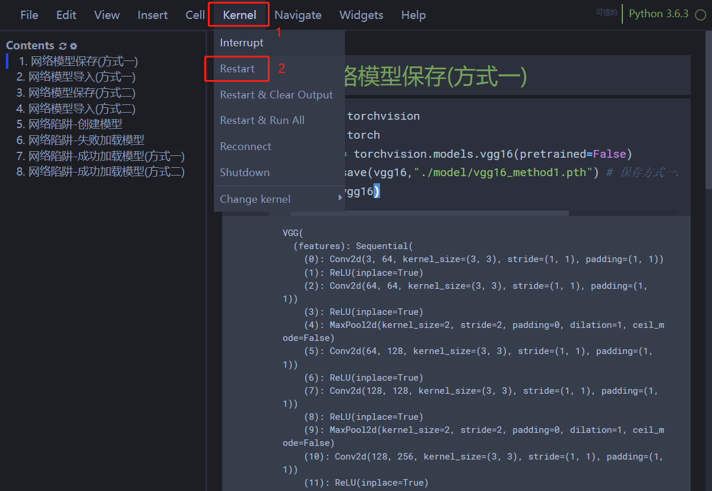

# 1. 网络模型保存(方式一)


```python
import torchvision
import torch
vgg16 = torchvision.models.vgg16(pretrained=False)
torch.save(vgg16,"./model/vgg16_method1.pth") # 保存方式一：模型结构 + 模型参数      
print(vgg16)
```

    VGG(
      (features): Sequential(
        (0): Conv2d(3, 64, kernel_size=(3, 3), stride=(1, 1), padding=(1, 1))
        (1): ReLU(inplace=True)
        (2): Conv2d(64, 64, kernel_size=(3, 3), stride=(1, 1), padding=(1, 1))
        (3): ReLU(inplace=True)
        (4): MaxPool2d(kernel_size=2, stride=2, padding=0, dilation=1, ceil_mode=False)
        (5): Conv2d(64, 128, kernel_size=(3, 3), stride=(1, 1), padding=(1, 1))
        (6): ReLU(inplace=True)
        (7): Conv2d(128, 128, kernel_size=(3, 3), stride=(1, 1), padding=(1, 1))
        (8): ReLU(inplace=True)
        (9): MaxPool2d(kernel_size=2, stride=2, padding=0, dilation=1, ceil_mode=False)
        (10): Conv2d(128, 256, kernel_size=(3, 3), stride=(1, 1), padding=(1, 1))
        (11): ReLU(inplace=True)
        (12): Conv2d(256, 256, kernel_size=(3, 3), stride=(1, 1), padding=(1, 1))
        (13): ReLU(inplace=True)
        (14): Conv2d(256, 256, kernel_size=(3, 3), stride=(1, 1), padding=(1, 1))
        (15): ReLU(inplace=True)
        (16): MaxPool2d(kernel_size=2, stride=2, padding=0, dilation=1, ceil_mode=False)
        (17): Conv2d(256, 512, kernel_size=(3, 3), stride=(1, 1), padding=(1, 1))
        (18): ReLU(inplace=True)
        (19): Conv2d(512, 512, kernel_size=(3, 3), stride=(1, 1), padding=(1, 1))
        (20): ReLU(inplace=True)
        (21): Conv2d(512, 512, kernel_size=(3, 3), stride=(1, 1), padding=(1, 1))
        (22): ReLU(inplace=True)
        (23): MaxPool2d(kernel_size=2, stride=2, padding=0, dilation=1, ceil_mode=False)
        (24): Conv2d(512, 512, kernel_size=(3, 3), stride=(1, 1), padding=(1, 1))
        (25): ReLU(inplace=True)
        (26): Conv2d(512, 512, kernel_size=(3, 3), stride=(1, 1), padding=(1, 1))
        (27): ReLU(inplace=True)
        (28): Conv2d(512, 512, kernel_size=(3, 3), stride=(1, 1), padding=(1, 1))
        (29): ReLU(inplace=True)
        (30): MaxPool2d(kernel_size=2, stride=2, padding=0, dilation=1, ceil_mode=False)
      )
      (avgpool): AdaptiveAvgPool2d(output_size=(7, 7))
      (classifier): Sequential(
        (0): Linear(in_features=25088, out_features=4096, bias=True)
        (1): ReLU(inplace=True)
        (2): Dropout(p=0.5, inplace=False)
        (3): Linear(in_features=4096, out_features=4096, bias=True)
        (4): ReLU(inplace=True)
        (5): Dropout(p=0.5, inplace=False)
        (6): Linear(in_features=4096, out_features=1000, bias=True)
      )
    )
    

# 2. 网络模型导入(方式一)


```python
import torch
model = torch.load("./model/vgg16_method1.pth") # 保存方式一对应的加载模型    
print(model)
```

    VGG(
      (features): Sequential(
        (0): Conv2d(3, 64, kernel_size=(3, 3), stride=(1, 1), padding=(1, 1))
        (1): ReLU(inplace=True)
        (2): Conv2d(64, 64, kernel_size=(3, 3), stride=(1, 1), padding=(1, 1))
        (3): ReLU(inplace=True)
        (4): MaxPool2d(kernel_size=2, stride=2, padding=0, dilation=1, ceil_mode=False)
        (5): Conv2d(64, 128, kernel_size=(3, 3), stride=(1, 1), padding=(1, 1))
        (6): ReLU(inplace=True)
        (7): Conv2d(128, 128, kernel_size=(3, 3), stride=(1, 1), padding=(1, 1))
        (8): ReLU(inplace=True)
        (9): MaxPool2d(kernel_size=2, stride=2, padding=0, dilation=1, ceil_mode=False)
        (10): Conv2d(128, 256, kernel_size=(3, 3), stride=(1, 1), padding=(1, 1))
        (11): ReLU(inplace=True)
        (12): Conv2d(256, 256, kernel_size=(3, 3), stride=(1, 1), padding=(1, 1))
        (13): ReLU(inplace=True)
        (14): Conv2d(256, 256, kernel_size=(3, 3), stride=(1, 1), padding=(1, 1))
        (15): ReLU(inplace=True)
        (16): MaxPool2d(kernel_size=2, stride=2, padding=0, dilation=1, ceil_mode=False)
        (17): Conv2d(256, 512, kernel_size=(3, 3), stride=(1, 1), padding=(1, 1))
        (18): ReLU(inplace=True)
        (19): Conv2d(512, 512, kernel_size=(3, 3), stride=(1, 1), padding=(1, 1))
        (20): ReLU(inplace=True)
        (21): Conv2d(512, 512, kernel_size=(3, 3), stride=(1, 1), padding=(1, 1))
        (22): ReLU(inplace=True)
        (23): MaxPool2d(kernel_size=2, stride=2, padding=0, dilation=1, ceil_mode=False)
        (24): Conv2d(512, 512, kernel_size=(3, 3), stride=(1, 1), padding=(1, 1))
        (25): ReLU(inplace=True)
        (26): Conv2d(512, 512, kernel_size=(3, 3), stride=(1, 1), padding=(1, 1))
        (27): ReLU(inplace=True)
        (28): Conv2d(512, 512, kernel_size=(3, 3), stride=(1, 1), padding=(1, 1))
        (29): ReLU(inplace=True)
        (30): MaxPool2d(kernel_size=2, stride=2, padding=0, dilation=1, ceil_mode=False)
      )
      (avgpool): AdaptiveAvgPool2d(output_size=(7, 7))
      (classifier): Sequential(
        (0): Linear(in_features=25088, out_features=4096, bias=True)
        (1): ReLU(inplace=True)
        (2): Dropout(p=0.5, inplace=False)
        (3): Linear(in_features=4096, out_features=4096, bias=True)
        (4): ReLU(inplace=True)
        (5): Dropout(p=0.5, inplace=False)
        (6): Linear(in_features=4096, out_features=1000, bias=True)
      )
    )
    

# 3. 网络模型保存(方式二)


```python
import torchvision
import torch
vgg16 = torchvision.models.vgg16(pretrained=False)
torch.save(vgg16.state_dict(),"./model/vgg16_method2.pth") # 保存方式二：模型参数（官方推荐）,不再保存网络模型结构  
print(vgg16)
```

    VGG(
      (features): Sequential(
        (0): Conv2d(3, 64, kernel_size=(3, 3), stride=(1, 1), padding=(1, 1))
        (1): ReLU(inplace=True)
        (2): Conv2d(64, 64, kernel_size=(3, 3), stride=(1, 1), padding=(1, 1))
        (3): ReLU(inplace=True)
        (4): MaxPool2d(kernel_size=2, stride=2, padding=0, dilation=1, ceil_mode=False)
        (5): Conv2d(64, 128, kernel_size=(3, 3), stride=(1, 1), padding=(1, 1))
        (6): ReLU(inplace=True)
        (7): Conv2d(128, 128, kernel_size=(3, 3), stride=(1, 1), padding=(1, 1))
        (8): ReLU(inplace=True)
        (9): MaxPool2d(kernel_size=2, stride=2, padding=0, dilation=1, ceil_mode=False)
        (10): Conv2d(128, 256, kernel_size=(3, 3), stride=(1, 1), padding=(1, 1))
        (11): ReLU(inplace=True)
        (12): Conv2d(256, 256, kernel_size=(3, 3), stride=(1, 1), padding=(1, 1))
        (13): ReLU(inplace=True)
        (14): Conv2d(256, 256, kernel_size=(3, 3), stride=(1, 1), padding=(1, 1))
        (15): ReLU(inplace=True)
        (16): MaxPool2d(kernel_size=2, stride=2, padding=0, dilation=1, ceil_mode=False)
        (17): Conv2d(256, 512, kernel_size=(3, 3), stride=(1, 1), padding=(1, 1))
        (18): ReLU(inplace=True)
        (19): Conv2d(512, 512, kernel_size=(3, 3), stride=(1, 1), padding=(1, 1))
        (20): ReLU(inplace=True)
        (21): Conv2d(512, 512, kernel_size=(3, 3), stride=(1, 1), padding=(1, 1))
        (22): ReLU(inplace=True)
        (23): MaxPool2d(kernel_size=2, stride=2, padding=0, dilation=1, ceil_mode=False)
        (24): Conv2d(512, 512, kernel_size=(3, 3), stride=(1, 1), padding=(1, 1))
        (25): ReLU(inplace=True)
        (26): Conv2d(512, 512, kernel_size=(3, 3), stride=(1, 1), padding=(1, 1))
        (27): ReLU(inplace=True)
        (28): Conv2d(512, 512, kernel_size=(3, 3), stride=(1, 1), padding=(1, 1))
        (29): ReLU(inplace=True)
        (30): MaxPool2d(kernel_size=2, stride=2, padding=0, dilation=1, ceil_mode=False)
      )
      (avgpool): AdaptiveAvgPool2d(output_size=(7, 7))
      (classifier): Sequential(
        (0): Linear(in_features=25088, out_features=4096, bias=True)
        (1): ReLU(inplace=True)
        (2): Dropout(p=0.5, inplace=False)
        (3): Linear(in_features=4096, out_features=4096, bias=True)
        (4): ReLU(inplace=True)
        (5): Dropout(p=0.5, inplace=False)
        (6): Linear(in_features=4096, out_features=1000, bias=True)
      )
    )
    

# 4. 网络模型导入(方式二)


```python
import torch
import torchvision
model = torch.load("./model/vgg16_method2.pth") # 导入模型参数   
print(model)
```

    OrderedDict([('features.0.weight', tensor([[[[-0.0040,  0.0626,  0.0621],
              [-0.0136,  0.0981,  0.0697],
              [ 0.0022, -0.0291, -0.0770]],
    
             [[-0.0834,  0.0266,  0.0966],
              [-0.0460, -0.0137, -0.0662],
              [-0.0210,  0.0950,  0.0561]],
    
             [[-0.0502,  0.0219,  0.0184],
              [-0.0760,  0.0086,  0.0012],
              [-0.1154,  0.0661, -0.0271]]],
    
    
            [[[ 0.0185,  0.1026, -0.0609],
              [-0.1181, -0.0330, -0.0959],
              [-0.0051, -0.0306, -0.0252]],
    
             [[-0.0387,  0.0845, -0.0161],
              [-0.0070,  0.0384,  0.0372],
              [-0.0292,  0.0017, -0.0180]],
    
             [[ 0.0043, -0.0387,  0.0904],
              [ 0.0292,  0.0310,  0.0618],
              [-0.0687, -0.0400, -0.0319]]],
    
    
            [[[-0.0853, -0.1003, -0.0753],
              [ 0.0956, -0.0230, -0.0512],
              [-0.0790,  0.0973, -0.0948]],
    
             [[-0.0627,  0.0834,  0.0308],
              [-0.0471, -0.0289,  0.0510],
              [ 0.0272,  0.0454,  0.0243]],
    
             [[ 0.0203,  0.0219,  0.1468],
              [ 0.1805, -0.0544, -0.0677],
              [-0.0661,  0.0018, -0.0775]]],
    
    
            ...,
    
    
            [[[ 0.0975,  0.0102, -0.0031],
              [-0.0713, -0.0369,  0.0412],
              [ 0.0418,  0.1035, -0.0707]],
    
             [[ 0.0715,  0.0932,  0.0417],
              [ 0.0253,  0.0198,  0.0291],
              [-0.0582,  0.0339,  0.0083]],
    
             [[ 0.0047, -0.0141,  0.0356],
              [-0.0075,  0.0874, -0.0623],
              [-0.0803,  0.0384, -0.0279]]],
    
    
            [[[ 0.0279,  0.1049,  0.0093],
              [ 0.0487,  0.0960,  0.0020],
              [-0.0282,  0.0206,  0.0837]],
    
             [[-0.0426,  0.0447, -0.0618],
              [ 0.0219,  0.0134,  0.0645],
              [ 0.0879, -0.0265, -0.0373]],
    
             [[ 0.1272,  0.0632,  0.0462],
              [-0.0101,  0.0410, -0.0651],
              [-0.0053, -0.0628,  0.0121]]],
    
    
            [[[ 0.0049, -0.0038,  0.0085],
              [ 0.0792, -0.0189,  0.0337],
              [ 0.0839,  0.0261,  0.0669]],
    
             [[-0.0059,  0.0361, -0.0233],
              [ 0.1031,  0.0462, -0.0449],
              [-0.0398,  0.0584,  0.0880]],
    
             [[ 0.0970, -0.0274,  0.0102],
              [ 0.0522,  0.0888, -0.0318],
              [ 0.0214, -0.0370, -0.0698]]]])), ('features.0.bias', tensor([0., 0., 0., 0., 0., 0., 0., 0., 0., 0., 0., 0., 0., 0., 0., 0., 0., 0., 0., 0., 0., 0., 0., 0.,
            0., 0., 0., 0., 0., 0., 0., 0., 0., 0., 0., 0., 0., 0., 0., 0., 0., 0., 0., 0., 0., 0., 0., 0.,
            0., 0., 0., 0., 0., 0., 0., 0., 0., 0., 0., 0., 0., 0., 0., 0.])), ('features.2.weight', tensor([[[[-5.0967e-03,  3.4367e-02, -3.3054e-03],
              [ 1.4598e-02,  1.3033e-01,  8.1374e-03],
              [-8.0162e-02,  7.7383e-02,  2.8270e-02]],
    
             [[-1.4885e-02,  4.6058e-02,  1.3956e-02],
              [-3.9590e-02,  2.1446e-02, -7.1749e-02],
              [ 4.3048e-03, -5.1860e-03, -3.2426e-03]],
    
             [[-4.7485e-03, -5.8750e-02, -3.9225e-02],
              [ 5.3058e-02,  4.3474e-02,  3.7377e-02],
              [-5.4272e-02,  5.0986e-02, -6.5362e-03]],
    
             ...,
    
             [[ 3.4790e-02,  3.4280e-02,  3.7325e-02],
              [ 8.3817e-04,  2.3898e-04,  6.0374e-02],
              [-7.9998e-02,  4.2538e-02,  3.9728e-02]],
    
             [[ 4.9162e-02,  3.5074e-02, -5.9139e-02],
              [-6.9303e-03,  1.3166e-02, -1.8707e-02],
              [ 6.8836e-02, -8.7236e-02, -3.9377e-02]],
    
             [[ 1.0358e-02,  3.4845e-02,  2.4139e-02],
              [ 3.8719e-02,  2.2152e-02, -4.6146e-02],
              [ 2.4336e-02,  7.0200e-02,  3.9884e-02]]],
    
    
            [[[-2.3998e-02, -4.6025e-02, -1.1408e-02],
              [ 1.7735e-02, -2.5891e-03,  4.0926e-02],
              [ 2.2270e-02,  2.7152e-02,  1.2580e-02]],
    
             [[-9.9553e-03, -3.8664e-02,  5.8608e-02],
              [-6.3725e-02,  6.8370e-02, -1.3848e-02],
              [ 1.4720e-02,  6.9760e-02,  3.6311e-03]],
    
             [[ 8.0472e-03,  5.7496e-02, -3.2233e-02],
              [-1.8367e-02, -6.5699e-02, -2.5250e-02],
              [ 6.3503e-02,  1.6145e-02,  1.0705e-01]],
    
             ...,
    
             [[-5.8280e-02, -1.1586e-02,  4.5907e-02],
              [-1.7476e-02, -2.7693e-02, -3.6684e-02],
              [ 6.6822e-03,  4.8410e-02,  3.5693e-02]],
    
             [[ 1.0239e-01,  1.5463e-01,  3.3202e-02],
              [-8.7305e-03,  6.3578e-02,  5.1896e-02],
              [ 9.8891e-02,  3.4662e-02,  1.3262e-01]],
    
             [[ 1.9356e-02,  2.3273e-02, -3.9040e-02],
              [-2.0945e-02,  7.2473e-02, -8.2880e-02],
              [-7.2948e-02, -3.8305e-02, -7.2308e-02]]],
    
    
            [[[ 8.6159e-02,  3.3536e-02, -5.1061e-02],
              [-2.1509e-02, -8.0831e-03,  1.2278e-02],
              [ 5.7887e-02,  3.7741e-02, -4.3882e-02]],
    
             [[ 8.6380e-02, -1.6426e-02,  1.9811e-02],
              [ 7.2714e-02,  4.8379e-02,  3.8398e-02],
              [-9.0779e-02, -1.3111e-01, -2.3699e-02]],
    
             [[ 8.5638e-02,  5.8435e-03, -5.3302e-03],
              [ 6.6348e-02, -3.7983e-02, -7.9441e-02],
              [ 2.7901e-02, -3.4243e-02,  8.3240e-03]],
    
             ...,
    
             [[ 3.8307e-02,  1.5580e-02, -8.1724e-02],
              [ 1.0553e-01, -6.3641e-02,  9.2080e-03],
              [-3.2122e-03,  9.3782e-02,  4.8964e-02]],
    
             [[ 1.3627e-02, -1.0449e-01,  8.6183e-03],
              [ 7.7844e-02,  5.5644e-02,  1.4909e-03],
              [ 3.2584e-02, -2.1830e-02, -3.0474e-02]],
    
             [[ 6.7886e-02, -2.0512e-02, -1.1325e-02],
              [-4.1406e-02,  8.7536e-02, -4.6433e-02],
              [ 3.8628e-03, -7.9638e-02, -8.5177e-03]]],
    
    
            ...,
    
    
            [[[-1.3447e-01,  7.6999e-02,  1.3819e-01],
              [-3.4482e-03,  3.6168e-02,  8.6888e-02],
              [-6.1376e-02, -4.7030e-02, -2.1683e-02]],
    
             [[ 6.1050e-02, -2.0326e-02,  1.7210e-04],
              [ 1.1920e-01, -1.3982e-01,  2.5464e-02],
              [-2.1845e-03, -3.6796e-02, -4.0025e-02]],
    
             [[-5.2059e-02,  2.8119e-02, -6.0796e-02],
              [ 7.8354e-02,  3.0191e-02,  1.0595e-01],
              [ 2.8620e-02,  6.9772e-03,  6.8883e-02]],
    
             ...,
    
             [[-1.7497e-02,  7.1148e-02, -4.0866e-02],
              [-8.2038e-02,  8.6979e-03, -9.1651e-03],
              [ 2.5035e-02, -8.9589e-02, -4.5515e-03]],
    
             [[ 3.6921e-02,  3.9946e-02,  1.0042e-01],
              [ 1.5761e-02, -2.9576e-02,  8.9088e-03],
              [ 7.1609e-02, -4.0912e-02, -3.9656e-02]],
    
             [[-6.6821e-02,  6.9773e-02,  3.2577e-02],
              [ 1.8143e-01, -3.6483e-02, -7.0825e-02],
              [-1.4579e-01,  1.4954e-01,  9.6300e-03]]],
    
    
            [[[-7.1204e-02, -2.4612e-02,  1.1590e-02],
              [-3.6893e-03,  2.3576e-02, -3.6828e-02],
              [-1.2422e-02,  1.7466e-02, -1.7121e-02]],
    
             [[ 5.3783e-02, -3.9715e-02,  3.1925e-02],
              [-5.4467e-02,  5.2707e-02, -4.3558e-02],
              [-5.7051e-02,  1.0501e-01, -1.4250e-02]],
    
             [[ 4.3103e-02,  8.2510e-03,  1.5530e-02],
              [-5.1402e-02,  2.3176e-02, -5.8602e-02],
              [ 9.6317e-02,  3.6468e-02,  5.0107e-02]],
    
             ...,
    
             [[-1.6779e-03, -1.5342e-02,  1.6849e-01],
              [-5.4935e-02, -7.3766e-02,  9.4189e-02],
              [ 7.6479e-02, -2.8278e-02,  1.7094e-02]],
    
             [[ 3.2554e-03,  6.2916e-03, -4.5004e-02],
              [-8.4192e-02,  7.4603e-02,  5.2246e-03],
              [ 4.0496e-02, -7.2485e-03, -7.6363e-02]],
    
             [[ 1.0459e-02,  1.0689e-01,  5.2779e-02],
              [-2.2706e-02, -1.3479e-02,  2.9088e-02],
              [-5.6618e-03,  3.6200e-02, -6.4712e-02]]],
    
    
            [[[-3.5881e-02, -4.5090e-02,  3.5317e-02],
              [ 1.2177e-01, -6.4123e-02, -5.4346e-02],
              [ 1.2016e-01, -1.3192e-01,  6.4105e-03]],
    
             [[ 6.8677e-02,  9.9664e-03,  2.7289e-02],
              [-8.2896e-02,  6.3473e-02,  3.6986e-02],
              [-1.0164e-02,  1.4043e-02,  1.0922e-02]],
    
             [[ 1.2712e-01,  2.3604e-03,  6.9012e-02],
              [ 3.9896e-02, -5.4565e-03, -2.4938e-02],
              [ 7.4982e-03, -2.2892e-03, -5.2376e-02]],
    
             ...,
    
             [[-2.9649e-03, -4.9510e-02,  3.9255e-02],
              [ 1.2340e-02,  6.5017e-02, -9.2098e-02],
              [ 3.9627e-02, -7.2954e-02, -9.8100e-02]],
    
             [[-2.0009e-02,  8.6935e-02,  1.1596e-02],
              [-3.6258e-02, -9.6375e-02,  5.8322e-02],
              [-5.5336e-02, -2.0238e-02, -1.9975e-02]],
    
             [[-9.0217e-02,  6.3687e-03,  3.2319e-02],
              [ 3.1559e-02,  3.4944e-02,  3.8751e-02],
              [-4.8232e-02,  2.0484e-02,  7.2250e-02]]]])), ('features.2.bias', tensor([0., 0., 0., 0., 0., 0., 0., 0., 0., 0., 0., 0., 0., 0., 0., 0., 0., 0., 0., 0., 0., 0., 0., 0.,
            0., 0., 0., 0., 0., 0., 0., 0., 0., 0., 0., 0., 0., 0., 0., 0., 0., 0., 0., 0., 0., 0., 0., 0.,
            0., 0., 0., 0., 0., 0., 0., 0., 0., 0., 0., 0., 0., 0., 0., 0.])), ('features.5.weight', tensor([[[[-1.6845e-02, -1.0685e-01, -1.9016e-02],
              [-4.0771e-02, -5.7696e-02,  2.1114e-02],
              [ 2.0548e-02, -5.5974e-03,  5.6080e-03]],
    
             [[ 6.8871e-03, -4.3420e-02, -1.5478e-02],
              [-2.4453e-03,  6.5895e-02,  4.2433e-02],
              [-5.6135e-02,  4.3798e-02, -7.2255e-02]],
    
             [[-2.1576e-02, -7.3287e-02,  2.0999e-02],
              [-2.4178e-02,  4.6556e-02,  3.9748e-02],
              [-2.3140e-02,  4.0290e-02, -1.4403e-02]],
    
             ...,
    
             [[-3.3937e-02, -2.3407e-02, -4.4383e-02],
              [-1.8374e-03, -1.4892e-02, -1.7407e-02],
              [-8.9755e-02,  4.6855e-02,  6.1854e-02]],
    
             [[ 5.0991e-03,  5.8257e-03,  8.1091e-03],
              [ 5.6942e-03,  1.0450e-02, -1.9471e-02],
              [-8.8708e-03, -1.4913e-03,  2.1217e-02]],
    
             [[-8.5076e-03, -6.4368e-02,  5.8725e-02],
              [-1.2360e-02, -3.6534e-02, -7.6520e-02],
              [-4.1804e-02, -3.0106e-03,  5.1361e-02]]],
    
    
            [[[-4.7883e-02,  3.2690e-02, -1.1968e-01],
              [ 7.4948e-03,  7.6867e-03, -3.6578e-02],
              [-5.4545e-02,  5.5767e-02, -4.1923e-02]],
    
             [[ 2.9558e-02,  9.1250e-02, -1.0920e-02],
              [ 9.5925e-02,  3.4172e-02, -1.4910e-03],
              [ 4.0714e-02,  1.3492e-02, -1.8082e-02]],
    
             [[-9.3981e-02,  8.3762e-02,  6.8351e-02],
              [-7.8416e-07, -2.6295e-02, -6.9567e-02],
              [ 1.4003e-03, -5.9799e-02, -1.4097e-02]],
    
             ...,
    
             [[-4.8867e-04, -1.9486e-02,  3.4474e-02],
              [ 3.3604e-03,  4.9501e-02,  5.0248e-02],
              [ 2.4823e-02,  3.7960e-03,  4.1527e-03]],
    
             [[-1.1954e-02,  9.8916e-02, -4.0785e-02],
              [ 1.8485e-02,  5.8540e-02, -3.3567e-02],
              [ 6.8485e-03,  6.5336e-03,  2.0277e-02]],
    
             [[-5.1216e-02, -4.4505e-03, -5.0881e-02],
              [ 9.8800e-03,  5.7562e-02,  1.9344e-03],
              [ 1.1611e-02,  6.4607e-02,  5.0608e-02]]],
    
    
            [[[-2.6574e-02, -5.2637e-02, -1.3057e-02],
              [-1.0529e-02, -4.7554e-03,  4.2363e-02],
              [ 8.3547e-03,  3.8820e-02,  4.0855e-02]],
    
             [[ 1.5201e-02, -1.9904e-02,  5.4074e-02],
              [ 1.0332e-02,  2.0081e-02, -2.4755e-02],
              [ 6.6083e-03,  3.1107e-02,  6.0943e-02]],
    
             [[-7.4712e-04,  7.0752e-02, -5.0204e-02],
              [ 1.8501e-02, -8.1171e-02, -5.7294e-02],
              [ 1.1551e-02, -1.0214e-02, -3.3065e-02]],
    
             ...,
    
             [[ 3.3251e-02, -3.8949e-03,  4.0356e-02],
              [-1.9558e-02, -2.6764e-02, -4.5825e-02],
              [-6.9413e-02, -1.1659e-02,  5.3435e-02]],
    
             [[-3.5886e-02, -6.9062e-02, -1.4150e-02],
              [-4.2965e-03,  3.1434e-02,  1.6749e-02],
              [-7.4841e-02, -1.5540e-02,  1.4498e-02]],
    
             [[-8.9744e-02,  2.5439e-02, -1.7950e-02],
              [ 5.8040e-03, -7.1988e-03,  2.0197e-02],
              [ 2.7738e-03, -6.7781e-03, -5.4573e-03]]],
    
    
            ...,
    
    
            [[[ 4.8793e-02, -1.2443e-01,  5.6230e-02],
              [ 5.4340e-02, -2.4749e-02, -9.3755e-02],
              [ 4.4037e-02,  4.6690e-02, -6.1507e-02]],
    
             [[ 6.2611e-02, -9.2848e-02, -1.1951e-02],
              [ 4.4748e-02, -2.8345e-02, -3.7050e-02],
              [ 2.7511e-02,  4.6124e-02,  5.2023e-04]],
    
             [[-8.3013e-03, -6.6051e-02,  2.3519e-02],
              [ 6.4089e-02,  5.3219e-03, -7.3947e-02],
              [-1.6804e-02, -1.3326e-02,  2.9840e-02]],
    
             ...,
    
             [[-2.7150e-02, -2.3912e-02,  9.1024e-04],
              [-7.8841e-02, -7.8879e-03, -3.6640e-02],
              [ 5.6850e-02, -6.2762e-02,  4.0041e-02]],
    
             [[ 4.0942e-02, -5.0532e-02, -3.5082e-03],
              [-1.2446e-02, -7.2972e-03,  5.4511e-02],
              [ 2.2139e-02,  3.7367e-02,  1.0818e-02]],
    
             [[ 6.6964e-02,  7.9205e-02,  5.2526e-03],
              [ 9.9897e-04, -1.8235e-02, -1.7508e-02],
              [-7.4133e-02,  8.4607e-02, -5.9689e-02]]],
    
    
            [[[ 1.4014e-02, -6.4376e-03,  1.0238e-01],
              [ 3.9943e-02,  3.0789e-02,  2.2751e-02],
              [-3.1029e-02, -6.4760e-03,  1.2187e-02]],
    
             [[-4.0816e-02,  1.3366e-02, -1.8475e-02],
              [-1.2873e-02,  1.4428e-02,  2.4813e-02],
              [-6.0089e-02, -4.5110e-02,  9.7072e-02]],
    
             [[ 2.7788e-02,  5.8143e-02, -8.1053e-02],
              [-9.4185e-02,  4.3911e-02,  1.4786e-02],
              [-5.9971e-02,  5.0475e-03,  7.5542e-02]],
    
             ...,
    
             [[-3.0509e-02, -5.8688e-03, -2.0998e-02],
              [ 1.3212e-02, -1.4315e-02, -6.5248e-03],
              [ 2.0988e-02, -8.3028e-03,  1.7778e-02]],
    
             [[ 4.7199e-02, -7.2342e-03, -5.4981e-02],
              [-1.5243e-02,  1.2786e-02,  9.1879e-03],
              [-6.2633e-02,  2.3393e-03, -4.3369e-02]],
    
             [[-2.7164e-03, -1.5981e-02,  2.6972e-02],
              [-3.0921e-02, -4.5976e-02,  5.9593e-02],
              [ 1.6963e-02, -1.7145e-02, -3.8508e-02]]],
    
    
            [[[-6.7551e-02,  4.1432e-02,  1.9528e-03],
              [ 2.1630e-02, -9.2737e-03,  2.2153e-02],
              [ 1.4565e-02,  1.5579e-02, -6.9521e-03]],
    
             [[-5.2629e-02, -3.9016e-02,  1.1322e-02],
              [-1.2009e-02, -1.4198e-02,  3.9765e-02],
              [-5.0205e-02, -9.8466e-03,  1.2447e-01]],
    
             [[-2.6800e-02, -3.8423e-02,  2.4708e-02],
              [ 4.0333e-02,  1.7371e-02, -3.7618e-02],
              [ 6.0461e-02, -7.8246e-02, -3.5205e-02]],
    
             ...,
    
             [[-3.4621e-02, -1.0087e-02, -1.3495e-02],
              [-2.7295e-02,  1.4385e-02, -2.1532e-02],
              [-9.2936e-02,  6.6351e-03,  3.9207e-02]],
    
             [[ 6.3188e-02, -9.6902e-03, -3.2196e-02],
              [-7.4361e-02,  1.3412e-02, -8.7307e-02],
              [ 3.6398e-02,  5.8884e-03,  2.5468e-02]],
    
             [[-2.6443e-02, -2.1899e-02,  1.1427e-02],
              [ 3.0319e-02,  1.5830e-02,  6.4152e-02],
              [ 1.7392e-02,  2.1851e-02, -9.5525e-03]]]])), ('features.5.bias', tensor([0., 0., 0., 0., 0., 0., 0., 0., 0., 0., 0., 0., 0., 0., 0., 0., 0., 0., 0., 0., 0., 0., 0., 0.,
            0., 0., 0., 0., 0., 0., 0., 0., 0., 0., 0., 0., 0., 0., 0., 0., 0., 0., 0., 0., 0., 0., 0., 0.,
            0., 0., 0., 0., 0., 0., 0., 0., 0., 0., 0., 0., 0., 0., 0., 0., 0., 0., 0., 0., 0., 0., 0., 0.,
            0., 0., 0., 0., 0., 0., 0., 0., 0., 0., 0., 0., 0., 0., 0., 0., 0., 0., 0., 0., 0., 0., 0., 0.,
            0., 0., 0., 0., 0., 0., 0., 0., 0., 0., 0., 0., 0., 0., 0., 0., 0., 0., 0., 0., 0., 0., 0., 0.,
            0., 0., 0., 0., 0., 0., 0., 0.])), ('features.7.weight', tensor([[[[-0.0009, -0.0097, -0.0052],
              [ 0.0226,  0.0209, -0.0283],
              [-0.0049,  0.0122,  0.0340]],
    
             [[-0.0763,  0.0575, -0.0353],
              [ 0.0481,  0.0477, -0.0262],
              [ 0.0011,  0.0030,  0.0356]],
    
             [[-0.0074, -0.0570, -0.0145],
              [ 0.0834,  0.0309, -0.0260],
              [-0.0011, -0.0459,  0.0701]],
    
             ...,
    
             [[ 0.0199,  0.0045, -0.0193],
              [ 0.0426,  0.0048, -0.0176],
              [-0.0523, -0.0366, -0.0852]],
    
             [[-0.0447, -0.0055, -0.0381],
              [ 0.0649,  0.0381,  0.0897],
              [-0.0223,  0.0154,  0.0444]],
    
             [[-0.0191,  0.0063, -0.0424],
              [-0.0056,  0.0208, -0.0355],
              [ 0.0278,  0.0031, -0.0263]]],
    
    
            [[[ 0.0138,  0.0183,  0.0423],
              [ 0.0305, -0.0381,  0.0563],
              [-0.0138, -0.0005, -0.0121]],
    
             [[ 0.0160,  0.0961, -0.0536],
              [ 0.0022, -0.1074,  0.0094],
              [ 0.0515, -0.0395, -0.0156]],
    
             [[-0.0551,  0.0075, -0.0298],
              [ 0.0073,  0.0143, -0.0008],
              [ 0.0121, -0.0247, -0.0415]],
    
             ...,
    
             [[-0.0464,  0.0025, -0.0408],
              [ 0.0241, -0.0696, -0.0228],
              [ 0.0040,  0.0102,  0.0645]],
    
             [[-0.0150, -0.0231,  0.0076],
              [ 0.0274, -0.0311, -0.0193],
              [ 0.0187, -0.0443,  0.0070]],
    
             [[-0.0388, -0.0249, -0.0264],
              [-0.0320, -0.0190,  0.0386],
              [ 0.0029,  0.0226, -0.0259]]],
    
    
            [[[-0.0197, -0.0155,  0.0247],
              [ 0.0601,  0.0684,  0.0226],
              [ 0.0025,  0.0025,  0.0069]],
    
             [[ 0.0510, -0.0010,  0.0220],
              [ 0.0536, -0.0260, -0.0596],
              [ 0.0303, -0.0510,  0.0541]],
    
             [[ 0.0065, -0.0182, -0.0227],
              [-0.1175,  0.0134,  0.0136],
              [ 0.0093,  0.0149,  0.0650]],
    
             ...,
    
             [[-0.0017,  0.0760,  0.0686],
              [-0.0309,  0.0132, -0.0505],
              [ 0.0142,  0.0115, -0.0117]],
    
             [[-0.0545, -0.0018,  0.0043],
              [-0.0186,  0.0522, -0.0354],
              [ 0.0448, -0.0407, -0.0293]],
    
             [[-0.0131,  0.0208, -0.0651],
              [-0.0128,  0.0070, -0.0864],
              [ 0.0401, -0.0471, -0.0563]]],
    
    
            ...,
    
    
            [[[ 0.0332, -0.0254,  0.0084],
              [ 0.0414, -0.0523, -0.0607],
              [-0.0188,  0.0566, -0.0716]],
    
             [[ 0.0117,  0.0438, -0.0052],
              [ 0.0717,  0.0251,  0.0219],
              [-0.0554, -0.0016, -0.0135]],
    
             [[-0.0211, -0.0134, -0.0029],
              [ 0.0575, -0.0432, -0.0373],
              [ 0.0049, -0.0247,  0.0192]],
    
             ...,
    
             [[-0.0056,  0.0504,  0.0763],
              [-0.0330, -0.0364, -0.0314],
              [-0.0214, -0.0348,  0.0211]],
    
             [[-0.0115, -0.0374,  0.0148],
              [-0.0239, -0.0055, -0.0294],
              [ 0.0137,  0.0110, -0.0205]],
    
             [[-0.0051,  0.0675, -0.0086],
              [ 0.0554,  0.0452,  0.0231],
              [-0.0414, -0.0588,  0.0117]]],
    
    
            [[[-0.0470, -0.0322,  0.0769],
              [-0.0403, -0.0146,  0.0244],
              [ 0.0405, -0.0096, -0.0226]],
    
             [[ 0.0369, -0.0128,  0.0712],
              [ 0.0043, -0.0395, -0.0055],
              [ 0.0360, -0.0642,  0.0103]],
    
             [[ 0.0140, -0.0003, -0.0559],
              [-0.0124, -0.0628,  0.0264],
              [-0.0352, -0.0161, -0.0200]],
    
             ...,
    
             [[ 0.0253, -0.0426,  0.0587],
              [ 0.0254,  0.0539, -0.0397],
              [-0.0063,  0.0802,  0.0291]],
    
             [[ 0.0275,  0.0676, -0.0545],
              [ 0.0103,  0.0079,  0.0741],
              [ 0.0142, -0.0602,  0.0417]],
    
             [[-0.0629,  0.0293, -0.0091],
              [ 0.0653, -0.0721,  0.0061],
              [ 0.0559,  0.0070, -0.0338]]],
    
    
            [[[ 0.0092,  0.1018, -0.0669],
              [-0.0512, -0.0908, -0.0461],
              [ 0.0548, -0.0533, -0.0218]],
    
             [[ 0.0139,  0.1083,  0.0606],
              [ 0.0011,  0.0047,  0.0601],
              [ 0.0275, -0.0539,  0.0217]],
    
             [[-0.0426,  0.0213,  0.0151],
              [ 0.0049,  0.0383, -0.0227],
              [ 0.0320,  0.0410,  0.0114]],
    
             ...,
    
             [[ 0.0171,  0.0924, -0.0114],
              [ 0.0497,  0.0451, -0.0551],
              [-0.0154,  0.0731,  0.0349]],
    
             [[ 0.0390, -0.0142,  0.0398],
              [-0.0361, -0.0388,  0.0453],
              [ 0.0268,  0.0564, -0.0554]],
    
             [[ 0.0293, -0.0402, -0.0053],
              [-0.0085, -0.0098,  0.0241],
              [ 0.0413,  0.0127,  0.1125]]]])), ('features.7.bias', tensor([0., 0., 0., 0., 0., 0., 0., 0., 0., 0., 0., 0., 0., 0., 0., 0., 0., 0., 0., 0., 0., 0., 0., 0.,
            0., 0., 0., 0., 0., 0., 0., 0., 0., 0., 0., 0., 0., 0., 0., 0., 0., 0., 0., 0., 0., 0., 0., 0.,
            0., 0., 0., 0., 0., 0., 0., 0., 0., 0., 0., 0., 0., 0., 0., 0., 0., 0., 0., 0., 0., 0., 0., 0.,
            0., 0., 0., 0., 0., 0., 0., 0., 0., 0., 0., 0., 0., 0., 0., 0., 0., 0., 0., 0., 0., 0., 0., 0.,
            0., 0., 0., 0., 0., 0., 0., 0., 0., 0., 0., 0., 0., 0., 0., 0., 0., 0., 0., 0., 0., 0., 0., 0.,
            0., 0., 0., 0., 0., 0., 0., 0.])), ('features.10.weight', tensor([[[[-1.6301e-02,  1.5723e-02,  2.2213e-02],
              [ 7.0434e-03,  1.0430e-02, -2.4614e-02],
              [ 4.5814e-02, -4.0377e-02, -4.6300e-05]],
    
             [[ 3.5146e-02, -2.3861e-02,  5.0317e-02],
              [-3.3528e-02, -3.1876e-02,  2.3181e-03],
              [-1.9622e-02,  7.9993e-03, -1.5073e-02]],
    
             [[ 1.5858e-02, -2.2817e-03,  6.6194e-02],
              [ 2.9530e-02, -4.0229e-03,  4.9325e-03],
              [ 3.3475e-02,  1.2883e-02, -3.6886e-02]],
    
             ...,
    
             [[ 5.1681e-03, -4.3423e-02,  1.2275e-02],
              [ 1.5410e-02, -7.1348e-02, -9.8663e-03],
              [ 2.9002e-02,  5.2903e-02, -3.3698e-02]],
    
             [[ 1.0350e-02,  3.1639e-03, -3.5457e-02],
              [-1.5688e-02, -6.4420e-03,  3.6922e-03],
              [-1.3424e-02,  1.1276e-02, -2.6957e-02]],
    
             [[ 3.2148e-02,  5.9213e-03, -3.2808e-02],
              [ 3.3110e-02,  4.2304e-02,  7.3805e-03],
              [ 1.5489e-02,  6.0318e-02, -5.4276e-05]]],
    
    
            [[[ 7.6372e-03,  6.2856e-03, -3.1582e-03],
              [ 3.4309e-02,  2.6893e-02,  8.2893e-02],
              [-5.4699e-03, -3.8227e-02,  9.1198e-03]],
    
             [[ 1.2732e-02, -2.6621e-03,  1.8523e-02],
              [-2.0694e-02, -5.0768e-02, -4.6196e-02],
              [ 1.5320e-02, -1.4359e-02,  1.3955e-03]],
    
             [[-3.0972e-02, -6.5104e-02,  5.4235e-03],
              [ 1.2548e-02, -3.0074e-02,  4.7686e-02],
              [-6.5457e-03, -8.5193e-03,  1.3332e-02]],
    
             ...,
    
             [[ 2.1748e-02,  9.0542e-03, -1.9108e-02],
              [-3.6996e-02,  4.2510e-03, -1.0468e-02],
              [ 4.1154e-02,  3.9580e-03,  6.6217e-02]],
    
             [[-9.1077e-03, -1.2434e-02, -5.0923e-02],
              [-6.0464e-02, -7.0997e-03, -2.1361e-02],
              [-2.5163e-02, -1.1328e-02, -2.1608e-02]],
    
             [[-6.9573e-02, -2.9997e-02, -5.1580e-03],
              [ 2.7220e-02,  4.4438e-02, -6.9184e-03],
              [ 3.3790e-03,  2.1869e-02,  7.0468e-03]]],
    
    
            [[[-9.3929e-03, -5.6161e-02,  4.5910e-03],
              [-2.1555e-02,  1.4207e-02,  1.9662e-02],
              [ 6.9627e-03, -2.7294e-03,  1.4370e-02]],
    
             [[-1.2854e-02,  1.8041e-02, -6.8088e-03],
              [ 8.2965e-03, -4.1073e-02,  7.2826e-03],
              [ 6.8021e-03,  5.5811e-02, -6.0655e-02]],
    
             [[ 1.1114e-02, -3.4479e-02,  8.8665e-03],
              [-2.7550e-02,  2.4705e-02,  3.1717e-02],
              [ 4.5033e-02, -1.7837e-02, -6.3636e-03]],
    
             ...,
    
             [[-1.7500e-02, -2.1528e-02, -2.3073e-02],
              [ 8.5835e-02,  8.0659e-03, -1.4303e-02],
              [-4.0024e-02,  8.0889e-03,  4.4118e-02]],
    
             [[-7.9510e-03, -7.0887e-03,  1.3038e-03],
              [ 1.2916e-02, -2.5778e-02, -1.4068e-02],
              [ 1.0659e-02, -2.8650e-02,  2.1034e-02]],
    
             [[-5.0782e-03, -1.3186e-02, -3.5718e-03],
              [-6.5745e-03, -7.7420e-03,  1.1698e-02],
              [-1.4453e-02,  3.8702e-02, -3.1054e-02]]],
    
    
            ...,
    
    
            [[[ 5.0301e-03, -9.7216e-03,  1.7484e-02],
              [ 9.6460e-03, -2.7259e-02, -1.7556e-02],
              [-6.9825e-02,  2.2149e-02, -3.0936e-02]],
    
             [[-5.1041e-03,  3.5343e-02,  2.6422e-02],
              [-5.6289e-02,  4.2806e-03, -9.8188e-03],
              [ 6.5332e-03,  1.1139e-02,  2.5728e-03]],
    
             [[ 3.1130e-03,  6.7890e-02, -3.7637e-02],
              [-5.7234e-03, -1.9663e-03,  6.4152e-02],
              [-1.0372e-02, -2.9223e-04, -4.5012e-03]],
    
             ...,
    
             [[ 3.4085e-02,  4.6164e-02, -1.2976e-02],
              [-3.6200e-02, -3.5609e-03,  6.6707e-03],
              [ 2.4169e-03, -1.2879e-02,  4.8946e-03]],
    
             [[-3.5643e-02, -9.3007e-03,  3.7359e-02],
              [ 5.6588e-02,  2.8930e-02,  2.1133e-02],
              [-3.3802e-02,  3.7683e-02, -1.5671e-02]],
    
             [[ 2.7070e-02,  9.6756e-03, -3.7091e-02],
              [-1.8906e-02,  6.9338e-03,  1.3660e-02],
              [-2.5104e-02, -1.9228e-02, -4.7423e-02]]],
    
    
            [[[ 5.3455e-03,  2.0286e-02, -3.6078e-02],
              [ 3.0726e-02, -9.0631e-03,  1.2084e-02],
              [ 5.6826e-02, -1.7140e-02,  2.9423e-02]],
    
             [[-2.2433e-02, -2.8241e-02,  4.9160e-02],
              [ 2.4028e-02,  1.2931e-03, -2.0102e-02],
              [ 2.3908e-03,  1.6905e-02, -4.6883e-02]],
    
             [[-3.5577e-03, -1.2487e-02,  8.8736e-03],
              [ 1.9924e-02,  2.7390e-02, -4.6984e-03],
              [ 3.0983e-03,  2.1590e-03, -4.1306e-02]],
    
             ...,
    
             [[-5.6563e-02, -6.9496e-03, -5.6173e-02],
              [ 3.8030e-02,  2.0228e-02, -5.5874e-02],
              [ 1.4470e-02,  2.8284e-02, -1.1127e-02]],
    
             [[-1.1503e-02, -2.4831e-02,  3.6596e-05],
              [ 6.6263e-02, -1.1711e-02,  1.3313e-02],
              [ 1.5417e-02,  2.5769e-02,  2.6070e-02]],
    
             [[ 2.1600e-02,  2.3356e-02, -4.1774e-02],
              [-2.0231e-02, -3.9715e-03,  4.8572e-02],
              [ 1.7589e-02,  2.1279e-02, -3.6524e-03]]],
    
    
            [[[ 1.6823e-02,  4.5860e-03,  3.3993e-02],
              [ 1.4404e-03, -4.6863e-02, -3.0394e-02],
              [ 3.0587e-03, -2.7744e-02, -1.7136e-02]],
    
             [[-3.1088e-02, -9.9505e-03,  2.5928e-02],
              [-9.1595e-03, -3.2550e-03, -4.7121e-02],
              [-2.3575e-02,  6.0134e-03, -2.8216e-02]],
    
             [[-9.2265e-03,  4.4091e-02, -1.1896e-02],
              [-2.1218e-02,  7.2980e-02, -2.5645e-05],
              [-9.0518e-03, -5.4708e-03,  2.2235e-02]],
    
             ...,
    
             [[-1.8146e-02,  1.6014e-02, -2.7613e-02],
              [-2.5561e-02,  1.1339e-02, -7.8230e-02],
              [-4.4913e-03, -6.5597e-02,  1.0493e-02]],
    
             [[-7.7071e-03, -1.4544e-02,  3.4069e-02],
              [ 6.5240e-03, -8.2708e-03,  1.2449e-02],
              [-1.5477e-03,  3.8391e-02,  3.8075e-02]],
    
             [[-2.1861e-02, -2.9599e-02, -1.0949e-02],
              [-1.2008e-02, -5.5547e-02,  4.7687e-02],
              [ 1.5555e-02, -2.3257e-02,  3.0098e-02]]]])), ('features.10.bias', tensor([0., 0., 0., 0., 0., 0., 0., 0., 0., 0., 0., 0., 0., 0., 0., 0., 0., 0., 0., 0., 0., 0., 0., 0.,
            0., 0., 0., 0., 0., 0., 0., 0., 0., 0., 0., 0., 0., 0., 0., 0., 0., 0., 0., 0., 0., 0., 0., 0.,
            0., 0., 0., 0., 0., 0., 0., 0., 0., 0., 0., 0., 0., 0., 0., 0., 0., 0., 0., 0., 0., 0., 0., 0.,
            0., 0., 0., 0., 0., 0., 0., 0., 0., 0., 0., 0., 0., 0., 0., 0., 0., 0., 0., 0., 0., 0., 0., 0.,
            0., 0., 0., 0., 0., 0., 0., 0., 0., 0., 0., 0., 0., 0., 0., 0., 0., 0., 0., 0., 0., 0., 0., 0.,
            0., 0., 0., 0., 0., 0., 0., 0., 0., 0., 0., 0., 0., 0., 0., 0., 0., 0., 0., 0., 0., 0., 0., 0.,
            0., 0., 0., 0., 0., 0., 0., 0., 0., 0., 0., 0., 0., 0., 0., 0., 0., 0., 0., 0., 0., 0., 0., 0.,
            0., 0., 0., 0., 0., 0., 0., 0., 0., 0., 0., 0., 0., 0., 0., 0., 0., 0., 0., 0., 0., 0., 0., 0.,
            0., 0., 0., 0., 0., 0., 0., 0., 0., 0., 0., 0., 0., 0., 0., 0., 0., 0., 0., 0., 0., 0., 0., 0.,
            0., 0., 0., 0., 0., 0., 0., 0., 0., 0., 0., 0., 0., 0., 0., 0., 0., 0., 0., 0., 0., 0., 0., 0.,
            0., 0., 0., 0., 0., 0., 0., 0., 0., 0., 0., 0., 0., 0., 0., 0.])), ('features.12.weight', tensor([[[[ 4.6608e-04,  3.6763e-02, -8.0021e-03],
              [ 2.9457e-02, -4.5732e-02, -4.9117e-03],
              [ 9.7318e-03,  3.6977e-03,  1.1673e-02]],
    
             [[ 2.4967e-02, -4.4115e-03, -2.0735e-03],
              [-1.0146e-02, -9.0759e-03, -3.8275e-02],
              [-2.4111e-03,  3.8273e-02, -7.3988e-03]],
    
             [[ 3.1437e-02, -1.2001e-02, -8.0460e-03],
              [ 1.3069e-02,  3.8044e-02,  2.7390e-02],
              [-1.0920e-02, -2.8289e-02, -4.5825e-02]],
    
             ...,
    
             [[-5.1038e-02,  1.7124e-02,  2.3587e-03],
              [-2.1354e-03, -2.3763e-02, -2.7745e-02],
              [-5.2226e-03,  1.4660e-02, -3.7499e-02]],
    
             [[ 6.5022e-03, -5.3532e-03,  3.9810e-03],
              [ 2.9958e-02, -6.3039e-03, -1.2984e-02],
              [-3.2607e-02,  1.4936e-02,  3.8010e-02]],
    
             [[-2.3974e-02, -2.9195e-02,  6.2526e-02],
              [-1.1957e-02, -3.8331e-02, -6.0482e-02],
              [-1.9063e-02,  4.0288e-02,  1.9000e-02]]],
    
    
            [[[-9.1197e-03,  3.2179e-02, -2.5935e-02],
              [ 5.8605e-02, -9.4158e-03,  1.5185e-02],
              [-7.0667e-03,  5.6361e-02,  8.9364e-03]],
    
             [[ 2.7608e-02,  8.1705e-03, -3.7520e-02],
              [-8.2939e-03, -2.4677e-02,  7.4391e-02],
              [ 7.0664e-03,  4.9359e-02,  4.1526e-02]],
    
             [[ 3.2620e-02, -7.4865e-03,  2.1748e-02],
              [ 2.2939e-02, -3.0280e-02,  2.4580e-02],
              [-6.2586e-02,  2.1214e-02,  2.4131e-02]],
    
             ...,
    
             [[-5.1648e-03,  7.6563e-04,  7.8866e-03],
              [ 1.2912e-02, -3.6463e-04,  3.7763e-03],
              [-8.0883e-03, -3.6265e-02, -5.8797e-02]],
    
             [[-1.2993e-02,  1.6665e-03,  2.0644e-02],
              [ 1.4532e-03, -5.1121e-02, -1.7003e-03],
              [-1.0135e-03, -6.2864e-02,  1.1103e-02]],
    
             [[ 3.8187e-02,  1.0729e-02, -1.3461e-02],
              [-3.2545e-02, -1.9091e-02,  2.2230e-02],
              [ 5.1713e-02,  3.6714e-02, -1.0062e-02]]],
    
    
            [[[-3.4136e-02, -1.9231e-02, -3.3779e-02],
              [-4.0219e-02,  3.8625e-02,  6.0354e-02],
              [ 1.0969e-02,  1.1606e-02,  1.8135e-02]],
    
             [[ 4.1712e-02,  2.6084e-02,  1.9238e-02],
              [-7.2101e-02, -2.8634e-03,  1.5136e-03],
              [ 8.1717e-03,  6.0590e-04,  8.7014e-03]],
    
             [[-3.8559e-03, -2.0629e-03,  4.7933e-02],
              [-2.3073e-02,  4.0597e-02, -4.4619e-02],
              [ 1.9217e-02,  5.8023e-02, -2.3620e-02]],
    
             ...,
    
             [[ 3.3501e-02, -1.6344e-02, -1.4385e-02],
              [-2.6652e-02, -5.0445e-03, -2.6776e-02],
              [-7.7122e-02,  1.0478e-02,  3.9776e-02]],
    
             [[-1.9120e-02, -1.5753e-02,  2.2171e-02],
              [ 6.9981e-04, -3.5255e-03,  2.1929e-02],
              [ 3.4228e-02, -3.7488e-03, -2.3396e-02]],
    
             [[ 1.6229e-02,  9.3593e-03, -9.8999e-03],
              [-6.5574e-03,  1.1852e-02, -2.3105e-02],
              [ 3.5514e-02,  2.7262e-03, -2.2496e-02]]],
    
    
            ...,
    
    
            [[[ 5.2820e-02, -1.2302e-02, -2.8547e-02],
              [ 6.2855e-03,  4.1620e-03, -2.0911e-02],
              [-1.9174e-02,  5.1480e-02, -3.6251e-02]],
    
             [[ 4.7199e-02,  4.0233e-02, -1.7310e-02],
              [ 7.9980e-03,  2.5685e-03, -4.0129e-02],
              [-6.5415e-03,  3.5138e-02,  3.1590e-03]],
    
             [[-3.0674e-03, -3.9043e-02,  3.4276e-02],
              [-7.3350e-03,  4.0694e-02,  4.5928e-03],
              [ 1.4506e-02,  1.1471e-02, -4.7297e-02]],
    
             ...,
    
             [[-2.5574e-03, -4.7095e-02,  1.3578e-02],
              [ 4.5404e-02, -5.1294e-03, -3.6852e-03],
              [-4.1239e-02,  2.5773e-02,  7.5977e-03]],
    
             [[ 7.0425e-03,  9.0370e-03,  1.4833e-02],
              [ 3.4462e-02,  4.1136e-03, -1.6770e-02],
              [ 7.1279e-03,  3.2398e-02, -2.8025e-02]],
    
             [[ 2.2063e-02,  5.5031e-03, -2.4054e-02],
              [-5.7275e-02, -1.4515e-02,  2.9355e-02],
              [-3.9517e-04,  1.4029e-02, -2.6014e-03]]],
    
    
            [[[-4.6537e-03,  1.6274e-02, -1.2685e-02],
              [ 1.0862e-02,  7.5957e-03, -2.4879e-02],
              [-3.7212e-02, -1.1511e-02, -2.4786e-02]],
    
             [[-9.1746e-04,  1.7000e-02, -2.5166e-04],
              [ 4.0588e-02,  1.2039e-02, -2.2995e-02],
              [ 5.1485e-05, -2.6251e-02,  1.4025e-02]],
    
             [[ 2.4054e-02,  1.8453e-02, -1.0990e-02],
              [ 4.3019e-03,  3.9247e-02, -6.2923e-03],
              [-2.4669e-02,  2.5891e-02, -2.2722e-02]],
    
             ...,
    
             [[-2.7904e-02,  7.4736e-03, -4.0040e-02],
              [-1.5067e-02, -5.6350e-03,  3.0330e-02],
              [-2.7052e-03,  4.6647e-02, -1.0102e-02]],
    
             [[-1.4989e-02, -2.5118e-02, -3.1726e-02],
              [-5.3087e-02,  5.1212e-02, -5.9971e-02],
              [-9.2812e-03,  5.0198e-02,  9.6176e-03]],
    
             [[ 2.2884e-02,  3.9968e-02,  1.1744e-03],
              [ 2.7818e-02, -3.2099e-02,  7.5017e-03],
              [-3.5228e-02,  5.5792e-03,  1.2302e-02]]],
    
    
            [[[ 6.4679e-03, -1.8695e-02, -5.7483e-02],
              [ 4.7617e-02,  4.5770e-03,  2.5605e-02],
              [ 1.9927e-02,  3.0901e-02, -3.1021e-02]],
    
             [[-4.1632e-02,  1.9726e-02, -2.5981e-02],
              [ 8.8288e-03,  3.0618e-03, -4.0450e-02],
              [-4.5410e-03,  2.5716e-02, -1.3094e-02]],
    
             [[ 4.4326e-03, -9.8687e-03, -4.6635e-02],
              [-2.3772e-03,  2.7450e-02,  1.1939e-02],
              [-1.3968e-02, -2.1971e-02, -8.5817e-03]],
    
             ...,
    
             [[-4.3679e-02,  4.5218e-02,  1.8388e-02],
              [-4.7020e-02, -2.4723e-02,  1.4586e-02],
              [ 1.2451e-02,  3.8747e-03,  3.7499e-02]],
    
             [[-4.2786e-02, -6.3416e-02,  4.9749e-03],
              [-1.7372e-02,  4.5441e-02, -2.1920e-02],
              [ 4.8126e-03, -3.0388e-03, -2.1635e-02]],
    
             [[-2.0625e-02,  9.6773e-02,  1.6313e-02],
              [ 3.4197e-02, -1.7138e-02,  9.3912e-04],
              [ 1.8203e-02,  3.2976e-02, -8.9349e-04]]]])), ('features.12.bias', tensor([0., 0., 0., 0., 0., 0., 0., 0., 0., 0., 0., 0., 0., 0., 0., 0., 0., 0., 0., 0., 0., 0., 0., 0.,
            0., 0., 0., 0., 0., 0., 0., 0., 0., 0., 0., 0., 0., 0., 0., 0., 0., 0., 0., 0., 0., 0., 0., 0.,
            0., 0., 0., 0., 0., 0., 0., 0., 0., 0., 0., 0., 0., 0., 0., 0., 0., 0., 0., 0., 0., 0., 0., 0.,
            0., 0., 0., 0., 0., 0., 0., 0., 0., 0., 0., 0., 0., 0., 0., 0., 0., 0., 0., 0., 0., 0., 0., 0.,
            0., 0., 0., 0., 0., 0., 0., 0., 0., 0., 0., 0., 0., 0., 0., 0., 0., 0., 0., 0., 0., 0., 0., 0.,
            0., 0., 0., 0., 0., 0., 0., 0., 0., 0., 0., 0., 0., 0., 0., 0., 0., 0., 0., 0., 0., 0., 0., 0.,
            0., 0., 0., 0., 0., 0., 0., 0., 0., 0., 0., 0., 0., 0., 0., 0., 0., 0., 0., 0., 0., 0., 0., 0.,
            0., 0., 0., 0., 0., 0., 0., 0., 0., 0., 0., 0., 0., 0., 0., 0., 0., 0., 0., 0., 0., 0., 0., 0.,
            0., 0., 0., 0., 0., 0., 0., 0., 0., 0., 0., 0., 0., 0., 0., 0., 0., 0., 0., 0., 0., 0., 0., 0.,
            0., 0., 0., 0., 0., 0., 0., 0., 0., 0., 0., 0., 0., 0., 0., 0., 0., 0., 0., 0., 0., 0., 0., 0.,
            0., 0., 0., 0., 0., 0., 0., 0., 0., 0., 0., 0., 0., 0., 0., 0.])), ('features.14.weight', tensor([[[[-1.2412e-02,  6.9155e-04,  2.2409e-02],
              [ 3.4818e-02,  2.8143e-02,  5.4937e-02],
              [ 2.0857e-04, -6.2144e-02,  5.6554e-03]],
    
             [[ 3.5462e-02,  4.2561e-02,  7.0150e-02],
              [ 1.8693e-02, -6.2866e-02, -6.3080e-02],
              [ 2.2492e-02,  3.3854e-02,  7.5038e-03]],
    
             [[-5.1568e-02,  4.6984e-02, -7.4523e-03],
              [ 1.0362e-02, -8.1704e-03,  1.6591e-02],
              [-1.1990e-02, -3.8139e-02,  2.2678e-02]],
    
             ...,
    
             [[ 2.3545e-03, -5.8169e-02,  1.7680e-02],
              [ 1.4757e-02,  2.1152e-02, -3.5018e-03],
              [ 3.1441e-02, -3.0839e-03, -3.4532e-02]],
    
             [[ 2.4319e-02, -1.2479e-02, -1.7845e-02],
              [ 2.3719e-02, -6.5631e-03, -8.4487e-03],
              [ 7.5339e-03, -3.4402e-02, -2.7612e-02]],
    
             [[-4.5934e-02, -6.2748e-02, -6.2090e-03],
              [-4.3566e-02,  5.0417e-03, -3.7673e-02],
              [-1.5465e-02,  1.3874e-02,  3.4113e-04]]],
    
    
            [[[-6.7570e-02, -1.4403e-02,  3.9027e-02],
              [ 3.8751e-02, -3.7517e-02, -2.1888e-02],
              [-2.6785e-02, -4.1190e-02,  3.7726e-02]],
    
             [[-8.0579e-02, -1.1712e-02, -2.8241e-02],
              [-4.3305e-03, -8.4180e-04,  2.2731e-02],
              [-8.0358e-03,  3.1644e-02, -6.4428e-02]],
    
             [[ 5.5047e-02,  3.9227e-02,  3.3748e-02],
              [ 2.2510e-02,  3.6452e-02,  4.6725e-02],
              [-2.7708e-02, -1.1424e-02,  2.5147e-02]],
    
             ...,
    
             [[-1.2324e-02,  1.2984e-04, -3.7767e-03],
              [ 4.3802e-03,  2.0952e-03,  2.8550e-02],
              [-4.5294e-03,  3.2723e-02, -8.9288e-03]],
    
             [[-1.6154e-02,  1.2724e-02,  2.7764e-02],
              [ 1.4921e-03,  3.1420e-02, -3.3904e-03],
              [ 9.5860e-02,  2.7800e-02, -2.7748e-02]],
    
             [[-1.2546e-02, -1.4918e-02,  5.7119e-03],
              [-2.4394e-02, -3.2787e-03,  5.3985e-02],
              [-1.4097e-02,  2.5195e-02, -2.2619e-02]]],
    
    
            [[[ 1.5692e-02,  1.3160e-02,  6.1936e-02],
              [ 7.7324e-03,  9.4149e-02, -1.3451e-02],
              [-9.3050e-03,  4.2644e-02, -2.7779e-02]],
    
             [[-2.6309e-02,  1.2479e-02,  6.7074e-02],
              [ 5.7890e-03,  5.2025e-02, -5.0156e-03],
              [ 6.5255e-03, -5.6160e-02, -1.1421e-02]],
    
             [[ 4.7782e-03,  1.8771e-03,  3.5588e-02],
              [-3.9279e-02,  6.4509e-03,  6.2346e-03],
              [ 1.9467e-02, -4.3192e-02, -1.2637e-02]],
    
             ...,
    
             [[ 3.0414e-02, -5.9688e-03, -1.9474e-02],
              [-3.4953e-02, -3.3693e-02, -2.9475e-02],
              [-9.7589e-03, -1.0182e-03,  1.3341e-02]],
    
             [[ 1.9684e-05,  1.1526e-02, -1.8404e-02],
              [-4.9946e-03, -1.5189e-02,  1.9634e-02],
              [-2.6095e-02, -1.1823e-02,  1.9929e-02]],
    
             [[ 5.2278e-04,  2.6844e-02,  1.0128e-03],
              [-3.8565e-02, -2.3572e-02, -2.9035e-02],
              [-5.1461e-04, -3.5405e-02, -2.6555e-03]]],
    
    
            ...,
    
    
            [[[ 4.1642e-02,  1.2816e-02,  2.2983e-02],
              [ 1.2862e-02, -4.7362e-04, -2.7840e-02],
              [ 3.6376e-02, -1.7783e-02, -2.1589e-02]],
    
             [[ 3.3084e-03, -3.4159e-03,  3.3449e-02],
              [-1.6161e-02, -4.1681e-03, -3.1897e-02],
              [-1.3436e-02, -2.0408e-02,  2.8619e-02]],
    
             [[ 3.8306e-02,  6.3493e-03,  1.2586e-02],
              [ 2.8942e-02,  1.2440e-02,  2.1960e-02],
              [ 5.5037e-03,  1.6211e-02,  1.0002e-02]],
    
             ...,
    
             [[ 2.9223e-02,  1.5637e-02,  1.3673e-02],
              [-2.8300e-02,  2.9546e-02, -1.5562e-02],
              [-4.6836e-02,  1.9352e-02, -5.2870e-02]],
    
             [[-1.3034e-02,  1.6792e-02, -4.5985e-02],
              [-1.0390e-02,  9.8356e-03, -3.8743e-02],
              [ 1.1343e-03, -3.2591e-02, -4.7058e-02]],
    
             [[ 1.4200e-02,  1.9368e-03, -1.9397e-03],
              [ 1.6893e-02,  4.4721e-02, -4.7787e-02],
              [ 1.1594e-02,  4.0238e-02, -1.3490e-02]]],
    
    
            [[[-1.1870e-02,  6.0677e-03,  2.6923e-02],
              [ 8.0687e-02,  2.1038e-03,  5.5018e-02],
              [ 1.5374e-02,  1.2679e-02,  2.7071e-02]],
    
             [[ 8.2680e-03, -3.1153e-03, -1.1377e-02],
              [-1.8178e-02, -1.1853e-02,  2.8605e-02],
              [-4.0715e-02,  3.0423e-02,  6.3877e-02]],
    
             [[ 2.7593e-02,  7.1661e-02, -1.8322e-02],
              [-3.3002e-03, -7.7181e-02,  6.4284e-04],
              [ 2.7244e-02,  3.1832e-02, -3.0544e-02]],
    
             ...,
    
             [[ 8.7813e-03, -1.4216e-02,  5.1611e-03],
              [-2.3579e-02,  3.6039e-02,  2.8047e-02],
              [-4.9306e-02, -3.1131e-02,  1.6144e-02]],
    
             [[ 4.8241e-02, -6.6915e-02, -8.0094e-02],
              [-1.2121e-02,  3.2770e-02,  1.0745e-02],
              [-4.5319e-02, -3.6463e-03,  2.6377e-03]],
    
             [[-3.3016e-02, -3.4687e-03, -4.4935e-02],
              [-1.6129e-02, -3.3595e-02, -9.2688e-03],
              [-9.1741e-03,  2.2017e-02,  4.9274e-02]]],
    
    
            [[[ 2.7252e-02,  3.3247e-02, -4.0291e-02],
              [ 5.1066e-02,  2.3616e-02, -2.2309e-02],
              [-3.9944e-02,  1.3958e-03, -1.3436e-02]],
    
             [[ 7.7221e-03, -4.9523e-03, -2.5464e-03],
              [-2.5130e-02,  1.8148e-02, -3.2957e-02],
              [ 5.5452e-02, -1.9181e-02,  1.0888e-02]],
    
             [[ 7.0365e-02,  3.6130e-02,  4.6866e-02],
              [-2.6475e-02,  6.9258e-03,  5.3242e-03],
              [-1.5623e-02,  3.9905e-02, -1.9803e-02]],
    
             ...,
    
             [[-2.3552e-02, -2.4279e-02,  2.0756e-02],
              [-2.5927e-02,  8.7272e-03, -7.4693e-03],
              [-1.8239e-02,  2.4906e-02,  3.4931e-03]],
    
             [[ 1.7537e-02,  3.4356e-02,  3.9416e-02],
              [-7.4893e-03, -1.9213e-02,  5.2494e-02],
              [ 8.5270e-02, -5.2565e-02,  2.6675e-02]],
    
             [[ 1.8634e-02,  1.2232e-02,  5.8228e-02],
              [ 6.7206e-03, -3.1486e-02, -9.1861e-03],
              [ 4.4867e-02,  2.4625e-02, -1.1718e-02]]]])), ('features.14.bias', tensor([0., 0., 0., 0., 0., 0., 0., 0., 0., 0., 0., 0., 0., 0., 0., 0., 0., 0., 0., 0., 0., 0., 0., 0.,
            0., 0., 0., 0., 0., 0., 0., 0., 0., 0., 0., 0., 0., 0., 0., 0., 0., 0., 0., 0., 0., 0., 0., 0.,
            0., 0., 0., 0., 0., 0., 0., 0., 0., 0., 0., 0., 0., 0., 0., 0., 0., 0., 0., 0., 0., 0., 0., 0.,
            0., 0., 0., 0., 0., 0., 0., 0., 0., 0., 0., 0., 0., 0., 0., 0., 0., 0., 0., 0., 0., 0., 0., 0.,
            0., 0., 0., 0., 0., 0., 0., 0., 0., 0., 0., 0., 0., 0., 0., 0., 0., 0., 0., 0., 0., 0., 0., 0.,
            0., 0., 0., 0., 0., 0., 0., 0., 0., 0., 0., 0., 0., 0., 0., 0., 0., 0., 0., 0., 0., 0., 0., 0.,
            0., 0., 0., 0., 0., 0., 0., 0., 0., 0., 0., 0., 0., 0., 0., 0., 0., 0., 0., 0., 0., 0., 0., 0.,
            0., 0., 0., 0., 0., 0., 0., 0., 0., 0., 0., 0., 0., 0., 0., 0., 0., 0., 0., 0., 0., 0., 0., 0.,
            0., 0., 0., 0., 0., 0., 0., 0., 0., 0., 0., 0., 0., 0., 0., 0., 0., 0., 0., 0., 0., 0., 0., 0.,
            0., 0., 0., 0., 0., 0., 0., 0., 0., 0., 0., 0., 0., 0., 0., 0., 0., 0., 0., 0., 0., 0., 0., 0.,
            0., 0., 0., 0., 0., 0., 0., 0., 0., 0., 0., 0., 0., 0., 0., 0.])), ('features.17.weight', tensor([[[[-3.9950e-02, -2.4373e-02, -1.1907e-02],
              [-8.2707e-03, -2.4056e-02,  3.8484e-02],
              [ 2.8638e-02, -5.0003e-02, -1.2593e-02]],
    
             [[ 1.3219e-03, -3.1779e-03, -3.3961e-02],
              [ 2.5245e-02,  4.1677e-03,  1.3114e-02],
              [-6.7735e-03, -2.6190e-02,  2.5754e-02]],
    
             [[ 1.3311e-02, -2.6391e-02,  1.7261e-02],
              [ 1.7968e-03, -1.9224e-02,  1.1845e-02],
              [-4.1552e-02, -7.2602e-03,  6.2249e-03]],
    
             ...,
    
             [[-2.9667e-02, -1.6396e-02, -5.5463e-03],
              [ 9.0160e-03, -2.0970e-02, -1.5491e-02],
              [-2.0183e-02, -2.0106e-02,  7.3155e-04]],
    
             [[ 8.1690e-03, -1.1263e-02, -2.8826e-02],
              [ 2.9430e-02, -2.4225e-02, -3.7678e-02],
              [ 2.3126e-02,  2.5640e-02, -2.1398e-02]],
    
             [[ 5.5195e-04,  1.5716e-02, -6.1391e-03],
              [-7.1257e-03,  2.2238e-02, -2.9655e-02],
              [ 2.2678e-02, -3.6186e-02,  7.4298e-02]]],
    
    
            [[[-2.3727e-02, -5.2764e-03,  5.5839e-04],
              [-8.2460e-03, -1.7129e-02,  3.8040e-02],
              [-1.5826e-02, -1.0643e-02, -2.6575e-02]],
    
             [[-1.6930e-02, -1.1525e-02, -4.9771e-03],
              [ 2.0357e-02, -3.6212e-03, -2.7182e-02],
              [-1.6635e-02, -4.9322e-03,  1.2275e-02]],
    
             [[-9.7114e-03,  2.5276e-02,  6.3785e-03],
              [ 9.4046e-03, -3.1695e-03, -7.8337e-03],
              [-2.4200e-02,  2.2676e-02,  1.2717e-02]],
    
             ...,
    
             [[ 2.5707e-02, -3.2144e-03,  6.6547e-03],
              [ 1.4116e-02,  5.3021e-03,  2.0030e-02],
              [ 3.0152e-04, -8.4530e-03,  3.9784e-02]],
    
             [[ 2.2335e-03,  5.3791e-03,  2.4230e-02],
              [-4.1711e-03, -2.2789e-02, -1.8033e-02],
              [ 1.4213e-02,  3.0220e-03,  1.6082e-02]],
    
             [[ 1.0553e-02, -1.6269e-02,  2.3445e-02],
              [ 2.5817e-02,  8.1825e-03, -2.5376e-02],
              [ 1.7766e-02, -2.6166e-02, -5.0104e-02]]],
    
    
            [[[ 3.3749e-02, -2.8910e-03,  2.3737e-02],
              [-2.4758e-02, -6.7724e-02,  2.9812e-02],
              [-1.0742e-02, -2.4127e-03, -2.6619e-02]],
    
             [[-1.8611e-02, -1.9861e-02,  1.1221e-02],
              [ 4.8448e-02,  7.0151e-03,  4.4880e-03],
              [ 1.8866e-03,  8.8097e-03,  1.0384e-02]],
    
             [[ 3.2761e-02,  1.3907e-02, -1.3676e-02],
              [ 2.4424e-02, -7.4876e-03,  5.0455e-04],
              [-1.4424e-02, -2.4087e-02,  4.0390e-03]],
    
             ...,
    
             [[ 4.8488e-03,  3.5846e-02,  7.6029e-04],
              [-3.4976e-02,  1.5689e-02, -1.5644e-02],
              [-1.3576e-02,  1.7778e-02, -2.6307e-02]],
    
             [[ 7.6934e-04, -5.2641e-03,  6.8279e-03],
              [-2.1364e-02, -2.8357e-03,  2.3471e-02],
              [ 3.7655e-03, -2.2788e-02,  1.2975e-02]],
    
             [[ 5.6402e-03, -5.1954e-03, -1.2390e-02],
              [ 3.9078e-02, -1.7924e-02,  2.2346e-03],
              [-1.6516e-02,  3.8790e-04, -5.0827e-04]]],
    
    
            ...,
    
    
            [[[ 2.2133e-02,  2.3268e-03, -4.7605e-03],
              [ 3.5712e-03, -3.2252e-03, -3.3729e-02],
              [-3.9251e-02, -2.2046e-02,  8.3763e-03]],
    
             [[ 2.5125e-02,  1.0065e-02,  2.0796e-02],
              [-1.2877e-03, -3.4549e-02, -1.4450e-03],
              [-3.2543e-02, -1.7056e-02, -1.3336e-03]],
    
             [[-5.7484e-03,  7.1224e-03,  8.5803e-03],
              [-5.0259e-03,  3.5850e-03,  7.7233e-05],
              [-3.2134e-02, -1.0581e-02, -4.2195e-03]],
    
             ...,
    
             [[-3.3185e-03, -4.2982e-04,  2.7514e-02],
              [-8.1299e-03,  3.3019e-03,  2.2869e-03],
              [ 8.0070e-03, -3.1409e-02,  1.9341e-02]],
    
             [[-2.8081e-02,  1.0121e-02, -2.8090e-02],
              [ 1.4728e-02,  1.3523e-02, -8.7148e-03],
              [-2.8898e-02,  9.7300e-03,  7.5047e-03]],
    
             [[-2.7584e-03,  1.1195e-02, -1.0322e-02],
              [-4.6511e-03, -3.1809e-02,  1.9833e-02],
              [-2.3459e-02, -1.7091e-02,  1.7037e-02]]],
    
    
            [[[-2.8170e-02, -1.1769e-02,  6.5780e-03],
              [-1.3668e-02,  5.8031e-03,  4.0591e-03],
              [ 5.1786e-03, -9.4537e-03, -5.3056e-03]],
    
             [[ 2.0433e-02, -7.1204e-03, -1.0228e-03],
              [ 5.7034e-03, -2.9362e-02,  1.8382e-02],
              [-2.2136e-03,  2.7358e-02, -9.3119e-03]],
    
             [[-1.9782e-02,  1.6453e-03,  2.3503e-02],
              [-2.7819e-02, -4.4269e-03,  6.8291e-03],
              [ 5.4069e-03,  3.5168e-02, -8.1255e-03]],
    
             ...,
    
             [[-3.2810e-02, -5.2605e-02, -4.6179e-02],
              [ 1.0730e-02,  5.3210e-03, -3.0227e-03],
              [ 2.4275e-02, -1.7367e-02,  1.7101e-02]],
    
             [[-2.7252e-02,  2.2709e-02,  1.2322e-02],
              [-1.0828e-02, -9.8100e-04,  2.0028e-03],
              [ 3.2560e-03,  6.6276e-04,  1.6695e-02]],
    
             [[ 1.4378e-03,  1.0418e-02,  1.1610e-03],
              [-1.9929e-02, -1.8953e-02, -3.3819e-02],
              [-4.7368e-02,  3.0714e-02, -6.3997e-03]]],
    
    
            [[[-1.3973e-02, -6.8028e-03,  4.1117e-03],
              [-1.8813e-02, -2.0665e-02, -1.0047e-02],
              [ 1.7525e-02, -1.1061e-02, -1.6742e-02]],
    
             [[ 1.7595e-02, -1.1882e-02,  2.0035e-02],
              [ 1.0556e-02,  4.4179e-02, -4.4599e-02],
              [ 2.6908e-02, -1.2576e-02, -3.1564e-03]],
    
             [[-3.1333e-02, -1.6422e-02,  3.9243e-02],
              [-2.1660e-02,  1.1840e-02,  2.8401e-02],
              [-2.3484e-02,  3.4428e-02,  2.3553e-02]],
    
             ...,
    
             [[ 2.3183e-02,  5.5260e-03,  9.0490e-03],
              [ 1.0595e-02, -1.0542e-02,  6.1483e-02],
              [-1.3934e-02,  1.7789e-02, -1.3702e-02]],
    
             [[ 2.1272e-02, -6.9702e-03,  1.9846e-02],
              [-3.1135e-02,  4.1329e-02, -2.0922e-02],
              [ 1.9218e-02, -1.2865e-02,  7.7441e-03]],
    
             [[-1.7138e-02,  3.3311e-02, -1.3627e-02],
              [ 4.4041e-02, -3.3053e-02, -1.2830e-02],
              [-2.3601e-02, -3.8549e-02,  1.8365e-02]]]])), ('features.17.bias', tensor([0., 0., 0., 0., 0., 0., 0., 0., 0., 0., 0., 0., 0., 0., 0., 0., 0., 0., 0., 0., 0., 0., 0., 0.,
            0., 0., 0., 0., 0., 0., 0., 0., 0., 0., 0., 0., 0., 0., 0., 0., 0., 0., 0., 0., 0., 0., 0., 0.,
            0., 0., 0., 0., 0., 0., 0., 0., 0., 0., 0., 0., 0., 0., 0., 0., 0., 0., 0., 0., 0., 0., 0., 0.,
            0., 0., 0., 0., 0., 0., 0., 0., 0., 0., 0., 0., 0., 0., 0., 0., 0., 0., 0., 0., 0., 0., 0., 0.,
            0., 0., 0., 0., 0., 0., 0., 0., 0., 0., 0., 0., 0., 0., 0., 0., 0., 0., 0., 0., 0., 0., 0., 0.,
            0., 0., 0., 0., 0., 0., 0., 0., 0., 0., 0., 0., 0., 0., 0., 0., 0., 0., 0., 0., 0., 0., 0., 0.,
            0., 0., 0., 0., 0., 0., 0., 0., 0., 0., 0., 0., 0., 0., 0., 0., 0., 0., 0., 0., 0., 0., 0., 0.,
            0., 0., 0., 0., 0., 0., 0., 0., 0., 0., 0., 0., 0., 0., 0., 0., 0., 0., 0., 0., 0., 0., 0., 0.,
            0., 0., 0., 0., 0., 0., 0., 0., 0., 0., 0., 0., 0., 0., 0., 0., 0., 0., 0., 0., 0., 0., 0., 0.,
            0., 0., 0., 0., 0., 0., 0., 0., 0., 0., 0., 0., 0., 0., 0., 0., 0., 0., 0., 0., 0., 0., 0., 0.,
            0., 0., 0., 0., 0., 0., 0., 0., 0., 0., 0., 0., 0., 0., 0., 0., 0., 0., 0., 0., 0., 0., 0., 0.,
            0., 0., 0., 0., 0., 0., 0., 0., 0., 0., 0., 0., 0., 0., 0., 0., 0., 0., 0., 0., 0., 0., 0., 0.,
            0., 0., 0., 0., 0., 0., 0., 0., 0., 0., 0., 0., 0., 0., 0., 0., 0., 0., 0., 0., 0., 0., 0., 0.,
            0., 0., 0., 0., 0., 0., 0., 0., 0., 0., 0., 0., 0., 0., 0., 0., 0., 0., 0., 0., 0., 0., 0., 0.,
            0., 0., 0., 0., 0., 0., 0., 0., 0., 0., 0., 0., 0., 0., 0., 0., 0., 0., 0., 0., 0., 0., 0., 0.,
            0., 0., 0., 0., 0., 0., 0., 0., 0., 0., 0., 0., 0., 0., 0., 0., 0., 0., 0., 0., 0., 0., 0., 0.,
            0., 0., 0., 0., 0., 0., 0., 0., 0., 0., 0., 0., 0., 0., 0., 0., 0., 0., 0., 0., 0., 0., 0., 0.,
            0., 0., 0., 0., 0., 0., 0., 0., 0., 0., 0., 0., 0., 0., 0., 0., 0., 0., 0., 0., 0., 0., 0., 0.,
            0., 0., 0., 0., 0., 0., 0., 0., 0., 0., 0., 0., 0., 0., 0., 0., 0., 0., 0., 0., 0., 0., 0., 0.,
            0., 0., 0., 0., 0., 0., 0., 0., 0., 0., 0., 0., 0., 0., 0., 0., 0., 0., 0., 0., 0., 0., 0., 0.,
            0., 0., 0., 0., 0., 0., 0., 0., 0., 0., 0., 0., 0., 0., 0., 0., 0., 0., 0., 0., 0., 0., 0., 0.,
            0., 0., 0., 0., 0., 0., 0., 0.])), ('features.19.weight', tensor([[[[ 1.0729e-02, -1.8589e-02, -1.7837e-02],
              [ 3.1535e-03, -2.8141e-02,  4.4740e-03],
              [ 3.4072e-02, -1.6000e-02, -9.9161e-04]],
    
             [[-1.5033e-03,  2.4861e-02, -4.2198e-02],
              [ 1.5228e-02,  1.2495e-03, -5.2920e-03],
              [ 6.3105e-02,  2.7538e-02,  4.0038e-04]],
    
             [[-1.5683e-02,  2.7061e-02,  9.9663e-04],
              [-2.7249e-03,  2.7678e-02,  9.3930e-03],
              [-2.5092e-02, -1.8911e-02, -1.8311e-02]],
    
             ...,
    
             [[-2.3160e-02,  1.7557e-02,  1.0591e-02],
              [ 6.5289e-04,  3.0312e-02, -1.3334e-02],
              [-1.0693e-02,  2.7913e-02,  7.1295e-03]],
    
             [[-3.2575e-02, -9.4662e-03,  1.4820e-02],
              [-7.6807e-03,  3.1070e-02, -2.2023e-02],
              [-3.7430e-02,  7.9734e-03,  1.4351e-02]],
    
             [[-3.3500e-02, -1.4034e-02,  1.5997e-02],
              [-2.8098e-02,  2.4798e-02,  8.3519e-03],
              [ 3.4421e-02,  1.5486e-02,  1.5929e-02]]],
    
    
            [[[-4.3958e-03,  8.6051e-03, -3.2144e-02],
              [-3.5021e-02, -2.6069e-02,  9.2560e-03],
              [-8.7525e-03, -9.7829e-03,  3.5034e-02]],
    
             [[ 3.6365e-02,  1.9590e-02, -5.3975e-04],
              [ 1.9229e-02,  1.8321e-02, -3.5076e-02],
              [ 1.9459e-02,  9.6518e-03, -1.7784e-02]],
    
             [[ 2.7258e-02, -4.4134e-03, -5.3447e-02],
              [ 2.2080e-03,  5.1951e-02, -5.4741e-02],
              [-2.7821e-02, -1.0948e-02, -3.7029e-03]],
    
             ...,
    
             [[-3.6790e-02,  2.4976e-03,  3.5942e-02],
              [ 4.4589e-02, -8.7768e-03, -2.2727e-02],
              [-3.4982e-02,  1.9834e-02,  1.9465e-02]],
    
             [[-2.8443e-02, -1.4248e-02,  1.2561e-02],
              [ 1.8801e-02, -8.2613e-03, -8.0181e-03],
              [ 8.8054e-03, -1.4562e-02, -2.7255e-02]],
    
             [[-3.3349e-03, -4.1044e-02,  1.3785e-02],
              [-5.5902e-02,  5.9763e-03,  9.9658e-03],
              [-7.7504e-03, -2.3749e-02, -3.0276e-02]]],
    
    
            [[[ 7.9617e-03,  3.6713e-03,  3.2197e-02],
              [ 6.6758e-04,  2.5577e-02, -1.0017e-02],
              [-1.7901e-02, -3.0214e-03,  1.8168e-02]],
    
             [[-9.3019e-03, -1.0856e-02, -2.4765e-02],
              [-6.9488e-03,  2.1126e-02, -3.8795e-03],
              [ 2.4768e-02, -4.2679e-03,  4.8187e-03]],
    
             [[ 5.4434e-04, -6.6858e-03, -1.3181e-02],
              [-8.3002e-03, -3.2891e-03,  7.0149e-03],
              [ 4.6523e-02,  1.9261e-02, -3.6251e-02]],
    
             ...,
    
             [[-1.2928e-02,  4.8846e-03,  9.7467e-03],
              [-1.9194e-02, -1.4982e-02, -2.6214e-02],
              [-3.2443e-02, -2.1148e-02,  3.9431e-02]],
    
             [[-4.6771e-03, -7.2324e-03, -8.3403e-03],
              [-6.6386e-03,  1.7635e-02, -6.0361e-03],
              [ 9.4843e-03,  1.2254e-03,  3.8753e-02]],
    
             [[-4.6456e-02, -1.2826e-02, -1.9782e-02],
              [-6.7982e-03,  2.2616e-04,  3.3248e-02],
              [ 1.2605e-02, -1.8908e-03,  6.2451e-03]]],
    
    
            ...,
    
    
            [[[-4.4445e-04,  5.3091e-03,  4.6338e-03],
              [-1.0578e-02,  2.8679e-02,  5.4583e-02],
              [ 1.1816e-02, -9.8705e-03, -1.0686e-02]],
    
             [[-1.8324e-02, -1.3988e-02, -1.0771e-02],
              [-1.7387e-02, -9.6790e-03, -4.0631e-03],
              [ 2.2082e-02,  6.6404e-03, -2.3221e-02]],
    
             [[ 2.8277e-02,  4.1636e-03,  1.1903e-02],
              [-3.6150e-02, -7.7958e-03, -1.8237e-02],
              [ 7.1669e-04, -3.2530e-02, -6.7609e-03]],
    
             ...,
    
             [[-5.7472e-03, -2.9393e-02,  1.7662e-02],
              [-3.5068e-02, -2.5228e-02,  3.6107e-03],
              [ 2.7868e-02, -1.5271e-03, -2.4541e-02]],
    
             [[ 2.2975e-02,  4.6513e-03,  9.5967e-04],
              [ 1.3017e-02, -2.6535e-02,  9.0736e-03],
              [ 3.4329e-02,  1.1373e-02, -1.7538e-02]],
    
             [[ 3.1798e-02, -7.0865e-03,  4.1685e-02],
              [-2.6044e-03,  1.7718e-02,  8.1797e-03],
              [ 8.0382e-03, -2.3912e-02, -4.1495e-02]]],
    
    
            [[[-8.3831e-03, -2.7193e-02,  1.0053e-02],
              [ 4.4752e-03, -1.1207e-02,  5.0591e-03],
              [ 3.7072e-02,  1.5372e-02,  3.7414e-03]],
    
             [[ 2.1850e-02,  1.7142e-02,  2.4685e-02],
              [-1.1532e-02,  1.4884e-02, -1.9981e-02],
              [ 1.1494e-02, -2.0043e-02, -1.9599e-02]],
    
             [[ 6.1071e-03, -6.5333e-04, -9.1511e-03],
              [-1.0245e-02,  3.2031e-02, -2.6340e-02],
              [-1.1165e-02,  3.0716e-03,  3.1312e-03]],
    
             ...,
    
             [[-1.8973e-02, -1.3855e-02, -1.8840e-02],
              [ 1.5483e-02, -6.6267e-03, -2.6763e-02],
              [ 4.8237e-03,  1.6394e-02, -1.4910e-03]],
    
             [[ 2.3184e-02, -2.2906e-02,  3.8763e-02],
              [-3.2229e-02, -2.8013e-03, -6.4064e-03],
              [-5.5847e-04,  2.2245e-02,  1.7064e-02]],
    
             [[ 1.1598e-02, -2.7997e-02,  9.2355e-03],
              [-4.5253e-02, -9.3286e-03, -6.8174e-03],
              [-1.2198e-02, -3.4688e-02,  2.0520e-02]]],
    
    
            [[[ 4.7834e-03, -2.8361e-02, -6.9905e-03],
              [ 1.0834e-02, -6.1469e-02, -4.9480e-02],
              [ 3.0389e-05, -1.1179e-03, -1.1424e-02]],
    
             [[ 6.6787e-03, -5.8700e-03, -1.8235e-02],
              [-1.2413e-03, -2.5611e-03,  8.7830e-03],
              [-8.7974e-03,  1.9029e-02,  3.4786e-02]],
    
             [[ 4.0928e-02,  2.1601e-02, -1.9526e-02],
              [ 2.4818e-02, -7.5446e-03, -6.4510e-03],
              [ 3.7376e-03, -8.6212e-03,  4.5329e-02]],
    
             ...,
    
             [[-1.2928e-02,  3.5405e-02, -4.4723e-03],
              [-5.8900e-03, -1.1853e-02,  1.0872e-03],
              [-9.1211e-03, -2.0566e-02,  2.0117e-02]],
    
             [[-2.1190e-02,  2.8268e-02,  9.2211e-03],
              [-3.2964e-02, -9.3774e-03,  1.4259e-02],
              [ 7.9272e-03, -3.2659e-02,  9.6632e-03]],
    
             [[-8.6104e-03,  5.5691e-03, -2.4084e-02],
              [ 1.2160e-02, -1.6805e-02,  2.0714e-02],
              [-9.8581e-03, -1.4651e-02,  1.4535e-02]]]])), ('features.19.bias', tensor([0., 0., 0., 0., 0., 0., 0., 0., 0., 0., 0., 0., 0., 0., 0., 0., 0., 0., 0., 0., 0., 0., 0., 0.,
            0., 0., 0., 0., 0., 0., 0., 0., 0., 0., 0., 0., 0., 0., 0., 0., 0., 0., 0., 0., 0., 0., 0., 0.,
            0., 0., 0., 0., 0., 0., 0., 0., 0., 0., 0., 0., 0., 0., 0., 0., 0., 0., 0., 0., 0., 0., 0., 0.,
            0., 0., 0., 0., 0., 0., 0., 0., 0., 0., 0., 0., 0., 0., 0., 0., 0., 0., 0., 0., 0., 0., 0., 0.,
            0., 0., 0., 0., 0., 0., 0., 0., 0., 0., 0., 0., 0., 0., 0., 0., 0., 0., 0., 0., 0., 0., 0., 0.,
            0., 0., 0., 0., 0., 0., 0., 0., 0., 0., 0., 0., 0., 0., 0., 0., 0., 0., 0., 0., 0., 0., 0., 0.,
            0., 0., 0., 0., 0., 0., 0., 0., 0., 0., 0., 0., 0., 0., 0., 0., 0., 0., 0., 0., 0., 0., 0., 0.,
            0., 0., 0., 0., 0., 0., 0., 0., 0., 0., 0., 0., 0., 0., 0., 0., 0., 0., 0., 0., 0., 0., 0., 0.,
            0., 0., 0., 0., 0., 0., 0., 0., 0., 0., 0., 0., 0., 0., 0., 0., 0., 0., 0., 0., 0., 0., 0., 0.,
            0., 0., 0., 0., 0., 0., 0., 0., 0., 0., 0., 0., 0., 0., 0., 0., 0., 0., 0., 0., 0., 0., 0., 0.,
            0., 0., 0., 0., 0., 0., 0., 0., 0., 0., 0., 0., 0., 0., 0., 0., 0., 0., 0., 0., 0., 0., 0., 0.,
            0., 0., 0., 0., 0., 0., 0., 0., 0., 0., 0., 0., 0., 0., 0., 0., 0., 0., 0., 0., 0., 0., 0., 0.,
            0., 0., 0., 0., 0., 0., 0., 0., 0., 0., 0., 0., 0., 0., 0., 0., 0., 0., 0., 0., 0., 0., 0., 0.,
            0., 0., 0., 0., 0., 0., 0., 0., 0., 0., 0., 0., 0., 0., 0., 0., 0., 0., 0., 0., 0., 0., 0., 0.,
            0., 0., 0., 0., 0., 0., 0., 0., 0., 0., 0., 0., 0., 0., 0., 0., 0., 0., 0., 0., 0., 0., 0., 0.,
            0., 0., 0., 0., 0., 0., 0., 0., 0., 0., 0., 0., 0., 0., 0., 0., 0., 0., 0., 0., 0., 0., 0., 0.,
            0., 0., 0., 0., 0., 0., 0., 0., 0., 0., 0., 0., 0., 0., 0., 0., 0., 0., 0., 0., 0., 0., 0., 0.,
            0., 0., 0., 0., 0., 0., 0., 0., 0., 0., 0., 0., 0., 0., 0., 0., 0., 0., 0., 0., 0., 0., 0., 0.,
            0., 0., 0., 0., 0., 0., 0., 0., 0., 0., 0., 0., 0., 0., 0., 0., 0., 0., 0., 0., 0., 0., 0., 0.,
            0., 0., 0., 0., 0., 0., 0., 0., 0., 0., 0., 0., 0., 0., 0., 0., 0., 0., 0., 0., 0., 0., 0., 0.,
            0., 0., 0., 0., 0., 0., 0., 0., 0., 0., 0., 0., 0., 0., 0., 0., 0., 0., 0., 0., 0., 0., 0., 0.,
            0., 0., 0., 0., 0., 0., 0., 0.])), ('features.21.weight', tensor([[[[-2.0926e-02,  3.6054e-02,  1.9236e-02],
              [ 2.0475e-02,  6.5231e-03, -1.4338e-03],
              [ 2.2308e-02, -2.2902e-02, -2.9629e-04]],
    
             [[ 8.7393e-03,  1.9976e-02, -4.7577e-02],
              [ 3.5366e-02,  1.2715e-02,  2.1903e-02],
              [-4.9681e-03, -1.3661e-02,  1.6845e-03]],
    
             [[ 2.0940e-02, -2.5183e-02, -4.9952e-02],
              [-2.4800e-02, -1.1474e-02,  1.9066e-02],
              [ 3.5574e-03, -2.9657e-02,  3.0515e-02]],
    
             ...,
    
             [[-1.2777e-02,  1.5419e-02,  6.5307e-03],
              [ 2.4384e-02, -9.5197e-03,  1.1890e-02],
              [-2.2361e-02, -4.0736e-02, -4.0451e-02]],
    
             [[ 2.1048e-02,  1.8759e-02, -2.5665e-03],
              [-2.5574e-02, -2.3199e-02, -3.4357e-04],
              [ 3.4130e-02,  1.4399e-02,  3.5679e-03]],
    
             [[-2.8382e-03,  3.7962e-03, -3.4704e-04],
              [-5.0709e-03,  3.0166e-02, -3.1340e-03],
              [ 1.7982e-02,  2.7201e-02, -2.5360e-02]]],
    
    
            [[[ 2.2521e-02, -1.6062e-02,  2.2873e-02],
              [-3.2132e-03,  9.9719e-03, -1.4152e-02],
              [ 2.3458e-03, -7.8056e-03,  7.1221e-03]],
    
             [[ 1.4476e-02,  4.3194e-03,  1.7671e-02],
              [ 1.2961e-02,  2.2163e-02, -9.5815e-05],
              [ 3.7102e-02, -4.8578e-03, -3.2794e-02]],
    
             [[ 1.3937e-02,  2.5913e-02,  6.4004e-03],
              [ 3.1962e-02,  8.4269e-03, -4.1382e-04],
              [ 1.3683e-02,  8.8306e-03, -2.2064e-02]],
    
             ...,
    
             [[ 8.9946e-03,  5.6525e-02,  3.9283e-02],
              [-4.1751e-02, -7.5312e-03,  3.5623e-03],
              [-1.1147e-02,  7.8586e-05, -3.9547e-02]],
    
             [[ 1.8567e-02, -2.0500e-03,  3.6133e-02],
              [ 1.1072e-02, -1.0734e-02,  2.1973e-02],
              [ 2.1944e-02, -1.2364e-02, -1.6289e-02]],
    
             [[-2.2693e-02, -2.2373e-02, -4.2090e-02],
              [ 3.0404e-02,  8.7560e-03, -1.4319e-02],
              [ 2.3604e-02, -4.2022e-02,  1.7401e-02]]],
    
    
            [[[ 4.3407e-03,  1.0392e-02,  6.3863e-03],
              [ 1.2169e-02, -9.9359e-03, -1.3822e-02],
              [ 2.2993e-02,  2.4800e-02,  8.8218e-03]],
    
             [[-1.9115e-03, -2.2368e-02, -9.8030e-04],
              [ 5.8725e-03,  1.8947e-02, -9.7799e-03],
              [-4.9425e-03,  3.3189e-02, -2.9169e-02]],
    
             [[ 1.7204e-02,  4.6782e-02, -1.8314e-02],
              [ 5.4964e-02,  2.5060e-02, -4.9255e-02],
              [ 1.7734e-02, -2.0888e-02,  2.5059e-02]],
    
             ...,
    
             [[-2.6357e-02, -2.7050e-03,  9.5333e-04],
              [-4.9570e-04, -7.2984e-04,  1.1045e-02],
              [ 5.1615e-03, -1.2296e-03, -2.9181e-03]],
    
             [[ 1.3329e-03,  3.0397e-02, -2.1229e-02],
              [ 9.7920e-03, -6.8821e-03,  9.7553e-03],
              [ 5.2465e-03, -6.5274e-03, -9.7289e-03]],
    
             [[-9.2978e-03,  7.4780e-03, -2.4756e-02],
              [-6.2882e-02, -6.4441e-03, -2.0869e-02],
              [ 5.5910e-03, -1.4778e-02, -4.1075e-02]]],
    
    
            ...,
    
    
            [[[-4.8118e-03, -2.2472e-02, -4.0195e-02],
              [ 2.2537e-02,  1.0731e-02,  1.8419e-02],
              [-3.5407e-03,  1.5496e-02, -1.6018e-02]],
    
             [[ 1.2599e-02,  1.0323e-02,  5.1950e-03],
              [ 1.0501e-02,  2.0059e-02,  4.2301e-02],
              [ 3.6213e-02, -5.3157e-03, -1.8233e-02]],
    
             [[-3.1767e-02, -1.2077e-02, -9.6819e-04],
              [-3.2719e-02, -3.4094e-03, -1.2756e-02],
              [ 5.3073e-04,  2.2632e-02, -4.3836e-02]],
    
             ...,
    
             [[-3.3463e-03,  1.7127e-02,  3.6290e-02],
              [-4.1315e-02,  1.7960e-02,  1.0609e-02],
              [ 1.8921e-02, -2.7720e-02,  1.2589e-02]],
    
             [[-2.1339e-02,  8.2743e-04,  8.9560e-03],
              [-2.2619e-02, -2.7551e-03,  2.6076e-02],
              [ 1.8913e-02,  2.6693e-02, -5.9263e-03]],
    
             [[ 1.2495e-03, -5.2086e-04,  1.9741e-02],
              [ 1.9403e-02,  3.0987e-02, -6.6654e-03],
              [ 2.3418e-02, -3.9948e-02,  1.5003e-02]]],
    
    
            [[[-2.2292e-02,  9.7873e-04, -4.5444e-04],
              [-5.3490e-03, -7.0905e-02,  2.6989e-02],
              [-9.7100e-04, -1.8875e-02,  4.8529e-03]],
    
             [[-3.1967e-02,  1.5704e-02,  1.1234e-02],
              [ 5.1444e-04, -8.2565e-03,  1.0237e-02],
              [-2.1148e-02,  1.6898e-02,  2.9589e-02]],
    
             [[ 3.2705e-02, -1.9018e-03,  3.0544e-03],
              [ 2.0516e-02,  7.9616e-04,  1.0571e-02],
              [ 2.2339e-02,  2.1364e-02, -3.1258e-03]],
    
             ...,
    
             [[ 2.2976e-02, -3.1814e-02,  8.2692e-03],
              [ 4.3992e-02,  5.6737e-02, -1.4000e-02],
              [-2.4296e-02,  3.2866e-02,  3.1298e-02]],
    
             [[-4.3037e-02,  1.5380e-02, -2.4465e-04],
              [ 2.1659e-02, -3.3846e-02,  2.3993e-02],
              [ 2.1873e-02,  2.7601e-03,  1.8013e-02]],
    
             [[-1.2571e-02, -2.8757e-02,  3.0426e-02],
              [-6.7093e-03,  2.7378e-03, -9.0099e-03],
              [-3.4142e-02, -3.5546e-02, -3.2464e-03]]],
    
    
            [[[-4.4446e-03,  1.6375e-02, -1.4502e-02],
              [-1.8297e-02, -8.4619e-04, -4.8609e-03],
              [ 1.0577e-02,  4.3828e-02, -4.8973e-02]],
    
             [[ 4.2173e-03,  2.2664e-02,  8.1339e-03],
              [ 1.9793e-02,  3.3138e-03,  8.7387e-03],
              [-8.5085e-03,  3.1521e-02,  3.5376e-02]],
    
             [[-1.9247e-02,  4.5773e-03,  1.3060e-02],
              [-2.6852e-02, -5.2190e-03, -3.5585e-03],
              [-9.8022e-03, -3.0507e-02, -1.6138e-02]],
    
             ...,
    
             [[ 5.4070e-03, -1.1729e-02, -7.0729e-03],
              [-1.2732e-02,  2.0726e-02,  2.3148e-02],
              [ 9.4056e-03, -9.8883e-03,  1.5818e-02]],
    
             [[-3.0738e-02, -1.3243e-02, -3.0072e-02],
              [-2.3810e-02,  5.6064e-03,  1.6362e-02],
              [ 1.7619e-02, -1.3283e-02, -3.6373e-03]],
    
             [[ 5.9565e-03, -1.8243e-02, -1.6493e-02],
              [-2.3770e-02,  3.5258e-03,  9.2834e-03],
              [-2.2702e-02, -1.0283e-02, -1.6904e-02]]]])), ('features.21.bias', tensor([0., 0., 0., 0., 0., 0., 0., 0., 0., 0., 0., 0., 0., 0., 0., 0., 0., 0., 0., 0., 0., 0., 0., 0.,
            0., 0., 0., 0., 0., 0., 0., 0., 0., 0., 0., 0., 0., 0., 0., 0., 0., 0., 0., 0., 0., 0., 0., 0.,
            0., 0., 0., 0., 0., 0., 0., 0., 0., 0., 0., 0., 0., 0., 0., 0., 0., 0., 0., 0., 0., 0., 0., 0.,
            0., 0., 0., 0., 0., 0., 0., 0., 0., 0., 0., 0., 0., 0., 0., 0., 0., 0., 0., 0., 0., 0., 0., 0.,
            0., 0., 0., 0., 0., 0., 0., 0., 0., 0., 0., 0., 0., 0., 0., 0., 0., 0., 0., 0., 0., 0., 0., 0.,
            0., 0., 0., 0., 0., 0., 0., 0., 0., 0., 0., 0., 0., 0., 0., 0., 0., 0., 0., 0., 0., 0., 0., 0.,
            0., 0., 0., 0., 0., 0., 0., 0., 0., 0., 0., 0., 0., 0., 0., 0., 0., 0., 0., 0., 0., 0., 0., 0.,
            0., 0., 0., 0., 0., 0., 0., 0., 0., 0., 0., 0., 0., 0., 0., 0., 0., 0., 0., 0., 0., 0., 0., 0.,
            0., 0., 0., 0., 0., 0., 0., 0., 0., 0., 0., 0., 0., 0., 0., 0., 0., 0., 0., 0., 0., 0., 0., 0.,
            0., 0., 0., 0., 0., 0., 0., 0., 0., 0., 0., 0., 0., 0., 0., 0., 0., 0., 0., 0., 0., 0., 0., 0.,
            0., 0., 0., 0., 0., 0., 0., 0., 0., 0., 0., 0., 0., 0., 0., 0., 0., 0., 0., 0., 0., 0., 0., 0.,
            0., 0., 0., 0., 0., 0., 0., 0., 0., 0., 0., 0., 0., 0., 0., 0., 0., 0., 0., 0., 0., 0., 0., 0.,
            0., 0., 0., 0., 0., 0., 0., 0., 0., 0., 0., 0., 0., 0., 0., 0., 0., 0., 0., 0., 0., 0., 0., 0.,
            0., 0., 0., 0., 0., 0., 0., 0., 0., 0., 0., 0., 0., 0., 0., 0., 0., 0., 0., 0., 0., 0., 0., 0.,
            0., 0., 0., 0., 0., 0., 0., 0., 0., 0., 0., 0., 0., 0., 0., 0., 0., 0., 0., 0., 0., 0., 0., 0.,
            0., 0., 0., 0., 0., 0., 0., 0., 0., 0., 0., 0., 0., 0., 0., 0., 0., 0., 0., 0., 0., 0., 0., 0.,
            0., 0., 0., 0., 0., 0., 0., 0., 0., 0., 0., 0., 0., 0., 0., 0., 0., 0., 0., 0., 0., 0., 0., 0.,
            0., 0., 0., 0., 0., 0., 0., 0., 0., 0., 0., 0., 0., 0., 0., 0., 0., 0., 0., 0., 0., 0., 0., 0.,
            0., 0., 0., 0., 0., 0., 0., 0., 0., 0., 0., 0., 0., 0., 0., 0., 0., 0., 0., 0., 0., 0., 0., 0.,
            0., 0., 0., 0., 0., 0., 0., 0., 0., 0., 0., 0., 0., 0., 0., 0., 0., 0., 0., 0., 0., 0., 0., 0.,
            0., 0., 0., 0., 0., 0., 0., 0., 0., 0., 0., 0., 0., 0., 0., 0., 0., 0., 0., 0., 0., 0., 0., 0.,
            0., 0., 0., 0., 0., 0., 0., 0.])), ('features.24.weight', tensor([[[[ 3.2317e-02, -2.2110e-02,  4.6862e-02],
              [ 2.2301e-02,  2.6502e-02, -3.1958e-02],
              [ 2.4535e-02,  1.2417e-02,  6.9589e-03]],
    
             [[-1.1024e-02, -2.6897e-02,  5.0418e-02],
              [ 7.7584e-03,  1.0308e-02, -3.2971e-02],
              [-1.2625e-02, -1.6184e-02, -2.9765e-02]],
    
             [[-1.5350e-02, -5.4890e-03,  1.1681e-02],
              [-1.9151e-03, -1.4575e-02,  2.3030e-02],
              [-6.9379e-03,  3.4503e-03,  1.0256e-02]],
    
             ...,
    
             [[ 2.7458e-02,  1.6954e-02,  4.3782e-02],
              [-7.7095e-03, -8.8318e-03,  3.8479e-02],
              [-1.8519e-02, -3.6804e-02, -5.8054e-03]],
    
             [[-3.2340e-02,  9.5482e-03,  1.3386e-02],
              [-4.6352e-02, -3.7053e-02, -4.3277e-02],
              [-3.3509e-02, -1.5534e-02,  1.2560e-02]],
    
             [[-3.6865e-02,  2.4169e-02,  3.5631e-02],
              [-1.8804e-02, -1.0233e-02,  3.1282e-03],
              [ 5.3679e-02, -1.7640e-02,  2.4644e-02]]],
    
    
            [[[-3.1025e-02, -2.7804e-02, -1.9996e-02],
              [ 1.1839e-02,  8.7156e-03, -1.3705e-02],
              [-2.2004e-02, -1.3089e-02,  1.6931e-02]],
    
             [[-3.4346e-02, -1.2638e-02,  1.7312e-02],
              [-3.4423e-03,  3.2718e-02,  6.1730e-04],
              [ 6.3453e-03,  5.4627e-03, -1.1801e-02]],
    
             [[-3.4537e-02, -1.1993e-02, -2.1275e-02],
              [ 3.6955e-03,  1.6884e-02,  2.2768e-02],
              [-2.1103e-02, -3.8141e-02, -2.9035e-03]],
    
             ...,
    
             [[ 7.9878e-03, -2.8392e-02,  1.5779e-02],
              [-1.8400e-02, -1.3473e-02, -4.0802e-03],
              [-3.3623e-04,  5.8590e-03, -2.6981e-03]],
    
             [[ 9.8222e-03,  9.2162e-03, -1.2799e-02],
              [ 7.2602e-03, -1.6485e-02, -4.4240e-02],
              [ 3.4636e-02, -3.8027e-02,  2.1932e-02]],
    
             [[-5.7219e-03, -7.2799e-03, -3.8501e-02],
              [-2.4211e-02,  1.1903e-02, -2.2626e-04],
              [-7.2264e-03,  2.1217e-02,  8.6358e-03]]],
    
    
            [[[ 2.6548e-02,  1.4327e-02,  1.8535e-02],
              [ 2.6162e-03, -3.4602e-02,  1.2648e-02],
              [-3.7534e-02,  1.5611e-02,  3.1646e-03]],
    
             [[ 1.4955e-03,  5.2341e-02,  3.5086e-02],
              [ 1.0571e-02,  1.1504e-02, -3.2046e-03],
              [ 1.3635e-02, -5.2109e-03, -3.3627e-02]],
    
             [[ 1.3927e-02,  5.5611e-03, -3.6565e-03],
              [-5.4104e-02, -3.5683e-03,  8.1552e-03],
              [ 1.2655e-02,  3.6380e-02, -2.5350e-03]],
    
             ...,
    
             [[ 4.8824e-03,  6.6408e-03, -3.2759e-02],
              [-9.6354e-03,  2.5255e-02,  6.3545e-03],
              [ 9.6839e-03,  2.8412e-02,  7.2387e-04]],
    
             [[ 5.7912e-02,  2.2755e-02,  3.4247e-02],
              [-2.2184e-02,  2.3312e-02,  6.4471e-04],
              [-1.8382e-02, -1.6719e-02,  1.7369e-02]],
    
             [[ 2.1956e-02,  2.0887e-02, -4.0841e-02],
              [-6.5554e-03,  1.3373e-02,  1.4816e-02],
              [-1.3380e-02, -1.6312e-02,  1.3450e-02]]],
    
    
            ...,
    
    
            [[[ 7.5527e-03,  3.0103e-02,  1.7751e-02],
              [-4.0099e-03, -1.1687e-02,  1.1958e-03],
              [-1.3009e-02, -7.1183e-03,  1.2306e-02]],
    
             [[ 1.3437e-02,  4.9299e-03,  4.2234e-03],
              [-8.0258e-03, -1.1814e-02, -1.7642e-03],
              [ 2.6713e-02, -8.0363e-03,  1.4080e-02]],
    
             [[ 2.5552e-02, -1.3982e-02, -1.8068e-02],
              [ 8.4320e-03,  1.6642e-02, -4.4023e-03],
              [ 9.4420e-04, -9.0454e-03,  4.5743e-03]],
    
             ...,
    
             [[ 6.8783e-03,  2.9513e-05,  1.5431e-02],
              [-1.3027e-03, -1.1401e-02,  1.4438e-02],
              [-4.3900e-02,  2.7127e-02, -1.8465e-02]],
    
             [[ 7.3191e-03, -2.7708e-05,  1.8527e-03],
              [-1.4132e-02, -5.3717e-03, -9.6196e-03],
              [-6.3992e-03,  2.3986e-03,  3.2409e-02]],
    
             [[-2.2175e-02, -3.3713e-02, -5.7067e-03],
              [ 2.6013e-03,  2.8668e-03, -2.4228e-03],
              [ 6.5123e-03, -2.1838e-02, -3.2216e-03]]],
    
    
            [[[ 2.8566e-02,  3.0074e-02, -5.6931e-03],
              [ 4.3229e-02, -4.0798e-02,  2.0772e-02],
              [ 3.0834e-02, -1.9343e-02,  2.2152e-02]],
    
             [[ 7.4824e-03, -9.7183e-03, -8.0150e-03],
              [-1.1775e-02,  2.9639e-02, -1.2784e-02],
              [-9.6502e-03, -1.9551e-02,  5.5481e-03]],
    
             [[ 8.0454e-04, -1.9252e-02, -3.0125e-03],
              [-1.6017e-02,  9.6884e-03, -3.2055e-02],
              [ 1.0157e-02,  4.7347e-03,  3.2055e-02]],
    
             ...,
    
             [[ 1.3935e-02,  3.0579e-02, -7.6954e-03],
              [-3.4064e-02, -2.1788e-02, -8.0774e-03],
              [-2.4964e-02,  2.1559e-02,  3.6125e-03]],
    
             [[-1.2100e-02, -1.4358e-02, -2.0633e-02],
              [-1.8856e-02, -1.4845e-02, -7.8721e-03],
              [-4.1741e-02, -1.6584e-02,  2.4226e-02]],
    
             [[ 1.1881e-02,  3.0402e-03,  2.5814e-02],
              [ 1.3319e-02,  2.7442e-02,  2.5684e-04],
              [-2.3273e-02,  7.4848e-03,  7.8606e-03]]],
    
    
            [[[-3.8542e-04,  1.4975e-02, -4.2367e-03],
              [-1.6756e-02, -7.6651e-03, -9.2297e-03],
              [-1.0772e-04, -8.2132e-03,  1.6013e-03]],
    
             [[-5.5740e-03,  6.9645e-03,  4.3687e-02],
              [ 1.3727e-02,  1.9557e-02, -2.7385e-02],
              [-2.7617e-02, -1.2377e-02,  5.4138e-03]],
    
             [[-1.5525e-03,  1.6246e-02,  6.6065e-03],
              [ 2.7055e-03,  1.2614e-02,  6.6252e-04],
              [-3.4550e-03, -3.6526e-02, -2.5062e-02]],
    
             ...,
    
             [[-1.1644e-02, -2.7611e-02,  2.4613e-03],
              [-4.3763e-02,  1.4873e-02,  3.3101e-02],
              [ 4.3402e-03, -3.3420e-02,  2.6803e-02]],
    
             [[ 2.9479e-02,  1.5310e-02, -1.3761e-02],
              [-5.1917e-02, -4.5271e-03,  1.5977e-02],
              [ 1.2523e-02, -3.7772e-02, -1.5747e-02]],
    
             [[ 1.5815e-02,  4.6604e-03, -2.3312e-02],
              [ 2.5269e-02,  1.3008e-03, -5.6687e-02],
              [ 1.3576e-02, -2.6768e-02,  3.8605e-02]]]])), ('features.24.bias', tensor([0., 0., 0., 0., 0., 0., 0., 0., 0., 0., 0., 0., 0., 0., 0., 0., 0., 0., 0., 0., 0., 0., 0., 0.,
            0., 0., 0., 0., 0., 0., 0., 0., 0., 0., 0., 0., 0., 0., 0., 0., 0., 0., 0., 0., 0., 0., 0., 0.,
            0., 0., 0., 0., 0., 0., 0., 0., 0., 0., 0., 0., 0., 0., 0., 0., 0., 0., 0., 0., 0., 0., 0., 0.,
            0., 0., 0., 0., 0., 0., 0., 0., 0., 0., 0., 0., 0., 0., 0., 0., 0., 0., 0., 0., 0., 0., 0., 0.,
            0., 0., 0., 0., 0., 0., 0., 0., 0., 0., 0., 0., 0., 0., 0., 0., 0., 0., 0., 0., 0., 0., 0., 0.,
            0., 0., 0., 0., 0., 0., 0., 0., 0., 0., 0., 0., 0., 0., 0., 0., 0., 0., 0., 0., 0., 0., 0., 0.,
            0., 0., 0., 0., 0., 0., 0., 0., 0., 0., 0., 0., 0., 0., 0., 0., 0., 0., 0., 0., 0., 0., 0., 0.,
            0., 0., 0., 0., 0., 0., 0., 0., 0., 0., 0., 0., 0., 0., 0., 0., 0., 0., 0., 0., 0., 0., 0., 0.,
            0., 0., 0., 0., 0., 0., 0., 0., 0., 0., 0., 0., 0., 0., 0., 0., 0., 0., 0., 0., 0., 0., 0., 0.,
            0., 0., 0., 0., 0., 0., 0., 0., 0., 0., 0., 0., 0., 0., 0., 0., 0., 0., 0., 0., 0., 0., 0., 0.,
            0., 0., 0., 0., 0., 0., 0., 0., 0., 0., 0., 0., 0., 0., 0., 0., 0., 0., 0., 0., 0., 0., 0., 0.,
            0., 0., 0., 0., 0., 0., 0., 0., 0., 0., 0., 0., 0., 0., 0., 0., 0., 0., 0., 0., 0., 0., 0., 0.,
            0., 0., 0., 0., 0., 0., 0., 0., 0., 0., 0., 0., 0., 0., 0., 0., 0., 0., 0., 0., 0., 0., 0., 0.,
            0., 0., 0., 0., 0., 0., 0., 0., 0., 0., 0., 0., 0., 0., 0., 0., 0., 0., 0., 0., 0., 0., 0., 0.,
            0., 0., 0., 0., 0., 0., 0., 0., 0., 0., 0., 0., 0., 0., 0., 0., 0., 0., 0., 0., 0., 0., 0., 0.,
            0., 0., 0., 0., 0., 0., 0., 0., 0., 0., 0., 0., 0., 0., 0., 0., 0., 0., 0., 0., 0., 0., 0., 0.,
            0., 0., 0., 0., 0., 0., 0., 0., 0., 0., 0., 0., 0., 0., 0., 0., 0., 0., 0., 0., 0., 0., 0., 0.,
            0., 0., 0., 0., 0., 0., 0., 0., 0., 0., 0., 0., 0., 0., 0., 0., 0., 0., 0., 0., 0., 0., 0., 0.,
            0., 0., 0., 0., 0., 0., 0., 0., 0., 0., 0., 0., 0., 0., 0., 0., 0., 0., 0., 0., 0., 0., 0., 0.,
            0., 0., 0., 0., 0., 0., 0., 0., 0., 0., 0., 0., 0., 0., 0., 0., 0., 0., 0., 0., 0., 0., 0., 0.,
            0., 0., 0., 0., 0., 0., 0., 0., 0., 0., 0., 0., 0., 0., 0., 0., 0., 0., 0., 0., 0., 0., 0., 0.,
            0., 0., 0., 0., 0., 0., 0., 0.])), ('features.26.weight', tensor([[[[-0.0176, -0.0090, -0.0167],
              [-0.0126, -0.0294, -0.0078],
              [-0.0064,  0.0157,  0.0151]],
    
             [[-0.0033, -0.0113, -0.0060],
              [ 0.0521,  0.0228,  0.0042],
              [ 0.0385,  0.0129, -0.0125]],
    
             [[-0.0326,  0.0138, -0.0616],
              [-0.0037,  0.0157,  0.0272],
              [ 0.0148,  0.0196, -0.0196]],
    
             ...,
    
             [[ 0.0064,  0.0136,  0.0120],
              [ 0.0093, -0.0339,  0.0028],
              [ 0.0169,  0.0048,  0.0044]],
    
             [[ 0.0057, -0.0183, -0.0490],
              [-0.0529, -0.0297,  0.0176],
              [ 0.0155,  0.0023,  0.0118]],
    
             [[-0.0007, -0.0274,  0.0320],
              [ 0.0157, -0.0213,  0.0014],
              [ 0.0374,  0.0209,  0.0236]]],
    
    
            [[[-0.0045,  0.0328, -0.0295],
              [-0.0106, -0.0055,  0.0178],
              [-0.0356,  0.0153, -0.0283]],
    
             [[ 0.0528, -0.0143, -0.0016],
              [ 0.0011, -0.0121, -0.0036],
              [ 0.0306,  0.0123,  0.0052]],
    
             [[-0.0421, -0.0165,  0.0226],
              [ 0.0101, -0.0120,  0.0117],
              [-0.0017,  0.0132, -0.0047]],
    
             ...,
    
             [[-0.0445, -0.0190,  0.0269],
              [-0.0097, -0.0215,  0.0017],
              [ 0.0308, -0.0004, -0.0105]],
    
             [[-0.0182,  0.0206, -0.0248],
              [ 0.0219,  0.0084,  0.0134],
              [-0.0179, -0.0495,  0.0108]],
    
             [[ 0.0292, -0.0046, -0.0041],
              [ 0.0354,  0.0188, -0.0273],
              [ 0.0073,  0.0241,  0.0137]]],
    
    
            [[[-0.0125,  0.0094,  0.0131],
              [ 0.0110, -0.0311, -0.0090],
              [ 0.0036,  0.0027,  0.0328]],
    
             [[ 0.0300,  0.0157,  0.0009],
              [-0.0232,  0.0083, -0.0153],
              [-0.0160, -0.0175,  0.0081]],
    
             [[-0.0043,  0.0245,  0.0234],
              [-0.0033, -0.0236, -0.0114],
              [-0.0462, -0.0008, -0.0373]],
    
             ...,
    
             [[ 0.0126, -0.0205, -0.0110],
              [ 0.0031, -0.0172, -0.0156],
              [-0.0128, -0.0265,  0.0058]],
    
             [[ 0.0206,  0.0122,  0.0024],
              [ 0.0153, -0.0154,  0.0036],
              [ 0.0477, -0.0140,  0.0060]],
    
             [[-0.0141, -0.0149, -0.0199],
              [ 0.0166, -0.0341,  0.0212],
              [ 0.0140,  0.0328, -0.0030]]],
    
    
            ...,
    
    
            [[[-0.0148, -0.0123,  0.0195],
              [ 0.0122,  0.0079, -0.0387],
              [ 0.0042, -0.0044, -0.0305]],
    
             [[-0.0011, -0.0014, -0.0307],
              [-0.0050,  0.0078, -0.0025],
              [-0.0345, -0.0203,  0.0458]],
    
             [[-0.0236,  0.0242, -0.0147],
              [-0.0171, -0.0442,  0.0240],
              [ 0.0040,  0.0309,  0.0022]],
    
             ...,
    
             [[-0.0174,  0.0227, -0.0159],
              [ 0.0403,  0.0273, -0.0084],
              [ 0.0158, -0.0175, -0.0107]],
    
             [[-0.0085,  0.0218,  0.0173],
              [-0.0103,  0.0194, -0.0179],
              [ 0.0053, -0.0207,  0.0405]],
    
             [[ 0.0094, -0.0203, -0.0319],
              [-0.0268,  0.0224,  0.0622],
              [ 0.0298, -0.0202,  0.0362]]],
    
    
            [[[ 0.0088,  0.0060,  0.0117],
              [ 0.0192, -0.0069, -0.0104],
              [ 0.0263, -0.0213, -0.0259]],
    
             [[ 0.0236,  0.0280, -0.0112],
              [ 0.0089,  0.0037, -0.0010],
              [-0.0103,  0.0322,  0.0336]],
    
             [[-0.0266,  0.0160, -0.0233],
              [-0.0098, -0.0024,  0.0044],
              [-0.0012,  0.0029,  0.0361]],
    
             ...,
    
             [[-0.0256, -0.0078,  0.0114],
              [ 0.0034,  0.0045,  0.0008],
              [ 0.0154, -0.0260,  0.0364]],
    
             [[-0.0210, -0.0197,  0.0036],
              [ 0.0213,  0.0396, -0.0377],
              [-0.0283, -0.0012,  0.0485]],
    
             [[ 0.0126, -0.0491, -0.0114],
              [-0.0179, -0.0308,  0.0075],
              [-0.0042, -0.0104,  0.0015]]],
    
    
            [[[-0.0293, -0.0058,  0.0395],
              [ 0.0152,  0.0121, -0.0253],
              [-0.0075, -0.0024, -0.0510]],
    
             [[-0.0058,  0.0073, -0.0086],
              [-0.0427,  0.0348, -0.0250],
              [ 0.0071, -0.0069,  0.0094]],
    
             [[-0.0020, -0.0015,  0.0346],
              [ 0.0220,  0.0301,  0.0006],
              [-0.0074,  0.0061,  0.0104]],
    
             ...,
    
             [[-0.0017,  0.0305,  0.0241],
              [-0.0057,  0.0161, -0.0060],
              [-0.0048,  0.0051,  0.0101]],
    
             [[ 0.0005,  0.0164,  0.0055],
              [-0.0351,  0.0280, -0.0099],
              [ 0.0020,  0.0016, -0.0093]],
    
             [[-0.0289, -0.0441, -0.0116],
              [-0.0217, -0.0165,  0.0030],
              [ 0.0100, -0.0512, -0.0050]]]])), ('features.26.bias', tensor([0., 0., 0., 0., 0., 0., 0., 0., 0., 0., 0., 0., 0., 0., 0., 0., 0., 0., 0., 0., 0., 0., 0., 0.,
            0., 0., 0., 0., 0., 0., 0., 0., 0., 0., 0., 0., 0., 0., 0., 0., 0., 0., 0., 0., 0., 0., 0., 0.,
            0., 0., 0., 0., 0., 0., 0., 0., 0., 0., 0., 0., 0., 0., 0., 0., 0., 0., 0., 0., 0., 0., 0., 0.,
            0., 0., 0., 0., 0., 0., 0., 0., 0., 0., 0., 0., 0., 0., 0., 0., 0., 0., 0., 0., 0., 0., 0., 0.,
            0., 0., 0., 0., 0., 0., 0., 0., 0., 0., 0., 0., 0., 0., 0., 0., 0., 0., 0., 0., 0., 0., 0., 0.,
            0., 0., 0., 0., 0., 0., 0., 0., 0., 0., 0., 0., 0., 0., 0., 0., 0., 0., 0., 0., 0., 0., 0., 0.,
            0., 0., 0., 0., 0., 0., 0., 0., 0., 0., 0., 0., 0., 0., 0., 0., 0., 0., 0., 0., 0., 0., 0., 0.,
            0., 0., 0., 0., 0., 0., 0., 0., 0., 0., 0., 0., 0., 0., 0., 0., 0., 0., 0., 0., 0., 0., 0., 0.,
            0., 0., 0., 0., 0., 0., 0., 0., 0., 0., 0., 0., 0., 0., 0., 0., 0., 0., 0., 0., 0., 0., 0., 0.,
            0., 0., 0., 0., 0., 0., 0., 0., 0., 0., 0., 0., 0., 0., 0., 0., 0., 0., 0., 0., 0., 0., 0., 0.,
            0., 0., 0., 0., 0., 0., 0., 0., 0., 0., 0., 0., 0., 0., 0., 0., 0., 0., 0., 0., 0., 0., 0., 0.,
            0., 0., 0., 0., 0., 0., 0., 0., 0., 0., 0., 0., 0., 0., 0., 0., 0., 0., 0., 0., 0., 0., 0., 0.,
            0., 0., 0., 0., 0., 0., 0., 0., 0., 0., 0., 0., 0., 0., 0., 0., 0., 0., 0., 0., 0., 0., 0., 0.,
            0., 0., 0., 0., 0., 0., 0., 0., 0., 0., 0., 0., 0., 0., 0., 0., 0., 0., 0., 0., 0., 0., 0., 0.,
            0., 0., 0., 0., 0., 0., 0., 0., 0., 0., 0., 0., 0., 0., 0., 0., 0., 0., 0., 0., 0., 0., 0., 0.,
            0., 0., 0., 0., 0., 0., 0., 0., 0., 0., 0., 0., 0., 0., 0., 0., 0., 0., 0., 0., 0., 0., 0., 0.,
            0., 0., 0., 0., 0., 0., 0., 0., 0., 0., 0., 0., 0., 0., 0., 0., 0., 0., 0., 0., 0., 0., 0., 0.,
            0., 0., 0., 0., 0., 0., 0., 0., 0., 0., 0., 0., 0., 0., 0., 0., 0., 0., 0., 0., 0., 0., 0., 0.,
            0., 0., 0., 0., 0., 0., 0., 0., 0., 0., 0., 0., 0., 0., 0., 0., 0., 0., 0., 0., 0., 0., 0., 0.,
            0., 0., 0., 0., 0., 0., 0., 0., 0., 0., 0., 0., 0., 0., 0., 0., 0., 0., 0., 0., 0., 0., 0., 0.,
            0., 0., 0., 0., 0., 0., 0., 0., 0., 0., 0., 0., 0., 0., 0., 0., 0., 0., 0., 0., 0., 0., 0., 0.,
            0., 0., 0., 0., 0., 0., 0., 0.])), ('features.28.weight', tensor([[[[ 3.2158e-02,  9.1340e-03, -1.3485e-02],
              [ 1.2193e-02, -2.1541e-02, -2.2150e-02],
              [ 2.0034e-02,  2.1735e-02, -8.6190e-03]],
    
             [[-7.2946e-04, -3.4598e-02,  5.1062e-03],
              [-2.1007e-02,  1.1769e-02, -3.2728e-03],
              [-8.9276e-03, -6.5586e-03, -6.7313e-04]],
    
             [[-1.2074e-02,  3.8887e-03, -1.2670e-02],
              [ 2.8522e-03,  6.0753e-03,  1.7728e-02],
              [-4.9265e-04, -6.5548e-03,  5.1092e-02]],
    
             ...,
    
             [[ 8.9167e-03,  1.1841e-02,  3.7118e-02],
              [ 1.8171e-02,  1.9759e-02,  5.5399e-03],
              [-2.0072e-02, -5.7192e-03, -5.3142e-03]],
    
             [[-9.1282e-03,  7.6319e-03, -3.3580e-02],
              [ 5.0368e-03, -1.1156e-02, -1.6441e-02],
              [-3.7857e-02, -1.3723e-02, -2.5777e-02]],
    
             [[ 1.1108e-02, -1.6048e-02,  9.7050e-03],
              [-1.8272e-02,  2.0609e-02, -1.3070e-02],
              [ 2.6166e-02, -1.6932e-02, -5.1032e-03]]],
    
    
            [[[ 2.9280e-02, -4.9487e-02,  1.4855e-02],
              [ 3.5487e-03,  4.6750e-03, -2.9722e-02],
              [ 4.4124e-03,  5.3386e-03, -3.6051e-03]],
    
             [[-5.2050e-03,  7.7986e-03,  8.1664e-03],
              [-2.0011e-02,  1.5037e-02, -2.4966e-03],
              [-3.8118e-03,  1.6402e-03,  3.0421e-02]],
    
             [[-2.9136e-02,  3.5736e-03,  1.4959e-02],
              [-3.4994e-02, -1.1241e-02, -8.1366e-03],
              [ 8.8550e-03, -1.4912e-02,  1.4116e-03]],
    
             ...,
    
             [[ 7.1074e-04, -2.5653e-02, -6.1726e-04],
              [-1.0181e-02,  5.2194e-03,  1.1825e-02],
              [ 2.7747e-02, -1.3869e-02, -1.7074e-02]],
    
             [[ 1.6820e-02, -6.5588e-03,  1.9853e-02],
              [-1.7588e-03, -4.1079e-02,  6.3324e-03],
              [-2.1799e-02,  2.0642e-02, -1.9763e-02]],
    
             [[-1.5967e-02, -2.5579e-02,  3.3346e-02],
              [-1.3956e-02,  5.3737e-03,  5.0905e-03],
              [-5.5749e-03,  7.5018e-04, -1.9982e-03]]],
    
    
            [[[-1.9042e-02,  1.8280e-02,  2.0381e-02],
              [ 2.3824e-02, -9.8129e-03,  1.3137e-03],
              [-1.5037e-02,  1.8224e-03,  2.4572e-03]],
    
             [[-2.0518e-02,  9.2252e-03, -1.4613e-02],
              [-3.3983e-02, -3.1929e-02, -1.8014e-03],
              [-4.2372e-03,  1.3801e-04,  8.7062e-03]],
    
             [[-1.3842e-02, -1.6941e-02,  1.1041e-02],
              [ 2.4403e-02, -1.1685e-02, -1.0461e-02],
              [-1.0376e-02,  9.5375e-03, -8.8258e-03]],
    
             ...,
    
             [[ 1.4267e-02,  1.7318e-02,  1.0629e-02],
              [ 4.1256e-03,  6.6868e-03, -9.2258e-03],
              [-2.3589e-02, -1.6153e-02, -1.1997e-02]],
    
             [[-1.1618e-02,  2.1668e-02, -7.2705e-03],
              [ 3.0430e-02, -1.7672e-02,  8.0783e-03],
              [-1.2801e-02,  4.5063e-03, -3.0836e-02]],
    
             [[-4.9575e-03,  1.2757e-03,  3.6727e-02],
              [-3.8663e-02, -3.8717e-03, -1.7758e-02],
              [ 4.0209e-02, -4.0389e-03,  1.3691e-02]]],
    
    
            ...,
    
    
            [[[-2.4371e-02,  7.1629e-03, -3.5469e-02],
              [ 2.7563e-02, -2.5706e-03,  2.5684e-02],
              [ 4.1103e-03, -3.6900e-02, -1.1519e-02]],
    
             [[-2.2300e-03, -2.2231e-03, -2.9223e-02],
              [-5.7147e-03, -1.9767e-02, -1.3710e-02],
              [-1.6546e-02, -4.4982e-03,  3.9518e-02]],
    
             [[ 1.0525e-02,  2.5399e-02,  3.7564e-02],
              [ 1.6626e-02,  2.4967e-03,  9.5115e-03],
              [ 3.4133e-02, -1.5453e-02, -1.7977e-02]],
    
             ...,
    
             [[ 3.7504e-03, -4.4250e-02,  1.8550e-02],
              [-1.7033e-02, -3.1599e-02, -2.5797e-02],
              [ 4.3104e-02, -1.8700e-02, -3.2766e-02]],
    
             [[ 1.7642e-02,  2.5379e-02,  7.4383e-03],
              [-3.3848e-02,  3.2638e-02, -2.1453e-03],
              [-3.2359e-02, -4.9989e-03,  2.7601e-02]],
    
             [[ 8.8112e-03,  1.2808e-03,  2.5326e-02],
              [-3.3879e-02,  1.4739e-02,  1.8364e-02],
              [ 1.0528e-02,  5.5194e-03,  2.2541e-02]]],
    
    
            [[[ 5.3834e-03,  3.2623e-02, -2.0569e-02],
              [ 1.3641e-03,  4.1946e-03,  1.5896e-03],
              [ 9.1531e-03, -9.6968e-03,  4.7454e-02]],
    
             [[-1.7372e-02,  4.1250e-02,  6.1356e-03],
              [-7.2324e-03,  3.7743e-03,  1.4078e-05],
              [-1.5896e-02, -1.4262e-03, -2.8257e-03]],
    
             [[-3.1464e-02,  1.7238e-02, -9.8122e-03],
              [ 5.5918e-03, -1.7760e-02,  6.1406e-03],
              [ 1.2267e-02, -3.4215e-03, -3.2450e-03]],
    
             ...,
    
             [[-1.5220e-02,  5.2193e-03,  9.4695e-03],
              [-3.8029e-02,  3.8607e-03,  1.5828e-02],
              [-1.4532e-03,  7.5437e-03,  1.7361e-02]],
    
             [[ 5.6551e-02, -3.2545e-03, -9.7179e-03],
              [ 1.2210e-02,  9.7758e-04,  3.0518e-02],
              [-7.9859e-03,  1.3412e-03, -1.0720e-02]],
    
             [[ 1.3238e-04,  8.1517e-03, -7.6651e-03],
              [ 1.1113e-02,  1.4464e-02,  2.3805e-03],
              [-6.0287e-03, -4.6823e-02, -1.0711e-02]]],
    
    
            [[[ 9.1537e-03, -1.4295e-02, -4.7943e-03],
              [-3.5159e-02, -1.2149e-02, -1.2989e-03],
              [-2.4851e-03,  1.4979e-03,  1.3798e-02]],
    
             [[-1.5891e-02, -1.6270e-02,  1.6452e-02],
              [ 2.3183e-02,  5.1737e-03, -2.7102e-02],
              [-3.8776e-04, -1.5855e-02,  3.3479e-02]],
    
             [[ 2.0105e-02, -1.4821e-02,  1.0468e-02],
              [ 4.2938e-03, -2.6999e-02,  2.4144e-02],
              [ 3.9401e-02,  3.4655e-03,  1.5198e-02]],
    
             ...,
    
             [[-1.6571e-02, -4.7278e-02,  2.8212e-02],
              [ 2.4015e-02,  2.5208e-02,  3.4281e-02],
              [-7.8053e-03,  4.4283e-02,  3.8593e-03]],
    
             [[ 1.5538e-02,  3.0176e-02,  1.2698e-04],
              [-1.8918e-02,  1.6627e-03, -7.0983e-03],
              [ 3.8603e-03, -2.5210e-02, -3.1500e-02]],
    
             [[-5.0957e-03, -2.3828e-02,  3.5821e-03],
              [-8.6653e-03,  5.6471e-03, -5.9752e-04],
              [ 1.8408e-02,  1.7115e-02,  3.8465e-02]]]])), ('features.28.bias', tensor([0., 0., 0., 0., 0., 0., 0., 0., 0., 0., 0., 0., 0., 0., 0., 0., 0., 0., 0., 0., 0., 0., 0., 0.,
            0., 0., 0., 0., 0., 0., 0., 0., 0., 0., 0., 0., 0., 0., 0., 0., 0., 0., 0., 0., 0., 0., 0., 0.,
            0., 0., 0., 0., 0., 0., 0., 0., 0., 0., 0., 0., 0., 0., 0., 0., 0., 0., 0., 0., 0., 0., 0., 0.,
            0., 0., 0., 0., 0., 0., 0., 0., 0., 0., 0., 0., 0., 0., 0., 0., 0., 0., 0., 0., 0., 0., 0., 0.,
            0., 0., 0., 0., 0., 0., 0., 0., 0., 0., 0., 0., 0., 0., 0., 0., 0., 0., 0., 0., 0., 0., 0., 0.,
            0., 0., 0., 0., 0., 0., 0., 0., 0., 0., 0., 0., 0., 0., 0., 0., 0., 0., 0., 0., 0., 0., 0., 0.,
            0., 0., 0., 0., 0., 0., 0., 0., 0., 0., 0., 0., 0., 0., 0., 0., 0., 0., 0., 0., 0., 0., 0., 0.,
            0., 0., 0., 0., 0., 0., 0., 0., 0., 0., 0., 0., 0., 0., 0., 0., 0., 0., 0., 0., 0., 0., 0., 0.,
            0., 0., 0., 0., 0., 0., 0., 0., 0., 0., 0., 0., 0., 0., 0., 0., 0., 0., 0., 0., 0., 0., 0., 0.,
            0., 0., 0., 0., 0., 0., 0., 0., 0., 0., 0., 0., 0., 0., 0., 0., 0., 0., 0., 0., 0., 0., 0., 0.,
            0., 0., 0., 0., 0., 0., 0., 0., 0., 0., 0., 0., 0., 0., 0., 0., 0., 0., 0., 0., 0., 0., 0., 0.,
            0., 0., 0., 0., 0., 0., 0., 0., 0., 0., 0., 0., 0., 0., 0., 0., 0., 0., 0., 0., 0., 0., 0., 0.,
            0., 0., 0., 0., 0., 0., 0., 0., 0., 0., 0., 0., 0., 0., 0., 0., 0., 0., 0., 0., 0., 0., 0., 0.,
            0., 0., 0., 0., 0., 0., 0., 0., 0., 0., 0., 0., 0., 0., 0., 0., 0., 0., 0., 0., 0., 0., 0., 0.,
            0., 0., 0., 0., 0., 0., 0., 0., 0., 0., 0., 0., 0., 0., 0., 0., 0., 0., 0., 0., 0., 0., 0., 0.,
            0., 0., 0., 0., 0., 0., 0., 0., 0., 0., 0., 0., 0., 0., 0., 0., 0., 0., 0., 0., 0., 0., 0., 0.,
            0., 0., 0., 0., 0., 0., 0., 0., 0., 0., 0., 0., 0., 0., 0., 0., 0., 0., 0., 0., 0., 0., 0., 0.,
            0., 0., 0., 0., 0., 0., 0., 0., 0., 0., 0., 0., 0., 0., 0., 0., 0., 0., 0., 0., 0., 0., 0., 0.,
            0., 0., 0., 0., 0., 0., 0., 0., 0., 0., 0., 0., 0., 0., 0., 0., 0., 0., 0., 0., 0., 0., 0., 0.,
            0., 0., 0., 0., 0., 0., 0., 0., 0., 0., 0., 0., 0., 0., 0., 0., 0., 0., 0., 0., 0., 0., 0., 0.,
            0., 0., 0., 0., 0., 0., 0., 0., 0., 0., 0., 0., 0., 0., 0., 0., 0., 0., 0., 0., 0., 0., 0., 0.,
            0., 0., 0., 0., 0., 0., 0., 0.])), ('classifier.0.weight', tensor([[ 0.0167, -0.0248,  0.0173,  ...,  0.0120,  0.0066, -0.0073],
            [-0.0257, -0.0113,  0.0073,  ..., -0.0020, -0.0136,  0.0054],
            [-0.0021, -0.0079, -0.0034,  ..., -0.0072, -0.0102, -0.0124],
            ...,
            [-0.0115, -0.0099,  0.0136,  ...,  0.0199, -0.0015,  0.0241],
            [-0.0021, -0.0264, -0.0215,  ..., -0.0039,  0.0132, -0.0150],
            [ 0.0124, -0.0091,  0.0064,  ..., -0.0131, -0.0041,  0.0048]])), ('classifier.0.bias', tensor([0., 0., 0.,  ..., 0., 0., 0.])), ('classifier.3.weight', tensor([[ 5.8521e-03, -1.4289e-02,  7.9223e-04,  ..., -1.1087e-03,
              5.1041e-03,  8.8665e-03],
            [ 5.7204e-03, -1.6027e-02, -8.0187e-03,  ...,  4.5884e-03,
             -1.1648e-02,  3.5097e-03],
            [-4.0447e-03,  6.9430e-03,  1.1891e-03,  ...,  6.1115e-03,
             -1.7927e-03,  1.6072e-02],
            ...,
            [ 1.3442e-02, -6.0078e-03, -1.4576e-02,  ...,  1.4749e-02,
              4.0596e-03,  9.6249e-05],
            [-6.9479e-03,  2.3929e-03, -1.9451e-03,  ...,  1.3393e-03,
              1.5306e-03,  1.1478e-02],
            [ 2.3176e-02, -1.6846e-02,  3.4696e-03,  ..., -8.4160e-03,
             -1.7889e-03, -5.7367e-03]])), ('classifier.3.bias', tensor([0., 0., 0.,  ..., 0., 0., 0.])), ('classifier.6.weight', tensor([[-0.0022,  0.0045,  0.0122,  ..., -0.0116,  0.0019, -0.0030],
            [-0.0186,  0.0166, -0.0101,  ...,  0.0038,  0.0142, -0.0040],
            [ 0.0081,  0.0070,  0.0035,  ...,  0.0024,  0.0212, -0.0017],
            ...,
            [-0.0047, -0.0027,  0.0029,  ..., -0.0075, -0.0200,  0.0156],
            [-0.0035, -0.0032, -0.0105,  ..., -0.0115,  0.0029, -0.0105],
            [ 0.0130, -0.0064,  0.0002,  ...,  0.0035,  0.0020, -0.0004]])), ('classifier.6.bias', tensor([0., 0., 0., 0., 0., 0., 0., 0., 0., 0., 0., 0., 0., 0., 0., 0., 0., 0., 0., 0., 0., 0., 0., 0.,
            0., 0., 0., 0., 0., 0., 0., 0., 0., 0., 0., 0., 0., 0., 0., 0., 0., 0., 0., 0., 0., 0., 0., 0.,
            0., 0., 0., 0., 0., 0., 0., 0., 0., 0., 0., 0., 0., 0., 0., 0., 0., 0., 0., 0., 0., 0., 0., 0.,
            0., 0., 0., 0., 0., 0., 0., 0., 0., 0., 0., 0., 0., 0., 0., 0., 0., 0., 0., 0., 0., 0., 0., 0.,
            0., 0., 0., 0., 0., 0., 0., 0., 0., 0., 0., 0., 0., 0., 0., 0., 0., 0., 0., 0., 0., 0., 0., 0.,
            0., 0., 0., 0., 0., 0., 0., 0., 0., 0., 0., 0., 0., 0., 0., 0., 0., 0., 0., 0., 0., 0., 0., 0.,
            0., 0., 0., 0., 0., 0., 0., 0., 0., 0., 0., 0., 0., 0., 0., 0., 0., 0., 0., 0., 0., 0., 0., 0.,
            0., 0., 0., 0., 0., 0., 0., 0., 0., 0., 0., 0., 0., 0., 0., 0., 0., 0., 0., 0., 0., 0., 0., 0.,
            0., 0., 0., 0., 0., 0., 0., 0., 0., 0., 0., 0., 0., 0., 0., 0., 0., 0., 0., 0., 0., 0., 0., 0.,
            0., 0., 0., 0., 0., 0., 0., 0., 0., 0., 0., 0., 0., 0., 0., 0., 0., 0., 0., 0., 0., 0., 0., 0.,
            0., 0., 0., 0., 0., 0., 0., 0., 0., 0., 0., 0., 0., 0., 0., 0., 0., 0., 0., 0., 0., 0., 0., 0.,
            0., 0., 0., 0., 0., 0., 0., 0., 0., 0., 0., 0., 0., 0., 0., 0., 0., 0., 0., 0., 0., 0., 0., 0.,
            0., 0., 0., 0., 0., 0., 0., 0., 0., 0., 0., 0., 0., 0., 0., 0., 0., 0., 0., 0., 0., 0., 0., 0.,
            0., 0., 0., 0., 0., 0., 0., 0., 0., 0., 0., 0., 0., 0., 0., 0., 0., 0., 0., 0., 0., 0., 0., 0.,
            0., 0., 0., 0., 0., 0., 0., 0., 0., 0., 0., 0., 0., 0., 0., 0., 0., 0., 0., 0., 0., 0., 0., 0.,
            0., 0., 0., 0., 0., 0., 0., 0., 0., 0., 0., 0., 0., 0., 0., 0., 0., 0., 0., 0., 0., 0., 0., 0.,
            0., 0., 0., 0., 0., 0., 0., 0., 0., 0., 0., 0., 0., 0., 0., 0., 0., 0., 0., 0., 0., 0., 0., 0.,
            0., 0., 0., 0., 0., 0., 0., 0., 0., 0., 0., 0., 0., 0., 0., 0., 0., 0., 0., 0., 0., 0., 0., 0.,
            0., 0., 0., 0., 0., 0., 0., 0., 0., 0., 0., 0., 0., 0., 0., 0., 0., 0., 0., 0., 0., 0., 0., 0.,
            0., 0., 0., 0., 0., 0., 0., 0., 0., 0., 0., 0., 0., 0., 0., 0., 0., 0., 0., 0., 0., 0., 0., 0.,
            0., 0., 0., 0., 0., 0., 0., 0., 0., 0., 0., 0., 0., 0., 0., 0., 0., 0., 0., 0., 0., 0., 0., 0.,
            0., 0., 0., 0., 0., 0., 0., 0., 0., 0., 0., 0., 0., 0., 0., 0., 0., 0., 0., 0., 0., 0., 0., 0.,
            0., 0., 0., 0., 0., 0., 0., 0., 0., 0., 0., 0., 0., 0., 0., 0., 0., 0., 0., 0., 0., 0., 0., 0.,
            0., 0., 0., 0., 0., 0., 0., 0., 0., 0., 0., 0., 0., 0., 0., 0., 0., 0., 0., 0., 0., 0., 0., 0.,
            0., 0., 0., 0., 0., 0., 0., 0., 0., 0., 0., 0., 0., 0., 0., 0., 0., 0., 0., 0., 0., 0., 0., 0.,
            0., 0., 0., 0., 0., 0., 0., 0., 0., 0., 0., 0., 0., 0., 0., 0., 0., 0., 0., 0., 0., 0., 0., 0.,
            0., 0., 0., 0., 0., 0., 0., 0., 0., 0., 0., 0., 0., 0., 0., 0., 0., 0., 0., 0., 0., 0., 0., 0.,
            0., 0., 0., 0., 0., 0., 0., 0., 0., 0., 0., 0., 0., 0., 0., 0., 0., 0., 0., 0., 0., 0., 0., 0.,
            0., 0., 0., 0., 0., 0., 0., 0., 0., 0., 0., 0., 0., 0., 0., 0., 0., 0., 0., 0., 0., 0., 0., 0.,
            0., 0., 0., 0., 0., 0., 0., 0., 0., 0., 0., 0., 0., 0., 0., 0., 0., 0., 0., 0., 0., 0., 0., 0.,
            0., 0., 0., 0., 0., 0., 0., 0., 0., 0., 0., 0., 0., 0., 0., 0., 0., 0., 0., 0., 0., 0., 0., 0.,
            0., 0., 0., 0., 0., 0., 0., 0., 0., 0., 0., 0., 0., 0., 0., 0., 0., 0., 0., 0., 0., 0., 0., 0.,
            0., 0., 0., 0., 0., 0., 0., 0., 0., 0., 0., 0., 0., 0., 0., 0., 0., 0., 0., 0., 0., 0., 0., 0.,
            0., 0., 0., 0., 0., 0., 0., 0., 0., 0., 0., 0., 0., 0., 0., 0., 0., 0., 0., 0., 0., 0., 0., 0.,
            0., 0., 0., 0., 0., 0., 0., 0., 0., 0., 0., 0., 0., 0., 0., 0., 0., 0., 0., 0., 0., 0., 0., 0.,
            0., 0., 0., 0., 0., 0., 0., 0., 0., 0., 0., 0., 0., 0., 0., 0., 0., 0., 0., 0., 0., 0., 0., 0.,
            0., 0., 0., 0., 0., 0., 0., 0., 0., 0., 0., 0., 0., 0., 0., 0., 0., 0., 0., 0., 0., 0., 0., 0.,
            0., 0., 0., 0., 0., 0., 0., 0., 0., 0., 0., 0., 0., 0., 0., 0., 0., 0., 0., 0., 0., 0., 0., 0.,
            0., 0., 0., 0., 0., 0., 0., 0., 0., 0., 0., 0., 0., 0., 0., 0., 0., 0., 0., 0., 0., 0., 0., 0.,
            0., 0., 0., 0., 0., 0., 0., 0., 0., 0., 0., 0., 0., 0., 0., 0., 0., 0., 0., 0., 0., 0., 0., 0.,
            0., 0., 0., 0., 0., 0., 0., 0., 0., 0., 0., 0., 0., 0., 0., 0., 0., 0., 0., 0., 0., 0., 0., 0.,
            0., 0., 0., 0., 0., 0., 0., 0., 0., 0., 0., 0., 0., 0., 0., 0.]))])
    


```python
import torch
import torchvision
vgg16 = torchvision.models.vgg16(pretrained=False)
print(vgg16)
vgg16.load_state_dict(torch.load("./model/vgg16_method2.pth")) # 将模型参数导入到模型结构中   
print(vgg16)
```

    VGG(
      (features): Sequential(
        (0): Conv2d(3, 64, kernel_size=(3, 3), stride=(1, 1), padding=(1, 1))
        (1): ReLU(inplace=True)
        (2): Conv2d(64, 64, kernel_size=(3, 3), stride=(1, 1), padding=(1, 1))
        (3): ReLU(inplace=True)
        (4): MaxPool2d(kernel_size=2, stride=2, padding=0, dilation=1, ceil_mode=False)
        (5): Conv2d(64, 128, kernel_size=(3, 3), stride=(1, 1), padding=(1, 1))
        (6): ReLU(inplace=True)
        (7): Conv2d(128, 128, kernel_size=(3, 3), stride=(1, 1), padding=(1, 1))
        (8): ReLU(inplace=True)
        (9): MaxPool2d(kernel_size=2, stride=2, padding=0, dilation=1, ceil_mode=False)
        (10): Conv2d(128, 256, kernel_size=(3, 3), stride=(1, 1), padding=(1, 1))
        (11): ReLU(inplace=True)
        (12): Conv2d(256, 256, kernel_size=(3, 3), stride=(1, 1), padding=(1, 1))
        (13): ReLU(inplace=True)
        (14): Conv2d(256, 256, kernel_size=(3, 3), stride=(1, 1), padding=(1, 1))
        (15): ReLU(inplace=True)
        (16): MaxPool2d(kernel_size=2, stride=2, padding=0, dilation=1, ceil_mode=False)
        (17): Conv2d(256, 512, kernel_size=(3, 3), stride=(1, 1), padding=(1, 1))
        (18): ReLU(inplace=True)
        (19): Conv2d(512, 512, kernel_size=(3, 3), stride=(1, 1), padding=(1, 1))
        (20): ReLU(inplace=True)
        (21): Conv2d(512, 512, kernel_size=(3, 3), stride=(1, 1), padding=(1, 1))
        (22): ReLU(inplace=True)
        (23): MaxPool2d(kernel_size=2, stride=2, padding=0, dilation=1, ceil_mode=False)
        (24): Conv2d(512, 512, kernel_size=(3, 3), stride=(1, 1), padding=(1, 1))
        (25): ReLU(inplace=True)
        (26): Conv2d(512, 512, kernel_size=(3, 3), stride=(1, 1), padding=(1, 1))
        (27): ReLU(inplace=True)
        (28): Conv2d(512, 512, kernel_size=(3, 3), stride=(1, 1), padding=(1, 1))
        (29): ReLU(inplace=True)
        (30): MaxPool2d(kernel_size=2, stride=2, padding=0, dilation=1, ceil_mode=False)
      )
      (avgpool): AdaptiveAvgPool2d(output_size=(7, 7))
      (classifier): Sequential(
        (0): Linear(in_features=25088, out_features=4096, bias=True)
        (1): ReLU(inplace=True)
        (2): Dropout(p=0.5, inplace=False)
        (3): Linear(in_features=4096, out_features=4096, bias=True)
        (4): ReLU(inplace=True)
        (5): Dropout(p=0.5, inplace=False)
        (6): Linear(in_features=4096, out_features=1000, bias=True)
      )
    )
    VGG(
      (features): Sequential(
        (0): Conv2d(3, 64, kernel_size=(3, 3), stride=(1, 1), padding=(1, 1))
        (1): ReLU(inplace=True)
        (2): Conv2d(64, 64, kernel_size=(3, 3), stride=(1, 1), padding=(1, 1))
        (3): ReLU(inplace=True)
        (4): MaxPool2d(kernel_size=2, stride=2, padding=0, dilation=1, ceil_mode=False)
        (5): Conv2d(64, 128, kernel_size=(3, 3), stride=(1, 1), padding=(1, 1))
        (6): ReLU(inplace=True)
        (7): Conv2d(128, 128, kernel_size=(3, 3), stride=(1, 1), padding=(1, 1))
        (8): ReLU(inplace=True)
        (9): MaxPool2d(kernel_size=2, stride=2, padding=0, dilation=1, ceil_mode=False)
        (10): Conv2d(128, 256, kernel_size=(3, 3), stride=(1, 1), padding=(1, 1))
        (11): ReLU(inplace=True)
        (12): Conv2d(256, 256, kernel_size=(3, 3), stride=(1, 1), padding=(1, 1))
        (13): ReLU(inplace=True)
        (14): Conv2d(256, 256, kernel_size=(3, 3), stride=(1, 1), padding=(1, 1))
        (15): ReLU(inplace=True)
        (16): MaxPool2d(kernel_size=2, stride=2, padding=0, dilation=1, ceil_mode=False)
        (17): Conv2d(256, 512, kernel_size=(3, 3), stride=(1, 1), padding=(1, 1))
        (18): ReLU(inplace=True)
        (19): Conv2d(512, 512, kernel_size=(3, 3), stride=(1, 1), padding=(1, 1))
        (20): ReLU(inplace=True)
        (21): Conv2d(512, 512, kernel_size=(3, 3), stride=(1, 1), padding=(1, 1))
        (22): ReLU(inplace=True)
        (23): MaxPool2d(kernel_size=2, stride=2, padding=0, dilation=1, ceil_mode=False)
        (24): Conv2d(512, 512, kernel_size=(3, 3), stride=(1, 1), padding=(1, 1))
        (25): ReLU(inplace=True)
        (26): Conv2d(512, 512, kernel_size=(3, 3), stride=(1, 1), padding=(1, 1))
        (27): ReLU(inplace=True)
        (28): Conv2d(512, 512, kernel_size=(3, 3), stride=(1, 1), padding=(1, 1))
        (29): ReLU(inplace=True)
        (30): MaxPool2d(kernel_size=2, stride=2, padding=0, dilation=1, ceil_mode=False)
      )
      (avgpool): AdaptiveAvgPool2d(output_size=(7, 7))
      (classifier): Sequential(
        (0): Linear(in_features=25088, out_features=4096, bias=True)
        (1): ReLU(inplace=True)
        (2): Dropout(p=0.5, inplace=False)
        (3): Linear(in_features=4096, out_features=4096, bias=True)
        (4): ReLU(inplace=True)
        (5): Dropout(p=0.5, inplace=False)
        (6): Linear(in_features=4096, out_features=1000, bias=True)
      )
    )
    

# 5. 网络陷阱-创建模型


```python
import torch
from torch import nn

class Tudui(nn.Module):
    def __init__(self):
        super(Tudui,self).__init__()
        self.conv1 = nn.Conv2d(3,64,kernel_size=3)
        
    def forward(self,x):
        x = self.conv1(x)
        return x

tudui = Tudui()
torch.save(tudui, "./model/tudui_method1.pth")
```

# 6. 网络陷阱-失败加载模型

① 点击 Kernel，再点击 Restart。



② 再运行下面的代码，即下面为第1个代码块运行，无法直接导入网络模型。


```python
import torch
model = torch.load("./model/tudui_method1.pth")  # 无法直接加载方式一保存的网络结构    
print(model)
```


    ---------------------------------------------------------------------------

    AttributeError                            Traceback (most recent call last)

    <ipython-input-1-8827af8ec374> in <module>
          1 import torch
    ----> 2 model = torch.load("./model/tudui_method1.pth")  # 无法直接加载方式一保存的网络结构
          3 print(model)
    

    D:\11_Anaconda\envs\py3.6.3\lib\site-packages\torch\serialization.py in load(f, map_location, pickle_module, **pickle_load_args)
        605                     opened_file.seek(orig_position)
        606                     return torch.jit.load(opened_file)
    --> 607                 return _load(opened_zipfile, map_location, pickle_module, **pickle_load_args)
        608         return _legacy_load(opened_file, map_location, pickle_module, **pickle_load_args)
        609 
    

    D:\11_Anaconda\envs\py3.6.3\lib\site-packages\torch\serialization.py in _load(zip_file, map_location, pickle_module, pickle_file, **pickle_load_args)
        880     unpickler = UnpicklerWrapper(data_file, **pickle_load_args)
        881     unpickler.persistent_load = persistent_load
    --> 882     result = unpickler.load()
        883 
        884     torch._utils._validate_loaded_sparse_tensors()
    

    D:\11_Anaconda\envs\py3.6.3\lib\site-packages\torch\serialization.py in find_class(self, mod_name, name)
        873         def find_class(self, mod_name, name):
        874             mod_name = load_module_mapping.get(mod_name, mod_name)
    --> 875             return super().find_class(mod_name, name)
        876 
        877     # Load the data (which may in turn use `persistent_load` to load tensors)
    

    AttributeError: Can't get attribute 'Tudui' on <module '__main__'>


# 7. 网络陷阱-成功加载模型(方式一)


```python
import torch
from torch import nn

# 确保网络模型是我们想要的网络模型,要在加载前还写明网络模型
class Tudui(nn.Module):
    def __init__(self):
        super(Tudui,self).__init__()
        self.conv1 = nn.Conv2d(3,64,kernel_size=3)
        
    def forward(self,x):
        x = self.conv1(x)
        return x
    
#tudui = Tudui # 不需要写这一步，不需要创建网络模型    
model = torch.load("./model/tudui_method1.pth")  # 无法直接加载方式一保存的网络结构    
print(model)
```

    Tudui(
      (conv1): Conv2d(3, 64, kernel_size=(3, 3), stride=(1, 1))
    )
    

# 8. 网络陷阱-成功加载模型(方式二)


```python
import torch
import model_save import * # 它就相当于把 model_save.py 里的网络模型定义写到这里了
    
#tudui = Tudui # 不需要写这一步，不需要创建网络模型    

model = torch.load("tudui_method1.pth")
print(model)
```
