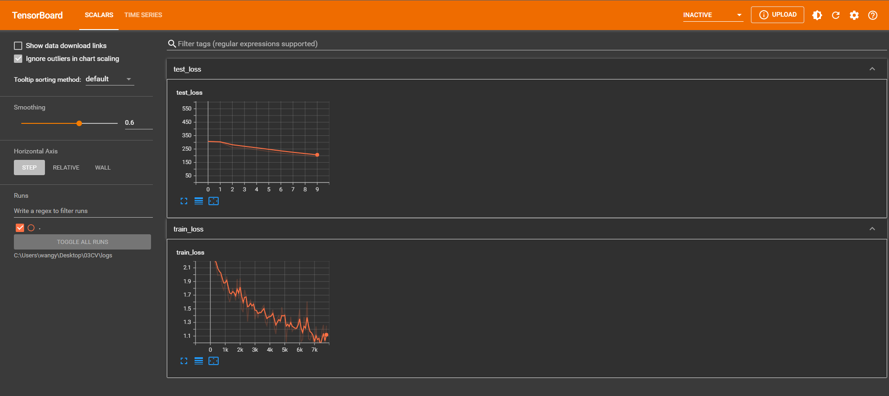

# 1. CIFAR 10 model 网络模型

① 下面用 CIFAR 10 model网络来完成分类问题，网络模型如下图所示。



# 2. DataLoader加载数据集


```python
import torchvision
from torch.utils.data import DataLoader
import torch.nn as nn

train_data = torchvision.datasets.CIFAR10("./dataset", transform=torchvision.transforms.ToTensor(),
                                          train=True, download=True)
test_data = torchvision.datasets.CIFAR10("./dataset", transform=torchvision.transforms.ToTensor(),
                                          train=False, download=True)
print("Train set Number are {}".format(len(train_data)))
print("Test set Number are {}".format(len(test_data)))
train_dataloader = DataLoader(train_data, batch_size=64, shuffle=True)
test_dataloader = DataLoader(test_data, batch_size=64, shuffle=True)
```

    Files already downloaded and verified
    Files already downloaded and verified
    Train set Number are 50000
    Test set Number are 10000
    

# 3. 测试网络正确


```python
import torch
from torch import nn

class Tudui(nn.Module):
    def __init__(self):
        super(Tudui, self).__init__()
        self.model1 = nn.Sequential(
            nn.Conv2d(3,32,5,1,2),  # 输入通道3，输出通道32，卷积核尺寸5×5，步长1，填充2
            nn.MaxPool2d(2),
            nn.Conv2d(32,32,5,1,2),
            nn.MaxPool2d(2),
            nn.Conv2d(32,64,5,1,2),
            nn.MaxPool2d(2),
            nn.Flatten(),  # 展平后变成 64*4*4 了
            nn.Linear(64*4*4,64),
            nn.Linear(64,10)
        )

    def forward(self, x):
        x = self.model1(x)
        return x

if __name__ == '__main__':
    tudui = Tudui()
    input = torch.ones((64,3,32,32))
    output = tudui(input)
    print(output.shape)  # 测试输出 测试输出的尺寸是不是我们想要的
```

    torch.Size([64, 10])
    

# 4. 网络训练数据


```python
import torchvision
from torch import nn
from torch.utils.data import DataLoader

# from model import * 相当于把 model中的所有内容写到这里，这里直接把 model 写在这里
class Tudui(nn.Module):
    def __init__(self):
        super(Tudui, self).__init__()
        self.model1 = nn.Sequential(
            nn.Conv2d(3,32,5,1,2),  # 输入通道3，输出通道32，卷积核尺寸5×5，步长1，填充2
            nn.MaxPool2d(2),
            nn.Conv2d(32,32,5,1,2),
            nn.MaxPool2d(2),
            nn.Conv2d(32,64,5,1,2),
            nn.MaxPool2d(2),
            nn.Flatten(),  # 展平后变成 64*4*4 了
            nn.Linear(64*4*4,64),
            nn.Linear(64,10)
        )

    def forward(self, x):
        x = self.model1(x)
        return x

# 准备数据集
train_data = torchvision.datasets.CIFAR10("./dataset",train=True,transform=torchvision.transforms.ToTensor(),download=True)
test_data = torchvision.datasets.CIFAR10("./dataset",train=False,transform=torchvision.transforms.ToTensor(),download=True)

# length 长度
train_data_size = len(train_data)
test_data_size = len(test_data)
# 如果train_data_size=10，则打印：训练数据集的长度为：10
print("训练数据集的长度：{}".format(train_data_size))
print("测试数据集的长度：{}".format(test_data_size))

# 利用 Dataloader 来加载数据集
train_dataloader = DataLoader(train_data, batch_size=64, shuffle=True)
test_dataloader = DataLoader(test_data, batch_size=64, shuffle=True)

# 创建网络模型
tudui = Tudui()

# 损失函数
loss_fn = nn.CrossEntropyLoss() # 交叉熵，fn 是 fuction 的缩写

# 优化器
learning = 0.01  # 1e-2 就是 0.01 的意思
optimizer = torch.optim.SGD(tudui.parameters(),learning)   # 随机梯度下降优化器

# 设置网络的一些参数
# 记录训练的次数
total_train_step = 0

# 训练的轮次
epoch = 10

for i in range(epoch):
    print("-----第 {} 轮训练开始-----".format(i+1))

    # 训练步骤开始
    for data in train_dataloader:
        imgs, targets = data
        outputs = tudui(imgs)
        loss = loss_fn(outputs, targets) # 计算实际输出与目标输出的差距

        # 优化器对模型调优
        optimizer.zero_grad()  # 梯度清零
        loss.backward() # 反向传播，计算损失函数的梯度
        optimizer.step()   # 根据梯度，对网络的参数进行调优

        total_train_step = total_train_step + 1
        #print("训练次数：{}，Loss：{}".format(total_train_step,loss))  # 方式一：获得loss值
        if total_train_step % 100 == 0:
            print("训练次数：{}，Loss：{}".format(total_train_step,loss.item()))  # 方式二：获得loss值
```

# 5. item作用


```python
import torch
a = torch.tensor(5)
print(a)
print(a.item())
```

    tensor(5)
    5
    

# 6. 查看训练损失

① 在pytorch中，tensor有一个requires_grad参数，如果设置为True，则反向传播时，该tensor就会自动求导。

② tensor的requires_grad的属性默认为False，若一个节点（叶子变量：自己创建的tensor）requires_grad被设置为True，那么所有依赖它的节点requires_grad都为True（即使其他相依赖的tensor的requires_grad = False）

③ 当requires_grad设置为False时，反向传播时就不会自动求导了，因此大大节约了显存或者说内存。

④ with torch.no_grad的作用在该模块下，所有计算得出的tensor的requires_grad都自动设置为False。

⑤ 即使一个tensor（命名为x）的requires_grad = True，在with torch.no_grad计算，由x得到的新tensor（命名为w-标量）requires_grad也为False，且grad_fn也为None,即不会对w求导。

⑥ torch.no_grad()：停止计算梯度，不能进行反向传播。


```python
import torchvision
import torch
from torch import nn
from torch.utils.data import DataLoader
from torch.utils.tensorboard import SummaryWriter

# from model import * 相当于把 model中的所有内容写到这里，这里直接把 model 写在这里
class Tudui(nn.Module):
    def __init__(self):
        super(Tudui, self).__init__()        
        self.model1 = nn.Sequential(
            nn.Conv2d(3,32,5,1,2),  # 输入通道3，输出通道32，卷积核尺寸5×5，步长1，填充2    
            nn.MaxPool2d(2),
            nn.Conv2d(32,32,5,1,2),
            nn.MaxPool2d(2),
            nn.Conv2d(32,64,5,1,2),
            nn.MaxPool2d(2),
            nn.Flatten(),  # 展平后变成 64*4*4 了
            nn.Linear(64*4*4,64),
            nn.Linear(64,10)
        )
        
    def forward(self, x):
        x = self.model1(x)
        return x

# 准备数据集
train_data = torchvision.datasets.CIFAR10("./dataset",train=True,transform=torchvision.transforms.ToTensor(),download=True)       
test_data = torchvision.datasets.CIFAR10("./dataset",train=False,transform=torchvision.transforms.ToTensor(),download=True)       

# length 长度
train_data_size = len(train_data)
test_data_size = len(test_data)
# 如果train_data_size=10，则打印：训练数据集的长度为：10
print("训练数据集的长度：{}".format(train_data_size))
print("测试数据集的长度：{}".format(test_data_size))

# 利用 Dataloader 来加载数据集
train_dataloader = DataLoader(train_data, batch_size=64)        
test_dataloader = DataLoader(test_data, batch_size=64)

# 创建网络模型
tudui = Tudui() 

# 损失函数
loss_fn = nn.CrossEntropyLoss() # 交叉熵，fn 是 fuction 的缩写

# 优化器
learning = 0.01  # 1e-2 就是 0.01 的意思
optimizer = torch.optim.SGD(tudui.parameters(),learning)   # 随机梯度下降优化器  

# 设置网络的一些参数
# 记录训练的次数
total_train_step = 0
# 记录测试的次数
total_test_step = 0

# 训练的轮次
epoch = 10

# 添加 tensorboard
writer = SummaryWriter("logs")

for i in range(epoch):
    print("-----第 {} 轮训练开始-----".format(i+1))
    
    # 训练步骤开始
    for data in train_dataloader:
        imgs, targets = data
        outputs = tudui(imgs)
        loss = loss_fn(outputs, targets) # 计算实际输出与目标输出的差距
        
        # 优化器对模型调优
        optimizer.zero_grad()  # 梯度清零
        loss.backward() # 反向传播，计算损失函数的梯度
        optimizer.step()   # 根据梯度，对网络的参数进行调优
        
        total_train_step = total_train_step + 1
        if total_train_step % 100 == 0:
            print("训练次数：{}，Loss：{}".format(total_train_step,loss.item()))  # 方式二：获得loss值
            writer.add_scalar("train_loss",loss.item(),total_train_step)
    
    # 测试步骤开始（每一轮训练后都查看在测试数据集上的loss情况）
    total_test_loss = 0
    with torch.no_grad():  # 没有梯度计算，节约内存
        for data in test_dataloader: # 测试数据集提取数据
            imgs, targets = data
            outputs = tudui(imgs)
            loss = loss_fn(outputs, targets) # 仅data数据在网络模型上的损失
            total_test_loss = total_test_loss + loss.item() # 所有loss
    print("整体测试集上的Loss：{}".format(total_test_loss))
    writer.add_scalar("test_loss",total_test_loss,total_test_step)
    total_test_step = total_test_step + 1
        
writer.close()
```

    Files already downloaded and verified
    Files already downloaded and verified
    训练数据集的长度：50000
    测试数据集的长度：10000
    -----第 1 轮训练开始-----
    训练次数：100，Loss：2.2818071842193604
    训练次数：200，Loss：2.267061471939087
    训练次数：300，Loss：2.2060177326202393
    训练次数：400，Loss：2.1160497665405273
    训练次数：500，Loss：2.03908371925354
    训练次数：600，Loss：2.0013811588287354
    训练次数：700，Loss：1.971280574798584
    整体测试集上的Loss：311.444508433342
    -----第 2 轮训练开始-----
    训练次数：800，Loss：1.8406707048416138
    训练次数：900，Loss：1.835253357887268
    训练次数：1000，Loss：1.9193772077560425
    训练次数：1100，Loss：1.9817758798599243
    训练次数：1200，Loss：1.6866414546966553
    训练次数：1300，Loss：1.6833062171936035
    训练次数：1400，Loss：1.7423250675201416
    训练次数：1500，Loss：1.7910836935043335
    整体测试集上的Loss：295.83529579639435
    -----第 3 轮训练开始-----
    训练次数：1600，Loss：1.7340000867843628
    训练次数：1700，Loss：1.6623749732971191
    训练次数：1800，Loss：1.9103188514709473
    训练次数：1900，Loss：1.722930908203125
    训练次数：2000，Loss：1.8943604230880737
    训练次数：2100，Loss：1.4975690841674805
    训练次数：2200，Loss：1.464676856994629
    训练次数：2300，Loss：1.7708508968353271
    整体测试集上的Loss：273.4990575313568
    -----第 4 轮训练开始-----
    训练次数：2400，Loss：1.7362182140350342
    训练次数：2500，Loss：1.3517616987228394
    训练次数：2600，Loss：1.5586233139038086
    训练次数：2700，Loss：1.6879914999008179
    训练次数：2800，Loss：1.469564437866211
    训练次数：2900，Loss：1.5893890857696533
    训练次数：3000，Loss：1.352890968322754
    训练次数：3100，Loss：1.4961837530136108
    整体测试集上的Loss：270.01156997680664
    -----第 5 轮训练开始-----
    训练次数：3200，Loss：1.3372247219085693
    训练次数：3300，Loss：1.4689146280288696
    训练次数：3400，Loss：1.4240412712097168
    训练次数：3500，Loss：1.5419731140136719
    训练次数：3600，Loss：1.5850610733032227
    训练次数：3700，Loss：1.343977451324463
    训练次数：3800，Loss：1.3023576736450195
    训练次数：3900，Loss：1.4324713945388794
    整体测试集上的Loss：257.1781986951828
    -----第 6 轮训练开始-----
    训练次数：4000，Loss：1.3752213716506958
    训练次数：4100，Loss：1.4291632175445557
    训练次数：4200，Loss：1.5042070150375366
    训练次数：4300，Loss：1.1800527572631836
    训练次数：4400，Loss：1.1353368759155273
    训练次数：4500，Loss：1.3278626203536987
    训练次数：4600，Loss：1.385879397392273
    整体测试集上的Loss：243.80352401733398
    -----第 7 轮训练开始-----
    训练次数：4700，Loss：1.3193678855895996
    训练次数：4800，Loss：1.5091830492019653
    训练次数：4900，Loss：1.390406608581543
    训练次数：5000，Loss：1.377677083015442
    训练次数：5100，Loss：0.9832243919372559
    训练次数：5200，Loss：1.306634545326233
    训练次数：5300，Loss：1.2060096263885498
    训练次数：5400，Loss：1.3645224571228027
    整体测试集上的Loss：227.03500604629517
    -----第 8 轮训练开始-----
    训练次数：5500，Loss：1.2007256746292114
    训练次数：5600，Loss：1.2000162601470947
    训练次数：5700，Loss：1.217725157737732
    训练次数：5800，Loss：1.2193546295166016
    训练次数：5900，Loss：1.344832420349121
    训练次数：6000，Loss：1.5032548904418945
    训练次数：6100，Loss：0.9945251941680908
    训练次数：6200，Loss：1.0842390060424805
    整体测试集上的Loss：210.75880527496338
    -----第 9 轮训练开始-----
    训练次数：6300，Loss：1.3924059867858887
    训练次数：6400，Loss：1.08247971534729
    训练次数：6500，Loss：1.6116385459899902
    训练次数：6600，Loss：1.0441133975982666
    训练次数：6700，Loss：1.0808278322219849
    训练次数：6800，Loss：1.1203839778900146
    训练次数：6900，Loss：1.065340518951416
    训练次数：7000，Loss：0.8646073341369629
    整体测试集上的Loss：200.43587028980255
    -----第 10 轮训练开始-----
    训练次数：7100，Loss：1.2311145067214966
    训练次数：7200，Loss：0.9793491363525391
    训练次数：7300，Loss：1.1264833211898804
    训练次数：7400，Loss：0.8558132648468018
    训练次数：7500，Loss：1.1851539611816406
    训练次数：7600，Loss：1.2427409887313843
    训练次数：7700，Loss：0.8233367204666138
    训练次数：7800，Loss：1.2412829399108887
    整体测试集上的Loss：194.5557427406311
    

① 在 Anaconda 终端里面，激活py3.6.3环境，再输入 tensorboard --logdir=C:\Users\wangy\Desktop\03CV\logs 命令，将网址赋值浏览器的网址栏，回车，即可查看tensorboard显示日志情况。


# 7. 保存每一轮后参数


```python
import torchvision
import torch
from torch import nn
from torch.utils.data import DataLoader
from torch.utils.tensorboard import SummaryWriter

# from model import * 相当于把 model中的所有内容写到这里，这里直接把 model 写在这里
class Tudui(nn.Module):
    def __init__(self):
        super(Tudui, self).__init__()        
        self.model1 = nn.Sequential(
            nn.Conv2d(3,32,5,1,2),  # 输入通道3，输出通道32，卷积核尺寸5×5，步长1，填充2    
            nn.MaxPool2d(2),
            nn.Conv2d(32,32,5,1,2),
            nn.MaxPool2d(2),
            nn.Conv2d(32,64,5,1,2),
            nn.MaxPool2d(2),
            nn.Flatten(),  # 展平后变成 64*4*4 了
            nn.Linear(64*4*4,64),
            nn.Linear(64,10)
        )
        
    def forward(self, x):
        x = self.model1(x)
        return x

# 准备数据集
train_data = torchvision.datasets.CIFAR10("./dataset",train=True,transform=torchvision.transforms.ToTensor(),download=True)       
test_data = torchvision.datasets.CIFAR10("./dataset",train=False,transform=torchvision.transforms.ToTensor(),download=True)       

# length 长度
train_data_size = len(train_data)
test_data_size = len(test_data)
# 如果train_data_size=10，则打印：训练数据集的长度为：10
print("训练数据集的长度：{}".format(train_data_size))
print("测试数据集的长度：{}".format(test_data_size))

# 利用 Dataloader 来加载数据集
train_dataloader = DataLoader(train_data, batch_size=64)        
test_dataloader = DataLoader(test_data, batch_size=64)

# 创建网络模型
tudui = Tudui() 

# 损失函数
loss_fn = nn.CrossEntropyLoss() # 交叉熵，fn 是 fuction 的缩写

# 优化器
learning = 0.01  # 1e-2 就是 0.01 的意思
optimizer = torch.optim.SGD(tudui.parameters(),learning)   # 随机梯度下降优化器  

# 设置网络的一些参数
# 记录训练的次数
total_train_step = 0
# 记录测试的次数
total_test_step = 0

# 训练的轮次
epoch = 10

# 添加 tensorboard
writer = SummaryWriter("logs")

for i in range(epoch):
    print("-----第 {} 轮训练开始-----".format(i+1))
    
    # 训练步骤开始
    for data in train_dataloader:
        imgs, targets = data
        outputs = tudui(imgs)
        loss = loss_fn(outputs, targets) # 计算实际输出与目标输出的差距
        
        # 优化器对模型调优
        optimizer.zero_grad()  # 梯度清零
        loss.backward() # 反向传播，计算损失函数的梯度
        optimizer.step()   # 根据梯度，对网络的参数进行调优
        
        total_train_step = total_train_step + 1
        if total_train_step % 100 == 0:
            print("训练次数：{}，Loss：{}".format(total_train_step,loss.item()))  # 方式二：获得loss值
            writer.add_scalar("train_loss",loss.item(),total_train_step)
    
    # 测试步骤开始（每一轮训练后都查看在测试数据集上的loss情况）
    total_test_loss = 0
    with torch.no_grad():  # 没有梯度了
        for data in test_dataloader: # 测试数据集提取数据
            imgs, targets = data
            outputs = tudui(imgs)
            loss = loss_fn(outputs, targets) # 仅data数据在网络模型上的损失
            total_test_loss = total_test_loss + loss.item() # 所有loss
    print("整体测试集上的Loss：{}".format(total_test_loss))
    writer.add_scalar("test_loss",total_test_loss,total_test_step)
    total_test_step = total_test_step + 1
    
    torch.save(tudui, "./model/tudui_{}.pth".format(i)) # 保存每一轮训练后的结果
    print("模型已保存")
    
writer.close()
```

    Files already downloaded and verified
    Files already downloaded and verified
    训练数据集的长度：50000
    测试数据集的长度：10000
    -----第 1 轮训练开始-----
    训练次数：100，Loss：2.296692132949829
    训练次数：200，Loss：2.285885810852051
    训练次数：300，Loss：2.279501438140869
    训练次数：400，Loss：2.2302145957946777
    训练次数：500，Loss：2.1076254844665527
    训练次数：600，Loss：2.0241076946258545
    训练次数：700，Loss：2.0326571464538574
    整体测试集上的Loss：313.3945701122284
    模型已保存
    -----第 2 轮训练开始-----
    训练次数：800，Loss：1.8856056928634644
    训练次数：900，Loss：1.8258416652679443
    训练次数：1000，Loss：1.8736964464187622
    训练次数：1100，Loss：2.009686231613159
    训练次数：1200，Loss：1.7110859155654907
    训练次数：1300，Loss：1.639999508857727
    训练次数：1400，Loss：1.7460256814956665
    训练次数：1500，Loss：1.804326057434082
    整体测试集上的Loss：306.9472336769104
    模型已保存
    -----第 3 轮训练开始-----
    训练次数：1600，Loss：1.7464873790740967
    训练次数：1700，Loss：1.6793572902679443
    训练次数：1800，Loss：1.9503461122512817
    训练次数：1900，Loss：1.7317644357681274
    训练次数：2000，Loss：1.9306591749191284
    训练次数：2100，Loss：1.5165047645568848
    训练次数：2200，Loss：1.459275722503662
    训练次数：2300，Loss：1.79405677318573
    整体测试集上的Loss：263.37182998657227
    模型已保存
    -----第 4 轮训练开始-----
    训练次数：2400，Loss：1.7481664419174194
    训练次数：2500，Loss：1.3587579727172852
    训练次数：2600，Loss：1.5589655637741089
    训练次数：2700，Loss：1.6773592233657837
    训练次数：2800，Loss：1.5090978145599365
    训练次数：2900，Loss：1.539999008178711
    训练次数：3000，Loss：1.354047417640686
    训练次数：3100，Loss：1.4937833547592163
    整体测试集上的Loss：252.46941196918488
    模型已保存
    -----第 5 轮训练开始-----
    训练次数：3200，Loss：1.3801052570343018
    训练次数：3300，Loss：1.4397848844528198
    训练次数：3400，Loss：1.46108078956604
    训练次数：3500，Loss：1.5322155952453613
    训练次数：3600，Loss：1.566237211227417
    训练次数：3700，Loss：1.3101667165756226
    训练次数：3800，Loss：1.2599278688430786
    训练次数：3900，Loss：1.4321829080581665
    整体测试集上的Loss：243.0005919933319
    模型已保存
    -----第 6 轮训练开始-----
    训练次数：4000，Loss：1.3768717050552368
    训练次数：4100，Loss：1.4406071901321411
    训练次数：4200，Loss：1.5087004899978638
    训练次数：4300，Loss：1.1848419904708862
    训练次数：4400，Loss：1.1364362239837646
    训练次数：4500，Loss：1.3455544710159302
    训练次数：4600，Loss：1.40190851688385
    整体测试集上的Loss：229.64346647262573
    模型已保存
    -----第 7 轮训练开始-----
    训练次数：4700，Loss：1.2932283878326416
    训练次数：4800，Loss：1.4792245626449585
    训练次数：4900，Loss：1.3620022535324097
    训练次数：5000，Loss：1.3700700998306274
    训练次数：5100，Loss：0.9695762991905212
    训练次数：5200，Loss：1.312595009803772
    训练次数：5300，Loss：1.2064651250839233
    训练次数：5400，Loss：1.3512318134307861
    整体测试集上的Loss：218.9336529970169
    模型已保存
    -----第 8 轮训练开始-----
    训练次数：5500，Loss：1.1977111101150513
    训练次数：5600，Loss：1.2471140623092651
    训练次数：5700，Loss：1.156531810760498
    训练次数：5800，Loss：1.2149838209152222
    训练次数：5900，Loss：1.2761603593826294
    训练次数：6000，Loss：1.495023250579834
    训练次数：6100，Loss：1.0265220403671265
    训练次数：6200，Loss：1.0587254762649536
    整体测试集上的Loss：209.12245571613312
    模型已保存
    -----第 9 轮训练开始-----
    训练次数：6300，Loss：1.44582200050354
    训练次数：6400，Loss：1.0848979949951172
    训练次数：6500，Loss：1.5730582475662231
    训练次数：6600，Loss：1.0684460401535034
    训练次数：6700，Loss：1.0620619058609009
    训练次数：6800，Loss：1.1571838855743408
    训练次数：6900，Loss：1.0781376361846924
    训练次数：7000，Loss：0.8753705620765686
    整体测试集上的Loss：200.97392404079437
    模型已保存
    -----第 10 轮训练开始-----
    训练次数：7100，Loss：1.237581729888916
    训练次数：7200，Loss：0.9725397229194641
    训练次数：7300，Loss：1.0951743125915527
    训练次数：7400，Loss：0.8216850161552429
    训练次数：7500，Loss：1.2100721597671509
    训练次数：7600，Loss：1.2381412982940674
    训练次数：7700，Loss：0.8831480145454407
    训练次数：7800，Loss：1.2118467092514038
    整体测试集上的Loss：194.03061652183533
    模型已保存
    

# 8. argmax作用


```python
import torch
outputs = torch.tensor([[0.1,0.2],
                        [0.05,0.4]])
print(outputs.argmax(0))  # 竖着看，最大值的索引
print(outputs.argmax(1))  # 横着看，最大值的索引
preds = outputs.argmax(0)
targets = torch.tensor([0,1])
print((preds == targets).sum()) # 对应位置相等的个数
```

    tensor([0, 1])
    tensor([1, 1])
    tensor(2)
    

# 9. 打印正确率


```python
import torchvision
import torch
from torch import nn
from torch.utils.data import DataLoader
from torch.utils.tensorboard import SummaryWriter

# from model import * 相当于把 model中的所有内容写到这里，这里直接把 model 写在这里
class Tudui(nn.Module):
    def __init__(self):
        super(Tudui, self).__init__()        
        self.model1 = nn.Sequential(
            nn.Conv2d(3,32,5,1,2),  # 输入通道3，输出通道32，卷积核尺寸5×5，步长1，填充2    
            nn.MaxPool2d(2),
            nn.Conv2d(32,32,5,1,2),
            nn.MaxPool2d(2),
            nn.Conv2d(32,64,5,1,2),
            nn.MaxPool2d(2),
            nn.Flatten(),  # 展平后变成 64*4*4 了
            nn.Linear(64*4*4,64),
            nn.Linear(64,10)
        )
        
    def forward(self, x):
        x = self.model1(x)
        return x

# 准备数据集
train_data = torchvision.datasets.CIFAR10("./dataset",train=True,transform=torchvision.transforms.ToTensor(),download=True)       
test_data = torchvision.datasets.CIFAR10("./dataset",train=False,transform=torchvision.transforms.ToTensor(),download=True)       

# length 长度
train_data_size = len(train_data)
test_data_size = len(test_data)
# 如果train_data_size=10，则打印：训练数据集的长度为：10
print("训练数据集的长度：{}".format(train_data_size))
print("测试数据集的长度：{}".format(test_data_size))

# 利用 Dataloader 来加载数据集
train_dataloader = DataLoader(train_data, batch_size=64)        
test_dataloader = DataLoader(test_data, batch_size=64)

# 创建网络模型
tudui = Tudui() 

# 损失函数
loss_fn = nn.CrossEntropyLoss() # 交叉熵，fn 是 fuction 的缩写

# 优化器
learning = 0.01  # 1e-2 就是 0.01 的意思
optimizer = torch.optim.SGD(tudui.parameters(),learning)   # 随机梯度下降优化器  

# 设置网络的一些参数
# 记录训练的次数
total_train_step = 0
# 记录测试的次数
total_test_step = 0

# 训练的轮次
epoch = 10

# 添加 tensorboard
writer = SummaryWriter("logs")

for i in range(epoch):
    print("-----第 {} 轮训练开始-----".format(i+1))
    
    # 训练步骤开始
    for data in train_dataloader:
        imgs, targets = data
        outputs = tudui(imgs)
        loss = loss_fn(outputs, targets) # 计算实际输出与目标输出的差距
        
        # 优化器对模型调优
        optimizer.zero_grad()  # 梯度清零
        loss.backward() # 反向传播，计算损失函数的梯度
        optimizer.step()   # 根据梯度，对网络的参数进行调优
        
        total_train_step = total_train_step + 1
        if total_train_step % 100 == 0:
            print("训练次数：{}，Loss：{}".format(total_train_step,loss.item()))  # 方式二：获得loss值
            writer.add_scalar("train_loss",loss.item(),total_train_step)
    
    # 测试步骤开始（每一轮训练后都查看在测试数据集上的loss情况）
    total_test_loss = 0
    total_accuracy = 0
    with torch.no_grad():  # 没有梯度了
        for data in test_dataloader: # 测试数据集提取数据
            imgs, targets = data
            outputs = tudui(imgs)
            loss = loss_fn(outputs, targets) # 仅data数据在网络模型上的损失
            total_test_loss = total_test_loss + loss.item() # 所有loss
            accuracy = (outputs.argmax(1) == targets).sum()
            total_accuracy = total_accuracy + accuracy
            
    print("整体测试集上的Loss：{}".format(total_test_loss))
    print("整体测试集上的正确率：{}".format(total_accuracy/test_data_size))
    writer.add_scalar("test_loss",total_test_loss,total_test_step)
    writer.add_scalar("test_accuracy",total_accuracy/test_data_size,total_test_step)  
    total_test_step = total_test_step + 1
    
    torch.save(tudui, "./model/tudui_{}.pth".format(i)) # 保存每一轮训练后的结果
    print("模型已保存")
    
writer.close()
```

    Files already downloaded and verified
    Files already downloaded and verified
    训练数据集的长度：50000
    测试数据集的长度：10000
    -----第 1 轮训练开始-----
    


    ---------------------------------------------------------------------------

    KeyboardInterrupt                         Traceback (most recent call last)

    Cell In[24], line 70
         68 for data in train_dataloader:
         69     imgs, targets = data
    ---> 70     outputs = tudui(imgs)
         71     loss = loss_fn(outputs, targets) # 计算实际输出与目标输出的差距
         73     # 优化器对模型调优
    

    File F:\miniconda\envs\yolov5\lib\site-packages\torch\nn\modules\module.py:889, in Module._call_impl(self, *input, **kwargs)
        887     result = self._slow_forward(*input, **kwargs)
        888 else:
    --> 889     result = self.forward(*input, **kwargs)
        890 for hook in itertools.chain(
        891         _global_forward_hooks.values(),
        892         self._forward_hooks.values()):
        893     hook_result = hook(self, input, result)
    

    Cell In[24], line 24, in Tudui.forward(self, x)
         23 def forward(self, x):
    ---> 24     x = self.model1(x)
         25     return x
    

    File F:\miniconda\envs\yolov5\lib\site-packages\torch\nn\modules\module.py:889, in Module._call_impl(self, *input, **kwargs)
        887     result = self._slow_forward(*input, **kwargs)
        888 else:
    --> 889     result = self.forward(*input, **kwargs)
        890 for hook in itertools.chain(
        891         _global_forward_hooks.values(),
        892         self._forward_hooks.values()):
        893     hook_result = hook(self, input, result)
    

    File F:\miniconda\envs\yolov5\lib\site-packages\torch\nn\modules\container.py:119, in Sequential.forward(self, input)
        117 def forward(self, input):
        118     for module in self:
    --> 119         input = module(input)
        120     return input
    

    File F:\miniconda\envs\yolov5\lib\site-packages\torch\nn\modules\module.py:889, in Module._call_impl(self, *input, **kwargs)
        887     result = self._slow_forward(*input, **kwargs)
        888 else:
    --> 889     result = self.forward(*input, **kwargs)
        890 for hook in itertools.chain(
        891         _global_forward_hooks.values(),
        892         self._forward_hooks.values()):
        893     hook_result = hook(self, input, result)
    

    File F:\miniconda\envs\yolov5\lib\site-packages\torch\nn\modules\pooling.py:162, in MaxPool2d.forward(self, input)
        161 def forward(self, input: Tensor) -> Tensor:
    --> 162     return F.max_pool2d(input, self.kernel_size, self.stride,
        163                         self.padding, self.dilation, self.ceil_mode,
        164                         self.return_indices)
    

    File F:\miniconda\envs\yolov5\lib\site-packages\torch\_jit_internal.py:365, in boolean_dispatch.<locals>.fn(*args, **kwargs)
        363     return if_true(*args, **kwargs)
        364 else:
    --> 365     return if_false(*args, **kwargs)
    

    File F:\miniconda\envs\yolov5\lib\site-packages\torch\nn\functional.py:659, in _max_pool2d(input, kernel_size, stride, padding, dilation, ceil_mode, return_indices)
        657 if stride is None:
        658     stride = torch.jit.annotate(List[int], [])
    --> 659 return torch.max_pool2d(input, kernel_size, stride, padding, dilation, ceil_mode)
    

    KeyboardInterrupt: 


# 10. 特殊层作用

① model.train()和model.eval()的区别主要在于Batch Normalization和Dropout两层。

② 如果模型中有BN层(Batch Normalization）和 Dropout，需要在训练时添加model.train()。model.train()是保证BN层能够用到每一批数据的均值和方差。对于Dropout，model.train()是随机取一部分网络连接来训练更新参数。

③ 不启用 Batch Normalization 和 Dropout。
如果模型中有BN层(Batch Normalization）和Dropout，在测试时添加model.eval()。model.eval()是保证BN层能够用全部训练数据的均值和方差，即测试过程中要保证BN层的均值和方差不变。对于Dropout，model.eval()是利用到了所有网络连接，即不进行随机舍弃神经元。

④ 训练完train样本后，生成的模型model要用来测试样本。在model(test)之前，需要加上model.eval()，否则的话，有输入数据，即使不训练，它也会改变权值。这是model中含有BN层和Dropout所带来的的性质。

⑤ 在做one classification的时候，训练集和测试集的样本分布是不一样的，尤其需要注意这一点。


```python
import torchvision
import torch
from torch import nn
from torch.utils.data import DataLoader
from torch.utils.tensorboard import SummaryWriter

# from model import * 相当于把 model中的所有内容写到这里，这里直接把 model 写在这里
class Tudui(nn.Module):
    def __init__(self):
        super(Tudui, self).__init__()        
        self.model1 = nn.Sequential(
            nn.Conv2d(3,32,5,1,2),  # 输入通道3，输出通道32，卷积核尺寸5×5，步长1，填充2    
            nn.MaxPool2d(2),
            nn.Conv2d(32,32,5,1,2),
            nn.MaxPool2d(2),
            nn.Conv2d(32,64,5,1,2),
            nn.MaxPool2d(2),
            nn.Flatten(),  # 展平后变成 64*4*4 了
            nn.Linear(64*4*4,64),
            nn.Linear(64,10)
        )
        
    def forward(self, x):
        x = self.model1(x)
        return x

# 准备数据集
train_data = torchvision.datasets.CIFAR10("./dataset",train=True,transform=torchvision.transforms.ToTensor(),download=True)       
test_data = torchvision.datasets.CIFAR10("./dataset",train=False,transform=torchvision.transforms.ToTensor(),download=True)       

# length 长度
train_data_size = len(train_data)
test_data_size = len(test_data)
# 如果train_data_size=10，则打印：训练数据集的长度为：10
print("训练数据集的长度：{}".format(train_data_size))
print("测试数据集的长度：{}".format(test_data_size))

# 利用 Dataloader 来加载数据集
train_dataloader = DataLoader(train_data, batch_size=64)        
test_dataloader = DataLoader(test_data, batch_size=64)

# 创建网络模型
tudui = Tudui() 

# 损失函数
loss_fn = nn.CrossEntropyLoss() # 交叉熵，fn 是 fuction 的缩写

# 优化器
learning = 0.01  # 1e-2 就是 0.01 的意思
optimizer = torch.optim.SGD(tudui.parameters(),learning)   # 随机梯度下降优化器  

# 设置网络的一些参数
# 记录训练的次数
total_train_step = 0
# 记录测试的次数
total_test_step = 0

# 训练的轮次
epoch = 10

# 添加 tensorboard
writer = SummaryWriter("logs")

for i in range(epoch):
    print("-----第 {} 轮训练开始-----".format(i+1))
    
    # 训练步骤开始
    tudui.train() # 当网络中有dropout层、batchnorm层时，这些层能起作用
    for data in train_dataloader:
        imgs, targets = data
        outputs = tudui(imgs)
        loss = loss_fn(outputs, targets) # 计算实际输出与目标输出的差距
        
        # 优化器对模型调优
        optimizer.zero_grad()  # 梯度清零
        loss.backward() # 反向传播，计算损失函数的梯度
        optimizer.step()   # 根据梯度，对网络的参数进行调优
        
        total_train_step = total_train_step + 1
        if total_train_step % 100 == 0:
            print("训练次数：{}，Loss：{}".format(total_train_step,loss.item()))  # 方式二：获得loss值
            writer.add_scalar("train_loss",loss.item(),total_train_step)
    
    # 测试步骤开始（每一轮训练后都查看在测试数据集上的loss情况）
    tudui.eval()  # 当网络中有dropout层、batchnorm层时，这些层不能起作用
    total_test_loss = 0
    total_accuracy = 0
    with torch.no_grad():  # 没有梯度了
        for data in test_dataloader: # 测试数据集提取数据
            imgs, targets = data
            outputs = tudui(imgs)
            loss = loss_fn(outputs, targets) # 仅data数据在网络模型上的损失
            total_test_loss = total_test_loss + loss.item() # 所有loss
            accuracy = (outputs.argmax(1) == targets).sum()
            total_accuracy = total_accuracy + accuracy
            
    print("整体测试集上的Loss：{}".format(total_test_loss))
    print("整体测试集上的正确率：{}".format(total_accuracy/test_data_size))
    writer.add_scalar("test_loss",total_test_loss,total_test_step)
    writer.add_scalar("test_accuracy",total_accuracy/test_data_size,total_test_step)  
    total_test_step = total_test_step + 1
    
    torch.save(tudui, "./model/tudui_{}.pth".format(i)) # 保存每一轮训练后的结果
    #torch.save(tudui.state_dict(),"tudui_{}.path".format(i)) # 保存方式二         
    print("模型已保存")
    
writer.close()
```

    Files already downloaded and verified
    Files already downloaded and verified
    训练数据集的长度：50000
    测试数据集的长度：10000
    -----第 1 轮训练开始-----
    训练次数：100，Loss：2.2891650199890137
    训练次数：200，Loss：2.282130241394043
    训练次数：300，Loss：2.2610340118408203
    训练次数：400，Loss：2.181870222091675
    训练次数：500，Loss：2.0396902561187744
    训练次数：600，Loss：2.048051118850708
    训练次数：700，Loss：1.9985613822937012
    整体测试集上的Loss：311.35842967033386
    整体测试集上的正确率：0.28870001435279846
    模型已保存
    -----第 2 轮训练开始-----
    训练次数：800，Loss：1.864884853363037
    


    ---------------------------------------------------------------------------

    KeyboardInterrupt                         Traceback (most recent call last)

    Cell In[30], line 76
         74 # 优化器对模型调优
         75 optimizer.zero_grad()  # 梯度清零
    ---> 76 loss.backward() # 反向传播，计算损失函数的梯度
         77 optimizer.step()   # 根据梯度，对网络的参数进行调优
         79 total_train_step = total_train_step + 1
    

    File F:\miniconda\envs\yolov5\lib\site-packages\torch\tensor.py:245, in Tensor.backward(self, gradient, retain_graph, create_graph, inputs)
        236 if has_torch_function_unary(self):
        237     return handle_torch_function(
        238         Tensor.backward,
        239         (self,),
       (...)
        243         create_graph=create_graph,
        244         inputs=inputs)
    --> 245 torch.autograd.backward(self, gradient, retain_graph, create_graph, inputs=inputs)
    

    File F:\miniconda\envs\yolov5\lib\site-packages\torch\autograd\__init__.py:145, in backward(tensors, grad_tensors, retain_graph, create_graph, grad_variables, inputs)
        142 if retain_graph is None:
        143     retain_graph = create_graph
    --> 145 Variable._execution_engine.run_backward(
        146     tensors, grad_tensors_, retain_graph, create_graph, inputs,
        147     allow_unreachable=True, accumulate_grad=True)
    

    KeyboardInterrupt: 


```python
from torch.optim import SGD
import torch
import torchvision
from torch.utils.data import DataLoader
from torch.utils.tensorboard import SummaryWriter

class Tudui(nn.Module):
    def __init__(self):
        super(Tudui, self).__init__()
        self.model1 = nn.Sequential(
            nn.Conv2d(3,32,5,1,2),  # 输入通道3，输出通道32，卷积核尺寸5×5，步长1，填充2
            nn.MaxPool2d(2),
            nn.Conv2d(32,32,5,1,2),
            nn.MaxPool2d(2),
            nn.Conv2d(32,64,5,1,2),
            nn.MaxPool2d(2),
            nn.Flatten(),  # 展平后变成 64*4*4 了
            nn.Linear(64*4*4,64),
            nn.Linear(64,10)
        )

    def forward(self,x):
        x = self.model1(x)
        return x
# 准备数据集
train_data = torchvision.datasets.CIFAR10("./dataset",train=True,transform=torchvision.transforms.ToTensor(),download=True)
test_data = torchvision.datasets.CIFAR10("./dataset",train=False,transform=torchvision.transforms.ToTensor(),download=True)

# length 长度
train_data_size = len(train_data)
test_data_size = len(test_data)
# 如果train_data_size=10，则打印：训练数据集的长度为：10
print("训练数据集的长度：{}".format(train_data_size))
print("测试数据集的长度：{}".format(test_data_size))

# 利用 Dataloader 来加载数据集
train_dataloader = DataLoader(train_data, batch_size=64)
test_dataloader = DataLoader(test_data, batch_size=64)

tudui = Tudui()
loss_fn = nn.CrossEntropyLoss()

learning_rate = 0.01
total_train_step = 0
total_test_step = 0
epoch = 10
optimizer = SGD(params=tudui.parameters(), lr=learning_rate)
writer = SummaryWriter("./logs/Whole_Train")

for i in range(epoch):
    print("Epoch {} start".format(i+1))
    tudui.train()
    total_train_loss = 0
    for data in train_dataloader:
        ##
        imgs, targets = data
        outputs = tudui(imgs)

        loss = loss_fn(outputs, targets)

        optimizer.zero_grad()
        loss.backward()
        optimizer.step()

        total_train_step = total_train_step + 1
        if total_train_step % 100 == 0:
            print("训练次数：{}，Loss：{}".format(total_train_step,loss.item()))  # 方式二：获得loss值
            writer.add_scalar("train_loss",loss.item(),total_train_step)

    tudui.eval()
    total_test_loss = 0
    Total_Accuracy = 0
    with torch.no_grad():
        for data in test_dataloader:
            imgs, targets = data
            outputs = tudui(imgs)
            loss = loss_fn(outputs, targets)
            total_test_loss = total_test_loss + loss.item()
            accuracy = ((outputs.argmax(1) == targets).sum()/test_data_size)
            Total_Accuracy = Total_Accuracy + accuracy
    print("Test Loss {}".format(total_test_loss))
    print("Test Accuracy {}".format(Total_Accuracy))
    writer.add_scalar("Test Loss", total_test_loss, total_test_step)
    writer.add_scalar("Test Accuracy", Total_Accuracy, total_test_step)
    total_test_step = total_test_step + 1
    torch.save(tudui, "./model/tudui_{}".format(i))

    print("模型保存完毕")

writer.close()
```

    Files already downloaded and verified
    Files already downloaded and verified
    训练数据集的长度：50000
    测试数据集的长度：10000
    Epoch 1 start
    Picture 100 , Loss 2.2941770553588867
    Picture 200 , Loss 2.2848846912384033
    Picture 300 , Loss 2.259817361831665
    Picture 400 , Loss 2.1827566623687744
    Picture 500 , Loss 2.037668228149414
    Picture 600 , Loss 2.059863567352295
    Picture 700 , Loss 1.9232399463653564
    Test Loss 302.2341948747635
    Test Accuracy 0.31800007820129395
    模型保存完毕
    Epoch 2 start
    Picture 800 , Loss 1.8260973691940308
    Picture 900 , Loss 1.7924437522888184
    Picture 1000 , Loss 1.9194406270980835
    Picture 1100 , Loss 1.9326812028884888
    Picture 1200 , Loss 1.6951795816421509
    Picture 1300 , Loss 1.6465996503829956
    Picture 1400 , Loss 1.7238080501556396
    Picture 1500 , Loss 1.7729756832122803
    Test Loss 278.71068692207336
    Test Accuracy 0.3671000301837921
    模型保存完毕
    Epoch 3 start
    Picture 1600 , Loss 1.705325961112976
    Picture 1700 , Loss 1.6539441347122192
    Picture 1800 , Loss 1.9378607273101807
    Picture 1900 , Loss 1.7367992401123047
    Picture 2000 , Loss 1.8841522932052612
    Picture 2100 , Loss 1.5182130336761475
    Picture 2200 , Loss 1.4632054567337036
    Picture 2300 , Loss 1.7483986616134644
    Test Loss 255.28078973293304
    Test Accuracy 0.4175001084804535
    模型保存完毕
    Epoch 4 start
    Picture 2400 , Loss 1.7363675832748413
    Picture 2500 , Loss 1.3317729234695435
    Picture 2600 , Loss 1.6025588512420654
    Picture 2700 , Loss 1.654605507850647
    Picture 2800 , Loss 1.5651419162750244
    Picture 2900 , Loss 1.6080172061920166
    Picture 3000 , Loss 1.3736324310302734
    Picture 3100 , Loss 1.5448280572891235
    Test Loss 246.35953533649445
    Test Accuracy 0.4296001195907593
    模型保存完毕
    Epoch 5 start
    Picture 3200 , Loss 1.3423157930374146
    Picture 3300 , Loss 1.4578744173049927
    Picture 3400 , Loss 1.4930287599563599
    Picture 3500 , Loss 1.5658748149871826
    Picture 3600 , Loss 1.5588352680206299
    Picture 3700 , Loss 1.346638798713684
    Picture 3800 , Loss 1.2452633380889893
    Picture 3900 , Loss 1.4230961799621582
    Test Loss 239.84223449230194
    Test Accuracy 0.44580015540122986
    模型保存完毕
    Epoch 6 start
    Picture 4000 , Loss 1.4089547395706177
    Picture 4100 , Loss 1.4414581060409546
    Picture 4200 , Loss 1.5286895036697388
    Picture 4300 , Loss 1.2384682893753052
    Picture 4400 , Loss 1.1361709833145142
    Picture 4500 , Loss 1.3087061643600464
    Picture 4600 , Loss 1.4156991243362427
    Test Loss 235.95858919620514
    Test Accuracy 0.45379993319511414
    模型保存完毕
    Epoch 7 start
    Picture 4700 , Loss 1.3253601789474487
    Picture 4800 , Loss 1.530593752861023
    Picture 4900 , Loss 1.367636799812317
    Picture 5000 , Loss 1.4074701070785522
    Picture 5100 , Loss 0.9884268045425415
    Picture 5200 , Loss 1.2860769033432007
    Picture 5300 , Loss 1.1872339248657227
    Picture 5400 , Loss 1.3511030673980713
    Test Loss 230.7357712984085
    Test Accuracy 0.47259998321533203
    模型保存完毕
    Epoch 8 start
    Picture 5500 , Loss 1.2400048971176147
    Picture 5600 , Loss 1.1896859407424927
    Picture 5700 , Loss 1.1879096031188965
    Picture 5800 , Loss 1.1617904901504517
    Picture 5900 , Loss 1.3781458139419556
    Picture 6000 , Loss 1.5064095258712769
    Picture 6100 , Loss 1.0542035102844238
    Picture 6200 , Loss 1.145541787147522
    Test Loss 221.77024161815643
    Test Accuracy 0.49850010871887207
    模型保存完毕
    Epoch 9 start
    Picture 6300 , Loss 1.4566011428833008
    Picture 6400 , Loss 1.120107650756836
    Picture 6500 , Loss 1.5964128971099854
    Picture 6600 , Loss 1.0693364143371582
    Picture 6700 , Loss 1.072567105293274
    Picture 6800 , Loss 1.1645498275756836
    Picture 6900 , Loss 1.0754010677337646
    Picture 7000 , Loss 0.9179976582527161
    Test Loss 211.31433379650116
    Test Accuracy 0.5270003080368042
    模型保存完毕
    Epoch 10 start
    Picture 7100 , Loss 1.2785162925720215
    Picture 7200 , Loss 0.9440584778785706
    Picture 7300 , Loss 1.089547872543335
    Picture 7400 , Loss 0.8145696520805359
    Picture 7500 , Loss 1.1745930910110474
    Picture 7600 , Loss 1.2188255786895752
    Picture 7700 , Loss 0.8560433983802795
    Picture 7800 , Loss 1.2644808292388916
    Test Loss 201.86276698112488
    Test Accuracy 0.5460002422332764
    模型保存完毕
    
