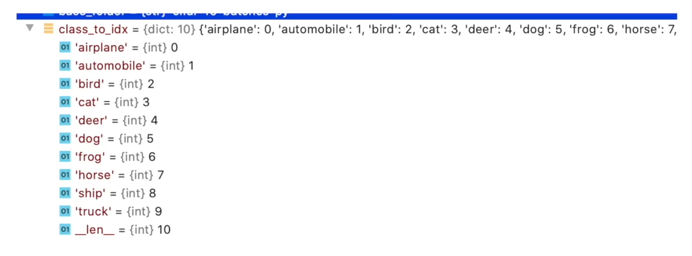

# 1. GPU训练30轮次


```python
import torchvision
import torch
from torch import nn
from torch.utils.data import DataLoader
from torch.utils.tensorboard import SummaryWriter
import time

# 定义训练的设备
#device = torch.device("cpu")
# device = torch.device("cuda")   # 使用 GPU 方式一
#device = torch.device("cuda:0") # 使用 GPU 方式二
device = torch.device("cuda" if torch.cuda.is_available() else "cpu")
print(device)
# from model import * 相当于把 model中的所有内容写到这里，这里直接把 model 写在这里
class Tudui(nn.Module):
    def __init__(self):
        super(Tudui, self).__init__()        
        self.model1 = nn.Sequential(
            nn.Conv2d(3,32,5,1,2),  # 输入通道3，输出通道32，卷积核尺寸5×5，步长1，填充2    
            nn.MaxPool2d(2),
            nn.Conv2d(32,32,5,1,2),
            nn.MaxPool2d(2),
            nn.Conv2d(32,64,5,1,2),
            nn.MaxPool2d(2),
            nn.Flatten(),  # 展平后变成 64*4*4 了
            nn.Linear(64*4*4,64),
            nn.Linear(64,10)
        )
        
    def forward(self, x):
        x = self.model1(x)
        return x

# 准备数据集
train_data = torchvision.datasets.CIFAR10("./dataset",train=True,transform=torchvision.transforms.ToTensor(),download=True)       
test_data = torchvision.datasets.CIFAR10("./dataset",train=False,transform=torchvision.transforms.ToTensor(),download=True)       

# length 长度
train_data_size = len(train_data)
test_data_size = len(test_data)
# 如果train_data_size=10，则打印：训练数据集的长度为：10
print("训练数据集的长度：{}".format(train_data_size))
print("测试数据集的长度：{}".format(test_data_size))

# 利用 Dataloader 来加载数据集
train_dataloader = DataLoader(train_data, batch_size=64)        
test_dataloader = DataLoader(test_data, batch_size=64)

# 创建网络模型
tudui = Tudui() 
tudui = tudui.to(device) # 也可以不赋值，直接 tudui.to(device) 


# 损失函数
loss_fn = nn.CrossEntropyLoss() # 交叉熵，fn 是 fuction 的缩写
loss_fn = loss_fn.to(device) # 也可以不赋值，直接loss_fn.to(device)

# 优化器
learning = 0.01  # 1e-2 就是 0.01 的意思
optimizer = torch.optim.SGD(tudui.parameters(),learning)   # 随机梯度下降优化器  

# 设置网络的一些参数
# 记录训练的次数
total_train_step = 0
# 记录测试的次数
total_test_step = 0

# 训练的轮次
epoch = 30

# 添加 tensorboard
writer = SummaryWriter("logs")
start_time = time.time()

for i in range(epoch):
    print("-----第 {} 轮训练开始-----".format(i+1))
    
    # 训练步骤开始
    tudui.train() # 当网络中有dropout层、batchnorm层时，这些层能起作用
    for data in train_dataloader:
        imgs, targets = data            
        imgs = imgs.to(device) # 也可以不赋值，直接 imgs.to(device)
        targets = targets.to(device) # 也可以不赋值，直接 targets.to(device)
        outputs = tudui(imgs)
        loss = loss_fn(outputs, targets) # 计算实际输出与目标输出的差距
        
        # 优化器对模型调优
        optimizer.zero_grad()  # 梯度清零
        loss.backward() # 反向传播，计算损失函数的梯度
        optimizer.step()   # 根据梯度，对网络的参数进行调优
        
        total_train_step = total_train_step + 1
        if total_train_step % 100 == 0:
            end_time = time.time()
            print(end_time - start_time) # 运行训练一百次后的时间间隔
            print("训练次数：{}，Loss：{}".format(total_train_step,loss.item()))  # 方式二：获得loss值
            writer.add_scalar("train_loss",loss.item(),total_train_step)
    
    # 测试步骤开始（每一轮训练后都查看在测试数据集上的loss情况）
    tudui.eval()  # 当网络中有dropout层、batchnorm层时，这些层不能起作用
    total_test_loss = 0
    total_accuracy = 0
    with torch.no_grad():  # 没有梯度了
        for data in test_dataloader: # 测试数据集提取数据
            imgs, targets = data # 数据放到cuda上
            imgs = imgs.to(device) # 也可以不赋值，直接 imgs.to(device)
            targets = targets.to(device) # 也可以不赋值，直接 targets.to(device)
            outputs = tudui(imgs)
            loss = loss_fn(outputs, targets) # 仅data数据在网络模型上的损失
            total_test_loss = total_test_loss + loss.item() # 所有loss
            accuracy = (outputs.argmax(1) == targets).sum()
            total_accuracy = total_accuracy + accuracy
            
    print("整体测试集上的Loss：{}".format(total_test_loss))
    print("整体测试集上的正确率：{}".format(total_accuracy/test_data_size))
    writer.add_scalar("test_loss",total_test_loss,total_test_step)
    writer.add_scalar("test_accuracy",total_accuracy/test_data_size,total_test_step)  
    total_test_step = total_test_step + 1
    
    torch.save(tudui, "./model/tudui_{}.pth".format(i)) # 保存每一轮训练后的结果
    #torch.save(tudui.state_dict(),"tudui_{}.path".format(i)) # 保存方式二         
    print("模型已保存")
    
writer.close()
```

    cuda
    Files already downloaded and verified
    Files already downloaded and verified
    训练数据集的长度：50000
    测试数据集的长度：10000
    -----第 1 轮训练开始-----
    9.2773916721344
    训练次数：100，Loss：2.2922215461730957
    10.43449354171753
    训练次数：200，Loss：2.27651309967041
    11.58763074874878
    训练次数：300，Loss：2.250119924545288
    12.750750303268433
    训练次数：400，Loss：2.1798858642578125
    13.906335592269897
    训练次数：500，Loss：2.0756919384002686
    15.112793207168579
    训练次数：600，Loss：2.066063642501831
    16.321762323379517
    训练次数：700，Loss：2.0095207691192627
    整体测试集上的Loss：314.64401710033417
    整体测试集上的正确率：0.27480000257492065
    模型已保存
    -----第 2 轮训练开始-----
    19.5603244304657
    训练次数：800，Loss：1.915218710899353
    20.800602197647095
    训练次数：900，Loss：1.8606102466583252
    22.091649293899536
    训练次数：1000，Loss：1.959482192993164
    23.423760890960693
    训练次数：1100，Loss：1.963309645652771
    24.715540170669556
    训练次数：1200，Loss：1.7586498260498047
    26.070411682128906
    训练次数：1300，Loss：1.6858268976211548
    27.436460494995117
    训练次数：1400，Loss：1.757112741470337
    28.847434520721436
    训练次数：1500，Loss：1.8101341724395752
    整体测试集上的Loss：313.4982237815857
    整体测试集上的正确率：0.2870999872684479
    模型已保存
    -----第 3 轮训练开始-----
    31.880878686904907
    训练次数：1600，Loss：1.7587233781814575
    33.290440797805786
    训练次数：1700，Loss：1.698535680770874
    34.628448247909546
    训练次数：1800，Loss：1.9523121118545532
    36.07649874687195
    训练次数：1900，Loss：1.7236361503601074
    37.476935625076294
    训练次数：2000，Loss：1.9410676956176758
    38.98871564865112
    训练次数：2100，Loss：1.5351353883743286
    40.432655572891235
    训练次数：2200，Loss：1.521033763885498
    41.96050190925598
    训练次数：2300，Loss：1.819918155670166
    整体测试集上的Loss：272.5541572570801
    整体测试集上的正确率：0.37109997868537903
    模型已保存
    -----第 4 轮训练开始-----
    45.08270883560181
    训练次数：2400，Loss：1.7729551792144775
    46.61815094947815
    训练次数：2500，Loss：1.3609297275543213
    48.145612478256226
    训练次数：2600，Loss：1.594908356666565
    49.67701864242554
    训练次数：2700，Loss：1.7107205390930176
    51.208035707473755
    训练次数：2800，Loss：1.5185452699661255
    52.7365562915802
    训练次数：2900，Loss：1.6133781671524048
    54.267667055130005
    训练次数：3000，Loss：1.361552119255066
    55.79305171966553
    训练次数：3100，Loss：1.546552062034607
    整体测试集上的Loss：263.998122215271
    整体测试集上的正确率：0.38609999418258667
    模型已保存
    -----第 5 轮训练开始-----
    58.926714181900024
    训练次数：3200，Loss：1.3398609161376953
    60.483036279678345
    训练次数：3300，Loss：1.4781923294067383
    61.933573484420776
    训练次数：3400，Loss：1.5312014818191528
    63.37413024902344
    训练次数：3500，Loss：1.5753616094589233
    64.83946084976196
    训练次数：3600，Loss：1.5781219005584717
    66.25241446495056
    训练次数：3700，Loss：1.3948934078216553
    67.6668393611908
    训练次数：3800，Loss：1.3173692226409912
    69.20693850517273
    训练次数：3900，Loss：1.4323067665100098
    整体测试集上的Loss：260.5852952003479
    整体测试集上的正确率：0.3978999853134155
    模型已保存
    -----第 6 轮训练开始-----
    72.30454754829407
    训练次数：4000，Loss：1.4455815553665161
    73.73065090179443
    训练次数：4100，Loss：1.4740594625473022
    75.16663312911987
    训练次数：4200，Loss：1.5037699937820435
    76.59486651420593
    训练次数：4300，Loss：1.2468544244766235
    78.02453088760376
    训练次数：4400，Loss：1.1782282590866089
    79.58300638198853
    训练次数：4500，Loss：1.3846200704574585
    81.0444724559784
    训练次数：4600，Loss：1.4157180786132812
    整体测试集上的Loss：245.7036782503128
    整体测试集上的正确率：0.43639999628067017
    模型已保存
    -----第 7 轮训练开始-----
    84.28241300582886
    训练次数：4700，Loss：1.3597453832626343
    85.75747776031494
    训练次数：4800，Loss：1.5629774332046509
    87.22039270401001
    训练次数：4900，Loss：1.4048423767089844
    88.68506813049316
    训练次数：5000，Loss：1.4466279745101929
    90.14663767814636
    训练次数：5100，Loss：1.058092474937439
    91.67761564254761
    训练次数：5200，Loss：1.3421937227249146
    93.2366042137146
    训练次数：5300，Loss：1.2775416374206543
    94.73752546310425
    训练次数：5400，Loss：1.4401798248291016
    整体测试集上的Loss：235.67259812355042
    整体测试集上的正确率：0.45579999685287476
    模型已保存
    -----第 8 轮训练开始-----
    98.03230142593384
    训练次数：5500，Loss：1.2174558639526367
    99.52643013000488
    训练次数：5600，Loss：1.2497260570526123
    101.022696018219
    训练次数：5700，Loss：1.255720853805542
    102.52064657211304
    训练次数：5800，Loss：1.300634741783142
    104.02238488197327
    训练次数：5900，Loss：1.4165256023406982
    105.52867269515991
    训练次数：6000，Loss：1.5566537380218506
    107.02724814414978
    训练次数：6100，Loss：1.0965425968170166
    108.66353297233582
    训练次数：6200，Loss：1.1693618297576904
    整体测试集上的Loss：224.88793444633484
    整体测试集上的正确率：0.4903999865055084
    模型已保存
    -----第 9 轮训练开始-----
    112.06260943412781
    训练次数：6300，Loss：1.5158206224441528
    113.59006309509277
    训练次数：6400，Loss：1.1806344985961914
    115.12294387817383
    训练次数：6500，Loss：1.6360235214233398
    116.66263508796692
    训练次数：6600，Loss：1.1695438623428345
    118.18753099441528
    训练次数：6700，Loss：1.1049422025680542
    119.71588444709778
    训练次数：6800，Loss：1.1868747472763062
    121.24337720870972
    训练次数：6900，Loss：1.1095229387283325
    122.77035570144653
    训练次数：7000，Loss：0.9527156352996826
    整体测试集上的Loss：212.7108417749405
    整体测试集上的正确率：0.519599974155426
    模型已保存
    -----第 10 轮训练开始-----
    126.01261878013611
    训练次数：7100，Loss：1.3148945569992065
    127.5860755443573
    训练次数：7200，Loss：1.0216310024261475
    128.9968991279602
    训练次数：7300，Loss：1.1456423997879028
    130.40875840187073
    训练次数：7400，Loss：0.8718101382255554
    131.81987404823303
    训练次数：7500，Loss：1.2655144929885864
    133.34447836875916
    训练次数：7600，Loss：1.2301058769226074
    134.77347493171692
    训练次数：7700，Loss：0.9075273871421814
    136.2003698348999
    训练次数：7800，Loss：1.2717028856277466
    整体测试集上的Loss：203.7318418622017
    整体测试集上的正确率：0.5430999994277954
    模型已保存
    -----第 11 轮训练开始-----
    139.4412853717804
    训练次数：7900，Loss：1.4049880504608154
    140.86889958381653
    训练次数：8000，Loss：1.17827308177948
    142.31042385101318
    训练次数：8100，Loss：1.0032248497009277
    143.84446573257446
    训练次数：8200，Loss：1.329817533493042
    145.88045716285706
    训练次数：8300，Loss：1.2705739736557007
    147.58371829986572
    训练次数：8400，Loss：1.119084358215332
    149.05867433547974
    训练次数：8500，Loss：1.2187689542770386
    150.570876121521
    训练次数：8600，Loss：0.9705434441566467
    整体测试集上的Loss：196.0337849855423
    整体测试集上的正确率：0.5618999600410461
    模型已保存
    -----第 12 轮训练开始-----
    153.92672181129456
    训练次数：8700，Loss：1.29877769947052
    155.3582146167755
    训练次数：8800，Loss：1.4374140501022339
    156.77497029304504
    训练次数：8900，Loss：1.070238709449768
    158.18745374679565
    训练次数：9000，Loss：1.2151118516921997
    159.5965301990509
    训练次数：9100，Loss：1.0470188856124878
    161.00560569763184
    训练次数：9200，Loss：1.0708043575286865
    162.41722798347473
    训练次数：9300，Loss：1.1067222356796265
    整体测试集上的Loss：190.1248676776886
    整体测试集上的正确率：0.5727999806404114
    模型已保存
    -----第 13 轮训练开始-----
    165.54921054840088
    训练次数：9400，Loss：0.8371962904930115
    166.9278392791748
    训练次数：9500，Loss：1.3196216821670532
    168.3107259273529
    训练次数：9600，Loss：1.1858576536178589
    169.6924901008606
    训练次数：9700，Loss：1.0977391004562378
    171.04053735733032
    训练次数：9800，Loss：0.972519040107727
    172.42354345321655
    训练次数：9900，Loss：1.0048872232437134
    173.8074553012848
    训练次数：10000，Loss：0.9202385544776917
    175.18983960151672
    训练次数：10100，Loss：0.9075751900672913
    整体测试集上的Loss：185.419435441494
    整体测试集上的正确率：0.5812999606132507
    模型已保存
    -----第 14 轮训练开始-----
    178.36386346817017
    训练次数：10200，Loss：0.8277685046195984
    179.75515842437744
    训练次数：10300，Loss：1.0224905014038086
    181.10245394706726
    训练次数：10400，Loss：1.212181568145752
    182.434410572052
    训练次数：10500，Loss：0.8420918583869934
    183.7953794002533
    训练次数：10600，Loss：0.9931487441062927
    185.15254640579224
    训练次数：10700，Loss：0.7320492267608643
    186.45367097854614
    训练次数：10800，Loss：0.8900468945503235
    187.81607031822205
    训练次数：10900，Loss：1.023807406425476
    整体测试集上的Loss：182.37908107042313
    整体测试集上的正确率：0.5880999565124512
    模型已保存
    -----第 15 轮训练开始-----
    192.10370516777039
    训练次数：11000，Loss：1.0534006357192993
    193.63755226135254
    训练次数：11100，Loss：0.9495770931243896
    195.1237814426422
    训练次数：11200，Loss：0.9650631546974182
    196.59343934059143
    训练次数：11300，Loss：1.166981816291809
    198.2409646511078
    训练次数：11400，Loss：0.8043670654296875
    199.84952902793884
    训练次数：11500，Loss：1.1728957891464233
    201.32909154891968
    训练次数：11600，Loss：0.968059778213501
    202.84444117546082
    训练次数：11700，Loss：0.9933903813362122
    整体测试集上的Loss：178.6891702413559
    整体测试集上的正确率：0.5981000065803528
    模型已保存
    -----第 16 轮训练开始-----
    206.2322232723236
    训练次数：11800，Loss：0.8944348096847534
    207.5067310333252
    训练次数：11900，Loss：1.0627272129058838
    208.80264163017273
    训练次数：12000，Loss：0.7980456352233887
    210.07833790779114
    训练次数：12100，Loss：1.0403642654418945
    211.3713653087616
    训练次数：12200，Loss：1.0067121982574463
    212.65789222717285
    训练次数：12300，Loss：0.9063336849212646
    214.0184199810028
    训练次数：12400，Loss：0.8673508167266846
    215.33879733085632
    训练次数：12500，Loss：0.7262577414512634
    整体测试集上的Loss：175.81848108768463
    整体测试集上的正确率：0.6055999994277954
    模型已保存
    -----第 17 轮训练开始-----
    218.48535990715027
    训练次数：12600，Loss：0.875216543674469
    219.77337980270386
    训练次数：12700，Loss：0.9486665725708008
    221.0732707977295
    训练次数：12800，Loss：0.8612248301506042
    222.36243104934692
    训练次数：12900，Loss：1.1761034727096558
    223.65138983726501
    训练次数：13000，Loss：1.0391649007797241
    224.9412763118744
    训练次数：13100，Loss：0.7106058597564697
    226.22602939605713
    训练次数：13200，Loss：0.7555099725723267
    整体测试集上的Loss：174.64851838350296
    整体测试集上的正确率：0.611799955368042
    模型已保存
    -----第 18 轮训练开始-----
    229.49547171592712
    训练次数：13300，Loss：1.0053129196166992
    230.95803928375244
    训练次数：13400，Loss：0.8016098737716675
    233.091698884964
    训练次数：13500，Loss：0.86066734790802
    234.6105992794037
    训练次数：13600，Loss：1.227513313293457
    235.95268845558167
    训练次数：13700，Loss：0.8190100193023682
    237.28843188285828
    训练次数：13800，Loss：0.976067304611206
    238.6114592552185
    训练次数：13900，Loss：0.7348334193229675
    239.9817864894867
    训练次数：14000，Loss：0.7855463027954102
    整体测试集上的Loss：172.14957070350647
    整体测试集上的正确率：0.6198999881744385
    模型已保存
    -----第 19 轮训练开始-----
    243.3237075805664
    训练次数：14100，Loss：0.9324216842651367
    244.61733770370483
    训练次数：14200，Loss：0.9003831148147583
    245.92270040512085
    训练次数：14300，Loss：0.9318834543228149
    247.22348165512085
    训练次数：14400，Loss：0.9479395747184753
    248.53488421440125
    训练次数：14500，Loss：0.9631010293960571
    249.82877707481384
    训练次数：14600，Loss：1.0814437866210938
    251.12646389007568
    训练次数：14700，Loss：0.7982433438301086
    252.42152047157288
    训练次数：14800，Loss：1.1565178632736206
    整体测试集上的Loss：171.2868248820305
    整体测试集上的正确率：0.6238999962806702
    模型已保存
    -----第 20 轮训练开始-----
    255.5669550895691
    训练次数：14900，Loss：0.616472065448761
    256.8484935760498
    训练次数：15000，Loss：0.8891832828521729
    258.1514415740967
    训练次数：15100，Loss：0.7352327704429626
    259.44594955444336
    训练次数：15200，Loss：0.9518799781799316
    260.75351572036743
    训练次数：15300，Loss：0.6620163917541504
    262.05141520500183
    训练次数：15400，Loss：0.9143882393836975
    263.36765122413635
    训练次数：15500，Loss：0.9650475978851318
    264.66382789611816
    训练次数：15600，Loss：0.839946985244751
    整体测试集上的Loss：170.5668552517891
    整体测试集上的正确率：0.6273999810218811
    模型已保存
    -----第 21 轮训练开始-----
    267.82178568840027
    训练次数：15700，Loss：0.8130989670753479
    269.1137201786041
    训练次数：15800，Loss：0.9106749892234802
    270.3938202857971
    训练次数：15900，Loss：0.8680423498153687
    271.68205738067627
    训练次数：16000，Loss：0.9683640003204346
    272.9647009372711
    训练次数：16100，Loss：0.6669973731040955
    274.24833822250366
    训练次数：16200，Loss：0.8860442042350769
    275.53278374671936
    训练次数：16300，Loss：0.6602413654327393
    276.83349418640137
    训练次数：16400，Loss：0.7498456239700317
    整体测试集上的Loss：170.85363018512726
    整体测试集上的正确率：0.6304999589920044
    模型已保存
    -----第 22 轮训练开始-----
    279.9924976825714
    训练次数：16500，Loss：0.9948211908340454
    281.2978353500366
    训练次数：16600，Loss：0.7802994251251221
    282.5973937511444
    训练次数：16700，Loss：0.8761452436447144
    283.8921904563904
    训练次数：16800，Loss：0.8053811192512512
    285.18568992614746
    训练次数：16900，Loss：0.609131395816803
    286.4895305633545
    训练次数：17000，Loss：1.27587890625
    287.78916120529175
    训练次数：17100，Loss：0.7293952107429504
    289.0867352485657
    训练次数：17200，Loss：0.694299578666687
    整体测试集上的Loss：172.07745170593262
    整体测试集上的正确率：0.6315000057220459
    模型已保存
    -----第 23 轮训练开始-----
    292.2076117992401
    训练次数：17300，Loss：0.9679889678955078
    293.5091607570648
    训练次数：17400，Loss：0.9247229695320129
    294.8179008960724
    训练次数：17500，Loss：0.6696553230285645
    296.1179165840149
    训练次数：17600，Loss：0.7180820107460022
    297.4164936542511
    训练次数：17700，Loss：0.7958592176437378
    298.7129397392273
    训练次数：17800，Loss：0.9271419644355774
    300.0105984210968
    训练次数：17900，Loss：0.8972586989402771
    整体测试集上的Loss：173.54166209697723
    整体测试集上的正确率：0.6291999816894531
    模型已保存
    -----第 24 轮训练开始-----
    303.2392928600311
    训练次数：18000，Loss：0.8286627531051636
    304.55252265930176
    训练次数：18100，Loss：0.593586802482605
    305.83210587501526
    训练次数：18200，Loss：0.8186187148094177
    307.1236689090729
    训练次数：18300，Loss：0.6360456347465515
    308.4325370788574
    训练次数：18400，Loss：0.6631812453269958
    309.71841406822205
    训练次数：18500，Loss：0.8070470094680786
    311.0025932788849
    训练次数：18600，Loss：0.5878391265869141
    312.29170179367065
    训练次数：18700，Loss：0.7148551344871521
    整体测试集上的Loss：175.6170426607132
    整体测试集上的正确率：0.62909996509552
    模型已保存
    -----第 25 轮训练开始-----
    315.4236493110657
    训练次数：18800，Loss：0.6716083288192749
    316.69576263427734
    训练次数：18900，Loss：0.5539373755455017
    317.99064469337463
    训练次数：19000，Loss：0.6071557402610779
    319.3024697303772
    训练次数：19100，Loss：0.5912332534790039
    320.59509110450745
    训练次数：19200，Loss：0.5537123680114746
    321.90632486343384
    训练次数：19300，Loss：0.7462666034698486
    323.2323296070099
    训练次数：19400，Loss：0.7194003462791443
    324.55122423171997
    训练次数：19500，Loss：0.6259980797767639
    整体测试集上的Loss：178.0026884675026
    整体测试集上的正确率：0.6280999779701233
    模型已保存
    -----第 26 轮训练开始-----
    327.67307305336
    训练次数：19600，Loss：0.7962989211082458
    328.99640703201294
    训练次数：19700，Loss：0.6326220631599426
    330.3077449798584
    训练次数：19800，Loss：0.770134449005127
    331.6095058917999
    训练次数：19900，Loss：0.8883574604988098
    332.91345953941345
    训练次数：20000，Loss：0.7803840041160583
    334.2182116508484
    训练次数：20100，Loss：0.8211448788642883
    335.5340051651001
    训练次数：20200，Loss：1.276759147644043
    336.8589541912079
    训练次数：20300，Loss：0.6993829011917114
    整体测试集上的Loss：181.263653755188
    整体测试集上的正确率：0.6273999810218811
    模型已保存
    -----第 27 轮训练开始-----
    340.04230666160583
    训练次数：20400，Loss：0.6653522253036499
    341.3264181613922
    训练次数：20500，Loss：0.6137014031410217
    342.5955126285553
    训练次数：20600，Loss：0.5042604804039001
    343.8924353122711
    训练次数：20700，Loss：0.7749633193016052
    345.1658527851105
    训练次数：20800，Loss：0.5234478712081909
    346.43514251708984
    训练次数：20900，Loss：0.6000707149505615
    347.70618081092834
    训练次数：21000，Loss：0.8035927414894104
    348.9824447631836
    训练次数：21100，Loss：0.6594854593276978
    整体测试集上的Loss：183.95134085416794
    整体测试集上的正确率：0.6261000037193298
    模型已保存
    -----第 28 轮训练开始-----
    352.1604325771332
    训练次数：21200，Loss：0.7331029176712036
    353.46611618995667
    训练次数：21300，Loss：0.688935399055481
    354.77497959136963
    训练次数：21400，Loss：0.6731831431388855
    356.0720715522766
    训练次数：21500，Loss：0.6425624489784241
    357.3882246017456
    训练次数：21600，Loss：0.6526855230331421
    358.68696427345276
    训练次数：21700，Loss：0.8538620471954346
    359.99944972991943
    训练次数：21800，Loss：0.6645375490188599
    整体测试集上的Loss：185.86426723003387
    整体测试集上的正确率：0.6240000128746033
    模型已保存
    -----第 29 轮训练开始-----
    363.0873782634735
    训练次数：21900，Loss：0.5095772743225098
    364.41119956970215
    训练次数：22000，Loss：0.6778963208198547
    365.70637559890747
    训练次数：22100，Loss：0.8909664750099182
    367.0008931159973
    训练次数：22200，Loss：0.5567125082015991
    368.37741708755493
    训练次数：22300，Loss：0.4569498896598816
    369.6740937232971
    训练次数：22400，Loss：0.7931104302406311
    371.00349164009094
    训练次数：22500，Loss：0.9623693823814392
    372.29779624938965
    训练次数：22600，Loss：0.38187649846076965
    整体测试集上的Loss：186.58430641889572
    整体测试集上的正确率：0.625
    模型已保存
    -----第 30 轮训练开始-----
    375.43526434898376
    训练次数：22700，Loss：0.7034490704536438
    376.7213249206543
    训练次数：22800，Loss：0.6910574436187744
    378.0193989276886
    训练次数：22900，Loss：0.815170168876648
    379.32540583610535
    训练次数：23000，Loss：0.5385629534721375
    380.59825229644775
    训练次数：23100，Loss：0.6333253383636475
    381.873170375824
    训练次数：23200，Loss：0.7739847898483276
    383.1424822807312
    训练次数：23300，Loss：0.77000892162323
    384.43037128448486
    训练次数：23400，Loss：0.6108602285385132
    整体测试集上的Loss：191.74027878046036
    整体测试集上的正确率：0.6226999759674072
    模型已保存
    

# 2. 验证狗是否识别

① 完整的模型验证(测试，demo)套路，利用已经训练好的模型，然后给它提供输入。


```python
import torchvision
from PIL import Image
from torch import nn
import torch

image_path = "imgs/dog.png"
image = Image.open(image_path) # PIL类型的Image
image = image.convert("RGB")  # 4通道的RGBA转为3通道的RGB图片
print(image)

transform = torchvision.transforms.Compose([torchvision.transforms.Resize((32,32)),   
                                            torchvision.transforms.ToTensor()])

image = transform(image)
print(image.shape)

class Tudui(nn.Module):
    def __init__(self):
        super(Tudui, self).__init__()        
        self.model1 = nn.Sequential(
            nn.Conv2d(3,32,5,1,2),
            nn.MaxPool2d(2),
            nn.Conv2d(32,32,5,1,2),
            nn.MaxPool2d(2),
            nn.Conv2d(32,64,5,1,2),
            nn.MaxPool2d(2),
            nn.Flatten(),
            nn.Linear(64*4*4,64),
            nn.Linear(64,10)
        )
        
    def forward(self, x):
        x = self.model1(x)
        return x

model = torch.load("model/tudui_29.pth",map_location=torch.device('cpu')) # GPU上训练的东西映射到CPU上    
print(model)
image = torch.reshape(image,(1,3,32,32)) # 转为四维，符合网络输入需求
model.eval()
with torch.no_grad():  # 不进行梯度计算，减少内存计算
    output = model(image)
output = model(image)
print(output)
print(output.argmax(1)) # 概率最大类别的输出
```

    <PIL.Image.Image image mode=RGB size=307x173 at 0x1A23417EDA0>
    torch.Size([3, 32, 32])
    Tudui(
      (model1): Sequential(
        (0): Conv2d(3, 32, kernel_size=(5, 5), stride=(1, 1), padding=(2, 2))
        (1): MaxPool2d(kernel_size=2, stride=2, padding=0, dilation=1, ceil_mode=False)
        (2): Conv2d(32, 32, kernel_size=(5, 5), stride=(1, 1), padding=(2, 2))
        (3): MaxPool2d(kernel_size=2, stride=2, padding=0, dilation=1, ceil_mode=False)
        (4): Conv2d(32, 64, kernel_size=(5, 5), stride=(1, 1), padding=(2, 2))
        (5): MaxPool2d(kernel_size=2, stride=2, padding=0, dilation=1, ceil_mode=False)
        (6): Flatten(start_dim=1, end_dim=-1)
        (7): Linear(in_features=1024, out_features=64, bias=True)
        (8): Linear(in_features=64, out_features=10, bias=True)
      )
    )
    tensor([[ 1.3921, -5.8952,  6.7765,  2.6106,  3.3179,  6.3351, -5.1229,  3.0367,
             -8.6725, -5.5459]], grad_fn=<AddmmBackward0>)
    tensor([2])
    

# 3. 验证飞机是否识别


```python
import torchvision
from PIL import Image
from torch import nn
import torch

image_path = "imgs/plane.png"
image = Image.open(image_path) # PIL类型的Image
image = image.convert("RGB")  # 4通道的RGBA转为3通道的RGB图片
print(image)

transform = torchvision.transforms.Compose([torchvision.transforms.Resize((32,32)),   
                                            torchvision.transforms.ToTensor()])

image = transform(image)
print(image.shape)

class Tudui(nn.Module):
    def __init__(self):
        super(Tudui, self).__init__()        
        self.model1 = nn.Sequential(
            nn.Conv2d(3,32,5,1,2),
            nn.MaxPool2d(2),
            nn.Conv2d(32,32,5,1,2),
            nn.MaxPool2d(2),
            nn.Conv2d(32,64,5,1,2),
            nn.MaxPool2d(2),
            nn.Flatten(),
            nn.Linear(64*4*4,64),
            nn.Linear(64,10)
        )
        
    def forward(self, x):
        x = self.model1(x)
        return x

model = torch.load("model/tudui_29.pth",map_location=torch.device('cpu')) # GPU上训练的东西映射到CPU上    
print(model)
image = torch.reshape(image,(1,3,32,32)) # 转为四维，符合网络输入需求
model.eval()
with torch.no_grad():  # 不进行梯度计算，减少内存计算
    output = model(image)
output = model(image)
print(output)
print(output.argmax(1)) # 概率最大类别的输出
```

    <PIL.Image.Image image mode=RGB size=245x181 at 0x1A236055908>
    torch.Size([3, 32, 32])
    Tudui(
      (model1): Sequential(
        (0): Conv2d(3, 32, kernel_size=(5, 5), stride=(1, 1), padding=(2, 2))
        (1): MaxPool2d(kernel_size=2, stride=2, padding=0, dilation=1, ceil_mode=False)
        (2): Conv2d(32, 32, kernel_size=(5, 5), stride=(1, 1), padding=(2, 2))
        (3): MaxPool2d(kernel_size=2, stride=2, padding=0, dilation=1, ceil_mode=False)
        (4): Conv2d(32, 64, kernel_size=(5, 5), stride=(1, 1), padding=(2, 2))
        (5): MaxPool2d(kernel_size=2, stride=2, padding=0, dilation=1, ceil_mode=False)
        (6): Flatten(start_dim=1, end_dim=-1)
        (7): Linear(in_features=1024, out_features=64, bias=True)
        (8): Linear(in_features=64, out_features=10, bias=True)
      )
    )
    tensor([[ 3.9218,  1.2536,  1.1701,  0.1064,  2.2779, -4.4623,  0.0393, -4.2867,
              2.3805, -2.1321]], grad_fn=<AddmmBackward0>)
    tensor([0])
    


